## 考点目录

### 牛客1

- D-Determine the Photo Position

  签到 

- B-Ball Dropping

  签到 计算几何->平面几何

- F-Find 3 friendly Integers

  抽屉原理 / 数位DP

- A-Alice and Bob

  博弈论->SG函数暴力

- H-Hash Function

  FFT

- K-Knowledge Test about Match

  二分图->贪心近似解 /  玄学

- I-Increase Sequence

  期望DP


### 牛客2

- D-Er Ba Game

  签到

- C-Draw Grids

  签到 找规律

- K-Stack

  贪心 平衡树

- F-Girlfriend

  计算几何->球交的体积

- I-Penguins

  双向BFS搜索


### 牛客3

- J-Counting Triangles

  ~~签到~~ 思维 图论

- E-Math

  数学(数论 韦达定理)

- F-24dian

  DFS 大模拟

- B-Black and White

  构造->最小生成树

- C-Minimum Grid

  二分图最大匹配 .


### 牛客4

- F-Just a joke

  博弈论->找规律 图论

- I-Inverse Pair

  逆序对 哈希优化

- J-Average

  二分答案 前缀和->平均数

- C-LCS

  思维 构造


### 牛客5

- H-Holding Two

  签到 构造 图论

- K-King of Range

  ST表 滑动区间

- B-Boxes

  概率 前缀和优化

- D-Double Strings

  组合数学 DP 字符串

- J-Jewels

  最大权完美匹配


### 牛客6

- I-Intervals on the Ring

  构造->德摩根律

- F-Hamberger Steak

  二分答案 贪心 模拟

- H-Hopping Rabbit

  扫描线 差分 桶排

- C-Delete Edge

  构造 数学


### 牛客7

- I-xay loves or

  签到 二进制

- H-xay loves count

  枚举->优化 

- F-xay loves trees

  树链剖分 .


### 牛客8

- E-Rise of Shadows

  签到 找规律

- A-Ares, Toilet Ares

  逆元 取模

- K-Yet Another Problem About Pi

  贪心 枚举

- D-Or

  位运算 枚举 数位DP


### 牛客9

- H-Happy Number

  签到 进制

- E-Eyjafjalla

  树链剖分 主席树 倍增


### 牛客10

- H-War of Inazuma(Easy Version)

  签到 规律->二进制 图论->分层

- F-Train Wreck

  贪心 链表 / 优先级队列+树


### 杭电1

- 1001-Mod, Or and Everything

  签到 同余

- 1005-Minimum spanning tree

  素数筛 前缀和 

- 1008-Maximum submatrix

  悬线法

- 1009-KD-graph

  构造->并查集

- 1006-Xor sum

  01字典树 .


### 杭电2

- 1012-I love 114514

  签到 字符串 / KMP

- 1005-I love string

  思维

- 1001-I love cube

  数列

- 1008-I love exam

  背包 模拟


### 杭电3

- 1011-Segment Tree with Pruning

  签到 记忆化搜索

- 1007-Photoshop Layer

  前缀和 链表

- 1004-Game on Plane

  博弈论 数学->平面计数

- 1009-Rise in Price

  玄学剪枝搜索 随机

- 1003-Forgiving Matching

  FFT 字符串


### 杭电4

- 1001-Calculus

  签到 数学->敛散性

- 1009-License Plate Recognition

  签到 BFS->联通块

- 1002-Kanade Loves Maze Designing

  签到 DFS 计数 取模

- 1008-Lawn of the Dead

  滑动区间 / 线段树

- 1004-Displaying Substring

  (SA / SAM) + 二分


### 杭电5

- 1006-Cute Tree

  签到 枚举(递归)

- 1003-VC Is All You Need

  签到 计算几何 思维

- 1007-Banzhuan

  签到 数列 逆元

- 1004-Another String

  字符串 滑动窗口 DP

- 1005-Random Walk 2

  概率DP 高斯消元

- 1009-Array

  权值线段树 / 树状数组 / +分块 /+计数优化 /+前缀和优化


### 杭电6

- 1001-Yes, Prime Minister

  素数筛 思维  / +二分

- 1005-Median

  思维 构造 中位数


### 杭电7

- 1010-Smzzl with Tropical Taste

  签到

- 1003-Fall with Trees

  签到 数列

- 1007-Link with Limit

  图->环

- 1008-Smzzl with Greedy Dnake

  模拟->方向

- 1006-Link with Grenade

  计算几何 物理

- 1005-Link with EQ

  前缀和 DP

- 1004-Link with Balls

  组合数学 / 生成函数


### 杭电8

- 1003-Ink on paper

  并查集 二分

- 1006-GCD Game

  博弈论 素数筛

- 1009-Singing Superstar

  贪心 + 字符串哈希 / Trie / AC自动机 

- 1004-Counting Stars

  线段树


### 杭电9

- 1003-Dota2 Pro Circuit

  思维 二分 滑动窗口

- 1007-Boring data structure problem

  链表 队列

- 1002-Just another board game

  博弈论

- 1010-Unfair contest

  思维


### 杭电10

- 1003-Pty loves lines

  计算几何 DP


## 牛客1

本场比赛无参赛，仅补题 (补题6题，未看题解前独立完成前两题(DB))

### D-Determine the Photo Position

签到题不解释……

```c++
#include <bits/stdc++.h>
// #pragma GCC optimize(2)
using namespace std;
typedef long long ll;
#define sc(x) scanf("%lld", &x)
#define il inline
#define mn 2010
ll n, m, a[mn][mn], cnt, ans;
signed main()
{
    sc(n), sc(m);
    for (ll i = 1; i <= n; ++i)
    {
        cnt = 0;
        for (ll j = 1; j <= n; ++j)
        {
            scanf("%1d", &a[i][j]);
            if (a[i][j] == 0)
            {
                ++cnt;
            }
            else
            {
                cnt = 0;
            }
            if (cnt >= m) //面向样例编程的>=3 WA了一发……
            {
                ++ans;
            }
        }
    }
    printf("%lld", ans);
    return 0;
}
```


### B-Ball Dropping

> 下面提供多种解法

Drop是易算的，主要是Stuck。基本解题思路：对下图，有两条边，每条边是两个直角三角形的斜边，对此可以构建两个等式①②如下：

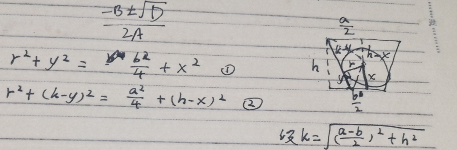

联立上面方程解$x$即可。

解法多样化……如果是补题，其实可以预先开挂用mupad计算一个解，有两种方法：(建议关掉Abbreviate Output)(当然这种方法仅建议用于验证答案，不建议真的拿来解题，毕竟真的打比赛可不能用mupad……)

```matlab
//方法一
k:=sqrt((a-b)^2/4+h^2):
eq1:=r^2+y^2-b^2/4-x^2:
eq2:=r^2+(k-y)^2-a^2/4-(h-x)^2:
assume([h>1,2*r<h,a>b,r>1,a>1,b>1,h>1]);
ans:=solve([eq1,eq2],[x,y]);//通解
anst:=solve(subsex([eq1,eq2],[r=2,a=8,b=2,h=5]),[x,y]):
float(anst) //特解
```

```mupad
//方法二
k:=sqrt((a-b)^2/4+h^2):
eq1:=r^2+y^2-b^2/4-x^2:
eq2:=r^2+(k-y)^2-a^2/4-(h-x)^2:
stp:=simplify(eq2-eq1):
y0:=solve(stp,y):
eq3:=subsex(eq1,y=y0):
ans:=solve(eq3,x);//通解
```

以方法二为例，解得：

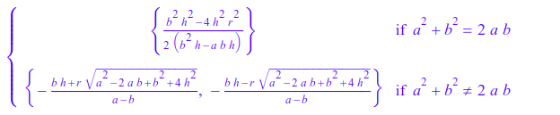

由于$a^2+b^2=2ab$当且仅当$(a-b)^2=0$即$a=b$，所以排除掉上面的解。对于下面的左边解，可以发现$a-b>0$，则整个式子必然$<0$，可以舍去。所以取右边的解。代码如下：

```c++
#include <bits/stdc++.h>
using namespace std;
typedef long long ll;
typedef double db;
#define il inline
db r, a, b, h, x, p;
signed main()
{
    scanf("%lf%lf%lf%lf", &r, &a, &b, &h);
    if (r <= b / 2)
        return printf("Drop"), 0;
    p = r * sqrt(a * a - 2 * a * b + b * b + 4 * h * h);
    x = (b * h - p) / (b - a);
    printf("Stuck\n%.10lf", x);
    return 0;
}
```

正经方法联立方程过程如下：(我算错了两次，花了特别久了qwq)

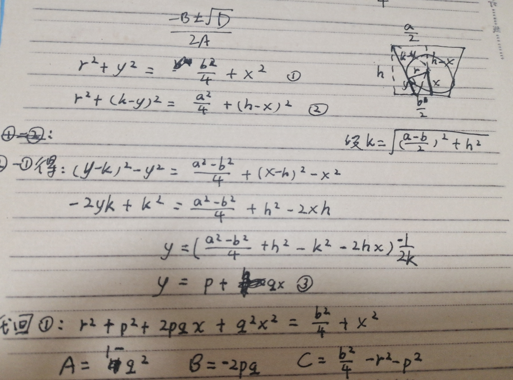

代码如下：

```c++
#include <bits/stdc++.h>
// #pragma GCC optimize(2)
using namespace std;
typedef long long ll;
typedef double db;
#define sc(x) scanf("%lld", &x)
#define il inline
db r, a, b, h, k, p, q, A, B, C, delta, x1, x2;
signed main()
{
    scanf("%lf%lf%lf%lf", &r, &a, &b, &h);
    if (r <= b / 2)
        return printf("Drop"), 0;
    k = sqrt((a - b) * (a - b) / 4 + h * h);
    p = ((a * a - b * b) / 4 + h * h - k * k) / (-2 * k);
    //p因为写成诸如*(-2*k),或/(-0.5*k)等各种离谱问题而炸掉多次……
    q = h / k;
    A = 1 - q * q;
    B = -2 * p * q;
    C = b * b / 4 - r * r - p * p;
    delta = B * B - 4 * A * C;
    x1 = (-B + sqrt(delta)) / (2 * A);
    x2 = (-B - sqrt(delta)) / (2 * A); //都是负数肯定舍掉
    printf("Stuck\n%.10lf", x1);
    return 0;
}
```


其他解法(不再展示代码)：

解法二(来自网络)

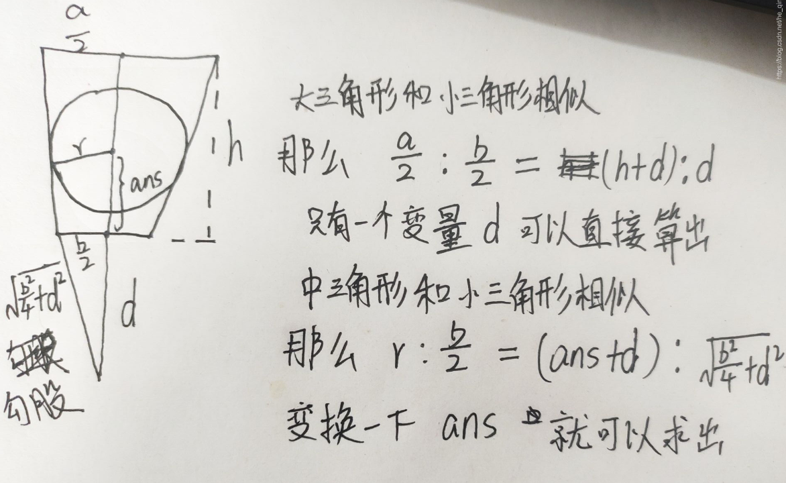

解法三

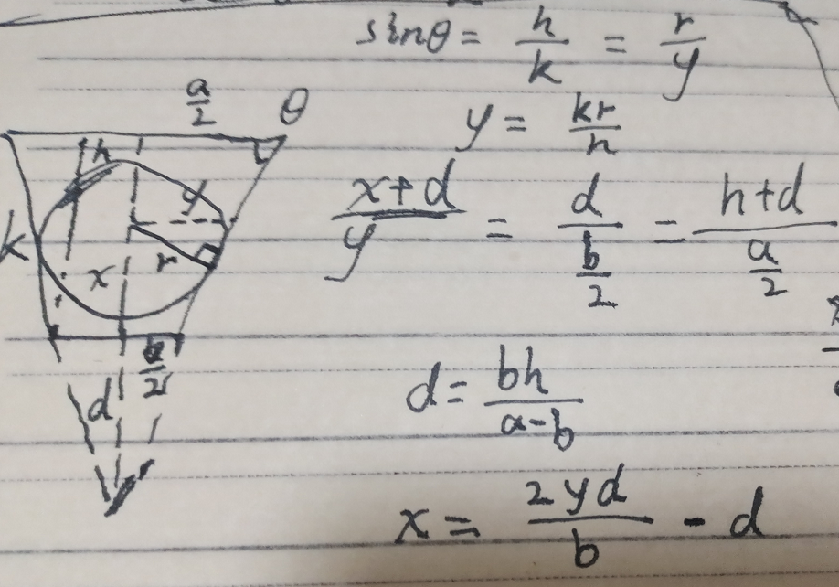


### F-Find 3 friendly Integers

(未能独立过题)

正统解法1：根据抽屉原理，三位数或以上时，取任意连续三位设为$\overline{abc}$，每一位的模$3$的余数只可能是$0,1,2$，若为$0$就是所求。若都不为，可能有$1,1,1$，是所求。有$1,1,2$，其中$1,2$为所求。有$1,2,2$，同理。$2,2,2$求和也是所求。综上，$n\ge100$必然符合。代码如下：

```c++
#include <bits/stdc++.h>
using namespace std;
typedef long long ll;
typedef double db;
#define sc(x) scanf("%lld", &x)
#define il inline
ll l, r, ans, t, s[110];
ll f(ll x)
{
    return s[min(x, 99LL)] + max(x - 99, 0LL);
}
signed main()
{
    for (ll i = 1; i <= 99; ++i)
    {
        s[i] = s[i - 1];
        if (i % 3 == 0 || (i > 9 && (i / 10) % 3 == 0) || (i % 10) % 3 == 0)
        {
            ++s[i];
        }
    }
    for (sc(t); t; --t)
    {
        sc(l), sc(r);
        printf("%lld\n", f(r) - f(l - 1));
    }
    return 0;
}
```

正统解法2：数位dp，思路详见代码

```c++
#include <bits/stdc++.h>
using namespace std;
typedef long long ll;
#define sc(x) scanf("%lld", &x)
#define il inline
ll l, r, ans, t, a[21], dp[21][2][2][2];
//dp[h][i][j][k]从左往右前h位的子段，是否存在一个后缀
//满足：i:余数为1，j:是否余2，k：是否余0
//dp[h][i][j][k] 表示满足上述i,j,k的数字数目

il ll cal(ll s, ll x)
{
    return (s * 10 + x) % 3;
}

//当前枚举是数字从左往右的第pos位，one:此时有后缀余1，two：余2，flag：余0
//当前枚举这一位是不是前导0;limit：当前是不是范围边界
ll dfs(ll pos, ll one, ll two, ll limit, ll zero, ll flag)
{
    if (pos == -1) //搜索完了
    {              //最后一位余3是否是0
        return flag;
    }
    if (!limit && dp[pos][one][two][flag] != -1) //无边界下剪枝
    {
        return dp[pos][one][two][flag];
    }
    ll end = limit ? a[pos] : 9, res = 0;
    for (ll i = 0; i <= end; ++i)
    {
        ll nwone = 0, nwtwo = 0, nwflg = 0;
        if (one) //曾经有余1后缀，尝试将其与新位合并为新字段
        {        //这个后缀是1，新是i
            if (cal(1, i) == 1)
                nwone = 1;
            if (cal(1, i) == 2)
                nwtwo = 1;
            if (cal(1, i) == 0)
                nwflg = 1;
        }
        if (two)
        {
            if (cal(2, i) == 1)
                nwone = 1;
            if (cal(2, i) == 2)
                nwtwo = 1;
            if (cal(2, i) == 0)
                nwflg = 1;
        }
        if (!(zero && i == 0))
        { //当前枚举的不是：前导0 (i==0表示0)；即非0可以，不前导的0也可以
            //也就是说最大的一位不能枚举是0
            if (cal(0, i) == 1)
                nwone = 1;
            if (cal(0, i) == 2)
                nwtwo = 1;
            if (cal(0, i) == 0)
                nwflg = 1;
        }
        res += dfs(pos - 1, nwone, nwtwo, limit && i == end, zero && i == 0, nwflg || flag);
        //下一位(更小的位)，更新后缀特性，更新是否是边界，更新最大的一位
    }
    if (!limit)
    {
        dp[pos][one][two][flag] = res; //无边界下可记忆化搜索
    }
    return res;
}
ll init(ll n)
{
    if (!n)
        return 0;
    ll len = 0;
    while (n)
    {
        a[len++] = n % 10, n /= 10;
    }
    //搜索的根节点是整个范围，根节点没有任何特性(one,two,zero)
    return dfs(len - 1, 0, 0, 1, 1, 0);
}
signed main()
{
    memset(dp, -1, sizeof dp);
    for (sc(t); t; --t)
    {
        sc(l), sc(r);
        printf("%lld\n", init(r) - init(l - 1));
    }
    return 0;
}
```


### A-Alice and Bob

解法一：SG函数暴力即可。虽然复杂度是$\Omicron(n^3\log n)$，但是意外地能过题。注意枚举的优化。

```c++
#include <bits/stdc++.h>
#define re
using namespace std;
typedef long long ll;
#define il inline
typedef double db;
il ll read()
{
    re char p = 0;
    re ll r = 0, o = 0;
    for (; p < '0' || p > '9'; o |= p == '-', p = getchar())
        ;
    for (; p >= '0' && p <= '9'; r = (r << 1) + (r << 3) + (p ^ 48), p = getchar())
        ;
    return o ? (~r) + 1 : r;
}
#define sc(x) scanf("%lld", &x)
#define mn 5000
ll sg[mn + 10][mn + 10], t, n, m, ax, ay;
signed main()
{
    for (ll i = 0; i <= mn; ++i)
    {
        for (ll j = 0; j <= i; ++j)
        {
            if (sg[i][j] == 0) //P局面推N局面
            {
                for (ll x = 1; i + x <= mn; ++x)
                {
                    for (ll y = 0; x * y + j <= mn; ++y)
                    {
                        ax = i + x, ay = x * y + j;
                        if (ax < ay)
                            swap(ax, ay);
                        sg[ax][ay] = 1;
                    }
                }
                for (ll x = 1; j + x <= mn; ++x)
                {
                    for (ll y = 0; x * y + i <= mn; ++y)
                    {
                        ax = j + x, ay = x * y + i;
                        if (ax < ay)
                            swap(ax, ay);
                        sg[ax][ay] = 1;
                    }
                }
            }
        }
    }
    sc(t);
    while (t--)
    {
        sc(n), sc(m);
        if (n < m)
            swap(n, m);
        if (sg[n][m] == 1)
        {
            printf("Alice\n");
        }
        else
        {
            printf("Bob\n");
        }
    }
    return 0;
}
```

解法二：若某堆石子数量是$i$，另一堆石子最多只有一种数量满足后手必胜。

若$(i,p),(i,q),q>p$都是后手必胜，那么取$q-p$个有$(i,q)\to(i,p)$，所以$(i,q)$先手必胜，矛盾。

对于每一个$i$，根据之前记录的$i'$后手必胜去推导是否有后手必胜局面。复杂度是$\Omicron(n^2\log n)$，理想实际速度约为$\Omicron(n)$。(虽然没做到)

```c++
#include <bits/stdc++.h>

using namespace std;

const int N = 5000;

int fail_list[N + 10], vis[N + 10];
vector<int> factor[N + 10];

int main()
{
    memset(fail_list, -1, sizeof(fail_list));
    for (int i = 1; i <= N; i++)
        for (int j = i; j <= N; j += i)
            factor[j].push_back(i); //倍数列表
    fail_list[0] = 0;               //(0,0)是必败局面
    for (int i = 1; i <= N; i++)
    {
        if (fail_list[i] != -1)
            continue;
        //如果当前i没有必败局面
        memset(vis, 0, sizeof(vis));
        for (int j = 0; j < i; j++) //找之前的必败局面
        {
            if (fail_list[j] == -1) //如果没有必败局面
                continue;
            //如果有必败局面 (j, fl[j]) 设为 (j,jf)
            for (int k = fail_list[j]; k <= N; k += i - j)
            {               //那么(j,jf),(i,jf+(i-j)),(i,jf+2(i-j)),...必胜
                vis[k] = 1; //(i,k) 必胜
            }
            for (int k = 0; k < factor[i - j].size() && fail_list[j] + factor[i - j][k] <= N; k++)
                vis[fail_list[j] + factor[i - j][k]] = 1;
            //加上 差值i-j的倍数 的jf都可以胜利，即(j,fj)<-[xy,x] (i,this)
        }

        for (int k = i + 1; k <= N; k++)
            if (!vis[k]) //如果找到了必败局面
            {
                fail_list[i] = k;
                fail_list[k] = i;
                break;
            }
    }
    int T;
    scanf("%d", &T);
    while (T--)
    {
        int n, m;
        scanf("%d%d", &n, &m);
        if (fail_list[n] == m)
            puts("Bob");
        else
            puts("Alice");
    }
}
```


### H-Hash Function

解法一：暴力枚举 (实质上是错误解法)

显然$m$（$seed$）的范围是$[n,\max \{a_i\}+1]$

时间复杂度是$\Omicron(n(\max\{a_i\}+1-n))=\Omicron(n^2)$

> 本解法理论上赛时可以AC，但是赛后新增了hack点，会TLE

```c++
#define mn 500010
ll n, a[mn];
bool vis[mn];
signed main()
{
    sc(n);
    for (ll i = 0; i < n; ++i)
    {
        sc(a[i]);
        vis[a[i]] = true;
    }
    sort(a, a + n);
    for (ll seed = n;; ++seed)
    {
        ll i = lower_bound(a, a + n, seed) - a; //第一个模了会变的数>=seed
        map<ll, bool> newvis;
        bool suc = true;
        for (; i < n; ++i)
        {
            ll h = a[i] % seed;
            if (vis[h] || newvis[h])
            {
                suc = false;
                break;
            }
            newvis[h] = true;
        }
        if (suc)
        {
            printf("%lld\n", seed);
            break;
        }
    }
    return 0;
}
```


解法二：卷积、快速傅里叶

若$a\bmod m\equiv b\bmod m$，则$m\ |\ |a-b|$，即求最小$m$，使得$m$不是任何$|a_i-a_j|$的约数。即求最小$m(seed)$，使得它不是任意两数的差的绝对值。

使用卷积求数组中任意两数的和，设数组为$a_i$，则设多项式$f=\sum_{i=1}^nx^{a_i}$。那么，多项式$f^2$所有项就是所有两数和。

如：$(x+x^2+x^4)^2=x^2+2x^3+x^4+2x^5+2x^6+x^8$，所以$1,2,4$任意两项和是$2,3,4,5,6,8$。

求上述所问问题，由于负数在代码内不好处理，首先设足够大的偏移量$p$，对原数列的每一项相反数加上$p$后均为正，设$f=\sum_{i=1}^nx^{a_i},g=f=\sum_{i=1}^nx^{-a_i}$任意两项差绝对值为$fg$的每项次数减去$p$，并舍掉负系数项。

容易验证上述解法的正确性。使用FFT/NTT(快速傅里叶变换/快速数论变换)优化上述过程，时间复杂度为$\Omicron(n\log n)$。

之后遍历这个结果即可。

```c++
#include<bits/stdc++.h>
using namespace std;
const double PI = acos(-1);
const int P = 500001;// 偏移量
const int N = 1<<21;
int limit, bit;
bool vis[N];
int R[N];

// 复数的板子
struct Complex {
	double x, y;
	Complex (double x = 0, double y = 0) : x(x), y(y) { }
} a[N], b[N];

Complex operator * (Complex J, Complex Q) {
	return Complex(J.x * Q.x - J.y * Q.y, J.x * Q.y + J.y * Q.x);
}
Complex operator - (Complex J, Complex Q) {
	return Complex(J.x - Q.x, J.y - Q.y);
}
Complex operator + (Complex J, Complex Q) {
	return Complex(J.x + Q.x, J.y + Q.y);
}


//FFT板子
void FFT(Complex * A, int type) {
	for(int i = 0; i < limit; ++ i)
		if(i < R[i])
			swap(A[i], A[R[i]]);
	for(int mid = 1; mid < limit; mid <<= 1) {
		Complex wn(cos(PI / mid), type * sin(PI / mid));
		for(int len = mid << 1, pos = 0; pos < limit; pos += len) {
			Complex w(1, 0);
			for(int k = 0; k < mid; ++ k, w = w * wn) {
				Complex x = A[pos + k];
				Complex y = w * A[pos + mid + k];
				A[pos + k] = x + y;
				A[pos + mid + k] = x - y;
			}
		}
	}
	if(type == 1) return ;
	for(int i = 0; i <= limit; ++ i)
		a[i].x /= limit, a[i].y /= limit;
}

bool check(int x) {
	for (int i = x; i <= P; i += x) {
		if (vis[i] == true) return false;
	}
	return true;
}

int main() {
	ios::sync_with_stdio(0);cin.tie(0);cout.tie(0);cin.exceptions(ios::badbit | ios::failbit);
	int n, tmp;
	cin>>n;
	for(int i = 0; i < n; i++) {
		cin>>tmp;
		a[tmp].x = 1;
		b[P - tmp].x = 1;
	}
	bit = 20;// 只要大于2*p+1就行
	limit = 1 << bit;
	// 预处理
	for(int i = 0; i < limit; i++)
		R[i] = (R[i >> 1] >> 1) | ((i & 1) << (bit - 1));
	// =================================== 
	FFT(a, 1);
	FFT(b, 1);
	for(int i = 0; i < limit; i++) {
		a[i] = a[i] * b[i];
	}
	FFT(a, -1);
	// ===================================
	for (int i = 0; i < limit; i++) {
		int x = (int)(a[i].x + 0.5);
		if(x > 0)
			vis[abs(i - P)] = 1;
	}

	for(int i = n; i < P+1; i++) {
		if(check(i)) {
			cout<<i<<endl;
			break;
		}
	}
	return 0;
}
```


### K-Knowledge Test about Match

解法一：二分图最优匹配的贪心近似解法

注意到题干说数据是随机生成的，所以不会有很刁钻的hack数据。

左边的点是$a$，右边的是$b$，作完全二分图，边权是$|b_i-a_i|$。跑二分图最优匹配。然而KM算法(Kuhn-Munkres)的复杂度是$\Omicron(n^3)$，所以只能退而用贪心版本：匹配时贪心选取权值小的边。使用桶排优化时，总时间复杂度是$n^2$。

即ppt说的：贪心做法从小到大枚举 d，每次贪心去看是否存在两数差=d的数对，如果存在就暴力匹配上去。

```c++
#define mn 1010
ll t, n, a[mn], r[mn];
bool vis[mn];
vector<pair<ll, ll>> v[mn];
signed main()
{
    sc(t);
    while (t--)
    {
        sc(n);
        memset(vis, 0, sizeof vis);
        for (ll i = 0; i < n; ++i)
        {
            sc(a[i]);
            r[i] = -1;
            v[i].clear();
        }
        for (ll i = 0; i < n; ++i)
        {
            for (ll j = 0; j < n; ++j)
            {
                v[abs(a[i] - j)].emplace_back(i, j);
            }
        }
        for (ll j = 0; j < n; ++j) //从小到大枚举边(d)
        {
            for (auto x : v[j])
            {
                ll i = x.first, pos = x.second;
                if (!(vis[i] || r[pos] >= 0)) //两边都未匹配
                { //下标(实际是a) vis掉 , b放到a(pos)位置
                    r[pos] = i, vis[i] = true;
                }
            }
        }
        for (ll i = 0; i < n; ++i)
        {
            printf("%lld ", a[r[i]]);
        }
        putchar('\n');
    }
    return 0;
}
```

一种更简洁的写法：

```c++
void solve()
{
    int n, i, j;
    cin >> n;
    memset (cnt, 0, sizeof(cnt));
    for (i = 1; i <= n; i++)
    {
        cin >> a[i];
        cnt[a[i]]++;
        ans[i - 1] = -1;
    }
    for (i = 0; i < n; i++)
    {
        for (j = 0; j <n; j++)
        {
            if (ans[j] != -1) continue;
            int L = j - i, R = j + i;
            if (L >= 0 && cnt[L]) ans[j] = L, cnt[L]--;
            else if (R < n && cnt[R]) ans[j] = R, cnt[R]--;
        }
    }
    for (i = 0; i < n; i++)
        cout << ans[i] << ' ';
    cout << endl;
}
 
int main()
{
    int T;
    cin >> T;
    while (T--)
        solve();
    return 0;
}
```


解法二：神奇做法

原理大概就是一种机器学习做法？(毕竟题干也是机器学习)

过于神奇，看不懂，只放代码：

```c++
#include <bits/stdc++.h>
#define re
using namespace std;
typedef long long ll;
#define il inline
typedef double db;
il ll read()
{
    re char p = 0;
    re ll r = 0, o = 0;
    for (; p < '0' || p > '9'; o |= p == '-', p = getchar())
        ;
    for (; p >= '0' && p <= '9'; r = (r << 1) + (r << 3) + (p ^ 48), p = getchar())
        ;
    return o ? (~r) + 1 : r;
}
#define sc(x) x = read()
#define mn 1010
db sqt[mn];
ll n, b[mn], t;
il db cal(ll x, ll y)
{
    return sqt[abs(x - y)];
}
signed main()
{
    sc(t);
    for (ll i = 0; i < mn; ++i)
    {
        sqt[i] = sqrt(i);
    }
    while (t--)
    {
        sc(n);
        for (ll i = 0; i < n; ++i)
        {
            sc(b[i]);
        }
        for (ll h = 0; h < 5; ++h)
        {
            for (ll i = 0; i < n; ++i)
            {
                for (ll j = i + 1; j < n; ++j)
                {
                    if (cal(i, b[i]) + cal(j, b[j]) > cal(i, b[j]) + cal(j, b[i]))
                    {
                        swap(b[i], b[j]);
                    }
                }
            }
        }
        for (ll i = 0; i < n; ++i)
        {
            printf("%lld ", b[i]);
        }
        putchar('\n');
    }
    return 0;
}
```


### I-Increase Sequence

注意审题：每个人当前可以走的值不能小于两人共同的之前的值，且当前下标不能小于自己之前选的下标(而不是两个人共同的)

期望dp的基本知识：

一般设$dp[i]$表示当前在$i$，还需要$dp[i]$的代价走到终点，转移方程是：
$$
dp[i]=v_i+\sum p_j\cdot dp[j]
$$
$v_i$是$i$这一步的代价，$j$是$i$的后继状态，$p_j$是从$i$走到$j$的概率。意义是：$i$下的总期望等于$i$的代价加上所有$i$能走到的地方的期望(乘以走过去的概率)。原则上$\sum p_j=1$。

最终所求为$dp[0]$。

因为这题两个人在走，可以设$dp[i][j]$表示先手现在在$i$，后手现在在$j$的情况下，期望还要走$dp[i][j]$步结束游戏。本题内，所有$v=1$，等概率选取，所以$p[i][j]=i$的后继数。

由上述题意，所以$a_i>a_j$时，肯定是后手在此时移动，则：
$$
dp[i][j]=1+\dfrac1{c}\sum dp[i][k]
$$
k是所有满足$k>j,a_k>a_i$的下标。$c$是$k$的数目。

否则，先手移动：
$$
dp[i][j]=1+\dfrac1{c}\sum dp[k][j]
$$
$k$是$k>i,a_k>a_j$

最终求的是$dp[0][0]$即$\dfrac1n\sum_{i=1}^ndp[i][0]$

朴素状态下，显然上述递推方程的复杂度是$\Omicron(n^3)$。发现求和项要满足的条件里，它们互为条件(即第一个方程$a_k>a_i$，而第二个进入的条件是$a_j>a_i$)。后缀和优化后可以得到$\Omicron(n^2)$。

```c++
#include <bits/stdc++.h>
#define re
using namespace std;
typedef long long ll;
#define il inline
typedef double db;
il ll read()
{
    re char p = 0;
    re ll r = 0, o = 0;
    for (; p < '0' || p > '9'; o |= p == '-', p = getchar())
        ;
    for (; p >= '0' && p <= '9'; r = (r << 1) + (r << 3) + (p ^ 48), p = getchar())
        ;
    return o ? (~r) + 1 : r;
}
#define sc(x) x = read()
#define mn 5010
#define mod 998244353
ll qpow(ll x, ll y = mod - 2)
{
    ll res = 1;
    for (; y; y >>= 1, (x *= x) %= mod)
    {
        if (y & 1)
        {
            (res *= x) %= mod;
        }
    }
    return res;
}
ll n, inv[mn], c1[mn], c2[mn], a[mn], dp[mn][mn], f[mn], g[mn], ans;
signed main()
{
    sc(n);
    for (ll i = 1; i <= n; ++i)
    {
        sc(a[i]);
        inv[i] = qpow(i);
    }
    for (ll i = n; i >= 0; --i)
    {
        for (ll j = n; j >= 0; --j)
        {
            if (a[i] > a[j]) //后手移动
            {
                dp[i][j] = (1 + inv[c1[i]] * f[i]) % mod;
                g[j] = (g[j] + dp[i][j]) % mod;
                ++c2[j];
            }
            else if (a[i] < a[j]) //注意有i, j=0
            {
                dp[i][j] = (1 + inv[c2[j]] * g[j]) % mod;
                f[i] = (f[i] + dp[i][j]) % mod;
                ++c1[i];
            }
        }
    }
    for (ll i = 1; i <= n; ++i)
    {
        ans = (ans + dp[i][0]) % mod;
    }
    printf("%lld", ans * inv[n] % mod);
    return 0;
}
```


## 牛客2

本场比赛无参赛，仅补题。补题5题，未看题解前独立完成全部题目。

### D-Er Ba Game

签到题，自己用了比较不常规的思路

```c++
ll t, a1, b1, a2, b2, r1, r2;
ll test(ll a, ll b)
{
    if (a > b)
        swap(a, b);
    if (a == 2 && b == 8)
        return 1000000;
    if (a == b)
        return 100000 + a;
    return (a + b) % 10 * 1000 + b;
}
signed main()
{
    sc(t);
    while (t--)
    {
        sc(a1), sc(b1), sc(a2), sc(b2);
        r1 = test(a1, b1), r2 = test(a2, b2);
        if (r1 == r2)
            printf("tie\n");
        else if (r1 > r2)
            printf("first\n");
        else
            printf("second\n");
    }
    return 0;
}
```


### C-Draw Grids

 个人解法：找规律即可。也可以直接打表。

```c++
if (((a * b - 1) & 1) == 0) //注意括号
//或a == 1 && b == 1 || a == 3 && b == 3 || a == 1 && b == 3 || a == 3 && b == 1
    printf("NO\n");
else
    printf("YES\n");
```

进一步分析：即平面整点作点，四方向连边，不允许连出环(图始终是森林)，最终得到一棵生成树。直接判点数奇偶即可。


### K-Stack

个人解法：唯一导致$-1$的情况是$p_i<x_i$。要保证所有位置(不仅仅是$k$个位置)都不会如此。可以通过已知位置构造未知位置，只要没给出，就算是上一个的递增。然后倒着从$b$恢复$a$，每次取剩余数理第$b[i]$大的。该操作使用Treap维护，可以过题。

注意：本题朴素vector不可以过关(删除单点最差复杂度是$\Omicron(\sqrt{n})$，平均是$\Omicron(\log n)$，与二分查找结合，单次删除最差复杂度是$\Omicron(\log n\sqrt n)$，平均复杂度是$\Omicron(\log^2 n)$)，本题后缀树也会TLE(大概一半的点)，其他数据结构未尝试。

代码如下：

```c++
#include <bits/stdc++.h>
#define re
using namespace std;
typedef int ll;
#define il inline
typedef double db;
il ll read()
{
    re char p = 0;
    re ll r = 0, o = 0;
    for (; p < '0' || p > '9'; o |= p == '-', p = getchar())
        ;
    for (; p >= '0' && p <= '9'; r = (r << 1) + (r << 3) + (p ^ 48), p = getchar())
        ;
    return o ? (~r) + 1 : r;
}
#define sc(x) x = read()
#define mn 1000010
ll n, k, a[mn], fail, b[mn], p, x;
//以下是Treap模板
const int maxn = (2000000);
int cnt = 0, R = 0;
int siz[maxn], treap[maxn], num[maxn], rd[maxn], BST[maxn][2];

void pushup(int i)
{
    siz[i] = siz[BST[i][0]] + siz[BST[i][1]] + num[i];
}

void rotate(int &i, int d)
{
    int k = BST[i][d ^ 1];
    BST[i][d ^ 1] = BST[k][d];
    BST[k][d] = i;
    pushup(i);
    pushup(k);
    i = k;
}

void insert(int &i, int x)
{
    if (i == 0)
    {
        i = ++cnt;
        siz[i] = 1;
        num[i] = 1;
        treap[i] = x;
        rd[i] = rand();
        return;
    }
    if (treap[i] == x)
    {
        num[i]++;
        siz[i]++;
        return;
    }
    if (x > treap[i])
    {
        insert(BST[i][1], x);
        if (rd[i] < rd[BST[i][1]])
        {
            rotate(i, 0);
        }
    }
    else
    {
        insert(BST[i][0], x);
        if (rd[i] < rd[BST[i][0]])
        {
            rotate(i, 1);
        }
    }
    pushup(i);
}

void remove(int &i, int x)
{
    if (i == 0)
    {
        return;
    }
    if (x < treap[i])
    {
        remove(BST[i][0], x);
    }
    else if (x > treap[i])
    {
        remove(BST[i][1], x);
    }
    else
    {
        if (BST[i][0] == 0 && BST[i][1] == 0)
        {
            num[i]--;
            siz[i]--;
            if (num[i] == 0)
            {
                i = 0;
            }
        }
        else if (BST[i][0] && BST[i][1] == 0)
        {
            rotate(i, 1);
            remove(BST[i][1], x);
        }
        else if (BST[i][0] == 0 && BST[i][1])
        {
            rotate(i, 0);
            remove(BST[i][0], x);
        }
        else if (BST[i][0] && BST[i][1])
        {
            if (rd[BST[i][0]] > rd[BST[i][1]])
            {
                rotate(i, 1);
                remove(BST[i][1], x);
            }
            else
            {
                rotate(i, 0);
                remove(BST[i][0], x);
            }
        }
    }
    pushup(i);
}

int rnk(int i, int x)
{
    if (i == 0)
    {
        return 1;
    }
    if (treap[i] == x)
    {
        return siz[BST[i][0]] + 1;
    }
    if (treap[i] < x)
    {
        return siz[BST[i][0]] + num[i] + rnk(BST[i][1], x);
    }
    if (treap[i] > x)
    {
        return rnk(BST[i][0], x);
    }
}

int find(int i, int x)
{
    if (i == 0)
    {
        return 0;
    }
    if (siz[BST[i][0]] >= x)
    {
        return find(BST[i][0], x);
    }
    else if (siz[BST[i][0]] + num[i] < x)
    {
        return find(BST[i][1], x - num[i] - siz[BST[i][0]]);
    }
    else
    {
        return treap[i];
    }
}
//以上是Treap模板

signed main()
{
    for (ll i = 1; i < mn; ++i)
    {
        insert(R, i);
    }
    sc(n), sc(k);
    for (ll i = 1; i <= k; ++i)
    {
        sc(p), sc(x);
        b[p] = x;
    }
    for (ll i = 1; i <= n; ++i)
    {
        if (0 == b[i])
        {
            b[i] = b[i - 1] + 1;
        }
        if (b[i] - b[i - 1] > 1)
        {
            fail = true;
            break;
        }
    }
    for (ll i = n; i >= 1; --i)
    {
        ll vi = find(R, b[i]);
        remove(R, vi);
        a[i] = vi;
    }
    if (fail)
    {
        printf("-1");
    }
    else
    {
        for (ll i = 1; i <= n; ++i)
        {
            printf("%d ", a[i]);
        }
    }
    return 0;
}
```

更优解：思路见代码(最后一个for嵌套是关键)

```c++
#include <bits/stdc++.h>
#define N 1000007

using namespace std;

int val[N], L[N], R[N], pos[N], ans[N];
vector<int> v[N];
int main()
{
    int n, k;
    cin >> n >> k;
    for (int i = 1; i <= k; i++)
    {
        int p, x;
        scanf("%d%d", &p, &x);
        pos[p] = x;
    }
    for (int i = 1; i <= n; i++)
    {
        if (pos[i])
        {
            if (pos[i] - pos[i - 1] > 1)
            {
                cout << -1;
                return 0;
            }
        }
        else
            pos[i] = pos[i - 1] + 1;
        v[pos[i]].push_back(i);
    }
    int as = n;
    for (int i = n; i; i--)
    {
        int sz = v[i].size();
        for (int j = 0; j < sz; j++)
        {
            ans[v[i][j]] = as--;
        }
    }
    for (int i = 1; i <= n; i++)
        printf("%d ", ans[i]);
    return 0;
}
```


### F-Girlfriend

个人解法：根据题意可以推出两个球方程(阿波罗尼斯球)(推导过程略，不会非常难)，原题即求两球相交的公共体积。套计算几何板子公式即可(只要积累够多)。

```c++
#include <bits/stdc++.h>
#define re
using namespace std;
typedef int ll;
#define il inline
typedef double db;
il ll read()
{
    re char p = 0;
    re ll r = 0, o = 0;
    for (; p < '0' || p > '9'; o |= p == '-', p = getchar())
        ;
    for (; p >= '0' && p <= '9'; r = (r << 1) + (r << 3) + (p ^ 48), p = getchar())
        ;
    return o ? (~r) + 1 : r;
}
#define sc(x) x = read()

//计算几何板子
const double pi = acos(-1.0);

struct sphere
{ //球
    db r, x, y, z;
};
db dis(sphere p, sphere q)
{
    return sqrt((p.x - q.x) * (p.x - q.x) + (p.y - q.y) * (p.y - q.y) + (p.z - q.z) * (p.z - q.z));
}

sphere generate(db ax, db ay, db az, db bx, db by, db bz, db k)
{
    db dp = 0;
    db kt = k * k - 1;
    db xp = 2 * k * k * bx - 2 * ax;
    dp += k * k * bx * bx - ax * ax;
    db yp = 2 * k * k * by - 2 * ay;
    dp += k * k * by * by - ay * ay;
    db zp = 2 * k * k * bz - 2 * az;
    dp += k * k * bz * bz - az * az;
    dp /= kt;
    dp -= xp * xp / (4 * kt * kt);
    db a = -xp / (2 * kt);
    dp -= yp * yp / (4 * kt * kt);
    db b = -yp / (2 * kt);
    dp -= zp * zp / (4 * kt * kt);
    db c = -zp / (2 * kt);
    db r;
    if (dp > 0)
    {
        r = 0;
    }
    else
    {
        r = sqrt(-dp);
    }
    return {r, a, b, c};
}

ll t;
db px[3][3], py[3][3], pz[3][3], pk[3], ans, d, co, h;
sphere pua[2];

db cal(sphere x, sphere y)
{
    co = (x.r * x.r + d * d - y.r * y.r) / (2 * d * x.r);
    h = x.r * (1 - co);
    return 1.0 / 3 * pi * (3.0 * x.r - h) * h * h;
}

signed main()
{
    sc(t);
    while (t--)
    {
        for (ll i = 0; i < 2; ++i)
        {
            for (ll j = 0; j < 2; ++j)
            {
                scanf("%lf%lf%lf", &px[i][j], &py[i][j], &pz[i][j]);
            }
        }
        for (ll i = 0; i < 2; ++i)
        {
            scanf("%lf", &pk[i]);
            pua[i] = generate(px[i][0], py[i][0], pz[i][0], px[i][1], py[i][1], pz[i][1], pk[i]);
        }
        d = dis(pua[0], pua[1]);
        if (d >= pua[0].r + pua[1].r)
        {
            ans = 0;
        }
        else if (d + pua[0].r <= pua[1].r)
        {
            ans = 4.0 / 3 * pi * pua[0].r * pua[0].r * pua[0].r;//4.0写成4见祖宗！
        }
        else if (d + pua[1].r <= pua[0].r)
        {
            ans = 4.0 / 3 * pi * pua[1].r * pua[1].r * pua[1].r;
        }
        else
        {
            ans = cal(pua[0], pua[1]);
            ans += cal(pua[1], pua[0]);
        }
        printf("%lf\n", ans);
    }
    return 0;
}
```

结论：

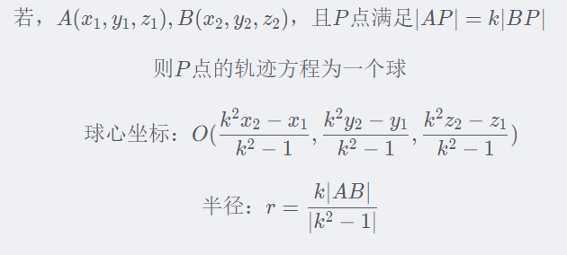

两球相交，除却相离和内含外，相交的公式两部分之和为：(用积分证明，略)

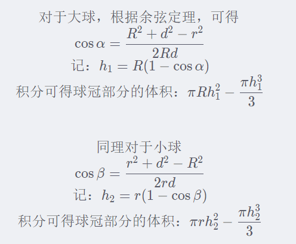


### I-Penguins

个人解法：注意到DFS超时，而在不走重复路下的BFS也不会真的有$(20^2)^2$步，这是因为只有左右是反的，它们不可能跑到不同row上。双移动BFS裸题，虽然实现起来很困难，但是整体思路非常简单。具体见代码细节：

```c++
#include <bits/stdc++.h>
#define re
using namespace std;
typedef int ll;
#define il inline
typedef double db;
il ll read()
{
    re char p = 0;
    re ll r = 0, o = 0;
    for (; p < '0' || p > '9'; o |= p == '-', p = getchar())
        ;
    for (; p >= '0' && p <= '9'; r = (r << 1) + (r << 3) + (p ^ 48), p = getchar())
        ;
    return o ? (~r) + 1 : r;
}
#define sc(x) x = read()
char mp[2][22][22], ci[] = "DLRU", prt[] = " \n";
ll dx[2][4] = {{1, 0, 0, -1}, {1, 0, 0, -1}}, ax[2];
ll dy[2][4] = {{0, -1, 1, 0}, {0, 1, -1, 0}}, ay[2];
struct state
{
    ll nx[2], ny[2], len;
    string m;
    bool operator==(const state &x) const //{ return m == x.m; }
    {
        for (ll i = 0; i < 2; ++i)
        {
            if (nx[i] != x.nx[i] || ny[i] != x.ny[i])
            {
                return false;
            }
        }
        return true;
    }
} bg, ed, nw, an;
queue<state> q;

bool mot(ll x, ll y, ll t)
{
    return x > 0 && y > 0 && x < 21 && y < 21 && mp[t][x][y] != '#';
}

typedef pair<pair<ll, ll>, pair<ll, ll>> pp; //不影响，自己写hash也行
set<pp> s; //不去重就TLE
map<char, ll> ot;

ll mx, cx[2] = {20, 20}, cy[2] = {20, 1};

signed main()
{
    for (ll i = 1; i <= 20; ++i)
    {
        for (ll j = 0; j < 2; ++j)
        {
            scanf("%s", mp[j][i] + 1);
        }
    }
    bg.nx[0] = bg.ny[0] = ed.ny[0] = 20, ed.nx[0] = 1;
    bg.nx[1] = 20, bg.ny[1] = ed.nx[1] = ed.ny[1] = 1;
    ot['D'] = 0, ot['L'] = 1, ot['R'] = 2, ot['U'] = 3;
    q.push(bg);
    while (!q.empty())
    {
        nw = q.front(), q.pop();
        if (nw == ed)
        {
            printf("%d\n", nw.len), cout << nw.m << '\n';
            break;
        }
        pp hashv = {{nw.nx[0], nw.ny[0]}, {nw.nx[1], nw.ny[1]}};
        if (s.find(hashv) != s.end())
        {
            continue;
        }
        s.insert(hashv);
        for (ll i = 0; i < 4; ++i)
        {
            bool motb = false;
            for (ll j = 0; j < 2; ++j)
            {
                ax[j] = nw.nx[j] + dx[j][i];
                ay[j] = nw.ny[j] + dy[j][i];
                motb |= mot(ax[j], ay[j], j);
            }
            if (motb)
            {
                for (ll k = 0; k < 2; ++k)
                {
                    // if (mp[k][ax[k]][ay[k]] == '.')
                    if (mot(ax[k], ay[k], k)) //不判mot会越界WA
                    {
                        an.nx[k] = ax[k];
                        an.ny[k] = ay[k];
                    }
                    else
                    {
                        an.nx[k] = nw.nx[k];
                        an.ny[k] = nw.ny[k];
                    }
                }
                an.len = nw.len + 1;
                an.m = nw.m + ci[i];
                q.push(an);
            }
        }
    }
    for (ll i = 0; i < nw.len; ++i)
    {
        for (ll j = 0; j < 2; ++j)
        {
            mp[j][cx[j]][cy[j]] = 'A';
            ax[j] = cx[j] + dx[j][ot[nw.m[i]]];
            ay[j] = cy[j] + dy[j][ot[nw.m[i]]];
            ll k = j;
            // if (mp[k][ax[k]][ay[k]] == '.')
            if (mot(ax[j], ay[j], j))  //不判mot会越界WA
            {
                cx[k] = ax[k];
                cy[k] = ay[k];
            }
        }
    }
    mp[0][1][20] = mp[1][1][1] = 'A';
    for (ll i = 1; i <= 20; ++i)
    {
        for (ll j = 0; j < 2; ++j)
        {
            printf("%s%c", mp[j][i] + 1, prt[j]);
        }
    }
    return 0;
}
```


## 牛客3

这场比赛我参赛了，但是是我在团队里表现的最差的一次了……一道题都没贡献过题，而且这时候其实自己在乡下，并不是全程有空，实际在敲代码的时间可能只有赛时一半的不到。整个团队也只过了一道题目，可以说跟上两次相比都很惨(第一第二场一个队友凭一己之力过了4,3题)。签到题都没过，过了第二简单的题目。


### J-Counting Triangles

签到题。

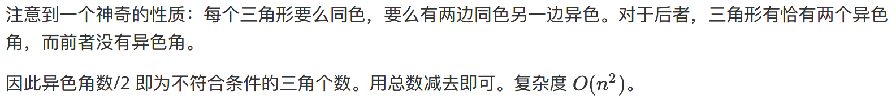

```c++
using namespace GenHelper;
bool edge[8005][8005];
ll c[8005][2], cnt; //写了ll开的是int见祖宗的屑……
int main()
{
    int n, seed;
    cin >> n >> seed;
    srand(seed);
    for (int i = 0; i < n; i++)
        for (int j = i + 1; j < n; j++)
            edge[j][i] = edge[i][j] = read_();
    for (int i = 0; i < n; ++i)
    {
        for (int j = 0; j < n; ++j)
        {
            if (i == j) //不能搞自环，不然暴死……
            {
                continue;
            }
            ++c[i][edge[i][j]];
        }
        cnt += c[i][0] * c[i][1];
    }
    printf("%lld\n", 1LL * n * (n - 1) * (n - 2) / 6 - cnt / 2);
    return 0;
}
```


### E-Math

队友找规律事实上找出来了正解，虽然未经证明。

正解：

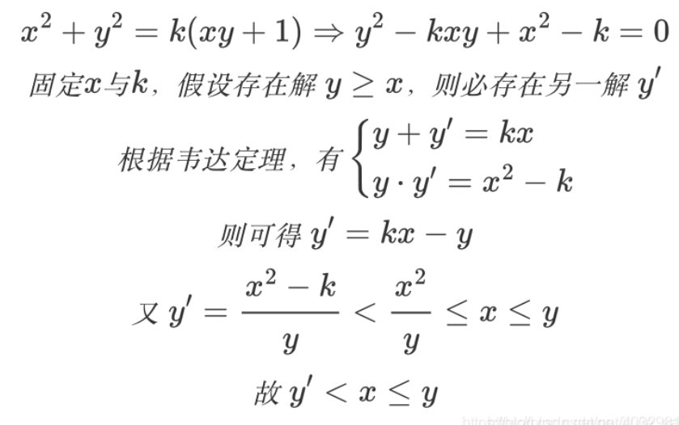

> 回到本题，假设我们已知数对 (x,y) 为一组解，必然还有一组解为 (x,y’) ，又由上面的证明可知 y’<x≤y，而题目要求 x≤y，因此 (x,y’)->(y’,x)，那么此时两组符合要求的解则为 (y’,x) (x,y) ，同时 y=k*x-y’

令$y=0,x=x$，得$k=x^2$，所以一组解是$(x,x^3)$，即$x=x$的初始解是这个。之后，迭代这个过程，保持$k$不变，令$x=x^3$，不断推下去即可。

这样求出来的东西是固定$x=x\to k=x^2$下的所有解。

注意到一组解里$x^3\to10^{18}$则$x\to10^6$，这个递推过程是指数增长的，所以所以时间复杂度是$\Omicron(10^6\log 10^6)$。这样就求出了范围内的所有解。取每个解$(x,y)$的第一项$x$，显然即求满足$x\le n$的有多少个。所以二分搜索即可。估算的总复杂度如上。

本题会炸long long，要使用int128。注意可以用快读直接参与输入。

```c++
#include <bits/stdc++.h>
#define re
using namespace std;
typedef __int128 ll;
#define il inline
typedef double db;
il ll read()
{
    re char p = 0;
    re ll r = 0, o = 0;
    for (; p < '0' || p > '9'; o |= p == '-', p = getchar())
        ;
    for (; p >= '0' && p <= '9'; r = (r << 1) + (r << 3) + (p ^ 48), p = getchar())
        ;
    return o ? (~r) + 1 : r;
}
#define sc(x) x = read()
vector<ll> v;
ll n, t, mn = 1e6, mn3 = 1e18;
signed main()
{
    v.emplace_back(1);
    for (ll i = 2, x, y, k; i <= mn; ++i)
    {
        x = i, y = i * i * i, k = i * i;
        while (y <= mn3)
        {
            v.emplace_back(y);
            t = x;
            x = y;
            y = k * x - t;
        }
    }
    sort(v.begin(), v.end());
    for (sc(t); t; --t)
    {
        sc(n);
        printf("%d\n", upper_bound(v.begin(), v.end(), n) - v.begin());
    }
    return 0;
}
```


### F-24dian

赛时自己做了，但是审错题了，所以连样例都没整出来。自己用了Permutaion取任意排序运算符且任意排序数字，复杂度很高，事实上也TLE了。后来自己赛后尝试，在审对题目下还是没写出来。

更优搜索思路参见如下代码：

```c++
#include <iostream>
#include <cmath>
using namespace std;
struct node
{
    int ans[5];
} node[100000];
double number[5], num[5], a;
int ans, n, cnt, flag;
bool vis[5];
bool w(double x, double y)
{
    return x / y > (int)(x / y) + 1e-9; //不这样会炸,即炸abs(x-int x)<1e-9
}
void dfs1(int x, bool t, int nowx)
{
    if (x == n - 1) //这里的思路跟自己一样(虽然自己审错题了两次)
    {
        if (fabs(num[nowx] - a) < 1e-8)
        {
            flag++;
            if (t)
            {
                cnt++;
            }
        }
    }
    else //这里的思路需要重点学习
        for (int i = 0; i < n; i++)
        {
            for (int j = 0; j < n; j++) //任意选两个数字
            {
                if (i != j && !vis[i] && !vis[j])
                {
                    double c = num[i], b = num[j];
                    vis[min(i, j)] = 1;     //默认叉掉第一个位置，占用第二个位
                    num[max(i, j)] = c + b; //任意选一个运算符
                    dfs1(x + 1, t, max(i, j));
                    num[i] = c; //回溯
                    num[j] = b;

                    num[max(i, j)] = c - b;
                    dfs1(x + 1, t, max(i, j));
                    num[i] = c;
                    num[j] = b;

                    num[max(i, j)] = c * b;
                    dfs1(x + 1, t, max(i, j));
                    num[i] = c;
                    num[j] = b;

                    if (b != 0)
                    {
                        num[max(i, j)] = c / b;
                        dfs1(x + 1, t | w(c, b), max(i, j));
                    }
                    num[i] = c;
                    num[j] = b;

                    vis[i] = 0; //回溯
                    vis[j] = 0;
                }
            }
        }
}
void dfs2(int x, int m) //这里的思路与自己一致
{
    if (x == n)
    {
        for (int i = 0; i < n; i++)
            num[i] = number[i];
        flag = 0;
        cnt = 0;
        dfs1(0, 0, 0);
        if (flag == cnt && cnt > 0)
        {
            ans++;
            for (int i = 0; i < n; i++)
            {
                node[ans].ans[i] = number[i];
            }
        }
    }
    else
        for (int i = m; i <= 13; i++)
        {
            number[x] = i;
            dfs2(x + 1, i);
        }
}
void print()
{
    cout << ans << endl;
    for (int i = 1; i <= ans; i++)
    {
        for (int j = 0; j < n; j++)
        {
            cout << node[i].ans[j] << " ";
        }
        cout << "\n";
    }
}
int main()
{
    cin >> n >> a;
    if (n < 3)
    {
        cout << 0;
        return 0;
    }
    dfs2(0, 1);
    print();
}
```


### B-Black and White

比赛时初期榜有点歪，所以看了这道题但是没思路。当时随便写了个贪心找最小行列和炸了。因为赛时没有发现，事实上只需要每一行每一列都至少有一个黑点(即一共有$n+m-1$个点，每行$1$个，每列$1$个)就可以了，然后求这个最小和。如果把行和列看成节点，格子看成边，那么这道题就是求连通所有节点的最小生成树。

解法一：因为数据范围大，是稠密图，所以裸的Kruskal会炸。但是如果用桶排，可以过。代码如下：(之所以可以桶排是因为p小)

```c++
#include <bits/stdc++.h>
#define re
using namespace std;
typedef long long ll;
#define il inline
typedef double db;
il ll read()
{
    re char p = 0;
    re ll r = 0, o = 0;
    for (; p < '0' || p > '9'; o |= p == '-', p = getchar())
        ;
    for (; p >= '0' && p <= '9'; r = (r << 1) + (r << 3) + (p ^ 48), p = getchar())
        ;
    return o ? (~r) + 1 : r;
}
#define sc(x) x = read()
#define mn 10010
ll n, m, a, b, c, d, p, fa[mn], suc, req, v, ans, x, y;
ll next()
{
    return a = (a * a * b + a * c + d) % p;
}
vector<pair<ll, ll>> bin[100010];
ll finds(ll p)
{
    while (p != fa[p])
        p = fa[p] = fa[fa[p]];
    return p;
}

signed main()
{
    sc(n), sc(m), sc(a), sc(b), sc(c), sc(d), sc(p), req = n + m - 1;
    for (ll i = 0; i <= m + n; ++i)
    {
        fa[i] = i;
    }
    for (ll i = 1; i <= n; ++i) //行节点编号
    {
        for (ll j = n + 1; j <= m + n; ++j) //列节点编号
        {                                   //写成j=n;j<=m+n暴死……
            bin[next()].emplace_back(i, j);
        }
    }
    for (ll i = 0; i < p; ++i)
    {
        for (ll j = 0, je = bin[i].size(); j < je; ++j)
        { //注意一开始就要finds
            x = finds(bin[i][j].first), y = finds(bin[i][j].second);
            if (x != y)
            {
                fa[x] = y;
                ans += i;
                ++suc;
            }
        }
        if (suc == req)
        {
            break;
        }
    }
    printf("%lld", ans);
    return 0;
}
```


解法二：当然也可以用Prim跑(官方解法)。代码如下：

```c++
#include <bits/stdc++.h>
#define ll long long
#define fi first
#define se second
#define pb push_back
#define me memset
#define rep(a, b, c) for (int a = b; a <= c; ++a)
#define per(a, b, c) for (int a = b; a >= c; --a)
const int N = 1e6 + 10;
const int mod = 1e9 + 7;
const int INF = 0x3f3f3f3f;
using namespace std;
typedef pair<int, int> PII;
typedef pair<ll, ll> PLL;
ll gcd(ll a, ll b) { return b ? gcd(b, a % b) : a; }
ll lcm(ll a, ll b) { return a / gcd(a, b) * b; }

int n, m;
int C[10001][10001];
int dis[10001];
bool vis[10001];
int A[5001 * 5001];

ll prim()
{
    me(dis, 0x3f, sizeof(dis));
    ll res = 0;
    for (int i = 0; i < n + m; ++i)
    {
        int t = -1;
        for (int j = 1; j <= n + m; ++j)
        {
            if (!vis[j] && (t == -1 || dis[t] > dis[j]))
            {
                t = j;
            }
        }
        vis[t] = true;
        if (i)
            res += dis[t];
        for (int j = 1; j <= n + m; ++j)
        {
            dis[j] = min(dis[j], C[t][j]);
        }
    }
    return 1ll * res;
}

int main()
{
    ios::sync_with_stdio(false);
    cin.tie(0);
    cout.tie(0);
    int a, b, c, d, p;
    me(C, 0x3f, sizeof(C));
    cin >> n >> m >> a >> b >> c >> d >> p;
    A[0] = a;
    rep(i, 1, n * m)
    {
        A[i] = (1ll * A[i - 1] * A[i - 1] % p * b % p + A[i - 1] * c + d) % p;
    }
    rep(i, 1, n)
    {
        rep(j, 1, m)
        {
            C[i][j + n] = A[m * (i - 1) + j];
            C[j + n][i] = A[m * (i - 1) + j];
        }
    }

    cout << prim() << '\n';

    return 0;
}
```


### C-Minimum Grid

赛时没看。

最优策略下每个格子只填$b_i,c_i$或$0$。

以行为左点，列为右点，格子是边连接点。创建的显然是二分图。当格子不用时，填$0$，用时，左边有向连向右边，可以代表填行值。所求即最小边覆盖。

由定理：最小边覆盖=总节点数-最大匹配数

题目说有解，所以一开始可以假定暴力填一行一列(具体可以逐行后逐列判断，能填的位置都填了?)。

可以减去的地方当且仅当遇到重合了，即行值等于列值的格子。对这些格子，化成二分图的一条边。跑一个二分图的最大匹配。

……以上都是废话，这道题不懂。反正考的是二分图。

```c++
#include <bits/stdc++.h>
#define pb(x) emplace_back(x)
using namespace std;
using ll = long long;
const int N = 2005;
int match[N], vis[N];
vector<int> g[N];
int n, m, k, a[N], b[N];
ll ans = 0;
int dfs(int u)
{
    for (auto v : g[u])
        if (!vis[v])
        {
            vis[v] = 1;
            if (!match[v] || dfs(match[v]))
            {
                match[v] = u;
                return 1;
            }
        }
    return 0;
}
void f1()
{
    scanf("%d%d%d", &n, &m, &k);
    for (int i = 1; i <= n; i++)
    {
        cin >> a[i];
        ans += a[i]; //默认先暴力填满
    }
    for (int i = 1; i <= n; i++)
    {
        cin >> b[i];
        ans += b[i];
    }
    while (m--)
    {
        int x, y;
        cin >> x >> y;
        if (a[x] == b[y])
        {
            g[x].pb(y);
            // cout << '[' << x << ' ' << y << ']' << endl;
        }
    }
    for (int i = 1; i <= n; i++)
    {
        memset(vis, 0, sizeof(vis));
        dfs(i);
    }
    for (int i = 1; i <= n; i++)
    {
        if (match[i])
            ans -= b[i];
    }
    cout << ans;
}
int main()
{
    f1();
    return 0;
}
```


## 牛客4

### F-Just a joke

赛时通过造样例找规律我找出了边数+度(边数)的奇偶判定答案

证明如下，对于题目给定的简单图：

1. 对于第一种操作，边数-1
2. 对于第二种操作，删除非环的连通分量，设该分量有$n$个点，那么只可能有$n-1$条边，加起来减少了$2n-1$
3. 对于这两种操作，都必然使得边数+点数的奇偶性发生改变。所以最终博弈的先手必胜状态是边数+点数是奇数

代码如下(各边不用读，有环无环不影响答案)：

```c++
sc(n), sc(m);
    if ((n + m) % 2 == 0)
        printf("Bob\n");
    else
        printf("Alice\n");
```


### I-Inverse Pair

赛时队友做的，自己没想出来。

解法思路：当$x+1$在$x$前面(不要求紧邻)时，可以将$x$加上$b_i=1$，使得逆序对减少$1$。该改变除了对$x+1,x$内减少一个逆序对外，不会对全局造成其他逆序对减少或增加。

可以将所有$x+1$和$x$连边，从而构造出有若干条链的图。对于每一条链，可以从头到尾对第偶数个节点加上$b_i=1$，可以发现该解法是最整条链最优的加法。因此长为$n$的链可以减少$\lfloor\dfrac n2\rfloor$个逆序对。

初始计算逆序对，使用归并排序或线段树等，复杂度为$\Omicron(n\log n)$。建链的实际复杂度可以优化为$\Omicron(n)$。(使用map可能实际上也是$\Omicron(n\log n)$，若手写哈希可以达到$\Omicron(n)$)。

代码如下：

```c++
#define mn 200010
ll n, a[mn], b[mn], c[mn], ans;

void amerge(ll lf, ll rf)
{
    ll cf = (lf + rf) >> 1;
    if (lf < rf)
        amerge(lf, cf), amerge(cf + 1, rf);
    ll bi = lf, ci = cf + 1, ai = lf;
    while (bi <= cf)
        b[bi++] = a[ai++];
    while (ci <= rf)
        c[ci++] = a[ai++];
    ll bj = lf, cj = cf + 1, aj = lf;
    while (bj <= cf && cj <= rf)
        if (b[bj] > c[cj])
            ans += cf - bj + 1, a[aj++] = c[cj++];
        else
            a[aj++] = b[bj++];
    while (bj <= cf)
        a[aj++] = b[bj++];
    while (cj <= rf)
        a[aj++] = c[cj++];
}
map<ll, ll> m;
ll link[mn], ls, len[mn];

signed main()
{
    sc(n);
    for (ll i = 1; i <= n; ++i)
    {
        sc(a[i]);
        if (m[a[i] + 1])
        {
            ll v = m[a[i] + 1];
            m[a[i] + 1] = 0;
            m[a[i]] = v;
            len[v]++;
        }
        else
        {
            ll v = ++ls;
            m[a[i]] = v;
            len[v] = 1;
        }
    }
    amerge(1, n);
    for (ll i = 1; i <= ls; ++i)
    {
        ans -= len[i] / 2;
    }
    printf("%lld", ans);
    return 0;
}
```

> 注：赛时队友代码如下，使用了在线的树状数组
>
> ```c++
> #include <bits/stdc++.h>
>  
> using namespace std;
>  
> using ll = long long;
> using pii = pair<int,int>;
> using pll = pair<ll,ll>;
>  
> int n;
> const int maxn = 2e5+10;
> int tr[maxn];
>  
> inline int lowbit(int x) { return x & -x; }
> int query(int x)
> {
>     int ret = 0;
>     while (x)
>     {
>         ret += tr[x];
>         x -= lowbit(x);
>     }
>     return ret;
> }
>  
> void add(int x)
> {
>     while (x <= n)
>     {
>         tr[x]++;
>         x += lowbit(x);
>     }
> }
>  
> int main()
> {
>     ios::sync_with_stdio(false);
>     cin.tie(0);
>  
>      
>     cin >> n;
>  
>     vector<int> v(n+1);
>     vector<bool> vis(n+5, 0);
>     for (int i = 1; i <= n; i++)
>     {
>         cin >> v[i];
>         if (vis[v[i]+1]) v[i]++;
>         vis[v[i]] = 1;
>     }
>  
>     // cout << "Modified array: \n";
>     // for (int i = 1; i <= n; i++)
>     // {
>     //     cout << v[i] << " ";
>     // }
>     // cout << "\n";
>  
>     ll ans = 0;
>     for (int i = n; i >= 1; i--)
>     {
>         ans += query(v[i]-1);
>         add(v[i]);
>     }
>      
>     cout << ans << endl;
>  
>     return 0;
> }
> ```


### J-Average

赛时我没做出来，但提供了一个对矩阵二分答案的思路，然后队友得到了正确的化简思路做出来了。

题意化简：

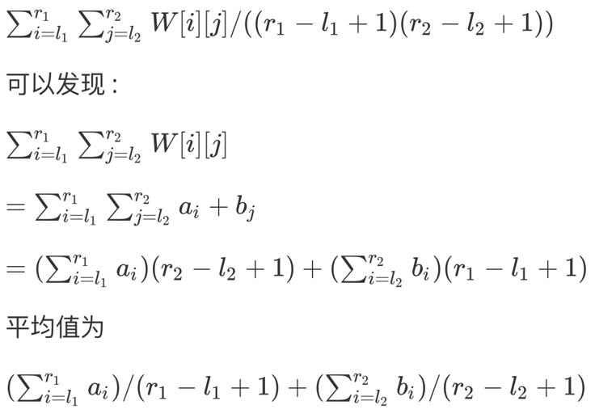

即求$a$的长$\ge x$的连续子区间的最大平均值和加上$b$的长$\ge y$的连续子区间的最大平均值。

求解这个问题，使用二分答案法，每次二分这个最大平均值$c$，然后计算新数组$a-c$，求前缀和。可以用$\Omicron(n)$的方法通过这个前缀和数组求出最大子区间。方法为：每次计算当前右边前缀和减去当前符合条件的左边最小的前缀和，可以证明这样选出来的是最大的，而且不需要使用暴力的$\Omicron(n^2)$方法。

因此每次二分的时间复杂度是$\Omicron(n)$，右边界最大值是$s=10^5\times10^5=10^{10}$，精度是$10^6$，则$s'=10^6s=10^{16}$，所以二分的时间复杂度是$\Omicron(\log s')$，总时间复杂度是$\Omicron(n\log s')$，可以通过。

代码如下：

```c++
#define mn 100010
ll n, m, x, y, a[mn], b[mn];
db av, bv, t[mn];

db solve(ll n, ll x, ll *a)
{
    ll as = 0;
    for (ll i = 1; i <= n; ++i)
    {
        sc(a[i]);
        as += a[i];
    }
    db lf = 0, rf = as, cf;
    //最大区间和=前缀和-前面的最小前缀和（要保证区间长度大于F）
    while (rf - lf > 1e-7)
    {
        cf = (lf + rf) / 2;
        for (ll i = 1; i <= n; ++i)
        {
            t[i] = a[i] - cf + t[i - 1];
        }
        db res = -1e18, minv = 1e18; //不能放在二分之外
        for (ll i = x; i <= n; ++i)
        {
            minv = min(minv, t[i - x]); //最小前缀和
            res = max(res, t[i] - minv);
        }
        if (res >= 0)
        {
            lf = cf + 1e-8;
        }
        else
        {
            rf = cf - 1e-8;
        }
    }
    return rf;
}

signed main()
{
    sc(n), sc(m), sc(x), sc(y);
    av = solve(n, x, a), bv = solve(m, y, b);
    printf("%.10lf", av + bv);
    return 0;
}
```


### C-LCS

赛时队友写出来了。

解题思路：将$a,b,c$重排序为$x\ge y\ge z$，构造：
$$
s_1=a\times z+b\times(x-z)+e\times(y-z)\\
s_2=a\times z+b\times(x-z)+c\times(y-z)\\
s_3=a\times z+d\times(x-z)+c\times(y-z)
$$
满足：$z+x-z+y-z=x+y-z= n$时显然上述构造满足题意。

若$n>x+y-z$，可以再三个串后面各自加上不相同的字符，如$mnp$。

若$n<x+y-z$，无解。

因为对应关系有点乱，所以代码写起来有点麻烦，代码如下：

```c++
ll n, p[5], len, c[4][4] = {{0, 1}, {1, 2}, {0, 2}};
struct num
{
    ll v, i;
    bool operator<(const num &x) const { return v > x.v; }
} v[5];
char s[4][1010];

bool find(ll v, ll k)
{
    return v == c[k][0] || v == c[k][1];
}

signed main()
{
    for (ll i = 0; i < 3; ++i)
    {
        sc(p[i]), v[i].v = p[i], v[i].i = i;
    }
    sc(n), sort(v, v + 3);
    if (n < v[0].v + v[1].v - v[2].v)
    {
        printf("NO\n");
        return 0;
    }
    for (ll i = 0; i < v[2].v; ++i)
    {
        for (ll j = 0; j < 3; ++j)
        {
            s[j][len] = 'a';
        }
        len++;
    }
    for (ll i = 0; i < v[0].v - v[2].v; ++i)
    {
        for (ll j = 0; j < 3; ++j)
        {
            s[j][len] = find(j, v[0].i) ? 'b' : 'd';
        }
        len++;
    }
    for (ll i = 0; i < v[1].v - v[2].v; ++i)
    {
        for (ll j = 0; j < 3; ++j)
        {
            s[j][len] = find(j, v[1].i) ? 'c' : 'e';
        }
        len++;
    }
    for (ll i = 0; i < n - v[0].v - v[1].v + v[2].v; ++i)
    {
        for (ll j = 0; j < 3; ++j)
        {
            s[j][len] = 'f' + j;
        }
        len++;
    }
    for (ll i = 0; i < 3; ++i)
    {
        printf("%s\n", s[i]);
    }
    return 0;
}
```


## 牛客5

### H-Holding Two

赛时唯一通过的题目，我找出了规律。直接构造奇数行$1100$循环节和偶数行$0011$循环节即可。该解法与赛后公布的正解一致。代码如下：

```c++
ll n, m;
signed main()
{
    sc(n), sc(m);
    for (ll i = 1; i <= n; ++i)
    {
        ll k = 0, now = (i % 2 == 1) ? 1 : 0;
        for (ll j = 1; j <= m; ++j)
        {
            printf("%lld", now);
            k += 1;
            if (k == 2)
            {
                k = 0;
                now = 1 - now;
            }
        }
        printf("\n");
    }
    return 0;
}
```


### K-King of Range

赛时WA了很多次，没有过题。

答案解法实际上没看懂。贴一个队友的解法思路：预处理最大最小值ST表，然后对每个询问，用滑动区间维护当前左端点第一个符合条件的右端点，那么右端点及以后的所有点必然符合。可以证明解法的正确性。

ST表预处理时间复杂度是$\Omicron(n\log n)$，滑动区间最大需要查询次数是$\Omicron(n)$，有$m$次询问，需要调用$m$次滑动区间，所以总复杂度是$\Omicron(mn+n\log n)$。代码如下：

```c++
#include <bits/stdc++.h>
using namespace std;
 
const int maxn = 1e5 + 5;
 
int n, m;
int a[maxn];
int k;
 
int xmin[maxn][20], xmax[maxn][20];
 
void build() {
  for (int i = 0; i < n; i++) {
    xmin[i][0] = xmax[i][0] = a[i];
  }
  for (int j = 1; (1<<j) <= n; j++) {
    for (int i = 0; i + (1<<j) - 1 <= n; i++) {
      xmin[i][j] = min(xmin[i][j-1], xmin[i+(1<<(j-1))][j-1]);
      xmax[i][j] = max(xmax[i][j-1], xmax[i+(1<<(j-1))][j-1]);
    }
  }
}
 
int query_min(int l, int r) {
  int len = r - l + 1;
  int lg = 31 - __builtin_clz(len);
  return min(xmin[l][lg], xmin[r-(1<<lg)+1][lg]);
}
 
int query_max(int l, int r) {
  int len = r - l + 1;
  int lg = 31 - __builtin_clz(len);
  return max(xmax[l][lg], xmax[r-(1<<lg)+1][lg]);
}
 
void solve() {
  long long ans = 0;
  for (int l = 0, r = 0; l < n; l++) {
    while (r < n && query_max(l, r) - query_min(l, r) <= k) r++;
    if (query_max(l, r - 1) - query_min(l, r - 1) <= k) {
      ans += n - r;
    }
  }
  cout << ans << "\n";
}
 
int main() {
  cin.tie(nullptr);
  ios_base::sync_with_stdio(false);
  cin >> n >> m;
  for (int i = 0; i < n; i++) cin >> a[i];
  build();
  while (m--) {
    cin >> k;
    solve();
  }
  return 0;
}
```


### B-Boxes

赛时想了很多思路，结果都没有对。主要是没有意识到花费$C$查是只能查所有的，所以查完一次之后再查绝对没有意义。而且没有意识到花了$C$之后查到的每个结果不等可能性。

思路：查完之后，有$n+1$种黑球数目可能性，概率不相等，有$2^n$种球的摆放可能性。去掉首尾，对于其中需要抽卡的$n-1$种可能性，假设抽前$i$便宜的球，当且仅当：查到的对账了时可以不继续抽下去直接说答案。

对账时，前面$i$个球的$2^i$个可能性对应了答案的可能性，这时要求后面$n-i$个球唯一。所以刚好对上的概率是：
$$
\dfrac{2^i}{2^n}=\dfrac1{2^{n-i}}
$$

> 例如有$5$个球，取前两个，可能是$00,01,10,11$，由于已花钱查询，根据减法可以知道后面的唯一情况，这对查询的每一种结果都是一样的。

特别地，可以不花钱全部抽。对这两种方案应该选取最小的一个，即：
$$
ans=\min(\sum_{i=1}^nw_i,\sum_{i=1}^n\dfrac1{2^{n-i}}\cdot\sum_{j=1}^iw_i)
$$
前缀和优化。总复杂度是快排复杂度是$\Omicron(n\log n)$，代码如下：

```c++
#define mn 100010
ll n;
db s[mn], res1, res2, a[mn];
signed main()
{
    sc(n), scanf("%lf", &res2);
    for (ll i = 1; i <= n; ++i)
    {
        scanf("%lf", &a[i]); //你甚至敢用sc快读double?!
    }
    sort(a + 1, a + 1 + n);
    for (ll i = 1; i <= n; ++i)
    {
        res1 += a[i];
        s[i] = s[i - 1] + a[i]; //不能一并处理，要先sort a
    }
    for (ll i = 1; i < n; ++i)
    {
        res2 += s[i] * pow(0.5, n - i);
    }
    printf("%.10lf", min(res1, res2));
    return 0;
}
```


### D-Double Strings

赛时没想出来。赛后发现我赛时题意理解错了。

前置知识：
$$
\sum_{k=0}^n\begin{pmatrix}m\\k\end{pmatrix}\begin{pmatrix}n\\k\end{pmatrix}=\begin{pmatrix}m+n\\m\end{pmatrix},m,n\in N
$$
应该认识到所求是：一段相同的子序列+一个不同字符+长度相同的任意子序列(注意这个序列是递增的；注意$a,b$是子序列不是原序列)

相同的前面可以用DP解，很简单。后面没有任何要求，只需要凑数，可以直接用组合数相乘，设两个字符串的剩余长度$x\le y$，所求是：
$$
\sum_{i=0}^x C_x^iC_y^i=\sum_{i=0}^x C_x^{x-i}C_y^i=C_{x+y}^{x}
$$
如果$x>y$，相似处理即可。代码为：

```c++
#define mn 5010
ll mod = 1e9 + 7, as, bs, ans, dp[mn][mn], fac[mn * 2], inv[mn * 2];
char a[mn], b[mn];

ll c(ll uf, ll df)
{
    if (uf < 0 || df < 0 || uf > df)
    {
        return 0;
    }
    return fac[df] * inv[uf] % mod * inv[df - uf] % mod;
}

signed main()
{
    scanf("%s%s", a + 1, b + 1), as = strlen(a + 1), bs = strlen(b + 1);
//c[mn][mn]行不通的，最大需要5e3+5e3，爆空间了，还是要逆元啊
    fac[0] = fac[1] = 1, inv[0] = inv[1] = 1;
    for (ll i = 2; i < mn * 2; ++i)
    {
        fac[i] = fac[i - 1] * i % mod;
        inv[i] = mod - mod / i * inv[mod % i] % mod;
    }
    for (ll i = 2; i < mn * 2; ++i)
    {
        inv[i] = inv[i - 1] * inv[i] % mod;
    }
    for (ll i = 0; i <= as; ++i)
    {
        dp[i][0] = 1;
    }
    for (ll i = 0; i <= bs; ++i) //i=0或1均可
    {
        dp[0][i] = 1;
    }
    for (ll i = 1; i <= as; ++i)
    {
        for (ll j = 1; j <= bs; ++j)
        {
            dp[i][j] = (mod + dp[i - 1][j] + dp[i][j - 1] - dp[i - 1][j - 1]) % mod; //我tm一刀自己 %mod)暴毙
            if (a[i] == b[j])
            {
                (dp[i][j] += dp[i - 1][j - 1]) %= mod;
            }
            else if (a[i] < b[j])
            { //不取minmax也不影响f
                ll x = min(as - i, bs - j), y = max(as - i, bs - j);
                // ll x = as - i, y = bs - j;
                (ans += dp[i - 1][j - 1] * c(x, x + y)) %= mod;
            }
        }
    }
    printf("%lld", ans);
    return 0;
}
```


### J-Jewels

赛时完全没做。

作匹配问题，左边是$1\sim n$个时间匹配右边是$1\sim n$个珠宝，想要得到最小权。可以跑负的最大权完美匹配，跑KM算法，时间复杂度是$\Omicron(n^3)$。

```c++
#define mn 305
#define big 0x7fffffffffffffff
ll n, m, e[mn][mn], mb[mn], vb[mn], ka[mn], kb[mn], p[mn], c[mn];
ll qf, qb, q[mn];

void bfs(ll u)
{
    ll a, v = 0, v1 = 0, d;
    fill(p + 1, p + n + 1, 0), fill(c + 1, c + n + 1, big), mb[v] = u;
    do
    {
        a = mb[v], d = big, vb[v] = 1;
        for (ll b = 1; b <= n; ++b)
        {
            if (!vb[b])
            {
                if (c[b] > ka[a] + kb[b] - e[a][b])
                {
                    c[b] = ka[a] + kb[b] - e[a][b], p[b] = v;
                }
                if (c[b] < d)
                {
                    d = c[b], v1 = b;
                }
            }
        }
        for (ll b = 0; b <= n; ++b)
        {
            if (vb[b])
            {
                ka[mb[b]] -= d, kb[b] += d;
            }
            else
            {
                c[b] -= d;
            }
        }
        v = v1;
    } while (mb[v]);
    while (v)
    {
        mb[v] = mb[p[v]], v = p[v];
    }
}

ll km()
{ //memset mb,ka,kb->0
    for (ll a = 1; a <= n; ++a)
    {
        fill(vb, vb + n + 1, 0);
        bfs(a);
    }
    ll res = 0;
    for (ll b = 1; b <= n; ++b)
    {
        res += e[mb[b]][b];
    }
    return res;
}

ll x[mn], y[mn], z[mn], v[mn];
#define ep(x) ((x) * (x))

signed main()
{
    n = read();
    for (ll i = 1; i <= n; ++i)
    {
        sc(x[i]), sc(y[i]), sc(z[i]), sc(v[i]);
        for (ll j = 1; j <= n; ++j)
        {
            e[i][j] = -(ep(x[i]) + ep(y[i]) + ep(z[i] + (j - 1) * v[i]));
        }
    }
    printf("%lld\n", -km());
    return 0;
}
```


## 牛客6

### I-Intervals on the Ring

赛时我提出了一个主要思路，然后队友补充了一些其他情况和特判，然后我过题了。

大概思路是跨区间的一分为二正常区间。然后用全集(最左有效到最右有效)并下一个左边到上一个右边的区间范围。

依据：德摩根律$\overline{\bigcup A_i}=\bigcap\overline{A_i}$，所以输出未被覆盖的区间补

代码如下：

```c++
#define mn 1010
ll t, n, m, mi, mx, cnt, len;
struct seg
{
    ll l, r;
    bool operator<(const seg &x) const { return l < x.l; }
} s[mn], ans[mn];
signed main()
{
    sc(t);
    while (t--)
    {
        sc(n), sc(m);
        mi = 1e9, mx = -1;
        len = m;
        for (ll i = 1; i <= m; ++i)
        {
            sc(s[i].l), sc(s[i].r);
            mi = min(mi, min(s[i].l, s[i].r));
            mx = max(mx, max(s[i].l, s[i].r));
            if (s[i].l > s[i].r)
            {
                ++len;
                s[len].l = 1, s[len].r = s[i].r;
                s[i].r = n;
                mi = 1, mx = n;
            }
        }
        cnt = 1;
        sort(s + 1, s + 1 + len);
        ans[1].l = mi, ans[1].r = mx;
        for (ll i = 2; i <= len; ++i)
        {
            ++cnt;
            ans[cnt].l = s[i].l;
            ans[cnt].r = s[i - 1].r;
        }
        printf("%lld\n", cnt);
        for (ll i = 1; i <= cnt; ++i)
        {
            printf("%lld %lld\n", ans[i].l, ans[i].r);
        }
    }
    return 0;
}
```


### F-Hamberger Steak

赛时过了，用二分答案法。将用时从大到小排序，按锅顺序叠，如果叠超了，那么就拆成两份，一份更好塞满，另一份放到下一个锅。由于从大到小排序，所以放到下一个锅的部分一定不可能产生时间重合。赛时队友代码没过样例的同时，我的代码过了题。

答案解法不用二分，直接用时为$\max(\max\ t_i,\lceil\dfrac{\sum_{i=1}^nt_i}{m}\rceil)$

代码如下：

```c++
#include <bits/stdc++.h>
#pragma GCC optimize(2)
using namespace std;
typedef long long ll;
typedef double db;
#define sc(x) scanf("%lld", &x)
#define il inline
#define mn 100010
ll n, m, lf, rf, cf, now[mn];
struct ans
{
    ll id, l, r;
};
struct time
{
    ll i, t;
    bool operator<(const time &x) const { return t < x.t; }
} t[mn];
vector<ans> a[mn], b[mn];
bool f()
{
    memset(now, 0, sizeof now);
    for (ll i = 1; i <= n; ++i)
    {
        a[i].clear();
    }
    ll mi = 1;
    for (ll i = 1; i <= n; ++i)
    {
        if (now[mi] + t[i].t <= cf)
        {
            a[t[i].i].push_back({mi, now[mi], now[mi] + t[i].t});
            now[mi] += t[i].t;
        }
        else
        {
            ll d = t[i].t - (cf - now[mi]);
            a[t[i].i].push_back({mi + 1, now[mi + 1], now[mi + 1] + d});
            a[t[i].i].push_back({mi, now[mi], cf});
            now[mi] = cf;
            ++mi;
            now[mi] += d;
        }
        while (now[mi] == cf && i != n)
        {
            ++mi;
        }
        if (mi > m)
        {
            return false;
        }
    }
    return true;
}
signed main()
{
    sc(n), sc(m);
    for (ll i = 1; i <= n; ++i)
    {
        sc(t[i].t);
        t[i].i = i;
        lf = max(lf, t[i].t);
        rf += t[i].t;
    }
    sort(t + 1, t + 1 + n);
    reverse(t + 1, t + 1 + n);
    while (lf <= rf)
    {
        cf = (lf + rf) >> 1;
        if (f())
        {
            rf = cf - 1;
            for (ll i = 1; i <= n; ++i)
            {
                b[i].resize(a[i].size());
                for (ll j = 0, je = b[i].size(); j < je; ++j)
                {
                    b[i][j] = a[i][j];
                }
            }
        }
        else
        {
            lf = cf + 1;
        }
    }
    for (ll i = 1; i <= n; ++i)
    {
        printf("%lld", b[i].size());
        for (ll j = 0, je = b[i].size(); j < je; ++j)
        {
            printf(" %lld %lld %lld", b[i][j].id, b[i][j].l, b[i][j].r);
        }
        printf("\n");
    }
    return 0;
}
```


### H-Hopping Rabbit

赛时已经想到了正解，但是没做出来。

将所有矩形移动到$(0,0)$到$(d,d)$范围内求并，然后找是否有未覆盖点。使用扫描线。

当发现某次扫描时没有全覆盖时，使用差分的方法，每次扫描对线上进行一次差分，统计时将差分转原数组即可。注意到这题扫描线无需离散化，可以用桶排，队友代码如下：

```c++
#include<bits/stdc++.h>
 
using namespace std;
#define pr(x) cout << #x << " = " << x << "  "
#define prln(x) cout << #x << " = " << x << endl
const int N = 100007, INF = 0x3f3f3f3f, MOD = 1e9 + 7;
int n,d;
struct Seg {
    int l, r, h; int d;
    Seg() {}
    Seg(int l, int r, int h, int d): l(l), r(r), h(h), d(d) {}
    bool operator< (const Seg& rhs) const {return h < rhs.h;}
} a[N];
 
int cnt[N << 2];
int sum[N << 2], all[N];
 
#define lson l, m, rt << 1
#define rson m + 1, r, rt << 1 | 1
 
void push_up(int l, int r, int rt) {
    if(cnt[rt]) sum[rt] = r-l+1;
    else if(l == r) sum[rt] = 0; //leaves have no sons
    else sum[rt] = sum[rt << 1] + sum[rt << 1 | 1];
}
 
void update(int L, int R, int v, int l, int r, int rt) {
    if(L <= l && r <= R) {
        cnt[rt] += v;
        push_up(l, r, rt);
        return;
    }
    int m = (l + r) >> 1;
    if(L <= m) update(L, R, v, lson);
    if(R > m) update(L, R, v, rson);
    push_up(l, r, rt);
}
 
vector<tuple<int,int,int>> g[N];
int pf[N];
int main() {
    ios_base::sync_with_stdio(0);
    cin.tie(0);
    cin>>n>>d;
    for (int i=1;i<=n;++i){
        int x1,y1,x2,y2;
        cin>>x1>>y1>>x2>>y2;
        int length = abs(x1 - x2), width = abs(y1 - y2);
        int sx[] = {0, 0, -d, -d};
        int sy[] = {0, -d, 0, -d};
        x1 = (x1 % d + d) % d;
        y1 = (y1 % d + d) % d;
 
        for (int j = 0; j < 4; j++)
        {
            if (x1 + sx[j] + length <= 0 || y1 + sy[j] + width <= 0) continue;
            x2 = min(d, x1 + sx[j] + length), y2 = min(d, y1 + sy[j] + width);
            int u,v;
            u = max(0, x1 + sx[j]), v = max(0, y1 + sy[j]);
            g[u].push_back({v, y2, 1});
            g[x2].push_back({v, y2, -1});
        }
    }
    // cout<<"END"<<endl;
    for (int i=0;i<d;++i){
        for (auto [u,v,w]:g[i]){
            if (u==v) continue;
            update(u+1,v,w,1,d,1);
            pf[u]+=w;
            pf[v]-=w;
        }
        if (sum[1]<d){
            cout<<"YES\n";
            cout<<i<<" ";
            for (int j=1;j<d;++j) pf[j]+=pf[j-1];
            for (int j=0;j<d;++j) {if (!pf[j]) return cout<<j,0;}
            assert(0);
        }
    }
    cout<<"NO";
    return 0;
}
```


### C-Delete Edge

这是一开始的一道歪榜题，大家都以为是签到题，然后基本没人过题。赛时没做出来。

题解看懂了，直接贴官方题解：

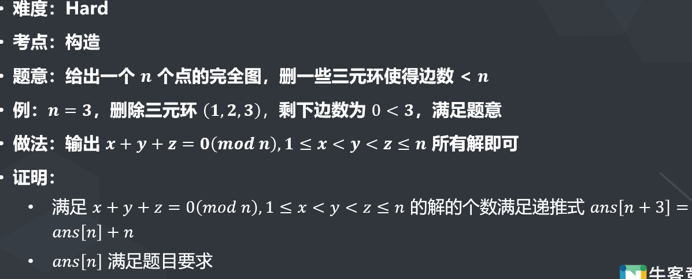

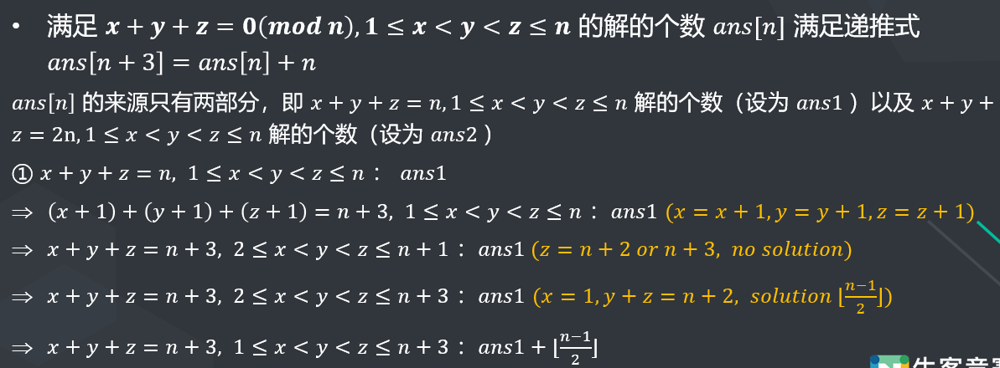

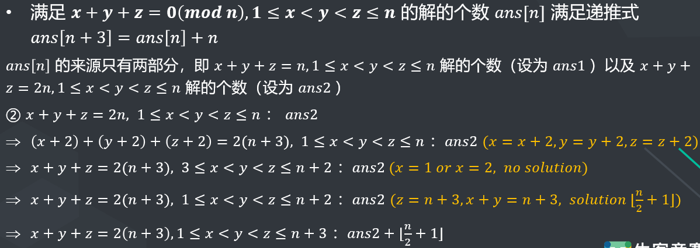

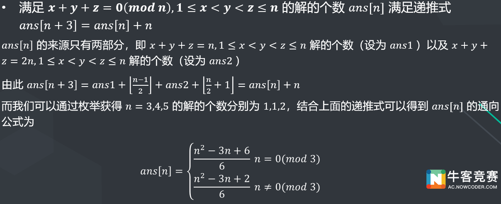

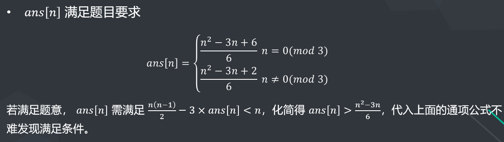

代码如下：

```c++
#include <bits/stdc++.h>
#define re
using namespace std;
typedef long long ll;
#define il inline
typedef double db;
il ll read()
{
    re char p = 0;
    re ll r = 0, o = 0;
    for (; p < '0' || p > '9'; o |= p == '-', p = getchar())
        ;
    for (; p >= '0' && p <= '9'; r = (r << 1) + (r << 3) + (p ^ 48), p = getchar())
        ;
    return o ? (~r) + 1 : r;
}
#define sc(x) x = read()

ll n;
vector<ll> ans[3];

void solve(ll x)
{
    for (ll i = 1; i <= n; ++i)
    {
        for (ll j = i + 1; j <= n; ++j)
        {
            ll k = x - i - j;
            if (k <= j || k > n) //没有k>n暴毙
            {
                continue;
            }
            ans[0].emplace_back(i);
            ans[1].emplace_back(j);
            ans[2].emplace_back(k);
        }
    }
}

signed main()
{
    sc(n);
    solve(n);
    solve(2 * n);
    printf("%lld\n", ans[0].size());
    for (ll i = 0; i < ans[0].size(); ++i)
    {
        for (ll j = 0; j < 3; ++j)
        {
            printf("%lld ", ans[j][i]);
        }
        printf("\n");
    }
    return 0;
}
```


## 牛客7

### I-xay loves or

签到题，但是赛时因为看漏了positive而WA了好多发。按$x,s$分四类讨论即可。

```c++
#define mn 340
ll xo, so, ans = 1;
ll x[mn], s[mn];
void get(ll o, ll *b)
{
    for (ll i = 64; i >= 0; --i)
    {
        b[i] = o & 1;
        o /= 2;
    }
}
signed main()
{
    sc(xo), sc(so), get(xo, x), get(so, s);
    for (ll i = 0; i <= 64; ++i)
    {
        if (s[i] == 0)
        {
            if (x[i] == 1)
            {
                ans = 0;
            }
        }
        else
        {
            if (x[i] == 1)
            {
                ans *= 2;
            }
        }
    }
    if (xo == so)
        --ans;
    printf("%lld\n", ans);
    return 0;
}
```

更优解：若$x$不是$s$的子集，即$x\&s\neq x$，输出$0$，否则答案为$2^{popcount(x)}$，即$1$的个数：

```c++
sc(x), sc(s);
if ((x & s) != x) return printf("0"), 0;
ans = 1LL << __builtin_popcount(x);//注意1LL
if (x == s) --ans;
return printf("%lld", ans), 0;
```


### H-xay loves count

赛时队友做出来了，我没想出这道题解法。队友解法与官方题解思路一致。

官方题解：直接枚举$i,j$，稍加优化，时间复杂度最差是：
$$
\sum_{i=1}^{10^6}\lfloor\dfrac{10^6}i \rfloor\approx10^6\int_0^{10^6}\dfrac1xdx\approx10^6\log10^6
$$
个人代码为：

```c++
sc(n);
for (ll i = 1; i <= n; ++i)
{
    sc(a[i]);
    ++b[a[i]];
}
for (ll i = 1; i <= m; ++i) //m=1e6
{
    if (!b[i])
    {
        continue;
    }
    for (ll j = i; j <= m / i; ++j)
    {
        if (!b[j])
        {
            continue;
        }
        ll k = i * j;
        if (k <= m && b[k])
        {
            ll v = b[i] * b[j] * b[k];
            if (i != j)
            {
                v <<= 1;
            }
            ans += v;
        }
    }
}
printf("%lld", ans);
return 0;
```


### F-xay loves trees

赛时我想出了轻重链剖分的思路，可惜没能继续往下想出整道题的具体解法。实现了比赛时一个小时做完前两题，然后罚坐坐牢了四小时的神话。

因为这道题没补，没看懂题解，所以不贴代码了。队友倒是补了。


## 牛客8

### E-Rise of Shadows

赛时我写了个暴力比赛开始五分多钟过了题。写完了才发现其实直接输出no即可。

```c++
ll t; sc(t); while (t--) printf("no\n");
```


### A-Ares, Toilet Ares

赛时后来才看，一开始过题人少，没D过得人多，我花了比较久去理解，结果就是一道求逆元的裸题。我WA了很多次是因为没有特判除掉$0$的数据。

所求表达式是：
$$
(1+\sum_{i=1}^k\dfrac{z_i-y_i}{z_i})\bmod4933
$$
通分，把$1$化成分母即可。

```c++
#include <bits/stdc++.h>
using namespace std;
typedef long long ll;
typedef double db;
#define sc(x) scanf("%lld", &x)
#define il inline
#define mn 100010
ll n, m, k, a, l, x[mn], y[mn], z[mn], tfz = 1, tfz1, tfz2, tfm = 1;
const ll mod = 4933;
il ll qpow(ll a, ll b = mod - 2)
{
    ll res = 1;
    for (; b; b >>= 1, (a *= a) %= mod)
        if (b & 1)
            (res *= a) %= mod;
    return res;
}
ll fz[mod + 10], fm[mod + 10];
signed main()
{
    sc(n), sc(m), sc(k), sc(a), sc(l);
    for (ll i = 0; i < k; ++i)
    {
        sc(x[i]), sc(y[i]), sc(z[i]);
        if (!x[i] || !z[i]) //不然会死
            continue;
        (tfz *= (z[i] - y[i])) %= mod;
        (tfm *= z[i]) %= mod;
    }
    printf("%lld", (tfm * (a % mod) % mod + tfz) % mod * qpow(tfm) % mod);
    return 0;
}
```


### K-Yet Another Problem About Pi

实际上是我们赛时第二道看的题目。我想出了一个贪心、一个DP，但是要么错了要么分析到复杂度不过。赛后发现就是枚举，但是注意优化就能过了……

答案解法没看懂，贴一个队友补题代码。时间复杂度分析：走的次数最多为$10^8\pi$，但是实际上每次循环的次数是只有几次的，因为要处理的都是残差转换。时间复杂度也就是$\Omicron(t)$而已。

```c++
#include <bits/stdc++.h>
#pragma GCC optimize(2)
#define pb push_back
#define endl '\n'
#define lson lef, mid, num << 1
#define rson mid + 1, rig, num << 1 | 1

using namespace std;
using ll = long long;
using db = double;
const db pi = acos(-1.0);

void solve()
{
    db x, y;
    cin >> x >> y;
    db p = sqrt(x * x + y * y);
    x = min(x, y);
    int k = pi / x;
    int ans1 = 4 + 2 * k; //全部直着走
    db temp = pi - k * x; //剩余路程
    if (x / 2.0 < p / 3.0) //斜着走更划算
    {
        while (k && temp + x >= p) //还有直着走的，把一个直着走的换成一个斜着走的
        {
            ans1++; //ans=ans+3-2
            k--;
            temp = temp + x - p;
        }
    }
    k = pi / p;
    int ans2 = 4 + 3 * k;
    temp = pi - k * p;
    if (temp >= x)
        ans2 += 2, temp -= x;
    if (x / 2.0 > p / 3.0) //同理
    {
        while (k && (int)((temp + p) / x) >= 2)
        { //即如果可以把一个斜走换成2个两个直走(因为显然一个是必然能换的)
            int u = (temp + p) / x; //就一个斜走换u个
            ans2 += u * 2 - 3;
            k--;
            temp = temp + p - u * x;
        }
    }
    int ans = max(ans1, ans2);
    cout << ans << endl;
}
int main()
{
    ios::sync_with_stdio(false);
    cin.tie(0);
    cout.tie(0);
    int T;
    cin >> T;
    while (T--)
        solve();
    return 0;
}
```


### D-Or

注意审题：or是位运算，不是任一个的意思。

赛时队友主要在想这道题。我没思路。他们也没做出来。

题解：注意到$a+b=(a|b)+(a\&b)$，为方便，变换$c$为与数组。

可以按位枚举，具体思路见代码，复杂度是$\Omicron(n\log 2^{32})=\Omicron(32n)$：

```c++
#include <bits/stdc++.h>
#pragma GCC optimize(2)
#define pb push_back
#define endl '\n'
#define lson lef, mid, num << 1
#define rson mid + 1, rig, num << 1 | 1

using namespace std;
using ll = long long;
using db = double;

const int maxn = 1e5 + 10;
ll b[maxn], c[maxn];
int n;
int check(int bit, int orr, int num)//顺推数组以检验合理性
{
    //cout <<num << ' '<< orr << ' ' << (b[num] >> bit & 1) << ' ' << (c[num] >> bit & 1) << endl;
    if (num >= n)
        return 1;
    if (orr == 1 && ((b[num] >> bit) & 1) == orr && ((c[num] >> bit) & 1) != orr) //a[num]第bit位取1,或必然1,如果与是0，那么下一位取0
        return check(bit, 0, num + 1);
    //相同顺推
    if (((b[num] >> bit) & 1) == orr && ((c[num] >> bit) & 1) == orr)
        return check(bit, orr, num + 1);
    //同第一个if理
    if (orr == 0 && ((b[num] >> bit & 1) == 1) && ((c[num] >> bit) & 1) == 0)
        return check(bit, 1, num + 1);
    return 0;
}
int main()
{
    ios::sync_with_stdio(false);
    cin.tie(0);
    cout.tie(0);
    int i, j;
    cin >> n;
    for (i = 1; i < n; i++)
        cin >> b[i];
    for (i = 1; i < n; i++) //b是交，c是并
        cin >> j, c[i] = j - b[i];
    for (i = 1; i < n; i++)
    {
        if (c[i] > b[i] || c[i] < 0)
        {
            cout << 0;
            return 0;
        }
    }
    ll ans = 1;
    for (i = 0; i <= 32; i++)
    {
        int t1 = b[1] >> i & 1, t2 = c[1] >> i & 1; //取第i位
        // cout << t1 << ' ' << t2 << endl;
        int p = 0;
        if (t2 == t1)
            p += check(i, t1, 2); //a[1]第i位只能取与值
        else if (t2 == 1 && t1 == 0)
            p = 0;
        else if (t2 == 0 && t1 == 1)
        {
            p += check(i, 1, 2); //第i位试着取1
            p += check(i, 0, 2); //第i位试着取0
        }
        // cout << p << endl;
        ans *= p;
    }
    cout << ans;
    return 0;
}
```


## 牛客9

### H-Happy Number

赛时我头七分钟就写出来了，就是一道三进制签到题。代码如下：

```c++
ll n, x[] = {2, 3, 6};
string res;
signed main()
{
    sc(n);
    for (; n; n = (n - 1) / 3)
    {
        res = char('0' + x[(n - 1) % 3]) + res;
    }
    cout << res;
    return 0;
}
```


### E-Eyjafjalla

赛时我想出了树链剖分+线段树的做法，结果线段树部分复杂度没控制好我TLE了。然后队友用树剖+主席树的解法过了题。

解题思路是先用树剖和主席树预处理，对于每个询问的节点，首先用树上倍增的方法找到最高允许的温度的节点，然后计算该节点的大于等于最小温度的子树和。时间复杂度取主席树复杂度，为$\Omicron(n\log n)$。队友过题代码如下：

```c++
#include <bits/stdc++.h>
// #define int long long
using namespace std;
 
using ll = long long;
using pii = pair<int,int>;
using pll = pair<ll,ll>;
 
const int maxn = 1e5+50;
int n, q;
vector<int> vt[maxn];
int w[maxn], dw[maxn];
int dep[maxn], fa[maxn], siz[maxn], hson[maxn];
int id[maxn], nw[maxn], pcnt, top[maxn];
 
struct Node
{
    int l, r, sum;
} tr[maxn*20];
int tot, root[maxn];
 
int dfa[maxn][18];
 
void dfs1(int x, int fath)
{
    dep[x] = dep[fath] + 1;
    fa[x] = fath;
    dfa[x][0] = fath;
    siz[x] = 1;
    int mson = -1;
 
    for (int i = 1; i < 18; i++)
    {
        dfa[x][i] = dfa[dfa[x][i-1]][i-1];
    }
 
    for (auto s : vt[x])
    {
        if (s == fath) continue;
        dfs1(s, x);
        siz[x] += siz[s];
        if (siz[s] > mson) hson[x] = s, mson = siz[s];
    }
}
 
void dfs2(int x, int topf)
{
    id[x] = ++pcnt;
    nw[pcnt] = w[x];
    top[x] = topf;
 
    if (!hson[x]) return;
 
    dfs2(hson[x], topf);
    for (auto s : vt[x])
    {
        if (s == fa[x] || s == hson[x]) continue;
        dfs2(s, s);
    }
}
 
int build(int l, int r)
{
    int now = ++tot;
    tr[now].sum = 0;
    if (l >= r) return now;
 
    int mid = (l + r) / 2;
    tr[now].l = build(l, mid);
    tr[now].r = build(mid+1, r);
 
    return now;
}
 
int update(int l, int r, int rt, int p)
{
    int now = ++tot;
    tr[now] = tr[rt];
    tr[now].sum++;//子树节点数(含自己)
    if (l >= r) return now;
 
    int mid = (l + r) / 2;
    if (p <= mid) tr[now].l = update(l, mid, tr[now].l, p);
    else tr[now].r = update(mid+1, r, tr[now].r, p);
    return now;
}
 
int query(int l, int r, int u, int v, int p)
{
    if (l >= r)
    {
        // printf("l=%d, r=%d, trv=%d, tru=%d\n", l, r, tr[v].sum, tr[u].sum);
        return tr[v].sum - tr[u].sum;
    }
 
    int mid = (l + r) / 2;
    return p <= mid ? query(l, mid, tr[u].l, tr[v].l, p) + tr[tr[v].r].sum - tr[tr[u].r].sum : query(mid+1, r, tr[u].r, tr[v].r, p);
}
 
signed main()
{
    scanf("%d", &n);
 
    for (int i = 1,ui,vi; i < n; i++)
    {
        scanf("%d %d",&ui,&vi);
        vt[ui].push_back(vi);
        vt[vi].push_back(ui);
    }
 
    w[0] = 0x7fffffff;
    for (int i = 1; i <= n; i++)
    {
        scanf("%d",&w[i]);
        dw[i] = w[i];
    }
 
    dfs1(1, 0);
    dfs2(1, 1);
 
    for (int i = 1; i <= n; i++)
    {
        dfa[i][0] = fa[i];
    }
 
    sort(dw+1, dw+1+n);
    int len = unique(dw+1, dw+1+n) - dw - 1;
    root[0] = build(1, len);
    for (int i = 1; i <= n; i++)
    {
        root[i] = update(1, n, root[i-1], lower_bound(dw+1, dw+1+n, nw[i])-dw );
    }
 
    // printf("nw: ");
    // for (int i = 1; i <= n; i++)
    // {
    //     printf("%d ", nw[i]);
    // }
    // printf("\n");
 
    // query
    scanf("%d",&q);
    while (q--)
    {
        int xi, li, ri;
        scanf("%d %d %d", &xi, &li, &ri);
 
        // invalid
        if (w[xi] < li || w[xi] > ri)
        {
            // printf("ans=");
            printf("0\n");
            continue;
        }
 
        int cur = xi;
        for (int j = 17; j >= 0; j--)//倍增模板(更好的写法)
        {
            if (w[dfa[cur][j]] <= ri) cur = dfa[cur][j];
        }
 
        // printf("cur=%d, siz=%d, id=%d, w[cur]=%d, nw[id[cur]]=%d, qid=%d\n", cur, siz[cur], id[cur], w[cur], nw[id[cur]], lower_bound(dw+1,dw+1+n,li)-dw);
 
        //
        int ans = query(1, n, root[id[cur]-1], root[id[cur]-1+siz[cur]], lower_bound(dw+1,dw+1+n,li)-dw);//li值第几大
        // printf("ans=%d\n", ans);
        printf("%d\n", ans);
    }
 
    return 0;
}
```

一个优化后的赛后补题代码：

```c++
#include <bits/stdc++.h>
#define pb push_back
 
using ll = long long;
using namespace std;
 
const int maxn = 1e5 + 10;
//   主席树
 
const int maxx=1e5+100;
struct node{
    int l;
    int r;
    int sum;
}p[maxx*40];
int root[maxx];
int tot;
//以DFN序节点为列表建主席树
/*--------------主席树--------------*/
inline int build(int l,int r)
{
    int cur=++tot;
    p[cur].sum=0;
    if(l==r) return cur;
    int mid=l+r>>1;
    p[cur].l=build(l,mid);
    p[cur].r=build(mid+1,r);
    return cur;
}
inline int update(int rot,int pos,int l,int r)
{ //这是区间第k大的初始化模板
    int cur=++tot;
    p[cur]=p[rot];//继承父节点信息
    p[cur].sum++;//子节点数目+1(自己)
    if(l==r) return cur;
    int mid=l+r>>1;
    if(pos<=mid) p[cur].l=update(p[rot].l,pos,l,mid);
    else p[cur].r=update(p[rot].r,pos,mid+1,r);
    return cur;
}
inline int query(int lrot,int rrot,int l,int r,int pos)
{//l==r,区间第几大,那么有多少个有效的节点
    if(l==r) return p[rrot].sum-p[lrot].sum;
    int mid=l+r>>1;
    int sum=0;
    if(pos<=mid) sum=query(p[lrot].l,p[rrot].l,l,mid,pos)+p[p[rrot].r].sum-p[p[lrot].r].sum;
    else sum=query(p[lrot].r,p[rrot].r,mid+1,r,pos);
    return sum;
}
 
//
int t[maxn];
int ti[maxn]; //dfn对应的温度
int n;
int ls[maxn]; //离散化
int L[maxn], R[maxn];
int bz[maxn][22];
vector <int> e[maxn];
int dfn;
int deep[maxn];
void dfs(int num, int d)
{
    L[num] = ++dfn;
    deep[num] = d;
    ti[dfn] = t[num];
    for (auto i : e[num])
    {
        if (t[i] < t[num])
        {
            dfs(i, d + 1);
            bz[i][0] = num;
        }
    }
    R[num] = dfn;
}
int main()
{
    ios::sync_with_stdio(false);
    cin.tie(0);cout.tie(0);
 
    int i, j, u, v;
    cin >> n;
    for (i = 1; i < n; i++)
    {
        cin >> u >> v;
        e[u].pb(v);
        e[v].pb(u);
    }
    for (i = 1; i <= n; i++)
    {
        cin >> t[i];
        ls[i] = t[i];
    }
    sort(ls + 1, ls + 1 + n);
    int len = unique(ls + 1, ls + 1 + n) - ls - 1;
    //unique会修改原数组ls
    dfs(1, 1);
    for (i = 1; i <= 25; i++)
    {
        for (j = 1; j <= n ; j++)
        {
            if (deep[j] - (1 << i) <= 0) continue;
            bz[j][i] = bz[bz[j][i - 1]][i - 1];
        }
    }
    root[0] = build(1, len);
    for (i = 1; i <= n; i++)
    { //DFN序第i的节点在主席树上的编号是root[i]
        root[i] = update(root[i - 1],lower_bound(ls + 1, ls + 1 + len, ti[i]) - ls, 1, n);
    }
    int q, x, l, r;
    cin >> q;
    while (q--)
    {
        cin >> x >> l >> r;
        if (t[x] < l || t[x] > r)
        {
            cout << 0 << endl;
            continue;
        }
        //r = upper_bound(ls, ls + 1 + len, r) - ls - 1;
        //倍增
        //cout << l << endl;
        for (j = 22; j >= 0 ; j--)
        {
            if (deep[x] - (1 << j) <= 0) continue;
            if (t[bz[x][j]] > r) continue;
            x = bz[x][j];
        }
       // cout << L[x] << ' ' << R[x] << endl;
        //树链的节点范围是lrot,rrot
        //线段树节点范围是[1,n]
//l是第lower_bound(ls + 1, ls + 1 + len, l) - ls大
        //找pos=l
        cout <<query(root[L[x]-1], root[R[x]], 1, n, lower_bound(ls + 1, ls + 1 + len, l) - ls) << endl;
    }
    return 0;
}
/*
test
 
4
1 2
1 3
2 4
10 8 7 6
 
*/
```


解法2：线段树+倍增+树剖

线段树维护两个最值。然后用最值进行最低温判断，这个解法比较好理解

```c++
#include<bits/stdc++.h>
#define sc(a) scanf("%d",&a)
using namespace std;
typedef long long ll;
const int maxn= 4e5+5;
ll a[maxn],n;
vector<int> G[maxn];
int son[maxn],Size[maxn],fa[maxn][21],top[maxn],pos[maxn],cnt,dfn[maxn];
int Min[maxn],Max[maxn];
void dfs1(int u,int pre){
    Size[u] = 1;
    fa[u][0]=pre;
    for(int i=1;i<20;i++) fa[u][i] = fa[fa[u][i-1]][i-1];
    /*fa用来倍增出这个节点的父亲，父亲的父亲......*/
    for(int i=0;i<G[u].size();i++){
        int v = G[u][i];
        if(!Size[v]){
            dfs1(v,u);
            Size[u]+=Size[v];
            if(Size[son[u]]<Size[v]){
                son[u]=v;  //树链剖分，重儿子
            }
        }
    }
}
void dfs2(int u,int tp){
    top[u]=tp;
    dfn[++cnt]=u;  //dfs序
    pos[u]=cnt;  //表示这个节点在数组中的位置
    if(son[u]) dfs2(son[u],tp);  //优先走重儿子
    for(int i=0;i<G[u].size();i++){
        int v = G[u][i];
        if(!top[v]) dfs2(v,v);
    }
}
void pushup(int rt){
    Max[rt] = max(Max[rt<<1],Max[rt<<1|1]);
    Min[rt] = min(Min[rt<<1],Min[rt<<1|1]);
}
void build(int l,int r,int rt){
    if(l==r){
        Max[rt] = a[l];
        Min[rt] = a[l];
        return ;
    }
    int m = (l+r)>>1;
    build(l,m,rt<<1);
    build(m+1,r,rt<<1|1);
    pushup(rt);
}
int query(int L,int R,int l,int r,int rt,int t1,int t2){
    //L、R代表查询的区间，l、r表示当前所在区间，rt当前所在节点，t1是最高温度，t2是最低温度
    int ans = 0;
    if(L<=l&&r<=R){   //如果当前所在节点在我们要查询的区间中
        int m = (l+r)>>1;
        if(Min[rt]>=t2) {   //这个区间的最低温度高于最低温度就满足
            ans+=r-l+1;    //返回这个区间的节点数
            return ans;
        }
        if(Max[rt]<t2){   //如果这个区间的最高温比t2还小，就不满足，返回0；
            return 0;
        }
    }   
    int m = (l+r)>>1;
    if(L<=m) ans+=query(L,R,l,m,rt<<1,t1,t2);
    if(R> m) ans+=query(L,R,m+1,r,rt<<1|1,t1,t2);
    return ans;
}
void solve(){
    cin>>n;
    for(int i=1;i<n;i++){
        int u,v;
        scanf("%d %d",&u,&v);
        G[u].push_back(v);
        G[v].push_back(u);
    }
    int cnt = 0;
    dfs1(1,1),dfs2(1,1);
    for(int i=1;i<=n;i++){
        int x;
        scanf("%lld",&x);
        a[pos[i]]= x;
    }
    build(1,n,1);
    int Q;
    cin>>Q;
    for(int i=1;i<=Q;i++){
        int x,t2,t1;
        scanf("%d%d%d",&x,&t2,&t1);
        if(a[pos[x]]<t2||a[pos[x]]>t1){
            cout<<0<<'\n';
        }
        else{
            for(int i=19;i>=0;i--){
                if(a[pos[fa[x][i]]]>t1) continue;
                x = fa[x][i];
            }
            int ans = query(pos[x],pos[x]+Size[x]-1,1,n,1,t1,t2);
            cout<<ans<<'\n';
        }
    }
    return ;
}
int main()
{
    int T=1;
//    cin>>T;
    while(T--){
        solve();
    }
    return 0;
}
```


## 牛客10

### H-War of Inazuma(Easy Version)

赛时我想了二十分钟多解出了这道题。答案是直接输出$[0,2^n-1]$的二进制奇偶性。依据为将原图分成$0$到$n$层，其中第$i$层顶点编号的二进制$1$的个数为$i$个。第$i$层和第$i-1$,$i+1$层全连接，即按题目要求链接。然后将奇数层涂色为$Shogun$，偶数层为对手。可以发现，这样每个顶点所求均为$0$，而$0\le\lceil\sqrt n\rceil$。解毕。

```c++
sc(n);
for (ll i = 0, ie = 1 << n; i < ie; ++i)
    printf("%d", __builtin_parity(i));
```


### F-Train Wreck

赛时队友做出来了。队友的做法是分层贪心图色，大概和答案的思路差不多。

标解是将原题转化为树(创建一个超级源点为根)，对非根的每一层，要求颜色各异。为此对于$k$个颜色，可以贪心地选取最多火车的颜色涂上去。

根据题解思路写的代码：

时间复杂度取$2n$次插入优先级队列的复杂度，即$\Omicron(2n\log n)$。

```c++
#define mn 1000010
ll n;
struct color
{
    ll i, n;
    bool operator<(const color &x) const { return n < x.n; }
} c[mn];
struct node
{
    ll fa, c;
    vector<ll> sn;
} t[mn];
ll now, tn, dfn, ans[mn];
char s[mn << 1];
priority_queue<color> q;
bool dead;

void dfs(ll r)
{
    if (dead)
    {
        return;
    }
    ll m = t[r].sn.size();
    vector<color> v;
    for (ll i = 0; i < m; ++i)
    {
        if (!q.size())
        {
            dead = true;
            return;
        }
        color tem = q.top();
        q.pop();
        t[t[r].sn[i]].c = tem.i;
        if (tem.n > 1)
        {
            tem.n--;
            v.emplace_back(tem);
        }
    }
    for (auto i : v)
    {
        q.push(i);
    }
    for (ll i = 0; i < m; ++i)
    {
        dfs(t[r].sn[i]);
    }
}

void dfs2(ll r)
{
    // printf("<%lld>", r);
    if (r)
    {
        printf("%lld ", t[r].c);
    }
    for (auto i : t[r].sn)
    {
        dfs2(i);
    }
}

signed main()
{
    sc(n), scanf("%s", s);
    for (ll i = 0, ie = n << 1; i < ie; ++i)
    {
        if (s[i] == '(')
        {
            ll ni = ++tn;
            t[now].sn.emplace_back(ni);
            t[ni].fa = now;
            now = ni;
        }
        else
        {
            now = t[now].fa;
        }
    }
    for (ll i = 1; i <= n; ++i)
    {
        c[i].i = i;
    }
    for (ll i = 1, j; i <= n; ++i)
    {
        sc(j);
        ++c[j].n;
    }
    for (ll i = 1; i <= n; ++i)
    {
        if (c[i].n)
        {
            q.push(c[i]);
        }
    }
    dfs(0);
    if (dead)
    {
        printf("NO");
        return 0;
    }
    printf("YES\n");
    dfs2(0);
    return 0;
}
```

> 附上队友赛时AC的代码：思路是分层贪心
>
> ```c++
> #include <bits/stdc++.h>
> #define pb push_back
> #define endl '\n'
> using ll = long long;
> using namespace std;
>  
> const int maxn = 1e6 + 10;
>  
> struct node
> {
>     int color, num;
>     bool operator < (const node &p) const
>     {
>         return num < p.num;
>     }
>     node(int a, int b) : color(a), num(b){}
> };
> int color[maxn];
> struct kk
> {
>     int id, num, pre;
>     bool operator < (const kk &p) const
>     {
>         if (num == p.num) return pre < p.pre;
>         return num < p.num;
>     }
>  
> }a[maxn];
> priority_queue<node> p;
> int c[maxn];
> int ans[maxn];
> int main()
> {
>     ios::sync_with_stdio(false);
>     cin.tie(0);cout.tie(0);
>     int n;
>     cin >> n;
>     string s;
>     cin >> s;
>     int i, j, k;
>     int t = 0, len = 0;
>     for (i = 1; i <= s.size(); i++)
>     {
>         if (s[i - 1] == '(') {a[++len].num = ++t; a[len].id = len;}
>         else t--;
>     }
>     for (i = 1; i <= len; i++)
>     {
>         c[a[i].num] = i;
>         a[i].pre = c[a[i].num - 1];
>     }
>     for (i = 1; i <= n; i++)
>     {
>         cin >> j;
>         color[j]++;
>     }
>     for (i = 1; i <= n; i++)
>         if (color[i])
>             p.push(node(i, color[i]));
>     sort(a + 1, a + 1 + len);
>     for (i = 1; i <= len; i++)
>     {
>         vector <node> q;
>         for (j = i; j <= len; j++)
>             if (a[j].pre != a[i].pre) {j--;break;}
>         for (k = i; k <= j; k++)
>         {
>             if (p.empty())
>             {
>                 cout << "NO" << endl;
>                 return 0;
>             }
>             ans[a[k].id] = p.top().color;
>             q.pb(node(p.top().color, p.top().num - 1));
>             p.pop();
>         }
>         i = j;
>         for (auto x : q)
>             p.push(x);
>     }
>     cout << "YES" << endl;
>     for (i = 1; i <= n; i++)
>         cout << ans[i] << ' ';
>     return 0;
> }
> ```


## 杭电1

本场比赛无参赛。

### 1001-Mod, Or and Everything

想了一下没想出来直接看题解了。可以找到两个规律：
$$
n\bmod i\le\lfloor\dfrac{n-1}2\rfloor,n\ge3,1\le i\le n
$$

$$
n\bmod (n-i)=i,1\le n-i\le\lfloor\dfrac{n-1}2\rfloor
$$

> 个人证明：
>
> 对第一个规律，设$m=\lfloor\dfrac{n-1}2\rfloor$，对$1\le i\le m+1$时，显然成立。对$m+2\le i\le n$时，有$n\ge i,n-m<i$，所以取模只能取走一次，取走后$n-m\le m$显然成立。
>
> 对第二个规律，$n-i\ge m$，由第一个可知，最多取走一次，所以$n-(n-i)=i$。

因此余数在$\left[0,\lfloor\dfrac{n-1}2\rfloor\right]$连续，取最大位就是或运算答案。代码：

```c++
sc(t);
while (t--)
{
    sc(n);
    b = 64 - __builtin_clzll((n - 1) / 2); //不能用_ffs
    printf("%lld\n", n <= 2 ? 0 : (1LL << b) - 1);
}
```

> 几次WA的原因：①内建函数用错为ffs ②没有特判$n\le 2$


### 1005-Minimum spanning tree

个人解法：用一种素数筛法的方式平推过去就可以了。

对每一个素数，枚举它的倍数，如果没有被枚举过，那么新的数在插入最小生成树时的边权就是自己。素数自己的边权就是与$2$的$lcm$。特判$2$。然后叠一下前缀和即可。

理论时间复杂度$\Omicron(n)$能过。但是long long被TLE了，常数优化后过了。

```c++
typedef int ll;
typedef long long ln;
#define mn 10000005
ll t, vis[mn], m = 1e7, n;
ln ans[mn];
signed main()
{
    for (re ll i = 2; i <= m; ++i)
    {
        if (!vis[i])
        {
            vis[i] = 1;
            ans[i] = i * 2;
            for (re ll j = i * 2; j <= m; j += i)
            {
                if (vis[j])
                {
                    continue;
                }
                ans[j] += j;
                vis[j] = 1;
            }
        }
    }
    ans[2] = 0;
    for (re ll i = 2; i <= m; ++i)
    {
        ans[i] += ans[i - 1];
    }
    sc(t);
    while (t--)
    {
        sc(n);
        printf("%lld\n", ans[n]);
    }
    return 0;
}
```

过题后看了看答案，解法与自己基本相似，整体思路是一样的。


### 1008-Maximum submatrix

看题解前不会。

题意转述：原题意比较含糊，即求最大面积的子矩阵，使得每一列不严格单调递增。

题解思路：转化为求$01$矩阵的最大全$1$子矩阵。使用悬线法，时间复杂度是$\Omicron(n^2)$

使用悬线法。思路如下：按先行后列顺序遍历矩阵，遍历行时，维护当前单元对应列以该单元结束的最长递增列长度(代码里的$h$数组)。之后用单调栈维护上述长度的不下降序列，每个值代表列编号。当碰到下降或尾部($m+1$)时，弹栈，对每个弹出的单元$q[cnt]$，以其为右下角的矩阵高是$h$，长是弹栈前最右单元列编号($j-1$)上悬线不高于这个单元的上一个单元$q[cnt-1]$的右边界，即$j-1-(q[cnt-1]-1)+1=j-1-q[cnt-1]$。不断弹栈维护这个过程，不理解的话可以手绘这个过程。

这题卡long long，为了避免MLE和TLE要开int。在实现上，为了$h$维护的方便起见，第一行全$0$而不是全$1$。代码如下：

```c++
#include <bits/stdc++.h>
#define re
using namespace std;
typedef int ll;
#define il inline
typedef double db;
il ll read()
{
    re char p = 0;
    re ll r = 0, o = 0;
    for (; p < '0' || p > '9'; o |= p == '-', p = getchar())
        ;
    for (; p >= '0' && p <= '9'; r = (r << 1) + (r << 3) + (p ^ 48), p = getchar())
        ;
    return o ? (~r) + 1 : r;
}
#define sc(x) x = read()
#define mn 5005
ll a[mn][mn], b[mn][mn], h[mn], q[mn], t, n, m, ans, cnt;

signed main()
{
    sc(t);
    while (t--)
    {
        sc(n), sc(m);
        for (ll i = 1; i <= n; ++i)
        {
            for (ll j = 1; j <= m; ++j)
            {
                sc(a[i][j]);
                b[i][j] = 0;
                if (i > 1 && a[i][j] >= a[i - 1][j])
                {
                    b[i][j] = 1;
                }
            }
        }
        memset(h, 0, sizeof h), ans = 0;
        for (ll i = 1; i <= n; ++i)
        {
            for (ll j = 1; j <= m; ++j)
            {
                h[j] = b[i][j] ? h[j] + 1 : 1;
            }
            cnt = h[m + 1] = 0;
            for (ll j = 1; j <= m + 1; ++j)
            {
                while (cnt && h[q[cnt]] > h[j]) //h[t]暴毙
                {
                    ans = max(ans, (j - q[cnt]) * h[q[cnt]]);
                    --cnt;
                }
                q[++cnt] = j;
            }
        }
        printf("%d\n", ans);
    }
    return 0;
}
```


### 1009-KD-graph

没想出来。题解是直接按边权倒序跑并查集。合并完同权边后如果并查集数目刚好是k，那么这个边权就是答案。

注意边权桶排+set离散化会TLE。这题不卡long long。

```c++
#define mn 100010
ll t, n, m, k, fa[mn], fanum, u, v, w;
il ll findfa(ll k)
{
    while (k != fa[k])
    {
        k = fa[k] = fa[fa[k]];
    }
    return k;
}
struct edge
{
    ll u, v, w;
    bool operator<(const edge &x) const { return w < x.w; }
} g[mn * 5];
il ll finds(ll k)
{
    while (k != fa[k])
    {
        k = fa[k] = fa[fa[k]];
    }
    return k;
}

signed main()
{
    sc(t);
    while (t--)
    {
        sc(n), sc(m), sc(k);
        for (ll i = 1; i <= n; ++i)
        {
            fa[i] = i;
        }
        fanum = n;
        ll suc = -1;
        for (ll i = 1; i <= m; ++i)
        {
            sc(g[i].u), sc(g[i].v), sc(g[i].w);
        }
        sort(g + 1, g + 1 + m);
        for (ll i = 1; i <= m; ++i)
        {
            u = finds(g[i].u), v = finds(g[i].v), w = g[i].w;
            if (g[i].w != g[i - 1].w && fanum == k)
            {
                suc = g[i - 1].w;
            	break; //没用的优化(没有让运行时间更短)
            }
            else if (fanum < k) //没用的优化(没有让运行时间更短)
            {
                break;
            }
            if (u != v)
            {
                fanum--;
                fa[u] = v;
            }
        }
        printf("%lld\n", suc);
    }
    return 0;
}
```


### 1006-Xor sum

还是没有真的看懂题解。只看懂了大概一半。贴一下题解和代码以后再看：

> 对数列做前缀异或，将题面转化为找两个距离最近的数，使得他们的异或值不小于k。
> 枚举靠右的那个数，同时维护字母树，字母树每个节点保存范围内最靠右的点的位置。根据k来询问对应的log个节点，从而更新答案。 (这里没看懂)
> 效率:O(nlogn)

```c++
#include <bits/stdc++.h>
#define rep(i, x, y) for (auto i = (x); i <= (y); ++i)
#define dep(i, x, y) for (auto i = (x); i >= (y); --i)
#define fr first
#define sc second
using namespace std;
typedef long long ll;
typedef pair<int, int> pii;
const int inf = 1e9;
const int N = 1e5 + 10;
const int M = 3e6 + 10;
const int mo = 998244353;
int p[M][2], mx[M], a[N];
void sol()
{
    int n, k;
    scanf("%d%d", &n, &k);
    rep(i, 1, n)
    {
        scanf("%d", &a[i]);
        a[i] ^= a[i - 1]; //前缀异或和 使所求转化为两数的异或
    }
    int anl = -1, anr = n, tot = 1;
    mx[1] = -1;
    p[1][0] = p[1][1] = 0;
    rep(i, 0, n) //枚举每个右边界
    {
        int x = 1, res = -1;
        dep(j, 29, 0) //贪心查询与k的异或最大
        {
            int w = (a[i] >> j) & 1; //第j位
            if (!((k >> j) & 1))     //k的第j位是0
            {
                if (p[x][w ^ 1]) //可以贪心
                    res = max(res, mx[p[x][w ^ 1]]);
                x = p[x][w];
            }
            else
                x = p[x][w ^ 1];
            if (!x)
                break;
        }
        if (x) //第一个找到的一定是最靠左的
            res = max(res, mx[x]);
        if (res >= 0 && i - res < anr - anl) //有答案且更短
            anl = res, anr = i;
        x = 1; //字典树根节点
        dep(j, 29, 0) //在线建字典树
        {
            int w = (a[i] >> j) & 1;
            if (!p[x][w]) //没有这个节点就新建
            {
                p[x][w] = ++tot;
                mx[tot] = -1; //初始值(查无)
                p[tot][0] = p[tot][1] = 0; //nullptr
            }
            x = p[x][w];
            mx[x] = max(mx[x], i); //范围内最靠右的左区间边界(由此使得长度更短)
        }
    }
    if (anl >= 0)
        printf("%d %d\n", anl + 1, anr);
    else
        printf("-1\n");
}
int main()
{
    int t;
    scanf("%d", &t);
    rep(i, 1, t) sol();
}
```


## 杭电2

这场比赛同样赛时没打，赛后补题。

### 1012-I love 114514

KMP算法模板题(一开始眼瞎没看到substring以为是无脑签到WA了一次)

```c++
ll t, j, kmp[10], as, bs = 6;
char a[mn], b[] = " 114514";

signed main()
{
    sc(t);
    for (ll i = 2; i <= bs; ++i)
    {
        while (j && b[i] != b[j + 1])
        {
            j = kmp[j];
        }
        if (b[j + 1] == b[i])
        {
            ++j;
        }
        kmp[i] = j;
    }
    while (t--)
    {
        scanf("%s", a + 1);
        j = 0, as = strlen(a + 1);
        bool suc = false;
        for (ll i = 1; i <= as; ++i)
        {
            while (j > 0 && b[j + 1] != a[i])
            {
                j = kmp[j];
            }
            if (b[j + 1] == a[i])
            {
                ++j;
            }
            if (j == bs)
            {
                suc = true;
                break;
            }
        }
        if (suc)
        {
            puts("AAAAAA");
        }
        else
        {
            puts("Abuchulaile");
        }
    }
    return 0;
}
```

其实按照这个第二字符串的长度，不开KMP应该也能过……时间复杂度就退化到$\Omicron(nb),b=6$


### 1005-I love string

经典思维错误，还是看了题解提示。事实上重排序的时候只有第一个重复字符串是可以任意排序的，其他位置的重复字符串的插入顺序一定是只能插入到尾部。

```c++
scanf("%s",s+1);int ans=1;
for(int i=2;i<=n;++i)if(s[i]==s[i-1])ans=ans*2%mod;else break;
```

特别注意i=1的for头是WA的。


### 1001-I love cube

在长为$i$子正方体内有$8$个。有$(n-i+1)^3$个这样的子正方体。用立方和公式。故答案为：
$$
8\sum_{i=1}^n(n-i+1)^3=8\sum_{i=1}^ni^3=8[\dfrac{n(n-1)}{2}]^2
$$

```c++
ll t, n, mod = 1e9 + 7, r, inv2 = 5e8 + 4;
ll cube(ll x)
{
    if (x == 0)
    {
        return 0;
    }
    x %= mod;
    ll v = x * (x - 1) % mod * inv2 % mod;
    return v * v % mod;
}
printf("%lld\n", 8 * cube(n) % mod);
```


### 1008-I love exam

没想出来看了答案。一道比较复杂的背包问题。具体思路见代码：

最终复杂度是$\Omicron(Tnt^2p)\approx5\times10^8$，能过题。

```c++
#include <bits/stdc++.h>
#define re
using namespace std;
typedef long long ll;
#define il inline
typedef double db;
il ll read()
{
    re char p = 0;
    re ll r = 0, o = 0;
    for (; p < '0' || p > '9'; o |= p == '-', p = getchar())
        ;
    for (; p >= '0' && p <= '9'; r = (r << 1) + (r << 3) + (p ^ 48), p = getchar())
        ;
    return o ? (~r) + 1 : r;
}
#define sc(x) x = read()
const ll mn = 52, ms = 112, mt = 1024, mp = 4;
map<string, ll> h;
vector<pair<ll, ll>> v[mn];
ll f[mt];          //当前科花i天得f[i]分
ll dp[mn][mt][mp]; //对前i科共花j天挂科k科总得dp[i][j][k]分
ll tc, n, m, x, y, t, p, ans;
string s;

signed main()
{
    for (sc(tc); tc; --tc)
    {
        sc(n);
        h.clear();
        memset(dp, -0x3f, sizeof dp), dp[0][0][0] = 0;
        for (ll i = 1; i <= n; ++i)
        {
            cin >> s;
            v[i].clear();
            h[s] = i;
        }
        sc(m);
        for (ll i = 1; i <= m; ++i)
        {
            cin >> s >> x >> y;
            v[h[s]].emplace_back(x, y);
        }
        sc(t), sc(p);
        for (ll i = 1; i <= n; ++i)
        {
            memset(f, -0x3f, sizeof f), f[0] = 0;
            for (ll j = 0, je = v[i].size(); j < je; ++j) //简单背包
            {
                x = v[i][j].first, y = v[i][j].second;
                for (ll k = t; k >= y; --k)
                {
                    f[k] = min(100LL, max(f[k], f[k - y] + x));
                }
            }
            for (ll g = 1; g <= t; ++g) //在第i门课花费g天
            {
                for (ll j = g; j <= t; ++j) //更新原来所有的天数
                {
                    for (ll k = 0; k <= p; ++k)
                    {
                        if (f[g] < 0)
                        {
                            continue;
                        }
                        if (f[g] < 60)
                        {
                            if (k)
                            {
                                dp[i][j][k] = max(dp[i][j][k], dp[i - 1][j - g][k - 1] + f[g]);
                            }
                        }
                        else
                        {
                            dp[i][j][k] = max(dp[i][j][k], dp[i - 1][j - g][k] + f[g]);
                        }
                    }
                }
            }
        }
        ans = -0x7fffffff;
        for (ll i = 0; i <= t; ++i)
        {
            for (ll j = 0; j <= p; ++j)
            {
                ans = max(ans, dp[n][i][j]);
            }
        }
        printf("%lld\n", max(ans, -1LL));
    }
    return 0;
}
```

> 答案标解还可以压缩一维数组，但不这样优化也能过题：
>
> ```c++
> #include <bits/stdc++.h>
> #define N 500
> using namespace std;
> typedef long long ll;
> int n, m;
> map<string, int> mp;
> string s;
> int f[109][109], dp[1009][15], mx[52][1009];
> inline ll rd()
> {
>     ll x = 0;
>     char c = getchar();
>     bool f = 0;
>     while (!isdigit(c))
>     {
>         if (c == '-')
>             f = 1;
>         c = getchar();
>     }
>     while (isdigit(c))
>     {
>         x = (x << 1) + (x << 3) + (c ^ 48);
>         c = getchar();
>     }
>     return f ? -x : x;
> }
> struct node
> {
>     int x, y;
> };
> vector<node> vec[N];
> void solve()
> {
>     n = rd();
>     char s1[20];
>     for (int i = 1; i <= n; ++i)
>     {
>         cin >> s1;
>         mp[s1] = i;
>     }
>     m = rd();
>     int x, y;
>     for (int i = 1; i <= m; ++i)
>     {
>         cin >> s1;
>         int id = mp[s1];
>         x = rd();
>         y = rd();
>         vec[id].push_back(node{x, y});
>     }
>     int t = rd();
>     int p = rd();
>     memset(f, 0x3f, sizeof(f));
>     memset(dp, -0x3f, sizeof(dp));
>     memset(mx, 0, sizeof(mx));
>     for (int i = 1; i <= n; ++i)
>     {
>         f[i][0] = 0;                            //第i门客得到0分需要0天
>         for (int j = 0; j < vec[i].size(); ++j) //对每一个材料
>             for (int k = 120; k >= vec[i][j].x; --k)
>                 f[i][k] = min(f[i][k], f[i][k - vec[i][j].x] + vec[i][j].y);
>         //普通背包板子；120是因为100分是满分 (注意不是设i课j天得f[i][j]分)
>         //也许这样是方便处理爆分？
> 
>         for (int k = 120; k >= 100; --k) //爆分时是一样的全部取一致
>             f[i][k] = min(f[i][k], f[i][k + 1]);
> 
>         //将背包转置为设i课j天得mx[i][j]分
>         for (int k = 1; k <= 100; ++k)
>             if (f[i][k] <= 500)
>                 mx[i][f[i][k]] = max(mx[i][f[i][k]], k);
>     }
>     dp[0][0] = 0;                //花了i天，挂了j科，答案为dp[i][j]
>     for (int i = 1; i <= n; ++i) //科目i
>     {
>         for (int j = t; j >= 1; --j) //花了j天(注意递减顺序)
>         {
>             for (int k = p; k > 0; --k) //初始化(神奇顺序?)
>                 dp[j][k] = dp[j][k - 1];
>             dp[j][0] = -1e9;
>             for (int k = 0; k <= p; ++k) //挂了k科
>                 for (int l = 1; l <= f[i][100] && l <= j; ++l)
>                 {                       //不能超过规定天数且不要学爆分(注意后者)
>                     if (mx[i][l] >= 60) //花了l天可以及格
>                         dp[j][k] = max(dp[j - l][k] + mx[i][l], dp[j][k]);
>                     else if (k) //让这门科目挂科
>                         dp[j][k] = max(dp[j - l][k - 1] + mx[i][l], dp[j][k]);
>                 }
>         }
>         dp[0][0] = -1e9;
>     }
>     int ans = -1;
>     for (int i = 1; i <= t; ++i)
>     {
>         for (int j = 0; j <= p; ++j)
>         {
>             ans = max(ans, dp[i][j]);
>         }
>     }
>     mp.clear();
>     for (int i = 1; i <= n; ++i)
>         vec[i].clear();
> }
> int main()
> {
>     int T = rd();
>     while (T--)
>         solve();
>     return 0;
> }
> ```


## 杭电3

我们终于参加了这场比赛。

### 1011-Segment Tree with Pruning

赛时我做对了。一开始我想的是怎么用长度推导一个通项公式。但是后来队友提示是不是可以直接上记忆化搜索，想了一下可以，时间复杂度是$\Omicron(t\log n)$。代码如下：

```c++
map<ll, ll> m;
ll t, n, k;
ll f(ll x) //长为x的线段树
{
    if (m[x]) return m[x];
    if (x <= k) return m[x] = 1;
    return m[x] = 1 + f(x / 2) + f(x - x / 2);
}
signed main()
{
    sc(t);
    while (t--)
    {
        m.clear(), sc(n), sc(k);
        printf("%lld\n", f(n));
    }
    return 0;
}
```


### 1007-Photoshop Layer

赛时我和队友同时想到了思路。然后我把题目过了。使用前缀和+链表优化，可以在$\Omicron(1)$的复杂度找到开始前缀和的区间段并直接处理该区间的全部渲染操作。总时间复杂度为$\Omicron(tn+tq)$。赛时代码如下：

```c++
#include <bits/stdc++.h>
using namespace std;
typedef long long ll;
typedef double db;
#define sc(x) scanf("%lld", &x)
#define il inline
#define mn 100010
ll t, n, q, m[mn], lc[mn], rc[mn], c[mn][3], pre[mn], lf, rf;
ll res[3];
char cs[10], tohex1[] = "0123456789ABCDEF";
ll hex1to(char a)
{
    if (a >= '0' && a <= '9')
        return a - '0';
    return a - 'A' + 10;
}
ll hexto(char a, char b)
{
    return hex1to(a) * 16 + hex1to(b);
}
void strtv(ll i)
{
    c[i][0] = hexto(cs[0], cs[1]) + c[i - 1][0];
    c[i][1] = hexto(cs[2], cs[3]) + c[i - 1][1];
    c[i][2] = hexto(cs[4], cs[5]) + c[i - 1][2];
}
void tohex(ll v)
{
    putchar(tohex1[v / 16]);
    putchar(tohex1[v % 16]);
}
signed main()
{
    sc(t);
    while (t--)
    {
        sc(n), sc(q);
        pre[0] = 0;
        for (ll i = 1; i <= n; ++i)
        {
            scanf("%lld%s", &m[i], cs);
            strtv(i);
            if (m[i] == 1)
                pre[i] = i;
            else
                pre[i] = pre[i - 1];
            // printf("[%lld %lld]\n", m[i], pre[i]);
        }
        for (ll i = 1; i <= q; ++i)
        {
            sc(lc[i]), sc(rc[i]);
            lf = max(pre[rc[i]], lc[i]), rf = rc[i];
            for (ll j = 0; j <= 2; ++j)
            {
                res[j] = c[rf][j] - c[lf - 1][j];
                tohex(min(res[j], 255LL));
            }
            putchar('\n');
        }
    }
    return 0;
}
```


### 1004-Game on Plane

赛时队友过了。容易想到将同斜率的分为一组，Alice策略是依次遍历每一组，Bob策略是画场上数量最多的斜率，每次询问的答案是$i-max$。

赛后我的补题代码：

```c++
#define mn 100010
ll t, n, ax, ay, bx, by, ms, mx;
map<pair<ll, ll>, ll> m;
vector<ll> v;
// set<ll> s[mn];
// map<ll, ll> p;

signed main()
{
    // cout << __gcd(0, 5);
    // cout << __gcd(0, 0);
    sc(t);
    while (t--)
    {
        sc(n), m.clear(), mx = 0, v.clear();
        //s[0].clear(), p.clear()
        for (ll i = 1; i <= n; ++i)
        {
            // s[i].clear();
            sc(ax), sc(ay), sc(bx), sc(by);
            ll ka = ax - bx, kb = ay - by; //abs暴毙(-1和1会混为一谈)
            // if (ka == 0 && kb == 0)
            //     ka = 0, kb = 0;
            // else if (ka == 0) //找死写法，它们斜率明明要么0要么infty
            //     kb = kb;
            // else if (kb == 0)
            //     ka = ka;
            // else
            if (ka < 0)
                ka = -ka, kb = -kb;
            ll c = __gcd(ka, kb);
            ka /= c, kb /= c;
            auto pr = make_pair(ka, kb);
            ++m[pr];
        }
        for (auto i : m)
        {
            v.emplace_back(i.second);
        }
        sort(v.begin(), v.end()), reverse(v.begin(), v.end());
        for (ll i = 1, j = 0, take = 0; i <= n; ++i)
        {
            if (j < v.size())
            {
                if (j == 0)
                {
                    ++take;
                }
                ++j;
            }
            if (j == v.size())
            {
                while (v[v.size() - 1] <= take)
                {
                    v.pop_back();
                }
                j = 0;
            }
            // printf("[%lld %lld %lld]%lld\n", i, j, v.size(), i - take);
            printf("%lld\n", i - take);
        }
    }
    return 0;
}
```

WA的几次原因：①没reverse ②斜率写炸了，平行坐标的线和绝对值问题

> 总之补题时调了很久……后来一看队友赛时代码及其简洁：
>
> ```c++
> #include <bits/stdc++.h>
> 
> using namespace std;
> 
> using ll = long long;
> using pii = pair<int,int>;
> using pll = pair<ll,ll>;
> 
> int T, n;
> 
> int main()
> {
>     ios::sync_with_stdio(false);
>     cin.tie(0);
> 
>     cin >> T;
>     while (T--)
>     {
>         cin >> n;
> 
>         map<pii,int> mp;
>         for (int i = 1; i <= n; i++)
>         {
>             int xa, ya, xb, yb;
>             cin >> xa >> ya >> xb >> yb;
>             int u = ya - yb, v = xa - xb;
>             if (u < 0) u = -u, v = -v;
>             int g = __gcd(u, v);
>             u /= g, v /= g;
>             mp[{u,v}]++;
>         }
> 
>         vector<int> hgh;
>         for (auto &pa : mp)        
>         {
>             for (int i = 1; i <= pa.second; i++)
>                 hgh.push_back(i);
>         }
>         sort(hgh.begin(),hgh.end());
> 
>         for (int i = 1; i <= n; i++)
>         {
>             cout << (i - hgh[i-1]) << "\n";
>         }
>     }
>     return 0;
> }
> ```


### 1009-Rise in Price

赛时乱写启发式搜索，自然而然写炸了。赛后看了题解，大概看会了，但是这道题太玄学了。

> 题解：由于是随机数据，所以玄学地发现通过剪枝可以只保留若干个历史状态，这些历史状态数量不是$2^{100\times100}$，只是几千。证法未知。题解代码如下：
>
> ```c++
> #include <cstdio>
> #include <algorithm>
> #include <vector>
> using namespace std;
> typedef long long ll;
> typedef pair<int, int> P;
> typedef vector<P> V;
> const int N = 105;
> int Case, n, m, i, j, k, a[N][N], b[N][N];
> ll ans;
> V f[N][N];
> P pool[1000005];
> inline void ext(const P &t) //插入的一定是数量越来越多的
> {
>     while (m && pool[m].second <= t.second) //如果新的比较贵
>         m--;                                //就不要旧的
>     //否则保留多个答案
>     if (!m || pool[m].first < t.first)
>         pool[++m] = t;
> }
> //核心思想：剪枝掉x<x'&&y<y'的状态
> inline void merge(const V &A, const V &B, V &C)
> {
>     int ca = A.size(), cb = B.size(), i = 0, j = 0;
>     m = 0;
>     while (i < ca && j < cb) //插入数量少的一方(按数量升序插入)
>         ext(A[i].first < B[j].first ? A[i++] : B[j++]);
>     while (i < ca)
>         ext(A[i++]);
>     while (j < cb)
>         ext(B[j++]);
>     C.resize(m);
>     for (i = 0; i < m; i++)
>         C[i] = pool[i + 1];
> }
> int main()
> {
>     scanf("%d", &Case);
>     while (Case--)
>     {
>         scanf("%d", &n);
>         for (i = 1; i <= n; i++)
>             for (j = 1; j <= n; j++)
>                 scanf("%d", &a[i][j]);
>         for (i = 1; i <= n; i++)
>             for (j = 1; j <= n; j++)
>                 scanf("%d", &b[i][j]);
>         f[1][1].resize(1);
>         f[1][1][0] = P(a[1][1], b[1][1]);
>         for (i = 1; i <= n; i++)
>             for (j = 1; j <= n; j++)
>             {
>                 if (i == 1 && j == 1)
>                     continue;
>                 if (i == 1) //唯一路径
>                     f[i][j] = f[i][j - 1];
>                 else if (j == 1)
>                     f[i][j] = f[i - 1][j];
>                 else
>                     merge(f[i - 1][j], f[i][j - 1], f[i][j]);
>                 for (k = 0; k < f[i][j].size(); k++)
>                 {
>                     f[i][j][k].first += a[i][j];
>                     f[i][j][k].second += b[i][j];
>                 }
>             }
>         ans = 0;
>         for (i = 0; i < f[n][n].size(); i++)
>             ans = max(ans, 1LL * f[n][n][i].first * f[n][n][i].second);
>         printf("%lld\n", ans);
>     }
> }
> ```


### 1003-Forgiving Matching

赛时不会。用FFT卷积字符串即可。

若不考虑通配符，进行 $11$ 次 FFT ，每次 FFT 对一个数字设 $1$ ，其他设 $0$ 。卷积后结果为匹配的字符个数。转回去得到 $ans[i]$ 代表 $A$ 以 $i$ 结尾的长 $m$ 子串和 $B$ 匹配成功的该字符数量。将全部 $11$ 次累加即可。

考虑通配符，设 $A$ 的通配符数前缀和  $s$ ， $B$ 的通配符数 $c$ 。而最后一次 FFT 得到的是 $A,B$ 都是通配符的情况( $AB,BA$ 两种)  $a$，容斥排除一下，那么匹配数 $x$ 有：
$$
x=s+c-2a
$$
不匹配为： $m-ans[i]-x$ ，即去掉一般匹配和通配符匹配。

代码如下：

```c++
#define mn 200001
db pi = acos(-1);
char as[mn], bs[mn], zi[] = {'0', '1', '2', '3', '4', '5', '6', '7', '8', '9', '*'};
ll n, m, t, len, l, cnt;
ll rev[mn << 2], ans[mn << 1], sum[mn], sa[mn];
typedef complex<double> cp;
cp a[mn << 2], b[mn << 2];
void fft(cp *a, ll f)
{
    for (ll i = 1; i < len; ++i)
    {
        if (rev[i] > i)
        {
            swap(a[i], a[rev[i]]);
        }
    }
    for (ll i = 1; i < len; i <<= 1)
    {
        cp wi = cp(cos(pi / i), f * sin(pi / i));
        for (ll j = 0; j < len; j += i * 2)
        {
            cp w = {1, 0};
            for (ll k = 0; k < i; ++k)
            {
                cp x = a[j + k];
                cp y = w * a[j + k + i];
                a[j + k] = x + y;
                a[j + k + i] = x - y;
                w *= wi;
            }
        }
    }
    if (f == -1)
    {
        for (ll i = 0; i <= len; ++i)
        {
            a[i] /= len;
        }
    }
}
signed main()
{
    sc(t);
    while (t--)
    {
        sc(n), sc(m);
        scanf("%s%s", as, bs);
        len = 1, l = cnt = 0;
        for (ll i = 0; i <= n; ++i)
        {
            ans[i] = sa[i] = 0;
        }
        for (ll i = 0; i < m; ++i)
        {
            cnt += (bs[i] == '*');
        }
        for (ll i = 0; i < n; ++i)
        {
            sum[i + 1] = (as[i] == '*') + sum[i];
        }
        while (len <= n)
        {
            len <<= 1, ++l;
        }
        for (ll i = 1; i < len; ++i)
        {
            rev[i] = (rev[i >> 1] >> 1) | ((i & 1) << (l - 1));
        }
        for (ll i = 0; i < 11; ++i)
        {
            for (ll j = 0; j < len; ++j)
            {
                a[j] = b[j] = {0, 0};
            }
            for (ll j = 0; j < n; ++j)
            {
                a[j] += cp((as[j] == zi[i]), 0);
            }
            for (ll j = 0; j < m; ++j)
            {
                b[m - 1 - j] += cp((bs[j] == zi[i]), 0);
            }
            fft(a, 1);
            fft(b, 1);
            for (ll j = 0; j < len; ++j)
            {
                a[j] *= b[j];
            }
            fft(a, -1);
            for (ll j = 0; j <= n; ++j)
            {
                ans[j] += (ll)(a[j].real() + 0.5);
            }
        }
        for (ll i = m - 1; i < n; ++i)
        {
            ans[i] = m - ans[i] - (sum[i + 1] - sum[i + 1 - m] + cnt - (int)(a[i].real() + 0.5) * 2);
            ++sa[ans[i]];
        }
        for (ll i = 1; i <= m; ++i)
        {
            sa[i] += sa[i - 1];
        }
        for (ll i = 0; i <= m; ++i)
        {
            printf("%lld\n", sa[i]);
        }
    }
    return 0;
}
```


## 杭电4

本场比赛无参赛，纯赛后补题

### 1001-Calculus

补题时因审题有误挂了。实际上是签到题。即判断下式是否成立：
$$
\sum_{i=1}^\infty f(i)=C
$$
显然含三角函数的都不行。由于无穷积累，常数型的也会变为无穷，即： $1^x, 1$ 这两个也不行。对 $\dfrac Cx$ 也不行，通俗理由为：无穷个 $0$ 的和不一定是 $0$ 。

> 其实这个就是调和级数，是收敛的，证明如下：
>
> 法一：反证法
> $$
> \lim_{n\to\infty}S_{2n}-S_n=0
> $$
> 而：
> $$
> S_{2n}-S_n=\sum_{i=n+1}^{2n}\dfrac1{i}\ge n\cdot\dfrac1{2n}=\dfrac12\neq0
> $$
> 法二：不等式法
>
> 由 $\ln(1+x)<x,x>0$ ，得：
> $$
> \ln(1+\dfrac1n)=\ln(n+1)-\ln n < \dfrac1n
> $$
> 求和有：
> $$
> \ln(n+1)-0<\sum_{i=1}^n\dfrac1i
> $$
> $n\to\infty$ 时， $\ln(n+1)=\infty$ ，所以调和级数趋于无穷，所以发散
>
> 法三：观察法
>
> 从第二项开始取 $1,2,4,8,\cdots$ 项，逐个放缩，如：
> $$
> \dfrac12\ge\dfrac12\quad\dfrac13+\dfrac14\ge\dfrac14+\dfrac14=\dfrac12\quad\dfrac15+\dfrac16+\dfrac17+\dfrac18\ge\dfrac12\cdots
> $$
> 所以发散。
>
> 法四：积分判别法 
>
> $\int_1^\infty f(x)dx$ 的敛散性可以判断 $\sum_{i=1}^\infty f(i)$ 的敛散性。略。不会。没学。

本题输入处理麻烦，更优代码如下：

```c++
int main()
{
    int T,n;
    bool tag;
    scanf("%d",&T);
    while(T--)
    {
        scanf("%s",s);
        n=strlen(s);
        tag=true;
        for(int i=0;i<n;++i) 
        	if(isdigit(s[i]) && s[i]!='0') tag=false;
    	printf(tag ? "YES\n" : "NO\n");
	}
}
```


### 1009-License Plate Recognition

比较简单的连通块判定。注意汉字不连通，根据题目特性可以倒着找，最后剩下的都是汉字。因为细节WA了一发。

```c++
ll t, al[10], ar[10];
ll dx[] = {-1, 1, 0, 0}, dy[] = {0, 0, -1, 1};
char m[110][110];
struct node
{
    ll x, y;
};
void bfs(ll bx, ll by, ll k)
{
    queue<node> q;
    q.push({bx, by});
    while (!q.empty())
    {
        node t = q.front();
        q.pop();
        m[t.x][t.y] = '.';
        al[k] = min(al[k], t.y), ar[k] = max(ar[k], t.y);
        for (ll i = 0; i < 4; ++i)
        {
            ll ax = t.x + dx[i], ay = t.y + dy[i];
            if (ax >= 1 && ax <= 30 && ay >= 1 && ay <= 100 && m[ax][ay] == '#')
            {
                q.push({ax, ay});
            }
        }
    }
}
signed main()
{
    sc(t);
    for (ll c = 1; c <= t; ++c)
    {
        for (ll i = 1; i <= 30; ++i)
        {
            scanf("%s", m[i] + 1);
        }
        for (ll i = 1; i <= 7; ++i)
        {
            al[i] = 999, ar[i] = -1;
        }
        ll k = 7;
        for (ll j = 100; j >= 1; --j)
        {
            for (ll i = 1; i <= 30; ++i)
            {
                if (m[i][j] == '#')
                {
                    bfs(i, j, k);
                    --k;
                }
                if (k == 1) //漏了暴毙
                {
                    break;
                }
            }
            if (k == 1)
            {
                break;
            }
        }
        for (ll i = 1; i <= 30; ++i)
        {
            for (ll j = 1; j <= 100; ++j)
            {
                if (m[i][j] == '#')
                {
                    al[1] = min(al[1], j), ar[1] = max(ar[1], j);
                }
            }
        }
        printf("Case #%lld:\n", c);
        for (ll i = 1; i <= 7; ++i)
        {
            printf("%lld %lld\n", al[i], ar[i]);
        }
    }
    return 0;
}
```


### 1002-Kanade Loves Maze Designing

板子拼接签到题：DFS、多重集计数、取模。

```c++
#include <bits/stdc++.h>
#define re
using namespace std;
typedef long long ll;
#define il inline
typedef double db;
il ll read()
{
    re char p = 0;
    re ll r = 0, o = 0;
    for (; p < '0' || p > '9'; o |= p == '-', p = getchar())
        ;
    for (; p >= '0' && p <= '9'; r = (r << 1) + (r << 3) + (p ^ 48), p = getchar())
        ;
    return o ? (~r) + 1 : r;
}
#define sc(x) x = read()
#define mn 2008
struct edge
{
    ll to, nx;
} e[mn * 2];
ll cnt, hd[mn], mod1 = 1e9 + 7, mod2 = 1e9 + 9, x1[mn], x2[mn];
ll t, n, p[mn], c[mn], a[mn][mn], vis[mn], i, x0 = 19560929;
void adde(const ll &u, const ll &v)
{
    e[++cnt] = {v, hd[u]};
    hd[u] = cnt;
}
ll m[mn], ms; //不知道为什么用umap炸了
void dfs(ll u)
{
    vis[u] = true;
    ll x = c[u]; //m[u]暴毙
    if (m[x]++ <= 0)
    {
        ++ms;
    }
    a[i][u] = ms;
    // printf("<%lld %lld %lld %lld>\n", u, x, m[x], ms);
    for (ll i = hd[u]; i; i = e[i].nx)
    {
        ll v = e[i].to;
        if (!vis[v])
        {
            dfs(v);
        }
    }
    if (--m[x] <= 0)
    {
        --ms;
    }
    // printf("<%lld %lld %lld %lld>\n", u, x, m[x], ms);
}
signed main()
{
    x1[0] = x2[0] = 1, x1[1] = x2[1] = x0; //x1[0] pat
    for (ll i = 2; i <= 2001; ++i)
    {
        x1[i] = x1[i - 1] * x0 % mod1, x2[i] = x2[i - 1] * x0 % mod2;
        // printf("%lld %lld\n", x1[i], x2[i]);
    }
    sc(t);
    while (t--)
    {
        cnt = 0, memset(hd, 0, sizeof hd);
        sc(n);
        for (ll u = 2, v; u <= n; ++u)
        {
            sc(v), adde(u, v), adde(v, u);
        }
        for (ll i = 1; i <= n; ++i) //没输入暴毙
        {
            sc(c[i]);
        }
        for (i = 1; i <= n; ++i)
        {
            memset(vis, 0, sizeof vis), memset(m, 0, sizeof m), ms = 0;
            dfs(i);
            ll r1 = 0, r2 = 0;
            for (ll j = 1; j <= n; ++j)
            {
                // printf("%lld ", a[i][j]);
                r1 = (r1 + a[i][j] * x1[j - 1] % mod1) % mod1;
                r2 = (r2 + a[i][j] * x2[j - 1] % mod2) % mod2;
            }
            // printf("\n");
            printf("%lld %lld\n", r1, r2);
        }
    }
    return 0;
}
```


### 1008-Lawn of the Dead

解法一：

想了一会没想出来看题解去了。非官方题解：滑动区间法。基本思路：分行有序存雷和遍历。设该行上一行有若干个可达列区间 $[l_1,r_1]$ ，当前行由雷可以划分若干个无雷列区间 $[l_2,r_2]$ 。若区间有交集，那么这一行生成一个新可达列区间。画图易知，设 $l=\max(l_1,l_2)$ ，新可达列区间为 $[l,r_2]$ ，答案加上区间长度。

遍历时对两行使用滑动区间优化，可以做到线性复杂度。由于一共只有 $k$ 个雷，所以每次遍历上一列区间数和这一行区间数加起来不会超过 $k+2$ 个，且单行区间数不会超过 $\dfrac k2$ ，由于滑动到一方滑完就可以走了，所以滑动完后区间能够做到自动合并，不会重复，最坏复杂度大概是这一次两行内的较大者(平均下来可以是最小者)，由于无雷列区间数最多加起来为 $2k$ ，所以复杂度可以认为是 $\Omicron(k)$ 的。

需要特别注意特判首尾雷区。

参考代码如下：

```c++
#define mn 100010
ll t, n, m, k, ans;
vector<ll> p[mn]; //potato
struct po
{
    po(ll a, ll b) : x(a), y(b) {} //没有会暴毙
    ll x, y;
};
il bool check(const po &a, const po &b)
{
    return (a.x >= b.x && a.x <= b.y) || (a.y >= b.x && a.y <= b.y)||(b.x >= a.x && b.x <= a.y) || (b.y >= a.x && b.y <= a.y);
}
vector<po> va, vb, vc;
signed main()
{
    sc(t);
    while (t--)
    {
        sc(n), sc(m), sc(k);
        for (ll i = 1, x, y; i <= k; ++i)
        {
            sc(x), sc(y);
            p[x].emplace_back(y);
        }
        va.clear(), ans = 0;
        va.emplace_back(1, 1);
        for (ll i = 1; i <= n; ++i)
        {
            ll siz = p[i].size();
            vb.clear();
            if (!siz) //无雷则有一个全集可达
            {
                vb.emplace_back(1, m);
            }
            else
            {
                sort(p[i].begin(), p[i].end());
                if (p[i][0] > 1)
                {
                    vb.emplace_back(1, p[i][0] - 1);
                }
                for (ll j = 1; j < siz; ++j)
                {
                    if (p[i][j] == p[i][j - 1] + 1)
                    {
                        continue;
                    }
                    vb.emplace_back(p[i][j - 1] + 1, p[i][j] - 1);
                }
                if (p[i][siz - 1] < m) //其实直接首尾插入0,m+1雷更方便
                {
                    vb.emplace_back(p[i][siz - 1] + 1, m);
                }
            }
            ll as = va.size(), bs = vb.size(), ai = 0, bi = 0;
            while (ai < as && bi < bs)
            {
                if (check(va[ai], vb[bi]))
                {
                    ans += vb[bi].y - max(va[ai].x, vb[bi].x) + 1;
                    vc.emplace_back(max(va[ai].x, vb[bi].x), vb[bi].y);
                    ++bi;
                    // printf("%lld %lld\n", i, ans);
                }
                else if (va[ai].y < vb[bi].x)
                {
                    ++ai;
                }
                else
                {
                    ++bi;
                }
            }
            p[i].clear(), va.clear(), vb.clear();
            for (ll i = 0, ie = vc.size(); i < ie; ++i)
            {
                va.emplace_back(vc[i].x, vc[i].y);
            }
            vc.clear();
        }
        printf("%lld\n", ans);
    }
    return 0;
}
```

解法二：线段树。维护两个线段树：当前行和上一行，端点值 $0$ 为不可达， $1$ 为可达。维护区间和。区间查询操作通过二分来查询区间内最左边的 $1$ 在哪里。

具体操作时，对每个雷 $(i,y)$ 和上个雷 $(i,y')$ ，查询上一行线段树 $[y+1,y'-1]$ 最左边的 $1$ 在 $p$ ，若 $p$ 存在，将本行线段树 $[p,y-1]$ 设为 $1$ 。最后统计本行根节点区间和。记得末处理最后一个区间 $[y+1,n]$ 。

时间复杂度是 $\Omicron(tn\log^2n)$ 。实际跑起来甚至没解法一快。参考代码：

```c++
#include <bits/stdc++.h>
#define X first
#define Y second
#define L (u << 1)
#define R (u << 1 | 1)
#define pb push_back
#define mk make_pair
#define Mid ((tr[u].l + tr[u].r) >> 1)
#define Len(u) (tr[u].r - tr[u].l + 1)
#define random(a, b) ((a) + rand() % ((b) - (a) + 1))
#define db puts("---")
using namespace std;

typedef long long LL;
typedef unsigned long long ULL;
typedef pair<int, int> PII;

const int N = 1000010, mod = 1e9 + 7, INF = 0x3f3f3f3f;
const double eps = 1e-6;

int n, m, k;
vector<int> v[N];
struct Seg
{
    struct Node
    {
        int l, r;
        int sum;
        int lazy;
    } tr[N << 2];

    void pushup(int u)
    {
        tr[u].sum = tr[L].sum + tr[R].sum;
    }

    void pushdown(int u)
    {
        if (tr[u].lazy != -1)
        {
            int lazy = tr[u].lazy;
            tr[u].lazy = -1;
            tr[L].sum = Len(L) * lazy;
            tr[L].lazy = lazy;
            tr[R].sum = Len(R) * lazy;
            tr[R].lazy = lazy;
        }
    }

    void build(int u, int l, int r)
    {
        tr[u] = {l, r, 0, -1};
        if (l == r)
            return;
        build(L, l, Mid);
        build(R, Mid + 1, r);
    }

    void modify(int u, int l, int r, int x)
    {
        if (tr[u].l >= l && tr[u].r <= r)
        {
            tr[u].sum = Len(u) * x;
            tr[u].lazy = x;
            return;
        }
        pushdown(u);
        if (l <= Mid)
            modify(L, l, r, x);
        if (r > Mid)
            modify(R, l, r, x);
        pushup(u);
    }

    int query(int u, int l, int r)
    { //在线段树二分查找区间[l,r]内最左边的1；线段树+二分，复杂度log^2(n)
        if (tr[u].sum == 0)
            return INF;         //没1
        if (tr[u].l == tr[u].r) //二分到点，找到了
            return tr[u].l;
        pushdown(u);
        if (tr[u].l >= l && tr[u].r <= r)
        {
            if (tr[L].sum > 0) //向左逼近
                return query(L, l, r);
            else
                return query(R, l, r);
        }
        int ans = INF;
        if (l <= Mid)
            ans = min(ans, query(L, l, r));
        if (r > Mid)
            ans = min(ans, query(R, l, r));
        return ans;
    }

} t[2];

int main()
{
    int _;
    scanf("%d", &_);
    for (int __ = 1; __ <= _; __++)
    {
        scanf("%d%d%d", &n, &m, &k);
        for (int i = 1; i <= m; i++)
            v[i].clear();
        for (int i = 1; i <= k; i++)
        {
            int x, y;
            scanf("%d%d", &x, &y);
            v[y].pb(x);
        }
        t[0].build(1, 1, n); //压缩数组：当前行和上一行线段树
        t[1].build(1, 1, n);
        int now = 0;
        t[now].modify(1, 1, 1, 1); //第0行只有第一格(0,1)
        now ^= 1;
        LL ans = 0;
        for (int i = 1; i <= m; i++)
        {
            sort(v[i].begin(), v[i].end());
            int l = 0;
            for (auto x : v[i])
            {
                if (l + 1 <= x - 1) //有效区间
                {                   //上一行这个区间内最左的1下标为pos
                    int pos = t[now ^ 1].query(1, l + 1, x - 1);
                    if (pos != INF) //找到了，这段区间都设为1
                        t[now].modify(1, pos, x - 1, 1);
                }
                l = x;
            }
            if (l + 1 <= n) //尾区间处理
            {
                int pos = t[now ^ 1].query(1, l + 1, n);
                if (pos != INF)
                    t[now].modify(1, pos, n, 1);
            }
            ans += t[now].tr[1].sum;
            t[now ^ 1].modify(1, 1, n, 0); //下一行默认为全0
            now ^= 1;
        }
        printf("%lld\n", ans);
    }

    return 0;
}
```


### 1004-Displaying Substring

没看懂。标解用SAM + 二分，网上也有人用SA + 二分

参考 [1](https://www.cnblogs.com/stelayuri/p/15080418.html) [2](https://blog.csdn.net/qq_35975367/article/details/119860912)


## 杭电5

一场神奇的比赛，神奇的题目和神奇的 clar 被众所嘲讽了。我们参赛了，比赛成绩不算特别好。

### 1006-Cute Tree

赛时我想着复刻之前的记忆化搜索，然后队友直接按题意模拟做出来了，这个复杂度可以直接模拟。

注意上取整和整数除法。

```c++
#include <bits/stdc++.h>
using namespace std;
typedef long long ll;
ll t, n, a, ans;
void build(ll l, ll r)
{
    ++ans;
    if (l == r)
    {
        return;
    }
    if (r - l == 1)
    {
        build(l, l);
        build(r, r);
    }
    else
    {
        ll b = l + ceil(1.0 * (r - l) / 3) - 1; //注意1.0
        // ll b = l + (r - l - 1) / 3; //写法二
        ll c = (b + r) / 2;
        build(l, b);
        build(b + 1, c);
        build(c + 1, r);
    }
}
signed main()
{
    scanf("%lld", &t);
    while (t--)
    {
        scanf("%lld", &n);
        for (ll i = 0; i < n; ++i)
        {
            scanf("%lld", &a);
        }
        ans = 0;
        build(1, n);
        printf("%lld\n", ans);
    }
    return 0;
}
```


### 1003-VC Is All You Need

这是一道赛时及其谜语人的题目，yes no题意还说反了甚至。思考后得出构造点为原点和坐标轴上的单位点，易推知点数为 $k\le n+1$  时有解。赛时做出来了，但是错了很多次。

> 严格证明看不懂，题解有。

```c++
printf(n <= k + 1 ? "Yes\n" : "No\n");
```


### 1007-Banzhuan

一道等差数列题。赛时我做出来了。

最大是全部在最高扔，最小是建墙。易推。但是写代码和推导需要一点时间。

赛时一发AC代码：

```c++
include <bits/stdc++.h>
using namespace std;
typedef long long ll;
#define sc(x) scanf("%lld", &x)
#define il inline
ll t, n, mod = 1e9 + 7, mi, mx, s1, s2;
ll inv2 = 500000004, inv12 = 83333334, inv6 = 166666668, inv4 = 250000002;
signed main()
{
    sc(t);
    while (t--)
    {
        sc(n);
        n %= mod;
        s1 = n * (n + 1) % mod * inv2 % mod;
        s2 = n * (n + 1) % mod * (2 * n % mod + 1) % mod * inv6 % mod;
        mi = s1 * s2 % mod * 2 % mod + s1 * s1 % mod;
        mi = (mi + mod - s2 + mod - s1 + mod - s1 + 2 + mod - s1) % mod;
        mx = n * s1 % mod * s2 % mod * n % mod;
        printf("%lld\n%lld\n", mi % mod, mx % mod);
    }
    return 0;
}
```


### 1004-Another String

大概上看懂了题解，其第一步完全理解了，第二步大概理解了。第一步的滑动窗口很巧妙。第二步大概还学不来。能想到要构造第一步也是很妙。就不贴代码了。


### 1005-Random Walk 2

看懂了题解的思路。但是感觉自己想的话知道要消元，但是肯定想不出特判 $1$ 这个点。就不贴代码了。


### 1009-Array

大概看懂了题解的树状数组法。[这里](https://www.cnblogs.com/KeepInCode/p/15249467.html) 和 [洛谷近似(原?)题](https://www.luogu.com.cn/problem/P4062) ，枚举每个数，将其划为若干个区间，然后是这个数就 $1$ ，不然就是 $-1$ ，对这样的二值数组求差分，结果作为下标放到计次数组里叠前缀和，然后再叠多几次，化简后可以用树状数组维护这个前缀和，然后计算答案


## 杭电6

这场比赛没有参赛。纯赛后补题。

### 1001-Yes, Prime Minister

没看题解，花了一节半课独立做了出来。做题过程大致步骤如下：

1. 预处理出 $2\times10^7+100$ 的素数筛

   认为正数放优先级队列(长度为权)左右拓展BFS，找到位置

   认为负数等于直接拉到相反数部分继续处理

   发现正数只有 $1,2,-1$ 三种情况，负数在正数部分的拓展长度只有 $1,2$

   因此重写程序，对正数 $x$ 只判断 $[x,x],[x-1,x],[x,x+1]$ ，对负数只判断 $[x,-x+1],[x,-x+2]$ 两种情况，否则是 $-1$ 

   结果：WA

2. 发现对负数的 $-1$ ，可以向小拓展到第一个有答案的地方，顺承它的答案，且边界值 $-10^7$ 有解，于是开预处理开了个 $2\times10^7$ 的数组

   结果：WA

3. 发现对正数的 $-1$ ，可以向大拓展到第一个有答案的地方 $y$，取 $[-y,y+d_y]$ ，于是修改预处理过程

   结果：AC

过题代码如下：

```c++
#include <bits/stdc++.h>
#define re
using namespace std;
typedef long long ll;
#define il inline
typedef double db;
il ll read()
{
    re char p = 0;
    re ll r = 0, o = 0;
    for (; p < '0' || p > '9'; o |= p == '-', p = getchar())
        ;
    for (; p >= '0' && p <= '9'; r = (r << 1) + (r << 3) + (p ^ 48), p = getchar())
        ;
    return o ? (~r) + 1 : r;
}
#define sc(x) x = read()
#define mn 20000110
bool vis[mn];
ll p[2000010], k;
void filt(ll n = 20000100)
{
    for (ll i = 2; i <= n; ++i)
    {
        if (!vis[i])
        {
            p[++k] = i;
        }
        for (ll j = 1; j <= k; ++j)
        {
            if (p[j] * i > n)
            {
                break;
            }
            vis[p[j] * i] = true;
            if (i % p[j] == 0)
            {
                break;
            }
        }
    }
}
ll t, x, m[mn], dx = 1e7 + 5;
ll f(ll x)
{
    ll ans = 0;
    if (x <= 0)
    {
        x = -x;
        ans = 2 * x + 1;
        if (!vis[x + 1])
        {
            return ans + 1;
        }
        else if (!vis[2 * x + 3])
        {
            return ans + 2;
        }
        else
        {
            return -1;
        }
    }
    else
    {
        if (!vis[x])
        {
            return 1;
        }
        else if (!vis[2 * x - 1] || !vis[2 * x + 1])
        {
            return 2;
        }
        else
        {
            return -1;
        }
    }
}
signed main()
{
    vis[0] = vis[1] = true, filt();
    for (ll i = -1e7, j = i + dx; i <= 0; ++i, ++j)
    {
        m[j] = f(i);
        if (m[j] == -1)
        {
            m[j] = m[j - 1];
        }
    }
    for (ll i = 1e7, j = i + dx, q; i > 0; --i, --j)
    {
        m[j] = f(i);
        if (m[j] == -1)
        {
            m[j] = m[q] + 2 * (q - dx - 1) + 1;
        }
        else
        {
            q = j;
        }
    }
    sc(t);
    while (t--)
    {
        sc(x);
        printf("%lld\n", m[x + dx]);
    }
    return 0;
}
```

附：一开始的暴力BFS代码如下：

```c++
struct node
{
    ll l, r, v;
    bool operator<(const node &x) const
    {
        return r - l > (x.r - x.l);
    }
};
signed main()
{
    vis[0] = vis[1] = true, filt();
    sc(t);
    while (t--)
    {
        priority_queue<node> q;
        sc(x), ans = 0;
        if (x < 0)
        {
            x = -x;
            q.push({-x, x, 0}); //x * (x - 1) / 2
        }
        else
        {
            q.push({x, x, x});
        }
        while (!q.empty())
        {
            node t = q.top();
            q.pop();
            if (t.v > 2e7 + 100)
            {
                ans = -1;
                break;
            }
            if (!vis[t.v])
            {
                ans += t.r - t.l + 1;
                printf("<%lld %lld %lld\n", t.l, t.r, t.v);
                break;
            }
            q.push({t.l, t.r + 1, t.v + t.r + 1});
            if (t.l > 0)
            {
                q.push({t.l - 1, t.r, t.v + t.l - 1});
            }
        }
        printf("%lld\n", ans);
    }
    return 0;
}
```

题解中对连续和为质数则连续长度不大于 $2$ 的严格证明如下：

显然有：
$$
\sum_{i=l}^ri=\dfrac12\cdot(l+r)\cdot(r-l+1)
$$
假设 $l > 0,r-l+1 > 2$ ，可以发现 $l+r,r-l+1$ 必然一奇一偶，奇数者必然 $\ge 3$，偶数者必然 $\ge 4$ ，所以偶数除以 $2$ 后必然 $\ge 2$ ，因此这个连续和一定是两个非 $1$ 整数的乘积，必然不是质数。因此连续和为质数时长度不大于 $2$ 。

同时证明了个人解法的正确性。

另一种解法是二分查找，若 $x\le 0$ ，候选答案为：

- 最小的质数 $y(y\ge 1-x)$ ，使得答案 $[-y+1,y]$
- 最小的数 $z(z\ge 2-x)$ ， $2z-1$ 是质数，区间是 $[-z+2,z]$

若 $x > 0$ ，除了上述之外 (需要改成 $y\ge x,z\ge x$) ，还有：

- $[x,x],[x,x+1],[x-1,x]$

二分查找这样的 $y,z$ 即可。


### 1005-Median

没想出来。看了题解。构造划分区间对对消。如果最长区间可以消掉剩下全部区间，那么也可以刚好消完，模拟易知只会剩下 $0$ 或 $1$ 个数，可以使得剩下的 $1$ 个数一定在最右区间，根据表达式，取中位数不影响。如果不可以消掉，那么这个最长区间可以控制剩下几个数不消掉哪些数，控制剩下小的。然后把这些数一个一个分到集合里，最小的分给最小的集合，以此类推，如果分完了，就 `YES` ，否则 `NO` 。


## 杭电7

参赛了，而且过题数还蛮多的，反正比之前的容易吧感觉。

### 1010-Smzzl with Tropical Taste

纯签到不解释。我很快切掉了。

```c++
if (p <= q) printf("N0 M0R3 BL4CK 1CE TEA!\n");
else printf("ENJ0Y YOURS3LF!\n");
```


### 1003-Fall with Trees

队友做出来了。赛后我也做出来了，花了一节毛概课，主要是推导两次等比数列求和，比较简单。设 $h=|y_{root}-y_{lson}|,n=|x_{root}-x_{lson}|,p=k-1$ ，有：
$$
S=2nh(2(p-1+0.5^{p})-(1-0.5^{p}))
$$
代码为：

```c++
sc(k), sc(xp), sc(yp), sc(xl), sc(yl), sc(xr), sc(yr), --k;
h = abs(yp - yl), n = abs(xp - xl);
r = 2 * h * n * (2 * (k - 1 + pow(0.5, k)) - (1 - pow(0.5, k)));
printf("%.3lf\n", r);
```


### 1012-Yiwen with Sqc

这道题挺早切掉的。第二早过的题目。把这个原式转化成了维护前缀和以及平方什么的，然后顺着一维 DP 就好了。我切的代码如下：

```c++
#include <bits/stdc++.h>
// #pragma GCC optimize(2)
using namespace std;
typedef long long ll;
typedef double db;
#define sc(x) scanf("%lld", &x)
#define il inline
#define mn 100010
#define mod 998244353
char s[mn];
ll t, n, ans;
signed main()
{
    sc(t);
    while (t--)
    {
        scanf("%s", s + 1);
        n = strlen(s + 1);
        ans = 0;
        for (char c = 'a'; c <= 'z'; ++c)
        {
            ll s0 = 0, s1 = 0, s2 = 0, last = 0;
            for (ll i = 1; i <= n; ++i)
            {
                if (s[i] == c)
                {
                    s2 = ((s2 + 2 * s1 + s0) + (i - last)) % mod;
                    s1 = (s1 + s0 + (i - last)) % mod;
                    s0 = s0 + (i - last);
                    last = i;
                }
                ans = (ans + s2) % mod;
            }
        }
        printf("%lld\n", ans);
    }
    return 0;
}
```


### 1007-Link with Limit

赛时考虑不当炸了很多次。可以转化为一个图，如果图没环就行。很多细节，包括尾处理什么的，赛时我过题的最终代码如下：

```c++
#include <bits/stdc++.h>
// #pragma GCC optimize(2)
using namespace std;
typedef long long ll;
typedef double db;
#define sc(x) scanf("%lld", &x)
#define il inline
#define mn 100010
#define mod 998244353
ll t, n, vis[mn], f[mn], r1[mn], r2[mn];
set<pair<ll, ll>> ans; //结果的分数
void dfs(ll p, ll len, ll cnt)
{
    ll nx = f[p];
    vis[p] = 1;
    if (vis[nx] == 2 || p == f[p])
    {
        if (p == f[p])
        {
            r1[p] = p, r2[p] = 1;
        }
        // printf("loop %lld %lld %lld %lld\n", p, nx, r1[nx], r2[nx]);
        ans.insert({r1[nx], r2[nx]});
    }
    else if (vis[nx] == 1)
    {
        ll c = __gcd(len, cnt);
        // printf("cycle %lld %lld %lld %lld\n", p, len, cnt, c);
        vis[p] = 2;
        r1[p] = cnt / c, r2[p] = len / c;
        ans.insert({r1[p], r2[p]});
    }
    else
    {
        dfs(nx, len + 1, cnt + nx);
    }
    if (vis[p] == 2)
    {
        return;
    }
    // printf("save %lld %lld %lld %lld\n", p, nx, r1[nx], r2[nx]);
    vis[p] = 2;
    r1[p] = r1[nx], r2[p] = r2[nx];
}
signed main()
{
    sc(t);
    while (t--)
    {
        memset(vis, 0, sizeof vis);
        sc(n);
        ans.clear();
        for (ll i = 1; i <= n; ++i)
        {
            sc(f[i]);
        }
        for (ll i = 1; i <= n; ++i)
        {
            if (!vis[i])
            {
                dfs(i, 1, i);
            }
        }
        // printf("%lld\n", ans.size());
        if (ans.size() == 1)
        {
            printf("YES\n");
        }
        else
        {
            printf("NO\n");
        }
    }
    return 0;
}
```


### 1008-Smzzl with Greedy Dnake

一个神奇的小模拟，思考后发现方案是唯一的。方向的判断特别麻烦，起码我没想出好的办法，然后竟然因为四方向下标减法取模取到了 $-1$ 而WA了一次。后来我切掉了这道题。

```c++
#include <bits/stdc++.h>
// #pragma GCC optimize(2)
using namespace std;
typedef long long ll;
typedef double db;
#define sc(x) scanf("%lld", &x)
#define il inline
#define mn 100010
#define mod 998244353
ll t, x[mn], y[mn], d, n;
void turn(ll tar)
{
    // printf("(%lld %lld)", d, tar);
    if ((d + 1) % 4 == tar % 4)
    {
        putchar('c');
    }
    else if ((d - 1 + 4) % 4 == tar % 4)
    {
        putchar('u');
    }
    d = tar;
}
void walk(ll ax, ll ay, ll bx, ll by)
{
    if (ax == bx && ay == by)
    {
        return;
    }
    if (ax == bx)
    {
        if (ay < by)
        {
            turn(0);
        }
        else if (ay > by)
        {
            turn(2);
        }
        for (ll i = 0, ie = abs(ay - by); i < ie; ++i)
        {
            putchar('f');
        }
    }
    else if (ay == by)
    {
        if (ax < bx)
        {
            turn(1);
        }
        else if (ax > bx)
        {
            turn(3);
        }
        for (ll i = 0, ie = abs(ax - bx); i < ie; ++i)
        {
            putchar('f');
        }
    }
    else if (ax > bx && ay > by)
    {
        if (d == 0 || d == 3)
        {
            walk(ax, ay, bx, ay);
            walk(bx, ay, bx, by);
        }
        else if (d == 1 || d == 2)
        {
            walk(ax, ay, ax, by);
            walk(ax, by, bx, by);
        }
    }
    else if (ax < bx && ay > by)
    {
        if (d == 0 || d == 1)
        {
            walk(ax, ay, bx, ay);
            walk(bx, ay, bx, by);
        }
        else if (d == 2 || d == 3)
        {
            walk(ax, ay, ax, by);
            walk(ax, by, bx, by);
        }
    }
    else if (ax < bx && ay < by)
    {
        if (d == 1 || d == 2)
        {
            walk(ax, ay, bx, ay);
            walk(bx, ay, bx, by);
        }
        else if (d == 0 || d == 3)
        {
            walk(ax, ay, ax, by);
            walk(ax, by, bx, by);
        }
    }
    else if (ax > bx && ay < by)
    {
        if (d == 3 || d == 2)
        {
            walk(ax, ay, bx, ay);
            walk(bx, ay, bx, by);
        }
        else if (d == 0 || d == 1)
        {
            walk(ax, ay, ax, by);
            walk(ax, by, bx, by);
        }
    }
}
signed main()
{
    sc(t);
    while (t--)
    {
        sc(x[0]), sc(y[0]), sc(d), sc(n);
        for (ll i = 1; i <= n; ++i)
        {
            sc(x[i]), sc(y[i]);
            walk(x[i - 1], y[i - 1], x[i], y[i]);
        }
        printf("\n");
    }
    return 0;
}
```


### 1006-Link with Grenade

赛时我只会用三角函数求小数，求不出分数，所以寄了。

显然只需要考虑水平面，而且可以压为二维平面宽高。考虑转换坐标系，给人和手雷都加一个反向重力加速度，那么手雷做匀速，人做匀加速， $t$ 秒后判断人在不在手雷为圆心的圈里即可，可以反向思维：用人来画圈，判断跟概率雷构成的圆的交部分面积为多少。

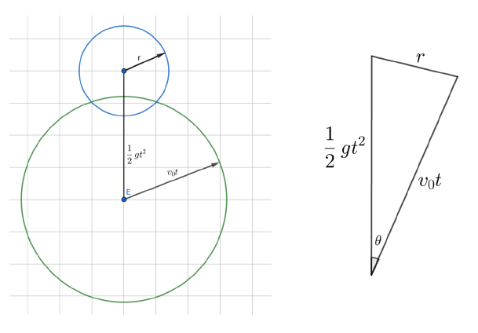

不要真的用三角函数，要用余弦定理求余弦，这样才会有分数。

注意这个几何概型用的是表面积不是体积。

然后求球冠的表面积，设 $R=v_0t$ ，最大开口处对应的圆半径为 $r'=R\sin\theta$ ，距圆心为 $R\cos\theta$ ，从 $R\cos\theta$ 到 $R$ 积分，积累圆周长 $2\pi r$ ，有表面积：
$$
S=R\int_{0}^\theta2\pi R\sin\theta d\theta=2\pi R^2(1-\cos\theta)=2\pi(v_0t)^2(1-\cos\theta)
$$

> 注意根据几何意义，不要把积分上下限弄反

球的表面积是 $S_0=4\pi(v_0t)^2$ ，由几何概型得炸死概率为：
$$
p=\dfrac S{S_0}=\dfrac{1-\cos\theta}2
$$
那么存活概率为 $1-p$ 。

显然 $g=10,t,v_0,r$ 已知，所以可以由余弦定理求分数形式的 $\cos\theta$ ，然后上逆元即可。

注意特判两球相离或内含(+外含)的情况。相离存活，包含炸死。也可以用余弦定理来判。一些细节是判断的时候不要放模。

参考代码：

```c++
if (g / 2 * t * t >= r + v * t || v * t >= r + g / 2 * t * t) //内含
{
    ans = 1;
}
else if (r >= g / 2 * t * t + v * t) //相离
{
    ans = 0;
}
else
{
    r0 = inv(2) * g % mod * t % mod * t % mod; //people
    r1 = v * t % mod;
    c = (r0 * r0 % mod + r1 * r1 % mod - r * r % mod + mod) % mod;
    c = c * inv(2 * r0 % mod * r1 % mod) % mod;
    ans = (1 - c + mod) % mod * inv(2) % mod;
    ans = (1 - ans + mod) % mod;
}
printf("%lld\n", ans);
```


### 1005-Link with EQ

赛时队友后期主要在做这道题，但是没想出来。

设 $f(x)$ 表示长为 $x$ 的空座位(空区域外的两端有人) 能坐多少人，根据题意方案是唯一的，即只能坐在中位数位置，且根据对称性两个中位数等效，所以 $f$ 是唯一的：
$$
f(1)=f(2)=0
$$

$$
f(x)=1+f(\lfloor\dfrac{x-1}2\rfloor)+f(x-1-\lfloor\dfrac{x-1}2\rfloor)
$$

即新坐下一个人占 $1$ ，他左边还有 $\lfloor\dfrac{x-1}2\rfloor$ 个空位，他右边还有 $x$ (全部座位) $-1$ (他自己) $-\lfloor\dfrac{x-1}2\rfloor$ (左边)个空位，维护这个一维DP即可。

设 $g(x)$ 是长为 $x$ 的空座位(空区域外一端有人) 能坐多少人，可以根据 $f$ 推 $g$ ，因为第一个坐下来的人一定是坐在另一端的，所以有：
$$
g(x)=\begin{cases}
0,&x\le1\\\\
f(x-1)+1,&x > 1
\end{cases}
$$
设 $h(x)$ 为所求，即长为 $x$ 的桌子能坐多少人，显然第一个人随便坐，剩下的人可以通过 $g$ 推知，有：
$$
h(x)=1+\dfrac1x\sum_{i=1}^x\left(g(i-1)+g(x-i)\right)=1+\dfrac2x\sum_{i=0}^{x-1}g(i)
$$
所以维护 $f$ 和 $g$ 的前缀和，一路 DP 平推预处理即可。

代码如下：

```c++
#include <bits/stdc++.h>
#define re
using namespace std;
typedef long long ll;
#define il inline
typedef double db;
il ll read()
{
    re char p = 0;
    re ll r = 0, o = 0;
    for (; p < '0' || p > '9'; o |= p == '-', p = getchar())
        ;
    for (; p >= '0' && p <= '9'; r = (r << 1) + (r << 3) + (p ^ 48), p = getchar())
        ;
    return o ? (~r) + 1 : r;
}
#define sc(x) x = read()
#define mn 1000010
ll t, n, f[mn], g[mn], mod = 1e9 + 7;
ll qpow(ll a, ll b)
{
    ll res = 1;
    for (; b > 0; b >>= 1)
    {
        if (b & 1)
        {
            res = res * a % mod;
        }
        a = a * a % mod;
    }
    return res;
}
ll inv(ll a)
{
    return qpow(a, mod - 2);
}
signed main()
{
    for (ll i = 3; i < mn; ++i)
    {
        f[i] = (1 + f[(i - 1) / 2] + f[i - 1 - (i - 1) / 2]) % mod;
    }
    for (ll i = 2; i < mn; ++i)
    {
        g[i] = (g[i - 1] + f[i - 1] + 1) % mod; //f,g没%mod暴毙
    }
    sc(t);
    while (t--)
    {
        sc(n); //预处理h会因为逆元而TLE
        printf("%lld\n", (1 + 2 * inv(n) % mod * g[n - 1] % mod) % mod);
    }
    return 0;
}
```


### 1004-Link with Balls

赛时想了一下，然后放弃了，没想出来。

一种思路是组合数学。

编号为 $1$ 的桶可以取任意个球；

编号为 $2,3$ 的桶可以合并，那么 $2k+0/1$ 刚好也可以取任意个球；

同理合并 $4,5;6,7;\cdots$ ，那么一共有 $n$ 个可以取任意多个球的桶。

最后一个编号为 $2n$ 的桶无法合并，只能取 $[1,n]$ 个球

枚举在最后一个桶取了 $t$ 个球，那么剩下 $m'=m-t$ 个球在 $n$ 个无限桶里取，可以用隔板法，用 $n-1$ 个隔板隔开，由于可以有空区域，可以把空区域等效于放多 $n$ 个球，所以等效于 $C_{m'-1+n}^{n-1}$ ，模拟易知。

枚举复杂度为 $\Omicron(m)$ ，不能过题。考虑优化为 $\Omicron(1)$ 。

注意到组合数学公式： $C_a^b=C_{a-1}^b+C_{a-1}^{b-1}$ (数学意义是第 $b$ 个在前 $a-1$ 个取有 $C_{a-1}^b$ 方案，在最后一个取有 $C_{a-1}^{b-1}$ 方案)，可以转化为：$C_{a-1}^{b-1}=C_a^b-C_{a-1}^b$，那么对所求原式：
$$
\sum_{t=0}^nC_{m-t-1+n}^{n-1}=\sum_{t=0}^n\left(C_{m+n-i}^n-C_{m+n-i-1}^n\right)
$$
两两相消，只留下了首尾两项，即：$C_{m+n}^n-C_{m+n-n-1}^n=C_{m+n}^n-C_{m-1}^n$

上式对 $n\le m$ 成立；若 $n > m$ ，那么后一项为 $0$ ，原式为 $C_{m+n}^n$

注意逆元不能预处理，每次计算再单独算(显然不是线性逆元，复杂度蛮高的)。

代码如下：

```c++
#include <bits/stdc++.h>
#define re
using namespace std;
typedef long long ll;
#define il inline
typedef double db;
il ll read()
{
    re char p = 0;
    re ll r = 0, o = 0;
    for (; p < '0' || p > '9'; o |= p == '-', p = getchar())
        ;
    for (; p >= '0' && p <= '9'; r = (r << 1) + (r << 3) + (p ^ 48), p = getchar())
        ;
    return o ? (~r) + 1 : r;
}
#define sc(x) x = read()
#define mn 2000010
ll t, f[mn], m, n, mod = 1e9 + 7;
ll qpow(ll a, ll b)
{
    ll res = 1;
    for (; b > 0; b >>= 1)
    {
        if (b & 1)
        {
            res = res * a % mod;
        }
        a = a * a % mod;
    }
    return res;
}
ll inv(ll a)
{
    return qpow(a, mod - 2);
}
ll c(ll uf, ll df)
{
    return f[df] * inv(f[uf]) % mod * inv(f[df - uf]) % mod;
}
signed main()
{
    f[1] = 1;
    for (ll i = 2; i < mn; ++i)
    {
        f[i] = f[i - 1] * i % mod;
    }
    sc(t);
    while (t--)
    {
        sc(n), sc(m);
        if (n > m)
        {
            printf("%lld\n", c(n, n + m));
        }
        else
        {
            printf("%lld\n", (c(n, n + m) - c(n, m - 1) + mod) % mod);
        }
    }
    return 0;
}
```

生成函数的解法化简步骤看不懂，这里就不挂代码了。


## 杭电8

显然这场比赛我们没有参赛。

### 1003-Ink on paper

 并查集+二分签到题。就是因为看错题目所以一开始没有直接二分时间的根号。

```c++
#include <bits/stdc++.h>
#define re
using namespace std;
typedef long long ll;
#define il inline
typedef double db;
il ll read()
{
    re char p = 0;
    re ll r = 0, o = 0;
    for (; p < '0' || p > '9'; o |= p == '-', p = getchar())
        ;
    for (; p >= '0' && p <= '9'; r = (r << 1) + (r << 3) + (p ^ 48), p = getchar())
        ;
    return o ? (~r) + 1 : r;
}
#define sc(x) x = read()
#define mn 5010
ll t, n, x[mn], y[mn], fa[mn], cnt, ans;
ll lf, rf, cf;
ll findf(ll k)
{
    while (k != fa[k])
    {
        k = fa[k] = fa[fa[k]];
    }
    return k;
}
signed main()
{
    sc(t);
    while (t--)
    {
        sc(n);
        for (ll i = 1; i <= n; ++i)
        {
            sc(x[i]), sc(y[i]);
        }
        lf = 0, rf = 0x7ffffffffffffffa;
        while (lf <= rf)
        {
            cf = lf + ((rf - lf) >> 1), cnt = 0;
            for (ll i = 1; i <= n; ++i)
            {
                fa[i] = i;
            }
            for (ll i = 1; i <= n; ++i)
            {
                for (ll j = i + 1; j <= n; ++j)
                {
                    ll d = (x[i] - x[j]) * (x[i] - x[j]) + (y[i] - y[j]) * (y[i] - y[j]);
                    if (d <= cf)
                    {
                        fa[findf(i)] = findf(j);
                    }
                }
            }
            for (ll i = 1; i <= n; ++i)
            {
                if (fa[i] == i)
                {
                    ++cnt;
                }
            }
            // printf("%lld %lld\n", cnt, cf);
            if (cnt == 1)
            {
                rf = cf - 1;
                ans = cf;
            }
            else
            {
                lf = cf + 1;
            }
        }
        printf("%lld\n", ans);
    }
    return 0;
}
```


### 1006-GCD Game

没想出来。换皮Nim游戏，石子堆的个数为因子数。因为卡常严重，所以要预处理因子数，可以用线性筛来做。

特别注意这题快读会炸，scanf反而能过……

```c++
#include <bits/stdc++.h>
#define re
using namespace std;
typedef int ll;
#define il inline
typedef double db;
#define sc(x) scanf("%d", &x) //快读还要慢！
#define mn 10000010
ll num[mn], prm[mn / 10], cnt, t, n, x, ans;
bool vis[mn];
signed main()
{
    for (ll i = 2; i < mn; ++i)
    {
        if (!vis[i])
        {
            prm[++cnt] = i, num[i] = 1;
        }
        for (ll j = 1; j <= cnt && i * prm[j] < mn; ++j)
        {
            vis[i * prm[j]] = true;
            num[i * prm[j]] = num[i] + 1;
            if (i % prm[j] == 0)
            {
                break;
            }
        }
    }
    sc(t);
    while (t--)
    {
        sc(n), ans = 0;
        while (n--)
        {
            sc(x), ans ^= num[x];
        }
        printf(ans ? "Alice\n" : "Bob\n");
    }
    return 0;
}
```


### 1009-Singing Superstar

一种是字符串哈希+字典+贪心的做法。显然子串是字符串的连续子集，枚举所有长不大于 $30$ 的子串的哈希值，时间复杂度是 $\Omicron(30|s|)$ 。然后 $\Omicron(1)$ 判断子串哈希是否跟 $n$ 个哈希有一样的。

贪心策略采用的是一遇到可以匹配的就立刻匹配，然后封锁这段下标。

代码如下：

```c++
#include <bits/stdc++.h>
#define re
using namespace std;
typedef unsigned long long ll;
#define il inline
typedef double db;
il ll read()
{
    re char p = 0;
    re ll r = 0, o = 0;
    for (; p < '0' || p > '9'; o |= p == '-', p = getchar())
        ;
    for (; p >= '0' && p <= '9'; r = (r << 1) + (r << 3) + (p ^ 48), p = getchar())
        ;
    return o ? (~r) + 1 : r;
}
#define sc(x) x = read()
#define mn 400010
ll mod = 131, h[mn], p[mn], a[mn], sh[50], t, ss, n, su, now;
char s[mn];
ll get(ll l, ll r)
{
    return h[r] - h[l - 1] * p[r - l + 1];
}
signed main()
{
    sc(t), p[0] = 1;
    for (ll i = 1; i < mn; ++i)
    {
        p[i] = p[i - 1] * mod;
    }
    while (t--)
    {
        scanf("%s", s + 1);
        ss = strlen(s + 1);
        for (ll i = 1; i <= ss; ++i)
        {
            h[i] = h[i - 1] * mod + s[i];
        }
        unordered_map<ll, ll> m, prev;
        sc(n);
        for (ll g = 1; g <= n; ++g)
        {
            scanf("%s", s + 1);
            su = strlen(s + 1);
            for (ll i = 1; i <= su; ++i)
            {
                sh[i] = sh[i - 1] * mod + s[i];
            }
            a[g] = sh[su];
            m[a[g]] = 0, prev[a[g]] = 0;
        }
        for (ll i = 1; i <= ss; ++i)
        {
            for (ll j = 0; j < 30 && i + j <= ss; ++j)
            {
                now = get(i, i + j);
                // printf("%llu %llu %llu\n", i, j, now);
                if (m.count(now) && prev[now] < i)
                {
                    m[now]++, prev[now] = i + j;
                }
            }
        }
        for (ll i = 1; i <= n; ++i)
        {
            printf("%llu\n", m[a[i]]);
        }
    }
    return 0;
}
```

字典树也是用贪心的，思路不难，看代码仔细琢磨能看懂：

```c++
#include <bits/stdc++.h>
#define ll long long
using namespace std;
int read()
{
    int tot = 0, fh = 1;
    char c = getchar();

    while ((c < '0') || (c > '9'))
    {
        if (c == '-')
            fh = -1;

        c = getchar();
    }

    while ((c >= '0') && (c <= '9'))
    {
        tot = tot * 10 + c - '0';
        c = getchar();
    }

    return tot * fh;
}
const int maxn = 100010;
const int maxq = 30;
int T, opt, n, thi, len;
char s[maxn], a[maxn];
struct Trie
{
    int son[maxn * 30][26], las[maxn * 30], fla[maxn * 30], r;
    void clear()
    {
        memset(son, 0, sizeof(son));
        memset(fla, 0, sizeof(fla));
        memset(las, 0, sizeof(las));
        r = 1;
    }
    int add(int thi, char x)
    {
        if (son[thi][x] == 0)
        {
            r++;
            son[thi][x] = r;
        }

        return son[thi][x];
    }
} tre;
int main()
{

    freopen("std.in", "r", stdin);
    freopen("std.out", "w", stdout);

    T = read();

    for (opt = 1; opt <= T; opt++)
    {
        scanf("%s", s);
        len = strlen(s);
        tre.clear();

        for (int j = 0; j < len; j++)
        {
            thi = 1;

            for (int k = 0; k < min(len - j, maxq); k++)
            {
                thi = tre.add(thi, s[j + k] - 'a');

                if (tre.las[thi] <= j) //能用，
                {
                    tre.las[thi] = j + k + 1; //直到j'>=j+k+1都不能用
                    tre.fla[thi]++;           //有多少个子串
                }
            }
        }

        n = read();

        for (int i = 1; i <= n; i++)
        {
            scanf("%s", a);
            thi = 1;
            len = strlen(a);

            for (int j = 0; j < len; j++)
            {
                thi = tre.add(thi, a[j] - 'a');
            }

            printf("%d\n", tre.fla[thi]);
        }
    }

    return 0;
}
```

AC自动机暂时没看懂，这里就先不贴代码了。


### 1004-Counting Stars

看懂了题解。巧妙的线段树题。

这两种区间更改都不属于线段树一般能做的基础操作，所以需要做变化。

维护区间 `lowbit` 可以暴力来，跳过全部全 $0$ 区间，因为最多暴力对数次就完了。维护区间增加幂，可以将原输入改成两个数字：最大位和其他位。那么增加幂就只需要让最大位变量做区间乘法 $\times 2$ 即可，线段树可以维护。区间求和显然就加起来这两个的区间和即可。

直接看官方代码吧。

```c++
#include<bits/stdc++.h>
#define LL long long
#define maxn 100005
#define ls rt<<1
#define rs rt<<1|1
using namespace std;

const LL mo=998244353;
LL a1[maxn],a2[maxn];
int T,n,q;
LL s1[maxn<<2],s2[maxn<<2],la[maxn<<2],tg[maxn<<2];

LL lowbit(LL x){
	return x&(-x);	
}

void pushup(int rt){
	s1[rt]=(s1[ls]+s1[rs])%mo;
	s2[rt]=(s2[ls]+s2[rs])%mo;
	tg[rt]=tg[ls]&tg[rs];
}

void pushdown(int rt){
	la[ls]=la[ls]*la[rt]%mo;
	la[rs]=la[rs]*la[rt]%mo;
	s1[ls]=s1[ls]*la[rt]%mo;
	s1[rs]=s1[rs]*la[rt]%mo;
	tg[ls]|=tg[rt];
	tg[rs]|=tg[rt];
	if(tg[ls])s2[ls]=0;
	if(tg[rs])s2[rs]=0;
	la[rt]=1;
}

void build(int rt,int l,int r){
	la[rt]=1,tg[rt]=0;
	if(l==r){
		s1[rt]=a1[l],s2[rt]=a2[l];
		return;
	}
	int mid=l+r>>1;
	build(ls,l,mid);
	build(rs,mid+1,r);
	pushup(rt);
}

LL query(int rt,int l,int r,int ll,int rr){
	if(ll<=l&&rr>=r){
		return (s1[rt]+s2[rt])%mo;
	}
	pushdown(rt);
	int mid=l+r>>1;
	LL ans=0;
	if(ll<=mid)ans+=query(ls,l,mid,ll,rr);
	if(rr>mid)ans+=query(rs,mid+1,r,ll,rr);
	ans%=mo;
	return ans;
}

void upd1(int rt,int l,int r,int ll,int rr){
	if(l==r){
		if(s2[rt])
			s2[rt]-=lowbit(s2[rt]);
		else{
			s1[rt]=0;
			tg[rt]=1;
		}
		return;
	}
	pushdown(rt);
	int mid=l+r>>1;
	if(ll<=mid&&!tg[ls])upd1(ls,l,mid,ll,rr);
	if(rr>mid&&!tg[rs])upd1(rs,mid+1,r,ll,rr);
	pushup(rt);
}

void upd2(int rt,int l,int r,int ll,int rr){
	if(ll<=l&&rr>=r){
		s1[rt]=s1[rt]*2%mo;
		la[rt]=la[rt]*2%mo;
		return;
	}
	pushdown(rt);
	int mid=l+r>>1;
	if(ll<=mid)upd2(ls,l,mid,ll,rr);
	if(rr>mid)upd2(rs,mid+1,r,ll,rr);
	pushup(rt);
}

int main(){
	scanf("%d",&T);
	while(T--){
		scanf("%d",&n);
		for(int i=1;i<=n;i++){
			LL x;
			scanf("%lld",&x);
			for(int k=30;k>=0;k--){
				if((1ll<<k)<=x){
					a1[i]=1ll<<k;
					a2[i]=x-a1[i];
					break;
				}
			}
		}
		build(1,1,n);
		scanf("%d",&q);
		for(int i=1;i<=q;i++){
			int opt,l,r;
			scanf("%d%d%d",&opt,&l,&r);
			if(opt==1){
				LL ans=query(1,1,n,l,r);
				printf("%lld\n",ans);
			}
			else if(opt==2)
				upd1(1,1,n,l,r);
			
			else
				upd2(1,1,n,l,r);
		}
	}
}

```


## 杭电9

参加了这个比赛。

### 1003-Dota2 Pro Circuit 

赛时我做的，算是一道思维和二分+滑动窗口的题目吧。WA了几次才过的，代码也比较复杂。赛时代码(增加了部分赛后注释)如下：

```c++
#include <bits/stdc++.h>
#define re
using namespace std;
typedef long long ll;
#define il inline
typedef double db;
il ll read()
{
    re char p = 0;
    re ll r = 0, o = 0;
    for (; p < '0' || p > '9'; o |= p == '-', p = getchar())
        ;
    for (; p >= '0' && p <= '9'; r = (r << 1) + (r << 3) + (p ^ 48), p = getchar())
        ;
    return o ? (~r) + 1 : r;
}
#define sc(x) x = read()
#define mn 5010
ll t, n, b[mn], ast[mn], alst[mn];
struct regional
{
    ll i, v;
    bool operator<(const regional &x) const
    {
        return v < x.v;
    }
} a[mn];
signed main()
{
    sc(t);
    while (t--)
    {
        sc(n);
        for (ll i = 1; i <= n; ++i)
        {
            sc(a[i].v);
            a[i].i = i;
        }
        sort(a + 1, a + 1 + n);
        for (ll i = 1; i <= n; ++i)
        {
            sc(b[i]);
        }
        sort(b + 1, b + 1 + n);
        if (n == 1)
        {
            printf("1 1\n");
            continue;
        }
        for (ll i = 1; i <= n; ++i)
        {
            ll av = a[i].v;
            ll suc = 0; //比多少个大
            // ll bgv = av - (i == 1 ? a[2].v : a[1].v);
            ll bgv = b[n] + av;                                   //第i个人拿第一名
            bgv = bgv - (i == 1 ? a[2].v : a[1].v);               //看别的人(最小的开始)，别人不能是自己(比别人基础分多了bgv分)
            ll bi = upper_bound(b + 1, b + 1 + n, bgv) - (b + 1); //那么别人要拿(倒数)bi名
            bi = min(n - 1, bi);                                  //不能跟自己拿一样(n)
            // printf("< %lld %lld %lld %lld\n", bi, b[bi], av, bgv);
            for (ll j = 1; j <= n; ++j)
            { //从基础分小到大看别人
                if (a[j].i == a[i].i)
                {
                    continue;
                }
                // printf("<< %lld+%lld : %lld %lld\n", av, b[n], b[bi], a[j].v);
                while (b[bi] + a[j].v > av + b[n])
                { //为了让i排名更高，尽可能让低分人拿最高的分但不超过i
                    --bi;
                }
                if (bi < 1)
                {
                    break;
                }
                // printf("<< %lld+%lld : %lld %lld\n", av, b[n], b[bi], a[j].v);
                // printf("<< %lld %lld\n", b[bi], a[j].v);
                // if (b[bi] + a[j].v >= av + b[n])
                // {
                //     break;
                // }
                //走到这里，那么b[bi]+a[j].v<=av+b[n]，即他比i低分
                ++suc; //那么i的排名加一位
                --bi;  //下一个人换一个排名
            }
            ast[a[i].i] = n - suc;
        }
        for (ll i = 1; i <= n; ++i)
        {
            ll av = a[i].v;
            ll suc = 0; //比多少个大
            ll bgv = b[1] + av;
            bgv = bgv - (i == n ? a[n - 1].v : a[n].v);
            ll bi = lower_bound(b + 1, b + 1 + n, bgv) - b;
            bi = max(2LL, bi);
            // printf("< %lld %lld %lld\n", av, bi, bgv);
            for (ll j = n; j >= 1; --j)
            {
                if (a[j].i == a[i].i)
                {
                    continue;
                }
                // printf("<< %lld %lld %lld %lld\n", bi, b[bi], a[j].v, av + b[1]);
                while (bi <= n && b[bi] + a[j].v <= av + b[1])
                {
                    ++bi;
                }
                if (bi > n)
                {
                    break;
                }
                // printf("<< %lld+%lld : %lld %lld\n", av, b[1], b[bi], a[j].v);
                ++suc;
                ++bi;
            }
            alst[a[i].i] = 1 + suc;
        }
        for (ll i = 1; i <= n; ++i)
        {
            printf("%lld %lld\n", ast[i], alst[i]);
        }
    }
    return 0;
}
```


### 1007-Boring data structure problem

赛时我调了很久才过，花了很长时间和WA了很多次。修了很多问题，包括循环队列的区间判断问题。基本思路是用链表维护删除，把队列划分为平衡的两个双向链表，链表的端就是所求的区间中点。维护对链表的删除、插入即可，注意处理循环队列的问题。

赛时过题代码如下：

```c++
#include <bits/stdc++.h>
#define re
using namespace std;
typedef int ll; //pat
#define il inline
typedef double db;
il ll read()
{
    re char p = 0;
    re ll r = 0, o = 0;
    for (; p < '0' || p > '9'; o |= p == '-', p = getchar())
        ;
    for (; p >= '0' && p <= '9'; r = (r << 1) + (r << 3) + (p ^ 48), p = getchar())
        ;
    return o ? (~r) + 1 : r;
}
#define sc(x) x = read()
#define mn 10000010
#define cf 0
ll cmd[3], q, x, v = 1, a[mn], h[mn], pre[mn], nx[mn];
ll lfbg = cf, lfed, rfbg = cf, rfed = cf + 1;
ll lflen, rflen;
//lfbg 左链表左边界 lfed/rfbg 左链表右边界/右链表左边界 rfed 右链表右边界

void balance()
{
    if (lflen > rflen)
    {
        --lflen, ++rflen;
        rfbg = pre[rfbg];
    }
    else if (rflen > lflen + 1)
    {
        ++lflen, --rflen;
        rfbg = nx[rfbg];
    }
}

void add(ll pos) //在pos位置新增元素
{
    h[v] = pos;
    if (lflen == rflen && lflen == 0) //init
    {
        if (pos == lfbg)
        {
            rfbg = nx[lfbg];
        }
        else
        {
            rfbg = rfed;
        }
    }
    if (pos == lfbg)
    {
        a[lfbg] = v;
        lfbg = pre[lfbg];
        ++lflen;
    }
    else if (pos == rfed)
    {
        a[rfed] = v;
        rfed = nx[rfed];
        ++rflen;
    }
    // printf("<< %d %d %d %d %d\n", lfbg, rfbg, rfed, lflen, rflen);
    balance();
    ++v;
}

void del()
{
    ll pos = h[x], xrfbg = rfbg;
    nx[pre[pos]] = nx[pos];
    pre[nx[pos]] = pre[pos];
    if (pos == rfbg)
    {
        if (lflen == rflen)
        {
            // rfbg = pre[rfbg];
            xrfbg = rfbg;
        }
        else
        {
            xrfbg = nx[rfbg];
        }
    }
    // printf("fuc %lld %lld\n", xrfbg);
    // if ((pos >= rfbg && pos > lfbg) || (pos < lfbg && pos < rfed))
    if (lfbg < rfed)
    {
        if (pos >= rfbg)
        {
            --rflen;
        }
        else
        {
            --lflen;
        }
    }
    else
    {
        if (lfbg < rfbg)
        {
            if (pos >= rfbg || pos < rfed)
            {
                --rflen;
            }
            else
            {
                --lflen;
            }
        }
        else
        {
            if (pos >= rfbg && pos < rfed)
            {
                --rflen;
            }
            else
            {
                --lflen;
            }
        }
    }
    rfbg = xrfbg;
    balance();
}

signed main()
{
    for (ll i = 0; i < mn; ++i)
    {
        pre[i] = i - 1, nx[i] = i + 1;
    }
    pre[0] = mn - 1, nx[mn - 1] = 0;
    // printf("QwQ\n");
    sc(q);
    while (q--)
    {
        scanf("%s", cmd);
        if (cmd[0] == 'L')
        {
            add(lfbg);
        }
        else if (cmd[0] == 'R')
        {
            add(rfed);
        }
        else if (cmd[0] == 'G')
        {
            sc(x);
            del();
        }
        else if (cmd[0] == 'Q')
        {
            // printf("wdnmd %d\n", rfbg);
            printf("%d\n", a[rfbg]);
        }
        // printf("< %d %d %d %d %d <%d %d %d>\n", lfbg, rfbg, rfed, lflen, rflen, a[lfbg], a[rfbg], a[rfed]);
        // printf("< %d %d %d %d %d\n", lfbg, rfbg, rfed, lflen, rflen);
    }
    return 0;
}
```


### 1002-Just another board game

赛时队友一直在做。没有过。赛后发现只是没有特判 $a_{1,1}$ ，不然应该就过了。

这个博弈论双方的目标不一，所以自己只会考虑如何利用自己和对方达成自己的最优，只要阻碍对方的最优不会让自己更优就不会阻碍对方达成对方的最优。

不讨论显而易见的 $k=1$ ，以下针对 $k > 1$ ，由于先手想要最大，后手想要最小，所以：

假设没有第二个操作，那么如果最后一回合是先手，那么上一回合玩家应选择最大值最小的行；如果最后一回合是后手，那么上一回合选择最小值最大的列。

考虑第二个操作，发现选择第二个操作不会比第一个操作更优。除了对 $a_{1,1}$ 外。

特判 $a_{1,1}$ 可以使得答案为： 

- $k$ 奇数时，答案是 $\max(a_{1,1},\min_{i=1}^n rowmax_i)$
- $k$ 偶数时，答案是 $\max(a_{1,1}, \max_{i=1}^mcolmin_i)$

代码如下：

```c++
sc(n), sc(m), sc(k);
for (ll i = 1; i <= n; ++i)
{
    a[i].clear(), a[i].emplace_back(0);
    for (ll j = 1; j <= m; ++j)
    {
        sc(v), a[i].emplace_back(v);
    }
}
ans = a[1][1];
if (k == 1)
{
    for (ll i = 1; i <= m; ++i)
    {
        ans = max(ans, a[1][i]);
    }
}
else if (k % 2 == 0)
{
    for (ll j = 1; j <= m; ++j)
    {
        ll mi = big;
        for (ll i = 1; i <= n; ++i)
        {
            mi = min(mi, a[i][j]);
        }
        ans = max(ans, mi);
    }
}
else
{
    ans = big;
    for (ll i = 1; i <= n; ++i)
    {
        ll mx = 0;
        for (ll j = 1; j <= m; ++j)
        {
            mx = max(mx, a[i][j]);
        }
        ans = min(ans, mx);
    }
}
printf("%lld\n", max(ans, a[1][1]));
```


### 1010-Unfair contest

先排序，不论如何打分，前 $t-1$ 和后 $s-1$ 必然被删除， $[t+1,n-s]$ 必然不被删除，根据打分的不同可能删掉 $t,n-s+1$ 的其中一个。由于所求为 $a_{n+1}-b_{n+1}$ 不加绝对值，所以应该给 $a$ 尽可能低， $b$ 尽可能高。

为了达成这个目的， $a_{n+1}$ 不应该高于 $a_{n-s+1}$ ，最低可以往 $1$ 打； 即 $\in 1\cup[a_t,a_{n-s+1}]$ ， 而同理 $b_{n+1}\in[b_t,b_{n-s+1}]\cup h$

特判 $s=t=0$ ，可以等效于增加打分 $1,h$ 且使得 $s,t$ 自增。从而减少讨论情况。

预处理一定不会被删除的和，可以降低常数复杂度。然后分四类讨论即可，具体看代码。

```c++
#include <bits/stdc++.h>
#define re
using namespace std;
typedef long long ll;
#define il inline
typedef double db;
il ll read()
{
    re char p = 0;
    re ll r = 0, o = 0;
    for (; p < '0' || p > '9'; o |= p == '-', p = getchar())
        ;
    for (; p >= '0' && p <= '9'; r = (r << 1) + (r << 3) + (p ^ 48), p = getchar())
        ;
    return o ? (~r) + 1 : r;
}
#define sc(x) x = read()
#define big 0x7fffffffffff
#define mn 100010
ll t, n, s, h, a[mn], b[mn], as, bs, ans, bv, av, _;
signed main()
{
    sc(_); //重名t,T暴毙
    while (_--)
    {
        sc(n), sc(s), sc(t), sc(h), ++s, ++t;
        for (ll i = 1; i < n; ++i)
        {
            sc(a[i]);
        }
        for (ll i = 1; i < n; ++i)
        {
            sc(b[i]);
        }
        a[n] = b[n] = 1, a[n + 1] = b[n + 1] = h;
        sort(a + 1, a + 2 + n), sort(b + 1, b + 2 + n);
        as = bs = 0, ans = big, ++n; //记得++n
        for (ll i = t + 1; i <= n - s; ++i)
        {
            as += a[i], bs += b[i];
        }

        //a打1，b打h,去掉a[n-s+1],b[t]
        if (as + a[t] > bs + b[n - s + 1])
        {
            ans = min(ans, 1 - h);
        }

        //a打1,b在[t,n-s+1]选,去掉a[n-s+1],看b最大选多少,使得
        //as+at[t]>bs+bv
        bv = as + a[t] - bs - 1; //-1使得不取等号
        if (bv >= b[t])          //如果bv不会被t去掉
        {                        //去掉较大的，保留较小的，所以-min
            ans = min(ans, 1 - min(bv, b[n - s + 1]));
        }

        //b打h,a在[t,n-s+1]选,去掉b[t],看a最大选多少,使得
        //as+av>bs+b[n-s+1]
        av = bs + b[n - s + 1] - as + 1; //+1使得不取等号
        if (av <= a[n - s + 1])          //如果av不会被s去掉
        {                                //去掉较小的，保留较大的，所以max-
            ans = min(ans, max(a[t], av) - h);
        }

        //a在[t,n-s+1],b在[t,n-s+1]
        //在a_{n+1},a_t,a_{n-s+1}会删掉两个，剩下中位数,b同理
        //整体法考虑两个未知数,设选了av,bv,有as+av>bs+bv所以av+bv>bs-as
        //所以不用知道它们具体av,bv是啥，但一定大于bs-as才合法
        if (as + a[n - s + 1] > bs + b[t])
        {
            ans = min(ans, max(bs - as + 1, a[t] - b[n - s + 1]));
        }

        if (ans == big)
        {
            printf("IMPOSSIBLE\n");
        }
        else
        {
            printf("%lld\n", ans);
        }
    }
    return 0;
}
```


## 杭电10

没打这个比赛，纯补题。

### 1003-Pty loves lines

平行组内部不交，与组外直线都交，设组有 $a_i$ 根直线，用减法原理，有：
$$
\dfrac{n(n-1)}2-\sum_i\dfrac{a_i(a_i-1)}2
$$
要求 $\sum_ia_i=n$ 。发现若 $\sum_ia_i=x$ ，根据 $a_i=1$ 的贡献为 $0$ ，所以可以凑出更大的 $s>x$ ，使得具有相同的交点数。

设  $f_n$ 为使得表达式右方为 $n$ 的最小 $\sum_ia_i$ ，可以 $\Omicron(n^3)$ 背包。

```c++
#include <bits/stdc++.h>
#define re
using namespace std;
typedef long long ll;
#define il inline
typedef double db;
il ll read()
{
    re char p = 0;
    re ll r = 0, o = 0;
    for (; p < '0' || p > '9'; o |= p == '-', p = getchar())
        ;
    for (; p >= '0' && p <= '9'; r = (r << 1) + (r << 3) + (p ^ 48), p = getchar())
        ;
    return o ? (~r) + 1 : r;
}
#define sc(x) x = read()
#define mn 705
ll dp[mn * mn], t, n;
vector<ll> ans[10], vis[mn];
signed main()
{
    sc(t);
    for (ll i = 1; i <= t; ++i) //i<=n暴毙
    {
        sc(n), vis[n].emplace_back(i);
    }
    memset(dp, 0x3f, sizeof dp), dp[0] = 0;
    for (ll i = 0; i < mn; ++i) //当前组直线数
    {
        for (ll j = 0, je = mn * mn; j < je; ++j) //已计算多少个交点
        {
            ll k = j + i * (i - 1) / 2;
            if (k < je)
            {
                dp[k] = min(dp[k], dp[j] + i);
            }
        }
        if (vis[i].size()) //单组最多i
        {
            ll k = i * (i - 1) / 2;
            for (ll j = 0; j <= k; ++j)
            {
                if (dp[k - j] <= i)
                {
                    for (auto u : vis[i])
                    {
                        ans[u].emplace_back(j);
                    }
                }
            }
        }
    }
    for (ll i = 1; i <= t; ++i)
    {
        for (ll j = 0, je = ans[i].size(); j < je; ++j)
        {
            printf("%lld%c", ans[i][j], (j + 1 == je) ? '\n' : ' ');
        }
    }
    return 0;
}
```

还有别的解法，如bitset+打表找规律。


往后不补了，仅剩能看的题目1010需要失配树+树剖+主席树/扫描线
