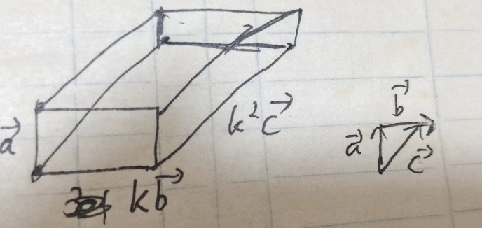
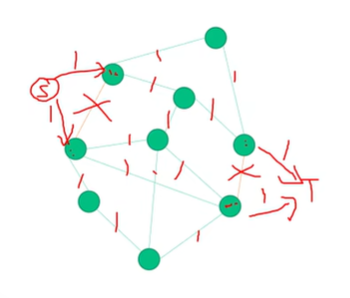
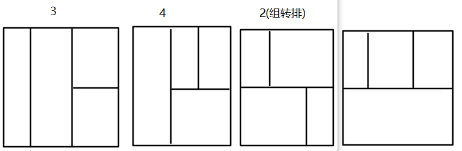
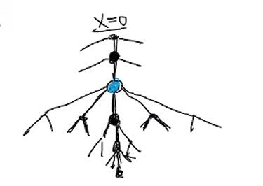
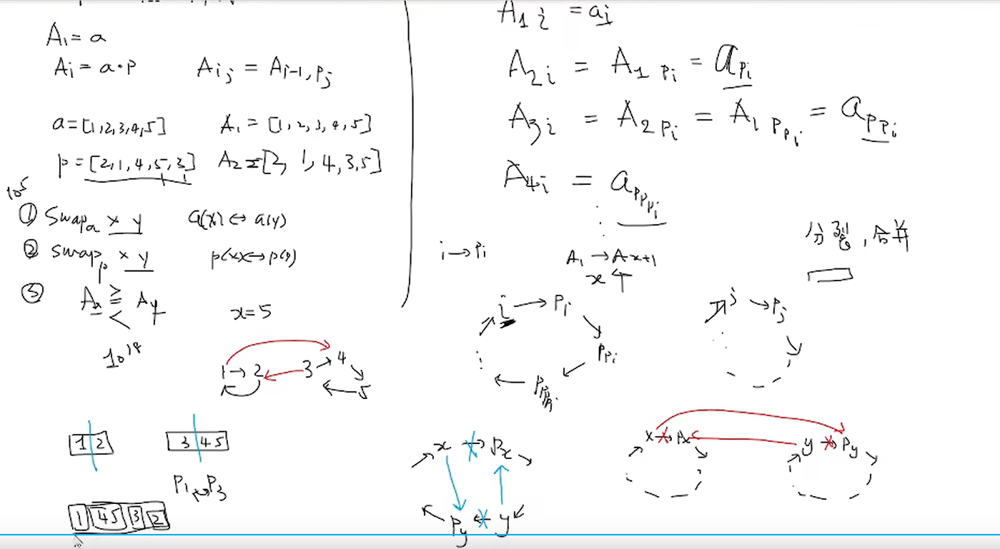

## 目录

### 第一场

- G Lexicographical Maximum

  签到(模拟-字符串)

- A Villages: Landlines

  签到(模拟-区间交)

- D Mocha and Railgun

  计算几何

- I Chiitoitsu

  期望DP
  
- C Grab the Seat!

  枚举 + 几何优化
  
- J Serval and Essay

  启发式合并 / 随机化
  
- H Fly

  背包DP 二进制优化物品枚举 分组 背包嵌套 分治FFT/NTT

### 第二场

- G Link with Monotonic Subsequence

  构造 LIS

- J Link with Arithmetic Progression

  三分/二次函数极值/线性回归 等差数列
  
- D Link with Game Glitch

  对数 最大环(负环) 二分答案
  
- K Link with Bracket Sequence I

  DP

- L Link with Level Editor I

  DP / BFS

- H Take the Elevator

  前缀和 离散化

- I let fat tension

  矩阵乘法

- C Link with Nim Game

  博弈论

- E Falfa with Substring

  DP 容斥 组合数学 FFT/NTT

### 第三场

- C Concatenation

  排序 字典序 / (trie+exkmp)

- A Ancestor

  LCA ST表/前缀和

- J Journey

  单源最短路
  
- F Fief

  ~~图的双极定向~~ 圆方树 点双 tarjan

- H Hacker

  SAM / SA + ST表 前缀和

- D Directed

  组合数学 概率DP

- G Geometry

  凸包 二分答案 闵可夫斯基和

- B Boss

  网络流


### 第四场

- N Paricle Arts

  位运算 分数运算

- K NIO’s Sword

  取模

- D Jobs (Easy Version)

  三维前缀和
  
- H Wall Builder II

  枚举 贪心

- A Task Computing

  DP 贪心

- L Black Hole

  立体几何

- C Easy Counting Problem

  NTT 多项式DP


### 第五场

- K Headphones

  签到 抽屉原理

- B Wathces

  签到 二分答案 排序

- H Cutting Papers

  签到 计算几何

- C Bit Tranmission

  签到 小模拟

- G KFC Crazy Thursday

  manacher / 回文自动机

- F A Stack of CDs

  计算几何 模拟 圆周长并

- A Don't Starve

  DP

- E Fraction Game

  二维ST表 单调队列

- D Birds in the tree

  树上DP

- I Board Game

  博弈论

- J Check In

  计算几何

### 第六场

- G Icon Design

  签到 字符串 小模拟

- J Number Game

  签到 数学

- B Eezie and Pie

  树上差分

- M Z-Game on grid

  博弈论

- A Array

  构造 思维
  
- I Line

  构造 计算几何

- F Hash

  构造 随机化 折半搜索

### 第七场

- G Regular Expression

  签到

- C Constructive Problems Never Die

  构造

- F Candies

  贪心 链表

- J Melborp Lacissalc

  DP 前缀和

- E Ternary Search

  线段树

- K Great Party

  博弈论 Nim 莫队

- B Rotate Sum 3

  立体计算几何 对称轴
  
- L Maximum Range

  边双连通分量 环 网络流 DFS
  
- A Floor Tiles in a Park

  拉格朗日插值 / 分类讨论

### 第八场

- F Longest Common Subsequence

  字符串 /+ KMP

- D Poker Game: Decision

  记忆化搜索 博弈论 大模拟

- I Equivalence in Connectivity

  线段树分治 可删除并查集 图哈希 同构 DFS序
  
- A Puzzle: X-Sums Sudoku

  构造 位运算 蝴蝶变换 二进制分块
  
- G Lexicographic Comparison

  平衡树 环 分块

### 第九场

- A Car Show

  滑动窗口

- B Two Frogs

  DP 前缀和优化
  
- E Longest Increasing Subsequence

  构造

- I The Greate Wall II

  DP 单调栈优化

- G Magic Spells

  字符串哈希 + manacher / 回文自动机

- C Global Positioning System

  DFS 环 树上差分

### 第五场重赛

- M Maimai DX 2077

  签到 小模拟

- H Here is an Easy Problem of Zero-chan

  图论 DFS LCA 数论(尾0计算)

- E Everyone is bot

  博弈论

- J Jellyfish and its dream

  差分 思维
  
- G Good red-string

  贪心 线段树

### 第十场

- H Wheel of Fortune

  组合数学

- F Shannon Switching Game?

  并查集 图论 博弈论

- I Yet Another FFT Problem?

  抽屉原理

- E Reviewer Assignment

  网络流


### 其他

#### 2022GDCPC

- B FFT

  组合数学

- D 剪纸

  思维 斐波那契

- H 梅花易数

  小模拟

- F 望舒客栈的每日委托

  小模拟 set

- J 新英雄

  贪心

- L 启航者

  记忆化搜索 / 树上DP

- E 黑白大陆

  BFS

- M 拉格朗日差值

  数学 期望 分治FFT

#### 码加加模拟3

- A 对称

  思维 位运算

- B 连接

  数学 数位 思维

- C 装铅笔

  线段树

- D 加法

  二分 数学

- E 小Z和小J随机游走

- F 小Z和小J玩游戏


#### 码加加初赛

- A 标识符

  小模拟 字符串

- B 消去

  思维 贪心 栈

- C 小Z和小P探大案

  数学

- D 小Z和小P玩Wordle

  [二分图匹配]

- E 城墙

  [矩阵树定理 高斯消元]

- F 土豆田


#### 码加加复赛

- A 归零

  构造

- B 飞行棋

  前缀和 期望DP 方程组求解(轮换对称)

- C 小Z和小J排排列

  数学

- D 树

  欧拉函数 树 

- E 取模机器

- F 小Z和小J恶作剧 (原题洛谷P5227)

  线段树分治 / LCT / 可撤销并查集 / 哈希+线性基

- G 小Z和小J爱旅行

- H 挑战群同构


#### 赛氪夏季赛

- K 真假英雄

  种类并查集

- F String

  字符串 子序列 编辑距离

- J 大富翁

  模拟 签到

- H Travel

  最短路

- E Preview

  DP 线段树

- D Poly [原题为NOIP模拟赛-多边形](https://blog.csdn.net/UISG103/article/details/77422364)

  计算几何

- I Tree 原题为旅行路线(JZOJ5052)

  trie + 广义后缀自动机

- B Path 原题为CF的E.bricks(div1 E, CF2800)

   二分图 最大独立集


## 第一场

赛时排名117，赛时过了四题，其中A,D是我过的。

> 比赛日志：
>
> 一开始，我在看A题，然后队友发现签到题是G题，队友就把G过掉了，然后我不征求意见自己直接上把A切掉了，20分钟这样过了两题，排名暂时居于21。然后能看的题目，后面就比较零散了，有一道I题看起来很复杂，实际上就是一个概率问题，然后我们就打算去搞这道题。研究了很久，然后发现D题很多人过，我一眼结论，但是想着可能队友写而且不一定对，所以还没写。后来队友启发可以旋转等效，然后看着好像队友也不擅长，我就写了，然后盲猜垂直，直接用比较危险的不懂的三角函数，寄了。然后想不出为什么，卡了十多分钟，想想不如试试再加个平行看看，竟然对了……很奇怪。两个小时多这样了。然后因为自己对取模公式(a/b+c/d)理解有误，所以没敢用DP来做I题，然后一直在想排列组合解法，然后解不出来。队友用DP搞过了。后面，剩下差不多两个钟。但是，剩下的题都看了一遍，队友在做的H题数位DP啥的我没有思路，不想做，然后其他题也没思路，就是看着简单，但是其实还是不知道怎么做。四点多润了

### G Lexicographical Maximum

比较显然的小模拟，若原串是 $n-1$ 个 $9$ 和 $1$ 个任意字符，直接输出；否则输出 $n-1$ 个 $9$，可以特判一下个位数。

个人代码：

```c++
#include <bits/stdc++.h>
using namespace std;
#define sc(x) scanf("%lld", &x)
typedef long long ll;
ll cnt9, n;
char s[1000010];
signed main()
{
    scanf("%s", s + 1);
    n = strlen(s + 1);
    for (ll i = 1; i <= n; ++i)
    {
        if (s[i] == '9')
        {
            ++cnt9;
            continue;
        }
        break;
    }
    if (n == 1)
    {
        putchar(s[1]);
    }
    else if (cnt9 >= n - 1)
    {
        for (ll i = 1; i < n; ++i)
        {
            putchar('9');
        }
        putchar(s[n]);
    }
    else
    {
        for (ll i = 1; i < n; ++i)
        {
            putchar('9');
        }
    }
    return 0;
}
```

队友赛时代码：直接利用字符串自带的大小比较

```c++
cout << max(s, string(s.size()-1, '9'));
```


### A Villages: Landlines

题意很简单，就是给定 $n$ 个区间 $[x-r,x+r]$，将它们交为一个区间，至少需要再补多长的区间。那么排序后顺着扫就行。

代码：(去除赛时写的冗余部分)

```c++
#include <bits/stdc++.h>
using namespace std;
#define sc(x) scanf("%lld", &x)
typedef long long ll;
#define mn 200010
pair<ll, ll> a[mn], prv;
ll ans, n;
signed main()
{
    sc(n);
    for (ll i = 1; i <= n; ++i)
    {
        ll x, r;
        sc(x), sc(r);
        a[i].first = x - r;
        a[i].second = x + r;
    }
    sort(a + 1, a + 1 + n);
    prv = a[1];
    for (ll i = 2; i <= n; ++i)
    {
        if (a[i].first <= prv.second) // merge
        {
            prv.second = max(a[i].second, prv.second);
            prv.first = min(a[i].first, prv.first);
        }
        else // not merge
        {
            ans += a[i].first - prv.second;
            prv = a[i];
        }
    }
    printf("%lld", ans);
    return 0;
}
```


### D Mocha and Railgun

赛时取垂直和平行的最大值过掉了。赛时是根据队友启发直接把Q点旋转到了坐标轴x正半轴再继续考虑，这时候直接把base拉到了x轴求一次，然后不行，又作了一个平行的取max，过了。公式就是弧度 $l=\alpha\cdot r$，然后 $Rt\Delta$ 反三角取 $\alpha$ 即可。赛时AC代码：

```c++
#include <bits/stdc++.h>
using namespace std;
#define sc(x) scanf("%lld", &x)
typedef long long ll;
typedef double db;
ll t;
db r, d, x, y;
signed main()
{
    for (sc(t); t; t--)
    {
        scanf("%lf%lf%lf%lf", &r, &x, &y, &d);
        db k = sqrt(x * x + y * y);
        db ang1 = acos((k + d) / r);
        db ang2 = acos((k - d) / r);
        db ans = r * (ang2 - ang1);
        db ang3 = asin(d / r);
        db ans2 = 2 * r * ang3;
        ans = max(ans, ans2);
        printf("%.12lf\n", ans);
    }
    return 0;
}
```

平行是不需要的，只需要垂直。(即真实过题核心代码是：)

```c++
db k = sqrt(x * x + y * y);
db ang1 = acos((k + d) / r);
db ang2 = acos((k - d) / r);
db ans = r * (ang2 - ang1);
```

> 所以赛时第一次 WA 应该是在原点的特判炸了。

证明：重建系，把 base segment 建成 x 轴，如图：


那么 $Q$ 在 $x$ 轴的投影取值范围是 $[0,\sqrt{Q_x^2+Q_y^2}]$，分别在 $OQ$ 垂直与平行基线时取得。直观上来看，比较难看出来。这样转化之后，设 $Q$ 投影坐标是 $k,k\in [0,\sqrt{Q_x^2+Q_y^2}]$，如图所示：


不需要算出 $y_1,y_2$，只需要用余弦，那么答案为：
$$
ans=r\cdot(\arccos\dfrac{k-d}{r}+\arccos\dfrac{k+d}{r})
$$
求导，得：
$$
ans'=\left(
\dfrac1{\sqrt{1-\dfrac{(k+d)^2}{r^2}}}
-\dfrac1{\sqrt{1-\dfrac{(k-d)^2}{r^2}}}
\right)
$$
由于 $\arccos$ 内的东西 $< 1$，所以分母都大于零。转化为判断下面东西的正负：
$$
\sqrt{1-\dfrac{(k-d)^2}{r^2}}-\sqrt{1-\dfrac{(k+d)^2}{r^2}}
$$
显然 $(k-d)^2 \le (k+d)^2$，所以 $1-\dfrac{(k-d)^2}{r^2} \ge 1-\dfrac{(k+d)^2}{r^2}$，所以是正的。

所以一阶导恒非负，即原函数恒为增函数，即 $k=\sqrt{Q_x^2+Q_y^2}$ 时，答案最大，为：
$$
ans=r\cdot(\arccos\dfrac{\sqrt{Q_x^2+Q_y^2}-d}{r}+\arccos\dfrac{\sqrt{Q_x^2+Q_y^2}+d}{r})
$$


### I Chiitoitsu

抽象为有 $34$ 种颜色的球，每种 $4$ 个。一开始随机给你 $13$ 个，且保证最多每种颜色能得到 $2$ 个。每次能从剩余的球里随机拿一个，若此时凑够了 $7$ 种颜色每种两个球胜，否则永久丢弃随机一个球然后继续抽。给定初始 $13$ 个球，问期望抽多少次能得到答案。

首先，可以明确最佳策略是摸到的不是已有的就丢，否则随机丢一个落单的。因为这样丢掉的一定再不可能拿(再拿到也会再丢)，所以可以减少很多东西考虑，而且是最优的。那么答案有且仅有七种，即一开始有 $[0,6]$ 对同颜色的球。可以思考 DP 了。

首先复习一下取模公式，证明：($p$ 是质数)
$$
(a_1\div b_1+a_2\div b_2)\bmod p\equiv(a_1\div b_1\bmod p+a_2\div b_2\bmod p)\bmod p
$$
由于 $(a+b)\bmod p=(a\bmod p+b\bmod p)\bmod p$，故证毕。这说明 $DP$ 表达式是分子间可以随意进行加减乘除，从而证明了模除下 $DP$ 的有效性。

设 $dp_{i,j}$ 是当前还有 $i$ 个球，还差 $j$ 对时还需要期望回合是多少。显然 $dp_{i,0}=0$。有 $7-j$ 个对代表有 $13-2(7-j)=2j-1$ 个单，随便抽一个中奖率为 $6j-3$，故有：
$$
dp_{i,j}=\dfrac{i-36+6j}{i}dp_{i-1,j}+\dfrac{36-6j}{i}dp_{i-1,j-1}+1
$$
故复杂度为 $O(7\cdot34\cdot4+t)$。

```c++
#include <bits/stdc++.h>
using namespace std;
#define sc(x) scanf("%lld", &x)
typedef long long ll;
ll mod = 1e9 + 7;
ll qpow(ll a, ll b = mod - 2)
{
    ll r = 1;
    for (; b; b >>= 1)
    {
        if (b & 1)
        {
            r = r * a % mod;
        }
        a = a * a % mod;
    }
    return r;
}
ll dp[200][10];
ll dfs(ll i, ll j)
{
    if (j == 0)
    {
        return 0;
    }
    if (dp[i][j])
    {
        return dp[i][j];
    }
    ll t = 6 * j - 3;
    if (i > t)
    {
        ll v = (i - t + mod) * qpow(i) % mod * dfs(i - 1, j) % mod;
        v = (v + t * qpow(i) % mod * dfs(i - 1, j - 1)) % mod;
        dp[i][j] = (v + 1) % mod;
    }
    else if (i == t)
    {
        dp[i][j] = (1 + dfs(i - 1, j - 1)) % mod;
    }
    return dp[i][j];
}
signed main()
{
    ll t;
    sc(t);
    for (ll g = 1; g <= t; ++g)
    {
        map<ll, ll> h;
        char s[40] = {};
        scanf("%s", s);
        for (ll i = 0; i < 26; i += 2)
        {
            h[1000 * s[i] + s[i + 1]]++;
        }
        ll cnt = 0;
        for (auto i : h)
        {
            cnt += i.second == 2;
        }
        printf("Case #%lld: %lld\n", g, dfs(34 * 4 - 13, 7 - cnt));
    }
    return 0;
}
```

只能说这道题是会的，败在了取模公式理解错误上，赛时我执意认为不能用 DP。


### C Grab the Seat!

对一个点，其所遮挡的点的区域是该点 $(x,y)$ 与黑板两端点 $(0,1),(0,m)$ 连线形成的区域。由此可知：①每一行只有最左边的点有影响，其他点可以忽略。②这些区域连线里，所有与 $(0,1)$ 的连线从下往上必然斜率越来越大，即每次只被最上边的点所影响；同理，所有与 $(0,m)$ 的连线从上往下斜率绝对值增大。如图所示：


对这两种情况所形成的区域，并一下即得答案。(据说李超树能多一个 log 做到，但我不会)

那么就可以写出代码，复杂度为 $O(nq)$，详见注释：

```c++
#include <bits/stdc++.h>
using namespace std;
#define sc(x) scanf("%lld", &x)
typedef long long ll;
#define mn 200010
ll n, m, k, q, x[mn], y[mn], id, lf[mn], cnt[mn];
signed main()
{
    sc(n), sc(m), sc(k), sc(q);
    for (ll i = 1; i <= k; ++i)
    {
        sc(x[i]), sc(y[i]);
    }
    while (q--)
    {
        sc(id), sc(x[id]), sc(y[id]);
        for (ll i = 1; i <= m; ++i)
        {
            lf[i] = n + 1; //初始化每行最左边的人的x坐标
            cnt[i] = n;    //初始化每个位置都不被遮挡
        }
        for (ll i = 1; i <= k; ++i)
        {
            lf[y[i]] = min(lf[y[i]], x[i]); //读入最左边的人
        }

        //枚举从(0,1)出发的射线
        ll j = 0;                   //上一条最大斜率射线
        for (ll i = 1; i <= m; ++i) // i就是y
        {
            //如果这行有人，没有历史记录或斜率更大
            if (lf[i] != n + 1 && (!j || (lf[i] - 0) * (j - 1) < (lf[j] - 0) * (i - 1)))
            {
                j = i;
            }
            if (j == 1) //首行特判(k=0)只影响自己这一行
            {
                cnt[i] = i == 1 ? lf[i] - 1 : n;
            }
            else //没有过人就n,否则根据相似三角形求解(注意下取整所以额外-1)
            {    //(i-1)/(j-1)=?/lf[j]
                cnt[i] = j ? ((i - 1) * lf[j] - 1) / (j - 1) : n;
                cnt[i] = min(cnt[i], n); //小心越界
            }
        }

        //(0,m)
        j = 0;
        for (ll i = m; i >= 1; --i)
        {
            if (lf[i] != n + 1 && (!j || (lf[i] - 0) * (j - m) > (lf[j] - 0) * (i - m)))
            {
                j = i;
            }
            if (j == m) // update而不是直接覆盖
            {
                cnt[i] = min(cnt[i], i == m ? lf[i] - 1 : n);
            }
            else
            {
                ll v = j ? ((m - i) * lf[j] - 1) / (m - j) : n;
                cnt[i] = min({cnt[i], v, n});
            }
        }

        ll ans = 0;
        for (ll i = 1; i <= m; ++i)
        {
            ans += cnt[i];
        }
        printf("%lld\n", ans);
    }
    return 0;
}
```


### J Serval and Essay

设 $u$ 点作为论证基础时所能推导出的结论集合为 $S_u$，不难发现，$u$ 是推导树的根节点，推导过程是建生成树的过程，所以若 $v\in S_u$，那么 $v$ 推导出来的 $S_v$ 一定是 $S_u$ 子集，即 $S_v\subseteq S_u$。

> 记 $u$ 推导过程的任一个拓扑序为 $w_1=u,w_2,\cdots,w_{|S_u|}$，记点 $x$ 为终点的有向边的起点集为 $I_x$，即能推导出 $x$ 必须满足全部条件集为 $I_x$(即题目输入的每一行)，那么对 $w_i(i > 1)$，因为它被推导出来了，所以 $I_{w_i}$ 都被推导出来了，即条件集一定在 $i$ 之前全部满足，即 $I_{w_i}\subseteq\{w_1,\cdots,w_{i-1}\}$。
>
> 若 $S_u,S_v$ 有交集，即 $S_u\cap S_v\neq\varnothing$。若 $u\neq v$，记最小满足 $u$ 的拓扑序的 $w_k\in S_u\cap S_v$ 的下标为 $k$，考虑 $w_k\neq u,w_k\neq v$ 时，所以需要满足 $w_k\in S_v$，这就是说 $I_{w_k}\in S_v$，否则从 $v$ 推不出 $k$。那么，就是说还存在比 $k$ 更小的满足 $\in S_u\in S_v$ 的，所以假设不成立。

即可以通过反证法严格推导出：若 $S_u\cap S_v\neq\varnothing$，则 $S_u\subseteq S_v$ 或 $S_v\subseteq S_u$。从直观来看，是很成立的。

> 不是很懂，为什么 $S_u\cap S_v\neq\varnothing$ 就是  $S_u\subseteq S_v$ 或 $S_v\subseteq S_u$，没看出这个证明 $k$ 跟这个结论有啥联系。我太菜了 QwQ

那么，根据推导结论，如果缩点 $S_i$ 为若干个点，那么 $S_u\subseteq S_v$ 时必然有 $S_v$ 是 $S_u$ 的祖先，从而得到森林。那么森林里最大树大小是答案。

那么解法呼之欲出，只需要把每个点能推出来的所有点合并到当前点上。先考虑一下如果暴力会怎样，就是每次对每个点 $u$，判断剩下的所有点 $v$，是否 $u$ 为根的并查集所有点覆盖了 $v$ 的前置条件，如果是就把 $v$ 合进去，形式化表示为：

> 那么可以用启发式合并来解，初始设 $S_u=u$，设 $T=V$。每次取 $T$ 的一点 $v$，若 $\exists u\in T,I_v\subseteq S_u$，即发现 $v$ 的前置条件都满足了，那么 $S_u$ 能够推导出 $S_v$，把 $S_u\cap S_v$ 更新为新的 $S_u$，并且将 $T$ 中删去 $v$。重复该过程直到找不到满足上述条件的 $u,v$。
>
> 任意时刻下任意 $T$ 的两点 $u,v$，满足 $S_u\cap S_v=\varnothing$。直观上很好理解，因为发现不满足时，作为子集的那个点 $v$ 都被拖走了。

可以发现，上面这么做的话，复杂度是严重超标的，至少是 $O(n^2)$，可能更高。所以考虑优化。

因为上述性质可知，形成的是森林，即每个点属于且仅属于一棵树。那么如果某个点已经被合并了，就可以把所有点

> 将所有 $S_u$ 看成一个点，向所有点出边终点除自己的所属集合连边，若 $I_v\subseteq S_u$，将 $S_u,S_v$ 启发式合并，合并出边。满足 $I_v\subseteq S_u$ 当且仅当合并后只有一条来自 $S_u$ 的入边。每个点最多被合并 $\log n$ 次。

视频题解思路：

- 如果有一个点只有一个前置条件，那么该点和前置条件可以合并为一个点，合并后重新设图(即删重边)，会使得可能会出现新的只有一个前置条件的点。这个就是找森林的过程。(这个是比较显然的策略，不看题解应该也能想到)
- 考虑优化上述策略，使得复杂度可以过题。暴力用 bitset 优化也不行。最坏情况下合并需要执行 $n-1$ 次，所以不可能遍历所有的边，考虑优化枚举边的过程。用 set 存边集，合并两点时，暴力合并它们的出边，得到新的出边集
- 阐述启发式合并的复杂度正确性：合并时，原集合是 $A,B$，合并时只需要遍历其中一个集合，将其纳入另一个集合即可，所以可以达到复杂度为 $O(\min(A,B))$。考虑最坏情况，即最终集合每次都是逆向均分为两个子集，那么类比归并排序，可知访问次数是 $O(n\log n)$。考虑 set 自身的复杂度，叠加复杂度为 $O(n\log^2n)$
- 实际上是 BFS，用队列存将要合并的点。那么可以保证一个正确的遍历顺序。

启发式合并：~~(有一说一不是特别懂，没有完全看明白，主要是不理解动态insert和erase是干嘛的)~~

复杂度是 $O((n+m)\log^2n)$。

官方题解复现：

> ```c++
> #include <bits/stdc++.h>
> using namespace std;
> #define sc(x) scanf("%lld", &x)
> typedef long long ll;
> #define mn 200010
> ll t, n, fa[mn], siz[mn];
> set<ll> tj[mn], to[mn];
> signed main()
> {
>     sc(t);
>     for (ll h = 1; h <= t; ++h)
>     {
>         sc(n);
>         for (ll i = 1; i <= n; ++i)
>         {
>             tj[i].clear();
>             to[i].clear();
>             fa[i] = i, siz[i] = 1;
>         }
>         ll ans = 0;
>         for (ll u = 1, m, v; u <= n; ++u)
>         {
>             sc(m);
>             while (m--)
>             {
>                 sc(v);
>                 tj[u].insert(v), to[v].insert(u);
>             }
>         }
>         auto findf = [&](ll x)
>         {
>             while (x != fa[x])
>             {
>                 x = fa[x] = fa[fa[x]];
>             }
>             return x;
>         };
>         for (ll i = 1; i <= n; ++i)
>         {
>             if (findf(i) == i)
>             {
>                 //因为>i还没遍历，所以唯一条件没遍历的话可以忽略
>                 if (tj[i].size() == 1 && *tj[i].begin() > i)
>                 {
>                     continue;
>                 }
>                 auto update = [&](ll k) //删掉冗余点
>                 {
>                     for (auto it = to[k].begin(); it != to[k].end(); ++it)
>                     {
>                         //不等于的话证明被合并走了，它不是并查集根
>                         //注意并查集根不等于推导拓扑的初始条件
>                         //不是根的话，根据不交推论，一定不需要再次计算了
>                         if (findf(*it) != *it)
>                         {
>                             it = to[k].erase(it); //删除后迭代器会更新
>                         }
>                     }
>                 };
>                 update(i);
>                 queue<ll> q;
>                 //还需要计算的能推出的点
>                 for (ll j : to[i])
>                 {
>                     q.push(j);
>                 }
>                 while (!q.empty())
>                 {
>                     ll p = q.front();
>                     q.pop();
>                     // while过程删掉了，可以跳过
>                     if (!to[i].count(p))
>                     {
>                         continue;
>                     }
>                     bool br = false; // goto作用
>                     for (auto it = tj[p].begin(); it != tj[p].end();)
>                     {
>                         //这个条件被推出来了
>                         if (findf(*it) == i)
>                         {
>                             it = tj[p].erase(it);
>                         }
>                         else //存在瓶颈，推导不出p
>                         {
>                             // to[i].insert(p);//题解无关代码，想不出有啥用
>                             br = true;
>                             break;
>                         }
>                     }
>                     if (!br) //能推导出p
>                     {
>                         auto merge = [&](ll x, ll y)
>                         {
>                             x = findf(x), y = findf(y);
>                             if (x != y)
>                             {
>                                 fa[x] = y, siz[y] += siz[x];
>                             }
>                         };
>                         merge(p, i);    //把p合到i为根上
>                         to[i].erase(p); //再也不需要管它了(否则会TLE)
>                         // update(p);//可能不需要这行代码
> 
>                         //循环推导
>                         for (ll j : to[p])
>                         {
>                             if (i != j)
>                             {
>                                 q.push(j);
>                                 to[i].insert(j); // a->b, b->c => a->c
>                             }
>                         }
>                     }
>                     tj[p].insert(i);
>                 }
>             }
>             ans = max(ans, siz[i]);
>         }
>         printf("Case #%lld: %lld\n", h, ans);
>     }
>     return 0;
> }
> ```
>

有更优实现，在 [这里](https://ac.nowcoder.com/acm/discuss/blogs?tagId=148378) 的 [Zechariah_2001](https://ac.nowcoder.com/profile/883382140)，这个比较好懂，跟视频一个思路：

```c++
#include <bits/stdc++.h>
using namespace std;
#define sc(x) scanf("%lld", &x)
typedef long long ll;
#define mn 200010
set<ll> to[mn], from[mn];
ll fa[mn], siz[mn], t, n;
ll findf(ll x)
{
    while (x != fa[x])
    {
        x = fa[x] = fa[fa[x]];
    }
    return x;
}
void merges(ll u, ll v)
{
    u = findf(u), v = findf(v);
    if (u == v)
    {
        return;
    }
    if (to[u].size() < to[v].size()) //规定u比较大
    {
        swap(u, v);
    }
    fa[v] = u, siz[u] += siz[v];
    vector<pair<ll, ll>> mg; //下一轮BFS的点
    for (auto t : to[v])
    {
        to[u].insert(t);   //出边合并
        from[t].erase(v);  // v点被删了
        from[t].insert(u); // v等效成了u
        if (from[t].size() == 1)
        { //类似拓扑序BFS
            mg.push_back({t, u});
        }
    }
    for (auto [x, y] : mg)
    {
        merges(x, y);
    }
}
signed main()
{
    sc(t);
    for (ll h = 1; h <= t; ++h)
    {
        sc(n);
        for (ll i = 1; i <= n; ++i)
        {
            fa[i] = i, siz[i] = 1;
            from[i].clear(), to[i].clear();
        }
        for (ll u = 1, m, v; u <= n; ++u)
        {
            sc(m);
            while (m--)
            {
                sc(v);
                to[v].insert(u);
                from[u].insert(v);
            }
        }
        for (ll i = 1; i <= n; ++i)
        {
            if (from[i].size() == 1)
            {
                merges(*from[i].begin(), i);
            }
        }
        ll ans = 0;
        for (ll i = 1; i <= n; ++i)
        {
            ans = max(ans, siz[i]);
        }
        printf("Case #%lld: %lld\n", h, ans);
    }
    return 0;
}
```


> 随机化：随机顺序遍历原图，设最终森林是 $S$，则深度为 $x$ 的树 $S_u$ 的边预期被遍历次数是 $f(x)$，则 $f(1)=1,f(x)=1+\dfrac1x\sum_{i=1}^{x-1}f(i)$，原因未知。用积分估计求和，即近似 $f(x)=1+\dfrac1x\int_1^xf(x)dx$，可以解出 $f(x)=1+\ln x$，而该近似恒大于原函数，所以期望被遍历 $O(\log x)$ 次，复杂度是 $O(m\log n)$。
>
> 证明 $f(x)=1+\dfrac1x\int_1^xf(x)dx$ 解出 $f(x)=1+\ln x$：
>
> 1. 移项得
>    $$
>    x(f(x)-1)=\int_1^xf(x)dx
>    $$
>
> 2. 两边求导，得
>    $$
>    f(x)-1+xf'(x)=f(x)
>    $$
>
> 3. 移项得
>    $$
>    f'(x)=\dfrac1x+1
>    $$
>
> 4. 那么根据积分公式，显然，两边积分积回去得
>    $$
>    f(x)=\ln x+C
>    $$
>
> 5. 根据 $f(1)=1$ 得 $C=1$，故 $f(x)=1+\ln x$。证毕。
>
> ……不会实现，也没看懂。


### H Fly

大概是金牌题难度。

题意转化为有 $n$ 种物品的无限背包，物品体积为 $a_i$，背包容量为 $m$，问方案数。有 $k$ 个限制，第 $i$ 个限制要求第 $b_i$ 种物品的数量的二进制第 $c_i$ 位是 $0$。

$m$ 很大，显然不能直接真的上无限背包 DP。而限制条件里某些物品个数无法取。按位限制很容易想到数位 DP。那么可以想到二进制优化的背包问题，将物品拆分为 $1,2,\cdots,2^i$ 个物品进行 01 背包，而不能取就把这个数位的 $2^i$ 给 ban 掉。至此解决了限制问题。但是背包很大，01 背包还是背不出来。这样的物品数倒是 $n\log m$ 个了，但若暴力背包 DP 时间复杂度是 $O(nm\log m)$，空间复杂度是 $O(m)$，不可取。

若进行分组，把所有 $2^i$ 的物品都分到一组。分组后可以发现一个性质，第 $i$ (从 $0$ 算，位运算序数同)组物品体积和至少是 $2^i$ 的倍数，即第 $i$ 组不可能改变二进制位的前 $i-1$ 位。每一组内部单独是一个背包，然后组间也是一个背包，就像是背包套背包。

> 设有 $u_i$ 种方法，使得第一组选出来的体积和第 $i$ 位是 $1$；有 $v_i$ 种方法是 $0$。

设 $f_{i,j,k}$ 是前 $i$ 组选择的体积和除 $2^i$ 为 $j$，体积低 $i$ 位是否大于 $m$ 的低 $i$ 位的方案数。那么答案就是 $f_{n,0,0}$。除 $2^i$ 其实就是把二进制里 $1,2,\cdots, 2^i$ 个的这个个数再给消掉了，即表示为本身的单位体积和。

我们设一个背包体积为 $i$ 时方案数为 $a_i$，那么该背包可以表示为多项式 $a_ix^i$。把两个多项式相乘，就是合并两个背包。

设 $g_{i,j}$ 是第 $i$ 组物品体积和除 $2^i$ 得 $j$ 的方案数。对每一组，其背包表达式为 $\prod_{i\neq c_j}(1+x^{a_i})$。或表示为 $\prod_{全选}(1+x^{a_i})\div\prod_{限制}(1+x^{a_i})$，即全部求一个背包，限制 ban 掉的再求一个背包。这样的背包可以用分治NTT 计算。把一个多项式表示为 $[x^i]$。

因为没怎么听懂，所以不放代码了。因为队友有会 FFT/NTT 的，所以我就不补了 QwQ。


## 第二场

参赛了，在队友启发下回忆济南原题想出并独立做出J题，然后与队友合力做出D题。共过三题。

> 比赛日志：
>
> 开局不利，一开始有GK两题比较多人过。看G，构造，题目感觉有歧义，读不懂，然后看K，是一眼括号序列的DP，然后我对题意理解有误，我认为subsequence是连续的，就想着枚举m种左右，然后队友指出是不连续的，我盲猜跟卡特兰数有关，但是接下来我就不会了，然后DP太弱了，不想看，润去看别的题了。不久后G题意修了，队友去做了，半小时多一点过了。E感觉也是个DP，甚至有一点一眼卷积的直觉，然后也不是很想碰，所以看D，感觉是一个跟环路有关的问题，然后二分答案就出来了，然后想着n次最短路求最长路，发现复杂度很高，不是很现实，暂时放弃了。然后看到J题好像蛮多人过的，就去看看，自己推了蛮久没推出来，做过类似的，但是不太想翻，觉得不一样，然后在练车的队友说这题跟济南的一题很想，我就去翻了下做题记录，然后发现好像确实可以，就上了个求导求出中项最值，然后盲猜三分法可以求公差，然后一交一个WA，然后修了修二分边界改成两个常数，加高了精度，又交对了。此时两个小时多了。然后继续看D。我瞎搞DFS求最长路，随便找的模板，也不知道对不对，感觉很不靠谱，然后一交WA了两次，因为后来又手痒调精度去了，第一发二分边界都是错的。队友说可以试试拓扑求最长路进而求最大环，我不理解。然后我说可以用取对数解决连乘爆精度问题，然后就不需要比较质因数分解大小了。然后本来打算写拓扑了，队友突然想出可以求负环，因为题意刚好就是划分正负的，然后一写炸了，因为题目要求其实是所有环都是负环，但SPFA只能求存在负环。然后队友很妙地指出正负逆转，那么不存在负环就证明都是负环了。于是还是WA，调精度，撤long double都没用，然后我就发现可能是图没说连通导致的，需要求各个分量，于是改成了多次SPFA，然后发现TLE了，调了多次终于调出来了。此时还剩下24分钟。然后队友说L题能做，但我看不懂队友思路，于是遗憾退场。

### G Link with Monotonic Subsequence

通过暴力打表，可以发现有一种答案的规律是类似这样的：

```c+
1
1 2
2 3 1
3 4 1 2
3 4 5 1 2
4 5 6 1 2 3
5 6 7 2 3 4 1
6 7 8 3 4 5 1 2
7 8 9 4 5 6 1 2 3
```

而 $\max(lis(p),lds(p))$ 找规律是 $\lceil\sqrt n\rceil$。也就是可以构造分成 $\lceil\sqrt n\rceil$ 组，每组是升序的，然后逆序排列各个组。这样可以构造出满足 $lis=\lceil\sqrt n\rceil$，即是每组长度；而 $lds=\lceil\sqrt n\rceil$，因为 $lds$ 就是组数。

复杂度 $O(n)$。

```c++
#include <bits/stdc++.h>
using namespace std;
#define sc(x) scanf("%lld", &x)
typedef long long ll;
ll t, n;
signed main()
{
    for (sc(t); t; --t)
    {
        sc(n);
        ll m = ceil(sqrt(n));
        for (ll i = 1, v = n; i <= m; ++i)
        {
            ll jb = max(1LL, v - m + 1);
            for (ll j = jb; j <= v; ++j)
            {
                printf("%lld ", j);
            }
            v = jb - 1;
        }
        printf("\n");
    }
    return 0;
}
```

证明：$\max(lis(p),lds(p))$ 的下界是 $\lceil\sqrt n\rceil$。

Dilworth定理：偏序集的最少反链划分数等于最长链的长度。

> 偏序集：即(不严格)单调的序列。即如满足①自反性 $x\le x$；② $x\le y,y\le x\Rightarrow x=y$；③传递性 $x\le y,y\le z\Rightarrow x\le z$。在单调上升里，定义 $x\le y$ 为 $i\le j, v_i\le v_j$。

因此最少 $lds$ 数目等于 $lis$ 长度。即极端情况下就是 $|lis|$ 条 $lds$；且 $|lds|$ 条 $lis$，取极端就是每条 $lis,lds$ 等长。有 $n\ge lis\cdot lds$，得证。 $lis,lds$ 一方小于 $\lceil\sqrt n\rceil$ 时，由不等式移项，另一方一定大于等于 $\lceil\sqrt n\rceil$。


### J Link with Arithmetic Progression

赛时思路：(严格证明见下文)

设原数组为 $x$，设目标等差数列的首项是 $x_0$。固定 $d$ 时，以 $x_0$ 为自变量，则代价为：
$$
f(x_0)=\sum_{i=1}^n(x_i-x_0)^2
$$
求导得：
$$
f'(x_0)=-2x_0\sum_{i=1}^nx_i+2nx_0
$$
令 $f'(x_0)=0$ 得 $x_0=\dfrac{\sum_{i=1}^nx_i}n$。所以函数极值在 $x_0=\dfrac{\sum_{i=1}^nx_i}n$ 取得。然后用三分法确定 $d$ 最小值，即得答案，复杂度为 $O(n\log w)$。

细节是注意二分边界开大一些，最好是极大常数。事实上，因为 $x_0$ 是二次函数，也可以再次三分的。

赛时 AC 代码：

```c++
#include <bits/stdc++.h>
using namespace std;
#define sc(x) scanf("%lld", &x)
typedef long long ll;
typedef long double db;
#define mn 1000010
ll t, n, a[mn];
db b[mn];
db solve(db v)
{
    db sum = 0, res = 0;
    for (ll i = 1; i <= n; ++i)
    {
        b[i] = a[i] - v * i;
        sum += b[i];
    }
    sum /= n;
    for (ll i = 1; i <= n; ++i)
    {
        res += (b[i] - sum) * (b[i] - sum);
    }
    return res;
}
signed main()
{
    for (sc(t); t; --t)
    {
        sc(n);
        db sum = 0;
        for (ll i = 1; i <= n; ++i)
        {
            sc(a[i]);
            sum += a[i];
        }
        db lf = -1e15, rf = 1e15, ans = 1e100;
        while (rf - lf > 1e-10)
        {
            db dt = (rf - lf) / 3;
            db cf1 = lf + dt, cf2 = rf - dt;
            db v1 = solve(cf1), v2 = solve(cf2);
            // printf("%Lf %Lf\n", cf1, cf2);
            if (v1 < v2)
            {
                ans = min(ans, v1);
                rf = cf2;
            }
            else
            {
                ans = min(ans, v2);
                lf = cf1;
            }
        }
        printf("%.12Lf\n", ans);
    }
    return 0;
}
```

有三种解法，分别是三分法、二次函数法和线性回归。

对线性回归，因为回归方程是 $y'(x)=Ax+B$ 刚好就是等差数列；而线性回归的定义就是对二维点集找到一条该直线使得点集的 $\sum_{i=1}^n(y_i-y'(x_i))^2$ 最小。刚好就是定义式，所以直接上线性回归即可。

最小二乘法：
$$
A=\dfrac{\sum_{i=1}^n(x_i-\overline x)(y_i-\overline y)}{\sum_{i=1}^n(x_i-\overline x)^2}
=\dfrac{\sum_{i=1}^nx_iy_i-n\overline x\overline y}{\sum_{i=1}^nx_i^2-n\overline x^2},B=\overline y-A\overline x
$$
则代价为 $J=\sum_{i=1}^n(a_i-(Ai+B))^2$

参考代码：(显然复杂度为 $O(n)$)

```c++
#include <bits/stdc++.h>
using namespace std;
#define sc(x) scanf("%lld", &x)
typedef long long ll;
typedef long double db; // double会炸
#define mn 100010
ll t, n, a[mn];
signed main()
{
    for (sc(t); t; --t)
    {
        sc(n);
        db xv = 1. * (n + 1) / 2, yv = 0, A = 0, B, x2 = 0, ans = 0;
        for (ll i = 1; i <= n; ++i)
        {
            sc(a[i]);
            yv += a[i];
            A += i * a[i];
            x2 += i * i;
        }
        yv /= n;
        A = (A - n * xv * yv) / (x2 - n * xv * xv);
        B = yv - A * xv;
        for (ll i = 1; i <= n; ++i)
        {
            ans += (a[i] - (A * i + B)) * (a[i] - (A * i + B));
        }
        printf("%.12Lf\n", ans);
    }
    return 0;
}
```

证明：设等差数列为 $y'(x)=Ax+B$，则代价和为：
$$
J(A,B)=\sum_{i=1}^n(y_i-(Ax_i+B))^2
$$
求二元函数极值，则解偏导方程组：
$$
\begin{cases}
\dfrac{\partial J}{\partial A}=0&①\\
\dfrac{\partial J}{\partial B}=0&②\\
\end{cases}
$$
由公式 $(x+y+z)^2=x^2+y^2+z^2+2(xy+yz+xz)$ 展开 $J$ 得：
$$
\sum_{i=1}^ny_i^2+\sum_{i=1}^nA^2x_i^2+\sum_{i=1}^nB^2-2A\sum_{i=1}^nx_iy_i-2B\sum_{i=1}^ny_i+2AB\sum_{i=1}^nx_i
$$
则方程组为：
$$
\begin{cases}
2A\sum_{i=1}^nx_i^2-2\sum_{i=1}^nx_iy_i+2B\sum_{i=1}^nx_i&=0&①\\
2nB-2\sum_{i=1}^ny_i+2A\sum_{i=1}^nx_i&=0&②
\end{cases}
$$
由①②其一得，$\sum_{i=1}^ny_i=A\sum_{i=1}^nx_i+nB$ 即 $\overline y=A\overline x+B$ ③。

③ 代回 ① 或 ② 中取代 $B$，得：(以 ① 为例)
$$
A=\dfrac{\sum_{i=1}^nx_iy_i-\overline y\sum_{i=1}^nx_i}{\sum_{i=1}^nx_i^2-\overline x\sum_{i=1}^nx_i}
$$
将其化简转化，即得上式，得证。自此证明了最小二乘法。

 其他解法：

在函数 $J$ 里，将 $B$ 看成常数，看 $A$，由 ① 得，这是一个关于 $A$ 二元函数，确定该函数的极值可以使用三分法。同理，$B$ 也是二次函数，而且一定是 $U$ 形的。所以当确定 $A$(经由三分)时，可以直接求 $B$ 的最佳值，通过求导即可。当然自然了，也可以三分套三分。

有一种神奇的思路，是进行坐标轴变换，对原函数和目标函数都变换成 $y'=y-id$，使得原题意变成最小代价转常数列。那么，其实本质没有变，就是函数简洁了一点，该三分还是三分，该求导还是求导。


### D Link with Game Glitch

题意转化为求图中最大环的大小，环权值是环上边的乘积，边权是 $\dfrac ca$。若最大环大于 $1$，可以无限刷物品。二分 $w$，每次使得边权是 $\dfrac{cw}a$，然后进行判断。

连乘会爆精度，可以通过取对数转化为连加，这样不会丢失比较大小的依据，即判断 $\prod a_i > 1$ 转化为 $\sum\ln a_i > \ln1=0$。那么转化为判断图上是否每个环都是负环。

SPFA 算法可以找图上是否存在负环。若建图时边权全部取相反数，那么此时图上不存在负环即都是正环。就表明每个环都是负环。

 注意细节是图可能非连通，跑 SPFA 需要跑多次。然后二分精度就锁在 $10^{-6}$ 就好了，太高了会 TLE。还想进一步优化就预处理 $\log$。复杂度是 $O(nm\log10^6 )$

赛时 AC 代码：

```c++
#include <bits/stdc++.h>
using namespace std;
#define sc(x) scanf("%lld", &x)
typedef long long ll;
typedef double db;
#define mn 20024
ll n, m, a[mn], b[mn], c[mn], d[mn];
struct edge
{
    ll to, nx;
    db w;
} e[mn * 2];
ll hd[mn], cnt;
void adde(ll u, ll v, db w)
{
    e[++cnt] = {v, hd[u], w};
    hd[u] = cnt;
}
db dis[mn];
ll vis[mn];
db r = 1, res;
ll cnts[mn];
bool spfa(ll s)
{
    queue<ll> q;
    dis[s] = 0;
    vis[s] = true;
    q.push(s);
    while (!q.empty())
    {
        ll u = q.front();
        q.pop();
        vis[u] = false;
        for (ll i = hd[u]; i; i = e[i].nx)
        {
            //db w = -log(r) - log(e[i].w); TLE
            db w = -log(r * e[i].w);
            ll v = e[i].to;
            if (dis[u] + w < dis[v])
            {
                dis[v] = dis[u] + w;
                if (!vis[v])
                {
                    if (++cnts[v] >= n)
                    {
                        return true;
                    }
                    vis[v] = true;
                    q.push(v);
                }
            }
        }
    }
    return false;
}
bool solve() // spfa
{
    for (ll i = 1; i <= n; ++i)
    {
        vis[i] = 0, dis[i] = 1e9, cnts[i] = 0;
    }
    for (ll i = 1; i <= n; ++i)
    {
        if (!vis[i])
        {
            if (spfa(i))
            {
                return true;
            }
        }
    }
    return false;
}
signed main()
{
    sc(n), sc(m);
    for (ll i = 1; i <= m; ++i)
    {
        sc(a[i]), sc(b[i]), sc(c[i]), sc(d[i]);
        adde(b[i], d[i], 1. * c[i] / a[i]);
    }
    db lf = 0, rf = 1;
    while (rf - lf > 1e-6)
    {
        r = (lf + rf) / 2;
        if (solve()) //没有负环，不行
        {
            rf = r;
        }
        else
        {
            res = r;
            lf = r;
        }
    }
    printf("%.12lf", res);
    return 0;
}
```


### K Link with Bracket Sequence I

设 $dp_{i,j,k}$ 表示原串前 $i$ 个最多匹配子序列 $a$ 的前 $j$ 个，剩下 $k$ 个左括号未匹配的方案数。那么答案为 $dp_{m,n,0}$。

若第 $i+1$ 位选择 `(`，且此时第 $j+1$ 位也是 `(`，则：
$$
dp[i+1][j+1][k+1]=dp[i+1][j+1][k+1]+dp[i][j][k]
$$
若此时是 `)`，则：
$$
dp[i+1][j][k+1]=dp[i+1][j][k+1]+dp[i][j][k]
$$
若选择 `)`，此时也是 `)`，则：
$$
dp[i+1][j+1][k-1]=dp[i+1][j+1][k-1]+dp[i][j][k]
$$
若是 `(`，则：
$$
dp[i+1][j][k-1]=dp[i+1][j][k-1]+dp[i][j][k]
$$
初始值为 $dp_{0,0,0}=1$，即有空串一种方案。

即在递推关系里， $dp_{i,j,k}$ 可以为 $dp_{i+1,j,k+1},dp_{i+1,j+1,k+1},dp_{i+1,j,k-1},dp_{i+1,j+1,k-1}$ 四个位置提出贡献。所以可以以贡献进行推 $dp$。复杂度为 $O(n^2m)$。

```c++
#include <bits/stdc++.h>
using namespace std;
#define sc(x) scanf("%lld", &x)
typedef long long ll;
#define mn 210
ll dp[mn][mn][mn];
ll n, m, t, mod = 1e9 + 7;
char s[mn];
signed main()
{
    for (sc(t); t; --t)
    {
        sc(n), sc(m), scanf("%s", s + 1);
        for (ll i = 0; i <= m; ++i)
        {
            for (ll j = 0; j <= n; ++j)
            {
                for (ll k = 0; k <= i; ++k)
                {
                    dp[i][j][k] = 0;
                }
            }
        }
        dp[0][0][0] = 1; //有一个空串
        for (ll i = 0; i < m; ++i)
        {
            for (ll j = 0; j <= n; ++j)
            {
                for (ll k = 0; k <= i; ++k)
                {
                    if (!dp[i][j][k])
                    {
                        continue;
                    }
                    ll t = j + (s[j + 1] == '(');
                    dp[i + 1][t][k + 1] = (dp[i][j][k] + dp[i + 1][t][k + 1]) % mod;
                    t = j + (s[j + 1] == ')');
                    dp[i + 1][t][k - 1] = (dp[i][j][k] + dp[i + 1][t][k - 1]) % mod;
                }
            }
        }
        printf("%lld\n", dp[m][n][0]);
    }
    return 0;
}
```


### L Link with Level Editor I

若从第 $i$ 个世界能到达 $m$ 点，那么前 $i-1$ 个世界都能到达，只需原地不动即可。建分层图即 $(i,u)\to(i+1,v)$。

设 $dp_{i,j}$ 表示最大的能从点 $1$ 走到第 $i$ 个世界的点 $j$ 的世界。则 $dp_{i,1}=i$；且 $dp_{i+1,v}=\max_{u\to v\bot i} dp_{i,u}$。发现会 MLE。所以滚动数组，把 $i$ 压掉。

那么答案为 $\min(i-dp[i][m]+1)$，即只考虑前 $i$ 个世界时，最晚能从第几个世界出发到达。

```c++
#include <bits/stdc++.h>
using namespace std;
#define sc(x) scanf("%lld", &x)
typedef long long ll;
#define mn 2010
ll n, m, dis[mn], dp[2][mn], ans;
signed main()
{
    sc(n), sc(m), ans = 1e9;
    for (ll i = 1, l, u, v; i <= n; ++i)
    {
        dp[(i & 1) ^ 1][1] = i;
        for (sc(l); l; --l)
        {
            sc(u), sc(v);
            dp[i & 1][v] = max(dp[i & 1][v], dp[(i & 1) ^ 1][u]);
        }
        if (dp[i & 1][m])
        {
            ans = min(ans, i - dp[i & 1][m] + 1);
        }
        for (ll j = 1; j <= m; ++j)//原地不动
        {
            dp[(i & 1) ^ 1][j] = dp[i & 1][j];
        }
    }
    printf("%lld", ans == 1e9 ? -1 : ans);
    return 0;
}
```

> 若 BFS，朴素会 MLE。但是用 bitset 维护点是否会经过能过。用分块 BFS 或循环队列来减少队列空间消耗。


### H Take the Elevator

可以把一个人从 $x$ 楼到 $y$ 楼等效于有 $y-x$ 个人都要上一楼，分别在 $x,x+1,\cdots,y-1$ 为起点；下楼同理。 

可以统计第 $i$ 到第 $i+1$ 层需要向上和向下多少次，分别记为 $f_i,g_i$。

> 那么至少到达第 $i+1$ 楼 $cnt(i)=\lceil\dfrac{\max(f_i,g_i)}{m}\rceil$。那么需要 $i\to i+1$ 的次数为 $sufmax(i)=\max_{j\ge i}cnt(j)$，容易理解。然后需要上这么多次也就需要下这么多次。所以时间就是 $2\sum_{i=1}^ksufmax(i)$。

记 $cnt_i$ 表示需要第 $i$ 趟用时为 $cnt_i$。那么对第 $i$ 层上楼的人，等效于至少需要经过 $i$ 层 $t=\lceil\dfrac{\max(f_i,g_i)}{m}\rceil$ 趟。所以第 $[1,t]$ 趟都至少需要经过第 $i$ 层。即每次更新前缀和时，都需要更新 $cnt_{1\cdots t}$ 取第 $i$ 层与原有答案的最大值。这个更新很麻烦，所以每次只更新最高趟 $t$，然后取后缀 $max$ 向前更新优化。那么最多走 $n$ 趟。将用时求和即可。

朴素前缀和是 $O(k)$，所以离散化一下使得 $O(n\log n)$。离散化后 $sufmax$ 最多有 $O(n)$ 段不同的值，所以也是可以离散的。

```c++
#include <bits/stdc++.h>
using namespace std;
#define sc(x) scanf("%lld", &x)
typedef long long ll;
#define mn 400010
ll n, m, k, uf[mn], df[mn], cnt[mn], a[mn], b[mn], h[mn], n2, ans;
signed main()
{
    sc(n), sc(m), sc(k);
    for (ll i = 1; i <= n; ++i)
    {
        sc(a[i]), sc(b[i]);
        h[2 * i - 1] = a[i], h[2 * i] = b[i];
    }
    sort(h + 1, h + 1 + 2 * n);
    n2 = unique(h + 1, h + 1 + 2 * n) - h;
    for (ll i = 1; i <= n; ++i)
    {
        ll l = lower_bound(h + 1, h + 1 + n2, a[i]) - h;
        ll r = lower_bound(h + 1, h + 1 + n2, b[i]) - h;
        if (l < r)
        {
            uf[l + 1]++, uf[r + 1]--;
        }
        else // r < l
        {
            df[r + 1]++, df[l + 1]--;
        }
    }
    for (ll i = 1; i <= n2; ++i) //第h[i]到h[i+1]需要t次
    {
        uf[i] += uf[i - 1], df[i] += df[i - 1];
        ll t = (max(uf[i], df[i]) + m - 1) / m;
        cnt[t] = max(cnt[t], h[i] - 1);
    }
    for (ll i = n - 1; i >= 0; --i)
    {
        cnt[i] = max(cnt[i], cnt[i + 1]);
    }
    for (ll i = 1; i <= n; ++i)
    {
        ans += cnt[i];
    }
    printf("%lld", 2 * ans);
    return 0;
}
```


### I let fat tension

把原向量 $X$ 单位化，可以证明 $le$ 不变(因为求的是夹角余弦值，显然放缩是无所谓的)。设 $n$ 行单位化向量组成矩阵 $X$，则可以发现， $le=X\times X^T$。而 $n$ 行 $Y$ 向量组成的矩阵 $Y$ 与答案 $M$ 满足 $M=le\times Y$。这是因为 $Y^{new}_{i,j}=\sum_{k=1}^nle_{i,k}\cdot Y_{k,j}$。

矩阵乘法符合结合律。这三个矩阵的行列分别是 $(n,k),(k,n),(n,d)$，若先计算后面的，复杂度为 $O(nkd)$，得到 $(k,d)$，再计算得 $O(nkd)$。顺着计算需要 $O(n^2k+n^2d)$ 会炸。

```c++
#include <bits/stdc++.h>
using namespace std;
#define sc(x) scanf("%lld", &x)
typedef long long ll;
typedef double db;
ll n, k, d;
typedef vector<vector<db>> matrix;
matrix operator*(const matrix &a, const matrix &b)
{
    ll x = a.size(), y = a[0].size(), z = b[0].size();
    matrix r(x, vector<db>(z));
    for (ll i = 0; i < x; ++i)
    {
        for (ll j = 0; j < z; ++j)
        {
            db v = 0;
            for (ll k = 0; k < y; ++k)
            {
                v += a[i][k] * b[k][j];
            }
            r[i][j] = v;
        }
    }
    return r;
}
signed main()
{
    sc(n), sc(k), sc(d);
    matrix a(n, vector<db>(k)), at(k, vector<db>(n)), y(n, vector<db>(d));
    for (ll i = 0; i < n; ++i)
    {
        db norm = 0, v[55] = {};
        for (ll j = 0; j < k; ++j)
        {
            scanf("%lf", &v[j]);
            norm += v[j] * v[j];
        }
        norm = sqrt(norm);
        for (ll j = 0; j < k; ++j)
        {
            v[j] /= norm;
            a[i][j] = at[j][i] = v[j];
        }
    }
    for (ll i = 0; i < n; ++i)
    {
        for (ll j = 0; j < d; ++j)
        {
            scanf("%lf", &y[i][j]);
        }
    }
    matrix r = (a * (at * y));
    for (ll i = 0; i < n; ++i)
    {
        for (ll j = 0; j < d; ++j)
        {
            printf("%.8lf ", r[i][j]);
        }
        printf("\n");
    }
    return 0;
}
```


### C Link with Nim Game

若当前异或和为 $s=\oplus_{i=1}^na_i\neq 0$，则总是能找到一组解 $a_j > a_j\oplus s$，将 $a_j$ 变为 $a_j\oplus s$。证明：去掉再加上，等效于新异或和为 $s\oplus a_j\oplus(s\oplus a_j)=0$。若当前异或不为 $0$，怎么取新异或都 $\neq 0$。

那么为了尽可能慢输，每次尽可能只拿 $1$ 个，且尽可能让此时下一回合也必须只能拿 $1$。从而使得回合数为 $\sum a$。如果策略成立，则异或为零局答案是 $\sum a$，且异或不为零局答案是第一回合尽可能拿多，之后剩余的 $\sum a'$。

存在一种延长战局策略：对 $lowbit$ 最小(记作 $v$)的一堆石子取 $1$ 个，那么那么此时该位异或和是 $1$，且前 $v-1$ 位都变成了 $1$，所以新异或和是 $1+2+\cdots+2^x=2v-1$。此时，由于第 $v$ 位异或和变成了 $1$，下一回合也取同样的一堆石子也能达成这样的操作，并且下一回合其他方案都不可行。这是因为要使得重新变 $0$，则前 $v$ 位异或和本来是 $1$ 都要削成 $0$。而 $lowbit$ 最小位是 $v$ 的话，其他方案里不管怎么拿，都会让高于 $v$ 的位发生变化成 $1$，即 $a_j \ge a_j\oplus s,s=2v-1$ 的只有 $lowbit$ 也是 $v$ 的，其他都不管用，所以此时下一回合只能跟着拿一个同样的堆。

由此得证 $\sum a$ 是最大的回合数。

而先手必胜，其首回合一定会取最多的，即 $\max$ 化 $a_j-(a_j\oplus s)$。这个 $O(n)$ 枚举即可。 残 $sum$ 为 $\sum a-(a_j-(a_j\oplus s))$，加第一回合，答案为 $1+\sum a-(a_j-(a_j\oplus s))$。

但是，必败方的策略有这一种，不代表其他策略一定不可行。所有可行的策略，即从一堆里拿一个的全部策略里，有多少是可行的。不可行的条件：对一堆 $a_j$，若所有非最低位且是 $1$ 的位都不可作为 $v$，理由：取了之后，可以找到另一堆。如对 `0b101010`, `0b100000`, `0b001000`, `0b000010`，因为首个数的缘故所以第 $3,5$ 位不可取。如果取第三位即 `1000->0111`，那么在 `101010` 可以变成 `0b100101`。也就是说只有当前堆石子 $lowbit$ 位不作为非 $lowbit$ 位在其他堆出现过就是当前堆可取。

因为，只要当前位作为过非 $lowbit$ 位，取了之后， 非 $lowbit$ 那一堆可以操作到使得 $s=2v-1$ 消掉，拿掉超过 $1$ 个石子。如有 `0b110`, `0b100`, `0b010`，若取了 `0b100`，则第一堆可以变成 `0b001`。而如有 `0b0100,0b0100,0b1010,0b1010`，取了第一堆第二堆也救不回来了，第三第堆也是(因为 $a_j < a_j\oplus s$)。只能跟随。

严格来说，即当前位第 $k$ 位作为过非 $lowbit$ 位，下一回合想拿作为的堆的话，新堆取完后其前 $k$ 位都要按位取反，第 $k$ 位会变成 $0$，取反不是全 $1$，就证明不是减 $1$，只有减一才能让 $\overline{10\cdots0}=\overline{01\cdots1}$。不是全一(还有更小的位本来是 $1$)，就会达到不是减 $1$。比较抽象，可以多造例子理解。

```c++
#include <bits/stdc++.h>
using namespace std;
#define sc(x) scanf("%lld", &x)
typedef long long ll;
ll t, n, a[100010];
signed main()
{
    for (sc(t); t; --t)
    {
        sc(n);
        ll sum = 0, xsum = 0;
        for (ll i = 1; i <= n; ++i)
        {
            sc(a[i]), sum += a[i], xsum ^= a[i];
        }
        if (xsum)
        {
            ll mx = 0, cnt = 0;
            for (ll i = 1; i <= n; ++i)
            {
                ll dis = a[i] - (a[i] ^ xsum);
                if (dis > mx)
                {
                    mx = dis, cnt = 1;
                }
                else if (dis == mx)
                {
                    ++cnt;
                }
            }
            printf("%lld %lld\n", sum - mx + 1, cnt);
        }
        else
        {
            bitset<32> b;
            b.set();
            for (ll i = 1; i <= n; ++i)
            {
                for (ll j = __builtin_ffs(a[i]); j < 32; ++j)
                {
                    if ((a[i] >> j) & 1)
                    {
                        b[j] = 0;
                    }
                }
            }
            ll cnt = 0;
            for (ll i = 1; i <= n; ++i)
            {
                if (b[__builtin_ctz(a[i])] & 1)
                {
                    ++cnt;
                }
            }
            printf("%lld %lld\n", sum, cnt);
        }
    }
    return 0;
}
```


### E Falfa with Substring

不太懂。以后再继续补。

设至少出现了 $k$ 个 `bit` 的串有 $F_k$ 个，那么可以看成字符串有 $k$ 个 `bit` 特殊点和 $n-3k$ 个普通任意点组成，之所以说是最少，是因为 $n-3k$ 里还可能有 `bit`。则 $F_k=C_{k+n-3k}^k26^{n-3k}$。

容斥，答案为 $G_k=\sum_{j\ge k}C_j^k(-1)^{j-k}F_j$。


## 第三场

我和一个队友参赛了，另一个队友没空，跟上一场一样。我过了A和J题。共过三题。

> 比赛日志：
>
> 然后开局第一题，C题，大概是手写线性字典序排序的题，然后我打算直接去手写了，感觉复杂度没毛病，我打算分治，然后写到一半，还在debug，队友情报一发sort过掉了。但是此时，他RE了一发，且半小时多才过的。然后发现A题过得比较多，我想起LCA是有一些性质的，然后就想到是不是可以快复杂度的k次计算，然后就想到了两个区间计算，那么就是ST表，然后LCA刚好是可以LCA算的，得，出来了。用了欧拉序写O(1)LCA，然后第74分钟过掉了这道题。然后根据榜单，同时HJ能做，H多些人，但是是字符串，我不太懂，就去看J，看起来题意有点复杂，但好像就是一个最短路问题。然后，就开写了，其他都好判断，就直行有点绕，一开始是看成网格了，判定直行是对180度的两个邻点，它们有且仅有一个公共点，就连。然后用map写映射建图，然后TLE了。然后发现自己dijkstra写炸了导致push在if外，所以可以卡到O(nm)吧，改了，顺便改int了，还是炸。然后加了究极快读，打算换掉map为unmap，发现竟然pair int int会CE，又手写了重载，然后竟然WA了，然后我不是很理解，但是并且发现了直行不需要多余判断，直接连就行了。但我觉得判断也没事，不过这样可以省去O(4^3*n)为O(4n)。但是也不TLE啊。百思不得其解，但是这时候发现已经是可以BFS的，但是也不TLE啊，没必要，而且BFS要用unmap我觉得更危。于是，我想着这样耗下去不如交一发试试，然后就AC了，-3之后，在差不多三小时时过了第三道题。然后队友还在卡H，我说能不能FFT，队友后来发现不能，他一开始的线段树复杂度炸了是不对的。然后我看F，FH都没啥思路。队友说H可能是广义后缀自动机，但我们都不会，就放弃了。

### C Concatenation

可以想出，答案为以字符串拼接比较 $a+b<b+a$ 为关键字排序输出。

未知原因，但是 `stable_sort` 的复杂度为 $O(|S|\log n)$，可以水过这道题：

> 注意一个细节，同长比较 $a < b$ 理论能够过到 $1.5s$。

```c++
#include <bits/stdc++.h>
using namespace std;
#define mn 2000010
typedef long long ll;
ll n;
string s[mn];
signed main()
{
    ios::sync_with_stdio(false), cin.tie(0), cout.tie(0);
    cin >> n;
    for (ll i = 1; i <= n; ++i)
    {
        cin >> s[i];
    }
    stable_sort(s + 1, s + 1 + n, [&](const string &a, const string &b)
         { return a + b < b + a; });
    for (ll i = 1; i <= n; ++i)
    {
        cout << s[i];
    }
    return 0;
} //sort也行，慢差不多0.5s
```

> 手写分治，设上一位是 $cmp$，当前位是 $h$，按当前位在 $[0,cmp)$ 的分成 $cmp-1$ 块子问题继续做，$(cmp,4]$ 的最后分治，中间的，若当前为空，为 $cmp$ 的看作续上无限 $s_h=cmp$ 继续比较，小于它的先分治，大于它的后分治，复杂度是对的，但可能错误在于：考虑样例 `4 2204 2 2212 2230`，所以不能用后缀 max 或后缀 min 来比较。而如果要对 $cmp$ 这一块姑且不比较长度小的，那么把它往下带，就会 TLE。考虑：一个 `2...20`，一个 `2...23` 和一大堆 `2`，那么复杂度会卡到 $O(n\max|S|)$


### A Ancestor

LCA 满足可重复贡献性，所以设删除 $i$，就 ST 表查区间 $[1,i),(i,k]$ 的 LCA 就行了。怕叠两个 log，所以用了欧拉序做了 $O(1) LCA$。复杂度是 $O(n\log n+k\log k)$

```c++
#include <bits/stdc++.h>
using namespace std;
#define sc(x) scanf("%d", &x)
typedef int ll;
const ll N = 2e5 + 10; //开二倍长
ll n, k, Log[N], x[N];
struct euler
{
    ll tot, cnt;
    ll head[N], to[N], Next[N], w[N];
    inline void addedge(ll x, ll y)
    {
        to[++tot] = y;
        Next[tot] = head[x];
        head[x] = tot;
    }
    ll a[N], dep[N], mn[21][N], p[N];
    inline void dfs(ll x, ll fa)
    {
        a[++cnt] = x;
        p[x] = cnt;
        dep[x] = dep[fa] + 1;
        for (ll i = head[x]; i; i = Next[i])
        {
            ll u = to[i];
            if (u == fa)
                continue;
            dfs(u, x);
            a[++cnt] = x;
        }
    }
    void input()
    {
        for (ll i = 1; i <= n; ++i)
        {
            sc(w[i]);
        }
        for (ll i = 2, f; i <= n; ++i)
        {
            sc(f), addedge(i, f), addedge(f, i);
        }
        deal();
    }
    void deal()
    {
        dfs(1, 0);
        for (ll i = 1; i <= cnt; ++i)
            mn[0][i] = a[i];
        for (ll i = 1; i <= 20; ++i)
            for (ll j = 1; j + (1 << i) <= cnt; ++j)
                if (dep[mn[i - 1][j]] < dep[mn[i - 1][j + (1 << (i - 1))]])
                    mn[i][j] = mn[i - 1][j];
                else
                    mn[i][j] = mn[i - 1][j + (1 << (i - 1))];
        get_st();
    }
    ll lca(ll x, ll y)
    {
        if (p[x] > p[y])
            swap(x, y);
        ll k = Log[p[y] - p[x] + 1], ans;
        if (dep[mn[k][p[x]]] < dep[mn[k][p[y] - (1 << k) + 1]])
            ans = mn[k][p[x]];
        else
            ans = mn[k][p[y] - (1 << k) + 1];
        return ans;
    }
    ll st[N][21];
    void get_st()
    {
        for (ll i = 1; i <= k; ++i)
        {
            st[i][0] = x[i];
        }
        for (ll i = 1; i <= 20; ++i)
        {
            for (ll j = 1; j + (1 << i) - 1 <= k; ++j)
            {
                st[j][i] = lca(st[j][i - 1], st[j + (1 << (i - 1))][i - 1]);
            }
        }
    }
    ll query(ll l, ll r)
    {
        ll p = Log[r - l + 1];
        return lca(st[l][p], st[r - (1 << p) + 1][p]);
    }
} A, B;
signed main()
{
    sc(n), sc(k);
    Log[0] = -1;
    for (ll i = 1; i < N; ++i)
    {
        Log[i] = Log[i >> 1] + 1;
    }
    for (ll i = 1; i <= k; ++i)
    {
        sc(x[i]);
    }
    A.input();
    B.input();
    ll ans = 0;
    for (ll i = 2; i < k; ++i)
    {
        ll w1 = A.w[A.lca(A.query(1, i - 1), A.query(i + 1, k))];
        ll w2 = B.w[B.lca(B.query(1, i - 1), B.query(i + 1, k))];
        if (w1 > w2)
        {
            ++ans;
        }
    }
    ll w1 = A.w[A.query(1, k - 1)], w2 = B.w[B.query(1, k - 1)];
    ans += w1 > w2;
    w1 = A.w[A.query(2, k)], w2 = B.w[B.query(2, k)];
    ans += w1 > w2;
    printf("%d", ans);
    return 0;
}
```

答案更巧妙，直接处理前缀 LCA 和后缀 LCA 即可。复杂度是 $O(n\log n+k)$


### J Journey

读懂题直接上最短路即可。因为卡常，所以 map 要用 `unmap`。根据一条十字路口可以判断出该路口相关的全部左右转掉头和直行。

> 也可以用 BFS，但是因为卡常，需要 deque

```c++
#include <bits/stdc++.h>
using namespace std;
#define gc() (is == it ? it = (is = in) + fread(in, 1, Q, stdin), (is == it ? EOF : *is++) : *is++)
const int Q = (1 << 24) + 1;
char in[Q], *is = in, *it = in, cc;
void read(int &n)
{
    for (n = 0; (cc = gc()) < '0' || cc > '9';)
        ;
    for (; cc <= '9' && cc >= '0'; cc = gc())
        n = n * 10 + cc - 48;
}
#define sc(x) read(x)
typedef int ll;
struct cmp
{
    ll x, y;
    bool operator==(const cmp &r) const
    {
        return x == r.x && y == r.y;
    }
    size_t operator()(const cmp &r) const
    {
        return ((long long)(1e9)) * 1LL * r.x + r.y;
    }
};
typedef cmp pll;
#define mn 4000010
ll n, c[500010][5], s1, s2, t1, t2, n2;
unordered_map<pll, ll, pll> hi;
ll hd[mn], cnt;
struct edge
{
    ll to, nx, w;
} e[mn * 2];
ll addnode(pll p)
{
    if (hi.find(p) == hi.end())
    {
        hi[p] = ++n2;
    }
    return hi[p];
}
void adde(ll u, ll v, ll w)
{
    e[++cnt] = {v, hd[u], w};
    hd[u] = cnt;
}
void adde(pll u, pll v, ll w)
{
    adde(addnode(u), addnode(v), w);
}
ll d[mn];
bool vis[mn];
struct node
{
    ll i, d;
    bool operator<(const node &x) const { return d > x.d; }
};
void dijkstra(ll s)
{
    priority_queue<node> q;
    for (ll i = 1; i <= n2; ++i)
    {
        d[i] = 1e9;
    }
    d[s] = 0;
    q.push({s, 0});
    while (!q.empty())
    {
        node p = q.top();
        q.pop();
        ll u = p.i;
        if (vis[u])
        {
            continue;
        }
        vis[u] = true;
        for (ll i = hd[u]; i; i = e[i].nx)
        {
            ll v = e[i].to;
            if (d[v] > d[u] + e[i].w)
            {
                d[v] = d[u] + e[i].w;
                q.push({v, d[v]});
            }
        }
    }
}
signed main()
{
    sc(n);
    for (ll i = 1; i <= n; ++i)
    {
        for (ll j = 1; j <= 4; ++j)
        {
            sc(c[i][j]);
        }
    }
    sc(s1), sc(s2), sc(t1), sc(t2);
    for (ll i = 1; i <= n; ++i)
    {
        for (ll j = 1; j <= 4; ++j)
        {
            ll k = j % 4 + 1;
            if (c[i][j] && c[i][k])
            {
                adde({c[i][j], i}, {i, c[i][k]}, 0); //右转
                adde({c[i][k], i}, {i, c[i][j]}, 1); //左转
            }
            adde({i, c[i][j]}, {c[i][j], i}, 1); //掉头
        }
        //直行
        auto addstraght = [&](ll u, ll v, ll w)
        {
            if (!u || !v)
            {
                return;
            }
            adde({u, w}, {w, v}, 1);
            adde({v, w}, {w, u}, 1);
        };
        addstraght(c[i][1], c[i][3], i);
        addstraght(c[i][2], c[i][4], i);
    }
    ll s = addnode({s1, s2}), t = addnode({t1, t2});
    dijkstra(s);
    if (d[t] == 1e9)
    {
        printf("-1");
    }
    else
    {
        printf("%d", d[t]);
    }
    return 0;
}
```


### F Fief

由特殊到普通逐步考虑。

若是链，显然当且仅当是端点可以。反例：若 $x$ 非首而 $y$ 尾，则序列第二项必然是 $x\pm 1$ 其中一项，第三项是另一项，其他方法前缀都不连通，而后缀拉到这里时，必然不会连通。其他同理。

若是树，则 $x,y$ 一定都是叶子节点，否则不连通。并且还有要求，树上只能有一条链，即还是链。如图所示，$x=7,y=11,5$ 这棵子树使得后缀不连通，而前缀连通一定要先走 $5$ 再走 $4$：


若是环，环上任两点可以。策略是从一点走一边到另一点，再走另一边到另一点。

若一点在环内，另一点不在环内，则环内点放哪都行，策略同理。即环可以缩成一个点。

那么可以把图上全部环缩点，图上变成了一棵树，那么就根据前面情况讨论即可。

无向图缩点，不能像有向图一样直接 tarjan 缩强联通。点双是不存在割点的分量，一个点可能属于多个点双。先 tarjan 找出点双，然后建立圆方树。

能够成序列当且仅当方点构成一条链且 $x,y$ 属于两端方点，具体见注释

```c++
#include <bits/stdc++.h>
using namespace std;
#define sc(x) scanf("%lld", &x)
typedef long long ll;
#define mn 100010
#define mm 800010
struct edge
{
    ll to, nx;
} e[mm];
ll hd[mn * 2], cnt, n, m, q, x, y;
void adde(ll u, ll v)
{
    e[++cnt] = {v, hd[u]};
    hd[u] = cnt;
}
ll dfn[mn], low[mn], st, stk[mn], stop, cn;
vector<ll> c[mn]; //点双
void tarjan(ll u)
{
    dfn[u] = low[u] = ++st;
    stk[++stop] = u;
    for (ll i = hd[u]; i; i = e[i].nx)
    {
        ll v = e[i].to;
        if (!dfn[v])
        {
            tarjan(v);
            low[u] = min(low[u], low[v]);
            if (low[v] >= dfn[u])
            {
                c[++cn].push_back(u);
                for (ll w = 0; w != v;)
                {
                    w = stk[stop--];
                    c[cn].push_back(w);
                }
            }
        }
        else
        {
            low[u] = min(low[u], dfn[v]);
        }
    }
}
ll conn = 1, du[mn * 2], du2[mn * 2], l, r;
signed main()
{
    sc(n), sc(m);
    for (ll i = 1, u, v; i <= m; ++i)
    {
        sc(u), sc(v);
        adde(u, v), adde(v, u);
    }
    tarjan(1);
    for (ll i = 1; i <= n; ++i)
    {
        if (dfn[i] == 0)
        {
            conn = 0;
            break;
        }
    }
    if (conn)
    {
        fill_n(hd, n + 1, 0), fill_n(e, cnt + 1, (edge){0, 0}), cnt = 0;
        for (ll i = 1; i <= cn; ++i) //建圆方树
        {
            for (auto u : c[i])
            {
                adde(n + i, u), adde(u, n + i);
                ++du[u], ++du[i + n];
            }
        }
        for (ll u = 1; u <= n + cn; ++u) //枚举圆方树非叶子节点
        {
            if (du[u] > 1)
            {
                for (ll i = hd[u]; i; i = e[i].nx)
                {
                    ll v = e[i].to;
                    if (du[v] > 1)
                    {
                        du2[u]++;
                    }
                }
            }
        }
        for (ll u = 1; u <= n + cn; ++u)
        {
            if (du[u])
            {
                if (du2[u] > 2)
                {
                    conn = 0; //不是链
                }
                else if (du2[u] == 0)
                {
                    l = r = u; //只有一个方点
                }
                else if (du2[u] == 1) //显然树只有两个这样的点
                {
                    l = r, r = u; //两方点l,r必然满足l<r
                }
            }
        }
    }
    for (sc(q); q; --q)
    {
        sc(x), sc(y);
        if (!conn)
        {
            printf("NO\n");
            continue;
        }
        if (du[x] > 1 || du[y] > 1) //必然不是端点
        {
            printf("NO\n");
            continue;
        }
        //否则只有一个连点，不能在同一个方点(除非只有一个方点)
        x = e[hd[x]].to, y = e[hd[y]].to;
        printf((min(x, y) == l && max(x, y) == r) ? "YES\n" : "NO\n");
    }
    return 0;
}
```


### H Hacker

后缀数组求高度数组 lcp，即第 $i$ 大后缀与第 $i+1$ 大后缀的最长公共前缀，在其上面建立 ST 表，可求任意两后缀的 LCP 为 $query_min(rank_x, rank_y - 1)$，假设 $rank_x < rank_y$。

对 $B_i$ 的每个位置 $j(1\le j\le m)$，求 $j$ 开始的最长子串，且在 A 出现过，即找到最长 $len$，满足 $B[j..j+len-1]$ 是 $A$ 子串。再找 $j$ 为左端点，长在 $len$ 内所有区间权值和最大值，即 $\max(\sum_{k=j}^lv_k)(j\le l\le j+len-1)$。这部分对数组 $v$ 前缀和数组建 ST 表，求 $[j,j+len-1]$ 区间最大值。

将 $A$ 和所有 $B_i$ 以 `$` 或其他不在字符集的分割符连起来得到 $S$，对 $S$ 跑后缀数组，维护每个 $B_i$ 在 $S$ 的起始下标，第 $i$ 个字符对应原来哪个串。(注意 $A,B$ 间用别的分割符)

按字典序遍历所有后缀，可以知道当前后缀对应哪个 $B_i$ 或 $A$，若当前后缀对应 $B_i$，找到离它最近的属于 $A$ 的后缀，求 $lcp$ 即上文的 $len$。

以题目样例为例：


第三个询问里， $B_3$ 就是字典序第 $19$ 的串，而第 $18,22$ 都是 $A$ 的后缀，而 $\min_{18\le i<19}lcp_i=4,\min_{19\le i<22}lcp_i=0$，所以 $B_3[1..4]$ 在 $A$ 出现过

```c++
#include <bits/stdc++.h>
using namespace std;
#define sc(x) scanf("%lld", &x)
typedef long long ll;
const ll mn = 1.2e6 + 5;
char s[mn];
// begin SA-IS
ll sa[mn], rk[mn], lcp[mn];
ll str[mn * 2], ty[mn * 2], p[mn], cnt[mn], cur[mn];
#define pushs(x) sa[cur[str[x]]--] = x
#define pushl(x) sa[cur[str[x]]++] = x
void sais(ll n, ll m, ll *str, ll *ty, ll *p)
{
    ll n1 = ty[n - 1] = 0, ch = rk[0] = -1, *s1 = str + n;
    for (ll i = n - 2; ~i; --i)
    {
        ty[i] = str[i] == str[i + 1] ? ty[i + 1] : str[i] > str[i + 1];
    }
    for (ll i = 1; i < n; ++i)
    {
        rk[i] = ty[i - 1] && !ty[i] ? (p[n1] = i, n1++) : -1;
    }

    auto induce_sort = [&](ll *v)
    {
        fill_n(sa, n, -1);
        fill_n(cnt, m, 0);
        for (ll i = 0; i < n; ++i)
        {
            cnt[str[i]]++;
        }
        for (ll i = 1; i < m; ++i)
        {
            cnt[i] += cnt[i - 1];
        }
        for (ll i = 0; i < m; ++i)
        {
            cur[i] = cnt[i] - 1;
        }
        for (ll i = n1 - 1; ~i; --i)
        {
            pushs(v[i]);
        }
        for (ll i = 1; i < m; ++i)
        {
            cur[i] = cnt[i - 1];
        }
        for (ll i = 0; i < n; ++i)
        {
            if (sa[i] > 0 && ty[sa[i] - 1])
            {
                pushl(sa[i] - 1);
            }
        }
        for (ll i = 0; i < m; ++i)
        {
            cur[i] = cnt[i] - 1;
        }
        for (ll i = n - 1; ~i; --i)
        {
            if (sa[i] > 0 && !ty[sa[i] - 1])
            {
                pushs(sa[i] - 1);
            }
        }
    };
    induce_sort(p);
    for (ll i = 0, x, y; i < n; ++i)
    {
        if (~(x = rk[sa[i]]))
        {
            if (ch < 1 || p[x + 1] - p[x] != p[y + 1] - p[y])
            {
                ++ch;
            }
            else
            {
                for (ll j = p[x], k = p[y]; j <= p[x + 1]; ++j, ++k)
                {
                    if ((str[j] << 1 | ty[j]) != (str[k] << 1 | ty[k]))
                    {
                        ++ch;
                        break;
                    }
                }
            }
            s1[y = x] = ch;
        }
    }
    if (ch + 1 < n1)
    {
        sais(n1, ch + 1, s1, ty + n, p + n1);
    }
    else
    {
        for (ll i = 0; i < n1; ++i)
        {
            sa[s1[i]] = i;
        }
    }
    for (ll i = 0; i < n1; ++i)
    {
        s1[i] = p[sa[i]];
    }
    induce_sort(s1);
}
ll cti(ll n)
{
    ll m = *max_element(s, s + n);
    fill_n(rk, m + 1, 0);
    for (ll i = 0; i < n; ++i)
    {
        rk[s[i]] = 1;
    }
    for (ll i = 0; i < m; ++i)
    {
        rk[i + 1] += rk[i];
    }
    for (ll i = 0; i < n; ++i)
    {
        str[i] = rk[s[i]] - 1;
    }
    return rk[m];
}
void make_sa(ll n)
{
    // s[n] 一定要比 s 中所有字符 ascii 值小, s[n+1] 倒无所谓
    s[n] = '!', s[n + 1] = '\0';
    ll m = cti(++n);
    sais(n, m, str, ty, p);
    for (ll i = 0; i < n; ++i)
    {
        rk[sa[i]] = i;
    }
    for (ll i = 0, h = lcp[0] = 0; i < n - 1; ++i)
    {
        ll j = sa[rk[i] - 1];
        while (i + h < n && j + h < n && s[i + h] == s[j + h])
        {
            ++h;
        }
        lcp[rk[i] - 1] = h;
        if (lcp[rk[i] - 1])
        {
            --h;
        }
    }
    s[n] = '\0';
}
// end SA-IS
const ll mm = 1e5 + 5, mlg = 20;
ll st[mm][mlg], lg[mm], prf[mm];
void build_st(ll n)
{
    for (ll i = 1; i <= n; ++i)
    {
        st[i][0] = prf[i];
    }
    for (ll k = 1, len = 2; len <= n; len <<= 1, ++k)
    {
        for (ll i = 1; i + len - 1 <= n; ++i)
        {
            st[i][k] = max(st[i][k - 1], st[i + len / 2][k - 1]);
        }
    }
}
ll query(ll x, ll y)
{
    ll k = lg[y - x + 1];
    return max(st[x][k], st[y - (1 << k) + 1][k]);
}
ll v[mm], bg_pos[mm], ans[mm], maps[mn], n, m, k;
signed main()
{
    lg[1] = 0;
    for (ll i = 2; i < mm; ++i)
    {
        lg[i] = lg[i >> 1] + 1;
    }
    sc(n), sc(m), sc(k), scanf("%s", s);
    for (ll i = 1; i <= m; ++i)
    {
        sc(v[i]);
    }

    ll tot = n - 1;
    for (ll i = 1; i <= k; ++i)
    {
        ++tot;
        s[tot] = '$', maps[tot] = -1;
        bg_pos[i] = tot + 1;
        scanf("%s", s + tot + 1);
        for (ll j = tot + 1; j <= tot + m; ++j)
        {
            maps[j] = i;
        }
        tot += m;
    }
    s[n] = '#';
    ++tot;
    make_sa(tot);

    // printf("%s\n", s);
    // for (ll i = 0; i <= tot; ++i)
    // {
    //     printf("%3lld %3lld %3lld %s\n", i, sa[i], lcp[i], s + sa[i]);
    // }

    for (ll i = 1; i <= m; ++i)
    {
        prf[i] = prf[i - 1] + v[i];
    }
    build_st(m);

    ll mi = 0;
    for (ll i = 1; i <= tot; ++i)
    {
        ll j = maps[sa[i]];
        if (j == 0)
        {
            mi = lcp[i];
        }
        else
        {
            if (j > 0 && mi > 0) //不是分隔符，有公共
            {
                ll idx = sa[i] - bg_pos[j] + 1; // B_j起始下标
                ll mx = query(idx, idx + mi - 1);
                ans[j] = max(ans[j], mx - prf[idx - 1]);
            }
            mi = min(mi, lcp[i]);
        }
    }

    mi = 0;
    for (ll i = tot; i; --i)
    {
        ll j = maps[sa[i]];
        if (j == 0)
        {
            mi = lcp[i - 1];
        }
        else
        {
            if (j > 0 && mi > 0) //不是分隔符，有公共
            {
                ll idx = sa[i] - bg_pos[j] + 1; // B_j起始下标
                ll mx = query(idx, idx + mi - 1);
                ans[j] = max(ans[j], mx - prf[idx - 1]);
            }
            mi = min(mi, lcp[i - 1]);
        }
    }
    for (ll i = 1; i <= k; ++i)
    {
        printf("%lld\n", ans[i]);
    }
    return 0;
}
```


后缀自动机解法：对 $B_i$ 的每个位置 $j(1\le j\le m)$，找以 $j$ 结尾的最长的在 $A$ 出现过的子串，查询 $[j-len,j-1]$ 的前缀和最小值

以 $A$ 建立 SAM 匹配 $T$ 串，如 `A=bcdabc,T=abcd`，自动机和 parent 树如图所示：


以 $T$ 遍历自动机，`a` 走到节点 $5$，路径长 $1$；同理，再走到 $6$，走到 $7$，答案长 $3$；最后是 `d`，走不动了，所以沿 parent 树走到节点 $3$可以走了，于是走向 $4$，此时答案长是 $3$。所以四个结尾的长度依次是 $1,2,3,3$。查询这四个区间最值即可。跟上面类似。

注意到这个 ST 表查询时，因为实际上对每次 SAM 得出的长度(以第 $i$ 结尾最长能匹配子串的长度 $cnt$)，是询问 $s(i)-s(j-1),j\in[i,i-cnt+1]$，即询问 $[i-cnt,i-1]$ 区间的 ST 表最小值，注意这个 ST 表要处理下标 0。

```c++
#include <bits/stdc++.h>
using namespace std;
#define sc(x) scanf("%lld", &x)
typedef long long ll;
const ll mn = 2e6 + 10, mlg = 20;
struct node //后缀自动机节点,ch为边
{           // len是等价类最长长度,fa是parent tree父节点
    ll ch[26], len, fa;
} nd[mn];
ll las = 1, tot = 1;
void sam_add(ll c)
{
    ll p = las, np = las = ++tot; // p是最大真前缀,np是当前串
    nd[np].len = nd[p].len + 1;
    for (; p && !nd[p].ch[c]; p = nd[p].fa)
    { //枚举所有后缀(终止节点)
        nd[p].ch[c] = np;
    }
    if (!p)
    {
        nd[np].fa = 1;
    }
    else
    {
        ll q = nd[p].ch[c];
        if (nd[q].len == nd[p].len + 1)
        {
            nd[np].fa = q;
        }
        else
        {
            ll nq = ++tot;
            nd[nq] = nd[q];
            nd[nq].len = nd[p].len + 1;
            nd[q].fa = nd[np].fa = nq;
            for (; p && nd[p].ch[c] == q; p = nd[p].fa)
            {
                nd[p].ch[c] = nq;
            }
        }
    }
}
char a[mn], b[mn];
ll n, m, k, v[mn], st[mn][mlg], lg[mn];
signed main()
{
    sc(n), sc(m), sc(k), scanf("%s", a + 1);
    for (ll i = 1; i <= n; ++i)
    {
        sam_add(a[i] - 'a');
    }
    for (ll i = 2; i <= m; ++i)
    {
        lg[i] = lg[i / 2] + 1;
    }
    for (ll i = 1; i <= m; ++i)
    {
        sc(v[i]);
        v[i] += v[i - 1];
        st[i][0] = v[i];
    }
    for (ll j = 1; j < mlg; ++j)
    {
        for (ll i = 0; i + (1 << j) - 1 <= m; ++i)
        {
            st[i][j] = min(st[i][j - 1], st[i + (1 << (j - 1))][j - 1]);
        }
    }
    auto query = [&](ll l, ll r)
    {
        ll p = lg[r - l + 1];
        return min(st[l][p], st[r - (1 << p) + 1][p]);
    };
    while (k--)
    {
        scanf("%s", b + 1);
        ll ans = 0;
        for (ll i = 1, u = 1, cnt = 0; i <= m; ++i)
        { // cnt:当前在自动机上匹配的最大子串长度
            ll c = b[i] - 'a';
            while (u && !nd[u].ch[c]) //找不到c边
            {
                u = nd[u].fa;
                cnt = nd[u].len;
            }
            if (u == 0)
            {
                u = 1;
            }
            else
            {
                ++cnt;
                u = nd[u].ch[c];
            }
            if (!cnt)
            {
                continue;
            }
            ll sum = v[i] - query(i - cnt, i - 1);
            ans = max(ans, sum);
        }
        printf("%lld\n", ans);
    }
    return 0;
}
```


 

### D Directed

假设 $k=0$，设树度数为 $d_i$，$f_i$ 是从 $i$ 走到父节点的期望步数。则直接走到概率为 $\dfrac1{d_i+1}$，步数是 $1$，走到儿子 $y$ 再回来再走到的概率为  $\sum_y\dfrac1{d_i+1}(1+f_y+f_i)$，$1$ 是走到儿子一步，儿子回来是 $f_y$ 步，回来后再走到父亲要 $f_i$ 步。合并两种情况，得 $f_i=\dfrac1{d_i+1}+\sum_y\dfrac1{d_i+1}(1+f_y+f_i)=1+\sum_y\dfrac1{d_i+1}(f_y+f_i)$。化简得 $f_i=d_i+1+\sum_yf_y$。

对叶子节点，显然 $f_i=1$。最后计算出 $f_i$ 为 $i$ 的子树内以每个节点为根的子树的节点数和，即 $\sum_{son}\sum num$。可以发现，计算时，每条边连了两个点，所以进而得到为 $i$ 为根的子树边数 $\times2+1$，其中 $+1$ 是自己向父亲的边贡献自己一个点，即 $2size_i-1$。

那么事实上要求 $s$ 的期望步数，就是从 $f_s$ 开始一直算 $f$，直到推到 $1$ 为止。而若 $dp_i$ 表示 $i$ 的期望步数，这个 $f$ 的本质是 $dp$ 的差分。

改成单向边的意思是树上只能往根节点走。那么对 $x\to y$，则 $f_y$ 可以直接忽略整个 $x$ 子树。并且显然对 $y$ 的所有父亲，都不算 $x$ 子树了。删掉一个子树点 $i$，能够减少 $2size_i$ 贡献，因为自己 $size$ 也减一，故 $-(2size_i-1)-1=2size_i$。

那么若一个点对祖先有贡献的概率是路径上边都不是单向边的概率。无贡献取反。设路径上有 $a$ 条边，则有贡献的概率为 $\dfrac{C_{n-1-a}^{k}}{C_{n-1}^k}$。如果要这么算复杂度是 $O(n^2)$ 的，因为每个点都要算一次各个子树点。然后，继续处理一下这个计算，把概率转为贡献值。我们知道一个点的贡献值后，发现对答案贡献呈前缀和，所以可以用前缀和优化组合计算。

也可以用树上前缀和差分来累计贡献。

~~没看懂排列组合。~~

 

### G Geometry

两点集的闵可夫斯基和：$A+B=\{\vec a+\vec b|\vec a\in A,\vec b\in B\}$


形式化理解为 $A$ 的每一个点为左下角染上一个 $B$ 图形得到的图形。凸集的闵可夫斯基和一定是凸集。


相交即判断是否存在 $\vec a+k\vec x=\vec b+k \vec y$。取反，得 $\vec a+(-\vec b)=k(\vec y-\vec x)$，即求闵可夫斯基和与一射线是否相交。即遍历凸包每条边，判定与线段是否相交。

也可以二分判断求凸包相交。


### B Boss

朴素建图是源点向每个人作为顶点连流量1费用0的流，人向城市连带费用的流，城市向汇点连流量为需要的流，求最小费用最大流。

优化为源点向城市连容量为人数费用为0的边，城市向汇点连容量为需求的流。一开始默认所有人去城市 1，然后将城市 1 向城市 2 连边，先付出 $c_2$ 代价，再收回 $c_1$ 代价，求 $\min(c_2-c_1)$，即这些最小的人滚去下一个城市。与之同理，对城市连竞赛图……


## 第四场

状态不佳，过了三题，没有一题是我过的。

> 比赛日志：
>
> 开局，我看K题，但是没啥思路，认为当前强化跟之前无关，每次做取模公式简单变换，一开始直接盲猜交一发，虽然觉得不行，然后果然不行。然后思考后，觉得这么做是对的，就改成了不断枚举x是多少位数，然后继续套这个公式，竟还是WA。不得其解，一个多小时过去了，队友在做的DN陆续过了，我还搁着卡着。然后我去看别的题了，看A，没思路。看其他，好像也没思路。然后看H题，打算构造，上一个贪心枚举，没对。然后用pri_queue改了改，对拍发现还是没对。不懂了，还贡献了WA。之后，剩下一个多小时，一直在，没有新的思路。坐大牢，掉大分，这场状态不佳，好痛苦。

### N Particle Arts

注意到 $a+b=(a\&b)+(a|b)$，所以碰撞后守恒。并且如果两粒子再碰，结果一样。碰后导致 $1$ 向一方转移。根据样例模拟可以知道，经过若干次碰撞后，形成的稳态为任意两对数 $x,y$ 里，不存在两个位使得两数这两位分别是 $0$。所以将每位 $1$ 出现次数存起来，第 $i$ 个数把每个位有的 $1$ 都拿一次，就得到了稳态的粒子集合。

然后考虑到平均数数量级是 $10^{10}/10^5$，而方差数量级为 $10^5((10^{10}/10^5)^2)$，会炸 long long，考虑全程使用 int128。

> 说也可以用公式 $D(x)=E(x^2)-E(x)^2$ 这样不会炸 long long

```c++
#include <bits/stdc++.h>
using namespace std;
#define sc(x) scanf("%lld", &x)
typedef long long ll;
const ll mn = 1e5 + 10;
ll n, bin[127];
struct frac
{
    __int128 a, b = 1;
} avg, ans, b[mn];
frac operator+(const frac &x, const frac &y)
{
    __int128 fm = x.b * y.b, fz = x.a * y.b + x.b * y.a, c = __gcd(fm, fz);
    return {fz / c, fm / c};
}
frac operator*(const frac &x, const frac &y)
{
    __int128 fm = x.b * y.b, fz = x.a * y.a, c = __gcd(fm, fz);
    return {fz / c, fm / c};
}
void print(__int128 x)
{
    if (x >= 10)
    {
        print(x / 10);
    }
    putchar('0' + x % 10);
}
signed main()
{
    sc(n);
    for (ll i = 1, v; i <= n; ++i)
    {
        sc(v);
        for (ll j = 0; j < 18; ++j)
        {
            if (v & (1 << j))
            {
                bin[j]++;
            }
        }
    }
    for (ll i = 1; i <= n; ++i)
    {
        ll v = 0;
        for (ll j = 0; j < 18; ++j)
        {
            if (bin[j])
            {
                v |= 1 << j, --bin[j];
            }
        }
        b[i] = {v, 1};
        avg = avg + b[i];
    }
    avg = avg * (frac){-1, n};
    for (ll i = 1; i <= n; ++i)
    {
        frac t = b[i] + avg;
        t = t * t;
        ans = ans + t;
    }
    ans = ans * (frac){1, n};
    print(ans.a), putchar('/'), print(ans.b);
    return 0;
}
```


### K NIO's Sword

若击杀第 $i$ 个敌人要强化 $t$ 次，则显然满足 $(i-1)10^{t}+x\equiv i\pmod n$，得 $x=(i-10^t(i-1))\bmod n$。若 $x < 10^t$ 则强化 $t$ 次就行

记得特判 $n=1$，因为 $0\equiv 1\pmod 1$ 故不用任何强化

```c++
#include <bits/stdc++.h>
using namespace std;
#define sc(x) scanf("%lld", &x)
typedef long long ll;
ll n, pw[] = {0, 10, 100, 1000, 10000, 100000, 1000000}, ans;
signed main()
{
    sc(n);
    if (n == 1)
    {
        printf("0");
        return 0;
    }
    for (ll i = 1; i <= n; ++i)
    {
        for (ll j = 1; j <= 6; ++j)
        {
            ll x = ((i - pw[j] * (i - 1)) % n + n) % n;
            if (x < pw[j])
            {
                ans += j;
                break;
            }
        }
    }
    printf("%lld", ans);
    return 0;
}
```


### D Jobs (Easy Version)

可以看出，能用三维前缀和来做。设 $v=400$。一种做法(每个公司维护布尔值数组)是 $O(nv^3+q)$ 的。而如果进行数位压缩，最后再叠前缀和，复杂度是 $O(v^3+q)$ 的。

```c++
#include <bits/stdc++.h>
using namespace std;
#define sc(x) scanf("%d", &x)
typedef int ll;
const ll mv = 402;
ll n, q, seed, ok[mv][mv][mv];
long long mod = 998244353, res = 0;
ll solve(ll x, ll y, ll z)
{
    ll v = __builtin_popcount(ok[x][y][z]);
    res = (res * seed + v) % mod;
    return v;
}
signed main()
{
    sc(n), sc(q);
    for (ll i = 0, m, x, y, z; i < n; ++i)
    {
        for (sc(m); m; --m)
        {
            sc(x), sc(y), sc(z);
            ok[x][y][z] |= 1 << i;
        }
    }
    sc(seed);
    std::mt19937 rng(seed); //在读seed前扔全局暴毙
    std::uniform_int_distribution<> u(1, 400);
    for (ll ip = 0, i = 1; i < mv; ++i, ++ip)
    {
        for (ll jp = 0, j = 1; j < mv; ++j, ++jp)
        {
            for (ll kp = 0, k = 1; k < mv; ++k, ++kp)
            {
                ok[i][j][k] |= ok[ip][j][k] | ok[i][jp][k] | ok[i][j][kp]; // | ok[ip][jp][k] | ok[ip][j][kp] | ok[i][jp][kp] | ok[ip][jp][kp];
            }
        }
    }
    //写法二：
    // for (int i = 0; i + 1 < mv; ++i)
    //     for (int j = 0; j < mv; ++j)
    //         for (int k = 0; k < mv; ++k)
    //             ok[i + 1][j][k] |= ok[i][j][k];

    // for (int j = 0; j + 1 < mv; ++j)
    //     for (int i = 0; i < mv; ++i)
    //         for (int k = 0; k < mv; ++k)
    //             ok[i][j + 1][k] |= ok[i][j][k];

    // for (int k = 0; k + 1 < mv; ++k)
    //     for (int i = 0; i < mv; ++i)
    //         for (int j = 0; j < mv; ++j)
    //             ok[i][j][k + 1] |= ok[i][j][k];
    int lastans = 0;
    for (int i = 1; i <= q; i++)
    {
        int IQ = (u(rng) ^ lastans) % 400 + 1;
        int EQ = (u(rng) ^ lastans) % 400 + 1;
        int AQ = (u(rng) ^ lastans) % 400 + 1;
        lastans = solve(IQ, EQ, AQ);
    }
    printf("%lld", res);
    return 0;
}
```


### H Wall Builder II

总面积为 $s=\sum_{i=1}^ni(n-i+1)=\dfrac{n(n+1)(n+2)}6$，则半周长 $c=w+h=\dfrac sh+h$，双钩函数，则 $h=\sqrt s$ 时最小(求导也能算)。

枚举所有 $w,h$，按 $w+h$ 为关键字排序(不要按 $wh$，自己赛时犯了低级错误)，然后判断每个 $w,h$ 是否成立即可。

根据经验，从大到小枚举每个砖块，能放马上放，就能得解。有 $O(n^2)$ 砖块和 $O(n)$ 行。能找到的因数不超过 $O(2\sqrt n)$ 对(可能是 $O(2\log n)$ 吗)，所以复杂度为 $O(n^3\sqrt n)$，能过题。

```c++
#include <bits/stdc++.h>
using namespace std;
#define sc(x) scanf("%lld", &x)
typedef long long ll;
ll t, n;
struct node
{
    ll w, h;
    bool operator<(const node &x) const { return w + h > x.w + x.h; }
};
signed main()
{
    for (sc(t); t; --t)
    {
        sc(n);
        ll tot = n * (n + 1) * (n + 2) / 6;
        priority_queue<node> q;
        for (ll w = 1; w * w <= tot; ++w)
        {
            if (tot % w != 0)
            {
                continue;
            }
            ll h = tot / w;
            q.push({w, h});
            q.push({h, w});//否则n=3等无解
        }
        while (!q.empty())
        {
            auto nd = q.top();
            q.pop();
            ll w = nd.w, h = nd.h;
            vector<vector<ll>> v;
            v.resize(h + 1);
            vector<ll> now(h + 1);
            ll cnt = 0;
            for (ll i = n; i >= 1; --i)
            {
                ll num = n - i + 1;
                for (ll k = 0; k < num; ++k)
                {
                    for (ll j = 0; j < h; ++j)
                    {
                        if (now[j] + i <= w)
                        {
                            v[j].emplace_back(i);
                            now[j] += i;
                            ++cnt;
                            break;
                        }
                    }
                }
            }
            if (cnt == n * (n + 1) / 2)
            {
                printf("%lld\n", 2 * (w + h));
                for (ll y = 0; y < h; ++y)
                {
                    ll x = 0;
                    for (auto b : v[y])
                    {
                        printf("%lld %lld %lld %lld\n", x, y, x + b, y + 1);
                        x += b;
                    }
                }
                break;
            }
        }
    }
    return 0;
}
```

贪心证明的思路：显然越长的砖块适用的条件越苛刻，且已经放的砖块越多，当前能满足条件的可能性越小；所以越早放长的砖块对构造越有利。


### A Task Computing

若 $m=n$，从 $m=2$ 考虑，排序依据是 $w_1+w_2p_1\ge w_2+w_1p_2$ 是前者更优，即 $\dfrac{p_1-1}{w_1}\ge \dfrac{p_2-1}{w_2}$。

反证：若存在最优解且不满足上述不等式，此时答案为：
$$
w_1+w_2p_1+\cdots+w_ip_1\cdots p_{i-1}+w_{i+1}p_1\cdots p_i\cdots+w_np_1\cdots p_{n-1}
$$
那么对调不满足的 $i,i+1$ 项，得：
$$
w_1+w_2p_1+\cdots+w_{i+1}p_1\cdots p_{i-1}+w_ip_1\cdots p_{i+1}\cdots+w_np_1\cdots p_{n-1}
$$
相减，得：
$$
(p_1\cdots p_{i-1})((w_i+w_{i+1}p_i)-(w_{i+1}+w_ip_{i+1}))
$$
发现对调后更优，所以矛盾。

而 $m < n$ 时，在这个贪心最优表达式选出最优子表达式，选择方案为：
$$
w_{a_1}+p_{a_1}(w_{a_2}+p_{a_2}(\cdots (w_{a_m}+p_{a_m})))
$$
从后往前选，设后 $i$ 个数选了 $j$ 个作为内 $j$ 层括号的内容，则：
$$
dp_{i,j}=\max(dp_{i-1,j},dp_{i-1,j-1}\cdot p_i+w_i)
$$
DP 复杂度是 $O(nm)$。排序复杂度为 $O(n\log n)$。

> 仍然不是很理解为什么 $m < n$ 能套用 $m=n$ 的排序依据

```c++
#include <bits/stdc++.h>
using namespace std;
#define sc(x) scanf("%lld", &x)
typedef long long ll;
typedef long double db;
const ll mn = 1e5 + 5, fm = 1e4, mm = 21;
ll n, m;
struct node
{
    ll w, q;
} a[mn];
bool operator<(const node &x, const node &y)
{
    return fm * x.w + y.w * x.q > fm * y.w + x.w * y.q;
}
db dp[mn][mm];
signed main()
{
    sc(n), sc(m);
    for (ll i = 1; i <= n; ++i)
    {
        sc(a[i].w);
    }
    for (ll i = 1; i <= n; ++i)
    {
        sc(a[i].q);
    }
    sort(a + 1, a + 1 + n);
    for (ll j = 1; j <= m; ++j)
    {
        for (ll i = n; i; --i)
        {
            dp[i][j] = max(dp[i + 1][j], dp[i + 1][j - 1] * a[i].q / fm + a[i].w);
        }
    }
    printf("%.10Lf", dp[1][m]);
    return 0;
}
```


### L Black Hole

下文证明凸正多面体有且仅有五种：

设凸正多面体一个顶点向外有 $n(n\ge 3)$ 条棱，设一个面是正 $m(m\ge 3)$ 边形。每个顶点附近的空间角加起来必须满足小于 $360°$，不然这个点不复存在(平了)，正多边形外角和是 $360$ 度，故每个外角为 $\dfrac{360}m$ 度，每个内角为 $180-\dfrac{360}m$，固有：
$$
n(180-\dfrac{360}m) < 360\Rightarrow
\dfrac2n+\dfrac2m>1
$$
观察可知可以枚举法得到该方程的唯五整数解为 $(3,3),(3,4),(3,5),(4,3),(5,3)$

根据欧拉公式 $V+F-E=2$，每条棱属于两个点即 $2E=2nV$，每条边属于两个面，即 $2E=mF$，解三元一次方程组得，分别是   $V=4,6,8,12,20$；边数 $E$ 为 $4,8,6,20,12$。证毕。

参考[这个文献](http://www.matrix67.com/blog/archives/6161)，可知经过题意变换后，正四面体还是正四面体，正方体与正八面体相互转换，正十二面体和正二十面体相互转换。

设每个面中心到边的距离为 $d$，边长为 $a$，边所对的圆心角为 $\alpha=\dfrac{2\pi}{m}$，根据三线合一 $\tan\dfrac \alpha2=\dfrac{d}{\dfrac a2}$ 得 $d=\dfrac a2\tan\dfrac\alpha2$

参考[这个文章](https://zhuanlan.zhihu.com/p/455979279)，可证正多面体二面角大小为 $\delta=2\arcsin(cos\dfrac\pi n\csc\dfrac\pi m)$，根据二面角正弦定理，解得新边长 $x$ 为 $\sin\dfrac\delta2=\dfrac{\dfrac x2}{d}$ 得 $x=\dfrac{\cos\dfrac\pi na}{\sin\dfrac\pi m\tan\dfrac\pi m}$ 

```c++
#include <bits/stdc++.h>
using namespace std;
#define sc(x) scanf("%lld", &x)
typedef long long ll;
typedef long double db;
map<ll, pair<ll, ll>> h = {{4, {3, 3}}, {6, {3, 4}}, {8, {4, 3}}, {12, {3, 5}}, {20, {5, 3}}};
map<ll, ll> to = {{4, 4}, {6, 8}, {8, 6}, {12, 20}, {20, 12}};
ll t, v, a, k;
const db pi = acos(-1);
signed main()
{
    for (sc(t); t; --t)
    {
        sc(v), sc(a), sc(k);
        if (to.find(v) == to.end())
        {
            printf("impossible\n");
            continue;
        }
        db x = a;
        while (k--)
        {
            ll n = h[v].first, m = h[v].second;
            x *= cos(pi / n) / (sin(pi / m) * tan(pi / m));
            v = to[v];
        }
        printf("possible %lld %.12Lf\n", v, x);
    }
    return 0;
}
```


> ### C Easy Counting Problem

> 不懂

指数生成函数：$\dfrac{a_i}{i!}x^i$，无穷多项。

若 $w=2$，实际选的 $n_0+n_1=n$，则 $a_i=1$ 当且仅当可以有 $i$ 个数字 $j$，则方案数是 $\dfrac{n!}{n_0!n_1!}$。则两多项式相乘的表达式是：
$$
n!f(x)g(x)=n!(\sum_{k\ge 0}(\sum_{i+j=k}\dfrac{a_ib_j}{i!j!})x^k)
$$
由泰勒展开，$e^x=1+\dfrac{x^1}{1!}+\dfrac{x^2}{2!}+\cdots$

推广，对 $c_j$，则第 $[0,c_j)$ 系数都是 $0$，而之后都是 $1$。可以表示为：
$$
f_j(x)=e^x-\sum_{i=0}^{c_j-1}\dfrac{x^i}{i!}
$$
$w$ 个指数生成函数乘起来即得表达式。

由于 $(e^x-f(x))(e^x-g(x))=e^{2x}+(-f(x)-g(x))e^x+f(x)g(x)$

对多项式进行 DP，设 $dp_{i,j}$ 是前 $i$ 个多项式乘积下 $f_j(x)$ 是多少，则：
$$
(\sum_k dp(i-1,k)e^{kx})(e^x-g(x))
$$
得：
$$
dp_{i,j}=-g(x)dp_{i-1,j}+dp_{i-1,j-1}
$$
设 $s=5\times10^4$ ，复杂度是 $O(w^2s\log s)$

每次询问 $O(ws)$


## 第五场

集训本身质量不佳。我过了 K,B,H 三题。

> 比赛日志：
>
> 开场我看了三道题，然后去做K题，很简单过掉了，第19分钟。然后去做B题，二分答案我一发过掉了，第31分钟，此间队友过掉了G题，但队友的B题WA了三发。之后，场上暂时无题可做。看到F是计算几何不少人做，但是没啥思绪。并且与此同时，宣布这场比赛unr了。然后后面群里不断说出大量这场比赛的出锅信息，包括但不限于题面错误，原题板题，甚至有std错误。之后看H题，明明有思路，感觉很简单，但是样例就是不对。后来修复了题就对了。不久后，队友过了C，数据修复了。然后找到了F的原题和E的原题，于是后面也过了这两题。因为这场集训质量太差，没啥好说的，签到题没啥含金量，难题又原了。然后大抵是反正两点多三点开始就放弃集训了。

### K Headphones

抽屉原理，假设每次都拿到单的，那么需要拿 $n-k$ 次后再拿 $k+1$ 个才能大于 $k$ 双

```c++
#include <bits/stdc++.h>
using namespace std;
#define sc(x) scanf("%lld", &x)
typedef long long ll;
ll n, k;
signed main()
{
    sc(n), sc(k);
    if (k * 2 >= n)
    {
        printf("-1\n");
        return 0;
    }
    ll m = n - k;
    printf("%lld\n", m + k + 1);
    return 0;
}
```


### B Watches

二分 $k$，然后排序后依次拿，看看是不是能拿 $k$ 个

```c++
#include <bits/stdc++.h>
using namespace std;
#define sc(x) scanf("%lld", &x)
typedef long long ll;
#define mn 100010
ll n, m, a[mn], b[mn];
signed main()
{
    sc(n), sc(m);
    for (ll i = 1; i <= n; ++i)
    {
        sc(a[i]);
    }
    ll lf = 0, rf = n, k = 0;
    while (lf <= rf)
    {
        ll cf = (lf + rf) >> 1;
        for (ll i = 1; i <= n; ++i)
        {
            b[i] = a[i] + i * cf;
        }
        sort(b + 1, b + 1 + n);
        ll sum = 0;
        for (ll i = 1; i <= cf; ++i)
        {
            sum += b[i];
        }
        if (sum <= m) //买得起cf个
        {
            lf = cf + 1;
            k = cf;
        }
        else
        {
            rf = cf - 1;
        }
    }
    printf("%lld\n", k);
    return 0;
}
```


### H Cutting Papers

绘图可知，即求下图所示的两几何体的面积并(∪, union area)


显然一三象限构成圆，面积是 $\dfrac12\cdot\pi(\dfrac n2)^2$；二四象限构成正方形，面积是 $2\cdot(\dfrac n2)^2$

```python
from math import pi
n = int(input())
print(n**2 / 2 + n**2 * pi / 8)
```


### C Bit Tranmission

注意可以不出错，并不是说考虑最差情况。例如对：

```
2
0 YES
0 YES
0 YES
0 YES
0 YES
1 YES
```

我们可以认为就是不出错的即 `11`；而不是认为第 $1$ 位(最后一次询问)可能出错所以有 `11,10` 两种可能而输出 `-1`

无解当且仅当下列其一成立：

1. 有至少一位没问到
2. 有一位两次回答分别是 `YES,NO`
3. 有一位 `YES,NO` 都回答超过了两次(好像没这样的样例)
4. 有多位 `YES` 次数为 $1$ 且 `NO` 大于 $1$ 或 `NO` 次数为 $1$ 且 `YES` 大于 $1$ 

```c++
#include <bits/stdc++.h>
using namespace std;
#define sc(x) scanf("%lld", &x)
typedef long long ll;
const ll mn = 1e5 + 10;
ll n, cnt[mn][2], wa;
char s[6], r[mn];
signed main()
{
    sc(n);
    for (ll i = 0, p; i < 3 * n; ++i)
    {
        sc(p), scanf("%s", s);
        cnt[p][s[0] == 'Y' ? 1 : 0]++;
    }
    for (ll i = 0; i < n; ++i)
    {
        if (cnt[i][0] >= 2 && cnt[i][1] == 1)
        {
            ++wa;
        }
        else if (cnt[i][1] >= 2 && cnt[i][0] == 1)
        {
            ++wa;
        }
        else if (cnt[i][0] >= 2 && cnt[i][1] >= 2)
        {
            wa += 2;
        }
        else if (cnt[i][0] == 1 && cnt[i][1] == 1)
        {
            wa += 2;
        }
        else if (cnt[i][0] + cnt[i][1] < 1)
        {
            wa += 2;
        }
    }
    if (wa > 1)
    {
        printf("-1");
        return 0;
    }
    for (ll i = 0; i < n; ++i)
    {
        r[i] = cnt[i][1] > cnt[i][0] ? '1' : '0';
    }
    puts(r);
    return 0;
}
```


### G KFC Crazy Thursday

先跑一下 manacher 得到每个位置的回文半径 $p_i$。记 $dp_i$ 代表以 $i$ 结尾的回文串数，然后枚举个每个位置，进行区间 $[i,i+p[i]-1]$ 加一，代表这个区间内每个位置结尾的回文串都有一个。(不进行 $[i-p[i]+1,i+p[i]-1]$ 是防重复。)然后统计计数即可。

```c++
#include <bits/stdc++.h>
using namespace std;
typedef long long ll;
const ll mn = 1.2e6;
char s[mn], ch, h[230];
ll p[mn], n, r, c, n0, dp[mn], ans[4];
signed main()
{
    h['k'] = 1, h['f'] = 2, h['c'] = 3;
    scanf("%lld%*c", &n0);
    s[0] = '#', s[++n] = '#';
    while (EOF != (ch = getchar()))
    {
        s[++n] = ch, s[++n] = '#';
    }
    for (ll i = 1; i <= n; ++i)
    {
        if (i <= r)
        {
            p[i] = min(p[c * 2 - i], r - i + 1);
        }
        while (s[i + p[i]] == s[i - p[i]])
        {
            ++p[i];
        }
        if (i + p[i] > r)
        {
            r = p[i] + i - 1, c = i;
        }
    }
    for (ll i = 1; i <= n; ++i)
    {
        ++dp[i];
        --dp[i + p[i]];
    }
    for (ll i = 1; i <= n; ++i)
    {
        dp[i] += dp[i - 1];
        if (h[s[i]])
        {
            ans[h[s[i]]] += dp[i];
        }
    }
    printf("%lld %lld %lld", ans[1], ans[2], ans[3]);
    return 0;
} // 13 kqwqkkcxkfffc
```


### F A Stack of CDs

原题洛谷P2510

其实是一道很暴力的计算几何模拟题。对每个圆，暴力遍历每个在它上面的圆，若不内含也不相离则用余弦定理求夹角，然后转化到两点，将这两点转化为逆时针转动角度关系，得到若干条弧对应的角度区间。然后排序后暴力合并区间并长度就是被覆盖的长度，参考第一场 A 题，然后没被覆盖的长度就算出来了

注意特判两个重合的圆。

复杂度是 $O(n^2\log n)$

```c++
#include <bits/stdc++.h>
using namespace std;
#define sc(x) scanf("%Lf", &x)
typedef long long ll;
typedef long double db;
const ll mn = 1010;
ll n, cv;
db x[mn], y[mn], r[mn], pi = acos(-1), ans;
vector<pair<db, db>> seg;
void solve(ll i, ll j) // j盖i
{
    db dis = sqrt((x[i] - x[j]) * (x[i] - x[j]) + (y[i] - y[j]) * (y[i] - y[j]));
    if (r[i] + r[j] < dis || r[j] + dis < r[i])
    {
        return;
    }
    if (r[i] + dis < r[j] || abs(dis) < 1e-6)
    {
        cv = true;
        return;
    }
    db anga = acos((r[i] * r[i] + dis * dis - r[j] * r[j]) / (2 * dis * r[i]));
    db angb = atan2(y[j] - y[i], x[j] - x[i]);
    db angx = angb - anga;
    db angy = angb + anga;
    if (angx < 0 && angy < 0)
    {
        angx += 2 * pi, angy += 2 * pi;
    }
    if (angx >= 0 && angy <= 2 * pi)
    {
        seg.push_back({angx, angy});
    }
    else if (angx < 0)
    {
        seg.push_back({0, angy});
        seg.push_back({2 * pi + angx, 2 * pi});
    }
    else
    {
        seg.push_back({0, angy - 2 * pi});
        seg.push_back({angx, 2 * pi});
    }
}
signed main()
{
    scanf("%lld", &n);
    for (ll i = 1; i <= n; ++i)
    {
        sc(x[i]), sc(y[i]), sc(r[i]);
    }
    for (ll i = n; i; --i)
    {
        cv = false;
        seg.clear();
        for (ll j = n; j > i; --j)
        {
            solve(i, j);
            if (cv)
            {
                break;
            }
        }
        if (cv)
        {
            continue;
        }
        sort(seg.begin(), seg.end());
        db cnt = 0, rf = seg.size() ? seg[0].first : 0;
        for (auto ln : seg)
        {
            if (ln.second <= rf)
            {
                continue;
            }
            cnt += ln.second - max(ln.first, rf);
            rf = ln.second;
        }
        ans += (2 * pi - cnt) * r[i];
    }
    printf("%.12Lf", ans);
    return 0;
}
```


### A Don't Starve

设 $dp_i$ 表示以 $i$ 为终点的答案(即折线点数)。设原点是 $i=0$，则初始值是 $dp_0=0,dp_i=-\infty$。最后所求即 $\max_{i=1}^ndp_i$

对给定 $n+1$ 个点(含原点)建立无向完全图，边权是两点距离。然后由边权逆序遍历边集，对所有边长相同的边集 $s$，进行一次 DP。设边集里有边 $(u,v)$，此前 $dp$ 值是 $ori$，则对每条边，有：
$$
\begin{cases}
dp_u=\max(dp_u,ori_v+1),u\neq 0&①\\
dp_v=\max(dp_v,ori_u+1),v\neq 0&②
\end{cases}
$$
即可从 $u$ 点走向 $v$ 点(① 式)，也可以从 $v$ 点走向 $u$ 点。因为折线段严格非降，所以逆序保证了这个条件满足。而采用 $ori$ 而不是 $dp$ 保证了严格非降而不是非严格，如果用 $dp$不用 $ori$，可能会出现等长边走来走去。条件 $u\neq 0$ 保证了原点不能参与反复遍历，即原点只能是起点

复杂度为排序复杂度，为 $O(n^2\log n^2)=O(2n^2\log n)$

```c++
#include <bits/stdc++.h>
using namespace std;
#define sc(x) scanf("%lld", &x)
typedef long long ll;
const ll mn = 2003;
ll n, x[mn], y[mn], m, dp[mn];
struct edge
{
    ll u, v, d;
    bool operator<(const edge &x) const { return d > x.d; }
} e[mn * mn];
struct state
{
    ll u, v, dpu, dpv;
};
signed main()
{
    sc(n);
    for (ll i = 1; i <= n; ++i)
    {
        sc(x[i]), sc(y[i]);
        dp[i] = -1e9;
    }
    for (ll i = 0; i <= n; ++i)
    {
        for (ll j = i + 1; j <= n; ++j)
        {
            ll d = (x[i] - x[j]) * (x[i] - x[j]) + (y[i] - y[j]) * (y[i] - y[j]);
            e[++m] = {i, j, d};
        }
    }
    sort(e + 1, e + 1 + m);
    for (ll i = 1; i <= m; ++i)
    {
        ll lf = i, rf = i;
        for (; i + 1 <= m && e[i].d == e[i + 1].d; ++i, ++rf)
            ;
        //存储信息，这一轮DP时，这些信息冻结不变(避免无限背包)
        vector<state> s;
        for (ll j = lf; j <= rf; ++j)
        {
            ll u = e[j].u, v = e[j].v;
            s.push_back({u, v, dp[u], dp[v]});
        }
        for (auto pr : s)
        {
            ll u = pr.u, v = pr.v, oriu = pr.dpu, oriv = pr.dpv;
            if (u)
            {
                dp[u] = max(dp[u], oriv + 1);
            }
            if (v)
            {
                dp[v] = max(dp[v], oriu + 1);
            }
        }
    }
    printf("%lld", *max_element(dp + 1, dp + 1 + n));
    return 0;
}
```

 

### E Fraction Game

原题洛谷P6648

使用二维 ST 表，令 $st_{i,j,k}$ 表示以输入的第 $(i,j)$ 为三角形左上角边长为 $2^k$ 的三角形的最大值，则转移方程为：
$$
st_{i,j,k}=\max(st_{i,j,p-1},\max_{d=j}^{j+2^{p-1}}st_{i+2^{p-1},d,p-1})
$$
如图所示：


那么对 $(i,j)$ 边长为 $k$，设最大满足 $2^p < k$ 的整数是 $p$，查询就是：
$$
\max(st_{i,j,p},\max_{d=j}^{j+k-2^p}st_{i+k-2^p,d,p})
$$
根据查询的性质，可知只会查询一个固定的 $p$，所以可以用滚动数组优化空间，使得空间复杂度为 $O(n^2)$

对于 $\max_{d=j}^{j+2^{p-1}}st_{i+2^{p-1},d,p-1}$，对每个 $i$，不同的 $j$ 可知能用滑窗线性求最大值，因此均摊复杂度是 $O(n^2)$ 一次扩展。所以总复杂度是 $O(n^2\log k)$

```c++
#include <bits/stdc++.h>
using namespace std;
#define sc(x) scanf("%lld", &x)
typedef long long ll;
const ll mn = 3002;
struct frac
{
    ll a, b = 1;
} st[mn][mn], ans;
bool operator>=(const frac &x, const frac &y)
{
    return x.a * y.b >= y.a * x.b;
}
frac max(const frac &x, const frac &y)
{
    return x >= y ? x : y;
}
frac operator+(const frac &x, const frac &y)
{
    ll fm = x.b * y.b, fz = x.a * y.b + x.b * y.a, c = __gcd(fm, fz);
    return {fz / c, fm / c};
}
ll n, k, p = 2, q[mn];
signed main()
{
    sc(n), sc(k);
    for (ll i = 1; i <= n; ++i)
    {
        for (ll j = 1; j <= i; ++j)
        {
            scanf("%lld/%lld", &st[i][j].a, &st[i][j].b);
        }
    }
    for (; p < k; p <<= 1)
    {
        for (ll i = 1; i + p - 1 <= n; ++i)
        {
            ll l = 1, r = 0;
            for (ll j = 1; j <= p >> 1; ++j)
            {
                while (l <= r && st[i + (p >> 1)][j] >= st[i + (p >> 1)][q[r]])
                {
                    --r;
                }
                q[++r] = j;
            }
            for (ll j = 1; j <= i; ++j)
            {
                while (l <= r && q[l] < j)
                {
                    ++l;
                }
                while (l <= r && st[i + (p >> 1)][j + (p >> 1)] >= st[i + (p >> 1)][q[r]])
                {
                    --r;
                }
                q[++r] = j + (p >> 1);
                st[i][j] = max(st[i][j], st[i + (p >> 1)][q[l]]);
            }
        }
    }
    p >>= 1;
    for (ll i = 1; i + k - 1 <= n; ++i)
    {
        ll l = 1, r = 0;
        for (ll j = 1; j <= k - p; ++j)
        {
            while (l <= r && st[i + k - p][j] >= st[i + k - p][q[r]])
            {
                --r;
            }
            q[++r] = j;
        }
        for (ll j = 1; j <= i; ++j)
        {
            while (l <= r && q[l] < j)
            {
                ++l;
            }
            while (l <= r && st[i + k - p][j + k - p] >= st[i + k - p][q[r]])
            {
                --r;
            }
            q[++r] = j + k - p;
            ans = ans + max(st[i][j], st[i + k - p][q[l]]);
        }
    }
    printf("%lld/%lld", ans.a, ans.b);
    return 0;
}
```

> 据说还有一种解法是将二倍增改为 $1.5$ 倍增


### D Birds in the tree

设 $dp_{i,j}$ 表示以 $i$ 为根的子树叶子全为 $j$ 的答案数，叶子值为 $a_i$。

```c++
#include <bits/stdc++.h>
using namespace std;
#define sc(x) scanf("%lld", &x)
typedef long long ll;
const ll mn = 3e5 + 5, mod = 1e9 + 7;
ll n, a[mn], hd[mn], cnt, dp[mn][2], ans;
char s[mn];
struct edge
{
    ll to, nx;
} e[mn * 2];
void adde(ll u, ll v)
{
    e[++cnt] = {v, hd[u]};
    hd[u] = cnt;
}
void dfs(ll u, ll fa)
{
    //假设u点没着色,dp[u][i]表示u为根的各子树情况数
    dp[u][0] = dp[u][1] = 1; //如a[u]=j表示选u点的情况，否则表示不选情况
    //之所以要记录另一种颜色，是因为避免DP断层
    for (ll i = hd[u]; i; i = e[i].nx)
    {
        ll v = e[i].to;
        if (v != fa)
        {
            dfs(v, u);
            // 1是不选这棵子树,dp[v][0]是选
            dp[u][0] = dp[u][0] * (dp[v][0] + 1) % mod;
            dp[u][1] = dp[u][1] * (dp[v][1] + 1) % mod;
            //因为这个值会传到u里，所以v就不用重复计算了
            ans = (ans - dp[v][a[u] ^ 1] + mod) % mod;
        }
    }
    dp[u][0] = (dp[u][0] - (a[u] != 0) + mod) % mod;
    dp[u][1] = (dp[u][1] - (a[u] != 1) + mod) % mod;
    ans = (ans + dp[u][0] + dp[u][1]) % mod;
}
signed main()
{
    sc(n), scanf("%s", s + 1);
    for (ll i = 1; i <= n; ++i)
    {
        a[i] = s[i] - '0';
        dp[i][a[i]] = 1;
    }
    for (ll i = 1, u, v; i < n; ++i)
    {
        sc(u), sc(v), adde(u, v), adde(v, u);
    }
    dfs(1, 0);
    printf("%lld", ans);
    return 0;
}
```

看这么一个样例：

```c
5
01111
1 2 1 3 2 4 3 5
```

如果只有一种颜色，不用减，很好理解。也就是说，对 $dp_{u}=1,dp_u=dp_u\cdot (dp_v+1)$ 就是在统计以 $u$ 为根的子树数目，求 $\sum dp_i$ 就是该树的子树数。

要理解减，就是因为当前点是 $a_u$ 色的，其反色下的子树是不成立的，虽然我们求出了假设 $a_u$ 颜色相反时的方案数，但是它是不对的，那么减去 $\sum dp_{v,a_u\oplus 1}$ 就是说把每个子树不组合的情况都删了，因为不组合的话， $u$ 本身是叶子，异色了；而只要存在组合， $u$ 这个根就不是叶子了，那这些情况还是成立的 


## 第六场

我过了GJA三题，我队共过5题。

> 比赛日志：
>
> 开局，看J题，感觉不简单，没下手，然后队友看BM，我去看G一眼签，但是实现起来麻烦，所以第29分钟才做出来。然后继续看J，打了个表找到了通式，同时有个队友也打了表。然后写了一发，WA了。然后进入十多分钟的冷静期，然后我认为还是跟第一反应一样，单纯是判断浮点数是否是整数精度太低了，改1e-6为1e-12，然后过了，第67分钟。队友过了B，说是树剖+线段树还是主席树。一个队友在做M。然后我就去看A，没啥思路，因为自己推导的错误，认为所有a_i>=2n，然后就直接交了一个c_i=i+1 wa了。然后发现错误后，队友M wa了两发，然后我跟另一队友同时开始写M，而wa的队友又ac了。然后队友去交A题，用了很多种思路，大体跟我的类似，所以我没补充的。然后我去想I题，想了很久，卡瓶颈了，向量满足三角形时我构造不出来。然后剩一个小时了，我就干脆破罐子破摔了，队友写不出A，那我也乱写一下，就直接开m=1e6，排序后暴力填，特判一下最后一项跟首项是不是超过了a_i，是的话直接补一项。然后竟然对了。第269分钟。之后时间，来不及再开题了，我读了下B，跟队友讨论，认为可以O(n)用栈和树上前缀和差分直接做。

### G Icon Design

签到题不解释，其实打表更快

```c++
#include <bits/stdc++.h>
using namespace std;
#define sc(x) scanf("%lld", &x)
typedef long long ll;
ll n, w, h;
char s[580][580];
signed main()
{
    sc(n);
    h = 4 * n + 5, w = 13 * n + 19;
    for (ll i = 1; i <= h; ++i)
    {
        for (ll j = 1; j <= w; ++j)
        {
            s[i][j] = '*';
        }
    }
    for (ll i = 2; i < h; ++i)
    {
        for (ll j = 2; j < w; ++j)
        {
            s[i][j] = '.';
        }
    }
    // N
    ll i = 2 + n, j = 3 + n;
    for (ll a = 0; a < 2 * n + 3; ++a)
    {
        s[i + a][j] = '@';
        s[i + a][j + 2 * n + 2] = '@';
        s[i + a][j + a] = '@';
    }
    // F
    j += 2 * n + 3 + 1 + n;
    for (ll a = 0; a < 2 * n + 3; ++a)
    {
        s[i][j + a] = '@';
        s[i + a][j] = '@';
        s[i + n + 1][j + a] = '@';
    }
    // L
    j += 2 * n + 3 + 1 + n;
    for (ll a = 0; a < 2 * n + 3; ++a)
    {
        s[i + 2 * n + 2][j + a] = '@';
        s[i + a][j] = '@';
    }
    // S
    j += 2 * n + 3 + 1 + n;
    for (ll a = 0; a < 2 * n + 3; ++a)
    {
        s[i][j + a] = '@';
        s[i + 1 + n][j + a] = '@';
        s[i + 2 + 2 * n][j + a] = '@';
    }
    for (ll a = 0; a < n; ++a)
    {
        s[i + 1 + a][j] = '@';
        s[i + 1 + n + 1 + a][j + 2 * n + 2] = '@';
    }

    for (ll i = 1; i <= h; ++i)
    {
        puts(s[i] + 1);
    }
    return 0;
}
```


### J Number Game

打表或其他方式推导，可知不断进行操作 $1,2$，可以得到的所有情况为：存在整数 $k\in Z$，$-ka+2kb+c=x$ 或 $-ka+(2k+1)b-c=x$ 则 yes。解关于 $k$ 的一元一次方程，可求出浮点的 $k$ 值，若其为整数，则有解。特别注意表达式里，可以发现能够构造数据使得 $k=10^{-8}$ 数量级，所以判断整数时精度要至少 $10^{-8}$。特判，若操作 $1$ 无效即 $a=b-a$，则有且仅有 $c,b-c$ 两种情况

```c++
#include <bits/stdc++.h>
using namespace std;
#define sc(x) scanf("%lld", &x)
typedef long long ll;
typedef long double db;
ll t, a, b, c, x;
bool isint(db v)
{
    ll v2 = v;
    return abs(v - v2) < 1e-12;
}
signed main()
{
    for (sc(t); t; --t)
    {
        sc(a), sc(b), sc(c), sc(x);
        if (-a + 2 * b != 0)
        {
            db k1 = 1. * (x - c) / (-a + 2 * b);
            db k2 = 1. * (x + c - b) / (-a + 2 * b);
            if (isint(k1) || isint(k2))
            {
                printf("Yes\n");
            }
            else
            {
                printf("No\n");
            }
        }
        else
        {
            if (x == c || x == b - c)
            {
                printf("Yes\n");
            }
            else
            {
                printf("No\n");
            }
        }
    }
    return 0;
}
```

> 可以知道，操作序列里，两个连续的相同类型操作可以消掉，对消掉后的新序列重复该操作，直到不存在消掉为止，可以得到化简序列。则序列必然是操作 1,2 交替的，由此得到上述通项
>
> 一种更好的计算方式为对分式 $\dfrac xy$ 是否为整数，只需要判断 $x\bmod y= 0$ 是否成立


### B Eezie and Pie

作树上前缀和差分即可。用栈维护当前 DFS 的从根的当前节点的路径，则对每个点，长为 $d_u$ 的区间在栈上标记区间加法差分，该节点退栈时叠前缀和。注意维护一个第 $0$ 点，像前缀和那样。即不要从根节点开始叠

```c++
#include <bits/stdc++.h>
using namespace std;
#define sc(x) scanf("%lld", &x)
typedef long long ll;
const ll mn = 2e6 + 10;
vector<ll> e[mn]; //比前向星慢大约300ms
ll n, d[mn], s[mn], stk[mn], stop;
void dfs(ll u, ll fa)
{
    stk[++stop] = u;
    s[stk[stop]]++;
    s[stk[max(0LL, stop - d[u] - 1)]]--;
    for (ll v : e[u])
    {
        if (v != fa)
        {
            dfs(v, u);
        }
    }
    s[fa] += s[u];
    --stop;
}
signed main()
{
    sc(n);
    for (ll i = 1, u, v; i < n; ++i)
    {
        sc(u), sc(v), e[u].emplace_back(v), e[v].emplace_back(u);
    }
    for (ll i = 1; i <= n; ++i)
    {
        sc(d[i]);
    }
    dfs(1, 0);
    for (ll i = 1; i <= n; ++i)
    {
        printf("%lld ", s[i]);
    }
    return 0;
}
```


### M Z-Game on grid

必胜则标记所有 `B` 和右下角是初始负，`A` 是胜。跑 DP，显然每个网格点都属于且仅属于先手或后手。若属于先手，则有胜走胜，否则有负走负。

平局则右下角标记胜，`AB` 是负。同理跑。负则 `A` 和右下角负，`B` 胜，同理跑。

```c++
#include <bits/stdc++.h>
using namespace std;
#define sc(x) scanf("%lld", &x)
typedef long long ll;
const ll mn = 503, win = 1, lose = 2, tot = 3;
ll t, n, m, dp[mn][mn]; // 1赢2输
char s[mn][mn];
void cls()
{
    for (ll i = 1; i <= n; ++i)
    {
        for (ll j = 1; j <= m; ++j)
        {
            dp[i][j] = 0;
        }
    }
}
void solve()
{
    for (ll i = n, j = m - 1; j >= 1; --j)
    {
        if (dp[i][j])
        {
            continue;
        }
        dp[i][j] = dp[i][j + 1];
    }
    for (ll i = n - 1, j = m; i >= 1; --i)
    {
        if (dp[i][j])
        {
            continue;
        }
        dp[i][j] = dp[i + 1][j];
    }
    for (ll i = n - 1; i >= 1; --i)
    {
        for (ll j = m - 1; j >= 1; --j)
        {
            if (dp[i][j])
            {
                continue;
            }
            ll first = (i + j - 1) % 2;
            if (dp[i + 1][j] == dp[i][j + 1])
            {
                dp[i][j] = dp[i + 1][j];
            }
            else
            {
                dp[i][j] = first ? win : lose;
            }
        }
    }
    if (dp[1][1] == win)
    {
        printf("yes ");
    }
    else
    {
        printf("no ");
    }
}
signed main()
{
    for (sc(t); t; --t)
    {
        sc(n), sc(m);
        for (ll i = 1; i <= n; ++i)
        {
            scanf("%s", s[i] + 1);
        }

        cls();
        dp[n][m] = lose;
        for (ll i = 1; i <= n; ++i)
        {
            for (ll j = 1; j <= m; ++j)
            {
                if (s[i][j] == 'B')
                {
                    dp[i][j] = lose;
                }
                else if (s[i][j] == 'A')
                {
                    dp[i][j] = win;
                }
            }
        }
        solve();

        cls();
        dp[n][m] = win;
        for (ll i = 1; i <= n; ++i)
        {
            for (ll j = 1; j <= m; ++j)
            {
                if (s[i][j] == 'B')
                {
                    dp[i][j] = lose;
                }
                else if (s[i][j] == 'A')
                {
                    dp[i][j] = lose;
                }
            }
        }
        solve();

        cls();
        dp[n][m] = lose;
        for (ll i = 1; i <= n; ++i)
        {
            for (ll j = 1; j <= m; ++j)
            {
                if (s[i][j] == 'B')
                {
                    dp[i][j] = win;
                }
                else if (s[i][j] == 'A')
                {
                    dp[i][j] = lose;
                }
            }
        }
        solve();
        printf("\n");
    }
    return 0;
}
```


### A Array

充分发挥瞎搞精神。直观判断，根据 $\sum\dfrac1{a_i}\le\dfrac12$，令 $m=10^6$，则按 $a_i$ 排序后，对每个 $a_i$，每隔 $a_i$ 个空位放一个 $i$，若被占用，则找到该位置前面第一个位置放置；若是最后一个，判断与第一个的循环距离，若超过 $a_i$ 在最后的空位补放一个

使用 set 维护空位，没放置一个删除一个元素；寻找时直接找大于当前位置 $+a_i$ 的首个位置即 upper\_bound，然后往前挪一个位置，就会第一个小于等于目标位置的位置

```c++
#include <bits/stdc++.h>
using namespace std;
#define sc(x) scanf("%lld", &x)
typedef long long ll;
const ll mn = 1e6 + 10, m = 1e6;
ll n, c[mn];
pair<ll, ll> a[mn];
set<ll> pos;
signed main()
{
    sc(n);
    for (ll i = 1; i <= n; ++i)
    {
        sc(a[i].first);
        a[i].second = i;
    }
    sort(a + 1, a + 1 + n);
    for (ll i = 1; i <= m + 10; ++i)
    {
        pos.insert(i);
    }
    pos.insert(1e9);
    pos.insert(1e9 + 1);
    for (ll i = 1; i <= n; ++i)
    {
        ll j = *pos.begin(), bj = j;
        pos.erase(j);
        c[j] = a[i].second;
        while (true)
        {
            auto k = pos.upper_bound(j + a[i].first);
            --k;
            if (*k > m)
            {
                break;
            }
            j = *k;
            pos.erase(j);
            c[j] = a[i].second;
        }
        ll dis = m - j + bj;
        if (dis > a[i].first)
        {
            auto k = pos.upper_bound(m);
            --k;
            ll jj = *k;
            pos.erase(jj);
            c[jj] = a[i].second;
        }
    }
    printf("%lld\n", m);
    for (ll i = 1; i <= m; ++i)
    {
        printf("%lld ", max(1LL, c[i]));
    }
    return 0;
}
```

官解：

原条件可化为 $\sum_{i=1}^n\dfrac1{\dfrac{a_i}2}\le 1$

构造 $a_i\le$ 最大的 $2^k$，即 $2^{\lfloor\log_2a_i\rfloor}\ge\dfrac{a_i}2$，如 $a_i=31,16\ge\dfrac{31}2$，即最高位大于等于自身的一半

根据此放缩，可得：$\sum_{i=1}^n\dfrac1{2^{\lfloor\log_2a_i\rfloor}}\le\sum_{i=1}^n\dfrac1{\dfrac{a_i}2}\le 1$ 

用 $2^{\lfloor\log_2a_i\rfloor}$ 作为距离，即用一个更窄的限制条件进行构造。如 $a=(3,12,24,24)$，将其转化为距离为 $b=(2,8,16,16)$，即每两个数字有一个 $1$，每 $8$ 个有一个 $2$，以此类推。

构造一个 $m=\max b_i$ 的序列，则可知 $m$ 也是 $2$ 的幂。然后进行填空位

设有 $2^k$ 个格子，距离为 $b_i=2^{c_i}=2^{\lfloor\log_2a_i\rfloor}$，则填进去一个之后，要用 $\dfrac{2^k}{2^{c_i}}$ 个格子，以此类推，发现消耗总格子数目为 $\sum\dfrac{2^k}{2^{c_i}}=2^k\sum_{i=1}^n\dfrac1{2^{c_i}}\le 2^k$，即一定能填完

且显然，这样填的话，因为都是幂次，是整的，所以不会出现最后一个跟首个的特判要求


### I Line

可以想到，在向量不存在满足 $\vec a+\vec b=\vec c$ 时，直接构造线($n=1$)、平行四边形网格($n=2$)、沿第三个方向扩展 $d$ 次的网格($n=3$)、继续扩展($n > 3$)

而存在满足时，如 $(0,1)+(1,0)=(1,1)$，并不可以如此构造。可以进行倍增，使得每次延伸的倍数为 $\vec{v_1},k\vec{v_2},k^2\vec{v_3},\cdots$，如：



倍数只需要使得不重复且不超过 $2^{31}$ 即可，如 $\sqrt[6]{2^{31}\div 6}\approx26.6$ 

复杂度为 $O(d^nn\log n)$

```c++
#include <bits/stdc++.h>
using namespace std;
#define sc(x) scanf("%lld", &x)
typedef long long ll;
ll pw[10], n, d, pi;
set<pair<ll, ll>> v;
vector<pair<ll, ll>> ans;
signed main()
{
    pw[0] = 1;
    for (ll i = 1; i < 10; ++i)
    {
        pw[i] = pw[i - 1] * 31;
    }
    sc(n), sc(d);
    for (ll i = 1, x, y; i <= n; ++i)
    {
        sc(x), sc(y);
        ll c = __gcd(x, y);
        v.insert({x / c, y / c});
    }
    ans.push_back({0, 0});
    for (auto dr : v)
    {
        auto tmp = ans;
        for (auto i : tmp)
        {
            for (ll j = 1; j < d; ++j)
            {
                ll x = i.first + j * dr.first * pw[pi];
                ll y = i.second + j * dr.second * pw[pi];
                ans.push_back({x, y});
            }
        }
        ++pi;
    }
    printf("%lld\n", ans.size());
    for (auto i : ans)
    {
        printf("%lld %lld\n", i.first, i.second);
    }
    return 0;
}
```


### F Hash

一种想法是根节点为 $1$，令设 $6$ 组点，每组 $6$ 个点，初始每个点连向根节点；然后在每组内选一个点 $x$，并再选两个点 $y,z$ 改连向 $x$。由此，根据树哈希的计算公式，可知每种选法的哈希值不一样，选法共有 $C_6^1C_5^2=60$ 种。则总哈希情况数为 $60^6\approx4.6\times10^{10}$ 种。直觉可知，所有的构造里，大概率存在一种构造有解。无解的概率为 $(1-\dfrac1p)^{60^6}\approx5\times10^{-21}$

使用折半搜索，第一次搜索前三组的所有哈希值(增量形式，即这个点给整体的贡献值)，然后第二次搜索后三组哈希值，然后枚举第一搜索每个值 $v$，二分搜索 $f(t)-v$ 是否在第二次搜索的解集里，是就构造出这棵树，其复杂度为 $O(6\times60^3\log60)$

> 代码能写，但 debug 到心态爆炸了，就不放上来了，修了几个小时没修好


## 第七场

我过了 G，共过 3 题。

> 比赛日志：
>
> 开局C题构造，没思路，我想随机化，但是复杂度不对，然后队友过了。然后看F，猜是贪心，给了队友一个循双链的思路，然后自己去看别的了，然后看到G其实是真签题直接分类讨论，我就把G秒掉了，53分钟。然后我队友F TLE了，我给了个优化思路，然后队友过了。之后看J没思路，K没思路，想了半天基本没结果，队友用nim结论写莫队挂了。最后一小时我做A，发现时间不够了，分类讨论不完，坐大牢场。

### G Regular Expression

签到题。分类讨论即可。一般而言显然 `.*` 是最短的，再找找有没有跟它等价的即可

```c++
#include <bits/stdc++.h>
using namespace std;
#define sc(x) scanf("%lld", &x)
typedef long long ll;
const ll mn = 2e5 + 10;
ll t;
char a[mn];
signed main()
{
    for (sc(t); t; --t)
    {
        scanf("%s", a);
        ll n = strlen(a), sa = 1;
        if (n == 1)
        {
            printf("1 2\n"); // a .
        }
        else
        {
            for (ll i = 1; i < n; ++i)
            {
                if (a[i] != a[i - 1])
                {
                    sa = 0;
                }
            }
            if (n == 2)
            {
                if (!sa) // ab a. .b .. .* .+
                {
                    printf("2 6\n");
                }
                else // a* a+
                {
                    printf("2 8\n");
                }
            }
            else
            {
                if (!sa) // .* .+
                {
                    printf("2 2\n");
                }
                else // a* a+
                {
                    printf("2 4\n");
                }
            }
        }
    }
    return 0;
}
```


### C Constructive Problems Never Die

只要不是常数列必然有解。暴力构造，先设 $p_i=i$，然后当发现不可以时，就暴力找下一个可以对调的位置对调。冲突率期望值是 $O(n)$，所以需要对调的次数很少，可以认为均摊复杂度 $O(n)$

```c++
#include <bits/stdc++.h>
using namespace std;
#define sc(x) scanf("%lld", &x)
typedef long long ll;
const ll mn = 1e5 + 10;
ll t, n, a[mn], b[mn];
signed main()
{
    for (sc(t); t; --t)
    {
        sc(n);
        for (ll i = 0; i < n; ++i)
        {
            sc(a[i]);
            b[i] = i + 1;
        }
        bool allsame = true;
        for (ll i = 1; i < n; ++i)
        {
            if (a[i] != a[i - 1])
            {
                allsame = false;
            }
        }
        if (allsame)
        {
            printf("NO\n");
        }
        else
        {
            printf("YES\n");
            for (ll i = 0; i < n; ++i)
            {
                if (b[i] == a[i])
                {
                    for (ll j = (i + 1) % n; j != i; j = (j + 1) % n)
                    {
                        if (b[j] != a[i] && b[i] != a[j])
                        {
                            swap(b[i], b[j]);
                            break;
                        }
                    }
                }
            }
            for (ll i = 0; i < n; ++i)
            {
                printf("%lld ", b[i]);
            }
            printf("\n");
        }
    }
    return 0;
}
```


### F Candies

若 $a+b=x$，若有序列 $a,a,b$，考虑先删 $a,a$ 和先删 $a,b$ 是否有区别。之后剩下的是 $a$ 或 $b$，若此时还能继续删，其相邻必然是 $a$ 或 $b$，故两者等价，如果不是，两种都不能匹配。因此，贪心地一发现就删即可。注意是环最后要特判一下。

对于这样的遍历保证复杂度，可以用静双链，然后初始每个位置都遍历，之后删除一次后下一轮遍历增加两个位置(一个也行，一样的)：

```c++
#include <bits/stdc++.h>
using namespace std;
#define sc(x) scanf("%lld", &x)
typedef long long ll;
const ll mn = 1e5 + 10;
ll n, x, a[mn], nx[mn], pr[mn], die[mn], s;
vector<ll> upd;
signed main()
{
    sc(n), sc(x);
    for (ll i = 1; i <= n; ++i)
    {
        sc(a[i]);
        nx[i] = i + 1, pr[i] = i - 1;
        upd.push_back(i);
    }
    nx[n] = 1, pr[1] = n;
    while (!upd.empty())
    {
        vector<ll> nw;
        for (auto i : upd)
        {
            auto checkDel = [&](ll i)
            {
                if (!die[i] && !die[nx[i]] && i != nx[i] && (a[i] + a[nx[i]] == x || a[i] == a[nx[i]]))
                { //注意i!=nx[i]
                    ++s, die[i] = die[nx[i]] = true;
                    nx[pr[i]] = nx[nx[i]], pr[nx[nx[i]]] = pr[i];
                    if (!die[pr[i]])
                    {
                        nw.push_back(pr[i]);
                    }
                    if (!die[nx[nx[i]]])
                    {
                        nw.push_back(nx[nx[i]]);
                    }
                }
            };
            checkDel(i), checkDel(pr[i]);
        }
        upd.clear();
        for (auto i : nw)
        {
            upd.push_back(i);
        }
    }
    printf("%lld", s);
    return 0;
}
/*
10 10
1 2 3 7 8 9 1 1 1 1
*/
```

更优写法：

```c++
#include <bits/stdc++.h>
int a[101010],n,k,as=0;
int main(){
     
    scanf("%d%d",&n,&k);
    int x,y;
    for (int i=0;i<n;++i) {
        scanf("%d",&x);
        if(x>=k-x) x=k-x;
        else x=x;
        if (i&&x==a[i-1]) i-=2,n-=2,++as;
        else a[i]=x;
    }
    x=0,y=n-1;
    while (x<y&&a[x]==a[y]) ++x,--y,++as;
    printf("%d",as);
    return 0;
}
```


### J Melborp Lacissalc

对答案有贡献的区间 $[l,r]$ 满足 $sum_r\equiv sum_{l-1}\pmod k$，故模 $k$ 等价类有 $x$ 个，则子区间有 $C_x^2$ 个都满足。

而前缀和模 $k$ 数组确定时，能唯一确定原数组，因为 $a\in[0,k-1]$。

问题转化为构造前缀和数组，使得满足题意的子区间数为 $t$，能构造多少个前缀和数组，设前缀和里 $v$ 出现次数为 $cnt_v$，则 $\sum_{i=0}^{k-1}C_{cnt_i}^2=t$

构造 $cnt$ 数组，满足 $\sum cnt=n$。记 $dp_{i,j,p}$ 为 $[0,i]$ 的 $cnt$ 数组已经确定，其 $\sum_{v=0}^i cnt_v=j$，即前缀和数组填了 $j$ 个位置。其 $\sum_{x=0}^{i}C_{cnt_x}^2=p$ 的方案数。即求 $dp_{k,n,t}$。递推方程：
$$
dp_{i,j,p}=dp_{i-1,x,y}\times C_{n-x}^{j-x},\quad p=y+C_{j-x}^2
$$
空间复杂度是 $O(nkt)$，可以滚到 $O(kt)$。时间复杂度是 $O(nk^2t)$

```c++
#include <bits/stdc++.h>
using namespace std;
#define sc(x) scanf("%lld", &x)
typedef long long ll;
const ll mn = 68, mm = mn * mn, mod = 998244353;
ll n, k, t, dp[mn][mn][mm], c[mn][mn];
signed main()
{
    sc(n), sc(k), sc(t);
    for (ll i = 0; i < mn; ++i)
    {
        c[i][0] = 1; // c[d][i]
    }
    for (ll i = 1; i < mn; ++i)
    {
        for (ll j = 1; j <= i; ++j)
        {
            c[i][j] = (c[i - 1][j - 1] + c[i - 1][j]) % mod;
        }
    }
    for (ll i = 0; i <= n; ++i)
    {
        dp[0][i][c[i + 1][2]] = 1; //+1是因为前缀和数组有i=0
    }
    for (ll i = 1; i < k; ++i)
    {
        for (ll h = 0; h <= n; ++h) //前缀和数组cnt_i填h个数
        {
            for (ll j = h; j <= n; ++j)
            {
                for (ll p = c[h][2]; p <= t; ++p)
                {
                    dp[i][j][p] += dp[i - 1][j - h][p - c[h][2]] * c[j][h] % mod;
                    dp[i][j][p] %= mod;
                }
            }
        }
    }
    printf("%lld", dp[k - 1][n][t]);
    return 0;
}
```


### K Great Party

若石子为 $(1,x)$，先手拿成 $(1,1)$，没有合并，先手必胜。

若石子为 $(2,2)$，若先手拿一个不合并，后手也可以跟随，先手负。先手如果合并，后手可以拿完会必败。

拓展到 $(x,x)$，后手可以一直模仿先手，先手负。

扩展到 $(x,y)$，先手可以拿到 $(x,x)$，让后手风水轮流转，先手胜。截止目前跟 nim 都一样。

扩展到 $(x,x,x)$，先手可以拿到 $(x,x)$，先手胜。同理 $(x,x,y)$ 先手胜。

扩展到 $(x,y,z)$，则比较显然一定可以拿一部分 $z$ 然后剩下合到 $x$，凑成 $(y,y)$。因为 $z > y,z-1+x > y$，最少要拿一个，那么最坏时也能凑够。所以 $n=3$ 先手必胜。

那么若 $n=4$，后手若一次操作使得 $n=3$，则接下来先手必胜。故后手不可能使用合并。同理，先手也不会做合并。而谁先消耗完一堆石子下一个人就必胜了，所以最后博弈时双方会尽可能不拿完一堆石子，直到全 $1$。谁拿完后触发全 $1$ 谁输。那么对新数列 $b_i=a_i-1$，数列 $b_i$ 拿完等价于到达全 $1$，那么对 $b_i$ 就是 nim 了。

对 $n=5$，可以任取 $n-2$ 个数通过异或并成一个 $b_i$，此时剩余三个数，形成 $(b_i,b_j,b_k)$，先手显然可以通过合并操作，使得之后为 $(b_j,b_j)$。那么先手必胜。

因此，拓展到一般地，任意奇数先手必胜，任意偶数转化为判 $b_i=a_i-1$ 的 nim 问题。

考虑处理单一子区间询问问题。异或为 $0$ 先手必败。则转化为前缀异或 $sum_r=sum_{l-1}$。故可以开一个桶，存下每个前缀异或出现频次，求 $\sum C_{cnt}^2$。要求长度是偶数，也就是说 $l-1,r$ 奇偶相同。故把前缀和拆成奇偶两个部分分别累加。

由于 $C_n^2-C_{n-1}^2=n-1$，即每增加一个，累计共享都增加本来的数目(从 $n-1$ 加到 $n$ 增加了 $n-1$ 贡献)；那么每减少一个(从 $n$ 减少到 $n-1$ 减少了 $n-1$ 贡献)，先减数目再减少新数目的贡献值。因此可以 $O(1)$ 进行区间移动，所以可以使用莫队。

```c++
#include <bits/stdc++.h>
using namespace std;
#define sc(x) scanf("%lld", &x)
typedef long long ll;
const ll mn = 1e5 + 10;
ll n, m, sq, a[mn], ans[mn], sum, bin[2][1 << 20]; //异或会使得>1e6
struct query
{
    ll l, r, i;
    bool operator<(const query &x) const
    {
        if (l / sq != x.l / sq)
            return l < x.l;
        if (l / sq & 1)
            return r < x.r;
        return r > x.r;
    }
} q[mn];
void add(ll i)
{
    sum += bin[i & 1][a[i]]++;
}
void del(ll i)
{
    sum -= --bin[i & 1][a[i]];
}
signed main()
{
    sc(n), sc(m), sq = sqrt(n);
    for (ll i = 1; i <= n; ++i)
    {
        sc(a[i]), a[i] = a[i - 1] ^ (a[i] - 1);
    }
    for (ll i = 1; i <= m; ++i)
    {
        sc(q[i].l), sc(q[i].r), q[i].i = i, --q[i].l;
    }
    sort(q + 1, q + 1 + m);
    for (ll i = 1, l = 1, r = 0; i <= m; ++i)
    {
        while (l > q[i].l)
            add(--l);
        while (r < q[i].r)
            add(++r);
        while (l < q[i].l)
            del(l++);
        while (r > q[i].r)
            del(r--);
        ll len = q[i].r - q[i].l;
        ans[q[i].i] = len * (len + 1) / 2 - sum;
    }
    for (ll i = 1; i <= m; ++i)
    {
        printf("%lld\n", ans[i]);
    }
    return 0;
}
```


### L Maximum Range

可以发现，方案里最大和最小边一定在同一个边双连通分量里，否则，一定会经过桥从而无法形成环。而这个边双里一定存在一个简单环，使得最大最小包含在内。

可以用网络流来做这题，除了最大最小边删了，之后把其他边流量设 $1$，源点向最大边两点连边，最小边两点连汇点，求最大流(最大流量是 $2$，一边流 $1$，就是环了)。



网络流 Dinic 复杂度是 $O(n^2m)$。而根据原理，源点开始跑 BFS，流量只能沿着 BFS 深度层间流动。这样的图基本上一次 DFS 一次 BFS 就出来了。最坏情况是环上多一条边，也是如此。要么找边双时会丢弃大量的点，要么就很容易找出。且边权都是 $1$，所以能走通就是增广路。

找出来后被流量填满的边一定是简单环上的边，然后对这些边 DFS 一下就能找到环。具体为：每次沿着当前有反流的走然后把反流撤掉，得到一条路径。DFS 两次就行。然后掐头去尾(源点汇点)拼接一下成环序。

```c++
#include <bits/stdc++.h>
using namespace std;
#define sc(x) scanf("%lld", &x)
typedef long long ll;
const ll mn = 1e5 + 10;
ll n, m, hd[mn], cnt, w[mn], eu[mn], ev[mn];
struct edge
{
    ll to, nx, idx, w = 0, isbridge = false;
} e[mn * 2], e2[mn * 2];
ll st, dfn[mn], low[mn], dcnt, vis[mn];
vector<ll> dcc[mn]; //边双
ll hd2[mn], cnt2, h[mn], d[mn], cur[mn];
signed main()
{
    sc(n), sc(m);
    auto adde = [&](ll u, ll v, ll w, ll idx)
    {
        e[++cnt] = {v, hd[u], idx};
        hd[u] = cnt;
        ::w[idx] = w, eu[idx] = u, ev[idx] = v;
    };
    for (ll i = 1, u, v, w; i <= m; ++i)
    {
        sc(u), sc(v), sc(w), adde(u, v, w, i), adde(v, u, w, i);
    }
    auto tarjan = [&](auto self, ll u, ll fa) -> void
    {
        dfn[u] = low[u] = ++st;
        for (ll i = hd[u]; i; i = e[i].nx)
        {
            ll v = e[i].to, idx = e[i].idx;
            if (!dfn[v])
            {
                self(self, v, u);
                low[u] = min(low[u], low[v]);
                if (dfn[u] < low[v])
                {
                    e[idx].isbridge = true;
                }
            }
            else if (v != fa)
            {
                low[u] = min(low[u], dfn[v]);
            }
        }
    };
    tarjan(tarjan, 1, 0);
    auto dfs = [&](auto self, ll u) -> void
    {
        vis[u] = true;
        for (ll i = hd[u]; i; i = e[i].nx)
        {
            ll v = e[i].to, idx = e[i].idx;
            if (!e[idx].isbridge)
            {
                dcc[dcnt].push_back(idx);
                if (!vis[v])
                {
                    self(self, v);
                }
            }
        }
    };
    for (ll i = 1; i <= n; ++i)
    {
        if (!vis[i])
        {
            ++dcnt;
            dfs(dfs, i);
        }
    }
    ll res = -1, id = 0;
    for (ll i = 1; i <= dcnt; ++i)
    {
        sort(dcc[i].begin(), dcc[i].end());
        dcc[i].erase(unique(dcc[i].begin(), dcc[i].end()), dcc[i].end());
        sort(dcc[i].begin(), dcc[i].end(), [&](ll u, ll v)
             { return w[u] < w[v]; });
        if (dcc[i].size() >= 2)
        {
            ll x = w[dcc[i].back()] - w[dcc[i].front()];
            if (x > res)
            {
                res = x, id = i;
            }
        }
    }
    printf("%lld\n", res);

    //网络流是有向图，所以要重建图
    memset(hd2, -1, sizeof hd2);
    ll s = n + 1, t = n + 2, mxi = dcc[id].back(), mii = dcc[id].front();
    auto adde2 = [&](ll u, ll v, ll w = 1)
    {
        e2[cnt2] = {v, hd2[u], 0, w};
        hd2[u] = cnt2++;
    };
    adde2(s, eu[mxi]), adde2(eu[mxi], s, 0); //注意顺序
    adde2(s, ev[mxi]), adde2(ev[mxi], s, 0);
    adde2(eu[mii], t), adde2(t, eu[mii], 0);
    adde2(ev[mii], t), adde2(t, ev[mii], 0);
    for (auto i : dcc[id])
    {
        if (i != mxi && i != mii)
        {
            adde2(eu[i], ev[i]), adde2(ev[i], eu[i]);
        }
    }

    auto dinic_dfs = [&](auto self, ll u, ll limit) -> ll
    {
        // printf("<%lld %lld\n", u, limit);
        if (u == t)
        {
            return limit;
        }
        ll flow = 0;
        for (ll i = cur[u]; i != -1 && flow < limit; i = e2[i].nx)
        {
            cur[u] = i; //输出路径
            ll v = e2[i].to;
            if (d[v] == d[u] + 1 && e2[i].w)
            {
                ll dlt = self(self, v, min(e2[i].w, limit - flow));
                if (!dlt)
                {
                    d[v] = -1;
                }
                e2[i].w -= dlt;
                e2[i].idx += dlt;
                e2[i ^ 1].w += dlt;
                e2[i ^ 1].idx -= dlt;
                flow += dlt;
            }
        }
        return flow;
    };
    auto dinic_bfs = [&]() -> bool
    {
        memset(d, -1, sizeof d);
        queue<ll> q;
        q.push(s);
        d[s] = 0, cur[s] = hd2[s];
        while (!q.empty())
        {
            ll u = q.front();
            q.pop();
            for (ll i = hd2[u]; i != -1; i = e2[i].nx)
            {
                ll v = e2[i].to;
                // printf("?%lld %lld\n", u, v);
                if (d[v] == -1 && e2[i].w)
                {
                    d[v] = d[u] + 1, cur[v] = hd2[v];
                    if (v == t)
                    {
                        return true;
                    }
                    q.push(v);
                }
            }
        }
        return false;
    };
    auto dinic = [&]()
    {
        ll res = 0;
        while (dinic_bfs())
        {
            res += dinic_dfs(dinic_dfs, s, 1e18);
        }
        return res;
    };
    dinic();

    vector<ll> res1, res2;
    auto dfs2 = [&](auto self, ll u, vector<ll> &res) -> void
    {
        res.push_back(u);
        for (ll i = hd2[u]; i != -1; i = e2[i].nx)
        {
            ll v = e2[i].to;
            if (e2[i].idx > 0)
            {
                e2[i].idx--;
                self(self, v, res);
                break;
            }
        }
    };
    dfs2(dfs2, s, res1);
    dfs2(dfs2, s, res2);
    reverse(res2.begin(), res2.end());
    printf("%lld\n", res1.size() + res2.size() - 4);
    auto print = [&](vector<ll> &res)
    {
        for (auto i : res)
        {
            if (i != s && i != t)
            {
                printf("%lld ", i);
            }
        }
    };
    print(res1), print(res2);
    return 0;
}
```


### E Ternary Search

只需要考虑先变小在变大，因为先变大再变小可以通过原数组的相反数得到。假设前 $n$ 个数已经排成了先减后增，往数列插入一个新数，要么放到最小值左边要么放到右边，确定放到哪边后解是唯一的。如果只考虑新的这次最小，显然右边最右。但是如果之后还要插入别的数，且比新数小那么放左边就会比放右边让后面的数放右边时少移动一次。如果新数 $x$ 后面有 $u$ 个数比它小，放右边 $x$ 代价是 $r$，放左边代价是 $l+r$。但是放右边会使得未来多增加 $u$ 的代价。

设当前排好的是 $7,6,1,5$，将要插入 $4,3$，那么得到最优解的情况有 $7,6,1,3,4,5$ 和 $7,6,4,1,3,5$。如果再加一个 $2$，显然后者更优。也就是说，如果允许的话，尽可能放到左边。

每出现一个数 $x$，先暂时放到右边，然后求出再去左边的代价。每当后面有一个比它小的数 $y$ 出现，先也暂时放到右边，并且 $x$ 到左边的代价等价减一。如初始时，代价 $c$ 为：

```c++
a 7 6 1 3 4 5
c       1 2 3
```

插入一个数 $x=2$，暂时放右边得($x=2$ 的代价是直接求距离，其他的对应更新)：

```c++
a 7 6 1 2 3 4 5
c       1 0 1 2
```

因为不花代价($c=0$)可以放左边，所以此时可以优化为：

```c++
a 7 6 3 1 2 4 5
c         1 1 2
```

那么需要维护在右侧的数字，移到左边的代价，实现以下操作：

- 区间 $[x+1,\max]$  -1
- $x$ 初始化代价：目前已知所有数里小于 $x$ 的个数
- 发现一个点代价为 $0$，删除掉维护，即做无效标记
- 初始暂放右边的答案：还在维护的数里比 $x$ 大的

设线段树 $T_1[i]$ 表示节点 $i$ 对应的区间里有几个数，则小于 $x$ 的数的个数是 $[1,x]$ 区间和(进行线段树区间查询)，还需要插入数所以需要单点修改

设 $T_2[i]$ 表示还在右边的数里在 $i$ 区间有多少个数，需要单点修改(增删)和区间查询

```c++
#include <bits/stdc++.h>
using namespace std;
#define sc(x) scanf("%lld", &x)
typedef long long ll;
const ll mn = 2e5 + 10, big = 1e9;
ll n, a[mn], b[mn], ans[mn], bs;
vector<ll> res;
struct segtr
{
#define lfs p << 1
#define rfs p << 1 | 1
#define mkcf ll cf = (lf + rf) >> 1
    ll s[mn << 2], mi[mn << 2]; //懒标记与维护区间min值
    void build(ll p, ll lf, ll rf)
    {
        memset(s, 0, sizeof s), fill_n(mi, 4 * n + 9, big);
    }
    void pushdown(ll p)
    {
        if (s[p])
        {
            s[lfs] += s[p], s[rfs] += s[p];
            mi[lfs] += s[p], mi[rfs] += s[p];
            s[p] = 0;
        }
    }
    void modify(ll p, ll lf, ll rf, ll pos, ll v)
    {
        if (lf == rf)
        {
            mi[p] = v;
            return;
        }
        mkcf;
        pushdown(p);
        if (pos <= cf)
        {
            modify(lfs, lf, cf, pos, v);
        }
        else
        {
            modify(rfs, cf + 1, rf, pos, v);
        }
        mi[p] = min(mi[lfs], mi[rfs]);
    }
    void add(ll p, ll lf, ll rf, ll lc, ll rc, ll v)
    {
        if (lc <= lf && rc >= rf)
        {
            mi[p] += v, s[p] += v;
            return;
        }
        mkcf;
        pushdown(p);
        if (lc <= cf)
        {
            add(lfs, lf, cf, lc, rc, v);
        }
        if (rc >= cf + 1)
        {
            add(rfs, cf + 1, rf, lc, rc, v);
        }
        mi[p] = min(mi[lfs], mi[rfs]);
    }
    void query(ll p, ll lf, ll rf) //找到0
    {
        if (mi[p])
        {
            return;
        }
        if (lf == rf)
        {
            res.push_back(lf);
            return;
        }
        pushdown(p);
        mkcf;
        query(lfs, lf, cf), query(rfs, cf + 1, rf);
    }
} t;
struct BIT
{
    ll a[mn];
    void build() { memset(a, 0, sizeof a); }
#define lowbit(x) x & -x
    void add(ll p, ll v)
    {
        for (; p <= n; p += lowbit(p))
        {
            a[p] += v;
        }
    }
    ll query(ll p)
    {
        ll res = 0;
        for (; p; p -= lowbit(p))
        {
            res += a[p];
        }
        return res;
    }
} t1, t2;
signed main()
{
    sc(n);
    for (ll i = 1; i <= n; ++i)
    {
        sc(a[i]), b[i] = a[i];
    }
    sort(b + 1, b + 1 + n);
    bs = unique(b + 1, b + 1 + n) - (b + 1);
    for (ll i = 1; i <= n; ++i)
    {
        a[i] = lower_bound(b + 1, b + 1 + bs, a[i]) - b;
    }
    auto solve = [&]()
    {
        t1.build(), t2.build(), t.build(1, 1, n);
        ll now = 0;
        for (ll i = 1; i <= n; ++i)
        {
            //放到右边的永久代价:当前有右边的几个数大于a[i] 查询(a[i],n]
            now += t2.query(n) - t2.query(a[i]);
            t1.add(a[i], 1), t2.add(a[i], 1);
            t.add(1, 1, n, a[i], n, -1);
            //放到左边的代价是比它小的数有查询[1,a[i])个
            t.modify(1, 1, n, a[i], t1.query(a[i] - 1));
            res.clear(); //找所有0(均摊nlogn)
            t.query(1, 1, n);
            for (auto p : res)
            {
                t2.add(p, -1);
                t.modify(1, 1, n, p, big); //删掉,左移代价0,不需要动now
            }
            ans[i] = min(ans[i], now);
        }
    };
    fill_n(ans, n + 10, (ll)1e16);
    solve();
    for (ll i = 1; i <= n; ++i)
    {
        a[i] = n - a[i] + 1;
    }
    solve();
    for (ll i = 1; i <= n; ++i)
    {
        printf("%lld\n", ans[i]);
    }
    return 0;
}
```


### A Floor Tiles in a Park

分类讨论非常不可解强烈建议不分类讨论。

对 $k=4$ 的 $11$，有 $3+4+2+2$：



$k=5$ 参考[这里](https://blog.csdn.net/m0_52048145/article/details/126277358)

分类讨论的结论：

```c++
#include <bits/stdc++.h>
using namespace std;
typedef long long ll;
const ll mod = 998244353;
ll qpow(ll a, ll b = mod - 2)
{
    ll r = 1;
    for (; b; b >>= 1)
    {
        if (b & 1)
        {
            r = r * a % mod;
        }
        a = a * a % mod;
    }
    return r;
}
struct num
{
    ll x;
    num(ll a = 0) : x(a) {}
} w, h, k;
ostream &operator<<(ostream &out, const num &a)
{
    out << a.x;
    return out;
}
num operator+(const num &a, const num &b) { return {(a.x + b.x) % mod}; }
num operator-(const num &a, const num &b) { return {(a.x - b.x + mod) % mod}; }
num operator*(const num &a, const num &b) { return {a.x * b.x % mod}; }
num operator/(const num &a, const num &b) { return {a.x * qpow(b.x) % mod}; }
num operator+(const num &a, const ll &b) { return {(a.x + b) % mod}; }
num operator-(const num &a, const ll &b) { return {(a.x - b + mod) % mod}; }
num operator*(const num &a, const ll &b) { return {a.x * b % mod}; }
num operator/(const num &a, const ll &b) { return {a.x * qpow(b) % mod}; }
num c(ll d, ll u)
{
    if (u > d)
        return 0;
    num fu = 1, fd = 1;
    for (ll i = 1; i <= u; ++i)
    {
        fd = fd * i;
    }
    for (ll i = d - u + 1; i <= d; ++i)
    {
        fu = fu * i;
    }
    return fu / fd;
}
num c(num d, num u) { return c(d.x, u.x); }
signed main()
{
    cin >> w.x >> h.x >> k.x;
    w = w - 1, h = h - 1;
    if (k.x == 1)
    {
        cout << 1;
    }
    else if (k.x == 2)
    {
        cout << (w + h);
    }
    else if (k.x == 3)
    {
        cout << (c(w, 2) + c(h, 2) + 4 * w * h);
    }
    else if (k.x == 4)
    {
        num r = c(w, 3) + c(h, 3) + w * h;
        r = r + c(w, 2) * h * 11 + c(h, 2) * w * 11;
        cout << r;
    }
    else
    {
        num r = c(w, 4) + c(h, 4);
        r = r + c(w, 3) * h * 26 + c(h, 3) * w * 26;
        r = r + c(w, 2) * c(h, 2) * 32 * 2;
        r = r + c(w, 2) * h * 7 + c(h, 2) * w * 7;
        cout << r;
    }
    return 0;
}
```

拉格朗日插值法：

答案必然可以表达成一个不超过 $4$ 的多项式。设 $l_k=\prod_{i\neq k}\dfrac{x-k}{i-k}$，$v_{i,j}$ 是 $i\times j$ 大小矩形的答案，则答案为 $F(x)=\sum_{i=0}^5\sum_{j=0}^5v_{i,j}l_i(x)l_j(y)$

暴力 DFS 处理出 $n,m\le 5$ 的情况，然后预处理计算出系数，之后直接跑即可(没看懂 $l$ 数组的计算) [参考](https://ac.nowcoder.com/acm/contest/view-submission?submissionId=53295091)

```c++
#include <bits/stdc++.h>
using namespace std;
typedef long long LL;
typedef pair<int, int> pii;
#define MAXN
#define fir first
#define sec second
#define MOD 998244353
int mread()
{
    int ret = 0, f = 1;
    char c = getchar();
    while (c < '0' || c > '9')
    {
        if (c == '-')
            f = -1;
        c = getchar();
    }
    do
    {
        ret = ret * 10 + c - '0';
        c = getchar();
    } while ('0' <= c && c <= '9');
    return ret * f;
}
LL w, h;
LL coef[6][6][6] =
    {
        {{0, 0, 0, 0, 0, 0},
         {0, 0, 0, 0, 0, 0},
         {0, 0, 0, 0, 0, 0},
         {0, 0, 0, 0, 0, 0},
         {0, 0, 0, 0, 0, 0},
         {0, 0, 0, 0, 0, 0}},

        {{1, 0, 0, 0, 0, 0},
         {0, 0, 0, 0, 0, 0},
         {0, 0, 0, 0, 0, 0},
         {0, 0, 0, 0, 0, 0},
         {0, 0, 0, 0, 0, 0},
         {0, 0, 0, 0, 0, 0}},

        {{998244351, 1, 0, 0, 0, 0},
         {1, 0, 0, 0, 0, 0},
         {0, 0, 0, 0, 0, 0},
         {0, 0, 0, 0, 0, 0},
         {0, 0, 0, 0, 0, 0},
         {0, 0, 0, 0, 0, 0}},

        {{6, 499122171, 499122177, 0, 0, 0},
         {499122171, 4, 0, 0, 0, 0},
         {499122177, 0, 0, 0, 0, 0},
         {0, 0, 0, 0, 0, 0},
         {0, 0, 0, 0, 0, 0},
         {0, 0, 0, 0, 0, 0}},

        {{998244330, 332748146, 499122170, 166374059, 0, 0},
         {332748146, 998244321, 499122182, 0, 0, 0},
         {499122170, 499122182, 0, 0, 0, 0},
         {166374059, 0, 0, 0, 0, 0},
         {0, 0, 0, 0, 0, 0},
         {0, 0, 0, 0, 0, 0}},

        {{104, 249560934, 707089806, 748683260, 291154603, 0},
         {249560934, 332748336, 499122106, 332748122, 0, 0},
         {707089806, 499122106, 16, 0, 0, 0},
         {748683260, 332748122, 0, 0, 0, 0},
         {291154603, 0, 0, 0, 0, 0},
         {0, 0, 0, 0, 0, 0}}};
int k;
void get_ans(LL w, LL h)
{
    LL ans = 0;
    LL x1 = 1, x2;
    for (int i = 0; i <= 5; i++, x1 = x1 * w % MOD)
    {
        x2 = 1;
        for (int j = 0; j <= 5; j++, x2 = x2 * h % MOD)
        {
            ans = (ans + coef[k][i][j] * x1 % MOD * x2 % MOD) % MOD;
            ans = (ans + MOD) % MOD;
        }
    }
    if (ans < 0)
        ans += MOD;
    printf("%lld\n", ans);
}
int main()
{
    w = mread(), h = mread(), k = mread();
    get_ans(w, h);
    return 0;
}
/*
table generator
#include <bits/stdc++.h>
using namespace std;
typedef long long LL;
typedef pair<int, int> pii;
#define fir first
#define sec second
#define MOD 998244353
int mread()
{
    int ret = 0, f = 1;
    char c = getchar();
    while (c < '0' || c > '9')
    {
        if (c == '-')
            f = -1;
        c = getchar();
    }
    do
    {
        ret = ret * 10 + c - '0';
        c = getchar();
    } while ('0' <= c && c <= '9');
    return ret * f;
}
bool vis[6][6];
bool judge(int x1, int y1, int x2, int y2, int val)
{
    for (int i = x1; i <= x2; i++)
        for (int j = y1; j <= y2; j++)
            if (vis[i][j] == val)
                return false;
    return true;
}
void fill(int x1, int y1, int x2, int y2, int val)
{
    for (int i = x1; i <= x2; i++)
        for (int j = y1; j <= y2; j++)
            vis[i][j] = val;
}
LL dfs(int w, int h, int k)
{
    if (k == 0)
    {
        return judge(1, 1, w, h, 0);
    }
    LL ret = 0;
    for (int i = 1; i <= w; i++)
    {
        for (int j = 1; j <= h; j++)
        {
            if (vis[i][j])
                continue;
            for (int s = i; s <= w; s++)
            {
                for (int t = j; t <= h; t++)
                {
                    if (vis[s][t])
                        continue;
                    if (judge(i, j, s, t, 1))
                    {
                        fill(i, j, s, t, 1);
                        ret += dfs(w, h, k - 1);
                        fill(i, j, s, t, 0);
                    }
                }
            }
        }
    }
    return ret;
}
LL arrange[6][6];
LL lagrange[6][6];
LL coef[6][6];
void print()
{
    printf("{\n");
    for (int i = 0; i < 6; i++)
    {
        printf("{");
        for (int j = 0; j < 6; j++)
        {
            printf("%lld ", coef[i][j]);
            if (j != 5)
                printf(",");
        }
        printf("},");
        printf("\n");
    }
    printf("},\n");
}
LL quick_pow(LL a, LL b)
{
    LL ret = 1;
    while (b)
    {
        if (b & 1)
            ret = ret * a % MOD;
        a = a * a % MOD;
        b >>= 1;
    }
    return ret;
}
LL fac[6];
void get_coef(int k)
{
    LL fenmu;
    memset(coef, 0, sizeof(coef));
    memset(lagrange,0,sizeof(lagrange));//!
    for (int i = 1; i <= 5; i++)
    {
        lagrange[i][0] = 1;
        for (int j = 1; j <= 5; j++)
        {
            if (j == i)
                continue;
            for (int k = 5; k >= 1; k--)
                lagrange[i][k] = (lagrange[i][k - 1] - lagrange[i][k] * j%MOD+MOD)%MOD;
            lagrange[i][0] = (MOD-j * lagrange[i][0])%MOD;
        }
        fenmu = 0;
        for (int j = 5; j >= 0; j--) // i^5*a5+i^4*a4+i^3*a3+i^2*a2+i*a1+a0=...(i*(i*(i*a5+a4)+a3)...
            fenmu = (fenmu * i + lagrange[i][j]) % MOD;
        fenmu = quick_pow(fenmu, MOD - 2);
        for (int j = 0; j <= 5; j++)
            lagrange[i][j] = lagrange[i][j] * fenmu % MOD;
    }
    LL now;
    for (int i = 1; i <= 5; i++)
    {
        for (int j = 1; j <= 5; j++)
        {
            if (i > j)
                now = arrange[j][i];
            else
            {
                memset(vis, 0, sizeof(vis));
                arrange[i][j] = dfs(i, j, k);
                // printf("%d %d %d %lld\n", i, j, k, arrange[i][j]);
                now = arrange[i][j];
            }
            now = now / fac[k];
            // printf("%d %d %d %lld\n", i, j, k, now);
            for (int s = 0; s <= 5; s++)
                for (int t = 0; t <= 5; t++)
                    coef[s][t] = (coef[s][t] + now * lagrange[i][s] % MOD * lagrange[j][t] % MOD + MOD) % MOD;
        }
    }
    print();
    printf("\n");
}
int main()
{
    freopen("1.out", "w", stdout);
    fac[0] = 1;
    for (int i = 1; i <= 5; i++)
        fac[i] = fac[i - 1] * i;
    for (int i = 0; i <= 5; i++)
        get_coef(i);
    return 0;
}
*/
```


## 第八场

赛时过了一题。我没过题。

> 赛时日志：
>
> 开局几分钟，看了几道题，感觉没有一道题有思路，看完题面就知道不可做那种。然后F题队友在做，我就去看别的题。以为B是简单BFS在思考了一会儿，然后发现D过的人好像不少，就去看D，然后过了一会，发现好像是博弈论暴力DFS然后大模拟判断题意德扑就行了。然后，我就开始写了，写了一个多小时，三百多行，工程化代码，然后样例过了，一交一个TLE。郁闷，改了一点常数优化，把map砍了，还是WA，然后DFS参数删了，改成逆序判断，还是WA。然后过了很久，突然发现记忆化后复杂度可以压到很低，于是写记忆化，但是修了好久才修好。然后，一交终于TLE变WA了。然后看了差不多一个小时，三个人都没看出问题来。最后几分钟队友发现有A2345的情况，然后我改了改，还是错了。然后遗憾退场。赛后发现，只是我后面单纯太急了，改得不对，本来改了就能AC的。太遗憾了。

### F Longest Common Subsequence

注意到两组数据采用同一生成方法生成那么只要生成时存在一项相等，那之后的项必然全都相等。所以对 $s$ 每一项，二分找到 $t$ 最早出现的与它相同的项即可。复杂度 $O((n+m)\log m)$

```c++
#include <bits/stdc++.h>
using namespace std;
#define sc(x) scanf("%lld", &x)
typedef long long ll;
const ll mn = 1e6 + 10;
ll tc, n, m, p, x, a, b, c, s[mn], t[mn];
signed main()
{
    for (sc(tc); tc; --tc)
    {
        sc(n), sc(m), sc(p), sc(x), sc(a), sc(b), sc(c);
        auto next = [&]()
        {
            return x = (a * x % p * x % p + b * x % p + c) % p;
        };
        for (ll i = 1; i <= n; ++i)
        {
            s[i] = next();
        }
        set<pair<ll, ll>> h;
        for (ll i = 1; i <= m; ++i)
        {
            t[i] = next();
            h.insert({t[i], i});
        }
        ll ans = 0;
        for (ll i = 1; i <= n; ++i)
        {
            auto pr = h.lower_bound({s[i], 0});
            if (pr == h.end() || pr->first != s[i])
            {
                continue;
            }
            ans = max(ans, min(n - i + 1, m - pr->second + 1));
        }
        printf("%lld\n", ans);
    }
    return 0;
}
```


可以发现二者匹配的一定是一个后缀。因而对两个串进行翻转然后跑对两个串依次做一次字典串，利用 KMP 也可以得到答案。这样的复杂度为 $O(n)$

根据 KMP 的特性可知，必须对两个串依次做一次，即 $f(n,m),f(m,n)$。

KMP：

```c++
#include <bits/stdc++.h>
using namespace std;
#define sc(x) scanf("%lld", &x)
typedef long long ll;
const ll mn = 1e6 + 10;
ll tc, n, m, p, x, a, b, c, s[mn], t[mn], kmp[mn];
signed main()
{
    for (sc(tc); tc; --tc)
    {
        sc(n), sc(m), sc(p), sc(x), sc(a), sc(b), sc(c);
        auto next = [&]()
        {
            return x = (a * x % p * x % p + b * x % p + c) % p;
        };
        for (ll i = 1; i <= n; ++i)
        {
            s[n - i + 1] = next();
        }
        for (ll i = 1; i <= m; ++i)
        {
            t[m - i + 1] = next();
        }
        auto solve = [&](ll *s, ll *t, ll &n, ll &m)
        {
            for (ll i = 2, j = 0; i <= m; ++i)
            {
                while (j > 0 && t[j + 1] != t[i])
                {
                    j = kmp[j];
                }
                if (t[j + 1] == t[i])
                {
                    ++j;
                }
                kmp[i] = j;
            }
            ll ans = 0;
            for (ll i = 1, j = 0; i <= n; ++i)
            {
                while (j > 0 && t[j + 1] != s[i])
                {
                    j = kmp[j];
                }
                if (t[j + 1] == s[i])
                {
                    ++j;
                }
                ans = max(ans, j);
                if (j == m)
                {
                    break;
                }
            }
            return ans;
        };
        ll res = max(solve(s, t, n, m), solve(t, s, m, n));
        printf("%lld\n", res);
    }
    return 0;
}
```


注意到二分+哈希会超时。因为二分是 $O(\log\min(n,m))$，遍历定长哈希复杂度是 $O(n+m)$，但是查看前一次遍历与后一次遍历结果是否相等需要 $O((n+m)\log m)$，那么加起来有 $O(n\log^2n)$ 复杂度


### D Poker Game: Decision

记忆化状压预处理大模拟 + 博弈论DFS

六张牌选三张，共有 $C_6^3=20$ 种，分别对先后手，故每次询问都需要预处理 $2\times 20=40$。单次预处理的期望复杂度是 $O(10\cdot 5)$。预处理时只进行一次排序，之后每种情况线性遍历，最高复杂度 $O(n)$ 一次，且不要使用 set。预处理的复杂度为 $O(40\cdot50\cdot t)$。

对博弈论 DFS，共有 $2^6$ 种方案，遍历复杂度为 $O(6\cdot 2^6)$，复杂度为 $O(6\cdot 2^6t)$。

补题 AC 代码：

```c++
#include <bits/stdc++.h>
using namespace std;
using ll = long long;
using card = pair<char, char>; // rank,suit
string tmp;
card readCard()
{
    cin >> tmp;
    return {tmp[0], tmp[1]};
}
void printCard(const card &c) //调试用
{
    cout << c.first << c.second << ' ';
}

const int win = 1, lose = 0, draw = 2;
bool selected[6];
card community[7], player[2][5];
const int alice = 0, bob = 1;

// function level begin
// using rank = int;//如果需要替换可用
const int Highcard = 1e8; //值越大越牛
const int Pair = 2e8;
const int TwoPairs = 3e8;
const int ThreeOfAKind = 4e8;
const int Straight = 5e8;
const int Flush = 6e8;
const int FullHouse = 7e8;
const int FourOfAKind = 8e8;
const int StraghtFlush = 9e8;
const int RoyalFlush = 1e9;

int ranks[130];
void initRanks()
{
    vector<pair<char, int>> v{{'A', 13}, {'K', 12}, {'Q', 11}, {'J', 10}, {'T', 9}, {'9', 8}, {'8', 7}, {'7', 6}, {'6', 5}, {'5', 4}, {'4', 3}, {'3', 2}, {'2', 1}};
    for (auto pr : v)
    {
        ranks[(int)pr.first] = pr.second;
    }
}
bool cmp(const card &lhs, const card &rhs)
{
    int lrank = ranks[(int)lhs.first], rrank = ranks[(int)rhs.first];
    return lrank > rrank;
}
card c[5], hand[5];
int r[5]; //写起来方便
int sameIndex[5], sameCount;
const int mul = 14; //字典序比较,转化为mul进制
int getCnt()        //字典序
{
    int cnt = 0;
    for (int i = 0; i < 5; ++i)
    {
        cnt = cnt * mul + ranks[(int)hand[i].first];
    }
    return cnt;
}
int level(int nowPlayer, int state) //返回该牌组(hand)的优先级
{
    for (int i = 0; i < 2; ++i)
    {
        c[i] = player[nowPlayer][i];
    }
    for (int i = 2, j = 0; j < 6; ++j)
    {
        if ((state >> j) & 1)
        {
            c[i++] = community[j];
        }
    }
    sort(c, c + 5, cmp);
    int r[5]; //写起来方便
    for (int i = 0; i < 5; ++i)
    {
        r[i] = ranks[c[i].first];
    }
    int result = 0;

    // Highcard
    bool isHighcard = true;
    for (int i = 0; i < 4; ++i)
    {
        if (r[i] == r[i + 1])
        {
            isHighcard = false;
        }
    }
    if (isHighcard)
    {
        result = max(result, Highcard);
        //重排序
        for (int i = 0; i < 5; ++i)
        {
            hand[i] = c[i];
        }
    }

    // Pair
    vector<int> sameIndex;
    for (int i = 0; i < 4; ++i)
    {
        if (r[i] == r[i + 1])
        {
            sameIndex.push_back(i);
        }
    }
    if (sameIndex.size() == 1)
    {
        result = max(result, Pair);
        //重排序
        int idx = sameIndex[0];
        hand[0] = c[idx];
        hand[1] = c[idx + 1];
        for (int i = 0, j = 2; i < 5; ++i)
        {
            if (i != idx && i != idx + 1)
            {
                hand[j++] = c[i];
            }
        }
    }

    // Two pairs
    if (sameIndex.size() == 2) // a a b b   or   a a a
    {
        int idx1 = sameIndex[0], idx2 = sameIndex[1];
        if (r[idx1] < r[idx2])
        {
            swap(idx1, idx2);
        }
        if (r[idx1] > r[idx2]) //排除a a a(three of a kind)
        {
            result = max(result, TwoPairs);
            hand[0] = c[idx1], hand[1] = c[idx1 + 1];
            hand[2] = c[idx2], hand[3] = c[idx2 + 1];
            int j = 0 + 1 + 2 + 3 + 4 - (idx1 + (idx1 + 1) + idx2 + (idx2 + 1));
            hand[4] = c[j];
        }
    }

    // Three of a kind
    int threeSameIndex = -1;
    for (int i = 0; i < 3; ++i)
    {
        if (r[i] == r[i + 1] && r[i + 1] == r[i + 2])
        {
            threeSameIndex = i;
        }
    }
    if (threeSameIndex != -1)
    {
        result = max(result, ThreeOfAKind);
        int idx = threeSameIndex; //简写
        hand[0] = c[idx], hand[1] = c[idx + 1], hand[2] = c[idx + 2];
        for (int i = 0, j = 3; i < 5; ++i)
        {
            if (i < idx || i > idx + 2)
            {
                hand[j++] = c[i];
            }
        }
    }

    // Straight
    bool isStraight = true;
    for (int i = 0; i < 4; ++i)
    {
        if (r[i] != r[i + 1] + 1)
        {
            isStraight = false;
        }
    }
    bool speStraight = false;
    if (c[0].first == 'A' && c[1].first == '5' && c[2].first == '4' && c[3].first == '3' && c[4].first == '2')
    {
        speStraight = true;
        isStraight = true;
    }
    if (isStraight)
    {
        result = max(result, Straight);
        for (int i = 0; i < 5; ++i)
        {
            hand[i] = c[i];
        }
    }

    // Flush
    bool isFlush = true;
    for (int i = 0; i < 4; ++i)
    {
        if (c[i].second != c[i + 1].second)
        {
            isFlush = false;
        }
    }
    if (isFlush)
    {
        result = max(result, Flush);
        for (int i = 0; i < 5; ++i)
        {
            hand[i] = c[i];
        }
    }

    // Full house
    if (threeSameIndex != -1 && sameIndex.size() == 3)
    {
        result = max(result, FullHouse);
        int idx2 = threeSameIndex, idx1;
        for (auto i : sameIndex)
        {
            if (i < idx2 || i > idx2 + 2)
            {
                idx1 = i;
            }
        }
        hand[0] = c[idx2], hand[1] = c[idx2 + 1], hand[2] = c[idx2 + 2];
        hand[3] = c[idx1], hand[4] = c[idx1 + 1];
    }

    // Four of a kind
    int FourSameIndex = -1;
    for (int i = 0; i < 2; ++i)
    {
        if (r[i] == r[i + 1] && r[i + 1] == r[i + 2] && r[i + 2] == r[i + 3])
        {
            FourSameIndex = i;
        }
    }
    if (FourSameIndex != -1)
    {
        result = max(result, FourOfAKind);
        int j = 0 + 1 + 2 + 3 + 4;
        for (int i = 0; i < 4; ++i)
        {
            hand[i] = c[FourSameIndex + i];
            j -= FourSameIndex + i;
        }
        hand[4] = c[j];
    }

    // Straight flush
    if (isStraight && isFlush)
    {
        result = max(result, StraghtFlush);
        //理论上但凡成立，则flush成立且full house,four of a kind不成立，故不需要再赋值hand了
    }

    // Royal flush
    if (isStraight && isFlush && r[0] == 13)
    {
        result = max(result, RoyalFlush);
        //同理
    }

    const int mul = 14; //字典序比较,转化为mul进制
    int cnt = 0;
    for (int i = 0; i < 5; ++i)
    {
        cnt = cnt * mul + ranks[hand[i].first];
    }
    if (speStraight)
    {
        cnt = 1;
    }
    return result + cnt;
}
// function level end
int result[2][66];
void init()
{
    for (int i = alice; i <= bob; ++i)
    {
        for (int j = 0; j < 64; ++j)
        {
            if (__builtin_popcount(j) == 3)
            {
                result[i][j] = level(i, j);
            }
        }
    }
}

int turn, bstate[2];
int dfs()
{
    if (turn == 6)
    {
        int levelAlice = result[alice][bstate[alice]];
        int levelBob = result[bob][bstate[bob]];
        if (levelAlice == levelBob)
        {
            return draw;
        }
        if (levelAlice > levelBob)
        {
            return win;
        }
        return lose;
    }

    bool nextWin = false, nextLose = false, nextDraw = false;
    int nowPlayer = turn & 1;
    for (int i = 0; i < 6; ++i)
    {
        if (!selected[i])
        {
            selected[i] = true;
            ++turn;
            bstate[nowPlayer] ^= 1 << i;
            int state = dfs();
            bstate[nowPlayer] ^= 1 << i;
            --turn;
            selected[i] = false;
            nextWin |= (state == win);
            nextLose |= (state == lose);
            nextDraw |= (state == draw);
        }
    }

    //博弈论判断
    if (nextLose)
    {
        return win;
    }
    if (nextDraw)
    {
        return draw;
    }
    return lose;
}
void solve()
{
    for (int i = alice; i <= bob; ++i)
    {
        for (int j = 0; j < 2; ++j)
        {
            player[i][j] = readCard();
        }
    }
    for (int i = 0; i < 6; ++i)
    {
        community[i] = readCard();
    }
    init();
    turn = 0, bstate[alice] = bstate[bob] = 0;
    int state = dfs();
    if (state == win)
    {
        cout << "Alice\n";
    }
    else if (state == lose)
    {
        cout << "Bob\n";
    }
    else if (state == draw)
    {
        cout << "Draw\n";
    }
}
signed main()
{
    initRanks();
    ios::sync_with_stdio(false), cin.tie(0), cout.tie(0);
    int T;
    cin >> T;
    while (T--)
    {
        solve();
    }
    return 0;
}
```


### I Equivalence in Connectivity

给定 $k$ 个图，判断连通性是否一致：

对编号同构相同(点集一样，边集不一样)的图，每个节点给一个随机数值如 unsigned long long 内的，连通块内用异或和作为哈希值，同一个连通块能得到相同的哈希值。证明：

$n$ 个点，每个位都是随机的 0 和 1，冲突率是 $\dfrac1{2^{64}}$。那么两个图的各连通块，可以直接加起来或先算和再算平方和都比较一次。最终哈希一样的分在一起。

加一条边，如果连起了两个连通块，可以 $O(1)$ 更新哈希值。可以用并查集维护加边

还要删边的话，如果拆开了一个连通块，也需要更新哈希值。用离线来做，记录边的生存时间(从什么时候(第几张图)到什么时候在图上存在)，可以用线段树维护，每次加边会更新 $\log k$ 个节点。

线段树分治，从根节点出发分治。对区间 $[l,r]$，枚举每一条边，将这条边更新到并查集，得到该节点的哈希值。若递归到了叶子节点，就记录答案。而当回溯时，需要撤销掉这个更新，所以需要用可撤销并查集。

按秩合并的话，每个点记录父节点和 size，每次合并小的并到大的。每次操作记录这个操作，撤回时从最后一个操作往前撤回。

遍历是一个树，可以按 DFS 序转化为序列。

代码集注：(不能 AC)

```c++
#include <bits/stdc++.h>
using namespace std;
#define sc(x) scanf("%lld", &x)
using ll = long long;
const ll mn = 1e5 + 10;
struct node
{
    ll ope, u, v;
    bool operator<(const node &x) const
    {
        return make_pair(u, v) < make_pair(x.u, x.v);
    }
} a[mn];
map<pair<ll, ll>, ll> mp, m2;
vector<ll> e[mn], ans[mn];
ll n, m, k, fa[mn], siz[mn], f1[mn], f2[mn];
ll findf(ll x)
{
    while (x != fa[x])
    {
        x = fa[x] = fa[fa[x]];
    }
    return x;
}
pair<ll, ll> h[mn];
ll rev[mn], dfn[mn], st;
struct segtree
{
#define lfs p << 1
#define rfs p << 1 | 1
#define mkcf ll cf = (lf + rf) >> 1
    vector<node> e[mn << 2], fn[mn << 2];
    void build(ll p, ll lf, ll rf)
    {
        // for (ll i = 1; i <= 4 * k; ++i)
        // {
        //     e[i].clear(), fn[i].clear();
        // }
        e[p].clear(), fn[p].clear();
        if (lf != rf)
        {
            mkcf;
            build(lfs, lf, cf), build(rfs, cf + 1, rf);
        }
    }
    void insert(ll p, ll lf, ll rf, ll lc, ll rc, node v)
    {
        if (lc > rc)
        {
            return;
        }
        if (lf >= lc && rf <= rc)
        {
            e[p].push_back(v);
            return;
        }
        mkcf;
        if (lc <= cf)
        {
            insert(lfs, lf, cf, lc, rc, v);
        }
        if (rc >= cf + 1)
        {
            insert(rfs, cf + 1, rf, lc, rc, v);
        }
    }
    void merge(ll p, ll u, ll v, ll &sum1, ll &sum2)
    {
        ll fu = findf(u), fv = findf(v);
        if (fu != fv)
        {
            if (siz[fu] < siz[fv])
            {
                swap(fu, fv);
            }
            fn[p].push_back({f1[fu], fu, fv});
            sum1 -= f1[fu] + f1[fv];
            sum2 -= f2[fu] + f2[fv];
            fa[fv] = fu, siz[fu] += siz[fv];
            f1[fu] ^= f1[fv], f2[fu] ^= f2[fv];
            sum1 += f1[fu], sum2 += f2[fu];
        }
    }
    void dfs(ll p, ll lf, ll rf, ll sum1, ll sum2)
    {
        for (ll i = e[p].size() - 1; i >= 0; --i) //一定要逆序,下同,理由未知
        {
            auto x = e[p][i];
            merge(p, x.u, x.v, sum1, sum2);
        }
        if (lf == rf)
        {
            h[rev[lf]] = {sum1, sum2};
        }
        else
        {
            mkcf;
            dfs(lfs, lf, cf, sum1, sum2);
            dfs(rfs, cf + 1, rf, sum1, sum2);
        }
        for (ll i = fn[p].size() - 1; i >= 0; --i)
        {
            auto x = fn[p][i];
            ll u = x.u, v = x.v;
            f2[u] ^= f2[v], f1[u] ^= f1[v], siz[u] -= siz[v], fa[v] = v;
        }
    }
} t;
void solve()
{
    sc(k), sc(n), sc(m);
    mp.clear(); // mp<(u,v),t> 是边(u,v)最早在第t的DFS序存活
    auto ps = [](ll u, ll v)
    { return make_pair(min(u, v), max(u, v)); }; // pairsort
    for (ll i = 1, u, v; i <= m; ++i)
    {
        sc(u), sc(v), mp[ps(u, v)] = 1;
    }
    for (ll i = 1; i <= k; ++i)
    {
        e[i].clear();
    }
    for (ll i = 2, idx, u, v; i <= k; ++i)
    { //操作序列可以转化为树
        char s[10];
        sc(idx), scanf("%s", s), sc(u), sc(v);
        a[i] = {s[0] == 'a' ? 1 : -1, u, v};
        e[idx].push_back(i);
    }
    //输入处理完毕

    auto dfs = [&](auto self, ll u) -> void
    {
        rev[dfn[u] = ++st] = u; // dfn序第st代表第u张图
        auto mi = ps(a[u].u, a[u].v);
        if (u ^ 1) // u==1是a[u]无意义,没有这个点(输入是a[2..k])
        {
            if (a[u].ope == 1)
            {
                mp[mi] = st;
            }
            else //删掉这条边,那它在删之前都存活
            {
                t.insert(1, 1, k, mp[mi], st - 1, a[u]);
                mp.erase(mi);
            }
        }
        for (auto v : e[u])
        {
            self(self, v);
        }
        if (u ^ 1) //撤销操作
        {
            if (a[u].ope == 1) //增加的边存活时间到此为止
            {
                t.insert(1, 1, k, mp[mi], st, a[u]);
                mp.erase(mi);
            }
            else //下一次会加上这条边
            {
                mp[mi] = st + 1;
            }
        }
    };
    t.build(1, 1, k);
    st = 0;
    dfs(dfs, 1);
    for (auto v : mp)
    {
        t.insert(1, 1, k, v.second, k, {0, v.first.first, v.first.second});
    }
    mt19937 mt(5801);
    uniform_int_distribution<ll> dist(1LL, (1LL << 62) - 1);
    ll sum1 = 0, sum2 = 0;
    // srand(time(0));
    for (ll i = 1; i <= n; ++i)
    {
        fa[i] = i, siz[i] = 1;
        f1[i] = dist(mt), f2[i] = dist(mt);
        // f1[i] = rand(), f2[i] = rand();
        sum1 += f1[i], sum2 += f2[i];
    }
    t.dfs(1, 1, k, sum1, sum2);

    //答案归类输出
    ll cnt = 0;
    for (ll i = 1; i <= k; ++i)
    {
        ans[i].clear();
    }
    m2.clear();
    for (ll i = 1; i <= k; ++i)
    {
        if (!m2.count(h[i]))
        {
            m2[h[i]] += ++cnt;
            ans[cnt].push_back(i);
        }
        else
        {
            ans[m2[h[i]]].push_back(i);
        }
    }
    printf("%lld\n", cnt);
    for (ll i = 1; i <= cnt; ++i)
    {
        printf("%lld ", ans[i].size());
        for (auto j : ans[i])
        {
            printf("%lld ", j);
        }
        printf("\n");
    }
}
signed main()
{
    ll t;
    for (sc(t); t; --t)
    {
        solve();
    }
    return 0;
}
```

能 AC 的代码：

```c++
#include <bits/stdc++.h>
#define IL inline
#define LL long long
#define pb push_back
#define abs(x, y) (x < y ? y - x : x - y)
using namespace std;
const LL N = 1e5 + 3;
struct hh
{
    LL to, nxt;
} e[N << 1];
struct kk
{
    LL op, x, y;
    bool operator<(const kk &a) const
    {
        return x ^ a.x ? x < a.x : y < a.y;
    }
} a[N], hsh[N];
struct zz
{
    LL ld, lm, x, y;
};
LL n, m, k, num, fir[N], dfn[N], fa[N], siz[N], f1[N], f2[N], rev[N];
map<LL, LL> mp;
vector<LL> ans[N];
IL LL in()
{
    char c;
    LL f = 1;
    while ((c = getchar()) < '0' || c > '9')
        if (c == '-')
            f = -1;
    LL x = c - '0';
    while ((c = getchar()) >= '0' && c <= '9')
        x = x * 10 + c - '0';
    return x * f;
}
IL LL mod(LL x) { return x; }
IL LL find(LL x)
{
    while (x ^ fa[x])
        x = fa[x];
    return x;
}
struct segment
{
#define ls k << 1
#define rs k << 1 | 1
#define pb push_back
    vector<kk> e[N << 2];
    vector<kk> fn[N << 2];
    void clear(LL k, LL l, LL r)
    {
        e[k].clear(), fn[k].clear();
        if (l == r)
            return;
        LL mid = l + r >> 1;
        clear(ls, l, mid), clear(rs, mid + 1, r);
    }
    void ins(LL k, LL l, LL r, LL ll, LL rr, kk x)
    {
        if (ll > rr)
            return;
        if (l >= ll && r <= rr)
        {
            e[k].pb(x);
            return;
        }
        LL mid = l + r >> 1;
        if (ll <= mid)
            ins(ls, l, mid, ll, rr, x);
        if (rr > mid)
            ins(rs, mid + 1, r, ll, rr, x);
    }
    IL void merge(LL x, LL y, LL k, LL &sum1, LL &sum2)
    {
        LL fx = find(x), fy = find(y);
        if (fx ^ fy)
        {
            if (siz[fx] < siz[fy])
                swap(fx, fy);
            fn[k].pb((kk){f1[fx], fx, fy});
            sum1 = mod(sum1 - mod(f1[fx] + f1[fy])),
            sum2 = mod(sum2 - mod(f2[fx] + f2[fy])),
            fa[fy] = fx, siz[fx] += siz[fy], f1[fx] ^= f1[fy], f2[fx] ^= f2[fy];
            sum1 = mod(sum1 + f1[fx]), sum2 = mod(sum2 + f2[fx]);
        }
    }
    void dfs(LL k, LL l, LL r, LL sum1, LL sum2)
    {
        for (LL i = e[k].size() - 1; ~i; --i)
            merge(e[k][i].x, e[k][i].y, k, sum1, sum2);
        LL mid = l + r >> 1;
        if (l == r)
            hsh[rev[l]] = (kk){0, sum1, sum2};
        else
            dfs(ls, l, mid, sum1, sum2), dfs(rs, mid + 1, r, sum1, sum2);
        for (LL i = fn[k].size() - 1; ~i; --i)
        {
            LL x = fn[k][i].x, y = fn[k][i].y;
            f2[x] ^= f2[y], f1[x] ^= f1[y], siz[x] -= siz[y], fa[y] = y;
        }
    }
} T;
IL void clear()
{
    memset(fir + 1, num = 0, 8 * k);
    mp.clear(), T.clear(1, 1, k);
    for (LL i = 1; i <= k; ++i)
        ans[i].clear();
}
IL void add(LL x, LL y) { e[++num] = (hh){y, fir[x]}, fir[x] = num; }
IL LL get(LL x, LL y)
{
    if (x < y)
        swap(x, y);
    return 1ll * (x - 1) * n + y - 1;
}
void dfs(LL u)
{
    rev[dfn[u] = ++num] = u;
    LL cnt = get(a[u].x, a[u].y);
    if (u ^ 1)
    {
        if (a[u].op == 1)
            mp[cnt] = num;
        else
        {
            T.ins(1, 1, k, mp[cnt], num - 1, a[u]);
            mp.erase(cnt);
        }
    }
    for (LL i = fir[u], v; v = e[i].to; i = e[i].nxt)
        dfs(v);
    if (u ^ 1)
    {
        if (a[u].op == 1)
        {
            T.ins(1, 1, k, mp[cnt], num, a[u]);
            mp.erase(cnt);
        }
        else
            mp[cnt] = num + 1;
    }
}
void solve()
{
    char s[10];
    LL x, y, z, sum1 = 0, sum2 = 0;
    k = in(), n = in(), m = in();
    clear();
    for (LL i = 1; i <= m; ++i)
        x = in(), y = in(), mp[get(x, y)] = 1;
    for (LL i = 2; i <= k; ++i)
    {
        x = in(), scanf("%s", s + 1), add(x, i);
        a[i] = (kk){(s[1] == 'a') ? 1 : -1, in(), in()};
    }
    num = 0, dfs(1);
    for (map<LL, LL>::iterator it = mp.begin(); it != mp.end(); ++it)
        T.ins(1, 1, k, it->second, k, (kk){0, it->first / n + 1, it->first % n + 1});
    for (LL i = 1; i <= n; ++i)
        fa[i] = i, siz[i] = 1, f1[i] = rand(), f2[i] = rand(), sum1 = mod(sum1 + f1[i]), sum2 = mod(sum2 + f2[i]);
    T.dfs(1, 1, k, sum1, sum2);
    LL cnt = 0;
    map<kk, LL> mp;
    for (int i = 1; i <= k; ++i)
        if (!mp.count(hsh[i]))
            mp[hsh[i]] = ++cnt, ans[cnt].pb(i);
        else
            ans[mp[hsh[i]]].pb(i);
    printf("%d\n", cnt);
    for (int i = 1; i <= cnt; ++i)
    {
        printf("%d ", ans[i].size());
        for (int j = 0; j < ans[i].size(); ++j)
            printf("%d ", ans[i][j]);
        putchar('\n');
    }
}
int main()
{
    srand(time(0));
    int T = in();
    while (T--)
        solve();
    return 0;
}
```


> ### A Puzzle: X-Sums Sudoku
>

将原数独全部值 -1，得到值域是 $[0,2^{n+m})$ 的数独，观察可得，具有一定的递归性(蝴蝶变换)。设行编号是 $u+2^nv$，列编号是 $x+2^my$，则该格填 $(v\oplus x)2^m+(u\oplus y)$，发现这样构造使得满足数独且字典序最小。显然 $u,v,x,y$ 可以用 $a\div b=a\bmod b+b\lfloor\dfrac ab\rfloor$ 得知

问题转化为快速计算 $\sum_{i=0}^ni\oplus x$。区间 $[0,n]$ 可以按二进制拆开，如 $n=18$ 有 $[0,18]=[0,15]\cup[16,17]\cup[18,18]$。发现第一个区间异或后使得位置交换，而整体不变，所以直接等差数列求和为 $\dfrac{n(n+1)}2$。之后第二个区间变量位只有一个，变量位交换不变位异或，得 $(10000)_2+(10001)_2$ 变量位加上 $2$ 个不变位 $(00110)_2$。那么最终计算复杂度为 $O(\log n)$。

具体而言，分解为二进制前缀相同，后缀可以取遍 $[0,2^k-1]$ 的区间


> ### J Symmetry: Tree

树的重心只有一个的话，一定在对称轴上两个的话，其中点在对称轴上。如果不然，那么会导致对称轴一边的节点数大于一半，另一边不管怎样都凑不齐。

之后判断对称轴两边的子树是否一样，可以用树哈希来判断。一种哈希函数：
$$
f(u)=\sum_{i=1}^kf(son)\cdot R^i+siz_u,其中\ son\ 按哈希值排序
$$
如果子树不一样，把该子树根节点扔到对称轴上，对该子树的子树再同上判断。最多往上和往下扔一次。如图所示：



那坐标的安排就可以任意安排了，能过就行。


> ### G Lexicographic Comparison

考虑静态时，有 $A_{i,p_j}=A_{i-1,p_{p_j}}$，那么最终形成多个环，可以常数复杂度找每个数字最后变成了啥。




## 第九场

赛时过了三题。我过了 AB 两题。

> 赛时日志：
>
> 开局看A，一眼大概是滑窗，debug完一交AC了，11分钟。然后队友在看E，还有在看字符串的G，然后我去看B，思考后手算样例对了，进而发现比较好推推出了DP方程，但是朴素是n^3的，不会优化，然后手写发现好像可以叠前缀和，一发WA了。然后发现前缀和时效问题，就是我没减，然后就开了n个前缀和，带减法的，然后过了，129分钟。之后，我没啥贡献了。剩下时间在辅助队友，I题队友想出了方程但我不会优化，E题我给了个构造+1的思路但是好像不对，队友也没理解。

### A Car Show

滑窗简单题。

```c++
#include <bits/stdc++.h>
using namespace std;
#define sc(x) scanf("%lld", &x)
typedef long long ll;
const ll mn = 1e5 + 10;
ll n, m, t[mn], cnt[mn], sum, ans;
void del(ll x)
{
    sum -= cnt[x]-- == 1;
}
void add(ll x)
{
    sum += ++cnt[x] == 1;
}
signed main()
{
    sc(n), sc(m);
    for (ll i = 1; i <= n; ++i)
    {
        sc(t[i]);
    }
    for (ll l = 1, r = 1; r <= n; ++r)
    {
        add(t[r]);
        while (sum == m && l <= r)
        {
            del(t[l]);
            if (sum != m)
            {
                add(t[l]);
                break;
            }
            ++l;
        }
        
        if (sum == m)
        {
            ans += l;
        }
    }
    printf("%lld", ans);
    return 0;
}
```


### B Two Frogs

算出从当前点(最终为 $1$)到终点花费 $i$ 步的概率为 $cnt_i$，则答案为 $\sum_{i}cnt_i^2$

设 $dp_{i,j}$ 表示从第 $i$ 个格子跳 $j$ 步到达终点的概率。则初始值是 $dp_{n,0}=1$

对当前点 $i$ 从 $n-1$ 到 $1$ 逆序，则对 $j\in[0,n-i]$，有 $cnt_{j+1}=\dfrac{\sum_{k=i+1}^{i+a_i}dp_{k,j}}{a_i}$，且有 $dp_{i,j}=cnt_j$，意思是从 $i$ 可以走到 $k\in[i+1,i+a_i]$，然后再走到终点，只需要 $j$ 步的概率。因为每次走一格最多也走 $n-i$ 格就行了，所以 $j$ 上限是 $n-i$。

发现这个 DP 是 $O(n^3)$ 的。如果把 $dp$ 用前缀和优化，使得 $sum_{i,j}=\sum_{k=i}^ndp_{k,j}$，则上式可化为 $cnt_{j+1}=\dfrac{sum_{i+1,j}-sum_{i+a_i+1},j}{a_i}$，复杂度优化为 $O(n^2)$

```c++
#include <bits/stdc++.h>
using namespace std;
#define sc(x) scanf("%lld", &x)
typedef long long ll;
const ll mn = 8e3 + 10, mod = 998244353;
ll qpow(ll a, ll b = mod - 2)
{
    ll r = 1;
    for (; b; b >>= 1)
    {
        if (b & 1)
        {
            r = r * a % mod;
        }
        a = a * a % mod;
    }
    return r;
}
ll a[mn], n, cnt[mn], ans, inv[mn];
int sum[mn][mn];
signed main()
{
    // printf("%lld\n", 1 * qpow(2) % mod);
    sc(n);
    for (ll i = 1; i < n; ++i)
    {
        sc(a[i]);
    }
    inv[0] = 1;
    for (ll i = 1; i <= n; ++i)
    {
        inv[i] = qpow(i);
    }
    sum[n][0] = 1; // sum[i][j] 是第i格子跳j步
    for (ll i = n - 1; i >= 1; --i)
    {
        ll iv = inv[a[i]];
        for (ll j = 0; j <= n - i; ++j)
        {
            cnt[j + 1] = (sum[i + 1][j] - sum[i + a[i] + 1][j] + mod) % mod;
            cnt[j + 1] = cnt[j + 1] * iv % mod;
        }
        for (ll j = 0; j <= n - i; ++j)
        {
            sum[i][j] = (sum[i + 1][j] + cnt[j]) % mod;
        }
    }
    for (ll i = 1; i <= n - 1; ++i)
    {
        ans = (ans + cnt[i] * cnt[i] % mod) % mod;
    }
    printf("%lld", ans);
    return 0;
}
// 4 1 2 1 expect 499122177
// 4 2 2 1 expect 374341633
// 6 2 3 1 2 1 expect
```


### E Longest Increasing Subsequence

显然全升序 $m=1$，全降序 $m=n$。若构造出若干个全降序子段，且后一个子段最小值大于前一个最大值，设每个子段长度为 $a_i$，则方案数为乘法原理可得 $\prod a_i$。

单纯地按上述构造，则将 $m$ 质因数分解，能构造出，但问题是若 $m$ 本身是质数或大质数相乘则不可解。

 根据均值不等式可知，想要使得 $\sum a$ 尽可能小而 $\prod a$ 尽可能大，则最优情况是 $a$ 是常数列。则尽量构造 $a=2$。那么将 $m$ 表示成二进制形式。则 $|a|=30$ 即 $n=60$ 可以构造出最大的数。但只能对 $m=2^x$ 有效。

考虑 $m=(10110)_2$，先构造 $a=(2,2,2,2)$。若往数组前面再加入子问题(比之前的数都大)，不会干扰之前的构造。例如可以构造：
$$
(16,15,17,18,19\quad,10,9,12,11,13,14\quad,2,1,4,3,6,5,8,7)
$$
那么这里的三段，每一段 LIS 长度都是 $4$ 所以都是最长的，然后按照乘法原理，第一段是 $2^1$，第二段是 $2^2$，第三段是 $2^4$，刚好凑够了。那么假设二进制位全 $1$，那么最差情况答案是 $60+2\cdot 29+1+2\cdot 28+2+\cdots+30$，显然会超。

考虑优化，可以让新的一堆利用旧的一堆的数。如只考虑 $(10100)_2$ 时，可以构造：$(2,1,4,3,\quad,9,10,\quad6,5,8,7)$。若 $(10110)_2$，可以构造 $(2,1,\quad,9\quad,4,3,\quad,10,11\quad,6,5,8,7)$ 或者简单地等价为 $(2,1,98,4,3,99,100,6,5,8,7)$ (当然最后还要转成排列)。那么该题得解。可以证明长度不会超过 $90$。

构造题通用思路：观察要构造的东西的特殊性，然后从特殊到一般地构造，尽可能用一个特殊情况去囊括所有所需的解集。关键是整合利用题目要构造的东西的各种特性。

```c++
#include <bits/stdc++.h>
using namespace std;
#define sc(x) scanf("%lld", &x)
using ll = long long;
const ll mn = 40;
ll m, bin[mn], t, ext[mn], r[110];
signed main()
{
    for (sc(t); t; --t)
    {
        sc(m);
        if (m == 1)
        {
            printf("1\n1\n");
            continue;
        }
        ll bn = 0;
        memset(bin, 0, sizeof bin);
        for (ll i = 0; i < 32; ++i)
        {
            bin[i] = (m >> i) & 1;
            bn = max(bn, (m >> i) & 1 ? i : 0);
        }
        memset(ext, 0, sizeof ext);
        for (ll i = bn - 1; i >= 0; --i)
        {
            if (bin[i])
            {
                ll cnt = 1;
                for (ll j = i + 1; !bin[j]; ++j, ++cnt)
                    ;
                ext[i] = cnt;
            }
        }
        ll n = bn * 2, ri = 0;
        for (ll i = 0; i < bn; ++i)
        {
            for (ll j = 0; j < ext[i]; ++j)
            {
                r[++ri] = ++n;
            }
            r[++ri] = 2 * i + 2, r[++ri] = 2 * i + 1;
        }
        // r[++ri] = ++n; 加这个可以不特判1
        printf("%lld\n", n);
        for (ll i = 1; i <= n; ++i)
        {
            printf("%lld ", r[i]);
        }
        printf("\n");
    }
    return 0;
}
```


### I The Great Wall II

设 $dp_{i,j}$ 是前 $i$ 个数分 $j$ 段的答案。所求为 $dp_{n,k}$。递推方程为：
$$
f_{i,j}=\min_{k}(f_{k,j-1}+\max_{v=k+1}^ia_v)
$$
即把前面拆多一段出来给第 $j$ 段将其贡献上答案。显然 ST 表或线段树可以解决里面的 $\max$。接下来考虑把 $O(n^3)$ 递推优化。注意到循环 $i,j$ 或 $j,i$ 两个顺序都可以。若取后者，则计算 $j$ 时全体 $j-1$ 已知。

对所有 $\max$ 相等的子段，只需要记录一个最小的 $f_{k,j-1}$。再固定 $i$ 时，能得到每个 $\max^i$ 时最小的 $f+\max$。而随着 $i$，有效的 $\max$ 值程单调递减，单调栈记录固定 $(i,j)$ 时所有可能的 $\max$ 值，及其对应最小是 $\min(f+\max)$。

```c++
#include <bits/stdc++.h>
using namespace std;
#define sc(x) scanf("%lld", &x)
using ll = long long;
const ll mn = 8e3 + 10, big = 1e9;
ll a[mn], dp[mn][mn], n;
signed main()
{
    sc(n);
    for (ll i = 0; i <= n; ++i)
    {
        for (ll j = 0; j <= n; ++j)
        {
            dp[i][j] = big;
        }
    }
    dp[0][1] = 0;
    for (ll i = 1; i <= n; ++i)
    {
        sc(a[i]);
        dp[i][1] = max(dp[i - 1][1], a[i]);
    }
    for (ll j = 2; j <= n; ++j)
    {
        stack<ll> st, minf, minall; //分别记录max a, dp 和 maxa+dp
        st.push(big), minf.push(0), minall.push(big);
        for (ll i = j; i <= n; ++i)
        {
            ll now = dp[i - 1][j - 1];
            while (!st.empty() && a[i] >= st.top())
            {
                now = min(now, minf.top());
                minf.pop(), st.pop(), minall.pop();
            }
            dp[i][j] = min(now + a[i], minall.top());
            st.push(a[i]), minf.push(now), minall.push(dp[i][j]);
        }
    }
    for (ll i = 1; i <= n; ++i)
    {
        printf("%lld\n", dp[n][i]);
    }
    return 0;
}
```


### G Magic Spells

在 manacher 时，每次扩展能得到一个新的回文串(本来的已扩展部分一定在先前已经遍历过)，那么每次拓展时记录一下字符串哈希存集合，然后暴力并一下每个字符串的即可。

一种可以过题的代码(自己的wa了两页还没过，就不放了)

```c++
#include <bits/stdc++.h>
using namespace std;
#define maxn 300005
#define int long long
const int mod = 1e12 + 39;
const int B = 114514;
map<int, int> hs;
string s;
char ss[maxn * 2];
int p[maxn * 2], h[maxn], H[maxn];
void manacher(int len, int idx)
{
    ss[0] = '@';
    ss[1] = '%';
    for (int i = 1; i <= len; i++)
    {
        ss[i * 2] = s[i - 1];
        ss[i * 2 + 1] = '%';
    }
    ss[len * 2 + 2] = '\0';
    int n = len * 2 + 1;
    int r = 0, pos = 0, c = 0;
    for (int i = 1; i <= n; i++)
    {
        p[i] = (i >= r) ? 1 : min(p[2 * pos - i], r - i);
        while (ss[i - p[i]] == ss[i + p[i]])
            p[i]++;
        if (p[i] + i > r)
        {
            r = p[i] + i;
            pos = i;
        }
    }
    vector<int> f(n + 1, n / 2);
    for (int i = 1; i <= n; i++)
    {
        int L = i - p[i] + 1 >> 1, R = i + p[i] - 1 >> 1;
        f[R] = min(f[R], L);
    }
    for (int i = n / 2 - 1; i >= 0; i--)
        f[i] = min(f[i], f[i + 1] + 1);
    for (int i = 0; i <= n / 2; i++)
    {
        if (f[i] < i)
            hs[(h[i] + __int128(h[f[i]]) * (mod - H[i - f[i]])) % mod] |= 1 << idx;
    }
}

signed main()
{
    cin.tie(0)->sync_with_stdio(0);
    int n;
    cin >> n;
    for (int i = 0; i < n; i++)
    {
        cin >> s;
        int len = s.size();
        H[0] = 1;
        for (int i = 0; i < len; i++)
        {
            h[i + 1] = (h[i] * B + s[i]) % mod;
            H[i + 1] = H[i] * B % mod;
        }
        manacher(len, i);
    }
    int ans = 0;
    for (auto [x, y] : hs)
        ans += y == (1 << n) - 1;
    cout << ans << '\n';
    return 0;
}

```

```c++
#include <bits/stdc++.h>
using namespace std;
#define int long long
#define PII pair<ll, ll>
typedef unsigned long long ull;
const int N = 6e5 + 5, P = 131;
const ull mod = 1e9 + 7;
ull h1[N], h2[N], p1[N], p2[N];
map<pair<ull, ull>, int> v;
set<pair<ull, ull>> s;
set<pair<int, int>> v2;
char a[N];
char b[N];
int p[N];
int res;
int t;
int n;

pair<ull, ull> find(int l, int r)
{
    return {(h1[r] - h1[l - 1] * p1[r - l + 1] % mod + mod) % mod, (h2[r] - h2[l - 1] * p2[r - l + 1])};
}

void manacher()
{
    int mr = 0, mid;
    memset(p, 0, sizeof p);
    for (int i = 1; i < n; i++)
    {
        if (i < mr)
            p[i] = min(p[mid * 2 - i], mr - i);
        else
            p[i] = 1;
        int l = i - p[i] + 1, r = i + p[i] - 1;
        while (b[i - p[i]] == b[i + p[i]])
        {
            p[i]++;
            if (p[i] < 2)
                continue;
            int l = i - p[i] + 1, r = i + p[i] - 1;
            if (b[l] != '#')
                continue;
            v2.insert({l, r});
        }
        if (i + p[i] > mr)
        {
            mr = i + p[i];
            mid = i;
        }
    }
}

void init()
{
    int k = 0;
    b[k++] = '$';
    b[k++] = '#';
    for (int i = 0; i < n; i++)
        b[k++] = a[i], b[k++] = '#';
    b[k++] = '^';
    n = k;
    s.clear();
    v2.clear();
}

signed main()
{
    scanf("%d", &t);
    for (int tt = 1; tt <= t; tt++)
    {
        scanf("%s", a);
        n = strlen(a);
        init();
        manacher();
        p1[0] = 1;
        p2[0] = 1;
        for (int i = 1; i < n - 1; i++)
        {
            h1[i] = (h1[i - 1] * P + b[i] - '#') % mod;
            p1[i] = (p1[i - 1] * P) % mod;
        }
        for (int i = 1; i < n - 1; i++)
        {
            h2[i] = (h2[i - 1] * P + b[i] - '#');
            p2[i] = (p2[i - 1] * P);
        }
        for (auto x : v2)
        {
            int l = x.first, r = x.second;
            auto get = find(l, r);
            s.insert(get);
        }
        for (auto x : s)
        {
            v[x]++;
            if (tt == t && v[x] == t)
                res++;
        }
    }
    cout << res << endl;
    return 0;
}
```

队友赛时AC的大概是AC自动机+回文自动机：

```c++
#include <bits/stdc++.h>
using namespace std;
const int maxn = 300000 + 5;

namespace pam {
int sz, tot, last;
int ch[maxn][80], len[maxn], fail[maxn];
set<int> cnt[maxn];
char s[maxn];

int node(int l) {  // 建立一个新节点，长度为 l
  sz++;
  memset(ch[sz], 0, sizeof(ch[sz]));
  len[sz] = l;
  fail[sz] = 0;
  return sz;
}

void clear() {  // 初始化
  sz = -1;
  last = 0;
  s[tot = 0] = '$';
  node(0);
  node(-1);
  fail[0] = 1;
}

int getfail(int x) {  // 找后缀回文
  while (s[tot - len[x] - 1] != s[tot]) x = fail[x];
  return x;
}

void insert(char c, int id) {  // 建树
  s[++tot] = c;
  int now = getfail(last);
  if (!ch[now][c - 'A']) {
    int x = node(len[now] + 2);
    fail[x] = ch[getfail(fail[now])][c - 'A'];
    ch[now][c - 'A'] = x;
  }
  last = ch[now][c - 'A'];
  cnt[last].insert(id);
}

long long solve(int n) {
  long long ans = 0;
  for (int i = 2; i <= sz; i++) {  // 更新答案
    ans += cnt[i].size() == n;
  }
  return ans;
}
}  // namespace pam

char s[maxn];

int main() {
  pam::clear();
  int n;
  scanf("%d", &n);
  for (int j = 1; j <= n; j++)
  {
  	scanf("%s", s + 3);
  	s[1] = j + 'A';
  	s[2] = j + n + 'A';
  	// cout << s + 1 << endl;
  	for (int i = 1; s[i]; i++) {
    	pam::insert(s[i], j);
    	
    }	
  }
  int t = 0;
  if (n == 1) t = 2;
  printf("%lld\n", pam::solve(n) - t);
  return 0;
}
```


### C Global Positioning System

实际上可以抽象成无向图关系，边权是差值，且需要保证沿着图上的环走回原点后，值不变，即任意环向量和为零。

由于错边有且仅有一条错误边。而所有和为零的环，环上任意边都不可能是错的。所以只需要找到所有简单环，为零的全对，不为零的全有可能是错的。而不在环的边，即桥都有可能是错的。事实上，图上没有被标明的边，都可能是桥，只需要找所有正确和错误的环即可。所有能由环组成的环都不需要判。

tarjan 的思路，发现返祖边就是环，直接判向量和。注意向量加法，有 $\vec{AB}=\vec{OB}-\vec{OA}$，所以维护到根的向量就能快速求任意向量。对每个错误的环，用树剖/树上差分标记上每个点

```c++
#include <bits/stdc++.h>
using namespace std;
#define sc(x) scanf("%lld", &x)
using ll = long long;
const ll mn = 5e5 + 10;
struct vect
{
    ll x, y, z, idx;
    vect operator+(const vect &r) const
    {
        return {x + r.x, y + r.y, z + r.z, 0LL};
    }
} sum[mn];
vector<pair<ll, vect>> g[mn];
ll n, m;
ll ac[mn], wa[mn], vis[mn], h[mn], dep[mn], fa[mn], sp, mx;
void dfs(ll u, ll f, vect t, ll k) // k即h[u]是边编号,当前t增量是哪条边
{
    vis[u] = true, h[u] = k, dep[u] = dep[f] + 1, fa[u] = f, sum[u] = t;
    for (auto pr : g[u])
    {
        ll v = pr.first;
        vect t2 = pr.second;
        if (v == f)
        {
            continue;
        }
        if (!vis[v])
        {
            dfs(v, u, t + t2, t2.idx);
            ac[u] += ac[v], wa[u] += wa[v];
        }
        else if (dep[v] < dep[u]) //返祖边
        {
            vect t3 = t + t2;
            if (t3.x == sum[v].x && t3.y == sum[v].y && t3.z == sum[v].z)
            {
                ++ac[u], --ac[v];
            }
            else
            {
                ++wa[u], --wa[v], sp = t2.idx;
            } //有可能非树边出问题，但是如果出问题的话只会出一个
        }
    }
}
signed main()
{
    sc(n), sc(m);
    for (ll i = 1, u, v, x, y, z; i <= m; ++i)
    {
        sc(u), sc(v), sc(x), sc(y), sc(z);
        g[u].push_back({v, {x, y, z, i}}); // u add to v
        g[v].push_back({u, {-x, -y, -z, i}});
    }
    dfs(1, 0, {0, 0, 0, 0}, 0);
    for (ll i = 1; i <= n; ++i) //只有一条边错，那一定在错圈交集
    {
        mx = max(mx, wa[i]);
    }
    vector<ll> ans;
    for (ll i = 2; i <= n; ++i)
    {
        if (mx == wa[i] && !ac[i])
        {
            ans.push_back(h[i]);
        }
    }
    if (mx == 1)
    {
        ans.push_back(sp);
    }
    sort(ans.begin(), ans.end());
    printf("%lld\n", ans.size());
    for (auto v : ans)
    {
        printf("%lld ", v);
    }
    return 0;
}
```


## 第五场重赛

赛时过了四题。我约等于没过一题。

> 赛时日志：
>
> 开局看M，是小模拟，但是不知道实现出了什么问题，卡了半个多小时样例都没对，然后害的要匀一个队友过来一起帮看。45分钟时过了，同时另一个队友过了另一道题。然后E题博弈论，我猜结论是p-1或n-p，然后讨论，wa了三次。然后我怀疑题意不是描述那样的，又擅自交了一发，又wa了。后来队友发现了正确的结论对了。后来J题也是队友写的。

### M Maimai DX 2077

小模拟注意直接按题意操作即可，即 $a,b$ 分开算。

 ```c++
 #include <bits/stdc++.h>
 using namespace std;
 using ll = long long;
 using db = double;
 db w[5][5] = {{1, 1, .8, .5}, {2, 2, 1.6, 1}, {3, 3, 2.4, 1.5}, {5, 5, 2.5, 2}};
 db w2[5] = {1, .5, .4, .3};
 db a0, a, b0, b, v, ans;
 signed main()
 {
     cin.tie(0)->ios::sync_with_stdio(false);
     for (ll i = 0; i < 4; ++i)
     {
         for (ll j = 0; j < 5; ++j)
         {
             cin >> v;
             a0 += w[i][j] * v, a += w[i][0] * v;
             if (i == 3)
             {
                 b0 += w2[j] * v, b += w2[0] * v;
             }
         }
     }
     ans = a0 / a * 100 + b0 / b;
     cout << setprecision(12) << ans;
     return 0;
 }
 ```


### H Here is an Easy Problem of Zero-chan

可以发现，对乘积质因数分解后，尾零数目为 $\min(n_2,n_5)$ 即质因数 $2,5$ 次数里较小那个。

显然根节点有 $f(1)=1$，且对任意节点 $x$，各 LCA 出现次数分别为 $x$ 出现了 $siz_x$ 次，$fa_x$ 出现了 $siz_{fa_x}-siz_x$  次， $fa_{fa_x}$ 出现了 $siz_{fa_{fa_x}}-siz_{fa_x}$ 次……有递推关系：
$$
f_x=f_{fa_x}+siz_x(x-fa_x)
$$
因此有：

```c++
#include <bits/stdc++.h>
using namespace std;
using ll = long long;
const ll mn = 1e5 + 10;
ll n, q, siz[mn];
vector<ll> e[mn];
struct cnt25
{
    ll c2, c5;
    cnt25 operator+(const cnt25 &r) { return {c2 + r.c2, c5 + r.c5}; }
    cnt25 operator-(const cnt25 &r) { return {c2 - r.c2, c5 - r.c5}; }
    cnt25 operator*(const ll &r) { return {c2 * r, c5 * r}; }
};
cnt25 c[mn], s[mn];
signed main()
{
    cin.tie(0)->ios::sync_with_stdio(false);
    cin >> n >> q;
    for (ll i = 1, u, v; i < n; ++i)
    {
        cin >> u >> v;
        e[u].push_back(v), e[v].push_back(u);
    }
    for (ll i = 2; i <= n; ++i)
    {
        for (ll x = i; x % 2 == 0; x /= 2, c[i].c2++)
            ;
        for (ll x = i; x % 5 == 0; x /= 5, c[i].c5++)
            ;
    }
    auto dfs1 = [&](auto self, ll u, ll fa) -> void
    {
        siz[u] = 1;
        for (auto v : e[u])
        {
            if (v == fa)
            {
                continue;
            }
            self(self, v, u);
            siz[u] += siz[v];
        }
    };
    dfs1(dfs1, 1, 0);
    auto dfs2 = [&](auto self, ll u, ll fa) -> void
    {
        if (fa)
        {
            s[u] = s[fa] + (c[u] - c[fa]) * siz[u];
        }
        for (auto v : e[u])
        {
            if (v == fa)
            {
                continue;
            }
            self(self, v, u);
        }
    };
    s[1] = {0, 0};
    dfs2(dfs2, 1, 0);
    for (ll x; q; --q)
    {
        cin >> x;
        cout << min(s[x].c2, s[x].c5) << '\n';
    }
    return 0;
}
```


### E Everyone is bot

不可能 $n < p$。若 $n=p$，则假设第一个人复读，则接下来每个人都选择复读，使得第一个人禁言，直到复读满。故不会有人当第一个人。

注意到后 $p-1$ 个人一定不会被禁言，所以如果能当后 $p-1$ 个一定会去当。所以样例 $n=5,p=3$ 里第三个人不会复读因后两人一定可以不被禁言地复读。即显然第 $n-p+1$ 人不会发言，则它的前一个人即第 $n-p$ 个人一定会发言，因为不会有人在他之后发言，他是安全的。同理，可知问题将转化总人数为 $n-p$ 的子问题，即第 $n-p+1$ 个人的前 $p-1$ 个人都是安全的。不断递归问题将转化为最小正整数 $n-kp$ 的子问题。直到 $n < p$ 问题结束。

```c++
#include <bits/stdc++.h>
using namespace std;
using ll = long long;
const ll mn = 1e3 + 10;
ll n, p, a[mn][mn], m;
signed main()
{
    cin.tie(0)->ios::sync_with_stdio(false);
    cin >> n >> p;
    for (ll i = 1; i <= n; ++i)
    {
        for (ll j = 1; j <= n; ++j)
        {
            cin >> a[i][j];
        }
    }
    m = n % p;
    for (ll i = 1; i <= m; ++i)
    {
        cout << a[i][i] << ' ';
    }
    for (ll i = m + 1; i <= n; ++i)
    {
        cout << "0 ";
    }
    return 0;
}
```


### J Jellyfish and its dream

暴力的话可以写区间 DP，环转链开双倍长，复杂度是 $O(n^3)$

将原数组转差分，$-1$ 对应 $2$。即原数组 $(2,1,2)$ 有差分 $[2,2,1]$。且对 $1$ 一次操作原数组为 $(2,2,2)$ 且差分数组为 $[2,0,0]$。即差分 $[2,1]\to[0,0]$。显然差分里出现 $1$，一次操作后该 $1$ 变 $0$，其之前的数也会转变。还有两种情况为 $[1,1]\to[2,0]$ 如 $(0,1,2)\to(0,2,2)$；$[0,1]\to[1,0]$ 如 $(0,0,1)\to(0,1,1)$。显然即 $[x,1]\to[(x+1)\bmod 3,0]$。

因为 $[0,1]\to[1,0]$，所以任意一个只含 $0,1$ 的差分子段可以等效于将其排序，所有 $0$ 在后面。进而，排序后左边界为 $[2,1]\to[0,0]$ 可以消掉并重新把 $0$ 往后面扔。如果 $1$ 多于 $2$，由于 $[1,1]\to[2,0]$ 则每三个 $1$ 可以一并消掉。

注意到这是一个环，所以位于后面的 $2$ 等效于前面的。那么根据上述规则，可以把 $1$ 全部扔到 $2$ 前面并逐个消掉最后剩下的 $1$ 若是三的倍数，可以逐个消掉。

```c++
#include <bits/stdc++.h>
using namespace std;
using ll = long long;
const ll mn = 1e6 + 10;
ll t, n, a[mn];
signed main()
{
    cin.tie(0)->ios::sync_with_stdio(false);
    for (cin >> t; t; --t)
    {
        cin >> n;
        ll c1 = 0, c2 = 0;
        for (ll i = 0; i < n; ++i)
        {
            cin >> a[i];
        }
        for (ll i = 0; i < n; ++i)
        {
            ll v = (a[i] - a[(i - 1 + n) % n] + 3) % 3;
            c1 += v == 1, c2 += v == 2;
        }
        if (c2 > c1)
        {
            cout << "No\n";
        }
        else
        {
            c1 -= c2;
            cout << (c1 % 3 ? "No\n" : "Yes\n");
        }
    }
    return 0;
}
```


### G Good red-string

即问是否原串可以划分为不重不漏的若干子序列，使得每个子序列都是 `red`。

那么显然合法的话必然三分占原串。且对每个前缀，都有 `r` 不少于 `e`，且 `e` 不少于 `d`。

猜想贪心替换前面的为 `r`，中间为 `e`，后面为 `d` 是错误的。反例是 `r?d???`，必须先填 `e`。

猜想所有被替换为 `r` 的位置一定可以出现在所有替换成 `d` 的位置之前。证明：若存在本合法的 `??` 设为 `dr`，即本来至少有 `re??ed`，那么将其交换为 `rd`，依然是合法的。故当前存在 `r` 可填，只需要考虑是否填 `re`，不需要考虑填 `d`。

猜想当前没消耗完 `r`，对 `?`，假设填了 `r`，且之后若每个 `?` 填 `e` 都合法(不少于当前 `d`)，那么这个位置就可以填 `r`。即此时可以进行 `re` 交换。

如 `r?d???`，先假设为 `redeee`，然后计算每个位置往后 $n_e-n_d$，如得 $0,1,0,1,2,3$。若更换为 `r`，则后面所有数区间 $-1$。若出现了负数代表不合理，不能填。如假设有 `rrdeee`，因为 $0,0,-1,0,1,2$ 故不合理。而 `redree` 合理且 `r` 用完了。(注意在要填的前面出现负不管)

接下来填 `d`，倒着来。填 `d` 时就是需要满足所有位置往前 $n_e-n_r$ 是满足的，因为这时等效于撤销 `e`，而无论如何 `rd` 是满足的不用判，之前则因为还没有 `d` 所以也不用判。注意到不能直接暴力填 `d`。考虑 `re?r?d`，暴力填显然会死。

填完之后需要顺着检查一遍，看看是否真的满足划分。

```c++
#include <bits/stdc++.h>
using namespace std;
using ll = long long;
const ll mn = 3e5 + 10, big = 1e9;
struct segtree
{
    ll mi[mn << 2], laz[mn << 2];
#define lfs p << 1
#define rfs p << 1 | 1
#define mkcf ll cf = (lf + rf) >> 1
    void build(ll p, ll lf, ll rf, ll *a)
    {
        if (lf == rf)
        {
            mi[p] = a[lf], laz[p] = 0;
            return;
        }
        mkcf;
        build(lfs, lf, cf, a), build(rfs, cf + 1, rf, a);
        mi[p] = min(mi[lfs], mi[rfs]), laz[p] = 0; //不初始化laz暴毙
    }
    void pushdown(ll p)
    {
        if (laz[p])
        {
            laz[lfs] += laz[p], laz[rfs] += laz[p];
            mi[lfs] += laz[p], mi[rfs] += laz[p];
            laz[p] = 0;
        }
    }
    ll query(ll p, ll lf, ll rf, ll lc, ll rc)
    {
        if (lf >= lc && rf <= rc)
        {
            return mi[p];
        }
        pushdown(p);
        ll ans = big;
        mkcf;
        if (cf >= lc)
        {
            ans = min(ans, query(lfs, lf, cf, lc, rc));
        }
        if (cf + 1 <= rc)
        {
            ans = min(ans, query(rfs, cf + 1, rf, lc, rc));
        }
        return ans;
    }
    void update(ll p, ll lf, ll rf, ll lc, ll rc, ll dt)
    {
        if (lf >= lc && rf <= rc)
        {
            mi[p] += dt, laz[p] += dt;
            return;
        }
        pushdown(p);
        mkcf;
        if (cf >= lc)
        {
            update(lfs, lf, cf, lc, rc, dt);
        }
        if (cf + 1 <= rc)
        {
            update(rfs, cf + 1, rf, lc, rc, dt);
        }
        mi[p] = min(mi[lfs], mi[rfs]);
    }
} t; //局部segtree t会炸
ll T, n, en, sum[mn];
map<char, ll> num;
char s[mn];
signed main()
{
    cin.tie(0)->ios::sync_with_stdio(false);
    for (cin >> T; T; --T)
    {
        cin >> (s + 1);
        n = strlen(s + 1), en = n / 3;
        bool ok = true;
        num.clear();
        for (ll i = 1; i <= n; ++i)
        {
            num['r'] += s[i] == 'r';
            num['e'] += s[i] == 'e';
            num['d'] += s[i] == 'd';
            sum[i] = sum[i - 1] + (s[i] == '?' || s[i] == 'e') - (s[i] == 'd');
        }

        t.build(1, 1, n, sum);
        for (ll i = 1; i <= n; ++i)
        {
            if (s[i] == '?')
            {
                if (t.query(1, 1, n, i, n) > 0 && num['r'] < en)
                {
                    num['r']++, s[i] = 'r';
                    t.update(1, 1, n, i, n, -1);
                }
                if (num['r'] == en)
                {
                    break;
                }
            }
        }
        if (num['r'] < en)
        {
            ok = false;
            cout << "No\n";
            continue;
        }

        sum[n + 1] = 0;
        for (ll i = n; i >= 1; --i)
        {
            sum[i] = sum[i + 1] + (s[i] == '?' || s[i] == 'e') - (s[i] == 'r');
        }

        t.build(1, 1, n, sum);
        for (ll i = n; i >= 1; --i)
        {
            if (s[i] == '?')
            {
                if (t.query(1, 1, n, 1, i) > 0 && num['d'] < en)
                {
                    num['d']++, s[i] = 'd';
                    t.update(1, 1, n, 1, i, -1);
                }
                if (num['d'] == en)
                {
                    break;
                }
            }
        }
        if (num['d'] < en)
        {
            ok = false;
            cout << "No\n";
            continue;
        }

        ll numr = 0, numre = 0, numred = 0;
        for (ll i = 1; i <= n; ++i)
        {
            s[i] == '?' ? s[i] = 'e' : s[i] = s[i];
            if (s[i] == 'r')
            {
                ++numr;
            }
            else if (s[i] == 'e')
            {
                if (numr == 0)
                {
                    ok = false;
                    break;
                }
                numr--, numre++;
            }
            else if (s[i] == 'd')
            {
                if (numre == 0)
                {
                    ok = false;
                    break;
                }
                numre--, numred++;
            }
        }
        if (numred == en && ok)
        {
            cout << "Yes\n";
        }
        else
        {
            cout << "No\n";
        }
    }
    return 0;
}
```


## 第十场

赛时过了三题。我过了 H 题。

> 赛时日志：
>
> 开局歪榜，所以 I 题过题率一直很低，我们也没思路，队友瞎写了两发 wa 了。然后不久 H 有人过了，然后我去看 H，没有确切的思路，然后队友指出小怪无关，然后我秒出思路，一发过了，56 分钟。之后无题可做，然后队友对 E 有思路，网络流碾过去了。然后我跟队友一起辅助找 F 题结论，队友找出来了，过了。然后垃圾时间两个小时，没啥作为，摸了。I 反正不能对。

### H Wheel of Fortune

如果技能打到了任意一个小兵，之后的子问题不会影响胜率。设 $a=\lfloor\dfrac{A+9}{10}\rfloor,b=\lfloor\dfrac{B+9}{10}\rfloor$。则赢的话，应当击中 $b$ 次对方自机和 $i(0\le i < a)$ 次自己，概率为 $C_{b+i-1}^i(\dfrac12)^{b+i}$，即总事件数为 $2^{b+i}$，其中所有前 $b+i-1$ 次里含 $i$ 个打到自己的事件都合理。

```c++
#include <bits/stdc++.h>
using namespace std;
#define sc(x) scanf("%lld", &x)
typedef long long ll;
const ll mod = 998244353, mn = 2e6 + 10;
ll qpow(ll a, ll b = mod - 2)
{
    ll r = 1;
    for (; b; b >>= 1)
    {
        if (b & 1)
        {
            r = r * a % mod;
        }
        a = a * a % mod;
    }
    return r;
}
ll a, b, fact[mn], inv[mn], n2[mn], ans;
ll c(ll u, ll d) // c^u_d
{
    return fact[d] * inv[u] % mod * inv[d - u] % mod;
}
signed main()
{
    fact[0] = inv[0] = 1;
    for (ll i = 1; i < mn; ++i)
    {
        fact[i] = fact[i - 1] * i % mod;
    }
    inv[mn - 1] = qpow(fact[mn - 1]);
    for (ll i = mn - 2; i > 0; --i)
    {
        inv[i] = inv[i + 1] * (i + 1) % mod;
    }
    n2[0] = 1, n2[1] = qpow(2);
    for (ll i = 2; i < mn; ++i)
    {
        n2[i] = n2[i - 1] * n2[1] % mod;
    }

    for (ll i = 0, v; i < 2; ++i)
    {
        for (ll j = 0; j < 8; ++j)
        {
            sc(v);
            v = (v + 9) / 10;
            if (j == 0)
            {
                i == 0 ? a = v : b = v;
            }
        }
    }

    for (ll i = 0; i <= a - 1; ++i)
    {
        ans = (ans + c(i, b - 1 + i) * n2[b + i] % mod) % mod;
    }
    printf("%lld", ans);
    return 0;
}
```


### F Shannon Switching Game?

并查集缩点。

对一条边 $(u,v)$，若 $v$ 与终点 $t$ 缩点后是同一并查集，则证明 $u$ 可达 $t$。反之同理。若对当前一轮全部边这样遍历后，发现存在一个点 $u$ 有至少两条路可达 $t$ 所在并查集，证明 $u$ 必然可缩点为与 $t$ 等效。最后查询 $s,t$ 是否等效即可。

那么复杂度为 $O(Tnm)$，可以过题。

```c++
#include <bits/stdc++.h>

// pb_ds start
#include <ext/pb_ds/assoc_container.hpp>
#include <ext/pb_ds/tree_policy.hpp>
template <class T>
using ordered_set = __gnu_pbds::tree<T, __gnu_pbds::null_type, std::less<T>, __gnu_pbds::rb_tree_tag, __gnu_pbds::tree_order_statistics_node_update>;
/// pb_ds end

// std start
using namespace std;

using ll = long long;
using pii = pair<int, int>;
using pll = pair<ll, ll>;
using i128 = __int128;
// std end

// dsu start
struct Dsu
{
    vector<int> root;
    Dsu(int n) 
    {
        root.resize(n+1);
        for (int i = 1; i <= n; i++) root[i] = i;
    }

    int findroot(int k) { return root[k] == k ? k : root[k] = findroot(root[k]); }
    bool isSame(int u, int v) { return findroot(u) == findroot(v); }
    bool merge(int u, int v) { if (!isSame(u, v)) { root[findroot(u)] = findroot(v); return true; } return false; }
};
// dsu end


int main()
{
    cin.tie(0) -> sync_with_stdio(false);

    int T;
    cin >> T;
    while (T--)
    {
        int n, m, s, t;
        cin >> n >> m >> s >> t;

        vector<pii> e(m);
        Dsu dsu(n);

        for (int i = 0; i < m; i++)
        {
            cin >> e[i].first >> e[i].second;
        }

        for (int _ = 1; _ <= 101; _++)
        {
            vector<int> cnt(n+1);
            for (auto [u, v] : e)
            {
                if (!dsu.isSame(u, t) && dsu.isSame(v, t)) cnt[u]++;
                if (!dsu.isSame(v, t) && dsu.isSame(u, t)) cnt[v]++;
            }

            for (int i = 1; i <= n; i++)
            {
                if (cnt[i] >= 2) dsu.merge(i, t);
            }
        }

        if (dsu.isSame(s, t)) cout << "Join Player\n";
        else cout << "Cut Player\n";
    }


    return 0;
}
```


### I Yet Another FFT Problem?

设 $A,B$ 均无重复元素。题目等价于找到一组 $i,j,k,l(1\le i\neq j\le n,1\le k\neq l\le m)$ 满足 $a_i+b_l=a_j+b_k$。取绝对值有四种可能，而 $i,j,k,l$ 乱序刚好能对应上(对不上就交换下标改变正负)。

设 $v=\max(a_i,b_i)$，则根据抽屉原理只需要遍历 $O(v)$ 次就能找到一组冲突。

```c++
#include <bits/stdc++.h>
using namespace std;
using ll = long long;
using pr = pair<int, int>;
const ll mn = 1e6 + 10;
ll n, m, da1, da2, db1, db2;
pr a[mn], b[mn], bin[mn * 20];
signed main()
{
    cin.tie(0)->ios::sync_with_stdio(false);
    auto input = [&](pr *a, ll &n, ll &d0, ll &d1)
    {
        for (ll i = 1; i <= n; ++i)
        {
            cin >> a[i].first;
            a[i].second = i;
        }
        sort(a + 1, a + 1 + n);
        for (ll i = 1; i < n; ++i)
        { //因为去重了所以不可能查出d=0
            if (a[i].first == a[i + 1].first)
            {                     //注意下标是原下标
                d0 = a[i].second; //公差为0,不用判了
                d1 = a[i + 1].second;
                break;
            }
        }
        auto cmp = [](pr x, pr y)
        { return x.first == y.first; };
        n = unique(a + 1, a + 1 + n, cmp) - (a + 1);
    };
    cin >> n >> m;
    input(a, n, da1, da2), input(b, m, db1, db2);
    if (da1 && db1)
    {
        cout << da1 << ' ' << da2 << ' ' << db1 << ' ' << db2 << '\n';
        return 0;
    }
    for (ll i = 1; i <= n; ++i)//根据代码可直观判断抽屉原理正确性
    {
        for (ll j = 1; j <= m; ++j)
        {
            ll sum = a[i].first + b[j].first;
            if (bin[sum] == make_pair(0, 0))
            {
                bin[sum] = {a[i].second, b[j].second};
            }
            else
            {
                cout << bin[sum].first << ' ' << a[i].second << ' '
                     << bin[sum].second << ' ' << b[j].second << '\n';
                return 0;
            }
        }
    }
    cout << -1;
    return 0;
}
```


### E Reviewer Assignment

最小费用最大流。不考虑费用时显然源点向每个人连一条流量为 $1$ 的边，每个人向他能读的稿连流量为 $1$ 的边，而每篇稿子向汇点连流量为入度的边。显然，题意无解即有人没读到，即流量不为 $n$。所有有解都是没人读一篇稿，接下来就是稿的分配了，要使得每稿尽可能多人。但这样建图只能最大化流量，即使得总流量最大，而总流量最大不能保证最小流量最大。为此，将流向汇点的流量为入度的边拆分为若干条流量为 $1$，代价递增的边。这样可以在总流量最大的情况下，让分配更加地平均。

```c++
#include <bits/stdc++.h>
using namespace std;
using ll = long long;

template <const int mn, class ty = int>
struct MinCostMaxFlow
{
    const ty inf = numeric_limits<ty>::max();
    struct edge
    {
        int v;
        ty cap, cost;
        int rev;
    };
    vector<edge> g[mn];
    ty sum{}, dis[mn]{};
    int n, s, t, aug[mn]{};
    ty flow{}, cost{};
    bool augment()
    {
        fill(dis, dis + n + 1, inf);
        priority_queue<pair<int, int>> q;
        dis[t] = 0;
        q.push({dis[t], t});
        for (int u, v; !q.empty() && q.top().first != inf;)
        {
            u = q.top().second;
            q.pop();
            for (auto e : g[u])
            {
                v = e.v;
                if (g[v][e.rev].cap && dis[v] > dis[u] - e.cost)
                {
                    dis[v] = dis[u] - e.cost;
                    q.push({dis[v], v});
                }
            }
        }
        sum += dis[s];
        for (int u = 1; u <= n; ++u)
        {
            for (auto &e : g[u])
            {
                e.cost += dis[e.v] - dis[u];
            }
        }
        return dis[s] != inf;
    }

    ty dfs(int u, ty lim)
    {
        if (u == t)
        {
            cost += lim * sum;
            return lim;
        }
        ty f = 0;
        aug[u] = 1;
        for (auto &e : g[u])
        {
            int v = e.v;
            if (!e.cost && e.cap && !aug[v])
            {
                ty t = dfs(v, min(lim - f, e.cap));
                e.cap -= t;
                g[v][e.rev].cap += t;
                f += t;
                if (f == lim)
                {
                    break;
                }
            }
        }
        if (f == lim)
        {
            aug[u] = 0;
        }
        return f;
    }

    void add(int u, int v, ty cap, ty cost)
    {
        g[u].push_back({v, cap, cost, (int)g[v].size()});
        g[v].push_back({u, 0, -cost, (int)g[u].size() - 1});
    }

    pair<ty, ty> solve(int _n, int _s, int _t)
    {
        n = _n, s = _s, t = _t, flow = cost = 0;
        do
        {
            ty f;
            do
            {
                memset(aug, 0, (n + 1) << 2);
                f = dfs(s, inf);
                flow += f;
            } while (f > 0);
        } while (augment());
        return {flow, cost};
    }
};

const ll mn = 405;
MinCostMaxFlow<mn * 2, int> d;
signed main()
{
    cin.tie(0)->ios::sync_with_stdio(false);
    int n, m;
    char a[mn];
    cin >> n >> m;
    int s = n + m + 1, t = s + 1;
    for (ll i = 1; i <= n; ++i)
    {
        cin >> (a + 1);
        d.add(s, i, 1, 0);
        for (ll j = 1; j <= m; ++j)
        {
            if (a[j] == '1')
            {
                d.add(i, n + j, 1, 0);
            }
        }
    }
    for (ll i = 1; i <= m; ++i)
    {
        for (ll j = 1; j <= n; ++j)
        {
            d.add(n + i, t, 1, j);
        }
    }
    auto f = d.solve(t, s, t);
    if (f.first != n)
    {
        cout << -1;
        return 0;
    }
    for (ll i = 1; i <= n; ++i)
    {
        for (auto e : d.g[i])
        {
            if (!e.cap && e.v > n)
            {
                cout << (e.v - n) << ' ';
                break;
            }
        }
    }
    return 0;
}
```

队友赛时写法：

```c++
#include <bits/stdc++.h>

using namespace std;
using ll = long long;

const ll infll = 1e12;

int main()
{
    cin.tie(0) -> sync_with_stdio(false);

    struct Edge
    {
        int from, to;
        ll cap, flow;
        int cost;
        int tp;
    };

    // constraint
    int n, m;
    cin >> n >> m;


    int tot = n + 2 * m + 2;
    int s = tot-2, t = tot - 1;

    vector<Edge> edges;
    vector<vector<int>> G(tot);
    vector<bool> vis(tot, 0);
    vector<ll> dis(tot);
    vector<int> cur(tot);

    auto addEdge = [&](int from, int to, ll cap, int cost, int tp = 0)
    {
        G[from].push_back(edges.size());
        edges.push_back({from, to, cap, 0, cost, tp});
        G[to].push_back(edges.size());
        edges.push_back({to, from, 0, 0, -cost, 0});
    };

    auto spfa = [&]()
    {
        fill(dis.begin(), dis.end(), infll);
        queue<int> q;

        q.push(s), dis[s] = 0, vis[s] = 1;
        while (!q.empty())
        {
            int u = q.front();
            q.pop();
            vis[u] = 0;

            for (auto idx : G[u])
            {
                Edge& e = edges[idx];
                if (e.cap > e.flow && dis[e.to] > dis[u] + e.cost)
                {
                    dis[e.to] = dis[u] + e.cost;
                    if (!vis[e.to]) q.push(e.to), vis[e.to] = 1;
                }
            }

        }

        return dis[t] != infll;
    };
    ll mcmf = 0;
    function<ll(int,ll)> dfs = [&](int u, ll a)
    {
        if (u == t || a == 0) return a;
        vis[u] = 1;
        ll flow = 0, f = 0;
        for (int& i = cur[u], siz = G[u].size(); i < siz; i++)
        {
            Edge& e = edges[G[u][i]];
            if (!vis[e.to] && e.cap > e.flow && dis[u] + e.cost == dis[e.to] && (f = dfs(e.to, min(a, e.cap - e.flow))) > 0)
            {
                e.flow += f;
                edges[G[u][i] ^ 1].flow -= f;
                flow += f;
                a -= f;
                mcmf += 1ll * f * e.cost;
                if (a == 0) break;
            }
        }
        vis[u] = 0;
        return flow;
    };

    // edges
    vector<int> prs(m);
    for (int i = 0; i < n; i++)
    {
        // self
        addEdge(s, i, 1, 0);

        string mp;
        cin >> mp;
        for (int j = 0; j < m; j++)
        {
            if (mp[j] == '1')
            {
                prs[j]++;
                addEdge(i, n + 2 * j, 1, 0, 1);
            }
        }
    }

    for (int i = 0; i < m; i++)
    {
        // to sink
        addEdge(n+2*i+1, t, prs[i], 0);

        for (int j = 1; j <= prs[i]; j++)
        {
            int cst = 2 * j - 1;
            addEdge(n+2*i, n+2*i+1, 1, cst);
        }
    }

    ll maxflow = 0;
    while (spfa())
    {
        fill(cur.begin(), cur.end(), 0);
        ll flow = 0;
        while (!!(flow = dfs(s, infll))) maxflow += flow;
    }

    // cout << maxflow << " " << mcmf << "\n";
    if (maxflow != n)
    {
        cout << "-1\n";
        return 0;
    }

    vector<int> ans(n);
    for (auto&& e : edges)
    {
        if (e.tp != 1) continue;

        if (e.cap - e.flow == 0) ans[e.from] = (e.to - n) / 2;
    }

    for (int i = 0; i < n; i++)
    {
        cout << (ans[i] + 1) << " \n"[i==n-1];
    }

    return 0;
}
```


## 其他

### 2022GDCPC

赛时过了 8 题。我的贡献主要是 H 题和 M 题的一部分。

> 赛时日志：
>
> 十点钟热身赛，打一个钟。题目的话，第一题是神奇的408专业知识十连判断题，没几道会的；第二题大概是一个高精度下的计数问题，但是后来发现有个取模高精度也没啥难求的，不是很难，第三题是贪心滑窗+权值线段树这一类的问题，第四题看着像后缀数组求height数组求LCP什么的问题，经过队友翻译之后，原题博弈论不大读的懂。整体来说的话，我们先切了第三题，然后把第二题交了没过样例都没对。只可惜我的算式感觉手算算错了，不然应该能快点解决。后来发现是取模问题，就是除二下取整，奇数的话要先减一再乘逆元的，但是我们直接乘了逆元，所以挂了。
>
> 然后半小时休息。因为吃坏肚子了然后拉肚子然后出来然后还剩二十分钟的时候工作餐来了，所以中途快速地吃了个午饭，然后差不多就开始正式赛了。
>
> 开局签B我和黄在一直看，感觉是什么组合数学的递推题，然后打算先写个暴力DFS+DP找找规律和验一下样例，然后队友吴看了一下直接说这就是输出阶乘。然后较慢的速度，在第17分钟一发过了B题，这时候其实已经算比较慢的了。然后接着发现能做的是D题，我看完后一眼感觉是个斐波那契，然后黄已经在推细则了，然后一交第一发没注意输出大小顺序要求，然后改了第二发还是WA。然后思考发现需要特判n=2输出1 1，然后再保险起见再找了一点时间，觉得没啥错误了，就交，终于在第37分种过了D题。
>
> 然后队友吴开一道被我读过题的暂时还没人过的L题，他写代码，我们注意到了此时有H题小模拟签到，和F感觉也是小模拟签到。然后除却这两道题，就去看别的题目了。我大概弄懂了H，F给他们负责去了，没有细想。于是就在几道题间不断切换寻找思路，当然是榜单上看似能做的题目。然后L在71分一发过了，我做H，结果竟然一个低级失误贡献了一个WA，发现是后面算变卦对特判没取模再多判一次，然后补补过了H，第86分。不久后他们两个吧F也在第105分过了，好像是用set暴力搞搞就过了，不愧是小模拟。自此过了五题，他们一看榜单竟然在第五名。
>
> 然后就是比较长时间没啥题过。我实在肚子疼忍不住感觉要拉了于是申请上厕所开大了。回来后队友黄对J题有思路，也是我在思考的一道题，他想要并成若干个友敌pair，逐个判断友里要用多少个斩技能，然后发现有下一个敌不够斩时，就把之前友斩反悔一下，没得了就开头横跳一下。然后终于，实现起来比较麻烦，在第160分过了这道题。
>
> 然后我看M题的时候，突然感觉好像能做，看着是概率数学题，但是发现套一个轮换对称性思想，还是套一个基本不等式那些玩意，可以让每个未知数直接取出来，然后就得到了化简后的式子，可惜不会算这个式子，然后吴发现这个可以用分支多项式乘法来做，然后让他找了个NTT板子来做，然后花了不少功夫，一发WA了，竟然是罕见的段错误，debug也de不出来，然后后来他发现是有一个数组内存开大了，开多了一次幂复杂度，修了就好了。在封榜后，第267分钟切掉了这道题。
>
> 后来两个队友对E题有思路，说是对先按连通块缩点建图，然后每个点作为根节点遍历一下，在BFS树上跑DP，时间不多了，我写了一半的连通块代码，然后让吴重新接手，我才发现我的BFS竟然连矩形边界都没有判断。总之后来就是他们二人发挥，在最后的时刻，第286分钟，离结束还有十多分钟的时间里，一发过掉了这道题。

#### B FFT

可以发现，所有情况加起来，刚好凑齐所有排列。即所有排列可以分类塞到 sum 表达式里。故答案为 $n!$。

```c++
#include <bits/stdc++.h>
using namespace std;
#define sc(x) scanf("%lld", &x)
typedef long long ll;
ll mod = 998244353, n, x = 1;
signed main()
{
    sc(n);
    for (ll i = 2; i <= n; ++i)
    {
        x = x * i % mod;
    }
    printf("%lld", x);
    return 0;
}
```


#### D 剪纸

题意即满足 $l+r$ 最小

可以发现，构造边长为斐波那契数列时，直观发现数量最多。所以找到最大不超 $n$ 的斐波那契 $f_i$ 并输出 $f_{i-1},f_i$ 即可。注意特判，$n=2$ 时不是 $1,2$ 因为两个正方形是相同的，是 $1,1$

```c++
#include <bits/stdc++.h>
using namespace std;
#define sc(x) scanf("%lld", &x)
typedef long long ll;
ll n, a = 1, b = 1;
signed main()
{
    sc(n);
    if (n <= 2)
    {
        printf("1 1");
        return 0;
    }
    while (b <= n)
    {
        ll t = a;
        a = b, b = t + a;
    }
    printf("%lld %lld", b - a, a);
    return 0;
}
```


#### H 梅花易数

小模拟，没啥好说的。赛时我写的代码：

```c++
#include <bits/stdc++.h>
using ll = long long;
const ll mod = 998244353;
using namespace std;
map<string,ll> h1;
string ys,hs;
ll y,h,m,d,ans[10];
ll a,b,c;
void print()
{
    for(ll i=0;i<=5;++i)
    {
        printf("-%c-\n","- "[ans[i]]);
    }
}
signed main()
{
    h1["Zi"]=1;
    h1["Chou"]=2;
    h1["Yin"]=3;
    h1["Mao"]=4;
    h1["Chen"]=5;
    h1["Si"]=6;
    h1["Wu"]=7;
    h1["Wei"]=8;
    h1["Shen"]=9;
    h1["You"]=10;
    h1["Xu"]=11;
    h1["Hai"]=12;
    cin>>ys>>m>>d>>hs;
    y=h1[ys];
    h=h1[hs];
    a=(y+m+d-1)%8;
    ans[0]=a%2,ans[1]=a/2%2,ans[2]=a/4%2;
    b=(y+m+d+h-1)%8;
    ans[3]=b%2,ans[4]=b/2%2,ans[5]=b/4%2;
    print();
    printf("\n");
    c=(6-(y+m+d+h)%6)%6;//注意取模两次而不是一次
    ans[c]^=1;
    print();
    return 0;
}
/*
Zi 1 9 Si
Chen 12 17 Wei
*/
```


#### F 望舒客栈的每日委托

小模拟题。

显然，最多需要 $n$ 张桌子。开 $5$ 个 set $s_i$ 表示当前坐了 $i$ 个人的所有桌子集合。初始时 $s_0=(1,2,\cdots,n),s_i(i\neq 0)=\varnothing$。执行下列操作时记录所操作的最大桌子编号 $m$，即为答案。预处理复杂度为 $O(n\log n)$。

按时间遍历：

每来一个社恐，就从 $s_0$ 里找到第一张桌子并删除，然后往 $s_{x_i}$ 里插入对应编号的桌子，复杂度为 $O(2\log n)$。

每来一个社牛，就从所有满足 $0\le j\le 4-x_i$ 的 $s_j$ 里找到它们的第一张桌子，然后取这些桌子里编号最小的那张，将其删除，然后往 $s_{j+x_i}$ 里插入对应桌子。复杂度为 $O(4+2\log n)$。

插入桌子时在这桌人要走的时刻对应存一下桌子编号。

每走一个人，读取存的桌子编号，找一下哪个 $s_j$ 有这个编号，把 $s_j$ 里对应删掉，然后把 $s_{j-x_i}$ 插入这个桌子。复杂度为 $O(4\log n+2\log n)$。

注意不能直接存 $j$，因为一张桌子可能有很多批客人拼桌，当一批客人走了之后，对应的 $j$ 会改变，需要更新，比较麻烦。如果要这么实现，还需要开多一个数组，动态记录每张桌子当前有多少个人。这样的话复杂度优化为 $O(1+2\log n)$。下面代码没有这么做

因此，总时间复杂度为 $O(n\log n+2n\log n+6n\log n)\approx 1.8\times10^8$，可以过题。

参考代码：

```c++
#include <bits/stdc++.h>
using namespace std;
#define sc(x) scanf("%lld", &x)
typedef long long ll;
const ll mn = 2e6 + 10;
set<ll> s[5]; // s[i]表示坐了i个人的所有桌子
ll x[mn], t[mn], isJoin[mn], n, m, alloc[mn], nx[mn];
signed main()
{
    sc(n);
    for (ll i = 1; i <= n; ++i)
    {
        s[0].insert(i);
    }
    for (ll i = 1, xv, a, d, tv; i <= n; ++i)
    {
        sc(xv), sc(a), sc(d), sc(tv);
        x[a] = x[d] = xv;
        t[a] = t[d] = tv;
        isJoin[a] = 1, isJoin[d] = 0;
        nx[a] = d;
    }
    for (ll i = 1; i <= 2 * n; ++i)
    {
        if (isJoin[i])
        {
            if (!t[i])
            { //社恐
                auto j = s[0].begin();
                m = max(m, *j);
                alloc[nx[i]] = *j;
                s[x[i]].insert(*j);
                s[0].erase(j);
            }
            else
            {
                ll mi = n + 1, del;
                decltype(s[0].begin()) p; //类似auto p = s[0].begin();(感兴趣自行百度)
                for (ll j = 0; j <= 4 - x[i]; ++j)
                {
                    auto k = s[j].begin();
                    if (k == s[j].end())
                    {
                        continue;
                    }
                    if (*k < mi)
                    {
                        mi = *k;
                        p = k;
                        del = j;
                    }
                }
                m = max(m, mi);
                alloc[nx[i]] = mi;
                s[del + x[i]].insert(mi);
                s[del].erase(p);
            }
        }
        else
        {
            decltype(s[0].begin()) p;
            ll del;
            for (ll j = 0; j <= 4; ++j)
            {
                auto k = s[j].find(alloc[i]);
                if (k != s[j].end())
                {
                    p = k;
                    del = j;
                    break;
                }
            }
            s[del - x[i]].insert(*p);
            s[del].erase(p);
        }
    }
    printf("%lld", m);
    return 0;
}
```


#### J 新英雄

可知一个 `12` 对(不用连续)从地图上抹去可以增加 $4$ 答案值，一个 `11` 同理。且只要首位不为 `2`，可以不断 0-1 循环刷出偶数个 `1` 出来。(注意 0 号是友方小兵不是空地)

鉴于每个 `2` 只能由它之前的 `1` 匹配，最简洁的方法是顺序而不是逆序遍历。先暴力匹配所有 `12`，如果当前缺少 `1`，即刷 0-1 循环。最后可能会多出一些 `1`，再让这些 `1` 自相匹配即可。(一种更方便的实现是 `map[l]={r,t}`)

```c++
#include <bits/stdc++.h>
using namespace std;
#define sc(x) scanf("%lld", &x)
typedef long long ll;
const ll mn = 1e5 + 10;
ll n, m, ans;
struct soldier
{
    ll t, l, r;
    bool operator<(const soldier &x) const { return l < x.l; }
} a[mn];
signed main()
{
    sc(n), sc(m);
    for (ll i = 1; i <= m; ++i)
    {
        sc(a[i].t), sc(a[i].l), sc(a[i].r);
    }
    sort(a + 1, a + 1 + m);
    if (a[1].t == 2)
    {
        printf("0/21/0");
        return 0;
    }
    ll cnt = 0;                 //法力
    for (ll i = 1; i <= m; ++i) //匹配12
    {
        ll num = a[i].r - a[i].l + 1;
        if (a[i].t == 2)
        {
            cnt -= num;
            ans += num;
            if (cnt < 0)
            {
                ll dt = -cnt;
                if (dt & 1) //一次踱步至少+6
                {
                    ++dt;
                }
                ans += 3 * dt;
                cnt += dt; // 可能会溢出为1
            }
        }
        else
        {
            ans += 3 * num;
            cnt += num;
        }
    }
    ll splash = cnt / 2; //匹配12
    ans -= 2 * splash;
    printf("%lld", ans);
    return 0;
}
```


#### L 启航者

解法一：记忆化搜索。显然每个点最多有两种走法，走向最大或走向次大(从最大而来)，记 $dp_{i,j}$ 表示点 $i$ 第 $j$ 种走法下的最大值。那么对每个点 DFS 一次，最后求 $\max dp_{i,0}$ 即可

可以优化到 $O(n)$，但是 $O(n\log n)$ 也能过题就懒得优化了

```c++
#include <bits/stdc++.h>
using namespace std;
#define sc(x) scanf("%lld", &x)
typedef long long ll;
const ll mn = 1e6 + 10;
ll n, a[mn], dp[mn][2];
vector<ll> e[mn];
signed main()
{
    sc(n);
    for (ll u = 2, v; u <= n; ++u)
    {
        sc(v), e[u].push_back(v), e[v].push_back(u);
    }
    for (ll i = 1; i <= n; ++i)
    {
        sc(a[i]);
    }
    if (n == 1)
    {
        printf("1\n%lld", a[1]);
        return 0;
    }
    for (ll i = 1; i <= n; ++i)
    {
        sort(e[i].begin(), e[i].end(), [&](ll u, ll v)
             { return a[u] > a[v]; });
    }
    auto dfs = [&](auto self, ll u, ll fa) -> ll
    {
        if (e[u][0] != fa) //走最大
        {
            if (dp[u][0])
            {
                return dp[u][0];
            }
            return dp[u][0] = a[u] + self(self, e[u][0], u);
        }
        else //走次大
        {
            if (dp[u][1])
            {
                return dp[u][1];
            }
            if (e[u].size() == 1) //无路可走
            {
                return dp[u][1] = a[u];
            }
            return dp[u][1] = a[u] + self(self, e[u][1], u);
        }
    };
    for (ll i = 1; i <= n; ++i)
    {
        dfs(dfs, i, 0);
    }
    ll ans = 0, ansi;
    for (ll i = 1; i <= n; ++i)
    {
        if (dp[i][0] > ans)
        {
            ans = dp[i][0], ansi = i;
        }
    }
    printf("%lld\n%lld", ansi, ans);
    return 0;
}
```

解法二：一段路径一定可以分为朝向根节点的和远离根节点两段。对于朝向根节点的，可以用一次 DFS 后序求出。然后再用一次 DFS 先序求出远离的。队友赛时 AC 代码：

```c++
#include <bits/stdc++.h>

using namespace std;

using ll = long long;
using pii = pair<int,int>;
using pll = pair<ll,ll>;

const int N = 1e6+10;

int n;
vector<int> G[N];
vector<int> mval[N];
vector<ll> dp[N];
int a[N];

void dfs1(int u, int fa)
{
    dp[u][0] = dp[u][1] = a[u];
    for (auto v : G[u])
    {
        if (a[v] > a[mval[u][0]]) mval[u][1] = mval[u][0], mval[u][0] = v;
        else if (a[v] > a[mval[u][1]]) mval[u][1] = v;

        if (v == fa) continue;

        dfs1(v, u);
    }

    for (auto v : G[u])
    {
        if (v == fa) continue;
        if (v == mval[u][0]) dp[u][0] += mval[v][0] == u ? dp[v][1] : dp[v][0];
        if (v == mval[u][1]) dp[u][1] += mval[v][0] == u ? dp[v][1] : dp[v][0];
    }
}

void dfs2(int u, int fa)
{
    for (auto v : G[u])
    {
        if (v == fa) continue;
        if (u == mval[v][0]) dp[v][0] += mval[u][0] == v ? dp[u][1] : dp[u][0];
        if (u == mval[v][1]) dp[v][1] += mval[u][0] == v ? dp[u][1] : dp[u][0];

        dfs2(v, u);
    }
}

signed main()
{
    a[0] = -1;
    cin >> n;
    for (int i = 1; i <= n; i++)
    {
        dp[i].resize(2, 0);
        mval[i].resize(2, 0);
    }
    for (int i = 1; i < n; i++)
    {
        int f;
        cin >> f;
        int u = i+1, v = f;
        G[u].push_back(v);
        G[v].push_back(u);
    }
    for (int i = 1; i <= n; i++)
    {
        cin >> a[i];
    }

    dfs1(1, 0);
    dfs2(1, 0);

    ll ans = -1;
    int where = -1;
    for (int i = 1; i <= n; i++)
    {
        // ans = max(ans, dp[i][0]);
        if (dp[i][0] > ans) 
        {
            ans = dp[i][0];
            where = i;
        }
    }

    cout << where << "\n";
    cout << ans << "\n";

    return 0;
}
```

这与题解的树形 DP 思路本质一样。


#### E 黑白大陆

先 BFS 求出所有同色连通块，然后将连通块缩点重建图，复杂度为 $O(4nm)$

对重建的图，枚举每个点，用 BFS 找出离该点最远点的距离 $d$，那么对该点施展 $d$ 次魔法，最终该点的颜色会变成 $a\cdot(-1)^d$，若最终颜色不是白色，还需要再染一次(显然对起末点一黑一白，黑的多一次白的遍历时就不会多一次)，然后所有点里施展次数最少的就是答案，复杂度为 $O(n^2m^2)$

可以证明，若图上存在全局最长链，长度为 $d$，则一定能找到链中心使得最大距离为 $\lfloor\dfrac d2\rfloor$。链上的颜色分别有 $\lfloor\dfrac d2\rfloor,d-\lfloor\dfrac d2\rfloor$ 种，若前者是黑色，操作次数为 $\lfloor\dfrac d2\rfloor$，且若 $d$ 为奇数，则链中心一定为白色，操作次数也是 $\lfloor\dfrac d2\rfloor$；若为偶数，则链中心一黑一白，也是 $\lfloor\dfrac d2\rfloor$。若后者是黑色，同理讨论可得，中心操作不会比链操作更差。所以该操作是最优的

```c++
#include <bits/stdc++.h>
using namespace std;
#define sc(x) scanf("%lld", &x)
typedef long long ll;
const ll mn = 52, mm = mn * mn;
ll n, m, a[mn][mn], c[mn][mn], cn, hd[mm], cnt, vis[mm], b[mm], ans = 1e9;
struct edge
{
    ll to, nx;
} e[mm * 8];
void adde(ll u, ll v)
{
    e[++cnt] = {v, hd[u]};
    hd[u] = cnt;
}
ll dx[] = {-1, 0, 1, 0}, dy[] = {0, -1, 0, 1};
ll in(ll x, ll y)
{
    return x >= 1 && y >= 1 && x <= n && y <= m;
}
signed main()
{
    sc(n), sc(m);
    for (ll i = 1; i <= n; ++i)
    {
        for (ll j = 1; j <= m; ++j)
        {
            sc(a[i][j]);
        }
    }
    for (ll i = 1; i <= n; ++i)
    {
        for (ll j = 1; j <= m; ++j)
        {
            if (c[i][j])
            {
                continue;
            }
            ++cn;
            b[cn] = a[i][j];
            queue<pair<ll, ll>> q;
            q.push({i, j});
            while (!q.empty())
            {
                auto pr = q.front();
                q.pop();
                ll x = pr.first, y = pr.second;
                if (c[x][y])
                {
                    continue;
                }
                c[x][y] = cn;
                for (ll k = 0; k < 4; ++k)
                {
                    ll nx = x + dx[k], ny = y + dy[k];
                    if (in(nx, ny) && a[nx][ny] == a[i][j])
                    {
                        q.push({nx, ny});
                    }
                }
            }
        }
    }
    for (ll x = 1; x <= n; ++x)
    {
        for (ll y = 1; y <= m; ++y)
        {
            for (ll k = 0; k < 4; ++k)
            {
                ll nx = x + dx[k], ny = y + dy[k];
                if (in(nx, ny) && c[x][y] != c[nx][ny])
                {
                    adde(c[x][y], c[nx][ny]), adde(c[nx][ny], c[x][y]);
                }
            }
        }
    }
    for (ll i = 1; i <= cn; ++i)
    {
        queue<pair<ll, ll>> q;
        q.push({i, 0});
        ll maxd = 0;
        while (!q.empty())
        {
            ll u = q.front().first, d = q.front().second;
            q.pop();
            if (vis[u] == i)
            {
                continue;
            }
            vis[u] = i;
            maxd = max(maxd, d);
            for (ll i = hd[u]; i; i = e[i].nx)
            {
                ll v = e[i].to;
                q.push({v, d + 1});
            }
        }
        ll ext = maxd % 2 == 1 ? b[i] ^ 1 : b[i];
        ans = min(ans, maxd + (ext == 1));
    }
    printf("%lld", ans);
    return 0;
}
```


#### M 拉格朗日插值

对已知 $a$，由轮换对称性，可知式子取得最值时一定满足每一项相等，即 $\dfrac{x_i^2}{a_i^2}=\dfrac1k$ 即 $x_i=\dfrac{a_i}{\sqrt{k}}$，则 $\prod_{i=1}^kx_i=\dfrac{\prod_{i=1}^ka_i}{k^{\frac k2}}$

严格证明：由拉格朗日乘数法，对多元函数 $f(x_i,\lambda)$：
$$
f(x_i,\lambda)=\prod_{i=1}^kx_i+\lambda(\sum_{i=1}^k\dfrac{x_i^2}{a_i^2}-1)
$$
令偏导数为 $0$：
$$
\begin{cases}
\dfrac{\partial f}{\partial x_j}&=\dfrac{\prod_{i=1}^kx_i}{x_j}-\lambda\dfrac{2x_j}{a_j^2}&=0&①\\
\dfrac{\partial f}{\partial\lambda}&=\sum_{i=1}^k\dfrac{x_i^2}{a_i^2}-1&=0&②
\end{cases}
$$
对 ① 得：$x_j=a_j\sqrt{\dfrac{\prod_{i=1}^kx_i}{2\lambda}}$ ，转化得 $\dfrac{x_j^2}{a_j^2}=\dfrac{\prod_{i=1}^kx_i}{2\lambda}$ ③

将 ③ 代入 ② 得：$k\dfrac{\prod_{i=1}^kx_i}{2\lambda}-1=0$ 故 $\lambda=\dfrac k2\prod_{i=1}^kx_i$ ④

将 ④ 回代 ③ 得 $x_i=\dfrac{a_i}{\sqrt{k}}$，故证毕。

问题转化为，从 $b$ 随机选 $k$ 个数得到 $a$，求 $\dfrac{\prod_{i=1}^ka_i}{k^{\frac k2}}$ 的期望值，即任选 $a$，求 $\prod_{i=1}^ka_i$ 的期望值再除以 $k^{\frac k2}$，一共有 $C_m^k$ 种选择方案，即求：$\dfrac{\sum_{a\subseteq b,|a|=k}\prod_{i=1}^ka_i}{C_m^kk^{\frac k2}}$

问题转化为如何快速求出 $\sum_{a\subseteq b,|a|=k}\prod_{i=1}^ka_i$。$b$ 的所有子集可以表示为生成函数 $\prod_{i=1}^m(1+b_ix)$，其中 $k$ 次项 $x^k$ 表示长为 $k$ 的子集。所以只需要快速求出 $x^k$ 系数即可。使用分治 FFT 或启发式合并 FFT 可以 $O(n\log^2n)$ 求出 $x^k$ 系数。故该题得解。

赛时 AC 代码：

```c++
#include <bits/stdc++.h>

using namespace std;

using ll = long long;
using pii = pair<int,int>;
using pll = pair<ll,ll>;

const ll mod = 998244353;

ll qui(ll a, ll x)
{
    ll ret = 1;
    while (x)
    {
        if (x & 1) ret = ret * a % mod;
        a = a * a % mod;
        x >>= 1;
    }
    return ret;
}

using Poly = vector<ll>;
const int BIT = 20;
int p[1 << BIT];


const ll maxn = 1e5+10;

ll fac[maxn],inv[maxn];

Poly operator*(const Poly& a, const Poly& b)
{
    int n = a.size() - 1, m = b.size() - 1;
    int L, l = 0;
    for (L = 1; L <= n + m; l++, L = L << 1);

    vector<int> p(L);

    for (int i = 1; i < L; i++) p[i] = ((p[i>>1]>>1)|((i&1)<<(l-1)));
    auto u = a, v = b;
    u.resize(L, 0), v.resize(L, 0);
    auto ntt = [&L, &l, &p](Poly& g, int type)
    {
        for (int i = 0; i < L; i++) if (i < p[i]) swap(g[i], g[p[i]]);
        for (int i = 1; i < L; (i <<= 1))
        {
            ll wn = qui(3, (mod-1)/(i<<1));
            for (int j = 0; j < L; j += (i << 1))
            {
                ll w = 1;
                for (int k = j; k < j + i; w = w * wn % mod, k++)
                {
                    assert(k+i<L);
                    assert(k<L);
                    ll t = g[k+i] * w % mod;
                    g[k+i] = (g[k] - t + mod) % mod;
                    g[k] = (g[k] + t) % mod;
                }
            }
        }
        if (type == 1) return;
        reverse(g.begin() + 1, g.begin()+L);
        ll ni = qui(L, mod-2);
        for (int i = 0; i < L; i++) g[i] = g[i] * ni % mod;
    };
    ntt(u, 1), ntt(v, 1);

    Poly g(L, 0);
    for (int i = 0; i < L; i++) g[i] = u[i] * v[i] % mod;
    ntt(g, -1);

    return g;
}

// #define cin fin

signed main()
{
    // freopen("1.in","r",stdin);
    // auto fin = ifstream("1.in");
    cin.tie(0) -> sync_with_stdio(false);

    int m, k;
    cin >> m >> k;
    
    vector<int> b(m+1);
    for (int i = 1; i <= m; i++) cin >> b[i];

    function<Poly(int,int)> calc = [&](int l, int r)
    {
        if (l >= r)
        {
            assert(l == r);
            return Poly{1, b[l]};
        }

        int mid = (l + r) / 2;
        return calc(l, mid) * calc(mid+1, r);
    };

    Poly ep = calc(0,m);
    ll summul = ep[k];

    ll fm = qui(k,k/2);
    ll fm2 = 1;
    // for(ll i=m;i>=m-k+1;--i)
    // {
    //     fm2=fm2*i%mod;
    // }
    fac[0]=1;
    fac[1]=1;
    for(ll i=2;i<maxn;++i)
    {
        fac[i]=fac[i-1]*i%mod;
    }
    fm2=fac[m]*qui(fac[k],mod-2)%mod*qui(fac[m-k],mod-2)%mod;
    fm=fm*fm2%mod;
    ll ans = summul*qui(fm,mod-2)%mod;
    // printf("%lld %lld %lld\n",summul,fm,fm2);
    // printf("%lld\n",ans);
    cout << ans << "\n";
    // printf("%lld\n",(2*3+2*4+2*5+3*4+3*5+4*5)*qui(6*2,mod-2)%mod);
    // printf("%lld",133*qui(6,mod-2)%mod);
    return 0;
}
```


### 码加加模拟赛3

码加加系列的比赛，因为没有发现官方题解和补题通道，所以并不打算很详细的写补题记录，只是大抵地写一下比赛经历。引用部分均摘自我的比赛日志。

> 本来是五点半开始的，然后我大概差不多八点才开始看题，还剩下一个半小时的时间。瞎点熟悉OJ不小心交了一发空代码CE。然后一看A题，一眼盲猜全部与一下就是答案，猜对了。然后B题，读完题目，打算先打表找找规律，然后一找发现就是一个数称另一个数的位数，一开始还以为gcd什么的看样例。然后自己造几个样例检验，发现修正为左边的数乘右边加一的位数减一就是答案。也AC了，用时10分钟，相比之下A题才用时5分钟不到。然后C题，一眼线段树，发现甚至只需要区间修改和根节点min查询，十分钟从头手写切掉了。然后发现后面三题都不会，有点懵。看了比较久，然后断定F题很难做，就直接上了个暴力骗IOI部分分搞掉了30分。然后集中攻D题，想到一个思路是枚举不同秒的所有可能的差值变化，与一开始的差值变化作对比，用二进制枚举暴力打表，发现了规律，然后直接奇偶讨论加二分搜索，切掉了。这时还差半小时结束比赛。然后剩下时间，E题没有思路，先骗一个特殊情况部分分，直接暴力一个一个点顺序走，部分分全拿到20分。然后还差点时间，本着一种态度，于是坚持到结束。然后写了一个盲猜无依据纯偏分的先走下一个点再往回走的策略，又骗了多一个测试点，捞到了5分，不知道是哪个部分情况对了。然后还差四分钟，直接开摆了。

### 码加加初赛

> 五点半开始。第一题，字符串小模拟，打了一下一交80分，然后加上空串判定就满了，怪！六分多钟。第二题，看起来是什么简单贪心，就盲猜策略是暴力顺着操作2，留下的01交替串刚好是0/1/2的情况，一交一个0分，然后发现自己多组询问没有初始化，上一个询问的栈还在，一改过了。二十分钟不到。然后第三题，没啥思路，然后看样例盲猜答案连续，就打表看，果然如此，然后进而打表发现n=(y+1)/2附近基本上是对的，然后就盲猜就是这样的，于是直接上，然后一交一个60，发现判断分数炸long long了，改i128过了，截止目前差不多40分钟。然后第四题，比较难，然后看着是个字符串大模拟，而且不会处理，暴力都很麻烦，写了个一百多行的纯暴力，没有合理处理Y的情况，然后一交，一小时时，才40分。然后因为读题失误，所以一开始的代码很乱，就重写了一份，然后大模拟预处理后纯暴力DFS搜索，一交60分，此时又过了差不多半小时。然后暂时先不管了，看E，看不懂，甚至不知道样例怎么来的，生成树个数，提示说矩阵树定理，就写了个高斯消元矩阵求秩和按题意建图，暴力地拿到了35分，此时差不多八点，想继续找规律骗分找不出来，只好作罢。然后最后一题，数据随机，先是直接打了个二维前缀和差分暴力搜索，做了点特判特殊数据，然后一交30分，此时八点四，然后发现是题给读入模板里用的int炸了，强转long long得35分。然后，回头看别的题，没啥进展，又继续做这道题。然后用if-break优化，发现竟然直接上了70分，很神奇。此时还差一个钟。剩下的，然后想要再反转猜猜另一种特况，发现不行，还WA回了50分。然后交回去70的。发现比赛的榜是先按总分后按最后一题最后一次最高分时间来排，而不是最先一次，所以比较麻烦。没试过每道题是不是只取最高分。然后D题想剪枝看看能不能骗，加了个最无脑的剪枝，发现不行，还是60，把用时拉回了3.5h，如果同分排名就拉了。后来，再怎么挣扎也没有进展，就这样了。

### 码加加复赛

> 第一题就有点懵了，就去看了看下两道题，然后决定还是看回第一题吧，然后一开始的思路是把全部加起来，跟最后一个作对，发现会炸限定范围。然后想想，嗯，分块，然后每块内这么处理，然后就切掉了，竟然花了十三分钟。然后之后想到其实两两抵消就行了，奇数特判。然后第二题没啥思路，主要是有非线性部分，线性的倒是一眼前缀和优化DP。然后先润了，去看第三题，打了个表，立马发现了规律，于是给秒掉了。花了十分钟这样。然后往后的题更没思路，直接主要倒回去看第二题。然后写出了全部情况DP，并先写了个暴力记搜，想看看能不能搞出线性记忆，然后发现循环了引用了，推不出来。然后，干脆打个暴力模拟看看近似解，然后看看这一部分要怎么做，然后就发现好像m<=n时都是近似于整数的，并且进一步列了下DP方程，解了一下，发现确实是整数，然后直接猜结论了，认为初始就是n，然后之后一个前缀和优化顺着扫过去就行，线性的，走人。但是至此已经花了一个小时多十分钟了。然后往下看，D先不看，一眼觉得点分治，然后欧拉函数也不会算，润了。然后看E，以为全部M_i都在1e5内，然后又看到严格递减，一眼均摊线性，直接开数组做区间移位模拟，然后交上去发现WA了点，然后debug，发现，是移位时可能移位本身要循环下标的，不然可能移位左会超出。才40分，然后才发现只有M_n是1e5内的，于是想不出更好的解法。暂时逃了，此时已经差不多两个小时了。然后继续往下看，一道图论题，我的想法是直接骗，先写了个找桥，然后写了个BFS暴力，一交才35，发现多次询问vis没写好debug炸了，修好后一交45，然后修了修判重边，一交55，此时七点一了。之后花了不少时间去找模板，想把t=2也做过去，找oi-wiki有边双模板，但没有代码，感觉一时半会写不出来，然后去百度搜，看到洛谷有边双分量模板，但是嫁接过来发现不适用，样例都过不去。然后，竟然无意间得知了原题，于是就顺手推过去了，不过题解代码交上去，除去范围问题外才75，暴力没过，我想是加了重边的缘故，刚好我是判了重边的，我就合并了自己的代码namespace搞过去了。然后此时就知道ACF好像三题都是原题了，喜提原题杯。不过也已经还剩两小时不到了。然后打算先往回做，感觉没有信心能够把点分治写好，所以D题先打暴力了，因为觉得连乘后素数筛也无能为力，所以没打筛，然后，取模后的结果是不能扔去算欧拉函数的，所以只能想着用map存质因数分解了，那么复杂度自然我就觉得很危险，然后开了个O(1)LCA欧拉序枚举每一条路径，然后O(sqrt n)暴力跑欧拉，在还剩50分钟时一交一发才50分，还是没能骗到70分。然后想要换用unmap，还是没变。然后就去做倒数第二题了，没啥思路，知道可以转树，但是转完了可能是树形DP亦或是其他，我找不出怎么做，可以跳层的，很难处理。就先写了个next_permutation和栈处理括号序列得题目的LR数组，然后莽过去，发现才12分，然后修好了自己序号的bug，得到了20分，当然包括特判特殊数据的结果了。此时还剩下25分钟不到了。然后剩余时间，看数据觉得有n^2算法，然后树上不会做，因为能跳层，然后竟然想着能不能区间DP，还是想不出来，感觉不行。然后最后一题甚至看不懂，于是打了个全输出0的代码上去，自然没分。剩下时间，我也不会优化D题，无能为力了，坐牢二十分钟，结束。之后跟队友交流思路，发现D题可以O(nlogn)枚举，即j+=i这种双层循环来预处理赋予每个数的因数。倒数第二题则可以最长路n^3，但是也不高分。其他就没思路了。

### 赛氪夏季赛

> 开局看到题目只有JK是英文的，就倒序开题了。看到K是代码填空题，一眼是种类并查集的简单题，虽然不是很懂具体步骤，但是按照自己的经验填了上去，然后调了很久是计算答案那里，脑子抽了用ans+=max(ans,)去了，然后卡了几分钟，然后改成对当前人是敌/友取max，虽然我不是很理解为什么是这么填空的，然后就交了，就过了，用时十分钟。然后看榜发现F题能做，我想了几分钟，没啥思路，然后随便尝试策略，感觉好像是倒着扫，然后队友说了个最长后缀子序列，我就顺着这个思路猜测了一下，然后样例对了，我就去写这个策略了，于是过了题。然后看J题，做的人很多过的人很少，那么我猜有坑，跟之前的登神长阶一样。但是我跟队友都比较莽，我想了一个策略，我也没商量就直接交了。然后，此时H题题意读不懂，然后J我WA了。然后过了一会儿，J题突然一刷新发现题面悄悄被改过了，a_i>=1改成了a_i>=0，那么就知道是什么问题了，队友说已经有思路了，就他去写了。其实这时候我的正确策略应该是，如果题目读不懂，应该去推测题意或者可能的数据错误，然后顺着继续往下想解法的，而不是转去看别的题什么的。总之，J过了，然后此时一小时了。然后H题题意也改了，跟我猜的一样，就是求1到n的最短路，一开始没说，可能是周游，但是样例对不上。然后就想啊，应该不是MST问题，那么就大概是最短路了，然后想想修改一下求的过程，维护路长时也维护三条最长边，那么好像就出来了。我和我的队友同时想出了解法，并且我去做这道题。15分钟，我过掉了H题。队友看I，有一个树哈希的思路，但是无法解决经过根两端的路径，涉及顺序。然后我差不多题目都读了一遍了，我觉得B跟先修班最后一节课LYY教的二分图例题宫廷守卫有点像，就让队友去看B，因为他好像比较懂二分图。然后我去看别的题去了。队友还说有前缀和一样的DP思路。然后队友二分图挂了，我继而发现滑行线段不能交叉，然后发现这样会影响解法。然后我又想到最小路径覆盖，队友指出题意路径不能拐弯，不行。然后暂时没辙了。然后我看D去了，虽然我觉得I是点分治，但我不想写，因为太不熟练了，而且过题数很少。然后让队友看E，我看D，并且盲猜枚举勾股数。然后此时有说题意歧义大概就是最少边数优先，并且就是三角形或四边形。然后说需要考虑两个直角拼接为等腰，四边形就考虑正方形、长方形，并且可以考虑梯形。然后打表，添加了直角三角形转化的直角梯形，还是WA。然后说什么完全平方数，就一直在想怎么搞这个东西，想了很多方向。并且知道了勾股数三个之和一定是偶数，经验上。然后队友通过一些方法发现B题的原题是CF2800的div1 E题，甚至t宝赛时都没过的题目，然后因为知道原题，所以就过了。然后队友看E，我继续看D。D不知道为什么过的人特别多，根据经验怀疑有原题，要么就是比较简单。然后猜了很多发关于完全平方数的结论，不中用。然后打表枚举，发现不存在等边三角形。队友做E去了，DP，然后好像用离线和线段树优化，WA了，并且出题人又改样例。然后我帮debug，指出一个pair int int不知道有没有可能出现问题，然后队友自己修好了，此时还剩下40分钟。然后我又打表了一下一般三角形，发现奇数是有解的，有无理数相消的解。队友拼接两个直角三角形为一般三角形，还是不行。最后遗憾离场，只过了6题。


### 杭电多校

##### 7233-A Arithmetic Subsequence

按位奇偶分类分治，设当前位是 $bit$，所有当前位为 $1$ 的放前面，其他的放后面

这么做之后，划分为两部分，部分内部必然不存在公差为 $2^{bit}$ 的数列，且若存在等差，公差至少是 $2^{bit+1}$。而部分之间，因为低位不一样，所以高位就算一样也无济于事。

```c++
#include <bits/stdc++.h>
using namespace std;
#define sc(x) scanf("%lld", &x)
typedef long long ll;
const ll mn = 5050;
ll t, n, a[mn], b1[mn], b2[mn];
void reorder(ll lf, ll rf, ll bit)
{
    if (rf - lf + 1 < 3)
    {
        return;
    }
    ll b1s = 0, b2s = 0; //避免不同层共用
    for (ll i = lf; i <= rf; ++i)
    {
        if ((a[i] >> bit) & 1)
        {
            b1[++b1s] = a[i];
        }
        else
        {
            b2[++b2s] = a[i];
        }
    }
    ll p = lf;
    for (ll i = 1; i <= b1s; ++i)
    {
        a[p++] = b1[i];
    }
    for (ll i = 1; i <= b2s; ++i)
    {
        a[p++] = b2[i];
    }
    reorder(lf, lf + b1s - 1, bit + 1);
    reorder(lf + b1s, rf, bit + 1);
}
signed main()
{
    for (sc(t); t; --t)
    {
        sc(n);
        map<ll, ll> bin;
        bool ok = true;
        for (ll i = 1; i <= n; ++i)
        {
            sc(a[i]);
            if (++bin[a[i]] >= 3)
            {
                ok = false;
            }
        }
        if (!ok)
        {
            printf("NO\n");
        }
        else
        {
            reorder(1, n, 0);
            printf("YES\n");
            for (ll i = 1; i <= n; ++i)
            {
                printf("%lld ", a[i]);
            }
            printf("\n");
        }
    }
    return 0;
}
```


##### 7239 G-Matryoshka Doll

设 $dp_{i,j}$ 表示前 $i$ 个俄罗斯套娃分成 $j$ 组的方案数，那么 $dp_{0,0}=1$，设 $f_i$ 表示 $i$ 前面有多少个俄罗斯套娃不可以套进去，即满足 $a_j+r > a_i$ 的个数，则第 $i$ 个另开一组的话，方案数是 $1$，之前的方案是 $dp_{i-1,j-1}$；否则，把 $i$ 并入，按理说有 $i-f_i$ 个套娃可以选择，而它们归入了 $j$ 组里，并且值得注意的是，$f_i$ 个套娃必然不能在同一个组，它们是各异的，则其他组都可以选择，故方案数是 $j-f_i$，之前的方案是 $dp_{i-1,j}$

理论上可以滚动数组

```c++
#include <bits/stdc++.h>
using namespace std;
#define sc(x) scanf("%lld", &x)
typedef long long ll;
const ll mn = 5e3 + 10, mod = 998244353;
ll t, n, k, r, a[mn], f[mn];
int dp[mn][mn];
signed main()
{
    for (sc(t); t; --t)
    {
        sc(n), sc(k), sc(r);
        for (ll i = 1; i <= n; ++i)
        {
            sc(a[i]);
            ll cnt = 0;
            for (ll j = 1; j < i; ++j)
            {
                if (a[j] + r > a[i])
                {
                    ++cnt;
                }
            }
            f[i] = cnt;
        }
        dp[0][0] = 1;
        for (ll i = 1; i <= n; ++i)
        {
            for (ll j = 1; j <= i; ++j)
            {
                dp[i][j] = (dp[i - 1][j - 1] + max(0LL, j - f[i]) * dp[i - 1][j]) % mod;
            }
        }
        printf("%lld\n", dp[n][k]);
    }
    return 0;
}
```


##### 7240 H-Shortest Path in GCD Graph

显然，若 $\gcd(x,y)=1$，则路径是 $x\to y$ 一条；否则，所有满足 $z\bot x,z\bot y$ 的路径 $x\to z\to y$ 都是最短路，特别地，若 $\gcd(x,y)=2$，则加上 $x\to y$ 这条

问题转化为求有多少个 $z\in[1,n]$ 满足 $x\bot z,y\bot z$，可以想到，即满足 $lcm(x,y)\bot z$，所以只需要容斥求 $lcm(x,y)$ 结果

因为前 $12$ 个质数乘起来大约是 $n^2$ 的数量级，所以容斥的复杂度大约是 $2^{12}$，总复杂度为 $O(q(2\sqrt n+2^{12}))$

```c++
#include <bits/stdc++.h>
using namespace std;
#define sc(x) scanf("%lld", &x)
typedef long long ll;
const ll mod = 998244353;
ll n, q;
signed main()
{
    sc(n), sc(q);
    for (ll x, y; q; q--)
    {
        sc(x), sc(y);
        ll c = __gcd(x, y);
        if (c == 1)
        {
            printf("1 1\n");
        }
        else
        {
            set<ll> p;
            auto split = [&](ll x)
            {
                for (ll i = 2; i * i <= x; ++i)
                {
                    while (x % i == 0)
                    {
                        x /= i;
                        p.insert(i);
                    }
                }
                if (x > 1)
                {
                    p.insert(x);
                }
            };
            split(x), split(y);
            vector<ll> b(p.begin(), p.end());
            ll cnt = n; //与lcm(x,y)互质的数个数
            auto dfs = [&](auto self, ll i, ll v, ll isadd) -> void
            {
                if (i == b.size())
                {
                    cnt += (isadd ? 1 : -1) * (n / v);
                    return;
                }
                self(self, i + 1, v * b[i], isadd ^ 1);
                self(self, i + 1, v, isadd);
            };
            dfs(dfs, 0, 1, 0);
            ll ans = n - cnt + (c == 2);
            printf("2 %lld\n", ans);
        }
    }
    return 0;
}
```

