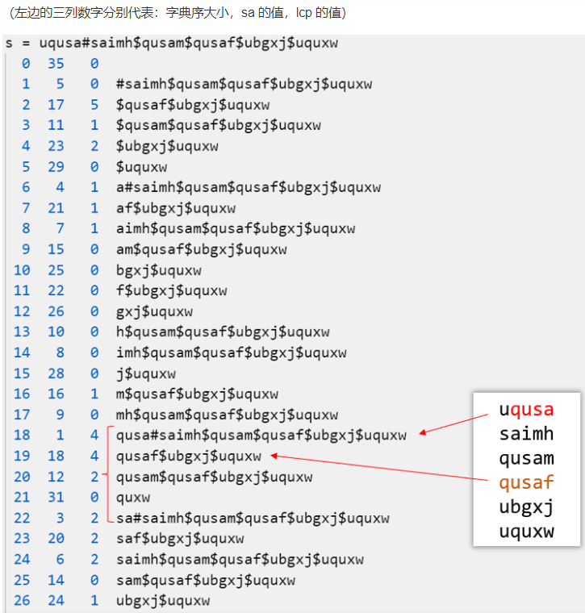

## 目录

### 第一场

- G Lexicographical Maximum

  签到(模拟-字符串)

- A Villages: Landlines

  签到(模拟-区间交)

- D Mocha and Railgun

  计算几何

- I Chiitoitsu

  期望DP
  
- C Grab the Seat!

  枚举 + 几何优化
  
- J Serval and Essay

  启发式合并 / 随机化
  
- H Fly

  背包DP 二进制优化物品枚举 分组 背包嵌套 分治FFT/NTT

### 第二场

- G Link with Monotonic Subsequence

  构造 LIS

- J Link with Arithmetic Progression

  三分/二次函数极值/线性回归 等差数列
  
- D Link with Game Glitch

  对数 最大环(负环) 二分答案
  
- K Link with Bracket Sequence I

  DP

- L Link with Level Editor I

  DP / BFS

- H Take the Elevator

  前缀和 离散化

- I let fat tension

  矩阵乘法

- C Link with Nim Game

  博弈论

- E Falfa with Substring

  DP 容斥 组合数学 FFT/NTT

### 第三场

- C Concatenation

  排序 字典序 / (trie+exkmp)

- A Ancestor

  LCA ST表/前缀和

- J Journey

  单源最短路
  
- F Fief

  ~~图的双极定向~~ 圆方树 点双 tarjan

- H Hacker

  SAM / SA + ST表 前缀和

- D Directed

  组合数学 概率DP

- G Geometry

  凸包 二分答案 闵可夫斯基和

- B Boss

  网络流


### 第四场

- N Paricle Arts

  位运算 分数运算

- K NIO’s Sword

  取模

- D Jobs (Easy Version)

  三维前缀和
  
- H Wall Builder II

  枚举 贪心

- A Task Computing

  DP 贪心

- L Black Hole

  立体几何

- C Easy Counting Problem

  NTT 多项式DP


### 第五场

- K Headphones

  签到 抽屉原理

- B Wathces

  签到 二分答案 排序

- H Cutting Papers

  签到 计算几何

- C Bit Tranmission

  签到 小模拟

- G KFC Crazy Thursday

  manacher / 回文自动机

- F A Stack of CDs

  计算几何 模拟 圆周长并

- A Don't Starve

  DP

- E Fraction Game

  二维ST表 单调队列

- D Birds in the tree

  树上DP

- I Board Game

  博弈论

- J Check In

  计算几何

### 第六场


### 其他

#### 码加加模拟3

- A 对称

  思维 位运算

- B 连接

  数学 数位 思维

- C 装铅笔

  线段树

- D 加法

  二分 数学

- E 小Z和小J随机游走

- F 小Z和小J玩游戏


#### 码加加初赛

- A 标识符

  小模拟 字符串

- B 消去

  思维 贪心 栈

- C 小Z和小P探大案

  数学

- D 小Z和小P玩Wordle

  [二分图匹配]

- E 城墙

  [矩阵树定理 高斯消元]

- F 土豆田


#### 码加加复赛

- A 归零

  构造

- B 飞行棋

  前缀和 期望DP 方程组求解(轮换对称)

- C 小Z和小J排排列

  数学

- D 树

  欧拉函数 树 

- E 取模机器

- F 小Z和小J恶作剧 (原题洛谷P5227)

  线段树分治 / LCT / 可撤销并查集 / 哈希+线性基

- G 小Z和小J爱旅行

- H 挑战群同构


#### 赛氪夏季赛

- K 真假英雄

  种类并查集

- F String

  字符串 子序列 编辑距离

- J 大富翁

  模拟 签到

- H Travel

  最短路

- E Preview

  DP 线段树

- D Poly [原题为NOIP模拟赛-多边形](https://blog.csdn.net/UISG103/article/details/77422364)

  计算几何

- I Tree 原题为旅行路线(JZOJ5052)

  trie + 广义后缀自动机

- B Path 原题为CF的E.bricks(div1 E, CF2800)

   二分图 最大独立集


## 第一场

赛时排名117，赛时过了四题，其中A,D是我过的。

> 比赛日志：
>
> 一开始，我在看A题，然后队友发现签到题是G题，队友就把G过掉了，然后我不征求意见自己直接上把A切掉了，20分钟这样过了两题，排名暂时居于21。然后能看的题目，后面就比较零散了，有一道I题看起来很复杂，实际上就是一个概率问题，然后我们就打算去搞这道题。研究了很久，然后发现D题很多人过，我一眼结论，但是想着可能队友写而且不一定对，所以还没写。后来队友启发可以旋转等效，然后看着好像队友也不擅长，我就写了，然后盲猜垂直，直接用比较危险的不懂的三角函数，寄了。然后想不出为什么，卡了十多分钟，想想不如试试再加个平行看看，竟然对了……很奇怪。两个小时多这样了。然后因为自己对取模公式(a/b+c/d)理解有误，所以没敢用DP来做I题，然后一直在想排列组合解法，然后解不出来。队友用DP搞过了。后面，剩下差不多两个钟。但是，剩下的题都看了一遍，队友在做的H题数位DP啥的我没有思路，不想做，然后其他题也没思路，就是看着简单，但是其实还是不知道怎么做。四点多润了

### G Lexicographical Maximum

比较显然的小模拟，若原串是 $n-1$ 个 $9$ 和 $1$ 个任意字符，直接输出；否则输出 $n-1$ 个 $9$，可以特判一下个位数。

个人代码：

```c++
#include <bits/stdc++.h>
using namespace std;
#define sc(x) scanf("%lld", &x)
typedef long long ll;
ll cnt9, n;
char s[1000010];
signed main()
{
    scanf("%s", s + 1);
    n = strlen(s + 1);
    for (ll i = 1; i <= n; ++i)
    {
        if (s[i] == '9')
        {
            ++cnt9;
            continue;
        }
        break;
    }
    if (n == 1)
    {
        putchar(s[1]);
    }
    else if (cnt9 >= n - 1)
    {
        for (ll i = 1; i < n; ++i)
        {
            putchar('9');
        }
        putchar(s[n]);
    }
    else
    {
        for (ll i = 1; i < n; ++i)
        {
            putchar('9');
        }
    }
    return 0;
}
```

队友赛时代码：直接利用字符串自带的大小比较

```c++
cout << max(s, string(s.size()-1, '9'));
```


### A Villages: Landlines

题意很简单，就是给定 $n$ 个区间 $[x-r,x+r]$，将它们交为一个区间，至少需要再补多长的区间。那么排序后顺着扫就行。

代码：(去除赛时写的冗余部分)

```c++
#include <bits/stdc++.h>
using namespace std;
#define sc(x) scanf("%lld", &x)
typedef long long ll;
#define mn 200010
pair<ll, ll> a[mn], prv;
ll ans, n;
signed main()
{
    sc(n);
    for (ll i = 1; i <= n; ++i)
    {
        ll x, r;
        sc(x), sc(r);
        a[i].first = x - r;
        a[i].second = x + r;
    }
    sort(a + 1, a + 1 + n);
    prv = a[1];
    for (ll i = 2; i <= n; ++i)
    {
        if (a[i].first <= prv.second) // merge
        {
            prv.second = max(a[i].second, prv.second);
            prv.first = min(a[i].first, prv.first);
        }
        else // not merge
        {
            ans += a[i].first - prv.second;
            prv = a[i];
        }
    }
    printf("%lld", ans);
    return 0;
}
```


### D Mocha and Railgun

赛时取垂直和平行的最大值过掉了。赛时是根据队友启发直接把Q点旋转到了坐标轴x正半轴再继续考虑，这时候直接把base拉到了x轴求一次，然后不行，又作了一个平行的取max，过了。公式就是弧度 $l=\alpha\cdot r$，然后 $Rt\Delta$ 反三角取 $\alpha$ 即可。赛时AC代码：

```c++
#include <bits/stdc++.h>
using namespace std;
#define sc(x) scanf("%lld", &x)
typedef long long ll;
typedef double db;
ll t;
db r, d, x, y;
signed main()
{
    for (sc(t); t; t--)
    {
        scanf("%lf%lf%lf%lf", &r, &x, &y, &d);
        db k = sqrt(x * x + y * y);
        db ang1 = acos((k + d) / r);
        db ang2 = acos((k - d) / r);
        db ans = r * (ang2 - ang1);
        db ang3 = asin(d / r);
        db ans2 = 2 * r * ang3;
        ans = max(ans, ans2);
        printf("%.12lf\n", ans);
    }
    return 0;
}
```

平行是不需要的，只需要垂直。(即真实过题核心代码是：)

```c++
db k = sqrt(x * x + y * y);
db ang1 = acos((k + d) / r);
db ang2 = acos((k - d) / r);
db ans = r * (ang2 - ang1);
```

> 所以赛时第一次 WA 应该是在原点的特判炸了。

证明：重建系，把 base segment 建成 x 轴，如图：


那么 $Q$ 在 $x$ 轴的投影取值范围是 $[0,\sqrt{Q_x^2+Q_y^2}]$，分别在 $OQ$ 垂直与平行基线时取得。直观上来看，比较难看出来。这样转化之后，设 $Q$ 投影坐标是 $k,k\in [0,\sqrt{Q_x^2+Q_y^2}]$，如图所示：


不需要算出 $y_1,y_2$，只需要用余弦，那么答案为：
$$
ans=r\cdot(\arccos\dfrac{k-d}{r}+\arccos\dfrac{k+d}{r})
$$
求导，得：
$$
ans'=\left(
\dfrac1{\sqrt{1-\dfrac{(k+d)^2}{r^2}}}
-\dfrac1{\sqrt{1-\dfrac{(k-d)^2}{r^2}}}
\right)
$$
由于 $\arccos$ 内的东西 $< 1$，所以分母都大于零。转化为判断下面东西的正负：
$$
\sqrt{1-\dfrac{(k-d)^2}{r^2}}-\sqrt{1-\dfrac{(k+d)^2}{r^2}}
$$
显然 $(k-d)^2 \le (k+d)^2$，所以 $1-\dfrac{(k-d)^2}{r^2} \ge 1-\dfrac{(k+d)^2}{r^2}$，所以是正的。

所以一阶导恒非负，即原函数恒为增函数，即 $k=\sqrt{Q_x^2+Q_y^2}$ 时，答案最大，为：
$$
ans=r\cdot(\arccos\dfrac{\sqrt{Q_x^2+Q_y^2}-d}{r}+\arccos\dfrac{\sqrt{Q_x^2+Q_y^2}+d}{r})
$$


### I Chiitoitsu

抽象为有 $34$ 种颜色的球，每种 $4$ 个。一开始随机给你 $13$ 个，且保证最多每种颜色能得到 $2$ 个。每次能从剩余的球里随机拿一个，若此时凑够了 $7$ 种颜色每种两个球胜，否则永久丢弃随机一个球然后继续抽。给定初始 $13$ 个球，问期望抽多少次能得到答案。

首先，可以明确最佳策略是摸到的不是已有的就丢，否则随机丢一个落单的。因为这样丢掉的一定再不可能拿(再拿到也会再丢)，所以可以减少很多东西考虑，而且是最优的。那么答案有且仅有七种，即一开始有 $[0,6]$ 对同颜色的球。可以思考 DP 了。

首先复习一下取模公式，证明：($p$ 是质数)
$$
(a_1\div b_1+a_2\div b_2)\bmod p\equiv(a_1\div b_1\bmod p+a_2\div b_2\bmod p)\bmod p
$$
由于 $(a+b)\bmod p=(a\bmod p+b\bmod p)\bmod p$，故证毕。这说明 $DP$ 表达式是分子间可以随意进行加减乘除，从而证明了模除下 $DP$ 的有效性。

设 $dp_{i,j}$ 是当前还有 $i$ 个球，还差 $j$ 对时还需要期望回合是多少。显然 $dp_{i,0}=0$。有 $7-j$ 个对代表有 $13-2(7-j)=2j-1$ 个单，随便抽一个中奖率为 $6j-3$，故有：
$$
dp_{i,j}=\dfrac{i-36+6j}{i}dp_{i-1,j}+\dfrac{36-6j}{i}dp_{i-1,j-1}+1
$$
故复杂度为 $O(7\cdot34\cdot4+t)$。

```c++
#include <bits/stdc++.h>
using namespace std;
#define sc(x) scanf("%lld", &x)
typedef long long ll;
ll mod = 1e9 + 7;
ll qpow(ll a, ll b = mod - 2)
{
    ll r = 1;
    for (; b; b >>= 1)
    {
        if (b & 1)
        {
            r = r * a % mod;
        }
        a = a * a % mod;
    }
    return r;
}
ll dp[200][10];
ll dfs(ll i, ll j)
{
    if (j == 0)
    {
        return 0;
    }
    if (dp[i][j])
    {
        return dp[i][j];
    }
    ll t = 6 * j - 3;
    if (i > t)
    {
        ll v = (i - t + mod) * qpow(i) % mod * dfs(i - 1, j) % mod;
        v = (v + t * qpow(i) % mod * dfs(i - 1, j - 1)) % mod;
        dp[i][j] = (v + 1) % mod;
    }
    else if (i == t)
    {
        dp[i][j] = (1 + dfs(i - 1, j - 1)) % mod;
    }
    return dp[i][j];
}
signed main()
{
    ll t;
    sc(t);
    for (ll g = 1; g <= t; ++g)
    {
        map<ll, ll> h;
        char s[40] = {};
        scanf("%s", s);
        for (ll i = 0; i < 26; i += 2)
        {
            h[1000 * s[i] + s[i + 1]]++;
        }
        ll cnt = 0;
        for (auto i : h)
        {
            cnt += i.second == 2;
        }
        printf("Case #%lld: %lld\n", g, dfs(34 * 4 - 13, 7 - cnt));
    }
    return 0;
}
```

只能说这道题是会的，败在了取模公式理解错误上，赛时我执意认为不能用 DP。


### C Grab the Seat!

对一个点，其所遮挡的点的区域是该点 $(x,y)$ 与黑板两端点 $(0,1),(0,m)$ 连线形成的区域。由此可知：①每一行只有最左边的点有影响，其他点可以忽略。②这些区域连线里，所有与 $(0,1)$ 的连线从下往上必然斜率越来越大，即每次只被最上边的点所影响；同理，所有与 $(0,m)$ 的连线从上往下斜率绝对值增大。如图所示：


对这两种情况所形成的区域，并一下即得答案。(据说李超树能多一个 log 做到，但我不会)

那么就可以写出代码，复杂度为 $O(nq)$，详见注释：

```c++
#include <bits/stdc++.h>
using namespace std;
#define sc(x) scanf("%lld", &x)
typedef long long ll;
#define mn 200010
ll n, m, k, q, x[mn], y[mn], id, lf[mn], cnt[mn];
signed main()
{
    sc(n), sc(m), sc(k), sc(q);
    for (ll i = 1; i <= k; ++i)
    {
        sc(x[i]), sc(y[i]);
    }
    while (q--)
    {
        sc(id), sc(x[id]), sc(y[id]);
        for (ll i = 1; i <= m; ++i)
        {
            lf[i] = n + 1; //初始化每行最左边的人的x坐标
            cnt[i] = n;    //初始化每个位置都不被遮挡
        }
        for (ll i = 1; i <= k; ++i)
        {
            lf[y[i]] = min(lf[y[i]], x[i]); //读入最左边的人
        }

        //枚举从(0,1)出发的射线
        ll j = 0;                   //上一条最大斜率射线
        for (ll i = 1; i <= m; ++i) // i就是y
        {
            //如果这行有人，没有历史记录或斜率更大
            if (lf[i] != n + 1 && (!j || (lf[i] - 0) * (j - 1) < (lf[j] - 0) * (i - 1)))
            {
                j = i;
            }
            if (j == 1) //首行特判(k=0)只影响自己这一行
            {
                cnt[i] = i == 1 ? lf[i] - 1 : n;
            }
            else //没有过人就n,否则根据相似三角形求解(注意下取整所以额外-1)
            {    //(i-1)/(j-1)=?/lf[j]
                cnt[i] = j ? ((i - 1) * lf[j] - 1) / (j - 1) : n;
                cnt[i] = min(cnt[i], n); //小心越界
            }
        }

        //(0,m)
        j = 0;
        for (ll i = m; i >= 1; --i)
        {
            if (lf[i] != n + 1 && (!j || (lf[i] - 0) * (j - m) > (lf[j] - 0) * (i - m)))
            {
                j = i;
            }
            if (j == m) // update而不是直接覆盖
            {
                cnt[i] = min(cnt[i], i == m ? lf[i] - 1 : n);
            }
            else
            {
                ll v = j ? ((m - i) * lf[j] - 1) / (m - j) : n;
                cnt[i] = min({cnt[i], v, n});
            }
        }

        ll ans = 0;
        for (ll i = 1; i <= m; ++i)
        {
            ans += cnt[i];
        }
        printf("%lld\n", ans);
    }
    return 0;
}
```


### J Serval and Essay

设 $u$ 点作为论证基础时所能推导出的结论集合为 $S_u$，不难发现，$u$ 是推导树的根节点，推导过程是建生成树的过程，所以若 $v\in S_u$，那么 $v$ 推导出来的 $S_v$ 一定是 $S_u$ 子集，即 $S_v\subseteq S_u$。

> 记 $u$ 推导过程的任一个拓扑序为 $w_1=u,w_2,\cdots,w_{|S_u|}$，记点 $x$ 为终点的有向边的起点集为 $I_x$，即能推导出 $x$ 必须满足全部条件集为 $I_x$(即题目输入的每一行)，那么对 $w_i(i > 1)$，因为它被推导出来了，所以 $I_{w_i}$ 都被推导出来了，即条件集一定在 $i$ 之前全部满足，即 $I_{w_i}\subseteq\{w_1,\cdots,w_{i-1}\}$。
>
> 若 $S_u,S_v$ 有交集，即 $S_u\cap S_v\neq\varnothing$。若 $u\neq v$，记最小满足 $u$ 的拓扑序的 $w_k\in S_u\cap S_v$ 的下标为 $k$，考虑 $w_k\neq u,w_k\neq v$ 时，所以需要满足 $w_k\in S_v$，这就是说 $I_{w_k}\in S_v$，否则从 $v$ 推不出 $k$。那么，就是说还存在比 $k$ 更小的满足 $\in S_u\in S_v$ 的，所以假设不成立。

即可以通过反证法严格推导出：若 $S_u\cap S_v\neq\varnothing$，则 $S_u\subseteq S_v$ 或 $S_v\subseteq S_u$。从直观来看，是很成立的。

> 不是很懂，为什么 $S_u\cap S_v\neq\varnothing$ 就是  $S_u\subseteq S_v$ 或 $S_v\subseteq S_u$，没看出这个证明 $k$ 跟这个结论有啥联系。我太菜了 QwQ

那么，根据推导结论，如果缩点 $S_i$ 为若干个点，那么 $S_u\subseteq S_v$ 时必然有 $S_v$ 是 $S_u$ 的祖先，从而得到森林。那么森林里最大树大小是答案。

那么解法呼之欲出，只需要把每个点能推出来的所有点合并到当前点上。先考虑一下如果暴力会怎样，就是每次对每个点 $u$，判断剩下的所有点 $v$，是否 $u$ 为根的并查集所有点覆盖了 $v$ 的前置条件，如果是就把 $v$ 合进去，形式化表示为：

> 那么可以用启发式合并来解，初始设 $S_u=u$，设 $T=V$。每次取 $T$ 的一点 $v$，若 $\exists u\in T,I_v\subseteq S_u$，即发现 $v$ 的前置条件都满足了，那么 $S_u$ 能够推导出 $S_v$，把 $S_u\cap S_v$ 更新为新的 $S_u$，并且将 $T$ 中删去 $v$。重复该过程直到找不到满足上述条件的 $u,v$。
>
> 任意时刻下任意 $T$ 的两点 $u,v$，满足 $S_u\cap S_v=\varnothing$。直观上很好理解，因为发现不满足时，作为子集的那个点 $v$ 都被拖走了。

可以发现，上面这么做的话，复杂度是严重超标的，至少是 $O(n^2)$，可能更高。所以考虑优化。

因为上述性质可知，形成的是森林，即每个点属于且仅属于一棵树。那么如果某个点已经被合并了，就可以把所有点

> 将所有 $S_u$ 看成一个点，向所有点出边终点除自己的所属集合连边，若 $I_v\subseteq S_u$，将 $S_u,S_v$ 启发式合并，合并出边。满足 $I_v\subseteq S_u$ 当且仅当合并后只有一条来自 $S_u$ 的入边。每个点最多被合并 $\log n$ 次。

视频题解思路：

- 如果有一个点只有一个前置条件，那么该点和前置条件可以合并为一个点，合并后重新设图(即删重边)，会使得可能会出现新的只有一个前置条件的点。这个就是找森林的过程。(这个是比较显然的策略，不看题解应该也能想到)
- 考虑优化上述策略，使得复杂度可以过题。暴力用 bitset 优化也不行。最坏情况下合并需要执行 $n-1$ 次，所以不可能遍历所有的边，考虑优化枚举边的过程。用 set 存边集，合并两点时，暴力合并它们的出边，得到新的出边集
- 阐述启发式合并的复杂度正确性：合并时，原集合是 $A,B$，合并时只需要遍历其中一个集合，将其纳入另一个集合即可，所以可以达到复杂度为 $O(\min(A,B))$。考虑最坏情况，即最终集合每次都是逆向均分为两个子集，那么类比归并排序，可知访问次数是 $O(n\log n)$。考虑 set 自身的复杂度，叠加复杂度为 $O(n\log^2n)$
- 实际上是 BFS，用队列存将要合并的点。那么可以保证一个正确的遍历顺序。

启发式合并：~~(有一说一不是特别懂，没有完全看明白，主要是不理解动态insert和erase是干嘛的)~~

复杂度是 $O((n+m)\log^2n)$。

官方题解复现：

> ```c++
> #include <bits/stdc++.h>
> using namespace std;
> #define sc(x) scanf("%lld", &x)
> typedef long long ll;
> #define mn 200010
> ll t, n, fa[mn], siz[mn];
> set<ll> tj[mn], to[mn];
> signed main()
> {
>     sc(t);
>     for (ll h = 1; h <= t; ++h)
>     {
>         sc(n);
>         for (ll i = 1; i <= n; ++i)
>         {
>             tj[i].clear();
>             to[i].clear();
>             fa[i] = i, siz[i] = 1;
>         }
>         ll ans = 0;
>         for (ll u = 1, m, v; u <= n; ++u)
>         {
>             sc(m);
>             while (m--)
>             {
>                 sc(v);
>                 tj[u].insert(v), to[v].insert(u);
>             }
>         }
>         auto findf = [&](ll x)
>         {
>             while (x != fa[x])
>             {
>                 x = fa[x] = fa[fa[x]];
>             }
>             return x;
>         };
>         for (ll i = 1; i <= n; ++i)
>         {
>             if (findf(i) == i)
>             {
>                 //因为>i还没遍历，所以唯一条件没遍历的话可以忽略
>                 if (tj[i].size() == 1 && *tj[i].begin() > i)
>                 {
>                     continue;
>                 }
>                 auto update = [&](ll k) //删掉冗余点
>                 {
>                     for (auto it = to[k].begin(); it != to[k].end(); ++it)
>                     {
>                         //不等于的话证明被合并走了，它不是并查集根
>                         //注意并查集根不等于推导拓扑的初始条件
>                         //不是根的话，根据不交推论，一定不需要再次计算了
>                         if (findf(*it) != *it)
>                         {
>                             it = to[k].erase(it); //删除后迭代器会更新
>                         }
>                     }
>                 };
>                 update(i);
>                 queue<ll> q;
>                 //还需要计算的能推出的点
>                 for (ll j : to[i])
>                 {
>                     q.push(j);
>                 }
>                 while (!q.empty())
>                 {
>                     ll p = q.front();
>                     q.pop();
>                     // while过程删掉了，可以跳过
>                     if (!to[i].count(p))
>                     {
>                         continue;
>                     }
>                     bool br = false; // goto作用
>                     for (auto it = tj[p].begin(); it != tj[p].end();)
>                     {
>                         //这个条件被推出来了
>                         if (findf(*it) == i)
>                         {
>                             it = tj[p].erase(it);
>                         }
>                         else //存在瓶颈，推导不出p
>                         {
>                             // to[i].insert(p);//题解无关代码，想不出有啥用
>                             br = true;
>                             break;
>                         }
>                     }
>                     if (!br) //能推导出p
>                     {
>                         auto merge = [&](ll x, ll y)
>                         {
>                             x = findf(x), y = findf(y);
>                             if (x != y)
>                             {
>                                 fa[x] = y, siz[y] += siz[x];
>                             }
>                         };
>                         merge(p, i);    //把p合到i为根上
>                         to[i].erase(p); //再也不需要管它了(否则会TLE)
>                         // update(p);//可能不需要这行代码
> 
>                         //循环推导
>                         for (ll j : to[p])
>                         {
>                             if (i != j)
>                             {
>                                 q.push(j);
>                                 to[i].insert(j); // a->b, b->c => a->c
>                             }
>                         }
>                     }
>                     tj[p].insert(i);
>                 }
>             }
>             ans = max(ans, siz[i]);
>         }
>         printf("Case #%lld: %lld\n", h, ans);
>     }
>     return 0;
> }
> ```
>

有更优实现，在 [这里](https://ac.nowcoder.com/acm/discuss/blogs?tagId=148378) 的 [Zechariah_2001](https://ac.nowcoder.com/profile/883382140)，这个比较好懂，跟视频一个思路：

```c++
#include <bits/stdc++.h>
using namespace std;
#define sc(x) scanf("%lld", &x)
typedef long long ll;
#define mn 200010
set<ll> to[mn], from[mn];
ll fa[mn], siz[mn], t, n;
ll findf(ll x)
{
    while (x != fa[x])
    {
        x = fa[x] = fa[fa[x]];
    }
    return x;
}
void merges(ll u, ll v)
{
    u = findf(u), v = findf(v);
    if (u == v)
    {
        return;
    }
    if (to[u].size() < to[v].size()) //规定u比较大
    {
        swap(u, v);
    }
    fa[v] = u, siz[u] += siz[v];
    vector<pair<ll, ll>> mg; //下一轮BFS的点
    for (auto t : to[v])
    {
        to[u].insert(t);   //出边合并
        from[t].erase(v);  // v点被删了
        from[t].insert(u); // v等效成了u
        if (from[t].size() == 1)
        { //类似拓扑序BFS
            mg.push_back({t, u});
        }
    }
    for (auto [x, y] : mg)
    {
        merges(x, y);
    }
}
signed main()
{
    sc(t);
    for (ll h = 1; h <= t; ++h)
    {
        sc(n);
        for (ll i = 1; i <= n; ++i)
        {
            fa[i] = i, siz[i] = 1;
            from[i].clear(), to[i].clear();
        }
        for (ll u = 1, m, v; u <= n; ++u)
        {
            sc(m);
            while (m--)
            {
                sc(v);
                to[v].insert(u);
                from[u].insert(v);
            }
        }
        for (ll i = 1; i <= n; ++i)
        {
            if (from[i].size() == 1)
            {
                merges(*from[i].begin(), i);
            }
        }
        ll ans = 0;
        for (ll i = 1; i <= n; ++i)
        {
            ans = max(ans, siz[i]);
        }
        printf("Case #%lld: %lld\n", h, ans);
    }
    return 0;
}
```


> 随机化：随机顺序遍历原图，设最终森林是 $S$，则深度为 $x$ 的树 $S_u$ 的边预期被遍历次数是 $f(x)$，则 $f(1)=1,f(x)=1+\dfrac1x\sum_{i=1}^{x-1}f(i)$，原因未知。用积分估计求和，即近似 $f(x)=1+\dfrac1x\int_1^xf(x)dx$，可以解出 $f(x)=1+\ln x$，而该近似恒大于原函数，所以期望被遍历 $O(\log x)$ 次，复杂度是 $O(m\log n)$。
>
> 证明 $f(x)=1+\dfrac1x\int_1^xf(x)dx$ 解出 $f(x)=1+\ln x$：
>
> 1. 移项得
>    $$
>    x(f(x)-1)=\int_1^xf(x)dx
>    $$
>
> 2. 两边求导，得
>    $$
>    f(x)-1+xf'(x)=f(x)
>    $$
>
> 3. 移项得
>    $$
>    f'(x)=\dfrac1x+1
>    $$
>
> 4. 那么根据积分公式，显然，两边积分积回去得
>    $$
>    f(x)=\ln x+C
>    $$
>
> 5. 根据 $f(1)=1$ 得 $C=1$，故 $f(x)=1+\ln x$。证毕。
>
> ……不会实现，也没看懂。


### H Fly

大概是金牌题难度。

题意转化为有 $n$ 种物品的无限背包，物品体积为 $a_i$，背包容量为 $m$，问方案数。有 $k$ 个限制，第 $i$ 个限制要求第 $b_i$ 种物品的数量的二进制第 $c_i$ 位是 $0$。

$m$ 很大，显然不能直接真的上无限背包 DP。而限制条件里某些物品个数无法取。按位限制很容易想到数位 DP。那么可以想到二进制优化的背包问题，将物品拆分为 $1,2,\cdots,2^i$ 个物品进行 01 背包，而不能取就把这个数位的 $2^i$ 给 ban 掉。至此解决了限制问题。但是背包很大，01 背包还是背不出来。这样的物品数倒是 $n\log m$ 个了，但若暴力背包 DP 时间复杂度是 $O(nm\log m)$，空间复杂度是 $O(m)$，不可取。

若进行分组，把所有 $2^i$ 的物品都分到一组。分组后可以发现一个性质，第 $i$ (从 $0$ 算，位运算序数同)组物品体积和至少是 $2^i$ 的倍数，即第 $i$ 组不可能改变二进制位的前 $i-1$ 位。每一组内部单独是一个背包，然后组间也是一个背包，就像是背包套背包。

> 设有 $u_i$ 种方法，使得第一组选出来的体积和第 $i$ 位是 $1$；有 $v_i$ 种方法是 $0$。

设 $f_{i,j,k}$ 是前 $i$ 组选择的体积和除 $2^i$ 为 $j$，体积低 $i$ 位是否大于 $m$ 的低 $i$ 位的方案数。那么答案就是 $f_{n,0,0}$。除 $2^i$ 其实就是把二进制里 $1,2,\cdots, 2^i$ 个的这个个数再给消掉了，即表示为本身的单位体积和。

我们设一个背包体积为 $i$ 时方案数为 $a_i$，那么该背包可以表示为多项式 $a_ix^i$。把两个多项式相乘，就是合并两个背包。

设 $g_{i,j}$ 是第 $i$ 组物品体积和除 $2^i$ 得 $j$ 的方案数。对每一组，其背包表达式为 $\prod_{i\neq c_j}(1+x^{a_i})$。或表示为 $\prod_{全选}(1+x^{a_i})\div\prod_{限制}(1+x^{a_i})$，即全部求一个背包，限制 ban 掉的再求一个背包。这样的背包可以用分治NTT 计算。把一个多项式表示为 $[x^i]$。

因为没怎么听懂，所以不放代码了。因为队友有会 FFT/NTT 的，所以我就不补了 QwQ。


## 第二场

参赛了，在队友启发下回忆济南原题想出并独立做出J题，然后与队友合力做出D题。共过三题。

> 比赛日志：
>
> 开局不利，一开始有GK两题比较多人过。看G，构造，题目感觉有歧义，读不懂，然后看K，是一眼括号序列的DP，然后我对题意理解有误，我认为subsequence是连续的，就想着枚举m种左右，然后队友指出是不连续的，我盲猜跟卡特兰数有关，但是接下来我就不会了，然后DP太弱了，不想看，润去看别的题了。不久后G题意修了，队友去做了，半小时多一点过了。E感觉也是个DP，甚至有一点一眼卷积的直觉，然后也不是很想碰，所以看D，感觉是一个跟环路有关的问题，然后二分答案就出来了，然后想着n次最短路求最长路，发现复杂度很高，不是很现实，暂时放弃了。然后看到J题好像蛮多人过的，就去看看，自己推了蛮久没推出来，做过类似的，但是不太想翻，觉得不一样，然后在练车的队友说这题跟济南的一题很想，我就去翻了下做题记录，然后发现好像确实可以，就上了个求导求出中项最值，然后盲猜三分法可以求公差，然后一交一个WA，然后修了修二分边界改成两个常数，加高了精度，又交对了。此时两个小时多了。然后继续看D。我瞎搞DFS求最长路，随便找的模板，也不知道对不对，感觉很不靠谱，然后一交WA了两次，因为后来又手痒调精度去了，第一发二分边界都是错的。队友说可以试试拓扑求最长路进而求最大环，我不理解。然后我说可以用取对数解决连乘爆精度问题，然后就不需要比较质因数分解大小了。然后本来打算写拓扑了，队友突然想出可以求负环，因为题意刚好就是划分正负的，然后一写炸了，因为题目要求其实是所有环都是负环，但SPFA只能求存在负环。然后队友很妙地指出正负逆转，那么不存在负环就证明都是负环了。于是还是WA，调精度，撤long double都没用，然后我就发现可能是图没说连通导致的，需要求各个分量，于是改成了多次SPFA，然后发现TLE了，调了多次终于调出来了。此时还剩下24分钟。然后队友说L题能做，但我看不懂队友思路，于是遗憾退场。

### G Link with Monotonic Subsequence

通过暴力打表，可以发现有一种答案的规律是类似这样的：

```c+
1
1 2
2 3 1
3 4 1 2
3 4 5 1 2
4 5 6 1 2 3
5 6 7 2 3 4 1
6 7 8 3 4 5 1 2
7 8 9 4 5 6 1 2 3
```

而 $\max(lis(p),lds(p))$ 找规律是 $\lceil\sqrt n\rceil$。也就是可以构造分成 $\lceil\sqrt n\rceil$ 组，每组是升序的，然后逆序排列各个组。这样可以构造出满足 $lis=\lceil\sqrt n\rceil$，即是每组长度；而 $lds=\lceil\sqrt n\rceil$，因为 $lds$ 就是组数。

复杂度 $O(n)$。

```c++
#include <bits/stdc++.h>
using namespace std;
#define sc(x) scanf("%lld", &x)
typedef long long ll;
ll t, n;
signed main()
{
    for (sc(t); t; --t)
    {
        sc(n);
        ll m = ceil(sqrt(n));
        for (ll i = 1, v = n; i <= m; ++i)
        {
            ll jb = max(1LL, v - m + 1);
            for (ll j = jb; j <= v; ++j)
            {
                printf("%lld ", j);
            }
            v = jb - 1;
        }
        printf("\n");
    }
    return 0;
}
```

证明：$\max(lis(p),lds(p))$ 的下界是 $\lceil\sqrt n\rceil$。

Dilworth定理：偏序集的最少反链划分数等于最长链的长度。

> 偏序集：即(不严格)单调的序列。即如满足①自反性 $x\le x$；② $x\le y,y\le x\Rightarrow x=y$；③传递性 $x\le y,y\le z\Rightarrow x\le z$。在单调上升里，定义 $x\le y$ 为 $i\le j, v_i\le v_j$。

因此最少 $lds$ 数目等于 $lis$ 长度。即极端情况下就是 $|lis|$ 条 $lds$；且 $|lds|$ 条 $lis$，取极端就是每条 $lis,lds$ 等长。有 $n\ge lis\cdot lds$，得证。 $lis,lds$ 一方小于 $\lceil\sqrt n\rceil$ 时，由不等式移项，另一方一定大于等于 $\lceil\sqrt n\rceil$。


### J Link with Arithmetic Progression

赛时思路：(严格证明见下文)

设原数组为 $x$，设目标等差数列的首项是 $x_0$。固定 $d$ 时，以 $x_0$ 为自变量，则代价为：
$$
f(x_0)=\sum_{i=1}^n(x_i-x_0)^2
$$
求导得：
$$
f'(x_0)=-2x_0\sum_{i=1}^nx_i+2nx_0
$$
令 $f'(x_0)=0$ 得 $x_0=\dfrac{\sum_{i=1}^nx_i}n$。所以函数极值在 $x_0=\dfrac{\sum_{i=1}^nx_i}n$ 取得。然后用三分法确定 $d$ 最小值，即得答案，复杂度为 $O(n\log w)$。

细节是注意二分边界开大一些，最好是极大常数。事实上，因为 $x_0$ 是二次函数，也可以再次三分的。

赛时 AC 代码：

```c++
#include <bits/stdc++.h>
using namespace std;
#define sc(x) scanf("%lld", &x)
typedef long long ll;
typedef long double db;
#define mn 1000010
ll t, n, a[mn];
db b[mn];
db solve(db v)
{
    db sum = 0, res = 0;
    for (ll i = 1; i <= n; ++i)
    {
        b[i] = a[i] - v * i;
        sum += b[i];
    }
    sum /= n;
    for (ll i = 1; i <= n; ++i)
    {
        res += (b[i] - sum) * (b[i] - sum);
    }
    return res;
}
signed main()
{
    for (sc(t); t; --t)
    {
        sc(n);
        db sum = 0;
        for (ll i = 1; i <= n; ++i)
        {
            sc(a[i]);
            sum += a[i];
        }
        db lf = -1e15, rf = 1e15, ans = 1e100;
        while (rf - lf > 1e-10)
        {
            db dt = (rf - lf) / 3;
            db cf1 = lf + dt, cf2 = rf - dt;
            db v1 = solve(cf1), v2 = solve(cf2);
            // printf("%Lf %Lf\n", cf1, cf2);
            if (v1 < v2)
            {
                ans = min(ans, v1);
                rf = cf2;
            }
            else
            {
                ans = min(ans, v2);
                lf = cf1;
            }
        }
        printf("%.12Lf\n", ans);
    }
    return 0;
}
```

有三种解法，分别是三分法、二次函数法和线性回归。

对线性回归，因为回归方程是 $y'(x)=Ax+B$ 刚好就是等差数列；而线性回归的定义就是对二维点集找到一条该直线使得点集的 $\sum_{i=1}^n(y_i-y'(x_i))^2$ 最小。刚好就是定义式，所以直接上线性回归即可。

最小二乘法：
$$
A=\dfrac{\sum_{i=1}^n(x_i-\overline x)(y_i-\overline y)}{\sum_{i=1}^n(x_i-\overline x)^2}
=\dfrac{\sum_{i=1}^nx_iy_i-n\overline x\overline y}{\sum_{i=1}^nx_i^2-n\overline x^2},B=\overline y-A\overline x
$$
则代价为 $J=\sum_{i=1}^n(a_i-(Ai+B))^2$

参考代码：(显然复杂度为 $O(n)$)

```c++
#include <bits/stdc++.h>
using namespace std;
#define sc(x) scanf("%lld", &x)
typedef long long ll;
typedef long double db; // double会炸
#define mn 100010
ll t, n, a[mn];
signed main()
{
    for (sc(t); t; --t)
    {
        sc(n);
        db xv = 1. * (n + 1) / 2, yv = 0, A = 0, B, x2 = 0, ans = 0;
        for (ll i = 1; i <= n; ++i)
        {
            sc(a[i]);
            yv += a[i];
            A += i * a[i];
            x2 += i * i;
        }
        yv /= n;
        A = (A - n * xv * yv) / (x2 - n * xv * xv);
        B = yv - A * xv;
        for (ll i = 1; i <= n; ++i)
        {
            ans += (a[i] - (A * i + B)) * (a[i] - (A * i + B));
        }
        printf("%.12Lf\n", ans);
    }
    return 0;
}
```

证明：设等差数列为 $y'(x)=Ax+B$，则代价和为：
$$
J(A,B)=\sum_{i=1}^n(y_i-(Ax_i+B))^2
$$
求二元函数极值，则解偏导方程组：
$$
\begin{cases}
\dfrac{\partial J}{\partial A}=0&①\\
\dfrac{\partial J}{\partial B}=0&②\\
\end{cases}
$$
由公式 $(x+y+z)^2=x^2+y^2+z^2+2(xy+yz+xz)$ 展开 $J$ 得：
$$
\sum_{i=1}^ny_i^2+\sum_{i=1}^nA^2x_i^2+\sum_{i=1}^nB^2-2A\sum_{i=1}^nx_iy_i-2B\sum_{i=1}^ny_i+2AB\sum_{i=1}^nx_i
$$
则方程组为：
$$
\begin{cases}
2A\sum_{i=1}^nx_i^2-2\sum_{i=1}^nx_iy_i+2B\sum_{i=1}^nx_i&=0&①\\
2nB-2\sum_{i=1}^ny_i+2A\sum_{i=1}^nx_i&=0&②
\end{cases}
$$
由①②其一得，$\sum_{i=1}^ny_i=A\sum_{i=1}^nx_i+nB$ 即 $\overline y=A\overline x+B$ ③。

③ 代回 ① 或 ② 中取代 $B$，得：(以 ① 为例)
$$
A=\dfrac{\sum_{i=1}^nx_iy_i-\overline y\sum_{i=1}^nx_i}{\sum_{i=1}^nx_i^2-\overline x\sum_{i=1}^nx_i}
$$
将其化简转化，即得上式，得证。自此证明了最小二乘法。

 其他解法：

在函数 $J$ 里，将 $B$ 看成常数，看 $A$，由 ① 得，这是一个关于 $A$ 二元函数，确定该函数的极值可以使用三分法。同理，$B$ 也是二次函数，而且一定是 $U$ 形的。所以当确定 $A$(经由三分)时，可以直接求 $B$ 的最佳值，通过求导即可。当然自然了，也可以三分套三分。

有一种神奇的思路，是进行坐标轴变换，对原函数和目标函数都变换成 $y'=y-id$，使得原题意变成最小代价转常数列。那么，其实本质没有变，就是函数简洁了一点，该三分还是三分，该求导还是求导。


### D Link with Game Glitch

题意转化为求图中最大环的大小，环权值是环上边的乘积，边权是 $\dfrac ca$。若最大环大于 $1$，可以无限刷物品。二分 $w$，每次使得边权是 $\dfrac{cw}a$，然后进行判断。

连乘会爆精度，可以通过取对数转化为连加，这样不会丢失比较大小的依据，即判断 $\prod a_i > 1$ 转化为 $\sum\ln a_i > \ln1=0$。那么转化为判断图上是否每个环都是负环。

SPFA 算法可以找图上是否存在负环。若建图时边权全部取相反数，那么此时图上不存在负环即都是正环。就表明每个环都是负环。

 注意细节是图可能非连通，跑 SPFA 需要跑多次。然后二分精度就锁在 $10^{-6}$ 就好了，太高了会 TLE。还想进一步优化就预处理 $\log$。复杂度是 $O(nm\log10^6 )$

赛时 AC 代码：

```c++
#include <bits/stdc++.h>
using namespace std;
#define sc(x) scanf("%lld", &x)
typedef long long ll;
typedef double db;
#define mn 20024
ll n, m, a[mn], b[mn], c[mn], d[mn];
struct edge
{
    ll to, nx;
    db w;
} e[mn * 2];
ll hd[mn], cnt;
void adde(ll u, ll v, db w)
{
    e[++cnt] = {v, hd[u], w};
    hd[u] = cnt;
}
db dis[mn];
ll vis[mn];
db r = 1, res;
ll cnts[mn];
bool spfa(ll s)
{
    queue<ll> q;
    dis[s] = 0;
    vis[s] = true;
    q.push(s);
    while (!q.empty())
    {
        ll u = q.front();
        q.pop();
        vis[u] = false;
        for (ll i = hd[u]; i; i = e[i].nx)
        {
            //db w = -log(r) - log(e[i].w); TLE
            db w = -log(r * e[i].w);
            ll v = e[i].to;
            if (dis[u] + w < dis[v])
            {
                dis[v] = dis[u] + w;
                if (!vis[v])
                {
                    if (++cnts[v] >= n)
                    {
                        return true;
                    }
                    vis[v] = true;
                    q.push(v);
                }
            }
        }
    }
    return false;
}
bool solve() // spfa
{
    for (ll i = 1; i <= n; ++i)
    {
        vis[i] = 0, dis[i] = 1e9, cnts[i] = 0;
    }
    for (ll i = 1; i <= n; ++i)
    {
        if (!vis[i])
        {
            if (spfa(i))
            {
                return true;
            }
        }
    }
    return false;
}
signed main()
{
    sc(n), sc(m);
    for (ll i = 1; i <= m; ++i)
    {
        sc(a[i]), sc(b[i]), sc(c[i]), sc(d[i]);
        adde(b[i], d[i], 1. * c[i] / a[i]);
    }
    db lf = 0, rf = 1;
    while (rf - lf > 1e-6)
    {
        r = (lf + rf) / 2;
        if (solve()) //没有负环，不行
        {
            rf = r;
        }
        else
        {
            res = r;
            lf = r;
        }
    }
    printf("%.12lf", res);
    return 0;
}
```


### K Link with Bracket Sequence I

设 $dp_{i,j,k}$ 表示原串前 $i$ 个最多匹配子序列 $a$ 的前 $j$ 个，剩下 $k$ 个左括号未匹配的方案数。那么答案为 $dp_{m,n,0}$。

若第 $i+1$ 位选择 `(`，且此时第 $j+1$ 位也是 `(`，则：
$$
dp[i+1][j+1][k+1]=dp[i+1][j+1][k+1]+dp[i][j][k]
$$
若此时是 `)`，则：
$$
dp[i+1][j][k+1]=dp[i+1][j][k+1]+dp[i][j][k]
$$
若选择 `)`，此时也是 `)`，则：
$$
dp[i+1][j+1][k-1]=dp[i+1][j+1][k-1]+dp[i][j][k]
$$
若是 `(`，则：
$$
dp[i+1][j][k-1]=dp[i+1][j][k-1]+dp[i][j][k]
$$
初始值为 $dp_{0,0,0}=1$，即有空串一种方案。

即在递推关系里， $dp_{i,j,k}$ 可以为 $dp_{i+1,j,k+1},dp_{i+1,j+1,k+1},dp_{i+1,j,k-1},dp_{i+1,j+1,k-1}$ 四个位置提出贡献。所以可以以贡献进行推 $dp$。复杂度为 $O(n^2m)$。

```c++
#include <bits/stdc++.h>
using namespace std;
#define sc(x) scanf("%lld", &x)
typedef long long ll;
#define mn 210
ll dp[mn][mn][mn];
ll n, m, t, mod = 1e9 + 7;
char s[mn];
signed main()
{
    for (sc(t); t; --t)
    {
        sc(n), sc(m), scanf("%s", s + 1);
        for (ll i = 0; i <= m; ++i)
        {
            for (ll j = 0; j <= n; ++j)
            {
                for (ll k = 0; k <= i; ++k)
                {
                    dp[i][j][k] = 0;
                }
            }
        }
        dp[0][0][0] = 1; //有一个空串
        for (ll i = 0; i < m; ++i)
        {
            for (ll j = 0; j <= n; ++j)
            {
                for (ll k = 0; k <= i; ++k)
                {
                    if (!dp[i][j][k])
                    {
                        continue;
                    }
                    ll t = j + (s[j + 1] == '(');
                    dp[i + 1][t][k + 1] = (dp[i][j][k] + dp[i + 1][t][k + 1]) % mod;
                    t = j + (s[j + 1] == ')');
                    dp[i + 1][t][k - 1] = (dp[i][j][k] + dp[i + 1][t][k - 1]) % mod;
                }
            }
        }
        printf("%lld\n", dp[m][n][0]);
    }
    return 0;
}
```


### L Link with Level Editor I

若从第 $i$ 个世界能到达 $m$ 点，那么前 $i-1$ 个世界都能到达，只需原地不动即可。建分层图即 $(i,u)\to(i+1,v)$。

设 $dp_{i,j}$ 表示最大的能从点 $1$ 走到第 $i$ 个世界的点 $j$ 的世界。则 $dp_{i,1}=i$；且 $dp_{i+1,v}=\max_{u\to v\bot i} dp_{i,u}$。发现会 MLE。所以滚动数组，把 $i$ 压掉。

那么答案为 $\min(i-dp[i][m]+1)$，即只考虑前 $i$ 个世界时，最晚能从第几个世界出发到达。

```c++
#include <bits/stdc++.h>
using namespace std;
#define sc(x) scanf("%lld", &x)
typedef long long ll;
#define mn 2010
ll n, m, dis[mn], dp[2][mn], ans;
signed main()
{
    sc(n), sc(m), ans = 1e9;
    for (ll i = 1, l, u, v; i <= n; ++i)
    {
        dp[(i & 1) ^ 1][1] = i;
        for (sc(l); l; --l)
        {
            sc(u), sc(v);
            dp[i & 1][v] = max(dp[i & 1][v], dp[(i & 1) ^ 1][u]);
        }
        if (dp[i & 1][m])
        {
            ans = min(ans, i - dp[i & 1][m] + 1);
        }
        for (ll j = 1; j <= m; ++j)//原地不动
        {
            dp[(i & 1) ^ 1][j] = dp[i & 1][j];
        }
    }
    printf("%lld", ans == 1e9 ? -1 : ans);
    return 0;
}
```

> 若 BFS，朴素会 MLE。但是用 bitset 维护点是否会经过能过。用分块 BFS 或循环队列来减少队列空间消耗。


### H Take the Elevator

可以把一个人从 $x$ 楼到 $y$ 楼等效于有 $y-x$ 个人都要上一楼，分别在 $x,x+1,\cdots,y-1$ 为起点；下楼同理。 

可以统计第 $i$ 到第 $i+1$ 层需要向上和向下多少次，分别记为 $f_i,g_i$。

> 那么至少到达第 $i+1$ 楼 $cnt(i)=\lceil\dfrac{\max(f_i,g_i)}{m}\rceil$。那么需要 $i\to i+1$ 的次数为 $sufmax(i)=\max_{j\ge i}cnt(j)$，容易理解。然后需要上这么多次也就需要下这么多次。所以时间就是 $2\sum_{i=1}^ksufmax(i)$。

记 $cnt_i$ 表示需要第 $i$ 趟用时为 $cnt_i$。那么对第 $i$ 层上楼的人，等效于至少需要经过 $i$ 层 $t=\lceil\dfrac{\max(f_i,g_i)}{m}\rceil$ 趟。所以第 $[1,t]$ 趟都至少需要经过第 $i$ 层。即每次更新前缀和时，都需要更新 $cnt_{1\cdots t}$ 取第 $i$ 层与原有答案的最大值。这个更新很麻烦，所以每次只更新最高趟 $t$，然后取后缀 $max$ 向前更新优化。那么最多走 $n$ 趟。将用时求和即可。

朴素前缀和是 $O(k)$，所以离散化一下使得 $O(n\log n)$。离散化后 $sufmax$ 最多有 $O(n)$ 段不同的值，所以也是可以离散的。

```c++
#include <bits/stdc++.h>
using namespace std;
#define sc(x) scanf("%lld", &x)
typedef long long ll;
#define mn 400010
ll n, m, k, uf[mn], df[mn], cnt[mn], a[mn], b[mn], h[mn], n2, ans;
signed main()
{
    sc(n), sc(m), sc(k);
    for (ll i = 1; i <= n; ++i)
    {
        sc(a[i]), sc(b[i]);
        h[2 * i - 1] = a[i], h[2 * i] = b[i];
    }
    sort(h + 1, h + 1 + 2 * n);
    n2 = unique(h + 1, h + 1 + 2 * n) - h;
    for (ll i = 1; i <= n; ++i)
    {
        ll l = lower_bound(h + 1, h + 1 + n2, a[i]) - h;
        ll r = lower_bound(h + 1, h + 1 + n2, b[i]) - h;
        if (l < r)
        {
            uf[l + 1]++, uf[r + 1]--;
        }
        else // r < l
        {
            df[r + 1]++, df[l + 1]--;
        }
    }
    for (ll i = 1; i <= n2; ++i) //第h[i]到h[i+1]需要t次
    {
        uf[i] += uf[i - 1], df[i] += df[i - 1];
        ll t = (max(uf[i], df[i]) + m - 1) / m;
        cnt[t] = max(cnt[t], h[i] - 1);
    }
    for (ll i = n - 1; i >= 0; --i)
    {
        cnt[i] = max(cnt[i], cnt[i + 1]);
    }
    for (ll i = 1; i <= n; ++i)
    {
        ans += cnt[i];
    }
    printf("%lld", 2 * ans);
    return 0;
}
```


### I let fat tension

把原向量 $X$ 单位化，可以证明 $le$ 不变(因为求的是夹角余弦值，显然放缩是无所谓的)。设 $n$ 行单位化向量组成矩阵 $X$，则可以发现， $le=X\times X^T$。而 $n$ 行 $Y$ 向量组成的矩阵 $Y$ 与答案 $M$ 满足 $M=le\times Y$。这是因为 $Y^{new}_{i,j}=\sum_{k=1}^nle_{i,k}\cdot Y_{k,j}$。

矩阵乘法符合结合律。这三个矩阵的行列分别是 $(n,k),(k,n),(n,d)$，若先计算后面的，复杂度为 $O(nkd)$，得到 $(k,d)$，再计算得 $O(nkd)$。顺着计算需要 $O(n^2k+n^2d)$ 会炸。

```c++
#include <bits/stdc++.h>
using namespace std;
#define sc(x) scanf("%lld", &x)
typedef long long ll;
typedef double db;
ll n, k, d;
typedef vector<vector<db>> matrix;
matrix operator*(const matrix &a, const matrix &b)
{
    ll x = a.size(), y = a[0].size(), z = b[0].size();
    matrix r(x, vector<db>(z));
    for (ll i = 0; i < x; ++i)
    {
        for (ll j = 0; j < z; ++j)
        {
            db v = 0;
            for (ll k = 0; k < y; ++k)
            {
                v += a[i][k] * b[k][j];
            }
            r[i][j] = v;
        }
    }
    return r;
}
signed main()
{
    sc(n), sc(k), sc(d);
    matrix a(n, vector<db>(k)), at(k, vector<db>(n)), y(n, vector<db>(d));
    for (ll i = 0; i < n; ++i)
    {
        db norm = 0, v[55] = {};
        for (ll j = 0; j < k; ++j)
        {
            scanf("%lf", &v[j]);
            norm += v[j] * v[j];
        }
        norm = sqrt(norm);
        for (ll j = 0; j < k; ++j)
        {
            v[j] /= norm;
            a[i][j] = at[j][i] = v[j];
        }
    }
    for (ll i = 0; i < n; ++i)
    {
        for (ll j = 0; j < d; ++j)
        {
            scanf("%lf", &y[i][j]);
        }
    }
    matrix r = (a * (at * y));
    for (ll i = 0; i < n; ++i)
    {
        for (ll j = 0; j < d; ++j)
        {
            printf("%.8lf ", r[i][j]);
        }
        printf("\n");
    }
    return 0;
}
```


### C Link with Nim Game

若当前异或和为 $s=\oplus_{i=1}^na_i\neq 0$，则总是能找到一组解 $a_j > a_j\oplus s$，将 $a_j$ 变为 $a_j\oplus s$。证明：去掉再加上，等效于新异或和为 $s\oplus a_j\oplus(s\oplus a_j)=0$。若当前异或不为 $0$，怎么取新异或都 $\neq 0$。

那么为了尽可能慢输，每次尽可能只拿 $1$ 个，且尽可能让此时下一回合也必须只能拿 $1$。从而使得回合数为 $\sum a$。如果策略成立，则异或为零局答案是 $\sum a$，且异或不为零局答案是第一回合尽可能拿多，之后剩余的 $\sum a'$。

存在一种延长战局策略：对 $lowbit$ 最小(记作 $v$)的一堆石子取 $1$ 个，那么那么此时该位异或和是 $1$，且前 $v-1$ 位都变成了 $1$，所以新异或和是 $1+2+\cdots+2^x=2v-1$。此时，由于第 $v$ 位异或和变成了 $1$，下一回合也取同样的一堆石子也能达成这样的操作，并且下一回合其他方案都不可行。这是因为要使得重新变 $0$，则前 $v$ 位异或和本来是 $1$ 都要削成 $0$。而 $lowbit$ 最小位是 $v$ 的话，其他方案里不管怎么拿，都会让高于 $v$ 的位发生变化成 $1$，即 $a_j \ge a_j\oplus s,s=2v-1$ 的只有 $lowbit$ 也是 $v$ 的，其他都不管用，所以此时下一回合只能跟着拿一个同样的堆。

由此得证 $\sum a$ 是最大的回合数。

而先手必胜，其首回合一定会取最多的，即 $\max$ 化 $a_j-(a_j\oplus s)$。这个 $O(n)$ 枚举即可。 残 $sum$ 为 $\sum a-(a_j-(a_j\oplus s))$，加第一回合，答案为 $1+\sum a-(a_j-(a_j\oplus s))$。

但是，必败方的策略有这一种，不代表其他策略一定不可行。所有可行的策略，即从一堆里拿一个的全部策略里，有多少是可行的。不可行的条件：对一堆 $a_j$，若所有非最低位且是 $1$ 的位都不可作为 $v$，理由：取了之后，可以找到另一堆。如对 `0b101010`, `0b100000`, `0b001000`, `0b000010`，因为首个数的缘故所以第 $3,5$ 位不可取。如果取第三位即 `1000->0111`，那么在 `101010` 可以变成 `0b100101`。也就是说只有当前堆石子 $lowbit$ 位不作为非 $lowbit$ 位在其他堆出现过就是当前堆可取。

因为，只要当前位作为过非 $lowbit$ 位，取了之后， 非 $lowbit$ 那一堆可以操作到使得 $s=2v-1$ 消掉，拿掉超过 $1$ 个石子。如有 `0b110`, `0b100`, `0b010`，若取了 `0b100`，则第一堆可以变成 `0b001`。而如有 `0b0100,0b0100,0b1010,0b1010`，取了第一堆第二堆也救不回来了，第三第堆也是(因为 $a_j < a_j\oplus s$)。只能跟随。

严格来说，即当前位第 $k$ 位作为过非 $lowbit$ 位，下一回合想拿作为的堆的话，新堆取完后其前 $k$ 位都要按位取反，第 $k$ 位会变成 $0$，取反不是全 $1$，就证明不是减 $1$，只有减一才能让 $\overline{10\cdots0}=\overline{01\cdots1}$。不是全一(还有更小的位本来是 $1$)，就会达到不是减 $1$。比较抽象，可以多造例子理解。

```c++
#include <bits/stdc++.h>
using namespace std;
#define sc(x) scanf("%lld", &x)
typedef long long ll;
ll t, n, a[100010];
signed main()
{
    for (sc(t); t; --t)
    {
        sc(n);
        ll sum = 0, xsum = 0;
        for (ll i = 1; i <= n; ++i)
        {
            sc(a[i]), sum += a[i], xsum ^= a[i];
        }
        if (xsum)
        {
            ll mx = 0, cnt = 0;
            for (ll i = 1; i <= n; ++i)
            {
                ll dis = a[i] - (a[i] ^ xsum);
                if (dis > mx)
                {
                    mx = dis, cnt = 1;
                }
                else if (dis == mx)
                {
                    ++cnt;
                }
            }
            printf("%lld %lld\n", sum - mx + 1, cnt);
        }
        else
        {
            bitset<32> b;
            b.set();
            for (ll i = 1; i <= n; ++i)
            {
                for (ll j = __builtin_ffs(a[i]); j < 32; ++j)
                {
                    if ((a[i] >> j) & 1)
                    {
                        b[j] = 0;
                    }
                }
            }
            ll cnt = 0;
            for (ll i = 1; i <= n; ++i)
            {
                if (b[__builtin_ctz(a[i])] & 1)
                {
                    ++cnt;
                }
            }
            printf("%lld %lld\n", sum, cnt);
        }
    }
    return 0;
}
```


### E Falfa with Substring

不太懂。以后再继续补。

设至少出现了 $k$ 个 `bit` 的串有 $F_k$ 个，那么可以看成字符串有 $k$ 个 `bit` 特殊点和 $n-3k$ 个普通任意点组成，之所以说是最少，是因为 $n-3k$ 里还可能有 `bit`。则 $F_k=C_{k+n-3k}^k26^{n-3k}$。

容斥，答案为 $G_k=\sum_{j\ge k}C_j^k(-1)^{j-k}F_j$。


## 第三场

我和一个队友参赛了，另一个队友没空，跟上一场一样。我过了A和J题。共过三题。

> 比赛日志：
>
> 然后开局第一题，C题，大概是手写线性字典序排序的题，然后我打算直接去手写了，感觉复杂度没毛病，我打算分治，然后写到一半，还在debug，队友情报一发sort过掉了。但是此时，他RE了一发，且半小时多才过的。然后发现A题过得比较多，我想起LCA是有一些性质的，然后就想到是不是可以快复杂度的k次计算，然后就想到了两个区间计算，那么就是ST表，然后LCA刚好是可以LCA算的，得，出来了。用了欧拉序写O(1)LCA，然后第74分钟过掉了这道题。然后根据榜单，同时HJ能做，H多些人，但是是字符串，我不太懂，就去看J，看起来题意有点复杂，但好像就是一个最短路问题。然后，就开写了，其他都好判断，就直行有点绕，一开始是看成网格了，判定直行是对180度的两个邻点，它们有且仅有一个公共点，就连。然后用map写映射建图，然后TLE了。然后发现自己dijkstra写炸了导致push在if外，所以可以卡到O(nm)吧，改了，顺便改int了，还是炸。然后加了究极快读，打算换掉map为unmap，发现竟然pair int int会CE，又手写了重载，然后竟然WA了，然后我不是很理解，但是并且发现了直行不需要多余判断，直接连就行了。但我觉得判断也没事，不过这样可以省去O(4^3*n)为O(4n)。但是也不TLE啊。百思不得其解，但是这时候发现已经是可以BFS的，但是也不TLE啊，没必要，而且BFS要用unmap我觉得更危。于是，我想着这样耗下去不如交一发试试，然后就AC了，-3之后，在差不多三小时时过了第三道题。然后队友还在卡H，我说能不能FFT，队友后来发现不能，他一开始的线段树复杂度炸了是不对的。然后我看F，FH都没啥思路。队友说H可能是广义后缀自动机，但我们都不会，就放弃了。

### C Concatenation

可以想出，答案为以字符串拼接比较 $a+b<b+a$ 为关键字排序输出。

未知原因，但是 `stable_sort` 的复杂度为 $O(|S|\log n)$，可以水过这道题：

> 注意一个细节，同长比较 $a < b$ 理论能够过到 $1.5s$。

```c++
#include <bits/stdc++.h>
using namespace std;
#define mn 2000010
typedef long long ll;
ll n;
string s[mn];
signed main()
{
    ios::sync_with_stdio(false), cin.tie(0), cout.tie(0);
    cin >> n;
    for (ll i = 1; i <= n; ++i)
    {
        cin >> s[i];
    }
    stable_sort(s + 1, s + 1 + n, [&](const string &a, const string &b)
         { return a + b < b + a; });
    for (ll i = 1; i <= n; ++i)
    {
        cout << s[i];
    }
    return 0;
} //sort也行，慢差不多0.5s
```

> 手写分治，设上一位是 $cmp$，当前位是 $h$，按当前位在 $[0,cmp)$ 的分成 $cmp-1$ 块子问题继续做，$(cmp,4]$ 的最后分治，中间的，若当前为空，为 $cmp$ 的看作续上无限 $s_h=cmp$ 继续比较，小于它的先分治，大于它的后分治，复杂度是对的，但可能错误在于：考虑样例 `4 2204 2 2212 2230`，所以不能用后缀 max 或后缀 min 来比较。而如果要对 $cmp$ 这一块姑且不比较长度小的，那么把它往下带，就会 TLE。考虑：一个 `2...20`，一个 `2...23` 和一大堆 `2`，那么复杂度会卡到 $O(n\max|S|)$


### A Ancestor

LCA 满足可重复贡献性，所以设删除 $i$，就 ST 表查区间 $[1,i),(i,k]$ 的 LCA 就行了。怕叠两个 log，所以用了欧拉序做了 $O(1) LCA$。复杂度是 $O(n\log n+k\log k)$

```c++
#include <bits/stdc++.h>
using namespace std;
#define sc(x) scanf("%d", &x)
typedef int ll;
const ll N = 2e5 + 10; //开二倍长
ll n, k, Log[N], x[N];
struct euler
{
    ll tot, cnt;
    ll head[N], to[N], Next[N], w[N];
    inline void addedge(ll x, ll y)
    {
        to[++tot] = y;
        Next[tot] = head[x];
        head[x] = tot;
    }
    ll a[N], dep[N], mn[21][N], p[N];
    inline void dfs(ll x, ll fa)
    {
        a[++cnt] = x;
        p[x] = cnt;
        dep[x] = dep[fa] + 1;
        for (ll i = head[x]; i; i = Next[i])
        {
            ll u = to[i];
            if (u == fa)
                continue;
            dfs(u, x);
            a[++cnt] = x;
        }
    }
    void input()
    {
        for (ll i = 1; i <= n; ++i)
        {
            sc(w[i]);
        }
        for (ll i = 2, f; i <= n; ++i)
        {
            sc(f), addedge(i, f), addedge(f, i);
        }
        deal();
    }
    void deal()
    {
        dfs(1, 0);
        for (ll i = 1; i <= cnt; ++i)
            mn[0][i] = a[i];
        for (ll i = 1; i <= 20; ++i)
            for (ll j = 1; j + (1 << i) <= cnt; ++j)
                if (dep[mn[i - 1][j]] < dep[mn[i - 1][j + (1 << (i - 1))]])
                    mn[i][j] = mn[i - 1][j];
                else
                    mn[i][j] = mn[i - 1][j + (1 << (i - 1))];
        get_st();
    }
    ll lca(ll x, ll y)
    {
        if (p[x] > p[y])
            swap(x, y);
        ll k = Log[p[y] - p[x] + 1], ans;
        if (dep[mn[k][p[x]]] < dep[mn[k][p[y] - (1 << k) + 1]])
            ans = mn[k][p[x]];
        else
            ans = mn[k][p[y] - (1 << k) + 1];
        return ans;
    }
    ll st[N][21];
    void get_st()
    {
        for (ll i = 1; i <= k; ++i)
        {
            st[i][0] = x[i];
        }
        for (ll i = 1; i <= 20; ++i)
        {
            for (ll j = 1; j + (1 << i) - 1 <= k; ++j)
            {
                st[j][i] = lca(st[j][i - 1], st[j + (1 << (i - 1))][i - 1]);
            }
        }
    }
    ll query(ll l, ll r)
    {
        ll p = Log[r - l + 1];
        return lca(st[l][p], st[r - (1 << p) + 1][p]);
    }
} A, B;
signed main()
{
    sc(n), sc(k);
    Log[0] = -1;
    for (ll i = 1; i < N; ++i)
    {
        Log[i] = Log[i >> 1] + 1;
    }
    for (ll i = 1; i <= k; ++i)
    {
        sc(x[i]);
    }
    A.input();
    B.input();
    ll ans = 0;
    for (ll i = 2; i < k; ++i)
    {
        ll w1 = A.w[A.lca(A.query(1, i - 1), A.query(i + 1, k))];
        ll w2 = B.w[B.lca(B.query(1, i - 1), B.query(i + 1, k))];
        if (w1 > w2)
        {
            ++ans;
        }
    }
    ll w1 = A.w[A.query(1, k - 1)], w2 = B.w[B.query(1, k - 1)];
    ans += w1 > w2;
    w1 = A.w[A.query(2, k)], w2 = B.w[B.query(2, k)];
    ans += w1 > w2;
    printf("%d", ans);
    return 0;
}
```

答案更巧妙，直接处理前缀 LCA 和后缀 LCA 即可。复杂度是 $O(n\log n+k)$


### J Journey

读懂题直接上最短路即可。因为卡常，所以 map 要用 `unmap`。根据一条十字路口可以判断出该路口相关的全部左右转掉头和直行。

> 也可以用 BFS，但是因为卡常，需要 deque

```c++
#include <bits/stdc++.h>
using namespace std;
#define gc() (is == it ? it = (is = in) + fread(in, 1, Q, stdin), (is == it ? EOF : *is++) : *is++)
const int Q = (1 << 24) + 1;
char in[Q], *is = in, *it = in, cc;
void read(int &n)
{
    for (n = 0; (cc = gc()) < '0' || cc > '9';)
        ;
    for (; cc <= '9' && cc >= '0'; cc = gc())
        n = n * 10 + cc - 48;
}
#define sc(x) read(x)
typedef int ll;
struct cmp
{
    ll x, y;
    bool operator==(const cmp &r) const
    {
        return x == r.x && y == r.y;
    }
    size_t operator()(const cmp &r) const
    {
        return ((long long)(1e9)) * 1LL * r.x + r.y;
    }
};
typedef cmp pll;
#define mn 4000010
ll n, c[500010][5], s1, s2, t1, t2, n2;
unordered_map<pll, ll, pll> hi;
ll hd[mn], cnt;
struct edge
{
    ll to, nx, w;
} e[mn * 2];
ll addnode(pll p)
{
    if (hi.find(p) == hi.end())
    {
        hi[p] = ++n2;
    }
    return hi[p];
}
void adde(ll u, ll v, ll w)
{
    e[++cnt] = {v, hd[u], w};
    hd[u] = cnt;
}
void adde(pll u, pll v, ll w)
{
    adde(addnode(u), addnode(v), w);
}
ll d[mn];
bool vis[mn];
struct node
{
    ll i, d;
    bool operator<(const node &x) const { return d > x.d; }
};
void dijkstra(ll s)
{
    priority_queue<node> q;
    for (ll i = 1; i <= n2; ++i)
    {
        d[i] = 1e9;
    }
    d[s] = 0;
    q.push({s, 0});
    while (!q.empty())
    {
        node p = q.top();
        q.pop();
        ll u = p.i;
        if (vis[u])
        {
            continue;
        }
        vis[u] = true;
        for (ll i = hd[u]; i; i = e[i].nx)
        {
            ll v = e[i].to;
            if (d[v] > d[u] + e[i].w)
            {
                d[v] = d[u] + e[i].w;
                q.push({v, d[v]});
            }
        }
    }
}
signed main()
{
    sc(n);
    for (ll i = 1; i <= n; ++i)
    {
        for (ll j = 1; j <= 4; ++j)
        {
            sc(c[i][j]);
        }
    }
    sc(s1), sc(s2), sc(t1), sc(t2);
    for (ll i = 1; i <= n; ++i)
    {
        for (ll j = 1; j <= 4; ++j)
        {
            ll k = j % 4 + 1;
            if (c[i][j] && c[i][k])
            {
                adde({c[i][j], i}, {i, c[i][k]}, 0); //右转
                adde({c[i][k], i}, {i, c[i][j]}, 1); //左转
            }
            adde({i, c[i][j]}, {c[i][j], i}, 1); //掉头
        }
        //直行
        auto addstraght = [&](ll u, ll v, ll w)
        {
            if (!u || !v)
            {
                return;
            }
            adde({u, w}, {w, v}, 1);
            adde({v, w}, {w, u}, 1);
        };
        addstraght(c[i][1], c[i][3], i);
        addstraght(c[i][2], c[i][4], i);
    }
    ll s = addnode({s1, s2}), t = addnode({t1, t2});
    dijkstra(s);
    if (d[t] == 1e9)
    {
        printf("-1");
    }
    else
    {
        printf("%d", d[t]);
    }
    return 0;
}
```


### F Fief

由特殊到普通逐步考虑。

若是链，显然当且仅当是端点可以。反例：若 $x$ 非首而 $y$ 尾，则序列第二项必然是 $x\pm 1$ 其中一项，第三项是另一项，其他方法前缀都不连通，而后缀拉到这里时，必然不会连通。其他同理。

若是树，则 $x,y$ 一定都是叶子节点，否则不连通。并且还有要求，树上只能有一条链，即还是链。如图所示，$x=7,y=11,5$ 这棵子树使得后缀不连通，而前缀连通一定要先走 $5$ 再走 $4$：


若是环，环上任两点可以。策略是从一点走一边到另一点，再走另一边到另一点。

若一点在环内，另一点不在环内，则环内点放哪都行，策略同理。即环可以缩成一个点。

那么可以把图上全部环缩点，图上变成了一棵树，那么就根据前面情况讨论即可。

无向图缩点，不能像有向图一样直接 tarjan 缩强联通。点双是不存在割点的分量，一个点可能属于多个点双。先 tarjan 找出点双，然后建立圆方树。

能够成序列当且仅当方点构成一条链且 $x,y$ 属于两端方点，具体见注释

```c++
#include <bits/stdc++.h>
using namespace std;
#define sc(x) scanf("%lld", &x)
typedef long long ll;
#define mn 100010
#define mm 800010
struct edge
{
    ll to, nx;
} e[mm];
ll hd[mn * 2], cnt, n, m, q, x, y;
void adde(ll u, ll v)
{
    e[++cnt] = {v, hd[u]};
    hd[u] = cnt;
}
ll dfn[mn], low[mn], st, stk[mn], stop, cn;
vector<ll> c[mn]; //点双
void tarjan(ll u)
{
    dfn[u] = low[u] = ++st;
    stk[++stop] = u;
    for (ll i = hd[u]; i; i = e[i].nx)
    {
        ll v = e[i].to;
        if (!dfn[v])
        {
            tarjan(v);
            low[u] = min(low[u], low[v]);
            if (low[v] >= dfn[u])
            {
                c[++cn].push_back(u);
                for (ll w = 0; w != v;)
                {
                    w = stk[stop--];
                    c[cn].push_back(w);
                }
            }
        }
        else
        {
            low[u] = min(low[u], dfn[v]);
        }
    }
}
ll conn = 1, du[mn * 2], du2[mn * 2], l, r;
signed main()
{
    sc(n), sc(m);
    for (ll i = 1, u, v; i <= m; ++i)
    {
        sc(u), sc(v);
        adde(u, v), adde(v, u);
    }
    tarjan(1);
    for (ll i = 1; i <= n; ++i)
    {
        if (dfn[i] == 0)
        {
            conn = 0;
            break;
        }
    }
    if (conn)
    {
        fill_n(hd, n + 1, 0), fill_n(e, cnt + 1, (edge){0, 0}), cnt = 0;
        for (ll i = 1; i <= cn; ++i) //建圆方树
        {
            for (auto u : c[i])
            {
                adde(n + i, u), adde(u, n + i);
                ++du[u], ++du[i + n];
            }
        }
        for (ll u = 1; u <= n + cn; ++u) //枚举圆方树非叶子节点
        {
            if (du[u] > 1)
            {
                for (ll i = hd[u]; i; i = e[i].nx)
                {
                    ll v = e[i].to;
                    if (du[v] > 1)
                    {
                        du2[u]++;
                    }
                }
            }
        }
        for (ll u = 1; u <= n + cn; ++u)
        {
            if (du[u])
            {
                if (du2[u] > 2)
                {
                    conn = 0; //不是链
                }
                else if (du2[u] == 0)
                {
                    l = r = u; //只有一个方点
                }
                else if (du2[u] == 1) //显然树只有两个这样的点
                {
                    l = r, r = u; //两方点l,r必然满足l<r
                }
            }
        }
    }
    for (sc(q); q; --q)
    {
        sc(x), sc(y);
        if (!conn)
        {
            printf("NO\n");
            continue;
        }
        if (du[x] > 1 || du[y] > 1) //必然不是端点
        {
            printf("NO\n");
            continue;
        }
        //否则只有一个连点，不能在同一个方点(除非只有一个方点)
        x = e[hd[x]].to, y = e[hd[y]].to;
        printf((min(x, y) == l && max(x, y) == r) ? "YES\n" : "NO\n");
    }
    return 0;
}
```


### H Hacker

后缀数组求高度数组 lcp，即第 $i$ 大后缀与第 $i+1$ 大后缀的最长公共前缀，在其上面建立 ST 表，可求任意两后缀的 LCP 为 $query_min(rank_x, rank_y - 1)$，假设 $rank_x < rank_y$。

对 $B_i$ 的每个位置 $j(1\le j\le m)$，求 $j$ 开始的最长子串，且在 A 出现过，即找到最长 $len$，满足 $B[j..j+len-1]$ 是 $A$ 子串。再找 $j$ 为左端点，长在 $len$ 内所有区间权值和最大值，即 $\max(\sum_{k=j}^lv_k)(j\le l\le j+len-1)$。这部分对数组 $v$ 前缀和数组建 ST 表，求 $[j,j+len-1]$ 区间最大值。

将 $A$ 和所有 $B_i$ 以 `$` 或其他不在字符集的分割符连起来得到 $S$，对 $S$ 跑后缀数组，维护每个 $B_i$ 在 $S$ 的起始下标，第 $i$ 个字符对应原来哪个串。(注意 $A,B$ 间用别的分割符)

按字典序遍历所有后缀，可以知道当前后缀对应哪个 $B_i$ 或 $A$，若当前后缀对应 $B_i$，找到离它最近的属于 $A$ 的后缀，求 $lcp$ 即上文的 $len$。

以题目样例为例：



第三个询问里， $B_3$ 就是字典序第 $19$ 的串，而第 $18,22$ 都是 $A$ 的后缀，而 $\min_{18\le i<19}lcp_i=4,\min_{19\le i<22}lcp_i=0$，所以 $B_3[1..4]$ 在 $A$ 出现过

```c++
#include <bits/stdc++.h>
using namespace std;
#define sc(x) scanf("%lld", &x)
typedef long long ll;
const ll mn = 1.2e6 + 5;
char s[mn];
// begin SA-IS
ll sa[mn], rk[mn], lcp[mn];
ll str[mn * 2], ty[mn * 2], p[mn], cnt[mn], cur[mn];
#define pushs(x) sa[cur[str[x]]--] = x
#define pushl(x) sa[cur[str[x]]++] = x
void sais(ll n, ll m, ll *str, ll *ty, ll *p)
{
    ll n1 = ty[n - 1] = 0, ch = rk[0] = -1, *s1 = str + n;
    for (ll i = n - 2; ~i; --i)
    {
        ty[i] = str[i] == str[i + 1] ? ty[i + 1] : str[i] > str[i + 1];
    }
    for (ll i = 1; i < n; ++i)
    {
        rk[i] = ty[i - 1] && !ty[i] ? (p[n1] = i, n1++) : -1;
    }

    auto induce_sort = [&](ll *v)
    {
        fill_n(sa, n, -1);
        fill_n(cnt, m, 0);
        for (ll i = 0; i < n; ++i)
        {
            cnt[str[i]]++;
        }
        for (ll i = 1; i < m; ++i)
        {
            cnt[i] += cnt[i - 1];
        }
        for (ll i = 0; i < m; ++i)
        {
            cur[i] = cnt[i] - 1;
        }
        for (ll i = n1 - 1; ~i; --i)
        {
            pushs(v[i]);
        }
        for (ll i = 1; i < m; ++i)
        {
            cur[i] = cnt[i - 1];
        }
        for (ll i = 0; i < n; ++i)
        {
            if (sa[i] > 0 && ty[sa[i] - 1])
            {
                pushl(sa[i] - 1);
            }
        }
        for (ll i = 0; i < m; ++i)
        {
            cur[i] = cnt[i] - 1;
        }
        for (ll i = n - 1; ~i; --i)
        {
            if (sa[i] > 0 && !ty[sa[i] - 1])
            {
                pushs(sa[i] - 1);
            }
        }
    };
    induce_sort(p);
    for (ll i = 0, x, y; i < n; ++i)
    {
        if (~(x = rk[sa[i]]))
        {
            if (ch < 1 || p[x + 1] - p[x] != p[y + 1] - p[y])
            {
                ++ch;
            }
            else
            {
                for (ll j = p[x], k = p[y]; j <= p[x + 1]; ++j, ++k)
                {
                    if ((str[j] << 1 | ty[j]) != (str[k] << 1 | ty[k]))
                    {
                        ++ch;
                        break;
                    }
                }
            }
            s1[y = x] = ch;
        }
    }
    if (ch + 1 < n1)
    {
        sais(n1, ch + 1, s1, ty + n, p + n1);
    }
    else
    {
        for (ll i = 0; i < n1; ++i)
        {
            sa[s1[i]] = i;
        }
    }
    for (ll i = 0; i < n1; ++i)
    {
        s1[i] = p[sa[i]];
    }
    induce_sort(s1);
}
ll cti(ll n)
{
    ll m = *max_element(s, s + n);
    fill_n(rk, m + 1, 0);
    for (ll i = 0; i < n; ++i)
    {
        rk[s[i]] = 1;
    }
    for (ll i = 0; i < m; ++i)
    {
        rk[i + 1] += rk[i];
    }
    for (ll i = 0; i < n; ++i)
    {
        str[i] = rk[s[i]] - 1;
    }
    return rk[m];
}
void make_sa(ll n)
{
    // s[n] 一定要比 s 中所有字符 ascii 值小, s[n+1] 倒无所谓
    s[n] = '!', s[n + 1] = '\0';
    ll m = cti(++n);
    sais(n, m, str, ty, p);
    for (ll i = 0; i < n; ++i)
    {
        rk[sa[i]] = i;
    }
    for (ll i = 0, h = lcp[0] = 0; i < n - 1; ++i)
    {
        ll j = sa[rk[i] - 1];
        while (i + h < n && j + h < n && s[i + h] == s[j + h])
        {
            ++h;
        }
        lcp[rk[i] - 1] = h;
        if (lcp[rk[i] - 1])
        {
            --h;
        }
    }
    s[n] = '\0';
}
// end SA-IS
const ll mm = 1e5 + 5, mlg = 20;
ll st[mm][mlg], lg[mm], prf[mm];
void build_st(ll n)
{
    for (ll i = 1; i <= n; ++i)
    {
        st[i][0] = prf[i];
    }
    for (ll k = 1, len = 2; len <= n; len <<= 1, ++k)
    {
        for (ll i = 1; i + len - 1 <= n; ++i)
        {
            st[i][k] = max(st[i][k - 1], st[i + len / 2][k - 1]);
        }
    }
}
ll query(ll x, ll y)
{
    ll k = lg[y - x + 1];
    return max(st[x][k], st[y - (1 << k) + 1][k]);
}
ll v[mm], bg_pos[mm], ans[mm], maps[mn], n, m, k;
signed main()
{
    lg[1] = 0;
    for (ll i = 2; i < mm; ++i)
    {
        lg[i] = lg[i >> 1] + 1;
    }
    sc(n), sc(m), sc(k), scanf("%s", s);
    for (ll i = 1; i <= m; ++i)
    {
        sc(v[i]);
    }

    ll tot = n - 1;
    for (ll i = 1; i <= k; ++i)
    {
        ++tot;
        s[tot] = '$', maps[tot] = -1;
        bg_pos[i] = tot + 1;
        scanf("%s", s + tot + 1);
        for (ll j = tot + 1; j <= tot + m; ++j)
        {
            maps[j] = i;
        }
        tot += m;
    }
    s[n] = '#';
    ++tot;
    make_sa(tot);

    // printf("%s\n", s);
    // for (ll i = 0; i <= tot; ++i)
    // {
    //     printf("%3lld %3lld %3lld %s\n", i, sa[i], lcp[i], s + sa[i]);
    // }

    for (ll i = 1; i <= m; ++i)
    {
        prf[i] = prf[i - 1] + v[i];
    }
    build_st(m);

    ll mi = 0;
    for (ll i = 1; i <= tot; ++i)
    {
        ll j = maps[sa[i]];
        if (j == 0)
        {
            mi = lcp[i];
        }
        else
        {
            if (j > 0 && mi > 0) //不是分隔符，有公共
            {
                ll idx = sa[i] - bg_pos[j] + 1; // B_j起始下标
                ll mx = query(idx, idx + mi - 1);
                ans[j] = max(ans[j], mx - prf[idx - 1]);
            }
            mi = min(mi, lcp[i]);
        }
    }

    mi = 0;
    for (ll i = tot; i; --i)
    {
        ll j = maps[sa[i]];
        if (j == 0)
        {
            mi = lcp[i - 1];
        }
        else
        {
            if (j > 0 && mi > 0) //不是分隔符，有公共
            {
                ll idx = sa[i] - bg_pos[j] + 1; // B_j起始下标
                ll mx = query(idx, idx + mi - 1);
                ans[j] = max(ans[j], mx - prf[idx - 1]);
            }
            mi = min(mi, lcp[i - 1]);
        }
    }
    for (ll i = 1; i <= k; ++i)
    {
        printf("%lld\n", ans[i]);
    }
    return 0;
}
```


后缀自动机解法：对 $B_i$ 的每个位置 $j(1\le j\le m)$，找以 $j$ 结尾的最长的在 $A$ 出现过的子串，查询 $[j-len,j-1]$ 的前缀和最小值

以 $A$ 建立 SAM 匹配 $T$ 串，如 `A=bcdabc,T=abcd`，自动机和 parent 树如图所示：


以 $T$ 遍历自动机，`a` 走到节点 $5$，路径长 $1$；同理，再走到 $6$，走到 $7$，答案长 $3$；最后是 `d`，走不动了，所以沿 parent 树走到节点 $3$可以走了，于是走向 $4$，此时答案长是 $3$。所以四个结尾的长度依次是 $1,2,3,3$。查询这四个区间最值即可。跟上面类似。

注意到这个 ST 表查询时，因为实际上对每次 SAM 得出的长度(以第 $i$ 结尾最长能匹配子串的长度 $cnt$)，是询问 $s(i)-s(j-1),j\in[i,i-cnt+1]$，即询问 $[i-cnt,i-1]$ 区间的 ST 表最小值，注意这个 ST 表要处理下标 0。

```c++
#include <bits/stdc++.h>
using namespace std;
#define sc(x) scanf("%lld", &x)
typedef long long ll;
const ll mn = 2e6 + 10, mlg = 20;
struct node //后缀自动机节点,ch为边
{           // len是等价类最长长度,fa是parent tree父节点
    ll ch[26], len, fa;
} nd[mn];
ll las = 1, tot = 1;
void sam_add(ll c)
{
    ll p = las, np = las = ++tot; // p是最大真前缀,np是当前串
    nd[np].len = nd[p].len + 1;
    for (; p && !nd[p].ch[c]; p = nd[p].fa)
    { //枚举所有后缀(终止节点)
        nd[p].ch[c] = np;
    }
    if (!p)
    {
        nd[np].fa = 1;
    }
    else
    {
        ll q = nd[p].ch[c];
        if (nd[q].len == nd[p].len + 1)
        {
            nd[np].fa = q;
        }
        else
        {
            ll nq = ++tot;
            nd[nq] = nd[q];
            nd[nq].len = nd[p].len + 1;
            nd[q].fa = nd[np].fa = nq;
            for (; p && nd[p].ch[c] == q; p = nd[p].fa)
            {
                nd[p].ch[c] = nq;
            }
        }
    }
}
char a[mn], b[mn];
ll n, m, k, v[mn], st[mn][mlg], lg[mn];
signed main()
{
    sc(n), sc(m), sc(k), scanf("%s", a + 1);
    for (ll i = 1; i <= n; ++i)
    {
        sam_add(a[i] - 'a');
    }
    for (ll i = 2; i <= m; ++i)
    {
        lg[i] = lg[i / 2] + 1;
    }
    for (ll i = 1; i <= m; ++i)
    {
        sc(v[i]);
        v[i] += v[i - 1];
        st[i][0] = v[i];
    }
    for (ll j = 1; j < mlg; ++j)
    {
        for (ll i = 0; i + (1 << j) - 1 <= m; ++i)
        {
            st[i][j] = min(st[i][j - 1], st[i + (1 << (j - 1))][j - 1]);
        }
    }
    auto query = [&](ll l, ll r)
    {
        ll p = lg[r - l + 1];
        return min(st[l][p], st[r - (1 << p) + 1][p]);
    };
    while (k--)
    {
        scanf("%s", b + 1);
        ll ans = 0;
        for (ll i = 1, u = 1, cnt = 0; i <= m; ++i)
        { // cnt:当前在自动机上匹配的最大子串长度
            ll c = b[i] - 'a';
            while (u && !nd[u].ch[c]) //找不到c边
            {
                u = nd[u].fa;
                cnt = nd[u].len;
            }
            if (u == 0)
            {
                u = 1;
            }
            else
            {
                ++cnt;
                u = nd[u].ch[c];
            }
            if (!cnt)
            {
                continue;
            }
            ll sum = v[i] - query(i - cnt, i - 1);
            ans = max(ans, sum);
        }
        printf("%lld\n", ans);
    }
    return 0;
}
```


 

### D Directed

假设 $k=0$，设树度数为 $d_i$，$f_i$ 是从 $i$ 走到父节点的期望步数。则直接走到概率为 $\dfrac1{d_i+1}$，步数是 $1$，走到儿子 $y$ 再回来再走到的概率为  $\sum_y\dfrac1{d_i+1}(1+f_y+f_i)$，$1$ 是走到儿子一步，儿子回来是 $f_y$ 步，回来后再走到父亲要 $f_i$ 步。合并两种情况，得 $f_i=\dfrac1{d_i+1}+\sum_y\dfrac1{d_i+1}(1+f_y+f_i)=1+\sum_y\dfrac1{d_i+1}(f_y+f_i)$。化简得 $f_i=d_i+1+\sum_yf_y$。

对叶子节点，显然 $f_i=1$。最后计算出 $f_i$ 为 $i$ 的子树内以每个节点为根的子树的节点数和，即 $\sum_{son}\sum num$。可以发现，计算时，每条边连了两个点，所以进而得到为 $i$ 为根的子树边数 $\times2+1$，其中 $+1$ 是自己向父亲的边贡献自己一个点，即 $2size_i-1$。

那么事实上要求 $s$ 的期望步数，就是从 $f_s$ 开始一直算 $f$，直到推到 $1$ 为止。而若 $dp_i$ 表示 $i$ 的期望步数，这个 $f$ 的本质是 $dp$ 的差分。

改成单向边的意思是树上只能往根节点走。那么对 $x\to y$，则 $f_y$ 可以直接忽略整个 $x$ 子树。并且显然对 $y$ 的所有父亲，都不算 $x$ 子树了。删掉一个子树点 $i$，能够减少 $2size_i$ 贡献，因为自己 $size$ 也减一，故 $-(2size_i-1)-1=2size_i$。

那么若一个点对祖先有贡献的概率是路径上边都不是单向边的概率。无贡献取反。设路径上有 $a$ 条边，则有贡献的概率为 $\dfrac{C_{n-1-a}^{k}}{C_{n-1}^k}$。如果要这么算复杂度是 $O(n^2)$ 的，因为每个点都要算一次各个子树点。然后，继续处理一下这个计算，把概率转为贡献值。我们知道一个点的贡献值后，发现对答案贡献呈前缀和，所以可以用前缀和优化组合计算。

也可以用树上前缀和差分来累计贡献。

~~没看懂排列组合。~~

 

### G Geometry

两点集的闵可夫斯基和：$A+B=\{\vec a+\vec b|\vec a\in A,\vec b\in B\}$


形式化理解为 $A$ 的每一个点为左下角染上一个 $B$ 图形得到的图形。凸集的闵可夫斯基和一定是凸集。


相交即判断是否存在 $\vec a+k\vec x=\vec b+k \vec y$。取反，得 $\vec a+(-\vec b)=k(\vec y-\vec x)$，即求闵可夫斯基和与一射线是否相交。即遍历凸包每条边，判定与线段是否相交。

也可以二分判断求凸包相交。


### B Boss

朴素建图是源点向每个人作为顶点连流量1费用0的流，人向城市连带费用的流，城市向汇点连流量为需要的流，求最小费用最大流。

优化为源点向城市连容量为人数费用为0的边，城市向汇点连容量为需求的流。一开始默认所有人去城市 1，然后将城市 1 向城市 2 连边，先付出 $c_2$ 代价，再收回 $c_1$ 代价，求 $\min(c_2-c_1)$，即这些最小的人滚去下一个城市。与之同理，对城市连竞赛图……


## 第四场

状态不佳，过了三题，没有一题是我过的。

> 比赛日志：
>
> 开局，我看K题，但是没啥思路，认为当前强化跟之前无关，每次做取模公式简单变换，一开始直接盲猜交一发，虽然觉得不行，然后果然不行。然后思考后，觉得这么做是对的，就改成了不断枚举x是多少位数，然后继续套这个公式，竟还是WA。不得其解，一个多小时过去了，队友在做的DN陆续过了，我还搁着卡着。然后我去看别的题了，看A，没思路。看其他，好像也没思路。然后看H题，打算构造，上一个贪心枚举，没对。然后用pri_queue改了改，对拍发现还是没对。不懂了，还贡献了WA。之后，剩下一个多小时，一直在，没有新的思路。坐大牢，掉大分，这场状态不佳，好痛苦。

### N Particle Arts

注意到 $a+b=(a\&b)+(a|b)$，所以碰撞后守恒。并且如果两粒子再碰，结果一样。碰后导致 $1$ 向一方转移。根据样例模拟可以知道，经过若干次碰撞后，形成的稳态为任意两对数 $x,y$ 里，不存在两个位使得两数这两位分别是 $0$。所以将每位 $1$ 出现次数存起来，第 $i$ 个数把每个位有的 $1$ 都拿一次，就得到了稳态的粒子集合。

然后考虑到平均数数量级是 $10^{10}/10^5$，而方差数量级为 $10^5((10^{10}/10^5)^2)$，会炸 long long，考虑全程使用 int128。

> 说也可以用公式 $D(x)=E(x^2)-E(x)^2$ 这样不会炸 long long

```c++
#include <bits/stdc++.h>
using namespace std;
#define sc(x) scanf("%lld", &x)
typedef long long ll;
const ll mn = 1e5 + 10;
ll n, bin[127];
struct frac
{
    __int128 a, b = 1;
} avg, ans, b[mn];
frac operator+(const frac &x, const frac &y)
{
    __int128 fm = x.b * y.b, fz = x.a * y.b + x.b * y.a, c = __gcd(fm, fz);
    return {fz / c, fm / c};
}
frac operator*(const frac &x, const frac &y)
{
    __int128 fm = x.b * y.b, fz = x.a * y.a, c = __gcd(fm, fz);
    return {fz / c, fm / c};
}
void print(__int128 x)
{
    if (x >= 10)
    {
        print(x / 10);
    }
    putchar('0' + x % 10);
}
signed main()
{
    sc(n);
    for (ll i = 1, v; i <= n; ++i)
    {
        sc(v);
        for (ll j = 0; j < 18; ++j)
        {
            if (v & (1 << j))
            {
                bin[j]++;
            }
        }
    }
    for (ll i = 1; i <= n; ++i)
    {
        ll v = 0;
        for (ll j = 0; j < 18; ++j)
        {
            if (bin[j])
            {
                v |= 1 << j, --bin[j];
            }
        }
        b[i] = {v, 1};
        avg = avg + b[i];
    }
    avg = avg * (frac){-1, n};
    for (ll i = 1; i <= n; ++i)
    {
        frac t = b[i] + avg;
        t = t * t;
        ans = ans + t;
    }
    ans = ans * (frac){1, n};
    print(ans.a), putchar('/'), print(ans.b);
    return 0;
}
```


### K NIO's Sword

若击杀第 $i$ 个敌人要强化 $t$ 次，则显然满足 $(i-1)10^{t}+x\equiv i\pmod n$，得 $x=(i-10^t(i-1))\bmod n$。若 $x < 10^t$ 则强化 $t$ 次就行

记得特判 $n=1$，因为 $0\equiv 1\pmod 1$ 故不用任何强化

```c++
#include <bits/stdc++.h>
using namespace std;
#define sc(x) scanf("%lld", &x)
typedef long long ll;
ll n, pw[] = {0, 10, 100, 1000, 10000, 100000, 1000000}, ans;
signed main()
{
    sc(n);
    if (n == 1)
    {
        printf("0");
        return 0;
    }
    for (ll i = 1; i <= n; ++i)
    {
        for (ll j = 1; j <= 6; ++j)
        {
            ll x = ((i - pw[j] * (i - 1)) % n + n) % n;
            if (x < pw[j])
            {
                ans += j;
                break;
            }
        }
    }
    printf("%lld", ans);
    return 0;
}
```


### D Jobs (Easy Version)

可以看出，能用三维前缀和来做。设 $v=400$。一种做法(每个公司维护布尔值数组)是 $O(nv^3+q)$ 的。而如果进行数位压缩，最后再叠前缀和，复杂度是 $O(v^3+q)$ 的。

```c++
#include <bits/stdc++.h>
using namespace std;
#define sc(x) scanf("%d", &x)
typedef int ll;
const ll mv = 402;
ll n, q, seed, ok[mv][mv][mv];
long long mod = 998244353, res = 0;
ll solve(ll x, ll y, ll z)
{
    ll v = __builtin_popcount(ok[x][y][z]);
    res = (res * seed + v) % mod;
    return v;
}
signed main()
{
    sc(n), sc(q);
    for (ll i = 0, m, x, y, z; i < n; ++i)
    {
        for (sc(m); m; --m)
        {
            sc(x), sc(y), sc(z);
            ok[x][y][z] |= 1 << i;
        }
    }
    sc(seed);
    std::mt19937 rng(seed); //在读seed前扔全局暴毙
    std::uniform_int_distribution<> u(1, 400);
    for (ll ip = 0, i = 1; i < mv; ++i, ++ip)
    {
        for (ll jp = 0, j = 1; j < mv; ++j, ++jp)
        {
            for (ll kp = 0, k = 1; k < mv; ++k, ++kp)
            {
                ok[i][j][k] |= ok[ip][j][k] | ok[i][jp][k] | ok[i][j][kp]; // | ok[ip][jp][k] | ok[ip][j][kp] | ok[i][jp][kp] | ok[ip][jp][kp];
            }
        }
    }
    //写法二：
    // for (int i = 0; i + 1 < mv; ++i)
    //     for (int j = 0; j < mv; ++j)
    //         for (int k = 0; k < mv; ++k)
    //             ok[i + 1][j][k] |= ok[i][j][k];

    // for (int j = 0; j + 1 < mv; ++j)
    //     for (int i = 0; i < mv; ++i)
    //         for (int k = 0; k < mv; ++k)
    //             ok[i][j + 1][k] |= ok[i][j][k];

    // for (int k = 0; k + 1 < mv; ++k)
    //     for (int i = 0; i < mv; ++i)
    //         for (int j = 0; j < mv; ++j)
    //             ok[i][j][k + 1] |= ok[i][j][k];
    int lastans = 0;
    for (int i = 1; i <= q; i++)
    {
        int IQ = (u(rng) ^ lastans) % 400 + 1;
        int EQ = (u(rng) ^ lastans) % 400 + 1;
        int AQ = (u(rng) ^ lastans) % 400 + 1;
        lastans = solve(IQ, EQ, AQ);
    }
    printf("%lld", res);
    return 0;
}
```


### H Wall Builder II

总面积为 $s=\sum_{i=1}^ni(n-i+1)=\dfrac{n(n+1)(n+2)}6$，则半周长 $c=w+h=\dfrac sh+h$，双钩函数，则 $h=\sqrt s$ 时最小(求导也能算)。

枚举所有 $w,h$，按 $w+h$ 为关键字排序(不要按 $wh$，自己赛时犯了低级错误)，然后判断每个 $w,h$ 是否成立即可。

根据经验，从大到小枚举每个砖块，能放马上放，就能得解。有 $O(n^2)$ 砖块和 $O(n)$ 行。能找到的因数不超过 $O(2\sqrt n)$ 对(可能是 $O(2\log n)$ 吗)，所以复杂度为 $O(n^3\sqrt n)$，能过题。

```c++
#include <bits/stdc++.h>
using namespace std;
#define sc(x) scanf("%lld", &x)
typedef long long ll;
ll t, n;
struct node
{
    ll w, h;
    bool operator<(const node &x) const { return w + h > x.w + x.h; }
};
signed main()
{
    for (sc(t); t; --t)
    {
        sc(n);
        ll tot = n * (n + 1) * (n + 2) / 6;
        priority_queue<node> q;
        for (ll w = 1; w * w <= tot; ++w)
        {
            if (tot % w != 0)
            {
                continue;
            }
            ll h = tot / w;
            q.push({w, h});
            q.push({h, w});//否则n=3等无解
        }
        while (!q.empty())
        {
            auto nd = q.top();
            q.pop();
            ll w = nd.w, h = nd.h;
            vector<vector<ll>> v;
            v.resize(h + 1);
            vector<ll> now(h + 1);
            ll cnt = 0;
            for (ll i = n; i >= 1; --i)
            {
                ll num = n - i + 1;
                for (ll k = 0; k < num; ++k)
                {
                    for (ll j = 0; j < h; ++j)
                    {
                        if (now[j] + i <= w)
                        {
                            v[j].emplace_back(i);
                            now[j] += i;
                            ++cnt;
                            break;
                        }
                    }
                }
            }
            if (cnt == n * (n + 1) / 2)
            {
                printf("%lld\n", 2 * (w + h));
                for (ll y = 0; y < h; ++y)
                {
                    ll x = 0;
                    for (auto b : v[y])
                    {
                        printf("%lld %lld %lld %lld\n", x, y, x + b, y + 1);
                        x += b;
                    }
                }
                break;
            }
        }
    }
    return 0;
}
```

贪心证明的思路：显然越长的砖块适用的条件越苛刻，且已经放的砖块越多，当前能满足条件的可能性越小；所以越早放长的砖块对构造越有利。


### A Task Computing

若 $m=n$，从 $m=2$ 考虑，排序依据是 $w_1+w_2p_1\ge w_2+w_1p_2$ 是前者更优，即 $\dfrac{p_1-1}{w_1}\ge \dfrac{p_2-1}{w_2}$。

反证：若存在最优解且不满足上述不等式，此时答案为：
$$
w_1+w_2p_1+\cdots+w_ip_1\cdots p_{i-1}+w_{i+1}p_1\cdots p_i\cdots+w_np_1\cdots p_{n-1}
$$
那么对调不满足的 $i,i+1$ 项，得：
$$
w_1+w_2p_1+\cdots+w_{i+1}p_1\cdots p_{i-1}+w_ip_1\cdots p_{i+1}\cdots+w_np_1\cdots p_{n-1}
$$
相减，得：
$$
(p_1\cdots p_{i-1})((w_i+w_{i+1}p_i)-(w_{i+1}+w_ip_{i+1}))
$$
发现对调后更优，所以矛盾。

而 $m < n$ 时，在这个贪心最优表达式选出最优子表达式，选择方案为：
$$
w_{a_1}+p_{a_1}(w_{a_2}+p_{a_2}(\cdots (w_{a_m}+p_{a_m})))
$$
从后往前选，设后 $i$ 个数选了 $j$ 个作为内 $j$ 层括号的内容，则：
$$
dp_{i,j}=\max(dp_{i-1,j},dp_{i-1,j-1}\cdot p_i+w_i)
$$
DP 复杂度是 $O(nm)$。排序复杂度为 $O(n\log n)$。

> 仍然不是很理解为什么 $m < n$ 能套用 $m=n$ 的排序依据

```c++
#include <bits/stdc++.h>
using namespace std;
#define sc(x) scanf("%lld", &x)
typedef long long ll;
typedef long double db;
const ll mn = 1e5 + 5, fm = 1e4, mm = 21;
ll n, m;
struct node
{
    ll w, q;
} a[mn];
bool operator<(const node &x, const node &y)
{
    return fm * x.w + y.w * x.q > fm * y.w + x.w * y.q;
}
db dp[mn][mm];
signed main()
{
    sc(n), sc(m);
    for (ll i = 1; i <= n; ++i)
    {
        sc(a[i].w);
    }
    for (ll i = 1; i <= n; ++i)
    {
        sc(a[i].q);
    }
    sort(a + 1, a + 1 + n);
    for (ll j = 1; j <= m; ++j)
    {
        for (ll i = n; i; --i)
        {
            dp[i][j] = max(dp[i + 1][j], dp[i + 1][j - 1] * a[i].q / fm + a[i].w);
        }
    }
    printf("%.10Lf", dp[1][m]);
    return 0;
}
```


### L Black Hole

下文证明凸正多面体有且仅有五种：

设凸正多面体一个顶点向外有 $n(n\ge 3)$ 条棱，设一个面是正 $m(m\ge 3)$ 边形。每个顶点附近的空间角加起来必须满足小于 $360°$，不然这个点不复存在(平了)，正多边形外角和是 $360$ 度，故每个外角为 $\dfrac{360}m$ 度，每个内角为 $180-\dfrac{360}m$，固有：
$$
n(180-\dfrac{360}m) < 360\Rightarrow
\dfrac2n+\dfrac2m>1
$$
观察可知可以枚举法得到该方程的唯五整数解为 $(3,3),(3,4),(3,5),(4,3),(5,3)$

根据欧拉公式 $V+F-E=2$，每条棱属于两个点即 $2E=2nV$，每条边属于两个面，即 $2E=mF$，解三元一次方程组得，分别是   $V=4,6,8,12,20$；边数 $E$ 为 $4,8,6,20,12$。证毕。

参考[这个文献](http://www.matrix67.com/blog/archives/6161)，可知经过题意变换后，正四面体还是正四面体，正方体与正八面体相互转换，正十二面体和正二十面体相互转换。

设每个面中心到边的距离为 $d$，边长为 $a$，边所对的圆心角为 $\alpha=\dfrac{2\pi}{m}$，根据三线合一 $\tan\dfrac \alpha2=\dfrac{d}{\dfrac a2}$ 得 $d=\dfrac a2\tan\dfrac\alpha2$

参考[这个文章](https://zhuanlan.zhihu.com/p/455979279)，可证正多面体二面角大小为 $\delta=2\arcsin(cos\dfrac\pi n\csc\dfrac\pi m)$，根据二面角正弦定理，解得新边长 $x$ 为 $\sin\dfrac\delta2=\dfrac{\dfrac x2}{d}$ 得 $x=\dfrac{\cos\dfrac\pi na}{\sin\dfrac\pi m\tan\dfrac\pi m}$ 

```c++
#include <bits/stdc++.h>
using namespace std;
#define sc(x) scanf("%lld", &x)
typedef long long ll;
typedef long double db;
map<ll, pair<ll, ll>> h = {{4, {3, 3}}, {6, {3, 4}}, {8, {4, 3}}, {12, {3, 5}}, {20, {5, 3}}};
map<ll, ll> to = {{4, 4}, {6, 8}, {8, 6}, {12, 20}, {20, 12}};
ll t, v, a, k;
const db pi = acos(-1);
signed main()
{
    for (sc(t); t; --t)
    {
        sc(v), sc(a), sc(k);
        if (to.find(v) == to.end())
        {
            printf("impossible\n");
            continue;
        }
        db x = a;
        while (k--)
        {
            ll n = h[v].first, m = h[v].second;
            x *= cos(pi / n) / (sin(pi / m) * tan(pi / m));
            v = to[v];
        }
        printf("possible %lld %.12Lf\n", v, x);
    }
    return 0;
}
```


> ### C Easy Counting Problem

> 不懂

指数生成函数：$\dfrac{a_i}{i!}x^i$，无穷多项。

若 $w=2$，实际选的 $n_0+n_1=n$，则 $a_i=1$ 当且仅当可以有 $i$ 个数字 $j$，则方案数是 $\dfrac{n!}{n_0!n_1!}$。则两多项式相乘的表达式是：
$$
n!f(x)g(x)=n!(\sum_{k\ge 0}(\sum_{i+j=k}\dfrac{a_ib_j}{i!j!})x^k)
$$
由泰勒展开，$e^x=1+\dfrac{x^1}{1!}+\dfrac{x^2}{2!}+\cdots$

推广，对 $c_j$，则第 $[0,c_j)$ 系数都是 $0$，而之后都是 $1$。可以表示为：
$$
f_j(x)=e^x-\sum_{i=0}^{c_j-1}\dfrac{x^i}{i!}
$$
$w$ 个指数生成函数乘起来即得表达式。

由于 $(e^x-f(x))(e^x-g(x))=e^{2x}+(-f(x)-g(x))e^x+f(x)g(x)$

对多项式进行 DP，设 $dp_{i,j}$ 是前 $i$ 个多项式乘积下 $f_j(x)$ 是多少，则：
$$
(\sum_k dp(i-1,k)e^{kx})(e^x-g(x))
$$
得：
$$
dp_{i,j}=-g(x)dp_{i-1,j}+dp_{i-1,j-1}
$$
设 $s=5\times10^4$ ，复杂度是 $O(w^2s\log s)$

每次询问 $O(ws)$


## 第五场

集训本身质量不佳。我过了 K,B,H 三题。

> 比赛日志：
>
> 开场我看了三道题，然后去做K题，很简单过掉了，第19分钟。然后去做B题，二分答案我一发过掉了，第31分钟，此间队友过掉了G题，但队友的B题WA了三发。之后，场上暂时无题可做。看到F是计算几何不少人做，但是没啥思绪。并且与此同时，宣布这场比赛unr了。然后后面群里不断说出大量这场比赛的出锅信息，包括但不限于题面错误，原题板题，甚至有std错误。之后看H题，明明有思路，感觉很简单，但是样例就是不对。后来修复了题就对了。不久后，队友过了C，数据修复了。然后找到了F的原题和E的原题，于是后面也过了这两题。因为这场集训质量太差，没啥好说的，签到题没啥含金量，难题又原了。然后大抵是反正两点多三点开始就放弃集训了。

### K Headphones

抽屉原理，假设每次都拿到单的，那么需要拿 $n-k$ 次后再拿 $k+1$ 个才能大于 $k$ 双

```c++
#include <bits/stdc++.h>
using namespace std;
#define sc(x) scanf("%lld", &x)
typedef long long ll;
ll n, k;
signed main()
{
    sc(n), sc(k);
    if (k * 2 >= n)
    {
        printf("-1\n");
        return 0;
    }
    ll m = n - k;
    printf("%lld\n", m + k + 1);
    return 0;
}
```


### B Watches

二分 $k$，然后排序后依次拿，看看是不是能拿 $k$ 个

```c++
#include <bits/stdc++.h>
using namespace std;
#define sc(x) scanf("%lld", &x)
typedef long long ll;
#define mn 100010
ll n, m, a[mn], b[mn];
signed main()
{
    sc(n), sc(m);
    for (ll i = 1; i <= n; ++i)
    {
        sc(a[i]);
    }
    ll lf = 0, rf = n, k = 0;
    while (lf <= rf)
    {
        ll cf = (lf + rf) >> 1;
        for (ll i = 1; i <= n; ++i)
        {
            b[i] = a[i] + i * cf;
        }
        sort(b + 1, b + 1 + n);
        ll sum = 0;
        for (ll i = 1; i <= cf; ++i)
        {
            sum += b[i];
        }
        if (sum <= m) //买得起cf个
        {
            lf = cf + 1;
            k = cf;
        }
        else
        {
            rf = cf - 1;
        }
    }
    printf("%lld\n", k);
    return 0;
}
```


### H Cutting Papers

绘图可知，即求下图所示的两几何体的面积并(∪, union area)


显然一三象限构成圆，面积是 $\dfrac12\cdot\pi(\dfrac n2)^2$；二四象限构成正方形，面积是 $2\cdot(\dfrac n2)^2$

```python
from math import pi
n = int(input())
print(n**2 / 2 + n**2 * pi / 8)
```


### C Bit Tranmission

注意可以不出错，并不是说考虑最差情况。例如对：

```
2
0 YES
0 YES
0 YES
0 YES
0 YES
1 YES
```

我们可以认为就是不出错的即 `11`；而不是认为第 $1$ 位(最后一次询问)可能出错所以有 `11,10` 两种可能而输出 `-1`

无解当且仅当下列其一成立：

1. 有至少一位没问到
2. 有一位两次回答分别是 `YES,NO`
3. 有一位 `YES,NO` 都回答超过了两次(好像没这样的样例)
4. 有多位 `YES` 次数为 $1$ 且 `NO` 大于 $1$ 或 `NO` 次数为 $1$ 且 `YES` 大于 $1$ 

```c++
#include <bits/stdc++.h>
using namespace std;
#define sc(x) scanf("%lld", &x)
typedef long long ll;
const ll mn = 1e5 + 10;
ll n, cnt[mn][2], wa;
char s[6], r[mn];
signed main()
{
    sc(n);
    for (ll i = 0, p; i < 3 * n; ++i)
    {
        sc(p), scanf("%s", s);
        cnt[p][s[0] == 'Y' ? 1 : 0]++;
    }
    for (ll i = 0; i < n; ++i)
    {
        if (cnt[i][0] >= 2 && cnt[i][1] == 1)
        {
            ++wa;
        }
        else if (cnt[i][1] >= 2 && cnt[i][0] == 1)
        {
            ++wa;
        }
        else if (cnt[i][0] >= 2 && cnt[i][1] >= 2)
        {
            wa += 2;
        }
        else if (cnt[i][0] == 1 && cnt[i][1] == 1)
        {
            wa += 2;
        }
        else if (cnt[i][0] + cnt[i][1] < 1)
        {
            wa += 2;
        }
    }
    if (wa > 1)
    {
        printf("-1");
        return 0;
    }
    for (ll i = 0; i < n; ++i)
    {
        r[i] = cnt[i][1] > cnt[i][0] ? '1' : '0';
    }
    puts(r);
    return 0;
}
```


### G KFC Crazy Thursday

先跑一下 manacher 得到每个位置的回文半径 $p_i$。记 $dp_i$ 代表以 $i$ 结尾的回文串数，然后枚举个每个位置，进行区间 $[i,i+p[i]-1]$ 加一，代表这个区间内每个位置结尾的回文串都有一个。(不进行 $[i-p[i]+1,i+p[i]-1]$ 是防重复。)然后统计计数即可。

```c++
#include <bits/stdc++.h>
using namespace std;
typedef long long ll;
const ll mn = 1.2e6;
char s[mn], ch, h[230];
ll p[mn], n, r, c, n0, dp[mn], ans[4];
signed main()
{
    h['k'] = 1, h['f'] = 2, h['c'] = 3;
    scanf("%lld%*c", &n0);
    s[0] = '#', s[++n] = '#';
    while (EOF != (ch = getchar()))
    {
        s[++n] = ch, s[++n] = '#';
    }
    for (ll i = 1; i <= n; ++i)
    {
        if (i <= r)
        {
            p[i] = min(p[c * 2 - i], r - i + 1);
        }
        while (s[i + p[i]] == s[i - p[i]])
        {
            ++p[i];
        }
        if (i + p[i] > r)
        {
            r = p[i] + i - 1, c = i;
        }
    }
    for (ll i = 1; i <= n; ++i)
    {
        ++dp[i];
        --dp[i + p[i]];
    }
    for (ll i = 1; i <= n; ++i)
    {
        dp[i] += dp[i - 1];
        if (h[s[i]])
        {
            ans[h[s[i]]] += dp[i];
        }
    }
    printf("%lld %lld %lld", ans[1], ans[2], ans[3]);
    return 0;
} // 13 kqwqkkcxkfffc
```


### F A Stack of CDs

原题洛谷P2510

其实是一道很暴力的计算几何模拟题。对每个圆，暴力遍历每个在它上面的圆，若不内含也不相离则用余弦定理求夹角，然后转化到两点，将这两点转化为逆时针转动角度关系，得到若干条弧对应的角度区间。然后排序后暴力合并区间并长度就是被覆盖的长度，参考第一场 A 题，然后没被覆盖的长度就算出来了

注意特判两个重合的圆。

复杂度是 $O(n^2\log n)$

```c++
#include <bits/stdc++.h>
using namespace std;
#define sc(x) scanf("%Lf", &x)
typedef long long ll;
typedef long double db;
const ll mn = 1010;
ll n, cv;
db x[mn], y[mn], r[mn], pi = acos(-1), ans;
vector<pair<db, db>> seg;
void solve(ll i, ll j) // j盖i
{
    db dis = sqrt((x[i] - x[j]) * (x[i] - x[j]) + (y[i] - y[j]) * (y[i] - y[j]));
    if (r[i] + r[j] < dis || r[j] + dis < r[i])
    {
        return;
    }
    if (r[i] + dis < r[j] || abs(dis) < 1e-6)
    {
        cv = true;
        return;
    }
    db anga = acos((r[i] * r[i] + dis * dis - r[j] * r[j]) / (2 * dis * r[i]));
    db angb = atan2(y[j] - y[i], x[j] - x[i]);
    db angx = angb - anga;
    db angy = angb + anga;
    if (angx < 0 && angy < 0)
    {
        angx += 2 * pi, angy += 2 * pi;
    }
    if (angx >= 0 && angy <= 2 * pi)
    {
        seg.push_back({angx, angy});
    }
    else if (angx < 0)
    {
        seg.push_back({0, angy});
        seg.push_back({2 * pi + angx, 2 * pi});
    }
    else
    {
        seg.push_back({0, angy - 2 * pi});
        seg.push_back({angx, 2 * pi});
    }
}
signed main()
{
    scanf("%lld", &n);
    for (ll i = 1; i <= n; ++i)
    {
        sc(x[i]), sc(y[i]), sc(r[i]);
    }
    for (ll i = n; i; --i)
    {
        cv = false;
        seg.clear();
        for (ll j = n; j > i; --j)
        {
            solve(i, j);
            if (cv)
            {
                break;
            }
        }
        if (cv)
        {
            continue;
        }
        sort(seg.begin(), seg.end());
        db cnt = 0, rf = seg.size() ? seg[0].first : 0;
        for (auto ln : seg)
        {
            if (ln.second <= rf)
            {
                continue;
            }
            cnt += ln.second - max(ln.first, rf);
            rf = ln.second;
        }
        ans += (2 * pi - cnt) * r[i];
    }
    printf("%.12Lf", ans);
    return 0;
}
```


### A Don't Starve

设 $dp_i$ 表示以 $i$ 为终点的答案(即折线点数)。设原点是 $i=0$，则初始值是 $dp_0=0,dp_i=-\infty$。最后所求即 $\max_{i=1}^ndp_i$

对给定 $n+1$ 个点(含原点)建立无向完全图，边权是两点距离。然后由边权逆序遍历边集，对所有边长相同的边集 $s$，进行一次 DP。设边集里有边 $(u,v)$，此前 $dp$ 值是 $ori$，则对每条边，有：
$$
\begin{cases}
dp_u=\max(dp_u,ori_v+1),u\neq 0&①\\
dp_v=\max(dp_v,ori_u+1),v\neq 0&②
\end{cases}
$$
即可从 $u$ 点走向 $v$ 点(① 式)，也可以从 $v$ 点走向 $u$ 点。因为折线段严格非降，所以逆序保证了这个条件满足。而采用 $ori$ 而不是 $dp$ 保证了严格非降而不是非严格，如果用 $dp$不用 $ori$，可能会出现等长边走来走去。条件 $u\neq 0$ 保证了原点不能参与反复遍历，即原点只能是起点

复杂度为排序复杂度，为 $O(n^2\log n^2)=O(2n^2\log n)$

```c++
#include <bits/stdc++.h>
using namespace std;
#define sc(x) scanf("%lld", &x)
typedef long long ll;
const ll mn = 2003;
ll n, x[mn], y[mn], m, dp[mn];
struct edge
{
    ll u, v, d;
    bool operator<(const edge &x) const { return d > x.d; }
} e[mn * mn];
struct state
{
    ll u, v, dpu, dpv;
};
signed main()
{
    sc(n);
    for (ll i = 1; i <= n; ++i)
    {
        sc(x[i]), sc(y[i]);
        dp[i] = -1e9;
    }
    for (ll i = 0; i <= n; ++i)
    {
        for (ll j = i + 1; j <= n; ++j)
        {
            ll d = (x[i] - x[j]) * (x[i] - x[j]) + (y[i] - y[j]) * (y[i] - y[j]);
            e[++m] = {i, j, d};
        }
    }
    sort(e + 1, e + 1 + m);
    for (ll i = 1; i <= m; ++i)
    {
        ll lf = i, rf = i;
        for (; i + 1 <= m && e[i].d == e[i + 1].d; ++i, ++rf)
            ;
        //存储信息，这一轮DP时，这些信息冻结不变(避免无限背包)
        vector<state> s;
        for (ll j = lf; j <= rf; ++j)
        {
            ll u = e[j].u, v = e[j].v;
            s.push_back({u, v, dp[u], dp[v]});
        }
        for (auto pr : s)
        {
            ll u = pr.u, v = pr.v, oriu = pr.dpu, oriv = pr.dpv;
            if (u)
            {
                dp[u] = max(dp[u], oriv + 1);
            }
            if (v)
            {
                dp[v] = max(dp[v], oriu + 1);
            }
        }
    }
    printf("%lld", *max_element(dp + 1, dp + 1 + n));
    return 0;
}
```

 

### E Fraction Game

原题洛谷P6648

使用二维 ST 表，令 $st_{i,j,k}$ 表示以输入的第 $(i,j)$ 为三角形左上角边长为 $2^k$ 的三角形的最大值，则转移方程为：
$$
st_{i,j,k}=\max(st_{i,j,p-1},\max_{d=j}^{j+2^{p-1}}st_{i+2^{p-1},d,p-1})
$$
如图所示：


那么对 $(i,j)$ 边长为 $k$，设最大满足 $2^p < k$ 的整数是 $p$，查询就是：
$$
\max(st_{i,j,p},\max_{d=j}^{j+k-2^p}st_{i+k-2^p,d,p})
$$
根据查询的性质，可知只会查询一个固定的 $p$，所以可以用滚动数组优化空间，使得空间复杂度为 $O(n^2)$

对于 $\max_{d=j}^{j+2^{p-1}}st_{i+2^{p-1},d,p-1}$，对每个 $i$，不同的 $j$ 可知能用滑窗线性求最大值，因此均摊复杂度是 $O(n^2)$ 一次扩展。所以总复杂度是 $O(n^2\log k)$

```c++
#include <bits/stdc++.h>
using namespace std;
#define sc(x) scanf("%lld", &x)
typedef long long ll;
const ll mn = 3002;
struct frac
{
    ll a, b = 1;
} st[mn][mn], ans;
bool operator>=(const frac &x, const frac &y)
{
    return x.a * y.b >= y.a * x.b;
}
frac max(const frac &x, const frac &y)
{
    return x >= y ? x : y;
}
frac operator+(const frac &x, const frac &y)
{
    ll fm = x.b * y.b, fz = x.a * y.b + x.b * y.a, c = __gcd(fm, fz);
    return {fz / c, fm / c};
}
ll n, k, p = 2, q[mn];
signed main()
{
    sc(n), sc(k);
    for (ll i = 1; i <= n; ++i)
    {
        for (ll j = 1; j <= i; ++j)
        {
            scanf("%lld/%lld", &st[i][j].a, &st[i][j].b);
        }
    }
    for (; p < k; p <<= 1)
    {
        for (ll i = 1; i + p - 1 <= n; ++i)
        {
            ll l = 1, r = 0;
            for (ll j = 1; j <= p >> 1; ++j)
            {
                while (l <= r && st[i + (p >> 1)][j] >= st[i + (p >> 1)][q[r]])
                {
                    --r;
                }
                q[++r] = j;
            }
            for (ll j = 1; j <= i; ++j)
            {
                while (l <= r && q[l] < j)
                {
                    ++l;
                }
                while (l <= r && st[i + (p >> 1)][j + (p >> 1)] >= st[i + (p >> 1)][q[r]])
                {
                    --r;
                }
                q[++r] = j + (p >> 1);
                st[i][j] = max(st[i][j], st[i + (p >> 1)][q[l]]);
            }
        }
    }
    p >>= 1;
    for (ll i = 1; i + k - 1 <= n; ++i)
    {
        ll l = 1, r = 0;
        for (ll j = 1; j <= k - p; ++j)
        {
            while (l <= r && st[i + k - p][j] >= st[i + k - p][q[r]])
            {
                --r;
            }
            q[++r] = j;
        }
        for (ll j = 1; j <= i; ++j)
        {
            while (l <= r && q[l] < j)
            {
                ++l;
            }
            while (l <= r && st[i + k - p][j + k - p] >= st[i + k - p][q[r]])
            {
                --r;
            }
            q[++r] = j + k - p;
            ans = ans + max(st[i][j], st[i + k - p][q[l]]);
        }
    }
    printf("%lld/%lld", ans.a, ans.b);
    return 0;
}
```

> 据说还有一种解法是将二倍增改为 $1.5$ 倍增


### D Birds in the tree

设 $dp_{i,j}$ 表示以 $i$ 为根的子树叶子全为 $j$ 的答案数，叶子值为 $a_i$。

```c++
#include <bits/stdc++.h>
using namespace std;
#define sc(x) scanf("%lld", &x)
typedef long long ll;
const ll mn = 3e5 + 5, mod = 1e9 + 7;
ll n, a[mn], hd[mn], cnt, dp[mn][2], ans;
char s[mn];
struct edge
{
    ll to, nx;
} e[mn * 2];
void adde(ll u, ll v)
{
    e[++cnt] = {v, hd[u]};
    hd[u] = cnt;
}
void dfs(ll u, ll fa)
{
    //假设u点没着色,dp[u][i]表示u为根的各子树情况数
    dp[u][0] = dp[u][1] = 1; //如a[u]=j表示选u点的情况，否则表示不选情况
    //之所以要记录另一种颜色，是因为避免DP断层
    for (ll i = hd[u]; i; i = e[i].nx)
    {
        ll v = e[i].to;
        if (v != fa)
        {
            dfs(v, u);
            // 1是不选这棵子树,dp[v][0]是选
            dp[u][0] = dp[u][0] * (dp[v][0] + 1) % mod;
            dp[u][1] = dp[u][1] * (dp[v][1] + 1) % mod;
            //因为这个值会传到u里，所以v就不用重复计算了
            ans = (ans - dp[v][a[u] ^ 1] + mod) % mod;
        }
    }
    dp[u][0] = (dp[u][0] - (a[u] != 0) + mod) % mod;
    dp[u][1] = (dp[u][1] - (a[u] != 1) + mod) % mod;
    ans = (ans + dp[u][0] + dp[u][1]) % mod;
}
signed main()
{
    sc(n), scanf("%s", s + 1);
    for (ll i = 1; i <= n; ++i)
    {
        a[i] = s[i] - '0';
        dp[i][a[i]] = 1;
    }
    for (ll i = 1, u, v; i < n; ++i)
    {
        sc(u), sc(v), adde(u, v), adde(v, u);
    }
    dfs(1, 0);
    printf("%lld", ans);
    return 0;
}
```

看这么一个样例：

```c
5
01111
1 2 1 3 2 4 3 5
```

如果只有一种颜色，不用减，很好理解。也就是说，对 $dp_{u}=1,dp_u=dp_u\cdot (dp_v+1)$ 就是在统计以 $u$ 为根的子树数目，求 $\sum dp_i$ 就是该树的子树数。

要理解减，就是因为当前点是 $a_u$ 色的，其反色下的子树是不成立的，虽然我们求出了假设 $a_u$ 颜色相反时的方案数，但是它是不对的，那么减去 $\sum dp_{v,a_u\oplus 1}$ 就是说把每个子树不组合的情况都删了，因为不组合的话， $u$ 本身是叶子，异色了；而只要存在组合， $u$ 这个根就不是叶子了，那这些情况还是成立的 


## 第六场

我过了GJA三题，我队共过5题。

> 比赛日志：
>
> 开局，看J题，感觉不简单，没下手，然后队友看BM，我去看G一眼签，但是实现起来麻烦，所以第29分钟才做出来。然后继续看J，打了个表找到了通式，同时有个队友也打了表。然后写了一发，WA了。然后进入十多分钟的冷静期，然后我认为还是跟第一反应一样，单纯是判断浮点数是否是整数精度太低了，改1e-6为1e-12，然后过了，第67分钟。队友过了B，说是树剖+线段树还是主席树。一个队友在做M。然后我就去看A，没啥思路，因为自己推导的错误，认为所有a_i>=2n，然后就直接交了一个c_i=i+1 wa了。然后发现错误后，队友M wa了两发，然后我跟另一队友同时开始写M，而wa的队友又ac了。然后队友去交A题，用了很多种思路，大体跟我的类似，所以我没补充的。然后我去想I题，想了很久，卡瓶颈了，向量满足三角形时我构造不出来。然后剩一个小时了，我就干脆破罐子破摔了，队友写不出A，那我也乱写一下，就直接开m=1e6，排序后暴力填，特判一下最后一项跟首项是不是超过了a_i，是的话直接补一项。然后竟然对了。第269分钟。之后时间，来不及再开题了，我读了下B，跟队友讨论，认为可以O(n)用栈和树上前缀和差分直接做。


## 其他

### 码加加模拟赛3

码加加系列的比赛，因为没有发现官方题解和补题通道，所以并不打算很详细的写补题记录，只是大抵地写一下比赛经历。引用部分均摘自我的比赛日志。

> 本来是五点半开始的，然后我大概差不多八点才开始看题，还剩下一个半小时的时间。瞎点熟悉OJ不小心交了一发空代码CE。然后一看A题，一眼盲猜全部与一下就是答案，猜对了。然后B题，读完题目，打算先打表找找规律，然后一找发现就是一个数称另一个数的位数，一开始还以为gcd什么的看样例。然后自己造几个样例检验，发现修正为左边的数乘右边加一的位数减一就是答案。也AC了，用时10分钟，相比之下A题才用时5分钟不到。然后C题，一眼线段树，发现甚至只需要区间修改和根节点min查询，十分钟从头手写切掉了。然后发现后面三题都不会，有点懵。看了比较久，然后断定F题很难做，就直接上了个暴力骗IOI部分分搞掉了30分。然后集中攻D题，想到一个思路是枚举不同秒的所有可能的差值变化，与一开始的差值变化作对比，用二进制枚举暴力打表，发现了规律，然后直接奇偶讨论加二分搜索，切掉了。这时还差半小时结束比赛。然后剩下时间，E题没有思路，先骗一个特殊情况部分分，直接暴力一个一个点顺序走，部分分全拿到20分。然后还差点时间，本着一种态度，于是坚持到结束。然后写了一个盲猜无依据纯偏分的先走下一个点再往回走的策略，又骗了多一个测试点，捞到了5分，不知道是哪个部分情况对了。然后还差四分钟，直接开摆了。

### 码加加初赛

> 五点半开始。第一题，字符串小模拟，打了一下一交80分，然后加上空串判定就满了，怪！六分多钟。第二题，看起来是什么简单贪心，就盲猜策略是暴力顺着操作2，留下的01交替串刚好是0/1/2的情况，一交一个0分，然后发现自己多组询问没有初始化，上一个询问的栈还在，一改过了。二十分钟不到。然后第三题，没啥思路，然后看样例盲猜答案连续，就打表看，果然如此，然后进而打表发现n=(y+1)/2附近基本上是对的，然后就盲猜就是这样的，于是直接上，然后一交一个60，发现判断分数炸long long了，改i128过了，截止目前差不多40分钟。然后第四题，比较难，然后看着是个字符串大模拟，而且不会处理，暴力都很麻烦，写了个一百多行的纯暴力，没有合理处理Y的情况，然后一交，一小时时，才40分。然后因为读题失误，所以一开始的代码很乱，就重写了一份，然后大模拟预处理后纯暴力DFS搜索，一交60分，此时又过了差不多半小时。然后暂时先不管了，看E，看不懂，甚至不知道样例怎么来的，生成树个数，提示说矩阵树定理，就写了个高斯消元矩阵求秩和按题意建图，暴力地拿到了35分，此时差不多八点，想继续找规律骗分找不出来，只好作罢。然后最后一题，数据随机，先是直接打了个二维前缀和差分暴力搜索，做了点特判特殊数据，然后一交30分，此时八点四，然后发现是题给读入模板里用的int炸了，强转long long得35分。然后，回头看别的题，没啥进展，又继续做这道题。然后用if-break优化，发现竟然直接上了70分，很神奇。此时还差一个钟。剩下的，然后想要再反转猜猜另一种特况，发现不行，还WA回了50分。然后交回去70的。发现比赛的榜是先按总分后按最后一题最后一次最高分时间来排，而不是最先一次，所以比较麻烦。没试过每道题是不是只取最高分。然后D题想剪枝看看能不能骗，加了个最无脑的剪枝，发现不行，还是60，把用时拉回了3.5h，如果同分排名就拉了。后来，再怎么挣扎也没有进展，就这样了。

### 码加加复赛

> 第一题就有点懵了，就去看了看下两道题，然后决定还是看回第一题吧，然后一开始的思路是把全部加起来，跟最后一个作对，发现会炸限定范围。然后想想，嗯，分块，然后每块内这么处理，然后就切掉了，竟然花了十三分钟。然后之后想到其实两两抵消就行了，奇数特判。然后第二题没啥思路，主要是有非线性部分，线性的倒是一眼前缀和优化DP。然后先润了，去看第三题，打了个表，立马发现了规律，于是给秒掉了。花了十分钟这样。然后往后的题更没思路，直接主要倒回去看第二题。然后写出了全部情况DP，并先写了个暴力记搜，想看看能不能搞出线性记忆，然后发现循环了引用了，推不出来。然后，干脆打个暴力模拟看看近似解，然后看看这一部分要怎么做，然后就发现好像m<=n时都是近似于整数的，并且进一步列了下DP方程，解了一下，发现确实是整数，然后直接猜结论了，认为初始就是n，然后之后一个前缀和优化顺着扫过去就行，线性的，走人。但是至此已经花了一个小时多十分钟了。然后往下看，D先不看，一眼觉得点分治，然后欧拉函数也不会算，润了。然后看E，以为全部M_i都在1e5内，然后又看到严格递减，一眼均摊线性，直接开数组做区间移位模拟，然后交上去发现WA了点，然后debug，发现，是移位时可能移位本身要循环下标的，不然可能移位左会超出。才40分，然后才发现只有M_n是1e5内的，于是想不出更好的解法。暂时逃了，此时已经差不多两个小时了。然后继续往下看，一道图论题，我的想法是直接骗，先写了个找桥，然后写了个BFS暴力，一交才35，发现多次询问vis没写好debug炸了，修好后一交45，然后修了修判重边，一交55，此时七点一了。之后花了不少时间去找模板，想把t=2也做过去，找oi-wiki有边双模板，但没有代码，感觉一时半会写不出来，然后去百度搜，看到洛谷有边双分量模板，但是嫁接过来发现不适用，样例都过不去。然后，竟然无意间得知了原题，于是就顺手推过去了，不过题解代码交上去，除去范围问题外才75，暴力没过，我想是加了重边的缘故，刚好我是判了重边的，我就合并了自己的代码namespace搞过去了。然后此时就知道ACF好像三题都是原题了，喜提原题杯。不过也已经还剩两小时不到了。然后打算先往回做，感觉没有信心能够把点分治写好，所以D题先打暴力了，因为觉得连乘后素数筛也无能为力，所以没打筛，然后，取模后的结果是不能扔去算欧拉函数的，所以只能想着用map存质因数分解了，那么复杂度自然我就觉得很危险，然后开了个O(1)LCA欧拉序枚举每一条路径，然后O(sqrt n)暴力跑欧拉，在还剩50分钟时一交一发才50分，还是没能骗到70分。然后想要换用unmap，还是没变。然后就去做倒数第二题了，没啥思路，知道可以转树，但是转完了可能是树形DP亦或是其他，我找不出怎么做，可以跳层的，很难处理。就先写了个next_permutation和栈处理括号序列得题目的LR数组，然后莽过去，发现才12分，然后修好了自己序号的bug，得到了20分，当然包括特判特殊数据的结果了。此时还剩下25分钟不到了。然后剩余时间，看数据觉得有n^2算法，然后树上不会做，因为能跳层，然后竟然想着能不能区间DP，还是想不出来，感觉不行。然后最后一题甚至看不懂，于是打了个全输出0的代码上去，自然没分。剩下时间，我也不会优化D题，无能为力了，坐牢二十分钟，结束。之后跟队友交流思路，发现D题可以O(nlogn)枚举，即j+=i这种双层循环来预处理赋予每个数的因数。倒数第二题则可以最长路n^3，但是也不高分。其他就没思路了。

### 赛氪夏季赛

> 开局看到题目只有JK是英文的，就倒序开题了。看到K是代码填空题，一眼是种类并查集的简单题，虽然不是很懂具体步骤，但是按照自己的经验填了上去，然后调了很久是计算答案那里，脑子抽了用ans+=max(ans,)去了，然后卡了几分钟，然后改成对当前人是敌/友取max，虽然我不是很理解为什么是这么填空的，然后就交了，就过了，用时十分钟。然后看榜发现F题能做，我想了几分钟，没啥思路，然后随便尝试策略，感觉好像是倒着扫，然后队友说了个最长后缀子序列，我就顺着这个思路猜测了一下，然后样例对了，我就去写这个策略了，于是过了题。然后看J题，做的人很多过的人很少，那么我猜有坑，跟之前的登神长阶一样。但是我跟队友都比较莽，我想了一个策略，我也没商量就直接交了。然后，此时H题题意读不懂，然后J我WA了。然后过了一会儿，J题突然一刷新发现题面悄悄被改过了，a_i>=1改成了a_i>=0，那么就知道是什么问题了，队友说已经有思路了，就他去写了。其实这时候我的正确策略应该是，如果题目读不懂，应该去推测题意或者可能的数据错误，然后顺着继续往下想解法的，而不是转去看别的题什么的。总之，J过了，然后此时一小时了。然后H题题意也改了，跟我猜的一样，就是求1到n的最短路，一开始没说，可能是周游，但是样例对不上。然后就想啊，应该不是MST问题，那么就大概是最短路了，然后想想修改一下求的过程，维护路长时也维护三条最长边，那么好像就出来了。我和我的队友同时想出了解法，并且我去做这道题。15分钟，我过掉了H题。队友看I，有一个树哈希的思路，但是无法解决经过根两端的路径，涉及顺序。然后我差不多题目都读了一遍了，我觉得B跟先修班最后一节课LYY教的二分图例题宫廷守卫有点像，就让队友去看B，因为他好像比较懂二分图。然后我去看别的题去了。队友还说有前缀和一样的DP思路。然后队友二分图挂了，我继而发现滑行线段不能交叉，然后发现这样会影响解法。然后我又想到最小路径覆盖，队友指出题意路径不能拐弯，不行。然后暂时没辙了。然后我看D去了，虽然我觉得I是点分治，但我不想写，因为太不熟练了，而且过题数很少。然后让队友看E，我看D，并且盲猜枚举勾股数。然后此时有说题意歧义大概就是最少边数优先，并且就是三角形或四边形。然后说需要考虑两个直角拼接为等腰，四边形就考虑正方形、长方形，并且可以考虑梯形。然后打表，添加了直角三角形转化的直角梯形，还是WA。然后说什么完全平方数，就一直在想怎么搞这个东西，想了很多方向。并且知道了勾股数三个之和一定是偶数，经验上。然后队友通过一些方法发现B题的原题是CF2800的div1 E题，甚至t宝赛时都没过的题目，然后因为知道原题，所以就过了。然后队友看E，我继续看D。D不知道为什么过的人特别多，根据经验怀疑有原题，要么就是比较简单。然后猜了很多发关于完全平方数的结论，不中用。然后打表枚举，发现不存在等边三角形。队友做E去了，DP，然后好像用离线和线段树优化，WA了，并且出题人又改样例。然后我帮debug，指出一个pair int int不知道有没有可能出现问题，然后队友自己修好了，此时还剩下40分钟。然后我又打表了一下一般三角形，发现奇数是有解的，有无理数相消的解。队友拼接两个直角三角形为一般三角形，还是不行。最后遗憾离场，只过了6题。