> <p align="right" style="font-weight:900;color:wheat">by 蒟蒻lr580</p>
>
> 如果公式一直渲染有错，重启typora
>
> 本文档公式代码查看在typora直接看即可，所以打印成pdf会看不了部分源码qwq
>
> Typora 使用不了的话，可以重装，或者回退低版本，目前没发现更好的解决办法

# Markdown

主要适用于 Typora 下的 `.md` 编辑。不保证其他平台无误。

## 排版

> 其实右击和上面的格式栏可以解决大部分问题

### 分级标题

ctrl+x是几号标题

视图 - 大纲 打开目录

偏好设置 - 外观 -侧边栏允许折叠和展开 控制目录开合

在光标在侧边栏时，上滚轮可以展开对目录的搜索(鉴于typora的搜索速度，比全文搜索明显快很多)

标题自带锚点，使用超链接 `[](#标题名)` 可以 ctrl 单击跳转到标题锚点处

### 主要功能

#### 引用

> 右尖括号(>)+空格自动生成
>
> 回车+shift+tab退出引用

#### 无序列表

- ctrl+shift+] 生成

  - 按一次tab进入子列表
    - 子列表可以嵌套
- shift+tab退出子列表或退出父列表(空行delete也行)

1. ctrl+shift+[ 有序列表
2. 子列表同理
   1. 它的快捷键同上

#### 链接

中括号里写链接名，中括号后小括号写链接地址，这样ctrl单击后直接跳转

[示范](https://search.bilibili.com/all?keyword=typora&from_source=nav_suggest_new)

#### 图片

偏好设置 - 图像 - 插入图片时 复制到指定路径 前三个打钩

文件名示范（相对路径） ./img

添加图片直接拖拽

#### 高亮

偏好设置 - markdown - 高亮 打开

==高亮文字==

#### 加粗

**ctrl+b**

取消也是这个键

#### 划重点

即(格式-代码)

两个飘号起始就是~这个的同位键`（半角）

`比如这样`

~~不是这样，这个用到的是~不叫做飘号，也就是这个同位~~

同理，格式里有很多别的

#### 表格

ctrl+t

| 横着是行，有四行       | 竖着是列，有两列 |
| ---------------------- | ---------------- |
| 会根据输入自动调整列宽 | 标题默认加粗     |
| 第一个按钮调整行列数   | 后三个略         |
|                        |                  |

#### 代码块

三个飘号(建议直接打六个，可以选择语言)

``````C
int a=1;
``````

#### 居中/右

居右：

<p align="right">——蒟蒻lr580</p>

居中：

<center>标题</center>


#### 分页

实用 HTML 语法可以实现分页(导出 pdf 时生效)

```html
<div STYLE="page-break-after: always;"></div>
```


### 其他设置

偏好设置

打开自动保存和调试模式，重启

自动保存看偏好

调试模式就是可以检察元素

在那个状态下可以调更多东西，前提是看得懂=w=

### 自己的主题

偏好设置 - 外观 - 打开主题文件夹 

记事本打开css文件，拷贝替换获取自己的主题

调试用检察元素

### 导出为pdf

文件 - 导出


> 拓展：使用pandoc
>
> 安装：[参考](https://zhuanlan.zhihu.com/p/258912543)
>
> ```shell
> pip install pandoc
> pip install pandoc-xnos
> ```


#### 目录

输入 `[toc]` ，可以自动生成链接式的目录

toc 即 tableofcontents

暂时无法实现页码

需要文本的目录，可以先导出为 docx，然后在 docx 里复制。


#### 页眉页脚

偏好设置-Export

可以输入诸如： `${today}`  作为页眉，

输入 `${pageNo} / ${totalPages}` 作为页脚

其他支持的变量([官方信息](https://support.typora.io/Export/#header--footer))：

- `${title}`
- `${author}`
- `${pageCount}`

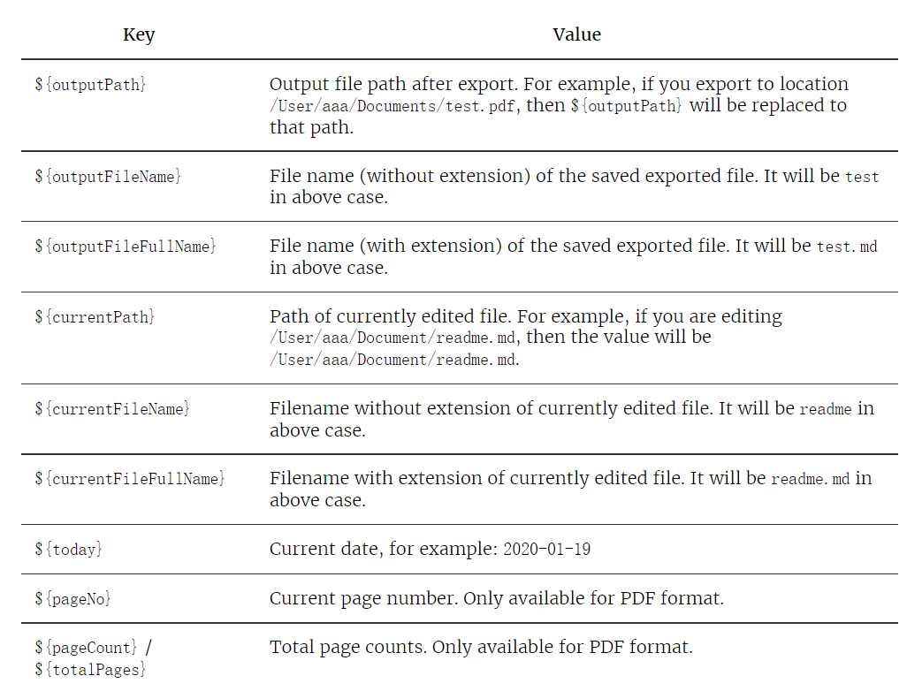

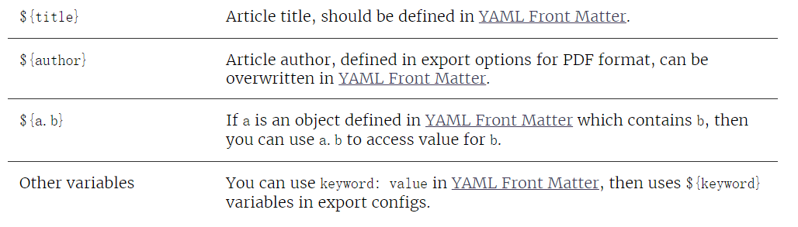


## 公式

### 行

#### 单行公式

> 第一次要在typora打开markdown拓展语法内联公式，重启typora

```markdown
$公式$ //插入内联公式
```

在行内插入一条公式$2x+3y=34$如左。


如下操作：

```markdown
$$多行公式$$ //插入公式
```

~~但是其实$$x+y=5$$还是单行的。~~这是因为打开方式不对，正确的多行公式不是这样的，具体见下。

> 外层渲染，如下划线、斜体，对数学公式内部内容不起作用。如上。

#### 多行公式

使用菜单那里拉出来，行外式
$$
x+y=z
$$
或者在空行输入两个$然后按下回车

单行v.s.多行

- 多行对于复杂表达式的显示会大一些，单行可能会太小很难辨认
- 多行是默认居中的
- 多行有类似于代码块的标识符颜色提示
- 多行的输入式：输入两次$然后回车，类似于代码块。单行就两个美元符号输入之后移鼠标到中间即可。

#### 分行

使用两个反斜杠

$a\\ b \\ c$


##### 多行公式

$\begin{align} a &= b+c\\ &=d+e  \end{align}$
$$
\begin{align}

a &=1 & b &=2 && c &=3 \\

d &=-1 & e &=-2 & f &&=-5

\end{align}
$$

$$
\begin{matrix}

x & y \\

z & v

\end{matrix}
$$

### 一般格式

#### 上下标

单个就直接拉^符号 $x^2$甚至不用拉公式也可以上标  

一般情况下^这个是可以拉上标的，但是数学公式里要加大括号喔^

像这样：$x^{12345}$

~~一般情况下也是可以_拉下划线作下标_了个鬼，这是斜体。~~

不过数学公式里就可以啦：$x_3$，$x_{54321}$

${}_{1}^{2}x_3^4$

#### 上下头

$\overline{abc}\quad\underline{abc}\quad\widehat{abc}\quad\widetilde{abc}\quad\overrightarrow{abc}\quad\overleftarrow{abc}\quad\overbrace{abc}\quad\underbrace{abc} $   $\bar{12}$(定长线)

$\overset{abc}{def}$ $\underset{abc}{def}$

$\tilde{abc},\widetilde{abc},\widetilde{abcd}$

#### 字号大小

$\tiny1\scriptsize2\small4\normalsize5\large6\Large7\LARGE8\huge9\Huge0$

> footersize在typora不可用

#### 字体

以下仅对大写有效
$$
\mathcal{ABCDEFGHIJKLMNOPQRSTUVWXYZ}
$$

$$
\mathbb{ABCDEFGHIJKLMNOPQRSTUVWXYZ}
$$

以下不只是大写都可以
$$
\mathfrak{ABCDEFGHIJKLMNOPQRSTUVWXYZ}\\
\mathfrak{abcdefghijklmnopqrstuvwxyz}\\
\mathfrak{0123456789}
$$

$$
\mathsf{ABCDEFGHIJKLMNOPQRSTUVWXYZ}\\
\mathsf{abcdefghijklmnopqrstuvwxyz}\\
\mathsf{0123456789}
$$

$$
\mathbf{ABCDEFGHIJKLMNOPQRSTUVWXYZ}\\
\mathbf{abcdefghijklmnopqrstuvwxyz}\\
\mathbf{0123456789}
$$

斜体 textit
$$
\textit{1234567890 ABC abc}
$$

正体 mathrm $\mathrm{arccot}\ x$


### 字符

#### 一般字符

$在内联里是可以随便输入中文，English,123的啦$
$$
在多行里其实也是可以的啦
$$

> 打印状态下中文格式可能会有排版不好看问题


#### 标点符号

点 $\cdots \vdots \ddots  \ldots \quad\dots$

\surd 大钩$\surd$

斜杠 $\not$

反斜杠 $\verb|\|  \backslash \setminus$

撇号 $x' y'''''$

上点号 $\dot{x} \ddddot{x}$  可以一到四个

否定：not $\not3\quad\not a\ \not$

$|\quad \| \quad \vert \quad \Vert$

$\%$ 需要转义，否则代表单行注释，如 $1+2%难道不等于%3吗$ ；千分号可以用 html 特殊字符打， 通常时`Katex`不支持(需要加载宏包)

##### 空格

\quad 空格 $a\quad b$

\\qquad 大空格 $a\qquad b$

小空格反义即可，或\;\,(间距更小)  $a\ b\;c\,d$

紧凑用反义!，如$a\!b \quad cd$ 

更紧凑用多个 $a\!\!b \ c\!\!\!e \; f\!\!\!\!g$

##### 箭头

四方向\left/right/up/downarrow $\uparrow$

左右\to \gets $\to \gets$

- 大左右 $\xleftarrow[下]{1+2+3}\xrightarrow{x}$
- 双线 $\Leftarrow$ $\Leftrightarrow$ $\iff$ 
- 否定+n $\nRightarrow$
- 双向 $\leftrightarrow$ $\longleftrightarrow$

> []控制下文字，{}控制上文字，注意先写下再写上

使用化学方程式\ce来模拟上下箭头+文字：$\ce{A->[上文字][下文字]}B$

使用\mbox获得大文字$\ce{->[\mbox{大文字}][文字]}$

长等号\xlongequal $\ce{\xlongequal[下]{上}}$，这个在\ce之外都能使用

基本箭头为->,<=>,<=>>,<<=> $\ce{-><=><=>><<=>}$

> 当然了化学表达式本身的内容还是支持的
>
> $\ce{CaCO3 v + H2O \Delta CH3-CHO CH2=CH2 CH#CH A\bond{-}B\bond{#}C}$
>
> 详见[这里的附件](https://www.latexstudio.net/archives/9998.html)

> 暂未解决给一般字符加上下文字的方法，如$\sim$。

##### 括号

$\{x\}(y)[z]$

花括号 $\begin{cases} x+1 \\ x+2 \end{cases}$

$\overbrace{3}\underbrace5\langle3,4\rangle$

$\bigl( \Bigl( \biggl( \Biggl( \quad\bigr) \Bigr) \biggr) \Biggr) $

$\langle \rangle$

##### 修饰

上划线$\overline a$ 下划线$\underline{abc}$

上下标显然是$a^{bv} c_{bd}$


#### 转义

下列需要转义：
$$
\$ \# \%\& \~ \_ \^  \{ \}
$$

> 注意上面的~ 和 ^ 其实没有就是这样显示的；如果把那个反斜杠删了的话根本显示不出 ~ ^
>
> 要显示的话，$\sim \wedge$

原意：

- & 对齐
- _ 下标
- ^ 上标
- {} 填参数用的

#### 希腊字母

常规(大写+小写)
$$
\Alpha \alpha
\Beta\beta
\Gamma\gamma
\Delta\delta
\Epsilon\epsilon
\Zeta\zeta
\Theta\theta
\Eta\eta
$$

$$
\Iota\iota
\Kappa\kappa
\Lambda\lambda
\Mu\mu
\Nu\nu
\Xi\xi
\Omicron\omicron
\Pi\pi
$$

$$
\Rho\rho
\Sigma\sigma
\Tau\tau
\Upsilon\upsilon
\Phi\phi
\Chi\chi
\Psi\psi
\Omega\omega
$$

异体：(var+小写)
$$
\Epsilon\epsilon\varepsilon
$$

$$
\Theta\theta\vartheta\varTheta
$$

$$
\Pi\pi\varpi\varPi
$$

$$
\Sigma\sigma\varsigma\varSigma
$$

$$
\Phi\phi\varphi\varPhi
$$

可能已停用：
$$
\digamma
$$


#### 特殊符号

$\circledast\circledcirc\circleddash\divideontimes\odot\ominus\oplus\oslash\otimes\boxplus\boxdot\boxtimes\Box\square$

$\nabla \triangle \triangledown \vartriangle \square \blacksquare \blacktriangle \blacktriangledown $ $\bigstar \diamond$

$\llcorner\lrcorner\ulcorner\urcorner$

$\frown$

$\LaTeX$   $\TeX$ $\S1$

### 数学格式

#### 初等数学

##### 关系符号

###### 算术

正负号 $\pm$  $\mp$

乘 $\times$   $. \cdot$

除 $\div$

取模$\%$ 或$y\mod x$ ，紧凑的$y\bmod x$

向下取整$\lfloor x\rfloor$

向上取整$\lceil x\rceil$ 

组合数学建议用 $\dbinom nm$ ，不建议用 ${n\choose m},\binom nm$ 

###### 逻辑

$\ne \quad \approx \quad =$

$\neg$  $\&$  $\|$  

$\equiv  \leq \le  \geq \ge > <$  远小于远大于 $\ll \gg$

$\leqslant \geqslant$

$\forall  \exists \nabla \because   \_ \therefore$ 注：不建议打 `exist` ，建议打 `exists` ，前者对 tex 不兼容

$\sim \thicksim \backsim$

否定型加n

$\ncong\ \nmid\ \nparallel\ \nshortmid\ \nsim\ \nleqslant\ \nleq\ \nleqq\ \nless\ \ngtr\ \gneq\ \gnsim$


##### 集合

$\emptyset\empty\O$  $\in$  $\ni$  $\notin$   $\complement$ 空集建议： $\varnothing$ 

$\bigcap_1^{n}P$  $\bigcup P$

$\wedge\vee\cap\cup$

$\supseteq\ \supset\ \nsupseteq\ \subseteq\ \subset\ \nsubseteq$

例如：
$$
|\bigcup_{i=1}^nS_i|=\sum_{m=1}^n(-1)^{m-1}\sum_{a_i<a_{i+1}}|\bigcap_{i=1}^mS_{a_i}|
$$


##### 代数

###### 分式

$1/2$  $123/456$除法式子是直接的

$\frac{23}{457}$分式就不是了，记得\frac和两个大括号

$\frac{\frac{1}{2}}{\frac{3}{4}}$繁分式帅，其他同理啦

连续分式帅
$$
\begin{equation}  x = a_0 + \cfrac{1}{a_1           + \cfrac{1}{a_2           + \cfrac{1}{a_3 + \cfrac{1}{a_4} } } }\end{equation}
$$
> 那一对\end{equation}好像没啥用

还有另一种占位大小，稍微窄一点：
$$
x=a_0+\dfrac1{a_1+\dfrac12}
$$
当然这三两种是可以混用的，代表三种不同的占位大小(根据表达式实际情况动态调整的)


###### 根式

\sqrt大括号啦 $2\sqrt{2}$    $\sqrt{\sqrt{3}}$

> 不正确的写法：$^3\sqrt{5}$

正确的写法：$\sqrt[3]{2}$

###### 累加累乘

\sum，下上标很简单的啦

$\sum$   $\sum{a}$  $\sum_{i=1}^{+\infty}{x^2}$


\prod,同理  $\prod_{n=1}^{99}{x_n}$

###### 函数

基本函数都有正体写法：

$\sin \arctan \cosh \exp \log \ln \min \max \gcd$

> lcm没有正体写法

##### 几何

度：$^\circ$ 

$\angle \measuredangle \sphericalangle$

$\cong$

$\overset{\LARGE{\frown}}{OA}$

###### 证明

$相似\thicksim\\垂直\bot$

$任意\forall\\存在\exist$

$\exist a\\\exists a$两种写法均可，基本无区别

###### 矢量

\vec大括号 {}   $\vec{vector}+\vec{x}$  

$\vec{\vec{虽然可以这样但是很无聊啊}}$

$\overleftarrow{sh}$

夹角：$\hat{(\vec{a},\vec{b})}$ $\cos<\widehat{\vec a,\vec b}>$

##### 初等函数

###### 三角函数

$\sin{x^2}$  $\cos{-x}=cos{x}$   $\tan{x}\cot{x}=1$

$sin^{2}{x}+cos^{2}{x}=1$

$\sec{x}  \csc{x}  \arctan{x}$

###### 对数函数

$\ln{\ln{3}}$    打法是小写L

$log_28$   $\lg^210$

#### 高等数学

###### 求导

$f',f'',f^{(20)}$

$\frac{\partial f(x)}{\partial x}$

###### 积分

\int{x}dx $\int{x}dx$

\int_{x}^{x}{x}dx  _

$\int_{-3}^{3}{x^{100}}dx$

$\iint$ $\iiint$ $\iiiint$ 最多四重，

五重可以试一下2+3然后加紧凑？ $\iint\!\!\!\,\iiint$

闭合曲线的积分：$\oint \oiint \oiiint$，最多三重。


###### 极限

\lim{}   $\lim{x}$

\lim_{}   

$\lim_{x\rightarrow-\infty}{x^2}$

$\lim_{x\rightarrow+\infty}{\frac{x}{0}}$

\rightarrow \infty

> 如果用多行公式而不是单行公式，可以让条件对正lim下方：
> $$
> \lim_{x\to\infty}\biggl(\frac{n}{n^2+1}+\frac{n}{n^2+2^2}+\dots+\frac{n}{n^2+n^2}\biggr)
> $$

###### 矩阵

$a = \left[\matrix{\alpha_1 & test1\\ \alpha_2 & test2\\ \alpha_3 & test3}\right]$
$$
A_{m,n} = \begin{pmatrix} a_{1,1} & a_{1,2} & \cdots & a_{1,n} \\ a_{2,1} & a_{2,2} & \cdots & a_{2,n} \\ \vdots & \vdots & \ddots & \vdots \\ a_{m,1} & a_{m,2} & \cdots & a_{m,n} \end{pmatrix}
$$
各种定界符的矩阵 pmatrix（(）、bmatrix（[）、Bmatrix（{）

$\large{\overset{c_1+c_2\\c1+2c_3\\}{—}}$


###### 数论

暂无

#### 离散数学

偏序关系 $\prec \succ \preceq \succeq$ $\nprec \npreceq \nsucc\nsucceq$ 

逻辑符号 $\lnot \vee \wedge$ 

$\vdash \models$

集合论符号 $\upharpoonright$

图论符号 $\kappa$


## 绘图

### mermaid

[官方文档](https://mermaid-js.github.io/mermaid/#/)

输入````mermaid`回车，新建图：

```mermaid

```

#### 流程图

graph关键字声明流程图，之后声明**方向**，如TD(top down)：

> - TB - top to bottom
> - TD - top-down/ same as top to bottom
> - BT - bottom to top
> - RL - right to left
> - LR - left to right

然后用`-->`代表链接**箭头**，左右分别是节点编号。

> 箭头形状：
>
> --> 实单向
>
> ​		--|text|--> 线段+文字(text)，等效于-->|text|
>
> ​		----> 加长
>
> --- 实线段
>
> ​		-- text --- 实线段+文字(text) ，等效于---|text|
>
> -.-> 虚单向
>
> ​		-. text .->
>
> ==> 厚单向
>
> ​		== text ==>
>
> --o 实心圆
>
> --x 实心叉
>
> o--o 双向圆
>
> <--> 双向箭头
>
> x--x 双向叉


```mermaid
graph LR;
	A-->B;
	A-->C;
	B-->D;
```

节点编号后面可以用方括号、圆括号或大括号分别表示方形、圆角和条件判断框、双括号原型、> ]括号非对称；箭头后可以紧跟绝对值是纯文本，如：

> 节点形状：
>
> [] 方框
>
> () 圆角
>
> ([]) 两边圆形
>
> [[]] 方形+竖线
>
> [()] 圆柱
>
> (()) 圆
>
> `>]` 非对称条
>
> {} 菱形
>
> {{}} 两边尖角
>
> [//] 平行四边形
>
> [\\\\] 反平行四边形
>
> [/\\] 梯形
>
> [\\/] 上高梯形


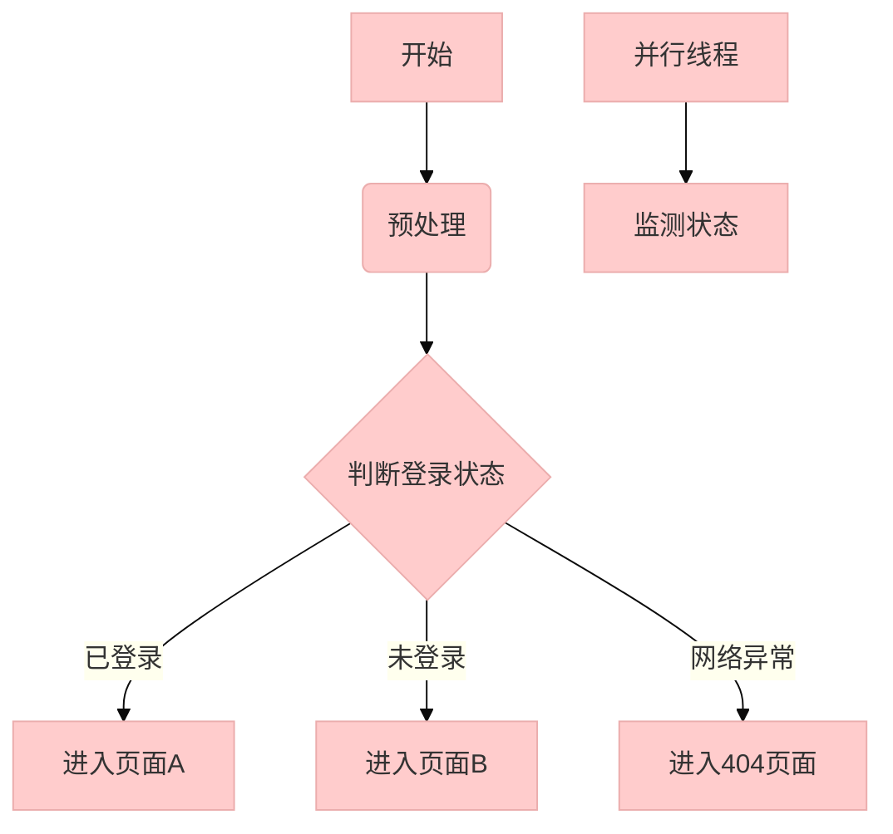
```mermaid
%%{init: {'theme': 'base', 'themeVariables': { 'primaryColor': '#ffcccc', 'edgeLabelBackground':'#ffffee', 'tertiaryColor': '#fff0f0'}}}%%
%%typora暂未支持颜色主题%%
graph TD
	A[开始]-->B(预处理)
	B-->C{判断登录状态}
	C-->|已登录| D[进入页面A]
	C-->|未登录| E[进入页面B]
	C-->|网络异常| F[进入404页面]
	G[并行线程]-->H[监测状态]
```


```mermaid
graph LR
A["[]矩形"]-->|"-->箭头"|B("（）圆角")
B---|"---连线"|C(("双(())圆形"))
C==>|==粗线|D{"{}菱形"}
C-->E>">]为非对称"]
```

复合语法：

> A --> B --> C
>
> A --> B & C --> D  A到D两条路 (记得要空格)
>
> A & B --> C & D  两两组合


可以使用特殊符号，如：

> A["A double quote:#quot;"] -->B["A dec char:#9829;"]
>
> 换行用`<br>`


子图：

```
subgraph title
    graph definition
end
```

如：

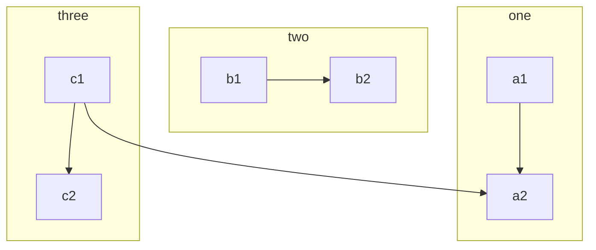
```mermaid
graph TB
    c1-->a2
    subgraph one
    a1-->a2
    end
    subgraph two
    b1-->b2
    end
    subgraph three
    c1-->c2
    end
```


#### 时序图

sequenceDiagram，`->>`实现箭头，`-->>`虚线箭头

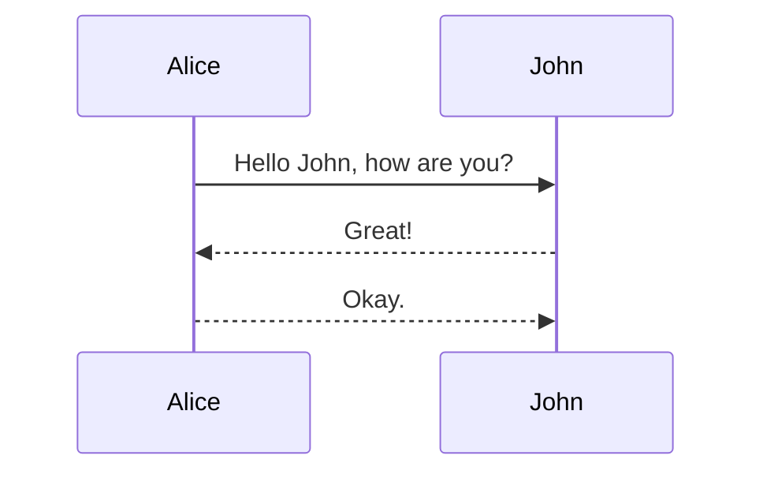
```mermaid
sequenceDiagram
    Alice->>John: Hello John, how are you?
    John-->>Alice: Great!
    Alice-->>John: Okay.
```

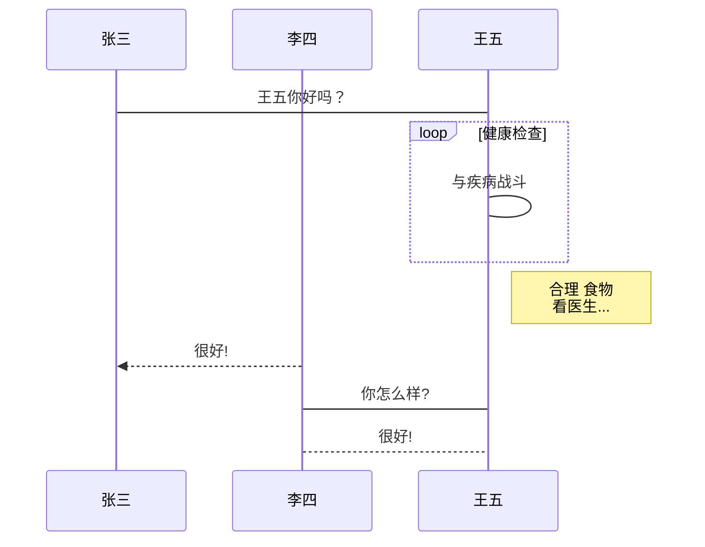
```mermaid
%% 时序图例子,-> 直线，-->虚线，->>实线箭头

  sequenceDiagram

    participant 张三

    participant 李四

    张三->王五: 王五你好吗？

    loop 健康检查

        王五->王五: 与疾病战斗

    end

    Note right of 王五: 合理 食物 <br/>看医生...

    李四-->>张三: 很好!

    王五->李四: 你怎么样?

    李四-->王五: 很好!
```


#### 状态图

[参考](https://blog.csdn.net/qq_36749906/article/details/107462149)

stateDiagram，`[*]` 表示开始或者结束，如果在箭头右边则表示结束。

有新版本：首行后缀 `-v2` 。转换条件用 `: 转换名字` 。

有组合状态，用 `state 状态名 {}` 。

有分支和合并，见下面例子。

可以做注释，也可以做并发。


```mermaid
stateDiagram
    [*] --> s1
    s1 --> [*]
```

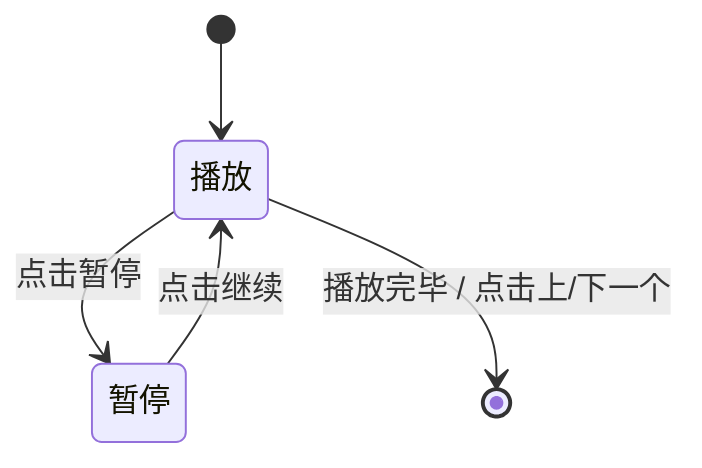
```mermaid
stateDiagram-v2
	[*] --> 播放
	播放 --> 暂停 : 点击暂停
	暂停 --> 播放 : 点击继续
	播放 --> [*] : 播放完毕 / 点击上/下一个
```

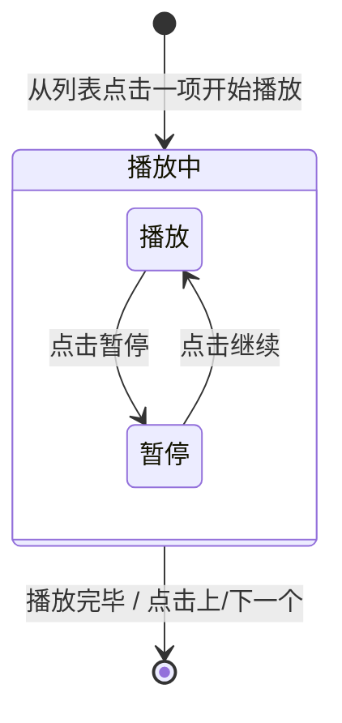
```mermaid
stateDiagram-v2
	[*] --> 播放中 : 从列表点击一项开始播放
    播放中--> [*] : 播放完毕 / 点击上/下一个
state 播放中 {
	播放
	播放 --> 暂停 : 点击暂停
	暂停 --> 播放 : 点击继续
	播放
}
```

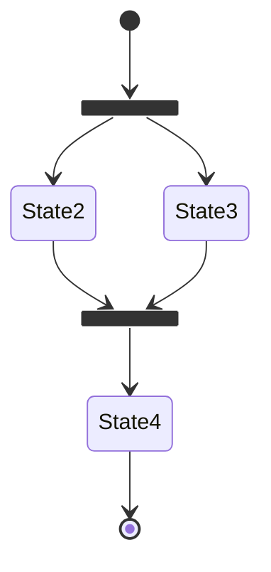
```mermaid
stateDiagram-v2
state fork_state <<fork>>
  [*] --> fork_state
  fork_state --> State2
  fork_state --> State3

  state join_state <<join>>
  State2 --> join_state
  State3 --> join_state
  join_state --> State4
  State4 --> [*]
```

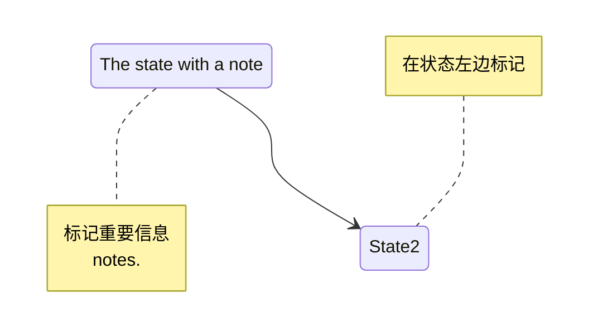
```mermaid
stateDiagram-v2
    State1: The state with a note
    note right of State1
        标记重要信息
        notes.
    end note
    State1 --> State2
    note left of State2 : 在状态左边标记
```


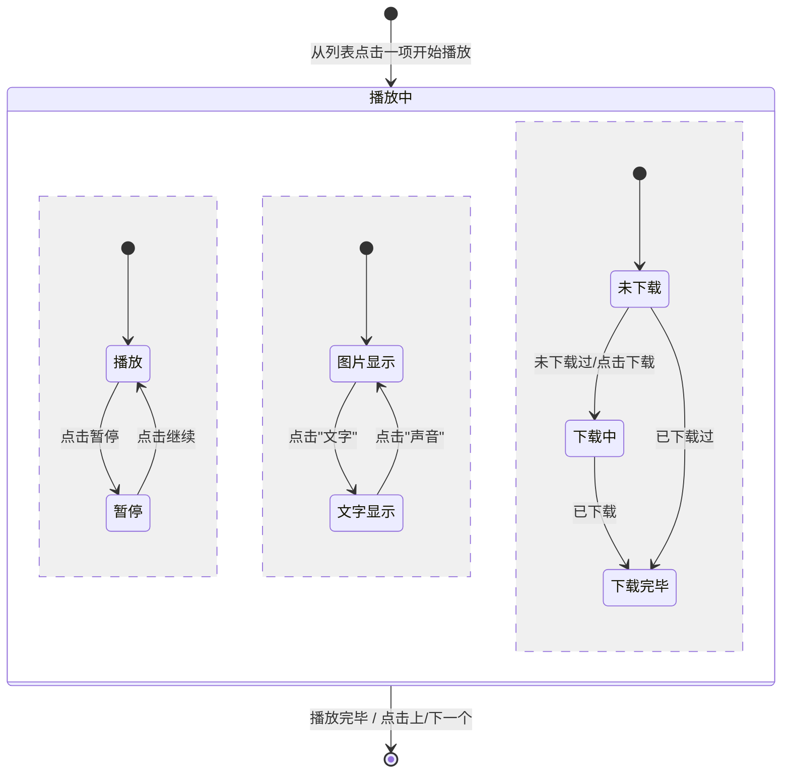
```mermaid
stateDiagram
	[*] --> 播放中 : 从列表点击一项开始播放
    播放中--> [*] : 播放完毕 / 点击上/下一个
state 播放中 {
	[*] --> 播放
	暂停 --> 播放 : 点击继续
	播放 --> 暂停 : 点击暂停
	--
	[*] --> 图片显示
	文字显示 --> 图片显示 : 点击"声音"
	图片显示 --> 文字显示 : 点击"文字"
	--
	[*] --> 未下载
	未下载 --> 下载中 : 未下载过/点击下载
	下载中 --> 下载完毕 : 已下载
	未下载 --> 下载完毕 : 已下载过
}
```


#### 类图

classDiagram，`<|--` 表示继承，`+` 表示 `public`，`-` 表示 `private

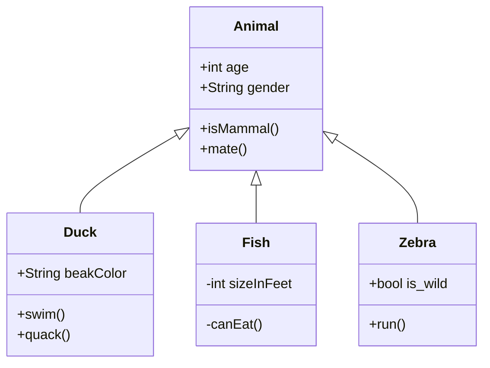
```mermaid
classDiagram
      Animal <|-- Duck
      Animal <|-- Fish
      Animal <|-- Zebra
      Animal : +int age
      Animal : +String gender
      Animal: +isMammal()
      Animal: +mate()
      class Duck{
          +String beakColor
          +swim()
          +quack()
      }
      class Fish{
          -int sizeInFeet
          -canEat()
      }
      class Zebra{
          +bool is_wild
          +run()
      }
```

#### 甘特图

gantt 从上到下依次是图片标题、日期格式、项目、项目细分的任务。


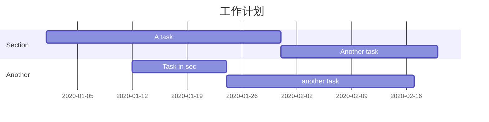
```mermaid
gantt
    title 工作计划
    dateFormat  YYYY-MM-DD
    section Section
    A task           :a1, 2020-01-01, 30d
    Another task     :after a1  , 20d
    section Another
    Task in sec      :2020-01-12  , 12d
    another task      : 24d
```

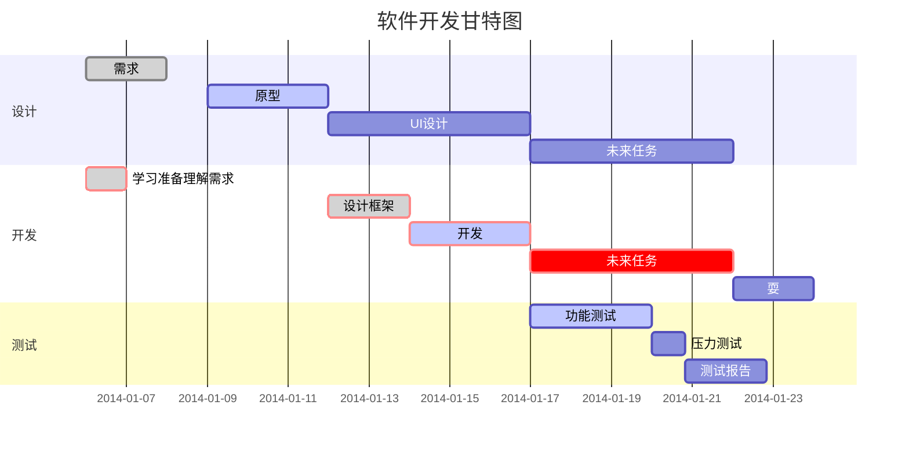
```mermaid
%% 语法示例

        gantt

        dateFormat  YYYY-MM-DD

        title 软件开发甘特图

        section 设计

        需求                      :done,    des1, 2014-01-06,2014-01-08

        原型                      :active,  des2, 2014-01-09, 3d

        UI设计                     :         des3, after des2, 5d

    未来任务                     :         des4, after des3, 5d

        section 开发

        学习准备理解需求                      :crit, done, 2014-01-06,24h

        设计框架                             :crit, done, after des2, 2d

        开发                                 :crit, active, 3d

        未来任务                              :crit, 5d

        耍                                   :2d

    

        section 测试

        功能测试                              :active, a1, after des3, 3d

        压力测试                               :after a1  , 20h

        测试报告                               : 48h
```


#### 饼图

pie

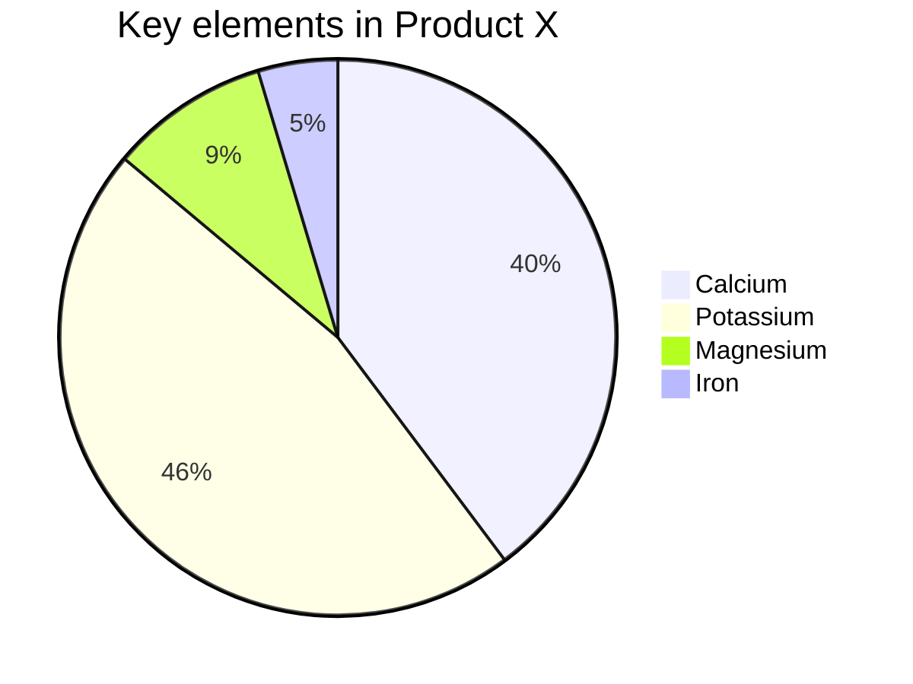
```mermaid
pie
    title Key elements in Product X
    "Calcium" : 42.96
    "Potassium" : 50.05
    "Magnesium" : 10.01
    "Iron" :  5
```

#### 导出

绘制好的图片可以选择菜单/文件/导出，导出为图片或者网页格式。在网页中图片是以 SVG 格式渲染的，可以复制 SVG 内容，导入到 SVG 的图片编辑器中进一步操作。

Mermaid 官方有一个在线的工具，可以导出 SVG 和 PNG。

注意如果 typora 转 docx，那么流程图里不得出现 `<br>`，不然会失败


### 标准图

#### flow

````flow`，标准流程图

```flow
st=>start: 开始框

op=>operation: 处理框

cond=>condition: 判断框(是或否?)

sub1=>subroutine: 子流程

io=>inputoutput: 输入输出框

e=>end: 结束框

st->op->cond

cond(yes)->io->e

cond(no)->sub1(right)->op
```


#### sequence

标准UML时序图

```sequence
对象A->对象B: 对象B你好吗?（请求）

Note right of 对象B: 对象B的描述

Note left of 对象A: 对象A的描述(提示)

对象B-->对象A: 我很好(响应)

对象A->对象B: 你真的好吗？
```


```sequence
Title: 标题：复杂使用

对象A->对象B: 对象B你好吗?（请求）

Note right of 对象B: 对象B的描述

Note left of 对象A: 对象A的描述(提示)

对象B-->对象A: 我很好(响应)

对象B->小三: 你好吗

小三-->>对象A: 对象B找我了

对象A->对象B: 你真的好吗？

Note over 小三,对象B: 我们是朋友

participant C

Note right of C: 没人陪我玩
```


### tikz宏包

等待更新……

```tex
\documentclass{article}
\usepackage{tikz}
\begin{document}
Document itself
\end{document}
```


## PPT

### Marp

参考文献：[markdown](https://sspai.com/post/55718) [http](https://sspai.com/post/40657)

VSCODE + 插件 `Marp for VS Code` , `Markdown All in One`

使用 YAML 语法在最开头输入：

## 导出

### Jekyll

#### 基本

使用 markdown 格式，生成静态 HTML 网页，可以在 github pages 部署。

> 一个例子，[源码](https://github.com/surajrampure/dsc80-proj3-test1/blob/main/README.md) 及其 [成品](https://rampure.org/dsc80-proj3-test1/)

设置一个 `_config.yml` 文件，具体参见 [官方文档](https://docs.github.com/en/pages/setting-up-a-github-pages-site-with-jekyll/about-github-pages-and-jekyll)，可以配置具体事宜。

会忽略以 `_`,`.` 或 `#` 开头或 `~` 结尾或配置文件规定或在 `/node_modules` 或 `/vendor` 的文件。其他都会渲染。

通常直接修改 `README.md` 即可。

以下面例子源码已经 push 到仓库 `https://github.com/lr580/power_outages_stats` 为例。

选择 settings-page 设置，把 branch 的下拉 None 默认值改成自己的分支 master，选 save。半小时内可以看到变化。[参考](https://dsc80.com/project3/)

每次需要修改时，直接 push 即可，结果会在半小时内看到。

主题选择：主题查看[这里](https://pages.github.com/themes/)。例如，想用 Merlot 主题，点进去阅读 usage，配置文件设置为：

```yaml
remote_theme: pages-themes/merlot@v0.2.0
plugins:
- jekyll-remote-theme # add this line to the plugins list if you already have one
```

内容支持：[md速成指南](https://www.markdownguide.org/cheat-sheet/)

部署好了在 github 右边栏能看到 deployment。

本地部署参考 [here](https://jekyllrb.com/docs/installation/) 和 [here](https://docs.github.com/en/pages/setting-up-a-github-pages-site-with-jekyll/testing-your-github-pages-site-locally-with-jekyll)

#### 例子

##### README.md

考虑 `README.md` 如下：(就是那个例子源码及其成品)

````markdown
# My Project Title

by Suraj Rampure (rampure@ucsd.edu)

***Note***: If you choose a repo name and title as uninspired as the ones here, I will be quite sad.

---

## Introduction

In this project, we studied the effectiveness of spice challenges in building team morale.

---

## Cleaning and EDA

<iframe src="assets/10-80-enrollment.html" width=800 height=600 frameBorder=0></iframe>

---

## Assessment of Missingness

Here's what a Markdown table looks like. Note that the code for this table was generated _automatically_ from a DataFrame, using

```py
print(counts[['Quarter', 'Count']].head().to_markdown(index=False))
```

| Quarter     |   Count |
|:------------|--------:|
| Fall 2020   |       3 |
| Winter 2021 |       2 |
| Spring 2021 |       6 |
| Summer 2021 |       4 |
| Fall 2021   |      55 |

---

## Hypothesis Testing


---
````

##### \_config.yml

`_config.yml` 如下：

```yaml
remote_theme: pages-themes/cayman@v0.2.0
plugins:
- jekyll-remote-theme # add this line to the plugins list if you already have one
```

##### 其他

仓库下建立 `assets/10-80-enrollment.html` 如下：

```html
<html>
<head><meta charset="utf-8" /></head>
<body>
    <div>                        <script type="text/javascript">window.PlotlyConfig = {MathJaxConfig: 'local'};</script>
        <script src="https://cdn.plot.ly/plotly-2.6.3.min.js"></script>                <div id="c653a8c9-88ef-4c09-990b-67a28c3d5ba8" class="plotly-graph-div" style="height:100%; width:100%;"></div>            <script type="text/javascript">                                    window.PLOTLYENV=window.PLOTLYENV || {};                                    if (document.getElementById("c653a8c9-88ef-4c09-990b-67a28c3d5ba8")) {                    Plotly.newPlot(                        "c653a8c9-88ef-4c09-990b-67a28c3d5ba8",                        [{"marker":{"color":["rgb(55, 83, 109)","rgb(55, 83, 109)","rgb(55, 83, 109)","rgb(55, 83, 109)","rgb(26, 118, 255)","rgb(26, 118, 255)","rgb(55, 83, 109)","rgb(55, 83, 109)"]},"text":[3.0,2.0,6.0,4.0,55.0,25.0,1.0,2.0],"textposition":"outside","x":["Fall 2020","Winter 2021","Spring 2021","Summer 2021","Fall 2021","Winter 2022","Spring 2022","Never"],"y":[3,2,6,4,55,25,1,2],"type":"bar"}],                        {"template":{"data":{"bar":[{"error_x":{"color":"#2a3f5f"},"error_y":{"color":"#2a3f5f"},"marker":{"line":{"color":"#E5ECF6","width":0.5},"pattern":{"fillmode":"overlay","size":10,"solidity":0.2}},"type":"bar"}],"barpolar":[{"marker":{"line":{"color":"#E5ECF6","width":0.5},"pattern":{"fillmode":"overlay","size":10,"solidity":0.2}},"type":"barpolar"}],"carpet":[{"aaxis":{"endlinecolor":"#2a3f5f","gridcolor":"white","linecolor":"white","minorgridcolor":"white","startlinecolor":"#2a3f5f"},"baxis":{"endlinecolor":"#2a3f5f","gridcolor":"white","linecolor":"white","minorgridcolor":"white","startlinecolor":"#2a3f5f"},"type":"carpet"}],"choropleth":[{"colorbar":{"outlinewidth":0,"ticks":""},"type":"choropleth"}],"contour":[{"colorbar":{"outlinewidth":0,"ticks":""},"colorscale":[[0.0,"#0d0887"],[0.1111111111111111,"#46039f"],[0.2222222222222222,"#7201a8"],[0.3333333333333333,"#9c179e"],[0.4444444444444444,"#bd3786"],[0.5555555555555556,"#d8576b"],[0.6666666666666666,"#ed7953"],[0.7777777777777778,"#fb9f3a"],[0.8888888888888888,"#fdca26"],[1.0,"#f0f921"]],"type":"contour"}],"contourcarpet":[{"colorbar":{"outlinewidth":0,"ticks":""},"type":"contourcarpet"}],"heatmap":[{"colorbar":{"outlinewidth":0,"ticks":""},"colorscale":[[0.0,"#0d0887"],[0.1111111111111111,"#46039f"],[0.2222222222222222,"#7201a8"],[0.3333333333333333,"#9c179e"],[0.4444444444444444,"#bd3786"],[0.5555555555555556,"#d8576b"],[0.6666666666666666,"#ed7953"],[0.7777777777777778,"#fb9f3a"],[0.8888888888888888,"#fdca26"],[1.0,"#f0f921"]],"type":"heatmap"}],"heatmapgl":[{"colorbar":{"outlinewidth":0,"ticks":""},"colorscale":[[0.0,"#0d0887"],[0.1111111111111111,"#46039f"],[0.2222222222222222,"#7201a8"],[0.3333333333333333,"#9c179e"],[0.4444444444444444,"#bd3786"],[0.5555555555555556,"#d8576b"],[0.6666666666666666,"#ed7953"],[0.7777777777777778,"#fb9f3a"],[0.8888888888888888,"#fdca26"],[1.0,"#f0f921"]],"type":"heatmapgl"}],"histogram":[{"marker":{"pattern":{"fillmode":"overlay","size":10,"solidity":0.2}},"type":"histogram"}],"histogram2d":[{"colorbar":{"outlinewidth":0,"ticks":""},"colorscale":[[0.0,"#0d0887"],[0.1111111111111111,"#46039f"],[0.2222222222222222,"#7201a8"],[0.3333333333333333,"#9c179e"],[0.4444444444444444,"#bd3786"],[0.5555555555555556,"#d8576b"],[0.6666666666666666,"#ed7953"],[0.7777777777777778,"#fb9f3a"],[0.8888888888888888,"#fdca26"],[1.0,"#f0f921"]],"type":"histogram2d"}],"histogram2dcontour":[{"colorbar":{"outlinewidth":0,"ticks":""},"colorscale":[[0.0,"#0d0887"],[0.1111111111111111,"#46039f"],[0.2222222222222222,"#7201a8"],[0.3333333333333333,"#9c179e"],[0.4444444444444444,"#bd3786"],[0.5555555555555556,"#d8576b"],[0.6666666666666666,"#ed7953"],[0.7777777777777778,"#fb9f3a"],[0.8888888888888888,"#fdca26"],[1.0,"#f0f921"]],"type":"histogram2dcontour"}],"mesh3d":[{"colorbar":{"outlinewidth":0,"ticks":""},"type":"mesh3d"}],"parcoords":[{"line":{"colorbar":{"outlinewidth":0,"ticks":""}},"type":"parcoords"}],"pie":[{"automargin":true,"type":"pie"}],"scatter":[{"marker":{"colorbar":{"outlinewidth":0,"ticks":""}},"type":"scatter"}],"scatter3d":[{"line":{"colorbar":{"outlinewidth":0,"ticks":""}},"marker":{"colorbar":{"outlinewidth":0,"ticks":""}},"type":"scatter3d"}],"scattercarpet":[{"marker":{"colorbar":{"outlinewidth":0,"ticks":""}},"type":"scattercarpet"}],"scattergeo":[{"marker":{"colorbar":{"outlinewidth":0,"ticks":""}},"type":"scattergeo"}],"scattergl":[{"marker":{"colorbar":{"outlinewidth":0,"ticks":""}},"type":"scattergl"}],"scattermapbox":[{"marker":{"colorbar":{"outlinewidth":0,"ticks":""}},"type":"scattermapbox"}],"scatterpolar":[{"marker":{"colorbar":{"outlinewidth":0,"ticks":""}},"type":"scatterpolar"}],"scatterpolargl":[{"marker":{"colorbar":{"outlinewidth":0,"ticks":""}},"type":"scatterpolargl"}],"scatterternary":[{"marker":{"colorbar":{"outlinewidth":0,"ticks":""}},"type":"scatterternary"}],"surface":[{"colorbar":{"outlinewidth":0,"ticks":""},"colorscale":[[0.0,"#0d0887"],[0.1111111111111111,"#46039f"],[0.2222222222222222,"#7201a8"],[0.3333333333333333,"#9c179e"],[0.4444444444444444,"#bd3786"],[0.5555555555555556,"#d8576b"],[0.6666666666666666,"#ed7953"],[0.7777777777777778,"#fb9f3a"],[0.8888888888888888,"#fdca26"],[1.0,"#f0f921"]],"type":"surface"}],"table":[{"cells":{"fill":{"color":"#EBF0F8"},"line":{"color":"white"}},"header":{"fill":{"color":"#C8D4E3"},"line":{"color":"white"}},"type":"table"}]},"layout":{"annotationdefaults":{"arrowcolor":"#2a3f5f","arrowhead":0,"arrowwidth":1},"autotypenumbers":"strict","coloraxis":{"colorbar":{"outlinewidth":0,"ticks":""}},"colorscale":{"diverging":[[0,"#8e0152"],[0.1,"#c51b7d"],[0.2,"#de77ae"],[0.3,"#f1b6da"],[0.4,"#fde0ef"],[0.5,"#f7f7f7"],[0.6,"#e6f5d0"],[0.7,"#b8e186"],[0.8,"#7fbc41"],[0.9,"#4d9221"],[1,"#276419"]],"sequential":[[0.0,"#0d0887"],[0.1111111111111111,"#46039f"],[0.2222222222222222,"#7201a8"],[0.3333333333333333,"#9c179e"],[0.4444444444444444,"#bd3786"],[0.5555555555555556,"#d8576b"],[0.6666666666666666,"#ed7953"],[0.7777777777777778,"#fb9f3a"],[0.8888888888888888,"#fdca26"],[1.0,"#f0f921"]],"sequentialminus":[[0.0,"#0d0887"],[0.1111111111111111,"#46039f"],[0.2222222222222222,"#7201a8"],[0.3333333333333333,"#9c179e"],[0.4444444444444444,"#bd3786"],[0.5555555555555556,"#d8576b"],[0.6666666666666666,"#ed7953"],[0.7777777777777778,"#fb9f3a"],[0.8888888888888888,"#fdca26"],[1.0,"#f0f921"]]},"colorway":["#636efa","#EF553B","#00cc96","#ab63fa","#FFA15A","#19d3f3","#FF6692","#B6E880","#FF97FF","#FECB52"],"font":{"color":"#2a3f5f"},"geo":{"bgcolor":"white","lakecolor":"white","landcolor":"#E5ECF6","showlakes":true,"showland":true,"subunitcolor":"white"},"hoverlabel":{"align":"left"},"hovermode":"closest","mapbox":{"style":"light"},"paper_bgcolor":"white","plot_bgcolor":"#E5ECF6","polar":{"angularaxis":{"gridcolor":"white","linecolor":"white","ticks":""},"bgcolor":"#E5ECF6","radialaxis":{"gridcolor":"white","linecolor":"white","ticks":""}},"scene":{"xaxis":{"backgroundcolor":"#E5ECF6","gridcolor":"white","gridwidth":2,"linecolor":"white","showbackground":true,"ticks":"","zerolinecolor":"white"},"yaxis":{"backgroundcolor":"#E5ECF6","gridcolor":"white","gridwidth":2,"linecolor":"white","showbackground":true,"ticks":"","zerolinecolor":"white"},"zaxis":{"backgroundcolor":"#E5ECF6","gridcolor":"white","gridwidth":2,"linecolor":"white","showbackground":true,"ticks":"","zerolinecolor":"white"}},"shapedefaults":{"line":{"color":"#2a3f5f"}},"ternary":{"aaxis":{"gridcolor":"white","linecolor":"white","ticks":""},"baxis":{"gridcolor":"white","linecolor":"white","ticks":""},"bgcolor":"#E5ECF6","caxis":{"gridcolor":"white","linecolor":"white","ticks":""}},"title":{"x":0.05},"xaxis":{"automargin":true,"gridcolor":"white","linecolor":"white","ticks":"","title":{"standoff":15},"zerolinecolor":"white","zerolinewidth":2},"yaxis":{"automargin":true,"gridcolor":"white","linecolor":"white","ticks":"","title":{"standoff":15},"zerolinecolor":"white","zerolinewidth":2}}},"title":{"text":"When did DSC 80 students in Winter 2023 take DSC 10?","font":{"family":"Arial"}},"annotations":[{"arrowhead":5,"ax":100,"showarrow":true,"text":"Quarters in which I (co-)taught DSC 10","x":"Winter 2022","y":45}],"font":{"family":"Arial"},"paper_bgcolor":"#FFFFFF","plot_bgcolor":"#FFFFFF"},                        {"responsive": true}                    )                };                            </script>        </div>
</body>
</html>
```


## 其他

### 附录

规范格式书写建议： [OI-WIKI标准](https://oi-wiki.org/intro/format/)

#### LaTeX数学

> ~~不全，[更多参见][https://www.xmind.cn/faq/question/what-command-does-xmind-equation-support/]~~

上面已挂，更详细的，[参见](https://blog.csdn.net/wait_for_eva/article/details/84307306)$\LaTeX$，即：

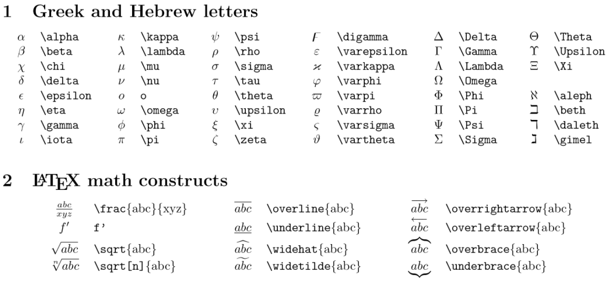

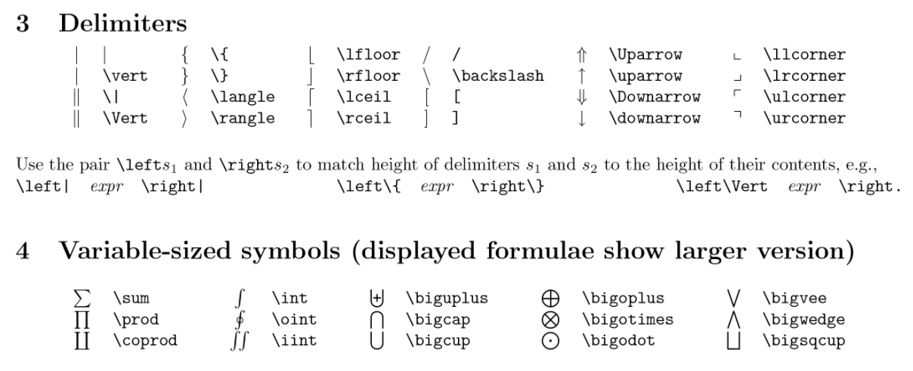

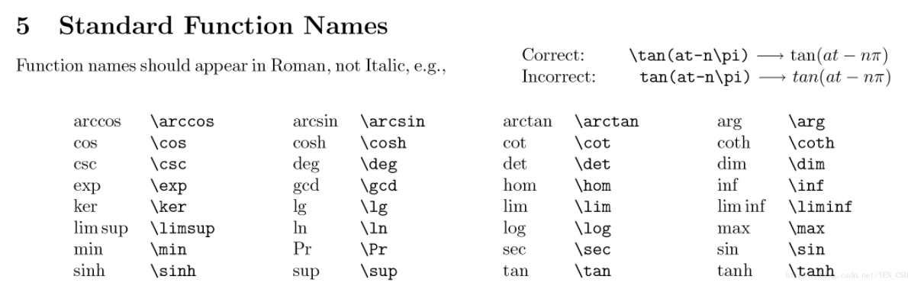

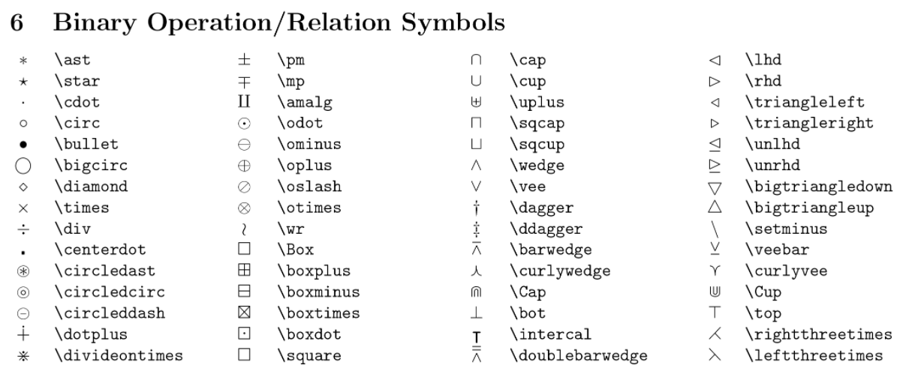

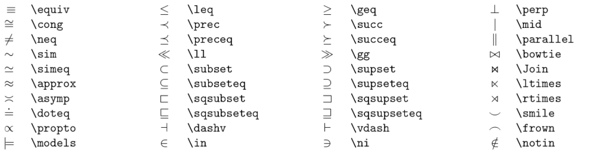

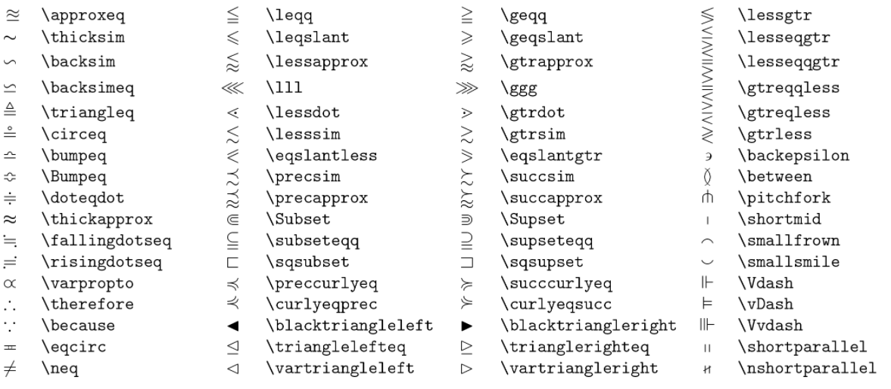

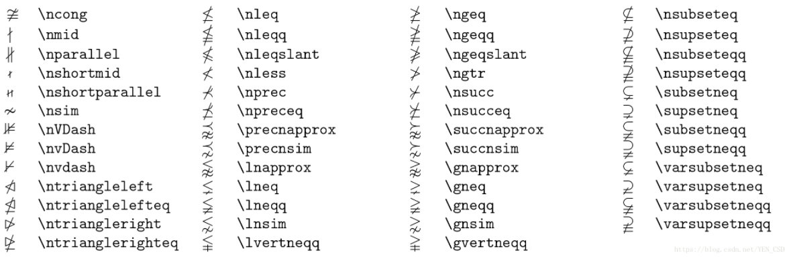

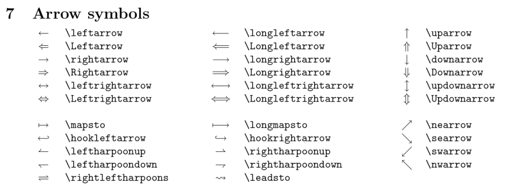

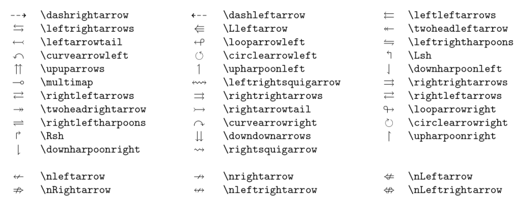

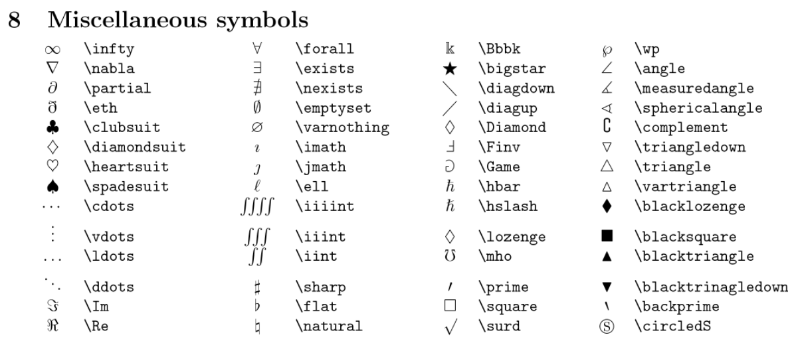

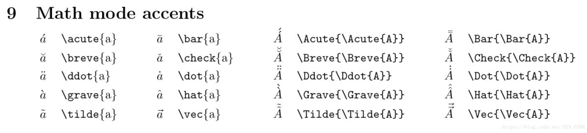

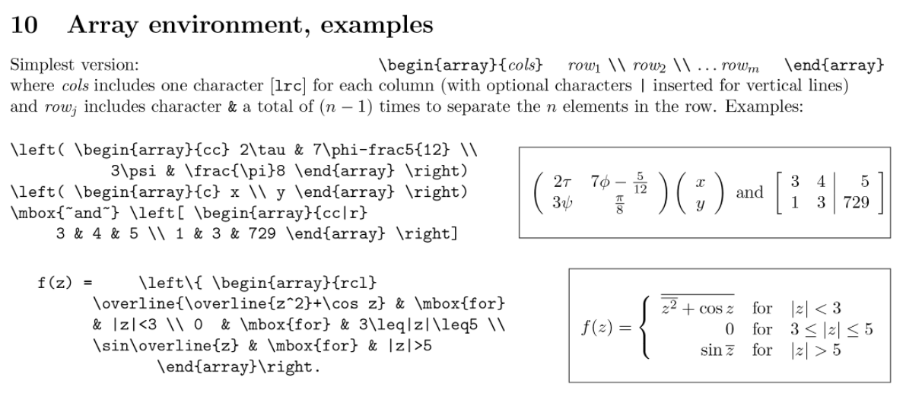

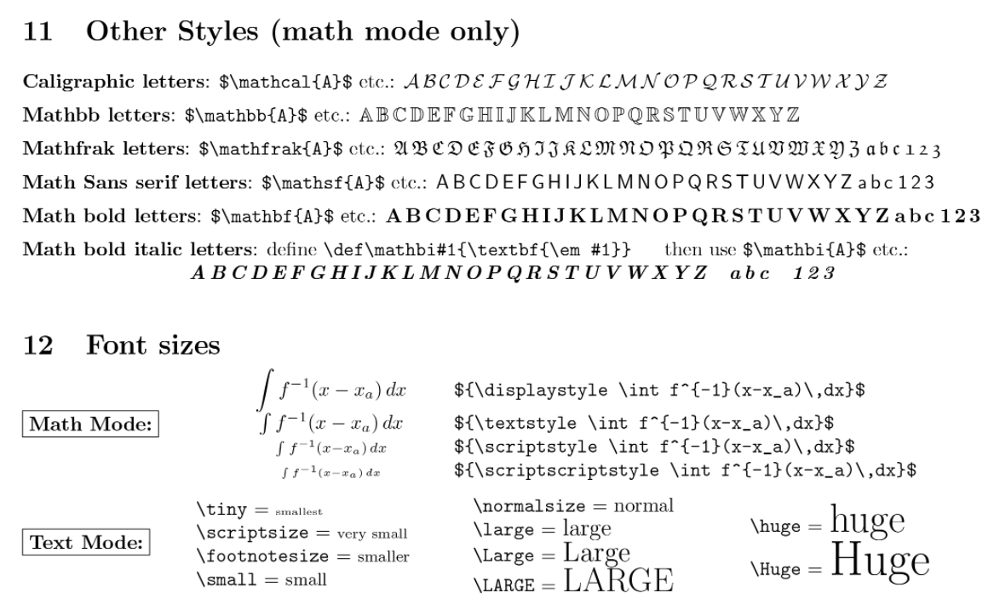

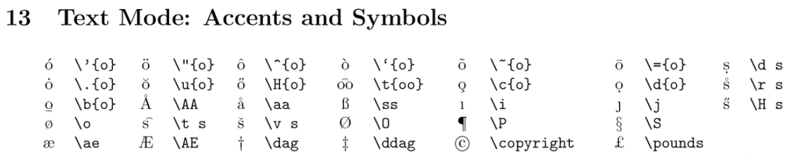


# LaTeX

主要参考：[这个人的专栏](https://www.zhihu.com/column/c_1198381558397345792)

> LaTeX的好处就是**自动化**，脚注，交叉引用，目录，参考文献等等，每一个词语仿佛都让我们头疼，可是在LaTeX中，我们根本不需要关注这些，只用一行代码就统统搞定，因此，学会了LaTeX，可以让我们真正地专注于论文本身的内容，而不是那些繁琐的排版。

## 安装和使用

之前装过了。暂时略。总之要装 TEXLIVE 。

检验安装成功：

```shell
tex -v
latex -v
```

建议再装一个 texstudio ，或用 vscode 。

### vscode 配置

#### 配置

[参考链接](https://zhuanlan.zhihu.com/p/38178015)

安装插件 latex workshop 。

查看-命令面板 (或 ctrl+shift+f1 或 ctrl+shift+p) 输入 setjson ，进入 `settings.json` ，插入内容：

```json
"latex-workshop.latex.tools": [
    {
        // 编译工具和命令
        "name": "xelatex",
        "command": "xelatex",
        "args": [
            "-synctex=1",
            "-interaction=nonstopmode",
            "-file-line-error",
            "-pdf",
            "%DOCFILE%"
        ]
    },
    {
        "name": "pdflatex",
        "command": "pdflatex",
        "args": [
            "-synctex=1",
            "-interaction=nonstopmode",
            "-file-line-error",
            "%DOCFILE%"
        ]
    },
    {
        "name": "bibtex",
        "command": "bibtex",
        "args": [
            "%DOCFILE%"
        ]
    }
],
```

LaTeX Workshop 默认的编译工具是 latexmk，根据需要修改所需的工具和命令，不需要用到 latexmk的话把其修改为中文环境常用的 xelatex，大家根据需要自行修改

```json
"latex-workshop.latex.recipes": [
    {
        "name": "xelatex",
        "tools": [
            "xelatex"
        ],
    },
    {
        "name": "pdflatex",
        "tools": [
            "pdflatex"
        ]
    },
    {
        "name": "xe->bib->xe->xe",
        "tools": [
            "xelatex",
            "bibtex",
            "xelatex",
            "xelatex"
        ]
    },
    {
        "name": "pdf->bib->pdf->pdf",
        "tools": [
            "pdflatex",
            "bibtex",
            "pdflatex",
            "pdflatex"
        ]
    }
],
```


#### 使用

编译时点击右上角的绿色开始图标按钮(build latex project)，或 ctrl+alt+b 即可，例如下面以一段 tex 代码为例进行编译：

```tex
\documentclass{article}
\usepackage{lipsum}
\begin{document}
\lipsum[1] %乱数假文
\[
    a^2+b^2=c^2
\]
\end{document}
```

会得到 pdf 就是结果。

> 编译时不要打开 pdf，不然会编译失败。

左边栏会有一个 tex 图标的菜单。在那里可以分屏pdf显示等。


> ### 在线使用

[overleaf](https://www.overleaf.com/)


## 基本语法

### 基本常识

#### 格式规范

注释行是 `%` ，指令用转义符即 `\` 。代码块用 `\begin{环境名字} \end{环境名字}` 包围。对一条指令，通常可以用中括号写可选参数，大括号写必选参数。如 `\指令名[可选参数]{必选参数}`

> 多行注释用 `comment` 代码块，使用 `verbatim` 宏包。

行内公式用 \$ 开头和结尾。多行公式可以用 \$\$ ，也可以用 `\[` 和 `\]` ，也可以用代码块。

使用一个空行作为换行符，跟 markdown 一样。使用 `\\` 进行顶格换行。普通输入 `[]` 能显示，普通输入 `{}` 不能显示。

LaTeX 文章分为导言区和正文区。一篇文章中只能有一个正文区，也就只能有一个document环境。导言区用于引入各种宏包。

> 入门教程参考 [这个](https://www.zhihu.com/column/c_1198381558397345792)


#### 文件类型

源文件是 `.tex`

> 文档类是 `.cls`

#### 长度单位

1. `pt`：点，这是一个绝对长度单位。1 pt = 0.351 mm [参考](https://blog.csdn.net/robert_chen1988/article/details/52739825)
2. `mm`：毫米。
3. `cm`：厘米。1 厘米 (cm) 等于 28.453 点 (pt)。
4. `in`：英寸，1英寸等于2.54厘米。
5. `ex`：这是另一个相对长度单位，通常等于当前字体的小写字母 "x" 的高度。
6. `pica`：等于12点。
7. `sp`：这是一个非常小的长度，主要用于内部计算。1点等于65536 sp。
8. `bp`：大点，1英寸有72大点。
9. `dd`：Didot 点，主要用于欧洲的排版。1英寸有67.54 Didot 点。
10. `cc`：Didot cicero，等于12 Didot 点。
11. `pc`：pica，等于12点。

这些单位中，`pt`、`mm`、`cm` 和 `in` 可能是最常用的。而 `em` 和 `ex` 由于是相对单位，常用于需要根据字体大小自适应的场合。

**没有像素单位 `px`。**

`em` 是一个相对长度单位，它的具体长度取决于当前字体的大小。在计算机排版中，`em` 的长度通常等于当前字体的点数大小。例如，对于 10pt 的字体，1em 将等于 10pt。它经常用于设置水平或垂直的空间，如缩进或行距。

### 导言区

#### 文档类

[参考](https://blog.csdn.net/qq_37786835/article/details/106602434)

例如：

```tex
\documentclass{article}
```

含义：引用了名为 `article.cls` 的类文件

LaTeX文档类的基础三大件是article，book和report ，都不支持汉字排版。

PPT排版：

```tex
\documentclass{beamer}
```

可以自定义文档类。后文介绍，这里从略。

#### 中文支持

> cmd 列出支持的汉字：
>
> ```sh
> chcp 65001
> fc-list :lang=zh
> ```

支持汉字：

```tex
\documentclass{ctexart}
```

> 生僻字不支持的话，正文时对生僻字单独写 [参考](https://blog.csdn.net/FallyJ/article/details/119786761?utm_medium=distribute.pc_aggpage_search_result.none-task-blog-2~aggregatepage~first_rank_ecpm_v1~rank_v31_ecpm-3-119786761-null-null.pc_agg_new_rank&utm_term=latex%E6%98%BE%E7%A4%BA%E4%B8%AD%E6%96%87%E5%AD%97%E5%87%BA%E7%8E%B0f&spm=1000.2123.3001.4430) 如：
>
> ```tex
> 善用自动格式化(vscode{\CJKfontspec{楷体} 欸}嘿嘿)。
> ```
>
> 会有警告，如果想要弄掉，可以在 `documentclass` 前加：[参考](https://blog.csdn.net/PSpiritV/article/details/126251176)
>
> ```tex
> \PassOptionsToPackage{quiet}{fontspec} 
> ```
>
> 或者：
>
> ```tex
> \usepackage{xeCJK}
> \setCJKsansfont{SimHei}
> % \setCJKmainfont{SimSun}
> ```
>
> `ctex`：在内部，`ctex` 宏包实际上依赖于 `xeCJK`（当使用 XeLaTeX 编译器时）来处理中文字符。因此，当你使用 `ctex` 时，你实际上也在使用 `xeCJK` 的功能。

数学公式里中文需要 `\text`，一般需要 `amsmath` 宏包，如：

```latex
\[ \text{总分} = \cfrac {\text{你的} GPA}{\text{最高} GPA} \times 20 + \cfrac{\text{你的加分}}{\text{最高加分}} \times 80 \]
```


#### 宏包

[参考](https://blog.csdn.net/qq_37556330/article/details/106190148)

类似于插件。通过安装不同的宏包可以实现一些复杂排版功能，例如插入复杂的列表表格、插入公式和特殊符号、插入代码、设置文档版式等。

安装新包可以用 使用MiKTeX Console 。后若有需要补充。

\usepackage 可以一次性调用多个宏包，在package-name中用逗号隔开即可。不过还是推荐每个宏包调用使用一行代码。

格式：

```tex
\usepackage[options]{package-name}
```

调用示例：

```tex
\usepackage{ctex}
\usepackage{amsmath,bm}
```


##### 常用宏包

###### 常用

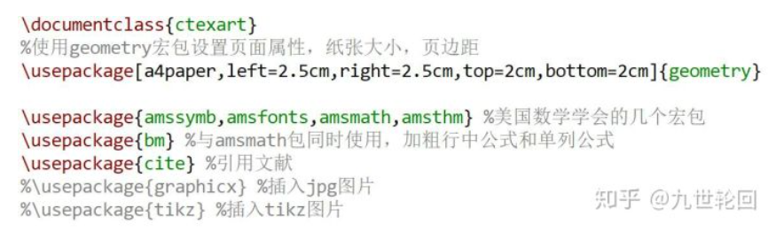

###### 基本

| 宏包名    | 说明                                                     |
| --------- | -------------------------------------------------------- |
| amsmath   | AMS 数学公式扩展                                         |
| mathtools | 数学公式扩展宏包，提供了公式编号定制和更多的符号、矩阵等 |
| amsfonts  | AMS 扩展符号的基础字体支持                               |
| amssymb   | 在 amsfonts 基础上将 AMS 扩展符号定义成命令              |
| bm        | 提供将数学符号加粗的命令 \bm                             |
| siuntix   | 以国际单位规范排版物理量的单位                           |
| mhchem    | 排版化学式和方程式                                       |
| tipa      | 排版国际音标                                             |

###### 字体

| 宏包名              | 说明                                                       |
| ------------------- | ---------------------------------------------------------- |
| lmodern             | Latin Modern 字体，对 Computer Modern 字体的扩展           |
| cmbright            | 仿 Computer Modern 风格的无衬线字体                        |
| euler               | Euler 风格数学字体，也出自于高德纳之手                     |
| ccfonts             | Concrete 风格字体                                          |
| txfonts             | Times 风格的字体宏包                                       |
| pxfonts             | Palatino 风格的字体宏包                                    |
| stix                | Times 风格的字体宏包                                       |
| newtxtext,newtxmath | txfonts 的改进版本，分别设置文本和数学字体                 |
| newpxtext,newpxmath | pxfonts 的改进版本，分别设置文本和数学字体                 |
| mathptmx            | psnfss 字体宏集之一， Times 风格，较为陈旧，不推荐使用     |
| mathpazo            | psnfss 字体宏集之一， Palatino 风格，较为陈旧，不推荐使用  |
| fourier             | fourier 风格数学字体，配合 Utopia 正文字体                 |
| fouriernc           | fourier 风格数学字体，配合 New Century Schoolbook 正文字体 |
| arev                | Arev 无衬线字体宏包， Vera Sans 风格                       |
| mathdesign          | 配合 Charter / Garamond / Utopia 正文字体的数学字体宏包    |
| cm-unicode          | Computer Modern 风格的 Unicode 字体，支持多种西方语言      |
| dejavu              | DejaVu 开源字体                                            |
| droid               | vDroid 开源字体                                            |
| inconsolata         | Inconsolata 开源等宽字体                                   |
| libertine           | Linux Libertine / Linux Biolium 开源字体                   |
| roboto              | Roboto 开源无衬线字体                                      |
| sourcesanspro       | Source Sans Pro 开源无衬线字体                             |
| sourcecodepro       | Source Code Pro 开源等宽字体                               |

###### 数学

| 宏包名   | 说明                                       |
| -------- | ------------------------------------------ |
| mathabx  | 数学符号宏包之一                           |
| MnSymbol | 数学符号宏包之一，配合 Minion Pro 文本字体 |
| fdsymbol | 数学符号宏包之一                           |
| pifont   | Zapf Dingbats 符号宏包                     |

###### 格式

| 宏包名      | 说明                                                 |
| ----------- | ---------------------------------------------------- |
| geometry    | 修改页面尺寸、页边距、页眉页脚等参数                 |
| fancyhdr    | 修改页眉页脚格式，令页眉页脚可以左对齐、居中、右对齐 |
| titlesec    | 修改章节标题 \chapter、 \section 等的格式            |
| titletoc    | 修改目录中各条目的格式                               |
| tocloft     | 类似 titletoc 的修改目录条目格式的宏包               |
| tocbibind   | 支持将目录、参考文献、索引本身写入目录项             |
| footmisc    | 修改脚注 \footnote 的格式                            |
| indentfirst | 令章节标题后的第一段首行缩进                         |

###### 拓展

booktabs	排版三线表
array	对表格列格式的扩展
tabularx	提供 tabularx 环境排版定宽表格，支持自动计算宽度的 X 列格式
arydshln	支持排版虚线表格线
colortbl	支持修改表格的行、列、单元格的颜色
multirow	支持合并多行单元格
makecell	支持在单元格里排版多行内容（嵌套一个单列的小表格）
diagbox	排版斜线表头
longtable	提供排版跨页长表格的 longtable 环境
ltxtable	跨页长表格可使用 tabularx 的 X 列格式
tabu	提供排版复杂格式表格的 tabu 环境,与 longtable 一同调用时，提供排版复杂格式跨页长表格的 longtabu 环境
graphicx	支持插图
bmpsize	latex + dvipdfmx 命令下支持 BMP/JPG/PNG 等格式的位图
epstopdf	pdflatex 命令下支持 EPS 格式的矢量图
wrapfig	支持简单的文字在图片周围的绕排
subfig	提供子图表和子标题的排版。类似宏包有 subfigure 和 subcaption 等
caption	控制浮动体标题的格式
bicaption	生成双语浮动体标题
float	为浮动体提供不浮动的 H 模式；提供自定义浮动体结构的功能

ulem	提供排版可断行下划线的命令 \uline 以及其它装饰文字的命令
endnote	排版尾注
marginnote	改善的边注排版功能
multicol	提供将内容自由分栏的 multicols 环境
multitoc	生成多栏排版的目录
minitoc	为章节生成独立的小目录
glossaries	生成词汇表
verbatim	对原始的 verbatim 环境的改善。提供了命令 \verbatiminput 调用源文件
fancyvrb	提供了代码排版环境 Verbatim 以及对版式的自定义
listings	提供了排版关键字高亮的代码环境 lstlisting 以及对版式的自定义。类似宏包有minted
algorithmic	一个简单的实现算法排版的宏包。如果要生成浮动体的话，需要搭配 algorithm 宏包使用
algorithm2e	较为复杂的、可定制的算法排版宏包。类似宏包有 algorithmicx 等
ntheorem	定制定理环境。类似宏包包括 theorem、 thmtools、 amsthm 等
mdframed	排版可自动断页的带边框文字段落，提供边框样式的定制功能
tcolorbox	以 TikZ 为基础提供排版样式丰富的彩色盒子的功能


##### 应用

###### 页边距

geometry 宏包，如：

```tex
\usepackage[a4paper,left=2.5cm,right=2.5cm,top=2cm,bottom=2cm]{geometry}
```

> #### 忽略警告
>
> 忽略某个前缀的警告：
>
> ```tex
> \usepackage{silence}
> \WarningFilter{hyperref}{Option `pdfauthor'}
> ```

#### 自定义命令

无参数：

```tex
\newcommand{\chinesedate}{%
  \number\year 年
  \number\month 月
  \number\day 日%
}
\date{\chinesedate}
```

有参数：

```latex
\newcommand{\mytext}[1]{\hspace*{2em}#1\\}
\mytext{这是一段文字}
```


### 正文区

主要以 document 为例。

该区的开始结尾 (vscode 可以 tab 来快写)如下：

```tex
\begin{document}
\end{document}
```

之后所有内容都在这个代码块里边。


#### 基本内容

##### 封面

```tex
\begin{document}
	\title{标题，不用引号}
	\author{作者}
	\date{\today} %也可以自己写年月日
	\maketitle
\end{document}
```

> 也可以放到导言区，即代码块前，这样这些东西将作为封面。
>
> today 扩展：
>
> - `\number\year`, `\number\month`, `\number\day` 表示年月日

摘要：

```tex
\begin{abstract}
	文字
\end{abstract}
```

分页符：

```tex
\newpage
```


##### 标题

标题和子标题：(会自动标号)

```tex
\section{标题}
	\subsection{一级子标题}
	\subsection{一杠一} %显示上同级
```

不想写入目录的节使用 `\section*{标题}`。想让一个节无编号地写入目录使用 `\addcontentsline{toc}{section}{名字}`。

想要更小的三级标题即 `\subsubsection`

> 标题、子标题居左：
>
> ```tex
> \CTEXsetup[format={\Large\bfseries}]{section}
> ```
>
> 居中 (article 类)
>
> ```tex
> \usepackage{titlesec}
> \titleformat{\section}{\centering\Large\bfseries}{\thesection}{1em}{}
> ```


##### 目录

目录：(完全同步的，根据写的正文的变化而变化，有页码)

```tex
\tableofcontents
```

如果一次编译目录没有出来，那就再编译一次，一般来说，**正确生成目录项需要编译两次源代码**

> 目录行距加大
>
> ```tex
> \usepackage{setspace}
> \setstretch{1.5}
> \tableofcontents 
> \setstretch{1.2}
> ```

> 目录标题居中
>
> ```tex
> \usepackage{tocloft}
> \renewcommand{\cfttoctitlefont}{\hfill\Large\bfseries}
> \renewcommand{\cftaftertoctitle}{\hfill}
> ```

目录点击跳转到对应页数

```tex
\usepackage{hyperref}
\hypersetup{colorlinks=true,linkcolor=black}
```

只包含两级目录：(在目录前输入)

```tex
\setcounter{tocdepth}{2}
```

> 这个命令还可以用来修改其他参数，如重置页号：`\setcounter{page}{1}`


##### 正文

正文就直接写上去即可。


> 使用示例：
>
> ```tex
> \documentclass{ctexart}
> \usepackage{amsmath}
> \begin{document}
> 
> \title{我的第一篇文章}
> \author{lr580}
> \date{\today}
> \maketitle
> \begin{abstract} %会有摘要二字的标题
>     本当に全然大丈夫ですか？
>     
>     怎么换行呀[]{}\\还好'"?.,+
> \end{abstract}
> \newpage
> 
> \tableofcontents
> \newpage
> 
> \section{第一章}
> abcDEF %自带缩进，不需要的话可以\noindent来顶格
> 
> 一二三
> \subsection{第一节}
> 子曰：换一页
> \newpage
> \subsection{第二节}
> \LaTeX is good
> \section{第二章}
> QwQ
> \subsection{二级标题}
> 再见
> 
> \end{document}
> ```

连续换行：

空白行可以用 `~\\`。不能连续换行即 `\\\\` 等，会报错。如：[参考](https://blog.csdn.net/weixin_45718738/article/details/123199443?spm=1001.2101.3001.6650.1&utm_medium=distribute.pc_relevant.none-task-blog-2%7Edefault%7ECTRLIST%7Edefault-1-123199443-blog-109957213.pc_relevant_multi_platform_whitelistv2&depth_1-utm_source=distribute.pc_relevant.none-task-blog-2%7Edefault%7ECTRLIST%7Edefault-1-123199443-blog-109957213.pc_relevant_multi_platform_whitelistv2&utm_relevant_index=1)

```tex
(21级负责人是先修班讲课的主要人员。)\\~\\
授课内容与时间参见 SCNUOJ 小组。
```


#### 列表

使用 `itemize` 无序列表代码块；`enumerate` 有序列表，每一列表项使用 `\item`。支持嵌套，最多四层，不然会报错。无序列表各层的头默认依次是 $\bullet$, \-, \*, \.。如：

```tex
\documentclass{ctexart}
\begin{document}
搜索
\begin{itemize}
    \item DFS
    \begin{enumerate}
        \item 折半搜索
        \item IDA*
    \end{enumerate}
    \item BFS
    \item 模拟退火
\end{itemize}
\end{document}
```

> 在vscode写item时，回车会下一次默认补全`\item`，不想补全的话可以 `shift+enter`。

可以用 `item[格式]` 来约束列表项头是什么东西，如：

```tex
\begin{itemize}
    \item[-] STL
    \begin{enumerate}
        \item[3] string
        \item[2] vector
        \item[1] map
    \end{enumerate}
    \item[+] 其他语法
    \item[*] 注意事项 
\end{itemize}
```

可以全局由此往下地修改编号格式，使用下列各式：

```tex
\renewcommand{\labelitemi}{*} % 修改无序列表项目编号
\renewcommand{\theenumi}{\alpha{enumi}} % 有序列表
```

> 有序列表编号有：(大小写首字母控制字母文字的大小写)
>
> - `\arabic{enumi}` 阿拉伯数字
> - `\alph{enumi}` 英文字母(`\Alph` 大写) 
> - `\Roman{enumi}` 罗马数字
> - `\chinese{enumi}` 汉字
>
> 四个层次的枚举 enumi，enumii，enumiii， enumiv  [参考](https://blog.csdn.net/weixin_35468857/article/details/111964370)。暂时查不到希腊字母怎么生成。可以自己加一般符号如 `()[].` 。
>
> 默认是 `\arabic.` `(\alph)` `\roman.` `\Alph.`

如：

```tex
\renewcommand{\labelitemi}{$\circ$}
\renewcommand{\theenumi}{(\chinese{enumi})}
\begin{itemize}
    \item 二分搜索
    \item 二分答案
\end{itemize}
\begin{enumerate} % (序号).
    \item 前言
    \item 正文
    \item 后记
\end{enumerate}
```

可以用 `discription` 包和 `\item{名字}` 做名字加粗列表，如：

```tex
\begin{description}
    \item[DFS] 深度优先搜索
    \item[DP] 动态规划
    \item[DDP] 动态DP
\end{description}
```


#### 表格

##### 基础

使用 `tabular` 代码块接 `{}`，填参数，有多少个 `|` 就有多少条竖线，有多少个，竖线之间可以填 `c,l,r` 之一表示这个列的对齐方式。

表格内用 `\hline` 表示一条横线，用 `&` 表示跳到行内下一列，用 `\\` 表示跳行。如：

```tex
\begin{tabular}{|c|c|c|}
    \hline
    编号&姓名&成绩\\
    \hline
    1&白茶&96\\
    \hline
    2&星月&80\\
    \hline
\end{tabular}
```

> 为了使内容在表格中自动换行，可以使用 `p{width}` 列类型来指定列的宽度。当内容超过指定的宽度时，它会自动换行。
>
> ```latex
> \begin{tabular}{|l|p{3.5cm}|p{3.5cm}|}
>     \hline
>     & \multicolumn{1}{c|}{\textbf{学硕}} & \multicolumn{1}{c|}{\textbf{专硕}} \\
>     % multicolumn 办法让表头第一行标题居中
>     \hline
>     \multirow{2}{*}{\textbf{毕业要求}} & 一般是若干较高级别论文 & 一般是若干较低级别论文或专利 \\
>     % 明知这里占两行，使用 multirow(需要宏包)垂直居中列标题
>     \hline
>     \multirow{2}{*}{\textbf{学制}} & \multirow{2}{*}{大部分 3 年} & 大部分 3 年，极少数 2-2.5 年 \\
>     % 明知一行对两行可以 multirow 对齐
>     \hline
> \end{tabular}
> ```

使用 array 宏包时，可以进行整列修改，在参数里用前缀 `>{}` 和后缀 `<{}` 表示在头尾进行的修改。如 `\bfseries` 加粗：

```tex
\usepackage{array}
% ...
\begin{tabular}{>{\bfseries}c|>{(}c<{)}|c}
    编号&姓名&成绩\\
    \hline
    1&白茶&96\\
    \hline
    2&星月&80\\
\end{tabular}
```

跨多列使用 `\multicolumn{列数}{表格参数}{内容}`，如：

```tex
\begin{tabular}{|>{\bfseries}c|c|c|c|c|c|c|c|}
    \hline
    \multicolumn{8}{|c|}{课程表}\\
    \hline
    &周一&周二&周三&周四&周五&周六&周日\\
    \hline
    课程&语文&数学&英语&法术&易经&冥想&无
\end{tabular}
```

跨多列要宏包 `multirow`，指令为 `\multirow{}{宽度}{}`，宽度可以用 `*`，或自定义如 `1cm`,`1in`，[参考](http://www.ctex.org/documents/packages/table/multirow.htm)。在多列的最上使用，其他地方留空，如：

```tex
\usepackage{multirow}
% ...
\begin{tabular}{|c|c|c|}
    \multirow{2}{*}{QwQ}&1&2\\
    &3&4\\
\end{tabular}
```

##### 三线表

顶部橫线和底部橫线可以用 `\toprule,\bottomrule`，中线用 `\midrule`，形成三线表。需要使用宏包 `booktabs`。

可以用 table 代码块外层嵌套一下，然后用引用(参见 `图片`)，也可以实现居中，如：

```tex
\documentclass{ctexart}
\usepackage{booktabs}
\begin{document}
\begin{table}[htbp]
    \centering
    \begin{tabular}[t]{ccc}
        \toprule
        \multicolumn{3}{c}{课程表}\\
        \midrule
        周一&魔法&玄学\\
        周二&占卜&祭祀\\
        \bottomrule
    \end{tabular}
    \caption{云烟的课程表}\label{云烟课表}
\end{table}

这是云烟在游戏中安排的角色升级训练表，如表\ref{云烟课表}所示。
\end{document}
```


##### htbp

htbp 详解：[参考](https://blog.csdn.net/weixin_45459911/article/details/109636545)

- h 放置在当前位置。如果放不下放到下一页
- t 页面顶部
- b 底部
- p 浮动页。

注意：

- 而 `!h` 是试图放到当前位置。
- 加!是LaTex排版系统忽略“美学”标准，把表格和图片插入到你的代码中，是动的

常用组合：`ht` 当前位置顶部， `hb` 当前位置底部。


##### 导入

csvsimple 包 [官方文档](https://mirror.mwt.me/ctan/macros/latex/contrib/csvsimple/csvsimple-l3.pdf)

如：跨页表格(longtable) + 自动引入。

```tex
\csvautolongtable{data.csv}
```

> 其中：`data.csv` 放同目录
>
> ```csv
> city,GDPP,PD,NBV,REI,FCR
> Shanghai,17.36,3926,16.488,5035.18,18.49
> Beijing,18.4,1312,8.621,4139.03,44.4
> Nanjing,17.45,1430.6,6.8482,2719.8,31.9
> ```

##### 跨行

某一行中创建一个跨越多行的单元格

```latex
\multirow{行数}{宽度}{内容}
```

如：

```latex
\multirow{2}{*}{姓名}
% * 是文本的宽度将自动调整，可以固定如 3cm
```

可以中括号可选参数，用于指定额外的垂直偏移量，正数是向上，如：

```latex
\multirow{3}{1in}[-1.5cm]{\includegraphics{avatar2.png}}
```

跨列：

```latex
\multicolumn{列数}{对齐方式}{内容}
```

对其方式可以写 `c,l,r` 的其中一个字母。

```latex
\multicolumn{2}{|c|}{跨越两列}
```


#### 图片

##### 基础

宏包 `graphicx`。与 `.tex` 同级目录放图片。可以规定图片的目录：

```tex
\graphicspath{{pic/}}
```

引用图片(支持 `pdf, png, jpg, jpeg, bmp, eps`等，英文名，可以不加拓展名)，可以用参数 `[scale=倍数]` 放缩，或 `height,width,angle`，单位可以用 cm, pt, `\linewidth` 等，多个参数逗号隔开。不放缩就默认像素大小，也是唯一能调成像素单位大小的办法(参数单位没有像素)。

> jpg 不兼容 `xetex`，疑似 gif 也不行。[单位参考](https://blog.csdn.net/jueshu/article/details/82385575)

如：

```tex
\centering 锦乐的女装照\\(斯巴拉西)\\ %两行居中
\raggedleft ——桑泽友情提供道具\\
\raggedright 果冻拍摄。\\
\includegraphics[scale=0.5]{a1}\\
\begin{center}
    \includegraphics[width=0.5\linewidth]{a3}
\end{center}
```

进行图片编号，使用 figure 环境。用 `\caption` 表示图名。图名对齐指令是代码块 `[htbp]`。默认编号是图 `x`。

> [浮动体](https://blog.csdn.net/m0_55746113/article/details/122792082) h此处,t顶端,b底端,p本页(按书写顺序)

若有 `\label{标签名}`，可以用 `\ref{标签名}` 引用图片，显示图片标号。疑似引用需要二次编译才有效。如：

```tex
\newpage
\begin{figure}[htbp]
    \centering %图片居中
    \includegraphics[height=100pt]{a1}\quad
    \includegraphics[height=100pt]{a3}
    \caption{可爱的果冻}\label{kawaiiGuoDong}
\end{figure}
\begin{figure}[htbp]
    \centering
    \includegraphics[scale=0.3]{a2}
    \caption{果冻的头像}
\end{figure}

想要了解果冻的女装照，如图\ref{kawaiiGuoDong}所示。
```

注：这种引用不只适用于图片，也适用于其他东西。

为了防止图片乱跑，可以：

```latex
如图所示：
\begin{figure}[H]%让插入的图片紧跟在文字后面
    \centering
    \includegraphics[height=260pt]{isbn_sum}
    \caption{ISBN图的统计特征}
\end{figure}

可以发现，ISBN图的纵坐标处
```

> chatGPT:
>
> - h：表示该元素应放在当前位置，如果它会导致页面水平溢出，则将其移到下一行。
> - t：表示该元素应放在页面顶部，如果它会导致页面垂直溢出，则将其移到下一页。
> - b：表示该元素应放在页面底部，如果它会导致页面垂直溢出，则将其移到下一页。
> - p：表示该元素应放在下一页。
>
> `[htbp]` 的含义是：如果该元素能够放在当前位置，则放在当前位置，否则放在页面顶部、底部或下一页。
>
> `[H]` 是一个特殊的页面对齐参数，表示该元素应放在下一页，如果它会导致页面垂直溢出，则将其移到下一页。
>
> 因此，与 `[htbp]` 相比，`[H]` 更倾向于在下一页中放置元素，而不是尽可能放在当前位置或其他位置。但同时，由于 `[H]` 不会考虑页面水平


##### 子图

两张图并排排列，各有各的标题。则 `figure` 嵌套 `minipage` 环境。

若并排但共享一个大标题，各有自己的子标题，在 `figure` 环境使用 `subfig` 宏包，使用 `\subfloat[子标题]{多行\label{} \includegraphics}` 命令。


#### 字体

##### 字号

对后面所有文字生效，如果想局部生效，可以`{\指令}`。字号有：`tiny,scriptsize,footnotesize,small,normalsize,large,Large,LARGE,huge,Huge`。如：

```tex
{\small 稍稍吐槽。}{\Large 我觉得不行！}{\footnotesize 但是你说了算}{\tiny QwQ} %记得加空格，不然报错
```

可以用 `\fontsize{字体尺寸}{行距}` 定义字体，使用 `\selectfont` 使用字体(记得要空格，跟后面的正文文字)。使用 `\par` 分段。如：

```tex
{\fontsize{20pt}{25pt}\selectfont 白茶的猫猫自动机\par}

就是一个无聊的表情包机器人。
```


##### 字体

套大括号分组。有：(前者叫声明，后者叫字体命令；声明使用格式是 `{指令}`，命令是 `指令{}`)

- `rmfamily` 衬线，或 `textrm`
- `sffamily` 无衬线，或 `textsf`
- `ttfamily` 等宽，或 `texttt`
- `mdseries` 正常粗细，或 `textmd`
- `bfseries` 加粗，或 `textbf`
- `upshape` 直立，或 `textup`
- `itshape` 斜体，或 `textit` 特别注意中文字体是无斜体的(office是伪斜体)
- `slshape` 斜体，或 `textsl`
- `scshape` 字母大写小字号，若 `textsc`
- `\em` 强调(带斜体)，也可 `\emph`
- `\normalfont` 默认

  `\beseries` 或简写 `\bf`，直到文末结束强制加粗。或者用代码块包起来实现部分加粗。[参考](https://wenku.baidu.com/view/2a6397dea4c30c22590102020740be1e640ecc0c.html)

```tex
\begin{bfseries}
    哈哈哈
\end{bfseries}
嘻嘻嘻 %等效于\bfseries{哈哈哈}
```

```tex
\textbf{\textit{\textsf{哈哈哈ABCabc123}}}
```

> 中文没有倾斜的字体，一般都是以字体代替，常以楷书代替斜体


##### 字间距

手动打空格，有 `\,`, `\`+空格, `\quad`，`\qquad`。


##### 颜色

`{\color{颜色单词}}` 或 `\color[RGB]{R,G,B}`，如：

```tex
\textbf{\color{green}先修班负责人介绍}\\
{\large{\color[RGB]{23, 130, 20}先修班负责人介绍}}
```

> RGB 范围是 $[0,255]$。而 rgb 是 $[0,1]$。[参考](https://blog.csdn.net/meiqi0538/article/details/105978246)

也可以用 `\textcolor{颜色}{文字}`。[参考](https://zhuanlan.zhihu.com/p/426780029)

页面颜色 `\pagecolor{颜色}`；盒子颜色 `\colorbox{颜色}{文字}`。带边框的盒子颜色 `\fcolorbox{框色}{盒色}{文字}`。

自定义颜色：`\definecolor{颜色名}{RGB}{R,G,B}` 或 rgb。那么直接调用对应颜色名即可。

可用的颜色单词：

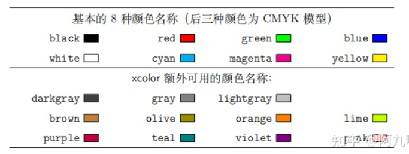

`xcolor` 宏包的新功能：

- 半色调 `{颜色!百分数}{文字}` 如 `\textcolor{purple!70}{abc}`。
- 混合色 `{颜色1!颜色1百分数!颜色2}`。
- 互补色 `{-颜色}`。


#### 代码块

单行代码使用 `\verb|内容|`，如 `\verb|\alpha|`。输出 `\alpha`。

多行代码用 verbatim 代码块(注意缩进会没有掉)。

[参考](https://blog.csdn.net/qq_43760191/article/details/121519247?spm=1001.2101.3001.6661.1&utm_medium=distribute.pc_relevant_t0.none-task-blog-2%7Edefault%7ECTRLIST%7Edefault-1-121519247-blog-109391516.pc_relevant_aa2&depth_1-utm_source=distribute.pc_relevant_t0.none-task-blog-2%7Edefault%7ECTRLIST%7Edefault-1-121519247-blog-109391516.pc_relevant_aa2&utm_relevant_index=1)

##### 伪代码

[更多参考](https://zhuanlan.zhihu.com/p/145195565)

如：

```tex
\documentclass{ctexart}
\usepackage{algorithm,algorithmic}
\usepackage{amsmath}
\begin{document}
\floatname{algorithm}{伪代码} %默认是Algorithm
\begin{algorithm}
    \caption{求和}
    \label{alg:sum1}
    \renewcommand{\algorithmicrequire}{\textbf{输入:}} %默认为 Require:
    \renewcommand{\algorithmicensure}{\textbf{输出:}} %默认为 Ensure:
    \begin{algorithmic}%可以[1]来标号
        \REQUIRE 整数数组 $a$ % 输入，必有不然报错
        \ENSURE 整数 $c$ %输出，必有不然报错
        \STATE $n=\text{求数组} a\text{的长度}$
        \STATE $c=0$ %一条独立的语句，前面都要state
        \FOR{each $i\in [1,n]$}
        \IF{$a_i\le 0$}
        \STATE 特判
        \ELSE
        \STATE $c=c+a_i$
        \ENDIF
        \ENDFOR
        \RETURN $c$
        %同理有\WHILE{}和\ENDWHILE
        %有\REPEAT \UNTIL{}
    \end{algorithmic}
\end{algorithm}

如算法 \ref{alg:sum1} 所示，这是一个简单算法。
\end{document}
```

> 可能会报警告字体大小问题，可以导多一个包：[参考](https://blog.csdn.net/weixin_46007691/article/details/122174991)
>
> ```tex
> \usepackage{anyfontsize}
> ```


##### 程序代码

###### 基础

宏包 `listings`。设置：使用多行大括号 `\lstset{}`，用键值对和逗号格式，可以设置：

- `numbers=left` 左侧显示行号
- `showstringspaces=false` 不显示字符串中空格
- `frame=single` 边框
- `firstnumber=行号` 首行编号，默认 1。

使用：`lstlisting` 代码块，参数为 `language=语言`。如：

```tex
\lstset{
    showstringspaces=false,
    frame=single,
    numbers=left,
}
\begin{lstlisting}[language=c++]
#include <bits/stdc++.h>
using namespace std;
#define sc(x) scanf("%lld", &x)
typedef long long ll;
ll n, a[10], v, s0;
signed main()
{
%不写了，篇幅有限
    return 0;
}
\end{lstlisting}
```

自动换行，如：

```tex
\begin{lstlisting}[language=python,breaklines=true]
```

引用外部代码文件，如：

```tex
\lstinputlisting[language=python,breaklines]{../codes/main.py}
```


###### 彩色

宏包 `xcolor`。加设置：

- `numberstyle=\color{darkgray}` 行号格式
- `backgroundstyle=\color{whiye}` 背景颜色
- `keywordstyle=\color{blue}` 关键字颜色
- `commentstyle=\it\color[RGB]{0,100,0}` 注释颜色
- `stringstyle=\sl\color{red}` 字符串格式

如：

```tex
\lstset{
    showstringspaces=false,
    frame=single,
    numbers=left,
    numberstyle=\color{darkgray},
    backgroundcolor=\color{white},
    keywordstyle=\color{blue},
    commentstyle=\it\color[RGB]{0,100,0},
    stringstyle=\sl\color{red},
} %lstset 可以放导言区
\begin{lstlisting}[language=c++]
#include <bits/stdc++.h>
using namespace std;
#define sc(x) scanf("%lld", &x)
typedef long long ll;
ll n, a[10], v, s0;
signed main() /* 注释 */
{ // 注释
    while (EOF != sc(v))
    {
        a[++n] = v;
        s0 += v;
    }
    for (ll h = 0; h < (1 << n); ++h)
    {
        ll s = 0;
        for (ll i = 1; i <= n; ++i)
        {
            s += ((h & (1 << (i - 1))) ? 1 : 0) * a[i];
        }
        if (s0 - s == s)
        {
            printf("true");
            exit(0);
        }
    }
    printf("false");
    return 0;
}
\end{lstlisting}
```


#### 参考文献

##### 直接引用

使用thebibliography环境即可编写，利用知网等论文网站导出文献，复制粘贴即可。这种写法的特点是**一次编写**，**一次使用**。会自动编号。

```tex
\begin{thebibliography}{99} %表示编号宽度，99是两位数字
	\bibitem{ascii名字}文字
	%...
\end{thebibliography}
```

需要引用文献时，用 `\cite{ascii名字}` 。那么此处会出现 `[编号]`。可以带一个可选参数，表示引用编号。如 `参见\cite[page 13]{article1}的表述` 。这样会以 `[编号, 可选参数]` 显示内容。

> 在 begin 那行前加以下代码将其添加到目录：
>
> ```tex
> \addcontentsline{toc}{section}{Refences}
> ```


##### 文件调用

[参考](https://zhuanlan.zhihu.com/p/397026871)

如果想要在多个论文使用同样的参考文献，可以用 `bibtex` 封装。新建 `.bib` 文件，存放参考文献条目。内容格式如：

> ```tex
> @article{ID1,
> 	author = {lr580},
> 	title = {普通文献},
> 	journal = {ACM顶刊},
> 	year = {2202},
> 	volumn = {10},
> 	number = {3},
> 	pages = {200}
> }
> @article{ID2,
> 	author = {lr580},
> 	title = {普通文献2},
> 	journal = {ACM顶刊},
> 	year = {2202},
> }
> ```
>

其中，每一行是 `key=value`，而 `author,title,journal,year` 必选，第一行的 ID 是 `\cite{ID}` 填写的东西。

引用声明：

```tex
\bibliographystyle{plain}
\bibliography{bib文件名(不含后缀)}
```

之后调用即可。

默认只有引用过的会列出来。使得 `bib` 文件全部参考文献被列出的话，使用 `\nocite{*}`。

在文献网站，点击导出 `BibTex` 即可出现条目，复制粘贴即可。

> 可以用 `zotero` 管理参考文献。

> 举例：有 `ref.bib` 放在同根目录，有内容如下：
>
> ```bib
> @article{WOS:000334906300005,
> Author = {Olsen, Reed N. and Gallaway, Terrel and Mitchell, David},
> Title = {Modelling US light pollution},
> Journal = {JOURNAL OF ENVIRONMENTAL PLANNING AND MANAGEMENT},
> Year = {2014},
> Volume = {57},
> Number = {6},
> Pages = {883-903},
> Month = {JUN 3},
> Abstract = {This paper ...},
> Type = {Article},
> Affiliation = {Olsen, RN (Corresponding Author), Missouri State Univ, Dept Econ, 901 South Natl Ave, Springfield, MO 65897 USA.
>    Olsen, Reed N.; Gallaway, Terrel; Mitchell, David, Missouri State Univ, Dept Econ, Springfield, MO 65897 USA.},
> DOI = {10.1080/09640568.2013.774268},
> Author-Email = {reedolsen@missouristate.edu},
> Times-Cited = {19},
> Unique-ID = {WOS:000334906300005},
> DA = {2023-02-18},
> }
> @inproceedings{ WOS:000375708200170,
> Author = {Hu, Xuan},
> Editor = {Xu, M and Wang, G},
> Title = {Research on Urban Light Pollution and Its Prevention},
> Booktitle = {PROCEEDINGS OF THE 2015 INTERNATIONAL CONFERENCE ON APPLIED SCIENCE AND
>    ENGINEERING INNOVATION},
> Series = {AER-Advances in Engineering Research},
> Year = {2015},
> Volume = {12},
> Pages = {865-867},
> Note = {International Conference on Applied Science and Engineering Innovation
>    (ASEI), Jinan, PEOPLES R CHINA, AUG 30-31, 2015},
> Abstract = {With the ...},
> Type = {Proceedings Paper},
> Affiliation = {Hu, X (Corresponding Author), North China Elect Power Univ, Sch Elect Engn, Baoding 071003, Peoples R China.
>    Hu, Xuan, North China Elect Power Univ, Sch Elect Engn, Baoding 071003, Peoples R China.},
> Author-Email = {1211265271@qq.com},
> Times-Cited = {1},
> Unique-ID = {WOS:000375708200170},
> DA = {2023-02-18},
> }
> ```
>
> 那么根据第一行内容(被引用名字，我们可以引用 `WOS:000334906300005` 和 `WOS:000375708200170`)
>
> 在 tex 的附录位置输入：(其中 `ref` 是同目录文件名，`unsrt` 表示按引用顺序排序)
>
> ```tex
> \bibliography{ref}
> \bibliographystyle{unsrt}
> ```
>
> 在需要引用的位置输入如：
>
> ```tex
> \cite{WOS:000334906300005}
> ```
>
> 那么被引用位置会出现 `[编号]`，且附录位置出现出处。
>
> 注：用 vscode 为例，需要保证 json 设置(ctrl+shift+p open user setting json)进去找 `latex-workshop.latex.recipes` 项，保证有：
>
> ```json
> "latex-workshop.latex.recipes": [
>     // ...
>     {
>         "name": "xe->bib->xe->xe",
>         "tools": [
>             "xelatex",
>             "bibtex",
>             "xelatex",
>             "xelatex"
>         ]
>     },
>     //...
> ],
> ```
>
> 然后使用 ctrl+shift+p 输入 latex recipe 选择 build with recipe, 选 name 对应那一项编译


#### 页眉页脚

去掉某一页的页码：`\thispagestyle{empty}`，即无页眉页脚。

`plain` 仅页脚页码，`headings` 仅页眉包含章节标题和页码。默认 `plain`。

修改页码编号：`\pagenumbering{编号形式}`，如 `Roman`, `arabic`。可选项同列表。

使用 `fancyhdr` 宏包自定义页眉页脚：

- `\lhead{左页眉内容}`  
- `\chead{中页眉内容}`  
- `\rhead{右页眉内容}`   (三者可共存)
- 同理，有 `\lfoot,\cfoot,\rfoot`
- `\thepage` 表示当前页码，如设置 `\cfoot{\thepage}`。

默认的页眉是有横线的。使用 `\renewcommand{\headrulewidth}{0pt}` 就可以将页眉的横线去掉，实质上就是将页眉横线的宽度设置为0像素，同理，要想出现横线，将 0 改为 0.5 像素即可出现。改成 `\footrulewidth` 就是页脚横线。


#### 其他内容

##### 段落排版

`noindent` 命令是取消段落的首行缩进

`linespread{行距整数}` 调整行距，可以放导言区全局设置，也可以局部设置。

`par` 是分段，而 `\\` 是强制换行。前者会使得首行缩进生效，后者不会。

左缩进 `\setlength{\leftskip}{大小}` 如 `10pt`。右缩进就 `\rightskip`。首行就 `\parindent`，如 `2em`。可以使用 `\indent` 开始一个段落的缩进。默认两字符。可多个 `\indent` 叠加。如果 `\indent` 无效，如 PPT，可以尝试 `\hspace*{2em}`。

> `\hspace` 命令用于插入水平空间。当它后面跟有 `*` 时，如 `\hspace*`，它表示在页面的开始或结束处也插入这个空间。如果不使用 `*`，那么在页面的开始或结束处的 `\hspace` 可能会被忽略。

latex 会自动给长单词跨行加 `-` 连接符。

##### 乱数假文

可以用宏包 `lipsum`，然后使用 `\lipsum[数目]`，或 `\lipsum`。例子见 `多行对齐`。

##### 多行对齐

`center`, `flushleft`, `flushright` 代码块。如：

```tex
\usepackage{lipsum}
% ...
\newpage
\begin{center}
    \lipsum[2]\\Hi and goodbye.
\end{center}
\newpage
\begin{flushleft}
    \lipsum[2]\\Hi and goodbye.
\end{flushleft}
\newpage
\begin{flushright}
    \lipsum[2]\\Hi and goodbye.
\end{flushright}
```

也可以使用`\centering`,`\raggedleft`,`\raggedright`，分别表示中**右左**。如：

```tex
\centering 锦乐的女装照\\(斯巴拉西)\\ %两行居中
\raggedleft ——桑泽友情提供道具\\
\raggedright 果冻拍摄。
```


##### 脚注

`\footnote{内容}` 实现脚注。此时在正文有上标数字，页底各个上标的内容注解。

使用 `\renewcommand{\thefootnote}{计数器}` 实现更改计数，默认是阿拉伯数字。如可以改为 `\Roman{footnote}`。


##### 转义

单行代码使用 `\verb|内容`，如 `\verb|\alpha`。输出 `\alpha`。

多行代码用 verbatim 代码块(注意缩进会没有掉)。

`\` 用 `\textbackslash`

`_` 用 `\underline\ ` (即给一个空格加下划线)


##### 盒子模型

`\mbox{}` 或 `\makebox{}`，大括号里写正文。可以加两个 `[]`。第一个写宽度如 `80pt`，第二个写对齐方式如 `c,l,r`。使用 `\fbox` 或 `\framebox` 高带边框的盒子。

需要换行的文字可以用 `\parbox[外部对齐][高度][内部对齐]{宽度}{内容}`。外部垂直对齐有 `t,c,b` 三种；内部对齐是垂直对齐方式，加上分散对齐 `s` 四种。


##### 超链接

`hyperref` 宏包。`\href{https://openai.com/}{OpenAI}`

副作用是目录全部可以点击跳转。

建议：

```tex
\usepackage[colorlinks,linkcolor=red,anchorcolor=blue,citecolor=green]{hyperref}
```


##### 图标

```latex
\usepackage{fontawesome}
```


font awesome [参考](https://blog.csdn.net/zzq060143/article/details/89380160) [官网](https://fontawesome.com/icons) [参考2-k2d7](https://pan.baidu.com/s/1cK0wRS9GIAwgtaTW6y_F0w)

##### 空格

多个空格：

- `\quad`, `\qquad`
- `\hspace{1cm}`
- `\hfill` 当前行若干个 fill 里平均分配空白，直到填满
- `\phantom{1cm}`

##### 作者贡献符号

一作 `\dag`，二作 `\ddag`，其他 $\S$，通讯作者 $\ast$。全都是上标，如 $lr580^*$

### 数学公式

```tex
\usepackage{amsmath} %frac,sqrt等
```

#### 基本格式

##### 常用环境

行内公式：`$...$`, `\(...\)`, `math` 代码块。

行间公式：`$$...$$`, `\[...\]`, `displaymath` 代码块。

> `$$...$$` 与 AMS-LaTeX 冲突，建议使用别的。

自动编号的数学公式： `equation` 代码块。只能放无空行的一行公式。不编号可以在代码块内写 `\nonumber` 或使用 `equation*`。

使用 `\label{标签名}` 和 `\eqref{标签名}` 进行引用公式。

`align` 代码块可以进行对齐，使用 `&`。也会自动编号，不想的话使用 `\nonumber` 或 `\notag`。

一个 align 可以有多个编号，每一行使用一次 `\label{eq:编号}`。引用就 `\eqref{eq:编号}`。

可以用 `multline` 换行。因为数学公式不能出现空行，所以必须用 `\\`。会将编号放在最后一行，第一行左对齐，最后一行右对齐

可以在一个代码块里套子代码块为次环境，如 `split`。就是一个普通的多行环境。

可以用 `gather` 环境，不对齐，只多行。

用 `aligned,gathered` 次环境套在 `equation` 内，实现整一大块只有一个编号。

用 `subequations` 套 `equation`，实现诸如 `1a,1b` 的多级编号。

用 `array` 环境，开头格式为 `\begin{array}{tabular头}` 如 `\begin{array}{cccc}`。然后内容用 `&` 和 `\\`。

有矩阵环境(不需要 tabular 格式)，包括 `pmatrix, bmatrix, Bmatrix, vmatrix, Vmatrix`，分别代表小中大括号、竖线和双竖线。如：

> ```tex
> \[ A=\begin{bmatrix}
> 1.00&0.76&1.92&1.19&2.15\\
> 1.30&1.00&2.51&1.56&2.83\\
> 0.52&0.40&1.00&0.62&1.12\\
> 0.84&0.64&1.61&1.00&1.81\\
> 0.46&0.35&0.89&0.55&1.00
> \end{bmatrix} \]
> ```

分段函数用 `cases` 环境。

证明用 `proof` 环境，里有文字和公式。输出格式为 `证明. 文字` 接公式。证明会另起一行表示结束符号，不想的话，在公式的最末尾加上 `\qedhere`。

> 与 katex 区别：没有 `\dfrac`


##### 定理

`\newtheorem{自定义环境名}{自定义定理名}[编号方式(可选)]`。编号方式如 `section` 和 `subsection`。

使用定理时就用一个自定义环境名的代码块包起来。然后里面再搞正文和数学公式。输出效果如 `定理名 1.1.1. 代码块里的东西`。编号自动的。


#### 字体

bm 宏包 `\bm{}` 对数学内容进行加粗。对数学公式里常规文本如中文，直接用 `\text{\texrbf{内容}}` 即可。

多种字体：(使用格式为 `\字体{}`)

- `mathnormal`
- `mathrm`
- `mathit`
- `mathbf`
- `mathsf`
- `mathtt`
- `matical` 仅大写字母，比较手写的样子
- `matisrc` 花里胡哨曲里拐弯的大写字母
- `mathfrak` 花里胡哨
- `mathbb` 双横线

尺寸：

- `\displaystyle` 行间公式尺寸
- `\textstyle` 行内公式尺寸
- `\scriptstyle` 上下标尺寸
- `\scriptscriptstyle` 次级上下标尺寸

加边框，用 `\boxed{公示内容}`。


#### 语法

##### 基本

上下标显然是 `^,_`。

省略号有： `\ldots,\cdots,\vdots,\ddots`，前两个是横的。可以用动态判定的 `\dots`。

分式有 `\frac,\dfrac,\tfrac`，前者行内行间有不同的大小，中者在行内实现行间大小，最后者在行间实现行内大小。

根式的一般格式是 `\sqrt[幂]{底}`。二项式是 `\binom{上}{下}`。

上下括号：`\underbrace{正文}_{下小字}` 和 `\overbrace{}^{}`。

箭头：`\xleftarrow[下]{上}` 指向左的箭头。 同理 `xrightarrow`。

头顶和低下横线：`\overline,\underline`，嵌套以双横线或更多。

希腊字母里，`var` 开头的写法是驼峰如 `\varDelta`，需要用 `amsmath` 包。详见附录。

##### 拓展

`\stackrel{上标文字}{符号}`，如 $a\stackrel{\text{文字}}{\equiv}b$。自定义任意上标。

巨算符在行内和行间排版不同，表现为上下标的压缩。有求和、求积、积分等。想要行内用行间排版，使用 `\limits` 取消压缩，如 $\sum\limits_{i=1}^n$。作用就是让上下标显示在符号的上下方。其反义词是 `\nolimits`。

下标写多行式子，用 `\substack`，如 $\sum_{\substack{0 < i\le j\le n\\i,j\in\mathbb{N}}}i^2j^2$。

表示大括号本身用 `\{\}`。需要转移的还有 `$,%`。反斜线本身用 `\backslash`。

成对括号动态决定大小用 `\left,\right`。如果只有一半，用 `\left.`，如 $f\left.\right|_{x=0}=0$。

双竖线 `\|`。

其他括号有 `\bigl(\bigr),\Bigl(\Bigr)\biggl(\biggr)\Biggl(\Biggr)`，不需要成对出现。

##### 函数

可以用的 `\函数名` 有：

- `sin, cos, tan, cot, sec, csc, arcsin, arccos, arctan`
- `arg, sinh, cosh, tanh, coth`
- `exp, log, lg, ln`
- `dim, ker, hom, deg`

可以带上下标的函数：

- `lim, limsup, liminf, sup, inf, min, max, det, gcd, Pr`

如 $\|T\|=\sup_{\|x\|=1}=\|Tx\|$。

自定义算符 `amsmath` 宏包下用 `\DeclareMathOperator*{指令}{渲染结果}`。如 `\DeclareMathOperator{\myop}{myop}`。

同余： `\bmod, \pmod{}`。前者窄和不带括号，后者带括号 `(mod ?)`。


##### 附录

[参见](https://zhuanlan.zhihu.com/p/104112163)

###### 希腊字母

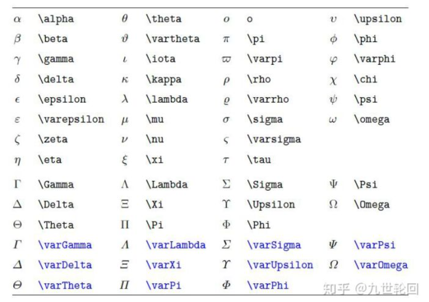

###### 二元关系符

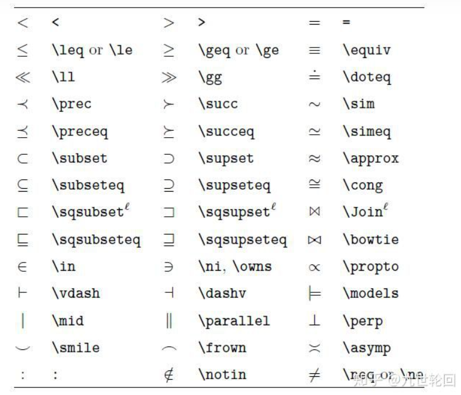

###### 二元运算符

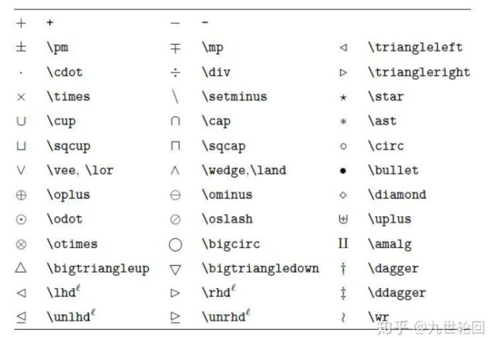

###### 重音符号

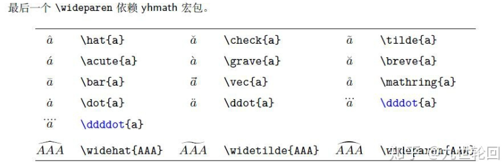

###### 箭头符号

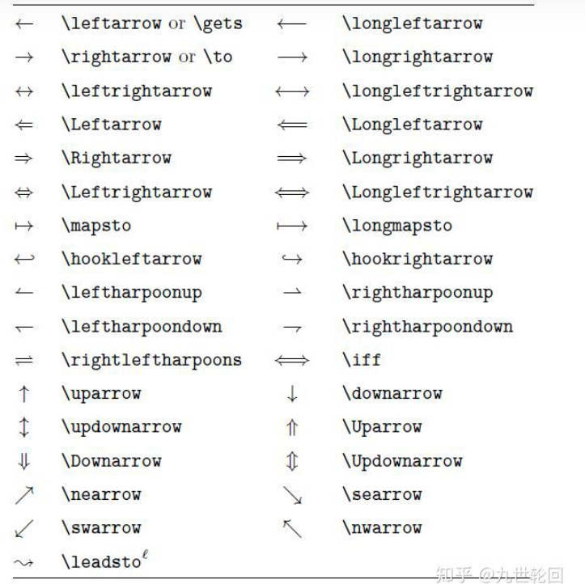

###### 巨算符

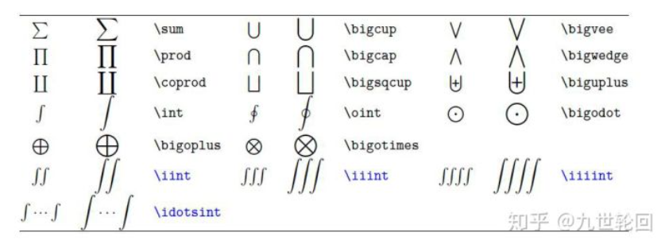

###### 重音箭头

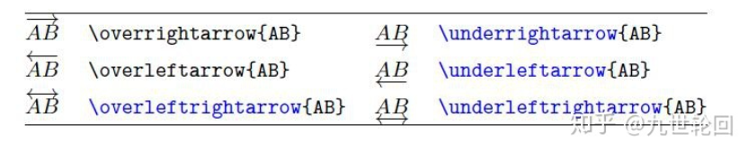

###### 定界符

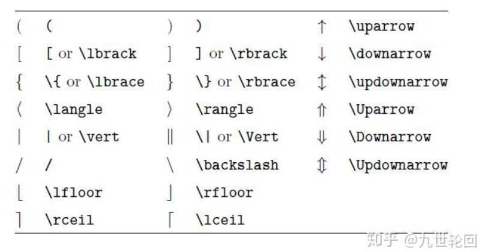

###### 其他符号

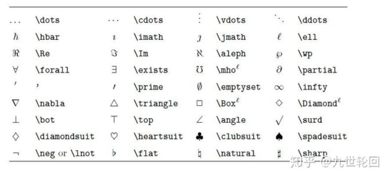

##### amssymb宏包

###### 二元关系符

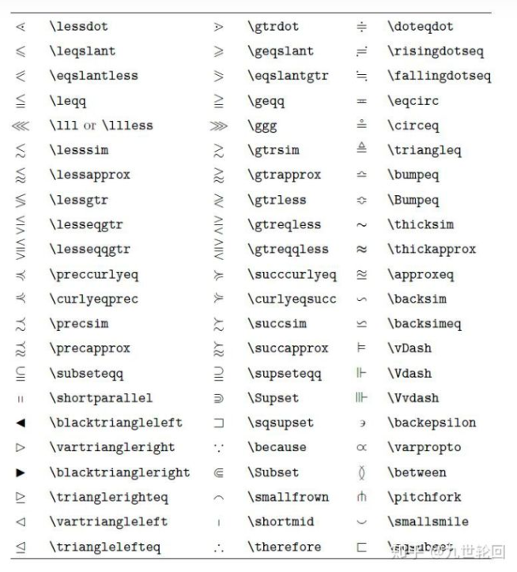

###### 二元运算符

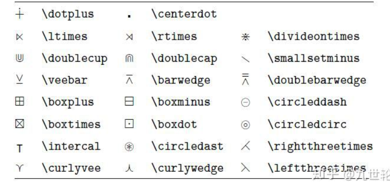

###### 箭头符号

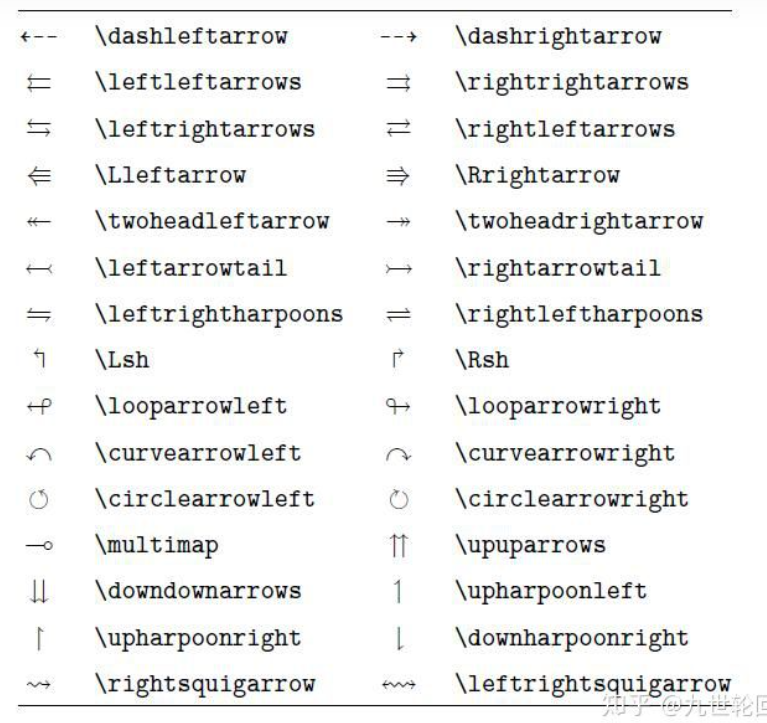

###### 反义二元关系和箭头

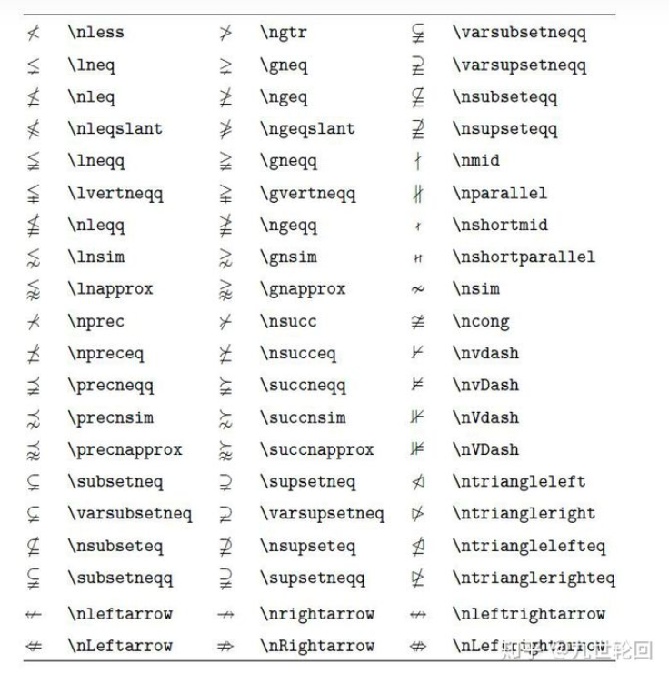

###### 定界

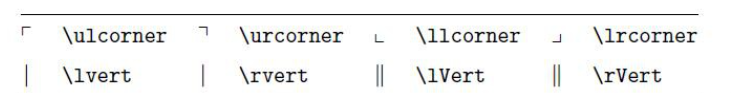

###### 其他

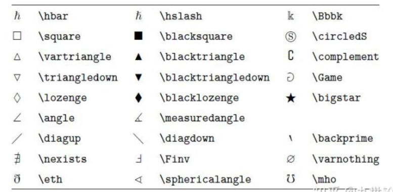


### PPT

使用 beamer。

> 或 `\documentclass{ctexbeamer}`

#### 基本概念

每个 ppt 的 slide 的框架为：[参考](https://zhuanlan.zhihu.com/p/134659249) (外部元素)

1. footline 页脚
2. headline 页眉
3. sidebar 侧边栏(左边/右边/两边，可选)
4. frametitle 页标题
5. Navigation Symbols 导航符号(右下角一堆按钮)(疑似有主题才能点)
6. logo 徽标(自行安排)

外部元素通过 beameroutertheme 实现。

除了这些元素外， 正文内容和普通的article或者book模式没有太大区别。这些元素是内部元素，通过 `beamerinnertheme` 设置。

beamer通过预定义了一些不同风格的页眉页脚和侧边栏和块。这些预定义的主题风格分别存放在beameroutertheme和beamerinnertheme中。

一个完整的beamer主题包含outer，inner，font和color四部分的风格。主题大全在线预览 [在这里](https://hartwork.org/beamer-theme-matrix/)。而所有这些主题(theme)均来自内置的outertheme、innertheme、colortheme和fonttheme, 外加一些微调实现。(具体指令见 `主题` 节)

#### 基本格式

##### 入门

[参考入门教程](https://www.jianshu.com/p/711acca9dbb5)

输出的内容实际上还是 pdf，并不是 ppt 文件。

使用文档类为 beamer。为了支持中文，导言区加入一行：[参考](https://www.jianshu.com/p/7cfd5c763e16)

```tex
\usepackage[UTF8]{ctex}
```

或 `\usepackage{xeCJK}`。

每一页(slide) PPT 都在 document 内用一个 frame 环境包住。

用 `frametitle` 命令写当前页的页标题。正文就自由写。

用 `pause` 命令表示点击效果。实现上会导致 PPT 分页。

可以用 `itemize` 代码块，内 `\item<x-y>` 其中 x,y 是数字(可以缺省)，表示这个项目再哪里可见。(可以认为是高级的 pause)

> 想要把每个 item 自动进行一次 pause，可以设置 `\beamerdefaultoverlayspecification{<+->}`。

如：

```tex
\PassOptionsToPackage{quiet}{fontspec} % 忽略 ctex 警告
\documentclass{beamer}
\usepackage[UTF8]{ctex} % or \usepackage{xeCJK} 但后者警报多
\begin{document}
\begin{frame}
    \frametitle{我的第一个PPT}
    \begin{itemize}
        \item<1-3> QwQ
        \item<2> 此白茶非彼白茶
        \item<-2> 啦啦啦
    \end{itemize}

    Hello, world!\\锦乐品白茶果冻。\pause
    桑泽造电子白茶。\pause
    阿门。
\end{frame}
\end{document}
```


##### 标题

[参考](https://baijiahao.baidu.com/s?id=1688776959310607378&wfr=spider&for=pc)

frame 里使用 `\titlepage` 生成标题页(不算第一页)，在 item 里。可以添加诸如 `title, subtitle, author, institute, date, titlegraphic, keywords, logo` 内容。如：

```tex
\institute{华南师范大学}
\title{第一个PPT}
\subtitle{求轻喷}
\author{lr580} % 放 begin document 前防止报错
\date{2022年7月22日} % 不 ctex 宏包就会是英文的
\logo{\includegraphics[width=100pt]{a.jpg}} %右下
\begin{frame}
    \titlepage
\end{frame}
```

> logo 每一页都会有。author 位置[参考](https://blog.csdn.net/RobertChenGuangzhi/article/details/50604468)


##### 目录

作用是添加标签，即 pdf 的像电子书一样的点击跳转目录；并且可以生成单独的目录页。在每个 frame 前面使用 section，在一个 frame 里用 tableofcontents。

如：

```tex
\documentclass{beamer}
\usepackage[UTF8]{ctex}
\begin{document}
% \subsection{}
\title{第二个PPT}
\author{lr580}
\date{2022年7月12日}
\logo{\includegraphics[width=80pt]{b.png}}

\begin{frame}
    \titlepage
\end{frame}

% \AtBeginSection[]{
    \begin{frame}
        \frametitle{目录}
        \tableofcontents
    \end{frame}
% }

\section{新的开始}
\begin{frame}
    \frametitle{第一章\ 新的开始}
\end{frame} % 不要 23 行就 \begin{frame}{第一章\ 新的开始}
\section{主城和弥明}
\begin{frame}
    \frametitle{第二章\ 主城和弥明}
\end{frame}
\section{果冻}
\begin{frame}
    \frametitle{第三章\ 果冻}
\end{frame}

\end{document}
```

可以设置成在每个 section 前都重新展示一次目录，并且显示下一个是那个章节(其他低亮，该章节高亮)，修改为：[参考](https://zhuanlan.zhihu.com/p/165140693?ivk_sa=1024320u)

```tex
\AtBeginSection[]{
    \begin{frame}
        \frametitle{目录}
        \tableofcontents[currentsection]
    \end{frame}
}
```

- currentsection，只显示当前一节的目录结构；

- currentsubsection，只显示当前一小节的目录结构；对应 `\AtBeginSubsection`

  注意 `AtBeginSubsection` 不会包含 section，既要又要的还要再弄 `AtBeginSection`

- hideallsubsections，目录中隐藏所有的小结；

- hideothersubsections，隐藏当前节之外的所有小结；

- pausesection，使目录按节逐段显示。

> 跟后面的主题的页眉可能会冲突，表现为每一个 section 都多了一页

需要两次编译才能得到正确结果。


##### 内环境

默认是英文的。可以改成中文的，自定义内环境，如：

```tex
\setbeamertemplate{theorems}[numbered]
\newtheorem{chtheory}{定理}
\newtheorem{chdefinition}{定义}
\newtheorem{chproof}{证明}
\theoremstyle{example} %往下修改格式
\newtheorem{chexample}{示例}

\section{新的开始}
\begin{frame}
    \frametitle{第一章\ 新的开始}
    \begin{chtheory}
        Minecraft 世界高度上限为 $312$。
    \end{chtheory}
    \begin{chdefinition}
        白茶是一个玩家名字。
    \end{chdefinition}
    \begin{chproof}
        易证。
    \end{chproof}
    \begin{chexample}
        有一个人前来买瓜, 买金西瓜,$2$ 个绿宝石一块。
    \end{chexample}
\end{frame}
```

常用的三种文本模块：`block, exampleblock 和 alertblock`。需要有一个大括号表示标题内容。望文生义，如：

```tex
\begin{block}{弥明的成就}
弥明获得成就\textbf{本地酿造厂}。\\
弥明获得成就\textbf{天空即为极限}。
\end{block}
\begin{exampleblock}{主城的必要物品}
主城需要有作物区、临时居住区、会议室、活动场所。
\end{exampleblock}
\begin{alertblock}{服务器规章制度}
{\color{red}警告:}贝壳提示您, 熊孩子行为是禁止的, 请勿模仿白金。
\end{alertblock}
```

> 这三种 block 会有很大的白色背景宽度，可能会覆盖掉 logo。

表格、列表、图片、参考文献与常规类似。

> 使用表格，需要设置幻灯文类相关参数选项，添加：table，xcolor=svgnames。如果表格内容过长，需采用多帧或使用帧环境的allowframebreaks选项。


##### 分栏

在 frame 里用 columns 大环境，其再套 column 子环境，大括号写参数为宽度，通常用 `\textwidth` 等分。

> columns和column环境的位置参数，有四个相同的选项;
>
> - b，各栏的底行对齐；
> - c，各栏中心对齐；
> - t，各栏首行基线对齐；
> - T，各栏首行顶部对齐。
>
> 其中columns还有两个位置参数：
>
> - totalwidth=宽度，设置各栏所占的总宽度；
> - onlytextwidth，等效于totalwidth=\textwidth。

如：

```tex
\begin{frame}
    \frametitle{第三章\ 果冻}
    \begin{columns}
        \begin{column}{0.4\textwidth}
            修改代码片段： %不知道为什么用不了代码块
            \begin{block}{输入部分}
            while (EOF != sc(v))\\
            \{\\
            \quad    a[++n] = v;\\
            \quad    s0 += v;\\
            \}
            \end{block}
        \end{column}
        \begin{column}{0.6\textwidth}
            \begin{block}{作用}
                写起来思维难度更低。
            \end{block}
            \begin{exampleblock}{备注}
                为了可以实现非 EOF 退出, 可以与一个越界判定。那么故意输入错误数据马上退出循环。
            \end{exampleblock}
        \end{column}
    \end{columns}
\end{frame}
```


##### 代码块

需要用 fragile。

```tex
\begin{frame}[fragile] %必须要fragile
    \frametitle{云烟的代码片段}
    如下所示： %注意顶格
    \lstset{
        showstringspaces=false,
        numbers=left,
        numberstyle=\color{darkgray},
        keywordstyle=\color{blue},
        commentstyle=\it\color[RGB]{0,100,0},
        stringstyle=\sl\color{red},
    } % 删掉了背景和边框以避免覆盖背景 logo
	\begin{lstlisting}[language=c++]
#include <bits/stdc++.h>
using namespace std;
#define sc(x) scanf("%lld", &x)
typedef long long ll;
ll n, a[10], v, s0;
signed main() /* 注释 */
{ // 注释
    return 0;
}\end{lstlisting}
\end{frame}
```


#### 主题

##### 使用

默认主题：

```tex
\usefonttheme{default}
\usecolortheme{default}
\useinnertheme{default}
\useoutertheme{default}
```

常用的内置有：

1. innertheme: default, circles, rectangles, rounded, inmargin
2. outertheme: default, infolines, miniframes, smoothbars, sidebar, split, shadow, tree, smoothtree
3. fonttheme: default, professionalfonts, serif, structurebold,structureitalicserif, structuresmallcapsserif
4. colortheme: [这个预览里打横的](https://hartwork.org/beamer-theme-matrix/)

或者直接用现成的，即 `\usetheme` 加上上面预览打竖的。

以inner和outer中的一些为例说明这些主题的主要特点。在innertheme中，circles，rectangles，主要区别在于列表最前面的符号(bullet)的形状是圈或者是矩形，rounded主要是指block是圆角的。在outertheme中，default没有页眉页脚和侧边栏，只有sidebar这个outertheme会给主题增加侧边栏，其它outertheme主要在页眉和页脚上进行区分。

对 outertheme 的使用：

- smoothbars。有当前 section 显示和每个 section 多少个 frame。有 subsection。
- miniframes。区别在于显示时多个 subsection 会分行。
- infolines 有页脚包含主标题、作者、组织、日期、当前页数总页数，页眉包括当前节和子节。
- split 是页脚作者和标题，页眉是小目录(当前高亮)和小子目录(当前子节高亮)。shadow 好像也差不多。
- tree 顾名思义。只有页眉。

使用示例：

```tex
\documentclass{beamer}
\usepackage{xeCJK}
\useinnertheme{rounded}
\usecolortheme{seahorse}
\useoutertheme{miniframes}
\beamerdefaultoverlayspecification{<+->}
\begin{document}
\title{关于我在PPT使用主题这件事}
\author{lr580}
\date{\today}
\logo{\includegraphics[width=80pt]{c.jpg}}
\begin{frame}
    \titlepage
\end{frame}
\section{自我介绍}
\begin{frame}
    \begin{itemize}
        \item 你好
        \item 我是白茶
        \item 再见
    \end{itemize}
\end{frame}
\section{比赛介绍}
\begin{frame}
    \begin{itemize}
        \item ACM/ICPC, CCPC
        \item 蓝桥杯
        \item 天梯赛
        \item CCF
        \item 其他(赛氪、码加加等)
    \end{itemize}
\end{frame}
\section{注意事项}
\subsection{代码规范}
\begin{frame}
    \begin{block}{推荐}
        驼峰命名法和善用自动格式化(vscode{\CJKfontspec{楷体} 欸}嘿嘿)。
    \end{block}
\end{frame}
\subsection{练习方法}
\begin{frame}
    \begin{exampleblock}{推荐网站}
        codeforces, 洛谷, HDU 等……
    \end{exampleblock}
    \pause
    \textbf{一定要补题！一定要补题！一定要补题！}
\end{frame}
\begin{frame}
    Q\&A
\end{frame}
\end{document}
```


> ##### 设计
>
> 指令：
>
> 1. setbeamerfont
> 2. setbeamercolor
> 3. setbeamertemplate


### 绘图

[参考](https://zhuanlan.zhihu.com/p/127155579)

宏包 `tikz`。导言区导绘图子包，用指令 `usetikzlibrary`，格式与 `usepackage` 类似。

要绘图时，具体绘图指令放 `\tikz` 后边或 `tikzpicture` 代码块里

#### 基本图形对象

如果要绘制直线，直接连接坐标即可。如下面是一条折线(√的形状)：

```tex
\begin{tikzpicture}
    \draw (1,3)--(2,2)--(4,5);
\end{tikzpicture}
```

圆角折线：

```tex
\draw[rounded corners] (1,3)--(2,2)--(4,5);
```

首尾相连的话：(才能让封闭图形每个角都圆角化)

```tex
\draw (1,3)--(2,2)--(4,5)--cycle;
```

矩形绘制，给定两对角线的坐标：(也可跟上文一样加圆角)

```tex
\draw (0,0) rectangle (4,2);
```

圆，给定中心点和半径：

```tex
\draw (1,1) circle (1);
```

椭圆，依次给定宽半轴和高半轴：

```tex
\draw (1,1) ellipse (2 and 1);
```

圆弧/椭圆弧：(逆时针从0到270度，半径)

```tex
\draw (1 ,1) arc (0:270:1);
\draw (6 ,1) arc (0:270:2 and 1);
```

分别指定抛物线起点、顶(拐)点、终点，作抛物线：

```tex
\draw (5,1) parabola bend (6,0) (7.414 ,2);
```

上述都是画空心，如果要画实心用 `\filldraw` 如给上述抛物线加顶点可以画实心圆：

```tex
\draw (5,1) parabola bend (6,0) (7.414 ,2);
\filldraw (5,1) circle (.1)
(6,0) circle (.1)
(7.414 ,2) circle (.1);
```

网格缺省步长为 1cm，下面画两个网格，后者 help lines 指示 0.2pt 的线宽，且 20pt 指定网格边长 (注意到坐标 0 是边界，不会扩展，其他方向会小扩展)

```tex
\draw [step=20pt] (0,0) grid (3,2);
\draw [help lines ,step=20pt] (4,0) grid (7,2);
```

#### 图形控制

箭头：

```tex
\draw [->] (0,0)--(9,0);
\draw [<-] (0,1)--(9,1);
\draw [<->] (0,2)--(9,2);
\draw [>->>] (0,3)--(9,3);
\draw [|<->|] (0,4)--(9,4);
```

PGF 中线条的缺省宽度是0.4pt，线型是实线。下例给出了改变线型和线宽的方法：

```tex
\draw [line width =2pt] (0,0)--(9,0); %加粗实线
\draw [dotted] (0,1)--(9,1); %点状虚线
\draw [densely dotted] (0,2)--(9,2); %较密的点状虚线
\draw [loosely dotted] (0,3)--(9,3); %较疏的点状虚线
\draw [dashed] (0,4)--(9,4); %线状虚线
\draw [densely dashed] (0,5)--(9,5); %较密的线状虚线
\draw [loosely dashed] (0,6)--(9,6); %较疏的线状虚线
```

可以在导言区定义一个样式，然后将来我们可以直接在文本区调用它。比如：

```tex
\tikzset{
dline/.style ={color = blue, line width =2pt}
}
\begin{document}

\begin{tikzpicture}
\draw[dline] (0,0) --(9,0);
\end{tikzpicture}
```

方法二：

```tex
\begin{tikzpicture}[dline /. style ={line width =2pt}]
\draw[dline] (0,0) --(9,0);
\end{tikzpicture}
```

平移变换：

```tex
\draw (0,0) rectangle (2,2);
\draw[shift ={(3 ,0)}] (0,0) rectangle (2,2);
\draw[xshift =100pt] (0,0) rectangle (2,2);
```

缩放(+平移)：比例数字大于1放大，小于1缩小

```tex
\draw[xshift =70pt ,xscale =1.5] (0,0) rectangle (2,2);
\draw[shift ={(3,0)},scale =1.5] (0,0) rectangle (2,2);
```

旋转：(正逆负顺，默认以原点为中心，角度制)

```tex
\draw[xshift =125pt ,rotate =45] (0,0) rectangle (2,2);
\draw[xshift =175pt ,rotate around ={45:(2 ,2)}] (0,0) rectangle (2,2);
```

倾斜：

```tex
\draw[xshift =70pt ,xslant =1] (0,0) rectangle (2,2);
\draw[yshift =70pt ,yslant =1] (0,0) rectangle (2,2);
```

颜色(填充的话要封闭路径)

```tex
\draw[red] (0,0) --(9,0);
\draw[green] (0,1) --(9,1);
\draw[blue] (0,2) --(9,2);
\filldraw[draw=blue!80,fill=blue!20] (14 ,1) circle (1);
```


#### 节点

先设置一个属性：

```tex
\tikzset{
box/.style ={
rectangle, %矩形节点
rounded corners =5pt, %圆角
minimum width =50pt, %最小宽度
minimum height =20pt, %最小高度
inner sep=5pt, %文字和边框的距离
draw=blue %边框颜色}
}
```

下面建立了五个顶点(有两个无边框)，并连接了一部分：

```tex
\node[box] (1) at(0,0) {1}; %分别节点名和显示值,显示值可以套 $数学公式$
\node[box] (2) at(4,0) {2};
\node[box] (3) at(8,0) {3};
\draw[->] (1)--(2);
\draw[->] (2)--(3);
\node at(2,1) {a};
\node at(6,1) {b};
```

从上往下的树：

```tex
\node[box] {1}
    child {node[box] {2}}
    child {node[box] {3}
        child {node[box] {4}}
        child {node[box] {5}}
        child {node[box] {6}}
    };
```

> 也可以使用圆形节点，将 `box\.style` 中的rectangle 换成circle 并删除rounded corners选项，并将minimum width 的值和minimum height 的值设为同一个值，比如这里都设置为20pt，再添加 `fill = blue!20`

函数图绘制：其中**domain** 设置了我们想要绘制的范围，起始点和终止点之间用 **:** 隔开。plot 是绘制操作，node后面[]中填写我们文本的位置

```tex
\draw[->] (-0.2,0) --(6,0) node[right] {$x$};
\draw[->] (0,-0.2) --(0,6) node[above] {$f(x)$};
\draw[domain =0:4] plot (\x ,{0.1* exp(\x)}) node[right] {$f(x)=\frac{1}{10}e^x$};
```


#### 流程图

##### 例子

###### 入门

```tex
\documentclass{article}
\usepackage{tikz}
\usetikzlibrary{positioning, shapes.geometric}

\begin{document}
\begin{tikzpicture}[node distance=10pt]
  \node[draw, rounded corners]                        (start)   {Start};
  \node[draw, below=of start]                         (step 1)  {Step 1};
  \node[draw, below=of step 1]                        (step 2)  {Step 2};
  \node[draw, diamond, aspect=2, below=of step 2]     (choice)  {Choice};%宽高比2
  \node[draw, right=30pt of choice]                   (step x)  {Step X};
  \node[draw, rounded corners, below=20pt of choice]  (end)     {End};
  
  \draw[->] (start)  -- (step 1);
  \draw[->] (step 1) -- (step 2);
  \draw[->] (step 2) -- (choice);
  \draw[->] (choice) -- node[left]  {Yes} (end);
  \draw[->] (choice) -- node[above] {No}  (step x);
  \draw[->] (step x) -- (step x|-step 2) -> (step 2);
\end{tikzpicture}
\end{document}
```

`\node` 定义点，如外框形状

`\arrow` 定义线和箭头

`positioning` 定义相对位置关系。

外框之间的（最小）距离都相同，是 `node distance` 指定的 `10pt`；在需要手动调整距离时，可以使用`right=<dimen> of <node name>`。


文本换行：

```tex
\node[draw, below=of resize, text width=140pt] (cut) {裁切图片的条形码矩形区域, \linebreak 并得到正反两张子图};
```


###### 简化arrow

```tex
\documentclass{article}
\usepackage{tikz}
\usetikzlibrary{graphs, positioning, quotes, shapes.geometric}

\begin{document}
\begin{tikzpicture}[node distance=10pt]
  \node[draw, rounded corners]                        (start)   {Start};
  \node[draw, below=of start]                         (step 1)  {Step 1};
  \node[draw, below=of step 1]                        (step 2)  {Step 2};
  \node[draw, diamond, aspect=2, below=of step 2]     (choice)  {Choice};
  \node[draw, right=30pt of choice]                   (step x)  {Step X};
  \node[draw, rounded corners, below=20pt of choice]  (end)     {End};
  
  \graph{
    (start) -> (step 1) -> (step 2) -> (choice) ->["Yes"left] (end);
    (choice) ->["No"] (step x) ->[to path={|- (\tikztotarget)}] (step 2);
  };
\end{tikzpicture}
\end{document}
```

library `quotes`，将 node label 的输入从 `label={[<options>]<text>}` 简化为 `"<text>"<options>`

如果使用了选项 `use existing nodes=true`，输入`(start) -> (step 1) -> (step 2)` 能进一步简化为 `start -> step 1 -> step 2`。


###### 复杂流程图案例

[参考](https://blog.csdn.net/AnInteretedName/article/details/104453770)

```tex
\documentclass[12pt]{article}
\usepackage{tikz}
\usetikzlibrary{shapes.geometric} % 注意
\begin{document}
\begin{figure}[htbp]
    \centering
    \tikzstyle{startstop} = [rectangle, rounded corners, minimum width=3cm, minimum height=1cm,text centered, draw=black]
    \tikzstyle{decision} = [diamond, draw, text width=5.5em, text badly centered, inner sep=0pt]
    \tikzstyle{process} = [rectangle, minimum width=3cm, minimum height=1cm, text centered, draw=black]
    \tikzstyle{arrow} = [thick,->,>=stealth]
    \begin{tikzpicture}[node distance = 2cm]
        % Place nodes
        \node (start) [startstop] {Start};
        \node (decP) [decision, below of = start, yshift=-0.5cm] {$p = 0$};
        \node (computeLambda) [process, left of=decP, xshift=-1.5cm, yshift=-2cm] {Compute $\lambda$};
        \node (computeAlpha) [process, right of=decP, xshift=2cm, yshift=-2cm, align=center] {Compute $\alpha$ and update \\ $x$ by $x = x + \alpha p$};

        \node (decLambda) [decision, below of = computeLambda, yshift=-0.5cm] {$\lambda > 0$};
        \node (decAlpha) [decision, below of = computeAlpha, yshift=-0.5cm] {$\alpha = 0$};

        \node (DeleteConst) [process, below of=decLambda, yshift=-0.5cm] {Delete a constraint};
        \node (AddConst) [process, below of=decAlpha, yshift=-0.5cm] {Add a constraint};

        \node (computeP) [process, below of=start, yshift=-10cm] {Compute $p$};
        \node (end) [startstop, below of=decLambda, xshift=3.5cm, yshift=-5.5cm] {Optimal};

        % Draw edges
        \draw [arrow] (start) -- (decP);
        \draw [arrow] (decP) -| node[near start, above] {yes} (computeLambda);
        \draw [arrow] (decP) -| node[near start, above] {no} (computeAlpha);

        \draw [arrow](computeLambda) -- (decLambda);
        \draw [arrow](computeAlpha) -- (decAlpha);

        \draw [arrow] (decLambda) -- node[anchor = east] {no} (DeleteConst);
        \draw [arrow] (decLambda) -- +(-2.5,0) |- node[near start, left] {yes} (end);
        \draw [arrow] (decAlpha) -- node[anchor = east] {no} (AddConst);
        \draw [arrow] (decAlpha) -| node[near start, above] {yes} (computeP);


        \draw [arrow](DeleteConst) |- (computeP);
        \draw [arrow](AddConst) |- (computeP);
        \draw [arrow](computeP) -- +(0,-1.5) -- +(7,-1.5) |- (0,-0.8);

    \end{tikzpicture}
    \caption{Flow chart of active-set mechanism}
    \label{fig: Flow chart of fmincon AS algo}
\end{figure}
\end{document}
```

部分解释：

- 一定记得 `usetikzlibrary`，因为自定义 style 里有 diamond
- inner sep 表示节点内容和节点边界之间的最小距离，默认 0.3333em (new bing)

