> <p align="right" style="font-weight:900;color:wheat">by 蒟蒻lr580</p>
>
> 如果公式一直渲染有错，重启typora
>
> 本文档公式代码查看在typora直接看即可，所以打印成pdf会看不了部分源码qwq
>
> Typora 使用不了的话，可以重装，或者回退低版本，目前没发现更好的解决办法

# Markdown

主要适用于 Typora 下的 `.md` 编辑。不保证其他平台无误。

## 排版

> 其实右击和上面的格式栏可以解决大部分问题

### 分级标题

ctrl+x是几号标题

视图 - 大纲 打开目录

偏好设置 - 外观 -侧边栏允许折叠和展开 控制目录开合

在光标在侧边栏时，上滚轮可以展开对目录的搜索(鉴于typora的搜索速度，比全文搜索明显快很多)

### 主要功能

#### 引用

> 右尖括号(>)+空格自动生成
>
> 回车+shift+tab退出引用

#### 无序列表

- ctrl+shift+] 生成

  - 按一次tab进入子列表
    - 子列表可以嵌套
- shift+tab退出子列表或退出父列表(空行delete也行)

1. ctrl+shift+[ 有序列表
2. 子列表同理
   1. 它的快捷键同上

#### 链接

中括号里写链接名，中括号后小括号写链接地址，这样ctrl单击后直接跳转

[示范](https://search.bilibili.com/all?keyword=typora&from_source=nav_suggest_new)

#### 图片

偏好设置 - 图像 - 插入图片时 复制到指定路径 前三个打钩

文件名示范（相对路径） ./img

添加图片直接拖拽

#### 高亮

偏好设置 - markdown - 高亮 打开

==高亮文字==

#### 加粗

**ctrl+b**

取消也是这个键

#### 划重点

即(格式-代码)

两个飘号起始就是~这个的同位键`（半角）

`比如这样`

~~不是这样，这个用到的是~不叫做飘号，也就是这个同位~~

同理，格式里有很多别的

#### 表格

ctrl+t

| 横着是行，有四行       | 竖着是列，有两列 |
| ---------------------- | ---------------- |
| 会根据输入自动调整列宽 | 标题默认加粗     |
| 第一个按钮调整行列数   | 后三个略         |
|                        |                  |

#### 代码块

三个飘号(建议直接打六个，可以选择语言)

``````C
int a=1;
``````

#### 居中/右

居右：

<p align="right">——蒟蒻lr580</p>

居中：

<center>标题</center>


#### 分页

实用 HTML 语法可以实现分页(导出 pdf 时生效)

```html
<div STYLE="page-break-after: always;"></div>
```


### 其他设置

偏好设置

打开自动保存和调试模式，重启

自动保存看偏好

调试模式就是可以检察元素

在那个状态下可以调更多东西，前提是看得懂=w=

### 自己的主题

偏好设置 - 外观 - 打开主题文件夹 

记事本打开css文件，拷贝替换获取自己的主题

调试用检察元素

### 导出为pdf

文件 - 导出


> 拓展：使用pandoc
>
> 安装：[参考](https://zhuanlan.zhihu.com/p/258912543)
>
> ```shell
> pip install pandoc
> pip install pandoc-xnos
> ```


#### 目录

输入 `[toc]` ，可以自动生成链接式的目录

toc 即 tableofcontents

暂时无法实现页码


#### 页眉页脚

偏好设置-Export

可以输入诸如： `${today}`  作为页眉，

输入 `${pageNo} / ${totalPages}` 作为页脚

其他支持的变量([官方信息](https://support.typora.io/Export/#header--footer))：

- `${title}`
- `${author}`
- `${pageCount}`


## 公式

### 行

#### 单行公式

> 第一次要在typora打开markdown拓展语法内联公式，重启typora

```markdown
$公式$ //插入内联公式
```

在行内插入一条公式$2x+3y=34$如左。


如下操作：

```markdown
$$多行公式$$ //插入公式
```

~~但是其实$$x+y=5$$还是单行的。~~这是因为打开方式不对，正确的多行公式不是这样的，具体见下。

> 外层渲染，如下划线、斜体，对数学公式内部内容不起作用。如上。

#### 多行公式

使用菜单那里拉出来，行外式
$$
x+y=z
$$
或者在空行输入两个$然后按下回车

单行v.s.多行

- 多行对于复杂表达式的显示会大一些，单行可能会太小很难辨认
- 多行是默认居中的
- 多行有类似于代码块的标识符颜色提示
- 多行的输入式：输入两次$然后回车，类似于代码块。单行就两个美元符号输入之后移鼠标到中间即可。

#### 分行

使用两个反斜杠

$a\\ b \\ c$


##### 多行公式

$\begin{align} a &= b+c\\ &=d+e  \end{align}$
$$
\begin{align}

a &=1 & b &=2 && c &=3 \\

d &=-1 & e &=-2 & f &&=-5

\end{align}
$$

$$
\begin{matrix}

x & y \\

z & v

\end{matrix}
$$

### 一般格式

#### 上下标

单个就直接拉^符号 $x^2$甚至不用拉公式也可以上标  

一般情况下^这个是可以拉上标的，但是数学公式里要加大括号喔^

像这样：$x^{12345}$

~~一般情况下也是可以_拉下划线作下标_了个鬼，这是斜体。~~

不过数学公式里就可以啦：$x_3$，$x_{54321}$

${}_{1}^{2}x_3^4$

#### 上下头

$\overline{abc}\quad\underline{abc}\quad\widehat{abc}\quad\widetilde{abc}\quad\overrightarrow{abc}\quad\overleftarrow{abc}\quad\overbrace{abc}\quad\underbrace{abc} $   $\bar{12}$(定长线)

$\overset{abc}{def}$ $\underset{abc}{def}$

#### 字号大小

$\tiny1\scriptsize2\small4\normalsize5\large6\Large7\LARGE8\huge9\Huge0$

> footersize在typora不可用

#### 字体

以下仅对大写有效
$$
\mathcal{ABCDEFGHIJKLMNOPQRSTUVWXYZ}
$$

$$
\mathbb{ABCDEFGHIJKLMNOPQRSTUVWXYZ}
$$

以下不只是大写都可以
$$
\mathfrak{ABCDEFGHIJKLMNOPQRSTUVWXYZ}\\
\mathfrak{abcdefghijklmnopqrstuvwxyz}\\
\mathfrak{0123456789}
$$

$$
\mathsf{ABCDEFGHIJKLMNOPQRSTUVWXYZ}\\
\mathsf{abcdefghijklmnopqrstuvwxyz}\\
\mathsf{0123456789}
$$

$$
\mathbf{ABCDEFGHIJKLMNOPQRSTUVWXYZ}\\
\mathbf{abcdefghijklmnopqrstuvwxyz}\\
\mathbf{0123456789}
$$

斜体 textit
$$
\textit{1234567890 ABC abc}
$$


### 字符

#### 一般字符

$在内联里是可以随便输入中文，English,123的啦$
$$
在多行里其实也是可以的啦
$$

> 打印状态下中文格式可能会有排版不好看问题


#### 标点符号

点 $\cdots \vdots \ddots  \ldots \quad\dots$

\surd 大钩$\surd$

斜杠 $\not$

反斜杠 $\verb|\|  \backslash \setminus$

撇号 $x' y'''''$

上点号 $\dot{x} \ddddot{x}$  可以一到四个

否定：not $\not3\quad\not a\ \not$

$|\quad \| \quad \vert \quad \Vert$

$\%$ 需要转义，否则代表单行注释，如 $1+2%难道不等于%3吗$ ；千分号可以用 html 特殊字符打， 通常时`Katex`不支持(需要加载宏包)

##### 空格

\quad 空格 $a\quad b$

\\qquad 大空格 $a\qquad b$

小空格反义即可，或\;\,(间距更小)  $a\ b\;c\,d$

紧凑用反义!，如$a\!b \quad cd$ 

更紧凑用多个 $a\!\!b \ c\!\!\!e \; f\!\!\!\!g$

##### 箭头

四方向\left/right/up/downarrow $\uparrow$

左右\to \gets $\to \gets$

- 大左右 $\xleftarrow[下]{1+2+3}\xrightarrow{x}$
- 双线 $\Leftarrow$ $\Leftrightarrow$ $\iff$ 
- 否定+n $\nRightarrow$
- 双向 $\leftrightarrow$ $\longleftrightarrow$

> []控制下文字，{}控制上文字，注意先写下再写上

使用化学方程式\ce来模拟上下箭头+文字：$\ce{A->[上文字][下文字]}B$

使用\mbox获得大文字$\ce{->[\mbox{大文字}][文字]}$

长等号\xlongequal $\ce{\xlongequal[下]{上}}$，这个在\ce之外都能使用

基本箭头为->,<=>,<=>>,<<=> $\ce{-><=><=>><<=>}$

> 当然了化学表达式本身的内容还是支持的
>
> $\ce{CaCO3 v + H2O \Delta CH3-CHO CH2=CH2 CH#CH A\bond{-}B\bond{#}C}$
>
> 详见[这里的附件](https://www.latexstudio.net/archives/9998.html)

> 暂未解决给一般字符加上下文字的方法，如$\sim$。

##### 括号

$\{x\}(y)[z]$

花括号 $\begin{cases} x+1 \\ x+2 \end{cases}$

$\overbrace{3}\underbrace5\langle3,4\rangle$

$\bigl( \Bigl( \biggl( \Biggl( \quad\bigr) \Bigr) \biggr) \Biggr) $

$\langle \rangle$

##### 修饰

上划线$\overline a$ 下划线$\underline{abc}$

上下标显然是$a^{bv} c_{bd}$


#### 转义

下列需要转义：
$$
\$ \# \%\& \~ \_ \^  \{ \}
$$

> 注意上面的~ 和 ^ 其实没有就是这样显示的；如果把那个反斜杠删了的话根本显示不出 ~ ^
>
> 要显示的话，$\sim \wedge$

原意：

- & 对齐
- _ 下标
- ^ 上标
- {} 填参数用的

#### 希腊字母

常规(大写+小写)
$$
\Alpha \alpha
\Beta\beta
\Gamma\gamma
\Delta\delta
\Epsilon\epsilon
\Zeta\zeta
\Theta\theta
\Eta\eta
$$

$$
\Iota\iota
\Kappa\kappa
\Lambda\lambda
\Mu\mu
\Nu\nu
\Xi\xi
\Omicron\omicron
\Pi\pi
$$

$$
\Rho\rho
\Sigma\sigma
\Tau\tau
\Upsilon\upsilon
\Phi\phi
\Chi\chi
\Psi\psi
\Omega\omega
$$

异体：(var+小写)
$$
\Epsilon\epsilon\varepsilon
$$

$$
\Theta\theta\vartheta\varTheta
$$

$$
\Pi\pi\varpi\varPi
$$

$$
\Sigma\sigma\varsigma\varSigma
$$

$$
\Phi\phi\varphi\varPhi
$$

可能已停用：
$$
\digamma
$$


#### 特殊符号

$\circledast\circledcirc\circleddash\divideontimes\odot\ominus\oplus\oslash\otimes\boxplus\boxdot\boxtimes\Box\square$

$\nabla \triangle \triangledown \vartriangle \square \blacksquare \blacktriangle \blacktriangledown $ $\bigstar \diamond$

$\llcorner\lrcorner\ulcorner\urcorner$

$\frown$

$\LaTeX$   $\TeX$ $\S1$

### 数学格式

#### 初等数学

##### 关系符号

###### 算术

正负号 $\pm$  $\mp$

乘 $\times$   $. \cdot$

除 $\div$

取模$\%$ 或$y\mod x$ ，紧凑的$y\bmod x$

向下取整$\lfloor x\rfloor$

向上取整$\lceil x\rceil$ 

组合数学建议用 $\dbinom nm$ ，不建议用 ${n\choose m},\binom nm$ 

###### 逻辑

$\ne \quad \approx \quad =$

$\neg$  $\&$  $\|$  

$\equiv  \leq \le  \geq \ge > <$ 

$\leqslant \geqslant$

$\forall  \exists \nabla \because   \_ \therefore$ 注：不建议打 `exist` ，建议打 `exists` ，前者对 tex 不兼容

$\sim \thicksim \backsim$

否定型加n

$\ncong\ \nmid\ \nparallel\ \nshortmid\ \nsim\ \nleqslant\ \nleq\ \nleqq\ \nless\ \ngtr\ \gneq\ \gnsim$


##### 集合

$\emptyset\empty\O$  $\in$  $\ni$  $\notin$   $\complement$ 空集建议： $\varnothing$ 

$\bigcap_1^{n}P$  $\bigcup P$

$\wedge\vee\cap\cup$

$\supseteq\ \supset\ \nsupseteq\ \subseteq\ \subset\ \nsubseteq$

例如：
$$
|\bigcup_{i=1}^nS_i|=\sum_{m=1}^n(-1)^{m-1}\sum_{a_i<a_{i+1}}|\bigcap_{i=1}^mS_{a_i}|
$$


##### 代数

###### 分式

$1/2$  $123/456$除法式子是直接的

$\frac{23}{457}$分式就不是了，记得\frac和两个大括号

$\frac{\frac{1}{2}}{\frac{3}{4}}$繁分式帅，其他同理啦

连续分式帅
$$
\begin{equation}  x = a_0 + \cfrac{1}{a_1           + \cfrac{1}{a_2           + \cfrac{1}{a_3 + \cfrac{1}{a_4} } } }\end{equation}
$$
> 那一对\end{equation}好像没啥用

还有另一种占位大小，稍微窄一点：
$$
x=a_0+\dfrac1{a_1+\dfrac12}
$$
当然这三两种是可以混用的，代表三种不同的占位大小(根据表达式实际情况动态调整的)


###### 根式

\sqrt大括号啦 $2\sqrt{2}$    $\sqrt{\sqrt{3}}$

> 不正确的写法：$^3\sqrt{5}$

正确的写法：$\sqrt[3]{2}$

###### 累加累乘

\sum，下上标很简单的啦

$\sum$   $\sum{a}$  $\sum_{i=1}^{+\infty}{x^2}$


\prod,同理  $\prod_{n=1}^{99}{x_n}$

###### 函数

基本函数都有正体写法：

$\sin \arctan \cosh \exp \log \ln \min \max \gcd$

> lcm没有正体写法

##### 几何

度：$^\circ$ 

$\angle \measuredangle \sphericalangle$

$\cong$

$\overset{\LARGE{\frown}}{OA}$

###### 证明

$相似\thicksim\\垂直\bot$

$任意\forall\\存在\exist$

$\exist a\\\exists a$两种写法均可，基本无区别

###### 矢量

\vec大括号 {}   $\vec{vector}+\vec{x}$  

$\vec{\vec{虽然可以这样但是很无聊啊}}$

$\overleftarrow{sh}$

夹角：$\hat{(\vec{a},\vec{b})}$ $\cos<\widehat{\vec a,\vec b}>$

##### 初等函数

###### 三角函数

$\sin{x^2}$  $\cos{-x}=cos{x}$   $\tan{x}\cot{x}=1$

$sin^{2}{x}+cos^{2}{x}=1$

$\sec{x}  \csc{x}  \arctan{x}$

###### 对数函数

$\ln{\ln{3}}$    打法是小写L

$log_28$   $\lg^210$

#### 高等数学

###### 求导

$f',f'',f^{(20)}$

$\frac{\partial f(x)}{\partial x}$

###### 积分

\int{x}dx $\int{x}dx$

\int_{x}^{x}{x}dx  _

$\int_{-3}^{3}{x^{100}}dx$

$\iint$ $\iiint$ $\iiiint$ 最多四重，

五重可以试一下2+3然后加紧凑？ $\iint\!\!\!\,\iiint$

闭合曲线的积分：$\oint \oiint \oiiint$，最多三重。

$\var$ 

###### 极限

\lim{}   $\lim{x}$

\lim_{}   

$\lim_{x\rightarrow-\infty}{x^2}$

$\lim_{x\rightarrow+\infty}{\frac{x}{0}}$

\rightarrow \infty

> 如果用多行公式而不是单行公式，可以让条件对正lim下方：
> $$
> \lim_{x\to\infty}\biggl(\frac{n}{n^2+1}+\frac{n}{n^2+2^2}+\dots+\frac{n}{n^2+n^2}\biggr)
> $$

###### 矩阵

$a = \left[\matrix{\alpha_1 & test1\\ \alpha_2 & test2\\ \alpha_3 & test3}\right]$
$$
A_{m,n} = \begin{pmatrix} a_{1,1} & a_{1,2} & \cdots & a_{1,n} \\ a_{2,1} & a_{2,2} & \cdots & a_{2,n} \\ \vdots & \vdots & \ddots & \vdots \\ a_{m,1} & a_{m,2} & \cdots & a_{m,n} \end{pmatrix}
$$
各种定界符的矩阵 pmatrix（(）、bmatrix（[）、Bmatrix（{）

$\large{\overset{c_1+c_2\\c1+2c_3\\}{—}}$


###### 数论

暂无

#### 离散数学

偏序关系 $\prec \succ \preceq \succeq$ $\nprec \npreceq \nsucc\nsucceq$ 

逻辑符号 $\lnot \vee \wedge$ 

$\vdash \models$

集合论符号 $\upharpoonright$

图论符号 $\kappa$


## 绘图

### mermaid

[官方文档](https://mermaid-js.github.io/mermaid/#/)

输入````mermaid`回车，新建图：

```mermaid

```

#### 流程图

graph关键字声明流程图，之后声明**方向**，如TD(top down)：

> - TB - top to bottom
> - TD - top-down/ same as top to bottom
> - BT - bottom to top
> - RL - right to left
> - LR - left to right

然后用`-->`代表链接**箭头**，左右分别是节点编号。

> 箭头形状：
>
> --> 实单向
>
> ​		--|text|--> 线段+文字(text)，等效于-->|text|
>
> ​		----> 加长
>
> --- 实线段
>
> ​		-- text --- 实线段+文字(text) ，等效于---|text|
>
> -.-> 虚单向
>
> ​		-. text .->
>
> ==> 厚单向
>
> ​		== text ==>
>
> --o 实心圆
>
> --x 实心叉
>
> o--o 双向圆
>
> <--> 双向箭头
>
> x--x 双向叉


```mermaid
graph LR;
	A-->B;
	A-->C;
	B-->D;
```

节点编号后面可以用方括号、圆括号或大括号分别表示方形、圆角和条件判断框、双括号原型、> ]括号非对称；箭头后可以紧跟绝对值是纯文本，如：

> 节点形状：
>
> [] 方框
>
> () 圆角
>
> ([]) 两边圆形
>
> [[]] 方形+竖线
>
> [()] 圆柱
>
> (()) 圆
>
> `>]` 非对称条
>
> {} 菱形
>
> {{}} 两边尖角
>
> [//] 平行四边形
>
> [\\\\] 反平行四边形
>
> [/\\] 梯形
>
> [\\/] 上高梯形


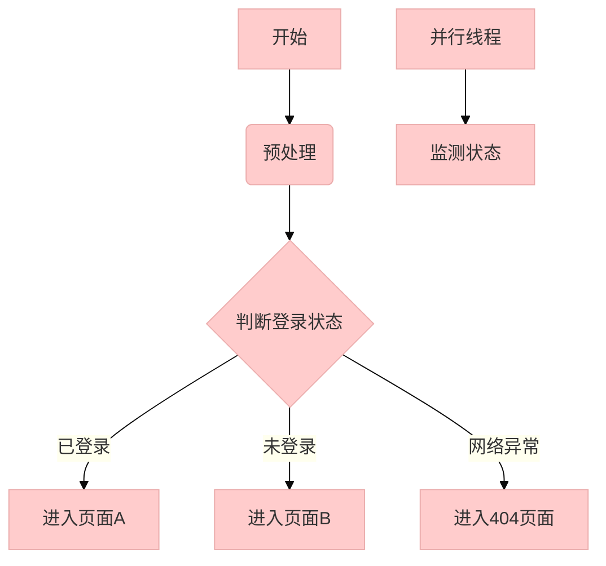


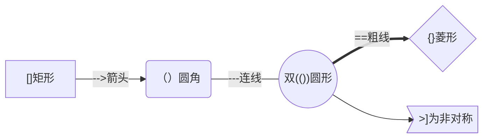

复合语法：

> A --> B --> C
>
> A --> B & C --> D  A到D两条路 (记得要空格)
>
> A & B --> C & D  两两组合


可以使用特殊符号，如：

> A["A double quote:#quot;"] -->B["A dec char:#9829;"]
>
> 换行用`<br>`


子图：

```
subgraph title
    graph definition
end
```

如：

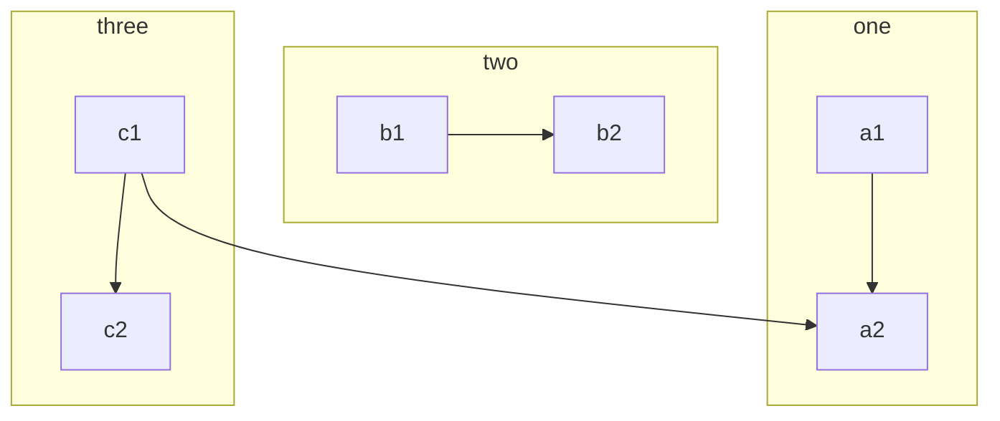


#### 时序图

sequenceDiagram，`->>`实现箭头，`-->>`虚线箭头

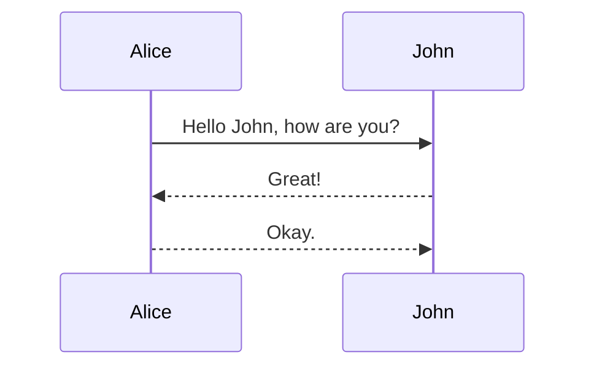

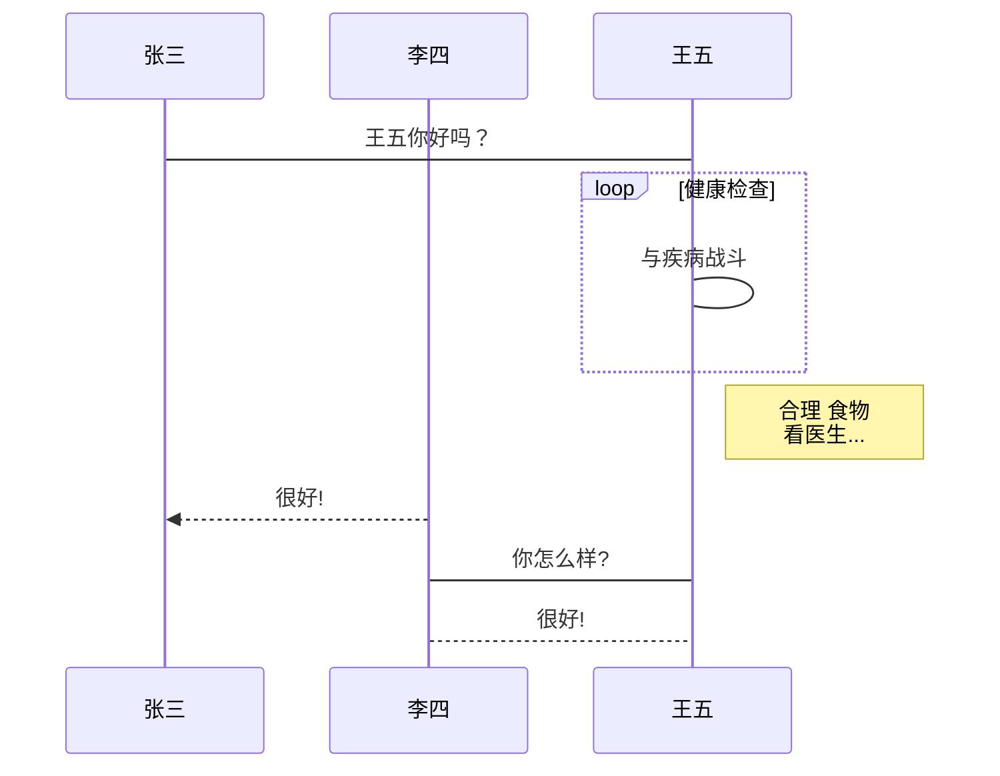


#### 状态图

[参考](https://blog.csdn.net/qq_36749906/article/details/107462149)

stateDiagram，`[*]` 表示开始或者结束，如果在箭头右边则表示结束。

有新版本：首行后缀 `-v2` 。转换条件用 `: 转换名字` 。

有组合状态，用 `state 状态名 {}` 。

有分支和合并，见下面例子。

可以做注释，也可以做并发。


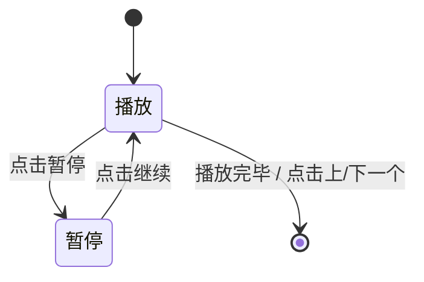

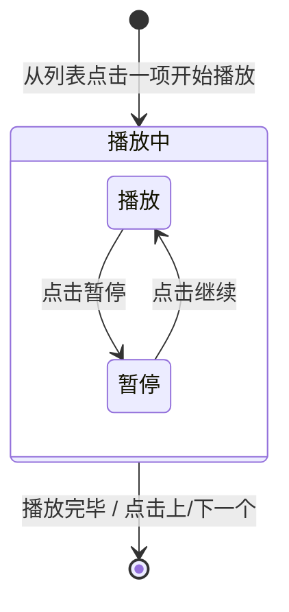

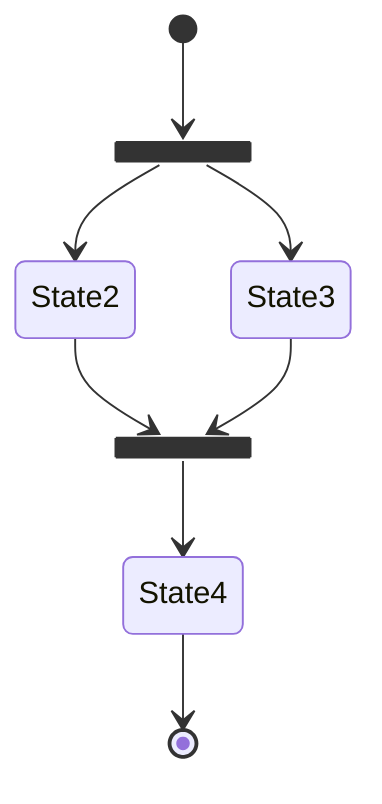

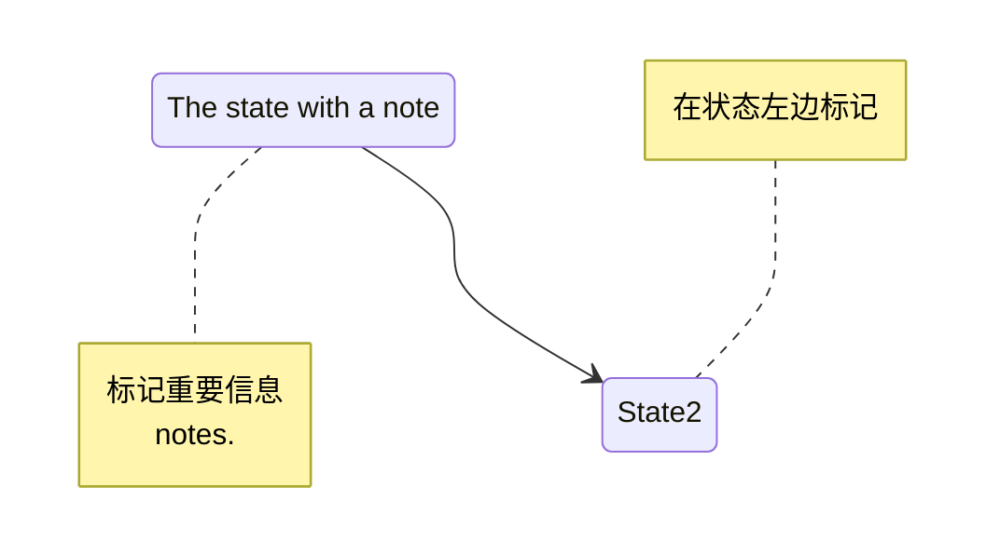


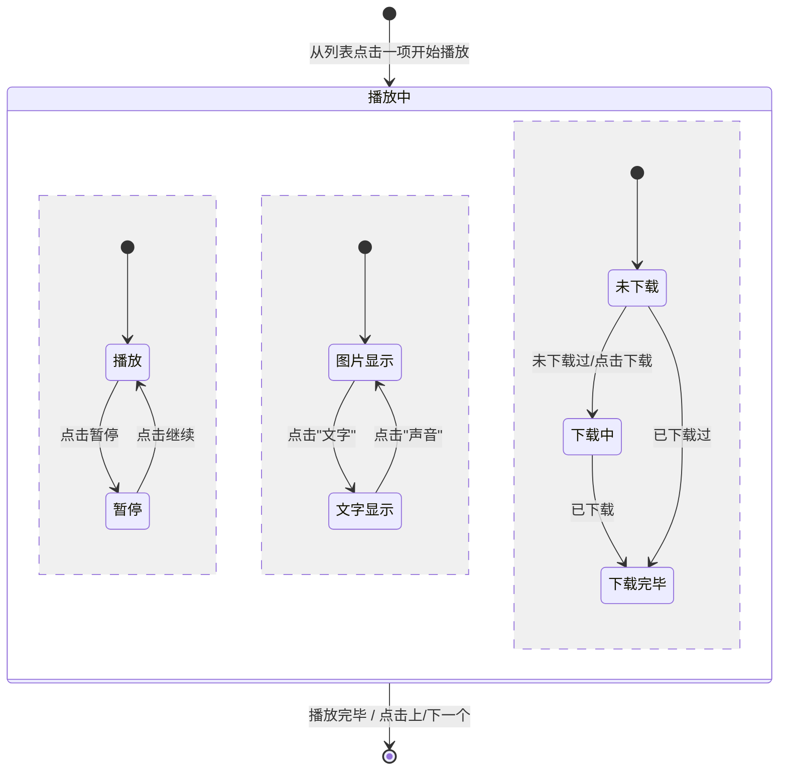


#### 类图

classDiagram，`<|--` 表示继承，`+` 表示 `public`，`-` 表示 `private

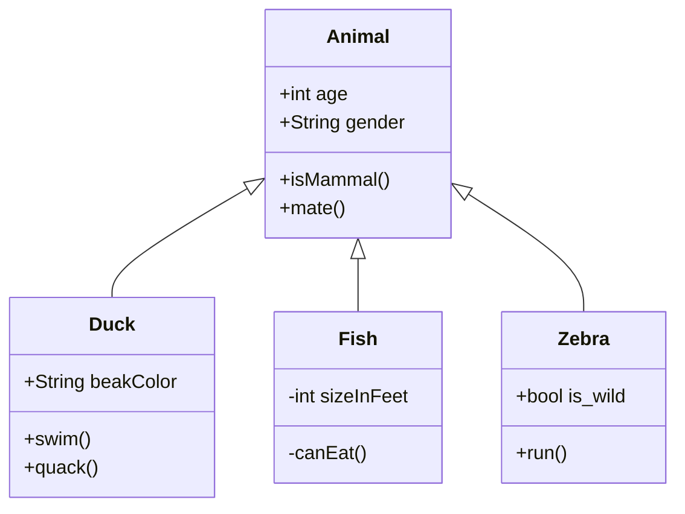

#### 甘特图

gantt 从上到下依次是图片标题、日期格式、项目、项目细分的任务。


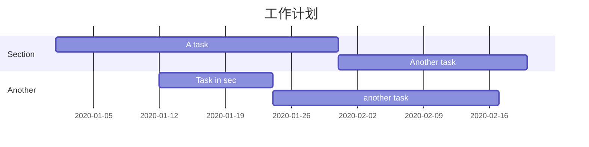

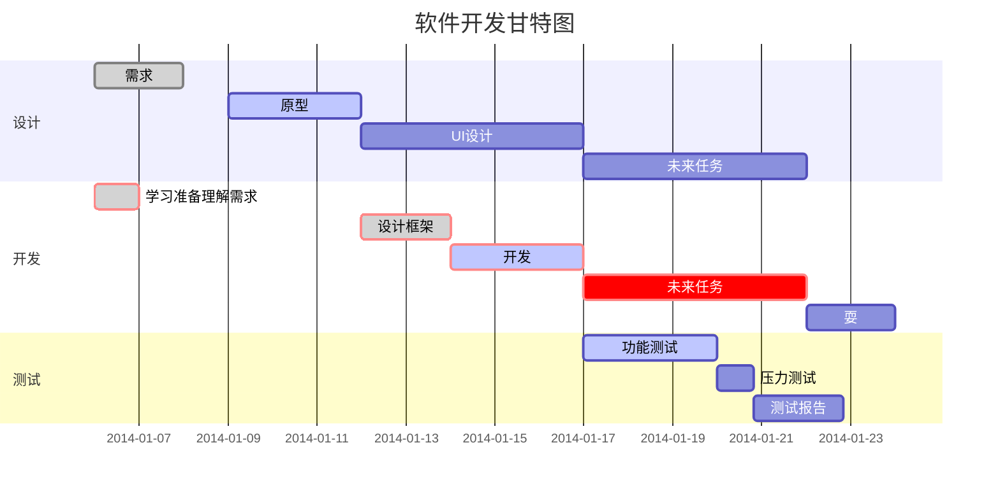


#### 饼图

pie

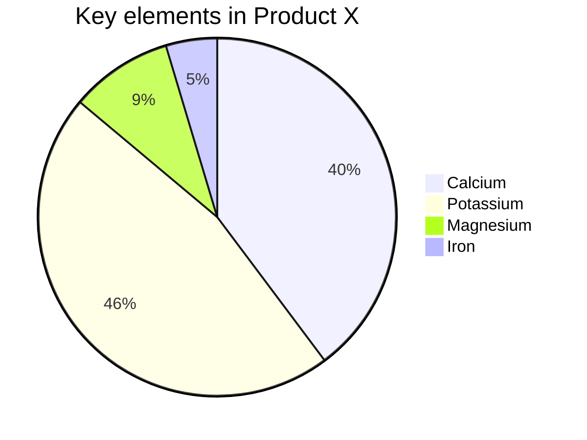

#### 导出

绘制好的图片可以选择菜单/文件/导出，导出为图片或者网页格式。在网页中图片是以 SVG 格式渲染的，可以复制 SVG 内容，导入到 SVG 的图片编辑器中进一步操作。

Mermaid 官方有一个在线的工具，可以导出 SVG 和 PNG。

注意如果 typora 转 docx，那么流程图里不得出现 `<br>`，不然会失败


### 标准图

#### flow

````flow`，标准流程图

```flow
st=>start: 开始框

op=>operation: 处理框

cond=>condition: 判断框(是或否?)

sub1=>subroutine: 子流程

io=>inputoutput: 输入输出框

e=>end: 结束框

st->op->cond

cond(yes)->io->e

cond(no)->sub1(right)->op
```


#### sequence

标准UML时序图

```sequence
对象A->对象B: 对象B你好吗?（请求）

Note right of 对象B: 对象B的描述

Note left of 对象A: 对象A的描述(提示)

对象B-->对象A: 我很好(响应)

对象A->对象B: 你真的好吗？
```


```sequence
Title: 标题：复杂使用

对象A->对象B: 对象B你好吗?（请求）

Note right of 对象B: 对象B的描述

Note left of 对象A: 对象A的描述(提示)

对象B-->对象A: 我很好(响应)

对象B->小三: 你好吗

小三-->>对象A: 对象B找我了

对象A->对象B: 你真的好吗？

Note over 小三,对象B: 我们是朋友

participant C

Note right of C: 没人陪我玩
```


### tikz宏包

等待更新……

```tex
\documentclass{article}
\usepackage{tikz}
\begin{document}
Document itself
\end{document}
```


## PPT

### Marp

参考文献：[markdown](https://sspai.com/post/55718) [http](https://sspai.com/post/40657)

VSCODE + 插件 `Marp for VS Code` , `Markdown All in One`

使用 YAML 语法在最开头输入：


## 后记

### 附录

规范格式书写建议： [OI-WIKI标准](https://oi-wiki.org/intro/format/)

#### LaTeX数学

> ~~不全，[更多参见][https://www.xmind.cn/faq/question/what-command-does-xmind-equation-support/]~~

上面已挂，更详细的，[参见](https://blog.csdn.net/wait_for_eva/article/details/84307306)$\LaTeX$，即：


# LaTeX

主要参考：[这个人的专栏](https://www.zhihu.com/column/c_1198381558397345792)

> LaTeX的好处就是**自动化**，脚注，交叉引用，目录，参考文献等等，每一个词语仿佛都让我们头疼，可是在LaTeX中，我们根本不需要关注这些，只用一行代码就统统搞定，因此，学会了LaTeX，可以让我们真正地专注于论文本身的内容，而不是那些繁琐的排版。

## 安装和使用

之前装过了。暂时略。总之要装 TEXLIVE 。

检验安装成功：

```shell
tex -v
latex -v
```

建议再装一个 texstudio ，或用 vscode 。

### vscode 配置

#### 配置

[参考链接](https://zhuanlan.zhihu.com/p/38178015)

安装插件 latex workshop 。

查看-命令面板 (或 ctrl+shift+f1 或 ctrl+shift+p) 输入 setjson ，进入 `settings.json` ，插入内容：

```json
"latex-workshop.latex.tools": [
    {
        // 编译工具和命令
        "name": "xelatex",
        "command": "xelatex",
        "args": [
            "-synctex=1",
            "-interaction=nonstopmode",
            "-file-line-error",
            "-pdf",
            "%DOCFILE%"
        ]
    },
    {
        "name": "pdflatex",
        "command": "pdflatex",
        "args": [
            "-synctex=1",
            "-interaction=nonstopmode",
            "-file-line-error",
            "%DOCFILE%"
        ]
    },
    {
        "name": "bibtex",
        "command": "bibtex",
        "args": [
            "%DOCFILE%"
        ]
    }
],
```

LaTeX Workshop 默认的编译工具是 latexmk，根据需要修改所需的工具和命令，不需要用到 latexmk的话把其修改为中文环境常用的 xelatex，大家根据需要自行修改

```json
"latex-workshop.latex.recipes": [
    {
        "name": "xelatex",
        "tools": [
            "xelatex"
        ],
    },
    {
        "name": "pdflatex",
        "tools": [
            "pdflatex"
        ]
    },
    {
        "name": "xe->bib->xe->xe",
        "tools": [
            "xelatex",
            "bibtex",
            "xelatex",
            "xelatex"
        ]
    },
    {
        "name": "pdf->bib->pdf->pdf",
        "tools": [
            "pdflatex",
            "bibtex",
            "pdflatex",
            "pdflatex"
        ]
    }
],
```


#### 使用

编译时点击右上角的绿色开始图标按钮(build latex project)，或 ctrl+alt+b 即可，例如下面以一段 tex 代码为例进行编译：

```tex
\documentclass{article}
\usepackage{lipsum}
\begin{document}
\lipsum[1] %乱数假文
\[
    a^2+b^2=c^2
\]
\end{document}
```

会得到 pdf 就是结果。

> 编译时不要打开 pdf，不然会编译失败。

左边栏会有一个 tex 图标的菜单。在那里可以分屏pdf显示等。


## 基本语法

### 基本常识

#### 格式规范

注释行是 `%` ，指令用转义符即 `\` 。代码块用 `\begin{环境名字} \end{环境名字}` 包围。对一条指令，通常可以用中括号写可选参数，大括号写必选参数。如 `\指令名[可选参数]{必选参数}`

行内公式用 \$ 开头和结尾。多行公式可以用 \$\$ ，也可以用 `\[` 和 `\]` ，也可以用代码块。

使用一个空行作为换行符，跟 markdown 一样。使用 `\\` 进行顶格换行。普通输入 `[]` 能显示，普通输入 `{}` 不能显示。

LaTeX 文章分为导言区和正文区。一篇文章中只能有一个正文区，也就只能有一个document环境。导言区用于引入各种宏包。

> 入门教程参考 [这个](https://www.zhihu.com/column/c_1198381558397345792)


#### 文件类型

源文件是 `.tex`

> 文档类是 `.cls`


### 导言区

#### 文档类

[参考](https://blog.csdn.net/qq_37786835/article/details/106602434)

例如：

```tex
\documentclass{article}
```

含义：引用了名为 `article.cls` 的类文件

LaTeX文档类的基础三大件是article，book和report ，都不支持汉字排版。

支持汉字：

```tex
\documentclass{ctexart}
```

PPT排版：

```tex
\documentclass{beamer}
```

可以自定义文档类。后文介绍，这里从略。


#### 宏包

[参考](https://blog.csdn.net/qq_37556330/article/details/106190148)

类似于插件。通过安装不同的宏包可以实现一些复杂排版功能，例如插入复杂的列表表格、插入公式和特殊符号、插入代码、设置文档版式等。

安装新包可以用 使用MiKTeX Console 。后若有需要补充。

\usepackage 可以一次性调用多个宏包，在package-name中用逗号隔开即可。不过还是推荐每个宏包调用使用一行代码。

格式：

```tex
\usepackage[options]{package-name}
```

调用示例：

```tex
\usepackage{ctex}
```


##### 常用宏包

###### 常用


###### 基本

| 宏包名    | 说明                                                     |
| --------- | -------------------------------------------------------- |
| amsmath   | AMS 数学公式扩展                                         |
| mathtools | 数学公式扩展宏包，提供了公式编号定制和更多的符号、矩阵等 |
| amsfonts  | AMS 扩展符号的基础字体支持                               |
| amssymb   | 在 amsfonts 基础上将 AMS 扩展符号定义成命令              |
| bm        | 提供将数学符号加粗的命令 \bm                             |
| siuntix   | 以国际单位规范排版物理量的单位                           |
| mhchem    | 排版化学式和方程式                                       |
| tipa      | 排版国际音标                                             |

###### 字体

| 宏包名              | 说明                                                       |
| ------------------- | ---------------------------------------------------------- |
| lmodern             | Latin Modern 字体，对 Computer Modern 字体的扩展           |
| cmbright            | 仿 Computer Modern 风格的无衬线字体                        |
| euler               | Euler 风格数学字体，也出自于高德纳之手                     |
| ccfonts             | Concrete 风格字体                                          |
| txfonts             | Times 风格的字体宏包                                       |
| pxfonts             | Palatino 风格的字体宏包                                    |
| stix                | Times 风格的字体宏包                                       |
| newtxtext,newtxmath | txfonts 的改进版本，分别设置文本和数学字体                 |
| newpxtext,newpxmath | pxfonts 的改进版本，分别设置文本和数学字体                 |
| mathptmx            | psnfss 字体宏集之一， Times 风格，较为陈旧，不推荐使用     |
| mathpazo            | psnfss 字体宏集之一， Palatino 风格，较为陈旧，不推荐使用  |
| fourier             | fourier 风格数学字体，配合 Utopia 正文字体                 |
| fouriernc           | fourier 风格数学字体，配合 New Century Schoolbook 正文字体 |
| arev                | Arev 无衬线字体宏包， Vera Sans 风格                       |
| mathdesign          | 配合 Charter / Garamond / Utopia 正文字体的数学字体宏包    |
| cm-unicode          | Computer Modern 风格的 Unicode 字体，支持多种西方语言      |
| dejavu              | DejaVu 开源字体                                            |
| droid               | vDroid 开源字体                                            |
| inconsolata         | Inconsolata 开源等宽字体                                   |
| libertine           | Linux Libertine / Linux Biolium 开源字体                   |
| roboto              | Roboto 开源无衬线字体                                      |
| sourcesanspro       | Source Sans Pro 开源无衬线字体                             |
| sourcecodepro       | Source Code Pro 开源等宽字体                               |

###### 数学

| 宏包名   | 说明                                       |
| -------- | ------------------------------------------ |
| mathabx  | 数学符号宏包之一                           |
| MnSymbol | 数学符号宏包之一，配合 Minion Pro 文本字体 |
| fdsymbol | 数学符号宏包之一                           |
| pifont   | Zapf Dingbats 符号宏包                     |

###### 格式

| 宏包名      | 说明                                                 |
| ----------- | ---------------------------------------------------- |
| geometry    | 修改页面尺寸、页边距、页眉页脚等参数                 |
| fancyhdr    | 修改页眉页脚格式，令页眉页脚可以左对齐、居中、右对齐 |
| titlesec    | 修改章节标题 \chapter、 \section 等的格式            |
| titletoc    | 修改目录中各条目的格式                               |
| tocloft     | 类似 titletoc 的修改目录条目格式的宏包               |
| tocbibind   | 支持将目录、参考文献、索引本身写入目录项             |
| footmisc    | 修改脚注 \footnote 的格式                            |
| indentfirst | 令章节标题后的第一段首行缩进                         |

###### 拓展

booktabs	排版三线表
array	对表格列格式的扩展
tabularx	提供 tabularx 环境排版定宽表格，支持自动计算宽度的 X 列格式
arydshln	支持排版虚线表格线
colortbl	支持修改表格的行、列、单元格的颜色
multirow	支持合并多行单元格
makecell	支持在单元格里排版多行内容（嵌套一个单列的小表格）
diagbox	排版斜线表头
longtable	提供排版跨页长表格的 longtable 环境
ltxtable	跨页长表格可使用 tabularx 的 X 列格式
tabu	提供排版复杂格式表格的 tabu 环境,与 longtable 一同调用时，提供排版复杂格式跨页长表格的 longtabu 环境
graphicx	支持插图
bmpsize	latex + dvipdfmx 命令下支持 BMP/JPG/PNG 等格式的位图
epstopdf	pdflatex 命令下支持 EPS 格式的矢量图
wrapfig	支持简单的文字在图片周围的绕排
subfig	提供子图表和子标题的排版。类似宏包有 subfigure 和 subcaption 等
caption	控制浮动体标题的格式
bicaption	生成双语浮动体标题
float	为浮动体提供不浮动的 H 模式；提供自定义浮动体结构的功能

ulem	提供排版可断行下划线的命令 \uline 以及其它装饰文字的命令
endnote	排版尾注
marginnote	改善的边注排版功能
multicol	提供将内容自由分栏的 multicols 环境
multitoc	生成多栏排版的目录
minitoc	为章节生成独立的小目录
glossaries	生成词汇表
verbatim	对原始的 verbatim 环境的改善。提供了命令 \verbatiminput 调用源文件
fancyvrb	提供了代码排版环境 Verbatim 以及对版式的自定义
listings	提供了排版关键字高亮的代码环境 lstlisting 以及对版式的自定义。类似宏包有minted
algorithmic	一个简单的实现算法排版的宏包。如果要生成浮动体的话，需要搭配 algorithm 宏包使用
algorithm2e	较为复杂的、可定制的算法排版宏包。类似宏包有 algorithmicx 等
ntheorem	定制定理环境。类似宏包包括 theorem、 thmtools、 amsthm 等
mdframed	排版可自动断页的带边框文字段落，提供边框样式的定制功能
tcolorbox	以 TikZ 为基础提供排版样式丰富的彩色盒子的功能


### 正文区

主要以 document 为例。

该区的开始结尾 (vscode 可以 tab 来快写)如下：

```tex
\begin{document}
\end{document}
```

之后所有内容都在这个代码块里边。


#### 基本内容

```tex
\begin{document}
	\title{标题，不用引号}
	\author{作者}
	\date{\today}
	\maketitle
\end{document}
```

> 也可以放到导言区，即代码块前，这样这些东西将作为封面。

摘要：

```tex
\begin{abstract}
	文字
\end{abstract}
```

分页符：

```tex
\newpage
```


标题和子标题：(会自动标号)

```tex
\section{标题}
	\subsection{一级子标题}
	\subsetction{一杠一} %显示上同级
```


目录：(完全同步的，根据写的正文的变化而变化，有页码)

```tex
\tableofcontents
```

如果一次编译目录没有出来，那就再编译一次，一般来说，**正确生成目录项需要编译两次源代码**


正文就直接写上去即可。


> 使用示例：
>
> ```tex
> \documentclass{ctexart}
> \usepackage{amsmath}
> \begin{document}
> 
> \title{我的第一篇文章}
> \author{lr580}
> \date{\today}
> \maketitle
> \begin{abstract}
>     本当に全然大丈夫ですか？
>     
>     怎么换行呀[]{}\\还好'"?.,+
> \end{abstract}
> \newpage
> 
> \tableofcontents
> \newpage
> 
> \section{第一章}
> abcDEF
> 
> 一二三
> \subsection{第一节}
> 子曰：换一页
> \newpage
> \subsection{第二节}
> \LaTeX is good
> \section{第二章}
> QwQ
> \subsection{二级标题}
> 再见
> 
> \end{document}
> ```


#### 列表

使用 `itemize` 无序列表代码块；`enumerate` 有序列表，每一列表项使用 `\item`。支持嵌套，最多四层，不然会报错。无序列表各层的头默认依次是 $\bullet$, \-, \*, \.。如：

```tex
\documentclass{ctexart}
\begin{document}
搜索
\begin{itemize}
    \item DFS
    \begin{enumerate}
        \item 折半搜索
        \item IDA*
    \end{enumerate}
    \item BFS
    \item 模拟退火
\end{itemize}
\end{document}
```

> 在vscode写item时，回车会下一次默认补全`\item`，不想补全的话可以 `shift+enter`。

可以用 `item[格式]` 来约束列表项头是什么东西，如：

```tex
\begin{itemize}
    \item[-] STL
    \begin{enumerate}
        \item[3] string
        \item[2] vector
        \item[1] map
    \end{enumerate}
    \item[+] 其他语法
    \item[*] 注意事项 
\end{itemize}
```

可以全局由此往下地修改编号格式，使用下列各式：

```tex
\renewcommand{\labelitemi}{*} % 修改无序列表项目编号
\renewcommand{\theenumi}{\alpha{enumi}} % 有序列表
```

> 有序列表编号有：(大小写首字母控制字母文字的大小写)
>
> - `\arabic{enumi}` 阿拉伯数字
> - `\alph{enumi}` 英文字母(`\Alph` 大写) 
> - `\Roman{enumi}` 罗马数字
> - `\chinese{enumi}` 汉字
>
> 四个层次的枚举 enumi，enumii，enumiii， enumiv  [参考](https://blog.csdn.net/weixin_35468857/article/details/111964370)。暂时查不到希腊字母怎么生成。可以自己加一般符号如 `()[].` 。
>
> 默认是 `\arabic.` `(\alph)` `\roman.` `\Alph.`

如：

```tex
\renewcommand{\labelitemi}{$\circ$}
\renewcommand{\theenumi}{(\chinese{enumi})}
\begin{itemize}
    \item 二分搜索
    \item 二分答案
\end{itemize}
\begin{enumerate} % (序号).
    \item 前言
    \item 正文
    \item 后记
\end{enumerate}
```

可以用 `discription` 包和 `\item{名字}` 做名字加粗列表，如：

```tex
\begin{description}
    \item[DFS] 深度优先搜索
    \item[DP] 动态规划
    \item[DDP] 动态DP
\end{description}
```


#### 表格

使用 `tabular` 代码块接 `{}`，填参数，有多少个 `|` 就有多少条竖线，有多少个，竖线之间可以填 `c,l,r` 之一表示这个列的对齐方式。

表格内用 `\hline` 表示一条横线，用 `&` 表示跳到行内下一列，用 `\\` 表示跳行。如：

```tex
\begin{tabular}{|c|c|c|}
    \hline
    编号&姓名&成绩\\
    \hline
    1&白茶&96\\
    \hline
    2&星月&80\\
    \hline
\end{tabular}
```

使用 array 宏包时，可以进行整列修改，在参数里用前缀 `>{}` 和后缀 `<{}` 表示在头尾进行的修改。如 `\bfseries` 加粗：

```tex
\usepackage{array}
% ...
\begin{tabular}{>{\bfseries}c|>{(}c<{)}|c}
    编号&姓名&成绩\\
    \hline
    1&白茶&96\\
    \hline
    2&星月&80\\
\end{tabular}
```

跨多列使用 `\multicolumn{列数}{表格参数}{内容}`，如：

```tex
\begin{tabular}{|>{\bfseries}c|c|c|c|c|c|c|c|}
    \hline
    \multicolumn{8}{|c|}{课程表}\\
    \hline
    &周一&周二&周三&周四&周五&周六&周日\\
    \hline
    课程&语文&数学&英语&法术&易经&冥想&无
\end{tabular}
```

跨多列要宏包 `multirow`，指令为 `\multirow{}{宽度}{}`，宽度可以用 `*`，或自定义如 `1cm`,`1in`，[参考](http://www.ctex.org/documents/packages/table/multirow.htm)。在多列的最上使用，其他地方留空，如：

```tex
\usepackage{multirow}
% ...
\begin{tabular}{|c|c|c|}
    \multirow{2}{*}{QwQ}&1&2\\
    &3&4\\
\end{tabular}
```


#### 图片

宏包 `graphicx`。与 `.tex` 同级目录放图片。可以规定图片的目录：

```tex
\graphicspath{{pic/}}
```

引用图片(支持 `pdf, png, jpg, jpeg, bmp, eps`等，英文名，可以不加拓展名)，可以用参数 `[scale=倍数]` 放缩，或 `height,width,angle`，单位可以用 cm, pt, `\linewidth` 等。

> jpg 不兼容 `xetex`，疑似 gif 也不行。[单位参考](https://blog.csdn.net/jueshu/article/details/82385575)

如：

```tex
\centering 锦乐的女装照\\(斯巴拉西)\\ %两行居中
\raggedleft ——桑泽友情提供道具\\
\raggedright 果冻拍摄。\\
\includegraphics[scale=0.5]{a1}\\
\begin{center}
    \includegraphics[width=0.5\linewidth]{a3}
\end{center}
```

进行图片编号，使用 figure 环境。用 `\caption` 表示图名。图名对齐指令是代码块 `[htbp]`。默认编号是图 `x`。

若有 `\label{标签名}`，可以用 `\ref{标签名}` 引用图片，显示图片标号。疑似引用需要二次编译才有效。如：

```tex
\newpage
\begin{figure}[htbp]
    \centering %图片居中
    \includegraphics[height=100pt]{a1}\quad
    \includegraphics[height=100pt]{a3}
    \caption{可爱的果冻}\label{kawaiiGuoDong}
\end{figure}
\begin{figure}[htbp]
    \centering
    \includegraphics[scale=0.3]{a2}
    \caption{果冻的头像}
\end{figure}

想要了解果冻的女装照，如图\ref{kawaiiGuoDong}所示。
```


#### 字体

##### 加粗

`\beseries` 或简写 `\bf`，直到文末结束强制加粗。或者用代码块包起来实现部分加粗。[参考](https://wenku.baidu.com/view/2a6397dea4c30c22590102020740be1e640ecc0c.html)

```tex
\begin{bfseries}
    哈哈哈
\end{bfseries}
嘻嘻嘻
```


  

#### 参考文献

##### 直接引用

使用thebibliography环境即可编写，利用知网等论文网站导出文献，复制粘贴即可。这种写法的特点是**一次编写**，**一次使用**。会自动编号。

```tex
\begin{thebibliography}{99} %表示编号宽度，99是两位数字
	\bibitem{ascii名字}文字
	%...
\end{thebibliography}
```

需要引用文献时，用 `\cite{ascii名字}` 。那么此处会出现 `[编号]`。可以带一个可选参数，表示引用编号。如 `参见\cite[page 13]{article1}的表述` 。


##### 文件调用


#### 页眉页脚


#### 其他内容

##### 乱数假文

可以用宏包 `lipsum`，然后使用 `\lipsum[数目]`，或 `\lipsum`。例子见 `多行对齐`。

##### 多行对齐

`center`, `flushleft`, `flushright` 代码块。如：

```tex
\usepackage{lipsum}
% ...
\newpage
\begin{center}
    \lipsum[2]\\Hi and goodbye.
\end{center}
\newpage
\begin{flushleft}
    \lipsum[2]\\Hi and goodbye.
\end{flushleft}
\newpage
\begin{flushright}
    \lipsum[2]\\Hi and goodbye.
\end{flushright}
```

也可以使用`\centering`,`\raggedleft`,`\raggedright`，分别表示中**右左**。如：

```tex
\centering 锦乐的女装照\\(斯巴拉西)\\ %两行居中
\raggedleft ——桑泽友情提供道具\\
\raggedright 果冻拍摄。
```

