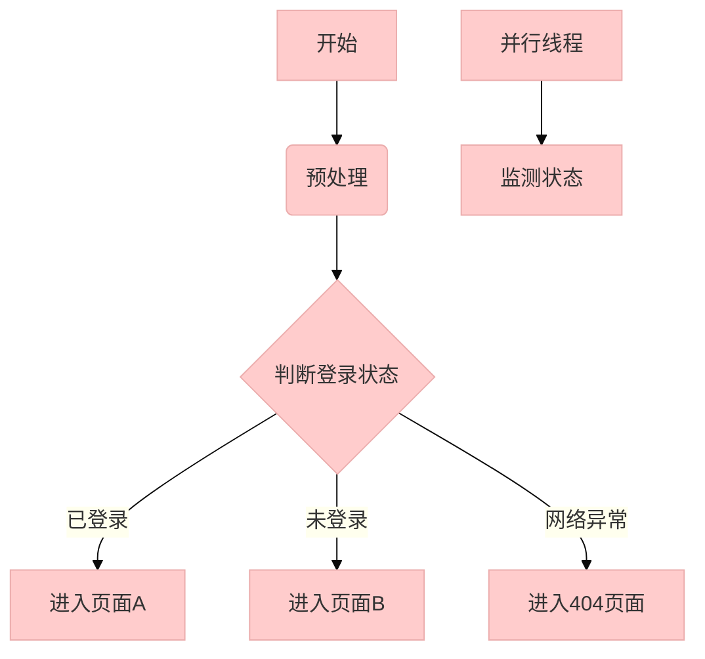
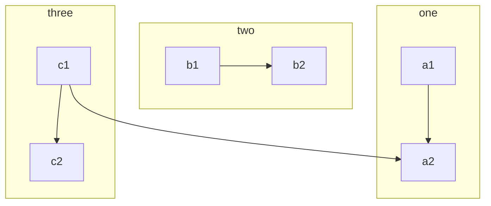
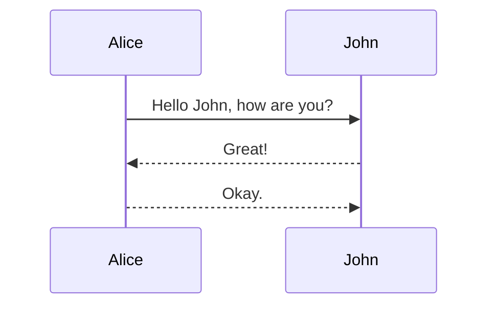
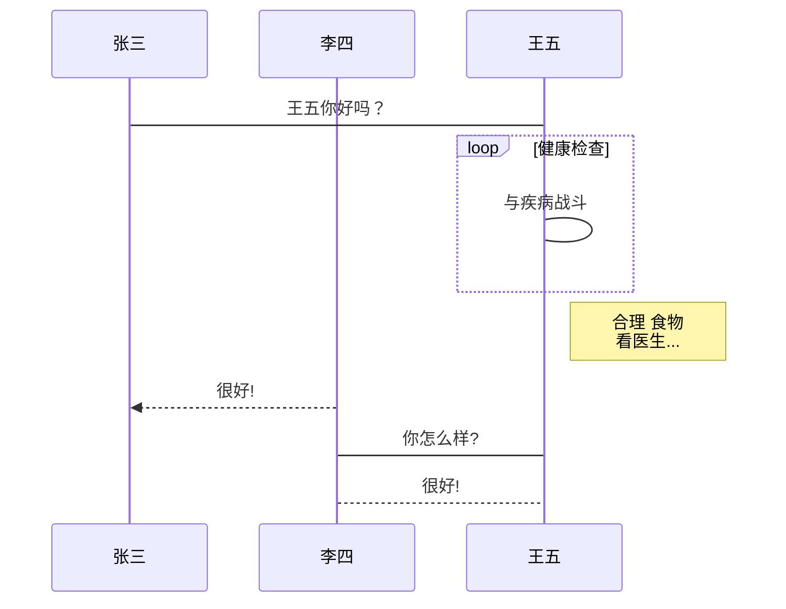
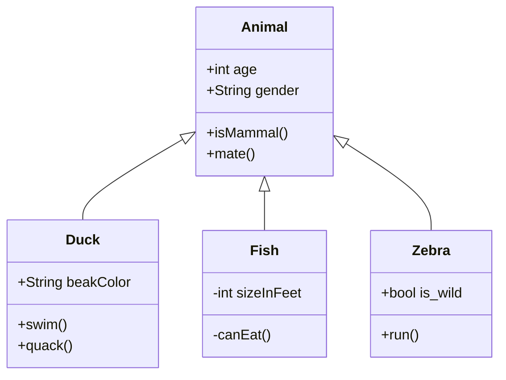
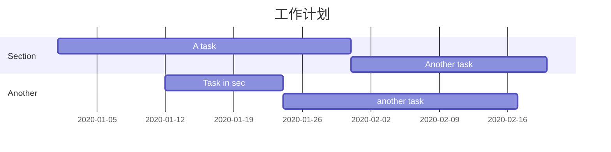
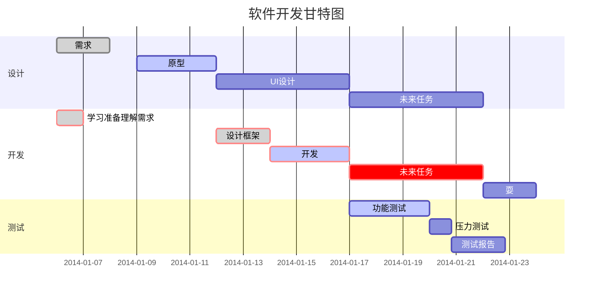
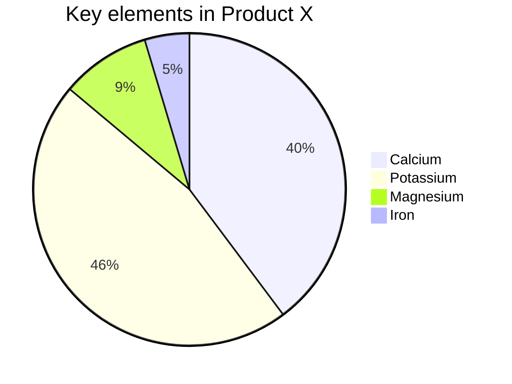

> <p align="right" style="font-weight:900;color:wheat">by 蒟蒻lr580</p>
>
> 如果公式一直渲染有错，重启typora
>
> 本文档公式代码查看在typora直接看即可，所以打印成pdf会看不了部分源码qwq

# 排版

> 其实右击和上面的格式栏可以解决大部分问题

## 分级标题

ctrl+x是几号标题

视图 - 大纲 打开目录

偏好设置 - 外观 -侧边栏允许折叠和展开 控制目录开合

在光标在侧边栏时，上滚轮可以展开对目录的搜索(鉴于typora的搜索速度，比全文搜索明显快很多)

## 主要功能

### 引用

> 右尖括号(>)+空格自动生成
>
> 回车+shift+tab退出引用

### 无序列表

- ctrl+shift+] 生成

  - 按一次tab进入子列表
    - 子列表可以嵌套
- shift+tab退出子列表或退出父列表(空行delete也行)

1. ctrl+shift+[ 有序列表
2. 子列表同理
   1. 它的快捷键同上

### 链接

中括号里写链接名，中括号后小括号写链接地址，这样ctrl单击后直接跳转

[示范](https://search.bilibili.com/all?keyword=typora&from_source=nav_suggest_new)

### 图片

偏好设置 - 图像 - 插入图片时 复制到指定路径 前三个打钩

文件名示范（相对路径） ./img

添加图片直接拖拽

### 高亮

偏好设置 - markdown - 高亮 打开

==高亮文字==

### 加粗

**ctrl+b**

取消也是这个键

### 划重点

即(格式-代码)

两个飘号起始就是~这个的同位键`（半角）

`比如这样`

~~不是这样，这个用到的是~不叫做飘号，也就是这个同位~~

同理，格式里有很多别的

### 表格

ctrl+t

| 横着是行，有四行       | 竖着是列，有两列 |
| ---------------------- | ---------------- |
| 会根据输入自动调整列宽 | 标题默认加粗     |
| 第一个按钮调整行列数   | 后三个略         |
|                        |                  |

### 代码块

三个飘号(建议直接打六个，可以选择语言)

``````C
int a=1;
``````

### 居中/右

居右：

<p align="right">——蒟蒻lr580</p>

居中：

<center>标题</center>


### 分页

实用 HTML 语法可以实现分页(导出 pdf 时生效)

```html
<div STYLE="page-break-after: always;"></div>
```


## 其他设置

偏好设置

打开自动保存和调试模式，重启

自动保存看偏好

调试模式就是可以检察元素

在那个状态下可以调更多东西，前提是看得懂=w=

## 自己的主题

偏好设置 - 外观 - 打开主题文件夹 

记事本打开css文件，拷贝替换获取自己的主题

调试用检察元素

## 导出为pdf

文件 - 导出


> 拓展：使用pandoc
>
> 安装：[参考](https://zhuanlan.zhihu.com/p/258912543)
>
> ```shell
> pip install pandoc
> pip install pandoc-xnos
> ```


### 目录

输入 `[toc]` ，可以自动生成链接式的目录

toc 即 tableofcontents

暂时无法实现页码


### 页眉页脚

偏好设置-Export

可以输入诸如： `${today}`  作为页眉，

输入 `${pageNo} / ${totalPages}` 作为页脚

其他支持的变量([官方信息](https://support.typora.io/Export/#header--footer))：

- `${title}`
- `${author}`
- `${pageCount}`


# 公式

## 行

### 单行公式

> 第一次要在typora打开markdown拓展语法内联公式，重启typora

```markdown
$公式$ //插入内联公式
```

在行内插入一条公式$2x+3y=34$如左。


如下操作：

```markdown
$$多行公式$$ //插入公式
```

~~但是其实$$x+y=5$$还是单行的。~~这是因为打开方式不对，正确的多行公式不是这样的，具体见下。

> 外层渲染，如下划线、斜体，对数学公式内部内容不起作用。如上。

### 多行公式

使用菜单那里拉出来，行外式
$$
x+y=z
$$
或者在空行输入两个$然后按下回车

单行v.s.多行

- 多行对于复杂表达式的显示会大一些，单行可能会太小很难辨认
- 多行是默认居中的
- 多行有类似于代码块的标识符颜色提示
- 多行的输入式：输入两次$然后回车，类似于代码块。单行就两个美元符号输入之后移鼠标到中间即可。

### 分行

使用两个反斜杠

$a\\ b \\ c$


#### 多行公式

$\begin{align} a &= b+c\\ &=d+e  \end{align}$
$$
\begin{align}

a &=1 & b &=2 && c &=3 \\

d &=-1 & e &=-2 & f &&=-5

\end{align}
$$

$$
\begin{matrix}

x & y \\

z & v

\end{matrix}
$$

## 一般格式

### 上下标

单个就直接拉^符号 $x^2$甚至不用拉公式也可以上标  

一般情况下^这个是可以拉上标的，但是数学公式里要加大括号喔^

像这样：$x^{12345}$

~~一般情况下也是可以_拉下划线作下标_了个鬼，这是斜体。~~

不过数学公式里就可以啦：$x_3$，$x_{54321}$

${}_{1}^{2}x_3^4$

### 上下头

$\overline{abc}\quad\underline{abc}\quad\widehat{abc}\quad\widetilde{abc}\quad\overrightarrow{abc}\quad\overleftarrow{abc}\quad\overbrace{abc}\quad\underbrace{abc} $   $\bar{12}$(定长线)

$\overset{abc}{def}$ $\underset{abc}{def}$

### 字号大小

$\tiny1\scriptsize2\small4\normalsize5\large6\Large7\LARGE8\huge9\Huge0$

> footersize在typora不可用

### 字体

以下仅对大写有效
$$
\mathcal{ABCDEFGHIJKLMNOPQRSTUVWXYZ}
$$

$$
\mathbb{ABCDEFGHIJKLMNOPQRSTUVWXYZ}
$$

以下不只是大写都可以
$$
\mathfrak{ABCDEFGHIJKLMNOPQRSTUVWXYZ}\\
\mathfrak{abcdefghijklmnopqrstuvwxyz}\\
\mathfrak{0123456789}
$$

$$
\mathsf{ABCDEFGHIJKLMNOPQRSTUVWXYZ}\\
\mathsf{abcdefghijklmnopqrstuvwxyz}\\
\mathsf{0123456789}
$$

$$
\mathbf{ABCDEFGHIJKLMNOPQRSTUVWXYZ}\\
\mathbf{abcdefghijklmnopqrstuvwxyz}\\
\mathbf{0123456789}
$$

斜体 textit
$$
\textit{1234567890 ABC abc}
$$


## 字符

### 一般字符

$在内联里是可以随便输入中文，English,123的啦$
$$
在多行里其实也是可以的啦
$$

> 打印状态下中文格式可能会有排版不好看问题


### 标点符号

点 $\cdots \vdots \ddots  \ldots \quad\dots$

\surd 大钩$\surd$

斜杠 $\not$

反斜杠 $\verb|\|  \backslash \setminus$

撇号 $x' y'''''$

上点号 $\dot{x} \ddddot{x}$  可以一到四个

否定：not $\not3\quad\not a\ \not$

$|\quad \| \quad \vert \quad \Vert$

$\%$ 需要转义，否则代表单行注释，如 $1+2%难道不等于%3吗$ ；千分号可以用 html 特殊字符打， 通常时`Katex`不支持(需要加载宏包)

#### 空格

\quad 空格 $a\quad b$

\\qquad 大空格 $a\qquad b$

小空格反义即可，或\;\,(间距更小)  $a\ b\;c\,d$

紧凑用反义!，如$a\!b \quad cd$ 

更紧凑用多个 $a\!\!b \ c\!\!\!e \; f\!\!\!\!g$

#### 箭头

四方向\left/right/up/downarrow $\uparrow$

左右\to \gets $\to \gets$

- 大左右 $\xleftarrow[下]{1+2+3}\xrightarrow{x}$
- 双线 $\Leftarrow$ $\Leftrightarrow$
- 否定+n $\nRightarrow$
- 双向 $\leftrightarrow$ $\longleftrightarrow$

> []控制下文字，{}控制上文字，注意先写下再写上

使用化学方程式\ce来模拟上下箭头+文字：$\ce{A->[上文字][下文字]}B$

使用\mbox获得大文字$\ce{->[\mbox{大文字}][文字]}$

长等号\xlongequal $\ce{\xlongequal[下]{上}}$，这个在\ce之外都能使用

基本箭头为->,<=>,<=>>,<<=> $\ce{-><=><=>><<=>}$

> 当然了化学表达式本身的内容还是支持的
>
> $\ce{CaCO3 v + H2O \Delta CH3-CHO CH2=CH2 CH#CH A\bond{-}B\bond{#}C}$
>
> 详见[这里的附件](https://www.latexstudio.net/archives/9998.html)

> 暂未解决给一般字符加上下文字的方法，如$\sim$。

#### 括号

$\{x\}(y)[z]$

花括号 $\begin{cases} x+1 \\ x+2 \end{cases}$

$\overbrace{3}\underbrace5\langle3,4\rangle$

$\bigl( \Bigl( \biggl( \Biggl( \quad\bigr) \Bigr) \biggr) \Biggr) $

$\langle \rangle$

#### 修饰

上划线$\overline a$ 下划线$\underline{abc}$

上下标显然是$a^{bv} c_{bd}$


### 转义

下列需要转义：
$$
\$ \# \%\& \~ \_ \^  \{ \}
$$

> 注意上面的~ 和 ^ 其实没有就是这样显示的；如果把那个反斜杠删了的话根本显示不出 ~ ^
>
> 要显示的话，$\sim \wedge$

原意：

- & 对齐
- _ 下标
- ^ 上标
- {} 填参数用的

### 希腊字母

常规(大写+小写)
$$
\Alpha \alpha
\Beta\beta
\Gamma\gamma
\Delta\delta
\Epsilon\epsilon
\Zeta\zeta
\Theta\theta
\Eta\eta
$$

$$
\Iota\iota
\Kappa\kappa
\Lambda\lambda
\Mu\mu
\Nu\nu
\Xi\xi
\Omicron\omicron
\Pi\pi
$$

$$
\Rho\rho
\Sigma\sigma
\Tau\tau
\Upsilon\upsilon
\Phi\phi
\Chi\chi
\Psi\psi
\Omega\omega
$$

异体：(var+小写)
$$
\Epsilon\epsilon\varepsilon
$$

$$
\Theta\theta\vartheta\varTheta
$$

$$
\Pi\pi\varpi\varPi
$$

$$
\Sigma\sigma\varsigma\varSigma
$$

$$
\Phi\phi\varphi\varPhi
$$

可能已停用：
$$
\digamma
$$


### 特殊符号

$\circledast\circledcirc\circleddash\divideontimes\odot\ominus\oplus\oslash\otimes\boxplus\boxdot\boxtimes\Box\square$

$\nabla \triangle \triangledown \vartriangle \square \blacksquare \blacktriangle \blacktriangledown $ $\bigstar \diamond$

$\llcorner\lrcorner\ulcorner\urcorner$

$\frown$

$\LaTeX$   $\TeX$ $\S1$

## 数学格式

### 初等数学

#### 关系符号

##### 算术

正负号 $\pm$  $\mp$

乘 $\times$   $. \cdot$

除 $\div$

取模$\%$ 或$y\mod x$ ，紧凑的$y\bmod x$

向下取整$\lfloor x\rfloor$

向上取整$\lceil x\rceil$

##### 逻辑

$\ne \quad \approx \quad =$

$\neg$  $\&$  $\|$  

$\equiv  \leq \le  \geq \ge > <$ 

$\leqslant \geqslant$

$\forall  \exists \nabla \because   \_ \therefore$ 注：不建议打 `exist` ，建议打 `exists` ，前者对 tex 不兼容

$\sim \thicksim \backsim$

否定型加n

$\ncong\ \nmid\ \nparallel\ \nshortmid\ \nsim\ \nleqslant\ \nleq\ \nleqq\ \nless\ \ngtr\ \gneq\ \gnsim$


#### 集合

$\emptyset\empty\O$  $\in$  $\ni$  $\notin$   $\complement$

$\bigcap_1^{n}P$  $\bigcup P$

$\wedge\vee\cap\cup$

$\supseteq\ \supset\ \nsupseteq\ \subseteq\ \subset\ \nsubseteq$

例如：
$$
|\bigcup_{i=1}^nS_i|=\sum_{m=1}^n(-1)^{m-1}\sum_{a_i<a_{i+1}}|\bigcap_{i=1}^mS_{a_i}|
$$


#### 代数

##### 分式

$1/2$  $123/456$除法式子是直接的

$\frac{23}{457}$分式就不是了，记得\frac和两个大括号

$\frac{\frac{1}{2}}{\frac{3}{4}}$繁分式帅，其他同理啦

连续分式帅
$$
\begin{equation}  x = a_0 + \cfrac{1}{a_1           + \cfrac{1}{a_2           + \cfrac{1}{a_3 + \cfrac{1}{a_4} } } }\end{equation}
$$
> 那一对\end{equation}好像没啥用

还有另一种占位大小，稍微窄一点：
$$
x=a_0+\dfrac1{a_1+\dfrac12}
$$
当然这三两种是可以混用的，代表三种不同的占位大小(根据表达式实际情况动态调整的)


##### 根式

\sqrt大括号啦 $2\sqrt{2}$    $\sqrt{\sqrt{3}}$

> 不正确的写法：$^3\sqrt{5}$

正确的写法：$\sqrt[3]{2}$

##### 累加累乘

\sum，下上标很简单的啦

$\sum$   $\sum{a}$  $\sum_{i=1}^{+\infty}{x^2}$


\prod,同理  $\prod_{n=1}^{99}{x_n}$

##### 函数

基本函数都有正体写法：

$\sin \arctan \cosh \exp \log \ln \min \max \gcd$

> lcm没有正体写法

#### 几何

度：$^\circ$ 

$\angle \measuredangle \sphericalangle$

$\cong$

$\overset{\LARGE{\frown}}{OA}$

##### 证明

$相似\thicksim\\垂直\bot$

$任意\forall\\存在\exist$

$\exist a\\\exists a$两种写法均可，基本无区别

##### 矢量

\vec大括号 {}   $\vec{vector}+\vec{x}$  

$\vec{\vec{虽然可以这样但是很无聊啊}}$

$\overleftarrow{sh}$

夹角：$\hat{(\vec{a},\vec{b})}$ $\cos<\widehat{\vec a,\vec b}>$

#### 初等函数

##### 三角函数

$\sin{x^2}$  $\cos{-x}=cos{x}$   $\tan{x}\cot{x}=1$

$sin^{2}{x}+cos^{2}{x}=1$

$\sec{x}  \csc{x}  \arctan{x}$

##### 对数函数

$\ln{\ln{3}}$    打法是小写L

$log_28$   $\lg^210$

### 高等数学

##### 求导

$f',f'',f^{(20)}$

$\frac{\partial f(x)}{\partial x}$

##### 积分

\int{x}dx $\int{x}dx$

\int_{x}^{x}{x}dx  _

$\int_{-3}^{3}{x^{100}}dx$

$\iint$ $\iiint$ $\iiiint$ 最多四重，

五重可以试一下2+3然后加紧凑？ $\iint\!\!\!\,\iiint$

闭合曲线的积分：$\oint \oiint \oiiint$，最多三重。

##### 极限

\lim{}   $\lim{x}$

\lim_{}   

$\lim_{x\rightarrow-\infty}{x^2}$

$\lim_{x\rightarrow+\infty}{\frac{x}{0}}$

\rightarrow \infty

> 如果用多行公式而不是单行公式，可以让条件对正lim下方：
> $$
> \lim_{x\to\infty}\biggl(\frac{n}{n^2+1}+\frac{n}{n^2+2^2}+\dots+\frac{n}{n^2+n^2}\biggr)
> $$

##### 矩阵

$a = \left[\matrix{\alpha_1 & test1\\ \alpha_2 & test2\\ \alpha_3 & test3}\right]$
$$
A_{m,n} = \begin{pmatrix} a_{1,1} & a_{1,2} & \cdots & a_{1,n} \\ a_{2,1} & a_{2,2} & \cdots & a_{2,n} \\ \vdots & \vdots & \ddots & \vdots \\ a_{m,1} & a_{m,2} & \cdots & a_{m,n} \end{pmatrix}
$$
各种定界符的矩阵 pmatrix（(）、bmatrix（[）、Bmatrix（{）

$\large{\overset{c_1+c_2\\c1+2c_3\\}{—}}$


##### 数论

暂无

### 离散数学

偏序关系 $\prec \succ \preceq \succeq$ $\nprec \npreceq \nsucc\nsucceq$ 

逻辑符号 $\lnot \vee \wedge$ 

$\vdash \models$

集合论符号 $\upharpoonright$

图论符号 $\kappa$


# 绘图

## mermaid

[官方文档](https://mermaid-js.github.io/mermaid/#/)

输入````mermaid`回车，新建图：

```mermaid
```

### 流程图

graph关键字声明流程图，之后声明**方向**，如TD(top down)：

> - TB - top to bottom
> - TD - top-down/ same as top to bottom
> - BT - bottom to top
> - RL - right to left
> - LR - left to right

然后用`-->`代表链接**箭头**，左右分别是节点编号。

> 箭头形状：
>
> --> 实单向
>
> ​		--|text|--> 线段+文字(text)，等效于-->|text|
>
> ​		----> 加长
>
> --- 实线段
>
> ​		-- text --- 实线段+文字(text) ，等效于---|text|
>
> -.-> 虚单向
>
> ​		-. text .->
>
> ==> 厚单向
>
> ​		== text ==>
>
> --o 实心圆
>
> --x 实心叉
>
> o--o 双向圆
>
> <--> 双向箭头
>
> x--x 双向叉


```mermaid
graph LR;
	A-->B;
	A-->C;
	B-->D;
```

节点编号后面可以用方括号、圆括号或大括号分别表示方形、圆角和条件判断框、双括号原型、> ]括号非对称；箭头后可以紧跟绝对值是纯文本，如：

> 节点形状：
>
> [] 方框
>
> () 圆角
>
> ([]) 两边圆形
>
> [[]] 方形+竖线
>
> [()] 圆柱
>
> (()) 圆
>
> `>]` 非对称条
>
> {} 菱形
>
> {{}} 两边尖角
>
> [//] 平行四边形
>
> [\\\\] 反平行四边形
>
> [/\\] 梯形
>
> [\\/] 上高梯形





复合语法：

> A --> B --> C
>
> A --> B & C --> D  A到D两条路 (记得要空格)
>
> A & B --> C & D  两两组合


可以使用特殊符号，如：

> A["A double quote:#quot;"] -->B["A dec char:#9829;"]
>
> 换行用`<br>`


子图：

```
subgraph title
    graph definition
end
```

如：




### 时序图

sequenceDiagram，`->>`实现箭头，`-->>`虚线箭头






### 状态图

stateDiagram，`[*]` 表示开始或者结束，如果在箭头右边则表示结束。


### 类图

classDiagram，`<|--` 表示继承，`+` 表示 `public`，`-` 表示 `private



### 甘特图

gantt 从上到下依次是图片标题、日期格式、项目、项目细分的任务。







### 饼图

pie



### 导出

绘制好的图片可以选择菜单/文件/导出，导出为图片或者网页格式。在网页中图片是以 SVG 格式渲染的，可以复制 SVG 内容，导入到 SVG 的图片编辑器中进一步操作。

Mermaid 官方有一个在线的工具，可以导出 SVG 和 PNG。


## 标准图

### flow

````flow`，标准流程图

```flow
st=>start: 开始框

op=>operation: 处理框

cond=>condition: 判断框(是或否?)

sub1=>subroutine: 子流程

io=>inputoutput: 输入输出框

e=>end: 结束框

st->op->cond

cond(yes)->io->e

cond(no)->sub1(right)->op
```


### sequence

标准UML时序图

```sequence
对象A->对象B: 对象B你好吗?（请求）

Note right of 对象B: 对象B的描述

Note left of 对象A: 对象A的描述(提示)

对象B-->对象A: 我很好(响应)

对象A->对象B: 你真的好吗？
```


```sequence
Title: 标题：复杂使用

对象A->对象B: 对象B你好吗?（请求）

Note right of 对象B: 对象B的描述

Note left of 对象A: 对象A的描述(提示)

对象B-->对象A: 我很好(响应)

对象B->小三: 你好吗

小三-->>对象A: 对象B找我了

对象A->对象B: 你真的好吗？

Note over 小三,对象B: 我们是朋友

participant C

Note right of C: 没人陪我玩
```


## tikz宏包

等待更新……

```tex
\documentclass{article}
\usepackage{tikz}
\begin{document}
Document itself
\end{document}
```


# PPT

## Marp

参考文献：[markdown](https://sspai.com/post/55718) [http](https://sspai.com/post/40657)

VSCODE + 插件 `Marp for VS Code` , `Markdown All in One`

使用 YAML 语法在最开头输入：


# 后记

## 附录

### LaTeX数学

> ~~不全，[更多参见][https://www.xmind.cn/faq/question/what-command-does-xmind-equation-support/]~~

上面已挂，更详细的，[参见](https://blog.csdn.net/wait_for_eva/article/details/84307306)$\LaTeX$，即：


