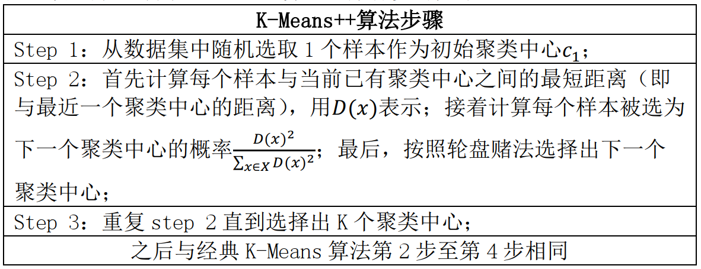

> 此为第二版python3学习笔记，在第一版的基础上删减了大部分过于基础的内容，删除了大量图片实例，取之以代码。
>
> <p align="right">——蒟蒻lr580</p>
>
> 2021/2/27 开始编写第二版python笔记

# 语法

## 安装使用

### 介绍

> Python 是强类型动态语言
>
> - 动态：运行时类型可变；强：倾向于不允许隐式类型转换，例如：`1+'1'`

`.pyc` 文件可以删除。

### 安装/使用

python3.4是最后支持window XP的版本。不要安装最新的版本，往往会出现bugs，安装一个小版本号，如3.9是最新，安装3.8的稳定版。

必须勾选add python.exe to Path，使用略。

#### 测试

查看版本：

```sh
python --version
```

代码查看：

```python
import platform
print(platform.python_version()) #'3.10.6'
```

查看安装路径

```shell
py -0p
```

```python
import sys
sys.executable # '...\\Python310\\pythonw.exe' 绝对路径
```

执行短代码：

```python
python -c "import tensorflow as tf; print(tf.__version__)"
```


### 第三方库

#### 常规

> linux 无 pip：(gpt)
>
> ```sh
> yum update
> yum install epel-release
> yum install python-pip
> pip --version
> ```

打开cmd，输入如下指令：

```bash
pip install 第三方库名
```

如：

```bash
pip install requests-html
pip install plotly pandas # 一次装两个
```

> 注意到 debian 如果报错 `error: externally-managed-environment`，考虑 apt 装包，如装 `pymysql`：
>
> ```sh
> apt-get install python3-pymysql
> ```

> ```sh
> pip install qrcode[pil]
> ```
>
> [pil] 是一个可选依赖项的标记，表示安装 qrcode 库时同时安装 Pillow 库（PIL 的一个分支）

#### 镜像

可以加上调用国内镜像的选项，加快下载速度：

```bash
pip install -i https://pypi.tuna.tsinghua.edu.cn/simple pyspider
pip install onnx -i https://pypi.tuna.tsinghua.edu.cn/simple
```

其他镜像：

> 清华：https://pypi.tuna.tsinghua.edu.cn/simple
>
> 阿里云：http://mirrors.aliyun.com/pypi/simple/
>
> 中国科技大学 https://pypi.mirrors.ustc.edu.cn/simple/
>
> 华中理工大学：http://pypi.hustunique.com/
>
> 山东理工大学：http://pypi.sdutlinux.org/ 
>
> 豆瓣：http://pypi.douban.com/simple/
>
> 如果http不行换https

可以在用户目录下创建pip目录，创新文件pip.ini，输入如下内容：

```ini
[global]
index-url = https://pypi.tuna.tsinghua.edu.cn/simple
[install]
trusted-host=mirrors.aliyun.com
```

> 或者可以：
>
> ```bash
> pip config set global.index-url https://pypi.tuna.tsinghua.edu.cn/simple
> ```
>
> 需要取消时，可以：
>
> ```bash
> pip config unset global.index-url
> ```

#### 管理

查看装了什么包：`pip list`


将 python 安装的包移出 C盘：

输入 `python -m site` 查看当前安装目录

输入 `python -m site -help` 查看当前该程序目录，点进去，修改两个变量 `USER_SITE, USER_BASE` 为所想要的路径，如：

```python
USER_SITE = 'D:\\Program Files\\Python37\\lib\\site-packages'
USER_BASE = 'D:\\Program Files\\Python37\\Scripts'
```

> 已有的包直接强行剪切出去貌似不是一个好主意


卸载库指令：

```bash
pip uninstall 库名
```

更新指令：

```bash
pip install 库名 --upgrade
```

> 注意，安装失败的原因非常多，根据库的不同详情百度

可以安装下载好的库文件而不是在线下载，文件后缀名是whl，命令同上

#### 列举

- `conda` 包的格式通常是 `包名=版本=构建字符串`，例如 `numpy=1.26.4`。
- `pip` 包的格式通常是 `包名==版本`，例如 `numpy==1.26.4`。

##### freeze

可以使用下面指令获取当前机子装了的全部包：

```bash
pip freeze > requirements.txt
```

> ```sh
> pip list --format=freeze > pip_packages1.txt
> ```

##### pipreqs

对当前项目，则先用 `pip` 安装 `pipreqs` ，然后使用：(可以直接 `pipreqs ./` 或 `pipreqs .`)

```bash
pipreqs ./ --encoding utf8
```

那么导出的 `requirements.txt` 可以用下面指令批量安装：

```bash
pip install -r requirements.txt
```

> 如果里面任意一项输入不正确，如版本找不到，全部都不会安装，不会弹 error 直接结束。

- `--force`：覆盖现有的 `requirements.txt`
- `--ignore <dirs>`：忽略某些目录（如 `venv`、`tests`）
- `--encoding <utf-8>`：指定文件编码
- `--mode <gt|compat>`：控制版本号的生成方式

### 编译

python是解释性语言，但是也可以编译成exe

首先使用cmd打开python安装路径，打开scripts文件夹

#### 初始化

输入指令，安装PyInstaller.exe

```cmd
pip.exe install PyInstaller
```

如果要卸载

```cmd
pip.exe remove PyInstaller
```

#### 常规使用

将要编译的文件(单一.py文件)放在上述文件夹(scripts)内，则可以写相对路径，否则要写绝对路径

```cmd
pyinstaller.exe 路径
```

通常加-F，将其编译为单独的exe文件，缺陷是运行速度更慢

```cmd
pyinstaller.exe 路径 -F
```

若要增加一个程序图标，用-i 图标路径

若有额外的引用模块路径，用-p 模块文件夹路径。

> 凡是编译的程序最后都应该添加一行input()，以免运行结束立刻闪退。窗口化程序除外。

如果编译出错，再重复操作一次试试；若依旧出错，百度一下。

1. Pyinstaller对中文目录存在一定的兼容问题。故使用过程中，一般最好不要将exe文件放在带有中文的目录下。
2. 使用python编译程序本身存在着局限。因此运行程序的速度是比较慢的。
3. 要编译的程序尽可能减少应用的模块，否则此程序会过于庞大。

> ### 使用提示

#### PyPy3

PyPy3 是 Python 3 的一个替代实现，由 PyPy 项目开发。PyPy 是一个用 Python 编写的 Python 解释器，它的目标是提供比标准 CPython（Python 的官方实现）更高的性能和更好的灵活性。

- 使用 **Just-In-Time (JIT) 编译器**，可以在运行时动态优化代码，从而显著提高某些场景下（如数值计算、长时间运行的脚本）的性能。
- 兼容 Python 3 的语法和标准库。
- 支持多种底层技术（如 C、RPython 等），使得开发更灵活。

### 规范

#### 标准头

```python
#!/usr/bin/env python3
# -*- coding: utf-8 -*-
'''第一行告诉非windows操作系统，这是python可执行程序
第二行告诉python解释器，本程序使用utf-8编码，防止中文乱码'''
```

第一行可能会导致 windows 编译出错

#### 帮助

##### help

加一个函数/数据类型，输出参数，成员函数(方法)，成员属性

加一个变量，等同于加它的数据类型

```python
help(print)
x=3
help(x) #同help(int)
```

可以查阅特定方法或成员属性：

```python
help(list.extend)
```

#### 其他

##### 缩进

默认缩进代表代码块。

在没有冒号的地方不允许强行缩进创造代码块实现变量生存周期。

可以用分号或逗号强行缩行，但逗号表示的是tuple

```python
print(2);print(3),print(4)
```

冒号后面可以强行不缩进：

```python
if 0:print(2)
elif 1:print(3)
else:print(4)
```

##### dir

dir()内置函数可以查看一个对象/数据类型拥有的所有属性名和方法名。

```python
dir() #未import时只有双下划线的东西，import后有别的东西
```

```python
dir(int) #查看int的所有内置方法和属性
```

查看所有内置函数：

```python
dir(__builtins__)
```


### 编辑器

#### IDLE

交互环境中，`_` 表示上一次运算的结果：

```python
# print(_) 报错，因为还没运算
3+4
print(_) #7
a=1
print(_) #7
```

请不要在中文(全角)下输入单词后回车或使用快捷键，不要在大写状态使用快捷键，否则可能不成功。

#### jupyter

##### ipynb

一种支持python的笔记本格式，可以使用vscode打开，需要安装插件(其中pip的pywin32安装较慢，特别是清华镜像源，建议官网或别的地方找正确的版本自己下载whl安装，看正确的版本只需要在pip install pywin32自动安装失败时看看它用的文件名叫啥就好了)

ipynb使用十分简单，事实上就是一堆代码框，然后可以分块运行(注意没有文本框，只有代码框)，左上角的数字代表是否执行过(是则有数字)，和执行的先后顺序

这个工具的使用本身十分简单……本处不赘述

这个工具跟自带IDLE相比，可以有vscode插件加成，有输入提示，可以用 vscode 整

##### 安装

```shell
pip install jupyter
```

##### 格式转换

[参考](https://blog.csdn.net/u014297502/article/details/125997504)

新版本下，path 有 python 的 scripts 时，直接输入：

```shell
jupyter-nbconvert.exe --to markdown .\homework1.ipynb
```

也可以转其他格式。会将内容及其运行结果导出。

不要输出运行结果：

```shell
jupyter-nbconvert.exe --to markdown --TemplateExporter.exclude_output=True .\homework1.ipynb
```

##### 魔法命令

`%matplotlib inline` 是 Jupyter Notebook 的魔法命令，它可以在 Jupyter Notebook 中直接显示 Matplotlib 绘图，而不需要在代码中使用 `plt.show()` 来显示图像。具体来说，这个命令会启用 Matplotlib 的交互式后端，将图形嵌入到 Notebook 中的输出单元格中

如：

```python
%matplotlib inline
import random
```


##### 运行.py

```python
%run aa/bb/xxx.py
```

注意运行目录是当前 ipynb 的目录，而不是代码文件所在的目录。

注意如果代码有中文(如注释)，GBK，可能会报错。

运行，并导入里边定义的变量/函数，加上 `-i` 参数，如 `%run -i util.py`。或者直接 import 路径即可。如：`src/dataAnalysis.py`

```python
from src.dataAnalysis import getAnnualLineCharts
getAnnualLineCharts()
```

> 注意 `-i` 的覆盖性比 from import 要高，而且会执行 main()；如果做了 `-i`，那么 from import 的无论如何更新都不会在 ipynb 见到。

对 `import` 本地文件，当其更新时，不必重新运行 `ipynb`：

```python
%load_ext autoreload
%autoreload 2
```

> 如果没有这个，因为每次会在 `__pycache__` 里读取第一次编译好的字节码，所以不会实时更新。
>
> - 加载 IPython 的 `autoreload` 扩展（一个内置工具），激活模块自动重载功能
> - 2 是全自动；0 是关闭，1 是半自动 (%aimport 控制哪些生效)

在这之后，只要保存即可，无需重新运行 from import。再次调用就生效。

##### 查阅帮助

在Jupyter Notebook中，你可以在一个对象、方法、函数或变量后面加上一个问号（?），以调用内置的帮助系统。这将显示该对象的文档字符串（docstring），其中通常包含了关于该对象的描述、使用方法和参数信息等。

```python
from scipy.stats import ks_2samp
ks_2samp?
```

##### 导出

以 vscode 预览 jupyter 为例，`...` 里找到导出直接导出即可。

#### vscode

常见问题：

report missing import 警告：[可以直接忽略警告](https://blog.csdn.net/qq_39287793/article/details/121263322)，也可以手动设置路径。

ctrl+shift+p 打开 `settings.json` (一般可能在用户文件夹的 `AppData\Roaming\Code\User\settings.json`)，追加： 

```json
"python.analysis.diagnosticSeverityOverrides": {
    "reportMissingImports": "none"
},
```

格式化：pylint, autopep8 等插件

### conda

#### 安装

##### 常规

anaconda 安装可以去官方，或者 miniconda [here](https://anaconda.org.cn/anaconda/)

作用：隔离环境，一个项目一个 py 版本及其对应的包。避免项目间污染。

环境变量放 PATH，找到自己的安装路径加入：[参考](https://blog.csdn.net/m0_57383947/article/details/127823940)

```sh
D:\APP\Anaconda
D:\APP\Anaconda\Scripts
D:\APP\Anaconda\Library\bin
```

> 如果 PATH 太长，可以参考这个解决方案 [here](https://www.cnblogs.com/yigiuwoligiao/p/12910690.html)，把原 PATH 末尾不带分号写成 `Path1`，然后 `PATH` 添加 `%Path1%;其他路径`。
>
> update: 疑似不行，后面再说。

ubuntu:

```sh
uname -m # 查看系统架构，如 x86_64 下载 64
```

在官网如 miniconda [here](https://docs.anaconda.com/free/miniconda/) 下载对应架构的 `.sh`，安装，如 `bash xxx.sh`。一路回车/按yes等。

然后再 `~/.bashrc` 追加一行：(lr584改成自己用户名)，记得改完 `source .bashrc`

```sh
export PATH="/home/lr584/miniconda3/bin:$PATH"
```

> 不追加的办法：每次先 `source /home/lr584/miniconda3/bin/activate`。


检查安装完毕：

```sh
conda -V # 或 conda --version
```

镜像：

```sh
conda config --add channels https://mirrors.tuna.tsinghua.edu.cn/anaconda/pkgs/main/
conda config --add channels https://mirrors.tuna.tsinghua.edu.cn/anaconda/pkgs/free/
conda config --set show_channel_urls yes
conda install numpy # 测试镜像
```

##### linux

官网 [miniconda](https://docs.anaconda.com/miniconda/) [教程](https://zhuanlan.zhihu.com/p/685496400)

如：

```sh
wget https://repo.anaconda.com/miniconda/Miniconda3-latest-Linux-x86_64.sh
bash Miniconda3-latest-Linux-x86_64.sh
source ~/.bashrc
```


##### 离线

安装插件：

```sh
conda install -c conda-forge conda-pack
```

对某个配好的环境，导出：(windows 要管理员)

```sh
conda pack -n 环境名
```

在当前 pwd 位置生成 `环境名.tar.gz`

上传到某个离线机子。解压，cd 进去，运行

```sh
mkdir my_env
tar -xzf my_env.tar.gz -C my_env
source my_env/bin/activate
# .\my_env\Scripts\activate  # windows
```

注意到打包的机子和解压的机子应当是同一个环境，比如不能 windows 迁移 linux。

> 在某台能联网的机子安装好，然后导出一个几十 KB 的文件 txt，然后安装：
>
> ```sh
> conda list --explicit > spec-file.txt
> #conda install --download-only -c defaults --file spec-file.txt
> ```
>
> 除了开头，都是每行一个下载地址路径；把开头几行非 url 删掉，执行诸如下面的 power shell 脚本或其他脚本，将在当前目录下下载 spec-file.txt 的全部文件。
>
> ```sh
> $urls = Get-Content .\spec-file.txt
> foreach ($url in $urls) {
>     Invoke-WebRequest -Uri $url -OutFile (Split-Path -Path $url -Leaf)
> }
> ```
>
> 
>
> 然后在上传到离线机子：
>
> ```sh
> conda create --name lr580_yolo --file spec-file.txt
> ```
>


#### 使用

##### 镜像

###### 列表

```sh
conda config --set show_channel_urls yes
conda config --add channels https://mirrors.tuna.tsinghua.edu.cn/anaconda/pkgs/free/
conda config --add channels https://mirrors.tuna.tsinghua.edu.cn/anaconda/pkgs/main/
```

> ```sh
> conda config --remove-key channels
> conda config --add channels https://mirrors.tuna.tsinghua.edu.cn/anaconda/pkgs/main
> conda config --add channels https://mirrors.tuna.tsinghua.edu.cn/anaconda/pkgs/r
> conda config --add channels https://mirrors.tuna.tsinghua.edu.cn/anaconda/pkgs/msys2
> conda config --set show_channel_urls yes
> # conda config --set channel_priority strict
> ```

> ```sh
> #清华源
> conda config --add channels  https://mirrors.tuna.tsinghua.edu.cn/anaconda/pkgs/main
> conda config --add channels  https://mirrors.tuna.tsinghua.edu.cn/anaconda/pkgs/free
> conda config --add channels  https://mirrors.tuna.tsinghua.edu.cn/anaconda/pkgs/r
> conda config --add channels  https://mirrors.tuna.tsinghua.edu.cn/anaconda/pkgs/pro
> conda config --add channels  https://mirrors.tuna.tsinghua.edu.cn/anaconda/pkgs/msys2
> ```

###### 指令

刷新

```sh
conda clean -i
conda update conda -v
```

查询：[参考](https://blog.csdn.net/lsb2002/article/details/130813001)

```sh
conda config --show-sources
```

每次输出用了哪个检索：

```sh
conda config --set show_channel_urls yes
```

删除：

```sh
conda config --remove channels https://mirrors.ustc.edu.cn/anaconda/pkgs/main/
```


##### mamba

比 conda 装包更快

```sh
conda install -n base -c conda-forge mamba -y
```


##### 新建环境

```sh
conda create -n 环境名如lr5801 python=3.8
```

- `-n` 指定环境的名字 (`--name`)

> 预装包：
>
> ```sh
> conda create -n myenv python=3.8 numpy pandas
> ```

##### 列举环境

列出全部环境：

```sh
conda env list # or conda info --envs
```

##### 列举包

> 列出，导出，格式1：给出下载地址
>
> ```sh
> conda list --explicit > conda_packages1.txt
> ```
>
> ```
> @EXPLICIT
> https://repo.anaconda.com/pkgs/main/win-64/ca-certificates-2025.2.25-haa95532_0.conda
> https://conda.anaconda.org/nvidia/win-64/cuda-cudart-11.7.99-0.tar.bz2
> ```

> 格式2：
>
> ```sh
> conda list --export > requirements.txt
> ```
>
> ```
> _openmp_mutex=4.5=2_gnu
> blas=1.0=mkl
> brotli-python=1.1.0=py310h9e98ed7_2
> ```
>
> 格式3：
>
> ```sh
> conda env export --no-builds | findstr -v "prefix" > conda_packages3.txt
> ```
>
> ```
> name: MEG2
> channels:
>   - pytorch
>   - nvidia
>   - defaults
>   - conda-forge
>   - https://repo.anaconda.com/pkgs/main
>   - https://repo.anaconda.com/pkgs/r
>   - https://repo.anaconda.com/pkgs/msys2
> dependencies:
>   - _openmp_mutex=4.5
>   - blas=1.0
>   - brotli-python=1.1.0
>   - bzip2=1.0.8
>   - ca-certificates=2025.2.25
>   - certifi=2025.1.31
> ```

##### 删除环境

```sh
conda env remove --name 环境名称 # 或 -n
conda clean --all # 删掉包
```

##### 激活环境

(后续操作不会影响其他环境；每次使用前激活)

```sh
conda activate 环境名
```

> 对 windows，要在命令提示符，不能在 powershell。尽管运行代码可以在 powershell，但是其无法装包。

之后可以装包。(如 `pip install -r requirements.txt`)

激活后 sh 会有前缀，如 `dsc80` 环境：

> ```sh
> (dsc80) D:\_lr580\program\practice\szq\dsc80\2\dsc80-2023-fa>
> ```

取消激活：

```sh
conda deactivate
```

vscode 调用 conda 环境：ctrl+shift+p 输入 python，选择：选择编译器，选刚刚的环境，对 jupyter ipynb 同理。

##### 装包

装包

```
conda install mkl-service=2.4.0 mkl_fft=1.3.11 mkl_random=1.2.8
```

安装指定列表的包：

```sh
conda install --file conda_requirements.txt
conda create --name MEG --file conda_requirements.txt # 创建时安装
```

卸载包：

```sh
conda remove mkl-service mkl_fft mkl_random
```

#### vscode

对 code runner，右上角运行按钮有个下拉菜单，选择 run python file，下面有 python 版本信息，点一下可以切换 python 环境。

#### 其他

如果出现了两个 `(base)` 这样的环境名在 cmd，可以：[参考](https://blog.csdn.net/bcfd_yundou/article/details/139242662)

```sh
conda config --set auto_activate_base False
```


## 输入和输出

### 标准I/O

#### print

```python
print(可变参数)
print(False,1,'32')'''多行注释的本质是一个不输出的字符串'''
print()#空行
```

会输出一个对象的\_\_str\_\_属性，如果要输出\_\_repr\_\_，在IDLE里直接不用print的输出达到repr，print取str,repr函数也可以获得repr(返回str，但不打印)，在非IDLE下：

```python
print(repr('3'))#用双引号也一样
```

可以调节默认参数，sep和end是参数间隔和末尾处理，默认为空格和换行。

```python
print(3,4,5,sep='_',end='#')
```

可以使用重定义进行写入，使用flush默认参数：

```python
with open('1.txt', 'w') as f:
    print(123,file=f)
```

> 还有flush参数，默认关闭。

返回值是None

如果中文无法输出，尝试： (poe)

```python
import sys
import io
# 设置标准输出为 UTF-8 编码
sys.stdout = io.TextIOWrapper(sys.stdout.buffer, encoding='utf-8') # 只能执行一次，不然会出错
```

但是注意，这样会让输出一次性的出来，而不是一点一点的出来

#### input

```python
input('请输入内容：')#自然是可以不填的
```

读取**一行内容**，如果要模拟C的scanf，需要用循环，分割字符或正则表达式(假设要模糊化空格为空白字符)。

实现一直读(条件break)的模型：

```python
while True:
    try:
        x=int(input())
        if not x:#没有!x的表达
            break
    except:
        pass # ... 也行；对变量也可以 ... 如 x=...
```

> 注意在python2有raw_input而python3没有。

#### 转义符

单引号和双引号的意义相同。

单引号内需要转义双引号，反之亦然，三单/双引号内无需转义引号

三单/双引号也可以用于代替注释，但严格意义上并不是注释，只有#才是单行注释。

```python
print(''''w"\nc''')
```

r开头的文本内部所有内容均不转义，常用于正则表达式：

```python
print(r'\n')
```

可以使用一个转移跨行输入，但是注意tab缩进会算入，所以下一行不要缩进：

```python
print('123\
456')
```

> 其他转义符同C语言，参见C学习笔记。


#### 占位符

##### 通常法

规则是：

```python
单个占位： '%?'%内容
多个占位： '%?a %?b'%(?a,?b)
```

常用占位符：

```python
%s 跟字符串，但数字也可以。数组类输出同直接print。
%d 占位时自动显示成整数(float则四舍五入)
%f 占位默认为小数点后六位，如果整了也会补齐
	例如 print('%f'%(1/8))
%o 以八进制数字输出(%O、小数报错)，不带前导
	oct(x) 输出的八进制带前导0o，而%o不带(小数报错)
%x(%X) 以十六进制数字输出，不带前导
	hex(x) 输出带前导0x
    bin(x) 输出二进制(含前导0b)，不存在二进制的占位符
%e(%E) 输出科学计数法(含四舍五入，指数带正号)
%g(%G) 灵活输出
```

显然，同C语言，加正数居右占位，加负数居左，加小数点加正数四舍五入处理小数点后若干位(.0四舍五入取整，同round(x)，否则同round(x,dight))

> round放大不会增设0，而占位符会，如round(2.99,3)不是2.990

显然前导0+数字是整数的零占位符。

##### 格式法

使用 format 占位

f 格式：(3.6+)

```python
i=1
r=f'i={i}' #1
i,j=5,2
f'i2={i*i},j={j}' #'i2=25,j=2'
```

format 方法/函数：

```python
"{} {}".format(value1, value2)  # 同上理
"{1}, {0}".format('世界', '你好') # "你好, 世界" 位置参数
"{year}年{month}月".format(year=2023, month=4) # "2023年4月" 关键字参数
"{:%Y-%m-%d}".format(datetime(2023, 4, 1)) # "2023-04-01"
"{data[year]}年".format(data={'year': 2023}) # "2023年"
"{0[0]}和{0[1]}".format(['苹果', '香蕉']) # "苹果和香蕉"
```

更多格式：

```python
f'{6:02d},{1/3:+.6f}' #前导零，带符号小数；指数就e，同理
"{:>10}".format("测试") # 右对齐，总宽度为10
"{:->10}".format("测试") #空格使用字符 - 补全
"{:<10}".format("测试") # 左对齐
"{{{}年}}".format(2023) # "{2023年}"#双大括号转义
```


### 文件I/O

#### 打开文件

##### 常规

###### 基本

```python
open(文件路径, 打开方式(='r'))
```

> 路径可以是相对路径或绝对路径，参见语法-模块-引用方法-路径

```python
fp = open('a.txt', 'r')
```

注意 `/` 开头表示根目录，在 windows 表示当前磁盘，如 `/a.txt` 等于 `D:/a.txt`。

> `\` 是 windows 标准的路径分隔符；在类 Unix 系统（如 Linux 和 macOS）中，`/` 是标准的路径分隔符

###### 标识符

常用的打开方式标识符有：

- r 只读，没有则FileNotFoundError
- w 只写，覆盖原文本，没有则新建
- a 追加，会在已有文本末尾写内容(不会换行)
- rb 二进制读(一般是图片、音频等)，同理有wb
- r+ 可读可从头覆盖写(没写到的地方不会处理，末尾不加\0)，一般不使用a+或w+(读不出东西)

注意：

1. w/a模式不可以读内容，r模式不可以写内容，没有rw、ra模式

还有两个默认参数，encoding=None,errors=None

###### encoding

encoding是编码方式(不区分大小写，如UTf-8也能过)，常见的有：

- utf-8
- gbk
- gb2312
- ascii
- euc-jp (日语)

如果含中文的文件，默认使用gbk读入，但是一般中文文件可能使用utf-8编码的，所以要注意。(大部分时候还可能会报错UnicodeDecodeError)

如果以b读写，不填encoding。

###### errors

如下方式自动忽略错误：

```python
errors='ignore'
```

###### newline

newline 参数，默认 None，读写时，将所有换行符（`\r\n`、`\r`、`\n`）统一转换为 `\n`。若参数为空字符串 `''`，不会任何转换。若为其他，如参数为 `\n`, `\r\n`，则读等同 None，写时用该参数指定的方法。

###### 关闭

以非with方法打开文件，**需要关闭文件**：

> 虽然很多时候不关闭也没什么问题

```python
fp.close()
```

##### with

```python
with open(...) as f:
    操作
```

例如：

```python
with open('a.txt', 'r+', encoding='utf-8') as f:
    print(f.readlines())
```

文件相关操作在代码块内执行，代码块外无此文件，with结束后自动关闭文件。(文件指针仍然存在，但是被关闭，所以如果在with外操作文件，会报错ValueError)

#### 读文件

##### read

返回str，得到的最后一位不是EOF，而是文件的最后一个有效字符；但是仍然是读到第一个\0就停止。

```python
print(fp.read())
```

可以加一个参数(默认为-1，即无限行0)，表示最多读取多少长度(如果文件长度不足，则到此为止)，不会超越第一个\0。

读取是一次性的，即便\0后面还有其他字符，也不会被读到，第一次之后每次读取都返回空字符，readlines同。

##### readlines

返回一个列表，每个元素是一行(除最后一行，每行都有换行符)

如果有若干个空行，那么最后一个空行不会被读取。显然这种情况下每个非空行都有\n

同理，可以加一个参数表示读多少行。

#### 写文件

```python
fp.write(str)
```

写内容到文件

> 输出重定向：
>
> ```sh
> python a.py > res.txt
> ```

#### 编码

##### 检查编码

使用模板

```python
import chardet
def check(d):#d是路径，返回编码方式(str)
    with open(d,'rb') as f:
        dt=f.read() #可以加读取多少长度的常量
    return chardet.detect(dt)['encoding']
```

示例：

```python
import chardet
d='a.txt'
def check(d):#d是路径，返回编码方式(str)
    with open(d,'rb') as f:
        dt=f.read() #可以加读取多少长度的常量
    return chardet.detect(dt)['encoding']
e=check(d)
print(e)
with open(d,encoding=e) as f:
    print(f.read())
```

### 文档I/O

首次运行需要安装第三方库：

```cmd
pip install python-docx
```

#### doc/docx

##### docx

加载：

```python
import docx
```

打开文件：

```python
f = docx.Document(路径)
```

读取所有段落的纯文本：

```python
for i in f.paragraphs:
    print(i.text)
```

> 更多内容请查看官方文档等内容

##### doc

先转化为docx，然后再读取。

> 特别提醒：需要使用绝对路径。
>
> 执行这个函数时，不要正在打开/使用word应用，否则可能会被强行退出。
>
> 当转换结束后，再打开转换后的文件，就可以同docx一样的处理了。
>
> 使用该转换需要电脑有word

```python
import os, sys, pickle, re, codecs, string, shutil, docx
from win32com import client
def toAbsPath(p):
    return os.path.dirname(os.path.abspath(__file__))+'\\'+p
def change(addr):
    word = client.Dispatch('Word.Application')
    doc = word.Documents.Open(addr)
    doc.SaveAs(addr+'x', 12, False, '', True, '',False, False, False, False)
    doc.Close()
    word.Quit()
```

使用示例：

```python
change(toAbsPath('ab.doc'))
```

#### xlsx

##### openpyxl

###### 基础操作

安装：(window cmd命令)

```cmd
pip install openpyxl
```

加载：(方法不唯一)

```python
from openpyxl import *
```

打开文件：(路径相对绝对都可)

```python
wb = load_workbook(路径)
```

新建文件：(自带名为`sheet`的初始sheet表单)

```python
wb = Workbook()
```

保存文件：

```python
wb.save(路径)
```


读取sheet表格，可以用`worksheets`按数字从左到右顺序或用`wb`实例的key名(sheet名字符串)：

```python
sheet0 = wb.worksheets[0]
sheet1 = wb['Sheet1']
```

创建sheet表格：

```python
wb.create_sheet(index=0,title='sheet名字')
```

获取某个单元格cell的数据、坐标(字符串)：

```python
sheet0['A1'].value
sheet0['A1'].coordinate
```

> value有就是字符串，没有就是None

按行或列遍历：

```python
sheet.iter_rows() #用于for，元素是行，再for之得每个单元格
sheet.iter_cols() #同理
```

举例：

1: 批量读取

```python
from openpyxl import *
# 使用vscode自带代码补全，很好用
# 打开与本程序同目录下的一个excel表格文件
wb = load_workbook('中文路径测试.xlsx') 
sheet = wb.worksheets[0]
for col in sheet.iter_cols(): #按列遍历
    for cell in col:
        print(cell.coordinate, cell.value)
```

2: 创建一个九九乘法表并保存

```c++
from openpyxl import *
wb = Workbook()
wb.create_sheet(index=0, title='九九乘法表')
sheet = wb.worksheets[0]
for i in range(1, 10):
    for j in range(1, 10):
        cor = '%c%d' % (chr(64+i), j)  # chr是int转ascii char
        sheet[cor].value = i*j
wb.save('99mul.xlsx')
```

> 附：大的数字转EXCEL行，可以用进制的方法，递推公式是$c=(x-1)\mod26,\quad x=(x-1)/26$，新生成的$c$位于最开头，即unshift操作
>
> 参考C++代码如下：(原题：`蓝桥杯真题EXCEL地址`)
>
> ```c++
> #include <bits/stdc++.h>
> int n; std::string x;
> signed main()
> {
>     for(scanf("%d",&n);n;n=(n-1)/26) x=(char)('A'+(n-1)%26 )+x;
>     return std::cout<<x,0;
> }
> ```

> 更多内容：如字体、边框填充、超链接、excel公式、合并单元格，暂时用不上，这里不做笔记，需要用时见[这里](https://blog.csdn.net/liyuanjinglyj/article/details/87895700)


##### xlrd

> 下面内容暂时发现有误。

> 一般而言安装docx的同时已经安装了xlsx的相应模块，不需要再次安装。但如果发现无法加载，可以首次使用时安装：
>
> ```cmd
> pip install xlrd
> ```

加载：

```python
import xlrd
```

打开表格：

```python
f = xlrd.open_workbook(路径)
```

①获取表头名：f.sheet_names() 返回一个list

②打开一个Sheet(记作sht) sht = f.sheet_by_name(表头名str)

③获取sht的有效行列数：调用属性sht.nrows以及sht.ncols

nrows是行，就是打横的；ncols是列，就是打竖的

④读取表格信息，调用属性： sht.cell(行a, 列b).value

注意，行a和列b为int，从0开始数，即0代表序号第一，1代表序号第二…

另，如果该表格的内容为excel函数表达式，会直接返回计算结果。

## 数据类型

### 相关函数

#### 类型查看

##### type

查看数据、函数、实例的数据类型，返回值数据类型为type。

```python
type(print)
type(False)
type(type(1))
```

##### isinstance

判断参数是否在类型内，如果多个类型，用元组括起来

```python
isinstance(x,type)
```

例如：

```python
isinstance(7,int) #true
a='8'
isinstance(a,(str,list))
```


#### 强转

##### int

第二个参数表示原始进制，默认是10，最大是36，最小是2，只能是整数

```python
int('30')
int(30.9)
int(30)
int('10000',2)
int('ff00',16)
int('zzz',36)#注意不是26
```

##### 其他

float主要用于将str转float

bool仅对于None,空字符，空数组，空数字(虚数实部虚部均0)返回False

显然其他各种类型强转都是类似的道理，如str,bool,list,tuple

一个类型可以强转它自己，如 `str('1')`

#### len

对字符串统计长度，注意中文等特殊符号算一个字符，也可以被下标索引。

对数组统计元素个数。

#### in

> 是标识符，不是函数

判断是否在一个数组内，返回布尔值，对dict，in是代表.keys()

```python
True in [1] #返回True，会转类型后判定
```


#### getattr

`getattr(x,'y')` 等效于 `x.y` 


#### 数组类

##### range

生成数列，用在for之外需要强转

```python
range(n) #生成首项为0，公差为1，末项为n-1的序列
list(range(3)) #[0,1,2]

range(a,b) #生成首项为a，公差为1，末项为b-1的序列
range(a,b,c) #生成首项为a，公差为c，末项为b-1的序列
list(range(21,11,-2)) #[21, 19, 17, 15, 13]
```


##### enumerate

生成下标-元素tuple对的list，下标从0开始，如果是dict，元素是key。需要强转。

```python
list(enumerate([1,3,5,7]))
#[(0, 1), (1, 3), (2, 5), (3, 7)]
```

修改起始下标：

```python
list(enumerate('abc',1))
# [(1, 'a'), (2, 'b'), (3, 'c')]
```


##### zip

合并多个数组型，生成tuple，每个元素依次是参数的每个元素，需要强转(如list化)，zip的每个参数是一个数组，如果每个参数长度不一，最终生成取最小的

```python
list(zip([(1,1),(2,2),(1,3)],(False,True,False),'def'))
#[((1, 1), False, 'd'), ((2, 2), True, 'e'), ((1, 3), False, 'f')]
```

可以逆向操作，使用*，如：（同样会tuple化）

```python
list(zip(*[((1, 1), False, 'd'), ((2, 2), True, 'e'), ((1, 3), False, 'f')]))
#[((1, 1), (2, 2), (1, 3)), (False, True, False), ('d', 'e', 'f')]
```

所以可以把二维数组求转置：`list(zip(*a))` (注：里边变成了 tuple)

### 基本

#### int

整型，正负数和0

> 最大值
> 在32位系统中 2147483647
> 在64位系统中 9223372036854775807
>
> 但事实上可以超过这个值，python自带对高精度大数的支持。如：
>
> ```python
> 2**100
> ```

可以用前导0x,0o和0b表示整数

可以用下划线在中间，如 `10_000_000` 表示 `10000000`。

> int 最大长度受及其限制，如果不确定限制为多少，可以手动设置：(疑似 windows 不适用)
>
> ```python
> import sys
> sys.set_int_max_str_digits(10010)
> str(int(num1)+int(num2)) # 高精度加法
> ```

位运算方法(变量可用)：

```python
x=15 # 或 (15).bit_count()，但 15.bit_count() 不行
x.bit_count() #数1; 15.bit_count() 报错, Python 3.10
x.bit_length() #二进制串长度
```

可以当 bitset 来用 [bit_count实现](https://github.com/python/cpython/blob/main/Objects/longobject.c)，[bit_length实现](https://github.com/python/cpython/issues/47689)

#### float

最大值是inf，即float('inf')可以这样获取到这个值。负也可以float('-inf')；可以参与比较

```python
print(-float('-inf')/9-9) #是inf
```

非无穷的最小值/最大值：`sys.float_info.min`, `.max`，最小正差异 `.epsilon`。

有 nan 值，特点如下：

- 不等于任何数(包括自身) `float('nan')==float('nan') -> False`
- 与任何数计算得到 nan：`float('nan')+1 -> nan`

一个精度丢失的经典例子：`1129.6*100=112959.99999999999`，或 `8.2-3.8`

#### bool

布尔值，True和False，注意大写

#### str

字符串。

不可以取下标修改如 `s[i]='x'`

字符串有加法连接和乘法重复。

`r''` 代表里面的转义符一律当普通字符。

`b''` 二进制字符串(只能有ASCII)，type 为 bytes  

> 普通字符串通过 `.encode()` 方法转化为二进制字符串；逆运算为 `.decode`

`f''` 格式化(占位符用, 3.6+)

> `u''` unicode 字符串 (python2 里 type 不一样)， py3 里与一般字符串等价

可以组合如 `rf'\n{2*2}'` (或 fr)

长文本跨行，每个字符串换成 `f''` 之类的也行。

```python
print('123'
'456')
```

可以用占位符，可以变量，如：

```python
furl = "https://movie.douban.com/top250?start=%d"
url = furl % (i * 25)
```


##### 函数

ord()将长度为1的str转化为ASCII码(中文等则拓展的码),chr()将其逆向

```python
ord('x')
ord('我')
chr(65)
chr(20320)
```

##### 方法

转可编辑的字符数组 `list()`，然后 `''.join()` 转回去

upper()将所有小写转大写，其他字符不变

lower()将所有大写转小写，其他字符不变

> `isupper()` 检测每个字符是不是都是大写

strip()取消首尾的全部空白字符，如空格、换行符、制表符

如果中间也去掉，可以使用reduce,filter办法：

```python
from functools import reduce
reduce(lambda x,y:x+y,list(filter(str.strip,'\n _1\n\t 1\n  \n')))
```

如果只去除左边或右边，使用lstrip或rstrip方法。

split(str)分割文本，返回list，如果分割失败，返回只有自身为元素的一元list。如果全是分割符返回空列表。分割后结果不含分割符，如果分割符在头尾或连续出现，分割结果含空字符。不填参数用连续空白字符分割

find(str)查找从左到右出现的第一个str，并返回该str首元素的下标，如果没找到返回-1

rfind(str)查找从右到左第一次出现的。`rfind(str,l,r)` 从这个范围找

replace(a,b)将str中所有的子字符串a替换为子字符串b，如果没有返回原str。

replace(a,b,c)将上述操作至多替换c次

center(总长) 返回居中显示的str，左右补足空白；同理有 ljust 左对齐, rjust

```python
'1'.center(4,'-') # 第二个参数默认空格，结果 '-1--'
```

join(字符串为元素的iterable) 以原字符串为分割符，穿插插入得到结果，如

```python
'a'.join(('bc','','d','e')) == 'bcaadae'
```

> 逐个字符追加到字符串尾部(`+=`)没有先搞一个list然后join更快

isalpha() 等方法判断该字符串是否每个字符都是特定范围的

```python
'αBc'.isalpha() == True
```

同理，注意到 isdigit() 会判断特殊字符是不是数字，如：

```python
'²'.isdigit() == True
```

- 还有 isnumeric() 方法，区别在于该方法会把简繁中文、罗马数字也算数字

translate：单字符替换

```python
trans = str.maketrans('abc', '123') #或任意str对象如''.maketrans
result = "abcde".translate(trans) # 结果: "123de"
```

title: 每个单词首字母大写；capitalize 只第一个单词首字母大写

```python
'123 abc def'.capitalize() # 不变;若 title 则 a->A, d->D
```

expandtabs 将 \t 转化 7 个空格，可以调为 n-1 个

zfill(n) 补充前导零直到长度为n

转置：`[::-1]`

删最后：`[:-1]` 是 O1 的

#### None

表示空，不等同于0，也不等同于零元素集合(数学空集)，类型也不一样：

```python
type(None) # <class 'NoneType'>
```

> `x=...` 会导致得到单例对象 `Ellipsis` 省略，可用于 np 多维切片缺省维度。

判断：`a is None`

#### complex

自带，如1+3j,1+1j,1j,0j,1+0j

real属性取实部，imag取虚部，都是float

#### Decimal

高精度小数，使用decimal模块

```python
from decimal import *
```

修改精度(默认28位)：

```python
getcontext().prec =50
```

修改精度不会影响修改前的任何结果，含变量。

```python
getcontext().prec=10
x=Decimal(1)/Decimal(9)
getcontext().prec=50
y=Decimal(1)/Decimal(9)
print(x,y,sep='\n')#输出不一样
```


必须要高精与高精运算才得到高精：

```python
Decimal(1/9)#错误示范
Decimal(1)/Decimal(9) #正解
```

### 数组型

下标均从0开始算

#### list

##### 简介

同数据结构的双向列表。

```python
a=[]#空列表
b=[1,False,[3,4,5],'996']
```

注意空间开销很大，例如 5000x5000 的 float，占用约 1GB，约等于一个元素 40byte

注意是指针，考虑：

```python
a=[1,2,3] #a指向地址[1,2,3]
b=a #b指向同一个地址
a=[4,5] #现在a指向新地址，b的地址不变，故b还是[1,2,3]
c=a
a.append(0)
print(a,b,c) # [4, 5, 0] [1, 2, 3] [4, 5, 0]
```


##### 方法

append在尾部添加一个元素

> 不要 append 自己，这样是指向自己的指针：
>
> ```python
> a = [6,5,4]
> a.append(a)
> print(a, a[3], a[3][3][3]) #都输出同一个内容 [6, 5, 4, [...]]
> ```
>

pop(i)删除下标i的元素并返回，其余元素往前顶来补充，不填i代表最后元素，越界报错IndexError

remove(p)删除元素p，从头到尾，每次只删除一个，找不到报错ValueError；原地修改，返回 None

insert(i,p)在i处插入元素p，原i的元素往后推

extend(数组)在尾部添加若干元素

sort()按升序整理，返回值None

- 如果有参数key=函数)，以函数为标准整理：

  ```python
  x=[1,3,-1,-2]
  x.sort(key=abs)#得[1,-1,-2,3],-1在后因本来就在后，稳定排序
  ```

- 如果有参数reverse=True，逆序

- `sorted` 内置函数不改变传入的参数，返回排序后的新 list

copy()返回x的一个副本(直接赋值是指针操作)，set同理。

> 对二维数组，无论是 `.copy` 还是切片还是乘法都不能复制；使用 copy 标准库的 deepcopy 函数
>
> 切忌诸如：`vis = [[False] * m] * n`，这样会导致浅拷贝

index(x)返回从左到右第一个出现的x元素的下标，如果找不到返回ValueError

count(x)统计有多少个x元素，找不到返回0

`*`一个整数复制重复这么多次，空集乘是自身；乘 0 得空集

> 判断某元素不在 list: `x not in arr` 或 `not x in arr`

直接使用 del 可以删除一个下标/切片区间，并让后面元素顶上，如 `del s[1:]`

可以子数组直接赋值，如 `a[l:r]=sorted(a[l:r])` (如果长度不匹配变新的长度)

二维数组求转置：`list(zip(*a))` (注：里边变成了 tuple)

== 的条件是每个元素相等，如 `[1,2]==[1,2]`。

clear() 删除全部元素

##### 迭代器

用 iter 将 list 转迭代器

in 操作：不断遍历迭代器，找到符合就 True，不然一直找查无就 False

```python
a=iter([1,4,4,6,8])
print(4 in a) # True
list(a) # [4, 6, 8]
print(1 in a) # False
list(a) # []
```


#### tuple

元组，是定义之后不可以修改的列表：

```python
x=(1,2)
x=1,2 #也是tuple
x=()#空tuple
x=(1,) #或1,
```

tuple内list可变，实例同理(dack)。切片取tuple复制后赋值，二者都变。

> 没有copy方法，可以切片

#### dict

字典，即C语言的map。3.7 之后保证元素枚举顺序是插入顺序。(之前要 `collections.OrderedDict`)

```python
x={1:20,'1':30}#初始化 key:value
x[2]=50 #新增元素
y={}#空字典
```

调用错误的值返回 `KeyError`

`in .keys()` 是时空 O1 的

`[]` 与 `get()` 的区别，前者查无 `KeyError`，后者返回 None。`get(key, default)` 可以规定查无返回什么。

None 和自定义对象(则是指针)可以做 key，都可以唯一区分。

##### 方法

> 初始化多项：`dict(二元组可迭代变量如list或zip)`，二元组分别是键值
>
> dict 函数也可以用于复制字典，与字典生成表达式一样是浅复制，元素是列表会指针

添加多项：(有就覆盖，没就插入) 或者用 |= 即可

```python
x.update({3:50,4:False})  # x |= {3:50,4:False}
d={1:6,2:10,3:100,4:6}|{2:58,3:85}#{1: 6, 2: 58, 3: 85, 4: 6}
```

合并多个dict: `d={**a, **b, **c}` (有重复的话按顺序从左到右覆盖)

删除一项用pop(key)，用法同list，也可以用 `del x[key]`，这两种用法不存在都会报错

查找key用in 或in .keys()

查找value用in .values()

get(key,p=None)如果存在key返回key对应的value，否则返回p

copy()副本

##### 对象作key

```python
class TreeNode:
    def __init__(self, val=0, left=None, right=None):
        self.val = val
        self.left = left
        self.right = right
a1 = TreeNode(1, TreeNode(2), TreeNode(3))
a2 = TreeNode(1, TreeNode(2), TreeNode(3))
b1 = TreeNode(3, None, None)
b2 = TreeNode(3, None, None)
b3 = b1
print(a1 == a2, b1 == b2, b1 == b3) # False False True
d = dict()
d[a1] = 1
print(a1 in d, a2 in d) # True False
d[b1] = 1
print(b1 in d, b2 in d, b3 in d) # True False True
```


#### set

同C/数学的集合。确定性、互异性、无序性(不能取下标)

```python
s={1,2,3,1,2,4}#初始化
s=set([1,2,3,4,5,2])
s=set()#空字典
s=set("aab") #逐个字符
```

- `discard(u)` 删除值为 u 的元素，如无忽略；返回 None

  `remove(u)` 如无报错 KeyError，返回 None

- `pop()` 任意删除元素并返回；空集报错

- `add(u)` 插入元素，已有忽略；返回 None

- `update(set)` 批量插入

- `copy()` 副本

- `issubset(set)` bool

- 取首个元素 `next(iter(set))` 如无报错 `StopIteration`，不报缺省就 `next(iter(set), None)`

##### 运算

交集 & 并集 | 取异^ 减法 - 包含关系(不等号)

```python
x,y={1,2,3},{3,4,5}
x&y #{1}
x|y #{1,2,3,4,5}
x&y|y #左结合
x^y #异或嘛，当然是{1,2,4,5}了
x-y #顾名思义，去掉x中的y部分，即{1,2}
y-x #{4,5}
x!=y #True
x>y #False
x|y>y #True
```

sorted 转 list

##### frozenset

一旦创建，集合中的元素就不能被更改。

由于其不可变性，`frozenset` 可以被用作字典的键或者另一个集合的元素。

```python
fs = frozenset([1, 2, 3, 4])
```


#### 切片

> 以a=list(range(101))为例

```python
a[:] #取全部元素(等效于copy方法)
a[:y] #取下标整序列区间[0,y)内元素
a[x:] #取下标整序列区间[x,len(a))内元素
a[x:y] #取下标整序列区间[x,y)内元素
a[::d] #取首项0，区间[0,len(a))，公差d的下标序列内元素
a[x:y:d] #同样缺省x,y有变种；区间[x,y)，首项x，公差d
```

可以用-1代表最后一个元素，-2倒数第二个，以此类推

```python
a[-3:-2] #[98]
a[0:0],a[1000:10000],a[5:4] #[]
a[-7:] #[94,95,96,97,98,99,100] 
a[::50] #[50,100]
a[:21:5] #[0,5,10,15,20]
a[len(a)-1::-1] # 逆序数组
```

有 slice 函数，`slice(start, stop[, step])`

```python
"abcde"[slice(1,None)] #bcde
"abcde"[slice(1,None,2)] #bd
"abcde"[slice(2)] #'ab'
```

可以随便越界，如：`"123"[-12:15]=="123"`

#### bytes

##### 基本

`b'字符串'` 创建如 `b'abc'`。只能包含 ASCII 码(取值 0-255)，如 `b'你好'` 报错。

字符串的 `.encode()` 获得 bytes；其 `.decode()` 获得 str。默认参数是 `'utf8'`。

>  如可以 `'你好'.encode()` 和 `b'\xe4\xbd\xa0\xe5\xa5\xbd'.decode()` 和 `'你好'.encode('gbk').decode('gbk')` 编码解码不一致格式可能会报错。

支持取下标，输出每个的 ASCII 码；支持 len，切片

可以直接类型转换，如 `float(b'1.7')*2`

可以从十六进制字符串直接转：`bytes.fromhex('ffaa')`

##### bytearray

```python
bytearray([65,66]) # 也可以 bytearray(b'AB')
bytearray("你好", "utf-8") #第二个参数必填
```

可以 append, pop 等常用 list 的操作。通过 `bytes` 函数转 bytes。

### 对象

#### 基本概念

自定义数据类型，即类。其变量是实例，有成员属性和成员函数(方法)。

定义：

```python
class 类名(父类名):#父类可以不写，或写Object，父类可以有多个
    def __init__(self,参数): #构造函数,self是自己，即this
        self.成员属性=... #定义成员属性 
        # 不可以有多个构造函数
    def func(self): #成员函数
        pass
    def __add__(self,v):#重载运算符+
        pass
```

使用：

```python
a=类名(参数) #创造一个实例
a.func() #使用成员函数
```

大同C++，从略。

对象的 `==` 默认是指针相等，属性全一样也不 `==`，但 `a=b` 后满足 `a==b`，此时 `b` 是 `a` 的指针。

```python
class Node:
    def __init__(self, val=0):
        self.val = val
b1 = Node(3)
b3 = b1
b3.val *= 10
print(b1.val, b3.val) # 30, 30
```

> 可以考虑动态添加成员属性和方法：
>
> ```python
> class x:
>     ...
> y = x()
> y.a=1 # 只有 y 实例有 a
> print(y.a)
> ```
>
> ```python
> def add_to_class(Class):  #这是一个装饰器
>     def wrapper(obj):
>         setattr(Class, obj.__name__, obj)
>     return wrapper
> class A:
>     def __init__(self):
>         self.b = 1
> a = A()
> @add_to_class(A)
> def do(self):
>     print('Class attribute "b" is', self.b)
> a.do()
> ```
>

#### 继承

继承单一父类时，可以用super方法调用父类的初始化函数等内容。同名函数可覆盖

```python
class person(object):
    def __init__(self,n,a):
        self.name=n
        self.age=a
    def __str__(self):
        return '<'+self.name+','+str(self.age)+'>'
    __repr__=__str__
a=person('张三',120)
class chum(person):
    def __init__(self,a,b,c):
        super().__init__(a,b)
        self.hobby=c
    def __str__(self):
        return super().__str__()+'(%s)'%self.hobby
b=chum('李四',9,'鲨人') 
print(a,b) #注意由于chum的repr未赋值，故与person同
```

> `super()` 可以不带任何参数使用，它会自动推断出当前类和实例。因此，以下两种写法在 Python 3 中是等价的：
>
> ```python
> # 假设是 class PatchSTG(nn.Modules):
> super().__init__()
> super(PatchSTG, self).__init__() # 等同于 Python 2 和 Python 3 兼容的写法
> ```
>
> 继承可以实现钩子函数，如：(参见我的研一数据挖掘大作业)
>
> ```python
> class DSU:
>  '''朴素并查集'''
>  def __init__(self, n):
>      self.fa = [i for i in range(n)] # 根节点
>      self.n = n
>  def findFa(self, x):
>      '''求x节点的根并返回'''
>      while self.fa[x] != x:#py不能 x = fa[x] = fa[fa[x]]
>          self.fa[x] = self.fa[self.fa[x]]
>          x = self.fa[x] # 路径压缩
>      return x
>  def mergeop(self, fx, fy):
>      '''钩子函数，额外信息合并，给定两个根节点fx->fy'''
>  def merge(self, x, y):
>      '''若两节点x,y不在同一根，合并并返回True，否则返回False'''
>      fx, fy = self.findFa(x), self.findFa(y)
>      if fx == fy:
>          return False
>      fx, fy = sorted([fx, fy], reverse=True) # 最小做根，方便debug输出信息
>      self.mergeop(fx, fy) # 钩子函数，给子类用
>      self.fa[fx] = fy
>      return True
> class DSU_ele(DSU):
>  '''维护节点元素并查集，组间avg使用'''
>  def __init__(self, n):
>      super().__init__(n)
>      self.ele = [set([i]) for i in range(n)] # 元素集
>  def mergeop(self, fx, fy):
>      self.ele[fy] |= self.ele[fx]
>      self.ele[fx] = set()
> ```
>

#### 静态

静态属性：

```python
class Number:
    version = "v1.0"
    def __init__(self, v):
        self.v = v
a = Number(1)
b = Number(2)
print(a.v, b.v, a.version, b.version, Number.version)
```

静态方法：

```python
class American(object):
    @staticmethod
    def printNationality():
        print('USA')
American.printNationality()
```

#### 访问权限

默认 public。

使用 `_` 开头的变量声明 protected，但没有语法功能。

使用 `__` 声明 private，外部无法访问。

```python
class MyClass:
    def __init__(self):
        self.__private_attribute = "I am private"

    def get_private_attribute(self):
        return self.__private_attribute

obj = MyClass()
# print(obj.__private_attribute)  # 会报错 AttributeError
print(obj.get_private_attribute())  # 可以通过方法访问
```

poe: Python 采用了“我们都是成年人”的哲学，鼓励开发者遵循命名约定，而不是强制的访问控制。

#### \_\_属性\_\_

##### 概述

[参考](https://blog.csdn.net/jiangnanjunxiu/article/details/139703915)

- \+ add
- \- sub
- \* mul
- / truediv
- % mod
- == eq
- != ne
- \< lt
- \> gt
- \[\] getitem setitem

> 综合例子 [参考](https://blog.csdn.net/jiangnanjunxiu/article/details/139703915)
>
> ```python
> class Vector:
>     def __init__(self, x, y):
>         self.x = x
>         self.y = y
> 
>     def __add__(self, other):
>         return Vector(self.x + other.x, self.y + other.y)
> 
>     def __sub__(self, other):
>         return Vector(self.x - other.x, self.y - other.y)
> 
>     def __mul__(self, scalar):
>         return Vector(self.x * scalar, self.y * scalar)
> 
>     def __truediv__(self, scalar):
>         return Vector(self.x / scalar, self.y / scalar)
> 
>     def __eq__(self, other):
>         return self.x == other.x and self.y == other.y
> 
>     def __getitem__(self, index):
>         if index == 0:
>             return self.x
>         elif index == 1:
>             return self.y
>         else:
>             raise IndexError("Index out of range")
> 
>     def __setitem__(self, index, value):
>         if index == 0:
>             self.x = value
>         elif index == 1:
>             self.y = value
>         else:
>             raise IndexError("Index out of range")
> 
>     def __repr__(self):
>         return f"Vector({self.x}, {self.y})"
> v1 = Vector(2, 3)
> v2 = Vector(4, 5)
> 
> # 向量加法
> v3 = v1 + v2
> print(v3)  # 输出: Vector(6, 8)
> 
> # 向量减法
> v4 = v1 - v2
> print(v4)  # 输出: Vector(-2, -2)
> 
> # 向量与标量的乘法
> v5 = v1 * 2
> print(v5)  # 输出: Vector(4, 6)
> 
> # 向量与标量的除法
> v6 = v2 / 2
> print(v6)  # 输出: Vector(2.0, 2.5)
> 
> # 比较两个向量是否相等
> print(v1 == v2)  # 输出: False
> print(v1 == Vector(2, 3))  # 输出: True
> 
> # 使用索引访问和设置向量的分量
> print(v1[0])  # 输出: 2
> print(v1[1])  # 输出: 3
> v1[0] = 10
> v1[1] = 20
> print(v1)  # 输出: Vector(10, 20)
> ```

##### eq

是 `==` 调用的。与 is 区别在于 is 检查对象引用是否相同(也可以 is None)

##### getitem

getitem 或 setitem

当然index也可以传tuple，按照index等于tuple处理即可类似numpy a[1,2]

实现 `a[][]` 语法我的个人例子：

```python
class disMatrixRow:
    '''中间类，给下文 disMatrix 实现 [][] 使用'''
    def __init__(self, disMatrix, i):
        self.dm = disMatrix
        self.i = i
    def __getitem__(self, j):
        return self.dm._distance(self.i, j)

class disMatrix:
    '''给定欧氏距离a[n][2]点集，使用[][]运算符求任意下标(i,j)距离 \n
    一种模拟出n阶距离矩阵，但实际空间为 O(n) 的压缩矩阵存储 '''
    def __init__(self, p):
        '''输入点集p[n][2]以初始化'''
        self.p = p
    def _distance(self, i, j):
        dx = self.p[i][0] - self.p[j][0]
        dy = self.p[i][1] - self.p[j][1]
        return (dx ** 2 + dy ** 2) ** 0.5
    def __getitem__(self, index):
        return disMatrixRow(self, index)

dm = disMatrix([[0,0], [3,4]])
print(dm[0][1]) # 5.0
```


##### len

`__len__` 方法如果定义了，可以用内置函数 `len()`。通常都是 O(1) 的。

##### call

`()` 方法调用

##### dict

所有属性，变量名、变量值的键值对。

```python
class LR:
    c = 6 # 静态属性不计入内
    def __init__(self):
        self.lr = 580
x = LR()
print(x.__dict__) # {'lr': 580}
x.__dict__.update({'lr':581, 'a':1437})
x.lr #581
x.a #1437
```


##### contain

 `__contains__` 方法，那么 `in` 关键字会调用这个方法来判断。如果没有实现 `__contains__` 方法，但实现了 `__iter__` 方法（或者是可迭代的），Python会通过迭代对象来查找元素；如果还没有实现 `__iter__`，但实现了 `__getitem__` 方法，Python会尝试从索引0开始，通过连续的整数索引来访问元素，直到遇到 `IndexError`。

##### repr

```python
__str__ print时输出的东西，是无参数(除self)方法
__repr__ repr函数取的内容，一般用于调试，是无参数方法
```

如果他们相同，可以：

```python
class ...(...):
    ...
    def __str__(self):
        return ...
    __repr__=__str__
```

##### new

静态方法，调用发生在 `__init__` 方法之前，是构造对象的第一步。如单例模式：

```python
class Singleton:
    _instance = None  # Keep instance reference 
    def __new__(cls):
        if cls._instance is None:
            print("Creating the object")
            cls._instance = super(Singleton, cls).__new__(cls)
        return cls._instance
    def __init__(self):
        print("Initializing the object")
# Create instances of Singleton
obj1 = Singleton()
obj2 = Singleton()
print(obj1 is obj2)  # Output: True
'''Creating the object
Initializing the object
Initializing the object'''
```


##### doc

`__doc__` 属性，可以输出函数文档，也可以对库函数等使用，且 help 函数会用到，如：

```python
def square(num):
    '''Return the square value of the input number.
    The input number must be integer.'''
    return num ** 2
print(square.__doc__)
'''
Return the square value of the input number.
    The input number must be integer.
''' #注意会有顶格indent
```

##### slot

不要为类使用字典来存储实例属性的特殊属性，好处是减少内存占用

```python
class Point:
    __slots__ = ['x', 'y'] #中括号可以不要(tuple)
    def __init__(self, x, y):
        self.x = x
        self.y = y
p = Point(1, 2)
p.z = 3  # 抛出 AttributeError，因为 'z' 不在 __slots__ 中
```

注意：

1. **继承**：如果一个类继承了使用了 `__slots__` 的类，子类也需要定义 `__slots__`。如果不这样做，子类会自动创建字典来存储属性，这可能会抵消使用 `__slots__` 带来的好处。
2. **实例字典**：使用 `__slots__` 后，实例不再有 `__dict__` 属性（存储一个对象的所有属性，键值对）。这意味着不能再使用 `getattr()`、`setattr()` 和 `delattr()` 函数以动态的方式操作属性。
3. **弱引用**：如果你的类需要支持弱引用（通过 `weakref` 模块），那么你需要在 `__slots__` 中包含 `'__weakref__'`。

对比 dict: 虽然可以直接操作 `__dict__`，但这并不是访问或修改属性的推荐方式。通常，直接使用点操作符（`.`）是更好的选择，因为这样可以触发相关的属性访问方法（如 `__get__`、`__set__` 和 `__delete__`）。

#### 装饰器

##### property

内置装饰器，用于将一个类方法转换为属性。这样，可以像访问属性那样访问这个方法，而不需要在方法名后面加括号。

```python
class Circle:
    def __init__(self, radius):
        self.radius = radius
    @property
    def area(self):
        return 3.14159 * self.radius ** 2
circle = Circle(5)
print(circle.area)  # 输出: 78.53975
```

##### dataclass

3.7 开始。自动生成特定方法，如`__init__()`、`__repr__()`和`__eq__()`，从而简化数据类的创建

```python
from dataclasses import dataclass
@dataclass
class Point:
    x: int
    y: int
p = Point(1, 2)
print(p)  # 输出: Point(x=1, y=2)
```

- 默认值和类型提示：你可以为数据类的字段提供默认值。
- 不可变数据类：通过设置`frozen`参数为`True`，你可以使得数据类的实例不可变。
- 排序支持：通过设置`order`参数，可以让数据类支持比较操作（如`<`, `<=`, `>`, `>=`）。

```python
@dataclass(order=True, frozen=True)
class Point: # 比较依据类似 pair
    x: int = 0
    y: int = 0
# p1.x+=1 炸因为 frozen 禁止这样
p1 = Point(1, 2)
p2 = Point(1, 2)
p3 = Point(0, 1)
print(p1 == p2)  # True
print(p1 < p3)   # False
```

按照关键字顺序排序，没找到如何修改顺序。

可以套 default dict，但是需要工厂，如：

```python
@dataclass(order=True)
    class SubmitCode:
        submit_time: datetime
        code: str
        language: str
        result: str
        student_number: str
        submit_id: str
        contest_problem_id: str
        
    def create_default_code():
        return SubmitCode(datetime.min, "", "", "", "", "", "")
    last_submits = defaultdict(create_default_code) # 键是 (student_number, contest_problem_id) 二元 tuple
    
    # for ... :
    submitCode = SubmitCode(submit_time, code, language, result, student_number, submit_id, contest_problem_id)
    key = (student_number, contest_problem_id)
    if last_submits[key] < submitCode:
        last_submits[key] = submitCode
```


## 运算

### 常规运算

#### 算术运算

(以下运算类型不同才提升类型)

四则运算同理，除法是数学除法，不是C语言除法

取模，如果是负数，得到正数；甚至可以负数取模一个负数，意义同定义。支持小数，1的由来可以认为是同余变换

```python
print(5%3, -5%3, 5%-3, -5%-3) # 2 1 -1 -2
```


取余结果的符号与除数一致：

乘方是双乘号，可以实现开方等操作：

```python
3**7
-1**0 #0**0也是1,0**其他是0
4**0.5 #开根号，必然是float的2.0
8**(1/3) #开立方
(-5)**0.5 #返回虚数(0+2.23i)，注意括号优先级
```

双除号是取商，如：

```python
27//7
5.9//1.2 #4.0
2.1//2 #1.0
```

赋值语句可以连等号，也可以分步连等：

```python
a=b=c=d=40
a,b,c=1,3,5 #注意没有先后顺序，不同于C，所以不可以a,b,c=1,a,b
# 解包
b, (c,d) = (2, (3,4)) # print(b+c+d) -> 9
```

赋值太多要换行，或其他各种一行语句换行，`\`

```python
a,b,\
c=1\
,2,3
```

支持位运算且优先级、符号与C相同

海象运算符(3.8 Walrus Operator)，允许类似 C 语言的 `if((c=getchar)!=EOF)`

```python
if (z:=5) > 6: #注意括号
    print('666')
print(z) # if不成立z也赋值
```


#### 逻辑运算

用标识符表示与或非，如果用符号其实代表位运算

```python
and or not
```

优先级同C语言：

```python
0 and 1 or 0 #输出0
```

同C，同样有短路现象：

```python
0 and print(3) #均不执行 若0&len(str(print(3)))则执行
1 or print(4)
```

逻辑判断不遵循C语言的左结合，如：

```python
9>7>5 #True,若C语言则表示(9>7)>5=1>5=0
```

返回值or是最前者，and是最后者：

```python
(1 or 2 or 3)==1
(1 and 2 and 3)==3
(1 and 2 and 3 or 4 and 8 or 5 and 6 and 7)==3
```

如果存在假值，and返回第一个假值，or返回最后一个

```python
1 and 0 and False#0
1 and False and 0#False
0 or False#False
False or 0#0
```


### 变量

命名规范同C语言

赋值，可以嵌套如：

```python
a, (b,c,d) = [1, (2,3,4)]
```


## 流程控制

### 条件判断

> 没有switch

#### if

##### 常规式

```python
if 0:
    print(2)
elif 1:
    print(3) #3
else:
    print(4)
```

> pass 不是 continue，其同一代码块上下的语句仍然会执行，`...` 也是

##### 简化式

没有三目运算符，但是可以if else连续(无elif)

```python
print(3) if 0 else print(4) if 0 else print(5) #5
```

多层不用括号：

```python
return 0 if s1 == s2 else 1 if s1 > s2 else 2
```

#### match

python 3.10

自带 break，自上而下。使用 `|` 符号匹配多个可能的模式之一。`_` 是 else。可以模糊匹配。

```python
match point:
    case (0, 0):
        print("Origin")
    case (0, y):
        print(f"Y={y}")
    case (x, 0):
        print(f"X={x}")
    case (x, y):
        print(f"Point at ({x}, {y})")
    case _:
        print("Not a point")
```


### 循环

> 没有do……while，不允许在判别式里赋值(不同C语言)
>
> continue和break同C语言理

==在删除元素等情况下尤其注意循环的代码是否正确==

#### while

循环

```python
i=1 #显然输出1,2,3,4
while i<5: 
    print(i)
    i+=1
```

> ctrl+c退出强行结束死循环程序


#### for

##### 常规式

迭代

```python
for 元素 in 数组:
    操作
```

如：

```python
for i in range(0,21,5):
    print(i)
for i,j in (('苹果',5),('香蕉',7),('西瓜',10)):
    print('%s, %d元'%(i,j))
for i,j in zip(('苹果','香蕉','西瓜'),(5,7,10)):
    print('%s, %d元'%(i,j))
for i in ((1,2),(3,4)):#此时i是tuple
    print(i[0]*i[1])
```

range 传非正整数返回空的。

可以 for-else，触发条件是 for 里没执行过 break：(continue 不管)

```python
for x in range(n + 1):
    y = m - x
    if 2 * x + 4 * y == n and x >= 0 and y >= 0:
        print(f'Chicken={x} Rabbit={y}')
        break
else:
    print("No solution!")
```


##### 列表生成表达式

外括号决定生成的是列表、元组还是集合。以列表为例：

```python
[表达式 for i in x] #基本表达式，生成列表
[表达式 for i in x if 表达式] #判定型表达式
```

例如：

```python
[False for i in range(3)]#[False,False,False]
[x for x in range(5)] #[0, 1, 2, 3, 4]
[print(i*i) for i in range(9)] #None列表，但输出了值
[float(input('输入第%d个数：'%i)) for i in range(1,6)]
[x for x in range(13) if x%4==0] #[0,4,8,12]
```

可以使用多个迭代(左边是外层，右边是内层)：

```python
[x*y for x in range(1,4) for y in range(10,31,10)]
#[10, 20, 30, 20, 40, 60, 30, 60, 90]
[x+y+z for x in 'AB' for y in 'ab' for z in '12']
['Aa1', 'Aa2', 'Ab1', 'Ab2', 'Ba1', 'Ba2', 'Bb1', 'Bb2']
```

可以嵌套：

```python
[i+1 for i in [j*(j+1) for j in range(11)]]#右嵌
#[1, 3, 7, 13, 21, 31, 43, 57, 73, 91, 111]
[[j**2 for j in range(i*3,i*3+3)] for i in range(3)]#左
#[[0, 1, 4], [9, 16, 25], [36, 49, 64]]
```

dict:

```python
{i:i**i for i in range(5)}
```

对 tuple 要显式：

```python
tuple(i for i in range(5))
(i for i in range(5)) #返回生成器，可以 next
```

> 不加括号或用小括号是生成器：
>
> ```python
> a=[1,2,3,4,5]
> type(v>2 for v in a) # <class 'generator'>
> w=(v>2 for v in a) # 这里不加小括号就报错
> print(next(w))
> for i in w:
>     print(i)
> ```

注意列表生成表达式内的迭代变量生命周期和作用域不会干涉外边的其他变量

#### else

`for: ... else:` 或 `while: ... else:`

循环在正常执行时会进入 else 分支，被 break 了就不会进入，如：

```python
x = int(input())
for i in range(5):
    if x == i:
        break
else:
    print('x not in [0,4]')
```

```python
for i in range(5):
    for j in range(5):
        if i == 2 and j == 2:
            break
        print(i, j)
    else:  #上面break掉了，这里就不continue
        continue
    break  #不continue就break从而跳出多重循环
```

但是被 continue 了不会触发 else ；所以跳出多重循环可以这么做


### 错误判定

#### try

##### 基本格式

```python
try:
    代码块
except:
    pass #或代码块；不能什么也不写，什么也不写就写pass
```

例如：

```python
try:
    f=open(input('输入文件名：')+'.txt','r')
    print(f.read())
    f.close()
except:
    print('文件不存在。')
```

##### 完整格式

```python
try:
    代码块A
except 错误类型a:
    代码块B
except 错误类型b:
    代码块C
else: #可以省略
    代码块D
...
finally: #可以省略
    代码块E
```

先执行代码块A，如果A报错，从报错处停止，如果符合错误类型a，执行代码块B，否则继续判断，如果符合错误类型b，执行代码块C，如果没有报错执行代码块D，无论是否报错，均执行代码块E。例如：

```python
try:
    x=int(input())
    print('4/%d=%f'%(x,4/x))
except ValueError:
    print('转换数字失败')
except ZeroDivisionError:
    print('除以0')
else:
    print('成功计算')
finally:
    print('qwq')
```

可以except内拥有多个错误类型：

```python
try:
    x=int(input())
    print('4/%d=%f'%(x,4/x))
except (ValueError,ZeroDivisionError):
    print('有误。')
```

> 获取错误类型非常简单，自己搞一次报错出来就知道是什么报错了。

可以打印给出的错误信息：

```python
try:
    x=int(input())
    print('4/%d=%f'%(x,4/x))
except (ValueError,ZeroDivisionError) as e: #单一错误也行
    print(e)
```

#### assert

判定一个逻辑运算表达式是否为真，不为真报出错误AssertionError，为真什么也不发生

```python
assert 表达式
assert 表达式, 不成立时输出什么
```

例如：

```python
a=3
assert a!=3 #报错
assert 1==2, "FCKK"
```

#### raise

在调试过程中，有时候需要在结果不符合自己意愿时，主动报错，引起程序终止，以避免大幅度修改程序。可以使用raise语句。

```python
raise 错误类型(错误信息str)
```

例如：

```python
a=0
if not a:
    raise ValueError('a为0')
```

```python
try:
    raise RuntimeError('something went wrong')
except RuntimeError as e:
    print(e) # something went wrong
```

#### 类

##### 常用方法

Python中的每个异常都是一个类，这些类都继承自内置的 `BaseException` 类。下面是一些常用的属性和方法，以及它们的简要说明：

1. **属性**:
   - `args`: 异常类的构造函数接收的参数元组。通常包含错误消息或其他详细信息。
   - `__cause__`: 表示异常链中的直接原因。在使用 `raise ... from ...` 语法时设置。
   - `__context__`: 自动设置，用于存储异常链中的上下文。
   - `__traceback__`: 包含一个 traceback 对象，记录了异常发生时的调用堆栈信息。
2. **方法**:
   - `with_traceback(traceback)`: 这个方法可以用于设置异常的 `__traceback__` 属性，并返回修改后的异常对象。这通常用于异常处理和重新引发异常。

##### 自定义类

```python
class MyError(Exception):
    def __init__(self, msg):
        self.msg = msg
try:
    raise MyError('test my error')
except MyError as e:
    print(e)
```


### with

with ... as ... 可以在读写错误时自动关闭文件。

`with` 语句是 Python 中用于资源管理的重要语法结构，它简化了异常处理中资源分配和释放的代码。

1. 自动资源管理：确保文件、网络连接等资源在使用后被正确关闭
2. 异常安全：即使在代码块中发生异常，也能保证清理操作被执行
3. 上下文管理：用于需要特定设置和清理操作的场景

原理：

1. `__enter__()` - 进入上下文时调用，返回要管理的资源
2. `__exit__()` - 退出上下文时调用，处理清理工作

```python
class MyContextManager: # 可以定义 init
    def __enter__(self):
        print("进入上下文")
        return self
    
    def __exit__(self, exc_type, exc_val, exc_tb):
        print("退出上下文")
        if exc_type:  # 如果有异常发生
            print(f"异常: {exc_val}")
        return True  # 返回True表示异常已处理
    #返回False的话，异常会继续往上抛，如果外层不含try就报错了

with MyContextManager() as cm:
    print("在上下文中执行操作")
with MyContextManager() as cm:
    print(cm)
    raise ValueError("测试异常")
    print("456")
```

简化：

```python
from contextlib import contextmanager

@contextmanager
def my_context():
    print("进入上下文")  # 相当于 __enter__
    try:
        yield "资源"     # yield 前的代码相当于 __enter__
    finally:
        print("退出上下文")  # yield 后的代码相当于 __exit__

with my_context() as resource:
    print(f"使用 {resource}")
```


扩展：自定义 with

```python
class Benchmark:
    """用于测量运行时间"""
    def __init__(self, description='Done'):
        self.description = description

    def __enter__(self):
        self.timer = d2l.Timer()
        return self

    def __exit__(self, *args):
        print(f'{self.description}: {self.timer.stop():.4f} sec')
net = get_net()
with Benchmark('无torchscript'):
    for i in range(1000): net(x)

net = torch.jit.script(net)
with Benchmark('有torchscript'):
    for i in range(1000): net(x)
```


### 异步

#### 基本

[速成教程](https://blog.csdn.net/rhx_qiuzhi/article/details/124332114)

多任务协同：

```python
import asyncio

async def task1():
    print("Task 1 started")
    await asyncio.sleep(2)  # 模拟 I/O 操作,2秒
    print("Task 1 finished")

async def task2():
    print("Task 2 started")
    await asyncio.sleep(1)  # 模拟较短的 I/O 操作
    print("Task 2 finished")

async def main():
    # 同时启动两个异步任务
    await asyncio.gather(task1(), task2())

# 运行异步主函数
asyncio.run(main())
```

队列：[参考](https://blog.csdn.net/rhx_qiuzhi/article/details/124332114)

```python
# deom4
import time
import asyncio

async def washing1():
    await asyncio.sleep(3)
    print('小朋友的衣服洗完了')

async def washing2():
    await asyncio.sleep(2)
    print('爷爷奶奶的衣服洗完了')


async def washing3():
    await asyncio.sleep(5)
    print('爸爸妈妈的衣服洗完了')

# 2. 将异步函数加入事件队列
tasks = [
    washing1(),
    washing2(),
    washing3(),
]

if __name__ == '__main__':
    # 1. 创建一个事件循环
    loop = asyncio.get_event_loop()
    startTime = time.time()
    # 3.执行队列实践，直到最晚的一个事件被处理完毕后结束
    loop.run_until_complete(asyncio.wait(tasks))
    # 4.如果不在使用loop，建议使用关闭，类似操作文件的close()函数
    loop.close()
    endTime = time.time()
    print("洗完三批衣服共耗时: ",endTime-startTime)
```


## 函数

又称子程序。支持递归。

```python
def 函数名(参数): #参数无需写类型，可以有0到多个
    代码块
    return 值 #可以返回数组等东西，也是传值
```


函数允许重定义，如：

```python
def f():
    print('f')
def f():
    print('g')
f() #输出g
```


在函数内写一个字符串，表示函数注释，以后调用函数时悬停能看到该字符串：

> 如果写的三双引号，注意要在引号开头的内容之间加一个空格(见下例)

```python
def toGrey(img):
    'fuck'
    pass
```

函数内的空行或两个`\n`算换行：

```python
def toGrey(img):
    """ 这是第一行
    789
    
    这是第二行\n\n第三行"""
    pass
```

同理，对一个变量在其下方加这样的字符串也可以生成说明


### 参数

对 str 传值，不改变原始数据，对列表传址，改变原始数据

**位置参数**就是一般的参数，与C等语言一样，从略。

可以 `*` 传参，如：

```python
def f(a,b):
    print(a,b)
f(*map(int,input().split()))
```


#### 执行顺序

从左到右，Java 也是；C/C++ 未定义

```python
def f():
    print('call f')
    return 1
def g():
    print('call g')
    return 2
print(f(),g())
def h(x,y):
    return x+y
print(h(f(),g()))
'''call f
call g
1 2
call f
call g
3'''
```


#### 全局变量

使用无需声明，修改必须声明

```python
global 变量名
global a,b,c
```

使用示例：

```python
x=1
def f()
	global x
    x+=1
    print(x)
f()
f()
```

同理有 `nonlocal`，可以用 def 下面的如 for 里声明的变量

#### 传址/传值

数组类和对象均传址，等效于C++的传引用，会修改值。普通数据均传值。

数据传值示例：

```python
x=3
def f(k):
    k+=3
    print(k) #6
f(x)
print(x) #3
```

数组传址示例：

```python
y=[1,2]
def f(x):
    x.append(3)
    print(x) #[1,2,3]
f(y)
print(y) #[1,2,3]
```

对象传址示例：

```python
class ab():
    def __init__(self):
        self.x=1
k=ab()
def f(x):
    x.x+=2
    print(x.x) 
f(k) #3
f(k) #5
```

#### 默认参数

当不传入的时候，使用默认值的参数。就加一个赋值即可，同C++。

```python
def prt(nr='sth'):
    print(nr)
prt()
prt('123')
```

默认参数一般是不可变数据类型，如Number,str,tuple，如果是可变类，如数组，会形成记忆：

```python
def f(g=[]):
    g.append(1)
    print(g)
f() #[1]
f() #[1,1]
k=[2]
f(k) #[2,1]
f() #[1,1,1]
```

对象同理：

```python
class ab():
    def __init__(self):
        self.x=1
def f(x=ab()):
    x.x+=1
    print(x.x)
f() #2
f() #3
f(ab()) #2
f() #4
```

有位置参数时，默认参数必须位于后方，填参数如果一一对应，可以不声明是哪个，否则必须声明：

```python
def f(a,b,c=3,d=4):
    print(a+b+c+d)
f(0,0)
f(0,0,0) #c=0
f(0,0,d=-3) #c=3,d=-3
f(0,0,0,0) #c=0,d=0
f(0,0,d=1,c=2)
```

注意默认参数的初始化问题，如：

```python
def f(x, lt=[]):
    lt.append(x)
    print(lt)
f(114) #[114]
f(514) #[114,514]
```

建议：

```python
def f(x, lt=None):
    if lt is None:
        lt = []
    lt.append(x)
    print(lt)
```

只能通过 `=` 形式传参：

```python
def f(*, a, b): # 必须两个都传，顺序任意，必须以 a= 的形式传入
    ...
def f1(*, a=1, b):
    ...
def f2(x, *, a=1, b):
    ...
def f3(a, b=2, *, c, d=3):
    ...
```

可以拆 dict 传入：

```python
f(**{'b':2,'a':None})
```


#### 可变参数

与其他参数一起用时，可变参数放在最后面。可变参数可以传入0到多个参数，用*表示。传入的参数记作tuple。

```python
def f(*e):
    r=0
    print(e)
    for i in e:
        r+=i**2
    return r
print(f())
print(f(5))
print(f(1,2,3))
print(f(*[1,2,3])) # 含义同上
```

> #### 关键字参数
>

#### main参数

使用 `sys` 库的 `argv` 属性，第一个元素是运行输入的程序名，后面依次是输入的参数。即 python 后面的逐个记入 `argv`，如 `python a.py add 1 2` 有四个元素。

```python
import sys
print(sys.argv) # 执行 python main.py add 1 2
# ['main.py', 'add', '1', '2']
```


### 内建函数

无需import即可直接使用的函数，如print。

> 使用 del 可以清理被命名覆盖的变量
>
> ```python
> sum=1
> del sum
> sum([1,2]) #之后再del报错
> ```


#### 算术函数

##### sum

可以传入一个数组型数据和附加一个数字型数据

```python
sum([1,2,3,4,5]) #15
sum([1,2,3,4,5],10) #25
```

也可以对生成器求和：

```python
a=[1,2,3,4,5]
sum(v>2 for v in a)
```


##### abs

取绝对值，复数的绝对值同定义。

```python
abs(1+1j)
```

##### round

四舍五入函数，默认取整。

```python
round(0.9) #1
round(1.256,2) #1.25
round(150,-2) #200
round(1,-3) #0
```

注意，对0.5，存在同matlab一样的问题，即偶下奇上规律：

```python
[(i+0.5,round(i)) for i in range(-4,5)]
#[(-3.5, -4), (-2.5, -3), (-1.5, -2), (-0.5, -1), (0.5, 0), (1.5, 1), (2.5, 2), (3.5, 3), (4.5, 4)]
```

##### min,max

可以传入可变参数或一个可迭代数据类型，都返回其最值；如果传入多个可迭代类型，评判依据是整体的最值的最值，如果都有最值，返回出现最多，如果出现次数同样，返回杂质偏离最少的。

```python
min([1,2,3,4,5])
max(2,4,6,8,10)
min([1,2,3,4,5],[6]) #[1,2,3,4,5]
min([1,1],[1,9,6]) #[1,1]
min([1,1],[1,1,2]) #[1,1]
min([1,1,3],[1,1,2]) #[1,1,2]
```

可以修改可变参数，作为评判依据，是一个函数

```python
max(-7,2,4,key=abs) #-7
max([1,2,3,4,5,1,2,3,4,5],[6,10],key=sum) #前者
```

如果返回列表等，是传址

```python
x,y=[1,2],[3]
z=max(x,y) #y
z.append(9)
print(y) #[3,9]
```

同大时，在先的更具备优先级。

```python
min(-1,1,key=abs) #-1
min(1,-1,key=abs) #1
```

default 参数：防止空数组异常(不然空数组会 value error)

```python
max([-1,-2],default=0) # -1
max([],default=0) #0
max((len(v) for v in c.keys() if c[v]>=3), default=-1) #一定要括号
```

##### pow

基本：`pow(a,b)`

还有 `pow(a,b,p)`，可以求模意义整数快速幂。

##### hash

返回 object 的十进制数字散列值。

```python
hash('hello') #5943034673097449129
hash(1) #1
hash(-0.0) #0
hash('A') #8832457150969917233
hash(True) #1
```


#### 判断函数

##### isinstance

子类也算，想不算的话用 type，如：

```python
from collections import namedtuple
lt = namedtuple('lt', ['a', 'b'])
l = lt(1, 5)
print(type(l) == tuple)  #子类不算
print(isinstance(l, tuple))  #子类算
```

##### all

是否全为 true

注意到多维不能直接用：

```python
all([[True,True],[True,False,True]]) # True
```

##### any

是否有 true

> 可以配合 iter 用，如：
>
> ```python
> it = iter(nums1[i:])
> # 判断 {nums2[j] - x} 是否为 nums1[i:] 的子序列
> # in 会消耗迭代器
> if all(v - x in it for v in nums2):
> ```


#### 数组函数

> len、强转、range等详见数据类型-相关函数，本处主要介绍高阶函数。

##### map

```python
map(func, iterable)
```

对iterable所有元素执行一元函数func，返回操作后的结果(需要强转)，如：

```python
list(map(abs,[-3,3,6,8,-6.7]))
```

iterable自身不会被该函数改变。

可以直接赋值，如：

```python
a,b=map(int,input().split())
def f(a,b):
    print(a,b)
f(*map(int,input().split()))
```


##### reduce

该函数不是内建函数(但常用性堪比内建函数)，载入：

```python
from functools import reduce
```

格式：

```python
reduce(func, Iterable)
```

对iterable内元素从左到右两两执行一次二元函数func，共执行len(iterable)-1次，所以iterable至少有一个元素(只有一个原样返回)，其返回值类型取决于func类型。

作用举例：reduce(f, [x1,x2,x3,x4]) = f(f(f(x1,x2),x3),x4)，

```python
reduce(lambda a,b:a*10+b,[3,6,0,1])
```

iterable自身不会被该函数改变。

可以有第三个参数，代表参与 reduce 的初始值，则先用初始值与第一项运算。

##### filter

不要拼错了。功能是过滤，func返回值为真的元素被保留。

```python
filter(func, Iterable)
```

例如：

```python
list(filter(lambda x:x%2==0,x)) #[-2,0,2]
```

iterable自身不会被该函数改变。

##### sorted

```python
sorted(Iterable,key=func,reverse=False)
```

顺序默认升序，除非改变reverse=True

如果不输入key=func，默认按从小到大的顺序排列。如果是str，返回按ASCII码排序的list(中文不按拼音排序)

```python
sorted('ac12我是什么')
sorted([0,5,5.1,-9]) #[-9,0,5,5.1]
```

iterable自身不会被该函数改变。对 set 用返回 list

##### reversed

返回的不是原类型，需要转：

```python
list(reversed([1, 2, 3]))
```

字符串转置：`''.join(reversed(str(x)))` (其实不如 `x[::-1]`)

##### iter

列表转迭代器，如 `iter([1,4,4,6,8])`

##### next

传入迭代器，返回第一个元素，第二个参数是查无返回，可不填(则查无报错 StopIteration)

```python
next((i for i in range(10) if i>6), -1) # 7
next((i for i in range(10) if i>60), -1) # -1
```

#### 控制函数

##### eval/exec

###### eval

eval(代码str)执行单行代码并返回代码的返回值，执行的必须是运算代码，不可以是这些代码：

- 控制代码，如break
- 赋值语句，如y=3

举例：

```python
x=0
while True:
    s=input('计算器(当前值:%f)，输入公式(q退出)：'%x)
    if s.upper()=='Q': break
    x=eval(s)
```

可以使用global参数（为dict）临时给一个代码str里可能会出现的变量赋值(否则会在其他代码内找)，如果有local参数，则优先级高于global的。

注意括号层数有限制，求表达式求值如 3e5 的规模会炸。

###### exec

执行一行到多行代码，可以是任意代码。同样有上述参数。没有返回值。

##### compile

```python
def add_():
    return '''
def add(a, b):
    return a + b
'''

def fancy_func_():
    return '''
def fancy_func(a, b, c, d):
    e = add(a, b)
    f = add(c, d)
    g = add(e, f)
    return g
'''

def evoke_():
    return add_() + fancy_func_() + 'print(fancy_func(1, 2, 3, 4))'

prog = evoke_()
print(prog)
y = compile(prog, '', 'exec')
exec(y)
```


#### 元/反射

##### dir

查看某个包的所有属性：

```python
import random
print(dir(random))
import torch
print(dir(torch.distributions))
```

带单下划线的一般是内部属性，双下划线的是特殊属性如重载运算符。

##### vars

查看当前已定义的所有变量名(key)及其取值，以 dict 形式输出。变量包括函数变量和常规变量，即 def 的东西也会在。如：`print(vars())`。如果传入的参数是一个 object，返回该参数的所有属性及其取值。如：

```python
class obj:
    a = 1
print(vars(obj))
```

##### locals

与不传参数的 `vars` 功能一致。返回当前位置局部变量。

可以判断某个变量是否已定义： `if 'X' in locals()` 如 `X` 是变量名。

##### globals

返回全局变量。与 `vars` 格式类似。

##### help

输出 `__doc__`(带点装饰)，如：

```python
def square(num):
    '''Return the square value of the input number.'''
    return num ** 2
help(square)
```

#### 对象函数

`setattr, hasattr, delattr` 等。

##### getattr

返回一个对象指定的属性，第一个参数是对象变量，第二个参数 str 是属性名

##### hasattr

```python
x=1
hasattr(x,'__lt__')
hasattr([],'append')
```


### 函数语法

#### 匿名函数

```python
lambda 参数:运算
```

等效于：

```python
def f(参数):
    return 运算
```

例如：

```python
x=lambda a,b:a+2*b
x(2,5) #12
```

```python
max(2+1j,1+2j,key=lambda x:x.real) #默认无法比较虚数
```

无参数匿名函数不输入参数即可，如：

```python
lambda :print('123')
```


#### 高阶函数

使用一个或多个函数作为参数的函数是高阶函数。

#### 函数指针

变量指向函数。

```python
a=print
a('1','2')
```

#### 偏函数

固定函数的默认参数，需要大批量使用固定默认参数的函数时比较有用。

```python
from functions import partial
```

举例：

```python
int2=partial(int,base=2)
int2('100000')
```

### 主函数

```python
if __name__ == '__main__':
    ...
```


### 装饰器

装饰器装饰的对象是函数或者方法 [参考](https://blog.csdn.net/weixin_44992737/article/details/125868592)

#### 无参装饰器

```python
from time import time


def timeCount(func):

    def inner(*args, **kwargs):
        t_start = time()
        ret = func(*args, **kwargs)
        t_end = time()
        print('%s用时:%fs' % (func.__name__, t_end - t_start))
        return ret

    return inner


@timeCount
def add(x, y):  #故意延时
    for i in range(1000000):
        x += 1
    for i in range(1000000):
        x -= 1
    return x + y


print(add(1, 3))
```

多个装饰器的先后顺序：

```python
def log(func):

    def inner(*args, **kwargs):
        print(func.__name__, '执行开始')
        ret = func(*args, **kwargs)
        print(func.__name__, '执行结束')
        return ret

    return inner


#先后顺序:log头-count头-add-count尾-log尾
@log
@timeCount
def add(x, y):  #故意延时
    for i in range(1000000):
        x += 1
    for i in range(1000000):
        x -= 1
    return x + y
```

#### 有参装饰器

```python
def log2(type, dest):

    def decorator(func):

        def infunc(*args, **kwargs):
            print('%s %s %s start' % (type, dest, func.__name__))
            res = func(*args, **kwargs)
            print('%s %s %s end' % (type, dest, func.__name__))
            return res

        return infunc

    return decorator
```

```python
def add_to_class(Class):  #@save
    """Register functions as methods in created class."""
    def wrapper(obj):
        setattr(Class, obj.__name__, obj)
    return wrapper
class A:
    def __init__(self):
        self.b = 1
a = A()
@add_to_class(A)
def do(self):
    print('Class attribute "b" is', self.b)
a.do()
```


#### @wraps

因为装饰器实质是就是一个函数，是一个被修饰过函数，他与原来未被修饰的函数是两个不同的函数对象。

所以，这个装饰器丢失了原来函数对象的一些属性，比如：`__name__`，`__doc__`等属性。使用wraps语法糖可以保留这些属性

```python
from functools import wraps
def log3(func):
    @wraps(func)
    def infunc(*args, **kwargs):
        print(func.__doc__)  #加不加@wraps这个都能输出
        return func(*args, **kwargs)
    return infunc
@log3
def mul(x, y):
    '''mul文档:这是一个函数'''
    return x * y
print(mul(2, 3))
print(mul.__doc__)  #不加@wraps这个输出不了
```

```python
import time
from functools import wraps
def time_it(func):
    @wraps(func)
    def wrapper(*args, **kwargs):
        start_time = time.time() 
        result = func(*args, **kwargs)  
        end_time = time.time() 
        execution_time = end_time - start_time 
        print(f"Function '{func.__name__}' executed in {execution_time:.4f} seconds")
        return result
    return wrapper
@time_it
def example_function(n):
    total = 0
    for i in range(n):
        total += i
    return total
example_function(100000000)
```


#### 类装饰器

把装饰器写成类

```python
from time import sleep


class delay1:

    def __init__(self, func):
        self.func = func

    def __call__(self, *args, **kwargs):
        print('延时开始')
        sleep(1)
        ret = self.func(*args, **kwargs)
        print('延时结束')
        return ret


@delay1
def div(x, y):
    return x / y


print(div(1, 3))
```

可以给被装饰函数加参数实现装饰器的参数：

```python
class delay:

    def __init__(self, func):
        self.func = func

    def __call__(self, sec, *args, **kwargs):
        print('延时%ds开始' % sec)
        sleep(sec)
        ret = self.func(*args, **kwargs)
        print('延时结束')
        return ret


@delay
def div(x, y):
    return x / y


print(div(2, 1, 3))
```


### 生成器

#### 迭代器

iter 和 next 方法：[参考](https://www.baidu.com/link?url=_QbVBt50dVz8x9whAMlJYQNvkMcY7_NC2R98CNiXv3dnyu6jc5-_MmTySbhqg-8rEcuuS7LBx6LjW1r3KCfEhpCgFiVvoDmnjLPfG7jbyUa&wd=&eqid=ad0b782e0003bf5900000006641d9c52)

```python
lt = [1,4,3,7,5,8,1]
it = iter(lt)
print(next(it)) #1
print(next(it)) #2
```

可迭代对象：[参考](https://blog.csdn.net/m0_63007797/article/details/125690290)

```python
class myIter(object):
    def __init__(self, lt):
        self.lt = lt
        self.cnt = 0
    def __iter__(self):  # then isinstance(class1,Iterable)
        return self
    def __next__(self):  # then isinstance(class1,Iterator))
        if self.cnt < len(self.lt):
            self.cnt += 1
            return self.lt[self.cnt - 1]
        raise StopIteration #否则死循环得到None
it = myIter([6,1])
for x in it:
    print(x) #6, 1
```

#### yield

yield 相当于手动 return，下次从 return 处继续执行，返回4，res是None [参考](https://blog.csdn.net/qq_41554005/article/details/119940983)

```python
def f():
    yield 1
f1 = f()
print(next(f1)) #1
try:
    print(next(f1))
except StopIteration:
    print('stop') #走这里
for v in f():
    print(v) #1
```

```python
def fun_yield():
    print("starting fun yield")
    while True:
        res = yield 4
        print("判断yield之后是否继续执行",res) #None

g = fun_yield() # 调用这个函数只是会得到一个生成器
print("函数结果是一个生成器：",g)
print("对此生成器还是进行调用：")
print("第一次调用")
print("生成器的返回值",next(g)) 
print("第二次调用")
print("生成器的返回值",next(g))
print("第三次调用")
print("生成器的返回值",next(g))
```

```python
def yy():
    yield 1
    yield 2
    yield 4
    yield 8
for i in iter(yy()):
    print(i)
xx = iter(yy())
for i in range(4):
    print(next(xx))
```


#### send

使得 res 有值：

```python
def fun_yield():
    print("starting fun yield")
    while True:
        res = yield 4
        
        print("判断yield之后是否继续执行",res)

g = fun_yield() # 调用这个函数只是会得到一个生成器
print("函数结果是一个生成器：",g)

print("对此生成器还是进行调用：")
print("第一次调用")
print(next(g))
print("生成器的返回值",g.send(1))
print("第二次调用")
print("生成器的返回值",g.send(2))
print("第三次调用")
print("生成器的返回值",g.send(3))
```


#### 作函数参数

```python
def generator_1(param1):
    i = 0
    while True:
        yield f"Generator 1, iteration {i}, param1={param1}"
        i += 1

def generator_2(param2):
    i = 0
    while True:
        yield f"Generator 2, iteration {i}, param2={param2}"
        i += 1

def higher_order_function(generator_func, *args):
    return generator_func(*args)

chosen_generator = higher_order_function(generator_1, "Parameter for Generator 1")

for _ in range(5):
    print(next(chosen_generator))
```

### 闭包

闭包是一种函数，它可以“记住”并访问其定义时的作用域中的变量，即使在其外部被调用时也能保持这些变量的状态

```python
def make_accumulator():
    total = 0  # 初始总和
    def accumulator(value):
        nonlocal total  # 声明使用外部作用域的变量
        total += value  # 更新总和
        return total
    return accumulator
# 创建一个累加器
add = make_accumulator()
print(add(5))  # 输出: 5
print(add(10)) # 输出: 15
a2 = make_accumulator() # 与add相互独立，互不影响
```


## 模块

### 引用方法

#### 基本

无论如何引用的过程会原样执行被引用代码文件(.py)的全部内容，含print等。

引用格式：

格式A

```python
import mod
import mod1,mod2,...
import mod as abbr #引用并缩写
import mod1,mod2,... as abbr #共用一个缩写
from sklearn.ensemble import (RandomForestClassifier, GradientBoostingClassifier,
                              VotingClassifier, StackingClassifier) # 多行
```

格式B

```python
from mod import x
from mod import * #引用全部内容
from mod import x as c #如果x,y as c那么c代表最后者即y
```

格式A引用的内容，调用为mod.nr，但是有缩写时只能用abbr.nr

格式B引用的内容，调用为x，有缩写时也只能用缩写


引用后，其变量也可以被调用，作为全部变量，如：

```python
#impa.py  不能以数字开头，在当前文件夹
x=3
print(x) #3

#ano.py
from impa import * #无.py
x+=4
print(x) #7
def f():
    global x
    x+=3
    print(x) #10
f()
```


#### 注意

1. 反复多次执行一个 import 时，只有第一次会生效
2. 引用了一个模块，会引用该模块所引用的其他模块

如：`testimport.py`

```python
from tii import *
g()
f()
from tii import *
f()
```

`tii.py`

```python
from tib import *
a = []
print('hey tii')
def f():
    a.append(1)
    print(a)
```

`tib.py`

```python
print('hey tib')
def g():
    print('G')
```

输出：

```text
hey tib
hey tii
G
[1]
[1, 1]
```


上述 `testimport.py` 也可以改成：

```python
import tii
tii.g()
tii.f()
import tii
tii.f()
```

如果把 `tii.py` 修改为：

```python
import tib
```

则需要 `testimport.py` 修改为：

```python
tii.tib.g();
```


根据单次引用规则，若有 `ta.py`：

```python
import tb
print('ta')
```

和 `tb.py`：

```python
import ta
print('tb')
```

调用 `ta.py`，会输出：

```python
ta
tb
ta
```

如果 `ta.py` 添加一些定义语句，如定义函数，不会爆重定义错误


循环引用例子(运行 `a.py`) 输出：`a b a`

```python
import b  
print('a') # a.py
```

```python
import a
print('b') # b.py
```


#### 路径

同文件夹下直接写文件名，如上例(impa.py)

##### 异文件夹

模块在文件夹里，只有单级文件夹，然后直接引用即可：

> 原笔记为首先在被引用模块下新建空的\_\_init\_\_.py文件，实测发现无需如此

```python
from 文件夹名.模块名 import * #格式B
from imp import test #格式A
```

有多个文件夹，嵌套即可。

例如：

```python
from abc.bcd.ef import * #跨了两个文件夹
#假设该代码文件在C:\a.py，则ef1在C:\abc\bcd\ef.py
from abc.bcd import ef #同理，但不可abc->bcd.ef
```

对于上级文件夹下的另一文件夹：

```python
import sys
sys.path.append('..') #导入上级路径
from lr580.abc import * #上级下某一下级内的.py
```

对于上级文件夹下的某个文件：

```python
import sys
sys.path.append('..')
from abcc import * #abc可能会跟标准库重名
```

上两级路径或其他路径，建议使用绝对路径，如：

```python
sys.path.append('D:\_lr580\program')
sys.path.append('../../') #等价的相对路径
```

常用/来表示相对路径，\来表示绝对路径


#### \_\_all\_\_

表示该模块里允许被 `from xx import *` 的 `*` 所包含的内容。是字符串或列表，表示变量名/函数名。

 如：`ima.py`

```python
__all__ = ['a', 'f']
a = 1
b = 2
c = 3
def f():
    print(b)
def g():
    print(c)
class h(object):
    def __init__(self, x):
        self.x = x
```

`imh.py`

```python
from ima import *
print(a)
f()
from ima import h
v=h('g')
print(v.x)
import ima
print(ima.b)
ima.g()
```


#### \_\_init\_\_.py

有该 `.py` 的文件夹被视为一个模块，文件夹名可以当做模块名被 `import`。当引入该模块时，首先会执行 `__init__.py`。模块的 `__all__` 可以包含一系列该模块下文件名(不含后缀的相对名字)。

那么当执行时 `from import *`，其 `__all__` 下所有包含的会被一并 `import`。且这些文件被视作一个对象般去使用。

如：有 `\impall` 文件夹，下有 `__init__.py`：

```python
print('impall')
from os.path import dirname, basename, isfile
import glob
modules = glob.glob(dirname(__file__)+"/*.py")
__all__ = [basename(f)[:-3] for f in modules if isfile(f)]
```

下有 `fia.py`：

```python
print('fia')
def ffa():
    print("ffa")
```

下有 `fib.py`：

```python
print('fib')
def ffb():
    print("ffb")
def ffc():
    print("ffc")
```

有 `\imim.py`，可以执行：

```python
import impall.fia #import impall不能调用impall.fia.ffa()
impall.fia.ffa()
# import impall #如无上两行，只触发impall
from impall import fia
fia.ffa()
from impall import *
fib.ffc() #warning
```


#### \_\_import\_\_()

内置函数。动态加载类和函数。

```python
__import__('a')
```

导入 `a.py`。

有待深入研究。

### 数据结构

#### collections

集合类

> 栈用 list 即可；没有 TreeSet 要考虑第三方库
>
> bitset 用 int 即可

##### defaultdict

提供了一个默认值，用于在尝试访问字典中不存在的键时自动创建条目。这样，就不需要检查键是否存在于字典中。

```python
d = defaultdict(int) # 默认值 0
d = defaultdict(list) # 空列表
```

defaultdict 嵌套：

```python
def nd(): return defaultdict(list)
g = defaultdict(nd)
```

##### queue

`import queue` (不在 collections)

```
q = queue.Queue()
```

有 `get` 出队并取队首，`put` 插入。

如果是多线程环境，建议使用 `queue.Queue`；对于单线程环境，`collections.deque` 往往是更快的选择

##### deque

构造函数 `deque()` 或传入一个 list 等可迭代代表初始元素

> 传一个 tuple 可能会当各个元素插入，建议 `append` 来

`if` 该 deque 变量本身返回它是否为空

`pop, popleft` 方法删除右端和左端并返回，`append, appendleft` 插入。

`[]` 从左往右取下标

支持 `reversed(q)`

##### priorityqueue

`queue.PriorityQueue`类是一个线程安全的优先级队列实现。它提供了以下几个常用方法：

1. **构造函数** - `PriorityQueue(maxsize=0)`：创建一个优先级队列。`maxsize`指定队列可以容纳的最大元素数目。如果`maxsize`小于或等于0，队列大小是无限的。
2. **`put(item, block=True, timeout=None)`**：将`item`放入队列中。如果队列已满，则阻塞，直到有空间可用，除非指定了`timeout`。
3. **`get(block=True, timeout=None)`**：从队列中移除并返回一个元素。如果队列为空，则阻塞，直到有元素可用，除非指定了`timeout`。
4. **`qsize()`**：返回队列中大约的元素数量。
5. **`empty()`**：如果队列为空，则返回`True`。
6. **`full()`**：如果队列已满，则返回`True`。

```python
from queue import PriorityQueue
pq = PriorityQueue()
pq.put((2, '任务2'))
pq.put((1, '任务1'))
pq.put((3, '任务3'))
while not pq.empty(): #while pq 不行，这样会死循环
    print(pq.get())
'''(1, '任务1')
(2, '任务2')
(3, '任务3')'''
```

或者用另一个标准库：(输出同上；不线程安全，轻量)

```python
import heapq
heap = []
heapq.heappush(heap, (2, '任务2'))
heapq.heappush(heap, (1, '任务1'))
heapq.heappush(heap, (3, '任务3'))
while heap:
    print(heapq.heappop(heap)) #1,2,3
a=[1,1,4,5,1,4]
heapq.heapify(a) #成最小堆,无返回值
```


##### counter

记录数的频次可以用 Counter ，传入一个列表，输出元组列表，依次表示数字和频次，用 `.most_common()` 方法转元素列表，输入参数表示取多少个。如果想要按大小取，可以先对传入的列表排序。可以减法作差(最多减到0)。

可以用 `sum(.values())` 的办法求总计数和。

```python
data = ['apple', 'banana', 'apple', 'orange', 'banana', 'apple']
counter = Counter(data)
print(counter)  # 输出: Counter({'apple': 3, 'banana': 2, 'orange': 1})

more_data = ['apple', 'banana']
counter.update(more_data)
print(counter)  # 输出: Counter({'apple': 4, 'banana': 3, 'orange': 1})

print(counter['apple'])  # 输出: 4

for item, count in counter.most_common(2):
    print(item, count)  # 输出: apple 4, banana 3

print(list(counter.elements()))  # 输出: ['apple', 'apple', 'apple', 'apple', 'banana', 'banana', 'banana', 'orange']
# 同 dict 理有 items(key,val), keys

counter1 = Counter(a=3, b=1)
counter2 = Counter(a=1, b=2)

print(counter1 + counter2)  # 相加: Counter({'a': 4, 'b': 3})
print(counter1 - counter2)  # 相减: Counter({'a': 2})
```

加减例子：

```python
a=Counter('aab')
b=Counter('bbc')
a+b#Counter({'b': 3, 'a': 2, 'c': 1})
a-b#Counter({'a': 2})
```

还可以切回列表：

```python
list(Counter([1,1,4,5,1,4]).elements()) # [1, 1, 1, 4, 4, 5]
```


##### namedtuple

```python
# 一个类似于类的 Person，有三个属性
Person = namedtuple('Person', 'name age gender') # type(Person)是type

bob = Person(name="Bob", age=30, gender="Male") #type是Person
print(bob.name)   # 输出: Bob
print(bob[1])     # 输出: 30
```

1. 不可变性：`namedtuple` 的实例是不可变的，这意味着创建后，你不能更改其字段的值。这提供了数据的一致性。
2. 内存效率：与常规类对象相比，`namedtuple` 占用的内存更少。

> - `_fields`：是一个包含这个 `namedtuple` 所有字段名称的元组。
> - `_asdict()`：返回一个 `OrderedDict` (dict)，按照它们被创建时的顺序包含 `namedtuple` 的字段和值。
> - `_replace()`：创建一个新的 `namedtuple` 实例，替换指定的一些字段。
>
> ```python
> print(bob._fields)  # 输出: ('name', 'age', 'gender')
> new_bob = bob._replace(name="Robert")
> print(new_bob.name)  # 输出: Robert
> ```

#### heapq

小根堆：

```python
import heapq
heap = []
heapq.heappush(heap, (2, '任务2'))
heapq.heappush(heap, (1, '任务1'))
heapq.heappush(heap, (3, '任务3'))
while heap:
    print(heapq.heappop(heap)) #1,2,3
a=[1,1,4,5,1,4]
heapq.heapify(a) #成最小堆,无返回值
heapq.heapreplace(a, 6) # 等价于 pop 然后 push6
```

前 k 大：(堆的复杂度，nlogk)，第一个参数k可以是任意整数，比数组大就取完整个数组。nlargest降序返回

```python
max_x1, max_x2 = nlargest(2, (x + y for x, y in points)) #最大次大
min_x1, min_x2 = nsmallest(2, (x + y for x, y in points))#最小次小
```

#### bisect

二分库

- `bisect_left(arr, v)` 第一个 $\ge v$ 的最小下标，对应 lower bound

  ```python
  a=[2,3,3,6,6,6]
  bisect_left(a,0) #0
  bisect_left(a,2) #0
  bisect_left(a,3) #1
  bisect_left(a,4) #1
  bisect_left(a,6) #3
  bisect_left(a,7) #6
  bisect_left([],0) #0
  ```

  `(arr, v, lo=0, hi=None, key=None)`，指定二分的下标范围是 $[lo,hi)$，对数组元素执行 key 函数得到的返回值进行比较(即映射函数)。

  如：`return bisect_left(range(right), totalTrips, left, key=f)`

- `bisect_right(arr, v)` 第一个 $> v$ 的最小下标，对应 upper bound

  ```python
  a=[2,3,3,6,6,6]
  bisect_right(a,0) #0
  bisect_right(a,2) #1
  ```

  支持 `lo,hi` 参数，代表区间 [lo,hi)。返回的下标仍然相对 arr 首元素。

  ```python
  a=[2,3,3,6,6,6]
  bisect_left(a,0,3,5) #3
  bisect_left(a,100,3,5) #5
  ```

  3.10 之前，不支持自定义比较依据。之后可以 `key=`:

  ```python
  a = [6, 6, 6, 3, 3, 2]
  bisect_left(a,-6,key=lambda x:-x) #找6, 返回0
  bisect_left(a,-5,key=lambda x:-x) #找5, 返回3
  bisect_left(a,-1,key=lambda x:-x) #找1, 返回6
  bisect_right(a,-7,key=lambda x:-x) #0
  bisect_right(a,-6,key=lambda x:-x) #3
  ```

- `insort_left(arr, v)` 将 `v` 插入到 `arr`，返回 None，保持有序，插入到相同元素的左

- `insort_right(arr, v)` 将 `v` 插入到 `arr`，返回 None，保持有序，插入到相同元素的右

二分答案：

- 01 二分：False 在左，True 在右，check 传入 int 作为参数，返回布尔值

```python
# 注意 range 并不会创建 list，它是 O(1) 的
bisect_left(range(1_000_000_001), True, key=check)
```

[例题](https://leetcode.cn/problems/maximum-number-of-alloys/solutions/2446024/er-fen-da-an-fu-ti-dan-by-endlesscheng-3jdr/)

```python
class Solution:
    def maxNumberOfAlloys(self, n: int, k: int, budget: int, composition: List[List[int]], stock: List[int], cost: List[int]) -> int:
        ans = 0
        mx = min(stock) + budget
        for comp in composition:
            def f(num: int) -> int:
                money = 0
                for s, base, c in zip(stock, comp, cost):
                    if s < base * num:
                        money += (base * num - s) * c
                        if money > budget:
                            break
                return money
            ans += bisect_right(range(ans + 1, mx + 1), budget, key=f)
        return ans
```


### 语法增强

#### functools

##### 缓存

1. 版本要求：

   - `@cache` 是在 Python 3.9 中引入的。
   - `@lru_cache` 在较早的版本中就已经存在（Python 3.2 及以上版本）。

2. 缓存策略：

   - `@cache` 本质上是 `@lru_cache(maxsize=None)` 的简化版本。它不限制缓存大小，所以会缓存所有调用的结果。

     对一个函数名如 `f`，可以调用 `f.cache_clear()` 来清除缓存。

   - `@lru_cache` 允许你指定一个 `maxsize` 参数，用于限制缓存的大小。如果设置了 `maxsize`，它将采用“最近最少使用”（LRU）策略来淘汰旧的缓存项。

```python
from functools import lru_cache, cache
@lru_cache(maxsize=None) # 或 @cache ,都不加就 TLE
def fibonacci_mod(n):
    MOD = 10**9 + 7
    if n < 2:
        return n
    return (fibonacci_mod(n - 1) + fibonacci_mod(n - 2)) % MOD
print(fibonacci_mod(400))
```

可以直接对函数使用，表示某个函数的计算结果缓存记忆化

```python
from math import comb
from functools import cache
comb=cache(comb)
comb(10000000,10000000-30000)>1 #slow
comb(10000000,10000000-30000)>1 #in a flash
```


#### operator

提供 `or_` 等函数，可用于 reduce 等。

```python
from functools import reduce
from operator import or_
reduce(or_, [1,2,6]) # 7
```

基本运算的函数写法：

```python
operator.mul(3,5) # 3*5
```

可以用作排序依据：

```python
from operator import itemgetter
people = [('张三', 30), ('李四', 25), ('王五', 40)]
# 使用 itemgetter(1) 来获取每个元组的第二个元素，即年龄
sorted_people = sorted(people, key=itemgetter(1))
print(sorted_people)
#多关键字：itemgetter(1,0)
```

```python
from operator import attrgetter
class Person:
    def __init__(self, name, age):
        self.name = name
        self.age = age
people = [Person('张三', 30), Person('李四', 25), Person('王五', 40)]
sorted_people = sorted(people, key=attrgetter('age'))
for person in sorted_people:
    print(person.name, person.age)
```


#### typing

类型检查，提出警告但不报错。3.5+

常见的：

- `List, Tuple, Set, Dict`，如 `Dict[str, int]`

- `Any`

- 函数返回值 `def add(x: int, y: int) -> int`

- `Union` 是可以取里面几种的一种作输入如 `Union[int, str]`

  类比 rust，`Optional` 是 `Union` 特况，表示还可以是 `None`

  `Optional[xx]` 要么是 None，要么是 xx

- `Callable` 可调用对象如函数

例如：

```python
from typing import List
def f(a: List[int]) -> int:
    print(sum(a))
# typing = 默认值
def g(a:int=1):
    ...
```

> 具体使用：安装第三方库
>
> ```
> pip install mypy
> ```
>
> 执行：
>
> ```sh
> mypy code.py
> ```

含默认参数：

```python
def loadModel(modelname:str, device:str='cpu'):
```


自定义类：

```python
"""
# Definition for a Node.
class Node:
    def __init__(self, val: int = 0, left: 'Node' = None, right: 'Node' = None, next: 'Node' = None):
        self.val = val
        self.left = left
        self.right = right
        self.next = next
"""

class Solution:
    def connect(self, root: 'Node') -> 'Node':
        ...
# Optional[Node] 则：None 或 Node
```


#### itertools

```python
from itertools import *
```

可以枚举排列组合等

如：

- 笛卡尔积

  `product(iterable, repeat=1)` ，输出 $len^{repeat}$ 个元素

  `product(iterable1, iterable2, ...)` 多个集合笛卡尔积

  对 dict 使用，等价于对 keys 使用

- 排列 `permutaions(iterable, m = len)`

  按照给定参数的顺序而不是字典序返回排列，每个排列是 tuple；组合、笛卡尔积同理

  ```python
  list(permutations([1,5,3]))
  #[(1, 5, 3), (1, 3, 5), (5, 1, 3), (5, 3, 1), (3, 1, 5), (3, 5, 1)]
  ```

- 组合 `combinations(iterable, m)` 

- 带自身重复的组合(每个元素可以选无限次) `combinations_with_replacement()`

- 前缀和 `list(accumulate(nums, initial=0))`  (增加首元素0,即对 [0]+nums 叠，长度加一；不加该参数长度不变原地叠)

  `list(accumulate(numbers, lambda x, y: x * y))` 前缀积(或 `operator.mul` 为参数)

- `pairwise(a)` 返回 a 相邻两个元素值组成的元组的迭代器

- `tee(a, n=2)` 返回 a 的多个迭代器，如 `x,y=tee(a)`

- `count(i)` 从 i 开始每次不断自增的无限迭代器 (break 跳出)

- `groupby(x, key=None)`，对可迭代对象 x 分组，分组依据默认为元素本身，返回迭代器，每次返回一个元组 (k, g)，其中 k 是键，g 是迭代器。取长度可以 `len(list(g))`。

例：

```python
list1 = [1, 2]
list2 = [3, 4]
cartesian_product = list(itertools.product(list1, list2))
# 输出: [(1, 3), (1, 4), (2, 3), (2, 4)]
cartesian_product = list(itertools.product(list1, repeat=3))
# 输出: [(1, 1, 1), (1, 1, 2), (1, 2, 1), (1, 2, 2), (2, 1, 1), (2, 1, 2), (2, 2, 1), (2, 2, 2)]
```

```python
for i in product('1234', repeat=2):
    print(''.join(i), end=' ')
for i in product('1234', 'abc', 'AB'):
    print(''.join(i), end=' ')
for i in permutations(("abc", "def", "ghi")):
    print(i)
for i in combinations_with_replacement("abcd", 3):
    print(''.join(i), end=' ')
```

排列数组合数建议用算法知识计算，也可以调第三方库：(可以对 `numpy` 数组两两算组合)

```python
from scipy.special import comb, perm
print(perm(5, 2)) # A(n, m) 返回 double
print(comb(5, [i for i in range(6)])) # C(n, m)
```

连接多个迭代器：

```python
from itertools import chain
list1 = [1, 2, 3]
list2 = [4, 5, 6]
list3 = [7, 8, 9]
for item in chain.from_iterable([list1, list2, list3]):
    print(item)
```

```python
# 层序遍历模板
q = list(chain.from_iterable((node.left, node.right) for node in q))
```

```python
from itertools import count
for i in count(2): # 无线迭代器
    print(i)
    if i >= 5: break  # 仅示例，实际中会是无限的
```

```python
from itertools import groupby
for ch, s in groupby('1222334555'):
    print(ch, len(list(s)))
```

#### keyword

输出所有关键字的字符串列表

```python
import keyword
print(keyword.kwlist)
```

#### builtin

```python
import builtins
builtin_functions = [func for func in dir(builtins) if callable(getattr(builtins, func))]
builtin_functions
```

#### warning

警报清理：

```python
import warnings
warnings.filterwarnings('ignore', category=RuntimeWarning)
```

可以清除诸如：

```
C:\Program Files\Python313\Lib\site-packages\numpy\linalg_linalg.py:2832: RuntimeWarning: overflow encountered in multiply
s = (x.conj() * x).real
```

#### ast

（Abstract Syntax Trees，抽象语法树）是 Python 的一个内置库，

可以直接读 python 格式的变量字符串

```python
a = ast.literal_eval("[[25, 50000, 2000, 'G'],[30, 55000, 3000, 'G'],[35, 60000, 0, 'B'],[40, 65000, 4000, 'B'],[28, 48000, 1000, 'G']]")
print(a[0][0]) # 25
```

它提供了将 Python 代码解析为抽象语法树的功能，并允许对语法树进行遍历和修改

```python
import ast

code = """
def hello(name):
    print(f"Hello, {name}!")
"""
tree = ast.parse(code)
for node in ast.walk(tree):
    if isinstance(node, ast.FunctionDef):
        print(f"Found function: {node.name}")
# 修改 ast
for node in ast.walk(tree):
    if isinstance(node, ast.FunctionDef) and node.name == "hello":
        node.name = "greet"
modified_code = ast.unparse(tree)
print(modified_code) 
'''def greet(name):
    print(f'Hello, {name}!')'''
```


### 数学

#### math

常数pi和e，意义同数学

sqrt 开根号，不能是负数 

isqrt 下取整根号整数部分 （3.8） 返回非负整数：不大于平方根的最大整数

ceil,floor 上，下取整

log(x,base=e) 取对数

三角函数sin cos tan 使用弧度

反三角函数 atan acos atan 

弧度转角度degrees(x)，

角度转弧度radians(th)

```python
round(tan(radians(45)))
int(degrees(asin(0.5)))
```

最大公因数：(也有最小公倍数 lcm) 都可以传入多个参数

```python
gcd(-3,-6) #3
```

- `(0, a) = (a, 0) = |a|`, `(a, b) = (|a|, |b|)`

3.8+ comb(a,b) 求a个数选b个的组合数，要求a,b非负整数，有comb(0,0)=comb(i,0)=1

atan2(y,x) 返回弧度，如 `atan2(0,1)=pi/2`，

> - 从y负半轴到x正半轴在第二象限顺时针旋转，值从 pi 到 pi/2 降低
>
> - 从y正半轴到x正半轴在第一象限顺时针旋转，值从 pi/2 到 0 降低
>
> - 从y正半轴到x负半轴在第四象限顺时针旋转，值从 0 到 -pi/2 降低
>
> - 从x负半轴到y负半轴在第三象限顺时针旋转，值从 -pi/2 到 -pi 降低
>
>   到达y负半轴的瞬间，值变成最大 pi

#### random

无需置随机数种子，也可置，可非 int 如 `random.seed(time.time())`

##### random

```python
random() #[0,1] 随机实数
uniform(a,b) #[a,b] 随机浮点数
```

##### randint

```python
randint(a,b) #返回区间[a,b]内随机整数
```

##### choice

```python
choice(数组) #返回数组内随机一个元素,dict要key是整数,返回value
```

加权，多次：(权和可以不为 1)

```python
choices(list(self.mdl.index), weights=self.mdl.values, k=M)
```

##### sample

取不重复元素

```python
sample(["never","gonna","give","you","up"],4)
```

##### randrange

```python
# 从 0 到 9 中随机选择一个数字
num = random.randrange(10)
# 从 5 到 50 中随机选择一个数字
num = random.randrange(5, 51)
# 从 0 到 100 中以 5 为步长随机选择一个数字（例如 0, 5, 10, ..., 95, 100）
num = random.randrange(0, 101, 5)
```

#### mpmath

```python
import mpmath
mpmath.mp.dps = 50
result = mpmath.mpf(1) / 7
print(result) #mpf('0.14285714285714285714285714285714285714285714285714281')
# or str(result)
```


#### decimal

以例子说明：

```python
from decimal import *
getcontext().prec = 20
x = Decimal('1')
y = Decimal('7.0')
print(x) # 50 位
print((x / y * y * y).quantize(Decimal('0.00'), ROUND_HALF_DOWN)) # 2位
#第二个参数可以不填
```

> 精度：(官方文档)
>
> ROUND_CEILING (towards Infinity),
> ROUND_DOWN (towards zero),
> ROUND_FLOOR (towards -Infinity),
> ROUND_HALF_DOWN (to nearest with ties going towards zero),
> ROUND_HALF_EVEN (to nearest with ties going to nearest even integer),
> ROUND_HALF_UP (to nearest with ties going away from zero), or
> ROUND_UP (away from zero).
> ROUND_05UP (away from zero if last digit after rounding towards zero would have been 0 or 5; otherwise towards zero)


### 系统

#### sys

递归栈深度：`sys.setrecursionlimit(10000)`

main参数

`sys.argv` 得到数组，第一个元素是输入的执行本程序名，后面是输入的参数

安装路径：

```python
sys.executable # '...\\Python310\\pythonw.exe' 绝对路径
```

当前版本：

```python
sys.version # 'Python version: 3.10.6 (tags/v3.10.6:9c7b4bd, Aug  1 2022, 21:53:49) [MSC v.1932 64 bit (AMD64)]'
```

#### threading

##### 常规

```python
import threading
```

创建线程：

```python
thr = threading.Thread(target=线程目标函数, args=线程拥有的参数tuple)
```

如果使用全局变量，可以不传入参数`args`，但是需要申明global

启动线程：

```python
thr.start()
```

可以在start后加一句这个，如果不能正常启动：

```python
thr.join()
```

##### 锁

```python
import threading

lock = threading.Lock()
shared_resource = 0

def increment():
    global shared_resource
    for _ in range(100000):
        lock.acquire()
        shared_resource += 1
        lock.release()

threads = []
for _ in range(10):
    t = threading.Thread(target=increment)
    threads.append(t)
    t.start()

for t in threads:
    t.join()

print(f"Final value: {shared_resource}")  # 应该输出 1000000
```

使用 with 简写 increment

```python
def increment():
    global shared_resource
    for _ in range(100000):
        with lock:
            shared_resource += 1
```

此外还有可重入锁 RLock。

#### subprocess

执行 cmd 命令

```python
import subprocess
subprocess.run('echo Hello, World!', shell=True)
```

当 `shell=True` 时，传递给 `subprocess.run()` 的命令字符串会被解释器解析。这允许你执行复杂的命令，比如使用管道 (`|`)、重定向 (`>` 和 `<`) 以及其他 shell 特性。

#### argparse

处理 CLI 参数：

```python
import argparse

parser = argparse.ArgumentParser()
parser.add_argument('--experiment', type=str, default='test_momentum', help='Specify the experiment that you want to run')
parser.add_argument('-p', type=int, default=80, help='Some port')
parser.add_argument("-c", "--cfg", default="stdmae/STDMAE_PEMS03.py", help="training config")
args = parser.parse_args()
print(args.experiment) #上面那个experiment;或args.p
```

- `help` 参数提供了这个选项的简短描述。当用户在命令行中运行程序并带上 `-h` 或 `--help` 时，这些帮助信息会显示出来。

### 文件

#### os

##### 操作系统

查看操作系统类型：

```python
os.name
```

查看操作系统详细信息(windows不支持)

```python
os.uname()
```

查看操作系统环境变量：

```python
os.environ
```

获取操作系统环境变量用get方法，例如：

```python
os.environ.get('PATH')
os.environ.get('x','def') #如果没找到返回def
```

##### 目录

查看当前运行目录绝对路径：(二选一)

```python
os.getcwd()
os.path.abspath('.')
```

> 注意绝对路径不是根目录，根目录(`/`)以 windows 为例是当前磁盘如 `/a.txt` 是 `D:/a.txt`。

获取当前运行程序的文件夹路径和程序相对路径：

```python
import sys
dn,fn=os.path.split(os.path.abspath(sys.argv[0])) 
dn,fn=os.path.split(__file__) 
```

> \_\_file\_\_与sys.argv[0]的区别：前者是存储路径，后者是运行路径，举个例子：
>
>  a.py载入了b.py，在a import b，那么b内的\_\_file\_\_指向b，其他都指向a

`\` 是 windows 标准的路径分隔符；在类 Unix 系统（如 Linux 和 macOS）中，`/` 是标准的路径分隔符。在编写跨平台代码时，建议使用 `os.path` 模块（在 Python 中）来处理路径，以便在不同操作系统上保持兼容性

拼接路径：

```python
os.path.join(路径， ...)
```

如：

```python
os.path.join('/Users/michael', 'testdir') #'/Users/michael/testdir'
```

返回不带目录的带后缀的文件名：

```python
os.path.basename(路径)
```

拆分路径：(将最后一部分(最后级别的目录或文件名(含后缀))分开)

```python
os.path.split(路径)
```

拆分文件名：(其余部分+`.后缀`(注意结果里有 `.`))

```python
os.path.splitext(路径)
```

从相对路径返回绝对路径：

```python
os.path.realpath(相对路径)
```

是否是目录：

```python
os.path.isdir(路径)
```

创建目录：如果原目录存在，会报错

```python
os.mkdir(路径)
```

> 创建多层嵌套目录 `makedirs`。该函数可以加默认参数 `exist_ok=True`。

删除目录： 如果失败，可以先把里面文件一一删除

```python
os.rmdir(路径)
```

强删带内容的文件夹：

```python
shutil.rmtree(路径)
```

> 如果目录不存在不报错，添加默认参数 `ignore_errors=True`

路径是否存在：

```python
os.path.exists(路径)
```

##### 文件

重命名：

```python
os.rename(旧完整文件名, 新完整文件名) #完整文件名=前缀+后缀，不一定是绝对路径
```

如：

```python
os.rename('test.txt','test.py')
```

删除文件：

```python
os.remove(完整文件名)
```

强删带内容的文件夹：

```python
shutil.rmtree(路径)
```

> 如果目录不存在不报错，添加默认参数 `ignore_errors=True`

复制文件：

```python
import shutil
shutil.copyfile(原完整文件名,新完整文件名) #返回新完整文件名
```

> 复制文件夹：
>
> ```python
> shutil.copytree(src_dir, dst_dir)
> ```

列出当前文件或目录：

> isdir,isfile需要绝对路径；下例中dirx为os.getcwd()

```python
[x for x in os.listdir(dirx) if os.path.isdir(os.path.join(dirx,x))]
```

```python
[x for x in os.listdir(dirx) if os.path.isfile(x) and os.path.splitext(x)[1]=='.txt']
```

列出文件夹内所有文件(含子文件夹内的文件)：

```python
for root, dirs, files in os.walk(dirx):
```

当前根目录，当前下的子目录列表(相对)，当前的文件列表(相对)

文件比较：

```python
import filecmp
filecmp.cmp(路径1,路径2) #返回True如果相同
```

文件大小：

```python
file_size = os.path.getsize(file_path)
file_size_mb = file_size / (1024 * 1024)
```

用 `os.stat()` 获取文件的元数据，然后通过 `pwd` 和 `grp` 模块（仅限 Unix 系统）将 UID 和 GID 转换为用户名和组名（Windows：`pywin32`）

查询时间：用 `os.path.getatime()`、`os.path.getmtime()` 和 `os.path.getctime()` 获取文件的时间戳（访问、修改和创建时间）

用 `os.stat()` 获取文件的元数据，然后结合 `stat` 模块解析权限信息


`os.chmod` 修改文件的权限，用 `|` 组合多个权限位：`stat.S_IRUSR`: 所有者读权限；`stat.S_IWUSR`: 所有者写权限`stat.S_IXUSR`: 所有者执行权限；`stat.S_IRGRP`: 组用户读权限；`stat.S_IWGRP`: 组用户写权限；`stat.S_IROTH`: 其他用户读权限；

```python
# 设置文件权限为 0o644（所有者可读写，其他人只读）
os.chmod(file_path, stat.S_IRUSR | stat.S_IWUSR | stat.S_IRGRP | stat.S_IROTH)
```

set：`os.utime(file_path, (ntime, ntime))`，其中 `ntime` 是 `time.time` 对象。参数是 Access Time，Modification Time。对创建时间，Windows：`pywin32` 库，Linux 用 `subprocess` 调用系统的 `touch` 命令。

用 `os.chown()` 可以修改文件的所有者和所属组（需要管理员权限）

```python
# 修改文件所有者为 UID 1000，组为 GID 1000
os.chown(file_path, 1000, 1000)
```

> 用 `os.symlink()` 可以创建或修改符号链接的目标，`link()` 硬链接
>
> ```python
> # 创建符号链接
> os.symlink('target_file.txt', 'link_name.txt')
> # 修改符号链接的目标（需要先删除旧的符号链接）
> os.remove('link_name.txt')
> os.symlink('new_target_file.txt', 'link_name.txt')
> # 创建硬链接
> os.link('original_file.txt', 'hard_link.txt')
> ```

##### 环境变量

`os.environ` 是 Python 中 `os` 模块提供的一个字典对象，用于访问和操作当前进程的环境变量。环境变量是操作系统或用户设置的键值对；实际上会有系统变量如 PATH 等内容。

设置的环境变量仅在当前进程及其子进程中有效，不会影响操作系统的全局环境变量。

一些变量：

`os.environ['PYTHONHASHSEED']` 是 Python 中的一个环境变量，用于控制 Python 哈希算法的种子（seed）。哈希种子是哈希函数生成哈希值时使用的初始值，它会影响哈希函数的输出结果

```python
os.environ['PYTHONHASHSEED'] = '42'
```

##### StringIO

在内存中构建字符串，像操作文件一样操作字符串

```python
from io import StringIO

# 创建一个StringIO对象
output = StringIO("原来的文本，也可以不填参数")

# 写入数据
output.write('第一行文本\n') # 从头写，会覆盖掉原来的文本
output.write('第二行文本\n')

# 获取所有写入的内容
content = output.getvalue()
print(content)

# 可以像文件一样读取
output.seek(0)  # 将指针移回开头
print(output.readline())  # 读取一行

# 关闭StringIO对象
output.close()
```


##### 应用举例

###### 查询时间

```python
import os
import time
from datetime import datetime

# 设置文件夹路径
folder_path = r"D:\YOLO"

# 设置天数（例如，查找最后修改日期为7天内的文件）
days = 20

# 计算截止时间（当前时间减去指定的天数）
cutoff_time = time.time() - (days * 86400)  # 86400秒 = 1天

# 存储符合条件的文件信息
file_list = []

# 遍历文件夹及其子文件夹
for root, dirs, files in os.walk(folder_path):
    for file in files:
        # 检查文件扩展名是否为.md
        if file.endswith(".md"):
            file_path = os.path.join(root, file)
            # 获取文件的最后修改时间
            file_mtime = os.path.getmtime(file_path)
            # 如果文件的最后修改时间在截止时间之后，则记录文件信息
            if file_mtime >= cutoff_time:
                # 将时间戳转换为可读格式（年-月-日）
                mtime_readable = datetime.fromtimestamp(file_mtime).strftime("%Y-%m-%d")
                file_list.append((file_path, mtime_readable, file_mtime))

# 按最后修改时间排序（从早到晚）
file_list_sorted = sorted(file_list, key=lambda x: x[2])  # x[2] 是 file_mtime

# 输出排序后的结果
for file_path, mtime_readable, _ in file_list_sorted:
    # if mtime_readable == "2024-12-25":
    print(f"{file_path}")
```

#### shutil

复制文件：

```python
import shutil
shutil.copyfile(原完整文件名,新完整文件名) #返回新完整文件名
```

> 复制文件夹：
>
> ```python
> shutil.copytree(src_dir, dst_dir)
> ```

强删带内容的文件夹：

```python
shutil.rmtree(路径)
```

> 如果目录不存在不报错，添加默认参数 `ignore_errors=True`


压缩文件夹：

```python
import shutil
folder_path = '/path/to/your/folder'
output_filename = '/path/to/your/output/archive_name' # 不需要带后缀.zip；如 'res' 即可
shutil.make_archive(output_filename, 'zip', folder_path)
```

#### glob

文件通配符。提供了函数用于从目录通配符搜索中生成文件列表。

语法：(类比 Linux)

-  `*` 表示零到任意多个字符。所有本层文件和子目录
-  `**` 表示所有文件、目录、子目录和子目录的文件(与上面相比多了子目录下的)
-  `?` 单个字符
-  `[]` 范围内字符，如 `[0-9]`

函数：`glob` 列出当前目录下符合条件的文件名：

```python
import glob
print(glob.glob('*.py'))  # 当前目录下所有.py
```

```PYTHON
print(glob.glob('**', recursive=True))  # 所有目录下
print(glob.glob('**/*.py', recursive=True))  # 所有目录下的.py
```

glob函数默认不搜索以· 点号开头的文件和路径，如果要求的话需要单独特判

```python
print(glob.glob('.gitignore'))
print(glob.glob('.vscode/*'))
```

> 用 `/` 或`\\` 分割目录都可以


`iglob` 每次返回可迭代对象，如：

```python
f = glob.iglob('*.py')
print(f)
for py in f:
    print(py)
```


`escape` 将特殊符号一般化处理(转义化)：

```python
print(glob.escape('?[]*.py'))
```


#### pathlib

打开某个路径的文件：

```python
from pathlib import Path
data_dir = Path('.vscode') # data_dir = Path('.') 当前路径
file_path = data_dir / 'launch.json'
with open(file_path, 'r', encoding='utf8') as f:
    print(f.readlines())
```

没有就下载：

```python
# Download Israeli COVID vaccinations data from the ☁️
if not pathlib.Path(data_dir / 'israel.csv').exists():
    urllib.request.urlretrieve(
        'https://f000.backblazeb2.com/file/dsc-data/covid-israel/israel.csv',
        data_dir / 'israel.csv'
    )
```

### 字符串

#### re

即regex(regular expression),正则表达式库

> 事实上python的re库是残缺的，并未支持完全的re功能
>
> [cheat-table](https://dsc80.com/resources/other/berkeley-regex-reference.pdf) [re官方文档](https://docs.python.org/3/library/re.html) [官方2](https://docs.python.org/3/howto/regex.html) [在线测试网站](https://regex101.com/)

##### 正则表达式语法

> 更多内容参见web笔记

简略版：(完全版见后面)

```python
. 匹配单字符
* 前面字符出现任意次数或0次
? 前面字符出现0次或1次
+ 前面字符出现1次或以上
^ 全局开头
$ 全局结尾
[] 含内部字符的字符组
[x-y] ascii码范围的[x,y]
[^] 不含内部字符
| 选择符(前后内容不只是单个字符)
{n} 重复次数为n
{n,} 重复次数至少n
{n,m} 重复次数在[n,m]内
() 分组
```

```python
\d [0-9]
\D [^0-9]
\w [0-9a-zA-Z_]
\W [^0-9a-zA-Z_]
\s [\t\n\r\f]
\S [^\t\n\r\f]
\t 制表符
\f 换页符
\b 单词边界
[^\x20-\x7f] 汉字
[\u0800-\u4e00] 日文(不含汉字字符)
[\u0800-\u4e00]{1,}|[^\x20-\x7f]{1,} 日文(含汉字字符)
```

匹配术语：

贪婪匹配：在所有可能的情况下，取到匹配文本最长的匹配结果。

常用的贪婪匹配表达式有：`.* .+ .{n,} […]*  […]{n,}`

懒惰匹配：在所有可能的情况下，取到匹配文本最短的匹配结果。

常用的懒惰匹配表达式有：`[…|…]? .{n,m}? .{n,}? […|…]{n,m}?`

应用举例：

```python
(0|[1-9][0-9]*) 匹配零和非零开头的数字
[\[|\<|\{|\(|（|【](.{1,}?)[\]|\>|\}|\)|）|】] 匹配括号里的内容
\b[wW]ord\b word单词
```


使用举例：

无分组：

```python
from re import *
def f(reg,tx):
    return findall(reg,tx,I|S)

f('f.ck','f*ck huck fack fuck') 
#['f*ck', 'fack', 'fuck']

f('\..*','www.?.cn')
#['.?.cn'] 贪婪匹配以.开始的任意内容，如果传入'c.'返回['.']

f('f*k','ffufuckffk')
#['k', 'ffk'] 特别注意零次这个条件，所以k也在内

f('f+k','ffufuckffk')
#['ffk']

f('k?','ksks')
#['k', '', 'k', '', ''] //分别是k,s,k,s,\0

f('k?','ss')
#['', '', ''] 

f('\(.*?\)','(12)+(34)')
#['(12)', '(34)'] 最简单的懒惰匹配

#事实上有+? ??等组合，但意义不大，不做叙述

f('^w.*w$','www')
#['www']

f('w.*w$','www\n')
#['www']

f('^w.*w$','\nwww')
#[]

f('w.*w$','www\nwk\n')
#[]

f('tac|cde|xyz','cdetaxycxyz')
#['cde', 'xyz'] 注意不能放到[]，也不能放到()里……不然都会歪曲意义

f('[145]','12344')
#['1', '4', '4']

f('[0-9_\.\-\+]','-3.e')
['-', '3', '.'] #注意转移……包括-号

f('[\u0800-\u4e00]{1,}|[^\x20-\x7f]{1,}','何を言おう;分かってるのそれでも')
#['何を言おう', '分かってるのそれでも']

f(r'\([^\(\)]{1,}?\)','(())+(3k)-()*(1+2(3)+4(5(6)7))')
#['(3k)', '(3)', '(6)'] 不含嵌套括号的非空括号，含嵌套建议DFS

#r"^(NY-\d{2}-[A-Z]{3}-\d{4}|[A-Z]{2}-\d{2}-(SAN|LAX)-\d{4})$"
#NY开头；或中间为SAN或LAN

#网址匹配
re.findall(r'http[s]?://\S+', tweet)
```

分组：

```python
f(r'\(([^\(\)]{1,}?)\)','(())+(3k)-()*(1+2(3)+4(5(6)7))')
#['3k', '3', '6'] 不含嵌套括号的非空括号，不含括号本身
f('([CHNO])(\d*)','CH3')
#[('C', ''), ('H', '3')] 匹配化学式并分离字母和数字
#一共有两组匹配，每组匹配有两个分组
f('(([CHNO])(\d*))','CH3')
#[('C', 'C', ''), ('H3', 'H', '3')] 两组匹配，各三个分组
```

##### compile


##### search

位置参数是正则表达式字符串和待匹配文本字符串，可以加可变参数，表示匹配方式，有：

- re.I 开启大小写不敏感
- re.S .会匹配换行符
- re.L 特殊字符集
  如`\w, \W, \b, \B, \s, \S`依赖于当前环境
- re.M 多行模式 (^$ 改成行开头和结尾)
- re.U 特殊字符集 
  ` \w, \W, \b, \B, \d, \D, \s, \S` 依赖于 Unicode 字符属性数据库
- re.X 为了增加可读性，忽略空格和 `#` 后面的注释

可以复合使用，如`re.I|re.S`

> split,findall的参数同理

如果匹配成功，返回的结果为match对象，无匹配结果返回None

match对象的常用属性/方法如下：

- group()或group(0)返回结果文本
- groups()返回所有分组文本组成的tuple(有先后顺序)
- group(n)返回第n个分组文本
- pos属性，表示结果文本在待匹配文本的起始位置

> 有re.match，re.match只匹配字符串的开始，如果字符串开始不符合正则表达式，则匹配失败，函数返回None；而re.search匹配整个字符串，直到找到一个匹配

**search只匹配一次！ **~~狗都不用~~

```python
x=search('\((.*?)\)','(2)+(1)*(2)')
x.groups()#('2',)
x.group(0) #'(2)'
x.group(1) #'2'
```


##### findall

进行所有可以的正则表达式匹配，并以list形式返回结果

如果无法匹配，返回空list；如果没有分组，返回列表，`[所有匹配结果]`,如果有分组，返回`[所有分组匹配结果]`,注意：每个匹配结果如果只有一个，是str；如果有多个结果是一个元组，每个元素是一个分组结果。

> 一般而言最常用

举例见上


##### split

以正则表达式参数为分割符，对待匹配文本分割，返回list表示所有分割子文本，如果分割失败，返回单元素列表，元素为待匹配文本

使用举例：

```python
split('\s+','q\n \nww tttk\tt') #['q', 'ww', 'tttk', 't']
```


##### sub

语法：

```
re.sub(pattern, repl, string, count=0, flags=0)
```

参数：

- pattern : 正则中的模式字符串。
- repl : 替换的字符串，也可为一个函数。
- string : 要被查找替换的原始字符串。
- count : 模式匹配后替换的最大次数，默认 0 表示替换所有的匹配。

返回match对象

```python
sub('\d+',lambda x:str(int(x.group(0))*2),'g6h99')
#'g12h198'
```

也可以返回字符串，如将 `ji` 替换为 `zhi yin`，反之相反的代码：

```python
s = re.sub(r'\bji\b', '#', s)
s = re.sub(r'\bzhi yin\b', 'ji', s)
s = re.sub('#', 'zhi yin', s)
```

##### match

match 是从开始位置匹配。

匹配并获取分组：下标从 1 开始算。匹配失败返回 None。组下标越界会报错。

```python
import re
emailAddress = input()
pat2 = r'(\w+)@(\w+)\.(\w+)'
r2 = re.match(pat2,emailAddress)
print(r2.group(1) if r2 else '-1')
```


##### 完全语法

| 模式        | 描述                                                         |
| :---------- | :----------------------------------------------------------- |
| ^           | 匹配字符串的开头                                             |
| $           | 匹配字符串的末尾。                                           |
| .           | 匹配任意字符，除了换行符，当re.DOTALL标记被指定时，则可以匹配包括换行符的任意字符。 |
| [...]       | 用来表示一组字符,单独列出：[amk] 匹配 'a'，'m'或'k'          |
| [^...]      | 不在[]中的字符：[^abc] 匹配除了a,b,c之外的字符。             |
| re*         | 匹配0个或多个的表达式。                                      |
| re+         | 匹配1个或多个的表达式。                                      |
| re?         | 匹配0个或1个由前面的正则表达式定义的片段，非贪婪方式         |
| re{ n}      | 精确匹配 n 个前面表达式。例如， **o{2}** 不能匹配 "Bob" 中的 "o"，但是能匹配 "food" 中的两个 o。 |
| re{ n,}     | 匹配 n 个前面表达式。例如， o{2,} 不能匹配"Bob"中的"o"，但能匹配 "foooood"中的所有 o。"o{1,}" 等价于 "o+"。"o{0,}" 则等价于 "o*"。 |
| re{ n, m}   | 匹配 n 到 m 次由前面的正则表达式定义的片段，贪婪方式         |
| a\| b       | 匹配a或b                                                     |
| (re)        | 对正则表达式分组并记住匹配的文本                             |
| (?imx)      | 正则表达式包含三种可选标志：i, m, 或 x 。只影响括号中的区域。 |
| (?-imx)     | 正则表达式关闭 i, m, 或 x 可选标志。只影响括号中的区域。     |
| (?: re)     | 类似 (...), 但是不表示一个组                                 |
| (?imx: re)  | 在括号中使用i, m, 或 x 可选标志                              |
| (?-imx: re) | 在括号中不使用i, m, 或 x 可选标志                            |
| (?#...)     | 注释.                                                        |
| (?= re)     | 前向肯定界定符。如果所含正则表达式，以 ... 表示，在当前位置成功匹配时成功，否则失败。但一旦所含表达式已经尝试，匹配引擎根本没有提高；模式的剩余部分还要尝试界定符的右边。 |
| (?! re)     | 前向否定界定符。与肯定界定符相反；当所含表达式不能在字符串当前位置匹配时成功 |
| (?> re)     | 匹配的独立模式，省去回溯。                                   |
| \w          | 匹配字母数字及下划线                                         |
| \W          | 匹配非字母数字及下划线                                       |
| \s          | 匹配任意空白字符，等价于 **[ \t\n\r\f]**。                   |
| \S          | 匹配任意非空字符                                             |
| \d          | 匹配任意数字，等价于 [0-9].                                  |
| \D          | 匹配任意非数字                                               |
| \A          | 匹配字符串开始                                               |
| \Z          | 匹配字符串结束，如果是存在换行，只匹配到换行前的结束字符串。 |
| \z          | 匹配字符串结束                                               |
| \G          | 匹配最后匹配完成的位置。                                     |
| \b          | 匹配一个单词边界，也就是指单词和空格间的位置。例如， 'er\b' 可以匹配"never" 中的 'er'，但不能匹配 "verb" 中的 'er'。 |
| \B          | 匹配非单词边界。'er\B' 能匹配 "verb" 中的 'er'，但不能匹配 "never" 中的 'er'。 |
| \n, \t, 等. | 匹配一个换行符。匹配一个制表符。等                           |
| \1...\9     | 匹配第n个分组的内容。                                        |
| \10         | 匹配第n个分组的内容，如果它经匹配。否则指的是八进制字符码的表达式 |

*\`(?P...)` 分组匹配

例：身份证 1102231990xxxxxxxx

```python
import re
s = '1102231990xxxxxxxx'
res = re.search('(?P<province>\d{3})(?P<city>\d{3})(?P<born_year>\d{4})',s)
print(res.groupdict())
```

此分组取出结果为：

```python
{'province': '110', 'city': '223', 'born_year': '1990'}
```

直接将匹配结果直接转为字典模式，方便使用。

##### 应用举例

###### \1

反向引用。表示第一个匹配到的分组

```python
import re
text = "hello hello world"
pattern = r"(\w+) \1"
matches = re.findall(pattern, text)
print(matches)  # 输出: ['hello']
```

同理有\2，等：

```python
import re
text = "ab-ac-ac-ab ab-ac-ab-ac a-a-a-a a-b-c-d"
pattern = r"(\w+)-(\w+)-\2-\1"
matches = re.findall(pattern, text)
print(matches)  # 输出: [('ab', 'ac'), ('a', 'a')]
```

应用：某个符合规则的串如 `[a-z]` 连续出现 n(设为4)次：`aaaa`√)(`abac`×)，则 `([a-z])\1{3}` (这里3就是4-1)

###### ?=

`(?=exp)` 表示是否匹配出来的目标后面还要满足exp，但exp不出现在结果里。类似于先匹配原本的和exp同时满足，结果里丢弃exp部分。

```python
import re
text = "hello hello world world"
pattern = r"(\b\w+\b)(?=\s+\1)"
matches = re.findall(pattern, text)
print(matches)  # 输出: ['hello', 'world']
```

#### string

字符串常量

```python
import string
string.ascii_lowercase
'abcdefghijklmnopqrstuvwxyz'
string.ascii_uppercase
'ABCDEFGHIJKLMNOPQRSTUVWXYZ'
string.ascii_letters
'abcdefghijklmnopqrstuvwxyzABCDEFGHIJKLMNOPQRSTUVWXYZ'
string.ascii_digits
'0123456789'
string.punctuation
'!"#$%&\'()*+,-./:;<=>?@[\\]^_`{|}~'
```

#### hashlib

> 它提供了多种常见的加密算法,如 MD5、SHA-1、SHA-256 等

md5 加密一个文件或二进制文本，返回32字符的十六进制字符串：

```python
hashlib.md5('你好'.encode('utf-8')).hexdigest()
# '7eca689f0d3389d9dea66ae112e5cfd7'
```

```python
import hashlib
hashlib.md5(b'aba').hexdigest()
def md5(path):
    with open(path,'rb') as f:
        return hashlib.md5(f.read()).hexdigest()
```


### 多媒体/格式

#### datetime

日期操作

```python
from datetime import datetime, timedelta
```

##### 创建

获取当前时间：

```python
dt = datetime.today()
```

获得指定日期

```python
dt = datetime(年,月 ,日 ,时 ,分 ,秒)
```

取最值时间：

```python
datetime.min # 0001-01-01 00:00:00; 或 .max 9999-12-31 23:59:59.999999
```


##### datetime对象

返回datetime对象：

*second* *属性，当前时间的秒数*

*microsecond* *属性，毫秒*

*month* *属性，月份数字*

*year* *属性，年份*

*day* *属性，日*

*hour* *属性，小时*

*minute* *属性，分钟*

*ctime()* *方法，输出str的星期、月份、日期、时分秒、年份*

*isoweekday()* *方法，输出星期数(1-Mon. 2-Tue …)*

如果使用weekday()方法，则0-Mon, 1-Tue…

timestamp() 方法，输出与该时间对应的一个长float – timestamp型数字

datetime对象本身可以比较大小


##### str互转

与str互转：

（1）str转datetime

dt = datetime.strptime(str数据, 数据格式声明)

数据格式与str数据格式保持一致，其中常用格式占位符有：

> 不能加数字等一般意义的占位修饰符

*%a* *英文或德文(下同，支持双语)的星期单词简称，可匹配对象如Sun/So (注意大小写)*

*%A* *星期单词全称 如Sunday/Sonntag*

*%w* *星期序号，与weekday()方法对应*

*%d* *日期序号，如01,1,31*

*%b* *月份单词简称，如Dec/Dez %m月份数字(默认%02，日期同)*

*%B* *月份单词全称 如December/Dezember*

*%y* *年份序号末两位，如17,19*

*%Y* *年份序号全部，如2017,1919*

*%H 24小时制的小时（%I为十二小时制的，与%p一起用，%p匹配大小写AM,PM）*

*%M* *分钟序号，如04,4,58*

*%S* *秒数序号*

*%f* *微秒序号，六位数字，如110000表示0.11秒*

如：

```python
dt = datetime.strptime('2019-1-28 9:00:05','%Y-%m-%d %H:%M:%S') //2019-01-28 09:00:05 是datetime对象
```

（2）datetime转str

方法一：dt.strftime(数据格式声明) 返回按照格式声明的一串字符串。

方法二：手写……


##### timestamp互转

在计算机中，时间实际上是用数字表示的，这个数字称为timestamp(时间戳)，以中时区（世界协调时）的1970年第一天0时0秒为timestamp的0，往前负数，往后正数。在python中，小数部分表示毫秒，整数部分代表秒。

（1）顺转换

使用dt.timestamp()方法，返回float timestamp

```python
print(datetime.today().timestamp())
```

（2）逆转换

dt = datetime.fromtimestamp(timestamp数据 即float)

```python
print(datetime.fromtimestamp(1623241613.023852))
#2021-06-09 20:26:53.023852
```


##### timedelta

构造函数第一个参数是天，(可选)第二个是秒，后面是毫秒等可选。

时间 datetime 可以相减，得到 `timedelta` ，支持不等号比较。

有属性 days 等。可以与日期进行加法运算。

```python
a=datetime(2002,3,8)
b=datetime(2002,3,9)
c=datetime(2002,3,8,23,59,59)
(b-a).days #1
(b-c).days #0
```

> 日期遍历：
>
> ```python
> def dateIterator(begin, end):
>     current = begin
>     while current <= end:
>         yield current
>         current += timedelta(days=1)
> # testing
> # for date in dateIterator(datetime(2021,1,1), datetime(2024,5,1)):
> #     print(date)
> ```
>
> 


##### 日历

calendar库

```python
import calendar
print(calendar.month(2021,6))
```


#### time

import time

当前时间戳 `time.time()` (float,小数点后六位，整数部分是秒)

构造一个时间：

```python
time.mktime(time.strptime("2025-03-01 11:19:13", "%Y-%m-%d %H:%M:%S"))
```

（2）创造延迟

time.sleep(秒数a)

使程序（当前线程）停止任何代码执行a秒

（3）计算运行时间

> time.clock() 返回一个浮点数 旧版本(3.3) (3.8被移除)

从第一次执行该函数开始计时，第一次运行时返回一个接近于0的数字；以后每次运行都返回运行时的时间与第一次运行时时间的差距（float）。通过作差可以用于计算程序运行用时

新版本使用下面二者之一：

```python
time.process_time() #没那么精准
time.pref_counter() #更为精准
```

如：

```python
import time
x=time.perf_counter()
y=time.perf_counter() #perf_counter_ns()
print(y-x)#秒
```

更准确的计时：

```python
import time
t1 = time.perf_counter()
time.sleep(0.5)
t2 = time.perf_counter()
print(t2 - t1)
```

其他计时库：

```python
import timeit
t = timeit.Timer("[x**2 for x in range(500000)]")
result = t.timeit(number=10) #测试10次，返回总用时
print(result) #1.8840052999985346
```

装饰器+计时：

```python
import time
from functools import wraps

def time_it(func):
    @wraps(func)
    def wrapper(*args, **kwargs):
        start_time = time.time() 
        result = func(*args, **kwargs)  
        end_time = time.time() 
        execution_time = end_time - start_time 
        print(f"Function '{func.__name__}' executed in {execution_time:.4f} seconds")
        return result
    return wrapper

@time_it
def example_function(n):
    total = 0
    for i in range(n):
        total += i
    return total

example_function(100000000)
```

闭包+计时：

```python
import time
def timer():
    '''输出距离上一次调用该函数的时间间隔'''
    last_time = [time.time()]  # 使用列表存储上一次调用的时间
    def elapsed_time():
        current_time = time.time()
        interval = current_time - last_time[0]  # 计算时间间隔
        last_time[0] = current_time  # 更新上一次调用的时间
        return interval
    return elapsed_time
my_timer = timer()
time.sleep(1)  # 模拟一些延迟
print(f"时间间隔: {my_timer():.2f} 秒")
time.sleep(2)  # 模拟一些延迟
print(f"时间间隔: {my_timer():.2f} 秒")
```


#### winsound

仅支持wav的播放

（1）加载模块

import winsound

（2）播放音频

winsound.PlaySound(文件路径, winsound.SND_LOOP) 代表单次播放

当然可以加一个循环让它重复播放。注意：当正在执行上面一行代码的时候，即正在播放音频的时候，程序下面的代码均不会执行，直到声音播放完毕。所以，一般会把播放声音单独创建一个线程来处理。

> 示例：
>
> ```python
> import winsound,threading,time
> #winsound.PlaySound('test.wav',winsound.SND_LOOP)
> stop=False
> def f():
>     global stop
>     winsound.PlaySound('test.wav',winsound.SND_LOOP)
>     stop=True
>     print('done?')
> def g():
>     i=0
>     while not stop:
>         time.sleep(0.1)
>         i+=0.1
>         print('%.1f'%i)
>     print('done.')
> thr1 = threading.Thread(target=f)
> thr2 = threading.Thread(target=g)
> thr1.start()
> thr2.start()
> thr1.join()
> thr2.join()
> ```


#### zipfile

```python
import zipfile
with zipfile.ZipFile(zip_path, 'r') as zip_ref:
    zip_ref.extractall(extract_to) # 不写to就地解压
print("文件解压完成，解压到：", extract_to)
```

把所有 `conv_` 开头的文件压缩：

```python
import os
import zipfile

def zip_conv_files(zip_filename, directory):
    # 创建一个 zip 文件
    with zipfile.ZipFile(zip_filename, 'w') as zipf:
        # 遍历指定目录中的文件
        for root, _, files in os.walk(directory):
            for file in files:
                if file.startswith("conv_"):
                    # 获取文件的完整路径
                    file_path = os.path.join(root, file)
                    # 将文件添加到 zip 文件中
                    zipf.write(file_path, os.path.relpath(file_path, directory))
    print(f"压缩包 {zip_filename} 创建成功！")

# 使用示例
zip_conv_files('conv_files.zip', '你的目录路径')
```

#### zlib

压缩解压缩

```python
import zlib
print(zlib.compress(b'hello!'*20)) #b'x\x9c\xcbH\xcd\xc9\xc9W\xcc\xa0;\t\x00|B,%'
print(zlib.decompress(b'x\x9cKLLJJ\x1c\x06\x18\x00\xe9]L-')) #b'aabb'*50
```

#### json

```python
import json
```

常规字符串与其转换使用 `str.encode(编码方式)` , `bstr.decode(编码方式)` 

数据与 JSON 转换：`json.dumps(数据)` 得到 JSON 格式的字符串

逆转换： `json.loads(JSON格式字符串)` 得到原数据

集成函数：

```python
def Encode(Message): # 加密
    return json.dumps(Message).encode('utf-8')
def Decode(Binary): # 解密
	return json.loads(Binary.decode('utf-8'))
```

完整 json 例子：

```python
a='{"a":{"b":100,"c":580}, "d":[99,82,44,353],"e":"66ABC","ff":100}'
import json
j=json.loads(a) # 一个dict, j['a']也是一个dict, j['ff']是int
json.dumps({'a':{'b':6,'c':[111,222]}, 'd':'12398'})
# 字符串 '{"a": {"b": 6, "c": [111, 222]}, "d": "12398"}'
```

还有 load, dump 方法，区别在于第二个参数是文件指针，直接把结果写进去

dump 可以设置 

- `indent=2`，使得有缩进(2个空格)，否则在一行输出。
- `ensure_ascii`：默认为 `True`，非 ASCII 字符会被转义（如 `中文` → `\u4e2d\u6587`）。设为 `False` 可保留原字符。


#### urllib

> 提供了多种处理 URL 的功能,如发送 HTTP 请求、解析 URL、编码/解码 URL 等

将字符串转化为 URL 编码，如空格转义：

```python
import urllib.parse
urllib.parse.quote('你好！ a+b=c/d') # 得到字符串 '%E4%BD%A0%E5%A5%BD%EF%BC%81%20a%2Bb%3Dc/d'
```

#### csv

```python
import csv

with open('data.csv', 'r', newline='') as f:  # 建议使用 newline='' 避免换行问题
    reader = csv.reader(f)  # 返回一个 reader 对象
    for row in reader:      # 逐行读取
        print(row)          # 每行是一个列表，如 ['Name', 'Age', 'City']
```

```python
import csv

data = [
    ["Name", "Age", "City"],
    ["Alice", 25, "New York"],
    ["Bob", 30, "London"],
]

with open('output.csv', 'w', newline='') as f:  # newline='' 避免 Windows 出现空行
    writer = csv.writer(f)
    writer.writerows(data)  # 写入多行
# writerow 写单行
```


根据某行读另一行：

```python
def read_prices(file):
    prices = []
    with open(file, 'r', encoding='utf8') as csvfile:
        reader = csv.DictReader(csvfile)
        for row in reader:
            prices.append(float(row['price']))
    return prices
```


# 库

在这里列出部分常用的标准库或第三方库的一些学习笔记

## 窗口化

### tkinter

> 尚未完工，还有许多实例类笔记未记录，只收录了总结笔记的主要部分

#### 窗口设置

##### 初始化

加载 

```python
from tkinter import *
```

更多加载：

```python
from tkinter.messagebox import *
from tkinter.filedialog import *
from tkinter.colorchooser import *
from tkinter import ttk
```

创建窗口

```python
root = Tk()
```

生成窗口(一般放在程序的最后)

```python
root.mainloop()
```

##### 基本属性

###### 宽高

```python
root.geometry('宽x高') 
```

完整为：width x height + x_offset + y_offset

x_offset和y_offset同样为数字，分别代表举例距离电脑屏幕左上角的水平距离和竖直距离

例如：

```python
root.geometry('250x250+500+200')
```

如果使用负数，可隐藏窗口

```python
root.geomeyry('+-1000+-1000')
```

如果禁止用户调节宽和高：

```python
root,resizable(FALSE,FALSE)#注意大写 
```

如果允许调节，可以设置宽高：

```python
root.minsize(宽,高)
root.maxsize(宽,高)
```

###### 标题

```python
root.title(str)
```

###### 图标

```python
root.iconbitmap(路径) #一般用.ico文件，支持透明
```

> 一个提供ico文件的网址：http://www.easyicon.net/

##### 基本事件

###### 最大/小化

```python
root.state('zoomed') #最大化
root.iconify() #最小化
```

###### 销毁

销毁方法是：

```python
root.destroy()
```

即将关闭窗口可以执行以下函数，如果没定义，自动执行root.destroy()

```python
root.protocol("WM_DELETE_WINDOW", ev)
```

ev是事件函数，一定要在最后有root.destroy()，否则无法关闭窗口。

#### 页面布局

同一个框架(root或Frame)内，只能使用一种方法，不能混用。

以下三种方法都可以在放置后使用对应的隐藏方法。

```python
实例.pack_forget() #或place_forget(),grid_forget()
```

显然可以通过不断地forget和布局实现动画。

##### pack

包装

> 优点：适用于单行/列，控件少时是最佳选择。可以动态变化。一般不与geometry连用。
>
> 缺点：运作方式并不是特别易于理解。 已经由 Pack 布局完成的设计也很难做出改变，控制细节方面有些力不从心

使用方法：

```python
控件实例.pack(属性)
```

属性有：

1. side=LEFT/RIGHT/TOP/BOTTOM，默认为TOP
   按照代码顺序依次（left从左到右，right从右到左，top从上到下，bottom从下到上）放置控件。
2. 外边距调节：padx, pady=… 两边的水平x/竖直y外边距，单位：像素，默认为0
   调节控件间的距离
3. 内边距调节，ipadx, ipady=…单位：像素，默认为0
   调节控件内字符与控件边框的距离
4. expand=1 //dabk
5. fill='both'  //dabk

例如：如下代码生成如图窗口：

```python
Label(root,text='The first one',bg='chocolate').pack(side=RIGHT,padx=5,pady=20)
Label(root,text='The second one',bg='cyan').pack(side=RIGHT)
Label(root,text='The third one',bg='palegreen').pack(side=RIGHT,ipadx=5,ipady=5)
```


##### place

位置

> 优点：使用绝对位置，位置严谨，复杂窗口的常用方法。是普适性最高的方法。
>
> 缺点：很麻烦。要自己计算、调试合适的x和y。

属性：x,y,width,height,单位均为像素

##### grid

网格

> 优点：实用。把控件放置在二维表格，按照行列排序。
>
> 缺点：控件的大小差距太大时，显得不美观。

使用：控件实例.grid(row=行数，column=列数),若列数为0可以省略，行列从0开始算

同样可以使用padx,pady,ipadx,ipady。

新属性排列：sticky = N ,W ,E, S, NW, NE, SE, SW 分别八个方向的英文简写，表示在格子里居什么排列。如sticky=W表示当组件大小不一时，靠格子的西边(west)排列。

例如，如下代码生成如图窗口：

```python
Label(root,text='The first one',bg='chocolate').grid(row=0)
Label(root,text='The second one',bg='cyan').grid(row=0,column=1,padx=10,ipadx=5)
Label(root,text='The third one',bg='palegreen').grid(row=1,column=1,pady=10)
```


#### 事件

##### bind

```python
实例.bind(event,func)
```

event为触发条件，使用str形式表达，比较常见的有：

> *<Button-1>* *左键单击，如果有双击，第一次也会触发*
>
> *<Double-1>* *左键双击*
>
> *<Button-3>* *右键单击*
>
> *<Button-2>* *鼠标中键*
>
> *<Motion>* *鼠标在按钮内，且移动了(也就是扫过按钮会触发很多次，但在按钮里不动不会触发)*
> *<B1-Motion>来让左键不放触发事件*
>
> *<key>* *按键触发，如<a>代表点击a触发，特殊键位有space，shift，F1等等，对于字母，区分大小写*
>
> *<KeyPress>* *按下任意键*
>
> *<键名>* *按下该键* //dack

func为触发后执行的函数，必须有一个参数(也可以设为可变参数)，

该参数有属性x和y，都是int类型；，代表坐标

属性keysym

如果是点击触发，x和y分别代表在控件内鼠标所处的x坐标和y坐标

当func比较简单时，可以使用匿名函数更为方便。

以下例子获取点击坐标(当且仅当点击了Label test内)：

```python
test=Label(root,text='please click',bg='chocolate')
def ev(a):
    test.config(text=str(a.x)+','+str(a.y))
test.bind('<Button-1>',ev)
test.pack()
```

##### bind_all

与bind的区别为：

支持按键触发，此时参数a的x和y以窗口左上角为原点；

若点击触发，当点击控件内部时，参数a以控件左上角为原点；当点击空间外部时，参数a以窗口左上角为原点。

以下例子获取按键的名字：

```python
test=Label(root,text='please input',bg='chocolate')
test.bind_all('<KeyPress>',lambda a:test.config(text=a.keysym))
test.pack()
```

##### after

```python
实例.after(毫秒数int, 函数名)
```

在延期多少毫秒后执行函数。

如果要循环执行，可以在函数里用after调用函数自身。

拓展：

- 多重after

  每次在after方法指定的函数的外部调用一次after，就会调用一个新的循环，与原有循环互不干扰，时间上没有相关联

- return

  如果after方法指定的函数内部有return（一般用if触发），每次执行return，将会结束一个循环。

给出两个例子：

①计时器

```python
butt=Label(root,bg='chocolate')
j=0
def cycles():
    global j
    butt.config(text=str(j))
    j+=1
    butt.after(1000,cycles)
butt.after(0,cycles)
butt.pack()
```

②复杂的例子

分析：

> *a.若先按kill使其return，那么无论kill了多少次，只需要再press两次，就可以正常执行一次after*
>
> *第一次看作抵消return，第二次看作正常启动*
>
> *b.若按了press一次，相当于启动了一个新的循环；按了多少次就有多少个各自进行的循环，不同时进行*
>
> *c.按一次kill可以抵消一次之前的after循环*

#### 通用属性

##### 方法

###### config()

```python
config(属性)
```

调节一个或多个属性，也可以通过实例['属性名']来赋值或调用(if)

##### 属性

1. fg 文字颜色str，支持RGB或颜色单词，如red, light green, dark blue

2. bg 背景颜色，同理

3. font 字体str，格式为字体 字号 (bold) (italic)，如黑体 25 italic

4. justify 多行文本对齐方式，有LEFT,RIGHT,CENTER三种，默认为LEFT

5. width 宽度

6. height 高度

7. text 名称(按钮、标签等)str

   高度和宽度在place中的度量单位是像素，在创建控件中一般是行字数（列数）

#### 控件

创建控件：

```python
实例名 = 控件名(窗口/框架名, 属性)
```

一次性修改的标签可以不设实例名，直接创建并生成，如：

```python
Label(root,text='A label.').place(x=0,y=0)
```

##### 标签Label

适合justify属性

有compound属性，如果一个标签既有图片又有文字，使用其限定图片的位置

有BOTTOM,TOP,LEFT,RIGHT,CENTER。用CENTER的话图片作为背景。

插入图片：

```python
图片 = PhotoImage(file=路径) #只支持gif
实例.config(image=图片)
```

> 动态改变图片，如：[参考](http://www.qb5200.com/article/374718.html) [参考](https://blog.csdn.net/m0_50000839/article/details/120078530)
>
> ```python
> from PIL import ImageTk
> imgShow = PhotoImage(file=path)
> imgLabel.config(image=imgShow) 
> imgLabel.image = imgShow # 防止临时变量消亡
> ```
>
> 要缩放的话，构造函数直接传 Image 对象，对 Image 对象缩放


##### 按钮Button

command=点击事件(一个函数名) 

禁用/可用 state="disabled" / "normal"

##### 提示框

加载：

```python
from tkinter.messagebox import *
```

样式：

(1)信息框： 有一个蓝色倒感叹号图标，为“i”，按钮为确认，

  showinfo(标题, 内容)

(2)警告框，有一个黄三角图标，按钮同为确定

  showwarning(标题, 内容)

(3)错误框：有一个红叉图标，按钮同

  showerror(标题, 内容)

(4)是否框：有一个蓝色问号图标，按钮为 是(Y)和 否(N)，不能点右上的“叉”

  布尔值变量 = askyesno(标题, 内容)

  当点击了是按钮，布尔值返回真，点击否返回假。

注意：执行提示框时，直到用户操作前，下面的代码不会执行。如：

```python
if askyesno('确认删除吗？','删除的文件无法复原'):
    print('删除')
else:
    print('撤销')
print('点击后才能看到这个')
```

##### 输入框Entry

1.获得内容：str变量 = Entry名.get()

2.删除内容：delete(起始位置, 结束位置)

一般使用：Entry名.delete(0, END) 注意END大写

3.插入内容：insert(起始位置, str内容)

4.掩码 show属性

用法：show=掩码内容str,如果是单个字符或汉字，则用此为掩码；如果为字符串，使用第一个字符或汉字作掩码。可以用于设计输入密码 ,使用举例：

```python
e1=Entry(root,show='*')
e1.pack()
Button(root,text='Get',command=lambda :showinfo('Get:',e1.get())).pack()
```

##### 文本框Text

文本框即多行编辑框，常用于文本的输出或输入

1.获得内容：Text名.get(行列a, 行列b)

行列是一个格式，**用float表示**，格式为：行号.列号， 如2.1为2行1字符末

行号从1开始，列号从0开始，省略行列b默认为输入行列b为END

2.删除，得到和插入跟输入框Entry一样，但是要注意位置改用成行列

3.更多属性：

state=DISABLED /NORMAL不可操作(代码也不行)或常规

4.插入文本：Text名.insert(位置标记, 文本str)

5.字体

创建字体：Text实例.tag_configure(字体名字, font=字体格式str, foreground=颜色单词str) 其中，foreground不能简写为fg，可以不设置，则默认为黑色

字体格式为：字体 字号 (bold) (italic)，字体名字任意

使用字体：Text实例.insert(位置, 文本内容, 字体名字)

> *（注：width和height的长度单位是默认字体时的，不会随字体变化而变化）*

```python
t1=Text(root,height=7,width=16,bg='cyan')
t1.tag_configure('f1',font='楷体 18 bold',foreground='green')
t1.insert(END,'测试字体\n123abcABC','f1')
t1.pack()
```

##### 滚动条Scrollbar

以与Text配合为例：

```python
t1=Text(root,height=4,width=20)
s1=Scrollbar(root,command=t1.yview)#竖直
t1.config(yscrollcommand=s1.set)
t1.pack(side=LEFT)
s1.pack(side=LEFT)
```

##### 单选框Radiobutton

常用属性：text 显示内容

variable 选择变量，如果多个单选框使用同一个variable，则它们是同一组单选框

value 选择值，选中时选择变量的值

command 点击事件

indicatoron 样式，默认为1，另一种样式为0

2.选择变量(设为v)

创建一个选择变量v = IntVar()

设置选择变量的值value: v.set(值)

得到选择变量的值value: v.get() 

举例：

```python
v1,v2=IntVar(),IntVar()
v1.set(1)
v2.set(2)
Label(root,text='选择水果和饮料：').grid(row=0)
for a,b in [('苹果',1),('香蕉',2),('梨子',3),('西瓜',4)]:
    Radiobutton(root,text=a,variable=v1,value=b).grid(row=b,column=1)
for a,b in [('可乐',1),('橙汁',2),('牛奶',3)]:
Radiobutton(root,text=a,variable=v2,value=b,indicatoron=0).grid(row=b)
Button(root,text='下单',command=lambda :showinfo('提示：','购买编号为%s,%s'%(str(v1.get()),str(v2.get())))).grid(row=0,column=1)
```

##### 复选框Checkbutton

一个复选对应一个选择变量，其他大同单选框。习惯上会开数组。

##### 列表框Listbox

1.常用属性：

selectmode = SINGLE/MULTIPLE/EXTENDED/BROWSE,单选，多选，支持ctrl和alt的多选及按住时滑动单选，默认为SINGLE，推荐BROWSE或EXTENDED

selectforeground = 颜色str， 选中项字体颜色，默认为white

selectbackground = 颜色str， 选中项背景色，默认为系统蓝色

2.常用方法：

insert(a, b) 在列表a处插入一项，内容为b。a的0为头项，1为第二项，END为最后一项……

delete(a,b) 删除从第a到第b之间的所有项，从0开始算为头项。不填b，则删除a单独一项

size() 获得当前项目总数，类型为int

curselection() 获得选中项序号tuple

get(序号) 获得序号指向的内容，一般与上一个方法连用。若不填，获取所有项目

*序号的填法：填入一项或一个tuple int，获取该项(该tuple的所有)内容*

*填入两个参数a，b，获取序号区间[a,b]内所有项目的内容*

select_set(a,b) 选中项目。可以不填b，则单选。填入，则选中区间[a,b)内所有项目。

3.注意，若使用bind单击事件，则curselection方法获得的是上一次点击的项目；使用双击事件才能获得本次点击的项目。

##### 通用对话框

通用对话框，即让用于选择打开文件，保存文件，打开文件夹或选择颜色等操作的对话框

1.加载：from tkinter.filedialog import *

from tkinter.colorchooser import *

2.打开文件框 askopenfilename

可选属性：(1)title 对话框的名字

(2)initialdir = 初始绝对路径str ，默认为运行目录

(3)filetypes = [类tuple, 类tuple, ……] 筛选可以看到的文件种类，默认所有(即 *)

举例：filetypes=[('程序','py'),('所有文件','*')])

需要用一个变量来接受返回值，若打开成功，返回文件的绝对路径(完整路径+文件全名)，若打开失败，返回空str

3.保存文件框 asksaveasfilename

与打开文件框不同的是标题，按钮名称，以及要覆盖时提示是否选择覆盖文件(当然实际不会覆盖，要实现覆盖可以用os库的命令)

用户要自己在对话框中输入文件名，如果不输入后缀，不会自动添加后缀，但是可以通过其他代码实现。

返回值是文件绝对路径str

4.打开文件夹框 askdirectory

5.第二种打开文件框 askopenfile

与askopenfilename不同之处在于，返回值是file类或None，而不是str

可选属性：mode=打开方式，打开方式见open函数的说明(c5.docx)

6.颜色选择对话框 askcolor

返回值是一个tuple((R, G, B), 十六进制值str)或(None, None)

RGB是电脑储存颜色的常规方法，在这里是float形式。如果用于tkinter，一般使用后面的十六进制值，可以用于其他组件的颜色属性color=十六进制值str

可选属性：color=(R,G,B)，默认选择的颜色


from tkinter.messagebox import *

对话框：showwarning, showinfo, askyesno, 第一个参数标题，第二个文本。问是否的返回值为真是点是。

##### 菜单Menu

1.创建父菜单

父菜单名 = Menu(root/上一级菜单)  *记父菜单名为a*

2.创建一个子菜单栏目

a.add_cascade(label=栏目名,menu=菜单名) *记菜单名为b*

在b中添加b的子菜单也是同样的操作，b.add_cascade(label=…,menu=…)

3.创建一个菜单项目

b.add_command(label=…,command=func)

4.添加分割线 b.add_separator()

5.修改子菜单项目： b.entryconfig(序号, 待修改属性) 序号从0开始

6.tearoff属性，用于菜单b,若为1，菜单头有一条虚线；为0没有，默认为1

7.右击菜单模版

root(或Frame实例等控件).bind(‘<Button-3>’,popup)

def popup(event):

  a/b.post(event.x_root, event.y_root)

右击后在鼠标处召唤出菜单

8.显示菜单：root/Frame.config(menu=父菜单名)

```python
menu0=Menu(root)
menuA=Menu(menu0,tearoff=0)
menuB=Menu(menu0)
menu0.add_cascade(label='Handle',menu=menuA)
menu0.add_cascade(label='Set',menu=menuB)
menuB.add_command(label='Exit',command=root.destroy)
menuA.add_command(label='About',command=lambda :showinfo('x:','A program.'))
menuA.add_separator()
menuC=Menu(menuA)
menuA.add_cascade(label='Edit',menu=menuC)
menuC.add_command(label='Move',command=lambda :showerror('404','Not Found!'))
root.config(menu=menu0)
```

> *上面例子的包含关系为：menu0包含menuA（显示名Handle）和menuB(显示名Set)。menuB包含exit一个项目；menuA包含项目about,子菜单menuC(显示名为edit)。子菜单menuC包含项目Move，要用到menu=xxx时，指向的必须是实在的Menu实例*

##### 框架Frame

Frame是用来装控件的空间，常用于复杂的窗口设计。每个Frame相当于一块装载控件的板。每个Frame内的页面布局方式要相同，但不同Frame之间可以不同。在Frame内的控件布局坐标以Frame左上角为原点。用于复杂情况下代替root装载控件。

如：

```python
fra=Frame(root,bg='cadetblue')
fra.grid(row=0)
frb=Frame(root,width=120,height=40,bg='aqua')
frb.grid(row=0,column=1,padx=5)
Label(fra,text='123').pack()
Label(fra,text='4566666').pack(padx=15,pady=15)
Label(frb,text='789').place(x=20,y=10)
```

> 在上述例子，fra,frb代替了root来装载控件，归属关系为：root包含fra,frb；fra包含前两个标签,frb包含第三个标签。

##### 画板Canvas

作用：绘制简单图形和文字等。

1.常用基本方法：

画直线：create_line(x1, y1, x2, y2,fill=颜色str, width=宽度) 宽度单位为像素

*以一定宽度和颜色过点(x1, y1),(x2, y2)作一条直线，width默认1，默认颜色黑，下同*

画矩形：create_retangle(x1, y1, x2, y2, fill=…, width=…, outline=…)

*以(x1,y1),(x2, y2)为左上和右下端点画矩形，outline为边框颜色，若设置了width的话可以显示出，像fill，width等属性大多是通用的，下面不重复*

画文字：create_text(x1, y1, text=文字str)

*以(x1,y1)为文字中心绘制文字*

画类椭圆曲线：create_oval(x1, y1, x2, y2, ……)

*以(x1,y1),(x2, y2)为外切椭圆的矩形的左上和右下端点，绘制椭圆(或圆)*

画图片： create_image(x, y, image=Image类, anchor=NW)

*以(x,y)为图片左上角，绘制图片，图片用PhotoImage(file=地址)加载，使用anchor=NW就是把x,y锁定在左上角的意思，如果不用，则在中心。*

画多边形：create_polygon(点组list/tuple……)

*至少要三个点，即六个参数*

2.可以使用bind方法进行点击事件，event为<B1-Motion>来让左键不放触发事件

##### 分组框Notebook

1.加载：from tkinter import ttk  一定要单独写一行，因为ttk是一个子模块

2.创建：分组框名 = ttk.Notebook(root)  *记分组框名为tabs*

3.添加分组框架：

3-1.创建分组框架：框架名 = ttk.Frame(tabs)  *要用专用框架ttk.Frame*

3-2.加载框架：tabs.add(框架名, text=表头名)

每个分组框栏目内空间实际上可以看做一个Frame

如：

```python
tabf=ttk.Notebook(root)
tab1=ttk.Frame(tabf)
tab2=ttk.Frame(tabf)
tabf.pack(expand=1,fill='both')
tabf.add(tab1,text='fx1')
tabf.add(tab2,text='fx2')
Label(tab2,text='xyz').grid(column=0,row=0,padx=8,pady=4)
```

##### 拖动条Scale

常用于用户自定义设置的功能中。

1.基本属性：

from_ 起始数值，注意有一个下划线，*是因为避免与from … import 的关键字重复*

to 终止数值

orient 有HORIZONTAL或VERTICAL两种，即水平或竖直，默认为后者

length 条形长度 注意，不使用height

width 条形宽度

tickinterval显示的分度值

2.基本方法:

set 设置一个显示的值

get 得到所显示的值


#### 杂项

##### 剪切板

复制内容到剪贴板，使用 root 的方法：`clipboard_append(str)` [参考](https://vimsky.com/examples/detail/python-ex-Tkinter-Tk-clipboard_append-method.html)

记得先 `clipboard_clear()`


> ## 远程处理
>


## 数据处理

### numpy

惯用加载法

```python
import numpy as np
```

#### 数组操作

##### 创建

建立Numpy的数组

```python
arr=np.array(数组, dtype=数据类型)
```

> 如用 `asarray`，非必要不 copy。而 array 必须 copy
>
> 逆运算：`tolist` 方法

查看维度：(一个tuple) 大小 size

```python
arr.shape
```

重建维度：

```python
arr.reshape(tuple 维度)
```

建立零数组：

```python
np.zeros(维度)#单一维度可以用int，否则用tuple，类型默认float
# 建立一数组同理，用ones；全是某个值x：np.full(n, x)
```

> ```python
> bins = np.zeros(256, np.float32)
> np.zeros(a.shape)
> self.prev_dw = np.zeros_like(self.w) 
> ```

复制数组 `np.copy()`

建立未初始化的数组：

```python
np.empty(img1.shape, img1.dtype)
```

```python
np.empty_like(img, dtype=float) #复制形状
```


建立python range：

```python
np.arange(n) #同np.array(range(n)),同理可以几个a,b,k参数
```

建立n阶或$n\times m$$(0,1)$对角矩阵

```python
np.eye(3) # 单位阵
np.eye(4,5) #第五列无1
```

建立值域在$[10^a,10^b]$的k个数，它们的图像类似于$e^{-a},a>0$，实质上它们成等比数列：

```python
np.logspace(a,b,k)
```

建立值域为$[a,b]$的k个成等差数列的数：

```python
np.linspace(a,b,k)
```

##### 类型

查看：`.dtype`

可以赋值类型变量，如 `b=np.zeros((4,5), dtype=a.dtype)`

> 如 `<U7` 数据类型：`<` 小端存储，`U` Unicode 字符串，`7` 最大字符数
>
> ```python
> import numpy as np
> data_type = np.dtype([('Name', 'U10'), ('Age', 'i4'), ('Height', 'f4')])
> # U10表示最多10个字符的Unicode字符串，i4表示4字节的整数，f4表示4字节的浮点数
> people_data = np.array([('Alice', 31, 160.5), ('Bob', 28, 175.0), ('Charlie', 35, 168.3)], dtype=data_type)
> print(people_data) #array([('Alice', 31, 160.5), ('Bob', 28, 175. ), ('Charlie', 35, 168.3)], dtype=[('Name', '<U10'), ('Age', '<i4'), ('Height', '<f4')])
> print("Names:", people_data['Name']) #['Alice' 'Bob' 'Charlie']
> print("Ages:", people_data['Age']) #[31 28 35]
> print("Heights:", people_data['Height']) #[160.5 175.  168.3]
> ```
>
> ```python
> string_array = np.array(['Hello', 'World', '12345', 'ABCDE'], dtype=np.dtype('U5'))
> ```
>


##### 结构化数组

混合类型：(注意这时候可以用这几个字符串当下标索引)

```python
dtype = [('first', 'float'), ('second', 'int'), ('third', 'int')]
mixed_array = np.array([(1.5, 2, 3),
                        (2.5, 3, 4),
                        (3.5, 4, 5)], dtype=dtype)
```

注意混合类型的原理是：每个元素当成结构体，所以上面的 mixed_array 的 shape是 3, 

排序 np.sort(order=字段名: 仅在处理结构化数组或记录数组时使用。该参数指定要根据哪个字段进行排序，排序效率低下，不如 argsort (参考下面例子)

##### 大小

`.size` 元素数

`.shape` tuple 维度(一维也是 tuple)

`.nbytes` 字节数， `/2**20` 是 MB。


##### 插入

```python
np.insert(原数组, 插入位置, values=插入值, axis=轴) #轴0是插入行，1插入列
```

例如：

```python
h=np.insert(np.eye(5),1,values=np.ones(5),axis=0)  #values形状会随axis不同而变化
```

##### 降维

扁平化，即降维：

- rival 返回值是原数组的引用(原数组不被扁平化，修改返回值数组也会修改原数组)
- flatten 返回值是原数组的副本，互不干扰

##### 形变

形状重组 `reshape(h,w)`，如：

```python
np.linspace(1,25,25).reshape(5,5)
```

- reshape 参数数量代表新的维度

- -1 代表 size / 已知，如 `(a,b,c,d)` 的 reshape 为 `(a, -1)` 为 `(a, bcd)`

  要求只能有一个 -1，且 size 可以整除已知

类型转换方法 `astype`：

```python
np.linspace(1,25,25).reshape(5,5).astype(np.int8)
```

也可以用 `np.数据类型()`，如：

```python
output = np.uint8(output * 255)
```

交换维度 `swapped_array = np.swapaxes(array, 0, 1)`

```python
# 将数组的维度从 (a, b, c) 变换为 (b, c, a)
transposed_array = np.transpose(array, (1, 2, 0))
```

维度增加：`np.newaxis`，如：

```python
np.array([1, 2, 3, 4])[:,np.newaxis]
X = X[:, :, np.newaxis, :]  # [a,b,c] -> [a,b,1,c]
```

```python
np.expand_dims(x, i) # 插入下标为i的维度，如(2,4),i=1->(2,1,4)
```

变成一维并返回：`.flatten()`

复制：`np.tile(arr, (x,y))` 在行方向重复 x 次，列方向 y 次(重复类似列表乘法)

复制：`np.repeat(x, t, i)` 在第 i 维度重复 `t` 次，也就是把 `x` 沿着 i 复制 `t` 次

```python
np.repeat(np.array([[1,2,3]]),3,1) # 原形状 (1, 3)
# array([[1, 1, 1, 2, 2, 2, 3, 3, 3]])
np.repeat(np.array([[1,2,3]]),3,0)
#array([[1, 2, 3],
#       [1, 2, 3],
#       [1, 2, 3]])
np.repeat(np.array([[1],[2],[3]]),3,1)
#array([[1, 1, 1],
#       [2, 2, 2],
#       [3, 3, 3]])
np.repeat(np.array([[1],[2],[3]]),3,0)
# array([[1],[1],[1],[2],[2],[2],[3],[3],[3]])
```


##### 运算

`.shape` 属性看各维度大小，`.size` 看元素数

运算：*是直接的，@是外积(`np.dot`)，如：

```python
x=np.array([1,2,3,4,5])
y=np.ones([5,1])
x@y
```

数组一对一乘法：

```python
np.multiply(arr1,arr2)
```

数组连接：

```python
np.concatenate((np.array([4,3,2]),np.array([0,-1])))
```

数组排序(升序)：

```python
np.sort(arr)
```

逻辑运算，对每个元素操作，返回真值矩阵，如：

```python
arr>0 # 返回 bool 数组
arr[arr>0] #用该布尔值数组筛选
arr[~(arr>0)] # 取补
arr[(arr >= l) & (arr <= r)] # 同时满足两个条件
np.random.uniform(low=0.0, high=1.0, size=(5,5))>0.5
```


转置：

```python
arr.transpose()
```

随机选择 10 次：

```python
np.random.choice([1,2,3,4,5],size=10,p=[0.05,0.05,0.2,0.3,0.4])
```

随机打乱：

```python
np.random.permutation(x) # np.random.shuffle(x) # 有细节差别
```


##### 下标

`[第一维度,第二维度, ...]` 的方法。每个维度可以用列表生成表达式，可以表示子阵，支持修改。如 `x[1,2]`, `x[1,:,3]=3`，也可以 `x[1][2]`，对二维用 `x[1]` 得到一维数组(第二行)

可以用不等式表示范围内的下标，如：

```python
mu0 = np.sum(img[img < i])/n0
img2[img2 < x] = 0
```

范围下标：如取 `(1,1),(2,2),(3,3)`：

```python
a = np.zeros((5,6))
a[[1,2,3],[1,2,3]]=1
```

应用例子：one hot (更快的实现见下文)

```python
oneHot = np.zeros((labels.size, num_classes))
oneHot[np.arange(labels.size), labels] = 1
return oneHot # labels : N dimensional 1D array 
```

其中 arange 是 0,1,2, ... ,size-1 的整型 np 数组

> 做映射：
>
> ```python
> #wine_dataset.target_names
> #array(['class_0', 'class_1', 'class_2'], dtype='<U7')
> # predict_1 是下标数组
> print(wine_dataset["target_names"][predict_1])
> ```


##### 遍历

以二维为例

```python
rows, cols = img0.shape[:2]
for x0 in range(rows):
    for y0 in range(cols):
        img[x0, y0] = 255
```

```python
rows, cols = img1.shape
    img = np.empty((rows, cols*2), img1.dtype)
    for i, v in np.ndenumerate(img1):
        img[i] = img1[i]
        img[(i[0], i[1]+cols)] = img2[i]
```

##### 删除

列：

```python
Y = np.delete(Y, 0, axis=1)  # 二维的Y删除第一列
Y = Y[:, 1:]  # 删除第一列，二者等效
```

##### 广播

```python
a = np.array([1,2,3])
b = np.array([-2,4,-6])
print(a[:, np.newaxis] * b[np.newaxis, :])
'''[[ -2   4  -6]
 [ -4   8 -12]
 [ -6  12 -18]]'''
```

##### 视图

注意如对二维数组 `a` 做了 `b=a[:,0]` 取第一列，修改 b 还是会修改 a。复制可以 `np.copy(a[:,0])`。


#### 常规运算

##### 初等函数

$e^k$

```python
np.exp(k)
# 如 np.exp([-1,0,1]), 即可以传 list，返回 ndarray
```

$\lg(k)$

```python
np.log(k)
```

`np.square` 逐个元素求平方

##### 浮点相等

两数是否在某个阈值内相近：(绝对误差)

```
np.isclose(a,b,atol=k)
```

##### 求和

对二维，逐行和逐列分别是参数 `axis=1`, `axis=0` 且结果会降维，不填就降成常数，如果保持二维：

```python
arr = np.array([[1, 2, 3, 4], [5, 6, 7, 8], [9, 10, 11, 12]])
np.sum(arr) # 78
np.sum(arr, axis=1)  # 输出: array([10, 26, 42])
np.sum(arr, axis=1, keepdims=True)  # 输出: array([[10], [26], [42]])
```

按行/列运算，方法：[参考](https://zhuanlan.zhihu.com/p/447785621)，`.sum(axis=0/1/...)`, `.mean`，如：

```python
sumVert = ((255-img)//255).sum(axis=0)
sumHori = ((255-img)//255).sum(axis=1)
```

##### bincount

```python
np.bincount([0, 1, 2, 0, 1, 1, 3, 2, 0, 4, 1, 3])
# array([3, 4, 2, 2, 1], dtype=int64)
```


##### 求最值

min, max 或取得最值的地方：argmin, argmax (第一个最值)

```python
np.argmax(np.array([[1,5,2,5],[3,2,1,3]]),axis=1) # array([1, 0])
```

缩减到某个范围内 `x = np.clip(x, -500, 500)`

两行两列取最大：

```python
arr1 = np.array([1, 4, 3])
arr2 = np.array([2, 1, 5])
result = np.maximum(arr1, arr2)  # 返回 [2, 4, 5]
```


##### 随机

种子：(设置了之后，pandas 的一些方法也会固定下来，显然取随机数是next操作，所以每次设置seed之后做同一个随机操作，上一个不等于下一个，但是已知操作序列结果一定可知)

```python
np.random.seed(23)
```

> 部分固定种子：
>
> ```python
> rng_fixed = np.random.default_rng(fixed_seed)
> print(rng_fixed.random(5)) # 固定
> print(np.random.random(5)) # 随机
> ```

随机整数：获取$[a,b)$内的随机整数。

```python
np.random.randint(a,b)
```

在一个数组$a$内随机选取$k$个(会重复)的元素：

```python
np.random.choice(a,k)
```

长为 n 的随机全排列：

```
np.random.permutation(n)
```

高斯分布，如：

```python
np.random.normal(mean, sigma, image.shape).astype(dtype=np.float32)
```

均匀分布：

```python
np.random.uniform(low=0.0, high=1.0, size=(5,5))
np.random.uniform(-1, 1, (1000, d))
np.random.uniform(0,1) #取一个
```

随机数组，每个数概率不同：(下例数组长为 100)

```python
np.random.choice([0, 1], 100, p=[0.98, 0.02])
np.random.choice(a=range(10), p=bin_probs) #取一个[0,10),概率各不用
```

二项分布：size是多少个同样的次数实验，返回每个元素是进行这么多次试验成功了几次的整形数组形状是size，每个元素表示一次平行的次数次试验

```python
np.random.binomial(实验次数,成功率, size)
```

二维正态分布：(均值，协方差矩阵，点的数目n)，得到 (n,2) numpy 数组

```python
np.random.multivariate_normal([10,0], [[1,-0.5],[-0.5,1]], 8) #8x2数组
```


##### 组合数学

阶乘：

```python
permutation = np.math.factorial(n) / np.math.factorial(n - k)
print("排列:", permutation) # n 个选 k 个

# 计算组合
combination = np.math.factorial(n) / (np.math.factorial(k) * np.math.factorial(n - k))
print("组合:", combination)
```

二项分布：

```python
import numpy as np

# 模拟二项分布
n = 10  # 试验的次数
p = 0.5  # 每次试验成功的概率
k = 4  # 成功的次数
simulated_probability = np.random.binomial(n, p, size=10000).tolist().count(k) / 10000
print("模拟概率:", simulated_probability)

# 计算二项分布概率
from scipy.special import comb

probability = comb(n, k) * (p ** k) * ((1 - p) ** (n - k))
print("计算概率:", probability)
```


##### min/max限定

限定范围(将高于低于边界的设为边界值)：

```python
np.clip(arr, minv, maxv)
```

##### 排序

`np.sort`，不会改变传入的参数。除非使用对象的 `.sort` 方法

参数排序：

```python
a=np.array([1,4,3,7,5,8,1])
a.argsort()#array([0, 6, 2, 1, 4, 3, 5], dtype=int64)
```

逆序排序 `np.sort(a)[::-1]`

二维数组排序：(把每一列各自排序)

```python
a=np.array([[3,4],[3,7],[1,5],[1,2]])
a.sort(axis=0)
a #array([[1, 2],[1, 4],[3, 5],[3, 7]])
```


每一行单独排序：

```python
data = np.array([[3, 2, 1],
                 [1, 2, 3],
                 [2, 2, 2]])
np.sort(data, axis=1)
'''array([[1, 2, 3],
       [1, 2, 3],
       [2, 2, 2]])'''
```

argsort 返回排序后的索引下标

```python
arr = np.array([3, 1, 2])
indices = np.argsort(arr) # 输出 array([1, 2, 0], dtype=int64)
```

每行看成一个结构体排序，按结构体的首元素排序为例：

```python
data = np.array([[1, 3, 2],
                 [1, 2, 3],
                 [2, 2, 2]])
data[data[:, 0].argsort()] # 结果不变；效率较高
```

##### unique

有序返回不同值

```python
np.unique(np.array([9,9,8,2,4,4,3,5,3])) # array([2, 3, 4, 5, 8, 9]);输入list也返回np.array
```

+计数：

```python
array=np.array([1,1,4,5,1,4])
unique_values, counts = np.unique(array, return_counts=True) 
# array([1, 4, 5]), array([3, 2, 1], dtype=int64)
```

##### 差分

```python
a = np.array([1, 2, 4, 7, 11])
diff_a = np.diff(a)
print(diff_a)  # 输出: [1 2 3 4]
diff_a_2 = np.diff(a, n=2) #二阶差分
print(diff_a_2)  # 输出: [1 1 1]
```

##### 拼接

如样本特征增广：

```python
X = np.column_stack((np.ones(x_squared.shape), x_squared))#x_squared是一维数组np.array([-1, 0, 1, 2, 3])平方
```

```python
x = np.array([1, 2, 3, 4, 5])
y = np.array([2, 4, 5, 4, 5])
A = np.vstack([x, np.ones(len(x))]).T
#array([[1., 1.],
#       [2., 1.],
# 又如，两个(8,2)直接做vstack，得到(6,2)
```

```python
a = np.array([1, 2, 3])
b = np.array([4, 5, 6])
c = np.c_[a, b] # 打竖拼接
'''[[1 4]
 [2 5]
 [3 6]]'''
X = np.array([
    [1, 2, 3],
    [4, 5, 6],
    [7, 8, 9]
])
X_b = np.c_[np.ones((len(X), 1)), X]
'''[[1. 1. 2. 3.]
 [1. 4. 5. 6.]
 [1. 7. 8. 9.]]'''
```

##### where

筛选下标，或 if-else

```python
import numpy as np
a = np.array([1, 2, 3, 4, 5])
np.where(a > 3) # (array([3, 4]),)
for i in np.where(a > 3)[0]:
    print(i) # 3, 4
```

```python
x = np.array([1, 2, 3, 4, 5])
y = np.array([10, 20, 30, 40, 50])
np.where(x>3, x, y) # array([10, 20, 30,  4,  5])
```

查找下标：

```python
np.where(a>0.9) #设a是二维数组，返回两个一维数组，分别代表找到的横坐标纵坐标
np.where(np.abs(a-1.9)<0.2)
```


#### 统计运算

##### 均值

均值：注意比 `/n` 常数好，推荐调库。

```python
np.mean(arr)
```

对每列：`axis=0`，也可以对一维 ndarray 数组求，即 `np.mean(arrs, axis=0)`。`axis=-1`，即对最后一个维度，即若二维就是 `axis=1`

三维数组，对每个矩阵求均值，如：

```python
data = np.array([[[ 1, -2],[ 3, -4]],   [[-1,  2],[ 4, -5]]])
print(np.mean(np.abs(data), axis=(1, 2))) #[2.5 ,3.]
#做了abs，故(1+2+3+4)/4=2.5
```

axis 是多少，最后维度就把这个维度去掉。axis 也可以是一些，如：

```python
axises = tuple(range(len(X.shape)-1)) # 除了最后一个维度外，则 mean.shape = X.shape[-1]
mean = np.mean(X, axis=axises)
```

可以用 keepdims=True 来保持维度，如 `(a,b), axis=-1 -> (a,1)`，不然就 `(a,)` 了。

##### 方差

标准差：

```python
import numpy as np
# 创建一个简单的数据集
data = np.array([1, 2])
# 使用 NumPy 计算标准差，默认 ddof=0（总体标准差）
numpy_std_population = np.std(data) # 即分母 N
# 使用 NumPy 计算标准差，设置 ddof=1（样本标准差）
numpy_std_sample = np.std(data, ddof=1) # 即分母 N-1
```

对每列分别计算：`np.std(inp, axis=0)`

方差：`np.var`

参数选项：

- `axis`：指定计算方差的轴。默认为 `None`，表示计算整个数组的方差。如果指定了轴的值，将沿着该轴计算方差。
- `dtype`：指定返回结果的数据类型。默认为 None，即使用输入数组的数据类型。
- `ddof`：计算方差时的自由度修正值。默认为 0，表示使用总体方差的无偏估计器（除以 n）。如果指定为 1，表示使用样本方差的无偏估计器（除以 n-1）。

> 如手写对最后一层做层归一化：
>
> ```python
> def layer_norm(X: np.ndarray, epsilon: float=1e-5)->np.ndarray:
>     mean = np.mean(X, axis=-1, keepdims=True)
>     std = np.std(X, axis=-1, keepdims=True)
>     return (X - mean)/(np.sqrt(std**2 + epsilon))
> ```

##### 协方差

$$
conv(X,Y)=\dfrac{\sum_{i=1}^n(x_i-\overline x)\sum_{i=1}^n(y_i-\overline y)}{n-1}
$$

协方差矩阵就是多个变量两两求协方差得到的矩阵，cov 函数的输入希望是行代表特征，列代表数据的矩阵 `np.cov()`，反过来要么转置，要么 `rowvar=false`

```python
np.cov(centered_data, rowvar=False)
```

```python
import numpy as np
data = np.array([[1, 2, 3, 4],
                 [10,11,12,5],
                 [9, 8, 7, 6]])
covariance_matrix = np.cov(data, rowvar=False)
print(covariance_matrix)
'''[[24.33333333 22.         19.66666667  4.        ]
 [22.         21.         20.          3.        ]
 [19.66666667 20.         20.33333333  2.        ]
 [ 4.          3.          2.          1.        ]]'''
```


##### 百分位

求百分位数，如 97th 百分位数表示一个数，在一组数据中有 97% 的数据小于或等于该值，而有 3% 的数据大于该值，即分位数。

```python
data = np.array([1, 2, 3, 4, 5, 6, 7, 8, 9, 10])
percentile_97 = np.percentile(data, 97) # 9.73
```


#### 线性代数

##### 乘法

点乘：`a*b` 或 `np.multiply(a,b)` 矩阵或向量

- multiply 可以标量对矩阵/向量，会广播

矩阵乘法：`np.dot(a,b)` 或 `a.dot(b)`

- a,b 都是一维，做向量内积
- a,b 都是二维，做矩阵乘法(叉乘而不是点乘)，等效于 `a@b`
- 高维，根据数组的最后两个维度来执行矩阵乘法，并按照广播规则处理其他维度

如果对一维向量做 `a@b`，等效于内积元素和，即 `np.sum(a*b)`

##### 幂

```
np.linalg.matrix_power(A, n)
```

##### 转置

`.T` 对一维不变，二维横纵坐标改变

对高维，使用 `.transpose((x,y,z,...))`  表示新的第几个维度对应旧的第几个维度

##### 逆元

求矩阵的转置、逆元、矩阵乘法以求和正规方程：

```python
coefficients = np.linalg.inv(X.T @ X) @ X.T @ y
```

##### 范数

```python
w = np.array([[1.],[1]]) # 向量
w /= np.linalg.norm(w) # 单位化
```

##### 外积

`np.outer(a,b)` 生成矩阵 `a_i*b_j`

```python
np.outer(np.array([2,4]),np.array([-3,-6,-1]))
#array([[ -6, -12,  -2],
#       [-12, -24,  -4]])
```

##### 行列式

```python
np.linalg.det(np.array([[1,3,4],[0,2,0],[-1,-3,-2]]))#4.0
```

##### 秩

```python
np.linalg.matrix_rank([[1,-1,-1],[0,1,1],[0,0,0]])  #2
```

##### 线性回归

其他解法和更多例子参见 `应用举例-线性回归`

`np.linalg.lstsq(A,B,rcond)` 求解过定方程组(方程数多于未知数)

- `A` 是设计矩阵。
- `B` 是观测值向量。
- `rcond` 是一个用于判断奇异值的阈值。

函数返回四个值：

1. 模型系数。
2. 残差平方和。
3. `A` 的秩。
4. `A` 的奇异值。

```python
A = np.array([[1, 1], [1, 2], [1, 3]])
B = np.array([6, 5, 7])
x, residuals, rank, s = np.linalg.lstsq(A, B, rcond=None)
```


##### 多项式回归

如拟合 $ax^2+bx+c$，返回 `[a,b,c]`。

```python
x = np.array([1, 2, 3, 4, 5])
y = np.array([5, 7, 9, 11, 13])
coefficients = np.polyfit(x, y, 2)
```

高级选项，比如权重和误差估计，允许更复杂的拟合分析。

##### 特征值分解

```python
eigenvalues, eigenvectors = np.linalg.eig(covariance_matrix)
# 对特征值进行排序
sorted_indices = np.argsort(eigenvalues)[::-1]
sorted_eigenvalues = eigenvalues[sorted_indices]
sorted_eigenvectors = eigenvectors[:, sorted_indices]
# 选择前k个特征向量
selected_eigenvectors = sorted_eigenvectors[:, :k]
# 将数据投影到选定的特征向量上
projected_data = np.dot(centered_data, selected_eigenvectors)
```

##### 奇异值分解

```python
import numpy as np
a = np.array([[2,1],[0,2],[1,0]])
u,s,vt = np.linalg.svd(a)
# print(u)
print(s) # 是奇异值向量不是对角阵
# print(vt)
print(np.round(u@np.array([[s[0],0],[0,s[1]],[0,0]])@vt))
```


##### PCA

```python
import numpy as np
def pca(data, k):
    '''
    对data进行PCA，并将结果返回
    :param data:数据集，类型为ndarray
    :param k:想要降成几维，类型为int
    :return: 降维后的数据，类型为ndarray
    '''
    mean = np.mean(data, axis=0)
    centered_data = data - mean
    covariance_matrix = np.cov(centered_data, rowvar=False)
    eigenvalues, eigenvectors = np.linalg.eig(covariance_matrix)
    sorted_indices = np.argsort(eigenvalues)[::-1]
    sorted_eigenvalues = eigenvalues[sorted_indices]
    sorted_eigenvectors = eigenvectors[:, sorted_indices]
    selected_eigenvectors = sorted_eigenvectors[:, :k]
    projected_data = np.dot(centered_data, selected_eigenvectors)
    return projected_data
```


#### 其他运算

##### where/zscore

```
np.where(condition, [x, y])
```

- `condition`：一个布尔数组，其中的每个元素都对应一个条件判断。
- `x`：当条件为 `True` 时选择的值。
- `y`：当条件为 `False` 时选择的值。
- 返回值：一个与 `condition` 形状相同的数组，其中包含来自 `x` 或 `y` 的元素，取决于对应位置的条件是 `True` 还是 `False`。

如 z-scoring (一般不用特判，即分母为零直接 nan)

```python
def normalize_data(inp):
    mean = np.mean(inp, axis=0)
    std = np.std(inp, axis=0)
    import warnings
    with warnings.catch_warnings():
        warnings.simplefilter("ignore", category=RuntimeWarning)
        normalized_inp = np.where(std == 0, 0, (inp - mean) / std)
    return normalized_inp
```

> 无需手写：
>
> ```python
> from scipy import stats
> stats.zscore(a,axis=0)
> ```

##### 前缀和

滑动窗口平均值：

```python
import numpy as np
def moving_average(a, n=3):
    ret = np.cumsum(a,dtype=float)
    ret[n:]= ret[n:]-ret[:-n]
    return ret[n-1:]/n #长len(a)-n+1
Z= np.arange(20)
print(Z)
print(moving_average(Z,n=3))
```

或：

```python
import numpy as np
arr = np.array([1, 2, 3, 4, 5, 6, 7, 8, 9, 10])
window_size = 3
# 创建等权重的窗口数组
window = np.ones(window_size) / window_size
averages = np.convolve(arr, window, 'valid')
print(averages)
```


##### histogram

`np.histogram` 是 NumPy 库中的一个函数，用于计算一维数据的直方图。直方图是一种展示数据分布的图表，其中数据被分组成不同的“桶”或“箱”，每个桶包含了一定范围内的数据点数量。

`np.histogram` 函数接受以下参数：

- `a`：输入的数据，一维数组。

- ```
  bins
  ```

  ：可以是以下几种：

  - 整数：表示要使用的箱子的数量。
  - 序列：指定每个箱子边界的数组。
  - 字符串：一种用于计算最佳箱子数量的方法（例如，'auto', 'fd', 'doane', 'scott', 'stone', 'rice', 'sturges' 或 'sqrt'）。

- `range`：形式为 `(min, max)`，用来指定要包括在直方图中的数据范围。如果没有提供，就使用所有数据的最小值和最大值。

- `normed` 或 `density`：这个参数在不同版本的 NumPy 中可能有所不同。在旧版本中可能是 `normed`，在新版本中是 `density`。如果设置为 `True`，直方图会被归一化，使得箱子下的面积（或箱子的总高度）等于1。

- `weights`：每个数据点的权重数组，这允许每个数据点对直方图的贡献进行加权。

- `cumulative`：如果为 `True`，则计算直方图的累积分布，这意味着每个箱子中的计数是该箱子和所有较小箱子中的计数的总和。

函数返回两个数组：

- `hist`：每个箱子中的计数或者权重总和。
- `bin_edges`：一个数组，其长度比 `hist` 多1，表示箱子的边界。

下面是一个简单的例子：

```
data = np.random.randn(1000)
hist, bin_edges = np.histogram(data, bins=10, range=(-3, 3), density=False)
```

在这个例子中，我们生成了1000个标准正态分布的随机数，然后计算了这些数据的直方图，将数据分成了10个箱子，范围从-3到3。`density=False` 意味着我们在每个箱子中得到的是计数，而不是概率密度。

```python
hist, bin_edges = np.histogram(observed_values, bins=10)
bin_probs = hist / hist.sum()# 计算每个bin的概率（面积）
```


如果你想要绘制直方图，可以使用 Matplotlib 库的 `plt.hist` 函数，它会自动计算直方图并且还会绘制出来。

##### 错误处理

如 $\dfrac{2z}{x+y}$

```python
def depth_percentage(arr):
    x, y, z = arr[:, 0], arr[:, 1], arr[:, 2]
    with np.errstate(divide='ignore', invalid='ignore'):
        depth_pct = 100 * (2 * z) / (x + y)
        depth_pct[np.isinf(depth_pct)] = np.nan  # 将无限值替换为nan
    return depth_pct
```

##### bincount

统计一个数组中各个非负整数值的出现次数，返回一个数组，其中的索引对应整数值，值对应这个整数值出现的次数。注意，`np.bincount` 只适用于非负整数数组。

```python
arr = np.array([0, 1, 1, 3, 2, 1, 7])
count = np.bincount(arr) #array([1, 3, 1, 1, 0, 0, 0, 1], dtype=int64)
```

##### 上三角

取下标值，分别 x,y 两个一维数组，含对角线 (k=1不含)

```python
i = np.triu_indices(3)
# (array([0, 0, 0, 1, 1, 2]), array([0, 1, 2, 1, 2, 2]))
a = np.array([[10,20,30],[40,50,60],[70,80,90]])
v = a[i] # array([10, 20, 30, 50, 60, 90])
np.column_stack((v, *i)) #或i[0], i[1] #  [(10,0,0),(....)]
np.triu(a) # array([[10, 20, 30],[ 0, 50, 60],[ 0,  0, 90]])
```


#### 输出配置

小数不需要以科学计数法的形式输出：

```python
np.set_printoptions(suppress=True)
```

- precision：控制输出的小数点个数，默认是8
- threshold：控制输出的值的个数，其余以…代替；
  当设置打印显示方式`threshold=np.nan`，意思是输出数组的时候`完全输出，不需要省略号将中间数据省略`

零除警报消除：[参考](https://blog.csdn.net/baidu_41836513/article/details/118417019)

```python
np.seterr(divide='ignore',invalid='ignore')
```

警报清理：

```python
import warnings
warnings.filterwarnings('ignore', category=RuntimeWarning)
```

可以清除诸如：

```
C:\Program Files\Python313\Lib\site-packages\numpy\linalg_linalg.py:2832: RuntimeWarning: overflow encountered in multiply
s = (x.conj() * x).real
```


#### 导入导出

##### csv

`savetxt()`

```python
import numpy as np
# 假设 y_proba 是 (n, 3) 的 NumPy 数组
y_proba = np.array([
    [0.1, 0.7, 0.2],  # 样本1的概率分布
    [0.3, 0.4, 0.3],  # 样本2的概率分布
    [0.8, 0.1, 0.1],  # 样本3的概率分布
])
# 保存为 CSV（不带列名）
np.savetxt('class_probabilities.csv', y_proba, delimiter=',', fmt='%.4f')
# 如果需要列名（例如 "Class1", "Class2", "Class3"）
header = "Class1,Class2,Class3"
np.savetxt('class_probabilities_with_header.csv', y_proba, delimiter=',', fmt='%.4f', header=header, comments='')
```

读取：

```python
data = np.loadtxt('data.csv', delimiter=',') 
```


> pandas 库，假设 result 是一维 nd array
>
> ```python
> result_df = pd.DataFrame(result, columns=['result'])
> result_df.to_csv('./step2/result.csv', index=False)
> ```
>

##### npy

> vscode 可以安装 NumPy Viewer，查看数据，形状等

单个数组，只能用于 NumPy 数组

```python
import numpy as np
array = np.array([[1, 2, 3], [4, 5, 6]])
np.save('my_array.npy', array)
loaded_array = np.load('my_array.npy')
print(loaded_array)
'''[[1 2 3]
 [4 5 6]]'''
```

##### npz

`npz` 格式，存储若干个 np 数组，可以压缩。对规律数据压缩良好，对随机数据能压但不会特别压缩。

###### 导出

```python
import numpy as np
array1 = np.array([1, 2, 3, 4, 5])
array2 = np.array([[1, 2, 3], [4, 5, 6]])
np.savez('a.npz', a1=array1, a2=array2)
```

压缩导出：

```python
np.savez_compressed(f, X=X, y=y)
```

###### 导入

`.npz` 文件导入：(不管压缩不压缩)

```python
import numpy as np
data = np.load('a.npz')
print(data.files) # list ['a1', 'a2']
for key in data.files:
    array = data[key]
    print(f"Array '{key}':\n{array}")
specific_array = data['a1']
```

`.npy` 文件是一种存储单一数值数组（如numpy数组）

```python
data = np.load('path_to_file.npy')
```

###### 小批量导入

对特别大的数据，可以小批次读入，经过检验不会全部加载进内存，每次内存只占用小批次的数据量：

```python
import numpy as np
def data_generator(npz_file, batch_size):
    with np.load(npz_file) as data:
        num_samples = data['X'].shape[0]
        while True:
            indices = np.random.choice(num_samples, batch_size, replace=False)
            batch = data['X'][indices] 
            yield batch
batch_size = 32
gen = data_generator('compressed_data.npz', batch_size)
```


#### 应用举例

##### 独热

高效：(单一特征的话 flatten)

```python
def one_hot_encoding(labels, num_classes=10):
    return np.eye(num_classes)[labels]
one_hot_encoding(np.array([3,4,1]))
def one_hot_encoding(labels, num_classes=10):
    return np.eye(num_classes)[labels.flatten()]
one_hot_encoding(np.array([[3],[4],[1]]))
```


##### 图片加噪手写

```python
def gaussian_noise(img, mean=0.1, sigma=0.1):
    image = np.array(img / 255, dtype=np.float32)
    noise = np.random.normal(mean, sigma, img.shape).astype(dtype=np.float32)
    output = image + noise
    output = np.clip(output, 0, 1)
    output = np.uint8(output * 255)
    return output


def salt_pepper_noise(img, prob=0.02):

    def add_uniform_noise(img, prob, val):
        h, w = img.shape[:2]
        noise = np.random.uniform(low=0.0, high=1.0, size=(h, w))
        noise = noise.astype(dtype=np.float32)
        mask = np.zeros(shape=(h, w), dtype=np.uint8) + val
        idx = noise > prob
        mask = mask * (~idx)
        output = img * idx[:, :] + mask[:, :]
        output = np.clip(output, 0, 255)
        output = np.uint8(output)
        return output

    img = add_uniform_noise(img, prob, 255)
    img = add_uniform_noise(img, prob, 0)
    return img
```


##### 图片FFT

```python
import matplotlib.image as mpimg
import matplotlib.pyplot as plt
import numpy as np

img = mpimg.imread(r'res\Fig0804(a).tif')
f = np.fft.fft2(img)
f = np.fft.fftshift(f)
fimg = np.log(np.abs(f))
f2 = np.fft.ifftshift(f)
f2 = np.fft.ifft2(f2)
f2img = np.abs(f2)

plt.subplot(131)
plt.imshow(img, 'gray')
plt.subplot(132)
plt.imshow(fimg, 'gray')
plt.subplot(133)
plt.imshow(f2img, 'gray')
plt.show()
```

低通滤波：

```python
import matplotlib.image as mpimg
import matplotlib.pyplot as plt
import numpy as np

img = mpimg.imread(r'res\Fig0804(a).tif')
f = np.fft.fft2(img)
f = np.fft.fftshift(f)


def ILPF(img, d0, N=1):
    h = np.empty_like(img, dtype=float)
    m, n = img.shape
    midx, midy = n // 2, m // 2
    for x in range(n):
        for y in range(m):
            dis = ((x - midx)**2 + (y - midy)**2)**0.5
            if dis <= d0:
                h[y, x] = 1**N
            else:
                h[y, x] = 0**N
    return h


def BLPF(img, d0, N=2):
    h = np.empty_like(img, dtype=float)
    m, n = img.shape
    midx, midy = n // 2, m // 2
    for x in range(n):
        for y in range(m):
            dis = ((x - midx)**2 + (y - midy)**2)**0.5
            h[y, x] = 1 / (1 + (dis / d0)**N)
    return h


def GLPF(img, d0, N=2):
    h = np.empty_like(img, dtype=float)
    m, n = img.shape
    midx, midy = n // 2, m // 2
    for x in range(n):
        for y in range(m):
            dis = ((x - midx)**2 + (y - midy)**2)**0.5
            h[y, x] = np.exp(-dis**N / (2 * d0**N))
    return h


def ifft(f):
    f2 = np.fft.ifftshift(f)
    f2 = np.fft.ifft2(f2)
    return np.abs(f2)


img2 = ifft(ILPF(f, 15) * f)
img3 = ifft(BLPF(f, 15) * f)
img4 = ifft(GLPF(f, 15) * f)
plt.subplot(221)
plt.imshow(img, 'gray')
plt.subplot(222)
plt.imshow(img2, 'gray')
plt.subplot(223)
plt.imshow(img3, 'gray')
plt.subplot(224)
plt.imshow(img4, 'gray')
plt.show()
```

高通滤波：

```python
def ILPF(img, d0, N=1):
    h = np.empty_like(img, dtype=float)
    m, n = img.shape
    midx, midy = n // 2, m // 2
    for x in range(n):
        for y in range(m):
            dis = ((x - midx)**2 + (y - midy)**2)**0.5
            if dis <= d0:
                h[y, x] = 0**N
            else:
                h[y, x] = 1**N
    return h


def BLPF(img, d0, N=2):
    h = np.empty_like(img, dtype=float)
    m, n = img.shape
    midx, midy = n // 2, m // 2
    for x in range(n):
        for y in range(m):
            dis = ((x - midx)**2 + (y - midy)**2)**0.5
            if dis == 0:
                h[y, x] = 0
            else:
                h[y, x] = 1 / (1 + (d0 / dis)**N)
    return h


def GLPF(img, d0, N=2):
    h = np.empty_like(img, dtype=float)
    m, n = img.shape
    midx, midy = n // 2, m // 2
    for x in range(n):
        for y in range(m):
            dis = ((x - midx)**2 + (y - midy)**2)**0.5
            h[y, x] = 1 - np.exp(-dis**N / (2 * d0**N))
    return h
```


##### 熵权TOPSIS

[TOPSIS理论](https://blog.csdn.net/m0_58585940/article/details/127700230) [熵权法理论](https://zhuanlan.zhihu.com/p/161372016) [熵权TOPSIS公式](https://blog.csdn.net/qq_42374697/article/details/105901229) [参考实现](https://blog.csdn.net/NIH2221/article/details/119893572)

```python
import numpy as np
import openpyxl as xls


def read(path):
    '''path is .xlsx file, the first line is column name, other lines are data'''
    wb = xls.load_workbook(path)
    sh = wb.worksheets[0]
    rows = sh.max_row-1
    cols = sh.max_column
    # one line np.array one table.col(var)
    # each line contains all table.row data
    res = np.zeros((cols, rows), np.float64)
    for i in range(cols):
        for j in range(rows):  # skip header
            cor = '%c%d' % (chr(65+i), j+2)
            val = sh[cor].value
            res[i, j] = val
    # print('read:\n', res)
    return res


def modify(data, desc):
    '''desc is file descripting column type that:
    1 denotes that the bigger the better
    2 denotes that the smaller the better
    3 denotes that the nearer one specific the better
    4 denotes that the nearer one specific interval the better
    (3, 4 is not needed in this problem)
    where better means a bigger value of light pollution
    desc is python list type file content like [1,2,1]'''
    with open(desc) as f:
        typ = eval(f.read())
    col = data.shape[0]
    for i in range(col):
        # bigger -> better need not predeal
        if typ[i] == 2:  # smaller -> better
            data[i] = np.max(data[i])-data[i]

    # standardize matrix
    k = np.power(np.sum(pow(data, 2), axis=1), 0.5)
    for i in range(k.size):
        for j in range(data[i].size):
            data[i, j] = data[i, j]/k[i]
    # print('modify:\n', data)
    return data


def entropy(data):
    '''return each w of data var'''
    # num of var, num of table row data
    n, m = data.shape
    mx = np.max(data, axis=1)  # max of each var
    mi = np.min(data, axis=1)  # min of each var
    for i in range(n):
        data[i] = (data[i]-mi[i])/(mx[i]-mi[i])
    s = np.sum(data, axis=1)
    for i in range(n):
        data[i] = data[i]/s[i]
    a = data * 1.0
    a[np.where(data == 0)] = 0.0001  # avoid ln0
    e = (-1.0 / np.log(m)) * np.sum(data*np.log(a), axis=1)
    w = (1-e)/np.sum(1-e)
    return w


def topsis(data, w):
    n, m = np.shape(data)
    mx = np.max(data, axis=1)
    mi = np.min(data, axis=1)
    ans = np.zeros(m, data.dtype)
    for i in range(m):  # each table row data
        mxsum = misum = 0
        for j in range(n):
            mxsum += w[j]*np.power(data[j,i]-mx[j], 2)
            misum += w[j]*np.power(data[j,i]-mi[j], 2)
        mxsum = pow(mxsum, 0.5)
        misum = pow(misum, 0.5)
        ans[i] = misum / (misum + mxsum)
    ans = ans / np.sum(ans)
    # print('topsis:\n', ans)
    return ans


data = read('topsis_data.xlsx')
data = modify(data, 'topsis_desc.txt')
w = entropy(data)
data = topsis(data, w)
print(data)
```

数据：

```
good	great	awful
1	1	5
1	9	0
4	1	3
5	9	1
1	8	1
4	1	2
```

```python
[1,1,2]
```


##### 遗传算法

[题目](https://blog.csdn.net/a_hui_tai_lang/article/details/119900038)

要最求最小值的二元函数：

```python
import numpy as np
import matplotlib.pyplot as plt
from matplotlib import cm
from mpl_toolkits.mplot3d import Axes3D

def fitness_func(X):
    # 目标函数，即适应度值，X是种群的表现型
    a = 10
    pi = np.pi
    x = X[:, 0]
    y = X[:, 1]
    return 2 * a + x ** 2 - a * np.cos(2 * pi * x) + y ** 2 - a * np.cos(2 * 3.14 * y)

def decode(x, a, b):
    """解码，即基因型到表现型"""
    xt = 0
    for i in range(len(x)):
        xt = xt + x[i] * np.power(2, i)
    return a + xt * (b - a) / (np.power(2, len(x)) - 1)

def decode_X(X: np.array):
    """对整个种群的基因解码，上面的decode是对某个染色体的某个变量进行解码"""
    X2 = np.zeros((X.shape[0], 2))
    for i in range(X.shape[0]):
        xi = decode(X[i, :20], -5, 5)
        yi = decode(X[i, 20:], -5, 5)
        X2[i, :] = np.array([xi, yi])
    return X2

def select(X, fitness):
    """根据轮盘赌法选择优秀个体"""
    fitness = 1 / fitness  # fitness越小表示越优秀，被选中的概率越大，做 1/fitness 处理
    fitness = fitness / fitness.sum()  # 归一化
    idx = np.array(list(range(X.shape[0])))
    X2_idx = np.random.choice(idx, size=X.shape[0], p=fitness)  # 根据概率选择
    X2 = X[X2_idx, :]
    return X2

def crossover(X, c):
    """按顺序选择2个个体以概率c进行交叉操作"""
    for i in range(0, X.shape[0], 2):
        xa = X[i, :]
        xb = X[i + 1, :]
        for j in range(X.shape[1]):
            # 产生0-1区间的均匀分布随机数，判断是否需要进行交叉替换
            if np.random.rand() <= c:
                xa[j], xb[j] = xb[j], xa[j]
        X[i, :] = xa
        X[i + 1, :] = xb
    return X

def mutation(X, m):
    """变异操作"""
    for i in range(X.shape[0]):
        for j in range(X.shape[1]):
            if np.random.rand() <= m:
                X[i, j] = (X[i, j] + 1) % 2
    return X


def ga():
    """遗传算法主函数"""
    c = 0.3  # 交叉概率
    m = 0.05  # 变异概率
    best_fitness = []  # 记录每次迭代的效果
    best_xy = []
    iter_num = 100  # 最大迭代次数
    X0 = np.random.randint(0, 2, (50, 40))  # 随机初始化种群，为50*40的0-1矩阵
    for i in range(iter_num):
        X1 = decode_X(X0)  # 染色体解码
        fitness = fitness_func(X1)  # 计算个体适应度
        X2 = select(X0, fitness)  # 选择操作
        X3 = crossover(X2, c)  # 交叉操作
        X4 = mutation(X3, m)  # 变异操作
        # 计算一轮迭代的效果
        X5 = decode_X(X4)
        fitness = fitness_func(X5)
        best_fitness.append(fitness.min())
        x, y = X5[fitness.argmin()]
        best_xy.append((x, y))
        X0 = X4
    # 多次迭代后的最终效果
    print("最优值是：%.5f" % best_fitness[-1])

    print("最优解是：x=%.5f, y=%.5f" % best_xy[-1])
    # 最优值是：0.00000
    # 最优解是：x=0.00000, y=-0.00000
    # 打印效果
    plt.plot(best_fitness, color='r')
    plt.show()

ga()

```


##### 层次分析

[参考0](https://blog.csdn.net/bb_sy_w/article/details/107577856) [参考](https://blog.csdn.net/Trisyp/article/details/106017533?spm=1001.2101.3001.6650.2&utm_medium=distribute.pc_relevant.none-task-blog-2%7Edefault%7ECTRLIST%7ERate-2-106017533-blog-80405807.pc_relevant_recovery_v2&depth_1-utm_source=distribute.pc_relevant.none-task-blog-2%7Edefault%7ECTRLIST%7ERate-2-106017533-blog-80405807.pc_relevant_recovery_v2&utm_relevant_index=3)

```python
import numpy as np
import pandas as pd
import warnings

class AHP:
    def __init__(self, criteria, samples):
        self.RI = (0, 0, 0.58, 0.9, 1.12, 1.24, 1.32, 1.41, 1.45, 1.49)
        self.criteria = criteria
        self.samples = samples
        self.num_criteria = criteria.shape[0]
        self.num_project = samples[0].shape[0]

    def calculate_weights(self, input_matrix): #废弃
        input_matrix = np.array(input_matrix)
        n, n1 = input_matrix.shape
        assert n==n1, "the matrix is not orthogonal"
        for i in range(n):
            for j in range(n):
                if np.abs(input_matrix[i,j]*input_matrix[j,i]-1) > 1e-7:
                    raise ValueError("the matrix is not symmetric")
        eigen_values, eigen_vectors = np.linalg.eig(input_matrix)
        max_eigen = np.max(eigen_values)
        max_index = np.argmax(eigen_values)
        eigen = eigen_vectors[:, max_index]
        eigen = eigen/eigen.sum()
        if n > 9:
            CR = None #其实就是报错，而不是警告
            warnings.warn("can not judge the uniformity")
        else:
            CI = (max_eigen - n)/(n-1)
            CR = CI / self.RI[n-1]
        return max_eigen, CR, eigen

    def calculate_mean_weights(self,input_matrix):
        input_matrix = np.array(input_matrix)
        n, n1 = input_matrix.shape
        assert n == n1, "the matrix is not orthogonal"
        A_mean = []
        for i in range(n):
            mean_value = input_matrix[:, i]/np.sum(input_matrix[:, i])
            A_mean.append(mean_value)
        eigen = []
        A_mean = np.array(A_mean)
        for i in range(n):
            eigen.append(np.sum(A_mean[:, i])/n)
        eigen = np.array(eigen)
        matrix_sum = np.dot(input_matrix, eigen)
        max_eigen = np.mean(matrix_sum/eigen)
        if n > 9:
            CR = None
            warnings.warn("can not judge the uniformity")
        else:
            CI = (max_eigen - n) / (n - 1)
            CR = CI / self.RI[n - 1]
        return max_eigen, CR, eigen

    def run(self, method="calculate_weights"):
        weight_func = eval(f"self.{method}")
        max_eigen, CR, criteria_eigen = weight_func(self.criteria)
        print('准则层：最大特征值{:<5f},CR={:<5f},检验{}通过'.format(max_eigen, CR, '' if CR < 0.1 else '不'))
        print('准则层权重={}\n'.format(criteria_eigen))

        max_eigen_list, CR_list, eigen_list = [], [], []
        for sample in self.samples:
            max_eigen, CR, eigen = weight_func(sample)
            max_eigen_list.append(max_eigen)
            CR_list.append(CR)
            eigen_list.append(eigen)

        pd_print = pd.DataFrame(eigen_list, index=['准则' + str(i+1) for i in range(self.num_criteria)],
                                columns=['方案' + str(i+1) for i in range(self.num_project)],
                                )
        pd_print.loc[:, '最大特征值'] = max_eigen_list
        pd_print.loc[:, 'CR'] = CR_list
        pd_print.loc[:, '一致性检验'] = pd_print.loc[:, 'CR'] < 0.1
        print('方案层')
        print(pd_print)

        # 目标层
        obj = np.dot(criteria_eigen.reshape(1, -1), np.array(eigen_list))
        print('\n目标层', obj)
        print('最优选择是方案{}'.format(np.argmax(obj)+1))
        return obj


if __name__ == '__main__':
    # 准则重要性矩阵
    criteria = np.array([[1, 2, 7, 5],
                         [1 / 2, 1, 4, 3],
                         [1 / 7, 1 / 4, 1, 1 / 2],
                         [1 / 5, 1 / 3, 2, 1]])

    # 对每个准则，方案优劣排序
    sample1 = np.array([[1, 2, 8], [1/2, 1, 6], [1/8, 1/6, 1]])
    sample2 = np.array([[1, 2, 5], [1 / 2, 1, 2], [1 / 5, 1 / 2, 1]])
    sample3 = np.array([[1, 1, 3], [1, 1, 3], [1 / 3, 1 / 3, 1]])
    sample4 = np.array([[1, 3, 4], [1 / 3, 1, 1], [1 / 4, 1, 1]])

    samples = [sample1, sample2, sample3, sample4]
    a = AHP(criteria, samples).run("calculate_mean_weights")
```

> 已知权重转矩阵：
>

##### 线性回归

###### 拟合绘图

```python
plt.figure(figsize=(10, 6))
plt.scatter(df[colX], df[colY])
coefficients = np.polyfit(df[colX], df[colY], 1)
polynomial = np.poly1d(coefficients)
x_axis = np.linspace(min(df[colX]), max(df[colX]), 100)
y_axis = polynomial(x_axis)
plt.plot(x_axis, y_axis, color='red', label='Regression Line')
plt.title(f'Regression between {colX} and {colY}')
plt.xlabel(colX)
plt.ylabel(colY)
plt.legend()
plt.show()
```


###### 梯度下降

以 MSE 误差，求 $h=w_0+w_1 x^2$ 为例，梯度下降：

```python
import numpy as np
x = np.array([-1, 0, 1, 2, 3])
y = np.array([1, 2, 2, 5, 10])

def compute_gradients(w0, w1, x, y):
    m = len(x)
    error = (w0 + w1 * x**2) - y
    grad_w0 = (1/m) * np.sum(error)
    grad_w1 = (1/m) * np.sum(error * x**2)
    return grad_w0, grad_w1

def gradient_descent(x, y, learning_rate, iterations):
    w0 = 0
    w1 = 0
    m = len(x)
    for _ in range(iterations):
        grad_w0, grad_w1 = compute_gradients(w0, w1, x, y)

        w0 = w0 - learning_rate * grad_w0
        w1 = w1 - learning_rate * grad_w1
    return w0, w1

learning_rate = 0.01
iterations = 10000

w0_gd, w1_gd = gradient_descent(x, y, learning_rate, iterations)
print(w0_gd, w1_gd)
```


###### 最小二乘法

(手写)

```python
x = np.array([-1,0,1,2,3])**2
y = np.array([1,2,2,5,10])
mean_x = np.mean(x)
mean_y = np.mean(y)
n = len(x)
numerator = np.sum((x - mean_x) * (y - mean_y))
denominator = np.sum((x - mean_x) ** 2)
a = numerator / denominator
b = mean_y - (a * mean_x)
print(f"线性回归方程为: y = {a}x + {b}")
```


调库：(或多项式拟合：`np.polyfit`)

```python
x = np.array([1, 2, 3, 4, 5])
y = np.array([2, 4, 5, 4, 5])
A = np.vstack([x, np.ones(len(x))]).T #[[1,1],[2,1],[3,1],[4,1],[5,1]]
a, b = np.linalg.lstsq(A, y, rcond=None)[0]
```

多个变量：

```python
X = np.array([
    [1, 2, 3],
    [4, 5, 6],
    [7, 8, 9],
    [10, 11, 12]
])
Y = np.array([2, 3, 4, 5])
X_b = np.c_[np.ones((len(X), 1)), X]
coefficients = np.linalg.lstsq(X_b, Y, rcond=None)[0]
```


###### 正规方程

令 $z=x^2$，则要求拟合 $h=w_0+w_1z$。做增广，令 $X=(1,z)=(1,x^2)$。所求为：$h=wX$。令 $h=y$，正规方程为：
$$
w=(X^TX)^{-1}X^Ty
$$
编写代码：

```python
import numpy as np
x = np.array([-1, 0, 1, 2, 3])
y = np.array([1, 2, 2, 5, 10])
x_squared = x**2
X = np.column_stack((np.ones(x_squared.shape), x_squared))
coefficients = np.linalg.inv(X.T @ X) @ X.T @ y
w_0, w_1 = coefficients
print(w_0, w_1) #1.0555555555555551 0.9814814814814814
```

##### KNN

```python
#encoding=utf8
import numpy as np

class kNNClassifier(object):
    def __init__(self, k):
        '''
        初始化函数
        :param k:kNN算法中的k
        '''
        self.k = k
        # 用来存放训练数据，类型为ndarray
        self.train_feature = None
        # 用来存放训练标签，类型为ndarray
        self.train_label = None

    def fit(self, feature, label):
        '''
        kNN算法的训练过程
        :param feature: 训练集数据，类型为ndarray
        :param label: 训练集标签，类型为ndarray
        :return: 无返回
        '''
        self.train_feature = feature
        self.train_label = label

    def predict(self, feature):
        '''
        kNN算法的预测过程
        :param feature: 测试集数据，类型为ndarray
        :return: 预测结果，类型为ndarray或list
        '''

        predictions = []
        # 对每个测试数据点进行预测
        for test_point in feature:
            # 计算测试点与所有训练点的距离
            distances = np.sqrt(np.sum((self.train_feature - test_point) ** 2, axis=1))
            # 获取最近的 k 个点的索引
            k_nearest_neighbors = np.argsort(distances)[:self.k]
            # 获取这些最近点的标签
            k_nearest_labels = self.train_label[k_nearest_neighbors]
            # 选择出现最频繁的标签作为预测结果
            most_common = np.bincount(k_nearest_labels).argmax()
            predictions.append(most_common)
        return np.array(predictions)
```

##### 距离矩阵还原点坐标

```python
def reconstruct_points(distance_matrix):
    n = distance_matrix.shape[0]
    
    # 计算距离矩阵的平方
    D_squared = distance_matrix ** 2
    
    # 中心化距离矩阵
    H = np.eye(n) - np.ones((n, n)) / n
    B = -0.5 * H @ D_squared @ H
    
    # 特征值分解
    eigvals, eigvecs = np.linalg.eigh(B)
    
    # 按特征值排序
    idx = np.argsort(eigvals)[::-1]
    eigvals = eigvals[idx]
    eigvecs = eigvecs[:, idx]
    
    # 选择前两个特征值和对应的特征向量
    k = 2
    X = eigvecs[:, :k] * np.sqrt(eigvals[:k])
    
    return X
distance_matrix = np.array([[0, 1, 2],
                            [1, 0, 1],
                            [2, 1, 0]])

points = reconstruct_points(distance_matrix)
print("重构的点坐标：")
print(points)
```

方法二：没这么准 sklearn MDS


### pandas

[文档](https://pandas.pydata.org/docs/index.html)

#### 读写

##### 读入

支持 `read_csv`, `read_excel`, `read_html`, `read_json`。

###### csv

读 csv: (二维表，行间空行隔开，列间单半角逗号隔开，第一行是表头不算作实际数据)

> [数据集出处](https://faculty.sdu.edu.cn/qiang2chen2/zh_CN/jxzy/545776/content/1793.htm#jxzy)

```python
import pandas as pd
audiometric = pd.read_csv('audiometric.csv')
# 可以试图直接 print 或交互下直接写变量名输出，等于 head5+tail5
# 会输出有几行、几列；返回值是 DataFrame
```

> 可以读 `.tsv`，加参数 `sep='\t'` (跟后缀无关，单纯修改分隔符)
>
> 可以读 `.txt`
>
> 增加参数，指定某一列的读入类型：
>
> ```python
> dtype={"fips": str}
> ```

不含表头：`header=None`；第一列当 index：`index_col=0`

不含表头，已知有若干列，分配列名：

```python
pd.read_csv(fp, names=['id', 'name', 'date', 'text'])
```

其 `.shape` 依次是行数(不含表头)、列数。是独有的类型。

若数据里写着 NA (不带引号)而不是数值，读进去是 not a number。

打印前五行数据：(后三行 `tail(3)`)

```python
print(audiometric.head())
```

查看行号 `.index`，列 `.columns`，各列信息 `.info()`，**列名区分大小写**

求列的相关系数：

```python
audiometric = pd.read_csv('audiometric.csv')
print(round(audiometric.corr(), 2))
```

绘图展示：

```python
import seaborn as sns
import matplotlib.pyplot as plt
sns.heatmap(round(audiometric.corr(), 2),annot=True)
plt.show()
```

###### excel

需要：

```sh
pip install openpyxl
pip install xlrd # (.xls)
```

也可以读 excel，默认第一行是表头，没有列头。如果要列头加默认参数如：[参考](https://blog.csdn.net/qq_18351157/article/details/124865696)

```python
data = pd.read_excel('pca_data.xlsx',index_col=0)
```

`header=n` 跳过前 n 行，第 n+1 行作为表名。(疑似不能和 `skiprows=n` 混用)

从第五行第三列为左上角：

```python
data_1_xlsx = pd.read_excel('/home/project/2022_january.xlsx', skiprows=4,index_col=2)
```


###### json

设有 `json1.json` 如下：

```json
{"sample1": {"feature": [12, 34, 56], "label": 0},
 "sample2": {"feature": [87, 65, 43], "label": 1}}
```

```python
import pandas as pd
df = pd.read_json('json1.json')
print(df) 
'''           sample1       sample2
feature  [12, 34, 56]  [87, 65, 43]
label               0             1'''
```

orient 参数

- records，每行数据作为一个独立的字

  ```json
  [{"姓名": "张三", "年龄": 25, "城市": "北京"},
    {"姓名": "李四", "年龄": 30, "城市": "上海"},
    {"姓名": "王五", "年龄": 28, "城市": "广州"}]
  ```

- columns，默认，列名作为顶层键，值按行索引存储

  ```json
  { "姓名": {"0": "张三", "1": "李四", "2": "王五"},
    "年龄": {"0": 25, "1": 30, "2": 28},
    "城市": {"0": "北京", "1": "上海", "2": "广州"}}
  ```

- index，行索引作为顶层键，值按列名存储

  ```json
  { "0": {"姓名": "张三", "年龄": 25, "城市": "北京"},
    "1": {"姓名": "李四", "年龄": 30, "城市": "上海"},
    "2": {"姓名": "王五", "年龄": 28, "城市": "广州"}}
  ```

- values，仅输出值组成的二维数组（无行列标签）

  ```json
  [["张三", 25, "北京"], ["李四", 30, "上海"], ["王五", 28, "广州"]]
  ```

- split

  ```json
  {"columns": ["姓名", "年龄", "城市"],
    "index": [0, 1, 2],
    "data": [["张三", 25, "北京"], ["李四", 30, "上海"], ["王五", 28, "广州"]]}
  ```

读取后，都为：(index 除外，index 的列也是 0, 1, 2 没其他区别了)

```
   姓名  年龄  城市
0  张三  25  北京
1  李四  30  上海
2  王五  28  广州
```

以其中一个读取为例(最好是读文件)

```python
print(pd.read_json('''[["张三", 25, "北京"], ["李四", 30, "上海"], ["王五", 28, "广州"]]''', orient='values'))
```


###### 构造

使用 dict (key: string, value: list of int / string) 构造。

> 创建两行数据：dict套list
>
> ```python
> x=pd.DataFrame({'A': [1, 2, 3], 'C': [4, 3, 5]})
> print(x)
> ```
>

```python
data = {
    'City': ['London', 'London', 'Paris', 'Paris', 'Berlin', 'Berlin'],
    'Date': ['2021-01-01', '2021-01-02', '2021-01-01', '2021-01-02', '2021-01-01', '2021-01-02'],
    'Temperature': [8.0, 7.1, 5.5, 6.2, 0.0, 2.3]
}
df = pd.DataFrame(data)
```

或反过来：list套dict

```python
pd.DataFrame([{'name':'lr580','value':580},{'name':'lr581','value':581}])
```

也可以用二维列表构造。

复制：`df_copy = pd.DataFrame(df)`

只有列名的空表：

```python
columns = ['id', 'by', 'text', 'parent', 'time']
pd.DataFrame(columns=columns)
```

只有行号的：

```python
pd.DataFrame(index=diamonds.index)
```

动态插入行：(假设有 3 列)

```python
df.loc[len(df)] = [10, 11, 12]
df.loc['new_row'] = [13, 14, 15] # 字符串index
```

全为 NaN 的：(各列类型 object)

```python
pd.DataFrame(columns=['train_err', 'test_err'], index=range(1, 21))
```

各列 assign 传入：

```python
x = np.arange(1, 101) + np.random.normal(0, 0.5, 100)
y = 2 * ((x + np.random.normal(0, 1, 100)) ** 2) + np.abs(x) * np.random.normal(0, 30, 100)
df_1 = pd.DataFrame().assign(x=x, y=y)
```

从 numpy: (行列名都是 0 开始的数字) (同理传 (1,n) 的给 `df[]=` 可以赋整列)

```python
pd.DataFrame(np.array([[1,2],[3,4],[5,6]]))
```

index为字符串的：等价于列，内层行，即 {[]} 逻辑

```python
t2 = {"sample1": {"feature": [12, 34, 56], "label": 0}, "sample2": {"feature": [87, 65, 43], "label": 1}}
df2 = pd.DataFrame(t2)
'''           sample1       sample2
feature  [12, 34, 56]  [87, 65, 43]
label               0             1'''
```

###### low_memory

默认 True，即：根据文件的一些推测来分配数据的类型，以降低内存使用量。

若 False 可以将在读取整个文件之前分析数据的类型，并将整个文件读入内存。避免一些类型复杂导致的报错。

##### 写入

[参考](https://blog.csdn.net/m0_46419189/article/details/123111493)

###### csv/xlsx

index=True/False 控制是否有行索引，默认 true

`header=False/None`（不保存列名）

`sep='\t'` 保存的分隔符

```python
with pd.ExcelWriter("pca_result.xlsx") as writer:
    data.to_excel(writer, index=True) #单个表单
```

> excel 转 csv:
>
> ```python
> #指定空值的显示方式，否则会在保存时以字符“.”代替，影响后续的数据分析
> data_xls = pd.read_excel(data_file, index_col=0, na_values='')
> data_xls.to_csv(data_name + '.csv', encoding='utf-8')
> ```


> 多 csv 数据合并：
>
> ```python
> merge_list = []
> for i in matches:
>        # 读取风机这部分数据
>        data_df = pd.read_csv(os.path.join(data_dir, i), index_col=False, keep_default_na=False)
>        merge_list.append(data_df)
>     if len(merge_list) > 0:
>            all_data = pd.concat(merge_list,axis=0,ignore_index=True).fillna(".")
>            all_data.to_csv(os.path.join(data_dir, data_basename.split('-')[0]+ '.csv'),index=False) 
> ```

###### md/tex

`.to_markdown(index=False)`。

> 可能需要：
>
> ```
> pip install tabulate
> ```

不加 `index=False` 的话会有第一列是没表头的代表索引。

返回值 str，如：`'|    |   A |   C |\n|---:|----:|----:|\n|  0 |   1 |   4 |\n|  1 |   2 |   3 |\n|  2 |   3 |   5 |'`

同理有 `.to_latex`

###### json

`indent=None` 输出一行，`indent=2` 指定每级缩进的单位空格数（这里是 2 个空格），让 JSON 数据按层级缩进显示

`force_ascii=False`

- 默认值为 `True`，此时所有非 ASCII 字符会被转义为 Unicode 编码（如 `\uXXXX`）。
- 设置为 `False` 时，非 ASCII 字符会原样保留在输出中（更易读）。

以及 orient 一样的，参见读入 json 一节的输入输出例子，倒转即可。

```python
import pandas as pd
# 最好是读文件
df = pd.read_json('''{ "姓名": {"0": "张三", "1": "李四", "2": "王五"},
  "年龄": {"0": 25, "1": 30, "2": 28},
  "城市": {"0": "北京", "1": "上海", "2": "广州"}}''')
df.to_json('t_record.json', orient='records', force_ascii=False)
df.to_json('t_index.json', orient='index', force_ascii=False)
df.to_json('t_columns.json', orient='columns', force_ascii=False)
df.to_json('t_split.json', orient='split', force_ascii=False)
df.to_json('t_values.json', orient='values', force_ascii=False)
```


#### 基本

##### 成员属性

`.info` 总行数列数，按顺序输出各列名, not-null 计数,

 `.shape` 依次是行数(不含表头)、列数。是独有的类型。可以用 `[]`

**列名字符串区分大小写**。默认每列同一个数据类型。

##### 列

取一列：`[列名str]`。取行区间`[起:止]` (切片语法同 python)。用下标取就 `iloc[]`。检查列是否存在(不存在取会报错)：`'colname' in df.columns`。

取所有列(含下表列) `df.columns`，取指定列，可以 for 和取下标，得 str，可以 `.tolist()`

删一列 `df.drop(columns=['col1'])`，或 `df.drop(['col1'], axis=1)`，就地则 `inplace=True`。甚至可以 `del df['col1']`

> 取一列外的全部列：`df.loc[:, df.columns != 'col1']` 或 `df[df.columns.difference(['要排除的列名'])]`

> 取特定若干列：`df[['text', 'num_hashtags']]`；取一列是 series，这样取多列还是 df 类型。(tuple 不行，一定是)
>
> 若干行+若干列举例：`print(df.iloc[:5][['DURATION', 'AFFECTED']])`

列赋值，可以直接把 numpy (1,n) shape 的赋值

> 用列值进行 01 分类：`get_dummies`
>
> 每个列转大写：`df.columns = df.columns.str.upper()`

取子列例子：返回都是 df，

- `head(n)` 头几列，默认 5
- `tail(n)` 尾几列，默认 5
- `sample(n)` 随机不重几列，默认 1
- `iloc[a:b]`中间连续下标(0开始)为 [a,b)

```python
import pandas as pd
data = {'Name': ['Alice', 'Bob', 'Carol', 'David', 'Eva'],
        'Age': [25, 30, 35, 40, 45],
        'City': ['New York', 'Los Angeles', 'Chicago', 'Houston', 'Phoenix']}
df = pd.DataFrame(data)
print(df.head(3))
print(df.tail(3))
print(df.sample(3))
```


##### 行

> 逐行遍历：`.iterrows()`，返回 `(idx,row)`，row 可以  `.列名`(不用引号)取值
>

行号是否在表里：`行号 in df.index`

取行下标范围 `df.index` 有属性 `start,step,stop`，其中 stop 是第一个越界

> 如果是聚合下标，见下文。

> 直接筛选行，如任一列 >11000 的行去掉：
>
> ```python
> df = df[~df.apply(lambda x: x > 11000).any(axis=1)]
> ```

##### 元素

取单独元素 `.at[行号, 列str]` 或 `.loc[]`，可以取和赋值

loc 和 iloc 的区别在于，对行 loc 是下标值作索引，iloc 是第几个下标

`iloc` 与 `loc` 的应用例子：

- 取前两列外的每一列：`df.iloc[:, 2:]`；取定值 `.iloc[0]['A']`

- 如分别两个具体条件筛选：(行列)

  ```python
  mask = df['OCC_TITLE'] == 'Computer Programmers' # 行筛
  columns = ['A_PCT10', 'A_PCT25',  'Year'] # 列筛
  df = df.loc[mask, columns].copy() # 行列共筛结果
  ```

  

取 `.values` 可以转化为 np array。然后可以丢进 tensor。

> `df[col].values.shape` 是一维；`df[[col]].values.shape` 是二维(前者算 series 转；后者算一列 df 转，故第二维为 1)

##### 视图

即引用，指针，修改它等于修改原来的。用 `is_view` 判断。

```python
import numpy as np
import pandas as pd

df = pd.DataFrame({'A': [1, 2, 3], 'B': [4, 5, 6]})

# 视图（连续切片）
df_view = df[:2]
# df_view["C"] = 6 # 不修改就是视图，修改了就复制了且报warning
print(df_view._is_view)  # True
print(np.shares_memory(df, df_view))  # True

# 副本（布尔索引）
df_copy = df[df['A'] > 1]
# df_copy["D"] = 7 # 不会修改
print(df_copy._is_view)  # False
print(np.shares_memory(df, df_copy))  # False

# print(df) # 不变 (即使取消注释)
```


##### 遍历

取下标

```python
t2 = {"features": [1, 4, 5], "label": [0, 1, 0] }
df2 = pd.DataFrame(t2)
print(df2)
for j, row in df2.items(): # j: 列名 
    for i, v in row.items(): # i : 行号
        print(j, i, v) # features 0 1
```

##### 索引

###### 常规

取索引 `.index`，再转列表：`.tolist()`

将普通列设为索引或将索引退回成普通列：

```python
data = {'Name': ['Alice', 'Bob', 'Charlie'],
        'Age': [25, 30, 35]} #初始0-2索引，2个普通列
df = pd.DataFrame(data)
# 设置索引为 'Name' 列，删掉初始索引
df.set_index('Name', inplace=True)
# 使用 reset_index 重置索引，归还初始状态
df_reset = df.reset_index()
print(df_reset)
```

可以设置 `reset_index(drop=1)`，顺手把原本的索引列即上例 name 删了

inplace 如果设置为 `False`（默认值），则不会修改原始 DataFrame，而是返回一个新的 DataFrame

###### 聚合索引

多列多聚合函数导致的：

```python
data2 = {
    'group': ['A', 'B', 'A', 'B', 'A'],
    'x': [1, 2, 3, 4, 5],
    'y': [2, 1, 4, 3, 5]
}
df=pd.DataFrame(data2)
df.groupby('group').agg(['mean','std']).to_dict()
'''      x                   y          
      mean       std      mean       std
group                                   
A      3.0  2.000000  3.666667  1.527525
B      3.0  1.414214  2.000000  1.414214'''
# {('x', 'mean'): {'A': 3.0, 'B': 3.0}, ('x', 'std'): {'A': 2.0, 'B': 1.4142135623730951}, ('y', 'mean'): {'A': 3.6666666666666665, 'B': 2.0}, ('y', 'std'): {'A': 1.5275252316519468, 'B': 1.4142135623730951}}
```


生成跟上面 group by 双索引一样的数据：

```python
# 创建示例数据
data = {
    'Temperature': [0.0, 2.3, 8.0, 7.1, 5.5, 6.2],
    'Rainfall': [0.0, 13.1, 5.0, 6.7, 15.3, 10.1]
}

# 创建多层索引
arrays = [
    ['Berlin', 'Berlin', 'London', 'London', 'Paris', 'Paris'],
    ['2021-01-01', '2021-01-02', '2021-01-01', '2021-01-02', '2021-01-01', '2021-01-02']
]
index = pd.MultiIndex.from_arrays(arrays, names=('City', 'Date'))

# 创建DataFrame
df = pd.DataFrame(data, index=index)

```

聚合索引，输出一行：

```python
print(grouped_df.loc[('Berlin', '2021-01-01')])
```

指定行的指定列：(`numpy.float64` 可以强转 float)

```python
print(grouped_df.loc[('Berlin', '2021-01-01'), 'Temperature'])
```

此时 `df.index`：

- `df.index.nlevels` int 有几个聚合

- `df.index.get_level_values(-1)` 取全体特定一列的行下标值

  再取最后一行的最后一列下标 `df.index.get_level_values(-1)[-1]`

  可以用 for 遍历，把两个 -1 变成 i,j 即可

##### series

直接构造：

```python
tweets = pd.Series(["This is a tweet #example", "Another tweet #test #example", "No hashtag here"])
```

取某一列：

```python
data = {'A': [1, 2, 3],
        'B': [4, 5, 6]}
df = pd.DataFrame(data)
series = df['A'].squeeze()
series.loc[1]
df.loc[1, 'A'] #等价
```

支持直接 in：

```python
V0 = edges.iloc[:5, 0]
if 300 in V0: ...
```

应用：使用 boolean series 筛选元素：

```python
w=df.apply(lambda x:x[0]>3, axis=1)
df[w]
```

> 对 dataframe 只在 只有一列时转换，否则不转换：`.squeeze('columns')`

转回 data frame：`.to_frame()`

取某个值：`get(index, default=None)`

取全部值，即转 numpy：`series.values`。


遍历某个 list，将每个元素(str 如 `20-30`)作为上下界作用于某列进行筛选，然后筛选完了求平均值或其他返回一元值的操作

```python
def effectiveness(df):
    vaccinated_data = df[df['Vaccinated'] == True]
    unvaccinated_data = df[df['Vaccinated'] == False]
    p_V = vaccinated_data['Severe Sickness'].mean()
    p_U = unvaccinated_data['Severe Sickness'].mean()
    return 1 - (p_V / p_U)

AGE_GROUPS = [
    '12-15',
// ...
    '80-89',
    '90-'
]

def stratified_effectiveness(df):    
    def get_effectiveness(age_range):
        age_range = age_range.split('-')
        if age_range[-1] == '':
            age_range[-1] = '999'
        age_range = [int(i) for i in age_range]
        left, right = age_range
        rows = df[(df['Age'] >= left) & (df['Age'] <= right)]
        return effectiveness(rows)
    
    result = pd.Series(AGE_GROUPS).map(get_effectiveness)
    # 如果不加 index，默认 index 为 0 开始的整数，加了就指定为该字符串
    result.index = AGE_GROUPS
    return result
```


##### 统计

简要统计 `.describe()`  (mean, std, min, 4分位数, max)(是一个 df, 索引是字符如 max)

##### 数据类型

取每列数据类型 `df.dtypes`，取指定列的 `df[col].dtype`。默认每列同一个数据类型。

类型转化：`df[] = df[].astype(int)`；

转数值：`pd.to_numeric(df[column], errors = 'coerce')`

```python
data = {
    'date': ['2021-01-01', '2021-01-02', '2021-01-03'],
    'value1': [10.5, 20.1, 30.7],
    'value2': ['40', '50', '60'],
    'value3': [70.9, 80.2, 90.8]
}
df = pd.DataFrame(data)
# 转换除 'date' 列外的所有列为 int 类型
cols_to_convert = df.columns.drop('date')
#df.select_dtypes(include=[np.number, 'object']).columns.drop('date') 
df[cols_to_convert] = df[cols_to_convert].astype(int)
```

> 特定类型的类：
>
> > ```python
> > df.select_dtypes(include=[np.number])
> > df.select_dtypes(include=[np.number]).columns.tolist()
> > ```


##### 类型转换

###### list

```python
df['column_with_values'].tolist()
```

###### numpy

(丢失表头)：`.to_numpy()`

从 numpy 转回来：

> ```python
> pd.DataFrame(nparr, column=x.columns,index=list(range(...)))
> ```

###### set

转 set 直接 `set(df[])`

###### dict

转字典 `to_dict()`，key 是列(str 或多索引就 tuple，见聚合索引), value 是 dict(行index: 值)

```python
print(df2.to_dict()) # {'features': {0: 1, 1: 4, 2: 5}, 'label': {0: 0, 1: 1, 2: 0}}
for j, row in df2.items():
    print(row.to_dict()) # {0: 1, 1: 4, 2: 5}
```

#### 常规运算

##### nan/null

###### NA

常量：`pd.NA`。

去掉 nan 行：`dropna()`。(返回去掉的 df，不修改原有的)

```python
df.dropna(subset=['Column1']) # 不加就任意一行 NA 就删
```

删掉有 nan 的行，或指定列有 nan 的行：

```python
df.dropna()
df.dropna(axis=1) #的列，而不是的行
df.dropna(subset=['B'])
```

`isna()`：(反义 `notna`)

```python
israel['Age'].isna() # isna() 返回布尔列
```

可以拿来筛选 NaN：

```python
df1 = df[df['credit_card_number'].notnull()]
df2 = df[~df['credit_card_number'].notnull()]
```

两个 series：

```python
A = pd.Series([1, np.nan, 3, np.nan, 5])
B = pd.Series([10, 20, 30, 40, 50])
B[A.dropna().index]
B[A[A.isna()].index]
```

将 nan 用一个值/一些值替换，如：`x = x.fillna(x.mean())`，计算每列均值，如果当前位置是空就把均值填进去。如：

- fill 了会把 object 转成 fill 的数据类型
- 可对一个列使用如 `df['MW'] = df['MW'].fillna(0)`

> ```python
> heights_mcar.fillna(heights_mcar['child'].mean())
> child_imputed.loc[child.isnull()] = imputed_values # 等长度的 serial / numpy 数组
> ```
>
> 数据：
>
> ```csv
> NumRooms,RoofType,Price
> NA,NA,127500
> 2,NA,106000
> 4,Slate,178100
> NA,NA,140000
> ```
>
> ```python
> row2 = data.iloc[:,:2]
> row2 = pd.get_dummies(row2, dummy_na=True)
> row2 = row2.fillna(row2.mean())
> print(row2)
> ```

`combine_first` 可以在有缺失时转为别的值，如：

```python
df['OUTAGE.START.TIME'] = pd.to_timedelta(df['OUTAGE.START.TIME'], errors='coerce')
df['OUTAGE.START.DATE'] = df['OUTAGE.START.DATE'].combine_first(pd.Timestamp(0))
```

###### null

判断当前元素是否是 null(如 `datetime` 的 coerce)：`pd.notnull(x)`。

或对立含义 `isnull`。

##### 去重

```python
df.duplicated() # 所有列
df.duplicated(subset=['A', 'B']) # 检查特定列是否有重复
df.duplicated().sum() # 计算重复行的数量
```

清理（行）冗余数据：

```python
# 删除完全重复的行（所有列值都相同）
df_unique = df.drop_duplicates()
#时间戳重复的脏数据,保留第一个,假设有Column为DATATIME
df.drop_duplicates(subset = ['DATATIME'],keep='first',inplace=True)
```

取列去重，返回 `np.ndarray`

```python
vacs['A'].unique() # 获取列'A'的唯一值 类似 C++ sort unique 后
```

> 去重数目 `nunique()`

类似 Python counter，取每个值出现次数：

```python
value_counts = df['A'].value_counts()
```


##### 基础运算

可以直接两列运算：`df[new_col_name] = df[col1] * df[col2]`

```python
df['COLUMN'] = df['DURATION'] * np.log(df['AFFECTED'] + 1)
```

取某列等于特定值的数据：

```python
country_only = vacs[vacs['Country_Region'] == country]
```

> 单点修改：
>
> ```python
> # 使用条件索引来找到第一列('A')为'abc'的值，并将其替换为'def'
> df.loc[df['A'] == 'abc', 'A'] = 'def'
> ```


插入一个二分类列，表示某一列是否为 `np.nan`。

```python
israel.assign(null_age=israel['Age'].isna()) # isna() 返回布尔列
```

取取值范围在区间内的列：(也可以用query

```python
rows = df[(df['Age'] >= left) & (df['Age'] <= right)]
```

##### apply

对该列每个元素应用某函数，返回值就地赋值 `df[col].apply(函数)`，例子见下文字符串处理。

每行处理：`apply(f, axis=1)`，更多例子见字符串处理。f 参数是列，不是标量。

> 如：对固定三个取值(或 NA)的字符串转化为整型：
>
> ```python
> def convert_climate(s):
>     if 'normal' == s:
>         return 1
>     if 'cold' == s:
>         return 2
>     if 'warm' == s:
>         return 3
>     return 0
> df['OUTAGE.CLIMATE.CATEGORY'] = df['CLIMATE.CATEGORY'].apply(convert_climate)
> ```

> `name=`，对两列操作，固定第二列，则 `f` 传多一个列，且参数名为 `name`(关键字参数)

> 将每个分类值按顺序转化为整数：(ordinal encoding)
>
> ```python
> def ordinal_encode(column, order):
>     return column.apply(lambda x: order.index(x))
> def create_ordinal(df):
>     cut_order = ['Fair', 'Good', 'Very Good', 'Premium', 'Ideal']
>     color_order = ['J', 'I', 'H', 'G', 'F', 'E', 'D']
>     df['ordinal_cut'] = ordinal_encode(df['cut'], cut_order)
>     df['ordinal_color'] = ordinal_encode(df['color'], color_order)
>     return df[['ordinal_cut', 'ordinal_color']]
> ```


如，每列与第二列进行运算，返回结果 series(原列名，且只有一行返回值)：

```python
def verify_child(heights):
    def calc(child, father):
        return stats.ks_2samp(father[child.dropna().index],father[child[child.isna()].index])[1]
    father = heights.iloc[:,1]
    p_values = heights.iloc[:,2:].apply(calc, father=father)
    print(p_values)
    return p_values
```

`stats` 是 scipy 的。


逐行+传多几个参数，考虑例子：以第一列为分组变量，对其他列进行标准化(减方差除均值)


##### groupby

```python
import pandas as pd

data = {
    'City': ['London', 'London', 'Paris', 'Paris', 'Berlin', 'Berlin'],
    'Date': ['2021-01-01', '2021-01-02', '2021-01-01', '2021-01-02', '2021-01-01', '2021-01-02'],
    'Temperature': [8.0, 7.1, 5.5, 6.2, 0.0, 2.3],
    'Rainfall': [5.0, 6.7, 15.3, 10.1, 0.0, 13.1]
}

df = pd.DataFrame(data)
print(df)
```

聚合函数：(数值函数会忽略字符串列，把 `groupby` 列当成下标列)

```python
grouped_df = df.groupby('City').mean()
```

> 按下标为1的列分组，取第七列的最大值，得到结果：下标列为分组，值列为最大值
>
> ```python
> result = df.groupby(1)[7].max() 
> # <class 'pandas.core.series.Series'>
> ```
>
> 如果要转换下标，把下标列作为普通列(列名是1，即第1列)，并让max列的列名为 7，则：
>
> ```python
> result = result.reset_index()
> # <class 'pandas.core.frame.DataFrame'>
> ```

同一列两个运算：

```python
stat_df = df.groupby('U.S._STATE')['OUTAGE.DURATION'].agg(['mean', 'count'])
```

其他聚合函数，如 min, max, sum, size(计数),count, var(方差), median(中位数), nunique(不同值的数目)。这些聚合函数也可以直接对原表或子表使用，如各列最小值 `df.min()`。若按行则 `axis=1` 参数。

分位数：

```python
q1 = df2.groupby('U.S._STATE')['OUTAGE.DURATION'].quantile(0.25)
```

> 双聚合因子和双聚合函数：
>
> ```python
> grouped_df = df.groupby(['City', 'Date']).agg({'Temperature': 'max', 'Rainfall': 'sum'})
> print(grouped_df)
> ```
>
> 怎么用这个结果看聚合索引。
>

自定义聚合函数：

```python
def coefficient_of_variation(series):
    return series.std() / series.mean()
result = df.groupby('City')['Temperature'].agg(coefficient_of_variation)
print(result)
```

多列：

```python
result = df.groupby('City').agg({
    'Temperature': coefficient_of_variation,
    'Rainfall': 'max'
})
```

聚合后自定义列名：

```python
df.groupby('City').agg(
    Temp_Coef_Var=('Temperature', coefficient_of_variation),
    Max_Rainfall=('Rainfall', 'max')
)
```

##### filter

对 df 使用，如取特定几列：

```python
data = {
    'A': [1, 2, 3],
    'B': [4, 5, 6],
    'C': [7, 8, 9],
    'D': [10, 11, 12]
}
df = pd.DataFrame(data)
df.filter(items=['B', 'C'])
```

对 groupby 后的 `DataFrameGroupBy` 使用，返回原 df 格式(不分组)：传入一个函数，对每个 group 的子 dataframe 返回一个布尔值代表保留不保留该组

- 如果确定每个 group 只有一个元素：

```python
df.groupby('A').filter(lambda df:df['B']>4) # 删一列
```

- 否则，必须再将多个元素转化为标量：

```python
df.loc[2,'A']=2
df.groupby('A').filter(lambda df:df['B'].min()>=5) #如果>5则返回空
```

- 联合条件记得两边都加括号，不然会寄：

```python
df.groupby('A').filter(lambda df:(df['B'].min()>=5) & (df.shape[0] > 1))
```


##### transform

通过 groupby 算得某个值，然后按未 groupby 地将这个值返回给组内每个行：

```python
df = pd.DataFrame({
    'City': ['New York', 'New York', 'New York', 'San Francisco', 'San Francisco', 'Los Angeles', 'Los Angeles'],
    'Store': ['A', 'B', 'C', 'A', 'B', 'A', 'B'],
    'Sales': [100, 200, 300, 400, 500, 600, 700]
})
def calculate_mean(sales):
    return sales.mean()
df['City_Average'] = df.groupby('City')['Sales'].transform(calculate_mean)
```


##### 排序

行：

```python
data = {'Name': ['Alice', 'Bob', 'Charlie', 'David'],
        'Age': [24, 42, 35, 29]}
df = pd.DataFrame(data)
sorted_df = df.sort_values(by='Age')
print(sorted_df)
avg_df.sort_values() # series 排序，升序
avg_df.sort_values(ascending = False) # 降序
```

列排序：如按 mean 的大小升序

```python
col_means = df2.mean().sort_values(ascending=True)
columns = col_means.index.tolist()
```

##### concat

```python
pd.concat(objs, axis=0, join='outer', ignore_index=False)
```

- `objs`: 要连接的 Pandas 数据结构的序列，可以是 DataFrame 或 Series 的列表。
- `axis`: 指定连接的轴，0 表示按行连接，1 表示按列连接。
- `join`: 指定连接的方式，可以是 `'inner'`（交集）、`'outer'`（并集）或其他选项。
- `ignore_index`: 如果为 True，将重新生成索引，如果为 False，则保留原始索引。(即如 0,1,2, ..., 0,1,2)

如：

```python
df1 = pd.DataFrame({'A': ['A0', 'A1'], 'B': ['B0', 'B1']})
df2 = pd.DataFrame({'A': ['A2', 'A3'], 'B': ['B2', 'B3']})
result = pd.concat([df1, df2], axis=0, ignore_index=True)
print(result) # df1+df2
```

```python
df1 = pd.DataFrame({'A': ['A0', 'A1'], 'B': ['B0', 'B1']})
df2 = pd.DataFrame({'C': ['C0', 'C1'], 'D': ['D0', 'D1']})
result = pd.concat([df1, df2], axis=1)
print(result) # A0,B0,C0,D0 为一行，另一个为一行
''' A   B   C   D
0  A0  B0  C0  D0
1  A1  B1  C1  D1'''
```

##### merge

```python
pd.merge(left, right, how='inner', on=None, left_on=None, right_on=None)
```

- `left` 和 `right`: 要连接的两个 DataFrame。

- `how`: 连接方式，可以是 `'inner'`（内连接，交集）、`'outer'`（外连接，并集）、`'left'`（左连接）、`'right'`（右连接）等。

  outer 会把不存在的数字值设为 `NaN`

- `on`: 指定用于连接的列名，如果 `left` 和 `right` 都具有相同的列名，可以简单地使用 `on`。

- `left_on` 和 `right_on`: 如果要连接的列在左右两个 DataFrame 中具有不同的列名，可以使用这两个参数来分别指定左右的列名。

- `suffixes=('_left', '_right')` 列命名冲突如何解决。

如：

```python
df1 = pd.DataFrame({'key': ['A', 'B', 'C', 'D'], 'value': [1, 2, 3, 4]})
df2 = pd.DataFrame({'key': ['B', 'D', 'E', 'F'], 'value': [5, 6, 7, 8]})
print(pd.merge(df1, df2, on='key', how='inner'))
print(pd.merge(df1, df2, on='key', how='outer'))

df1 = pd.DataFrame({'key1': ['A', 'B', 'C', 'D'], 'value': [1, 2, 3, 4]})
df2 = pd.DataFrame({'key2': ['B', 'D', 'E', 'F'], 'value': [5, 6, 7, 8]})
print(pd.merge(df1, df2, left_on='key1', right_on='key2', how='inner'))
```

> ```python
> import pandas as pd
> from functools import reduce
> data1 = {'date': ['2021-01-01', '2021-01-02', '2021-01-03'],
>          'value1': [10, 20, 30]}
> data2 = {'date': ['2021-01-01', '2021-01-02', '2021-01-04'],
>          'value2': [40, 50, 60]}
> data3 = {'date': ['2021-01-01', '2021-01-03', '2021-01-04'],
>          'value3': [70, 80, 90]}
> df1 = pd.DataFrame(data1)
> df2 = pd.DataFrame(data2)
> df3 = pd.DataFrame(data3)
> dfs = [df1, df2, df3]
> merged_df = reduce(lambda left, right: pd.merge(left, right, on='date', how='outer'), dfs)
> print(merged_df)
> '''      date  value1  value2  value3
> 0  2021-01-01    10.0    40.0    70.0
> 1  2021-01-02    20.0    50.0     NaN
> 2  2021-01-03    30.0     NaN    80.0
> 3  2021-01-04     NaN    60.0    90.0'''
> ```


##### 行列重构

将默认列名重命名为其他列名：

```python
.rename(columns={0: 'p-value'})
# df.rename(columns={'NAICS_TITLE': 'OCC_TITLE'})
```

> 其他重命名：
>
> ```python
> df_selected = df_filtered[[
>     'date',
>     'retail_and_recreation_percent_change_from_baseline',
>     'grocery_and_pharmacy_percent_change_from_baseline'
> ]].rename(columns={
>     'retail_and_recreation_percent_change_from_baseline': 'retail_and_recreation'
> })
> ```

也可以考虑诸如 `df.columns = df.iloc[4]`

```python
count_df.columns = ['U.S._STATE', 'count'] # 重命名各列
```


增加一些没有的列 id 对应的值，填补缺省值：

```python
rainfall = pd.Series([45, 32, 64, 28], index=[2019, 2020, 2021, 2022], name='Rainfall')
new_years = [2018, 2019, 2020, 2021, 2022, 2023]
# 插入不存在的列，其值设为 NaN, 数据类型转 float
rainfall_reindexed = rainfall.reindex(new_years)
# 不转类型，设 0
rainfall_reindexed = rainfall.reindex(new_years, fill_value=0)
```

删列：

```python
df = pd.DataFrame({
    'A': [1, 2, 3],
    'B': [4, 5, 6],
    'C': [7, 8, 9],
})
df2 = df.drop(columns=['A', 'B']) # 不改变 df
df.drop(columns=['A', 'B'], inplace=True) # 改变
df3 = df[['C']] # 只要 C 列(多列如 [['c','d']])
df = df.drop(0) # 删第一行(只对索引为0有效，离散索引无效)
df = df.iloc[1:] # 下标的不要，所以切片是 1:，删第一行
df = df.drop(df.columns[0], axis=1) # 删第一列
```

##### 透视表

对数据：

```python
data = {
    'Name': ['Alice', 'Bob', 'Charlie', 'Diana', 'Eva', 'Frank'],
    'Gender': ['Female', 'Male', 'Male', 'Female', 'Female', 'Male'],
    'Test_Score': [88, 90, 85, 95, 78, 75],
    'Study_Group': ['A', 'B', 'A', 'B', 'A', 'B']
}
df=pd.DataFrame(data)
```

```python
pivot_table = df.pivot_table(index='Gender', columns='Study_Group', values='Test_Score', aggfunc='mean')
```

以 `Gender` 为索引，以 `Study_Group` 所有不同的取值为列，对 `Test_Score` 列，使用 group by，聚合函数是 `mean`。得到新的数据表。并且，删掉 `Name` 列。可以用 `.apply` 代替 `aggfunc`。

##### 查询

可以达到筛选的作用。也可以 inplace 参数。

满足某个字符串 eval 表达式的所有行：(返回 DataFrame)

```python
w=pd.DataFrame([{'name':'lr580','value':580},{'name':'lr581','value':581}])
w.query('value >= 581') #相等就 ==
# df.query(' 0 <= acousticness_yr <= 1')
```

> 相互等效：
>
> ```python
> df1 = df.query('type=="before crush"')
> df1 = df[df['type'] == 'before crush']
> ```

使用变量：

```python
min_date, max_date = '1900-01-01', '9999-12-31'
case_data = case_data.query('date >= @min_date and date <= @max_date')
```


#### 其他运算

##### 随机

打乱某列，其他列不变：

```python
df['B'] = np.random.permutation(df['B'])
```

固定随机数种子：以 permutation test 为例：

```python
def permutation_test(model, df, col, val, rounds=500):
    observed = diff_of_R2(model, df, col, val)
    simulated = np.zeros(rounds)
    df2 = df.copy()
    for _ in range(rounds):
        df2[col] = df[col].sample(frac=1,random_state=SEED+_).reset_index(drop=True)
        simulated[_] = diff_of_R2(model, df2, col, val)
    p_value = np.mean(simulated >= observed)
    return observed, p_value
```


##### diff

对列差分：

```python
diffs = pivot_table.diff(axis=1)
# df['A'] = df['A'].diff()
```

则第一列变成 NaN，第二列变成第二列减第一列……

##### 前缀和

```python
df['Cumulative_Sum'] = df['Values'].cumsum()
```


##### qcut

根据样本分位数对数据进行分箱。这意味着 `qcut` 会尽量按照数据的分布将数据分成几个具有相同数量的数据点的桶（bins）

```python
data = [1, 2, 3, 4, 5, 6, 7, 8, 9, 10]
result = pd.qcut(data, 4)
```

将分类新建一个列存储：

```python
df = pd.DataFrame({
    'Income': [55000, 48000, 90000, 120000, 29000, 32000, 76000, 40000, 54000, 150000],
    'Age': [25, 30, 35, 40, 45, 50, 55, 60, 65, 70]
})
df['Income Quartile'] = pd.qcut(df['Income'], 4, labels=['Q1', 'Q2', 'Q3', 'Q4'])
grouped = df.groupby('Income Quartile')
age_summary = grouped['Age'].agg(['mean', 'min', 'max'])
```

分类，求各类平均值，然后求加权平均值：

```python
def cond_single_imputation(new_heights):
    df = new_heights.copy()
    df['father_cat'] = pd.qcut(df['father'], q=4)
    child_mean = df.groupby('father_cat')['child'].transform('mean')
    df['child'] = df['child'].fillna(child_mean)
    return df['child']
```

##### one-hot

独热编码；nominal encoding 的一种。

```python
tags = quotes['tags'].str.split(',') #每行的某列转list
def encode(tag_list):
    return pd.Series({k: 1 for k in tag_list})
tags.apply(encode)

#原地某个字符串列转多个one hot
quotes_full = pd.concat([quotes, tags.apply(encode)], axis=1).drop(columns='tags')
quotes_full.head()
```

写法二(多个列 one hot)：

```python
def one_hot_encode(df, column):
    """辅助函数，用于为单个列生成独热编码"""
    unique_values = df[column].unique()
    for value in unique_values:
        # 创建新列，名称符合 'one_hot_<col>_<val>' 格式
        df[f'one_hot_{column}_{value}'] = df[column].apply(lambda x: 1 if x == value else 0)
    return df[[col for col in df.columns if col.startswith(f'one_hot_{column}_')]]
def create_one_hot(diamonds):
    one_hot_df = pd.DataFrame(index=diamonds.index)  # 初始化一个空的 DataFrame
    # 对每个需要编码的列生成独热编码
    for column in ['cut', 'color', 'clarity']:
        one_hot_encoded_cols = one_hot_encode(diamonds, column)
        one_hot_df = pd.concat([one_hot_df, one_hot_encoded_cols], axis=1)
    return one_hot_df
```

写法三：scipy (创建多个新的列)

```python
from sklearn.preprocessing import OneHotEncoder
import pandas as pd
data = {
    'group': ['A', 'B', 'C', 'A', 'B', 'C', 'A', 'B', 'C', 'A']
}
df = pd.DataFrame(data)
encoder = OneHotEncoder(sparse=False)
encoded_data = encoder.fit_transform(df[['group']]) #numpy.ndarray(float)
columns = encoder.get_feature_names_out(['group']) #list(str)
encoded_df = pd.DataFrame(encoded_data, columns=columns)
result_df = pd.concat([df, encoded_df], axis=1)
result_df.head()  # 展示前几行以检查结果
```

> 如果要获得 pipeline 里的列名：
>
> ```python
> column_transformer = ColumnTransformer(
>     transformers=[
>         ('climate_category', ClimateCategoryTransformer(), ['CLIMATE.CATEGORY']),
>         ('state_one_hot', OneHotEncoder(), ['U.S._STATE']),
>     ],
>     remainder='passthrough'  # 保留 OUTAGE.START.DATE 和 OUTAGE.START.TIME
> )
> pipeline = Pipeline(steps=[('transform', column_transformer)])
> 
> transformed_data = pipeline.fit_transform(df)
> 
> # 获取 ColumnTransformer 中的 transformers
> column_transformers = pipeline.named_steps['transform'].named_transformers_
> 
> # 获取 OneHotEncoder 生成的列名
> one_hot_column_names = column_transformers['state_one_hot'].get_feature_names_out()
> 
> # 将 OneHotEncoder 的列名与 ClimateCategoryTransformer 和其他保留列的列名结合
> dynamic_column_names = ['Climate_Category'] + list(one_hot_column_names) + ['Outage_Start_Date', 'Outage_Start_Time', 'Other_Column']
> 
> # 创建带有动态列名的 DataFrame
> dynamic_transformed_df = pd.DataFrame(transformed_data, columns=dynamic_column_names)
> print(dynamic_transformed_df)
> ```
>

写法四：`get_dummies`

```python
import pandas as pd
data = {
    'color': ['red', 'blue', 'blue', 'red', 'blue'],
    'size': ['small', 'large', 'medium', 'small', 'large'],
    'price': [50, 75, 60, 45, 80]
}
df = pd.DataFrame(data)
pd.get_dummies(df)
'''price  color_blue  color_red  size_large  size_medium  size_small
0     50           0          1           0            0           1
1     75           1          0           1            0           0
2     60           1          0           0            1           0
3     45           0          1           0            0           1
4     80           1          0           1            0           0
'''
```


##### value_counts

对某列操作，返回一个 series，索引是每个值，数值是该值出现频次。并且按照降序排列。

```python
data = {'fruit': ['apple', 'banana', 'orange', 'apple', 'banana', 'apple']}
df = pd.DataFrame(data)
print(df['fruit'].value_counts()) # 'pandas.core.series.Series'
print(df.value_counts(normalize=True)) # float64, 出现百分比
df.value_counts(normalize=True)['apple'] # 当 dict 用
```

##### crosstable

可以生成 2x2 表，分别表示某行是否为何值，某列是否为何值四种情况的取值：

```python
df = pd.DataFrame({
    'col1': [np.nan, 2, 3, np.nan, 5, 6,np.nan],
    'col2': [1, np.nan, 3, 4, 5, np.nan,np.nan]
})
table = pd.crosstab(df[col1].isna(), df[col2].isna()) #2,2,2,1
```

##### idxmax

```python
df = pd.DataFrame({'A': [1, 2, 3], 'B': [3, 2, 1]})

# 找到每列的最大值的索引
max_index = df.idxmax()
print(max_index) #A:2, B:0

# 找到每行的最大值的索引
max_index_row = df.idxmax(axis=1) #0:B,1:A,2:A
print(max_index_row)
```

##### 去重

`.nunique()` 返回每列有几个不同的值的数目

`.unique()` 返回 `numpy.ndarray` 代表不同取值

##### 方差

1. **NumPy**: 当使用 NumPy 的 `std` 函数时，默认情况下，它使用的是分母 N（这是总体标准差的计算方式）。但是，你可以通过设置 `ddof`（Delta Degrees of Freedom）参数为 1 来改用 N−1 作为分母，这样计算的是样本标准差。例如，`numpy.std(a, ddof=1)`。
2. **Pandas**: 在 Pandas 中，`DataFrame.std()` 或 `Series.std()` 函数默认使用的是分母 N−1（样本标准差的计算方式）。这是因为 Pandas 通常用于处理样本数据，而不是整个总体。如果你想计算总体标准差，需要设置 `ddof=0`。

```python
import numpy as np
import pandas as pd

# 创建一个简单的数据集
data = np.array([1, 2, 3, 4, 5])

# 使用 NumPy 计算标准差，默认 ddof=0（总体标准差）
numpy_std_population = np.std(data)

# 使用 NumPy 计算标准差，设置 ddof=1（样本标准差）
numpy_std_sample = np.std(data, ddof=1)

# 将相同的数据集转换为 Pandas Series
data_series = pd.Series(data)

# 使用 Pandas 计算标准差，默认 ddof=1（样本标准差）
pandas_std_sample = data_series.std()

# 使用 Pandas 计算标准差，设置 ddof=0（总体标准差）
pandas_std_population = data_series.std(ddof=0)

# 打印结果
print("NumPy Population Std:", numpy_std_population)
print("NumPy Sample Std:", numpy_std_sample)
print("Pandas Sample Std:", pandas_std_sample)
print("Pandas Population Std:", pandas_std_population)
```

##### RMSE

```python
def calculate_rmse(file1, file2):
    prices1 = read_prices(file1)
    prices2 = read_prices(file2)
    if len(prices1) != len(prices2):
        raise ValueError("The number of rows different.")
    prices1 = np.array(prices1)
    prices2 = np.array(prices2)
    
    squared_diff_sum = np.sum((prices1 - prices2) ** 2)
    rmse = np.sqrt(squared_diff_sum / len(prices1))
    return rmse
```

##### z-score

```python
from scipy import stats
df['host_since'] = stats.zscore(df['host_since'])
```

##### 最值

前 k 大(series)

```python
wc = df[col].apply(pd.Series).stack().value_counts()
wc.nlargest(k).index
```

##### clip

够将数值限制在指定的最小值和最大值之间

```python
df['Confirmed'] = df['Confirmed'].clip(lower=0) # x=max(x,0)
```

##### 相关性计算

1. 皮尔逊相关系数

- **定义**: 皮尔逊相关系数衡量两个数值型变量之间的线性关系程度。
- **取值范围**: -1到+1。值+1表示完全正相关，-1表示完全负相关，0表示没有线性相关性。
- **适用条件**: 适用于定量数据，假定数据是正态分布的，且关系是线性的。

2. 斯皮尔曼等级相关系数

- **定义**: 斯皮尔曼相关系数是一种基于秩的非参数相关系数，衡量两个变量的等级之间的单调关系。
- **取值范围**: 同样是-1到+1。
- **适用条件**: 当数据不满足正态分布，或者数据含有异常值、不是线性关系时，使用斯皮尔曼相关系数更为合适。

3. 肯德尔等级相关系数

- **定义**: 肯德尔相关系数基于两个变量的观察对中一致和不一致对的数量。
- **取值范围**: -1到+1。
- **适用条件**: 适用于分类数据，非常适合于小样本数据分析。

> **卡方检验** 用于确定两个分类变量之间是否独立无关 / Fisher's Exact Test 费希尔精确检验 

```python
import pandas as pd
data = {
    'Feature1': [10, 20, 30, 40, 50],
    'Feature2': [12, 24, 33, 45, 55],
    'Feature3': [5, 15, 25, 35, 45]
}
df = pd.DataFrame(data)

# 皮尔逊相关系数
pearson_corr = df['Feature1'].corr(df['Feature2'])
print(f"Pearson correlation coefficient: {pearson_corr}")

# 斯皮尔曼相关系数
spearman_corr = df['Feature1'].corr(df['Feature2'], method='spearman')
print(f"Spearman correlation coefficient: {spearman_corr}")

# 肯德尔相关系数
kendall_corr = df['Feature1'].corr(df['Feature2'], method='kendall')
print(f"Kendall correlation coefficient: {kendall_corr}")
```


#### 字符串

##### .str

转 str: `.astype(str)`

对某一列，`.str` 是 Pandas 中用于对字符串列进行操作的属性

1. 提取子字符串：使用 `.str` 属性的 `extract()` 方法可以提取满足正则表达式模式的子字符串。例如，`df['Column'].str.extract('(\d+)')` 可以提取列 "Column" 中的数字部分。
2. 字符串查找和匹配：`.str` 属性提供了许多方法，如 `contains()`（检查字符串是否包含某个子字符串）、`startswith()`（检查字符串是否以某个子字符串开头）和 `endswith()`（检查字符串是否以某个子字符串结尾）等，用于查找和匹配字符串。
3. 字符串替换：使用 `replace()` 方法可以将字符串中的指定子字符串替换为另一个字符串。
4. 字符串分割和连接：`.str` 属性还提供了用于字符串分割和连接的方法，例如 `split()`（将字符串拆分为列表）和 `join()`（将列表中的字符串连接成一个字符串）。
5. 大小写转换：使用 `lower()` 和 `upper()` 方法可以将字符串转换为小写或大写。
6. 字符串长度：使用 `len()` 方法可以获取字符串的长度。

如，检查是否两列不区分大小写包含某串：

```python
def bhbe_col(heroes):
    def check(row):
        return 'blue' in row['Eye color'].lower() and 'blond' in row['Hair color'].lower()
    return heroes.apply(check, axis=1)
```

> 或：
>
> ```python
> is_blond = heroes['Hair color'].str.contains('blond', case=False, na=False)
> is_blue_eyed = heroes['Eye color'].str.contains('blue', case=False, na=False)
>  return is_blond & is_blue_eyed
> ```

取所有数字并连接，原地保存：

```python
data = {'ColumnName': ['abc123', 'def456', 'ghi789']}
df = pd.DataFrame(data)
df['ColumnName'] = df['ColumnName'].str.extract('(\d+)').astype(int)
print(df)
```

第一列 `-` 设为 `NaN`，其他列转 bool：

```python
res['Age'] = res['Age'].replace('-', np.nan).astype(float)
res['Vaccinated'] = res['Vaccinated'].astype(bool)
```

逐列综合处理：百分号转整数，其他情况去掉 `, _` 等划分长整数的字符，根据是否有小数点转换为整数或浮点数，去掉单位，对字符串。如果无数字。不操作。

```python
# 创建一个示例DataFrame
data = {
    'col1': ['10%', '20%', '30%'],
    'col2': ['123abc', '456def', '789ghi'],
    'col3': ['1.23', '4.56', '7.89xyz'],
    'col4': [10, 20, 30]  # 这列是整数，不会被修改
}

df = pd.DataFrame(data)

# 定义一个函数，对单个字符串进行处理
def process_string(s):
    if '%' in s:
        return float(s.strip('%')) * 0.01
    elif '.' in s:
        return float(''.join(filter(lambda x: x.isdigit() or x == '.', s)))
    else:
        return int(''.join(filter(str.isdigit, s)))

# 对DataFrame的每一列应用这个函数
for col in df.columns:
    if df[col].dtype == 'O':  # 'O'表示对象，通常是字符串
        if df[col].str.contains('\d').all():
        	df[col] = df[col].apply(process_string)

print(df)
# 注意 ² 会 isdight，如果单位有奇怪的特殊字符建议重写isdight
```

##### 正则表达式

```python
def hashtag_list(tweet_text):
    regex_pattern = r"#([a-zA-Z0-9]+)"
    hashtag_series = tweet_text.apply(lambda tweet: re.findall(regex_pattern, tweet))
    return hashtag_series
tweets = pd.Series(["This is a tweet #example", "Another tweet #test #example", "No hashtag here"])
hashtag_series = hashtag_list(tweets)
'''
0          [example]
1    [test, example]
2                 []'''
all_hashtags = [hashtag for sublist in tweet_lists for hashtag in sublist]
```

```python
import pandas as pd

# 定义函数
def extract_title(df):
    titles = df['Name'].str.extract(r'([A-Za-z]+)\.', expand=False)
    print(titles)
    return pd.DataFrame(titles)

# 创建一个包含一些示例姓名的DataFrame
data = {'Name': ['Mr. John Smith', 'Dr. Alice Jones', 'Miss Emily Brown']}
df = pd.DataFrame(data)

# 使用函数提取标题
titles_df = extract_title(df)

# 显示结果
print(titles_df)
```

##### 词频

函数里，所有下面的第二个函数效率更高

```python
def get_top_words(col, k):
    df[col] = df[col].astype(str)
    df[col] = df[col].apply(lambda x:re.findall(r'\b\w+\b', x, flags=re.IGNORECASE))
    df[col] = df[col].apply(lambda x:[y.lower() for y in x])
    wc = df[col].apply(pd.Series).stack().value_counts()
    # print(wc)
    return list(wc.nlargest(k).index)

def get_top_words(col, k):
    df[col] = df[col].astype(str)
    words_series = df[col].apply(lambda x: [word.lower() for word in re.findall(r'\b\w+\b', x, flags=re.IGNORECASE)])
    all_words_counter = Counter()
    for words_list in words_series:
        all_words_counter.update(words_list)
    top_k_words = [word for word, _ in all_words_counter.most_common(k)]
    return top_k_words

def get_all_words(col):
    df[col] = df[col].astype(str)
    df[col] = df[col].apply(lambda x:re.findall(r'\b\w+\b', x, flags=re.IGNORECASE))
    df[col] = df[col].apply(lambda x:[y.lower() for y in x])
    wc = df[col].apply(pd.Series).stack().value_counts()
    return list(wc.index)

def get_all_words(col):
    df[col] = df[col].astype(str)
    words_series = df[col].apply(lambda x: [word.lower() for word in re.findall(r'\b\w+\b', x, flags=re.IGNORECASE)])
    all_words_counter = Counter()
    for words_list in words_series:
        all_words_counter.update(words_list)
    return [word for word, _ in all_words_counter.most_common()]

def count_words(row, col, words):
    cnt = []
    text = str(row[col]).lower()
    for word in words:
        cnt.append(text.count(word))
    return cnt

def count_words(row, col, words):
    text_words = re.findall(r'\b\w+\b', str(row[col]).lower())
    word_counts = Counter(text_words)
    cnt = [word_counts[word] for word in words]
    return cnt
```


#### 时间

##### 类型

> 读入：
>
> ```python
> data = pd.read_csv('results2.csv', parse_dates=['cohort_month'])
> ```
>
> 将会尝试将该列的数据解析为日期时间对象，而不是默认的字符串类型。
>
> 如：
>
> ```
> cohort_month,attr_puzzle_level,number_of_completers
> 2023-07-01T00:00:00.000Z,0,132
> ```


转换成对应数据类型：

```python
pd.to_datetime(df[列]) #比如本来是字符串2022-01-29 18:24:07
```

之后转 int，如秒数：

```python
df['host_since'] = pd.to_datetime(df['host_since'])
base_time = df['host_since'].min()
df['host_since'] = df['host_since'].fillna(df['host_since'].median())
df['host_since'] = (df['host_since'] - base_time).dt.total_seconds().astype(int)
```

检测转换：

```python
df['date_column'].dtype == 'datetime64[ns]'
```

默认参数：

- `errors='raise'`（默认）：如果遇到无法解析为日期的字符串，会引发一个`ValueError`。
- `errors='ignore'`：如果遇到无法解析为日期的字符串，原始数据将不会被修改，也不会引发错误。
- `errors='coerce'`：如果遇到无法解析为日期的字符串，那些无法解析的字符串将会被设置为`NaT`（Not a Time），这是Pandas中用于表示缺失日期数据的特殊类型。


##### dt属性

一些常用的 `.dt` 方法和属性：

> 如果是逐行遍历，对每个 timestamp 对象，不用 `.dt`

1. `.dt.year`：返回日期时间中的年份。(float)
2. `.dt.month`：返回日期时间中的月份（1 到 12）。
3. `.dt.day`：返回日期时间中的日（1 到 31）。
4. `.dt.hour`：返回日期时间中的小时（0 到 23）。
5. `.dt.minute`：返回日期时间中的分钟（0 到 59）。
6. `.dt.second`：返回日期时间中的秒（0 到 59）。
7. `.dt.microsecond`：返回日期时间中的微秒（0 到 999999）。
8. `.dt.weekday`：返回日期时间对应的星期几，星期一为 0，星期日为 6。
9. `.dt.week`：返回日期时间所在年份的周数。
10. `.dt.strftime(format)`：将日期时间对象格式化为字符串，可以自定义日期时间的输出格式，例如 `'%Y-%m-%d %H:%M:%S'`。
11. `.dt.date`：返回日期时间中的日期部分。
12. `.dt.time`：返回日期时间中的时间部分。
13. `.dt.to_period(freq)`：将日期时间对象转换为指定频率（如天、月、年等）的 Period 对象。

例子，对同 id 的每组计数 $[4PM,8PM)$ 的时间

```python
def prime_time_logins(login):
    df = login # login.copy()
    df['hour'] = pd.to_datetime(df['Time']).dt.hour
    res = df[(df['hour'] >= 16) & (df['hour'] < 20)]
    res = res.groupby('Login Id').agg({"Time":'size'}) #.size()
    # 当前: Login Id 为索引, 无名列为 count
    res = res.reindex(df['Login Id'].unique(), fill_value=0)
    #在上面的基础上补全了为0的缺省(<16 | >=20的login id)

    # .size() 的话重命名
    # res = res.reset_index(name="Time").set_index('Login Id')
    return res
```

##### 日期

返回某个月的最后一天(字符串)：

```python
year=2020
month=2
start_date = f"{year}-{month:02d}-01"
pd.date_range(start_date, periods=1, freq='M').strftime('%Y-%m-%d').tolist()[0] #'2020-02-29'
```

##### 时间戳

默认按毫秒算，如果按秒的时间戳，要加默认参数：

```python
pd.Timestamp(1541014179, unit='s')
pd.Timestamp(1541014179000)
```

##### 时间运算

时间相差：

```python
# pd.Timestamp('2023-01-31') 置一个时间
timestamp1 = pd.Timestamp('2023-01-01 22:00:00')
timestamp2 = pd.Timestamp('2023-01-02 03:00:00')
(timestamp2 - timestamp1).days #0
```

时间下取整(时分秒归零)：

```python
timestamp1.normalize()
```

取天的跨度(而不是简单的小时差)：

```python
(timestamp2.normalize() - timestamp1.normalize()).days
```

岁数：(粗略计算)

```python
df[rowname] = pd.to_datetime(df[rowname], errors='coerce')
# 25-Sep-1982 -> 正常； NaN -> NaT
```

##### 日期时间组合

合并日期列和时间列：

```python
df['OUTAGE.START.DATE'] = pd.to_datetime(df['OUTAGE.START.DATE'], errors='coerce')
from datetime import datetime, timedelta
def time_to_timedelta(time_obj):
    if pd.isnull(time_obj):
        return pd.NaT
    return timedelta(hours=time_obj.hour, minutes=time_obj.minute, seconds=time_obj.second)
df['OUTAGE.START.TIME'] = df['OUTAGE.START.TIME'].apply(lambda x: time_to_timedelta(datetime.strptime(str(x), '%H:%M:%S').time()) if pd.notnull(x) else pd.NaT)

df['OUTAGE.START'] = pd.NaT
for index, row in df.iterrows():
    if pd.notnull(row['OUTAGE.START.DATE']) and pd.notnull(row['OUTAGE.START.TIME']):
        df.at[index, 'OUTAGE.START'] = row['OUTAGE.START.DATE'] + row['OUTAGE.START.TIME']
```

简短：

```python
df['OUTAGE.START.DATE'] = pd.to_datetime(df['OUTAGE.START.DATE'])
df['OUTAGE.START.TIME'] = pd.to_timedelta(df['OUTAGE.START.TIME'].astype(str))
df['OUTAGE.START'] = df['OUTAGE.START.DATE'] + df['OUTAGE.START.TIME']
```

##### 时间段生成

```python
pd.date_range(start='2021-01-01', periods=10)
#DatetimeIndex(['2021-01-01', '2021-01-02', '2021-01-03', '2021-01-04','2021-01-05', '2021-01-06', '2021-01-07', '2021-01-08','2021-01-09', '2021-01-10'],dtype='datetime64[ns]', freq='D')
```


#### 绘图

##### 直方图

直接选一列然后 `.hist()` 即可。

```python
df1['age'].hist()
```

可以带参数 `bins=n` 表示多少个直方图桶。

##### 柱状图

以 series(带列名)为例：

```python
to_frame().rename(columns={0: 'p-value'}).plot(kind='barh', width=800, height=400)
```

`kind='barh'`指定了图表的类型为水平条形图（horizontal bar chart）。

##### KDE

核密度估计（KDE）是一种用来估计随机变量的概率密度函数的非参数方法。它通过对数据点周围加上一个平滑的（通常是高斯）窗口，然后将这些窗口叠加起来来估计整体分布。KDE 图可以帮助我们看到数据的分布形状，例如数据的峰值、偏度和尾部特征，它是直方图的平滑版本。

```python
import pandas as pd
import numpy as np
import matplotlib.pyplot as plt

np.random.seed(0)
data = np.random.normal(loc=0, scale=1, size=1000)

df = pd.DataFrame(data, columns=['Data'])

fig, ax = plt.subplots()
df['Data'].plot.kde(ax=ax, legend=False, title='Kernel Density Plot')
ax.set_ylabel('Probability')
ax.grid()
plt.show()
```


### openpyxl

#### 基础操作

##### 打开

安装：(window cmd命令)

```cmd
pip install openpyxl
pip install xlrd # (.xls)
```

加载：(方法不唯一)

```python
from openpyxl import *
```

打开文件：(路径相对绝对都可)

```python
wb = load_workbook(路径)
```

新建文件：(自带名为 `Sheet` 的初始sheet表单)

```python
wb = Workbook()
```

保存文件：

```python
wb.save(路径)
```

##### 工作表

读取sheet表格，可以用`worksheets`按数字从左到右顺序或用`wb`实例的key名(sheet名字符串)：

```python
sheet0 = wb.worksheets[0]
sheet1 = wb['Sheet1']
```

返回当前活跃单元表：

```python
sh = wb.active
```

创建sheet表格：

```python
wb.create_sheet(index=0,title='sheet名字')
wb.create_sheet('论文统计表')
```

重命名 sheet：

```python
sh.title = '论文统计表'
```


##### 单元格

获取某个单元格cell的数据、坐标(字符串)：

```python
sheet0['A1'].value
sheet0['A1'].coordinate
```

> value有就是字符串，没有就是None

```python
# 通过行列索引访问单元格，例如第一行第一列
cell_value = ws.cell(row=1, column=1).value  # 行列索引从 1 开始
```

属性：`cell.row cell.column cell.value` 等，cell.value 不一定是字符串，row, column 是整数(1-indexed)

按行或列遍历：

```python
sheet.iter_rows() #用于for，元素是行，再for之得每个单元格
sheet.iter_cols() #同理
# 或
for col in sh.columns:
    for cell in col:
```

行数，列数即 `sheet.max_row` , `.max_column`。

##### 样式

```python
from openpyxl.styles import Alignment
# 自动调整列宽
for col in sh.columns:
    max_length = 0
    column = col[0].column_letter  # 获取列字母
    for cell in col:
        try:
            if cell.value:
                max_length = max(max_length, len(str(cell.value)))
        except:
            pass
    adjusted_width = max_length + 2  # 添加一些空白边距
    sh.column_dimensions[column].width = adjusted_width

# 设置居中对齐
for row in sh.iter_rows():
    for cell in row:
        cell.alignment = Alignment(horizontal='center', vertical='center')
```

```python
# 自动筛选 - 就是在第一行有点击下拉的筛选搜索框
sh.auto_filter.ref = "A1:F1"
```


> 自适应某列列宽：(如第一列) 疑似不行
>

> ```python
> sh2.column_dimensions['A'].auto_size = True
> ```
>

##### 其他

更多内容：如字体、边框填充、超链接、excel公式、合并单元格，暂时用不上，这里不做笔记，需要用时见[这里](https://blog.csdn.net/liyuanjinglyj/article/details/87895700)

#### 例子

举例：

##### 批量读取

```python
from openpyxl import *
# 使用vscode自带代码补全，很好用
# 打开与本程序同目录下的一个excel表格文件
wb = load_workbook('中文路径测试.xlsx') 
sheet = wb.worksheets[0]
for col in sheet.iter_cols(): #按列遍历
    for cell in col:
        print(cell.coordinate, cell.value)
```

##### 创建一个九九乘法表并保存

```c++
from openpyxl import *
wb = Workbook()
wb.create_sheet(index=0, title='九九乘法表')
sheet = wb.worksheets[0]
for i in range(1, 10):
    for j in range(1, 10):
        cor = '%c%d' % (chr(64+i), j)  # chr是int转ascii char
        sheet[cor].value = i*j
wb.save('99mul.xlsx')
```

##### Excel行与数字转换

> 附：大的数字转EXCEL行，可以用进制的方法，递推公式是$c=(x-1)\mod26,\quad x=(x-1)/26$，新生成的$c$位于最开头，即unshift操作
>
> 参考C++代码如下：(原题：`蓝桥杯真题EXCEL地址`)
>
> ```c++
> #include <bits/stdc++.h>
> int n; std::string x;
> signed main()
> {
> for(scanf("%d",&n);n;n=(n-1)/26) x=(char)('A'+(n-1)%26 )+x;
> return std::cout<<x,0;
> }
> ```

## 数据绘图

### matplotlib

是第三方库，需要手动安装。[官方文档](https://matplotlib.org/3.6.0/gallery/index.html)

通常如此加载：

```python
import matplotlib.pyplot as plt
```

#### 基础绘图

##### 基础

分为绘制和展示两部分：

```python
plt.plot(数据) #折线图
plt.show() #如果plot多次，自动赋予不同颜色
```

如：

```python
plt.plot([1,4,9,16,25])#点(0,1),(1,4),...，下类同;也可以nparray
plt.plot([-1,-1,-1,-1])
plt.show()
```

保存到文件：(重名覆盖)

```python
plt.savefig(输出文件名含后缀)
```

> `bbox_inches='tight'` 参数可以确保图形的所有部分都能适当显示，不会被裁剪

##### 折线

```python
import pandas as pd
import matplotlib.pyplot as plt

df = pd.read_csv('results1.csv')
df['month'] = pd.to_datetime(df['month'])

plt.figure(figsize=(9,6))
for country in df['country'].unique():
    country_data = df[df['country'] == country]
    plt.plot(country_data['month'], country_data['monthly_active_users'], marker='o', label=country.upper())

plt.title('Monthly Active Users by Country (2023)')
plt.xlabel('Month')
plt.ylabel('Monthly Active Users')
plt.legend(title='Country')
plt.grid(True)
plt.xticks(df['month'].unique(), rotation=45)
plt.tight_layout() 

plt.show()
```

> 数据文件参考：
>
> ```
> month,country,monthly_active_users
> 2023-01-01T00:00:00.000Z,au,2815
> 2023-01-01T00:00:00.000Z,ca,3405
> 2023-01-01T00:00:00.000Z,gb,7135
> 2023-01-01T00:00:00.000Z,us,19833
> 2023-02-01T00:00:00.000Z,au,2178
> 2023-02-01T00:00:00.000Z,ca,2707
> 2023-02-01T00:00:00.000Z,gb,6672
> 2023-02-01T00:00:00.000Z,us,18391
> 2023-03-01T00:00:00.000Z,au,13
> 2023-03-01T00:00:00.000Z,ca,5
> 2023-03-01T00:00:00.000Z,gb,25
> 2023-03-01T00:00:00.000Z,us,71
> ```

##### 散点

绘制二维散点点图：[具体参考](https://www.runoob.com/matplotlib/matplotlib-scatter.html)

```python
plt.scatter([1,5,10],[-3,-2,-1],s=10)
#s是点的面积，画三个点(1,-3),(5,-2),...
```

```python
plt.scatter([1,5,10],[-3,-2,-1],s=100,edgecolor='none')
#点比较连续的时候增设一个默认参数显示效果更佳
```

可以绘制单个点：

```python
plt.scatter(1,2,s=50)
```

可以用marker属性描述点型：(每个点实心) [参考](https://www.runoob.com/matplotlib/matplotlib-marker.html)

```python
marker='x'; marker='o'
```

> - markersize，简写为 ms：定义标记的大小。
> - markerfacecolor，简写为 mfc：定义标记内部的颜色。
> - markeredgecolor，简写为 mec：定义标记边框的颜色。
>
> ```python
> plt.plot(ypoints, marker = 'o', ms = 20, mec = 'r')
> plt.plot(ypoints, marker = 'o', ms = 20, mec = '#4CAF50', mfc = '#4CAF50')
> ```

多个颜色：

```python
import numpy as np
import matplotlib.pyplot as plt
n = 5000
points = np.random.rand(n, 2)
labels = np.random.randint(0, 15, n)  # 15个类别
# 使用tab20 colormap
plt.figure(figsize=(8, 6))
plt.scatter(points[:, 0], points[:, 1], c=labels, cmap='tab20', alpha=0.7)
plt.title('Scatter Plot with Different Colors for Each Class')
plt.colorbar(label='Class')
plt.show()
```

> 散点图矩阵：多个变量，两两画散点，设数据n维特征，画nxn矩阵。
>

##### 柱状

打横：

```python
def plot(words, scores, top_k = 10):
    top_k_indices = sorted(range(len(scores)), key=lambda i: scores[i], reverse=True)[:top_k]
    top_words = [words[i] for i in top_k_indices]
    top_scores = [scores[i] for i in top_k_indices]
    plt.figure(figsize=(5, 8))
    plt.barh(top_words, top_scores, color='skyblue')
    plt.xlabel('TF-IDF Score')
    plt.title(f'Top {top_k} Words by TF-IDF Score')
    plt.gca().invert_yaxis()  # 反转 y 轴，使得最高分的单词在顶部
    plt.show()
```


多个合并

```python
import pandas as pd
import matplotlib.pyplot as plt

data = pd.read_csv('results2.csv', parse_dates=['cohort_month'])
data['cohort_month'] = data['cohort_month'].dt.strftime('%Y-%m')

plt.figure(figsize=(9, 6))
# 折线图
# for label, df in data.groupby('cohort_month'):
    # plt.plot(df['attr_puzzle_level'], df['number_of_completers'], label=label)
for i, group in data.groupby('cohort_month'):
    plt.bar(group['attr_puzzle_level'] + 0.15 * (pd.to_datetime(i).month - 7), 
            group['number_of_completers'], 
            width=0.3, 
            label=f'Cohort {i}')

plt.title('Completers per Level by Monthly Cohort')
plt.xlabel('Puzzle Level')
plt.ylabel('Number of Completers')
plt.legend(title='Cohort Month')
plt.grid(True)
plt.show()
```

> ```
> cohort_month,attr_puzzle_level,number_of_completers
> 2023-07-01T00:00:00.000Z,1,1340
> 2023-07-01T00:00:00.000Z,2,1258
> 2023-07-01T00:00:00.000Z,3,1250
> 2023-08-01T00:00:00.000Z,1,1363
> 2023-08-01T00:00:00.000Z,2,1263
> 2023-08-01T00:00:00.000Z,3,1215
> 2023-09-01T00:00:00.000Z,1,1146
> 2023-09-01T00:00:00.000Z,2,1095
> 2023-09-01T00:00:00.000Z,3,1062
> ```


##### 其他

[柱状图参考](https://www.runoob.com/matplotlib/matplotlib-bar.html)

[饼图参考](https://www.runoob.com/matplotlib/matplotlib-pie.html)

横纵坐标旋转：`plot(ylt,xlt)`

```python
lt = list(range(img.shape[0]-1, -1, -1))
plt.plot(sumHori, lt) #x坐标点集, y坐标点集
```

> ```python
> # 画多条线, fmt 是颜色等, [表示可选]
> plot([x], y, [fmt], [x2], y2, [fmt2], ..., **kwargs)
> plot(x, y, 'bo')  # 创建 y 中数据与 x 中对应值的二维线图，使用蓝色实心圈绘制(o是空心散点而不是无点折线)
> plot(y, 'r+')     # 使用红色 + 号
> # fmt = '[marker][line][color]'
> # 例如 o:r，o 表示实心圆标记，: 表示虚线，r 表示颜色为红色。
> ```
>
> [具体参考](https://www.runoob.com/matplotlib/matplotlib-marker.html)


##### 举例

###### 横纵坐标转置

```python
img = cv2.imread('../../imgs/02.png')
img = toGrey(img)
img = toBinary(img, getThrestHold(img)) #二值图像
sumVert = ((255-img)//255).sum(axis=0)
sumHori = ((255-img)//255).sum(axis=1)

plt.subplot(221)
plt.imshow(img, 'gray')
plt.subplot(222)
# lt = list(range(img.shape[0]-1, -1, -1))
lt = list(range(img.shape[0]))
plt.ylim(img.shape[0], 0)  # 这个倒了lt自己也会倒
plt.plot(sumHori, lt)
plt.subplot(223)
plt.plot(sumVert)
plt.show()
```

###### 半平面和点涂色

```python
w = [1, -1, -1] # 1-x_1-x_2
def g2(): # 分界线所在也是红色的
    c, a, b = w
    
    x = np.linspace(-1, 2, 400)
    y = np.linspace(-1, 2, 400)
    X, Y = np.meshgrid(x, y)

    Z = a*X + b*Y + c

    plt.figure(figsize=(6,6))
    plt.contourf(X, Y, Z, levels=[0, Z.max()], colors='red', alpha=0.3)

    points = {'(0,0)': (0, 0), '(0,1)': (0, 1), '(1,0)': (1, 0), '(1,1)': (1, 1)}
    for label, (x, y) in points.items():
        color = 'blue' if label == '(1,1)' else 'red'
        plt.scatter(x, y, color=color)
        plt.text(x, y, label, fontsize=12, horizontalalignment='right')

    plt.xlim(-1, 2)
    plt.ylim(-1, 2)
    plt.axhline(0, color='black',linewidth=0.5)
    plt.axvline(0, color='black',linewidth=0.5)
    plt.grid(color = 'gray', linestyle = '--', linewidth = 0.5)
    plt.title('Graph of ax + by + c >= 0 with specific points marked')
    plt.xlabel('x')
    plt.ylabel('y')
    plt.show()
```

###### 等高线图

二元正态分布(给定半正定矩阵)的等高图：

```python
import numpy as np
import matplotlib.pyplot as plt
from scipy.stats import multivariate_normal

# 定义均值和协方差矩阵
mean = [0, 0]
cov = [[3, -1], [-1, 3]]  # 对角线上是方差，非对角线上是协方差

# 生成网格点
x, y = np.linspace(-3, 3, 300), np.linspace(-3, 3, 300)
X, Y = np.meshgrid(x, y)

# 多元正态分布的PDF
pos = np.dstack((X, Y))
rv = multivariate_normal(mean, cov)
Z = rv.pdf(pos)

# 绘制等高线图
plt.contour(X, Y, Z, levels=10, cmap='viridis')  # 使用viridis颜色图
plt.colorbar()  # 显示颜色条
plt.title('二元高斯分布的等高线图')
plt.xlabel('X')
plt.ylabel('Y')
plt.axis('equal')
plt.show()
```


#### 绘图

##### 等高线

poe

```python
import numpy as np
import matplotlib.pyplot as plt

# 创建网格数据
x = np.linspace(-2, 2, 50)
y = np.linspace(-2, 2, 50)
XX, YY = np.meshgrid(x, y)

# 定义函数 Z
Z = XX**2 + YY**2  # 一个简单的抛物面

# 创建图形和坐标轴
fig, ax = plt.subplots()

# 绘制等高线
ax.contour(XX, YY, Z, colors='b', levels=[0, 1, 2, 3], alpha=0.7)

# 添加标题和标签
ax.set_title('Simple Contour Plot')
ax.set_xlabel('X-axis')
ax.set_ylabel('Y-axis')

# 显示图形
plt.show()
```


#### 属性

##### 基本

图表预设定：(必须放在绘图，如scatter之前)

图的大小：(宽、高)

```python
plt.figure(figsize=(10,5))
plt.figure(figsize=(10,5),dpi=128) #改单位
```

属性：[参考](https://www.runoob.com/matplotlib/matplotlib-marker.html)

> **颜色字符：**'b' 蓝色，'m' 洋红色，'g' 绿色，'y' 黄色，'r' 红色，'k' 黑色，'w' 白色，'c' 青绿色，'#008000' RGB 颜色符串。多条曲线不指定颜色时，会自动选择不同颜色。
>
> **线型参数：**'‐' 实线，'‐‐' 破折线，'‐.' 点划线，':' 虚线。
>
> **标记字符：**'.' 点标记，',' 像素标记(极小点)，'o' 实心圈标记，'v' 倒三角标记，'^' 上三角标记，'>' 右三角标记，'<' 左三角标记., 'H' 六边形, 'D'菱形..等等。(marker)
>
> ```python
> plot(y, 'r+')     # 使用红色 + 号
> ```

- 线宽 linewidth / lw

  ```python
  plt.plot(ypoints, linewidth = '12.5')
  ```

- 线形状linestyle [参考](https://www.runoob.com/matplotlib/matplotlib-line.html)

  ```python
  plt.plot(ypoints, linestyle = 'dotted')
  ```

- 线色 c / color，使用单词或范围为$[0,1]$的RGB三元tuple（1浅0深），一般使用单词即可，使用tuple可能会出问题 [参考](https://www.runoob.com/html/html-colorvalues.html)

  颜色可以映射，如：

  ```python
  xv=list(range(1,1001))
  yv=[x**2 for x in xv] #蓝色由浅到深
  plt.scatter(xv,yv,s=40,edgecolor='none',c=yv,cmap=plt.cm.Blues)
  ```

- 图例名字label [带中文参考](https://www.runoob.com/matplotlib/matplotlib-label.htmls)

图表基本设定：

```python
plt.title('A title',fontsize=24) #标题设置
plt.xlabel('xv',fontsize=14) #x轴名字
plt.ylabel('saw',fontsize=14) 
plt.tick_params(axis='both',labelsize=14) #或x或y，坐标上数字大小
```

> ```python
> import numpy as np
> from matplotlib import pyplot as plt
> import matplotlib
> 
> # fname 为 你下载的字体库路径，注意 SourceHanSansSC-Bold.otf 字体的路径，size 参数设置字体大小
> zhfont1 = matplotlib.font_manager.FontProperties(fname="SourceHanSansSC-Bold.otf", size=18)
> font1 = {'color':'blue','size':20}
> font2 = {'color':'darkred','size':15}
> x = np.arange(1,11)
> y =  2  * x +  5
> 
> # fontdict 可以使用 css 来设置字体样式
> plt.title("菜鸟教程 - 测试", fontproperties=zhfont1, fontdict = font1)
> 
> # fontproperties 设置中文显示，fontsize 设置字体大小
> plt.xlabel("x 轴", fontproperties=zhfont1)
> plt.ylabel("y 轴", fontproperties=zhfont1)
> plt.plot(x,y)
> plt.show()
> ```
>
> title() 方法提供了 loc 参数来设置标题显示的位置，可以设置为: 'left', 'right', 和 'center'， 默认值为 'center'。
>
> xlabel() 方法提供了 loc 参数来设置 x 轴显示的位置，可以设置为: 'left', 'right', 和 'center'， 默认值为 'center'。
>
> ylabel() 方法提供了 loc 参数来设置 y 轴显示的位置，可以设置为: 'bottom', 'top', 和 'center'， 默认值为 'center'。

##### 点样式

```python
plt.plot(dimensions, min_distances, marker='o')
```

- `'o'`: 圆圈
- `'.'`: 点
- `'^'`: 上三角
- `'v'`: 下三角
- `'<'`: 左三角
- `'>'`: 右三角
- `'s'`: 正方形
- `'p'`: 五边形
- `'*'`: 星号
- `'+'`: 加号
- `'x'`: 叉号
- `'D'`: 菱形
- `'H'`: 六边形

`alpha=1` 不透明，0透明；`s=40` 尺寸。`color=xxxx`

##### 坐标轴

锁定坐标轴范围为$x\in[-12,12],y\in[-5,5]$。也可以用 `xlim(a,b)`, `ylim`。可以 $a\ge b$ 则画图序列也跟着倒序。

```python
plt.axis([-12,12,-5,5]) 
```

设置坐标轴坐标尺(每隔多少显示一次数字)：(y同理)

```python
plt.gca().xaxis.set_major_locator(plt.MultipleLocator(1))
```

只显示特定的几个刻度：

```python
start_date = df['date'].min()
end_date = df['date'].max()
middle_date = df['date'][int(len(df['date']) / 2)]
axs[i].set_xticks([start_date, middle_date, end_date])
```


隐藏坐标轴：(与上面不会冲突)(该命令会引发warning)

```python
plt.axes().get_xaxis().set_visible(False)
plt.axes().get_yaxis().set_visible(False)
```

不显示坐标轴：

```python
plt.axis('off')
```

对数坐标轴：

```python
plt.xscale('log')
```

横纵相等：

```python
plt.axis('equal')
```


日期：

```python
fig.autofmt_xdate()
```

这个方法用于自动格式化 x 轴上的日期标签，使它们倾斜以防止标签之间的重叠。默认情况下，日期标签可能会水平排列，当标签过多时很容易相互覆盖，导致无法清晰阅读。`fig.autofmt_xdate()` 会将这些标签倾斜（通常是45度倾斜），从而改善图表的可读性。

##### 标题

`plt.title()`作用: 用于为单个子图添加标题。

`plt.suptitle()`作用: 用于为整个图形添加一个大标题。

标题都在上方。

```python
import matplotlib.pyplot as plt
import numpy as np
x = np.linspace(0, 10, 100)
y1 = np.sin(x)
y2 = np.cos(x)

fig, axs = plt.subplots(2, 1, figsize=(8, 6))
axs[0].plot(x, y1)
axs[0].set_title('正弦波')
axs[1].plot(x, y2)
axs[1].set_title('余弦波')

plt.suptitle('三角函数图', fontsize=16)
plt.tight_layout(rect=[0, 0, 1, 0.95])  # 确保整体标题不被遮挡
plt.show()
```


##### 图例

图例使用：

```python
plt.scatter([0,2,3,4],[3,3,2,3],label='pic1',c='chocolate')
plt.plot([0,1,2,3,4],label='pic2')
plt.legend(loc=2)
plt.show()
```

loc控制图例的方位，具体为：$\left[\matrix{2&3\\1&4}\right]$

```python
ax1.legend(loc='upper right')
ax2.legend(loc='upper right', bbox_to_anchor=(1, 1))
```

bbox to anchor:

第一个值（x 轴位置）：范围通常在 0 到 1 之间，表示相对于图表宽度的比例。1 表示右边缘，0 表示左边缘。

第二个值（y 轴位置）：同样在 0 到 1 之间，表示相对于图表高度的比例。1 表示顶部，0 表示底部。

双图(twin)，画完第一个图，第二个图会把第一个图的图例挡住，gpt 4o mini：

```python
handles1, labels1 = ax1.get_legend_handles_labels()
handles2, labels2 = ax2.get_legend_handles_labels()
handles = [Patch(color='b', label='Ward Hierarchical Cluster'), Patch(color='r', label='GMM (KMeans++ Init) Cluster')]
ax2.legend(handles=handles, loc='upper right')
```

透明度：

```python
[Patch(color=c1, alpha=1, label=y1name), Patch(color=c2, alpha=1, label=y2name)]
```


##### 网格

添加网格：[参考](https://www.runoob.com/matplotlib/matplotlib-grid.html)

```python
plt.grid()
```

> - b：可选，默认为 None，可以设置布尔值，true 为显示网格线，false 为不显示，如果设置 `**kwargs` 参数，则值为 true。
> - which：可选，可选值有 'major'、'minor' 和 'both'，默认为 'major'，表示应用更改的网格线。
> - axis：可选，设置显示哪个方向的网格线，可以是取 'both'（默认），'x' 或 'y'，分别表示两个方向，x 轴方向或 y 轴方向。
> - `**kwargs`：可选，设置网格样式，可以是 color='r', linestyle='-' 和 linewidth=2，分别表示网格线的颜色，样式和宽度。

##### 字体大小

每个 word 的 scores 的打横条形图

```python
def plot(words, scores, top_k = 10):
    top_k_indices = sorted(range(len(scores)), key=lambda i: scores[i], reverse=True)[:top_k]
    top_words = [words[i] for i in top_k_indices]
    top_scores = [scores[i] for i in top_k_indices]

    plt.figure(figsize=(5, 8))
    plt.barh(top_words, top_scores, color='skyblue')
    plt.xlabel('TF-IDF Score',fontsize=14)
    plt.title(f'Top {top_k} Words by TF-IDF Score', fontsize=16)
    plt.gca().invert_yaxis()  # 反转 y 轴，使得最高分的单词在顶部
    plt.xticks(fontsize=12)  # 增大x轴刻度字体
    plt.yticks(fontsize=12)  # 增大y轴刻度字体
    plt.tight_layout()  # 自动调整子图参数
    plt.show()
```

```python
ax.tick_params(axis='both', which='major', labelsize=14)  # 坐标轴刻度
plt.legend(loc="upper left", fontsize=16)
```


##### 颜色

colormap

- `tab20` 20色
- `viridis` 深紫色到亮黄色的连续渐变

```python
plt.scatter(points[:, 0], points[:, 1], c=labels, cmap='tab20', alpha=0.7)
```


##### 保存

保存图表：

```python
plt.savefig('pic.png',bbox_inches='tight') #必须在show之前
```


举例：

```python
import matplotlib.pyplot as plt

xv = list(range(1, 27))
yv = [1, 2, 4, 8, 16, 32, 33, 34, 35, 36, 37, 38, 39, 40, 41, 42, 21, 22, 23, 24, 25, 26, 1, 2, 3, 4]
plt.figure(figsize=(13, 8))
plt.grid()
plt.plot(xv, yv, 'o-') #点线形状
plt.xlabel('n')
plt.ylabel('cwnd')
for i in zip(xv, yv): #写文本
    plt.annotate('%s' % i[1], xy=(i[0], i[1] + 1))
plt.show()
```

##### 日期

日期格式：

```python
import pandas as pd
import matplotlib.pyplot as plt
from matplotlib.dates import DateFormatter
data = pd.read_csv('results3.csv')
data['cohort'] = pd.to_datetime(data['cohort'])
plt.plot(data['cohort'], data['avg_time_to_first_purchase'], marker='o')
plt.title('Average Time to First Purchase')
plt.xlabel('Cohort')
plt.ylabel('Average Time (days)')

date_formatter = DateFormatter('%Y-%m-%d')
plt.gca().xaxis.set_major_formatter(date_formatter)

# 自动调整日期标签以避免重叠
plt.gcf().autofmt_xdate()
plt.show()
```

```
cohort,avg_time_to_first_purchase
2023-01-01T00:00:00.000Z,4
2023-02-01T00:00:00.000Z,19
2023-04-01T00:00:00.000Z,39
```

日期做 y 轴的多图折线例子：

```python
import matplotlib.pyplot as plt
import numpy as np
import datetime
from matplotlib.dates import DateFormatter, HourLocator

# 1. 生成时间序列（5分钟间隔，288个点）
start_time = datetime.datetime(2018, 1, 7, 0, 0, 0)
time_points = [start_time + datetime.timedelta(minutes=5*i) for i in range(288)]

# 2. 生成示例数据（3条折线）
np.random.seed(42)  # 固定随机种子以便复现
y1 = np.random.randn(288).cumsum()          # 折线1：随机游走
y2 = np.sin(np.linspace(0, 4*np.pi, 288))   # 折线2：正弦波
y3 = np.linspace(0, 100, 288)               # 折线3：线性增长

# 3. 设置图像大小和样式
plt.figure(figsize=(10, 4))  # 固定长宽比（英寸）

# 4. 绘制多条折线
plt.plot(time_points, y1, label="随机指标", color="#1f77b4", linewidth=1.5)
plt.plot(time_points, y2, label="周期指标", color="#ff7f0e", linewidth=1.5, linestyle="--")
plt.plot(time_points, y3, label="增长指标", color="#2ca02c", linewidth=1.5, linestyle=":")

class ForceFourDigitYearFormatter(DateFormatter):
    def __call__(self, x, pos=None):
        result = super().__call__(x, pos)
        if len(result.split('-')[0]) == 2:  # 如果年份是两位
            return "20" + result  # 补全为四位
        return result

# 5. 优化坐标轴显示
ax = plt.gca()
# ax.xaxis.set_major_formatter(DateFormatter("%y-%m-%d %H:%M"))  # 时间格式化为"小时:分钟"
ax.xaxis.set_major_formatter(ForceFourDigitYearFormatter("%Y-%m-%d %H:%M"))
ax.xaxis.set_major_locator(HourLocator(interval=6))   # 每3小时一个主刻度
# plt.xticks(rotation=45)                              # 旋转X轴标签

# 6. 添加图表元素
plt.title("24小时多指标监控（5分钟粒度）", fontsize=14, pad=20)
plt.xlabel("时间", fontsize=12)
plt.ylabel("指标值", fontsize=12)
plt.grid(True, linestyle="--", alpha=0.5)
plt.legend(loc="upper left", fontsize=10)

# 7. 固定长宽比（可选）
# ax.set_aspect("auto")  # 默认自动调整
# ax.set_aspect(0.05)    # 手动调整Y/X轴比例

# 8. 保存或显示
plt.tight_layout()
plt.savefig("multi_line_time_series.png", dpi=300, bbox_inches="tight")
plt.show()
```


#### 双图重合

##### 双折线

```python
x = np.arange(0, 10, 0.1)
y1 = np.sin(x)  # 第一个数据集
y2 = np.exp(x / 5)  # 第二个数据集
fig, ax1 = plt.subplots()
ax1.plot(x, y1, 'b-', label='sin(x)')
ax1.set_xlabel('X轴')
ax1.set_ylabel('sin(x)', color='b')
ax1.tick_params(axis='y', labelcolor='b')
ax2 = ax1.twinx()
ax2.plot(x, y2, 'r-', label='exp(x/5)')
ax2.set_ylabel('exp(x/5)', color='r')
ax2.tick_params(axis='y', labelcolor='r')
ax1.legend(loc='upper left')
ax2.legend(loc='upper right')
plt.title('双y轴折线图示例')
plt.show()
```

##### 双柱状

两个柱状图(尺度一样)

```python
import matplotlib.pyplot as plt
import numpy as np

labels = ['指标 1', '指标 2']
result_A = [50, 80]
result_B = [70, 60]
x = np.arange(len(labels)) 
width = 0.35 

fig, ax = plt.subplots()
bars1 = ax.bar(x - width/2, result_A, width, label='结果 A')
bars2 = ax.bar(x + width/2, result_B, width, label='结果 B')

ax.set_ylabel('值')
ax.set_title('结果对比')
ax.set_xticks(x)
ax.set_xticklabels(labels)
ax.legend()
plt.show()
```

(尺度不一样)

```python
def compareWardAndGMM(seed=8914, show=False):
    '''对比Ward和GMM的聚类结果'''
    p = utils.readCSV()
    p_dist = utils.getDisMatrix(p)
    with open('steps_ward.txt', 'r') as f:
        steps = eval(f.read())
    label_ward = cluster.ClusterFromSteps(p.shape[0], steps, 15)
    sse_ward = calcSSE(p, label_ward, 15) # 大整数
    silhouette_ward = calcSilhouette(p_dist, label_ward) # 小整数
    label_gmm, model = gmm.GMMcluster(p, 15, 'kmeans++', seed)
    sse_gmm = calcSSE(p, label_gmm, 15) # 大整数
    silhouette_gmm = calcSilhouette(p_dist, label_gmm) # 小整数

    labels = ['SSE', 'Silhoutte Coefficient']
    fig, ax1 = plt.subplots()
    width = 0.35 # 柱子宽
    x = np.arange(2)
    ax1.bar(x - width/2, [sse_ward, sse_gmm], width, label='Ward Hierarchical Cluster', color='b')
    ax1.set_ylabel('SSE')
    ax1.set_xticks(x)
    ax1.set_xticklabels(labels)
    
    ax2 = ax1.twinx()  # 共享x轴
    ax2.bar(x + width/2, [silhouette_ward, silhouette_gmm], width, label='GMM (KMeans++ Init) Cluster', color='r')
    ax2.set_ylabel('Silhouette Coefficient')
    
    # ax1.legend(loc='upper right')
    # ax2.legend(loc='upper right', bbox_to_anchor=(1, 0.9))
    handles1, labels1 = ax1.get_legend_handles_labels()
    handles2, labels2 = ax2.get_legend_handles_labels()
    handles = [Patch(color='b', label='Ward Hierarchical Cluster'), Patch(color='r', label='GMM (KMeans++ Init) Cluster')]
    ax2.legend(handles=handles, loc='upper right')
    
    plt.title('Ward Hierarchical Cluster VS GMM Cluster')
    if show:
        plt.show()
    else:
        plt.savefig(f'Ward_vs_GMM_compare.png')
```


#### 子图

##### 不重叠

```python
subplot(nrows, ncols, index, **kwargs)
subplot(pos, **kwargs)
subplot(**kwargs)
subplot(ax)
```

以上函数将整个绘图区域分成 nrows 行和 ncols 列，然后从左到右，从上到下的顺序对每个子区域进行编号 `1...N` ，左上的子区域的编号为 1、右下的区域编号为 N，编号可以通过参数 index 来设置。

###### 例子

> ```python
> import matplotlib.pyplot as plt
> import numpy as np
> 
> #plot 1:
> x = np.array([0, 6])
> y = np.array([0, 100])
> 
> plt.subplot(2, 2, 1)
> plt.plot(x,y)
> plt.title("plot 1") #子图标题
> 
> #plot 2:
> x = np.array([1, 2, 3, 4])
> y = np.array([1, 4, 9, 16])
> 
> plt.subplot(2, 2, 2)
> plt.plot(x,y)
> plt.title("plot 2")
> 
> #plot 3:
> x = np.array([1, 2, 3, 4])
> y = np.array([3, 1, 4, 2])
> 
> plt.subplot(2, 2, 3)
> plt.plot(x,y)
> plt.title("plot 3")
> 
> #plot 4:
> x = np.array([1, 2, 3, 4])
> y = np.array([4, 3, 2, 1])
> 
> plt.subplot(224) #这样也行
> plt.plot(x,y)
> plt.title("plot 4")
> 
> plt.suptitle("RUNOOB subplot Test") #大标题
> plt.show()
> ```

> ```python
> import numpy as np
> import matplotlib.pyplot as plt
> 
> def generate_data(d):
>  """生成 d 维的数据集，每个维度包含 1000 个点，每个点的坐标在 [-1, 1] 之间随机生成。"""
>  return np.random.uniform(-1, 1, (1000, d))
> 
> def calculate_distances(data):
>  """计算数据集中的点到原点的欧氏距离，并返回最近和最远的距离。"""
>  distances = np.sqrt(np.sum(data**2, axis=1))
>  return np.min(distances), np.max(distances)
> 
> # 设定一系列维度 d
> dimensions = [2, 4, 8, 16, 32, 64, 128, 256, 512]
> min_distances = []
> max_distances = []
> 
> # 对于每个维度，生成数据并计算距离
> for d in dimensions:
>  data = generate_data(d)
>  min_dist, max_dist = calculate_distances(data)
>  min_distances.append(min_dist)
>  max_distances.append(max_dist)
> 
> # 绘制图表
> plt.figure(figsize=(14, 6))
> 
> # △0(d) 随 d 变化的图表
> plt.subplot(1, 2, 1)
> plt.plot(dimensions, min_distances, marker='o')
> plt.xlabel('Dimension d')
> plt.ylabel('Minimum Distance to Origin (△0(d))')
> plt.title('Minimum Distance to Origin vs Dimension')
> plt.xscale('log')
> 
> # △1(d)/△0(d) 随 d 变化的图表
> plt.subplot(1, 2, 2)
> plt.plot(dimensions, np.array(max_distances) / np.array(min_distances), marker='o')
> plt.xlabel('Dimension d')
> plt.ylabel('Ratio of Max to Min Distance (△1(d)/△0(d))')
> plt.title('Ratio of Max to Min Distance vs Dimension')
> plt.xscale('log')
> 
> plt.tight_layout()
> plt.show()
> ```

##### 重叠

三个折线图为例。

```python
import matplotlib.pyplot as plt
import numpy as np

# 创建数据
x = np.arange(10)
y1 = np.random.rand(10)
y2 = np.random.rand(10)
y3 = np.random.rand(10)

# 创建子图
fig, ax = plt.subplots()

# 绘制三条折线图
ax.plot(x, y1, label='Line 1')
ax.plot(x, y2, label='Line 2')
ax.plot(x, y3, label='Line 3')

# 添加图例
ax.legend()

# 显示图形
plt.show()
```

##### 参数

`plt.tight_layout()`: 这个方法自动调整子图参数，以确保图表的内容（如轴标题、轴标签等）不会相互重叠，并且整体布局看起来整洁。这是一种自动管理图表内部元素间距的方式，尤其在创建多个子图时非常有用。

##### flatten

```python
fig, axs = plt.subplots(2, 2, figsize=(8, 6))
axs = axs.flatten()  # 将子图数组扁平化，方便索引
ax1 = axs[i] # 绘制第 i 个子图，
ax1.plot(np.arange(2, len(seq_sse) + 2) #...即把fig都换成ax1
```

##### 双折线子图

```python
def plotDoubleLines(y1, y2, x, y1name, y2name, ax1):
    '''绘制双Y轴折线图给定两个序列为y1,y2，x轴为x，两个序列名字为y1name,y2name'''
    ax1.set_xlabel('Number of Clusters')
    c1, c2 = 'lightcoral', 'steelblue' # 绘图颜色(teal, orange)
    
    ax1.plot(x, y1, marker='o', label=y1name, color=c1)
    ax1.set_ylabel(y1name, color=c1)
    ax1.tick_params(axis='y', labelcolor=c1)
    
    ax2 = ax1.twinx()
    ax2.plot(x, y2, marker='o', label=y2name, color=c2)
    ax2.set_ylabel(y2name, color=c2)
    ax2.tick_params(axis='y', labelcolor=c2)

    ax1.legend(loc='upper left')
    ax2.legend(loc='upper right')
    ax1.grid()
def plotLines(metric):
    '''绘图展示四种聚类的指标(metric)可取SSE和silhouette和both'''
    p = utils.readCSV()
    fig, axs = plt.subplots(2, 2, figsize=(8, 6))
    axs = axs.flatten()  # 将子图数组扁平化，方便索引
    
    for i, type_ in enumerate(cluster.ALL_TYPES):
        with open(f'steps_{type_}.txt', 'r') as f:
            steps = eval(f.read())
        plt.subplot(2,2,i+1)
        seq1= calcSSEs(p.shape[0], steps, p)
        seq2 = calcSilhouettes(p.shape[0], steps, p)
        plotDoubleLines(seq1[1:25], seq2[1:25], np.arange(2, 26), 'SSE', 'silhouette', axs[i])
        
    plt.tight_layout()
    # plt.show()
    plt.savefig(f'{metric}_partial.png')
```


#### 图片

##### 常规

本质是对 numpy 二维数组(np.uint8) 绘制，或者对三维数组(第三维RGB等)绘制

```python
import matplotlib.image as mpimg
```

```python
img = mpimg.imread('img/keepOut.jpg') #类型是numpy.ndarray
#读JPG类型是uint8,读PNG类型是float32且有透明通道
plt.imshow(img)
plt.show()
plt.savefig() #与上一行不兼容，建议加 bbox_inches='tight' 去白边框
mpimg.imsave(des, img2) #同理保存
#mpimg.imsave(dest, imgs[i], cmap='gray') 黑白保存
```

> 如：
>
> ```python
> import matplotlib.pyplot as plt
> import matplotlib.image as mpimg
> def keepOut(src, desc):
>  img = mpimg.imread('img/keepOut.jpg')
>  # img2 = mpimg.imread(src)
>  plt.figure(figsize=(10, 10), dpi=60)  # 600*600
>  plt.axis('off')
>  plt.imshow(img)
> 
>  # img2 = mpimg.imread(src)
> 
>  # w, h = [int(i) for i in img2.shape[:2]]
>  # plt.imshow(img2)
>  # plt.show()
>  plt.savefig(desc, bbox_inches='tight')
> keepOut('cf.png', 'out.jpg')
> ```


##### 缩放叠加

手写即可，记得 copy 解除只读，如：

```python
import matplotlib.pyplot as plt
import matplotlib.image as mpimg


def keepOut(src, desc, limx=150, limy=150):
    img = mpimg.imread('img/keepOut.jpg')
    plt.figure(figsize=(10, 10), dpi=60)  # 600*600
    plt.axis('off')

    img1 = img.copy()
    img2 = mpimg.imread(src)
    ox, oy = 225, 40
    rows, cols = img2.shape[:2]
    rx = min(rows, limx)
    ry = min(cols, limy)
    for i in range(rx):
        for j in range(ry):
            x, y = int(i/rx*rows), int(j/ry*cols)
            img1[i+ox][j+oy] = img2[x][y][:3]

    plt.imshow(img1)
    plt.savefig(desc, bbox_inches='tight')
```


##### 灰度拉伸

手写实现 matlab 的 `imshow(,[])`，如：

```python
import matplotlib.pyplot as plt
import matplotlib.image as mpimg
import numpy as np

img = mpimg.imread('img2.tif')
rows, cols = img.shape[:2]
plt.figure(figsize=(rows // 10, cols // 10), dpi=10)
plt.axis('off')
img2 = img.copy()
img2 = ( (img - np.min(img) ) / (np.max(img) - np.min(img)))*255
img2 = img2.astype(int)
plt.imshow(img2,cmap="Greys_r") #不加参数是彩色图
#第二个参数建议为'gray'与上者不同
plt.savefig('img20.tif', bbox_inches='tight')
```


##### 任意位置插入

[figimage](https://matplotlib.org/3.6.0/api/_as_gen/matplotlib.pyplot.figimage.html#matplotlib.pyplot.figimage)

注意坐标轴以左下角为原点，x 从左到右，y 从上到下


#### 文字

先搞一张画布：

```python
plt.figure(figsize=(620//20, 700//20), dpi=20, facecolor='grey')
```

> 大概是y中心上角原点，x最左原点

```python
# 设置显示中文字体
plt.rcParams['font.family'] = ['sans-serif']
plt.rcParams['font.sans-serif'] = ['SimHei']
```

> 其他方案：deepseek
>
> ```python
> plt.rcParams['font.sans-serif'] = ['SimHei']  # 使用黑体
> plt.rcParams['axes.unicode_minus'] = False  # 解决负号显示问题
> ```

重新设置坐标范围(不然范围是 $[0,1]$)，并关闭坐标轴显示

```python
plt.axis('off')
plt.xlim([0, 620])
plt.ylim([0, 700])
```

绘制文字：

```python
plt.text(20, 30, text4, fontsize=100)
plt.xlabel('下标值 i',fontsize=11)
plt.ylabel('函数值 softmax(x_i/T)',fontsize=11)
```

dpi 越高，字体辨认越好，建议 100


#### 形状

矩形示例：

```python
rect = mpatches.Rectangle(
    (10, 80), 650, 200, fill=True, color="silver", alpha=0.5, zorder=1)
plt.gca().add_patch(rect)
```

[颜色参考](https://matplotlib.org/3.6.0/gallery/color/named_colors.html#sphx-glr-gallery-color-named-colors-py)

#### 动画

##### 爱心放大缩小

绘制爱心(散点，越外面越离散偏移值越大)

```python
import numpy as np
import matplotlib.pyplot as plt
from matplotlib.animation import FuncAnimation

# 设置参数
num_frames = 100  # 动画帧数
heart_size = 15  # 初始爱心大小
num_borders = 10  # 爱心边框的数量
border_gap = 0.5  # 边框间的距离
max_offset = 5  # 最外层边框的最大偏移量
base_size = heart_size - num_borders * border_gap  # 最内层爱心的大小
t_values = np.linspace(0, 2 * np.pi, 1000)  # 参数t的值，用于绘制爱心曲线

def heart_curve(t, size=1):
    """计算爱心曲线上的点。"""
    x = 16 * size * np.sin(t)**3
    y = 13 * size * np.cos(t) - 5 * size * np.cos(2*t) - 2 * size * np.cos(3*t) - size * np.cos(4*t)
    return x, y

# 动画更新函数
def update_heart_curve_animation(frame, ax):
    ax.clear()
    expanded_heart_size = heart_size * 20  # 考虑放大因子
    ax.set_xlim(-expanded_heart_size, expanded_heart_size)
    ax.set_ylim(-expanded_heart_size * 1.2, 1.2 * expanded_heart_size)
    ax.set_aspect('equal')
    ax.axis('off')  # 隐藏坐标轴

    scale_factor = 1 + np.sin(frame * np.pi / num_frames) * 0.3  # 放大缩小的比例因子

    for i in range(num_borders):
        current_size = (base_size + i * border_gap) * scale_factor  # 考虑放缩的当前边框大小
        offset = (max_offset / num_borders) * i  # 当前边框的偏移量
        
        # 计算爱心曲线上的点，并根据当前帧调整大小
        rate = (num_borders - i) / num_borders
        t_part = np.random.choice(t_values, int(t_values.size * rate))
        curve_x, curve_y = heart_curve(t_part, current_size)
        
        # 为每个点添加随机偏移
        curve_x += np.random.normal(0, offset, curve_x.shape)
        curve_y += np.random.normal(0, offset, curve_y.shape)

        # 越靠外的边框点越细
        point_sizes = int(6.0 * rate)

        ax.scatter(curve_x, curve_y, s=point_sizes, color='red', alpha=0.6)

# 创建图形和坐标轴
fig, ax = plt.subplots()
expanded_heart_size = heart_size * 20  # 考虑放大因子
ax.set_xlim(-expanded_heart_size, expanded_heart_size)
ax.set_ylim(-expanded_heart_size, 1.5 * expanded_heart_size)
ax.set_aspect('equal')
ax.axis('off')  # 隐藏坐标轴

# 创建动画
heart_curve_anim = FuncAnimation(fig, update_heart_curve_animation, fargs=(ax,), frames=num_frames, interval=25, blit=False)

plt.show()
```


#### 举例

##### 绘图集成

```python
import numpy as np
from matplotlib_inline import backend_inline
#from d2l import torch as d2l
def use_svg_display():  #@save
    backend_inline.set_matplotlib_formats('svg')
def set_figsize(figsize=(3.5, 2.5)):  #@save
    use_svg_display()
    d2l.plt.rcParams['figure.figsize'] = figsize
#@save
def set_axes(axes, xlabel, ylabel, xlim, ylim, xscale, yscale, legend):
    axes.set_xlabel(xlabel)
    axes.set_ylabel(ylabel)
    axes.set_xscale(xscale)
    axes.set_yscale(yscale)
    axes.set_xlim(xlim)
    axes.set_ylim(ylim)
    if legend:
        axes.legend(legend)
    axes.grid()
#@save
def plot(X, Y=None, xlabel=None, ylabel=None, legend=[], xlim=None,
         ylim=None, xscale='linear', yscale='linear',
         fmts=('-', 'm--', 'g-.', 'r:'), figsize=(3.5, 2.5), axes=None):
    """Plot data points."""

    def has_one_axis(X):  # True if X (tensor or list) has 1 axis
        return (hasattr(X, "ndim") and X.ndim == 1 or isinstance(X, list)
                and not hasattr(X[0], "__len__"))

    if has_one_axis(X): 
        X = [X]
    if Y is None:
        X, Y = [[]] * len(X), X
    elif has_one_axis(Y):
        Y = [Y]
    if len(X) != len(Y):
        X = X * len(Y)

    set_figsize(figsize)
    if axes is None:
        axes = d2l.plt.gca()
    axes.cla()
    for x, y, fmt in zip(X, Y, fmts):
        axes.plot(x,y,fmt) if len(x) else axes.plot(y,fmt)
    set_axes(axes, xlabel, ylabel, xlim, ylim, xscale, yscale, legend)
x = np.arange(0, 3, 0.1)
plot(x, [f(x), 2 * x - 3], 'x', 'f(x)', legend=['f(x)', 'Tangent line (x=1)'])
```

### seaborn

能够一行地绘制更多统计图表。基于 Matplotlib 的统计可视化库。

统计导向：专注于统计关系可视化（如分布、回归、分类数据），内置复杂图表（箱线图、小提琴图、热力图等）。更简洁的声明式 API，

多数图表通过单行函数生成。默认使用现代美学设计（网格背景、柔和配色），直接生成更专业的图表，尤其适合学术和商业报告。

##### 热力图

`sims` 是 6x6 二维列表，数值在 0-1

```python
import numpy as np
import seaborn as sns
import matplotlib.pyplot as plt
plt.figure(figsize=(8, 6))
sns.heatmap(sims, annot=True, cmap='viridis', cbar=True)
plt.title('Heatmap of Random 6x6 Matrix')
plt.xlabel('Column Index')
plt.ylabel('Row Index')
plt.savefig(f'conv_patient_{patient}.png', dpi=300)
plt.show()
```


### plotly

交互良好的数据图。

#### 常用图

##### 直方图

对某列绘制分布图：

```python
fig = px.histogram(df, x='OUTAGE.DURATION', title = 'abc')
```

##### 柱状图

频次统计：(打横的一条条，即横坐标是频次，纵坐标是值)

```python
# 不改变，直接输出原编号
count_df = df['U.S._STATE'].value_counts()
fig = px.bar(count_df, x='U.S._STATE', title = 'Distribution of Outage\'s U.S. State')
# 改变编号为排名
count_df = df['your_column'].value_counts().reset_index()
count_df.columns = ['your_column', 'count']
fig = px.bar(count_df, x='your_column', y='count', 
             title='Your Column Value Counts')
fig.show()
```

打竖的：

```python
fig = px.bar(count_df, y='U.S._STATE', title = 'Distribution of Outage\'s U.S. State')
fig.update_layout(xaxis_title='Outage U.S. State', yaxis_title='counts')
```

一行三列的条形图，即每行对三个条(列是 cold, warm, normal)：

```python
fig = px.bar(pivot_table, title = 'Average Outage Duration of Different Climate Category of Different States')
fig.update_layout(xaxis_title='U.S. State', yaxis_title='Average Outage Duration')
fig.show()
```


##### 折线图

要求用到 pandas 的 `DataFrame`，以 `vacs` 为例，绘制以某列为横坐标，另一列为纵坐标(不只是起标题作用，而是真的用来选择数据)：

```python
import plotly.express as px
def plot_cases(country):
    country_only = vacs[vacs['Country_Region'] == country]
    fig = px.line(country_only, x='Date', y='Doses_admin', title=f"'Doses_admin' column for {country}")
    fig.show()
```

双折线：

```python
stat_df = df.groupby('U.S._STATE')['OUTAGE.DURATION'].agg(['mean', 'count'])
stat_df = stat_df.sort_values(by='mean')
fig = px.line(stat_df, title = 'Average Outage Duration of Different States')
fig.update_layout(xaxis_title='U.S. State')
fig.show()
```

```python
df2 = df.copy()
df2.dropna(subset=['OUTAGE.DURATION'])
df2['OUTAGE.DURATION'] = df2['OUTAGE.DURATION'].astype(float)
stat_df = df2.groupby('U.S._STATE')['OUTAGE.DURATION'].agg(['mean', 'median'])
stat_df = stat_df.sort_values(by='mean')
q1 = df2.groupby('U.S._STATE')['OUTAGE.DURATION'].quantile(0.25)
q3 = df2.groupby('U.S._STATE')['OUTAGE.DURATION'].quantile(0.75)
stat_df = pd.merge(stat_df, q1, on='U.S._STATE')
stat_df = pd.merge(stat_df, q3, on='U.S._STATE')
stat_df.columns = ['mean', 'median', 'Q1', 'Q3']
fig = px.line(stat_df, title = 'Average Outage Duration of Different States')
fig.update_layout(xaxis_title='U.S. State')
fig.show()
```


##### 散点图

```python
data2 = {
    'x': [1, 2, 3, 4, 5],
    'y': [2, 1, 4, 3, 5],
    'group': ['A', 'B', 'A', 'B', 'A']
}
df2 = pd.DataFrame(data2)

# 使用 Plotly Express 创建散点图
fig = px.scatter(df2, x='x', y='y', color='group',
                 size=[10, 20, 30, 40, 50], 
                 hover_data=['x', 'y'])
fig.show()
```

最小二乘法拟合一个散点图，绘制拟合直线：

```python
np.random.seed(23)
x = np.arange(1, 101) + np.random.normal(0, 0.5, 100)
y = 2 * ((x + np.random.normal(0, 1, 100)) ** 2) + np.abs(x) * np.random.normal(0, 30, 100)
df_1 = pd.DataFrame().assign(x=x, y=y)

px.scatter(df_1, x='x', y='y', trendline="ols", trendline_color_override="red")
# ols Ordinary Least Squares 普通最小二乘法
```


##### 箱形图

box plot

1. **箱体**：箱体的上下边界分别表示数据的第三四分位数 (Q3) 和第一四分位数 (Q1)。箱体的长度，即四分位距 (IQR)，是数据分布的主要部分。
2. **中位数**：箱体内的一条线表示数据的中位数（第二四分位数）。
3. **触须（Whiskers）**：箱体外的两条线（触须）延伸到数据点的范围内。通常，它们延伸到 Q1 - 1.5 * IQR 和 Q3 + 1.5 * IQR。超出这个范围的点通常被视为异常值。
4. **异常值**：通常用不同的标记（如点）表示，这些是远离其他数据的值。

```python
data2 = {'Group': ['A', 'B', 'C', 'A', 'B', 'C'],
        'Value': [1, 2, 3, 4, 2, 5]}
df2 = pd.DataFrame(data2)
fig = px.box(df2, x='Group', y='Value')
fig.show()
```


##### 等值线图

[文档](https://plotly.com/python/choropleth-maps/)

画一张世界地图：

```python
def draw_choropleth(tots, pops_fixed):
    df = pd.merge(tots, pops_fixed, left_on = 'Country_Region', right_on= 'Country (or dependency)', how = 'inner')
    df['Doses Per Person'] = df['Doses_admin'] / df['Population in 2023'] / 1000

    # df['Country (or dependency)'] = df['Country (or dependency)'].apply(lambda x: f"<b>{x}</b>") # no need, already bold
    fig = px.choropleth(
        df,
        locations = 'ISO',
        color = 'Doses Per Person',
        labels = {'unemp':'Doses Per Person'},
        hover_name = 'Country (or dependency)',
        color_continuous_scale = ["lightgreen", "darkgreen"], 
        # locationmode = 'ISO-3', # default
    )
    fig.update_layout(
        margin={"r":0,"t":0,"l":0,"b":0},
        title="COVID Vaccine Doses Per Person"
    )
    # fig.update_geos(projection_type="mercator")
    return fig
```

`ISO` 是三个字母的国家编号。再补充。

##### 平行坐标

```python
import plotly.express as px
import pandas as pd

# 加载鸢尾花数据集
df = px.data.iris()

# 绘制平行坐标图
fig = px.parallel_coordinates(
    df,
    color="species_id",  # 按类别着色
    dimensions=["sepal_length", "sepal_width", "petal_length", "petal_width"],
    labels={
        "sepal_length": "花萼长度 (cm)",
        "sepal_width": "花萼宽度 (cm)",
        "petal_length": "花瓣长度 (cm)",
        "petal_width": "花瓣宽度 (cm)",
    },
    color_continuous_scale=px.colors.diverging.Tealrose,  # 颜色方案
)

# 更新布局
fig.update_layout(
    title="鸢尾花数据集平行坐标图（按类别着色）",
    width=800,
)
fig.show()
```


#### 图表属性

行列标题，表名(左上角)：

```python
fig.update_layout(
   xaxis_title='X轴标签',
   yaxis_title='Y轴标签',
   title='图表标题'
)
```


#### 子图

训练集与测试集的误差，两张子图，每张图两个折线：

```python
from plotly.subplots import make_subplots
import plotly.graph_objects as go
titles = (('Prediction on Train Data', 'Prediction on Test Data'))
fig = make_subplots(rows=1, cols=2, subplot_titles=titles)
fig.add_trace(
    go.Scatter(x=list(range(len(y_train))),
               y=y_train.to_numpy(), name='train_real',mode='markers'),row=1,col=1
)
fig.add_trace(
    go.Scatter(x=list(range(len(y_train_pred))),
               y=y_train_pred, name='train_pred',mode='markers'),row=1,col=1
)
fig.add_trace(
    go.Scatter(x=list(range(len(y_test))),
               y=y_test.to_numpy(), name='test_real',mode='markers'),row=1,col=2
)
fig.add_trace(
    go.Scatter(x=list(range(len(y_test_pred))),
               y=y_test_pred, name='test_pred',mode='markers'),row=1,col=2
)
fig.show()
```

- mode='markers' 是散点，不然折线

> 例子：

> ```python
> from plotly.subplots import make_subplots
> import plotly.graph_objects as go
> np.random.seed(9) # For reproducibility
> 
> tree = tree_reg_perf(galton)
> knn = knn_reg_perf(galton)
> hyp = np.arange(1, 21)
> 
> fig = make_subplots(rows=1, cols=2, subplot_titles=('Error vs. Tree Depth<br>for Decision Tree Regressor',
>                                                     'Error vs. k (# Neighbors)<br>for k-NN Regressor'))
> 
> fig.add_trace(
>     go.Scatter(x=hyp, y=tree.iloc[:, 0], line=dict(color='blue'), name='Training Error'),
>     row=1, col=1).add_trace(go.Scatter(x=hyp, y=tree.iloc[:, 1], line=dict(color='red'), name='Testing Error'), 
>                             row=1, col=1)
> 
> fig.add_trace(
>     go.Scatter(x=hyp, y=knn.iloc[:, 0], line=dict(color='blue'), name='Training Error', showlegend=False),
>     row=1, col=2).add_trace(go.Scatter(x=hyp, y=knn.iloc[:, 1], line=dict(color='red'),  name='Testing Error',
>                                        showlegend=False), row=1, col=2)
> 
> fig.update_layout(height=450, width=975)
> fig.update_xaxes(title_text='Tree Depth', row=1, col=1, tickvals=np.arange(1,21,2))
> fig.update_xaxes(title_text='k (# Neighbors)', row=1, col=2, tickvals=np.arange(1,21,2))
> 
> fig.show()
> ```


#### 导出

##### HTML

设 `fig` 是 plotly Figure 对象，或 `.plot`(`pd.options.plotting.backend = "plotly"`)，则支持方法 `write.html`，如：

```python
fig.write_html('file-name.html', include_plotlyjs='cdn')
```

- 如果不 include，那么会把整个库源码搞到 HTML 里

接下来可以使用内嵌的办法，将其加载，例如：

```html
<iframe src="assets/file-name.html" width=800 height=600 frameBorder=0></iframe>
<!-- 建议可以更改长宽，不要更改frameBorder -->
```

##### 图片

```sh
pip install -U kaleido # --upgrade
```

```python
fig.write_image("residual_plot.png")
```

支持 `.png, .jpg, .svg, .pdf` 等。其中 SVG 是矢量图。


### pygal

```python
import pygal
from random import randint,choice
dice=list(range(1,7))
res,fr=[],[]
for i in range(1000):
    res.append(choice(dice))
for i in range(1,7):
    fr.append(res.count(i))
grap=pygal.Bar()
grap.title='Dice'
grap.x_labels=[str(i) for i in dice]
grap.x_title='Result'
grap.y_title='Frequency'
grap.add('D6',fr) #图例
grap.render_to_file('dice.svg') #生成可用浏览器打开的图表文件
```

### datashader

基于像素的可视化，颜色表示密度

```python
import datashader as ds
import pandas as pd
from datashader import transfer_functions as tf
import numpy as np
import matplotlib.pyplot as plt
# 生成随机大数据
df = pd.DataFrame({'x': np.random.randn(1_000_000), 
                   'y': np.random.randn(1_000_000)})
# 创建像素图
canvas = ds.Canvas(plot_width=800, plot_height=600)
agg = canvas.points(df, 'x', 'y')
img = tf.shade(agg)
plt.imshow(img.to_pil())
plt.axis('off')  # 关闭坐标轴
plt.show()
```


## 图像处理

### cv2

```shell
pip install opencv-python
```

#### 读写显示

可能读彩色图有点问题，这样的话建议用 mpimg 读

对于读 PNG，用 `mpimg` 会有 alpha 通道从而第三维度长为 4，而 `cv2` 只有三维。用 `mpimg` 读的范围是 $[0,1]$ 实数，而 `cv2` 是 uint8。

```python
import cv2
src = cv2.imread('img/keepOut.jpg') #<class 'numpy.ndarray'>
cv2.imshow('src', src)  # 窗口名
cv2.waitKey(0)
```

中文路径的读取：

```python
img = cv2.imdecode(np.fromfile(path, dtype=np.uint8), cv2.IMREAD_COLOR)
```

不能读 GIF，需要的话用 `imageio` 库

展示或保存 `imshow(标题str, img)`, `imwrite(path, img)`

基本信息：

- 宽高 `height, width = img.shape[:2]` (彩图有第三个元素通道数)

#### 图像绘制

##### 矩形

```python
cv2.rectangle(image, pt1, pt2, color, thickness=None, lineType=None, shift=None)
```

- image 是 numpy 数组
- pt1 是整数元组，表示左上角横纵坐标，从左往右和从上往下
- pt2 右下角
- color 三元组，整型范围 0-255,255 是最亮，如 (0,255,0) 是绿
- thickness 边框厚度，-1 是填充，默认 1
- lineType 如 `cv2.LINE_8` 或 `cv2.LINE_AA`
- shift 小数位数，默认 0

##### 加权混合

```python
cv2.addWeighted(src1, alpha, src2, beta, gamma[, dst[, dtype]])
```

- src1 图像 A
- src2 图像 B
- alpha 图像 A 占比
- beta 图像 B 占比
- gamma 被加到所有的加权和上，可以调节亮度
- dst 输出图像位置，不指定就新建

半透明填充矩阵：

```python
image = cv2.imread('data/frame_0.jpg')
rect_start = (10, 10)  # 矩形左上角
rect_end = (200, 60)   # 矩形右下角
rect_color = (255, 255, 255)  # 白色背景
rect_alpha = 0.4  # 40%可见
overlay = image.copy()
cv2.rectangle(overlay, rect_start, rect_end, rect_color, -1)  # -1 填充矩形, 40% 
cv2.addWeighted(overlay, rect_alpha, image, 1 - rect_alpha, 0, image)
```

##### 文字

```python
cv2.putText(img, text, org, fontFace, fontScale, color[, thickness[, lineType[, bottomLeftOrigin]]])
```

- text 是字符串
- org 是文本框左下角坐标
- fontFace 如`cv2.FONT_HERSHEY_SIMPLEX`, `cv2.FONT_HERSHEY_PLAIN`
- fontScale 浮点数，字体大小，1 是默认(基线)
- color RGB 三元组
- thickness 文本线条厚度
- bottomLeftOrigin 默认 true，否则 false 的话 org 设左上角

如果绘制的坐标超出边界，会剪裁不会报错

在上面半透明的例子上：

```python
text = "Your Text Here"
rect_start = (10, 10)
position = (rect_start[0] + 10, rect_start[1] + 30) 
font = cv2.FONT_HERSHEY_SIMPLEX
font_scale = 1
font_color = (0, 0, 0)  # 黑色文字
line_type = 2

cv2.putText(image, text, position, font, font_scale, font_color, line_type)
cv2.imshow('Image with Text', image)
cv2.waitKey(0)
cv2.destroyAllWindows()
```


#### 图像增强

##### 长宽调整

等比缩放：

```python
img = cv2.imread(path)
original_height, original_width = img.shape[:2]
new_width = int(original_width * rate)
new_height = int(original_height * rate)
resized_img = cv2.resize(img, (new_width, new_height), interpolation=cv2.INTER_AREA)
cv2.imwrite(path, resized_img)
```


##### 直方图均衡化

[原理](https://blog.csdn.net/qq_15971883/article/details/88699218)

```python
import matplotlib.image as mpimg
import matplotlib.pyplot as plt
import numpy as np
import cv2 as cv
img = mpimg.imread(r'res\Fig0203(a).tif')
plt.subplot(1, 2, 1)
plt.imshow(img, cmap="Greys_r")
plt.subplot(1, 2, 2)
img2 = cv.equalizeHist(img)
plt.imshow(img2, cmap="Greys_r")
plt.show()
```


##### 单阈值分割

人工指定阈值：

```python
import cv2
import matplotlib.pyplot as plt

img = cv2.imread("res/Fig0517(a).tif")
img = cv2.cvtColor(img, cv2.COLOR_BGR2GRAY)
#<120 -> 0 otherwise -> 1
th, img2 = cv2.threshold(img, 120, 255, cv2.THRESH_BINARY)
plt.subplot(121)
plt.imshow(img, 'gray')
plt.subplot(122)
plt.imshow(img2, 'gray')
plt.show()
```

自适应：

```python
import cv2
import matplotlib.pyplot as plt
import numpy as np

img = cv2.imread("res/Fig0517(a).tif")
img = cv2.cvtColor(img, cv2.COLOR_BGR2GRAY)
th, img2 = cv2.threshold(img, 0, 256, cv2.THRESH_BINARY + cv2.THRESH_OTSU)

plt.subplot(121)
plt.imshow(img, 'gray')
plt.subplot(122)
plt.imshow(img2, 'gray')
plt.show()
```

#### 图像评估

##### 马赛克模糊度

canny 算子：

```python
def estimate_blur(image_path):
    # 加载图片并转换为灰度图像
    image = cv2.imread(image_path)
    gray = cv2.cvtColor(image, cv2.COLOR_BGR2GRAY)

    # 应用Canny边缘检测
    edges = cv2.Canny(gray, 100, 200)

    # 计算边缘像素的比例，作为模糊度的一个指标
    edge_count = np.sum(edges > 0)
    total_pixels = gray.shape[0] * gray.shape[1]
    edge_ratio = edge_count / total_pixels

    # 模糊度越低，边缘比例越高
    blur_estimate = 1 - edge_ratio
    return blur_estimate
```


#### 视频处理

##### 基本信息

```python
video = cv2.VideoCapture(video_path)
width = video.get(cv2.CAP_PROP_FRAME_WIDTH)
height = video.get(cv2.CAP_PROP_FRAME_HEIGHT)
frames_count = video.get(cv2.CAP_PROP_FRAME_COUNT) # float
fps = cap.get(cv2.CAP_PROP_FPS)
duration_seconds = frame_count / fps
```


##### 帧提取

逐帧提取

```python
import cv2
def extract_frames(video_path, output_folder):
    video = cv2.VideoCapture(video_path)
    count = 0
    while True:
        success, frame = video.read()
        if not success:
            break
        cv2.imwrite(f"{output_folder}/frame_{count}.jpg", frame)
        count += 1
    video.release()
    cv2.destroyAllWindows()
video_path = 'w10_10.mp4'
output_folder = 'data' # 该output路径必须存在
extract_frames(video_path, output_folder)
```

也可以跳帧提取：

```python
cap = cv2.VideoCapture('input.mp4')
frame_number = 50
cap.set(cv2.CAP_PROP_POS_FRAMES, frame_number)
ret, frame = cap.read()
if ret:
    cv2.imwrite('output.jpg', frame)
```


#### 其他例子

##### 字符画转换

基本理论：灰度低的映射到看着更密的字符。

```python
import cv2
import numpy as np
def convert_image_to_ascii(image_path, output_file, chars="@$%#*+=-:. "):
    img = cv2.imread(image_path)
    # 将图片转换为灰度
    gray_image = cv2.cvtColor(img, cv2.COLOR_BGR2GRAY)
    # 使用 NumPy 重新调整灰度值 将灰度值映射到字符集上
    char_indices = (gray_image / (256.0 / len(chars))).astype(np.int32)
    ascii_image = "\n".join("".join(chars[idx] for idx in row) for row in char_indices)
    with open(output_file, "w") as f:
        f.write(ascii_image)
convert_image_to_ascii("a.jpg", "output.txt")
```


### pillow

PIL python image library [文档](https://pillow.readthedocs.io/en/stable/)

#### 基本

```python
from PIL import Image
```

其读入结果不为 `numpy.ndarray`

```python
img = Image.open(src) #支持中文路径
rows, cols = img.size
```

可以用 `matplotlib` 显示和绘图。

大小缩放：

```python
img = img.resize((rows, cols), Image.Resampling.BICUBIC)
```

保存：

```python
img.save(文件名)
```

#### 图像增强

##### 转黑白

直接取平均值：

```python
import matplotlib.pyplot as plt
import matplotlib.image as mpimg
from PIL import Image

img = Image.open('b.jpg')
img = img.convert('L')
plt.imshow(img, 'gray')
plt.show()
```

可以手写：

```python
import matplotlib.pyplot as plt
import matplotlib.image as mpimg
import numpy as np

img = mpimg.imread('b.jpg')
arr = [[0.299, 0.587, 0.114] for i in range(3)]
trans = np.array(arr).transpose()  #矩阵转置
img2 = np.dot(img, trans).astype(np.uint8)
plt.subplot(121)
plt.imshow(img)
plt.subplot(122)
plt.imshow(img2, 'gray')
plt.show()
```


##### 图片旋转

```python
from PIL import Image
import matplotlib.pyplot as plt
path = input("请输入图片相对或绝对路径:")
img = Image.open(path)
ang = float(input("请输入逆时针旋转角(任意角度):"))
img1 = img.rotate(ang, expand=True)
plt.imshow(img1)
plt.show()
```

##### 直方图均衡化

```python
from PIL import Image, ImageOps
image = Image.open("path_to_your_image.jpg")
equalized_image = ImageOps.equalize(image)
equalized_image.save("equalized_image.jpg")
```

##### 马赛克

```python
from PIL import Image

def apply_mosaic(image_path, block_size=10):
    """
    对指定图片应用马赛克效果。

    参数:
    image_path: 图片的路径。
    block_size: 马赛克的每个块的大小（像素为单位）。
    """
    # 加载图片
    image = Image.open(image_path)
    image = image.convert('RGB')  # 确保图片是RGB模式

    # 获取图片尺寸
    width, height = image.size

    # 对每个网格块应用马赛克效果
    for y in range(0, height, block_size):
        for x in range(0, width, block_size):
            # 获取当前块的区域
            box = (x, y, x + block_size, y + block_size)
            # 裁剪图片区域
            block = image.crop(box)
            # 获取区域的平均颜色
            average_color = tuple(map(lambda x: int(sum(x) / len(x)), zip(*block.getdata())))
            # 用平均颜色填充这个区域
            image.paste(Image.new('RGB', block.size, average_color), box)

    # 返回处理后的图片
    return image

# 应用马赛克效果并显示图片
# 注意替换'image_path'为你的图片文件路径
mosaiced_image = apply_mosaic('image_path.jpg')
mosaiced_image.show()

# 如果需要，可以保存处理后的图片
# mosaiced_image.save('mosaiced_image_path.jpg')
```


> ### scikit-image
>

#### qrcode

```sh
pip install qrcode[pil]
```

生成二维码：

```python
```


## 数学处理

### scipy

[官网](https://scipy.org/)

#### 数值计算

##### 定积分

```python
import numpy as np
from scipy.integrate import quad
def integrand(x):
    return np.cos(x)**4
a = np.pi / 4
b = np.pi / 2
result, error = quad(integrand, a, b)
print(result, error)
```


#### 数据处理

##### z-score

对 pandas 一列为例：

```python
from scipy import stats
df['host_since'] = stats.zscore(df['host_since'])
```

#### 线代

##### norm

```python
norm(x, ord=None, axis=None, keepdims=False)
```

**x**: 输入数组（向量或矩阵）。

**ord**: 范数的类型（可选）。默认值为 `None`，表示计算欧几里得范数。常用的 `ord` 值包括：

- `None` 或 `2`: L2 范数（默认）。
- `1`: L1 范数（曼哈顿范数）。
- `np.inf`: 无穷范数（最大绝对值）。
- `-np.inf`: 最小绝对值。
- `‘fro’`: Frobenius 范数（仅适用于矩阵）。

**axis**: 指定计算的轴（可选）。如果不指定，则对整个数组计算范数。

**keepdims**: 如果为 `True`，则保持原始数组的维度。


#### 统计

##### KS测试

 Kolmogorov-Smirnov (KS) 测试。KS 测试是一种非参数检验，用于确定两个样本是否可能来自同一分布。它衡量两个累积分布函数（CDF）之间的最大差异，并提供一个统计量来表征这一差异的显著性。

输入两个序列数据如列表、numpy 数组。

返回两个值：

- `statistic` 是 KS 统计量，即两个 CDF 之间的最大差异。
- `p_value` 是与观察到的统计量相对应的 p 值。如果 p 值很小（通常小于显著性水平，如 0.05），我们可以拒绝原假设，即两个样本来自同一分布。

```python
from scipy.stats import ks_2samp
statistic, p_value = ks_2samp(data1, data2)
ks_2samp(data1, data2).statistic # 只要一个结果
```

如对 dataframe：

```python
observed_ks = ks_2samp(data.loc[data['group'] == 'A', 'data'], data.loc[data['group'] == 'B', 'data']).statistic
```

##### pearsonr相关系数

参数：

- `x`：一维数组，表示第一个变量。
- `y`：一维数组，表示第二个变量。

返回值：

- `r`：float，表示皮尔逊相关系数。
- `p-value`：float，表示相关系数的双尾p-value。

皮尔逊相关系数是衡量两个变量之间线性关系强度的度量，取值范围在-1到1之间。当相关系数为正时，表示两个变量呈正相关关系；当相关系数为负时，表示两个变量呈负相关关系；当相关系数接近0时，表示两个变量之间没有线性关系。

p-value是用于判断相关系数是否显著的统计指标。一般来说，当p-value小于设定的显著性水平（例如0.05）时，我们可以拒绝原假设，认为相关系数是显著的，即两个变量之间存在线性关系。

```python
import numpy as np
from scipy.stats import pearsonr
size = 30
np.random.seed(20)
x = np.random.normal(0, 1, size)
print("Lower noise", pearsonr(x, x + np.random.normal(0, 1, size)))
print("Higher noise", pearsonr(x, x + np.random.normal(0, 10, size)))
print("Linear correlation", pearsonr(x, 2 * x))
print("Non-Linear correlation", pearsonr(x, x * x))
```

```
Lower noise PearsonRResult(statistic=0.7868358644705058, pvalue=2.5192202761497587e-07)     
Higher noise PearsonRResult(statistic=0.32024837368005077, pvalue=0.08447150666341614)      
Linear correlation PearsonRResult(statistic=1.0, pvalue=0.0)
Non-Linear correlation PearsonRResult(statistic=-0.6072362389972468, pvalue=0.0003732171990050697)
```

##### 卡方检验

```
chi2_contingency(observed, correction=True, lambda_=None)
```

参数：

- `observed`：二维数组或类似数组，表示观察到的频数（observed frequencies）。
- `correction`：bool，可选参数，默认为`True`。指定是否应用连续性校正（continuity correction）。连续性校正是为了修正在某些情况下，观察到的频数与期望频数之间的偏差。
- `lambda_`：float或str，可选参数，默认为`None`。指定使用的独立性检验的统计方法。可选值为`None`、`'log-likelihood'`、`'pearson'`、`'mod-log-likelihood'`、`'neyman'`。若为`None`，则根据数据自动选择适当的方法。

返回值：

- `chi2`：float，表示卡方统计量。

- `p`：float，表示卡方统计量的双尾p-value。

- `dof`：int，表示自由度（degrees of freedom）。

  自由度的计算公式为(df = (行数-1) * (列数-1))，独立信息的数量

- `expected`：二维数组，表示期望频数（expected frequencies）。

  > 是在原假设下，基于行和列的边际频数计算得到的理论上的预期频数。它表示了在两个分类变量之间不存在关联时，每个单元格中的预期观察频数。期望频数的计算基于独立性假设，它假设行和列之间没有相互作用

例如：从某中学随机抽取两个班，调查他们对待文理分科的态度，结果，甲班37人赞成，27人反对；乙班39人赞成，21人反对，这两个班对待文理分科的态度是否有显著差异( α = 0.05)

```python
from scipy.stats import chi2_contingency 
import numpy as np  
X_data = np.array([[32, 27], [39, 21]])
kf = chi2_contingency(X_data) 
print('chisq-statistic=%.4f, p-value=%.4f, df=%i expected_frep=%s'%kf)
```

```
hisq-statistic=1.0195, p-value=0.3126, df=1 expected_frep=[[35.20168067 23.79831933]
 [35.79831933 24.20168067]]
```

 p-value值=0.3126 > 0.05，所以接受原假设，认为这两个班对待文理分科的态度无明显差别

> expected 的手算：
>
> ```python
> row_totals = np.sum(X_data, axis=1)
> column_totals = np.sum(X_data, axis=0)
> total = np.sum(row_totals)
> expected = np.outer(row_totals, column_totals) / total
> # chi2 = np.sum((X_data - expected)**2 / expected)
> # 但是第五行 chi2 是 1.432 与调库结果不符合
> ```
>

##### 相似性

如各样本：205个长为2001的序列，每个类别有这样的样本200个，求类别相似性。

```python
def f(data):
    data = np.transpose(data,(2,0,1))
    return data
data = [f(u) for u in (X_Mid_LR, X_Mid_DU, X_Mid45, X_Fast_LR, X_Fast_DU, X_Fast45)]
import numpy as np
from scipy.linalg import norm, logm

def calculate_covariance_matrix(samples):
    mean_over_samples = samples.mean(axis=0)
    covariance_matrix = np.cov(mean_over_samples)
    return covariance_matrix

sims=[[0 for i in range(6)] for j in range(6)]
for i in range(6):
    for j in range(i+1,6):
        conv1 = calculate_covariance_matrix(data[i])
        conv2 = calculate_covariance_matrix(data[j])
        # similarity = 1 / (1 + norm(conv1 - conv2)) # all = 1
        # 上面是矩阵范数 Frobenius 范数
        distance = norm(logm(conv1) - logm(conv2))
        sim2 = 1/(1+distance) # # Log-Euclidean距离
        sims[i][j]=sims[j][i]=sim2
```

##### 分位数

Percent-Point Function

```python
import scipy.stats as stats
# N(0,1)，覆盖0.975%数据的分位数
stats.norm.ppf(0.975) # np.float64(1.959963984540054)
# Chi2分布 (记得写chi2而不是chi)
stats.chi2.ppf(0.975, 4)
# t分布，n=7，覆盖0.975%数据的分位数
stats.t.ppf(0.975, 7) # np.float64(2.3646242515927844)
# F分布，分子5，分母10,
stats.f.ppf(0.975, 5, 10)
```

##### 概率密度函数

Cumulative Distribution Function

```python
import scipy.stats as stats
stats.norm.cdf(1) # 落在[-infty, 1] 的概率，不填后面的参数默认N(0,1)
# np.float64(0.8413447460685429)
```


#### 优化

##### 线性规划

例求解：
$$
\min z=2x_1+3x_2+x_3\\
s.t.\begin{cases}
x_1+4x_2+2x_3&\ge 8\\
3x_1+4x_2&\ge6\\
x_1,x_2,x_3&\ge0
\end{cases}
$$

```python
import numpy as np
from scipy.optimize import linprog

f = np.array([2, 3, 1])
a = np.array([[-1, -4, -2], [-3, -2, 0]])  #等式左边系数矩阵取反
b = np.array([-8, -6])  #右边系数
r = linprog(f, A_ub=a, b_ub=b, bounds=((0, None), (0, None), (0, None)))
print(r.x)
```

取负是因为，这些等式约束都是大于等于的，而参数要的是小于等于的


##### 非线性规划

例求解：[文档](https://docs.scipy.org/doc/scipy/reference/generated/scipy.optimize.minimize.html#scipy.optimize.minimize)
$$
\min f(x)=x^2_1+x^2_2+x^3_3+8\\
s.t.\begin{cases}
x^2_1-x_2+x^2_3&\ge0\\
x_1+x^2_2+x^2_3&\le20\\
-x_1-x_2^2+2&=0\\
x_2+2x^2_3&=3\\
x_1,x_2,x_3&\ge0
\end{cases}
$$

```python
from scipy import optimize as opt
import numpy as np

b = (0, None)
bnds = (b, b, b)  #边界约束三变量 >=0
con1 = {'type': 'ineq', 'fun': lambda x: x[0]**2 - x[1] + x[2]**2}  #不等式默认>=0
con2 = {'type': 'ineq', 'fun': lambda x: -(x[0] + x[1]**2 + x[2]**2 - 20)}
con3 = {'type': 'eq', 'fun': lambda x: -x[0] - x[1]**2 + 2}  #等式右边=0
con4 = {'type': 'eq', 'fun': lambda x: x[1] + 2 * x[2]**2 - 3}
cons = ([con1, con2, con3, con4])
f = lambda x: x[0]**2 + x[1]**2 + x[2]**2 + 8
x0 = np.array([0, 0, 0])
sol = opt.minimize(f, x0, method='SLSQP', bounds=bnds, constraints=cons)#不懂算法就不选method
x = sol.x
print('min f=%f' % f(x))
print('x=', x)
```

其中：

- `bound` 是 `min, max` 二元组。
- [返回值](https://docs.scipy.org/doc/scipy/reference/generated/scipy.optimize.OptimizeResult.html#scipy.optimize.OptimizeResult)的 x 是取得最值的参数(np array)，还有布尔值 success 和对应字符串 message

#### .mat存取

##### 读取

```python
from scipy.io import loadmat
data = loadmat('train_labelset_1.mat')
# print(type(data)) ：dict
print(data.keys()) # 如 dict_keys(['__header__', '__version__', '__globals__', 'label'])
print(data['label']) # 类型如 <class 'numpy.ndarray'>
# [[ 1  0 -1 -1  0  1 -1  0  1  1  0 -1  0  1 -1]]
```


### sympy

#### 符号运算

##### 分数

```python
import sympy as sp
a = sp.Rational(1,2) # 1/2
b = sp.Rational(2,3) # 2/3
print(a+b) # 7/6
```

##### 求导

```python
import sympy as sp
x = sp.symbols('x')
function = sp.log(x) / x
derivative = sp.diff(function, x)
print(derivative)
```

##### 积分

```python
from sympy import symbols, integrate, sin
x = symbols('x')
integral = integrate(sin(x)**3, x)
print(integral)
```

$$
\int_0^y\int_0^x2e^{-2x-y}dxdy
$$

```python
import sympy as sp # 大约是对的
x, y = sp.symbols('x y')
integrand = 2 * sp.exp(-2*x - y)
inner_integral = sp.integrate(integrand, (x, 0, x))
result = sp.integrate(inner_integral, (y, 0, y)) #要无穷用sp.oo
result = sp.simplify(result)
print(inner_integral)
print(result) 
```


##### 求和

```python
from sympy import symbols, summation
n, i, j = symbols('n i j')
print(summation(i,1,n))
print(summation(summation(j,(j,1,i)),(i,1,n))) #n**3/6 + n**2/2 + n/3
print(summation(summation(j,(j,1,i)),(i,1,n)).simplify()) # n*(n**2 + 3*n + 2)/6
```

##### 化简

提取公因式等。

```python
(i**2*j-i*j*j).simplify() # i*j*(i - j)
```

##### 极限

```python
from sympy import *
x=symbols('x')
limit(cot(x)-1/x,x,0)
```

单侧极限：

```python
f = 1/x
left_limit = limit(f, x, 0, '-') '-oo'
right_limit = limit(f, x, 0, '+')
```

> ##### 解方程

##### 排列组合

```python
binomial(n, k) # n选k 组合
```

#### 矩阵

##### 逆

```python
import sympy as sp
t = sp.symbols('t')
# 定义矩阵P和P^(-1)
P = sp.Matrix([[1, 0, 1], 
               [0, 1, 0],
               [1, 1, 0]])
P_inv = P.inv()
# 定义矩阵A
A = sp.Matrix([[1, 0, 0], 
               [0, 2, 1], 
               [0, 0, 2]])
e_At = P * sp.diag(sp.exp(t), sp.exp(2*t), sp.exp(2*t)) * P_inv
# 同理有 sp.cos sp.sin
print(e_At) # 或 sp.pprint(P) # 更好看的矩阵
```

广义逆： `A.pinv()`

##### 秩

`A.rank()`

##### 特征值

```python
L.eigenvals() # {0: 1, 2: 1, 4: 2} # 0,2,4,4  , 4:2是2重根
```


##### 初等变换

```python
import sympy as sp
A = sp.Matrix([
    [2,0,5,6, 1,0,0,0],
    [1,3,3,6, 0,1,0,0],
    [-1,1,2,1, 0,0,1,0],
    [1,0,1,3, 0,0,0,1]
])
def f(r1, r2, k): #r1+k*r2
    A[r1 - 1, :] = A[r1 - 1, :] + k * A[r2 - 1, :]
def g(r1, k): #r1*k
    A[r1 - 1, :] = k * A[r1 - 1, :]
def h(r1, r2): #r1<->r2
    A[r1 - 1, :], A[r2 - 1, :] = A[r2 - 1, :].copy(), A[r1 - 1, :].copy()
f(1, 4, -2)
f(2, 4, -1)
f(3, 4, 1)

f(2, 3, -3)

f(2, 1, sp.Rational(7,3))
f(3, 1, -1)
f(4, 1, sp.Rational(-1,3))
g(1, sp.Rational(1,3))

g(2, sp.Rational(-1,9))
f(3, 2, -4)
f(4, 2, -3)

h(1, 4)
h(2, 3)
h(3, 4)
sp.pprint(A)
B = A[:, -4:] * 27
# print(sp.Rational(1,27),'*',end=' ')
sp.pprint(B)
```

##### 方阵函数

```python
import sympy as sp
A = sp.Matrix([[-1, -5, 9], [-1, 3, 0], [-1, -1, 4]])
sp.pprint(A.log())
sp.pprint(A**0.5)
B = A**0.5
sp.pprint(B*B) # =A
```

##### 符号矩阵

定义符号，和代入数值

```python
import sympy as sp
a0, a1, a2 = sp.symbols('a0 a1 a2')
A = sp.Matrix([[-1,-5,9],[-1,3,0],[-1,-1,4]])
I = sp.Matrix([[1,0,0],[0,1,0],[0,0,1]])
B = a0 * I + a1 * A + a2 * A**2
sp.pprint(B)
a0_val = sp.Rational(-4, 3) + sp.Rational(1, 9) * sp.log(4)
a1_val = sp.Rational(5, 3) - sp.Rational(2, 9) * sp.log(4)
a2_val = -sp.Rational(1, 3) + sp.Rational(1, 9) * sp.log(4)
B_sub = B.subs({a0: a0_val, a1: a1_val, a2: a2_val})
sp.pprint(B_sub)

a0_val = sp.Rational(4, 9) 
a1_val = sp.Rational(11, 18) 
a2_val = sp.Rational(-1, 18) 
B_sub = B.subs({a0: a0_val, a1: a1_val, a2: a2_val})
sp.pprint(B_sub)
```

##### QR分解

调库：

```python
import sympy as sp
A = sp.Matrix([[0,4,1],[1,1,1],[0,3,2]])
Q, R = A.QRdecomposition()
sp.pprint(Q)
sp.pprint(R)
```

手写：

```python
import sympy as sp
A = sp.Matrix([[0,4,1],[1,1,1],[0,3,2]])
e1 = sp.Matrix([[1,0,0]]).T
x1 = A[:, 0]
w1 = x1 - x1.norm() * e1
w1 = w1 / w1.norm()
H1 = sp.eye(3) - 2 * w1 * w1.T
H1A = H1 @ A

x2 = H1A[1:, 1]
e2 = sp.Matrix([[1,0]]).T
w2 = x2 - x2.norm() * e2
w2 = w2 / w2.norm()
H2 = sp.eye(2) - 2 * w2 * w2.T
H2t = sp.zeros(3, 3)
H2t[0, 0] = 1
H2t[1:, 1:] = H2
R = H2t @ H1 @ A
sp.pprint(R)
Q = H1 @ H2t
sp.pprint(Q)
```

##### Jordan形

```python
import sympy as sp
A=sp.Matrix([[7,-10,-24,5],[1,0,-4,1],[1,-2,-3,1],[1,-2,-4,3]])
J,P=A.jordan_form()
'''J
Matrix([
[4, 1, 5, 2],
[0, 1, 0, 1],
[1, 0, 1, 0],
[0, 1, 0, 0]])
P
Matrix([
[1, 0, 0, 0],
[0, 2, 1, 0],
[0, 0, 2, 0],
[0, 0, 0, 2]])
sp.pprint(J)
⎡4  1  5  2⎤
⎢          ⎥
⎢0  1  0  1⎥
⎢          ⎥
⎢1  0  1  0⎥
⎢          ⎥
⎣0  1  0  0⎦'''
```

##### 奇异值分解

```python
import sympy as sp
A = sp.Matrix([[2,1],[0,2],[1,0]])
sp.pprint(U) # 3x2
sp.pprint(S) # 2x2
sp.pprint(V) # 2x2
print(U*S*V.T)
```

##### 解方程组

如通解：

```python
import sympy as sp
A = sp.Matrix([
    [-1, 1, 0, 0],
    [-1, 0, 1, 0],
    [0, -1, 1, 0],
    [0, -1, 0, 1],
    [0, 0, -1, 1]
])
y1, y2, y3, y4, y5 = sp.symbols('y1 y2 y3 y4 y5')
y = sp.Matrix([y1, y2, y3, y4, y5])
# 构造方程 A^T y = 0
equations = A.T * y
solution = sp.solve(equations, (y1, y2, y3, y4, y5))
sp.pprint(solution)#{y₁: y₃ - y₅, y₂: -y₃ + y₅, y₄: -y₅}
```

求特解，在上面的基础上：

```python
y1_expr = y3 - y5
y2_expr = -y3 + y5
y4_expr = -y5
y = sp.Matrix([y1_expr, y2_expr, y3, y4_expr, y5])
y_solution_1 = y.subs({y3: -1, y5: 0})
print("情况 1：y3 = -1, y5 = 0 时的解：")
print(y_solution_1)
y_solution_2 = y.subs({y3: 1, y5: 1})
print("情况 2：y3 = 1, y5 = 1 时的解：")
print(y_solution_2)
```

##### Schmidt正交化

求 QR 分解：

```python
A = sp.Matrix([[0, 4, 2], [0, 3, 1], [2, 1, -2]])
n = A.shape[0]
E = sp.zeros(n, n)
for i in range(n):
    b = A[:, i]
    for j in range(i):
        b -= A[:, i].dot(E[:, j]) * E[:, j]
    E[:, i] = b / b.norm()
sp.pprint(E)
P = sp.zeros(n, n)
for i in range(n):
    for j in range(i, n):
        P[i, j] = A[:, j].dot(E[:, i])
sp.pprint(P)
```

> ```python
> import sympy as sp
> A = sp.Matrix([[1, 2, 2], [2, 1, 2], [1, 2, 1]])
> # A = sp.Matrix([[0, 4, 2], [0, 3, 1], [2, 1, -2]])
> n = A.shape[0]
> E = sp.zeros(n, n)
> bs = []
> for i in range(n):
>     b = A[:, i]
>     for j in range(i):
>         b -= A[:, i].dot(E[:, j]) * E[:, j]
>     bs.append(b)
>     E[:, i] = b / b.norm()
> sp.pprint(E)
> P = sp.zeros(n, n)
> for i in range(n):
>     P[i, i] = bs[i].norm()
> for i in range(n):
>     for j in range(i+1, n):
>         P[i, j] = A[:, j].dot(E[:, i])
> sp.pprint(P)
> # sp.pprint(E*P) # check
> ```


#### 数值运算

##### 解方程

```python
from sympy import symbols, Eq, solve
alpha = symbols('alpha')
equation = Eq(alpha**2 + (1 - alpha)**2, 0.65) #a^2+(1-a^2)=0.65
alpha_values = solve(equation, alpha) # list of float
```

方程组：

```python
import sympy as sp
a0, a1, a2 = sp.symbols('a0 a1 a2')
eq1 = sp.Eq(a0 + a1 + a2, 0)
eq2 = sp.Eq(a1 + 2 * a2, 1)
eq3 = sp.Eq(a0 + 4 * a1 + 16 * a2, sp.log(4))
solution = sp.solve((eq1, eq2, eq3), (a0, a1, a2))
print(solution)
# {a0: -4/3 + 2*log(2)/9, a1: 5/3 - 4*log(2)/9, a2: -1/3 + 2*log(2)/9}
{a0: 4/9, a1: 11/18, a2: -1/18}
eq1 = sp.Eq(a0 + a1 + a2, 1)
eq2 = sp.Eq(a1 + 2 * a2, sp.Rational(1, 2))
eq3 = sp.Eq(a0 + 4 * a1 + 16 * a2, 2)
solution = sp.solve((eq1, eq2, eq3), (a0, a1, a2))
print(solution) # {a0: 4/9, a1: 11/18, a2: -1/18}，实际上是一个dict
```

不等式：

```python
solve(x**2+x-3>0,x)
```

矩阵方程组：见上文矩阵。


##### 质因数分解

```python
from sympy import factorint
print(56)  # 输出: {2: 3, 7: 1} 表示2的3次方和7的1次方, dict
```

效率挺高的，反正36位数一下子我算出来了。

##### 级数

```python
import sympy as sp
n=sp.symbols('n')
s=sp.Sum(1/n,(n,1,sp.oo))#调和级数
print(s.doit())
```


### cvxpy

#### 整数规划

例：求整数线性规划
$$
\min z=40x_1+90x_2\\
s.t.\begin{cases}
9x_1+7x_2\le56\\
7x_1+20x_2\ge70\\
x_1,x_2\in N
\end{cases}
$$

```python
import cvxpy as cp
import numpy as np

c = np.array([40, 90])
a = np.array([[9, 7], [-7, -20]])  #默认<=
b = np.array([56, -70])
x = cp.Variable(2, integer=True)
obj = cp.Minimize(c * x)
cons = [a * x <= b, x >= 0]
prob = cp.Problem(obj, cons)
prob.solve(solver='GLPK_MI')  #, verbose=True (详细输出)
print(prob.value)  #最小值
print(x.value)  #取得最小值的解
# print(x.value[0])#取数组元素
```

例：01整数规划-指派问题(建房子，每栋楼由不重的一个建筑商建，给定报价数组，求方案)
$$
\min z=\sum_{i=1}^n\sum_{j=1}^mc_{ij}x_{ij}\\
s.t.\begin{cases}
\sum_{j=1}^mx_{ij}=1&,1\le i\le n\\
\sum_{i=1}^nx_{ij}=1&,1\le j\le m\\
x_{ij}=0\ 或\ 1&,1\le i\le n,1\le j\le m
\end{cases}
$$

```python
import cvxpy as cp
import numpy as np
c=np.array([[4, 8, 7, 15, 12],
         	[7, 9, 17, 14, 10],
	        [6, 9, 12, 8, 7],
   	     	[6, 7, 14, 6, 10],
        	[6, 9, 12, 10, 6]])
x = cp.Variable((5,5),integer=True)
obj = cp.Minimize(cp.sum(cp.multiply(c,x)))
con= [0 <= x, x <= 1, cp.sum(x, axis=0, keepdims=True)==1,
             cp.sum(x, axis=1, keepdims=True)==1]
prob = cp.Problem(obj, con)
prob.solve(solver='GLPK_MI')
print("最优值为:",prob.value)
print("最优解为：\n",x.value)
```

[更多例题参考](https://blog.csdn.net/abc1234564546/article/details/126263264)

### statsmodels

#### 回归

 OLS（普通最小二乘法）

```python
import statsmodels.api as sm
X = sm.add_constant(df['Variable1'])
y = df['Variable2']
model = sm.OLS(y, X)
results = model.fit()
print(results.summary())
```

> 输出例子：
>
> ```
> OLS Regression Results
> ==============================================================================   
> Dep. Variable:                 Deaths   R-squared:                       0.289   
> Model:                            OLS   Adj. R-squared:                  0.288   
> Method:                 Least Squares   F-statistic:                     259.9   
> Date:                Sun, 05 May 2024   Prob (F-statistic):           2.56e-49   
> Time:                        02:04:23   Log-Likelihood:                -3945.5   
> No. Observations:                 641   AIC:                             7895.   
> Df Residuals:                     639   BIC:                             7904.   
> Df Model:                           1
> Covariance Type:            nonrobust
> ==============================================================================   
>                  coef    std err          t      P>|t|      [0.025      0.975]   
> ------------------------------------------------------------------------------   
> const        266.3942     11.095     24.010      0.000     244.607     288.182   
> total_vac   -3.05e-06   1.89e-07    -16.122      0.000   -3.42e-06   -2.68e-06   
> ==============================================================================   
> Omnibus:                      297.046   Durbin-Watson:                   0.811   
> Prob(Omnibus):                  0.000   Jarque-Bera (JB):             2159.825   
> Skew:                           1.924   Prob(JB):                         0.00   
> Kurtosis:                      11.128   Cond. No.                     1.44e+08   
> ============================================================================== 
> ```

> - **Dep. Variable (因变量)**: `Deaths`，表示模型的预测目标是“死亡”这一变量。
> - **Model**: OLS，表明使用的是普通最小二乘法回归。
> - **Method**: Least Squares，使用的方法是最小二乘法。
> - **No. Observations (观测数量)**: 641，表示数据集中有641个观测值。
> - **Df Residuals (残差自由度)**: 639，模型自由度为1，即模型包括一个自变量（除去常数项）。
>
> ### 模型拟合度
>
> - **R-squared (决定系数 R²)**: 0.289，说明模型能够解释总变异的28.9%。这表明模型的解释力度中等，还有大部分的变异未被模型解释。
> - **Adj. R-squared (调整后的 R²)**: 0.288，调整 R² 考虑了自由度的影响，这里与 R² 非常接近，说明变量数量对模型的拟合不构成负担。
>
> ### 统计显著性
>
> - **F-statistic (F统计量)**: 259.9，这是模型整体统计显著性的度量。
> - **Prob (F-statistic) (F统计量的P值)**: 2.56e-49，极其小的值表明模型非常显著，自变量对因变量有显著的解释效果。
>
> ### 回归系数
>
> - **const (常数项)**: 266.3942，表示当 `total_vac`（总疫苗接种量）为0时，预期的死亡数。
> - **total_vac (自变量)**: -3.05e-06，表示每增加一个单位的疫苗接种，死亡数减少约0.00000305单位。系数的P值（<0.0001）表明这种关系是统计上显著的。
>
> ### 模型诊断
>
> - **Durbin-Watson**: 0.811，用于检测残差的自相关，理想值接近2。这里较低的值可能表明残差之间存在正自相关。
> - **Omnibus/Prob(Omnibus)**: 用于测试残差的正态性。这里的显著性（p=0.000）表明残差不符合正态分布。
> - **Jarque-Bera (JB)/Prob(JB)**: 另一个测试残差正态性的统计量，同样显著表明残差非正态。
> - **Skew (偏度)**: 1.924，表明残差分布是正偏的（右偏）。
> - **Kurtosis (峰度)**: 11.128，远大于正态分布的峰度3，表明残差分布具有较尖的峰和较厚的尾部。

## 文件处理


### yaml

返回 dict：

```python
import yaml
path = 'configs/config_4.yaml'
res = yaml.load(open(path, 'r'), Loader=yaml.SafeLoader)
print(res)
#{'layer_specs': [784, 10], 'activation': 'None', 'learning_rate': 0.01, 'batch_size': 128, 'epochs': 100, 'early_stop': True, 'early_stop_epoch': 3, 'L2_penalty': 0, 'momentum': False, 'momentum_gamma': 0.9}
```

中文就 open 时 `encoding='utf8'`。

### pickle

序列化，反序列化

```python
import pickle

# 对象序列化
my_dict = {'a': 1, 'b': 2}
with open('example.pkl', 'wb') as f:
    pickle.dump(my_dict, f)

# 对象反序列化
with open('example.pkl', 'rb') as f:
    loaded_dict = pickle.load(f)
    print(loaded_dict) # dict
```

可以用来存储 sklearn 训练的机器学习模型等。第二种写法：

```python
s = pickle.dumps(model)
with open(dist, 'wb') as f:
    f.write(s)
```


### h5py

h5 文件是 HDF5 格式的文件，主要用于存储大型数据集，如科学计算和机器学习。要查看行数，可以使用 Python 的 `h5py` 库来读取数据集

```python
import h5py
with h5py.File('NYC2014.h5', 'r') as file:
    datasets = list(file.keys())  # 列出所有顶层数据集
    print(datasets)
    dataset = file['data']  # 替换为实际数据集名称(某个datasets里字符串)
    row_count = dataset.shape[0]  # 获取行数
    print(f'行数: {row_count}')
```


### pydantic

1. **数据验证**: `pydantic` 允许您定义数据模型,并对输入数据进行验证。这有助于确保数据的完整性和正确性。
2. **数据转换**: `pydantic` 可以将输入数据自动转换为正确的数据类型,这对于处理 API 响应或其他复杂数据很有帮助。
3. **数据序列化**: `pydantic` 支持将模型转换为 JSON 或其他格式,方便数据的传输和存储。
4. **类型提示**: `pydantic` 利用 Python 的类型注解系统,提供了强大的类型提示功能,有助于编写更可靠和可维护的代码。

```python
from pydantic import BaseModel
class User(BaseModel):
    id: int
    name: str
    email: str
    age: int
user_data = {
    "id": "1", # 自动转 int
    "name": "Alice",
    "email": "alice@example.com",
    "age": 30.9 # 转int
}
user = User(**user_data)
print(user.dict()) #{'id': 1, 'name': 'Alice', 'email': 'alice@example.com', 'age': 30}
```


## 机器学习

### sklearn

安装：

```shell
pip install scikit-learn -i https://pypi.tuna.tsinghua.edu.cn/simple/
```

#### 线性回归

##### 回归

```python
import pandas as pd
import numpy as np
import plotly.express as px
from sklearn.linear_model import LinearRegression
# 示例数据
np.random.seed(23)
x = np.random.rand(100) * 10
y = 2.5 * x + np.random.randn(100) * 2
# 线性回归模型拟合
model = LinearRegression()
model.fit(x.reshape(-1, 1), y)
# 计算残差
y_pred = model.predict(x.reshape(-1, 1)) # <class 'numpy.ndarray'>
residuals = y - y_pred
# 创建DataFrame
df = pd.DataFrame({'x': x, 'Residuals': residuals})
# 绘制残差图
fig = px.scatter(df, x='x', y='Residuals', title='Residual Plot')
fig.show()
```

写法二：

```python
def create_residual_plot(df, x, y):
    df = df.copy()
    model = LinearRegression()
    model.fit(df[[x]], df[y])
    df['pred'] = model.predict(df[[x]]) 
    df[f'{y} residuals'] = df[y] - model.predict(df[[x]])
    return px.scatter(df, x='pred', y=f'{y} residuals', trendline='ols', trendline_color_override='red')
```

##### 统计量

评估依据：RMSE(root mean squared error，均方根误差) $\sqrt{\dfrac{\sum_{i=1}^n(y_i-\hat y_i)^2}n}$，在 least squares regression 使用该 argmin。值越小表示预测的准确性越高。

$R^2$ coefficient of determination，测定系数，取值 0\~1。取 `model.score`；值越高表示模型的解释能力越强。

```python
from sklearn.metrics import r2_score, mean_squared_error
def get_R2_and_RMSE(df1, col1, df2, col2):
    X = df1[[col1]]
    y = df2[col2]
    lr = LinearRegression()
    lr.fit(X, y)  # X is a DataFrame of training data; y is a Series of prices
    r2 = lr.score(X, y)  # R-squared
    yh = lr.predict(X) # predicted prices, yh is numpyarray
    '''rmse = 0 # check by hand writing
    n = y.shape[0]
    for i in range(n):
        rmse += (yh[i]-y[i])**2
    rmse = (rmse/n) ** 0.5
    print('check rmse: ', rmse)'''
    return (r2_score(y, yh), # the same as lr.score; (yh, h) not same
        mean_squared_error(yh, y, squared=False))
```

##### 多元回归

```python
col1 = diamonds.select_dtypes(include=[np.number]).columns.tolist()
df1 = diamonds[col1]
X = pd.concat([df1, out_q4], axis=1) #多个 pd 列
y = diamonds['price']
lr = LinearRegression()
lr.fit(X,y)
y_pred = lr.predict(X)
print(mean_squared_error(y, y_pred, squared=False))
```

##### 非线性

先转线性。

```python
def simple_pipeline(data): # data: pandas DataFrame
    # 定义对 'c2' 进行对数变换的处理
    log_transformer = FunctionTransformer(np.log, validate=True)
    # 创建管道，首先对 'c2' 进行对数变换，然后应用线性回归
    pipeline = Pipeline([
        ('log_scale', log_transformer),
        ('linear_regression', LinearRegression())
    ])
    # 在数据的 'c2' 列和目标变量 'y' 上拟合管道
    X = data[['c2']]
    y = data['y']
    pipeline.fit(X, y)
    # 使用管道对数据进行预测
    predictions = pipeline.predict(X)
    return pipeline, predictions
```

> 综合例子：
>
> - c1 列对 group 列分类，各列分别求标准放缩，然后 c2 求对数放缩，且 group 求 one hot 后，对这些列做回归
>
> 管道写法：
>
> ```python
> from sklearn.metrics import mean_squared_error, r2_score
> from sklearn.pipeline import make_pipeline
> from math import sqrt
> pipeline = make_pipeline(
>     ColumnTransformer([
>         ('group_scale', StdScalerByGroup(), ['group', 'c1']),
>         ('log_scale', FunctionTransformer(np.log, validate=True), ['c2']),
>         ('one_hot', OneHotEncoder(), ['group'])
>     ]),
>     LinearRegression()
> ) #StdScalerByGroup() 在下文数据转化定义的自定义类
> data = q1_data.copy()
> # 拟合管道并对数据进行预测
> X = data[['group', 'c1', 'c2']]  # 包含所有需要的列
> y = data['y']  # 使用 'c1' 作为目标变量进行测试
> pipeline.fit(X, y)
> predictions = pipeline.predict(X)
> # 计算RMSE和R2
> rmse = sqrt(mean_squared_error(y, predictions))
> r2 = r2_score(y, predictions)
> ```
> 
>非管道：
> 
>```python
> from sklearn.metrics import r2_score, mean_squared_error
> def get_R2_and_RMSE(y, yh):#y_real, y_predict
>     return (r2_score(y,yh), mean_squared_error(y, yh, squared=False))
> scalar = StdScalerByGroup().fit(q1_data.iloc[:,:2])
> c1group = scalar.transform(q1_data.iloc[:,:2])
> df = q1_data.copy()
> df['c1'] = c1group
> df['c2'] = FunctionTransformer(np.log, validate=True).transform(df[['c2']].values)
> 
> encoder = OneHotEncoder(sparse=False)
> cols = encoder.fit_transform(df[['group']])
> col_names = encoder.get_feature_names_out(['group'])
> df = pd.concat([df, pd.DataFrame(cols, columns=col_names)], axis=1)
> X = df[['c1','c2','group_A','group_B','group_C']]
> y = df['y']
> lr = LinearRegression()
> lr.fit(X,y)
> yh = lr.predict(X)
> print(get_R2_and_RMSE(y, yh))
> ```

##### LassoCV

LassoCV（Lasso Cross-Validation）是一种基于L1正则化的线性回归模型，用于进行特征选择和回归分析。LassoCV结合了Lasso回归和交叉验证，可以自动选择最佳的正则化参数（alpha）。

```python
from sklearn.linear_model import LassoCV
```

#### 数据转换

##### bool值

`>1` 为 1.0, 否则 0.0：

```python
from sklearn.preprocessing import Binarizer
def transform_carat(self, data):
    binarizer = Binarizer(threshold=1)  # 创建Binarizer对象，阈值设置为1
    return binarizer.transform(data[['carat']].values)  # 转换并返回结果
```

##### 分位数

下面例子，数据将被映射到100个等分的区间中

```python
from sklearn.preprocessing import QuantileTransformer
import pandas as pd
import numpy as np

# 示例数据
data = {
    'carat': [0.5, 0.7, 0.9, 1.1, 1.3],
    'price': [1500, 2500, 3500, 4500, 5500]
}
diamonds = pd.DataFrame(data)

# 创建 TransformDiamonds 类
class TransformDiamonds(object):
    def __init__(self, diamonds):
        self.data = diamonds

    def transform_to_quantiles(self, data):
        transformer = QuantileTransformer(n_quantiles=100)
        transformer.fit(self.data[['carat']])
        return transformer.transform(data[['carat']]).flatten()

# 实例化 TransformDiamonds 类
transformer = TransformDiamonds(diamonds)

# 新数据进行转换
new_data = pd.DataFrame({'carat': [0.6, 0.8, 1.0]})
transformed_carats = transformer.transform_to_quantiles(new_data)

# 打印结果
transformed_carats # array([0.125, 0.375, 0.625])
# 如果丢原数据，返回：[0.   0.25 0.5  0.75 1.  ]
```

##### 自定义

求 $100\%\cdot\dfrac{2z}{x+y}$

```python
def transform_to_depth_pct(self, data):
        def depth_percentage(arr):
            x, y, z = arr[:, 0], arr[:, 1], arr[:, 2]
            with np.errstate(divide='ignore', invalid='ignore'):
                depth_pct = 100 * (2 * z) / (x + y)
                depth_pct[np.isinf(depth_pct)] = np.nan  # 将无限值替换为nan
            return depth_pct
        transformer = FunctionTransformer(depth_percentage)
        return transformer.transform(data[['x', 'y', 'z']].values)
```

> ```python
> log_transformer = FunctionTransformer(np.log, validate=True)
> ```
>
> 当 `validate=True` 时：
>
> 1. **输入验证**：`FunctionTransformer` 将检查输入数据是否是二维数组（或类似数组的结构）。这是因为 Scikit-Learn 的大多数模型和转换器都期望输入数据是二维的。
> 2. **数据转换**：如果输入数据不是浮点数类型的数组，它将被转换为浮点数。这种转换是必要的，因为 Scikit-Learn 的模型通常需要浮点数输入。
> 3. **处理稀疏矩阵**：如果输入数据是稀疏矩阵，`FunctionTransformer` 也会适当地处理它。在某些情况下，这可能涉及将稀疏矩阵转换为密集矩阵，尤其是如果转换函数不支持稀疏矩阵的话。

pandas:

```python
def extract_title(df):
    titles = df['Name'].str.extract(r'([A-Za-z]+)\.', expand=False)
    return pd.DataFrame(titles)
```

如果要用管道，自定义一个类：如三个字符串常量分别转数值

```python
from sklearn.base import BaseEstimator, TransformerMixin
class ClimateCategoryTransformer(BaseEstimator, TransformerMixin):
    def fit(self, X, y=None):
        return self

    '''def transform(self, X):
        mapping = {'cold': 0, 'normal': 1, 'warm': 2}
        return np.array([mapping[item] for item in X]).reshape(-1, 1)'''

    def transform(self, X): 
        mapping = {'cold': 0, 'normal': 1, 'warm': 2}
        # 由于 X 是 DataFrame 列，我们需要用 .iloc[:, 0] 获取实际的 Series 数据
        return np.array([mapping[item] for item in X.iloc[:, 0]]).reshape(-1, 1)


# 列转换
column_transformer = ColumnTransformer(
    transformers=[
        ('climate_category', ClimateCategoryTransformer(), ['CLIMATE.CATEGORY']),
        ('state_one_hot', OneHotEncoder(), ['U.S._STATE']),
    ],
    remainder='passthrough'
)
```


##### 管道

一个 Pipeline 由一系列步骤组成，每个步骤都是一个元组，包含两个元素：

1. 步骤名称：一个字符串，用于标识步骤。
2. 转换器或估计器：可以是任何 Scikit-Learn 转换器（如 `StandardScaler`, `PCA`）或估计器（如 `LinearRegression`, `RandomForestClassifier`）。

```python
from sklearn.pipeline import Pipeline
from sklearn.preprocessing import StandardScaler
from sklearn.decomposition import PCA
from sklearn.linear_model import LogisticRegression
# 创建一个 Pipeline
pipe = Pipeline([
    ('scaler', StandardScaler()),   # 第一步：标准化
    ('pca', PCA(n_components=2)),   # 第二步：PCA 降维
    ('classifier', LogisticRegression())  # 第三步：逻辑回归分类器
])
# 使用 Pipeline
# 假设 X_train 和 y_train 是我们的训练数据
pipe.fit(X_train, y_train)
# 对新数据进行预测
y_pred = pipe.predict(X_test)
```

取管道步骤：`pipe.steps[-1][1]` (取最后一步)；取步骤名 `[-1][0]`。(steps 本身是 list-二元tuple)

对管道 fit 会修改，如果不想污染，可以管道拷贝：

```python
from sklearn.base import clone
copied_pipeline = clone(original_pipeline)
```


##### 独热

单独例子参见 pandas - 其他运算 - ont-hot

```python
import pandas as pd
from sklearn.compose import ColumnTransformer
from sklearn.preprocessing import OneHotEncoder

# 示例数据
data = {
    'age': [25, 32, 47, 51],
    'gender': ['male', 'female', 'female', 'male'],
    'income': [40000, 50000, 30000, 45000]
}
df = pd.DataFrame(data)

# 定义 ColumnTransformer
column_transformer = ColumnTransformer(
    transformers=[
        ('cat', OneHotEncoder(), ['gender'])  # 对分类列进行独热编码
    ],
    remainder='passthrough'  # 其他列不变
)

# 应用 ColumnTransformer
transformed_data = column_transformer.fit_transform(df) #numpy.ndarray

# 将转换后的数据转换为 DataFrame 并打印
transformed_df = pd.DataFrame(transformed_data, columns=column_transformer.get_feature_names_out()) #第二个参数是list(str)
print(transformed_df)
'''
   cat__gender_female  cat__gender_male  remainder__age  remainder__income      
0                 0.0               1.0            25.0            40000.0'''
```

可以设置 categories 如 `[['1', '2', '3']]`，避免训练集测试集维度不一样。

```python
from sklearn.preprocessing import OneHotEncoder
categories = [['类别1', '类别2', '类别3']]
encoder = OneHotEncoder(categories=categories)

train_data = [['类别1'], ['类别2']]
encoder.fit(train_data)
train_encoded = encoder.transform(train_data).toarray()

test_data = [['类别3']]
test_encoded = encoder.transform(test_data).toarray()
print("训练数据编码:", train_encoded)
print("测试数据编码:", test_encoded)
```

pandas 多列：categories 传二维数组

```python
import pandas as pd
from sklearn.preprocessing import OneHotEncoder
data = {
    'Feature1': ['A', 'B', 'C', 'A'],
    'Feature2': ['X', 'Y', 'X', 'Z']
}
df = pd.DataFrame(data)
encoder = OneHotEncoder(categories=[['A', 'B', 'C'], ['X', 'Y', 'Z']])
encoded_data = encoder.fit_transform(df[['Feature1', 'Feature2']]).toarray()
encoded_df = pd.DataFrame(encoded_data, columns=encoder.get_feature_names(['Feature1', 'Feature2']))
final_df = df.join(encoded_df)
print(final_df)
```

删除一些列：drop 参数

1. `None`（默认）：不丢弃任何列。这意味着每个类别将会被转换成一个新的列。
2. `'first'`：对于每个特征，丢弃每个类别中的第一个。这样可以减少一个特征的维度，帮助避免多重共线性。
3. `'if_binary'`：只有当特征是二元的（即只有两个类别）时，才会丢弃第一个。这是处理二元特征的一种有效方法。
4. 数组：可以指定一个数组来选择性地丢弃每个特征的某个类别。数组的长度必须与特征的数量相匹配。

```python
from sklearn.preprocessing import OneHotEncoder
data = [['B', 'Y'], ['C', 'X'],['A', 'X']]
encoder = OneHotEncoder(drop='first') # 删除每个特征字典序最小的列
encoded_data = encoder.fit_transform(data).toarray()
print(encoded_data)
'''[[1. 0. 1.] 
 [0. 1. 0.] 
 [0. 0. 0.]]'''
print(encoder.get_feature_names())#['x0_B' 'x0_C' 'x1_Y']
```


##### 多列变换

按照参数顺序生成结果列的顺序。

```python
import pandas as pd
from sklearn.compose import ColumnTransformer
from sklearn.preprocessing import OneHotEncoder, StandardScaler
from sklearn.pipeline import Pipeline
from sklearn.linear_model import LogisticRegression

# 示例数据
data = {
    'age': [25, 32, 47, 51],
    'gender': ['male', 'female', 'female', 'male'],
    'income': [40000, 50000, 30000, 45000]
}
df = pd.DataFrame(data)

# 定义 ColumnTransformer
column_transformer = ColumnTransformer(
    transformers=[
        ('num', StandardScaler(), ['age', 'income']),  # 对数值列进行标准化
        ('cat', OneHotEncoder(), ['gender'])           # 对分类列进行独热编码
    ]
    #如果有别的列，相对顺序保留：
    #,remainder='passthrough'
    #否则，不填，默认remainder='drop'
)

# 创建一个 Pipeline
pipeline = Pipeline([
    ('transformer', column_transformer),
    ('classifier', LogisticRegression())
])

# 假设 X 和 y 是我们的特征和标签
X = df.drop('income', axis=1)
y = df['income']

# 使用 Pipeline
pipeline.fit(X, y)
# 拟合前：
'''cat__gender_female  cat__gender_male  num__age  num__income
0                 0.0               1.0 -1.292419    -0.169031'''
```


对 dataframe，取某一步的列名，参见 `pandas-其他运算-ont hot`。

转换部分，保留部分，其他丢弃，使用 passthrough 转换器。

```python
column_transformer = ColumnTransformer(
    transformers=[
        ('scale', StandardScaler(), ['A', 'B']),  # 应用 StandardScaler 到列 A 和 B
        ('passthrough', 'passthrough', ['C'])     # 保留列 C
    ],
    remainder='drop'  # 抛弃所有未被明确指定的列，即列 D
)
```


##### 标准缩放

StandardScaler $Z=\dfrac{X-\mu}\sigma$；显然 $\sigma=\sqrt{\dfrac{\sum(X_i-\mu)^2}{n}} $

这意味着转换后的数据将围绕 0 居中，具有单位标准差。例子见上。对逻辑回归等有明显改进。

```python
scale = StandardScaler()
X_train = scale.fit_transform(X_train)
X_test = scale.transform(X_test)
```

参数：`with_mean=False`，因此它不会对数据进行均值中心化，但会除以标准差进行缩放。

分列标准缩放：

```python
from sklearn.base import BaseEstimator, TransformerMixin

class StdScalerByGroup(BaseEstimator, TransformerMixin):

    def __init__(self):
        pass

    def fit(self, X, y=None):
        # X might not be a pandas DataFrame (e.g. a np.array)
        df = pd.DataFrame(X)

        # Compute and store the means/standard-deviations for each column (e.g. 'c1' and 'c2'), 
        # for each group (e.g. 'A', 'B', 'C').  
        # (Our solution uses a dictionary)
        self.grps_ = df.groupby(df.columns[0]).agg(['mean', 'std']).to_dict()
        
        return self

    def transform(self, X, y=None):
        try:
            getattr(self, "grps_")
        except AttributeError:
            raise RuntimeError("You must fit the transformer before tranforming the data!")
        
        df = pd.DataFrame(X)
        # Hint: Define a helper function here!
        def standardize(row, column, group):
            mean = self.grps_[(column, 'mean')][group]
            std = self.grps_[(column, 'std')][group]
            if std == 0:
                return row
            return (row - mean) / std

        for col in df.columns[1:]:
            df[col] = df.apply(lambda row: standardize(row[col], col, row[df.columns[0]]), axis=1)

        return df.iloc[:, 1:]
```

##### 缺失值填充

pipeline:

```python
('impute', SimpleImputer(strategy='most_frequent')),
```

##### 非线性变换

工作原理是将每个特征的分布映射到均匀分布或正态分布，这是通过排序和赋予相应的分位数值来实现的。

```python
from sklearn.preprocessing import QuantileTransformer
import numpy as np
data = np.array([[1], [2], [3], [4], [1000]])  # 极端的偏斜数据
scaler = QuantileTransformer(output_distribution='normal')#设为正态分布
transformed_data = scaler.fit_transform(data)
print(transformed_data)
'''[[-5.19933758]
 [-0.67448975]
 [ 0.        ]
 [ 0.67448975]
 [ 5.19933758]]'''
#如果第四行不设参数：均匀分布
'''[[0.  ]
 [0.25]
 [0.5 ]
 [0.75]
 [1.  ]]'''
```


#### 数据处理

##### 训练集划分

```python
from sklearn.model_selection import train_test_split
import numpy as np

# 示例数据
X = np.array([[1, 2], [3, 4], [5, 6], [7, 8]])  # 特征
y = np.array([1, 2, 3, 4])                      # 标签

# 使用 train_test_split 分割数据
X_train, X_test, y_train, y_test = train_test_split(X, y, test_size=0.25)
'''[[1 2]
 [7 8]
 [3 4]] [[5 6]] [1 4 2] [3] # 每次随机'''

# 不分 XY：
data = pd.read_csv('train.csv')
train_data, val_data = train_test_split(data, test_size=0.2, random_state=42)
```

也可以传 data frame

随机数生成器的种子，默认参数 `random_state`，如设置为某个整数

##### kfold

```python
from sklearn.model_selection import KFold
X = [100,200,300,400,500,600]
kf = KFold(3)
for fold, (train_index, test_index) in enumerate(kf.split(X)):
    print(f"Fold {fold}")
    print("Train Index:", train_index)
    print("Test Index:", test_index) # val index
    print("Train:", X[train_index])
    print("Test:", X[test_index])
'''Fold 0
Train Index: [2 3 4 5]
Test Index: [0 1]
Fold 1
Train Index: [0 1 4 5]
Test Index: [2 3]
Fold 2
Train Index: [0 1 2 3]
Test Index: [4 5]'''
```


##### 时间

pandas 的 datetime 和 timedelta 分别转实数：

```python
class DateToOrdinalTransformer(BaseEstimator, TransformerMixin):
    def fit(self, X, y=None):
        self.base_date = pd.to_datetime('1900-01-01')
        return self

    def transform(self, X):
        return ((pd.to_datetime(X.iloc[:, 0]) - self.base_date).dt.days).values.reshape(-1, 1)

class TimeToMinutesTransformer(BaseEstimator, TransformerMixin):
    def fit(self, X, y=None):
        return self

    def transform(self, X):
        return (X.iloc[:, 0].dt.total_seconds() / 60).values.reshape(-1, 1)
```


##### 数据类型

pipeline 处理结果如果 0 多，可能会转换为 `<class 'scipy.sparse._csr.csr_matrix'>`，需要转化为 numpy 数组才能传 pandas。可以使用 `.toarray()` 方法传。


#### 机器学习

##### 逻辑回归

输入 (n, m) 的 X， (n, ) 的 Y，类型  `numpy.ndarray`, `pandas.DataFrame` 等

ds

1. penalty `'l1'`, `'l2'`, `'elasticnet'`, `'none'`（默认 `'l2'`）。
2. C 正则化强度的倒数，控制模型复杂度。值越小，正则化越强。默认 1.0
3. solver 优化算法
   - `'liblinear'`：适用于小数据集，支持 `'l1'` 和 `'l2'`。
   - `'lbfgs'`（默认）：基于拟牛顿法，适用于 `'l2'` 或无正则化。
   - `'newton-cg'`：牛顿法，适合 `'l2'` 或无正则化。
   - `'sag'` 和 `'saga'`：随机平均梯度下降，适合大数据集。`'saga'` 还支持 `'elasticnet'`。
4. `multi_class` 多分类策略
   - `'ovr'`（一对多）：为每个类别训练一个二分类模型。
   - `'multinomial'`（多项式）：直接多分类，需求解器支持（如 `'lbfgs'`, `'saga'`）。
   - `'auto'`（默认）：根据数据和求解器自动选择。
5. max_iter 最大迭代次数
6. tol 当损失函数变化小于此值时，停止优化。默认1e-4
7. `class_weight` 调整类别不平衡 如 `class_weight={0: 0.5, 1: 1.0}`。
8. `random_state` 默认 None
9. `n_jobs` 并行计算，默认 None

```python
from sklearn.linear_model import LogisticRegression
from sklearn.metrics import accuracy_score
model = LogisticRegression(multi_class='multinomial', solver='lbfgs', max_iter=1000)
model.fit(X_train, y_train)
y_pred = model.predict(X_test)
accuracy = accuracy_score(y_test, y_pred)
```

```sh
# 获取每个样本属于每个类的概率
y_proba = model.predict_proba(X_test)
```


##### 决策树回归

decision tree regressor

原理：基于同叶的均值。

```python
from sklearn.tree import DecisionTreeRegressor
from sklearn.model_selection import train_test_split
import numpy as np

# 示例数据
X = np.array([[1, 2], [3, 4], [5, 6], [7, 8]])  # 特征
y = np.array([1.5, 3.5, 5.5, 7.5])             # 连续型目标变量

# 分割数据为训练集和测试集
X_train, X_test, y_train, y_test = train_test_split(X, y, test_size=0.25)

# 创建 DecisionTreeRegressor 模型
regressor = DecisionTreeRegressor()

# 拟合模型
regressor.fit(X_train, y_train)

# 进行预测
y_pred = regressor.predict(X_test)

# y_pred 现在包含了对 X_test 的预测值
print(y_train, y_pred)
#如：[3.5 5.5 1.5] [5.5]
```

可以设置决策树模型的最大树高：`DecisionTreeRegressor(max_depth=20)`

随机数种子：`random_state=580`

误差衡量：

```python
def tree_reg_perf(galton):
    from sklearn.model_selection import train_test_split
    from sklearn.tree import DecisionTreeRegressor
    def rmse(y_true, y_pred):
        return np.sqrt(np.mean((y_true - y_pred) ** 2))
    X_train, X_test, y_train, y_test = train_test_split(galton.drop('childHeight', axis=1), galton['childHeight'], test_size=0.25)
    results = pd.DataFrame(columns=['train_err', 'test_err'], index=range(1, 21))
    for depth in range(1, 21):
        tree = DecisionTreeRegressor(max_depth=depth)
        tree.fit(X_train, y_train)

        train_pred = tree.predict(X_train)
        test_pred = tree.predict(X_test)
        results.loc[depth, 'train_err'] = rmse(y_train, train_pred)
        results.loc[depth, 'test_err'] = rmse(y_test, test_pred)
    return results
```

1. **`criterion`**：用于测量分割质量的函数。对于分类树（`DecisionTreeClassifier`），常见的选择有 `"gini"`（基尼不纯度）和 `"entropy"`（信息增益）。对于回归树（`DecisionTreeRegressor`），常用的是 `"mse"`（均方误差）和 `"friedman_mse"`。

   ID3 算法：信息增益、C4.5 算法：信息增益比、CART 算法：基尼系数

2. **`splitter`**：选择分割节点的策略。可以是 `"best"`（选择最佳分割）或 `"random"`（随机分割）。

3. **`max_depth`**：树的最大深度。这个参数可以用来控制过拟合，因为更深的树会学习到数据中的细节和噪声。

4. **`min_samples_split`**：分割内部节点所需的最小样本数。这可以是整数（最小样本量）或浮点数（代表百分比）。

5. **`min_samples_leaf`**：在叶节点上所需的最小样本数。这同样可以是整数或浮点数。

6. **`min_weight_fraction_leaf`**：叶节点所需的样本权重总和的最小加权分数。

7. **`max_features`**：寻找最佳分割时要考虑的特征数量。可以是整数、浮点数、字符串（如 `"auto"`、`"sqrt"` 或 `"log2"`）或 `None`。

8. **`random_state`**：控制随机性的种子。它在参数为 `"random"` 时选择分割器，或者在选择特征进行分割时。

9. **`max_leaf_nodes`**：最大叶节点数。

10. **`min_impurity_decrease`**：如果分割导致不纯度的减少大于或等于这个值，则该分割将会发生。

11. **`class_weight`**：类别权重，用于处理不平衡的分类问题。

决策树根节点代表最优特征；ID3/C4.5 可以是多叉树

##### 决策树分类

二分类为例，含输出决策树结构

```python
from sklearn.tree import DecisionTreeClassifier
import pandas as pd

# 创建数据集
data = {
    'A': [0, 1, 1, 0, 1, 0],
    'B': [0, 1, 0, 1, 1, 0],
    'C': [0, 0, 1, 1, 1, 1],
    'Class': ['+', '-', '+', '-', '+', '-']
}

df = pd.DataFrame(data)

# 将属性和目标变量拆分
X = df[['A', 'B', 'C']]
y = df['Class']

# 创建决策树模型
model = DecisionTreeClassifier(criterion='entropy', max_depth=3)

# 拟合模型
model.fit(X, y)

# 打印决策树结构
tree_structure = model.tree_
node_count = tree_structure.node_count
children_left = tree_structure.children_left
children_right = tree_structure.children_right
feature = tree_structure.feature
threshold = tree_structure.threshold

for i in range(node_count):
    if children_left[i] == children_right[i]:  # 叶节点
        class_label = model.classes_[model.tree_.value[i].argmax()]
        print(f"叶节点 {i}: 类别 {class_label}")
    else:  # 决策节点
        print(f"决策节点 {i}: 属性 {feature[i]}, 阈值 {threshold[i]} 左 {children_left[i]} 右 {children_right[i]}")
        
print(model.predict(X))
```


##### K近邻回归

k-nearest neighbors regressor。基于最近 k 个观测点的最公共欧氏距离

```python
from sklearn.neighbors import KNeighborsRegressor
```

对决策树回归的误差衡量例子，把 `tree=` 行换成：`knn = KNeighborsRegressor(n_neighbors=k)`。

> ```python
> from sklearn.neighbors import KNeighborsClassifier
> from sklearn.datasets import make_blobs
> 
> x, y = make_blobs(n_samples=500, centers=5, random_state=8)
> clf = KNeighborsClassifier().fit(x, y) # clf 是KNeighborsClassifier() 
> 
> print("模型评估：{:.2f}".format(clf.score(x, y)))#准确率
> print(clf.predict([[1, 1]])) #[4]
> print(clf.predict([[5, 5]]))
> print(clf.predict([[10, 10]]))
> ```

> ```python
> clf = KNeighborsClassifier(n_neighbors=5)
> clf.fit(x_train, y_train)
> ```


##### 随机森林

以经典泰坦尼克号存活预测数据为例 [kaggle](https://www.kaggle.com/c/titanic)

参数代表树的数量，这里是 100。

回归器：

```python
from sklearn.ensemble import RandomForestRegressor
```

分类器：

```python
import pandas as pd
from sklearn.model_selection import train_test_split
from sklearn.ensemble import RandomForestClassifier
from sklearn.pipeline import Pipeline
from sklearn.compose import ColumnTransformer
from sklearn.preprocessing import StandardScaler, OneHotEncoder, FunctionTransformer
from sklearn.impute import SimpleImputer

# 特征工程函数
def extract_title(df):
    titles = df['Name'].str.extract('([A-Za-z]+)\.', expand=False)
    return pd.DataFrame(titles)

def standardize_age(df):
    df['Age'] = df.groupby('Pclass')['Age'].transform(lambda x: (x - x.mean()) / x.std())
    return df

# 构建模型的函数
def titanic_model(titanic):
    # 特征提取
    feature_engineering = ColumnTransformer(
        transformers=[
            ('title', FunctionTransformer(extract_title, validate=False), ['Name']),
            ('age', StdScalerByGroup(), ['Pclass','Age'])
            # 该自定义类见上文 数据转换-标准缩放
            #('age', FunctionTransformer(standardize_age, validate=False), ['Age', 'Pclass'])
        ],
        remainder='passthrough')

    # 定义模型
    model = RandomForestClassifier(n_estimators=100, random_state=42)

    # 构建管道
    pipeline = Pipeline(steps=[
        ('feature_engineering', feature_engineering),
        ('one_hot', OneHotEncoder(handle_unknown='ignore')),
        ('impute', SimpleImputer(strategy='most_frequent')),
        ('scale', StandardScaler(with_mean=False)),
        ('model', model)
    ])

    # 训练模型
    pipeline.fit(titanic.drop('Survived', axis=1), titanic['Survived'])

    return pipeline
```

跑准确率：

```python
from sklearn.model_selection import train_test_split
X = titanic.drop(columns = 'Survived')
y = titanic['Survived']
X_train, X_test, y_train, y_test = train_test_split(X, y, test_size=0.35)
pre = titanic_model(titanic)
(pre.predict(X_test)==y_test).mean()
```

1. **`n_estimators`**：森林中树的数量。更多的树可以增加模型的稳定性和性能，但同时也会增加计算成本。
2. **`criterion`**：衡量分割质量的函数。对于分类问题，常见的选择包括 `"gini"` 和 `"entropy"`；对于回归问题，通常使用 `"mse"`（均方误差）或 `"mae"`（平均绝对误差）。
3. **`max_depth`**：树的最大深度。深度较大的树可以捕获更复杂的模式，但可能会导致过拟合。
4. **`min_samples_split`**：分割内部节点所需的最小样本数。
5. **`min_samples_leaf`**：叶节点上所需的最小样本数。
6. **`min_weight_fraction_leaf`**：叶节点所需的样本权重总和的最小加权分数。
7. **`max_features`**：寻找最佳分割时要考虑的特征数量。这个参数控制在每个分割点时要随机选择多少特征进行考虑。常见选项包括 `"auto"`、`"sqrt"`、`"log2"` 或自定义数值。
8. **`max_leaf_nodes`**：最大叶节点数。
9. **`min_impurity_decrease`**：如果分割导致不纯度的减少大于或等于这个值，则该分割将会发生。
10. **`bootstrap`**：是否在构建树时使用引导样本（即抽样替换）。默认是 `True`。
11. **`oob_score`**：是否使用袋外样本来估计泛化精度。
12. **`n_jobs`**：拟合和预测时并行运行的作业数。例如，`-1` 表示使用所有处理器。
13. **`random_state`**：控制随机性的种子。
14. **`verbose`**：在拟合和预测时控制详细程度。
15. **`warm_start`**：设置为 `True` 时，将在现有模型上添加更多的树，而不是从头开始建立一个新模型。
16. **`class_weight`**：用于分类的类别权重。

##### SVM

###### 理论

支持向量机 Support Vector Machine 监督学习进行二元分类。一个例子参见 `辅助功能-超参选择`。

参数：

- `C` 是一个正则化参数，用于控制误差和模型复杂度之间的权衡。它决定了模型对于分类错误的容忍度。

  - 高值：赋予高值意味着模型将尝试最大限度地减少训练误差，这可能导致模型过拟合，即在训练数据上表现良好，但在未见数据上表现不佳。
  - 低值：较低的 `C` 值会增加对误分类的容忍度，可能导致欠拟合，即模型在训练数据和未见数据上都表现不佳。

- `gamma` 参数仅适用于 'rbf'（径向基函数）、'poly'（多项式）和 'sigmoid' 核。

  作用：`gamma` 定义了单个训练样本的影响力，即影响范围。它与决策边界的平滑程度密切相关。

  高值与低值

  - 高值：较高的 `gamma` 值会导致更紧密的决策边界，可能导致过拟合。
  - 低值：较低的 `gamma` 值会导致更宽松的决策边界，可能导致欠拟合。

- kernel 核函数。作用：核函数用于在高维空间中寻找最优分隔平面。基本思想是将原始数据映射到一个高维空间，在这个空间中数据可能更容易被线性分割。

  - `linear`：线性核函数，适用于线性可分数据。
  - `rbf`：径向基函数（高斯核），适用于非线性数据，是SVM中最常用的核。
  - `poly`：多项式核函数，可以表示数据之间的更复杂的关系。
  - `sigmoid`：Sigmoid核，类似于神经网络。

###### 分类

二元回归使用 SVR：

```python
from sklearn.svm import SVR
```

二分类：

```python
from sklearn import svm
#import joblib
X = [[0, 0], [1, 1]]
y = [0, 1]
clf = svm.SVC()
clf.fit(X, y)
#joblib.dump(clf, "my_model.m")
#clf = joblib.load("my_model.m")
test_X = [[0.5, 0.5], [1.5, 1.5]]
print(clf.predict(test_X))
print(clf.score(X, y))
print(clf.support_vectors_)
```

###### SVC

> ```python
> from sklearn import svm
> import numpy as np
> 
> # 准备数据集，X为特征向量，y为对应的类别标签
> X = np.array([[2, 0], [4, 2], [2, 5], [4, 7]])
> y = np.array([1, 1, -1, -1])
> 
> # 创建SVM模型
> model = svm.SVC(kernel='linear')
> 
> # 训练模型
> model.fit(X, y)
> 
> # 提取决策边界参数
> w = model.coef_[0]
> b = model.intercept_
> 
> # 打印决策边界方程
> print(f"{w[0]}*x1 + {w[1]}*x2 + {b} = 0")
> 
> import matplotlib.pyplot as plt
> # 绘制数据点
> plt.scatter(X[:, 0], X[:, 1], c=y, cmap=plt.cm.Paired)
> 
> # 绘制决策边界
> x1 = np.linspace(0, 5, 100)
> x2 = -(w[0] * x1 + b) / w[1]
> plt.plot(x1, x2, 'k-')
> 
> # 设置图形属性
> plt.xlim(0, 5)
> plt.ylim(-2, 8)
> plt.xlabel('x1')
> plt.ylabel('x2')
> plt.title('Decision Boundary')
> 
> # 显示图形
> plt.show()
> ```
>

或：

```python
import numpy as np
import matplotlib.pyplot as plt
from sklearn.svm import SVC

# 设置 Matplotlib 支持中文显示
plt.rcParams['font.sans-serif'] = ['SimHei']  # 使用黑体
plt.rcParams['axes.unicode_minus'] = False  # 解决负号显示问题

# 数据集
X = np.array([[-1, 0], [-1, 2], [1, 2], [0, 0], [1, 0], [1, 1]])  # 特征
y = np.array([1, 1, 1, -1, -1, -1])  # 标签

# 训练线性SVM模型
model = SVC(kernel='linear', C=1e10)  # C 设置为一个大值，确保硬间隔
model.fit(X, y)

# 获取支持向量
support_vectors = model.support_vectors_
print("支持向量：", support_vectors)

# 获取决策函数的参数
w = model.coef_[0]  # 权重向量
b = model.intercept_[0]  # 偏置项
print("权重向量 w:", w)
print("偏置项 b:", b)

# 绘制数据点和决策边界
plt.scatter(X[:, 0], X[:, 1], c=y, cmap=plt.cm.Paired, marker='o', edgecolors='k')
plt.scatter(support_vectors[:, 0], support_vectors[:, 1], s=100, facecolors='none', edgecolors='r', label='支持向量')

# 绘制决策边界
ax = plt.gca()
xlim = ax.get_xlim()
ylim = ax.get_ylim()

# 创建网格以绘制决策边界
xx = np.linspace(xlim[0], xlim[1], 30)
yy = np.linspace(ylim[0], ylim[1], 30)
YY, XX = np.meshgrid(yy, xx)
xy = np.vstack([XX.ravel(), YY.ravel()]).T
Z = model.decision_function(xy).reshape(XX.shape)

# 绘制决策边界和间隔
ax.contour(XX, YY, Z, colors='k', levels=[-1, 0, 1], alpha=0.5, linestyles=['--', '-', '--'])
ax.set_xlabel('X1')
ax.set_ylabel('X2')
plt.legend()
plt.title('线性SVM决策边界与支持向量')
plt.show()
```

##### 梯度提升

```python
GradientBoostingClassifier(n_estimators=150,learning_rate=0.1, max_depth=5,random_state=42)
```


##### 模型树

树状，每个节点线性回归

```python
from sklearn.datasets import load_boston
from sklearn.tree import DecisionTreeRegressor
from sklearn.linear_model import LinearRegression
from sklearn.model_selection import train_test_split

# 加载波士顿房价数据集
X, y = load_boston(return_X_y=True)

# 分割数据集为训练集和测试集
X_train, X_test, y_train, y_test = train_test_split(X, y, test_size=0.2, random_state=42)

# 训练决策树模型
tree = DecisionTreeRegressor(min_samples_leaf=10)
tree.fit(X_train, y_train)

# 使用决策树的叶节点对数据进行分割
leaf_indices = tree.apply(X_train)

# 存储每个叶节点的线性模型
linear_models = {}

# 对于每个叶节点，使用对应的数据点训练一个线性回归模型
for leaf_index in set(leaf_indices):
    leaf_data = X_train[leaf_indices == leaf_index]
    leaf_target = y_train[leaf_indices == leaf_index]
    linear_model = LinearRegression()
    linear_model.fit(leaf_data, leaf_target)
    linear_models[leaf_index] = linear_model

# 预测函数
def model_tree_predict(X, tree, linear_models):
    leaf_indices = tree.apply(X)
    predictions = []
    for leaf_index in leaf_indices:
        linear_model = linear_models[leaf_index]
        predictions.append(linear_model.predict([X[leaf_indices == leaf_index][0]]))
    return predictions

# 使用模型树进行预测
predictions = model_tree_predict(X_test, tree, linear_models)
```

多个样本预测：

```python
def model_tree_predict(X, tree, linear_models):
    leaf_indices = tree.apply(X)
    predictions = []
    for sample, leaf_index in zip(X, leaf_indices):
        linear_model = linear_models[leaf_index]
        predictions.append(linear_model.predict([sample])[0])
    return predictions
```

##### 贝叶斯分类

朴素贝叶斯分类器

```python
from sklearn.datasets import load_iris
from sklearn.model_selection import train_test_split
from sklearn.naive_bayes import GaussianNB
iris = load_iris()
X, y = iris.data, iris.target
X_train, X_test, y_train, y_test = train_test_split(X, y, test_size=0.2, random_state=42)
clf = GaussianNB()
clf.fit(X_train, y_train)
accuracy = clf.score(X_test, y_test)
print("Accuracy:", accuracy)
```


#### 聚类

##### 指标

三个外部指标，取值是 [0,1], 越高越相似。

- a表示两个簇划分中都被归类为同一个簇的数据点对数
- b表示在参考簇划分中被归类为同一个簇,但在预测簇划分中被划分为不同簇的数据点对数
- c表示在参考簇划分中被划分为不同簇,但在预测簇划分中被归类为同一个簇的数据点对数

Jaccard系数(Jaccard Coefficient, JC) `a/(a+b+c)`

FM指数(Fowlkes-Mallows Index, FM) `(2a)/(2a+b+c)` (或开个根号)

Rand指数(Rand Index, RI) `2(a+b)/(m(m+1))` (也有其他说法),m是样本数

###### SSE

各类样本的方差的求和

```python
import numpy as np
from sklearn.cluster import KMeans
data = np.array([[1, 2], [2, 3], [5, 6], [6, 7]])
kmeans = KMeans(n_clusters=1, random_state=0).fit(data)
print(kmeans.inertia_) # 34 (其他同理，1是1类，n_clusters=2可以输出2)
```

###### 轮廓系数

对每个点，设它距离它所在类所有其他点的平均距离是a，它离其他所有类的各点距离均值的最小值是b，则该点的轮廓系数是`(b-a)/max(b,a)`，求平均就得到了整个聚类结果的轮廓系数。

考虑三点组成三角形的簇，显然簇内每个点的轮廓系数不一样。

```python
import numpy as np
from sklearn.metrics import silhouette_score
from sklearn.metrics import silhouette_samples
from sklearn.cluster import KMeans
X = np.array([[1, 2], [1, 4], [1, 0], [10, 2], [10, 4], [10, 0]])
kmeans = KMeans(n_clusters=2, random_state=42) # or n_c=3
y_kmeans = kmeans.fit_predict(X) # [1 1 1 0 0 0]
print(y_kmeans)
silhouette_avg = silhouette_score(X, y_kmeans)
print(silhouette_avg) # 整图
silhouette_vals = silhouette_samples(X, y_kmeans)
print(silhouette_vals) # 各点
```

只有一个类别不能用轮廓系数。

##### KNN

有监督学习

##### k-means

无监督学习。默认用 kmeans++初始化。


```python
from sklearn.cluster import KMeans
import numpy as np
np.random.seed(0)
X = np.random.rand(100, 2)
K = 3

kmeans = KMeans(n_clusters=K, random_state=0)
kmeans.fit(X)

labels = kmeans.labels_
centroids = kmeans.cluster_centers_

print("Cluster labels:")
print(labels) # numpy 0/1/2 数组
print("Centroids:")
print(centroids) # 3x2 numpy 数组

y_pred = kmeans.predict([[0, 0], [8, 2], [10, 3]])
print(y_pred) # [0 2 2], np 数组
```



##### 层次聚类

聚类方法：

- 最小聚类 single
- 最大聚类 complete
- 组平均聚类 average
- 最小平方误差和 ward

linkage 绘图：(n-1,4) shape

- 第一个簇的索引：合并的第一个簇的索引（如果簇是原始数据点，则索引是数据点的编号；如果是已经合并的簇，则索引是合并后的簇的编号）。
- 也就是说每次合并都会产生新的编号，初始编号是 [0,n)
- 第二个簇的索引：合并的第二个簇的索引。
- 距离：合并这两个簇时的距离（使用`Ward`方法计算的平方误差）。
- 新簇的大小：合并后的新簇包含的样本数量。

```python
import matplotlib.pyplot as plt
from sklearn.cluster import AgglomerativeClustering
from sklearn.datasets import make_blobs
from scipy.cluster.hierarchy import dendrogram, linkage

X, y = make_blobs(n_samples=100, centers=3, random_state=42)
clustering = AgglomerativeClustering(n_clusters=3)
labels = clustering.fit_predict(X) # [0,3) 的numpy数组标签

# 绘制聚类结果
plt.scatter(X[:, 0], X[:, 1], c=labels, cmap='viridis')
plt.title('Agglomerative Clustering Result')
plt.xlabel('Feature 1')
plt.ylabel('Feature 2')
plt.show()

# 绘制树状图
linked = linkage(X, 'ward') # 也可以用距离矩阵
plt.figure(figsize=(10, 7))
dendrogram(linked, orientation='top', distance_sort='descending', show_leaf_counts=True)
plt.title('Dendrogram')
plt.xlabel('Sample Index')
plt.ylabel('Distance')
plt.show()
```

使用距离矩阵：

```python
a = [
    [0, 0.24, 0.22, 0.37, 0.34, 0.23],
    [0.24, 0, 0.15, 0.20, 0.14, 0.25],
    [0.22, 0.15, 0, 0.15, 0.28, 0.11],
    [0.37, 0.20, 0.15, 0, 0.29, 0.22],
    [0.34, 0.14, 0.28, 0.29, 0, 0.39],
    [0.23, 0.25, 0.11, 0.22, 0.39, 0]
]
from scipy.cluster.hierarchy import linkage
from scipy.spatial.distance import squareform
ans = linkage(squareform(a), type_)
```

ward 方差解释，以一维点 [9,9] 为一类，[8] 为一类，求这两类的方差 [参考](https://blog.csdn.net/SZX0311/article/details/139626901) + poe

最终参考 [here](https://www.zhihu.com/question/560686571/answer/2721108644)，设原本两个类的重心分别是 ma, mb，点数是 na, nb，则公式为：
$$
2(\dfrac1{n_A}+\dfrac1{n_B})^{-1}||m_A-m_B||_2^2=\dfrac{2n_An_B}{n_A+n_B}||m_A-m_B||_2^2
$$
即两重心的距离的平方乘以点数的调和平均的二倍。

- 推论：两个单点的类的距离是它们的欧氏距离

##### GMM

Gaussian Mixture Model

二维正态分布：可以使用两个均值，两个方差+相关系数(即协方差矩阵)描述。相关系数 $\rho\in[-1,1]$，表示形状(椭圆、倾斜程度)。即参数为：
$$
\mu_1,\mu_2,\Sigma=\begin{bmatrix}
\sigma^2_x&\rho\sigma_x\sigma_y\\\rho\sigma_x\sigma_y&\sigma^2_y\end{bmatrix}
$$
高斯混合模型，就是用多个正态分布，加权和(即每个二维正态分布加一个权重，各分布权和为1)来拟合模型。

> poe 单一分布：如果是一维数据，直接求出样本均值和方差，就可以得到分布的参数。如果是二维数据，求横纵均值 $\mu_x,\mu_y$，求横纵方差 $\sigma^2_x,\sigma^2_y$ 和协方差 $\sigma_{xy}=\dfrac1n\sum_{i=1}^n(x_i-\mu_x)(y_i-\mu_y)$。其中 $\sigma_{xy}=\rho\sigma_x\sigma_y$。

```python
import numpy as np
import matplotlib.pyplot as plt
from sklearn.mixture import GaussianMixture

np.random.seed(0)
n_samples = 300
X = np.vstack([np.random.normal(loc, 0.5, (n_samples, 2)) for loc in [(-2, -2), (2, 2), (0, 3)]])

gmm = GaussianMixture(n_components=3, random_state=0)
gmm.fit(X)
for i in range(gmm.n_components):
    print(f"高斯核 {i + 1}:")
    print(f"  权重: {gmm.weights_[i]}") # 0.332..
    print(f"  均值: {gmm.means_[i]}") # [-0.037.. 3.035..]
    print(f"  协方差矩阵: \n{gmm.covariances_[i]}\n")
'''[[ 0.24718321 -0.01109116]
 [-0.01109116  0.24552496]]'''
labels = gmm.predict(X)
plt.scatter(X[:, 0], X[:, 1], c=labels, s=10, cmap='viridis')
plt.title('GMM Clustering Results')
plt.show()
```


#### 神经网络

##### MLP

```python
from sklearn.neural_network import MLPRegressor
regr = MLPRegressor()
```

```python
from sklearn.model_selection import GridSearchCV

# 创建MLPRegressor模型
regr0 = MLPRegressor()

# 定义参数空间
param_grid = {
    'hidden_layer_sizes': [(100,), (50, 50), (100, 50, 25)],
    'activation': ['relu', 'sigmoid'],
    'solver': ['adam', 'sgd'],
    'alpha': [0.0001, 0.001, 0.01],
    'learning_rate': ['constant', 'adaptive'],
    'max_iter': [100, 200, 300]
}

# 创建GridSearchCV对象
regr = GridSearchCV(estimator=regr0, param_grid=param_grid, cv=5)
```


```python
from sklearn.neural_network import MLPClassifier
mlp = MLPClassifier(solver='lbfgs',max_iter =10,
           alpha=1e-5,hidden_layer_sizes=(3,2))
mlp.fit(X_train, Y_train)
result = mlp.predict(X_test)
result_df = pd.DataFrame(result, columns=['result'])
result_df.to_csv('./step2/result.csv', index=False)
```

- `solver`：`MLP`的求解方法`lbfgs`在小数据上表现较好，`adam`较为鲁棒，`sgd`在参数调整较优时会有最佳表现（分类效果与迭代次数）；`sgd`标识随机梯度下降；
  - lbfgs Limited-memory Broyden-Fletcher-Goldfarb-Shanno Algorithm 准牛顿方法 适合小到中等数据集
    - `LBFGS` 是牛顿法的一种改良，用于优化非线性问题。牛顿法通过计算损失函数的二阶导数（Hessian矩阵）来更新权重，但这在大规模数据集上非常耗时。`LBFGS` 通过近似Hessian矩阵的逆来减少计算量和内存需求。
    - 它通常能更快地收敛，尤其是在损失函数较为平滑时。
    - 由于其使用准牛顿方法，它可能对初始值和超参数较为敏感。
  - SGD Stochastic Gradient Descent 迭代方法 适合大数据集
    - `SGD` 通过每次迭代仅使用一个数据样本或一小批样本（mini-batch）来更新模型的权重，这使得它在大数据集上更有效率。
    - 它可以处理非常大的数据集，因为不需要一次性将所有数据载入内存。
    - `SGD` 可能需要更多的迭代次数来收敛，而且对学习率等超参数较为敏感。
  - adam Adaptive Moment Estimation 自适应学习率方法 适合大数据集和参数多的场景
    - `Adam` 结合了 `SGD` 的优点和其他技术（如 RMSprop）的优点，通过计算梯度的一阶矩估计和二阶矩估计来调整每个参数的学习率。
    - 它通常比纯粹的SGD表现要好，因为它自动调整学习率，减少了手动调整的需要。
    - `Adam` 被认为是一种相对稳定的优化方法，尤其适用于大规模和复杂的神经网络。
- `alpha`：正则项系数，默认为`L2`正则化，具体参数需要调整；
- `hidden_layer_sizes`：`hidden_layer_sizes=(3, 2)`设置隐藏层`size`为 `2`层隐藏层，第一层`3`个神经元，第二层`2`个神经元。
- `max_iter`：最大训练轮数。

#### 集成学习

集成学习（ensemble learning）通过构建并结合多个学习器来完成学习任务，有时也被称为多分类器系统（multi-classifier system）、基于委员会的学习（committee-based learning）等。  

如果所有的单个学习器都是同类的，例如都是决策树，或者都是神经网络，那么这个集成就叫做同质（Homogeneous）；反之，如果既有决策树又有神经网络，那么集成就叫做异质（heterogeneous）的

##### voting投票

硬投票：分类器预测的结果的最大值作为预测值，少数服从多数。有好有坏。

软投票：对所有分类器的类别概率求平均，然后给出平均概率最高的类别作为预测。(也就是向量加权和里，向量分量最大的那个分量)

```python
from sklearn.ensemble import VotingClassifier
from sklearn.linear_model import LogisticRegression
from sklearn.tree import DecisionTreeClassifier
from sklearn.svm import SVC
# 实例化过程
lr = LogisticRegression() # 逻辑回归
dt = DecisionTreeClassifier() # 决策树
svm = SVC() # 若是soft voting，则probability=True
voting = VotingClassifier(
    estimators=[('lr',lr),('rf',dt),('svc',svm)],
    voting='hard' # 硬投票法
)
```

```python
from sklearn import datasets
from sklearn.model_selection import cross_val_score
from sklearn.linear_model import LogisticRegression
from sklearn.naive_bayes import GaussianNB
from sklearn.ensemble import RandomForestClassifier
from sklearn.ensemble import VotingClassifier
iris = datasets.load_iris() # 读取数据集
X, y = iris.data[:,1:3], iris.target # 划分数据集
# 任务1. 构建逻辑回归器clf1，随机森林分类器clf2，并将random_state设置为1
clf1 = LogisticRegression(random_state=1)
clf2 = RandomForestClassifier(random_state=1)
clf3 = GaussianNB() # 贝叶斯分类器
# 任务2. 使用投票法将三个模型clf1,clf2,clf3结合起来， 分别命名为 lr、rf、gnb，并使用软投票
eclf = VotingClassifier(estimators=[('lr', clf1), ('rf', clf2), ('gnb', clf3)], voting='soft')

for clf, clf_name in zip([clf1, clf2, clf3, eclf],['Logistic Regrsssion', 'Random Forest', 'naive Bayes', 'Ensemble']):
    scores = cross_val_score(clf, X, y, cv=5, scoring='accuracy')
    print('Accuracy: {:.2f} (+/- {:.2f}) [{}]'.format(scores.mean(), scores.std(), clf_name))
```


##### boosting

根据前一个学习器的训练效果对样本分布进行调整，再根据新的样本分布训练下一个学习器，如此迭代M次，最后将一系列弱学习器组合成一个强学习器

AdaBoost 的具体流程为先对每个样本赋予相同的初始权重，每一轮学习器训练过后都会根据其表现对每个样本的权重进行调整，增加分错样本的权重，这样先前做错的样本在后续就能得到更多关注，按这样的过程重复训练出M个学习器，最后进行加权组合

AdaBoost使用的是指数损失，这个损失函数的缺点是对于异常点非常敏感，因而通常在噪音比较多的数据集上表现不佳。Gradient Boosting在这方面进行了改进，使得可以使用任何损失函数 (只要损失函数是连续可导的)，这样一些比较robust的损失函数就能得以应用，使模型抗噪音能力更强。  

Boosting的基本思想是通过某种方式使得每一轮基学习器在训练过程中更加关注上一轮学习错误的样本，区别在于是采用何种方式。 AdaBoost采用的是增加上一轮学习错误样本的权重的策略，而在Gradient Boosting中则将负梯度作为上一轮基学习器犯错的衡量指标，在下一轮学习中通过拟合负梯度来纠正上一轮犯的错误。

具体理论略。

构建Boosting分类器：

```python
ada = AdaBoostClassifier(n_estimators=1000, learning_rate=0.1, random_state=0)
ada.fit(X_train, y_train) # 其他同理
```

构建GBDT分类器：  

```python
gbdt =GradientBoostingClassifier(n_estimators=1000, learning_rate=0.1, random_state=0)
```

构建XGBoost分类器：  

```python
xgb=xgboost.XGBClassifier(n_estimators=1000, learning_rate=0.1)
```

##### bagging

和Boosting 不同，它的弱学习器之间没有依赖关系，可以并行生成

Bagging的个体弱学习器的训练集是通过随机采样得到的，通过T次的随机采样，我们就可以得到T个采样集，对于这T个采样集，我们可以分别独立的训练出T个弱学习器，再对这T个弱学习器通过集合策略来的到最终的强学习器。从训练集进行一系列的子抽样，得到子训练集，训练成基模型，测试集被用来在整个基模型上进行预测，得到的综合预测结果。

参数：

```
base_estimator : 对象或无，可选（默认=无）
基本估计量适合数据集的随机子集。如果为None，则基本估计量为决策树。
n_estimators : int，可选（默认值为10）
集合中的基本估计量。
max_samples : int或float，可选（默认值= 1.0）
从X抽取以训练每个基本估计量的样本数。
如果为int，则抽取样本 max_samples。
如果float，则抽取本 max_samples * X.shape[0]
max_features : int或float，可选（默认值= 1.0）
从X绘制以训练每个基本估计量的要素数量。
如果为int，则绘制特征 max_features。
如果是浮动的，则绘制特征 max_features * X.shape[1]
bootstrap : 布尔值，可选（默认= True）
是否抽取样本进行替换。如果为False，则执行不替换的采样。
oob_score : 布尔变量，可选（默认为False）
是否使用现成的样本来估计泛化误差。
warm_start : 布尔变量，可选（默认= False）
设置为True时，请重用上一个调用的解决方案以适合并为集合添加更多估计量，否则，仅适合一个全新的集合。
n_jobs : int或None（可选）（默认为None）
fit和 并行运行的作业数predict。None除非joblib.parallel_backend上下文中，否则表示1 。-1表示使用所有处理器。
random_state : 整型，RandomState实例或无，可选（默认值：无）
如果为int，则random_state是随机数生成器使用的种子；否则为false。
```

```python
import pandas as pd
from sklearn.datasets import load_breast_cancer
from sklearn.model_selection import train_test_split
from sklearn.tree import DecisionTreeClassifier
from sklearn.ensemble import BaggingClassifier
from sklearn.metrics import accuracy_score
 

data=load_breast_cancer()# 读入乳腺癌数据集，并按照训练集7:测试集3的比例划分数据集
x=pd.DataFrame(data.data)
y=data.target
X_train,X_test,y_train,y_test=train_test_split(x,y,random_state=0,test_size=0.3)
tree = DecisionTreeClassifier(criterion='entropy', max_depth=None)# 构建决策树模型
tree = tree.fit(X_train, y_train)
y_train_pred = tree.predict(X_train)# 度量单个决策树的准确性
y_test_pred = tree.predict(X_test)
tree_train = accuracy_score(y_train, y_train_pred)
tree_test = accuracy_score(y_test, y_test_pred)

# 任务1. 构建Bagging模型，生成500个决策树，并训练
bag = BaggingClassifier(base_estimator=tree, n_estimators=500, max_samples=1.0, max_features=1.0, bootstrap=True, bootstrap_features=False, n_jobs=1, random_state=1)
bag.fit(X_train, y_train)
```


##### 堆叠

Stacking（堆叠泛化）是一种集成学习技术，它首先使用多个不同的模型进行训练，然后用另一个模型来综合这些模型的预测。基本思想是利用原始模型的预测作为输入，以及正确的输出（目标变量），来训练一个新的模型来做出最终预测。这个新模型可以学习如何最好地结合原始模型的预测，以提高整体性能。

```python
import numpy as np
import xgboost as xgb
from sklearn.datasets import load_boston
from sklearn.ensemble import RandomForestRegressor, StackingRegressor
from sklearn.linear_model import LinearRegression
from sklearn.model_selection import train_test_split

# 加载数据
boston = load_boston()
X, y = boston.data, boston.target

# 划分训练集和测试集
X_train, X_test, y_train, y_test = train_test_split(X, y, test_size=0.2, random_state=42)

# 定义基学习器
estimators = [
    ('xgb', xgb.XGBRegressor()),
    ('rf', RandomForestRegressor())
]

# 定义StackingRegressor，使用LinearRegression作为元学习器
stacking_regressor = StackingRegressor(estimators=estimators, final_estimator=LinearRegression())

# 训练模型
stacking_regressor.fit(X_train, y_train)

# 进行预测
predictions = stacking_regressor.predict(X_test)

# 评估模型（根据需要选择合适的评估指标）
print("Model score:", stacking_regressor.score(X_test, y_test))
```

#### 特征筛选

##### 基于方差

参数：threshold: 指定方差的阈值，低于此阈值将被剔除

```python
from sklearn.feature_selection import VarianceThreshold
X=[[100,1,2,3],
      [100,4,5,6],
      [100,7,8,9],
      [101,11,12,13]]
selector=VarianceThreshold(1)
selector.fit(X)
Y = selector.transform(X)
print(Y) # [[ 1  2  3]  [ 4  5  6]  [ 7  8  9]  [11 12 13]]
print(selector.variances_) # [ 0.1875 13.6875 13.6875 13.6875]
```

> - inverse_transform(X):逆标准化，还原成原始数据，但对于被删除的特征值全部用0代替。
>
> - fit(X,[,y]):从样本数据中学习方差。
> - transform(X):执行特征标准化,执行特征选择（删除低于阈值的特征）。
>
> > get_support([indices])
> >
> > True:返回被选出的特征的下标。 False:返回一个布尔值组成的数组，该数组指示哪些特征被选中。
>
> 属性：`variances_`：array，表示每个特征的方差。

##### SelectKBest

参数：

- `score_func`：特征评分函数，用于评估每个特征与目标变量之间的相关性。常用的评分函数有：`f_classif`（用于分类问题）、`f_regression`（用于回归问题）和`chi2`（卡方检验）等。
- `k`：选择的特征数量，即要保留的特征个数。

方法：

- `fit_transform(X, y)`：使用特征评分函数对特征进行评估，并返回选择后的特征矩阵。

```python
from sklearn.feature_selection import SelectKBest 
from sklearn.feature_selection import chi2
X = [[100,1,2,3],  
    [100,4,5,6],
    [100,7,8,9],
    [101,11,12,13]]
y=[0,1,1,0]
X = SelectKBest(chi2,k=2).fit_transform(X,y) 
print(X)
''' [[ 1  2]
 [ 4  5]
 [ 7  8]
 [11 12]]'''
```

##### RFE

RFE（Recursive Feature Elimination）是一种递归特征消除方法，用于选择对于建模任务最重要的特征。RFE通过反复训练模型并剔除最不重要的特征，以此来确定最佳的特征子集。

通过学习器返回的 `coef_` 属性 或者 `feature_importances_ `属性来获得每个特征的重要程度。

用 `selector.support_` 属性获取选择的特征，使用 `selector.ranking_` 属性获取特征的排名。

最终输出结果是每个特征的得分排名，特征值得分越低（1最好）表示特征越好

下面代码例子对图片每个像素点排序：

```python
from sklearn.svm import SVC 
from sklearn.datasets import load_digits 
from sklearn.feature_selection import RFE
digits = load_digits()
X = digits.images.reshape((len(digits.images), -1))
Y = digits.target
svc = SVC(kernel="linear", C=1)
rfe = RFE(estimator=svc,n_features_to_select=1,step=1)
rfe.fit(X,Y)
ranking = rfe.ranking_.reshape(digits.images[0].shape)
print(ranking)
```

##### SelectFromModel

根据模型对特征的重要性进行选择，从而选择最佳的特征子集。`SelectFromModel` 函数可以结合各种机器学习模型进行特征选择，包括线性模型、树模型和基于稀疏性的模型等。

参数:

- `estimator`:用来构建变压器的基本估算器(基模型)。
- `threshold`:用于特征选择的阈值。
- `prefit`:是否预先训练。

属性:

- `estimator_`:估算器。
- `threshold_`:用于特征选择的阈值。

方法:

- `fit(X,[,y])`:从样本数据中学习。
- `transform(X)`:执行特征标准化，执行特征选择（删除低于阈值的特征）

```python
from sklearn.feature_selection import SelectFromModel
from sklearn.linear_model import LogisticRegression
X = [[ 0.87, -1.34,  0.31 ],
     [-2.79, -0.02, -0.85 ],
     [-1.34, -0.48, -2.55 ],
     [ 1.92,  1.48,  0.65 ]]
y = [0, 1, 0, 1]
selector = SelectFromModel(estimator=LogisticRegression()).fit(X, y)
print(f'估算器:{selector.estimator_.coef_}')
print(f'阙值：{selector.threshold_}')
result = selector.transform(X)
print(f'选择特征为:{result}')
```

```
估算器:[[-0.3252302   0.83462377  0.49750423]]
阙值：0.5524527319086916
选择特征为:[[-1.34]
 [-0.02]
 [-0.48]
 [ 1.48]]
```

##### PCA

 fit 函数用于训练 PCA 模型； transform 函数用于将数据转换成降维后的数据，当模型训练好后，对于新输入的数据，也可以用 transform 方法来降维；fit_transform 函数用于使用数据训练 PCA 模型，同时返回降维后的数据。

```python
from sklearn.decomposition import PCA
from sklearn.neighbors import KNeighborsClassifier

def cancer_predict(train_sample, train_label, test_sample):
    '''
    使用PCA降维，并进行分类，最后将分类结果返回
    :param train_sample:训练样本, 类型为ndarray
    :param train_label:训练标签, 类型为ndarray
    :param test_sample:测试样本, 类型为ndarray
    :return: 分类结果
    '''

    # 使用PCA进行降维
    pca = PCA(n_components=2)
    train_sample = pca.fit_transform(train_sample)
    test_sample = pca.transform(test_sample)

    # 使用KNN分类器进行分类
    knn = KNeighborsClassifier()
    knn.fit(train_sample, train_label)
    predictions = knn.predict(test_sample)

    return predictions
```

##### MDS

距离矩阵还原点，在 numpy 有更准确的手写实现。理由未知。

```python
from sklearn.manifold import MDS
# 假设 D 是你的距离矩阵
D = np.array([[0, 1, 2], [1, 0, 1], [2, 1, 0]])
# 使用 MDS 进行降维
mds = MDS(n_components=2, dissimilarity='precomputed')
points = mds.fit_transform(D)
print(((points[0][0]-points[1][0])**2+(points[1][1]-points[0][1])**2)**0.5) # 误差比较大 1.044908208886921 \neq 1
print(points)
```


#### 文本处理

##### 文本向量化

1. 词汇表构建：`CountVectorizer` 首先对所有文档中的单词进行统计，创建一个词汇表。词汇表中的每个单词都对应一个特征索引。
2. 文本向量化：对于每个文档，`CountVectorizer` 会根据词汇表中的单词出现的频次来构建一个稀疏的特征向量。如果某个词汇表中的单词在文档中出现，则在相应的特征位置上会显示出现的次数，如果没有出现，则为0。
3. 预处理和标准化：`CountVectorizer` 还提供了多种参数来进行文本的预处理，如转换为小写、去除停用词、应用词干提取等。

```python
from sklearn.feature_extraction.text import CountVectorizer
from sklearn.tree import DecisionTreeClassifier
from sklearn.pipeline import Pipeline
import joblib

texts = ["this is a sample text", "another sample text with more words", "text with few words"]
labels = [0, 1, 1]  
pipeline = Pipeline([
    ('vect', CountVectorizer()),
    ('clf', DecisionTreeClassifier()), 
])
pipeline.fit(texts, labels)
joblib.dump(pipeline, 'text_clf_pipeline.joblib')
```

##### TF-IDF

###### 数值输出

```python
import pandas as pd
from sklearn.feature_extraction.text import TfidfVectorizer

# 创建示例数据
data = {
    'text_column': [
        "The quick brown fox jumps over the lazy dog.",
        "Never jump over the lazy dog quickly.",
        "A quick brown dog outpaces a quick fox."
    ]
}

# 创建 DataFrame
df = pd.DataFrame(data)

# 文本预处理函数
def preprocess_text(text):
    # 转换为小写
    text = text.lower()
    # 去除标点（可根据需要添加更多预处理步骤）
    text = ''.join([char for char in text if char.isalnum() or char.isspace()])
    return text

# 应用文本预处理
df['processed_text'] = df['text_column'].apply(preprocess_text)

# 计算 TF-IDF
vectorizer = TfidfVectorizer()
tfidf_matrix = vectorizer.fit_transform(df['processed_text'])

# 获取特征名（单词）
feature_names = vectorizer.get_feature_names_out()

# 计算每个单词的平均 TF-IDF 得分
avg_scores = tfidf_matrix.mean(axis=0)
scores_dict = dict(zip(feature_names, avg_scores.tolist()[0]))

# 提取得分最高的前 3 个单词
k = 3
top_k_words = sorted(scores_dict, key=scores_dict.get, reverse=True)[:k]

print(top_k_words)
```

```python
def process(path, top_k = 50): # 各单词 tf-idf 和最大的
    df = pd.read_csv(path)
    df['user'] = df['user'].str.lower().str.split()
    df['user'] = df['user'].apply(lambda x: [word for word in x if isinstance(x, list) and re.match(r'^[a-zA-Z]+$', word)] if isinstance(x, list) else [])
    df['user'] = df['user'].apply(lambda x: ' '.join(x))
    vectorizer = TfidfVectorizer()
    tfidf_matrix = vectorizer.fit_transform(df['user'])
    total_tfidf = tfidf_matrix.sum(axis=0).A1
    feature_names = vectorizer.get_feature_names_out()
    tfidf_df = pd.DataFrame({'word': feature_names, 'total_tfidf': total_tfidf})
    top_k_words = tfidf_df.sort_values(by='total_tfidf', ascending=False).head(top_k)
    return top_k_words
```

提取每个句子的 top k 单词及其 tf-idf 分数：(进行了效率优化，直接用稀疏矩阵，不然很大)

```python
def process(path, top_k = 3): # 每个user的top_k个常用词
    df = pd.read_csv(path)
    df['user'] = df['user'].str.lower().str.split()
    df['user'] = df['user'].apply(lambda x: [word for word in x if isinstance(x, list) and re.match(r'^[a-zA-Z]+$', word)] if isinstance(x, list) else []) # None SPJ
    df['user'] = df['user'].apply(lambda x: ' '.join(x))
    vectorizer = TfidfVectorizer()
    tfidf_matrix = vectorizer.fit_transform(df['user'])
    feature_names = vectorizer.get_feature_names_out()
    user_top_words = []
    for i in range(tfidf_matrix.shape[0]):
        row = tfidf_matrix.getrow(i)
        indices = row.indices
        values = row.data
        if values.sum() > 0:
            top_indices = values.argsort()[-top_k:][::-1]
            top_words = [(feature_names[indices[j]], values[j]) for j in top_indices]
            user_top_words.append(top_words)
        else:
            user_top_words.append([]) 
    return user_top_words
```

输出各 TF-IDF 值：

```python
user_word_scores = []
for i in range(tfidf_matrix.shape[0]):
    row = tfidf_matrix.getrow(i)
    indices = row.indices
    values = row.data
    for j in range(len(indices)):
        user_word_scores.append({
            'user_index': df.index[i],
            'word': feature_names[indices[j]],
            'tfidf_score': values[j]
        })
result_df = pd.DataFrame(user_word_scores)
print(result_df)
result_df.to_csv('user_tfidf_scores.csv', index=False)
```

###### 模型训练应用

载入训练好的，取出现过的词汇。

```python
def text_to_sequence(text, file="vectorizer.pkl"):
    with open('vectorizer.pkl', 'rb') as file:
        vectorizer = pickle.load(file)
        vocab = vectorizer.vocabulary_
    word2idx = {word: idx for idx,word in enumerate(vocab)}
    words = jieba.lcut(text)
    seq1 = vectorizer.transform([' '.join(words)])
    return seq1
```

分词过的文本(一行一个中文字符串，空格分割词汇)，进行训练。

```python
from sklearn.feature_extraction.text import TfidfVectorizer
from sklearn.pipeline import Pipeline
from sklearn.model_selection import train_test_split

with open('news_train.txt', encoding='utf-8') as f:
    texts = f.readlines()
with open('label_newstrain.txt') as f:
    labels = [int(i) for i in f.readlines()]
# 划分训练测试集
X_train, X_test, y_train, y_test = train_test_split(texts, labels, test_size=0.2, random_state=42)

# TF-IDF向量化（已分词所以不需要再分词，设置analyzer='word'）
tfidf = TfidfVectorizer(
    analyzer='word',  # 使用已分词
    token_pattern=r'(?u)\b\w+\b',  # 保留所有单词
    max_features=5000,  # 限制特征数量
    ngram_range=(1, 2)  # 包含1-gram和2-gram
)

from sklearn.linear_model import LogisticRegression
from sklearn.svm import LinearSVC
from sklearn.ensemble import RandomForestClassifier
from sklearn.naive_bayes import ComplementNB

# 可选模型（根据数据规模选择）：
# - 小规模数据：LogisticRegression/ComplementNB
# - 大规模数据：LinearSVC
# - 需要特征重要性时：RandomForest

# 推荐组合（线性模型+TF-IDF）
model = Pipeline([
    ('tfidf', tfidf),
    ('clf', LinearSVC(
        C=1.0,
        class_weight='balanced',  # 处理类别不平衡
        max_iter=1000,
        random_state=42
    ))
])

# 训练模型
model.fit(X_train, y_train)

from sklearn.metrics import classification_report, f1_score
from sklearn.model_selection import GridSearchCV

# 基础评估
y_pred = model.predict(X_test)
print(classification_report(y_test, y_pred))

model.fit(texts, labels)
with open('news_test.txt', encoding='utf-8') as f:
    texts_test = f.readlines()
y_test = model.predict(texts_test)
t = '\n'.join(str(i) for i in y_test)
with open('pred_test.txt', 'w') as f:
    f.write(t)
```


##### 停用词

```python
from sklearn.feature_extraction.text import ENGLISH_STOP_WORDS
for word in ENGLISH_STOP_WORDS: # 一个 frozenset
    print(word) '''whole, keep, cant, within, ....'''
```

过滤：

```python
df['user'] = df['user'].apply(
    lambda x: [
        word for word in x 
        if isinstance(x, list) and re.match(r'^[a-zA-Z]+$', word) and word not in ENGLISH_STOP_WORDS
    ] if isinstance(x, list) else []
)
```

#### 评价指标

##### 二分类

手写版本：

```python
tp+=((predicted==1)&(label==1)).sum().item() # torch
tn+=((predicted==0)&(label==0)).sum().item()
fp+=((predicted==1)&(label==0)).sum().item()
fn+=((predicted==0)&(label==1)).sum().item()

accuracy=(tp+tn)/(tp+tn+fn+fp)*100
precision=tp/(tp+fp)
recall=tp/(tp+fn)
f1=(2*precision*recall)/(precision+recall)
```

调库：(有几种不同的算法，如加权等，这里略)

```python
from sklearn.metrics import accuracy_score, precision_score, recall_score, f1_score
all_preds.extend(predicted.cpu().numpy()) # torch
all_labels.extend(label.cpu().numpy())

accuracy = accuracy_score(all_labels, all_preds)
precision = precision_score(all_labels, all_preds)
recall = recall_score(all_labels, all_preds)
f1 = f1_score(all_labels, all_preds)
```

###### accuracy_score

准确率 = (正确预测的样本数) / (总样本数)

```python
from sklearn.metrics import accuracy_score
y_true = [0, 1, 2, 0, 1, 2]
y_pred = [0, 2, 1, 0, 0, 1]
acc = accuracy_score(y_true, y_pred)
print(f"准确率: {acc:.2f}")  # 输出: 准确率: 0.33
```

###### f1_score

`F1 = 2 * (precision * recall) / (precision + recall)`

`Precision = TP / (TP + FP)`

`Recall = TP / (TP + FN)`

- TP (True Positives)：真正例，模型正确预测为正类的样本数
- FP (False Positives)：假正例，模型错误预测为正类的样本数

```python
from sklearn.metrics import f1_score
y_true = [0, 1, 1, 0, 1, 0]
y_pred = [0, 1, 0, 0, 1, 1]
f1 = f1_score(y_true, y_pred)
print(f"Binary F1 score: {f1:.2f}")
```

分母为0整个分式设为0，设置：`zero_division=0`

##### r2_score

```python
from sklearn.metrics import r2_score
r2 = r2_score(y_true, y_pred)
```

##### cosine_similarity

两两比较，vec1, vec2 里的各个，得到相似性

- 值范围在 -1 到 1 之间
- 1 表示完全相同方向
- 0 表示正交(无关)
- -1 表示完全相反方向
- 对向量长度不敏感，只关注方向

```
cosine_similarity = (A·B) / (||A|| * ||B||)
```

```python
from sklearn.metrics.pairwise import cosine_similarity
import numpy as np
vec1 = np.array([[1, 0, 1], [1,1,1]])
vec2 = np.array([[0, 1, 1], [1,1,1]])
similarity = cosine_similarity(vec1, vec2)
print(similarity)
'''[[0.5        0.81649658]
 [0.81649658 1.        ]]'''
```

```python
vectors = np.array([[1, 2, 3],[4, 5, 6],[7, 8, 9],[1, 1, 1]])
similarity_matrix = cosine_similarity(vectors)
print(similarity_matrix) # 4x4
```

##### 其他例子

```python
import numpy as np
import pandas as pd
from sklearn.ensemble import RandomForestClassifier # 导入随机森林模型
from sklearn.model_selection import train_test_split  # 导入数据集划分模块
import matplotlib.pyplot as plt
from sklearn.metrics import roc_auc_score
from sklearn.metrics import classification_report

data_path ='/data/bigfiles/6e36e995-2472-4362-8f4e-bae6da732da2'
df = pd.read_csv(data_path,sep=';')
features=pd.get_dummies(df.iloc[:,:-1])

df['y'] = df['y'].replace(to_replace=['no', 'yes'], value=[0, 1])
labels=df.loc[:,'y']

x_train, x_test, y_train, y_test = train_test_split(features, labels, test_size=0.2, random_state=1)# 按4：1的比例划分训练和测试集

# 任务4. 构建模型， 并对训练集X_train训练
RFC=RandomForestClassifier(n_estimators=164,random_state=90)
RFC.fit(x_train,y_train)

print('\n训练集上的得分为：{}'.format(RFC.score(x_train,y_train)))# 给出训练的精度
x_pre_test=RFC.predict(x_test)# 对于测试集x_test进行预测
print(classification_report(y_test, x_pre_test))# 其他指标计算


x_pro_test = RFC.predict_proba(x_test)# 预测测试集概率值
print("验证集的预测可能性：{}".format(x_pro_test))
auc=roc_auc_score(y_test, x_pro_test[:, 1])#计算验证集的auc值,参数为预测值和概率估计
print("auc的值：{}".format(auc))
```


#### 辅助功能

##### 超参选择

###### GridSearchCV

`GridSearchCV` 用于执行超参数的穷举搜索。它的目的是通过自动化的方式找到最优的参数组合，从而改进机器学习模型的性能。

```python
from sklearn import datasets
from sklearn.model_selection import GridSearchCV
from sklearn.svm import SVC
iris = datasets.load_iris() # 经典数据集
X = iris.data
y = iris.target
param_grid = {
    'C': [0.1, 1, 10, 100],  # SVM正则化参数的候选值
    'gamma': [1, 0.1, 0.01, 0.001],  # 核函数的参数
    'kernel': ['rbf', 'linear']  # 核函数的类型
}
svc = SVC()
grid_search = GridSearchCV(svc, param_grid, refit=True, verbose=2, cv=5)
grid_search.fit(X, y) # 本来的 svc 不会被 refit, 但这个会
print("最佳参数组合: ", grid_search.best_params_)
print("最佳模型得分: ", grid_search.best_score_)
```

`refit`: 当设置为 `True` 时，一旦找到最佳参数组合，它会用这些参数重新拟合整个数据集。

`verbose`: 这个参数控制函数运行时的详细程度。而 `0` 会使得模型在静默模式下运行，不打印任何信息。3 时会输出每个的 score。

`cv`: 这代表交叉验证（Cross-Validation）的折数。在这个例子中，它被设置为 `5`，意味着用于评估不同参数组合性能的数据将被分成 5 份。在每一轮网格搜索中，其中的 4 份用于训练模型，剩下的 1 份用于测试模型。

使用训练集、测试集代替交叉验证：

```python
from sklearn.model_selection import train_test_split, GridSearchCV, PredefinedSplit
from sklearn.svm import SVC
from sklearn.datasets import load_iris
import numpy as np

# 加载数据并分割成训练集和测试集
iris = load_iris()
X_train, X_test, y_train, y_test = train_test_split(iris.data, iris.target, test_size=0.3, random_state=42)

# 合并训练集和测试集，以便于在 GridSearchCV 中使用
X = np.concatenate((X_train, X_test))
y = np.concatenate((y_train, y_test))

# 创建一个指示数据是属于训练集还是测试集的数组
# 训练集标记为 -1，测试集标记为 0
test_fold = np.concatenate((
    -np.ones(X_train.shape[0]), # 训练集
    np.zeros(X_test.shape[0])   # 测试集
))
X = pd.concat([X_train, X_test])
y = pd.concat([y_train, y_test]) # 不然因为打乱了 told 对不上 Xy

# 使用 PredefinedSplit 来使用训练集进行交叉验证
ps = PredefinedSplit(test_fold)

# 设置参数网格
param_grid = {
    'C': [0.1, 1, 10, 100],
    'gamma': [1, 0.1, 0.01, 0.001],
    'kernel': ['rbf', 'linear']
}

# 创建SVC模型并进行网格搜索
svc = SVC()
grid_search = GridSearchCV(svc, param_grid, cv=ps, refit=True, verbose=2)
grid_search.fit(X, y)

# 输出最佳参数和在训练集上的得分
print("最佳参数组合: ", grid_search.best_params_)
print("最佳模型在训练集的得分: ", grid_search.best_score_)

# 使用最佳参数在测试集上评估模型
best_model = grid_search.best_estimator_
test_score = best_model.score(X_test, y_test)
print("模型在测试集的得分: ", test_score)
```

对管道：

```python
test_pipeline = Pipeline(steps=[
    # 其他步骤...
    ('a', DecisionTreeRegressor(random_state=SEED)) 
])

# 定义要测试的 max_depth 值
param_grid = {
    'a__max_depth': [5, 10, 15, 20, 25, 30]
}
```

参数输出：`regr.get_all_params()`

###### 随机搜索

```python
from sklearn.tree import DecisionTreeRegressor
from sklearn.model_selection import RandomizedSearchCV
from scipy.stats import randint

# 定义决策树的参数分布
param_dist = {
    "max_depth": [3, None],  # 允许的最大深度，None表示不限制深度
    "min_samples_split": randint(2, 11),  # 内部节点再划分所需最小样本数
    "min_samples_leaf": randint(1, 11),  # 叶节点最少样本数
    "max_leaf_nodes": [None] + list(range(10, 50, 5))  # 最大叶节点数，None表示不限制
}

# 创建决策树回归器实例
tree = DecisionTreeRegressor()

# 创建RandomizedSearchCV实例
random_search = RandomizedSearchCV(tree, param_distributions=param_dist,n_iter=100, cv=5, verbose=1, n_jobs=-1, random_state=42)

# 运行随机搜索
random_search.fit(train_X, train_y)

# 打印最佳参数组合
print("Best parameters:", random_search.best_params_)

# 使用最佳参数的模型进行预测
best_tree = random_search.best_estimator_
tree = best_tree
```

#### 导入导出

##### pickle

```python
import pickle
from sklearn.ensemble import RandomForestClassifier
from sklearn.datasets import load_iris
iris = load_iris()
X, y = iris.data, iris.target
model = RandomForestClassifier()
model.fit(X, y)

# 使用pickle保存模型
with open('model.pkl', 'wb') as file:
    pickle.dump(model, file)
# 从pickle文件加载模型
with open('model.pkl', 'rb') as file:
    loaded_model = pickle.load(file)

sample = [[5.1, 3.5, 1.4, 0.2]]  # 示例数据
prediction = loaded_model.predict(sample)
print(f"预测结果: {prediction}")
```

##### joblib

> ```python
> from sklearn import svm
> import joblib
> X = [[0, 0], [1, 1]]
> y = [0, 1]
> clf = svm.SVC()
> clf.fit(X, y)
> joblib.dump(clf, "my_model.m")
> clf = joblib.load("my_model.m")
> test_X = [[0.5, 0.5], [1.5, 1.5]]
> print(clf.predict(test_X))
> ```

```python
from sklearn.feature_extraction.text import CountVectorizer
from sklearn.tree import DecisionTreeClassifier
from sklearn.pipeline import Pipeline
import joblib

# 示例文本数据和标签（需要根据实际情况替换）
texts = ["this is a sample text", "another sample text with more words", "text with few words"]
labels = [0, 1, 1]  # 假设我们有两个类别：0 和 1

# 创建管道
pipeline = Pipeline([
    ('vect', CountVectorizer()),  # 文本转换步骤
    ('clf', DecisionTreeClassifier()),  # 决策树分类器
])

# 训练模型
pipeline.fit(texts, labels)

# 保存模型
joblib.dump(pipeline, 'text_clf_pipeline.joblib')
```

```python
import joblib

# 加载模型
pipeline = joblib.load('text_clf_pipeline.joblib')

# 新的文本数据
new_texts = ["sample text to classify", "another new text"]

# 使用模型进行预测
predictions = pipeline.predict(new_texts)

print(predictions)  # 打印预测结果
```

#### 数据生成

##### 团

两个团，各自为一类：

```python
from sklearn.datasets import make_blobs
X, y = make_blobs(n_samples=100, centers=2, n_features=2, random_state=0) # X 的维度是2，有2个类，共100个点
```

##### 弯

月牙形数据，如下面是朝向相反的两个弯

```python
X, _ = make_moons(n_samples=300, noise=0.05)
```

##### 酒

```python
from sklearn.datasets import load_wine 
wine_dataset = load_wine() 
# 可以取 .data 的 ndarray 和 .target 和 .target_names 的 nd 数组
wine_dataset.data.shape # (178, 13)
wine_dataset.target_names
# array(['class_0', 'class_1', 'class_2'], dtype='<U7')
```

##### 花

Iris 数据集包含了150个样本，分别属于三种不同的鸢尾花（Iris）种类：Setosa、Versicolour 和 Virginica。每类 50 个。

Iris 数据集的每个样本包含四个特征，它们是：

1. 萼片长度（sepal length）
2. 萼片宽度（sepal width）
3. 花瓣长度（petal length）
4. 花瓣宽度（petal width）

这些特征都是以厘米为单位的连续数值。

```python
from sklearn.datasets import load_iris
data = load_iris()
X = data.data          # 特征数组
y = data.target        # 目标类别数组
target_names = data.target_names  # 类别名称
feature_names = data.feature_names  # 特征名称
print("特征名称:", feature_names)
print("前五个样本的特征数据:\n", X[:5])
print("前五个样本的目标类别:", y[:5])
```

##### 癌

```python
from sklearn import datasets
#加载乳腺癌数据集
cancer = datasets.load_breast_cancer()
#X表示特征，y表示标签
X = cancer.data
y = cancer.target # 0良性 1恶性
```


##### 手写数字

```python
from sklearn.datasets import load_digits 
digits = load_digits()
X = digits.images.reshape((len(digits.images), -1))
Y = digits.target
print(f'X:{X}')
print(f'数据集X的形状：{X.shape}') # (1797, 64)
print(f'Y:{Y}') #0-9 的一维np
print(digits.feature_names) #['pixel_0_0', 'pixel_0_1', ..., 'pixel_7_7']
```

#### 管道

创建工作流。用于把数据处理和模型主体堆叠，如文本向量化/标准化/降维+模型，合成一个整体作为模型。

第一种方法，Pipeline 类。

```python
from sklearn.pipeline import Pipeline
from sklearn.preprocessing import StandardScaler
from sklearn.linear_model import LogisticRegression
from sklearn.datasets import load_iris
from sklearn.model_selection import train_test_split

iris = load_iris()
X, y = iris.data, iris.target
X_train, X_test, y_train, y_test = train_test_split(X, y, test_size=0.2, random_state=42)

pipe = Pipeline([
    ('scaler', StandardScaler()),  # 第一步：标准化
    ('classifier', LogisticRegression())  # 第二步：逻辑回归
])

pipe.fit(X_train, y_train)
score = pipe.score(X_test, y_test)
print(f"模型准确率: {score:.2f}")
```

不需要每个步骤都命名，可以用 make_pipeline

```python
from sklearn.pipeline import make_pipeline # 前面一样
pipe = make_pipeline(
    StandardScaler(),  # 自动命名为'standardscaler-1'
    LogisticRegression()  # 自动命名为'logisticregression-1'
)
pipe.fit(X_train, y_train) # ... 后面一样
```


#### 主成分分析

[参考](https://blog.csdn.net/weixin_46277779/article/details/125533173)

数据标准化：

```python
import pandas as pd
from sklearn.preprocessing import StandardScaler
data = pd.read_csv('audiometric.csv')
scalar = StandardScaler()
scalar.fit(data)
X = scalar.transform(data) #numpy.ndarray
```

> 标准化即 $x=\dfrac{x-\mu}{s}$，其中分母是标准差即 $s=\sqrt{\dfrac{1}{n}\sum(x_i-u)^2}$。[参考](https://zhuanlan.zhihu.com/p/50751333)

主成分拟合：

```python
from sklearn.decomposition import PCA
import matplotlib.pyplot as plt
model = PCA()
model.fit(X)
# 每个主成分能解释的方差
print(model.explained_variance_)
# 每个主成分能解释的方差的百分比
print(model.explained_variance_ratio_)
# 可视化
plt.plot(model.explained_variance_ratio_, 'o-')
plt.xlabel('Principal Component')
plt.ylabel('Proportion of Variance Explained')
plt.title('PVE')
plt.show()
# 查看出每个主成分占的贡献百分比
```

```python
# 百分比前缀和
plt.plot(model.explained_variance_ratio_.cumsum(), 'o-')
plt.xlabel('Principal Component')
plt.ylabel('Cumulative Proportion of Variance Explained')
plt.axhline(0.9, color='k', linestyle='--', linewidth=1) # 虚线横线
plt.title('Cumulative PVE')
plt.show()
```

```python
#主成分核载矩阵
print(model.components_)
columns = ['PC' + str(i) for i in range(1, 9)]
pca_loadings = pd.DataFrame(model.components_, columns=data.columns, index=columns)
print(pca_loadings) #与上面一样，只是转成了 pd
```

绘图展示主成分的成分：

```python
fig, ax = plt.subplots(2, 2)
plt.subplots_adjust(hspace=1, wspace=0.5)   
for i in range(1, 5): #只要前四个
    ax = plt.subplot(2, 2, i)
    ax.plot(pca_loadings.T['PC' + str(i)], 'o-')
    ax.axhline(0, color='k', linestyle='--', linewidth=1)
    ax.set_xticks(range(8))
    ax.set_xticklabels(audiometric.columns, rotation=30)
    ax.set_title('PCA Loadings for PC' + str(i))
plt.show()
```

对样本求主成分得分

### torch

#### 安装

##### 安装

python版本与torch版本的对应：`[here](https://github.com/pytorch/vision)`

官网按需下载 pytorch，注意要求和本地 cuda 版本对应(如 11x 对应 11y)，不对的可以找历史版本。如：(不要照抄)

```sh
pip3 install torch torchvision torchaudio --index-url https://download.pytorch.org/whl/cu118
```

导库：


```python
import torch
print(torch.__version__)
```

查看可用性(cuda):

```python
print(torch.cuda.is_available())  # Should return True if CUDA is properly set up
print(torch.cuda.device_count())  # Should return the number of GPUs available
```

显存：

```python
torch.cuda.get_device_properties(0).total_memory / (1024**3)#最大可用
torch.cuda.empty_cache() # 清理
#疑似无用print(torch.cuda.memory_reserved(0) / (1024**3)) # 当前可用
```

> 此外还有一些基于 torch 的衍生库，需要额外安装

##### 显卡查询

查看当前 n 卡显存，shell 输入 `nvidia-smi`，如下面表示利用率 99%，17G/24G

```
Sun Mar 10 18:49:18 2024
+-----------------------------------------------------------------------------+
| NVIDIA-SMI 470.57.02    Driver Version: 470.57.02    CUDA Version: 11.4     |
|-------------------------------+----------------------+----------------------+
| GPU  Name        Persistence-M| Bus-Id        Disp.A | Volatile Uncorr. ECC |
| Fan  Temp  Perf  Pwr:Usage/Cap|         Memory-Usage | GPU-Util  Compute M. |
|                               |                      |               MIG M. |
|===============================+======================+======================|
|   0  NVIDIA A30          Off  | 00000000:D8:00.0 Off |                    0 |
| N/A   52C    P0   174W / 165W |  17556MiB / 24258MiB |     99%      Default |
|                               |                      |             Disabled |
+-------------------------------+----------------------+----------------------+

+-----------------------------------------------------------------------------+
| Processes:                                                                  |
|  GPU   GI   CI        PID   Type   Process name                  GPU Memory |
|        ID   ID                                                   Usage      |
|=============================================================================|
|    0   N/A  N/A     85249      C   ...h1.10-cuda11.3/bin/python    17527MiB |
+-----------------------------------------------------------------------------+
```

或者输入 `nvcc --version`：

```
nvcc: NVIDIA (R) Cuda compiler driver
Copyright (c) 2005-2022 NVIDIA Corporation
Built on Wed_Sep_21_10:41:10_Pacific_Daylight_Time_2022
Cuda compilation tools, release 11.8, V11.8.89
Build cuda_11.8.r11.8/compiler.31833905_0
```

##### 安装驱动

###### ubuntu

参考 [1](https://blog.csdn.net/qq_45174849/article/details/132940179) 官网下载 .run [如](https://www.nvidia.com/en-us/drivers/details/232742/)，但我 fail 了

> gpt:
>
> ```sh
> sudo add-apt-repository ppa:graphics-drivers/ppa
> sudo apt update
> sudo ubuntu-drivers autoinstall
> ```

遇到报错：版本不对警告

- make 没有，apt 装一下
- installed the kernel source files，`apt install linux-source`

> ……

方法3：自己根据输入nvcc的提示试图下面操作成功(加速由poe提供)

```sh
sudo sed -i 's|http://archive.ubuntu.com/ubuntu/|http://mirrors.aliyun.com/ubuntu/|g' /etc/apt/sources.list # 加速
sudo apt update
sudo apt install nvidia-cuda-toolkit
```

###### windows

直接在 [官网](https://www.nvidia.com/en-us/drivers/) 搜索框找对应的即可。

安装 gpu toolkit，下载 [here](https://developer.nvidia.com/cuda-toolkit-archive)，选择 `nvidia-smi` 对应的版本，选的 version 10/11 是指 windows10/11。安装教程 [参考](https://blog.csdn.net/weixin_43741711/article/details/108908079)

#### 模型信息

##### summary

可能需要安装 `torchsummary`，感觉会执行模型，统计过程也会卡死(如果模型太大)

```python
import torch
import torch.nn as nn
from torchsummary import summary
device = torch.device("cuda" if torch.cuda.is_available() else "cpu")
class SimpleModel(nn.Module):
    def __init__(self):
        super(SimpleModel, self).__init__()
        self.conv1 = nn.Conv2d(1, 32, kernel_size=3)
        self.fc1 = nn.Linear(32 * 26 * 26, 10)
    def forward(self, x):
        x = self.conv1(x)
        x = x.view(x.size(0), -1)  # Flatten
        x = self.fc1(x)
        return x
model = SimpleModel().to(device)
summary(model, input_size=(1, 28, 28)) # 主要是这行，下面的行随便
# 维度可以是3或者4,4的话就是batch
input_data = torch.randn(1, 1, 28, 28).to(device)
output = model(input_data)
print(output)
```

```
----------------------------------------------------------------
        Layer (type)               Output Shape         Param #
================================================================
            Conv2d-1           [-1, 32, 26, 26]           
  320
            Linear-2                   [-1, 10]         216,330
================================================================
Total params: 216,650
Trainable params: 216,650
Non-trainable params: 0
----------------------------------------------------------------
Estimated Total Size (MB): 0.99
----------------------------------------------------------------
tensor([[-0.4007, -0.3357,  0.2146,  0.1672, -0.5485, -0.4915,  0.1027, -0.1996,
         -0.2694, -0.3720]], device='cuda:0', grad_fn=<AddmmBackward0>)
```

##### 基本信息

直接输出一个 dict，包括网络结构、超参数和可能的权重。

```python
import torch
model = torch.load('../yolov8n-cls.pt')
# 用 YOLO 去加载，直接 print(model) 输出的东西差不多
print(model) # ['model'] 是网络结构
with open('modelinfo.txt','w') as f:
    f.write(str(model['model']))
```

##### GFLOPs

GFLOPs（Giga Floating Point Operations Per Second）是一个衡量计算性能的指标，表示每秒可以进行多少十亿次浮点运算。在深度学习和其他计算密集型任务中，GFLOPs通常用来衡量模型或算法的复杂度和计算需求。具体到模型，GFLOPs可以用来估算模型前向传播（即一次推理）所需的计算量。

- **FLOPs（浮点运算次数）：** 指在模型的一次前向传播中进行的浮点运算次数，常用GFLOPs（十亿次浮点运算）来表示。这是衡量模型计算复杂度的一个重要指标。
- **MACs（乘累加操作次数）：** 在某些情况下，特别是在卷积操作中，乘累加操作被单独计算并用作模型复杂度的衡量指标。

```python
from torchprofile import profile_macs

# 假设`model`是你的PyTorch模型，`input`是一个模型的输入张量
macs = profile_macs(model, input)
gflops = macs / 1e9  # 将MACs（乘加操作）转换为GFLOPs
print(f"GFLOPs: {gflops}")
```

##### 稀疏度

稀疏度 sparsity: 0元素占比

```python
def sparsity(model):
    """Calculates and returns the global sparsity of a model as the ratio of zero-valued parameters to total
    parameters.
    """
    a, b = 0, 0
    for p in model.parameters():
        a += p.numel()
        b += (p == 0).sum()
    return b / a
```


#### 创建张量

##### 常规

任意创建一个张量(多维数组)，下以一维数组 $[0,1,\cdots,11]$ 为例：


```python
x = torch.arange(12)
print(x)
```

查看张量的形状和元素数：


```python
print(x.shape, x.numel()) #多维里len是第一维长度,numel才是元素数目
print(list(x.shape)) #一维列表
x.size(i) # 第i维大小，整数，i从0开始，显然，或 x.shape[0]
# print(x.type()) #数据类型
```

> 复制：用于创建一个新的张量，该张量与原始张量共享相同的数据，但是与计算图不再有关系 `.detach()`

全 0 或 全 1 初始的张量，以三维为例：


```python
print(torch.zeros((2,3,4))) # (2,3,4)括号不要也行
print(torch.ones((2,3,4)))
```

未初始化的张量：

```python
print(torch.empty(5, 10)) # 形状
```

##### 数据类型

```python
x = torch.tensor([[1,1,4,5,1,4],[1,9,1,9,8,1]]).float()
```

```python
X = torch.tensor(X, dtype=torch.float32)
y = torch.tensor(y, dtype=torch.long)
```

也可以用 `.type` 方法获取或设置数据类型

```python
tensor = torch.tensor([1, 2, 3])
print(tensor.type())  # 输出: torch.LongTensor
new_tensor = tensor.type(torch.FloatTensor) # 复制并类型转换
# 等价于 tensor.float() 或 tensor.to(float)
```

##### 深浅拷贝

```python
import numpy as np
import torch
np_array = np.array([[1, 2], [3, 4]])
tensor_from_np = torch.tensor(np_array)
# tensor_from_np_copy = torch.tensor(np_array.copy())
tensor_from_np2 = torch.as_tensor(np_array)
np_array[0, 0] = 99
print(tensor_from_np) # 深拷贝
print(tensor_from_np2) # 浅拷贝，被修改
```

##### 随机

###### randn

服从标准正态分布 $\mu=0,\sigma=1$ 的张量(注意不等价值域是 $[0,1]$)：


```python
print(torch.randn(2,8))
# torch.normal(mu, sigma, shape_tuple, requires_grad=False)
```

###### rand

`[0,1)` 均匀分布： `torch.rand(n_train)`

###### randint

值域 `[0, input_size)`，形状为第三个参数

```python
torch.randint(0, input_size, (batch_size, sequence_length))
```

##### 转换类型

将列表转化为张量或反过来：


```python
x = torch.tensor([[1,1,4,5,1,4],[1,9,1,9,8,1]])
print(x)
print(x.tolist())
```

numpy 与 tensor 互转： 


```python
import numpy as np
na = np.array([1,1,4,5,1,4])
print(torch.tensor(na))
# x = torch.from_numpy(image).float()
print(x.numpy())
```

标量转化：(用 item())


```python
x = torch.arange(12)
print(x[2].item(),type(x[2].item())) # 2, int
```

##### 内存

`.contiguous()` 方法用于返回一个在内存中是连续的张量副本。如果张量已经是连续的，返回的是原始张量；如果不是，则会创建一个新的连续张量

```python
src=src.contiguous()
```

##### 参数

`nn.Parameter` 将张量标记为可学习的参数，使其在反向传播时被自动更新

```python
import torch
import torch.nn as nn
# 创建一个可学习的参数
param = nn.Parameter(torch.randn(2, 3)) 
print(param)
```

```python
class MyModel(nn.Module):
    def __init__(self):
        super(MyModel, self).__init__()
        self.weight = nn.Parameter(torch.randn(3, 3)) 
        self.bias = nn.Parameter(torch.zeros(3))  
    def forward(self, x):
        return x @ self.weight + self.bias
model = MyModel()
for name, param in model.named_parameters():
    print(name, param.shape)
'''weight torch.Size([3, 3])
bias torch.Size([3])'''
```

##### 设备

###### 定义

```python
import torch
device = torch.device("cpu")# 指定设备为 CPU
device = torch.device("cuda:0")# 指定设备为第一个 GPU；或 'cuda'
# 常用
device = torch.device("cuda" if torch.cuda.is_available() else "cpu")
```

###### 查询

```python
x = torch.randn(1,2)
print(x.device) # device(type='cpu')
```

###### 移动

如果张量或模型已经在目标设备上，.to(device) 不会进行任何操作，也不会复制数据；否则，.to(device) 会复制数据到目标设备，但原始数据仍然保留在源设备

```python
x=torch.tensor([580])
y=x.to('cuda') 
x*=2
print(x,y) #tensor([1160]) tensor([580], device='cuda:0')
```

模型被移动到某个设备时，模型的参数和缓冲区会被复制到目标设备

```python
model = torch.nn.Linear(3, 1)  # 默认在 CPU 上
model = model.to("cuda")
```

##### 梯度

可以对函数用

```python
@torch.no_grad() 
```

或者 with 语句。

#### 运算

##### 常规

###### 下标

比 for 更快地取出下标，如 $(0,0)$ 和 $(1,2)$：

```python
y = torch.tensor([0, 2])
y_hat = torch.tensor([[0.1, 0.3, 0.6], [0.3, 0.2, 0.5]])
y_hat[[0, 1], y]
```

###### 切片

类比 numpy，索引和切片机制：


```python
x = torch.arange(25).reshape((5,5))
print(x)
x[2,3]=114 #修改
print(int(x[2,3])) #取元素
x[1]=1 #整行修改
print(x)
x[:,1]=6 #整列
print(x)
print(x[2:4,-1])
```

`...` 是省略前面的所有维度。

```python
x = torch.randn(2,3,4,5)
x[1, ...].shape # torch.Size([3, 4, 5])，等价于 x[1,:]
x[1,...,1].shape# torch.Size([3, 4]) 
# 然而： x[1,:,1].shape -> torch.Size([3, 5]) 
x[1,:2].shape # torch.Size([2, 4, 5])
# 也就是说 x[i,j] 不足维度，默认 ... 补全为 x[i,j,...]
```

###### 算术运算

> 直接运算：
>
> ```python
> x = torch.arange(6,dtype=torch.float32).reshape(2,3)
> y = x
> print(id(x),id(y))
> y[0,1]+=100
> print(x,y,sep='\n')
> z = x.clone()
> z[1,0]-=100
> print(x,z,sep='\n')
> ```

每个对应位置元素运算：


```python
x = torch.tensor([1., 2, 4, 8])
y = torch.tensor([2, -1, 4, 3.1])
print(x+y,x-y,x*y,x/y,x**y,sep='\n')
```

逻辑运算得到 01 张量：


```python
x = torch.tensor([1,1,4,5,1,4,0])
y = torch.tensor([1,9,1,9,8,1,0])
z = x==y
print(z, z.type())
```

###### 形变运算

张量拼接操作：


```python
x = torch.arange(12).reshape((2,6))
y = torch.arange(12).reshape((2,6)) * -1
print(torch.cat((x,y),dim=0)) #上下拼接
print(torch.cat((x,y),dim=1)) #左右
```

> ```python
> x=torch.normal(0,1,(1,3,4))
> y=torch.normal(0,1,(1,3,4))
> print(x)
> print(torch.cat((x,y)).size()) #2,3,4
> print(torch.cat((x,y))) 
> print(torch.cat((x,y),dim=1).size()) #1,6,4
> print(torch.cat((x,y),dim=1))
> ```

广播机制，行向量各列复制第一列，列向量复制第一行：


```python
x = torch.tensor([0, 1, 2]).reshape((3, 1))  # 列
y = torch.tensor([0, 10]).reshape((1, 2))  # 变二维
print(x+y)
```

###### id

id 内置函数可以鉴别两个变量是否同一个地址：


```python
x = [1,1,4,5,1,4]
y, z = x, x[:]
print(id(x),id(y),id(z))
```


```python
x = torch.arange(12).reshape((2,-1))
y = torch.arange(12).reshape((2,-1))
print(id(x))
x = x + y 
print(id(x)) #发现进行运算后，原本的x地址位置被丢掉了
x[:] = x + y #不要丢，原地操作
print(id(x))
```

##### 变形

###### reshape

类比 numpy，修改张量形状(可以自动计算，用 `-1` 填充)，下面几个张量完全一样：


```python
x1 = x.reshape(3,4)
x2 = x.reshape(-1,4)
x3 = x.reshape(3,-1)
print(x1)
print(x1.shape, x2.shape, x3.shape)
```

> ```python
> a.shape # 假设 a,b,c,d,1
> a = a.reshape(a*b,c,d,1) #四维，分别的维度
> ```

###### (un)squeeze

去掉为 1 的维度，使用 squeeze。

```python
x = torch.randn(1, 3, 1, 2, 1)
y = torch.squeeze(x, 2) #第三个维度，即下标为2的维度
print(y.shape)  # torch.Size([1, 3, 2, 1])
y = torch.squeeze(x)
print(y.shape)  # torch.Size([3, 2])
```

> 维度增加：
>
> ```python
> x = torch.tensor([1, 2, 3])  # 一维张量
> print(x.shape)  # 输出: (3,)
> y = torch.unsqueeze(x, 0)  # 在维度0插入新维度
> print(y.shape)  # 输出: (1, 3)
> z = torch.unsqueeze(x, 1)  # 在维度1插入新维度
> print(z.shape)  # 输出: (3, 1)
> ```

```sh
x = x.unsqueeze(-1) # 在最后一维增加一个新维度
```

###### view

```python
tensor = torch.arange(12)  # 生成一个包含 0 到 11 的一维张量
print(tensor)               # 输出: tensor([ 0,  1,  2,  3,  4,  5,  6,  7,  8,  9, 10, 11])

# 改变形状为 (3, 4)
reshaped_tensor = tensor.view(3, 4)
print(reshaped_tensor)
# 输出:
# tensor([[ 0,  1,  2,  3],
#         [ 4,  5,  6,  7],
#         [ 8,  9, 10, 11]])

# 使用 -1 自动推断维度
auto_reshaped_tensor = tensor.view(4, -1)
print(auto_reshaped_tensor)
# 输出:
# tensor([[ 0,  1,  2],
#         [ 3,  4,  5],
#         [ 6,  7,  8],
#         [ 9, 10, 11]])
```

###### flatten

将除了第一个维度的其他维度全压到第二维：(GPT)

```python
flatten = torch.nn.Flatten()
x = torch.randn(10, 3, 32, 32)
y = flatten(x)
print(y.shape)  # torch.Size([10, 3072])
```

可以只展一部分，如第 0 维不展开：

```python
x = torch.randn(2, 3, 4)
y = torch.flatten(x, start_dim=1)  # 形状变为 [2, 12]
```

同理，`end_dim`，是闭区间，`[start, end]`。

###### transpose

交换两个维度

```python
patches = patches.transpose(-1, -2) # B, N, d, P -> B, N, P, d
```

###### permute

维度重排序：

```python
x = torch.randn(2, 3, 4)
# 使用permute函数重新排列维度
y = x.permute(1, 0, 2)  # 将维度1和0交换顺序
print(x.shape)  # 输出: torch.Size([2, 3, 4])
print(y.shape)  # 输出: torch.Size([3, 2, 4])
```

```python
history_data = history_data.permute(0, 2, 3, 1)     # 原始 [B,L*P,N,1] -> B, N, 1, L * P
```

###### expand

指针式的复制，不会分配新的内存，只是视图变化

```python
import torch
x = torch.tensor([[1, 2]])  # 形状为 (1, 2)
expanded_x = x.expand(3, 2)  # 扩展到形状 (3, 2)
expanded_x[0][1] += 100
print(expanded_x)
'''tensor([[  1, 102],
        [  1, 102],
        [  1, 102]])'''
```

```python
x = torch.tensor([[[[1, 2, 3, 4]]]])  # 形状为 (1, 1, 1, 4)
a, b, c = 2, 3, 4  # 目标形状为 (2, 3, 4)
expanded_x = x.expand(a, b, c, d)
```

###### None

在 PyTorch 中，`None` 的作用与 NumPy 中的 `np.newaxis` 完全相同，用于在指定位置插入一个新的维度

```python
x[:,None].shape # 2,3,4,5 -> 2,1,3,4,5
```

###### []降维

对 shape=1 的维度，直接取 0，可以删掉这个维度：

```python
x=torch.arange(1., 9).view(8,-1)
'''tensor([[1.],
...     [7.],
        [8.]])'''
x[:,0]
# tensor([1., 2., 3., 4., 5., 6., 7., 8.])
```

区别：如果取 `[:, [0]]` 形状不变，如：

```python
long_history_data = torch.randn(3,4,5)
print(long_history_data[..., [0]].shape) #3,4,1
print(long_history_data[..., 0].shape) #3,4
```

###### cat

```python
import torch
t1 = torch.randn(3,4,5)
t2 = torch.randn(3,4,5)
print(torch.cat((t1,t2),0).shape) #6,4,5
print(torch.cat((t1,t2),-1).shape) # 3,4,10
tensor1 = torch.tensor([[1, 2], [3, 4]])
tensor2 = torch.tensor([[5, 6], [7, 8]])
result_dim0 = torch.cat((tensor1, tensor2), dim=0)
result_dim1 = torch.cat((tensor1, tensor2), dim=1)
print(result_dim0)
# tensor([[1, 2], [3, 4], [5, 6], [7, 8]])
print(result_dim1)
# tensor([[1, 2, 5, 6],
#         [3, 4, 7, 8]])
```

`dim=-1` 表示沿最后一个维度进行拼接

###### repeat

复制

```python
.repeat(2, 1, 1, 1) # 第一维复制一份，四维数据
```


##### 统计

###### sum

求和：(后两个得到的 sum 都是一行的向量)

```python
x = torch.arange(6,dtype=torch.float32).reshape(2,3)
print(x.sum(), x.sum(axis=0), x.sum(axis=1)) #按列(3,5,7);按行(3,12)
print(x.sum(axis=[0,1])) #等效于 x.sum()
print(x.sum(axis=1,keepdims=True)) #也就是(2,3) size 变成了 (2,1)
```

###### mean

同理，求均值操作也能这么干。

```python
print(x.mean(), x.mean(axis=0), x.mean(axis=1))
#axis=多少,就是把多少这个维度给干掉，如axis=1求每行的均值
```

```python
a = torch.tensor([[1.,1,4,5,1,4],[1,9,1,9,8,1]]) #1.改1不行，无法推断输出类型
print(torch.mean(a, dim=1))
```

###### max

求 max：

```python
import torch # 求每行的最大值及其下标
outputs = torch.tensor([[1.0, 2.0, 0.5],   # 第一个样本的 logits
                        [0.5, 0.5, 2.0],   # 第二个样本的 logits
                        [1.5, 0.5, 0.5],   # 第三个样本的 logits
                        [0.2, 1.0, 0.8]])  # 第四个样本的 logits
max_v, predicted = torch.max(outputs.data, 1) # 没有 1 就全局
print(f'预测的类别索引: {predicted}')# tensor([1, 2, 0, 1])
print(max_v) # tensor([2.0000, 2.0000, 1.5000, 1.0000])
```


##### 算术

###### 前缀和

求前缀和(按行一维、按列一维、二维前缀和)

```python
x = torch.arange(25).reshape(5,5)
print(x)
print(x.cumsum(axis=1))
print(x.cumsum(axis=0))
print(x.cumsum(axis=0).cumsum(axis=1))
```

###### unfold

模拟窗口滑动 [官方文档](https://pytorch.org/docs/stable/generated/torch.Tensor.unfold.html)

参数：

- 要操作的维度
- 滑动窗口大小
- 滑动窗口步长

升一维，得到若干个窗口，每个窗口是原数组的一个子区间，如：

```python
import torch
x = torch.arange(1., 8)
x.unfold(0,2,1)
'''tensor([[1., 2.],
        [2., 3.],
        [3., 4.],
        [4., 5.],
        [5., 6.],
        [6., 7.]])'''
x.unfold(0,3,2)
'''tensor([[1., 2., 3.],
        [3., 4., 5.],
        [5., 6., 7.]])'''
```

新的维度一定在最后一维：

```python
x=torch.randn(3,25,7,11) #若25改为45，则维度3,9,7,11,5
x.unfold(1,5,5).shape #torch.Size([3, 5, 7, 11, 5])
```


##### 线代

逐元素点乘： `P*Q`

转置： `.T` 或 `.t()`

```python
x = torch.arange(12).reshape(3,4)
print(x, x.T)
```

只能用于一维向量的内积：

```python
x = torch.tensor([1, 2, 3])
y = torch.tensor([1, 10, 100])
print(torch.dot(x, y), x.dot(y))
```

对矩阵每行都内积一下：(`mv:matrix vector`)

```python
x = torch.tensor([1, 2, 3], dtype=torch.float32)
y = torch.tensor([[1, 10, 1e2], [1e3, 1e4, 1e5]])
print(torch.mv(y, x))  # 类型必须一致
print(torch.mv(y, x))  # 反过来是可以的,结果一致
print(y@x)  # 反过来是不行的
```

矩阵乘法：(`x@y`)

```python
x = torch.tensor([[1, 2, 3], [4, 5, 6]])
y = torch.tensor([[-1, -2], [-3, -4], [-5, -6]])
print(x@y) #第一个元素为例,1*-1+2*-3+3*-5=-22
print(y@x) #第一个元素-1*1+-2*4=-9
#分别size:(2,3)*(3,2)=(2,2); (3,2)*(2,3)=(3,3)
print(torch.mm(x,y),torch.mm(y,x), x.mm(y))
# torch.matmul(x,y)
```

> 区别：`x*y` 是逐个元素对应位置乘，即类似标量运算。

范数：

```python
x = torch.tensor([3, -4],dtype=torch.float32)
print(x.norm(), torch.norm(x)) #必须要float, l_2 范数
print(x.abs().sum(), torch.abs(x).sum()) #l_1 范数
```

奇异值分解：`u,s,v=torch.svd(a)`

`torch.diag(v)` 向量转对角矩阵

##### 求导

###### 基本概念

反向传播的基本原理是链式求导法则。

函数的梯度：

$$\triangledown_{\mathbf x}f(\mathbf x)=\left[
    \partial_{x_1}f(\mathbf x), \partial_{x_2}f(\mathbf x), \ldots, \partial_{x_n}f(\mathbf x)\right]$$

对线代，有性质如下：

1. $\triangledown_{\mathbf x} \mathbf{Ax}=\mathbf{A}^T$,
   $\triangledown_{\mathbf x} \mathbf x^T\mathbf{A}=\mathbf{A}$
2. 对方阵 $\mathbf A$，有 $\triangledown_{\mathbf x}\mathbf x^T\mathbf{Ax}=(\mathbf A+\mathbf A^T)\mathbf x$，且 $\triangledown_{\mathbf x}||\mathbf x||^2=\triangledown_{\mathbf x}\mathbf x^T\mathbf x=2\mathbf x$
3. 对矩阵 $\mathbf X$ 有 $\triangledown_{\mathbf X}||\mathbf X||^2_F=2\mathbf X$

为了优化时空，对要求导的张量，可以这么设：

```python
import torch
x = torch.arange(4.0)
x.requires_grad_(True)
# x = torch.arange(4.0, requires_grad=True)
print(x.grad) #None
y = 2 * x.dot(x) #y=2 x^T * x, y'= 4x
print(y) #tensor(28., grad_fn=<MulBackward0>)
y.backward() #反向传播
print(x.grad) #tensor([ 0.,  4.,  8., 12.])
print(x.grad == 4*x) #tensor([True, True, True, True])
```

```python
x.grad.zero_()
print(x.grad)#tensor([0., 0., 0., 0.])
y = x.sum()
print(y)#tensor(6., grad_fn=<SumBackward0>)
y.backward()
print(x.grad)#tensor([1., 1., 1., 1.])
```

```python
x.grad.zero_()
y = x * x
y.backward(gradient=torch.ones(len(y)))  # Faster: y.sum().backward()
print(x.grad) 
```

```python
x.grad.zero_()
y = x * x
u = y.detach() #u=y的话,x.grad=3*x*x
z = u * x #将u看成与x无关的常量，故z'=u=x*x
z.sum().backward()
print(x.grad)
print(x.grad == u)
```

```python
x.grad.zero_()
y.sum().backward() #不能反复运行
print(x.grad == 2 * x)
```

可以对动态定义的函数进行梯度计算：

```python
def f(a):
    b = a * 2
    while b.norm() < 1000:
        b = b * 2
    if b.sum() > 0:
        c = b
    else:
        c = 100 * b
    return c
a = torch.randn(size=(), requires_grad=True)
print(a) # 标准正态分布的随机实数
d = f(a)
d.backward()
print(a.grad == d / a)
```

###### no_grad

1. 禁用梯度计算：在 `with torch.no_grad()` 块中，所有的计算都不会被跟踪，因此不会计算梯度。这对于推理阶段非常有用，因为推理时不需要反向传播。
2. 减少内存消耗：由于不计算梯度，PyTorch 不会保存中间结果，从而减少了内存的使用。
3. 加速计算：禁用梯度计算可以减少一些计算开销，从而加速前向传播。

```python
import torch
import torch.nn as nn
model = nn.Linear(10, 1) # 定义一个简单的模型
x = torch.randn(1, 10) # 创建一个输入张量
with torch.no_grad(): # 推理阶段，不需要计算梯度
    output = model(x)
    print(output)

output = model(x) # 训练阶段，需要计算梯度
loss = output.sum()
loss.backward()
```

##### 随机


###### 概率

模拟随机抛硬币：

```python
import random
import torch
from torch.distributions.multinomial import Multinomial
from d2l import torch as d2l
num_tosses = 10000
heads = sum([random.random() > 0.5 for _ in range(num_tosses)])
tails = num_tosses - heads
print("heads, tails: ", [heads, tails])
```

等效于：

```python
fair_probs = torch.tensor([0.5, 0.5])
#迁移：fair_probs = torch.tensor([0.1, 0.2, 0.7])
print(Multinomial(num_tosses, fair_probs).sample())#浮点xx.0
```

绘图展示：

```python
counts = Multinomial(1, fair_probs).sample((10000,))
print(counts) #上述结果不累加，是 (0,1) / (1,0) 组成的torch
cum_counts = counts.cumsum(dim=0)
estimates = cum_counts / cum_counts.sum(dim=1, keepdims=True)
estimates = estimates.numpy()

d2l.set_figsize((4.5, 3.5))
d2l.plt.plot(estimates[:, 0], label=("P(coin=heads)"))
d2l.plt.plot(estimates[:, 1], label=("P(coin=tails)"))
d2l.plt.axhline(y=0.5, color='black', linestyle='dashed')
d2l.plt.gca().set_xlabel('Samples')
d2l.plt.gca().set_ylabel('Estimated probability')
d2l.plt.legend()
```

##### einsum

爱因斯坦求和 [官网](https://pytorch.org/docs/stable/generated/torch.einsum.html) [博客](https://zhuanlan.zhihu.com/p/696260363)

`->` 左边是输入的张量逗号隔开，每个字母表示一个维度大小。将 `->` 右边输出的张量，其在左边有但在右边没有的就是求和。

如：

- 矩阵乘法 $c_{ij}=\sum_k a_{ik}b_{kj}$

  ```python
  torch.einsum('ik,kj->ij', A, B)
  ```

- 转置 $b_{ji}=a_{ij}$

  ```python
  torch.einsum('ij->ji', [A])
  ```

- 按行求和 $b_i=\sum_j a_{ij}$

  ```python
  torch.einsum('ij->i', [A])
  ```

- 向量内积 $c=\sum_i a_ib_i$

  ```python
  c = torch.einsum('i,i->', [A, B])
  ```

- 向量外积 $c_{ij}=a_ib_j$

  ```python
  torch.einsum('i,j->ij', [A, B])
  ```

- 矩阵批量乘法 $c_{ijl}=\sum_k a_{ijk}b_{ikl}$ 其中 $i$ 是批量维度，后两个维度做乘法

  ```python
  torch.einsum('ijk,ikl->ijl', [A, B])
  ```

- 双线性变换 $d_{ij}=\sum k\sum la_{ik}b_{jkl}c_{il}$

  ```python
  D = torch.einsum('ik,jkl,il->ij', [A, B, C])
  ```


#### 数据处理

类型转换

单一 tensor 转标量：

```python
tensor_value = tensor(0.6062, device='cuda:0')
integer_value = float(tensor_value.item())
```


##### 数据类型

###### 半精度

相互转换

##### 加载

###### ImageFolder

处理那些按目录存储的图像数据。它要求数据集的目录结构按照一定的方式组织：每个类别的图像存储在以该类别名命名的子目录中。`ImageFolder`可以从这样的目录结构中自动加载数据，并将子目录的名称作为类别标签。如 `cat/xxx.png` 和 `dog/abc.png`

```python
from torchvision.datasets import ImageFolder
dataset = ImageFolder(root='path/to/root/')
```

###### DataLoader

```python
from torch.utils.data import DataLoader
data_loader = DataLoader(dataset, batch_size=32, shuffle=True, num_workers=4)
# dataset 如上面的 ImageFolder
```


##### 预处理

- `Resize((256, 256))`：调整图像大小到256x256像素。
- `ToTensor()`：将图像转换为PyTorch张量，并且把像素值的范围从[0, 255]线性映射到[0, 1]。

```python
from torchvision import transforms
transform = transforms.Compose([
    transforms.Resize((256, 256)),  # 调整图像大小
    transforms.ToTensor(),  # 将图像转换为Tensor，并归一化至[0,1]
])
train_dataset = ImageFolder(root=train_dir, transform=transform)
```

```python
# 缩放并保持长宽比，然后填充至640x640
transform = transforms.Compose([
    transforms.Resize(640),  # 缩放图像，使得最短的边为640，长宽比保持不变
    transforms.Pad((0, 0, max(0, 640 - width), max(0, 640 - height)), fill=0),  # 填充至640x640，fill为填充的值
    transforms.ToTensor(),
])
```

二维向量标准化，如均值方差都为 0.5 (MNIST 标准化)

```python
image_np_1 = np.array([[10, 100],[11, 101]],dtype=np.float32)
transform = transforms.Compose([
    transforms.ToTensor(),  # 将图像转换为张量
    transforms.Normalize((0.5,), (0.5,))  # 标准化
])
print(transform(image_np_1)) 
# tensor([[[ 19., 199.], [ 21., 201.]]])
```


#### 数据集层

##### DataLoader

```python
import torch
from torch.utils.data import DataLoader
data = [
    ([1.0, 2.0], 0),
    ([2.0, 3.0], 1),
    ([3.0, 4.0], 0),
    ([4.0, 5.0], 1) ]
features = torch.tensor([item[0] for item in data], dtype=torch.float32)
labels = torch.tensor([item[1] for item in data], dtype=torch.long)
dataset = list(zip(features, labels))
# 是否打乱;可以加num_workers=4线程数
dataloader = DataLoader(dataset, batch_size=2, shuffle=True)
for batch_features, batch_labels in dataloader:
    print("特征:", batch_features)
    print("标签:", batch_labels)
```

```
特征: tensor([[2., 3.],
        [3., 4.]])
标签: tensor([1, 0])
特征: tensor([[1., 2.],
        [4., 5.]])
标签: tensor([0, 1])
```

##### TensorDataset

结果同上面例子。

```python
import torch
from torch.utils.data import DataLoader, TensorDataset
features = torch.tensor([[1.0, 2.0], [2.0, 3.0], [3.0, 4.0], [4.0, 5.0]], dtype=torch.float32)
labels = torch.tensor([0, 1, 0, 1], dtype=torch.long)
dataset = TensorDataset(features, labels)
dataloader = DataLoader(dataset, batch_size=2, shuffle=True)
for batch_features, batch_labels in dataloader:
    print("特征:", batch_features)
    print("标签:", batch_labels)
```


##### Dataset

每个 for 相当于把 for 调用 getitem

```python
import torch
from torch.utils.data import Dataset, DataLoader
class SimpleDataset(Dataset):
    def __init__(self):
        self.data = [
            ([1.0, 2.0], 0),
            ([2.0, 3.0], 1),
            ([3.0, 4.0], 2),
            ([4.0, 5.0], 3)
        ]
    def __len__(self):
        return len(self.data)
    def __getitem__(self, idx):
        features, label = self.data[idx]
        return torch.tensor(features, dtype=torch.float32), torch.tensor(label, dtype=torch.long)
dataset = SimpleDataset()
dataloader = DataLoader(dataset, batch_size=2, shuffle=True) 
for batch_features, batch_labels in dataloader:
    print("特征:", batch_features)
    print("标签:", batch_labels)
```

```
特征: tensor([[1., 2.],
        [3., 4.]])
标签: tensor([0, 2])
特征: tensor([[2., 3.],
        [4., 5.]])
标签: tensor([1, 3])
```

> 根据测试，结果可知，如果要保持低内存，可以getitem动态加载：
>
> ```python
> import psutil
> import os
> def get_memory_usage():
>     # 获取当前进程的内存使用情况
>     process = psutil.Process(os.getpid())
>     mem_info = process.memory_info()
>     print('%.4f GB'%(mem_info.rss / (1024**3)))  # 返回常驻内存集大小（RSS） (GB)
> get_memory_usage()
> import torch
> from torch.utils.data import Dataset, DataLoader
> class ArtificialLargeDataset(Dataset):
>     def __init__(self): pass
>     def __len__(self): return 1000
>     def __getitem__(self, idx):   # 2e7, 76.3MB
>         return torch.randn(10000000),torch.randn(10000000)
> get_memory_usage() # import torch 0.25GB 大约
> dataset = ArtificialLargeDataset()
> dataloader=DataLoader(dataset, batch_size=2, shuffle=False)
> # get_memory_usage() # 不变
> for batch_features, batch_labels in dataloader:
>     get_memory_usage() # 保持低内存(不会越来越大，不超过1GB，感觉会缓存几个数据，所以即使n是变化的(那么batchsize=1)输出很快会变成恒定的)或者周期释放，如：
> '''def __getitem__(self, idx):   # 2e7, 76.3MB
>     n=10000000 * (idx%5+1)
>     return torch.randn(n),torch.randn(n) '''
> ```

##### Subset

上面代码 `Dataset` 例子承接：(相当于 for indices 调用 getitem)

```python
from torch.utils.data import Dataset, DataLoader, Subset
indices = [0, 2]  # 选择第 0 和第 2 个样本
subset = Subset(dataset, indices)
dataloader = DataLoader(subset, batch_size=1)
for batch_features, batch_labels in dataloader:
    print("特征:", batch_features)
    print("标签:", batch_labels)
```

```
特征: tensor([[1., 2.]])
标签: tensor([0])
特征: tensor([[3., 4.]])
标签: tensor([2])
```

##### 举例

###### 小批量数据集

实验验证可知只占用小批量内存

```python
import numpy as np
import torch
from torch.utils.data import Dataset, DataLoader
class NPZDataset(Dataset):
    def __init__(self, npz_file):
        self.npz_file = npz_file
        with np.load(npz_file) as data:
            self.X = data['X']
            self.y = data['y'] 
            self.num_samples = self.X.shape[0]
    def __len__(self):
        return self.num_samples
    def __getitem__(self, idx):
        return torch.tensor(self.X[idx], dtype=torch.float), torch.tensor(self.y[idx], dtype=torch.long)
get_memory_usage()
dataset = NPZDataset('compressed_data.npz')
dataloader = DataLoader(dataset, batch_size=32, shuffle=True)
# get_memory_usage()
for batch in dataloader:
    # get_memory_usage()
```

##### 预设数据集

###### MNIST

```python
import torch
import torchvision
import torchvision.transforms as transforms
# 数据预处理
transform = transforms.Compose([
    transforms.ToTensor(),  # 将图像转换为张量
    transforms.Normalize((0.5,), (0.5,))  # 标准化
])

# 下载训练集和测试集
trainset = torchvision.datasets.MNIST(root='./data', train=True, download=True, transform=transform)
trainloader = torch.utils.data.DataLoader(trainset, batch_size=64, shuffle=True)

testset = torchvision.datasets.MNIST(root='./data', train=False, download=True, transform=transform)
testloader = torch.utils.data.DataLoader(testset, batch_size=64, shuffle=False)
```


#### 模型层

```python
import torch.nn as nn
```

##### 基础

###### Identity

在某些情况下非常有用，例如，当你需要在模型中保留某个层的位置但不想对数据进行任何处理时

`nn.Identity()` 接收输入并将其原样返回，不会对输入数据进行任何变换(直接return输入)

###### Linear

全连接层

输入和输出：`nn.Linear` 接受一个大小为 `(N, *, in_features)` 的输入，其中 `N` 是批量大小，`*` 表示任意数量的附加维度，`in_features` 是输入特征的数量。它输出一个大小为 `(N, *, out_features)` 的张量。

权重和偏置：该层会自动创建权重矩阵和偏置向量：

- 权重矩阵的形状为 `(out_features, in_features)`
- 偏置的形状为 `(out_features)`

可以不要偏置：

```python
nn.Linear(embed_dim, embed_dim2, bias=False)
```

例子：

```python
import torch
import torch.nn as nn
linear_layer = nn.Linear(in_features=10, out_features=5)
input_tensor = torch.randn(3, 10) # 或 (3,6,10)
output_tensor = linear_layer(input_tensor)
print(output_tensor.shape) # (3,5) # 则或 (3,6,5)
```

###### Sequential

多层组合在一起，可以用下标取出每一层：

```python
import torch
import torch.nn as nn
model = nn.Sequential(
    nn.Linear(96, 512),
    nn.ReLU(),
    nn.Linear(512, 256),
    nn.ReLU()
)
input_tensor = torch.randn(10, 96)  # 假设 batch_size = 10; 或 .randn(9,10,96)
output = model(input_tensor)

print(f"Input shape: {input_tensor.shape}")
print(f"After Linear(96, 512): {model[0](input_tensor).shape}")
print(f"After ReLU: {model[1](model[0](input_tensor)).shape}")
print(f"After Linear(512, 256): {model[2](model[1](model[0](input_tensor))).shape}")
print(f"After ReLU: {model[3](model[2](model[1](model[0](input_tensor)))).shape}")
print(f"Final output shape: {output.shape}") #[10,256]
```

###### ModuleList

`nn.ModuleList` 是一个非常有用的工具，适合需要管理多个子模块的场景。它使得模型的构建更加灵活和简洁，尤其是在需要动态调整网络结构时。

```python
import torch
import torch.nn as nn

class MLP(nn.Module):
    def __init__(self, input_size, hidden_sizes, output_size):
        super(MLP, self).__init__()
        self.layers = nn.ModuleList()
        
        # 创建隐藏层
        for hidden_size in hidden_sizes:
            self.layers.append(nn.Linear(input_size, hidden_size))
            input_size = hidden_size # changed
            
        # 创建输出层
        self.layers.append(nn.Linear(input_size, output_size))
        
    def forward(self, x):
        for i, layer in enumerate(self.layers):
            x = layer(x)
            print(f"Layer {i + 1} output shape: {x.shape}")  # 打印每层输出的形状
            x = torch.relu(x)  # 使用 ReLU 激活函数
        return x

# 示例用法
input_size = 10
hidden_sizes = [20, 30, 40, 50]
output_size = 5
model = MLP(input_size, hidden_sizes, output_size)

# 测试模型
input_tensor = torch.randn(1, input_size)
output_tensor = model(input_tensor)
print(f"Final output shape: {output_tensor.shape}")
```

也可以取下标，如 `layers[i](x)`

##### 激活层

###### ReLU

poe 增加模型的非线性表达能力

`ReLU(X)=MAX(0,X)`

```python
import torch
import torch.nn as nn
relu = nn.ReLU()
input_tensor = torch.tensor([[-1.0, 0.0, 1.0], 
                            [2.0, -3.0, 4.0]])
output_tensor = relu(input_tensor)
print(output_tensor) 
'''tensor([[0., 0., 1.],
        [2., 0., 4.]])'''
```

###### GELU

**Gaussian Error Linear Unit**（高斯误差线性单元）。GELU 是一种平滑且非线性的激活函数，由 **Dan Hendrycks** 和 **Kevin Gimpel** 在 2016 年的论文提出。$GELU(x)=x\cdot\Phi(x)$，$\Phi$ 即标准正态分布的累积分布函数。

```python
gelu = nn.GELU()
x = torch.tensor([1.0, 2.0, -1.0, 0.0])
output = gelu(x)
print(output)
```

##### 初始化

###### xavier_uniform

使用 Xavier 均匀分布初始化方法对参数进行初始化

Xavier 初始化（也称为 Glorot 初始化）旨在保持输入和输出的方差一致，从而帮助加速训练过程并提高模型的收敛性。具体来说，xavier_uniform_ 会在均匀分布的范围内选择值，使得权重的初始值既不太大也不太小，适合激活函数（如 ReLU、Sigmoid 等）的特性

常用于：将一天中的某个时间点（如小时）映射到一个高维向量空间，或其他周期特征数据

```python
self.node_emb = nn.Parameter(
        torch.empty(node_num, node_dims))
nn.init.xavier_uniform_(self.node_emb)
```


##### 归一化

###### LayerNorm

使得每个样本中的特征均值为0，方差为1。这种归一化方式有助于提高模型的稳定性和收敛速度，尤其是在处理变长输入时

使用示例：

```python
import torch
import torch.nn as nn
layer_norm = nn.LayerNorm(normalized_shape=6)  # 例如，归一化最后一个维度大小为6
input_tensor = torch.rand(5, 6)  # 5个样本，每个样本有6个特征，[0,1]均匀分布
output_tensor = layer_norm(input_tensor) # 形状不变，变成均值0方差1
print(input_tensor)
print(output_tensor)
mean = torch.mean(output_tensor, dim=1)  # 按行计算均值
variance = torch.var(output_tensor, dim=1)  # 按行计算方差
print(mean, variance) # 均值约0，方差在1附近(不严格)
```

- 如果 `elementwise_affine=True` (默认) 会学习两个可训练的参数：

  - gamma（缩放参数）：形状与输入特征维度相同。
  - beta（偏移参数）：形状与输入特征维度相同。

  归一化后的输出会通过仿射变换：`output = gamma * normalized_input + beta`。

- 如果 `elementwise_affine=False`，则不会应用仿射变换，直接输出归一化后的结果

其它参数：`eps`：默认值：`1e-5`。这是一个很小的值，用于确保归一化时分母不会为零，从而保证数值稳定性

###### BatchNorm2d

每个通道独立变成均值0方差1，也就是对 `[b,c,h,w]` 的全体 `c` 个 `[b,h,w]` 独立求出每个的均值方差然后做变换，设第 $c$ 个通道的均值和方差是：
$$
\mu_c=\dfrac1{BHW}\sum_{b=1}^B\sum_{h=1}^H\sum_{w=1}^Wx_{b,c,h,w}
\sigma_c^2=\dfrac1{BHW}\sum_{b=1}^B\sum_{h=1}^H\sum_{w=1}^W(x_{b,c,h,w}-\mu_c)^2
$$
则 $\hat x_{b,c,h,w}=\dfrac{x_{b,c,h,w}-\mu_c}{\sqrt{\sigma^2+\epsilon}}$，其中如 $\epsilon=10^{-5}$。还可以用可学习参数再变换 $y_{b,c,h,w}=\gamma_c\hat x_{b,c,h,w}+\beta_c$，不要的话 `affine=False` 参数；不要某一个的话可以赋值+禁止梯度更新。

poe 用于加速训练过程并提高模型稳定性。

```python
import torch
import torch.nn as nn
residual_channels = 2
batch_norm = nn.BatchNorm2d(residual_channels)
input_tensor = torch.tensor([
    [[1.0, 2.0, 3.0], [4.0, 5.0, 6.0], [7.0, 8.0, 9.0]],  # 第一个通道
    [[7.0, 8.0, 9.0], [10.0, 11.0, 12.0], [13.0, 14.0, 15.0]] # 第二个通道
])
input_tensor = input_tensor.unsqueeze(0)  # 形状变为 (1, 2, 3, 3)
output_tensor = batch_norm(input_tensor)
print("Output tensor:\n", output_tensor)
```

```
 tensor([[[[-1.5492, -1.1619, -0.7746],
          [-0.3873,  0.0000,  0.3873],
          [ 0.7746,  1.1619,  1.5492]],

         [[-1.5492, -1.1619, -0.7746],
          [-0.3873,  0.0000,  0.3873],
          [ 0.7746,  1.1619,  1.5492]]]], grad_fn=<NativeBatchNormBackward0>
```

###### BatchNorm1d

二维或三维数据，对第二个维度为通道数，同上操作。

###### AdaptiveAvgPool2d


##### 卷积层

###### Conv2d

参数：

- **输入通道（in_channels）**：输入特征图的通道数。例如，对于彩色图像，通常为 3（红、绿、蓝）。

- **输出通道（out_channels）**：卷积操作后输出特征图的通道数，通常是通过设置多个卷积核来增加特征的表示能力。

- **卷积核大小（kernel_size）**：定义卷积核的尺寸，通常是一个正方形或长方形的矩阵。

- **步幅（stride）**：卷积核在特征图上滑动的步长，决定了输出特征图的大小。

- **填充（padding）**：在输入特征图的边缘添加的零，以控制输出特征图的尺寸。

  显然核大小，步幅，填充是 h,w 两个数的 tuple

形状变化，假设步幅1，核大小(h,w)：(n, 输入通道数, a, b) -> (n, 输出通道, a-h+1,b-w+1)；若h=1，就是TCN，其中a是空间维度，n是批大小，b是时间维度

```python
import torch
import torch.nn as nn
batch_size = 2
input_time_steps = 40
num_nodes = 6
in_channels = 8
X = torch.arange(batch_size * input_time_steps * num_nodes * in_channels).reshape(batch_size, input_time_steps, num_nodes, in_channels).float()
X = X.permute(0, 3, 2, 1)
print("Input shape:", X.shape) # 2， 8， 6， 40

out_channels = 10
kernel_size = 3
conv = nn.Conv2d(in_channels, out_channels, (1, kernel_size))
Y = conv(X)
print("Output shape:", Y.shape) # 2， 10， 6， 38
```

有 padding 的例子, h!=1 的：

```python
import torch
import torch.nn as nn
class SimpleConvNet(nn.Module):
    def __init__(self):
        super(SimpleConvNet, self).__init__()
        self.conv1 = nn.Conv2d(
            in_channels=3,  # 输入通道数
            out_channels=16,  # 输出通道数
            kernel_size=3,  # 卷积核大小
            stride=1,  # 步幅
            padding=1  # 填充
        )
    def forward(self, x):
        x = self.conv1(x) 
        return x
model = SimpleConvNet()
# 创建一个随机输入张量，假设是一个批量大小为 1 的 RGB 图像，大小为 64x64
input_tensor = torch.randn(1, 3, 64, 64)
output_tensor = model(input_tensor)
print("Output shape:", output_tensor.shape)
# Output shape: torch.Size([1, 16, 64, 64])
```

###### 膨胀卷积

`dialtion=1` 表示卷积核每个参数的间距是 1，即正常卷积。若 `=2`，卷积核大小从 `(a,b)` 变成 `(2a-1,2b-1)`，原本的元素隔一个空插入一次，如 `[[a,b],[c,d]]` 变成 `[[a,0,b],[0,0,0],[c,0,d]]`

```python
import torch
import torch.nn as nn

input = (torch.arange(25)+1.).reshape(1,1,5,5)

conv1 = nn.Conv2d(in_channels=1, out_channels=1, kernel_size=3, stride=1, padding=0, dilation=1, bias=False)
nn.init.ones_(conv1.weight)  # 初始化卷积核为全1
output1 = conv1(input)

conv2 = nn.Conv2d(in_channels=1, out_channels=1, kernel_size=3, stride=1, padding=0, dilation=2, bias=False)
nn.init.ones_(conv2.weight) 
output2 = conv2(input)

print("dilation=1 输出：\n", output1)
print("dilation=2 输出：\n", output2)
'''dilation=1 输出：
 tensor([[[[ 63.,  72.,  81.],
          [108., 117., 126.],
          [153., 162., 171.]]]], grad_fn=<ConvolutionBackward0>)
63是s[3,3]，前三行前三列
dilation=2 输出：
 tensor([[[[117.]]]], grad_fn=<ConvolutionBackward0>)
 117是1+3+5+11+13+15+21+23+25'''
```


###### Conv1d

卷积核，步幅，填充是数值而不是二元组，输入是三维而不是四维。

```python
import torch
import torch.nn as nn
conv1d = nn.Conv1d(in_channels=5, out_channels=10, kernel_size=7, stride=1, padding=1)
sequence = torch.randn(1, 5, 100)  
output = conv1d(sequence)
print(output.shape)  # 输出形状: (1, 10, 96)
```


##### 嵌入/编码

###### Embedding

将值域在 `[0,input_size)` 的整数单词变换为 `hidden_dim` 维向量

```python
nn.Embedding(input_size, hidden_dim)
```

```python
import torch
import torch.nn as nn
input_size = 1000  # 词汇表大小
hidden_dim = 128   # 嵌入维度
batch_size = 32    # 批量大小
sequence_length = 10  # 序列长度
embedding = nn.Embedding(input_size, hidden_dim)
# 创建随机输入：假设输入是一个批次的单词索引
# 这里的输入形状为 (批量大小, 序列长度)
input_indices = torch.randint(0, input_size, (batch_size, sequence_length))
embedded_output = embedding(input_indices)
print("输入的形状:", input_indices.shape)
print("嵌入输出的形状:", embedded_output.shape)
'''输入的形状: torch.Size([32, 10])
嵌入输出的形状: torch.Size([32, 10, 128])'''
```


##### Transformer

###### TransformerEncoderLayer

[参考](https://zhuanlan.zhihu.com/p/674005110)

- **d_model**：输入特征的维度大小（也称为模型的隐藏状态大小）。在 Transformer 模型中，输入和输出的特征维度大小通常是相同的。
- **nhead**：自注意力机制中注意力头（attention head）的数量。自注意力机制允许模型选择输入序列中不同位置的重要信息，每个头对应一个不同的权重。
- **dim_feedforward**：前馈神经网络中隐藏层的维度大小。
- **dropout**：用于控制模型的过拟合程度的 dropout 比例。

主要组件

- 自注意力机制：使模型能够关注输入序列的不同部分。
- 前馈神经网络：用于增强模型的表示能力。
- 层归一化：帮助模型更快地收敛，并稳定训练过程。
- 残差连接：有助于解决深度网络中的梯度消失问题。

```python
import torch
import torch.nn as nn
d_model = 512  # 嵌入维度
nhead = 8      # 多头注意力的头数
dim_feedforward = 2048  # 前馈网络的维度
dropout = 0.1  # Dropout 概率
encoder_layer = nn.TransformerEncoderLayer(d_model=d_model, nhead=nhead, 
        dim_feedforward=dim_feedforward, dropout=dropout)
# 创建一个示例输入 (序列长度, 批大小, 嵌入维度)
src = torch.rand(10, 32, d_model)  # 例如：10个时间步，32个样本
output = encoder_layer(src)
print(output.shape)  # 输出张量的形状 = 输入
```

###### TransformerEncoder

```python
import torch
import torch.nn as nn
class SimpleTransformerEncoder(nn.Module):
    def __init__(self, input_size, num_heads, hidden_dim, num_layers):
        super(SimpleTransformerEncoder, self).__init__()
        # 定义 Transformer 的输入层
        self.embedding = nn.Embedding(input_size, hidden_dim)
        # 定义可学习的位置编码 (最大长度 100)
        self.positional_encoding = nn.Parameter(torch.zeros(1, 100, hidden_dim))
        encoder_layer = nn.TransformerEncoderLayer(d_model=hidden_dim, nhead=num_heads)
        self.transformer_encoder = nn.TransformerEncoder(encoder_layer, num_layers=num_layers)
        
    def forward(self, x):
        x = self.embedding(x) + self.positional_encoding[:, :x.size(1), :]
        output = self.transformer_encoder(x)
        return output
input_size = 1000  # 词汇表大小
num_heads = 8      # 多头注意力机制的头数
hidden_dim = 512   # 嵌入维度
num_layers = 6     # Transformer Encoder 层数
model = SimpleTransformerEncoder(input_size, num_heads, hidden_dim, num_layers)
# 假设我们有一个随机生成的句子作为输入，句子的长度为10，批大小为2
x = torch.randint(0, input_size, (2, 10))  # (batch_size, seq_length)
output = model(x)
print(x.shape) # (2,10)
print(output.shape)  # 输出的形状为 (batch_size, seq_length, hidden_dim)
```

`mask=None` 时，表示所有位置都可以被注意力机制访问，不改变输出形状

```python
self.transformer_encoder = TransformerEncoder(encoder_layers, nlayers)
output = self.transformer_encoder(src, mask=None)
```

#### 函数

```python
import torch.nn.functional as F
```

##### 预处理

###### pad

- input: 要填充的输入张量。
- pad: 填充的大小，格式为一个整数元组，指定每个维度的填充量。元组的顺序是 (右填充, 左填充, 下填充, 上填充, ...)。
- mode: 填充模式，支持 'constant'、'reflect'、'replicate' 等。
- value: 当 mode='constant' 时，用于填充的常数值。

```python
import torch
import torch.nn.functional as F
input_tensor = torch.tensor([[1, 2], [3, 4]])
padded_tensor = F.pad(input_tensor, (1, 1, 1, 1), mode='constant', value=0)
print(padded_tensor)
'''tensor([[0, 0, 0, 0],
           [0, 1, 2, 0],
           [0, 3, 4, 0],
           [0, 0, 0, 0]])'''
# x = nn.functional.pad(input,(self.receptive_field-in_len,0,0,0))
```


##### 正则化

###### dropout

- **h**: 输入张量，通常是神经网络某一层的输出。
- **self.dropout**: 表示 dropout 概率，值在 0 到 1 之间，定义了在每次训练时随机丢弃的神经元比例。例如，0.4 表示有 40% 的概率将某些神经元的输出置为 0。
- **training**: 一个布尔值，指示当前是否处于训练模式。若为 `True`，则会应用 dropout；若为 `False`，则不会应用 dropout（这通常在评估或推理时使用）。

```python
import torch
import torch.nn.functional as F
h = torch.tensor([0.1, 0.2, 0.3, 0.4, 0.5])
dropout_rate = 0.4
training = True
h_dropped = F.dropout(h, p=dropout_rate, training=training)
print("原始张量:", h)
print("丢弃后的张量:", h_dropped)# tensor([0.1667, 0.0000, 0.5000, 0.6667, 0.0000])
```

在 dropout 过程中，通常会对保留下来的神经元的输出进行缩放，以保持整体的期望值。具体来说，如果一个神经元以概率 `p` 被保留，它的输出会乘以 `1/(1-p)`，以补偿丢弃的影响。在本例中，保留下来的神经元的值乘以 `1/(1-0.4) = 1.6667`。(不是乘实际丢弃比例，而是 rate 超参)，丢弃数不是一定是最接近 rate 的，而是随机变化的。对多维，跟一维一样不会每个维度单独处理也不会单独放缩。

##### 激活层

###### relu

rectified linear unit

```python
import torch
import torch.nn.functional as F
input_tensor = torch.tensor([-2.0, -1.0, 0.0, 1.0, 2.0])
output_tensor = F.relu(input_tensor)
print(output_tensor) # tensor([0., 0., 0., 1., 2.])
```

###### softmax

`softmax(xi)=xi/sum xj` 得到 [0,1] 间和为1，一般多分类

```python
import torch
import torch.nn.functional as F
input_scores = torch.tensor([2.0, 1.0, 0.1])
output_probabilities = F.softmax(input_scores, dim=0)
print(output_probabilities) # tensor([0.6590, 0.2424, 0.0986])
```

###### tanh

hyperbolic tangent

`tanh(x)=( e^(x)-e^(-x) )/( e^(x)+e^(-x) )`

```python
import torch
x = torch.tensor([-1.0, 0.0, 1.0, 2.0])
tanh_x = torch.tanh(x)
print(tanh_x)
```

###### sigmoid

`sigmoid(x)=1/(1+e^(-x))`，得到 `[0,1]` 间，一般二分类

```python
import torch
x = torch.tensor([-1.0, 0.0, 1.0, 2.0])
sigmoid_x = torch.sigmoid(x)
print(sigmoid_x) # tensor([0.2689, 0.5000, 0.7311, 0.8808])
```

#### 卷积

##### avg_pool

```python
import numpy as np
import torch
import torch.nn.functional as F
def average_pooling(image, pool_size, stride):
    image_tensor = torch.from_numpy(image).float()
    # 添加批次和通道维度 (PyTorch需要4D输入: [batch, channels, height, width])
    image_tensor = image_tensor.unsqueeze(0).unsqueeze(0)
    # 执行平均池化
    pooled_tensor = F.avg_pool2d(image_tensor, kernel_size=pool_size, stride=stride)
    # 移除批次和通道维度，并转换为numpy数组
    pooled_image = pooled_tensor.squeeze().numpy()
    return pooled_image
def main():
    image = np.array([
        [1, 2, 3, 4],
        [5, 6, 7, 8],
        [9, 10, 11, 12],
        [13, 14, 15, 16]])
    pooled_image = average_pooling(image, (2, 2), 2)
    print(pooled_image) #[[ 3.5  5.5] [11.5 13.5]]
```


#### 损失函数

```python
import torch.nn as nn
```


##### 交叉熵

```python
nn.CrossEntropyLoss()
```

多类别分类问题的损失函数。$C$ 个类别，$z$ 是模型预测，$y$ 是真实值，样本数 $N$。
$$
L=-\dfrac1N\sum_{i=1}^N\log(\dfrac{e^{z_i,y_i}}{\sum_{j=1}^Ce^{z_i,j}})
$$

```python
import torch
import torch.nn as nn
# 未经过 softmax 的 logits
logits = torch.tensor([[1.0, 2.0, 0.5], 
                        [1.0, 0.5, 2.0]], requires_grad=True)
labels = torch.tensor([1, 2])
criterion = nn.CrossEntropyLoss()
loss = criterion(logits, labels)
print(f'计算的损失值: {loss.item()}') # 0.4643687903881073
loss.backward()
```

#### 优化器

```python
import torch.optim as optim
```

##### Adam

```python
optimizer = optim.Adam(model.parameters(), lr=0.001)  # 优化器
```

##### AdamW

```python
self.optimizer = torch.optim.AdamW(self.model.parameters(), lr=self.learning_rate,weight_decay=self.weight_decay)
```

##### 学习率衰减

在 epoch=1,35,40 分别让学习率减半，传入优化器

```python
self.lr_scheduler = torch.optim.lr_scheduler.MultiStepLR( self.optimizer, milestones=[1,35,40],gamma=0.5)
```

##### 超参数搜索

> 有论文有 Tree-structured Parzen Estimator (TPE) 2011

#### 模块

> ##### ModuleList

##### 定义

如：

```python
import torch
import torch.nn as nn
class SimpleNN(nn.Module):
    def __init__(self): # MNIST 用
        super().__init__()
        # 或 super(SimpleNN, self).__init__()
        self.fc1 = nn.Linear(28 * 28, 128)  # 输入层
        self.fc2 = nn.Linear(128, 64)        # 隐藏层
        self.fc3 = nn.Linear(64, 10)         # 输出层
    def forward(self, x):
        x = x.view(-1, 28 * 28)  # 将28x28的图像展平
        x = torch.relu(self.fc1(x))  # ReLU激活函数
        x = torch.relu(self.fc2(x))
        x = self.fc3(x)
        return x
model = SimpleNN()
```

它的成员属性也可以是某个 `Module`，作用起来跟 `nn.Linear` 差不多。

##### 训练

```python
model = SimpleNN()
criterion = nn.CrossEntropyLoss()  # 损失函数
optimizer = optim.Adam(model.parameters(), lr=0.001)  # 优化器
num_epochs = 5
for epoch in range(num_epochs):
    for inputs, labels in trainloader:
        optimizer.zero_grad()  # 清空梯度
        outputs = model(inputs)  # 前向传播
        loss = criterion(outputs, labels)  # 计算损失
        loss.backward()  # 反向传播
        optimizer.step()  # 更新参数
    print(f'Epoch [{epoch + 1}/{num_epochs}], Loss: {loss.item():.4f}')
```

##### 测试

```python
correct = 0
total = 0
with torch.no_grad():  # 不计算梯度
    for inputs, labels in testloader:
        outputs = model(inputs)
        _, predicted = torch.max(outputs.data, 1)  # 获取预测结果，在每一行寻找最大值
        total += labels.size(0)  # 记录总样本数
        correct += (predicted == labels).sum().item()  # 计算正确预测的样本数
```

##### 载入

```python
self.model.load_state_dict(torch.load(self.model_file, map_location=self.device)) # model_file 是路径字符串
```


##### 例子

###### MINST

```python
import torch
import torchvision
import torchvision.transforms as transforms
import torch.nn as nn
import torch.optim as optim
# 数据预处理
transform = transforms.Compose([
    transforms.ToTensor(),  # 将图像转换为张量
    transforms.Normalize((0.5,), (0.5,))  # 标准化
])

# 下载训练集和测试集
trainset = torchvision.datasets.MNIST(root='./data', train=True, download=True, transform=transform)
trainloader = torch.utils.data.DataLoader(trainset, batch_size=64, shuffle=True)

testset = torchvision.datasets.MNIST(root='./data', train=False, download=True, transform=transform)
testloader = torch.utils.data.DataLoader(testset, batch_size=64, shuffle=False)

class SimpleNN(nn.Module):
    def __init__(self):
        super().__init__()
        self.fc1 = nn.Linear(28 * 28, 128)  # 输入层
        self.fc2 = nn.Linear(128, 64)        # 隐藏层
        self.fc3 = nn.Linear(64, 10)         # 输出层

    def forward(self, x):
        x = x.view(-1, 28 * 28)  # 将28x28的图像展平
        x = torch.relu(self.fc1(x))  # ReLU激活函数
        x = torch.relu(self.fc2(x))
        x = self.fc3(x)
        return x

model = SimpleNN()

criterion = nn.CrossEntropyLoss()  # 损失函数
optimizer = optim.Adam(model.parameters(), lr=0.001)  # 优化器

num_epochs = 5
for epoch in range(num_epochs):
    for inputs, labels in trainloader:
        optimizer.zero_grad()  # 清空梯度
        outputs = model(inputs)  # 前向传播
        loss = criterion(outputs, labels)  # 计算损失
        loss.backward()  # 反向传播
        optimizer.step()  # 更新参数

    print(f'Epoch [{epoch + 1}/{num_epochs}], Loss: {loss.item():.4f}')

correct = 0
total = 0

with torch.no_grad():  # 不计算梯度
    for inputs, labels in testloader:
        outputs = model(inputs)
        _, predicted = torch.max(outputs.data, 1)  # 获取预测结果
        total += labels.size(0)  # 记录总样本数
        correct += (predicted == labels).sum().item()  # 计算正确预测的样本数

print(f'Accuracy of the model on the test set: {100 * correct / total:.2f}%')
```


#### 导入导出

##### pt/pth

`.pth` 和 `.pt` 是 PyTorch 的约定扩展名，**实际是相同的文件格式**（纯二进制文件）。

社区习惯：

- `.pth`：多用于模型权重。
- `.pt`：用于完整模型或通用序列化数据。

###### 常规

保存模型和参数

```python
import torch
# 保存模型
torch.save(model, 'model.pth')
torch.save(student_model.state_dict(), 'distill_params.pt') # 仅参数
# 加载模型
model = torch.load('model.pth')

# 第二种save的加载
student_model = TheModelClass(*args, **kwargs)  # 使用您的模型定义和初始化参数
student_model.load_state_dict(torch.load('distill_params.pt'))
```

啥都能保存：

```python
import torch
a = {'a':1, 'b':[6]}
torch.save(a, 'a.pt')
b = torch.load('a.pt')
print(b)
```

###### state_dict

假设有这么一个模型：

```python
import torch
import torch.nn as nn
import torch.optim as optim
class SimpleModel(nn.Module):
    def __init__(self):
        super(SimpleModel, self).__init__()
        self.fc = nn.Linear(10, 1)
    def forward(self, x):
        return self.fc(x)
model = SimpleModel()
# 假设我们训练了模型后，保存它的状态字典
torch.save({
    'model_state_dict': model.state_dict(),
    'optimizer_state_dict': None,  # 如果需要保存优化器状态，可以在这里保存
}, 'simple_model_checkpoint.pth')
```

加载：(也就是把训练好的参数值放到模型里)

```python
checkpoint_dict = torch.load('simple_model_checkpoint.pth')
model.load_state_dict(checkpoint_dict['model_state_dict'])
model.eval()
```


##### script

`.torchscript`

TorchScript是PyTorch的一个特性，它允许你将PyTorch模型转换为一个可以在不依赖Python解释器的环境中高效运行的格式。这对于将模型部署到生产环境中尤为重要，特别是在资源受限的设备上，或者需要使用非Python环境时。

```python
import torch
model = MyModel()  # 假设你已经定义和训练了一个模型
example_input = torch.rand(1, 3, 224, 224)  # 模型输入的示例

traced_model = torch.jit.trace(model, example_input)
scripted_model = torch.jit.script(model)
traced_model.save("traced_model.pt")
# 或者
scripted_model.save("scripted_model.pt")
loaded_model = torch.jit.load("traced_model.pt")

```


#### 设置

##### 种子

固定法：[参考](https://github.com/LMissher/PatchSTG)

```python
random.seed(args.seed)
np.random.seed(args.seed)
torch.manual_seed(args.seed)
torch.cuda.manual_seed(args.seed)
```

##### CUDA

```python
torch.backends.cudnn.deterministic = True
```

- 当设置为 `True` 时，cuDNN 会使用确定性的算法，确保每次运行的结果完全相同。
- 当设置为 `False` 时，cuDNN 可能会使用非确定性的算法，导致每次运行的结果略有不同

```python
torch.backends.cudnn.benchmark = False
```

- **`benchmark=True`**：适用于输入尺寸固定的场景（如图像分类任务），因为 cuDNN 只需要在第一次运行时进行优化，后续运行会直接使用优化后的算法。
- **`benchmark=False`**：适用于输入尺寸变化的场景（如自然语言处理任务或动态输入尺寸的任务），因为 cuDNN 的优化过程可能会带来额外的开销。

##### 精度

```python
torch.set_printoptions(2)  # 精简输出精度
```

> ```python
> torch.manual_seed(0)
> device = torch.device("cuda" if torch.cuda.is_available() else "cpu")
> torch.backends.cudnn.benchmark = True # 使用cudnn加速卷积运算
> ```
>

#### 例子

##### 卷积MNIST

torch 0.4:

```python
import torch
import torch.nn as nn
import torch.optim as optim
import torchvision
import torchvision.transforms as transforms
from torch.utils.data import DataLoader
from torch.autograd import Variable
import torch.nn.functional as F

# Define a simple neural network for MNIST
class CNN(nn.Module):
    def __init__(self):
        super(CNN, self).__init__()
        self.conv1 = nn.Sequential(         # input shape (1, 28, 28)
            nn.Conv2d(
                in_channels=1,              # input height
                out_channels=16,            # n_filters
                kernel_size=5,              # filter size
                stride=1,                   # filter movement/step
                padding=2,                  # if want same width and length of this image after con2d, padding=(kernel_size-1)/2 if stride=1
            ),                              # output shape (16, 28, 28)
            nn.ReLU(),                      # activation
            nn.MaxPool2d(kernel_size=2),    # choose max value in 2x2 area, output shape (16, 14, 14)
        )
        self.conv2 = nn.Sequential(         # input shape (16, 14, 14)
            nn.Conv2d(16, 32, 5, 1, 2),     # output shape (32, 14, 14)
            nn.ReLU(),                      # activation
            nn.MaxPool2d(2),                # output shape (32, 7, 7)
        )
        self.out = nn.Linear(32 * 7 * 7, 10)   # fully connected layer, output 10 classes
    def forward(self, x):
        x = self.conv1(x)
        x = self.conv2(x)
        x = x.view(x.size(0), -1)           # flatten the output of conv2 to (batch_size, 32 * 7 * 7)
        output = self.out(x)
        return output

# Load MNIST data
transform = transforms.Compose([transforms.ToTensor(), transforms.Normalize((0.5,), (0.5,))])
trainset = torchvision.datasets.MNIST(root='./step3/mnist/', train=True, download=True, transform=transform)
trainloader = DataLoader(trainset, batch_size=64, shuffle=True)

# Initialize the network and optimizer
net = CNN()
criterion = nn.CrossEntropyLoss()
optimizer = optim.SGD(net.parameters(), lr=0.01, momentum=0.9)

# Train the network
for epoch in range(5):  # loop over the dataset multiple times
    for i, data in enumerate(trainloader, 0):
        inputs, labels = data
        inputs, labels = Variable(inputs), Variable(labels)
        optimizer.zero_grad()  # zero the parameter gradients
        outputs = net(inputs)
        loss = criterion(outputs, labels)
        loss.backward()
        optimizer.step()

# Save the trained model
torch.save(net.state_dict(), './step3/cnn.pkl')
print('Finished Training')
```


### PyG

[github官网](https://github.com/pyg-team/pytorch_geometric) [文档](https://www.pyg.org/) pytorch_geometric 专门用于处理图结构数据（Graph-Structured Data）和开发图神经网络（Graph Neural Networks, GNNs）

- 此外还有基于此的其他的第三方库，如 pytorch_geometric_temporal [src](pytorch_geometric_temporal)

安装：(看 readme.md 的其他或)

```sh
pip install torch_geometric
```

> 可能需要安装 C++ VS 工具来编译，如果不希望编译，可以直接用预编译包，对给定 pytorch 版本，如一些前置依赖的安装：
>
> ```sh
> pip install torch-scatter torch-sparse -f https://data.pyg.org/whl/torch-2.5.1+cu124.html
> ```
>
> `torch-scatter` 和 `torch-sparse` 是 PyTorch 生态系统中两个非常实用的库，专门用于处理稀疏张量和图数据。它们由 PyTorch Geometric (PyG) 团队开发

##### ChebConv

[文档](https://pytorch-geometric.readthedocs.io/en/latest/generated/torch_geometric.nn.conv.ChebConv.html?highlight=chebconv#torch_geometric.nn.conv.ChebConv)

```python
from torch_geometric.nn import ChebConv
```

参数：输入通道、输出通道、卷积核大小 K、标准化方法、偏差

标准化

- `None` $L=D-A$
- `sym` $L=I-D^{-1/2}AD^{-1/2}$
- `rw` random-walk $L=I-D^{-1}A$

$\tilde L=\dfrac{2L}{\lambda_\max}-I$

$X'=\sum_{k=1}^KZ^{(k)}\Theta^{(k)}$，其中 $Z^{(1)}=X,Z^{(2)}=\tilde LX,Z^{(k)}=2\tilde LZ^{(k-1)}-Z^{(k-2)}$

```python
import torch
from torch_geometric.nn import ChebConv
in_channels = 16
out_channels = 32
K = 3
conv = ChebConv(in_channels, out_channels, K)

x = torch.randn(10, in_channels) #10 个节点，每个节点有 16 维特征
edge_index = torch.tensor([[0, 1, 1, 2, 3, 4], [1, 0, 2, 1, 4, 3]], dtype=torch.long)  # 图的边，六条有向边

out = conv(x, edge_index)
print(out.shape)  # 输出: torch.Size([10, 32])
```


### yolo

[官网](https://docs.ultralytics.com/) [代码仓库](https://github.com/ultralytics/ultralytics)

安装：

```sh
pip install ultralytics
```

#### 基本操作

##### 加载模型

```python
from ultralytics import YOLO
# 下载一个预训练模型，在当前目录保存 yolov8n.pt (6MB)
model = YOLO('yolov8n.pt')
```

如果没有会下载，可能需要梯子。如果下载到一半断了，可以把 `.pt` 删了，不然可能会不断报错。

> 可以在[库项目](https://github.com/ultralytics/ultralytics)根目录的 `ultralytics/cfg/models/v8` 找到配置文件 `yaml`。

不加载权重，只加载结构用 `.yaml`，具体有啥看文档。可以用一个的结构和另一个的权重：

```python
model = YOLO('yolov8s-cls-akconv3.yaml').load('yolov8s-cls.pt')
```

##### 模型信息

层数，GFLOPs，参数数等：

```python
from ultralytics.utils import torch_utils
def modelInfo(model_path):
    model = YOLO(model_path)
    params = torch_utils.get_num_params(model)
    # 若 torch 版本低于 2.0，手动修改 if 条件(ultralytics/utils/torch_utils.py的该函数)
    gflops = torch_utils.get_flops_with_torch_profiler(model) / 1024
    layers = len(list(model.modules()))
    print(f'params: {params}')
    print(f'GFLOPs: {gflops}')
    print(f'layers: {layers}')
modelInfo('runs/classify/train144/weights/best.pt')
```

##### 模型结构

`.pt` 是 torch，可以按 torch 格式来输出。

如果用 `torch.load` 读 `.pt`，得到 dict，键值：

```
epoch <class 'int'>
best_fitness <class 'NoneType'>
model <class 'ultralytics.nn.tasks.ClassificationModel'>
ema <class 'NoneType'>
updates <class 'NoneType'>
optimizer <class 'NoneType'>
train_args <class 'dict'>
train_metrics <class 'dict'>
train_results <class 'dict'>
    epoch <class 'list'>
    train/loss <class 'list'>
    metrics/accuracy_top1 <class 'list'>
    metrics/accuracy_top5 <class 'list'>
    val/loss <class 'list'>
    lr/pg0 <class 'list'>
    lr/pg1 <class 'list'>
    lr/pg2 <class 'list'>
date <class 'str'>
version <class 'str'>
license <class 'str'>
docs <class 'str'>
```

如果要丢到 torch 继续玩，用 `torch.load()['model']`

可视化查看：[参考](https://blog.csdn.net/weixin_62098402/article/details/132778285) (需要装包 onnx)

```python
model.export(format='onnx') # 然后上传到 https://netron.app/
```


#### 预测

##### 数据

[参考](https://docs.ultralytics.com/modes/predict/)

source 可以传多种类型(如文件路径)，详见参考文档

路径不能套路径

```python
from ultralytics import YOLO
model = YOLO('../runs/detect/train2/weights/best.pt')
source = '../data/crash/images/val/p (1006).jpeg'
results = model(source) # result 的 list
```

输出：(参考)

```
image 1/1 D:\_lr580\program\practice\dissertation\model-trail\..\data\crash\images\val\p (1006).jpeg: 640x512 1 accident, 19.0ms
Speed: 13.0ms preprocess, 19.0ms inference, 10.0ms postprocess per image at shape (1, 3, 640, 512)
```

传入视频/gif的话，会对视频每帧都跑一次。使用视频 + GPU + 禁止输出参考：

```
model(dirpath, verbose=False, device='0', stream=True)
```

不开 stream 可能会爆内存；即使 device 了 CPU 还是很大可能 100%。

##### 结果

详见参考文档

###### 原始图路径

```python
print(results[0].path) #字符串
```

###### 矩形框

保存：(txt 保存)

```python
results[0].save_txt('res.txt')
```

```
15 0.471278 0.45656 0.846905 0.475151
```

输出：

```python
# cls, xywhn 是 tensor
print(results[0].boxes.cls.tolist())
print(results[0].boxes.xywhn.tolist())
print(results[0].boxes.conf.tolist())
'''[15.0]
[[0.4712783992290497, 0.4565601646900177, 0.8469053506851196, 0.4751512408256531]]
[0.7568095922470093]'''
```

###### JSON

```python
with open('res.json', 'w') as f:
    f.write(results[0].tojson())
```

```json
[
  {
    "name": "accident",
    "class": 15,
    "confidence": 0.7568095922470093,
    "box": {
      "x1": 32.760623931884766,
      "y1": 187.8887176513672,
      "x2": 612.8908081054688,
      "y2": 595.5684814453125
    }
  }
]
```


###### 裁剪图

保存：

```python
results[0].save_crop('res')
```

`res/accident/im.jpg` 保存经由矩形框裁剪的子图

###### 标记图

绘制(或返回 ndarray)：原图+矩形框+类名+置信度

```python
import cv2
cv2.imshow('res',results[0].plot())
cv2.waitKey(0)
```


#### 训练模型

##### 数据

在一个文件夹，文件夹里有两个子文件夹 `images\` 和 `\labels\`，每个文件夹有 `train` 和 `val` 文件夹，文件夹里放图片文件，图片后缀任意，标签里放对应文件名的 `.txt` 标签。标签格式为：

```
类别 x y w h
```

- 其中 `x,y,w,h` 都是浮点数，取值范围为 $[0,1]$，是归一化相对坐标，保留位数无要求
- 类别是整数，在数据配置文件定义，其配置文件为 yaml 格式，有：

```yaml
path: 训练集根目录路径
train: images/train
val: images/val
names: # 期望序号从 0 开始连续
  0: 类名字符串
  1: 类名字符串
  ...
```

path 基于 `settings.yaml` 的 `datasets_dir`，如 `C:\Users\lr580\AppData\Roaming\Ultralytics\settings.yaml`。

##### 超参数

[参考](https://docs.ultralytics.com/modes/train/#arguments)

- `epochs=100` 训练轮次

- `batch=16` 批大小，若 -1 根据 GPU 动态

- `imgsz=640` 固定预处理图形大小

- `patience=50` early sto 轮次

- `pretrained=True` 预训练

- `seed=0` 随机数种子；默认种子是 0(而不是随机生成种子的意思)

- `verbose=False` 是否调试输出

- `device=None` 使用的硬件，如 GPU `device='0'`

- `save=True`, `save_period=1` 每隔多少轮保存一次模型

  保存在 `weights/`，除最后一轮，都命名为 `epoch?` 其中 `?` 是从 1 开始的轮次编号；last 是最后一轮，还有 best (不 period 也有这两个)
  
  best 是 val 准确率最高的模型

##### 结果

结果将存储在 `runs/detect/trainx` 里，x 是最新的数字。

训练过程有数个参数，如：

```
Epoch    GPU_mem   box_loss   cls_loss   dfl_loss  Instances       Size
     99/100         0G     0.5037      1.009     0.9617          8        640: 100%|██████████| 7/7 [00:41<00:00,  5.92s/it]
                 Class     Images  Instances      Box(P          R      mAP50  mAP50-95): 100%|██████████| 4/4 [00:14<00:00,  3.66s/it]
                   all        122        131      0.693      0.618      0.609      0.185
```

- `box_loss` 是预测边界框和真实边界框差异的损失函数，常见 L1 损失和交并比损失(IoU)

- `cls_loss` 分类损失，预测类别和真实类别的差异，常见交叉熵损失

- `dfl_loss` 边界框变形(deformation)损失，捕捉对象形状细微变化

- `mAP50` 预测置信度阈值 50% 时的平均精度，所有类别 AP(均精度)的均值

  即画出 P-R 图，求该图的折线与坐标轴的面积

  只有当预测的边界框与真实边界框的 IoU 值大于或等于 0.5 时，该预测才被视为正确

- `mAP50-95` 从 50%-95% 的不同置信度阈值下平均精度，每隔 0.05 递增

  通常比 mAP50 低

数据统计：

- `labels` 统计了数据框里各种标记的数目，框的 x,y,h,w 的散点图
- `label_correlogram` 数据里 x,y,h,w 和其他三者的关系散点直方图

结果里有多张图，分别从上面几个数据量以及：

- `P_curve` precision (TP)/(TP+FP) 是纵坐标，confidence 是横坐标，

  confidence 置信度决定了将某个样本分类的阈值，一般是上升曲线，这意味着 confidence 越低，越严格将某个样本标记为该类，越高越宽松，当为 1 时无论什么都是该类(这类T=TP+FN, FN=0 故 P=1)，为 0 时无论什么都不是该类(TP=0)。

- `R_curve` recall TP/(TP+FN) 是纵坐标，confidence 是横坐标，一般是下降曲线

  confidence 为 1 时，全是 FN，为 0 时，TP 最大(但还有 FN)

- `PR_curve` P 纵坐标，R 横坐标，一般是下降曲线，曲线下面积越大越好

- `F1_curve` 2PR/(P+R) 纵坐标，confidence 横坐标

- `results.png` 有训练轮次为横坐标的对应多张统计图

- `val_batch?_pred` 一次验证集验证结果；`val_batch?_labels` 真实结果

- `confusion_matrix_normalized` 将真实某类(横)分为预测某类(总)的比值

  `confusion_matrix` 的数目

- `results.csv` 每轮训练的各种 loss 和 mAP 等

- `args.yaml` 训练的各种参数，如学习率等

在其 `weights` 文件夹里，`best.pt` 是最好模型，`last.pt` 是最后模型。

##### 训练

导入基础模型，加载数据 yaml 

要求在 main 函数训练，如：

```python
from ultralytics import YOLO
def main():
    model = YOLO('yolov8n.pt')
    res = model.train(data='data/data.yaml', epochs=100, imgsz=640)
if __name__ == '__main__':
    main()
```

训练时会在当前目录生成 `runs/`

每个 epoch 结束后都会保存，如果意外中断了，可以恢复训练。

```python
model = YOLO('path/to/last.pt')  # load a partially trained model
results = model.train(resume=True)
```

#### 分类模型


[参考](https://docs.ultralytics.com/tasks/classify/) [数据集格式](https://docs.ultralytics.com/datasets/classify/#dataset-format)

YOLO 可以不做矩形框检测，直接做分类任务，在这种情况下，将数据集分为两个文件夹 `train/` 和 `test/`，每个文件夹内又有若干个文件夹，其文件夹名字代表类别名，文件夹内存放数据图片。

训练：

```python
model = YOLO('yolov8n-cls.pt')
model.train(data='data/cls', epochs=100, imgsz=640,device='0')#gpu强制
```

- top 1 表示预测的多个类别里，概率最大的那个类属于目标类的准确率；
- top 5 表示概率前 5 大的类里存在属于目标类的概率。

结果在 `runs/detect/trainx`。

测试模型：

```python
model = YOLO('../runs/classify/train5/weights/best.pt')
res = model('../data/yolo/images/train/w1_6_462.jpg')
print(res[0].names) # {0: 'crash', 1: 'normal'}
print(res[0].probs.top1) # 1
```

> 其他：(以 for res in results 为例)
>
> ```
> speed: {'preprocess': 24.033069610595703, 'inference': 6.768703460693359, 'postprocess': 0.12350082397460938}
> path: 图片绝对路径str
> orig_shape: (720, 1280)
> probs:
>     data: tensor([0.6062, 0.3938], device='cuda:0')
>     orig_shape: None
>     shape: torch.Size([2])
>     top1: 0
>     top1conf: tensor(0.6062, device='cuda:0')
>     top5: [0, 1]
>     top5conf: tensor([0.6062, 0.3938], device='cuda:0')
> orig_img: 张量
> ```
>

### timm

timm（PyTorch Image Models）是一个基于 PyTorch 的深度学习库，专注于图像模型的开发与训练。它由 Ross Wightman 创建和维护，集合了许多最先进的（state-of-the-art）图像分类、目标检测、语义分割等模型，并提供了丰富的预训练权重和便捷的训练脚本

- 包含超过 80 种预训练的图像模型，如 ResNet、EfficientNet、Vision Transformer (ViT) 等。

```sh
pip install timm
```

##### Mlp

MLP 是一种常见的神经网络结构，通常由多个全连接层（线性层）和非线性激活函数组成。默认两层，即第一层->激活->dropout->第二层->dropout。

```python
self.smlp = Mlp(in_features=hidden_size, hidden_features=mlp_hidden_dim, act_layer=nn.GELU, drop=0.1)
```

##### Attention

Vision Transformer (ViT) 中的一个关键组件，用于实现自注意力机制

```python
import torch
from timm.models.vision_transformer import Attention
batch_size = 8
num_heads = 4
embed_dim = 64
seq_length = 16
x = torch.randn(batch_size, seq_length, embed_dim)
attention = Attention(dim=embed_dim, num_heads=num_heads)
output = attention(x)
print(output.shape)  # 应该输出: torch.Size([8, 16, 64])
```

其它参数：`qkv_bias=True, attn_drop=0.1, proj_drop=0.1`

- 控制是否为查询（Query）、键（Key）和值（Value）向量添加可学习的偏置（bias） 默认 true
- 默认权重和投影层都不会 drop

### openai

可以调用 LLM API。如：

普通询问：

```python
from openai import OpenAI
client = OpenAI(api_key="sk-...", base_url="https://api.deepseek.com")
response = client.chat.completions.create(
    model="deepseek-chat",
    messages=[
        {"role": "system", "content": "You are a helpful assistant"},
        {"role": "user", "content": "介绍LLM API"},
    ],
    stream=False
)
```

返回值处理：[参考格式](https://api-docs.deepseek.com/zh-cn/api/create-completion)

- 有 choices(多个回答，一般一个，取下标0，取下面的 message.content)

  ```python
  print(response.choices[0].message.content)
  ```

- 直接按 json 输出这个返回值。

  ```python
  result = response.model_dump_json(indent=2)
  with open('test1.json', 'w', encoding='utf-8') as f:
      f.write(result)
  ```

  

### 杂项

#### onnx

ONNX（Open Neural Network Exchange，开放神经网络交换）是一种用于表示深度学习模型的开放格式标准。使不同深度学习框架之间能够互操作、跨平台、跨框架的模型表示格式，支持PyTorch、TensorFlow、MXNet、Caffe2等主流框架之间的模型转换，允许在一个框架中训练模型，在另一个框架中部署。

使用protobuf二进制格式存储模型，定义了通用的计算图表示

提供运行时(ONNX Runtime)用于高效推理，多种优化和转换工具

#### easytorch

[参考](https://github.com/cnstark/easytorch)

#### 决策树

XGBoost（Extreme Gradient Boosting）和CatBoost（Categorical Boosting）都是流行的梯度提升库，用于解决分类、回归和其他机器学习任务。它们都是基于决策树的集成学习方法，但在实现和特定功能上有所不同。

- **性能和速度**：XGBoost在处理稀疏数据时表现更好，而CatBoost在处理具有大量分类特征的数据集时表现更好。CatBoost通常在默认参数下就能提供不错的结果，而XGBoost可能需要更多的参数调整来达到最优性能。
- **易用性**：CatBoost对分类变量的自动处理能力使其在需要处理这类数据时更加方便。XGBoost需要手动进行数据预处理，如独热编码。
- **特性**：CatBoost提供了对分类特征的内置支持，而XGBoost则侧重于提高模型的效率和灵活性。
- **社区和支持**：XGBoost由于发布时间较早，拥有更大的社区和更广泛的应用。CatBoost是相对较新的，但由于其易用性和对分类特征的优化，正在迅速获得流行。

##### XGBoost

XGBoost是梯度提升决策树（GBDT）的一种高效实现。它使用了一些优化手段，比如近似算法（用于快速找到最佳分割点）和正则化（用于控制模型的复杂度，防止过拟合）。XGBoost还支持行列抽样，以进一步提高效率和减少过拟合。

```python
import xgboost as xgb
from sklearn.datasets import load_boston
from sklearn.model_selection import train_test_split

boston = load_boston()
X, y = boston.data, boston.target
X_train, X_test, y_train, y_test = train_test_split(X, y, test_size=0.2, random_state=42)

model = xgb.XGBRegressor(objective ='reg:squarederror', colsample_bytree = 0.3, learning_rate = 0.1,
                max_depth = 5, alpha = 10, n_estimators = 10)
model.fit(X_train, y_train)
preds = model.predict(X_test)
```

1. **`n_estimators`**：树的数量。较多的树可以提高模型的性能，但也会使训练时间更长，可能导致过拟合。常见取值范围为100-1000。
2. **`learning_rate`**（或 `eta`）：每棵树的贡献缩减系数。较小的值意味着需要更多的树来构建模型，但可以提高模型的泛化能力。常见取值范围为0.01-0.3。
3. **`max_depth`**：树的最大深度。控制模型的复杂度，较大的值可能导致过拟合。常见取值范围为3-10。
4. **`min_child_weight`**：决定最小叶子节点样本权重和。用于控制过拟合，较大的值会导致更保守的模型。常见取值范围为1-10。
5. **`subsample`**：用于训练模型的样本占总样本的比例。可以防止过拟合，常见取值范围为0.5-1。
6. **`colsample_bytree`**、**`colsample_bylevel`**、**`colsample_bynode`**：分别表示在构建树、在每一层、在每个分裂中使用的特征的子样本比率。这些参数用于控制过拟合，常见取值范围为0.5-1。

##### catBoost

CatBoost是由Yandex开发的一个开源梯度提升库。它对分类特征的处理进行了优化，无需手动进行独热编码。CatBoost使用了称为“Ordered Boosting”的特殊技术来处理过拟合，这种技术可以提高模型的泛化能力。此外，CatBoost还实现了对称树的构建算法，以提高模型的训练速度和减少内存消耗。

```python
import catboost as cb
from sklearn.datasets import load_boston
from sklearn.model_selection import train_test_split

boston = load_boston()
X, y = boston.data, boston.target

X_train, X_test, y_train, y_test = train_test_split(X, y, test_size=0.2, random_state=42)

model = cb.CatBoostRegressor(iterations=10, learning_rate=0.1, depth=5, loss_function='RMSE')
model.fit(X_train, y_train, verbose=False)
preds = model.predict(X_test)
```

1. **`iterations`**（或 `num_boost_round`）：要运行的树的数量。与XGBoost的`n_estimators`相似，较多的树可能提高性能但增加计算成本。常见取值范围为100-1000。
2. **`learning_rate`**：用于减少每棵树的贡献，与XGBoost中的相同。较小的值通常意味着需要更多的树，但可以提高模型的泛化能力。常见取值范围为0.01-0.3。
3. **`depth`**：树的深度，与XGBoost中的`max_depth`相似。控制模型复杂度，较大的值可能导致过拟合。常见取值范围为3-10。
4. **`l2_leaf_reg`**：L2正则化项的系数，用于控制模型的复杂度和防止过拟合。较大的值会使模型更加保守。常见取值范围为1-10。
5. **`border_count`**：用于数值特征分割的边界数量。较大的值可以提高模型的精度，但也会增加训练时间和过拟合的风险。常见取值范围为32-255。
6. **`cat_features`**：指定哪些特征被视为分类特征。这对于CatBoost特别重要，因为它对分类特征有特殊的处理方式。

#### LightGBM

回归：

```python
import lightgbm as lgb
from sklearn.model_selection import train_test_split
from sklearn.metrics import mean_squared_error

# 假设 X 和 y 已经准备好了
# X: 特征矩阵
# y: 连续的目标变量

# 将数据分为训练集和测试集
X_train, X_test, y_train, y_test = train_test_split(X, y, test_size=0.2, random_state=42)

# 创建LightGBM数据格式
train_data = lgb.Dataset(X_train, label=y_train)
test_data = lgb.Dataset(X_test, label=y_test, reference=train_data)

# 设置参数
params = {
    'boosting_type': 'gbdt',
    'objective': 'regression',
    'metric': 'l2',  # 均方误差
    'num_leaves': 31,
    'learning_rate': 0.05,
    'feature_fraction': 0.9,
    'bagging_fraction': 0.8,
    'bagging_freq': 5,
    'verbose': 0
}

# 训练模型
gbm = lgb.train(params, train_data, num_boost_round=100, valid_sets=[train_data, test_data], early_stopping_rounds=10)

# 预测
y_pred = gbm.predict(X_test, num_iteration=gbm.best_iteration)

# 评估模型
mse = mean_squared_error(y_test, y_pred)
print(f'MSE: {mse}')
```

分类：

```python
# 将概率转换为二进制输出
y_pred_binary = [1 if x > 0.5 else 0 for x in y_pred]

# 计算准确率
accuracy = accuracy_score(y_test, y_pred_binary)
print(f'Accuracy: {accuracy}')
```

#### MNE

脑机相关

```sh
pip install mne
```

## 网络

### requests

#### 基本

get 请求：

```python
import requests
response=requests.get('http://127.0.0.1:8080/')
print(response.status_code) #200
print(response.text) #'Hello world!'
# html = response.content (读网页HTML str源码)
```

```python
params = {
    'key1': 'value1',
    'key2': 'value2'
}
response = requests.get('http://example.com', params=params)
```

```python
data = {
    'key1': 'value1',
    'key2': 'value2'
}
response = requests.post('http://example.com', data=data) #也可以传str
```

```python
import requests
pam = {"username":"name1"}
print(requests.get('http://127.0.0.1:8080/',params=pam).text)
print(requests.post('http://127.0.0.1:8080/submit',json=pam).text)
```

如果返回值是长得像 json 的(如 `{ ... }` 的纯字符串，即完全 json 格式，无 html 格式的)，可以考虑转化为数据结构(如 dict)如：

 ```python
 response.json() #dict
 ```

#### 异常

两种手段，第一个是 `if response.status_code == 200` 继续处理否则手动报错

第二个是，`response.raise_for_status()`，类似assert 5xx 4xx 错误。

#### response对象

`response` 是由 `requests.get(url)` 生成的一个对象，它代表了向指定 URL 发出 HTTP GET 请求后收到的响应。这个 `response` 对象是 `requests` 库的一个核心部分，包含了服务器响应的所有信息，包括状态码、响应头、和响应体等。下面详细解释一下这个对象的各个部分：

1. **response.status_code**: 这是一个数字，代表了服务器的响应状态码。HTTP状态码是用于表示网页服务器HTTP响应状态的3位数字代码。例如，200表示请求成功，404表示未找到，500表示服务器错误等。
2. **response.content**: 这是服务器响应的原始内容，是一个字节串（byte string）。这对于获取如图片、文件等二进制数据特别有用。
3. **response.text**: 如果响应的内容是文本（如HTML、JSON等），可以通过这个属性以字符串形式获取。这个属性会基于响应的字符编码（response.encoding）来解码字节数据。
4. **response.headers**: 这是一个字典，包含了HTTP响应的所有头部。头部包含了如内容类型、内容长度、服务器信息等额外的元数据。
5. **response.encoding**: 这是服务器声明的用于解码响应内容的编码方式。如果编码未明确声明，则`requests`将尝试根据HTTP头部来猜测。
6. **response.json()**: 如果响应内容是JSON格式的，可以使用这个方法直接将内容解析为Python的字典或列表。这个方法是非常实用的，特别是当API返回JSON数据时。
7. **response.raise_for_status()**: 这是一个实用方法，用于在响应的状态码不是200系列时抛出异常（HTTPError）。这可以帮助你的程序捕捉和处理如404或500等服务器错误。

#### session提速

多个请求，可以创建会话。原理是复用 TCP。可以至少快几倍。

```python
session = requests.Session()
session.get(url) # 多个url
```

高并发：

```python
from concurrent.futures import ThreadPoolExecutor
entries = []
with requests.Session() as session:
    with ThreadPoolExecutor(max_workers=max_workers) as executor:
        dates = [date for date in dateIterator(datetime(2021, 1, 1), datetime(2024, 5, 1))]
        results = list(executor.map(lambda date: getCaseData(date, session), dates))
        entries.extend(filter(None, results))

df = pd.DataFrame(entries)
df.to_csv(out_file, index=False)
```

> 假设 `getCaseData` 是使用了 `session.get` 的函数

处理重传：

```python
retries = Retry(total=5,
                backoff_factor=0.1,
                status_forcelist=[500, 502, 503, 504])

adapter = HTTPAdapter(max_retries=retries, pool_connections=100, pool_maxsize=100)
session.mount('http://', adapter)
session.mount('https://', adapter)
```

> 完整代码：访问 github 需要挂梯子
>
> ```python
> import requests
> import bs4
> import re
> from datetime import datetime, timedelta
> import pandas as pd
> from concurrent.futures import ThreadPoolExecutor
> from requests.adapters import HTTPAdapter
> from requests.packages.urllib3.util.retry import Retry
> 
> def dateIterator(begin, end):
>     current = begin
>     while current <= end:
>         yield current
>         current += timedelta(days=1)
> # testing
> # for date in dateIterator(datetime(2021,1,1), datetime(2024,5,1)):
> #     print(date)
> 
> def getCaseData(date, session=None, verbose=True):
>     yy, mm, dd = date.year, date.month, date.day
>     
>     # scrape the HTML in the github repo
>     url = f"https://github.com/CSSEGISandData/COVID-19/blob/master/csse_covid_19_data/csse_covid_19_daily_reports_us/{mm:02d}-{dd:02d}-{yy:04d}.csv"
>     if not session:
>         response = requests.get(url)
>     else: # speed up multiple requests
>         response = session.get(url)
>     if response.status_code == 200:
>         html = response.content
>         soup = bs4.BeautifulSoup(html, 'lxml')
>         info = soup.find(text=lambda text: "California" in text)
>         
>         info_line = re.findall(r'\[[^\]]*california[^\]]*\]', info, re.IGNORECASE)
>         if not len(info_line):
>             if verbose:print(f'{date} fail - 1.')
>             return dict()
>         info_line = eval(info_line[0].replace('null', '""'))
>         
>         header = re.findall(r'\[[^\]\[]*Province_State[^\]]*\]', info, re.IGNORECASE)
>         if not len(header):
>             if verbose:print(f'{date} fail - 2.')
>             return dict()
>         header = eval(header[0])
>         
>         scraped_dict = dict()
>         for key, value in zip(header, info_line):
>             scraped_dict[key] = value
>         
>         result = {'date': date}
>         keys = ['Confirmed', 'Deaths']
>         result.update({k:int(scraped_dict[k]) for k in keys})
>         if verbose:print(f'{date} success.')
>         return result
>     if verbose:print(f'{date} fail - 3.')
>     return dict()
> # testing
> # print(getCaseData(datetime(2021,1,1)))
> 
> def getAllCaseData(out_file='case_data.csv', sample_p=False, verbose=True, max_workers=10):
>     # using sessiong to speed up requests
>     entries = []
>     with requests.Session() as session:
>         retries = Retry(total=5,
>                 backoff_factor=0.1,
>                 status_forcelist=[500, 502, 503, 504])
> 
>         adapter = HTTPAdapter(max_retries=retries, pool_connections=100, pool_maxsize=100)
>         session.mount('http://', adapter)
>         session.mount('https://', adapter)
>         with ThreadPoolExecutor(max_workers=max_workers) as executor:
>             dates = [date for date in dateIterator(datetime(2021, 1, 1), datetime(2023, 3, 9))]
>             if sample_p:
>                 dates = dates[:5]
>             results = list(executor.map(lambda date: getCaseData(date, session, verbose), dates))
>             entries.extend(filter(None, results))
>     
>     df = pd.DataFrame(entries)
>     df.to_csv(out_file, index=False)
> # testing
> # getAllCaseData(out_file='case_data_partial.csv',sample_p=True)
> getAllCaseData()
> ```

#### 流

stream=True 不会立即下载整个文件，而是保持连接打开，允许你逐块（chunk）读取数据。 `stream=True` 允许你分块读取数据（例如 `response.iter_content(chunk_size=8192)`），避免内存爆炸

```python
response = session.get(url, stream=True)
with open(filepath, 'wb') as f:
    for chunk in response.iter_content(chunk_size=8192):  # 每次读取 8KB
        f.write(chunk)
```


#### 代理

```python
proxies = {
    'http': 'http://10.10.1.10:3128',
    'https': 'http://10.10.1.10:1080',
}
response = requests.get(url, proxies=proxies)
```

`socks5h` 与 `socks5` 的区别在于，`socks5h` 会让代理服务器来处理域名解析，而 `socks5` 则是在本地解析。需要：`pip install pysocks`。

#### 文件

##### 下载

流(8K+)或一次性 (ds)

```python
response = session.get(url, headers=headers, stream=True)

with open(filepath, 'wb') as f:
    for chunk in response.iter_content(chunk_size=8192):  # 每次读取 8KB
        if chunk:  # 过滤掉 keep-alive 空 chunk
			f.write(chunk)
```

```python
response = session.get(url, headers=headers)  # stream=False（默认）
data = response.content  # 整个文件加载到内存
with open(filepath, 'wb') as f:
    f.write(data)  # 一次性写入
```


##### 上传

假设有一个接口，要求上传参数为 file，内容为一张图片，接口为 `/predict`，POST。

```python
import requests
image_path = 'path_to_your_image.jpg'
url = 'http://your_api_url/predict'
with open(image_path, 'rb') as file:
    response = requests.post(url, files={'file': file})
if response.status_code == 200:
    result = response.json() # 具体看服务器是不是返回json
    print(result)
else:
    print('请求失败')
```

#### 报头

报头准备：

```python
user_agent_list = [
 'Mozilla/5.0 (Windows NT 6.1; WOW64) AppleWebKit/537.36 (KHTML, like Gecko) '
  'Chrome/45.0.2454.85 Safari/537.36 115Browser/6.0.3',
 'Mozilla/5.0 (Macintosh; U; Intel Mac OS X 10_6_8; en-us) AppleWebKit/534.50 (KHTML, like Gecko) Version/5.1 Safari/534.50',
 'Mozilla/5.0 (Windows; U; Windows NT 6.1; en-us) AppleWebKit/534.50 (KHTML, like Gecko) Version/5.1 Safari/534.50',
 'Mozilla/4.0 (compatible; MSIE 8.0; Windows NT 6.0; Trident/4.0)',
 'Mozilla/4.0 (compatible; MSIE 7.0; Windows NT 6.0)',
 'Mozilla/5.0 (Windows NT 6.1; rv:2.0.1) Gecko/20100101 Firefox/4.0.1',
 'Opera/9.80 (Windows NT 6.1; U; en) Presto/2.8.131 Version/11.11',
 'Mozilla/5.0 (Macintosh; Intel Mac OS X 10_7_0) AppleWebKit/535.11 (KHTML, like Gecko) Chrome/17.0.963.56 Safari/535.11',
 'Mozilla/4.0 (compatible; MSIE 7.0; Windows NT 5.1; Trident/4.0; SE 2.X MetaSr 1.0; SE 2.X MetaSr 1.0; .NET CLR 2.0.50727; SE 2.X MetaSr 1.0)',
 'Mozilla/5.0 (compatible; MSIE 9.0; Windows NT 6.1; Trident/5.0',
 'Mozilla/5.0 (Windows NT 6.1; rv:2.0.1) Gecko/20100101 Firefox/4.0.1',
]
```

> 移动端：
>
> ```python
> 'Mozilla/6.0 (iPhone; CPU iPhone OS 8_0 like Mac OS X) AppleWebKit/536.26 (KHTML, like Gecko) Version/8.0 Mobile/10A5376e Safari/8536.25'
> ```


获取一个结果：

```python
def getres(url):
    try:
        ua = random.choice(user_agent_list)
        req = request.Request(url)
        req.add_header('User-Agent', ua)
        res = request.urlopen(req)
        return res
    except ConnectionError:
        print('连接出错，无法连接: %s'%url)
        return None
```

> 位置参数url：网址参数
>
> 默认参数data：None， 或POST/GET   打开网页要用的方法；提交/获取，HTTP协议之一
>
> 默认参数proxies=None  代理
>
> 创建一个类文件对象file-like，返回网页代码

> 查看网页信息： urllib request
>
> ```python
> response = urllib.request.urlopen('http://python.org/')
> print("查看 response 的返回类型：",type(response))
> print("查看反应地址信息: ",response)
> print("查看头部信息1(http header)：\n",response.info())
> print("查看头部信息2(http header)：\n",response.getheaders())
> print("输出头部属性信息：",response.getheader("Server"))
> print("查看响应状态信息1(http status)：\n",response.status)
> print("查看响应状态信息2(http status)：\n",response.getcode())
> print("查看响应 url 地址：\n",response.geturl())
> page = response.read()
> print("输出网页源码:",page.decode('utf-8'))
> ```

抓取并写入一个网页的HTML及其编码方式：

```python
def gethtml(url):
    res = getres(url)
    q = res.read()
    ic = chardet.detect(q).get('encoding', 'utf-8') # dict的get方法，如果得不到，默认采用utf-8
    return [str(q.decode(ic, 'ignore')), ic]
```

获取并写入一张图片：

```python
res = getres(url)
if not res == None:
    with open(objcwd, 'wb') as f:
        f.write(res.read())
```


如若遇到报错：

```shell
urllib.error.URLError: <urlopen error [SSL: CERTIFICATE_VERIFY_FAILED] certificate verify failed: certificate has expired (_ssl.c:1091)>
```

那么需要添加代码，设置全局取消证书验证：

```python
import ssl
ssl._create_default_https_context = ssl._create_unverified_context
```

#### robots.txt

##### 基本概念

[解释文档](https://moz.com/learn/seo/robotstxt)

在网站根目录下的 `robots.txt`(大小写敏感，不可 `Robots.TXT` 等)，全员可看。子域名可以独立。

遵循 robots exclusion protocol (REP) 协议，指示爬虫怎么爬。(建议性规约)

- 空行：隔开不同的爬虫主体
- `#` 注释
- `Disallow: 路径` 可以含通配符如 `*?$`(以什么结尾)
- `Allow: 路径`
- `Crawl-delay: 数字毫秒`

> 参考样例：
>
> ```plain
> # See http://www.linkedin.com/legal/crawling-terms.
> 
> User-agent: Googlebot
> Disallow: /addContacts*
> Allow: /settings/loid-email-unsubscribe*
> Allow: /help/
> 
> User-agent: Applebot
> Disallow: /addContacts*
> Allow: /help/
> 
> User-agent: *
> Disallow: /
> ```
>
> ```
> User-agent: *
> Allow: /
> ```

爬虫程序爬取前首先读 `robots.txt`。

#### 示例

urllib request

##### 爬取HTML

```python
res = gethtml('https://oj.socoding.cn/')
with open('a.html', 'w', encoding=res[1]) as f:
    f.write(res[0])
```


##### 爬取特定关键字

```python
htmls = gethtml('https://oj.socoding.cn/p/1557')
res = re.findall('>([^>]{0,}?鞘翅[^<]{0,}?)<', htmls[0])
for i in res:
    print(i + '\n')
```


##### 爬取图片

```python
res = gethtml('https://oj.socoding.cn/user/view?id=29')
addrs = re.findall(
    r"(.{1,}?)</a>", htmls[0])
    result = re.findall(
        r"<a class=\"badge badge-secondary\"(.{1,}?)</a></td><td><a class=\"text-dark\" href=\"(.{1,}?)\">(.{1,}?)</a>", htmls[0])
    for j in result:
        ans += j[-1] + ' https://oj.socoding.cn' + j[-2] + '\n'
    print('Done ' + idx + ', find ' + str(len(result)))
with open('titles.txt', 'w', encoding=enc) as f:
    f.write(ans)
```


### bs

beautiful soup 版本 4 和 3 区别很大。这里按 4 版本来。

```python
import bs4
```

#### 基本

##### 构造

传入一个网页 HTML 字符串，返回解析

```python
html_string = '''
<html>
    <body>
      <div id="content">
        <h1>Heading here</h1>
        <p>My First paragraph</p>
        <p>My <em>second</em> paragraph</p>
        <hr>
      </div>
      <div id="nav">
        <ul>
          <li>item 1</li>
          <li>item 2</li>
          <li>item 3</li>
        </ul>
      </div>
    </body>
</html>
'''.strip()
soup = bs4.BeautifulSoup(html_string)
# 类型为bs4.BeautifulSoup
print(soup.text) #str,标签全部退散，含\n代替
# '\n\n\nHeading here\nMy First paragraph\nMy second paragraph\n\n\n\n\nitem 1\nitem 2\nitem 3\n\n\n\n'
```

第 20 行，可以固定解析器：`features='lxml'`

也可以直接读文件：

```python
with open('a.html', 'r', encoding='utf-8') as f:
    soup = BeautifulSoup(f, features="html.parser")
```


##### 解析器

`html.parser`

```python
soup = BeautifulSoup(markup, "html.parser")
```

- 优点：不需要安装额外的库，直接使用。
- 缺点：可能不如其他外部解析器那么快，对于某些复杂或者破碎的HTML文档的解析可能不够健壮。


`lxml`

- `lxml` 是一个非常高效的解析器，支持 HTML 和 XML 的解析。
- 使用方法：`soup = BeautifulSoup(markup, "lxml")` 或 `soup = BeautifulSoup(markup, "xml")`
- 优点：速度非常快，容错能力强。
- 缺点：需要安装 `lxml` 库。(lxml 比 xml 更强大)


`html5lib`

- `html5lib` 是一个非常严格的 HTML5 解析器，用来模仿 Web 浏览器的方式解析 HTML。
- 使用方法：`soup = BeautifulSoup(markup, "html5lib")`
- 优点：解析方式非常接近真实的 Web 浏览器，非常适合处理非常破碎的 HTML。
- 缺点：解析速度比 `html.parser` 和 `lxml` 慢，需要安装 `html5lib` 库。

##### 遍历

DFS 遍历 soup：

```python
for child in soup.descendants:
    if isinstance(child, str):
        continue
    print(child.name)
'''html
body
div...'''
```

##### 查询

找到第一个满足条件的标签实例：(`bs4.element.Tag`)

```python
soup.find(tag)
soup.find(name=None, attrs={}, recursive=True, text=None)
```

找所有：(list)

```python
soup.find_all(tag)
# 查找所有 class 以 "percentiles_medianAmount" 开头的 h3 标签
h3_tags = soup.find_all('h3', class_=lambda x: x and x.startswith('percentiles_medianAmount'))
```

print 输出 tag 返回 HTML 格式显示(不含多余空白)

```python
soup.find('div')
soup.find('div', attrs={'id': 'nav'})
soup.find_all('div', attrs={'class': 'quote'})
# 包含该 class
divs = soup.find_all('div', class_='quote') #与上面等价
#同时包含两个class(不区分大小写，不区分顺序)
soup.find('p',class_=['Four','star-rating'])
#有序，区分大小写，与原文完全一致
soup.find('p',class_='star-rating Four')

#找直接儿子加：recursive=False
```

找到并输出文本：

```python
[x.text for x in soup.find_all('li')]
```

文本搜索：

```python
# 找出包含"California"的所有标签
tags_containing_california = [tag for tag in soup.find_all(text=lambda text: "California" in text)]
```

找到 td 并返回 tr：

```python
# 查找所有包含"California"（不区分大小写）的<tr>标签
rows_with_california = soup.find_all('tr', {'td': lambda td: td and 'california' in td.text.lower()})
```

取所有目标的文本：

```python
div_elements = soup.find_all('div', class_='Table_table-name__5rpOt')
for div in div_elements:
    content = div.get_text().strip()
```

基于结果继续找：(找子类)

```python
t = soup.find('table')
tr = t.find_all('tr')
```

```python
divs = soup.find_all('div', class_=lambda x: x and x.startswith('per'))
for div in divs: 
    p_tags = div.find_all('p', class_='Mui')
    for p_tag in p_tags:
        text = p_tag.get_text()
```


##### 基本属性

取标签内容：

```python
p = soup.find('div')
print(p.text) #str
print(p.string) #str
```

- string 仅当标签只有一个子节点且为字符串时，返回该字符串；否则返回 `None`

- text 递归提取标签及其所有子标签的文本内容，合并为一个字符串（包括换行符等空白字符）。

  可以认为 text 是当前标签和所有各层子标签的 string 的 `''.join`

取所有属性：

```python
print(p.attrs) #dict(str: str), 如{'id': 'content'}
```

取 attrs 的某个属性 value：(查无则 None)

```python
p.get('id') #'content'
```

也可以直接取 `[]`，但是查无报错。如 `a['href']`。

多个 class 返回 str 列表：

```python
soup.find('p').get('class') #['star-rating', 'Four']
```

##### select

使用 CSS 选择器语法来查找文档中的元素

```python
special_content = soup.select('.content.special') ## 选择同时有content和special类的元素
div_direct_ps = soup.select('div > p') # 直接子元素选择
list_items = soup.select('ul li') # 选择ul下的所有li元素
p_with_class = soup.select('p[class]') # 选择有class属性的p元素
p_content = soup.select('p[class="content"]') # 选择class等于content的p元素
```

选择单个元素

```python
first_p = soup.select_one('p')
```

> 善用 select 可以大大降低 for 的难度，如：
>
> ```python
> ul = soup.find('ul')
> lis = ul.find_all('li')
> ans = []
> for li in lis:
>     a = li.find('a') # 如 <a href="Action.html">Action</a>
>     ans.append(a.string+'.html') 
> return ans
> ```
>
> ```python
> links = soup.select('ul li a')
> return [link['href'] for link in links]
> ```


#### 例子

##### div列表

考虑：[quote](https://quotes.toscrape.com/)

先下载网页：

```python
def download_page(i):
    url = f'https://quotes.toscrape.com/page/{i}'
    request = requests.get(url)
    return bs4.BeautifulSoup(request.text)
```

然后观察 F12 得到要求的东西的格式编写一个获取每个列表：

```python
def process_quote(div):
    quote = div.find('span', class_='text').text
    author = div.find('small', class_='author').text
    author_url = 'https://quotes.toscrape.com' + div.find('a').get('href')
    tags = div.find('meta', class_='keywords').get('content')
    
    return {'quote': quote, 'author': author, 'author_url': author_url, 'tags': tags}
```

组装成 data frame：

```python
def process_page(divs):
    return pd.DataFrame([process_quote(div) for div in divs])
```

连在一起：

```python
def make_quote_df(n):
    '''Returns a DataFrame containing the quotes on the first n pages of https://quotes.toscrape.com/.'''
    dfs = []
    for i in range(1, n + 1):
        # Download page n and create a BeautifulSoup object.
        soup = download_page(i)
        
        # Create DataFrame using the information in that page.
        divs = soup.find_all('div', class_='quote')
        df = process_page(divs)
        
        # Append DataFrame to dfs.
        dfs.append(df)
        
    # Stitch all DataFrames together.
    return pd.concat(dfs).reset_index(drop=True)
```

使用：

```python
quotes = make_quote_df(3)
quotes.head()
```


### socket

#### 服务端

```python
import socket
```

创建 TCP, IPv4 服务端：

```python
s = socket.socket(socket.AF_INET, socket.SOCK_STREAM)
```

设置服务端属性：

```python
s.bind((str-IP, int-端口)) #注意有两个括号！绑定自己的IP和端口号
s.listen(x) #最多同时建立x个端(包括自己)，部分系统不允许超过5个
```

基本指令：

```python
s.recv(x) #服务端一秒可接受数次信息，设置每次接受的数据的量x（bit）。一般设置为1024
s.accept() #尝试一次接收，如果此时有客户端请求连接，则返回该客户端对象sock和addr。使用：sock, addr = s.accept()
sock.send(tmp) #向连接到的客户端发送JSON二进制数据tmp
sock.close() #结束与客户端sock的连接。
```


常见的错误类型有：

ConnectionResetError 当send或recv失败时，会报这个错误。

OSError 因为服务端挂了，send不出去时，会挂这个错误

ConnectionRefusedError 连接失败时会挂这个错误

一般对于这样的错误，使用try…except…，向用户/后台简要地在except处输出一些信息，或干脆pass掉。


#### 客户端

创建同。连接：

```python
s.connect((IP, PORT))
```


#### 示例

##### 聊天

###### 服务端

```python
#server -ver2;注：如果希望记录服务端运行日志，那么就在每次print的时候顺便把这条消息写到文件
import json,socket,threading
def Encode(Message):#加密
    return json.dumps(Message).encode('utf-8')
def Decode(Binary):#解密
    return json.loads(Binary.decode('utf-8'))

s = socket.socket(socket.AF_INET, socket.SOCK_STREAM)
s.bind(('127.0.0.1', 1303))
s.listen(5)
print('成功创建服务器。等待客户端连接。')

new = []#还未广播给客户端的消息;信息格式：(信息, IP)
rwp = []#所有正在连接着的客户端的sock和addr

def listen(soc, add):#对应了wp[0]和wp[1]
    global new, rwp
    soc.send(Encode('#%s:%s'%(add[0],add[1])))
    print('成功发送标识码。')
    while True:
        try:
            m = soc.recv(1024)
        except ConnectionResetError:#客户端通过非正常途径强行被关闭
            break#那就不管这个客户端了，直接关闭线程，停止接收信息；总不能把服务器关了吧。
        if m == Encode('#exit'):
            break#正常途径的取消连接。
        new.append((m, add))
    for i in range(len(rwp)):
        if rwp[i][1] == add:
            rwp.pop(i)
            break #找到了就不用继续搜索了，注意这个break很重要！
    soc.close()
    print('%s:%s退出了服务器。'%(add[0],add[1]))
def send():
    global new,rwp
    while True:
        if len(new):
            for i in new:#万一同时收到了不止一条信息，也可以很好处理
                for j in rwp:
                    tx='[%s:%s]%s'%(i[1][0],i[1][1],Decode(i[0]))
                    j[0].send(Encode(tx))
                print('[%s:%s]%s'%(i[1][0],i[1][1],Decode(i[0])))
            new.clear()#清空待发送消息列表
T0 = threading.Thread(target=send)
T0.start()
while True:
    sock, addr = s.accept()
    rwp.append((sock,addr))#添加一个元素：sock-addr元组
    print('连接到客户端%s:%s。当前客户端数：%d'%(addr[0],addr[1],len(rwp)))
    T = threading.Thread(target=listen, args=(rwp[-1]))#同时处理多个客户端要用多线程
    T.start()#每次创建的线程都是独立的，虽然都是T变量

```

###### 客户端

```python
#cilent -ver2
import json,socket,threading
from tkinter import *
def Encode(Message):#加密
    return json.dumps(Message).encode('utf-8')
def Decode(Binary):#解密
    return json.loads(Binary.decode('utf-8'))

run, s, T=True, None, None#s,T是定义了变量名，但没有实体化
def send():
    if but['text'] == '发送':
        nr = Encode(ent.get())
        try:
            s.send(nr)
        except ConnectionResetError:#服务器挂了
            tex.insert(0.0,'发送失败，与服务器中断了连接，请点击按钮重新连接。\n')
            but['text']='连接'
    elif but['text'] == '连接':
        conn()
def ex():
    try:
        s.send(Encode('#exit'))
    except OSError:#服务器关闭，发送失败
        pass#那就不发送了呗
    global run
    run=False#结束线程
    root.destroy()#结束窗口
def recv():
    while run:
        try:
            a = s.recv(1024)
        except ConnectionResetError:#服务器挂了
            tex.insert(0.0,'与服务器中断了连接，请点击按钮重新连接。\n')
            but['text']='连接'
            break
        if a:
            b=Decode(a)
            print(b)
            if b[0] == '#':#特殊代码
                root.title('调试客户端'+b[1:])
                continue#不加入到文本框
            tex.insert(0.0,b+'\n')
def conn():
    global s,T#实体化s,T变量;所有要修改的变量都要global声明
    try:
        s = socket.socket(socket.AF_INET, socket.SOCK_STREAM)
        s.connect(('127.0.0.1', 1303))
        tex.insert(0.0,'成功连接到服务器。\n')
        T = threading.Thread(target=recv)
        T.start()
        but['text']='发送'
    except ConnectionRefusedError:
        tex.insert(0.0,'连接失败，请点击按钮重新连接。\n')
        but['text']='连接'

root = Tk()
root.title('调试客户端')
ent = Entry(root, width=60)
ent.grid(row=0,padx=6)
but = Button(root, text='发送',command=send)
but.grid(row=0,column=1,padx=6,pady=3)
tex = Text(root, width=60,height=12)
tex.grid(row=1,padx=6,pady=5)
conn()

root.protocol("WM_DELETE_WINDOW", ex)
root.mainloop()
```

### selenium

可以模拟用户在浏览器中的操作，常用于自动化测试、网页抓取和网页自动化

```python
pip install selenium
```


### pymysql

连接到数据库：`connect(host=url字符串, user=数据库用户名字符串, password=数据库用户密码字符串, database=数据库名字符串, charset=字符集)` ，返回一个对象，该对象可以使用 `.cursor()` 方法得到用于操作的对象，得到的对象有方法：

`execute(sql语句字符串)` 执行一条数据库指令

`fetchall()` 得到输出(tuple的tuple，第一个维度是行，第二个是列)

> 如：
>
> ```python
> import pymysql as sql
> oj = sql.connect(host=hosturl, user=username, password=password,
>       database='scnuoj', charset='utf8') #utf要小写
> cur = oj.cursor()
> cid = input('输入比赛ID:')
> cmd_getProblem = 'select problem_id,title from problem, contest_problem where problem_id=problem.id and contest_id='+cid
> #如果是修改，记得commit。参考github官方例子 oj.commit()
> lens = cur.execute(cmd_getProblem)
> print(lens, cur.fetchall())
> ```

注：

- 读入的日期会以 `datetime` 格式保存。

建议用 `with oj.cursor() as cur` 写法，会自动关闭。

写一定要 commit，不然不成功，如：

```python
import pymysql as sql
from random import randint
oj = sql.connect(host='192.168.126.128', port=8066, user='root', password='root', database='mstest', charset='UTF8')
with oj.cursor() as cur:
    sql = "INSERT INTO t_user VALUES (%s, %s)"
    values = (randint(1, 65535), '白茶')
    cur.execute(sql, values)
    oj.commit()
with oj.cursor() as cur:
    cmd = 'SELECT * FROM t_user'
    cur.execute(cmd)
    print(cur.fetchall()) # 多维元组，按行列表示值，类型按数据表的
```


> ### 远程操作
>

> 图源华为HCIA,HCIP课件，权侵删

### telnetlib

标准库，实现了 `Telnet` 功能


> 推荐使用SSH，而不是telnet；此时可以用 `paramiko` 或 `netmiko` 库操作 SSH


### paramiko

是第三方库，需要先pip安装。用于SSH操作。

> ### paramiko
>

[参考](https://www.cnblogs.com/erlou96/p/16878288.html) [参考2](https://zhuanlan.zhihu.com/p/456447145)

##### 远程命令

```python
# import os
# os.system('ssh root@174.136.237.70')
# os.system('ls')
import paramiko
ssh = paramiko.SSHClient()
ssh.set_missing_host_key_policy(paramiko.AutoAddPolicy())
ssh.connect(
    hostname='174.136.237.70',
    username='root'
) #假设已经免密登录了
stdin,stdout,stderr = ssh.exec_command('ls')
result = stdout.read().decode()
print(result)
```

多条指令分号隔开，如 `ls;cd py;ls`。输出会合并。

##### 文件传输

```python
#文件上传
#从ssh.connect之后继续:
sftp = paramiko.SFTPClient.from_transport(ssh.get_transport())
localpath = 'combs.cpp'
remotepath = '/root/c.cpp' #路径不能写~等,而且要完整有c.cpp不可缺省
sftp.put(localpath,remotepath)
```

```python
#文件下载:
localpath = 'dest.py'
remotepath = '/root/py/crawl.py'
sftp.get(remotepath,localpath)
```


### boto3

aws 在线平台，sagemaker 可以运行 jupyter，s3 可以存储文件 [文档](https://github.com/boto/boto3)

#### 连接

一个 s3 有多个桶，在线运行的 jupyter 可以直接列举出每个桶(可能不全)：

```python
import boto3
s3 = boto3.resource('s3')
for bucket in s3.buckets.all():
    print(bucket.name)
```

访问某个桶，列举全部文件的路径：

```python
bucket = s3.Bucket('meg-visual-moving-target')
for obj in bucket.objects.all():
    print(obj.key)
```

#### 读取

##### 常规

将这些内容下载到 jupyter 所在服务器：

```python
bucket.download_file(obj.key, local_path) # path 是路径
```

或者直接使用：

```python
s3_client = boto3.client('s3')
response = s3_client.get_object(Bucket='meg-visual-moving-target', Key='visual_moving_target_project/VMT_AAQ/AAQ_VMT_Fast_45deg_all_trials.mat')
data = response['Body'].read()
import scipy.io
from io import BytesIO
mat_data = scipy.io.loadmat(BytesIO(data))
```

> 第三种办法：
>
> ```python
> import s3fs
> fs = s3fs.S3FileSystem()
> path = 's3://meg-visual-moving-target/visual_moving_target_project/README.txt'
> with fs.open(path, 'r') as f:
>     print(f.read())
> ```
>
> 命令行访问：
>
> ```sh
> aws s3 ls s3://meg-visual-moving-target/visual_moving_target_project/VMT_AAQ/AAQ_VMT_Fast_45deg_all_trials.mat
> ```
>
> 命令行下载：
>
> ```sh
> aws s3 cp s3://meg-visual-moving-target/visual_moving_target_project/README.txt a.txt
> ```

##### 进度条

与 tqdm 使用

```python
def load_mat_from_s3(bucket_name, file_key):
    print(f"开始下载文件: s3://{bucket_name}/{file_key}")
    
    # 获取文件大小（用于进度条）
    file_size = s3.head_object(Bucket=bucket_name, Key=file_key)['ContentLength']
    
    # 使用 tqdm 包装下载过程
    with tqdm(total=file_size, unit='B', unit_scale=True, desc="下载进度") as pbar:
        s3_object = s3.get_object(Bucket=bucket_name, Key=file_key)
        file_content = b''
        for chunk in s3_object['Body'].iter_chunks(chunk_size=1024):
            file_content += chunk
            pbar.update(len(chunk))
    
    print("文件下载完成，开始解析...")
    mat_data = scipy.io.loadmat(io.BytesIO(file_content))
    print("解析完成！")
    return mat_data
```


##### 其他

> 权限问题：
>
> ```python
> # 创建STS客户端
> sts_client = boto3.client('sts')
> 
> # 获取当前身份信息
> identity = sts_client.get_caller_identity()
> print(identity)
> ```
>
> 如：
>
> ```
> {'UserId': 'AROAQFICF5URNVTA3BX6Q:SageMaker', 'Account': '011278871842', 'Arn': 'arn:aws:sts::011278871842:assumed-role/SageMaker-qiml-meg/SageMaker', 'ResponseMetadata': {'RequestId': '94ab9ab0-1db8-42d7-8536-d6bdaf73c17a', 'HTTPStatusCode': 200, 'HTTPHeaders': {'x-amzn-requestid': '94ab9ab0-1db8-42d7-8536-d6bdaf73c17a', 'content-type': 'text/xml', 'content-length': '443', 'date': 'Thu, 17 Oct 2024 06:47:16 GMT'}, 'RetryAttempts': 0}}
> ```
>
> 登录 aws 找到 iam 服务，左侧找到 role，记住上述输出的 arn，进去修改权限
>
> 也可以命令行看权限：(两个key)
>
> ```sh
> aws configure list
> ```
>
> ```
>       Name                    Value             Type    Location
>       ----                    -----             ----    --------
>    profile                <not set>             None    None
> access_key     ****************5EHD         iam-role    
> secret_key     ****************5L2f         iam-role    
>     region                us-west-2      config-file    ~/.aws/config
> ```
>
> 配置环境，检查这两个：
>
> ```sh
> echo $AWS_ACCESS_KEY_ID
> echo $AWS_SECRET_ACCESS_KEY
> ```
>

#### 写入

```python
import s3fs
fs = s3fs.S3FileSystem()
bucket_name = 'megbatches'
folder_name = 'testfolder/'
file_name = 'example.txt'
file_content = 'This is a sample text for S3 storage.'

path = f's3://{bucket_name}/{folder_name}{file_name}'
print(path)

with fs.open(path, 'w') as f:
    f.write(file_content)

print(f'Successfully uploaded {file_name} to {path}')

with fs.open(path, 'r') as f:
    print(f.read())
```


## 后端

### Flask

#### 简单post

几乎都是 GPT 生成。

```python
def mainFunc(name):
    #返回的是你业务代码处理得到的结果
    return {'data': name + " or lr580", 'type': 3}

from flask import Flask, request
# print(__name__) '__main__'
app = Flask(__name__)

@app.route('/', methods=['POST'])
def call_mainFunc():
    name = request.form.get('name')
    res = mainFunc(name)
    return res

app.run(port=52580)  #[1024,65535]任意int
```

测试：

```python
import requests
requests.post('http://127.0.0.1:52580/',data={'name':'yym'}).text
```

网页测试：

```html
<!DOCTYPE html>
<html>
    <head>
        <title>lr580网页</title>
    </head>
    <body>
        <form>
            <label for="name">你的名字：</label>
            <input type="text" id="name" name="name">
            <button type="button" onclick="callPythonServer()">提交</button>
        </form>
        <div id="result"></div>
        <script>
		function callPythonServer() {
			// 获取输入框中的名称
			var name = document.getElementById("name").value;

			// 创建一个XMLHttpRequest对象
			var xhr = new XMLHttpRequest();

			// 设置POST请求的URL和参数
			var url = "http://localhost:52580/";
			var params = "name=" + name;

			// 发送POST请求
			xhr.open("POST", url, true);
			xhr.setRequestHeader('Content-type', 'application/x-www-form-urlencoded');
			xhr.onreadystatechange = function() {
				if (xhr.readyState == 4 && xhr.status == 200) {
					// 显示结果
                    var res = JSON.parse(xhr.responseText);
					document.getElementById("result").innerHTML = "data: " + res.data + ", type: " + res.type;
				
				}
			};
			xhr.send(params);
		}
        </script>
    </body>
</html>
```

JSON：

```python
@app.route('/predict', methods=['POST'])
def predict():
    input_data = request.get_json()['input']
    output = model.predict(input_data).tolist()
    return jsonify({'output':output,'current_model':current_model})
```

```python
r = requests.post('http://localhost:5000/predict', json={'input': [[.1, .2, .3, .4, .5], [.5, .4, .3, .2, .1]]})
print(r.json())
# {'current_model': 'svm_1.pkl', 'output': [0, 0]}
```


### fastapi

> 感觉可以取代 flask 的新后端框架，比 django 轻量。

[官方文档](https://fastapi.tiangolo.com/) [博客介绍](https://blog.csdn.net/qq_38195610/article/details/130585034) [完整教程](https://fastapi.tiangolo.com/tutorial/)

```sh
pip install fastapi
pip install "uvicorn[standard]"
pip install python-multipart
```

multipart 是自动文档所需

#### hello world

```python
from fastapi import FastAPI

app = FastAPI()

@app.get("/")
def read_root():
    return {"message": "Hello world"}

if __name__ == "__main__":
    import uvicorn
    uvicorn.run(app, host="0.0.0.0", port=5808)
```

运行：

```sh
python main.py # 上述文件的名字
```

测试，浏览器或：`curl http://localhost:5808/`。

> 与下面一样热插拔的话加上参数 `reload = True`。实践不可行。

#### 基本

`main.py`

```python
from typing import Union
from fastapi import FastAPI

app = FastAPI()

@app.get("/")
def read_root():
    '''这一串东西会在自动文档里显示出来'''
    return {"Hello": "World"}

@app.get("/items/{item_id}")
def read_item(item_id: int, q: Union[str, None] = None):
    return {"item_id": item_id, "q": q}
```

代码解释：

- 使用 typing，能够在传入参数时自动转换参数类型

运行：

```sh
uvicorn main:app --reload
# uvicorn main:app --host 0.0.0.0 --port 5808 --reload
```

> `--reload` 是自动加载代码更新的意思

访问 `http://127.0.0.1:8000/`，网页显示 `{"Hello": "World"}`

访问 `http://127.0.0.1:8000/items/6`，网页显示 `{"item_id":6,"q":null}`

传入 `q`：`http://127.0.0.1:8000/items/6?q=somequery`

> 如果传入 `http://127.0.0.1:8000/items/foo` 会报错，如 `{"detail":[{"type":"int_parsing","loc":["path","item_id"],"msg":"Input should be a valid integer, unable to parse string as an integer","input":"foo","url":"https://errors.pydantic.dev/2.6/v/int_parsing"}]}`

访问其他不存在的，比如 `http://127.0.0.1:8000/item/6`，网页显示 `{"detail":"Not Found"}`(404返回)

自动文档：访问 `http://127.0.0.1:8000/docs`，或 `http://127.0.0.1:8000/redoc`

#### 跨域

post 可能发生

```python
from fastapi.middleware.cors import CORSMiddleware
app.add_middleware(
    CORSMiddleware,
    allow_origins=["*"],
    allow_credentials=True,
    allow_methods=["*"],
    allow_headers=["*"],
)
```

#### POST

需要检查数据，不然会出错。[例子参考](https://github.com/lr580/codeSpeedUp)

```python
from pydantic import BaseModel
class SubmitScoreData(BaseModel):
    name: str
    time: str
    score: int
@app.post('/submitScore')
def submitScore(data : SubmitScoreData):
    print(data.dict())
    return {"message":"ok"}
```

```js
let data = {
    name: 'abc',
    time: '字符串就行',
    score: 580
};
await axios.post(this.config.serverURL + '/submitScore', data);
```

#### 常用功能

##### 文件上传

```python
import shutil
@app.post("/predict")
def postPredict(file: UploadFile = File(...)):
    with open(f"{file.filename}", "wb") as buffer:
        shutil.copyfileobj(file.file, buffer)
    return {"filename": file.filename}
```

上传的文件会在服务器根目录以上传文件名保存。

> 测试的前端代码略。可以参见我的本科毕设代码。

## 数据结构

### sortedcontainers

##### SortedSet

与 set 差不多用法

```python
from sortedcontainers import SortedSet
s = SortedSet([3, 1, 1, 5, 4, 2]) # 会去重掉多余的 1
s.add(6) # 返回 None
s.discard(3) # 返回 None
assert 6 in s # in 操作
print(s[2])  # 输出排序后的第三个元素
for element in s:
    print(element) # 1,2,4,5,6
s2 = SortedSet([5, 6, 7])
print(s | s2)  # 并集
print(s & s2)  # 交集
```

二分查找：

```python
from sortedcontainers import SortedSet # 或 SortedList (不去重)
a = [9,9,8,2,4,4,3,5,3]
s = SortedSet(a)
print(s[0]) #最小元素，输出2
print(s) # SortedSet([2, 3, 4, 5, 8, 9])
print(s.bisect_left(5)) #>=5的最小元素的下标，输出3
print(s.bisect_right(5)) #>5的最小元素的下标，输出4
print(s[s.bisect_right(5)]) #>5的最小元素 输出8
s.add(7) # 插入元素
print(s[s.bisect_right(5)]) # 输出7
```

##### SortedDict

```python
from sortedcontainers import SortedDict
d = SortedDict()
d[1] = 9
d[3] = 5
print(d.bisect_left(1)) #下标1
print(d.peekitem(0)) # 第0个元素键值对 (1, 9)
print(d.peekitem(d.bisect_left(2))[1]) #5
```

##### sortedlist

有序列表，不满足集合的元素唯一性

可以当 C++ pbds 红黑树 map 用，维护有序 CRUD 的同时求下标排名。

```python
from sortedcontainers import sortedlist
xs = sortedlist.SortedList()
# sortedlist.SortedList(list(range(1,1+n)))
xs.add(2)
xs.add(1)
xs.remove(1) # 多个的话删一个
print(xs[-1] - xs[0]) # 取元素用[]
print(2 in a)
```

```python
from sortedcontainers import SortedList # 力扣2179
class Solution:
    def goodTriplets(self, nums1: List[int], nums2: List[int]) -> int:
        n = len(nums1)
        p = [0] * n
        for i, x in enumerate(nums1):
            p[x] = i
        ans = 0
        s = SortedList()
        for i in range(1, n - 1):
            s.add(p[nums2[i - 1]])
            y = p[nums2[i]]
            less = s.bisect_left(y)
            ans += less * (n - 1 - y - (i - less))
        return ans
```


### easydict

参考 [here](https://blog.csdn.net/weixin_44598554/article/details/134311503)

```python
from easydict import EasyDict as edict
config = edict()
#   config的Train、Test键也设置为字典，实现嵌套
config.Train = edict()
config.Test  = edict()
config.Train.model_path = './some_path'

print(config)
#   使用edict构建的字典依然支持基本的dict方法
print(config.keys())
print(config.items())
'''
{'Train': {'model_path': './some_path'}, 'Test': {}}
dict_keys(['Train', 'Test'])
dict_items([('Train', {'model_path': './some_path'}), ('Test', {})])
'''
```

## 算法

### networkX

图论库。[官方文档](https://networkx.org/documentation/stable/tutorial.html), github 有项目

```python
import networkx as nx
```

#### 建图

##### 常规

```python
g = nx.Graph() #无向图，有向是DiGraph
```

点可以是任何 hashable，使用 `add_node` 方法添加单点，用 `add_nodes_from` 从 iterable 或 已知图添加点。用 `.nodes` 取所有点，可强转 list，下同

边用 `add_edge` 填两参，同理可以 `add_edges_from`。会自动去重边，要重边的话要用 `MultiGraph`。可以用 `.edges` 取所有边

如，构造一个圈：

```python
import networkx as nx

g = nx.Graph()
g.add_nodes_from([i for i in range(1, 11)])
for i in range(1, 11):
    j = i % 10 + 1
    g.add_edge(i, j)

print(g.nodes, g.edges)
```

`adj` 属性返回一个 dict 邻接表，key 是点，val 是 dict, 其 key 是点

`degree` 属性返回各点的度。都可以用 `[]` 运算符询问单独一个点

多个询问，用 `edges` 方法+iterable 和 `degree` 同理。结果会去重，如：

```python
print(g.adj[1], g.degree[1]) #前者可简写为g[1]
print(g.edges([1, 2]), g.degree(1, 2)) #简写为g.edges[1,2]或g[1][2]
```

删用 `remove_node`, `remove_edge`

点/边的属性(点权可用 dict 表示，key 是属性名，也可以不)，可以直接赋值，如 `g[][key]=val`，边就 `g[][][key]=val`

加权边：`add_weighted_edges_from`

> 遍历边：
>
> ```python
> for i,j in g.edges(): #可以取len(.edges())
> 	print(i,j) #int, int
> ```

##### 预制

[更多](https://networkx.org/documentation/stable/reference/generators.html)

生成随机 DAG，且点值从 $[0,n)$ 偏移到 $[1,n]$：

```python
from networkx.generators.random_graphs import gnm_random_graph
import networkx as nx
dag = gnm_random_graph(n, m)
dag = nx.relabel_nodes(dag, {i: i + 1 for i in range(n)})
print(dag.edges())
```

随机树：`nx.random_tree(n)`

n点的链：`nx.path_graph(n)`

完全图：`nx.complete_graph(n)`

0为中心的n边菊花图：`nx.star_graph(n)`

n点完全k叉树：`nx.full_rary_tree(k,n)`

#### 绘制

```python
import matplotlib.pyplot as plt
```

```python
nx.draw(g, with_labels=True, font_weight='bold')
# nx.draw_shell(g, with_labels=True, font_weight='bold')
# plt.show() 窗口化输出
plt.savefig("path.png")
```

```python
import networkx as nx
import matplotlib.pyplot as plt

# 创建图
G = nx.DiGraph()

# 添加节点和边
G.add_edge(1, 2, weight=1)
G.add_edge(1, 3, weight=2)
G.add_edge(2, 3, weight=3)
G.add_edge(2, 4, weight=4)
G.add_edge(3, 4, weight=5)

# 设置节点位置（手动调整）
pos = {
    1: (0, 1),  # 节点 1 的位置
    2: (1, 1),  # 节点 2 的位置
    3: (0, 0),  # 节点 3 的位置
    4: (1, 0),  # 节点 4 的位置
}

# 绘制图形
nx.draw(G, pos, with_labels=True, node_color='lightblue', node_size=2000, font_size=16)
labels = nx.get_edge_attributes(G, 'weight')
nx.draw_networkx_edge_labels(G, pos, edge_labels=labels)

# 显示图形
plt.show()
```

#### 举例

##### 判断富勒烯图

```python
#(4,5,6)-富勒烯图是3正则3连通且只有4,5,6圈的平面图
import networkx as nx

g = nx.Graph()
n, m = [int(i) for i in input().strip().split()]
for i in range(m):
    u, v = [int(i) for i in input().strip().split()]
    g.add_edge(u, v)

is3Regular = nx.is_k_regular(g, 3)
#print('3-正则:', is3Regular)

is3Connected = nx.is_k_edge_connected(g, 3)
#print('3-连通:', is3Connected)

isPlanar = nx.is_planar(g)
#print('平面图:', isPlanar)

#只有4,5,6圈->不存在<=3或>=7的基圈(基圈通过边异或能组成图上所有圈)
cycles = nx.minimum_cycle_basis(g)
minLen = len(min(cycles, key=lambda x: len(x)))
maxLen = len(max(cycles, key=lambda x: len(x)))
isOnly456 = minLen >= 4 and maxLen <= 6
#print('只有4,5,6圈:', isOnly456)

isFullerene = is3Regular and is3Connected and isPlanar and isOnly456
print(isFullerene)
```

## 系统管理

#### psutil

##### 基本

1. 获取系统信息：psutil 可以获取有关计算机的各种信息，如 CPU 数量、物理内存大小、磁盘分区等。
2. 获取 CPU 信息：psutil 可以获取 CPU 的使用率、核心数、频率等信息。它还可以获取每个进程的 CPU 使用情况，包括用户态和内核态的 CPU 时间。
3. 获取内存信息：psutil 可以获取系统的内存使用情况，包括总内存、可用内存、已使用内存等。它还可以获取每个进程的内存使用情况，包括虚拟内存和物理内存的使用量。
4. 获取磁盘和分区信息：psutil 可以获取磁盘和分区的使用情况，包括总容量、可用空间、已使用空间等。它还可以获取每个进程打开的文件和网络连接。
5. 获取网络信息：psutil 可以获取网络接口的信息，包括接口名称、IP 地址、网络流量等。它还可以获取每个进程的网络连接信息，包括建立的连接、监听的端口等。
6. 获取进程信息：psutil 可以获取关于运行中进程的详细信息，如进程 ID、父进程 ID、进程状态、命令行参数等。它还可以获取进程的 CPU 使用情况、内存使用情况、打开的文件、打开的网络连接等。
7. 控制进程：psutil 提供了一些方法来管理和控制进程，如启动新进程、终止进程、挂起进程、恢复进程等。

> GPUtil 是一个用于检索 GPU（显卡）信息的 Python 第三方库。它提供了一种简单且跨平台的方法来获取有关系统中可用 GPU 的信息，包括显卡名称、显存使用情况、GPU 使用率等。

```python
import psutil
import GPUtil
def get_server_info():
    # 获取硬盘信息
    disk_usage = psutil.disk_usage('/')
    total_disk = disk_usage.total / (1024 ** 3)  # 转换为GB
    free_disk = disk_usage.free / (1024 ** 3)  # 转换为GB
    # 获取CPU信息
    cpu_usage = psutil.cpu_percent()
    # 获取内存信息
    memory_info = psutil.virtual_memory()
    total_memory = memory_info.total / (1024 ** 3)  # 转换为GB
    available_memory = memory_info.available / (1024 ** 3)  # 转换为GB
    # 获取GPU信息
    gpus = GPUtil.getGPUs()
    gpu_info = [{'gpu_id': gpu.id, 'total_memory': gpu.memoryTotal, 'free_memory': gpu.memoryFree} for gpu in gpus] # 还可以 gpu.name
    # 将信息整理成字典形式返回
    server_info = {
        'disk': {
            'total': total_disk,
            'free': free_disk
        },
        'cpu': {
            'usage': cpu_usage
        },
        'memory': {
            'total': total_memory,
            'available': available_memory
        },
        'gpu': gpu_info
    }
    return server_info
info = get_server_info()
print(info) # {'disk': {'total': 931.4970664978027, 'free': 156.79941177368164}, 'cpu': {'usage': 45.7}, 'memory': {'total': 15.871387481689453, 'available': 4.591732025146484}, 'gpu': [{'gpu_id': 0, 'total_memory': 4096.0, 'free_memory': 3962.0}]}
```

##### 内存使用

```python
import psutil
import os
def get_memory_usage():
    # 获取当前进程的内存使用情况
    process = psutil.Process(os.getpid())
    mem_info = process.memory_info()
    return mem_info.rss  # 返回常驻内存集大小（RSS）

def create_objects():
    data = []
    for i in range(1000000):
        data.append(i)
    return data
initial_memory = get_memory_usage()
print(f"初始内存使用: {initial_memory / (1024 * 1024):.2f} MB")
create_objects()
final_memory = get_memory_usage()
print(f"创建后内存使用: {final_memory / (1024 * 1024):.2f} MB")
print(f"内存增加: {(final_memory - initial_memory) / (1024 * 1024):.2f} MB")
```

## 文本处理

### chardet

常用编码：utf-8,gbk,gb2312,ascii; euc-jp (日文)

> ##### detect

检查编码，传入二进制数据，返回一个字典，其中key为encoding的元素是编码方式。

据此可以设计一个返回文件编码的函数：

```python
import chardet
def check(d):#d是文件路径，返回编码方式(str)
    with open(d,'rb') as df:
        dt=df.read()
    return chardet.detect(dt)['encoding']
```

随后再正式打开文件：

```python
with open(d,'r',encoding=check(d)) as f:
    f.read()
```

### word/doc

```sh
pip install python-docx olefile pywin32
```

举例：查找所有文件夹里的word文件是否有某个关键字：

```python
import os
from docx import Document
import olefile  # 用于处理.doc文件
import win32com.client as win32  # 仅Windows可用

def search_in_docx(filepath, keyword):
    try:
        doc = Document(filepath)
        for para in doc.paragraphs:
            if keyword in para.text:
                return True
        return False
    except:
        return False

def search_in_doc(filepath, keyword):
    try:
        # 使用Word应用程序打开.doc文件（仅Windows）
        word = win32.gencache.EnsureDispatch('Word.Application')
        doc = word.Documents.Open(filepath)
        content = word.Selection.Text
        doc.Close(False)
        word.Quit()
        return keyword in content
    except:
        return False

keyword = "流畅的导航"
for root, dirs, files in os.walk("文件夹路径"):
    for file in files:
        filepath = os.path.join(root, file)
        if file.endswith(".docx"):
            if search_in_docx(filepath, keyword):
                print(f"找到匹配文件: {filepath}")
        elif file.endswith(".doc"):
            if search_in_doc(filepath, keyword):
                print(f"找到匹配文件: {filepath}")
```


### jieba

中文分词库

默认精确模式。

```python
import jieba
text = "我爱自然语言处理技术"
seg_list = jieba.cut(text, cut_all=False) #返回生成器
print(list(seg_list)) #['我', '爱', '自然语言', '处理', '技术']
# cut_all=True: ['我', '爱', '自然', '自然语言', '语言', '处理', '技术']
# lcut 是 jieba 分词库中的一个便捷方法，它是 jieba.cut() 方法的列表(list)形式返回版本。
```

```python
jieba.add_word("自然语言处理")
# 或者从文件加载词典
# jieba.load_userdict("userdict.txt")
seg_list = jieba.cut("自然语言处理技术很强大")
```

还可以标词性 (n. v. 等)，分析 top k

```python
import jieba.analyse
text = "自然语言处理是人工智能领域的一个重要方向"
# 基于TF-IDF算法
keywords = jieba.analyse.extract_tags(text, topK=3)
print("关键词:", keywords) #['自然语言', '人工智能', '领域']
# 基于TextRank算法
keywords = jieba.analyse.textrank(text, topK=3)
print("关键词(TextRank):", keywords) # ['领域', '处理', '人工智能']
```

### gensim

Word2Vec 是一种广泛使用的词嵌入（Word Embedding）技术，能够将单词转换为稠密向量（即词向量）

```python
from gensim.models import Word2Vec
from gensim.models.word2vec import LineSentence  # 用于处理文本数据

# 示例文本（需分好词的句子列表）
sentences = [
    ["I", "love", "natural", "language", "processing"],
    ["Word2Vec", "is", "a", "popular", "model"],
    ["Gensim", "makes", "training", "easy"]
]

# 训练模型
model = Word2Vec(
    sentences=sentences,  # 输入数据
    vector_size=100,      # 词向量维度（原参数名`size`已弃用）
    window=5,            # 上下文窗口大小
    min_count=1,          # 忽略出现次数低于此的单词
    workers=4,           # 并行线程数
    sg=1,                # 1=Skip-gram, 0=CBOW
    epochs=10            # 迭代次数（原参数名`iter`已弃用）
)

# 保存与加载模型
model.save("word2vec.model")
loaded_model = Word2Vec.load("word2vec.model")
```

```python
# 获取单词向量
vector = model.wv["Gensim"]  # 获取"Gensim"的词向量
print(type(vector), vector.shape) # <class 'numpy.ndarray'> (100,)
print('NOTFOUND' in model.wv) #False / in model.wv.index_to_key

# 找相似词
similar_words = model.wv.most_similar("love", topn=3)
print(similar_words)  
# 输出：[('model', 0.15016479790210724), ('language', 0.12813477218151093), ('easy', 0.0931011214852333)]

# 计算相似度
similarity = model.wv.similarity("Word2Vec", "model")
print(similarity) #-0.06900333
```


## 其他

### tqdm

```sh
pip install tqdm
```

taqaddum (تقدّم),意为“进步”或“进展.

tqdm 是一个用于在 Python 中显示循环进度条的库。它通过在循环中添加简单的代码片段，实时展示循环的进度、剩余时间、速度等信息，极大地方便了用户在处理大规模数据或长时间运行的任务时监控进度。

```python
from tqdm import tqdm
import time
# 示例：模拟一个耗时的任务
for i in tqdm(range(100), desc="Processing"):
    time.sleep(0.05)  # 模拟工作负载
# 在列表推导中使用 tqdm
result = list(tqdm((x**2 for x in range(100)), total=100, desc="Squaring Numbers"))
# 嵌套循环示例
for i in tqdm(range(5), desc="Outer Loop"):
    for j in tqdm(range(100), desc="Inner Loop", leave=False):
        time.sleep(0.01)
```

输出诸如：

```
nvs/torch/python.exe d:/_lr580_desktop/codes/traffic/PatchSTG-main/PatchSTG-main/testtqdm.py
Processing: 100%|█████████████████████████████████████████| 100/100 [00:05<00:00, 19.71it/s]
Squaring Numbers: 100%|███████████████████████████████| 100/100 [00:00<00:00, 198782.18it/s]
Outer Loop:  80%|████████████████████████████████████         | 4/5 [00:04<00:01,  1.04s/it]
Inner Loop:   0%|                                                   | 0/100 [00:00<?, ?it/s]
```

loop 就是内层为一个 it，搞去外层。

没有 desc 的话，诸如：

```
 86%|██████████████████████████████████████████████▍       | 86/100 [00:04<00:00, 19.70it/s]
```

> 下载大文件，一个例子参见 boto3 库。

### ipywidgets

##### 交互

在 jupyter 创建交互的工具

```python
from ipywidgets import widgets, interact, FloatSlider
```

创建一个交互下拉选择框，以某列的值作为下拉选项，每次只筛选出数据里列值为它的行，然后对这些行另两列做绘图，使用：

```python
import plotly.express as px
def plot_cases(country):
    country_only = vacs[vacs['Country_Region'] == country]
    fig = px.line(country_only, x='Date', y='Doses_admin', title=f"'Doses_admin' column for {country}")
    fig.show()
    

dropdown_cases = widgets.Dropdown(options=np.sort(vacs['Country_Region'].unique()), value=DEFAULT)

def dropdown_cases_handler(change):
    if change['name'] == 'value' and (change['new'] != change['old']):
        clear_output()
        display(dropdown_cases)
        plot_cases(change['new'])
        
display(dropdown_cases)
plot_cases(DEFAULT)
dropdown_cases.observe(dropdown_cases_handler)
```

其中：清除 Jupyter 笔记本的单元格输出区域

```python
from IPython.display import clear_output
clear_output()
```

##### HTML渲染

```python
from IPython.display import HTML
HTML('<h1>Hell word！</h1>')
```

##### 图片渲染

```python
from IPython.display import Image, display
display(Image('https://datascience.ucsd.edu/wp-content/uploads/2022/09/Ery-Arias-Castro-Web.jpg'))
```

### schemdraw

绘制电路图

```sh
pip install schemdraw
```

```python
import schemdraw
import schemdraw.elements as elm
# 创建电路图对象
with schemdraw.Drawing() as d:
    # 添加电压源
    d += elm.SourceV().label('Vs\n12V').up()
    # 添加电阻 R1
    d += elm.Resistor().label('R1\n4Ω').right()
    # 添加电阻 R2
    d += elm.Resistor().label('R2\n6Ω').right()
    # 添加连接线
    d += elm.Line().down() # 或者：不要一个down和一个left，也行
    # 闭合回路
    d += elm.Line().left()
    d += elm.Line().left()
    # 绘制电路图
    d.draw()
```

### kagglehub

从 kaggle 下载文件

```sh
pip install kagglehub
```

下载方法，参考 kaggle 数据集 download 下面的 API 代码，下载后的地址为 path，可以到那里去移动出来：[参考](https://blog.csdn.net/weixin_65259109/article/details/144778091)

```python
import kagglehub
path = kagglehub.dataset_download("thedevastator/u-s-software-developer-salaries")
for file in os.listdir(path):
    shutil.move(os.path.join(path, file), out_file)
```

下载下来的可能是单独文件，具体打开path自行测试。

下载了可能就不下载了，强制再次下载：` force_download=True`

# 应用举例

#### 网络

##### 局域网共享文件

cd 到要贡献的目录下，输入：

```sh
python -m http.server 8888
```

之后本机，和局域网内的其他机子，可以下载该目录下的文件。

ctrl+c 关闭。

#### 文件

##### 统计 java 项目代码总行数

```python
import os
cnt = 0
for root, dirs, files in os.walk('.'):
    for i in files:
        p = os.path.join(root, i)
        if os.path.splitext(p)[1] == '.java':
            with open(p, 'r', encoding='utf-8') as f:
                t = len(f.readlines())
                cnt += t
print(cnt)
```

##### 将 markdown 标题全部降一级

```python
with open('LaTeX.md', 'r', encoding='utf8') as f:
    r = f.readlines()
t = ''
for i in r:
    if len(i) and i[0] == '#' and i.count('#') <= 6:
        i = '#' + i
    t += i #不要再加'\n'了
with open('LaTeX2.md', 'w', encoding='utf8') as f:
    f.write(t)
```

##### 批量修改后缀名

GPT4：

```python
import os
from pathlib import Path
def change_file_extension(path, old_extension, new_extension):
    for filepath in path.glob(f"*.{old_extension}"):
        # 用新的扩展名替换旧的扩展名
        new_filepath = filepath.with_suffix(f".{new_extension}")
        # 对文件进行重命名
        filepath.rename(new_filepath)
# 设置路径为当前工作目录
path = Path(os.getcwd())
change_file_extension(path, 'jpg', 'gif')
```


