> 此为第二版python3学习笔记，在第一版的基础上删减了大部分过于基础的内容，删除了大量图片实例，取之以代码。
>
> <p align="right">——蒟蒻lr580</p>
>
> 2021/2/27 开始编写第二版python笔记

# 语法

## 初始

### 安装/使用python

python3.4是最后支持window XP的版本。不要安装最新的版本，往往会出现bugs，安装一个小版本号，如3.9是最新，安装3.8的稳定版。

必须勾选add python.exe to Path，否则重装，如下图：


使用略。

### 测试

查看版本：

```python
python --version
```

查看安装路径

```shell
py -0p
```


### 第三方库

> linux 无 pip：(gpt)
>
> ```sh
> yum update
> yum install epel-release
> yum install python-pip
> pip --version
> ```

打开cmd，输入如下指令：

```bash
pip install 第三方库名
```

如：

```bash
pip install requests-html
```

可以加上调用国内镜像的选项，加快下载速度：

```bash
pip install -i https://pypi.tuna.tsinghua.edu.cn/simple pyspider
```

其他镜像：

> 清华：https://pypi.tuna.tsinghua.edu.cn/simple
>
> 阿里云：http://mirrors.aliyun.com/pypi/simple/
>
> 中国科技大学 https://pypi.mirrors.ustc.edu.cn/simple/
>
> 华中理工大学：http://pypi.hustunique.com/
>
> 山东理工大学：http://pypi.sdutlinux.org/ 
>
> 豆瓣：http://pypi.douban.com/simple/
>
> 如果http不行换https

可以在用户目录下创建pip目录，创新文件pip.ini，输入如下内容：

```ini
[global]
index-url = https://pypi.tuna.tsinghua.edu.cn/simple
[install]
trusted-host=mirrors.aliyun.com
```

> 或者可以：
>
> ```bash
> pip config set global.index-url https://pypi.tuna.tsinghua.edu.cn/simple
> ```
>
> 需要取消时，可以：
>
> ```bash
> pip config unset global.index-url
> ```


将 python 安装的包移出 C盘：

输入 `python -m site` 查看当前安装目录

输入 `python -m site -help` 查看当前该程序目录，点进去，修改两个变量 `USER_SITE, USER_BASE` 为所想要的路径，如：

```python
USER_SITE = 'D:\\Program Files\\Python37\\lib\\site-packages'
USER_BASE = 'D:\\Program Files\\Python37\\Scripts'
```

> 已有的包直接强行剪切出去貌似不是一个好主意


卸载库指令：

```bash
pip uninstall 库名
```

更新指令：

```bash
pip install 库名 --upgrade
```

> 注意，安装失败的原因非常多，根据库的不同详情百度

可以安装下载好的库文件而不是在线下载，文件后缀名是whl，命令同上


可以使用下面指令获取当前机子装了的全部包：

```bash
pip freeze > requirements.txt
```

先用 `pip` 安装 `pipreqs` ，然后使用：(可以直接 `pipreqs ./`)

```bash
pipreqs ./ --encoding utf8
```

或

```bash
pipreqs ./ --encoding=utf8
```

那么导出的 `requirements.txt` 可以用下面指令批量安装：

```bash
pip install -r requirement.txt
```


### 编译

python是解释性语言，但是也可以编译成exe

首先使用cmd打开python安装路径，打开scripts文件夹

#### 初始化

输入指令，安装PyInstaller.exe

```cmd
pip.exe install PyInstaller
```

如果要卸载

```cmd
pip.exe remove PyInstaller
```

#### 常规使用

将要编译的文件(单一.py文件)放在上述文件夹(scripts)内，则可以写相对路径，否则要写绝对路径

```cmd
pyinstaller.exe 路径
```

通常加-F，将其编译为单独的exe文件，缺陷是运行速度更慢

```cmd
pyinstaller.exe 路径 -F
```

若要增加一个程序图标，用-i 图标路径

若有额外的引用模块路径，用-p 模块文件夹路径。

> 凡是编译的程序最后都应该添加一行input()，以免运行结束立刻闪退。窗口化程序除外。

如果编译出错，再重复操作一次试试；若依旧出错，百度一下。

1. Pyinstaller对中文目录存在一定的兼容问题。故使用过程中，一般最好不要将exe文件放在带有中文的目录下。
2. 使用python编译程序本身存在着局限。因此运行程序的速度是比较慢的。
3. 要编译的程序尽可能减少应用的模块，否则此程序会过于庞大。

### 使用提示

1. 请不要在中文(全角)下输入单词后回车或使用快捷键，不要在大写状态使用快捷键，否则可能不成功。

### 规范

#### 标准头

```python
#!/usr/bin/env python3
# -*- coding: utf-8 -*-
'''第一行告诉非windows操作系统，这是python可执行程序
第二行告诉python解释器，本程序使用utf-8编码，防止中文乱码'''
```

#### 帮助

##### help

加一个函数/数据类型，输出参数，成员函数(方法)，成员属性

加一个变量，等同于加它的数据类型

```python
help(print)
x=3
help(x) #同help(int)
```

可以查阅特定方法或成员属性：

```python
help(list.extend)
```

#### 标准化编程

更多请参见C学习笔记

> 编写程序的六个步骤
>
> （1）定义程序目标
>
> 用一般的概念来考虑你需要用程序解决的问题，应该涉及到的计算和操作。
>
> （2）设计程序
>
> 明确编写程序的用户界面、目标用户（客户）、编写大致所需时间，明确如何表示、处理、存储数据等等。
>
> （3）编写代码和调试程序
>
> 写出完整的python代码。
>
> 一般地，编写代码的时候，每写完一个小功能（或子函数、或一段比较长的代码），都应该先调试一下这一部分是否有bug，如果有的话，立刻修复，然后再继续编写。如果全部代码都写完再一起调试，往往查找bug是非常困难的。
>
> 在编写代码时，建议养成每写完一部分重要代码（或隔一段时间）后立刻备份的习惯，即复制并保留一份一模一样的源码，以免断电、误删等失误带来不必要的损失。
>
> （4）编译程序
>
> 当调试无误后，就可以编译程序了，记得写上程序的基本信息（程序名、版本号等），建议在32位和64位环境下都编译一份，否则64位的用户打开不了32位的.exe程序，32位的用户也打开不了64位的.exe程序。
>
> （5）维护和修改程序
>
> 程序总是要时常更新、维护、升级的。当你发现程序有可以改进、修复的时候，记得及时维护你的程序（除非你弃坑了）。如果程序功能比较复杂，最好给用户写好说明书，配有图文解说。
>
> （6）发布程序
>
> 将.exe文件（或安装包）发布。

#### 其他

##### 缩进

默认缩进代表代码块。

在没有冒号的地方不允许强行缩进创造代码块实现变量生存周期。

可以用分号或逗号强行缩行，但逗号表示的是tuple

```python
print(2);print(3),print(4)
```

冒号后面可以强行不缩进：

```python
if 0:print(2)
elif 1:print(3)
else:print(4)
```


##### dir

dir()内置函数可以查看一个对象/数据类型拥有的所有属性名和方法名。

```python
dir() #未import时只有双下划线的东西，import后有别的东西
```

```python
dir(int) #查看int的所有内置方法和属性
```

查看所有内置函数：

```python
dir(__builtins__)
```


### 编辑器

#### jupyter

##### ipynb

一种支持python的笔记本格式，可以使用vscode打开，需要安装插件(其中pip的pywin32安装较慢，特别是清华镜像源，建议官网或别的地方找正确的版本自己下载whl安装，看正确的版本只需要在pip install pywin32自动安装失败时看看它用的文件名叫啥就好了)

ipynb使用十分简单，事实上就是一堆代码框，然后可以分块运行(注意没有文本框，只有代码框)，左上角的数字代表是否执行过(是则有数字)，和执行的先后顺序

这个工具的使用本身十分简单……本处不赘述

这个工具跟自带IDLE相比，可以有vscode插件加成，有输入提示，可以用 vscode 整

##### 安装

```shell
pip install jupyter
```

##### 格式转换

[参考](https://blog.csdn.net/u014297502/article/details/125997504)

新版本下，path 有 python 的 scripts 时，直接输入：

```shell
jupyter-nbconvert.exe --to markdown .\homework1.ipynb
```

也可以转其他格式。会将内容及其运行结果导出。

不要输出运行结果：

```shell
jupyter-nbconvert.exe --to markdown --TemplateExporter.exclude_output=True .\homework1.ipynb
```

##### 魔法命令

`%matplotlib inline` 是 Jupyter Notebook 的魔法命令，它可以在 Jupyter Notebook 中直接显示 Matplotlib 绘图，而不需要在代码中使用 `plt.show()` 来显示图像。具体来说，这个命令会启用 Matplotlib 的交互式后端，将图形嵌入到 Notebook 中的输出单元格中

如：

```python
%matplotlib inline
import random
```


#### vscode

常见问题：

report missing import 警告：[可以直接忽略警告](https://blog.csdn.net/qq_39287793/article/details/121263322)，也可以手动设置路径。

ctrl+shift+p 打开 `settings.json` (一般可能在用户文件夹的 `AppData\Roaming\Code\User\settings.json`)，追加： 

```json
"python.analysis.diagnosticSeverityOverrides": {
    "reportMissingImports": "none"
},
```


### 其他

`.pyc` 文件可以删除。


## 输入和输出

### 标准I/O

#### print

```python
print(可变参数)
print(False,1,'32')'''多行注释的本质是一个不输出的字符串'''
print()#空行
```

会输出一个对象的\_\_str\_\_属性，如果要输出\_\_repr\_\_，在IDLE里直接不用print的输出达到repr，print取str,repr函数也可以获得repr(返回str，但不打印)，在非IDLE下：

```python
print(repr('3'))#用双引号也一样
```

可以调节默认参数，sep和end是参数间隔和末尾处理，默认为空格和换行。

```python
print(3,4,5,sep='_',end='#')
```

可以使用重定义进行写入，使用flush默认参数：

```python
with open('1.txt', 'w') as f:
    print(123,file=f)
```

> 还有flush参数，默认关闭。

返回值是None

#### input

```python
input('请输入内容：')#自然是可以不填的
```

读取**一行内容**，如果要模拟C的scanf，需要用循环，分割字符或正则表达式(假设要模糊化空格为空白字符)。

实现一直读(条件break)的模型：

```python
while True:
    try:
        x=int(input())
        if not x:#没有!x的表达
            break
    except:
        pass
```

> 注意在python2有raw_input而python3没有。

#### 转义符

单引号和双引号的意义相同。

单引号内需要转义双引号，反之亦然，三单/双引号内无需转义引号

三单/双引号也可以用于代替注释，但严格意义上并不是注释，只有#才是单行注释。

```python
print(''''w"\nc''')
```

r开头的文本内部所有内容均不转义，常用于正则表达式：

```python
print(r'\n')
```

可以使用一个转移跨行输入，但是注意tab缩进会算入，所以下一行不要缩进：

```python
print('123\
456')
```

> 其他转义符同C语言，参见C学习笔记。


#### 占位符

##### 通常法

规则是：

```python
单个占位： '%?'%内容
多个占位： '%?a %?b'%(?a,?b)
```

常用占位符：

```python
%s 跟字符串，但数字也可以。数组类输出同直接print。
%d 占位时自动显示成整数(float则四舍五入)
%f 占位默认为小数点后六位，如果整了也会补齐
	例如 print('%f'%(1/8))
%o 以八进制数字输出(%O、小数报错)，不带前导
	oct(x) 输出的八进制带前导0o，而%o不带(小数报错)
%x(%X) 以十六进制数字输出，不带前导
	hex(x) 输出带前导0x
    bin(x) 输出二进制(含前导0b)，不存在二进制的占位符
%e(%E) 输出科学计数法(含四舍五入，指数带正号)
%g(%G) 灵活输出
```

显然，同C语言，加正数居右占位，加负数居左，加小数点加正数四舍五入处理小数点后若干位(.0四舍五入取整，同round(x)，否则同round(x,dight))

> round放大不会增设0，而占位符会，如round(2.99,3)不是2.990

显然前导0+数字是整数的零占位符。

##### 格式法

> 使用format占位，不常用，故略，详见其他资料

### 文件I/O

#### 打开文件

##### 常规

```python
open(文件路径, 打开方式(='r'))
```

> 路径可以是相对路径或绝对路径，参见语法-模块-引用方法-路径

```python
fp = open('a.txt', 'r')
```

常用的打开方式标识符有：

- r 只读，没有则FileNotFoundError
- w 只写，覆盖原文本，没有则新建
- a 追加，会在已有文本末尾写内容(不会换行)
- rb 二进制读(一般是图片、音频等)，同理有wb
- r+ 可读可从头覆盖写(没写到的地方不会处理，末尾不加\0)，一般不使用a+或w+(读不出东西)

注意：

1. w/a模式不可以读内容，r模式不可以写内容，没有rw、ra模式

还有两个默认参数，encoding=None,errors=None

encoding是编码方式(不区分大小写，如UTf-8也能过)，常见的有：

- utf-8
- gbk
- gb2312
- ascii
- euc-jp (日语)

如果含中文的文件，默认使用gbk读入，但是一般中文文件可能使用utf-8编码的，所以要注意。(大部分时候还可能会报错UnicodeDecodeError)

如果以b读写，不填encoding。

如下方式自动忽略错误：

```python
errors='ignore'
```


以非with方法打开文件，**需要关闭文件**：

> 虽然很多时候不关闭也没什么问题

```python
fp.close()
```

##### with

```python
with open(...) as f:
    操作
```

例如：

```python
with open('a.txt', 'r+', encoding='utf-8') as f:
    print(f.readlines())
```

文件相关操作在代码块内执行，代码块外无此文件，with结束后自动关闭文件。(文件指针仍然存在，但是被关闭，所以如果在with外操作文件，会报错ValueError)

#### 读文件

##### read

返回str，得到的最后一位不是EOF，而是文件的最后一个有效字符；但是仍然是读到第一个\0就停止。

```python
print(fp.read())
```

可以加一个参数(默认为-1，即无限行0)，表示最多读取多少长度(如果文件长度不足，则到此为止)，不会超越第一个\0。

读取是一次性的，即便\0后面还有其他字符，也不会被读到，第一次之后每次读取都返回空字符，readlines同。

##### readlines

返回一个列表，每个元素是一行(除最后一行，每行都有换行符)

如果有若干个空行，那么最后一个空行不会被读取。显然这种情况下每个非空行都有\n

同理，可以加一个参数表示读多少行。

#### 写文件

```python
fp.write(str)
```

写内容到文件

#### 编码

##### 检查编码

使用模板

```python
import chardet
def check(d):#d是路径，返回编码方式(str)
    with open(d,'rb') as f:
        dt=f.read() #可以加读取多少长度的常量
    return chardet.detect(dt)['encoding']
```

示例：

```python
import chardet
d='a.txt'
def check(d):#d是路径，返回编码方式(str)
    with open(d,'rb') as f:
        dt=f.read() #可以加读取多少长度的常量
    return chardet.detect(dt)['encoding']
e=check(d)
print(e)
with open(d,encoding=e) as f:
    print(f.read())
```

### 文档I/O

首次运行需要安装第三方库：

```cmd
pip install python-docx
```

#### doc/docx

##### docx

加载：

```python
import docx
```

打开文件：

```python
f = docx.Document(路径)
```

读取所有段落的纯文本：

```python
for i in f.paragraphs:
    print(i.text)
```

> 更多内容请查看官方文档等内容

##### doc

先转化为docx，然后再读取。

> 特别提醒：需要使用绝对路径。
>
> 执行这个函数时，不要正在打开/使用word应用，否则可能会被强行退出。
>
> 当转换结束后，再打开转换后的文件，就可以同docx一样的处理了。
>
> 使用该转换需要电脑有word

```python
import os, sys, pickle, re, codecs, string, shutil, docx
from win32com import client
def toAbsPath(p):
    return os.path.dirname(os.path.abspath(__file__))+'\\'+p
def change(addr):
    word = client.Dispatch('Word.Application')
    doc = word.Documents.Open(addr)
    doc.SaveAs(addr+'x', 12, False, '', True, '',False, False, False, False)
    doc.Close()
    word.Quit()
```

使用示例：

```python
change(toAbsPath('ab.doc'))
```

#### xlsx

##### openpyxl

###### 基础操作

安装：(window cmd命令)

```cmd
pip install openpyxl
```

加载：(方法不唯一)

```python
from openpyxl import *
```

打开文件：(路径相对绝对都可)

```python
wb = load_workbook(路径)
```

新建文件：(自带名为`sheet`的初始sheet表单)

```python
wb = Workbook()
```

保存文件：

```python
wb.save(路径)
```


读取sheet表格，可以用`worksheets`按数字从左到右顺序或用`wb`实例的key名(sheet名字符串)：

```python
sheet0 = wb.worksheets[0]
sheet1 = wb['Sheet1']
```

创建sheet表格：

```python
wb.create_sheet(index=0,title='sheet名字')
```

获取某个单元格cell的数据、坐标(字符串)：

```python
sheet0['A1'].value
sheet0['A1'].coordinate
```

> value有就是字符串，没有就是None

按行或列遍历：

```python
sheet.iter_rows() #用于for，元素是行，再for之得每个单元格
sheet.iter_cols() #同理
```

举例：

1: 批量读取

```python
from openpyxl import *
# 使用vscode自带代码补全，很好用
# 打开与本程序同目录下的一个excel表格文件
wb = load_workbook('中文路径测试.xlsx') 
sheet = wb.worksheets[0]
for col in sheet.iter_cols(): #按列遍历
    for cell in col:
        print(cell.coordinate, cell.value)
```

2: 创建一个九九乘法表并保存

```c++
from openpyxl import *
wb = Workbook()
wb.create_sheet(index=0, title='九九乘法表')
sheet = wb.worksheets[0]
for i in range(1, 10):
    for j in range(1, 10):
        cor = '%c%d' % (chr(64+i), j)  # chr是int转ascii char
        sheet[cor].value = i*j
wb.save('99mul.xlsx')
```

> 附：大的数字转EXCEL行，可以用进制的方法，递推公式是$c=(x-1)\mod26,\quad x=(x-1)/26$，新生成的$c$位于最开头，即unshift操作
>
> 参考C++代码如下：(原题：`蓝桥杯真题EXCEL地址`)
>
> ```c++
> #include <bits/stdc++.h>
> int n; std::string x;
> signed main()
> {
>     for(scanf("%d",&n);n;n=(n-1)/26) x=(char)('A'+(n-1)%26 )+x;
>     return std::cout<<x,0;
> }
> ```

> 更多内容：如字体、边框填充、超链接、excel公式、合并单元格，暂时用不上，这里不做笔记，需要用时见[这里](https://blog.csdn.net/liyuanjinglyj/article/details/87895700)


##### xlrd

> 下面内容暂时发现有误。

> 一般而言安装docx的同时已经安装了xlsx的相应模块，不需要再次安装。但如果发现无法加载，可以首次使用时安装：
>
> ```cmd
> pip install xlrd
> ```

加载：

```python
import xlrd
```

打开表格：

```python
f = xlrd.open_workbook(路径)
```

①获取表头名：f.sheet_names() 返回一个list

②打开一个Sheet(记作sht) sht = f.sheet_by_name(表头名str)

③获取sht的有效行列数：调用属性sht.nrows以及sht.ncols

nrows是行，就是打横的；ncols是列，就是打竖的

④读取表格信息，调用属性： sht.cell(行a, 列b).value

注意，行a和列b为int，从0开始数，即0代表序号第一，1代表序号第二…

另，如果该表格的内容为excel函数表达式，会直接返回计算结果。

## 数据类型

### 相关函数

#### 类型查看

##### type

查看数据、函数、实例的数据类型，返回值数据类型为type。

```python
type(print)
type(False)
type(type(1))
```

##### isinstance

判断参数是否在类型内，如果多个类型，用元组括起来

```python
isinstance(x,type)
```

例如：

```python
isinstance(7,int) #true
a='8'
isinstance(a,(str,list))
```


#### 强转

##### int

第二个参数表示原始进制，默认是10，最大是36，最小是2，只能是整数

```python
int('30')
int(30.9)
int(30)
int('10000',2)
int('ff00',16)
int('zzz',36)#注意不是26
```

##### 其他

float主要用于将str转float

bool仅对于None,空字符，空数组，空数字(虚数实部虚部均0)返回False

显然其他各种类型强转都是类似的道理，如str,bool,list,tuple

#### len

对字符串统计长度，注意中文等特殊符号算一个字符，也可以被下标索引。

对数组统计元素个数。

#### in

> 是标识符，不是函数

判断是否在一个数组内，返回布尔值，对dict，in是代表.keys()

```python
True in [1] #返回True，会转类型后判定
```


#### getattr

`getattr(x,'y')` 等效于 `x.y` 


#### 数组类

##### range

生成数列，用在for之外需要强转

```python
range(n) #生成首项为0，公差为1，末项为n-1的序列
list(range(3)) #[0,1,2]

range(a,b) #生成首项为a，公差为1，末项为b-1的序列
range(a,b,c) #生成首项为a，公差为c，末项为b-1的序列
list(range(21,11,-2)) #[21, 19, 17, 15, 13]
```


##### enumerate

生成下标-元素tuple对的list，下标从0开始，如果是dict，元素是key。需要强转。

```python
list(enumerate([1,3,5,7]))
#[(0, 1), (1, 3), (2, 5), (3, 7)]
```

##### zip

合并多个数组型，生成tuple，每个元素依次是参数的每个元素，需要强转(如list化)，zip的每个参数是一个数组，如果每个参数长度不一，最终生成取最小的

```python
list(zip([(1,1),(2,2),(1,3)],(False,True,False),'def'))
#[((1, 1), False, 'd'), ((2, 2), True, 'e'), ((1, 3), False, 'f')]
```

可以逆向操作，使用*，如：（同样会tuple化）

```python
list(zip(*[((1, 1), False, 'd'), ((2, 2), True, 'e'), ((1, 3), False, 'f')]))
#[((1, 1), (2, 2), (1, 3)), (False, True, False), ('d', 'e', 'f')]
```


### 基本

#### int

整型，正负数和0

> 最大值
> 在32位系统中 2147483647
> 在64位系统中 9223372036854775807
>
> 但事实上可以超过这个值，python自带对高精度大数的支持。如：
>
> ```python
> 2**100
> ```

可以用前导0x,0o和0b表示整数

可以用下划线在中间，如 `10_000_000` 表示 `10000000`。

#### float

最大值是inf，即float('inf')可以这样获取到这个值。负也可以float('-inf')

```python
print(-float('-inf')/9-9) #是inf
```

#### bool

布尔值，True和False，注意大写

#### str

字符串

字符串有加法连接和乘法重复。

`r''` 代表里面的转义符一律当普通字符。

`b''` 二进制字符串(只能有ASACII)，type 为 bytes

##### 函数

ord()将长度为1的str转化为ASCII码(中文等则拓展的码),chr()将其逆向

```python
ord('x')
ord('我')
chr(65)
chr(20320)
```

##### 方法

upper()将所有小写转大写，其他字符不变

lower()将所有大写转小写，其他字符不变

strip()取消首尾的全部空白字符，如空格、换行符、制表符

如果中间也去掉，可以使用reduce,filter办法：

```python
from functools import reduce
reduce(lambda x,y:x+y,list(filter(str.strip,'\n _1\n\t 1\n  \n')))
```

如果只去除左边或右边，使用lstrip或rstrip方法。

split(str)分割文本，返回list，如果分割失败，返回只有自身为元素的一元list。分割后结果不含分割符，如果分割符在头尾或连续出现，分割结果含空字符。

find(str)查找从左到右出现的第一个str，并返回该str首元素的下标，如果没找到返回-1

rfind(str)查找从右到左第一次出现的。

replace(a,b)将str中所有的子字符串a替换为子字符串b，如果没有返回原str。

replace(a,b,c)将上述操作至多替换c次

center(总长) 返回居中显示的str，左右补足空白

join(字符串为元素的iterable) 以原字符串为分割符，穿插插入得到结果，如

```python
'a'.join(('bc','','d','e')) == 'bcaadae'
```

isalpha() 等方法判断该字符串是否每个字符都是特定范围的

```python
'αBc'.isalpha() == True
```


#### None

表示空，不等同于0，也不等同于零元素集合(数学空集)，类型也不一样：

```python
type(None)
```

#### complex

自带，如1+3j,1+1j,1j,0j,1+0j

real属性取实部，imag取虚部，都是float

#### Decimal

高精度小数，使用decimal模块

```python
from decimal import *
```

修改精度(默认28位)：

```python
getcontext().prec =50
```

修改精度不会影响修改前的任何结果，含变量。

```python
getcontext().prec=10
x=Decimal(1)/Decimal(9)
getcontext().prec=50
y=Decimal(1)/Decimal(9)
print(x,y,sep='\n')#输出不一样
```


必须要高精与高精运算才得到高精：

```python
Decimal(1/9)#错误示范
Decimal(1)/Decimal(9) #正解
```

### 数组型

下标均从0开始算

#### list

同数据结构的双向列表。

```python
a=[]#空列表
b=[1,False,[3,4,5],'996']
```

##### 方法

append在尾部添加一个元素

pop(i)删除下标i的元素，其余元素往前顶来补充，不填i代表最后元素，越界报错IndexError

remove(p)删除元素p，从头到尾，每次只删除一个，找不到报错ValueError

insert(i,p)在i处插入元素p，原i的元素往后推

extend(数组)在尾部添加若干元素

sort()按升序整理，返回值None

- 如果有参数key=函数)，以函数为标准整理：

  ```python
  x=[1,3,-1,-2]
  x.sort(key=abs)#得[1,-1,-2,3],-1在后因本来就在后，稳定排序
  ```

- 如果有参数reverse=True，逆序

copy()返回x的一个副本(直接赋值是指针操作)，set同理

index(x)返回从左到右第一个出现的x元素的下标，如果找不到返回ValueError

count(x)统计有多少个x元素，找不到返回0

#### tuple

元组，是定义之后不可以修改的列表：

```python
x=(1,2)
x=1,2 #也是tuple
x=()#空tuple
x=(1,) #或1,
```

tuple内list可变，实例同理(dack)。切片取tuple复制后赋值，二者都变。

> 没有copy方法，可以切片

#### dict

字典，即C语言的map。

```python
x={1:20,'1':30}#初始化 key:value
x[2]=50 #新增元素
y={}#空字典
```

调用错误的值返回KeyError

##### 方法

添加多项：

```python
x.update({3:50,4:False}) 
```

删除一项用pop(key)，用法同list，也可以用 `del x[key]`，这两种用法不存在都会报错

查找key用in 或in .keys()

查找value用in .values()

get(key,p=None)如果存在key返回key对应的value，否则返回p

copy()副本

#### set

同C/数学的集合。确定性、互异性、无序性(不能取下标)

```python
s={1,2,3,1,2,4}#初始化
s=set([1,2,3,4,5,2])
s=set()#空字典
```

##### 运算

交集 & 并集 | 取异^ 减法 - 包含关系(不等号)

```python
x,y={1,2,3},{3,4,5}
x&y #{1}
x|y #{1,2,3,4,5}
x&y|y #左结合
x^y #异或嘛，当然是{1,2,4,5}了
x-y #顾名思义，去掉x中的y部分，即{1,2}
y-x #{4,5}
x!=y #True
x>y #False
x|y>y #True
```

##### 方法

add(x) 插入

remove(x) 删除，找不到返回KeyError

discard 删除，找不到忽略

update(set) 批量插入

copy() 副本

#### 切片

> 以a=list(range(101))为例

```python
a[:] #取全部元素(等效于copy方法)
a[:y] #取下标整序列区间[0,y)内元素
a[x:] #取下标整序列区间[x,len(a))内元素
a[x:y] #取下标整序列区间[x,y)内元素
a[::d] #取首项0，区间[0,len(a))，公差d的下标序列内元素
a[x:y:d] #同样缺省x,y有变种；区间[x,y)，首项x，公差d
```

可以用-1代表最后一个元素，-2倒数第二个，以此类推

```python
a[-3:-2] #[98]
a[0:0],a[1000:10000],a[5:4] #[]
a[-7:] #[94,95,96,97,98,99,100] 
a[::50] #[50,100]
a[:21:5] #[0,5,10,15,20]
```

有 slice 函数，`slice(start, stop[, step])`

```python
"abcde"[slice(1,None)] #bcde
"abcde"[slice(1,None,2)] #bd
"abcde"[slice(2)] #'ab'
```

可以随便越界，如：`"123"[-12321312321:155555]=="123"`

### 对象

自定义数据类型，即类。其变量是实例，有成员属性和成员函数(方法)。

定义：

```python
class 类名(父类名):#父类可以不写，或写Object，父类可以有多个
    def __init__(self,参数): #构造函数,self是自己，即this
        self.成员属性=... #定义成员属性 
    def func(self): #成员函数
        pass
    def __add__(self,v):#重载运算符+
        pass
```

使用：

```python
a=类名(参数) #创造一个实例
a.func() #使用成员函数
```

大同C++，从略。

主要介绍特殊方法和特殊属性，即带双下划线的内容：

```python
__str__ print时输出的东西，是无参数(除self)方法
__repr__ repr函数取的内容，一般用于调试，是无参数方法
```

如果他们相同，可以：

```python
class ...(...):
    ...
    def __str__(self):
        return ...
    __repr__=__str__
```

继承单一父类时，可以用super方法调用父类的初始化函数等内容。

```python
class person(object):
    def __init__(self,n,a):
        self.name=n
        self.age=a
    def __str__(self):
        return '<'+self.name+','+str(self.age)+'>'
    __repr__=__str__
a=person('张三',120)
class chum(person):
    def __init__(self,a,b,c):
        super().__init__(a,b)
        self.hobby=c
    def __str__(self):
        return super().__str__()+'(%s)'%self.hobby
b=chum('李四',9,'鲨人') 
print(a,b) #注意由于chum的repr未赋值，故与person同
```

可以考虑动态添加方法：

```python
def add_to_class(Class):  #这是一个装饰器
    def wrapper(obj):
        setattr(Class, obj.__name__, obj)
    return wrapper
class A:
    def __init__(self):
        self.b = 1
a = A()
@add_to_class(A)
def do(self):
    print('Class attribute "b" is', self.b)
a.do()
```


## 运算

### 常规运算

#### 算术运算

(以下运算类型不同才提升类型)

四则运算同理，除法是数学除法，不是C语言除法

取模，如果是负数，得到正数；甚至可以负数取模一个负数，意义同定义。

乘方是双乘号，可以实现开方等操作：

```python
3**7
-1**0 #0**0也是1,0**其他是0
4**0.5 #开根号，必然是float的2.0
8**(1/3) #开立方
(-5)**0.5 #返回虚数(0+2.23i)，注意括号优先级
```

双除号是取商，如：

```python
27//7
5.9//1.2
```

赋值语句可以连等号，也可以分步连等：

```python
a=b=c=d=40
a,b,c=1,3,5 #注意没有先后顺序，不同于C，所以不可以a,b,c=1,a,b
```

支持位运算且优先级、符号与C相同

#### 逻辑运算

用标识符表示与或非，如果用符号其实代表位运算

```python
and or not
```

优先级同C语言：

```python
0 and 1 or 0 #输出0
```

同C，同样有短路现象：

```python
0 and print(3) #均不执行 若0&len(str(print(3)))则执行
1 or print(4)
```

逻辑判断不遵循C语言的左结合，如：

```python
9>7>5 #True,若C语言则表示(9>7)>5=1>5=0
```

返回值or是最前者，and是最后者：

```python
(1 or 2 or 3)==1
(1 and 2 and 3)==3
(1 and 2 and 3 or 4 and 8 or 5 and 6 and 7)==3
```

### 变量

命名规范同C语言

## 流程控制

### 条件判断

> 没有switch

#### if

##### 常规式

```python
if 0:
    print(2)
elif 1:
    print(3) #3
else:
    print(4)
```

##### 简化式

没有三目运算符，但是可以if else连续(无elif)

```python
print(3) if 0 else print(4) if 0 else print(5) #5
```

### 循环

> 没有do……while，不允许在判别式里赋值(不同C语言)
>
> continue和break同C语言理

==在删除元素等情况下尤其注意循环的代码是否正确==

#### while

循环

```python
i=1 #显然输出1,2,3,4
while i<5: 
    print(i)
    i+=1
```

> ctrl+c退出强行结束死循环程序


#### for

##### 常规式

迭代

```python
for 元素 in 数组:
    操作
```

如：

```python
for i in range(0,21,5):
    print(i)
for i,j in (('苹果',5),('香蕉',7),('西瓜',10)):
    print('%s, %d元'%(i,j))
for i,j in zip(('苹果','香蕉','西瓜'),(5,7,10)):
    print('%s, %d元'%(i,j))
for i in ((1,2),(3,4)):#此时i是tuple
    print(i[0]*i[1])
```

##### 列表生成表达式

外括号决定生成的是列表、元组还是集合。以列表为例：

```python
[表达式 for i in x] #基本表达式，生成列表
[表达式 for i in x if 表达式] #判定型表达式
```

例如：

```python
[False for i in range(3)]#[False,False,False]
[x for x in range(5)] #[0, 1, 2, 3, 4]
[print(i*i) for i in range(9)] #None列表，但输出了值
[float(input('输入第%d个数：'%i)) for i in range(1,6)]
[x for x in range(13) if x%4==0] #[0,4,8,12]
```

可以使用多个迭代(左边是外层，右边是内层)：

```python
[x*y for x in range(1,4) for y in range(10,31,10)]
#[10, 20, 30, 20, 40, 60, 30, 60, 90]
[x+y+z for x in 'AB' for y in 'ab' for z in '12']
['Aa1', 'Aa2', 'Ab1', 'Ab2', 'Ba1', 'Ba2', 'Bb1', 'Bb2']
```

可以嵌套：

```python
[i+1 for i in [j*(j+1) for j in range(11)]]#右嵌
#[1, 3, 7, 13, 21, 31, 43, 57, 73, 91, 111]
[[j**2 for j in range(i*3,i*3+3)] for i in range(3)]#左
#[[0, 1, 4], [9, 16, 25], [36, 49, 64]]
```

dict:

```python
{i:i**i for i in range(5)}
```

对 tuple 要显式：

```python
tuple(i for i in range(5))
(i for i in range(5)) #返回生成器，可以 next
```


#### else

`for: ... else:` 或 `while: ... else:`

循环在正常执行时会进入 else 分支，被 break 了就不会进入，如：

```python
x = int(input())
for i in range(5):
    if x == i:
        break
else:
    print('x not in [0,4]')
```

```python
for i in range(5):
    for j in range(5):
        if i == 2 and j == 2:
            break
        print(i, j)
    else:  #上面break掉了，这里就不continue
        continue
    break  #不continue就break从而跳出多重循环
```

但是被 continue 了不会触发 else ；所以跳出多重循环可以这么做


### 错误判定

#### try

##### 基本格式

```python
try:
    代码块
except:
    pass #或代码块；不能什么也不写，什么也不写就写pass
```

例如：

```python
try:
    f=open(input('输入文件名：')+'.txt','r')
    print(f.read())
    f.close()
except:
    print('文件不存在。')
```

##### 完整格式

```python
try:
    代码块A
except 错误类型a:
    代码块B
except 错误类型b:
    代码块C
else: #可以省略
    代码块D
...
finally: #可以省略
    代码块E
```

先执行代码块A，如果A报错，从报错处停止，如果符合错误类型a，执行代码块B，否则继续判断，如果符合错误类型b，执行代码块C，如果没有报错执行代码块D，无论是否报错，均执行代码块E。例如：

```python
try:
    x=int(input())
    print('4/%d=%f'%(x,4/x))
except ValueError:
    print('转换数字失败')
except ZeroDivisionError:
    print('除以0')
else:
    print('成功计算')
finally:
    print('qwq')
```

可以except内拥有多个错误类型：

```python
try:
    x=int(input())
    print('4/%d=%f'%(x,4/x))
except (ValueError,ZeroDivisionError):
    print('有误。')
```

> 获取错误类型非常简单，自己搞一次报错出来就知道是什么报错了。

可以打印给出的错误信息：

```python
try:
    x=int(input())
    print('4/%d=%f'%(x,4/x))
except (ValueError,ZeroDivisionError) as e: #单一错误也行
    print(e)
```

#### assert

判定一个逻辑运算表达式是否为真，不为真报出错误AssertionError，为真什么也不发生

```python
assert 表达式
assert 表达式, 不成立时输出什么
```

例如：

```python
a=3
assert a!=3 #报错
assert 1==2, "FCKK"
```

#### raise

在调试过程中，有时候需要在结果不符合自己意愿时，主动报错，引起程序终止，以避免大幅度修改程序。可以使用raise语句。

```python
raise 错误类型(错误信息str)
```

例如：

```python
a=0
if not a:
    raise ValueError('a为0')
```


### 文件读写

with ... as ... 可以在读写错误时自动关闭文件。


扩展：自定义 with

```python
#@save
class Benchmark:
    """用于测量运行时间"""
    def __init__(self, description='Done'):
        self.description = description

    def __enter__(self):
        self.timer = d2l.Timer()
        return self

    def __exit__(self, *args):
        print(f'{self.description}: {self.timer.stop():.4f} sec')
net = get_net()
with Benchmark('无torchscript'):
    for i in range(1000): net(x)

net = torch.jit.script(net)
with Benchmark('有torchscript'):
    for i in range(1000): net(x)
```


## 函数

又称子程序。支持递归。

```python
def 函数名(参数): #参数无需写类型，可以有0到多个
    代码块
    return 值 #可以返回数组等东西，也是传值
```


函数允许重定义，如：

```python
def f():
    print('f')
def f():
    print('g')
f() #输出g
```


在函数内写一个字符串，表示函数注释，以后调用函数时悬停能看到该字符串：

```python
def toGrey(img):
    'fuck'
    pass
```

函数内的空行或两个`\n`算换行：

```python
def toGrey(img):
    """这是第一行
    789
    
    这是第二行\n\n第三行"""
    pass
```


### 参数

**位置参数**就是一般的参数，与C等语言一样，从略。

#### 全局变量

使用无需声明，修改必须声明

```python
global 变量名
global a,b,c
```

使用示例：

```python
x=1
def f()
	global x
    x+=1
    print(x)
f()
f()
```

#### 传址/传值

数组类和对象均传址，等效于C++的传引用，会修改值。普通数据均传值。

数据传值示例：

```python
x=3
def f(k):
    k+=3
    print(k) #6
f(x)
print(x) #3
```

数组传址示例：

```python
y=[1,2]
def f(x):
    x.append(3)
    print(x) #[1,2,3]
f(y)
print(y) #[1,2,3]
```

对象传址示例：

```python
class ab():
    def __init__(self):
        self.x=1
k=ab()
def f(x):
    x.x+=2
    print(x.x) 
f(k) #3
f(k) #5
```

#### 默认参数

当不传入的时候，使用默认值的参数。就加一个赋值即可，同C++。

```python
def prt(nr='sth'):
    print(nr)
prt()
prt('123')
```

默认参数一般是不可变数据类型，如Number,str,tuple，如果是可变类，如数组，会形成记忆：

```python
def f(g=[]):
    g.append(1)
    print(g)
f() #[1]
f() #[1,1]
k=[2]
f(k) #[2,1]
f() #[1,1,1]
```

对象同理：

```python
class ab():
    def __init__(self):
        self.x=1
def f(x=ab()):
    x.x+=1
    print(x.x)
f() #2
f() #3
f(ab()) #2
f() #4
```

有位置参数时，默认参数必须位于后方，填参数如果一一对应，可以不声明是哪个，否则必须声明：

```python
def f(a,b,c=3,d=4):
    print(a+b+c+d)
f(0,0)
f(0,0,0) #c=0
f(0,0,d=-3) #c=3,d=-3
f(0,0,0,0) #c=0,d=0
f(0,0,d=1,c=2)
```

注意默认参数的初始化问题，如：

```python
def f(x, lt=[]):
    lt.append(x)
    print(lt)
f(114) #[114]
f(514) #[114,514]
```

建议：

```python
def f(x, lt=None):
    if lt is None:
        lt = []
    lt.append(x)
    print(lt)
```


#### 可变参数

与其他参数一起用时，可变参数放在最后面。可变参数可以传入0到多个参数，用*表示。传入的参数记作tuple。

```python
def f(*e):
    r=0
    print(e)
    for i in e:
        r+=i**2
    return r
print(f())
print(f(5))
print(f(1,2,3))
```

#### 关键字参数

略


#### main参数

使用 `sys` 库的 `argv` 属性，第一个元素是运行输入的程序名，后面依次是输入的参数。即 python 后面的逐个记入 `argv`，如 `python a.py add 1 2` 有四个元素。


### 匿名函数

```python
lambda 参数:运算
```

等效于：

```python
def f(参数):
    return 运算
```

例如：

```python
x=lambda a,b:a+2*b
x(2,5) #12
```

```python
max(2+1j,1+2j,key=lambda x:x.real) #默认无法比较虚数
```

无参数匿名函数不输入参数即可，如：

```python
lambda :print('123')
```


### 高阶函数

使用一个或多个函数作为参数的函数是高阶函数。


### 内建函数

无需import即可直接使用的函数，如print。

#### 算术函数

##### sum

可以传入一个数组型数据和附加一个数字型数据

```python
sum([1,2,3,4,5]) #15
sum([1,2,3,4,5],10) #25
```

##### abs

取绝对值，复数的绝对值同定义。

```python
abs(1+1j)
```

##### round

四舍五入函数，默认取整。

```python
round(0.9) #1
round(1.256,2) #1.25
round(150,-2) #200
round(1,-3) #0
```

注意，对0.5，存在同matlab一样的问题，即偶下奇上规律：

```python
[(i+0.5,round(i)) for i in range(-4,5)]
#[(-3.5, -4), (-2.5, -3), (-1.5, -2), (-0.5, -1), (0.5, 0), (1.5, 1), (2.5, 2), (3.5, 3), (4.5, 4)]
```

##### min,max

可以传入可变参数或一个可迭代数据类型，都返回其最值；如果传入多个可迭代类型，评判依据是整体的最值的最值，如果都有最值，返回出现最多，如果出现次数同样，返回杂质偏离最少的。

```python
min([1,2,3,4,5])
max(2,4,6,8,10)
min([1,2,3,4,5],[6]) #[1,2,3,4,5]
min([1,1],[1,9,6]) #[1,1]
min([1,1],[1,1,2]) #[1,1]
min([1,1,3],[1,1,2]) #[1,1,2]
```

可以修改可变参数，作为评判依据，是一个函数

```python
max(-7,2,4,key=abs) #-7
max([1,2,3,4,5,1,2,3,4,5],[6,10],key=sum) #前者
```

如果返回列表等，是传址

```python
x,y=[1,2],[3]
z=max(x,y) #y
z.append(9)
print(y) #[3,9]
```

同大时，在先的更具备优先级。

```python
min(-1,1,key=abs) #-1
min(1,-1,key=abs) #1
```

##### pow

还有 `pow(a,b,p)`，可以求模意义整数快速幂。

##### hash

返回 object 的十进制数字散列值。

#### 判断函数

##### isinstance

子类也算，想不算的话用 type，如：

```python
from collections import namedtuple
lt = namedtuple('lt', ['a', 'b'])
l = lt(1, 5)
print(type(l) == tuple)  #子类不算
print(isinstance(l, tuple))  #子类算
```


#### 数组函数

> len、强转、range等详见数据类型-相关函数，本处主要介绍高阶函数。

##### map

```python
map(func, iterable)
```

对iterable所有元素执行一元函数func，返回操作后的结果(需要强转)，如：

```python
list(map(abs,[-3,3,6,8,-6.7]))
```

iterable自身不会被该函数改变。

##### reduce

该函数不是内建函数(但常用性堪比内建函数)，载入：

```python
from functools import reduce
```

格式：

```python
reduce(func, Iterable)
```

对iterable内元素从左到右两两执行一次二元函数func，共执行len(iterable)-1次，所以iterable至少有一个元素(只有一个原样返回)，其返回值类型取决于func类型。

作用举例：reduce(f, [x1,x2,x3,x4]) = f(f(f(x1,x2),x3),x4)，

```python
reduce(lambda a,b:a*10+b,[3,6,0,1])
```

iterable自身不会被该函数改变。

##### filter

不要拼错了。功能是过滤，func返回值为真的元素被保留。

```python
filter(func, Iterable)
```

例如：

```python
list(filter(lambda x:x%2==0,x)) #[-2,0,2]
```

iterable自身不会被该函数改变。

##### sorted

```python
sorted(Iterable,key=func,reverse=False)
```

顺序默认升序，除非改变reverse=True

如果不输入key=func，默认按从小到大的顺序排列。如果是str，返回按ASCII码排序的list(中文不按拼音排序)

```python
sorted('ac12我是什么')
sorted([0,5,5.1,-9]) #[-9,0,5,5.1]
```

iterable自身不会被该函数改变。

#### 控制函数

##### eval/exec

###### eval

eval(代码str)执行单行代码并返回代码的返回值，执行的必须是运算代码，不可以是这些代码：

- 控制代码，如break
- 赋值语句，如y=3

举例：

```python
x=0
while True:
    s=input('计算器(当前值:%f)，输入公式(q退出)：'%x)
    if s.upper()=='Q': break
    x=eval(s)
```

可以使用global参数（为dict）临时给一个代码str里可能会出现的变量赋值(否则会在其他代码内找)，如果有local参数，则优先级高于global的。

###### exec

执行一行到多行代码，可以是任意代码。同样有上述参数。没有返回值。

##### compile

```python
def add_():
    return '''
def add(a, b):
    return a + b
'''

def fancy_func_():
    return '''
def fancy_func(a, b, c, d):
    e = add(a, b)
    f = add(c, d)
    g = add(e, f)
    return g
'''

def evoke_():
    return add_() + fancy_func_() + 'print(fancy_func(1, 2, 3, 4))'

prog = evoke_()
print(prog)
y = compile(prog, '', 'exec')
exec(y)
```


#### 元/反射

##### dir

查看某个包的所有属性：

```python
import random
print(dir(random))
import torch
print(dir(torch.distributions))
```

带单下划线的一般是内部属性，双下划线的是特殊属性如重载运算符。

##### vars

查看当前已定义的所有变量名(key)及其取值，以 dict 形式输出。变量包括函数变量和常规变量，即 def 的东西也会在。如：`print(vars())`。如果传入的参数是一个 object，返回该参数的所有属性及其取值。如：

```python
class obj:
    a = 1
print(vars(obj))
```

##### locals

与不传参数的 `vars` 功能一致。返回当前位置局部变量。

##### globals

返回全局变量。与 `vars` 格式类似。

#### 对象函数

`setattr, hasattr, delattr` 等。

##### getattr

返回一个对象指定的属性，第一个参数是对象变量，第二个参数 str 是属性名

##### hasattr

```python
x=1
hasattr(x,'__lt__')
hasattr([],'append')
```


### 其他函数

#### 函数指针

变量指向函数。

```python
a=print
a('1','2')
```

#### 偏函数

固定函数的默认参数，需要大批量使用固定默认参数的函数时比较有用。

```python
from functions import partial
```

举例：

```python
int2=partial(int,base=2)
int2('100000')
```

### 装饰器

装饰器装饰的对象是函数或者方法 [参考](https://blog.csdn.net/weixin_44992737/article/details/125868592)

#### 无参装饰器

```python
from time import time


def timeCount(func):

    def inner(*args, **kwargs):
        t_start = time()
        ret = func(*args, **kwargs)
        t_end = time()
        print('%s用时:%fs' % (func.__name__, t_end - t_start))
        return ret

    return inner


@timeCount
def add(x, y):  #故意延时
    for i in range(1000000):
        x += 1
    for i in range(1000000):
        x -= 1
    return x + y


print(add(1, 3))
```

多个装饰器的先后顺序：

```python
def log(func):

    def inner(*args, **kwargs):
        print(func.__name__, '执行开始')
        ret = func(*args, **kwargs)
        print(func.__name__, '执行结束')
        return ret

    return inner


#先后顺序:log头-count头-add-count尾-log尾
@log
@timeCount
def add(x, y):  #故意延时
    for i in range(1000000):
        x += 1
    for i in range(1000000):
        x -= 1
    return x + y
```

#### 有参装饰器

```python
def log2(type, dest):

    def decorator(func):

        def infunc(*args, **kwargs):
            print('%s %s %s start' % (type, dest, func.__name__))
            res = func(*args, **kwargs)
            print('%s %s %s end' % (type, dest, func.__name__))
            return res

        return infunc

    return decorator
```

```python
def add_to_class(Class):  #@save
    """Register functions as methods in created class."""
    def wrapper(obj):
        setattr(Class, obj.__name__, obj)
    return wrapper
class A:
    def __init__(self):
        self.b = 1
a = A()
@add_to_class(A)
def do(self):
    print('Class attribute "b" is', self.b)
a.do()
```


#### @wraps

因为装饰器实质是就是一个函数，是一个被修饰过函数，他与原来未被修饰的函数是两个不同的函数对象。

所以，这个装饰器丢失了原来函数对象的一些属性，比如：`__name__`，`__doc__`等属性。使用wraps语法糖可以保留这些属性

```python
from functools import wraps


def log3(func):

    @wraps(func)
    def infunc(*args, **kwargs):
        print(func.__doc__)  #加不加@wraps这个都能输出
        return func(*args, **kwargs)

    return infunc


@log3
def mul(x, y):
    '''mul文档:这是一个函数'''
    return x * y


print(mul(2, 3))
print(mul.__doc__)  #不加@wraps这个输出不了
```


#### 类装饰器

把装饰器写成类

```python
from time import sleep


class delay1:

    def __init__(self, func):
        self.func = func

    def __call__(self, *args, **kwargs):
        print('延时开始')
        sleep(1)
        ret = self.func(*args, **kwargs)
        print('延时结束')
        return ret


@delay1
def div(x, y):
    return x / y


print(div(1, 3))
```

可以给被装饰函数加参数实现装饰器的参数：

```python
class delay:

    def __init__(self, func):
        self.func = func

    def __call__(self, sec, *args, **kwargs):
        print('延时%ds开始' % sec)
        sleep(sec)
        ret = self.func(*args, **kwargs)
        print('延时结束')
        return ret


@delay
def div(x, y):
    return x / y


print(div(2, 1, 3))
```


### 生成器

#### 迭代器

iter 和 next 方法：[参考](https://www.baidu.com/link?url=_QbVBt50dVz8x9whAMlJYQNvkMcY7_NC2R98CNiXv3dnyu6jc5-_MmTySbhqg-8rEcuuS7LBx6LjW1r3KCfEhpCgFiVvoDmnjLPfG7jbyUa&wd=&eqid=ad0b782e0003bf5900000006641d9c52)

```python
lt = [1,4,3,7,5,8,1]
it = iter(lt)
print(next(it)) #1
print(next(it)) #2
```

可迭代对象：[参考](https://blog.csdn.net/m0_63007797/article/details/125690290)

```python
class myIter(object):
    def __init__(self, lt):
        self.lt = lt
        self.cnt = 0
    def __iter__(self):  # then isinstance(class1,Iterable)
        return self
    def __next__(self):  # then isinstance(class1,Iterator))
        if self.cnt < len(self.lt):
            self.cnt += 1
            return self.lt[self.cnt - 1]
        raise StopIteration #否则死循环得到None
it = myIter([6,1])
for x in it:
    print(x) #6, 1
```

#### yield

yield 相当于手动 return，下次从 return 处继续执行，返回4，res是None [参考](https://blog.csdn.net/qq_41554005/article/details/119940983)

```python
def fun_yield():
    print("starting fun yield")
    while True:
        res = yield 4
        print("判断yield之后是否继续执行",res) #None

g = fun_yield() # 调用这个函数只是会得到一个生成器
print("函数结果是一个生成器：",g)
print("对此生成器还是进行调用：")
print("第一次调用")
print("生成器的返回值",next(g)) 
print("第二次调用")
print("生成器的返回值",next(g))
print("第三次调用")
print("生成器的返回值",next(g))
```

```python
def yy():
    yield 1
    yield 2
    yield 4
    yield 8
for i in iter(yy()):
    print(i)
xx = iter(yy())
for i in range(4):
    print(next(xx))
```


#### send

使得 res 有值：

```python
def fun_yield():
    print("starting fun yield")
    while True:
        res = yield 4
        
        print("判断yield之后是否继续执行",res)

g = fun_yield() # 调用这个函数只是会得到一个生成器
print("函数结果是一个生成器：",g)

print("对此生成器还是进行调用：")
print("第一次调用")
print(next(g))
print("生成器的返回值",g.send(1))
print("第二次调用")
print("生成器的返回值",g.send(2))
print("第三次调用")
print("生成器的返回值",g.send(3))
```


## 模块

### 引用方法

#### 基本

无论如何引用的过程会原样执行被引用代码文件(.py)的全部内容，含print等。

引用格式：

格式A

```python
import mod
import mod1,mod2,...
import mod as abbr #引用并缩写
import mod1,mod2,... as abbr #共用一个缩写
```

格式B

```python
from mod import x
from mod import * #引用全部内容
from mod import x as c #如果x,y as c那么c代表最后者即y
```

格式A引用的内容，调用为mod.nr，但是有缩写时只能用abbr.nr

格式B引用的内容，调用为x，有缩写时也只能用缩写


引用后，其变量也可以被调用，作为全部变量，如：

```python
#impa.py  不能以数字开头，在当前文件夹
x=3
print(x) #3

#ano.py
from impa import * #无.py
x+=4
print(x) #7
def f():
    global x
    x+=3
    print(x) #10
f()
```


#### 注意

1. 反复多次执行一个 import 时，只有第一次会生效
2. 引用了一个模块，会引用该模块所引用的其他模块

如：`testimport.py`

```python
from tii import *
g()
f()
from tii import *
f()
```

`tii.py`

```python
from tib import *
a = []
print('hey tii')
def f():
    a.append(1)
    print(a)
```

`tib.py`

```python
print('hey tib')
def g():
    print('G')
```

输出：

```text
hey tib
hey tii
G
[1]
[1, 1]
```


上述 `testimport.py` 也可以改成：

```python
import tii
tii.g()
tii.f()
import tii
tii.f()
```

如果把 `tii.py` 修改为：

```python
import tib
```

则需要 `testimport.py` 修改为：

```python
tii.tib.g();
```


根据单次引用规则，若有 `ta.py`：

```python
import tb
print('ta')
```

和 `tb.py`：

```python
import ta
print('tb')
```

调用 `ta.py`，会输出：

```python
ta
tb
ta
```

如果 `ta.py` 添加一些定义语句，如定义函数，不会爆重定义错误


#### 路径

同文件夹下直接写文件名，如上例(impa.py)

##### 异文件夹

模块在文件夹里，只有单级文件夹，然后直接引用即可：

> 原笔记为首先在被引用模块下新建空的\_\_init\_\_.py文件，实测发现无需如此

```python
from 文件夹名.模块名 import * #格式B
from imp import test #格式A
```

有多个文件夹，嵌套即可。

例如：

```python
from abc.bcd.ef import * #跨了两个文件夹
#假设该代码文件在C:\a.py，则ef1在C:\abc\bcd\ef.py
from abc.bcd import ef #同理，但不可abc->bcd.ef
```

对于上级文件夹下的另一文件夹：

```python
import sys
sys.path.append('..') #导入上级路径
from lr580.abc import * #上级下某一下级内的.py
```

对于上级文件夹下的某个文件：

```python
import sys
sys.path.append('..')
from abcc import * #abc可能会跟标准库重名
```

上两级路径或其他路径，建议使用绝对路径，如：

```python
sys.path.append('D:\_lr580\program')
sys.path.append('../../') #等价的相对路径
```

常用/来表示相对路径，\来表示绝对路径


#### \_\_all\_\_

表示该模块里允许被 `from xx import *` 的 `*` 所包含的内容。是字符串或列表，表示变量名/函数名。

 如：`ima.py`

```python
__all__ = ['a', 'f']
a = 1
b = 2
c = 3
def f():
    print(b)
def g():
    print(c)
class h(object):
    def __init__(self, x):
        self.x = x
```

`imh.py`

```python
from ima import *
print(a)
f()
from ima import h
v=h('g')
print(v.x)
import ima
print(ima.b)
ima.g()
```


#### \_\_init\_\_.py

有该 `.py` 的文件夹被视为一个模块，文件夹名可以当做模块名被 `import`。当引入该模块时，首先会执行 `__init__.py`。模块的 `__all__` 可以包含一系列该模块下文件名(不含后缀的相对名字)。

那么当执行时 `from import *`，其 `__all__` 下所有包含的会被一并 `import`。且这些文件被视作一个对象般去使用。

如：有 `\impall` 文件夹，下有 `__init__.py`：

```python
print('impall')
from os.path import dirname, basename, isfile
import glob
modules = glob.glob(dirname(__file__)+"/*.py")
__all__ = [basename(f)[:-3] for f in modules if isfile(f)]
```

下有 `fia.py`：

```python
print('fia')
def ffa():
    print("ffa")
```

下有 `fib.py`：

```python
print('fib')
def ffb():
    print("ffb")
def ffc():
    print("ffc")
```

有 `\imim.py`，可以执行：

```python
import impall.fia #import impall不能调用impall.fia.ffa()
impall.fia.ffa()
# import impall #如无上两行，只触发impall
from impall import fia
fia.ffa()
from impall import *
fib.ffc() #warning
```


#### \_\_import\_\_()

内置函数。动态加载类和函数。

```python
__import__('a')
```

导入 `a.py`。

有待深入研究。


### 常用标准库

#### math

常数pi和e，意义同数学

sqrt 开根号，不能是负数

ceil,floor 上，下取整

log(x,base=e) 取对数

三角函数sin cos tan 使用弧度

反三角函数 atan acos atan 

弧度转角度degrees(x)，

角度转弧度radians(th)

```python
round(tan(radians(45)))
int(degrees(asin(0.5)))
```


#### random

无需置随机数种子

##### randint

```python
randint(a，b) #返回区间[a,b]内随机整数
```

##### choice

```python
choice(数组) #返回数组内随机一个元素,dict要key是整数,返回value
```


#### sys

##### main参数

`sys.argv` 得到数组，第一个元素是输入的执行本程序名，后面是输入的参数


#### os

##### 操作系统

查看操作系统类型：

```python
os.name
```

查看操作系统详细信息(windows不支持)

```python
os.uname()
```

查看操作系统环境变量：

```python
os.environ
```

获取操作系统环境变量用get方法，例如：

```python
os.environ.get('PATH')
os.environ.get('x','def') #如果没找到返回def
```

##### 目录

查看当前运行目录绝对路径：(二选一)

```python
os.getcwd()
os.path.abspath('.')
```

获取当前运行程序的文件夹路径和程序相对路径：

```python
import sys
dn,fn=os.path.split(os.path.abspath(sys.argv[0])) 
dn,fn=os.path.split(__file__) 
```

> \_\_file\_\_与sys.argv[0]的区别：前者是存储路径，后者是运行路径，举个例子：
>
>  a.py载入了b.py，在a import b，那么b内的\_\_file\_\_指向b，其他都指向a

拼接路径：

```python
os.path.join(路径， ...)
```

如：

```python
os.path.join('/Users/michael', 'testdir') #'/Users/michael/testdir'
```

返回不带目录的带后缀的文件名：

```python
os.path.basename(路径)
```

拆分路径：(将最后一部分(最后级别的目录或文件名(含后缀))分开)

```python
os.path.split(路径)
```

拆分文件名：(其余部分+`.后缀`(注意结果里有 `.`))

```python
os.path.splitext(路径)
```

从相对路径返回绝对路径：

```python
os.path.realpath(相对路径)
```

是否是目录：

```python
os.path.isdir(路径)
```

创建目录：如果原目录存在，会报错

```python
os.mkdir(路径)
```

> 创建多层嵌套目录 `makedirs`。该函数可以加默认参数 `exist_ok=True`。

删除目录： 如果失败，可以先把里面文件一一删除

```python
os.rmdir(路径)
```

强删带内容的文件夹：

```python
shutil.rmtree(路径)
```

路径是否存在

```python
os.path.exists(路径)
```

##### 文件

重命名：

```python
os.rename(旧完整文件名, 新完整文件名) #完整文件名=前缀+后缀，不一定是绝对路径
```

如：

```python
os.rename('test.txt','test.py')
```

删除文件：

```python
os.remove(完整文件名)
```

复制文件：

```python
import shutil
shutil.copyfile(原完整文件名,新完整文件名) #返回新完整文件名
```

列出当前文件或目录：

> isdir,isfile需要绝对路径；下例中dirx为os.getcwd()

```python
[x for x in os.listdir(dirx) if os.path.isdir(os.path.join(dirx,x))]
```

```python
[x for x in os.listdir(dirx) if os.path.isfile(x) and os.path.splitext(x)[1]=='.txt']
```

列出文件夹内所有文件(含子文件夹内的文件)：

```python
for root, dirs, files in os.walk(dirx):
```

当前根目录，当前下的子目录列表(相对)，当前的文件列表(相对)

文件比较：

```python
import filecmp
filecmp.cmp(路径1,路径2) #返回True如果相同
```


#### re

即regex(regular expression),正则表达式库

> 事实上python的re库是残缺的，并未支持完全的re功能

##### 正则表达式语法

> 更多内容参见web笔记

简略版：(完全版见后面)

```python
. 匹配单字符
* 前面字符出现任意次数或0次
? 前面字符出现0次或1次
+ 前面字符出现1次或以上
^ 行开头
$ 行结尾
[] 含内部字符的字符组
[x-y] ascii码范围的[x,y]
[^] 不含内部字符
| 选择符(前后内容不只是单个字符)
{n} 重复次数为n
{n,} 重复次数至少n
{n,m} 重复次数在[n,m]内
() 分组
```

```python
\d [0-9]
\D [^0-9]
\w [0-9a-zA-Z_]
\W [^0-9a-zA-Z_]
\s [\t\n\r\f]
\S [^\t\n\r\f]
\t 制表符
\f 换页符
\b 单词边界
[^\x20-\x7f] 汉字
[\u0800-\u4e00] 日文(不含汉字字符)
[\u0800-\u4e00]{1,}|[^\x20-\x7f]{1,} 日文(含汉字字符)
```

匹配术语：

贪婪匹配：在所有可能的情况下，取到匹配文本最长的匹配结果。

常用的贪婪匹配表达式有：`.* .+ .{n,} […]*  […]{n,}`

懒惰匹配：在所有可能的情况下，取到匹配文本最短的匹配结果。

常用的懒惰匹配表达式有：`[…|…]? .{n,m}? .{n,}? […|…]{n,m}?`

应用举例：

```python
(0|[1-9][0-9]*) 匹配零和非零开头的数字
[\[|\<|\{|\(|（|【](.{1,}?)[\]|\>|\}|\)|）|】] 匹配括号里的内容
```


使用举例：

无分组：

```python
from re import *
def f(reg,tx):
    return findall(reg,tx,I|S)

f('f.ck','f*ck huck fack fuck') 
#['f*ck', 'fack', 'fuck']

f('\..*','www.?.cn')
#['.?.cn'] 贪婪匹配以.开始的任意内容，如果传入'c.'返回['.']

f('f*k','ffufuckffk')
#['k', 'ffk'] 特别注意零次这个条件，所以k也在内

f('f+k','ffufuckffk')
#['ffk']

f('k?','ksks')
#['k', '', 'k', '', ''] //分别是k,s,k,s,\0

f('k?','ss')
#['', '', ''] 

f('\(.*?\)','(12)+(34)')
#['(12)', '(34)'] 最简单的懒惰匹配

#事实上有+? ??等组合，但意义不大，不做叙述

f('^w.*w$','www')
#['www']

f('w.*w$','www\n')
#['www']

f('^w.*w$','\nwww')
#[]

f('w.*w$','www\nwk\n')
#[]

f('tac|cde|xyz','cdetaxycxyz')
#['cde', 'xyz'] 注意不能放到[]，也不能放到()里……不然都会歪曲意义

f('[145]','12344')
#['1', '4', '4']

f('[0-9_\.\-\+]','-3.e')
['-', '3', '.'] #注意转移……包括-号

f('[\u0800-\u4e00]{1,}|[^\x20-\x7f]{1,}','何を言おう;分かってるのそれでも')
#['何を言おう', '分かってるのそれでも']

f(r'\([^\(\)]{1,}?\)','(())+(3k)-()*(1+2(3)+4(5(6)7))')
#['(3k)', '(3)', '(6)'] 不含嵌套括号的非空括号，含嵌套建议DFS


```

分组：

```python
f(r'\(([^\(\)]{1,}?)\)','(())+(3k)-()*(1+2(3)+4(5(6)7))')
#['3k', '3', '6'] 不含嵌套括号的非空括号，不含括号本身
f('([CHNO])(\d*)','CH3')
#[('C', ''), ('H', '3')] 匹配化学式并分离字母和数字
#一共有两组匹配，每组匹配有两个分组
f('(([CHNO])(\d*))','CH3')
#[('C', 'C', ''), ('H3', 'H', '3')] 两组匹配，各三个分组
```


##### search

位置参数是正则表达式字符串和待匹配文本字符串，可以加可变参数，表示匹配方式，有：

- re.I 开启大小写不敏感
- re.S .会匹配换行符
- re.L 特殊字符集
  如`\w, \W, \b, \B, \s, \S`依赖于当前环境
- re.M 多行模式
- re.U 特殊字符集 
  ` \w, \W, \b, \B, \d, \D, \s, \S` 依赖于 Unicode 字符属性数据库
- re.X 为了增加可读性，忽略空格和 `#` 后面的注释

可以复合使用，如`re.I|re.S`

> split,findall的参数同理

如果匹配成功，返回的结果为match对象，无匹配结果返回None

match对象的常用属性/方法如下：

- group()或group(0)返回结果文本
- groups()返回所有分组文本组成的tuple(有先后顺序)
- group(n)返回第n个分组文本
- pos属性，表示结果文本在待匹配文本的起始位置

> 有re.match，re.match只匹配字符串的开始，如果字符串开始不符合正则表达式，则匹配失败，函数返回None；而re.search匹配整个字符串，直到找到一个匹配

**search只匹配一次！ **~~狗都不用~~

```python
x=search('\((.*?)\)','(2)+(1)*(2)')
x.groups()#('2',)
x.group(0) #'(2)'
x.group(1) #'2'
```


##### findall

进行所有可以的正则表达式匹配，并以list形式返回结果

如果无法匹配，返回空list；如果没有分组，返回列表，`[所有匹配结果]`,如果有分组，返回`[所有分组匹配结果]`,注意：每个匹配结果如果只有一个，是str；如果有多个结果是一个元组，每个元素是一个分组结果。

> 一般而言最常用

举例见上


##### split

以正则表达式参数为分割符，对待匹配文本分割，返回list表示所有分割子文本，如果分割失败，返回单元素列表，元素为待匹配文本

使用举例：

```python
split('\s+','q\n \nww tttk\tt') #['q', 'ww', 'tttk', 't']
```


##### sub

语法：

```
re.sub(pattern, repl, string, count=0, flags=0)
```

参数：

- pattern : 正则中的模式字符串。
- repl : 替换的字符串，也可为一个函数。
- string : 要被查找替换的原始字符串。
- count : 模式匹配后替换的最大次数，默认 0 表示替换所有的匹配。

返回match对象

```python
sub('\d+',lambda x:str(int(x.group(0))*2),'g6h99')
#'g12h198'
```

也可以返回字符串，如将 `ji` 替换为 `zhi yin`，反之相反的代码：

```python
s = re.sub(r'\bji\b', '#', s)
s = re.sub(r'\bzhi yin\b', 'ji', s)
s = re.sub('#', 'zhi yin', s)
```


##### 完全语法

| 模式        | 描述                                                         |
| :---------- | :----------------------------------------------------------- |
| ^           | 匹配字符串的开头                                             |
| $           | 匹配字符串的末尾。                                           |
| .           | 匹配任意字符，除了换行符，当re.DOTALL标记被指定时，则可以匹配包括换行符的任意字符。 |
| [...]       | 用来表示一组字符,单独列出：[amk] 匹配 'a'，'m'或'k'          |
| [^...]      | 不在[]中的字符：[^abc] 匹配除了a,b,c之外的字符。             |
| re*         | 匹配0个或多个的表达式。                                      |
| re+         | 匹配1个或多个的表达式。                                      |
| re?         | 匹配0个或1个由前面的正则表达式定义的片段，非贪婪方式         |
| re{ n}      | 精确匹配 n 个前面表达式。例如， **o{2}** 不能匹配 "Bob" 中的 "o"，但是能匹配 "food" 中的两个 o。 |
| re{ n,}     | 匹配 n 个前面表达式。例如， o{2,} 不能匹配"Bob"中的"o"，但能匹配 "foooood"中的所有 o。"o{1,}" 等价于 "o+"。"o{0,}" 则等价于 "o*"。 |
| re{ n, m}   | 匹配 n 到 m 次由前面的正则表达式定义的片段，贪婪方式         |
| a\| b       | 匹配a或b                                                     |
| (re)        | 对正则表达式分组并记住匹配的文本                             |
| (?imx)      | 正则表达式包含三种可选标志：i, m, 或 x 。只影响括号中的区域。 |
| (?-imx)     | 正则表达式关闭 i, m, 或 x 可选标志。只影响括号中的区域。     |
| (?: re)     | 类似 (...), 但是不表示一个组                                 |
| (?imx: re)  | 在括号中使用i, m, 或 x 可选标志                              |
| (?-imx: re) | 在括号中不使用i, m, 或 x 可选标志                            |
| (?#...)     | 注释.                                                        |
| (?= re)     | 前向肯定界定符。如果所含正则表达式，以 ... 表示，在当前位置成功匹配时成功，否则失败。但一旦所含表达式已经尝试，匹配引擎根本没有提高；模式的剩余部分还要尝试界定符的右边。 |
| (?! re)     | 前向否定界定符。与肯定界定符相反；当所含表达式不能在字符串当前位置匹配时成功 |
| (?> re)     | 匹配的独立模式，省去回溯。                                   |
| \w          | 匹配字母数字及下划线                                         |
| \W          | 匹配非字母数字及下划线                                       |
| \s          | 匹配任意空白字符，等价于 **[ \t\n\r\f]**。                   |
| \S          | 匹配任意非空字符                                             |
| \d          | 匹配任意数字，等价于 [0-9].                                  |
| \D          | 匹配任意非数字                                               |
| \A          | 匹配字符串开始                                               |
| \Z          | 匹配字符串结束，如果是存在换行，只匹配到换行前的结束字符串。 |
| \z          | 匹配字符串结束                                               |
| \G          | 匹配最后匹配完成的位置。                                     |
| \b          | 匹配一个单词边界，也就是指单词和空格间的位置。例如， 'er\b' 可以匹配"never" 中的 'er'，但不能匹配 "verb" 中的 'er'。 |
| \B          | 匹配非单词边界。'er\B' 能匹配 "verb" 中的 'er'，但不能匹配 "never" 中的 'er'。 |
| \n, \t, 等. | 匹配一个换行符。匹配一个制表符。等                           |
| \1...\9     | 匹配第n个分组的内容。                                        |
| \10         | 匹配第n个分组的内容，如果它经匹配。否则指的是八进制字符码的表达式 |

*\`(?P...)` 分组匹配

例：身份证 1102231990xxxxxxxx

```
import re
s = '1102231990xxxxxxxx'
res = re.search('(?P<province>\d{3})(?P<city>\d{3})(?P<born_year>\d{4})',s)
print(res.groupdict())
```

此分组取出结果为：

```
{'province': '110', 'city': '223', 'born_year': '1990'}
```

直接将匹配结果直接转为字典模式，方便使用。


#### datetime

日期操作

```python
from datetime import datetime, timedelta
```

##### 创建

获取当前时间：

```python
dt = datetime.today()
```

获得指定日期

```python
dt = datetime(年,月 ,日 ,时 ,分 ,秒)
```

##### datetime对象

返回datetime对象：

*second* *属性，当前时间的秒数*

*microsecond* *属性，毫秒*

*month* *属性，月份数字*

*year* *属性，年份*

*day* *属性，日*

*hour* *属性，小时*

*minute* *属性，分钟*

*ctime()* *方法，输出str的星期、月份、日期、时分秒、年份*

*isoweekday()* *方法，输出星期数(1-Mon. 2-Tue …)*

如果使用weekday()方法，则0-Mon, 1-Tue…

timestamp() 方法，输出与该时间对应的一个长float – timestamp型数字

datetime对象本身可以比较大小


##### str互转

与str互转：

（1）str转datetime

dt = datetime.strptime(str数据, 数据格式声明)

数据格式与str数据格式保持一致，其中常用格式占位符有：

> 不能加数字等一般意义的占位修饰符

*%a* *英文或德文(下同，支持双语)的星期单词简称，可匹配对象如Sun/So (注意大小写)*

*%A* *星期单词全称 如Sunday/Sonntag*

*%w* *星期序号，与weekday()方法对应*

*%d* *日期序号，如01,1,31*

*%b* *月份单词简称，如Dec/Dez %m月份数字(默认%02，日期同)*

*%B* *月份单词全称 如December/Dezember*

*%y* *年份序号末两位，如17,19*

*%Y* *年份序号全部，如2017,1919*

*%H 24小时制的小时（%I为十二小时制的，与%p一起用，%p匹配大小写AM,PM）*

*%M* *分钟序号，如04,4,58*

*%S* *秒数序号*

*%f* *微秒序号，六位数字，如110000表示0.11秒*

如：

```python
dt = datetime.strptime('2019-1-28 9:00:05','%Y-%m-%d %H:%M:%S') //2019-01-28 09:00:05 是datetime对象
```

（2）datetime转str

方法一：dt.strftime(数据格式声明) 返回按照格式声明的一串字符串。

方法二：手写……


##### timestamp互转

在计算机中，时间实际上是用数字表示的，这个数字称为timestamp(时间戳)，以中时区（世界协调时）的1970年第一天0时0秒为timestamp的0，往前负数，往后正数。在python中，小数部分表示毫秒，整数部分代表秒。

（1）顺转换

使用dt.timestamp()方法，返回float timestamp

```python
print(datetime.today().timestamp())
```

（2）逆转换

dt = datetime.fromtimestamp(timestamp数据 即float)

```python
print(datetime.fromtimestamp(1623241613.023852))
#2021-06-09 20:26:53.023852
```


##### timedelta

构造函数第一个参数是天，(可选)第二个是秒，后面是毫秒等可选。

时间 datetime 可以相减，得到 `timedelta` ，支持不等号比较。

有属性 days 等。可以与日期进行加法运算。


##### 日历

calendar库

```python
import calendar
print(calendar.month(2021,6))
```


#### time

import time

（2）创造延迟

time.sleep(秒数a)

使程序（当前线程）停止任何代码执行a秒

（3）计算运行时间

> time.clock() 返回一个浮点数 旧版本(3.3) (3.8被移除)

从第一次执行该函数开始计时，第一次运行时返回一个接近于0的数字；以后每次运行都返回运行时的时间与第一次运行时时间的差距（float）。通过作差可以用于计算程序运行用时

新版本使用下面二者之一：

```python
time.process_time() #没那么精准
time.pref_counter() #更为精准
```

如：

```python
import time
x=time.perf_counter()
y=time.perf_counter()
print(y-x)
```

更准确的计时：

```python
import time
t1 = time.perf_counter()
time.sleep(0.5)
t2 = time.perf_counter()
print(t2 - t1)
```


#### winsound

仅支持wav的播放

（1）加载模块

import winsound

（2）播放音频

winsound.PlaySound(文件路径, winsound.SND_LOOP) 代表单次播放

当然可以加一个循环让它重复播放。注意：当正在执行上面一行代码的时候，即正在播放音频的时候，程序下面的代码均不会执行，直到声音播放完毕。所以，一般会把播放声音单独创建一个线程来处理。

> 示例：
>
> ```python
> import winsound,threading,time
> #winsound.PlaySound('test.wav',winsound.SND_LOOP)
> stop=False
> def f():
>     global stop
>     winsound.PlaySound('test.wav',winsound.SND_LOOP)
>     stop=True
>     print('done?')
> def g():
>     i=0
>     while not stop:
>         time.sleep(0.1)
>         i+=0.1
>         print('%.1f'%i)
>     print('done.')
> thr1 = threading.Thread(target=f)
> thr2 = threading.Thread(target=g)
> thr1.start()
> thr2.start()
> thr1.join()
> thr2.join()
> ```


#### threading

> **进程**(process)：正在运行的程序的实例。例如：运行着的QQ、浏览器以及Word文档等等。
>
> **线程**(thread)：程序中一个单一的顺序控制流程。在之前所有的学习的python程序，都是单进程、单线程程序。单线程就是只能像一条线一样顺次执行任务，如果中途出错或运算量巨大，就容易卡机或崩溃。

```python
import threading
```

创建线程：

```python
thr = threading.Thread(target=线程目标函数, args=线程拥有的参数tuple)
```

如果使用全局变量，可以不传入参数`args`，但是需要申明global

启动线程：

```python
thr.start()
```

可以在start后加一句这个，如果不能正常启动：

```python
thr.join()
```


#### json

```python
import json
```

常规字符串与其转换使用 `str.encode(编码方式)` , `bstr.decode(编码方式)` 

数据与 JSON 转换：`json.dumps(数据)` 得到 JSON 格式的字符串

逆转换： `json.loads(JSON格式字符串)` 得到原数据

集成函数：

```python
def Encode(Message): # 加密
    return json.dumps(Message).encode('utf-8')
def Decode(Binary): # 解密
	return json.loads(Binary.decode('utf-8'))
```


#### itertools

```python
from itertools import *
```

可以枚举排列组合等

如：

- 笛卡尔积

  `product(iterable, repeat=1)` ，输出 $len^{repeat}$ 个元素

  `product(iterable1, iterable2, ...)` 多个集合笛卡尔积

- 排列 `permutaions(iterable, m = len)`

- 组合 `combinations(iterable, m)` 

- 带自身重复的组合(每个元素可以选无限次) `combinations_with_replacement()`

例：

```python
for i in product('1234', repeat=2):
    print(''.join(i), end=' ')
for i in product('1234', 'abc', 'AB'):
    print(''.join(i), end=' ')
for i in permutations(("abc", "def", "ghi")):
    print(i)
for i in combinations_with_replacement("abcd", 3):
    print(''.join(i), end=' ')
```

排列数组合数建议用算法知识计算，也可以调第三方库：(可以对 `numpy` 数组两两算组合)

```python
from scipy.special import comb, perm
print(perm(5, 2)) # A(n, m) 返回 double
print(comb(5, [i for i in range(6)])) # C(n, m)
```


#### collections

记录数的频次可以用 Counter ，传入一个列表，输出元组列表，依次表示数字和频次，用 `.most_common()` 方法转元素列表，输入参数表示取多少个。如果想要按大小取，可以先对传入的列表排序

例如：求第一个可以拆分为 12 种平方数和的数字

```python
s=list(i**2 for i in range(1,1000))
t=[]
for i in range(len(s)):
    for j in range(i,len(s)):
        t.append(s[i]+s[j])
t.sort()
from collections import Counter
s2=Counter(t).most_common(80)
for i in range(80):
    if s2[i][1]==12:
        print(s2[i][0])
        break
```


#### decimal

以例子说明：

```python
from decimal import *
getcontext().prec = 20
x = Decimal('1')
y = Decimal('7.0')
print((x / y * y * y).quantize(Decimal('0.00'), ROUND_HALF_DOWN))
#第二个参数可以不填
```

> 精度：(官方文档)
>
> ROUND_CEILING (towards Infinity),
> ROUND_DOWN (towards zero),
> ROUND_FLOOR (towards -Infinity),
> ROUND_HALF_DOWN (to nearest with ties going towards zero),
> ROUND_HALF_EVEN (to nearest with ties going to nearest even integer),
> ROUND_HALF_UP (to nearest with ties going away from zero), or
> ROUND_UP (away from zero).
> ROUND_05UP (away from zero if last digit after rounding towards zero would have been 0 or 5; otherwise towards zero)


#### glob

文件通配符。提供了函数用于从目录通配符搜索中生成文件列表。

语法：(类比 Linux)

-  `*` 表示零到任意多个字符。所有本层文件和子目录
- `**` 表示所有文件、目录、子目录和子目录的文件(与上面相比多了子目录下的)
- `?` 单个字符
- `[]` 范围内字符，如 `[0-9]`

函数：`glob` 列出当前目录下符合条件的文件名：

```python
import glob
print(glob.glob('*.py'))  # 当前目录下所有.py
```

```PYTHON
print(glob.glob('**', recursive=True))  # 所有目录下
print(glob.glob('**/*.py', recursive=True))  # 所有目录下的.py
```

glob函数默认不搜索以· 点号开头的文件和路径，如果要求的话需要单独特判

```python
print(glob.glob('.gitignore'))
print(glob.glob('.vscode/*'))
```


`iglob` 每次返回可迭代对象，如：

```python
f = glob.iglob('*.py')
print(f)
for py in f:
    print(py)
```


`escape` 将特殊符号一般化处理(转义化)：

```python
print(glob.escape('?[]*.py'))
```


#### hashlib

md5 加密一个文件或二进制文本，返回32字符的十六进制字符串：

```python
hashlib.md5(b'aba').hexdigest()
def md5(path):
    with open(path,'rb') as f:
        return hashlib.md5(f.read()).hexdigest()
```


# 库

在这里列出部分常用的标准库或第三方库的一些学习笔记

## 窗口化

### tkinter

> 尚未完工，还有许多实例类笔记未记录，只收录了总结笔记的主要部分

#### 窗口设置

##### 初始化

加载 

```python
from tkinter import *
```

更多加载：

```python
from tkinter.messagebox import *
from tkinter.filedialog import *
from tkinter.colorchooser import *
from tkinter import ttk
```

创建窗口

```python
root = Tk()
```

生成窗口(一般放在程序的最后)

```python
root.mainloop()
```

##### 基本属性

###### 宽高

```python
root.geometry('宽x高') 
```

完整为：width x height + x_offset + y_offset

x_offset和y_offset同样为数字，分别代表举例距离电脑屏幕左上角的水平距离和竖直距离

例如：

```python
root.geometry('250x250+500+200')
```

如果使用负数，可隐藏窗口

```python
root.geomeyry('+-1000+-1000')
```

如果禁止用户调节宽和高：

```python
root,resizable(FALSE,FALSE)#注意大写 
```

如果允许调节，可以设置宽高：

```python
root.minsize(宽,高)
root.maxsize(宽,高)
```

###### 标题

```python
root.title(str)
```

###### 图标

```python
root.iconbitmap(路径) #一般用.ico文件，支持透明
```

> 一个提供ico文件的网址：http://www.easyicon.net/

##### 基本事件

###### 最大/小化

```python
root.state('zoomed') #最大化
root.iconify() #最小化
```

###### 销毁

销毁方法是：

```python
root.destroy()
```

即将关闭窗口可以执行以下函数，如果没定义，自动执行root.destroy()

```python
root.protocol("WM_DELETE_WINDOW", ev)
```

ev是事件函数，一定要在最后有root.destroy()，否则无法关闭窗口。

#### 页面布局

同一个框架(root或Frame)内，只能使用一种方法，不能混用。

以下三种方法都可以在放置后使用对应的隐藏方法。

```python
实例.pack_forget() #或place_forget(),grid_forget()
```

显然可以通过不断地forget和布局实现动画。

##### pack

包装

> 优点：适用于单行/列，控件少时是最佳选择。可以动态变化。一般不与geometry连用。
>
> 缺点：运作方式并不是特别易于理解。 已经由 Pack 布局完成的设计也很难做出改变，控制细节方面有些力不从心

使用方法：

```python
控件实例.pack(属性)
```

属性有：

1. side=LEFT/RIGHT/TOP/BOTTOM，默认为TOP
   按照代码顺序依次（left从左到右，right从右到左，top从上到下，bottom从下到上）放置控件。
2. 外边距调节：padx, pady=… 两边的水平x/竖直y外边距，单位：像素，默认为0
   调节控件间的距离
3. 内边距调节，ipadx, ipady=…单位：像素，默认为0
   调节控件内字符与控件边框的距离
4. expand=1 //dabk
5. fill='both'  //dabk

例如：如下代码生成如图窗口：

```python
Label(root,text='The first one',bg='chocolate').pack(side=RIGHT,padx=5,pady=20)
Label(root,text='The second one',bg='cyan').pack(side=RIGHT)
Label(root,text='The third one',bg='palegreen').pack(side=RIGHT,ipadx=5,ipady=5)
```


##### place

位置

> 优点：使用绝对位置，位置严谨，复杂窗口的常用方法。是普适性最高的方法。
>
> 缺点：很麻烦。要自己计算、调试合适的x和y。

属性：x,y,width,height,单位均为像素

##### grid

网格

> 优点：实用。把控件放置在二维表格，按照行列排序。
>
> 缺点：控件的大小差距太大时，显得不美观。

使用：控件实例.grid(row=行数，column=列数),若列数为0可以省略，行列从0开始算

同样可以使用padx,pady,ipadx,ipady。

新属性排列：sticky = N ,W ,E, S, NW, NE, SE, SW 分别八个方向的英文简写，表示在格子里居什么排列。如sticky=W表示当组件大小不一时，靠格子的西边(west)排列。

例如，如下代码生成如图窗口：

```python
Label(root,text='The first one',bg='chocolate').grid(row=0)
Label(root,text='The second one',bg='cyan').grid(row=0,column=1,padx=10,ipadx=5)
Label(root,text='The third one',bg='palegreen').grid(row=1,column=1,pady=10)
```


#### 事件

##### bind

```python
实例.bind(event,func)
```

event为触发条件，使用str形式表达，比较常见的有：

> *<Button-1>* *左键单击，如果有双击，第一次也会触发*
>
> *<Double-1>* *左键双击*
>
> *<Button-3>* *右键单击*
>
> *<Button-2>* *鼠标中键*
>
> *<Motion>* *鼠标在按钮内，且移动了(也就是扫过按钮会触发很多次，但在按钮里不动不会触发)*
> *<B1-Motion>来让左键不放触发事件*
>
> *<key>* *按键触发，如<a>代表点击a触发，特殊键位有space，shift，F1等等，对于字母，区分大小写*
>
> *<KeyPress>* *按下任意键*
>
> *<键名>* *按下该键* //dack

func为触发后执行的函数，必须有一个参数(也可以设为可变参数)，

该参数有属性x和y，都是int类型；，代表坐标

属性keysym

如果是点击触发，x和y分别代表在控件内鼠标所处的x坐标和y坐标

当func比较简单时，可以使用匿名函数更为方便。

以下例子获取点击坐标(当且仅当点击了Label test内)：

```python
test=Label(root,text='please click',bg='chocolate')
def ev(a):
    test.config(text=str(a.x)+','+str(a.y))
test.bind('<Button-1>',ev)
test.pack()
```

##### bind_all

与bind的区别为：

支持按键触发，此时参数a的x和y以窗口左上角为原点；

若点击触发，当点击控件内部时，参数a以控件左上角为原点；当点击空间外部时，参数a以窗口左上角为原点。

以下例子获取按键的名字：

```python
test=Label(root,text='please input',bg='chocolate')
test.bind_all('<KeyPress>',lambda a:test.config(text=a.keysym))
test.pack()
```

##### after

```python
实例.after(毫秒数int, 函数名)
```

在延期多少毫秒后执行函数。

如果要循环执行，可以在函数里用after调用函数自身。

拓展：

- 多重after

  每次在after方法指定的函数的外部调用一次after，就会调用一个新的循环，与原有循环互不干扰，时间上没有相关联

- return

  如果after方法指定的函数内部有return（一般用if触发），每次执行return，将会结束一个循环。

给出两个例子：

①计时器

```python
butt=Label(root,bg='chocolate')
j=0
def cycles():
    global j
    butt.config(text=str(j))
    j+=1
    butt.after(1000,cycles)
butt.after(0,cycles)
butt.pack()
```

②复杂的例子

分析：

> *a.若先按kill使其return，那么无论kill了多少次，只需要再press两次，就可以正常执行一次after*
>
> *第一次看作抵消return，第二次看作正常启动*
>
> *b.若按了press一次，相当于启动了一个新的循环；按了多少次就有多少个各自进行的循环，不同时进行*
>
> *c.按一次kill可以抵消一次之前的after循环*

#### 通用属性

##### 方法

###### config()

```python
config(属性)
```

调节一个或多个属性，也可以通过实例['属性名']来赋值或调用(if)

##### 属性

1. fg 文字颜色str，支持RGB或颜色单词，如red, light green, dark blue

2. bg 背景颜色，同理

3. font 字体str，格式为字体 字号 (bold) (italic)，如黑体 25 italic

4. justify 多行文本对齐方式，有LEFT,RIGHT,CENTER三种，默认为LEFT

5. width 宽度

6. height 高度

7. text 名称(按钮、标签等)str

   高度和宽度在place中的度量单位是像素，在创建控件中一般是行字数（列数）

#### 控件

创建控件：

```python
实例名 = 控件名(窗口/框架名, 属性)
```

一次性修改的标签可以不设实例名，直接创建并生成，如：

```python
Label(root,text='A label.').place(x=0,y=0)
```

##### 标签Label

适合justify属性

有compound属性，如果一个标签既有图片又有文字，使用其限定图片的位置

有BOTTOM,TOP,LEFT,RIGHT,CENTER。用CENTER的话图片作为背景。

插入图片：

```python
图片 = PhotoImage(file=路径) #只支持gif
实例.config(image=图片)
```

> 动态改变图片，如：[参考](http://www.qb5200.com/article/374718.html) [参考](https://blog.csdn.net/m0_50000839/article/details/120078530)
>
> ```python
> from PIL import ImageTk
> imgShow = PhotoImage(file=path)
> imgLabel.config(image=imgShow) 
> imgLabel.image = imgShow # 防止临时变量消亡
> ```
>
> 要缩放的话，构造函数直接传 Image 对象，对 Image 对象缩放


##### 按钮Button

command=点击事件(一个函数名) 

禁用/可用 state="disabled" / "normal"

##### 提示框

加载：

```python
from tkinter.messagebox import *
```

样式：

(1)信息框： 有一个蓝色倒感叹号图标，为“i”，按钮为确认，

  showinfo(标题, 内容)

(2)警告框，有一个黄三角图标，按钮同为确定

  showwarning(标题, 内容)

(3)错误框：有一个红叉图标，按钮同

  showerror(标题, 内容)

(4)是否框：有一个蓝色问号图标，按钮为 是(Y)和 否(N)，不能点右上的“叉”

  布尔值变量 = askyesno(标题, 内容)

  当点击了是按钮，布尔值返回真，点击否返回假。

注意：执行提示框时，直到用户操作前，下面的代码不会执行。如：

```python
if askyesno('确认删除吗？','删除的文件无法复原'):
    print('删除')
else:
    print('撤销')
print('点击后才能看到这个')
```

##### 输入框Entry

1.获得内容：str变量 = Entry名.get()

2.删除内容：delete(起始位置, 结束位置)

一般使用：Entry名.delete(0, END) 注意END大写

3.插入内容：insert(起始位置, str内容)

4.掩码 show属性

用法：show=掩码内容str,如果是单个字符或汉字，则用此为掩码；如果为字符串，使用第一个字符或汉字作掩码。可以用于设计输入密码 ,使用举例：

```python
e1=Entry(root,show='*')
e1.pack()
Button(root,text='Get',command=lambda :showinfo('Get:',e1.get())).pack()
```

##### 文本框Text

文本框即多行编辑框，常用于文本的输出或输入

1.获得内容：Text名.get(行列a, 行列b)

行列是一个格式，**用float表示**，格式为：行号.列号， 如2.1为2行1字符末

行号从1开始，列号从0开始，省略行列b默认为输入行列b为END

2.删除，得到和插入跟输入框Entry一样，但是要注意位置改用成行列

3.更多属性：

state=DISABLED /NORMAL不可操作(代码也不行)或常规

4.插入文本：Text名.insert(位置标记, 文本str)

5.字体

创建字体：Text实例.tag_configure(字体名字, font=字体格式str, foreground=颜色单词str) 其中，foreground不能简写为fg，可以不设置，则默认为黑色

字体格式为：字体 字号 (bold) (italic)，字体名字任意

使用字体：Text实例.insert(位置, 文本内容, 字体名字)

> *（注：width和height的长度单位是默认字体时的，不会随字体变化而变化）*

```python
t1=Text(root,height=7,width=16,bg='cyan')
t1.tag_configure('f1',font='楷体 18 bold',foreground='green')
t1.insert(END,'测试字体\n123abcABC','f1')
t1.pack()
```

##### 滚动条Scrollbar

以与Text配合为例：

```python
t1=Text(root,height=4,width=20)
s1=Scrollbar(root,command=t1.yview)#竖直
t1.config(yscrollcommand=s1.set)
t1.pack(side=LEFT)
s1.pack(side=LEFT)
```

##### 单选框Radiobutton

常用属性：text 显示内容

variable 选择变量，如果多个单选框使用同一个variable，则它们是同一组单选框

value 选择值，选中时选择变量的值

command 点击事件

indicatoron 样式，默认为1，另一种样式为0

2.选择变量(设为v)

创建一个选择变量v = IntVar()

设置选择变量的值value: v.set(值)

得到选择变量的值value: v.get() 

举例：

```python
v1,v2=IntVar(),IntVar()
v1.set(1)
v2.set(2)
Label(root,text='选择水果和饮料：').grid(row=0)
for a,b in [('苹果',1),('香蕉',2),('梨子',3),('西瓜',4)]:
    Radiobutton(root,text=a,variable=v1,value=b).grid(row=b,column=1)
for a,b in [('可乐',1),('橙汁',2),('牛奶',3)]:
Radiobutton(root,text=a,variable=v2,value=b,indicatoron=0).grid(row=b)
Button(root,text='下单',command=lambda :showinfo('提示：','购买编号为%s,%s'%(str(v1.get()),str(v2.get())))).grid(row=0,column=1)
```

##### 复选框Checkbutton

一个复选对应一个选择变量，其他大同单选框。习惯上会开数组。

##### 列表框Listbox

1.常用属性：

selectmode = SINGLE/MULTIPLE/EXTENDED/BROWSE,单选，多选，支持ctrl和alt的多选及按住时滑动单选，默认为SINGLE，推荐BROWSE或EXTENDED

selectforeground = 颜色str， 选中项字体颜色，默认为white

selectbackground = 颜色str， 选中项背景色，默认为系统蓝色

2.常用方法：

insert(a, b) 在列表a处插入一项，内容为b。a的0为头项，1为第二项，END为最后一项……

delete(a,b) 删除从第a到第b之间的所有项，从0开始算为头项。不填b，则删除a单独一项

size() 获得当前项目总数，类型为int

curselection() 获得选中项序号tuple

get(序号) 获得序号指向的内容，一般与上一个方法连用。若不填，获取所有项目

*序号的填法：填入一项或一个tuple int，获取该项(该tuple的所有)内容*

*填入两个参数a，b，获取序号区间[a,b]内所有项目的内容*

select_set(a,b) 选中项目。可以不填b，则单选。填入，则选中区间[a,b)内所有项目。

3.注意，若使用bind单击事件，则curselection方法获得的是上一次点击的项目；使用双击事件才能获得本次点击的项目。

##### 通用对话框

通用对话框，即让用于选择打开文件，保存文件，打开文件夹或选择颜色等操作的对话框

1.加载：from tkinter.filedialog import *

from tkinter.colorchooser import *

2.打开文件框 askopenfilename

可选属性：(1)title 对话框的名字

(2)initialdir = 初始绝对路径str ，默认为运行目录

(3)filetypes = [类tuple, 类tuple, ……] 筛选可以看到的文件种类，默认所有(即 *)

举例：filetypes=[('程序','py'),('所有文件','*')])

需要用一个变量来接受返回值，若打开成功，返回文件的绝对路径(完整路径+文件全名)，若打开失败，返回空str

3.保存文件框 asksaveasfilename

与打开文件框不同的是标题，按钮名称，以及要覆盖时提示是否选择覆盖文件(当然实际不会覆盖，要实现覆盖可以用os库的命令)

用户要自己在对话框中输入文件名，如果不输入后缀，不会自动添加后缀，但是可以通过其他代码实现。

返回值是文件绝对路径str

4.打开文件夹框 askdirectory

5.第二种打开文件框 askopenfile

与askopenfilename不同之处在于，返回值是file类或None，而不是str

可选属性：mode=打开方式，打开方式见open函数的说明(c5.docx)

6.颜色选择对话框 askcolor

返回值是一个tuple((R, G, B), 十六进制值str)或(None, None)

RGB是电脑储存颜色的常规方法，在这里是float形式。如果用于tkinter，一般使用后面的十六进制值，可以用于其他组件的颜色属性color=十六进制值str

可选属性：color=(R,G,B)，默认选择的颜色


from tkinter.messagebox import *

对话框：showwarning, showinfo, askyesno, 第一个参数标题，第二个文本。问是否的返回值为真是点是。

##### 菜单Menu

1.创建父菜单

父菜单名 = Menu(root/上一级菜单)  *记父菜单名为a*

2.创建一个子菜单栏目

a.add_cascade(label=栏目名,menu=菜单名) *记菜单名为b*

在b中添加b的子菜单也是同样的操作，b.add_cascade(label=…,menu=…)

3.创建一个菜单项目

b.add_command(label=…,command=func)

4.添加分割线 b.add_separator()

5.修改子菜单项目： b.entryconfig(序号, 待修改属性) 序号从0开始

6.tearoff属性，用于菜单b,若为1，菜单头有一条虚线；为0没有，默认为1

7.右击菜单模版

root(或Frame实例等控件).bind(‘<Button-3>’,popup)

def popup(event):

  a/b.post(event.x_root, event.y_root)

右击后在鼠标处召唤出菜单

8.显示菜单：root/Frame.config(menu=父菜单名)

```python
menu0=Menu(root)
menuA=Menu(menu0,tearoff=0)
menuB=Menu(menu0)
menu0.add_cascade(label='Handle',menu=menuA)
menu0.add_cascade(label='Set',menu=menuB)
menuB.add_command(label='Exit',command=root.destroy)
menuA.add_command(label='About',command=lambda :showinfo('x:','A program.'))
menuA.add_separator()
menuC=Menu(menuA)
menuA.add_cascade(label='Edit',menu=menuC)
menuC.add_command(label='Move',command=lambda :showerror('404','Not Found!'))
root.config(menu=menu0)
```

> *上面例子的包含关系为：menu0包含menuA（显示名Handle）和menuB(显示名Set)。menuB包含exit一个项目；menuA包含项目about,子菜单menuC(显示名为edit)。子菜单menuC包含项目Move，要用到menu=xxx时，指向的必须是实在的Menu实例*

##### 框架Frame

Frame是用来装控件的空间，常用于复杂的窗口设计。每个Frame相当于一块装载控件的板。每个Frame内的页面布局方式要相同，但不同Frame之间可以不同。在Frame内的控件布局坐标以Frame左上角为原点。用于复杂情况下代替root装载控件。

如：

```python
fra=Frame(root,bg='cadetblue')
fra.grid(row=0)
frb=Frame(root,width=120,height=40,bg='aqua')
frb.grid(row=0,column=1,padx=5)
Label(fra,text='123').pack()
Label(fra,text='4566666').pack(padx=15,pady=15)
Label(frb,text='789').place(x=20,y=10)
```

> 在上述例子，fra,frb代替了root来装载控件，归属关系为：root包含fra,frb；fra包含前两个标签,frb包含第三个标签。

##### 画板Canvas

作用：绘制简单图形和文字等。

1.常用基本方法：

画直线：create_line(x1, y1, x2, y2,fill=颜色str, width=宽度) 宽度单位为像素

*以一定宽度和颜色过点(x1, y1),(x2, y2)作一条直线，width默认1，默认颜色黑，下同*

画矩形：create_retangle(x1, y1, x2, y2, fill=…, width=…, outline=…)

*以(x1,y1),(x2, y2)为左上和右下端点画矩形，outline为边框颜色，若设置了width的话可以显示出，像fill，width等属性大多是通用的，下面不重复*

画文字：create_text(x1, y1, text=文字str)

*以(x1,y1)为文字中心绘制文字*

画类椭圆曲线：create_oval(x1, y1, x2, y2, ……)

*以(x1,y1),(x2, y2)为外切椭圆的矩形的左上和右下端点，绘制椭圆(或圆)*

画图片： create_image(x, y, image=Image类, anchor=NW)

*以(x,y)为图片左上角，绘制图片，图片用PhotoImage(file=地址)加载，使用anchor=NW就是把x,y锁定在左上角的意思，如果不用，则在中心。*

画多边形：create_polygon(点组list/tuple……)

*至少要三个点，即六个参数*

2.可以使用bind方法进行点击事件，event为<B1-Motion>来让左键不放触发事件

##### 分组框Notebook

1.加载：from tkinter import ttk  一定要单独写一行，因为ttk是一个子模块

2.创建：分组框名 = ttk.Notebook(root)  *记分组框名为tabs*

3.添加分组框架：

3-1.创建分组框架：框架名 = ttk.Frame(tabs)  *要用专用框架ttk.Frame*

3-2.加载框架：tabs.add(框架名, text=表头名)

每个分组框栏目内空间实际上可以看做一个Frame

如：

```python
tabf=ttk.Notebook(root)
tab1=ttk.Frame(tabf)
tab2=ttk.Frame(tabf)
tabf.pack(expand=1,fill='both')
tabf.add(tab1,text='fx1')
tabf.add(tab2,text='fx2')
Label(tab2,text='xyz').grid(column=0,row=0,padx=8,pady=4)
```

##### 拖动条Scale

常用于用户自定义设置的功能中。

1.基本属性：

from_ 起始数值，注意有一个下划线，*是因为避免与from … import 的关键字重复*

to 终止数值

orient 有HORIZONTAL或VERTICAL两种，即水平或竖直，默认为后者

length 条形长度 注意，不使用height

width 条形宽度

tickinterval显示的分度值

2.基本方法:

set 设置一个显示的值

get 得到所显示的值


#### 杂项

##### 剪切板

复制内容到剪贴板，使用 root 的方法：`clipboard_append(str)` [参考](https://vimsky.com/examples/detail/python-ex-Tkinter-Tk-clipboard_append-method.html)

记得先 `clipboard_clear()`


## 远程处理

### pymysql

连接到数据库：`connect(host=url字符串, user=数据库用户名字符串, password=数据库用户密码字符串, database=数据库名字符串, charset=字符集)` ，返回一个对象，该对象可以使用 `.cursor()` 方法得到用于操作的对象，得到的对象有方法：

`execute(sql语句字符串)` 执行一条数据库指令

`fetchall()` 得到输出(tuple的tuple，第一个维度是行，第二个是列)

> 如：
>
> ```python
> import pymysql as sql
> oj = sql.connect(host=hosturl, user=username, password=password,
>          database='scnuoj', charset='UTF8')
> cur = oj.cursor()
> cid = input('输入比赛ID:')
> cmd_getProblem = 'select problem_id,title from problem, contest_problem where problem_id=problem.id and contest_id='+cid
> #如果是修改，记得commit。参考github官方例子 oj.commit()
> lens = cur.execute(cmd_getProblem)
> print(lens, cur.fetchall())
> ```

注：

- 读入的日期会以 `datetime` 格式保存。

建议用 `with oj.cursor() as cur` 写法，会自动关闭。

写一定要 commit，不然不成功，如：

```python
import pymysql as sql
from random import randint
oj = sql.connect(host='192.168.126.128', port=8066, user='root', password='root', database='mstest', charset='UTF8')
with oj.cursor() as cur:
    sql = "INSERT INTO t_user VALUES (%s, %s)"
    values = (randint(1, 65535), '白茶')
    cur.execute(sql, values)
    oj.commit()
with oj.cursor() as cur:
    cmd = 'SELECT * FROM t_user'
    cur.execute(cmd)
    print(cur.fetchall())
```


### paramiko

[参考](https://www.cnblogs.com/erlou96/p/16878288.html) [参考2](https://zhuanlan.zhihu.com/p/456447145)

#### 远程命令

```python
# import os
# os.system('ssh root@174.136.237.70')
# os.system('ls')
import paramiko
ssh = paramiko.SSHClient()
ssh.set_missing_host_key_policy(paramiko.AutoAddPolicy())
ssh.connect(
    hostname='174.136.237.70',
    username='root'
) #假设已经免密登录了
stdin,stdout,stderr = ssh.exec_command('ls')
result = stdout.read().decode()
print(result)
```

多条指令分号隔开，如 `ls;cd py;ls`。输出会合并。

#### 文件传输

```python
#文件上传
#从ssh.connect之后继续:
sftp = paramiko.SFTPClient.from_transport(ssh.get_transport())
localpath = 'combs.cpp'
remotepath = '/root/c.cpp' #路径不能写~等,而且要完整有c.cpp不可缺省
sftp.put(localpath,remotepath)
```

```python
#文件下载:
localpath = 'dest.py'
remotepath = '/root/py/crawl.py'
sftp.get(remotepath,localpath)
```


## 数据处理

### numpy

惯用加载法

```python
import numpy as np
```

#### 数组操作

##### 创建

建立Numpy的数组

```python
arr=np.array(数组, dtype=数据类型)
```

> 如用 `asarray`，非必要不 copy。而 array 必须 copy
>
> 逆运算：`tolist` 方法

查看维度：(一个tuple)

```python
arr.shape
```

重建维度：

```python
arr.reshape(tuple 维度)
```

建立零数组：

```python
np.zeros(维度)#单一维度可以用int，否则用tuple，类型默认float
```

> ```python
> bins = np.zeros(256, np.float32)
> np.zeros(a.shape)
> ```

建立未初始化的数组：

```python
np.empty(img1.shape, img1.dtype)
```

```python
np.empty_like(img, dtype=float) #复制形状
```


建立一数组同理，用ones

建立python range：

```python
np.arange(n) #同np.array(range(n))
```

建立n阶或$n\times m$$(0,1)$对角矩阵

```python
np.eye(3)
np.eye(4,5) #第五列无1
```

建立值域在$[10^a,10^b]$的k个数，它们的图像类似于$e^{-a},a>0$，实质上它们成等比数列：

```python
np.logspace(a,b,k)
```

建立值域为$[a,b]$的k个成等差数列的数：

```python
np.linspace(a,b,k)
```

##### 变换

插入：

```python
np.insert(原数组, 插入位置, values=插入值, axis=轴) #轴0是插入行，1插入列
```

例如：

```python
h=np.insert(np.eye(5),1,values=np.ones(5),axis=0)  #values形状会随axis不同而变化
```

扁平化，即降维：

- rival 返回值是原数组的引用(原数组不被扁平化，修改返回值数组也会修改原数组)
- flatten 返回值是原数组的副本，互不干扰


##### 形变

形状重组 `reshape(h,w)`，如：

```python
np.linspace(1,25,25).reshape(5,5)
```

类型转换方法 `astype`：

```python
np.linspace(1,25,25).reshape(5,5).astype(np.int8)
```

也可以用 `np.数据类型()`，如：

```python
output = np.uint8(output * 255)
```

维度增加：`np.newaxis`，如：

```python
np.array([1, 2, 3, 4])[:,np.newaxis]
```


##### 运算

`.shape` 属性看各维度大小，`.size` 看元素数

运算：*是直接的，@是外积(`np.dot`)，如：

```python
x=np.array([1,2,3,4,5])
y=np.ones([5,1])
x@y
```

数组一对一乘法：

```python
np.multiply(arr1,arr2)
```

数组连接：

```python
np.concatenate((np.array([4,3,2]),np.array([0,-1])))
```

数组排序(升序)：

```python
np.sort(arr)
```

逻辑运算，对每个元素操作，返回真值矩阵，如：

```python
np.random.uniform(low=0.0, high=1.0, size=(5,5))>0.5
```

转置：

```python
arr.transpose()
```

随机选择 10 次：

```python
np.random.choice([1,2,3,4,5],size=10,p=[0.05,0.05,0.2,0.3,0.4])
```


##### 下标

`[第一维度,第二维度, ...]` 的方法。每个维度可以用列表生成表达式，可以表示子阵，支持修改。如 `x[1,2]`, `x[1,:,3]=3`

可以用不等式表示范围内的下标，如：

```python
mu0 = np.sum(img[img < i])/n0
img2[img2 < x] = 0
```


##### 遍历

以二维为例

```python
rows, cols = img0.shape[:2]
for x0 in range(rows):
    for y0 in range(cols):
        img[x0, y0] = 255
```

```python
rows, cols = img1.shape
    img = np.empty((rows, cols*2), img1.dtype)
    for i, v in np.ndenumerate(img1):
        img[i] = img1[i]
        img[(i[0], i[1]+cols)] = img2[i]
```


#### 常规运算

##### 普通运算

点乘：`a*b`

矩阵乘法：`np.dot(a,b)`

$e^k$

```python
np.exp(k) 
```

$\lg(k)$

```python
np.log(k)
```

##### 随机数库

随机整数：获取$[a,b)$内的随机整数。

```python
np.random.randint(a,b)
```

在一个数组$a$内随机选取$k$个(会重复)的元素：

```python
np.random.choice(a,k)
```

高斯分布，如：

```python
np.random.normal(mean, sigma, image.shape).astype(dtype=np.float32
```

均匀分布：

```python
np.random.uniform(low=0.0, high=1.0, size=(5,5))
```


##### 数组运算

均值：

```python
np.mean(arr)
```

标准差

```python
np.std(arr)
```

逆矩阵： //dack

```python
np.linalg.inv(arr)
```

限定范围(将高于低于边界的设为边界值)：

```python
np.clip(arr, minv, maxv)
```

按行/列运算，方法：[参考](https://zhuanlan.zhihu.com/p/447785621)，`.sum(axis=0/1/...)`, `.mean`，如：

```python
sumVert = ((255-img)//255).sum(axis=0)
sumHori = ((255-img)//255).sum(axis=1)
```

排序：`np.sort`


#### 输出配置

小数不需要以科学计数法的形式输出：

```python
np.set_printoptions(suppress=True)
```

- precision：控制输出的小数点个数，默认是8
- threshold：控制输出的值的个数，其余以…代替；
  当设置打印显示方式`threshold=np.nan`，意思是输出数组的时候`完全输出，不需要省略号将中间数据省略`

零除警报消除：[参考](https://blog.csdn.net/baidu_41836513/article/details/118417019)

```python
np.seterr(divide='ignore',invalid='ignore')
```


#### 应用举例

##### 图片加噪手写

```python
def gaussian_noise(img, mean=0.1, sigma=0.1):
    image = np.array(img / 255, dtype=np.float32)
    noise = np.random.normal(mean, sigma, img.shape).astype(dtype=np.float32)
    output = image + noise
    output = np.clip(output, 0, 1)
    output = np.uint8(output * 255)
    return output


def salt_pepper_noise(img, prob=0.02):

    def add_uniform_noise(img, prob, val):
        h, w = img.shape[:2]
        noise = np.random.uniform(low=0.0, high=1.0, size=(h, w))
        noise = noise.astype(dtype=np.float32)
        mask = np.zeros(shape=(h, w), dtype=np.uint8) + val
        idx = noise > prob
        mask = mask * (~idx)
        output = img * idx[:, :] + mask[:, :]
        output = np.clip(output, 0, 255)
        output = np.uint8(output)
        return output

    img = add_uniform_noise(img, prob, 255)
    img = add_uniform_noise(img, prob, 0)
    return img
```


##### 图片FFT

```python
import matplotlib.image as mpimg
import matplotlib.pyplot as plt
import numpy as np

img = mpimg.imread(r'res\Fig0804(a).tif')
f = np.fft.fft2(img)
f = np.fft.fftshift(f)
fimg = np.log(np.abs(f))
f2 = np.fft.ifftshift(f)
f2 = np.fft.ifft2(f2)
f2img = np.abs(f2)

plt.subplot(131)
plt.imshow(img, 'gray')
plt.subplot(132)
plt.imshow(fimg, 'gray')
plt.subplot(133)
plt.imshow(f2img, 'gray')
plt.show()
```

低通滤波：

```python
import matplotlib.image as mpimg
import matplotlib.pyplot as plt
import numpy as np

img = mpimg.imread(r'res\Fig0804(a).tif')
f = np.fft.fft2(img)
f = np.fft.fftshift(f)


def ILPF(img, d0, N=1):
    h = np.empty_like(img, dtype=float)
    m, n = img.shape
    midx, midy = n // 2, m // 2
    for x in range(n):
        for y in range(m):
            dis = ((x - midx)**2 + (y - midy)**2)**0.5
            if dis <= d0:
                h[y, x] = 1**N
            else:
                h[y, x] = 0**N
    return h


def BLPF(img, d0, N=2):
    h = np.empty_like(img, dtype=float)
    m, n = img.shape
    midx, midy = n // 2, m // 2
    for x in range(n):
        for y in range(m):
            dis = ((x - midx)**2 + (y - midy)**2)**0.5
            h[y, x] = 1 / (1 + (dis / d0)**N)
    return h


def GLPF(img, d0, N=2):
    h = np.empty_like(img, dtype=float)
    m, n = img.shape
    midx, midy = n // 2, m // 2
    for x in range(n):
        for y in range(m):
            dis = ((x - midx)**2 + (y - midy)**2)**0.5
            h[y, x] = np.exp(-dis**N / (2 * d0**N))
    return h


def ifft(f):
    f2 = np.fft.ifftshift(f)
    f2 = np.fft.ifft2(f2)
    return np.abs(f2)


img2 = ifft(ILPF(f, 15) * f)
img3 = ifft(BLPF(f, 15) * f)
img4 = ifft(GLPF(f, 15) * f)
plt.subplot(221)
plt.imshow(img, 'gray')
plt.subplot(222)
plt.imshow(img2, 'gray')
plt.subplot(223)
plt.imshow(img3, 'gray')
plt.subplot(224)
plt.imshow(img4, 'gray')
plt.show()
```

高通滤波：

```python
def ILPF(img, d0, N=1):
    h = np.empty_like(img, dtype=float)
    m, n = img.shape
    midx, midy = n // 2, m // 2
    for x in range(n):
        for y in range(m):
            dis = ((x - midx)**2 + (y - midy)**2)**0.5
            if dis <= d0:
                h[y, x] = 0**N
            else:
                h[y, x] = 1**N
    return h


def BLPF(img, d0, N=2):
    h = np.empty_like(img, dtype=float)
    m, n = img.shape
    midx, midy = n // 2, m // 2
    for x in range(n):
        for y in range(m):
            dis = ((x - midx)**2 + (y - midy)**2)**0.5
            if dis == 0:
                h[y, x] = 0
            else:
                h[y, x] = 1 / (1 + (d0 / dis)**N)
    return h


def GLPF(img, d0, N=2):
    h = np.empty_like(img, dtype=float)
    m, n = img.shape
    midx, midy = n // 2, m // 2
    for x in range(n):
        for y in range(m):
            dis = ((x - midx)**2 + (y - midy)**2)**0.5
            h[y, x] = 1 - np.exp(-dis**N / (2 * d0**N))
    return h
```


##### 熵权TOPSIS

[TOPSIS理论](https://blog.csdn.net/m0_58585940/article/details/127700230) [熵权法理论](https://zhuanlan.zhihu.com/p/161372016) [熵权TOPSIS公式](https://blog.csdn.net/qq_42374697/article/details/105901229) [参考实现](https://blog.csdn.net/NIH2221/article/details/119893572)

```python
import numpy as np
import openpyxl as xls


def read(path):
    '''path is .xlsx file, the first line is column name, other lines are data'''
    wb = xls.load_workbook(path)
    sh = wb.worksheets[0]
    rows = sh.max_row-1
    cols = sh.max_column
    # one line np.array one table.col(var)
    # each line contains all table.row data
    res = np.zeros((cols, rows), np.float64)
    for i in range(cols):
        for j in range(rows):  # skip header
            cor = '%c%d' % (chr(65+i), j+2)
            val = sh[cor].value
            res[i, j] = val
    # print('read:\n', res)
    return res


def modify(data, desc):
    '''desc is file descripting column type that:
    1 denotes that the bigger the better
    2 denotes that the smaller the better
    3 denotes that the nearer one specific the better
    4 denotes that the nearer one specific interval the better
    (3, 4 is not needed in this problem)
    where better means a bigger value of light pollution
    desc is python list type file content like [1,2,1]'''
    with open(desc) as f:
        typ = eval(f.read())
    col = data.shape[0]
    for i in range(col):
        # bigger -> better need not predeal
        if typ[i] == 2:  # smaller -> better
            data[i] = np.max(data[i])-data[i]

    # standardize matrix
    k = np.power(np.sum(pow(data, 2), axis=1), 0.5)
    for i in range(k.size):
        for j in range(data[i].size):
            data[i, j] = data[i, j]/k[i]
    # print('modify:\n', data)
    return data


def entropy(data):
    '''return each w of data var'''
    # num of var, num of table row data
    n, m = data.shape
    mx = np.max(data, axis=1)  # max of each var
    mi = np.min(data, axis=1)  # min of each var
    for i in range(n):
        data[i] = (data[i]-mi[i])/(mx[i]-mi[i])
    s = np.sum(data, axis=1)
    for i in range(n):
        data[i] = data[i]/s[i]
    a = data * 1.0
    a[np.where(data == 0)] = 0.0001  # avoid ln0
    e = (-1.0 / np.log(m)) * np.sum(data*np.log(a), axis=1)
    w = (1-e)/np.sum(1-e)
    return w


def topsis(data, w):
    n, m = np.shape(data)
    mx = np.max(data, axis=1)
    mi = np.min(data, axis=1)
    ans = np.zeros(m, data.dtype)
    for i in range(m):  # each table row data
        mxsum = misum = 0
        for j in range(n):
            mxsum += w[j]*np.power(data[j,i]-mx[j], 2)
            misum += w[j]*np.power(data[j,i]-mi[j], 2)
        mxsum = pow(mxsum, 0.5)
        misum = pow(misum, 0.5)
        ans[i] = misum / (misum + mxsum)
    ans = ans / np.sum(ans)
    # print('topsis:\n', ans)
    return ans


data = read('topsis_data.xlsx')
data = modify(data, 'topsis_desc.txt')
w = entropy(data)
data = topsis(data, w)
print(data)
```

数据：

```
good	great	awful
1	1	5
1	9	0
4	1	3
5	9	1
1	8	1
4	1	2
```

```python
[1,1,2]
```


##### 遗传算法

[题目](https://blog.csdn.net/a_hui_tai_lang/article/details/119900038)

要最求最小值的二元函数：

```python
import numpy as np
import matplotlib.pyplot as plt
from matplotlib import cm
from mpl_toolkits.mplot3d import Axes3D

def fitness_func(X):
    # 目标函数，即适应度值，X是种群的表现型
    a = 10
    pi = np.pi
    x = X[:, 0]
    y = X[:, 1]
    return 2 * a + x ** 2 - a * np.cos(2 * pi * x) + y ** 2 - a * np.cos(2 * 3.14 * y)

def decode(x, a, b):
    """解码，即基因型到表现型"""
    xt = 0
    for i in range(len(x)):
        xt = xt + x[i] * np.power(2, i)
    return a + xt * (b - a) / (np.power(2, len(x)) - 1)

def decode_X(X: np.array):
    """对整个种群的基因解码，上面的decode是对某个染色体的某个变量进行解码"""
    X2 = np.zeros((X.shape[0], 2))
    for i in range(X.shape[0]):
        xi = decode(X[i, :20], -5, 5)
        yi = decode(X[i, 20:], -5, 5)
        X2[i, :] = np.array([xi, yi])
    return X2

def select(X, fitness):
    """根据轮盘赌法选择优秀个体"""
    fitness = 1 / fitness  # fitness越小表示越优秀，被选中的概率越大，做 1/fitness 处理
    fitness = fitness / fitness.sum()  # 归一化
    idx = np.array(list(range(X.shape[0])))
    X2_idx = np.random.choice(idx, size=X.shape[0], p=fitness)  # 根据概率选择
    X2 = X[X2_idx, :]
    return X2

def crossover(X, c):
    """按顺序选择2个个体以概率c进行交叉操作"""
    for i in range(0, X.shape[0], 2):
        xa = X[i, :]
        xb = X[i + 1, :]
        for j in range(X.shape[1]):
            # 产生0-1区间的均匀分布随机数，判断是否需要进行交叉替换
            if np.random.rand() <= c:
                xa[j], xb[j] = xb[j], xa[j]
        X[i, :] = xa
        X[i + 1, :] = xb
    return X

def mutation(X, m):
    """变异操作"""
    for i in range(X.shape[0]):
        for j in range(X.shape[1]):
            if np.random.rand() <= m:
                X[i, j] = (X[i, j] + 1) % 2
    return X


def ga():
    """遗传算法主函数"""
    c = 0.3  # 交叉概率
    m = 0.05  # 变异概率
    best_fitness = []  # 记录每次迭代的效果
    best_xy = []
    iter_num = 100  # 最大迭代次数
    X0 = np.random.randint(0, 2, (50, 40))  # 随机初始化种群，为50*40的0-1矩阵
    for i in range(iter_num):
        X1 = decode_X(X0)  # 染色体解码
        fitness = fitness_func(X1)  # 计算个体适应度
        X2 = select(X0, fitness)  # 选择操作
        X3 = crossover(X2, c)  # 交叉操作
        X4 = mutation(X3, m)  # 变异操作
        # 计算一轮迭代的效果
        X5 = decode_X(X4)
        fitness = fitness_func(X5)
        best_fitness.append(fitness.min())
        x, y = X5[fitness.argmin()]
        best_xy.append((x, y))
        X0 = X4
    # 多次迭代后的最终效果
    print("最优值是：%.5f" % best_fitness[-1])

    print("最优解是：x=%.5f, y=%.5f" % best_xy[-1])
    # 最优值是：0.00000
    # 最优解是：x=0.00000, y=-0.00000
    # 打印效果
    plt.plot(best_fitness, color='r')
    plt.show()

ga()

```


##### 层次分析

[参考0](https://blog.csdn.net/bb_sy_w/article/details/107577856) [参考](https://blog.csdn.net/Trisyp/article/details/106017533?spm=1001.2101.3001.6650.2&utm_medium=distribute.pc_relevant.none-task-blog-2%7Edefault%7ECTRLIST%7ERate-2-106017533-blog-80405807.pc_relevant_recovery_v2&depth_1-utm_source=distribute.pc_relevant.none-task-blog-2%7Edefault%7ECTRLIST%7ERate-2-106017533-blog-80405807.pc_relevant_recovery_v2&utm_relevant_index=3)

```python
import numpy as np
import pandas as pd
import warnings

class AHP:
    def __init__(self, criteria, samples):
        self.RI = (0, 0, 0.58, 0.9, 1.12, 1.24, 1.32, 1.41, 1.45, 1.49)
        self.criteria = criteria
        self.samples = samples
        self.num_criteria = criteria.shape[0]
        self.num_project = samples[0].shape[0]

    def calculate_weights(self, input_matrix): #废弃
        input_matrix = np.array(input_matrix)
        n, n1 = input_matrix.shape
        assert n==n1, "the matrix is not orthogonal"
        for i in range(n):
            for j in range(n):
                if np.abs(input_matrix[i,j]*input_matrix[j,i]-1) > 1e-7:
                    raise ValueError("the matrix is not symmetric")
        eigen_values, eigen_vectors = np.linalg.eig(input_matrix)
        max_eigen = np.max(eigen_values)
        max_index = np.argmax(eigen_values)
        eigen = eigen_vectors[:, max_index]
        eigen = eigen/eigen.sum()
        if n > 9:
            CR = None #其实就是报错，而不是警告
            warnings.warn("can not judge the uniformity")
        else:
            CI = (max_eigen - n)/(n-1)
            CR = CI / self.RI[n-1]
        return max_eigen, CR, eigen

    def calculate_mean_weights(self,input_matrix):
        input_matrix = np.array(input_matrix)
        n, n1 = input_matrix.shape
        assert n == n1, "the matrix is not orthogonal"
        A_mean = []
        for i in range(n):
            mean_value = input_matrix[:, i]/np.sum(input_matrix[:, i])
            A_mean.append(mean_value)
        eigen = []
        A_mean = np.array(A_mean)
        for i in range(n):
            eigen.append(np.sum(A_mean[:, i])/n)
        eigen = np.array(eigen)
        matrix_sum = np.dot(input_matrix, eigen)
        max_eigen = np.mean(matrix_sum/eigen)
        if n > 9:
            CR = None
            warnings.warn("can not judge the uniformity")
        else:
            CI = (max_eigen - n) / (n - 1)
            CR = CI / self.RI[n - 1]
        return max_eigen, CR, eigen

    def run(self, method="calculate_weights"):
        weight_func = eval(f"self.{method}")
        max_eigen, CR, criteria_eigen = weight_func(self.criteria)
        print('准则层：最大特征值{:<5f},CR={:<5f},检验{}通过'.format(max_eigen, CR, '' if CR < 0.1 else '不'))
        print('准则层权重={}\n'.format(criteria_eigen))

        max_eigen_list, CR_list, eigen_list = [], [], []
        for sample in self.samples:
            max_eigen, CR, eigen = weight_func(sample)
            max_eigen_list.append(max_eigen)
            CR_list.append(CR)
            eigen_list.append(eigen)

        pd_print = pd.DataFrame(eigen_list, index=['准则' + str(i+1) for i in range(self.num_criteria)],
                                columns=['方案' + str(i+1) for i in range(self.num_project)],
                                )
        pd_print.loc[:, '最大特征值'] = max_eigen_list
        pd_print.loc[:, 'CR'] = CR_list
        pd_print.loc[:, '一致性检验'] = pd_print.loc[:, 'CR'] < 0.1
        print('方案层')
        print(pd_print)

        # 目标层
        obj = np.dot(criteria_eigen.reshape(1, -1), np.array(eigen_list))
        print('\n目标层', obj)
        print('最优选择是方案{}'.format(np.argmax(obj)+1))
        return obj


if __name__ == '__main__':
    # 准则重要性矩阵
    criteria = np.array([[1, 2, 7, 5],
                         [1 / 2, 1, 4, 3],
                         [1 / 7, 1 / 4, 1, 1 / 2],
                         [1 / 5, 1 / 3, 2, 1]])

    # 对每个准则，方案优劣排序
    sample1 = np.array([[1, 2, 8], [1/2, 1, 6], [1/8, 1/6, 1]])
    sample2 = np.array([[1, 2, 5], [1 / 2, 1, 2], [1 / 5, 1 / 2, 1]])
    sample3 = np.array([[1, 1, 3], [1, 1, 3], [1 / 3, 1 / 3, 1]])
    sample4 = np.array([[1, 3, 4], [1 / 3, 1, 1], [1 / 4, 1, 1]])

    samples = [sample1, sample2, sample3, sample4]
    a = AHP(criteria, samples).run("calculate_mean_weights")
```

已知权重转矩阵：


### matplotlib

是第三方库，需要手动安装。[官方文档](https://matplotlib.org/3.6.0/gallery/index.html)

通常如此加载：

```python
import matplotlib.pyplot as plt
```

#### 绘图

##### 基础

分为绘制和展示两部分：

```python
plt.plot(数据) #折线图
plt.show() #如果plot多次，自动赋予不同颜色
```

如：

```python
plt.plot([1,4,9,16,25])#点(0,1),(1,4),...，下类同
plt.plot([-1,-1,-1,-1])
plt.show()
```

保存到文件：(重名覆盖)

```python
plt.savefig(输出文件名含后缀)
```


##### 散点

绘制二维散点点图：[具体参考](https://www.runoob.com/matplotlib/matplotlib-scatter.html)

```python
plt.scatter([1,5,10],[-3,-2,-1],s=10)
#s是点的面积，画三个点(1,-3),(5,-2),...
```

```python
plt.scatter([1,5,10],[-3,-2,-1],s=100,edgecolor='none')
#点比较连续的时候增设一个默认参数显示效果更佳
```

可以绘制单个点：

```python
plt.scatter(1,2,s=50)
```

可以用marker属性描述点型：(每个点实心) [参考](https://www.runoob.com/matplotlib/matplotlib-marker.html)

```python
marker='x'; marker='o'
```

> - markersize，简写为 ms：定义标记的大小。
> - markerfacecolor，简写为 mfc：定义标记内部的颜色。
> - markeredgecolor，简写为 mec：定义标记边框的颜色。
>
> ```python
> plt.plot(ypoints, marker = 'o', ms = 20, mec = 'r')
> plt.plot(ypoints, marker = 'o', ms = 20, mec = '#4CAF50', mfc = '#4CAF50')
> ```


##### 其他

[柱状图参考](https://www.runoob.com/matplotlib/matplotlib-bar.html)

[饼图参考](https://www.runoob.com/matplotlib/matplotlib-pie.html)

横纵坐标旋转：`plot(ylt,xlt)`

```python
lt = list(range(img.shape[0]-1, -1, -1))
plt.plot(sumHori, lt) #x坐标点集, y坐标点集
```

> ```python
> # 画多条线, fmt 是颜色等, [表示可选]
> plot([x], y, [fmt], [x2], y2, [fmt2], ..., **kwargs)
> plot(x, y, 'bo')  # 创建 y 中数据与 x 中对应值的二维线图，使用蓝色实心圈绘制(o是空心散点而不是无点折线)
> plot(y, 'r+')     # 使用红色 + 号
> # fmt = '[marker][line][color]'
> # 例如 o:r，o 表示实心圆标记，: 表示虚线，r 表示颜色为红色。
> ```
>
> [具体参考](https://www.runoob.com/matplotlib/matplotlib-marker.html)


##### 举例

###### 横纵坐标转置

```python
img = cv2.imread('../../imgs/02.png')
img = toGrey(img)
img = toBinary(img, getThrestHold(img)) #二值图像
sumVert = ((255-img)//255).sum(axis=0)
sumHori = ((255-img)//255).sum(axis=1)

plt.subplot(221)
plt.imshow(img, 'gray')
plt.subplot(222)
# lt = list(range(img.shape[0]-1, -1, -1))
lt = list(range(img.shape[0]))
plt.ylim(img.shape[0], 0)  # 这个倒了lt自己也会倒
plt.plot(sumHori, lt)
plt.subplot(223)
plt.plot(sumVert)
plt.show()
```


#### 属性

图表预设定：(必须放在绘图，如scatter之前)

```python
plt.figure(figsize=(10,5))
plt.figure(figsize=(10,5),dpi=128) #改单位
```

属性：[参考](https://www.runoob.com/matplotlib/matplotlib-marker.html)

> **颜色字符：**'b' 蓝色，'m' 洋红色，'g' 绿色，'y' 黄色，'r' 红色，'k' 黑色，'w' 白色，'c' 青绿色，'#008000' RGB 颜色符串。多条曲线不指定颜色时，会自动选择不同颜色。
>
> **线型参数：**'‐' 实线，'‐‐' 破折线，'‐.' 点划线，':' 虚线。
>
> **标记字符：**'.' 点标记，',' 像素标记(极小点)，'o' 实心圈标记，'v' 倒三角标记，'^' 上三角标记，'>' 右三角标记，'<' 左三角标记...等等。
>
> ```python
> plot(y, 'r+')     # 使用红色 + 号
> ```

- 线宽 linewidth / lw

  ```python
  plt.plot(ypoints, linewidth = '12.5')
  ```

- 线形状linestyle [参考](https://www.runoob.com/matplotlib/matplotlib-line.html)

  ```python
  plt.plot(ypoints, linestyle = 'dotted')
  ```

- 线色 c / color，使用单词或范围为$[0,1]$的RGB三元tuple（1浅0深），一般使用单词即可，使用tuple可能会出问题 [参考](https://www.runoob.com/html/html-colorvalues.html)

  颜色可以映射，如：

  ```python
  xv=list(range(1,1001))
  yv=[x**2 for x in xv] #蓝色由浅到深
  plt.scatter(xv,yv,s=40,edgecolor='none',c=yv,cmap=plt.cm.Blues)
  ```

- 图例名字label [带中文参考](https://www.runoob.com/matplotlib/matplotlib-label.htmls)

图表基本设定：

```python
plt.title('A title',fontsize=24) #标题设置
plt.xlabel('xv',fontsize=14) #x轴名字
plt.ylabel('saw',fontsize=14) 
plt.tick_params(axis='both',labelsize=14) #或x或y，坐标上数字大小
```

> ```python
> import numpy as np
> from matplotlib import pyplot as plt
> import matplotlib
>  
> # fname 为 你下载的字体库路径，注意 SourceHanSansSC-Bold.otf 字体的路径，size 参数设置字体大小
> zhfont1 = matplotlib.font_manager.FontProperties(fname="SourceHanSansSC-Bold.otf", size=18)
> font1 = {'color':'blue','size':20}
> font2 = {'color':'darkred','size':15}
> x = np.arange(1,11)
> y =  2  * x +  5
> 
> # fontdict 可以使用 css 来设置字体样式
> plt.title("菜鸟教程 - 测试", fontproperties=zhfont1, fontdict = font1)
>  
> # fontproperties 设置中文显示，fontsize 设置字体大小
> plt.xlabel("x 轴", fontproperties=zhfont1)
> plt.ylabel("y 轴", fontproperties=zhfont1)
> plt.plot(x,y)
> plt.show()
> ```
>
> title() 方法提供了 loc 参数来设置标题显示的位置，可以设置为: 'left', 'right', 和 'center'， 默认值为 'center'。
>
> xlabel() 方法提供了 loc 参数来设置 x 轴显示的位置，可以设置为: 'left', 'right', 和 'center'， 默认值为 'center'。
>
> ylabel() 方法提供了 loc 参数来设置 y 轴显示的位置，可以设置为: 'bottom', 'top', 和 'center'， 默认值为 'center'。

锁定坐标轴范围为$x\in[-12,12],y\in[-5,5]$。也可以用 `xlim(a,b)`, `ylim`。可以 $a\ge b$ 则画图序列也跟着倒序。

```python
plt.axis([-12,12,-5,5]) 
```

设置坐标轴坐标尺(每隔多少显示一次数字)：(y同理)

```python
plt.gca().xaxis.set_major_locator(plt.MultipleLocator(1))
```

隐藏坐标轴：(与上面不会冲突)(该命令会引发warning)

```python
plt.axes().get_xaxis().set_visible(False)
plt.axes().get_yaxis().set_visible(False)
```

不显示坐标轴：

```python
plt.axis('off')
```

图例使用：

```python
plt.scatter([0,2,3,4],[3,3,2,3],label='pic1',c='chocolate')
plt.plot([0,1,2,3,4],label='pic2')
plt.legend(loc=2)
plt.show()
```

loc控制图例的方位，具体为：$\left[\matrix{2&3\\1&4}\right]$

添加网格：[参考](https://www.runoob.com/matplotlib/matplotlib-grid.html)

```python
plt.grid()
```

> - b：可选，默认为 None，可以设置布尔值，true 为显示网格线，false 为不显示，如果设置 `**kwargs` 参数，则值为 true。
> - which：可选，可选值有 'major'、'minor' 和 'both'，默认为 'major'，表示应用更改的网格线。
> - axis：可选，设置显示哪个方向的网格线，可以是取 'both'（默认），'x' 或 'y'，分别表示两个方向，x 轴方向或 y 轴方向。
> - `**kwargs`：可选，设置网格样式，可以是 color='r', linestyle='-' 和 linewidth=2，分别表示网格线的颜色，样式和宽度。

保存图表：

```python
plt.savefig('pic.png',bbox_inches='tight') #必须在show之前
```


举例：

```python
import matplotlib.pyplot as plt

xv = list(range(1, 27))
yv = [1, 2, 4, 8, 16, 32, 33, 34, 35, 36, 37, 38, 39, 40, 41, 42, 21, 22, 23, 24, 25, 26, 1, 2, 3, 4]
plt.figure(figsize=(13, 8))
plt.grid()
plt.plot(xv, yv, 'o-') #点线形状
plt.xlabel('n')
plt.ylabel('cwnd')
for i in zip(xv, yv): #写文本
    plt.annotate('%s' % i[1], xy=(i[0], i[1] + 1))
plt.show()
```


#### 子图

```python
subplot(nrows, ncols, index, **kwargs)
subplot(pos, **kwargs)
subplot(**kwargs)
subplot(ax)
```

以上函数将整个绘图区域分成 nrows 行和 ncols 列，然后从左到右，从上到下的顺序对每个子区域进行编号 `1...N` ，左上的子区域的编号为 1、右下的区域编号为 N，编号可以通过参数 index 来设置。

> ```python
> import matplotlib.pyplot as plt
> import numpy as np
> 
> #plot 1:
> x = np.array([0, 6])
> y = np.array([0, 100])
> 
> plt.subplot(2, 2, 1)
> plt.plot(x,y)
> plt.title("plot 1") #子图标题
> 
> #plot 2:
> x = np.array([1, 2, 3, 4])
> y = np.array([1, 4, 9, 16])
> 
> plt.subplot(2, 2, 2)
> plt.plot(x,y)
> plt.title("plot 2")
> 
> #plot 3:
> x = np.array([1, 2, 3, 4])
> y = np.array([3, 1, 4, 2])
> 
> plt.subplot(2, 2, 3)
> plt.plot(x,y)
> plt.title("plot 3")
> 
> #plot 4:
> x = np.array([1, 2, 3, 4])
> y = np.array([4, 3, 2, 1])
> 
> plt.subplot(224) #这样也行
> plt.plot(x,y)
> plt.title("plot 4")
> 
> plt.suptitle("RUNOOB subplot Test") #大标题
> plt.show()
> ```


#### 图片

##### 常规

本质是对 numpy 二维数组(np.uint8) 绘制，或者对三维数组(第三维RGB等)绘制

```python
import matplotlib.image as mpimg
```

```python
img = mpimg.imread('img/keepOut.jpg') #类型是numpy.ndarray
#读JPG类型是uint8,读PNG类型是float32且有透明通道
plt.imshow(img)
plt.show()
plt.savefig() #与上一行不兼容，建议加 bbox_inches='tight' 去白边框
mpimg.imsave(des, img2) #同理保存
#mpimg.imsave(dest, imgs[i], cmap='gray') 黑白保存
```

> 如：
>
> ```python
> import matplotlib.pyplot as plt
> import matplotlib.image as mpimg
> def keepOut(src, desc):
>     img = mpimg.imread('img/keepOut.jpg')
>     # img2 = mpimg.imread(src)
>     plt.figure(figsize=(10, 10), dpi=60)  # 600*600
>     plt.axis('off')
>     plt.imshow(img)
> 
>     # img2 = mpimg.imread(src)
> 
>     # w, h = [int(i) for i in img2.shape[:2]]
>     # plt.imshow(img2)
>     # plt.show()
>     plt.savefig(desc, bbox_inches='tight')
> keepOut('cf.png', 'out.jpg')
> ```


##### 缩放叠加

手写即可，记得 copy 解除只读，如：

```python
import matplotlib.pyplot as plt
import matplotlib.image as mpimg


def keepOut(src, desc, limx=150, limy=150):
    img = mpimg.imread('img/keepOut.jpg')
    plt.figure(figsize=(10, 10), dpi=60)  # 600*600
    plt.axis('off')

    img1 = img.copy()
    img2 = mpimg.imread(src)
    ox, oy = 225, 40
    rows, cols = img2.shape[:2]
    rx = min(rows, limx)
    ry = min(cols, limy)
    for i in range(rx):
        for j in range(ry):
            x, y = int(i/rx*rows), int(j/ry*cols)
            img1[i+ox][j+oy] = img2[x][y][:3]

    plt.imshow(img1)
    plt.savefig(desc, bbox_inches='tight')
```


##### 灰度拉伸

手写实现 matlab 的 `imshow(,[])`，如：

```python
import matplotlib.pyplot as plt
import matplotlib.image as mpimg
import numpy as np

img = mpimg.imread('img2.tif')
rows, cols = img.shape[:2]
plt.figure(figsize=(rows // 10, cols // 10), dpi=10)
plt.axis('off')
img2 = img.copy()
img2 = ( (img - np.min(img) ) / (np.max(img) - np.min(img)))*255
img2 = img2.astype(int)
plt.imshow(img2,cmap="Greys_r") #不加参数是彩色图
#第二个参数建议为'gray'与上者不同
plt.savefig('img20.tif', bbox_inches='tight')
```


##### 任意位置插入

[figimage](https://matplotlib.org/3.6.0/api/_as_gen/matplotlib.pyplot.figimage.html#matplotlib.pyplot.figimage)

注意坐标轴以左下角为原点，x 从左到右，y 从上到下


#### 文字

先搞一张画布：

```python
plt.figure(figsize=(620//20, 700//20), dpi=20, facecolor='grey')
```

> 大概是y中心上角原点，x最左原点

```python
# 设置显示中文字体
plt.rcParams['font.family'] = ['sans-serif']
plt.rcParams['font.sans-serif'] = ['SimHei']
```

重新设置坐标范围(不然范围是 $[0,1]$)，并关闭坐标轴显示

```python
plt.axis('off')
plt.xlim([0, 620])
plt.ylim([0, 700])
```

绘制文字：

```python
plt.text(20, 30, text4, fontsize=100)
```

dpi 越高，字体辨认越好，建议 100


#### 形状

矩形示例：

```python
rect = mpatches.Rectangle(
    (10, 80), 650, 200, fill=True, color="silver", alpha=0.5, zorder=1)
plt.gca().add_patch(rect)
```

[颜色参考](https://matplotlib.org/3.6.0/gallery/color/named_colors.html#sphx-glr-gallery-color-named-colors-py)

#### 举例

##### 绘图集成

```python
import numpy as np
from matplotlib_inline import backend_inline
#from d2l import torch as d2l
def use_svg_display():  #@save
    backend_inline.set_matplotlib_formats('svg')
def set_figsize(figsize=(3.5, 2.5)):  #@save
    use_svg_display()
    d2l.plt.rcParams['figure.figsize'] = figsize
#@save
def set_axes(axes, xlabel, ylabel, xlim, ylim, xscale, yscale, legend):
    axes.set_xlabel(xlabel)
    axes.set_ylabel(ylabel)
    axes.set_xscale(xscale)
    axes.set_yscale(yscale)
    axes.set_xlim(xlim)
    axes.set_ylim(ylim)
    if legend:
        axes.legend(legend)
    axes.grid()
#@save
def plot(X, Y=None, xlabel=None, ylabel=None, legend=[], xlim=None,
         ylim=None, xscale='linear', yscale='linear',
         fmts=('-', 'm--', 'g-.', 'r:'), figsize=(3.5, 2.5), axes=None):
    """Plot data points."""

    def has_one_axis(X):  # True if X (tensor or list) has 1 axis
        return (hasattr(X, "ndim") and X.ndim == 1 or isinstance(X, list)
                and not hasattr(X[0], "__len__"))

    if has_one_axis(X): 
        X = [X]
    if Y is None:
        X, Y = [[]] * len(X), X
    elif has_one_axis(Y):
        Y = [Y]
    if len(X) != len(Y):
        X = X * len(Y)

    set_figsize(figsize)
    if axes is None:
        axes = d2l.plt.gca()
    axes.cla()
    for x, y, fmt in zip(X, Y, fmts):
        axes.plot(x,y,fmt) if len(x) else axes.plot(y,fmt)
    set_axes(axes, xlabel, ylabel, xlim, ylim, xscale, yscale, legend)
x = np.arange(0, 3, 0.1)
plot(x, [f(x), 2 * x - 3], 'x', 'f(x)', legend=['f(x)', 'Tangent line (x=1)'])
```


### pandas

[文档](https://pandas.pydata.org/docs/index.html)

#### 基本

##### 读入

读 csv: (二维表，行间空行隔开，列间单半角逗号隔开，第一行是表头不算作实际数据)

> [数据集出处](https://faculty.sdu.edu.cn/qiang2chen2/zh_CN/jxzy/545776/content/1793.htm#jxzy)

```python
import pandas as pd
audiometric = pd.read_csv('audiometric.csv')
```

> 可以读 `.tsv`，加参数 `sep='\t'`

其 `.shape` 依次是行数(不含表头)、列数。是独有的类型。

若数据里写着 NA (不带引号)而不是数值，读进去是 not a number。

打印前五行数据：(后三行 `tail(3)`)

```python
print(audiometric.head())
```

查看行号 `.index`，列 `.columns`

求列的相关系数：

```python
audiometric = pd.read_csv('audiometric.csv')
print(round(audiometric.corr(), 2))
```

绘图展示：

```python
import seaborn as sns
import matplotlib.pyplot as plt
sns.heatmap(round(audiometric.corr(), 2),annot=True)
plt.show()
```


也可以读 excel，默认第一行是表头，没有列头。如果要列头加默认参数如：[参考](https://blog.csdn.net/qq_18351157/article/details/124865696)

```python
data = pd.read_excel('pca_data.xlsx',index_col=0)
```


##### 写入

[参考](https://blog.csdn.net/m0_46419189/article/details/123111493)

```python
with pd.ExcelWriter("pca_result.xlsx") as writer:
    data.to_excel(writer, index=True) #单个表单
```


##### 基本操作

创建两行数据：

```python
x=pd.DataFrame({'A': [1, 2, 3], 'C': [4, 3, 5]})
print(x)
```

从 numpy 转回来：

```python
pd.DataFrame(nparr, column=x.columns,index=list(range(...)))
```

取一列：`[列名str]`。取行区间`[起:止]` (切片语法同 python)。用下标取就 `iloc[]`。

取单独元素 `.at[行号, 列str]`

转 numpy(丢失表头)：`.to_numpy()`，转列表 `.tolist()`

简要统计 `.describe()`

用列值进行 01 分类：`get_dummies`

将 nan 用一个值替换，如：`x.fillna(x.mean())`，如：

> 数据：
>
> ```csv
> NumRooms,RoofType,Price
> NA,NA,127500
> 2,NA,106000
> 4,Slate,178100
> NA,NA,140000
> ```
>
> ```python
> row2 = data.iloc[:,:2]
> row2 = pd.get_dummies(row2, dummy_na=True)
> row2 = row2.fillna(row2.mean())
> print(row2)
> ```

取 `.values` 可以转化为 np array。然后可以丢进 tensor。


### seaborn


### pygal

```python
import pygal
from random import randint,choice
dice=list(range(1,7))
res,fr=[],[]
for i in range(1000):
    res.append(choice(dice))
for i in range(1,7):
    fr.append(res.count(i))
grap=pygal.Bar()
grap.title='Dice'
grap.x_labels=[str(i) for i in dice]
grap.x_title='Result'
grap.y_title='Frequency'
grap.add('D6',fr) #图例
grap.render_to_file('dice.svg') #生成可用浏览器打开的图表文件
```


### openpyxl

#### 基础操作

安装：(window cmd命令)

```cmd
pip install openpyxl
```

加载：(方法不唯一)

```python
from openpyxl import *
```

打开文件：(路径相对绝对都可)

```python
wb = load_workbook(路径)
```

新建文件：(自带名为`sheet`的初始sheet表单)

```python
wb = Workbook()
```

保存文件：

```python
wb.save(路径)
```


读取sheet表格，可以用`worksheets`按数字从左到右顺序或用`wb`实例的key名(sheet名字符串)：

```python
sheet0 = wb.worksheets[0]
sheet1 = wb['Sheet1']
```

创建sheet表格：

```python
wb.create_sheet(index=0,title='sheet名字')
```

获取某个单元格cell的数据、坐标(字符串)：

```python
sheet0['A1'].value
sheet0['A1'].coordinate
```

> value有就是字符串，没有就是None

按行或列遍历：

```python
sheet.iter_rows() #用于for，元素是行，再for之得每个单元格
sheet.iter_cols() #同理
```

行数，列数即 `sheet.max_row` , `.max_column`。

自适应某列列宽：(如第一列)

```python
sh2.column_dimensions['A'].auto_size = True
```


举例：

1: 批量读取

```python
from openpyxl import *
# 使用vscode自带代码补全，很好用
# 打开与本程序同目录下的一个excel表格文件
wb = load_workbook('中文路径测试.xlsx') 
sheet = wb.worksheets[0]
for col in sheet.iter_cols(): #按列遍历
    for cell in col:
        print(cell.coordinate, cell.value)
```

2: 创建一个九九乘法表并保存

```c++
from openpyxl import *
wb = Workbook()
wb.create_sheet(index=0, title='九九乘法表')
sheet = wb.worksheets[0]
for i in range(1, 10):
    for j in range(1, 10):
        cor = '%c%d' % (chr(64+i), j)  # chr是int转ascii char
        sheet[cor].value = i*j
wb.save('99mul.xlsx')
```

> 附：大的数字转EXCEL行，可以用进制的方法，递推公式是$c=(x-1)\mod26,\quad x=(x-1)/26$，新生成的$c$位于最开头，即unshift操作
>
> 参考C++代码如下：(原题：`蓝桥杯真题EXCEL地址`)
>
> ```c++
> #include <bits/stdc++.h>
> int n; std::string x;
> signed main()
> {
>  for(scanf("%d",&n);n;n=(n-1)/26) x=(char)('A'+(n-1)%26 )+x;
>  return std::cout<<x,0;
> }
> ```

> 更多内容：如字体、边框填充、超链接、excel公式、合并单元格，暂时用不上，这里不做笔记，需要用时见[这里](https://blog.csdn.net/liyuanjinglyj/article/details/87895700)


## 图像处理

### cv2

```shell
pip install opencv-python
```

#### 读写显示

可能读彩色图有点问题，这样的话建议用 mpimg 读

对于读 PNG，用 `mpimg` 会有 alpha 通道从而第三维度长为 4，而 `cv2` 只有三维。用 `mpimg` 读的范围是 $[0,1]$ 实数，而 `cv2` 是 uint8。

```python
import cv2
src = cv2.imread('img/keepOut.jpg') #<class 'numpy.ndarray'>
cv2.imshow('src', src)  # 窗口名
cv2.waitKey(0)
```

中文路径的读取：

```python
img = cv2.imdecode(np.fromfile(path, dtype=np.uint8), cv2.IMREAD_COLOR)
```

不能读 GIF，需要的话用 `imageio` 库

#### 图像增强

##### 直方图均衡化

[原理](https://blog.csdn.net/qq_15971883/article/details/88699218)

```python
import matplotlib.image as mpimg
import matplotlib.pyplot as plt
import numpy as np
import cv2 as cv
img = mpimg.imread(r'res\Fig0203(a).tif')
plt.subplot(1, 2, 1)
plt.imshow(img, cmap="Greys_r")
plt.subplot(1, 2, 2)
img2 = cv.equalizeHist(img)
plt.imshow(img2, cmap="Greys_r")
plt.show()
```


##### 单阈值分割

人工指定阈值：

```python
import cv2
import matplotlib.pyplot as plt

img = cv2.imread("res/Fig0517(a).tif")
img = cv2.cvtColor(img, cv2.COLOR_BGR2GRAY)
#<120 -> 0 otherwise -> 1
th, img2 = cv2.threshold(img, 120, 255, cv2.THRESH_BINARY)
plt.subplot(121)
plt.imshow(img, 'gray')
plt.subplot(122)
plt.imshow(img2, 'gray')
plt.show()
```

自适应：

```python
import cv2
import matplotlib.pyplot as plt
import numpy as np

img = cv2.imread("res/Fig0517(a).tif")
img = cv2.cvtColor(img, cv2.COLOR_BGR2GRAY)
th, img2 = cv2.threshold(img, 0, 256, cv2.THRESH_BINARY + cv2.THRESH_OTSU)

plt.subplot(121)
plt.imshow(img, 'gray')
plt.subplot(122)
plt.imshow(img2, 'gray')
plt.show()
```


### pillow

PIL python image library [文档](https://pillow.readthedocs.io/en/stable/)

#### 基本

```python
from PIL import Image
```

其读入结果不为 `numpy.ndarray`

```python
img = Image.open(src) #支持中文路径
rows, cols = img.size
```

可以用 `matplotlib` 显示和绘图。

大小缩放：

```python
img = img.resize((rows, cols), Image.Resampling.BICUBIC)
```

保存：

```python
img.save(文件名)
```


#### 转黑白

直接取平均值：

```python
import matplotlib.pyplot as plt
import matplotlib.image as mpimg
from PIL import Image

img = Image.open('b.jpg')
img = img.convert('L')
plt.imshow(img, 'gray')
plt.show()
```

可以手写：

```python
import matplotlib.pyplot as plt
import matplotlib.image as mpimg
import numpy as np

img = mpimg.imread('b.jpg')
arr = [[0.299, 0.587, 0.114] for i in range(3)]
trans = np.array(arr).transpose()  #矩阵转置
img2 = np.dot(img, trans).astype(np.uint8)
plt.subplot(121)
plt.imshow(img)
plt.subplot(122)
plt.imshow(img2, 'gray')
plt.show()
```


#### 图片旋转

```python
from PIL import Image
import matplotlib.pyplot as plt
path = input("请输入图片相对或绝对路径:")
img = Image.open(path)
ang = float(input("请输入逆时针旋转角(任意角度):"))
img1 = img.rotate(ang, expand=True)
plt.imshow(img1)
plt.show()
```


### scikit-image


## 数学处理

### scipy

[官网](https://scipy.org/)

#### 线性规划

例求解：
$$
\min z=2x_1+3x_2+x_3\\
s.t.\begin{cases}
x_1+4x_2+2x_3&\ge 8\\
3x_1+4x_2&\ge6\\
x_1,x_2,x_3&\ge0
\end{cases}
$$

```python
import numpy as np
from scipy.optimize import linprog

f = np.array([2, 3, 1])
a = np.array([[-1, -4, -2], [-3, -2, 0]])  #等式左边系数矩阵取反
b = np.array([-8, -6])  #右边系数
r = linprog(f, A_ub=a, b_ub=b, bounds=((0, None), (0, None), (0, None)))
print(r.x)
```

取负是因为，这些等式约束都是大于等于的，而参数要的是小于等于的


#### 非线性规划

例求解：[文档](https://docs.scipy.org/doc/scipy/reference/generated/scipy.optimize.minimize.html#scipy.optimize.minimize)
$$
\min f(x)=x^2_1+x^2_2+x^3_3+8\\
s.t.\begin{cases}
x^2_1-x_2+x^2_3&\ge0\\
x_1+x^2_2+x^2_3&\le20\\
-x_1-x_2^2+2&=0\\
x_2+2x^2_3&=3\\
x_1,x_2,x_3&\ge0
\end{cases}
$$

```python
from scipy import optimize as opt
import numpy as np

b = (0, None)
bnds = (b, b, b)  #边界约束三变量 >=0
con1 = {'type': 'ineq', 'fun': lambda x: x[0]**2 - x[1] + x[2]**2}  #不等式默认>=0
con2 = {'type': 'ineq', 'fun': lambda x: -(x[0] + x[1]**2 + x[2]**2 - 20)}
con3 = {'type': 'eq', 'fun': lambda x: -x[0] - x[1]**2 + 2}  #等式右边=0
con4 = {'type': 'eq', 'fun': lambda x: x[1] + 2 * x[2]**2 - 3}
cons = ([con1, con2, con3, con4])
f = lambda x: x[0]**2 + x[1]**2 + x[2]**2 + 8
x0 = np.array([0, 0, 0])
sol = opt.minimize(f, x0, method='SLSQP', bounds=bnds, constraints=cons)#不懂算法就不选method
x = sol.x
print('min f=%f' % f(x))
print('x=', x)
```

其中：

- `bound` 是 `min, max` 二元组。
- [返回值](https://docs.scipy.org/doc/scipy/reference/generated/scipy.optimize.OptimizeResult.html#scipy.optimize.OptimizeResult)的 x 是取得最值的参数(np array)，还有布尔值 success 和对应字符串 message


### cvxpy

#### 整数规划

例：求整数线性规划
$$
\min z=40x_1+90x_2\\
s.t.\begin{cases}
9x_1+7x_2\le56\\
7x_1+20x_2\ge70\\
x_1,x_2\in N
\end{cases}
$$

```python
import cvxpy as cp
import numpy as np

c = np.array([40, 90])
a = np.array([[9, 7], [-7, -20]])  #默认<=
b = np.array([56, -70])
x = cp.Variable(2, integer=True)
obj = cp.Minimize(c * x)
cons = [a * x <= b, x >= 0]
prob = cp.Problem(obj, cons)
prob.solve(solver='GLPK_MI')  #, verbose=True (详细输出)
print(prob.value)  #最小值
print(x.value)  #取得最小值的解
# print(x.value[0])#取数组元素
```

例：01整数规划-指派问题(建房子，每栋楼由不重的一个建筑商建，给定报价数组，求方案)
$$
\min z=\sum_{i=1}^n\sum_{j=1}^mc_{ij}x_{ij}\\
s.t.\begin{cases}
\sum_{j=1}^mx_{ij}=1&,1\le i\le n\\
\sum_{i=1}^nx_{ij}=1&,1\le j\le m\\
x_{ij}=0\ 或\ 1&,1\le i\le n,1\le j\le m
\end{cases}
$$

```python
import cvxpy as cp
import numpy as np
c=np.array([[4, 8, 7, 15, 12],
         	[7, 9, 17, 14, 10],
	        [6, 9, 12, 8, 7],
   	     	[6, 7, 14, 6, 10],
        	[6, 9, 12, 10, 6]])
x = cp.Variable((5,5),integer=True)
obj = cp.Minimize(cp.sum(cp.multiply(c,x)))
con= [0 <= x, x <= 1, cp.sum(x, axis=0, keepdims=True)==1,
             cp.sum(x, axis=1, keepdims=True)==1]
prob = cp.Problem(obj, con)
prob.solve(solver='GLPK_MI')
print("最优值为:",prob.value)
print("最优解为：\n",x.value)
```

[更多例题参考](https://blog.csdn.net/abc1234564546/article/details/126263264)


## 文本处理

### chardet

常用编码：utf-8,gbk,gb2312,ascii; euc-jp (日文)

##### detect

检查编码，传入二进制数据，返回一个字典，其中key为encoding的元素是编码方式。

据此可以设计一个返回文件编码的函数：

```python
import chardet
def check(d):#d是文件路径，返回编码方式(str)
    with open(d,'rb') as df:
        dt=df.read()
    return chardet.detect(dt)['encoding']
```

随后再正式打开文件：

```python
with open(d,'r',encoding=check(d)) as f:
    f.read()
```


## 机器学习

### torch

官网按需下载 pytorch

导库：


```python
import torch
print(torch.__version__)
```

#### 创建张量

任意创建一个张量(多维数组)，下以一维数组 $[0,1,\cdots,11]$ 为例：


```python
x = torch.arange(12)
print(x)
```

查看张量的形状和元素数：


```python
print(x.shape, x.numel()) #多维里len是第一维长度,numel才是元素数目
print(list(x.shape)) #一维列表
# print(x.type()) #数据类型
```

类比 numpy，修改张量形状(可以自动计算，用 `-1` 填充)，下面几个张量完全一样：


```python
x1 = x.reshape(3,4)
x2 = x.reshape(-1,4)
x3 = x.reshape(3,-1)
print(x1)
print(x1.shape, x2.shape, x3.shape)
```

全 0 或 全 1 初始的张量，以三维为例：


```python
print(torch.zeros((2,3,4)))
print(torch.ones((2,3,4)))
```

服从标准正态分布 $\mu=0,\sigma=1$ 的张量(注意不等价值域是 $[0,1]$)：


```python
print(torch.randn(2,8))
# torch.normal(mu, sigma, shape_tuple, requires_grad=False)
```

`[0,1)` 均匀分布： `torch.rand(n_train)`

将列表转化为张量或反过来：


```python
x = torch.tensor([[1,1,4,5,1,4],[1,9,1,9,8,1]])
print(x)
print(x.tolist())
```

numpy 与 tensor 互转： 


```python
x = torch.tensor([[1,1,4,5,1,4],[1,9,1,9,8,1]]) #也可以传np array
print(x.numpy())
import numpy as np
na = np.array([1,1,4,5,1,4])
print(torch.tensor(na))
```

numpy 与标量转化：


```python
x = torch.arange(12)
print(x[2].item(),type(x[2].item()))
```

#### 运算

##### 常规

比 for 更快地取出下标，如 $(0,0)$ 和 $(1,2)$：

```python
y = torch.tensor([0, 2])
y_hat = torch.tensor([[0.1, 0.3, 0.6], [0.3, 0.2, 0.5]])
y_hat[[0, 1], y]
```

> 直接运算：
>
> ```python
> x = torch.arange(6,dtype=torch.float32).reshape(2,3)
> y = x
> print(id(x),id(y))
> y[0,1]+=100
> print(x,y,sep='\n')
> z = x.clone()
> z[1,0]-=100
> print(x,z,sep='\n')
> ```

每个对应位置元素运算：


```python
x = torch.tensor([1., 2, 4, 8])
y = torch.tensor([2, -1, 4, 3.1])
print(x+y,x-y,x*y,x/y,x**y,sep='\n')
```

逻辑运算得到 01 张量：


```python
x = torch.tensor([1,1,4,5,1,4,0])
y = torch.tensor([1,9,1,9,8,1,0])
z = x==y
print(z, z.type())
```

张量拼接操作：


```python
x = torch.arange(12).reshape((2,6))
y = torch.arange(12).reshape((2,6)) * -1
print(torch.cat((x,y),dim=0)) #上下拼接
print(torch.cat((x,y),dim=1)) #左右
```

> ```python
> x=torch.normal(0,1,(1,3,4))
> y=torch.normal(0,1,(1,3,4))
> print(x)
> print(torch.cat((x,y)).size()) #2,3,4
> print(torch.cat((x,y))) 
> print(torch.cat((x,y),dim=1).size()) #1,6,4
> print(torch.cat((x,y),dim=1))
> ```

广播机制，行向量各列复制第一列，列向量复制第一行：


```python
x = torch.tensor([0, 1, 2]).reshape((3, 1))  # 列
y = torch.tensor([0, 10]).reshape((1, 2))  # 变二维
print(x+y)
```

类比 numpy，索引和切片机制：


```python
x = torch.arange(25).reshape((5,5))
print(x)
x[2,3]=114 #修改
print(int(x[2,3])) #取元素
x[1]=1 #整行修改
print(x)
x[:,1]=6 #整列
print(x)
print(x[2:4,-1])
```

id 内置函数可以鉴别两个变量是否同一个地址：


```python
x = [1,1,4,5,1,4]
y, z = x, x[:]
print(id(x),id(y),id(z))
```


```python
x = torch.arange(12).reshape((2,-1))
y = torch.arange(12).reshape((2,-1))
print(id(x))
x = x + y 
print(id(x)) #发现进行运算后，原本的x地址位置被丢掉了
x[:] = x + y #不要丢，原地操作
print(id(x))
```

去掉为 1 的维度，使用 squeeze。

```python
x = torch.randn(1, 3, 1, 2, 1)
y = torch.squeeze(x, 2) #第三个维度，即下标为2的维度
print(y.shape)  # torch.Size([1, 3, 2, 1])
y = torch.squeeze(x)
print(y.shape)  # torch.Size([3, 2])
```

将除了第一个维度的其他维度全压到第二维：(GPT)

```python
flatten = torch.nn.Flatten()
x = torch.randn(10, 3, 32, 32)
y = flatten(x)
print(y.shape)  # torch.Size([10, 3072])
```


##### 线代

转置： `.T` 或 `.t()`

```python
x = torch.arange(12).reshape(3,4)
print(x, x.T)
```

求和：(后两个得到的 sum 都是一行的向量)

```python
x = torch.arange(6,dtype=torch.float32).reshape(2,3)
print(x.sum(), x.sum(axis=0), x.sum(axis=1)) #按列(3,5,7);按行(3,12)
print(x.sum(axis=[0,1])) #等效于 x.sum()
print(x.sum(axis=1,keepdims=True)) #也就是(2,3) size 变成了 (2,1)
```

同理，求均值操作也能这么干。

```python
print(x.mean(), x.mean(axis=0), x.mean(axis=1))
#axis=多少,就是把多少这个维度给干掉
```

求前缀和(按行一维、按列一维、二维前缀和)

```python
x = torch.arange(25).reshape(5,5)
print(x)
print(x.cumsum(axis=1))
print(x.cumsum(axis=0))
print(x.cumsum(axis=0).cumsum(axis=1))
```

只能用于一维向量的内积：

```python
x = torch.tensor([1, 2, 3])
y = torch.tensor([1, 10, 100])
print(torch.dot(x, y), x.dot(y))
```

对矩阵每行都内积一下：(`mv:matrix vector`)

```python
x = torch.tensor([1, 2, 3], dtype=torch.float32)
y = torch.tensor([[1, 10, 1e2], [1e3, 1e4, 1e5]])
print(torch.mv(y, x))  # 类型必须一致
print(torch.mv(y, x))  # 反过来是可以的,结果一致
print(y@x)  # 反过来是不行的
```

矩阵乘法：

```python
x = torch.tensor([[1, 2, 3], [4, 5, 6]])
y = torch.tensor([[-1, -2], [-3, -4], [-5, -6]])
print(x@y) #第一个元素为例,1*-1+2*-3+3*-5=-22
print(y@x) #第一个元素-1*1+-2*4=-9
#分别size:(2,3)*(3,2)=(2,2); (3,2)*(2,3)=(3,3)
print(torch.mm(x,y),torch.mm(y,x), x.mm(y))
# torch.matmul(x,y)
```

> 区别：`x*y` 是逐个元素对应位置乘，即类似标量运算。

范数：

```python
x = torch.tensor([3, -4],dtype=torch.float32)
print(x.norm(), torch.norm(x)) #必须要float, l_2 范数
print(x.abs().sum(), torch.abs(x).sum()) #l_1 范数
```

##### 求导

反向传播的基本原理是链式求导法则。

函数的梯度：

$$\triangledown_{\mathbf x}f(\mathbf x)=\left[
    \partial_{x_1}f(\mathbf x), \partial_{x_2}f(\mathbf x), \ldots, \partial_{x_n}f(\mathbf x)\right]$$

对线代，有性质如下：

1. $\triangledown_{\mathbf x} \mathbf{Ax}=\mathbf{A}^T$,
   $\triangledown_{\mathbf x} \mathbf x^T\mathbf{A}=\mathbf{A}$
2. 对方阵 $\mathbf A$，有 $\triangledown_{\mathbf x}\mathbf x^T\mathbf{Ax}=(\mathbf A+\mathbf A^T)\mathbf x$，且 $\triangledown_{\mathbf x}||\mathbf x||^2=\triangledown_{\mathbf x}\mathbf x^T\mathbf x=2\mathbf x$
3. 对矩阵 $\mathbf X$ 有 $\triangledown_{\mathbf X}||\mathbf X||^2_F=2\mathbf X$

为了优化时空，对要求导的张量，可以这么设：

```python
import torch
x = torch.arange(4.0)
x.requires_grad_(True)
# x = torch.arange(4.0, requires_grad=True)
print(x.grad) #None
y = 2 * x.dot(x) #y=2 x^T * x, y'= 4x
print(y) #tensor(28., grad_fn=<MulBackward0>)
y.backward() #反向传播
print(x.grad) #tensor([ 0.,  4.,  8., 12.])
print(x.grad == 4*x) #tensor([True, True, True, True])
```

```python
x.grad.zero_()
print(x.grad)#tensor([0., 0., 0., 0.])
y = x.sum()
print(y)#tensor(6., grad_fn=<SumBackward0>)
y.backward()
print(x.grad)#tensor([1., 1., 1., 1.])
```

```python
x.grad.zero_()
y = x * x
y.backward(gradient=torch.ones(len(y)))  # Faster: y.sum().backward()
print(x.grad) 
```

```python
x.grad.zero_()
y = x * x
u = y.detach() #u=y的话,x.grad=3*x*x
z = u * x #将u看成与x无关的常量，故z'=u=x*x
z.sum().backward()
print(x.grad)
print(x.grad == u)
```

```python
x.grad.zero_()
y.sum().backward() #不能反复运行
print(x.grad == 2 * x)
```

可以对动态定义的函数进行梯度计算：

```python
def f(a):
    b = a * 2
    while b.norm() < 1000:
        b = b * 2
    if b.sum() > 0:
        c = b
    else:
        c = 100 * b
    return c
a = torch.randn(size=(), requires_grad=True)
print(a) # 标准正态分布的随机实数
d = f(a)
d.backward()
print(a.grad == d / a)
```

##### 概率

模拟随机抛硬币：

```python
import random
import torch
from torch.distributions.multinomial import Multinomial
from d2l import torch as d2l
num_tosses = 10000
heads = sum([random.random() > 0.5 for _ in range(num_tosses)])
tails = num_tosses - heads
print("heads, tails: ", [heads, tails])
```

等效于：

```python
fair_probs = torch.tensor([0.5, 0.5])
#迁移：fair_probs = torch.tensor([0.1, 0.2, 0.7])
print(Multinomial(num_tosses, fair_probs).sample())#浮点xx.0
```

绘图展示：

```python
counts = Multinomial(1, fair_probs).sample((10000,))
print(counts) #上述结果不累加，是 (0,1) / (1,0) 组成的torch
cum_counts = counts.cumsum(dim=0)
estimates = cum_counts / cum_counts.sum(dim=1, keepdims=True)
estimates = estimates.numpy()

d2l.set_figsize((4.5, 3.5))
d2l.plt.plot(estimates[:, 0], label=("P(coin=heads)"))
d2l.plt.plot(estimates[:, 1], label=("P(coin=tails)"))
d2l.plt.axhline(y=0.5, color='black', linestyle='dashed')
d2l.plt.gca().set_xlabel('Samples')
d2l.plt.gca().set_ylabel('Estimated probability')
d2l.plt.legend()
```


### sklearn

安装：

```shell
pip install scikit-learn -i https://pypi.tuna.tsinghua.edu.cn/simple/
```

#### 主成分分析

[参考](https://blog.csdn.net/weixin_46277779/article/details/125533173)

数据标准化：

```python
import pandas as pd
from sklearn.preprocessing import StandardScaler
data = pd.read_csv('audiometric.csv')
scalar = StandardScaler()
scalar.fit(data)
X = scalar.transform(data) #numpy.ndarray
```

> 标准化即 $x=\dfrac{x-\mu}{s}$，其中分母是标准差即 $s=\sqrt{\dfrac{1}{n}\sum(x_i-u)^2}$。[参考](https://zhuanlan.zhihu.com/p/50751333)

主成分拟合：

```python
from sklearn.decomposition import PCA
import matplotlib.pyplot as plt
model = PCA()
model.fit(X)
# 每个主成分能解释的方差
print(model.explained_variance_)
# 每个主成分能解释的方差的百分比
print(model.explained_variance_ratio_)
# 可视化
plt.plot(model.explained_variance_ratio_, 'o-')
plt.xlabel('Principal Component')
plt.ylabel('Proportion of Variance Explained')
plt.title('PVE')
plt.show()
# 查看出每个主成分占的贡献百分比
```

```python
# 百分比前缀和
plt.plot(model.explained_variance_ratio_.cumsum(), 'o-')
plt.xlabel('Principal Component')
plt.ylabel('Cumulative Proportion of Variance Explained')
plt.axhline(0.9, color='k', linestyle='--', linewidth=1) # 虚线横线
plt.title('Cumulative PVE')
plt.show()
```

```python
#主成分核载矩阵
print(model.components_)
columns = ['PC' + str(i) for i in range(1, 9)]
pca_loadings = pd.DataFrame(model.components_, columns=data.columns, index=columns)
print(pca_loadings) #与上面一样，只是转成了 pd
```

绘图展示主成分的成分：

```python
fig, ax = plt.subplots(2, 2)
plt.subplots_adjust(hspace=1, wspace=0.5)   
for i in range(1, 5): #只要前四个
    ax = plt.subplot(2, 2, i)
    ax.plot(pca_loadings.T['PC' + str(i)], 'o-')
    ax.axhline(0, color='k', linestyle='--', linewidth=1)
    ax.set_xticks(range(8))
    ax.set_xticklabels(audiometric.columns, rotation=30)
    ax.set_title('PCA Loadings for PC' + str(i))
plt.show()
```

对样本求主成分得分

### d2l

[教程](https://d2l.ai/chapter_installation/index.html)。右击数学公式可以复制为 md 格式。

```
pip install d2l==1.0.0b0
```

`@save` 装饰器是 `d2l` 库允许讲函数、类或其他东西存到 `d2l` 里的功能。

#### 线性回归

##### 理论前置

###### 术语

一些术语：

- `traning set`/`training dataset` 训练集
- `example`/`data point`/`instance`/`sample`: 训练集的一行，样本
- `label`/`target` 要预测的内容
- `covariates`/`features` 预测基于的变量
- `offset`/`intercept`/`bias` $wx+b$ 的 $b$ 
- `fitness`/`equivalently` 真实与预测的偏差

$x^{(i)}_j$ 表示第 $i$ 个样本的第 $j$ 下标列

线性表示预测内容可以由变量的加权和组成。

仿射变换是指将一个二维平面中的点通过线性变换和平移变换的组合，映射到另一个二维平面中的点的变换

单样本：$\hat y=\mathbf w^T\mathbf x+b$，所有样例：$\hat{\mathbf y}=\mathbf{Xw}+b$。

均方差 square error $l^{(i)}(\mathbf w,b)=\dfrac12(\hat y^{(i)}-y^{(i)})^2$


对错误的数据很敏感。所以平均化：$L(\mathbf w,b)=\dfrac1n\sum_{i=1}^n\dfrac12(\mathbf w^T\mathbf x^{(i)}+b-y^{(i)})^2$

训练时找到取得 $L$ 最小值的参数即 $\mathbf w^*,b^*=\arg_{\mathbf w,b}\min L(\mathbf w,b)$

可以把 $b$ 视为是恒 $1$ 变量的权，进而约简上述目标为 $||\mathbf{y-Xw||^2}$，有偏导数：
$$
\partial_\mathbf w||\mathbf{y-Xw}||^2=2\mathbf X^T(\mathbf {Xw-y})=0\Rightarrow \mathbf X^T\mathbf y=\mathbf X^T\mathbf{Xw},\mathbf w^*=(\mathbf X^T\mathbf X)^{-1}\mathbf X^T\mathbf y
$$

> (~~因为懒不打 `\mathbf` 了，一个变量打一次人哪有不疯的)~~
>
> 向量内积 $<a,b>$ / $[a,b]$，且 $Tr(A)=\sum_i A_{ii}$，有 $a^Ta=Tr(aa^T)$
>
> 具体而言：
> $$
> \begin{align}
> (y-Xw)^2&=Tr((y-Xw)(y-Xw)^T)\\
> &=Tr((y-Xw)(y^T-w^TX^T))\\
> &=Tr((yy^T-Xwy^T-yw^TX^T+Xww^TX^T))
> \end{align}
> $$
> 求导得 $-X^Ty-X^Ty+2X^TXw=2X^T(-y+Xw)=2(y-Xw)^TX$
>
> 也就是说，求导法则为：(参考 matrix book 101,102)
> $$
> \dfrac{\partial}{\partial X}Tr(AXB)=A^TB^T,
> \dfrac{\partial}{\partial X}Tr(AX^TB)=BA
> $$
> 对 $Xww^TX^T$ 应用前导后不导前不导后导可得知。后者可由 $(y-Xw)^T(y-Xw)$ 得到

每次用全体样本训练是梯度下降，用随机一个样本训练一次是随机梯度下降 `stochastic gradient descent (SGD)`。但是随机取样本的内存读写慢。折中的方法每次随机拿一批样本去训练，即 `minibatch`。大小与内存、层、数据集大小等有关，建议是 $2^5,2^7$ 这样的幂。每次梯度下降乘以一个学习率 `learning rate` $\eta$，设样本是 $B_t$，大小是 $|B|$，则更新公式为
$$
(\mathbf w,b)\leftarrow (\mathbf w,b)-\dfrac{\eta}{|B|}\sum_{i\in B_t}\partial_{(\mathbf w,b)}l^{(i)}(\mathbf w,b)
$$
初始时给一个随机的 $(\mathbf w,b)$，然后不断梯度下降。定义超参数 `hyperparameters` 如 $|B|$。迭代一定次数或满足某些条件后停止，最后在验证集 `validation set` 做测试。可能陷入局部最优或几个最优之一，而且为了泛化也不保证真实数据就是最优的。

###### 代码

写一个正态分布并作图展示：

```python
def normal(x, mu, sigma):
    p = 1 / math.sqrt(2 * math.pi * sigma**2)
    return p * np.exp(-0.5 * (x - mu)**2 / sigma**2)
# Use NumPy again for visualization
x = np.arange(-7, 7, 0.01)
# Mean and standard deviation pairs
params = [(0, 1), (0, 2), (3, 1)]
d2l.plot(x, [normal(x, mu, sigma) for mu, sigma in params], xlabel='x',
         ylabel='p(x)', figsize=(4.5, 2.5),
         legend=[f'mean {mu}, std {sigma}' for mu, sigma in params])
```

假设干扰服从正态分布：$y=w^Tx+b+\epsilon,\epsilon\sim N(0,\sigma^2)$，则：
$$
P(y|x)=\dfrac1{\sqrt{2\pi\sigma^2}}\exp(-\dfrac1{2\sigma^2}(y-w^Tx-b)^2)
$$
根据最大似然原理：
$$
P(y|X)=\prod_{i=1}^np(y^{(i)}|x^{(i)})
$$
每组 $(y^{(i)}|x^{(i)})$ 相互独立，对数化，即只需要最小化如下目标：
$$
-\log P(y|X)=\sum_{i=1}^n\dfrac12\log(2\pi\sigma^2)+\dfrac1{2\sigma^2}(y^{(i)}-w^Tx^{(i)}-b)^2
$$
认为 $\sigma$ 是常数，所以后者发现就是均方差，所以最小化均方差就是最大化似然估计。

将线性回归看成是神经网络的话，输入层是 $x_1,\cdots, x_d$，输出层只有一个神经元 $o_1$，输入层各节点连向 $o_1$。其中 $d$ 是变量维度 `feature dimensionality`。可看成是单层全连接神经网络。

神奇类的子类，允许构造函数自动装填属性，并可以选择性忽略属性：

```python
#class HyperParameters: 
#    """The base class of hyperparameters."""
#    def save_hyperparameters(self, ignore=[]):
#        raise NotImplemented
# Call the fully implemented HyperParameters class saved in d2l
class B(d2l.HyperParameters):
    def __init__(self, a, b, c):
        self.save_hyperparameters(ignore=['c'])
        print('self.a =', self.a, 'self.b =', self.b)
        print('There is no self.c =', not hasattr(self, 'c'))

b = B(a=1, b=2, c=3)
```

动态绘图：

```python
class ProgressBoard(d2l.HyperParameters):  #@save
    """The board that plots data points in animation."""
    def __init__(self, xlabel=None, ylabel=None, xlim=None,
                 ylim=None, xscale='linear', yscale='linear',
                 ls=['-', '--', '-.', ':'], colors=['C0', 'C1', 'C2', 'C3'],
                 fig=None, axes=None, figsize=(3.5, 2.5), display=True):
        self.save_hyperparameters()

    def draw(self, x, y, label, every_n=1):
        raise NotImplemented
board = d2l.ProgressBoard('x')
for x in np.arange(0, 10, 0.1):
    board.draw(x, np.sin(x), 'sin', every_n=2)
    board.draw(x, np.cos(x), 'cos', every_n=10)
```

随机数据生成器及其使用：

```python
class SyntheticRegressionData(d2l.DataModule):  #@save
    """Synthetic data for linear regression."""
    def __init__(self, w, b, noise=0.01, num_train=1000, num_val=1000,
                 batch_size=32):
        super().__init__()
        self.save_hyperparameters()
        n = num_train + num_val
        self.X = torch.randn(n, len(w))
        noise = torch.randn(n, 1) * noise
        self.y = torch.matmul(self.X, w.reshape((-1, 1))) + b + noise #Xw+b+noise
data = SyntheticRegressionData(w=torch.tensor([2, -3.4]), b=4.2) #假定有二个参数
print(data.X, data.y)
```

> 写一个随机取 batch 的生成器：

> ```python
> @d2l.add_to_class(SyntheticRegressionData)
> def get_dataloader(self, train):
>     if train:
>         indices = list(range(0, self.num_train))
>         # The examples are read in random order
>         random.shuffle(indices)
>     else:
>         indices = list(range(self.num_train, self.num_train+self.num_val))
>     for i in range(0, len(indices), self.batch_size):
>         batch_indices = torch.tensor(indices[i: i+self.batch_size])
>         yield self.X[batch_indices], self.y[batch_indices]
> X, y = next(iter(data.train_dataloader()))
> print(X.shape, y.shape)
> ```

与上面等效的，内置的，更高效的：

```python
@d2l.add_to_class(d2l.DataModule)  #@save
def get_tensorloader(self, tensors, train, indices=slice(0, None)):
    tensors = tuple(a[indices] for a in tensors)
    dataset = torch.utils.data.TensorDataset(*tensors)
    return torch.utils.data.DataLoader(dataset, self.batch_size,
                                       shuffle=train)

@d2l.add_to_class(SyntheticRegressionData)  #@save
def get_dataloader(self, train):
    i = slice(0, self.num_train) if train else slice(self.num_train, None)
    return self.get_tensorloader((self.X, self.y), train, i)
X, y = next(iter(data.train_dataloader()))
print('X shape:', X.shape, '\ny shape:', y.shape)
print(len(data.train_dataloader()))
```

###### 泛化

数据集大小差异很大，如一些罕见病的数据数量级可能是百，而有标签 `ImageNet` 和无标签 `Flickr YFC100M` 的可能是百万级。

注意过拟合(overfitting)，使用正则化(regularization)对抗。

在标准有监督学习里，假设训练集和测试集是独立同分布的，称为 `IID` 假设。对测试集 $P(X,Y)$ 如何预测不同分布的训练集 $Q(X,Y)$ 需要知道 $P,Q$ 的相关性。

设训练误差为：
$$
R_{emp}[\mathbf X,\mathbf y,f]=\dfrac1n\sum_{i=1}^n
l(\mathbf x^{(i)},\mathbf y^{(i)},f(\mathbf x^{(i)}))
$$
泛化误差是训练误差的期望，积分为：
$$
R[p,f]=E_{(\mathbf x,y)\sim P}[
l(\mathbf x,\mathbf y,f(\mathbf x))
]
=\iint
l(\mathbf x,\mathbf y,f(\mathbf x))
p(\mathbf x,y)d\mathbf xdy
$$
无法准确计算 $R$，因为 $p(\mathbf x,y)$ 不可知。并且由于 $P$ 无限大，不能取遍所有数据。所以只能用 $R_{emp}$ 近似 $R$，故要保证 $(\mathbf x,y)$ 随机取样。

之后对测试集计算误差。使用固定分类器(fixed classifier)，不依赖测试集样本，即平均评估。但是对训练集是依赖样本的，所以误差会有偏差。

训练误差降低后，泛化效果可能变差。参数越多，可能效果越好，但不必然。

如果训练误差降不下来，可能模型太简单。如果泛化误差($R_{emp}-R$)又很小，可能是欠拟合(underfitting)。

训练误差比验证误差低很多，可能有过拟合(overfitting)。过拟合并不总是坏的。在训练集(holdout data)的表现比测试集更坏。

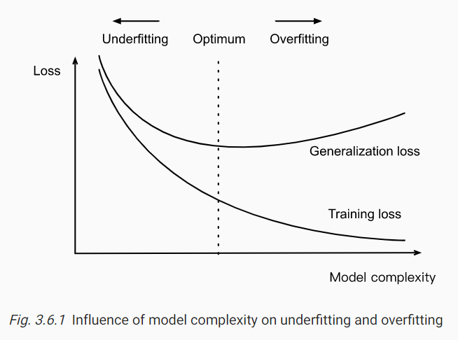

训练集越小，越容易过拟合。深度学习只在数据多时比线性模型好。模型复杂度不应该比数据量增长快，数据小时简单模型更好。

有结构、训练目标、选择变量、数据预处理、学习率等不同的很多模型，要选择一个。在确定好超参数前不要动测试集，如果利用测试集需选择超参数，有过拟合风险。不要依赖测试集选择模型。也不能只依赖训练集。测试集可以很少变更。

训练集少时，一种方法是 K 交叉验证集。把训练集分 K 不交子集，训练和验证 K 次，每次在 K-1 的子集训练，在剩下一个子集验证。训练 K 轮。


##### 实际例子

###### 原理级实现

初始状态生成：

```python
#%matplotlib inline
import torch
from d2l import torch as d2l
class LinearRegressionScratch(d2l.Module):  #@save
    """The linear regression model implemented from scratch."""
    def __init__(self, num_inputs, lr, sigma=0.01):
        super().__init__()
        self.save_hyperparameters()
        self.w = torch.normal(0, sigma, (num_inputs, 1), requires_grad=True)
        self.b = torch.zeros(1, requires_grad=True)
```

前向传播，显然是 $Xw+b$。

```python
@d2l.add_to_class(LinearRegressionScratch)  #@save
def forward(self, X):
    return torch.matmul(X, self.w) + self.b
```

损失函数是 $l^{(i)}(\mathbf w,b)=\dfrac12(\hat y^{(i)}-y^{(i)})^2$。

```python
@d2l.add_to_class(LinearRegressionScratch)  #@save
def loss(self, y_hat, y):
    l = (y_hat - y) ** 2 / 2
    return l.mean()
```

训练步骤：

1. 初始化参数 $(\mathbf w,b)$
2. 重复以下步骤
   1. 计算梯度 $\mathbf g\leftarrow \partial_{(\mathbf w,b)}\dfrac1{|\mathbf B|}\sum_{i\in\mathbf B}l(\mathbf x^{(i)},\mathbf y^{(i)},\mathbf w,b)$
   2. 更新参数 $(\mathbf w,b)\leftarrow (\mathbf w,b)-\eta\mathbf g$

```python
@d2l.add_to_class(d2l.Trainer)  #@save
def prepare_batch(self, batch):
    return batch

@d2l.add_to_class(d2l.Trainer)  #@save
def fit_epoch(self):
    self.model.train()
    for batch in self.train_dataloader:
        loss = self.model.training_step(self.prepare_batch(batch))
        self.optim.zero_grad()
        with torch.no_grad():
            loss.backward()
            if self.gradient_clip_val > 0:  # To be discussed later
                self.clip_gradients(self.gradient_clip_val, self.model)
            self.optim.step()
        self.train_batch_idx += 1
    if self.val_dataloader is None:
        return
    self.model.eval()
    for batch in self.val_dataloader:
        with torch.no_grad():
            self.model.validation_step(self.prepare_batch(batch))
        self.val_batch_idx += 1
```

随便刷点数据。训练-选择超参数-评估。

```python
model = LinearRegressionScratch(2, lr=0.03)
data = d2l.SyntheticRegressionData(w=torch.tensor([2, -3.4]), b=4.2)
trainer = d2l.Trainer(max_epochs=3)
trainer.fit(model, data)
```

看看结果：

```python
print(data.w, data.b) #上面填的[2,-3.4] 4.2
print(model.w, model.b) #形状w与data.w的不一样，要转置,训练出来的参数
print(f'error in estimating w: {data.w - model.w.reshape(data.w.shape)}')
print(f'error in estimating b: {data.b - model.b}')
```

###### PyTorch实现

全连接层：上一层的每一个点都与下一层每一个点相连，通过矩阵乘法。

`PyTorch` 里全连接层是 `Linear` 和 `LazyLinear`(`1.8.0` 后)。后者允许只自定义输出层，前者需要定义输入形状，很不便。所以推荐使用后者，即如：

```python
import numpy as np
import torch
from torch import nn
from d2l import torch as d2l
class LinearRegression(d2l.Module):  #@save
    """The linear regression model implemented with high-level APIs."""
    def __init__(self, lr):
        super().__init__()
        self.save_hyperparameters()
        self.net = nn.LazyLinear(1)
        self.net.weight.data.normal_(0, 0.01)
        self.net.bias.data.fill_(0)
```

那么前向传播为：

```python
@d2l.add_to_class(LinearRegression)  #@save
def forward(self, X):
    return self.net(X)
```

`MSELoss` 计算平均平方差(mean squared error，没有 $\dfrac12$)，比手写快。

```python
@d2l.add_to_class(LinearRegression)  #@save
def loss(self, y_hat, y):
    fn = nn.MSELoss()
    return fn(y_hat, y)
```

同理，调库实现参数的学习：

```python
@d2l.add_to_class(LinearRegression)  #@save
def configure_optimizers(self):
    return torch.optim.SGD(self.parameters(), self.lr)
```

训练：

```python
model = LinearRegression(lr=0.03)
data = d2l.SyntheticRegressionData(w=torch.tensor([2, -3.4]), b=4.2)
trainer = d2l.Trainer(max_epochs=3)
trainer.fit(model, data)
```

看结果：

```python
@d2l.add_to_class(LinearRegression)  #@save
def get_w_b(self):
    return (self.net.weight.data, self.net.bias.data)
w, b = model.get_w_b()

print(f'error in estimating w: {data.w - w.reshape(data.w.shape)}')
print(f'error in estimating b: {data.b - b}')
```

`PyTorch` 的 `data` 模块是数据处理，`nn` 模块是神经网络层和损失函数，可以初始化参数通过用 `_` 结尾的方法替换。

###### 权衰减

weight decay。第一个 regularization 技巧。

限制参数数是经典的缓和过拟合办法。考虑多参数的多项式，如 $x_1^2x_2$，最大度数 $d$ 越大，项数成组合数学地指数增长。

权衰减通过限制参数取值实现，称为 $l_2$ regularization。GHT decay 是最常用的，设 $f=0$(输入全置零)。

最常用方法保证小权重向量是添加 norm 作为惩罚。如果权向量增长太快，学习算法会集中于新增的 $||\mathbf w||^2$。之前的损失函数是：
$$
L(\mathbf w,b)=\dfrac1n\sum_{i=1}^n\dfrac12(\mathbf w^T\mathbf x^{(i)}+b-y^{(i)})^2
$$
添加常量 regularization constant $\lambda$ 非负数超参数，设损失函数为：
$$
L(\mathbf w,b)+\dfrac\lambda2||\mathbf w||^2
$$
若 $\lambda=0$，跟之前一样。$2$ 分母是为了二次函数求导时消除方便。平方差比标准差计算更方便，去除平方根，计算方便。

岭回归算法(ridge regression algorithm)常用 $l_2$-regularized。$l_1$ 是套索回归(lasso regression)。则，更新参数的方法修改为：
$$
\mathbf w\leftarrow(1-\eta\lambda)\mathbf w-
\dfrac{\eta}{|B|}\sum_{i\in B}\mathbf x^{(i)}(\mathbf w^T\mathbf x^{(i)}+b-y^{(i)})
$$
小 $\lambda$ 限制性弱些。相关偏差惩罚 $b^2$。

举例：

随机数据 $y=0.05+\sum_{i=1}^d0.01x_i+N(0,0.01^2)$

为了看到过拟合，设 $d=200$，训练集只有 $20$。

```python
import torch
from torch import nn
from d2l import torch as d2l
class Data(d2l.DataModule):
    def __init__(self, num_train, num_val, num_inputs, batch_size):
        self.save_hyperparameters()
        n = num_train + num_val
        self.X = torch.randn(n, num_inputs)
        noise = torch.randn(n, 1) * 0.01
        w, b = torch.ones((num_inputs, 1)) * 0.01, 0.05
        self.y = torch.matmul(self.X, w) + b + noise

    def get_dataloader(self, train):
        i = slice(0, self.num_train) if train else slice(self.num_train, None)
        return self.get_tensorloader([self.X, self.y], train, i)
```

定义 $l_2$：

```python
def l2_penalty(w):
    return (w ** 2).sum() / 2
```

定义模型：

```python
class WeightDecayScratch(d2l.LinearRegressionScratch):
    def __init__(self, num_inputs, lambd, lr, sigma=0.01):
        super().__init__(num_inputs, lr, sigma)
        self.save_hyperparameters()

    def loss(self, y_hat, y):
        return (super().loss(y_hat, y) +
                self.lambd * l2_penalty(self.w))
```

造数据，训练，输出结果：

```python
data = Data(num_train=20, num_val=100, num_inputs=200, batch_size=5)
trainer = d2l.Trainer(max_epochs=10)

def train_scratch(lambd):
    model = WeightDecayScratch(num_inputs=200, lambd=lambd, lr=0.01)
    model.board.yscale='log'
    trainer.fit(model, data)
    print('L2 norm of w:', float(l2_penalty(model.w)))
```

先看看没有 $l_2$ 的表现：

```python
train_scratch(0)
```

再看看用的结果：

```python
train_scratch(3)
```

原理懂了，下面看看集成调库怎么玩：`wd` 设 `net.weight`。偏差 `net.bias` 不衰减。

```python
class WeightDecay(d2l.LinearRegression):
    def __init__(self, wd, lr):
        super().__init__(lr)
        self.save_hyperparameters()
        self.wd = wd

    def configure_optimizers(self):
        return torch.optim.SGD([
            {'params': self.net.weight, 'weight_decay': self.wd},
            {'params': self.net.bias}], lr=self.lr)
```

```python
model = WeightDecay(wd=3, lr=0.01)
model.board.yscale='log'
trainer.fit(model, data)

print('L2 norm of w:', float(l2_penalty(model.get_w_b()[0])))
```

reproducing kernel Hilbert space (RKHS) 可以在非线性场景应用线性模型，但在高维大数据表现差。


#### 线性神经网络分类

[教材](https://d2l.ai/chapter_linear-classification/softmax-regression.html)

##### 概念

硬分类 hard assignment：只输出属于哪类；软分类 soft，属于某类的概率是多少

多标签分类 multi-label classification，一个样本可能同时属于多个类别

如下图，输出层可称为全连接层：

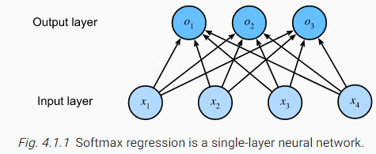

则可以表达为 $\mathbf o=\mathbf{Wx}+\mathbf b$，其中 $\mathbf b\in\R^3$，即：
$$
\begin{split}\begin{aligned} o_1 &= x_1 w_{11} + x_2 w_{12} + x_3 w_{13} + x_4 w_{14} + b_1,\\ o_2 &= x_1 w_{21} + x_2 w_{22} + x_3 w_{23} + x_4 w_{24} + b_2,\\ o_3 &= x_1 w_{31} + x_2 w_{32} + x_3 w_{33} + x_4 w_{34} + b_3. \end{aligned}\end{split}
$$
预命中模型 probit model，$\mathbf y=\mathbf o+\mathbf\epsilon,\epsilon_i\sim N(0,\sigma^2)$。

softmax 函数，一种使和为 1 的 normalization 归一化手段，具体而言：
$$
\hat{\mathbf y}=\text{softmax}(\mathbf o),\hat y_i=\dfrac{e^{o_i}}{\sum_j e^{o_j}}
$$
显然满足 $\arg\max_j\hat y_j=\arg\max_j\hat o_j$。思想源于热力学温度。具体而言：
$$
\mathbf O=\mathbf {XW}+\mathbf b,\hat{\mathbf Y}=\text{softmax}(\mathbf O)
$$
设有 $m$ 个类别，则某个样本的单标签分类可以用 one-hot 编码表示，即他所属的类别为 $1$，其他类别设为 $0$ 的长为 $m$ 的向量。那么 $n$ 个样本可以表示成 $Y\in R^{n\times m}$。

cross-entropy loss 交叉熵损失函数：
$$
l(\mathbf y,\hat{\mathbf y})=-\sum_{j=1}^qy_j\log \hat y_j
$$
将上文 $\hat y$ 代入，得：
$$
\begin{align}
l(\mathbf y,\hat{\mathbf y})&=-\sum_{j=1}^qy_j\log\dfrac
{e^{o_j}}{\sum_{k=1}^q e^{o_k}}\\
&=\sum_{j=1}^qy_j\log\sum_{k=1}^q e^{o_k}-\sum_{j=1}^qy_jo_j\\
&=\log\sum_{k=1}^q e^{o_k}-\sum_{j=1}^qy_jo_j
\end{align}
$$
这是因为 $\sum y=1$，系数相同。

对某个 $o_j$ 求偏导数，易求，得：
$$
\partial_{o_j}l(\mathbf y,\hat{\mathbf y})=\dfrac{e^{o_j}}{\sum_{k=1}^q e^{o_k}}-y_j=\text{softmax}(\mathbf o)_j-y_j
$$
得到的 $\hat y$ 是概率向量，如 $(0.1,0.2,0.7)$。

信息论Information theory研究编码解码、传输和处理信息(数据)。

对一个分布 $P$，它的熵是 $H[P]=\sum_j-P(j)\log P(j)$。如果数据从 $P$ 随机获取，至少需要 $H[P]$ nat 编码。nat 是等价于位，以 $e$ 为底数，即 $e^k$  个位。约等于 $1\div \ln2\approx 1.44\ bit$。

考虑数据流，所有数据相同，则非常好编码和处理。熵的含义是预期值究竟会有多大的偏差，即 the level of surprice。

从 $P$ 看 $Q$ 的偏差期望是交叉熵，定义为 $H(P,Q)=\sum_j-P(j)\log Q(j)$。若 $P=Q$，交叉熵最低，为 $H(P)$。

MNIST(Modified National Institute of Standards and Technology) 数据集，手写数据分类，6w 28x28 训练，1w 测试。

Fashion-MNIST 包含 10 类图像，每类 6k 张训练，1k 张测试。

##### 训练例子

加载数据：

```python
%matplotlib inline
import time
import torch
import torchvision
from torchvision import transforms
from d2l import torch as d2l
d2l.use_svg_display()
class FashionMNIST(d2l.DataModule):  #@save
    """The Fashion-MNIST dataset."""
    def __init__(self, batch_size=64, resize=(28, 28)):
        super().__init__()
        self.save_hyperparameters()
        trans = transforms.Compose([transforms.Resize(resize),
                                    transforms.ToTensor()])
        self.train = torchvision.datasets.FashionMNIST(
            root=self.root, train=True, transform=trans, download=True)
        self.val = torchvision.datasets.FashionMNIST(
            root=self.root, train=False, transform=trans, download=True)
data = FashionMNIST(resize=(32, 32)) #可能需要下载
len(data.train), len(data.val)
```

设颜色数 $c$，高宽是 $h,w$。则输出数据的 $c,h,w$：

```python
data.train[0][0].shape
```

类别标注：

```python
@d2l.add_to_class(FashionMNIST)  #@save
def text_labels(self, indices):
    """Return text labels."""
    labels = ['t-shirt', 'trouser', 'pullover', 'dress', 'coat',
              'sandal', 'shirt', 'sneaker', 'bag', 'ankle boot']
    return [labels[int(i)] for i in indices]
```

取 minibatch：

```python
@d2l.add_to_class(FashionMNIST)  #@save
def get_dataloader(self, train):
    data = self.train if train else self.val
    return torch.utils.data.DataLoader(data, self.batch_size, shuffle=train, num_workers=self.num_workers)
X, y = next(iter(data.train_dataloader()))
print(X.shape, X.dtype, y.shape, y.dtype)
```

输出取完全部数据要多久：

```python
tic = time.time()
for X, y in data.train_dataloader():
    continue
f'{time.time() - tic:.2f} sec'
```

可视化绘图，并输出一些数据：

```python
import torch
from d2l import torch as d2l
class Classifier(d2l.Module):  #@save
    """The base class of classification models."""
    def validation_step(self, batch):
        Y_hat = self(*batch[:-1])
        self.plot('loss', self.loss(Y_hat, batch[-1]), train=False)
        self.plot('acc', self.accuracy(Y_hat, batch[-1]), train=False)
```

随机梯度下降：

```python
@d2l.add_to_class(d2l.Module)  #@save
def configure_optimizers(self):
    return torch.optim.SGD(self.parameters(), lr=self.lr)
```

对每个类别的估计得分，取最大的所在的下标即 $\arg\max$ 来获取 $\hat y$，然后与 $y$ 比较，得到准确率。如下：

```python
@d2l.add_to_class(Classifier)  #@save
def accuracy(self, Y_hat, Y, averaged=True):
    """Compute the number of correct predictions."""
    Y_hat = Y_hat.reshape((-1, Y_hat.shape[-1]))
    preds = Y_hat.argmax(axis=1).type(Y.dtype)
    compare = (preds == Y.reshape(-1)).type(torch.float32)
    return compare.mean() if averaged else compare
```

手撕 $\text{softmax}(\mathbf X)_{ij}=\dfrac{e^{\mathbf X_{ij}}}{\sum_{k}e^{\mathbf X_{ik}}}$。

```python
def softmax(X):
    X_exp = torch.exp(X)
    partition = X_exp.sum(1, keepdims=True) #即[1,n],否则会[n]
    return X_exp / partition  # The broadcasting mechanism is applied here
```

上述代码对很大和很小的值不适用。但是可以先看看上面的函数跑的怎样：

```python
X = torch.rand((2, 5))
X_prob = softmax(X)
X_prob, X_prob.sum(1)
```

随机造数据。定义前向传播，将 $28\times 28$ 图像压成一维 $28^2$。有 $10$ 个类，所以 $10$ 个结果输出，即 $28^2\times 10$。

```python
class SoftmaxRegressionScratch(d2l.Classifier):
    def __init__(self, num_inputs, num_outputs, lr, sigma=0.01):
        super().__init__()
        self.save_hyperparameters()
        self.W = torch.normal(0, sigma, size=(num_inputs, num_outputs),
                              requires_grad=True)
        self.b = torch.zeros(num_outputs, requires_grad=True)

    def parameters(self):
        return [self.W, self.b]
@d2l.add_to_class(SoftmaxRegressionScratch)
def forward(self, X):
    X = X.reshape((-1, self.W.shape[0]))
    return softmax(torch.matmul(X, self.W) + self.b)
```

手写交叉熵：

```python
def cross_entropy(y_hat, y):
    return -torch.log(y_hat[list(range(len(y_hat))), y]).mean()
cross_entropy(y_hat, y)
@d2l.add_to_class(SoftmaxRegressionScratch)
def loss(self, y_hat, y):
    return cross_entropy(y_hat, y)
```

比较久的训练，可能要两分钟：

```python
data = d2l.FashionMNIST(batch_size=256)
model = SoftmaxRegressionScratch(num_inputs=784, num_outputs=10, lr=0.1)
trainer = d2l.Trainer(max_epochs=10)
trainer.fit(model, data)
```

尝试预测一些图片：

```python
X, y = next(iter(data.val_dataloader()))
preds = model(X).argmax(axis=1)
preds.shape
```

输出一些错误的预测(第一行正确)：

```python
wrong = preds.type(y.dtype) != y
X, y, preds = X[wrong], y[wrong], preds[wrong]
labels = [a+'\n'+b for a, b in zip(
    data.text_labels(y), data.text_labels(preds))]
data.visualize([X, y], labels=labels)
```

现在来解决对太大和太小的数难以计算指数的问题。对单精度，最多表示 $10^{-38}$ 到 $10^{38}$，则指数的范围不能超过 $[-90,90]$。

定义 $\overline o=\max_ko_k$，根据 $a^{b}a^c=a^{b+c}$，有 $e^{o}=e^{o-\overline o+\overline o}=e^{o-\overline o}e^{\overline o}$，则：
$$
\hat y_j=\dfrac{e^{o_j}}{\sum_ke^{o_k}}=
\dfrac{e^{o_j-\overline o}e^{\overline o}}{\sum_ke^{o_k-\overline o}e^{\overline o}}=
\dfrac{e^{o_j-\overline o}}{\sum_ke^{o_k-\overline o}}
$$
显然 $o_i-\overline o\le 0$，则对 $q$ 分类问题，$o$ 取值是 $[1,q]$。

虽然上式可能会下溢，但是当用 softmax 时，是还会取对数的，即：
$$
\log\hat y_j=\log\dfrac{e^{o_j-\overline o}}{\sum_ke^{o_k-\overline o}}=o_j-\overline o-\log\sum_ke^{o_k-\overline o}
$$
根据数学结论，有：
$$
\max_{i=1}^nx_i\le\log\sum_{i=1}^ne^{x_i}\le\max_{i=1}^nx_i+\log n
$$
所以上式不会发生下溢。

##### 调库优化

```python
import torch
from torch import nn
from torch.nn import functional as F
from d2l import torch as d2l
```

将除了第一个维度的其他维度全压到第二维：

```python
class SoftmaxRegression(d2l.Classifier):  #@save
    """The softmax regression model."""
    def __init__(self, num_outputs, lr):
        super().__init__()
        self.save_hyperparameters()
        self.net = nn.Sequential(nn.Flatten(),
                                 nn.LazyLinear(num_outputs))

    def forward(self, X):
        return self.net(X)
@d2l.add_to_class(d2l.Classifier)  #@save
def loss(self, Y_hat, Y, averaged=True):
    Y_hat = Y_hat.reshape((-1, Y_hat.shape[-1]))
    Y = Y.reshape((-1,))
    return F.cross_entropy(
        Y_hat, Y, reduction='mean' if averaged else 'none')
```

训练：(时间还是接近上次的版本的)

```python
data = d2l.FashionMNIST(batch_size=256)
model = SoftmaxRegression(num_outputs=10, lr=0.1)
trainer = d2l.Trainer(max_epochs=10)
trainer.fit(model, data)
```


##### 其他理论

对一个训练好的分类器 $f$ 和数据样本 $\mathcal{D} = {(\mathbf{x}^{(i)},y^{(i)})}_{i=1}^n$，经验误差为：
$$
\epsilon_\mathcal{D}(f) = \frac{1}{n}\sum_{i=1}^n \mathbf{1}(f(\mathbf{x}^{(i)}) \neq y^{(i)}).
$$
总体误差：
$$
\epsilon(f) =  E_{(\mathbf{x}, y) \sim P} \mathbf{1}(f(\mathbf{x}) \neq y) =
\int\int \mathbf{1}(f(\mathbf{x}) \neq y) p(\mathbf{x}, y) \;d\mathbf{x} dy.
$$
将样本的经验误差认为是总体误差，用样本估测整体。

中心极限定理，任意分布 $\mu,\sigma$ 的 $n$ 个随机样本，样本分布近似$\dfrac{\sigma}{\sqrt n}$。$\epsilon_D(f)$ 以 $O(\dfrac 1{\sqrt n})$ 的速率接近 $\epsilon(f)$，也就是说提高一倍的准度需要四倍大的数据。

由于所求是伯努利分布，若期望为 $\epsilon$，显然方差为 $\epsilon(1-\epsilon)$。根据 $\epsilon\in [0,1]$ 可知，方差是二次函数且最大值是 $\epsilon=0.5$ 取得 $0.25$。所以标准差不会超过 $\sqrt{\dfrac{0.25}n}$。

如果想要标准差在 $0.01$ 内，解得 $n=2500$。根据四倍，可知需要样本 $10^4$ 个。

根据霍夫丁不等式：
$$
P(\epsilon_\mathcal{D}(f) - \epsilon(f) \geq t) < \exp\left( - 2n t^2 \right).
$$
要有 $95\%$ 把握差值不超过 $0.01$，代入得，需要 $15000$ 样本比较。

有 $k$ 个训练好的模型 $f_1,\cdots,f_k$，如果用同一个测试集 $D$，可能不行。多假设测试。因为有可能后续的 $f_i$ 的训练过程受到训练者在前面训练的 $f_j$ 的结论的影响。即 adaptive overfitting 自适应过拟合。考虑弄多几个测试集，旧的测试集当新模型的训练集，新的换个测试集。

测试集很可能已经被别人用来当训练集。且测试集只能后验得出结论，不能先验。

统计学习理论 statistical learning theory。目的是研究测试集和训练集一样时的误差。

矛盾是更灵活可变的模型，适应更多测试集但更大风险过拟合，要么就适应少一点数据，欠拟合。

VC 维度：(Vapnik-Chervonenkis (VC) )
$$
P\left(R[p, f] - R_\mathrm{emp}[\mathbf{X}, \mathbf{Y}, f] < \alpha\right) \geq 1-\delta
\ \text{ for }\ \alpha \geq c \sqrt{(\mathrm{VC} - \log \delta)/n}.
$$
$\delta > 0$ 是违背的概率。$\alpha$ 是泛化差距。$c$ 是常数，取决于损失的规模。

一条直线可以分类任意三点，但不能任意四点。$d$ 维输入的 VC 维度是 $d+1$。

模型还需要考虑数据的来源和用途。避免训练集和真实业务场景的差距过大。如，训练一个预测偿还的模型，发现申请人穿的鞋子与违约风险有关，即判断穿名鞋的偿还能力可能比穿运动鞋的好。如果真的这么干，则申请人都会穿名鞋。即模型会影响环境。

考虑训练集是 $p_S(\mathbf{x},y)$，测试集是 $p_T(\mathbf{x},y)$。假设是二分类问题，区分猫狗。最极端情况是完全错误，即 $p_S(y \mid \mathbf{x}) = 1 - p_T(y \mid \mathbf{x})$。

Distribution Shift：

协变位移covariate shift。考虑条件分布不变 $P(y \mid \mathbf{x})$。考虑训练集是真实世界猫狗的照片，二测试集是猫狗的卡通画。

标签位移label shift。$P(y)$ 变化，$P(\mathbf{x} \mid y)$ 不变。即相信 $y$ 引起 $\mathbf X$。如疾病引起症状，但诊断方法改变。

概念偏差concept shift。标签的定义发生变化。如对 soft drink 的定义。

如训练检测癌症的模型。收集数据时，主要是采血，二健康人的血样本比较难获取。样本在年龄、激素水平、生理状态、饮食、酒精摄入等与问题无关的变量不同。但，真实的病人可能差距较小，则协变位移大。

对自动驾驶汽车，检测器训练，真实带标记数据很难获取，如果使用游戏数据来额外训练，然后在游戏数据测试。但游戏数据的材质渲染过于简化，且路用同一种材质渲染，则真实效果很差。如检测森林里的坦克，用不带坦克的航空照片训练，坦克开进去再拍训练集。最后训练出了如何判断有阴影的树和没有的，因为一开始排的训练集是早上的，坦克开进去是中午拍的。

不稳定分布。分布缓慢的变化，但模型没有更新。如：①广告投放系统vs新手机系统；②垃圾邮件筛除vs新的套路；③时令性推荐过时了还在。

其他例子，如人脸识别系统，但是没有特写镜头(全是脸)的训练集。US 英语与 UK 英语搜索引擎。图片识别，训练集每个图片只有一类标签，但真实用途里一张图片可能多个标签。

对于最简单的损失函数：$\mathop{\mathrm{minimize}}_f \frac{1}{n} \sum_{i=1}^n l(f(\mathbf{x}_i), y_i)$，其中 $f$ 是经验误差 empirical risk。而全体样本的损失是 $E_{p(\mathbf{x}, y)} [l(f(\mathbf{x}), y)] = \int\int l(f(\mathbf{x}), y) p(\mathbf{x}, y) \;d\mathbf{x}dy$。


#### 多层感知机

##### 理论

线性模型是有局限的，即单调性，即某个参数增加必然导致结果单调增加或减少，不可能先增后减等，如最适温度(即便可以通过距离转成单调)。而且真实问题即便单调递增，也不必然速率是恒定的，即便可以对数化。

> 以猫狗二分类为例，如果用线性模型，做一次反色处理，可能会得到相反结果。

非线性的模型有决策树、核方法kernel methods。

隐藏层(介于输入层和输出层之间的层)，如中间加一个全连接层。


multilayer perceptron 多层感知机，MLP。上图感知机有 2 层，都是全连接层，即对前后都全连接。

设隐藏层有 $h$ 个单元，输入数据是 $\mathbf{X} \in \mathbb{R}^{n \times d}$，隐藏层是 $\mathbf{H} \in \mathbb{R}^{n \times h}$，且 $\mathbf{W}^{(1)} \in \mathbb{R}^{d \times h}$，$\mathbf{b}^{(1)} \in \mathbb{R}^{1 \times h}$，$\mathbf{W}^{(2)} \in \mathbb{R}^{h \times q}$，$\mathbf{b}^{(2)} \in \mathbb{R}^{1 \times q}$，有：
$$
\begin{split}\begin{aligned}
    \mathbf{H} & = \mathbf{X} \mathbf{W}^{(1)} + \mathbf{b}^{(1)}, \\
    \mathbf{O} & = \mathbf{H}\mathbf{W}^{(2)} + \mathbf{b}^{(2)}.
\end{aligned}\end{split}
$$
仍然是线性变换，因为令 $\mathbf{W} = \mathbf{W}^{(1)}\mathbf{W}^{(2)}$ 且 $\mathbf{b} = \mathbf{b}^{(1)} \mathbf{W}^{(2)} + \mathbf{b}^{(2)}$ 有： 
$$
\mathbf{O} = (\mathbf{X} \mathbf{W}^{(1)} + \mathbf{b}^{(1)})\mathbf{W}^{(2)} + \mathbf{b}^{(2)} = \mathbf{X} \mathbf{W}^{(1)}\mathbf{W}^{(2)} + \mathbf{b}^{(1)} \mathbf{W}^{(2)} + \mathbf{b}^{(2)} = \mathbf{X} \mathbf{W} + \mathbf{b}.
$$
为了打破线性化，使用一个非线性激活函数，如 ReLU(Rectified Linear Unit)，表达式为：$\sigma(x) = \mathrm{max}(0, x)$。当激活后，将不再是线性模型：
$$
\begin{split}\begin{aligned}
    \mathbf{H} & = \sigma(\mathbf{X} \mathbf{W}^{(1)} + \mathbf{b}^{(1)}), \\
    \mathbf{O} & = \mathbf{H}\mathbf{W}^{(2)} + \mathbf{b}^{(2)}.\\
\end{aligned}\end{split}
$$
多层的例子：$\mathbf{H}^{(1)} = \sigma_1(\mathbf{X} \mathbf{W}^{(1)} + \mathbf{b}^{(1)})$，$\mathbf{H}^{(2)} = \sigma_2(\mathbf{H}^{(1)} \mathbf{W}^{(2)} + \mathbf{b}^{(2)})$。

可以证明单隐藏层网络可以学习任意函数。但有时候核方法更有效，也可以用深层网络。

relu 函数示意图：

```python
x = torch.arange(-8.0, 8.0, 0.1, requires_grad=True)
y = torch.relu(x)
d2l.plot(x.detach(), y.detach(), 'x', 'relu(x)', figsize=(5, 2.5))
```

relu 在 $x=0$ 不可微，规定为左侧集导数为 $0$。绘制导数：

```python
y.backward(torch.ones_like(x), retain_graph=True)
d2l.plot(x.detach(), x.grad, 'x', 'grad of relu', figsize=(5, 2.5))
```

relu 解决了梯度消失的问题。还有其他 relu 变种，如 prelu(parameterized)：$\operatorname{pReLU}(x) = \max(0, x) + \alpha \min(0, x)$。

sigmoid 将值域转化为 $(0,1)$ 之间，即 $\operatorname{sigmoid}(x) = \frac{1}{1 + \exp(-x)}$。又名squashing function。增减性跟原本一样(即原本 $x$ 越大它越大)。

sigmoid 平滑，可微，常用于输出激活。二分类的 sigmoid 可以将其看成是 softmax 的特例。隐藏层 relu 比 sigmoid 更常用，因为更简单。sigmoid 容易梯度消失，对大正负参数。

> 阈值激活(thresholding activation)层：小于阈值设0，否则设1。

作图：

```python
y = torch.sigmoid(x)
d2l.plot(x.detach(), y.detach(), 'x', 'sigmoid(x)', figsize=(5, 2.5))
```

sigmoid 的导数为：
$$
\frac{d}{dx} \operatorname{sigmoid}(x) = \frac{\exp(-x)}{(1 + \exp(-x))^2} = \operatorname{sigmoid}(x)\left(1-\operatorname{sigmoid}(x)\right)
$$
看成二次函数即 $(sigmoid(x)-0.5)^2+0.25$，故当 $sigmoid(x)=0.5,x=0$ 时，最大值为 $0.25$。 

```python
# Clear out previous gradients
x.grad.data.zero_()
y.backward(torch.ones_like(x),retain_graph=True)
d2l.plot(x.detach(), x.grad, 'x', 'grad of sigmoid', figsize=(5, 2.5))
```

双曲正切 tanh 函数将值域压缩为 $(-1,1)$。$\operatorname{tanh}(x) = \frac{1 - \exp(-2x)}{1 + \exp(-2x)}$，单调性也跟 x 增。两侧极限，对负无穷，洛必达一下可知趋于 $-1$，正无穷易得 $1$。可求得，导数为：$\frac{d}{dx} \operatorname{tanh}(x) = 1 - \operatorname{tanh}^2(x)$。则导数最大值是 $1$，当 $tanh(x)=0$ 即 $x=0$ 取得。

```python
y = torch.tanh(x)
d2l.plot(x.detach(), y.detach(), 'x', 'tanh(x)', figsize=(5, 2.5))
```

```python
# Clear out previous gradients
x.grad.data.zero_()
y.backward(torch.ones_like(x),retain_graph=True)
d2l.plot(x.detach(), x.grad, 'x', 'grad of tanh', figsize=(5, 2.5))
```

##### 训练例子

隐藏层的层数和每层单元数是超参数。通常层宽是 $2^k$。

作两层：

```python
import torch
from torch import nn
from d2l import torch as d2l
class MLPScratch(d2l.Classifier):
    def __init__(self, num_inputs, num_outputs, num_hiddens, lr, sigma=0.01):
        super().__init__()
        self.save_hyperparameters()
        self.W1 = nn.Parameter(torch.randn(num_inputs, num_hiddens) * sigma)
        self.b1 = nn.Parameter(torch.zeros(num_hiddens))
        self.W2 = nn.Parameter(torch.randn(num_hiddens, num_outputs) * sigma)
        self.b2 = nn.Parameter(torch.zeros(num_outputs))
```

手写 relu：

```python
def relu(X):
    a = torch.zeros_like(X)
    return torch.max(X, a)
```

一次前向传播：

```python
@d2l.add_to_class(MLPScratch)
def forward(self, X):
    X = X.reshape((-1, self.num_inputs))
    H = relu(torch.matmul(X, self.W1) + self.b1)
    return torch.matmul(H, self.W2) + self.b2
```

训练：(大约两分钟)

```python
model = MLPScratch(num_inputs=784, num_outputs=10, num_hiddens=256, lr=0.1)
data = d2l.FashionMNIST(batch_size=256)
trainer = d2l.Trainer(max_epochs=10)
trainer.fit(model, data)
```

调库版本：(自动实现了前向传播)

```python
class MLP(d2l.Classifier):
    def __init__(self, num_outputs, num_hiddens, lr):
        super().__init__()
        self.save_hyperparameters()
        self.net = nn.Sequential(nn.Flatten(), nn.LazyLinear(num_hiddens),
                                 nn.ReLU(), nn.LazyLinear(num_outputs))
```

训练：(可能快一些)

```python
model = MLP(num_outputs=10, num_hiddens=256, lr=0.1)
trainer.fit(model, data)
```

##### 传播理论

对有一个隐藏层的网络，手动前向传播的过程如下：设输入是 $\mathbf{x}\in \mathbb{R}^d$，则中介变量：$\mathbf{z}= \mathbf{W}^{(1)} \mathbf{x}$，其中隐藏层权重是 $\mathbf{W}^{(1)} \in \mathbb{R}^{h \times d}$，然后走一个激活层：$\mathbf{h}= \phi (\mathbf{z})$。$\mathbf h$ 也是中间变量，输出层如果经过 $\mathbf{W}^{(2)} \in \mathbb{R}^{q \times h}$，则可以求出输出：$\mathbf{o}= \mathbf{W}^{(2)} \mathbf{h}$。损失：$L = l(\mathbf{o}, y)$。对 $l_2$ 正则化，给定超参数 $\lambda$，有：$s = \frac{\lambda}{2} \left(\|\mathbf{W}^{(1)}\|_F^2 + \|\mathbf{W}^{(2)}\|_F^2\right)$，则正则化损失(目标函数)是 $J = L + s$。

下图正方形是变量，圆形是操作，代表了计算损失函数的顺序。

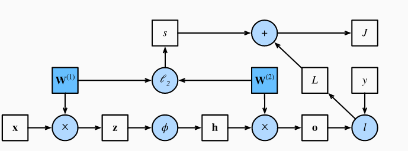

反向传播是计算神经网络参数梯度的方法。逆序遍历上述计算图，根据微积分的链式法则。假设有 $\mathsf{Y}=f(\mathsf{X})$ 和 $\mathsf{Z}=g(\mathsf{Y})$，则 $Z$ 对 $X$ 的偏导为 $\frac{\partial \mathsf{Z}}{\partial \mathsf{X}} = \text{prod}\left(\frac{\partial \mathsf{Z}}{\partial \mathsf{Y}}, \frac{\partial \mathsf{Y}}{\partial \mathsf{X}}\right)$。prod 对向量和矩阵是乘法。

对应上图，所求为 $\partial J/\partial \mathbf{W}^{(1)}$ 和 $\partial J/\partial \mathbf{W}^{(2)}$。先一步步来，即首先计算：$\frac{\partial J}{\partial L} = 1 \; \text{and} \; \frac{\partial J}{\partial s} = 1$，很显然(求导易得)。则可以算出：
$$
\frac{\partial J}{\partial \mathbf{o}}
= \text{prod}\left(\frac{\partial J}{\partial L}, \frac{\partial L}{\partial \mathbf{o}}\right)
= \frac{\partial L}{\partial \mathbf{o}}
\in \mathbb{R}^q
$$
根据求导显然有：
$$
\frac{\partial s}{\partial \mathbf{W}^{(1)}} = \lambda \mathbf{W}^{(1)}
\; \text{and} \;
\frac{\partial s}{\partial \mathbf{W}^{(2)}} = \lambda \mathbf{W}^{(2)}
$$
则有：
$$
\frac{\partial J}{\partial \mathbf{W}^{(2)}}= \text{prod}\left(\frac{\partial J}{\partial \mathbf{o}}, \frac{\partial \mathbf{o}}{\partial \mathbf{W}^{(2)}}\right) + \text{prod}\left(\frac{\partial J}{\partial s}, \frac{\partial s}{\partial \mathbf{W}^{(2)}}\right)= \frac{\partial J}{\partial \mathbf{o}} \mathbf{h}^\top + \lambda \mathbf{W}^{(2)}
$$
继续算：
$$
\frac{\partial J}{\partial \mathbf{h}}
= \text{prod}\left(\frac{\partial J}{\partial \mathbf{o}}, \frac{\partial \mathbf{o}}{\partial \mathbf{h}}\right)
= {\mathbf{W}^{(2)}}^\top \frac{\partial J}{\partial \mathbf{o}}.
$$
继续倒回去：
$$
\frac{\partial J}{\partial \mathbf{z}}
= \text{prod}\left(\frac{\partial J}{\partial \mathbf{h}}, \frac{\partial \mathbf{h}}{\partial \mathbf{z}}\right)
= \frac{\partial J}{\partial \mathbf{h}} \odot \phi'\left(\mathbf{z}\right)
$$
最终有：
$$
\frac{\partial J}{\partial \mathbf{W}^{(1)}}
= \text{prod}\left(\frac{\partial J}{\partial \mathbf{z}}, \frac{\partial \mathbf{z}}{\partial \mathbf{W}^{(1)}}\right) + \text{prod}\left(\frac{\partial J}{\partial s}, \frac{\partial s}{\partial \mathbf{W}^{(1)}}\right)
= \frac{\partial J}{\partial \mathbf{z}} \mathbf{x}^\top + \lambda \mathbf{W}^{(1)}
$$
因为训练时遍历 DAG 反向传播，记忆化存储每个节点的偏导以降低复杂度，所以会增加空间开销。预测，不训练，不需要反向传播，所以内存大约少一倍开销。

##### 初始化

初始化的值如果不好，可能会导致梯度消失、训练更久等问题。

对 $L$ 层神经网络，每层转换为参数 $\mathbf{W}^{(l)}$ 和 $f_l$，隐藏层是 $\mathbf{h}^{(l)}$，其中 $\mathbf{h}^{(0)} = \mathbf{x}$。则神经网络可以表述为：
$$
\mathbf{h}^{(l)} = f_l (\mathbf{h}^{(l-1)}) \text{ and thus } \mathbf{o} = f_L \circ \ldots \circ f_1(\mathbf{x}).
$$
如果隐藏层输出都是向量，则梯度表示为：
$$
\partial_{\mathbf{W}^{(l)}} \mathbf{o} = \underbrace{\partial_{\mathbf{h}^{(L-1)}} \mathbf{h}^{(L)}}_{ \mathbf{M}^{(L)} \stackrel{\mathrm{def}}{=}} \cdot \ldots \cdot \underbrace{\partial_{\mathbf{h}^{(l)}} \mathbf{h}^{(l+1)}}_{ \mathbf{M}^{(l+1)} \stackrel{\mathrm{def}}{=}} \underbrace{\partial_{\mathbf{W}^{(l)}} \mathbf{h}^{(l)}}_{ \mathbf{v}^{(l)} \stackrel{\mathrm{def}}{=}}.
$$
亦即梯度是 $L-l$ 个矩阵的连乘积 $\mathbf{M}^{(L)} \cdot \ldots \cdot \mathbf{M}^{(l+1)}$ 乘上 $\mathbf{v}^{(l)}$。

既然这么多个连乘积，则可能会有下溢问题。一个技巧是对数化。参数可能：过大(梯度爆炸)、过小(梯度消失)。

梯度消失的一个典型原因是激活函数选的不好。如 sigmoid 函数及其梯度如图所示：

```python
x = torch.arange(-8.0, 8.0, 0.1, requires_grad=True)
y = torch.sigmoid(x)
y.backward(torch.ones_like(x))

d2l.plot(x.detach().numpy(), [y.detach().numpy(), x.grad.numpy()],
         legend=['sigmoid', 'gradient'], figsize=(4.5, 2.5))
```

如上文所示，已经知道导函数了。则层数过多就会导致梯度消失。因此使用 relu 比较能避开梯度消失。

梯度爆炸，即不断进行矩阵乘法，经过很多层后会非常大，即使一开始是也许标准正态分布，后面也指数级增长，例如：

```python
M = torch.normal(0, 1, size=(4, 4))
print('a single matrix \n',M)
for i in range(100):
    M = M @ torch.normal(0, 1, size=(4, 4))
print('after multiplying 100 matrices\n', M)
```

对称性：对只有一个隐藏层的MLP，可以 $\mathbf{W}^{(1)}$ 改变顺序，然后改变输出层顺序，得到同样的作用。设全设同一个初始值 $\mathbf{W}^{(1)} = c$，那么会得到相同的梯度变化。SGD 不能打破对称性，但 dropout 正则化可以。

默认是随机初始化。对没有非线性化的全连接层，有 $o_{i} = \sum_{j=1}^{n_\mathrm{in}} w_{ij} x_j$。若权重设均值 0，方差 $\sigma^2$。若输入层也是 0 均值，方差 $\gamma^2$，都独立。则输出的均值和方差可以计算，即：
$$
\begin{split}\begin{aligned}
    E[o_i] & = \sum_{j=1}^{n_\mathrm{in}} E[w_{ij} x_j] \\&= \sum_{j=1}^{n_\mathrm{in}} E[w_{ij}] E[x_j] \\&= 0, \\
    \mathrm{Var}[o_i] & = E[o_i^2] - (E[o_i])^2 \\
        & = \sum_{j=1}^{n_\mathrm{in}} E[w^2_{ij} x^2_j] - 0 \\
        & = \sum_{j=1}^{n_\mathrm{in}} E[w^2_{ij}] E[x^2_j] \\
        & = n_\mathrm{in} \sigma^2 \gamma^2.
\end{aligned}\end{split}
$$
让方差固定，可以令 $n_\mathrm{in} \sigma^2 = 1$。对于反向传播，方差会爆炸，除非这么固定下来即 $n_\mathrm{out} \sigma^2 = 1$。即两难了，不能同时满足。因此，折中而言可以选择：
$$
\begin{aligned}
\frac{1}{2} (n_\mathrm{in} + n_\mathrm{out}) \sigma^2 = 1 \text{ or equivalently }
\sigma = \sqrt{\frac{2}{n_\mathrm{in} + n_\mathrm{out}}}.
\end{aligned}
$$
即 Xavier initialization，显然即刷 0 均值和 $\sigma^2 = \frac{2}{n_\mathrm{in} + n_\mathrm{out}}$ 的随机分布。

均匀分布 $U(-a, a)$ 的方差是 $\frac{a^2}{3}$，如果用均匀分布实现上述要求，可设：
$$
U\left(-\sqrt{\frac{6}{n_\mathrm{in} + n_\mathrm{out}}}, \sqrt{\frac{6}{n_\mathrm{in} + n_\mathrm{out}}}\right).
$$
这么搞的假设是确实不存在非线性化。

现有的理论很难全面解释：①为什么能优化；②为什么梯度下降泛化如此好。但实际上，①很少是问题。下面综述当前的研究。

> “no free lunch” theorem：任何学习算法在某些分布的数据上更好，但其他的更差。

> 归纳性偏差，inductive biases 即人看待世界的思维方式，如MLE的构建。

训练的两阶段：与训练数据拟合，评估泛化误差。得出generalization gap即训练集测试集误差。对过拟合的经典观点是模型太复杂了。

一般降低过拟合就是减少模型复杂度，增加惩罚，限制取值。而很多深度学习模型，可以达到0训练误差，而generalization error还能更低，如果模型更复杂。而模型复杂度与generalization gap不是单调的，复杂度增加一开始降低准确随后又继续增加。

传统的理论对深度神经网络难以解释。基于 VC维度或Rademacher度咋读的假设无法解释深度神经网络泛化良好的结果。

当把深度学习想成参数模型，即确实有参数，每次更新模型就是更新参数。但神经网络的表现就跟无参数模型一样。无参数方法复杂度增长与数据量有关。

最简单的无参数模型如k近邻算法(k-nearest neighbor algorithm)，即学习器记住数据集，对每个新样本，求出离它最近的k个样本。实际上即暴力遍历求距离排序输出前k个。其他方法如核方法kernel methods。

如果训练集里有错误数据，那么一开始训练不会适应错误数据，随后才会适应。

早停止early stopping，如果一轮训练后错误率下降幅度没有达到一个标准，就停止训练，名为 patience criteria。但是如果没有标签噪声，数据集是可实现的(每个标签类之间区分明显，数据不假)，则没有什么优化。

权衰减根据哪个权范数被实现分类为ridge regularization($l_2$ penalty)或lasso regularization($l_1$ penalty)。然而前者提升不是很大，且有可能只在早停止有用。

平滑：不应该对小变化敏感。如图片的随机噪声不影响图片分类。

##### Dropout

每次训练丢掉一些神经元。初始是通过类比基因的选择提出的。增加高斯噪声，用来随机筛除，得到激活函数：
$$
\begin{split}\begin{aligned}
h' =
\begin{cases}
    0 & \text{ with probability } p \\
    \frac{h}{1-p} & \text{ otherwise}
\end{cases}
\end{aligned}\end{split}
$$
则期望不变，仍然为 $E[h'] = h$。删掉的点反向传播梯度也消失。具体而言：

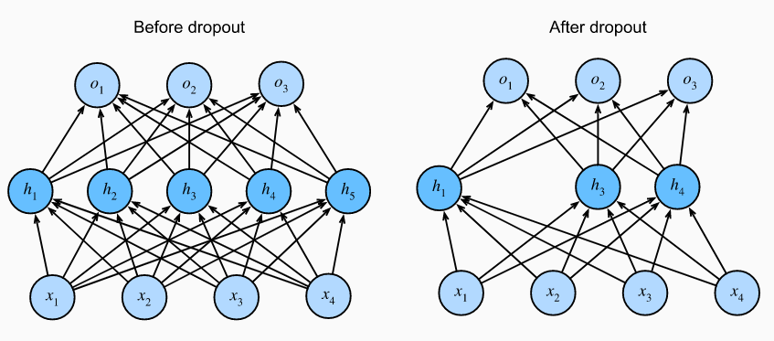

只在训练时 dropout，训练好跑样本不做。如果做，就是用来测试预测的不确定性。如果每次不同 dropout 后跑出来效果差不多，网络效果更可信。

实现伯努利分布分布的一种办法是对一个随机分布 > 某个值的全部置 1。如：

```python
import torch
from torch import nn
from d2l import torch as d2l
def dropout_layer(X, dropout):
    assert 0 <= dropout <= 1
    if dropout == 1: return torch.zeros_like(X)
    mask = (torch.rand(X.shape) > dropout).float()
    return mask * X / (1.0 - dropout)
```

测试使用：(对第二个样例，剩下的值全部翻倍)

```python
X = torch.arange(16, dtype = torch.float32).reshape((2, 8))
print('dropout_p = 0:', dropout_layer(X, 0))
print('dropout_p = 0.5:', dropout_layer(X, 0.5))
print('dropout_p = 1:', dropout_layer(X, 1))
```

经验而言越靠近输入层的dropout率设的越低一些。

把激活层干掉，换成 dropout：

```python
class DropoutMLPScratch(d2l.Classifier):
    def __init__(self, num_outputs, num_hiddens_1, num_hiddens_2,
                 dropout_1, dropout_2, lr):
        super().__init__()
        self.save_hyperparameters()
        self.lin1 = nn.LazyLinear(num_hiddens_1)
        self.lin2 = nn.LazyLinear(num_hiddens_2)
        self.lin3 = nn.LazyLinear(num_outputs)
        self.relu = nn.ReLU()

    def forward(self, X):
        H1 = self.relu(self.lin1(X.reshape((X.shape[0], -1))))
        if self.training:
            H1 = dropout_layer(H1, self.dropout_1)
        H2 = self.relu(self.lin2(H1))
        if self.training:
            H2 = dropout_layer(H2, self.dropout_2)
        return self.lin3(H2)
```

训练：(2min)

```python
hparams = {'num_outputs':10, 'num_hiddens_1':256, 'num_hiddens_2':256,
           'dropout_1':0.5, 'dropout_2':0.5, 'lr':0.1}
model = DropoutMLPScratch(**hparams)
data = d2l.FashionMNIST(batch_size=256)
trainer = d2l.Trainer(max_epochs=10)
trainer.fit(model, data)
```

调库版本：

```python
class DropoutMLP(d2l.Classifier):
    def __init__(self, num_outputs, num_hiddens_1, num_hiddens_2,
                 dropout_1, dropout_2, lr):
        super().__init__()
        self.save_hyperparameters()
        self.net = nn.Sequential(
            nn.Flatten(), nn.LazyLinear(num_hiddens_1), nn.ReLU(),
            nn.Dropout(dropout_1), nn.LazyLinear(num_hiddens_2), nn.ReLU(),
            nn.Dropout(dropout_2), nn.LazyLinear(num_outputs))
```

```python
model = DropoutMLP(**hparams)
trainer.fit(model, data)
```

##### kaggle房价预测例子

kaggle:ML比赛平台。下载解压：

```python
%matplotlib inline
import pandas as pd
import torch
from torch import nn
from d2l import torch as d2l
def download(url, folder, sha1_hash=None):
    """Download a file to folder and return the local filepath."""

def extract(filename, folder):
    """Extract a zip/tar file into folder."""
```

因为不参赛，将给定的训练集划一部分出来测试：

```python
class KaggleHouse(d2l.DataModule):
    def __init__(self, batch_size, train=None, val=None):
        super().__init__()
        self.save_hyperparameters()
        if self.train is None:
            self.raw_train = pd.read_csv(d2l.download(
                d2l.DATA_URL + 'kaggle_house_pred_train.csv', self.root,
                sha1_hash='585e9cc93e70b39160e7921475f9bcd7d31219ce'))
            self.raw_val = pd.read_csv(d2l.download(
                d2l.DATA_URL + 'kaggle_house_pred_test.csv', self.root,
                sha1_hash='fa19780a7b011d9b009e8bff8e99922a8ee2eb90'))
data = KaggleHouse(batch_size=64)
print(data.raw_train.shape)
print(data.raw_val.shape)
```

看看数据集：

```python
print(data.raw_train.iloc[:4, [0, 1, 2, 3, -3, -2, -1]])
```

可以看到第一列是 ID，是无效信息，应该剔除。数据集可能含有缺失，即部分标签是无效值(如nan)。对这些值，用均值替代。然后去掉量纲，即：$x \leftarrow \frac{x - \mu}{\sigma}$。当这么做之后，有：
$$
E[\frac{x-\mu}{\sigma}] = \frac{\mu - \mu}{\sigma} = 0\\
E[(x-\mu)^2] = (\sigma^2 + \mu^2) - 2\mu^2+\mu^2 = \sigma^2
$$
对每个字符串离散取值，使用 one hot 转换，即设值域有 m 个不同的值，转换为 m 列 0/1 变量。这些预处理过程写下来为：

```python
@d2l.add_to_class(KaggleHouse)
def preprocess(self):
    # Remove the ID and label columns
    label = 'SalePrice'
    features = pd.concat(
        (self.raw_train.drop(columns=['Id', label]),
         self.raw_val.drop(columns=['Id'])))
    # Standardize numerical columns
    numeric_features = features.dtypes[features.dtypes!='object'].index
    features[numeric_features] = features[numeric_features].apply(
        lambda x: (x - x.mean()) / (x.std()))
    # Replace NAN numerical features by 0
    features[numeric_features] = features[numeric_features].fillna(0)
    # Replace discrete features by one-hot encoding
    features = pd.get_dummies(features, dummy_na=True)
    # Save preprocessed features
    self.train = features[:self.raw_train.shape[0]].copy()
    self.train[label] = self.raw_train[label]
    self.val = features[self.raw_train.shape[0]:].copy()
data.preprocess()
data.train.shape
```

先跑一个普通的线性模型，平方差误差，检查一下数据是不是有意义的。如果训练出来不如乱蒙，可能数据有问题。而跑出来后，也能当成一个基准测试，对比用。

对预测结果的评估，认为相对误差比绝对误差好，即使用 $\frac{y - \hat{y}}{y}$ 而不是 $y - \hat{y}$。也可以用对数空间作差，这也是 kaggle 该场的标准评估误差办法，因为 $|\log y - \log \hat{y}| \leq \delta$ 可以转换为 $e^{-\delta} \leq \frac{\hat{y}}{y} \leq e^\delta$。具体而言，平方根均方差为：
$$
\sqrt{\frac{1}{n}\sum_{i=1}^n\left(\log y_i -\log \hat{y}_i\right)^2}
$$

```python
@d2l.add_to_class(KaggleHouse)
def get_dataloader(self, train):
    label = 'SalePrice'
    data = self.train if train else self.val
    if label not in data: return
    get_tensor = lambda x: torch.tensor(x.values, dtype=torch.float32)
    # Logarithm of prices
    tensors = (get_tensor(data.drop(columns=[label])),  # X
               torch.log(get_tensor(data[label])).reshape((-1, 1)))  # Y
    return self.get_tensorloader(tensors, train)
```

做 K 折交叉验证，一种暴力办法取折是(注意到range上下溢没事)：

```python
def k_fold_data(data, k):
    rets = []
    fold_size = data.train.shape[0] // k
    for j in range(k):
        idx = range(j * fold_size, (j+1) * fold_size)
        rets.append(KaggleHouse(data.batch_size, data.train.drop(index=idx),
                                data.train.loc[idx]))
    return rets
```

```python
def k_fold(trainer, data, k, lr):
    val_loss, models = [], []
    for i, data_fold in enumerate(k_fold_data(data, k)):
        model = d2l.LinearRegression(lr)
        model.board.yscale='log'
        if i != 0: model.board.display = False
        trainer.fit(model, data_fold)
        val_loss.append(float(model.board.data['val_loss'][-1].y))
        models.append(model)
    print(f'average validation log mse = {sum(val_loss)/len(val_loss)}')
    return models
```

来点训练：

```python
trainer = d2l.Trainer(max_epochs=10)
models = k_fold(trainer, data, k=5, lr=0.01)
```

有时候训练误差很低，可能会过拟合。

现在把训练好的模型跑验证集：

```python
preds = [model(torch.tensor(data.val.values, dtype=torch.float32))
         for model in models]
# Taking exponentiation of predictions in the logarithm scale
ensemble_preds = torch.exp(torch.cat(preds, 1)).mean(1)
submission = pd.DataFrame({'Id':data.raw_val.Id,
                           'SalePrice':ensemble_preds.detach().numpy()})
submission.to_csv('submission.csv', index=False)
```

可以把训练结果 submit 上去，注册个号，去比赛上传文件即可。[交代码](https://www.kaggle.com/c/house-prices-advanced-regression-techniques)

#### 杂项

##### 模块

一个神经网络模块可以是一层网络、多层网络也可以是一整个模型。

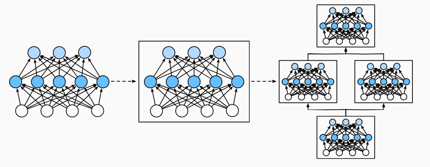

具体到实现上，一个模块就是一个类。一个模块可能不需要参数。基于自动化的库实现，每个模块只需要关心参数、前向传播。

下面是一个 256 单元单层和 10 个输出的网络：

```python
import torch
from torch import nn
from torch.nn import functional as F
net = nn.Sequential(nn.LazyLinear(256), nn.ReLU(), nn.LazyLinear(10))
X = torch.rand(2, 20) #2个样本，每个样本20个参数
net(X).shape #2,10,即net.__call__(X)
```

模块必须做的事情：

1. 摄入输入数据作为参数到前向传播方法
2. 调用前向传播生成输出
3. 计算输出对输入的梯度，使用反向传播
4. 存储参数
5. 初始化参数

包装一下上面的代码：

```python
class MLP(nn.Module):
    def __init__(self):
        # Call the constructor of the parent class nn.Module to perform
        # the necessary initialization
        super().__init__()
        self.hidden = nn.LazyLinear(256)
        self.out = nn.LazyLinear(10)

    # Define the forward propagation of the model, that is, how to return the
    # required model output based on the input X
    def forward(self, X):
        return self.out(F.relu(self.hidden(X)))
```

```python
net = MLP()
net(X).shape
```

序列模块 Sequential Module，要完成：将多个模块装在一起，前向传播。

```python
class MySequential(nn.Module):
    def __init__(self, *args):
        super().__init__()
        for idx, module in enumerate(args):
            self.add_module(str(idx), module)

    def forward(self, X):
        for module in self.children():
            X = module(X)
        return X
```

```python
net = MySequential(nn.LazyLinear(256), nn.ReLU(), nn.LazyLinear(10))
net(X).shape
```

常参数constant parameters，即不随着传播改变的，不依赖参数的常量如 $f(\mathbf{x},\mathbf{w}) = c \cdot \mathbf{w}^\top \mathbf{x}$。

```python
class FixedHiddenMLP(nn.Module):
    def __init__(self):
        super().__init__()
        # Random weight parameters that will not compute gradients and
        # therefore keep constant during training
        self.rand_weight = torch.rand((20, 20))
        self.linear = nn.LazyLinear(20)

    def forward(self, X):
        X = self.linear(X)
        X = F.relu(X @ self.rand_weight + 1)
        # Reuse the fully connected layer. This is equivalent to sharing
        # parameters with two fully connected layers
        X = self.linear(X)
        # Control flow
        while X.abs().sum() > 1:#l1范数
            X /= 2
        return X.sum()
```

```python
net = FixedHiddenMLP()
net(X)
```

综合拼接的奇怪例子：

```python
class NestMLP(nn.Module):
    def __init__(self):
        super().__init__()
        self.net = nn.Sequential(nn.LazyLinear(64), nn.ReLU(),
                                 nn.LazyLinear(32), nn.ReLU())
        self.linear = nn.LazyLinear(16)

    def forward(self, X):
        return self.linear(self.net(X))

chimera = nn.Sequential(NestMLP(), nn.LazyLinear(20), FixedHiddenMLP())
chimera(X)
```

```python
class NestMLP(nn.Module):
    def __init__(self):
        super().__init__()
        self.net = nn.Sequential(nn.LazyLinear(64), nn.ReLU(),
                                 nn.LazyLinear(32), nn.ReLU())
        self.linear = nn.LazyLinear(16)

    def forward(self, X):
        return self.linear(self.net(X))

chimera = nn.Sequential(NestMLP(), nn.LazyLinear(20), FixedHiddenMLP())
chimera(X)
```

##### 参数

训练好的参数，可能需要存到磁盘，以备以后拿来用。

假设有神经网络如下所示：

```python
import torch
from torch import nn
net = nn.Sequential(nn.LazyLinear(8),
                    nn.ReLU(),
                    nn.LazyLinear(1))
X = torch.rand(size=(2, 4))
net(X).shape
```

输出各层的参数：

```python
for i in range(3):
    print(net[i].state_dict())
#依次为8x4,空,1x8
print(net[0].state_dict()['weight'].tolist())
print(net[0].state_dict()['bias'].tolist())
```

```python
print(type(net[2].bias))
print(type(net[2].weight))
print(net[2].bias.data)
print(net[2].bias.data.tolist())
```

bias, weight 的类型是 Parameter。包含值，梯度和其他信息。如：

```python
print(net[2].weight.grad == None)
```

这样遍历对树状结构等很不方便，一种方便的遍历办法为：

```python
[(name, param.shape) for name, param in net.named_parameters()]
```

多层共享参数设置：

```python
# We need to give the shared layer a name so that we can refer to its
# parameters
shared = nn.LazyLinear(8)
net = nn.Sequential(nn.LazyLinear(8), nn.ReLU(),
                    shared, nn.ReLU(),
                    shared, nn.ReLU(),
                    nn.LazyLinear(1))

net(X)
# Check whether the parameters are the same
print(net[2].weight.data[0] == net[4].weight.data[0])
net[2].weight.data[0, 0] = 100
# Make sure that they are actually the same object rather than just having the
# same value
print(net[2].weight.data[0] == net[4].weight.data[0])
```

如果这么设置了，那么反向传播时，梯度会加在一起。

##### 参数初始化

默认通过输入输出维度确定随机的幅度分配随机值。

```python
import torch
from torch import nn
```

标准分布和置零：

```python
def init_normal(module):
    if type(module) == nn.Linear:
        nn.init.normal_(module.weight, mean=0, std=0.01)
        nn.init.zeros_(module.bias)

net.apply(init_normal)
net[0].weight.data[0], net[0].bias.data[0]
```

置常量：

```python
def init_constant(module):
    if type(module) == nn.Linear:
        nn.init.constant_(module.weight, 1)
        nn.init.zeros_(module.bias)

net.apply(init_constant)
net[0].weight.data[0], net[0].bias.data[0]
```

不同层不同的初始化

```python
def init_xavier(module):
    if type(module) == nn.Linear:
        nn.init.xavier_uniform_(module.weight)

def init_42(module):
    if type(module) == nn.Linear:
        nn.init.constant_(module.weight, 42)

net[0].apply(init_xavier)
net[2].apply(init_42)
print(net[0].weight.data[0])
print(net[2].weight.data)
```

可以自定义一些奇怪的初始化，例如：
$$
\begin{split}\begin{aligned}
    w \sim \begin{cases}
        U(5, 10) & \text{ with probability } \frac{1}{4} \\
            0    & \text{ with probability } \frac{1}{2} \\
        U(-10, -5) & \text{ with probability } \frac{1}{4}
    \end{cases}
\end{aligned}\end{split}
$$
具体到实现上，因为 $[-5,5]$ 的区间长刚好占一半，所以先跑一个 $[-10,10]$ 的分布，然后看看绝对值是不是在 $[-5,5]$ 是的话置零即可。即：

```python
def my_init(module):
    if type(module) == nn.Linear:
        print("Init", *[(name, param.shape)
                        for name, param in module.named_parameters()][0])
        nn.init.uniform_(module.weight, -10, 10)
        module.weight.data *= module.weight.data.abs() >= 5

net.apply(my_init)
net[0].weight[:2]
```

还可以直接设置参数：

```python
net[0].weight.data[:] += 1
net[0].weight.data[0, 0] = 42
net[0].weight.data[0]
```

直到传入数据前，模型都不会初始化，所以模型的维度在传入数据前都是不确定的。这是因为参数数未知。

假设有网络如下：

```python
import torch
from torch import nn
from d2l import torch as d2l
net = nn.Sequential(nn.LazyLinear(256), nn.ReLU(), nn.LazyLinear(10))
```

如果输出参数，会发现是未定义的：

```python
net[0].weight
```

现在传入样本，定义变量数目。

```python
X = torch.rand(2, 20)
net(X)

net[0].weight.shape #256,20
```

上例只有第一层需要知道输入的维度(即20)其它层不需要知道。但是要顺序递推，所以其它层也算不出来。(都显示为止，除了 relu 无参数)

```python
@d2l.add_to_class(d2l.Module)  #@save
def apply_init(self, inputs, init=None):
    self.forward(*inputs)
    if init is not None:
        self.net.apply(init)
```

##### 自定义层

```python
import torch
from torch import nn
from torch.nn import functional as F
from d2l import torch as d2l
```

一个例子：

```python
class CenteredLayer(nn.Module):
    def __init__(self):
        super().__init__()

    def forward(self, X):
        return X - X.mean()
```

使用：

```python
layer = CenteredLayer()
layer(torch.tensor([1.0, 2, 3, 4, 5]))
```

检验一下：

```python
net = nn.Sequential(nn.LazyLinear(128), CenteredLayer())
Y = net(torch.rand(4, 8))
Y.mean()
```

一个手写全连接层例子：(参数是输入和输出数)

```python
class MyLinear(nn.Module):
    def __init__(self, in_units, units):
        super().__init__()
        self.weight = nn.Parameter(torch.randn(in_units, units))
        self.bias = nn.Parameter(torch.randn(units,))

    def forward(self, X):
        linear = torch.matmul(X, self.weight.data) + self.bias.data
        return F.relu(linear)
linear = MyLinear(5, 3)
print(linear.weight) #5x3
print(linear.bias) #3
```

将2个样本直接传入该全连接层，得到这两个样本的输出：

```python
linear(torch.rand(2, 5)) #2x3
```

用多个自己的全连接层：

```python
net = nn.Sequential(MyLinear(64, 8), MyLinear(8, 1))
net(torch.rand(2, 64)) #2x1
```

##### 文件读写

模型可能需要存储，而且对长时间的训练，定期备份也是一个好习惯。

torch 可以直接读写，如下所示：

```python
import torch
from torch import nn
from torch.nn import functional as F
```

```python
x = torch.arange(4)
torch.save(x, 'result') #无后缀名,当前运行目录,二进制文件
x2 = torch.load('result')
print(x2)
```

可以存多个 tensors：

```python
y = torch.zeros(4)
torch.save([x, y],'x-files')
x2, y2 = torch.load('x-files')
print(x2, y2)
```

还可以存任意其他想存的：

```python
mydict = {'x': x, 'y': y}
torch.save(mydict, 'mydict')
mydict2 = torch.load('mydict')
print(mydict2)
```

```python
ww = "白茶再见"
def f(s):
    return s+s
torch.save([ww,f],'tmp') #但是lambda不能保存
ww2,f2 = torch.load('tmp')
print(f2(ww2))
```

对网络的存取：

```python
class MLP(nn.Module):
    def __init__(self):
        super().__init__()
        self.hidden = nn.LazyLinear(256)
        self.output = nn.LazyLinear(10)

    def forward(self, x):
        return self.output(F.relu(self.hidden(x)))

net = MLP()
X = torch.randn(size=(2, 20))
Y = net(X)

torch.save(net.state_dict(), 'mlp.params')
clone = MLP()
clone.load_state_dict(torch.load('mlp.params'))
print(clone.eval())

Y_clone = clone(X)
print(Y_clone == Y)
```

##### GPU

jupyter 输出 GPU 信息：

```python
!nvidia-smi
```

输出基本信息：

```python
import torch
from torch import nn
from d2l import torch as d2l
def cpu():  #@save
    """Get the CPU device."""
    return torch.device('cpu')

def gpu(i=0):  #@save
    """Get a GPU device."""
    return torch.device(f'cuda:{i}')

print(cpu(), gpu(), gpu(1))

def num_gpus():  #@save
    """Get the number of available GPUs."""
    return torch.cuda.device_count()

print(num_gpus())

def try_gpu(i=0):  #@save
    """Return gpu(i) if exists, otherwise return cpu()."""
    if num_gpus() >= i + 1:
        return gpu(i)
    return cpu()

def try_all_gpus():  #@save
    """Return all available GPUs, or [cpu(),] if no GPU exists."""
    return [gpu(i) for i in range(num_gpus())]

print(try_gpu(), try_gpu(10), try_all_gpus())
```

查看运算用 CPU 还是用 GPU：

```python
x = torch.tensor([1, 2, 3])
x.device #cpu
```

要计算的张量要部署在同一个设备上。否则，先复制：

```python
X = torch.ones(2, 3, device=cpu())
Y = torch.rand(2, 3, device=try_gpu())
Z = X.cuda()
print(X,Z)
```

虽然 GPU 计算快，但设备转移数据慢。因此多个小操作比一个大操作要劣。而且需要考虑局部性原理。

使用 GPU 的网络：

```python
net = nn.Sequential(nn.LazyLinear(1))
net = net.to(device=try_gpu())
net(X)
```

```python
print(net[0].weight.data.device)
```

抽象而言：

```python
@d2l.add_to_class(d2l.Trainer)  #@save
def __init__(self, max_epochs, num_gpus=0, gradient_clip_val=0):
    self.save_hyperparameters()
    self.gpus = [d2l.gpu(i) for i in range(min(num_gpus, d2l.num_gpus()))]

@d2l.add_to_class(d2l.Trainer)  #@save
def prepare_batch(self, batch):
    if self.gpus:
        batch = [a.to(self.gpus[0]) for a in batch]
    return batch

@d2l.add_to_class(d2l.Trainer)  #@save
def prepare_model(self, model):
    model.trainer = self
    model.board.xlim = [0, self.max_epochs]
    if self.gpus:
        model.to(self.gpus[0])
    self.model = model
```

注意输出会调回 GPU，所以在 GPT 每次训练后调试输出会损耗性能。

#### 卷积神经网络

##### 概念

传统 MLP 对特征(feature)间的关联处理不太好。

如果图片太大，那么特征非常多，即 $3nm$ 个，然后如果是全连接层，设有 $t$ 个神经元，也需要 $3nmt$ 个参数。

对图像识别，可能不需要关心准确的位置。空间不变性(spatial invariance)

- 平移不变性（translation invariance） 检测对象出现在图像中的哪个位置都能有相似的反应
- 局部性 locality 神经网络的前面几层应该只探索输入图像中的局部区域，而不过度在意图像中相隔较远区域的关系

输入层到隐藏层的变换为：
$$
\begin{split}\begin{aligned} \left[\mathbf{H}\right]_{i, j} &= [\mathbf{U}]_{i, j} + \sum_k \sum_l[\mathsf{W}]_{i, j, k, l}  [\mathbf{X}]_{k, l}\\ &=  [\mathbf{U}]_{i, j} +
\sum_a \sum_b [\mathsf{V}]_{i, j, a, b}  [\mathbf{X}]_{i+a, j+b}.\end{aligned}\end{split}
$$
其中 $[\mathsf{V}]_{i, j, a, b} = [\mathsf{W}]_{i, j, i+a, j+b}$。

平移不变性：如果 $X$ 位移，$H$ 也只位移。即 $V,U$ 不依赖下标，有 $[\mathsf{V}]_{i, j, a, b} = [\mathbf{V}]_{a, b}$，且是一个常数，因此可以简化为：
$$
[\mathbf{H}]_{i, j} = u + \sum_a\sum_b [\mathbf{V}]_{a, b} [\mathbf{X}]_{i+a, j+b}
$$
上述即为卷积(convolution)运算，这将使得系数变少。

局部性，即对 $|a|>\Delta$ 或 $|b|>\Delta$，设 $[\mathbf{V}]_{a, b} = 0$，即：
$$
[\mathbf{H}]_{i, j} = u + \sum_{a = -\Delta}^{\Delta} \sum_{b = -\Delta}^{\Delta} [\mathbf{V}]_{a, b}  [\mathbf{X}]_{i+a, j+b}
$$
卷积神经网络是包含卷积层的一类特殊的神经网络。 在深度学习研究社区中，V被称为卷积核（convolution kernel）或者滤波器（filter），亦或简单地称之为该卷积层的权重

多层感知机可能需要数十亿个参数来表示网络中的一层，而现在卷积神经网络通常只需要几百个参数。代价是，我们的特征现在是平移不变的。且每一层只包含局部的信息。当且仅当要训练的内容确实符合平移不变性和局部性假设时，才能得到有效的模型，否则拟合可能不好。

数学而言，$f, g: \mathbb{R}^d \to \mathbb{R}$ 的卷积的定义是：
$$
(f * g)(\mathbf{x}) = \int f(\mathbf{z}) g(\mathbf{x}-\mathbf{z}) d\mathbf{z}
$$
也就是说，卷积是当把一个函数“翻转”并移位x时，测量f和g之间的重叠。 当为离散对象时，积分就变成求和。对离散对象为：
$$
(f * g)(i) = \sum_a f(a) g(i-a)
$$
二维：
$$
(f * g)(i, j) = \sum_a\sum_b f(a, b) g(i-a, j-b)
$$
图像一般包含三个通道，即红绿蓝。第三轴可看成每个像素的多维表示。所以隐藏层也用三维张量。采用一组而不是一个隐藏表示。这样一组隐藏表示可以想象成一些互相堆叠的二维网格。可以把隐藏表示想象为一系列具有二维张量的通道（channel）。 这些通道有时也被称为特征映射（feature maps），即：
$$
[\mathsf{H}]_{i,j,d} = \sum_{a = -\Delta}^{\Delta} \sum_{b = -\Delta}^{\Delta} \sum_c [\mathsf{V}]_{a, b, c, d} [\mathsf{X}]_{i+a, j+b, c}
$$
其中 d 表示输出通道，即将 c 映射到 d。

##### 卷积

严格来说，卷积层是个错误的叫法，因为它所表达的运算其实是互相关运算（cross-correlation）

一个卷积的例子：

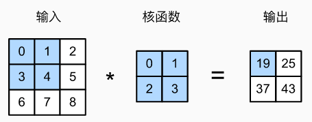
$$
\begin{split}0\times0+1\times1+3\times2+4\times3=19,\\
1\times0+2\times1+4\times2+5\times3=25,\\
3\times0+4\times1+6\times2+7\times3=37,\\
4\times0+5\times1+7\times2+8\times3=43.\end{split}
$$
对输入大小 $n_h \times n_w$ 和卷积核大小 $k_h \times k_w$，输出大小为 $(n_h-k_h+1) \times (n_w-k_w+1)$

手写如下：

```python
import torch
from torch import nn
from d2l import torch as d2l

def corr2d(X, K):  #@save
    """计算二维互相关运算"""
    h, w = K.shape
    Y = torch.zeros((X.shape[0] - h + 1, X.shape[1] - w + 1))
    for i in range(Y.shape[0]):
        for j in range(Y.shape[1]):
            Y[i, j] = (X[i:i + h, j:j + w] * K).sum()
    return Y
```

```python
X = torch.tensor([[0.0, 1.0, 2.0], [3.0, 4.0, 5.0], [6.0, 7.0, 8.0]])
K = torch.tensor([[0.0, 1.0], [2.0, 3.0]])
corr2d(X, K)
```

因此可以写一个卷积层：

```python
class Conv2D(nn.Module):
    def __init__(self, kernel_size):
        super().__init__()
        self.weight = nn.Parameter(torch.rand(kernel_size))
        self.bias = nn.Parameter(torch.zeros(1))

    def forward(self, x):
        return corr2d(x, self.weight) + self.bias
```

数字图像处理的边缘检测例子，卷积核为 1代表从白色到黑色的边缘，-1代表从黑色到白色的边缘：

```python
K = torch.tensor([[1.0, -1.0]])
```

检测例子：

```python
X = torch.ones((6, 8))
X[:, 2:6] = 0 #中间四列0，其他1
print(corr2d(X, K))
print(corr2d(X.t(), K))
```

得到结果为，第二列是1，倒数第二列是-1，其他都是0。转置后结果全0

尝试训练一个上述的边缘检测函数：

```python
Y = corr2d(X, K)
# 构造一个二维卷积层，它具有1个输出通道和形状为（1，2）的卷积核
conv2d = nn.Conv2d(1,1, kernel_size=(1, 2), bias=False)

# 这个二维卷积层使用四维输入和输出格式（批量大小、通道、高度、宽度），
# 其中批量大小和通道数都为1
X = X.reshape((1, 1, 6, 8))
Y = Y.reshape((1, 1, 6, 7))
lr = 3e-2  # 学习率

for i in range(10):
    Y_hat = conv2d(X)
    l = (Y_hat - Y) ** 2
    conv2d.zero_grad()
    l.sum().backward()
    # 迭代卷积核
    conv2d.weight.data[:] -= lr * conv2d.weight.grad
    if (i + 1) % 2 == 0:
        print(f'epoch {i+1}, loss {l.sum():.3f}')
```

输出训练结果发现跟实际上述的卷积核比较接近：

```python
print(conv2d.weight.data.reshape((1, 2)))
```

只需水平和垂直翻转二维卷积核张量，然后对输入张量执行互相关运算，就是卷积运算。实际上效果是一样的。

输出的卷积层有时被称为特征映射（feature map），因为它可以被视为一个输入映射到下一层的空间维度的转换器。 在卷积神经网络中，对于某一层的任意元素x，其感受野（receptive field）是指在前向传播期间可能影响x计算的所有元素（来自所有先前层）。感受野可能大于输入的实际大小。

##### 填充和步幅

原始图像的边界丢失了许多有用信息。而填充是解决此问题最有效的方法。输入图像的边界填充元素（通常填充元素是0），如先 3x3 填到 5x5 再卷成 4x4

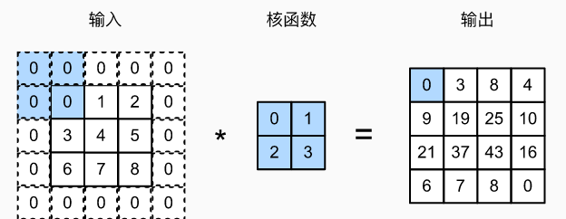

添加$p_h$行填充（大约一半在顶部，一半在底部）和$p_w$列填充（左侧大约一半，右侧一半），则输出形状将为 $(n_h-k_h+p_h+1)\times(n_w-k_w+p_w+1)$

多数情况设 $p_h=k_h-1$ 和 $p_w=k_w-1$ 使得输入输出维度不变。若 $k_h$ 是奇数，可以两侧填充 $p_h\div2$ 行，偶数就顶部 $\lceil p_h\div2\rceil$ 行，底部 $\lfloor p_h\div2\rfloor$ 行。宽度同理。

卷积神经网络中卷积核的高度和宽度通常为奇数，例如1、3、5或7。 选择奇数的好处是，保持空间维度的同时，我们可以在顶部和底部填充相同数量的行，在左侧和右侧填充相同数量的列。

> 若满足 1\. 卷积核的大小是奇数； 2\. 所有边的填充行数和列数相同； 3\. 输出与输入具有相同高度和宽度 则可以得出：输出`Y[i, j]`是通过以输入`X[i, j]`为中心，与卷积核进行互相关计算得到的。

一个卷积的例子：

```python
import torch
from torch import nn


# 为了方便起见，我们定义了一个计算卷积层的函数。
# 此函数初始化卷积层权重，并对输入和输出提高和缩减相应的维数
def comp_conv2d(conv2d, X):
    # 这里的（1，1）表示批量大小和通道数都是1
    X = X.reshape((1, 1) + X.shape)
    Y = conv2d(X)
    # 省略前两个维度：批量大小和通道
    return Y.reshape(Y.shape[2:])

# 请注意，这里每边都填充了1行或1列，因此总共添加了2行或2列
conv2d = nn.Conv2d(1, 1, kernel_size=3, padding=1)
X = torch.rand(size=(8, 8))
comp_conv2d(conv2d, X).shape
```

将每次滑动元素的数量称为步幅（stride），如垂直步幅为3，水平步幅为2的二维互相关运算：

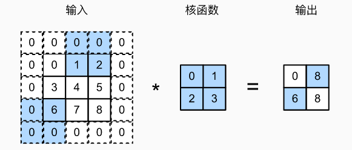

每行算完两次后，当卷积窗口继续向右滑动两列时，没有输出，因为输入元素无法填充窗口（除非我们添加另一列填充）。

通常，当垂直步幅为 $s_h$、水平步幅为 $s_w$ 时，输出形状为
$$
\lfloor(n_h-k_h+p_h+s_h)/s_h\rfloor \times \lfloor(n_w-k_w+p_w+s_w)/s_w\rfloor
$$
如果设置了 $p_h=k_h-1$ 且 $p_w=k_w-1$ 则有 $\lfloor(n_h+s_h-1)/s_h\rfloor \times \lfloor(n_w+s_w-1)/s_w\rfloor$，如果再将输入高度宽度被步幅整除，则输出形状为 $(n_h/s_h) \times (n_w/s_w)$

一个高度宽度减半的例子：

```python
conv2d = nn.Conv2d(1, 1, kernel_size=3, padding=1, stride=2)
comp_conv2d(conv2d, X).shape
```

其他例子：

```python
conv2d = nn.Conv2d(1, 1, kernel_size=(3, 5), padding=(0, 1), stride=(3, 4))
comp_conv2d(conv2d, X).shape
```

##### 通道

添加通道时，我们的输入和隐藏的表示都变成了三维张量，如 $3\times h\times w$ 的是大小为 $3$ 的轴是通道 channel 维度。设通道数是 $c_i$。每个卷积核二位张量互相关运算，然后将每个通道求和，得到二位张量。


手写示例：

```python
import torch
from d2l import torch as d2l

def corr2d_multi_in(X, K):
    # 先遍历“X”和“K”的第0个维度（通道维度），再把它们加在一起
    return sum(d2l.corr2d(x, k) for x, k in zip(X, K))
```

```python
X = torch.tensor([[[0.0, 1.0, 2.0], [3.0, 4.0, 5.0], [6.0, 7.0, 8.0]],
               [[1.0, 2.0, 3.0], [4.0, 5.0, 6.0], [7.0, 8.0, 9.0]]])
K = torch.tensor([[[0.0, 1.0], [2.0, 3.0]], [[1.0, 2.0], [3.0, 4.0]]])

corr2d_multi_in(X, K)
```

每个通道不是独立学习的，而是为了共同使用而优化的。为了输出多个通道可以创造形状为 $c_o\times c_i\times k_h\times k_w$ 的卷积核。

```python
def corr2d_multi_in_out(X, K):
    # 迭代“K”的第0个维度，每次都对输入“X”执行互相关运算。
    # 最后将所有结果都叠加在一起
    return torch.stack([corr2d_multi_in(X, k) for k in K], 0)
```

stack 解释：

```python
# 假设是时间步T1的输出
T1 = torch.tensor([[1, 2, 3],
        		[4, 5, 6],
        		[7, 8, 9]])
# 假设是时间步T2的输出
T2 = torch.tensor([[10, 20, 30],
        		[40, 50, 60],
        		[70, 80, 90]])
print(torch.stack((T1,T2),dim=0))
print(torch.stack((T1,T2),dim=1))
print(torch.stack((T1,T2),dim=2))
'''第一个：
tensor([[[ 1,  2,  3],
         [10, 20, 30]],

        [[ 4,  5,  6],
         [40, 50, 60]],

        [[ 7,  8,  9],
         [70, 80, 90]]])'''
```

```python
print(torch.stack((T1,T1,T2),0)) #[T1,T1,T2] , 3x3x3
print(torch.stack((T1,T2,T2),0)) #[T1,T2,T2]
```

```python
K = torch.stack((K, K + 1, K + 2), 0)
print(K.shape)
print(K)
```

卷一下上述的 3x2x2x2，得到 3x2x2：

```python
corr2d_multi_in_out(X, K)
```

可以造 1x1 卷积层，用来调整通道数量，控制模型复杂度：

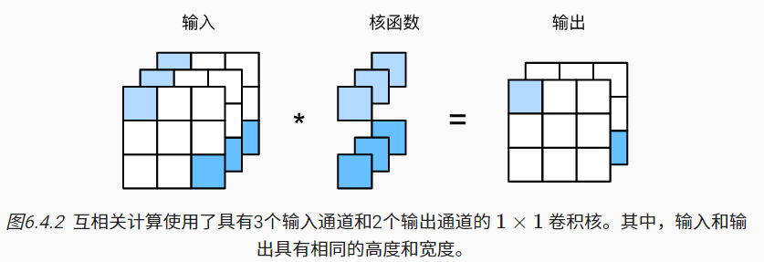

```python
def corr2d_multi_in_out_1x1(X, K):
    c_i, h, w = X.shape
    c_o = K.shape[0]
    X = X.reshape((c_i, h * w))
    K = K.reshape((c_o, c_i))
    # 全连接层中的矩阵乘法
    Y = torch.matmul(K, X)
    return Y.reshape((c_o, h, w))
X = torch.normal(0, 1, (3, 3, 3))
K = torch.normal(0, 1, (2, 3, 1, 1))

Y1 = corr2d_multi_in_out_1x1(X, K)
Y2 = corr2d_multi_in_out(X, K)
print(Y1) #3x3
print(Y2) #3x3
assert float(torch.abs(Y1 - Y2).sum()) < 1e-6
```

##### 汇聚层

希望逐渐降低隐藏表示的空间分辨率、聚集信息，这样随着我们在神经网络中层叠的上升，每个神经元对其敏感的感受野（输入）就越大，最后一层的神经元应该对整个输入的全局敏感

在现实中，随着拍摄角度的移动，任何物体几乎不可能发生在同一像素上。即使用三脚架拍摄一个静止的物体，由于快门的移动而引起的相机振动，可能会使所有物体左右移动一个像素

汇聚（pooling）层，它具有双重目的：降低卷积层对位置的敏感性，同时降低对空间降采样表示的敏感性

汇聚层运算符为固定形状窗口，有时称为汇聚窗口。不包含参数，池运算是确定性的，我们通常计算汇聚窗口中所有元素的最大值或平均值。这些操作分别称为最大汇聚层（maximum pooling）和平均汇聚层（average pooling）。

汇聚窗口形状为 pxq 的汇聚层称为 pxq 汇聚层，汇聚操作称 pxq 汇聚。如

```python
import torch
from torch import nn
from d2l import torch as d2l

def pool2d(X, pool_size, mode='max'):
    p_h, p_w = pool_size
    Y = torch.zeros((X.shape[0] - p_h + 1, X.shape[1] - p_w + 1))
    for i in range(Y.shape[0]):
        for j in range(Y.shape[1]):
            if mode == 'max':
                Y[i, j] = X[i: i + p_h, j: j + p_w].max()
            elif mode == 'avg':
                Y[i, j] = X[i: i + p_h, j: j + p_w].mean()
    return Y
```

```python
X = torch.tensor([[0.0, 1.0, 2.0], [3.0, 4.0, 5.0], [6.0, 7.0, 8.0]])
print(pool2d(X, (2, 2)))
print(pool2d(X, (2, 2), 'avg'))
```

显然可以调库：

```python
X = torch.arange(16, dtype=torch.float32).reshape((1, 1, 4, 4))
pool2d = nn.MaxPool2d(3)
print(pool2d(X)) #1x1x1x1
pool2d = nn.MaxPool2d(3, padding=1, stride=2)
print(pool2d(X)) #1x1x2x2
pool2d = nn.MaxPool2d((2, 3), stride=(2, 3), padding=(0, 1))
print(pool2d(X)) #==上
```

多通道：

```python
X = torch.arange(16, dtype=torch.float32).reshape((1, 1, 4, 4))
X = torch.cat((X, X + 1), 1)
print(X) #1x1x4x4
pool2d = nn.MaxPool2d(3, padding=1, stride=2)
print(pool2d(X))
```

##### LeNet

LeNet，它是最早发布的卷积神经网络之一。当时，LeNet取得了与支持向量机（support vector machines）性能相媲美的成果，成为监督学习的主流方法

在LeNet提出后，卷积神经网络在计算机视觉和机器学习领域中很有名气。但卷积神经网络并没有主导这些领域。这是因为虽然LeNet在小数据集上取得了很好的效果，但是在更大、更真实的数据集上训练卷积神经网络的性能和可行性还有待研究。事实上，在上世纪90年代初到2012年之间的大部分时间里，神经网络往往被其他机器学习方法超越，如支持向量机（support vector machines）

> 卷积神经网络的输入是由原始像素值或是经过简单预处理（例如居中、缩放）的像素值组成的。但在使用传统机器学习方法时，从业者永远不会将原始像素作为输入。在传统机器学习方法中，计算机视觉流水线是由经过人的手工精心设计的特征流水线组成的。对于这些传统方法，大部分的进展都来自于对特征有了更聪明的想法，并且学习到的算法往往归于事后的解释
>
> 卷积神经网络的输入是由原始像素值或是经过简单预处理（例如居中、缩放）的像素值组成的。但在使用传统机器学习方法时，从业者永远不会将原始像素作为输入。在传统机器学习方法中，计算机视觉流水线是由经过人的手工精心设计的特征流水线组成的。对于这些传统方法，大部分的进展都来自于对特征有了更聪明的想法
>
> 经典机器学习的流水线看起来更像下面这样：
>
> 1. 获取一个有趣的数据集。在早期，收集这些数据集需要昂贵的传感器（在当时最先进的图像也就100万像素）。
> 2. 根据光学、几何学、其他知识以及偶然的发现，手工对特征数据集进行预处理。
> 3. 通过标准的特征提取算法，如SIFT（尺度不变特征变换） ([Lowe, 2004](https://zh.d2l.ai/chapter_references/zreferences.html#id102))和SURF（加速鲁棒特征） ([Bay *et al.*, 2006](https://zh.d2l.ai/chapter_references/zreferences.html#id7))或其他手动调整的流水线来输入数据。
> 4. 将提取的特征送入最喜欢的分类器中（例如线性模型或其它核方法），以训练分类器
>
> 计算机视觉研究人员相信，从对最终模型精度的影响来说，更大或更干净的数据集、或是稍微改进的特征提取，比任何学习算法带来的进步要大得多。

（LeNet-5）由两个部分组成：

- 卷积编码器：由两个卷积层组成;
- 全连接层密集块：由三个全连接层组成。


每个卷积块中的基本单元是一个卷积层、一个sigmoid激活函数和平均汇聚层。relu 和最大汇聚层更有效。

每个卷积层使用5×5卷积核和一个sigmoid激活函数。第一卷积层有6个输出通道，而第二个卷积层有16个输出通道。每个2×2池操作（步幅2）通过空间下采样将维数减少4倍。卷积的输出形状由批量大小、通道数、高度、宽度决定。

具体实现：

```python
import torch
from torch import nn
from d2l import torch as d2l

net = nn.Sequential(
    nn.Conv2d(1, 6, kernel_size=5, padding=2), nn.Sigmoid(),
    nn.AvgPool2d(kernel_size=2, stride=2),
    nn.Conv2d(6, 16, kernel_size=5), nn.Sigmoid(),
    nn.AvgPool2d(kernel_size=2, stride=2),
    nn.Flatten(), #展平维度
    nn.Linear(16 * 5 * 5, 120), nn.Sigmoid(),
    nn.Linear(120, 84), nn.Sigmoid(),
    nn.Linear(84, 10))
```

去掉了原始模型最后一层的高斯激活。


输出一下各层及其形状：

```python
X = torch.rand(size=(1, 1, 28, 28), dtype=torch.float32)
for layer in net:
    X = layer(X)
    print(layer.__class__.__name__,'output shape: \t',X.shape)
```

用这个网络跑一下之前的衣服 Fashion-MNIST 数据集，使用 GPU 加速：

```python
batch_size = 256
train_iter, test_iter = d2l.load_data_fashion_mnist(batch_size=batch_size)
```

由于完整的数据集位于内存中，因此在模型使用GPU计算数据集之前，我们需要将其复制到显存中。在进行正向和反向传播之前，我们需要将每一小批量数据移动到我们指定的设备（例如GPU）上

```python
def evaluate_accuracy_gpu(net, data_iter, device=None): #@save
    """使用GPU计算模型在数据集上的精度"""
    if isinstance(net, nn.Module):
        net.eval()  # 设置为评估模式
        if not device:
            device = next(iter(net.parameters())).device
    # 正确预测的数量，总预测的数量
    metric = d2l.Accumulator(2)
    with torch.no_grad():
        for X, y in data_iter:
            if isinstance(X, list):
                # BERT微调所需的（之后将介绍）
                X = [x.to(device) for x in X]
            else:
                X = X.to(device)
            y = y.to(device)
            metric.add(d2l.accuracy(net(X), y), y.numel())
    return metric[0] / metric[1]
```

```python
#@save
def train_ch6(net, train_iter, test_iter, num_epochs, lr, device):
    """用GPU训练模型(在第六章定义)"""
    def init_weights(m):
        if type(m) == nn.Linear or type(m) == nn.Conv2d:
            nn.init.xavier_uniform_(m.weight)
    net.apply(init_weights)
    print('training on', device)
    net.to(device)
    optimizer = torch.optim.SGD(net.parameters(), lr=lr)
    loss = nn.CrossEntropyLoss()
    animator = d2l.Animator(xlabel='epoch', xlim=[1, num_epochs],
                            legend=['train loss', 'train acc', 'test acc'])
    timer, num_batches = d2l.Timer(), len(train_iter)
    for epoch in range(num_epochs):
        # 训练损失之和，训练准确率之和，样本数
        metric = d2l.Accumulator(3)
        net.train()
        for i, (X, y) in enumerate(train_iter):
            timer.start()
            optimizer.zero_grad()
            X, y = X.to(device), y.to(device)
            y_hat = net(X)
            l = loss(y_hat, y)
            l.backward()
            optimizer.step()
            with torch.no_grad():
                metric.add(l * X.shape[0], d2l.accuracy(y_hat, y), X.shape[0])
            timer.stop()
            train_l = metric[0] / metric[2]
            train_acc = metric[1] / metric[2]
            if (i + 1) % (num_batches // 5) == 0 or i == num_batches - 1:
                animator.add(epoch + (i + 1) / num_batches,
                             (train_l, train_acc, None))
        test_acc = evaluate_accuracy_gpu(net, test_iter)
        animator.add(epoch + 1, (None, None, test_acc))
    print(f'loss {train_l:.3f}, train acc {train_acc:.3f}, '
          f'test acc {test_acc:.3f}')
    print(f'{metric[2] * num_epochs / timer.sum():.1f} examples/sec '
          f'on {str(device)}')
```

进行训练，要一分钟多一点吧：

```python
lr, num_epochs = 0.9, 10
train_ch6(net, train_iter, test_iter, num_epochs, lr, d2l.try_gpu())
```

#### 现代神经网络

ImageNet竞赛自2010年以来，一直是计算机视觉中监督学习进展的指向标。

经典模型包括：

- AlexNet。第一个在大规模视觉竞赛中击败传统计算机视觉模型的大型神经网络；
- 使用重复块的网络（VGG）。它利用许多重复的神经网络块；
- 网络中的网络（NiN）。它重复使用由卷积层和1×1卷积层（用来代替全连接层）来构建深层网络;
- 含并行连结的网络（GoogLeNet）。它使用并行连结的网络，通过不同窗口大小的卷积层和最大汇聚层来并行抽取信息；
- 残差网络（ResNet）。它通过残差块构建跨层的数据通道，是计算机视觉中最流行的体系架构；
- 稠密连接网络（DenseNet）。它的计算成本很高，但给我们带来了更好的效果。

深度神经网络的概念非常简单——将神经网络堆叠在一起。但由于不同的网络架构和超参数选择，这些神经网络的性能会发生很大变化

##### AlexNet

AlexNet以Alex Krizhevsky的名字命名。首次证明了学习到的特征可以超越手工设计的特征

特征本身应该被学习。此外，他们还认为，在合理地复杂性前提下，特征应该由多个共同学习的神经网络层组成，每个层都有可学习的参数。在机器视觉中，最底层可能检测边缘、颜色和纹理

> 有一群执着的研究者不断钻研，试图学习视觉数据的逐级表征，然而很长一段时间里这些尝试都未有突破

包含许多特征的深度模型需要大量的有标签数据，才能显著优于基于凸优化的传统方法（如线性方法和核方法）。image net 提供了大量的数据集。

深度学习对计算资源要求很高，训练可能需要数百个迭代轮数，每次迭代都需要通过代价高昂的许多线性代数层传递数据。GPU 用来加速通用计算。

> CPU的每个核心都拥有高时钟频率的运行能力，和高达数MB的三级缓存（L3Cache）。 它们非常适合执行各种指令，具有分支预测器、深层流水线和其他使CPU能够运行各种程序的功能。 然而，这种明显的优势也是它的致命弱点：通用核心的制造成本非常高。 它们需要大量的芯片面积、复杂的支持结构（内存接口、内核之间的缓存逻辑、高速互连等等），而且它们在任何单个任务上的性能都相对较差。 现代笔记本电脑最多有4核，即使是高端服务器也很少超过64核，因为它们的性价比不高。
>
> GPU由100∼1000个小的处理单元组成。虽然每个GPU核心都相对较弱，有时甚至以低于1GHz的时钟频率运行，但庞大的核心数量使GPU比CPU快几个数量级。功耗往往会随时钟频率呈二次方增长。 对于一个CPU核心，假设它的运行速度比GPU快4倍，但可以使用16个GPU核代替，那么GPU的综合性能就是CPU的16×1/4=4倍。GPU内核要简单得多，这使得它们更节能。GPU拥有10倍于CPU的带宽。
>
> 卷积神经网络中的计算瓶颈：卷积和矩阵乘法，都是可以在硬件上并行化的操作。 

使用了8层卷积神经网络。


AlexNet和LeNet的设计理念非常相似，但也存在显著差异。

1. AlexNet比相对较小的LeNet5要深得多。AlexNet由八层组成：五个卷积层、两个全连接隐藏层和一个全连接输出层。
2. AlexNet使用ReLU而不是sigmoid作为其激活函数。

提供的是一个稍微精简版本的AlexNet，去除了当年需要两个小型GPU同时运算的设计特点。

在AlexNet的第一层，卷积窗口的形状是11×11。 由于ImageNet中大多数图像的宽和高比MNIST图像的多10倍以上，因此，需要一个更大的卷积窗口来捕获目标。 第二层中的卷积窗口形状被缩减为5×5，然后是3×3。 此外，在第一层、第二层和第五层卷积层之后，加入窗口形状为3×3、步幅为2的最大汇聚层。 而且，AlexNet的卷积通道数目是LeNet的10倍。

在最后一个卷积层后有两个全连接层，分别有4096个输出。 这两个巨大的全连接层拥有将近1GB的模型参数。

一方面，ReLU激活函数的计算更简单，它不需要如sigmoid激活函数那般复杂的求幂运算。 另一方面，当使用不同的参数初始化方法时，ReLU激活函数使训练模型更加容易。ReLU激活函数在正区间的梯度总是1。 当sigmoid激活函数的输出非常接近于0或1时，这些区域的梯度几乎为0，因此反向传播无法继续更新一些模型参数。如果模型参数没有正确初始化，sigmoid函数可能在正区间内得到几乎为0的梯度，从而使模型无法得到有效的训练。

AlexNet通过暂退法(dropout)控制全连接层的模型复杂度，而LeNet只使用了权重衰减。 为了进一步扩充数据，AlexNet在训练时增加了大量的图像增强数据，如翻转、裁切和变色。

```python
import torch
from torch import nn
from d2l import torch as d2l

net = nn.Sequential(
    # 这里使用一个11*11的更大窗口来捕捉对象。
    # 同时，步幅为4，以减少输出的高度和宽度。
    # 另外，输出通道的数目远大于LeNet
    nn.Conv2d(1, 96, kernel_size=11, stride=4, padding=1), nn.ReLU(),
    nn.MaxPool2d(kernel_size=3, stride=2),
    # 减小卷积窗口，使用填充为2来使得输入与输出的高和宽一致，且增大输出通道数
    nn.Conv2d(96, 256, kernel_size=5, padding=2), nn.ReLU(),
    nn.MaxPool2d(kernel_size=3, stride=2),
    # 使用三个连续的卷积层和较小的卷积窗口。
    # 除了最后的卷积层，输出通道的数量进一步增加。
    # 在前两个卷积层之后，汇聚层不用于减少输入的高度和宽度
    nn.Conv2d(256, 384, kernel_size=3, padding=1), nn.ReLU(),
    nn.Conv2d(384, 384, kernel_size=3, padding=1), nn.ReLU(),
    nn.Conv2d(384, 256, kernel_size=3, padding=1), nn.ReLU(),
    nn.MaxPool2d(kernel_size=3, stride=2),
    nn.Flatten(),
    # 这里，全连接层的输出数量是LeNet中的好几倍。使用dropout层来减轻过拟合
    nn.Linear(6400, 4096), nn.ReLU(),
    nn.Dropout(p=0.5),
    nn.Linear(4096, 4096), nn.ReLU(),
    nn.Dropout(p=0.5),
    # 最后是输出层。由于这里使用Fashion-MNIST，所以用类别数为10，而非论文中的1000
    nn.Linear(4096, 10))
```

用一个单通道图片观察形状：

```python
X = torch.randn(1, 1, 224, 224)
for layer in net:
    X=layer(X)
    print(layer.__class__.__name__,'output shape:\t',X.shape)
```

即使在现代GPU上，训练ImageNet模型，同时使其收敛可能需要数小时或数天的时间。 将AlexNet直接应用于Fashion-MNIST的一个问题是，Fashion-MNIST图像的分辨率（28×28像素）低于ImageNet图像。 为了解决这个问题，我们将它们增加到224×224（通常来讲这不是一个明智的做法，但在这里这样做是为了有效使用AlexNet架构）。 这里需要使用`d2l.load_data_fashion_mnist`函数中的`resize`参数执行此调整。

```python
batch_size = 128
train_iter, test_iter = d2l.load_data_fashion_mnist(batch_size, resize=224)
```

训练：(本机 15min)

```python
lr, num_epochs = 0.01, 10
d2l.train_ch6(net, train_iter, test_iter, num_epochs, lr, d2l.try_gpu())
```

##### VGG

从单个神经元的角度思考问题，发展到整个层，现在又转向块，重复层的模式。VGG 是牛津大学 visual geometry group

经典卷积神经网络的基本组成部分是下面的这个序列：

1. 带填充以保持分辨率的卷积层；
2. 非线性激活函数，如ReLU；
3. 汇聚层，如最大汇聚层。

而一个VGG块与之类似，由一系列卷积层组成，后面再加上用于空间下采样的最大汇聚层。

两个参数，分别对应于卷积层的数量`num_convs`和输出通道的数量`num_channels`

```python
import torch
from torch import nn
from d2l import torch as d2l


def vgg_block(num_convs, in_channels, out_channels):
    layers = []
    for _ in range(num_convs):
        layers.append(nn.Conv2d(in_channels, out_channels,
                                kernel_size=3, padding=1))
        layers.append(nn.ReLU())
        in_channels = out_channels
    layers.append(nn.MaxPool2d(kernel_size=2,stride=2))
    return nn.Sequential(*layers)
```

VGG网络可以分为两部分：第一部分主要由卷积层和汇聚层组成，第二部分由全连接层组成

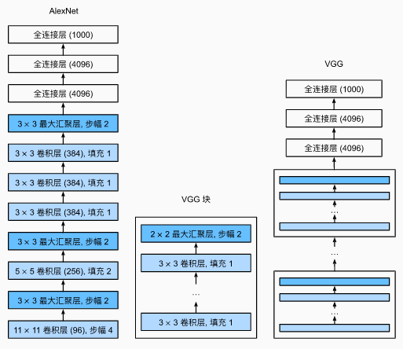

超参数变量`conv_arch`。该变量指定了每个VGG块里卷积层个数和输出通道数。全连接模块则与AlexNet中的相同。

原始VGG网络有5个卷积块，其中前两个块各有一个卷积层，后三个块各包含两个卷积层。 第一个模块有64个输出通道，每个后续模块将输出通道数量翻倍，直到该数字达到512。由于该网络使用8个卷积层和3个全连接层，因此它通常被称为VGG-11。

```python
conv_arch = ((1, 64), (1, 128), (2, 256), (2, 512), (2, 512))
def vgg(conv_arch):
    conv_blks = []
    in_channels = 1
    # 卷积层部分
    for (num_convs, out_channels) in conv_arch:
        conv_blks.append(vgg_block(num_convs, in_channels, out_channels))
        in_channels = out_channels

    return nn.Sequential(
        *conv_blks, nn.Flatten(),
        # 全连接层部分
        nn.Linear(out_channels * 7 * 7, 4096), nn.ReLU(), nn.Dropout(0.5),
        nn.Linear(4096, 4096), nn.ReLU(), nn.Dropout(0.5),
        nn.Linear(4096, 10))

net = vgg(conv_arch)
```

观察形状：

```python
X = torch.randn(size=(1, 1, 224, 224))
for blk in net:
    X = blk(X)
    print(blk.__class__.__name__,'output shape:\t',X.shape)
```

由于VGG-11比AlexNet计算量更大，因此我们构建了一个通道数较少的网络，足够用于训练Fashion-MNIST数据集

```python
ratio = 4
small_conv_arch = [(pair[0], pair[1] // ratio) for pair in conv_arch]
net = vgg(small_conv_arch)
```

训练：(本机 24min)

```python
lr, num_epochs, batch_size = 0.05, 10, 128
train_iter, test_iter = d2l.load_data_fashion_mnist(batch_size, resize=224)
d2l.train_ch6(net, train_iter, test_iter, num_epochs, lr, d2l.try_gpu())
```

##### NiN

LeNet、AlexNet和VGG都有一个共同的设计模式：通过一系列的卷积层与汇聚层来提取空间结构特征；然后通过全连接层对特征的表征进行处理。 AlexNet和VGG对LeNet的改进主要在于如何扩大和加深这两个模块。 或者，可以想象在这个过程的早期使用全连接层。然而，如果使用了全连接层，可能会完全放弃表征的空间结构。 网络中的网络（NiN net in net）提供了一个非常简单的解决方案：在每个像素的通道上分别使用多层感知机

NiN的想法是在每个像素位置（针对每个高度和宽度）应用一个全连接层， 从另一个角度看，即将空间维度中的每个像素视为单个样本，将通道维度视为不同特征（feature）


```python
import torch
from torch import nn
from d2l import torch as d2l


def nin_block(in_channels, out_channels, kernel_size, strides, padding):
    return nn.Sequential(
        nn.Conv2d(in_channels, out_channels, kernel_size, strides, padding),
        nn.ReLU(),
        nn.Conv2d(out_channels, out_channels, kernel_size=1), nn.ReLU(),
        nn.Conv2d(out_channels, out_channels, kernel_size=1), nn.ReLU())
```

NiN和AlexNet之间的一个显著区别是NiN完全取消了全连接层。 相反，NiN使用一个NiN块，其输出通道数等于标签类别的数量。最后放一个*全局平均汇聚层*（global average pooling layer），生成一个对数几率 （logits）。NiN设计的一个优点是，它显著减少了模型所需参数的数量。然而，在实践中，这种设计有时会增加训练模型的时间

```python
net = nn.Sequential(
    nin_block(1, 96, kernel_size=11, strides=4, padding=0),
    nn.MaxPool2d(3, stride=2),
    nin_block(96, 256, kernel_size=5, strides=1, padding=2),
    nn.MaxPool2d(3, stride=2),
    nin_block(256, 384, kernel_size=3, strides=1, padding=1),
    nn.MaxPool2d(3, stride=2),
    nn.Dropout(0.5),
    # 标签类别数是10
    nin_block(384, 10, kernel_size=3, strides=1, padding=1),
    nn.AdaptiveAvgPool2d((1, 1)),
    # 将四维的输出转成二维的输出，其形状为(批量大小,10)
    nn.Flatten())
```

形状检查：

```python
X = torch.rand(size=(1, 1, 224, 224))
for layer in net:
    X = layer(X)
    print(layer.__class__.__name__,'output shape:\t', X.shape)
```

训练：(18min)

```python
lr, num_epochs, batch_size = 0.1, 10, 128
train_iter, test_iter = d2l.load_data_fashion_mnist(batch_size, resize=224)
d2l.train_ch6(net, train_iter, test_iter, num_epochs, lr, d2l.try_gpu())
```

##### GoogLeNet

GoogLeNet吸收了NiN中串联网络的思想，并在此基础上做了改进。 这篇论文的一个重点是解决了什么样大小的卷积核最合适的问题。有时使用不同大小的卷积核组合是有利的

省略了一些为稳定训练而添加的特殊特性，现在有了更好的训练方法，这些特性不是必要的

基本的卷积块被称为Inception块（Inception block）

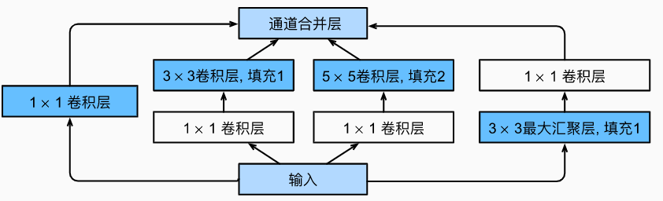

Inception块由四条并行路径组成。 前三条路径使用窗口大小为1×1、3×3和5×5的卷积层，从不同空间大小中提取信息。 中间的两条路径在输入上执行1×1卷积，以减少通道数，从而降低模型的复杂性。 第四条路径使用3×3最大汇聚层，然后使用1×1卷积层来改变通道数。 这四条路径都使用合适的填充来使输入与输出的高和宽一致，最后我们将每条线路的输出在通道维度上连结，并构成Inception块的输出。在Inception块中，通常调整的超参数是每层输出通道数。

```python
import torch
from torch import nn
from torch.nn import functional as F
from d2l import torch as d2l


class Inception(nn.Module):
    # c1--c4是每条路径的输出通道数
    def __init__(self, in_channels, c1, c2, c3, c4, **kwargs):
        super(Inception, self).__init__(**kwargs)
        # 线路1，单1x1卷积层
        self.p1_1 = nn.Conv2d(in_channels, c1, kernel_size=1)
        # 线路2，1x1卷积层后接3x3卷积层
        self.p2_1 = nn.Conv2d(in_channels, c2[0], kernel_size=1)
        self.p2_2 = nn.Conv2d(c2[0], c2[1], kernel_size=3, padding=1)
        # 线路3，1x1卷积层后接5x5卷积层
        self.p3_1 = nn.Conv2d(in_channels, c3[0], kernel_size=1)
        self.p3_2 = nn.Conv2d(c3[0], c3[1], kernel_size=5, padding=2)
        # 线路4，3x3最大汇聚层后接1x1卷积层
        self.p4_1 = nn.MaxPool2d(kernel_size=3, stride=1, padding=1)
        self.p4_2 = nn.Conv2d(in_channels, c4, kernel_size=1)

    def forward(self, x):
        p1 = F.relu(self.p1_1(x))
        p2 = F.relu(self.p2_2(F.relu(self.p2_1(x))))
        p3 = F.relu(self.p3_2(F.relu(self.p3_1(x))))
        p4 = F.relu(self.p4_2(self.p4_1(x)))
        # 在通道维度上连结输出
        return torch.cat((p1, p2, p3, p4), dim=1)
```

考虑一下滤波器（filter）的组合，它们可以用各种滤波器尺寸探索图像，这意味着不同大小的滤波器可以有效地识别不同范围的图像细节。 同时，我们可以为不同的滤波器分配不同数量的参数。

GoogLeNet一共使用9个Inception块和全局平均汇聚层的堆叠来生成其估计值。Inception块之间的最大汇聚层可降低维度。 第一个模块类似于AlexNet和LeNet，Inception块的组合从VGG继承，全局平均汇聚层避免了在最后使用全连接层。


GoogLeNet模型的计算复杂，而且不如VGG那样便于修改通道数。 为了使Fashion-MNIST上的训练短小精悍，我们将输入的高和宽从224降到96，这简化了计算。下面演示各个模块输出的形状变化。

```python
b1 = nn.Sequential(nn.Conv2d(1, 64, kernel_size=7, stride=2, padding=3),
                   nn.ReLU(),
                   nn.MaxPool2d(kernel_size=3, stride=2, padding=1))

b2 = nn.Sequential(nn.Conv2d(64, 64, kernel_size=1),
                   nn.ReLU(),
                   nn.Conv2d(64, 192, kernel_size=3, padding=1),
                   nn.ReLU(),
                   nn.MaxPool2d(kernel_size=3, stride=2, padding=1))

b3 = nn.Sequential(Inception(192, 64, (96, 128), (16, 32), 32),
                   Inception(256, 128, (128, 192), (32, 96), 64),
                   nn.MaxPool2d(kernel_size=3, stride=2, padding=1))

b4 = nn.Sequential(Inception(480, 192, (96, 208), (16, 48), 64),
                   Inception(512, 160, (112, 224), (24, 64), 64),
                   Inception(512, 128, (128, 256), (24, 64), 64),
                   Inception(512, 112, (144, 288), (32, 64), 64),
                   Inception(528, 256, (160, 320), (32, 128), 128),
                   nn.MaxPool2d(kernel_size=3, stride=2, padding=1))

b5 = nn.Sequential(Inception(832, 256, (160, 320), (32, 128), 128),
                   Inception(832, 384, (192, 384), (48, 128), 128),
                   nn.AdaptiveAvgPool2d((1,1)),
                   nn.Flatten())

net = nn.Sequential(b1, b2, b3, b4, b5, nn.Linear(1024, 10))
```

形状检查：

```python
X = torch.rand(size=(1, 1, 96, 96))
for layer in net:
    X = layer(X)
    print(layer.__class__.__name__,'output shape:\t', X.shape)
```

训练：(16min)

```python
lr, num_epochs, batch_size = 0.1, 10, 128
train_iter, test_iter = d2l.load_data_fashion_mnist(batch_size, resize=96)
d2l.train_ch6(net, train_iter, test_iter, num_epochs, lr, d2l.try_gpu())
```


##### 批量规范化

训练深层神经网络是十分困难的，特别是在较短的时间内使他们收敛更加棘手

批量规范化（batch normalization）是一种流行且有效的技术，可持续加速深层网络的收敛速度。 再结合在残差块，批量规范化使得研究人员能够训练100层以上的网络。需要批量规范化的理由：

- 标准化输入特征，使其平均值为0，方差为1。 直观地说，这种标准化可以很好地与我们的优化器配合使用，因为它可以将参数的量级进行统一
- 中间层中的变量（例如，多层感知机中的仿射变换输出）可能具有更广的变化范围。假设这些变量分布中的这种偏移可能会阻碍网络的收敛。 直观地说，我们可能会猜想，如果一个层的可变值是另一层的100倍，这可能需要对学习率进行补偿调整
- 更深层的网络很复杂，容易过拟合。 这意味着正则化变得更加重要。

批量规范化应用于单个可选层（也可以应用到所有层），其原理如下：在每次训练迭代中，我们首先规范化输入，即通过减去其均值并除以其标准差，其中两者均基于当前小批量处理。 接下来，我们应用比例系数和比例偏移。 正是由于这个基于批量统计的标准化，才有了批量规范化的名称。

请注意，如果我们尝试使用大小为1的小批量应用批量规范化，我们将无法学到任何东西。 这是因为在减去均值之后，每个隐藏单元将为0。

从形式上来说，用 $\mathbf{x} \in \mathcal{B}$ 表示一个来自小批量 B 的输入，批量规范化BN根据以下表达式转换 x：
$$
\mathrm{BN}(\mathbf{x}) = \boldsymbol{\gamma} \odot \frac{\mathbf{x} - \hat{\boldsymbol{\mu}}_\mathcal{B}}{\hat{\boldsymbol{\sigma}}_\mathcal{B}} + \boldsymbol{\beta}
$$
生成的小批量的平均值为0和单位方差为1，拉伸参数 scale $\gamma$ 和偏移参数 shift $\beta$ 是与 $x$ 形状相同的，需要与其他模型参数一起学习的参数。

中间层的变化幅度不能过于剧烈，而批量规范化将每一层主动居中，并将它们重新调整为给定的平均值和大小（通过 $\hat{\boldsymbol{\mu}}_\mathcal{B}$ 和 ${\hat{\boldsymbol{\sigma}}_\mathcal{B}}$) 
$$
\begin{split}\begin{aligned} \hat{\boldsymbol{\mu}}_\mathcal{B} &= \frac{1}{|\mathcal{B}|} \sum_{\mathbf{x} \in \mathcal{B}} \mathbf{x}\\
\hat{\boldsymbol{\sigma}}_\mathcal{B}^2 &= \frac{1}{|\mathcal{B}|} \sum_{\mathbf{x} \in \mathcal{B}} (\mathbf{x} - \hat{\boldsymbol{\mu}}_{\mathcal{B}})^2 + \epsilon\end{aligned}\end{split}
$$
小常量 $\epsilon > 0$ 的添加以确保永远不会尝试除以零，即使在经验方差估计值可能消失的情况下也是如此。通过使用平均值和方差的噪声（noise）估计来抵消缩放问题。

由于尚未在理论上明确的原因，优化中的各种噪声源通常会导致更快的训练和较少的过拟合：这种变化似乎是正则化的一种形式。批量规范化最适应50∼100范围中的中等批量大小

批量规范化层在”训练模式“（通过小批量统计数据规范化）和“预测模式”（通过数据集统计规范化）中的功能不同。 在训练过程中，我们无法得知使用整个数据集来估计平均值和方差，所以只能根据每个小批次的平均值和方差不断训练模型。 而在预测模式下，可以根据整个数据集精确计算批量规范化所需的平均值和方差。

批量规范化和其他层之间的一个关键区别是，由于批量规范化在完整的小批量上运行，因此我们不能像以前在引入其他层时那样忽略批量大小。 我们在下面讨论这两种情况：全连接层和卷积层，他们的批量规范化实现略有不同。

全连接层，通常，我们将批量规范化层置于全连接层中的仿射变换和激活函数之间，设激活函数是 $\phi$，批量规范化运算符是 $BN$，则：
$$
\mathbf{h} = \phi(\mathrm{BN}(\mathbf{W}\mathbf{x} + \mathbf{b}) )
$$
卷积层，我们可以在卷积层之后和非线性激活函数之前应用批量规范化，每个通道都有自己的拉伸（scale）和偏移（shift）参数，这两个参数都是标量。给定通道内应用相同的均值和方差

预测模式，首先，将训练好的模型用于预测时，我们不再需要样本均值中的噪声以及在微批次上估计每个小批次产生的样本方差了。 其次，例如，我们可能需要使用我们的模型对逐个样本进行预测。 一种常用的方法是通过移动平均估算整个训练数据集的样本均值和方差，并在预测时使用它们得到确定的输出

手写：

```python
import torch
from torch import nn
from d2l import torch as d2l


def batch_norm(X, gamma, beta, moving_mean, moving_var, eps, momentum):
    # 通过is_grad_enabled来判断当前模式是训练模式还是预测模式
    if not torch.is_grad_enabled():
        # 如果是在预测模式下，直接使用传入的移动平均所得的均值和方差
        X_hat = (X - moving_mean) / torch.sqrt(moving_var + eps)
    else:
        assert len(X.shape) in (2, 4)
        if len(X.shape) == 2:
            # 使用全连接层的情况，计算特征维上的均值和方差
            mean = X.mean(dim=0)
            var = ((X - mean) ** 2).mean(dim=0)
        else:
            # 使用二维卷积层的情况，计算通道维上（axis=1）的均值和方差。
            # 这里我们需要保持X的形状以便后面可以做广播运算
            mean = X.mean(dim=(0, 2, 3), keepdim=True)
            var = ((X - mean) ** 2).mean(dim=(0, 2, 3), keepdim=True)
        # 训练模式下，用当前的均值和方差做标准化
        X_hat = (X - mean) / torch.sqrt(var + eps)
        # 更新移动平均的均值和方差
        moving_mean = momentum * moving_mean + (1.0 - momentum) * mean
        moving_var = momentum * moving_var + (1.0 - momentum) * var
    Y = gamma * X_hat + beta  # 缩放和移位
    return Y, moving_mean.data, moving_var.data
```

通常情况下，我们用一个单独的函数定义其数学原理，比如说`batch_norm`。 然后，我们将此功能集成到一个自定义层中，其代码主要处理数据移动到训练设备（如GPU）、分配和初始化任何必需的变量、跟踪移动平均线（此处为均值和方差）等问题。 为了方便起见，我们并不担心在这里自动推断输入形状，因此我们需要指定整个特征的数量。 

```python
class BatchNorm(nn.Module):
    # num_features：完全连接层的输出数量或卷积层的输出通道数。
    # num_dims：2表示完全连接层，4表示卷积层
    def __init__(self, num_features, num_dims):
        super().__init__()
        if num_dims == 2:
            shape = (1, num_features)
        else:
            shape = (1, num_features, 1, 1)
        # 参与求梯度和迭代的拉伸和偏移参数，分别初始化成1和0
        self.gamma = nn.Parameter(torch.ones(shape))
        self.beta = nn.Parameter(torch.zeros(shape))
        # 非模型参数的变量初始化为0和1
        self.moving_mean = torch.zeros(shape)
        self.moving_var = torch.ones(shape)

    def forward(self, X):
        # 如果X不在内存上，将moving_mean和moving_var
        # 复制到X所在显存上
        if self.moving_mean.device != X.device:
            self.moving_mean = self.moving_mean.to(X.device)
            self.moving_var = self.moving_var.to(X.device)
        # 保存更新过的moving_mean和moving_var
        Y, self.moving_mean, self.moving_var = batch_norm(
            X, self.gamma, self.beta, self.moving_mean,
            self.moving_var, eps=1e-5, momentum=0.9)
        return Y
```

将其应用于LeNet模型

```python
net = nn.Sequential(
    nn.Conv2d(1, 6, kernel_size=5), BatchNorm(6, num_dims=4), nn.Sigmoid(),
    nn.AvgPool2d(kernel_size=2, stride=2),
    nn.Conv2d(6, 16, kernel_size=5), BatchNorm(16, num_dims=4), nn.Sigmoid(),
    nn.AvgPool2d(kernel_size=2, stride=2), nn.Flatten(),
    nn.Linear(16*4*4, 120), BatchNorm(120, num_dims=2), nn.Sigmoid(),
    nn.Linear(120, 84), BatchNorm(84, num_dims=2), nn.Sigmoid(),
    nn.Linear(84, 10))
```

这个代码与我们第一次训练 LeNet 时几乎完全相同，主要区别在于学习率大得多，训练用时本机1.5min

```python
lr, num_epochs, batch_size = 1.0, 10, 256
train_iter, test_iter = d2l.load_data_fashion_mnist(batch_size)
d2l.train_ch6(net, train_iter, test_iter, num_epochs, lr, d2l.try_gpu())
```

看看从第一个批量规范化层中学到的拉伸参数gamma和偏移参数beta

```python
print(net[1].gamma.reshape((-1,)), net[1].beta.reshape((-1,)))
```

调库优化和重新训练，用时差不多：

```python
net = nn.Sequential(
    nn.Conv2d(1, 6, kernel_size=5), nn.BatchNorm2d(6), nn.Sigmoid(),
    nn.AvgPool2d(kernel_size=2, stride=2),
    nn.Conv2d(6, 16, kernel_size=5), nn.BatchNorm2d(16), nn.Sigmoid(),
    nn.AvgPool2d(kernel_size=2, stride=2), nn.Flatten(),
    nn.Linear(256, 120), nn.BatchNorm1d(120), nn.Sigmoid(),
    nn.Linear(120, 84), nn.BatchNorm1d(84), nn.Sigmoid(),
    nn.Linear(84, 10))
```

```python
d2l.train_ch6(net, train_iter, test_iter, num_epochs, lr, d2l.try_gpu())
```

##### ResNet

残差网络。

假设有一类特定的神经网络架构 F，它包括学习速率和其他超参数设置。 对于所有f∈F，存在一些参数集（例如权重和偏置），这些参数可以通过在合适的数据集上进行训练而获得。若f\*是真正想找的函数若f\*∈F可以训练得到，但一般不会这么幸运，而是只能找到 $f^*_\mathcal{F}$。
$$
f^*_\mathcal{F} := \mathop{\mathrm{argmin}}_f L(\mathbf{X}, \mathbf{y}, f) \text{ subject to } f \in \mathcal{F}.
$$
找到更近似 f\*，需要设计更强大的 F' 即更近似的 $f^*_{\mathcal{F}'}$。只有当较复杂的函数类包含较小的函数类时，我们才能确保提高它们的性能。如图所示：


嵌套：每次更新完全包含上一次的内容。对于深度神经网络，如果我们能将新添加的层训练成恒等映射（identity function）f(x)=x，新模型和原模型将同样有效。 同时，由于新模型可能得出更优的解来拟合训练数据集，因此添加层似乎更容易降低训练误差。

残差网络的核心思想是：每个附加层都应该更容易地包含原始函数作为其元素之一。 于是，残差块（residual blocks）便诞生了

右图虚线框内上方的加权运算（如仿射）的权重和偏置参数设成0，那么f(x)是恒等变换。极接近于恒等映射时，残差映射也易于捕捉恒等映射的细微波动。在残差块中，输入可通过跨层数据线路更快地向前传播

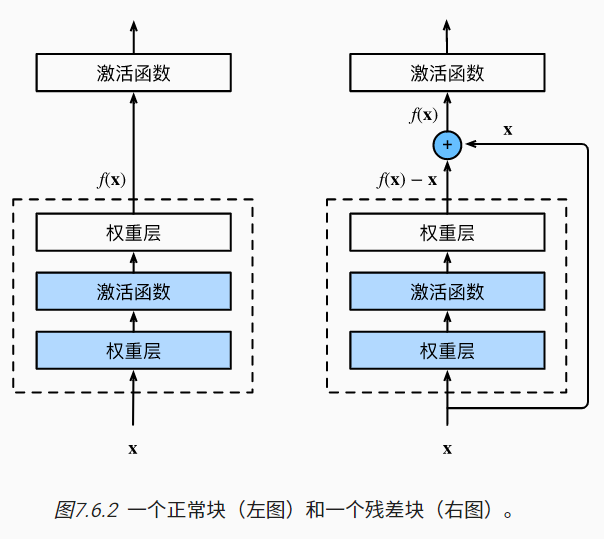

ResNet沿用了VGG完整的3×3卷积层设计。 残差块里首先有2个有相同输出通道数的3×3卷积层。 每个卷积层后接一个批量规范化层和ReLU激活函数。 然后我们通过跨层数据通路，跳过这2个卷积运算，将输入直接加在最后的ReLU激活函数前。 这样的设计要求2个卷积层的输出与输入形状一样，从而使它们可以相加。 如果想改变通道数，就需要引入一个额外的1×1卷积层来将输入变换成需要的形状后再做相加运算

```python
import torch
from torch import nn
from torch.nn import functional as F
from d2l import torch as d2l


class Residual(nn.Module):  #@save
    def __init__(self, input_channels, num_channels,
                 use_1x1conv=False, strides=1):
        super().__init__()
        self.conv1 = nn.Conv2d(input_channels, num_channels,
                               kernel_size=3, padding=1, stride=strides)
        self.conv2 = nn.Conv2d(num_channels, num_channels,
                               kernel_size=3, padding=1)
        if use_1x1conv:
            self.conv3 = nn.Conv2d(input_channels, num_channels,
                                   kernel_size=1, stride=strides)
        else:
            self.conv3 = None
        self.bn1 = nn.BatchNorm2d(num_channels)
        self.bn2 = nn.BatchNorm2d(num_channels)

    def forward(self, X):
        Y = F.relu(self.bn1(self.conv1(X)))
        Y = self.bn2(self.conv2(Y))
        if self.conv3:
            X = self.conv3(X)
        Y += X
        return F.relu(Y)
```

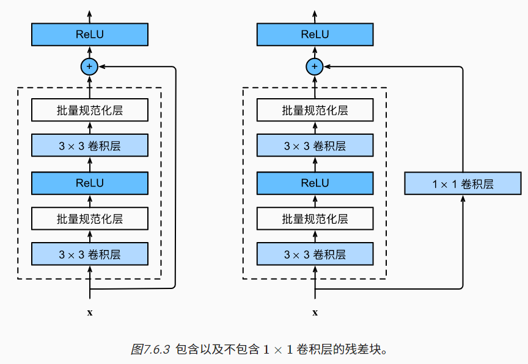

查看形状：

```python
blk = Residual(3,3)
X = torch.rand(4, 3, 6, 6)
Y = blk(X)
print(Y.shape)
blk = Residual(3,6, use_1x1conv=True, strides=2)
print(blk(X).shape)
```

搭一个 resnet：每个模块有4个卷积层（不包括恒等映射的1×1卷积层）。 加上第一个7×7卷积层和最后一个全连接层，共有18层。 因此，这种模型通常被称为ResNet-18。

```python
b1 = nn.Sequential(nn.Conv2d(1, 64, kernel_size=7, stride=2, padding=3),
                   nn.BatchNorm2d(64), nn.ReLU(),
                   nn.MaxPool2d(kernel_size=3, stride=2, padding=1))
def resnet_block(input_channels, num_channels, num_residuals,
                 first_block=False):
    blk = []
    for i in range(num_residuals):
        if i == 0 and not first_block:
            blk.append(Residual(input_channels, num_channels,
                                use_1x1conv=True, strides=2))
        else:
            blk.append(Residual(num_channels, num_channels))
    return blk
b2 = nn.Sequential(*resnet_block(64, 64, 2, first_block=True))
b3 = nn.Sequential(*resnet_block(64, 128, 2))
b4 = nn.Sequential(*resnet_block(128, 256, 2))
b5 = nn.Sequential(*resnet_block(256, 512, 2))
net = nn.Sequential(b1, b2, b3, b4, b5,
                    nn.AdaptiveAvgPool2d((1,1)),
                    nn.Flatten(), nn.Linear(512, 10))
```

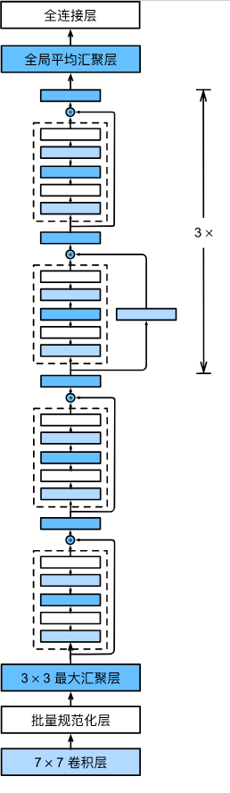

观察形状：

```python
X = torch.rand(size=(1, 1, 224, 224))
for layer in net:
    X = layer(X)
    print(layer.__class__.__name__,'output shape:\t', X.shape)
```

训练(11min)：

```python
lr, num_epochs, batch_size = 0.05, 10, 256
train_iter, test_iter = d2l.load_data_fashion_mnist(batch_size, resize=96)
d2l.train_ch6(net, train_iter, test_iter, num_epochs, lr, d2l.try_gpu())
```


##### DenseNet

某种程度上是ResNet的逻辑扩展

联想泰勒展开式：
$$
f(x) = f(0) + f'(0) x + \frac{f''(0)}{2!}  x^2 + \frac{f'''(0)}{3!}  x^3 + \ldots.
$$
resset 将函数展开为 $f(\mathbf{x}) = \mathbf{x} + g(\mathbf{x})$，一个简单的线性项和一个复杂的非线性项

esNet和DenseNet的关键区别在于，DenseNet输出是*连接*（用图中的[,]表示）而不是如ResNet的简单相加。 因此，在应用越来越复杂的函数序列后，我们执行从到x其展开式的映射：
$$
\mathbf{x} \to \left[
\mathbf{x},
f_1(\mathbf{x}),
f_2([\mathbf{x}, f_1(\mathbf{x})]), f_3([\mathbf{x}, f_1(\mathbf{x}), f_2([\mathbf{x}, f_1(\mathbf{x})])]), \ldots\right]
$$
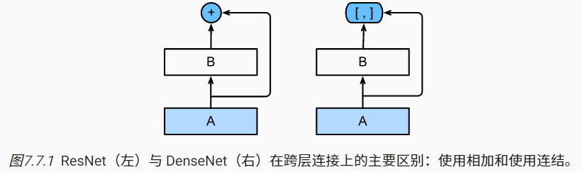

稠密网络主要由2部分构成：稠密块（dense block）和过渡层（transition layer）。 前者定义如何连接输入和输出，而后者则控制通道数量，使其不会太复杂


DenseNet使用了ResNet改良版的“批量规范化、激活和卷积”架构

```python
import torch
from torch import nn
from d2l import torch as d2l


def conv_block(input_channels, num_channels):
    return nn.Sequential(
        nn.BatchNorm2d(input_channels), nn.ReLU(),
        nn.Conv2d(input_channels, num_channels, kernel_size=3, padding=1))
```

一个稠密块由多个卷积块组成，每个卷积块使用相同数量的输出通道。 然而，在前向传播中，我们将每个卷积块的输入和输出在通道维上连结

```python
class DenseBlock(nn.Module):
    def __init__(self, num_convs, input_channels, num_channels):
        super(DenseBlock, self).__init__()
        layer = []
        for i in range(num_convs):
            layer.append(conv_block(
                num_channels * i + input_channels, num_channels))
        self.net = nn.Sequential(*layer)

    def forward(self, X):
        for blk in self.net:
            Y = blk(X)
            # 连接通道维度上每个块的输入和输出
            X = torch.cat((X, Y), dim=1)
        return X
```

在下面的例子中，我们定义一个有2个输出通道数为10的`DenseBlock`。 使用通道数为3的输入时，我们会得到通道数为3+2×10=23的输出。 卷积块的通道数控制了输出通道数相对于输入通道数的增长，因此也被称为增长率（growth rate）

```python
blk = DenseBlock(2, 3, 10)
X = torch.randn(4, 3, 8, 8)
Y = blk(X)
Y.shape
```

由于每个稠密块都会带来通道数的增加，使用过多则会过于复杂化模型。 而过渡层可以用来控制模型复杂度。 它通过1×1卷积层来减小通道数，并使用步幅为2的平均汇聚层减半高和宽，从而进一步降低模型复杂度。

```python
def transition_block(input_channels, num_channels):
    return nn.Sequential(
        nn.BatchNorm2d(input_channels), nn.ReLU(),
        nn.Conv2d(input_channels, num_channels, kernel_size=1),
        nn.AvgPool2d(kernel_size=2, stride=2))
```

对上一个例子中稠密块的输出使用通道数为10的过渡层。 此时输出的通道数减为10，高和宽均减半。

```python
blk = transition_block(23, 10)
print(blk(Y).shape)
```

DenseNet首先使用同ResNet一样的单卷积层和最大汇聚层。

```python
b1 = nn.Sequential(
    nn.Conv2d(1, 64, kernel_size=7, stride=2, padding=3),
    nn.BatchNorm2d(64), nn.ReLU(),
    nn.MaxPool2d(kernel_size=3, stride=2, padding=1))
```

设置每个稠密块使用多少个卷积层。 这里我们设成4，从而与 ResNet-18 保持一致。 稠密块里的卷积层通道数（即增长率）设为32，所以每个稠密块将增加128个通道。每个模块之间，ResNet通过步幅为2的残差块减小高和宽，DenseNet则使用过渡层来减半高和宽，并减半通道数。最后接上全局汇聚层和全连接层来输出结果。

```python
b1 = nn.Sequential(
    nn.Conv2d(1, 64, kernel_size=7, stride=2, padding=3),
    nn.BatchNorm2d(64), nn.ReLU(),
    nn.MaxPool2d(kernel_size=3, stride=2, padding=1))
# num_channels为当前的通道数
num_channels, growth_rate = 64, 32
num_convs_in_dense_blocks = [4, 4, 4, 4]
blks = []
for i, num_convs in enumerate(num_convs_in_dense_blocks):
    blks.append(DenseBlock(num_convs, num_channels, growth_rate))
    # 上一个稠密块的输出通道数
    num_channels += num_convs * growth_rate
    # 在稠密块之间添加一个转换层，使通道数量减半
    if i != len(num_convs_in_dense_blocks) - 1:
        blks.append(transition_block(num_channels, num_channels // 2))
        num_channels = num_channels // 2

net = nn.Sequential(
    b1, *blks,
    nn.BatchNorm2d(num_channels), nn.ReLU(),
    nn.AdaptiveAvgPool2d((1, 1)),
    nn.Flatten(),
    nn.Linear(num_channels, 10))
```

将输入高和宽从224降到96来简化计算。(9min)

```python
lr, num_epochs, batch_size = 0.1, 10, 256
train_iter, test_iter = d2l.load_data_fashion_mnist(batch_size, resize=96)
d2l.train_ch6(net, train_iter, test_iter, num_epochs, lr, d2l.try_gpu())
```

#### 循环神经网络

##### 概念

到目前为止我们默认数据都来自于某种分布， 并且所有样本都是独立同分布的 （independently and identically distributed，i.i.d.）。 然而，大多数的数据并非如此。 例如，文章中的单词是按顺序写的，如果顺序被随机地重排，就很难理解文章原始的意思。 同样，视频中的图像帧、对话中的音频信号以及网站上的浏览行为都是有顺序的。 因此，针对此类数据而设计特定模型，可能效果会更好

recurrent neural network，RNN 处理序列信息。 循环神经网络通过引入状态变量存储过去的信息和当前的输入，从而可以确定当前的输出

序列数据的常见特点：

- 在使用程序时，许多用户都有很强的特定习惯。 例如，在学生放学后社交媒体应用更受欢迎。在市场开放时股市交易软件更常用。
- 预测明天的股价要比过去的股价更困难。前者（对超出已知观测范围进行预测）称为外推法（extrapolation）， 而后者（在现有观测值之间进行估计）称为内插法（interpolation）。
- 音乐、语音、文本和视频都是连续的。 如果它们的序列被我们重排，那么就会失去原有的意义
- 地震是时空相关的，即余震通常发生在很短的时间跨度和很近的距离内
- 人类之间的互动也是连续的，这可以从微博上的争吵和辩论中看出

在时间步（time step）$t \in \mathbb{Z}^+$，则离散序列为 $x_t \sim P(x_t \mid x_{t-1}, \ldots, x_1)$

输入数据的数量这个数字将会随着我们遇到的数据量的增加而增加， 因此需要一个近似方法来使这个计算变得容易处理，策略为：

- 滑窗，只保留长为 $\tau$ 的观测序列 $x_{t-1}, \ldots, x_{t-\tau}$，当 $t > \tau$ 参数数量不变。这种模型被称为自回归模型（autoregressive models）， 因为它们是对自己执行回归
- 是保留一些对过去观测的总结 $h_t$，同时更新预测 $\hat{x}_t$ 和总结 $h_t$，即基于 $\hat{x}_t = P(x_t \mid h_{t})$ 估计 $x_t$，根据 $h_t = g(h_{t-1}, x_{t-1})$ 更新模型。$h_t$ 从未被观测到，故被称为 隐变量自回归模型（latent autoregressive models）

生成训练数据经典方法是使用历史观测来预测下一个未来观测。假设序列本身的动力学不会改变。不变的动力学为静止的（stationary）。 因此，整个序列的估计值都将通过以下的方式获得：$P(x_1, \ldots, x_T) = \prod_{t=1}^T P(x_t \mid x_{t-1}, \ldots, x_1)$

自回归近似法，只要这种是近似精确的，我们就说序列满足马尔可夫条件（Markov condition）。 特别是，如果r=1，得到一个 一阶马尔可夫模型（first-order Markov model）
$$
P(x_1, \ldots, x_T) = \prod_{t=1}^T P(x_t \mid x_{t-1}) \text{ 当 } P(x_1 \mid x_0) = P(x_1)
$$
$x_t$ 是离散值时，可以 DP 求精确值：
$$
\begin{split}\begin{aligned}
P(x_{t+1} \mid x_{t-1})
&= \frac{\sum_{x_t} P(x_{t+1}, x_t, x_{t-1})}{P(x_{t-1})}\\
&= \frac{\sum_{x_t} P(x_{t+1} \mid x_t, x_{t-1}) P(x_t, x_{t-1})}{P(x_{t-1})}\\
&= \sum_{x_t} P(x_{t+1} \mid x_t) P(x_t \mid x_{t-1})
\end{aligned}\end{split}
$$
利用这一事实，我们只需要考虑过去观察中的一个非常短的历史 $P(x_{t+1} \mid x_t, x_{t-1}) = P(x_{t+1} \mid x_t)$

基于条件概率可以倒序遍历公式：
$$
P(x_1, \ldots, x_T) = \prod_{t=T}^1 P(x_t \mid x_{t+1}, \ldots, x_T).
$$
对可加性噪声 $\epsilon$，可以找到 $x_{t+1} = f(x_t) + \epsilon$，而反之则不行

正弦函数+可加性噪声生成一个 1,2, ..., 1000 的序列：

```python
%matplotlib inline
import torch
from torch import nn
from d2l import torch as d2l

T = 1000  # 总共产生1000个点
time = torch.arange(1, T + 1, dtype=torch.float32)
x = torch.sin(0.01 * time) + torch.normal(0, 0.2, (T,))
d2l.plot(time, [x], 'time', 'x', xlim=[1, 1000], figsize=(6, 3))
```

将这个序列转换为模型的特征－标签（feature-label）对。对前 $\tau$ 个数据，要么丢掉或零填充。这里用了前者。

```python
tau = 4
features = torch.zeros((T - tau, tau))
for i in range(tau):
    features[:, i] = x[i: T - tau + i]
labels = x[tau:].reshape((-1, 1))
# print(x)
print(labels.size(),labels) #丢弃前4个数据，并重塑形状为 996x1
```

```python
batch_size, n_train = 16, 600
# 只有前n_train个样本用于训练
train_iter = d2l.load_array((features[:n_train], labels[:n_train]),
                            batch_size, is_train=True)
```

用多层感知机训练：

```python
# 初始化网络权重的函数
def init_weights(m):
    if type(m) == nn.Linear:
        nn.init.xavier_uniform_(m.weight)

# 一个简单的多层感知机
def get_net():
    net = nn.Sequential(nn.Linear(4, 10),
                        nn.ReLU(),
                        nn.Linear(10, 1))
    net.apply(init_weights)
    return net

# 平方损失。注意：MSELoss计算平方误差时不带系数1/2
loss = nn.MSELoss(reduction='none')
```

```python
def train(net, train_iter, loss, epochs, lr):
    trainer = torch.optim.Adam(net.parameters(), lr)
    for epoch in range(epochs):
        for X, y in train_iter:
            trainer.zero_grad()
            l = loss(net(X), y)
            l.sum().backward()
            trainer.step()
        print(f'epoch {epoch + 1}, '
              f'loss: {d2l.evaluate_loss(net, train_iter, loss):f}')

net = get_net()
train(net, train_iter, loss, 5, 0.01)
```

检测单步预测one-step-ahead prediction能力：

```python
onestep_preds = net(features)
print(onestep_preds.shape) #996x1
d2l.plot([time, time[tau:]],
         [x.detach().numpy(), onestep_preds.detach().numpy()], 'time',
         'x', legend=['data', '1-step preds'], xlim=[1, 1000],
         figsize=(6, 3))
```

检测继续往下的预测能力，即 k步预测。必须使用我们自己的预测（而不是原始数据）来进行多步预测。
$$
\begin{split}\hat{x}_{605} = f(x_{601}, x_{602}, x_{603}, x_{604}), \\
\hat{x}_{606} = f(x_{602}, x_{603}, x_{604}, \hat{x}_{605}), \\
\hat{x}_{607} = f(x_{603}, x_{604}, \hat{x}_{605}, \hat{x}_{606}),\\
\hat{x}_{608} = f(x_{604}, \hat{x}_{605}, \hat{x}_{606}, \hat{x}_{607}),\\
\hat{x}_{609} = f(\hat{x}_{605}, \hat{x}_{606}, \hat{x}_{607}, \hat{x}_{608}),\\
\ldots\end{split}
$$

```python
multistep_preds = torch.zeros(T)
multistep_preds[: n_train + tau] = x[: n_train + tau]
for i in range(n_train + tau, T):
    multistep_preds[i] = net(
        multistep_preds[i - tau:i].reshape((1, -1)))
print(multistep_preds.shape) #1000

d2l.plot([time, time[tau:], time[n_train + tau:]],
         [x.detach().numpy(), onestep_preds.detach().numpy(),
          multistep_preds[n_train + tau:].detach().numpy()], 'time',
         'x', legend=['data', '1-step preds', 'multistep preds'],
         xlim=[1, 1000], figsize=(6, 3))
```

可以看到，预测失败，预测结果序列降到了一个常数列不变。由于错误的累积： 假设在步骤1之后，我们积累了一些错误 $\epsilon_1 = \bar\epsilon$。 于是，步骤2的输入被扰动了$\epsilon_1$， 结果积累的误差是依照次序的$\epsilon_2 = \bar\epsilon + c \epsilon_1$， 其中c为某个常数，后面的预测误差依此类推。 因此误差可能会相当快地偏离真实的观测结果。 例如，未来24小时的天气预报往往相当准确， 但超过这一点，精度就会迅速下降。

修改预测步数，查看不同步数下的结果：

```python
max_steps = 64

features = np.zeros((T - tau - max_steps + 1, tau + max_steps))
# 列i（i<tau）是来自x的观测，其时间步从（i）到（i+T-tau-max_steps+1）
for i in range(tau):
    features[:, i] = x[i: i + T - tau - max_steps + 1]

# 列i（i>=tau）是来自（i-tau+1）步的预测，其时间步从（i）到（i+T-tau-max_steps+1）
for i in range(tau, tau + max_steps):
    features[:, i] = net(features[:, i - tau:i]).reshape(-1)
print(features.shape) #933,68

steps = (1, 4, 16, 64)
d2l.plot([time[tau + i - 1: T - max_steps + i] for i in steps],
         [features[:, tau + i - 1].asnumpy() for i in steps], 'time', 'x',
         legend=[f'{i}-step preds' for i in steps], xlim=[5, 1000],
         figsize=(6, 3))
```

##### 文本预处理

通常包括：

1. 将文本作为字符串加载到内存中。
2. 将字符串拆分为词元（如单词和字符）。
3. 建立一个词表，将拆分的词元映射到数字索引。
4. 将文本转换为数字索引序列，方便模型操作。

```python
import collections
import re
from d2l import torch as d2l
```

将一篇3w词小说当作语料库喂进去，查看数据：

```python
#@save
d2l.DATA_HUB['time_machine'] = (d2l.DATA_URL + 'timemachine.txt',
                                '090b5e7e70c295757f55df93cb0a180b9691891a')

def read_time_machine():  #@save
    """将时间机器数据集加载到文本行的列表中"""
    with open(d2l.download('time_machine'), 'r') as f:
        lines = f.readlines()
    return [re.sub('[^A-Za-z]+', ' ', line).strip().lower() for line in lines]

lines = read_time_machine()
print(f'# 文本总行数: {len(lines)}')
print(lines[0])
print(lines[10])
```

下面的`tokenize`函数将文本行列表（`lines`）作为输入， 列表中的每个元素是一个文本序列（如一条文本行）。 每个文本序列又被拆分成一个词元列表，*词元*（token）是文本的基本单位。 最后，返回一个由词元列表组成的列表，其中的每个词元都是一个字符串（string）。

```python
def tokenize(lines, token='word'):  #@save
    """将文本行拆分为单词或字符词元"""
    if token == 'word':
        return [line.split() for line in lines]
    elif token == 'char':
        return [list(line) for line in lines]
    else:
        print('错误：未知词元类型：' + token)

tokens = tokenize(lines)
for i in range(11):
    print(tokens[i])
```

词元的类型是字符串，而模型需要的输入是数字。构建一个字典，通常也叫做词表（vocabulary）， 用来将字符串类型的词元映射到从0开始的数字索引中。将训练集中的所有文档合并在一起，对它们的唯一词元进行统计， 得到的统计结果称之为语料（corpus）。 然后根据每个唯一词元的出现频率，为其分配一个数字索引。 很少出现的词元通常被移除，这可以降低复杂性。 另外，语料库中不存在或已删除的任何词元都将映射到一个特定的未知词元“<unk>”。我们可以选择增加一个列表，用于保存那些被保留的词元， 例如：填充词元（“<pad>”）； 序列开始词元（“<bos>”）； 序列结束词元（“<eos>”）。

```python
class Vocab:  #@save
    """文本词表"""
    def __init__(self, tokens=None, min_freq=0, reserved_tokens=None):
        if tokens is None:
            tokens = []
        if reserved_tokens is None:
            reserved_tokens = []
        # 按出现频率排序
        counter = count_corpus(tokens)
        self._token_freqs = sorted(counter.items(), key=lambda x: x[1],
                                   reverse=True)
        # 未知词元的索引为0
        self.idx_to_token = ['<unk>'] + reserved_tokens
        self.token_to_idx = {token: idx
                             for idx, token in enumerate(self.idx_to_token)}
        for token, freq in self._token_freqs:
            if freq < min_freq:
                break
            if token not in self.token_to_idx:
                self.idx_to_token.append(token)
                self.token_to_idx[token] = len(self.idx_to_token) - 1

    def __len__(self):
        return len(self.idx_to_token)

    def __getitem__(self, tokens):
        if not isinstance(tokens, (list, tuple)):
            return self.token_to_idx.get(tokens, self.unk)
        return [self.__getitem__(token) for token in tokens]

    def to_tokens(self, indices):
        if not isinstance(indices, (list, tuple)):
            return self.idx_to_token[indices]
        return [self.idx_to_token[index] for index in indices]

    @property
    def unk(self):  # 未知词元的索引为0
        return 0

    @property
    def token_freqs(self):
        return self._token_freqs

def count_corpus(tokens):  #@save
    """统计词元的频率"""
    # 这里的tokens是1D列表或2D列表
    if len(tokens) == 0 or isinstance(tokens[0], list):
        # 将词元列表展平成一个列表
        tokens = [token for line in tokens for token in line]
    return collections.Counter(tokens)
```

测试转换结果：

```python
for i in [0, 10]:
    print('文本:', tokens[i])
    print('索引:', vocab[tokens[i]])
```

在使用上述函数时，我们将所有功能打包到`load_corpus_time_machine`函数中， 该函数返回`corpus`（词元索引列表）和`vocab`（时光机器语料库的词表）。 我们在这里所做的改变是：

1. 为了简化后面章节中的训练，我们使用字符（而不是单词）实现文本词元化；
2. 时光机器数据集中的每个文本行不一定是一个句子或一个段落，还可能是一个单词，因此返回的`corpus`仅处理为单个列表，而不是使用多词元列表构成的一个列表。

```python
def load_corpus_time_machine(max_tokens=-1):  #@save
    """返回时光机器数据集的词元索引列表和词表"""
    lines = read_time_machine()
    tokens = tokenize(lines, 'char')
    vocab = Vocab(tokens)
    # 因为时光机器数据集中的每个文本行不一定是一个句子或一个段落，
    # 所以将所有文本行展平到一个列表中
    corpus = [vocab[token] for line in tokens for token in line]
    if max_tokens > 0:
        corpus = corpus[:max_tokens]
    return corpus, vocab

corpus, vocab = load_corpus_time_machine()
print(len(corpus), len(vocab))
print(corpus[:10])
```

##### 语言模型和数据集

假设长度为T的文本序列中的词元依次为 $x_1, x_2, \ldots, x_T$，其中 $1 \leq t \leq T$ 是文本序列在时间步 $t$ 的观测或标签。给定这样的文本序列时，语言模型（language model）的目标是估计序列的联合概率

例如，只需要一次抽取一个词元 $x_t \sim P(x_t \mid x_{t-1}, \ldots, x_1)$， 一个理想的语言模型就能够基于模型本身生成自然文本。

假设在单词级别对文本数据进行词元化：
$$
P(x_1, x_2, \ldots, x_T) = \prod_{t=1}^T P(x_t  \mid  x_1, \ldots, x_{t-1}).
$$
例如，包含了四个单词的一个文本序列的概率是：
$$
P(\text{deep}, \text{learning}, \text{is}, \text{fun}) =  P(\text{deep}) P(\text{learning}  \mid  \text{deep}) P(\text{is}  \mid  \text{deep}, \text{learning}) P(\text{fun}  \mid  \text{deep}, \text{learning}, \text{is})
$$
为了训练语言模型，我们需要计算单词的概率， 以及给定前面几个单词后出现某个单词的条件概率。

假设训练数据集是一个大型的文本语料库。 比如，维基百科的所有条目、 古登堡计划， 或者所有发布在网络上的文本。 训练数据集中词的概率可以根据给定词的相对词频来计算。 例如，可以将估计值 $\hat{P}(\text{deep})$ 计算为任何以单词 deep 开头的句子概率。一种（稍稍不太精确的）方法是统计单词“deep”在数据集中的出现次数， 然后将其除以整个语料库中的单词总数。 这种方法效果不错，特别是对于频繁出现的单词，接下来有：
$$
\hat{P}(\text{learning} \mid \text{deep}) = \frac{n(\text{deep, learning})}{n(\text{deep})}
$$
分子是连续单词对出现的次数。连续单词对“deep learning”的出现频率要低得多， 所以估计这类单词正确的概率要困难得多。 特别是对于一些不常见的单词组合，要想找到足够的出现次数来获得准确的估计可能都不容易。 而对于三个或者更多的单词组合，情况会变得更糟。 许多合理的三个单词组合可能是存在的，但是在数据集中却找不到。 除非我们提供某种解决方案，来将这些单词组合指定为非零计数， 否则将无法在语言模型中使用它们。 如果数据集很小，或者单词非常罕见，那么这类单词出现一次的机会可能都找不到。

一种常见的策略是执行某种形式的拉普拉斯平滑（Laplace smoothing）， 具体方法是在所有计数中添加一个小常量。用n表示训练集中的单词总数，用m表示唯一单词的数量
$$
\begin{split}\begin{aligned}
    \hat{P}(x) & = \frac{n(x) + \epsilon_1/m}{n + \epsilon_1}, \\
    \hat{P}(x' \mid x) & = \frac{n(x, x') + \epsilon_2 \hat{P}(x')}{n(x) + \epsilon_2}, \\
    \hat{P}(x'' \mid x,x') & = \frac{n(x, x',x'') + \epsilon_3 \hat{P}(x'')}{n(x, x') + \epsilon_3}
\end{aligned}\end{split}
$$
三个 $\epsilon$ 是超参数，若 $\epsilon_1=0$ 不平滑，$\epsilon_1\to\infty$，则 $\hat P$ 接近均匀分布 $\dfrac1m$。

然而，这样的模型很容易变得无效，原因如下： 首先，我们需要存储所有的计数； 其次，这完全忽略了单词的意思。 例如，“猫”（cat）和“猫科动物”（feline）可能出现在相关的上下文中， 但是想根据上下文调整这类模型其实是相当困难的。 最后，长单词序列大部分是没出现过的， 因此一个模型如果只是简单地统计先前“看到”的单词序列频率， 那么模型面对这种问题肯定是表现不佳的。

一阶马尔科夫是 $P(x_{t+1} \mid x_t, \ldots, x_1) = P(x_{t+1} \mid x_t)$，阶数高的话是近似序列建模公式：
$$
\begin{split}\begin{aligned}
P(x_1, x_2, x_3, x_4) &=  P(x_1) P(x_2) P(x_3) P(x_4),\\
P(x_1, x_2, x_3, x_4) &=  P(x_1) P(x_2  \mid  x_1) P(x_3  \mid  x_2) P(x_4  \mid  x_3),\\
P(x_1, x_2, x_3, x_4) &=  P(x_1) P(x_2  \mid  x_1) P(x_3  \mid  x_1, x_2) P(x_4  \mid  x_2, x_3).
\end{aligned}\end{split}
$$
通常，涉及一个、两个和三个变量的概率公式分别被称为 *一元语法*（unigram）、*二元语法*（bigram）和*三元语法*（trigram）模型。 

调库查看词频：

```python
import random
import torch
from d2l import torch as d2l

tokens = d2l.tokenize(d2l.read_time_machine())
# 因为每个文本行不一定是一个句子或一个段落，因此我们把所有文本行拼接到一起
corpus = [token for line in tokens for token in line]
vocab = d2l.Vocab(corpus)
vocab.token_freqs[:10]
```

最流行的词看起来很无聊， 这些词通常被称为*停用词*（stop words），因此可以被过滤掉。 尽管如此，它们本身仍然是有意义的，我们仍然会在模型中使用它们。 此外，还有个明显的问题是词频衰减的速度相当地快。 例如，最常用单词的词频对比，第10个还不到第1个的1/5。 为了更好地理解，我们可以画出的词频图：

```python
freqs = [freq for token, freq in vocab.token_freqs]
d2l.plot(freqs, xlabel='token: x', ylabel='frequency: n(x)',
         xscale='log', yscale='log')
```

单词大致遵循双对数坐标图上的一条直线。 这意味着单词的频率满足*齐普夫定律*（Zipf’s law）， 即第i个最常用单词的频率$n_i$为： $n_i \propto \frac{1}{i^\alpha}$ 即 $\log n_i = -\alpha \log i + c$

其中 $\alpha$ 是刻画分布的指数，$c$ 是常数。这告诉我们想要通过计数统计和平滑来建模单词是不可行的， 因为这样建模的结果会大大高估尾部单词的频率，也就是所谓的不常用单词。

1. 除了一元语法词，单词序列似乎也遵循齐普夫定律， 尽管公式中的指数a更小 （指数的大小受序列长度的影响）；
2. 词表中n元组的数量并没有那么大，这说明语言中存在相当多的结构， 这些结构给了我们应用模型的希望；
3. 很多n元组很少出现，这使得拉普拉斯平滑非常不适合语言建模。 作为代替，我们将使用基于深度学习的模型。

当序列变得太长而不能被模型一次性全部处理时， 我们可能希望拆分这样的序列方便模型读取。假设我们将使用神经网络来训练语言模型， 模型中的网络一次处理具有预定义长度 （例如n个时间步）的一个小批量序列。 现在的问题是如何随机生成一个小批量数据的特征和标签以供读取。可以选择任意偏移量来指示初始位置，所以我们有相当大的自由度。

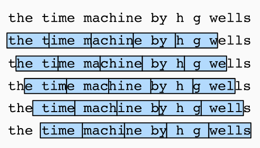

如果我们只选择一个偏移量， 那么用于训练网络的、所有可能的子序列的覆盖范围将是有限的。 因此，我们可以从随机偏移量开始划分序列， 以同时获得*覆盖性*（coverage）和*随机性*（randomness）

在随机采样中，每个样本都是在原始的长序列上任意捕获的子序列。 在迭代过程中，来自两个相邻的、随机的、小批量中的子序列不一定在原始序列上相邻。 对于语言建模，目标是基于到目前为止我们看到的词元来预测下一个词元， 因此标签是移位了一个词元的原始序列

```python
def seq_data_iter_random(corpus, batch_size, num_steps):  #@save
    """使用随机抽样生成一个小批量子序列"""
    # 从随机偏移量开始对序列进行分区，随机范围包括num_steps-1
    corpus = corpus[random.randint(0, num_steps - 1):]
    # 减去1，是因为我们需要考虑标签
    num_subseqs = (len(corpus) - 1) // num_steps
    # 长度为num_steps的子序列的起始索引
    initial_indices = list(range(0, num_subseqs * num_steps, num_steps))
    # 在随机抽样的迭代过程中，
    # 来自两个相邻的、随机的、小批量中的子序列不一定在原始序列上相邻
    random.shuffle(initial_indices)

    def data(pos):
        # 返回从pos位置开始的长度为num_steps的序列
        return corpus[pos: pos + num_steps]

    num_batches = num_subseqs // batch_size
    for i in range(0, batch_size * num_batches, batch_size):
        # 在这里，initial_indices包含子序列的随机起始索引
        initial_indices_per_batch = initial_indices[i: i + batch_size]
        X = [data(j) for j in initial_indices_per_batch]
        Y = [data(j + 1) for j in initial_indices_per_batch]
        yield torch.tensor(X), torch.tensor(Y)
my_seq = list(range(35))
for X, Y in seq_data_iter_random(my_seq, batch_size=2, num_steps=5):
    print('X: ', X, '\nY:', Y)
```

在迭代过程中，除了对原始序列可以随机抽样外， 我们还可以保证两个相邻的小批量中的子序列在原始序列上也是相邻的。 这种策略在基于小批量的迭代过程中保留了拆分的子序列的顺序，因此称为顺序分区。

```python
def seq_data_iter_sequential(corpus, batch_size, num_steps):  #@save
    """使用顺序分区生成一个小批量子序列"""
    # 从随机偏移量开始划分序列
    offset = random.randint(0, num_steps)
    num_tokens = ((len(corpus) - offset - 1) // batch_size) * batch_size
    Xs = torch.tensor(corpus[offset: offset + num_tokens])
    Ys = torch.tensor(corpus[offset + 1: offset + 1 + num_tokens])
    Xs, Ys = Xs.reshape(batch_size, -1), Ys.reshape(batch_size, -1)
    num_batches = Xs.shape[1] // num_steps
    for i in range(0, num_steps * num_batches, num_steps):
        X = Xs[:, i: i + num_steps]
        Y = Ys[:, i: i + num_steps]
        yield X, Y
for X, Y in seq_data_iter_sequential(my_seq, batch_size=2, num_steps=5):
    print('X: ', X, '\nY:', Y)
```

包装：

```python
class SeqDataLoader:  #@save
    """加载序列数据的迭代器"""
    def __init__(self, batch_size, num_steps, use_random_iter, max_tokens):
        if use_random_iter:
            self.data_iter_fn = d2l.seq_data_iter_random
        else:
            self.data_iter_fn = d2l.seq_data_iter_sequential
        self.corpus, self.vocab = d2l.load_corpus_time_machine(max_tokens)
        self.batch_size, self.num_steps = batch_size, num_steps

    def __iter__(self):
        return self.data_iter_fn(self.corpus, self.batch_size, self.num_steps)
```

同时返回数据迭代器和词表

```python
def load_data_time_machine(batch_size, num_steps,  #@save
                           use_random_iter=False, max_tokens=10000):
    """返回时光机器数据集的迭代器和词表"""
    data_iter = SeqDataLoader(
        batch_size, num_steps, use_random_iter, max_tokens)
    return data_iter, data_iter.vocab
```

##### 循环神经网络

$n$ 元语法对词表 $V$ 要存储 $|V|^2$ 个数字所以使用隐变量模型：$P(x_t \mid x_{t-1}, \ldots, x_1) \approx P(x_t \mid h_{t-1})$ 其中 $h_{t-1}$ 是*隐状态*（hidden state）， 也称为*隐藏变量*（hidden variable）， 它存储了到时间步t−1的序列信息。 通常，我们可以基于当前输入$x_t$和先前隐状态$h_{t-1}$ 来计算时间步t处的任何时间的隐状态：$h_t = f(x_{t}, h_{t-1})$

对f函数，隐变量模型不是近似值。 $h_t$ 是可以仅仅储存到目前为止观察到的所有数据， 然而这样的操作可能会使计算和存储的代价都变得昂贵。

隐藏层是在从输入到输出的路径上（以观测角度来理解）的隐藏的层， 而隐状态则是在给定步骤所做的任何事情（以技术角度来定义）的*输入*， 并且这些状态只能通过先前时间步的数据来计算。

*循环神经网络*（recurrent neural networks，RNNs） 是具有隐状态的神经网络。

回顾隐藏层，激活函数是 $\phi$，样本批量 $\mathbf{X} \in \mathbb{R}^{n \times d}$ 大小 n 维度 d，隐藏层输出 $\mathbf{H} \in \mathbb{R}^{n \times h}$ 为 $\mathbf{H} = \phi(\mathbf{X} \mathbf{W}_{xh} + \mathbf{b}_h)$ ，输出层 $\mathbf{O} \in \mathbb{R}^{n \times q}$ 为 $\mathbf{O} = \mathbf{H} \mathbf{W}_{hq} + \mathbf{b}_q$

在时间步 $t$ 有输入 $\mathbf{X}_t \in \mathbb{R}^{n \times d}$，每一行是时间步 $t$ 的一个样本，隐藏变量为 $\mathbf{H}_t \in \mathbb{R}^{n \times h}$。保存了上一个时间步的隐藏变量 $\mathbf{H}_{t-1}$，添加了新权重参数 $\mathbf{W}_{hh} \in \mathbb{R}^{h \times h}$ 描述如何在当前时间步中使用前一个时间步的隐藏变量，具体而言为：
$$
\mathbf{H}_t = \phi(\mathbf{X}_t \mathbf{W}_{xh} + \mathbf{H}_{t-1} \mathbf{W}_{hh}  + \mathbf{b}_h)
$$
些变量捕获并保留了序列直到其当前时间步的历史信息。这样的隐藏变量被称为*隐状态*（hidden state）。 由于在当前时间步中， 隐状态使用的定义与前一个时间步中使用的定义相同， 因此上述计算是*循环的*（recurrent）。 于是基于循环计算的隐状态神经网络被命名为 *循环神经网络*（recurrent neural network）。 在循环神经网络中执行上述计算的层 称为*循环层*（recurrent layer）。

输出：$\mathbf{O}_t = \mathbf{H}_t \mathbf{W}_{hq} + \mathbf{b}_q$ 其中 $\mathbf{b}_h \in \mathbb{R}^{1 \times h}$，$\mathbf{W}_{xh} \in \mathbb{R}^{d \times h}, \mathbf{W}_{hh} \in \mathbb{R}^{h \times h}$，$\mathbf{W}_{xh} \in \mathbb{R}^{d \times h}, \mathbf{W}_{hh} \in \mathbb{R}^{h \times h},\mathbf{W}_{hq} \in \mathbb{R}^{h \times q},\mathbf{b}_q \in \mathbb{R}^{1 \times q}$。值得一提的是，即使在不同的时间步，循环神经网络也总是使用这些模型参数。 因此，循环神经网络的参数开销不会随着时间步的增加而增加。

在任意时间步t，隐状态的计算可以被视为：

1. 拼接当前时间步t的输入$X_t$和前一时间步t−1的隐状态$H_{t-1}$；
2. 将拼接的结果送入带有激活函数$phi$的全连接层。 全连接层的输出是当前时间步t的隐状态$H_t$。


下面两个函数乘法同形故可以：

```python
import torch
from d2l import torch as d2l

X, W_xh = torch.normal(0, 1, (3, 1)), torch.normal(0, 1, (1, 4))
H, W_hh = torch.normal(0, 1, (3, 4)), torch.normal(0, 1, (4, 4))
print(torch.matmul(X, W_xh) + torch.matmul(H, W_hh))
print(X, H,sep='\n')
print(torch.cat((X, H), 1)) #[X,H]
print(W_xh, W_hh,sep='\n')
print(torch.cat((W_xh, W_hh), 0)) #[Wxh, Whh]
print(torch.cat((X, H), 1).shape) #3,5
print(torch.cat((W_xh, W_hh), 0).shape) #5,4
```

等效于：

```python
torch.matmul(torch.cat((X, H), 1), torch.cat((W_xh, W_hh), 0))
```

即对矩阵 $A,B,C,D$，设 $E=[A,C],F=[\matrix{B\\D}]$，有(分块证?)：
$$
AB+CD=EF
$$

一个字符级的语言模型例子：将文本词元化为字符而不是单词。


> 由不同的语言模型给出的对“It is raining …”的续写：
>
> - “It is raining outside” 已经能够捕捉到跟在后面的是哪类单词
> - “It is raining banana tree” 产生了一个无意义的续写，至少该模型已经学会了如何拼写单词， 以及单词之间的某种程度的相关性
> - “It is raining piouw;kcj pwepoiut” 训练不足的模型是无法正确地拟合数据的

以通过一个序列中所有的n个词元的交叉熵损失的平均值来衡量：
$$
\frac{1}{n} \sum_{t=1}^n -\log P(x_t \mid x_{t-1}, \ldots, x_1)
$$
P由语言模型给出，$x_t$是在时间步t从该序列观察到的实际词元，这使得不同长度的文档的性能具有了可比性。定义困惑度为 Perplexity
$$
\exp\left(-\frac{1}{n} \sum_{t=1}^n \log P(x_t \mid x_{t-1}, \ldots, x_1)\right)
$$
最好的理解是“下一个词元的实际选择数的调和平均数”

- 在最好的情况下，模型总是完美地估计标签词元的概率为1。 在这种情况下，模型的困惑度为1。
- 在最坏的情况下，模型总是预测标签词元的概率为0。 在这种情况下，困惑度是正无穷大。
- 在基线上，该模型的预测是词表的所有可用词元上的均匀分布。 在这种情况下，困惑度等于词表中唯一词元的数量。 事实上，如果我们在没有任何压缩的情况下存储序列， 这将是我们能做的最好的编码方式。 因此，这种方式提供了一个重要的上限， 而任何实际模型都必须超越这个上限。


读取数据集：

```python
%matplotlib inline
import math
import torch
from torch import nn
from torch.nn import functional as F
from d2l import torch as d2l

batch_size, num_steps = 32, 35
train_iter, vocab = d2l.load_data_time_machine(batch_size, num_steps)
```

one-hot encoding 独热编码将值域在 w 的一个值转变成 w-1 列 0 和 1 列 1

```python
F.one_hot(torch.tensor([0, 2]), len(vocab))
```

每次采样的小批量数据形状是二维张量： （批量大小，时间步数）。 `one_hot`函数将这样一个小批量数据转换成三维张量， 张量的最后一个维度等于词表大小（`len(vocab)`）。 我们经常转换输入的维度，以便获得形状为 （时间步数，批量大小，词表大小）的输出。 这将使我们能够更方便地通过最外层的维度， 一步一步地更新小批量数据的隐状态

```python
X = torch.arange(10).reshape((2, 5))
F.one_hot(X.T, 28).shape
```

藏单元数`num_hiddens`是一个可调的超参数。 当训练语言模型时，输入和输出来自相同的词表。 因此，它们具有相同的维度，即词表的大小。

```python
def get_params(vocab_size, num_hiddens, device):
    num_inputs = num_outputs = vocab_size

    def normal(shape):
        return torch.randn(size=shape, device=device) * 0.01

    # 隐藏层参数
    W_xh = normal((num_inputs, num_hiddens))
    W_hh = normal((num_hiddens, num_hiddens))
    b_h = torch.zeros(num_hiddens, device=device)
    # 输出层参数
    W_hq = normal((num_hiddens, num_outputs))
    b_q = torch.zeros(num_outputs, device=device)
    # 附加梯度
    params = [W_xh, W_hh, b_h, W_hq, b_q]
    for param in params:
        param.requires_grad_(True)
    return params
```

```python
def init_rnn_state(batch_size, num_hiddens, device):
    return (torch.zeros((batch_size, num_hiddens), device=device), )
```

这里使用tanh函数作为激活函数，当元素在实数上满足均匀分布时，tanh函数的平均值为0。

```python
def rnn(inputs, state, params):
    # inputs的形状：(时间步数量，批量大小，词表大小)
    W_xh, W_hh, b_h, W_hq, b_q = params
    H, = state
    outputs = []
    # X的形状：(批量大小，词表大小)
    for X in inputs:
        H = torch.tanh(torch.mm(X, W_xh) + torch.mm(H, W_hh) + b_h)
        Y = torch.mm(H, W_hq) + b_q
        outputs.append(Y)
    return torch.cat(outputs, dim=0), (H,)
```

```python
class RNNModelScratch: #@save
    """从零开始实现的循环神经网络模型"""
    def __init__(self, vocab_size, num_hiddens, device,
                 get_params, init_state, forward_fn):
        self.vocab_size, self.num_hiddens = vocab_size, num_hiddens
        self.params = get_params(vocab_size, num_hiddens, device)
        self.init_state, self.forward_fn = init_state, forward_fn

    def __call__(self, X, state):
        X = F.one_hot(X.T, self.vocab_size).type(torch.float32)
        return self.forward_fn(X, state, self.params)

    def begin_state(self, batch_size, device):
        return self.init_state(batch_size, self.num_hiddens, device)
```

检查输出是否具有正确的形状。 例如，隐状态的维数是否保持不变。

```python
num_hiddens = 512
net = RNNModelScratch(len(vocab), num_hiddens, d2l.try_gpu(), get_params,
                      init_rnn_state, rnn)
state = net.begin_state(X.shape[0], d2l.try_gpu())
Y, new_state = net(X.to(d2l.try_gpu()), state)
Y.shape, len(new_state), new_state[0].shape
```

可以看到输出形状是（时间步数×批量大小，词表大小）， 而隐状态形状保持不变，即（批量大小，隐藏单元数）

首先定义预测函数来生成`prefix`之后的新字符， 其中的`prefix`是一个用户提供的包含多个字符的字符串。 在循环遍历`prefix`中的开始字符时， 我们不断地将隐状态传递到下一个时间步，但是不生成任何输出。 这被称为*预热*（warm-up）期， 因为在此期间模型会自我更新（例如，更新隐状态）， 但不会进行预测。 预热期结束后，隐状态的值通常比刚开始的初始值更适合预测， 从而预测字符并输出它们

```python
def predict_ch8(prefix, num_preds, net, vocab, device):  #@save
    """在prefix后面生成新字符"""
    state = net.begin_state(batch_size=1, device=device)
    outputs = [vocab[prefix[0]]]
    get_input = lambda: torch.tensor([outputs[-1]], device=device).reshape((1, 1))
    for y in prefix[1:]:  # 预热期
        _, state = net(get_input(), state)
        outputs.append(vocab[y])
    for _ in range(num_preds):  # 预测num_preds步
        y, state = net(get_input(), state)
        outputs.append(int(y.argmax(dim=1).reshape(1)))
    return ''.join([vocab.idx_to_token[i] for i in outputs])
```

测试该函数：(预计生成10个随机字符)

```python
predict_ch8('time traveller ', 10, net, vocab, d2l.try_gpu())
```

对于长度为T的序列，我们在迭代中计算这T个时间步上的梯度， 将会在反向传播过程中产生长度为O(T)的矩阵乘法链。当T较大时，它可能导致数值不稳定， 例如可能导致梯度爆炸或梯度消失。 因此，循环神经网络模型往往需要额外的方式来支持稳定训练。

有时梯度可能很大，从而优化算法可能无法收敛。 我们可以通过降低$\eta$的学习率来解决这个问题。如果我们很少得到大的梯度，一个流行的替代方案是通过将梯度g投影回给定半径 （例如$\theta$）的球来裁剪梯度。 如下式：
$$
\mathbf{g} \leftarrow \min\left(1, \frac{\theta}{\|\mathbf{g}\|}\right) \mathbf{g}
$$
通过这样做，我们知道梯度范数永远不会超过$\theta$， 并且更新后的梯度完全与g的原始方向对齐。 它还有一个值得拥有的副作用， 即限制任何给定的小批量数据（以及其中任何给定的样本）对参数向量的影响， 这赋予了模型一定程度的稳定性。 梯度裁剪提供了一个快速修复梯度爆炸的方法， 虽然它并不能完全解决问题，但它是众多有效的技术之一。

```python
def grad_clipping(net, theta):  #@save
    """裁剪梯度"""
    if isinstance(net, nn.Module):
        params = [p for p in net.parameters() if p.requires_grad]
    else:
        params = net.params
    norm = torch.sqrt(sum(torch.sum((p.grad ** 2)) for p in params))
    if norm > theta:
        for param in params:
            param.grad[:] *= theta / norm
```

有三个不同之处。

1. 序列数据的不同采样方法（随机采样和顺序分区）将导致隐状态初始化的差异。
2. 我们在更新模型参数之前裁剪梯度。 这样的操作的目的是，即使训练过程中某个点上发生了梯度爆炸，也能保证模型不会发散。
3. 我们用困惑度来评价模型。这样的度量确保了不同长度的序列具有可比性。

具体来说，当使用顺序分区时， 我们只在每个迭代周期的开始位置初始化隐状态。 由于下一个小批量数据中的第i个子序列样本 与当前第i个子序列样本相邻， 因此当前小批量数据最后一个样本的隐状态， 将用于初始化下一个小批量数据第一个样本的隐状态。 这样，存储在隐状态中的序列的历史信息 可以在一个迭代周期内流经相邻的子序列。 然而，在任何一点隐状态的计算， 都依赖于同一迭代周期中前面所有的小批量数据， 这使得梯度计算变得复杂。 为了降低计算量，在处理任何一个小批量数据之前， 我们先分离梯度，使得隐状态的梯度计算总是限制在一个小批量数据的时间步内。

当使用随机抽样时，因为每个样本都是在一个随机位置抽样的， 因此需要为每个迭代周期重新初始化隐状态。

`updater`是更新模型参数的常用函数。 它既可以是从头开始实现的`d2l.sgd`函数， 也可以是深度学习框架中内置的优化函数

```python
#@save
def train_epoch_ch8(net, train_iter, loss, updater, device, use_random_iter):
    """训练网络一个迭代周期（定义见第8章）"""
    state, timer = None, d2l.Timer()
    metric = d2l.Accumulator(2)  # 训练损失之和,词元数量
    for X, Y in train_iter:
        if state is None or use_random_iter:
            # 在第一次迭代或使用随机抽样时初始化state
            state = net.begin_state(batch_size=X.shape[0], device=device)
        else:
            if isinstance(net, nn.Module) and not isinstance(state, tuple):
                # state对于nn.GRU是个张量
                state.detach_()
            else:
                # state对于nn.LSTM或对于我们从零开始实现的模型是个张量
                for s in state:
                    s.detach_()
        y = Y.T.reshape(-1)
        X, y = X.to(device), y.to(device)
        y_hat, state = net(X, state)
        l = loss(y_hat, y.long()).mean()
        if isinstance(updater, torch.optim.Optimizer):
            updater.zero_grad()
            l.backward()
            grad_clipping(net, 1)
            updater.step()
        else:
            l.backward()
            grad_clipping(net, 1)
            # 因为已经调用了mean函数
            updater(batch_size=1)
        metric.add(l * y.numel(), y.numel())
    return math.exp(metric[0] / metric[1]), metric[1] / timer.stop()
```

循环神经网络模型的训练函数既支持从零开始实现， 也可以使用高级API来实现

```python
#@save
def train_ch8(net, train_iter, vocab, lr, num_epochs, device,
              use_random_iter=False):
    """训练模型（定义见第8章）"""
    loss = nn.CrossEntropyLoss()
    animator = d2l.Animator(xlabel='epoch', ylabel='perplexity',
                            legend=['train'], xlim=[10, num_epochs])
    # 初始化
    if isinstance(net, nn.Module):
        updater = torch.optim.SGD(net.parameters(), lr)
    else:
        updater = lambda batch_size: d2l.sgd(net.params, lr, batch_size)
    predict = lambda prefix: predict_ch8(prefix, 50, net, vocab, device)
    # 训练和预测
    for epoch in range(num_epochs):
        ppl, speed = train_epoch_ch8(
            net, train_iter, loss, updater, device, use_random_iter)
        if (epoch + 1) % 10 == 0:
            print(predict('time traveller'))
            animator.add(epoch + 1, [ppl])
    print(f'困惑度 {ppl:.1f}, {speed:.1f} 词元/秒 {str(device)}')
    print(predict('time traveller'))
    print(predict('traveller'))
```

只使用了10000个词元， 所以模型需要更多的迭代周期来更好地收敛。

```python
num_epochs, lr = 500, 1
train_ch8(net, train_iter, vocab, lr, num_epochs, d2l.try_gpu())
```

随机抽查结果，发现约等于在乱说话，大约是上述续写二三之间：

```python
net = RNNModelScratch(len(vocab), num_hiddens, d2l.try_gpu(), get_params,
                      init_rnn_state, rnn)
train_ch8(net, train_iter, vocab, lr, num_epochs, d2l.try_gpu(),
          use_random_iter=True)
```

实现方式具有指导意义，但并不方便

##### 简洁实现

构造一个具有256个隐藏单元的单隐藏层的循环神经网络层，现在仅需要将多层理解为一层循环神经网络的输出被用作下一层循环神经网络的输入就足够了

```python
import torch
from torch import nn
from torch.nn import functional as F
from d2l import torch as d2l

batch_size, num_steps = 32, 35
train_iter, vocab = d2l.load_data_time_machine(batch_size, num_steps)
```

```python
num_hiddens = 256
rnn_layer = nn.RNN(len(vocab), num_hiddens)
```

使用张量来初始化隐状态，它的形状是（隐藏层数，批量大小，隐藏单元数）

```python
state = torch.zeros((1, batch_size, num_hiddens))
```

通过一个隐状态和一个输入，我们就可以用更新后的隐状态计算输出。 需要强调的是，`rnn_layer`的“输出”（`Y`）不涉及输出层的计算： 它是指每个时间步的隐状态，这些隐状态可以用作后续输出层的输入。

```python
X = torch.rand(size=(num_steps, batch_size, len(vocab)))
Y, state_new = rnn_layer(X, state)
Y.shape, state_new.shape #(torch.Size([35, 32, 256]), torch.Size([1, 32, 256]))
```

为一个完整的循环神经网络模型定义了一个`RNNModel`类。 注意，`rnn_layer`只包含隐藏的循环层，我们还需要创建一个单独的输出层。

```python
#@save
class RNNModel(nn.Module):
    """循环神经网络模型"""
    def __init__(self, rnn_layer, vocab_size, **kwargs):
        super(RNNModel, self).__init__(**kwargs)
        self.rnn = rnn_layer
        self.vocab_size = vocab_size
        self.num_hiddens = self.rnn.hidden_size
        # 如果RNN是双向的（之后将介绍），num_directions应该是2，否则应该是1
        if not self.rnn.bidirectional:
            self.num_directions = 1
            self.linear = nn.Linear(self.num_hiddens, self.vocab_size)
        else:
            self.num_directions = 2
            self.linear = nn.Linear(self.num_hiddens * 2, self.vocab_size)

    def forward(self, inputs, state):
        X = F.one_hot(inputs.T.long(), self.vocab_size)
        X = X.to(torch.float32)
        Y, state = self.rnn(X, state)
        # 全连接层首先将Y的形状改为(时间步数*批量大小,隐藏单元数)
        # 它的输出形状是(时间步数*批量大小,词表大小)。
        output = self.linear(Y.reshape((-1, Y.shape[-1])))
        return output, state

    def begin_state(self, device, batch_size=1):
        if not isinstance(self.rnn, nn.LSTM):
            # nn.GRU以张量作为隐状态
            return  torch.zeros((self.num_directions * self.rnn.num_layers,
                                 batch_size, self.num_hiddens),
                                device=device)
        else:
            # nn.LSTM以元组作为隐状态
            return (torch.zeros((
                self.num_directions * self.rnn.num_layers,
                batch_size, self.num_hiddens), device=device),
                    torch.zeros((
                        self.num_directions * self.rnn.num_layers,
                        batch_size, self.num_hiddens), device=device))
```

训练模型之前，让我们基于一个具有随机权重的模型进行预测

```python
device = d2l.try_gpu()
net = RNNModel(rnn_layer, vocab_size=len(vocab))
net = net.to(device)
d2l.predict_ch8('time traveller', 10, net, vocab, device)
```

使用高级API训练模型

```python
num_epochs, lr = 500, 1
d2l.train_ch8(net, train_iter, vocab, lr, num_epochs, device)
```

效果还是不好

##### 时间反向传播

通过时间反向传播（backpropagation through time，BPTT）是循环神经网络中反向传播技术的一个特定应用。 它要求我们将循环神经网络的计算图一次展开一个时间步， 以获得模型变量和参数之间的依赖关系。 然后，基于链式法则，应用反向传播来计算和存储梯度。 由于序列可能相当长，因此依赖关系也可能相当长。 例如，某个1000个字符的序列， 其第一个词元可能会对最后位置的词元产生重大影响。 这在计算上是不可行的（它需要的时间和内存都太多了）， 并且还需要超过1000个矩阵的乘积才能得到非常难以捉摸的梯度。 这个过程充满了计算与统计的不确定性。

输入和隐状态可以拼接后与隐藏层中的一个权重变量相乘。 因此，我们分别使用 $w_h,w_o$ 表示隐藏层和输出层的权重。 每个时间步的隐状态和输出可以写为：
$$
\begin{split}\begin{aligned}h_t &= f(x_t, h_{t-1}, w_h),\\o_t &= g(h_t, w_o),\end{aligned}\end{split}
$$
f,g是隐藏层和输出层的变换。 因此，我们有一个链 $\{\ldots, (x_{t-1}, h_{t-1}, o_{t-1}), (x_{t}, h_{t}, o_t), \ldots\}$，
$$
L(x_1, \ldots, x_T, y_1, \ldots, y_T, w_h, w_o) = \frac{1}{T}\sum_{t=1}^T l(y_t, o_t).
$$
在反向传播，计算非常缓慢，并且可能会发生梯度爆炸， 因为初始条件的微小变化就可能会对结果产生巨大的影响。 也就是说，我们可以观察到类似于蝴蝶效应的现象， 即初始条件的很小变化就会导致结果发生不成比例的变化。 这对于我们想要估计的模型而言是非常不可取的。 

可以在$\tau$步后截断求和，即反向传播的：
$$
\frac{\partial h_t}{\partial w_h}=\frac{\partial f(x_{t},h_{t-1},w_h)}{\partial w_h}+\sum_{i=1}^{t-1}\left(\prod_{j=i+1}^{t} \frac{\partial f(x_{j},h_{j-1},w_h)}{\partial h_{j-1}} \right) \frac{\partial f(x_{i},h_{i-1},w_h)}{\partial w_h}
$$
可以用一个随机变量替换 $\partial h_t/\partial w_h$， 这个随机变量是通过使用序列 $\xi_t$ 实现的，预定义 $0 \leq \pi_t \leq 1$，其中 $P(\xi_t = 0) = 1-\pi_t$ 且 $P(\xi_t = \pi_t^{-1}) = \pi_t$，故 $E[\xi_t] = 1$，替换梯度得 
$$
z_t= \frac{\partial f(x_{t},h_{t-1},w_h)}{\partial w_h} +\xi_t \frac{\partial f(x_{t},h_{t-1},w_h)}{\partial h_{t-1}} \frac{\partial h_{t-1}}{\partial w_h}
$$
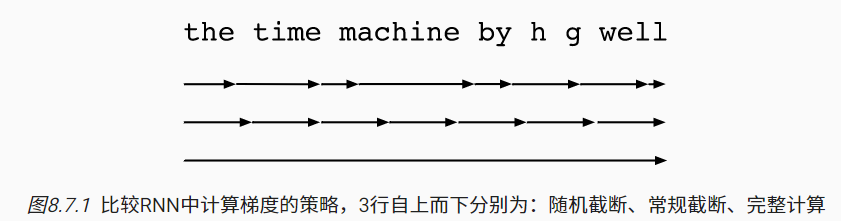

- 第一行采用随机截断，方法是将文本划分为不同长度的片断；
- 第二行采用常规截断，方法是将文本分解为相同长度的子序列。 这也是我们在循环神经网络实验中一直在做的；
- 第三行采用通过时间的完全反向传播，结果是产生了在计算上不可行的表达式。

虽然随机截断在理论上具有吸引力， 但很可能是由于多种因素在实践中并不比常规截断更好。 首先，在对过去若干个时间步经过反向传播后， 观测结果足以捕获实际的依赖关系。 其次，增加的方差抵消了时间步数越多梯度越精确的事实。 第三，我们真正想要的是只有短范围交互的模型。 因此，模型需要的正是截断的通过时间反向传播方法所具备的轻度正则化效果

> ##### 现代RNN

循环神经网络在实践中一个常见问题是数值不稳定性。 尽管我们已经应用了梯度裁剪等技巧来缓解这个问题， 但是仍需要通过设计更复杂的序列模型来进一步处理它

梯度异常在实践中的意义：

- 我们可能会遇到这样的情况：早期观测值对预测所有未来观测值具有非常重要的意义。 考虑一个极端情况，其中第一个观测值包含一个校验和， 目标是在序列的末尾辨别校验和是否正确。 在这种情况下，第一个词元的影响至关重要。 我们希望有某些机制能够在一个记忆元里存储重要的早期信息。 如果没有这样的机制，我们将不得不给这个观测值指定一个非常大的梯度， 因为它会影响所有后续的观测值。
- 我们可能会遇到这样的情况：一些词元没有相关的观测值。 例如，在对网页内容进行情感分析时， 可能有一些辅助HTML代码与网页传达的情绪无关。 我们希望有一些机制来*跳过*隐状态表示中的此类词元。
- 我们可能会遇到这样的情况：序列的各个部分之间存在逻辑中断。 例如，书的章节之间可能会有过渡存在， 或者证券的熊市和牛市之间可能会有过渡存在。 在这种情况下，最好有一种方法来*重置*我们的内部状态表示

##### 门控循环单元

门控循环单元（gated recurrent unit，GRU）是”长短期记忆”（long-short-term memory，LSTM）稍微简化的变体，通常能够提供同等的效果且速度明显更快

门控循环单元与普通的循环神经网络之间的关键区别在于： 前者支持隐状态的门控。 这意味着模型有专门的机制来确定应该何时更新隐状态， 以及应该何时重置隐状态。 这些机制是可学习的，并且能够解决了上面列出的问题。 例如，如果第一个词元非常重要， 模型将学会在第一次观测之后不更新隐状态。 同样，模型也可以学会跳过不相关的临时观测。 最后，模型还将学会在需要的时候重置隐状态。

重置门（reset gate）和更新门（update gate）。 我们把它们设计成$(0,1)$区间中的向量。重置门允许我们控制“可能还想记住”的过去状态的数量； 更新门将允许我们控制新状态中有多少个是旧状态的副本。

两个门的输出是由使用sigmoid激活函数的两个全连接层给出。


R,Z 与 H 形状相同，即隐藏单元数 h，样本数为 n 则为 nxh，b 都是 1xh
$$
\begin{split}\begin{aligned}
\mathbf{R}_t = \sigma(\mathbf{X}_t \mathbf{W}_{xr} + \mathbf{H}_{t-1} \mathbf{W}_{hr} + \mathbf{b}_r),\\
\mathbf{Z}_t = \sigma(\mathbf{X}_t \mathbf{W}_{xz} + \mathbf{H}_{t-1} \mathbf{W}_{hz} + \mathbf{b}_z),
\end{aligned}\end{split}
$$

> #### 注意力机制
>
> ##### 概念
>
> 人类的注意力被视为可以交换的、有限的、有价值的且稀缺的商品。注意力是稀缺的，而环境中的干扰注意力的信息却并不少。 比如人类的视觉神经系统大约每秒收到1e8位的信息。非自主性提示是基于环境中物体的突出性和易见性。 
>
> 考虑一个相对简单的状况， 即只使用非自主性提示。 要想将选择偏向于感官输入， 则可以简单地使用参数化的全连接层， 甚至是非参数化的最大汇聚层或平均汇聚层。
>
> “是否包含自主性提示”将注意力机制与全连接层或汇聚层区别开来。 在注意力机制的背景下，自主性提示被称为*查询*（query）。 给定任何查询，注意力机制通过*注意力汇聚*（attention pooling） 将选择引导至*感官输入*（sensory inputs，例如中间特征表示）。 在注意力机制中，这些感官输入被称为*值*（value）。 更通俗的解释，每个值都与一个*键*（key）配对， 这可以想象为感官输入的非自主提示。可以通过设计注意力汇聚的方式， 便于给定的查询（自主性提示）与键（非自主性提示）进行匹配， 这将引导得出最匹配的值（感官输入）。
>
> 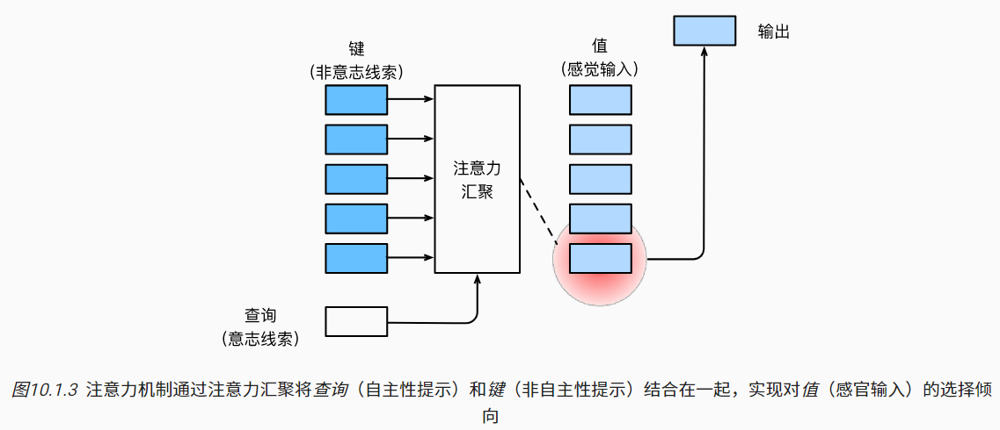
>
> 绘制热力图：
>
> ```python
> import torch
> from d2l import torch as d2l
> ```
>
> ```python
> #@save
> def show_heatmaps(matrices, xlabel, ylabel, titles=None, figsize=(2.5, 2.5),
>                   cmap='Reds'):
>     """显示矩阵热图"""
>     d2l.use_svg_display()
>     num_rows, num_cols = matrices.shape[0], matrices.shape[1]
>     fig, axes = d2l.plt.subplots(num_rows, num_cols, figsize=figsize,
>                                  sharex=True, sharey=True, squeeze=False)
>     for i, (row_axes, row_matrices) in enumerate(zip(axes, matrices)):
>         for j, (ax, matrix) in enumerate(zip(row_axes, row_matrices)):
>             pcm = ax.imshow(matrix.detach().numpy(), cmap=cmap)
>             if i == num_rows - 1:
>                 ax.set_xlabel(xlabel)
>             if j == 0:
>                 ax.set_ylabel(ylabel)
>             if titles:
>                 ax.set_title(titles[j])
>     fig.colorbar(pcm, ax=axes, shrink=0.6);
> ```
>
> 仅当查询和键相同时，注意力权重为1，否则为0。
>
> ```python
> attention_weights = torch.eye(10).reshape((1, 1, 10, 10))
> show_heatmaps(attention_weights, xlabel='Keys', ylabel='Queries')
> ```
>
> 仅当查询和键相同时，注意力权重为1，否则为0。
>
> ```python
> attention_weights = torch.eye(10).reshape((1, 1, 10, 10))
> show_heatmaps(attention_weights, xlabel='Keys', ylabel='Queries')
> ```

> #### 计算性能
>
> ##### 编译器和解释器
>
> 考虑如下代码：
>
> ```python
> def add(a, b):
>     return a + b
> 
> def fancy_func(a, b, c, d):
>     e = add(a, b)
>     f = add(c, d)
>     g = add(e, f)
>     return g
> 
> print(fancy_func(1, 2, 3, 4))
> ```
>
> *符号式编程*（symbolic programming），即代码通常只在完全定义了过程之后才执行计算。这个策略被多个深度学习框架使用，包括Theano和TensorFlow（后者已经获得了命令式编程的扩展）。一般包括以下步骤：
>
> 1. 定义计算流程；
> 2. 将流程编译成可执行的程序；
> 3. 给定输入，调用编译好的程序执行。
>
> 这将允许进行大量的优化。首先，在大多数情况下，我们可以跳过Python解释器。从而消除因为多个更快的GPU与单个CPU上的单个Python线程搭配使用时产生的性能瓶颈。其次，编译器可以将上述代码优化和重写为`print((1 + 2) + (3 + 4))`甚至`print(10)`。因为编译器在将其转换为机器指令之前可以看到完整的代码，所以这种优化是可以实现的。例如，只要某个变量不再需要，编译器就可以释放内存（或者从不分配内存），或者将代码转换为一个完全等价的片段。下面使用 `complie` 指令，生成与上述等价的代码：
>
> ```python
> def add_():
>     return '''
> def add(a, b):
>     return a + b
> '''
> 
> def fancy_func_():
>     return '''
> def fancy_func(a, b, c, d):
>     e = add(a, b)
>     f = add(c, d)
>     g = add(e, f)
>     return g
> '''
> 
> def evoke_():
>     return add_() + fancy_func_() + 'print(fancy_func(1, 2, 3, 4))'
> 
> prog = evoke_()
> print(prog)
> y = compile(prog, '', 'exec')
> exec(y)
> ```
>
> 命令式（解释型）编程和符号式编程的区别如下：
>
> - 命令式编程更容易使用。在Python中，命令式编程的大部分代码都是简单易懂的。命令式编程也更容易调试，这是因为无论是获取和打印所有的中间变量值，或者使用Python的内置调试工具都更加简单；
> - 符号式编程运行效率更高，更易于移植。符号式编程更容易在编译期间优化代码，同时还能够将程序移植到与Python无关的格式中，从而允许程序在非Python环境中运行，避免了任何潜在的与Python解释器相关的性能问题。
>
> torchscript允许用户使用纯命令式编程进行开发和调试，同时能够将大多数程序转换为符号式程序，以便在需要产品级计算性能和部署时使用。
>
> 加速例子：
>
> ```python
> import torch
> from torch import nn
> from d2l import torch as d2l
> 
> 
> # 生产网络的工厂模式
> def get_net():
>     net = nn.Sequential(nn.Linear(512, 256),
>             nn.ReLU(),
>             nn.Linear(256, 128),
>             nn.ReLU(),
>             nn.Linear(128, 2))
>     return net
> 
> x = torch.randn(size=(1, 512))
> net = get_net()
> net(x)
> net = torch.jit.script(net)
> net(x)
> ```
>
> 性能测试：
>
> ```python
> #@save
> class Benchmark:
>     """用于测量运行时间"""
>     def __init__(self, description='Done'):
>         self.description = description
> 
>     def __enter__(self):
>         self.timer = d2l.Timer()
>         return self
> 
>     def __exit__(self, *args):
>         print(f'{self.description}: {self.timer.stop():.4f} sec')
> net = get_net()
> with Benchmark('无torchscript'):
>     for i in range(1000): net(x)
> 
> net = torch.jit.script(net)
> with Benchmark('有torchscript'):
>     for i in range(1000): net(x)
> ```
>
> 可以看到 torch 明显比 numpy 快几个数量级：
>
> ```python
> # GPU计算热身
> device = d2l.try_gpu()
> a = torch.randn(size=(1000, 1000), device=device)
> b = torch.mm(a, a)
> 
> with d2l.Benchmark('numpy'):
>     for _ in range(10):
>         a = numpy.random.normal(size=(1000, 1000))
>         b = numpy.dot(a, a)
> 
> with d2l.Benchmark('torch'):
>     for _ in range(10):
>         a = torch.randn(size=(1000, 1000), device=device)
>         b = torch.mm(a, a)
> ```

#### 计算机视觉

##### 图像增广

图像增广在对训练图像进行一系列的随机变化之后，生成相似但不同的训练样本，从而扩大了训练集的规模。 此外，应用图像增广的原因是，随机改变训练样本可以减少模型对某些属性的依赖，从而提高模型的泛化能力。 例如，我们可以以不同的方式裁剪图像，使感兴趣的对象出现在不同的位置，减少模型对于对象出现位置的依赖。 我们还可以调整亮度、颜色等因素来降低模型对颜色的敏感度。 

```python
%matplotlib inline
import torch
import torchvision
from torch import nn
from d2l import torch as d2l
```

打开一张图片：

```python
d2l.set_figsize()
img = d2l.Image.open('/img/a.jpg')
d2l.plt.imshow(img);
```

随机 50% 概率水平翻转：

```python
def apply(img, aug, num_rows=2, num_cols=4, scale=1.5):
    Y = [aug(img) for _ in range(num_rows * num_cols)]
    d2l.show_images(Y, num_rows, num_cols, scale=scale)
apply(img, torchvision.transforms.RandomHorizontalFlip())
```

垂直翻转：

```python
apply(img, torchvision.transforms.RandomVerticalFlip())
```

随机裁剪一个面积为原始面积10%到100%的区域，该区域的宽高比从0.5～2之间随机取值。 然后，区域的宽度和高度都被缩放到200像素。 随机区间指均匀分布等概率取值：

```python
shape_aug = torchvision.transforms.RandomResizedCrop(
    (200, 200), scale=(0.1, 1), ratio=(0.5, 2))
apply(img, shape_aug)
```

以改变图像颜色的四个方面：亮度、对比度、饱和度和色调。 在下面的示例中，我们随机更改图像的亮度，随机值为原始图像的50%（1−0.5）到150%（1+0.5）之间。

```python
apply(img, torchvision.transforms.ColorJitter(
    brightness=0.5, contrast=0, saturation=0, hue=0))
```

色调：

```python
apply(img, torchvision.transforms.ColorJitter(
    brightness=0, contrast=0, saturation=0, hue=0.5))
```

同时改变：

```python
color_aug = torchvision.transforms.ColorJitter(
    brightness=0.5, contrast=0.5, saturation=0.5, hue=0.5)
apply(img, color_aug)
```

综合变换：

```python
augs = torchvision.transforms.Compose([
    torchvision.transforms.RandomHorizontalFlip(), color_aug, shape_aug])
apply(img, augs)
```

使用CIFAR-10数据集，对象的颜色和大小差异更明显。输出前几个图像：

```python
all_images = torchvision.datasets.CIFAR10(train=True, root="../data",
                                          download=True)
d2l.show_images([all_images[i][0] for i in range(32)], 4, 8, scale=0.8);
```

CIFAR-10 是由 Hinton 的学生 Alex Krizhevsky 和 Ilya Sutskever 整理的一个用于识别普适物体的小型数据集。一共包含 10 个类别的 RGB 彩色图 片：飞机（ plane ）、汽车（ automobile ）、鸟类（ bird ）、猫（ cat ）、鹿（ deer ）、狗（ dog ）、蛙类（ frog ）、马（ horse ）、船（ ship ）和卡车（ truck ）。图片的尺寸为 32×32 ，数据集中一共有 50000 张训练圄片和 10000 张测试图片。

*迁移学习*（transfer learning）将从*源数据集*学到的知识迁移到*目标数据集*。 例如，尽管ImageNet数据集中的大多数图像与椅子无关，但在此数据集上训练的模型可能会提取更通用的图像特征，这有助于识别边缘、纹理、形状和对象组合。 这些类似的特征也可能有效地识别椅子。

*微调*（fine-tuning）。

## 网络

### requests

get 请求：

```python
import requests
response=requests.get('http://127.0.0.1:8080/')
print(response.status_code) #200
print(response.text) #'Hello world!'
```

```python
params = {
    'key1': 'value1',
    'key2': 'value2'
}
response = requests.get('http://example.com', params=params)
```

```python
data = {
    'key1': 'value1',
    'key2': 'value2'
}
response = requests.post('http://example.com', data=data) #也可以传str
```

```python
import requests
pam = {"username":"name1"}
print(requests.get('http://127.0.0.1:8080/',params=pam).text)
print(requests.post('http://127.0.0.1:8080/submit',json=pam).text)
```


### socket

#### 服务端

```python
import socket
```

创建 TCP, IPv4 服务端：

```python
s = socket.socket(socket.AF_INET, socket.SOCK_STREAM)
```

设置服务端属性：

```python
s.bind((str-IP, int-端口)) #注意有两个括号！绑定自己的IP和端口号
s.listen(x) #最多同时建立x个端(包括自己)，部分系统不允许超过5个
```

基本指令：

```python
s.recv(x) #服务端一秒可接受数次信息，设置每次接受的数据的量x（bit）。一般设置为1024
s.accept() #尝试一次接收，如果此时有客户端请求连接，则返回该客户端对象sock和addr。使用：sock, addr = s.accept()
sock.send(tmp) #向连接到的客户端发送JSON二进制数据tmp
sock.close() #结束与客户端sock的连接。
```


常见的错误类型有：

ConnectionResetError 当send或recv失败时，会报这个错误。

OSError 因为服务端挂了，send不出去时，会挂这个错误

ConnectionRefusedError 连接失败时会挂这个错误

一般对于这样的错误，使用try…except…，向用户/后台简要地在except处输出一些信息，或干脆pass掉。


#### 客户端

创建同。连接：

```python
s.connect((IP, PORT))
```


#### 示例

##### 聊天

###### 服务端

```python
#server -ver2;注：如果希望记录服务端运行日志，那么就在每次print的时候顺便把这条消息写到文件
import json,socket,threading
def Encode(Message):#加密
    return json.dumps(Message).encode('utf-8')
def Decode(Binary):#解密
    return json.loads(Binary.decode('utf-8'))

s = socket.socket(socket.AF_INET, socket.SOCK_STREAM)
s.bind(('127.0.0.1', 1303))
s.listen(5)
print('成功创建服务器。等待客户端连接。')

new = []#还未广播给客户端的消息;信息格式：(信息, IP)
rwp = []#所有正在连接着的客户端的sock和addr

def listen(soc, add):#对应了wp[0]和wp[1]
    global new, rwp
    soc.send(Encode('#%s:%s'%(add[0],add[1])))
    print('成功发送标识码。')
    while True:
        try:
            m = soc.recv(1024)
        except ConnectionResetError:#客户端通过非正常途径强行被关闭
            break#那就不管这个客户端了，直接关闭线程，停止接收信息；总不能把服务器关了吧。
        if m == Encode('#exit'):
            break#正常途径的取消连接。
        new.append((m, add))
    for i in range(len(rwp)):
        if rwp[i][1] == add:
            rwp.pop(i)
            break #找到了就不用继续搜索了，注意这个break很重要！
    soc.close()
    print('%s:%s退出了服务器。'%(add[0],add[1]))
def send():
    global new,rwp
    while True:
        if len(new):
            for i in new:#万一同时收到了不止一条信息，也可以很好处理
                for j in rwp:
                    tx='[%s:%s]%s'%(i[1][0],i[1][1],Decode(i[0]))
                    j[0].send(Encode(tx))
                print('[%s:%s]%s'%(i[1][0],i[1][1],Decode(i[0])))
            new.clear()#清空待发送消息列表
T0 = threading.Thread(target=send)
T0.start()
while True:
    sock, addr = s.accept()
    rwp.append((sock,addr))#添加一个元素：sock-addr元组
    print('连接到客户端%s:%s。当前客户端数：%d'%(addr[0],addr[1],len(rwp)))
    T = threading.Thread(target=listen, args=(rwp[-1]))#同时处理多个客户端要用多线程
    T.start()#每次创建的线程都是独立的，虽然都是T变量

```

###### 客户端

```python
#cilent -ver2
import json,socket,threading
from tkinter import *
def Encode(Message):#加密
    return json.dumps(Message).encode('utf-8')
def Decode(Binary):#解密
    return json.loads(Binary.decode('utf-8'))

run, s, T=True, None, None#s,T是定义了变量名，但没有实体化
def send():
    if but['text'] == '发送':
        nr = Encode(ent.get())
        try:
            s.send(nr)
        except ConnectionResetError:#服务器挂了
            tex.insert(0.0,'发送失败，与服务器中断了连接，请点击按钮重新连接。\n')
            but['text']='连接'
    elif but['text'] == '连接':
        conn()
def ex():
    try:
        s.send(Encode('#exit'))
    except OSError:#服务器关闭，发送失败
        pass#那就不发送了呗
    global run
    run=False#结束线程
    root.destroy()#结束窗口
def recv():
    while run:
        try:
            a = s.recv(1024)
        except ConnectionResetError:#服务器挂了
            tex.insert(0.0,'与服务器中断了连接，请点击按钮重新连接。\n')
            but['text']='连接'
            break
        if a:
            b=Decode(a)
            print(b)
            if b[0] == '#':#特殊代码
                root.title('调试客户端'+b[1:])
                continue#不加入到文本框
            tex.insert(0.0,b+'\n')
def conn():
    global s,T#实体化s,T变量;所有要修改的变量都要global声明
    try:
        s = socket.socket(socket.AF_INET, socket.SOCK_STREAM)
        s.connect(('127.0.0.1', 1303))
        tex.insert(0.0,'成功连接到服务器。\n')
        T = threading.Thread(target=recv)
        T.start()
        but['text']='发送'
    except ConnectionRefusedError:
        tex.insert(0.0,'连接失败，请点击按钮重新连接。\n')
        but['text']='连接'

root = Tk()
root.title('调试客户端')
ent = Entry(root, width=60)
ent.grid(row=0,padx=6)
but = Button(root, text='发送',command=send)
but.grid(row=0,column=1,padx=6,pady=3)
tex = Text(root, width=60,height=12)
tex.grid(row=1,padx=6,pady=5)
conn()

root.protocol("WM_DELETE_WINDOW", ex)
root.mainloop()
```


### 爬虫

#### 基本准备

加载模块

```python
from urllib import request
```

> 通常还需要引入的库：
>
> ```python
> import random, chardet, re, os
> ```

报头准备：

```python
user_agent_list = [
 'Mozilla/5.0 (Windows NT 6.1; WOW64) AppleWebKit/537.36 (KHTML, like Gecko) '
  'Chrome/45.0.2454.85 Safari/537.36 115Browser/6.0.3',
 'Mozilla/5.0 (Macintosh; U; Intel Mac OS X 10_6_8; en-us) AppleWebKit/534.50 (KHTML, like Gecko) Version/5.1 Safari/534.50',
 'Mozilla/5.0 (Windows; U; Windows NT 6.1; en-us) AppleWebKit/534.50 (KHTML, like Gecko) Version/5.1 Safari/534.50',
 'Mozilla/4.0 (compatible; MSIE 8.0; Windows NT 6.0; Trident/4.0)',
 'Mozilla/4.0 (compatible; MSIE 7.0; Windows NT 6.0)',
 'Mozilla/5.0 (Windows NT 6.1; rv:2.0.1) Gecko/20100101 Firefox/4.0.1',
 'Opera/9.80 (Windows NT 6.1; U; en) Presto/2.8.131 Version/11.11',
 'Mozilla/5.0 (Macintosh; Intel Mac OS X 10_7_0) AppleWebKit/535.11 (KHTML, like Gecko) Chrome/17.0.963.56 Safari/535.11',
 'Mozilla/4.0 (compatible; MSIE 7.0; Windows NT 5.1; Trident/4.0; SE 2.X MetaSr 1.0; SE 2.X MetaSr 1.0; .NET CLR 2.0.50727; SE 2.X MetaSr 1.0)',
 'Mozilla/5.0 (compatible; MSIE 9.0; Windows NT 6.1; Trident/5.0',
 'Mozilla/5.0 (Windows NT 6.1; rv:2.0.1) Gecko/20100101 Firefox/4.0.1',
]
```

> 移动端：
>
> ```python
> 'Mozilla/6.0 (iPhone; CPU iPhone OS 8_0 like Mac OS X) AppleWebKit/536.26 (KHTML, like Gecko) Version/8.0 Mobile/10A5376e Safari/8536.25'
> ```

获取一个结果：

```python
def getres(url):
    try:
        ua = random.choice(user_agent_list)
        req = request.Request(url)
        req.add_header('User-Agent', ua)
        res = request.urlopen(req)
        return res
    except ConnectionError:
        print('连接出错，无法连接: %s'%url)
        return None
```

> 位置参数url：网址参数
>
> 默认参数data：None， 或POST/GET   打开网页要用的方法；提交/获取，HTTP协议之一
>
> 默认参数proxies=None  代理
>
> 创建一个类文件对象file-like，返回网页代码

> 查看网页信息：
>
> ```python
> response = urllib.request.urlopen('http://python.org/')
> print("查看 response 的返回类型：",type(response))
> print("查看反应地址信息: ",response)
> print("查看头部信息1(http header)：\n",response.info())
> print("查看头部信息2(http header)：\n",response.getheaders())
> print("输出头部属性信息：",response.getheader("Server"))
> print("查看响应状态信息1(http status)：\n",response.status)
> print("查看响应状态信息2(http status)：\n",response.getcode())
> print("查看响应 url 地址：\n",response.geturl())
> page = response.read()
> print("输出网页源码:",page.decode('utf-8'))
> ```

抓取并写入一个网页的HTML及其编码方式：

```python
def gethtml(url):
    res = getres(url)
    q = res.read()
    ic = chardet.detect(q).get('encoding', 'utf-8') # dict的get方法，如果得不到，默认采用utf-8
    return [str(q.decode(ic, 'ignore')), ic]
```

获取并写入一张图片：

```python
res = getres(url)
if not res == None:
    with open(objcwd, 'wb') as f:
        f.write(res.read())
```


如若遇到报错：

```shell
urllib.error.URLError: <urlopen error [SSL: CERTIFICATE_VERIFY_FAILED] certificate verify failed: certificate has expired (_ssl.c:1091)>
```

那么需要添加代码，设置全局取消证书验证：

```python
import ssl
ssl._create_default_https_context = ssl._create_unverified_context
```


#### 示例

##### 爬取HTML

```python
res = gethtml('https://oj.socoding.cn/')
with open('a.html', 'w', encoding=res[1]) as f:
    f.write(res[0])
```


##### 爬取特定关键字

```python
htmls = gethtml('https://oj.socoding.cn/p/1557')
res = re.findall('>([^>]{0,}?鞘翅[^<]{0,}?)<', htmls[0])
for i in res:
    print(i + '\n')
```


##### 爬取图片

```python
res = gethtml('https://oj.socoding.cn/user/view?id=29')
addrs = re.findall(
    r"(.{1,}?)</a>", htmls[0])
    result = re.findall(
        r"<a class=\"badge badge-secondary\"(.{1,}?)</a></td><td><a class=\"text-dark\" href=\"(.{1,}?)\">(.{1,}?)</a>", htmls[0])
    for j in result:
        ans += j[-1] + ' https://oj.socoding.cn' + j[-2] + '\n'
    print('Done ' + idx + ', find ' + str(len(result)))
with open('titles.txt', 'w', encoding=enc) as f:
    f.write(ans)
```


### 远程操作

> 图源华为HCIA,HCIP课件，权侵删

#### telnetlib

标准库，实现了 `Telnet` 功能


> 推荐使用SSH，而不是telnet；此时可以用 `paramiko` 或 `netmiko` 库操作 SSH


#### paramiko

是第三方库，需要先pip安装。用于SSH操作。


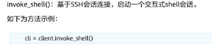


### Flask

#### 简单post

几乎都是 GPT 生成。

```python
#你的核心业务代码,也可以单独写一个.py然后import过来
def mainFunc(name):
    #返回的是你业务代码处理得到的结果
    return {'data': name + "爱lr580", 'type': 3}


from flask import Flask, request

# print(__name__) '__main__'
app = Flask(__name__)


@app.route('/', methods=['POST'])
def call_mainFunc():
    name = request.form.get('name')
    res = mainFunc(name)
    return res

app.run(port=52580)  #[1024,65535]任意int
```

测试：

```python
import requests
requests.post('http://127.0.0.1:52580/',data={'name':'yym'}).text
```

网页测试：

```html
<!DOCTYPE html>
<html>
    <head>
        <title>lr580是米娜桑的主人</title>
    </head>
    <body>
        <form>
            <label for="name">你的名字：</label>
            <input type="text" id="name" name="name">
            <button type="button" onclick="callPythonServer()">提交</button>
        </form>
        <div id="result"></div>
        <script>
        //你用jquery也行，我懒，就不用了
		function callPythonServer() {
			// 获取输入框中的名称
			var name = document.getElementById("name").value;

			// 创建一个XMLHttpRequest对象
			var xhr = new XMLHttpRequest();

			// 设置POST请求的URL和参数
			var url = "http://localhost:52580/";
			var params = "name=" + name;

			// 发送POST请求
			xhr.open("POST", url, true);
			xhr.setRequestHeader('Content-type', 'application/x-www-form-urlencoded');
			xhr.onreadystatechange = function() {
				if (xhr.readyState == 4 && xhr.status == 200) {
					// 显示结果
                    var res = JSON.parse(xhr.responseText);
					document.getElementById("result").innerHTML = "data: " + res.data + ", type: " + res.type;
				
				}
			};
			xhr.send(params);
		}
        </script>
    </body>
</html>
```


### 其他

> `PySNMP` 模块可以实现 SNMP 功能


## 算法

### networkX

图论库。[官方文档](https://networkx.org/documentation/stable/tutorial.html), github 有项目

```python
import networkx as nx
```

#### 建图

##### 常规

```python
g = nx.Graph() #无向图，有向是DiGraph
```

点可以是任何 hashable，使用 `add_node` 方法添加单点，用 `add_nodes_from` 从 iterable 或 已知图添加点。用 `.nodes` 取所有点，可强转 list，下同

边用 `add_edge` 填两参，同理可以 `add_edges_from`。会自动去重边，要重边的话要用 `MultiGraph`。可以用 `.edges` 取所有边

如，构造一个圈：

```python
import networkx as nx

g = nx.Graph()
g.add_nodes_from([i for i in range(1, 11)])
for i in range(1, 11):
    j = i % 10 + 1
    g.add_edge(i, j)

print(g.nodes, g.edges)
```

`adj` 属性返回一个 dict 邻接表，key 是点，val 是 dict, 其 key 是点

`degree` 属性返回各点的度。都可以用 `[]` 运算符询问单独一个点

多个询问，用 `edges` 方法+iterable 和 `degree` 同理。结果会去重，如：

```python
print(g.adj[1], g.degree[1]) #前者可简写为g[1]
print(g.edges([1, 2]), g.degree(1, 2)) #简写为g.edges[1,2]或g[1][2]
```

删用 `remove_node`, `remove_edge`

点/边的属性(点权可用 dict 表示，key 是属性名，也可以不)，可以直接赋值，如 `g[][key]=val`，边就 `g[][][key]=val`

加权边：`add_weighted_edges_from`

> 遍历边：
>
> ```python
> for i,j in g.edges(): #可以取len(.edges())
> 	print(i,j) #int, int
> ```


##### 预制

[更多](https://networkx.org/documentation/stable/reference/generators.html)

生成随机 DAG，且点值从 $[0,n)$ 偏移到 $[1,n]$：

```python
from networkx.generators.random_graphs import gnm_random_graph
import networkx as nx
dag = gnm_random_graph(n, m)
dag = nx.relabel_nodes(dag, {i: i + 1 for i in range(n)})
print(dag.edges())
```

随机树：`nx.random_tree(n)`

n点的链：`nx.path_graph(n)`

完全图：`nx.complete_graph(n)`

0为中心的n边菊花图：`nx.star_graph(n)`

n点完全k叉树：`nx.full_rary_tree(k,n)`


#### 绘制

```python
import matplotlib.pyplot as plt
```

```python
nx.draw(g, with_labels=True, font_weight='bold')
# nx.draw_shell(g, with_labels=True, font_weight='bold')
# plt.show() 窗口化输出
plt.savefig("path.png")
```


#### 举例

##### 判断富勒烯图

```python
#(4,5,6)-富勒烯图是3正则3连通且只有4,5,6圈的平面图
import networkx as nx

g = nx.Graph()
n, m = [int(i) for i in input().strip().split()]
for i in range(m):
    u, v = [int(i) for i in input().strip().split()]
    g.add_edge(u, v)

is3Regular = nx.is_k_regular(g, 3)
#print('3-正则:', is3Regular)

is3Connected = nx.is_k_edge_connected(g, 3)
#print('3-连通:', is3Connected)

isPlanar = nx.is_planar(g)
#print('平面图:', isPlanar)

#只有4,5,6圈->不存在<=3或>=7的基圈(基圈通过边异或能组成图上所有圈)
cycles = nx.minimum_cycle_basis(g)
minLen = len(min(cycles, key=lambda x: len(x)))
maxLen = len(max(cycles, key=lambda x: len(x)))
isOnly456 = minLen >= 4 and maxLen <= 6
#print('只有4,5,6圈:', isOnly456)

isFullerene = is3Regular and is3Connected and isPlanar and isOnly456
print(isFullerene)
```


# 应用举例

#### 网络

##### 局域网共享文件

cd 到要贡献的目录下，输入：

```sh
python -m http.server 8888
```

之后本机，和局域网内的其他机子，可以下载该目录下的文件。

ctrl+c 关闭。

#### 文件

##### 统计 java 项目代码总行数

```python
import os
cnt = 0
for root, dirs, files in os.walk('.'):
    for i in files:
        p = os.path.join(root, i)
        if os.path.splitext(p)[1] == '.java':
            with open(p, 'r', encoding='utf-8') as f:
                t = len(f.readlines())
                cnt += t
print(cnt)
```


##### 将 markdown 标题全部降一级

```python
with open('LaTeX.md', 'r', encoding='utf8') as f:
    r = f.readlines()
t = ''
for i in r:
    if len(i) and i[0] == '#' and i.count('#') <= 6:
        i = '#' + i
    t += i #不要再加'\n'了
with open('LaTeX2.md', 'w', encoding='utf8') as f:
    f.write(t)
```


