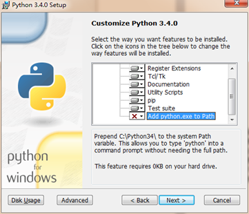
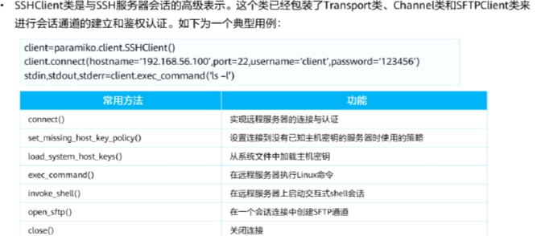

> 此为第二版python3学习笔记，在第一版的基础上删减了大部分过于基础的内容，删除了大量图片实例，取之以代码。
>
> <p align="right">——蒟蒻lr580</p>
>
> 2021/2/27 开始编写第二版python笔记

# 语法

## 初始

### 安装/使用python

python3.4是最后支持window XP的版本。不要安装最新的版本，往往会出现bugs，安装一个小版本号，如3.9是最新，安装3.8的稳定版。

必须勾选add python.exe to Path，否则重装，如下图：



使用略。

### 测试

查看版本：

```python
python --version
```

查看安装路径

```shell
py -0p
```


### 第三方库

打开cmd，输入如下指令：

```bash
pip install 第三方库名
```

如：

```bash
pip install requests-html
```

可以加上调用国内镜像的选项，加快下载速度：

```bash
pip install -i https://pypi.tuna.tsinghua.edu.cn/simple pyspider
```

其他镜像：

> 清华：https://pypi.tuna.tsinghua.edu.cn/simple
>
> 阿里云：http://mirrors.aliyun.com/pypi/simple/
>
> 中国科技大学 https://pypi.mirrors.ustc.edu.cn/simple/
>
> 华中理工大学：http://pypi.hustunique.com/
>
> 山东理工大学：http://pypi.sdutlinux.org/ 
>
> 豆瓣：http://pypi.douban.com/simple/
>
> 如果http不行换https

可以在用户目录下创建pip目录，创新文件pip.ini，输入如下内容：

```ini
[global]
index-url = https://pypi.tuna.tsinghua.edu.cn/simple
[install]
trusted-host=mirrors.aliyun.com
```

> 或者可以：
>
> ```bash
> pip config set global.index-url https://pypi.tuna.tsinghua.edu.cn/simple
> ```
>
> 需要取消时，可以：
>
> ```bash
> pip config unset global.index-url
> ```


将 python 安装的包移出 C盘：

输入 `python -m site` 查看当前安装目录

输入 `python -m site -help` 查看当前该程序目录，点进去，修改两个变量 `USER_SITE, USER_BASE` 为所想要的路径，如：

```python
USER_SITE = 'D:\\Program Files\\Python37\\lib\\site-packages'
USER_BASE = 'D:\\Program Files\\Python37\\Scripts'
```

> 已有的包直接强行剪切出去貌似不是一个好主意


卸载库指令：

```bash
pip uninstall 库名
```

更新指令：

```bash
pip install 库名 --upgrade
```

> 注意，安装失败的原因非常多，根据库的不同详情百度

可以安装下载好的库文件而不是在线下载，文件后缀名是whl，命令同上


可以使用下面指令获取当前机子装了的全部包：

```bash
pip freeze > requirements.txt
```

先用 `pip` 安装 `pipreqs` ，然后使用：(可以直接 `pipreqs ./`)

```bash
pipreqs ./ --encoding utf8
```

或

```bash
pipreqs ./ --encoding=utf8
```

那么导出的 `requirements.txt` 可以用下面指令批量安装：

```bash
pip install -r requirement.txt
```


### 编译

python是解释性语言，但是也可以编译成exe

首先使用cmd打开python安装路径，打开scripts文件夹

#### 初始化

输入指令，安装PyInstaller.exe

```cmd
pip.exe install PyInstaller
```

如果要卸载

```cmd
pip.exe remove PyInstaller
```

#### 常规使用

将要编译的文件(单一.py文件)放在上述文件夹(scripts)内，则可以写相对路径，否则要写绝对路径

```cmd
pyinstaller.exe 路径
```

通常加-F，将其编译为单独的exe文件，缺陷是运行速度更慢

```cmd
pyinstaller.exe 路径 -F
```

若要增加一个程序图标，用-i 图标路径

若有额外的引用模块路径，用-p 模块文件夹路径。

> 凡是编译的程序最后都应该添加一行input()，以免运行结束立刻闪退。窗口化程序除外。

如果编译出错，再重复操作一次试试；若依旧出错，百度一下。

1. Pyinstaller对中文目录存在一定的兼容问题。故使用过程中，一般最好不要将exe文件放在带有中文的目录下。
2. 使用python编译程序本身存在着局限。因此运行程序的速度是比较慢的。
3. 要编译的程序尽可能减少应用的模块，否则此程序会过于庞大。

### 使用提示

1. 请不要在中文(全角)下输入单词后回车或使用快捷键，不要在大写状态使用快捷键，否则可能不成功。

### 规范

#### 标准头

```python
#!/usr/bin/env python3
# -*- coding: utf-8 -*-
'''第一行告诉非windows操作系统，这是python可执行程序
第二行告诉python解释器，本程序使用utf-8编码，防止中文乱码'''
```

#### 帮助

##### help

加一个函数/数据类型，输出参数，成员函数(方法)，成员属性

加一个变量，等同于加它的数据类型

```python
help(print)
x=3
help(x) #同help(int)
```

可以查阅特定方法或成员属性：

```python
help(list.extend)
```

#### 标准化编程

更多请参见C学习笔记

> 编写程序的六个步骤
>
> （1）定义程序目标
>
> 用一般的概念来考虑你需要用程序解决的问题，应该涉及到的计算和操作。
>
> （2）设计程序
>
> 明确编写程序的用户界面、目标用户（客户）、编写大致所需时间，明确如何表示、处理、存储数据等等。
>
> （3）编写代码和调试程序
>
> 写出完整的python代码。
>
> 一般地，编写代码的时候，每写完一个小功能（或子函数、或一段比较长的代码），都应该先调试一下这一部分是否有bug，如果有的话，立刻修复，然后再继续编写。如果全部代码都写完再一起调试，往往查找bug是非常困难的。
>
> 在编写代码时，建议养成每写完一部分重要代码（或隔一段时间）后立刻备份的习惯，即复制并保留一份一模一样的源码，以免断电、误删等失误带来不必要的损失。
>
> （4）编译程序
>
> 当调试无误后，就可以编译程序了，记得写上程序的基本信息（程序名、版本号等），建议在32位和64位环境下都编译一份，否则64位的用户打开不了32位的.exe程序，32位的用户也打开不了64位的.exe程序。
>
> （5）维护和修改程序
>
> 程序总是要时常更新、维护、升级的。当你发现程序有可以改进、修复的时候，记得及时维护你的程序（除非你弃坑了）。如果程序功能比较复杂，最好给用户写好说明书，配有图文解说。
>
> （6）发布程序
>
> 将.exe文件（或安装包）发布。

#### 其他

##### 缩进

默认缩进代表代码块。

在没有冒号的地方不允许强行缩进创造代码块实现变量生存周期。

可以用分号或逗号强行缩行，但逗号表示的是tuple

```python
print(2);print(3),print(4)
```

冒号后面可以强行不缩进：

```python
if 0:print(2)
elif 1:print(3)
else:print(4)
```


##### dir

dir()内置函数可以查看一个对象/数据类型拥有的所有属性名和方法名。

```python
dir() #未import时只有双下划线的东西，import后有别的东西
```

```python
dir(int) #查看int的所有内置方法和属性
```

查看所有内置函数：

```python
dir(__builtins__)
```


### 编辑器

#### jupyter

##### ipynb

一种支持python的笔记本格式，可以使用vscode打开，需要安装插件(其中pip的pywin32安装较慢，特别是清华镜像源，建议官网或别的地方找正确的版本自己下载whl安装，看正确的版本只需要在pip install pywin32自动安装失败时看看它用的文件名叫啥就好了)

ipynb使用十分简单，事实上就是一堆代码框，然后可以分块运行(注意没有文本框，只有代码框)，左上角的数字代表是否执行过(是则有数字)，和执行的先后顺序

这个工具的使用本身十分简单……本处不赘述

这个工具跟自带IDLE相比，可以有vscode插件加成，有输入提示

##### 安装

```shell
pip install jupyter
```


#### vscode

常见问题：

report missing import 警告：[可以直接忽略警告](https://blog.csdn.net/qq_39287793/article/details/121263322)，也可以手动设置路径。

ctrl+shift+p 打开 `settings.json` (一般可能在用户文件夹的 `AppData\Roaming\Code\User\settings.json`)，追加： 

```json
"python.analysis.diagnosticSeverityOverrides": {
    "reportMissingImports": "none"
},
```


### 其他

`.pyc` 文件可以删除。


## 输入和输出

### 标准I/O

#### print

```python
print(可变参数)
print(False,1,'32')'''多行注释的本质是一个不输出的字符串'''
print()#空行
```

会输出一个对象的\_\_str\_\_属性，如果要输出\_\_repr\_\_，在IDLE里直接不用print的输出达到repr，print取str,repr函数也可以获得repr(返回str，但不打印)，在非IDLE下：

```python
print(repr('3'))#用双引号也一样
```

可以调节默认参数，sep和end是参数间隔和末尾处理，默认为空格和换行。

```python
print(3,4,5,sep='_',end='#')
```

可以使用重定义进行写入，使用flush默认参数：

```python
with open('1.txt', 'w') as f:
    print(123,file=f)
```

> 还有flush参数，默认关闭。

返回值是None

#### input

```python
input('请输入内容：')#自然是可以不填的
```

读取**一行内容**，如果要模拟C的scanf，需要用循环，分割字符或正则表达式(假设要模糊化空格为空白字符)。

实现一直读(条件break)的模型：

```python
while True:
    try:
        x=int(input())
        if not x:#没有!x的表达
            break
    except:
        pass
```

> 注意在python2有raw_input而python3没有。

#### 转义符

单引号和双引号的意义相同。

单引号内需要转义双引号，反之亦然，三单/双引号内无需转义引号

三单/双引号也可以用于代替注释，但严格意义上并不是注释，只有#才是单行注释。

```python
print(''''w"\nc''')
```

r开头的文本内部所有内容均不转义，常用于正则表达式：

```python
print(r'\n')
```

可以使用一个转移跨行输入，但是注意tab缩进会算入，所以下一行不要缩进：

```python
print('123\
456')
```

> 其他转义符同C语言，参见C学习笔记。


#### 占位符

##### 通常法

规则是：

```python
单个占位： '%?'%内容
多个占位： '%?a %?b'%(?a,?b)
```

常用占位符：

```python
%s 跟字符串，但数字也可以。数组类输出同直接print。
%d 占位时自动显示成整数(float则四舍五入)
%f 占位默认为小数点后六位，如果整了也会补齐
	例如 print('%f'%(1/8))
%o 以八进制数字输出(%O、小数报错)，不带前导
	oct(x) 输出的八进制带前导0o，而%o不带(小数报错)
%x(%X) 以十六进制数字输出，不带前导
	hex(x) 输出带前导0x
    bin(x) 输出二进制(含前导0b)，不存在二进制的占位符
%e(%E) 输出科学计数法(含四舍五入，指数带正号)
%g(%G) 灵活输出
```

显然，同C语言，加正数居右占位，加负数居左，加小数点加正数四舍五入处理小数点后若干位(.0四舍五入取整，同round(x)，否则同round(x,dight))

> round放大不会增设0，而占位符会，如round(2.99,3)不是2.990

显然前导0+数字是整数的零占位符。

##### 格式法

> 使用format占位，不常用，故略，详见其他资料

### 文件I/O

#### 打开文件

##### 常规

```python
open(文件路径, 打开方式(='r'))
```

> 路径可以是相对路径或绝对路径，参见语法-模块-引用方法-路径

```python
fp = open('a.txt', 'r')
```

常用的打开方式标识符有：

- r 只读，没有则FileNotFoundError
- w 只写，覆盖原文本，没有则新建
- a 追加，会在已有文本末尾写内容(不会换行)
- rb 二进制读(一般是图片、音频等)，同理有wb
- r+ 可读可从头覆盖写(没写到的地方不会处理，末尾不加\0)，一般不使用a+或w+(读不出东西)

注意：

1. w/a模式不可以读内容，r模式不可以写内容，没有rw、ra模式

还有两个默认参数，encoding=None,errors=None

encoding是编码方式(不区分大小写，如UTf-8也能过)，常见的有：

- utf-8
- gbk
- gb2312
- ascii
- euc-jp (日语)

如果含中文的文件，默认使用gbk读入，但是一般中文文件可能使用utf-8编码的，所以要注意。(大部分时候还可能会报错UnicodeDecodeError)

如果以b读写，不填encoding。

如下方式自动忽略错误：

```python
errors='ignore'
```


以非with方法打开文件，**需要关闭文件**：

> 虽然很多时候不关闭也没什么问题

```python
fp.close()
```

##### with

```python
with open(...) as f:
    操作
```

例如：

```python
with open('a.txt', 'r+', encoding='utf-8') as f:
    print(f.readlines())
```

文件相关操作在代码块内执行，代码块外无此文件，with结束后自动关闭文件。(文件指针仍然存在，但是被关闭，所以如果在with外操作文件，会报错ValueError)

#### 读文件

##### read

返回str，得到的最后一位不是EOF，而是文件的最后一个有效字符；但是仍然是读到第一个\0就停止。

```python
print(fp.read())
```

可以加一个参数(默认为-1，即无限行0)，表示最多读取多少长度(如果文件长度不足，则到此为止)，不会超越第一个\0。

读取是一次性的，即便\0后面还有其他字符，也不会被读到，第一次之后每次读取都返回空字符，readlines同。

##### readlines

返回一个列表，每个元素是一行(除最后一行，每行都有换行符)

如果有若干个空行，那么最后一个空行不会被读取。显然这种情况下每个非空行都有\n

同理，可以加一个参数表示读多少行。

#### 写文件

```python
fp.write(str)
```

写内容到文件

#### 编码

##### 检查编码

使用模板

```python
import chardet
def check(d):#d是路径，返回编码方式(str)
    with open(d,'rb') as f:
        dt=f.read() #可以加读取多少长度的常量
    return chardet.detect(dt)['encoding']
```

示例：

```python
import chardet
d='a.txt'
def check(d):#d是路径，返回编码方式(str)
    with open(d,'rb') as f:
        dt=f.read() #可以加读取多少长度的常量
    return chardet.detect(dt)['encoding']
e=check(d)
print(e)
with open(d,encoding=e) as f:
    print(f.read())
```

### 文档I/O

首次运行需要安装第三方库：

```cmd
pip install python-docx
```

#### doc/docx

##### docx

加载：

```python
import docx
```

打开文件：

```python
f = docx.Document(路径)
```

读取所有段落的纯文本：

```python
for i in f.paragraphs:
    print(i.text)
```

> 更多内容请查看官方文档等内容

##### doc

先转化为docx，然后再读取。

> 特别提醒：需要使用绝对路径。
>
> 执行这个函数时，不要正在打开/使用word应用，否则可能会被强行退出。
>
> 当转换结束后，再打开转换后的文件，就可以同docx一样的处理了。
>
> 使用该转换需要电脑有word

```python
import os, sys, pickle, re, codecs, string, shutil, docx
from win32com import client
def toAbsPath(p):
    return os.path.dirname(os.path.abspath(__file__))+'\\'+p
def change(addr):
    word = client.Dispatch('Word.Application')
    doc = word.Documents.Open(addr)
    doc.SaveAs(addr+'x', 12, False, '', True, '',False, False, False, False)
    doc.Close()
    word.Quit()
```

使用示例：

```python
change(toAbsPath('ab.doc'))
```

#### xlsx

##### openpyxl

###### 基础操作

安装：(window cmd命令)

```cmd
pip install openpyxl
```

加载：(方法不唯一)

```python
from openpyxl import *
```

打开文件：(路径相对绝对都可)

```python
wb = load_workbook(路径)
```

新建文件：(自带名为`sheet`的初始sheet表单)

```python
wb = Workbook()
```

保存文件：

```python
wb.save(路径)
```


读取sheet表格，可以用`worksheets`按数字从左到右顺序或用`wb`实例的key名(sheet名字符串)：

```python
sheet0 = wb.worksheets[0]
sheet1 = wb['Sheet1']
```

创建sheet表格：

```python
wb.create_sheet(index=0,title='sheet名字')
```

获取某个单元格cell的数据、坐标(字符串)：

```python
sheet0['A1'].value
sheet0['A1'].coordinate
```

> value有就是字符串，没有就是None

按行或列遍历：

```python
sheet.iter_rows() #用于for，元素是行，再for之得每个单元格
sheet.iter_cols() #同理
```

举例：

1: 批量读取

```python
from openpyxl import *
# 使用vscode自带代码补全，很好用
# 打开与本程序同目录下的一个excel表格文件
wb = load_workbook('中文路径测试.xlsx') 
sheet = wb.worksheets[0]
for col in sheet.iter_cols(): #按列遍历
    for cell in col:
        print(cell.coordinate, cell.value)
```

2: 创建一个九九乘法表并保存

```c++
from openpyxl import *
wb = Workbook()
wb.create_sheet(index=0, title='九九乘法表')
sheet = wb.worksheets[0]
for i in range(1, 10):
    for j in range(1, 10):
        cor = '%c%d' % (chr(64+i), j)  # chr是int转ascii char
        sheet[cor].value = i*j
wb.save('99mul.xlsx')
```

> 附：大的数字转EXCEL行，可以用进制的方法，递推公式是$c=(x-1)\mod26,\quad x=(x-1)/26$，新生成的$c$位于最开头，即unshift操作
>
> 参考C++代码如下：(原题：`蓝桥杯真题EXCEL地址`)
>
> ```c++
> #include <bits/stdc++.h>
> int n; std::string x;
> signed main()
> {
>     for(scanf("%d",&n);n;n=(n-1)/26) x=(char)('A'+(n-1)%26 )+x;
>     return std::cout<<x,0;
> }
> ```

> 更多内容：如字体、边框填充、超链接、excel公式、合并单元格，暂时用不上，这里不做笔记，需要用时见[这里](https://blog.csdn.net/liyuanjinglyj/article/details/87895700)


##### xlrd

> 下面内容暂时发现有误。

> 一般而言安装docx的同时已经安装了xlsx的相应模块，不需要再次安装。但如果发现无法加载，可以首次使用时安装：
>
> ```cmd
> pip install xlrd
> ```

加载：

```python
import xlrd
```

打开表格：

```python
f = xlrd.open_workbook(路径)
```

①获取表头名：f.sheet_names() 返回一个list

②打开一个Sheet(记作sht) sht = f.sheet_by_name(表头名str)

③获取sht的有效行列数：调用属性sht.nrows以及sht.ncols

nrows是行，就是打横的；ncols是列，就是打竖的

④读取表格信息，调用属性： sht.cell(行a, 列b).value

注意，行a和列b为int，从0开始数，即0代表序号第一，1代表序号第二…

另，如果该表格的内容为excel函数表达式，会直接返回计算结果。

## 数据类型

### 相关函数

#### 类型查看

##### type

查看数据、函数、实例的数据类型，返回值数据类型为type。

```python
type(print)
type(False)
type(type(1))
```

##### isinstance

判断参数是否在类型内，如果多个类型，用元组括起来

```python
isinstance(x,type)
```

例如：

```python
isinstance(7,int) #true
a='8'
isinstance(a,(str,list))
```


#### 强转

##### int

第二个参数表示原始进制，默认是10，最大是36，最小是2，只能是整数

```python
int('30')
int(30.9)
int(30)
int('10000',2)
int('ff00',16)
int('zzz',36)#注意不是26
```

##### 其他

float主要用于将str转float

bool仅对于None,空字符，空数组，空数字(虚数实部虚部均0)返回False

显然其他各种类型强转都是类似的道理，如str,bool,list,tuple

#### len

对字符串统计长度，注意中文等特殊符号算一个字符，也可以被下标索引。

对数组统计元素个数。

#### in

> 是标识符，不是函数

判断是否在一个数组内，返回布尔值，对dict，in是代表.keys()

```python
True in [1] #返回True，会转类型后判定
```


#### getattr

`getattr(x,'y')` 等效于 `x.y` 


#### 数组类

##### range

生成数列，用在for之外需要强转

```python
range(n) #生成首项为0，公差为1，末项为n-1的序列
list(range(3)) #[0,1,2]

range(a,b) #生成首项为a，公差为1，末项为b-1的序列
range(a,b,c) #生成首项为a，公差为c，末项为b-1的序列
list(range(21,11,-2)) #[21, 19, 17, 15, 13]
```


##### enumerate

生成下标-元素tuple对的list，下标从0开始，如果是dict，元素是key。需要强转。

```python
list(enumerate([1,3,5,7]))
#[(0, 1), (1, 3), (2, 5), (3, 7)]
```

##### zip

合并多个数组型，生成tuple，每个元素依次是参数的每个元素，需要强转(如list化)，zip的每个参数是一个数组，如果每个参数长度不一，最终生成取最小的

```python
list(zip([(1,1),(2,2),(1,3)],(False,True,False),'def'))
#[((1, 1), False, 'd'), ((2, 2), True, 'e'), ((1, 3), False, 'f')]
```

可以逆向操作，使用*，如：（同样会tuple化）

```python
list(zip(*[((1, 1), False, 'd'), ((2, 2), True, 'e'), ((1, 3), False, 'f')]))
#[((1, 1), (2, 2), (1, 3)), (False, True, False), ('d', 'e', 'f')]
```


### 基本

#### int

整型，正负数和0

> 最大值
> 在32位系统中 2147483647
> 在64位系统中 9223372036854775807
>
> 但事实上可以超过这个值，python自带对高精度大数的支持。如：
>
> ```python
> 2**100
> ```

可以用前导0x,0o和0b表示整数

#### float

最大值是inf，即float('inf')可以这样获取到这个值。负也可以float('-inf')

```python
print(-float('-inf')/9-9) #是inf
```

#### bool

布尔值，True和False，注意大写

#### str

字符串

字符串有加法连接和乘法重复。

`r''` 代表里面的转义符一律当普通字符。

##### 函数

ord()将长度为1的str转化为ASCII码(中文等则拓展的码),chr()将其逆向

```python
ord('x')
ord('我')
chr(65)
chr(20320)
```

##### 方法

upper()将所有小写转大写，其他字符不变

lower()将所有大写转小写，其他字符不变

strip()取消首尾的全部空白字符，如空格、换行符、制表符

如果中间也去掉，可以使用reduce,filter办法：

```python
from functools import reduce
reduce(lambda x,y:x+y,list(filter(str.strip,'\n _1\n\t 1\n  \n')))
```

如果只去除左边或右边，使用lstrip或rstrip方法。

split(str)分割文本，返回list，如果分割失败，返回只有自身为元素的一元list。分割后结果不含分割符，如果分割符在头尾或连续出现，分割结果含空字符。

find(str)查找从左到右出现的第一个str，并返回该str首元素的下标，如果没找到返回-1

rfind(str)查找从右到左第一次出现的。

replace(a,b)将str中所有的子字符串a替换为子字符串b，如果没有返回原str。

replace(a,b,c)将上述操作至多替换c次

center(总长) 返回居中显示的str，左右补足空白

join(字符串为元素的iterable) 以原字符串为分割符，穿插插入得到结果，如

```python
'a'.join(('bc','','d','e')) == 'bcaadae'
```

isalpha() 等方法判断该字符串是否每个字符都是特定范围的

```python
'αBc'.isalpha() == True
```


#### None

表示空，不等同于0，也不等同于零元素集合(数学空集)，类型也不一样：

```python
type(None)
```

#### complex

自带，如1+3j,1+1j,1j,0j,1+0j

real属性取实部，imag取虚部，都是float

#### Decimal

高精度小数，使用decimal模块

```python
from decimal import *
```

修改精度(默认28位)：

```python
getcontext().prec =50
```

修改精度不会影响修改前的任何结果，含变量。

```python
getcontext().prec=10
x=Decimal(1)/Decimal(9)
getcontext().prec=50
y=Decimal(1)/Decimal(9)
print(x,y,sep='\n')#输出不一样
```


必须要高精与高精运算才得到高精：

```python
Decimal(1/9)#错误示范
Decimal(1)/Decimal(9) #正解
```

### 数组型

下标均从0开始算

#### list

同数据结构的双向列表。

```python
a=[]#空列表
b=[1,False,[3,4,5],'996']
```

##### 方法

append在尾部添加一个元素

pop(i)删除下标i的元素，其余元素往前顶来补充，不填i代表最后元素，越界报错IndexError

remove(p)删除元素p，从头到尾，每次只删除一个，找不到报错ValueError

insert(i,p)在i处插入元素p，原i的元素往后推

extend(数组)在尾部添加若干元素

sort()按升序整理，返回值None

- 如果有参数key=函数)，以函数为标准整理：

  ```python
  x=[1,3,-1,-2]
  x.sort(key=abs)#得[1,-1,-2,3],-1在后因本来就在后，稳定排序
  ```

- 如果有参数reverse=True，逆序

copy()返回x的一个副本(直接赋值是指针操作)，set同理

index(x)返回从左到右第一个出现的x元素的下标，如果找不到返回ValueError

count(x)统计有多少个x元素，找不到返回0

#### tuple

元组，是定义之后不可以修改的列表：

```python
x=(1,2)
x=1,2 #也是tuple
x=()#空tuple
x=(1,) #或1,
```

tuple内list可变，实例同理(dack)。切片取tuple复制后赋值，二者都变。

> 没有copy方法，可以切片

#### dict

字典，即C语言的map。

```python
x={1:20,'1':30}#初始化 key:value
x[2]=50 #新增元素
y={}#空字典
```

调用错误的值返回KeyError

##### 方法

添加多项：

```python
x.update({3:50,4:False}) 
```

删除一项用pop(key)，用法同list

查找key用in 或in .keys()

查找value用in .values()

get(key,p=None)如果存在key返回key对应的value，否则返回p

copy()副本

#### set

同C/数学的集合。确定性、互异性、无序性(不能取下标)

```python
s={1,2,3,1,2,4}#初始化
s=set([1,2,3,4,5,2])
s=set()#空字典
```

##### 运算

交集 & 并集 | 取异^ 减法 - 包含关系(不等号)

```python
x,y={1,2,3},{3,4,5}
x&y #{1}
x|y #{1,2,3,4,5}
x&y|y #左结合
x^y #异或嘛，当然是{1,2,4,5}了
x-y #顾名思义，去掉x中的y部分，即{1,2}
y-x #{4,5}
x!=y #True
x>y #False
x|y>y #True
```

##### 方法

add(x) 插入

remove(x) 删除，找不到返回KeyError

update(set) 批量插入

copy() 副本

#### 切片

> 以a=list(range(101))为例

```python
a[:] #取全部元素(等效于copy方法)
a[:y] #取下标整序列区间[0,y)内元素
a[x:] #取下标整序列区间[x,len(a))内元素
a[x:y] #取下标整序列区间[x,y)内元素
a[::d] #取首项0，区间[0,len(a))，公差d的下标序列内元素
a[x:y:d] #同样缺省x,y有变种；区间[x,y)，首项x，公差d
```

可以用-1代表最后一个元素，-2倒数第二个，以此类推

```python
a[-3:-2] #[98]
a[0:0],a[1000:10000],a[5:4] #[]
a[-7:] #[94,95,96,97,98,99,100] 
a[::50] #[50,100]
a[:21:5] #[0,5,10,15,20]
```

### 对象

自定义数据类型，即类。其变量是实例，有成员属性和成员函数(方法)。

定义：

```python
class 类名(父类名):#父类可以不写，或写Object，父类可以有多个
    def __init__(self,参数): #构造函数,self是自己，即this
        self.成员属性=... #定义成员属性 
    def func(self): #成员函数
        pass
    def __add__(self,v):#重载运算符+
        pass
```

使用：

```python
a=类名(参数) #创造一个实例
a.func() #使用成员函数
```

大同C++，从略。

主要介绍特殊方法和特殊属性，即带双下划线的内容：

```python
__str__ print时输出的东西，是无参数(除self)方法
__repr__ repr函数取的内容，一般用于调试，是无参数方法
```

如果他们相同，可以：

```python
class ...(...):
    ...
    def __str__(self):
        return ...
    __repr__=__str__
```

继承单一父类时，可以用super方法调用父类的初始化函数等内容。

```python
class person(object):
    def __init__(self,n,a):
        self.name=n
        self.age=a
    def __str__(self):
        return '<'+self.name+','+str(self.age)+'>'
    __repr__=__str__
a=person('张三',120)
class chum(person):
    def __init__(self,a,b,c):
        super().__init__(a,b)
        self.hobby=c
    def __str__(self):
        return super().__str__()+'(%s)'%self.hobby
b=chum('李四',9,'鲨人') 
print(a,b) #注意由于chum的repr未赋值，故与person同
```


## 运算

### 常规运算

#### 算术运算

(以下运算类型不同才提升类型)

四则运算同理，除法是数学除法，不是C语言除法

取模，如果是负数，得到正数；甚至可以负数取模一个负数，意义同定义。

乘方是双乘号，可以实现开方等操作：

```python
3**7
-1**0 #0**0也是1,0**其他是0
4**0.5 #开根号，必然是float的2.0
8**(1/3) #开立方
(-5)**0.5 #返回虚数(0+2.23i)，注意括号优先级
```

双除号是取商，如：

```python
27//7
5.9//1.2
```

赋值语句可以连等号，也可以分步连等：

```python
a=b=c=d=40
a,b,c=1,3,5 #注意没有先后顺序，不同于C，所以不可以a,b,c=1,a,b
```

支持位运算且优先级、符号与C相同

#### 逻辑运算

用标识符表示与或非，如果用符号其实代表位运算

```python
and or not
```

优先级同C语言：

```python
0 and 1 or 0 #输出0
```

同C，同样有短路现象：

```python
0 and print(3) #均不执行 若0&len(str(print(3)))则执行
1 or print(4)
```

逻辑判断不遵循C语言的左结合，如：

```python
9>7>5 #True,若C语言则表示(9>7)>5=1>5=0
```

返回值or是最前者，and是最后者：

```python
(1 or 2 or 3)==1
(1 and 2 and 3)==3
(1 and 2 and 3 or 4 and 8 or 5 and 6 and 7)==3
```

### 变量

命名规范同C语言

## 流程控制

### 条件判断

> 没有switch

#### if

##### 常规式

```python
if 0:
    print(2)
elif 1:
    print(3) #3
else:
    print(4)
```

##### 简化式

没有三目运算符，但是可以if else连续(无elif)

```python
print(3) if 0 else print(4) if 0 else print(5) #5
```

### 循环

> 没有do……while，不允许在判别式里赋值(不同C语言)
>
> continue和break同C语言理

==在删除元素等情况下尤其注意循环的代码是否正确==

#### while

循环

```python
i=1 #显然输出1,2,3,4
while i<5: 
    print(i)
    i+=1
```

> ctrl+c退出强行结束死循环程序


#### for

##### 常规式

迭代

```python
for 元素 in 数组:
    操作
```

如：

```python
for i in range(0,21,5):
    print(i)
for i,j in (('苹果',5),('香蕉',7),('西瓜',10)):
    print('%s, %d元'%(i,j))
for i,j in zip(('苹果','香蕉','西瓜'),(5,7,10)):
    print('%s, %d元'%(i,j))
for i in ((1,2),(3,4)):#此时i是tuple
    print(i[0]*i[1])
```

##### 列表生成表达式

外括号决定生成的是列表、元组还是集合。以列表为例：

```python
[表达式 for i in x] #基本表达式，生成列表
[表达式 for i in x if 表达式] #判定型表达式
```

例如：

```python
[False for i in range(3)]#[False,False,False]
[x for x in range(5)] #[0, 1, 2, 3, 4]
[print(i*i) for i in range(9)] #None列表，但输出了值
[float(input('输入第%d个数：'%i)) for i in range(1,6)]
[x for x in range(13) if x%4==0] #[0,4,8,12]
```

可以使用多个迭代(左边是外层，右边是内层)：

```python
[x*y for x in range(1,4) for y in range(10,31,10)]
#[10, 20, 30, 20, 40, 60, 30, 60, 90]
[x+y+z for x in 'AB' for y in 'ab' for z in '12']
['Aa1', 'Aa2', 'Ab1', 'Ab2', 'Ba1', 'Ba2', 'Bb1', 'Bb2']
```

可以嵌套：

```python
[i+1 for i in [j*(j+1) for j in range(11)]]#右嵌
#[1, 3, 7, 13, 21, 31, 43, 57, 73, 91, 111]
[[j**2 for j in range(i*3,i*3+3)] for i in range(3)]#左
#[[0, 1, 4], [9, 16, 25], [36, 49, 64]]
```


#### else

`for: ... else:` 或 `while: ... else:`

循环在正常执行时会进入 else 分支，被 break 了就不会进入，如：

```python
x = int(input())
for i in range(5):
    if x == i:
        break
else:
    print('x not in [0,4]')
```

```python
for i in range(5):
    for j in range(5):
        if i == 2 and j == 2:
            break
        print(i, j)
    else:  #上面break掉了，这里就不continue
        continue
    break  #不continue就break从而跳出多重循环
```

但是被 continue 了不会触发 else ；所以跳出多重循环可以这么做


### 错误判定

#### try

##### 基本格式

```python
try:
    代码块
except:
    pass #或代码块；不能什么也不写，什么也不写就写pass
```

例如：

```python
try:
    f=open(input('输入文件名：')+'.txt','r')
    print(f.read())
    f.close()
except:
    print('文件不存在。')
```

##### 完整格式

```python
try:
    代码块A
except 错误类型a:
    代码块B
except 错误类型b:
    代码块C
else: #可以省略
    代码块D
...
finally: #可以省略
    代码块E
```

先执行代码块A，如果A报错，从报错处停止，如果符合错误类型a，执行代码块B，否则继续判断，如果符合错误类型b，执行代码块C，如果没有报错执行代码块D，无论是否报错，均执行代码块E。例如：

```python
try:
    x=int(input())
    print('4/%d=%f'%(x,4/x))
except ValueError:
    print('转换数字失败')
except ZeroDivisionError:
    print('除以0')
else:
    print('成功计算')
finally:
    print('qwq')
```

可以except内拥有多个错误类型：

```python
try:
    x=int(input())
    print('4/%d=%f'%(x,4/x))
except (ValueError,ZeroDivisionError):
    print('有误。')
```

> 获取错误类型非常简单，自己搞一次报错出来就知道是什么报错了。

可以打印给出的错误信息：

```python
try:
    x=int(input())
    print('4/%d=%f'%(x,4/x))
except (ValueError,ZeroDivisionError) as e: #单一错误也行
    print(e)
```

#### assert

判定一个逻辑运算表达式是否为真，不为真报出错误AssertionError，为真什么也不发生

```python
assert 表达式
```

例如：

```python
a=3
assert a!=3 #报错
```

#### raise

在调试过程中，有时候需要在结果不符合自己意愿时，主动报错，引起程序终止，以避免大幅度修改程序。可以使用raise语句。

```python
raise 错误类型(错误信息str)
```

例如：

```python
a=0
if not a:
    raise ValueError('a为0')
```

## 函数

又称子程序。支持递归。

```python
def 函数名(参数): #参数无需写类型，可以有0到多个
    代码块
    return 值 #可以返回数组等东西，也是传值
```


函数允许重定义，如：

```python
def f():
    print('f')
def f():
    print('g')
f() #输出g
```


### 参数

**位置参数**就是一般的参数，与C等语言一样，从略。

#### 全局变量

使用无需声明，修改必须声明

```python
global 变量名
global a,b,c
```

使用示例：

```python
x=1
def f()
	global x
    x+=1
    print(x)
f()
f()
```

#### 传址/传值

数组类和对象均传址，等效于C++的传引用，会修改值。普通数据均传值。

数据传值示例：

```python
x=3
def f(k):
    k+=3
    print(k) #6
f(x)
print(x) #3
```

数组传址示例：

```python
y=[1,2]
def f(x):
    x.append(3)
    print(x) #[1,2,3]
f(y)
print(y) #[1,2,3]
```

对象传址示例：

```python
class ab():
    def __init__(self):
        self.x=1
k=ab()
def f(x):
    x.x+=2
    print(x.x) 
f(k) #3
f(k) #5
```

#### 默认参数

当不传入的时候，使用默认值的参数。就加一个赋值即可，同C++。

```python
def prt(nr='sth'):
    print(nr)
prt()
prt('123')
```

默认参数一般是不可变数据类型，如Number,str,tuple，如果是可变类，如数组，会形成记忆：

```python
def f(g=[]):
    g.append(1)
    print(g)
f() #[1]
f() #[1,1]
k=[2]
f(k) #[2,1]
f() #[1,1,1]
```

对象同理：

```python
class ab():
    def __init__(self):
        self.x=1
def f(x=ab()):
    x.x+=1
    print(x.x)
f() #2
f() #3
f(ab()) #2
f() #4
```

有位置参数时，默认参数必须位于后方，填参数如果一一对应，可以不声明是哪个，否则必须声明：

```python
def f(a,b,c=3,d=4):
    print(a+b+c+d)
f(0,0)
f(0,0,0) #c=0
f(0,0,d=-3) #c=3,d=-3
f(0,0,0,0) #c=0,d=0
f(0,0,d=1,c=2)
```

#### 可变参数

与其他参数一起用时，可变参数放在最后面。可变参数可以传入0到多个参数，用*表示。传入的参数记作tuple。

```python
def f(*e):
    r=0
    print(e)
    for i in e:
        r+=i**2
    return r
print(f())
print(f(5))
print(f(1,2,3))
```

#### 关键字参数

略


#### main参数

使用 `sys` 库的 `argv` 属性，第一个元素是运行输入的程序名，后面依次是输入的参数


### 匿名函数

```python
lambda 参数:运算
```

等效于：

```python
def f(参数):
    return 运算
```

例如：

```python
x=lambda a,b:a+2*b
x(2,5) #12
```

```python
max(2+1j,1+2j,key=lambda x:x.real) #默认无法比较虚数
```

无参数匿名函数不输入参数即可，如：

```python
lambda :print('123')
```


### 高阶函数

使用一个或多个函数作为参数的函数是高阶函数。


### 内建函数

无需import即可直接使用的函数，如print。

#### 算术函数

##### sum

可以传入一个数组型数据和附加一个数字型数据

```python
sum([1,2,3,4,5]) #15
sum([1,2,3,4,5],10) #25
```

##### abs

取绝对值，复数的绝对值同定义。

```python
abs(1+1j)
```

##### round

四舍五入函数，默认取整。

```python
round(0.9) #1
round(1.256,2) #1.25
round(150,-2) #200
round(1,-3) #0
```

注意，对0.5，存在同matlab一样的问题，即偶下奇上规律：

```python
[(i+0.5,round(i)) for i in range(-4,5)]
#[(-3.5, -4), (-2.5, -3), (-1.5, -2), (-0.5, -1), (0.5, 0), (1.5, 1), (2.5, 2), (3.5, 3), (4.5, 4)]
```

##### min,max

可以传入可变参数或一个可迭代数据类型，都返回其最值；如果传入多个可迭代类型，评判依据是整体的最值的最值，如果都有最值，返回出现最多，如果出现次数同样，返回杂质偏离最少的。

```python
min([1,2,3,4,5])
max(2,4,6,8,10)
min([1,2,3,4,5],[6]) #[1,2,3,4,5]
min([1,1],[1,9,6]) #[1,1]
min([1,1],[1,1,2]) #[1,1]
min([1,1,3],[1,1,2]) #[1,1,2]
```

可以修改可变参数，作为评判依据，是一个函数

```python
max(-7,2,4,key=abs) #-7
max([1,2,3,4,5,1,2,3,4,5],[6,10],key=sum) #前者
```

如果返回列表等，是传址

```python
x,y=[1,2],[3]
z=max(x,y) #y
z.append(9)
print(y) #[3,9]
```

同大时，在先的更具备优先级。

```python
min(-1,1,key=abs) #-1
min(1,-1,key=abs) #1
```

##### hash

返回 object 的十进制数字散列值。

#### 数组函数

> len、强转、range等详见数据类型-相关函数，本处主要介绍高阶函数。

##### map

```python
map(func, iterable)
```

对iterable所有元素执行一元函数func，返回操作后的结果(需要强转)，如：

```python
list(map(abs,[-3,3,6,8,-6.7]))
```

iterable自身不会被该函数改变。

##### reduce

该函数不是内建函数(但常用性堪比内建函数)，载入：

```python
from functools import reduce
```

格式：

```python
reduce(func, Iterable)
```

对iterable内元素从左到右两两执行一次二元函数func，共执行len(iterable)-1次，所以iterable至少有一个元素(只有一个原样返回)，其返回值类型取决于func类型。

作用举例：reduce(f, [x1,x2,x3,x4]) = f(f(f(x1,x2),x3),x4)，

```python
reduce(lambda a,b:a*10+b,[3,6,0,1])
```

iterable自身不会被该函数改变。

##### filter

不要拼错了。功能是过滤，func返回值为真的元素被保留。

```python
filter(func, Iterable)
```

例如：

```python
list(filter(lambda x:x%2==0,x)) #[-2,0,2]
```

iterable自身不会被该函数改变。

##### sorted

```python
sorted(Iterable,key=func,reverse=False)
```

顺序默认升序，除非改变reverse=True

如果不输入key=func，默认按从小到大的顺序排列。如果是str，返回按ASCII码排序的list(中文不按拼音排序)

```python
sorted('ac12我是什么')
sorted([0,5,5.1,-9]) #[-9,0,5,5.1]
```

iterable自身不会被该函数改变。

#### 控制函数

##### eval/exec

###### eval

eval(代码str)执行单行代码并返回代码的返回值，执行的必须是运算代码，不可以是这些代码：

- 控制代码，如break
- 赋值语句，如y=3

举例：

```python
x=0
while True:
    s=input('计算器(当前值:%f)，输入公式(q退出)：'%x)
    if s.upper()=='Q': break
    x=eval(s)
```

可以使用global参数（为dict）临时给一个代码str里可能会出现的变量赋值(否则会在其他代码内找)，如果有local参数，则优先级高于global的。

###### exec

执行一行到多行代码，可以是任意代码。同样有上述参数。没有返回值。

#### 元/反射

##### vars

查看当前已定义的所有变量名(key)及其取值，以 dict 形式输出。变量包括函数变量和常规变量，即 def 的东西也会在。如：`print(vars())`。如果传入的参数是一个 object，返回该参数的所有属性及其取值。如：

```python
class obj:
    a = 1
print(vars(obj))
```

##### locals

与不传参数的 `vars` 功能一致。返回当前位置局部变量。

##### globals

返回全局变量。与 `vars` 格式类似。

#### 对象函数

`setattr, hasattr, delattr` 等。

##### getattr

返回一个对象指定的属性，第一个参数是对象变量，第二个参数 str 是属性名

### 其他函数

#### 函数指针

变量指向函数。

```python
a=print
a('1','2')
```

#### 偏函数

固定函数的默认参数，需要大批量使用固定默认参数的函数时比较有用。

```python
from functions import partial
```

举例：

```python
int2=partial(int,base=2)
int2('100000')
```

#### 装饰器

略

## 模块

### 引用方法

#### 基本

无论如何引用的过程会原样执行被引用代码文件(.py)的全部内容，含print等。

引用格式：

格式A

```python
import mod
import mod1,mod2,...
import mod as abbr #引用并缩写
import mod1,mod2,... as abbr #共用一个缩写
```

格式B

```python
from mod import x
from mod import * #引用全部内容
from mod import x as c #如果x,y as c那么c代表最后者即y
```

格式A引用的内容，调用为mod.nr，但是有缩写时只能用abbr.nr

格式B引用的内容，调用为x，有缩写时也只能用缩写


引用后，其变量也可以被调用，作为全部变量，如：

```python
#impa.py  不能以数字开头，在当前文件夹
x=3
print(x) #3

#ano.py
from impa import * #无.py
x+=4
print(x) #7
def f():
    global x
    x+=3
    print(x) #10
f()
```


#### 注意

1. 反复多次执行一个 import 时，只有第一次会生效
2. 引用了一个模块，会引用该模块所引用的其他模块

如：`testimport.py`

```python
from tii import *
g()
f()
from tii import *
f()
```

`tii.py`

```python
from tib import *
a = []
print('hey tii')
def f():
    a.append(1)
    print(a)
```

`tib.py`

```python
print('hey tib')
def g():
    print('G')
```

输出：

```text
hey tib
hey tii
G
[1]
[1, 1]
```


上述 `testimport.py` 也可以改成：

```python
import tii
tii.g()
tii.f()
import tii
tii.f()
```

如果把 `tii.py` 修改为：

```python
import tib
```

则需要 `testimport.py` 修改为：

```python
tii.tib.g();
```


根据单次引用规则，若有 `ta.py`：

```python
import tb
print('ta')
```

和 `tb.py`：

```python
import ta
print('tb')
```

调用 `ta.py`，会输出：

```python
ta
tb
ta
```

如果 `ta.py` 添加一些定义语句，如定义函数，不会爆重定义错误


#### 路径

同文件夹下直接写文件名，如上例(impa.py)

##### 异文件夹

模块在文件夹里，只有单级文件夹，然后直接引用即可：

> 原笔记为首先在被引用模块下新建空的\_\_init\_\_.py文件，实测发现无需如此

```python
from 文件夹名.模块名 import * #格式B
from imp import test #格式A
```

有多个文件夹，嵌套即可。

例如：

```python
from abc.bcd.ef import * #跨了两个文件夹
#假设该代码文件在C:\a.py，则ef1在C:\abc\bcd\ef.py
from abc.bcd import ef #同理，但不可abc->bcd.ef
```

对于上级文件夹下的另一文件夹：

```python
import sys
sys.path.append('..') #导入上级路径
from lr580.abc import * #上级下某一下级内的.py
```

对于上级文件夹下的某个文件：

```python
import sys
sys.path.append('..')
from abcc import * #abc可能会跟标准库重名
```

上两级路径或其他路径，建议使用绝对路径，如：

```python
sys.path.append('D:\_lr580\program')
sys.path.append('../../') #等价的相对路径
```

常用/来表示相对路径，\来表示绝对路径


#### \_\_all\_\_

表示该模块里允许被 `from xx import *` 的 `*` 所包含的内容。是字符串或列表，表示变量名/函数名。

 如：`ima.py`

```python
__all__ = ['a', 'f']
a = 1
b = 2
c = 3
def f():
    print(b)
def g():
    print(c)
class h(object):
    def __init__(self, x):
        self.x = x
```

`imh.py`

```python
from ima import *
print(a)
f()
from ima import h
v=h('g')
print(v.x)
import ima
print(ima.b)
ima.g()
```


#### \_\_init\_\_.py

有该 `.py` 的文件夹被视为一个模块，文件夹名可以当做模块名被 `import`。当引入该模块时，首先会执行 `__init__.py`。模块的 `__all__` 可以包含一系列该模块下文件名(不含后缀的相对名字)。

那么当执行时 `from import *`，其 `__all__` 下所有包含的会被一并 `import`。且这些文件被视作一个对象般去使用。

如：有 `\impall` 文件夹，下有 `__init__.py`：

```python
print('impall')
from os.path import dirname, basename, isfile
import glob
modules = glob.glob(dirname(__file__)+"/*.py")
__all__ = [basename(f)[:-3] for f in modules if isfile(f)]
```

下有 `fia.py`：

```python
print('fia')
def ffa():
    print("ffa")
```

下有 `fib.py`：

```python
print('fib')
def ffb():
    print("ffb")
def ffc():
    print("ffc")
```

有 `\imim.py`，可以执行：

```python
import impall.fia #import impall不能调用impall.fia.ffa()
impall.fia.ffa()
# import impall #如无上两行，只触发impall
from impall import fia
fia.ffa()
from impall import *
fib.ffc() #warning
```


#### \_\_import\_\_()

内置函数。动态加载类和函数。

```python
__import__('a')
```

导入 `a.py`。

有待深入研究。


### 常用标准库

#### math

常数pi和e，意义同数学

sqrt 开根号，不能是负数

ceil,floor 上，下取整

log(x,base=e) 取对数

三角函数sin cos tan 使用弧度

反三角函数 atan acos atan 

弧度转角度degrees(x)，

角度转弧度radians(th)

```python
round(tan(radians(45)))
int(degrees(asin(0.5)))
```


#### random

无需置随机数种子

##### randint

```python
randint(a，b) #返回区间[a,b]内随机整数
```

##### choice

```python
choice(数组) #返回数组内随机一个元素,dict是value
```


#### sys

##### main参数

`sys.argv` 得到数组，第一个元素是输入的执行本程序名，后面是输入的参数


#### os

##### 操作系统

查看操作系统类型：

```python
os.name
```

查看操作系统详细信息(windows不支持)

```python
os.uname()
```

查看操作系统环境变量：

```python
os.environ
```

获取操作系统环境变量用get方法，例如：

```python
os.environ.get('PATH')
os.environ.get('x','def') #如果没找到返回def
```

##### 目录

查看当前运行目录绝对路径：(二选一)

```python
os.getcwd()
os.path.abspath('.')
```

获取当前运行程序的文件夹路径和程序相对路径：

```python
import sys
dn,fn=os.path.split(os.path.abspath(sys.argv[0])) 
dn,fn=os.path.split(__file__) 
```

> \_\_file\_\_与sys.argv[0]的区别：前者是存储路径，后者是运行路径，举个例子：
>
>  a.py载入了b.py，在a import b，那么b内的\_\_file\_\_指向b，其他都指向a

拼接路径：

```python
os.path.join(路径， ...)
```

如：

```python
os.path.join('/Users/michael', 'testdir') #'/Users/michael/testdir'
```

返回不带目录的带后缀的文件名：

```python
os.path.basename(路径)
```

拆分路径：(将最后一部分(最后级别的目录或文件名(含后缀))分开)

```python
os.path.split(路径)
```

拆分文件名：(其余部分+.后缀)

```python
os.path.splitext(路径)
```

从相对路径返回绝对路径：

```python
os.path.realpath(相对路径)
```

创建目录：

```python
os.mkdir(路径)
```

删除目录： #如果失败，可以先把里面文件一一删除

```python
os.rmdir(路径)
```

路径是否存在

```python
os.path.exists(路径)
```

##### 文件

重命名：

```python
os.rename(旧完整文件名, 新完整文件名) #完整文件名=前缀+后缀，不一定是绝对路径
```

如：

```python
os.rename('test.txt','test.py')
```

删除文件：

```python
os.remove(完整文件名)
```

复制文件：

```python
import shutil
shutil.copyfile(原完整文件名,新完整文件名) #返回新完整文件名
```

列出当前文件或目录：

> isdir,isfile需要绝对路径；下例中dirx为os.getcwd()

```python
[x for x in os.listdir(dirx) if os.path.isdir(os.path.join(dirx,x))]
```

```python
[x for x in os.listdir(dirx) if os.path.isfile(x) and os.path.splitext(x)[1]=='.txt']
```

列出文件夹内所有文件(含子文件夹内的文件)：

```python
for root, dirs, files in os.walk(dirx):
```

文件比较：

```python
import filecmp
filecmp.cmp(路径1,路径2) #返回True如果相同
```

#### chardet

常用编码：utf-8,gbk,gb2312,ascii; euc-jp (日文)

##### detect

检查编码，传入二进制数据，返回一个字典，其中key为encoding的元素是编码方式。

据此可以设计一个返回文件编码的函数：

```python
import chardet
def check(d):#d是文件路径，返回编码方式(str)
    with open(d,'rb') as df:
        dt=df.read()
    return chardet.detect(dt)['encoding']
```

随后再正式打开文件：

```python
with open(d,'r',encoding=check(d)) as f:
    f.read()
```


#### re

即regex(regular expression),正则表达式库

> 事实上python的re库是残缺的，并未支持完全的re功能

##### 正则表达式语法

> 更多内容参见web笔记

简略版：(完全版见后面)

```python
. 匹配单字符
* 前面字符出现任意次数或0次
? 前面字符出现0次或1次
+ 前面字符出现1次或以上
^ 行开头
$ 行结尾
[] 含内部字符的字符组
[x-y] ascii码范围的[x,y]
[^] 不含内部字符
| 选择符(前后内容不只是单个字符)
{n} 重复次数为n
{n,} 重复次数至少n
{n,m} 重复次数在[n,m]内
() 分组
```

```python
\d [0-9]
\D [^0-9]
\w [0-9a-zA-Z_]
\W [^0-9a-zA-Z_]
\s [\t\n\r\f]
\S [^\t\n\r\f]
\t 制表符
\f 换页符
\b 单词边界
[^\x20-\x7f] 汉字
[\u0800-\u4e00] 日文(不含汉字字符)
[\u0800-\u4e00]{1,}|[^\x20-\x7f]{1,} 日文(含汉字字符)
```

匹配术语：

贪婪匹配：在所有可能的情况下，取到匹配文本最长的匹配结果。

常用的贪婪匹配表达式有：`.* .+ .{n,} […]*  […]{n,}`

懒惰匹配：在所有可能的情况下，取到匹配文本最短的匹配结果。

常用的懒惰匹配表达式有：`[…|…]? .{n,m}? .{n,}? […|…]{n,m}?`

应用举例：

```python
(0|[1-9][0-9]*) 匹配零和非零开头的数字
[\[|\<|\{|\(|（|【](.{1,}?)[\]|\>|\}|\)|）|】] 匹配括号里的内容
```


使用举例：

无分组：

```python
from re import *
def f(reg,tx):
    return findall(reg,tx,I|S)

f('f.ck','f*ck huck fack fuck') 
#['f*ck', 'fack', 'fuck']

f('\..*','www.?.cn')
#['.?.cn'] 贪婪匹配以.开始的任意内容，如果传入'c.'返回['.']

f('f*k','ffufuckffk')
#['k', 'ffk'] 特别注意零次这个条件，所以k也在内

f('f+k','ffufuckffk')
#['ffk']

f('k?','ksks')
#['k', '', 'k', '', ''] //分别是k,s,k,s,\0

f('k?','ss')
#['', '', ''] 

f('\(.*?\)','(12)+(34)')
#['(12)', '(34)'] 最简单的懒惰匹配

#事实上有+? ??等组合，但意义不大，不做叙述

f('^w.*w$','www')
#['www']

f('w.*w$','www\n')
#['www']

f('^w.*w$','\nwww')
#[]

f('w.*w$','www\nwk\n')
#[]

f('tac|cde|xyz','cdetaxycxyz')
#['cde', 'xyz'] 注意不能放到[]，也不能放到()里……不然都会歪曲意义

f('[145]','12344')
#['1', '4', '4']

f('[0-9_\.\-\+]','-3.e')
['-', '3', '.'] #注意转移……包括-号

f('[\u0800-\u4e00]{1,}|[^\x20-\x7f]{1,}','何を言おう;分かってるのそれでも')
#['何を言おう', '分かってるのそれでも']

f(r'\([^\(\)]{1,}?\)','(())+(3k)-()*(1+2(3)+4(5(6)7))')
#['(3k)', '(3)', '(6)'] 不含嵌套括号的非空括号，含嵌套建议DFS


```

分组：

```python
f(r'\(([^\(\)]{1,}?)\)','(())+(3k)-()*(1+2(3)+4(5(6)7))')
#['3k', '3', '6'] 不含嵌套括号的非空括号，不含括号本身
f('([CHNO])(\d*)','CH3')
#[('C', ''), ('H', '3')] 匹配化学式并分离字母和数字
#一共有两组匹配，每组匹配有两个分组
f('(([CHNO])(\d*))','CH3')
#[('C', 'C', ''), ('H3', 'H', '3')] 两组匹配，各三个分组
```


##### search

位置参数是正则表达式字符串和待匹配文本字符串，可以加可变参数，表示匹配方式，有：

- re.I 开启大小写不敏感
- re.S .会匹配换行符
- re.L 特殊字符集
  如`\w, \W, \b, \B, \s, \S`依赖于当前环境
- re.M 多行模式
- re.U 特殊字符集 
  ` \w, \W, \b, \B, \d, \D, \s, \S` 依赖于 Unicode 字符属性数据库
- re.X 为了增加可读性，忽略空格和 `#` 后面的注释

可以复合使用，如`re.I|re.S`

> split,findall的参数同理

如果匹配成功，返回的结果为match对象，无匹配结果返回None

match对象的常用属性/方法如下：

- group()或group(0)返回结果文本
- groups()返回所有分组文本组成的tuple(有先后顺序)
- group(n)返回第n个分组文本
- pos属性，表示结果文本在待匹配文本的起始位置

> 有re.match，re.match只匹配字符串的开始，如果字符串开始不符合正则表达式，则匹配失败，函数返回None；而re.search匹配整个字符串，直到找到一个匹配

**search只匹配一次！ **~~狗都不用~~

```python
x=search('\((.*?)\)','(2)+(1)*(2)')
x.groups()#('2',)
x.group(0) #'(2)'
x.group(1) #'2'
```


##### findall

进行所有可以的正则表达式匹配，并以list形式返回结果

如果无法匹配，返回空list；如果没有分组，返回列表，`[所有匹配结果]`,如果有分组，返回`[所有分组匹配结果]`,注意：每个匹配结果如果只有一个，是str；如果有多个结果是一个元组，每个元素是一个分组结果。

> 一般而言最常用

举例见上


##### split

以正则表达式参数为分割符，对待匹配文本分割，返回list表示所有分割子文本，如果分割失败，返回单元素列表，元素为待匹配文本

使用举例：

```python
split('\s+','q\n \nww tttk\tt') #['q', 'ww', 'tttk', 't']
```


##### sub

语法：

```
re.sub(pattern, repl, string, count=0, flags=0)
```

参数：

- pattern : 正则中的模式字符串。
- repl : 替换的字符串，也可为一个函数。
- string : 要被查找替换的原始字符串。
- count : 模式匹配后替换的最大次数，默认 0 表示替换所有的匹配。

返回match对象

```python
sub('\d+',lambda x:str(int(x.group(0))*2),'g6h99')
#'g12h198'
```

也可以返回字符串，如将 `ji` 替换为 `zhi yin`，反之相反的代码：

```python
s = re.sub(r'\bji\b', '#', s)
s = re.sub(r'\bzhi yin\b', 'ji', s)
s = re.sub('#', 'zhi yin', s)
```


##### 完全语法

| 模式        | 描述                                                         |
| :---------- | :----------------------------------------------------------- |
| ^           | 匹配字符串的开头                                             |
| $           | 匹配字符串的末尾。                                           |
| .           | 匹配任意字符，除了换行符，当re.DOTALL标记被指定时，则可以匹配包括换行符的任意字符。 |
| [...]       | 用来表示一组字符,单独列出：[amk] 匹配 'a'，'m'或'k'          |
| [^...]      | 不在[]中的字符：[^abc] 匹配除了a,b,c之外的字符。             |
| re*         | 匹配0个或多个的表达式。                                      |
| re+         | 匹配1个或多个的表达式。                                      |
| re?         | 匹配0个或1个由前面的正则表达式定义的片段，非贪婪方式         |
| re{ n}      | 精确匹配 n 个前面表达式。例如， **o{2}** 不能匹配 "Bob" 中的 "o"，但是能匹配 "food" 中的两个 o。 |
| re{ n,}     | 匹配 n 个前面表达式。例如， o{2,} 不能匹配"Bob"中的"o"，但能匹配 "foooood"中的所有 o。"o{1,}" 等价于 "o+"。"o{0,}" 则等价于 "o*"。 |
| re{ n, m}   | 匹配 n 到 m 次由前面的正则表达式定义的片段，贪婪方式         |
| a\| b       | 匹配a或b                                                     |
| (re)        | 对正则表达式分组并记住匹配的文本                             |
| (?imx)      | 正则表达式包含三种可选标志：i, m, 或 x 。只影响括号中的区域。 |
| (?-imx)     | 正则表达式关闭 i, m, 或 x 可选标志。只影响括号中的区域。     |
| (?: re)     | 类似 (...), 但是不表示一个组                                 |
| (?imx: re)  | 在括号中使用i, m, 或 x 可选标志                              |
| (?-imx: re) | 在括号中不使用i, m, 或 x 可选标志                            |
| (?#...)     | 注释.                                                        |
| (?= re)     | 前向肯定界定符。如果所含正则表达式，以 ... 表示，在当前位置成功匹配时成功，否则失败。但一旦所含表达式已经尝试，匹配引擎根本没有提高；模式的剩余部分还要尝试界定符的右边。 |
| (?! re)     | 前向否定界定符。与肯定界定符相反；当所含表达式不能在字符串当前位置匹配时成功 |
| (?> re)     | 匹配的独立模式，省去回溯。                                   |
| \w          | 匹配字母数字及下划线                                         |
| \W          | 匹配非字母数字及下划线                                       |
| \s          | 匹配任意空白字符，等价于 **[ \t\n\r\f]**。                   |
| \S          | 匹配任意非空字符                                             |
| \d          | 匹配任意数字，等价于 [0-9].                                  |
| \D          | 匹配任意非数字                                               |
| \A          | 匹配字符串开始                                               |
| \Z          | 匹配字符串结束，如果是存在换行，只匹配到换行前的结束字符串。 |
| \z          | 匹配字符串结束                                               |
| \G          | 匹配最后匹配完成的位置。                                     |
| \b          | 匹配一个单词边界，也就是指单词和空格间的位置。例如， 'er\b' 可以匹配"never" 中的 'er'，但不能匹配 "verb" 中的 'er'。 |
| \B          | 匹配非单词边界。'er\B' 能匹配 "verb" 中的 'er'，但不能匹配 "never" 中的 'er'。 |
| \n, \t, 等. | 匹配一个换行符。匹配一个制表符。等                           |
| \1...\9     | 匹配第n个分组的内容。                                        |
| \10         | 匹配第n个分组的内容，如果它经匹配。否则指的是八进制字符码的表达式 |

*\`(?P...)` 分组匹配

例：身份证 1102231990xxxxxxxx

```
import re
s = '1102231990xxxxxxxx'
res = re.search('(?P<province>\d{3})(?P<city>\d{3})(?P<born_year>\d{4})',s)
print(res.groupdict())
```

此分组取出结果为：

```
{'province': '110', 'city': '223', 'born_year': '1990'}
```

直接将匹配结果直接转为字典模式，方便使用。


#### datetime

日期操作

```python
from datetime import datetime, timedelta
```

##### 创建

获取当前时间：

```python
dt = datetime.today()
```

获得指定日期

```python
dt = datetime(年,月 ,日 ,时 ,分 ,秒)
```

##### datetime对象

返回datetime对象：

*second* *属性，当前时间的秒数*

*microsecond* *属性，毫秒*

*month* *属性，月份数字*

*year* *属性，年份*

*day* *属性，日*

*hour* *属性，小时*

*minute* *属性，分钟*

*ctime()* *方法，输出str的星期、月份、日期、时分秒、年份*

*isoweekday()* *方法，输出星期数(1-Mon. 2-Tue …)*

如果使用weekday()方法，则0-Mon, 1-Tue…

timestamp() 方法，输出与该时间对应的一个长float – timestamp型数字

datetime对象本身可以比较大小


##### str互转

与str互转：

（1）str转datetime

dt = datetime.strptime(str数据, 数据格式声明)

数据格式与str数据格式保持一致，其中常用格式占位符有：

> 不能加数字等一般意义的占位修饰符

*%a* *英文或德文(下同，支持双语)的星期单词简称，可匹配对象如Sun/So (注意大小写)*

*%A* *星期单词全称 如Sunday/Sonntag*

*%w* *星期序号，与weekday()方法对应*

*%d* *日期序号，如01,1,31*

*%b* *月份单词简称，如Dec/Dez %m月份数字(默认%02，日期同)*

*%B* *月份单词全称 如December/Dezember*

*%y* *年份序号末两位，如17,19*

*%Y* *年份序号全部，如2017,1919*

*%H 24小时制的小时（%I为十二小时制的，与%p一起用，%p匹配大小写AM,PM）*

*%M* *分钟序号，如04,4,58*

*%S* *秒数序号*

*%f* *微秒序号，六位数字，如110000表示0.11秒*

如：

```python
dt = datetime.strptime('2019-1-28 9:00:05','%Y-%m-%d %H:%M:%S') //2019-01-28 09:00:05 是datetime对象
```

（2）datetime转str

方法一：dt.strftime(数据格式声明) 返回按照格式声明的一串字符串。

方法二：手写……


##### timestamp互转

在计算机中，时间实际上是用数字表示的，这个数字称为timestamp(时间戳)，以中时区（世界协调时）的1970年第一天0时0秒为timestamp的0，往前负数，往后正数。在python中，小数部分表示毫秒，整数部分代表秒。

（1）顺转换

使用dt.timestamp()方法，返回float timestamp

```python
print(datetime.today().timestamp())
```

（2）逆转换

dt = datetime.fromtimestamp(timestamp数据 即float)

```python
print(datetime.fromtimestamp(1623241613.023852))
#2021-06-09 20:26:53.023852
```


##### timedelta

构造函数第一个参数是天，(可选)第二个是秒，后面是毫秒等可选。

时间 datetime 可以相减，得到 `timedelta` ，支持不等号比较。

有属性 days 等。可以与日期进行加法运算。


##### 日历

calendar库

```python
import calendar
print(calendar.month(2021,6))
```


#### time

import time

（2）创造延迟

time.sleep(秒数a)

使程序（当前线程）停止任何代码执行a秒

（3）计算运行时间

> time.clock() 返回一个浮点数 旧版本(3.3)

从第一次执行该函数开始计时，第一次运行时返回一个接近于0的数字；以后每次运行都返回运行时的时间与第一次运行时时间的差距（float）。通过作差可以用于计算程序运行用时

新版本使用下面二者之一：

```python
time.process_time() #没那么精准
time.pref_counter() #更为精准
```

如：

```python
import time
x=time.perf_counter()
y=time.perf_counter()
print(y-x)
```


#### winsound

仅支持wav的播放

（1）加载模块

import winsound

（2）播放音频

winsound.PlaySound(文件路径, winsound.SND_LOOP) 代表单次播放

当然可以加一个循环让它重复播放。注意：当正在执行上面一行代码的时候，即正在播放音频的时候，程序下面的代码均不会执行，直到声音播放完毕。所以，一般会把播放声音单独创建一个线程来处理。

> 示例：
>
> ```python
> import winsound,threading,time
> #winsound.PlaySound('test.wav',winsound.SND_LOOP)
> stop=False
> def f():
>     global stop
>     winsound.PlaySound('test.wav',winsound.SND_LOOP)
>     stop=True
>     print('done?')
> def g():
>     i=0
>     while not stop:
>         time.sleep(0.1)
>         i+=0.1
>         print('%.1f'%i)
>     print('done.')
> thr1 = threading.Thread(target=f)
> thr2 = threading.Thread(target=g)
> thr1.start()
> thr2.start()
> thr1.join()
> thr2.join()
> ```


#### threading

> **进程**(process)：正在运行的程序的实例。例如：运行着的QQ、浏览器以及Word文档等等。
>
> **线程**(thread)：程序中一个单一的顺序控制流程。在之前所有的学习的python程序，都是单进程、单线程程序。单线程就是只能像一条线一样顺次执行任务，如果中途出错或运算量巨大，就容易卡机或崩溃。

```python
import threading
```

创建线程：

```python
thr = threading.Thread(target=线程目标函数, args=线程拥有的参数tuple)
```

如果使用全局变量，可以不传入参数`args`，但是需要申明global

启动线程：

```python
thr.start()
```

可以在start后加一句这个，如果不能正常启动：

```python
thr.join()
```


#### json

```python
import json
```

常规字符串与其转换使用 `str.encode(编码方式)` , `bstr.decode(编码方式)` 

数据与 JSON 转换：`json.dumps(数据)` 得到 JSON 格式的字符串

逆转换： `json.loads(JSON格式字符串)` 得到原数据

集成函数：

```python
def Encode(Message): # 加密
    return json.dumps(Message).encode('utf-8')
def Decode(Binary): # 解密
	return json.loads(Binary.decode('utf-8'))
```


#### itertools

```python
from itertools import *
```

可以枚举排列组合等

如：

- 笛卡尔积

  `product(iterable, repeat=1)` ，输出 $len^{repeat}$ 个元素

  `product(iterable1, iterable2, ...)` 多个集合笛卡尔积

- 排列 `permutaions(iterable, m = len)`

- 组合 `combinations(iterable, m)` 

- 带自身重复的组合(每个元素可以选无限次) `combinations_with_replacement()`

例：

```python
for i in product('1234', repeat=2):
    print(''.join(i), end=' ')
for i in product('1234', 'abc', 'AB'):
    print(''.join(i), end=' ')
for i in permutations(("abc", "def", "ghi")):
    print(i)
for i in combinations_with_replacement("abcd", 3):
    print(''.join(i), end=' ')
```

排列数组合数建议用算法知识计算，也可以调第三方库：(可以对 `numpy` 数组两两算组合)

```python
from scipy.special import comb, perm
print(perm(5, 2)) # A(n, m) 返回 double
print(comb(5, [i for i in range(6)])) # C(n, m)
```


#### collections

记录数的频次可以用 Counter ，传入一个列表，输出元组列表，依次表示数字和频次，用 `.most_common()` 方法转元素列表，输入参数表示取多少个。如果想要按大小取，可以先对传入的列表排序

例如：求第一个可以拆分为 12 种平方数和的数字

```python
s=list(i**2 for i in range(1,1000))
t=[]
for i in range(len(s)):
    for j in range(i,len(s)):
        t.append(s[i]+s[j])
t.sort()
from collections import Counter
s2=Counter(t).most_common(80)
for i in range(80):
    if s2[i][1]==12:
        print(s2[i][0])
        break
```


#### decimal

以例子说明：

```python
from decimal import *
getcontext().prec = 20
x = Decimal('1')
y = Decimal('7.0')
print((x / y * y * y).quantize(Decimal('0.00'), ROUND_HALF_DOWN))
#第二个参数可以不填
```

> 精度：(官方文档)
>
> ROUND_CEILING (towards Infinity),
> ROUND_DOWN (towards zero),
> ROUND_FLOOR (towards -Infinity),
> ROUND_HALF_DOWN (to nearest with ties going towards zero),
> ROUND_HALF_EVEN (to nearest with ties going to nearest even integer),
> ROUND_HALF_UP (to nearest with ties going away from zero), or
> ROUND_UP (away from zero).
> ROUND_05UP (away from zero if last digit after rounding towards zero would have been 0 or 5; otherwise towards zero)


#### glob

文件通配符。提供了函数用于从目录通配符搜索中生成文件列表。

语法：(类比 Linux)

-  `*` 表示零到任意多个字符。
- `**` 表示所有文件、目录、子目录和子目录的文件
- `?` 单个字符
- `[]` 范围内字符，如 `[0-9]`

函数：`glob` 列出当前目录下符合条件的文件名：

```python
import glob
print(glob.glob('*.py'))  # 当前目录下所有.py
```

```PYTHON
print(glob.glob('**', recursive=True))  # 所有目录下
print(glob.glob('**/*.py', recursive=True))  # 所有目录下的.py
```

glob函数默认不搜索以· 点号开头的文件和路径，如果要求的话需要单独特判

```python
print(glob.glob('.gitignore'))
print(glob.glob('.vscode/*'))
```


`iglob` 每次返回可迭代对象，如：

```python
f = glob.iglob('*.py')
print(f)
for py in f:
    print(py)
```


`escape` 将特殊符号一般化处理(转义化)：

```python
print(glob.escape('?[]*.py'))
```


# 库

在这里列出部分常用的标准库或第三方库的一些学习笔记

## 窗口化

### tkinter

> 尚未完工，还有许多实例类笔记未记录，只收录了总结笔记的主要部分

#### 窗口设置

##### 初始化

加载 

```python
from tkinter import *
```

更多加载：

```python
from tkinter.messagebox import *
from tkinter.filedialog import *
from tkinter.colorchooser import *
from tkinter import ttk
```

创建窗口

```python
root = Tk()
```

生成窗口(一般放在程序的最后)

```python
root.mainloop()
```

##### 基本属性

###### 宽高

```python
root.geometry('宽x高') 
```

完整为：width x height + x_offset + y_offset

x_offset和y_offset同样为数字，分别代表举例距离电脑屏幕左上角的水平距离和竖直距离

例如：

```python
root.geometry('250x250+500+200')
```

如果使用负数，可隐藏窗口

```python
root.geomeyry('+-1000+-1000')
```

如果禁止用户调节宽和高：

```python
root,resizable(FALSE,FALSE)#注意大写 
```

如果允许调节，可以设置宽高：

```python
root.minsize(宽,高)
root.maxsize(宽,高)
```

###### 标题

```python
root.title(str)
```

###### 图标

```python
root.iconbitmap(路径) #一般用.ico文件，支持透明
```

> 一个提供ico文件的网址：http://www.easyicon.net/

##### 基本事件

###### 最大/小化

```python
root.state('zoomed') #最大化
root.iconify() #最小化
```

###### 销毁

销毁方法是：

```python
root.destroy()
```

即将关闭窗口可以执行以下函数，如果没定义，自动执行root.destroy()

```python
root.protocol("WM_DELETE_WINDOW", ev)
```

ev是事件函数，一定要在最后有root.destroy()，否则无法关闭窗口。

#### 页面布局

同一个框架(root或Frame)内，只能使用一种方法，不能混用。

以下三种方法都可以在放置后使用对应的隐藏方法。

```python
实例.pack_forget() #或place_forget(),grid_forget()
```

显然可以通过不断地forget和布局实现动画。

##### pack

包装

> 优点：适用于单行/列，控件少时是最佳选择。可以动态变化。一般不与geometry连用。
>
> 缺点：运作方式并不是特别易于理解。 已经由 Pack 布局完成的设计也很难做出改变，控制细节方面有些力不从心

使用方法：

```python
控件实例.pack(属性)
```

属性有：

1. side=LEFT/RIGHT/TOP/BOTTOM，默认为TOP
   按照代码顺序依次（left从左到右，right从右到左，top从上到下，bottom从下到上）放置控件。
2. 外边距调节：padx, pady=… 两边的水平x/竖直y外边距，单位：像素，默认为0
   调节控件间的距离
3. 内边距调节，ipadx, ipady=…单位：像素，默认为0
   调节控件内字符与控件边框的距离
4. expand=1 //dabk
5. fill='both'  //dabk

例如：如下代码生成如图窗口：

```python
Label(root,text='The first one',bg='chocolate').pack(side=RIGHT,padx=5,pady=20)
Label(root,text='The second one',bg='cyan').pack(side=RIGHT)
Label(root,text='The third one',bg='palegreen').pack(side=RIGHT,ipadx=5,ipady=5)
```


##### place

位置

> 优点：使用绝对位置，位置严谨，复杂窗口的常用方法。是普适性最高的方法。
>
> 缺点：很麻烦。要自己计算、调试合适的x和y。

属性：x,y,width,height,单位均为像素

##### grid

网格

> 优点：实用。把控件放置在二维表格，按照行列排序。
>
> 缺点：控件的大小差距太大时，显得不美观。

使用：控件实例.grid(row=行数，column=列数),若列数为0可以省略，行列从0开始算

同样可以使用padx,pady,ipadx,ipady。

新属性排列：sticky = N ,W ,E, S, NW, NE, SE, SW 分别八个方向的英文简写，表示在格子里居什么排列。如sticky=W表示当组件大小不一时，靠格子的西边(west)排列。

例如，如下代码生成如图窗口：

```python
Label(root,text='The first one',bg='chocolate').grid(row=0)
Label(root,text='The second one',bg='cyan').grid(row=0,column=1,padx=10,ipadx=5)
Label(root,text='The third one',bg='palegreen').grid(row=1,column=1,pady=10)
```


#### 事件

##### bind

```python
实例.bind(event,func)
```

event为触发条件，使用str形式表达，比较常见的有：

> *<Button-1>* *左键单击，如果有双击，第一次也会触发*
>
> *<Double-1>* *左键双击*
>
> *<Button-3>* *右键单击*
>
> *<Button-2>* *鼠标中键*
>
> *<Motion>* *鼠标在按钮内，且移动了(也就是扫过按钮会触发很多次，但在按钮里不动不会触发)*
> *<B1-Motion>来让左键不放触发事件*
>
> *<key>* *按键触发，如<a>代表点击a触发，特殊键位有space，shift，F1等等，对于字母，区分大小写*
>
> *<KeyPress>* *按下任意键*
>
> *<键名>* *按下该键* //dack

func为触发后执行的函数，必须有一个参数(也可以设为可变参数)，

该参数有属性x和y，都是int类型；，代表坐标

属性keysym

如果是点击触发，x和y分别代表在控件内鼠标所处的x坐标和y坐标

当func比较简单时，可以使用匿名函数更为方便。

以下例子获取点击坐标(当且仅当点击了Label test内)：

```python
test=Label(root,text='please click',bg='chocolate')
def ev(a):
    test.config(text=str(a.x)+','+str(a.y))
test.bind('<Button-1>',ev)
test.pack()
```

##### bind_all

与bind的区别为：

支持按键触发，此时参数a的x和y以窗口左上角为原点；

若点击触发，当点击控件内部时，参数a以控件左上角为原点；当点击空间外部时，参数a以窗口左上角为原点。

以下例子获取按键的名字：

```python
test=Label(root,text='please input',bg='chocolate')
test.bind_all('<KeyPress>',lambda a:test.config(text=a.keysym))
test.pack()
```

##### after

```python
实例.after(毫秒数int, 函数名)
```

在延期多少毫秒后执行函数。

如果要循环执行，可以在函数里用after调用函数自身。

拓展：

- 多重after

  每次在after方法指定的函数的外部调用一次after，就会调用一个新的循环，与原有循环互不干扰，时间上没有相关联

- return

  如果after方法指定的函数内部有return（一般用if触发），每次执行return，将会结束一个循环。

给出两个例子：

①计时器

```python
butt=Label(root,bg='chocolate')
j=0
def cycles():
    global j
    butt.config(text=str(j))
    j+=1
    butt.after(1000,cycles)
butt.after(0,cycles)
butt.pack()
```

②复杂的例子

分析：

> *a.若先按kill使其return，那么无论kill了多少次，只需要再press两次，就可以正常执行一次after*
>
> *第一次看作抵消return，第二次看作正常启动*
>
> *b.若按了press一次，相当于启动了一个新的循环；按了多少次就有多少个各自进行的循环，不同时进行*
>
> *c.按一次kill可以抵消一次之前的after循环*

#### 通用属性

##### 方法

###### config()

```python
config(属性)
```

调节一个或多个属性，也可以通过实例['属性名']来赋值或调用(if)

##### 属性

1. fg 文字颜色str，支持RGB或颜色单词，如red, light green, dark blue

2. bg 背景颜色，同理

3. font 字体str，格式为字体 字号 (bold) (italic)，如黑体 25 italic

4. justify 多行文本对齐方式，有LEFT,RIGHT,CENTER三种，默认为LEFT

5. width 宽度

6. height 高度

7. text 名称(按钮、标签等)str

   高度和宽度在place中的度量单位是像素，在创建控件中一般是行字数（列数）

#### 控件

创建控件：

```python
实例名 = 控件名(窗口/框架名, 属性)
```

一次性修改的标签可以不设实例名，直接创建并生成，如：

```python
Label(root,text='A label.').place(x=0,y=0)
```

##### 标签Label

适合justify属性

有compound属性，如果一个标签既有图片又有文字，使用其限定图片的位置

有BOTTOM,TOP,LEFT,RIGHT,CENTER。用CENTER的话图片作为背景。

插入图片：

```python
图片 = PhotoImage(file=路径)
实例.config(image=图片)
```

##### 按钮Button

command=点击事件(一个函数名) 

##### 提示框

加载：

```python
from tkinter.messagebox import *
```

样式：

(1)信息框： 有一个蓝色倒感叹号图标，为“i”，按钮为确认，

  showinfo(标题, 内容)

(2)警告框，有一个黄三角图标，按钮同为确定

  showwarning(标题, 内容)

(3)错误框：有一个红叉图标，按钮同

  showerror(标题, 内容)

(4)是否框：有一个蓝色问号图标，按钮为 是(Y)和 否(N)，不能点右上的“叉”

  布尔值变量 = askyesno(标题, 内容)

  当点击了是按钮，布尔值返回真，点击否返回假。

注意：执行提示框时，直到用户操作前，下面的代码不会执行。如：

```python
if askyesno('确认删除吗？','删除的文件无法复原'):
    print('删除')
else:
    print('撤销')
print('点击后才能看到这个')
```

##### 输入框Entry

1.获得内容：str变量 = Entry名.get()

2.删除内容：delete(起始位置, 结束位置)

一般使用：Entry名.delete(0, END) 注意END大写

3.插入内容：insert(起始位置, str内容)

4.掩码 show属性

用法：show=掩码内容str,如果是单个字符或汉字，则用此为掩码；如果为字符串，使用第一个字符或汉字作掩码。可以用于设计输入密码 ,使用举例：

```python
e1=Entry(root,show='*')
e1.pack()
Button(root,text='Get',command=lambda :showinfo('Get:',e1.get())).pack()
```

##### 文本框Text

文本框即多行编辑框，常用于文本的输出或输入

1.获得内容：Text名.get(行列a, 行列b)

行列是一个格式，**用float表示**，格式为：行号.列号， 如2.1为2行1字符末

行号从1开始，列号从0开始，省略行列b默认为输入行列b为END

2.删除，得到和插入跟输入框Entry一样，但是要注意位置改用成行列

3.更多属性：

state=DISABLED /NORMAL不可操作(代码也不行)或常规

4.插入文本：Text名.insert(位置标记, 文本str)

5.字体

创建字体：Text实例.tag_configure(字体名字, font=字体格式str, foreground=颜色单词str) 其中，foreground不能简写为fg，可以不设置，则默认为黑色

字体格式为：字体 字号 (bold) (italic)，字体名字任意

使用字体：Text实例.insert(位置, 文本内容, 字体名字)

> *（注：width和height的长度单位是默认字体时的，不会随字体变化而变化）*

```python
t1=Text(root,height=7,width=16,bg='cyan')
t1.tag_configure('f1',font='楷体 18 bold',foreground='green')
t1.insert(END,'测试字体\n123abcABC','f1')
t1.pack()
```

##### 滚动条Scrollbar

以与Text配合为例：

```python
t1=Text(root,height=4,width=20)
s1=Scrollbar(root,command=t1.yview)#竖直
t1.config(yscrollcommand=s1.set)
t1.pack(side=LEFT)
s1.pack(side=LEFT)
```

##### 单选框Radiobutton

常用属性：text 显示内容

variable 选择变量，如果多个单选框使用同一个variable，则它们是同一组单选框

value 选择值，选中时选择变量的值

command 点击事件

indicatoron 样式，默认为1，另一种样式为0

2.选择变量(设为v)

创建一个选择变量v = IntVar()

设置选择变量的值value: v.set(值)

得到选择变量的值value: v.get() 

举例：

```python
v1,v2=IntVar(),IntVar()
v1.set(1)
v2.set(2)
Label(root,text='选择水果和饮料：').grid(row=0)
for a,b in [('苹果',1),('香蕉',2),('梨子',3),('西瓜',4)]:
    Radiobutton(root,text=a,variable=v1,value=b).grid(row=b,column=1)
for a,b in [('可乐',1),('橙汁',2),('牛奶',3)]:
Radiobutton(root,text=a,variable=v2,value=b,indicatoron=0).grid(row=b)
Button(root,text='下单',command=lambda :showinfo('提示：','购买编号为%s,%s'%(str(v1.get()),str(v2.get())))).grid(row=0,column=1)
```

##### 复选框Checkbutton

一个复选对应一个选择变量，其他大同单选框。习惯上会开数组。

##### 列表框Listbox

1.常用属性：

selectmode = SINGLE/MULTIPLE/EXTENDED/BROWSE,单选，多选，支持ctrl和alt的多选及按住时滑动单选，默认为SINGLE，推荐BROWSE或EXTENDED

selectforeground = 颜色str， 选中项字体颜色，默认为white

selectbackground = 颜色str， 选中项背景色，默认为系统蓝色

2.常用方法：

insert(a, b) 在列表a处插入一项，内容为b。a的0为头项，1为第二项，END为最后一项……

delete(a,b) 删除从第a到第b之间的所有项，从0开始算为头项。不填b，则删除a单独一项

size() 获得当前项目总数，类型为int

curselection() 获得选中项序号tuple

get(序号) 获得序号指向的内容，一般与上一个方法连用。若不填，获取所有项目

*序号的填法：填入一项或一个tuple int，获取该项(该tuple的所有)内容*

*填入两个参数a，b，获取序号区间[a,b]内所有项目的内容*

select_set(a,b) 选中项目。可以不填b，则单选。填入，则选中区间[a,b)内所有项目。

3.注意，若使用bind单击事件，则curselection方法获得的是上一次点击的项目；使用双击事件才能获得本次点击的项目。

##### 通用对话框

通用对话框，即让用于选择打开文件，保存文件，打开文件夹或选择颜色等操作的对话框

1.加载：from tkinter.filedialog import *

from tkinter.colorchooser import *

2.打开文件框 askopenfilename

可选属性：(1)title 对话框的名字

(2)initialdir = 初始绝对路径str ，默认为运行目录

(3)filetypes = [类tuple, 类tuple, ……] 筛选可以看到的文件种类，默认所有(即 *)

举例：filetypes=[('程序','py'),('所有文件','*')])

需要用一个变量来接受返回值，若打开成功，返回文件的绝对路径(完整路径+文件全名)，若打开失败，返回空str

3.保存文件框 asksaveasfilename

与打开文件框不同的是标题，按钮名称，以及要覆盖时提示是否选择覆盖文件(当然实际不会覆盖，要实现覆盖可以用os库的命令)

用户要自己在对话框中输入文件名，如果不输入后缀，不会自动添加后缀，但是可以通过其他代码实现。

返回值是文件绝对路径str

4.打开文件夹框 askdirectory

5.第二种打开文件框 askopenfile

与askopenfilename不同之处在于，返回值是file类或None，而不是str

可选属性：mode=打开方式，打开方式见open函数的说明(c5.docx)

6.颜色选择对话框 askcolor

返回值是一个tuple((R, G, B), 十六进制值str)或(None, None)

RGB是电脑储存颜色的常规方法，在这里是float形式。如果用于tkinter，一般使用后面的十六进制值，可以用于其他组件的颜色属性color=十六进制值str

可选属性：color=(R,G,B)，默认选择的颜色

##### 菜单Menu

1.创建父菜单

父菜单名 = Menu(root/上一级菜单)  *记父菜单名为a*

2.创建一个子菜单栏目

a.add_cascade(label=栏目名,menu=菜单名) *记菜单名为b*

在b中添加b的子菜单也是同样的操作，b.add_cascade(label=…,menu=…)

3.创建一个菜单项目

b.add_command(label=…,command=func)

4.添加分割线 b.add_separator()

5.修改子菜单项目： b.entryconfig(序号, 待修改属性) 序号从0开始

6.tearoff属性，用于菜单b,若为1，菜单头有一条虚线；为0没有，默认为1

7.右击菜单模版

root(或Frame实例等控件).bind(‘<Button-3>’,popup)

def popup(event):

  a/b.post(event.x_root, event.y_root)

右击后在鼠标处召唤出菜单

8.显示菜单：root/Frame.config(menu=父菜单名)

```python
menu0=Menu(root)
menuA=Menu(menu0,tearoff=0)
menuB=Menu(menu0)
menu0.add_cascade(label='Handle',menu=menuA)
menu0.add_cascade(label='Set',menu=menuB)
menuB.add_command(label='Exit',command=root.destroy)
menuA.add_command(label='About',command=lambda :showinfo('x:','A program.'))
menuA.add_separator()
menuC=Menu(menuA)
menuA.add_cascade(label='Edit',menu=menuC)
menuC.add_command(label='Move',command=lambda :showerror('404','Not Found!'))
root.config(menu=menu0)
```

> *上面例子的包含关系为：menu0包含menuA（显示名Handle）和menuB(显示名Set)。menuB包含exit一个项目；menuA包含项目about,子菜单menuC(显示名为edit)。子菜单menuC包含项目Move，要用到menu=xxx时，指向的必须是实在的Menu实例*

##### 框架Frame

Frame是用来装控件的空间，常用于复杂的窗口设计。每个Frame相当于一块装载控件的板。每个Frame内的页面布局方式要相同，但不同Frame之间可以不同。在Frame内的控件布局坐标以Frame左上角为原点。用于复杂情况下代替root装载控件。

如：

```python
fra=Frame(root,bg='cadetblue')
fra.grid(row=0)
frb=Frame(root,width=120,height=40,bg='aqua')
frb.grid(row=0,column=1,padx=5)
Label(fra,text='123').pack()
Label(fra,text='4566666').pack(padx=15,pady=15)
Label(frb,text='789').place(x=20,y=10)
```

> 在上述例子，fra,frb代替了root来装载控件，归属关系为：root包含fra,frb；fra包含前两个标签,frb包含第三个标签。

##### 画板Canvas

作用：绘制简单图形和文字等。

1.常用基本方法：

画直线：create_line(x1, y1, x2, y2,fill=颜色str, width=宽度) 宽度单位为像素

*以一定宽度和颜色过点(x1, y1),(x2, y2)作一条直线，width默认1，默认颜色黑，下同*

画矩形：create_retangle(x1, y1, x2, y2, fill=…, width=…, outline=…)

*以(x1,y1),(x2, y2)为左上和右下端点画矩形，outline为边框颜色，若设置了width的话可以显示出，像fill，width等属性大多是通用的，下面不重复*

画文字：create_text(x1, y1, text=文字str)

*以(x1,y1)为文字中心绘制文字*

画类椭圆曲线：create_oval(x1, y1, x2, y2, ……)

*以(x1,y1),(x2, y2)为外切椭圆的矩形的左上和右下端点，绘制椭圆(或圆)*

画图片： create_image(x, y, image=Image类, anchor=NW)

*以(x,y)为图片左上角，绘制图片，图片用PhotoImage(file=地址)加载，使用anchor=NW就是把x,y锁定在左上角的意思，如果不用，则在中心。*

画多边形：create_polygon(点组list/tuple……)

*至少要三个点，即六个参数*

2.可以使用bind方法进行点击事件，event为<B1-Motion>来让左键不放触发事件

##### 分组框Notebook

1.加载：from tkinter import ttk  一定要单独写一行，因为ttk是一个子模块

2.创建：分组框名 = ttk.Notebook(root)  *记分组框名为tabs*

3.添加分组框架：

3-1.创建分组框架：框架名 = ttk.Frame(tabs)  *要用专用框架ttk.Frame*

3-2.加载框架：tabs.add(框架名, text=表头名)

每个分组框栏目内空间实际上可以看做一个Frame

如：

```python
tabf=ttk.Notebook(root)
tab1=ttk.Frame(tabf)
tab2=ttk.Frame(tabf)
tabf.pack(expand=1,fill='both')
tabf.add(tab1,text='fx1')
tabf.add(tab2,text='fx2')
Label(tab2,text='xyz').grid(column=0,row=0,padx=8,pady=4)
```

##### 拖动条Scale

常用于用户自定义设置的功能中。

1.基本属性：

from_ 起始数值，注意有一个下划线，*是因为避免与from … import 的关键字重复*

to 终止数值

orient 有HORIZONTAL或VERTICAL两种，即水平或竖直，默认为后者

length 条形长度 注意，不使用height

width 条形宽度

tickinterval显示的分度值

2.基本方法:

set 设置一个显示的值

get 得到所显示的值


## 数据处理

### pymysql

连接到数据库：`connect(host=url字符串, user=数据库用户名字符串, password=数据库用户密码字符串, database=数据库名字符串, charset=字符集)` ，返回一个对象，该对象可以使用 `.cursor()` 方法得到用于操作的对象，得到的对象有方法：

`execute(sql语句字符串)` 执行一条数据库指令

`fetchall()` 得到输出(tuple的tuple，第一个维度是行，第二个是列)


### numpy

惯用加载法

```python
import numpy as np
```

#### 数组操作

##### 创建

建立Numpy的数组

```python
arr=np.array(数组, dtype=数据类型)
```

> 如用 `asarray`，非必要不 copy。而 array 必须 copy

查看维度：(一个tuple)

```python
arr.shape
```

重建维度：

```python
arr.reshape(tuple 维度)
```

建立零数组：

```python
np.zeros(维度)#单一维度可以用int，否则用tuple
```

> ```python
> bins = np.zeros(256, np.float32)
> ```

建立未初始化的数组：

```python
np.empty(img1.shape, img1.dtype)
```

```python
np.empty_like(img, dtype=float) #复制形状
```


建立一数组同理，用ones

建立python range：

```python
np.arange(n) #同np.array(range(n))
```

建立n阶或$n\times m$$(0,1)$对角矩阵

```python
np.eye(3)
np.eye(4,5) #第五列无1
```

建立值域在$[10^a,10^b]$的k个数，它们的图像类似于$e^{-a},a>0$，实质上它们成等比数列：

```python
np.logspace(a,b,k)
```

建立值域为$[a,b]$的k个成等差数列的数：

```python
np.linspace(a,b,k)
```

##### 变换

插入：

```python
np.insert(原数组, 插入位置, values=插入值, axis=轴) #轴0是插入行，1插入列
```

例如：

```python
h=np.insert(np.eye(5),1,values=np.ones(5),axis=0)  #values形状会随axis不同而变化
```

扁平化，即降维：

- rival 返回值是原数组的引用(原数组不被扁平化，修改返回值数组也会修改原数组)
- flatten 返回值是原数组的副本，互不干扰


##### 形变

形状重组 `reshape(h,w)`，如：

```python
np.linspace(1,25,25).reshape(5,5)
```

类型转换方法 `astype`：

```python
np.linspace(1,25,25).reshape(5,5).astype(np.int8)
```

也可以用 `np.数据类型()`，如：

```python
output = np.uint8(output * 255)
```

维度增加：`np.newaxis`，如：

```python
np.array([1, 2, 3, 4])[:,np.newaxis]
```


##### 运算

`.shape` 属性看各维度大小，`.size` 看元素数

运算：*是直接的，@是外积(`np.dot`)，如：

```python
x=np.array([1,2,3,4,5])
y=np.ones([5,1])
x@y
```

数组一对一乘法：

```python
np.multiply(arr1,arr2)
```

数组连接：

```python
np.concatenate((np.array([4,3,2]),np.array([0,-1])))
```

数组排序(升序)：

```python
np.sort(arr)
```

逻辑运算，对每个元素操作，返回真值矩阵，如：

```python
np.random.uniform(low=0.0, high=1.0, size=(5,5))>0.5
```


##### 遍历

以二维为例

```python
rows, cols = img0.shape[:2]
for x0 in range(rows):
    for y0 in range(cols):
        img[x0, y0] = 255
```

```python
rows, cols = img1.shape
    img = np.empty((rows, cols*2), img1.dtype)
    for i, v in np.ndenumerate(img1):
        img[i] = img1[i]
        img[(i[0], i[1]+cols)] = img2[i]
```


#### 常规运算

##### 普通运算

点乘：`a*b`

矩阵乘法：`np.dot(a,b)`

$e^k$

```python
np.exp(k) 
```

$\lg(k)$

```python
np.log(k)
```

##### 随机数库

随机整数：获取$[a,b)$内的随机整数。

```python
np.random.randint(a,b)
```

在一个数组$a$内随机选取$k$个(会重复)的元素：

```python
np.random.choice(a,k)
```

高斯分布，如：

```python
np.random.normal(mean, sigma, image.shape).astype(dtype=np.float32
```

均匀分布：

```python
np.random.uniform(low=0.0, high=1.0, size=(5,5))
```


##### 数组运算

均值：

```python
np.mean(arr)
```

标准差

```python
np.std(arr)
```

逆矩阵： //dack

```python
np.linalg.inv(arr)
```

限定范围(将高于低于边界的设为边界值)：

```python
np.clip(arr, minv, maxv)
```


#### 输出配置

小数不需要以科学计数法的形式输出：

```python
np.set_printoptions(suppress=True)
```

- precision：控制输出的小数点个数，默认是8
- threshold：控制输出的值的个数，其余以…代替；
  当设置打印显示方式`threshold=np.nan`，意思是输出数组的时候`完全输出，不需要省略号将中间数据省略`


#### 应用举例

##### 图片加噪手写

```python
def gaussian_noise(img, mean=0.1, sigma=0.1):
    image = np.array(img / 255, dtype=np.float32)
    noise = np.random.normal(mean, sigma, img.shape).astype(dtype=np.float32)
    output = image + noise
    output = np.clip(output, 0, 1)
    output = np.uint8(output * 255)
    return output


def salt_pepper_noise(img, prob=0.02):

    def add_uniform_noise(img, prob, val):
        h, w = img.shape[:2]
        noise = np.random.uniform(low=0.0, high=1.0, size=(h, w))
        noise = noise.astype(dtype=np.float32)
        mask = np.zeros(shape=(h, w), dtype=np.uint8) + val
        idx = noise > prob
        mask = mask * (~idx)
        output = img * idx[:, :] + mask[:, :]
        output = np.clip(output, 0, 255)
        output = np.uint8(output)
        return output

    img = add_uniform_noise(img, prob, 255)
    img = add_uniform_noise(img, prob, 0)
    return img
```


##### 图片FFT

```python
import matplotlib.image as mpimg
import matplotlib.pyplot as plt
import numpy as np

img = mpimg.imread(r'res\Fig0804(a).tif')
f = np.fft.fft2(img)
f = np.fft.fftshift(f)
fimg = np.log(np.abs(f))
f2 = np.fft.ifftshift(f)
f2 = np.fft.ifft2(f2)
f2img = np.abs(f2)

plt.subplot(131)
plt.imshow(img, 'gray')
plt.subplot(132)
plt.imshow(fimg, 'gray')
plt.subplot(133)
plt.imshow(f2img, 'gray')
plt.show()
```

低通滤波：

```python
import matplotlib.image as mpimg
import matplotlib.pyplot as plt
import numpy as np

img = mpimg.imread(r'res\Fig0804(a).tif')
f = np.fft.fft2(img)
f = np.fft.fftshift(f)


def ILPF(img, d0, N=1):
    h = np.empty_like(img, dtype=float)
    m, n = img.shape
    midx, midy = n // 2, m // 2
    for x in range(n):
        for y in range(m):
            dis = ((x - midx)**2 + (y - midy)**2)**0.5
            if dis <= d0:
                h[y, x] = 1**N
            else:
                h[y, x] = 0**N
    return h


def BLPF(img, d0, N=2):
    h = np.empty_like(img, dtype=float)
    m, n = img.shape
    midx, midy = n // 2, m // 2
    for x in range(n):
        for y in range(m):
            dis = ((x - midx)**2 + (y - midy)**2)**0.5
            h[y, x] = 1 / (1 + (dis / d0)**N)
    return h


def GLPF(img, d0, N=2):
    h = np.empty_like(img, dtype=float)
    m, n = img.shape
    midx, midy = n // 2, m // 2
    for x in range(n):
        for y in range(m):
            dis = ((x - midx)**2 + (y - midy)**2)**0.5
            h[y, x] = np.exp(-dis**N / (2 * d0**N))
    return h


def ifft(f):
    f2 = np.fft.ifftshift(f)
    f2 = np.fft.ifft2(f2)
    return np.abs(f2)


img2 = ifft(ILPF(f, 15) * f)
img3 = ifft(BLPF(f, 15) * f)
img4 = ifft(GLPF(f, 15) * f)
plt.subplot(221)
plt.imshow(img, 'gray')
plt.subplot(222)
plt.imshow(img2, 'gray')
plt.subplot(223)
plt.imshow(img3, 'gray')
plt.subplot(224)
plt.imshow(img4, 'gray')
plt.show()
```

高通滤波：

```python
def ILPF(img, d0, N=1):
    h = np.empty_like(img, dtype=float)
    m, n = img.shape
    midx, midy = n // 2, m // 2
    for x in range(n):
        for y in range(m):
            dis = ((x - midx)**2 + (y - midy)**2)**0.5
            if dis <= d0:
                h[y, x] = 0**N
            else:
                h[y, x] = 1**N
    return h


def BLPF(img, d0, N=2):
    h = np.empty_like(img, dtype=float)
    m, n = img.shape
    midx, midy = n // 2, m // 2
    for x in range(n):
        for y in range(m):
            dis = ((x - midx)**2 + (y - midy)**2)**0.5
            if dis == 0:
                h[y, x] = 0
            else:
                h[y, x] = 1 / (1 + (d0 / dis)**N)
    return h


def GLPF(img, d0, N=2):
    h = np.empty_like(img, dtype=float)
    m, n = img.shape
    midx, midy = n // 2, m // 2
    for x in range(n):
        for y in range(m):
            dis = ((x - midx)**2 + (y - midy)**2)**0.5
            h[y, x] = 1 - np.exp(-dis**N / (2 * d0**N))
    return h
```


### matplotlib

是第三方库，需要手动安装。[官方文档](https://matplotlib.org/3.6.0/gallery/index.html)

通常如此加载：

```python
import matplotlib.pyplot as plt
```

#### 绘图

分为绘制和展示两部分：

```python
plt.plot(数据) #折线图
plt.show()
```

如：

```python
plt.plot([1,4,9,16,25])#点(0,1),(1,4),...，下类同
plt.plot([-1,-1,-1,-1])
plt.show()
```

绘制二维散点点图：

```python
plt.scatter([1,5,10],[-3,-2,-1],s=10)
#s是点的面积，画三个点(1,-3),(5,-2),...
```

```python
plt.scatter([1,5,10],[-3,-2,-1],s=100,edgecolor='none')
#点比较连续的时候增设一个默认参数显示效果更佳
```

可以绘制单个点：

```python
plt.scatter(1,2,s=50)
```

可以用marker属性描述点型：

```python
marker='x'; marker='o'
```

保存到文件：(重名覆盖)

```python
plt.savefig(输出文件名含后缀)
```


#### 属性

图表预设定：(必须放在绘图，如scatter之前)

```python
plt.figure(figsize=(10,5))
plt.figure(figsize=(10,5),dpi=128) #改单位
```

属性：

- 线宽linewidth

- 颜色c，使用单词或范围为$[0,1]$的RGB三元tuple（1浅0深），一般使用单词即可，使用tuple可能会出问题

  颜色可以映射，如：

  ```python
  xv=list(range(1,1001))
  yv=[x**2 for x in xv] #蓝色由浅到深
  plt.scatter(xv,yv,s=40,edgecolor='none',c=yv,cmap=plt.cm.Blues)
  ```

- 图例名字label 

图表基本设定：

```python
plt.title('A title',fontsize=24) #标题设置
plt.xlabel('xv',fontsize=14) #x轴名字
plt.ylabel('saw',fontsize=14) 
plt.tick_params(axis='both',labelsize=14) #或x或y，坐标上数字大小
```

锁定坐标轴范围为$x\in[-12,12],y\in[-5,5]$

```python
plt.axis([-12,12,-5,5]) 
```

设置坐标轴坐标尺(每隔多少显示一次数字)：(y同理)

```python
plt.gca().xaxis.set_major_locator(plt.MultipleLocator(1))
```

隐藏坐标轴：(与上面不会冲突)(该命令会引发warning)

```python
plt.axes().get_xaxis().set_visible(False)
plt.axes().get_yaxis().set_visible(False)
```

不显示坐标轴：

```python
plt.axis('off')
```

图例使用：

```python
plt.scatter([0,2,3,4],[3,3,2,3],label='pic1',c='chocolate')
plt.plot([0,1,2,3,4],label='pic2')
plt.legend(loc=2)
plt.show()
```

loc控制图例的方位，具体为：$\left[\matrix{2&3\\1&4}\right]$

添加网格：

```python
plt.grid()
```

保存图表：

```python
plt.savefig('pic.png',bbox_inches='tight') #必须在show之前
```


举例：

```python
import matplotlib.pyplot as plt

xv = list(range(1, 27))
yv = [1, 2, 4, 8, 16, 32, 33, 34, 35, 36, 37, 38, 39, 40, 41, 42, 21, 22, 23, 24, 25, 26, 1, 2, 3, 4]
plt.figure(figsize=(13, 8))
plt.grid()
plt.plot(xv, yv, 'o-') #点线形状
plt.xlabel('n')
plt.ylabel('cwnd')
for i in zip(xv, yv): #写文本
    plt.annotate('%s' % i[1], xy=(i[0], i[1] + 1))
plt.show()
```


#### 图片

##### 常规

```python
import matplotlib.image as mpimg
```

```python
img = mpimg.imread('img/keepOut.jpg') #类型是numpy.ndarray
plt.imshow(img)
plt.show()
plt.savefig() #与上一行不兼容，建议加 bbox_inches='tight' 去白边框
mpimg.imsave(des, img2) #同理保存
```

> 如：
>
> ```python
> import matplotlib.pyplot as plt
> import matplotlib.image as mpimg
> def keepOut(src, desc):
>     img = mpimg.imread('img/keepOut.jpg')
>     # img2 = mpimg.imread(src)
>     plt.figure(figsize=(10, 10), dpi=60)  # 600*600
>     plt.axis('off')
>     plt.imshow(img)
> 
>     # img2 = mpimg.imread(src)
> 
>     # w, h = [int(i) for i in img2.shape[:2]]
>     # plt.imshow(img2)
>     # plt.show()
>     plt.savefig(desc, bbox_inches='tight')
> keepOut('cf.png', 'out.jpg')
> ```


##### 缩放叠加

手写即可，记得 copy 解除只读，如：

```python
import matplotlib.pyplot as plt
import matplotlib.image as mpimg


def keepOut(src, desc, limx=150, limy=150):
    img = mpimg.imread('img/keepOut.jpg')
    plt.figure(figsize=(10, 10), dpi=60)  # 600*600
    plt.axis('off')

    img1 = img.copy()
    img2 = mpimg.imread(src)
    ox, oy = 225, 40
    rows, cols = img2.shape[:2]
    rx = min(rows, limx)
    ry = min(cols, limy)
    for i in range(rx):
        for j in range(ry):
            x, y = int(i/rx*rows), int(j/ry*cols)
            img1[i+ox][j+oy] = img2[x][y][:3]

    plt.imshow(img1)
    plt.savefig(desc, bbox_inches='tight')
```


##### 灰度拉伸

手写实现 matlab 的 `imshow(,[])`，如：

```python
import matplotlib.pyplot as plt
import matplotlib.image as mpimg
import numpy as np

img = mpimg.imread('img2.tif')
rows, cols = img.shape[:2]
plt.figure(figsize=(rows // 10, cols // 10), dpi=10)
plt.axis('off')
img2 = img.copy()
img2 = ( (img - np.min(img) ) / (np.max(img) - np.min(img)))*255
img2 = img2.astype(int)
plt.imshow(img2,cmap="Greys_r") #不加参数是彩色图
plt.savefig('img20.tif', bbox_inches='tight')
```


##### 任意位置插入

[figimage](https://matplotlib.org/3.6.0/api/_as_gen/matplotlib.pyplot.figimage.html#matplotlib.pyplot.figimage)

注意坐标轴以左下角为原点，x 从左到右，y 从上到下


#### 文字

先搞一张画布：

```python
plt.figure(figsize=(620//20, 700//20), dpi=20, facecolor='grey')
```

> 大概是y中心上角原点，x最左原点

```python
# 设置显示中文字体
plt.rcParams['font.family'] = ['sans-serif']
plt.rcParams['font.sans-serif'] = ['SimHei']
```

重新设置坐标范围(不然范围是 $[0,1]$)，并关闭坐标轴显示

```python
plt.axis('off')
plt.xlim([0, 620])
plt.ylim([0, 700])
```

绘制文字：

```python
plt.text(20, 30, text4, fontsize=100)
```

dpi 越高，字体辨认越好，建议 100


#### 形状

矩形示例：

```python
rect = mpatches.Rectangle(
    (10, 80), 650, 200, fill=True, color="silver", alpha=0.5, zorder=1)
plt.gca().add_patch(rect)
```

[颜色参考](https://matplotlib.org/3.6.0/gallery/color/named_colors.html#sphx-glr-gallery-color-named-colors-py)


### pygal

```python
import pygal
from random import randint,choice
dice=list(range(1,7))
res,fr=[],[]
for i in range(1000):
    res.append(choice(dice))
for i in range(1,7):
    fr.append(res.count(i))
grap=pygal.Bar()
grap.title='Dice'
grap.x_labels=[str(i) for i in dice]
grap.x_title='Result'
grap.y_title='Frequency'
grap.add('D6',fr) #图例
grap.render_to_file('dice.svg') #生成可用浏览器打开的图表文件
```


### openpyxl

#### 基础操作

安装：(window cmd命令)

```cmd
pip install openpyxl
```

加载：(方法不唯一)

```python
from openpyxl import *
```

打开文件：(路径相对绝对都可)

```python
wb = load_workbook(路径)
```

新建文件：(自带名为`sheet`的初始sheet表单)

```python
wb = Workbook()
```

保存文件：

```python
wb.save(路径)
```


读取sheet表格，可以用`worksheets`按数字从左到右顺序或用`wb`实例的key名(sheet名字符串)：

```python
sheet0 = wb.worksheets[0]
sheet1 = wb['Sheet1']
```

创建sheet表格：

```python
wb.create_sheet(index=0,title='sheet名字')
```

获取某个单元格cell的数据、坐标(字符串)：

```python
sheet0['A1'].value
sheet0['A1'].coordinate
```

> value有就是字符串，没有就是None

按行或列遍历：

```python
sheet.iter_rows() #用于for，元素是行，再for之得每个单元格
sheet.iter_cols() #同理
```

举例：

1: 批量读取

```python
from openpyxl import *
# 使用vscode自带代码补全，很好用
# 打开与本程序同目录下的一个excel表格文件
wb = load_workbook('中文路径测试.xlsx') 
sheet = wb.worksheets[0]
for col in sheet.iter_cols(): #按列遍历
    for cell in col:
        print(cell.coordinate, cell.value)
```

2: 创建一个九九乘法表并保存

```c++
from openpyxl import *
wb = Workbook()
wb.create_sheet(index=0, title='九九乘法表')
sheet = wb.worksheets[0]
for i in range(1, 10):
    for j in range(1, 10):
        cor = '%c%d' % (chr(64+i), j)  # chr是int转ascii char
        sheet[cor].value = i*j
wb.save('99mul.xlsx')
```

> 附：大的数字转EXCEL行，可以用进制的方法，递推公式是$c=(x-1)\mod26,\quad x=(x-1)/26$，新生成的$c$位于最开头，即unshift操作
>
> 参考C++代码如下：(原题：`蓝桥杯真题EXCEL地址`)
>
> ```c++
> #include <bits/stdc++.h>
> int n; std::string x;
> signed main()
> {
>  for(scanf("%d",&n);n;n=(n-1)/26) x=(char)('A'+(n-1)%26 )+x;
>  return std::cout<<x,0;
> }
> ```

> 更多内容：如字体、边框填充、超链接、excel公式、合并单元格，暂时用不上，这里不做笔记，需要用时见[这里](https://blog.csdn.net/liyuanjinglyj/article/details/87895700)


## 图像处理

### cv2

```shell
pip install opencv-python
```

#### 读写显示

```python
import cv2
src = cv2.imread('img/keepOut.jpg')
cv2.imshow('src', src)  # 窗口名
cv2.waitKey(0)
```

#### 图像增强

##### 直方图均衡化

[原理](https://blog.csdn.net/qq_15971883/article/details/88699218)

```python
import matplotlib.image as mpimg
import matplotlib.pyplot as plt
import numpy as np
import cv2 as cv
img = mpimg.imread(r'res\Fig0203(a).tif')
plt.subplot(1, 2, 1)
plt.imshow(img, cmap="Greys_r")
plt.subplot(1, 2, 2)
img2 = cv.equalizeHist(img)
plt.imshow(img2, cmap="Greys_r")
plt.show()
```


### pillow

PIL python image library [文档](https://pillow.readthedocs.io/en/stable/)

#### 基本

```python
from PIL import Image
```

其读入结果不为 `numpy.ndarray`

```python
img = Image.open(src)
rows, cols = img.size
```

可以用 `matplotlib` 显示和绘图。

大小缩放：

```python
img = img.resize((rows, cols), Image.Resampling.BICUBIC)
```

保存：

```python
img.save(文件名)
```


#### 图片旋转

```python
from PIL import Image
import matplotlib.pyplot as plt
path = input("请输入图片相对或绝对路径:")
img = Image.open(path)
ang = float(input("请输入逆时针旋转角(任意角度):"))
img1 = img.rotate(ang, expand=True)
plt.imshow(img1)
plt.show()
```


### scikit-image


## 网络

### socket

#### 服务端

```python
import socket
```

创建 TCP, IPv4 服务端：

```python
s = socket.socket(socket.AF_INET, socket.SOCK_STREAM)
```

设置服务端属性：

```python
s.bind((str-IP, int-端口)) #注意有两个括号！绑定自己的IP和端口号
s.listen(x) #最多同时建立x个端(包括自己)，部分系统不允许超过5个
```

基本指令：

```python
s.recv(x) #服务端一秒可接受数次信息，设置每次接受的数据的量x（bit）。一般设置为1024
s.accept() #尝试一次接收，如果此时有客户端请求连接，则返回该客户端对象sock和addr。使用：sock, addr = s.accept()
sock.send(tmp) #向连接到的客户端发送JSON二进制数据tmp
sock.close() #结束与客户端sock的连接。
```


常见的错误类型有：

ConnectionResetError 当send或recv失败时，会报这个错误。

OSError 因为服务端挂了，send不出去时，会挂这个错误

ConnectionRefusedError 连接失败时会挂这个错误

一般对于这样的错误，使用try…except…，向用户/后台简要地在except处输出一些信息，或干脆pass掉。


#### 客户端

创建同。连接：

```python
s.connect((IP, PORT))
```


#### 示例

##### 聊天

###### 服务端

```python
#server -ver2;注：如果希望记录服务端运行日志，那么就在每次print的时候顺便把这条消息写到文件
import json,socket,threading
def Encode(Message):#加密
    return json.dumps(Message).encode('utf-8')
def Decode(Binary):#解密
    return json.loads(Binary.decode('utf-8'))

s = socket.socket(socket.AF_INET, socket.SOCK_STREAM)
s.bind(('127.0.0.1', 1303))
s.listen(5)
print('成功创建服务器。等待客户端连接。')

new = []#还未广播给客户端的消息;信息格式：(信息, IP)
rwp = []#所有正在连接着的客户端的sock和addr

def listen(soc, add):#对应了wp[0]和wp[1]
    global new, rwp
    soc.send(Encode('#%s:%s'%(add[0],add[1])))
    print('成功发送标识码。')
    while True:
        try:
            m = soc.recv(1024)
        except ConnectionResetError:#客户端通过非正常途径强行被关闭
            break#那就不管这个客户端了，直接关闭线程，停止接收信息；总不能把服务器关了吧。
        if m == Encode('#exit'):
            break#正常途径的取消连接。
        new.append((m, add))
    for i in range(len(rwp)):
        if rwp[i][1] == add:
            rwp.pop(i)
            break #找到了就不用继续搜索了，注意这个break很重要！
    soc.close()
    print('%s:%s退出了服务器。'%(add[0],add[1]))
def send():
    global new,rwp
    while True:
        if len(new):
            for i in new:#万一同时收到了不止一条信息，也可以很好处理
                for j in rwp:
                    tx='[%s:%s]%s'%(i[1][0],i[1][1],Decode(i[0]))
                    j[0].send(Encode(tx))
                print('[%s:%s]%s'%(i[1][0],i[1][1],Decode(i[0])))
            new.clear()#清空待发送消息列表
T0 = threading.Thread(target=send)
T0.start()
while True:
    sock, addr = s.accept()
    rwp.append((sock,addr))#添加一个元素：sock-addr元组
    print('连接到客户端%s:%s。当前客户端数：%d'%(addr[0],addr[1],len(rwp)))
    T = threading.Thread(target=listen, args=(rwp[-1]))#同时处理多个客户端要用多线程
    T.start()#每次创建的线程都是独立的，虽然都是T变量

```

###### 客户端

```python
#cilent -ver2
import json,socket,threading
from tkinter import *
def Encode(Message):#加密
    return json.dumps(Message).encode('utf-8')
def Decode(Binary):#解密
    return json.loads(Binary.decode('utf-8'))

run, s, T=True, None, None#s,T是定义了变量名，但没有实体化
def send():
    if but['text'] == '发送':
        nr = Encode(ent.get())
        try:
            s.send(nr)
        except ConnectionResetError:#服务器挂了
            tex.insert(0.0,'发送失败，与服务器中断了连接，请点击按钮重新连接。\n')
            but['text']='连接'
    elif but['text'] == '连接':
        conn()
def ex():
    try:
        s.send(Encode('#exit'))
    except OSError:#服务器关闭，发送失败
        pass#那就不发送了呗
    global run
    run=False#结束线程
    root.destroy()#结束窗口
def recv():
    while run:
        try:
            a = s.recv(1024)
        except ConnectionResetError:#服务器挂了
            tex.insert(0.0,'与服务器中断了连接，请点击按钮重新连接。\n')
            but['text']='连接'
            break
        if a:
            b=Decode(a)
            print(b)
            if b[0] == '#':#特殊代码
                root.title('调试客户端'+b[1:])
                continue#不加入到文本框
            tex.insert(0.0,b+'\n')
def conn():
    global s,T#实体化s,T变量;所有要修改的变量都要global声明
    try:
        s = socket.socket(socket.AF_INET, socket.SOCK_STREAM)
        s.connect(('127.0.0.1', 1303))
        tex.insert(0.0,'成功连接到服务器。\n')
        T = threading.Thread(target=recv)
        T.start()
        but['text']='发送'
    except ConnectionRefusedError:
        tex.insert(0.0,'连接失败，请点击按钮重新连接。\n')
        but['text']='连接'

root = Tk()
root.title('调试客户端')
ent = Entry(root, width=60)
ent.grid(row=0,padx=6)
but = Button(root, text='发送',command=send)
but.grid(row=0,column=1,padx=6,pady=3)
tex = Text(root, width=60,height=12)
tex.grid(row=1,padx=6,pady=5)
conn()

root.protocol("WM_DELETE_WINDOW", ex)
root.mainloop()
```


### 爬虫

#### 基本准备

加载模块

```python
from urllib import request
```

> 通常还需要引入的库：
>
> ```python
> import random, chardet, re, os
> ```

报头准备：

```python
user_agent_list = [
 'Mozilla/5.0 (Windows NT 6.1; WOW64) AppleWebKit/537.36 (KHTML, like Gecko) '
  'Chrome/45.0.2454.85 Safari/537.36 115Browser/6.0.3',
 'Mozilla/5.0 (Macintosh; U; Intel Mac OS X 10_6_8; en-us) AppleWebKit/534.50 (KHTML, like Gecko) Version/5.1 Safari/534.50',
 'Mozilla/5.0 (Windows; U; Windows NT 6.1; en-us) AppleWebKit/534.50 (KHTML, like Gecko) Version/5.1 Safari/534.50',
 'Mozilla/4.0 (compatible; MSIE 8.0; Windows NT 6.0; Trident/4.0)',
 'Mozilla/4.0 (compatible; MSIE 7.0; Windows NT 6.0)',
 'Mozilla/5.0 (Windows NT 6.1; rv:2.0.1) Gecko/20100101 Firefox/4.0.1',
 'Opera/9.80 (Windows NT 6.1; U; en) Presto/2.8.131 Version/11.11',
 'Mozilla/5.0 (Macintosh; Intel Mac OS X 10_7_0) AppleWebKit/535.11 (KHTML, like Gecko) Chrome/17.0.963.56 Safari/535.11',
 'Mozilla/4.0 (compatible; MSIE 7.0; Windows NT 5.1; Trident/4.0; SE 2.X MetaSr 1.0; SE 2.X MetaSr 1.0; .NET CLR 2.0.50727; SE 2.X MetaSr 1.0)',
 'Mozilla/5.0 (compatible; MSIE 9.0; Windows NT 6.1; Trident/5.0',
 'Mozilla/5.0 (Windows NT 6.1; rv:2.0.1) Gecko/20100101 Firefox/4.0.1',
]
```

> 移动端：
>
> ```python
> 'Mozilla/6.0 (iPhone; CPU iPhone OS 8_0 like Mac OS X) AppleWebKit/536.26 (KHTML, like Gecko) Version/8.0 Mobile/10A5376e Safari/8536.25'
> ```

获取一个结果：

```python
def getres(url):
    try:
        ua = random.choice(user_agent_list)
        req = request.Request(url)
        req.add_header('User-Agent', ua)
        res = request.urlopen(req)
        return res
    except ConnectionError:
        print('连接出错，无法连接: %s'%url)
        return None
```

> 位置参数url：网址参数
>
> 默认参数data：None， 或POST/GET   打开网页要用的方法；提交/获取，HTTP协议之一
>
> 默认参数proxies=None  代理
>
> 创建一个类文件对象file-like，返回网页代码

> 查看网页信息：
>
> ```python
> response = urllib.request.urlopen('http://python.org/')
> print("查看 response 的返回类型：",type(response))
> print("查看反应地址信息: ",response)
> print("查看头部信息1(http header)：\n",response.info())
> print("查看头部信息2(http header)：\n",response.getheaders())
> print("输出头部属性信息：",response.getheader("Server"))
> print("查看响应状态信息1(http status)：\n",response.status)
> print("查看响应状态信息2(http status)：\n",response.getcode())
> print("查看响应 url 地址：\n",response.geturl())
> page = response.read()
> print("输出网页源码:",page.decode('utf-8'))
> ```

抓取并写入一个网页的HTML及其编码方式：

```python
def gethtml(url):
    res = getres(url)
    q = res.read()
    ic = chardet.detect(q).get('encoding', 'utf-8') # dict的get方法，如果得不到，默认采用utf-8
    return [str(q.decode(ic, 'ignore')), ic]
```

获取并写入一张图片：

```python
res = getres(url)
if not res == None:
    with open(objcwd, 'wb') as f:
        f.write(res.read())
```


如若遇到报错：

```shell
urllib.error.URLError: <urlopen error [SSL: CERTIFICATE_VERIFY_FAILED] certificate verify failed: certificate has expired (_ssl.c:1091)>
```

那么需要添加代码，设置全局取消证书验证：

```python
import ssl
ssl._create_default_https_context = ssl._create_unverified_context
```


#### 示例

##### 爬取HTML

```python
res = gethtml('https://oj.socoding.cn/')
with open('a.html', 'w', encoding=res[1]) as f:
    f.write(res[0])
```


##### 爬取特定关键字

```python
htmls = gethtml('https://oj.socoding.cn/p/1557')
res = re.findall('>([^>]{0,}?鞘翅[^<]{0,}?)<', htmls[0])
for i in res:
    print(i + '\n')
```


##### 爬取图片

```python
res = gethtml('https://oj.socoding.cn/user/view?id=29')
addrs = re.findall(
    r"(.{1,}?)</a>", htmls[0])
    result = re.findall(
        r"<a class=\"badge badge-secondary\"(.{1,}?)</a></td><td><a class=\"text-dark\" href=\"(.{1,}?)\">(.{1,}?)</a>", htmls[0])
    for j in result:
        ans += j[-1] + ' https://oj.socoding.cn' + j[-2] + '\n'
    print('Done ' + idx + ', find ' + str(len(result)))
with open('titles.txt', 'w', encoding=enc) as f:
    f.write(ans)
```


### 远程操作

> 图源华为HCIA,HCIP课件，权侵删

#### telnetlib

标准库，实现了 `Telnet` 功能


> 推荐使用SSH，而不是telnet；此时可以用 `paramiko` 或 `netmiko` 库操作 SSH


#### paramiko

是第三方库，需要先pip安装。用于SSH操作。





### 其他

> `PySNMP` 模块可以实现 SNMP 功能


## 算法

### networkX

图论库。[官方文档](https://networkx.org/documentation/stable/tutorial.html), github 有项目

```python
import networkx as nx
```

#### 建图

```python
g = nx.Graph() #无向图，有向是DiGraph
```

点可以是任何 hashable，使用 `add_node` 方法添加单点，用 `add_nodes_from` 从 iterable 或 已知图添加点。用 `.nodes` 取所有点，可强转 list，下同

边用 `add_edge` 填两参，同理可以 `add_edges_from`。会自动去重边，要重边的话要用 `MultiGraph`。可以用 `.edges` 取所有边

如，构造一个圈：

```python
import networkx as nx

g = nx.Graph()
g.add_nodes_from([i for i in range(1, 11)])
for i in range(1, 11):
    j = i % 10 + 1
    g.add_edge(i, j)

print(g.nodes, g.edges)
```

`adj` 属性返回一个 dict 邻接表，key 是点，val 是 dict, 其 key 是点

`degree` 属性返回各点的度。都可以用 `[]` 运算符询问单独一个点

多个询问，用 `edges` 方法+iterable 和 `degree` 同理。结果会去重，如：

```python
print(g.adj[1], g.degree[1]) #前者可简写为g[1]
print(g.edges([1, 2]), g.degree(1, 2)) #简写为g.edges[1,2]或g[1][2]
```

删用 `remove_node`, `remove_edge`

点/边的属性(点权可用 dict 表示，key 是属性名，也可以不)，可以直接赋值，如 `g[][key]=val`，边就 `g[][][key]=val`

加权边：`add_weighted_edges_from`

#### 绘制

```python
import matplotlib.pyplot as plt
```

```python
nx.draw(g, with_labels=True, font_weight='bold')
# nx.draw_shell(g, with_labels=True, font_weight='bold')
# plt.show() 窗口化输出
plt.savefig("path.png")
```


#### 举例

##### 判断富勒烯图

```python
#(4,5,6)-富勒烯图是3正则3连通且只有4,5,6圈的平面图
import networkx as nx

g = nx.Graph()
n, m = [int(i) for i in input().strip().split()]
for i in range(m):
    u, v = [int(i) for i in input().strip().split()]
    g.add_edge(u, v)

is3Regular = nx.is_k_regular(g, 3)
#print('3-正则:', is3Regular)

is3Connected = nx.is_k_edge_connected(g, 3)
#print('3-连通:', is3Connected)

isPlanar = nx.is_planar(g)
#print('平面图:', isPlanar)

#只有4,5,6圈->不存在<=3或>=7的基圈(基圈通过边异或能组成图上所有圈)
cycles = nx.minimum_cycle_basis(g)
minLen = len(min(cycles, key=lambda x: len(x)))
maxLen = len(max(cycles, key=lambda x: len(x)))
isOnly456 = minLen >= 4 and maxLen <= 6
#print('只有4,5,6圈:', isOnly456)

isFullerene = is3Regular and is3Connected and isPlanar and isOnly456
print(isFullerene)
```


# 应用举例

#### 文件

##### 统计 java 项目代码总行数

```python
import os
cnt = 0
for root, dirs, files in os.walk('.'):
    for i in files:
        p = os.path.join(root, i)
        if os.path.splitext(p)[1] == '.java':
            with open(p, 'r', encoding='utf-8') as f:
                t = len(f.readlines())
                cnt += t
print(cnt)
```


##### 将 markdown 标题全部降一级

```python
with open('LaTeX.md', 'r', encoding='utf8') as f:
    r = f.readlines()
t = ''
for i in r:
    if len(i) and i[0] == '#' and i.count('#') <= 6:
        i = '#' + i
    t += i #不要再加'\n'了
with open('LaTeX2.md', 'w', encoding='utf8') as f:
    f.write(t)
```

