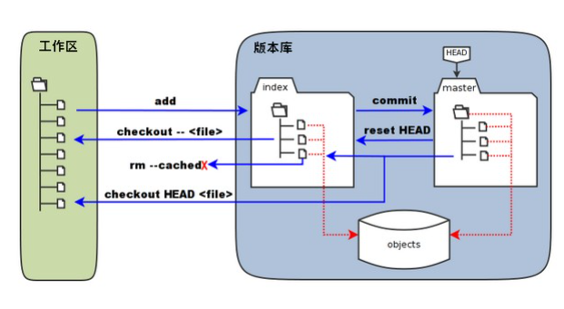

# git

> 下载git bash

## 基本命令

### 全局设置

> 如果是局部设置，存在.git/config里

#### 查看

查看某一项

```bash
git config user.name
git config user.email
```

查看全部：

```bash
git config --list
```


#### 修改

##### 用户属性

```bash
git config --global user.name "名字"
git config --global user.email "邮箱"
```

如果去掉 `--global` 就是只对当前有效

##### 代理

以 v2rayN 为例，通常是 10808 端口，可以窗口在右下角看。

```shell
git config --global http.proxy sock5://127.0.0.1:10808
git config --global https.proxy sock5://127.0.0.1:10808
```

> 或 socks，具体看 v2nray 等软件的提示。实测这里要两个都是 socks，也可能是 10809

取消：

```shell
git config --global --unset http.proxy
git config --global --unset https.proxy
```

忽略证书错误：

```sh
git config --global http.sslVerify "false"
```

增加缓存：

```sh
git config --global http.postBuffer 524288000 #500MB
```


##### 配置

```bash
git config --global color.ui true
```

```bash
git config -e --global
```

> 去掉global就是只对当前生效；会打开一个文件让编辑，可通过这个方式找到目录路径


##### 别名

> 类似于C的#define

###### 新建

```git
git config --global alias.别名 全称
```

例如：

> ```git
> git config --global alias.lg "log --color --graph --pretty=format:'%Cred%h%Creset -%C(yellow)%d%Creset %s %Cgreen(%cr) %C(bold blue)<%an>%Creset' --abbrev-commit"
> ```


##### 其他

设置Git默认使用的文本编辑器, 一般可能会是 Vi 或者 Vim。如果你有其他偏好，比如 Emacs 的话，可以重新设置：:

```bash
git config --global core.editor emacs
```

windows，记事本：

```sh
git config --global core.editor "notepad"
```


还有一个比较常用的是，在解决合并冲突时使用哪种差异分析工具。比如要改用 vimdiff 的话：

```bash
git config --global merge.tool vimdiff
```

Git 可以理解 kdiff3，tkdiff，meld，xxdiff，emerge，vimdiff，gvimdiff，ecmerge，和 opendiff 等合并工具的输出信息。

当然，你也可以指定使用自己开发的工具


### SSH

#### 生成

如果本机没有密钥，将无法远程操作，可以先生成一个

```bash
ssh-keygen -t rsa -C "邮箱"
```

之后一路回车

可以 `-f` 加上保存路径，如：

```bash
ssh-keygen -t rsa -C "846770128@qq.com" -f lr581
```


注意一个 github 账号的公钥不能跟别的账号一样

#### 查看

用户目录有.ssh目录就有。

> C:\Users\用户名\ 是用户目录

该目录下id_rsa是私钥；id_rsa.pub(全文)是公钥。

#### 配置

##### github

登录账号， account, settings, 在 `ssh and gpg keys` ，在里面加

可以检查是否加上了：

```bash
ssh -T git@github.com
```

gitee同理

可以查看自己的用户名


### 文件操作

> 默认路径为c:/Users/\$电脑用户\$/

#### 打开

```bash
cd 路径
```

> 类似cmd，但盘符要用cd d:的方法

返回上一级用cd ..

#### 默认路径

找到git bash的快捷键，修改属性-快捷方式，把目标引号后面的内容去掉，把起始位置设为自己想要的路径，如：

```file
目标 "D:\Program Files\Git\git-bash.exe"
起始位置 D:\_lr580\program\wx\game\fbmg
```

#### 新建文件夹

```bash
mkdir 文件夹名
```

#### 读文件显示

```bash
cat 文件名
```

> 读多个文件，中间不会有任何换行。

#### 显示当前路径

```bash
pwd
```

#### 列出当前目录文件

```bash
ls
ls -ah #隐藏文件也列出
ls 文件夹 #列出该文件夹下文件，如ls drt/
```

#### 删除

```bash
rm 文件名
```


#### 搜索

```bash
git grep 字符串
```

#### .gitignore

通过配置，让 git 忽略一些文件

`.gitigore`文件放到代码仓库

配置语法：

```
以斜杠“/”开头表示目录；
以星号“*”通配多个字符；
以问号“?”通配单个字符
以方括号“[]”包含单个字符的匹配列表；
以叹号“!”表示不忽略(跟踪)匹配到的文件或目录；
```

例如：

```gitignore
/bin/*
*.log
abc/*
!/abc/special.txt
```

> `/bin/` 与 `abc/` 都是当前开始，一定要加 `*`
>
> 删除一个文件夹的其他文件，但是允许文件夹里一个文件的格式：(必须要 *)
>
> ```.gitignore
> models/*
> !models/info.txt
> ```

> 删除全部文件，但是保留一个文件夹下的全部文件
>
> ```
> *
> !.gitignore
> !imgs/
> !imgs/*
> ```


配置完毕后进行更新：

```shell
git rm -r --cached .
git add .gitignore
git add .
git commit -m "..."
```

反义是 `.gitkeep`。

在子目录的 `.gitignore` 也会生效，上面写的配置项基于子目录相对路径


检查：

```sh
git check-ignore -v front/.vscode/extension.json
```

如果应该被 ignore，就会输出内容


### 版本库

#### 初始化

```bash
git init
```

将当前目录变成git仓库

也可以指定一个目录初始化：

```bash
git init 目录名
```


#### 更新

新建的或修改的文件或文件夹，需要确认更新，从工作区放到暂存区

```bash
git add 文件(夹)名 #可以多个参数
```

一次修改后add，如果继续修改，然后commit，继续修改的内容不会被提交。

```bash
git add .
```

上面命令会更新当前目录下的全部内容

#### 删除

```bash
git rm 文件名
```

从暂存区删除文件

如果删除之前修改过并且已经放到暂存区域的话，则必须要用强制删除选项 `-f`

如果想把文件从暂存区域移除，但仍然希望保留在当前工作目录中，换句话说，仅是从跟踪清单中删除，使用 --cached 选项即可

可以递归删除，即如果后面跟的是一个目录做为参数，则会递归删除整个目录中的所有子目录和文件 `-m` ，如：

```bash
git rm -r *
```

#### 移动

移动或重命名文件，目录，软连接

```bash
git mv [file] [newfile]
```

已经存在，仍要重命名，可以 `-f`

#### 提交

将所有暂存区的提交正式保存

```bash
git commit -m "版本信息"
```

> 在 Linux 系统中，commit 信息使用单引号'，Windows 系统，commit 信息使用双引号"

同理在 `-m` 之前可以枚举多个文件，即只 `commit` 这些文件

不写 `-m` 会让你打开一个编辑器写提交信息

`-a` 参数设置修改文件后不需要自行 `git add` 命令直接提交：

```bash
git commit -a
```

可以组合，即 `-am` 

`--amend` 用于修改上一次提交的备注，同时会改变id

```bash
git commit --amend -m 'xxx'
```


#### 撤销

```bash
git checkout -- 文件名
```

工作区的修改全部撤销。暂存区的不会被撤销。工作区被修改意味着你当前所做的内容被自动覆盖为暂存区内容了。

> 如果一个文件已经被提交到版本库，那么你永远不用担心误删，但是要小心，你只能恢复文件到最新版本，你会丢失**最近一次提交后你修改的内容**

```bash
git reset HEAD 文件名
```

把暂存区的修改撤销掉。工作区不变，意味着你现在做的内容不会被覆盖。

如果已经commit但未提交版本库，用版本回退。

> 交互式回退，找到刚错误提交的 commit 号，如：
>
> ```sh
> git rebase -i 67abfad^
> ```
>
> 弹出一个文件，刚刚的 commit 如果是 `pick 67abfad xxx`，修改为 `edit 67..`，保存。
>
> 然后在 git 里继续，删除就 `git rm xxx`，如 `git rm yolov8n-cls.torchscript`
>
> 然后提交
>
> ```sh
> git commit --amend
> git rebase --continue
> ```


如果已经提交远程库，无力回天。

reset 的三个参数： `--soft, --mixed, --hard`

默认是 `--mixed` ，重置暂存区文件和上一次提交保持一致，工作区保持不变

`--soft` 回退到某个版本

`--hard` 撤销工作区所有未提交的修改内容，暂存区、工作区都回退到上一个版本，然后删除之前的所有提交信息

特别地，`HEAD~n`是上 $n$ 个版本，`HEAD^` 默认是 `HEAD~1` ，特别地 `~0` 是当前版本； `~n` 等效于 $n$ 个 `^`

例如：

```bash
git reset --hard origin/master
git reset --hard HEAD^3
```


```bash
git revert dfb02e # 撤销提交
```


#### 查询

##### 当前状态

```bash
git status
```

查看有哪些文件被修改过，与commit版本不同

缩略版：

```bash
git status -s
```

其中：M是更改，A是增加了，AM是增加后又更改了


##### 对比

> git status 显示你上次提交更新后的更改或者写入缓存的改动， 而 git diff 一行一行地显示这些改动具体是啥

```bash
git diff 文件名
```

查看与已add相比，当下的异同

```bash
git diff 版本号1 版本号2 文件(夹)
```

版本2为新，版本1为旧，查看更新

在分支里特别有用

记得按enter继续显示，按q退出显示

可以显示暂存区(即add的内容)和上一次提交的差异：

```bash
git diff --cached [file]
```

或

```bash
git diff -staged [file]
```

也可以不指定文件

可以显示摘要：

```bash
git diff --stat
```

可以查看已缓存的和为缓存的区别：

```bash
git diff HEAD
```


##### 日志

```bash
git log
```

从近到远查看commit日志

> 查看完毕按q退出

```bash
git log --pretty=oneline
```

日志显示在一行


```bash
git log -1
```

查看最后一次日志


用 `--oneline` 选项来查看历史记录的简洁的版本

用 `--graph` 选项，查看历史中什么时候出现了分支、合并。以下为相同的命令，开启了拓扑图选项

用 `--reverse` 选项逆向查看(由远到近)，不能跟 `--graph` 合用

用 `-n` 只查看最近的 $n$ 条信息(即使加了 `--reverse` 也是)

用 `--author 人` 只查看某人提交的代码

用 `--since` 和 `--before` 指定日期，可以执行几个选项，但是你也可以用 `--until` 和 `--after` ，可以跟 `={年-月-日}` 或其他格式

用 `--no-merges` 选项以隐藏合并提交

用 `--stat` 还能统计各文件增删数目

用 `-p` 还能具体罗列修改了什么(增删)

用 `-m` 使得 merge 跟常规 commit 显示一样

如：

```bash
git log --oneline --reverse
git log --oneline --before={3.weeks.ago} --after={2010-04-18} --no-merges
```

合并历史：

```bash
git log --graph --pretty=oneline --abbrev-commit
```

[详细手册](http://git-scm.com/docs/git-log)


> ```bash
> git show master@{yesterday}# 显示master分支昨天的状态
> git whatchanged # 显示提交历史对应的文件修改
> ```


##### 命令日志

```bash
git reflog
```

可以查看各个版本号

记录的命令有：

- commit
- reset
- checkout
- merge


##### 日志线性化

```bash
git rebase
```


##### 历史修改记录

列表查看指定文件历史修改记录

```bash
git blame 文件名
```


##### 文件

列出 `git index` 包含的文件：

```bash
git ls-files
```


#### 回退

```bash
git reset --hard 版本
```

版本HEAD是当前版本，HEAD\^上一版本，上上\^\^，上若干个HEAD~n，n是整数

也可以写版本id，不用写全，但是不能写太少(即便你认为已经唯一了)，大概五位即可。

回退后该版本以后版本不可访问，但在未关闭git之前，可以用git 版本号回撤

### 远程仓库

#### 初始配置

添加SSH到远程仓库如github

#### 查询

```bash
git remote
```

查看所在目录的git有多少个远程仓库


查看详细权限

```bash
git remote -v
```

有push权限和fetch权限。

显示某个远程仓库的信息

```bash
git remote show 地址
```

测试连通性：

```sh
git ls-remote 远程仓库名
```


#### 新建

在本地仓库目录下运行：

```bash
git remote add 远程仓库名 git@github.com:github用户名/git仓库名(.git)
```

如：

```bash
git remote add origin git@github.com:michaelliao/learngit.git
```

分支：

```bash
git checkout -b 本地分支名 远程仓库名/远程分支名
```


使用 `-m` 绑定别的分支，例如如果别人的代码不是 master 分支是 main 分支，可以：

```bash
git remote add origin git@github.com:lr580/learn_pull_request.git -m main
git switch main
```


> 几种效果等价的git clone写法：
>
> ```bash
> git clone http://github.com/CosmosHua/locate new
> git clone http://github.com/CosmosHua/locate.git new
> git clone git://github.com/CosmosHua/locate new
> git clone git://github.com/CosmosHua/locate.git new
> ```
>
> git clone 时，可以所用不同的协议，包括 ssh, git, https 等，其中最常用的是 ssh，因为速度较快，还可以配置公钥免输入密码
>
> ```bash
> git clone git@github.com:fsliurujie/test.git #SSH协议
> git clone git://github.com/fsliurujie/test.git #GIT协议
> git clone https://github.com/fsliurujie/test.git
> ```
>
> 

#### 修改

```sh
git remote set-url 远程仓库名 新URL(https或ssh)
```


#### 删除

```bash
git remote rm 远程仓库名
```

#### 推送

```bash
git push 远程仓库名 本地分支名
```

如果是第一次推送，加-u(则以后可以简写git push)

在初始化后，需要通过add,commit后才能进行push，否则会报错。

> 第一次在github推送，会有一个警告验证key，输入yes即可

```bash
git push 远程主机名 本地分支名:远程分支名
```

当且仅当本地名字和远程分支名字同名，可以省略冒号。如果远程分支不存在会新建。

```sh
git push origin master:notes #例子,本地master命名为远程notes
```

> 如果不行，输入完整格式，如把本地当前分支推送到远程 `traps`，如果没有远程那个分支就新建：
>
> ```sh
> git push origin HEAD:refs/heads/traps
> ```

强制推送：`--force`

删除远程的主机的一个分支：`--delete`


> ```bash
> git push origin :hotfixes/BJVEP933 # 删除远程仓库的hotfixes/BJVEP933分支
> git push --tags # 把所有tag推送到远程仓库
> ```


> time out 无法 push，可以 ping 通的一种解决办法 [参考](https://blog.csdn.net/hdm314/article/details/119947761)
>
> 找到C判用户文件夹 `.ssh/config`，追加：
>
> ```config
> Host github.com
>     User YourEmail（你的邮箱）
>     Hostname ssh.github.com
>     PreferredAuthentications publickey
>     IdentityFile ~/.ssh/id_rsa
>     Port 443
> ```
>
> 测试并输入yes：
>
> ```shell
> ssh -T git@github.com
> ```
>
> 即可。


#### 获取

```bash
git pull 远程仓库名 远程分支名
```

> 本质是 `git fetch` 加上 `git merge FERCH_HEAD`
>
> `git fetch 远程仓库名` 可以拉取特定一个远程仓库，或 `git fetch 远程仓库名 远程分支名`

把远程仓库的分支合并到当前分支

> 也可以直接拉网站，如：(点下载那里可以复制 ssh 地址)
>
> ```sh
> git@github.com:985892345/ExpressManagementSystem.git
> ```


如果获取失败，要指定本地分支和远程分支的链接

```bash
git branch --set-upstream-to=远程仓库名/远程分支 本地分支
```

或：

```bash
git fetch --all
git pull 远程仓库名 本地分支名
```

如果因`fatal: refusing to merge unrelated histories`而失败：

```bash
git pull origin master --allow-unrelated-histories
```


强制用远程仓库覆盖本地版本：

```shell
git fetch --all
git reset --hard origin/master
git pull
```


例如把远程的 `master` 合并到本地的 `brantest` 分支：

```bash
git pull origin master:brantest
```


若fatal: Couldn't find remote ref master，通常证明远程仓库是空的


只获取单一文件：先 `git fetch URL.git`，再 `git checkout 文件名`，如：

```shell
git init
git fetch git@github.com:rushcheyo/AHOI-2021-junior.git
git checkout solution.pdf
```


#### 克隆

点fork，在自己的账号下克隆了一个仓库，之后使用：

```git
git clone 仓库地址
```

```bash
git clone git@github.com:用户名/git仓库名
```

> 会新建文件夹的，名字为仓库名字，之后要cd之后才会进入

可以克隆到指定位置，将会以指定目录为 clone 根目录：

```bash
git clone 仓库地址 目录
```

> 仓库地址也可以是HTTP或git开头的超链接，如`git://github.com/schacon/grit.git`


#### 更名

```bash
git remote rename oldname newname
```

修改本地仓库名


#### 抓取

让 git 获取本地没有的数据：

```bash
git fetch origin
```

通常做完之后需要 `merge` 合并一下


> ```bash
> git fetch # 获取所有远程分支（不更新本地分支，另需merge）
> git fetch --prune # 获取所有原创分支并清除服务器上已删掉的分支
> ```


### 分支

#### 查询

```bash
git branch
```

带星号是当前分支

```bash
git branch --contains 50089 # 显示包含提交50089的分支
git branch -a # 显示所有分支
git branch -r # 显示所有远程分支
git branch #所有本地分支
git branch --merged # 显示所有已合并到当前分支的分支
git branch --no-merged # 显示所有未合并到当前分支的分支
```


查看分支历史：

```bash
git show-branch
git show-branch --all
```


查看当前的分支是哪个分支：

```sh
git branch --show-current
```


#### 创建

```bash
git checkout -b 分支名 #或
git switch -c 分支名
```

创建并切换到新分支


```bash
git branch 分支名
```

创建但不切换

> 当你切换分支的时候，Git 会用该分支的最后提交的快照替换你的工作目录的内容， 所以多个分支不需要多个目录


```bash
git checkout -b master_new master_copy
```

后者可以是远程分支，如：

```bash
git checkout -b devel origin/develop
```


#### 合并

```bash
git merge 分支名
```

把某个分支合并到当前分支，这个分支可以是远程的，如 fetch 后 `git merge remotes/origin/master`，其中 `remotes/` 指明远程。

如果出现冲突，必须手动解决

合并分支时一般会用fast forward模式，删除分支后丢失分支信息；

如果关闭，则历史上可以看到分支信息：

```bash
git merge --no-ff -m "新commit描述" 分支名
```

可以直接合并一个远程分支，如：

```bash
git merge origin/master
```

如果分支历史不一样，可以加 `--allow-unrelated-histories`

合并发生冲突，查看冲突的全部文件：

```sh
git status
```

打开对应文件，能看到冲突双方都被同时写了，自行保留哪个(用 vscode 的话可以一键式，如果 vscode 做不了，可以 chmod 一下)，一个个手动解决，解决完毕后：一个个 git add，然后 git commit

#### 复制

把另一个分支的一个或多个提交复制到当前分支：

```bash
git cherry-pick commitID
```


#### 删除

```bash
git branch -d 分支名
```

删除已合并的分支

如果要删除未合并(会丢失修改)的分支，使用-D，即强制删除

#### 改名

```bash
git branch -m master master_copy # 本地分支改名
```


#### 切换

```bash
git checkout 分支名 #或
git switch 分支名
```

回到切换前的分支

```sh
git checkout -
```


#### bug分支

##### 储藏

```bash
git stash
```

隐藏目前尚未提交commit的分支

##### 查看储藏

```bash
git stash lish
```

##### 恢复

```bash
git stash apply #恢复
git stash drop #删除储藏
```

或

```bash
git stash pop
```


恢复指定的stash

```bash
git stash apply stash@{0} #第一个
```

##### 复制提交

```bash
git cherry-pick 版本号
```

将所做的修改复制到别的分支

### 标签

标签的本质是让id更好记忆

> 分类：**轻量级的（lightweight）**和**含附注的（annotated）**
>
> 轻量级标签就像是个不会变化的分支，实际上它就是个指向特定提交对象的引用。
>
> 而含附注标签，实际上是存储在仓库中的一个独立对象，它有自身的校验和信息，包含着标签的名字，电子邮件地址和日期，以及标签说明，标签本身也允许使用 GNU Privacy Guard (GPG) 来签署或验证。
>
> 一般我们都建议使用含附注型的标签，以便保留相关信息；
>
> 当然，如果只是临时性加注标签，或者不需要旁注额外信息，用轻量级标签也没问题

#### 查询

```bash
git tag
```

#### 创建

```bash
git tag 标签名
```

为当前id创立标签

标签创立在commit id上。用以指向该id


```bash
git tag 标签名 id
```

为某id创立标签


```bash
git tag -a 标签名 -m 注释 id
```

说明文字

`-a` 表示创建带注解的标签


PGP签名标签命令

```bash
git tag -s <tagname> -m "一个标签"
```


#### 显示

```bash
git show 标签名
```

显示标签指向的id的信息

#### 删除

```bash
git tag -d 标签名
```

#### 同步

```bash
git push 远程仓库名 标签名
```

```bash
git push 远程仓库名 --tags #同步所有
```

```bash
git push 远程仓库名 :refs/tag/标签名 #远程删除
```


## 其他命令

### 图形化

#### 内置

`gitk` 内置图形化窗口


#### vscode


### 控制

#### 版本查看

```bash
git --version
```


### 内部

查看某个对象：

```bash
git ls-tree HEAD
```

查看 SHA1 HASH：

```bash
git rev-parse HEAD
```


#### 服务器搭建

[git服务器部署](https://www.runoob.com/git/git-server.html)


## 理论

### 基本概念

开源的分布式版本控制系统

> 其他版本控制工具有：CVS, Subversion(即SVN)

Git 的内容存储使用的是 SHA-1 哈希算法

Git 没有一个全局的版本号


### 工作流程


- **工作区：**就是你在电脑里能看到的目录。
- **暂存区：**英文叫 stage 或 index。一般存放在 **.git** 目录下的 index 文件（.git/index）中，所以我们把暂存区有时也叫作索引（index）。
- **版本库：**工作区有一个隐藏目录 **.git**，这个不算工作区，而是 Git 的版本库。



- 图中左侧为工作区，右侧为版本库。在版本库中标记为 "index" 的区域是暂存区（stage/index），标记为 "master" 的是 master 分支所代表的目录树。
- 图中我们可以看出此时 "HEAD" 实际是指向 master 分支的一个"游标"。所以图示的命令中出现 HEAD 的地方可以用 master 来替换。
- 图中的 objects 标识的区域为 Git 的对象库，实际位于 ".git/objects" 目录下，里面包含了创建的各种对象及内容。
- 当对工作区修改（或新增）的文件执行 **git add** 命令时，暂存区的目录树被更新，同时工作区修改（或新增）的文件内容被写入到对象库中的一个新的对象中，而该对象的ID被记录在暂存区的文件索引中。
- 当执行提交操作（git commit）时，暂存区的目录树写到版本库（对象库）中，master 分支会做相应的更新。即 master 指向的目录树就是提交时暂存区的目录树。
- 当执行 **git reset HEAD** 命令时，暂存区的目录树会被重写，被 master 分支指向的目录树所替换，但是工作区不受影响。
- 当执行 **git rm --cached <file>** 命令时，会直接从暂存区删除文件，工作区则不做出改变。
- 当执行 **git checkout .** 或者 **git checkout -- <file>** 命令时，会用暂存区全部或指定的文件替换工作区的文件。这个操作很危险，会清除工作区中未添加到暂存区中的改动。
- 当执行 **git checkout HEAD .** 或者 **git checkout HEAD <file>** 命令时，会用 HEAD 指向的 master 分支中的全部或者部分文件替换暂存区和以及工作区中的文件。这个命令也是极具危险性的，因为不但会清除工作区中未提交的改动，也会清除暂存区中未提交的改动。


- workspace：工作区
- staging area：暂存区/缓存区
- local repository：版本库或本地仓库
- remote repository：远程仓库


### 文件

#### 配置

Git 提供了一个叫做 git config 的工具，专门用来配置或读取相应的工作环境变量。

这些环境变量，决定了 Git 在各个环节的具体工作方式和行为。这些变量可以存放在以下三个不同的地方：

- `/etc/gitconfig` 文件：系统中对所有用户都普遍适用的配置。若使用 `git config` 时用 `--system` 选项，读写的就是这个文件。
- `~/.gitconfig` 文件：用户目录下的配置文件只适用于该用户。若使用 `git config` 时用 `--global` 选项，读写的就是这个文件。
- 当前项目的 Git 目录中的配置文件（也就是工作目录中的 `.git/config` 文件）：这里的配置仅仅针对当前项目有效。每一个级别的配置都会覆盖上层的相同配置，所以 `.git/config` 里的配置会覆盖 `/etc/gitconfig` 中的同名变量。

在 Windows 系统上，Git 会找寻用户主目录下的 .gitconfig 文件。主目录即 $HOME 变量指定的目录，一般都是 C:\Documents and Settings\$USER。

此外，Git 还会尝试找寻 /etc/gitconfig 文件，只不过看当初 Git 装在什么目录，就以此作为根目录来定位


## 托管平台

### github

#### pull request

##### 提交方

先找到一个非空仓库，fork一下

> 自己测试时可以开小号，小号提交要换git账号邮箱(可能要切全局)，或者索性直接在网站上在线提交

fork的意义是把别人的仓库当前版本克隆一份到自己的仓库

注意fork后别人再commit是不会同步到自己这里的，如果想要同步，可以点击fetch按钮的fecth and merge：


然后可以自己对这个仓库作修改，如在本地 remote add 一下自己 fork 后自己得到的代码仓库(注意到这个仓库的分支是main分支不是master，所以要先在 `remote add` 的时候改一下)

然后进行任意修改并 push 到自己 fork 的仓库

然后点击网站上 contibute 按钮，点击 open pull request

特别注意并不是所有的都可以 pull的，例如历史完全不一样(拿自己的另一个仓库完全覆盖他的仓库)就不可以提交，会有对应的英文提示

可以的时候，进行留言然后提交；当通过时有邮件发送给自己


##### 审核方

当有人发出 pull request 时，自己会收到邮件，打开对应的代码仓库，点击 pull request 栏目，可以选择相应的通过或拒绝别人的请求，然后可以留言，之后便通过了改变

#### branch

##### 删除分支

如有个main先传了，然后传了个master。希望把main删了，因为先上的自动成了default。所以要到settings找到default branch，有多个branchs的情况下有个两箭头按钮，即switch，改了即可。然后codes点分支点view all branches把main删了。

> 意思这样不会更新main分支的贡献者信息，contributors还在，如果要清空需要重开或其他办法。
>
> GPT4：GitHub的Contributors统计是根据在仓库中提交过的所有更改自动生成的，包括所有分支和历史版本。因此，一旦提交被推送到仓库，就无法从GitHub的用户界面中删除或编辑Contributors列表

#### page

仓库转 page：如果在 github 仓库选择部署，会得到结果为 `<username>.github.io/<reponame>` 的 url。

每个仓库的 page 是相互独立的，可以开多个。

> 也可以设置默认，即取消掉 `<reponame>`，参见其他地方设置。

对仓库选择 settings，可以看到 page 设置。

- 具体参见：我的个人博客搭建建站过程。
- 具体参见：`latex.md` 笔记的 Jekyll。

#### gist

相当于是袖珍版的代码仓库：代码片段；可以选择私有(通过URL他人可查看)或公开(一切人可查看)

在 [这里](https://gist.github.com/) ，也许需要魔法上网


#### 2FA

[官方指引](https://docs.github.com/en/authentication/securing-your-account-with-two-factor-authentication-2fa/configuring-two-factor-authentication)

2FA 是 two factor authentication，提倡用户使用，见 [here](https://github.blog/2023-03-09-raising-the-bar-for-software-security-github-2fa-begins-march-13/)。在官方的 [这篇文章](https://github.blog/2022-05-04-software-security-starts-with-the-developer-securing-developer-accounts-with-2fa/)，提出使用 2FA 提高账号安全性。

基于时间的一次性密码(Time-based One-time Password，简称TOTP)，由一系列 APP 生成，可以使用任意 TOTP app。

按照官方指引操作即可。或参考 [here](https://blog.csdn.net/u013810234/article/details/133581026)，下载名为 authing 令牌的 TOTP app，然后用这个 app 扫 github 弹出的二维码。

如果 TOTP app 不可用，需要使用恢复码，在下一步下载这下恢复码。格式为 10 个十六进制数用 `-` 隔开。可以从 [here](https://github.com/settings/auth/recovery-codes) 获取。

到此为止，已经设置了 TOTP app。测试可以正常 commit。


#### 其他

empty 仓库不可以 fork

[新手教程](https://www.zhihu.com/question/21669554/answer/790851463)


### 华为云

`DevCloud` 

这个笔记是为了写作业要求而弄的

#### 理论

[参考](https://www.jianshu.com/p/28dbeb290395) [网课](https://education.huaweicloud.com/courses/course-v1:HuaweiX+CBUCNXV002+2018.5/courseware/681487d5e8b74cafad447609020ddd5d/d51246d64d1f467da33c54125c37e201/) 

1. Epic是公司重要战略举措；

   中文通常翻译为史诗，指公司的关键战略举措，可以是重大的业务方向，也可以是重大的技术演讲.企业通过对Epic的发现、定义、投资、管理和落地达成，使得企业的战略投资主题得以落地，并获得相应的市场地位和回报。
    Epic的粒度比较大，需要分解为Feature，并通过Feature继续分解细化为User Story来完成最终的开发和交付。
    Epic通常持续数月（months），需要多个迭代才能完成最终的交付。Epic应该对所有研发人员可见，这样可以让研发人员了解他们交付的Story承载怎样的战略举措，让研发人员能更好的理解其工作的价值。

   Epic通常和公司的经营、竞争力、市场环境紧密相关，举例如下：
   例1
   市场差异化：用户体验全面超越竞争对手
   例2
   更好的解决方案：新增支持工业互联网的解决方案
   例3
   增加收入：产品需要在下个财季增加100万付费用户
   例4
   重大技术方向：产品需要全部切换为容器

2. Feature是对你的用户有价值的功能；

   中文通常翻译为用户故事，User Story的简称。是从用户角度对产品需求的详细描述，更小粒度的功能。Story承接Feature，并放入有优先级的backlog中，持续规划、滚动调整优先级，始终让高优先级的Story更早的交付给客户。
   优秀的Story应遵循如下的INVEST原则：
   Independent：每个用户故事应该是独立的，可独立交付给客户。
   Negotiable：不必非常明确的阐述功能，细节应带到开发阶段跟程序员、客户来共同商议。
   Valuable：对客户有价值。
   Estimable：能估计出工作量。
   Small：要小一点，但不是越小越好，至少在一个迭代中能完成。
   Testable：可测试。
   Story通常持续数天（days），并应在一个迭代内完成交付。

   Story符合INVEST原则，举例如下：
   推荐模板：用户<角色>…希望<结果>…以便于<目的>
   例1
   作为项目经理，希望通过过滤处理人，以便于快速查询指定人的需求。
   例2
   作为开发人员，希望将无用的信息进行折叠，以便于减少视觉干扰。
   例3
   作为测试人员，希望将测试用例和需求关联，以便于跟踪需求的验证。

3. Story是分解的细粒度的开发交付的内容，是用户的细分场景；

   中文通常翻译为特性，代表可以给客户带来价值的产品功能或特性。
   Feature向上承接Epic，向下分解为User Story。相比Epic，Feature更具体形象，客户可以直接感知，通常在产品发布时作为ReleaseNotes的一部分发布给客户。
   Feature通常持续数个星期（weeks），需要多个迭代完成交付。

   Feature应该对客户都有实际的价值，特性的描述通常需要说明对客户的价值，与产品的形态、交付模式有关，举例如下：
   推荐模板：用户<角色> …希望<结果>… 以便于<目的>
   例1
   用户A希望提供导入、导出功能，以便于用户批量整理数据，更高效。
   例2
   用户B希望提供超期的邮件通知，以便于用户及时处理任务。
   例3
   用户C希望优化鼠标拖动的体验，以便于让用户操作更快。
   例4
   用户D希望增加昵称功能，让用户更个性化。

4. Task是完成需求的过程性的工作。

   在迭代计划会议中，将纳入迭代的Story指派给具体成员，并分解成一个或多个Task，填写“预计工时”。

   Task通常为过程性的工作，举例如下：
   例1
   开发人员A需要在今天准备好类生产环境。
   例2
   开发人员B需要在本周末完成项目组的权限设定。
   例3
   开发人员C需要进行代码Review。


#### 使用

控制台-DevCloud-项目管理，买一个基础版，点立即使用，点新建，只能选Scrum。

点击规划，可以创建思维导图规划，编辑更多，在空行填入描述。弄好规划可以退出去工作项看到东西。

在最上面设置看成员管理可以拉人。

上方代码-代码托管可以新建仓库。

点击自己，点个人设置，点代码托管，添加 SSH/HTTPS 密钥密码管理。
