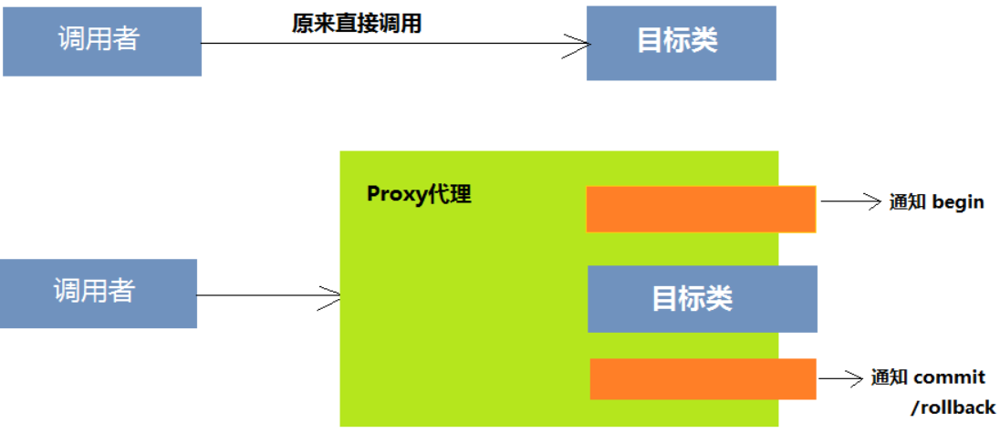

# 语法

## 初始化

### 前置知识

#### 常识

代码文件后缀是 `.java`

基本特点：

- 编写一次代码，在不同环境(机器)运行
- 语法更简洁，可靠，安全
- 既是编译型又是解释型 代码$\to$字节码$\overset{JVM}{\to}$解释运行
- 用接口取代多重继承
- 取消指针
- 垃圾自动收集
- 纯面向对象(万物皆对象)
- 支持分布式；支持多线程

> JVM：Java虚拟机

Sun ONE(Open Net Environment)体系，按应用范围划分的3个Java版本：Java SE, Java EE, Java ME

- Java SE 标准版 主要用于桌面应用程序开发 含语言基础、JDBC(Java 数据库连接性)操作，I/O，网络通信，多线程
- Java EE 企业版 企业级分布式网络程序开发 如电子商务网站、ERP(企业资源规划)系统 核心是EJB(企业Java组件模型)
- Java ME 嵌入式系统开发(手机等)

> 设计模式，把握项目整体结构，使其有调试、维护、升级的价值

> API application programming interface  官网可以找到说明书

使用`/** */`注释，使得鼠标放到这个类/方法前面时能够弹出对应的提示，其中@提示项名 信息都会被一一渲染。如：

```java
/**
 * @说明 单例程 饱汉模式
 * @author lr580
 */
```

> 过时的方法能用，因为IDK底层本来就是用这些的；不建议用的原因是有包装


#### 语法糖

Syntactic sugar ，糖衣语法。指对语言功能无影响，但更方便程序员使用的语法。使得程序更加简洁和可读性更高

语法糖只存在于编译期，编译器编辑 .java 源文件为 .class 字节码时就会解语法糖。

> 语法糖包括：条件编译、断言、Switch语句与枚举及字符串结合、可变参数、自动装箱/拆箱、枚举、内部类、泛型擦除、增强for循环、lambda表达式、try-with-resources语句、JDK10的局部变量类型推断等等


### 安装和首个程序

官网找JDK8 (或其他稳定版)安装 然后参考[这里](https://www.zhihu.com/question/278838022/answer/1709832515) 配置vscode环境(ctrl+shift+p找那个插件配置)(搜索java home可以找到配置，然后此时上方会有setting.json可以找)

版本号里$x$与$1.x$相同，如JDK8就是JDK1.8，是目前最主流版本。前者是Oracle收购Sun前版本号，后者是收购后。

注意不要跟C语言项目setting冲突(F5冲突)，建议单开一个新的项目跑java代码。

一个hello world代码如下：

```java
//注意s1是文件名，即该文件必须是s1.java (所以文件名不要用数字开头)
public class s1 {
    public static void main(String[] args) {//main+tab补全
        System.out.println("wdnmd."); //注意是小写L 不是大写I; 自动补全代码是syso
    }
}
```

> 输入main可以tab补全

按F5运行代码，会像python在vscode一样在下方输出。

> 另一个带输入的例子如下：(oj1029)
>
> ```java
> import java.util.Scanner; //导入一个API的类
>
> public class Main {
>  public static void main(String[] args) {
>      Scanner sc = new Scanner(System.in);
>      int k = sc.nextInt();
>      int a = sc.nextInt();//不能用逗号运算符链接
>      int b = sc.nextInt();//就算不是赋值初始化也不行
>      System.out.println(gcd(k, b) == 1 ? "Yes" : "No");
>      sc.close();//防warning用，不搞也行
>  }
>
>  static int gcd(int a, int b) {
>      return a % b == 0 ? b : gcd(b, a % b);
>  }
> }
> ```

### 项目建立

> 不需要建什么maven, spring。

[参考视频教程](https://www.bilibili.com/video/av415231494/)

ctrl+shift+p ：选择 java create java project 然后选路径和输项目名

此时新建完毕。

> 可能会加载debugger很久，需要网络(可以想办法禁用？)

`src`文件夹的 `App.java`是项目里唯一的主函数，运行一定要靠它。

如果需要其他代码文件，在 `src`文件夹里创建。假设在 `src`里创建了文件夹 `c1`，里面有代码文件 `c101.java`，代码如下：

```java
package c1; //包名约定英文全小写

public class c101 {
    public int test(int n) {
        return n * n;
    }//有main也行，那么在这里F5会跑这里的main
}
```

那么在 `App.java`里调用的参考格式如下：

```java
import c1.c101; //加载这个代码文件
public class App {
    public static void main(String[] args) throws Exception {
        c101 c = new c101(); //创建实例
        System.out.println(c.test(114514)); //运行
    }
}
```

### Eclipse

#### 初始配置

安装：有一个我的安装包在百度云，[链接](https://pan.baidu.com/s/1bOsueP4fMcUjEKlRDthJsw)，密码java，绿色版，下载解压即可。建议放非中文路径。然后下一个JDK8装好并建议弄好path全局变量。

更改用户配置的存储路径：先打开一次eclipse。可能会在D盘看到一个eclipse-workspace文件夹，关闭eclipse，剪切到你想要的位置，再次打开eclipse，File-Switch Workspace 选择自己改的路径。如果要换用户配置相似的操作。

字体修改：Window-Preferences-General-Appearance，找到不同部分字体然后修改

开启自动补全：Window-Preferences-Java-Editor-Content Assist，找到Auto Activation的Auto activation triggers for Java，加上26个英文小写字母。只允许回车时键入自动补全：同页勾选 disable insertion triggers except 'Enter' [参考](https://www.pianshen.com/article/39692498050/)

热键修改：Window-Preferences-Keys，如：

- 代码格式化 format

#### 使用

注意事项：

1. 默认中文编码是GBK，而vscode是UTF-8，所以会乱码。vscode可以点击下方的UTF-8重新选择编码。
2. 自动生成的 `*// TODO Auto-generated method stub*`这行东西会产生vscode的warning

##### 项目新建

打开eclipse的资源管理器：右击左边小窗打开。

File - New - project - 选General下的Project - 输入名字 - Finish

新建包(文件夹)：src下右击new package (一个 `.`代表实际路径的一个目录分割，如 `cn.edu.scnu`是从外到内三层文件夹存储，但包不会这么显示三层)

新建类(代码文件)：包下new class，建议勾选public static void main，会帮你写一个main，然后跑即可。

导入项目：资源管理器右击import，选general-existing projects into workspace，找到项目路径，选择，Finish

取消加载项目(不是删除)：右击项目，delete

更改项目配置：若项目的JDK和自己的版本JDK不匹配，可以修改项目JDK，右击项目，Build path-Configure build path-右边上菜单Libraries，Remove掉JRE System Library，然后Add Library-JRE System Library-Finish

支持assert：右击项目-Run as-Run configurations-Arguments-VM arguments加上一行 `-ea`，即enable assert，关闭即 `-da`，然后apply即可

外部库加入：一般先将外部库放到项目文件下，如 `/lib` 目录，然后右击项目， build path - configure build path - java build path - libraries ，点 add external JARs ，选中库 `.jar` ，确认应用。此时能够看到有项目内的 Referenced Libraries 。使用则用 `Class.forName(库内包名)` 加载。

编码：windows-preferences-general-workspace-text file encoding 的 other 里输入即可。编码出现问题的时候，可以不断原地转换，可以解决bugs。

tab用四个空格而不是\t：首先 window-general-editor-text editor-勾选 insert spaces for tabs ；然后 window-java-code style-formatter-new - edit - indentation - tab policy - space only - apply

如果在 `vscode` 等其他地方新建了文件，而这里没加载出来，可以刷新一下就就出来了 

如果出现版本错误(如什么60.0 55.0数字出现的报错)，可以把vscode版本和eclipse版本调到一样，即eclipse的jre删掉，然后add library加一个jre11(具体为add library - JRE System Library - Environments...按钮 - JavaSE - 11 (可以勾选右边的jre)，应用)

如果报错，说诸如版本过低无法编译1.7,1.5语法之类的，在build path-configure build path - java compiler - 看到 Compiler compliance level，修改为对应版本即可(如11)

修改jar版本：右击项目property-java build path-libraries-jre system library-edit/remove-对应改版本即可

项目重命名：右击refactor-rename即可。

右击项目，选team-share。可以点create一键造分支。在windows-show view-others-git-git staging可以打开图形化下方面板，就是一个普通的图形化git。

限制格式化行宽：preferences-java-code style-formatter-edit-lien wrapping-maximum line width选一个自己喜欢的如60

##### 快捷

右击菜单找source，能够依据提示看到许多快速生成，如构造函数、get和set。

查看源码，ctrl+单击 (也可`jdk`安装目录下src.zip查看所有`jdk`源码)

alt+shift+f 自动格式化

alt+shift+y 自动拆行(即超过行宽自动换行，再按一次取消)


### vscode

#### 问题解决

##### 总是启动同一文件

找到 `.vscode` 的 `launch.json` ，把诸如下面的东西全删了：

```json
{
    "configurations": [
        {
            "type": "java",
            "name": "Launch c1325",
            "request": "launch",
            "mainClass": "c1325"
        }
    ]
}
```


##### 未解决

vscode暂时未知如何设置启用assert，可以尝试在setting.json里加参数，具体怎么加未知


### 反编译

JDK 自带 javap 工具。

jad 工具。可以用 CFR 。


## 语言基础

代码注释同C。

> 特别注意有文档注释，即 `/** */`，出现在声明之前，会被读取作为文档内容。

### 主类结构

主类：含有main方法的类

> 项目item 有若干个包package，一个包有若干个类
>
> 语句 `package 包名;`声明单签类属于哪个包(在代码第一行)

类的属性(成员属性)是全局变量；方法的属性是局部变量

> 例如：
>
> ```java
> public class Main {
>     static String x = "greg.fhetgfg"; // 属性
>
>     public static void main(String[] args) {
>         String y = "中文字符";
>         System.out.println(x + y); // 自带换行符
>         System.out.println(y);
>     }
> }
> ```

> `public` 权限修饰符   `static` 静态修饰符

main方法必须声明为 `public static void`

### 数据

#### 基本数据类型

##### 整数类型

十进制、八进制、十六进制表示同C (八进制即带前导0如 `0123`$\to83_{(10)}$)

分为byte(8位)、short(16)、int(32)、long(64)  数据范围同C，即byte等于C的char($[-128,127]$)

将超出int范围的字面量赋值给long，需要加后缀 `l`或 `L`

如：

```java
long x = 123456789012L;
System.out.println(x << 1);
```


##### 浮点类型

有32位的float($[1.4\times10^{-45},3.4028253\times10^{38}]$)   (精度7位)和

64位的double($[4.9\times10^{-324},1.7976931348623157\times10^{308}]$)  (精度16位)

float后缀为 `F`/`f`    double为 `D`/`d`   声明float时建议加后缀 (默认小数为double)

##### 字符类型

char存单个字符，占16位(65536个字符)，所以可以处理单个中文等字符转int可输出看ascii码。字符类型采用的是Unicode编码方案

```java
char a = '萨', b = '日', c = '朗';
System.out.println(a);
System.out.println((int)a);
```

转义符 `\ddd` $1\sim3$位八进制表示的字符 如 `\123`

`\uxxxx` $4$位十六进制数据表示字符 如 `\u2605`

中文的主要范围 `[\u4e00]~[\u9fa5]`，判定方法举例：

```java
char a = '囸';
if (a >= '\u4e00' && a <= '\u9fa5') {
    System.out.println("fuck");
}//注：不完全准确，还有中文特殊符号
```

##### 布尔类型

boolean 值为 `true`/`false`

##### 类型转换

###### 隐式

有整数、浮点之间有隐式类型转换：$byte<short<int<long<float<double$

具体而言 `byte,short,char`是第一类，然后 `int`,`long`,`float`,`double`是其他四类，低类操作数转成高类的。

> byte可以传入'a'，但是不可以传入char变量赋值；其他整数浮点数类型可以;byte也不能赋值传整型变量。

负数浮点数强转整数也会只剩略小数点部分，即 `(int)-1.9=-1`

###### 显式

同C语法。(boolean不行，其他都可以) ，如：

```java
double x = 3.1, y = -10.9;
System.out.println((long) x + (int) y);
```

#### 变量

##### 声明

标识符可以由字母数字和 `_$`组成，开头不能是数字 (还可以包含中文等其他语言(不支持tab补全))

声明语法同C。

> 系统内存分为系统(OS)区、程序区和数据区。运行时代码暂存程序区，数据暂存数据区。但定义在方法体的变量暂存在程序区。

##### 常量

常量声明关键字是 `final`，只能进行一次赋值(在初始化时也行不在也行)

> 常量一般用大写字母和下划线。

举例：

```java
static final double pi = 3.1415926531; //可以final static
public static void main(String[] args) {
    final int k = 114514;//但不可以int final
    System.out.println(k * pi);
}
```

特别注意一个变量如果没有赋值过就调用来输出或参与运算就会报错。

若对对象(即引用)(如数组)使用final，只能恒定指向一个对象，不能重指向别的对象。final数组等效于final对象，元素可以改，但不能重新整体赋值(如再new)。

static final的对象可以实现不能修改。如：

```java
import java.util.Random;

class st {
    private static Random rand = new Random();// 常数优化
    public final int a1 = rand.nextInt(10);
    public final static int a2 = rand.nextInt(10);
}

//...
st a = new st(), b = new st();
System.out.println(a.a1 + "??" + a.a2);
System.out.println(b.a1 + "??" + b.a2);
```

方法定义为final，可防止子类修改定义和实现。且final方法效率更高。private方法自动是final的。

final类不可以被继承，且所有方法被自动设置为final(成员属性不会)。如：

```java
class par {
    private final void f() { // 若protected/public/不写，子类不可重写
        System.out.println("aaa");
    }
}

class sub extends par {
    public final void f() { // 二者仅仅重名，而没有任何关系；不代表重写
        // 因为sub没有继承par的f
        //若sub实例向上转型后则f表示父类的，且private
        System.out.println("bbb");
    }
}
```

final作为函数参数时，该参数不可改变(对象不可重引用)。

final 不能修饰构造方法。

常数组可以使用unmodifiableList。

##### 有效范围

变量的生存期 分为成员变量和局部变量；成员变量分为静态变量和实例变量。在方法内可以用自建代码块约束生存范围。

例如：

```java
public class Main {
    public static void main(String[] args) {
        System.out.println(v.y + 1);
    }

    //如果没有static ，main里获取的v.y将会获取失败(得到0)
    //如果放在了public class main的外面那么无法调用v.y
    static class v { // 放public class main里或外都行
        int x = 580; // 实例变量
        static int y = 998244353; // 静态变量(类变量)
    }
}
```

#### 字符串

java.lang包含String类，不需要import可以直接用。

字符串字面量包含在双引号内。

##### 创建

声明直接 `String`关键字。

可以直接用字面量赋值。如：

```java
String a="lr580";
System.out.println(a);
```

也可以用new String构造字符串，创建方法有：

1. 可以传入字面量，如：

   ```java
   String a = new String("lr580");
   ```
2. 可以用字符数组构造String对象，如：

   ```java
   char a[] = { 'g', 'o', 'o', 'd' };
   String b = new String(a);
   System.out.println(b);
   ```
3. 附上第二第三个参数，代表起始下标和长度。(越界会报错)

   ```java
   String b = new String(a, 2, 2); //"od"
   ```

   这个传入的第一个参数也可以是字符数组/字节数组

##### 运算

###### 链接

`+`运算符链接，可以是字符串、字符和数值(其他类型自动调用toString方法)，如：

```java
String a = "lorem ipsum dolor sit " + 'a';
char b = 109;
String c = "et.";
double r = 1.0 / 3;
System.out.println(a + b + c + r);
```

字符串指向一个字面量，不可以对字符串直接修改。每次对String的修改都是一次直接全字符串的覆盖。

##### 方法

###### 长度

length，无参数

###### 查找

indexOf，加char或字符串，用法同js，第二个参数是起始位置(对lastIndexOf 是结束)

同理有lastIndexOf方法

> lastIndexOf空字符串是长度，indexOf是0

复杂度是$\Omicron(n)$

如：

```java
System.out.println("aoboco".lastIndexOf('o', 3));//3
```


###### 取元素

charAt(x)方法，即下标为x的字符，越界会报错

###### 取子串

substring(x,y)方法，返回下标范围在$[x,y)$的子串(y可缺省)，越界会报错

###### 转为字符数组

toCharArray()方法

###### 去空白字符

trim()方法 ，去除首尾空白字符，类似python的strip

###### 替换

replace(原内容,新内容)方法，参数可以是char或String，两个参数类型一致。全部替换

###### 前后缀检测

startsWith(字符串) (字符不行) 返回boolean (空字符恒true)

endsWith(字符串)

###### 相等

equals(x)或equalsIgnoreCase(x)

###### 字典序比较

compareTo(x) 若相等返回$0$，大于返回正整数，小于返回负整数。数字大小是ascii码的差值，即首个不同的位置的自己的ascii\-x\.ascii。

###### 大小写转换

toLowerCase(),toUpperCase() ，将英文、希腊字母等转换大小写

###### 分割

split(分割符,匹配次数)  分割符集是正则表达式，匹配次数不填就一直匹配(是多少就返回至多长度为多少的数组)

如：

```java
String x = "1.2=345 6";
String[] y = x.split("\\.|=");// 转义使得不是正则表达式的.
for (String k : y) {
    System.out.println(k);
}
```

###### 格式化

String.format方法，第一个参数是格式字符串，后面的参数依次是代表的变量(多出的部分忽略)

一般的转换符，有：

- %b %B 格式化为布尔类型(区别在于大小写，可以传非布尔值)
- %h %H 转化为十六进制哈希值
- %s %S 转化为字符串(S转大写,s不转小写)
- %c %C 转化为字符
- %d 十进制整数
- %o 八进制整数(正) (不含前导)
- %x %X 十六进制整数(正) (不含前导)
- %f 浮点数
- %e %E 指数形式
- %a 带有效位数和指数的十六进制浮点值
- %n 分割符(本机为换行符)
- %% %

如：

```java
System.out.println(String.format("%B", 13));
System.out.println(String.format("%H", 1.2));
System.out.println(String.format("%.6s", 31.0 / 3));// 总长为6，不是6位小数
System.out.println(String.format("%.6f", 1.0 / 3));// 没有%F
System.out.println(String.format("%s", "AbC"));
System.out.println(String.format("%S", 1e9));
System.out.println(String.format("%s", 1e9));// 都是1.0E9
System.out.println(String.format("%f", 1e9));// 都是1.0E9
System.out.println(String.format("%e", 1e9));// 唯独是1.0e9
System.out.println(String.format("%E", 1e9));// 都是1.0E9
System.out.println(String.format("%c", 'A'));// "A"会报错
System.out.println(String.format("%C", 'a'));// 同%S理
System.out.println(String.format("%d", 1));// 1.9会报错
System.out.println(String.format("%d", -1));
System.out.println(String.format("%o", -1));
System.out.println(String.format("%x", -1));
System.out.println(String.format("%a", 6.1));// 输入整数报错
System.out.println(String.format("1%n2%%"));
System.out.println(String.format("%6s", "lr580"));
System.out.println(String.format("%4s", "lr580"));
System.out.println(String.format("%-6sabc", "lr580"));
System.out.println(String.format("%15.0f", 2.0 / 3));// 输入整数报错
```

对日期的转换符，有：

- %te 天($[1,31]$)
- %tb 月份简称(根据环境不同输出英文或中文，中文如 `9月`)
- %tB 月份全称，如 `九月`
- %ta 星期简称，如 `周一`
- %tA 星期全称，如 `星期一`
- %tc 日期全部信息，如 `周一 9月 13 09:04:40 CST 2021`
- %ty 长为二的后缀年份数字
- %tY 年份数字
- %tm 月份数字(含前导0)($[1,12]$)
- %td 一个月的第几天($[1,31]$)(含前导0)
- %tj 一年中的第几天($[1,366]$)
- %tH 2位24时制小时(含前导0) ($[0,23]$)
- %tI 2位12时制小时(含前导0)  (t+大写i)  ($[1,12]$)
- %tk 2位24时制小时(不含前导0)
- %tl 2位12时制小时(补含前导0)  (t+小写L)
- %tM 2位数字分钟(含前导0) ($[0,59]$)
- %tS 2位数字秒钟(含前导0) ($[0,60]$)
- %tL 3位数字毫秒(含前导0) ($[0,999]$)
- %tN 9位数字微秒(含前导0) (实测时后六位都是$0$)
- %tp 上午或下午标记，如 `上午`
- %tz 相对于GMT RFC 82 格式的数字时区偏移量 如 `+0800`
- %tZ 时区缩写形式字符串，如 `CST`
- %ts 1970-1-1 00:00:00 到现在的秒数 如 `1631496677`
- %tQ 1970-1-1 00:00:00 到现在的毫秒数 如 `1631496727812`
- %tF 年-月-日 (四位，两位，两位)
- %tD 月/日/年 (都两位)
- %tr 时:分:秒 %tp(12时制) 如 `09:36:47 上午`
- %tT 时:分:秒(24时制) 如 `09:37:58`
- %tR 时:分(24时制) 如 `09:37`

如：

```java
System.out.println(String.format("hahaha%tB", new Date()));
```

```java
String.format("%tF-%tT", new Date(), new Date())//年月日时分秒
```


###### 转字符数组

`getBytes()`，如：

```java
byte b[] = "按个v1".getBytes();
for (byte i : b) {
    System.out.print(i + " ");
}
```

##### 正则表达式

###### 语法

- .

- ? 0次或1次

- \* 0次或多次

- \+ 1次或多次

- {n}

- {n,}

- {n,m} $[n,m]$次之间都可以

- () 作为一个整体

- [abc] 里面的任一字符

- [^abc]

- [a-r]

- [a-rA-R]

- [a-e[g-z]] 等效于上面的写法 并运算

- [a-o&&[def]] 交运算

- [a-d&&[\^def]] 差运算

- \d \D

- \s \S 空白字符和非空白字符

- \w \W 可用作标识符的字符(不包括\$) 和不可

- \p{Lower} a-z

- \p{Upper}

- \p{ASCII} ascii

- \p{Alpha} a-zA-Z

- \p{Digit} 0-9

- \p{Alnum} a-zA-Z0-9

- \p{Punct} `!#$%&'{}*+.-/:;<=>?@[\]^_\{|}~`

- \p{Graph} 可见字符 即Alnum+Punct

- \p{Print} 可打印字符 Graph+\x20(空格)

- \p{Blank} \t

- \p{Cntrl} 控制字符 `[\x00-\x1F\x7F]`

- \^ 设置了 `RegExp` 对象的 `Multiline` 属性时会与 \n \r 后的位置匹配

- \$ 设置了 `RegExp` 对象的 `Multiline` 属性时会与 \n \r 前的位置匹配

- (pattern) 分组，使用 \$0..\$9 属性从结果匹配该组

- (?:pattern) 非捕获匹配 

  如：`industr(?:y|ies)` 匹配单复数

- (?=pattern) 非捕获匹配，括号内内容不匹配而作为条件

  如：`id(?=x|y)` 匹配 `idx` 的 `id` ，不匹配 `ida` 的 `id`

- (?!pattern) 非捕获匹配，括号内容是不能包含的内容(与上一条相反)

- \b 字边界

- \B 非字边界

  如：`er\B` 匹配 `verb` 不匹配 `never`

- \cx x是控制字符，x是大小写字母；否则无意义(\\c=c)

- \xn 十六进制转义码，n 正好两位长

  如：`\x41` 是 `'A'`

- \num num是正整数

  如：`(.)\1` 匹配两个连续相同字符

- \n 若至少有 n 个捕获子表达式是\num ，否则是八进制转移码(八进制数 0-7)

- \nm 是数字 nm (有 nm 个子表达式) 或 \n + 字符 m (n 个子表达式) 或八进制码

- \nml $n\in[0,3],m,l\in[0,7]$ 是八进制转移码

- \un n是四位十六进制 Unicode字符

  如：`\u00A9` 是 `©`

如：

```java
System.out.println("int".matches("\\w*"));//匹配了一个单词
System.out.println("ss".matches("\\w"));// 单个不匹配多个
System.out.println("lr580? slowa!".matches("\\w*\\?\\W\\w*\\!"));// 标点符号不算
System.out.println("abcde".matches("\\p{Lower}+"));
System.out.println("abcde".matches("\\p{Lower}"));
System.out.println("tw.k".matches("[a-z]+(\\([a-z]*\\))*\\.[a-z]+"));
System.out.println("tw(adf).k".matches("[a-z]+(\\([a-z]*\\))*\\.[a-z]+"));
```

常用方法：

###### split

> 见字符串-方法-分割

###### matches

布尔值，返回字符串是否与正则表达式匹配，如：

##### 字符串生成器

StringBuilder对象，如果频繁附加字符串，速度快于String

> 新建的初始容量是16字符(多出部分用append加)

方法：

###### length

取长度 (注意不是属性s)

###### toString

返回字符串

###### append

增加int,boolean,char,String,double或字符串生成器到末尾

###### insert

第一个参数offset是插入起始后被插入字符串首字符所在的下标，大于等于0，小于等于序列长度

第二个参数是插入的内容

###### delete

删除$[start,end)$下标范围的字符，若end大于长度，end取长度

如：

```java
StringBuilder sb = new StringBuilder("0123456789ABCDEFG");
System.out.println(sb.toString());
sb.insert(1, 1.0 / 3);
System.out.println(sb.toString());
sb.delete(5, 114514);
System.out.println(sb.toString());
sb.append(sb);
System.out.println(sb.toString());
```

效率对比：

```java
long st10 = System.currentTimeMillis(); //取当前毫秒时间戳
String s1 = "";
for (int i = 0; i < 100000; ++i) {
    s1 += (char) i;
}
long st11 = System.currentTimeMillis();

long st20 = System.currentTimeMillis();
StringBuilder s2 = new StringBuilder();
for (int i = 0; i < 100000; ++i) {
    s2.append((char) i);
}
long st21 = System.currentTimeMillis();

System.out.println(s1.length() + " " + s2.length());
System.out.println((st11 - st10) + " " + (st21 - st20));
//String消耗2.2s StringBuilder几乎不消耗时间
```

###### reverse

返回自己的转置。(之后自己也转置了)

```java
StringBuilder sb = new StringBuilder("abcdef0123456789=");
System.out.println(sb.reverse().toString());
System.out.println(sb);
```

###### trimToSize

自调整，类似于 `std::vector`


> 没有 `toCharArray` 方法


#### 数组

静态数组。

##### 创建

###### 一维

声明格式：

```java
数据元素类型 数组名字[];
数据元素类型[] 数组名字; //不要写数字
```

创建并初始化：(默认值全0)

```java
变量名 = new 类型名[长度];
变量名 = new 类型名[]{值, ...};//这时候不可以写长度，初始化或赋值
变量名 = {值, ...};//只可以用在初始化
```

声明和创建可以合在一起。

例如：

```java
int[] a, b;
a = new int[10];
b = new int[15];
System.out.println(a.length + b.length);
String c[], d[];
c = new String[5];
d = new String[8];
System.out.println(c.length + d.length);
```

```java
int a[] = new int[4];
int[] b = new int[4];
System.out.println(a[3] + b[3]);
```

```java
int a[] = new int[] { 1, 2 };
int[] b = new int[] { 3, -4 };
System.out.println(a[1] * b[1]);
```

```java
int[] c; //或int c[];
c = new int[] { 1, 2, 6 };
System.out.println(c[1] | c[2] | c[0]);
```

###### 二维

声明格式：

```java
数据元素类型 数组名字[][];
数据元素类型[][] 数组名字;
```

创建：

```java
数组名字 = new 类型[长度][长度];
数组名字 = new 类型[长度][];
数组名字[下标] = new 类型[长度];
```

一步到位：

```java
数据元素类型 数组名字[][] = {{},{},...,{}};
数据元素类型 数组名字[][] = new 类型[][]{{},{},...,{}}; 
//或数据元素类型[][] 数组名字 但有{}时不能填数字 不能有其他类型值
```

例如：

```java
int a[][], b[][][];
a = new int[5][6];
b = new int[2][3][4];
System.out.println(a.length * b[1][1].length);
```

```java
int[][][][] c, d;
c = new int[2][4][2][];
c[0][0][0] = new int[13];
c[0][0][1] = new int[14];
d = new int[20][3][4][2];
System.out.println(c[0][0][0].length + c[0][0][1].length + d.length);
```

```java
int x[][] = { { -1, -2 }, { 3, 4 } };
System.out.println(x[0][1] * x[1][0]);
```

##### 方法

加载：`import java.util.Arrays;`

###### length

长度(当前维的) (不需要用Arrays)

###### fill

`Arrays.fill(数组, 值)`  即memset

`Arrays.fill(数组, a, b, c)` 对下标子段$[a,b)$填充 $c$，越界会报错

如：

```java
import java.util.Arrays;
//...
int a[] = new int[5];
Arrays.fill(a, 2, 5, 998244353);
System.out.println(a[4]);
```

###### sort

`Arrays.sort(数组)`升序排序一个数组(数值和字符串排序依据不一样)

可以自定义排序依据。==(待补充)==

如：

```java
int x[] = { 15, 8, 666 };
Arrays.sort(x);
String y[] = { "15", "8", "666" };
Arrays.sort(y);
for (int i = 0; i < x.length; ++i) {
    System.out.print(x[i]);
    System.out.println(" " + y[i]);
}
```

###### copyOf

复制 `Arrays.copyOf(原数组, 新长度)`

新长度与原数组长度不需要一致，可以大于或小于

###### copyOfRange

`Arrays.copyOf(原数组, a, b)` 取原数组子段$[a,b)$ 长度就是$b-a$

可以强转类型，加参数 `原类型[].class` ，如：

```java
Integer xx[] = Arrays.copyOfRange(a2.toArray(), 0, a2.size(), Integer[].class); // Object[]转Integer[]
```

###### stream

是静态方法。传入一个数组参数，获得流。对流，可以使用方法 `mapToInt(方法)` ，方法是原流的方法，如 `Integer::valueOf` ，然后得到的值使用 `toArray()` 方法，可以将类数组转基本数据类型数组，如：

```java
int dest[] = Arrays.stream(xx).mapToInt(Integer::valueOf).toArray();// Integer[]转int[]
```

> java 8 新特性

###### binarySearch

`Arrays.binarySearch(数组, v)` 若包含在升序数组内，返回下标，否则返回插入$v$后，$v$所应在下标的相反数。

若 `(数组,a,b,v)`  在子段$[a,b)$搜索

### 运算

#### 基本运算

##### 运算符

可以连等号赋值。

```java
int x, y, z;
x = y = z = 8;
System.out.println(x * y * z);
```

普通算术运算大体同C (同理有整数除法)

```java
int x = 7, y = 2;
double z = x / y;
System.out.println(z);
```

> 零除会报错 `ArithmeticException`

有实数取模。模数是负数时好像同正数对待。

```java
double x = 7.1, y = 7.0;
System.out.println(-x % y);//-0.1
System.out.println(x % -y);//0.1
System.out.println(-x % -y);//-0.1
```

关系运算符、逻辑运算符、自增自减运算符同C。&&和||也是短路运算符。短路是会有dead code的warning

> 不能脱离赋值或判断单独调用一段表达式，不然会报错。

注意&& ||两边必须是布尔值，不能直接放int上去。如：

```java
public class Main {
    public static void main(String[] args) {
        int x = 0;
        boolean y = false && ++x != 0;
        boolean z = false || ++x != 0;
        System.out.println(x);
    }
}
```

位运算符同C。新增无符号右移 `>>>`，对普通右移，若最高位是0，空位填$0$，否则$1$。对无符号右移，都填0。实际上即把负数转化后转成正数。正数则一般处理，如：

```java
int x = 4, y = -4;
System.out.println(x >> 1); //2
System.out.println(x >>> 1); //2
System.out.println(y >> 1); //-2
System.out.println(y >>> 1); //2147483646
System.out.println(x >> 2); //1
System.out.println(x >>> 2); //1
System.out.println(y >> 2); //-1
System.out.println(y >>> 2); //1073741823
```

##### 优先级

整体优先级：

1. 自增自减
2. 算术运算
3. 比较运算
4. 逻辑运算
5. 赋值运算

详细：

1. `()`
2. `+,-` 正负号
3. `++,--,!`
4. `* / %`
5. `+ -` 二元运算
6. `>> >>> <<`
7. `< <= > >=`
8. `== !=`
9. `&`
10. `^`
11. `|`
12. `&&`
13. `||`
14. `?:`
15. `=` 和各种赋值如 `+=`

如：

```java
int a = 4, b = 6, c = 8;
System.out.println(++a * b-- - c); //30-8=22
```


### 输入输出

#### 标准I/O

##### 输出

###### System.out

`System.out.println`，简写为syso，只能传一个参数，可以不传(输出单个空行)。功能类似python的print。`ln`的意思是 `line`，所以是小写LN

`System.out.print`，区别在于不输出换行。

`System.out.printf` ，用法大体同 C/C++。

##### 输入

使用Scanner，需要事先载入：

`import java.util.Scanner; `

创建一个新的对象用于读标准输入：

`Scanner sc = new Scanner(System.in);`

读整数(作为返回值返回)：

`sc.nextInt()`

> 同理有：
>
> - next()  读字符串
> - nextLine()
> - nextDouble()
> - nextLong()
> - …… (具体看tab补全列表)

> 建议不要 `sc.close()`，否则将不能再次new。即忽略warning信息。

> 输入异常会报错 `InputMismatchException`

### 流程控制

#### 复合语句

复合语句(大括号)可以直接出现在任何地方(不需要if等关键字也行)。复合语句会确定一个作用域。这为局部变量的生存期设置提供了便利。

#### 条件语句

特别注意逻辑表达式一定要是boolean，不可以出现 `if(1)`等语法。

if的语法同C

switch的case可以是字符串(JDK1.7)。仍不可以是实数。

如：

```java
String x = "lr580";
if (true) {
    switch (x) {
        case "lr":
            System.out.println("蛤蛤大笑");
            break;
        case "lr580":
            System.out.println("That's me.");
            break;
    }
}
```

```java
int a = 0;
out: while (a < 5) {
    switch (a) {
        case 0:
        case 3:
            a += 2;
        case 2:
            break out;
        default:
            a += 5;
    }
}
System.out.println(a); //2
```


特别注意 `?:` 会带来类型一致性转换，如：

```java
System.out.println("a=" + ((5 < 5) ? 5.1 : 4));//4.0
```


#### 循环语句

同理有while,do-while,for。语法同C。C++11的foreach方法也有，如：

```java
int arr[] = { 6, 4, 1 };
for (int x : arr) { //但是不可以不int(即不能预先定义x)
    System.out.println(-x);
}
```

可以用 `标签:`建立一个标签点(命名规则同标识符)，在break或continue后加标签来跳出多层循环。

```c++
loop1: for (int i = 1; i < 10; ++i) {
    for (int j = 1; j < 10; ++j) {
        if (i * i + j * j > 83)
            break loop1; //改成continue也行，等效于直接break
        System.out.println(i * 10 + j);
    }
}
```

### 对象

#### 基本概念

##### 类成员

对象是类的实例，类是对象的抽象。类是同一事物的统称。类是组成java程序的最小的单位

有类成员：类成员方法和类成员变量。

类成员方法不支持默认参数和可变参数。

> 创建对象时必须先声明对象，为对象分配内存空间，对对象初始化，然后才能使用对象

类成员默认值是 0 。

举例：

```java
public class c701 {
    private String name = "";// 类成员变量

    public String getname() {
        int id = 0;
        if (name.equals("")) { //name.length==0说没有length，因为是方法
            setname("yyy");
        }
        return name + "qwq" + id;
    }

    public void setname(String v) {// 当然也可以弄私有private方法
        name = v;// 若参数与成员函数重名，可以用this.name区分
    }

    public c701 itself() {
        return this;// this是引用
    }
}
```

```java
//同一文件夹下的另一个代码文件
import c701;

public class c702 {
    public static void main(String[] args) {
        c701 obj = new c701();
        System.out.println(obj.getname());
        c701 o2 = obj.itself();// 指针作用
        o2.setname("lr580");
        System.out.println(o2.getname());
    }
}
```

> 当然实际上合在一起也可以的，就是不需要用public了，把c701改成一个跟文件名无关的类名

```java
public class c2506 {
    public int x;
    public static void main(String[] args) {
        System.out.println(new c2506().x);
    }
}
```


##### 修饰符权限

修饰符权限：

| 访问包位置       | private | protected | public |
| ---------------- | ------- | --------- | ------ |
| 本类             | 可见    | 可见      | 可见   |
| 同包其他类或子类 | 不可见  | 可见      | 可见   |
| 其他包的类或子类 | 不可见  | 不可见    | 可见   |

若不声明，那么这个类预设为包存取范围，即只有一个包中的类可以调用这个类。方法和类都可以不声明。

类不能声明为 `private`或 `protected`，否则无法被调用。(内部类除外)

##### 构造函数

`public 类名(参数)`

同C++，无返回值。但可以不定义构造函数。定义一个 private 的构造函数可以禁止创造该对象的实例。

构造方法不能被继承，所以不能被重写。通常而言，构造函数放 `public init` 为将来功能扩展重写准备。

无参构造让继承不报错(默认调用父类无参构造)。

> 构造函数可以设置默认参数 (实际会报错)。

举例：

```java
class circle {
    final private static double pi = Math.acos(-1);

    private double r = 0;

    circle() {
    } // 若允许不写参数则必须要有，如下面的c

    circle(double x) {
        r = x;
    }

    protected double getArea() {
        return pi * r * r;
    }
}

public class c802 {
    public static void main(String[] args) {
        circle c = new circle();
        System.out.println(c.getArea());
        circle d = new circle(2);
    }
}

```

默认构造函数在java可以省略，如：

```java
class obj {
    private String v;

    public obj(String u) {
        v = u;
    }

    public void out() {
        System.out.println(v);
    }
}

//...

obj a[] = new obj[10];
// obj b = new obj; 但是非数组不能使用空构造
// a[0].out();// 未定义值不能用
obj c = new obj("www");
c.out();
```

复用构造函数用this，如：

```java
package plugin;

import javax.swing.JLabel;

public class FsLabel extends JLabel {
    private final static int default_size = 14;
    
    public static String font_size(String s, int siz) {
        return "<html><div style='font-size=" + siz + "'>" + s + "</div></html>";
    }

    public FsLabel(String s, int siz) {
        super(font_size(s, siz));
    }

    public FsLabel(String s) {
        this(s, default_size);// 不能写FsLabel
    }

    public FsLabel() {
        this("", default_size);
    }
}

```


##### static

由static修饰的变量、常量、方法称为静态变量、常量、方法。静态方法不能被重写。

意义同C++。声明了static的是静态成员。可以用类名.静态成员调用(也可以不用，但是会扔警告)

同样遵循修饰符权限(同C++，关键字顺序无关)

> 在 JVM 生命周期里，每个类只被加载一次，时机为：
>
> - 第一次创建对象 / 调用静态方法/属性 / 加载子类
>
>   访问静态常量，如果编译器可以计算出常量的值不加载 ，例如 final 不触发
>
> - 创建对象引用不加载类
>
> - 子类调用父类静态方法，若当子类没有覆盖父类的静态方法时，只加载父类，不加载子类；否则父子都加载

有静态代码块，可以放在类的任何位置，可以有多个，在类初次被加载的时候执行且仅会被执行一次，一般用来初始化静态变量和调用静态方法。如：

```java
class stt {
    public static final double y = Math.PI; //final不触发static
    public static int x = 3;
    static {
        System.out.println("awa");
        x = 10;
    }
}

public class ce08 {

    public static void main(String[] args) {
        System.out.println("a");
        System.out.println(stt.y);
        System.out.println(stt.x);
    }
}

```


##### 主方法

`public static void main(String[] args)`

静态方法，所以如果主方法需要调用类的其他方法，被调用方法必须是静态的(原因见C++)

> 在Eclipse可以设置参数args
>
> 右击项目名字-run as - run configuration- 找到arguments(参数见换行隔开) 有待尝试
>

事实上，由于主方法的静态性，可以在主方法建立一大堆本类的对象实例，调用它们自己的非静态成员。

##### public类

对一个代码文件只能有一个public类且必须与文件名(不含后缀)同名。其他类只能不要加权限修饰关键字，如直接 `class obj{...}`

> 这个与文件同名的类也可以不声明public，但是即使这样也不能给别的类public


##### 可变参数

语法是 `类型...变量名` ，使用方法和限制类似 `python` 即：必须是最后一个参数且只能有一个可变参数

```java
public class c1603 {
    public static void main(String[] args) {
        System.out.println(powsum(1, 2, 3));
        System.out.println(powsum());
        System.out.println(apowsum(3, 4, 5));
    }

    public static int powsum(int... a) {
        int r = 0;
        for (int i = 0; i < a.length; ++i) {
            r += a[i] * a[i];
        }
        return r;
    }

    public static int apowsum(int p, int... a) {
        int r = 0;
        for (int i = 0; i < a.length; ++i) {
            int k = 1;
            for (int j = 0; j < p; ++j) {
                k *= a[i];
            }
            r += k;
        }
        return r;
    }
}

```


##### 对象

###### 基本

不用析构函数，java会自动清理。

创建方法：`类名 实例名= new 类名(构造函数参数)`

真正的操作标识符的实质是引用，即上面的实例名其实是一个引用。通常可以认为引用就是对象，虽然事实上是对象包含它的一个引用

若两个对象是同一个对象的引用，`==`运算符会返回true。而equals方法才是比较内容是否相等。(未定义时即便每个成员变量都相等也不false)

将一个引用赋值为null(根据上述分析，可知等于直接把对象设置为null)，会自动清理该对象，析构销毁(使用finalize方法，是一个protected方法，可以自定义)。

`System.gc()`方法强制启动清理。

多态：需要使用基类对象的任何地方都可以用派生类对象来替代

如：

```java
Object obj = new Date();
System.out.println(((Date)obj).getDate()); //使用派生类方法
System.out.println(obj.getClass());
System.out.println(obj.getClass().getClass());
System.out.println(obj.getClass().getClass().getClass());
```

应用：编写一个函数时，使用对象参数时，往往使用基类作为对象(或Object)。

###### 对象数组

new一个对象数组时，只分配内存，不调用默认构造函数。

所以new一个对象数组时，还要对每一个要用到的元素new一下调用构造函数。

不可以用Arrays.fill来填充全部new，如 `Arrays.fill(arr, new obj());`，这样是浅复制，即它们是同一个对象。

如：

Object类(对象类)是所有类的基类

具有equals,getClass,hashCode,toString方法

> mvc   redis高可用   nginx

#### 包装类

将基本类型(非对象)封装成类。其中Integer类、Long类、Short类是Number的子类。

##### Integer

###### 基本

构造可以new+Integer，参数是int或String（报错说JDK9后抛弃了该方法），也可以直接赋值。如：

```java
Integer v = new Integer(580);
Integer w = new Integer("581");
Integer x = 3, y = 4;
System.out.println(x + y + v + w);
```

> 若String参数不是整数数值，报错NumberFormatException

###### 常用方法

1. byteValue()  转byte
2. shortValue() 转short
3. compareTo()  返回$1,0,-1$的一个(严格是正数零负数)，代表大小关系
4. equals() 返回Boolean
5. toString() 转String
6. toBinaryString() 转二进制文本(不含前导符号)
7. toHexString() 转十六进制文本(不含前导符号)
8. toOctalString() 转八进制文本(不含前导符号)
9. valueOf(String str) 返回Integer
10. parseInt(String str) 返回int

如：

```java
String str[] = { "89", "23", "580" };
for (String s : str) {
    System.out.println(Integer.parseInt(s));
}
```

```java
Integer v = 580;
System.out.println(Integer.toHexString(v));
System.out.println(String.format("%x", v));
System.out.println(Integer.toOctalString(v));
System.out.println(String.format("%o", v));
System.out.println(Integer.toBinaryString(v));// 无format
System.out.println(v.toString());// 其他toString不能这样
System.out.println(Integer.toString(v));
```

> 特别注意\=\=运算符和equals类成员方法的差别，对\=\=：
>
> 1. 无论如何，Integer与new Integer不会相等。不会经历拆箱过程，因为它们存放内存的位置不一样。
> 2. 两个都是非new出来的Integer，如果数在$[-128,127]$，则是true,否则为false。
> 3. 两个都是new出来的,则为false。
> 4. int和integer(new或非new)比较，都为true，因为会把Integer自动拆箱为int，其实就是相当于两个int类型比较。
>
> 如：
>
> ```java
> Integer n = 13, m = new Integer(13);
> System.out.println(n == m);
> Integer x = 580, y = 580;
> System.out.println(x == y);
> System.out.println(x.equals(y));
> Integer a = -128, b = -128;
> System.out.println(a == b);
> Integer p = new Integer(1), q = new Integer(1);
> System.out.println(p == q);
> System.out.println(x == 580);
> ```

###### 常量

MAX_VALUE $2^{31}-1$

MIN_VALUE $-2^{31}$

SIZE 二进制位数 32

TYPE  输出int

##### Boolean

###### 基本

构造函数可以传boolean或字符串，当不分大小写字符串内容为true时返回true。也可以直接赋值布尔值，如：

```java
Boolean b = new Boolean("TrUe");
System.out.println(b);
Boolean a = true, c = false;
System.out.println(a && c);
```

###### 常用方法

1. booleanValue() 返回boolean
2. equals(obj) 当表示同一个值的boolean对象时返回true
3. parseBoolean(String s) 返回boolean
4. toString() 返回string
5. valueOf() 返回boolean

```java
Boolean x = true, y = true, z = false;
System.out.println(x.equals(y));
System.out.println(z.equals(0));
System.out.println(Boolean.parseBoolean("y")); //false
```

###### 常量

TRUE FALSE TYPE

##### byte

基本类似Integer，有新的方法：

1. doubleValue()

##### character

###### 基本

```java
Character a = 'c', b = new Character('d');
System.out.println(a + b - 97 * 2);
```

###### 常用方法

1. charValue()  返回char
2. compareTo(v) 返回int
3. equals(obj)  返回Boolean
4. toUpperCase(char ch) 返回char
5. toLowerCase(char ch) 返回char
6. toString() 返回String
7. charValue()
8. isUpperCase(char ch)  返回boolean
9. isLowerCase(char ch)  返回boolean

###### 常量

CONNECTOR_PUNCTUATION 返回byte，表示Unicode规范常规类别"Pc"

UNASSIGNED byte "Cn"

TITLECASE_LETTER byte "Lt"

##### Double

还有Float类。跟Integer类似，有别的方法：

1. isNaN()  boolean
2. byteValue()
3. intValue()

常量：

MAX_EXPONENT  int，表示有限double变量可能具有的最大指数

MIN_EXPONENT  int，表示标准化double变量可能具有的最小指数

NEGATIVE_INFINITY double，负无穷大常量

POSITIVE_INFINITY double，正无穷大常量

##### Number

上述的以及BigDecimal, BigInteger的父类 (除了Character, Boolean)

有byteValue(),intValue(),floatValue(),shortValue(),longValue(),doubleValue()

#### 数字处理类

##### 数字格式化

对double和float，主要使用 `java.text.DecimalFormat`

未格式化的数据的表示原则：

- 若$|x|\ge0.001\cap|x|<10^7$，用常规小数
- 否则用科学计数法(e大写)

如：

```java
System.out.println(0.001);
System.out.println(0.0001);
System.out.println(1e7-1);
System.out.println(1e7);
```

`DecimalFormat`是 `NumberFormal`的一个子类。

初始化方法：

```java
DecimalFormat mf = new DecimalFormat(模式);
```

或

```java
DecimalFormat mf = new DecimalFormat();
mf.applyPattren(模式);
```

创造格式化的字符串：

```java
mf.format(值);
```

模式有：

1. `0` 表示一位十进制数字，没有则代表前导0 (整数部分超出会显示)
2. `#` 表示一位十进制数字，没有则留空  (整数部分超出会显示)
3. `.` 小数点
4. `,` 分组分隔符
5. `E` 科学计数法分割符
6. `%` 放在数字前缀或后缀，将数字乘以100显示百分数(会显示%)
7. `\u2030` 放在数字前缀或后缀，将数字乘以1000显示千分数
8. `\u00A4` 放在数字前缀或后缀，作为货币符号 即 `￥`(本机)
9. `'` 单引号，转义上述特殊字符

> `-` 负号(无论本来是不是负数)

举例：

```java
DecimalFormat mf = new DecimalFormat("-000.0");
System.out.println(mf.format(-2.0 / 3));
mf.applyPattern("##.##%\u00A4'0'");
System.out.println(mf.format(0.4527));
mf.applyPattern("#.#E0");  //后面不可以是#
System.out.println(mf.format(1e11 + 2e10));
mf.applyPattern("##E0");
System.out.println(mf.format(1e11 + 2e10));
mf.applyPattern("#");
System.out.println(mf.format(1e11));
mf.applyPattern("0");
System.out.println(mf.format(1e11));
```

还支持将一个数字按整数位每$k$个位分组(逗号分隔)的功能，从小位到大，类似于英文的大数字表示法，使用：

```java
mf.setGroupSize(k);
```

关闭：

```java
mf.setGroupingUsed(false);
```

如：

```java
DecimalFormat mf = new DecimalFormat();
mf.setGroupingSize(3);
System.out.println(mf.format(1234567.131));
System.out.println(mf.format(123456.131));
mf.setGroupingUsed(false);
System.out.println(mf.format(114514));
```

##### 数学运算

Math类，内建。类方法是static的。

有常数：`Math.PI`,`Math.E`

###### 三角函数

有方法 `sin,cos,tan,asin,acos,atan,toRadians,toDegrees`

单位均为弧度制。注意会有误差。

```java
System.out.println(Math.toDegrees(Math.asin(1.0 / 2)));
System.out.println(Math.sin(Math.toRadians(30)));
```

###### 指数函数

`exp,log,log10,sqrt,cbrt,pow`，其中$\log=\ln$,`cbrt`是立方根

###### 取整函数

`ceil,floor,rint,round`

其中 `rint`返回与参数最接近的整数，若同样接近取偶数

$round(x)=\lfloor x+0.5\rfloor$ (即+0.5后强转)

如：

```java
System.out.println(Math.rint(1.5)); //2.0
System.out.println(Math.rint(2.5)); //2.0
System.out.println(Math.rint(-1.5)); //-2.0
//-2.5也是0； -0.5是0
System.out.println(Math.round(1.5)); //2 ,返回long
```

```java
System.out.println(Math.round(0.5)); //1
System.out.println(Math.round(-0.5)); //0
System.out.println(Math.round(-1.5)); //-1
System.err.println(Math.round(-0.001)); //0
System.err.println(Math.round(-0)); //0
```

```java
System.out.println(Math.floor(-0.9)); //-1.0
System.out.println(Math.floor(-1.9)); //-2.0
System.out.println(Math.floor(1.9)); //double, 1.0
```

```java
System.out.println(Math.floor(-0.0)); //-0.0
System.out.println(Math.floor(0.0));  //0.0
System.out.println(Math.floor(0.1));  //0.0
System.out.println(Math.ceil(0.0));  //0.0
System.out.println(Math.ceil(-0.0));  //-0.0
System.out.println(Math.ceil(-0.1));  //-0.0
System.out.println(Math.ceil(-1.1));  //-1.0
```


###### 其他函数

`max,min,abs,signum`

`signum`是$sgn$函数(但返回double)。

##### 随机数

###### Math.random

产生$[0,1)$的随机数

可以通过 `(int)(n*Math.random())`获取$[0,n)$的随机整数，可以再通过偏移得到任意区间如 `a+(int)((b-a)*Math.random())`

如：生成随机密码代码

```java
public static String ranpsw(int len) {
    StringBuilder res = new StringBuilder();
    for (int i = 0; i < len; ++i) {
        int c = (int) (3 * Math.random());
        if (c == 0) {
            res.append((char) ('a' + Math.random() * ('z' - 'a' + 1)));
        } else if (c == 1) {
            res.append((char) ('A' + Math.random() * ('z' - 'a' + 1)));
        } else {
            res.append((char) ('0' + 10 * Math.random()));
        }
    }
    return res.toString();
}
```

###### Random类

`import java.util.Random;`

构造函数可以传入一个种子参数(可以不传，那么会随便造一个)。常用方法：

- nextInt() 随机整数(int范围内)
- nextInt(n) 随机整数$[0,n)$
- nextLong()
- nextBoolean()
- nextFloat()
- nextDouble()
- nextGaussian() 概率密度为高斯分布的双精度值

##### 大数字运算

`java.math.BigInteger`,`java.math.BigDecimal` 高精度运算

###### BigInteger

构造函数只能传字符串。可以直接输出。

方法：(注意不会改变lhs本身)

- add, subtract, multiply, divide
- remainder 取模
- divideAndRemainder 返回数组，第一个是商，第二个是余
- pow(指数是int不是BigInteger) (应该不是快速幂)
- negate 相反数
- shiftLeft 左移<<(负数右移) 参数是int
- shiftRight 右移>>(负数左移) 参数是int
- and or 位运算
- compareTo
- equals 参数rhs是Ojbect
- min,max
- isProbablePrime(值) 值越大，得到的结果越准确
- toString(进制) 可以返回16进制字符串

如：

```java
BigInteger x = new BigInteger("580");
x = x.add(new BigInteger("1"));
System.out.println(x);
x = new BigInteger("1");
x = x.pow(10000000);
System.out.println(x);
System.out.println(x.isProbablePrime(10));
x = new BigInteger("998244353");
System.out.println(x.isProbablePrime(10));
System.out.println(x.isProbablePrime(2));
System.out.println(x.isProbablePrime(10000));
x = new BigInteger("7");
x = x.shiftLeft(1);
System.out.println(x);
System.out.println(x.and(new BigInteger("2")));
```

###### BigDecimal

方法：

- add subtract multiply divide

divide的设置方法处理小数位：

- ROUND_UP 商的最后一位大于0时向前进位，正负号均如此
- ROUND_DOWN 商的最后一位忽略
- ROUND_CEILING 正up负down 故近似值$\ge$实际值
- ROUND_FLOOR 负up正down 故近似值$\le$实际值
- ROUND_HALF_DOWN 商四舍五入$\le5$舍弃否则进位
- ROUND_HALF_UP $<$5舍弃否则进位
- ROUND_HALF_EVEN 商倒数第二位奇数halfup否则halfdown

要调用，三个参数，第一个是rhs,第二个是商小数点保留位数，第三个是处理方式，如 `BigDecimal.ROUND_UP`

### 内建函数

#### 系统相关

##### 计时计内存

###### 时间

计时用 `System.currentTimeMillis()`返回当前时间戳(单位毫秒，数据类型 `long`)，在开始计时和结束计时，然后相减即可得到这一段时间的毫秒数。

其他函数：`System.nanoTime()`

###### 内存

计内存用：

```java
Runtime.getRuntime().totalMemory() - Runtime.getRuntime().freeMemory()
```

返回一个 `long`，单位是字节。


##### 执行 cmd

使用 `try..except` 。方法是：`Runtime.getRuntime().exec(指令字符串)`

例如：

```java
String cmd1 = "mysqladmin -h 127.0.0.1 -u root -p1 create test";
String cmd2 = "cmd /c mysql -h 127.0.0.1 -u root -p1 test < tb_thu.sql";
try {
    Runtime.getRuntime().exec(cmd1);
}catch(Exception e){
    System.out.println("Database \"test\" already exists.");
}
try{
    Runtime.getRuntime().exec(cmd2);
    System.out.println("Import database \"test\" successfully.");
} catch (Exception e) {
    e.printStackTrace();
}
```


### 其他

#### 二级考试

杂项知识点补充：

##### 杂项

文档注释： `/** */` ，可以写各种特殊内容，如HTML， `@` 在注释里，每行都有 `*`

Timer 是定时器，在 `java.util.Timer` ，对应执行任务类 `TimerTask` ，有 `run` 方法， `cancel` 方法。定时器本身有 `schedule` 方法。

`Long d = (Long) (long) 3;` 正确，省去 `(long)` 会报错。

变量命名可以用 `$` 。

##### Applet

[Applet](https://www.runoob.com/java/java-applet-basics.html) 是 Java 程序的一种，一般运行在支持 Java 的浏览器，有完整 Java API (Application Programming Interface，应用程序接口) 支持：

- Java 中 Applet 类继承了 java.applet.Applet 类。
- Applet 类没有定义 main()，所以一个 Applet 程序不会调用 main() 方法。
- Applet 被设计为嵌入在一个 HTML 页面。
- 当用户浏览包含 Applet 的 HTML 页面，Applet 的代码就被下载到用户的机器上。
- 要查看一个 Applet 需要 JVM。 JVM 可以是 Web 浏览器的一个插件，或一个独立的运行时环境。
- 用户机器上的 JVM 创建一个 Applet 类的实例，并调用 Applet 生命周期过程中的各种方法。
- Applet 有 Web 浏览器强制执行的严格的安全规则，Applet 的安全机制被称为沙箱安全。
- Applet 需要的其他类可以用 Java 归档（JAR Java Archive）文件的形式下载下来。

Applet 类中的四个方法给我们提供了一个框架，你可以在该框架上开发小程序：

- **init:** 该方法的目的是为你的 Applet 提供所需的任何初始化。在 Applet 标记内的 param 标签被处理后调用该方法。
- **start:** 浏览器调用 init 方法后，该方法被自动调用。每当用户从其他页面返回到包含 Applet 的页面时，则调用该方法。
- **stop:** 当用户从包含 Applet 的页面移除的时候，该方法自动被调用。因此，可以在相同的 Applet 中反复调用该方法。
- **destroy:** 此方法仅当浏览器正常关闭时调用。因为 Applet 只有在 HTML 网页上有效，所以你不应该在用户离开包含 Applet 的页面后遗漏任何资源。
- **paint:** 该方法在 start() 方法之后立即被调用，或者在 Applet 需要重绘在浏览器的时候调用。paint() 方法实际上继承于 java.awt。

如：

```java
import java.applet.*;
import java.awt.*;
 
public class HelloWorldApplet extends Applet
{
   public void paint (Graphics g)
   {
      g.drawString ("Hello World", 25, 50);
   }
}
```

Applet 是一种 Java 程序。它一般运行在支持 Java 的 Web 浏览器内。因为它有完整的 Java API 支持,所以 Applet 是一个全功能的 Java 应用程序。

`<applet>` 标签是在HTML文件中嵌入 Applet 的基础。以下是一个调用"Hello World"applet的例子；

```java
<html>
<title>The Hello, World Applet</title>
<hr>
<applet code="HelloWorldApplet.class" width="320" height="120">
If your browser was Java-enabled, a "Hello, World"
message would appear here.
</applet>
<hr>
</html>
```


通常情况下，Applet 不能进行文件的 I/O 操作，必须嵌入在 HTML 页面中才能解释、执行，生命周期四个状态为初始态、运行态、停止态和消亡态

Applet 能执行任何本地计算机上的程序是错的。Applet 的 `init` 方法在生存周期只能调用一次。


##### swing

`ComponentEvent` 的子类有 `InputEvent` , `FocusEvent` , `WindowEvent` 等。 `ItemEvent` 不是它的子类。`TextField` 组件不能添加 `ItemEvent` 监听器，而 `Choice, Checkbox, List` 可以。

Choice 下拉列表框，像 `JCombobox` 。是 `awt` 的，不需要加载 `swing` 。[参考 ](https://qwert.blog.csdn.net/article/details/104744483?spm=1001.2101.3001.6650.2&utm_medium=distribute.pc_relevant.none-task-blog-2%7Edefault%7ECTRLIST%7Edefault-2.highlightwordscore&depth_1-utm_source=distribute.pc_relevant.none-task-blog-2%7Edefault%7ECTRLIST%7Edefault-2.highlightwordscore) Choice 制作用于单选的下拉列表

Graphics 的 `clearRect` 是通过使用当前绘图表面的背景色进行填充来清除指定的矩形

`TextField` 组件的 `setChar(char c)` 设置回显字符

颜色定义 Color ，可以传 `0x`十六进制数字， 三个整数参数，三个 `x.xf` 浮点参数。不可以传 Color 常量即 `Color.全大/全小写单词` 到构造函数

错误表述： Panel 类可以作为容器容纳其他组件也可以独立存在 (需要依赖 Frame ?) 

与菜单相关的类主要有三个， `MenuBar, Menu, MenuItem`

Canvas 代表屏幕上一块空白矩形区域

`CardLayout` 是多个重叠在一起的布局管理器(一次只能看到一张卡片，容器则充当卡片的堆栈，默认显示第一张卡片)，方法有 `first, last, next, previous, show, add` ，参数是 Container 。


## 核心技术

### 类

#### 继承

继承使用extends+父类。不允许多重继承。

子类中，可以用super表示父类，则可以用super()调用父类构造方法,super.成员调用父类成员。可以调用的有public和protected方法、属性。

继承可以重写(覆盖)父类成员方法，即同名函数，但修改实现内容、存储权限或返回值类型(后者基于J2SE5.0或以上编译器)。若只有实现内容不一样，称为重构。

声明了final的函数不可以被子类重写。声明了final的类不可以被继承。

重写时修饰权限只能从小的范围到大的范围改变。如protected可以改为public，但不能改为private。重写方法名、参数序列、返回值必须跟父类一致。重写抛出的异常不可以比父类更宽泛。

实例化子类对象时，父类无参构造函数将会被自动调用。有参构造函数只能使用super显式调用。

若使用finalize清理，需要保证子类最后一个动作是调用父类的finalize。

如：

```java
class obj1 {
    int v1, v2;

    obj1() {
        v1 = v2 = 0;
    }

    obj1(int a, int b) {
        v1 = a;
        v2 = b;
    }

    public void f() {
        System.out.println(v1 + v2);
    }

    public void set(int a, int b) {
        v1 = a;
        v2 = b;
    }
}

class obj2 extends obj1 {
    obj2() {
    }

    obj2(int a, int b) {
        super(a, b);
    }

    public void f() {
        System.out.println(v1 * v2);
    }

    public void g() {
        super.f();
    }
}

//main
obj2 v = new obj2();
v.g();
v.set(3, 4);
v.f();
v.g();
obj2 u = new obj2(5, -5);
u.f();
```

#### Object类

`java.lang.Object `内建 是所有类的父类(即省略extends Object时也是其子类)

Object类的 `getClass, notify, notifyAll, wait`方法是fianl类

##### 常用方法

###### getClass

返回类为Class的实例，Class有getName()方法，取类名。

输出上的区别是不用getName有 `class `。类名就是 `java.xxx.yyy...`

如：

```java
BigInteger x = new BigInteger("3");
System.out.println(x.getClass());
System.out.println(x.getClass().getName());
System.out.println(x.getClass().getName().getClass());
```

更多方法参见下文 `Class` 类。

> `实例.getClass()` 等效于 `类名.class`

###### toString

标准输出时等效于先调用toString方法。可以重写该方法，tab补全可以很快获得参数，如：

```java
class obj3 {
    int v;

    obj3(int x) {
        v = x;
    }

    @Override
    public String toString() {
        return Integer.toString(v);
    }
}

//...
System.out.println(new obj3(114514));
```

###### equals

同样是常用于重写的方法，如：

```java
// @Override 有会报错
public boolean equals(obj3 rhs) {
    return v == rhs.v;
}

//...
System.out.println((new obj3(13)).equals(new obj3(13)));
```

#### 类型转换

##### instanceof

操作符(关键字)，`实例 instanceof 类`，返回boolean

> 关键字都是小写的

如果实例是类或者类的父类，返回true，如果实例是类的子类，返回false，否则报错。

如：

```c++
obj2 v = new obj2();
System.out.println(v instanceof obj2); //obj2 extends obj1
System.out.println(v instanceof obj1);
System.out.println(v instanceof obj4); //obj4 extends obj2
// System.out.println(v instanceof String); //报错
```

##### 向上转型

将子类对象看作是父类对象被称为是向上转型。

子类可以作父类使用，在参数或别的地方。如：

```java
class obj10 { //加public会炸，且小心跟同package下类同名
    public int v;
  
    obj10(int x) {
        v = x;
    }
}

class obj20 extends obj10 { //加public会炸
    obj20(int x) {
        super(x);
    }
}

public class c1003 {
    public static void f(obj10 x) {
        System.out.println(x.v);
    }

    public static void main(String[] args) {
        obj20 a = new obj20(2);
        f(a);
        obj10 b = a;
    }
}
```

##### 向下转型

将父类看作是子类。通常需要强转。如：

```java
class obj10 {
    public int v;

    obj10(int x) {
        v = x;
    }
}

class obj20 extends obj10 {
    obj20(int x) {
        super(x);
    }
}

public class c1003 {
    public static void f(obj10 x) {
        System.out.println(x.v);
    }

    public static void g(obj20 x) {
        System.out.println(x.v + 10);
    }

    public static void main(String[] args) {
        obj10 c = new obj20(1); // 注意new obj10的话不可以转obj20
        if (c instanceof obj20) {
            obj20 d = (obj20) c; // 拆包
            g(d);
        }
    }
}
```

通常配合instanceof使用，符合才执行向下转型，避免报错。

#### 重载

参数不同(数目或类型或类型顺序)构成重载。

> 方法的参数类型、个数、顺序至少有一项不同，返回类型不一定相同，修饰符要相同

多态就是多个子类共用父类的方法。

#### 抽象类

abstract关键字。

有一个抽象方法的类称为抽象类，抽象方法只能出现在抽象类(有abstract关键字的类)中。抽象类不可以建立实例。抽象类不可以是 final 类。

使用举例：

```java
abstract class abt {
    int v;

    abt(int k) {
        v = k;
    }

    abstract public void f();

    public void g() {
        System.out.println(v);
    }
}

class c2 extends abt {
    c2(int k) {
        super(k);
    }

    public void f() {
        System.out.println(v * v);
    }
}

//main
c2 a = new c2(-4);
a.g();
a.f();
```

#### 接口

抽象类如果每个子类都要重写抽象方法，会造成代码冗余。且某些不需要使用抽象方法的子类也不得不重写抽象方法。因此有了接口。

接口可以看成纯虚类。所有方法都没有方法体(都抽象)。

接口关键字是interface(而不是class+xxx)。接口中，方法必须定义public或abstract (其他都报错)。属性只能被public final static 修饰。缺省使用默认修饰。其他权限修饰也会被强制认为是public。接口定义的任何字段都自动是static和final的。(且public)

一个类使用接口，在后面加上implements关键字加若干个接口名。可以有零(不加关键字)到若干个接口，逗号分开。

类调用接口的方法时，会首先将类向上转型成接口形式。

接口名可以认为是有这个接口的类的父类。

接口不可以有构造方法。方法可以是任意访问权限(会报错)。

> 接口表示一种约定，一种能力，体现了约定和实现分离的原则
>
> 接口可以定义一堆常量当枚举类来用

接口内方法添加 default 关键字可以定义方法。

代码举例：

```java
class sth {
    public int v = 0;

    sth(int x) {
        v = x;
    }
}

interface ro {
    public void f();
}

class sa extends sth implements ro {
    sa(int x) {
        super(x);
    }

    public void f() {
        System.out.println(v * v);
    }
}

class sb extends sth implements ro {
    sb(int x) {
        super(x);
    }

    public void f() {
        System.out.println(v + 580);
    }
}

class sc extends sth { //不使用接口
    sc(int x) {
        super(x);
    }
}

public class c1005 {
    public static void main(String[] args) {
        ro[] arr = { new sa(7), new sb(-80) };
        for (int i = 0; i < arr.length; ++i) {
            arr[i].f();
        }
    }
}
```

接口可以继承另一个或多个接口。如：

```java
interface i1 {
    public void h();
}

interface i2 extends i1 {
}

class sd implements i2 {
    public int v = 7;

    public void h() {
        System.out.println(v * 2);
    }
}
//...
sd w = new sd(); //或i1 w = 或i2 w = 都可以的
w.h();
```

> ```java
> interface a {
>     void f();
> }
> 
> interface b {
>     void g();
> }
> 
> interface c extends a, b {
> }
> 
> class dd implements c {
>     public void f() {
>     }
> 
>     public void g() {
>     }
> }
> ```

#### 类包

类的路径可以是相对路径或完整类路径，以避免重名冲突。完整路径示例如下：

```java
java.util.Date d = new java.util.Date(); //无需import即可使用
java.sql.Date e = new java.sql.Date(234);
```

> 其中 `java.util`是包名，`Date`是类名。

> 定义好的java类通过java编译后会产生 `.class`文件。

> 同一包的类不必放在同一位置，如 `com.lr.class1`和 `com.lr.class2`可以放在不同盘符(如C和D盘)，将 `CLASSPATH`分别指向这两个位置即可。(da ho ro)

在类中指定包名：(一般就是父文件夹名字)

```java
package 包名;
```

该语句放在第一行非注释文本。包命名规则是全部小写。

java定义包名通常使用创建者 `Intenet`域名的反序。如 `com.edu.scnu`。

导入包：

```java
import 路径;
```

导入时会以 `CLASSPATH`为相对路径，找路径下有无编译完成的 `.class`文件。注：导入一个包的类时，不会导入它的子包的类。

可以用通配符 `*`，如：

```java
import java.util.*;
import java.sql.date;
```

可以设置编译后类文件产生的位置：

```shell
javac -d ./bin ./位置
```

可以添加环境变量：

```shell
set path=路径;%path% #如C:\java\jdk123\bin;%path%
```

也可以导入静态成员：(JDK5.0+)

```java
import static 成员名;
```

如：

```java
import static java.lang.Math.max; //之后可以直接max(1,4);
import static java.lang.System.out; //但是不能再继续.println了
```


#### 内部类

分为成员内部类、局部内部类、匿名类。

##### 成员内部类

在外部类中可以直接照常使用，同一般使用类的语法。

内部类对象一定要依赖于外部类实例而存在。

> 内部类的目的通常是不让类外代码单独使用这个类(而是往往给外部类自己使用)。所以通常设置内部类为 `private`
>
> 内部类可以加 `public`

> 内部类 `this`是自己，用 `外部类名.this`是外部类自己。冲突时可以区分。

在外部类外，实例化一个内部类方法：

```java
外部类名.内部类名 实例名 = new 外部类名(构造函数参数).new 内部类名(构造函数参数);
外部类名.内部类名 实例名 = 外部类实例.new 内部类名(构造函数参数); //推荐
外部类名.内部类名 实例名 = 外部类实例.返回内部类的公有方法(参数);
```

如：

```java
class c1 {
    c2 obj = new c2(0); // 外部类内创建

    class c2 {
        public int x = 0;

        c2(int y) {
            x = y;
        }
    }

    public c2 f(int x) {
        return new c2(x); // 外部类方法内创建
    }
}

public class c1103 {
    public static void main(String[] args) {
        c1 a = new c1();
        c1.c2 b = a.f(5);
        c1.c2 c = a.new c2(6); //c1.new 会炸
        System.out.println(b.x + "|" + c.x); //'|'会转int
    }
}

```

内部类可以任意调用外部类的成员和方法，包括私有的。但外部类不可以访问内部类的私有成员。

若把private的内部类向上转型为父类或接口，可以定义多个内部类实现同一个接口的方法，可以在一个类做出多个不同响应事件。

这是隐藏实现细节的一种方法。因为 `c01`自己或它的子类可以用 `f`，但是无法改。

如：

```java
interface it {
    public void f();
}

class c01 {
    private class c02 implements it {
        public void f() {
            System.out.println("ro sth");
        }
    }

    private class c03 implements it {
        public void f() {
            System.out.println("ro nth");
        }
    }

    public it g(int x) {
        if (x == 1) {
            return new c02();
        } else {
            return new c03();
        }
    }
}

public class c1104 {
    public static void main(String[] args) {
        c01 c = new c01();
        c.g(1).f();
        c.g(0).f();
    }
}
```

##### 局部内部类

用的很少。在一个成员函数里定义的类。如果希望作为返回值，在函数外可以调用，需要设置为接口，返回值类型也是接口。如：

```java
interface people {
    public int introduce(int times);
}

public class c1106 {
    static people f(String x, int y) {
        class spe implements people {
            String v;
            int a;

            public spe(String x, int y) {
                v = x;
                a = y;
            }

            public int introduce(int t) {
                System.out.println(t + " " + v + " " + a);
                return t * t;
            }
        }
        return new spe(x, y);
    }

    public static void main(String[] args) {
        people a = f("jl", 1);
        a.introduce(5);
        people b = f("sz", 2);
        b.introduce(80);

    }
}

```

> (idk wa hi mean)在方法体用要使用局部变量，需要设置为final；即内部类只能访问final局部变量，因为这个类的生命周期大于局部变量的生命周期。

即使内部类作为某个类的父类，

##### 匿名内部类

一般也是作为接口。语法为：

```java
修饰符 接口名 函数名(参数){
    return new 接口名(){
        类的各种定义，如方法、成员函数
    }; //分号！
}
```

> 在swing很常用。

如：

```java
interface human {
    public void itd();
}

interface num {
    public int cal();
}

public class c1107 {
    static human f(String name) {
        return new human() {
            private String v = name; // 绕开了构造函数也行

            public void itd() {
                System.out.println("my name is " + v);
            }
        };
    }

    static num g(int x) {
        return new num() { //甚至可以绕开私有成员
            public int cal() {
                return x * x;
            }
        };
    }

    public static void main(String[] args) {
        human a = f("gd");
        a.itd();
        human b = f("hf");
        b.itd();

        num c = g(-2);
        System.out.println(c.cal());
    }
}
```

可以使用匿名内部类实现自定义排序，如：

```java
import java.util.Arrays;
import java.util.Comparator;

class point {
    double x, y;

    point(double a, double b) {
        x = a;
        y = b;
    }
}

public class c1205 {
    public static int sgn(double x, double y) {
        return x > y ? 1 : (x == y ? 0 : -1);
    }

    public static void main(String[] args) {
        point[] x = new point[3];
        x[0] = new point(1, 1);
        x[1] = new point(3, 0);
        x[2] = new point(2, 3);
        Arrays.sort(x, new Comparator<point>() {
            @Override
            public int compare(point o1, point o2) {
                if (o1.x != o2.x) {
                    return sgn(o1.x, o2.x);
                }
                return sgn(o1.y, o2.y);
            }
        });
        for (point a : x) {
            System.out.println(a.x + "," + a.y);
        }
    }
}

```

由于不存在名字，没有构造函数，升降按变量指令时可以建立一个返回自己的成员函数，然后参数处调用一下这个方法，如：

```java
import java.util.Arrays;
import java.util.Comparator;

class point {
    double x, y;

    point(double a, double b) {
        x = a;
        y = b;
    }
}

public class c1206 {
    public static int sgn(double x, double y) {
        return x > y ? 1 : (x == y ? 0 : -1);
    }

    public static void main(String[] args) {
        point[] x = new point[3];
        x[0] = new point(1, 1);
        x[1] = new point(2, 0);
        x[2] = new point(2, 3);
        Arrays.sort(x, new Comparator<point>() {
            boolean asc;

            public Comparator<point> getorder(boolean a) {
                this.asc = a;
                return this;
            }

            @Override
            public int compare(point o1, point o2) {
                if (o1.x != o2.x) {
                    return asc ? sgn(o1.x, o2.x) : sgn(o2.x, o1.x);
                }
                return asc ? sgn(o1.y, o2.y) : sgn(o2.y, o1.y);
            }
        }.getorder(false));
        for (point a : x) {
            System.out.println(a.x + "," + a.y);
        }
    }
}

```

##### 静态内部类

静态内部类可以声明static成员。非静态内部类不可以。静态内部类不可以使用外部类的非静态成员。

如果创建静态内部类对象，不需要其外部类对象。

不能从静态内部类的对象中访问非静态外部类的对象。

```java
class ntmv {
    static class sta {
        void f() {
            System.out.println("awa");
        }
    }
}

public class c1202 {
    public static void main(String[] args) {
        ntmv.sta x = new ntmv.sta();
        x.f();
    }
}
```

特别地，如果每个java文件都有一个main，会出现很多main的内容在编译后产生；如果不希望有或希望可以删了，可以将main放到静态内部类里，那么main的内容在 `外部public类名$内部类名`独立类里。

##### 继承

继承时 `extends` 为 `外部类名.内部类名` ，构造函数传入一个参数为外部类实例，必须用 `外部类参数.super()`。父类应该有无参构造函数。创造直接 `继承类名 变量=new 继承类名(外部类实例);`如：

```java
class repro {
    int x = 1;

    repro() {
    }

    repro(int y) {
        y = x;
    }

    class sub {
    }
}

class repros extends repro.sub {
    repros(repro a) {
        a.super();
    }

    public void f() {
        System.out.println("abc");
    }
}

public class c1203 {
    public static void main(String[] args) {
        repros x = new repros(new repro());
        x.f();
    }
}

```


#### 泛型

即 C++ 的模板类。

粗暴的实现方法是设为 Object 类，然后用向上向下强转实现。缺点是麻烦和不安全(放的跟调用的不一样报错 `ClassCastException` )。所以考虑使用泛型。

##### 基本用法

定义泛型：在类名后加上`<模板名>` ，之后要用的地方同一替换即可。使用泛型时声明为：

```java
类名<具体数据类型> 变量名 = new 类名<具体数据类型>();
```

多个模板用逗号隔开。

> 模板名一般用 `T` ，容器一般用 `E` ，键值用 `K` 。

不能定义泛型数组，但是可以声明、传入和返回。

类型不能是基本数据类型如 `int` ， 但可以是 `Integer` 。

例如：

```java
import java.util.Arrays;

public class c1704 {
    private class fk<t1, t2> {
        public int n = 0;
        public t1 x[] = null;
        public t2 y;

        public fk(t1 a[], t2 b, int n) {
            x = Arrays.copyOf(a, n);
            // x = new t1[n]; 错
            // for (int i = 0; i < n; ++i) {
            // x[i] = a[i];
            // }
            this.n = n;
            // x = a; 软复制
            y = b;
        }

        public void prt() {
            System.out.print(y + ": ");
            for (int i = 0; i < n; ++i) {
                System.out.print(x[i] + " ");
            }
            System.err.println();
        }
    }

    public c1704() {
        Double a1[] = new Double[] { 4.4, -4.44, 44.444 };
        fk<Double, String> x1 = new fk<Double, String>(a1, "dy", 3);
        a1[1] = 6.0;
        x1.prt();
    }

    public static void main(String[] args) {
        new c1704();
    }
}

```


##### 拓展用法

可以在定义模板处写 `<T extends 类型>` 表示必须实现或继承了这个接口/类。

同理在创建时也可以用类型通配符，如 `<? extends 类型>`。普通方法参数也可以这么定义。甚至可以直接`<?>` 。但是使用了通配符的对象不能再次新建/改变成员(如`LinkedList`)，只能查询和删除。

也可以向上限制，用`<? super 类>` ，那么只接受该类或其父类。

泛型类/接口可以被继承和实现。如果保留父类的泛型类型，继承的时候要指明，否则 extends 后面不加泛型符号`<>` >，且子类所有模板自动变成 Object 。

如：

```java
public class c1706 {
    class c1 {
        public int x;
    }

    class c2 extends c1 {
        public int y;
    }

    class c3<T extends c1> {
        public T z;
    }

    class c4<T> {
        public T w;
    }

    public c1706() {
        c3<c2> x = new c3<>();
        x.z = new c2();
        x.z.x = 1;
        c4<? extends c1> y = new c4<c2>();
        // y.w = new c2(); //不可实例化
        System.out.println(y.getClass().getName());
        c4<? super c2> z = new c4<c1>();
        System.out.println(z.getClass().getName());
        c4<?> w = new c4<String>();
        // w.w = new String("awa");//不可实例化
        System.out.println(w.w);
    }

    public static void main(String[] args) {
        new c1706();
    }
}

```

```java
public class c1707 {
    private class c1<T1, T2> {
        public T1 a;
        public T2 b;

        public c1() { // 必须要有，不然报错说无明确构造方法
        }

        public c1(T1 x, T2 y) {
            a = x;
            b = y;
        }
    }

    private class c2<T1, T2, T3> extends c1<T1, T2> {
        public T3 c;

        public c2() {
        }

        public c2(T1 x, T2 y, T3 z) {
            super(x, y);
            c = z;
        }
    }

    public c1707() {
        c1<?, ?> x = new c1<Integer, String>(6, "awa");
        System.out.println(x.a + " " + x.b);
        Thread thr = new Thread(new Runnable() {
            public void run() {
                System.out.println("Hey!");
            }
        });
        c2<String, Integer, Thread> y = new c2<String, Integer, Thread>("lr580", 580, thr);
        y.c.start();
        System.out.println(y.b + " " + y.a);
    }

    public static void main(String[] args) {
        new c1707();
    }
}

```


##### 泛型数组

Java 不支持泛型数组，会报 warning ，除非写 `<?>` ，如： 

```java
LinkedList<?> x[] = new LinkedList[n];
```

那么在后面使用时也需要注意要用 Object

可以使用 `@SuppressWarnings("unchecked")` 无视警告，如：

```java
public TreeSet<Pair> sons[] = null;
@SuppressWarnings("unchecked")
public String stat_sum() {
    sons = new TreeSet[top + 1];
    for (int i = 1; i <= top; ++i) {
        sons[i] = new TreeSet<Pair>();
    }
}
```


#### 反射

主要依据为 `Class` 。

功能为：以前的代码可以调用未来的代码。

Class---代表字节码的类---代表类的类
Field---代表属性的类
Method---代表方法的类
Constructor---代表构造方法的类
Package---代表包的类
Annotation---代表注解的类

##### Class

Java有两种对象：实例对象和Class对象。每个类运行时的类型信息就是用Class对象表示的。它包含了与类有关的信息，实例对象就通过Class对象来创建的

每一个类都有一个Class对象，编译一个新类就产生一个Class对象。Class类没有公共的构造方法，因此不能显式地声明一个Class对象。不允许手动的去new一个Class对象

获取一个类的 Class 对象：

- `类名.class` 如 `Class clz = String.class;`
- 对象的 `getClass()` 方法 如 `Integer i = 9; Class clz2 = i.getClass();`
- `Class.forName("类的全限定名")` 即路径名 如 `Class clz3 = Class.forName("java.util.List");`

可以直接输出 Class 对象，显示结果如 `class java.lang.String`。

可以描述一个类的基本信息。常用方法：

- `getPackage()` 返回 `Package` 对象，得到类的存放路径

- `getName()` String

- `getSuperclass()` 返回 `Class` 对象

- `getInterfaces()` `Class` 数组

- `getConstructors()` `Constructor` 数组 所有权限为 public 的构造方法

- `getConstructor(Class<?>...parameterTypes)` `Constructor` 对象 指定构造方法

- `getDeclaredConstructors()` 按声明顺序返回所有构造方法

- `getDeclaredConstructors(Class<?>...)` 

- `getMethods()` 得到`Methods` 型数组 同理是 public 的

- `getMethod(String name, Class<?>..paraTy)` 同理有 declared 的

- `getFields()` 同理有其他三个方法

- `getClasses()` 所有权限为 public 的内部类

- `getDeclaredClasses()` 所有内部类

- `getDeclaringClass()` 如果是内部类，返回它的成员类，否则返回 null

- `getResource(String path)`  返回 URL ，代表路径

  path不以'/'开头时，默认是从此类所在的包下取资源；

  path以'/'开头时，则是从项目的ClassPath根下获取资源

通过 `getFields` 和 `getMethods` 获得时，将包含从超类中继承到的成员变量和方法；而 `Declared` 获得本类中定义的所有成员变量和方法

##### Construcor

`import java.lang.reflect.Constructor`

> 几种使用的例子：
>
> ```java
> package refl;
> 
> import java.lang.reflect.Constructor;
> import java.lang.reflect.InvocationTargetException;
> 
> class Person {
>     public String name, chats;
> 
>     public Person() {
>     }
> 
>     public Person(String name, String chats) {
>         this.name = name;
>         this.chats = chats;
>     }
> }
> 
> public class Try1 {
>     @SuppressWarnings("deprecation")
>     public static void main(String[] args) {
>         @SuppressWarnings("rawtypes")
>         Class cls0 = String.class;
>         try {
>             String s0 = (String) cls0.newInstance();
>             System.out.println("QwQ" + s0);
>         } catch (InstantiationException e) {
>             e.printStackTrace();
>         } catch (IllegalAccessException e) {
>             e.printStackTrace();
>         }
> 
>         Class<String> cls = String.class;
>         try {
>             String s1 = cls.newInstance();// 不能填参数
>             System.out.println("awa" + s1);
>         } catch (InstantiationException | IllegalAccessException e) {
>             e.printStackTrace();
>         }
> 
>         Class<Integer> inc = Integer.class;
>         Constructor<Integer> c = null;// 否则in=那里报错
>         try {
>             c = inc.getConstructor(int.class);
>         } catch (NoSuchMethodException | SecurityException e) {
>             // TODO Auto-generated catch block
>             e.printStackTrace();
>         }
>         Integer in = 0;// 同理否则syso报错
>         try {
>             in = c.newInstance(5);
>         } catch (InstantiationException | IllegalAccessException | IllegalArgumentException
>                 | InvocationTargetException e) {
>             // TODO Auto-generated catch block
>             e.printStackTrace();
>         }
>         System.out.println(in);
> 
>         Class<Person> pc = Person.class;
>         try {
>             Constructor<Person> cst = pc.getConstructor(String.class, String.class);
>             Person baicha = cst.newInstance("白茶", "在摸鱼");
>             System.out.println(baicha.name + baicha.chats);
>         } catch (NoSuchMethodException | SecurityException | InstantiationException | IllegalAccessException
>                 | IllegalArgumentException | InvocationTargetException e) {
>             // TODO Auto-generated catch block
>             e.printStackTrace();
>         }
>     }
> }
> ```

若要访问指定的构造方法，需要根据该构造方法的入口参数类型来访问，例如访问入口参数依次为 `String` , `int` 的，可以通过如下方法实现：

```java
xx.getDeclaredConstructor(String.class, int.class);
xx.getDeclaredConstructor(new Class[]{String.class, int.class});
```

Constructor 类常用方法有：

- `isVarArgs()` 查看该构造方法是否允许带有可变数量参数
- `getParameterTypes()` 按声明顺序以 Class 数组的形式获得该构造方法的各个参数的类型
- `getExceptionTypes()` 以 Class 数组形式获得该构造方法的各个参数类型
- `newInstance(Object...initargs)` 通过该构造方法利用指定参数创建一个该类的对象，若未设置参数表示采用默认无参数的构造方法；返回 Object ，需要强转类型
- `setAccessible(boolean flag)` 若构造方法权限为 private ，默认不允许用过反射创建对象，可以设 true 来允许创建
- `getModifiers()` 获得可以解析出该构造方法所采用修饰符的整数

通过 `java.lang.reflect.Modifier` 类可以解析出信息，静态方法如下：

- `isPublic(int mod)` 
- `isPrivate(int mod)`
- `isProtected(int mod)`
- `isStatic(int mod)`
- `isFinal(int mod)`
- `toString(int mod)`

例如：

```java
import java.lang.reflect.Constructor;

public class c1602 {
    private class ezm {
        String s;
        int i1, i2;

        private ezm(String ss, int ii) {
            s = ss;
            i1 = ii;
        }

        public ezm(String... str) throws NumberFormatException {
            s = "awa";
            if (str.length > 0) {
                i1 = Integer.valueOf(str[0]);
            }
            if (str.length > 1) {
                i2 = Integer.valueOf(str[1]);
            }
        }

        public void prt() {
            System.out.println(s + " " + i1 + " " + i2);
        }
    }

    public c1602() {
        ezm x = new ezm("580", "1437");
        Class<? extends ezm> cx = x.getClass();
        Constructor[] dcons = cx.getDeclaredConstructors();
        for (int i = 0; i < dcons.length; ++i) {
            Constructor<?> con = dcons[i];
            System.out.println("isVarArgs: " + con.isVarArgs());
            Class[] paraTy = con.getParameterTypes();
            System.out.print(paraTy.length + " params: ");
            for (int j = 0; j < paraTy.length; ++j) {
                System.out.print(paraTy[j] + ", ");
            }
            System.out.println();
            System.out.print("Exceptions: ");
            Class[] excepTy = con.getExceptionTypes();
            for (int j = 0; j < excepTy.length; ++j) {
                System.out.print(excepTy[j] + ", ");
            }
            System.out.println();
            ezm y = null;
            while (y == null) {
                try {
                    // 事实上无法遍历出默认构造函数
                    if (paraTy.length == 1) {// 默认构造(参数有父类)
                        y = (ezm) con.newInstance(this);
                    } else if (paraTy.length == 3) {// private构造
                        y = (ezm) con.newInstance(this, "666", 580);
                    } else {
                        Object[] params = new Object[] { this, new String[] { "11", "4514" } };
                        y = (ezm) con.newInstance(params);
                    }
                } catch (Exception e) {
                    con.setAccessible(true);
                }
            }
            y.prt();
        }
    }

    public static void main(String[] args) {
        new c1602();
        // main 直接跑内部类会 No enclosing instance of type is accessible
    }
}

```


##### Field

`import java.lang.reflect.Field`

常用方法：

- `getName()`
- `getType()` 返回 Class
- `get(Object obj)` 获得指定对象的成员变量值返回 Object
- `set(Object obj, Object value)` 对象成员变量赋值
- `getInt(Object obj)` 获取类型为 int 的变量值；其他类型同理
- `setInt(Object obj, int i)` 赋值
- `setAccessible(boolean flag)` 此方法可以设置是否忽略权限限制直接访问 private 等私有权限的成员变量
- `getModifires()` 

如：

```java
import java.lang.reflect.Field;

class ezm2 {
    int i, j;
    public float f;
    protected boolean b;
    private String s = "fudge";
}

public class c1604 {
    public static void main(String[] args) {
        ezm2 x = new ezm2();
        Class c = x.getClass();
        Field[] fs = c.getDeclaredFields();
        for (int i = 0; i < fs.length; ++i) {
            Field f = fs[i];
            Class ty = f.getType();
            System.out.print(ty + " " + f.getName());
            spj: while (true) {
                try {
                    System.out.print(" = " + f.get(x) + " -> ");
                    if (ty.equals(int.class)) {// f.equals暴毙
                        f.setInt(x, 1437);
                    } else if (ty.equals(float.class)) {
                        f.setFloat(x, 5.8F);
                    } else if (ty.equals(boolean.class)) {
                        f.setBoolean(x, true);
                    } else if (ty.equals(String.class)) {
                        f.set(x, "awa");
                    }

                    System.out.println(f.get(x));
                    break spj;
                } catch (Exception e) {
                    f.setAccessible(true);
                }
            }

        }

    }
}

```

> ```java
> package refl;
> 
> import java.lang.reflect.Constructor;
> import java.lang.reflect.Field;
> 
> public class Try2 {
>     @SuppressWarnings("rawtypes")
>     public static void main(String[] args) {
>         Class<String> clz = String.class;
>         Constructor[] cs = clz.getDeclaredConstructors();
>         for (Constructor con : cs) { // 查看所有构造方法
>             System.out.println(con);
>         }
>         Field f = null;
>         try {
>             f = clz.getDeclaredField("hash");// 获取一个属性
>         } catch (NoSuchFieldException | SecurityException e) {
>             e.printStackTrace();
>         }
> //        f.setAccessible(true);// 开权限(高版本可能会挂)
> //        try {
> //            f.set("abc", 45);
> //        } catch (IllegalArgumentException | IllegalAccessException e) {
> //            e.printStackTrace();
> //        } // 设置值
> //        try {
> //            System.out.println(f.get("abc"));
> //        } catch (IllegalArgumentException | IllegalAccessException e) {
> //            e.printStackTrace();
> //        }
>         System.out.println(clz.getName());// 取路径
>         System.out.println(clz.getSimpleName());
>         System.out.println(clz.getSuperclass());
>         System.out.println(clz.isArray());
>         System.out.println(clz.isPrimitive());// 判是否基本类型
>         System.out.println(double.class.isPrimitive());
>         System.out.println(Double.class.isPrimitive());// false
>     }
> }
> ```
>
> ```java
> package cn.scnu.book;
> public class Book extends SuperBook implements BookInterface1,BookInterface2{
> 	private String bname;
> 	private Integer price;
> 	private String author;
> 	public Book() {	}
> 
> 	public Book(String bname,Integer price,String author){
> 		this.bname=bname;
> 		this.price=price;
> 		this.author=author;
> 	}
> 	
> 	Book(String bname){
> 		this.bname=bname;
> 	}
> 	@Override
> 	public String save(String bname){
> 		return bname+"被保存！";
> 	}
> 	
> 	private void modify(String bname){
> 		System.out.println(bname+"被修改！");
> 		
> 	}
> 	@Override
> 	public void delete(String bname){
> 		System.out.println(bname+"删除！");
> 	}
> 	
> 	@Override
> 	public String toString() {
> 		return "Book [bname=" + bname + ", price=" + price + ", author=" + author + "]";
> 	}
> 
> 	public String getBname() {
> 		return bname;
> 	}
> 
> 	public void setBname(String bname) {
> 		this.bname = bname;
> 	}
> 
> 	public Integer getPrice() {
> 		return price;
> 	}
> 
> 	public void setPrice(Integer price) {
> 		this.price = price;
> 	}
> 
> 	public String getAuthor() {
> 		return author;
> 	}
> 
> 	public void setAuthor(String author) {
> 		this.author = author;
> 	}
> }
> ```
>
> ```java
> package cn.scnu.reflect;
> import java.lang.reflect.Constructor;
> import java.lang.reflect.Field;
> import cn.scnu.book.Book;
> public class ClassDemo44 {
> 	//告诉编译器忽略指定的警告，不用在编译完成后出现警告信息。
> 		@SuppressWarnings("rawtypes")
> 		public static void main(String[] args) throws Exception {
> 			Class<Book> clz = Book.class;
> 			// 获取String类中的所有的构造方法
> 			Constructor[] cs = clz.getDeclaredConstructors();
> 			for (Constructor constructor : cs) {
> 				System.out.println(constructor);
> 			}
> 			
> 			Book b=(Book)clz.newInstance();
> 			
> 			// 获取指定的属性对象
> 			Field f = clz.getDeclaredField("bname");
> 			f.setAccessible(true);			
> 			System.out.println(f);
> 			
> 			// 在指定对象身上给指定的属性设置值		
> 			f.set(b, "PHP web"); //b.setBname("PHP web");
> 			// 从指定的对象身上获取指定的属性值
> 			System.out.println(f.get(b));//b.getBname()
> 						
> 			// 获取实现的所有的接口
> 			Class[] cls = clz.getInterfaces();
> 			for (Class c : cls) {
> 				System.out.println(c);
> 			}
> 			// 获取类的全路径名
> 			System.out.println(clz.getName());
> 			System.out.println(clz.getSimpleName());
> 			
> 
> 			// 获取父类
> 			System.out.println(clz.getSuperclass());
> 			
> 			// 判断是否是一个数组
> 			System.out.println(clz.isArray());
> 			// 判断是否是一个基本类型
> 			System.out.println(clz.isPrimitive());
> 			System.out.println(double.class.isPrimitive());
> 			
> 		}
> }
> ```


##### Method

`import java.lang.reflect.Method`

访问指定方法需要通过方法名和入口参数来访问，如：(私有；公有不需要 declared)

```java
x.getDeclaredMethod("f", String.class, int.class);
x.getDeclaredMethod("f", new Class[] {String.class, int.class});
```

方法：

- `getName()`
- `getParameterTypes()`
- `getReturnType()`
- `getExceptionTypes()`
- `invoke(Object obj, Object...args)` 执行该方法 返回 Object
- `isVarArgs()` 该构造方法是否有可变参数
- `getModifiers()`

 举例：

```java
import java.lang.reflect.Method;

class ezm3 {
    static void f1() {
        System.out.println("f1 done.");
    }

    public int f2(int x) {
        System.out.println("f2 done.");
        return x * x;
    }

    protected void f3(String s, int x) throws NumberFormatException {
        System.out.println(s + ", " + x);
    }

    private String f4(String... x) {
        StringBuilder res = new StringBuilder();
        for (int i = 0; i < x.length; ++i) {
            res.append(x[i] + " ");
        }
        return res.toString();
    }
}

public class c1605 {
    public static void main(String[] args) {
        ezm3 x = new ezm3();
        Class c = x.getClass();
        Method[] fs = c.getDeclaredMethods();
        for (int i = 0; i < fs.length; ++i) {
            Method f = fs[i];
            String nam = f.getName();
            System.out.print(f.getReturnType() + " ");
            System.out.print(nam + "(");
            Class[] paraTy = f.getParameterTypes();
            for (int j = 0; j < paraTy.length; ++j) {
                System.out.print(paraTy[j] + (j + 1 != paraTy.length ? ", " : ""));
            }
            System.out.print(")");
            Class[] excepTy = f.getExceptionTypes();
            if (excepTy.length > 0) {
                System.out.print(" throws ");
                for (int j = 0; j < excepTy.length; ++j) {
                    System.out.print(excepTy[j] + (j + 1 != excepTy.length ? ", " : ""));
                }
            }
            if (f.isVarArgs()) {
                System.out.print(" (varArgs)");
            }
            System.out.println();
            while (true) {
                try {
                    if ("f1".equals(nam)) {
                        f.invoke(x);
                    } else if ("f2".equals(nam)) {
                        System.out.println("Return: " + f.invoke(x, 25));
                    } else if ("f3".equals(nam)) {
                        f.invoke(x, ">_<", 233);
                    } else if ("f4".equals(nam)) {
                        // Object[] params = new Object[] { new String[] { "num", "hen", "hen",
                        // "aaaaaaaaa" } };
                        // System.out.println("Return: " + f.invoke(x,params));
                        // 不明报错，有待查错
                    }
                    break;
                } catch (Exception e) {
                    // e.printStackTrace();
                    f.setAccessible(true);
                }
            }
        }
    }
}

```

> ```java
> package refl;
> 
> import java.lang.reflect.Constructor;
> import java.lang.reflect.InvocationTargetException;
> import java.lang.reflect.Method;
> 
> public class Try3 {
>     public static void main(String[] args) {
>         Class<String> clz = String.class;
>         String s1 = null;
>         try {
>             Constructor<String> c1 = clz.getConstructor(clz);
>             s1 = c1.newInstance("baicha");
>             System.out.println(s1);
>         } catch (NoSuchMethodException | SecurityException | InstantiationException | IllegalAccessException
>                 | IllegalArgumentException | InvocationTargetException e) {
>             e.printStackTrace();
>         }
> //        try {
> //            Constructor<String> c2 = clz.getDeclaredConstructor(new char[0].getClass(), boolean.class);
> //            c2.setAccessible(true);
> //            String s2 = c2.newInstance(new char[] { 'a', 'b', 'c' }, true);
> //            System.out.println(s2);
> //        } catch (NoSuchMethodException | SecurityException | InstantiationException | IllegalAccessException | IllegalArgumentException | InvocationTargetException e) {
> //            e.printStackTrace();
> //        }
> 
>         try {
>             Method m = clz.getMethod("charAt", int.class);
>             char ch = (char) m.invoke(s1, 1);
>             System.out.println(ch);
> //            Method m2 = clz.getDeclaredMethod("indexOfSupplementary", int.class, int.class);
> //            m2.setAccessible(true);
> //            System.out.println(m2.invoke(s1, 0, 1));
>         } catch (NoSuchMethodException | SecurityException | IllegalAccessException | IllegalArgumentException
>                 | InvocationTargetException e) {
>             e.printStackTrace();
>         }
>     }
> }
> 
> ```
>
> ```java
> package cn.scnu.book;
> public class Book{
> 	private String bname;
> 	private Integer price;
> 	private String author;
> 	public Book() {	}
> 	public Book(String bname,Integer price,String author){
> 		this.bname=bname;
> 		this.price=price;
> 		this.author=author;
> 	}
> 	Book(String bname){
> 		this.bname=bname;
> 	}
> 	public String save(String bname){
> 		return bname+"被保存！";
> 	}
> 	private void modify(String bname){
> 		System.out.println(bname+"被修改！");
> 	}
> 	public void delete(String bname){
> 		System.out.println(bname+"删除！");
> 	}
> 	@Override
> 	public String toString() {
> 		return "Book [bname=" + bname + ", price=" + price + ", author=" + author + "]";
> 	}
> }
> ```
>
> ```java
> package cn.scnu.reflect;
> import java.lang.reflect.Constructor;
> import java.lang.reflect.Method;
> import cn.scnu.book.Book;
> public class ClassDemo33 {
> 	public static void main(String[] args) throws Exception {
> 		Class<Book> clz = Book.class;
> 		// 获取指定的公有的构造方法
> 		Constructor<Book> ccc = clz.getConstructor(String.class, Integer.class,String.class);
> 		Book book1 = ccc.newInstance("Java web",48,"李四");
> 		System.out.println(book1);
> 
> 		// 获取指定的构造方法
> 		Constructor<Book> c = clz.getDeclaredConstructor(String.class);
> 		// 暴力破解,获取非公有的有参构造方法
> 		c.setAccessible(true);
> 		Book book2 = c.newInstance("Java从入门到精通");
> 		System.out.println(book2);
> 
> 		// save(String bname)
> 		// 获取了指定的公有的方法
> 		Method m = clz.getMethod("save",String.class);
> 		// 第一个参数表示方法要作用的对象
> 		// 第二个参数表示这个方法执行所需要的参数
> 		// 在指定对象身上执行了指定的方法
> 		String message=(String)m.invoke(book1, "PHP web");//book1.save("PHP web")
> 		System.out.println(message);		
> 		//private void modify(String bname)
> 		// 获取指定的方法 
> 		Method m2 = clz.getDeclaredMethod("modify",String.class);
> 		// 暴力拆除
> 		m2.setAccessible(true);		
> 		m2.invoke(book1, "PHP web123");//book1.modify("PHP web123")
> 	}
> }
> 
> ```


##### Property

创建：

```java
Properties pro = new Properties();
```

读取配置文件，格式每行为 `属性键=属性值`。

先使用加载器读取路径(根目录是`bin/`)，如：

```java
String mapName = "com/tedu/text/"+mapId+".map";//在包里
ClassLoader classLoader = GameLoad.class.getClassLoader();
InputStream maps = classLoader.getResourceAsStream(mapName);
```

读取键值对，如：

```java
//pro.clear(); //清理上次读取
try {
    pro.load(maps);
    Enumeration<?> names = pro.propertyNames();
    while(names.hasMoreElements()) {
        String key=names.nextElement().toString();
        String value=pro.getProperty(key);
    }
} catch (IOException e) {
    e.printStackTrace();
}
```

作用：解耦 (基于抽象的程序设计)

> 使用举例：
>
> ```java
> Class<?> class1 = objMap.get("play");
> ElementObj obj=null;
> try {
>     @SuppressWarnings("deprecation")
>     Object newInstance = class1.newInstance();
>     if(newInstance instanceof ElementObj) {
>         obj=(ElementObj)newInstance;
>     }
>     obj.creatElement("param");
> } catch (InstantiationException | IllegalAccessException e) {
>     e.printStackTrace();
> }
> ```


#### 单例模式

java单例模式是一种常见的设计模式，单例模式分三种：懒汉式单例、饿汉式单例、登记式单例三种。

1、单例类只能有一个实例。
2、单例类必须自己创建自己的唯一实例。
3、单例类必须给所有其他对象提供这一实例。

恶(饿)汉模式：一开始就创建实例 (static块)

饱汉模式：需要用时才创建。如

```java
private static ElementManager EM = null;
public static synchronized ElementManager getManager() {
    if(EM == null) {
        EM = new ElementManager();
    }
    return EM;
}
```


#### POJO

POJO（Plain Ordinary Java Object）简单的Java对象 作用是方便程序员使用数据库中的数据表

PO －Persistent Object ，即＂持久化对象＂

VO是指值对象或者View对象（Value Object、View Object）

DTO Data Transform object就是作为数据使用的对象

只要是VO类，都要为属性生成get,set


#### 垃圾回收

GC

```java
String str = new String("abcd");
```

上文产生了三个对象

- `abcd` 字面量，在常量池
- `new String` 在堆
- `String str` 

根据 java 的 CHM 手册(JAVA + API 官方文档中文版)，`java-lang-ref-Reference` 和 `ReferenceQueue`

但内存没有任何一个引用指向时，会被GC回收。


### 异常

默认的指令流是遇到异常前一直输出，一遇到异常在异常处马上停止然后抛出信息，如：

```java
System.out.println("a"); //会输出
int b = 1 / 0; //输出报错
System.out.println("b"); //不输出
```

> 注意错误的输出不是一般的输出流，所以某些编译环境可能会跟其他输出流之间不保证严格的I/O顺序。

> 异常是java提供的用于处理程序中错误的一种机制；异常产生时，不会自动跳转到异常处理程序
>
> `RuntimeException` 异常是程序运行过程中产生的异常， Java 类库每个包都定义了异常类，都是 `Throwable` 类的子类。分为 `Exception` 和 `Error` 类。 `Error` 类及其子类用来描述 Java 运行系统中的内部错误以及资源耗尽的错误，比较严重(致命错误)，如 `LinkageError, IOError` 等。 `Exception` 是非致命性错误，可以通过捕捉处理使得程序继续执行，分为 `RuntimeException` 和其他异常。前者可以细分为 `ClassCastException` , `ArraySizeException` 等。有空指针，越界，算术异常，数组包含不兼容值，非法参数，安全性和负数组长度。

#### try

格式为：

```java
try { //里面的代码如果发生异常则依次查找catch
// 如果异常符合其中一个catch就执行这个catch，其他catch不再执行
} catch (Exception e) {
// 有一个到多个，通常是从小到大的顺序
} finally {
// 无论异常与否都会执行的语句
}
```

如：

```java
try {
    int a = 1 / 0;
} catch (Exception e) {
    e.printStackTrace(); //按平时看到的报错格式输出这个报错
} finally {
    System.out.println("done");
}
```

支持嵌套。除try外出现别的异常还是会报错。

#### throw

抛出的格式为 `throw new 异常类名(异常信息参数)`。参数可以不填。

如果throw在try内，则不用任何特别处理。如果在try外，throw的方法需要在方法的参数后加上 `throws 错误类名`，这个类名是能够覆盖方法内所有throw的总父类。如：

```java
try {
    throw new ArithmeticException("hahaha");
} catch (Exception e) {
    e.printStackTrace();
}
```

```java
 public static void main(String[] args) throws Exception {
     throw new EOFException("qwq");
 }
```

```java
public static void main(String[] args) throws Exception {
    double x = Math.random();
    if (x < 0.5) {
        throw new ClassCastException("123");
    } else {
        throw new SQLException();
    }
}
```

#### 异常类

##### Exception

Exception是Throwable类的子类。

> Error是另一个Throwable子类。一般是运行系统内部错误、资源耗尽等致命错误，比Exception这类非致命错误严重。

三个常用方法为：

###### printStackTrace

无参数，输出一段报错信息，即平时所看到的报错：报错类名+报错信息+报错行递归追溯

###### toString

返回报错：报错类名+报错信息

###### getMessage

返回报错信息

如：

```java
try {
    int a = 1 / 0;
} catch (Exception e) {
    System.out.println("------");
    e.printStackTrace();
    System.out.println("------");
    System.out.println(e.toString()); 
    System.out.println("------");
    System.out.println(e.getMessage());
}
```

##### 常见异常

> Exception可以分为RuntimeException和其他错误。
>
> 暂略，具体遇到可查。例如 Scanner 的报错是 `java.io.IOException`

##### 自定义异常

一般继承Exception类。构造函数传字符串代表错误信息，然后 `super(错误信息);`即可。抛出则跟Exception一样throw即可，如：

```java
class speerr extends Exception {
    public speerr(String msg) {
        super(msg);
    }
}

public class c1204 {
    public static void main(String[] args) {
        try {
            throw new speerr("awa");
        } catch (speerr e) {
            System.out.println("---");
            e.printStackTrace();
        } catch (Exception e) { //若无上面就执行这个，输出内容与上面一模一样
            e.printStackTrace();
        }
    }
}

```

### Swing

java基础类AWT(Abstract Window Toolkit)，抽象窗口工具包的一种，即窗口化，是AWT的增强，支持不同平台统一显示(AWT的GUI不支持)。

> AWT提供了基本的java程序的GUI设计工具，主要包括下述三个概念：组件、容器、布局管理器。

Swing组件是**轻量级**组件：完全由java编写，不依赖操作系统，可以在任何平台运行；而依赖本地平台的组件是**重量级**组件，如AWT。

从父往子的类关系分别是 `java.lang.Object` , `Java.awt.Component` , `Java.awt.Container` , `Javax.swing.JComponent` 。Swing大多数GUI组件是 Component 的直接/间接子类。 JComponent 是 Swing组件各种特性的存放位置，如设定组件边界、GUI组件自动滚动。

Container 有 `java.awt.Window` , `java.awt.Frame` 子类。

通常导入：

```java
import java.awt.*;
import javax.swing.*;
```

创建组件：`组件名 实例=new 组件名(参数)`

> 匿名内部类可能无法访问外面的控件，如果设为 `final`则可以访问。

#### 窗体

##### JFrame

承载Swing组件的容器(窗口框架)。

创建：在某个类继承 `JFrame` 类，在某个方法(如构造函数)里：

```java
JFrame jf = new JFrame(标题字符串);
//创建初始不可见，有标题的窗体(不传参数就无)
```

之后在 `main` 里：`new 主类名().该方法()`

使窗体可见：`setVisible(true)`

设置宽高：`setSize(int x, int y) `  (不然为$0,0$)
用户可以自己拖放更改宽高

`setLocationRelativeTo(null)` 屏幕居中

是否可以拖放更改宽高 `setResizable()` 在 `setVisible` 之前设置

> 获取用 `getWidth(),  getHeight()`

设置拖放的最小大小： `setMinimumSize(new Dimension(宽,高))`

设置关闭方式：`setDefaultCloseOperation(关闭方式)`

关闭方式有：(`WindowConstants.关闭方式常量`)

- `DO_NOTHING_ON_CLOSE`什么也不做就直接关闭
- `DISPOSE_ON_CLOSE`任何注册监听程序对象后会自动隐藏并释放窗体
- `HIDE_ON_CLOSE`隐藏窗口的默认窗口关闭
- `EXIT_ON_CLOSE`退出应用程序默认窗口关闭

设置背景颜色：`setBackground(颜色)`

颜色如 `Color.小写单词`

返回承载组件的容器：`Container ct = getContentPane()`

之后每一个组件可 `ct.add(组件实例)`

每一个控件

如：(这是个假继承，真继承见 `JDialog` 例子)

```java
import java.awt.*;
import javax.swing.*;

public class c1302 {
    public void create() {
        JFrame jf = new JFrame("这是一个标题");
        Container ct = jf.getContentPane();
        JLabel jl = new JLabel("这是一个标签");
        jl.setHorizontalAlignment(SwingConstants.CENTER);

        ct.add(jl);
        ct.setBackground(Color.white);
        jf.setVisible(true);
        jf.setSize(200, 150); //注意代码顺序
        jf.setDefaultCloseOperation(WindowConstants.EXIT_ON_CLOSE);
    }
    public static void main(String[] args) {
        new c1302().create();
    }
}
```

validate 方法可以刷新页面。`init` 方法也可以。

dispose 方法销毁页面。

setIconImage(Image) 可以通过 ImageIcon的getImage方法获得Image


##### JDialog

对话框，继承自 `java.awt.Dialog` ，也是窗体的一种。用法类似于 JFrame

构造方法：

- `JDialog()` 无标题和父窗体
- `JDialog(Frame f)` 有父窗体无标题
- `JDialog(Frame f, boolean model)` 指定类型
- `JDialog(Frame f, String title, [boolean model])`

  model为true是模态窗口，只能弹出一个窗口且父窗口不会被锁定(不关闭主窗口就不能动)

  否则是非模态，可以创建多个，主窗口还是能动

如：

```java
import java.awt.*;
import java.awt.event.*;
import javax.swing.*;

class dialog extends JDialog {
    public dialog(c1303 frame) {
        super(frame, "窗体qwq", true);
        Container ct = getContentPane();
        ct.add(new JLabel("这是一个对话框"));
        setBounds(120, 120, 100, 100);
    }
}

public class c1303 extends JFrame {
    public static void main(String[] args) {
        new c1303();
    }

    public c1303() {
        Container ct = getContentPane();

        JButton jb = new JButton("there's no button");
        jb.setBounds(10, 10, 100, 21);
        //报错的话需要这一行：import java.awt.event.*;
        jb.addActionListener(new ActionListener() {
            public void actionPerformed(ActionEvent e) {
                new dialog(c1303.this).setVisible(true);
            }
        });
        ct.add(jb);

        setSize(200, 100);
        setVisible(true);
        setDefaultCloseOperation(WindowConstants.EXIT_ON_CLOSE);
    }
}
```


#### 组件

##### Icon

图标可以用 java 支持的图片文件类型进行创建，也可以使用 `java.awt.Graphics` 类提供的功能方法来创建

通过 `Icon` 接口创建图标，必须实现接口的三个方法：

- `public int getIconHeight()`
- `public int getIconWidth()`
- `public void paintIcon(Component arg0, Graphics arg1, int arg2, int arg3)`  在指定坐标位置画图

通常有构造函数，以确认宽高。

绘制一个实心圆形，如：

```java
import java.awt.*;
import javax.swing.*;

class circleicon implements Icon {
    private int w, h;

    public circleicon(int a, int b) {
        w = a;
        h = b;
    }

    public int getIconHeight() {
        return h;
    }

    public int getIconWidth() {
        return w;
    }

    public void paintIcon(Component arg0, Graphics arg1, int x, int y) {
        arg1.fillOval(x, y, w, h);//drawOval空心
    }
}

public class c1304 extends JFrame {
    public static void main(String[] args) {
        new c1304();
    }

    public c1304() {
        Container ct = getContentPane();
        circleicon ic = new circleicon(15, 15);
        JLabel jl = new JLabel("awa", ic, SwingConstants.CENTER);
        ct.add(jl);
        setSize(80, 80);
        setVisible(true);
        setDefaultCloseOperation(WindowConstants.EXIT_ON_CLOSE);
    }
}

```

##### ImageIcon

图片图标。根据 `javax.swing.ImageIcon` 创建。该类实现了 `Icon` 接口，支持多种图片格式。

构造方法：

- `ImageIcon()`

  然后再用 `setImage(Image img)` 公有方法设置图片
  
- `ImageIcon(Image img, [String description])`

- `ImageIcon(URL url)`

  URL需要用 `import java.net.URL`
  
- `ImageIcon(String 路径)`

  有可能不行，此时建议使用URL ，这个是运行路径下找
  
- `getImage()` 返回 Image 对象

图片大小的修改：

- `实例.setImage(该实例.getImage().getScaledInstance(新宽px, 新高px, Image.SCALE_DEFAULT))`
- `实例 = new imageIcon(参数同上)`

如：

```java
import java.awt.*;
import javax.swing.*;
// import java.net.URL; 

public class c1305 extends JFrame {
    public static void main(String[] args) {
        new c1305();
    }

    public c1305() {
        Container ct = getContentPane();
        JLabel jl = new JLabel("awa", JLabel.CENTER);
        // URL url = c1305.class.getResource("D:\\_lr580\\program\\C\\java\\img.png");
        // 报错
        Icon ic = new ImageIcon("img2.png"); //同一目录下
        jl.setIcon(ic);
        // jl.setHorizontalAlignment(SwingConstants.CENTER);
        // jl.setOpaque(true);//不透明
        ct.add(jl);
        setSize(1000, 1000);
        setVisible(true);
        setDefaultCloseOperation(WindowConstants.EXIT_ON_CLOSE);
    }
}
```

点击按钮轮播图片的实现示例：

```java
package Lab7;

import java.awt.*;
import java.awt.event.*;
import javax.swing.*;
import java.net.URL;

public class Lab7_3 extends JFrame {
    public static void main(String[] args) {
        new Lab7_3();
    }

    public int nowi = 1;

    public Lab7_3() {
        Container ct = getContentPane();
        ct.setLayout(null);
        JLabel jl = new JLabel("", JLabel.CENTER);
        int w = 600, h = 600;
        nowi = 1;

        ImageIcon img[] = new ImageIcon[4]; //Icon img会炸
        for (int i = 1; i <= 3; ++i) {
            URL d = Lab7_3.class.getResource(i + ".png"); //或this.getClass().getResource
            img[i] = new ImageIcon(d);
            img[i].setImage(img[i].getImage().getScaledInstance(w, h, Image.SCALE_DEFAULT));
        }

        jl.setIcon(img[nowi]);
        jl.setOpaque(true);
        jl.setHorizontalAlignment(SwingConstants.CENTER);
        jl.setBounds(10, 60, w, h);
        ct.add(jl);

        JButton img_nx = new JButton("下一张");
        img_nx.addActionListener(new ActionListener() {
            public void actionPerformed(ActionEvent e) {
                Lab7_3.this.nowi--; // fail when not Lab7_3.this.
                Lab7_3.this.nowi = (nowi + 1) % 3;
                Lab7_3.this.nowi++;
                jl.setIcon(img[nowi]); // ok when not Lab7.2.this.
            }
        });
        img_nx.setBounds(500, 10, 100, 30);
        ct.add(img_nx);

        JButton img_pr = new JButton("上一张");
        img_pr.addActionListener(new ActionListener() {
            public void actionPerformed(ActionEvent e) {
                Lab7_3.this.nowi--;
                Lab7_3.this.nowi = (nowi - 1 + 3) % 3;
                Lab7_3.this.nowi++;
                jl.setIcon(img[nowi]);
            }
        });
        img_pr.setBounds(380, 10, 100, 30);
        ct.add(img_pr);

        setVisible(true);
        setSize(w + 100, h + 120);
        setDefaultCloseOperation(WindowConstants.EXIT_ON_CLOSE);
    }
}

```

##### JLabel

标签，父类为 `JComponent` 。显示一行只读文本、一个图像或带图像文本。

文本可使用 HTML 格式，如可以使用 `<br> &nbsp;`  ，需要用 `<html> </html>` ，对 CSS 有支持，不全面(如 `color:wheat`不可用)。甚至可以使用 `table` 标签。

构造方法：

- `JLabel()`
- `JLabel(Icon icon, [int aligment])` 图标和水平对齐方式
- `JLabel(String t, [int alignment])`
- `JLabel(String t, Icon icon, int alignment)`

设置图标：`setIcon(Icon icon)`

不透明：`setOpaque(true)`

如：

```java
String t = "<html>";
for (int i = 1; i <= 9; ++i) {
    for (int j = 1; j <= i; ++j) {
        t += Integer.toString(i * j) + " ";
    }
    t += "<br/>";
}
t += "</html>";

JLabel jl = new JLabel(t);
```

```java
String t = "<html><div style='color:red;font-size:18;font-weight:900'>--by lr580</div></html>"; // align不可用
JLabel jl = new JLabel(t);
```

##### JButton

普通按钮。构造方法：

- `JButton()`
- `JButton(String text)`
- `JButton(Icon icon)`
- `JButton(String text, Icon icon)` 图标在左，字在右

常用方法：

- `setEnabled(false)` 禁用状态
- `setIcon(icon)`
- `setToolTipText(string)` 鼠标放置时显示文字
- `setBorderPainted(false)` 不显示边界

点击事件需要：`import java.awt.event.*;` ，模板为：

```java
jb.addActionListener(new ActionListener() {
    public void actionPerformed(ActionEvent e) {
		//点击后做什么写在这里
    }
});
```

如：

```java
import java.awt.*;
import javax.swing.*;
import java.awt.event.*;

public class c1313 extends JFrame {
    public static void main(String[] args) {
        new c1313();
    }

    public c1313() {
        Container ct = getContentPane();
        setLayout(null);
        ImageIcon ico = new ImageIcon("ico4.png");
        ico.setImage(ico.getImage().getScaledInstance(60, 50, Image.SCALE_DEFAULT));
        JButton jb = new JButton("awa", ico);
        // jb.setHideActionText(true);
        jb.setToolTipText("123");
        jb.setBorderPainted(false);
        // setMaximumSize(new Dimension(600, 400));
        jb.setBounds(10, 10, 150, 80);
        jb.addActionListener(new ActionListener() {
            public void actionPerformed(ActionEvent e) {
                JOptionPane.showMessageDialog(null, "go away");
            }// 弹出确认对话框
        });
        ct.add(jb);
        setVisible(true);
        setSize(500, 300);
        // setMinimumSize(new Dimension(400, 300));
        setDefaultCloseOperation(WindowConstants.EXIT_ON_CLOSE);
    }
}
```

##### JRadioButton

单选框。圆形图标+说明文字。为 `AbstractButton` 类的子类  `JToggleBottion `的子类。

构造方法：

- `JRadioButton([[String text],[Icon icon],[boolean selected]])`

常用方法：

- `setSelected(b)`
- `isSelected()`
- `setText(str)`
- `setIcon(ic)`
- `getText()`

需要放在按钮组里才能实现单选。按钮组为 `ButtonGroup` ，有 `add` 方法；注意按钮组不能放在面板上，每个单选框还得自己放在面板上。

如：(两种遍历方法)

```java
import java.awt.*;
import javax.swing.*;
import java.awt.event.*;

public class c1315 extends JFrame {
    public static void main(String[] args) {
        new c1315();
    }

    public c1315() {
        Container ct = getContentPane();
        setLayout(new FlowLayout(0, 10, 10));
        final JRadioButton jr[] = new JRadioButton[3];
        final ButtonGroup bg = new ButtonGroup();
        for (int i = 0; i < 3; ++i) {
            jr[i] = new JRadioButton("" + i, i == 0);
            ct.add(jr[i]);
            bg.add(jr[i]);
        }
        JButton jb = new JButton("submit");
        jb.addActionListener(new ActionListener() {
            public void actionPerformed(ActionEvent e) {
                for (int i = 0; i < 3; ++i) {
                    if (jr[i].isSelected()) {
                        JOptionPane.showMessageDialog(null, "" + i);
                        break;
                    }
                }
            }
        });
        ct.add(jb);

        setSize(500, 100);
        setVisible(true);
        setDefaultCloseOperation(WindowConstants.EXIT_ON_CLOSE);
    }
}

```

```java
import java.awt.*;
import javax.swing.*;
import java.awt.event.*;

public class c1316 extends JFrame {
    public static void main(String[] args) {
        new c1316();
    }

    public c1316() {
        Container ct = getContentPane();
        setLayout(new FlowLayout(0, 10, 10));
        final JRadioButton jr[] = new JRadioButton[3];
        final ButtonGroup bg = new ButtonGroup();
        for (int i = 0; i < 3; ++i) {
            jr[i] = new JRadioButton("" + i, i == 0);
            ct.add(jr[i]);
            bg.add(jr[i]);
        }
        JButton jb = new JButton("submit");
        jb.addActionListener(new ActionListener() {
            public void actionPerformed(ActionEvent e) {
                Component cps[] = ct.getComponents();
                for (Component cp : cps) {
                    if (cp instanceof JRadioButton) {
                        JRadioButton j = (JRadioButton) cp;
                        if (j.isSelected()) {
                            JOptionPane.showMessageDialog(null, j.getText());
                            break;
                        }
                    }
                }
            }
        });
        ct.add(jb);

        setSize(500, 100);
        setVisible(true);
        setDefaultCloseOperation(WindowConstants.EXIT_ON_CLOSE);
    }
}

```

##### JCheckBox

复选框。用法跟 `JRadioButton` 类似，但是不需要按钮组。如：

```java
import java.awt.*;
import javax.swing.*;
import java.awt.event.*;

public class c1317 extends JFrame {
    public static void main(String[] args) {
        new c1317();
    }

    public c1317() {
        Container ct = getContentPane();
        setLayout(new FlowLayout(0, 10, 10));
        final JCheckBox jr[] = new JCheckBox[3];
        for (int i = 0; i < 3; ++i) {
            jr[i] = new JCheckBox("" + i, i == 0);
            ct.add(jr[i]);
        }
        JButton jb = new JButton("submit");
        jb.addActionListener(new ActionListener() {
            public void actionPerformed(ActionEvent e) {
                String res = ""; //小心作用域陷阱
                for (int i = 0; i < 3; ++i) {
                    if (jr[i].isSelected()) {
                        res += i + ", ";
                    }
                }
                JOptionPane.showMessageDialog(null, res);//不要弹窗三次
            }
        });
        ct.add(jb);

        setSize(500, 100);
        setVisible(true);
        setDefaultCloseOperation(WindowConstants.EXIT_ON_CLOSE);
    }
}

```

##### JComboBox

下拉列表框， `javax.swing.JComponent` 类的子类。构造方法：

- `public JComboBox()`
- `public JComboBox(ComboBoxModel datamodel)`
- `public JComboBox(Object[] arraydata)`
- `public JComboBox(Vector vector)`

有方法：

- `public void setSelectedItem(Object item)`

  设置下拉列表框的选中项
  
- `public Object getSelectedItem()`

  返回选中项(返回值类型具体而定)
  
- `public Object getElementAt(int index)`

  根据索引返回值
  
- `public int getItemCount()`

  返回列表长度
  
- `public void setSelectedIndex(int index)`

  设置当前选中项下标

可以自定义列表项为任意内容(乃至是控件，面板等)，需要自定义一个接口，如：

```java
class 类名 extends AbstractListModel<类型> implements ComboBoxModel<同一类型> {
    实现上述四个方法
}
```

创建下拉列表框则：(JDK7新特性)

```java
JComboBox<该类型> jc = new JComboBox<>(new 类名());
```

如：

```java
import java.awt.*;
import javax.swing.*;
import java.awt.event.*;

public class c1319 extends JFrame {
    public static void main(String[] args) {
        new c1319();
    }

    public c1319() {
        Container ct = getContentPane();
        setLayout(new FlowLayout(0, 10, 10));

        String s[] = { "123", "456awa" };
        JComboBox jc = new JComboBox(s);
        ct.add(jc);

        JLabel jl = new JLabel("click me");
        jl.addMouseListener(new MouseAdapter() {
            public void mousePressed(MouseEvent e) {
                int i = e.getButton();
                if (i == MouseEvent.BUTTON1) {
                    JOptionPane.showMessageDialog(null, jc.getSelectedItem() + "!");
                }
            }
        });
        ct.add(jl);

        setSize(500, 100);
        setVisible(true);
        setDefaultCloseOperation(WindowConstants.EXIT_ON_CLOSE);
    }
}
```

```java
import java.awt.*;
import javax.swing.*;
import java.awt.event.*;

class test2 extends AbstractListModel<String> implements ComboBoxModel<String> {
    String t[] = { "ac automaton", "awa", "123456" };
    String sele = null;

    public String getElementAt(int index) {
        return t[index];
    }

    public int getSize() {
        return t.length;
    }

    public void setSelectedItem(Object item) {
        sele = (String) item;
    }

    public Object getSelectedItem() {
        return sele;
    }
}

public class c1321 extends JFrame {
    public static void main(String[] args) {
        new c1321();
    }

    public c1321() {
        Container ct = getContentPane();
        setLayout(new FlowLayout(0, 10, 10));

        JComboBox<String> jc = new JComboBox<>(new test2());
        ct.add(jc);

        JLabel jl = new JLabel("click me");
        jl.addMouseListener(new MouseAdapter() {
            public void mousePressed(MouseEvent e) {
                System.out.println("1");
                int i = e.getButton();
                if (i == MouseEvent.BUTTON1) {
                    JOptionPane.showMessageDialog(null, jc.getSelectedItem() + "!");
                }
            }
        });
        ct.add(jl);

        setSize(500, 100);
        setVisible(true);
        setDefaultCloseOperation(WindowConstants.EXIT_ON_CLOSE);
    }
}
```


##### JList

列表框。无滚动效果，如果需要要用滚动面板。按住shift/ctrl可以多选。构造方法为：

- `JList()`
- `JList(Object[] listData)`
- `JList(Vector listData)`
- `JList(ListModel dataModel)`

有方法：

- `setListData()`
- `getSelectedIndex()` 返回 int (不会跳到下一个)
- `getSelectedValue()` 返回对应类型对象或 null 
- `getSelectedIndices()` 返回 int[]
- `getModel()` 返回 ListModel ，有 `getElementAt` ，配合下标使用

自定义模型需要以 `AbstractListModel<>` 为父类，需要实现两个方法：

- `public 类型 getElementAt(int i)`
- `public int getSize()`

可以用默认模型 `DefaultListModel` ，有方法 `addElement` 。


举例：(自定义模型+滚动面板)

```java
import javax.swing.*;
import java.awt.*;
import java.awt.event.*;
import java.util.Arrays;

class jlistjb extends JButton {
    public jlistjb(JList jl) {
        super("submit");
        addActionListener(new ActionListener() {
            public void actionPerformed(ActionEvent e) {
                int[] sele = jl.getSelectedIndices();
                ListModel tmp = jl.getModel();
                String res = "";
                for (int i = 0; i < sele.length; ++i) {
                    res += tmp.getElementAt(sele[i]) + "\n";
                }
                JOptionPane.showMessageDialog(null, res);
            }
        });
    }
}

public class c1323 extends JFrame {
    private class mlistmodel extends AbstractListModel<String> {
        private String[] x;

        public mlistmodel(String y[]) {
            x = Arrays.copyOf(y, y.length);
        }

        public String getElementAt(int i) {
            if (i < x.length) {
                return x[i++];
            } else {
                return null;
            }
        }

        public int getSize() {
            return x.length;
        }
    }

    public c1323() {
        Container ct = getContentPane();
        setLayout(new FlowLayout(1, 10, 2));
        setDefaultCloseOperation(WindowConstants.EXIT_ON_CLOSE);
        setSize(300, 300);

        String[] x = new String[20];
        for (int i = 0; i < x.length; ++i) {
            x[i] = "item " + Integer.toString(i + 1);
        }
        JList<String> jl = new JList<>(new mlistmodel(x));
        JScrollPane js = new JScrollPane(jl);
        ct.add(js);
        ct.add(new jlistjb(jl));

        setVisible(true);
    }

    public static void main(String[] args) {
        new c1323();
    }
}

```


例如：(Vector的基本操作)

```java
import javax.swing.*;
import java.awt.*;
import java.awt.event.*;
import java.util.*;

public class c1322 extends JFrame {
    public c1322() {
        Container ct = getContentPane();
        setLayout(new FlowLayout(1, 10, 2));
        Vector nr = new Vector();
        JList jl = new JList(nr);
        for (int i = 1; i <= 5; ++i) {
            nr.add("item " + Integer.toString(i));
        }
        ct.add(jl);
        ct.add(new jlistjb(jl));

        //         // ListModel tmp = jl.getModel(); 原地输出全部列表项
        //         // int siz = tmp.getSize();
        //         // for (int i = 0; i < siz; ++i) {
        //         // System.out.println(tmp.getElementAt(i));
        //         // }

        //         // List<Integer> sele = jl.getSelectedValuesList(); 不会用
        //         // Iterator<Integer> it = sele.iterator();
        //         // while (it.hasNext()) {
        //         // System.out.println(it.next());
        //         // }
        //     }
        // });
        setDefaultCloseOperation(WindowConstants.EXIT_ON_CLOSE);
        setSize(300, 300);
        setVisible(true);
    }

    public static void main(String[] args) {
        new c1322();
    }
}

```


举例：默认模型

```java
import javax.swing.*;
import java.awt.*;
import java.awt.event.*;

public class c1324 extends JFrame {
    public c1324() {
        Container ct = getContentPane();
        setLayout(new FlowLayout(1, 10, 2));
        String[] x = { "lr580", "awa", ">_<" };
        DefaultListModel items = new DefaultListModel();
        JList jl = new JList(items);
        for (int i = 0; i < 3; ++i) {
            items.addElement(x[i]);
        }
        ct.add(jl);
        ct.add(new jlistjb(jl));

        setDefaultCloseOperation(WindowConstants.EXIT_ON_CLOSE);
        setSize(300, 300);
        setVisible(true);
    }

    public static void main(String[] args) {
        new c1324();
    }
}

```


##### JTextField

显示或编辑单行文本，继承自 `javax.swing.text.JTextComponent` ，构造方法：

- `JTextField()`
- `JTextField(String text)`
- `JTextField(int fieldwidth)`
- `JTextField(String text, int fieldwidth)`
- `JTextField(Document docModel, String, int)`

int 代表文本框长度。

方法：

- `setText()`
- `getText()`
- `requestFocus()` 焦点回到文本框

如：

```java
import javax.swing.*;
import java.awt.*;
import java.awt.event.*;

public class c1326 extends JFrame {
    public c1326() {
        Container ct = getContentPane();
        setLayout(new FlowLayout(1, 10, 2));

        final JTextField ja = new JTextField(10);
        ct.add(ja);

        JButton jb = new JButton("submit");
        jb.addActionListener(new ActionListener() {
            public void actionPerformed(ActionEvent e) {
                JOptionPane.showMessageDialog(null, ja.getText());
                ja.setText("");
                ja.requestFocus();
            }
        });
        ct.add(jb);

        setDefaultCloseOperation(WindowConstants.EXIT_ON_CLOSE);
        setSize(300, 300);
        setVisible(true);
    }

    public static void main(String[] args) {
        new c1326();
    }
}
```


##### JPasswordField

密码框。构造方法同文本框。有新的方法：

- `setEchoChar(char xxx)` 回显字符 默认是点
- `getPassword()` 获取密码(需要传入String构造函数才能正常显示)

如：

```java
import javax.swing.*;
import java.awt.*;
import java.awt.event.*;

public class c1325 extends JFrame {
    public c1325() {
        Container ct = getContentPane();
        setLayout(new FlowLayout(1, 10, 2));

        final JPasswordField ja = new JPasswordField("aa", 10);// 也是密文
        // ja.setEchoChar('.');
        ct.add(ja);

        JButton jb = new JButton("submit");
        jb.addActionListener(new ActionListener() {
            public void actionPerformed(ActionEvent e) {
                JOptionPane.showMessageDialog(null, new String(ja.getPassword()));
                ja.setText("awa");
                ja.requestFocus();
            }
        });
        ct.add(jb);

        setDefaultCloseOperation(WindowConstants.EXIT_ON_CLOSE);
        setSize(300, 300);
        setVisible(true);
    }

    public static void main(String[] args) {
        new c1325();
    }
}

```


##### JTextArea

可写多行文本框。

构造函数：

- `JTextArea()`
- `JTextArea(String text)`
- `JTextArea(int rows, int columns)`
- `JTextArea(Document doc)`
- `JTextArea(Document doc, String Text, int rows, int columns)`

方法：

- `setLineWrap(true)` 超过宽度自动换行
- `setForeground(Color.颜色常量)` 设置字的颜色
- `append(String s)` 添加内容到尾部(`\n`换行)
- `setText(String s)` 更改内容
- `getText()` 获取内容
- `setSelectionEnd(int pos)` 将光标移到特定字符位置前(.length是末尾)


如：

```java
import javax.swing.*;
import java.awt.*;
import java.awt.event.*;

public class c1327 extends JFrame {
    public c1327() {
        Container ct = getContentPane();
        setLayout(new FlowLayout(1, 10, 2));

        final JTextArea ja = new JTextArea(10, 10);
        ja.setForeground(Color.blue);
        ja.setLineWrap(true);
        ja.append("1\n22\n333\n");
        ja.append("4444\n");
        ct.add(ja);

        JButton jb = new JButton("submit");
        jb.addActionListener(new ActionListener() {
            public void actionPerformed(ActionEvent e) {
                JOptionPane.showMessageDialog(null, ja.getText());
                ja.setText("ok\n");
                ja.setSelectionEnd(ja.getText().length());
            }
        });
        ct.add(jb);

        setDefaultCloseOperation(WindowConstants.EXIT_ON_CLOSE);
        setSize(300, 300);
        setVisible(true);
    }

    public static void main(String[] args) {
        new c1327();
    }
}

```


##### JFileChooser

文件选择器。

方法：

- `setCurrentDirectory(new File(路径))` 选择初始路径

- `showOpenDialog(Container)` 打开一个对话框，返回值是 int

  若返回值为 JFileChooser.APPROVE_OPTION ，是无效选择

- `getSelectedFile()` 返回 File，是选择的文件；或 `..Files`方法

- `setMultiSelectionEnabled(boolean)` 默认单选

- `setFileSelectionMode(int)` `FILES_ONLY` 默认， `DIRECTORIES_ONLY, FILES_AND_DIRECTORIES`

- `setFileFilter(FileFilter filter)`

其中 `FileFilter` 抽象类是 `javax.swing.filechooser.FileFilter` ，需要实现：

- `boolean accept(File f)`
- `String getDescription()`

而同包下的 `FileNameExtensionFilter` 是实现类，构造方法是 `String dsc, String...extensions` ，后者是后缀名(不含 `.`)

如：

```java
import java.awt.*;
import java.awt.event.*;
import javax.swing.*;
import java.io.*;

public class Lab9_4 extends JFrame {
    public static void main(String[] args) {
        new Lab9_4();
    }

    public Lab9_4() {
        Container ct = getContentPane();
        final JTextArea t_res = new JTextArea(10, 40);
        t_res.setLineWrap(true);
        final JScrollPane s_res = new JScrollPane(t_res);
        ct.add(s_res, BorderLayout.CENTER);

        JPanel p_but = new JPanel(new FlowLayout(1, 20, 10));
        JButton b_in = new JButton("Read from file");
        b_in.addActionListener(new ActionListener() {
            public void actionPerformed(ActionEvent e) {
                JFileChooser fc = new JFileChooser();
                fc.setCurrentDirectory(new File("."));
                int i = fc.showOpenDialog(ct);
                if (i != JFileChooser.APPROVE_OPTION) {
                    return;
                }

                File f = fc.getSelectedFile();
                if (!f.exists()) {
                    try {
                        f.createNewFile();
                    } catch (Exception e1) {
                        e1.printStackTrace();
                    }
                }

                try {
                    FileReader fr = new FileReader(f);
                    BufferedReader bfr = new BufferedReader(fr);
                    StringBuilder res = new StringBuilder();
                    String line = "";
                    while (null != (line = bfr.readLine())) {
                        res.append(line + "\n");
                    }
                    bfr.close();
                    fr.close();
                    t_res.setText(res.toString());
                } catch (Exception e2) {
                    e2.printStackTrace();
                }
            }
        });

        JButton b_out = new JButton("Write into file");
        b_out.addActionListener(new ActionListener() {
            public void actionPerformed(ActionEvent e) {
                JFileChooser fc = new JFileChooser();
                fc.setCurrentDirectory(new File("."));
                int i = fc.showOpenDialog(ct);
                if (i != JFileChooser.APPROVE_OPTION) {
                    return;
                }

                File f = fc.getSelectedFile();
                try {
                    FileWriter fw = new FileWriter(f);
                    BufferedWriter bfw = new BufferedWriter(fw);
                    bfw.write(t_res.getText());
                    bfw.close();
                    fw.close();
                } catch (Exception e2) {
                    e2.printStackTrace();
                }
            }
        });

        p_but.add(b_out);
        p_but.add(b_in);
        ct.add(p_but, BorderLayout.SOUTH);

        setSize(500, 400);
        setVisible(true);
        setDefaultCloseOperation(WindowConstants.EXIT_ON_CLOSE);
    }
}

```

```java
import javax.swing.*;
import javax.swing.filechooser.*;
import java.awt.*;
import java.awt.event.*;
import java.io.File;

public class c2302 extends JFrame {
    public c2302() {
        JButton jb = new JButton("fulge");
        final Container ct = getContentPane();
        jb.addActionListener(new ActionListener() {
            public void actionPerformed(ActionEvent e) {
                JFileChooser fc = new JFileChooser();
                fc.setCurrentDirectory(new File("."));
                FileFilter filt = new FileNameExtensionFilter("我的最爱(code)", "c", "cpp", "java", "py");
                fc.setFileFilter(filt);
                if (fc.showOpenDialog(ct) != JFileChooser.APPROVE_OPTION) {
                    return;
                }
                File f = fc.getSelectedFile();
                System.out.println(f);
            }
        });
        ct.add(jb);
        setDefaultCloseOperation(WindowConstants.EXIT_ON_CLOSE);
        setSize(400, 400);
        setVisible(true);
    }

    public static void main(String[] args) {
        new c2302();
    }
}

```


##### JSlider

滑动条

方法：

- `setMaximum()`
- `setMinimum()`
- `setValue()`
- `getValue()`

可以添加的事件模板为 `ChangeEvent` ，需要 `import javax.swing.event.*;` ，模板为：

```java
.addChangeListener(new ChangeListener() {
    public void stateChanged(ChangeEvent e) {
        cv.repaint();
    }
});
```


##### JprogressBar

进度条

- `setIndeterminate(boolean)` true 是不明确表示进度(来回滚动)样式
- `setStringPainted(boolean b)`
- `setString(String s)`
- `setValue(int)` $[0,100]$ ，显示百分比


##### SystemTray

SystemTray 系统托盘类，即右下角小图标。通过该类静态方法 `getSystemTray()` 获得。还有静态方法 `isSupported()`

方法：

- `add(TrayIcon)`
- `remove(TrayIcon)`

有类 `TrayIcon` 类，传入参数(后两个可选)构造：

- `TrayIcon(Image, String tooltip, PopupMenu)`

  注意不是 `JPopupMenu`

方法：

- `getSize()` 或 `getTrayIconSize()` 获得支持的最大尺寸


##### Desktop

在 java 启动本机注册的应用程序，如浏览器。

静态方法： `isDesktopSupported()`

方法：

- `browse(URL)` 浏览器
- `edit(File)` 记事本
- `open(File)` 打开 Word

提供的每一种操作都属于 `Desktop.Action` 表示的动作类型，如 `Desktop.EDIT` ，把它传到  `isDesktopSupported()` 。


##### JTree

`import javax.swing.tree.*;`

树。构造方法：

- `JTree()` 会给定有若干预设节点的树
- `JTree(TreeNode root)` 根节点
- `JTree(TreeModel newModel)`

`DefaultMutableTreeNode` 类实现了 `TreeNode` 接口。构造方法如下：

- `DefaultMutableTreeNode()` 默认节点，可以有子节点
- `DefaultMutableTreeNode(Object userObject)` 指定标签
- `DefaultMutableTreeNode(Object, boolean allow)` 子节点拥有是否允许

该类有方法：`add(DefaultMutableTreeNode child)`

`DefaultTreeModel` 类实现了 `TreeModel` 接口，提供以下两个构造方法：

- `DefaultTreeModel(TreeNode root)` 默认方式判定节点是否是叶子(是否不存在子节点)
- `DefaultTreeModel(Treenode, boolean ask)` 若 `true` ，不允许有子节点的节点是叶子；否则是默认

`TreeSelectionModel` 类对象可以设置树的选择模式，可以通过 `JTree` 类的 `getSelectionModel()` 方法获得，然后通过模型类的方法 `setSelectionMode(int mode)` 设置选择模式，入口参数为该类的静态常量：

- `SINGLE_TREE_SELECTION` 1
- `CONTIGUOUS_TREE_SELECTION` 2
- `DISCONTIGUOUS_TREE_SELECTION` 4，默认

选中和取消选中节点时，发出事件 `TreeSelectionEvent` ，可以实现该接口来获取事件：

```java
.addTreeSelectionListener(new TreeSelectionListener() {
    public void valueChanged(TreeSelectionEvent e) {
        
    }
});
```

通过 `JTree` 类的 `getSelectionPaths()` 获得所有被选中节点的路径，得到 `TreePath` 类数组。(若没有 `s` ，得到索引最小的节点的路径，即距离根节点最近的)。可以通过 `isSelectionEmpty()` 查看被选中节点，通过 `getSelectionCount()` 查看被选中数量。 `TreePath` 可以获得子节点所属父节点等，方法为：

- `getPath()` 以 `Object` 数组返回路径所有节点对象，顺序从根到子

  对该 Object 的操作需要用 `.getUserObject()` ，可以进行输出

- `getLastPathComponent()` 获得路径最后一个节点

- `getParentPath()` 除了最后一个节点的路径

- `pathByAddingChild(Object child)` 获得加节点后路径

- `getPathCount()` 节点数

- `getPathComponent(int elem)` 获得路径指定索引位置的节点对象

对节点对象，有方法：

- `preorderEnumeration() ` 
- `postorderEnumeration()`
- `breadthFirstEnumeration()`
- `depthFristEnumeration()` (同后序遍历)

返回 `Enumberation<?>`  ，有方法 `hasMoreElements()` 和 `nextElement()` (需要库 `import java.util.Enumeration; `，其跟 `iterator` 相似)

其他方法：

- `getLevel()` 根节点是1
- `getDepth()` 以该节点为根的树深度，叶子是0
- `getParent()`
- `getChildCount()`
- `getFirstChild()`
- `getSiblingCount()` 兄弟节点数目
- `getPreviousSibling()` 
- `getNextSibling()`
- `getPath()`
- `isRoot()`
- `isLeaf()`

默认显示根节点，不显示根节点手柄。可以设置 `setRootVisible()` 取消显示根节点。可以 `setShowsRootHandles(boolean)` 显示根节点手柄。默认非叶子节点图标是文件夹图标，叶子是文件图标。可以通过 `DefaultTreeCellRenderer` 类对象修改，获取方法是 `getCellRenderer()` ，有方法 `setLeafIcon(Icon)`,  `setClosedIcon(Icon)` , `setOpenIcon(Icon)` 。可以设 null 。

通过 `putClientProperty(Object key, Object value)` 设置连接线绘制方式，其 key 为字符串 `JTree.lineStyle` ，value 字符串可以设置为 `None, Horizontal` (水平分栏线), `Angled`(默认)。

设置 `expandPath(TreePath)` 可以设置一开始哪个地方节点是展开的，可以 DFS 展开所有非叶子节点。

对树模型，有方法：

- `insertNodeInto(MutableTreeNode newchild, MutableTreeNode parent, int index)` ，其 index 表示添加到父节点的索引位置，从 0 开始
- `nodeChanged(TreeNode)` ，如果修改的是节点的用户对象，不会同步 GUI ，通知后才同步
- `removeNodeFromParent(MutableTreeNode)` 根节点不能删除

`JTree` 类还有 `setFont, isVisible, makeVisible` 等通用方法

展开折叠树节点事件捕获：(依次是将要折叠，将要展开)

```java
.addTreeWillExpandListener(new TreeWillExpandListener(){
   public void treeWillCollapse(TreeExpansionEvent e) { 
       
   } 
   public void treeWillExpand(TreeExpansionEvent e) { 
       
   } 
});
```

也可以改成展开时才捕获：

```java
tr.addTreeExpansionListener(new TreeExpansionListener(){
    public void treeCollapsed(TreeExpansionEvent e) { 

    } 
    public void treeExpanded(TreeExpansionEvent e) { 

    } 
});
```


如：

```java
import javax.swing.*;
import javax.swing.event.*;
import javax.swing.tree.*;
import java.awt.*;
import java.util.Enumeration;

public class c2201 extends JFrame {
    public c2201() {
        DefaultMutableTreeNode p = new DefaultMutableTreeNode("root");
        DefaultMutableTreeNode tc = new DefaultMutableTreeNode("child2");
        p.add(new DefaultMutableTreeNode("child1"));
        p.add(tc);
        tc.add(new DefaultMutableTreeNode("ccc"));
        DefaultTreeModel tm = new DefaultTreeModel(p);
        final JTree tr = new JTree(tm);
        // treesele
        tr.addTreeSelectionListener(new TreeSelectionListener() {
            public void valueChanged(TreeSelectionEvent e) {
                if (!tr.isSelectionEmpty()) {
                    TreePath[] seles = tr.getSelectionPaths();
                    for (int i = 0; i < seles.length; ++i) {
                        TreePath path = seles[i];
                        Object[] p = path.getPath();
                        for (int j = 0; j < p.length; ++j) {
                            DefaultMutableTreeNode node = (DefaultMutableTreeNode) p[j];
                            String s = node.getUserObject() + (j + 1 == p.length ? "" : "-->");
                            System.out.print(s);
                        }
                        System.out.println();
                    }
                    System.out.println();
                }
            }
        });
        // TreeSelectionModel tsm = tr.getSelectionModel();
        // tsm.setSelectionMode(TreeSelectionModel.SINGLE_TREE_SELECTION);
        getContentPane().add(tr);
        Enumeration<?> it = p.depthFirstEnumeration();
        while (it.hasMoreElements()) {
            DefaultMutableTreeNode po = (DefaultMutableTreeNode) it.nextElement();
            for (int i = 0; i < po.getLevel(); ++i) {
                System.out.print("--");
            }
            System.out.println(po.getUserObject());
        }
       tr.addTreeWillExpandListener(new TreeWillExpandListener() {
        //     public void treeWillCollapse(TreeExpansionEvent e) {
        //         System.out.println("aaa");
        //     }

        //     public void treeWillExpand(TreeExpansionEvent e) {
        //         System.err.println("bbb");
        //     }
        // });
        // tr.addTreeExpansionListener(new TreeExpansionListener(){
        //     public void treeCollapsed(TreeExpansionEvent e) { 
                
        //     } 
        //     public void treeExpanded(TreeExpansionEvent e) { 
                
        //     } 
        //  }); setDefaultCloseOperation(WindowConstants.EXIT_ON_CLOSE);
        setSize(400, 400);
        setVisible(true);
    }

    public static void main(String[] args) {
        new c2201();
    }
}

```


#### 布局

##### 绝对布局

指定每个组件的位置和大小。

- `Container.setLayout(null)` 取消布局管理器

  否则在其他布局方式里，不能保证位置和大小正确(优先级低)

  一般 JFrame 实例即可
- `Component.setBounds(x,y,w,h)`

  窗口也能用

如：

```java
import java.awt.*;
import javax.swing.*;

class fr extends JFrame {
    public fr() {
        setLayout(null);
        setBounds(100, 0, 400, 200);
        Container ct = getContentPane();
        JLabel x1 = new JLabel("awa");
        x1.setBounds(0, 30, 30, 30);
        ct.add(x1);
        JLabel x2 = new JLabel("qwq");
        x2.setBounds(50, 50, 80, 40);
        ct.add(x2);
        setVisible(true);
        setDefaultCloseOperation(WindowConstants.EXIT_ON_CLOSE);
    }
}

public class c1306 {
    public static void main(String[] args) {
        new fr();
    }
}
```

##### 流布局管理器

最基本管理器。从左到右摆放组件，直到占满一行，在后往下移动一行。组件在行内默认居中。当窗口大小变化时，会动态改变组件布局(下同)。

不可以自行设置组件的大小。

> `FlowLayout` 组件**大小**不随容器大小变化而变化

构造方法：

- `FlowLayout([int alignment, [int horizGap, int vertGap]])`

  alignment 可以是：

  - `FlowLayout.LEFT = 0`
  - `FlowLayout.CENTER = 1`
  - `FlowLayout.RIGHT = 2`

  horizGap 和 vertGap  以像素为单位，指定组件水平和垂直间隔

然后将构造实例放到 `setLayout`即可，如 `setLayout(new FlowLayout(...))`

如：

```java
import java.awt.*;
import javax.swing.*;

public class c1308 extends JFrame {
    public static void main(String[] args) {
        new c1308();
    }

    public c1308() {
        Container ct = getContentPane();
        setLayout(new FlowLayout(2, 10, 2));//ct.也能跑
        for (int i = 0; i < 10; ++i) {
            ct.add(new JButton("button " + i));
        }
        setVisible(true);
        setSize(300, 300);
        setDefaultCloseOperation(WindowConstants.EXIT_ON_CLOSE);
    }
}
```

##### 边界布局管理器

默认布局管理器。会让组件自动排满整个窗口。(`JPanel`不默认)

在添加组件时，`ct.add(区域, 组件)` 可以控制放置的区域（下述常量类型是字符串）：

- `BorderLayout.NORTH`
- `BorderLayout.SOUTH`
- `BorderLayout.EAST`
- `BorderLayout.WEST`
- `BorderLayout.CENTER` 在中间开始填充，直到与其他组件边界连接

注意一个方位只能有一个组件。不然会被覆盖掉。可以让方位区域无组件。如：

```java
import java.awt.*;
import javax.swing.*;

public class c1309 extends JFrame {
    public static void main(String[] args) {
        new c1309();
    }

    public c1309() {
        Container ct = getContentPane();
        String[] border = { BorderLayout.CENTER, BorderLayout.NORTH, BorderLayout.SOUTH, BorderLayout.WEST,
                BorderLayout.EAST };
        ct.add(border[0], new JButton("1"));
        ct.add(border[1], new JButton("2"));
        ct.add(border[1], new JButton("3"));
        ct.add(border[2], new JButton("4"));
        ct.add(border[3], new JButton("5"));
        ct.add(border[3], new JButton("6"));
        ct.add(border[3], new JButton("7"));
        ct.add(border[4], new JButton("8"));
        setVisible(true);// 只有13478被显示
        setSize(300, 300);
        setDefaultCloseOperation(WindowConstants.EXIT_ON_CLOSE);
    }
}

```

##### 网格布局管理器

按行列排列，每一个组件大小相同。每一个组件填满整个网格。缺省时，排列方式比较神奇。

构造方法：

- `public GridLayout(int rows, int columns, [int horizGap, int vertGap])`

如：

```java
import java.awt.*;
import javax.swing.*;

public class c1310 extends JFrame {
    public static void main(String[] args) {
        new c1310();
    }

    public c1310() {
        Container ct = getContentPane();
        setLayout(new GridLayout(3, 5, 2, 15));
        for (int i = 0; i < 12; ++i) {
            ct.add(new JButton("button " + i));
        } //i<13时又不一样了
        setVisible(true);
        setSize(500, 300);
        setDefaultCloseOperation(WindowConstants.EXIT_ON_CLOSE);
    }
}
```

##### 网格组布局管理器

`GridBagLayout` ，动态矩形网络，由无数单元格组成，每个组件可以占用若干个；行列数动态可加

添加组件时，需要为每个组件创建一个与之关联的 `GridBagConstraints` 类对象，通过该类属性设置布局信息

容器方向决定绘制方向，若容器从左到右，位于矩形网络左上角单元格列索引是 0 ，左上角是起点；从右到左则右上角单元格列索引为 0 ，右上角起点

属性：

1. `gridx, gridy`

   组件起始点所在单元格索引值，起始点所在列和行

2. `gridwidth, gridheight`

   占用行数和列数

3. `anchor`

   设置所在显示区域的显示位置，九个方位大写单词是该类静态常量(中心是 CENTER，默认)

4. `fill`

   组件填充方式，单元格显示区域大于组件面积或组件占用多个单元格时，可以设置，四个静态常量:
   `NONE` 不调整组件大小

   `HORIZONTAL` 宽度拉到填满

   `VERTICAL` 高度

   `BOTH`

5. `insets`

   组件四周与单元格边缘之间的最小距离，属性类型为 `Insets` 类，构造方法是 `Insets(int top, int left, int bottom, int right)` ，即外边距最小距离，单位像素

6. `ipadx, ipady`

   修改组件的首选大小，宽度高度，正数增加，负数减小

7. `weightx, weighty`

   网格组每一行每一列对额外空间的分布方式，不设置(默认)不分布容器额外空间。列取所有单元格 `weightx` 最大值，行同理，建议只设置第一行第一列

   对行，先获取 `weightx` 最大值，然后计算每个最大值占所有最大值总和的百分比，然后将额外空间按比例分配给行，列同理。

它们都是 `GridBagConstraints` 类公有对象。在`add`时第一个参数是组件，第二个是`GridBagConstraints` 类对象。


#### 面板

##### JPanel

继承自 `java.awt.Container` ，自己可以有自己内部的布局。由此可以实现布局嵌套。用法同 `Container` 。构造函数可以传入一个布局实例参数。

如：

```java
import java.awt.*;
import javax.swing.*;

public class c1311 extends JFrame {
    public static void main(String[] args) {
        new c1311();
    }

    public c1311() {
        Container ct = getContentPane();
        JPanel top = new JPanel();
        top.add(new JLabel("****, world!"));
        ct.add(BorderLayout.NORTH, top);

        JPanel mid = new JPanel(new GridLayout(2, 5, 5, 5));
        for (int i = 0; i < 10; ++i) {
            mid.add(new JButton("click" + i));
        }
        ct.add(BorderLayout.CENTER, mid);

        JPanel bottom = new JPanel(new FlowLayout(2, 8, 10));
        for (int i = 0; i < 3; ++i) {
            bottom.add(new JButton("button " + i));
        }
        ct.add(BorderLayout.SOUTH, bottom);
        setVisible(true);
        setSize(500, 300);
        setDefaultCloseOperation(WindowConstants.EXIT_ON_CLOSE);
    }
}

```

##### JScrollPane

滚动面板。用于装一个组件(可以是 `JPanel`)，之后让一个面板放入滚动面板(组件就不用再单独放置了)，使得组件可以滚动。不支持布局管理器。长度足够时，不会显示滚动条。当哪一轴不够位置时，会自动显示。如：

```java
import java.awt.*;
import javax.swing.*;

public class c1312 extends JFrame {
    public static void main(String[] args) {
        new c1312();
    }

    public c1312() {
        Container ct = getContentPane();
        JTextArea ta = new JTextArea(3,20);
        JScrollPane sp = new JScrollPane(ta);
        ct.add(sp);
        setVisible(true);
        setSize(500, 300);
        setDefaultCloseOperation(WindowConstants.EXIT_ON_CLOSE);
    }
}

```

也可以后面再设置装载组建，用 `setViewportView(组件)`

有方法 `setRowHeaderView` ，可以放入一个 `JViewport` ，其有方法 `viewport(Component)` 和 `setPreferredSize` ，可以用组件的 `getPreferredSize()` 得之。


##### JOptionPane

有弹窗：

普通确认窗：`JOptionPane.showMessageDialog(null, String info);`

除此之外还有是否窗。`showConfirmDialog`

会打断当前控制流，直到点击把窗口弄掉才会跑下面的代码。是否框例子参见事件-窗体事件。例如：

```java
int i = JOptionPane.showConfirmDialog(null, "是否保存当前修改", "提示", JOptionPane.OK_CANCEL_OPTION, JOptionPane.INFORMATION_MESSAGE);
if (i == JOptionPane.OK_OPTION) {// 保存
    ProcessCtrl.save();
} else if (i == JOptionPane.CLOSED_OPTION) {// 叉掉
    return;
} else if (i == JOptionPane.CANCEL_OPTION) {// 不保存
    ProcessCtrl.undoall();
}
```


##### JSplitPane

分割面板，分隔条可调整

- `JSplitPane()` 水平分割，竖分割线，调整分割线位置时重绘
- `JSplitPane(int p)` 参数为 `HORIZONTAL_SPLIT, VERTICAL_SPLIT`
- `JSplitPane(int p, boolean f)` 若 true ，调整过程连续重绘；否则只有调整完成时重绘

方法：

- `setOrientation(int p)` 水平还是垂直

- `setDividerLocation(int p)` 分隔条绝对位置

- `setDividerLocation(double p)` 百分比

- `setDividerSize(int s)` 分隔条宽度，默认5像素

- `setLeftComponent(Component)` 添加组件到左侧

  同理有 `Right, Top, Bottom` (Left=Top , 同理)

- `setOneTouchExpandable(boolean)` 分隔条提供按钮将其快速占据整个区域

- `setContinuousLayout(boolean f)` 重绘方式


##### JTabbedPane

选项卡面板

- `JTabbedPane()` 标签位于上方，布局为限制布局
- `JTabbedPane(int tabPlacement)` TOP, BOTTOM, LEFT, RIGHT
- `JTabbedPane(int tP, int tabLayoutPolicy)` 有 `WRAP_TAB_LAYOUT` 限制布局， `SCROLL_TAB_LAYOUT` 滚动布局(选项卡可以左右按钮移动视野)

方法：

- `addTab(String title, Component )` 添加选项卡
- `addTab(String title, Icon , Component )`
- `addTab(String title, Icon , Component , String tip)`
- `InsertTab(String, Icon, Component, String, int idx)` 从0开始，在该索引处插入
- `setTabPlacement(int)`
- `setTabLayoutPolicy(int)`
- `setSelectedIndex(int)`
- `setEnabledAt(int idx, boolean enabled)` true 可用
- `setDisabledIconAt(int idx, Icon)` 不可用时图标
- `getTabCount()`
- `getSelectedIndex()` 从 0 开始
- `getTitleAt(int idx)` 从 0 开始
- `addChangeListener(ChangeListener l)`

> `addTab` 可以参数都是 null

例如：

```java
addChangeListener(new ChangeListener() {
    public void stateChanged(ChangeEvent e) {
        System.out.println(getSelectedIndex());
    }
});
```


##### JDesktopPane

桌面面板类。第二类窗口管理策略(窗口放在主窗体上)。

`JInternalFrame` 内部窗体类，容器类，轻量级对象，支持拖动、关闭、图标化、调整大小、标题、菜单。放在桌面面板上。

方法：

- `getAllFrames()` 数组返回所有 `JInternalFrame`
- `getSelectedFrame()` null 或目标
- `removeAll()`
- `remove(int idx)`
- `setSelectedFrame(JInternalFrame f)`
- `setDragMode(int)` `LIVE_DRAG_MODE, OUTLINE_DRAG_MODE`，拖动时是否重绘(依次为)

可以在窗体 Container 加一个桌面面板

`JInternalFrame` 构造方法有六个：

- `JInternalFrame(String title, boolean resizable, boolean closable, boolean maximizable, boolean iconifiable)`

后面三个是是否提供关闭、最大化、最小化按钮

方法：

- `setResizable(boolean)`

- `setClosable(boolean)`

  同理 Maximizable, Iconifiable

- `setSelected(boolean)` 是否被激活

- `isMaximum()` 是否最大化中

- `isIcon()` 最小化

- `isClosed()`

- `setFrameIcon(Icon)`

在桌面面板上面放东西时，可以设第二个参数代表层次，越大越在顶层。


##### JToolBar

工具栏。构造方法可以传名字字符串。

方法：

- `setFloatable(boolean)` 允许随意拖动和脱离窗口
- `add(Component)`
- `addSeparator()`
- `addSeparator(Dimension size)` ，其构造函数是两个整形


#### 事件

加载：

`import java.awt.event.*;`

Swing 事件模型由三个分离的对象完成对事件的处理，分别为事件源、事件和监听程序 (事件监听器) 。事件源触发一个事件，被一个或多个监听器接收处理事件。监听器是类对象。所有事件源都有 `addXXXListener` 和 `removeXXXListener` 方法，其中 `XXX` 是监听事件类型。

可以由任意控件添加监听器。可以实现 `XXXListener` 接口。必须实现方法：

```java
public void actionPerformed(XXXEvent e)
```

> 要在事件源上注册事件监听器；不只有组件能产生事件； Java 中的事件处理基于授权事件模型 （委托事件模型 ？）
>
> 不只有外部操作会产生事件。可以通过继承 `EventObject` 类编写自定义事件类

同一个控件新生成的监听器会覆盖旧的监听器

`ActionEvent` 有 `getSource()` 方法返回触发的控件 Component。

对监听程序，可以用 `.setActionCommand(String)` 方法设置指令，然后用事件 `ActionEvent e` 的 `getActionCommand()` 获取指令，从而形成信息传递。

一般而言每个接口都有适配器实现类，即把关键字 `Listener`换成 `Adapter` 即可，适配器不必实现接口的全部方法，只需要按需实现需要的方法即可。


##### 动作事件

`ActionEvent` ，事件源是 `JButton, JList, JTextField` 等。监听器要实现的接口是 `ActionListener` 。 `XXX=Action` 。需要用 `addActionListener` 方法将实现了接口的类实例传入。

按钮被单击、文本框回车会触发动作事件。

例如：

```java
import javax.swing.*;
import java.awt.*;
import java.awt.event.*;

public class c1329 extends JFrame implements ActionListener {
    private JTextField jt = null;// 必须构造，不然报错，可以是Null

    public c1329() {
        Container ct = getContentPane();
        setLayout(new FlowLayout(1, 10, 2));

        JButton jb = new JButton("submit");
        jb.addActionListener(this);
        ct.add(jb);

        jt = new JTextField(10);
        jt.addActionListener(this);
        ct.add(jt);

        setDefaultCloseOperation(WindowConstants.EXIT_ON_CLOSE);
        setSize(300, 300);
        setVisible(true);
    }

    public void actionPerformed(ActionEvent e) {
        String res = "submit ur hd";
        if (e.getSource() == jt) {
            res += "\n" + jt.getText();
        }
        JOptionPane.showMessageDialog(null, res);
    }

    public static void main(String[] args) {
        new c1329();
    }
}

```


##### 焦点事件

XXX $=$ Focus 。实现两个接口函数：

```java
public void focusLost(FocusEvent e)
public void focusGained(FocusEvent e)
```

如：

```java
import javax.swing.*;
import java.awt.*;
import java.awt.event.*;

public class c1330 extends JFrame {
    public c1330() {
        super("awa");
        Container ct = getContentPane();
        setLayout(new FlowLayout(1, 10, 2));

        JLabel jl = new JLabel("giz.");
        ct.add(jl);

        JTextField jt = new JTextField(8);
        jt.addFocusListener(new FocusListener() {
            public void focusLost(FocusEvent e) {
                jl.setText("Don't leave me~");
                setTitle("...");
            }// 只有焦点在别的窗口才会看到文本，否则只能看到另一个Gained

            public void focusGained(FocusEvent e) {
                jl.setText("leave me alone >_<");
            }
        });
        ct.add(jt);
        JTextField jt2 = new JTextField(8);
        jt2.addFocusListener(new FocusListener() {
            public void focusLost(FocusEvent e) {
                jl.setText("num hen hen aaaaaa");
                setTitle("red tea");
            }

            public void focusGained(FocusEvent e) {
                jl.setText("1145141919180");
            }
        }); // 注意覆盖关系
        ct.add(jt2);

        setDefaultCloseOperation(WindowConstants.EXIT_ON_CLOSE);
        setSize(400, 100);
        setVisible(true);
    }

    public static void main(String[] args) {
        new c1330();
    }
}

```


##### 键盘事件

`KeyEvent` 文本框输入内容时

监听器抽象方法：

- `keyTyped(KeyEvent e)`

- `keyPressed(KeyEvent e)`

- `keyReleased(KeyEvent e)`

  输入法时每输入一次会有 release，然后最后一次是 (press-)release-typed-release；一般是press-typed-release；连按会不断触发press-typed

事件方法：

- `getSource()`  获得触发对象 Object
- `getKeyChar()`
- `getKeyCode() `是`KeyEvent`静态常量，以 `VK_` 开头
- `getKeyText(int keyCode)`
- `isActionKey()`
- `isControlDown()`
- `isAltDown()`
- `isShiftDown()`

如：

```java
import javax.swing.*;
import java.awt.*;
import java.awt.event.*;

public class c2401 extends JFrame {
    public c2401() {
        JTextField jtf = new JTextField(10);
        jtf.addKeyListener(new KeyListener() {
            public void keyPressed(KeyEvent e) {
                System.out.println("press");
            }

            public void keyReleased(KeyEvent e) {
                System.out.println("release");
            }

            public void keyTyped(KeyEvent e) {
                System.out.println("typed");
            }
        });
        getContentPane().add(jtf);
        setDefaultCloseOperation(WindowConstants.EXIT_ON_CLOSE);
        setSize(400, 400);
        setVisible(true);
    }

    public static void main(String[] args) {
        new c2401();
    }
}

```


##### 鼠标事件

`MouseEvent`

监听器抽象方法有五个：

- `mouseEntered(MouseEvent e)`

- `mousePressed(MouseEvent e)`

- `mouseReleased(MouseEvent e)`

- `mouseClicked(MouseEvent e)`

- `mouseExited(MouseEvent e)`

  点击必须按下和释放间隔较短；顺序触发是`pressed-released-clicked`

常用方法：

- `getSource()`
- `getButton()` 有`MouseEvent`静态常量`BUTTON1,BUTTON2,BUTTON3`，值是1,2,3,代表左键、滚轮、右键
- `getClickCount()` 单击次数(可以判定双击，双击前必然先判定了一次单击)

如：

```java
import javax.swing.*;
import java.awt.*;
import java.awt.event.*;

public class c2402 extends JFrame {
    public c2402() {
        getContentPane().addMouseListener(new MouseAdapter() {
            public void mousePressed(MouseEvent e) {
                System.out.println("pressed");
            }
            public void mouseReleased(MouseEvent e) {
                System.out.println("released");
            }
            public void mouseClicked(MouseEvent e) {
                System.out.println("clicked");
                System.out.println(e.getClickCount());
            }
        });
        setDefaultCloseOperation(WindowConstants.EXIT_ON_CLOSE);
        setSize(400, 400);
        setVisible(true);
    }

    public static void main(String[] args) {
        new c2402();
    }
}
```


##### 窗体事件

事件 `WindowEvent` 三个监听器如下：

`WindowFocusListener, WindowStateListener, WindowListener`

以此表示焦点获得失去、状态(正常最小化、最大化)、其他(激活、打开最小化、非最小化、将要关闭、不再激活、已经关闭)

添加监听器只能由窗口来做，不能由面板来做。

这些接口依次具有的监听器为：

焦点：

- `public void windowGainedFocus(WindowEvent e)`
- `public void windowLostFocus(WindowEvent e)`

状态：

- `public void WindowStateChanged(WindowEvent e)`

其他：

- `public void windowActivated(WindowEvent e)`
- `public void windowOpened(WindowEvent e)`
- `public void windowIconified(WindowEvent e)`
- `public void windowDeiconified(WindowEvent e)`
- `public void windowClosing(WindowEvent e)`
- `public void windowDeactivated(WindowEvent e)`
- `public void windowClosed(WindowEvent e)`

事件的方法：

- `getNewState()`

- `getOldState()`

  `Frame` 类静态常量 `NORMAL, ICONIFIED, MAXIMIZED_BOTH` 0,1,6 正常，最小化，最大化

如：

(1)询问是否关闭

```java
import javax.swing.*;
import java.awt.*;
import java.awt.event.*;

public class c2403 extends JFrame {
    public c2403() {
        addWindowListener(new WindowAdapter() {
            public void windowClosing(WindowEvent e) {
                int i = JOptionPane.showConfirmDialog(null, "确认关闭吗", "提示",
                        JOptionPane.YES_NO_CANCEL_OPTION,//或OK_CANCEL_OPTION
                        JOptionPane.INFORMATION_MESSAGE);
                System.out.println(i + " " + JOptionPane.OK_OPTION);
                if (JOptionPane.OK_OPTION == i) {
                    dispose();
                }
            }
        });
        setDefaultCloseOperation(WindowConstants.DO_NOTHING_ON_CLOSE);//注意
        setSize(400, 400);
        setVisible(true);
    }

    public static void main(String[] args) {
        new c2403();
    }
}

```

(2)大小改变刷新窗口

```java
jframe.addComponentListener(new ComponentAdapter(){
	public void componentResized(ComponentEvent e){
		ct.removeAll();
		init();
	}
})
```


##### 选项事件

`ItemEvent` ，监听器抽象方法只有 `itemStateChanged(ItemEvent e)` ，修改一次下拉菜单选中项发生两次(取消原有、获得新有)

事件方法有：

- `getItem()` 得到此次事件的选项 Object 
- `getStateChange()` 可以得到`ItemEvent`静态常量 `SELECTED, DESELECTED`

如：

```java
import javax.swing.*;
import java.awt.*;
import java.awt.event.*;

public class c2404 extends JFrame {
    public c2404() {
        JComboBox jc = new JComboBox();
        for (int i = 1; i <= 5; ++i) {
            jc.addItem("Choice " + i);
        }
        ItemListener lis = new ItemListener() {
            public void itemStateChanged(ItemEvent e) {
                Object item = e.getItem();
                String name = "";
                if (item instanceof String) {// JComboBox项目addItem是字符串
                    name = item.toString();// 不toString会炸(还是Object)
                } else if (item instanceof JCheckBox) {
                    name = ((JCheckBox) item).getText();
                } else if (item instanceof JRadioButton) {
                    name = ((JRadioButton) item).getText();
                } else {
                    System.out.println(item.getClass());
                }
                System.out.println(name + (e.getStateChange() == ItemEvent.SELECTED ? "选中" : "取消选中"));
            }
        };
        jc.addItemListener(lis);
        setLayout(new FlowLayout(1, 10, 10));
        Container ct = getContentPane();
        ct.add(jc);
        JCheckBox jcb1 = new JCheckBox("awa");
        JCheckBox jcb2 = new JCheckBox("qwq");
        jcb1.addItemListener(lis);
        jcb2.addItemListener(lis);
        ct.add(jcb1);
        ct.add(jcb2);
        ButtonGroup grp = new ButtonGroup();
        JRadioButton jrd1 = new JRadioButton("1437");
        JRadioButton jrd2 = new JRadioButton("580");
        grp.add(jrd1);
        grp.add(jrd2);
        jrd1.addItemListener(lis);
        jrd2.addItemListener(lis);
        //JFrame, Container 不能加这个lis
        ct.add(jrd1);
        ct.add(jrd2);
        setDefaultCloseOperation(WindowConstants.EXIT_ON_CLOSE);
        setSize(400, 400);
        setVisible(true);
    }

    public static void main(String[] args) {
        new c2404();
    }
}

```


##### 表格模型事件

`TableModelEvent` ，监听器是 `java.util.EventListener` ，其抽象方法是 `tableChanged(TableModelEvent e)` 添加行，修改、删除表格模型现有行触发。添加到表格模型上。事件有方法如下：

- `getType()`

  `TableModelEvent` 的静态常量 `INSERT, UPDATE, DELETE`

- `getFirstRow()` 触发事件的最小行索引值

- `getLastRow()`

- `getColumn()` UPDATE 有效，否则是 -1


#### 绘图

Graphics 是所有图形上下文的抽象基类，允许应用程序在组件及闭屏图像上绘制，封装了 Java 支持的基本绘图操作所需的状态信息，主要包括颜色、字体、画笔、文本、图像等，提供常用绘图方法和状态设置方法

Graphics 不能改变线条粗细，图片旋转、模糊、过滤；而 `Graphics2D` 继承 Graphics 类，实现了更多功能。但程序设计提供的绘图对象大多是 `Graphics` ，所以可以先向下转型

`JPanel, Canvas` 有绘图方法：

- `paint(Graphics g)` 初始执行，绘制图形

  需要第一行 `super.paint(g)` 。

- `repaint()` 重新执行绘图操作

##### Graphics

该抽象类的常用方法有：

- `drawArc(int x, int y, int width, int height, int ang1, int ang2)` 弧形
- `drawLine(int x1, int y1, int x2, int y2)`
- `drawOval(int x, int y, int w, int h)`
- `drawPolygon(int[] x, int[] y, int n)` 起末相连
- `drawPolyLine(int[] x, int [] y, int n)` 最后一下不封闭起末不相连
- `drawRect(int x, int y, int w, int h)`
- `drawRoundRect(int x, int y, int w, int h, int aw, itn ah)` 圆角矩形

以下 2D 类特有：

- `draw(Shape)` 绘制 Shape 接口的实现类(fill 也可以)

- `drawString(String s, int/float x, int/float y)` 

- `drawImage(Image img, int x, int y, ImageObserver obs)`

  `drawImage(Image img, int x, int y, int w, int h, ImageObserver obs)` 最后一个参数可以填null或this

  `drawImage(Image img, int dx1, int dy1, int dx2, int dy2, int sx1, int sy1, int sx2, int sy2, ImageObserver obs)` 目标矩形和源矩形的坐标(只取反sx或sy可以获得水平/垂直翻转)

draw 是框， 把所有 draw 换成 fill 是填充。其中弧看作圆填充的一部分扇形；多边形按封闭方式填充；角都是角度制。直线和多边线(折线)不能填充。

常见的 Shape 有 `java.awt.geom` 的：`Arc2D, CubicCurve2D, Ellipse2D, Line2D, Point2D, QuadCurve2D, Rectangle2D, RoundRectangle2D`

> 它们都是抽象的，有 `Double, Float` 两个实现类，精度不一样。通常用前者，除非图形很多。实现类即 `该Shape.数据类型(参数)` ，如 `Rectangle2D.Double(110, 5, 100, 100)`

` ImageObserver `用 this 即可


2D 类特有属性调节：

- `setColor(Color对象)`
- `setBackgroundColor(Color对象)`
- `setStroke(Stroke实现类)`
- `setFont(Font对象)`
- `rotate(double t)` 沿左上角顺时针旋转弧度

  `rotate(double t, int x, int y)` 规定中心点
- `shear(double x, double y)` 水平，垂直方向倾斜量


其他方法：

- `setRenderingHint(RenderingHints.KEY_ANTIALIASING, RenderingHints.VALUE_ANTIALIAS_ON);`


倾斜的另一种写法：仿射变换

```java
AffineTransform affineTransform = new AffineTransform();
affineTransform.rotate(Math.toRadians(-30), 0, 0); //角度(弧度)和中心点
```

倾斜后可以把 `Font` 对象使用 `deriveFont(affineTransform)` 方法返回得到倾斜字体。


##### Color

Color 类。构造方法：

- `Color(int r, int g, int b)`
- `Color(int rgb)` `0xrrggbb` 十六进制
- `Color(float r, float g, float b)` 范围是 $[0,1.0f]$

也可以赋值为常量，如 `Color.全大写/全小写颜色单词`


##### Stroke

画笔接口。 `java.awt` 有实现类 `BasicStroke` ，构造方法：

- `BasicStroke()`
- `BasicStroke(float width)`
- `BasicStroke(float width, int cap, int join)`
- `BasicStroke(float width ,int cap, int join, float miterlimit)`
- `BasicStroke(float width ,int cap, int join, float miterlimit, float[] dash, float dash_phase)`

画笔宽度为 0.0f 时设置为设备默认值

cap 有 `BasicStroke.` 的三个常量：`CAP_BUTT, CAP_ROUND, CAP_SQUARE` 圆边，短，长。默认长。

join 有 `JOIN_BEVEL, JOIN_MITER, JOIN_ROUND` ，折线处不处理，尖和圆


##### Font

`java.awt` Font 类。构造方法：

- `Font(String 字体名, int 样式, int 字号大小)`

样式有 `Font.PLAIN, Font.BOLD, Font.ITALIC, Font.BOLD|Font.ITALIC`


##### Image

先获取路径，通过字符串或 URL，然后使用构造函数：

```java
Toolkit.getDefaultToolkit().getImage(路径)
```

有方法：

- `getWidth(this)` 传入的参数是 `ImageObserver`
- `getHeight(this)`
- `getRGB(int x, int y)` 获取某一坐标的颜色值
- `setRGB(int x, int y, int rgb)` 设置 RGB 值


有 `BufferedImage` 类，构造参数有宽高和 `BufferedImage.TYPE_INT_RGB` 。

有 `createGrahics` 方法，得到 `Graphics2D` 对象。

再在另一个普通的 `Graphics2D` 里再 `drawImage` 即可。

> 当随机交换每个点及其周围一个点的 RGB 值时，可以对图像进行模糊化


Image无法得到宽高，`ImageIcon`可以，用`.getImage()`；Icon可以得到`getX`等属性


##### 举例

###### Shape

```java
import java.awt.*;
import java.awt.geom.*;
import javax.swing.*;

public class c2501 extends JFrame {
    private class mcv extends JPanel {
        public void paint(Graphics g0) {
            super.paint(g0);
            Graphics2D g = (Graphics2D) g0;
            Shape s[] = new Shape[2];
            s[0] = new Ellipse2D.Double(5, 5, 100, 100);
            s[1] = new Rectangle.Float(5, 5, 100, 100);
            g.fill(s[0]);
            g.draw(s[1]);
        }
    }

    public c2501() {
        add(new mcv());
        setDefaultCloseOperation(WindowConstants.EXIT_ON_CLOSE);
        setSize(200, 200);
        setVisible(true);
    }

    public static void main(String[] args) {
        new c2501();
    }
}

```

###### 虚线

```java
import java.awt.*;
import javax.swing.*;

public class c2502 extends JFrame {
    private class mcv extends JPanel {
        public void paint(Graphics g0) {
            super.paint(g0);
            Graphics2D g = (Graphics2D) g0;
            g.setStroke(new BasicStroke(2.5f)); // 2.5会炸;2不会
            int h = 10;
            g.drawLine(10, h, 160, h);
            g.setStroke(new BasicStroke(8));
            h += 20;
            g.drawLine(10, h, 160, h);

            g.setStroke(new BasicStroke(8, BasicStroke.CAP_SQUARE, BasicStroke.JOIN_BEVEL));
            h += 20;
            g.drawLine(10, h, 160, h);

            g.setStroke(new BasicStroke(8, BasicStroke.CAP_BUTT, BasicStroke.JOIN_BEVEL));
            h += 20;
            g.drawLine(10, h, 160, h);

            g.setStroke(new BasicStroke(8, BasicStroke.CAP_ROUND, BasicStroke.JOIN_BEVEL));
            h += 20;
            g.drawLine(10, h, 160, h);

            g.setStroke(new BasicStroke(10, BasicStroke.CAP_BUTT, BasicStroke.JOIN_BEVEL));
            h += 20;
            g.drawPolyline(new int[] { 10, 160, 10 }, new int[] { h, h, h + 10 }, 3);

            g.setStroke(new BasicStroke(10, BasicStroke.CAP_BUTT, BasicStroke.JOIN_MITER));
            h += 40;
            g.drawPolyline(new int[] { 10, 160, 10 }, new int[] { h, h, h + 10 }, 3);

            g.setStroke(new BasicStroke(10, BasicStroke.CAP_BUTT, BasicStroke.JOIN_ROUND));
            h += 40;
            g.drawPolyline(new int[] { 10, 160, 10 }, new int[] { h, h, h + 10 }, 3);

            g.setStroke(new BasicStroke(10, BasicStroke.CAP_BUTT, BasicStroke.JOIN_ROUND, 20));
            h += 40;
            g.drawPolyline(new int[] { 10, 160, 10 }, new int[] { h, h, h + 10 }, 3);

            g.setStroke(
                    new BasicStroke(3f, BasicStroke.CAP_BUTT, BasicStroke.JOIN_ROUND, 0f,
                            new float[] { 2, 4, 6, 8, 10, 12 }, 0f));
            h += 20;
            g.drawLine(10, h, 160, h);
            
            g.setStroke(
                    new BasicStroke(3f, BasicStroke.CAP_BUTT, BasicStroke.JOIN_ROUND, 0f,
                            new float[] { 2, 4, 6, 8, 10, 12 }, 6f));
            h += 20;
            g.drawLine(10, h, 160, h);
        }
    }

    public c2502() {
        add(new mcv());
        setDefaultCloseOperation(WindowConstants.EXIT_ON_CLOSE);
        setSize(200, 600);
        setVisible(true);
    }

    public static void main(String[] args) {
        new c2502();
    }
}

```


###### 行星动图

```java
package Lab14;

import javax.swing.*;
import java.awt.*;

public class Lab14_1 extends JFrame {
    private static final int w = 400, h = 400;
    private int d = 135;
    private canvas cv = null;

    private class canvas extends JPanel {
        public void paint(Graphics g) {
            super.paint(g);
            cycle((Graphics2D) g, d);

        }

        private void cycle(Graphics2D g, int d) {

            int r = 80;
            Color c_sun = new Color(255, 193, 37);
            g.setColor(c_sun);
            g.fillOval(w / 2 - r / 2, h / 2 - r / 2, r, r);

            int fw = 20;
            Color c_text = new Color(0, 0, 0);
            g.setColor(c_text);
            g.setFont(new Font("宋体", Font.BOLD, fw));
            g.drawString("SUN", w / 2 - fw / 2, h / 2 + fw / 2);

            int r2 = 300;
            g.setStroke(new BasicStroke(2, BasicStroke.CAP_ROUND,
                    BasicStroke.JOIN_ROUND, 1.0f,
                    new float[] { 5f, 5f }, 0f));
            g.drawOval(w / 2 - r2 / 2, h / 2 - r2 / 2, r2, r2);

            int x = (int) (r2 / 2 * Math.cos(d * 1.0 / 180 * 2 * Math.PI));
            int y = (int) (r2 / 2 * Math.sin(d * 1.0 / 180 * 2 * Math.PI));
            x += w / 2 - fw / 2;
            y += h / 2 + fw / 2;
            g.setColor(new Color(30, 144, 255));
            g.drawString("★", x, y);
        }
    }

    public Lab14_1() {
        cv = new canvas();
        setContentPane(cv);
        setSize(w, h);
        new Thread(new Runnable() {
            public void run() {
                while (true) {
                    d = d % 360 + 1;
                    cv.repaint();
                    try {
                        Thread.sleep(10);
                    } catch (Exception e) {
                        e.printStackTrace();
                    }
                }
            }
        }).start();

        setDefaultCloseOperation(WindowConstants.EXIT_ON_CLOSE);
        setVisible(true);
    }

    public static void main(String[] args) {
        new Lab14_1();
    }
}

```

###### 图片旋转

```java
package Lab14;

import javax.swing.*;
import java.awt.*;
import java.awt.event.*;
import java.net.URL;

public class Lab14_2 extends JFrame {
    private final static int w = 400, h = 400;
    private Image img = null;
    private mcv cv = null;
    private int deg = 0, x = 0, y = 0;

    private class mcv extends Canvas {
        public void paint(Graphics g0) {
            super.paint(g0);

            Graphics2D g = (Graphics2D) g0;
            g.rotate(Math.toRadians(deg));
            g.drawImage(img, x, y, w, h, this);
        }
    }

    public Lab14_2() {
        Container ct = getContentPane();
        URL imgpath = Lab14_2.class.getResource("1.png");
        img = Toolkit.getDefaultToolkit().getImage(imgpath);
        setSize(w, h);

        cv = new mcv();
        ct.add(cv, BorderLayout.CENTER);

        JButton con = new JButton("旋转");
        con.addActionListener(new ActionListener() {
            public void actionPerformed(ActionEvent e) {
                deg = (deg + 90) % 360;
                y = w * (deg == 90 || deg == 180 ? -1 : 0);
                x = h * (deg >= 180 ? -1 : 0);
                cv.repaint();
            }
        });
        ct.add(con, BorderLayout.NORTH);

        setDefaultCloseOperation(WindowConstants.EXIT_ON_CLOSE);
        setVisible(true);
    }

    public static void main(String[] args) {
        new Lab14_2();
    }
}

```

###### 验证码

```java
package Lab14;

import javax.swing.*;
import java.awt.*;
import java.awt.event.*;

public class Lab14_4 extends JFrame {
    private static final int w = 300, h = 200;

    private class CAPTCHA extends JPanel {
        public void paint(Graphics g0) {
            super.paint(g0);
            Graphics2D g = (Graphics2D) g0;
            for (int i = 0, ie = randrange(1, 4); i < ie; ++i) {
                g.setColor(new Color(randc(), randc(), randc()));
                g.setStroke(new BasicStroke(randrange(1, 3)));
                g.drawLine(randrange(0, w), randrange(20, h), randrange(0, w), randrange(20, h));
            }
            for (int i = 0, ie = randrange(3, 10); i < ie; ++i) {
                g.setColor(new Color(randc(), randc(), randc()));
                int r = randrange(1, 4);
                g.fillOval(randrange(0, w), randrange(20, h), r, r);
            }
            for (int i = 0; i < 4; ++i) {
                int ang = randrange(-10, 10);
                double rang = Math.toRadians(ang);
                g.rotate(rang);
                g.setColor(new Color(randc(), randc(), randc()));
                g.setFont(new Font("宋体", Math.random() > 0.5 ? Font.PLAIN : Font.ITALIC, randrange(20, 60)));
                g.drawString(Integer.toString(randrange(0, 9)), i * w / 4 + randrange(0, w / 8) - 5,
                        10 + randrange(3 * w / 16, 13 * w / 32));
                g.rotate(-rang);
            }
        }

        private int randc() {
            return (int) (Math.random() * 255);
        }

        private int randrange(int mi, int mx) {
            return (int) (Math.random() * (mx - mi + 1)) + mi;
        }

    }

    public Lab14_4() {
        setSize(w, h + 20);
        Container ct = getContentPane();
        final CAPTCHA cv = new CAPTCHA();
        ct.add(cv, BorderLayout.CENTER);
        JButton con = new JButton("Refresh");
        con.addActionListener(new ActionListener() {
            public void actionPerformed(ActionEvent e) {
                cv.repaint();
            }
        });
        ct.add(con, BorderLayout.NORTH);
        setDefaultCloseOperation(WindowConstants.EXIT_ON_CLOSE);
        setVisible(true);
    }

    public static void main(String[] args) {
        new Lab14_4();
    }
}

```

###### 图片缩放

```java
package test;

import java.awt.*;
import javax.swing.*;
import javax.swing.event.*;
import java.net.URL;

public class c2503 extends JFrame {
    URL imgpath = c2503.class.getResource("1.png");
    Image img = Toolkit.getDefaultToolkit().getImage(imgpath);
    JSlider js = null;

    private class mcv extends JPanel {
        public void paint(Graphics g0) {
            super.paint(g0);
            Graphics2D g = (Graphics2D) g0;
            float r = js.getValue();
            int w = (int) (img.getWidth(this) * r / 100);
            int h = (int) (img.getHeight(this) * r / 100);
            g.drawImage(img, 0, 0, w, h, this);
        }
    }

    public c2503() {
        // imgpath = c2503.class.getResource("1.png");
        // img = Toolkit.getDefaultToolkit().getImage(imgpath);
        final mcv cv = new mcv();
        Container ct = getContentPane();
        ct.add(cv, BorderLayout.CENTER);
        js = new JSlider();
        js.setMaximum(1000);
        js.setMinimum(1);
        js.setValue(100);
        js.addChangeListener(new ChangeListener() {
            public void stateChanged(ChangeEvent e) {
                cv.repaint();
            }
        });
        ct.add(js, BorderLayout.SOUTH);
        setDefaultCloseOperation(WindowConstants.EXIT_ON_CLOSE);
        setSize(600, 600);
        setVisible(true);
    }

    public static void main(String[] args) {
        System.out.println(c2503.class.getResource(""));
        new c2503();
    }
}

```

###### 图片水平垂直翻转

```java
package test;

import java.awt.*;
import java.awt.event.*;
import javax.swing.*;
import java.net.URL;

public class c2504 extends JFrame {
    private final static int w = 400, h = 400;
    private int dx1, dy1, dx2, dy2, sx1, sy1, sx2, sy2;
    private URL imgpath = c2503.class.getResource("1.png");
    private Image img = Toolkit.getDefaultToolkit().getImage(imgpath);
    JSlider js = null;

    private class mcv extends JPanel {
        public void paint(Graphics g0) {
            super.paint(g0);
            Graphics2D g = (Graphics2D) g0;
            g.drawImage(img, dx1, dy1, dx2, dy2, sx1, sy1, sx2, sy2, this);
        }
    }

    public c2504() {
        dx2 = sx2 = w;// 只截取左上角(两个矩形大小不能不一样，不然渲染不对)
        dy2 = sy2 = h;
        Container ct = getContentPane();
        final mcv cv = new mcv();
        ct.add(cv, BorderLayout.CENTER);

        JPanel dfb = new JPanel(new FlowLayout(1, 10, 10));
        JButton r_hor = new JButton("Rotate horizontally");
        r_hor.addActionListener(new ActionListener() {
            public void actionPerformed(ActionEvent e) {
                sx1 = Math.abs(sx1 - w);
                sx2 = Math.abs(sx2 - w);
                cv.repaint();
            }
        });
        dfb.add(r_hor);

        JButton r_ver = new JButton("Rotate horizontally");
        r_ver.addActionListener(new ActionListener() {
            public void actionPerformed(ActionEvent e) {
                sy1 = Math.abs(sy1 - h);
                sy2 = Math.abs(sy2 - h);
                cv.repaint();
            }
        });
        dfb.add(r_ver);

        ct.add(dfb, BorderLayout.SOUTH);

        setDefaultCloseOperation(WindowConstants.EXIT_ON_CLOSE);
        setSize(w, h);
        setVisible(true);
    }

    public static void main(String[] args) {
        new c2504();
    }
}

```

###### 图片倾斜

```java
package test;

import java.awt.*;
import javax.swing.*;
import java.net.URL;

public class c2505 extends JFrame {
    private class mcv extends JPanel {
        public void paint(Graphics g0) {
            super.paint(g0);
            Graphics2D g = (Graphics2D) g0;
            URL imgpath = c2503.class.getResource("1.png");
            Image img = Toolkit.getDefaultToolkit().getImage(imgpath);
            g.shear(0.3, 0.1);
            g.drawImage(img, 100, 100, 200, 200, this);
        }
    }

    public c2505() {
        add(new mcv());
        setDefaultCloseOperation(WindowConstants.EXIT_ON_CLOSE);
        setSize(400, 400);
        setVisible(true);
    }

    public static void main(String[] args) {
        new c2505();
    }
}

```


#### 菜单

包括菜单栏和弹出式菜单。优点：内容丰富、层次鲜明、使用快捷；弹出还有方便灵活的特点。

##### 菜单栏

位于窗口顶部，包括菜单名字、菜单项、子菜单

基本步骤：

1. 创建菜单栏对象，添加到窗体菜单栏中
2. 创建菜单对象，添加到菜单栏对象中
3. 创建菜单项对象，添加到菜单对象中
4. 为菜单项添加事件监听器，完成相应业务逻辑
5. 菜单可以包含子菜单，添加到上级菜单对象中
6. 添加新的菜单到菜单栏，回到第二步

###### JMenuBar

菜单栏。方法：

- `add(JMenuItem)` 添加菜单项、子菜单
- `add(String s)` 返回菜单项对象
- `insert(JMenuItem mi, int pos)`
- `insert(String s, int pos)` 不返回对象
- `getMenuComponentCount()` 包括菜单项、子菜单、分割线
- `isTopLevelMenu()` 是否是顶层菜单
- `isMenuComponent(Component )` 指定菜单项/子菜单是否在该菜单

单击触发动作事件 `ActionListener`。窗体的 `setJMenuBar()` 方法加入菜单栏 (注意不是 `setMenuBar`)

###### JMenu

菜单对象，构造函数传字符串。

方法：

- `addSearator()` 尾部添加

- `insertSeparator(int index)`

- `setIcon(Icon)` 继承自 `AbstractButton`

- `setMnemonic(int/char memonic)` 设置快捷键

  `int` 用 `java.awt.event.KeyEvent` 的 `VK_` 静态常量

  char 只支持 `A-Z`

  不区分大小写

- `setAcclerator(KeyStroke ks)` 加速器(可以组合按键)

  通过 `KeyStroke` 静态方法 `getKeyStroke(int keycode, int modifiers)`  获得，其中第二个参数可以是诸如 `java.awt.event.KeyEvent` 的 `CTRL_MASK, ALT_MASK, SHIFT_MASK, META_MASK` 	组合用或运算符

  第二个参数可以不设置，即 0 ，第一个参数是普通按键
  
  区别在于加速器是任何时候按都有效，且自动添加快捷键显示，前面那个不显示快捷键也只有菜单在按了才有效


###### JMenuItem

选项框菜单，有子类单选框菜单 `JRadioButtonMenuItem` , 复选框菜单 `JCheckBoxMenuItem` 。单选需要按钮组

菜单项可以用 `setEnabled(boolean)` 禁用


##### 弹出式菜单

第一步创建 `JPopupMenu` ，其他跟菜单栏相同。

###### JPopupMenu

使得右击开启，可以：

```java
final JPopupMenu pm = new JPopupMenu();
getContentPane().addMouseListener(new MouseAdapter() {
    public void mouseReleased(MouseEvent e) {
        if (e.isPopupTrigger()) {// 弹起
            pm.show(e.getComponent(), e.getX(), e.getY());
        }
    }
});
```


综合举例：

```java
import javax.swing.*;
import java.awt.*;
import java.awt.event.*;

public class c2301 extends JFrame {
    public c2301() {
        JMenuBar menubar = new JMenuBar();
        setJMenuBar(menubar);
        JMenu menu1 = new JMenu("文件");
        menubar.add(menu1);
        JMenu menu2 = new JMenu("编辑");
        JMenuItem gis = new JMenuItem("你好");
        gis.setEnabled(false);
        menu2.add(gis);
        JMenuItem ugis = new JMenuItem("再见");
        menu2.add(ugis);
        JRadioButtonMenuItem sele1 = new JRadioButtonMenuItem("普通");
        sele1.setSelected(true);
        JRadioButtonMenuItem sele2 = new JRadioButtonMenuItem("地狱");
        ButtonGroup grp = new ButtonGroup();
        grp.add(sele1);
        grp.add(sele2);
        menu2.addSeparator();
        menu2.add(sele1);
        menu2.add(sele2);

        ugis.addActionListener(new ActionListener() {
            public void actionPerformed(ActionEvent e) {
                JOptionPane.showMessageDialog(null, "qwq");
            }
        });

        menubar.add(menu2);
        JMenuItem save = new JMenuItem("保存");
        save.setMnemonic(KeyEvent.VK_S);// 打开了菜单时按下有效,非输入方法状态
        menu1.add(save);
        JMenu open = new JMenu("打开");
        open.setMnemonic(KeyEvent.VK_O);
        menu1.add(open);
        JMenuItem openrcn = new JMenuItem("最近文件");
        openrcn.setAccelerator(KeyStroke.getKeyStroke(KeyEvent.VK_O, KeyEvent.CTRL_DOWN_MASK));
        open.add(openrcn);
        JMenuItem opendef = new JMenuItem("默认位置");
        opendef.setAccelerator(KeyStroke.getKeyStroke(KeyEvent.VK_E, 0));
        open.add(opendef);
        menu1.addSeparator();
        menu1.add(new JMenuItem("关于"));
        // menu1.setMnemonic(KeyEvent.VK_A);// 无效

        final JPopupMenu popupMenu = new JPopupMenu();
        JMenu menu3 = new JMenu("a");
        menu3.add(new JMenuItem("awa"));
        popupMenu.add(menu3);// menu1的话前面就无了
        getContentPane().addMouseListener(new MouseAdapter() {
            public void mouseReleased(MouseEvent e) {
                if (e.isPopupTrigger()) {
                    popupMenu.show(e.getComponent(), e.getX(), e.getY());
                }
            }
        });

        setDefaultCloseOperation(WindowConstants.EXIT_ON_CLOSE);
        setSize(400, 400);
        setVisible(true);
    }

    public static void main(String[] args) {
        new c2301();
    }
}

```


#### 表格

##### JTable

`import javax.swing.table.*`

`JTable` 生成的表格单元每一项默认可以修改，双击即可进入编辑，但表头不可以。可以调整表头以调整各列宽高。

静态表格的构造函数：

- `JTable(Object[][] data, Object[] colnames)`

  data 二维数组先行后列，下同

- `JTable(Vector<Vector<e>>, Vector<>)`


行列下标都从 0 开始算。方法 `isCellEditable(int row, int column)` 查询单元格是否可以编辑。设置表格单元是否可以编辑，需要重写方法 `public boolean isCellEditable(int row, int col)` 。

设置单元格居中：

```java
DefaultTableCellRenderer r = new DefaultTableCellRenderer();
r.setHorizontalAlignment(JLabel.CENTER);
表格对象.setDefaultRenderer(Object.class, r);
```

表头设置类似。也可以重写方法 `public JTableHeader getTableHeader()` ，在里面操作，把操作后的表头返回。

其他设置方法：

- `setRowHeight(int row_h)` 行高，默认16像素

- `setRowSelectionAllowed(boolean)` 是否允许选中表格行，默认允许，每次选中有一格+一行；否则只有一格

  关闭了以后点击单元格也能获取选中行

- `setSelectionMode(int)` 表格行选择模式，用来自 `ListSelectionModel` 的常量：

  `SINGLE_SELECTION` 0 单选，禁止表格行选择默认(且此时都是如此)

  `SINGLE_INTERVAL_SELECTION` 1 多个

  `MULTIPLE_INTERVAL_SELECTION` 2 任意多个，允许表格行默认

- `setSelectionBackground(Color)`

- `getSelectionForeground(Color)`

- `setAutoResizeMode(int)` 自动调整模型，来自 `JTable` 常量，控制调整一列宽度时，如何调整总宽度：

  `AUTO_RESIZE_OFF` 0 不给调整

  `AUTO_RESIZE_NEXT_COLUMN` 1 只调整下一行(同理有 LAST 3)

  `AUTO_RESIZE_SUBSEQUENT_COLUMNS` 2 按比例调整其后的所有

  `AUTO_RESIZE_ALL_COLUMNS` 4 默认，按比例调整所有


表格信息获取和修改：

- `getRowCount()`
- `getColumnCount()`
- `getColumnName(int idx)`
- `setRowSelectionInteval(int from, int to)` 选中行 $[from,to]$
- `addRowSelectionInteval(int from ,int to)` 追加到选中
- `isRowSelected(int row)`
- `selectAll()`
- `clearSelection()` 去选所有
- `getSelectedRowCount()`
- `getSelectedRow()` 未选中 -1
- `getSelectedRows()`
- `moveColumn(int a, int b)` 将 a 列冒泡移到 b 列
- `getValueAt(int row, int col)`
- `setValueAt(int row, int col)` 可以用这种方法修改一列


列表选中事件监听：

```java
getSelectionModel().addListSelectionListener(new ListSelectionListener() {
    public void valueChanged(ListSelectionEvent e) {
    }
};
```


##### JTableHeader

需要由 `ScrollPane` 嵌套才能显示表头。否则，需要先用 `getTableHeader()` 得到类型为 `JTableHeader` 的表头，再单独将其添加到面板上。

有方法 `setReorderingAllowed()` 设置表头是否可以拖拽以更改列顺序。默认 `false` 。


##### JTableModel

接口 `JTableModel` 定义表格模型。 `AbstractTableModel` 抽象类实现了 `TableModel` 接口大部分，但是未实现：

```java
public int getRowCount();
public int getColumnCount();
public Object getValueAt(int rowIndex, int columnIndex);
```

而 `DefaultTableModel` 类实现了。其常用构造方法如下：

- 空
- `DefaultTableModel(int rowcount, int colcount)`
- `DefaultTableModel(Object[][] data, Object[] cols)`
- `DefaultTableModel(Vector<Vector<>> data, Vector<> cols)`

然后将模型传入 `JTable` 的构造方法即可。

JDK 1.6 开始，`JTable`  提供方法可以设置排序器：

- `setRowSorter(RowSorter<? extends TableModel> sorter)`

排序器的构造函数是 `TableRowSorter(TableModel)` ；也可以用 `setModel()` 方法随后设置。可以自定义排序。

> 发现自己会出现 `can not resolve to a type` 问题，上述方法暂时无解

可以用表格的 `.setAutoCreateRowSorter(true);` 设置排序器。

设置排序器后，单击某一列头，就会按其升序，在单击降序。


表格模型有维护数据的方法如下：

- `addColumn(String)`
- `setColumnCount()` 可以强行清零
- `setRowCount()` 可以强行清零
- `addRow(Object[]/Vector data)`
- `insertRow(int rowidx, data)`
- `removeRow(int rowidx)` 注意删除多个建议倒序，以免影响下标


##### 举例

###### 静态表格

```java
getContentPane().add(new JScrollPane(
    new JTable(new String[][] { new String[] { "awa", "512" }, new String[] { "qwq", "1437" } },
               new String[] { "name", "value" })));
```

或：

```java
JTable jt = new JTable(new String[][] { new String[] { "awa", "512" }, new String[] { "qwq", "1437" } },
                       new String[] { "name", "value" });
JTableHeader jth = jt.getTableHeader();
ct.add(jth, BorderLayout.NORTH);
ct.add(jt, BorderLayout.CENTER);
```


###### 基本属性

```java
import javax.swing.*;
import javax.swing.table.DefaultTableCellRenderer;
import javax.swing.table.JTableHeader;
import javax.swing.table.TableCellRenderer;

import java.awt.*;

public class c2102 extends JFrame {
    private class mt extends JTable {
        public mt(Object[][] a, Object[] b) {// 没有会炸
            super(a, b);
        }

        @Override
        public JTableHeader getTableHeader() {
            JTableHeader jh = super.getTableHeader();
            DefaultTableCellRenderer cr = (DefaultTableCellRenderer) jh.getDefaultRenderer();
            cr.setHorizontalAlignment(DefaultTableCellRenderer.LEFT);
            return jh;
        }

        // @override (useless)
        // public TableCellRenderer getDefaulRenderer(Class<?> columnClass) {
        // DefaultTableCellRenderer cr = (DefaultTableCellRenderer)
        // super.getDefaultRenderer(columnClass);
        // cr.setHorizontalAlignment(DefaultTableCellRenderer.CENTER);
        // return cr;
        // }

        @Override
        public boolean isCellEditable(int row, int col) {
            return col == 0;// 第一列可以编辑
        }
    }

    public c2102() {
        Container ct = getContentPane();
        JTable jt = new mt(
                new String[][] { new String[] { "awa", "512", "1" }, new String[] { "qwq", "1437", "3" },
                        new String[] { "=w=", "580", "2" } },
                new String[] { "name", "value", "special" });
        JTableHeader jth = jt.getTableHeader();
        jth.setReorderingAllowed(true);

        DefaultTableCellRenderer r = new DefaultTableCellRenderer();
        r.setHorizontalAlignment(JLabel.CENTER);
        jt.setDefaultRenderer(Object.class, r);

        jt.setRowSelectionAllowed(false);
        jt.setSelectionMode(ListSelectionModel.MULTIPLE_INTERVAL_SELECTION);
        jt.setAutoResizeMode(JTable.AUTO_RESIZE_SUBSEQUENT_COLUMNS);

        ct.add(jth, BorderLayout.NORTH);
        ct.add(jt, BorderLayout.CENTER);
        setDefaultCloseOperation(WindowConstants.EXIT_ON_CLOSE);
        setSize(400, 400);
        setVisible(true);

    }

    public static void main(String[] args) {
        new c2102();
    }
}

```


###### 获取选中项

```java
import javax.swing.*;
import java.awt.event.*;
import javax.swing.table.*;
import java.awt.*;

public class c2103 extends JFrame {
    public c2103() {
        Container ct = getContentPane();
        final JTable jt = new JTable(
                new String[][] { new String[] { "awa", "512", "1" }, new String[] { "qwq", "1437", "3" },
                        new String[] { "=w=", "580", "2" } },
                new String[] { "name", "value", "special" });
        JScrollPane jsrc = new JScrollPane(jt);
        jt.setRowSelectionAllowed(false);
        ct.add(jsrc);

        JButton jb = new JButton("get");
        jb.addActionListener(new ActionListener() {
            public void actionPerformed(ActionEvent e) {
                // System.out.println(jt.getSelectedRow());
                int col = jt.getSelectedColumn();
                int row = jt.getSelectedRow();
                System.out.println(jt.getValueAt(row, col));
            }
        });
        ct.add(jb, BorderLayout.NORTH);

        setDefaultCloseOperation(WindowConstants.EXIT_ON_CLOSE);
        setSize(400, 400);
        setVisible(true);
    }

    public static void main(String[] args) {
        new c2103();
    }
}

```


###### 模型和排序

```java
import javax.swing.*;
import java.awt.*;
import javax.swing.table.*;

public class c2104 extends JFrame {
    public c2104() {
        DefaultTableModel tm = new DefaultTableModel();
        tm.addColumn("name");
        for (int i = 1; i <= 3; ++i) {
            tm.addColumn("value" + i);
        }
        for (int i = 1; i <= 6; ++i) {
            String name = "lorem" + i;
            String[] row = new String[tm.getColumnCount()];
            row[0] = name;
            for (int j = 1; j < tm.getColumnCount(); ++j) {
                row[j] = Integer.toString((int) (Math.random() * 1437));
            }
            tm.addRow(row);
        }
        JTable jt = new JTable(tm);
        // jt.setRowSorter(new TableRowSorter(tm));
        jt.setAutoCreateRowSorter(true);
        JScrollPane jsrc = new JScrollPane(jt);
        getContentPane().add(jsrc);
        setDefaultCloseOperation(WindowConstants.EXIT_ON_CLOSE);
        setSize(400, 400);
        setVisible(true);
    }

    public static void main(String[] args) {
        new c2104();
    }
}

```

###### 冻结列首

思路：自定义两个表格，一个是列首，一个是其余，然后每次单个操作绑定到两个操作上，然后用一个面板封装起来。

```java
import javax.swing.*;
import javax.swing.event.*;

import java.awt.*;
import java.util.Vector;
import javax.swing.table.*;

class mftable extends JPanel {
    private Vector<String> col;
    private Vector<Vector<Object>> data;
    private int fixc = 1;

    private class lftm extends AbstractTableModel {
        public int getColumnCount() {
            return fixc;
        }

        public int getRowCount() {
            return data.size();
        }

        public Object getValueAt(int x, int y) {
            return data.get(x).get(y);
        }

        public String getColumnName(int x) {
            return col.get(x);
        }
    }

    private class rftm extends AbstractTableModel {
        public int getColumnCount() {
            return col.size() - fixc;
        }

        public int getRowCount() {
            return data.size();
        }

        public Object getValueAt(int x, int y) {
            return data.get(x).get(y + fixc);
        }

        public String getColumnName(int x) {
            return col.get(x + fixc);
        }
    }

    private JTable lft, rft;
    private lftm lfm;
    private rftm rfm;

    private class mev implements ListSelectionListener {
        boolean islf = true;

        public mev(boolean b) {
            islf = b;
        }

        public void valueChanged(ListSelectionEvent e) {
            if (islf) {
                int row = lft.getSelectedRow();
                rft.setRowSelectionInterval(row, row);
            } else {
                int row = rft.getSelectedRow();
                lft.setRowSelectionInterval(row, row);
            }
        }
    }

    public mftable(Vector<String> pcol, Vector<Vector<Object>> pdata, int pfix) {
        super();
        setLayout(new BorderLayout());
        col = pcol;
        data = pdata;
        fixc = pfix;
        lfm = new lftm();
        lft = new JTable(lfm);
        ListSelectionModel fixed = lft.getSelectionModel();
        fixed.setSelectionMode(ListSelectionModel.SINGLE_SELECTION);
        fixed.addListSelectionListener(new mev(true));

        rfm = new rftm();
        rft = new JTable(rfm);
        rft.setAutoResizeMode(JTable.AUTO_RESIZE_OFF);
        ListSelectionModel floati = rft.getSelectionModel();
        floati.setSelectionMode(ListSelectionModel.SINGLE_SELECTION);
        mev liser = new mev(false);
        floati.addListSelectionListener(liser);
        JScrollPane jsrc = new JScrollPane();
        jsrc.setCorner(JScrollPane.UPPER_LEFT_CORNER, lft.getTableHeader());
        JViewport viewport = new JViewport();
        viewport.setView(lft);
        viewport.setPreferredSize(lft.getPreferredSize());
        jsrc.setRowHeaderView(viewport);
        jsrc.setViewportView(rft);
        add(jsrc, BorderLayout.CENTER);
    }
}

public class c2105 extends JFrame {
    public c2105() {
        Vector<String> col = new Vector<>();
        col.addElement("日期");
        for (int i = 1; i <= 20; ++i) {
            col.addElement("商品" + i);
        }
        Vector<Vector<Object>> data = new Vector<>();
        for (int i = 1; i <= 30; ++i) {
            Vector<Object> row = new Vector<>();
            row.addElement(i);
            for (int j = 1; j <= col.size(); ++j) {
                row.addElement((int) (Math.random() * 1024));
            }
            data.addElement(row);
        }
        final mftable jt = new mftable(col,data,1);
        getContentPane().add(jt,BorderLayout.CENTER);
        setDefaultCloseOperation(WindowConstants.EXIT_ON_CLOSE);
        setSize(400, 400);
        setVisible(true);
    }

    public static void main(String[] args) {
        new c2105();
    }
}
```

###### 可编辑

```java
import javax.swing.*;
import javax.swing.event.TableModelEvent;
import javax.swing.event.TableModelListener;
import javax.swing.table.*;
import java.awt.*;
import java.awt.event.*;

public class c2405 extends JFrame {
    public c2405() {
        final DefaultTableModel tm = new DefaultTableModel();
        tm.addColumn("index");
        tm.addColumn("score");
        for (int i = 1; i <= 3; ++i) {
            String v1 = Integer.toString((int) (Math.random() * 1024));
            String v2 = Integer.toString((int) (Math.random() * 1024));
            tm.addRow(new String[] { v1, v2 });
        }
        tm.addTableModelListener(new TableModelListener() {
            public void tableChanged(TableModelEvent e) {
                if (e.getType() == TableModelEvent.UPDATE) {
                    int row = e.getFirstRow();
                    int col = e.getColumn();
                    System.out.println(row + " " + col + " " + tm.getValueAt(row, col));
                }
            }
        });// 无论修改后跟原来一不一样，点击到别的单元后触发
        JTable jt = new JTable(tm);
        JScrollPane jsrc = new JScrollPane(jt);
        getContentPane().add(jsrc);
        setDefaultCloseOperation(WindowConstants.EXIT_ON_CLOSE);
        setSize(400, 400);
        setVisible(true);
    }

    public static void main(String[] args) {
        new c2405();
    }
}

```

###### 字体

```java
Font ft = new Font("宋体", Font.PLAIN, 16);
setFont(ft);
JTableHeader jh = getTableHeader();
jh.setFont(ft);
setTableHeader(jh);
```


#### 其他

##### 边框

有很多，还有border factory ，这里只展示一种凸起和凹陷：

```java
import javax.swing.*;
import javax.swing.border.BevelBorder;
import java.awt.*;
import java.awt.event.*;

public class c1328 extends JFrame {
    public c1328() {
        Container ct = getContentPane();
        setLayout(new FlowLayout(1, 10, 2));

        JLabel jl1 = new JLabel("<html>awa<br>qwq =w= &gt;_&lt; </html>");
        jl1.setBorder(new BevelBorder(BevelBorder.RAISED));
        // jl1.setBackground(Color.CYAN);// 边框色
        ct.add(jl1);

        JLabel jl2 = new JLabel("啊哈哈哈哈哈哈");
        jl2.setBorder(new BevelBorder(BevelBorder.LOWERED));
        ct.add(jl2);

        setDefaultCloseOperation(WindowConstants.EXIT_ON_CLOSE);
        setSize(300, 100);
        setVisible(true);
    }

    public static void main(String[] args) {
        new c1328();
    }
}

```


##### 边界

`java.awt.Rectangle` 矩形边界类，可以做碰撞检测。


##### 应用举例

###### 注册页面

一个综合使用各控件的例子：

```java
package Lab8;

import java.awt.*;
import java.awt.event.*;
import javax.swing.*;

class dialog_submitted extends JDialog {
    public dialog_submitted(JFrame f, String tx) {// Jframe suits for both lab8_1 and lab8_3
        super(f, "Submitted successfully!", true);
        Container ct = getContentPane();
        ct.add(new JScrollPane(new JLabel(tx)));
        setBounds(100, 100, 300, 300);
    }
}

// 感觉写成内部类比较好……下次注意
class combobox_schooling extends AbstractListModel<String> implements ComboBoxModel<String> {
    private String selected = null;
    private String text[] = { "专科", "本科", "研究生" };

    public String getElementAt(int index) { // return Object leads error
        return text[index];
    }

    public int getSize() {
        return text.length;
    }

    public void setSelectedItem(Object item) {
        selected = (String) item;
    }

    public Object getSelectedItem() {
        return selected;
    }

}

class schoolarea_list extends AbstractListModel<String> {
    private String[] text = { "五山", "南海", "大学城  " };
    // avoid error by UTF-8, extra spaces to let complier recognize quote syntax

    public String getElementAt(int x) {
        if (x < text.length) {
            return text[x++];// so why ++
        } else {
            return null;
        }
    }

    public int getSize() {
        return text.length;
    }
}

public class Lab8_1 extends JFrame {
    public static void main(String[] args) {
        new Lab8_1();
    }

    public Lab8_1() {
        Container ct = getContentPane();
        setLayout(new GridLayout(8, 2, 15, 15));

        ct.add(new JLabel("Name:"));
        final JTextField i_name = new JTextField(20);
        ct.add(i_name);

        ct.add(new JLabel("Password:"));
        final JPasswordField i_psw = new JPasswordField();
        i_psw.setEchoChar('*');
        ct.add(i_psw);

        ct.add(new JLabel("Gender:"));
        final JPanel p_gender = new JPanel(new FlowLayout(0));
        final JRadioButton i_male = new JRadioButton("男");
        final JRadioButton i_female = new JRadioButton("女");
        i_male.setSelected(true);
        final ButtonGroup i_gender = new ButtonGroup();
        i_gender.add(i_male);
        i_gender.add(i_female);
        p_gender.add(i_male);
        p_gender.add(i_female);
        ct.add(p_gender);

        ct.add(new JLabel("Hobby:"));
        final JPanel p_hobby = new JPanel(new GridLayout(2, 2, 30, 8));
        String s_hobby[] = { "debug", "ACM", "hack", "invest in stocks" };
        final JCheckBox i_hobby[] = new JCheckBox[4];
        for (int i = 0; i < s_hobby.length; ++i) {
            i_hobby[i] = new JCheckBox(s_hobby[i]);
            p_hobby.add(i_hobby[i]);
        }
        ct.add(p_hobby);

        ct.add(new JLabel("Length of Schooling:"));
        final JComboBox<String> i_schooling = new JComboBox<>(new combobox_schooling());
        ct.add(i_schooling);

        ct.add(new JLabel("School Area:"));
        final JList<String> i_schoolarea = new JList<>(new schoolarea_list()); // but not final is okay
        ct.add(i_schoolarea);

        ct.add(new JLabel("Self Introduction:"));
        final JTextArea i_itd = new JTextArea(1, 30);
        i_itd.setLineWrap(true);
        final JScrollPane scroll_itd = new JScrollPane(i_itd);
        ct.add(scroll_itd);

        ct.add(new JLabel("User Registration"));
        JButton b_submit = new JButton("register");
        b_submit.addActionListener(new ActionListener() {
            public void actionPerformed(ActionEvent e) {
                String res = "<html><div>";
                res += "Hello, " + (i_male.isSelected() ? "Mr." : "Ms.") + " ";
                res += i_name.getText() + "<br/>";
                res += "Please remember your password: " + String.valueOf(i_psw.getPassword()) + "<br/>";
                res += "You relish ";
                for (int i = 0, j = 0; i < 4; ++i) {
                    if (i_hobby[i].isSelected()) {
                        res += (j++ == 0 ? " " : ", ") + s_hobby[i];
                    }
                }
                res += "<br/>";
                res += "You are a " + i_schooling.getSelectedItem() + " student.<br/>";
                res += "You are studying in " + i_schoolarea.getSelectedValue() + ", SCNU.<br/>";
                res += "Here's what you introduce yourself:<br/>";
                StringBuilder itd = new StringBuilder();
                char itd_text[] = i_itd.getText().toCharArray();
                int linelen = 0, linemax = 30;
                for (char c : itd_text) {
                    if (linelen >= linemax || c == '\n') {
                        itd.append("<br/>");
                        linelen = 0;
                    }
                    linelen++;
                    itd.append(c);
                }
                res += itd.toString() + "<br/>";
                res += "</div></html>";
                new dialog_submitted(Lab8_1.this, res).setVisible(true);
            }
        });
        ct.add(b_submit);

        setTitle("User Register");
        setVisible(true);
        setSize(700, 600);
        setDefaultCloseOperation(WindowConstants.EXIT_ON_CLOSE);
    }
}

```


###### 投票页面

```java
package Lab8;

import java.awt.*;
import java.awt.event.*;
import javax.swing.*;
import javax.swing.event.TreeSelectionEvent;

class vote_panel extends JPanel {
    public int vote = 0; // otherwise Actionlistener fail to update it

    public vote_panel(String name) { // param: LayoutManager lm
        super(new FlowLayout(0));
        add(new JLabel(name));

        final JLabel votebar = new JLabel("<html><div style='background-color:red'>&nbsp;</div></html>");
        final JLabel t_res = new JLabel("0 ticket");

        JButton b_vote = new JButton("vote for me");
        b_vote.addActionListener(new ActionListener() {
            public void actionPerformed(ActionEvent e) {
                vote++;
                StringBuilder bar = new StringBuilder("<html><div style='background-color:red'>");
                for (int i = 0; i < vote; ++i) {
                    for (int j = 0; j < 3; ++j) {
                        bar.append("&nbsp;");
                    }
                }
                bar.append("</div></html>");
                votebar.setText(bar.toString());
                t_res.setText(vote + " ticket" + (vote <= 1 ? "" : "s"));
            }
        });
        add(b_vote);
        add(t_res);
        add(votebar);
    }
}

public class Lab8_2 extends JFrame {
    public static void main(String[] args) {
        new Lab8_2();
    }

    public Lab8_2() {
        setLayout(new GridLayout(4, 1, 10, 20));
        Container ct = getContentPane();
        final String name[] = { "zhang3", "li4", "lr580", "baicha" };
        for (int i = 0; i < 4; ++i) {
            ct.add(new vote_panel(name[i]));
        }
        setVisible(true);
        setSize(600, 240);
        setDefaultCloseOperation(WindowConstants.EXIT_ON_CLOSE);
    }
}

```


###### 图片放大缩小

```java
package Lab8;

import java.awt.*;
import java.awt.event.*;
import javax.swing.*;
import java.net.URL;
import java.nio.channels.Pipe;
import java.text.DecimalFormat;

public class Lab8_4 extends JFrame {
    public static void main(String[] args) {
        new Lab8_4();
    }

    private final int w = 1095, h = 778;
    private double zoom = 1.0;// zoomratio
    private JLabel pic_scaled, l_ratio;
    private ImageIcon ic;
    private JScrollPane p_pic;
    private final DecimalFormat ratio_format = new DecimalFormat("x0.0");
    private final URL path = Lab8_4.class.getResource("4.png");

    private void blender() {
        int ww = (int) Math.ceil(w * zoom);
        int hh = (int) Math.ceil(h * zoom);
        ic = new ImageIcon(path);// must re new one, or the picture weird
        ic.setImage(ic.getImage().getScaledInstance(ww, hh, Image.SCALE_DEFAULT));
        l_ratio.setText(ratio_format.format(zoom));
        pic_scaled.setIcon(ic);
    }

    public Lab8_4() {
        Container ct = getContentPane();

        ImageIcon ic_abbr = new ImageIcon(path);
        ic_abbr.setImage(ic_abbr.getImage().getScaledInstance((int) (w * 0.08), (int) (h * 0.08), Image.SCALE_DEFAULT));
        JLabel pic_abbr = new JLabel("thumbnail", JLabel.CENTER);
        pic_abbr.setIcon(ic_abbr);
        JPanel topbar = new JPanel(new FlowLayout(1, 10, 20));
        topbar.add(pic_abbr);

        pic_scaled = new JLabel("", JLabel.CENTER);

        p_pic = new JScrollPane(pic_scaled);
        ct.add(p_pic, BorderLayout.CENTER);

        JButton b_zoomin = new JButton("Zoom in");
        b_zoomin.addActionListener(new ActionListener() {
            public void actionPerformed(ActionEvent e) {
                zoom += 0.1;
                blender();
            }
        });
        topbar.add(b_zoomin);

        JButton b_zoomout = new JButton("Zoom out");
        b_zoomout.addActionListener(new ActionListener() {
            public void actionPerformed(ActionEvent e) {
                zoom = Math.max(zoom - 0.1, 0.5);
                blender();
            }
        });
        topbar.add(b_zoomout);

        l_ratio = new JLabel("x1.0");
        blender();
        topbar.add(l_ratio);

        ct.add(topbar, BorderLayout.NORTH);
        setSize(650, 550);
        setVisible(true);
        setDefaultCloseOperation(WindowConstants.EXIT_ON_CLOSE);
    }
}

```


### 集合类

> ==有待进一步完善==

继承关系为：


> 注意 Collection, List 和 Set 是接口，诸如 `ArrayList` 才是类。

#### 通用操作

可以如下方便载入：

```java
import java.util.*;
```

创建一个集合类：`集合类名<模板类名> 实例名=new 集合类名<>();`

模板类不能基本数据类型如 `int`，但是可以是 `Integer`。因为这是对象数组。也可以不用模板类。

- add(E e)
- remove(Object o)
- isEmpty() 返回boolean
- iterator()
- size() 返回int，元素数
- contains(E e) 是否包含该元素
- addAll(Collection ) 将一个 Container 转化为它
- replaceAll(一元操作符) 类似 python 的 map 函数，语法为 `参数 -> 表达式` 
- removeAll(Collection e) 只保留e没有的元素
- retainAll(Collection e) 只保留e有的元素
- clear()
- removeIf(一元操作符)
- toArray()

迭代器为 `Iterator<模板类名>`，常用方法：

- hasNext() 返回boolean
- next() 返回元素并迭代器往下，返回Object

重载了 `toString`，直接输出能够输出每个元素。

如：

```java
import java.util.*;

public class c1401 {
    public static void main(String[] args) {
        Collection<String> lt = new ArrayList<>(); //向上转型
        lt.add("awa");
        lt.add("qwq");
        lt.add(">_<");
        Iterator<String> it = lt.iterator();
        while (it.hasNext()) {
            System.out.println(it.next());
        }
    }
}
```

```java
import java.util.*;

public class c1705 {
    public static void main(String[] args) {
        LinkedList x = new LinkedList<>();//<>可以不要
        x.add(1);
        x.add("123");
        Iterator it = x.iterator();
        while(it.hasNext()){
            System.err.println(it.next());
        }
    }
}

```

```java
import java.util.*;

public class c1404 {
    public static void main(String[] args) {
        LinkedList<Integer> arr = new LinkedList<>();
        for (int i = 1; i <= 10; ++i) {
            arr.add(i);
        }
        arr.replaceAll(x -> x * x);
        Iterator<Integer> it = arr.iterator();
        while (it.hasNext()) {
            System.out.println(it.next());
        }
        System.out.println(arr.contains(81));
    }
}

```

```java
import java.util.*;

public class c1609 {
    public static void prt(Collection<Integer> x) {
        Iterator<Integer> it = x.iterator();
        while (it.hasNext()) {
            System.out.print(it.next() + " ");
        }
        System.out.println();
    }

    public static void main(String[] args) {
        LinkedList<Integer> a1 = new LinkedList<>();
        for (int i = 2; i <= 5; ++i) {
            a1.add(i);
        }
        LinkedList<Integer> a2 = new LinkedList<>();
        for (int i = 1; i <= 10; ++i) {
            a2.add(i);
        }
        LinkedList<Integer> a3 = (LinkedList<Integer>) a2.clone();
        // a3.addAll(a2);
        a3.removeAll(a1);
        prt(a3);
        prt(a2);
        LinkedList<Integer> a4 = new LinkedList<>();
        for (int i = -1; i <= 3; ++i) {
            a4.add(i);
        }
        a4.retainAll(a1);
        prt(a4);
        a4.clear();
        System.out.println(a4.isEmpty());
        a2.removeIf(x -> x % 2 == 0);
        prt(a2);
        Integer xx[] = Arrays.copyOfRange(a2.toArray(), 0, a2.size(), Integer[].class); // Object[]转Integer[]
        int dest[] = Arrays.stream(xx).mapToInt(Integer::valueOf).toArray();// Integer[]转int[]
        for (int i = 0; i < dest.length; ++i) {
            System.out.print(dest[i] + " ");
        }
    }
}

```


#### List

新方法：

- get(int index) 指定索引的元素(索引从0开始)
- set(int index, Object obj) 修改该索引对象为 obj

有两种实现类：

- ArrayList 数组实现的，可变长，允许保存含 `null` 的元素，向指定位置插入或删除元素较慢，更常用
- LinkedList 链表实现的，优点时集中插入删除快，但随机访问效率低

如：

```java
import java.util.ArrayList;
import java.util.LinkedList;
import java.util.List;

public class Lab6_4 {

    static int testcases = 10000;

    static long nowmemory = (Runtime.getRuntime().totalMemory() - Runtime.getRuntime().freeMemory()) / 1024;

    // 乱序插入和乱序删除
    public static void randBruteTest(List<Integer> lt) {
        long time1 = System.currentTimeMillis();
        int len = 0;
        for (int i = 0; i < testcases; ++i, ++len) {
            lt.add((int) (Math.random() * (len + 1)), i);
        }
        for (int i = 0; i < testcases; ++i, --len) {
            lt.remove((int) (Math.random() * len));
        }
        long time2 = System.currentTimeMillis();
        System.out.println("time used: " + (time2 - time1) + " ms");
        long memory = Runtime.getRuntime().totalMemory() - Runtime.getRuntime().freeMemory();
        memory /= (1024);
        long newme = memory;
        memory -= nowmemory;
        nowmemory = newme;
        System.out.println("memory used: " + memory + " KB");
    }

    // 乱序插入和乱序删除
    public static void orderedBruteTest(List<Integer> lt) {
        long time1 = System.currentTimeMillis();
        int len = 0;
        for (int i = 0; i < testcases; ++i, ++len) {
            lt.add(i, i);
        }
        for (int i = 0; i < testcases; ++i, --len) {
            lt.remove(0);
        }
        long time2 = System.currentTimeMillis();
        System.out.println("time used: " + (time2 - time1) + " ms");
        long memory = Runtime.getRuntime().totalMemory() - Runtime.getRuntime().freeMemory();
        memory /= (1024);
        long newme = memory;
        memory -= nowmemory;
        nowmemory = newme;
        System.out.println("memory used: " + memory + " KB");
    }

    public static void main(String[] args) {
        System.out.println("random test:");
        System.out.println("- linked list:");
        List<Integer> ll = new LinkedList<>();
        randBruteTest(ll);
        System.out.println("- array list:");
        List<Integer> la = new ArrayList<>();
        randBruteTest(la);
        /*
         * 结果：对于随机访问的插入和删除，Array比Linked更快，原因为：
         * 寻址过程对数组是O(1)的，而对链表是O(n)的，所以插入删除复杂度有差异
         */
      
        System.out.println("-------");
        // 有序很快，可以数据量大一个数量级看差异
        testcases *= 10;
        System.out.println("ordered test:");
        System.out.println("- linked list:");
        List<Integer> ll2 = new LinkedList<>();
        orderedBruteTest(ll2);
        System.out.println("- array list:");
        List<Integer> la2 = new ArrayList<>();
        orderedBruteTest(la2);
         /*
         * 结果：对于非随机的插入和删除，Array比Linked更慢，原因为：
         * 链表在头结点的寻址操作是O(1)的，数组也是O(1)的
         * 但链表插入后移位操作是O(1)的，而数组是O(n)的，所以Array更慢
         */
    }
}
```

#### Set

set会跳过重复数据。传入数据有重复值或可变元素改变了自身状态导致 `Object.equals(Object)==true` 会出问题。

实现类有：

- HashSet 由 HashMap 支持，不保证迭代顺序不变，允许使用 `null`
- TreeSet 实现了 `java.util.SortedSet` ，按递增顺序排序

TreeSet 新方法：

- first() 返回首个元素
- last() 返回末个元素
- comparator() 返回排序比较器，若自然排序则 `null`
- headSet(E e1) 返回从开始到 e1 前(不包括 e1 )的元素
- subSet(E e1, E e2) 返回 $[e1,e2)$ 范围元素
- tailSet(E e1) 返回 e2 和它之后的全部元素

重复元素去重举例：

```java
import java.util.HashSet;
import java.util.Iterator;
import java.util.Set;

public class c1402 {
    public static void main(String[] args) {
        Set<String> s = new HashSet<>();
        s.add("1");
        s.add("2");
        s.add("1");
        Iterator<String> it = s.iterator();
        while (it.hasNext()) { //输出1,2
            System.out.println(it.next());
        }
    }
}
```

结构体排序举例：

```java
import java.util.Iterator;
import java.util.TreeSet;

class node implements Comparable<Object> {
    private long id1, id2;
    private String title;

    public node(long a, long b, String c) {
        id1 = a;
        id2 = b;
        title = c;
    }

    private int sgn(long x, long y) {
        return x > y ? 1 : (x < y ? -1 : 0);
    }

    public int compareTo(Object o) {
        node rhs = (node) o;
        if (id1 != rhs.id1) {
            return sgn(id1, rhs.id1);
        }
        return sgn(id2, rhs.id2);
    }

    public void show() {
        System.out.println("<" + id1 + ", " + id2 + "> " + title);
    }
}

public class Lab6_2 {
    public static void iter_until_end(Iterator<node> it) {
        while (it.hasNext()) {
            node v = it.next();
            v.show();
        }
    }

    public static void main(String[] args) {
        TreeSet<node> t = new TreeSet<>();
        t.add(new node(3, 2, "a32"));
        t.add(new node(1, 5, "b15"));
        t.add(new node(1, 1, "c11"));
        t.add(new node(2, 0, "d20"));
        t.add(new node(3, 3, "e33"));
        Iterator<node> it = t.iterator();
        System.out.println("all elements in treeset:");
        iter_until_end(it);

        System.out.println("elements before(not included) <2, 0> d20");
        // equal in compare is fine; not require memory dir is totally same
        it = t.headSet(new node(2, 0, "d20")).iterator();
        iter_until_end(it);

        System.out.println("elements in [<1,5> b15, <3,2> a32)");
        it = t.subSet(new node(1, 5, "b15"), new node(3, 2, "a32")).iterator();
        iter_until_end(it);

        System.out.println("elements after(included) <2, 0> d20");
        it = t.tailSet(new node(2, 0, "d20")).iterator();
        iter_until_end(it);
    }
}

```

addAll 和 contains 示例：

```java
import java.util.*;

public class c1403 {
    public static void main(String[] args) {
        LinkedList<Integer> arr = new LinkedList<>();
        for (int i = 1; i <= 9; ++i) {
            arr.add(i * i % 10);
        }
        TreeSet<Integer> s = new TreeSet<>();
        s.addAll(arr);
        Iterator<Integer> it = s.iterator();
        while (it.hasNext()) {
            System.out.println(it.next());
        }
        System.out.println(s.contains(5));
    }
}

```

#### Map

不继承 Collection 。Map 接口提供了集合的常用方法，和下面方法：

- put(K key, V value) 向集合中添加键值对
- putAll() 是集合版的 addAll
- containsKey(K key) 如果有key返回true
- containsValue(V value) 若存在key的value是参数返回true
- get(K key) 存在返回对应value，否则 `null`
- keySet() 返回key组成的Set集合
- values() 返回集合值组成的Collection集合
- celingKey(K key) 返回第一个大于等于key的键
- celingKey(K key) 返回键值对
- entrySet() 返回键值对数组用于遍历

Map 允许值对象是 `null` 且没有个数限制。

有 `Map.Entry<K, V>` 类，代表键值对。有方法 `getKey()` 和 `getValue()`

实现类有：

- HashMap 基于哈希表，允许使用 null 值或键，需要保证键唯一性
- TreeMap 实现了 `java.util.SortedMap` ，添加删除和定位性能不如前者，不允许键是 `null`

如：

```java
import java.util.HashMap;
import java.util.TreeMap;
import java.util.Map;
import java.util.Iterator;

public class Lab6_3 {
    public static void iterall(Map<String, String> m) {
        Iterator<String> it = m.keySet().iterator();
        while (it.hasNext()) {
            System.out.println(it.next());
        }
    }

    public static void main(String[] args) {
        String words[] = { "the", "quick", "brown", "fox", "jumps", "over", "lazy", "dog", "named", "Larry" };
        // for kinds of convenience, let value = empty String
        Map<String, String> mh = new HashMap<>();
        Map<String, String> mt = new TreeMap<>();
        for (String x : words) {
            mh.put(x, "");
            mt.put(x, "");
        }
        System.out.println("elements in hashmap order:");
        iterall(mh);

        System.out.println("elements in treemap order:");
        iterall(mt);
        /* 
        存储结果的不同为：
            HashMap 键无序
            TreeMap 以字典序排序 String 键
        内部机制：
        HashMap只是使用了普通的哈希表实现
        TreeMap使用了红黑树(平衡二叉树)
         */
    }
}
```

```java
import java.util.*;

public class c1405 {
    public static void main(String[] args) {
        TreeMap<String, Integer> m = new TreeMap<>();
        m.put("lr580", 580);
        m.put("Zombie", 114514);
        m.put("tianjiang", 0);
        System.out.println(m.ceilingKey("Zombie"));
        System.out.println(m.ceilingKey("Zz"));
        Map.Entry<String, Integer> item = m.ceilingEntry("Z");
        System.out.println(item.getKey() + ", " + item.getValue());
        HashMap<String, Integer> m2 = new HashMap<>();
        m2.putAll(m);
        for (Map.Entry<String, Integer> it : m2.entrySet()) {
            System.out.println(it.getKey() + " - " + it.getValue());
        }
    }
}
```


#### Vector

动态数组，有很多不属于集合框架的传统方法，是同步访问的。

构造函数：

- `Vector()` 默认长度 10
- `Vector(int size)` 
- `Vector(int size, int incr)` 每次增加的元素数目
- `Vector(Collection c)`

基本特点：不是泛型，可以装不同的元素。也可以用泛型，用法同上。

> vetor集合类其实跟arrayList相似，不同点是Vector是线程安全的

方法：

- `add(int index, Object e)`
- `add(Object e)` 插入到末尾
- `addAll(int index, Collection c)` 指定位置插入（同理有 addAll )
- `addElement(Object e)` 加入末尾，大小加一
- `capacity()` 容量
- `clear()`
- `clone()` 副本
- `containsAll(Collection c)`
- `copyInto(Object[] arr)` 将该向量复制到指定数组
- `elementAt(int index)` 
- `elements()` 返回向量的枚举 Enumeration
- `ensureCapacity(int min)` 增加容量（如有必要）使其不小于 min
- `firstElement()`
- `get(int index)`
- `indexOf(Object e)` 第一次出现的元素下标或 -1
- `indexOf(Object e, int idx)` 从 `idx` 开始搜
- `insertElementAt(Object e, int idx)`
- `isEmpty()`
- `lastElement()`
- `lastIndexOf(Object e[, int idx])` 倒找
- `remove(int idx)`
- `remove(Object e)` 返回 `boolean`
- `removeAll(Collection c)`
- `removeAllElements()` 移除并大小置零
- `removeElementAt(int idx)`
- `removeRange(int from, int to)` 移除 $[from, to)$
- `retainAll(Collection c)`
- `set(int idx, Object e)` 更改替换单个元素
- `setElementAt(Object o ,int idx)`
- `setSize(int)`
- `size()`
- `subList(int from ,int to)`
- `toArray([Object[] a])` 
- `trimToSize()` 调整容量=大小

如：

```java
import java.util.*;

public class c1608 {
    public static void main(String[] args) {
        Vector v = new Vector();
        v.addElement(5.8);
        v.addElement(143.7f);
        v.addElement("QwQ");
        for (int i = 0; i < v.size(); ++i) {
            System.out.println(v.elementAt(i) + " " + v.elementAt(i).getClass().getName());
        }
    }
}
```


#### Queue

是接口，有方法如下：

- `isEmpty()`
- `peek()` 取队首
- `poll()` 队首出队
- `add()` 入队新元素
- `size()` 元素数

下有 `PriorityQueue` 优先级队列，构造函数可以传一个对象，其类为 `Comparator<类名> cmp` 作参数作为比较依据来自定义，需要实现 `public int compare(对象, 对象)` ，前者大返回正数；小负数，相等 $0$

如：

```java
import java.util.*;

class node {// 图的节点(点编号从1递增)
    public String name;// 站点名字
    public int line;// 站点所属线路编号

    public node(final String x, final int y) {
        name = x;
        line = y;
    }
}

//...
{
private static Comparator<elem> cmp = new Comparator<elem>() {
    public int compare(elem lhs, elem rhs) {
        return rhs.v - lhs.v;
    }
};

//...
public static int pr[] = new int[max_edges];// 在答案中编号i的点的上一站是pr[i]
public static int d[] = new int[max_edges];// 在答案中编号i为终点的最短路值
public static void dijkstra(int s, int type) {// 以s为源点跑最短路,type=1是最小距离/花费; type=2是最小用时; type=3是最小换乘
    d = new int[n + 3];// 当前从s到终点i最短路之和是d[i]
    boolean vis[] = new boolean[n + 3];// 是否遍历过点i,是则vis[i]=true
    Arrays.fill(d, 0, n + 1, big);
    Arrays.fill(vis, 0, n + 1, false);
    Arrays.fill(pr, 0, n + 1, 0);// 0代表遍历结束
    d[s] = 0;// 起点到自己距离是0
    Queue<elem> q = new PriorityQueue<>(cmp);// 优先级队列实现二叉堆
    q.add(new elem(s, 0));// 新元素入堆，堆的比较依据是d[s]的大小
    while (!q.isEmpty()) {
        elem t = q.peek();// 取堆顶
        q.poll();// 删除堆顶
        int u = t.i;// 当前点
        if (vis[u]) {// 已经遍历过
            continue;
        }
        vis[u] = true;
        for (int i = hd[u], v; i != 0; i = e[i].next) {// 链式前向星的遍历；即取所有以u为起点的边，每次边编号分别是i
            v = e[i].to;// 该边终点
            int d_edge = get_weight(i, type);// 边权
            if (d[v] > d[u] + d_edge) {// 满足三角形不等式，代表当前更优
                d[v] = d[u] + d_edge;// 更新更优值
                pr[v] = u;// 更新路径答案
                if (!vis[v]) {
                    q.add(new elem(v, d[v]));// 新元素入堆
                }
            }
        }
    }
//...
}
```


#### Stack

泛型。有方法：

- `add()` 
- `size()`
- `isEmpty()`
- `peek()`
- `pop()`


### 流

流是一组有序的数据序列，分为输入流和输出流两种(根据操作类型)。在 `java.io` 包。输入流类是抽象类 `InputStream` 或 `Reader` (分别是字节、字符输入流) 子类；输出流是 `OutputStream` 、`Writer` 子类。

> 流按传输单位分为字节流和字符流。
>
> 特别地，可以使用 Scanner 扫描文件 File 。
>
> 字节流在操作时本身不会用到缓冲区（内存），是文件本身直接操作的，而字符流在操作时使用了缓冲区，通过缓冲区再操作文件
>
> 字节是 8bit ，字符是 2byte = 16bit

> 类层次结构图：
>
> ```mermaid
> graph LR
> 	f["InputStream"]--> AudioInputStream
> 	f--> ByteArrayInputStream
> 	f--> StringBufferInputStream
> 	f-->g["FilterInputStream"]
> 	g-->BufferedInputStream
> 	g-->DataInputStream
> 	g-->PushbackInputSteam
> 	g-->gc["..."]
> 	f-->InputStream
> 	f-->ObjectInputStream
> 	f-->SequenceInputStream
> 	f-->PipedInputStream
> ```
>
> ```mermaid
> graph LR
> 	f["Reader"]-->CharArrayReader
> 	f-->BufferedReader-->LineNumberReader
> 	f-->FilterReader-->PushbackReader
> 	f-->InputStreamReader-->FileReader
> 	f-->PipedReader
> 	f-->StringReader
> ```
>
> ```mermaid
> graph LR
>     f["OutputStream"]-->ByteArrayOutputStream
>     f-->FileOutputStream
>     f-->g["FfilterOutputStream"]
>     g-->BufferedOutputStream
>     g-->DataOutputStream
>     g-->gc["..."]
>     f-->ObjectOutputStream-->OutputStream
>     f-->PipedOutputStream
> ```
>
> ```mermaid
> graph LR
> 	f["Writer"]-->BufferedWriter
> 	f-->CharArrayWriter
> 	f-->FilterWriter
> 	f-->OutputStreamWriter-->FileWriter
> 	f-->PipedWriter
> 	f-->PrintWriter
> 	f-->StringWriter
> ```
>
> 

> `RandomAccessFile` 实现 `DataInput` 和 `DataOutput` 接口，其`getFilePointer()` 方法：返回此文件中的当前偏移量；有诸如 `readFloat` 方法，有诸如 `writeChar(int v)` 方法，按双字节值将 `char` 写入文件，先写高字节 
>
> `DataOutputStream` 写变量到文件时，文件看到的大小就是写进去的总大小，不会额外添加EOF等


#### 输入/输出流

##### 输入流

`InputStream` 的方法：

- `read()`

  从输入流获得下一字节，返回 $[0,255]$ 的 int 。若达到了流末尾而无可用字节返回 $-1$
- `read(byte[] b)`

  读入一定长度的字节，以整数形式返回字节数
- `mark(int readlimit)`

  在输入流当前位置放置一个标记，`readlimit` 参数告知此输入路在标记位置失效之前允许的字节数
- `reset()`

  将输入指针返回当前所做的标记处
- `skip(long n)`

  跳过输入流上的 $n$ 个字节并返回实际跳过的字节数 (不保证输入流都支持)
- `markSupported()`

  返回当前流是否支持 `mark,reset`操作
- `close`

  关闭和释放资源

Java 字符是 Unicode 编码，双字节。字符读取用 `Reader` ，方法与上类似。

##### 输出流

显然需要 `import java.io.FileOutputStream`

`OutputStream` 的方法：

- `write(int b)`

  将指定字节写入此输出流
- `write(byte[] b)`

  $b$ 个字节写入
- `write(byte[] b, int off, int len)`

  偏移量 $off$ 开始的 $len$ 个写入
- `flush()`

  彻底完成输出，清空缓存区
- `close()`

#### File类

文件包含常规文件和目录。

> 文件与目录本质都是同一类内容，只不过实现方式不同。从路径来看，以斜杠结尾的是文件夹，文件夹可以是空名字，名字里可以带 `.`，可以与同目录下文件同名。(如 `a.b\` 和 `a.b`)

> File 类对象对应系统中的一个目录和文件；对象描述文件名、可否读写等属性，但不读写文件。一旦创建，对象表示的抽象路径名将不会改变。

显然需要 `import java.io.File;`

创建文件对象：

- `new File(String pathname)`

  路径名可以是相对/绝对，`/`和 `\\` 可以互换(`\\`是绝对路径)
- `new File(String parent, String child)`

  两个路径，然后自行链接
- `new File(File f, String child)`

  同理链接两个路径

有方法：

- `exists()` 该文件是否存在
- `delete()` 删除该文件
- `createNewFile()` 新建该文件
- `mkdir()` 创建路径指定的目录
- `mkdirs()` 区别在于包括创建所必须的父目录
- `getName()` 返回文件名(相对路径)
- `canRead()` 是否可读
- `canWrite()` 是否可写
- `exists()` 是否存在
- `length()` 返回 `long` ，文件内容长度(大小)，以字节为单位
- `getAbsolutePath()` 返回绝对路径
- `getParent()` 返回父路径(即使绝对路径有父路径，也可能会没有)
- `isFile()` 文件是否存在
- `isDirectory()` 是否是目录
- `listFiles()` 返回目录下的直接所有路径 `File []`
- `isHidden()` 是否隐藏文件
- `lastModified()` 最后修改时间，`long`
- `renameTo(File)` 重命名为新名字

**读文件**，创建输入流：

```java
FileInputStream in = new FileInputStream(文件实例);
```

存入字符数组：

```java
byte byt[] = new byte[1024];//最大读入长度，若动态则用缓存流
int len = in.read(byt);
String res = new String(byt, 0, len); //不要取多余的字节
```

注意一定要放在 `try` 里。否则会直接报错(参见throw知识点)。

也可以用 `FileReader` ，基本大同，除了要用 `char` 数组。

**写文件**，创建输出流 `FileOutputStream` ，写入传入 `字符串.getBytes()`。而如果用 `FileWriter` ，直接写字符串即可。

**缓存优化**。对读入流，是 `BufferedInputStream` ，传入参数是 `InputStream` ，可以再传一个 `int size` ，规定缓冲区大小。否则创造带 $32$ 字节的缓存流。有方法：

- `read()` 读取单个字符
- `readLine()` 读取一行，若无数据可读，返回 `null`

对输出流，同理有 `BufferedOutputStream` 。新增 `flush` 方法将缓冲区数据强制输出完。有方法：

- `write(String s, int off, int len)` ，写入字符串的一部分
- `flush()` 刷新缓存
- `newLine()` 写入一个行分隔符

显然有类似的 `BufferedWrite, BufferedReader` 。

读取默认是 Unicode，如果需要读UTF-8，需要用 `import java.nio.charset.Charset` ，用 `InputStreamReader` ，第一个参数是 `FileInputStream` ，其可以用 File 构造；第二个参数是 `Charset.forName("UTF-8")` 。

##### 举例

###### 普通创建与新建

```java
import java.io.File;

public class c1501 {
    public static void main(String[] args) {
        File f = new File("1.in");
        if (f.exists()) {
            f.delete(); // 删除文件
            System.out.println("delete automaton");
        } else {
            try {
                f.createNewFile(); // 新建文件
                System.out.println("create automaton");
                System.out.println(f.getName() + " " + f.length() + " " + f.getAbsolutePath() + " " + f.getParent());
            } catch (Exception e) {
                e.printStackTrace();
            }
        }
    }
}
```

###### 读入(非缓冲)

```java
import java.io.File;
import java.io.FileInputStream;
import java.io.FileReader;

public class c1503 {
    public static void main(String[] args) {
        File f = new File("2.in");
        // try {
        // FileInputStream in = new FileInputStream(f);
        // byte byt[] = new byte[1024];
        // int len = in.read(byt);
        // System.out.println(new String(byt, 0, len));
        // in.close();
        // } catch (Exception e) {
        // e.printStackTrace();
        // }
        try {
            FileReader fr = new FileReader(f);
            char cc[] = new char[1024];
            int len = fr.read(cc);
            System.out.println(new String(cc, 0, len));
        } catch (Exception e) {
            e.printStackTrace();
        }
    }
}
```

###### 写入(非缓冲)

```java
import java.io.File;
import java.io.FileOutputStream;
import java.io.FileWriter;

public class c1504 {
    public static void main(String[] args) {
        File f = new File("1.out");
        final String s = "阿斯蒂芬放倒是放而奋斗菲尔德为无所谓";
        if (f.exists()) {
            f.delete();
        }
        try {
            f.createNewFile();
            // FileWriter fw = new FileWriter(f);
            // fw.write(s);
            // fw.close();
            FileOutputStream out = new FileOutputStream(f);
            out.write(s.getBytes());
            out.close();
            System.out.println("=w=");
        } catch (Exception e) {
            e.printStackTrace();
        }
    }
}

```

###### 缓存读写

```java
import java.io.*;

public class c1505 {
    public static void main(String[] args) {
        final String a = "ukrghbfdligekujdi;\n ef\njdfniife哈哈哈";
        File f = new File("2.out");
        try {
            FileWriter fw = new FileWriter(f);
            BufferedWriter bfw = new BufferedWriter(fw);
            bfw.write(a);
            bfw.close();
            fw.close();
          
            FileReader fr = new FileReader(f);
            BufferedReader bfr = new BufferedReader(fr);
            String res = "";
            while (null != (res = bfr.readLine())) {
                System.out.println(res);
            }
            bfr.close();
            fr.close();
        } catch (Exception e) {
            e.printStackTrace();
        }
    }
}

```

###### 重命名

```java
import java.io.File;
import java.io.IOException;
 
public class RunoobTest {
    public static void main(String[] args) throws IOException {
        // 旧的文件或目录
        File oldName = new File("./runoob-test.txt");
        // 新的文件或目录
        File newName = new File("./runoob-test-2.txt");
        if (newName.exists()) {  //  确保新的文件名不存在
            throw new java.io.IOException("file exists");
        }
        if(oldName.renameTo(newName)) {
            System.out.println("已重命名");
        } else {
            System.out.println("Error");
        }
    }
}
```

###### UTF-8读取

```java
import java.nio.charset.Charset;//UTF-8文本文档读取使用
//...
File f = new File("data.txt");
InputStreamReader fr = new InputStreamReader(new FileInputStream(f), Charset.forName("UTF-8"));
BufferedReader bfr = new BufferedReader(fr);
```


#### 压缩流

载入用 `import java.util.zip.*`

压缩文件用 `ZipOutputStream` ，压缩格式显然是 `.zip` ，构造函数为：

- `ZipOutputStream(OutputStream out)`

方法如下：

- `putNextEntry(new ZipEntry(路径))` 创建一个入口，并将流位置移动到入口开头；该入口可以是文件或文件夹
- `write(int)` 写入单个数据，该数据通过指向入口路径的 `FileInputStream` 读入，方法为 `read()` ，显然读到 $-1$ 时是 `EOF`
- `finish()` 完成输出，无需关闭所用的 `OutputStream`
- `setComment(String)` 设置注释文字

压缩的基本思路是：创建压缩输出流，从传入路径开始，创建入口，如果路径是文件，创建该路径的文件读入流，读取文件，将读到的内容用压缩流 `write`；如果路径是文件夹，对每个文件/文件夹 DFS 递归上述流程。

解压缩文件用 `ZipInputStream` ，构造方法为：

- `ZipInputStream(InputStream in)`

方法如下：

- `getNextEntry()` 获取下一个压缩包里的入口，返回 `ZipEntry` 或 `null`
- `closeEntry()` 关闭当前条目然后读下一个条目
- `read(byte[] b, int off, int len)`
- `available()` 是否已经读完当前 `entry` 的数据
- `skip(long n)` 跳过字节数
- `createZipEntry(String name)` 创建返回 `ZipEntry`

`ZipEntry` 有 `File` 的全部方法。

解压缩的基本思路是：创建 `ZipFile` 压缩文件流，以同一路径的文件输入流创建压缩输入流，不断让 `ZipEntry` 获取下一个入口，创建入口名字的 `File` 类，如果发现是目录，创建该目录；如果发现是文件，创建该路径的输出流，创建压缩文件流的该入口的输入流 (`.getInputStream`) ，不断读单一字节，然后写入输出流。注意不需要 DFS 。

参考代码：

```java
import java.io.*;
import java.util.zip.*;

class mzip {
    private ZipOutputStream zout;

    public mzip(String destname, String srcname) throws Exception {
        zout = new ZipOutputStream(new FileOutputStream(destname));
        File src = new File(srcname);
        dfs(src, src.getName());
        zout.close();
    }

    private void dfs(File f, String prefix) throws Exception {
        if (f.isDirectory()) {
            File fs[] = f.listFiles();
            prefix = prefix.length() == 0 ? "" : prefix + "/";// 特判空名文件夹
            zout.putNextEntry(new ZipEntry(prefix));
            for (int i = 0; i < fs.length; ++i) {
                dfs(fs[i], prefix + fs[i].getName());// 累加，否则f/与f/f/重名
            }
        } else {
            zout.putNextEntry(new ZipEntry(prefix));
            FileInputStream fin = new FileInputStream(f);
            int bit;
            while (-1 != (bit = fin.read())) {
                zout.write(bit);
            }
            fin.close();
        }
    }
}

class muzip {
    public muzip(String destname, String srcname) throws Exception {
        if (destname.indexOf(destname.length() - 1) != '\\') {
            destname += '\\';
        }
        File f0 = new File(srcname);
        ZipFile zf = new ZipFile(f0);
        ZipInputStream zin = new ZipInputStream(new FileInputStream(f0));
        ZipEntry ze;
        while (null != (ze = zin.getNextEntry())) {
            File f = new File(destname + ze.getName());
            if (ze.isDirectory()) {
                f.mkdirs();
            } else {
                OutputStream out = new FileOutputStream(f);
                InputStream sc = zf.getInputStream(ze);
                int bit = 0;
                while (-1 != (bit = sc.read())) {
                    out.write(bit);
                }
                out.close();
                sc.close();
            }
            zin.closeEntry();
        }
        zin.close();
        zf.close();
    }
}

public class c1507 {
    public static void main(String[] args) {
        try {
            new mzip("a.zip", "prj1");
            new muzip("uprj1", "a.zip");
        } catch (Exception e) {
            e.printStackTrace();
        }
    }
}

```

一个完整实现的单文件压缩和解压缩：

```java
package Lab9;

import java.io.*;
import java.util.zip.*;

public class Lab9_3 {
    public static void main(String[] args) {
        StringBuilder str = new StringBuilder();
        for (int i = 0; i < 10000; ++i) { // if 100000 too big to write
            str.append((char) ('a' + Math.random() * ('z' - 'a' + 1)));
        } // big file to text zip can downsize
        System.out.println("input: (first 100 chars)");
        System.out.println(str.toString().substring(0, 100));
        System.out.println();

        try {
            FileOutputStream fs = new FileOutputStream("MyText.txt");
            DataOutputStream ds = new DataOutputStream(fs);
            ds.writeUTF(str.toString());
            ds.close();

            File fori = new File("MyText.txt");
            ZipOutputStream zout = new ZipOutputStream(new FileOutputStream("MyText.zip"));
            zout.putNextEntry(new ZipEntry(""));
            FileInputStream tempin = new FileInputStream(fori);
            int b;
            while ((b = tempin.read()) != -1) {
                zout.write(b);
            }
            tempin.close();
            zout.close();
            fs.close();

            File fzori = new File("MyText.zip");
            ZipFile zf = new ZipFile(fzori);
            ZipInputStream zin = new ZipInputStream(new FileInputStream(fzori));
            ZipEntry entry;// = zin.getNextEntry();
            while (null != (entry = zin.getNextEntry())) {
                // File tmp = new File(entry.getName());
                File tmp = new File("NewText.txt");
                if (tmp.exists()) {
                    tmp.delete();
                }
                OutputStream os = new FileOutputStream(tmp);
                InputStream tin = zf.getInputStream(entry);
                int c = 0;
                while (-1 != (c = tin.read())) {
                    os.write(c);
                }
                os.close();
                tin.close();

            }
            zf.close();
            zin.closeEntry();
            zin.close();

            FileInputStream fis = new FileInputStream("NewText.txt");
            DataInputStream dis = new DataInputStream(fis);
            System.out.println("output: (first 100 chars)");
            System.out.println(dis.readUTF().substring(0, 100));
            dis.close();
            fis.close();
        } catch (Exception e) {
            e.printStackTrace();
        }
    }
}

```


#### 数据流

数据输入/输出流( `DataInputStream` , `DataOutputStream` ) ，类似于二进制读写。

构造函数：

- `DataInputStream(InputStream in)`
- `DataOutputStream(OutputStream out)`

输出流方法如下：

- `writeBytes(String s)` 将 Java 本以 Unicode 编码的双字节每个字符低字节内容写入目标设备中
- `writeChars(String s)` 将字符串每个字符双字节都写到目标设备中
- `writeUTF(String s)` 按照 UTF 编码后直接长度写入目标设备，仅这种方法才能向目标设备写入字符串长度，能够反过来读回字符串

输入流方法只有 `readUTF`

如：

```java
import java.io.*;

public class c1506 {
    public static void main(String[] args) {
        try {
            FileOutputStream fs = new FileOutputStream("datat.txt");
            DataOutputStream ds = new DataOutputStream(fs);
            ds.writeUTF("at一二三");
            ds.writeChars("qwq啊啊啊");
            ds.writeBytes("cout<<\"啊啊啊\"");
            ds.close();

            FileInputStream fis = new FileInputStream("datat.txt");
            DataInputStream dis = new DataInputStream(fis);
            System.out.println(dis.readUTF());
            dis.close();
        } catch (Exception e) {
            e.printStackTrace();
        }
    }
}
```

### 多线程

同时进行多个活动叫并发，并发完成的每一件事情叫做线程。

有两种方法实现线程，分别是继承 `java.lang.Thread` 和实现接口 `java.lang.Runnable`

不需要 `import `。

> 线程组 `ThreadGroup` ，每个线程都隶属于惟一一个线程组 ；多个线程的执行顺序不是按顺序执行的；线程是(线程 process 的)一个执行单位

#### 创建

> 可以同时 `extends Thread implements Runnable` ，会警告冗余不会报错。Thread 实现了 Runnable 接口。

##### Thread

需要重写方法 `run` ，执行线程时会执行 `run` 方法**一次** ，如果需要反复执行线程，可以让线程本身是循环的或者反复启动线程。启动线程用父类的 `start()` 方法。

例如：

```java
public class c1801 extends Thread {
    public static void main(String[] args) {
        new c1801().start();
        for (int i = 1; i <= 10; ++i) {
            System.out.println("oth " + i);
        } // 体现多线程
    }

    public void run() {
        int cnt = 0;
        final int maxcnt = 10;
        while ((cnt++) < maxcnt) {
            System.out.println("thr " + cnt);
        }
    }
}

```

##### Runnable

适用于本身继承了别的类，但是又想实现多线程的类。以间接达到多继承目的。例如 `JFrame` 。

实现该接口会创建一个 `Thread` 对象，将 `Runnable` 对象与之关联。 `Thread` 构造函数：

- `Thread(Runnable target)`
- `Thread(Runnable target, String name)`

`Runnable` 可用匿名内部类方法实现 `public void run()` 。

使用步骤为：用 `Runnable` 创建 `Thread` 实例，然后将该实例 `.start()`

特别注意： `Runnable` 没有 `getName` 和 `sleep` ，分别用 `Thread.currentThread().getName()` 和 `Thread.sleep()` 实现。

如：

```java
public class c1802 {
    public static void main(String[] args) {
        new Thread(new Runnable() {
            public void run() {
                for (int i = 0; i < 10; ++i) {
                    System.out.println("thr " + i);
                }
            }
        }).start();
        for (int i = 0; i < 10; ++i) {
            System.out.println("oth " + i);
        }
    }
}

```

##### Timer

计时器。 `java.util` 

周期任务是 `TimerTrask` ，也在这个包，任务有 `run` 发方法。计时器有 `schedule(任务, 首次延时ms, 周期ms)` 。有 `cancel()` 方法终止。如：

```java
import java.util.Timer;
import java.util.TimerTask;

public class ce08 {

    public static void main(String[] args) {
        Timer t = new Timer();
        t.schedule(new TimerTask() {
            public void run() {
                System.out.println("awa");
            }
        }, 500, 1000);
        try {
            Thread.sleep(5000);
        } catch (Exception e) {
            e.printStackTrace();
        }
        t.cancel();
    }
}

```


#### 生命周期

有七种状态：出生、就绪、运行、等待、休眠、阻塞、死亡

1. 出生：实例被创建，但被 `start` 之前
2. 就绪：(可执行状态)，调用 `start` 后从出生到就绪；就绪得到系统资源后进入执行，跑方法 `run`
3. 执行：跑当前的线程的代码 `run` (不管跑了多少)，时间片结束后返回就绪状态
4. 等待：调用 `wait` 时进入，不再执行；使用 `notify` 或 `notifyAll` 唤醒
5. 休眠：调用 `sleep`
6. 阻塞：线程在运行状态发出输入/输出请求进入；输入/输出结束返回就绪
7. 死亡：`run` 方法执行结束；也可以通过外部 `interrupt` 使其死亡


##### 优先级

多个线程都在就绪状态时，优先级高的更快进入运行状态，低优先级优先进入的概率低(如垃圾回收机制是低优先级)。不保证一定是按优先级。

常量：

- `Thread.MIN_PRIORITY` 常数 1
- `Thread.MAX_PRIORITY` 常数 10
- `Thread.NORM_PRIORITY` 常数 5

取值范围是 `[Thread.MIN_PRIORITY, Thread.MAX_PRIORITY]` ，越界产生 `IllegalArgumentException`

设置方法： `setPriority()`

如：

```java
public class c1714 {
    private class thr extends Thread {
        public void run() {
            for (int i = 0; i < 3; ++i) {
                System.out.println(getName() + " " + i);
            }
        }
    }

    public c1714() {
        for (int i = 1; i <= 3; ++i) {
            thr x = new thr();
            x.setPriority(i);
            x.start();
        }
    }

    public static void main(String[] args) {
        new c1714();
    }
}

```


##### sleep

参数是整型，毫秒

参数是不准的，实际休眠时间在预期上下波动)，需要 `try` 才能执行 `sleep` (可能抛出 `InterruptedException`

##### join

强行规定先后顺序，使得被 `join`线程先执行完毕再让其他线程(如 `main`)跑，如：

```c++
public class c1806 extends Thread {
    static public int x = 0;

    public void run() {
      
        for (int i = 0; i < 100; ++i) {
            ++x;
        }
        System.out.println(getName() + " " + x);
    }

    public static void main(String[] args) {
        c1806 a = new c1806();
        c1806 b = new c1806();
        a.start();
        try {
            a.join();
        } catch (Exception e) {
            e.printStackTrace();
        }
        System.out.println(x);
        b.start();
        try {
            b.join();
        } catch (Exception e) {
            e.printStackTrace();
        }
        System.out.println(x);
    }
}

```

注： `a,b` 都 `start` ，再 `join` ，先 `start` 的先执行；之后的若干时间片里，在无线程锁下， `a,b` 同优先级，先后顺序不一定

```java
public class c1708 {
    public c1708() {
        Thread thr1 = new Thread(new Runnable() {
            public void run() {
                for (int i = 0; i < 5; ++i) {
                    try {
                        System.out.println(Thread.currentThread().getName() + " " + i);
                        Thread.sleep(100);
                    } catch (Exception e) {
                        e.printStackTrace();
                    }
                }
            }
        });
        thr1.start();
        new Thread(new Runnable() {
            public void run() {
                try {
                    thr1.join();
                    for (int i = 0; i < 3; ++i) {
                        System.out.println(Thread.currentThread().getName() + " " + i);
                        Thread.sleep(100);
                    }
                } catch (Exception e) {
                    e.printStackTrace();
                }
            }
        }).start();
        System.out.println("Done.");
    }

    public static void main(String[] args) {
        new c1708();
    }
}

```


##### interrupted

终止一个线程。有 `throws InterruptedException`

如：

```java
public class c1709 {
    public c1709() {
        Thread thr = new Thread(new Runnable() {
            public void run() {
                while (true) {
                    try {
                        Thread.sleep(100);
                        System.out.println("Running");
                    } catch (InterruptedException e) {
                        System.out.println("Bye");
                        break;
                    }
                }
            }
        });
        thr.start();
        try {
            Thread.sleep(580);
        } catch (Exception e) {
            e.printStackTrace();
        }
        thr.interrupt();
        System.out.println("awa");
    }

    public static void main(String[] args) {
        new c1709();
    }
}

```


##### wait

由任意对象触发，需要用同步块同步它自己。需要 try catch 。同步锁要跟被触发对象一致。建议用一个普通 object

##### notify

由被 wait 的对象触发，需要同步块。不需要 try catch。只唤醒第一个 wait 的线程。

例如：

```java
public class c1711 {
    private Thread thr = null;
    public c1711() {
        thr = new Thread(new Runnable() {
            public void run() {
                synchronized (thr) {
                    System.out.println("awa");
                    try {
                        thr.wait();
                        System.out.println("qwq");
                    } catch (Exception e) {
                        e.printStackTrace();
                    }
                }
            }
        });
        thr.start();
        try {
            Thread.sleep(300);
        } catch (Exception e) {
            e.printStackTrace();
        }
        synchronized (thr) {
            thr.notify();
        }
        System.out.println("=w=");
    }

    public static void main(String[] args) {
        new c1711();
    }
}

```

##### notifyAll

唤醒同一个 wait 的所有线程。

```java
public class c1712 {
    final static Object sth = new Object(), sth2 = new Object();

    private class thr extends Thread {
        public void run() {
            synchronized (sth) {
                System.out.println(getName() + " started");
                try {
                    sth.wait();
                } catch (Exception e) {
                    e.printStackTrace();
                }
                System.out.println(getName() + " finished");
            }
        }
    }

    public c1712() {
        new thr().start();
        new thr().start();
        new Thread(new Runnable() {
            public void run() {
                synchronized (sth2) {
                    System.out.println("ano started");
                    try {
                        sth2.wait();
                    } catch (Exception e) {
                        e.printStackTrace();
                    }
                    System.out.println("ano finished");//never await
                }
            }
        }).start();
        try {
            Thread.sleep(300);
        } catch (Exception e) {
            e.printStackTrace();
        }
        synchronized (sth) {
            sth.notifyAll();
        }
    }

    public static void main(String[] args) {
        new c1712();
    }
}

```

##### yield

提醒当前线程将资源礼让给其他线程，不保证一定会礼让。同样优先级的线程会有可执行状态的机会。成功礼让会进入就绪状态。对支持多任务的操作系统来说，不需要调用，因为会为线程自动分配时间片来执行。

如：

```java
public class c1713 {
    private class thr extends Thread {
        public void run() {
            for (int i = 0; i < 5; ++i) {
                System.out.println(getName() + " " + i);
                yield();
            }
        }
    }

    public c1713() {
        new thr().start();
        new thr().start();
        new thr().start();
    }

    public static void main(String[] args) {
        new c1713();
    }
}

```


#### 其他方法

##### getId

返回线程 ID。

##### getName

返回名字。

```c++
public class c1805 extends Thread {

    public static void main(String[] args) {
        System.out.println(Thread.currentThread().getName());
        c1805 a = new c1805();
        a.run();
        a.start();
        // a.start(); error
        a.run();
    }

    public void run() {
       System.out.println(Thread.currentThread().getName());
    }
}
```

高并发 三要素：原子性、可见性、有序性

synchronized (对象)

是类对象、字符串等均可、this；锁相同则可以同步

JNI


#### 线程池

> [参考文献](https://www.cnblogs.com/dolphin0520/p/3932921.html)

##### 构造

`ThreadPoolExecutor` 类，管理多个线程，构造函数如下：

- `ThreadPoolExecutor(int corePoolSize, int maximumPoolSize, long keepAliveTime, TimeUnit unit, BlockingQueue<Runnable> workQueue)`
- `ThreadPoolExecutor(int corePoolSize, int maximumPoolSize, long keepAliveTime, TimeUnit unit, BlockingQueue<Runnable> workQueue, ThreadFactory threadFactory)`
- `ThreadPoolExecutor(int corePoolSize, int maximumPoolSize, long keepAliveTime, TimeUnit unit, BlockingQueue<Runnable> workQueue, RejectedExecutionHandler handler)`
- `ThreadPoolExecutor(int corePoolSize, int maximumPoolSize, long keepAliveTime, TimeUnit unit, BlockingQueue<Runnable> workQueue, ThreadFactory threadFactory, RejectedExecutionHandler handler)`

参数含义：

- `corePoolSize` 核心池大小

  默认情况下线程池没有任何线程，有任务时创建且执行任务

  若调用了`prestartAllCoreThreads()`或`prestartCoreThread()`，没有任务前就创建 `corePoolSize` 个线程

  默认创建线程池里线程数为 $0$ ，有任务后创建线程执行任务，池中线程数目达到 `corePoolSize` 后把到达的任务放到缓存队列中

- `maximumPoolSize` 线程池最大线程数

- `keepAliveTime` 线程没有任务执行时最久多久会终止，默认线程池中线程数大于 `corePoolSize` 时才起作用，若一个线程空闲时间达到了这个值就终止

  若调用了 `allowCoreThreadTimeOut(boolean)` 方法，池中线程数不大于 `corePoolSize` 时也会起作用

- `unit` 是上一个参数的时间单位，有：

  1. `TimeUnit.DAYS`
  2. `TimeUnit.HOURS`
  3. `TimeUnit.MINUTES`
  4. `TimeUnit.SECONDS`
  5. `TimeUnit.MILISECONDS `  毫秒($10^{-3}$)
  6. `TimeUnit.MICROSECONDS`  微秒($10^{-6}$)
  7. `TimeUnit.NANOSECONDS`

- `workQueue` 阻塞队列，存储等待执行的任务，可选：

  1. `ArrayBlockingQueue` 较少使用，必须指定大小
  2. `PriorityBlockingQueue ` 较少使用
  3. `LinkedBlockingQueue` 默认大小为`Integer.MAX_value`
  4. `SynchronousQueue` 不保存提交的任务，直接新建一个线程执行新来的任务

- `threadFactory` 线程工厂，主要用于创建线程

- `handler` 拒绝处理任务的策略

  1. `ThreadPoolExecutor.AbortPolicy`:丢弃任务并抛出`RejectedExecutionException`异常。 
  2. `ThreadPoolExecutor.DiscardPolicy`：也是丢弃任务，但是不抛出异常。 
  3. `ThreadPoolExecutor.DiscardOldestPolicy`：丢弃队列最前面的任务，然后重新尝试执行任务（重复此过程）
  4. `ThreadPoolExecutor.CallerRunsPolicy`：由调用线程处理该任务 


##### 常用方法

> `ThreadPoolExecutor` 继承自 `AbstractExecutorService` 类。`AbstractExecutorService` 实现了 `ExecutorService` 接口。而 `ExecutorService` 继承了 `Executor` 接口。
>
> `Executor` 只有 `execute(Runnable)` 方法。
>
> `ExecutorService` 有 `submit, invokeAll, invokeAny, shutDown` 等方法。 ($invoke$ 调用)

`ThreadPoolExecutor` 的方法：

- `execute()` 向线程池提交一个任务给线程池执行
- `submit()` 调用`execute`执行，并用`Future`获取任务执行的结果
- `shutdown()` 关闭线程池接收
- `shotdownNow()`   强制关闭线程池
- `getQueue() ` 取缓存队列
- `getPoolSize()`  当前线程数目
- `getActiveCount() `
- `getCompletedTaskCount()`  已执行完的任务数目


##### 线程池状态

定义了一个 `volatile` 整型变量，名为 `runState` ，几个常量代表状态：

- `RUNNING` $0$ ，创建线程池后初始时
- `SHUTDOWN` $1$ ，调用了 `showdown` 方法后进入该状态，此时不接受新任务并等待所有任务执行完毕
- `STOP` $2$ ，调用 `shutdownNow` 方法进入，不接受新任务且尝试终止正在执行的任务
- `TERMINATED` $3$ ，处于 $1,2$ 之一且所有工作线程销毁，且任务缓存队列已清空或执行结束后进入


##### 任务执行

有 `corePoolSize`、`maximumPoolSize`、`largestPoolSize` ，大体区别如下：

- `corePoolSize` 是通常并发线程数
- `maximumPoolSize` 是允许的最大并发线程数
- `largestPoolSize` 是历史出现过的最大并发线程数

`Worker` 类是实现了 `Runnable` 的类，用于执行线程任务。

执行任务的步骤：

- 若当前线程池线程数目小于 `corePoolSize` ，每来一个任务创建一个线程执行它
- 若池中线程数目大于等于 `corePoolSize` ，尝试将任务添加到任务缓存队列，添加成功后等待空闲线程将其取出；添加失败(通常是缓存队列满了)则创建新线程执行这个任务
- 若池中线程数目到达 `maximumPoolSize` ，使用参数的拒绝策略进行处理
- 若池中线程数大于 `corePoolSize` 且某线程空闲时间超过 `keepAliveTime` ，被终止直到线程数目不大于 `corePoolSize` 。若允许核心池线程设置存活时间，那么核心池线程空闲时间超过时也会被终止


##### 线程初始化

- `prestartCoreThread()` 初始化一个核心线程
- `prestartAllCoreThreads()` 初始化所有


##### 动态调整

- `setCorePoolSize` 设置核心池大小
- `setMaximumPoolSize` 设置线程池最大能创建的线程数目大小

参数增大时，进行线程赋值并可能立刻创建新的线程执行任务


##### 标配线程池

构造方法：

1. `Executors.newCachedThreadPool()` 创建一个缓冲池，缓冲池容量大小为`Integer.MAX_VALUE`
2. `Executors.newSingleThreadExecutor()` 容量为 $1$ 缓冲池
3. `Executors.newFixedThreadPool(int)`  固定大小缓冲池

等效代码：

```java
public static ExecutorService newFixedThreadPool(int nThreads) {
    return new ThreadPoolExecutor(nThreads, nThreads, 0L, TimeUnit.MILLISECONDS, new LinkedBlockingQueue<Runnable>());
}
public static ExecutorService newSingleThreadExecutor() {
    return new FinalizableDelegatedExecutorService
        (new ThreadPoolExecutor(1, 1, 0L, TimeUnit.MILLISECONDS, new LinkedBlockingQueue<Runnable>()));
}
public static ExecutorService newCachedThreadPool() {
    return new ThreadPoolExecutor(0, Integer.MAX_VALUE, 60L, TimeUnit.SECONDS, new SynchronousQueue<Runnable>());
}
```


##### 配置建议

根据任务类型配置线程池大小：

- CPU 密集型任务：参考值为 $N_{CPU}+1$
- IO 密集型任务：参考值为 $2N_{CPU}$

具体根据运行情况、系统负载、资源利用率适当调整


##### 线程工厂

`import java.util.concurrent.ThreadFactory`

可以自定义，需要实现 `ThreadFactory` 接口，实现如下方法：

```java
public Thread newThread(Runnable r)
```


通常可以做的事情：

```java
Thread t = new Thread(传入的Runnable);
t.setPriority(Thread.NORM_PRIORITY);//强转原优先级
t.setDaemon(false); //非守护线程
```


##### 阻塞策略

`import java.util.concurrent.*`

自定义阻塞策略，实现接口 `RejectedExecutionHandler` ，方法：

```java
public void rejectedExecution(Runnable r, ThreadPoolExecutor executor)
```


参考：

```java
if(!executor.isShutdown()) {
    try{ 
        Thread.sleep(10);//稍等后再尝试加入队尾
        executor.getQueue().poll();//失败则继续
        executor.execute(runnable);//成功就放入
    }catch(Exception e){
        e.printStackTrace();
    }
}
```


##### 举例

###### 创建和使用线程池

> 可能有原理错误之处

```java
package Lab11;

// import java.util.Scanner;
import java.util.concurrent.*;

public class Lab11_2 {
    private static final int num_thr = 10000;

    private class thr extends Thread {
        private static final int ie = 400;

        public void run() {// do sth for a while of time
            double x = Math.random();
            for (int i = 0; i < ie; ++i) {
                x += Math.random();
            }
            synchronized ("") {// or use atomic
                ++cnt;
                // System.out.println(cnt);
                if (cnt == num_thr) {
                    timeprint();
                    f2();
                } else if (cnt == 2 * num_thr) {
                    timeprint();
                    f3();
                } else if (cnt == 3 * num_thr) {
                    timeprint();
                    f4();
                } else if (cnt == 4 * num_thr) {
                    timeprint();
                }
            }
            // System.out.println(getName());
            // f2();
            // System.out.println("1");
            // } else if (++cnt == 2 * num_thr) {
            // timeprint();
            // }
        }
    }

    private long curtime1, curtime2;
    public int cnt = 0;

    private void timeset() {
        curtime1 = System.currentTimeMillis();
    }

    private void timeprint() {
        curtime2 = System.currentTimeMillis();
        System.out.println("Time used: " + (curtime2 - curtime1) + " ms");
    }

    public void f1() {
        System.out.println("SingleThreadExecutor");
        timeset();
        ExecutorService single = Executors.newSingleThreadExecutor();
        for (int i = 0; i < num_thr; ++i) {
            single.execute(new thr());
        }
        single.shutdown();
    }

    public void f2() {
        System.out.println("FixedThreadPool (param 10)");
        timeset();
        ExecutorService fixed = Executors.newFixedThreadPool(10);
        // the param more, the slower
        for (int i = 0; i < num_thr; ++i) {
            fixed.execute(new thr());
        }
        fixed.shutdown();
    }

    public void f3() {
        System.out.println("ScheduledThreadPool (param 1 1ms)");
        timeset();
        ScheduledExecutorService cyc = Executors.newScheduledThreadPool(1);
        for (int i = 0; i < num_thr; ++i) {
            cyc.schedule(new thr(), 1, TimeUnit.MILLISECONDS);
        }
        cyc.shutdown();
    }

    public void f4() {
        System.out.println("CachedThreadPool");
        timeset();
        // ExecutorService cach = Executors.newCachedThreadPool();
        ExecutorService cach = new ThreadPoolExecutor(0, 10010, 1L, TimeUnit.MILLISECONDS,
                new SynchronousQueue<Runnable>());
        for (int i = 0; i < num_thr; ++i) {
            cach.execute(new thr());
        }
        cach.shutdown();
    }

    public Lab11_2() {
        f1();
        // int cmd;
        // Scanner sc = new Scanner(System.in);
        // System.out.println("to test SingleThreadExecutor, input 1.");
        // System.out.println("to test FixedThreadPool, input 2.");
        // System.out.print("please input number:");
        // cmd = sc.nextInt();
        // if (cmd == 1) {
        // f1();
        // } else if (cmd == 2) {
        // f2();
        // }
    }

    public static void main(String[] args) {
        new Lab11_2();
    }
}

// Thread x1 = new Thread(new Runnable() {
// public void run() {
// timeset();
// ExecutorService single = Executors.newSingleThreadExecutor();
// for (int i = 0; i < num_thr; ++i) {
// single.execute(new thr());
// }
// single.shutdown();
// }
// });
// x1.start();
// try {
// x1.join();
// } catch (Exception e) {
// e.printStackTrace();
// }
```


###### 自定义线程工厂和阻塞策略

```java
package Lab11;

import java.util.concurrent.*;

public class Lab11_3 {
    private class mthreadfactory implements ThreadFactory {
        private int cnt = 0;

        public Thread newThread(Runnable r) {
            System.out.println("summon " + (++cnt));
            Thread thr = new Thread(r);
            thr.setName(Integer.toString(cnt));
            return thr;
        }
    }

    private int cnt2 = 0;

    private class thr extends Thread {

        public thr() {
            setName(Integer.toString(++cnt2));
        }

        public void run() {
            try {
                System.out.println("running " + getName());
                sleep(300);
            } catch (Exception e) {
                e.printStackTrace();
            }
        }
    }

    private static final int testnum = 10;
    private int sucnum = 0, failnum = 0;
    ThreadPoolExecutor tp1, tp2;

    private void f1() {
        // 测试1：自定义线程工厂(默认策略 队列满了丢任务抛出异常)
        BlockingQueue<Runnable> workqueue = new ArrayBlockingQueue<>(5);
        tp1 = new ThreadPoolExecutor(2, 2, 1, TimeUnit.MINUTES, workqueue,
                new mthreadfactory(), new ThreadPoolExecutor.AbortPolicy());
        try {
            for (int i = 1; i <= testnum; ++i) {
                tp1.execute(new thr());
                ++sucnum;
            }
        } catch (Exception e) {
            System.out.println("Queue is full.");
        }
        tp1.shutdown();
        /*
         * 测试结果：
         * 丢弃任务抛出异常；由于队列长为5，一开始两个核心线程跑了2个任务
         * 然后5个任务入队，此时队满，再无法入队，所以阻塞策略类抛出异常
         */
    }

    // 阻塞执行条件：线程数目到达maximumPoolSize
    private class mreject implements RejectedExecutionHandler {
        public void rejectedExecution(Runnable r, ThreadPoolExecutor executor) {
            System.out.println("now reach reject part");
            synchronized ("") {
                ++failnum; // 不知为何--sucnum会出错
            }
        }
    }

    private void f2() {
        // 测试二：自定义阻塞策略类：策略为直接忽略该任务，并自减添加成功数
        BlockingQueue<Runnable> workqueue = new ArrayBlockingQueue<>(5);
        tp2 = new ThreadPoolExecutor(2, 2, 1, TimeUnit.MINUTES, workqueue,
                new mthreadfactory(), new mreject());
        sucnum = 0;
        cnt2 = 0;
        for (int i = 1; i <= testnum; ++i) {
            tp2.execute(new thr());
            ++sucnum;
        }
        tp2.shutdown();
    }

    public Lab11_3() {
        new Thread(new Runnable() {// 该线程用于使得总流程先执行f1再执行f2
            public void run() {
                f1();
                while (true) {
                    try {
                        if (tp1.getCompletedTaskCount() == sucnum) {
                            System.out.println("done f1");
                            f2();
                        }
                        if (tp2 != null && tp2.getCompletedTaskCount() == sucnum - failnum) {
                            System.out.println("done f2");
                            break;
                        }
                    } catch (Exception e) {
                        e.printStackTrace();
                    }
                }
            }
        }).start();
    }

    public static void main(String[] args) {
        new Lab11_3();
    }
}

```


#### volatile

##### 内存模型

CPU 执行速度远快于内存读写速度；因此运行程序时会将数据从主存复制到 cache ，然后读 cache ，然后运算，然后写到 cache ，然后刷新到主存中

在多线程时，因为上述机制的存在，会产生缓存一致性问题，这种杯多个线程访问的变量称为共享变量

硬件上的解决办法有：

- 总线加LOCK#锁，阻塞其他CPU的访问，使得只能有一个CPU使用某内存，执行完毕后解锁，缺点是效率低下
- 缓存一致性协议(如Intel MESI协议)，当CPU写数据到主存时，若是共享变量，会通知其他CPU将该变量的cache设为无效，并要用时重新读取

##### 并发编程

###### 原子性

定义：一个或多个操作，要么全部执行且执行时不被任何其他因素打断，要么全部不执行

多线程通常变量不满足原子性

###### 可见性

定义：多个线程访问同一变量时，一个线程修改了该变量，其他线程立刻可以看到修改后的值

多线程通常变量不满足可见性

###### 有序性

程序执行按照代码先后顺序

JVM 执行代码时不保证满足有序性，可能会发生指令重排序(instruction reorder)，不影响单线程结果，但影响多线程结果

并发程序的正确性需要同时满足原子性、可见性和有序性

##### Java内存模型

JVM定义了内存模型JMM(java memory model)屏蔽硬件平台和操作系统的内存访问差异，规定所有变量存在主存，线程有自己的工作内存，所有操作在其进行(不能直接对主存操作)，线程不能访问其他线程的工作内存

java只保证基本数据类型变量的读取和赋值是原子性操作，例如：

```java
x = 10; //原子性
y = x; //非原子性
x++; //非原子性
x = x + 1; //非原子性
```

> 32位平台对64位数据读取和赋值不是原子性的(但最新JDK中JMM保证也也是原子性)

原子性、可见性、有序性的实现通过`synchronized`实现。

被`volatile`关键字修饰的变量保证修改的值立刻更新到主存，使得其他线程需要读取时要到主存读取，保证了可见性。

JMM保证的有序性为`happens-before`原则(先行发生原则)，有：

- 程序次序规则：一个线程内，按照代码顺序，书写在前面的操作先行发生于书写在后面的操作 (但仍会发生指令重排序)
- 锁定规则：一个unLock操作先行发生于后面对同一个锁额lock操作
- volatile变量规则：对一个变量的写操作先行发生于后面对这个变量的读操作
- 传递规则：如果操作A先行发生于操作B，而操作B又先行发生于操作C，则可以得出操作A先行发生于操作C
- 线程启动规则：Thread对象的start()方法先行发生于此线程的每个一个动作
- 线程中断规则：对线程interrupt()方法的调用先行发生于被中断线程的代码检测到中断事件的发生
- 线程终结规则：线程中所有的操作都先行发生于线程的终止检测，我们可以通过Thread.join()方法结束、Thread.isAlive()的返回值手段检测到线程已经终止执行
- 对象终结规则：一个对象的初始化完成先行发生于他的finalize()方法的开始

> 如果两个操作的执行次序无法从happens-before原则推导出来，那么它们就不能保证它们的有序性，虚拟机可以随意地对它们进行重排序。


##### volatile含义

类的成员或静态成员变量被`volatile`修饰后：

- 保证可见性，一个线程修改值后新值对其他线程立刻可见
- 禁止进行指令重排序

例如下面代码有小概率会死循环：

```java
//线程1
boolean stop = false;
while(!stop){
    doSomething();
}
 
//线程2
stop = true;
```

可以使用 volatile 关键字保证正确读取。

但 volatile 不保证原子性，需要保证原子性可以使用下面三种方法之一：

1. synchronized
2. Lock 
3. `AtomicInteger`

代码依次为：

```java
public class Test {
    public  int inc = 0;
    
    public synchronized void increase() {
        inc++;
    }
    
    public static void main(String[] args) {
        final Test test = new Test();
        for(int i=0;i<10;i++){
            new Thread(){
                public void run() {
                    for(int j=0;j<1000;j++)
                        test.increase();
                };
            }.start();
        }
        
        while(Thread.activeCount()>1)  //保证前面的线程都执行完
            Thread.yield();
        System.out.println(test.inc);
    }
}
```

```java
public class Test {
    public  int inc = 0;
    Lock lock = new ReentrantLock();
    
    public  void increase() {
        lock.lock();
        try {
            inc++;
        } finally{
            lock.unlock();
        }
    }
    
    public static void main(String[] args) {
        final Test test = new Test();
        for(int i=0;i<10;i++){
            new Thread(){
                public void run() {
                    for(int j=0;j<1000;j++)
                        test.increase();
                };
            }.start();
        }
        
        while(Thread.activeCount()>1)  //保证前面的线程都执行完
            Thread.yield();
        System.out.println(test.inc);
    }
}
```

```java
public class Test {
    public  AtomicInteger inc = new AtomicInteger();
     
    public  void increase() {
        inc.getAndIncrement();
    }
    
    public static void main(String[] args) {
        final Test test = new Test();
        for(int i=0;i<10;i++){
            new Thread(){
                public void run() {
                    for(int j=0;j<1000;j++)
                        test.increase();
                };
            }.start();
        }
        
        while(Thread.activeCount()>1)  //保证前面的线程都执行完
            Thread.yield();
        System.out.println(test.inc);
    }
}
//java.util.concurrent.atomic
```


常用应用场合：

- 写操作不依赖于当前值
- 该变量没有包含在具体其他变量的不变式里


#### 原子类

满足原子性的类。相比普通的锁，粒度更细，效率更高(高度竞争除外)

`import java.util.concurrent.atomic.AtomicInteger;`

创建：

```java
AtomicInteger x = new AtomicInteger(值);
```

自增：`.incrementAndGet()`

输出：syso即可。

更多方法参见tab键补全


把普通变量升为原子变量：

`AtomicIntegerFieldUpdater<T>` 类

构造： `AtomicIntegerFieldUpdater.newUpdater(T.class, 成员名字String)`

或直接使用：`AtomicIntegerFieldUpdater.getAndIncrement(普通变量)`


高并发时，`LongAdder` 比原子的`AtomicLong` 操作效率更高。构造为：

```java
LongAdder x = new LongAdder();
```

增加：`.increment()`

取值：`.sum()`

赋值 `.set()`


#### synchronized

多线程共同操作共享数据(又称临界资源)，为保证同一时刻只有一个线程再操作，可以增加互斥锁

关键字 synchronized 保证在同一时刻只有一个线程可以执行某个方法/代码块，应用有：

- 修饰实例方法，作用于实例，进入同步代码前要获得当前实例的锁

  直接给方法定义时加关键字即可

- 修饰静态方法，给类对象加锁，进入前要获得当前类对象的锁

  直接给方法定义时加关键字即可

- 修饰代码块，指定加锁对象，进入前要获得特定对象的锁

保证所有具有同一把锁的线程受到锁制约，对于实例方法，需要保证实例是同一个，例如：

```java
public class AccountingSync implements Runnable{
    //共享资源(临界资源)
    static int i=0;

    /**
     * synchronized 修饰实例方法
     */
    public synchronized void increase(){
        i++;
    }
    @Override
    public void run() {
        for(int j=0;j<1000000;j++){
            increase();
        }
    }
    public static void main(String[] args) throws InterruptedException {
        AccountingSync instance=new AccountingSync();
        Thread t1=new Thread(instance);
        Thread t2=new Thread(instance);
        t1.start();
        t2.start();
        t1.join();
        t2.join();
        System.out.println(i);
    }
    /**
     * 输出结果:
     * 2000000
     */
}
```

而下面是错误的：

```java
public class AccountingSyncBad implements Runnable{
    static int i=0;
    public synchronized void increase(){
        i++;
    }
    @Override
    public void run() {
        for(int j=0;j<1000000;j++){
            increase();
        }
    }
    public static void main(String[] args) throws InterruptedException {
        //new新实例
        Thread t1=new Thread(new AccountingSyncBad());
        //new新实例
        Thread t2=new Thread(new AccountingSyncBad());
        t1.start();
        t2.start();
        //join含义:当前线程A等待thread线程终止之后才能从thread.join()返回
        t1.join();
        t2.join();
        System.out.println(i);
    }
}
```

也可以用静态方法：

```java
public class AccountingSyncClass implements Runnable{
    static int i=0;

    /**
     * 作用于静态方法,锁是当前class对象,也就是
     * AccountingSyncClass类对应的class对象
     */
    public static synchronized void increase(){
        i++;
    }

    /**
     * 非静态,访问时锁不一样不会发生互斥
     */
    public synchronized void increase4Obj(){
        i++;
    }

    @Override
    public void run() {
        for(int j=0;j<1000000;j++){
            increase();
        }
    }
    public static void main(String[] args) throws InterruptedException {
        Thread t1=new Thread(new AccountingSyncClass());
        Thread t2=new Thread(new AccountingSyncClass());
        t1.start();t2.start();
        t1.join();t2.join();
        System.out.println(i);
    }
}
```

多数情况下，需要同步的只是一段代码，可以直接同步一段代码块，如：

```java
public class AccountingSync implements Runnable{
    static AccountingSync instance=new AccountingSync();
    static int i=0;
    @Override
    public void run() {
        //省略其他耗时操作....
        //使用同步代码块对变量i进行同步操作,锁对象为instance
        synchronized(instance){
            for(int j=0;j<1000000;j++){
                    i++;
              }
        }
    }
    public static void main(String[] args) throws InterruptedException {
        Thread t1=new Thread(instance);
        Thread t2=new Thread(instance);
        t1.start();t2.start();
        t1.join();t2.join();
        System.out.println(i);
    }
}

```

可以把同步部分放其他参数，如`xxx.class`


### 网络通信

#### 基本概念

TCP 面向连接的可靠协议 (传输控制协议)

UDP 面向无连接的不可靠协议 (用户报数据协议)

UDP 更快但不保证发送顺序与接收顺序相同

常用端口号：

1. 80 HTTP 服务端口
2. 21 FTP
2. 53 DNS
3. $[0,1023]$ 通常用于知名网络服务和应用

Socket (套接字) 将应用程序与端口连接起来

常用 cmd 指令：

* `ipconfig /all`
* `netstat /ano` 查询当前设备已用端口
* `ping 网址` 查询域名对应IP
  如 `ping socoding.cn`
* `tracert 网址` 路由追踪IP


#### TCP

##### InetAddress 类

加载：

```java
import java.net.*;
```

常用方法：

* `InetAddress.getLocalHost()` 获取本机实例
* `InetAddress.getByName(String host)` 获取与Host对应的对象
* `getHostAddress()` 得到 IP 地址 String
* `getHostName()` 获取 IP 名

可能会抛出异常 `UnknownHostException` 异常，所以需要 `try..catch` 。

代码示例：

```java
import java.net.*;

public class c1901 {
    public static void main(String[] args) {
        try {
            InetAddress ip = InetAddress.getLocalHost();
            System.out.println("本机名："+ip.getHostName());
            System.out.println("本机IP："+ip.getHostAddress());
        } catch (Exception e) {
            e.printStackTrace();
        }
    }
}

```

##### ServerSocket 类

表示服务器套接字，主要功能是等待来自网络上的请求。一次与一个套接字链接。若多台客户机同时提出请求，会存入队列依次取出；若达到最大容纳数，多出的会被拒绝。默认大小是 $50$ 

构造方法会抛出 `IOException` 异常，构造方法如下：

- `ServerSocket()` 创建非绑定服务器套接字
- `ServerSocket(int port)` 创建绑定到特定端口的服务器套接字
- `ServerSocket(int port, int backlog)` 用 `backlog` 创建，并绑定到指定端口
- `ServerSocket(int port, int bakclog, InetAddress bindAddress)` 使用指定端口，侦听 `backlog` 和要绑定的本地 IP 地址创建服务器(适用于计算机有多块网卡、多个IP地址情况)

 常用方法：

- `accept()` 返回 `Socket` ，等待客户机链接，若链接则创建一个套接字
- `isBound()` 绑定状态判定
- `getInetAddress` 返回该服务器套接字的本地地址 `InetAddress`
- `isClosed()` 关闭状态判定
- `close()` 关闭服务器套接字
- `bind(SocketAddress endpoint)` 绑定到指定地址(IP+端口号)
- `getInetAddress()` 返回等待的端口号 `int`

服务端 `Socket` 对象使用 `getOutputStream()` 方法获得输出流将会指向客户端 `Socket` 对象使用 `getInputStream` 方法获得的输入流。反之相反。

`accept` 方法会阻塞线程执行，直到收到呼叫。若不阻塞就是绑定失败，如被占用端口。

可以使用 `cmd` 的 `netstat-help` ，用 `netstat-an` 查看所有程序所使用端口


##### 例子

一个收信息服务器和发信息客户端的例子：

###### 服务端

服务端(以 `eclipse`运行)：

```java
package test;
import java.io.*;
import java.net.*;

public class c1902 {
    private BufferedReader reader;
    private ServerSocket server;
    private Socket socket;

    void getserver() {
        try {
            server = new ServerSocket(5801);
            System.out.println("server started successfully");
            while (true) {
                socket = server.accept();
                reader = new BufferedReader(new InputStreamReader(socket.getInputStream()));
                getClientMessage();
            }
        } catch (Exception e) {
            e.printStackTrace();
        }
    }

    void getClientMessage() {
        try {
            while (true) {
                System.out.println("read:" + reader.readLine());
            }

        } catch (Exception e) {
            e.printStackTrace();
        }
        // 必须放在另一个try是因为那个while是通过catch退出的
        try {
            if (reader != null) {
                reader.close();
            }
            if (socket != null) {
                reader.close();
            }
        } catch (Exception e) {
            e.printStackTrace();
        }
    }

    public static void main(String[] args) {
        new c1902().getserver();
    }
}
```

###### 客户端

客户端：(以vscode运行)

```java
import javax.swing.*;
import javax.swing.border.BevelBorder;

import java.awt.*;
import java.awt.event.*;
import java.net.*;
import java.io.*;

public class c1903 extends JFrame {
    private PrintWriter writer;
    private Socket socket;
    private JTextArea ta = new JTextArea();
    private JTextField tf = new JTextField();

    public c1903() {
        Container ct = getContentPane();

      
        JScrollPane scr = new JScrollPane();
        scr.setBorder(new BevelBorder(BevelBorder.RAISED));
        ct.add(scr, BorderLayout.CENTER);
        scr.setViewportView(ta);

        ct.add(tf, BorderLayout.SOUTH);
        tf.addActionListener(new ActionListener() {
            public void actionPerformed(ActionEvent e) {
                writer.println(tf.getText());
                ta.append(tf.getText() + "\n");
                tf.setSelectionEnd(ta.getText().length());
                tf.setText("");
            }
        });

        setDefaultCloseOperation(JFrame.EXIT_ON_CLOSE);
        setSize(200, 200);
        setVisible(true);
        connect();
    }

    private void connect() {
        ta.append("尝试连接服务器\n");
        try {
            socket = new Socket("127.0.0.1", 5801);
            writer = new PrintWriter(socket.getOutputStream(), true);
            ta.append("连接成功\n");
        } catch (Exception e) {
            e.printStackTrace();
        }
    }

    public static void main(String[] args) {
        new c1903();
    }
}

```

###### 多线程

改进了上文例子，使得服务器可以同时处理多个访问。

```java
package ezm3;

import java.io.*;
import java.net.*;

public class tcpServer {
    public static final int PORT = 8888;

    class myThread extends Thread {
        Socket ss = null;

        public myThread(Socket ss) {
            this.ss = ss;
        }

        public void run() {
            System.out.println("Socket accept:" + ss);
            try {
                // 连接成功，建立相应的I/O数据流
                DataInputStream dis = new DataInputStream(ss.getInputStream());
                DataOutputStream dos = new DataOutputStream(ss.getOutputStream());
                // 在循环中，与客户机通信
                while (true) {
                    String str = dis.readUTF(); // 从客户机中读数据
                    if (str.equals("end"))
                        break; // 当读到end时，程序终止
                    System.out.println(str);
                    dos.writeUTF("Echoing:" + str); // 向客户机中写数据
                }
                dos.close();
                dis.close();
            } catch (Exception e) {
            } finally {
                try {
                    ss.close();
                } catch (Exception e) {
                }
            }
        }
    }

    public static void main(String[] args) throws IOException {
        // 建立ServerSocket
        new tcpServer().solve();
    }

    public void solve() throws IOException {
        ServerSocket s = new ServerSocket(PORT);
        System.out.println("ServerSocket:" + s);
        try {
            /* 程序阻塞,等待连接。即直到有一个客户请求到达,程序方能继续执行 */
            while (true) {
                Socket ss = s.accept();
                myThread thread = new myThread(ss);
                thread.start();
            }
        } finally {
            s.close();
        }
    }
}
```

```java
package ezm3;

import java.io.*;
import java.net.*;

public class tcpClient {
    public static void main(String[] args) {

        for (int i = 0; i < 3; ++i) {
            new Thread(new Runnable() {
                public void run() {
                    try {
                        // 建立Socket，服务器在本机的8888端口处进行“侦听”
                        Socket ss = new Socket("127.0.0.1", 8888);
                        System.out.println("Socket:" + ss);
                        try {
                            // 套接字建立成功，建立I/O流进行通信
                            DataInputStream dis = new DataInputStream(ss.getInputStream());
                            DataOutputStream dos = new DataOutputStream(ss.getOutputStream());
                            for (int i = 0; i < 6; i++) {
                                dos.writeUTF("测试:" + i); // 向服务器发数据
                                dos.flush(); // 刷新输出缓冲区，以便立即发送
                                System.out.println(dis.readUTF()); // 将从服务器接收的数据输出
                                Thread.sleep(100);
                            }
                            dos.writeUTF("end"); // 向服务器发送终止标志
                            dos.flush(); // 刷新输出缓冲区，以便立即发送
                            dos.close();
                            dis.close();
                        } finally {
                            ss.close();
                        }
                    } catch (Exception e) {
                    } finally {
                    }
                }
            }).start();
        }
    }
}
```


#### UDP

##### DatagramPacket 类

表示数据包，是 UDP 接发的基本单位。构造函数有：

- `DatagramPacket(byte[] buf, int length)`
- `DatagramPacket(byte[] buf, int length, InetAddress addresss, int port)`

指定数据包空间大小，目标地址和端口

对发送，步骤是创建地址(用`getByName`) ，然后传入端口，用构造函数创建 `MulticastSocket` 类，实例化多点广播套接字，将其使用 `.setTimeToLive(1)` 可以指定发送范围是本地网络。然后使用 `.joinGroup(inet)` 加入广播组。

接收建立同样的地址 `InetAddress` 和 `socket` 且加入组(不需要设置 `live`) 。


##### DatagramSocket 类

发送和接受所用套接字。构造函数有：

- `DatagramSocket()`
- `DatagramSocket(int port)`
- `DatagramSocket(int port, InetAddress addr)`

第二个绑定到本机；第三个适用于多个网卡和多个IP；接收方必须指定端口，不允许随机生成，但发送可以不指定，而系统分配。

发送和接收必须在同一个组内，地址范围是 `224.0.0.0~224.255.255.255` 该地址不代表某个特定主机的位置，加入到同一个组的主机可以在某个端口广播信息和接收信息

数据包类为 `DatagramPacket` ，构造函数传入 `byte[], int len, InetAddress, int port` 四个参数，然后用 `socket` 的 `.send` 方法发送该数据包，需要 `try` 。 发送通常用循环线程。

接收用死循环线程，使用 `socket.receive(DatagramPacket)` 方法得到数据包。用 `String` 构造函数传入参数： `数据包实例.getData(),0,数据包实例.getLength()` 得到字符串，可以用于输出。


##### 例子

###### 服务端

放在一个文件夹里vscode运行

```java
import java.net.*;

public class c1904 extends Thread {
    private InetAddress iadd = null;
    private MulticastSocket socket = null;
    private final static int port = 5802;

    public c1904() {
        try {
            iadd = InetAddress.getByName("224.255.10.0");
            socket = new MulticastSocket(port);
            socket.setTimeToLive(1);
            socket.joinGroup(iadd);
        } catch (Exception e) {
            e.printStackTrace();
        }
    }

    public void run() {
        System.out.println("server ran successfully.");
        while (true) {
            DatagramPacket packet = null;
            byte data[] = "abc中文测试".getBytes();
            packet = new DatagramPacket(data, data.length, iadd, port);
            try {
                socket.send(packet);
                sleep(1000);
            } catch (Exception e) {
                e.printStackTrace();
            }
        }
    }

    public static void main(String[] args) {
        new c1904().start();
    }
}
```

###### 客户端

放在一个子文件夹用另一个vscode窗口运行

```java
import java.net.*;
import java.awt.*;
import java.awt.event.*;
import javax.swing.*;

public class c1905 extends JFrame implements Runnable, ActionListener {
    private int port = 5802;
    private InetAddress group = null;
    private MulticastSocket socket = null;
    private JButton ince = new JButton("start receive");
    private JButton stop = new JButton("stop receive");
    private JTextArea incea = new JTextArea(10, 10);
    private JTextArea inced = new JTextArea(10, 10);
    private Thread thr;
    boolean b = false;

    public c1905() {
        thr = new Thread(this);
        ince.addActionListener(this);
        stop.addActionListener(this);
        incea.setForeground(Color.blue);
        JPanel north = new JPanel();
        north.add(ince);
        north.add(stop);
        add(north, BorderLayout.NORTH);

        JPanel center = new JPanel();
        center.setLayout(new GridLayout(1, 2));
        center.add(incea);
        center.add(inced);
        add(center, BorderLayout.CENTER);
        validate();// refresh

        try {
            group = InetAddress.getByName("224.255.10.0");
            socket = new MulticastSocket(port);
            socket.joinGroup(group);
        } catch (Exception e) {
            e.printStackTrace();
        }

        setDefaultCloseOperation(WindowConstants.EXIT_ON_CLOSE);
        setBounds(100, 50, 360, 380);
        setSize(460, 200);
        setVisible(true);
    }

    public void run() {
        while (true) {
            byte data[] = new byte[1024];
            DatagramPacket packet = new DatagramPacket(data, data.length, group, port);
            try {
                socket.receive(packet);
                String message = new String(packet.getData(), 0, packet.getLength());
                incea.setText("receiving:" + message);
                inced.append(message + "\n");
            } catch (Exception e) {
                e.printStackTrace();
            }
            if (b == true) {
                break;
            }
        }
    }

    public void actionPerformed(ActionEvent e) {
        if (e.getSource() == ince) {
            ince.setBackground(Color.red);
            stop.setBackground(Color.yellow);
            if (!thr.isAlive()) {
                thr = new Thread(this);
            }
            thr.start();
            b = false;
        }
        if (e.getSource() == stop) {
            ince.setBackground(Color.yellow);
            stop.setBackground(Color.red);
            b = true;
        }
    }

    public static void main(String[] args) {
        new c1905();
    }
}

```


#### 网页链接

先创建 URL，传入参数是字符串，描述 `url` 。然后使用 `HttpURLConnection` 类。使用 URL 的 `openConnection()` 方法返回并强转得到这个类。该类有 `getInputStream()` 方法，得到的值可以用于构造其他流。然后读入即可。

例如：读取某网页的所有 `<a href=></a>` 的网址信息：

```java
package Lab12;

import java.io.*;
import java.net.*;
import java.util.regex.*;

public class Lab12_4 {
    private File f; // local is not ok
    private FileWriter fw;
    private BufferedWriter bfw;

    private static final String href_regex = "<a\\s+href\\s*=\\s*(\"|\')?(.*?.html?)[\"|\'|>].*</a>";
    private static Pattern href_pattern = Pattern.compile(href_regex, Pattern.CASE_INSENSITIVE);

    public Lab12_4() {
        try {
            URL page = new URL("https://www.qq.com");
            HttpURLConnection conn = (HttpURLConnection) page.openConnection();
            InputStreamReader in = new InputStreamReader(conn.getInputStream());
            BufferedReader bfr = new BufferedReader(in);
            System.out.println("Got tencent successfully, now analyzing.");

            f = new File("HyperLink.txt");
            fw = new FileWriter(f);
            bfw = new BufferedWriter(fw);

            while (true) {
                String res = bfr.readLine();
                if (res.equals("null")) {
                    break;
                }
                Matcher m = href_pattern.matcher(res);
                while (m.find()) {
                    res = res.replaceAll(href_regex, "");
                    String res2 = m.group(2);
                    bfw.write(res2 + '\n');
                }
            }
        } catch (Exception e) {
            System.out.println("Analyzed successfully.");
        }
        try {
            bfw.close();
            fw.close();
        } catch (Exception e) {
            e.printStackTrace();
        }
        System.out.println("Written in HyperLink.txt successfully.");
    }

    public static void main(String[] args) {
        new Lab12_4();
    }
}

```

```java
package ezm3;

import java.io.BufferedReader;
import java.io.IOException;
import java.io.InputStream;
import java.io.InputStreamReader;
import java.net.HttpURLConnection;
import java.net.URL;
import org.eclipse.jdt.annotation.Nullable;
// import org.springframework.lang.Nullable;
import org.junit.Test;

public class TestHttp {
    public static String get(String Url, @Nullable String param) {
        HttpURLConnection connection = null;
        InputStream is = null;
        BufferedReader br = null;
        StringBuffer result = new StringBuffer();
        try {
            URL url = new URL(Url);
            connection = (HttpURLConnection) url.openConnection();
            connection.setRequestMethod("GET");
            connection.setReadTimeout(15000);// ms
            connection.connect();
            if (connection.getResponseCode() == 200) {
                is = connection.getInputStream();
                if (null != is) {
                    br = new BufferedReader(new InputStreamReader(is, "UTF-8"));
                }
                String temp = null;
                while (null != (temp = br.readLine())) {
                    result.append(temp);
                }
            }
        } catch (IOException e) {
            e.printStackTrace();
        } finally {
            if (null != br) {
                try {
                    br.close();
                } catch (IOException e) {
                    e.printStackTrace();
                }
            }
            if (null != is) {
                try {
                    is.close();
                } catch (IOException e) {
                    e.printStackTrace();
                }
            }
            connection.disconnect();
        }
        return result.toString();
    }

    @Test
    public void test() {
        String res = get("https://oj.socoding.cn/", "");
        // String res = get("http://ssbylw.scnu.edu.cn/stuinfo.jsp?sid=20192005001", "");
        System.out.println(res.length());
        System.out.println(res);
    }
}
```


### 数据库

#### 基本概念

数据库可以实现并发控制，允许对数据实现多路存取。

数据库系统基于某种数据模型的分类：

- 层次性数据库：类似树结构，特点是记录之间的联系通过指针实现，顺序严格且复杂
- 网络型数据库：图结构，实体间联系。容易实现多对多联系
- 面向对象型数据库：顾名思义
- 关系型数据库：目前最流行。关系模型由一系列表格组成

JDK6 开始，安装目录有 `db` 目录，即 Java DB ，是纯 Java 实现的开源数据库管理系统 (DBMS) 

SQL 语言主要由以下几个部分组成：

- 数据定义语言 DDL data definition language
- 数据操纵语言 DML manipulation ，是核心
- 数据控制语言 DCL control
- 事务控制语言 Transaction Control Language

> 执行存储过程的 SQL 语句是 Statement (说是负责存储要执行的SQL语句字符串是不对的)
>
> `DriverManager` 类是驱动管理器类，用来管理和卸载 JDBC 驱动程序
>
> SQL 是结构化查询语言的缩写 Structured Query Language ，是关于数据库操作的语言；数据库是相互关联的数据的集合；以关系模型为数据组织存储方式的数据库称为关系型数据库
>
> B/S体系(Browser/Server,浏览器/服务器模式)

> SQL 提供 like 操作符模糊查找， % 代替 0 到多个字符， \_ 代替一个字符 
>


#### JDBC

可用于执行 SQL 语句的 Java API (`application programmnig interface`)

> JDBC java database connectivity 面向对象应用程序接口，制定了统一的访问各种关系型数据库标准接口，是底层 API 。该技术主要完成以下几个任务：与数据库建立连接，向数据库发送 SQL 语句，处理从数据库返回的结果。
>
> JDBC 必须依赖数据库厂商提供的 JDBC 驱动程序。
>
> JDBC 由 4 个组件组成：应用程序、驱动程序管理器、驱动程序和数据源组成。驱动基本分为四类：
>
> - JDBC-ODBC 桥，依靠 ODBC (Open Database Connectivity 开放数据库链接)驱动器和数据库通信，将 ODBC 二进制代码加载到使用该驱动程序的客户机上，适合企业网或用 java 编写的1三层结构应用程序服务器代码。
> - 本地 API 一部分用 Java 编写的驱动程序：这类驱动程序把客户机的 API 上的 JDBC 调用转换为 Oracle , DB2, Sybase 或其他 DBMS 的调用，这种驱动程序也需要将某些二进制代码加载到每台客户机上
> - JDBC 网络驱动：将 JDBC 转换为与 DBMS 无关的网络协议，又被某个服务器转换为一种 DBMS 协议，是一种利用 java 编写的 JDBC 驱动程序，也是最灵活的 JDBC 驱动程序，提供了适合企业内部互联网 (Intranet) 用的产品。为使之支持 Internet 访问，需要处理 Web 提出的安全性，通过防火墙的访问等额外要求
> - 本地协议驱动：纯 Java 驱动程序，将 JDBC 调用直接转换为 DBMS 所使用的网络协议，允许客户机直接调用 DBMS 服务器，是一种实用的访问 Internet 的解决方法
>
> 后两者是首选，提供了 java 的所有优点。

JDBC-ODBC 桥是 JDBC 驱动程序，完成从 JDBC 到 ODBC 的转换工作。允许 JDBC 驱动程序被用作 ODBC 驱动程序。

> `jdk 1.8` 开始删除了桥。 

然而通常而言不需要用这个桥，用什么数据库就用对应的 java 驱动即可。如对 `mysql` ，可以用下面的步骤：


#### DriverManager

管理数据库所有驱动程序，是 JDBC 管理层，作用于用户和驱动程序之间，跟踪可用的驱动程序，在数据库的驱动程序之间建立联系。通过 `getConnection()` 方法可以建立链接，或抛出 `SQLException` 异常

该类的常用方法：

- `getConnection(String url, String user, String psw)` 指定三个入口参数，获取数据库链接
- `setLoginTimeout()` 获取驱动程序试图登录到某一数据库时可以等待的最长时间，单位是秒
- `println(String msg)` 将一条消息打印到当前 JDBC 日志流


#### Connection

该接口代表与特定数据库的链接，在连接上下文中执行 SQL 语句并返回结果，常用方法有：

- `createStatement()` 创建 Statement 对象
- `createStatement(int resultSetType, int resultSetConcurrency)` 该 Statement 对象将生成具有给定类型、并发性和可保存性的 `ResultSet` 对象
- `preparedStatement()` 创建预处理对象 `preparedStatement` ，参数是 SQL 语句，其中 `?` 的地方是占位通配符参数
- `isReadOnly()` 是否只读
- `setReadOnly()` 默认非只读模式
- `commit()` 使所有上一次提交/回滚后进行的更改称为持久更改，并释放此 Connection 对象当前持有的所有数据库锁
- `rollback()` 取消在当前事务中进行的所有更改，并释放此 Connection 对象当前持有的所有数据库锁
- `close()` 立即释放该对象的数据库和 JDBC 资源，而不是等待被自动释放

预处理等需要经过一系列过程：

前置步骤：

1. 对 `mysql5` 下载 `mysql_connector_java_5.1.36_bin` ，对 `mysql8` ，下载 `mysql-connector-java-8.0.16` ，放到项目文件 (通常是 `/lib/` 下)
2. 对 eclipse ，右击项目， build path - configure build path ，选 java build path 下的 libraries ，点 add external JARs ，选中自己导入的外部库，确认 apply and close 。
3. 确保本地已经安装并启动 `mysql` 服务

那么，首先加载外部库：

```java
Class.forName("com.mysql.cj.jdbc.Driver"); // mysql [8,?)
Class.forName("com.mysql.jdbc.Driver"); // mysql [5,8)
```

注意，数据库语句都应该在 try 内执行。

注意实现加载对应包：

```java
import java.sql.*;
```

有 `Connection` 对象，代表一个与数据库的链接，创建方法是：

```java
DriverManager.getConnection("jdbc:mysql://IP地址:端口/数据库名","数据库用户名","数据库密码");
```

为了防止时区报错，可能需要在第一个参数加上 `url` 格式的参数  `serverTimezone=UTC` 。例如：

```java
Connection conn = DriverManager.getConnection("jdbc:mysql://localhost:3306/javase?serverTimezone=UTC", "root", "1");
```

接下来，有 `Statement` SQL语句对象，用于执行 `sql` 语句。获得方法是：

```java
conn.createStatement();
```


#### Statement

Statement 对象用于执行不带参数的简单 SQL 语句。 `PreparedStatement` 继承 `Statement` 执行动态 SQL 语句。 `CallableStatement` 继承 `PreparedStatement` 执行对数据库的存储过程的调用。

该接口的常用方法：

- `execute(String sql)` 执行静态 SELECT 语句，可能返回多个结果集；可以执行 创建数据表
- `executeQuery(String sql)` 执行指定语句，返回单个结果集
- `executeUpdate(String sql)` 执行 INSERT UPDATE DELETE 语句
- `clearBatch()` 清空该对象当前的 SQL 命令列表
- `executeBatch()` 将一批命令交给数据库执行，若全部执行成功返回更新计数组成的数组，数组元素排序与 SQL 语句的添加顺序对应
- `addBatch(String sql)` 添加到命令列表；若驱动程序不支持批量处理就抛出异常
- `close()` 释放该实例占用的数据库和 JDBC 资源

`PreparedStatement` 接口常用方法：

- `setInt(int index, int k)` 将指定位置参数设置值，同理有其它数据类型方法包括 Date, String, Null ，这里 execute 系方法不需要写参数。 index 从 1 开始
- `clearParameters()` 清除所有参数

用 `toSring()`并取第一个 `:` 后的子串可以得到对应的 SQL语句。


#### ResultSet

该接口类似于一个临时表，暂存数据库查询操作获得的结果集，有指向当前数据行的指针， JDBC 2.0 (JDK 1.2 java development kit) 后添加了一组更新方法 `UpdateXXX` ，有重载方法，根据数据列索引号和列名更新指定列，但不将其同步到数据库，需要执行 `updateRow, insertRow` 方法更新到数据库。

该接口常用方法：

- `getInt()` 获得当前列指定数据类型值，传入列号或列名；值为 NULL 返回 0 (对 `getDate, getBoolean` 等返回 null)
- `first()` 指针移到当前记录首行
- `last()`
- `next()` 指针下移，到尾部了就 false
- `beforeFirst()` 移动到第一行，集合的开头
- `afterLast()`
- `absolute(int index)` 一道指定编号行
- `isFirst()`
- `isLast()`
- `updateInt()` 同理其它数据类型, Object 兼容诸如 String
- `getrow()` 当前行索引号
- `insertRow()` 插入行的内容插入到数据库
- `updateRow()` 当前行的内容同步到数据库
- `deleteRow()` 删除当前行， `close` 后同步到数据库


有 `ResultSetMetaData` 类，通过 `.getMetaData()` 方法获得，有方法：

- `getColumnCount()`
- `getColumnName(i)` $i$ 从 $1$ 开始
- `getColumnType(i)` 返回整型


特别注意resultset不能同时共存，找下一个时上一个会closed


#### 举例

##### 基本操作集

###### 数据库

对数据库：

```mysql
-- MySQL dump 10.13  Distrib 8.0.27, for Win64 (x86_64)
--
-- Host: localhost    Database: javase
-- ------------------------------------------------------
-- Server version	8.0.27

/*!40101 SET @OLD_CHARACTER_SET_CLIENT=@@CHARACTER_SET_CLIENT */;
/*!40101 SET @OLD_CHARACTER_SET_RESULTS=@@CHARACTER_SET_RESULTS */;
/*!40101 SET @OLD_COLLATION_CONNECTION=@@COLLATION_CONNECTION */;
/*!50503 SET NAMES utf8mb4 */;
/*!40103 SET @OLD_TIME_ZONE=@@TIME_ZONE */;
/*!40103 SET TIME_ZONE='+00:00' */;
/*!40014 SET @OLD_UNIQUE_CHECKS=@@UNIQUE_CHECKS, UNIQUE_CHECKS=0 */;
/*!40014 SET @OLD_FOREIGN_KEY_CHECKS=@@FOREIGN_KEY_CHECKS, FOREIGN_KEY_CHECKS=0 */;
/*!40101 SET @OLD_SQL_MODE=@@SQL_MODE, SQL_MODE='NO_AUTO_VALUE_ON_ZERO' */;
/*!40111 SET @OLD_SQL_NOTES=@@SQL_NOTES, SQL_NOTES=0 */;

--
-- Table structure for table `score`
--

DROP TABLE IF EXISTS `score`;
/*!40101 SET @saved_cs_client     = @@character_set_client */;
/*!50503 SET character_set_client = utf8mb4 */;
CREATE TABLE `score` (
  `id` int unsigned NOT NULL AUTO_INCREMENT,
  `student_id` int unsigned NOT NULL,
  `semester` int unsigned NOT NULL,
  `subject_name` varchar(40) NOT NULL,
  `score` int unsigned NOT NULL,
  PRIMARY KEY (`id`)
) ENGINE=InnoDB AUTO_INCREMENT=11 DEFAULT CHARSET=utf8mb4 COLLATE=utf8mb4_0900_ai_ci;
/*!40101 SET character_set_client = @saved_cs_client */;

--
-- Dumping data for table `score`
--

LOCK TABLES `score` WRITE;
/*!40000 ALTER TABLE `score` DISABLE KEYS */;
INSERT INTO `score` VALUES (1,1,3,'JAVA',100),(2,2,3,'JAVA',98),(3,3,3,'JAVA',96),(4,2,2,'C++',80),(6,3,2,'C++',86),(7,3,9,'Python',59),(8,3,1,'算法',100),(9,2,1,'算法',99);
/*!40000 ALTER TABLE `score` ENABLE KEYS */;
UNLOCK TABLES;

--
-- Table structure for table `student`
--

DROP TABLE IF EXISTS `student`;
/*!40101 SET @saved_cs_client     = @@character_set_client */;
/*!50503 SET character_set_client = utf8mb4 */;
CREATE TABLE `student` (
  `id` int unsigned NOT NULL AUTO_INCREMENT,
  `student_name` varchar(20) NOT NULL,
  `grade` int unsigned NOT NULL,
  PRIMARY KEY (`id`)
) ENGINE=InnoDB AUTO_INCREMENT=7 DEFAULT CHARSET=utf8mb4 COLLATE=utf8mb4_0900_ai_ci;
/*!40101 SET character_set_client = @saved_cs_client */;

--
-- Dumping data for table `student`
--

LOCK TABLES `student` WRITE;
/*!40000 ALTER TABLE `student` DISABLE KEYS */;
INSERT INTO `student` VALUES (1,'lr580',2020),(2,'果冻',2021),(3,'禾枫',2021);
/*!40000 ALTER TABLE `student` ENABLE KEYS */;
UNLOCK TABLES;
/*!40103 SET TIME_ZONE=@OLD_TIME_ZONE */;

/*!40101 SET SQL_MODE=@OLD_SQL_MODE */;
/*!40014 SET FOREIGN_KEY_CHECKS=@OLD_FOREIGN_KEY_CHECKS */;
/*!40014 SET UNIQUE_CHECKS=@OLD_UNIQUE_CHECKS */;
/*!40101 SET CHARACTER_SET_CLIENT=@OLD_CHARACTER_SET_CLIENT */;
/*!40101 SET CHARACTER_SET_RESULTS=@OLD_CHARACTER_SET_RESULTS */;
/*!40101 SET COLLATION_CONNECTION=@OLD_COLLATION_CONNECTION */;
/*!40111 SET SQL_NOTES=@OLD_SQL_NOTES */;

-- Dump completed on 2021-12-21 13:12:00

```

```mysql
/*
Navicat MySQL Data Transfer

Source Server         : localhost
Source Server Version : 50624
Source Host           : localhost:3306
Source Database       : test

Target Server Type    : MYSQL
Target Server Version : 50624
File Encoding         : 65001

Date: 2015-12-04 15:45:37
*/
USE test
SET FOREIGN_KEY_CHECKS=0;

-- ----------------------------
-- Table structure for `tb_stu`
-- ----------------------------
DROP TABLE IF EXISTS `tb_stu`;
CREATE TABLE `tb_stu` (
  `id` int(11) NOT NULL AUTO_INCREMENT,
  `name` varchar(30) DEFAULT NULL,
  `sex` varchar(2) DEFAULT NULL,
  `birthday` date DEFAULT NULL,
  PRIMARY KEY (`id`)
) ENGINE=InnoDB AUTO_INCREMENT=11 DEFAULT CHARSET=utf8;

-- ----------------------------
-- Records of tb_stu
-- ----------------------------
INSERT INTO tb_stu(id,name,sex,birthday) VALUES ( 1,'小明', '男', '2015-11-02');
INSERT INTO tb_stu(id,name,sex,birthday) VALUES ( 2,'小红', '女', '2015-09-01');
INSERT INTO tb_stu(id,name,sex,birthday) VALUES ( 3,'张三', '男', '2010-02-12');
INSERT INTO tb_stu(id,name,sex,birthday) VALUES ( 4,'李四', '女', '2009-09-10');
```


###### 代码

执行全部查询、删除、导入数据库：

```java
package Lab13;

import java.sql.*;
import java.util.*;

public class Lab13_2 {
    private class score {
        int semester, score;
        String subject;
    }

    private class student {
        public String name;
        public int grade;
        LinkedList<score> sco = new LinkedList<>(); // remember init!!
    }

    private Connection conn = null;
    private Statement sql = null;
    private ResultSet res = null;

    void queryAll() {
        try {
            TreeMap<Integer, student> stu = new TreeMap<>();
            res = sql.executeQuery("select * from student;");
            while (res.next()) {
                student temp = new student();
                temp.name = res.getString("student_name");
                Integer id = res.getInt("id");
                temp.grade = res.getInt("grade");
                stu.put(id, temp);
            }

            res = sql.executeQuery("select * from score;");
            while (res.next()) {
                score tem = new score();
                tem.semester = res.getInt("semester");
                tem.score = res.getInt("score");
                tem.subject = res.getString("subject_name");
                Integer sid = res.getInt("student_id");
                student s = stu.get(sid);
                s.sco.add(tem);
            }

            Iterator<student> it1 = stu.values().iterator();
            while (it1.hasNext()) {
                student t = it1.next();
                System.out.println(t.name + " " + t.grade + " :");
                Iterator<score> it2 = t.sco.iterator();
                while (it2.hasNext()) {
                    score ts = it2.next();
                    System.out.println("    " + ts.subject + " studied in " + ts.semester + " th, score: " + ts.score);
                }
            }
        } catch (Exception e) {
            e.printStackTrace();
        }
    }

    public Lab13_2() {

        try { // MySQL 8.0.27
            Class.forName("com.mysql.cj.jdbc.Driver");
        } catch (Exception e) {
            e.printStackTrace();
        }
        try { // use the database named javase created before
            conn = DriverManager.getConnection("jdbc:mysql://localhost:3306/javase?serverTimezone=UTC", "root",
                    "1");
            // if not added serverTimezone, errors arisen
            sql = conn.createStatement();

            // query all the data
            queryAll();

            // delete some data
            System.out.println("\nNow delete the last data:");
            sql.executeUpdate("delete from score where id=5;");
            queryAll();

            // update some data
            System.out.println("\nNow update one specific data:");
            sql.executeUpdate("update score set score = 80 where id = 4;");
            queryAll();

            // copy database
            sql.executeUpdate("create database if not exists test character set UTF8MB4;");
            conn.close();

            String cmd1 = "mysqladmin -h 127.0.0.1 -u root -p1437581 create test";
            String cmd2 = "cmd /c mysql -h 127.0.0.1 -u root -p1437581 test < tb_thu.sql";
            try {
                Runtime.getRuntime().exec(cmd1);
            }catch(Exception e){
                System.out.println("Database \"test\" already exists.");
            }
            try{
                Runtime.getRuntime().exec(cmd2);
                System.out.println("Import database \"test\" successfully.");
            } catch (Exception e) {
                e.printStackTrace();
            }

        } catch (Exception e) {
            e.printStackTrace();
        }
    }

    public static void main(String[] args) {
        new Lab13_2();
    }
}

```


##### 图形化模拟

数据库沿用上面，实现了管理两张表的查询、插入、删除、修改

```java
package Lab13;

import java.sql.*;
import java.util.*;
import java.awt.*;
import java.awt.event.*;
import javax.swing.*;
import javax.swing.table.*;

public class Lab13_3 extends JFrame {

    private class score {
        int semester, score, id;
        String subject;
    }

    private class student {
        public String name;
        public int grade, id;
        LinkedList<score> sco = new LinkedList<>();
    }

    private Connection conn = null;
    private Statement sql = null;
    private ResultSet res = null;
    private JTable jt = null;
    private DefaultTableModel jtm = null;
    private JScrollPane jsrc = null;
    private JButton jb_help = null;
    private JComboBox jc_con = null;
    private JButton jb_ope = null;
    private JPanel jp_top = null;
    private JLabel jl_con = null;
    private Container ct = null;
    private JTextField jtf_stuname = null;
    private JTextField jtf_stugrade = null;
    private JLabel jl_stuname = null;
    private JLabel jl_stugrade = null;
    private JLabel jl_info = null;
    private JComboBox jc_stu = null;// 不考虑重名问题
    private JLabel jl_stu = null;
    // private String[] lt_stu = null;
    private JTextField jtf_subj = null;
    private JTextField jtf_semester = null;
    private JTextField jtf_score = null;
    private JLabel jl_subj = null;
    private JLabel jl_semester = null;
    private JLabel jl_score = null;
    private TreeMap<Integer, student> stu = null;

    private void read_all() {
        try {
            stu = new TreeMap<>();
            res = sql.executeQuery("select * from student;");
            while (res.next()) {
                student temp = new student();
                temp.name = res.getString("student_name");
                Integer id = res.getInt("id");
                temp.id = id;
                temp.grade = res.getInt("grade");
                stu.put(id, temp);
            }

            res = sql.executeQuery("select * from score;");
            while (res.next()) {
                score tem = new score();
                tem.semester = res.getInt("semester");
                tem.score = res.getInt("score");
                tem.subject = res.getString("subject_name");
                tem.id = res.getInt("id");
                Integer sid = res.getInt("student_id");
                student s = stu.get(sid);
                s.sco.add(tem);
            }

            construct_lt_stu();
        } catch (Exception e) {
            e.printStackTrace();
        }
    }

    private void init_db() {
        try { // MySQL 8.0.27
            Class.forName("com.mysql.cj.jdbc.Driver");
        } catch (Exception e) {
            e.printStackTrace();
        }
        try {
            conn = DriverManager.getConnection("jdbc:mysql://localhost:3306/javase?serverTimezone=UTC", "root",
                    "1");
            sql = conn.createStatement();
            // read_all();
        } catch (Exception e) {
            e.printStackTrace();
        }
    }

    private void show_help() {
        String res = "使用说明:  \n";
        res += "先选择指令类型，再输入对应参数即可。 \n";
        res += "要进行删除前，请先进行查询操作。 \n";
        res += "在添加成绩前，请先进行查询操作。 \n";
        res += "在更新数据前，请先执行查询操作。 \n";
        res += "仅支持表格单选和文本框输入，直接对表格输入无效。\n ";
        res += "仅支持单条件精准查询，即输入框中第一个有值的作为查询条件。 \n";
        res += "查询前请先执行一次查询所有。若所有输入框无值，查询单个学生。 \n";
        JOptionPane.showMessageDialog(null, res);
    }

    private void print_all_stus() {
        String cols[] = { "index", "name", "grade", "subject", "semester", "score" }; // utf-8 gbk error
        // String cols[] = { "编号", "姓名", "年级", "科目 ","学期","得分  ;    
        jtm.setColumnCount(0);
        for (int i = 0; i < cols.length; ++i) {
            jtm.addColumn(cols[i]);
        }
        jtm.setRowCount(0);

        read_all();
        Iterator<student> it = stu.values().iterator();
        while (it.hasNext()) {
            String res[] = new String[cols.length];
            student tmp = it.next();
            res[1] = tmp.name;
            res[2] = Integer.toString(tmp.grade);
            Iterator<score> it2 = tmp.sco.iterator();
            while (it2.hasNext()) {
                score tmp2 = it2.next();
                res[0] = Integer.toString(tmp2.id);
                res[3] = tmp2.subject;
                res[4] = Integer.toString(tmp2.semester);
                res[5] = Integer.toString(tmp2.score);
                jtm.addRow(res);
            }
        }

        // jt = new JTable(res, cols);
        // jsrc = new JScrollPane(jt);
        // blend(0);
        // ct.remove(jsrc);
        // ct.add(jsrc, BorderLayout.CENTER);
    }

    private void add_stu() {
        // 假设输入绝对正确
        String nw_name = jtf_stuname.getText();
        int nw_grade = Integer.valueOf(jtf_stugrade.getText());
        // System.out.println(nw_name + " " + nw_grade);
        boolean suc = true;
        try {
            res = sql.executeQuery("select max(id) from student;");
            int new_id = 999;
            while (res.next()) {
                new_id = res.getInt("max(id)") + 1;
            }
            // System.out.println(new_id);
            sql.executeUpdate(
                    "insert into student values (" + new_id + "," + nw_name + ", " + nw_grade + ");");
        } catch (Exception e) {
            suc = false;
            jl_info.setText("添加失败：" + e.getMessage());
            e.printStackTrace();
        }
        if (suc) {
            jl_info.setText("添加 " + nw_name + ", " + nw_grade + " 成功！ ");
        }
    }

    private void add_score() {
        // read_all();// 可以只读学生或优化成不读
        boolean suc = true;
        try {
            res = sql.executeQuery("select max(id) from score;");
            int new_id = 999;
            while (res.next()) {
                new_id = res.getInt("max(id)") + 1;
            }
            if (jc_stu.getSelectedIndex() == -1) {
                throw new Exception("未选中学生！ ");
            }
            String stu_raw = (String) jc_stu.getSelectedItem();
            stu_raw = stu_raw.substring(0, stu_raw.indexOf('('));
            int stu_index = Integer.valueOf(stu_raw);
            // System.out.println(stu_index);

            String new_subj = jtf_subj.getText();// 假设输入正确
            int new_seme = Integer.valueOf(jtf_semester.getText());
            int new_score = Integer.valueOf(jtf_score.getText());

            String cmd = "insert into score values (" + new_id + "," + stu_index + "," + new_seme + ",'" + new_subj
                    + "'," + new_score + ");";
            // System.out.println(cmd);
            sql.executeUpdate(cmd);

        } catch (Exception e) {
            suc = false;
            jl_info.setText("添加失败：" + e.getMessage());
            e.printStackTrace();
        }
        if (suc) {
            jl_info.setText("添加成功！ ");
            print_all_stus();
        }
    }

    private void construct_lt_stu() {
        Iterator<student> it = stu.values().iterator();
        jc_stu.removeAllItems();
        for (int i = 0; i < stu.size(); ++i) {
            // lt_stu[i] = it.next().name;
            student ss = it.next();
            jc_stu.addItem(ss.id + "(" + ss.name + ")");
        }
        // System.out.println(jc_stu.getItemCount());
    }

    private void del_score() {
        int idx = jt.getSelectedRow();
        if (idx == -1) {
            jl_info.setText("你没有选中要删除的一项。 ");
            return;
        }
        if (0 != JOptionPane.showConfirmDialog(null, "该操作不可逆，确认要删除吗？ ", "警告 ", 0, 2)) {
            return;
        }

        boolean suc = true;
        try {
            int id = Integer.valueOf((String) jt.getValueAt(idx, 0));
            sql.executeUpdate("delete from score where id=" + id + ";");
        } catch (Exception e) {
            suc = false;
            jl_info.setText("删除失败：" + e.getMessage());
            e.printStackTrace();
        }
        if (suc) {
            jl_info.setText("删除成功！ ");
            print_all_stus();
        }
    }

    private void del_stu() {
        if (jc_stu.getSelectedIndex() == -1) {
            jl_info.setText("未选中学生！ ");
            return;
        }
        String stu_raw = (String) jc_stu.getSelectedItem();
        stu_raw = stu_raw.substring(0, stu_raw.indexOf('('));
        int stu_index = Integer.valueOf(stu_raw);
        boolean suc = true;
        try {
            sql.executeUpdate("delete from score where student_id=" + stu_index + ";");
            sql.executeUpdate("delete from student where id=" + stu_index + ";");
        } catch (Exception e) {
            suc = false;
            jl_info.setText("删除失败：" + e.getMessage());
            e.printStackTrace();
        }
        if (suc) {
            jl_info.setText("删除成功！ ");
            print_all_stus();
        }
    }

    private int get_selected_id() {
        int idx = jt.getSelectedRow();
        if (idx == -1) {
            jl_info.setText("你没有选中要删除的一项。 ");
            return -1;
        }
        return Integer.valueOf((String) jt.getValueAt(idx, 0));
    }

    private void upd_score() {
        int id = get_selected_id();
        if (id == -1) {
            return;
        }
        String new_subj = jtf_subj.getText();// 假设输入正确
        int new_seme = Integer.valueOf(jtf_semester.getText());
        int new_score = Integer.valueOf(jtf_score.getText());
        boolean suc = true;
        String cmd = "update score set subject_name='" + new_subj + "',semester='" + new_seme + "',score='" + new_score
                + "' where id=" + id + ";";
        // System.out.println(cmd);
        try {
            sql.executeUpdate(cmd);
        } catch (Exception e) {
            suc = false;
            jl_info.setText("更新失败: " + e.getMessage());
            e.printStackTrace();
        }
        if (suc) {
            jl_info.setText("更新成功! ");
            print_all_stus();
        }
    }

    private void upd_stu() {
        String nw_name = jtf_stuname.getText();
        int nw_grade = Integer.valueOf(jtf_stugrade.getText());
        if (jc_stu.getSelectedIndex() == -1) {
            jl_info.setText("未选中学生！ ");
            return;
        }
        String stu_raw = (String) jc_stu.getSelectedItem();
        stu_raw = stu_raw.substring(0, stu_raw.indexOf('('));
        int stu_index = Integer.valueOf(stu_raw);
        boolean suc = true;
        String cmd = "update student set student_name='" + nw_name + "',grade='" + nw_grade + "' where id = "
                + stu_index + ";";
        try {
            sql.executeUpdate(cmd);
        } catch (Exception e) {
            suc = false;
            jl_info.setText("更新失败: " + e.getMessage());
            e.printStackTrace();
        }
        if (suc) {
            jl_info.setText("更新成功! ");
            print_all_stus();
        }
    }

    private void query() {// 有BUG，表格不会更新，但确实读到了结果，原因未知
        String new_subj = jtf_subj.getText();// 假设输入正确
        int new_seme = jtf_semester.getText().length() == 0 ? -1 : Integer.valueOf(jtf_semester.getText());
        int new_score = jtf_score.getText().length() == 0 ? -1 : Integer.valueOf(jtf_score.getText());
        if (jc_stu.getSelectedIndex() == -1) {
            jl_info.setText("未选中学生！ ");
            return;
        }
        String stu_raw = (String) jc_stu.getSelectedItem();
        stu_raw = stu_raw.substring(0, stu_raw.indexOf('('));
        int stu_index = Integer.valueOf(stu_raw);
        boolean suc = true;
        String cmd = "select * from score ";
        if (new_subj.length() != 0) {
            cmd += "where subject_name='" + new_subj + "';";
        } else if (jtf_semester.getText().length() != 0) {
            cmd += "where semester='" + new_seme + "';";
        } else if (jtf_score.getText().length() != 0) {
            cmd += "where score='" + new_score + "';";
        } else {
            cmd += "where student_id = " + stu_index + ";";
        }
        System.out.println(cmd);

        String cols[] = { "index", "name", "grade", "subject", "semester", "score" };
        jtm.setColumnCount(0);
        for (int i = 0; i < cols.length; ++i) {
            jtm.addColumn(cols[i]);
        }
        // while (jtm.getRowCount() > 0) {
        // jtm.removeRow(jtm.getRowCount() - 1);
        // }

        jtm.setRowCount(0);
        int cnt = 0;

        try {
            res = sql.executeQuery(cmd);
            String ret[] = new String[cols.length];
            while (res.next()) {
                ++cnt;
                ret[0] = Integer.toString(res.getInt("id"));
                int stu_id = res.getInt("student_id");
                student t_stu = stu.get(stu_id);
                ret[1] = t_stu.name;
                ret[2] = Integer.toString(t_stu.grade);
                ret[3] = res.getString("subject_name");
                ret[4] = Integer.toString(res.getInt("semester"));
                ret[5] = Integer.toString(res.getInt("score"));
                // for (int i = 0; i < 10; ++i) {
                // jtm.addRow(ret);
                // }
                jtm.addRow(ret);
                // System.out.println(jtm.getRowCount());
            }

        } catch (Exception e) {
            suc = false;
            jl_info.setText("查询失败: " + e.getMessage());
            e.printStackTrace();
        }
        if (suc) {
            jl_info.setText("查询成功! 找到 " + cnt + "个项目。 ");
            print_all_stus();
        }
    }

    private void blend(int mode) {
        jp_top.removeAll();
        jp_top.revalidate();
        jp_top.add(jb_help);
        jp_top.add(jl_con);
        jp_top.add(jc_con);
        if (mode == 1 || mode == 5) {
            if (mode == 5) {
                jp_top.add(jl_stu);
                jp_top.add(jc_stu);
            }
            jp_top.add(jl_stuname);
            jp_top.add(jtf_stuname);
            jp_top.add(jl_stugrade);
            jp_top.add(jtf_stugrade);
        }
        // if (mode == 2) {
        // print_all_stus();
        // }
        else if (mode == 3 || mode == 6 || mode == 7) {

            jp_top.add(jl_subj);
            jp_top.add(jtf_subj);
            jp_top.add(jl_semester);
            jp_top.add(jtf_semester);
            jp_top.add(jl_score);
            jp_top.add(jtf_score);
        } else if (mode == 4) {
            jp_top.add(jl_stu);
            jp_top.add(jc_stu);
        }
        jp_top.add(jb_ope);
    }

    public Lab13_3() {
        init_db();
        ct = getContentPane();
        jp_top = new JPanel(new FlowLayout(1, 10, 2));
        ct.add(jp_top, BorderLayout.NORTH);

        jtm = new DefaultTableModel();
        jt = new JTable(jtm);
        jsrc = new JScrollPane(jt);
        ct.add(jsrc, BorderLayout.CENTER);

        jl_info = new JLabel();
        ct.add(jl_info, BorderLayout.SOUTH);

        jb_help = new JButton("帮助 ");
        jb_help.addActionListener(new ActionListener() {
            public void actionPerformed(ActionEvent e) {
                show_help();
            }
        });

        jl_con = new JLabel("指令选择:");
        final String con_name[] = { "query all ", "add student ", "delete score", "add score", "delete student",
                "update student", "update score", "query score" };
        // final String con_name[] = { "查询所有成绩 ", "添加学生 ","删除选中成绩 " };
        jc_con = new JComboBox(con_name); // 懒得创建自定义对象了
        jc_con.addActionListener(new ActionListener() {
            public void actionPerformed(ActionEvent e) {
                String cmd = (String) jc_con.getSelectedItem();
                int idx = -1;
                for (int i = 0; i < con_name.length; ++i) {
                    if (cmd.equals(con_name[i])) {
                        idx = i;
                        break;
                    }
                }
                if (idx >= 0) {
                    blend(idx);
                }
            }
        });

        jl_stuname = new JLabel("学生姓名: ");
        jl_stugrade = new JLabel("年级: ");
        jtf_stuname = new JTextField(6);
        jtf_stugrade = new JTextField(4);

        jl_stu = new JLabel("请选择学生:  ");

        jc_stu = new JComboBox();
        // lt_stu = new String[0];
        // jc_stu = new JComboBox(lt_stu);

        jl_semester = new JLabel("学期: ");
        jl_subj = new JLabel("科目: ");
        jl_score = new JLabel("分数: ");
        jtf_semester = new JTextField(2);
        jtf_subj = new JTextField(10);
        jtf_score = new JTextField(3);

        jb_ope = new JButton("执行 ");
        jb_ope.addActionListener(new ActionListener() {
            public void actionPerformed(ActionEvent e) {
                String cmd = (String) jc_con.getSelectedItem();
                if (cmd.equals(con_name[0])) {
                    print_all_stus();
                } else if (cmd.equals(con_name[1])) {
                    add_stu();
                } else if (cmd.equals(con_name[2])) {
                    del_score();
                } else if (cmd.equals(con_name[3])) {
                    add_score();
                } else if (cmd.equals(con_name[4])) {
                    del_stu();
                } else if (cmd.equals(con_name[5])) {
                    upd_stu();
                } else if (cmd.equals(con_name[6])) {
                    upd_score();
                } else if (cmd.equals(con_name[7])) {
                    query();
                }
            }
        });

        blend(0);
        setSize(900, 500);
        setVisible(true);
        setDefaultCloseOperation(WindowConstants.EXIT_ON_CLOSE);
    }

    public static void main(String[] args) {
        new Lab13_3();
    }
}

```


### 库

#### 加解密

##### Base64

在老版本(java8前)用`sun.misc.BASE64Decoder;` 等，新版本用 `java.util.Base64` 

> 参考：[sun.misc导入](https://blog.csdn.net/u012998306/article/details/90906069) , [Base64新版本介绍](https://blog.csdn.net/zhou_kapenter/article/details/62890262) , [用法](https://www.runoob.com/java/java8-base64.html)
>
> 可能需要 eclipse - build path - configure build path - libraries - jre system library - access rules - edit - add - accessible(resulution) 和 **

实现模板：

```java
package plugin;

// import sun.misc.BASE64Decoder;
import java.util.Base64;

public class Base64Plugin {// Java8 做法；java8之前用sun.misc.BASE64Decoder;
    public static String get(byte[] key) {
        try {
            return Base64.getUrlEncoder().encodeToString(key);
        } catch (Exception e) {
            e.printStackTrace();
            return e.getMessage();
        }
    }

    public static byte[] from(String key) {
        try {
            return Base64.getUrlDecoder().decode(key);
        } catch (Exception e) {
            e.printStackTrace();
            return null;
        }
    }
}// 测试用例见Entrypt.java的main方法
```


##### AES

加密解密，

> 参考 [各加密算法](https://blog.csdn.net/theUncle/article/details/100156976)

一个固定密码模板如下：

```java
package plugin;

import javax.crypto.Cipher;
import javax.crypto.spec.IvParameterSpec;
import javax.crypto.spec.SecretKeySpec;

public class Entrypt {
    // NOPadding
    private static final String transormation = "AES/CBC/PKCS5Padding";
    private static final String key = "1437580lr_CZGv1-";// 密码
    private static final byte key_b[] = key.getBytes();// 密码
    private static final String alg = "AES";
    private static Cipher cipher = null;
    private static SecretKeySpec keySpec = null;
    private static IvParameterSpec iv = null;
    static {// 初始化
        try {
            cipher = Cipher.getInstance(transormation);
            keySpec = new SecretKeySpec(key_b, alg);
            iv = new IvParameterSpec(key_b);
        } catch (Exception e) {
            e.printStackTrace();
        }
    }

    public static String encode(String ori) {
        try {
            cipher.init(Cipher.ENCRYPT_MODE, keySpec, iv);
            byte[] res = cipher.doFinal(ori.getBytes());// "utf-8"不可
            return Base64Plugin.get(res);
        } catch (Exception e) {
            e.printStackTrace();
            return e.getMessage();
        }
    }

    public static String decode(String ori) {
        try {
            cipher.init(Cipher.DECRYPT_MODE, keySpec, iv);
            byte[] res = cipher.doFinal(Base64Plugin.from(ori));
            return new String(res);
        } catch (Exception e) {
            e.printStackTrace();
            return e.getMessage();
        }
    }

    public static void main(String[] args) {// 测试用例
        String a = encode("awa你好");// 是否成功测试(含中文测试)
        System.out.println(a);
        System.out.println(decode(a));
        String b = encode("再见QwQ");// 可否复用测试
        System.out.println(b);
        System.out.println(decode(b));
    }
}

```

一个不固定密码模板如下：

```java
package plugin;

import javax.crypto.Cipher;
import javax.crypto.spec.IvParameterSpec;
import javax.crypto.spec.SecretKeySpec;

public class Entrypt {
    // NOPadding
    private static final String transormation = "AES/CBC/PKCS5Padding";
    private static final String key = "1437580lr_CZGv1.";// 默认密码
    private static final String alg = "AES";
    private static Cipher cipher = null;
    private static SecretKeySpec keySpec = null;
    private static IvParameterSpec iv = null;
    static {// 初始化
        try {
            cipher = Cipher.getInstance(transormation);
        } catch (Exception e) {
            e.printStackTrace();
        }
    }

    public static byte[] fill(String psw) {// 不足16位填充，手写PKCS5Padding
        byte[] b = psw.getBytes();
        int len = 16;
        byte[] c = new byte[len];
        int left = (16 - b.length % 16) % 16;// 密码只能是16位长
        int i = 0;
        for (i = 0; i < b.length; ++i) {
            c[i] = b[i];
        }
        for (; i < c.length; ++i) {
            c[i] = (byte) left;
        }
        return c;
    }

    public static String encode(String ori, String psw) {
        try {
            byte[] key_b = fill(psw);
            keySpec = new SecretKeySpec(key_b, alg);
            iv = new IvParameterSpec(key_b);
            cipher.init(Cipher.ENCRYPT_MODE, keySpec, iv);
            byte[] res = cipher.doFinal(ori.getBytes());// "utf-8"不可
            return Base64Plugin.get(res);
        } catch (Exception e) {
            return null;
        }
    }

    public static String encode(String ori) {
        return encode(ori, key);
    }

    public static String decode(String ori, String psw) {
        try {
            byte[] key_b = fill(psw);
            keySpec = new SecretKeySpec(key_b, alg);
            iv = new IvParameterSpec(key_b);
            cipher.init(Cipher.DECRYPT_MODE, keySpec, iv);
            byte[] res = cipher.doFinal(Base64Plugin.from(ori));
            return new String(res);
        } catch (Exception e) {
            return null;
        }
    }

    public static String decode(String ori) {
        return decode(ori, key);
    }

    public static void main(String[] args) {// 测试用例
        String a = encode("awa你好");// 是否成功测试(含中文测试)
        System.out.println(a);
        System.out.println(decode(a));
        String b = encode("再见QwQ");// 可否复用测试
        System.out.println(b);
        System.out.println(decode(b));

        String c = encode("awa你好", "66");// 自定义密码
        System.out.println(c);
        System.out.println(decode(c, "66"));
        String d = encode("再见QwQ", "77");
        System.out.println(d);
        System.out.println(decode(d, "77"));

        if (null == decode(c, "77")) {
            System.out.println("密码错误");
        }
        if (null != decode(c, "66")) {
            System.out.println("密码正确");
        }
    }
}

```


##### MD5

只能加密不能解密的算法，可以生成校验码，常用于检查密码，通常给密码加盐(即加上特殊字串后缀)，防止彩虹表破解MD5校验码

> 参考文章：[这里 ](https://blog.csdn.net/qq_30683329/article/details/80879058) [加盐](https://blog.csdn.net/kswkly/article/details/90758505)

参考模板：

```java
package plugin;

import java.math.BigInteger;
import java.security.MessageDigest;

public class PswMD5 {
    private static final String salt = "Lr580143758&";// 密码加盐

    public static String encrypt(String data) {
        try {
            MessageDigest md5 = MessageDigest.getInstance("MD5");
            md5.update(data.getBytes());
            return new BigInteger(1, md5.digest()).toString(16);// 校验码
        } catch (Exception e) {
            e.printStackTrace();
            return null;
        }
    }

    public static String password_md5(String psw) {
        return encrypt(psw + salt);
    }

    public static void main(String[] args) {// 测试用例
        String md5_1 = password_md5("123456");
        String md5_2 = password_md5("123457");
        String md5_3 = password_md5("123456");
        System.out.println(md5_1);
        System.out.println(md5_2);
        System.out.println(md5_3.equals(md5_1));
        System.out.println(md5_3.equals(md5_2));
    }
}

```


#### 正则表达式

`java.util.regex`

##### 基本语法

三个类：`Pattern` , `Matcher` , `PatternSyntaxException`

使用静态方法 `Pattern.compile(字符串)` 得到模式对象 `Pattern` ，显然需要注意特殊字符的转义。

需要捕获分组时，调用 `matcher` 对象。构造为 `pattern实例.matcher(字符串)` ，方法有：

- `start()` 返回以前匹配的初始索引
- `start(int group)` 由给定组所捕获的子序列初始索引(第一个子序列是 1 )
- `end()` 最后匹配字符之后的偏移量
- `end(int group)`
- `lookingAt()` 从区域开头开始尝试与模式匹配，返回布尔值
- `find()` 下一匹配，返回布尔值
- `find(int start)` 重置匹配器，从指定开始，返回布尔值
- `matches()` 整个区域与模式尝试匹配，返回布尔值
- `appendReplacement(StringBuffer sb, String repl) `返回 Matcher
- `appendTail(StringBuffer sb)` 返回`StringBuffer`
- `replaceAll(String repl)` 返回 String
- `replaceFirst(String repl)`
- `quoteReplacement(String s)` 返回 `String`


> `PatternSyntaxException` 是一个非强制异常类，它指示一个正则表达式模式中的语法错误。
>
> 方法为：
>
> - `getDescription()`
> - `getIndex()`
> - `getPattern()`
> - `getMessage()`


##### 使用示例

```java
import java.util.regex.Matcher;
import java.util.regex.Pattern;
 
public class RegexMatches
{
    private static final String REGEX = "\\bcat\\b";
    private static final String INPUT =
                                    "cat cat cat cattie cat";
 
    public static void main( String[] args ){
       Pattern p = Pattern.compile(REGEX);
       Matcher m = p.matcher(INPUT); // 获取 matcher 对象
       int count = 0;
 
       while(m.find()) {
         count++;
         System.out.println("Match number "+count);
         System.out.println("start(): "+m.start());
         System.out.println("end(): "+m.end());
      }
   }
}
```

```java
import java.util.regex.Matcher;
import java.util.regex.Pattern;
 
public class RegexMatches
{
    private static final String REGEX = "foo";
    private static final String INPUT = "fooooooooooooooooo";
    private static final String INPUT2 = "ooooofoooooooooooo";
    private static Pattern pattern;
    private static Matcher matcher;
    private static Matcher matcher2;
 
    public static void main( String[] args ){
       pattern = Pattern.compile(REGEX);
       matcher = pattern.matcher(INPUT);
       matcher2 = pattern.matcher(INPUT2);
 
       System.out.println("Current REGEX is: "+REGEX);
       System.out.println("Current INPUT is: "+INPUT);
       System.out.println("Current INPUT2 is: "+INPUT2);
 
 
       System.out.println("lookingAt(): "+matcher.lookingAt());
       System.out.println("matches(): "+matcher.matches());
       System.out.println("lookingAt(): "+matcher2.lookingAt());
   }
}
```

```java
import java.util.regex.Matcher;
import java.util.regex.Pattern;
 
public class RegexMatches
{
    private static String REGEX = "dog";
    private static String INPUT = "The dog says meow. " +
                                    "All dogs say meow.";
    private static String REPLACE = "cat";
 
    public static void main(String[] args) {
       Pattern p = Pattern.compile(REGEX);
       // get a matcher object
       Matcher m = p.matcher(INPUT); 
       INPUT = m.replaceAll(REPLACE);
       System.out.println(INPUT);
   }
}
```

```java
import java.util.regex.Matcher;
import java.util.regex.Pattern;
 
public class RegexMatches
{
   private static String REGEX = "a*b";
   private static String INPUT = "aabfooaabfooabfoobkkk";
   private static String REPLACE = "-";
   public static void main(String[] args) {
      Pattern p = Pattern.compile(REGEX);
      // 获取 matcher 对象
      Matcher m = p.matcher(INPUT);
      StringBuffer sb = new StringBuffer();
      while(m.find()){
         m.appendReplacement(sb,REPLACE);
      }
      m.appendTail(sb);
      System.out.println(sb.toString());
   }
}
```


##### 应用

###### 账号密码

```java
//由大小写字母数字组合构成,长度不小于6,并且不包含特殊字符
String pswRegex = "^(?=.*[A-Z])(?=.*[a-z])(?=.*[1-9])(?!.*[\\W]).{6,}$";

//由大小写字母数字和特殊符号组合构成，且长度不小于6
String pswRegex = "^(?=.*[A-Z])(?=.*[a-z])(?=.*[1-9])(?=.*[\\W]).{6,}$";
```


#### 音效

`JDK` 原生支持的播放格式很少，参考 `javax.sound.sampled.AudioFileFormat.Type` 类。

`javax.sound.sampled` 包提供混音器工具。通过线程不断循环把音乐文件以音频输入流格式读入创建的缓冲区byte 数组，然后将其写入混音器源数据行中，就可以不断向音频设备发送信号。

音频输入流 `AudioInputStream` 用 `AudioSystem.getAudioInputStream(File)` 获取，可以用 `getFormat()` 方法得到 `AudioFformat` 对象的音频格式。

用 `Dateline.Info` 类对象，通过构造函数传入两个参数，第一个是 `SourceDataLine.class` ，第二个是格式类。然后让一个 `SourceDataLine` 类对象赋值为 `AudioSystem.getLine( Dateline.Info 类对象)` ，注意强转。然后这个对象使用 `.open(格式)` 和 `.start()` 方法。

然后循环读入  `AudioInputStream` 的 `.read(缓存数组, 0, 数组长度)` 到 int ，然后写入给 `SourceDataLine` 类对象，参数`.write(缓存数组, 0, 该int)` 。

之后用 `.drain()` 清空 `SourceDataLine` 类对象数据行并 `.close()`

模板如下：

```java
package com.mr.service;

import java.io.File;
import java.io.FileNotFoundException;
import java.io.IOException;

import javax.sound.sampled.AudioFormat;
import javax.sound.sampled.AudioInputStream;
import javax.sound.sampled.AudioSystem;
import javax.sound.sampled.DataLine;
import javax.sound.sampled.LineUnavailableException;
import javax.sound.sampled.SourceDataLine;
import javax.sound.sampled.UnsupportedAudioFileException;

/**
 * 音乐播放器
 * 
 * @author mingrisoft
 */
public class MusicPlayer implements Runnable {
    File soundFile; // 音乐文件
    Thread thread;// 父线程
    boolean circulate;// 是否循环播放

    /**
     * 构造方法，默认不循环播放
     * 
     * @param filepath
     *            音乐文件完整名称
     * @throws FileNotFoundException
     */
    public MusicPlayer(String filepath) throws FileNotFoundException {
        this(filepath, false);
    }

    /**
     * 构造方法
     * 
     * @param filepath
     *            音乐文件完整名称
     * @param circulate
     *            是否循环播放
     * @throws FileNotFoundException
     */
    public MusicPlayer(String filepath, boolean circulate)
            throws FileNotFoundException {
        this.circulate = circulate;
        soundFile = new File(filepath);
        if (!soundFile.exists()) {// 如果文件不存在
            throw new FileNotFoundException(filepath + "未找到");
        }
    }

    /**
     * 播放
     */
    public void play() {
        thread = new Thread(this);// 创建线程对象
        thread.start();// 开启线程
    }

    /**
     * 停止播放
     */
    public void stop() {
        thread.stop();// 强制关闭线程
    }

    /**
     * 重写线程执行方法
     */
    public void run() {
        byte[] auBuffer = new byte[1024 * 128];// 创建128k缓冲区
        do {
            AudioInputStream audioInputStream = null; // 创建音频输入流对象
            SourceDataLine auline = null; // 混频器源数据行
            try {
                // 从音乐文件中获取音频输入流
                audioInputStream = AudioSystem.getAudioInputStream(soundFile);
                AudioFormat format = audioInputStream.getFormat(); // 获取音频格式
                // 按照源数据行类型和指定音频格式创建数据行对象
                DataLine.Info info = new DataLine.Info(SourceDataLine.class,
                        format);
                // 利用音频系统类获得与指定 Line.Info 对象中的描述匹配的行，并转换为源数据行对象
                auline = (SourceDataLine) AudioSystem.getLine(info);
                auline.open(format);// 按照指定格式打开源数据行
                auline.start();// 源数据行开启读写活动
                int byteCount = 0;// 记录音频输入流读出的字节数
                while (byteCount != -1) {// 如果音频输入流中读取的字节数不为-1
                    // 从音频数据流中读出128K的数据
                    byteCount = audioInputStream.read(auBuffer, 0,
                            auBuffer.length);
                    if (byteCount >= 0) {// 如果读出有效数据
                        auline.write(auBuffer, 0, byteCount);// 将有效数据写入数据行中
                    }
                }
            } catch (IOException e) {
                e.printStackTrace();
            } catch (UnsupportedAudioFileException e) {
                e.printStackTrace();
            } catch (LineUnavailableException e) {
                e.printStackTrace();
            } finally {
                auline.drain();// 清空数据行
                auline.close();// 关闭数据行
            }
        } while (circulate);// 根据循环标志判断是否循环播放
    }
}
```

模板用例：

```java
package com.mr.service;

import java.io.FileNotFoundException;

/**
 * 音效类
 * 
 * @author mingrisoft
 *
 */
public class Sound {
    static final String DIR = "music/";// 音乐文件夹
    static final String BACKGROUD = "background.wav";// 背景音乐
    static final String JUMP = "jump.wav";// 跳跃音效
    static final String HIT = "hit.wav";// 撞击音效

    /**
     * 播放跳跃音效
     */
    static public void jump() {
        play(DIR + JUMP, false);// 播放一次跳跃音效
    }

    /**
     * 播放撞击音效
     */
    static public void hit() {
        play(DIR + HIT, false);// 播放一次撞击音效
    }

    /**
     * 播放背景音乐
     */
    static public void backgroud() {
        play(DIR + BACKGROUD, true);// 循环播放背景音乐
    }

    /**
     * 播放
     * 
     * @param file
     *            音乐文件完整名称
     * @param circulate
     *            是否循环播放
     */
    private static void play(String file, boolean circulate) {
        try {
            // 创建播放器
            MusicPlayer player = new MusicPlayer(file, circulate);
            player.play();// 播放器开始播放
        } catch (FileNotFoundException e) {
            e.printStackTrace();
        }
    }
}

```


#### 日期

##### Date

```java
import java.util.Date;
```

构造函数：

- `Date()` 取现在
- `Date(long)` 取 $1970$ 年 $1$ 月 $1$ 日起始到现在的毫秒数

其他方法：

- `getTime()` 获取时间戳(单位毫秒)，返回 `long`


应用：

1. 计算两个日期相差多少天：

   ```java
   (int) ((d1.getTime() - d2.getTime()) / (1000 * 3600 * 24))
   ```

   

##### Calendar

```java
import java.util.Calendar;
```

构造函数：

```java
Calendar c = Calendar.getInstance();
```

获取当前日期：

```java
c.getTime();
c.getTime().toLocaleString();
```


取一个日期：

```java
c.setTime(Date d)
```

进行日期运算，改变自身：

```java
c.add(单位, 数量);
```

如：

```java
c.add(Calendar.DAY_OF_YEAR, -1000);
```

常见的值有：

- `DAY_OF_WEEK` 周日是 $1$ ，周一到周六是 $[2,7]$

  强转周一到周日范围为 $[0,6]$ 的方法：

  ```java
  (c.get(Calendar.DAY_OF_WEEK) + 5) % 7
  ```

- `DAY_OF_MONTH` 一个月里的第几天，从 $1$ 开始

取范围最值，如获得这个日期月份有多少天：

```java
c.getActualMaximum(Calendar.DAY_OF_MONTH);
```


##### SimpleDateFormat

```java
import java.text.SimpleDateFormat;
```

构造函数传一个字符串代表格式，如：

```java
SimpleDateFormat sdf = new SimpleDateFormat("yyyyMMdd");
SimpleDateFormat sdf = new SimpleDateFormat("yyMMdd");
SimpleDateFormat sdf = new SimpleDateFormat("yyMM");
```

有两个函数：

```java
sdf.parse(String source); //转 Date ，需要 throws
sdf.format(Date res); //转 String
```


#### Toolkit

```java
import java.awt.Toolkit;
```

##### 剪切板

###### 复制到剪切板

文本复制到剪切板：

```java
import java.awt.datatransfer.Transferable;
import java.awt.datatransfer.StringSelection;
public static void toClipboard(String s) {
    Transferable res = new StringSelection(s);
    Toolkit.getDefaultToolkit().getSystemClipboard().setContents(res, null);
}
```


### 其他

#### 枚举

优点：类型安全、紧凑有效的数据定义、可以与程序其他部分完美交互、运行效率高

声明：

```java
enum 枚举类名 {
	常量名, 常量名2, ... , 常量名n //不需要分号结束
}
//应当放在某个类内
```

调用：`枚举类名.常量名x`  ，如果直接输出，会输出字符串，名字为常量名，例如：

```java
public class c1701 {
    enum ts {
        uf, df, Lf, rf
    }

    public static void f(ts v) {
        if (v == ts.uf) {
            System.out.println("awa");
        } else {
            System.out.println("qaq");
        }
    }

    public static void main(String[] args) {
        f(ts.uf);
        f(ts.df);
        System.out.println(ts.Lf);
    }
}
```

不可以强转整型。

枚举可以看成是一个类，继承于 `java.lang.Enum` ，每个枚举类型成员都是枚举类型的一个实例，默认被  `final, public, static` 三重修饰。常用方法有：

- `values()` 数组形式返回枚举类型成员
- `valueOf(String v)` 将普通字符串转枚举实例
- `compareTo(枚举类实例)`  (是下标差，相等是 $0$ ，正数是大于)
- `ordinal()` 得到位置索引

如：

```java
public class c1702 {
    enum enu {
        c1, c2, c3
    }

    public static void main(String[] args) {
        enu[] x = enu.values();
        for (int i = 0; i < x.length; ++i) {
            System.out.println(x[i]); // 或enu.values()[i]
        }
        System.out.println(x[0].compareTo(enu.c1) + " " + x[0].compareTo(enu.c3));
        enu y = enu.valueOf("c2");
        System.out.println(y.compareTo(x[1]));
        System.out.println(y.ordinal());
    }
}

```

可以定义其他成员和私有构造方法，此时枚举常量后面应该加分号。枚举常量可以加括号加值，这个值在构造函数调用，当存在加值的枚举常量时，不再能 `syso` 输出，需要重载。如：

```java
public class c1703 {
    enum enu {
        c1("lr580"), c2("awa"), c3(10);

        private int cnt = 1; // 好像不可以static
        private String dsc = "No response.";

        private enu(String s) {
            cnt += s.length();
            dsc = s;
        }

        private enu(int x) {
            cnt += x;
        }

        @Override
        public String toString() {
            return dsc;
        }

        public int getcnt() {
            return cnt;
        }

    }

    public static void main(String[] args) {
        for (int i = 0; i < enu.values().length; ++i) {
            System.out.println(enu.values()[i] + ", " + enu.values()[i].getcnt());
        }
    }
}

```

枚举类可以实现接口。那么每个枚举常量都加大括号，括号里定义接口的函数。常量间仍然用逗号分离。显然枚举类也可以有 main 方法。

`enum`不可以公有化构造方法，可以xxx(value)格式定义枚举

`enum`类名.values() 按序返回可以for : 的东西


#### Annotation

##### 语法

`import java.lang.annotation.*`

编译指令，不影响程序运行，但是可以避免一些警告。

基本格式为 `@` + 关键字。可以用于函数、类的范围 (类、构造方法、成员变量、方法、参数的声明)。

可以定义 Annotation 类型，隐含意思是继承 `java.lang.annotation.Annotation` 接口。关键字为 `@interface` ，加上名字，例如：

```java
public @interface NoMemberAnnotation {
}
```

可以包含成员，成员类型有 `String, Class, primitive, enumerated, annotation` 及其数组。唯一成员的名字一般设为 `value` 。可以设置默认值，加上关键字`default`和值。格式为：

`类型 名字();` 或 `类型 名字() default 值;` 

注意 public 的话，必须单独放一个代码文件。可以设置为内部 public 类。

例如：

```java
public @interface sthanno {
    String dsc();
    Class type();
}
```

```java
public @interface sthanno {
    String dsc() default "no dsc";
    Class type() default void.class; 
}
```

定义的时候，可以通过 `@Target` 来设置使用的程序元素种类，不设置表示通配。枚举类 `ElementType` 的常量通常用来设置，有：

- `ANNOTATION_TYPE`
- `TYPE` 类、接口、枚举、`Annotation` 类型
- `CONSTRUCTOR` 构造方法
- `FIELD` 成员变量、枚举常量
- `METHOD` 
- `PARAMETER`
- `LOCAL_VARIABLE`
- `PACKAGE`

如果有多个，用大括号包起来。

通过 `@Retention` 设置有效范围。枚举类 `RetentionPolicy` 常量：

- `SOURCE` 不编译 `Annotation` 类到文件中，有效范围最小
- `CLASS` 编译但运行时不加载到 JVM 中
- `RUNTIME` 加载到 JVM，有效范围最大

如：

```java
@Target(ElementType.CONSTRUCTOR)
@Retention(RetentionType.RUNTIME)
public @interface sthanno2 {
    String value() default "qwq";
}
```

> `import java.lang.annotation.ElementType;`

调用时 `@类名(成员=值, ...)` ，如：

```java
import java.lang.annotation.*;

public class c1606 {
    @Target({ ElementType.FIELD, ElementType.METHOD, ElementType.PARAMETER })
    @Retention(RetentionPolicy.RUNTIME)
    public @interface note {
        String dsc() default "No response.";
        Class type() default void.class;
    }

    @note(dsc = "userid", type = int.class)
    int id;

    // @note() 不允许用，没有定义构造方法枚举
    public c1606(@note(dsc = "id", type = int.class) int x) {
        id = x;
    }

    @note()
    public void prt() {
        System.out.println("" + id);
    }

    public static void main(String[] args) {
        new c1606(10).prt();
    }
}
```

如果设置为了 RUNTIME ，那么运行时可以通过反射获得信息。类 `Constructor, Field, Method` 都继承了 `AccessibleObject` 类，定义了三个关于 `Annotation` 的方法：

- `isAnnotationPresent(Class<? extends Annotation>)` 查看是否添加了指定类型的 Annotation
- `getAnnotation(Class<T>)` 获得指定类型的 Annotation ，返回对象或 null
- `getAnnotations()` 返回数组

`Constructor, Method` 还定义了：

- `getParameterAnnotations()` 以二维数组形式返回所有参数的 Annotation ，强转为对应类型的 Annotation 类，之后调用 `成员()` 获取值。

如：

```java
import java.lang.annotation.Annotation;
import java.lang.reflect.*;

public class c1607 {
    public static void main(String[] args) {
        c1606 x = new c1606(5);
        Class c = x.getClass();
        Constructor cons = c.getConstructors()[0];
        if (cons.isAnnotationPresent(c1606.note.class) == false) {
            System.out.println("No annotations.");
        }
        Annotation[][] paraAnno = cons.getParameterAnnotations();
        for (int i = 0; i < paraAnno.length; ++i) {
            for (int j = 0; j < paraAnno[i].length; ++j) {
                c1606.note a = (c1606.note)paraAnno[i][j];
                System.out.println(a.dsc() + ", " + a.type());
            }
        }
    }
}

```


##### 常用

> 参数前加 `@Nullable`，代表参数可空(但是真的缺省的话也会报错)
>
> ```java
> import org.eclipse.jdt.annotation.Nullable;
> // import org.springframework.lang.Nullable;
> ```


## Spring

### 安装与配置

#### 理论简介

SSM 框架：

- SpringMVC
- Spring
- MyBatis

C/S 萎缩，B/S 盛行，早期 B/S 鼻祖是 ASP，缺点是高访问量不行。J2EE 分层体系与 EJB(Enterprise JavaBean)开启分层编程。之后出现 MVC 框架，之后出现 Spring framework。之后形成旧三大框架 SSH(Struts2+Spring+hibernate)，struts2配置繁琐，性能慢，安全漏洞一个又一个。而hibernate性能差强人意，加上一些致命的bug漏洞，故出现注解编程方式，形成新三大框架 SSM，目前是软件开发核心(2018)。

三大框架只是市场的一部分，目前市场主流技术：大前端，移动端，微服务，互联网架构，大数据，人工智能等。
大前端：VOE,node.js
微服务：Dubbo和SpringCloud
互联网框架：Nginx,redis,mycat, RabbitMQ,docker，kubernetes


#### 版本关系


本笔记多以 5.1.9 framework 为例，建议用 java 1.8，高版本可能会出错。

> 例如用注解装配可能会遇到 `org.springframework.beans.factory.BeanDefinitionStoreException: Failed to read candidate component class`，此时应当降低版本。

#### tomcat

[参考](https://blog.csdn.net/m0_53336918/article/details/126224810) 若 preference 没有 server 栏，先安装：

在 help 查看版本号，然后在 help-install new software-add 输入版本号和 `http://download.eclipse.org/releases/+你的eclipse的version`，如 2021-06。之后选择 web, xml…… 大类，选 jst server adapters extensions，一路 next，等待安装完毕并重启

[参考](https://blog.csdn.net/MinggeQingchun/article/details/109204867?utm_medium=distribute.pc_feed_404.none-task-blog-2~default~BlogCommendFromBaidu~Rate-1-109204867-blog-null.pc_404_mixedpudn&depth_1-utm_source=distribute.pc_feed_404.none-task-blog-2~default~BlogCommendFromBaidu~Rate-1-109204867-blog-null.pc_404_mixedpud) 在上一步中，建议还需要再装多四个插件 Eclipse Java EE Developer Tools, Eclipse Java Web Developer Tools, Eclipse Web Developer Tools, Eclipse XML Editors and Tools。否则新建项目没有file-new-dynamic web project。

下载 tomcat 解压(一个参考是 [提取码x9wb](https://pan.baidu.com/s/11JBPWl3tMxRfQyAkgDMNhg))，记录根目录，然后preference-server-runtime environment，选 apache tomcat，找到刚刚的目录输入，finish

#### spring头自动引入

下载 spring-framework 并解压到一个目录。preference-xml-xml catalog-use specified entries-add，然后点 file system 打开目录下 `schema\beans\spring-beans.xsd` 下面 key 键入 `http://www.springframework.org/schema/beans/spring-beans.xsd`(可从 `applicationContext.xml` 拷贝)

新建一个 applicationContext.xml(不能打开就重启)，点下面 source 输入源码：

```xml
<?xml version="1.0" encoding="UTF-8"?>
<beans></beans>
```

点回 design，右击 bean 点 edit namespaces，add，specify new namespace，browse，select xml catalog entry，找到(或搜索到)刚刚的 xsd，ok，把 `http://www.springframework.org/schema/beans/` 键入到 namespace name。此时可以看到已经导入。

再次 edit namespaces-add-select from registered namespaces，勾选 xsi, ok。看到导入成功，有：

```xml
<?xml version="1.0" encoding="UTF-8"?>
<beans xmlns="http://www.springframework.org/schema/beans" xmlns:xsi="http://www.w3.org/2001/XMLSchema-instance" xsi:schemaLocation="http://www.springframework.org/schema/beans http://www.springframework.org/schema/beans/spring-beans.xsd "></beans>
```

windows-preferences-xml-xml files-editor-templates-new，键入 `spring_beans` 为 name，pattern 是上文 xml。

使用：在 xml 源码里，输入 spring，按 `alt+/`，点击 `spring_beans`，自动生成。

接着，仿照类似的方法，添加一个 `spring_context`，作为配置自动引入 context 约束，以后要用。内容为：

```xml
<?xml version="1.0" encoding="UTF-8"?>
<beans xmlns="http://www.springframework.org/schema/beans"
	xmlns:xsi="http://www.w3.org/2001/XMLSchema-instance"
	xmlns:context="http://www.springframework.org/schema/context"
	xsi:schemaLocation="http://www.springframework.org/schema/beans http://www.springframework.org/schema/beans/spring-beans.xsd http://www.springframework.org/schema/context http://www.springframework.org/schema/context/spring-context.xsd ">
</beans>
```

再引入 aop 模板：

```xml
<?xml version="1.0" encoding="UTF-8"?>
<beans xmlns="http://www.springframework.org/schema/beans" 
xmlns:xsi="http://www.w3.org/2001/XMLSchema-instance" 
xmlns:context="http://www.springframework.org/schema/context" 
xmlns:aop="http://www.springframework.org/schema/aop"
xsi:schemaLocation="http://www.springframework.org/schema/beans 
http://www.springframework.org/schema/beans/spring-beans.xsd 
http://www.springframework.org/schema/context 
http://www.springframework.org/schema/context/spring-context.xsd
http://www.springframework.org/schema/aop
http://www.springframework.org/schema/aop/spring-aop.xsd ">
</beans>
```

再引入` tx`：

```xml
<?xml version="1.0" encoding="UTF-8"?>
<beans xmlns="http://www.springframework.org/schema/beans" xmlns:xsi="http://www.w3.org/2001/XMLSchema-instance" xmlns:context="http://www.springframework.org/schema/context" xmlns:aop="http://www.springframework.org/schema/aop" 
xmlns:tx="http://www.springframework.org/schema/tx" 
xsi:schemaLocation="http://www.springframework.org/schema/beans 
http://www.springframework.org/schema/beans/spring-beans.xsd 
http://www.springframework.org/schema/context 
http://www.springframework.org/schema/context/spring-context.xsd
http://www.springframework.org/schema/aop
http://www.springframework.org/schema/aop/spring-aop.xsd http://www.springframework.org/schema/tx http://www.springframework.org/schema/tx/spring-tx.xsd ">
```


#### hello world

file-new-project-dynamic web project，随便输入项目名，finish

导入 jar 包：(具体而言，先复制到项目根目录如 `lib/`，然后在左侧栏框选这些 jar，右击build path-add to build path；如果要删除，点referenced libraries同理右击build path-remove from build path)

```
commons-logging-1.2.jar
spring-beans-5.1.9.RELEASE.jar
spring-context-5.1.9.RELEASE.jar
spring-core-5.1.9.RELEASE.jar
spring-expression-5.1.9.RELEASE.jar
spring-test-5.1.9.RELEASE.jar
spring-web-5.1.9.RELEASE.jar
```

<!--<div href="springdao"></div>-->

创建接口和接口的实体类：(先在 `src/first/java` 下建包)(不想这个路径的话可以创项目时 next 后改一下，但是改不成 `src`，必须加子目录)

```java
package com.first.dao;

public interface HelloSpring {
    public void hello();
}
```

```java
package com.first.dao;

public class HelloSpringImpl implements HelloSpring {
    @Override
    public void hello() {
        System.out.println("再见! Spring!");
    }
}
```

配置文件的命名规则：id 是 bean 的唯一标识符，不能重复，首字母小写之后驼峰。class是类的类型，报名.类名，如：

建一个 xml，如：`applicationContext.xml`，可以放 `src/`

```xml
<?xml version="1.0" encoding="UTF-8"?>
<beans xmlns="http://www.springframework.org/schema/beans" xmlns:xsi="http://www.w3.org/2001/XMLSchema-instance" xsi:schemaLocation="http://www.springframework.org/schema/beans http://www.springframework.org/schema/beans/spring-beans.xsd ">
    <bean id="hello" class="com.first.dao.HelloSpringImpl"/>
</beans>
```

建一个测试类：

```java
package com.first.test;

import org.junit.Test;
import org.springframework.context.ApplicationContext;
import org.springframework.context.support.ClassPathXmlApplicationContext;

import com.first.dao.HelloSpring;

public class TestHello {
    //@Text 对应第三行 import
    @Test
    public void test01() {
        @SuppressWarnings("resource")
        ApplicationContext context = 
          new ClassPathXmlApplicationContext("applicationContext.xml");
        HelloSpring helloSpring = (HelloSpring)context.getBean("hello");
        helloSpring.hello();
    }
}
```

运行，选有 junit 那个，能跑出结果就对了。(输入 @Test 时报错时，点一下 add junit 4 那个)

原理解释：

Spring容器启动时，首先会加载Spring的核心配置文件；Spring容器逐行进行解析xml配置文件；当解析bean标签时开始创建对象，根据class属性中的值，通过反射机制创建对象；将创建好的对象存入Spring所维护的`Map<key,value>`中 key就是bean中的ID，value就是生成的对象；用户传入key，通过key来获取Map中的value（对象）；Spring容器中的对象的生命周期默认条件下与Spring容器“同生共死”

默认情况下，多次获取同一个id的bean，得到的将是同个对象，即使是同一个类，如果配置多个`<bean>`标签具有不同的id，每个id都会在内置的Map有一个键值对，其中的值是这个类创建的不同对象;不允许配置多个相同ID的`<bean>`标签，如果配置，则启动异常

若通过class类型获取对象 。通过class类型获取时，可能会有风险，如果出现相同的class类型会报错，如 `HelloSpring helloSpring =context.getBean(HelloSpring.class);`

> 若 test 跑不通报错 class not found，可以preferences改java-compiler-building-build path problems-abort build when 打勾，incomplete 和 circular 两项改 warning


### Spring IOC

#### 概念

创建对象的方式：

```java
Person p1 = new Person();  // 传统
```

```java
// 由Spring容器创建
Person p2 = Spring容器.getXXX()方法；  
HelloSpring helloSpring = (HelloSpring)context.getBean("hello");
```


IOC是控制反转，是Spring框架的核心。在Spring中，对象不再由调用者创建，而是由Spring容器来创建，这样，控制权由调用者转移到Spring容器，控制权发生了反转，这就是Spring的控制反转

DI是依赖注入，Spring在创建对象过程中，可以根据配置，对对象的属性进行设置（赋值），这个过程称之为依赖注入。DI实际上是IOC的一个步骤。就是对创建的对象的属性进行设置

依赖注入的类型：使用构造方法注入，使用属性的setter方法注入，如：

```java
Person p1 = new Person("果冻");
Person p2 = new Person();
p2.setName("白茶");
```

#### BeanFactory

Spring容器是生成Bean实例的地方，并管理容器中的Bean。`Spring IoC`容器的设计主要是基于`BeanFactory`和`ApplicationContext`两大核心接口，其中`ApplicationContext`是`BeanFactory`的子接口,它们都可以当做`SpringIOC`容器

`BeanFactory`是Spring容器的根接口。
Spring IOC容器的实现从根源来讲是`BeanFactory`接口，但真正可以作为一个可以独立使用的IOC容器还是`DefaultListableBeanFactory`，因此可以这么说，`DefaultListableBeanFactory` 是整个Spring IOC的鼻祖。
`BeanFactory`接口有多个实现类，其中`XmlBeanFactory`比较常用，`XmlBeanFactory`，继承自`DefaultListableBeanFactory`，重写了一些功能，使自己更强大,`XmlBeanFactory`根据XML配置文件中的定义来装配Bean。

创建`XmlBeanFactory`实例时，需要提供XML核心配置文件的绝对路径

```java
@Test
public void test02(){
       XmlBeanFactory context = new XmlBeanFactory(new FileSystemResource("E:/java/E64workspace/MyFirstSpring/src/applicationContext.xml"));
      //获取对象
     HelloSpring helloSpring = (HelloSpring)context.getBean("hello");
     //执行操作
    helloSpring.hello();
}
```

`ApplicationContext`接口是`BeanFactory`的子接口。也称为应用上下文，它能提供更多企业级的服务，例如解析配置文件的文本信息等。创建`ApplicationContext`接口实例通常有三种方法

- 通过`ClassPathXmlApplicationContext`创建

  `ClassPathXmlApplicationContext`将从类路径`classPath`目录（`src`根目录）寻找指定的XML配置文件

  ```java
  @Test
  public void test01(){
         //启动Spring容器，加载配置文件
        ApplicationContext context = new ClassPathXmlApplicationContext("applicationContext.xml");
       //获取对象
       HelloSpring helloSpring = (HelloSpring)context.getBean("hello");
       //执行操作
       helloSpring.hello();
  }
  ```

- 通过`FileSystemXmlApplicationContext`创建

  `FileSystemXmlApplicationContext`将从指定文件的**绝对路径**中寻找XML核心配置文件，找到并装载完成`ApplicationContext`的实例化工作

  ```java
  @Test
  public void test03(){
  //初始化Spring容器ApplicationContext，加载配置文件
  	ApplicationContext context = 
  	new FileSystemXmlApplicationContext("E:/java/E64workspace/MyFirstSpring/src/applicationContext.xml");
  	HelloSpring helloSpring = (HelloSpring)context.getBean("hello");//获取对象
  	helloSpring.hello();//执行操作
  }
  ```

- 通过Web服务器实例化`ApplicationContext`容器 (最终目的)

  一般使用基于`org.springframework.web.context.ContextLoaderListener`的实现方式（需要将`spring-web-5.0.2.RELEASE.jar`复制到`WEB-INF/lib`目录中）

  定义`web.xml`，由web容器自动加载配置文件，初始化`ApplicationContext`实例。通过`web.xml`配置，web容器会自动加载`context-param`中的配置文件,初始化`ApplicationContext`实例

  ```xml
  <context-param>
      <param-name>contextConfigLocation</param-name>
      <param-value>classpath:applicationContext.xml</param-value>
    </context-param>
    <listener>
       <listener-class>
               org.springframework.web.context.ContextLoaderListener 
       </listener-class>
   </listener>
  ```


#### 依赖注入

##### 构造方法注入

Spring框架可以采用Java的反射机制，通过构造方法完成依赖注入。如果使用构造方法注入时，应该添加构造方法，但注意要先写无参构造

步骤：

先创建 `dao` 包，并创建一个接口和一个接口实现类。[见这里](#hello world) <!--[见这里](href=#springdao)-->

创建`dao`的目的是在service中使用构造方法依赖注入自己创建的接口对象

创建一个 service 包，创建 service 接口和实现类，注意先写无参构造。在实现类用构造方法依赖注入上文接口对象。如：

```java
package com.first.service;

public interface TestDIService {
    public void sayHello();
}
```

```java
package com.first.service;

import com.first.dao.HelloSpring;

public class TestDIServiceImpl implements TestDIService {
    private HelloSpring testDIDao;

    public TestDIServiceImpl() {
    }

    public TestDIServiceImpl(HelloSpring testDIDao) {
        this.testDIDao = testDIDao;
    }
    
    @Override
    public void sayHello() {
        testDIDao.hello();
    }
}
```

然后在 `src` 根目录创建Spring配置文件`applicationContext.xml`。在配置文件中，首先，将`dao`实现类托管给Spring，让Spring创建其对象。其次，将service实现类托管给Spring，让Spring创建其对象，同时给构造方法传递实参

```xml
<?xml version="1.0" encoding="UTF-8"?>
<beans xmlns="http://www.springframework.org/schema/beans"
	xmlns:xsi="http://www.w3.org/2001/XMLSchema-instance"
	xsi:schemaLocation="http://www.springframework.org/schema/beans http://www.springframework.org/schema/beans/spring-beans.xsd ">
	<bean id="myTestDIDao" class="com.first.dao.HelloSpringImpl" />
	<bean id="testDIService"
		class="com.first.service.TestDIServiceImpl">
		<constructor-arg index="0" ref="myTestDIDao" />
	</bean>
</beans>
```

`constructor-arg` 是将 `dao` 那个 bean 注入到该类属性 `testDIDao` 上。用 index 也可以用 name，name 就参数名。前者更好维护。ref 也可以用 value，对应一般的值如整数，字符串等(当然都需要引号)。下setter同。注意到参数名必须与属性名一致，如 `setName` 的参数名应当是 `name` 其属性名是 `name`，参数名不能是 `myname`。具体见下一节 Bean。

创建一个 test 包，创建测试类：

```java
package com.first.test;

import org.springframework.context.ApplicationContext;
import org.springframework.context.support.ClassPathXmlApplicationContext;
import com.first.service.TestDIService;
import org.junit.Test;

public class TestDI {
    @Test
    public void test01() {
        ApplicationContext context = new ClassPathXmlApplicationContext("applicationContext.xml");
        TestDIService ts = (TestDIService) context.getBean("testDIService");
        ts.sayHello();
    }
}
```


##### 属性setter注入

setter方法注入是Spring框架中最主流的注入方式，它利用Java Bean规范所定义的setter方法来完成注入，灵活且可读性高。setter方法注入，Spring框架也是使用Java的反射机制实现的。
setter方法注入的前提条件，为属性赋值时必须添加set方法，否则不能正确注入

重写一个service实现类：

```java
package com.first.service;

import com.first.dao.HelloSpring;

public class TestDIServiceImpl2 implements TestDIService {
    private HelloSpring testDIDao;

    public void setTestDIDao(HelloSpring testDIDao) {
        this.testDIDao = testDIDao;
    }

    @Override
    public void sayHello() {
        testDIDao.hello();
        System.out.println("setter注入");
    }
}
```

增加 XML：

```xml
<bean id="testDIService2"
      class="com.first.service.TestDIServiceImpl2">
    <property name="testDIDao" ref="myTestDIDao" />
</bean>
```

增加测试类一个方法：(那么运行时会先后跑所有带 `@Test` 的方法)

```java
@Test
public void test02() {
    @SuppressWarnings("resource")
    ApplicationContext context = new ClassPathXmlApplicationContext("applicationContext.xml");
    TestDIService ts = (TestDIService) context.getBean("testDIService2");
    ts.sayHello();
}
```


### Spring Bean

#### 属性

Spring可以看作一个大型工厂，生产和管理Spring容器中的Bean。如何使用这个工厂生产和管理Bean，需要开发者将Bean配置在Spring的配置文件中。Spring框架支持XML和Properties两种格式的配置文件，在实际开发中，常用XML格式的配置文件。

`<bean>` 的属性的配置：

| 属性  | 描述                                |
| ----- | ----------------------------------- |
| id    | Bean在`BeanFactory`工厂中的唯一标记 |
| class | Bean的具体实现类，使用类的全名称    |
| scope | 制定Bean的作用域                    |

| 属性                | 描述                                 |
| ------------------- | ------------------------------------ |
| `<constructor-arg>` | 使用构造方法注入，指定构造方法的参数 |
| `<property>`        | 用于设置一个属性                     |
| `<list>`            | 用于封装List或数组类型的依赖注入     |
| `<map>`             | 用于封装Map类型的依赖注入            |
| `<set>`             | 用于封装set类型的依赖注入            |
| `<entry>`           | 用于设置一个键值对                   |

对 `constructor-arg` 子标签，可以用从 0 开始的下标 index，属性名 name，和值 value 或 bean 引用 ref。index 和 name 可以同时用。Java不会维护形参的名称,所以使用name属性进行注入时,会发生风险,所以建议用index进行。

Spring框架实例化Bean有三种方式：

- 构造方法实例化(最常用，即上文方法)
- 静态工厂实例化
- 实例工厂实例化

在Spring框架中，Spring容器可以调用Bean对应类中构造方法来实例化Bean，这种方式称为构造方法实例化。说明：使用构造方法注入，添加有参构造方法时，切记先添加无参构造

注入方式的分析：如果程序员自己写代码，set注入居多，如果是软件架构使用构造注入居多

如：

```java
package com.sec.pojo;

import java.util.Arrays;
import java.util.List;
import java.util.Map;
import java.util.Set;

public class User {
    private String name;
    private List<String> hobbyList;
    private Map<String, String> residencyMap;
    private Set<String> aliasSet;
    private String[] attrs;

    public User(String name, List<String> hobbyList, Map<String, String> residencyMap,
            Set<String> aliasSet, String[] attrs) {
        this.name = name;
        this.hobbyList = hobbyList;
        this.residencyMap = residencyMap;
        this.aliasSet = aliasSet;
        this.attrs = attrs;
    }

    @Override
    public String toString() {
        return "[uname=" + name + ", hobbyList=" + hobbyList + ", residencyMap=" + residencyMap
                + ", aliasSet=" + aliasSet + ", attrs=" + Arrays.toString(attrs) + "]";
    }
}
```

```xml
<bean id="user1" class="com.sec.pojo.User">
    <constructor-arg index="0" name="name" value="弥明" />
    <constructor-arg index="1" name="hobbyList">
        <list>
            <value>赚钱</value>
            <value>卖课</value>
            <value>科研</value>
        </list>
    </constructor-arg>
    <constructor-arg index="2" name="residencyMap">
        <map>
            <entry key="lx" value="蓝星" />
            <entry key="scnu" value="I栋114" />
        </map>
    </constructor-arg>
    <constructor-arg index="3" name="aliasSet">
        <set>
            <value>阿六</value>
            <value>小明</value>
        </set>
    </constructor-arg>
    <constructor-arg index="4" name="attrs">
        <array>
            <value>聪明</value>
            <value>勤劳</value>
        </array>
    </constructor-arg>
</bean>
```

注：也可以把 `constructor-arg` 全改成 `property`，去掉 `index`。对 `arg` 的 `name` 对应形参名，对 `property` 对应属性名。

```java
package com.sec.test;

import org.junit.Test;
import org.springframework.context.ApplicationContext;
import org.springframework.context.support.ClassPathXmlApplicationContext;

import com.sec.pojo.User;

public class TestUser {
    @Test
    public void test01() {
        @SuppressWarnings("resource")
        ApplicationContext context = new ClassPathXmlApplicationContext("applicationContext.xml");
        User user = (User) context.getBean("user1");
        System.out.println(user);
    }
}
```


#### 静态工厂实例化

抽象类和接口无构造函数，不能直接通过反射创建。静态工厂的本质是 `类名.静态方法`

使用静态工厂实例化Bean时，要求开发者在工厂类中创建一个静态方法来创建Bean的实例。配置Bean时，class属性指定静态工厂类，同时还需要使用`factory-method`属性指定工厂类中的静态方法

如：

##### 自定义类

###### 带无参构造

```java
package com.sec.instance;

public class Person {
    public String name;

    public Person() {
        name = "白茶";
    }

    public Person(String name) {
        this.name = name;
    }
}
```

```java
package com.sec.instance;

public class PersonStaticFactory {
    public PersonStaticFactory() {
        System.out.println("这是静态工厂");
    }

    private static Person personInstance = new Person("果冻");

    public static Person createInstance() {
        return personInstance;
    }
}
```

```xml
<bean id="personBaicha" class="com.sec.instance.Person" />
<bean id="personFactory"
      class="com.sec.instance.PersonStaticFactory"
      factory-method="createInstance" />
```

```java
package com.sec.test;

import org.junit.Test;
import org.springframework.context.ApplicationContext;
import org.springframework.context.support.ClassPathXmlApplicationContext;
import com.sec.instance.Person;

public class TestPerson {
    @SuppressWarnings("resource")
    @Test
    public void test01() {
        ApplicationContext context = new ClassPathXmlApplicationContext("applicationContext.xml");
        Person baicha = (Person)context.getBean("personBaicha");
        System.out.println(baicha.name);
        Person guodong = (Person)context.getBean("personFactory");
        System.out.println(guodong.name);
    }
}
```

###### 不带无参构造

```java
package com.sec.instance;

public class Food {
    public String name;

    public Food(String name) {
        this.name = name;
    }
}
```

```java
package com.sec.instance;

public class FoodFactory {
    public static Food getFood() {
        return new Food("莉可炸弹");
    }
}
```

```xml
<bean id="food" class="com.sec.instance.FoodFactory"
      factory-method="getFood" />
```

```java
@Test
public void test03() {
    ApplicationContext context = new ClassPathXmlApplicationContext("applicationContext.xml");
    Food food = (Food)context.getBean("food");
    System.out.println(food.name);
}
```


##### 标准库类

```java
package com.sec.instance;

import java.util.Calendar;

public class CalendarFactory {
    public static Calendar getCalendar() {
        return Calendar.getInstance();
    }
}
```

```xml
<bean id="calendar" class="com.sec.instance.CalendarFactory"
		factory-method="getCalendar" />
```

```java
@SuppressWarnings("deprecation")
@Test
public void test02() {
    ApplicationContext context = new ClassPathXmlApplicationContext("applicationContext.xml");
    Calendar calendar = (Calendar)context.getBean("calendar");
    System.out.println(calendar.getTime().toLocaleString());
}
```


#### 实例工厂实例化

实例工厂也可解决类无法通过无参构造创建的问题。思路和静态工厂类似。使用实例工厂实例化Bean时，要求开发者在工厂类中创建一个实例方法来创建Bean的实例。配置Bean时，需要创建实例工厂对象，然后在创建Bean对象的时候使用`factory-bean`属性指定配置的实例工厂，同时还需要使用`factory-method`属性指定实例工厂中的实例方法。

如：(添加自静态工厂实例化的例子)

```java
package com.sec.instance;

public class PersonInstanceFactory {
    public PersonInstanceFactory() {
        System.out.println("工厂开工啦");
    } // 每次创建 context 时会调用一次
    
    public Person createPersonInstance() {
        return new Person("锦乐");
    }
}
```

```xml
<bean id="personFactory2"
      class="com.sec.instance.PersonInstanceFactory" />
<bean id="personJinle" factory-bean="personFactory2"
      factory-method="createPersonInstance" />
```

```java
@Test
public void test04() {
    ApplicationContext context = new ClassPathXmlApplicationContext("applicationContext.xml");
    System.out.println("现在开始召唤锦乐");
    Person jinle = (Person)context.getBean("personJinle");
    System.out.println(jinle.name);
}
```


#### 懒加载机制

Spring默认会在初始化容器的过程中，解析xml，并将单例的bean创建并保存到map中，这样的机制在bean比较少时问题不大，但一旦bean非常多时，spring启动的过程需要花费大量的时间来创建bean，并且花费大量的空间存储bean，但这些bean可能很久都用不上，这种在启动时因为创建bean而在时间和空间上导致的浪费显得非常的不值得。

所以Spring提供了懒加载机制。所谓的懒加载机制就是可以规定指定的bean不在启动时立即创建，而是在后续第一次用到时才创建，从而减轻在启动过程中对时间和内存的消耗。为这样的 bean 添加属性：`lazy-init="true"`。或者，在 `beans` 标签默认加 `default-lazy-init="true"`。若 `lazt-init` 取值 default 向全局配置看齐，佛足额设 true, false。

如上例可以改成：

```xml
<bean id="personFactory2"
      class="com.sec.instance.PersonInstanceFactory" lazy-init="true" />
<bean id="personJinle" factory-bean="personFactory2"
      factory-method="createPersonInstance" lazy-init="true"/>
```


#### 作用域

| 作用域名    | 描述                                                         |
| ----------- | ------------------------------------------------------------ |
| singleton   | 默认的作用域，使用singleton定义的Bean在Spring容器中只有一个Bean实例。 |
| prototype   | Spring容器每次获取prototype定义的Bean，容器都将创建一个新的Bean实例。 |
| request     | 在一次HTTP请求中容器将返回一个Bean实例，不同的HTTP请求返回不同的Bean实例。仅在Web Spring应用程序上下文中使用。 |
| session     | 在一个HTTP Session中，容器将返回同一个Bean实例。仅在Web Spring应用程序上下文中使用。 |
| application | 为每个`ServletContext`对象创建一个实例，即同一个应用共享一个Bean实例。仅在Web Spring应用程序上下文中使用。 |
| `websocket` | 为每个`WebSocket`对象创建一个Bean实例。仅在Web Spring应用程序上下文中使用。 |

使用：bean 加属性 `scope="上述域名"`。对 singleton，即无论用多少个变量 `getBean`，都是得到同一个引用。

若对象是 prototype，默认懒加载，设置为 false 也会懒加载。


#### 生命周期

Bean的生命周期整个过程如下：

1．根据Bean的配置情况，实例化一个Bean。
2．根据Spring上下文对实例化的Bean进行依赖注入，即对Bean的属性进行初始化。
3．如果Bean实现了`BeanNameAware`接口，将调用它实现的`setBeanName(String beanId)`方法，此处参数传递的是Spring配置文件中Bean的ID。
4．如果Bean实现了`BeanFactoryAware`接口，将调用它实现的`setBeanFactory()`方法，此处参数传递的是当前Spring工厂实例的引用。  有唯一一个`setBeanName()`方法
5．如果Bean实现了`ApplicationContextAware`接口，将调用它实现的`setApplicationContext(ApplicationContext)`方法，此处参数传递的是Spring上下文实例的引用。
6．如果Bean关联了`BeanPostProcessor`接口，将调用预初始化方法`postProcessBeforeInitialization(Object obj, String s)`对Bean进行操作。


#### 注解装配

Bean的装配可以理解为将Bean依赖注入到Spring容器中，Bean的装配方式即Bean依赖注入的方式。Spring容器支持基于XML配置的装配、基于注解的装配以及自动装配等多种装配方式。

基于 XML 可以用构造方式和属性setter方式注入。

> ##### 基于注解的装配
>

在Spring框架中，尽管使用XML配置文件可以装配Bean,但如果应用中有大量的Bean需要装配，会导致配置文件过于庞大，不方便升级和维护，因此更多的时候推荐开发者使用注解的方式去装配Bean。 

```java
package com.sec.anno;

import org.springframework.beans.factory.annotation.Value;
import org.springframework.stereotype.Component;

//表示交给Spring容器管理当前类
@Component
public class TimeSchedule {
    @Value("混吃等死摆大烂")
    public String item;
}
```

用 context 的 xml 头，写一行开启包扫描，指定要扫描哪个 package：(注：会一并扫描其下的所有子包)

```xml
<?xml version="1.0" encoding="UTF-8"?>
<beans xmlns="http://www.springframework.org/schema/beans"
	xmlns:xsi="http://www.w3.org/2001/XMLSchema-instance"
	xmlns:context="http://www.springframework.org/schema/context"
	xsi:schemaLocation="http://www.springframework.org/schema/beans http://www.springframework.org/schema/beans/spring-beans.xsd http://www.springframework.org/schema/context http://www.springframework.org/schema/context/spring-context.xsd ">
	<context:component-scan
		base-package="com.sec.anno" />
</beans>
```

确保导入了 `spring-aop-5.1.9.RELEASE.jar` 包(注意这点)。测试：

```java
@Test
public void test02() {
    @SuppressWarnings("resource")
    ApplicationContext context = new ClassPathXmlApplicationContext("spring2.xml");
    TimeSchedule timeSchedule = (TimeSchedule) context.getBean("timeSchedule");
    System.out.println(timeSchedule.item);
}
```

调用格式：原类名，但首字母小写。

原理：

1.当容器启动时，首先会加载spring的配置文件。

2.根据包扫描指定的包路径，spring会扫描当前包下的全部子孙包。

3.在扫描时如果发现类上含有@Component注解，则会根据spring的规则为其创建对象。将对象创建通过反射创建完成后，存入spring所维护的map中，key就是类名首字母小写。value就是生成的对象。

4.如果类中需要进行对象注入，则在创建对象的之后，自动的根据注解的匹配规则为其注入正确的对象，如果对象正确注入。则spring返回正确的对象如果注入有误，spring则会发出报错信息。容器启动失败

常用注解：

1. `@Component`

2. `@Repository`

   该注解用于将数据访问层（DAO）的类标识为Bean，即注解数据访问层Bean，其功能与@Component()相同

3. `@Service`

   该注解用于标注一个业务逻辑组件类（Service层），其功能与@Component()相同

4. `@Controller`

   该注解用于标注一个控制器组件类（Spring MVC的Controller），其功能与@Component()相同

5. `@Autowired`

   该注解可以对类成员变量、方法及构造方法进行标注，完成自动装配的工作。 通过 @Autowired的使用来消除 setter 和 getter 方法.默认按照Bean的类型进行装配

6. `@Resource`

   该注解与@Autowired功能一样。区别在于，该注解默认是按照名称来装配注入的，只有当找不到与名称匹配的Bean才会按照类型来装配注入；而@Autowired默认按照Bean的类型进行装配，如果想按照名称来装配注入，则需要结合@Qualifier注解一起使用。

   @Resource注解有两个属性：name和type。name属性指定Bean实例名称，即按照名称来装配注入；type属性指定Bean类型，即按照Bean的类型进行装配。

7. `@Qualifier`

   该注解与@Autowired注解配合使用。当@Autowired注解需要按照名称来装配注入，则需要结合该注解一起使用，Bean的实例名称由@Qualifier注解的参数指定。

上面几个注解中，虽然@Repository、@Service和 @Controller等注解的功能与@Component()相同，但为了使标注类的用途更加清晰（层次化），在实际开发中推荐使用@Repository标注数据访问层（DAO层）、使用@Service标注业务逻辑层（Service层）以及使用@Controller标注控制器层（控制层）。

如：

```java
package com.sec.anno;

public interface TestDao {
    public void save();
}

```

```java
package com.sec.anno;

import org.springframework.stereotype.Repository;

//命名是相当于bean的名字
@Repository("testDao1")
public class TestDaoImpl implements TestDao {
    @Override
    public void save() {
        System.out.println("test Dao save");
    }
}
```

```java
TestDao testDao = (TestDao) context.getBean("testDao1");
testDao.save();
```


```java
package com.sec.anno;

public interface TestService {
    public void save();
}
```

```java
package com.sec.anno;

import javax.annotation.Resource;
import org.springframework.stereotype.Service;

@Service("testService1")
public class TestServiceImpl implements TestService {
    @Resource(name = "testDao1")
    private TestDao testDao;
    public void save() {
        testDao.save();
        System.out.println("test Service save");
    }
}
```

```java
TestService testService = (TestService) context.getBean("testService1");
testService.save();
```


```java
package com.sec.anno;

import org.springframework.beans.factory.annotation.Autowired;
import org.springframework.stereotype.Controller;

@Controller
public class TestController {
    @Autowired
    private TestService testService;
    public void save() {
        testService.save();
        System.out.println("test Controller save");
    }
}
```

```java
TestController testController = (TestController) context.getBean("testController");
testController.save();
```


### Spring AOP

#### 概念

AOP Aspect Oriented Programming 即面向切面编程


在业务处理代码中，通常都有日志记录、性能统计、安全控制、事务处理、异常处理等操作。尽管使用OOP可以通过封装或继承的方式达到代码的重用，但仍然存在同样的代码分散到各个方法中。因此，采用OOP处理日志记录等操作，不仅增加了开发者的工作量，而且提高了升级维护的困难。
为了解决此类问题，出现AOP面向切面的编程思想。AOP采取横向抽取机制，即将分散在各个方法中的重复代码提取出来，然后在程序编译或运行阶段，再将这些抽取出来的代码应用到需要执行的地方。这种横向抽取机制，采用传统的OOP是无法办到的，因为OOP实现的是父子关系的纵向重用。

AOP把软件系统分为两个部分：核心关注点和横切关注点。业务处理的主要流程是核心关注点，与之关系不大的部分是横切关注点。横切关注点的一个特点是他们经常发生在多处核心关注点上，而各处基本相似，比如权限认证、日志记录、事物处理等。AOP的作用在于将核心关注点和横切关注点分离开来。


切面（Aspect）是指封装横切到系统功能（如事务处理）的类。

连接点（Joinpoint）是指程序运行中的一些时间点，如方法的调用或异常的抛出。

切入点（Pointcut）是指那些需要处理的连接点。在Spring AOP 中，所有的方法执行都是连接点，而切入点是一个描述信息，它修饰的是连接点，通过切入点确定哪些连接点需要被处理。

通知（增强处理）由切面添加到特定的连接点（满足切入点规则）的一段代码，即在定义好的切入点处所要执行的程序代码。通知是切面的具体实现。

引入（Introduction）允许在现有的实现类中添加自定义的方法和属性。

目标对象（Target Object）是指需要被增强处理的对象,也就是所有被通知的对象。

代理（Proxy）对象是通知应用到目标对象之后，被动态创建的对象。

织入（Weaving）是将切面代码插入到目标对象上，从而生成代理对象的过程。Spring AOP框架默认采用动态代理织入，而AspectJ（基于Java语言的AOP框架）采用编译器织入和类装载期织入。


1\)   关注点concern是业务处理的主要流程。关注点可以被定义为：我们想实现以解决特定业务问题的方法。

2\)  横切关注点cross-cutting贯穿在整个应用程序的关注点中，像安全控制、日志记录、事务处理等，他们经常发生在多处核心关注点上，而各处的处理基本相似。


#### 代理模式

代理对象（中介）特征

1. 实现和被代理者相同的接口
2. 代替目标对象完成相应的功能。
3. 目标方法完成之后，会完成额外的操作


##### 静态代理

静态代理缺点：

1. 一个service对应一个代理类，那么100个service对应100个代理类
2. 代理类的每一个方法中都需要填写事务的开启和事务的提交，复用性不高
3. 代理类不具备通用性




静态代理：


切面代码：(类是切面，方法是通知)


目标对象：


代理对象：


##### 动态代理

目前，Spring AOP中常用JDK和CGLIB两种动态代理技术


JDK动态代理是`java.lang.reflect.*`包提供的方式，它必须借助一个接口才能产生代理对象。因此，对于使用业务接口的类，Spring默认使用JDK动态代理实现AOP。

`jdk`动态代理是由java内部的反射机制来实现的，`cglib`动态代理是通过继承来实现的。`jdk`代理对象实质上是目标对象接口的实现类，`Cglib`代理对象实质上是目标对象的子类。

一般情况下，使用JDK居多，特定环境下才使用`Cglib`。

如果目标对象有接口则采用JDK动态代理，如果目标对象没有接口采用`Cglib`动态代理，`Cglib`是备用方案。

JDK反射机制在创建代理对象的速度较快。`Cglib`在生成类之后的相关执行过程中比较高效。

对接口创建代理优于对类创建代理，因为更加松耦合，所以spring默认是使用JDK动态代理。

动态代理模式优缺点：

优点：

1. 实现了代码的分离
2. 实现了代码的重复利用，原来每个方法上都需要添加事务，现在只需添加一遍。

缺点：

1. 使用`jdk`的动态代理必须实现接口，否则不能生成代理对象。
2. 目标类的每个方法都经过判断降低性能。

###### JDK 代理

实例：(无需 Spring) 

```java
package com.dyn.jdk;

public interface TestDao {
    public void save();
    public void modify();
    public void delete();
}
```

```java
package com.dyn.jdk;

public class TestDaoImpl implements TestDao {
    @Override
    public void save() {
        System.out.println("保存");
    }
    
    @Override
    public void modify() {
        System.out.println("修改");
    }
    
    @Override
    public void delete() {
        System.out.println("删除");
    }
}
```

```java
package com.dyn.aspect;

public class NormalAspect {
    public void check() {
        System.out.println("模拟权限控制");
    }
    
    public void except() {
        System.out.println("模拟异常处理");
    }
    
    public void log() {
        System.out.println("模拟日志记录");
    }
    
    public void monitor() {
        System.out.println("模拟性能检测");
    }
}
```

```java
package com.dyn.jdk;

import java.lang.reflect.InvocationHandler;
import java.lang.reflect.Method;
import java.lang.reflect.Proxy;
import com.dyn.aspect.NormalAspect;

public class JDKDynamicProxy implements InvocationHandler {
    private TestDao testDao;

    public Object createProxy(TestDao testDao) {
        this.testDao = testDao;
        ClassLoader cld = JDKDynamicProxy.class.getClassLoader();
        @SuppressWarnings("rawtypes")
        Class[] cla = testDao.getClass().getInterfaces();
        return Proxy.newProxyInstance(cld, cla, this);
    }

    /**
     * @proxy 被代理对象
     * @method 将要被执行的方法
     * @args 执行方法时需要的参数
     * @return 返回代理结果
     */
    @Override
    public Object invoke(Object proxy, Method method, Object[] args) throws Throwable {
        NormalAspect aspect = new NormalAspect();
        aspect.check();
        aspect.except();
        Object obj = method.invoke(testDao, args);
        aspect.log();
        aspect.monitor();
        return obj;
    }
}
```

```java
package com.dyn.jdk;

import org.junit.Test;

public class JDKDynamicTest {
    @Test
    public void test01() {
        JDKDynamicProxy jdkProxy = new JDKDynamicProxy();
        TestDao testDao = new TestDaoImpl();
        TestDao testDaoAdvice = (TestDao)jdkProxy.createProxy(testDao);
        testDaoAdvice.save();
        System.out.println("--");
        testDaoAdvice.modify();
        System.out.println("--");
        testDaoAdvice.delete();
    }
}
```


###### CGLIB代理

CGLIB（Code Generation Library）是一个高性能开源的代码生成包，采用非常底层的字节码技术，对指定的目标类生成一个子类，并对子类进行增强。在Spring Core包中已经集成了CGLIB所需要的JAR包，不需要另外导入JAR包。
优点：不需要实现接口也可以生成代理对象，并且代理对象是目标类的子类

`Cglib`动态代理的原理：用Enhancer生成一个原有类的子类，并且设置好callback到proxy，则原有类的每个方法的调用都会转为调用实现了`MethodIntercept`接口的proxy的intercept()函数。

`Cglib`是针对类来实现代理的，对指定的目标类生成一个子类，并覆盖其中方法实现增强，但因为采用的是继承，所以不能对final修饰的类进行代理。

一般情况下，使用JDK居多，特定环境下才使用`Cglib`
如果目标对象有接口则采用JDK动态代理，如果目标对象没有接口采用`Cglib`动态代理。
JDK创建代理对象的速度较快。代理对象的运行速度`cgLib`快。

```java
package com.dyn.cglib;

public class TestDao1 {
    public void save() {
        System.out.println("保存");
    }

    public void modify() {
        System.out.println("修改");
    }

    public void delete() {
        System.out.println("删除");
    }
}
```

```java
package com.dyn.aspect;

public class NormalAspect {
    public void check() {
        System.out.println("模拟权限控制");
    }
    
    public void except() {
        System.out.println("模拟异常处理");
    }
    
    public void log() {
        System.out.println("模拟日志记录");
    }
    
    public void monitor() {
        System.out.println("模拟性能检测");
    }
}
```

```java
package com.dyn.cglib;

import java.lang.reflect.Method;

import org.springframework.cglib.proxy.Enhancer;
import org.springframework.cglib.proxy.MethodInterceptor;
import org.springframework.cglib.proxy.MethodProxy;
import com.dyn.aspect.NormalAspect;

public class CglibDynamicProxy implements MethodInterceptor {
    private Object object;
    public Object createProxy(Object target) {
        this.object = target;
        Enhancer enhancer = new Enhancer();
        enhancer.setSuperclass(this.object.getClass());
        enhancer.setCallback(this);
        Object objProxy = enhancer.create();
        return objProxy;
    }
    
    @Override
    /**
     * @proxy CGLIB根据指定父类生成的目标对象
     * @method 目标对象中需要加强的方法(拦截方法)
     * @args 拦截方法参数数组
     * @methodProxy 方法的代理对象，用于执行父类的方法
     * @return 代理结果
     */
    public Object intercept(Object proxy, Method method, Object[] args, MethodProxy methodProxy)
            throws Throwable {
        NormalAspect aspect = new NormalAspect();
        aspect.check();
        aspect.except();
        Object obj = methodProxy.invokeSuper(proxy, args);
        aspect.log();
        aspect.monitor();
        return obj;
    }
}
```

```java
package com.dyn.cglib;

import org.junit.Test;

public class Test02 {
    @Test
    public void test02() {
        CglibDynamicProxy cdp = new CglibDynamicProxy();
        TestDao1 testDao = new TestDao1();
        TestDao1 testDaoAdvice = (TestDao1) cdp.createProxy(testDao);
        testDaoAdvice.save();
        System.out.println("==");
        testDaoAdvice.modify();
        System.out.println("==");
        testDaoAdvice.delete();
    }
}
```


#### AOP实现

在Spring中默认使用JDK动态代理实现AOP编程。使用`org.springframework.aop.framework.ProxyFactoryBean`创建代理是Spring AOP实现的最基本方式。

Spring的通知类型。根据Spring中通知在目标类方法的连接点位置，可以分为6种如下类型：

（1）环绕通知
环绕通知（`org.aopalliance.intercept.MethodInterceptor`）是在目标方法执行前和执行后实施增强，可以应用于日志记录、事务处理等功能。
（2）前置通知
前置通知（`org.springframework.aop.MethodBeforeAdvice`）是在目标方法执行前实施增强，可应用于权限管理等功能。

（3）后置返回通知
   后置返回通知（`org.springframework.aop.AfterReturningAdvice`）是在目标方法成功执行后实施增强，可应用于关闭流、删除临时文件等功能

（4）后置（最终）通知
   后置通知（`org.springframework.aop.AfterAdvice`）是在目标方法执行后实施增强，与后置返回通知不同的是，不管是否发生异常都要执行该通知，可应用于释放资源。

（5）异常通知
异常通知（`org.springframework.aop.ThrowsAdvice`）是在方法抛出异常后实施增强，可以应用于处理异常、记录日志等功能。
（6）引入通知
引入通知（`org.springframework.aop.IntroductionInterceptor`）是在目标类中添加一些新的方法和属性，可以应用于修改目标类（增强类）。

`ProxyFactoryBean`是`org.springframework.beans.factory.FactoryBean`接口的实现类，`FactoryBean`负责实例化一个Bean实例，`ProxyFactoryBean`负责为其他Bean实例创建代理实例

初始化：需要 `aop` 包和下载 jar 包：[地址](https://mvnrepository.com/artifact/aopalliance/aopalliance/1.0)

##### ProxyFactoryBean

```java
package com.dyn.jdk;

public interface TestDao {
    public void save();
    public void modify();
    public void delete();
}
```

```java
package com.dyn.jdk;

public class TestDaoImpl implements TestDao {
    @Override
    public void save() {
        System.out.println("保存");
    }
    
    @Override
    public void modify() {
        System.out.println("修改");
    }
    
    @Override
    public void delete() {
        System.out.println("删除");
    }
}
```

创建切面：

```java
package com.dyn.proxybean;

import org.aopalliance.intercept.MethodInterceptor;
import org.aopalliance.intercept.MethodInvocation;

public class NorAspect implements MethodInterceptor {
    public void check() {
        System.out.println("模拟权限控制");
    }

    public void except() {
        System.out.println("模拟异常处理");
    }

    public void log() {
        System.out.println("模拟日志记录");
    }

    public void monitor() {
        System.out.println("模拟性能检测");
    }

    @Override
    public Object invoke(MethodInvocation method) throws Throwable {
        check();
        except();
        Object obj = method.proceed();
        log();
        monitor();
        return obj;
    }
}
```

写入 xml：

```xml
<bean id="testDao" class="com.dyn.jdk.TestDaoImpl" />
<bean id="normalAspect" class="com.dyn.proxybean.NorAspect" />
<bean id="testDaoProxy"
      class="org.springframework.aop.framework.ProxyFactoryBean">
    <property name="proxyInterfaces" value="com.dyn.jdk.TestDao" />
    <property name="target" ref="testDao" />
    <property name="interceptorNames" value="normalAspect" />
    <property name="proxyTargetClass" value="true" />
</bean>
```

测试：

```java
@SuppressWarnings("resource")
@Test
public void test03() {
    ApplicationContext context = new ClassPathXmlApplicationContext("spring2.xml");
    TestDao testDaoAdvice = (TestDao) context.getBean("testDaoProxy");
    testDaoAdvice.save();
    System.out.println("+++");
    testDaoAdvice.modify();
    System.out.println("+++");
    testDaoAdvice.delete();
}
```


AspectJ

AspectJ是一个基于Java语言的AOP框架。从Spring 2.0以后引入了AspectJ的支持。目前的Spring框架，建议开发者使用AspectJ实现Spring AOP。使用AspectJ实现Spring AOP的方式有两种：一是基于XML配置开发AspectJ，二是基于注解开发AspectJ。
基于XML配置开发AspectJ是指通过XML配置文件定义切面、切入点及通知，所有这些定义都必须在<aop:config>元素内。
下面通过一个实例演示基于XML配置开发AspectJ的过程

需要导入 `spring-aspects.jar` 和下载 [这个jar](http://mvnrepository.com/artifact/org.aspectj/aspectjweaver/1.8.13)


```java
package com.dyn.jdk;

public interface TestDao {
    public void save();
    public void modify();
    public void delete();
}

```

```java
package com.dyn.jdk;

public class TestDaoImpl2 implements TestDao {
    @Override
    public void save() {
        int n = 100 / 0;
        System.out.println(n);
    }

    @Override
    public void modify() {
        System.out.println("修改");
    }

    @Override
    public void delete() {
        System.out.println("删除");
    }
}
```

切面类：

```java
package com.dyn.aspect;

import org.aspectj.lang.JoinPoint;
import org.aspectj.lang.ProceedingJoinPoint;

public class GeneralAspect {
    public void before(JoinPoint jp) {
        System.out.print("前置通知:模拟权限控制");
        System.out.println(",目标类对象:" + jp.getTarget() + ",被增强处理的方法:" + jp.getSignature().getName());
    }

    public void afterReturning(JoinPoint jp) {
        System.out.print("后置通知:模拟删除临时文件");
        System.out.println(",被增强方法:" + jp.getSignature().getName());
    }

    public Object around(ProceedingJoinPoint pjp) throws Throwable {
        System.out.println("环绕开始,模拟开启事务:");
        Object obj = pjp.proceed();
        System.out.println("环绕结束,模拟关闭事务:");
        return obj;
    }

    public void except(Throwable e) {
        System.out.println("异常通知:程序执行异常" + e.getMessage());
    }

    public void after() {
        System.out.println("最终通知:模拟释放资源");
    }
}
```

xml：

```xml
<?xml version="1.0" encoding="UTF-8"?>
<beans xmlns="http://www.springframework.org/schema/beans"
	xmlns:xsi="http://www.w3.org/2001/XMLSchema-instance"
	xmlns:context="http://www.springframework.org/schema/context"
	xmlns:aop="http://www.springframework.org/schema/aop"
	xsi:schemaLocation="http://www.springframework.org/schema/beans 
http://www.springframework.org/schema/beans/spring-beans.xsd 
http://www.springframework.org/schema/context 
http://www.springframework.org/schema/context/spring-context.xsd
http://www.springframework.org/schema/aop
http://www.springframework.org/schema/aop/spring-aop.xsd ">
	<bean id="testDao" class="com.dyn.jdk.TestDaoImpl2" />
	<bean id="generalAspect" class="com.dyn.aspect.GeneralAspect" />
	<aop:config>
		<aop:aspect ref="generalAspect">
			<aop:pointcut expression="execution(* dyn.jdk.*.*(..))"
				id="jdkPointCut" />
			<aop:before method="before" pointcut-ref="jdkPointCut" />
			<aop:after-returning method="afterReturning"
				pointcut-ref="jdkPointCut" />
			<aop:around method="around" pointcut-ref="jdkPointCut" />
			<aop:after-throwing method="except"
				pointcut-ref="jdkPointCut" throwing="e" />
			<aop:after method="after" pointcut-ref="jdkPointCut" />
		</aop:aspect>
	</aop:config>
</beans>
```

测试用例：

```java
@SuppressWarnings("resource")
@Test
public void test032() {
    ApplicationContext context = new ClassPathXmlApplicationContext("aspectj.xml");
    TestDao testDaoAdvice = (TestDao) context.getBean("testDao");
    testDaoAdvice.delete();
    System.out.println("===");
    testDaoAdvice.save();
}
```


##### 基于注解

| 注解名称        | 描述                                                         |
| --------------- | ------------------------------------------------------------ |
| @Aspect         | 用于定义一个切面，注解在切面类上                             |
| @Pointcut       | 用于定义切入点表达式。在使用时，需要定义一个切入点方法。该方法是一个返回值void，且方法体为空的普通方法 |
| @Before         | 用于定义前置通知。在使用时，通常为其指定value属性值，该值可以是已有的切入点，也可以直接定义切入点表达式 |
| @AfterReturning | 用于定义后置返回通知。在使用时，通常为其指定value属性值，该值可以是已有的切入点，也可以直接定义切入点表达式 |
| **@**Around     | 用于定义环绕通知。在使用时，通常为其指定value属性值，该值可以是已有的切入点，也可以直接定义切入点表达式 |
| @AfterThrowing  | 用于定义异常通知。在使用时，通常为其指定value属性值，该值可以是已有的切入点，也可以直接定义切入点表达式。另外，还有一个throwing属性用于访问目标方法抛出的异常，该属性值与异常通知方法中同名的形参一致 |
| @After          | 用于定义后置（最终）通知。在使用时，通常为其指定value属性值，该值可以是已有的切入点，也可以直接定义切入点表达式 |


```java
package com.dyn.jdk;

public interface TestDao {
    public void save();
    public void modify();
    public void delete();
}
```

```java
package com.dyn.jdk;

import org.springframework.stereotype.Repository;

@Repository("testDao3")
public class TestDaoImpl3 implements TestDao {
    @Override
    public void save() {
        int n = 100 / 0;
        System.out.println(n);
    }

    @Override
    public void modify() {
        System.out.println("修改");
    }

    @Override
    public void delete() {
        System.out.println("删除");
    }
}
```

```java
package com.dyn.aspect;

import org.aspectj.lang.JoinPoint;
import org.aspectj.lang.ProceedingJoinPoint;
import org.aspectj.lang.annotation.*;
import org.springframework.stereotype.Component;

@Aspect
@Component
public class GeneralAspect2 {
    @Pointcut("execution(* com.dyn.jdk.*.*(..))")
    private void defaultPointCut() {
    }

    @Before("defaultPointCut()")
    public void before(JoinPoint jp) {
        System.out.print("前置通知:模拟权限控制");
        System.out.println(",目标类对象:" + jp.getTarget() + ",被增强处理的方法:" + jp.getSignature().getName());
    }

    @AfterReturning("defaultPointCut()")
    public void afterReturning(JoinPoint jp) {
        System.out.print("后置通知:模拟删除临时文件");
        System.out.println(",被增强方法:" + jp.getSignature().getName());
    }

    @Around("defaultPointCut()")
    public Object around(ProceedingJoinPoint pjp) throws Throwable {
        System.out.println("环绕开始,模拟开启事务:");
        Object obj = pjp.proceed();
        System.out.println("环绕结束,模拟关闭事务:");
        return obj;
    }

    @AfterThrowing(value = "defaultPointCut()", throwing = "e")
    public void except(Throwable e) {
        System.out.println("异常通知:程序执行异常" + e.getMessage());
    }

    @After("defaultPointCut()")
    public void after() {
        System.out.println("最终通知:模拟释放资源");
    }
}
```

```xml
<context:component-scan base-package="com.dyn" />
<aop:aspectj-autoproxy />
```

```java
@SuppressWarnings("resource")
@Test
public void test033() {
    ApplicationContext context = new ClassPathXmlApplicationContext("aspectj2.xml");
    TestDao testDaoAdvice = (TestDao) context.getBean("testDao3");
    testDaoAdvice.delete();
    System.out.println("***");
    testDaoAdvice.save();
}
```


#### 切入点表达式

```java
Execution(返回值类型 包名.类名.方法名(参数列表))
```

如返回值为 `int`  包名类名 `service.UserServiceImpl`   方法为add()的匹配规则

```xml
<aop:pointcut expression=
"execution(int service.UserServiceImpl.add())" id="txPointcut"/>
```


返回值值任意， 包名service下子类的add(),只能包含一层，子孙类不行

```xml
<aop:pointcut expression="execution(* service.*.add())" id="txPointcut"/>
```


方法返回值任意， service包下的所有子孙类的add()

```xml
<aop:pointcut
expression="execution(* service..*.add())" id="txPointcut"/>
```


返回值的类型任意   service子孙包下的add方法参数类型为`int`,String

```xml
<aop:pointcut expression=
"execution(*  service..*.add(int,String))" id="txPointcut"/>
```


返回值类型任意   service下的所有子孙类.add方法() (参数任意)

```xml
<aop:pointcut expression="execution(* service..*.add(..))"  id="txPointcut"/>
```


要求返回值为任意的，service包下的全部类的全部方法的任意参数

```xml
execution(* service..*.*(..))
execution(* service..*(..))
```


### Spring 数据库

Spring框架为开发者提供了JDBC模板模式，即`jdbcTemplate`，它可以简化许多代码，但在实际应用中`jdbcTemplate`并不常用。工作更多的时候，用的是`Hibernate`框架和`MyBatis`框架进行数据库编程。

#### JDBC

##### 语法

本节Spring数据库编程主要使用Spring JDBC模块的core和`dataSource`包。core包包括常用的`JdbcTemplate`类；`dataSource`包是访问数据源的工具类包。使用Spring JDBC操作数据库，需要对其进行配置。

如：

```xml
<!-- 配置数据源 -->
<bean id="dataSource" class="org.springframework.jdbc.datasource.DriverManagerDataSource">
    <!-- MySQL数据库驱动 -->
    <property name="driverClassName" value="com.mysql.jdbc.Driver"/>
    <!-- 连接数据库的URL -->
    <property name="url" value="jdbc:mysql://localhost:3306/springtest?characterEncoding=utf8"/>
    <!-- 连接数据库的用户名 -->
    <property name="username" value="root"/>
    <!-- 连接数据库的密码 -->
    <property name="password" value="12345678"/>
</bean>
<!-- 配置JDBC模板 -->
<bean id="jdbcTemplate" class="org.springframework.jdbc.core.JdbcTemplate">
    <property name="dataSource"  ref="dataSource"/>
</bean>
```

也可以进行分离，如 `src` 目录下：

```xml
<bean id="dataSource" class="com.mchange.v2.c3p0.ComboPooledDataSource">
    <property name="driverClass" value="${jdbc.driver}" />
    <property name="jdbcUrl" value="${jdbc.url}" />
    <property name="user" value="${jdbc.user}" />
    <property name="password" value="${jdbc.password}" />
</bean>
```

创建 `jdbc.properties`：

```properties
jdbc.driver=com.mysql.jdbc.Driver
jdbc.url=jdbc:mysql://localhost:3306/spring
jdbc.user=root
jdbc.password=87654321
```

上述示例代码中，配置JDBC模板时，需要将`dataSource`注入到`jdbcTemplate`，而在数据访问层（Dao类）需要使用`jdbcTemplate`时，也需要将`jdbcTemplate`注入到对应的Bean中。代码示例如下：(注意 xml 开启包扫描 `<context:component-scan base-package="com.db.*"/>`)

```java
@Repository("testDao")
public class TestDaoImpl implements TestDao{
	@Autowired  //使用配置文件中的JDBC模板
	private JdbcTemplate jdbcTemplate;
}
```

增删改示例：`public int update(String sql,Object args[])`

```java
String sql = "insert into user values(null,?,?)";
Object param1[] = {"chenheng1", "男"};
jdbcTemplate.update(sql, param1);
jdbcTemplate.update(sql,"chenheng1", "男");
```

```java
String sql = "delete from MyUser where id = ?";
jdbcTemplate.update(sql,3);
```

查询示例：`public List<T> query (String sql, RowMapper<T> rowMapper, Object args[])`

```java
String sql ="select * from MyUser";
RowMapper<MyUser> rowMapper=new BeanPropertyRowMapper<MyUser>(MyUser.class);
List<MyUser> list = jdbcTemplate.query(sql, rowMapper, null);
List<MyUser> list = jdbcTemplate.query(sql, rowMapper);
```

`RowMapper`将结果集映射到用户自定义的类中，类中的属性必须与数据表的字段对应

`public <T> queryForObject (String sql, RowMapper<T> rowMapper, Object args)`

```java
String sql ="select * from MyUser where id=?";
RowMapper<MyUser> rowMapper=new BeanPropertyRowMapper<MyUser>(MyUser.class);
MyUser = jdbcTemplate.queryForObject(sql, rowMapper, 123);
```

##### 示例

导入包 `spring-jdbc`，`mysql-connector-java`，`spring-tx`。

创建数据库：

```mysql
create database springtest;
use springtest;
create table MyUser(
uid int(11) not null auto_increment primary key,
uname varchar(20) default null,
usex varchar(10) default null
)ENGINE=InnoDB DEFAULT CHARSET=utf8;
insert into MyUser values(null,'张三','男');
insert into MyUser values(null,'李四','女');
insert into MyUser values(null,'王五','男');
select * from MyUser;
```

根据上文内容写 xml。如：

```xml
<?xml version="1.0" encoding="UTF-8"?>
<beans xmlns="http://www.springframework.org/schema/beans"
	xmlns:xsi="http://www.w3.org/2001/XMLSchema-instance"
	xmlns:context="http://www.springframework.org/schema/context"
	xmlns:aop="http://www.springframework.org/schema/aop"
	xsi:schemaLocation="http://www.springframework.org/schema/beans 
http://www.springframework.org/schema/beans/spring-beans.xsd 
http://www.springframework.org/schema/context 
http://www.springframework.org/schema/context/spring-context.xsd
http://www.springframework.org/schema/aop
http://www.springframework.org/schema/aop/spring-aop.xsd ">
	<context:component-scan base-package="com.db.*" />
	<!-- 配置数据源 -->
	<bean id="dataSource"
		class="org.springframework.jdbc.datasource.DriverManagerDataSource">
		<!-- mysql8 新的包名 -->
		<property name="driverClassName"
			value="com.mysql.cj.jdbc.Driver" />
		<property name="url"
			value="jdbc:mysql://localhost:3306/springtest?serverTimezone=UTC" />
		<property name="username" value="root" />
		<property name="password" value="233" />
	</bean>
	<!-- 配置JDBC模板 -->
	<bean id="jdbcTemplate"
		class="org.springframework.jdbc.core.JdbcTemplate">
		<property name="dataSource" ref="dataSource" />
	</bean>
</beans>
```

创建类：

```java
package com.db.pojo;

public class MyUser {
    private Integer uid;
    private String uname;
    private String usex;

    public Integer getUid() {
        return uid;
    }

    public void setUid(Integer uid) {
        this.uid = uid;
    }

    public String getUname() {
        return uname;
    }

    public void setUname(String uname) {
        this.uname = uname;
    }

    public String getUsex() {
        return usex;
    }

    public void setUsex(String usex) {
        this.usex = usex;
    }

    @Override
    public String toString() {
        return "uid=" + uid + ",uname=" + uname + ",usex=" + usex;
    }
}
```

```java
package com.db.dao;

import java.util.List;
import com.db.pojo.MyUser;

public interface UserDao {
    public int update(String sql, Object[] param);

    public List<MyUser> query(String sql, Object[] param);
}
```

```java
package com.db.dao;

import java.util.List;
import org.springframework.beans.factory.annotation.Autowired;
import org.springframework.jdbc.core.BeanPropertyRowMapper;
import org.springframework.jdbc.core.JdbcTemplate;
import org.springframework.jdbc.core.RowMapper;
import org.springframework.stereotype.Repository;
import com.db.pojo.MyUser;

@Repository("userDao")
public class UserDaoImpl implements UserDao {
    @Autowired
    private JdbcTemplate jdbcTemplate;

    @Override
    public int update(String sql, Object[] param) {
        return jdbcTemplate.update(sql, param);
    }

    @Override
    public List<MyUser> query(String sql, Object[] param) {
        RowMapper<MyUser> rowMapper = new BeanPropertyRowMapper<MyUser>(MyUser.class);
        return jdbcTemplate.query(sql, rowMapper, param);
    }
}
```


#### 编程式事务管理

在代码中显式调用`beginTransaction()`、`commit()`、`rollback()`等事务处理相关的方法，这就是编程式事务管理。当只有少数事务操作时，编程式事务管理才比较合适

基于底层API的编程式事务管理，就是根据`PlatformTransactionManager`、`TransactionDefinition` 和 `TransactionStatus` 三个核心接口，通过编程的方式来进行事务处理

添加：

```xml
<!—为数据源添加事务管理器 -->
<bean id="txManager" class="org.springframework.jdbc.datasource.DataSourceTransactionManager">   
    <property name="dataSource" ref="dataSource" />
</bean>
<!-- 为事务管理器txManager创建transactionTemplate -->
<bean id="transactionTemplate" class="org.springframework.transaction.support.TransactionTemplate">
    <property name="transactionManager" ref="txManager"/>
</bean>
```

创建类：

```java
package com.ch5.dao;
import org.springframework.beans.factory.annotation.Autowired;
import org.springframework.jdbc.core.JdbcTemplate;
import org.springframework.jdbc.datasource.DataSourceTransactionManager;
import org.springframework.stereotype.Repository;
import org.springframework.transaction.TransactionDefinition;
import org.springframework.transaction.TransactionStatus;
import org.springframework.transaction.support.DefaultTransactionDefinition;
//该类实际上是Dao
@Repository("codeTransaction")
public class CodeTransaction {
	@Autowired
	private JdbcTemplate jdbcTemplate;
	@Autowired
	private DataSourceTransactionManager txManager;	
	public String test(){
		//默认事务定义，例如隔离级别，传播行为，事务的超时时间，事务是否只读 等。
		TransactionDefinition tf=new DefaultTransactionDefinition();
		//开启事务ts
		TransactionStatus ts = txManager.getTransaction(tf);
		String message="执行成功，没有事务回滚！";
		try {
			String sql="select * from MyUser";
			String sql1="insert into MyUser values(?,?,?)";
			Object param[] = {1,"aa","nan"};
			jdbcTemplate.update(sql);
			jdbcTemplate.update(sql1,param);
			jdbcTemplate.update(sql1,param);
			txManager.commit(ts);
		} catch (Exception e) {
			txManager.rollback(ts);
			message="主键重复，事务回滚！";
			e.printStackTrace();
		}
		return message;
	}
}
```

测试：

```java
package com.test;
import org.springframework.context.ApplicationContext;
import org.springframework.context.support.ClassPathXmlApplicationContext;

import com.ch5.dao.CodeTransaction;

public class TestCodeTransaction {
	public static void main(String[] args) {
		ApplicationContext context = 
				new ClassPathXmlApplicationContext("applicationContext.xml");
		CodeTransaction ct=(CodeTransaction)context.getBean("codeTransaction");
		String test=ct.test();
		System.out.println(test);
	}
}
```

事务处理的代码散落在业务逻辑代码中，破坏了原有代码的条理性，并且每一个业务方法都包含了类似的启动事务、提交以及回滚事务的样板代码。
`TransactionTemplate`的execute()方法有一个`TransactionCallback`接口类型的参数，该接口中定义了一个`doInTransaction()`方法，通常以匿名内部类的方式实现`TransactionCallback` 接口，并在其`doInTransaction()`方法中书写业务逻辑代码。这里可以使用默认的事务提交和回滚规则，在业务代码中不需要显式调用任何事务处理的API。`doInTransaction()`方法有一个`TransactionStatus`类型的参数，可以在方法的任何位置调用该参数的`setRollbackOnly()`方法将事务标识为回滚，以执行事务回滚。
根据默认规则，如果在执行回调方法的过程中抛出了未检查异常，或者显式调用了`setRollbackOnly()`方法，则回滚事务；如果事务执行完成或者抛出了checked类型的异常，则提交事务。

基于`TransactionTemplate`的编程式事务管理的步骤如下：

- 为事务管理器添加事务模板
- 创建数据访问类


#### 声明式事务管理

Spring的声明式事务管理，是通过AOP技术实现的事务管理，其本质是对方法前后进行拦截，然后在目标方法开始之前创建或者加入一个事务，在执行完目标方法之后根据执行情况提交或者回滚事务。
声明式事务管理最大的优点是不需要通过编程的方式管理事务，因而不需要在业务逻辑代码中掺杂事务处理的代码，只需相关的事务规则声明，便可以将事务规则应用到业务逻辑中。通常情况下，在开发中使用声明式事务处理，不仅因为其简单，更主要是因为这样使得纯业务代码不被污染，极大方便后期的代码维护。

Spring的声明式事务管理可以通过两种方式来实现，一是基于XML的方式，一是基于@Transactional注解的方式。
使用声明式事务处理，从此程序员，无需关注事务控制。

##### 基于XML

新修一个 beans 头，追加：

```xml
xmlns:tx="http://www.springframework.org/schema/tx" xsi:schemaLocation="http://www.springframework.org/schema/tx http://www.springframework.org/schema/tx/spring-tx.xsd">
```

基于XML方式的声明式事务管理是通过在配置文件中配置事务规则的相关声明来实现的。Spring框架提供了tx命名空间来配置事务，`<tx:advice>`元素来配置事务的通知。配置`<tx:advice>`元素时，一般需要指定id和transaction-manager属性，其中id属性是配置文件中的唯一标识，transaction-manager属性指定事务管理器。另外，还需要`<tx:attributes>`子元素，该子元素可配置多个`<tx:method>`子元素指定执行事务的细节。

```xml
<!-- 配置事务管理器-->
<bean id="transactionManager" class="org.springframework.jdbc.datasource.DataSourceTransactionManager">
    <!-- 需要引入的数据源 -->
    <property name="dataSource" ref="dataSource"/>
</bean>
<!-- 定义事务通知  -->
<tx:advice id="txAdvice" transaction-manager="transactionManager">
    ……
</tx:advice>
```

如：

```xml
<tx:advice id="txAdvice" transaction-manager="transactionManager">
    <tx:attributes>
        <tx:method name="add*" propagation="REQUIRED" rollback-for="java.sql.SQLException"/>
        <tx:method name="del*" propagation="REQUIRED"/>
        <tx:method name="update*" propagation="REQUIRED"/>
        <tx:method name="find*" propagation="SUPPORTS"/><!--查询不需要事务-->
        <tx:method name="*" read-only="true" />
    </tx:attributes>
</tx:advice>
```

方法以add开头的方法，都会添加事务 propagation="REQUIRED" 

当前方法必须添加事务操作 propagation="SUPPERS"  事务支持的，

如果原来有事务则共用一个事务，如果原来没有事务，不添加事务	 	

`rollback-for="java.sql.SQLException" `指定类型回滚

`no-rollback-for="java.lang.RuntimeException" `指定类型不回滚

当`<tx:advice>`元素配置了事务的增强处理后，就可以通过编写AOP配置，让Spring自动对目标对象生成代理。

```xml
<!-- 配置事务切面 -->
 <aop:config>
	<aop:pointcut expression="execution(* com.sta.service..*.*(..))" id="pc"/>
	<aop:advisor advice-ref="txAdvice" pointcut-ref="pc"/>
</aop:config>
```

> 完整 xml 示例：
>
> ```xml
> <?xml version="1.0" encoding="UTF-8"?>
> <beans xmlns="http://www.springframework.org/schema/beans"
> 	xmlns:xsi="http://www.w3.org/2001/XMLSchema-instance"
> 	xmlns:context="http://www.springframework.org/schema/context"
> 	xmlns:aop="http://www.springframework.org/schema/aop"
> 	xmlns:tx="http://www.springframework.org/schema/tx" 
> 	xsi:schemaLocation="http://www.springframework.org/schema/beans 
> http://www.springframework.org/schema/beans/spring-beans.xsd 
> http://www.springframework.org/schema/context 
> http://www.springframework.org/schema/context/spring-context.xsd
> http://www.springframework.org/schema/aop
> http://www.springframework.org/schema/aop/spring-aop.xsd http://www.springframework.org/schema/tx http://www.springframework.org/schema/tx/spring-tx.xsd ">
> 	<context:component-scan base-package="com.stt.*" />
> 	<!-- 配置数据源 -->
> 	<bean id="dataSource"
> 		class="org.springframework.jdbc.datasource.DriverManagerDataSource">
> 		<!-- mysql8 新的包名 -->
> 		<property name="driverClassName"
> 			value="com.mysql.cj.jdbc.Driver" />
> 		<property name="url"
> 			value="jdbc:mysql://localhost:3306/springtest?serverTimezone=UTC" />
> 		<property name="username" value="root" />
> 		<property name="password" value="11" />
> 	</bean>
> 	<!-- 配置JDBC模板 -->
> 	<bean id="jdbcTemplate"
> 		class="org.springframework.jdbc.core.JdbcTemplate">
> 		<property name="dataSource" ref="dataSource" />
> 	</bean>
> 
> 	<!-- 配置事务管理器 -->
> 	<bean id="transactionManager"
> 		class="org.springframework.jdbc.datasource.DataSourceTransactionManager">
> 		<!-- 需要引入的数据源 -->
> 		<property name="dataSource" ref="dataSource" />
> 	</bean>
> 	<!-- 定义事务通知 -->
> 	<tx:advice id="txAdvice"
> 		transaction-manager="transactionManager">
> 		<tx:attributes>
> 			<tx:method name="add*" propagation="REQUIRED"
> 				rollback-for="java.sql.SQLException" />
> 			<tx:method name="del*" propagation="REQUIRED" />
> 			<tx:method name="update*" propagation="REQUIRED" />
> 			<tx:method name="find*" propagation="SUPPORTS" /><!--查询不需要事务 -->
> 			<tx:method name="*" read-only="true" />
> 		</tx:attributes>
> 	</tx:advice>
> 	<!-- 配置事务切面 -->
> 	<aop:config>
> 		<aop:pointcut
> 			expression="execution(* com.stt.service..*.*(..))" id="pc" />
> 		<aop:advisor advice-ref="txAdvice" pointcut-ref="pc" />
> 	</aop:config>
> </beans>
> ```

如：

```java
package com.stt.dao;

public interface UserDao {
    public int save(String sql, Object param[]);

    public int delete(String sql, Object param[]);
}
```

```java
package com.stt.dao;

import org.springframework.beans.factory.annotation.Autowired;
import org.springframework.jdbc.core.JdbcTemplate;
import org.springframework.stereotype.Repository;

@Repository("userDao")
public class UserDaoImpl implements UserDao {
    @Autowired
    private JdbcTemplate jdbcTemplate;

    @Override
    public int save(String sql, Object[] param) {
        return jdbcTemplate.update(sql, param);
    }

    @Override
    public int delete(String sql, Object[] param) {
        return jdbcTemplate.update(sql, param);
    }
}
```

```Java
package com.stt.service;

public interface UserService {
    public int save(String sql, Object param[]);

    public int delete(String sql, Object param[]);
}
```

```java
package com.stt.service;

import org.springframework.beans.factory.annotation.Autowired;
import org.springframework.stereotype.Service;
import com.stt.dao.UserDao;

@Service("userService")
public class UserServiceImpl implements UserService {
    @Autowired
    private UserDao userDao;

    @Override
    public int save(String sql, Object[] param) {
        return userDao.save(sql, param);
    }

    @Override
    public int delete(String sql, Object[] param) {
        return userDao.delete(sql, param);
    }
}
```

```mysql
package com.stt.controller;

import org.springframework.beans.factory.annotation.Autowired;
import org.springframework.stereotype.Controller;
import com.stt.service.UserService;

@Controller("statementController")
public class StatementController {
    @Autowired
    private UserService userService;

    public String test() {
        String message = "执行成功!";
        String delsql = "delete from MyUser";
        String insertsql = "insert into MyUser values(?,?,?)";
        Object param[] = { 1, "一二三", "女" };
        try {
            userService.delete(delsql, null);
            userService.save(insertsql, param);
            userService.save(insertsql, param);
        } catch (Exception e) {
            message = "主键重复，事件回滚!";
            e.printStackTrace();
        }
        return message;
    }
}
```

测试：

```java
package com.stt.test;

import org.junit.Test;
import org.springframework.context.ApplicationContext;
import org.springframework.context.support.ClassPathXmlApplicationContext;

import com.stt.controller.StatementController;

public class XMLTest {
    @Test
    public void test01() {
        @SuppressWarnings("resource")
        ApplicationContext context = new ClassPathXmlApplicationContext("springjdbc.xml");
        StatementController statementController = (StatementController) context
                .getBean("statementController");
        System.out.println(statementController.test());
    }
}
```


##### 基于注解

@Transactional注解可以作用于接口、接口方法、类以及类方法上。当作用于类上时，该类的所有public方法将都具有该类型的事务属性，同时，也可以在方法级别使用该注解来覆盖类级别的定义。
虽然@Transactional注解可以作用于接口、接口方法、类以及类方法上，但是Spring小组建议不要在接口或者接口方法上使用该注解，因为这只有在使用基于接口的代理时它才会生效。

Spring的事务管理默认只对unchecked未检查异常(`java.lang.RuntimeException`及其子类)进行回滚，如果一个方法抛出Checked异常，Spring事务管理默认不进行回滚。
如果想改变默认规则：
让checked异常也回滚：在方法前加上` @Transactional(rollbackFor=Exception.class)`
让unchecked异常不回滚：`@Transactional(notRollbackFor=RunTimeException.class)`

在上例基础上删掉 `<tx:> ` 的 xml。添加：

```xml
<tx:annotation-driven transaction-manager="txManager" />
```

> 即：
>
> ```xml
> <bean id="txManager"
>       class="org.springframework.jdbc.datasource.DataSourceTransactionManager">
>     <property name="dataSource" ref="dataSource" />
> </bean>
> <tx:annotation-driven
>                       transaction-manager="txManager" />
> ```


在 `UserServiceImpl` 类定义前添加：

```java
import org.springframework.transaction.annotation.Transactional;
@Transactional
```

测试不变。
