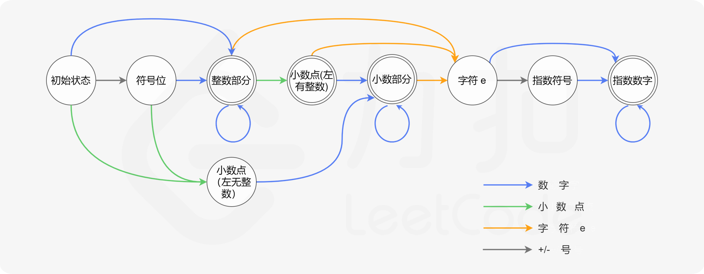
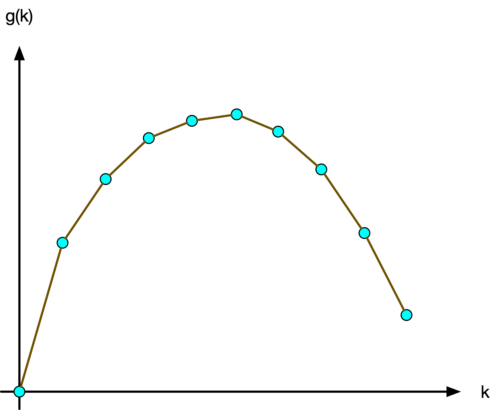
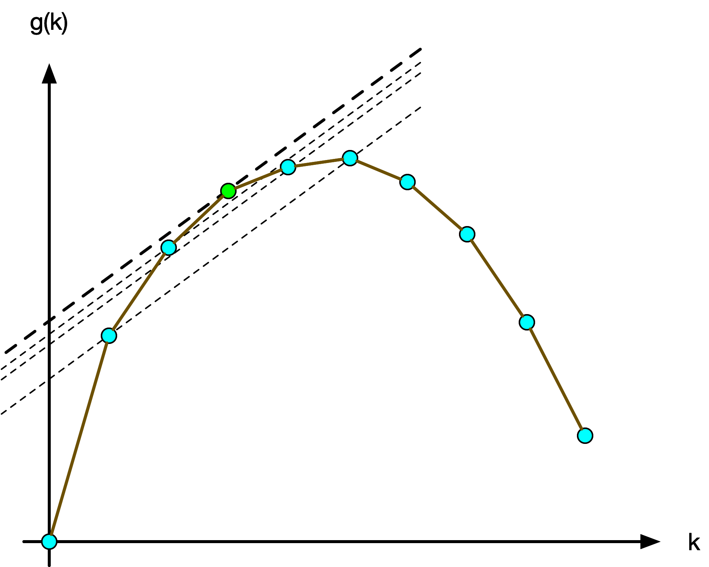
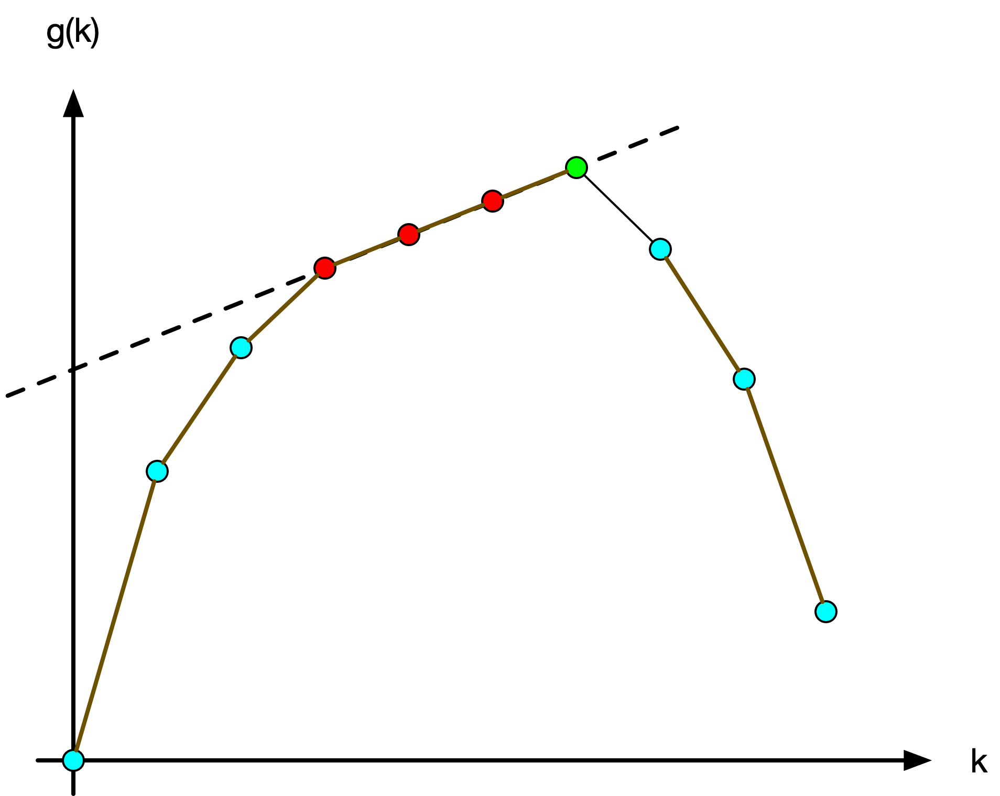
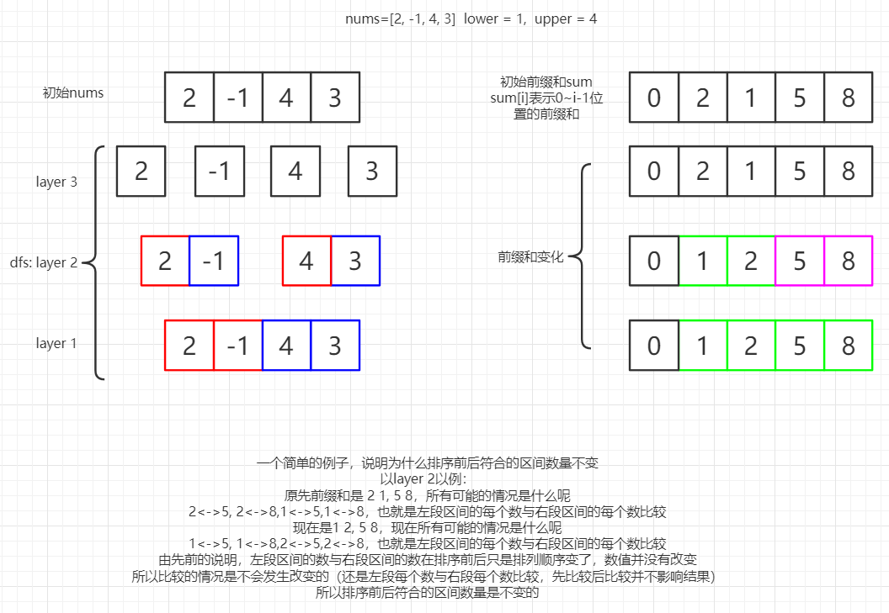
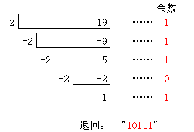
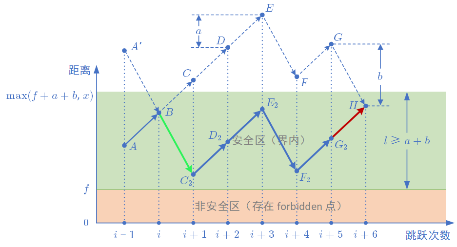

面试准备笔记。

## 目录

#### 力扣

##### 题单

- 4\. 寻找两个正序数组的中位数

  **分治(二分)**

- 10\. 正则表达式匹配

  **DP 字符串**

- 23\. 合并K个升序链表

  堆

- 25\. K 个一组翻转链表

  模拟

- 30\. 串联所有单词的子串

  滑动窗口 STL

- 32\. 最长有效括号

  **DP / 贪心** / (前缀和 + 二分 + 树状数组)

- 37\. 解数独

  DFS

- 41\. 缺失的第一个正数

  模拟(mex)

- 42\. 接雨水

  前缀和 / <u>单调栈 / 双指针</u>

- 44\. 通配符匹配

  **DP 字符串** / **AC自动机**

- 51\. N皇后

  DFS

- 60\. 排列序列

  模拟(康托展开)

- 65\. 有效数字

  模拟(自动机/regex)

- 68\. 文本左右对齐

  模拟

- 72\.编辑距离

  DP 字符串

- 76\.最小覆盖子串

  滑动窗口

- 84\.柱状图中的最大矩形

  <u>单调栈</u> / ST表

- 85\.最大矩形

  悬线法 / <u>单调栈</u>

- 87\.扰乱字符串

  **记忆化DFS/DP**

- 115\.不同的子序列

  <u>DP</u>

- 123\.买卖股票的最佳时机III

  <u>DP</u> / 前缀和

- 124\.二叉树中的最大路径和

  DFS

- 126\.单词接龙II

  毒瘤卡常爆搜

- 132\.分割回文串II

  <u>DP</u> / DP+字符串哈希

- 140\.单词拆分II

  模拟DFS

- 149\.直线上最多的点数

  <u>枚举+STL</u> / 随机化

- 154\.寻找旋转排序数组中的最小值II

  **二分**

- 164\.最大间距

  基数排序

- 174\.地下城游戏

  **DP**

- 188\.买卖股票的最佳时机IV

  **DP** / **wqs二分**

- 212\.单词搜索II

  模拟DFS

- 214\.最短回文串

  manacher / 字符串哈希 / <u>KMP</u>

- 218\.天际线问题

  小模拟+(对顶堆 / <u>堆</u>)

- 220\.存在重复元素III

  滑动窗口+STL二分 / <u>滑动窗口+STL</u>

- 224\.基本计算器

  模拟(栈)

- 233\.数字1的个数

  思维 / <u>数位DP</u>

- 239\.滑动窗口最大值

  滑动窗口+(对顶堆 / <u>堆</u> / <u>单调队列</u>) / <u>ST表/分块</u>

- 273\.整数转英文表示

  模拟

- 282\.给表达式添加运算符

  模拟+DFS

- 295\.数据流的中位数

  对顶堆

- 297\.二叉树的序列化与反序列化

  DFS

- 301\.删除无效的括号

  DFS / <u>枚举子集</u>

- 312\.戳气球

  区间DP

- 315\.计算右侧小于当前元素的个数

  权值树状数组 / <u>归并排序</u> / <u>平衡树</u>

- 982\.按位与为零的三元组

  **<u>FWT</u> / <u>高维前缀和</u>** / <u>桶枚举</u> / bitset优化枚举

- 321\.拼接最大数

  (**单调栈+反悔贪心**(+后缀数组/后缀自动机)) / **子序列自动机**

- 327\.区间和的个数

  平衡树(pb\_ds) / <u>归并排序</u> / 线段树+离散化

- 329\.矩阵中的最长递增路径

  BFS/DFS/DP

- 330\.按要求补齐数组

  **贪心**

- 332\.重新安排行程

  欧拉图 DFS/Hierholzer

- 335\.路径交叉

  **思维**

- 1617\.统计子树中城市之间最大距离

  树直径+并查集判树+枚举子集 / <u>floyd+记忆化DFS/DP</u>

- 336\.回文对

  字符串哈希 / (trie+manacher)

- 352\.将数据流变为多个不相交区间

  模拟(链表/STL)

- 354\.俄罗斯套娃信封问题

  **单调栈+二分 (LIS)**

- 2488\.统计中位数为k的子数组

  前缀和 桶枚举

- 363\.矩形区域不超过k的最大数值和

  **二分优化枚举**
  
- 381\.O(1)时间插入、删除和获取随机元素-允许重复

  数据结构 STL <u>swap优化</u>
  
- 391\.完美矩阵

  (线段树+离散化+扫描线) / <u>扫描线</u> / <u>思维</u> / <u>格林公式</u>
  
- 407\.接雨水II

  **BFS+堆优化**
  
- 1626\.无矛盾的最佳球队

  DP <u>+树状数组优化</u>
  
- 410\.分割数组的最大值

  二分答案+贪心 / <u>DP</u>

- 1630\.等差子数组

  模拟 / <u>数学优化</u>

- 420\.强密码检测器

  **思维**
  
- 1032\.字符流

  <u>AC自动机</u> / 字符串哈希
  
- 1574\.删除最短的子数组使剩余数组有序

  <u>双指针</u> / 二分 

- 432\.全O(1)的数据结构

  哈希表+链表
  
- 1638\.统计只差一个字符的子串数目

  字符串哈希 / <u>枚举</u> / <u>DP</u>
  
- 1092\.最短公共超序列

  **DP**

- 1641\.统计字典序元音字符串的数目

  高阶前缀和 / DP
  
- 1039\.多边形三角剖分的最低得分

  <u>DP</u>
  
- 1053\.交换一次的先前排列

  <u>贪心</u> / STL二分
  
- 1000\.合并石子的最低成本

  **DP**
  
- 2417\.公因子的数目

  枚举 / <u>gcd优化</u>
  
- 1017\.负二进制转换

  模拟 进制
  
- 1040\.移动石子直到连续II

  思维+STL / 双指针

- 3\.无重复字符的最长子串

  双指针 / <u>前向星</u>
  
- 1125\.最小的必要团队

  BFS 状压
  
- 1147\.段式回文

  字符串哈希 贪心 双指针
  
- 1023\.驼峰式匹配

  小模拟 / <u>正则</u>
  
- 1157\.子数组中占绝大多数的元素

  **随机化+二分** / **摩尔投票+线段树**

- 2409\.统计共同度过的日子数

  日期 模拟 / <u>优化</u>
  
- 1026\.节点与其祖先之间的最大差值

  DFS
  
- 1043\.分隔数组以得到最大和

  **DP**
  
- 1187\.使数组严格递增

  DP+二分 / <u>优化</u>
  
- 1027\.最长等差数列

  DP
  
- 1105\.填充书架

  DP
  
- 1163\.按字典序排在最后的子串

  后缀数组 / <u>双指针</u>
  
- 1031\.两个非重叠子数组的最大和

  前缀和 / <u>DP+滑动窗口</u>
  
- 1048\.最长字符串链

  DP / 拓扑排序 / <u>后缀自动机</u>
  
- 1172\.餐盘栈

  数据结构
  
- 2423\.删除字符使频率相同

  STL
  
- 1003\.检查替换后的词是否有效

  贪心
  
- 2106\.摘水果

  前缀和 / <u>滑动窗口</u>
  
- 1419\.数青蛙

  贪心 小模拟
  
- 1010\.总持续时间可被60整除的歌曲

  枚举
  
- 1263\.推箱子

  BFS套BFS
  
- 1015\.可被k整除的最小整数

  数论
  
- 1016\.子串能表示从1到N的数字的二进制串

  枚举 / <u>滑动窗口+数学</u>
  
- 1330\.翻转子数组得到最大的数组值

  **思维**
  
- 1054\.距离相等的条形码

  STL
  
- 1335\.工作计划的最低难度

  DP / <u>单调栈优化</u>
  
- 2446\.判断两个事件是否存在冲突

  日期
  
- 1073\.负二进制数相加

  模拟
  
- 1079\.活字印刷

  DFS / <u>DP</u>
  
- 2514\.统计同位异构字符串数目

  组合数学
  
- LCP33\.蓄水

  贪心 <u>+优先队列</u>

- 1373\.二叉搜索子树的最大键值和

  DFS
  
- 1080\.根到叶路径上的不足节点

  DFS
  
- 1090\.受标签影响的最大值

  贪心
  
- 1377\.T秒后青蛙的位置

  DFS
  
- 2451\.差值数组不同的字符串

  模拟
  
- 1093\.大样本统计

  模拟
  
- 1439\.有序矩阵中的第k个最小数组和

  STL <u>+归并优化</u> <u>+DP剪枝</u> / <u>二分答案+DFS</u>
  
- 1110\.删点成林

  DFS

- 1130\.叶值的最小代价生成树

  区间DP / <u>单调栈</u>
  
- 2517\.礼盒的最大甜蜜度

  二分答案+STL / <u>二分答案</u>
  
- 2559\.统计范围内的元音字符串数目

  前缀和
  
- 1156\.单字符重复子串的最大长度

  小模拟 / 滑动窗口
  
- 2611\.老鼠和奶酪

  排序 / 优先级队列
  
- 1240.铺瓷砖

  **DFS**
  
- 2699\.修改图中的边权

  **Dijkstra序贪心** / **二分+最短路**
  
- 1170\.比较字符串最小字母出现频次

  前缀和
  
- 1171\.从链表中删去总和值为零的连续节点

  前缀和 STL 链表 / <u>优化</u>
  
- 1483\.树节点的第k个祖先

  树上k级祖先
  
- 2475\.数组中不等三元组的数目

  枚举 / <u>排序+指针</u> / <u>STL</u>
  
- 1375\.二进制字符串前缀一致的次数

  树状数组 / <u>思维</u>
  
- 1177\.构建回文串检测

  前缀和 / <u>前缀异或和</u>
  
- 1494\.并行课程 II

  DFS+BFS / <u>子集枚举</u>
  
- 2481\.分割圆的最少切割次数

  思维

- 1254\.统计封闭岛屿的数目

  BFS / DFS / 并查集
  
- 1262\.可被三整除的最大和

  贪心+二维DP / <u>贪心</u> / <u>DP</u>
  
- 1595\.连通两组点的最小成本

  **网络流** / **状压DP**
  
- LCP41\.黑白翻转棋

  模拟 / <u>BFS</u>
  
- 16\.19\.水域大小

  BFS
  
- 1659\.最大化网格幸福感

  <u>状压DP</u> / <u>轮廓线优化</u>
  
- 1401\.圆和矩形是否有重叠

  计算几何 / <u>思维</u>
  
- 2485\.找出中枢整数

  数学
  
- 1186\.删除一次得到子数组最大和

  **DP**
  
- 1681\.最小不兼容性

  **状压DP+枚举子集**
  
- 1253\.重构2行二进制矩阵

  构造
  
- 2490\.回环句

  小模拟
  
- 443\.两数相加II

  模拟链表
  
- 2178\.拆分成最多数目的正偶数之和

  贪心 构造
  
- 167\.两数之和 II - 输入有序数组

  二分 / <u>双指针</u>
  
- 15\.三数之和

  二分 / <u>双指针</u>
  
- 16\.最接近的三数之和

  二分 / <u>双指针</u>
  
- 1911\. 最大子序列交替和

  贪心 / <u>DP</u>
  
- 979\.在二叉树中分配硬币

  <u>DFS</u> / LCA+网络流
  
- 18\.四数之和

  二分 / 双指针
  
- 834\.树中距离之和

  树上DP
  
- 415\.字符串相加

  高精度
  
- 1851\.包含每个查询的最小区间

  离线 STL
  
- 918\.环形子数组的最大和

  前缀和+可删堆 / <u>前缀和+单调队列</u> / <u>DP</u>
  
- 1499\.满足不等式的最大值

  单调队列 / 堆
  
- 2050\.并行课程 III

  拓扑 / 记忆化DFS
  
- 141\.环形链表

  双指针 / 哈希表
  
- 142\.环形链表II

  <u>双指针</u> / 哈希表
  
- 143\.重排链表

  <u>双指针</u> / 模拟 
  
- 2681\.英雄的力量

  DP / 数学

- 822\.翻转卡片游戏

  小模拟 STL
  
- 21\.合并两个有序链表

  链表
  
- 980\.不同路径III

  BFS / DFS
  
- 1749\.任意子数组和的绝对值的最大值

  前缀和
  
- 1289\.下降路径最小和II

  DP 前缀和
  
- 88\.合并两个有序数组

  双指针
  
- 833\.字符串中的查找与替换

  模拟+双指针
  
- 1444\.切披萨的方案数

  DP+二维前缀和
  
- 1388\.3n 块披萨

  **DP** / **反悔贪心**
  
- 2337\.移动片段得到字符串

  贪心
  
- 849\.到最近的人的最大距离

  枚举 / 链表/前缀和
  
- 1782\.统计点对的数目

  二分 / <u>双指针</u>
  
- 225\.汇总区间

  小模拟
  
- 56\.合并区间

  排序
  
- 57\.插入区间

  小模拟
  
- 440\.字典序的第k小数字

  **DFS+trie**
  
- 823\.带因子的二叉树

  DP (+ <u>双指针优化</u>)

- 446\.等差数列划分 II

  **DP**

- 1654\.到家的最少跳跃次数

  <u>BFS</u>

- 458\.可怜的小猪

  思维+DP / <u>DP+组合数学</u> / <u>数学</u>
  
- 1761\.一个图中连通三元组的最小度数

  枚举 / <u>bitset优化</u> / <u>排序+快速矩阵乘法</u>
  
- 2240\.买钢笔和铅笔的方案数

  枚举 / <u>类欧几里得算法</u>
  
- 2511\.最多可以摧毁的敌人城堡数目

  小模拟
  
- 1921\.消灭怪物的最大数量

  贪心
  
- 449\.序列化和反序列化二叉搜索树

  小模拟
  
- 2605\.从两个数字数组生成最小数字

  小模拟
  
- 1123\.最深叶节点的最近公共祖先

  LCA / <u>DFS</u>
  
- 2594\.修车的最少时间

  二分 / STL
  
- 630\.课程表III

  **贪心**
  
- 1462\.课程表IV

  最短路(+bitset优化) / <u>快速矩阵乘法</u>
  
- 2596\.检查骑士巡视方案

  小模拟
  
- 886\.可能的二分法

  二分图判定 DFS/<u>种类并查集</u>
  
- 198\.打家劫舍

  DP
  
- 213\.打家劫舍II

  DP
  
- 337\.打家劫舍III

  树上DP
  
- 2560\.打家劫舍IV

  二分+DP / <u>二分+贪心</u>
  
- 2591\.将钱分给最多的儿童

  贪心 / <u>DP</u>
  
- 2603\.收集树中金币

  **拓扑排序** / **树上DP**
  
- 1993\.树上的操作

  DFS / <u>DFS序+树状数组二分</u>
  
- 2582\.递枕头

  数学
  
- 146\.LRU 缓存

  STL / <u>STL+链表</u>

- 460\.LFU 缓存

  <u>STL</u> / STL+链表
  
- 2251\.花期内花的数目

  差分+离线+双指针 / <u>二分</u>
  
- 605\.种花问题

  小模拟
  
- 466\.统计重复个数

  <u>字符串模拟+思维</u>
  
- 2136\.全部开花的最早一天

  贪心
  
- 472\.连接词

  字符串哈希+DP / <u>trie+记忆化DFS</u>
  
- 479\.最大回文数乘积

  <u>爆搜</u>

- 714\.买卖股票最佳时机含手续费

  贪心/DP
  
- 309\.买卖股票最佳时期含冷冻期

  DP

- 480\.滑动窗口中位数

  对顶堆+set / <u>对顶堆+pq</u>

- 483\.最小好进制

  二分+数学 / <u>数学</u>
  
- 488\.祖玛游戏

  <u>爆搜</u>
  
- 901\.股票价格跨度

  二分+线段树 / <u>单调栈</u>
  
- 493\.翻转对

  红黑树 / <u>离散化+树状数组</u> / <u>归并排序</u>
  
- 502\.IPO

  贪心+STL
  
- 514\.自由之路

  DP
  
- 2578\.最小和分割

  <u>贪心</u> / 爆搜
  
- 2731\.移动机器人

  思维 + 前缀和/<u>组合数学</u>
  
- 571\.超级洗衣机

  **贪心**
  
- 546\.移除盒子

  **DP**
  
- 786\.第k个最小的素数分数

  排序 / <u>堆</u> / <u>二分+双指针</u>
  
- 552\.学生出勤记录II

  DP / <u>矩阵快速幂</u>
  
- 1488\.避免洪水泛滥

  贪心+STL
  
- 564\.寻找最近的回文数

  思维/贪心+小模拟
  
- 137\.只出现一次的数字II

  STL / <u>位运算</u>
  
- 260\.只出现一次的数字III

  STL / <u>位运算</u>
  
- 2652\.倍数求和

  容斥
  
- 1726\.同积元素

  STL
  
- 2316\.统计无向图中无法相互到达点对数

  DFS
  
- 1402\.做菜顺序

  贪心 / <u>贪心+前缀和</u> / <u>DP</u>
  
- 1155\.掷骰子等于目标和的方法数

  DP / 分治 MTT
  
- 2698\.求一个整数的惩罚数

  爆搜
  
- 274\.H指数

  二分答案 / 排序 / 计数排序+后缀和
  
- 275\.H指数II

  二分答案

- 2127\.参加会议的最多员工数

  **拓扑排序**(内向基环树)

- 117\. 填充每个节点的下一个右侧节点指针 II

  DFS / <u>BFS层序</u>

- 2003\.每棵子树内缺失的最小基因值

  树上启发式合并+STL / <u>树上启发式合并</u> / <u>DFS</u>
  
- 421\.数组中两个数的最大异或值

  <u>01trie</u> / <u>STL</u>
  
- 187\.重复的DNA序列

  STL / <u>STL+滑动窗口</u>
  
- 318\.最大单词长度乘积

  位运算

- 229\.多数元素II

  STL / <u>摩尔投票</u>
  
- 2586\. 统计范围内的元音字符串数

  签到
  
- 2609\.最长平衡子字符串

  枚举
  
- 2258\.逃离火灾

  <u>BFS+二分 / BFS</u>
  
- 2300\.咒语和药水的成功对数

  双指针 / 二分
  
- 715\.Range 模块

  <u>动态开点线段树 / STL模拟</u>
  
- 765\.情侣牵手

  贪心 / <u>BFS(连通分量)</u>
  
- 1334\.阈值距离内邻居最少的城市

  最短路
  
- 2760\.最长奇偶子数组

  滑动窗口 / DP
  
- 2736\.最大和查询

  **权值树状数组 / 单调栈 / 归并排序**
  
- 689\.三个无重叠子数组的最大和

  **滑动窗口+前缀和 /前缀和 / DP**
  
- 53\.最大子数组和

  前缀和 / DP / <u>分治</u>
  
- 2216\.美化数组的最少删除数

  小模拟+贪心+DP / 贪心
  
- 2304\.网格中的最小路径代价

  最短路 / DP
  
- 1410\.HTML实体解析器

  STL
  
- 2824\.统计和小于目标的下标对数目

  二分 / 双指针
  
- 1457\.二叉树中的伪回文路径

  DFS(+位运算优化)
  
- 828\.统计子串中的唯一字符

  组合数学
  
- 907\.子数组的最小值之和

  单调栈 / 单调栈+DP
  
- 1670\.设计前中后队列

  STL
  
- 2336\.无限集中的最小数字

  STL
  
- 1657\.确定两个字符串是否接近

  STL
  
- 1423\.可获得的最大点数

  <u>滑动窗口</u> / <u>后缀数组</u>
  
- 1038\.从二叉搜索树到更大和树

  DFS / <u>Morris遍历</u>
  
- 2477\.到达首都的最少油耗

  DFS / 有根树拓扑排序
  
- 2646\.最小化旅行的价格总和

  LCA + 树上DP
  
- 2008\.出租车的最大盈利

  DP
  
- 2048\.下一个更大的数值平衡数

  爆搜  / <u>枚举</u> / 打表+二分
  
- 1631\.最小体力消耗路径

  最小生成树+DFS / 二分+BFS / <u>并查集</u> / 最短路
  
- 2454\.下一个更大元素IV

  ST表+二分 / <u>单调栈</u>
  
- 2132\.用邮票贴满网格图

  二维前缀和差分
  
- 2415\.反转二叉树的奇数层

  DFS(<u>+优化</u>)
  
- 2276\.统计区间中的整数数目

  动态开点线段树 / <u>STL(珂朵莉树)</u>
  
- 746\.使用最小花费爬楼梯

  DP
  
- 162\.寻找峰值

  枚举 / <u>二分</u>
  
- 1901\.寻找峰值II

  枚举 / <u>二分</u>
  
- 2828\.判别首字母缩略词

  签到
  
- 2866\.美丽塔II

  单调栈+DP
  
- 1671\.得到山形数组的最少删除次数

  DP+前缀和 / <u>DP</u> / <u>二分+单调栈</u>
  
- 1962\.移除石子使总数最小

  STL
  
- 1954\.收集足够苹果的最小花园周长

  数学+二分/枚举
  
- 1349\. 参加考试的最大学生数

  状压DP / <u>网络流</u>
  
- 2735\.收集巧克力

  枚举(+优化) / <u>单调栈+前缀和+斜率优化</u>
  
- 2706\.购买两块巧克力

  签到
  
- 2487\.从链表中移除节点

  链表
  
- 2397\. 被列覆盖的最多行数

  DFS / 二进制枚举 / <u>Gosper's Hack</u>
  
- 1944\.队列中可以看到的人数

  静态双链表 / <u>单调栈</u>
  
- 2807\.在链表中插入最大公约数

  链表
  
- 383\.赎金信

  STL
  
- 2707\.字符串中的额外字符

  DP
  
- 2696\.删除子串后的字符串

  静态双链表 / <u>栈</u>
  
- 2182\.构造限制重复的字符串

  贪心+小模拟/双指针
  
- 83\.删除排序链表中的重复元素

  链表
  
- 82\.删除排序链表中的重复元素II

  链表
  
- 2719\.统计整数数目

  数位DP
  
- 2744\.最大字符串配对数目

  哈希
  
- 2171\.拿出最少数目的魔法豆

  前缀和 排序
  
- 2809\. 使数组和小于等于 x 的最少时间

  **排序不等式 贪心 DP**
  
- 670\.最大交换

  贪心
  
- 2765\.最长交替子数组

  小模拟(指针)
  
- 2846\.边权重均等查询

  LCA 树上前缀和
  
- 365\.水壶问题

  裴蜀定理 / 搜索 / STL
  
- 2808\.使循环数组所有元素相等

  STL
  
- 1686\.石子游戏VI

  **贪心**+博弈论
  
- LCP24\.数字游戏

  对顶堆(证明定点距离和是中位数)
  
- 1690\.石子游戏VII

  博弈论 记忆化DFS/<u>DP</u>
  
- 1696\.跳跃游戏VI

  DP+单调队列
  
- LCP30\.魔塔游戏

  贪心+优先级队列
  
- 2641\.二叉树的堂兄弟节点II

  搜索
  
- 993\.二叉树的堂兄弟节点

  搜索
  
- 236\.二叉树的最近公共祖先

  LCA 搜索
  
- 94\.二叉树的中序遍历

  DFS
  
- 144\.二叉树的前序遍历

  DFS Morris遍历
  
- 145\.二叉树的后序遍历

  DFS Morris遍历
  
- 987\.二叉树的垂序遍历

  数据结构/<u>排序</u>

- 102\.二叉树的层序遍历

  BFS
  
- 2476\.二叉搜索树最近节点查询

  DFS+二分
  
- 105\.从前序与中序遍历序列构造二叉树

  DFS 分治

- 106\.从中序与后序遍历序列构造二叉树

  DFS 分治

- 889\.根据前序和后序遍历构造二叉树

  DFS 构造

- 235\.二叉搜索树的最近公共祖先

  DFS LCA
  
- 938\.二叉搜索树的范围和

  DFS
  
- 2867\.统计树中的合法路径数目

  欧拉筛 树上DP
  
- 2673\.使二叉树所有路径值相等的最小代价

  二分治+贪心 / <u>贪心</u>
  
- 2581\.统计可能的树根数目

  DFS(换根DP)
  
- 2369\.检查数组是否存在有效划分

  DP
  
- 2368\.受限条件下可到达节点的数目

  BFS DFS 并查集
  
- 225\.用队列实现栈

  STL
  
- 1976\.到达目的地的方案数

  Dijkstra
  
- 2575\.找出字符串的可整除数组

  数论
  
- 2834\.找出美丽数组的最小和

  贪心 数学
  
- 299\.猜数字游戏

  小模拟

- 2386\.找出数组的第K大和

  **二分答案+爆搜 / 最小堆**
  
- 2129\.将标题首字母大写

  小模拟
  
- 2864\.最大二进制奇数

  签到 贪心
  
- 2789\.合并后数组中的最大元素

  贪心
  
- 2312\.卖木头块

  **DP**
  
- 2684\.矩阵中移动的最大次数

  DP DFS BFS
  
- 310\.最小高度树

  换根DP / <u>重心</u>
  
- 1793\.好子数组的最大分数

  贪心 双指针
  
- 1969\.数组元素的最小非零乘积

  贪心 构造 快速幂
  
- 2671\.频率跟踪器

  STL
  
- 2642\.设计可以求最短路径的图类

  Dijkstra
  
- 2549\.统计桌面上的不同数字

  贪心
  
- 322\.零钱兑换

  无限背包DP
  
- 522\.零钱兑换II

  **背包DP计数**
  
- 2580\.统计将重叠区间合并成组的方案数

  模拟
  
- 2617\.网格图中最少访问的格子数

  **DP+单调栈** / **BFS+并查集/set** **DP+线段树** **贪心+最小堆**
  
- 1997\.访问完所有房间的第一天

  前缀和优化DP
  
- 2908\.元素和最小的山形三元组I

  前缀和
  
- 2952\.需要添加的硬币的最小数量

  贪心
  
- 331\.验证二叉树的前序序列化

  DFS
  
- 2810\.故障键盘

  STL
  
- P1314\.聪明的质监员

  前缀和 三分/<u>二分</u>
  
- 894\.所有可能的真二叉树

  DP DFS <u>指针</u>
  
- 2192\. 邮箱无向图中一个节点的所有祖先

  DFS / 拓扑排序
  
- 1483\.树节点的第k个祖先

  倍增
  
- 1600\.王位继承顺序

  DFS
  
- 2009\.使数组连续的最少操作数

  离散前缀和 / <u>滑动窗口</u>
  
- 2529\.正整数和负整数的最大计数

  二分
  
- 1702\.修改后的最大二进制字符串

  贪心 构造
  
- 1766\.互质树

  DFS
  
- 2924\.找到冠军II

  图论/签到
  
- 924\.尽量减少恶意软件的传播

  BFS / <u>连通分量(DFS/并查集)</u>
  
- 928\.尽量减少恶意软件的传播II

  爆搜 / <u>连通分量(DFS)</u>
  
- 1883\.准时抵达会议现场的最小跳过休息次数

  DP 精度
  
- 39\.组合总和

  DFS
  
- 216\.组合总和III

  DFS / 二进制枚举
  
- 377\.组合总和IV

  DP 取模
  
- 1052\.爱生气的书店老板

  前缀和 / <u>滑动窗口</u>
  
- 2385\.感染二叉树需要的总时间

  二叉树 DFS
  
- 2739\.总行驶距离

  数学
  
- 2639\.查询网格图中每一列的宽度

  签到
  
- 1146\.快照数组

  数据结构
  
- 1329\.将矩阵按对角线排序

  模拟
  
- 2462\.雇佣k位工人的总代价

  数据结构
  
- 857\.雇佣k名工人的最低成本

  排序+优先级队列
  
- 1235\.规划兼职工作

  DP + 树状数组(区间max)/线段树/<u>二分搜索</u>
  
- 1652\.拆炸弹

  前缀和 / 滑动窗口
  
- 741\.摘樱桃

  **DP**
  
- 1463\.摘樱桃II

  DP(/+压缩数组)
  
- 2079\.给植物浇水

  模拟
  
- 2105\.给植物浇水II

  模拟
  
- 2960\.统计已测试设备

  模拟 / 差分
  
- 2391\.收集垃圾的最少总时间

  模拟
  
- 1553\.吃掉N个橘子的最少天数

  记忆化搜索 / 最短路
  
- 994\.腐烂的橘子

  BFS
  
- 2244\.完成所有任务需要的最少轮数

  贪心
  
- 2589\.完成所有任务的最少时间

  **排序+贪心 (/线段树二分/栈上前缀和+二分) / 差分约束**
  
- 1953\.你可以工作的最大周数

  贪心 构造
  
- 826\.安排工作以达到最大收益

  排序 双指针
  
- 2644\.找出可整除性得分最大的整数

  签到
  
- 1535\.找出数组游戏的赢家

  模拟 思维
  
- 2769\.找出最大的可达成数字

  签到 思维
  
- 1542\.找出最长的超赞子字符串

  **前缀异或和**
  
- 2225\.找出输掉零场或一场比赛的玩家

  签到
  
- 2831\.找出最长等值子数组

  滑动窗口
  
- 1673\.找出最具竞争力的子序列

  <u>前缀和+模拟+贪心</u> / **贪心+单调栈/ST表(维护min所在下标)**/(优先队列+滑窗)/<u>线段树+二分</u>
  
- 2903\.找出满足差值条件的下标I

  滑动窗口+二分 / 滑动窗口
  
- 1738\.找出第 k 大的异或坐标值

  前缀和 排序(nth)
  
- 2028\.找出缺失的观测数据

  构造 模拟/数学
  
- 2981\.找出出现至少三次的最长特殊子字符串I

  模拟 排序/堆
  
- 2965\.找出缺失和重复的数字

  模拟 / <u>位运算(异或)</u>
  
- 2928\.给小朋友们分糖果I

  枚举 / <u>枚举优化 / 容斥原理</u>
  
- 3067\.在带权树网络中统计可连接服务器对数目

  计数 (DFS / <u>点分治</u>)
  
- 1103\.分糖果II

  暴力 / 二分 / 数学
  
- 3072\.将元素分配到两个数组中II

  pb\_ds / <u>离散化+树状数组</u>
  
- 2938\.区分黑球与白球

  贪心 逆向/组合数学
  
- 3040\.相同分数的最大操作数目II

  爆搜
  
- 881\.救生艇

  贪心 + (multiset二分 / <u>双指针</u>)
  
- 419\.甲板上的战舰

  BFS / 枚举
  
- 2813\.子序列最大优雅度

  排序 数据结构 贪心+枚举+模拟 / <u>反悔贪心</u>
  
- 2786\.访问数组中的位置使分数最大

  DP
  
- 2779\.数组的最大美丽值

  排序+二分 / 排序+滑动窗口 / 差分 / 离散差分 / 线段树
  
- 521\.最长特殊序列I

  签到 思维
  
- 522\.最长特殊序列II

  思维 字符串
  
- 2288\.价格减免

  小模拟 字符串
  
- 2713\.矩阵中严格递增的单元格数

  **DP**
  
- 2748\.美丽下标对的数目

  枚举
  
- LCP61\. 气温变化趋势

  签到
  
- 2663\.字典序最小的美丽字符串

  **构造 模拟 贪心**
  
- 503\.下一个更大元素 II

  单调栈
  
- 2732\. 找到矩阵中的好子集

  贪心 + 模拟/数学 <u>SOSDP</u>
  
- 2741\.特别的排列

  **状压DP**
  
- 2734\.执行子串操作后的字典序最小

  签到 贪心
  
- 2742\.给墙壁刷油漆

  01背包DP
  
- 2710\.移除字符串中的尾随零

  签到 / 正则表达式
  
- 494\.目标和

  折半搜索 / <u>01背包DP</u>
  
- 3102\.最小化曼哈顿距离

  **计算几何 曼哈顿距离 切比雪夫距离** <s>凸包直径</s>
  
- 3086\.拾起K个1需要的最少行动次数

  **中位数 贪心 前缀和 +二分/+双指针**
  
- 202\.快乐数

  STL / <u>快慢指针 / 打表</u>
  
- 2970\.统计移除递增子数组的数目I

  暴力 / <u>双指针</u>
  
- 3011\.判断一个数组是否可以变为有序

  滑动窗口+排序 / <u>滑动窗口</u>
  
- 807\.保持城市天际线

  签到
  
- 721\.账户合并

  并查集 小模拟
  
- 2959\.关闭分部的可行集合数目

  爆搜+Floyd
  
- 3112\.访问消失节点的最少时间

  Dijkstra改
  
- 3096\.得到更多分数的最少关卡数目

  前缀和 签到
  
- 2850\.将石头分散到网格图的最少移动次数

  排列/DFS爆搜 / <u>最小费用最大流</u>
  
- 1186\.删除一次得到子数组最大和

  **DP**
  
- 2101\.引爆最多的炸弹

  DFS / <u>Floyd</u>
  
- 3098\.求出所有子序列的能量和

  **DP** / ***DP+前缀和优化***
  
- 2766\.重新放置石块

  签到
  
- 2844\.生成特殊数字的最少操作

  签到 思维 字符串
  
- 2740\.找出分区值

  签到 贪心 排序
  
- 3106\.满足距离约束且字典序最小的字符串

  贪心
  
- 699\.掉落的方块

  暴力 / <u>STL+二分</u> / 线段树 / 动态开点线段树
  
- 2961\.双模幂运算

  快速幂
  
- 3111\.覆盖所有点的最少矩形数目

  贪心
  
- LCP40\.心算挑战

  反悔贪心 / +<u>nth_element 优化排序</u>
  
- 3128\.直角三角形

  签到 组合数学(乘法原理)
  
- 3143\.正方形中的最多点数

  排序+枚举 / <u>二分 / 枚举(+最值维护)</u>
  
- 572\.另一棵树的子树

  爆搜 / 树哈希 /<u> DFS序+KMP</u>
  
- 600\.不含连续1的非负整数

  数位DP
  
- 3129\.找出所有稳定的二进制数组I

  **DP / DP + 容斥原理** (生成函数优化)
  
- 1443\.收集树上所有苹果的最少时间

  DFS
  
- 3131\.找出与数组相加的整数I

  签到 排序
  
- 3132\.找出与数组相加的整数II

  枚举+排序+双指针 / <u>排序+双指针</u>
  
- 1971\.寻找图中是否存在路径

  签到 DFS

- 2540\.找到 Alice 和 Bob 可以相遇的建筑

  离线 + map二分 / <u>离线 + 堆 / 离线 + 单调栈二分 / 在线 + 线段树二分</u>
  
- 1035\.不相交的线

  DP+前缀和 / <u>LCS DP</u>

- 676\.实现一个魔法字典

  字符串 暴力/预处理 / <u>字典树+DFS</u> 
  
- 3152\.特殊数组II

  ST表 / <u>前缀和</u>
  
- 3148\.矩阵中的最大得分

  DP / <u>二维前缀和</u>
  
- 3097\.或值至少为 K 的最短子数组

  **LogTrick + 二分/滑动窗口**
  
- 3117\.划分数组得到的最小的值之和

  <u>记忆化DFS / (LogTrick(二分/滑动窗口)/ST表二分 + (单调栈/线段树)优化DP)</u>
  
- 3137\.K 周期字符串需要的最少操作次数

  签到 思维 字符串
  
- 2492\.两个城市间路径的最小分数

  DFS
  
- 802\.找到最终的安全状态

  环 DFS / <u>拓扑排序</u>
  
- 1559\.二维网格图中探测环

  DFS / <u>并查集</u>
  
- 3154\.到达第K级台阶的方案数

  组合数学 / <u>DP(记忆化DFS)</u>
  
- 3007\.价值和小于等于K的最大数字

  位运算 二分
  
- 3133\.数组最后一个元素的最小值

  位运算
  
- 3145\.大数组元素的乘积

  位运算 二分/<u>倍增</u> 差分 快速幂 扩展欧拉公式
  
- 1466\.重新规划路线

  DFS
  
- 3146\.两个字符串的排列差

  签到 STL(哈希)
  
- 698\.划分为k个相等的子集

  状压 + 记忆化DFS/<u>(优化) / DP</u>
  
- 279\. 完全平方数

  BFS / DP / <u>数学</u>
  
- 3134\.找出唯一性数组的中位数

  **二分 + 滑动窗口**
  
- 3144\.分割字符频率相等的最少子字符串

  BFS / <u>记忆化DFS / DP</u>
  
- 3153\.所有数对中数位不同之和

  组合数学 计数
  
- 1450\.在既定时间做作业的学生人数

  签到 / 差分 / 二分
  
- 2024\.考试的最大困扰度

  滑动窗口
  
- 113\.路径总和II

  DFS / BFS 输出方案
  
- 2708\.一个小组的最大实力值

  二进制枚举 / 爆搜 / <u>贪心</u>
  
- 2860\.让所有学生保持开心的分组方法数

  排序 枚举
  
- 3176\.求出最长好子序列I

  DP <u>前缀和优化</u>
  
- 977\.有序数组的平方

  滑动窗口双指针
  
- 2115\.从给定原材料中找到所有可以做出的菜

  拓扑排序
  
- 2181\.合并零之间的节点

  链表
  
- 338\.比特位计数

  二进制 DP
  
- 2552\.统计上升四元组

  **DP 组合数学 枚举**
  
- 2555\.两个线段获得的最多奖品

  滑动窗口 前缀和(max)
  
- 2576\.求出最多标记下标

  排序 贪心 二分/<u>双指针</u>
  
- 2398\.预算内的最多机器人数目

  滑动窗口 单调栈
  
- 2390\.从字符串中移除星号

  签到 栈
  
- 2332\.坐上公交的最晚时间

  模拟 双指针
  
- 815\.公交路线

  BFS
  
- 2848\.与车相交的点

  前缀和差分
  
- 2414\.最长的字母序连续子字符串的长度

  签到 模拟

- 2376\.统计特殊整数

  DFS打表+二分 / <u>数位DP / 组合数学</u>
  
- 2374\.边积分最高的节点

  签到
  
- 997\.找到小镇的法官

  签到 图论
  
- 1014\.最佳观光组合

  前缀和
  
- 2207\.字符串中最多数目的子序列

  前缀和 / <u>贪心</u>
  
- 2306\.公司命名

  **组合数学 枚举**
  
- 2535\.数组元素和与数字和的绝对差

  签到
  
- 2516\.每种字符至少取K个

  二分+前缀和 / <u>滑动窗口</u>
  
- 2286\.以组为单位定音乐会的门票

  线段树二分
  
- 2073\.买票需要的时间

  签到 数学
  
- 1845\.座位预约管理系统

  堆/优先级队列
  
- 134\.加油站

  前缀和+滑动窗口+单调队列 / <u></u>

## 算法

### 力扣其他

> ### 力扣比赛

#### 周赛327

**vp成绩**：


##### 2529\. 正整数和负整数的最大计数

签到题。进阶就二分 xx bound 即可。

```c++
int maximumCount(vector<int> &nums)
{
    int neg = 0, pos = 0;
    for (int i = 0, n = nums.size(); i < n; ++i)
    {
        neg += nums[i] < 0;
        pos += nums[i] > 0;
    }
    return max(neg, pos);
}
```


##### 2530\. 执行 K 次操作后的最大分数

小根堆的板子题。

```c++
long long maxKelements(vector<int> &nums, int k)
{
    using ll = long long;
    priority_queue<ll> q;
    for (int i = 0, n = nums.size(); i < n; ++i)
    {
        q.push(nums[i]);
    }
    ll ans = 0;
    while (k--)
    {
        ll x = q.top();
        q.pop();
        ans += x;
        q.push((x - 1) / 3 + 1);
    }
    return ans;
}
```


##### 2531\. 使字符串总不同字符的数目相等

暴力优化。容易发现每个字母只有前两次出现(/首次出现)是有用的，之后再出现全删了。因此可以在一遍扫描后用 $O(26^2)$ 的复杂度暴力尝试所有字母组合的交换。(写得烂，实际上写出来 $O(52^2)$，但无伤大雅)

```c++
bool isItPossible(string word1, string word2)
{
    int bin1[130] = {}, bin2[130] = {};
    int n1 = 0, n2 = 0, m1 = 0, m2 = 0;
    string s1, s2;
    auto add = [&](char c, int *bin, int &m)
    {
        if (bin[c]++ == 0)
        {
            m++;
        }
    };
    auto del = [&](char c, int *bin, int &m)
    {
        if (--bin[c] == 0)
        {
            m--;
        }
    };
    for (auto c : word1)
    {
        add(c, bin1, m1);
        if (bin1[c] <= 2)
        {
            n1++;
            s1 += c;
        }
    }
    for (auto c : word2)
    {
        add(c, bin2, m2);
        if (bin2[c] <= 2)
        {
            n2++;
            s2 += c;
        }
    }
    for (int i = 0; i < n1; ++i)
    {
        for (int j = 0; j < n2; ++j)
        {
            del(s1[i], bin1, m1);
            del(s2[j], bin2, m2);
            add(s1[i], bin2, m2);
            add(s2[j], bin1, m1);
            if (m1 == m2)
            {
                return true;
            }
            del(s1[i], bin2, m2);
            del(s2[j], bin1, m1);
            add(s1[i], bin1, m1);
            add(s2[j], bin2, m2);
        }
    }
    return false;
}
```


##### 2532\. 过桥的时间

大模拟题。按题意做即可，一眼大约 $O(t\log n)$ 的复杂度。

```c++
static long long t;
static int suc;
static int hsuc;
struct worker
{
    int i, ltr, po, rtl, pn;
    bool operator<(const worker &rhs) const
    {
        if (ltr + rtl != rhs.ltr + rhs.rtl)
        {
            return ltr + rtl < rhs.ltr + rhs.rtl;
        }
        return i < rhs.i;
    }
};
static priority_queue<worker> lq, rq;

struct event;
static bool busy;
static priority_queue<event> ev;
const static int e_finish_cross_bridge_fright = 1;
const static int e_finish_putnew = 2;
const static int e_finish_cross_bridge_fleft = 3;
const static int e_finish_putold = 4;
struct event
{
    long long t;
    int ty;
    worker w;
    void next() const
    { // 回调事件
        if (ty == e_finish_cross_bridge_fright)
        { // putnew
            busy = false;
            ++suc;
            ev.push({t + w.pn, e_finish_putnew, w});
        }
        else if (ty == e_finish_putnew)
        { // left to right
            lq.push(w);
        }
        else if (ty == e_finish_cross_bridge_fleft)
        { // putold
            busy = false;
            ++hsuc;
            ev.push({t + w.po, e_finish_putold, w});
        }
        else if (ty == e_finish_putold)
        { // right to left
            rq.push(w);
        }
    }
    bool operator<(const event &rhs) const
    {
        return t > rhs.t;
    }
};

class Solution
{
public:
    int findCrossingTime(int n, int k, vector<vector<int>> &time)
    {
        t = 0;
        suc = 0;  // 走回左岸的
        hsuc = 0; // 从旧仓库拿起的
        busy = false;
        while (!ev.empty())
        {
            ev.pop();
        }
        while (!lq.empty()) // left side waiting
        {
            lq.pop();
        }
        while (!rq.empty())
        {
            rq.pop();
        }

        for (int i = 0; i < k; ++i)
        {
            lq.push({i, time[i][0], time[i][1], time[i][2], time[i][3]});
        }

        while (suc < n)
        {
            while (!ev.empty() && ev.top().t == t)
            {
                ev.top().next();
                ev.pop();
            }
            if (!busy)
            {
                if (!rq.empty())
                {
                    worker w = rq.top();
                    rq.pop();
                    ev.push({t + w.rtl, e_finish_cross_bridge_fright, w});
                    busy = true;
                }
                else if (!lq.empty() && hsuc < n)
                {
                    worker w = lq.top();
                    lq.pop();
                    ev.push({t + w.ltr, e_finish_cross_bridge_fleft, w});
                    busy = true;
                }
            }
            if (suc < n && !ev.empty())
            {
                t = ev.top().t;
            }
        }
        return t;
    }
};
```

> 挂了一次，因为 operator 重载写炸了，太久没练手写成了：
>
> ```c++
> bool operator<(const worker &rhs) const
> {
>     if (ltr + rtl < rhs.ltr + rhs.rtl)
>     {
>         return true;
>     }
>     return i < rhs.i;
> }
> ```


#### Shell

##### 193\. 有效电话号码

[题目](https://leetcode.cn/problems/valid-phone-numbers/),任意一种：

```shell
grep -P '^(\d{3}-|\(\d{3}\) )\d{3}-\d{4}$' file.txt
sed -n -r '/^([0-9]{3}-|\([0-9]{3}\) )[0-9]{3}-[0-9]{4}$/p' file.txt
awk '/^([0-9]{3}-|\([0-9]{3}\) )[0-9]{3}-([0-9]{4})$/' file.txt
```

chatGPT:

grep 是一种在文本文件中查找文本的命令行工具。它的基本语法如下：

```sh
grep 'pattern' file
```

其中，'pattern' 是要查找的文本字符串，file 是要搜索的文件。

如果要在多个文件中搜索，可以将文件名列在命令行中：

```sh
grep 'pattern' file1 file2 file3
```

可以在目录中搜索文件，可以使用通配符。

```sh
grep 'pattern' /path/to/dir/*
```

还可以使用递归模式搜索整个目录：

```sh
grep -r 'pattern' /path/to/dir
```

grep 命令还有很多选项可用, 例如：

- -n : 显示匹配行的行号。输出如 `\d:` 格式不带空格拼接后面内容
- -i : 忽略大小写。
- -v : 显示不包含匹配字符串的行。
- -w 用于在文本文件中搜索仅完全匹配单词的文本(类似于正则的单词边界检测，即若有 `sh` 能匹配 `sh st` 不能匹配 `shst`)

可以使用 man grep 查看详细信息。

`grep -P` 是一个选项，它允许使用 Perl 正则表达式 (PCRE) 来搜索文本。

Perl 正则表达式是一种功能强大的正则表达式语言，支持许多特殊字符和模式匹配操作。例如，可以使用 PCRE 中的捕获组来匹配多个子字符串，或者使用命名组来方便地管理匹配的子字符串。

如果要使用 PCRE 来搜索文本，可以在 grep 命令中使用 -P 选项，例如：

```sh
grep -P '\d{3}-\d{2}-\d{4}' file
```

这个命令将在文件中查找所有符合美国社会安全号码格式的字符串（xxx-xx-xxxx）。

请注意，使用 -P 选项需要 PCRE 库的支持。如果系统上没有安装该库，则会提示错误信息。

另外, -P 是GNU grep独有的参数，在其他版本的 grep 中可能不支持。

假设你有一个名为 "log.txt" 的文件，其中包含多行日志信息，你想查找所有包含 "error" 的行。

可以使用以下命令来实现：

```sh
grep 'error' log.txt
```

这个命令将在 "log.txt" 中查找所有含有 "error" 的行，并将这些行的文本打印到屏幕上。


##### 195\. 第十行

[题目](https://leetcode.cn/problems/tenth-line/)。

`cut` 是一个命令行工具，用于从文本文件中删除或提取特定字段。它通常用于处理以某种字符（通常是制表符或空格）分隔的文本文件。

`cut` 的基本语法如下：

```sh
cut -f field_number -d delimiter file
```

其中，-f 指定要提取的字段，-d 指定字段之间的分隔符，file 是要处理的文件。

例如，假设你有一个文件 "data.txt"，其中包含以逗号分隔的数据，如下所示：

```
Copy codeName,Age,Gender
John,30,Male
Sara,25,Female
```

你可以使用以下命令提取第一列（Name）：

```sh
cut -f 1 -d ',' data.txt
```

输出

```
Name
John
Sara
```

也可以提取多列，例如提取第一列和第二列

```sh
cut -f 1,2 -d ',' data.txt
```

输出

```
Name,Age
John,30
Sara,25
```

第二种格式：

`cut -d: -f2` 是一个 `cut` 命令的例子。

`-d:` 指定字段之间的分隔符为冒号 (:)。

`-f2` 指定要提取的字段是第二个字段。

例如，假设你有一个文件 "data.txt"，其中包含以冒号分隔的数据，如下所示：

```
Name:Age:Gender
John:30:Male
Sara:25:Female
```

你可以使用 `cut -d: -f2` 来提取第二列（Age）:

```sh
cut -d: -f2 data.txt
```

输出

```
30
25
```

这个命令将会在文件中查找所有冒号分隔的字段，并输出第二个字段。

由此，引出第一种解法：

```sh
grep -n "" file.txt | grep -w '10' | cut -d : -f 2
```


`sed` 是一个流编辑器，用于在文本文件中执行替换、删除、插入和其他编辑操作。它在命令行中运行，可以对文本文件进行非常强大的编辑。

`sed` 的基本语法如下：

```sh
sed 's/old/new/g' file
```

其中 `s/old/new/g` 是一个替换命令，它会替换文件中所有的 "old" 为 "new"。

```sh
sed -n '10p' file.txt
```

`-n` 选项表示禁止默认输出，只有在符合特定条件时才会输出

`10p` 指令是打印第10行。


```sh
awk '{if(NR==10){print $0}}' file.txt
```

`awk` 是一种用于文本处理的命令行工具，可以轻松地对文本文件进行模式匹配、替换、计算和其他操作。

在这个命令中，`NR==10` 是一个条件，它指明 awk 只对第10行执行操作。

`{print $0}` 指令是打印整行。


加小于十行判定：

```sh
row_num=$(cat file.txt | wc -l)
echo $row_num
if [ $row_num -lt 10 ];then
    echo "The number of row is less than 10"
else
    awk '{if(NR==10){print $0}}' file.txt
fi
```

输出总行数的办法：

```sh
awk '{print NR}' file.txt | tail -n1
awk 'END{print NR}' file.txt 
grep -nc "" file.txt 
grep -c "" file.txt 
grep -vc "^$" file.txt 
grep -n "" file.txt|awk -F: '{print '}|tail -n1 | cut -d: -f1
grep -nc "" file.txt
sed -n "$=" file.txt 
wc -l file.txt 
cat file.txt | wc -l
wc -l file.txt | cut -d' ' -f1
```


##### 194\. 转置字符

[题目](https://leetcode.cn/problems/transpose-file/)

```sh
columns=$(cat file.txt | head -n 1 | wc -w)
for i in $(seq 1 $columns)
do
awk '{print $'''$i'''}' file.txt | xargs
done
```

1. 使用 `cat` 命令读取文件 file.txt 的第一行
2. 使用 `head -n 1` 命令取出第一行
3. 使用 `wc -w` 命令统计第一行的单词数，并将结果存储在变量 `columns` 中
4. 使用 `seq 1 $columns` 命令生成从 1 到 $columns 的数字序列
5. 对于序列中的每一个数字，使用 `awk '{print $i}' file.txt` 命令取出文件中第i列的值
6. 将第i列的值使用 `xargs` 命令打印到屏幕上. xargs 可将多个参数用空格隔开，如 `cat` 管道到 `xargs` 会以空格代替换行

`xargs` 是一个命令行工具，它可以将输入转换为命令行参数并执行命令。通常与其他命令结合使用，如 find, grep 等等。

`xargs` 的基本语法如下：

```sh
command | xargs [options] [command [options]]
```

其中，`command` 是输入的命令，`xargs` 将其输出作为参数传递给后面的命令。

例如，假设你有一个文件夹 /tmp 中有很多文件，你想删除所有以 .txt 结尾的文件。

```sh
\find /tmp -name '*.txt' | xargs rm
```

这个命令将使用 find 命令在 /tmp 目录中查找所有以 .txt 结尾的文件，并将这些文件名传递给 xargs 命令。xargs 命令将这些文件名作为参数传递给后面的 rm 命令，从而删除这些文件

上文莫名其妙的一堆单引号，可以改为双引号解析内部变量：

```sh
awk '{print $'"$i"'}' file.txt | xargs
```

或：(因为多余的可以认为是空串`''`，做的字符串拼接)

```sh
awk '{print $'$i'}' file.txt | xargs
```


`$()` 是 shell 中的一种特殊格式，称为命令替换。它允许将命令的输出作为参数传递给其他命令。

它的语法如下：

```sh
$(command)
```

其中，command 是要执行的命令，$() 将命令的输出作为参数传递给其他命令


##### 192\. 统计词频

[题目](https://leetcode.cn/problems/word-frequency/)

```sh
cat words.txt | tr -s ' ' '\n' | sort | uniq -c | sort -nr | awk '{ print $2, $1 }'
```

`cat` 读文件并返回每行内容

`tr` 命令用于转换或删除文件中的字符 -s：缩减连续重复的字符成指定的单个字符。在这里将任意多空格转为单个换行

`sort` 按字典序排序每一行

`uniq` 命令用于检查及删除文本文件中重复出现的行列，一般与 sort 命令结合使用。-c：在每列开头显示该行重复出现的次数，格式是 `\d` 加一个空格与原内容隔开。

再次排序，使其倒序。注意，当单词的出现次数大于10时，sort 需要考虑按数字排序，而非默认的按 ascii 码排序

然后逐行按指定格式输出，[awk参考](https://mp.weixin.qq.com/s/rIvOa5yvXFCAWiidxFz_ug)


#### 数据库

##### 175\. 组合两个表

[题目](https://leetcode.cn/problems/combine-two-tables/)

```mysql
select a.firstName, a.lastName, b.city, b.state
from Person as a left join Address as b
on a.personId = b.personId;
```

> 更优雅：
>
> ```mysql
> select FirstName, LastName, City, State
> from Person left join Address
> on Person.PersonId = Address.PersonId;
> ```


##### 176\. 第二高的薪水

[题目](https://leetcode.cn/problems/second-highest-salary/)，注意去重后的第二高

对只有一行一列的数据，可以用再次 select 的方法输出，如果查不到数据，这样输出会返回 NULL，并且可以用 as 方法重命名列名

```mysql
select 1 as colname;
```

将查询结果套到这个 select 里，即可查空输出 NULL，个人解法：先嵌套子查询找最值，然后取小于最值的最大值

```mysql
select (
    select salary from Employee
    where salary < (select max(salary) from Employee)
    order by salary desc
    limit 1
) as SecondHighestSalary
```

更优解：直接排序时加 offset

```mysql
SELECT
    (SELECT DISTINCT
            Salary
        FROM
            Employee
        ORDER BY Salary DESC
        LIMIT 1 OFFSET 1) AS SecondHighestSalary;
```

也可以套 ifnull 函数：

```mysql
SELECT
    IFNULL(
      (SELECT DISTINCT Salary
       FROM Employee
       ORDER BY Salary DESC
        LIMIT 1 OFFSET 1),
    NULL) AS SecondHighestSalary
```


##### 177\. 第N高的薪水

[题目](https://leetcode.cn/problems/nth-highest-salary/)

offset 不能是表达式只能是变量/常量不然会炸，所以先设变量

```mysql
CREATE FUNCTION getNthHighestSalary(N INT) RETURNS INT
BEGIN
  declare x int;
  set x = n-1;
  RETURN (
      # Write your MySQL query statement below.
      select (
          select distinct salary from Employee
          order by salary desc limit 1 offset x
      ) 
  );
END
```

可以把赋值塞到初始化，两行合一行：

```mysql
declare x int default N-1;
```

也可以不设变量，直接修改传入的参数：

```mysql
set N = N-1; # 或 :=
```

> chatGPT:
>
> `set n = 1` 是在 MySQL 的 SQL 查询中设置变量的语法，在这种情况下， n 将会被视为一个普通的变量。
>
> 而 `set n := 1` 是在 MySQL 的存储过程中设置变量的语法，在这种情况下，n 将会被视为一个局部变量。

[更多其他解法](https://leetcode.cn/problems/nth-highest-salary/solution/mysql-zi-ding-yi-bian-liang-by-luanz/)


##### 178\. 分数排名

[题目](https://leetcode.cn/problems/rank-scores/)

```mysql
select score,
dense_rank() over (order by score desc) as `rank` 
from Scores
```


##### 180\. 连续出现的数字

[题目](https://leetcode.cn/problems/consecutive-numbers/)

```mysql
select distinct a.Num as ConsecutiveNums
from Logs as a, Logs as b, Logs as c
where a.Id = b.Id - 1 and b.Id = c.Id - 1 and a.Num = b.Num and b.Num = c.Num
```


##### 181\. 超过经理收入的员工

[题目](https://leetcode.cn/problems/employees-earning-more-than-their-managers/) 注意读题，题意应当是每个人只有零个或一个上级经理，找到收入大于他直接上级的人

个人版用时很高的的代码(800ms+)：

```mysql
select a.name as `Employee`
from Employee as a
where a.salary > (
    select b.salary from Employee as b
    where b.id=a.managerId and a.salary>b.salary)
```

快很多(360ms)的两个相似代码：

```mysql
SELECT
    a.Name AS 'Employee'
FROM
    Employee AS a,
    Employee AS b
WHERE
    a.ManagerId = b.Id
    AND a.Salary > b.Salary
```

```mysql
SELECT
     a.NAME AS Employee
FROM Employee AS a JOIN Employee AS b
     ON a.ManagerId = b.Id
     AND a.Salary > b.Salary
```


##### 184\. 部门工资最高的员工

[题目](https://leetcode.cn/problems/department-highest-salary/)

个人效率很低的代码：(1080ms)

```mysql
select b.name as `Department`, a.name as `Employee`, a.salary as `Salary`
from Employee as a, Department as b
where a.departmentId = b.id and a.salary >= (
    select max(salary) from Employee as c
    where c.departmentId = b.id 
)
```

优化代码：(664ms)

```mysql
SELECT
    Department.name AS 'Department',
    Employee.name AS 'Employee',
    Salary
FROM
    Employee
        JOIN
    Department ON Employee.DepartmentId = Department.Id
WHERE
    (Employee.DepartmentId , Salary) IN
    (   SELECT
            DepartmentId, MAX(Salary)
        FROM
            Employee
        GROUP BY DepartmentId
	)
```


##### 185\. 部门工资前三高的所有员工

[题目](https://leetcode.cn/problems/department-top-three-salaries/)

> 注意到子查询不能带 limit(`This version of MySQL doesn't yet support 'LIMIT & IN/ALL/ANY/SOME subquery'`) 所以下面语句不能用：
>
> ```mysql
> select b.name as `Department`, a.name as `Employee`, Salary
> from Employee as a, Department as b
> where a.departmentId = b.id and
> Salary > any(
>     select c.salary from Employee as c
>     where a.departmentId = c.departmentId
>     order by salary desc limit 3
> )
> ```

修改上一题的思路，考虑：前三大，即在去重后的子查询里，最多只有两个(即 `<3`)人工资比他大，count 一下即可

```mysql
select b.name as `Department`, a.name as `Employee`, Salary
from Employee as a join Department as b
on a.departmentId = b.id
where 3 > (
    select count(distinct c.salary) from Employee as c
    where c.salary > a.salary
    and a.departmentId = c.departmentId
)
```


##### 182\. 查找重复的电子邮箱

[题目](https://leetcode.cn/problems/duplicate-emails/)

自己的弱智代码：(多余地增加了外层 select)

```mysql
select distinct a.Email from Person as a
where a.Email in (
    select b.Email from Person as b 
    group by b.Email having count(*)>1)
```

官解：

```mysql
select Email from Person group by Email having count(Email) > 1
```


##### 262\. 行程和用户

[题目](https://leetcode.cn/problems/trips-and-users/)

注意：

- 枚举类型的操作跟字符串差不多
- 联表要点(不能or合并连一次，必须连两次)
- round, sum, if 来实现计算

```mysql
select a.request_at as Day,
    round(sum(if(a.status='completed',0,1))/count(a.status),2) as `Cancellation Rate`
from Trips as a
join Users as b on a.client_id=b.users_id and b.banned='no'
join Users as c on a.driver_id=c.users_id and c.banned='no'
where a.request_at between '2013-10-01' and '2013-10-03'
group by a.request_at
```

效率高一点：

```mysql
SELECT T.request_at AS `Day`, 
	ROUND(
			SUM(
				IF(T.STATUS = 'completed',0,1)
			)
			/ 
			COUNT(T.STATUS),
			2
	) AS `Cancellation Rate`
FROM trips AS T
WHERE 
T.Client_Id NOT IN (
	SELECT users_id
	FROM users
	WHERE banned = 'Yes'
)
AND
T.Driver_Id NOT IN (
	SELECT users_id
	FROM users
	WHERE banned = 'Yes'
)
AND T.request_at BETWEEN '2013-10-01' AND '2013-10-03'
GROUP BY T.request_at
```


##### 196\.删除重复的电子邮箱

[题目](https://leetcode.cn/problems/delete-duplicate-emails/)

> 不能用下面语句，会报错为 `You can't specify target table 'Person' for update in FROM clause`
>
> ```mysql
> delete from Person
> where id not in (
>     select b.id from Person as b 
>     where b.id <= all (
>         select c.id from Person as c
>         where c.email = b.email
>     )
> )
> ```

```mysql
delete a from Person a, Person b
where a.email=b.email and a.id>b.id
```

其他方法：

```mysql
DELETE 
FROM
	Person 
WHERE
	id NOT IN 
	(SELECT t.id from (SELECT MIN(id) /*每个email分组中最小id*/as id FROM Person GROUP BY Email/*依据Email进行分组*/) t)
```


##### 601\.体育馆的流量

[题目](https://leetcode.cn/problems/human-traffic-of-stadium/)

个人不看题解的AC代码(340ms)：

```mysql
select distinct a.* from Stadium as a, Stadium as b, Stadium as c
where a.people>=100 and b.people>=100  and c.people>=100 and(
    (a.id=b.id-1 and b.id=c.id-1) or
    (a.id=b.id+1 and a.id=c.id-1) or
    (a.id=b.id+1 and b.id=c.id+1)
)
order by visit_date asc
```

372ms 的窗口函数解法，好处是适用于任意连续(上述连续几个要join几下)：

```mysql
with t1 as(
    select *,id - row_number() over(order by id) as rk
    from stadium
    where people >= 100
)

select id,visit_date,people
from t1
where rk in(
    select rk
    from t1
    group by rk
    having count(rk) >= 3
)
```

原理：如果要筛去 `<100` 的，则每次删除时会造成一个不连续，致使前后的 `id-row_number` (即未删时row number减既删时row number)的差值加至少1。所以每个连续段的差值是一致的，只要这个连续段长够3即可纳入


##### 197\.上升的温度

[题目](https://leetcode.cn/problems/rising-temperature/)

日期比较，使用 `datediff`，(472ms)

```mysql
select a.id from Weather as a, Weather as b
where datediff(a.recordDate,b.recordDate)=1 and a.Temperature>b.Temperature
```

窗口函数更快(348ms)

```mysql
select id
from
    (select 
        id,
        temperature,
        recordDate,
        lag(recordDate,1) over(order by recordDate) as last_date,
        lag(temperature,1) over(order by recordDate) as last_temperature
    from Weather) a
where temperature > last_temperature and datediff(recordDate, last_date) = 1
```

其他函数：

```mysql
select w1.Id
from Weather as w1, Weather as w2
where TIMESTAMPDIFF(DAY, w2.RecordDate, w1.RecordDate) = 1 
AND w1.Temperature > w2.Temperature
```

```mysql
select a.id 
    from weather a join weather b 
    on (a.recorddate = adddate(b.recorddate,INTERVAL 1 day))
where a.temperature > b.temperature
```

```mysql
select 
    w.Id
from Weather w
join (
    select 
        RecordDate,Temperature
    from 
        Weather
) t1
on w.RecordDate = DATE_ADD(t1.RecordDate,INTERVAL 1 day)
where w.Temperature > t1.Temperature;
```


##### 608\.树节点

[题目](https://leetcode.cn/problems/tree-node/)

个人代码：


```mysql
select id,
    case when (id in (select id from tree where isnull(p_id))) then 'Root'
    when (id in (select distinct p_id from tree)) then 'Inner'
    else 'Leaf' end as `Type`
from tree -- 或 is null 关键字而不是用函数
```

可以等价于：

```mysql
SELECT
    atree.id,
    IF(ISNULL(atree.p_id),
        'Root',
        IF(atree.id IN (SELECT p_id FROM tree), 'Inner','Leaf')) Type
FROM tree atree
```


##### 511\.游戏玩法分析I

[题目](https://leetcode.cn/problems/game-play-analysis-i/)

group by 裸题：

```mysql
select player_id, min(event_date) as first_login
from Activity group by player_id
```


##### 626\.换座位

[题目](https://leetcode.cn/problems/exchange-seats/)

if-else 题：

```mysql
select id,
    case when id%2=1 and isnull(lead(student,1) over (order by id asc))=0
        then lead(student,1) over (order by id asc)
    when id%2=0 then lag(Seat.student,1) over (order by id asc)
    else student end as `student`
from Seat
```

注意不能直接搞 min, max, count 等聚类函数，否则只会查一列。

要搞可以这么搞：

```mysql
SELECT
    (CASE
        WHEN MOD(id, 2) != 0 AND counts != id THEN id + 1
        WHEN MOD(id, 2) != 0 AND counts = id THEN id
        ELSE id - 1
    END) AS id,
    student
FROM
    seat,
    (SELECT
        COUNT(*) AS counts
    FROM
        seat) AS seat_counts
ORDER BY id ASC;
```


##### 584\.寻找用户推荐人

[题目](https://leetcode.cn/problems/find-customer-referee/)

注意 mysql 是三值比较，即有 true, false, unknown，所以要特判 null

```mysql
select name from customer where referee_id!=2 or isnull(referee_id)
```

安全等于：当两个操作数均为 NULL 时，其返回值为 1 而不为 NULL； 而当一个操作数为 NULL 时，其返回值为 0 而不为 NULL。 [ref](https://leetcode.cn/link/?target=http://c.biancheng.net/view/7191.html)

```mysql
SELECT name FROM customer WHERE NOT referee_id <=> 2;
```


##### 1393\.股票的资本损益

[题目](https://leetcode.cn/problems/capital-gainloss/)

```mysql
select stock_name,
    sum(case when operation='Buy' then -price else price end) as `capital_gain_loss`
from Stocks
group by stock_name
```

题解其他写法解法：

```mysql
select 
    stock_name, 
    sum(if(operation='Buy',-price, price)) capital_gain_loss 
from Stocks
group by stock_name
```


##### 586\.订单最多的客户

[题目](https://leetcode.cn/problems/customer-placing-the-largest-number-of-orders/)

我的实现：(一定要有 as c 不然报错，临时表必须命名)

```mysql
select c.customer_number from (
    select customer_number, count(*)
    from Orders
    group by customer_number 
    order by count(*) desc
    limit 1
) as c
```

更优雅的做法是：

```mysql
SELECT
    customer_number
FROM
    orders
GROUP BY customer_number
ORDER BY COUNT(*) DESC
LIMIT 1
```


##### 158\.市场分析I

[题目](https://leetcode.cn/problems/market-analysis-i/)

究极低效个人代码：

```mysql
select user_id as `buyer_id`, join_date, if(isnull(tmp),0,tmp) as `orders_in_2019`
from Users left join (
    select buyer_id, count(*) as tmp from Orders
    where extract(year from order_date)='2019'
    group by buyer_id
) as c on user_id=buyer_id
```

快 300ms：

```mysql
select Users.user_id as buyer_id, join_date, ifnull(UserBuy.cnt, 0) as orders_in_2019
from Users
left join (
    select buyer_id, count(order_id) cnt 
    from Orders
    where order_date between '2019-01-01' and '2019-12-31'
    group by buyer_id
) UserBuy
on Users.user_id = UserBuy.buyer_id
```


##### 595\.大的国家

[题目](https://leetcode.cn/problems/big-countries/)

慢：

```mysql
select name,population,`area` from World
where `area`>=3000000 or population>=25000000
```

快：(快一点)

```mysql
SELECT
    name, population, area
FROM
    world
WHERE
    area >= 3000000

UNION

SELECT
    name, population, area
FROM
    world
WHERE
    population >= 25000000
```


##### 596\.超过5名学生的课

[题目](https://leetcode.cn/problems/classes-more-than-5-students/)

签。

```mysql
select class from Courses
group by class
having count(*)>=5
```


##### 607\.销售员

[题目](https://leetcode.cn/problems/sales-person/)

较高效率的个人写法：

```mysql
select a.name from SalesPerson as a
where a.sales_id not in (
    select b.sales_id from Orders as b
    where b.com_id in (
        select c.com_id from Company as c
        where c.name like 'RED'
    )
)
```


##### 620\.有趣的电影

[题目](https://leetcode.cn/problems/not-boring-movies/)

签。

```mysql
select * from cinema
where id%2=1 and description not like 'boring'
order by rating desc
```


##### 627\.变更性别

[题目](https://leetcode.cn/problems/swap-salary/)

不快：

```mysql
update Salary set sex=(
    case when sex='f' then 'm' else 'f' end
)
```

比较快：

```mysql
update salary set sex = if(sex='m','f','m');
```

跟上面速度一样：

```mysql
update salary set sex = char(ascii('m') + ascii('f') - ascii(sex));
```


##### 1084\.销售分析III

[题目](https://leetcode.cn/problems/sales-analysis-iii/)

低效率：

```mysql
select product_id, product_name from Product
where product_id not in (
    select product_id from Sales
    where sale_date not between '2019-01-01' and '2019-03-31'
) and product_id in (
    select distinct product_id from Sales
)
```

一样低效率：

```mysql
select
    product_id,
    product_name
from product
where product_id in (
    select
        product_id
    from sales
    group by product_id
    having max(sale_date) <= '2019-03-31'
    and min(sale_date) >= '2019-01-01'
)
```

快 200ms:

```mysql
select
    s.product_id,
    p.product_name
from
    Sales s left join Product p
        on s.product_id = p.product_id
group by
    s.product_id
having
    min(s.sale_date) >= '2019-01-01'
        and max(s.sale_date) <= '2019-03-31'
```


##### 1141\.查询近30天活跃用户数

[题目](https://leetcode.cn/problems/user-activity-for-the-past-30-days-i/)

我的写法一：

```mysql
select activity_date as `day`,
    count(distinct user_id) as `active_users`
from Activity
where activity_date between '2019-06-28' and '2019-07-27'
group by activity_date
```

写法二：(没我的写法快)

```mysql
SELECT activity_date AS day, count(distinct user_id) AS active_users
FROM activity
WHERE DATEDIFF('2019-07-27', activity_date) >=0
AND DATEDIFF('2019-07-27', activity_date) < 30
GROUP BY activity_date;
```


##### 1148\.文章浏览I

[题目](https://leetcode.cn/problems/article-views-i/submissions/)

```mysql
select distinct author_id as id
from Views
where author_id=viewer_id
order by author_id asc
```


##### 1179\.重新格式化部门表

[题目](https://leetcode.cn/problems/reformat-department-table/)

```mysql
SELECT id, 
SUM(CASE WHEN month='Jan' THEN revenue END) AS Jan_Revenue,
SUM(CASE WHEN month='Feb' THEN revenue END) AS Feb_Revenue,
SUM(CASE WHEN month='Mar' THEN revenue END) AS Mar_Revenue,
SUM(CASE WHEN month='Apr' THEN revenue END) AS Apr_Revenue,
SUM(CASE WHEN month='May' THEN revenue END) AS May_Revenue,
SUM(CASE WHEN month='Jun' THEN revenue END) AS Jun_Revenue,
SUM(CASE WHEN month='Jul' THEN revenue END) AS Jul_Revenue,
SUM(CASE WHEN month='Aug' THEN revenue END) AS Aug_Revenue,
SUM(CASE WHEN month='Sep' THEN revenue END) AS Sep_Revenue,
SUM(CASE WHEN month='Oct' THEN revenue END) AS Oct_Revenue,
SUM(CASE WHEN month='Nov' THEN revenue END) AS Nov_Revenue,
SUM(CASE WHEN month='Dec' THEN revenue END) AS Dec_Revenue
FROM department
GROUP BY id
ORDER BY id;
```


##### 1484\.按日期分组销售产品

[题目](https://leetcode.cn/problems/group-sold-products-by-the-date/)

```mysql
select sell_date, count(distinct product) as `num_sold`,
    group_concat(distinct product order by product separator ',') as `products`
from Activities as a
group by sell_date
order by sell_date
```

或：

```mysql
SELECT sell_date,
       COUNT(DISTINCT product) num_sold,
       GROUP_CONCAT(DISTINCT product) products
FROM Activities
GROUP BY sell_date
```


##### 1407\.排名靠前的旅行者

[题目](https://leetcode.cn/problems/top-travellers/)

```mysql
select name, if(isnull(sum(distance)),0,sum(distance)) as `travelled_distance`
from Users left join Rides on Rides.user_id=Users.id
group by user_id
order by travelled_distance desc, name asc
```

效率差一点的写法：

```mysql
select
name,ifnull(travelled_distance,0) as travelled_distance
from Users
left join(
select
user_id,sum(distance) as travelled_distance 
from 
Rides 
group by user_id
)t1
on t1.user_id= Users.id
order by travelled_distance desc, name asc
```


##### 1795\.每个产品在不同商店的价格

[题目](https://leetcode.cn/problems/rearrange-products-table/)

is not null

```mysql
SELECT product_id, 'store1' store, store1 price FROM products WHERE store1 IS NOT NULL
UNION
SELECT product_id, 'store2' store, store2 price FROM products WHERE store2 IS NOT NULL
UNION
SELECT product_id, 'store3' store, store3 price FROM products WHERE store3 IS NOT NULL
```


##### 1873\.计算特殊奖金

[题目](https://leetcode.cn/problems/calculate-special-bonus/)

770ms:

```mysql
SELECT employee_id,
IF(MOD(employee_id,2)!=0 AND LEFT(name,1)!='M',salary,0) bonus
FROM Employees
ORDER BY employee_id
```

600ms:

```mysql
select employee_id, 
    case when name not like 'M%' and employee_id&1=1 then salary
    else 0 end as `bonus`
from Employees
order by employee_id asc
```

481ms:

```mysql
SELECT employee_id ,salary AS bonus
FROM Employees
WHERE employee_id%2!=0 AND name NOT LIKE ('M%')
UNION 
SELECT employee_id ,salary*0 AS bonus
FROM Employees
WHERE employee_id%2=0 OR name LIKE ('M%')
ORDER BY employee_id;
```


##### 1890\.2020年最后一次登录

[题目](https://leetcode.cn/problems/the-latest-login-in-2020/)

慢：

```mysql
select user_id, max(time_stamp) as `last_stamp`
from Logins
where extract(year from time_stamp) = '2020'
group by user_id
```

```mysql
SELECT user_id, max(time_stamp) last_stamp
FROM Logins
WHERE year(time_stamp) = 2020
GROUP BY user_id
```

```mysql
select user_id, max(time_stamp) last_stamp
from Logins
where time_stamp >= '2020-01-01 00:00:00' and time_stamp <= '2020-12-31 23:59:59'
group by user_id
```

```mysql
select user_id, max(time_stamp) as last_stamp
from logins
where datediff(time_stamp, '2020-01-01') >= 0 and datediff(time_stamp, '2021-01-01') < 0
group by user_id
```

快：

```mysql
select user_id,max(time_stamp)last_stamp from logins
where time_stamp like "2020%"
group by user_id
```


##### 1581\.进店缺未进行过交易的顾客

[题目](https://leetcode.cn/problems/customer-who-visited-but-did-not-make-any-transactions/)

1546ms:

```mysql
select customer_id, count(*) as `count_no_trans`
from Visits
where visit_id not in (select distinct visit_id from Transactions)
group by customer_id
```

1330ms:

```mysql
select v.customer_id,count(*) count_no_trans 
from Visits v 
left join Transactions t 
on (v.visit_id = t.visit_id) 
where amount is null 
group by customer_id 
```


##### 1527\.患某种疾病的患者

[题目](https://leetcode.cn/problems/patients-with-a-condition/)

```mysql
select * from Patients
where conditions like 'DIAB1%' or conditions like '% DIAB1%'
```

不能 `%DIAB1%`，考虑反例 `NOTDIAB11`

效率相近：

```mysql
SELECT * FROM PATIENTS
WHERE CONDITIONS REGEXP '^DIAB1|\\sDIAB1'
```


##### 1587\.银行账户概要II

[题目](https://leetcode.cn/problems/bank-account-summary-ii/)

910ms:

```mysql
select name, sum(amount) as `balance`
from Users, Transactions
where Users.account = Transactions.account
group by Users.account 
having sum(amount)>10000
```

750-800ms:

```mysql
select name, sum(amount) as balance
from users left join transactions on users.account = transactions.account
group by users.account
having balance > 10000
```


##### 1741\.查询每个员工花费的总时间

[题目](https://leetcode.cn/problems/find-total-time-spent-by-each-employee/)

```mysql
select event_day as `day`, emp_id, sum(out_time-in_time) as `total_time`
from Employees
group by day, emp_id
```


##### 1693\.每天的领导和合伙人

[题目](https://leetcode.cn/problems/reconstruct-itinerary/)

```mysql
select date_id, make_name, count(distinct lead_id) as `unique_leads`, 
count(distinct partner_id) as `unique_partners`
from DailySales
group by date_id, make_name
```

#### 多线程

##### 1114\.按序打印

[题目](https://leetcode.cn/problems/print-in-order/)

> 错误的：
>
> ```java
> class Foo {
> 
>  private static boolean firstDone = false;
>  private static boolean secondDone = false;
> 
>  public Foo() {
> 
>  }
> 
>  public void first(Runnable printFirst) throws InterruptedException {
> 
>      // printFirst.run() outputs "first". Do not change or remove this line.
>      printFirst.run();
>      firstDone = true;
>  }
> 
>  public void second(Runnable printSecond) throws InterruptedException {
> 
>      // printSecond.run() outputs "second". Do not change or remove this line.
>      while (!firstDone)
>          ;
>      printSecond.run();
>      secondDone = true;
>  }
> 
>  public void third(Runnable printThird) throws InterruptedException {
> 
>      // printThird.run() outputs "third". Do not change or remove this line.
>      while (!secondDone)
>          ;
>      printThird.run();
>  }
> }
> ```
>
>
> 换成非静态更错，会导致 TLE 的发生。
>
> 对非静态，分析如下：
>
> 每个线程有自己的工作内存(线程栈)，将用到的变量备份一份。所以最初每个线程都把 `firstDone, secondDone` 拷贝了一份。当 `firstDone` 更新时，这个更新没有通知其他线程的工作内存。
>
> 修改：被`volatile`关键字修饰的变量保证修改的值立刻更新到主存，使得其他线程需要读取时要到主存读取。所以上述变量加个 `volatile` 即可。

先看一份**错误的**代码：

```java
class Foo {

    private boolean firstDone = false;
    private boolean secondDone = false;

    public Foo() {
    }

    public void first(Runnable printFirst) throws InterruptedException {
        printFirst.run();
        firstDone = true;  
    }

    public void second(Runnable printSecond) throws InterruptedException {
        while (!firstDone)
            ;
        printSecond.run();
        secondDone = true;
    }

    public void third(Runnable printThird) throws InterruptedException {
        while (!secondDone)
            ;
        printThird.run();
    }
}
```

错误原因分析：

每个线程有自己的工作内存(线程栈)，将用到的变量备份一份。所以最初每个线程都把 `firstDone, secondDone` 拷贝了一份。当 `f1` 执行完毕时，`firstDone` 更新时，这个更新没有通知其他线程的工作内存，所以导致 `firstDone` 对其他线程一直认为是 `false` 的。

> 具体而言，JVM定义了内存模型JMM(java memory model)屏蔽硬件平台和操作系统的内存访问差异，规定所有变量存在主存，线程有自己的工作内存，所有操作在工作内存进行(不能直接对主存操作)，线程不能访问其他线程的工作内存。

被 `volatile` 关键字修饰的变量保证修改的值立刻更新到主存，使得其他线程需要读取时要到主存读取。

> 具体而言，类的成员或静态成员变量被 `volatile` 修饰后：
>
> - 保证可见性，一个线程修改值后新值对其他线程立刻可见
>
>   当写一个volatile变量时，JMM会把该线程本地内存中的变量强制刷新到主内存中去，这个写会操作会导致其他线程中的volatile变量缓存无效
>
> - 禁止进行指令重排序
>
>   即执行到volatile变量时，其前面的所有语句都执行完，后面所有语句都未执行。且前面语句的结果对volatile变量及其后面语句可见
>
> 但 volatile 不保证原子性，因为运算操作符并非原子操作，需要保证原子性可以使用下面三种方法之一：
>
> 1. synchronized
> 2. Lock 
> 3. `AtomicInteger`
>
> 由于单纯的 `firstDone = true` 操作是原子操作，所以直接使用 volatile 即可。具体而言，Java 只保证基本数据类型变量的读取和赋值是原子性操作，如：
>
> ```java
> x = 10; //原子性
> y = x; //非原子性
> x++; //非原子性
> x = x + 1; //非原子性
> ```

因此，正确代码如下：

```java
class Foo {

    private volatile boolean firstDone = false;
    private volatile boolean secondDone = false;

    public Foo() {
    }

    public void first(Runnable printFirst) throws InterruptedException {
        printFirst.run();
        firstDone = true;  
    }

    public void second(Runnable printSecond) throws InterruptedException {
        while (!firstDone)
            ;
        printSecond.run();
        secondDone = true;
    }

    public void third(Runnable printThird) throws InterruptedException {
        while (!secondDone)
            ;
        printThird.run();
    }
}
```

正确的其他：

①原子变量

```java
class Foo {

  private AtomicInteger firstJobDone = new AtomicInteger(0);
  private AtomicInteger secondJobDone = new AtomicInteger(0);

  public Foo() {}

  public void first(Runnable printFirst) throws InterruptedException {
    // printFirst.run() outputs "first".
    printFirst.run();
    // mark the first job as done, by increasing its count.
    firstJobDone.incrementAndGet();
  }

  public void second(Runnable printSecond) throws InterruptedException {
    while (firstJobDone.get() != 1) {
      // waiting for the first job to be done.
    }
    // printSecond.run() outputs "second".
    printSecond.run();
    // mark the second as done, by increasing its count.
    secondJobDone.incrementAndGet();
  }

  public void third(Runnable printThird) throws InterruptedException {
    while (secondJobDone.get() != 1) {
      // waiting for the second job to be done.
    }
    // printThird.run() outputs "third".
    printThird.run();
  }
}
```

同步锁：

```java
class Foo {
    
    private boolean firstFinished;
    private boolean secondFinished;
    private Object lock = new Object();

    public Foo() {
        
    }

    public void first(Runnable printFirst) throws InterruptedException {
        
        synchronized (lock) {
            // printFirst.run() outputs "first". Do not change or remove this line.
            printFirst.run();
            firstFinished = true;
            lock.notifyAll(); 
        }
    }

    public void second(Runnable printSecond) throws InterruptedException {
        
        synchronized (lock) {
            while (!firstFinished) {
                lock.wait();
            }
        
            // printSecond.run() outputs "second". Do not change or remove this line.
            printSecond.run();
            secondFinished = true;
            lock.notifyAll();
        }
    }

    public void third(Runnable printThird) throws InterruptedException {
        
        synchronized (lock) {
           while (!secondFinished) {
                lock.wait();
            }

            // printThird.run() outputs "third". Do not change or remove this line.
            printThird.run();
        } 
    }
}
```

##### 1115\.交替打印FooBar

[题目](https://leetcode.cn/problems/print-foobar-alternately/)

一种**错误的**超时代码如下：(n=5就超时了)

```java
class FooBar {
    private int n;
    private volatile boolean beforeBar = true;

    public FooBar(int n) {
        this.n = n;
    }

    public void foo(Runnable printFoo) throws InterruptedException {
        for (int i = 0; i < n; i++) {
            while (!beforeBar)
                ;
            printFoo.run();
            beforeBar = false;
        }
    }

    public void bar(Runnable printBar) throws InterruptedException {
        for (int i = 0; i < n; i++) {
            while (beforeBar)
                ;
            printBar.run();
            beforeBar = true;
        }
    }
}
```

错误理由：忙等太浪费 CPU，使得拉满时间片，占用了 2n 次时间片。

语法前置知识：

- synchronized了同一个对象的，同一时间只能有一个线程执行这个同步块中的代码。但不保证同步块内是原子性的。
- 将一个 Object 对象视为资源，当该对象使用 wait 方法时，阻塞掉对象所在线程。直到其他线程里被同一对象使用 notify(唤醒第一个wait的线程)或 notifyAll(唤醒所有wait的线程)
- 注意，wait 和 notify(All) 方法必须放在对该 object 自身的同步块内执行。

修改后的代码：

```java
class FooBar {
    private int n;
    private volatile boolean beforeBar = true;// 上一次打印了Bar
    private Object lock = new Object();

    public FooBar(int n) {
        this.n = n;
    }

    public void foo(Runnable printFoo) throws InterruptedException {
        for (int i = 0; i < n; i++) {
            synchronized (lock) {
                while (!beforeBar) {
                    lock.wait(); // 因lock而阻塞当前线程
                }
                printFoo.run();
                beforeBar = false;
                lock.notifyAll(); // 唤醒所有被lock阻塞的线程
                //在本题,都用notify也行
            }
        }

    }

    public void bar(Runnable printBar) throws InterruptedException {
        for (int i = 0; i < n; i++) {
            synchronized (lock) {
                while (beforeBar) {
                    lock.wait();
                }
                printBar.run();
                beforeBar = true;
                lock.notifyAll();
            }
        }
    }
}
```

为什么上述代码是可行的，考虑一种情况，线程 A 执行 foo，线程 B 执行 bar， A,B 单处理机并发，一种可能的顺序如下：(不考虑 print 等的 IO 阻塞)

1. A while 判假，直接 print foo
2. A 赋值 `beforeBar=false` 然后时间片到了让出了处理机
3. B 刚开始执行，看到 false 了所以 while 判假，print bar
4. B 继续跑，不仅弄了 `beforeBar = true` 还 `notifyAll` 了
5. B 这一轮 for 完了，下一次 while 里把自己阻塞了
6. A 顺着之前，`notifyAll` 然后时间片又到了(或者被B唤醒抢占)
7. B 被唤醒，while 走下一轮，又把自己阻塞了
8. A 继续 print foo……

> 这样写也行：(foo bar 都类似改)
>
> ```java
> for (int i = 0; i < n; i++) {
>     while (!beforeBar) {
>         synchronized (lock) { //如果改成 lock2 或别的不行
>             lock.wait(); // 因lock而阻塞当前线程
>         }
>     }
>     printFoo.run();
>     beforeBar = false;
>     synchronized (lock) {
>         lock.notify(); // 唤醒所有被lock阻塞的线程
>     }
> }
> ```


附：六种方法：

```java
//手太阴肺经 BLOCKING Queue
public class FooBar {
    private int n;
    private BlockingQueue<Integer> bar = new LinkedBlockingQueue<>(1);
    private BlockingQueue<Integer> foo = new LinkedBlockingQueue<>(1);
    public FooBar(int n) {
        this.n = n;
    }
    public void foo(Runnable printFoo) throws InterruptedException {
        for (int i = 0; i < n; i++) {
            foo.put(i);
            printFoo.run();
            bar.put(i);
        }
    }

    public void bar(Runnable printBar) throws InterruptedException {
        for (int i = 0; i < n; i++) {
            bar.take();
            printBar.run();
            foo.take();
        }
    }
}

//手阳明大肠经CyclicBarrier 控制先后
class FooBar6 {
    private int n;

    public FooBar6(int n) {
        this.n = n;
    }

    CyclicBarrier cb = new CyclicBarrier(2);
    volatile boolean fin = true;

    public void foo(Runnable printFoo) throws InterruptedException {
        for (int i = 0; i < n; i++) {
            while(!fin);
            printFoo.run();
            fin = false;
            try {
                cb.await();
            } catch (BrokenBarrierException e) {}
        }
    }

    public void bar(Runnable printBar) throws InterruptedException {
        for (int i = 0; i < n; i++) {
            try {
                cb.await();
            } catch (BrokenBarrierException e) {}
            printBar.run();
            fin = true;
        }
    }
}

//手少阴心经 自旋 + 让出CPU
class FooBar5 {
    private int n;

    public FooBar5(int n) {
        this.n = n;
    }

    volatile boolean permitFoo = true;

    public void foo(Runnable printFoo) throws InterruptedException {     
        for (int i = 0; i < n; ) {
            if(permitFoo) {
        	    printFoo.run();
            	i++;
            	permitFoo = false;
            }else{
                Thread.yield();
            }
        }
    }

    public void bar(Runnable printBar) throws InterruptedException {       
        for (int i = 0; i < n; ) {
            if(!permitFoo) {
        	printBar.run();
        	i++;
        	permitFoo = true;
            }else{
                Thread.yield();
            }
        }
    }
}


//手少阳三焦经 可重入锁 + Condition
class FooBar4 {
    private int n;

    public FooBar4(int n) {
        this.n = n;
    }
    Lock lock = new ReentrantLock(true);
    private final Condition foo = lock.newCondition();
    volatile boolean flag = true;
    public void foo(Runnable printFoo) throws InterruptedException {
        for (int i = 0; i < n; i++) {
            lock.lock();
            try {
            	while(!flag) {
                    foo.await();
                }
                printFoo.run();
                flag = false;
                foo.signal();
            }finally {
            	lock.unlock();
            }
        }
    }

    public void bar(Runnable printBar) throws InterruptedException {
        for (int i = 0; i < n;i++) {
            lock.lock();
            try {
            	while(flag) {
                    foo.await();
            	}
                printBar.run();
                flag = true;
                foo.signal();
            }finally {
            	lock.unlock();
            }
        }
    }
}

//手厥阴心包经 synchronized + 标志位 + 唤醒
class FooBar3 {
    private int n;
    // 标志位，控制执行顺序，true执行printFoo，false执行printBar
    private volatile boolean type = true;
    private final Object foo=  new Object(); // 锁标志

    public FooBar3(int n) {
        this.n = n;
    }
    public void foo(Runnable printFoo) throws InterruptedException {
        for (int i = 0; i < n; i++) {
            synchronized (foo) {
                while(!type){
                    foo.wait();
                }
                printFoo.run();
                type = false;
                foo.notifyAll();
            }
        }
    }

    public void bar(Runnable printBar) throws InterruptedException {
        for (int i = 0; i < n; i++) {
            synchronized (foo) {
                while(type){
                    foo.wait();
                }
                printBar.run();
                type = true;
                foo.notifyAll();
            }
        }
    }
}


//手太阳小肠经 信号量 适合控制顺序
class FooBar2 {
    private int n;
    private Semaphore foo = new Semaphore(1);
    private Semaphore bar = new Semaphore(0);
    public FooBar2(int n) {
        this.n = n;
    }

    public void foo(Runnable printFoo) throws InterruptedException {
        for (int i = 0; i < n; i++) {
            foo.acquire();
        	printFoo.run();
            bar.release();
        }
    }
    public void bar(Runnable printBar) throws InterruptedException {
        for (int i = 0; i < n; i++) {
            bar.acquire();
        	printBar.run();
            foo.release();
        }
    }
}
```

##### 1116\.打印零与奇偶数

[题目](https://leetcode.cn/problems/print-zero-even-odd/)

个人：

```java
class ZeroEvenOdd {
    private int n;
    private volatile boolean beforeZero = false;
    private volatile boolean beforeEven = true;
    private Object lockZero = new Object();
    private Object lockOdd = new Object();
    private Object lockEven = new Object();

    public ZeroEvenOdd(int n) {
        this.n = n;
    }

    // printNumber.accept(x) outputs "x", where x is an integer.
    public void zero(IntConsumer printNumber) throws InterruptedException {
        for (int i = 0; i < n; ++i) {
            while (beforeZero) {
                synchronized (lockZero) {
                    lockZero.wait();
                }
            }
            printNumber.accept(0);
            beforeZero = true;
            synchronized (lockOdd) {
                lockOdd.notifyAll();
            }
            synchronized (lockEven) {
                lockEven.notifyAll();
            }
        }
    }

    public void even(IntConsumer printNumber) throws InterruptedException {
        for (int i = 2; i <= n; i += 2) {
            while (!(beforeZero && !beforeEven)) {
                synchronized (lockEven) {
                    lockEven.wait();
                }
            }
            printNumber.accept(i);
            beforeEven = true;
            beforeZero = false;
            synchronized (lockZero) {
                lockZero.notifyAll();
            }
            synchronized (lockOdd) {
                lockOdd.notifyAll();
            }
        }
    }

    public void odd(IntConsumer printNumber) throws InterruptedException {
        for (int i = 1; i <= n; i += 2) {
            while (!(beforeZero && beforeEven)) {
                lockOdd.wait();
            }
            printNumber.accept(i);
            beforeEven = false;
            beforeZero = false;
            synchronized (lockZero) {
                lockZero.notifyAll();
            }
            synchronized (lockEven) {
                lockEven.notifyAll();
            }
        }
    }
}
```

[其他一堆解法](https://leetcode.cn/problems/print-zero-even-odd/solution/by-be_a_better_coder-axp4/)

[一些解法](https://leetcode.cn/problems/print-zero-even-odd/solution/java-san-chong-xing-neng-you-yue-de-jie-h4pxx/)

信号量：

```java
class ZeroEvenOdd {
    private int n;

    // 默认 zero 有一个信号量可用
    private Semaphore zero = new Semaphore(1);

    // 默认 even 和 odd 没有可用信号量
    private Semaphore even = new Semaphore(0);
    private Semaphore odd = new Semaphore(0);

    public ZeroEvenOdd(int n) {
        this.n = n;
    }

    // printNumber.accept(x) outputs "x", where x is an integer.
    public void zero(IntConsumer printNumber) throws InterruptedException {

        for (int i = 1;i <= n; i++){

            // 首次执行时， zero 有一个可用的信号量
            zero.acquire();
            printNumber.accept(0);
            if(i % 2 == 1){
                // 可以理解为 odd 增加一个信号量，这样 odd 可以继续走流程
                odd.release();
            }else{
                // 可以理解为 even 增加一个信号量， 这样 even 可以继续走流程
                even.release();
            }
        }
    }

    public void even(IntConsumer printNumber) throws InterruptedException {

        for (int i = 2; i <= n;i += 2){

            // 等待信号量，获取到了信号后，往下走
            even.acquire();

            printNumber.accept(i);

            // 发送信号量给 zero
            zero.release();
        }

    }

    public void odd(IntConsumer printNumber) throws InterruptedException {

        for (int i = 1; i <= n; i += 2){

            // 等待信号量，获取到了信号后，往下走
            odd.acquire();
            printNumber.accept(i);

            // 发送信号量给 zero
            zero.release();
        }
    }

}
```

```java
class ZeroEvenOdd {
    private int n;

    // 方法二： 不用锁，直接用 volatile
    private volatile int curValue = 0;

    public ZeroEvenOdd(int n) {
        this.n = n;
    }

    // printNumber.accept(x) outputs "x", where x is an integer.
    public void zero(IntConsumer printNumber) throws InterruptedException {

        for (int i = 1; i <= n; i++) {
            while (curValue != 0) {
                Thread.yield();
            }

            printNumber.accept(0);

            if (i % 2 == 1) {
                curValue = 1;
            } else {
                curValue = 2;
            }

        }
    }

    public void even(IntConsumer printNumber) throws InterruptedException {
        for (int i = 2; i <= n; i += 2) {
            while (curValue != 2) {
                Thread.yield();
            }

            printNumber.accept(i);
            curValue = 0;
        }
    }

    public void odd(IntConsumer printNumber) throws InterruptedException {
        for (int i = 1; i <= n; i += 2) {
            while (curValue != 1) {
                Thread.yield();
            }

            printNumber.accept(i);
            curValue = 0;
        }
    }
}
```

##### 1117\.H2O生成

[题目](https://leetcode.cn/problems/building-h2o/)

个人：

```java
package lc;

import java.util.concurrent.Semaphore;
import java.util.concurrent.atomic.AtomicInteger;

class H2O {
    private Semaphore h1 = new Semaphore(0), h2 = new Semaphore(0);
    private Semaphore o1 = new Semaphore(0), o2 = new Semaphore(0);
    private Semaphore ho1 = new Semaphore(0), ho2 = new Semaphore(0);
    private Semaphore o = new Semaphore(1), h = new Semaphore(2);
    private AtomicInteger cnt = new AtomicInteger(0);

    public H2O() {

    }

    public void hydrogen(Runnable releaseHydrogen) throws InterruptedException {
//        System.out.println("1");
        boolean isFirst;
        synchronized (cnt) {
            isFirst = cnt.get() % 2 == 1 ? true : false;
            cnt.incrementAndGet();
        }
        h.acquire();
        if (isFirst) {
            h1.release();
            ho1.release();
            h2.acquire();
            o1.acquire();
        } else {
            h2.release();
            ho2.release();
            h1.acquire();
            o2.acquire();
        }
        // releaseHydrogen.run() outputs "H". Do not change or remove this line.
        releaseHydrogen.run();
        h.release();
    }

    public void oxygen(Runnable releaseOxygen) throws InterruptedException {
//        System.out.println(2);
        o.acquire();
        o1.release();
        o2.release();
        ho1.acquire();
        ho2.acquire();
        // releaseOxygen.run() outputs "O". Do not change or remove this line.
        releaseOxygen.run();
        o.release();
    }
}

public class lc1117 {
    public static void main(String[] args) throws InterruptedException {
        Runnable h = new Runnable() {
            @Override
            public void run() {
                System.out.print("H");
            }
        };
        Runnable o = new Runnable() {
            @Override
            public void run() {
                System.out.print("O");
            }
        };
        H2O h2o = new H2O();
        for (int i = 0; i < 2; ++i) {
            new Thread(new Runnable() {
                @Override
                public void run() {
                    try {
                        h2o.hydrogen(h);
                    } catch (InterruptedException e) {
                        e.printStackTrace();
                    }
                }
            }).start();
        }
        for (int i = 0; i < 1; ++i) {
            new Thread(new Runnable() {
                @Override
                public void run() {
                    try {
                        h2o.oxygen(o);
                    } catch (InterruptedException e) {
                        e.printStackTrace();
                    }
                }
            }).start();
        }
    }
}
```

题解：

```java
class H2O {


    private Semaphore hSema = new Semaphore(2);
    private Semaphore oSema = new Semaphore(0);


    public H2O() {

    }

    public void hydrogen(Runnable releaseHydrogen) throws InterruptedException {
        hSema.acquire();
        releaseHydrogen.run();
        oSema.release();
    }

    public void oxygen(Runnable releaseOxygen) throws InterruptedException {
        oSema.acquire(2);
        releaseOxygen.run();
        hSema.release(2);
    }
}
```

[更多办法](https://leetcode.cn/problems/building-h2o/solution/chang-you-duo-xian-cheng-zhi-h2osheng-ch-8f7g/)

##### 1195\.交替打印字符串

[题目](https://leetcode.cn/problems/fizz-buzz-multithreaded/)

按序输出导致实际上每次只能同时运行一个线程。所以用一个变量表示当前应该输出哪个值，如果某个线程负责这个值就输出，否则就把自己的时间片让出去给别的线程。

因为变量值要通知给多个线程，所以可以考虑使用原子变量，或者使用 volatile 都可以。因为只能同时运行一个线程，所以不原子性也没啥问题。

原子变量：

```java
import java.util.concurrent.atomic.AtomicInteger;
import java.util.function.IntConsumer;

class FizzBuzz {
    private int n;
    private AtomicInteger cnt = new AtomicInteger(1);

    public FizzBuzz(int n) {
        this.n = n;
    }

    // printFizz.run() outputs "fizz".
    public void fizz(Runnable printFizz) throws InterruptedException {
        for (int i = 3; i <= n; i += 3) {
            if (i % 5 != 0) {
                while (cnt.get() != i) {
                    Thread.yield();
                }
                printFizz.run();
                cnt.incrementAndGet();
            }
        }
    }

    // printBuzz.run() outputs "buzz".
    public void buzz(Runnable printBuzz) throws InterruptedException {
        for (int i = 5; i <= n; i += 5) {
            if (i % 3 != 0) {
                while (cnt.get() != i) {
                    Thread.yield();
                }
                printBuzz.run();
                cnt.incrementAndGet();
            }
        }
    }

    // printFizzBuzz.run() outputs "fizzbuzz".
    public void fizzbuzz(Runnable printFizzBuzz) throws InterruptedException {
        for (int i = 15; i <= n; i += 15) {
            while (cnt.get() != i) {
                Thread.yield();
            }
            printFizzBuzz.run();
            cnt.incrementAndGet();
        }
    }

    // printNumber.accept(x) outputs "x", where x is an integer.
    public void number(IntConsumer printNumber) throws InterruptedException {
        for (int i = 1; i <= n; ++i) {
            if (i % 5 != 0 && i % 3 != 0) {
                while (cnt.get() != i) {
                    Thread.yield();
                }
                printNumber.accept(i);
                cnt.incrementAndGet();
            }
        }
    }
}
```

volatile:

```java
class FizzBuzz {
    private int n;
    private volatile int cnt = 1;

    public FizzBuzz(int n) {
        this.n = n;
    }

    // printFizz.run() outputs "fizz".
    public void fizz(Runnable printFizz) throws InterruptedException {
        for (int i = 3; i <= n; i += 3) {
            if (i % 5 != 0) {
                while (cnt != i) {
                    Thread.yield();
                }
                printFizz.run();
                ++cnt;
            }
        }
    }

    // printBuzz.run() outputs "buzz".
    public void buzz(Runnable printBuzz) throws InterruptedException {
        for (int i = 5; i <= n; i += 5) {
            if (i % 3 != 0) {
                while (cnt != i) {
                    Thread.yield();
                }
                printBuzz.run();
                ++cnt;
            }
        }
    }

    // printFizzBuzz.run() outputs "fizzbuzz".
    public void fizzbuzz(Runnable printFizzBuzz) throws InterruptedException {
        for (int i = 15; i <= n; i += 15) {
            while (cnt != i) {
                Thread.yield();
            }
            printFizzBuzz.run();
            ++cnt;
        }
    }

    // printNumber.accept(x) outputs "x", where x is an integer.
    public void number(IntConsumer printNumber) throws InterruptedException {
        for (int i = 1; i <= n; ++i) {
            if (i % 5 != 0 && i % 3 != 0) {
                while (cnt != i) {
                    Thread.yield();
                }
                printNumber.accept(i);
                ++cnt;
            }
        }
    }
}
```

[更多解法](https://leetcode.cn/problems/fizz-buzz-multithreaded/solution/chang-you-duo-xian-cheng-zhi-jiao-ti-da-eeurc/)

更好的本地调试：

```java
public static void main(String[] args) {
    Runnable printFizz = () -> {
        System.out.printf("%s", "fizz");
    };
    Runnable printBuzz = () -> {
        System.out.printf("%s", "buzz");
    };
    Runnable printFizzBuzz = () -> {
        System.out.printf("%s", "fizzbuzz");
    };
    IntConsumer intConsumer = new IntConsumer();
    FizzBuzz fb = new FizzBuzz(15);
    new Thread(() -> {
        try {
            fb.fizz(printFizz);
        } catch (InterruptedException e) {
            e.printStackTrace();
        }
    }).start();
    new Thread(() -> {
        try {
            fb.buzz(printBuzz);
        } catch (InterruptedException e) {
            e.printStackTrace();
        }
    }).start();
    new Thread(() -> {
        try {
            fb.fizzbuzz(printFizzBuzz);
        } catch (InterruptedException e) {
            e.printStackTrace();
        }
    }).start();
    new Thread(() -> {
        try {
            fb.number(intConsumer);
        } catch (InterruptedException e) {
            e.printStackTrace();
        }
    }).start();

}


public class IntConsumer {
    public void accept(int i) {
        System.out.printf("%d", i);
    }
}
```

同步量：

```java
class FizzBuzz {
    private int n;

    private Semaphore number = new Semaphore(1);
    private Semaphore fizz = new Semaphore(0);
    private Semaphore buzz = new Semaphore(0);
    private Semaphore fizzbuzz = new Semaphore(0);


    public FizzBuzz(int n) {
        this.n = n;
    }

    // printFizz.run() outputs "fizz".
    public void fizz(Runnable printFizz) throws InterruptedException {
        for (int i = 1; i <= n; i++) {
            if (i % 3 == 0 && i % 5 != 0) {
                fizz.acquire();
                printFizz.run();
                number.release();
            }
        }
    }

    // printBuzz.run() outputs "buzz".
    public void buzz(Runnable printBuzz) throws InterruptedException {
        for (int i = 1; i <= n; i++) {
            if (i % 3 != 0 && i % 5 == 0) {
                buzz.acquire();
                printBuzz.run();
                number.release();
            }
        }
    }

    // printFizzBuzz.run() outputs "fizzbuzz".
    public void fizzbuzz(Runnable printFizzBuzz) throws InterruptedException {
        for (int i = 1; i <= n; i++) {
            if (i % 3 == 0 && i % 5 == 0) {
                fizzbuzz.acquire();
                printFizzBuzz.run();
                number.release();
            }
        }
    }

    // printNumber.accept(x) outputs "x", where x is an integer.
    public void number(IntConsumer printNumber) throws InterruptedException {
        for (int i = 1; i <= n; i++) {
            number.acquire();
            if (i % 3 != 0 && i % 5 != 0) {//开始打印
                printNumber.accept(i);
                number.release();
            } else if (i % 3 == 0 && i % 5 != 0) {//fizz开始打印
                fizz.release();
            } else if (i % 3 != 0 && i % 5 == 0) {//buzz开始打印
                buzz.release();
            } else {
                fizzbuzz.release();//fizzbuzz开始打印
            }
        }
    }
}
```

##### 1226\.哲学家进餐

[题目](https://leetcode.cn/problems/the-dining-philosophers/)

设 5 个信号量 $c$，$c_i$ 表示第 $i$ 根筷子是否空闲，初始有 $c_i=1$。如果写成下面的**错误**形式：

```java
c[i].acquire();
c[(i + 1) % 5].acquire();

pickLeftFork.run();
pickRightFork.run();
eat.run();
putLeftFork.run();
putRightFork.run();

c[i].release();
c[(i + 1) % 5].release();
```

会出现死锁问题，考虑：

5 个哲学家都只执行完第一行代码(`c[i].acquire();`)就时间片到，进而导致每个哲学家都只拿了一根筷子，且等待别人拿了的另一根，满足死锁的四个条件：互斥、不可剥夺、请求和保持、循环等待。

为了打破死锁，规定每个哲学家要么同时拿起两根筷子，要么一根也不拿(即拿起一双筷子原子化)，为了实现这样的目的，可以增设一个 mutex 信号量，即：五个哲学家里，每次只允许一个哲学家拿筷子，当有哲学家将要拿筷子时，任何其他哲学家不能拿筷子。

因为拿到筷子的哲学家一定能吃，所以他拿的筷子一定会被释放，所以如果有另一位哲学家拿到一只筷子，他的等待时间是有限的，进而打破了死锁。完整代码：

```java
class DiningPhilosophers {
    Semaphore c[] = new Semaphore[5], mutex = new Semaphore(1);

    public DiningPhilosophers() {
        for (int i = 0; i < 5; ++i) {
            c[i] = new Semaphore(1);
        }
    }

    // call the run() method of any runnable to execute its code
    public void wantsToEat(int i, Runnable pickLeftFork, Runnable pickRightFork, Runnable eat,
            Runnable putLeftFork, Runnable putRightFork) throws InterruptedException {
        mutex.acquire();
        c[i].acquire();
        c[(i + 1) % 5].acquire();
        pickLeftFork.run();
        pickRightFork.run();
        mutex.release();
        eat.run();
        putLeftFork.run();
        putRightFork.run();
        c[i].release();
        c[(i + 1) % 5].release();
    }
}
```

> 思路参考：2023 王道计算机操作系统考研复习指导 P102-P103。

##### 2808\.使循环数组所有元素相等

[题目](https://leetcode.cn/problems/minimum-seconds-to-equalize-a-circular-array)

枚举每个值，求最长间隙可对应求得变为该值的最少秒数

```python
from typing import *
from collections import defaultdict
class Solution:
    def minimumSeconds(self, nums: List[int]) -> int:
        n = len(nums)
        ans = n // 2
        d = defaultdict(list)
        for i, v in enumerate(nums):
            d[v].append(i)
        for l in d:
            m, mx = len(d[l]), 0
            if m == 1:
                continue
            for i in range(m):
                x, y = d[l][i], d[l][(i + 1) % m]
                mx = max(mx, y-x-1+n*(y<x))
            ans=min(ans,(mx+1)//2)
        return ans
```

优雅写法：

```python
class Solution:
    def minimumSeconds(self, nums: List[int]) -> int:
        pos = defaultdict(list)
        for i, x in enumerate(nums):
            pos[x].append(i)

        ans = n = len(nums)
        for a in pos.values():
            a.append(a[0] + n)
            mx = max((j - i) // 2 for i, j in pairwise(a))
            ans = min(ans, mx)
        return ans
```


### CF杂题

#### 训练赛2

SCNU 软院集训队个人赛第二场。

1. E [CF710A](https://vjudge.csgrandeur.cn/problem/CodeForces-710A/origin)

   签到 模拟

2. A [CF707B](https://vjudge.csgrandeur.cn/problem/CodeForces-707B/origin)

   图论 STL

3. F [CF709C](https://vjudge.csgrandeur.cn/problem/CodeForces-709C/origin)

   贪心

4. B [CF707C](https://vjudge.csgrandeur.cn/problem/CodeForces-707C/origin)

   数学 构造

5. C [CF707D](https://vjudge.csgrandeur.cn/problem/CodeForces-707D/origin)

   并查集 DFS 离线 bitset

6. G [CF709D](https://vjudge.csgrandeur.cn/problem/CodeForces-709D/origin)

   贪心 构造

7. D [CF707E](https://vjudge.csgrandeur.cn/problem/CodeForces-707E/origin)

   二维树状数组 离线 预处理

8. H [CF709E](https://vjudge.csgrandeur.cn/problem/CodeForces-709E/origin)

   重心 树上DP

##### E CF710A

喵一眼题面 href 可知，王后八方向。直接模拟或数学即可。

```c++
#include <bits/stdc++.h>
using namespace std;
using ll = long long;
signed main()
{
    ios::sync_with_stdio(false), cin.tie(0);
    char c;
    ll d;
    cin >> c >> d;
    ll r = c - 'a' + 1;
    ll ans = 0;
    for (ll i = r - 1; i <= r + 1; ++i)
    {
        for (ll j = d - 1; j <= d + 1; ++j)
        {
            if (!(i == r && j == d))
            {
                if (i >= 1 && i <= 8 && j >= 1 && j <= 8)
                {
                    ++ans;
                }
            }
        }
    }
    cout << ans;
    return 0;
}
```

##### A CF707B

对只有非负权的边，显然任意最短路的最小值是只有一条边的最短路。set 存所有原料店，枚举每条边，如果边的一端在原料店内，一端不在，就更新边权。

```c++
#include <bits/stdc++.h>
using namespace std;
using ll = long long;
const ll mn = 1e5 + 10, inf = 1e9 + 10;
ll n, m, k, ans = inf;
vector<pair<ll, ll>> g[mn];
set<ll> a;
signed main()
{
    ios::sync_with_stdio(false), cin.tie(0);
    cin >> n >> m >> k;
    for (ll i = 1, u, v, w; i <= m; ++i)
    {
        cin >> u >> v >> w;
        g[u].push_back({v, w});
        g[v].push_back({u, w});
    }
    for (ll i = 1, u; i <= k; ++i)
    {
        cin >> u;
        a.insert(u);
    }
    for (ll u = 1; u <= n; ++u)
    {
        if (a.find(u) == a.end())
        {
            continue;
        }
        for (auto [v, w] : g[u])
        {
            if (a.find(v) != a.end())
            {
                continue;
            }
            ans = min(ans, w);
        }
    }
    if (ans == inf)
    {
        cout << -1;
    }
    else
    {
        cout << ans << '\n';
    }
    return 0;
}
```

##### F CF709C

找到第一个不是 a 的地方开始，然后对每个字符都不为 a 的连续子段操作。如果无法找到，字符串必然全 a，改最后一个。

```c++
#include <bits/stdc++.h>
using namespace std;
using ll = long long;
const ll mn = 1e5 + 10;
ll n;
char s[mn];
signed main()
{
    ios::sync_with_stdio(false), cin.tie(0);
    cin >> s;
    n = strlen(s);
    for (ll i = 0; i < n; ++i)
    {
        if (s[i] != 'a')
        {
            for (; i < n && s[i] != 'a'; ++i)
            {
                s[i]--;
            }
            cout << s;
            return 0;
        }
    }
    // all a
    for (ll i = 0; i < n; ++i)
    {
        assert(s[i] == 'a');
    }
    s[n - 1] = 'z';
    cout << s;
    return 0;
}
/*
codeforces
abacaba
z
zbb
za
*/
```

##### B CF707C

考虑 $m^2-(m-1)^2=2m-1(m\ge2)$，可覆盖所有 $> 1$ 的奇数的 $n^2$。

接下来对 $m^2-(m-2)^2=4m-4(m\ge 3)$，可以覆盖从 $8$ 开始的所有的 $4$ 的倍数的 $n^2$。

对任意 $m^2-(m-i)^2=2mi-i^2(i > 2, m - i \ge 1)$，若 $i$ 是奇数，则结果是奇数，不如 $i=1$。

否则，若 $i$ 是偶数，则 $2mi$ 是 $4$ 的倍数，由于 $i=2j$，故 $i^2=4j^2$ 也是 $4$ 的倍数。最小的是 $i=4$，为 $5^2-(5-4)^2=24$，所以覆盖不了 $8$ 以下。其覆盖结果也都不如 $i=2$。

对于任意的 $n^2$，若 $n$ 是奇数，$n^2$ 也是奇数，必然能被 $i=1$ 覆盖。若 $n > 2$ 且 $n$ 是偶数，则 $n=2x,n^2=4x^2$，即 $n$ 必然是 $4$ 的倍数，能被 $i=2$ 覆盖。所以仅有 $n=1,n=2$ 无解。也就是说得以严格证明不需要使用 $m^2+k^2$，只需要使用 $m^2-(m-1)^2,m^2-(m-2)^2$ 就可以覆盖全体正整数。

因此只需要考虑 $i=1,2$ 就可以覆盖全部情况。

```c++
#include <bits/stdc++.h>
using namespace std;
using ll = long long;
ll n;
signed main()
{
    ios::sync_with_stdio(false), cin.tie(0);
    cin >> n;
    n *= n;
    if (n > 1 && n % 2 == 1)
    {
        cout << n / 2 + 1 << ' ' << n / 2;
        return 0;
    }
    if (n > 4 && n % 4 == 0)
    {
        cout << n / 4 + 1 << ' ' << n / 4 - 1;
        return 0;
    }
    cout << -1;
    return 0;
}
/*
1
3
2
4
8
16
3200080001 40000 40001
200080010 10001 10003
*/
```

##### C CF707D

注意到每次修改只能基于当前版本，且每次操作 $4$ 只能回退当前版本。即本题对版本的变化灵活性较差，这是关键。

当没有操作 4 时，操作可以看成一条链，边就是操作。从初始版本 $0$ 出发走一遍就得到了链上每个结果。当有操作 4 时，设从 $v$ 回退到 $u$，则将 $u,v$ 两点合并(考虑并查集)，然后下一次非 $4$ 的操作从 $v$ 出发继续延伸链，可知，能将询问离线得到一棵树。 

那么只需要从根节点 $0$ 出发，遍历这棵树，遍历时执行操作，然后回溯时撤销掉所执行的操作，就能处理出全部的询问。使用 bitset 优化操作 $3$，则复杂度为 $O(\dfrac m C)$，其他操作都是 $O(1)$。故总复杂度为 $O(\dfrac{qm}C)$。

注意一个细节，对无效的操作 $1$ 或 $2$，不需要撤销。操作 $1$、操作 $2$ 互为逆操作，操作 $3$ 的逆操作是自身。

```c++
#include <bits/stdc++.h>
using namespace std;
using ll = long long;
const ll mb = 1024, mn = 1e5 + 10;
bitset<mb> a[mb], rv;
ll k[mn], n, m, q, fa[mn], s;
struct cmd
{
    ll op, i, j;
};
vector<pair<ll, cmd>> g[mn];
ll findf(ll x)
{
    while (x != fa[x])
    {
        x = fa[x];
    }
    return x;
}
void perform(cmd &c)
{
    if (c.op == 1)
    {
        if (!a[c.i][c.j])
        {
            ++s;
        }
        else
        {
            c.op = 5;
        }
        a[c.i][c.j] = 1;
    }
    else if (c.op == 2)
    {
        if (a[c.i][c.j])
        {
            --s;
        }
        else
        {
            c.op = 5;
        }
        a[c.i][c.j] = 0;
    }
    else if (c.op == 3)
    {
        s -= a[c.i].count();
        a[c.i] ^= rv;
        s += a[c.i].count();
    }
}
void revoke(cmd c)
{
    if (c.op <= 2)
    {
        c.op = 3 - c.op;
    }
    perform(c);
}
void dfs(ll u)
{
    k[u] = s;
    // cout << "k:" << u << ' ' << k[u] << '\n';
    for (auto [v, cm] : g[u])
    {
        perform(cm);
        dfs(v);
        revoke(cm);
        // cout << "revoke: " << s << '\n';
    }
}
signed main()
{
    ios::sync_with_stdio(false), cin.tie(0);
    cin >> n >> m >> q;
    for (ll i = 1; i <= m; ++i)
    {
        rv[i] = 1;
    }
    for (ll i = 1; i <= q; ++i)
    {
        fa[i] = i;
    }
    for (ll u = 0, v = 1; v <= q; ++v)
    {
        cmd cm;
        cin >> cm.op >> cm.i;
        if (cm.op <= 2)
        {
            cin >> cm.j;
        }
        if (cm.op == 4)
        {
            u = cm.i;
            fa[findf(v)] = findf(u);
            continue;
        }
        g[findf(u)].push_back({v, cm});
        u = v;
    }
    dfs(0);
    for (ll i = 1; i <= q; ++i)
    {
        cout << k[findf(i)] << '\n';
    }
    return 0;
}
```

##### G CF709D

打表找规律，一个参考打表程序如下：

> ```c++
> #include <bits/stdc++.h>
> using namespace std;
> using ll = long long;
> const ll mn = 1e6 + 10;
> ll a[mn], top;
> map<pair<ll, ll>, set<pair<ll, ll>>> m;
> signed main()
> {
>  ios::sync_with_stdio(false), cin.tie(0);
>  cin >> top;
>  for (ll i = 0; i < 1 << top; ++i)
>  {
>      for (ll j = 0; j < top; ++j)
>      {
>          a[j] = (i >> j) & 1;
>      }
>      ll a00 = 0, a01 = 0, a10 = 0, a11 = 0;
>      for (ll j = 0; j < top; ++j)
>      {
>          for (ll k = j + 1; k < top; ++k)
>          {
>              a00 += a[j] == 0 && a[k] == 0;
>              a01 += a[j] == 0 && a[k] == 1;
>              a10 += a[j] == 1 && a[k] == 0;
>              a11 += a[j] == 1 && a[k] == 1;
>          }
>      }
>      for (ll j = top - 1; j >= 0; --j)
>      {
>          cout << a[j];
>      }
>      cout << ' ' << a00 << ' ' << a01 << ' ' << a10 << ' ' << a11 << '\n';
>      m[{a00, a11}].insert({a01, a10});
>  }
>  for (auto [pr, s] : m)
>  {
>      cout << pr.first << ' ' << pr.second << " - " << s.size() << " : ";
>      for (auto [a01, a10] : s)
>      {
>          cout << '(' << a01 << ',' << a10 << ") ";
>      }
>      cout << '\n';
>  }
>  return 0;
> }
> ```

根据打表规律，发现有解必然满足：

1. $a_{00},a_{11}$ 的出现次数是 $C_{x}^2$。其中 $x$ 是 $0$ 或 $1$ 的数目。

   证明：共有 $x$ 个 $0$ 时，$00$ 的数目一定是 $C_x^2$，直接高中组合数学即可。对 $1$ 同理。

2. 设有 $n_0$ 个 $0$，$n_1$ 个 $1$，若 $n_0 > 0,n_1 > 0$，恒满足 $n_0n_1=a_{01}+a_{10}$。

   证明：一共有 $n_1$ 个 $1$，对每个 $1$，与每个 $0$，要么组成 $10$，要么组成 $01$，故每个 $1$ 贡献 $n_0$ 个 $a_{01}+a_{10}$，故共贡献 $n_0n_1$ 次。

根据第二个规律的证明过程，可以通过在 $n_0$ 个 $0$ 上不断插入 $1$ 构造得字符串，对每次构造，设要插入的 $1$ 的前面有 $u(0\le u\le n_0)$ 个 $0$，后面有 $v=n_0-u$ 个 $0$，则当前 $1$ 对 $a_{01}$ 贡献 $u$，对 $a_{10}$ 贡献 $v$。可以直接贪心，即设 $1$ 先最大地去凑 $a_{10}$，然后再最大地去凑 $a_{01}$。反过来地，若已知某个 $1$ 贡献分别为 $(u,n_0-u)$，也能确定它必然插入在第 $u$ 个 $0$ 后面。注意每个 $0$ 后面可以插入零到任意多个 $1$。设当前还差 $c_{01}$ 个 $a_{01}$ 贡献要凑，$c_{10}$ 个 $a_{10}$ 贡献要凑，有：

- 若 $c_{10}\ge n_{0}$，把 $1$ 插入到最前面(第 $1$ 个 $0$ 前边)，导致 $c_{01}$ 不变，$c_{10}$ 减少 $n_0$。
- 否则，$0\le c_{10} < n_0$，把 $1$ 插入到第 $c_{10}$ 个 $0$ 前边，导致 $c_{10}$ 清零，$c_{01}$ 减少 $n_0-c_{10}$。

不断如此构造，即可得到有解的目标字符串。

特判一些边界，如全 $0$ 全 $1$ 等，即可得解。 

```c++
#include <bits/stdc++.h>
using namespace std;
using ll = long long;
map<ll, ll> m;
const ll mn = 1e6 + 10;
ll n, n0, n1, a00, a01, a10, a11;
ll cnt[mn];
signed main()
{
    ios::sync_with_stdio(false), cin.tie(0);
    for (ll x = 1; x * (x - 1) / 2 <= 2e9; ++x)
    {
        m[x * (x - 1) / 2] = x;
    }
    cin >> a00 >> a01 >> a10 >> a11;
    if (a00 == 0 && a11 == 0 && a01 == 0 && a10 == 0)
    {
        cout << 0;
        return 0;
    }
    if (m.find(a00) == m.end() || m.find(a11) == m.end())
    {
        cout << "Impossible";
        return 0;
    }
    n0 = m[a00], n1 = m[a11], n = n0 + n1;
    if (a11 == 0 && a01 == 0 && a10 == 0)
    {
        for (ll i = 0; i < n0; ++i)
        {
            cout << 0;
        }
        return 0;
    }
    if (a00 == 0 && a01 == 0 && a10 == 0)
    {
        for (ll i = 0; i < n1; ++i)
        {
            cout << 1;
        }
        return 0;
    }
    if (n0 * n1 != a01 + a10)
    {
        cout << "Impossible";
        return 0;
    }
    ll c01 = a01, c10 = a10;
    for (ll i = 0; i < n1; ++i)
    {
        ll p01, p10;
        if (c10 >= n0)
        {
            p10 = n0;
        }
        else
        {
            p10 = c10;
        }
        p01 = n0 - p10;
        cnt[p01]++;
        c10 -= p10, c01 -= p01;
    }
    for (ll i = 0; i < n0; ++i)
    {
        for (ll j = 0; j < cnt[i]; ++j)
        {
            cout << 1;
        }
        cout << 0;
    }
    for (ll j = 0; j < cnt[n0]; ++j)
    {
        cout << 1;
    }
    return 0;
}
```

##### D CF707E

> 一开始审题失误没看到关键点 $len < 2000$，且没剩多少时间了，所以没开。

[能过的代码参考](https://blog.csdn.net/dieyi9889/article/details/101867233)

一眼二维树状数组维护矩阵和。对条链，先将其点亮，对应到二维树状数组上有 $O(len\log n\log m)\approx n\log^2 n$ 的代价。然后遍历共 $O(n)$ 次 ask，每次查询该点亮的链对该**子矩阵**(注意不是对该询问)的贡献是多少，查询的复杂度是四次树状数组询问，$O(n)$ 次 ask 故也共 $O(n\log^2 n)$。然后再将该链删掉，即还原树状数组，反向操作，耗费 $O(n\log^2 n)$。共 $k$ 条链，每条都做一次，共 $O(n^2\log^2n)$ 的复杂度。<u>经过这样的预处理，使得每条链对每个子矩阵的贡献都存了下来。</u>(解题核心思路)

接下来顺序遍历询问，维护 bool 数组表示当前点亮的链来维护 switch。对每个 ask，再遍历一遍每条链的点亮状态，如果亮着，加上该子矩阵该链的值。这个过程是 $O(q+nk)=O(n^2)$ 的。

故总复杂度为 $O(n^2\log^2n)$。

```c++
#include <bits/stdc++.h>
using namespace std;
typedef long long ll;
bool Finish_read;
template <class T>
inline void read(T &x)
{
    Finish_read = 0;
    x = 0;
    int f = 1;
    char ch = getchar();
    while (!isdigit(ch))
    {
        if (ch == '-')
            f = -1;
        if (ch == EOF)
            return;
        ch = getchar();
    }
    while (isdigit(ch))
        x = x * 10 + ch - '0', ch = getchar();
    x *= f;
    Finish_read = 1;
}
template <class T>
inline void print(T x)
{
    if (x / 10 != 0)
        print(x / 10);
    putchar(x % 10 + '0');
}
template <class T>
inline void writeln(T x)
{
    if (x < 0)
        putchar('-');
    x = abs(x);
    print(x);
    putchar('\n');
}
template <class T>
inline void write(T x)
{
    if (x < 0)
        putchar('-');
    x = abs(x);
    print(x);
}
/*================Header Template==============*/
const int maxn = 2005;
int n, m, k, qcnt, q;
ll T[maxn + 50][maxn + 50];
int len[maxn];
int x[maxn][maxn], y[maxn][maxn], w[maxn][maxn];
int c[1000005], qx1[maxn], qy1[maxn], qx2[maxn], qy2[maxn];
bool change[maxn];
ll ans[maxn][maxn];
#define lowbit(x) x & (-x)
/*==================Define Area================*/
void Add(int x, int y, int w)
{
    for (int i = x; i <= maxn; i += lowbit(i))
    {
        for (int j = y; j <= maxn; j += lowbit(j))
        {
            T[i][j] += w;
        }
    }
}

ll Sum(int x, int y)
{
    ll res = 0;
    for (int i = x; i; i -= lowbit(i))
    {
        for (int j = y; j; j -= lowbit(j))
        {
            res += T[i][j];
        }
    }
    return res;
}

int main()
{
    read(n);
    read(m);
    read(k);
    for (int i = 1; i <= k; i++)
    {
        read(len[i]);
        for (int j = 1; j <= len[i]; j++)
        {
            read(x[i][j]);
            read(y[i][j]);
            read(w[i][j]);
        }
    }
    read(q);
    for (int i = 1; i <= q; i++)
    {
        char opt[2];
        scanf("%s", opt);
        if (opt[0] == 'A')
        {
            ++qcnt;
            read(qx1[qcnt]);
            read(qy1[qcnt]);
            read(qx2[qcnt]);
            read(qy2[qcnt]);
        }
        else
        {
            read(c[i]);
        }
    }
    for (int i = 1; i <= k; i++)
    {
        for (int j = 1; j <= len[i]; j++)
        {
            Add(x[i][j], y[i][j], w[i][j]);
        }
        for (int j = 1; j <= qcnt; j++)
        {
            ans[i][j] = Sum(qx2[j], qy2[j]) + Sum(qx1[j] - 1, qy1[j] - 1) - Sum(qx1[j] - 1, qy2[j]) - Sum(qx2[j], qy1[j] - 1);
        }
        for (int j = 1; j <= len[i]; j++)
        {
            Add(x[i][j], y[i][j], -w[i][j]);
        }
    }
    for (int i = 1, cnt = 1; i <= q; i++)
    {
        if (c[i])
        {
            change[c[i]] ^= 1;
        }
        else
        {
            ll res = 0;
            for (int j = 1; j <= k; j++)
            {
                if (!change[j])
                    res += ans[j][cnt];
            }
            printf("%lld\n", res);
            cnt++;
        }
    }
    return 0;
}
```

##### H CF709E

> 开始一眼以为统计方案数，所以跳了。

[参考](https://blog.csdn.net/xgc_woker/article/details/82957280)

以重心为根进行 DFS。维护子树大小，该点为根子树的最大和非严格次大子树大小。设 DFS 时选择移边的子树的大小是 $s$，将这条边移动到当前遍历的子树上。

对重心外的点，如果它不是最大子树，那么往下遍历该点时，若当前点的最大子树更大，更新 $s$。否则，它自己是最大子树，不能我挪我自己，所以若当前点的非严格次大子树更大，更新 $s$。

如果有 $s$，当前子树大小是 $t$，因为从重心开始遍历，所以 $t$ 肯定不超，然后子树外部分大小是 $n-t$，如果把那个可删的最大子树 $s$ 给锯掉，连到自己上去，发现能成为重心，就可行。否则不可行。

如果一开始 DFS 根下来第一次就选定了 $s$，容易得知不会再更新 $s$。否则，一开始选的严格次大的话，有可能更新当前的新子树为 $s$，但绝无可能再把原重心那边的更新过来，因为如果包含重心的子树，必然是大于一半个节点树的。所以接下来的更新只需要在 $s$ 子树内考虑即可，且只需要考虑最大子树，看看有没有大于最开始给的非严格次大即可。

参考：

```c++
#include <cstdio>
#include <cstring>
#include <algorithm>

using namespace std;
typedef long long LL;
int _min(int x, int y) { return x < y ? x : y; }
int _max(int x, int y) { return x > y ? x : y; }
int read()
{
    int s = 0, f = 1;
    char ch = getchar();
    while (ch < '0' || ch > '9')
    {
        if (ch == '-')
            f = -1;
        ch = getchar();
    }
    while (ch >= '0' && ch <= '9')
        s = s * 10 + ch - '0', ch = getchar();
    return s * f;
}

struct edge
{
    int x, y, next;
} e[810000];
int len, last[410000];
int n, mx1[410000], mx2[410000], bs[410000];
int tot[410000], ans[410000];

void ins(int x, int y)
{
    e[++len].x = x, e[len].y = y;
    e[len].next = last[x], last[x] = len;
}

void dfs(int x, int fa)
{
    tot[x] = 1;
    mx1[x] = mx2[x] = bs[x] = 0;
    for (int k = last[x]; k; k = e[k].next)
    {
        int y = e[k].y;
        if (y != fa)
        {
            dfs(y, x);
            tot[x] += tot[y];
            if (tot[y] > n / 2)
                bs[x] = tot[y]; // 不满足重心的一个子树
            else if (tot[y] > mx1[x])
                mx2[x] = mx1[x], mx1[x] = tot[y];
            else if (tot[y] > mx2[x])
                mx2[x] = tot[y];
        }
    }
    if (n - tot[x] > n / 2)
        bs[x] = n - tot[x];
    else if (n - tot[x] > mx1[x])
        mx2[x] = mx1[x], mx1[x] = n - tot[x];
    else if (n - tot[x] > mx2[x])
        mx2[x] = n - tot[x];
}

void dfs2(int x, int fa, int s)
{
    if (!bs[x])
        ans[x] = 1;
    else if (n - tot[x] - s <= n / 2)
        ans[x] = 1;
    for (int k = last[x]; k; k = e[k].next)
    {
        int y = e[k].y;
        if (y != fa)
        {
            if (mx1[x] != tot[y])
                dfs2(y, x, _max(s, mx1[x]));
            else
                dfs2(y, x, _max(s, mx2[x]));
        }
    }
}

int main()
{
    n = read();
    for (int i = 1; i < n; i++)
    {
        int x = read(), y = read();
        ins(x, y), ins(y, x);
    }
    dfs(1, 0); // 找重心
    int rt;
    for (int i = 1; i <= n; i++)
    {
        if (!bs[i])
        {
            rt = i;
            break;
        }
    }
    dfs(rt, 0); // 重心为根,重新维护最大和次大子树
    dfs2(rt, 0, 0);
    for (int i = 1; i <= n; i++)
        printf("%d ", ans[i]);
    return 0;
}
```

#### CCPC2023网络赛热身赛

原题：[2021CCPC女生赛](https://codeforces.com/gym/103389)，分别是K,B,H,J

- A 签到
- B 倍增
- C 半平面交
- D 树上DP

##### 音乐游戏

签。略。赛时忘了 getline 语法懒得去翻，所以写了 C 风格，然后 < 写成 <= debug 了五分钟左右：

```c++
#include <bits/stdc++.h>
using namespace std;
signed main()
{
    int n;
    char nth;
    scanf("%d%c",&n,&nth);
    int cnt = 0;
    for(int h=0;h<n;++h){
        char c;
        for(int i=0;i<6;++i){
            scanf("%c",&c);
            if(c=='-'){
                ++cnt;
            }
            //printf("[%c]",c);
        }
        //printf("Done %d %d\n", h,n);
        if(h+1<n){
            scanf("%c",&nth);
        }
    }
    cout << cnt << '\n';
    return 0;
}
```

##### 攻防演练

> 我的思路：通过暴力程序，找出未证明的规律，若一个串能找到 $t$ 个长为 $m$ 的 $A-M$ 的序列排列为子序列的串，那么答案为 $t+1$。例如对 $m=3$，`abcacb` 是 $k=3$，同理 `abbcaaaacacb` 也是 $k=3$，而 `abbcca` 只能是 $k=2$。然后发现对 $q$ 次询问做不到，我的复杂度无论如何只能 $O(nq)$。莫队不会回滚，ST/线段树/前缀和/DP 不会实现。

预处理出在下标 $i$ 处<u>的下个位置</u>到后面出现的首个第 $j$ 个字母的下标 $nxt_{i,j}$，可以 $O(nm)$ 处理。

定义 $f_{i,0}=\max_{j=0}^mnxt_{i,j}$，即包含 $A\sim M$ 的全体字符的子序列的最后一个字符所在。做倍增，定义 $f_{i,j}$ 表示包含 $2^j$ 个这样的子序列的最后一个字符所在，显然 $f_{i,j}=f_{f_{i,j-1},j-1}$。

长为 $k+1$ 的任意串都不是 $s_{l,r}$ 的子序列时，那么长为 $k$ 的是子序列，这表明从 $l-1$ 开始跳 $k$ 次能跳到。所以在跳完不超过 $r$ 的情况下跑倍增不断跳，输出 $k+1$ 即可。

暴力找出来的规律的具体原理：$k$ 长都匹配，即有长为 $k$ 的通配符。每个通配符具体到上面即一个 $f_{i,0}$ 的跨度

[参考](https://blog.csdn.net/kaka03200/article/details/121098182)

```c++
#include <bits/stdc++.h>
using namespace std;

typedef long long ll;
typedef pair<int, int> pii;
typedef unsigned long long ull;
const ll inf = 1e18;
const int N = 2e5 + 10;
const int M = 1e6 + 10;
const double eps = 1e-8;
const int mod = 998244353;

#define fi first
#define se second
#define re register
#define lowbit (-x&x)
#define endl '\n'
int n, m;
char s[N];
int nxt[N][26];
int f[N][20];
int pos[26];
void solve() {
    cin >> m >> n;
    cin >> (s + 1);
    for (int i = 0; i < 26; i++) nxt[n][i] = n + 1;
    for (int i = n; i >= 1; i--) {
        if (!pos[s[i]-'a']) nxt[i][s[i]-'a'] = n + 1;
        else nxt[i][s[i]-'a'] = pos[s[i]-'a'];
        pos[s[i]-'a'] = i;
        for (int j = 0; j < m; j++) {
            if (pos[j]) nxt[i-1][j] = pos[j];
            else nxt[i-1][j] = n + 1;
        }
    }
    for (int i = 0; i <= n; i++) {
        int ma = 0;
        for (int j = 0; j < m; j++) ma = max(ma, nxt[i][j]);
        f[i][0] = ma;
        for (int j = 0; j < 20; j++) f[n+1][j] = f[n][j] = n + 1;
    }
    for (int j = 1; j < 20; j++) {
        for (int i = 0; i <= n; i++) {
            f[i][j] = f[f[i][j-1]][j-1];
//            if (!i) cout << f[i][j] << ' ' << f[i][j-1] << ' ' << j-1 << endl;
        }
    }
    int q; cin >> q;
    while (q--) {
        int l, r; cin >> l >> r;
        int ans = 0;
        int now = l - 1;
        for (int i = 19; ~i; i--) {
            if (f[now][i] <= r) {
                ans += (1 << i);
                now = f[now][i];
            }
        }
        printf("%d\n", ans+1);
    }
}
signed main() {
    ios_base::sync_with_stdio(false);
    cin.tie(0);
    cout.tie(0);
#ifdef ACM_LOCAL
    freopen("input", "r", stdin);
    freopen("output", "w", stdout);
#endif

#ifdef ACM_LOCAL
    auto start = clock();
#endif
    int t = 1;
//    cin >> t;
    while (t--)
        solve();
#ifdef ACM_LOCAL
    auto end = clock();
    cerr << "Run Time: " << double(end - start) / CLOCKS_PER_SEC << "s" << endl;
#endif
    return 0;
}
```

##### 4G网络

[参考](https://codeforces.com/gym/103389/attachments/download/16594/2021CCPC%E5%A5%B3%E7%94%9F%E8%B5%9B%E9%A2%98%E8%A7%A3.pdf) 直接看官方题解，很清晰。超出能力不补。

##### 最大权边独立集

> 枚举位于答案边集的加入的边的数量 $t$，显然 $0\le t\le k$，因为独立集的定义故 $2t\le n$。加入 $t$ 条边等价于删掉 $2t$ 个点，则这 $t$ 条边贡献 $tp$，剩下的图再求一个最大权边独立集。
>
> 设 $f_{i,j,0}$ 表示 $i$ 为根的子树，子树删了 $j$ 个点，不能往上匹配时的答案，$1$ 是能网上匹配。枚举 $j$ 从 $0$ 到 $\min(size_x,k)$。
>
> 没有代码，看不懂 DP。


#### 未分类

目录：

1. CF367C-Hard problem

   DP/最短路

2. CF861B-Playing in a Casino

   枚举优化 排序

3. -Division

   质因数分解

4. codeton4-D Climbing the Tree

   思维 数学 讨论

##### CF367C-Hard problem

[题目](https://codeforces.com/contest/706/problem/C)

每个位置至于前后位置的选择有关。不妨建图，每个字符串有转与不转两种选择，分别连向前后转与不转，然后标上旋转代价，注意不要重复贡献(wa了一发)，然后图上拓扑DP/最短路即可。

```c++
#include <bits/stdc++.h>
using namespace std;
using ll = long long;
const ll mn = 2e5 + 10, big = 1e16;
vector<pair<ll, ll>> g[mn];
ll n, c[mn], t;
string s[mn];
ll d[mn];
bool vis[mn];
struct node
{
    ll i, d;
    bool operator<(const node &o) const { return d > o.d; }
};
priority_queue<node> q;
signed main()
{
    ios::sync_with_stdio(false), cin.tie(0);
    cin >> n;
    for (ll i = 1; i <= n; ++i)
    {
        cin >> c[i];
    }
    for (ll i = 1; i <= n; ++i)
    {
        cin >> s[i];
    }
    t = 2 * n + 1;
    g[0].push_back({1, 0});
    g[0].push_back({2, c[1]});
    for (ll i = 1; i < n; ++i)
    {
        string &sa = s[i], &sb = s[i + 1];
        string ta = sa, tb = sb;
        reverse(ta.begin(), ta.end());
        reverse(tb.begin(), tb.end());
        ll ua = 2 * i - 1, va = 2 * i, ub = 2 * i + 1, vb = 2 * i + 2;
        if (sa <= sb)
        {
            g[ua].push_back({ub, 0});
        }
        if (sa <= tb)
        {
            g[ua].push_back({vb, c[i + 1]});
        }
        if (ta <= sb)
        {
            g[va].push_back({ub, 0});
        }
        if (ta <= tb)
        {
            g[va].push_back({vb, c[i + 1]});
        }
    }
    g[2 * n - 1].push_back({t, 0});
    g[2 * n].push_back({t, 0});
    for (ll i = 1; i <= t; ++i)
    {
        d[i] = big;
    }
    q.push({0, 0});
    while (!q.empty())
    {
        node p = q.top();
        q.pop();
        ll u = p.i;
        if (vis[u])
        {
            continue;
        }
        vis[u] = true;
        for (auto [v, w] : g[u])
        {
            if (d[v] > d[u] + w)
            {
                d[v] = d[u] + w;
                q.push({v, d[v]});
            }
        }
    }
    if (d[t] >= big)
    {
        cout << -1;
    }
    else
    {
        cout << d[t];
    }
    return 0;
}
/*
2
1 2
ba
ac

3
1 3 1
aa
ba
ac

2
5 5
bbb
aaa

2
3 3
aaa
aa

4
0 0 8 6
bi
qp
bt
ya
*/
```

##### CF861B-Playing in a Casino

[题目](https://codeforces.com/contest/1808/problem/B)

按列排序后，可以去掉绝对值，那么对同一个被减数，减数是前缀和。

```c++
#include <bits/stdc++.h>
using namespace std;
using ll = long long;
const ll mn = 3e5;
signed main()
{
    ios::sync_with_stdio(false), cin.tie(0);
    ll t;
    cin >> t;
    while (t--)
    {
        ll n, m;
        cin >> n >> m;
        vector<vector<ll>> a(m + 1, vector<ll>(n + 1));
        vector<vector<ll>> s(m + 1, vector<ll>(n + 1));
        for (ll i = 1; i <= n; ++i)
        {
            for (ll j = 1; j <= m; ++j)
            {
                cin >> a[j][i];
            }
        }
        for (ll i = 1; i <= m; ++i)
        {
            sort(a[i].begin(), a[i].end());
            for (ll j = 1; j <= n; ++j)
            {
                s[i][j] = a[i][j] + s[i][j - 1];
            }
        }
        ll ans = 0;
        for (ll i = 1; i <= m; ++i)
        {
            for (ll j = 1; j < n; ++j)
            {
                ans += (s[i][n] - s[i][j]) - a[i][j] * (n - j);
            }
        }
        cout << ans << '\n';
    }
    return 0;
}
```


##### Division

[题目]()

> 显然不可以对 $p$ 朴素质因数分解(pollard rho 也许可以？但我没成功，对一些数据卡到 TLE 了)。

对 $q$ 质因数分解，则要满足条件必然对所有 $q$ 的组成质数 $mq^{t_i}_i$，如果 $p$ 也有该质数 $mq_{i}^{t'_i}$，若对想要构造的 $x$，其必然 $t'$都是 $p$ 的子集，且满足 $t'_i < t'_i$。

```c++
#include <bits/stdc++.h>
using namespace std;
using ll = long long;
signed main()
{
    ios::sync_with_stdio(false), cin.tie(0);
    ll t;
    cin >> t;
    while (t--)
    {
        ll p, q;
        cin >> p >> q;
        map<ll, ll> mq;
        {
            ll x = q;
            for (ll i = 2; i * i <= x; ++i)
            {
                while (x % i == 0)
                {
                    ++mq[i];
                    x /= i;
                }
            }
            if (x > 1)
            {
                mq[x] = 1;
            }
        }
        ll r = 1;
        if (p % q)
        {
            r = p;
        }
        for (auto [p_, t_q] : mq)
        {
            ll x = p, t_p = 0;
            while (x % p_ == 0)
            {
                t_p++;
                x /= p_;
            }
            if (t_p >= t_q)
            {
                ll new_r = p;
                for (ll i = 0; i < t_p - t_q + 1; ++i)
                {
                    new_r /= p_;
                }
                r = max(r, new_r);
            }
        }
        cout << r << '\n';
    }
    return 0;
}
/*
2
1 998244353
6 580
*/
```


##### codeton4-D Climbing the Tree

[题目](https://codeforces.com/contest/1810/problem/D)

对 $(a,b,n)$ 可以确定唯一的可能高度区间 $[a(n-1)-b(n-2)+1,an-b(n-1)]$ (特判 $n=1$ 为 $[1,a]$)。对每个新的 $(a,b,n)$，如果与原有的区间不相交，不合法，否则，取重复区间。

对询问 $(a,b)$，设已知高度为 $h$，则最少需要 $an-b(n-1)\ge h$ 天，解得 $n=\lceil\dfrac{h-b}{a-b}\rceil$，特判 $h\le a$ 为 $1$ 天。对区间两个端点分别计算出 $n$，如果 $n$ 一致，输出，否则说不知道。

单次操作复杂度 $O(1)$。

```c++
#include <bits/stdc++.h>
using namespace std;
using ll = long long;
using pr = pair<ll, ll>;
const ll inf = 5e18;
bool intersect(pr x, pr y)
{
    return !(x.second < y.first || y.second < x.first);
}
/*
cout << intersect({1, 3}, {4, 6}) << '\n';
cout << intersect({4, 6}, {1, 3}) << '\n';
cout << intersect({2, 3}, {1, 4}) << '\n';
cout << intersect({1, 4}, {2, 3}) << '\n';
cout << intersect({1, 10}, {10, 11}) << '\n';
cout << intersect({10, 11}, {1, 10}) << '\n';
cout << intersect({4, 7}, {5, 7}) << '\n';
cout << intersect({5, 7}, {4, 7}) << '\n';
cout << intersect({4, 7}, {5, 8}) << '\n';
cout << intersect({5, 8}, {4, 7}) << '\n';
*/
pr combine(pr x, pr y)
{
    return {max(x.first, y.first), min(x.second, y.second)};
}
ll cei(ll a, ll b)
{
    return (a + b - 1) / b;
}
pr rng(ll a, ll b, ll n)
{
    if (n == 1)
    {
        return {1, a};
    }
    return {a * (n - 1) - b * (n - 2) + 1, a * n - b * (n - 1)};
}
ll minday(ll a, ll b, ll h)
{
    if (h <= a)
    {
        return 1;
    }
    return cei(h - b, a - b);
}
signed main()
{
    ios::sync_with_stdio(false), cin.tie(0);
    ll t;
    cin >> t;
    while (t--)
    {
        pr eff = {0, inf};
        ll q;
        cin >> q;
        while (q--)
        {
            ll cmd, a, b, n;
            cin >> cmd >> a >> b;
            if (cmd == 1)
            {
                cin >> n;
                pr nw = rng(a, b, n);
                if (intersect(eff, nw))
                {
                    cout << "1 ";
                    eff = combine(eff, nw);
                }
                else
                {
                    cout << "0 ";
                }
            }
            else
            {
                ll l = minday(a, b, eff.first);
                ll r = minday(a, b, eff.second);
                if (l == r)
                {
                    cout << l << ' ';
                }
                else
                {
                    cout << "-1 ";
                }
            }
        }
        cout << "\n";
    }
    return 0;
}
```

### 其他杂题

#### ATC

##### DP-V-Subtree

[题目](https://atcoder.jp/contests/dp/tasks/dp_v?lang=en) [题解](https://blog.csdn.net/Emm_Titan/article/details/123875298)

$f$ 维护自己往下的子树数，$g$ 维护自己往上的子树数，答案是 $fg$。

转移时要用除法，但模数不是质数，所以将其转化为前后缀积乘法。

```c++
#include <bits/stdc++.h>
using namespace std;
#define int long long
#define maxn 100005
vector < int > pre[maxn], suf[maxn];
vector < int > G[maxn];
int f[maxn], g[maxn];
int n, mod;
void dfs1( int u, int fa ) {
	f[u] = 1;
	for( int v : G[u] )
		if( v == fa ) continue;
		else dfs1( v, u ), f[u] = f[u] * (f[v] + 1) % mod;
	pre[u].resize( G[u].size() + 1, 1 );
	suf[u].resize( G[u].size() + 1, 1 );
	for( int i = 1;i < G[u].size();i ++ ) {
		pre[u][i] = pre[u][i - 1];
		if( G[u][i - 1] ^ fa ) 
			pre[u][i] = pre[u][i] * (f[G[u][i - 1]] + 1) % mod;
	}
	for( int i = G[u].size() - 2;i >= 0;i -- ) {
		suf[u][i] = suf[u][i + 1];
		if( G[u][i + 1] ^ fa )
			suf[u][i] = suf[u][i] * (f[G[u][i + 1]] + 1) % mod;
	}
}
void dfs2( int u, int fa ) {
	for( int i = 0;i < G[u].size();i ++ ) {
		int v = G[u][i];
		if( v == fa ) continue;
		g[v] = pre[u][i] * suf[u][i] % mod * g[u] % mod + 1;//加1是父亲代表的子树全为白 
		dfs2( v, u );
	}
}
signed main() {
	scanf( "%lld %lld", &n, &mod );
	for( int i = 1, u, v;i < n;i ++ ) {
		scanf( "%lld %lld", &u, &v );
		G[u].push_back( v );
		G[v].push_back( u );
	}
	dfs1( 1, 0 );
	g[1] = 1;
	dfs2( 1, 0 );
	for( int i = 1;i <= n;i ++ ) printf( "%lld\n", g[i] * f[i] % mod );
	return 0;
}
```

#### 微众银行笔试

##### 1

酷酷的小明准备和小伙伴们展示他捏出来的超酷的橡皮泥士兵。在展示之前，小明发现有些楼皮泥士兵大小十分相似甚至相同，这让小明感觉不是很酷，因为小明想要他的橡皮泥作品都有自己的风格，即使是大小也要有区别。小明的n个橡皮泥士兵的大小分别为a1,a.an，小明可以通过给某个士兵加一单位橡皮泥来使得其大小增加一单位。小明想知道如果他想要让所有的换皮泥士兵大小都不相同，至少需要一共加多少单位橡皮泥

第一行1个整数n，表示小明的橡皮泥士兵数量第二行n个整数a1a2.an，分别表示小明的橡皮泥士兵的大小对于100%的数据，1<=n<=50000,1<=ai<=100000

输出一行一个整数表示总共至少加多少单位的橡皮泥

```
5
1 1 2 3 3
```

```
5
```

我们给一个大小为1的橡皮泥士兵增加4单位橡皮泥，大小变为5;再给一个大小为3的橡皮泥士兵增加1单位橡皮泥，大小变为4。此时像皮泥士兵们的大小分别为1、2、3、4、5，没有两个橡皮泥士兵拥有相同大小了。可以证明没有更优方案。

 

##### 2

小明有一个数组。他挑选了一个有理数u/v，现在他想知道这个数组有多少个子区间的平均借
恰好等于u/v。数组的子区间即是数组中连续的一段区间，如数组[4,2,6]有6个子区间[4],[2],[6],[4,2],[2,6],[4,2,6]

第一行有三个整数n,u,v(1<=n<=100000,1<=u<=nv)，代表数组的长度，小明选择的有理数的分子和分母。输入保证u和v的最大公因数是1，即u/是最简分数第二行有n个绝对值不超过1000000的整数，代表数组中的元素
数字间两两有空格隔开。

输出一个非负整数，代表所求的答案

```c
6 5 2
2 4 1 3 2 3
```

```
6
```


##### 3

小美想要买糖果店的一根长长的糖果。糖果店顾客可以从中选取一个位置然后老板会在那切断，糖果前端到那个切断位置的糖果就会出售给这位顾客。这个糖果其实不同段有着不同的口味，小美希望她选出来的糖果中各个段有着不同的口味，在这基础上希望能选出尽可能长的糖果。小美想知道她能买到最长多长的糖果，请你帮帮她

第一行1个整数n，表示糖果的长度
第二行n个整数a1a2...an，其中ai表示从糖果前端开始第i的口味，每段均1为单位长
对于100%的数据，1<=n<=50000，1<=ai<=50000

```c
5
1 2 3 3 4
```

```
3
```

如果我们买长度为4的糖果，包含的口味为[1，2，3，3]，存在了重复而长度为3时，包含的口味为[1，2，3]，不存在重复。因此长度3为最长的不存在重复口味糖果长度


##### 解

> 1解：设 set $b_i$ 为全体未取之数，可以取到 $b_i=i(1\le i\le \max a+n)$ 即可。对每个 $a_i$，取最小 $\ge a_i$ 的 $b_j$ 作为目标数，加到 $s$ 上，删掉 $b_i$，最后计算 $s-\sum a$ 即可。
>
> 别人解：sort a, 顺序操 $a_i=\max(a_{i-1}+1,a_i)$ 即若小则变成上一个 +1,操作后减操作前(根据求和可分割性易得)


> 2参考题解：每个元素乘v转化为平均数为u，然后每个元素减u转化为区间和为0的个数
>
> 之后解：前缀和有多少 $s_r=s_{l-1}$，即统计 map $b_i$ 为 $s_j=i$ 的个数，求 $\sum C(b_i,2)$ 即可。


> 3解：满足单调性，二分长度，对每个长度，cnt 数组维护所有颜色计数，并维护 s 为 cnt[i] = 1 的个数，若存在 s=长度，该长度可行
>
> 别人解：set+双指针即可

#### 洛谷

##### P1314\.聪明的质监员

[题目](https://www.luogu.com.cn/problem/P1314)

原式转化为前缀和，对每个 $y_i$ 的每个内层求和，结果值固定(与外层无关)，使用前缀和维护内层的 $sumv$，并维护外层的计数 $cnt$ 前缀和。即可 $O(1)$ 求每个 $y_i$。

$y$ 随 $w$ 减少，则 $|y-s|$ 是单峰的凹函数。由于三分不能求有函数值连续相同的段的函数，注意到只有不同 $w_i$ 会改变 $y$，所以离散化三分要枚举的值设为 $w$。

```c++
#include <bits/stdc++.h>
using namespace std;
using ll = long long;
signed main() {
    // freopen("P1314_4.in", "r", stdin);
    ll n,m,s;
    cin>>n>>m>>s;
    vector<ll> w(n+1), v(n+1), a;
    for(int i=1;i<=n;++i){
        cin>>w[i]>>v[i];
        a.emplace_back(w[i]);
    }
    a.emplace_back(1e9);//不加也能过
    sort(a.begin(),a.end());
    ll lf = 0;
    ll rf = unique(a.begin(),a.end()) - a.begin();
    vector<ll> l(m+1), r(m+1);
    for(int i=1;i<=m;++i){
        cin>>l[i]>>r[i];
    }
    auto getStd = [&](ll W) {
        vector<ll> cs(n+1,0), ws(n+1,0);
        for(int i=1;i<=n;++i){
            cs[i]=cs[i-1]+(w[i]>=W);
            ws[i]=ws[i-1]+(w[i]>=W?v[i]:0);
        }
        ll y=0;
        for(int i=1;i<=m;++i){
            ll cnt=cs[r[i]]-cs[l[i]-1],sumv=(ws[r[i]]-ws[l[i]-1]);
            y+=cnt*sumv;
        }
        return abs(y-s);
    };
    ll ans = 9e18;
    while(lf<rf){
        ll tri = (rf-lf)/3;
        ll lc=lf+tri, rc=rf-tri;
        ll lv = getStd(a[lc]), rv = getStd(a[rc]);
        ans=min({lv,rv,ans});
        if(lv<rv) {
            rf=rc-1;
        } else {
            lf=lc+1;
        }
    }
    cout<<ans;
    return 0;
}
```

注意到 $y < s$ 时应当增大 $y$ 即减少 $w$；$y > s$ 时应当减小 $y$ 即增大 $w$，$y=s$ 时直接输出即可，可以根据 $y < s$ 与否来二分。

```c++
#include<bits/stdc++.h>
using namespace std;
const int maxn=200010;
int w[maxn],v[maxn],l[maxn],r[maxn];
long long pre_n[maxn],pre_v[maxn];
long long Y,s,sum;
int n,m,mx=-1,mn=2147483647;
bool check(int W)
{	
	Y=0,sum=0;
	memset(pre_n,0,sizeof(pre_n));
	memset(pre_v,0,sizeof(pre_v));
	for(int i=1;i<=n;i++)
	{
		if(w[i]>=W) pre_n[i]=pre_n[i-1]+1,pre_v[i]=pre_v[i-1]+v[i];
		else pre_n[i]=pre_n[i-1],pre_v[i]=pre_v[i-1];
	}
	for(int i=1;i<=m;i++)
		Y+=(pre_n[r[i]]-pre_n[l[i]-1])*(pre_v[r[i]]-pre_v[l[i]-1]);
		

	sum=llabs(Y-s);
	if(Y>s) return true;
	else return false;
	
}
int main(){
//	freopen("qc.in","r",stdin);
//	freopen("qc.out","w",stdout); 
	scanf("%d %d %lld",&n,&m,&s); 
	for(int i=1;i<=n;i++)
	{
		scanf(" %d %d",&w[i],&v[i]);
		mx=max(mx,w[i]);
		mn=min(mn,w[i]);	
	}
	for(int i=1;i<=m;i++)
		scanf(" %d %d",&l[i],&r[i]);
	int left=mn-1,right=mx+2,mid;  //这里有的人说要特判左右端点的check，但是其实你把left开成mn-1,right开成mx+2(注意取mx+1时即为W比所有都大，Y是0，这个情况要考虑，所以+2包含mx+1)就可以包含左右端点的check了，会简单点。
	long long ans=0x3f3f3f3f3f3f3f3f;//ll 范围内的无穷大，近似于(maxll/2)的大小
	while(left<=right)
	{
		mid=(left+right)>>1;
		if(check(mid)) 	left=mid+1;
		else right=mid-1;
		if(sum<ans) ans=sum;
	}
	printf("%lld",ans);
	return 0;
} 
```

#### NOIP

##### 494\.游戏通关

[题目](http://www.noip.ac.cn/p/494)

枚举打前 i 关，然后一直打第 i 关

```c++
#include <bits/stdc++.h>
using namespace std;
using ll = long long;
const ll mn = 2e5+3;
ll n, m, x[mn], y[mn], ans=9e18, s1;
signed main() {
    ios::sync_with_stdio(false), cin.tie(0), cout.tie(0);
    cin >> n >> m;
    for (ll i = 1; i <= n; ++i) cin >> x[i] >> y[i];
    for (ll i = 1; i <= min(n,m); ++i) {
        s1 += x[i] + y[i];
        ans = min(ans, s1 + (m - i) * y[i]);
    }
    cout << ans;
    return 0;
}
```

#### sekai ctf 2024

##### nokotan

[题目](https://github.com/project-sekai-ctf/sekaictf-2024/blob/main/ppc/nokotan/solution/README.md)

- 题意：$n\le 10^5$ 个节点的完全二叉树，每个叶子结点可以自由选 0 或选 1，每个非叶子节点的值是子节点的异或，树和是 1 的数目，问共有多少种可能的树和

容易想到树形 DP，每个节点维护当前节点取 0/1 时，所有可能的子树和。

```python
def solve(n):
    dp = [[] for _ in range(n+1)] #dp[i][j] 是点i的子树，点i选j的所有可能的子树和
    m = (n+1)//2
    for i in range(m):
        dp[n-i] = [{0},{1}]
    for i in range(n-m,0,-1):
        if i*2+1>n:
            dp[i].append(dp[i*2][0])
            dp[i].append({v+1 for v in dp[i*2][1]})
            continue
        s01 = {v1+v2 for v1 in dp[i*2][0] for v2 in dp[i*2+1][0]}
        s02 = {v1+v2 for v1 in dp[i*2][1] for v2 in dp[i*2+1][1]}
        dp[i].append(s01|s02)
        s11 = {v1+v2+1 for v1 in dp[i*2][0] for v2 in dp[i*2+1][1]}
        s12 = {v1+v2+1 for v1 in dp[i*2][1] for v2 in dp[i*2+1][0]}
        dp[i].append(s11|s12)
    return dp[1][0]|dp[1][1]
for i in range(1,21):
    ans = solve(i)
    print(i,f'ans={len(ans)}',ans)
```

复杂度计算：层数 $d=\log n$，每个节点的子树大小是 $2^{d-i}$，要把两个子树做多项式乘法合并，共有 $2^i$ 个节点在第 $i$ 层，故 $\sum_{i=1}^d2^i(2^{d-i})^2\approx 2^{2d}=n^2$。即复杂度为 $O(n^2)$。

可以把多项式乘法用 FFT 优化，则复杂度变成 $O(n\log n)$(易算)。题解：

```c++
#include <bits/stdc++.h>
using namespace std;

#define rep(i, a, b) for(int i = a; i < (b); ++i)
#define all(x) begin(x), end(x)
#define sz(x) (int)(x).size()
typedef long long ll;
typedef pair<int, int> pii;
typedef vector<int> vi;

typedef complex<double> C;
typedef vector<double> vd;
void fft(vector<C>& a) {
	int n = sz(a), L = 31 - __builtin_clz(n);
	static vector<complex<long double>> R(2, 1);
	static vector<C> rt(2, 1);  // (^ 10% faster if double)
	for (static int k = 2; k < n; k *= 2) {
		R.resize(n); rt.resize(n);
		auto x = polar(1.0L, acos(-1.0L) / k);
		rep(i,k,2*k) rt[i] = R[i] = i&1 ? R[i/2] * x : R[i/2];
	}
	vi rev(n);
	rep(i,0,n) rev[i] = (rev[i / 2] | (i & 1) << L) / 2;
	rep(i,0,n) if (i < rev[i]) swap(a[i], a[rev[i]]);
	for (int k = 1; k < n; k *= 2)
		for (int i = 0; i < n; i += 2 * k) rep(j,0,k) {
			// C z = rt[j+k] * a[i+j+k]; // (25% faster if hand-rolled)  /// include-line
			auto x = (double *)&rt[j+k], y = (double *)&a[i+j+k];        /// exclude-line
			C z(x[0]*y[0] - x[1]*y[1], x[0]*y[1] + x[1]*y[0]);           /// exclude-line
			a[i + j + k] = a[i + j] - z;
			a[i + j] += z;
		}
}
vd conv(const vd& a, const vd& b) {
	if (a.empty() || b.empty()) return {};
	vd res(sz(a) + sz(b) - 1);
	int L = 32 - __builtin_clz(sz(res)), n = 1 << L;
	vector<C> in(n), out(n);
	copy(all(a), begin(in));
	rep(i,0,sz(b)) in[i].imag(b[i]);
	fft(in);
	for (C& x : in) x *= x;
	rep(i,0,n) out[i] = in[-i & (n - 1)] - conj(in[i]);
	fft(out);
	rep(i,0,sz(res)) res[i] = imag(out[i]) / (4 * n);
	return res;
}
vector<int> multiply(vector<int> a, vector<int> b) {
  vd aa(a.size()), bb(b.size());
  for (int i = 0; i < (int) a.size(); ++i) aa[i] = (double) a[i];
  for (int i = 0; i < (int) b.size(); ++i) bb[i] = (double) b[i];
  vd res = conv(aa, bb);
  vector<int> resres(res.size());
  for (int i = 0; i < (int) res.size(); ++i) resres[i] = (int) (res[i] + 0.5);
  return resres;
}

void solve() {
  int n; cin >> n;
  vector<vector<int>> dpFull0(24);
  vector<vector<int>> dpFull1(24);
  vector<vector<int>> dpPartial0(24);
  vector<vector<int>> dpPartial1(24);
  dpFull0[0] = {1};
  dpFull1[0] = {0, 1};
  vector<pair<bool, int>> info(n + 1); // true = full, false = not full
  for (int i = n; i > 0; --i) {
    if (2 * i > n) info[i] = {true, 0};
    else if (2 * i + 1 > n) info[i] = {false, 1};
    else if (!info[2 * i].first || !info[2 * i + 1].first) info[i] = {false, info[2 * i].second + 1};
    else if (info[2 * i].second != info[2 * i + 1].second) info[i] = {false, info[2 * i].second + 1};
    else info[i] = {true, info[2 * i].second + 1};
  }
  for (int i = n; i > 0; --i) {
    int lvl = info[i].second;
    if (info[i].first) {
      if ((int) dpFull0[lvl].size()) continue;
      // needs to calculate dp:
      vector<int> t1 = multiply(dpFull0[lvl - 1], dpFull0[lvl - 1]);
      vector<int> t2 = multiply(dpFull0[lvl - 1], dpFull1[lvl - 1]); // shift, assign dpFull1
      vector<int> t3 = multiply(dpFull1[lvl - 1], dpFull0[lvl - 1]); // shift, assign dpFull1
      vector<int> t4 = multiply(dpFull1[lvl - 1], dpFull1[lvl - 1]);
      dpFull0[lvl].resize(max(t1.size(), t4.size()));
      for (int i = 0; i < dpFull0[lvl].size(); ++i) if ((i < (int) t1.size() && t1[i]) || (i < (int) t4.size() && t4[i])) dpFull0[lvl][i] = 1;
      dpFull1[lvl].resize(max(t2.size(), t3.size()) + 1);
      for (int i = 1; i < dpFull1[lvl].size(); ++i) if ((i - 1 < (int) t2.size() && t2[i - 1]) || (i - 1 < (int) t3.size() && t3[i - 1])) dpFull1[lvl][i] = 1;
    } else {
      // only one node per level, need to calculate dp no matter what:
      if (2 * i + 1 > n) {
        dpPartial0[lvl] = {1};
        dpPartial1[lvl] = {0, 0, 1};
      } else {
        vector<int> t1;
        vector<int> t2;
        vector<int> t3;
        vector<int> t4;
        if (!info[2 * i].first) {
          t1 = multiply(dpPartial0[lvl - 1], dpFull0[lvl - 2]);
          t2 = multiply(dpPartial0[lvl - 1], dpFull1[lvl - 2]);
          t3 = multiply(dpPartial1[lvl - 1], dpFull0[lvl - 2]);
          t4 = multiply(dpPartial1[lvl - 1], dpFull1[lvl - 2]);
        } else if (!info[2 * i + 1].first) {
          t1 = multiply(dpFull0[lvl - 1], dpPartial0[lvl - 1]);
          t2 = multiply(dpFull0[lvl - 1], dpPartial1[lvl - 1]);
          t3 = multiply(dpFull1[lvl - 1], dpPartial0[lvl - 1]);
          t4 = multiply(dpFull1[lvl - 1], dpPartial1[lvl - 1]);
        } else {
          t1 = multiply(dpFull0[lvl - 1], dpFull0[lvl - 2]);
          t2 = multiply(dpFull0[lvl - 1], dpFull1[lvl - 2]);
          t3 = multiply(dpFull1[lvl - 1], dpFull0[lvl - 2]);
          t4 = multiply(dpFull1[lvl - 1], dpFull1[lvl - 2]);
        }
        dpPartial0[lvl].resize(max(t1.size(), t4.size()));
        for (int i = 0; i < dpPartial0[lvl].size(); ++i) if ((i < (int) t1.size() && t1[i]) || (i < (int) t4.size() && t4[i])) dpPartial0[lvl][i] = 1;
        dpPartial1[lvl].resize(max(t2.size(), t3.size()) + 1);
        for (int i = 1; i < dpPartial1[lvl].size(); ++i) if ((i - 1 < (int) t2.size() && t2[i - 1]) || (i - 1 < (int) t3.size() && t3[i - 1])) dpPartial1[lvl][i] = 1;
      }
    }
  }
  int lvl = info[1].second;
  set<int> ans;
  if (info[1].first) {
    for (int i = 0; i < (int) dpFull0[lvl].size(); ++i) if (dpFull0[lvl][i]) ans.insert(i);
    for (int i = 0; i < (int) dpFull1[lvl].size(); ++i) if (dpFull1[lvl][i]) ans.insert(i);
  } else {
    for (int i = 0; i < (int) dpPartial0[lvl].size(); ++i) if (dpPartial0[lvl][i]) ans.insert(i);
    for (int i = 0; i < (int) dpPartial1[lvl].size(); ++i) if (dpPartial1[lvl][i]) ans.insert(i);
  }
  cout << ans.size() << '\n';
}

int main() {
  ios_base::sync_with_stdio(false); cin.tie(NULL);
  int t; cin >> t;
  for (int i = 0; i < t; ++i) solve();
  return 0;
}
```


### 力扣

#### 题单

##### 4. 寻找两个正序数组的中位数

[题目](https://leetcode.cn/problems/median-of-two-sorted-arrays/)

> 究极暴力：sort 
>
> $
>
> 
>
> $
>
> 一般暴力：归并排序思想合并/双指针 $O(n+m)$
>
> 不那么暴力的二分套二分做法：对数组 $a$，二分枚举元素 $x$，然后在数组 $b$ 里 upper bound 找有多少个 $\ge x$ 的元素并确定下标，进而确定 $x$ 是第几大元素 (根据两个下标加起来数元素个数)。即本质二分套二分。如果找不出来再反着做一次。理论复杂度 $O(2\log m\log n)$。这是对偶数的概率。奇数的话可能更复杂一些。

题解：首先，$n+m$ 奇数找第 $k=\lfloor\dfrac{n+m}2\rfloor$ 大，否则找两次，分别找 $k,k+1$ 大。所以问题转化为求第 $k$ 大。

判断 $a,b$ 的第 $\lfloor\dfrac k2\rfloor$ 大元素 $x,y$，下标为 $i=\lfloor\dfrac k2\rfloor-1$，前缀共 $2\lfloor\dfrac k2\rfloor\le k$ 个数，有三种情况：

1. $x < y$， 则显然 $a$ 前 $\lfloor\dfrac k2\rfloor$ 都小于 $y$。并不知道 $a$ 的剩余右边元素如何。考虑下面样例：

   ```c++
   1 2 3 4
   5 6 7 8 9
   ```

   则中位数是 $5$。但无论样例如何变化，答案恒不可能取到 $a$ 前 $\lfloor\dfrac k2\rfloor$。因为如果取到了，则必然有 $k-1$ 个元素还要比答案处小，则不管怎么凑都会让 $y$ 选中为 $k-1$ 个的一部分，则 $x > y$ 从而产生矛盾。

   因此，在这种情况下，可以将 $a$ 的前 $\lfloor\dfrac k2\rfloor$ 个排除，缩减掉规模。

2. $x >y$，则同理，将 $b$ 的前 $\lfloor\dfrac k2\rfloor$ 个排除。

3. $x=y$。根据上文分析，可知可以视作任意一种情况，即 $a,b$ 其一可以排掉前 $\lfloor\dfrac k2\rfloor$ 个。

   注意不能两个都排掉前 $\lfloor\dfrac k2\rfloor$ 个。考虑下面样例：

   ```c++
   0 0
   0 0
   ```

   两次匹配 $x=y$，使得 $k-2-2=0$，产生错误(全删完了)。

进行一次判定后，可以减治为子问题，问题规模和 $k$ 都缩减。直到：

1. 任一方删完了，直接取另一方的第 $k$ 个
2. $k=1$，比较 $a,b$ 首元素取最小值
3. 任一方 $i$ 越界，调整 $i$ 指向较短者的最后一个

复杂度分析：考虑分析 $k$，通常而言 $i=\lfloor\dfrac k2\rfloor$ 即每次减半。因此是对数的，即 $O(\log(n+m))$。

```c++
class Solution
{
public:
    int kth(vector<int> &a, vector<int> &b, int k) // k为1是最小值
    {
        int al = 0, ar = a.size(); // n
        int bl = 0, br = b.size(); // m
        while (true)
        {
            //cout << al << ' ' << ar << ' ' << bl << ' ' << br << ' ' << k << '\n';
            if (al == ar)
                return b[bl + k - 1];
            if (bl == br)
                return a[al + k - 1];
            if (k == 1)
                return min(a[al], b[bl]);
            int i = k / 2-1;
            if (al + i >= ar)
                i = ar - al -1;
            if (bl + i >= br)
                i = br - bl -1;
            int x = a[al + i];
            int y = b[bl + i];
            //cout<<i<<' '<<x<<' '<<y<<'\n';
            ++i;
            if (x <= y)
            {
                al += i, k -= i;
            }
            else if (x > y)
            {
                bl += i, k -= i;
            }
        }
    }

    double findMedianSortedArrays(vector<int> &nums1, vector<int> &nums2)
    {
        int n = nums1.size(), m = nums2.size();
        int k = (n + m + 1) / 2;
        if ((n + m) & 1)
        {
            return kth(nums1, nums2, k);
        }
        else
        {
            return (kth(nums1, nums2, k) + kth(nums1, nums2, k + 1)) / 2.;
        }
        return 0;
    }
};
```

##### 10. 正则表达式匹配

[题目](https://leetcode.cn/problems/regular-expression-matching/)

设 $dp_{i,j}$ 表示 $s$ 长为 $i$ 的前缀与模式串 $p$ 长为 $j$ 的前缀是否匹配。初始值为 $dp_{0,0}=1$

若 $p_j$ 不是 `*`，当且仅当 $s_i,p_j$ 匹配(要特判 `.`)时可以接上，即结果与 $dp_{i-1,j-1}$ 保持一致，否则恒不匹配。

如果是 `*`，那么可以不断尝试所有长度的连续匹配，即判断 $s_i,p_{j-1}$ 是否一致，如果不一致，舍去 `?*`，即与 $dp_{i,j-2}$ 保持一致，注意不是与 $i-1$，因为可以把整个 `?*` 从模式串删掉，然后让 $i$ 继续往下匹配。

如果一致，有两种选择，一个是进行匹配，一个是不进行匹配。如果进行匹配，消耗掉 $i$，但因为任意多个，所以 $j$ 没有消耗，与 $dp_{i-1,j}$ 一致，否则，与 $dp_{i,j-2}$ 一致。

可以滚动一下优化空间常数。则时间复杂度 $O(|s|\cdot |p|)$，空间复杂度 $O(|p|)$。

```c++
class Solution
{
public:
    bool isMatch(string s, string p)
    {
        auto f = [&](const char &x, const char &y)
        {
            return x == y || y == '.';
        };
        int n = s.size(), m = p.size();
        s = ' ' + s, p = '+' + p;
        vector<vector<bool>> dp(n + 1, vector<bool>(m + 1, false));
        dp[0][0] = true;
        for (int i = 1; i <= n; ++i)
        {
            for (int j = 1; j <= m; ++j)
            {
                if (p[j] != '*')
                {
                    if (i && f(s[i], p[j]))
                    {
                        dp[i][j] = dp[i - 1][j - 1];
                    }
                }
                else
                {
                    if (j > 1)
                        dp[i][j] = dp[i][j - 2];
                    if (i && f(s[i], p[j - 1]))
                    {
                        dp[i][j] = dp[i][j] | dp[i - 1][j];
                    }
                }
            }
        }
        return dp[n][m];
    }
};
```


##### 23. 合并K个升序链表

[题目](https://leetcode.cn/problems/merge-k-sorted-lists/)

> 朴素地不断两两合并时，因为一方不断变长，设每个链表长为 $m$，链表数是 $n$，可以 hack 出 $O(mn^2)$ 的复杂度，所以不可取

直接考虑把链表所有值丢进一个堆里，然后不断拿堆即可。当然直接排序也行。下面是一个 $O(mn\log (mn))$ 的解法。

```java
package lc;

//import java.util.Comparator;
import java.util.PriorityQueue;
import java.util.Queue;

class ListNode {
    int val;
    ListNode next;

    ListNode() {
    }

    ListNode(int val) {
        this.val = val;
    }

    ListNode(int val, ListNode next) {
        this.val = val;
        this.next = next;
    }
}

class Solution {
    public ListNode mergeKLists(ListNode[] lists) {
        Queue<Integer> q = new PriorityQueue<>();
        if (lists == null) {
            return null;
        }
        for (int i = 0; i < lists.length; ++i) {
            if (lists[i] == null) {
                continue;
            }
            q.add(lists[i].val);
            ListNode nx = lists[i].next;
            while (nx != null) {
                q.add(nx.val);
                nx = nx.next;
            }
        }
        if (q.isEmpty()) {
            return null;
        }
        ListNode hd = new ListNode(q.peek(), null), pr = hd;
        q.poll();
        while (!q.isEmpty()) {
            ListNode nw = new ListNode(q.peek(), null);
            q.poll();
            pr.next = nw;
            pr = nw;
        }
        return hd;
    }
}

public class lc23 {
    public static void main(String[] args) {
        ListNode sp = new ListNode(5, null);
        ListNode arr[] = { sp };
        Solution s = new Solution();
        s.mergeKLists(arr);
        System.out.println("Done");
    }
}
```

如果进行优化，即一开始只让每个链表头结点入堆，然后出堆的同时让下一个元素进堆，则规模可以缩减为 $n$，即复杂度优化为 $O(mn\log n)$，但是空间复杂度为 $O(n)$。

> 参考：
>
> ```java
> class Solution {
>     class Status implements Comparable<Status> {
>         int val;
>         ListNode ptr;
> 
>         Status(int val, ListNode ptr) {
>             this.val = val;
>             this.ptr = ptr;
>         }
> 
>         public int compareTo(Status status2) {
>             return this.val - status2.val;
>         }
>     }
> 
>     PriorityQueue<Status> queue = new PriorityQueue<Status>();
> 
>     public ListNode mergeKLists(ListNode[] lists) {
>         for (ListNode node: lists) {
>             if (node != null) {
>                 queue.offer(new Status(node.val, node));
>             }
>         }
>         ListNode head = new ListNode(0);
>         ListNode tail = head;
>         while (!queue.isEmpty()) {
>             Status f = queue.poll();
>             tail.next = f.ptr;
>             tail = tail.next;
>             if (f.ptr.next != null) {
>                 queue.offer(new Status(f.ptr.next.val, f.ptr.next));
>             }
>         }
>         return head.next;
>     }
> }
> ```

更优解：分治。减少空间复杂度。考虑若干轮合并，第一轮对 `12`, `34` …… 合并，然后不断使得问题规模折半。可以发现，每一轮合并，会遍历所有链表节点，即每一轮合并的复杂度是 $O(nm)$，共有 $\log n$ 轮，复杂度为 $O(nm\log n)$。空间复杂度为递归深度 $O(\log n)$。


##### 25\. K 个一组翻转链表

[题目](https://leetcode.cn/problems/reverse-nodes-in-k-group/)

无聊的链表模拟题。注意实现翻转的思想是，设右边界是下一个节点，顺序遍历当前区间节点，将当前节点的下一个指向边界，然后把自己更新为边界。手玩可知正是翻转操作。可以做到 $O(1)$。

```java
class Solution {
    private void swap(ListNode lf, ListNode rf) {
        ListNode nx = rf.next;
        while (lf != rf) {
            ListNode tnx = lf.next;
            lf.next = nx;
            nx = lf;
            lf = tnx;
        }
        rf.next = nx;
    }

    public ListNode reverseKGroup(ListNode head, int k) {
        ListNode hd = new ListNode();
        ListNode st = head;
        hd.next = st;
        ListNode it = hd;
        while (it != null) {
            ListNode jt = it;
            for (int i = 0; i < k; ++i) {
                jt = jt.next;
                if (jt == null) {
                    return hd.next;
                }
            }
            ListNode rf = jt;
            ListNode lf = it.next;
            swap(lf, rf);
            it.next = rf;
            it = lf;
        }
        return hd.next;
    }
}
```


##### 30. 串联所有单词的子串

[题目](https://leetcode.cn/problems/substring-with-concatenation-of-all-words/)

滑动窗口的思想。设原串长 $n$，单词有 $m$ 个长均为 $k$，分别从下标 $[i,k)$ 开始对原串尝试 $k$ 个一次地滑动，哈希优化查找。时间复杂度 $O(nk)$，空间复杂度是哈希存储的复杂度 $O(mk)$。

```java
class Solution {
    private void addFrom(HashMap<String, Integer> h, String w) {
        if (h.containsKey(w)) {
            h.put(w, h.get(w) + 1);
        } else {
            h.put(w, 1);
        }
    }

    private void removeFrom(HashMap<String, Integer> h, String s) {
        Integer t = h.get(s);
        if (t == 1) {
            h.remove(s);
        } else {
            h.put(s, t - 1);
        }
    }

    public List<Integer> findSubstring(String s, String[] words) {
        int n = s.length();
        int m = words.length;
        int k = words[0].length();
        List<Integer> ans = new LinkedList<>();
        for (int i = 0; i < k; ++i) {
            int bg = i, ed = i + m * k;
            if (ed > n) {
                continue;
            }
            HashMap<String, Integer> h = new HashMap<>();
            for (String w : words) {
                addFrom(h, w);
            }
            int suc = 0;
            for (; ed <= n; bg += k, ed += k) {
                for (int j = suc; j < m; ++j) {
                    String t = s.substring(bg + j * k, bg + k + j * k);
                    if (h.containsKey(t)) {
                        suc++;
                        removeFrom(h, t);
                    } else {
                        break;
                    }
                }
                if (suc == m) {
                    ans.add(bg);
                }
                if (suc > 0) {
                    String t = s.substring(bg, bg + k);
                    addFrom(h, t);
                    suc--;
                }
            }
        }
        return ans;
    }
}
```


##### 32. 最长有效括号

[题目](https://leetcode.cn/problems/longest-valid-parentheses/)

仅次于暴力的 acmer 思路：前缀和 + 二分 + 树状数组(/线段树/ST表)

设左括号 $+1$，右括号 $-1$，即求最长区间 $[l,r]$，满足 $\sum_{i=l}^r a_{i}=0$ 且 $\forall l\le i\le r$ 满足 $\sum_{j=l}^ia_j\ge 0$。

叠前缀和，既有 $s_r-s_{l-1}=0$ 且 $\forall l\le i\le r$ 有 $s_i-s_{l-1}\ge 0\Rightarrow s_i\ge s_{l-1}$。

即对每个 $l$，求 $\min s_i \ge s_{l-1}$ 的最大 $i$。

对 $s$ 建树状数组(线段树/ST表也行)，求静态区间最小值。可以证明对固定的 $l$，区间 $[l,i]$ 的最小值单调递减。满足二分，故二分找到最大的符合条件 $i$ 满足 $\forall l\le j\le i, s_i\ge s_{l-1}$，然后得到有效区间 $[l,i]$，用桶有序存每个值 $v$ 的所有下标，再二分桶找到该区间 $[l,i]$ 内满足 $s_j=s_{l-1}$ 的最大 $j$，答案取最大的 $j-l+1$。

复杂度为 $O(n\log^2 n)$。显然比不过官解但是起码能过题，属于是下策。

```java
import java.util.ArrayList;
import java.util.List;

class fenwick {
    int a[], t[], n;// a原数组,t树状数组min

    public fenwick(int n, int a[]) {
        this.n = n;
        this.a = a;
        this.t = new int[n + 1];
        for (int i = 0; i <= n; ++i) {
            t[i] = Integer.MAX_VALUE;
        }
        for (int i = 1; i <= n; ++i) {
            add(i, a[i]);
//            System.out.print(" " + t[i] + " ");
        }
//        System.out.println();
    }

    private void add(int i, int v) {
        for (; i <= n; i += Integer.lowestOneBit(i)) {
            if (v < t[i]) {// a[i]=min(a[i],v)
                t[i] = v;
            } else {
                return;
            }
        }
    }

    public int query(int l, int r) {
        int ans = Integer.MAX_VALUE;
        for (int i = r; i >= l;) {
            if (i - Integer.lowestOneBit(i) > l) {
                ans = Math.min(ans, t[i]);
                i -= Integer.lowestOneBit(i);
            } else {
                ans = Math.min(ans, a[i]);
                --i;
            }
        }
//        System.out.println(String.format("[%d,%d]=%d", l, r, ans));
        return ans;
    }
}

class Solution {
    public int longestValidParentheses(String s) {
        int n = s.length();
        int a[] = new int[n + 1];
        int cnt = 0, cntmi = 0;
        for (int i = 1; i <= n; ++i) {
            a[i] = a[i - 1] + (s.charAt(i - 1) == '(' ? 1 : -1);
            cnt = Math.max(cnt, a[i]);
            cntmi = Math.min(cntmi, a[i]);
        }
        @SuppressWarnings("unchecked")
        List<Integer> lt[] = new ArrayList[cnt - cntmi + 1];
        for (int i = 0; i < lt.length; ++i) {
            lt[i] = new ArrayList<>();
        }
        for (int i = 0; i <= n; ++i) {
//            System.out.println("" + a[i] + " " + cntmi);
            lt[a[i] - cntmi].add(i);// 下标偏移
        }
        int ans = 0;
        fenwick tr = new fenwick(n, a);
        for (int l = 1; l <= n; ++l) {
            int lf = l, rf = n, r = l - 1;
            while (lf <= rf) {
                int cf = (lf + rf) >> 1;
                int min = tr.query(l, cf);
                if (min >= a[l - 1]) {
                    r = Math.max(r, cf);
                    lf = cf + 1;
                } else {
                    rf = cf - 1;
                }
            }
//            System.out.println(String.format("<%d,%d>", l, r));
            int lc = 0, rc = lt[a[l - 1] - cntmi].size() - 1;
            if (rc < 0) {
                continue;
            }
            while (lc <= rc) {// 找到最大的<=r的a[l-1]
                int cc = (lc + rc) >> 1;
                int v = lt[a[l - 1] - cntmi].get(cc);
                if (v > r) {
                    rc = cc - 1;
                } else {
                    lc = cc + 1;
//                    System.out.println(v);
                    ans = Math.max(v - l + 1, ans);
                }
            }
        }
        return ans;
    }
}
```

**官解：**

**DP：**

设 $dp_i$ 表示以 $i$ 结尾的最长有效括号长度。

若 $s_{i-1..i}=$`()`，则 $dp_i=dp_{i-2}+2$。

若 =`))`，则看看左边右括号对应的最左左括号所指位置，则找到这段的最长长度 $dp_{i-1}$，即可定位到右边左括号所在位置，是该最左的前一位即 $i-dp_{i-1}-1$，如果它也是 `(`，这这一段可行，加上它之前是否可行连起来，即：
$$
dp_i=dp_{i-dp_{i-1}+2}+2+dp_{i-1}
$$
答案为 $\max dp$。显然 $O(n)$

```java
class Solution {
    public int longestValidParentheses(String s) {
        int maxans = 0;
        int[] dp = new int[s.length()];
        for (int i = 1; i < s.length(); i++) {
            if (s.charAt(i) == ')') {
                if (s.charAt(i - 1) == '(') {
                    dp[i] = (i >= 2 ? dp[i - 2] : 0) + 2;
                } else if (i - dp[i - 1] > 0 && s.charAt(i - dp[i - 1] - 1) == '(') {
                    dp[i] = dp[i - 1] + ((i - dp[i - 1]) >= 2 ? dp[i - dp[i - 1] - 2] : 0) + 2;
                }
                maxans = Math.max(maxans, dp[i]);
            }
        }
        return maxans;
    }
}
```

**栈：**

栈存下标，初始设有 $-1$ 在栈(设上一次成功匹配在 $-1$。遇到一个 `(` 就丢进去，遇到一个 `)` 就弹出栈顶，弹完之后，新栈顶是上一个未匹配下标，用当前下标相减得到当前长度。如果栈空了，则当前右括号无解，就将当前右括号下标丢进去作为失配下标。

```java

class Solution {
    public int longestValidParentheses(String s) {
        int maxans = 0;
        Deque<Integer> stack = new LinkedList<Integer>();
        stack.push(-1);
        for (int i = 0; i < s.length(); i++) {
            if (s.charAt(i) == '(') {
                stack.push(i);
            } else {
                stack.pop();
                if (stack.isEmpty()) {
                    stack.push(i);
                } else {
                    maxans = Math.max(maxans, i - stack.peek());
                }
            }
        }
        return maxans;
    }
}
```

**贪心：**

以计数器代替栈。如果左括号与右数目相等，记录答案，如果右比左大，清零所有计数器。会被特殊情况 hack：`()((()))`，则后边的双重括号永远取到等。

因此再逆序处理一次，相等更新，左比右大清零。即正反都来一次。把上述解法的空间复杂度优化成常数。

```java
class Solution {
    public int longestValidParentheses(String s) {
        int left = 0, right = 0, maxlength = 0;
        for (int i = 0; i < s.length(); i++) {
            if (s.charAt(i) == '(') {
                left++;
            } else {
                right++;
            }
            if (left == right) {
                maxlength = Math.max(maxlength, 2 * right);
            } else if (right > left) {
                left = right = 0;
            }
        }
        left = right = 0;
        for (int i = s.length() - 1; i >= 0; i--) {
            if (s.charAt(i) == '(') {
                left++;
            } else {
                right++;
            }
            if (left == right) {
                maxlength = Math.max(maxlength, 2 * left);
            } else if (left > right) {
                left = right = 0;
            }
        }
        return maxlength;
    }
}
```


##### 37. 解数独

[题目](https://leetcode.cn/problems/sudoku-solver/)。签到题没啥好说的，当练语法了。

```java
class Solution {
    private boolean row[][], col[][], blo[][], suc;
    private char b[][];

    private int getBlockId(int i, int j) {
        return (i / 3) * 3 + j / 3;
    }

    private void dfs(int i, int j) {
        if (i == 9) {
            suc = true;
        }
        if (suc) {
            return;
        }
        int nexti = i, nextj = j + 1;
        if (nextj == 9) {
            nexti++;
            nextj = 0;
        }
        if (b[i][j] != '.') {
            dfs(nexti, nextj);
            return;
        }
        int k = getBlockId(i, j);
        for (int x = 1; x <= 9; ++x) {
            if (row[i][x] || col[j][x] || blo[k][x]) {
                continue;
            }
            row[i][x] = col[j][x] = blo[k][x] = true;
            b[i][j] = (char) ('0' + x);
            dfs(nexti, nextj);
            if (suc) {
                break;
            }
            row[i][x] = col[j][x] = blo[k][x] = false;
            b[i][j] = '.';
        }
    }

    public void solveSudoku(char[][] board) {
        row = new boolean[9][10];// 可以二进制压位为int优化
        col = new boolean[9][10];
        blo = new boolean[9][10];
        b = board;
        suc = false;
        for (int i = 0; i < 9; ++i) {
            for (int j = 0; j < 9; ++j) {
                if (b[i][j] == '.') {
                    continue;
                }
                int val = b[i][j] - '0';
                row[i][val] = true;
                col[j][val] = true;
                blo[getBlockId(i, j)][val] = true;
            }
        }
        dfs(0, 0);
    }
}
```

更优雅的官方写法：

```java
class Solution {
    private boolean[][] line = new boolean[9][9];
    private boolean[][] column = new boolean[9][9];
    private boolean[][][] block = new boolean[3][3][9];
    private boolean valid = false;
    private List<int[]> spaces = new ArrayList<int[]>();

    public void solveSudoku(char[][] board) {
        for (int i = 0; i < 9; ++i) {
            for (int j = 0; j < 9; ++j) {
                if (board[i][j] == '.') {
                    spaces.add(new int[]{i, j});
                } else {
                    int digit = board[i][j] - '0' - 1;
                    line[i][digit] = column[j][digit] = block[i / 3][j / 3][digit] = true;
                }
            }
        }

        dfs(board, 0);
    }

    public void dfs(char[][] board, int pos) {
        if (pos == spaces.size()) {
            valid = true;
            return;
        }

        int[] space = spaces.get(pos);
        int i = space[0], j = space[1];
        for (int digit = 0; digit < 9 && !valid; ++digit) {
            if (!line[i][digit] && !column[j][digit] && !block[i / 3][j / 3][digit]) {
                line[i][digit] = column[j][digit] = block[i / 3][j / 3][digit] = true;
                board[i][j] = (char) (digit + '0' + 1);
                dfs(board, pos + 1);
                line[i][digit] = column[j][digit] = block[i / 3][j / 3][digit] = false;
            }
        }
    }
}
```


##### 41\. 缺失的第一个正数

[题目](https://leetcode.cn/problems/first-missing-positive/) 即 mex 问题。为了节省空间，采用原地哈希的方法，直接修改原始数组。

显然 $> n$ 的以及负数都不贡献答案，不放都设为 $n+1$。那么剩下需要看的就是 $[1,n]$ 内的正数。不放用正负号代表布尔值信息，绝对值代表原信息，由此可以用一个整型变量存储二元信息。遍历一次，对绝对值 $a_i$，在对应位置 $a_i-1$ 下标标上负号，代表这个正数出现过。全部标完后，顺着扫到第一个正数就是没标的，就是缺失的。标记过程不损失原始合理数据。

```java
class Solution {
    public int firstMissingPositive(int[] nums) {
        int n = nums.length;
        for (int i = 0; i < n; ++i) {
            if (nums[i] <= 0) {
                nums[i] = n + 1;
            }
        }
        for (int i = 0; i < n; ++i) {
            int v = Math.abs(nums[i]) - 1;
            if (v < n) {// v+1<=n
                nums[v] = -Math.abs(nums[v]);
            }
        }
        for (int i = 0; i < n; ++i) {
            if (nums[i] > 0) {
                return i + 1;
            }
        }
        return n + 1;
    }
}
```

置换：另 $v=nums_i$，则如果它在 $[1,n]$ 内，它应该位于 $v-1$ 这个下标所在位置。我们把本来这个下标的数与它置换。换完后，$v$ 刷新，不断操作直到 $v$ 不需要换。特别注意相等会死循环，所以如果判断换完后不变，就不换了。每次换会让一个数归位，故复杂度为 $O(n)$

```java
class Solution {
    public int firstMissingPositive(int[] nums) {
        int n = nums.length;
        for (int i = 0; i < n; ++i) {
            while (nums[i] > 0 && nums[i] <= n && nums[nums[i] - 1] != nums[i]) {
                int temp = nums[nums[i] - 1];
                nums[nums[i] - 1] = nums[i];
                nums[i] = temp;
            }
        }
        for (int i = 0; i < n; ++i) {
            if (nums[i] != i + 1) {
                return i + 1;
            }
        }
        return n + 1;
    }
}
```


##### 42\. 接雨水

[题目](https://leetcode.cn/problems/trapping-rain-water/)

显然，对第 $i$ 列，它所能装的深度为左边最大与右边最大的最小值，即：$H_i=\min(\max_{j=0}^ih_j,\max_{j=i}^{n-1}h_j)$

分别用前缀 max，后缀 max 处理即可。

```java
class Solution {
    public int trap(int[] height) {
        int n = height.length;
        int ans = 0;
        int rmax[] = new int[n];// 后缀max
        rmax[n - 1] = height[n - 1];
        for (int i = n - 2; i >= 0; --i) {
            rmax[i] = Math.max(rmax[i + 1], height[i]);
        }
        int lmax = 0;// 前缀max
        for (int i = 0; i < n; ++i) {
            lmax = Math.max(lmax, height[i]);
            // h=min(max[0,i], max[i,n])
            int h = Math.min(lmax, rmax[i]);
            ans += h - height[i];
        }
        return ans;
    }
}
```

解法二：维护单调递减栈。每次遇到一个比栈顶更大的元素时，不断弹栈，弹后看看新栈顶的下标，与当前下标作差得水的宽度，然后取新栈顶与当前的最小高度作水的高度，往原图添加一段矩形的水。空间复杂度不变，没有本质上的优化。

```java
class Solution {
    public int trap(int[] height) {
        int ans = 0;
        Deque<Integer> stack = new LinkedList<Integer>();
        int n = height.length;
        for (int i = 0; i < n; ++i) {
            while (!stack.isEmpty() && height[i] > height[stack.peek()]) {
                int top = stack.pop();
                if (stack.isEmpty()) {
                    break;
                }
                int left = stack.peek();
                int currWidth = i - left - 1;
                int currHeight = Math.min(height[left], height[i]) - height[top];
                ans += currWidth * currHeight;
            }
            stack.push(i);
        }
        return ans;
    }
}
```

解法三：双指针。在前后缀 max 的基础上。初始设左右指针分别是最左右下标。维护指针所在的前后缀 max。

- 若当前前缀高度小于后缀高度，那么实际短板即 min 一定在前缀，不用管左边界往后的后缀究竟是多少就可以凭左边界的前缀求出左边界的答案
- 否则，可以同理求出右边界的答案
- 无论求出哪一方，问题规模都减少。所以缩减边界，继续判断边界值即可。本质上就是把本来每次只算最左边的，换成要么算最左边的要么算最右边的

```java
class Solution {
    public int trap(int[] height) {
        int ans = 0;
        int left = 0, right = height.length - 1;
        int leftMax = 0, rightMax = 0;
        while (left < right) {
            leftMax = Math.max(leftMax, height[left]);
            rightMax = Math.max(rightMax, height[right]);
            if (leftMax < rightMax) {
                ans += leftMax - height[left];
                ++left;
            } else {
                ans += rightMax - height[right];
                --right;
            }
        }
        return ans;
    }
}
```


##### 44\. 通配符匹配

[题目](https://leetcode.cn/problems/wildcard-matching/)，注意这不是正则表达式，`*` 是通杀，不需要看前面的。

```java
class Solution {
    final static char anysg = '?';
    final static char any = '*';

    boolean match(char x, char y) {
        return x == y || y == anysg;
    }

    public boolean isMatch(String s, String p) {
        int n = s.length(), m = p.length();
        boolean dp[][] = new boolean[2][m + 1];
        dp[0][0] = true;
        for (int i = 1; i <= m; ++i) {
            if (p.charAt(i - 1) == any) {
                dp[0][i] = true;
            } else {
                break;
            }
        }
        for (int i = 1, pre = 0, now = 1; i <= n; ++i, pre ^= 1, now ^= 1) {
            char si = s.charAt(i - 1);
            dp[now][0] = false;
            for (int j = 1; j <= m; ++j) {
                dp[now][j] = false;
                char pj = p.charAt(j - 1);
                if (pj == any) {
                    dp[now][j] = dp[now][j - 1] | dp[pre][j];
                } else if (match(si, pj)) {
                    dp[now][j] = dp[pre][j - 1];
                }
            }
        }
        return dp[n & 1][m];
    }
}
```

贪心：设 $u$ 是字符串(可空)，若 $p=* u_1*u_2*\cdots*u_k*$，则只要 $s$ 依次出现了 $u$ 作为子串，即可匹配成功。

如果不以 `*` 结尾，则倒序特判结尾的 $s,p$ 直到可以消解为上式或判无解为止。开头同理。

开头还可以另一种方法：

```java
class Solution {
    public boolean isMatch(String s, String p) {
        int sRight = s.length(), pRight = p.length();
        while (sRight > 0 && pRight > 0 && p.charAt(pRight - 1) != '*') {
            if (charMatch(s.charAt(sRight - 1), p.charAt(pRight - 1))) {
                --sRight;
                --pRight;
            } else {
                return false;
            }
        }

        if (pRight == 0) {
            return sRight == 0;
        }

        int sIndex = 0, pIndex = 0;
        int sRecord = -1, pRecord = -1;
        
        while (sIndex < sRight && pIndex < pRight) {
            if (p.charAt(pIndex) == '*') { //标记可以反悔的节点且不优先使用
                ++pIndex;
                sRecord = sIndex;
                pRecord = pIndex;
            } else if (charMatch(s.charAt(sIndex), p.charAt(pIndex))) {
                //优先尝试匹配非通配符
                ++sIndex;
                ++pIndex;
            } else if (sRecord != -1 && sRecord + 1 < sRight) {
                //如果不能匹配这个p子串，就倒回去匹配上一个通配符
                ++sRecord;
                sIndex = sRecord;
                pIndex = pRecord;
            } else {//开头没有通配符
                return false;
            }
        }

        return allStars(p, pIndex, pRight);//匹配完后p必须只剩下*
    }

    public boolean allStars(String str, int left, int right) {
        for (int i = left; i < right; ++i) {
            if (str.charAt(i) != '*') {
                return false;
            }
        }
        return true;
    }

    public boolean charMatch(char u, char v) {
        return u == v || v == '?';
    }
}
```

还有 AC 自动机解法：[参考](http://t.zoukankan.com/ambition-p-Wildcard.html)


##### 51\. N皇后

[题目](https://leetcode.cn/problems/n-queens/)，没啥好说的签到题。52 是双倍经验题，这里略，稍微改改即可。

```java
class Solution {
    private char[][] c;
    private boolean[] col, dia, dja;
    private int n, cnt;
    private List<List<String>> ans;

    private void dfs(int i) {
        if (cnt == n) {
            List<String> res = new ArrayList<>();
            for (int j = 0; j < n; ++j) {
                res.add(String.copyValueOf(c[j]));
            }
            ans.add(res);
            return;
        }
        for (int j = 0; j < n; ++j) {
            int y = i + j;
            int z = i - j + n;
            if (!col[j] && !dia[y] && !dja[z]) {
                col[j] = dia[y] = dja[z] = true;
                c[i][j] = 'Q';
                ++cnt;
                dfs(i + 1);
                --cnt;
                c[i][j] = '.';
                col[j] = dia[y] = dja[z] = false;
            }
        }
    }

    public List<List<String>> solveNQueens(int n) {
        this.n = n;
        c = new char[n][n];
        col = new boolean[n];
        dia = new boolean[n * 2];
        dja = new boolean[n * 2];
        ans = new ArrayList<>();
        cnt = 0;
        for (int i = 0; i < n; ++i) {
            for (int j = 0; j < n; ++j) {
                c[i][j] = '.';
            }
        }
        dfs(0);
        return ans;
    }
}
```


##### 60\. 排列序列

[题目](https://leetcode.cn/problems/permutation-sequence/)，即逆康托展开裸题。

> 显然可以暴力 DFS 枚举所有排列，然后取第 k 个(++cnt)，但是这样太弱智了，所以考虑优化。

暴力：设一开始每个数都可用。当前位置 $i$ (从 $1$ 开始)如果选择剩下的数里第 $x$ 小的，则贡献 $(x-1)(n-i)!$。

当前第 $k$ 大需要比 $k-1$ 个大。对 $k$，除以当前阶乘 $(n-i)!$ 下取整，得到 $v$ 代表当前这位数需要选择可用里第 $v+1$ 个。暴力遍历可用数即可。复杂度 $O(n^2)$。

```java
class Solution {
    private boolean used[];
    private int n;

    private int findKthUnused(int k) {
//        System.out.println(k);
        for (int j = 1, cnt = 0; j <= n; ++j) {
            if (!used[j]) {
                ++cnt;
            }
            if (cnt == k) {
                used[j] = true;
                return j;
            }
        }
        return 0;// throw new Exception("Not reachable");
    }

    public String getPermutation(int n, int k) {
        this.n = n;
        StringBuilder res = new StringBuilder();
        used = new boolean[n + 1];
        k--;
        int fact = 1;
        for (int i = 2; i < n; ++i) {
            fact *= i;
        }
        for (int i = n - 1; i >= 1 && k > 0; fact /= i, --i) {
            int num = k / fact;
            k -= num * fact;
            res.append(findKthUnused(num + 1));
        }
        while (res.length() < n) {
//            System.out.println("qwq");
            res.append(findKthUnused(1));
        }
        return res.toString();
    }
}
```

线段树优化：(参考题目 [UVA11525](https://www.luogu.com.cn/problem/UVA11525)，考虑 $n\le 10^5$，且 $k$ 很大(如用阶乘多项式精确表示，以可以 $O(1)$ 计算高精度)，这题的模板代码可以参考我的 [算法模板集](https://github.com/lr580/algorithm_template))

上文求 $num$ 在阶乘多项式意义下可以直接由输入获得，也就是只需要把暴力的 `findKthUnused` 进行优化即可。需要支持单点修改和全长查询，考虑线段树分治。

设线段树每个叶子节点表示当前节点是否可用，非叶子节点表示它维护的区间里有多少个节点可用。从根节点出发，看看左子的可用数与当前需求数对比，如果大于等于就走左，否则走右。时空复杂度 $O(n\log n)$。

可以用 zkw 等小常数线段树继续优化，这里直接上普通线段树了。树状数组没能想到实现方法，我认为不可行。

```java
class Solution {
    private boolean used[];
    private int n;
    private int t[];// 线段树节点,1e5的话要开至少short

    private void build(int p, int l, int r) {
        if (l == r) {
            t[p] = 1;
            return;
        }
        int c = (l + r) >> 1;
        build(p << 1, l, c);
        build(p << 1 | 1, c + 1, r);
        t[p] = t[p << 1] + t[p << 1 | 1];
    }

    private int modify(int p, int l, int r, int cnt) {
        if (l == r) {
            t[p] = 0;
            return l;
        }
        int res = 0, c = (l + r) >> 1;
        if (t[p << 1] >= cnt) {
            res = modify(p << 1, l, c, cnt);
        } else {
            res = modify(p << 1 | 1, c + 1, r, cnt - t[p << 1]);
        }
        t[p] = t[p << 1] + t[p << 1 | 1];
        return res;
    }

    private int findKthUnused(int k) {
        return modify(1, 1, n, k);
    }

    public String getPermutation(int n, int k) {
        this.n = n;
        t = new int[n * 4];
        build(1, 1, n);
        StringBuilder res = new StringBuilder();
        k--;
        int fact = 1;
        for (int i = 2; i < n; ++i) {
            fact *= i;
        }
        for (int i = n - 1; i >= 1 && k > 0; fact /= i, --i) {
            int num = k / fact;
            k -= num * fact;
            res.append(findKthUnused(num + 1));
        }
        while (res.length() < n) {
            res.append(findKthUnused(1));
        }
        return res.toString();
    }
}
```


##### 65\. 有效数字

[题目](https://leetcode.cn/problems/valid-number/)

手搓了个正则表达式：

```java
class Solution {
    public boolean isNumber(String s) {
        String regex = "[\\+\\-]?(\\d+|\\d*\\.\\d+|\\d+\\.\\d*)([eE][\\+\\-]?\\d+)?";
        return s.matches(regex);
    }
}
```

> 另一种写法：`"[+-]?(?:\\d+\\.?\\d*|\\.\\d+)(?:[Ee][+-]?\\d+)?"` (也就是说注意 `[]` 里不用转义正负)

手写思路：写一个有限状态自动机。则复杂度是 $O(n)$ 和空间 $O(1)$



```java
class Solution {
    public boolean isNumber(String s) {
        Map<State, Map<CharType, State>> transfer = new HashMap<State, Map<CharType, State>>();
        Map<CharType, State> initialMap = new HashMap<CharType, State>() {{
            put(CharType.CHAR_NUMBER, State.STATE_INTEGER);
            put(CharType.CHAR_POINT, State.STATE_POINT_WITHOUT_INT);
            put(CharType.CHAR_SIGN, State.STATE_INT_SIGN);
        }};
        transfer.put(State.STATE_INITIAL, initialMap);
        Map<CharType, State> intSignMap = new HashMap<CharType, State>() {{
            put(CharType.CHAR_NUMBER, State.STATE_INTEGER);
            put(CharType.CHAR_POINT, State.STATE_POINT_WITHOUT_INT);
        }};
        transfer.put(State.STATE_INT_SIGN, intSignMap);
        Map<CharType, State> integerMap = new HashMap<CharType, State>() {{
            put(CharType.CHAR_NUMBER, State.STATE_INTEGER);
            put(CharType.CHAR_EXP, State.STATE_EXP);
            put(CharType.CHAR_POINT, State.STATE_POINT);
        }};
        transfer.put(State.STATE_INTEGER, integerMap);
        Map<CharType, State> pointMap = new HashMap<CharType, State>() {{
            put(CharType.CHAR_NUMBER, State.STATE_FRACTION);
            put(CharType.CHAR_EXP, State.STATE_EXP);
        }};
        transfer.put(State.STATE_POINT, pointMap);
        Map<CharType, State> pointWithoutIntMap = new HashMap<CharType, State>() {{
            put(CharType.CHAR_NUMBER, State.STATE_FRACTION);
        }};
        transfer.put(State.STATE_POINT_WITHOUT_INT, pointWithoutIntMap);
        Map<CharType, State> fractionMap = new HashMap<CharType, State>() {{
            put(CharType.CHAR_NUMBER, State.STATE_FRACTION);
            put(CharType.CHAR_EXP, State.STATE_EXP);
        }};
        transfer.put(State.STATE_FRACTION, fractionMap);
        Map<CharType, State> expMap = new HashMap<CharType, State>() {{
            put(CharType.CHAR_NUMBER, State.STATE_EXP_NUMBER);
            put(CharType.CHAR_SIGN, State.STATE_EXP_SIGN);
        }};
        transfer.put(State.STATE_EXP, expMap);
        Map<CharType, State> expSignMap = new HashMap<CharType, State>() {{
            put(CharType.CHAR_NUMBER, State.STATE_EXP_NUMBER);
        }};
        transfer.put(State.STATE_EXP_SIGN, expSignMap);
        Map<CharType, State> expNumberMap = new HashMap<CharType, State>() {{
            put(CharType.CHAR_NUMBER, State.STATE_EXP_NUMBER);
        }};
        transfer.put(State.STATE_EXP_NUMBER, expNumberMap);

        int length = s.length();
        State state = State.STATE_INITIAL;

        for (int i = 0; i < length; i++) {
            CharType type = toCharType(s.charAt(i));
            if (!transfer.get(state).containsKey(type)) {
                return false;
            } else {
                state = transfer.get(state).get(type);
            }
        }
        return state == State.STATE_INTEGER || state == State.STATE_POINT || state == State.STATE_FRACTION || state == State.STATE_EXP_NUMBER || state == State.STATE_END;
    }

    public CharType toCharType(char ch) {
        if (ch >= '0' && ch <= '9') {
            return CharType.CHAR_NUMBER;
        } else if (ch == 'e' || ch == 'E') {
            return CharType.CHAR_EXP;
        } else if (ch == '.') {
            return CharType.CHAR_POINT;
        } else if (ch == '+' || ch == '-') {
            return CharType.CHAR_SIGN;
        } else {
            return CharType.CHAR_ILLEGAL;
        }
    }

    enum State {
        STATE_INITIAL,
        STATE_INT_SIGN,
        STATE_INTEGER,
        STATE_POINT,
        STATE_POINT_WITHOUT_INT,
        STATE_FRACTION,
        STATE_EXP,
        STATE_EXP_SIGN,
        STATE_EXP_NUMBER,
        STATE_END
    }

    enum CharType {
        CHAR_NUMBER,
        CHAR_EXP,
        CHAR_POINT,
        CHAR_SIGN,
        CHAR_ILLEGAL
    }
}
```


##### 68\. 文本左右对齐

[题目](https://leetcode.cn/problems/text-justification/)，模拟题

```java
class Solution {
    public List<String> fullJustify(String[] words, int maxWidth) {
        ArrayList<String> ans = new ArrayList<>();
        ArrayList<String> line = new ArrayList<>();
        int n = words.length;
        int cur = 0, raw = 0;
        for (int i = 0; i < n; ++i) {
            int m = words[i].length();
            if (line.size() > 0) {
                ++m;
            }
            if (cur + m > maxWidth) {
                int rem = maxWidth - raw;
                int cnt = line.size() - 1;
                int avg = rem / Math.max(1, cnt);
                int red = rem - avg * cnt;
//                System.out.println(String.format("s=%s rem=%d cnt=%d avg=%d red=%d", words[i], rem,
//                        cnt, avg, red));
                StringBuilder sb = new StringBuilder();
                sb.append(line.get(0));
                String spc0 = "", spc1;
                for (int j = 0; j < avg; ++j) {
                    spc0 += ' ';
                }
                spc1 = spc0 + ' ';
                for (int j = 1, je = line.size(); j < je; ++j) {
                    if (red > 0) {
                        --red;
                        sb.append(spc1);
                    } else {
                        sb.append(spc0);
                    }
                    sb.append(line.get(j));
                }
                raw = cur = 0;
                line.clear();
                while (sb.length() < maxWidth) {
                    sb.append(' ');
                }
                ans.add(sb.toString());
            }
            cur += words[i].length() + (line.size() > 0 ? 1 : 0);
            raw += words[i].length();
            line.add(words[i]);
//            System.out.println(
//                    String.format("%s cur=%d cnt=%d raw=%d", words[i], cur, line.size(), raw));
        }
        if (line.size() > 0) {
            StringBuilder sb = new StringBuilder();
            sb.append(line.get(0));
            for (int j = 1, je = line.size(); j < je; ++j) {
                sb.append(' ');
                sb.append(line.get(j));
            }
            while (sb.length() < maxWidth) {
                sb.append(' ');
            }
            ans.add(sb.toString());
        }
        return ans;
    }
}
```


##### 72\.编辑距离

[题目](https://leetcode.cn/problems/edit-distance/)

DP模板题。设 $dp_{i,j}$ 为 $word1$ 长为 $i$ 的前缀与 $word2$ 变为 $j$ 的前缀的最少操作次数。初始值为：

$dp_{0,0}=0$ 因为空串等于空串。而 $dp_{0,i}=dp_{i,0}=i$ 这意味着从空串到一个串或反过来只能插入那个串。

对一般情况，有：

1. 替换。如果本来尾部就一样就不用换，否则要，即：$dp_{i,j}=dp_{i-1,j-1}+[word1_i=word2_j]$

2. 插入。考虑空位置视为 `\0` 字符，那么跟替换是本质相同的。

   可以把 $word1_i$ 换成 $word2_j$ 或相反，代价加一，即在上述基础上：
   $$
   dp_{i,j}=\min(dp_{i,j},dp_{i-1,j}+1,dp_{i,j-1}+1)
   $$

3. 删除。对一个串删除一个字符等价于对另一个串插入一个字符。那么上文的相反即等于删除操作了。

压一下数组，可以做到 $O(\min(|word1,word2|))$ 的复杂度(把更短的视为 $word2$ 即可，这里懒得这么做了) 

```java
class Solution {
    public int minDistance(String word1, String word2) {
        int n = word1.length(), m = word2.length();
        int dp[][] = new int[2][m + 1];
        for (int i = 1; i <= m; ++i) {
            dp[0][i] = i;
        }
        for (int i = 1, now = 1, prv = 0; i <= n; ++i, now ^= 1, prv ^= 1) {
            dp[now][0] = i;
            for (int j = 1; j <= m; ++j) {
                int res = Math.min(dp[now][j - 1], dp[prv][j]) + 1;
                if (word1.charAt(i - 1) == word2.charAt(j - 1)) {
                    res = Math.min(res, dp[prv][j - 1]);
                } else {
                    res = Math.min(res, dp[prv][j - 1] + 1);
                }
                dp[now][j] = res;
            }
        }
        return dp[n & 1][m];
    }
}
```


##### 76\.最小覆盖子串

[题目](https://leetcode.cn/problems/minimum-window-substring/submissions/)，滑窗简单题。

```java
class Solution {
    private int sat, cnt[], req[], tot;

    private void add(int i) {
        if (req[i] > 0 && cnt[i] < req[i]) {
            ++sat;
        }
        ++cnt[i];
    }

    private void del(int i) {
        if (req[i] > 0 && cnt[i] <= req[i]) {
            --sat;
        }
        --cnt[i];
    }

    public String minWindow(String s, String t) {
        int n = s.length();
        sat = 0;
        cnt = new int[257];
        req = new int[257];
        tot = t.length();
        for (int i = 0; i < tot; ++i) {
            ++req[t.charAt(i)];
        }
        int min = 114514, lf = 0, mlf = 0;
        for (int i = 0; i < n; ++i) {// i=rf
            add(s.charAt(i));
            while (sat == tot) {
                int len = i - lf + 1;
                if (len < min) {
                    min = len;
                    mlf = lf;
                }
                del(s.charAt(lf));
                lf++;
            }
        }
        if (min == 114514) {
            return "";
        }
        return s.substring(mlf, mlf + min);
    }
}
```


##### 84\.柱状图中的最大矩形

[题目](https://leetcode.cn/problems/largest-rectangle-in-histogram/)

> 一时没想出正解，感觉可能是滑窗但不太会滑。所以直接上了个竞赛套路。

对 heights 数组叠 ST 表维护静态区间最小值，然后枚举每个高度 $h=heights_i$，然后以 $i$ 为中心，二分地左右找出最远边界 $l,r$，分别满足 $\min_{j=l}^iheights_j,\min_{j=i}^rheights_j$，然后更新答案即可。时空复杂度都是 $O(n\log n)$。

> 如果用线段树/树状数组代替 ST 表，空间复杂度降为 $O(n)$，但时间复杂度变为 $O(n\log^2 n)$

```java
class SparseTable {
    private int st[][];
    public static int lg2[];

    public SparseTable(int[] a) {
        int n = a.length;
        lg2 = new int[n + 1];
        for (int i = 2; i <= n; ++i) {
            lg2[i] = lg2[i / 2] + 1;
        }
        int top = lg2[n] + 1;
        st = new int[n][top];
        for (int i = 0; i < n; ++i) {
            st[i][0] = a[i];
        }
        for (int j = 1; j < top; ++j) {
            for (int i = 0; i + (1 << j) - 1 < n; ++i) {
                st[i][j] = Math.min(st[i][j - 1], st[i + (1 << (j - 1))][j - 1]);
            }
        }
    }

    public int query(int l, int r) {
        int p = lg2[r - l + 1];
        return Math.min(st[l][p], st[r - (1 << p) + 1][p]);
    }
}

class Solution {
    public int largestRectangleArea(int[] heights) {
        SparseTable st = new SparseTable(heights);
        int ans = 0, n = heights.length;
        for (int i = 0; i < n; ++i) {
            int h = heights[i];
            int lf = 0, rf = i, l = i, r = i, cf;
            while (lf <= rf) {
                cf = (lf + rf) >> 1;
                if (st.query(cf, i) >= h) {
                    l = cf;
                    rf = cf - 1;
                } else {
                    lf = cf + 1;
                }
            }
            lf = i;
            rf = n - 1;
            while (lf <= rf) {
                cf = (lf + rf) >> 1;
                if (st.query(i, cf) >= h) {
                    r = cf;
                    lf = cf + 1;
                } else {
                    rf = cf - 1;
                }
            }
            ans = Math.max(ans, (r - l + 1) * h);
        }
        return ans;
    }
}
```

AC 了然后看了一眼答案标题，单调栈，瞬间知道正解怎么做了。

上述要每个 $i$ 对应的最远 $l,r$ 可以用单调栈维护。维护单调递增栈，每个元素被退栈之时得到它的右边界。然后再继续来一遍，得到左边界。之后同理操作即可。

```java
class Solution {
    public int largestRectangleArea(int[] heights) {
        int n = heights.length, ans = 0;
        int l[] = new int[n], r[] = new int[n];
        Arrays.fill(r, n - 1);
        ArrayDeque<Integer> s = new ArrayDeque<>();
        for (int i = 0; i < n; ++i) {
            int h = heights[i];
            while (s.size() > 0 && heights[s.peekFirst()] > h) {
                r[s.peekFirst()] = i - 1;
                s.pop();// popFirst
            }
            s.push(i);// addFirst
        }
        s.clear();
        for (int i = n - 1; i >= 0; --i) {
            int h = heights[i];
            while (s.size() > 0 && heights[s.peekFirst()] > h) {
                l[s.peekFirst()] = i + 1;
                s.pop();
            }
            s.push(i);
        }
        for (int i = 0; i < n; ++i) {
            ans = Math.max(ans, (r[i] - l[i] + 1) * heights[i]);
        }
        return ans;
    }
}
```


##### 85\.最大矩形

[题目](https://leetcode.cn/problems/maximal-rectangle/)

悬线法。其实有点像 DP 的思路。枚举每个 `1` 的位置作为矩形的最高点，然后找到以该点向上最上的前提下，向左向右最远能扩展多远。设 $l_{i,j},r_{i,j},u_{i,j}$ 分别表示点 $(i,j)$ 向左右上的最远距离。

初始值为 $l_{i,j}=r_{i,j}=j$ 对每个 `1` 有 $u_{i,j}=1$。对每一行顺序预处理，若 $(i,j)$ 左边也是 `1`，则 $l_{i,j}=l_{i,j-1}$；同理，逆序预处理 $r$。得到在只有一个高度时，同行的最远扩展。

接下来，如果 $(i,j)$ 上边也是 `1`，则将其与上边拓展，$u_{i,j}=u_{i-1,j}+1$，且这一行的左右要同时满足上面一行需要满足的条件，DP 地转移过来即  $l_{i,j}=\max(l_{i,j},l_{i-1,j}),r_{i,j}=\max(r_{i,j},r_{i-1,j})$

压缩一下 DP，可以做到 $O(nm)$ 时间复杂度和 $O(m)$ 空间复杂度

```java
class Solution {
    static final char req = '1';

    public int maximalRectangle(char[][] matrix) {
        int n = matrix.length, m = matrix[0].length;
        // (i,j)能到达的左右最远的点纵坐标l,r
        int l[][] = new int[2][m];
        int r[][] = new int[2][m];
        int u[][] = new int[2][m];// 向上
        int ans = 0;
        for (int i = 0, now = 0, pre = 1; i < n; ++i, now ^= 1, pre ^= 1) {
            for (int j = 0; j < m; ++j) {
                l[now][j] = r[now][j] = j;
                u[now][j] = 1;
            }
            for (int j = 1; j < m; ++j) {
                if (matrix[i][j] == req && matrix[i][j - 1] == req) {
                    l[now][j] = l[now][j - 1];
                }
            }
            for (int j = m - 2; j > 0; --j) {
                if (matrix[i][j] == req && matrix[i][j + 1] == req) {
                    r[now][j] = r[now][j + 1];
                }
            }
            for (int j = 0; j < m; ++j) {
                if (i > 0 && matrix[i][j] == req && matrix[i - 1][j] == req) {// 同时满足多行
                    r[now][j] = Math.min(r[now][j], r[pre][j]);
                    l[now][j] = Math.max(l[now][j], l[pre][j]);
                    u[now][j] = u[pre][j] + 1;
                }
                if (matrix[i][j] == req) {
                    ans = Math.max(ans, (r[now][j] - l[now][j] + 1) * u[now][j]);
                }
            }
        }
        return ans;
    }
}
```

单调栈解法：类比上一题，可以把只有前 $i$ 行的图看成柱状图，用 $n$ 次单调栈即可求解，复杂度相同。从略。


##### 87\.扰乱字符串

[题目](https://leetcode.cn/problems/scramble-string/)

设 $dp_{i,j,k}$ 表示子串 $s1_{i..i+k},s2_{j..j+k}$ 是否满足扰乱。定义 $f(s1,s2)$ 判断两个字符串是否各字符个数一致。则如果 $(i,j,k)$ 状态本身 $f$ 假，则必假。否则，如果满足下面其一，该状态为真：

1. $(i,j,k)$ 两子串相等(终态)
2. 将 $k$ 拆分为 $l,k-l$， $(i,j,l),(i+l,j+l,k-l)$ 分别为真(选择不交换)
3. 将 $k$ 拆分为 $l,k-l$，$(i,j+k-l,l),(i+l,j,k-l)$ 分别为真(选择交换)

如果都不满足就为假。可以看到对一个状态，需要判断 $O(k)$ 次。所以用记忆化搜索 DFS，可以用 $O(n^4)$ 的时间复杂度和 $O(n^3)$ 的空间复杂度实现。

```java
class Solution {
    private String s1, s2;
    private final static int suc = 1, fail = 2;
    private int dp[][][];
    private static int bin1[] = new int[130];
    private static int bin2[] = new int[130];

    public boolean check(int l1, int l2, int len) {
        boolean same = true;
        for (int i = l1, ie = l1 + len; i < ie; ++i) {
            ++bin1[s1.charAt(i)];
        }
        for (int i = l2, ie = l2 + len; i < ie; ++i) {
            ++bin2[s2.charAt(i)];
        }
        for (int i1 = l1, ie = l1 + len; i1 < ie; ++i1) {
//            System.out.println(String.format("%c %c %d %d",
//                    s1.charAt(i1),s2.charAt(i2),bin1[s1.charAt(i1)],bin2[s2.charAt(i2)]));
            same &= bin1[s1.charAt(i1)] == bin2[s1.charAt(i1)];
        }
        for (int i = l1, ie = l1 + len; i < ie; ++i) {
            --bin1[s1.charAt(i)];
        }
        for (int i = l2, ie = l2 + len; i < ie; ++i) {
            --bin2[s2.charAt(i)];
        }
//        System.out.println(String.format("%s %s %d", s1.substring(l1, l1 + len),
//                s2.substring(l2, l2 + len), same ? 1 : 0));
        return same;
    }

    private boolean dfs(int l1, int l2, int len) {
//        System.out.println(String.format("%d %d %d mhere", l1, l2, len));
        if (dp[l1][l2][len] != 0) {
            return dp[l1][l2][len] == suc;
        }
        if (s1.substring(l1, l1 + len).equals(s2.substring(l2, l2 + len))) {//==判断会死
//            System.out.println(String.format("%d %d %d mtrue", l1, l2, len));
            dp[l1][l2][len] = suc;
            return true;
        }
        if (!check(l1, l2, len)) {
            dp[l1][l2][len] = fail;
            return false;
        }
        for (int i = 1; i < len; ++i) {
            if (dfs(l1, l2, i) && dfs(l1 + i, l2 + i, len - i)) {
                dp[l1][l2][len] = suc;
                return true;
            }
            if (dfs(l1, l2 + len - i, i) && dfs(l1 + i, l2, len - i)) {
                dp[l1][l2][len] = suc;
                return true;
            }
        }
        dp[l1][l2][len] = fail;
        return false;
    }

    public boolean isScramble(String s1, String s2) {
        this.s1 = s1;
        this.s2 = s2;
        assert s1.length() == s2.length();
        int n = s1.length();
        dp = new int[n][n][n + 1];
        return dfs(0, 0, n);
    }
}
```


##### 115\.不同的子序列

[题目](https://leetcode.cn/problems/distinct-subsequences/)

设 $dp_{i,j}$ 表示从下标 $i$ 开始的 $s$ 后缀里下标 $j$ 开始的 $t$ 后缀出现的个数。初始值是 $dp_{i,m}=1$

如果 $s_i=t_j$，当前字符选与不选都可以，即 $dp_{i,j}=dp_{i+1,j+1}+dp_{i+1,j}$。否则只能不选，即 $dp_{i,j}=dp_{i+1,j}$。输出 $dp_{0,0}$ 即可

```java
class Solution {
    public int numDistinct(String s, String t) {
        int n = s.length(), m = t.length();
        int dp[][] = new int[n + 1][m + 1];
        for (int i = 0; i < n; ++i) {
            dp[i][m] = 1;
        }
        for (int i = n - 1; i >= 0; --i) {
            char sc = s.charAt(i);
            for (int j = m - 1; j >= 0; --j) {
                dp[i][j] = dp[i + 1][j];
                if (sc == t.charAt(j)) {
                    dp[i][j] += dp[i + 1][j + 1];
                }
            }
        }
        return dp[0][0];
    }
}
```


##### 123\.买卖股票的最佳时机III

[题目](https://leetcode.cn/problems/best-time-to-buy-and-sell-stock-iii/)

如果只做一笔交易，即求 $\max a_j-a_i,i < j$，直接枚举 $j$ 然后整前缀 min 即可。

做两笔交易，即求 $\max a_j-a_i+a_l-a_k, i < j < k < l$。

跟一笔交易一样，先处理 $i,j$，然后对 $(j,n]$ 部分，反过来，即逆序枚举 $k$，寻找最大的 $a_l$。根据两次枚举 $j,k$ 可以分别求出前缀 max 答案 $lans$ 和后缀答案 $rans$，故答案为：$ans=\max_{i=1}^{n-1}lans_i+rans_{i+1}$。

```java
class Solution {
    public int maxProfit(int[] prices) {
        int ans = 0, n = prices.length;
        int lmin[] = new int[n]; //其实lmin,rmax不用数组也行
        Arrays.fill(lmin, Integer.MAX_VALUE);
        int lans[] = new int[n];
        lmin[0] = prices[0];
        for (int i = 1; i < n; ++i) {
            int v = prices[i] - lmin[i - 1];
            lans[i] = Math.max(v, lans[i - 1]);
            ans = Math.max(v, ans);// 只交易一次
            lmin[i] = Math.min(prices[i], lmin[i - 1]);// min[0,i]
        }
        // 枚举边界[i,n),求这个区间的 max a_j-a_i
        int rmax[] = new int[n];
        rmax[n - 1] = prices[n - 1];
        for (int i = n - 2; i >= 0; --i) {
            int rans = rmax[i + 1] - prices[i];
            int res = (i > 0 ? lans[i - 1] : 0) + rans;
            ans = Math.max(res, ans);
            rmax[i] = Math.max(rmax[i + 1], prices[i]);
        }
        return ans;
    }
}
```

答案解法：DP

```java
 class Solution {
     public int maxProfit(int[] prices) {
         int n = prices.length;
         int buy1 = prices[0], sell1 = 0;
         int buy2 = prices[0], sell2 = 0;
         for (int i = 1; i < n; ++i) {
             buy1 = Math.min(buy1, prices[i]);
             sell1 = Math.max(sell1, prices[i] - buy1);
             buy2 = Math.min(buy2, prices[i] - sell1);
             sell2 = Math.max(sell2, prices[i] - buy2);
         }
         return sell2;
     }
 }
/* buy1是前缀min[0,i]
故sell1=max a_j-a_i,即我解法的lans[i]
buy2是在已经操作一次下，min( a_k - (max a_j-a_i) )
上一次卖的越多,max越大,min越小,所以会取到卖的最多的一次
*/
```


##### 124\.二叉树中的最大路径和

[题目](https://leetcode.cn/problems/binary-tree-maximum-path-sum/)，弱智签到题。

```java
class Solution {
    private int ans;

    // 返回当前子树从根出发的最大路径长
    private int dfs(TreeNode u) {
        if (u == null) {
            return 0;
        }
        int lv = 0, rv = 0;
        if (u.left != null) {
            lv = Math.max(0, dfs(u.left));
        }
        if (u.right != null) {
            rv = Math.max(0, dfs(u.right));
        }
        ans = Math.max(ans, u.val + lv + rv);
        return Math.max(lv, rv) + u.val;
    }

    public int maxPathSum(TreeNode root) {
        ans = Integer.MIN_VALUE;
        dfs(root);
        return ans;
    }
}
```


##### 126\.单词接龙II

[https://leetcode.cn/problems/word-ladder-ii/](https://leetcode.cn/problems/word-ladder-ii/)

垃圾题目，复杂度指数。抽象为在一个图输出所有最短路，非多项式复杂度。

```java
class Solution {
    public List<List<String>> findLadders(String beginWord, String endWord, List<String> wordList) {
        List<List<String>> res = new ArrayList<>();
        // 因为需要快速判断扩展出的单词是否在 wordList 里，因此需要将 wordList 存入哈希表，这里命名为「字典」
        Set<String> dict = new HashSet<>(wordList);
        // 特殊用例判断
        if (!dict.contains(endWord)) {
            return res;
        }

        dict.remove(beginWord);

        // 第 1 步：广度优先搜索建图
        // 记录扩展出的单词是在第几次扩展的时候得到的，key：单词，value：在广度优先搜索的第几层
        Map<String, Integer> steps = new HashMap<String, Integer>();
        steps.put(beginWord, 0);
        // 记录了单词是从哪些单词扩展而来，key：单词，value：单词列表，这些单词可以变换到 key ，它们是一对多关系
        Map<String, List<String>> from = new HashMap<String, List<String>>();
        int step = 1;
        boolean found = false;
        int wordLen = beginWord.length();
        Queue<String> queue = new ArrayDeque<String>();
        queue.offer(beginWord);
        while (!queue.isEmpty()) {
            int size = queue.size();
            for (int i = 0; i < size; i++) {
                String currWord = queue.poll();
                char[] charArray = currWord.toCharArray();
                // 将每一位替换成 26 个小写英文字母
                for (int j = 0; j < wordLen; j++) {
                    char origin = charArray[j];
                    for (char c = 'a'; c <= 'z'; c++) {
                        charArray[j] = c;
                        String nextWord = String.valueOf(charArray);
                        if (steps.containsKey(nextWord) && step == steps.get(nextWord)) {
                            from.get(nextWord).add(currWord);
                        }
                        if (!dict.contains(nextWord)) {
                            continue;
                        }
                        // 如果从一个单词扩展出来的单词以前遍历过，距离一定更远，为了避免搜索到已经遍历到，且距离更远的单词，需要将它从 dict 中删除
                        dict.remove(nextWord);
                        // 这一层扩展出的单词进入队列
                        queue.offer(nextWord);

                        // 记录 nextWord 从 currWord 而来
                        from.putIfAbsent(nextWord, new ArrayList<>());
                        from.get(nextWord).add(currWord);
                        // 记录 nextWord 的 step
                        steps.put(nextWord, step);
                        if (nextWord.equals(endWord)) {
                            found = true;
                        }
                    }
                    charArray[j] = origin;
                }
            }
            step++;
            if (found) {
                break;
            }
        }

        // 第 2 步：回溯找到所有解，从 endWord 恢复到 beginWord ，所以每次尝试操作 path 列表的头部
        if (found) {
            Deque<String> path = new ArrayDeque<>();
            path.add(endWord);
            backtrack(from, path, beginWord, endWord, res);
        }
        return res;
    }

    public void backtrack(Map<String, List<String>> from, Deque<String> path, String beginWord, String cur, List<List<String>> res) {
        if (cur.equals(beginWord)) {
            res.add(new ArrayList<>(path));
            return;
        }
        for (String precursor : from.get(cur)) {
            path.addFirst(precursor);
            backtrack(from, path, beginWord, precursor, res);
            path.removeFirst();
        }
    }
}
```

> 双向 BFS：(这个不能过题)

> ```java
> public List<List<String>> findLadders(String beginWord, String endWord, List<String> wordList) {
>     List<List<String>> ans = new ArrayList<>();
>     if (!wordList.contains(endWord)) {
>         return ans;
>     }
>     // 利用 BFS 得到所有的邻居节点
>     HashMap<String, ArrayList<String>> map = new HashMap<>();
>     bfs(beginWord, endWord, wordList, map);
>     ArrayList<String> temp = new ArrayList<String>();
>     // temp 用来保存当前的路径
>     temp.add(beginWord);
>     findLaddersHelper(beginWord, endWord, map, temp, ans);
>     return ans;
> }
> 
> private void findLaddersHelper(String beginWord, String endWord, HashMap<String, ArrayList<String>> map,
>                                ArrayList<String> temp, List<List<String>> ans) {
>     if (beginWord.equals(endWord)) {
>         ans.add(new ArrayList<String>(temp));
>         return;
>     }
>     // 得到所有的下一个的节点
>     ArrayList<String> neighbors = map.getOrDefault(beginWord, new ArrayList<String>());
>     for (String neighbor : neighbors) {
>         temp.add(neighbor);
>         findLaddersHelper(neighbor, endWord, map, temp, ans);
>         temp.remove(temp.size() - 1);
>     }
> }
> 
> //利用递归实现了双向搜索
> private void bfs(String beginWord, String endWord, List<String> wordList, HashMap<String, ArrayList<String>> map) {
>     Set<String> set1 = new HashSet<String>();
>     set1.add(beginWord);
>     Set<String> set2 = new HashSet<String>();
>     set2.add(endWord);
>     Set<String> wordSet = new HashSet<String>(wordList);
>     bfsHelper(set1, set2, wordSet, true, map);
> }
> 
> // direction 为 true 代表向下扩展，false 代表向上扩展
> private boolean bfsHelper(Set<String> set1, Set<String> set2, Set<String> wordSet, boolean direction,
>                           HashMap<String, ArrayList<String>> map) {
>     //set1 为空了，就直接结束
>     //比如下边的例子就会造成 set1 为空
>     /*	"hot"
> 		"dog"
> 		["hot","dog"]*/
>     if(set1.isEmpty()){
>         return false;
>     }
>     // set1 的数量多，就反向扩展
>     if (set1.size() > set2.size()) {
>         return bfsHelper(set2, set1, wordSet, !direction, map);
>     }
>     // 将已经访问过单词删除
>     wordSet.removeAll(set1);
>     wordSet.removeAll(set2);
> 
>     boolean done = false;
> 
>     // 保存新扩展得到的节点
>     Set<String> set = new HashSet<String>();
> 
>     for (String str : set1) {
>         //遍历每一位
>         for (int i = 0; i < str.length(); i++) {
>             char[] chars = str.toCharArray();
> 
>             // 尝试所有字母
>             for (char ch = 'a'; ch <= 'z'; ch++) {
>                 if(chars[i] == ch){
>                     continue;
>                 }
>                 chars[i] = ch;
> 
>                 String word = new String(chars);
> 
>                 // 根据方向得到 map 的 key 和 val
>                 String key = direction ? str : word;
>                 String val = direction ? word : str;
> 
>                 ArrayList<String> list = map.containsKey(key) ? map.get(key) : new ArrayList<String>();
>                 
>                 //如果相遇了就保存结果
>                 if (set2.contains(word)) {
>                     done = true;
>                     list.add(val);
>                     map.put(key, list);
>                 }
> 
>                 //如果还没有相遇，并且新的单词在 word 中，那么就加到 set 中
>                 if (!done && wordSet.contains(word)) {
>                     set.add(word);
>                     list.add(val);
>                     map.put(key, list);
>                 }
>             }
>         }
>     }
> 
>     //一般情况下新扩展的元素会多一些，所以我们下次反方向扩展  set2
>     return done || bfsHelper(set2, set, wordSet, !direction, map);
> 
> }
> ```


##### 127\.单词接龙

[题目](https://leetcode.cn/problems/word-ladder/)

上题的代码改改就行。

```java
import java.util.ArrayList;
import java.util.Deque;
import java.util.HashMap;
import java.util.LinkedList;
import java.util.List;

class Solution {
    private HashMap<String, Integer> h;
    private ArrayList<Integer> e[];
    private int n, m;

    private int id(String s) {
        if (!h.containsKey(s)) {
            h.put(s, n++);
        }
        return h.get(s);
    }

    @SuppressWarnings("unchecked")
    public int ladderLength(String beginWord, String endWord, List<String> wordList) {
        h = new HashMap<>();
        n = 0;
        wordList.add(beginWord);
        m = wordList.size();
        e = new ArrayList[m + 2];
        for (int i = 0; i < m; ++i) {
            e[i] = new ArrayList<>();
        }
        for (int i = 0; i < m; ++i) {
            String s = wordList.get(i);
            id(s);
            for (int j = i + 1; j < m; ++j) {
                String t = wordList.get(j);
                int dif = 0;
                for (int k = 0, ke = s.length(); k < ke; ++k) {
                    dif += s.charAt(k) != t.charAt(k) ? 1 : 0;
                }
                if (dif == 1) {
                    e[i].add(j);
                    e[j].add(i);
                }
            }
        }
        if (h.get(endWord) == null) {
            return 0;
        }
        int s = id(beginWord), t = id(endWord);
        int vis[] = new int[m];
        Deque<Integer> q = new LinkedList<>();
        q.push(s);
        vis[s] = 1;
        while (!q.isEmpty()) {
            Integer u = q.poll();
            if (u == t) {
                return vis[t];
            }
            for (int i = 0, ie = e[u].size(); i < ie; ++i) {
                int v = e[u].get(i);
                if (vis[v] == 0) {
                    vis[v] = vis[u] + 1;
                    q.addLast(v);
                }
            }

        }
        return 0;
    }
}
```


##### 132\.分割回文串II

[题目](https://leetcode.cn/problems/palindrome-partitioning-ii/)

设 $isPara_{i,j}$ 表示子串 $s_{l..r}$ 是否是回文串。初始值是 $s_{i..i}=1$。当我们要判断 $s_{l..r}$ 是否为回文串时，令 $k=\lfloor\dfrac{r-l+1}2\rfloor$，只需要判断 $s_{l..l+k}$ 与 $s'_{r-k..r}$ 是否一致即可，其中 $s'$ 是 $s$ 的转置。可以预处理字符串哈希来 $O(1)$ 进行判断。如果一致 $isPara_{l..r}$ 就为真。

设 $dp_i$ 表示长以 $i$ 下标结尾的前缀的最少分割次数。初始设 $dp_i=i$，若 $isPara_{0,i}$ 则 $dp_i=0$，否则 $dp_i=\min_{j=0}^{i-1} dp_{j}+1$ 其中 $j$ 必须满足 $isPara_{j+1..i}$ 为真。

时空复杂度均为 $O(n^2)$，但常数比题解差(多了字符串哈希的 $O(n)$)。

```java
class StringHash {
    private static final int p0 = 131;
    private int h[], n, p[];

    public StringHash(String s) {
        n = s.length();
        p = new int[n + 1];
        h = new int[n + 1];
        p[0] = 1;
        for (int i = 1; i <= n; ++i) {
            p[i] = p[i - 1] * p0;
        }
        for (int i = 1; i <= n; ++i) {
            h[i] = h[i - 1] * p0 + s.charAt(i - 1);
        }
    }

    public int hash(int l, int r) {// 下标从0算
        return h[r + 1] - h[l] * p[r - l + 1];
    }
}

class Solution {
    public int minCut(String s) {
        int n = s.length();
        boolean isPara[][] = new boolean[n][n];
        int dp[] = new int[n];
        StringHash s0 = new StringHash(s);
        StringBuilder sr = new StringBuilder();
        for (int i = n - 1; i >= 0; --i) {
            sr.append(s.charAt(i));
        }
        StringHash s1 = new StringHash(sr.toString());
        for (int i = 0; i < n; ++i) {
            isPara[i][i] = true;
        }
        for (int len = 2; len <= n; ++len) { //其实for i,j 即可
            int k = len / 2;
            for (int l = 0, r = len - 1; r < n; ++l, ++r) {
                if (s0.hash(l, l + k) == s1.hash(n - 1 - r, n - 1 - r + k)) {
                    isPara[l][r] = true;
                }
            }
        }
        for (int i = 0; i < n; ++i) {
            dp[i] = isPara[0][i] ? 0 : i;
            for (int j = 0; j < i; ++j) {
                if (isPara[j + 1][i]) {
                    dp[i] = Math.min(dp[i], dp[j] + 1);
                }
            }
        }
        return dp[n - 1];
    }
}
```

> 没想出是否有 `manacher/回文自动机` 的解法，如果有佬有类似解法欢迎分享。

题解即不需使用字符串哈希，利用 $isPara$ 自身来推导 $isPara$，若 $isPara_{i..j}=1$ 且 $s_{i-1}=s_{j+1}$ 则 $isPara_{i-1..j+1}=1$。

```java
class Solution {
    public int minCut(String s) {
        int n = s.length();
        boolean[][] g = new boolean[n][n];
        for (int i = 0; i < n; ++i) {
            Arrays.fill(g[i], true);
        }

        for (int i = n - 1; i >= 0; --i) {
            for (int j = i + 1; j < n; ++j) {
                g[i][j] = s.charAt(i) == s.charAt(j) && g[i + 1][j - 1];
            }
        }

        int[] f = new int[n];
        Arrays.fill(f, Integer.MAX_VALUE);
        for (int i = 0; i < n; ++i) {
            if (g[0][i]) {
                f[i] = 0;
            } else {
                for (int j = 0; j < i; ++j) {
                    if (g[j + 1][i]) {
                        f[i] = Math.min(f[i], f[j] + 1);
                    }
                }
            }
        }

        return f[n - 1];
    }
}
```

 

##### 140\.单词拆分II

[题目](https://leetcode.cn/problems/word-break-ii/)

无聊的搜索题，做了不少常数优化(具体而言，字符串哈希+建图缓存)，0ms 100%了：

```java
class Pair { //其实有v就行,p+v.length=nx
    public int nx;
    public String v;

    Pair(int nx, String v) {
        this.nx = nx;
        this.v = v;
    }
}

class Solution {
    private int n;
    private List<Pair> e[];
    private final static int p0 = 131;
    private String log[];
    private List<String> ans;

    private void dfs(int p, int cnt) {
        if (p == n) {
            StringBuilder res = new StringBuilder();
            res.append(log[0]);
            for (int i = 1; i < cnt; ++i) {
                res.append(' ');
                res.append(log[i]);
            }
            ans.add(res.toString());
            return;
        }
        for (int i = 0, ie = e[p].size(); i < ie; ++i) {
            Pair pr = e[p].get(i);
            log[cnt] = pr.v;
            dfs(pr.nx, cnt + 1);
        }
    }

    @SuppressWarnings("unchecked")
    public List<String> wordBreak(String s, List<String> wordDict) {
        n = s.length();
        e = new ArrayList[n + 1];
        for (int i = 0; i <= n; ++i) {
            e[i] = new ArrayList<>();
        }
        int m = wordDict.size();
        int hw[] = new int[m];
        int hl[] = new int[m];
        int pw[] = new int[Math.max(m, n) + 1];
        pw[0] = 1;
        for (int i = 1, ie = pw.length; i < ie; ++i) {
            pw[i] = pw[i - 1] * p0;
        }
        int h[] = new int[n + 1];
        for (int i = 1; i <= n; ++i) {
            h[i] = h[i - 1] * p0 + s.charAt(i - 1);
        }
        for (int i = 0; i < m; ++i) {
            int hr = 0;
            String t = wordDict.get(i);
            for (int j = 0, je = t.length(); j < je; ++j) {
                hr = hr * p0 + t.charAt(j);
            }
            hw[i] = hr;
            hl[i] = t.length();
        }
        for (int r = 1; r <= n; ++r) {
            for (int i = 0; i < m; ++i) {
                int l = r - hl[i];
                if (l >= 0) {
                    int hs = h[r] - h[l] * pw[r - l];
                    if (hs == hw[i]) {
                        e[l].add(new Pair(r, wordDict.get(i)));
                    }
                }
            }
        }
        log = new String[n];
        ans = new ArrayList<>();
        dfs(0, 0);
        return ans;
    }
}
```

> 对以下极端样例运行效果良好：
>
> ```java
> "aaaaaaaaaaaaaaaaaaaa"
> ["a","aa","aaa","aaaa","aaaaa","aaaaaa","aaaaaaa","aaaaaaaa","aaaaaaaaa","aaaaaaaaaa"]
> ```


##### 149\.直线上最多的点数

[题目](https://leetcode.cn/problems/max-points-on-a-line/)

> 正解是枚举两点组合求所有斜率，统计最大出现频率的斜率即可。

随机化。任意枚举 $m$ 次不同两点 $x,y$，然后枚举所有其他点 $z$，统计有多少个点满足 $\vec{xz}\times\vec{xy}=0$，则有多少个除 $x,y$ 的点与直线 $xy$ 共线。

最差情况是答案为 $3$，即只有 $x,y,z$ 三点共线，其他点均不满足三点共线(显然恒满足任两点共线)。设共有 $n$ 点，则枚举一次能枚举到 $x,y,z$ 其二的概率为 $\dfrac{3}{n}$，枚举一次没能找到答案的概率为 $1-\dfrac3n$。枚举 $m$ 次都没找到答案的概率为 $(1-\dfrac3n)^m$，即如果只枚举 $m$ 次，能求出正解的概率至少是 $p=1-(1-\dfrac3n)^m$。

计算得，对 $n=300$，若 $m=100$ 则 $p\approx 0.63$，若 $m=10^3$ 则 $p\approx0.99995$。考虑到需要同时满足 $t$ 个测试点，不妨设 $t=50$，则 $p^t\approx 0.998$ (实际效果疑似不佳，当 $m=2000$ 时较准)

复杂度为 $O(nm)$。考虑到 $m$ 较大，实际上不如答案优。

```java
class Solution {
    private int[][] p;

    private int[] sub(int a, int b) {
        int[] r = new int[] { p[b][0] - p[a][0], p[b][1] - p[a][1] };
        return r;
    }

    private int cross(int[] i, int[] j) {
        return Math.abs(i[1] * j[0] - i[0] * j[1]);
    }

    public int maxPoints(int[][] points) {
        Random ran = new Random();
        p = points;
        int n = points.length;
        if (n == 1) {
            return 1;
        }
        int ans = 2;
        for (int h = 0; h < 1000; ++h) {
            int x = 0, y = 0;
            while (x == y) {
                x = ran.nextInt(n);
                y = ran.nextInt(n);
            }
            int cnt = 2;
            for (int i = 0; i < n; ++i) {
                int k = cross(sub(x, y), sub(x, i));
                if (i != x && i != y && k == 0) {
                    ++cnt;
                }
            }
            ans = Math.max(ans, cnt);
        }
        return ans;
    }
}
```


##### 154\.寻找旋转排序数组中的最小值II

[题目](https://leetcode.cn/problems/find-minimum-in-rotated-sorted-array-ii/)

```java
class Solution {
    public int findMin(int[] nums) {
        int low = 0;
        int high = nums.length - 1;
        while (low < high) {
            int pivot = low + (high - low) / 2;
            if (nums[pivot] < nums[high]) {
                high = pivot;
            } else if (nums[pivot] > nums[high]) {
                low = pivot + 1;
            } else {
                high -= 1;
            }
        }
        return nums[low];
    }
}
```


##### 164\.最大间距

[题目](https://leetcode.cn/problems/maximum-gap/)

使用 $2^8$ 作为基数，方便位运算。然后使用常数较优的内层计数排序写法。期望是 $O(4n)=O(n)$ 的复杂度。

> 以 java 为例，判题时间 2023/2/7 结果为 14ms(超90%) 和 54.5mb(超55%)。

```java
class Solution {
    private int a[], b[], cnt[], n;

    private void radixsort() {
        final int mask = (1 << 8) - 1;
        int x[] = a, y[] = b;// 指针
        for (int i = 0; i < 32; i += 8) {
            for (int j = 0; j < (1 << 8); ++j) {
                cnt[j] = 0;
            }
            for (int j = 0; j < n; ++j) {
                ++cnt[x[j] >> i & mask];
            }
            for (int sum = 0, j = 0; j < (1 << 8); ++j) {
                sum += cnt[j];
                cnt[j] = sum - cnt[j];
            }
            for (int j = 0; j < n; ++j) {
                y[cnt[x[j] >> i & mask]++] = x[j];
            }
            int t[] = x; // swap
            x = y;
            y = t;
        }
    }

    public int maximumGap(int[] nums) {
        n = nums.length;
        a = nums;
        b = new int[n];
        cnt = new int[1 << 8];
        radixsort();
        int ans = 0;
        for (int j = 0, i = 1; i < n; ++i, ++j) {
            ans = Math.max(ans, a[i] - a[j]);
        }
        return ans;
    }
}
```

> 桶排序：
>
> 基本思想：分块，最值一定在相邻块间取得。
>
> ```java
> class Solution {
>     public int maximumGap(int[] nums) {
>         int n = nums.length;
>         if (n < 2) {
>             return 0;
>         }
>         int minVal = Arrays.stream(nums).min().getAsInt();
>         int maxVal = Arrays.stream(nums).max().getAsInt();
>         int d = Math.max(1, (maxVal - minVal) / (n - 1));
>         int bucketSize = (maxVal - minVal) / d + 1;
> 
>         int[][] bucket = new int[bucketSize][2];
>         for (int i = 0; i < bucketSize; ++i) {
>             Arrays.fill(bucket[i], -1); // 存储 (桶内最小值，桶内最大值) 对， (-1, -1) 表示该桶是空的
>         }
>         for (int i = 0; i < n; i++) {
>             int idx = (nums[i] - minVal) / d;
>             if (bucket[idx][0] == -1) {
>                 bucket[idx][0] = bucket[idx][1] = nums[i];
>             } else {
>                 bucket[idx][0] = Math.min(bucket[idx][0], nums[i]);
>                 bucket[idx][1] = Math.max(bucket[idx][1], nums[i]);
>             }
>         }
> 
>         int ret = 0;
>         int prev = -1;
>         for (int i = 0; i < bucketSize; i++) {
>             if (bucket[i][0] == -1) {
>                 continue;
>             }
>             if (prev != -1) {
>                 ret = Math.max(ret, bucket[i][0] - bucket[prev][1]);
>             }
>             prev = i;
>         }
>         return ret;
>     }
> }
> ```


##### 174\.地下城游戏

[题目]()

DP。逆序才没有后效性，考虑样例：

```python
[[ 1,-3, 3],
 [ 0,-2, 0],
 [-3,-3,-3]]
```

```java
class Solution {
    public int calculateMinimumHP(int[][] dungeon) {
        int n = dungeon.length, m = dungeon[0].length;
        int[][] dp = new int[n + 1][m + 1];
        for (int i = 0; i <= n; ++i) {
            Arrays.fill(dp[i], Integer.MAX_VALUE);
        }
        dp[n][m - 1] = dp[n - 1][m] = 1;
        for (int i = n - 1; i >= 0; --i) {
            for (int j = m - 1; j >= 0; --j) {
                int minn = Math.min(dp[i + 1][j], dp[i][j + 1]);
                dp[i][j] = Math.max(minn - dungeon[i][j], 1);
            }
        }
        return dp[0][0];
    }
}
```


##### 188\.买卖股票的最佳时机IV

[题目](https://leetcode.cn/problems/best-time-to-buy-and-sell-stock-iv/)

设 $g_{i,j}$ 是对前 $j$ 天，已经买卖了前 $i-1$ 笔交易且买入了第 $i$ 笔交易下最低的总额，即 $\min a_{buy_k}+\sum_{k=1}^{i-1}a_{sell_k}-a_{buy_k},buy_k,sell_k\le j$

设 $f_{i,j}$ 是对前 $j$ 天，已经买卖了前 $i$ 笔的最高利润。即 $\max\sum_{k=1}^ia_{sell_k}-a_{buy_k},,buy_k,sell_k\le j$

具体推导参见 `123` 题，将其简单推广即可得到本题答案。

```java
class Solution {
    public int maxProfit(int k, int[] prices) {
        int n = prices.length;
        int f[][] = new int[2][n + 1];
        int g[][] = new int[2][n + 1];

        for (int i = 1, pre = 0, now = 1; i <= k; ++i, pre ^= 1, now ^= 1) {
            g[now][0] = 100000000;
            for (int j = 1; j <= n; ++j) {
                int v = prices[j - 1];
                f[now][j] = Math.max(f[now][j - 1], v - g[now][j - 1]);
                g[now][j] = Math.min(g[now][j - 1], v - f[pre][j - 1]);
            }
        }
        return f[k & 1][n];
    }
}
```

[神仙题解 wqs二分](https://leetcode.cn/problems/best-time-to-buy-and-sell-stock-iv/solution/yi-chong-ji-yu-wqs-er-fen-de-you-xiu-zuo-x36r/)

<u>若只有至多一次买卖，</u>等价于求 $\max _{1\le i < j\le n} p_j-p_i$。

对每个 $j$，其 $a_i$ 必定在最小值处取得。即维护前缀 min $m_i=\min_{1\le k\le i} p_i$，等价于求 $\max _{1\le i\le n} p_i-m_i$，可以 $O(n)$ 实现。有可能不进行买卖(一直降价)，所以最终结果与 $0$ 取 max。复杂度 $O(n)$。

<u>现在扩展到做两笔交易，</u>即求 $\max p_j-p_i+p_l-p_k, i < j < k < l$。

跟一笔交易一样，先处理 $i,j$，然后对 $(j,n]$ 部分，反过来，即逆序枚举 $k$，寻找最大的 $p_l$。根据两次枚举 $j,k$ 可以分别求出前缀 max 答案 $lans$ 和后缀答案 $rans$，故答案为：$ans=\max_{i=1}^{n-1}lans_i+rans_{i+1}$。复杂度 $O(n)$。

<u>现在再扩展到做 $k$ 笔交易，</u>设 $g_{i,j}$ 是对前 $j$ 天，已经买卖了前 $i-1$ 笔交易且买入了第 $i$ 笔交易下最低的总额，即 $\min a_{buy_k}+\sum_{k=1}^{i-1}a_{sell_k}-a_{buy_k},buy_k,sell_k\le j$

设 $f_{i,j}$ 是对前 $j$ 天，已经买卖了前 $i$ 笔的最高利润。即 $\max\sum_{k=1}^ia_{sell_k}-a_{buy_k},,buy_k,sell_k\le j$

递推方程为：
$$
f_{i,j}=\max(f_{i,j-1},p_j-g_{i,j-1})\\
g_{i,j}=\min(g_{i,j-1},p_j-f_{i-1,j-1})
$$
因为要差价最大化，所以每次卖出前，让买入最小。对于新的一笔交易，将之前的交易得到的所有差价抽象等价为负的价格，即假设已经赚到的最大差价是 $c$，那么新一次买黄金的价格设为 $p-c$，即抽象成了这次买入额外降价了 $c$。

将 $i$ 状态压缩，可以优化空间复杂度从 $O(nk)$ 到 $O(n)$。时间复杂度为 $O(nk)$。但是仍然无法过题。

<u>考虑进一步优化。</u>

我们使用一种称为 wqs二分(王钦石在2012国家集训队论文提出)的技巧，国外又称为 Alien Trick(由[IOI2016Aliens题目](https://ioinformatics.org/files/ioi2016problem6.pdf)得名)。

设恰好完成 $k$ 次买卖时，最大收益是 $g_k$。设增量(/导数)为 $g'_k=g_k-g_{k-1}$那么可以得到一个结论，增量 $g'_k$ 一定单调不降(不严格单调递增)。根据反证法已知，如果存在递减的方案，可以交换递减时的两次交易，使其变为不递减的。

当 $k$ 不断增大到最大 $n$($n$ 次交易即都当天买当天卖等价于 $0$ 次交易)时，$g_k$ 会降到 $0$，即 $g_0=g_n=0$，一阶导 $g'_k$ 单调递减，不难判断 $g$ 呈倒 U 型，如图所示：



我们的任务是求出 $g$ 数列(/离散函数)的最大值 $\max g$。用几何思路，考虑作直线与 $g$ 图像相切，设枚举了斜率为 $c(c > 0)$ 的直线，过所有点 $g_i(1\le i\le n)$ 作 $n$ 条直线，如图所示：(只画出了前五条)



由于 $c > 0$，所以 $y$ 截距最大的直线一定是相切的。设有斜率为 $c$ 过点 $(k,g_k)$ 的直线，不难计算得截距是 $b=g_k-kc$。回到要求的问题上，可以将截距抽象成进行了 $k$ 次买卖，净利润为 $g_k$，但每次卖出需要付手续费 $c$。

下面考虑给定 $c$ 时，如何快速求出最大的截距。抽象为已知手续费 $c$，且不限交易次数，求出最大的含手续费利润 $b$。

因为不限交易次数，考虑贪心，即只要能赚的钱不低于手续费就买卖一次。具体而言，维护最大利润 $sellp$，初始设为 $0$；持有一笔未卖出下的最大利润 $buyp$ 初始设为 $-p_1$。并维护取得这两个最值下的 $k$ 值为 $buycnt, sellcnt$。

如果发现在上一笔交易后 $sellp$ 状态下选择买入 $p_i$ 比之前维护的 $buyp$ 更优，就买入 $p_i$ 更新 $buyp$。如果发现在当前卖出 $buyp$ 得到的 $sellp$ 比之前维护的 $sellp$ 更优就卖出 $p_i$ 更新 $sellp$。(具体参见代码)

由此可以 $O(n)$ 计算出对固定的斜率 $c$ 得到的最大切线截距 $b=g_k-kc$ 及其 $k$ 值($sellcnt$)。那么设真的在 $k$ 取得 $\max g$，即 $sellp=b=g_k-kc\rightarrow g_k=sellp+kc$。 

考虑到可能会有相等的情况，如图所示：



而对答案 $\max g = b+gk$ 而言，$b$ 相等时要尽可能大的 $k$，所以在上述贪心时，在利润最大化的同时，应当再最大化交易次数。即只要不亏钱就买卖，而不是赚钱才买卖。

而这道题交易次数是有限的，也就是说如果找到的 $sellcnt$ 是大于题目所要求的 $k$，是不能取的。

对斜率范围 $(0,\infty)$ 而言，不难发现随着斜率的减少，取得切线的最大 $sellcnt$ 会越来越大，超过某个界限 $c'$ 后，总是会满足 $sellcnt > k$(即不符合题意)，在这之前则总是满足 $sellcnt \le k$，满足单调性。可以用这个条件来二分斜率 $c$，在 $g$ 未下降前，找到最大的 $sellcnt\le k$。比较显然的是，只要斜率 $c > 0$，随着斜率减小切线截距一定增大，故越小的斜率答案 $g$ 值一定最大。

注意到斜率一定不会超过增量的最大值即 $\max p$，故二分上界取 $\max p$ 即可。而作图易得，取得同一点相切的斜率是一个范围，这个范围的边界一定是与增量折线斜率相等的，而增量相差 $1$ 下标，分母为 $1$，故折线斜率为整数，即二分只需要在整数范围内即可，不需要到实数范围。同时也易知，最小的增量一定是 $1$，即二分左边界是 $1$。

特别地，如果题给的 $k$ 在 $g$ 单调递减时取得(即最高点 $k' < k,g_{k'} > g_k$)，也就是说不限次数地贪心得到的 $sellcnt < k$，那么此时也可以直接不限次数贪心求出 $\max g$，只要 $p_i > p_{i-1}$ 就可以前一天买今天卖。

时间复杂度是 $O(n\log \max p)$。

```c++
#include <bits/stdc++.h>
using namespace std;
using ll = long long;
signed main()
{
    ll k, n;
    cin >> n >> k;
    vector<ll> p(n);
    for (int i = 0; i < n; ++i)
    {
        cin >> p[i];
    }
    ll lf = 1, rf = *max_element(p.begin(), p.end());
    ll ans = -1;
    while (lf <= rf)
    {
        ll cf = (lf + rf) >> 1; // 斜率
        ll buycnt = 0, sellcnt = 0;
        ll buyp = -p[0], sellp = 0;
        for (int i = 1; i < n; ++i) // 贪心
        {
            if (sellp - p[i] >= buyp)
            {
                buyp = sellp - p[i];
                buycnt = sellcnt;
            }
            if (buyp + p[i] - cf >= sellp)
            {
                sellp = buyp + p[i] - cf;
                sellcnt = buycnt + 1;
            }
        }
        // cout << cf << ' ' << sellp << ' ' << sellcnt << '\n';
        if (sellcnt >= k)
        {
            ans = sellp + k * cf; // 注意不是+sellcnt,是+k
            lf = cf + 1;
        }
        else
        {
            rf = cf - 1;
        }
    }
    if (ans == -1)
    {
        ans = 0;
        for (int i = 1; i < n; ++i)
        {
            ans += max(p[i] - p[i - 1], 0LL);
        }
    }
    cout << ans;
    return 0;
}
/*
8 3
1 100 1 4 1 4 1 4
*/
```

> 对于上面第三个的图的情况，设 $k$ 在红点中间，二分一定能找到该斜率，这是因为最高点前取得的任意增量对应的折线斜率都能被二分出来。考虑注释给的用例。


##### 212\.单词搜索II

[题目](https://leetcode.cn/problems/word-search-ii/)

复杂度分析：从每个格子开始走，第一次可以走四方向、之后每次不能往回走只能走三个方向，故复杂度是 $O(nm4\cdot 3^{l-1})\approx 10^7$。

```java
class Solution {
    int[][] dirs = {{1, 0}, {-1, 0}, {0, 1}, {0, -1}};

    public List<String> findWords(char[][] board, String[] words) {
        Trie trie = new Trie();
        for (String word : words) {
            trie.insert(word);
        }

        Set<String> ans = new HashSet<String>();
        for (int i = 0; i < board.length; ++i) {
            for (int j = 0; j < board[0].length; ++j) {
                dfs(board, trie, i, j, ans);
            }
        }

        return new ArrayList<String>(ans);
    }

    public void dfs(char[][] board, Trie now, int i1, int j1, Set<String> ans) {
        if (!now.children.containsKey(board[i1][j1])) {
            return;
        }
        char ch = board[i1][j1];
        Trie nxt = now.children.get(ch);
        if (!"".equals(nxt.word)) {
            ans.add(nxt.word);
            nxt.word = ""; //去重后从630ms优化到了79ms
        }

        if (!nxt.children.isEmpty()) {
            board[i1][j1] = '#';
            for (int[] dir : dirs) {
                int i2 = i1 + dir[0], j2 = j1 + dir[1];
                if (i2 >= 0 && i2 < board.length && j2 >= 0 && j2 < board[0].length) {
                    dfs(board, nxt, i2, j2, ans);
                }
            }
            board[i1][j1] = ch;
        }

        if (nxt.children.isEmpty()) {
            now.children.remove(ch);
        }
    }
}

class Trie {
    String word;
    Map<Character, Trie> children;
    boolean isWord;

    public Trie() {
        this.word = "";
        this.children = new HashMap<Character, Trie>();
    }

    public void insert(String word) {
        Trie cur = this;
        for (int i = 0; i < word.length(); ++i) {
            char c = word.charAt(i);
            if (!cur.children.containsKey(c)) {
                cur.children.put(c, new Trie());
            }
            cur = cur.children.get(c);
        }
        cur.word = word;
    }
}
```


##### 214\.最短回文串

[题目](https://leetcode.cn/problems/shortest-palindrome/)

解法一：用 manacher 求出最长回文子串，然后找出最长回文前缀(即对每个回文中心，若它的左端点是首下标(即第一个分割符))，设回文半径为 $r$，则它的长度是 $2r-1$，显然是奇数，则其原串长度为 $\lfloor\dfrac{2r-1}{2}\rfloor=r-1$。找到最大的即可。

设最长回文前缀为 $s_0$，其余部分为 $s'$ 即 $s=s_0s'$，则答案为 $\overline s's_0s'$，其中 $\overline s'$ 是 $s'$ 的反串。

时空复杂度 $O(n)$。

```java
class Solution {
    public String shortestPalindrome(String s) {
        int n0 = s.length();
        StringBuilder sb = new StringBuilder(2 * n0 + 3);
        sb.append("^#");
        for (int i = 0; i < n0; ++i) {
            sb.append(s.charAt(i));
            sb.append('#');
        }
        sb.append('?');
        String t = sb.toString();
        int n = t.length();
        int p[] = new int[n], r = 0, c = 0, len = 0;
        for (int i = 1; i < n - 1; ++i) {
            if (i <= r) {
                p[i] = Math.min(p[c * 2 - i], r - i + 1);
            }
            while (t.charAt(i + p[i]) == t.charAt(i - p[i])) {
                ++p[i];
            }
            if (i + p[i] > r) {
                r = p[i] + i - 1;
                c = i;
            }
            if (i - p[i] + 1 == 1) {
                len = Math.max(len, (2 * p[i] - 1) / 2);
            }
        }
        StringBuilder ans = new StringBuilder(n0);
        for (int i = n0 - 1; i >= len; --i) {
            ans.append(s.charAt(i));
        }
        ans.append(s);
        return ans.toString();
    }
}
```

解法二：字符串哈希。我们只需要枚举 $O(n)$ 次前缀与其反串的等长后缀是否相等，可以不记忆化哈希数组，达到 $O(1)$ 空间复杂度和 $O(n)$ 时间复杂度。

```java
class Solution {
    public String shortestPalindrome(String s) {
        int n = s.length();
        int base = 131, mod = 1000000007;
        int left = 0, right = 0, mul = 1;
        int best = -1;
        for (int i = 0; i < n; ++i) {
            left = (int) (((long) left * base + s.charAt(i)) % mod);
            right = (int) ((right + (long) mul * s.charAt(i)) % mod);
            if (left == right) {
                best = i;
            }
            mul = (int) ((long) mul * base % mod);
        }
        String add = (best == n - 1 ? "" : s.substring(best + 1));
        StringBuffer ans = new StringBuffer(add).reverse();
        ans.append(s);
        return ans.toString();
    }
}
```

解法三：设 $s$ 为模式串，$s'$ 为原串，用 KMP 在 $s'$ 里匹配出最长的 $s$ 前缀，就是最长的回文串。


##### 218\.天际线问题

[题目](https://leetcode.cn/problems/the-skyline-problem/)

> 截止 2023/2/13，用时10ms(超94%)和内存44.5MB(超71%)。

小模拟，细节有点多。将 $l,r$ 看成是时间轴。

1. 维护可删(对顶)大根堆 $q$。支持对数内插入、取最大元素和删除任意元素。

   对当前 building $(l,r,h)$，拆分为两个操作即在 $l$ 时刻往 $q$ 插入 $h$，然后在 $r$ 时刻删除 $h$。为此维护一个时刻的小根堆 $nx$，代表即将要删除的 $(r,h)$，按 $r$ 排序。

2. 将所有插入删除操作按时间排序。具体而言，可以在每次插入 $h$ 之前，先处理 $nx$ 里所有 $\le l$ 的 $(r,h)$，即不断弹堆。每次处理后，查询 $q$ 的最高元素 $h_\max$，若上一个最高元素不是 $h_\max$，就往答案里插入 $(r,h_{\max})$。

   处理完之后，再对插入 $h$ 后再取 $h_\max$ 再同上操作一次。

3. 特判所有时间相等的情况，考虑 `[[1,2,1],[1,2,2],[1,2,3]]`，需要对同一时间去重。则往答案里插入前，先查看上一个插入的值的时间是否与这个相等，如果相等，直接修改上一个插入的值，而不是插入。或者直接删除上一个答案再插入。

时间复杂度为 $O(n\log n)$，空间复杂度为 $O(n)$。

```java
class node implements Comparable<node> {
    public int i, v;

    public node(int i, int v) {
        this.i = i;
        this.v = v;
    }

    @Override
    public int compareTo(node o) {// i<o.i
        return this.i - o.i;
    }
}

class heap { // 对顶堆(大根堆)
    private PriorityQueue<Integer> a, b;

    public heap() {
        a = new PriorityQueue<>();
        b = new PriorityQueue<>();
    }

    void insert(int x) {
        a.add(-x);
    }

    void erase(int x) {
        b.add(-x);
    }

    int top() {
        while (!b.isEmpty() && a.peek().equals(b.peek())) {
            a.poll();
            b.poll();
        }
        return -a.peek();
    }

    int pop() {
        int t = top();
        a.poll();
        return t;
    }
}

class Solution {
    private int prvh, t;
    private List<List<Integer>> ans;

    private void judge(int h, int now) {
//        System.out.println(String.format("%d %d", now, h));
        if (h != prvh) {
            prvh = h;
            List<Integer> tmp = new ArrayList<>();
            tmp.add(now);
            tmp.add(h);
            if (!ans.isEmpty() && ans.get(ans.size() - 1).get(0) == now) {
                ans.remove(ans.size() - 1);
            }
            ans.add(tmp);
        }
    }

    public List<List<Integer>> getSkyline(int[][] buildings) {
        int n = buildings.length;
        PriorityQueue<node> nx = new PriorityQueue<>();
        heap q = new heap();
        q.insert(0);
        prvh = 0;
        t = -1;
        ans = new ArrayList<>();
        for (int i = 0; i < n; ++i) {
//            System.out.println("next " + buildings[i][0]);
            t = buildings[i][0];
            nx.add(new node(buildings[i][1], buildings[i][2]));
            while (!nx.isEmpty()) {
                node nd = nx.peek();
                int now = nd.i;
                if (now >= t) {
                    break;
                }
                nx.poll();
                q.erase(nd.v);
                judge(q.top(), now);
            }
            q.insert(buildings[i][2]);
            int h = q.top();
            judge(h, t);
        }
        while (!nx.isEmpty()) {
            node nd = nx.poll();
            q.erase(nd.v);
            judge(q.top(), nd.i);
        }
        return ans;
    }
}
```

题解：

```java
class Solution {
    public List<List<Integer>> getSkyline(int[][] buildings) {
        PriorityQueue<int[]> pq = new PriorityQueue<int[]>((a, b) -> b[1] - a[1]);
        List<Integer> boundaries = new ArrayList<Integer>();
        for (int[] building : buildings) {
            boundaries.add(building[0]);
            boundaries.add(building[1]);
        }
        Collections.sort(boundaries);

        List<List<Integer>> ret = new ArrayList<List<Integer>>();
        int n = buildings.length, idx = 0;
        for (int boundary : boundaries) {
            while (idx < n && buildings[idx][0] <= boundary) {
                pq.offer(new int[]{buildings[idx][1], buildings[idx][2]});
                idx++;
            }
            while (!pq.isEmpty() && pq.peek()[0] <= boundary) {
                pq.poll();
            }

            int maxn = pq.isEmpty() ? 0 : pq.peek()[1];
            if (ret.size() == 0 || maxn != ret.get(ret.size() - 1).get(1)) {
                ret.add(Arrays.asList(boundary, maxn));
            }
        }
        return ret;
    }
}
```


##### 220\.存在重复元素III

[题目](https://leetcode.cn/problems/contains-duplicate-iii/)

维护 $\pm t$ 内的滑窗，对中心点，维护 set，然后用 bound 方法找是否存在

```java
class node implements Comparable<node> {
    public int v, i;

    public node(int v, int i) {
        this.v = v;
        this.i = i;
    }

    public int compareTo(node o) {
        if (o.v != this.v) {
            return this.v - o.v;
        }
        return this.i - o.i;
    }

//    @Override 没必要
//    public boolean equals(Object obj) {
//        node o = (node) obj;// 下文程序不会传node外
//        return this.v == o.v && this.i == o.i;
//    }

    @Override
    public String toString() {
        return "(" + this.v + "," + this.i + ")";
    }
}

class Solution {
    public boolean containsNearbyAlmostDuplicate(int[] nums, int indexDiff, int valueDiff) {
        TreeSet<node> s = new TreeSet<>();
        int n = nums.length, k = indexDiff, t = valueDiff;
        for (int i = 0, ie = Math.min(k, n); i < ie; ++i) {
            s.add(new node(nums[i], i));
        }
        for (int c = 0, l = c - k, r = c + k; c < n; ++c, ++l, ++r) {
            if (r < n) {
                s.add(new node(nums[r], r));
            }
            if (l > 0) {
                s.remove(new node(nums[l - 1], l - 1));
            }
            int rv = nums[c] + t + 1, lv = nums[c] - t - 1;
            node rlim = new node(rv, 0);
            node llim = new node(lv, n + 1);
            node lf = s.higher(llim);
            node rf = s.lower(rlim);
            if (lf != null && lf.v < rv && lf.i != c && lf.i <= r) {
//                System.out.println("lf suc " + c);
//                System.out.println(lf);
                return true;
            }
            if (rf != null && rf.v > lv && rf.i != c && rf.i >= l) {
//                System.out.println("rf suc" + c);
//                System.out.println(rf);
                return true;
            }
        }
        return false;
    }
}
```

更优雅的做法：其实只需要往左找即可，也不用存下标。

```java
class Solution {
    public boolean containsNearbyAlmostDuplicate(int[] nums, int k, int t) {
        int n = nums.length;
        TreeSet<Long> set = new TreeSet<Long>();
        for (int i = 0; i < n; i++) {
            Long ceiling = set.ceiling((long) nums[i] - (long) t);
            if (ceiling != null && ceiling <= (long) nums[i] + (long) t) {
                return true;
            }
            set.add((long) nums[i]);
            if (i >= k) {
                set.remove((long) nums[i - k]);
            }
        }
        return false;
    }
}
```


##### 224\.基本计算器

[题目](https://leetcode.cn/problems/basic-calculator/)

后缀表达式+递归做法：

```java
class Solution {
    private String s;
    private int now;

    private boolean isInt(int i) {
        if (i >= s.length()) {
            return false;
        }
        char c = s.charAt(i);
        return c >= '0' && c <= '9';
    }

    private void calc(Deque<Integer> num, Deque<Character> cmd) {
        if (!cmd.isEmpty()) {
            int rfs = num.pollLast();
            int lfs = num.pollLast();
            char ope = cmd.pollLast();
            if (ope == '+') {
                num.add(lfs + rfs);
            } else {
                num.add(lfs - rfs);
            }
        }
    }

    private int dfs() {
        Deque<Integer> num = new LinkedList<>();
        Deque<Character> cmd = new LinkedList<>();
        int tmp = 0;
        for (int ie = s.length(); now < ie; ++now) {
            char c = s.charAt(now);
            if (isInt(now)) {
                tmp = tmp * 10 + (c - '0');
                if (!isInt(now + 1)) {
//                    System.out.println("add " + tmp);
                    num.add(tmp);
                    tmp = 0;
                    calc(num, cmd);
                }
            } else if (c == '+') {
                cmd.add('+');
            } else if (c == '-') {
                if (num.isEmpty()) {
                    num.add(0);
                }
                cmd.add('-');
            } else if (c == '(') {
                ++now;
                num.add(dfs());
                calc(num, cmd);
            } else if (c == ')') {
                break;
            }
        }

        return num.pollLast();
    }

    public int calculate(String s) {
        this.s = s;
        now = 0;
        return dfs();
    }
}
```

更优实现：

```java
class Solution {
    public int calculate(String s) {
        Deque<Integer> ops = new LinkedList<Integer>();
        ops.push(1);
        int sign = 1;

        int ret = 0;
        int n = s.length();
        int i = 0;
        while (i < n) {
            if (s.charAt(i) == ' ') {
                i++;
            } else if (s.charAt(i) == '+') {
                sign = ops.peek();
                i++;
            } else if (s.charAt(i) == '-') {
                sign = -ops.peek();
                i++;
            } else if (s.charAt(i) == '(') {
                ops.push(sign);
                i++;
            } else if (s.charAt(i) == ')') {
                ops.pop();
                i++;
            } else {
                long num = 0;
                while (i < n && Character.isDigit(s.charAt(i))) {
                    num = num * 10 + s.charAt(i) - '0';
                    i++;
                }
                ret += sign * num;
            }
        }
        return ret;
    }
}
```


##### 233\.数字1的个数

[题目](https://leetcode.cn/problems/number-of-digit-one/)

个人解法：

1. 设 $n=\overline{x0\cdots0}$ 是 $d$ 位数，设 $a=\overline{d0\cdots 0},b=\overline{(d-1)0\cdots 0}$，其中 $a$ 是 $d$ 位数，$b$ 是 $d-1$ 位数，则 $[1,n)$ 内共有 $a-(10-x)b$ 个 $1$。

   具体而言，随着 $x$ 增大，$d$ 位数除了第二次增加($x=2$)外，增量均为 $a$，而总量为 $b$，所以不需要求出第二次增量，减法即可求出。

   证明：设 $[0,\overline{10\cdots 0})$ (其中上界是 $d+1$ 位数)时答案为 $f_{d}$，显然 $f_1=1$。对 $f_2(f_{d})$ 的推导，首先包含 $f_1(f_{d-1})$(最高位为 $0$)，然后当最高位为 $1$ 时，共有 $10^{d-1}$ 个数，最高位贡献 $10^{d-1}$ 次，然后还包含 $f_{d-1}$ 次，之后最高位选 $8$ 次，包含 $f_{d-1}$ 又 $8$ 次，共 $10$ 次，即有：
   $$
   f_1=1,f_{d}=10f_{d-1}+10^{d-1}
   $$
   符合上述提到的规律。

2. 对 $n=\overline{a_d\cdots a_2a_1}$，可以拆分为若干个问题：
   $$
   \overline{a_d0\cdots 0}+\overline{a_{d-1}0\cdots0}+\cdots+\overline{a_300}+\overline{a_20}+\overline{a_1}
   $$
   先按上文规律散着求出每个对应的。

   然后再特判，如果 $a_i$ 是 $1$，那么首先加多一份，然后这个 $1$ 会对接下来剩余的 $\overline{a_{i-1}\cdots a_2,a_1}$ 个数都产生一次贡献，再加多这么多。

   一路推下去即可。

复杂度理论上可达 $O(\log n)$。

```java
class Solution {
    private int pw(int x, int n) {// x0..0, 0num=n-1F
        int res = x;
        for (int i = 1; i < n; ++i) {
            res *= 10;
        }
        return res;
    }

    private int cnt(int len, int x) { // [1,n), n=x00..0, 0num=len-1
        if (x == 0) {
            return 0;
        }
        int epo = pw(len - 1, len - 1);
        if (x == 1) {
            return epo;
        }
        int tot = pw(len, len);
        return tot - (10 - x) * epo;
    }

    public int countDigitOne(int n) {
        int ans = 0, m = 0, num = n;// digit
        int d[] = new int[11];
        for (; n > 0; n /= 10) {
            d[++m] = n % 10;
        }
        int cnt1 = 0;
        for (int i = m; i >= 1; --i) {
            ans += cnt(i, d[i]);
            num -= pw(d[i], i);
            cnt1 += (d[i] == 1 ? 1 : 0);
            ans += cnt1 * pw(d[i - 1], i - 1);
            ans += (d[i] == 1 ? 1 : 0);
        }
        return ans;
    }
}
```

[数位DP参考](https://leetcode.cn/problems/number-of-digit-one/solution/by-endlesscheng-h9ua/)

```java
class Solution {
    char s[];
    int dp[][];

    public int countDigitOne(int n) {
        s = Integer.toString(n).toCharArray();
        var m = s.length;
        dp = new int[m][m];
        for (var i = 0; i < m; i++) Arrays.fill(dp[i], -1);
        return f(0, 0, true);
    }

    int f(int i, int cnt1, boolean isLimit) {
        if (i == s.length) return cnt1;
        if (!isLimit && dp[i][cnt1] >= 0) return dp[i][cnt1];
        var res = 0;
        for (int d = 0, up = isLimit ? s[i] - '0' : 9; d <= up; ++d) // 枚举要填入的数字 d
            res += f(i + 1, cnt1 + (d == 1 ? 1 : 0), isLimit && d == up);
        if (!isLimit) dp[i][cnt1] = res;
        return res;
    }
}
```


##### 239\.滑动窗口最大值

[题目](https://leetcode.cn/problems/sliding-window-maximum/)

对顶堆：

```java
class heap {
    PriorityQueue<Integer> a, b;

    public heap() {
        a = new PriorityQueue<>();
        b = new PriorityQueue<>();
    }

    void insert(int x) {
        a.add(-x);
    }

    void erase(int x) {
        b.add(-x);
    }

    int top() {
        while (!b.isEmpty() && a.peek().equals(b.peek())) {
            a.poll();
            b.poll();
        }
        return -a.peek();
    }

    int pop() {
        int ans = top();
        a.poll();
        return ans;
    }
}

class Solution {
    public int[] maxSlidingWindow(int[] nums, int k) {
        heap q = new heap();
        for (int i = 0; i < k; ++i) {
            q.insert(nums[i]);
        }
        int n = nums.length;
        int ans[] = new int[n - k + 1];
        ans[0] = q.top();
        for (int l = 1, r = k; r < n; ++l, ++r) {
            q.erase(nums[l - 1]);
            q.insert(nums[r]);
            ans[l] = q.top();
        }
        return ans;
    }
}
```

更优解：

```java
class Solution {
    public int[] maxSlidingWindow(int[] nums, int k) {
        int n = nums.length;
        PriorityQueue<int[]> pq = new PriorityQueue<int[]>(new Comparator<int[]>() {
            public int compare(int[] pair1, int[] pair2) {
                return pair1[0] != pair2[0] ? pair2[0] - pair1[0] : pair2[1] - pair1[1];
            }
        });
        for (int i = 0; i < k; ++i) {
            pq.offer(new int[]{nums[i], i});
        }
        int[] ans = new int[n - k + 1];
        ans[0] = pq.peek()[0];
        for (int i = k; i < n; ++i) {
            pq.offer(new int[]{nums[i], i});
            while (pq.peek()[1] <= i - k) {
                pq.poll();
            }
            ans[i - k + 1] = pq.peek()[0];
        }
        return ans;
    }
}
```

甚至还可以 ST 表思想分块。

##### 273\.整数转英文表示

[题目](https://leetcode.cn/problems/integer-to-english-words/)

愚蠢的模拟题：

```java
class Solution {
    private String[] sg = new String[] { "Zero", "One", "Two", "Three", "Four", "Five", "Six",
            "Seven", "Eight", "Nine", "Ten", "Eleven", "Twelve", "Thirteen", "Fourteen", "Fifteen",
            "Sixteen", "Seventeen", "Eighteen", "Nineteen" };
    private String[] mg = new String[] { "", "Ten", "Twenty", "Thirty", "Forty", "Fifty", "Sixty",
            "Seventy", "Eighty", "Ninety" };

    private void blank(StringBuilder s) {
        if (s.length() > 0 && s.charAt(s.length() - 1) != ' ') {
            s.append(' ');
        }
    }

    private String three(int n) {
        int h = n / 100;
        int m = n / 10 % 10;
        int s = n % 10;
        int ms = n % 100;
        StringBuilder r = new StringBuilder();
        if (h > 0) {
            r.append(sg[h]);
            r.append(" Hundred");
        }
        if (s == 0 && m > 0) {
            blank(r);
            r.append(mg[m]);
        } else if (ms < 20 && ms > 0) {
            blank(r);
            r.append(sg[ms]);
        } else if (ms >= 20) {
            blank(r);
            r.append(mg[m]);
            r.append(" ");
            r.append(sg[s]);
        }
        return r.toString();
    }

    public String numberToWords(int num) {
        StringBuilder s = new StringBuilder();
        if (num == 0) {
            s.append("Zero");
        }
        int n1 = num % 1000;
        num /= 1000;
        int n2 = num % 1000;
        num /= 1000;
        int n3 = num % 1000;
        num /= 1000;
        int n4 = num % 1000;
//        System.out.println(String.format("%d %d %d %d", n1, n2, n3, n4));
        if (n4 > 0) {
            s.append(three(n4));
            s.append(" Billion");
        }
        if (n3 > 0) {
            blank(s);
            s.append(three(n3));
            s.append(" Million");
        }
        if (n2 > 0) {
            blank(s);
            s.append(three(n2));
            s.append(" Thousand");
        }
        if (n1 > 0) {
            blank(s);
            s.append(three(n1));
        }
        return s.toString();
    }
}
```

更好的实现：

```java
class Solution {
    String[] singles = {"", "One", "Two", "Three", "Four", "Five", "Six", "Seven", "Eight", "Nine"};
    String[] teens = {"Ten", "Eleven", "Twelve", "Thirteen", "Fourteen", "Fifteen", "Sixteen", "Seventeen", "Eighteen", "Nineteen"};
    String[] tens = {"", "Ten", "Twenty", "Thirty", "Forty", "Fifty", "Sixty", "Seventy", "Eighty", "Ninety"};
    String[] thousands = {"", "Thousand", "Million", "Billion"};

    public String numberToWords(int num) {
        if (num == 0) {
            return "Zero";
        }
        StringBuffer sb = new StringBuffer();
        for (int i = 3, unit = 1000000000; i >= 0; i--, unit /= 1000) {
            int curNum = num / unit;
            if (curNum != 0) {
                num -= curNum * unit;
                StringBuffer curr = new StringBuffer();
                recursion(curr, curNum);
                curr.append(thousands[i]).append(" ");
                sb.append(curr);
            }
        }
        return sb.toString().trim();
    }

    public void recursion(StringBuffer curr, int num) {
        if (num == 0) {
            return;
        } else if (num < 10) {
            curr.append(singles[num]).append(" ");
        } else if (num < 20) {
            curr.append(teens[num - 10]).append(" ");
        } else if (num < 100) {
            curr.append(tens[num / 10]).append(" ");
            recursion(curr, num % 10);
        } else {
            curr.append(singles[num / 100]).append(" Hundred ");
            recursion(curr, num % 100);
        }
    }
}
```


##### 282\.给表达式添加运算符

[题目](https://leetcode.cn/problems/expression-add-operators/)

自己的屎山，$O(n4^n)$。

```java
import java.util.ArrayDeque;
import java.util.ArrayList;
import java.util.Deque;
import java.util.List;

class Solution {
    private int n, a[], op[], t;
    private List<String> ans;
    final static private int add = 0, sub = 1, mul = 2, nth = 3;
    final static private char so[] = new char[] { '+', '-', '*' };

    private long calc(long lfs, long rfs, int o) {
//        System.out.println(String.format("%d %d %d", lfs, rfs, o));
        if (o == add) {
            lfs += rfs;
        } else if (o == sub) {
            lfs -= rfs;
        } else if (o == mul) {
            lfs *= rfs;
        }
        return lfs;
    }

    private void dfs(int k) {
        if (k == n) {
            long lfs = 0, rfs = a[0];
            Deque<Long> num = new ArrayDeque<>();
//            num.addFirst(0L);
            Deque<Integer> ope = new ArrayDeque<>();
//            ope.addFirst(add);
            StringBuilder sb = new StringBuilder();
            sb.append(rfs);
            for (int i = 1; i < n; ++i) {
                if (op[i] == nth) {
                    rfs = rfs * 10 + a[i];
                } else {
                    num.addLast(rfs);
                    if (!ope.isEmpty() && ope.peekLast() == mul) {
                        Long r = num.pollLast();
                        Long l = num.pollLast();
                        ope.pollLast();
                        num.addLast(l * r);
                    }
                    ope.addLast(op[i]);
//                    lfs = calc(lfs, rfs, o);
                    rfs = a[i];
                    sb.append(so[op[i]]);
                }
                sb.append(a[i]);
            }
            num.addLast(rfs);
            if (!ope.isEmpty() && ope.peekLast() == mul) {
                Long r = num.pollLast();
                Long l = num.pollLast();
                ope.pollLast();
                num.addLast(l * r);
            }
            while (!ope.isEmpty()) {
                Long l = num.pollFirst();
                Long r = num.pollFirst();
                Integer op = ope.pollFirst();
                num.addFirst(calc(l, r, op));
            }
            lfs = num.peekFirst();
//            lfs = calc(lfs, rfs, o);
//            System.out.println(String.format("%s=%d", sb.toString(), lfs));
            if (lfs == t) {
                String f = sb.toString();
                int z = 0; // 0 not begin; 1 leading zero; 2 normal
                for (int i = 0, ie = f.length(); i < ie; ++i) {
                    char c = f.charAt(i);
                    if (c == '+' || c == '-' || c == '*') {
                        z = 0;
                    } else if (c == '0') {
                        if (z == 0) {
                            z = 1;
                        } else if (z == 1) {
                            return;
                        }
                    } else {
                        if (z == 1) {
                            return;
                        }
                        z = 2;
                    }
                }
//                System.out.println(String.format("%s=%d", sb.toString(), lfs));
                ans.add(f);
            }
            return;
        }
        for (int i = 0; i < 4; ++i) {
            op[k] = i;
            dfs(k + 1);
        }
    }

    public List<String> addOperators(String num, int target) {
        n = num.length();
        a = new int[n];
        t = target;
        for (int i = 0; i < n; ++i) {
            a[i] = (int) (num.charAt(i) - '0');
        }
        op = new int[n];
        ans = new ArrayList<>();
        dfs(1);
        return ans;
    }
}
```

答案更优写法：

```java
class Solution {
    int n;
    String num;
    int target;
    List<String> ans;

    public List<String> addOperators(String num, int target) {
        this.n = num.length();
        this.num = num;
        this.target = target;
        this.ans = new ArrayList<String>();
        StringBuffer expr = new StringBuffer();
        backtrack(expr, 0, 0, 0);
        return ans;
    }

    public void backtrack(StringBuffer expr, int i, long res, long mul) {
        if (i == n) {
            if (res == target) {
                ans.add(expr.toString());
            }
            return;
        }
        int signIndex = expr.length();
        if (i > 0) {
            expr.append(0); // 占位，下面填充符号
        }
        long val = 0;
        // 枚举截取的数字长度（取多少位），注意数字可以是单个 0 但不能有前导零
        for (int j = i; j < n && (j == i || num.charAt(i) != '0'); ++j) {
            val = val * 10 + num.charAt(j) - '0';
            expr.append(num.charAt(j));
            if (i == 0) { // 表达式开头不能添加符号
                backtrack(expr, j + 1, val, val);
            } else { // 枚举符号
                expr.setCharAt(signIndex, '+');
                backtrack(expr, j + 1, res + val, val);
                expr.setCharAt(signIndex, '-');
                backtrack(expr, j + 1, res - val, -val);
                expr.setCharAt(signIndex, '*');
                backtrack(expr, j + 1, res - mul + mul * val, mul * val);
            }
        }
        expr.setLength(signIndex);
    }
}
```


##### 295\.数据流的中位数

[题目](https://leetcode.cn/problems/find-median-from-data-stream/)

对顶堆，个人写法：

```java
import java.util.PriorityQueue;

class MedianFinder {
    PriorityQueue<Integer> a, b;

    public MedianFinder() {
        a = new PriorityQueue<>();// 大根堆,前半部分
        b = new PriorityQueue<>();// 小根堆,后半部分
    }

    public void addNum(int num) {
        if (a.isEmpty() || num <= -a.peek()) {
            a.add(-num);
//            System.out.println("a add");
        } else {
            b.add(num);
//            System.out.println("b add");
        }
        while (b.size() > a.size()) {// b->a
            a.add(-b.poll());
//            System.out.println("b to a");
        }
        while (a.size() > b.size() + 1) {// a->b
            b.add(-a.poll());
//            System.out.println("a to b");
        }
    }

    public double findMedian() {
        if (a.size() > b.size()) {
            return -a.peek();
        }
        return (-a.peek() + b.peek()) / 2.0;
    }
}
```

更好的写法：

```java
class MedianFinder {
    PriorityQueue<Integer> queMin;
    PriorityQueue<Integer> queMax;

    public MedianFinder() {
        queMin = new PriorityQueue<Integer>((a, b) -> (b - a));
        queMax = new PriorityQueue<Integer>((a, b) -> (a - b));
    }
    
    public void addNum(int num) {
        if (queMin.isEmpty() || num <= queMin.peek()) {
            queMin.offer(num);
            if (queMax.size() + 1 < queMin.size()) {
                queMax.offer(queMin.poll());
            }
        } else {
            queMax.offer(num);
            if (queMax.size() > queMin.size()) {
                queMin.offer(queMax.poll());
            }
        }
    }
    
    public double findMedian() {
        if (queMin.size() > queMax.size()) {
            return queMin.peek();
        }
        return (queMin.peek() + queMax.peek()) / 2.0;
    }
}
```


##### 297\.二叉树的序列化与反序列化

[题目](https://leetcode.cn/problems/serialize-and-deserialize-binary-tree/)

```java
import java.util.Scanner;
class Codec {
    private StringBuilder sb;

    private void dfs(TreeNode u) {
        if (u == null) {
            sb.append("1024 ");
            return;
        }
        sb.append(u.val);
        sb.append(' ');
        dfs(u.left);
        dfs(u.right);
    }

    private Scanner sc;

    private TreeNode dfs2() {
        int v = sc.nextInt();
        if (v == 1024) {
            return null;
        }
        TreeNode u = new TreeNode(v);
        u.left = dfs2();
        u.right = dfs2();
        return u;
    }

    // Encodes a tree to a single string.
    public String serialize(TreeNode root) {
        sb = new StringBuilder();
        dfs(root);
        return sb.toString();
    }

    // Decodes your encoded data to tree.
    public TreeNode deserialize(String data) {
        sc = new Scanner(data);
        TreeNode res = dfs2();
        sc.close();
        return res;
    }
}
```


##### 301\.删除无效的括号

[题目](https://leetcode.cn/problems/remove-invalid-parentheses/)

无聊的DFS爆搜题。复杂度 $O(m2^m)$ 其中 $m=20$。

```java
import java.util.ArrayList;
import java.util.HashSet;
import java.util.List;

class Solution {
    private String s;
    private boolean suc;
    private int n, m, p[], lim;
    private boolean del[];
    private List<String> ans;
    private HashSet<String> tmp;

    private void dfs(int prv, int cnt) {
        if (cnt == lim) {
            StringBuilder sb = new StringBuilder();
            int lf = 0;
            for (int i = 0; i < n; ++i) {
                if (del[i]) {
                    continue;
                }
                char c = s.charAt(i);
                if (c == '(') {
                    lf++;
                } else if (c == ')') {
                    if (--lf < 0) {
                        return;
                    }
                }
                sb.append(c);
            }
            if (lf == 0) {
                suc = true;
//                ans.add(sb.toString());
                tmp.add(sb.toString());
            }
            return;
        }
        for (int i = prv + 1; i < m; ++i) {
            del[p[i]] = true;
            dfs(i, cnt + 1);
            del[p[i]] = false;
        }
    }

    public List<String> removeInvalidParentheses(String s) {
        this.s = s;
        suc = false;
        n = s.length();
        p = new int[n];
        m = 0;
        for (int i = 0; i < n; ++i) {
            char c = s.charAt(i);
            if (c == '(' || c == ')') {
                p[m++] = i;
            }
        }
        del = new boolean[n];
        tmp = new HashSet<>();
        ans = new ArrayList<>();
        for (lim = 0; lim <= m && !suc; ++lim) {
            dfs(-1, 0);
        }
        for (String t : tmp) {
            ans.add(t);
        }
        return ans;
    }
}
```

题解解法一：DFS回溯，时间 $O(n2^n)$，空间 $O(n^2)$

```java
class Solution {
    private List<String> res = new ArrayList<String>();

    public List<String> removeInvalidParentheses(String s) {
        int lremove = 0;
        int rremove = 0;

        for (int i = 0; i < s.length(); i++) {
            if (s.charAt(i) == '(') {
                lremove++;
            } else if (s.charAt(i) == ')') {
                if (lremove == 0) {
                    rremove++;
                } else {
                    lremove--;
                }
            }
        }
        helper(s, 0, lremove, rremove);

        return res;
    }

    private void helper(String str, int start, int lremove, int rremove) {
        if (lremove == 0 && rremove == 0) {
            if (isValid(str)) {
                res.add(str);
            }
            return;
        }

        for (int i = start; i < str.length(); i++) {
            if (i != start && str.charAt(i) == str.charAt(i - 1)) { //去重,因为 (() 来说删哪个左都一样，所以删掉第一个即可
                continue;
            }
            // 如果剩余的字符无法满足去掉的数量要求，直接返回
            if (lremove + rremove > str.length() - i) {
                return;
            }
            // 尝试去掉一个左括号
            if (lremove > 0 && str.charAt(i) == '(') {
                helper(str.substring(0, i) + str.substring(i + 1), i, lremove - 1, rremove);
            }
            // 尝试去掉一个右括号
            if (rremove > 0 && str.charAt(i) == ')') {
                helper(str.substring(0, i) + str.substring(i + 1), i, lremove, rremove - 1);
            }
        }
    }

    private boolean isValid(String str) {
        int cnt = 0;
        for (int i = 0; i < str.length(); i++) {
            if (str.charAt(i) == '(') {
                cnt++;
            } else if (str.charAt(i) == ')') {
                cnt--;
                if (cnt < 0) {
                    return false;
                }
            }
        }

        return cnt == 0;
    }
}
```

解法二：BFS 时间 $O(n2^n)$ 空间 $O(nC_n^{\frac n2})$。

```java
class Solution {
    public List<String> removeInvalidParentheses(String s) {
        List<String> ans = new ArrayList<String>();
        Set<String> currSet = new HashSet<String>();

        currSet.add(s);
        while (true) {
            for (String str : currSet) {
                if (isValid(str)) {
                    ans.add(str);
                }
            }
            if (ans.size() > 0) {
                return ans;
            }
            Set<String> nextSet = new HashSet<String>();
            for (String str : currSet) {
                for (int i = 0; i < str.length(); i ++) {
                    if (i > 0 && str.charAt(i) == str.charAt(i - 1)) {
                        continue;
                    }
                    if (str.charAt(i) == '(' || str.charAt(i) == ')') {
                        nextSet.add(str.substring(0, i) + str.substring(i + 1));
                    }
                }
            }
            currSet = nextSet;
        }
    }

    private boolean isValid(String str) {
        char[] ss = str.toCharArray();
        int count = 0;

        for (char c : ss) {
            if (c == '(') {
                count++;
            } else if (c == ')') {
                count--;
                if (count < 0) {
                    return false;
                }
            }
        }

        return count == 0;
    }
}
```

解法三：枚举子集。设非法括号数为 $m$，时间 $O(n2^n)$，空间 $O(nC_n^m)$

```java
class Solution {
    public List<String> removeInvalidParentheses(String s) {
        int lremove = 0;
        int rremove = 0;
        List<Integer> left = new ArrayList<Integer>();
        List<Integer> right = new ArrayList<Integer>();
        List<String> ans = new ArrayList<String>();
        Set<String> cnt = new HashSet<String>();

        for (int i = 0; i < s.length(); i++) {
            if (s.charAt(i) == '(') {
                left.add(i);
                lremove++;
            } else if (s.charAt(i) == ')') {
                right.add(i);
                if (lremove == 0) {
                    rremove++;
                } else {
                    lremove--;
                }
            }
        }

        int m = left.size();
        int n = right.size();
        List<Integer> maskArr1 = new ArrayList<Integer>();
        List<Integer> maskArr2 = new ArrayList<Integer>();
        for (int i = 0; i < (1 << m); i++) {
            if (Integer.bitCount(i) != lremove) {
                continue;
            }
            maskArr1.add(i);
        }
        for (int i = 0; i < (1 << n); i++) {
            if (Integer.bitCount(i) != rremove) {
                continue;
            }
            maskArr2.add(i);
        }
        for (int mask1 : maskArr1) {
            for (int mask2 : maskArr2) {
                if (checkValid(s, mask1, left, mask2, right)) {
                    cnt.add(recoverStr(s, mask1, left, mask2, right));
                }
            }
        }
        for (String v : cnt) {
            ans.add(v);
        }

        return ans;
    }

    private boolean checkValid(String str, int lmask, List<Integer> left, int rmask, List<Integer> right) {
        int pos1 = 0;
        int pos2 = 0;
        int cnt = 0;

        for (int i = 0; i < str.length(); i++) {
            if (pos1 < left.size() && i == left.get(pos1)) {
                if ((lmask & (1 << pos1)) == 0) {
                    cnt++;
                }
                pos1++;
            } else if (pos2 < right.size() && i == right.get(pos2)) {
                if ((rmask & (1 << pos2)) == 0) {
                    cnt--;
                    if (cnt < 0) {
                        return false;
                    }
                }
                pos2++;
            }
        }

        return cnt == 0;
    }

    private String recoverStr(String str, int lmask, List<Integer> left, int rmask, List<Integer> right) {
        StringBuilder sb = new StringBuilder();
        int pos1 = 0;
        int pos2 = 0;

        for (int i = 0; i < str.length(); i++) {
            if (pos1 < left.size() && i == left.get(pos1)) {
                if ((lmask & (1 << pos1)) == 0) {
                    sb.append(str.charAt(i));
                }
                pos1++;
            } else if (pos2 < right.size() && i == right.get(pos2)) {
                if ((rmask & (1 << pos2)) == 0) {
                    sb.append(str.charAt(i));
                }
                pos2++;
            } else {
                sb.append(str.charAt(i));
            }
        }

        return sb.toString();
    }
}
```


##### 312\.戳气球

[题目](https://leetcode.cn/problems/burst-balloons/)

区间 DP。

```java
class Solution {
    public int maxCoins(int[] nums) {
        int n = nums.length;
        int a[] = new int[n + 2];
        int dp[][] = new int[n + 2][n + 2];
        for (int i = 1; i <= n; ++i) {
            a[i] = nums[i - 1];
        }
        a[0] = a[n + 1] = 1;
        for (int len = 1; len <= n; ++len) {
            for (int l = 1, r = l + len - 1; r <= n; ++l, ++r) {
                int bd = a[l - 1] * a[r + 1];
                for (int c = l; c <= r; ++c) {
                    int v = bd * a[c];
                    v += dp[l][c - 1] + dp[c + 1][r];
                    dp[l][r] = Math.max(dp[l][r], v);
                }
            }
        }
        return dp[1][n];
    }
}
```


##### 315\.计算右侧小于当前元素的个数

[题目](https://leetcode.cn/problems/count-of-smaller-numbers-after-self/)

截止 23-03-03 18ms(击败99.85%)和 59.3MB(击败61.57%) 的 Java 代码。

设权值树状数组，逆序遍历原数组，对当前值 $v$，查询树状数组里有多少个 $ < v$ 的值，然后将 $v$ 插入树状数组。

因为有负数，所以对全体数偏移，将 $[-10^4,10^4]$ 偏移到 $[1,2\times 10^4+1]$。

不必离散化。因为离散化的常数较大。

设 $t=2\times 10^4+1$，显然时间复杂度 $O(t\log t)$，空间复杂度 $O(t)$。

> 权值线段树也是可以的，但是常数更大。且四倍空间复杂度。

```java
class fenwick {
    private static final int r = 10000, n = 2 * r + 1;// 值域[-r,r]
    private int t[];

    public fenwick() {
        t = new int[n + 1];
    }

    public void add(int i) {
        for (i += r + 1; i <= n; i += Integer.lowestOneBit(i)) {
            ++t[i];
        }
    }

    public int query(int i) {
        int res = 0;
        for (i += r + 1; i > 0; i -= Integer.lowestOneBit(i)) {
            res += t[i];
        }
        return res;
    }
}

class Solution {
    public List<Integer> countSmaller(int[] nums) {
        int n = nums.length;
        Integer c[] = new Integer[n];
        fenwick t = new fenwick();
        for (int i = n - 1; i >= 0; --i) {
            c[i] = t.query(nums[i] - 1);
            t.add(nums[i]);
        }
        return Arrays.asList(c);
    }
}
```

解法二：归并排序。

```java
class Solution {
    private int[] index;
    private int[] temp;
    private int[] tempIndex;
    private int[] ans;

    public List<Integer> countSmaller(int[] nums) {
        this.index = new int[nums.length];
        this.temp = new int[nums.length];
        this.tempIndex = new int[nums.length];
        this.ans = new int[nums.length];
        for (int i = 0; i < nums.length; ++i) {
            index[i] = i;
        }
        int l = 0, r = nums.length - 1;
        mergeSort(nums, l, r);
        List<Integer> list = new ArrayList<Integer>();
        for (int num : ans) {
            list.add(num);
        }
        return list;
    }

    public void mergeSort(int[] a, int l, int r) {
        if (l >= r) {
            return;
        }
        int mid = (l + r) >> 1;
        mergeSort(a, l, mid);
        mergeSort(a, mid + 1, r);
        merge(a, l, mid, r);
    }

    public void merge(int[] a, int l, int mid, int r) {
        int i = l, j = mid + 1, p = l;
        while (i <= mid && j <= r) {
            if (a[i] <= a[j]) {
                temp[p] = a[i];
                tempIndex[p] = index[i];
                ans[index[i]] += (j - mid - 1);
                ++i;
                ++p;
            } else {
                temp[p] = a[j];
                tempIndex[p] = index[j];
                ++j;
                ++p;
            }
        }
        while (i <= mid)  {
            temp[p] = a[i];
            tempIndex[p] = index[i];
            ans[index[i]] += (j - mid - 1);
            ++i;
            ++p;
        }
        while (j <= r) {
            temp[p] = a[j];
            tempIndex[p] = index[j];
            ++j;
            ++p;
        }
        for (int k = l; k <= r; ++k) {
            index[k] = tempIndex[k];
            a[k] = temp[k];
        }
    }
}
```

解法三：tree set 二分。用平衡树维护有序数组，逆序遍历原数组并树上查询 rank。略。


##### 982\.按位与为零的三元组

[题目](https://leetcode.cn/problems/triples-with-bitwise-and-equal-to-zero/)

**解法一：bitset 优化的暴力枚举**

bitset：设 $m=16$ 个长为 $n$ 的 bitset $b$，第 $i$ 个 bitset 的第 $j$ 位代表 $a_j$ 的第 $i$ 低位是不是 $0$。 

枚举 $v=a_i \& a_j$，然后枚举 $v$ 的每个为 $1$ 的位，只要这个位为 $0$ 的数就可以。同时满足所有为 $1$ 的位是 $0$，即把这些 $b$ 全部与一下，然后统计与后 $1$ 的个数。

设操作系统位数为 $C=64$，则空间复杂度为 $O(\dfrac{nm}{C})$ ，时间复杂度为 $O(\dfrac{n^3m}{C})\approx 2.5\times 10^8$。

竟然能过题。

```java
import java.util.BitSet;

class Solution {
    private final static int m = 16;

    public int countTriplets(int[] nums) {
        int cnt = 0, n = nums.length;
        BitSet b[] = new BitSet[m];
        for (int i = 0; i < m; ++i) {
            b[i] = new BitSet(n);// b[i][j]表示第nums[j]第i位是不是0
            for (int j = 0; j < n; ++j) {
                if (((nums[j] >> i) & 1) == 0) {
                    b[i].set(j);
                }
            }
        }
        for (int i = 0; i < n; ++i) {
            for (int j = 0; j < n; ++j) {
                int v = nums[i] & nums[j];
                BitSet t = new BitSet(n);
                t.set(0, n);
                for (int k = 0; k < m; ++k) {
                    if (((v >> k) & 1) == 1) {
                        t.and(b[k]);
                    }
                }
                cnt += t.cardinality();
            }
        }
        return cnt;
    }
}
```

**解法二：桶**

枚举 $a_i\&a_j$ 的值，计数存储在桶 $b$ 里。然后枚举 $a_k$，对每个 $a_k$ 枚举桶的所有值，若 $a_k \& i=0$，加上 $b_i$ 计数。

代码略，看官方题解。时间复杂度 $O(n^2+n2^m)\approx 6.6\times 10^7$，空间复杂度 $O(2^m)$。

可以进行常数优化。在枚举 $a_k \& i$ 的满足的 $i$ 时，使用如下方法：

```java
for (int x : nums) {
    x = x ^ 0xffff; // 为1的位是还需要cnt做贡献的
    for (int sub = x; sub != 0; sub = (sub - 1) & x) {
        ans += cnt[sub];
    }
    ans += cnt[0];
}
```

含义是，快速枚举 $x$ 的所有子集，例如 $x=(1011)_2$，能直接枚举出 $(0001)_2,(0010)_2,(0011)_2,(1000)_2,(1001)_2,(1010)_2,(1011)_2$。复杂度不变，但相当于大量剪枝。

**解法三：高维前缀和**

复杂度同上。对桶数组，把解法二的子集用前缀和叠上去，叠 $m$ 维。

> [代码参考](https://leetcode.cn/problems/triples-with-bitwise-and-equal-to-zero/solution/liang-chong-90duo-de-fang-fa-gao-wei-qian-zhui-he-/)

> ```c++
> class Solution {
> public:
> 	int w = 0;
> 	int N, B[1 << 16];
> 
> 	int countTriplets(vector<int>& A) {
> 		N = A.size();
> 		for (auto a : A)
> 		{
> 			B[a]++;
> 			while ((1 << w) <= a)w++;
> 		}
> 
> 		for (int i = 0; i<w; i++) {
> 			for (int j = 0; j<(1 << w); j++) {
> 				if (j&(1 << i)) B[j] += B[j ^ (1 << i)];
> 			}
> 		}
> 
> 		int ans = 0;
> 		int mask = (1 << w) - 1;
> 		for (int i = 0; i < N; i++)
> 			for (int j = 0; j < N; j++)
> 				ans += B[~(A[i] & A[j])&mask];
> 		return ans;
> 	}
> };
> ```

**解法四：FWT**

[快速沃尔什变换(FWT)](https://oi-wiki.org/math/poly/fwt/)。要求
$$
\sum_{i\&j\&k=0}a_ia_ja_k=\sum_{i\&p=0}a_i\sum_{j\&k=p}a_ja_k
$$
也就是求出新数列 $b_p=\sum_{j\&k=p}a_ja_k$，再求新数列 $c_q=\sum_{i\&p=q}a_ib_p$，最后再输出 $c$ 的首项 $c_0$

即求出 $fwt(a)$，并计算 $fwt(b)=fwt(a)^3$，然后对 $fwt(b)$ 逆运算得 $b$，输出 $b_0$。

复杂度 $O(m2^m)$

> [代码参考](https://leetcode.cn/problems/triples-with-bitwise-and-equal-to-zero/solution/liang-chong-90duo-de-fang-fa-gao-wei-qian-zhui-he-/)

> ```java
> // FWT
> class Solution {
> public:
> 	int w;
> 	int B[1 << 16];
> 	void FWTand(int *a, int opt)
> 	{
> 		int N = 1 << w;
> 		for (int mid = 1; mid < N; mid <<= 1)
> 			for (int R = mid << 1, j = 0; j < N; j += R)
> 				for (int k = 0; k < mid; k++)
> 					if (opt == 1) a[j + k] += a[j + k + mid];
> 					else a[j + k] -= a[j + k + mid];
> 	}
> 	int countTriplets(vector<int>& A) {
> 		for (auto a : A)
> 		{
> 			B[a]++;
> 			while ((1 << w) <= a)w++;
> 		}
> 		FWTand(B, 1);
> 		for (int i = 0; i<(1 << w); i++) B[i] *= B[i] * B[i];
> 		FWTand(B, -1);
> 		return B[0];
> 	}
> };
> ```

> ```c++
> void fwt(int* seq, int n) {
>     for (int i = 1;i < n;i *= 2)
>         for (int j = 0;j < n;j += i)
>             for (int k = j + i;j < k;++j)
>                 seq[j] += seq[j + i];
> }
> 
> class Solution {
> public:
>     int countTriplets(const vector<int>& nums) {
>         const int m = *max_element(nums.begin(), nums.end());
>         const int l = m > 0 ? 1 << (32 - __builtin_clz(m)) : 1;
>         int cnt[l];
>         fill_n(cnt, l, 0);
>         for (int e : nums)
>             ++cnt[e];
>         fwt(cnt, l);
>         int ans = 0;
>         for (int i = 0;i <= m;++i)
>             ans += (1 - 2 * __builtin_parity(i)) * cnt[i] * cnt[i] * cnt[i];
>         return ans;
>     }
> };
> ```
>
> ```c++
> #include<immintrin.h>
> 
> __attribute__((target("avx2")))
> void fwt(int* seq, int n) {
>     const auto end = seq + n;
>     for (int i = 1;i < 8 && i < n;i *= 2)
>         for (auto j = seq;j != end;j += i)
>             for (const auto k = j + i;j < k;++j)
>                 *j += j[i];
>     const int m = n / 8;
>     const auto l = reinterpret_cast<__m256i*>(seq);
>     const auto r = reinterpret_cast<__m256i*>(end);
>     for (int i = 1;i < m;i *= 2)
>         for (auto j = l;j != r;j += i)
>             for (const auto k = j + i;j < k;++j)
>                 *j = _mm256_add_epi32(*j, j[i]);
> }
> 
> class Solution {
> public:
>     int countTriplets(const vector<int>& nums) {
>         const int m = *max_element(nums.begin(), nums.end());
>         const int l = m > 0 ? 1 << (32 - __builtin_clz(m)) : 1;
>         alignas(32) int cnt[l];
>         fill_n(cnt, l, 0);
>         for (int e : nums)
>             ++cnt[e];
>         fwt(cnt, l);
>         int ans = 0;
>         for (int i = 0;i <= m;++i)
>             ans += (1 - 2 * __builtin_parity(i)) * cnt[i] * cnt[i] * cnt[i];
>         return ans;
>     }
> };
> ```


##### 321\.拼接最大数

[题目](https://leetcode.cn/problems/create-maximum-number/)

题意：给定长为 $n$ 的整数序列 $a$ 和长为 $m$ 的整数序列 $b$，从 $a,b$ 里分别按顺序选数，共选 $k$ 个数组成 $c$，求出字典序最大的 $c$。具体而言，任意 $c$ 里的两个数 $c_i,c_j(i <j)$ 只要满足是从同一个序列里选出来的 $a_u,a_v$，必须满足 $i,j$ 在原序列 $u < v$。对 $b$ 同理。保证 $a,b$ 的值取值范围是 $[0,9]$。

**解法一：后缀数组/后缀自动机**。本解法在基于官方题解，并进行进一步优化。

枚举所有 $x+y = k,0\le x \le n,0\le y\le m$，然后从前面取 $x$ 个，后面取 $y$ 个，并且取出来后 $O(x+y)$ 归并思想合并。然后对所有 $x,y$ 的答案再取最优答案。对两个串比较字典序最坏 $O(k)$(只要重复较低，数据弱的话平均 $O(1)$)。

具体取 $x$ 个时，顺着扫数组，先能选就选，能反悔 $n-x$ 次，如果当前数比上一个选定的数大，并且能反悔的话，就把上一个选的数删掉，占一次反悔。如果没选满 $x$ 个就把当前数选定，否则把当前数删掉算反悔。也就是说还有反悔次数时就是单调递减栈，不能反悔了就直接有啥选啥。复杂度 $O(n)$，不需要比较字典序。

因此，共需要单调栈 $O(k)$ 次，每次的复杂度是 $O(n+m)$，这里的复杂度是 $O(k(n+m))$。选出来后的长度是 $k$，进行合并的遍历次数 $O(k)$，每次都有可能触发字典序比较，比较的复杂度是 $O(k)$，故一轮合并的复杂度是 $O(k^2)$。对所有 $O(k)$ 个 $x,y$ 结果合并，仍需要字符串比较 $O(k)$ 次，复杂度是 $O(k^2)$。总复杂度是 $O(k^3+kn+km)=O(k^3+k^2)$。空间复杂度 $O(k)$。

考虑将 $O(k^2)$ 的合并用后缀数组优化，可以先 $O(k\log k)$ (倍增法)或 $O(k)$ (SA-IS或DC3)预处理，之后每次比较都是 $O(1)$ 的。设采用 SA-IS 或 DC3，复杂度优化为 $O(k)$，总复杂度优化为 $O(k^2)$。具体而言，将要比较的两个序列 $a,b$ 中间用一个最小数(转化为用 $m=\min(a,b)$ 拼接每个元素增大了 $m$ 的序列 $a+m,b+m$)，求出每个后缀的排名，那么对两个下标，直接比较该下标对应的后缀的排名即可。

> 用后缀自动机也行，但鉴于我不太会，故略。

参考 C++ 代码(基于 SA-IS 的后缀数组)：

```c++
#include <bits/stdc++.h>
using namespace std;
// start leetcode
using ll = long long;
const ll mn = 1e3 + 5;
namespace sa // begin SA-IS
{
    char s[mn];
    ll sa[mn], rk[mn]; //, lcp[mn];
    ll str[mn * 2], ty[mn * 2], p[mn], cnt[mn], cur[mn];
#define pushs(x) sa[cur[str[x]]--] = x
#define pushl(x) sa[cur[str[x]]++] = x
    void sais(ll n, ll m, ll *str, ll *ty, ll *p)
    {
        ll n1 = ty[n - 1] = 0, ch = rk[0] = -1, *s1 = str + n;
        for (ll i = n - 2; ~i; --i)
        {
            ty[i] = str[i] == str[i + 1] ? ty[i + 1] : str[i] > str[i + 1];
        }
        for (ll i = 1; i < n; ++i)
        {
            rk[i] = ty[i - 1] && !ty[i] ? (p[n1] = i, n1++) : -1;
        }

        auto induce_sort = [&](ll *v)
        {
            fill_n(sa, n, -1);
            fill_n(cnt, m, 0);
            for (ll i = 0; i < n; ++i)
            {
                cnt[str[i]]++;
            }
            for (ll i = 1; i < m; ++i)
            {
                cnt[i] += cnt[i - 1];
            }
            for (ll i = 0; i < m; ++i)
            {
                cur[i] = cnt[i] - 1;
            }
            for (ll i = n1 - 1; ~i; --i)
            {
                pushs(v[i]);
            }
            for (ll i = 1; i < m; ++i)
            {
                cur[i] = cnt[i - 1];
            }
            for (ll i = 0; i < n; ++i)
            {
                if (sa[i] > 0 && ty[sa[i] - 1])
                {
                    pushl(sa[i] - 1);
                }
            }
            for (ll i = 0; i < m; ++i)
            {
                cur[i] = cnt[i] - 1;
            }
            for (ll i = n - 1; ~i; --i)
            {
                if (sa[i] > 0 && !ty[sa[i] - 1])
                {
                    pushs(sa[i] - 1);
                }
            }
        };
        induce_sort(p);
        for (ll i = 0, x, y; i < n; ++i)
        {
            if (~(x = rk[sa[i]]))
            {
                if (ch < 1 || p[x + 1] - p[x] != p[y + 1] - p[y])
                {
                    ++ch;
                }
                else
                {
                    for (ll j = p[x], k = p[y]; j <= p[x + 1]; ++j, ++k)
                    {
                        if ((str[j] << 1 | ty[j]) != (str[k] << 1 | ty[k]))
                        {
                            ++ch;
                            break;
                        }
                    }
                }
                s1[y = x] = ch;
            }
        }
        if (ch + 1 < n1)
        {
            sais(n1, ch + 1, s1, ty + n, p + n1);
        }
        else
        {
            for (ll i = 0; i < n1; ++i)
            {
                sa[s1[i]] = i;
            }
        }
        for (ll i = 0; i < n1; ++i)
        {
            s1[i] = p[sa[i]];
        }
        induce_sort(s1);
    }
    ll cti(ll n)
    {
        ll m = *max_element(s, s + n);
        fill_n(rk, m + 1, 0);
        for (ll i = 0; i < n; ++i)
        {
            rk[s[i]] = 1;
        }
        for (ll i = 0; i < m; ++i)
        {
            rk[i + 1] += rk[i];
        }
        for (ll i = 0; i < n; ++i)
        {
            str[i] = rk[s[i]] - 1;
        }
        return rk[m];
    }
    void make_sa(ll n)
    {
        // s[n] 一定要比 s 中所有字符 ascii 值小, s[n+1] 倒无所谓
        s[n] = '!', s[n + 1] = '\0';
        ll m = cti(++n);
        sais(n, m, str, ty, p);
        for (ll i = 0; i < n; ++i)
        {
            rk[sa[i]] = i;
        }
        // for (ll i = 0, h = lcp[0] = 0; i < n - 1; ++i)
        // {
        //     ll j = sa[rk[i] - 1];
        //     while (i + h < n && j + h < n && s[i + h] == s[j + h])
        //     {
        //         ++h;
        //     }
        //     lcp[rk[i] - 1] = h;
        //     if (lcp[rk[i] - 1])
        //     {
        //         --h;
        //     }
        // }
        s[n] = '\0';
    }
} // end SA-IS

char a[mn], b[mn], ans[mn], res[mn], u[mn], v[mn];
int n, m, k, x;

void greedy(char *stk, char *a, int n, int k)
{
    int top = -1, rem = n - k;
    for (int i = 0; i < n; ++i)
    {
        while (top >= 0 && stk[top] < a[i] && rem > 0)
        {
            --top, --rem; // 反悔
        }
        if (top < k - 1)
        {
            stk[++top] = a[i];
        }
        else
        {
            --rem;
        }
    }
    // for (int i = 0; i < k; ++i)
    //     cout << stk[i];
    // cout << '\n';
}
void merge()
{
    int y = k - x;
    // cout<<x<<' '<<y<<'\n';
    if (x == 0)
    {
        memcpy(res, v, k);
        return;
    }
    if (y == 0)
    {
        memcpy(res, u, k);
        return;
    }
    for (int i = 0; i < x; ++i)
    {
        sa::s[i] = u[i];
    }
    sa::s[x] = '0' - 1;
    for (int i = 0, j = x + 1; i < y; ++i, ++j)
    {
        sa::s[j] = v[i];
    }
    sa::make_sa(x + 1 + y); // k+1
    // return if u的后缀i>v的后缀j
    auto cmp = [&](ll i, ll j)
    {
        j += x + 1;
        return sa::rk[i] > sa::rk[j];
    };
    int i = 0, j = 0;
    for (int h = 0; h < k; ++h)
    {
        if (cmp(i, j))
        {
            res[h] = u[i++];
        }
        else
        {
            res[h] = v[j++];
        }
    }
    // cout << "qwq: ";
    // for (int i = 0; i < k; ++i)
    //     cout << res[i];
    // cout << '\n';
}
void solve()
{
    memset(ans, 0, k);
    for (x = 0; x <= k; ++x)
    {
        if (x > n || k - x > m)
        {
            continue;
        }
        greedy(u, a, n, x);
        greedy(v, b, m, k - x);
        merge();
        if (lexicographical_compare(ans, ans + k, res, res + k)) // res>ans
        {
            // cout << "less: " << res << '\n';
            memcpy(ans, res, k);
        }
    }
}

class Solution
{
public:
    vector<int> maxNumber(const vector<int> &nums1, const vector<int> &nums2, int k)
    {
        n = nums1.size(), m = nums2.size();
        ::k = k;
        for (int i = 0; i < n; ++i)
        {
            a[i] = nums1[i] + '0';
        }
        for (int i = 0; i < m; ++i)
        {
            b[i] = nums2[i] + '0';
        }
        solve();
        vector<int> ret = vector<int>(k);
        for (int i = 0; i < k; ++i)
        {
            ret[i] = ans[i] - '0';
        }
        return ret;
    }
};
// end leetcode
signed main()
{
    ios::sync_with_stdio(false), cin.tie(0);
    Solution s = Solution();
    vector<int> ans;
    ans = s.maxNumber({3, 4, 6, 5}, {9, 1, 2, 5, 8, 3}, 5);
    auto out = [&](vector<int> a)
    {
        for (auto i : a)
        {
            cout << i << ' ';
        }
        cout << '\n';
    };
    out(ans);
    return 0;
}
```

**解法二：序列自动机**。

创建 $a,b$ 的序列自动机 $sa,sb$。设状态 $(u,v,w)$ 表示当前在字符串 $a,b$ 的第 $u,v$ 个位置($1$ 是第一个有效位置)，还要选 $w$ 个数。则从 $(0,0,k)$ 开始出发。对 $u$ ，从大到小枚举下一个字符 $c$，考虑最坏情况，即这次之后剩下的字符全都要选，看看跳 $c$ 后能不能全填，能的话 $c$ 一定能选。那么贪心要 $c$ 就行。对 $v$ 同理找到它对应的 $c$，然后选择最大的 $c$，进入下一个状态。考虑到 $c$ 可能相等，故每次下一状态里 $u,v$ 的取值较多，最多有 $O(\min(n,m))$ 个状态。一共需要有 $k$ 个状态，每个状态需要遍历 $O(c=10)$ 次，所以枚举的复杂度是 $O(ck(n+m))$。

例如，全是 $1$ 的序列，有状态：$[(0,0)]\to[(0,1),(1,0)]\to[(0,2),(1,1),(2,0)]\to\cdots$，可见状态数不会超过 $w$。且每次状态数增加不会超过 $1$。如图所示：


预处理子序列自动机的空间复杂度是 $O(c(n+m))$ 。总时间复杂度是 $O(ck(n+m))$。

```c++
#include <bits/stdc++.h>
using namespace std;
using ll = long long;
const ll maxm = 12, mc = 10, npos = 0x3f, mn = 1e3;
const char s0 = '0';
struct sequenceam
{
    // nxt[i,j]:第i个字符后j首次出现的位置
    int nxt[mn][maxm], n;
    string s;
    void init()
    {
        memset(nxt,0,sizeof nxt);
        n = s.size();
        for (int i = 0; i < mc; ++i)
        {
            nxt[n][i] = 1e9;
        }
        for (int i = n - 1; i >= 0; --i)
        {
            for (int j = 0; j < mc; ++j)
            {
                nxt[i][j] = nxt[i + 1][j]; // forward
            }
            nxt[i][s[i] - s0] = i; // 0不是首字符
        }
    }
};
char a[mn], b[mn], ans[mn];
int n, m, k;
sequenceam sa, sb;
void solve()
{
    sa.s = a, sb.s = b;
    sa.init(), sb.init();
    using tup = tuple<ll, ll, ll>;
    vector<int> re;
    set<tup> q{{0, 0, k}}; // 起始位置u,v,还要选k个
    while (re.size() < k)
    {
        set<tup> nxt[10];
        for (auto [u, v, w] : q)
        {
            if (u < n)
            {
                for (ll c = 9; c >= 0; --c)
                { // cnt:假设剩下全选
                    ll cnt = n - sa.nxt[u][c] + m - v;
                    if (cnt >= w)
                    {
                        nxt[c].insert({sa.nxt[u][c] + 1, v, w - 1});
                        break;
                    }
                }
            }
            if (v < m)
            {
                for (ll c = 9; c >= 0; --c)
                { // cnt:假设剩下全选
                    ll cnt = m - sb.nxt[v][c] + n - u;
                    if (cnt >= w)
                    {
                        nxt[c].insert({u, sb.nxt[v][c] + 1, w - 1});
                        break;
                    }
                }
            }
        }
        for (ll i = 9; i >= 0; --i)
        {
            if (nxt[i].size())
            {
                q = nxt[i];
                re.push_back(i);
                break;
            }
        }
    }
    for (int i = 0; i < k; ++i)
    {
        ans[i] = re[i] + '0';
    }
}
class Solution
{
public:
    vector<int> maxNumber(const vector<int> &nums1, const vector<int> &nums2, int k)
    {
        memset(a,0,sizeof a);
        memset(b,0,sizeof b);
        memset(ans,0,sizeof ans);
        n = nums1.size(), m = nums2.size();
        ::k = k;
        for (int i = 0; i < n; ++i)
        {
            a[i] = nums1[i] + '0';
        }
        for (int i = 0; i < m; ++i)
        {
            b[i] = nums2[i] + '0';
        }
        solve();
        vector<int> ret = vector<int>(k);
        for (int i = 0; i < k; ++i)
        {
            ret[i] = ans[i] - '0';
        }
        return ret;
    }
};

signed main()
{
    ios::sync_with_stdio(false), cin.tie(0);
    Solution s = Solution();
    vector<int> ans;
    ans = s.maxNumber({6, 7, 5}, {4, 8, 1}, 3);
    auto out = [&](vector<int> a)
    {
        for (auto i : a)
        {
            cout << i << ' ';
        }
        cout << '\n';
    };
    out(ans);
    return 0;
}
```

朴素：

```java
class Solution {
    public int[] maxNumber(int[] nums1, int[] nums2, int k) {
        int m = nums1.length, n = nums2.length;
        int[] maxSubsequence = new int[k];
        int start = Math.max(0, k - n), end = Math.min(k, m);
        for (int i = start; i <= end; i++) {
            int[] subsequence1 = maxSubsequence(nums1, i);
            int[] subsequence2 = maxSubsequence(nums2, k - i);
            int[] curMaxSubsequence = merge(subsequence1, subsequence2);
            if (compare(curMaxSubsequence, 0, maxSubsequence, 0) > 0) {
                System.arraycopy(curMaxSubsequence, 0, maxSubsequence, 0, k);
            }
        }
        return maxSubsequence;
    }

    public int[] maxSubsequence(int[] nums, int k) {
        int length = nums.length;
        int[] stack = new int[k];
        int top = -1;
        int remain = length - k;
        for (int i = 0; i < length; i++) {
            int num = nums[i];
            while (top >= 0 && stack[top] < num && remain > 0) {
                top--;
                remain--;
            }
            if (top < k - 1) {
                stack[++top] = num;
            } else {
                remain--;
            }
        }
        return stack;
    }

    public int[] merge(int[] subsequence1, int[] subsequence2) {
        int x = subsequence1.length, y = subsequence2.length;
        if (x == 0) {
            return subsequence2;
        }
        if (y == 0) {
            return subsequence1;
        }
        int mergeLength = x + y;
        int[] merged = new int[mergeLength];
        int index1 = 0, index2 = 0;
        for (int i = 0; i < mergeLength; i++) {
            if (compare(subsequence1, index1, subsequence2, index2) > 0) {
                merged[i] = subsequence1[index1++];
            } else {
                merged[i] = subsequence2[index2++];
            }
        }
        return merged;
    }

    public int compare(int[] subsequence1, int index1, int[] subsequence2, int index2) {
        int x = subsequence1.length, y = subsequence2.length;
        while (index1 < x && index2 < y) {
            int difference = subsequence1[index1] - subsequence2[index2];
            if (difference != 0) {
                return difference;
            }
            index1++;
            index2++;
        }
        return (x - index1) - (y - index2);
    }
}
```


##### 327\.区间和的个数

[题目](https://leetcode.cn/problems/count-of-range-sum/)

设原数组是 $a$，前缀和为 $s$。一开始先求 $s$ 所有元素即所有 $[0,i]$ 区间里有多少个区间满足，即求 $s_i\in [lower,upper]$ 的数目。之后，不断删掉 $s$ 首元素，并令 $s=s-a_{top}$，即设上一次找的是 $[top,i]$，下一次就找所有 $[top+1,i]$。为了避免对 $s$ 做整体操作，可以只删除，而 $s$ 不变，下一次令 $lower=lower+a_{top},upper=upper+a_{top}$ 即可。

问题转化为对一个会删除元素的序列，多次求该序列里有多少个元素在某个区间内。想到 set / 平衡树。

使用 C++ 扩展库 `pb_ds`，内置可以查询节点排名的 `set`。`order_by_key(x)` 找到第一个 $\ge x$ 的元素的下标(查无返回长度) 。为了防止去重，可以用二元组 $(v,i)$ 代替单纯的 $v$ 传入。查询 $[l,r]$ 内数目时，找到 $(l,-1)$ 的下标，再找到 $(r,n+1)$ 或 $(r+1,-1)$ 的下标，相减就为 $[l,r]$ 内的元素数。

复杂度 $O(n\log n)$。

```c++
using ll = long long;
using pr = pair<ll, int>;
#include <ext/pb_ds/assoc_container.hpp>
#include <ext/pb_ds/tree_policy.hpp>
class Solution
{
public:
    int countRangeSum(const vector<int> &nums, int lower, int upper)
    {
        ll ss = 0, n = nums.size(), ans = 0;
        __gnu_pbds::tree<pr, __gnu_pbds::null_type, less<pr>, __gnu_pbds::rb_tree_tag, __gnu_pbds::tree_order_statistics_node_update> tr; // set
        vector<ll> s(n);
        for (ll i = 0; i < n; ++i)
        {
            ss += nums[i];
            s[i] = ss;
            tr.insert({s[i], i});
        }
        ll lf = lower, rf = upper;
        for (int i = 0; i < n; ++i)
        {
            ll li = tr.order_of_key({lf, -1});
            ll ri = tr.order_of_key({rf, n + 1});
            ans += ri - li;
            tr.erase({s[i], i});
            lf += nums[i], rf += nums[i];
        }
        return ans;
    }
};
```

考虑上述过程逆序，等效于不断插入元素，然后求某个区间内有多少元素。离散化后可以设权值树状数组/线段树来求解。为了在每个差值超过 1 的值之间可设中间值，考虑离散化时添加一些冗余值，如对需要离散化的 $(-10^9,4,5,700)$，可以转化为对 $(-10^9,-10^5,4,5,350,700)$ 离散化。此解法略。


其他解法：

显然原问题是求 $(i,j)$ 数目满足 $s_j-s_i\in[lower,upper]$。

考虑两个升序序列，$a,b$，求 $a_j-b_i\in [lower,upper]$，显然可以归并思路滑窗，遍历 $b$ 在 $a$ 上维护双指针。



根据上图解释，可知排序不会影响答案。所以直接归并即可。

```java
class Solution {
    public int countRangeSum(int[] nums, int lower, int upper) {
        long s = 0;
        long[] sum = new long[nums.length + 1];
        for (int i = 0; i < nums.length; ++i) {
            s += nums[i];
            sum[i + 1] = s;
        }
        return countRangeSumRecursive(sum, lower, upper, 0, sum.length - 1);
    }

    public int countRangeSumRecursive(long[] sum, int lower, int upper, int left, int right) {
        if (left == right) {
            return 0;
        } else {
            int mid = (left + right) / 2;
            int n1 = countRangeSumRecursive(sum, lower, upper, left, mid);
            int n2 = countRangeSumRecursive(sum, lower, upper, mid + 1, right);
            int ret = n1 + n2;

            // 首先统计下标对的数量
            int i = left;
            int l = mid + 1;
            int r = mid + 1;
            while (i <= mid) {
                while (l <= right && sum[l] - sum[i] < lower) {
                    l++;
                }
                while (r <= right && sum[r] - sum[i] <= upper) {
                    r++;
                }
                ret += r - l;
                i++;
            }

            // 随后合并两个排序数组
            long[] sorted = new long[right - left + 1];
            int p1 = left, p2 = mid + 1;
            int p = 0;
            while (p1 <= mid || p2 <= right) {
                if (p1 > mid) {
                    sorted[p++] = sum[p2++];
                } else if (p2 > right) {
                    sorted[p++] = sum[p1++];
                } else {
                    if (sum[p1] < sum[p2]) {
                        sorted[p++] = sum[p1++];
                    } else {
                        sorted[p++] = sum[p2++];
                    }
                }
            }
            for (int j = 0; j < sorted.length; j++) {
                sum[left + j] = sorted[j];
            }
            return ret;
        }
    }
}
```

一种线段树参考：(顺序枚举，即对每个$j$，枚举可能的 $i$ 满足 $low\le s_j-s_i\le high$)

```java
class Solution {
    public int countRangeSum(int[] nums, int lower, int upper) {
        long sum = 0;
        long[] preSum = new long[nums.length + 1];
        for (int i = 0; i < nums.length; ++i) {
            sum += nums[i];
            preSum[i + 1] = sum;
        }
        
        Set<Long> allNumbers = new TreeSet<Long>();
        for (long x : preSum) {
            allNumbers.add(x);
            allNumbers.add(x - lower);
            allNumbers.add(x - upper);
        }
        // 利用哈希表进行离散化
        Map<Long, Integer> values = new HashMap<Long, Integer>();
        int idx = 0;
        for (long x : allNumbers) {
            values.put(x, idx);
            idx++;
        }

        SegNode root = build(0, values.size() - 1);
        int ret = 0;
        for (long x : preSum) {
            int left = values.get(x - upper), right = values.get(x - lower);
            ret += count(root, left, right);
            insert(root, values.get(x));
        }
        return ret;
    }

    public SegNode build(int left, int right) {
        SegNode node = new SegNode(left, right);
        if (left == right) {
            return node;
        }
        int mid = (left + right) / 2;
        node.lchild = build(left, mid);
        node.rchild = build(mid + 1, right);
        return node;
    }

    public int count(SegNode root, int left, int right) {
        if (left > root.hi || right < root.lo) {
            return 0;
        }
        if (left <= root.lo && root.hi <= right) {
            return root.add;
        }
        return count(root.lchild, left, right) + count(root.rchild, left, right);
    }

    public void insert(SegNode root, int val) {
        root.add++;
        if (root.lo == root.hi) {
            return;
        }
        int mid = (root.lo + root.hi) / 2;
        if (val <= mid) {
            insert(root.lchild, val);
        } else {
            insert(root.rchild, val);
        }
    }
}

class SegNode {
    int lo, hi, add;
    SegNode lchild, rchild;

    public SegNode(int left, int right) {
        lo = left;
        hi = right;
        add = 0;
        lchild = null;
        rchild = null;
    }
}
```

动态加点的线段树，可以不做离散化：

```c++
struct SegNode {
    long long lo, hi;
    int add;
    SegNode* lchild, *rchild;
    SegNode(long long left, long long right): lo(left), hi(right), add(0), lchild(nullptr), rchild(nullptr) {}
};

class Solution {
public:
    void insert(SegNode* root, long long val) {
        root->add++;
        if (root->lo == root->hi) {
            return;
        }
        long long mid = (root->lo + root->hi) >> 1;
        if (val <= mid) {
            if (!root->lchild) {
                root->lchild = new SegNode(root->lo, mid);
            }
            insert(root->lchild, val);
        }
        else {
            if (!root->rchild) {
                root->rchild = new SegNode(mid + 1, root->hi);
            }
            insert(root->rchild, val);
        }
    }

    int count(SegNode* root, long long left, long long right) const {
        if (!root) {
            return 0;
        }
        if (left > root->hi || right < root->lo) {
            return 0;
        }
        if (left <= root->lo && root->hi <= right) {
            return root->add;
        }
        return count(root->lchild, left, right) + count(root->rchild, left, right);
    }

    int countRangeSum(vector<int>& nums, int lower, int upper) {
        long long sum = 0;
        vector<long long> preSum = {0};
        for(int v: nums) {
            sum += v;
            preSum.push_back(sum);
        }
        
        long long lbound = LLONG_MAX, rbound = LLONG_MIN;
        for (long long x: preSum) {
            lbound = min({lbound, x, x - lower, x - upper});
            rbound = max({rbound, x, x - lower, x - upper});
        }
        
        SegNode* root = new SegNode(lbound, rbound);
        int ret = 0;
        for (long long x: preSum) {
            ret += count(root, x - upper, x - lower);
            insert(root, x);
        }
        return ret;
    }
};
```

Treap 平衡树见官方题解，这里略。


##### 329\.矩阵中的最长递增路径

[题目](https://leetcode.cn/problems/longest-increasing-path-in-a-matrix/)

按值降序 DP，每个元素走四方向 max。$O(nm\log(nm))$。

```java
import java.util.Arrays;

class node implements Comparable<node> {
    public int i, j, v;

    public node(int i, int j, int v) {
        this.i = i;
        this.j = j;
        this.v = v;
    }

    @Override
    public int compareTo(node o) {
        return o.v - v;
    }
}

class Solution {
    public int longestIncreasingPath(int[][] matrix) {
        int n = matrix.length, m = matrix[0].length;
        node q[] = new node[n * m];
        for (int i = 0; i < n; ++i) {
            for (int j = 0; j < m; ++j) {
                q[i * m + j] = new node(i, j, matrix[i][j]);
            }
        }
        Arrays.sort(q);
        final int dx[] = new int[] { -1, 0, 1, 0 };
        final int dy[] = new int[] { 0, -1, 0, 1 };
        int r[][] = new int[n][m], ans = 1;
        for (int i = 0, ie = n * m; i < ie; ++i) {
            node p = q[i];
            int x = p.i, y = p.j, v = p.v;
            for (int j = 0; j < 4; ++j) {
                int nx = x + dx[j], ny = y + dy[j];
                if (nx < 0 || ny < 0 || nx >= n || ny >= m || v >= matrix[nx][ny]) {
                    continue;
                }
                r[x][y] = Math.max(r[x][y], r[nx][ny] + 1);
                ans = Math.max(ans, r[x][y] + 1);
            }
        }
        return ans;
    }
}
```

也可以用记忆化 DFS/拓扑序 BFS，复杂度优化为 $O(nm)$：

```java
class Solution {
    public int[][] dirs = {{-1, 0}, {1, 0}, {0, -1}, {0, 1}};
    public int rows, columns;

    public int longestIncreasingPath(int[][] matrix) {
        if (matrix == null || matrix.length == 0 || matrix[0].length == 0) {
            return 0;
        }
        rows = matrix.length;
        columns = matrix[0].length;
        int[][] memo = new int[rows][columns];
        int ans = 0;
        for (int i = 0; i < rows; ++i) {
            for (int j = 0; j < columns; ++j) {
                ans = Math.max(ans, dfs(matrix, i, j, memo));
            }
        }
        return ans;
    }

    public int dfs(int[][] matrix, int row, int column, int[][] memo) {
        if (memo[row][column] != 0) {
            return memo[row][column];
        }
        ++memo[row][column];
        for (int[] dir : dirs) {
            int newRow = row + dir[0], newColumn = column + dir[1];
            if (newRow >= 0 && newRow < rows && newColumn >= 0 && newColumn < columns && matrix[newRow][newColumn] > matrix[row][column]) {
                memo[row][column] = Math.max(memo[row][column], dfs(matrix, newRow, newColumn, memo) + 1);
            }
        }
        return memo[row][column];
    }
}
```

```java
class Solution {
    public int[][] dirs = {{-1, 0}, {1, 0}, {0, -1}, {0, 1}};
    public int rows, columns;

    public int longestIncreasingPath(int[][] matrix) {
        if (matrix == null || matrix.length == 0 || matrix[0].length == 0) {
            return 0;
        }
        rows = matrix.length;
        columns = matrix[0].length;
        int[][] outdegrees = new int[rows][columns];
        for (int i = 0; i < rows; ++i) {
            for (int j = 0; j < columns; ++j) {
                for (int[] dir : dirs) {
                    int newRow = i + dir[0], newColumn = j + dir[1];
                    if (newRow >= 0 && newRow < rows && newColumn >= 0 && newColumn < columns && matrix[newRow][newColumn] > matrix[i][j]) {
                        ++outdegrees[i][j];
                    }
                }
            }
        }
        Queue<int[]> queue = new LinkedList<int[]>();
        for (int i = 0; i < rows; ++i) {
            for (int j = 0; j < columns; ++j) {
                if (outdegrees[i][j] == 0) {
                    queue.offer(new int[]{i, j});
                }
            }
        }
        int ans = 0;
        while (!queue.isEmpty()) {
            ++ans;
            int size = queue.size();
            for (int i = 0; i < size; ++i) {
                int[] cell = queue.poll();
                int row = cell[0], column = cell[1];
                for (int[] dir : dirs) {
                    int newRow = row + dir[0], newColumn = column + dir[1];
                    if (newRow >= 0 && newRow < rows && newColumn >= 0 && newColumn < columns && matrix[newRow][newColumn] < matrix[row][column]) {
                        --outdegrees[newRow][newColumn];
                        if (outdegrees[newRow][newColumn] == 0) {
                            queue.offer(new int[]{newRow, newColumn});
                        }
                    }
                }
            }
        }
        return ans;
    }
}
```


##### 330\.按要求补齐数组

[题目](https://leetcode.cn/problems/patching-array/)

若 $[1,k)$ 都已经有了，那么填上 $k$，显然可以得到 $[1,2k)$。贪心每次找最小未被覆盖的 $k$，直到能覆盖 $[1,n]$ 为止。

贪心正确性证明：对每个未被覆盖的最小 $k$，$k$ 是一定要被覆盖的，覆盖 $k$ 的所有方案里，直接填 $k$ 能给未来带来最大的覆盖面积。

```java
class Solution {
    public int minPatches(int[] nums, int n) {
        int patches = 0;
        long x = 1;
        int length = nums.length, index = 0;
        while (x <= n) {
            if (index < length && nums[index] <= x) {
                x += nums[index];
                index++;
            } else {
                x *= 2;
                patches++;
            }
        }
        return patches;
    }
}
```


##### 332\.重新安排行程

[题目](https://leetcode.cn/problems/reconstruct-itinerary/)

要么是欧拉路径(起点出度比入度+1，终点入度比出度+1，其他点出入相同)，要么是欧拉回路。但是我们并不需要显式计算出终点是什么，而且已知起点，所以可以不管度。

直接从 `JFK` 作为起点出发，因为保证欧拉路存在，所以在答案里每条边都会被遍历。直接按字典序，遍历当前未访问的最小边(之后在这次遍历里有可能走回这个点)，直到遍历完。按照这个贪心顺序，一定能找到欧拉路径，不然就是无解。显然。

因为要对边排序，故复杂度为 $O(m\log m)$。

```java
class Solution {
    private HashMap<String, ArrayList<String>> g;
    private TreeSet<String> nd;
    private String s = "JFK", t, tops;
    private HashMap<String, Integer> vis;// 当前遍历了它的几条边
    private List<String> ans;

    private void dfs(String u) {
        for (int i = vis.get(u); i < g.get(u).size(); i = vis.get(u)) {
            vis.put(u, i + 1);
            dfs(g.get(u).get(i));
        }
        ans.add(u);
    }

    public List<String> findItinerary(List<List<String>> tickets) {
        g = new HashMap<>();
        nd = new TreeSet<>();
        ans = new ArrayList<>();
        vis = new HashMap<>();
        for (List<String> e : tickets) {
            String u = e.get(0), v = e.get(1);
            if (g.get(u) == null) {
                g.put(u, new ArrayList<>());
            }
            if (g.get(v) == null) {
                g.put(v, new ArrayList<>());
            }
            g.get(u).add(v);
            nd.add(u);
            nd.add(v);
        }
        for (String u : nd) {
            vis.put(u, 0);
            Collections.sort(g.get(u));
        }
        if (t == null) {
            t = tops;
        }
        dfs("JFK");
        Collections.reverse(ans);
        return ans;
    }
}
```

> 一定要后序插入答案。考虑 `J->K,J->N,N->J`，模拟遍历，DFS 序为：
>
> ```
> JFK in
>     KUL in
>     KUL out -> [KUL]
>     NRT in
>         JFK in
>         JFK out -> [JFK, KUL]
>     NRT out -> [NRT, JFK, KUL]
> JFK out -> [JFK, NRT, JFK, KUL]
> ```
>
> 在看一个正常遍历(样例二 `J<->A, S<->A, J->S`)：
>
> ```
> JFK in
> 	ATL in
> 		JFK in
> 			SFO in
> 				ATL in
> 					SFO in
> 					SFO out (S)
> 				ATL out (A,S)
> 			SFO out (S,A,S)
> 		JFK out (J,S,A,S)
> 	ATL out (A,J,S,A,S)
> JFK out (J,A,J,S,A,S)
> ```

为什么后序遍历是可行的，根据上面例子，分析可知，凡是走到底的，都被拖到了最后边，所以如果走到了死路而还没达成欧拉的目标，那么这条思路就会被丢到最后边。证明了可行性。

之所以是最小的，是因为一旦能走到尽头，他就会是首先输出的路，而又是按照升序遍历的，所以综合下来就是贪心最小的。

实际上是 Hierholzer 的思想，vis 的作用是删边。更优实现：

```java
class Solution {
    Map<String, PriorityQueue<String>> map = new HashMap<String, PriorityQueue<String>>();
    List<String> itinerary = new LinkedList<String>();

    public List<String> findItinerary(List<List<String>> tickets) {
        for (List<String> ticket : tickets) {
            String src = ticket.get(0), dst = ticket.get(1);
            if (!map.containsKey(src)) {
                map.put(src, new PriorityQueue<String>());
            }
            map.get(src).offer(dst);
        }
        dfs("JFK");
        Collections.reverse(itinerary);
        return itinerary;
    }

    public void dfs(String curr) {
        while (map.containsKey(curr) && map.get(curr).size() > 0) {
            String tmp = map.get(curr).poll();
            dfs(tmp);
        }
        itinerary.add(curr);
    }
}
```


##### 335\.路径交叉

[题目](https://leetcode.cn/problems/self-crossing/)

官方题解讲得挺好。分类讨论题。

```java
class Solution {
    public boolean isSelfCrossing(int[] distance) {
        int n = distance.length;
        for (int i = 3; i < n; ++i) {
            // 第 1 类路径交叉的情况
            if (distance[i] >= distance[i - 2] && distance[i - 1] <= distance[i - 3]) {
                return true;
            }

            // 第 2 类路径交叉的情况
            if (i == 4 && (distance[3] == distance[1]
                && distance[4] >= distance[2] - distance[0])) {
                return true;
            }

            // 第 3 类路径交叉的情况
            if (i >= 5 && (distance[i - 3] - distance[i - 5] <= distance[i - 1]
                && distance[i - 1] <= distance[i - 3]
                && distance[i] >= distance[i - 2] - distance[i - 4]
                && distance[i - 2] > distance[i - 4])) {
                return true;
            }
        }
        return false;
    }
}
```


##### 1617\.统计子树中城市之间最大距离

[题目](https://leetcode.cn/problems/count-subtrees-with-max-distance-between-cities/)

因为 $n=15$，所以枚举边的子集的复杂度是 $O(2^n)$。对每个子集，用并查集 $O(n)$ 判断它是否构成树，方法是判断 $fa_i=i$ 且有度的点有且仅有一个。然后两次 DFS 法 $O(n)$ 求出树的直径。总复杂度为 $O(n2^n)$。板子拼接。

```java
import java.util.ArrayList;
import java.util.Arrays;

class Solution {
    private int ans[], n, m, fa[], e[][];
    private boolean b[][], vis[];
    private ArrayList<Integer> g[];

    private int findfa(int u) {
        while (fa[u] != u) {
            u = fa[u];
        }
        return u;
    }

    private int r, d[];

    private boolean isTree() {
        for (int i = 1; i <= n; ++i) {
            fa[i] = i;
        }
        int du[] = new int[n + 1];
        for (int i = 0; i < m; ++i) {
            int u = e[i][0], v = e[i][1];
            if (b[u][v]) {
                ++du[u];
                ++du[v];
                fa[findfa(u)] = findfa(v);
            }
        }
        int rots = 0;
        for (int i = 1; i <= n; ++i) {
            if (fa[i] == i && du[i] > 0) {
                ++rots;
                r = i;
            }
        }
        return rots == 1;
    }

    private void dfs(int u) {
        vis[u] = true;
        for (Integer v : g[u]) {
            if (b[u][v] && !vis[v]) {
                d[v] = d[u] + 1;
                dfs(v);
            }
        }
    }

    private int getDistance() {
        Arrays.fill(vis, false);
        Arrays.fill(d, 0);
        dfs(r);
        int maxd = 0;
        for (int i = 1; i <= n; ++i) {
            if (d[i] > maxd) {
                maxd = d[i];
                r = i;
            }
        }
        Arrays.fill(vis, false);
        Arrays.fill(d, 0);
        dfs(r);
        maxd = 0;
        for (int i = 1; i <= n; ++i) {
            if (d[i] > maxd) {
                maxd = d[i];
            }
        }
        return maxd;
    }

    @SuppressWarnings("unchecked")
    public int[] countSubgraphsForEachDiameter(int n, int[][] edges) {
        this.n = n;
        m = edges.length;
        e = edges;
        b = new boolean[n + 1][n + 1];
        g = new ArrayList[n + 1];
        fa = new int[n + 1];
        d = new int[n + 1];
        vis = new boolean[n + 1];
        for (int i = 0; i <= n; ++i) {
            g[i] = new ArrayList<>();
        }
        for (int i = 0; i < m; ++i) {
            int u = edges[i][0], v = edges[i][1];
            g[u].add(v);
            g[v].add(u);
        }
        ans = new int[n - 1];
        for (int i = 0, ie = 1 << m; i < ie; ++i) {
            for (int j = 0; j < m; ++j) {
                int u = edges[j][0], v = edges[j][1];
                b[v][u] = b[u][v] = ((i >> j) & 1) == 1;
            }
            if (isTree()) {
                ++ans[getDistance() - 1];
            }
        }
        return ans;
    }
}
```

一种更优解：

先用 floyd 求全源最短路 $dist$。枚举每个 $dist_{x,y}$ 求出其作直径时的子树数目。对每个 $(x,y)$，从 $x$ 开始 DFS $u$，则 $dist_{u,x} > dist_{x,y},dist_{v,y} > dist_{x,y}$ 满足其一的话，$u$ 加进去直径就会改变，所以不能加入。显然在树上 $x,y$ 路径唯一，所以不会出现第二条路径使得 $dist_{u,x}+dist_{u,y} > dist_{x,y}$。只要 $u$ 在 $x,y$ 的路径上，必然满足 $dist_{u,x}+dist_{u,y}=dist_{x,y}$，否则就 $>$，代表 $u$ 在支路，那么在支路上可选可不选，就要作乘法处理。乘上选与不选 $u$ 继续 DFS 的子树里，总可行方案数。所以只要在支路上，这条边就要 +1，也就是它当前继续走的子树有 $ret$ 个，则要么选这条边共有 $ret$ 个方案，要么不选边有一个方案，共 $ret+1$ 个方案。对 $ret$ 的累积，即把每个子树的方案乘起来即可。

现在考虑一个去重问题，以菊花树为例，一个子树可能会有多条最长路径都作为直径。所以我们只能统计其中的一条，其他的都要作废。当发现一条与直径 $dist_{x,y}$ 相等的路径时，必然满足 $dist_{u,x}=dist_{x,y}$ 或 $dist_{u,y}=dist_{x,y}$。当发现取等时，我们考虑剪掉所有 $u < x$(第一个取等)或 $u < y$(第二个取等)。手玩菊花树发现这样能做到不重不漏。

floyd 需要 $O(n^3)$，需要枚举 $O(n^2)$ 次直径，对每条直径进行 $O(n)$ DFS，故总复杂度为 $O(n^3)$。

```java
class Solution {
    public int[] countSubgraphsForEachDiameter(int n, int[][] edges) {
        List<Integer>[] adj = new List[n];
        int[][] dist = new int[n][n];
        for (int i = 0; i < n; i++) {
            Arrays.fill(dist[i], Integer.MAX_VALUE);
            dist[i][i] = 0;
        }
        for (int i = 0; i < n; i++) {
            adj[i] = new ArrayList<Integer>();
        }
        for (int[] edge : edges) {
            int x = edge[0] - 1;
            int y = edge[1] - 1;
            adj[x].add(y);
            adj[y].add(x);
            dist[x][y] = dist[y][x] = 1;
        }
        for (int i = 0; i < n; i++) { //floyd
            for (int j = 0; j < n; j++) {
                for (int k = 0; k < n; k++) {
                    if (dist[j][i] != Integer.MAX_VALUE && dist[i][k] != Integer.MAX_VALUE) {
                        dist[j][k] = Math.min(dist[j][k], dist[j][i] + dist[i][k]);
                    }
                }
            }
        }
        int[] ans = new int[n - 1];
        for (int i = 0; i < n - 1; i++) {
            for (int j = i + 1; j < n; j++) {
                ans[dist[i][j] - 1] += dfs(adj, dist, i, -1, i, j);
            }
        }
        return ans;
    }

    public int dfs(List<Integer>[] adj, int[][] dist, int u, int parent, int x, int y) {
        if (dist[u][x] > dist[x][y] || dist[u][y] > dist[x][y]) {
            return 1;
        }
        if ((dist[u][y] == dist[x][y] && u < x) || (dist[u][x] == dist[x][y] && u < y)) {
            return 1;
        }
        int ret = 1;
        for (int v : adj[u]) {
            if (v != parent) { //vis
                ret *= dfs(adj, dist, v, u, x, y);
            }
        }
        if (dist[u][x] + dist[u][y] > dist[x][y]) {
            ret++;
        }
        return ret;
    }
}
```


##### 336\.回文对

[题目](https://leetcode.cn/problems/palindrome-pairs/)

计算每个串的字符串哈希 $hp_i$ 及其反串的哈希 $hn_i$，设长度为 $n_i$。对每个 $(i,j)$，拼接起来后的正串的哈希为 $hp_i \cdot n_j+hp_j$，拼接后的反串的哈希为 $hn_j\cdot n_i+hn_i$。若两者相等，即原串=反串，表明是回文串。复杂度为 $O(n^2+nm)$。其中 $m$ 为字符串长度。

注意到这题数据卡哈希，所以 $p=131$ 不行，要换成 $p=233$ 或其他质数。

```java
import java.util.ArrayList;
import java.util.List;

class Solution {
    final static private int p = 233;
    final static private int pw[] = new int[302];
    private int[] hp, hn;

    private List<Integer> wrap(int x, int y) {
        List<Integer> res = new ArrayList<>(2);
        res.add(x);
        res.add(y);
        return res;
    }

    public List<List<Integer>> palindromePairs(String[] words) {
        int n = words.length;
        hp = new int[n];
        hn = new int[n];
        pw[0] = 1;
        for (int i = 1; i <= 301; ++i) {
            pw[i] = pw[i - 1] * p;
        }
        for (int i = 0; i < n; ++i) {
            int h = 0;
            for (int j = 0, je = words[i].length(); j < je; ++j) {
                h = h * p + words[i].charAt(j);
            }
            hp[i] = h;

            h = 0;
            for (int j = words[i].length() - 1; j >= 0; --j) {
                h = h * p + words[i].charAt(j);
            }
            hn[i] = h;
       }
        List<List<Integer>> ans = new ArrayList<>();
        for (int i = 0; i < n; ++i) {
            for (int j = 0; j < n; ++j) {
                if (i == j) {
                    continue;
                }
                int ni = words[i].length(), nj = words[j].length();
                int hp0 = hp[i] * pw[nj] + hp[j];
                int hn0 = hn[j] * pw[ni] + hn[i];
                if (hp0 == hn0) {
                    ans.add(wrap(i, j));
                }
            }
        }
        return ans;
    }
}
```

还能 trie + manacher。[参考](https://leetcode.cn/problems/palindrome-pairs/solution/wa-pian-336-hui-wen-dui-java-3333-zi-dia-jca0/)。

具体而言，先用反串建字典树。然后对每个串跑一次 manacher，如果该串是回文，它与空串可以配对。如果该串某个前缀是回文，那么该串剩下的不是回文的后缀，在字典树里找找有没有其反串，有的话可以拼在一起。同理，如果某个后缀是回文，那么其前缀可以找有没有可以拼的。单个 manacher 共遍历 $O(m)$ 次，每次 trie 最坏 $O(m)$，故复杂度 $O(nm^2)$。

```java
class Solution {
	class Node {
		Node[] cs;
		Integer index;

		public Node() {
			cs = new Node[26];
			index = null;
		}

		public void add(String word, int index) {
			Node node = this;
			for (char c : word.toCharArray()) {
				int cur = c - 'a';
				if (node.cs[cur] == null) {
					node.cs[cur] = new Node();
				}
				node = node.cs[cur];
			}
			node.index = index;
		}

		public Integer find(char[] chars, int start, int len) {
			Node node = this;
			for (int i = len - 1; i >= start; i--) {
				char c = chars[i];
				if (c == '#') {
					continue;
				}
				int index = c - 'a';
				if (node.cs[index] == null) {
					return null;
				}
				node = node.cs[index];
			}
			return node.index;
		}
	}

	Node root;
	Integer emptyIndex;

	public List<List<Integer>> palindromePairs(String[] words) {
		emptyIndex = null;
		root = new Node();
		List<List<Integer>> ans = new ArrayList<>();
		for (int i = 0; i < words.length; i++) {
			String word = words[i];
			if (word.length() == 0) {
				emptyIndex = i;
			} else {
				root.add(word, i);
			}
		}
		for (int i = 0; i < words.length; i++) {
			String word = words[i];
			if (word.length() == 0) {
				continue;
			} else {
				this.longestPalindrome(word, i, ans);
			}
		}
		return ans;
	}

	public void longestPalindrome(String s, int index, List<List<Integer>> ans) {
		char[] chars = this.sharp(s);
		int[] radius = new int[chars.length];
		int center = -1;
		int range = -1;
		int start = -1;
		int end = -1;
		int len = chars.length;
		for (int i = 0; i < len; i++) {
			radius[i] = range > i ? Math.min(radius[((center) << 1) - i], range - i) : 1;
			while (i + radius[i] < len && i - radius[i] > -1 && chars[i + radius[i]] == chars[i - radius[i]]) {
				radius[i]++;
			}
			if (i + radius[i] > range) {
				range = i + radius[i];
				center = i;
			}
			start = i - radius[i] + 1;
			end = i + radius[i];// - 1
			boolean pre = start == 0;// 前半段回文
			boolean suf = end == len;// 后半段回文 - 1
			if (pre && suf) {// 整体是回文
				if (emptyIndex != null) {
					ans.add(Arrays.asList(index, this.emptyIndex));
					ans.add(Arrays.asList(this.emptyIndex, index));
				}
			}
			if (pre && end > 1 && end != len) {// 从开头开始的前部分，不能是整体，跳过第一个#
				Integer leftIndex = root.find(chars, end, len);
				if (leftIndex != null) {
					ans.add(Arrays.asList(leftIndex, index));
				}
			}
			if (suf && start < len - 1 && start != 0) {
				Integer rightIndex = root.find(chars, 1, start);
				if (rightIndex != null) {
					ans.add(Arrays.asList(index, rightIndex));
				}
			}

		}
		Integer allIndex = root.find(chars, 1, len);
		if (allIndex != null && allIndex != index) {
			ans.add(Arrays.asList(allIndex, index));
		}
	}

	private char[] sharp(String s) {
		char[] chars = new char[(s.length() << 1) | 1];
		int p = 0;
		for (int i = 0; i < chars.length; i++) {
			if ((i & 1) == 0) {
				chars[i] = '#';
			} else {
				chars[i] = s.charAt(p++);
			}
		}
		return chars;
	}
}
```


##### 352\.将数据流变为多个不相交区间

[题目](https://leetcode.cn/problems/data-stream-as-disjoint-intervals/)

手写静态双向链表。初始设负无穷和正无穷，所有节点失效且指向无穷。负无穷下标设 $0$，故整体往右偏移一位。维护一个 treeset 表示当前所有区间左端点，初始设负无穷加入。对每个插入的 $u$，找到最大小于它的点，然后在链表里找到它的下一个点，这两个点就是新节点的链表前后点。然后连接起来。

之后可能需要合并。设布尔值数组表示每个值是否出现过，如果 $u+1$ 出现过，则一定可以往后合并。如果 $u-1$ 也出现过，那么再往前合并。注意一定要先往后合并，手玩易知。

维护一个整型(或 treeset 的 size)表示当前区间数，然后提前开好数组长度，并遍历链表即可。可以再每个节点维护区间长度，合并时叠加长度。

设值域长度为 $m$，复杂度为 $O(\log m)$，空间复杂度为 $O(m)$。

 ```java
 import java.util.Arrays;
 import java.util.TreeSet;
 
 class SummaryRanges {
     private static final int n = 10005;
     private int pr[] = new int[n];
     private int nx[] = new int[n];
     private int cnt[] = new int[n];
     private boolean vis[] = new boolean[n];
     private TreeSet<Integer> t = new TreeSet<>();
     private int m;
 
     private void merge(int u, int v) {// u<-v
 //        System.out.println("Merge " + u + " " + v);
         m--;
         t.remove(v);
         nx[u] = nx[v];
         pr[nx[v]] = u;
         cnt[u] += cnt[v];
     }
 
     private void insert(int u) {
         if (!vis[u]) {
             vis[u] = true;
             int pu = t.lower(u);
             int nu = nx[pu];
             nx[pu] = pr[nu] = u;
             pr[u] = pu;
             nx[u] = nu;
             cnt[u] = 1;
             ++m;
             t.add(u);
 
             if (vis[u + 1]) { //必须先右
                 merge(u, nu);
             }
             if (vis[u - 1]) {
                 merge(pu, u);
             }
         }
 //        System.out.println(m);
     }
 
     public SummaryRanges() {
         Arrays.fill(nx, n - 1);
         t.add(0);
     }
 
     public void addNum(int value) {
         insert(value + 1);
     }
 
     public int[][] getIntervals() {
         int ans[][] = new int[m][2];
         for (int i = nx[0], j = 0; i != n - 1; i = nx[i], ++j) {
 //            System.out.println((i - 1) + "!");
             ans[j][0] = i - 1;
             ans[j][1] = i + cnt[i] - 1 - 1;
         }
         return ans;
     }
 }
 ```


##### 354\.俄罗斯套娃信封问题

[题目](https://leetcode.cn/problems/russian-doll-envelopes/)

先按 $w$ 升序排序，假设 $w$ 互不相同，则接下来只需要在 $h$ 找最长上升子序列。然而考虑 $(1,1),(1,2),(1,3),(1,4)$，是不可行的。对每个 $w$ 最多选一个信封。

再第二关键字将 $h$ 降序排序，从而避免了相同下存在递增。然后直接跑 LIS 即可。这是一个经典模板，维护严格单调递增的单调栈即可，如果值大于栈顶就入栈，否则，二分单调栈，找到 $\ge$ 值的位置进行替换。

java 可以用 list 实现可任意遍历的单调栈，用 `binarySearch` 函数进行二分。如果查找成功返回对应下标(有多个相等的则返回任意)，如果查找失败，返回一个负数 $i$，其 $-(i+1)$ 代表该值应该插入到的位置。

复杂度是 $O(n\log n)$。参考：

```java
import java.util.ArrayList;
import java.util.Arrays;
import java.util.Collections;
import java.util.Comparator;

class Solution {
    public int maxEnvelopes(int[][] envelopes) {
        int[][] a = envelopes;// 数组名字太长不好写
        Arrays.sort(a, new Comparator<int[]>() {
            @Override
            public int compare(int[] o1, int[] o2) {
                if (o1[0] == o2[0]) {
                    return o2[1] - o1[1];
                } else {
                    return o1[0] - o2[0];
                }
            }
        });
        int n = a.length;
        ArrayList<Integer> s = new ArrayList<>();
        s.add(a[0][1]);
        for (int i = 1; i < n; ++i) {
            if (s.get(s.size() - 1) < a[i][1]) {
                s.add(a[i][1]);
            } else {
                int j = Collections.binarySearch(s, a[i][1]);
                j = j >= 0 ? j : -(j + 1);
                s.set(j, a[i][1]);
            }
        }
        return s.size();
    }
}
```


##### 2488\.统计中位数为k的子数组

[题目](https://leetcode.cn/problems/count-subarrays-with-median-k/)

根据数据范围可知有且仅有一个 $k$。所有有效区间一定包含 $k$，这些有效区间可以拆分为 $k$ 左子区间(含 $k$)与 $k$ 右子区间。设 $> k$ 贡献 $1$，$< k$ 贡献 $-1$，$k$ 贡献 $0$，则一个区间符合题意当且仅当区间贡献和是 $0$ 或 $1$。

从 $k$ 开始(含 $k$)往左叠前缀和，把前缀和计数存桶。然后再往右叠前缀和 $s$，则满足的区间的前缀和是 $s+x=0/1$，解得 $x=-s/(1-s)$，所以每次查桶里有几个 $-s,1-s$，累加上去即可。

时空复杂度 $O(n)$。

```java
class Solution {
    private static int dt(int v, int k) {
        return v > k ? 1 : -1;
    }

    public int countSubarrays(int[] nums, int k) {
        int n = nums.length, j = 0;
        int b[] = new int[2 * n + 3], dt = n + 1;
        for (int i = 0; i < n; ++i) {
            if (nums[i] == k) {
                j = i;
                break;
            }
        }
        ++b[0 + dt];
        for (int i = j - 1, s = 0; i >= 0; --i) {
            s += dt(nums[i], k);
            ++b[s + dt];
        }
        int ans = b[dt] + b[1 + dt];
        for (int i = j + 1, s = 0; i < n; ++i) {
            s += dt(nums[i], k);
            ans += b[-s + dt] + b[1 - s + dt];
        }
        return ans;
    }
}
```


##### 363\.矩形区域不超过k的最大数值和

[题目](https://leetcode.cn/problems/max-sum-of-rectangle-no-larger-than-k/)

先考虑对一维问题如何快速求解。即求 $s_r-s_l \le k$ 的最大解。可以枚举 $s_r$，然后约束条件转化为 $s_l\ge k-s_r$，显然满足约束的前提下，$s_l$ 越小越好。所以将已知 $s_l$ 存 set，找到大于等于 $k-s_r$ 的最小 $s_l$。

拓展到二维，枚举矩形左上角和左下角，然后对固定的高，用上述技巧枚举宽。复杂度为 $O(n^2m\log m)$。空间复杂度可以做到 $O(m)$。

```java
class Solution {
    public int maxSumSubmatrix(int[][] matrix, int k) {
        int n = matrix.length, m = matrix[0].length;
        int s[] = new int[m], ans = Integer.MIN_VALUE;// not ans=0
        TreeSet<Integer> t = new TreeSet<>();
        for (int i = 0; i < n; ++i) {
            Arrays.fill(s, 0);
            for (int j = i; j < n; ++j) {
                for (int l = 0; l < m; ++l) {
                    s[l] += matrix[j][l];
                } // s[l]=sum matrix[i..j][l]
                t.clear();
                t.add(0);// 全选
                for (int l = 0, sr = 0; l < m; ++l) {
                    sr += s[l];
                    Integer sl = t.ceiling(sr - k);
                    if (sl != null) {
                        ans = Math.max(ans, sr - sl);
                    }
                    if (ans == k) {
                        return ans;// 神奇剪枝,不用也行
                    }
                    t.add(sr);
                }
            }
        }
        return ans;
    }
}
```

一种卡常暴力：

```java
class Solution {
    public int maxSumSubmatrix(int[][] matrix, int k) {
        // 先整理出每个点到原点的矩形面积，那么，两个点之间的矩形面积就很好算了
        int m = matrix.length;
        int n = matrix[0].length;

        int max = Integer.MIN_VALUE;
        // 固定一列，另外一列往右移动，计算sum，二维转一维求解
        for (int first = 0; first < n; first++) {
            int[] sum = new int[m];
            for (int second = first; second < n; second++) {
                for (int row = 0; row < m; row++) {
                    sum[row] += matrix[row][second];
                }
                // 求sum中最接近k的连续子数组的和
                max = Math.max(max, nearly(sum, k));
                if (max == k) {
                    return k;
                }
            }
        }

        return max;
    }

    private int nearly(int[] sum, int k) {
        // 1,-3,2,1,-1,-2  4

        // 求连续的正数和的最大值，如果小于等于k可以直接返回
        int max = Integer.MIN_VALUE;
        int currentMax = Integer.MIN_VALUE;
        for (int i = 0; i < sum.length; i++) {
            // 如果之前连续的和小于0，则重新计数
            currentMax = Math.max(currentMax, 0) + sum[i];
            max = Math.max(max, currentMax);
            if (max == k) {
                return k;
            }
        }

        if (max < k) {
            return max;
        }

        // 求[i,j]连续和
        max = Integer.MIN_VALUE;
        for (int i = 0; i < sum.length; i++) {
            int currSum = 0;
            for (int j = i; j < sum.length; j++) {
                currSum += sum[j];
                if (currSum == k) return k;
                if (currSum < k) max = Math.max(max, currSum);
            }
        }

        return max;
    }
}
```


##### 381\.O(1)时间插入、删除和获取随机元素-允许重复

[题目](https://leetcode.cn/problems/insert-delete-getrandom-o1-duplicates-allowed/)

截止23/3/18，时间 27ms(击败97.18%)，空间 88.6M(击败61.70%)

因为要等概率抽取，所以考虑把所有元素存到名为 bin 的 arraylist / 静态数组里。然后 rand 一个下标读取，可以实现等概率。但是需要涉及删除，如果真删的话，又需要 $O(n)$ 的代价。所以考虑做假删除，即另设一个 bool 数组 alive 表示某个位置是否被删除。对每个删除，直接标 alive false 即可。那么要随机取时，就会取空，所以要不断 rand 直到 rand 的位置不为空为止。设当前数组长度是 $n$，alive true 总数是 $m$，那么平均需要抽取 $\dfrac nm$ 次才能抽中。如果 $m$ 极小，会退化为 $O(n)$ 的随机抽取代价。

考虑当 $m$ 小到一定程度时，重新整理数组，把所有 alive false 位置删掉，即强行 resize 剔除全部空位，用双指针实现，需要 $O(n)$ 的复杂度每次，在这之后，$n$ 会降到为 $m$。考虑在 $mk < n$ 时进行整理操作。如果 $k$ 过大，则随机抽取的复杂度为 $O(k)$ 会很大。如果 $k$ 过小， 则可能需要频繁整理。当 $n$ 很大时，整理的代价比较大，不妨设 $k=10$。

> 假设插入、删除操作和取随机操作等概率出现，则期望每次需要抽取 $O(k)$ 次才能抽中，且等效于每次插入就会出现一个空位，那么 $O(k)$ 次之后就会刷新一次，代价是 $O(n)$，即平均复杂度是 $O(k+\dfrac nk)$，所以理论上最好是 $k=\sqrt n$。简便起见，可以设 $k=\sqrt{2\times 10^5}=443$。则理论均摊复杂度为 $O(\sqrt n)$。但是考虑阴间数据，一次性插完后删到 $mk\approx 443$，然后不断随机询问，则复杂度比较大。但是如果 $k$ 比较小，比如 $k=2$，则随机抽取 $O(2)=O(1)$，但最坏可以卡到先插入 $x-1$ 个数据，然后不断插入 $x+1$ 个删除 $x+1$ 个，均摊下来也只是相当于二倍常数而已。所以对阴间数据，$k$ 小比较保险。
>
> 事实上本题数据弱，即便不整理也能过。我们直接设 $k=10$，经验表明，比 $k=2$ 快，但再提高 $k$ 没有显著提升。

现在考虑插入和删除。需要 $O(1)$ 查存在，考虑 hashmap $h$，合并同值的所有 bin 下标，每个元素是 arraylist 或 hashset。因此在维护上述 bin 时，要增加维护 hashset，即每次插入 $v$ 时，先取得 bin 里下标 $i$，对 $h_v$ 插入 $i$。每次删除时，取出 $h_v$ 里任意一个 $i$ 进行删除。整理时重新初始化 $h$。随机访问不变。

具体代码如下：

```java
class RandomizedCollection {
    private int n, m;// 桶长,实际面积
    private ArrayList<Integer> bin;
    private ArrayList<Boolean> alive;
    private HashMap<Integer, ArrayList<Integer>> h;// 套Arraylist即可
    private static Random rand = new Random();

    private int add(int v) {
        bin.add(v);
        alive.add(true);
        ++n;
        ++m;
        return n - 1;
    }

    private void del(int i) {
        alive.set(i, false);
        --m;
//        System.out.println(n + "+" + m);
        if (m *10 < n) {
           shrink();
        }
//        System.out.println(n + "-" + m);
    }

    private void shrink() {
        h.clear();
        for (int i = 0, j = 0; i < n; ++i) {
            if (alive.get(i)) {
                bin.set(j++, bin.get(i));
            }
            alive.set(i, false);
        }
        for (int i = n - 1; i >= m; --i) {
            bin.remove(i);
            alive.remove(i);
        }
        n=m;
        for (int i = 0; i < n; ++i) {
            alive.set(i, true);
            int v = bin.get(i);
            ArrayList<Integer> lt = h.get(v);
            if (lt == null) {
                lt = new ArrayList<>();
                h.put(v, lt);
            }
            lt.add(i);
        }
    }

    public RandomizedCollection() {
        h = new HashMap<>();
        bin = new ArrayList<>();
        alive = new ArrayList<>();
        n = 0;
        m = 0;
    }

    public boolean insert(int val) {
        ArrayList<Integer> lt = h.get(val);
        int lts = 0;
        if (lt == null) {
            lt = new ArrayList<>();
            h.put(val, lt);
        } else {
            lts = lt.size();
        }
        int pos = add(val);
        lt.add(pos);
        return lts == 0;
    }

    public boolean remove(int val) {
        ArrayList<Integer> lt = h.get(val);
        if (lt == null || lt.size() == 0) {
//            System.out.println("Fatal");
            return false;
        }
//        System.out.print(lt.size() + " ");
        int pos = lt.get(lt.size() - 1);
        lt.remove(lt.size() - 1);
        del(pos);
//        System.out.println(h.get(val).size());
        return true;
    }

    public int getRandom() {
        int ret = 0;
//        System.out.println(n + " " + m);
        while (true) {
            int i = rand.nextInt(n);
            if (alive.get(i)) {
                ret = bin.get(i);
//                del(i);
//                h.get(ret).remove(i);
                break;
            }
        }
        return ret;
    }
}
```

题解解法：照常开 map 套 set 和 bin。插入直接维护。对删除，直接原地把 bin 的最后一个元素挪到要删除的位置，然后更新 map。

````java
class RandomizedCollection {
    Map<Integer, Set<Integer>> idx;
    List<Integer> nums;

    /** Initialize your data structure here. */
    public RandomizedCollection() {
        idx = new HashMap<Integer, Set<Integer>>();
        nums = new ArrayList<Integer>();
    }
    
    /** Inserts a value to the collection. Returns true if the collection did not already contain the specified element. */
    public boolean insert(int val) {
        nums.add(val);
        Set<Integer> set = idx.getOrDefault(val, new HashSet<Integer>());
        set.add(nums.size() - 1);
        idx.put(val, set);
        return set.size() == 1;
    }
    
    /** Removes a value from the collection. Returns true if the collection contained the specified element. */
    public boolean remove(int val) {
        if (!idx.containsKey(val)) {
            return false;
        }
        Iterator<Integer> it = idx.get(val).iterator();  
        int i = it.next();
        int lastNum = nums.get(nums.size() - 1);
        nums.set(i, lastNum);
        idx.get(val).remove(i);
        idx.get(lastNum).remove(nums.size() - 1);
        if (i < nums.size() - 1) {
            idx.get(lastNum).add(i);
        }
        if (idx.get(val).size() == 0) {
            idx.remove(val);
        }
        nums.remove(nums.size() - 1);
        return true;
    }
    
    /** Get a random element from the collection. */
    public int getRandom() {
        return nums.get((int) (Math.random() * nums.size()));
    }
}
````


##### 391\.完美矩阵

[题目](https://leetcode.cn/problems/perfect-rectangle/)

将每个矩形看成是两条竖线，建立扫描线。按照 $x$ 排序。然后每次判断同一个 $x$ 的扫描线是否覆盖全部 $y$，即离散化后所有取值范围，并且每个 $y$ 段覆盖且仅覆盖一次。

考虑快速判断上述要求，不妨建立线段树，维护区间最大最小值。则根节点的最大值和最小值都为 1 即可。不可以维护区间和，因为空段可以被重复段作伪导致看起来和是均 1。然后需要支持区间加法维护，所以加懒标记。

因为需要维护线段树，所以 $y$ 的跨度不建议太大，可以考虑离散化。这题不离散化也行。

离散化后，总复杂度为 $O(n\log n)$，空间复杂度为 $O(4n)$。

```java
import java.util.Arrays;
import java.util.Comparator;
import java.util.Iterator;
import java.util.TreeSet;

class segtree {// 维护区间加法，求根节点最大最小值
    private int mi[], mx[], n, lazy[];

    public segtree(int n) {
        this.n = n;
        n *= 4;
        mi = new int[n];
        mx = new int[n];
        lazy = new int[n];
    }

    private void pushdown(int p) {
        int lfs = p << 1, rfs = p << 1 | 1;
        lazy[lfs] += lazy[p];
        lazy[rfs] += lazy[p];
        mi[lfs] += lazy[p];
        mx[lfs] += lazy[p];
        mi[rfs] += lazy[p];
        mx[rfs] += lazy[p];
        lazy[p] = 0;
    }

    private void pushup(int p) {
        int lfs = p << 1, rfs = p << 1 | 1;
        mi[p] = Math.min(mi[lfs], mi[rfs]);
        mx[p] = Math.max(mx[lfs], mx[rfs]);
    }

    private void upd(int p, int lf, int rf, int lc, int rc, int v) {
//        System.out.println("upd " + p + " " + lf + " " + rf);
        if (lc <= lf && rc >= rf) {
            lazy[p] += v;
            mi[p] += v;
            mx[p] += v;
            return;
        }
        pushdown(p);
        int cf = (lf + rf) >> 1, lfs = p << 1, rfs = p << 1 | 1;
        if (cf >= lc) {
            upd(lfs, lf, cf, lc, rc, v);
        }
        if (cf + 1 <= rc) {
            upd(rfs, cf + 1, rf, lc, rc, v);
        }
        pushup(p);
//        System.out.println("upd " + lf + " " + rf + " " + mi[p] + " " + mx[p]);
    }

    public void add(int lc, int rc, int v) {
//        System.out.println("add " + lc + " " + rc + " " + v);
        upd(1, 0, n - 1, lc, rc, v);
//        System.out.println("res " + mi[1] + " " + mx[1]);
    }

    public boolean check() {
        return mi[1] == 1 && mx[1] == 1;
    }
}

class Solution {
    public boolean isRectangleCover(int[][] a) {
        int n = a.length;
        // 离散化
        TreeSet<Integer> h = new TreeSet<>();
        for (int i = 0; i < n; ++i) {
            for (int j = 1; j < 4; j += 2) {
                h.add(a[i][j]);
            }
        }
        int ha[] = new int[h.size()];
        Iterator<Integer> it = h.iterator();
        for (int i = 0, ie = ha.length; i < ie; ++i) {
            ha[i] = it.next();
        }
        for (int i = 0; i < n; ++i) {
            for (int j = 1; j < 4; j += 2) {
                a[i][j] = Arrays.binarySearch(ha, a[i][j]);
            }
        }

        int b[][] = new int[n * 2 + 1][4];// ymin,ymax,x,in/out
        for (int i = 0, j = 0; i < n * 2; i += 2, ++j) {
            b[i][0] = b[i + 1][0] = a[j][1];
            b[i][1] = b[i + 1][1] = a[j][3];
            b[i][2] = a[j][0];
            b[i + 1][2] = a[j][2];
            b[i][3] = 1;
            b[i + 1][3] = -1;
        }
        b[2 * n][2] = Integer.MAX_VALUE;
        Arrays.sort(b, new Comparator<int[]>() {
            @Override
            public int compare(int[] o1, int[] o2) {
                return o1[2] - o2[2];
            }
        });

        segtree tr = new segtree(ha.length - 1);
        for (int i = 0; i < 2 * n; ++i) {
            int ymi = b[i][0], ymx = b[i][1], v = b[i][3];
            tr.add(ymi, ymx - 1, v);
            if (i + 1 < 2 * n && b[i][2] != b[i + 1][2]) {
                if (!tr.check()) {
                    return false;
                }
            }
        }
        return true;
    }
}
```

纯扫描线解法：两关键字排序，然后拆为 $x$ 相同的组，对每一组，合并连续线段，得到若干不连续线段。按照出入分类。最开始和最末尾，必须有且仅有一条全长线段。对其他情况，比如出入分别完全重合。即判断出入两个线段组是否完全重合，不是的话不合法。

```java
class Solution {
    public boolean isRectangleCover(int[][] rectangles) {
        int n = rectangles.length;
        int[][] rs = new int[n * 2][4];
        for (int i = 0, idx = 0; i < n; i++) {
            int[] re = rectangles[i];
            rs[idx++] = new int[]{re[0], re[1], re[3], 1};
            rs[idx++] = new int[]{re[2], re[1], re[3], -1};
        }
        Arrays.sort(rs, (a,b)->{
            if (a[0] != b[0]) return a[0] - b[0];
            return a[1] - b[1];
        });
        n *= 2;
        // 分别存储相同的横坐标下「左边的线段」和「右边的线段」 (y1, y2)
        List<int[]> l1 = new ArrayList<>(), l2 = new ArrayList<>(); 
        for (int l = 0; l < n; ) {
            int r = l;
            l1.clear(); l2.clear();
            // 找到横坐标相同部分
            while (r < n && rs[r][0] == rs[l][0]) r++;
            for (int i = l; i < r; i++) {
                int[] cur = new int[]{rs[i][1], rs[i][2]};
                List<int[]> list = rs[i][3] == 1 ? l1 : l2;
                if (list.isEmpty()) {
                    list.add(cur);
                } else {
                    int[] prev = list.get(list.size() - 1);
                    if (cur[0] < prev[1]) return false; // 存在重叠
                    else if (cur[0] == prev[1]) prev[1] = cur[1]; // 首尾相连
                    else list.add(cur); 
                }
            }
            if (l > 0 && r < n) {
                // 若不是完美矩形的边缘竖边，检查是否成对出现
                if (l1.size() != l2.size()) return false;
                for (int i = 0; i < l1.size(); i++) {
                    if (l1.get(i)[0] == l2.get(i)[0] && l1.get(i)[1] == l2.get(i)[1]) continue;
                    return false;
                }
            } else {
                // 若是完美矩形的边缘竖边，检查是否形成完整一段
                if (l1.size() + l2.size() != 1) return false;
            }
            l = r;
        }
        return true;
    }
}
```

官解：满足①大矩形面积是各矩形面积之和；②除了大矩形四个顶点外，每个点的重合度仅能是2或4。

```java
class Solution {
    public boolean isRectangleCover(int[][] rectangles) {
        long area = 0;
        int minX = rectangles[0][0], minY = rectangles[0][1], maxX = rectangles[0][2], maxY = rectangles[0][3];
        Map<Point, Integer> cnt = new HashMap<Point, Integer>();
        for (int[] rect : rectangles) {
            int x = rect[0], y = rect[1], a = rect[2], b = rect[3];
            area += (long) (a - x) * (b - y);

            minX = Math.min(minX, x);
            minY = Math.min(minY, y);
            maxX = Math.max(maxX, a);
            maxY = Math.max(maxY, b);

            Point point1 = new Point(x, y);
            Point point2 = new Point(x, b);
            Point point3 = new Point(a, y);
            Point point4 = new Point(a, b);

            cnt.put(point1, cnt.getOrDefault(point1, 0) + 1);
            cnt.put(point2, cnt.getOrDefault(point2, 0) + 1);
            cnt.put(point3, cnt.getOrDefault(point3, 0) + 1);
            cnt.put(point4, cnt.getOrDefault(point4, 0) + 1);
        }

        Point pointMinMin = new Point(minX, minY);
        Point pointMinMax = new Point(minX, maxY);
        Point pointMaxMin = new Point(maxX, minY);
        Point pointMaxMax = new Point(maxX, maxY);
        if (area != (long) (maxX - minX) * (maxY - minY) || cnt.getOrDefault(pointMinMin, 0) != 1 || cnt.getOrDefault(pointMinMax, 0) != 1 || cnt.getOrDefault(pointMaxMin, 0) != 1 || cnt.getOrDefault(pointMaxMax, 0) != 1) {
            return false;
        }

        cnt.remove(pointMinMin);
        cnt.remove(pointMinMax);
        cnt.remove(pointMaxMin);
        cnt.remove(pointMaxMax);

        for (Map.Entry<Point, Integer> entry : cnt.entrySet()) {
            int value = entry.getValue();
            if (value != 2 && value != 4) {
                return false;
            }
        }
        return true;
    }
}

class Point {
    int x;
    int y;

    public Point(int x, int y) {
        this.x = x;
        this.y = y;
    }

    @Override
    public int hashCode() {
        return x + y;
    }

    @Override
    public boolean equals(Object obj) {
        if (obj instanceof Point) {
            Point point2 = (Point) obj;
            return this.x == point2.x && this.y == point2.y;
        }
        return false;
    }
}
```

格林公式：[参考](https://leetcode.cn/problems/perfect-rectangle/solution/ge-lin-gong-shi-shuang-chao-100-by-aijk-h7x6/)


##### 403\.青蛙过河

[题目](https://leetcode.cn/problems/frog-jump/)

截止 2023/2/20，时间 98%(11ms)，空间 94%(43.8MB)

记忆化搜索，每个点以 $k$ 记忆化。显然每个点最多有 $k$ 个记忆化状态，所以复杂度最坏为 $O(n^2)$。因为显然有很多状态用不上，考虑用 set 常数优化。

```java
class Solution {
    private int n, s[];
    private HashSet<Integer> vis[];
    private HashMap<Integer, Integer> h;

    private void dfs(int v, int k) {
        Integer i = h.get(v);
        if (i == null) {
            return;
        }
        if (vis[i].contains(k) || vis[n - 1].size() > 0 || k < 0) {
            return;
        }
        vis[i].add(k);
        dfs(v + k, k);
        dfs(v + k - 1, k - 1);
        dfs(v + k + 1, k + 1);
    }

    @SuppressWarnings("unchecked")
    public boolean canCross(int[] stones) {
        n = stones.length;
        s = stones;
        vis = new HashSet[n];
        h = new HashMap<>();
        for (int i = 0; i < n; ++i) {
            vis[i] = new HashSet<>();
            h.put(s[i], i);
        }
        dfs(0, 0);
        return vis[n - 1].size() > 0;
    }
}
```


##### 407\.接雨水II

[题目](https://leetcode.cn/problems/trapping-rain-water-ii/)

BFS：$O(n^2m^2)$。

```java
class Solution {
    public int trapRainWater(int[][] heightMap) {
        int m = heightMap.length;
        int n = heightMap[0].length;
        int[] dirs = {-1, 0, 1, 0, -1}; //[:4]dx [1:]dy
        int maxHeight = 0;
        
        for (int i = 0; i < m; ++i) {
            for (int j = 0; j < n; ++j) {
                maxHeight = Math.max(maxHeight, heightMap[i][j]);
            }
        }
        int[][] water = new int[m][n];
        for (int i = 0; i < m; ++i) {
            for (int j = 0; j < n; ++j){
                water[i][j] = maxHeight;      
            }
        }  
        Queue<int[]> qu = new LinkedList<>();
        for (int i = 0; i < m; ++i) {
            for (int j = 0; j < n; ++j) {
                if (i == 0 || i == m - 1 || j == 0 || j == n - 1) { //最外围一圈
                    if (water[i][j] > heightMap[i][j]) {
                        water[i][j] = heightMap[i][j];
                        qu.offer(new int[]{i, j});
                    } //这一格可以倒水进去
                }
            }
        } 
        while (!qu.isEmpty()) {
            int[] curr = qu.poll();
            int x = curr[0];
            int y = curr[1];
            for (int i = 0; i < 4; ++i) {
                int nx = x + dirs[i], ny = y + dirs[i + 1]; //非常巧妙的方向枚举
                if (nx < 0 || nx >= m || ny < 0 || ny >= n) {
                    continue;
                }
                //如果不合理(nx,ny的水会往当前地方流失)，就流走
                if (water[x][y] < water[nx][ny] && water[nx][ny] > heightMap[nx][ny]) {
                    water[nx][ny] = Math.max(water[x][y], heightMap[nx][ny]);
                    qu.offer(new int[]{nx, ny});
                }//溯源，当前不合理可能还有其他不合理
            }
        }

        int res = 0;
        for (int i = 0; i < m; ++i) {
            for (int j = 0; j < n; ++j) {
                res += water[i][j] - heightMap[i][j];
            }
        }
        return res;
    }
}
```

更优的实现，小根堆优化：$O(nm\log(nm))$。

```java
class Solution {
    public int trapRainWater(int[][] heightMap) {
        if (heightMap.length <= 2 || heightMap[0].length <= 2) {
            return 0;
        }
        int m = heightMap.length;
        int n = heightMap[0].length;
        boolean[][] visit = new boolean[m][n];
        PriorityQueue<int[]> pq = new PriorityQueue<>((o1, o2) -> o1[1] - o2[1]); //小根堆

        for (int i = 0; i < m; ++i) {
            for (int j = 0; j < n; ++j) {
                if (i == 0 || i == m - 1 || j == 0 || j == n - 1) {
                    pq.offer(new int[]{i * n + j, heightMap[i][j]}); //从这里开始最高能装多少水
                    visit[i][j] = true;
                }
            }
        }
        int res = 0;
        int[] dirs = {-1, 0, 1, 0, -1};
        while (!pq.isEmpty()) {
            int[] curr = pq.poll();
            for (int k = 0; k < 4; ++k) {
                int nx = curr[0] / n + dirs[k];
                int ny = curr[0] % n + dirs[k + 1];
                if (nx >= 0 && nx < m && ny >= 0 && ny < n && !visit[nx][ny]) {
                    if (curr[1] > heightMap[nx][ny]) {
                        res += curr[1] - heightMap[nx][ny];
                    }
                    pq.offer(new int[]{nx * n + ny, Math.max(heightMap[nx][ny], curr[1])}); //如果更高还能继续蓄水
                    visit[nx][ny] = true;
                }
            }
        }
        return res;
    }
}
```


##### 1626\.无矛盾的最佳球队

[题目](https://leetcode.cn/problems/split-array-largest-sum/)

将原数组看成结构体 $(score, age)$，然后按 $age$ 排序。排序后，转化为最大和不下降子序列问题，用 DP。之后设 $dp_i$ 表示只考虑排序后前 $i$ 个队员组队的最大分数， 则答案为 $\max dp$。转移方程是，枚举前面所有人的 $dp$，如果 score 不大于自己，就可以更新为 $dp_i=score_i+dp_j$。

复杂度为 $O(n^2)$。

```rust
impl Solution {
    pub fn best_team_score(scores: Vec<i32>, ages: Vec<i32>) -> i32 {
        let n = scores.len();
        let mut pr: Vec<(i32, i32)> = scores
        .iter()
        .zip(ages.iter())
        .map(|(&a, &b)| (a, b))
        .collect();
        use std::cmp::Ordering;
        pr.sort_by(|a, b| {
            let cmp = a.1.cmp(&b.1);
            if cmp == Ordering::Equal {
                a.0.cmp(&b.0)
            } else {
                cmp
            }
        });
        let mut dp = vec![0; n];
        let mut ans = 0;
        for i in 0..n {
            let mut mx = 0;
            for j in 0..i {
                if pr[j].0 <= pr[i].0 {
                    mx = mx.max(dp[j]);
                }
            }
            dp[i] = mx + pr[i].0;
            ans = ans.max(dp[i]);
        }
        ans
    }
}
```

对区间求 max，可以用树状数组优化，此处略，则 $O(n\log n)$。

> 假算法：所有同 age 合并在桶里，然后类似 DP，不用排序。样例就过不去了。


##### 410\.分割数组的最大值

[题目](https://leetcode.cn/problems/split-array-largest-sum/)

对二分答案的题解进行补充解释。

注意到一个事实，设约定子数组最大值不超过 $cf$，然后贪心地取每个子数组的长度使其尽可能的长，此时能够得到最小的区间数 $m'$。如果 $m' \le m$，那么一定可以拆分其中的若干个子数组，使其满足 $m'=m$，所以只要贪心找 $m'$ 发现 $m' > m$，无论如何不满足，只需 $lf=cf+1$ 调整左边界，以调整最大值大小。否则，一定满足题意，考虑找更小的答案。

注意到显然 $rf=\sum nums$，且最坏情况下每个元素成子数组，有 $lf=\max nums$。在 $m\le n$ 的情况下，一定能在最坏情况更新至少一次 $ans$。

复杂度为 $O(n\log\max a)$。

```rust
impl Solution {
    pub fn split_array(nums: Vec<i32>, k: i32) -> i32 {
        let mut lf = *nums.iter().max().unwrap();
        let mut rf = nums.iter().sum();
        let mut ans = std::i32::MAX;
        while lf <= rf {
            let cf = lf + (rf - lf) / 2;
            let mut cnt = 1;
            let mut sum = 0;
            for i in 0..nums.len() {
                if sum + nums[i] > cf {
                    sum = nums[i];
                    cnt += 1;
                } else {
                    sum += nums[i];
                }
            }
            if cnt > k {
                lf = cf + 1;
            } else {
                ans = ans.min(cf);
                rf = cf - 1;
            }
        }
        ans
    }
}
```

DP 解法：设 $dp_{i,j}$ 表示前 $i$ 个数分成 $j$ 段得到的答案，即求 $dp_{n,m}$。递推方程为：
$$
dp_{i,j}=\min_{k=0}^{i-1}\max(dp_{k,j-1},\sum_{l=k+1}^ia_l)
$$
也就是说将 $[k+1,i]$ 分成一个子数组，然后剩余部分 $[1,k]$ 分成 $j-1$ 个子数组。用前缀和优化，复杂度为 $O(n^2m)=O(n^3)$。

```java
class Solution {
    public int splitArray(int[] nums, int m) {
        int n = nums.length;
        int[][] f = new int[n + 1][m + 1];
        for (int i = 0; i <= n; i++) {
            Arrays.fill(f[i], Integer.MAX_VALUE);
        }
        int[] sub = new int[n + 1];
        for (int i = 0; i < n; i++) {
            sub[i + 1] = sub[i] + nums[i];
        }
        f[0][0] = 0;
        for (int i = 1; i <= n; i++) {
            for (int j = 1; j <= Math.min(i, m); j++) {
                for (int k = 0; k < i; k++) {
                    f[i][j] = Math.min(f[i][j], Math.max(f[k][j - 1], sub[i] - sub[k]));
                }
            }
        }
        return f[n][m];
    }
}
```


##### 1630\.等差子数组

[题目](https://leetcode.cn/problems/arithmetic-subarrays/)

可以暴力 sort 验证：

```rust
impl Solution {
    pub fn check_arithmetic_subarrays(nums: Vec<i32>, l: Vec<i32>, r: Vec<i32>) -> Vec<bool> {
        let n = nums.len();
        let m = l.len();
        let mut ans = vec![false; m]; //not n
        for i in 0..m {
            let li = l[i] as usize; //强转
            let ri = r[i] as usize;
            let mut a = nums[li..=ri].to_vec();//切片返回迭代器转vec
            a.sort();
            let mut ok = true;
            let d = a[1] - a[0];
            for j in 2..a.len() {
                if a[j] - a[j - 1] != d {
                    ok = false;
                    break; //剪
                }
            }
            ans[i] = ok;
        }
        ans
    }
}
```

优化：先找到 $[l,r]$ 内最小值 $mi$、最大值 $mx$(可以 ST 表优化)，如果不能被 $r-l$ 整除，就没有公差。否则，直接求出 $d=\dfrac{mx-mi}{r-l}$，然后对每个数 $v$，判断 $v-mi$ 是否是 $d$ 的倍数，并且快速求出当前 $v$ 是第几项即 $i=\dfrac{v-mi}{d}$，必须保证项不重，例如 `1 2 2 3` 不是等差。可以用桶来实现。复杂度为 $O(r-l)=O(m)$。故总复杂度为 $O(nm)$。

```java
class Solution {
    public List<Boolean> checkArithmeticSubarrays(int[] nums, int[] l, int[] r) {
        int n = l.length;
        List<Boolean> ans = new ArrayList<Boolean>();
        for (int i = 0; i < n; ++i) {
            int left = l[i], right = r[i];
            int minv = nums[left], maxv = nums[left];
            for (int j = left + 1; j <= right; ++j) {
                minv = Math.min(minv, nums[j]);
                maxv = Math.max(maxv, nums[j]);
            }

            if (minv == maxv) {
                ans.add(true);
                continue;
            }
            if ((maxv - minv) % (right - left) != 0) {
                ans.add(false);
                continue;
            }

            int d = (maxv - minv) / (right - left);
            boolean flag = true;
            boolean[] seen = new boolean[right - left + 1];
            for (int j = left; j <= right; ++j) {
                if ((nums[j] - minv) % d != 0) {
                    flag = false;
                    break;
                }
                int t = (nums[j] - minv) / d;
                if (seen[t]) {
                    flag = false;
                    break;
                }
                seen[t] = true;
            }
            ans.add(flag);
        }
        return ans;
    }
}
```


##### 420\.强密码检测器

[题目](https://leetcode.cn/problems/strong-password-checker/)

对小于 $6$ 个字符时，易知只有添加字符有意义，设长为 $n$，种类为 $m$，最多添加 $\max(6-n,3-m)$ 个字符。

对在 $[6,20]$ 个字符时，只有修改一个字符有意义，对连续 $k$ 个相同，替换掉 $\sum\lfloor\dfrac k3\rfloor$ 个。

对大于 $20$ 个字符时，需要修改或删除。考虑全 `a`，显然又要删又要改。

- 若 $k\bmod 3=0$，则删除一个字符后，$\lfloor\dfrac k3\rfloor$ 马上减一
- 若 $k\bmod 3=1$，删除两个字符后才能减一
- 若 $k\bmod 3=2$，删除三个字符后才能减一

因此，要删时，优先从 $k\bmod 3=0$ 删，然后从 $=1$ 删，最后从 $=2$ 删。对 $k=1$ 考虑到删了之后可能会造成新的 $k\ge 3$，如 `aabaa` 的 `b`，所以合法时，优先删除 $k=2$。删到余 $20$ 时，再考虑修改。

一天速成 rust 语言的自己的极其繁琐的实现代码：

```rust
mod lc420s {
    fn insert(str_slice: &str, idx: usize, ch: char) -> String {
        let mut new_str = String::with_capacity(str_slice.len() + 1);
        new_str.push_str(&str_slice[..idx]);
        new_str.push(ch);
        new_str.push_str(&str_slice[idx..]);
        new_str
    }
    fn get_index_ranges(input: &str) -> Vec<[usize; 2]> {
        let mut ranges = vec![];
        let mut start = 0;
        let mut end = 0;
        for (i, c) in input.char_indices() {
            if i > 0 && c != input.chars().nth(i - 1).unwrap() {
                ranges.push([start, end]);
                start = i;
            }
            end = i;
        }
        ranges.push([start, end]);
        ranges
    }
    fn remove(s: &str, index: usize) -> String {
        let mut chars: Vec<char> = s.chars().collect();
        chars.remove(index);
        chars.iter().collect()
    }
    fn get_bin(v: &Vec<[usize; 2]>) -> [Vec<usize>; 6] {
        let mut arr: [Vec<usize>; 6] = Default::default();
        for i in 0..v.len() {
            let len = v[i][1] - v[i][0] + 1;
            if len <= 2 {
                arr[len].push(i);
            } else {
                arr[len % 3 + 3].push(i);
            }
        }
        arr
    }
    fn get_mid(rng: &[usize; 2]) -> usize {
        (rng[0] + rng[1] + 1) / 2
    }
    fn get_len(rng: &[usize; 2]) -> usize {
        rng[1] - rng[0] + 1
    }

    pub struct Solution {
        has_lower: bool,
        has_upper: bool,
        has_digit: bool,
        psw: String,
        n: usize,
        res: i32,
    }
    impl Solution {
        pub fn new(password: &str) -> Self {
            let has_lower = password.chars().any(|c| c.is_ascii_lowercase());
            let has_upper = password.chars().any(|c| c.is_ascii_uppercase());
            let has_digit = password.chars().any(|c| c.is_ascii_digit());
            Solution {
                has_lower,
                has_upper,
                has_digit,
                psw: String::from(password),
                n: password.len(),
                res: 0,
            }
        }
        fn insert_any(&mut self, idx: usize) {
            let mut prv = '_';
            if idx > 0 {
                prv = self.psw.chars().nth(idx - 1).unwrap();
            }
            let mut nxt = '_';
            if idx < self.psw.len() {
                nxt = self.psw.chars().nth(idx).unwrap();
            }
            if !self.has_lower {
                self.has_lower = true;
                if prv != 'a' && nxt != 'a' {
                    self.psw = insert(&self.psw, idx, 'a')
                } else if prv != 'b' && nxt != 'b' {
                    self.psw = insert(&self.psw, idx, 'b')
                } else {
                    self.psw = insert(&self.psw, idx, 'c')
                }
            } else if !self.has_upper {
                self.has_upper = true;
                if prv != 'A' && nxt != 'A' {
                    self.psw = insert(&self.psw, idx, 'A')
                } else if prv != 'B' && nxt != 'B' {
                    self.psw = insert(&self.psw, idx, 'B')
                } else {
                    self.psw = insert(&self.psw, idx, 'C')
                }
            } else {
                self.has_digit = true;
                if prv != '0' && nxt != '0' {
                    self.psw = insert(&self.psw, idx, '0')
                } else if prv != '1' && nxt != '1' {
                    self.psw = insert(&self.psw, idx, '1')
                } else {
                    self.psw = insert(&self.psw, idx, '2')
                }
            }
            self.n += 1;
            self.res += 1;
        }
        fn remove(&mut self, idx: usize) {
            self.psw = remove(&self.psw, idx);
            self.n -= 1;
            self.res += 1;
        }
        fn remove_any(&mut self) {
            let rng = get_index_ranges(&self.psw);
            let bin = get_bin(&rng);
            let order = vec![3, 4, 5, 2, 1];
            for j in 0..order.len() {
                let i = order[j];
                if bin[i].len() > 0 {
                    self.remove(get_mid(&rng[bin[i][0]]));
                    break;
                }
            }
            // if bin[3].len() > 0 {
            //     self.remove(get_mid(&rng[bin[3][0]]));
            // } else if bin[4].len() > 0 {
            //     self.remove(get_mid(&rng[bin[4][0]]));
            // } else if bin[5].len() > 0 {
            //     self.remove(get_mid(&rng[bin[5][0]]));
            // } else if bin[2].len() > 0 {
            //     self.remove(get_mid(&rng[bin[2][0]]));
            // } else {
            //     self.remove(get_mid(&rng[bin[1][0]]));
            // }
        }
        fn update_any(&mut self, idx: usize) {
            self.insert_any(idx);
            self.remove(idx + 1);
            self.res -= 1;
        }
        fn update_cnt(&mut self, rng: &[usize; 2]) {
            let mut l = rng[0] + 2;
            let r = rng[1];
            while l <= r {
                self.update_any(l);
                l += 3;
            }
        }
        pub fn strong_password_checker(password: String) -> i32 {
            let mut sol = Solution::new(&password);
            if sol.n < 6 {
                let rng = get_index_ranges(&sol.psw);
                for i in 0..rng.len() {
                    if get_len(&rng[i]) >= 3 {
                        sol.insert_any(get_mid(&rng[i]));
                    }
                }
                while sol.n < 6 {
                    sol.insert_any(0);
                }
            }
            while sol.n > 20 {
                sol.remove_any();
            }
            loop {
                let rng = get_index_ranges(&sol.psw);
                let bin = get_bin(&rng);
                let order = vec![3, 4, 5];
                let mut fix = false;
                for j in 0..order.len() {
                    let i = order[j];
                    for k in 0..bin[i].len() {
                        sol.update_cnt(&rng[bin[i][k]]);
                        fix = true;
                    }
                    // if bin[i].len() > 0 {
                    // bin[i].sort_by(|&x, &y| rng[x][0].cmp(&rng[y][0]));
                    // println!("mid {}",get_mid(&rng[bin[i][0]]));
                    // sol.update_any(get_mid(&rng[bin[i][0]]));
                    // }
                }
                if !fix {
                    break;
                }
            }
            while !sol.has_digit || !sol.has_lower || !sol.has_upper {
                sol.insert_any(0);
            }
            //println!("psw = {}", sol.psw);
            sol.res
        }
    }
}
impl Solution {
    pub fn strong_password_checker(password: String) -> i32 {
        lc420s::Solution::strong_password_checker(password)
    }
}
```

题解的优雅的实现：(不做真的修改，只统计修改次数)

```java
class Solution {
    public int strongPasswordChecker(String password) {
        int n = password.length();
        int hasLower = 0, hasUpper = 0, hasDigit = 0;
        for (int i = 0; i < n; ++i) {
            char ch = password.charAt(i);
            if (Character.isLowerCase(ch)) {
                hasLower = 1;
            } else if (Character.isUpperCase(ch)) {
                hasUpper = 1;
            } else if (Character.isDigit(ch)) {
                hasDigit = 1;
            }
        }
        int categories = hasLower + hasUpper + hasDigit;

        if (n < 6) {
            return Math.max(6 - n, 3 - categories);
        } else if (n <= 20) {
            int replace = 0;
            int cnt = 0;
            char cur = '#';

            for (int i = 0; i < n; ++i) {
                char ch = password.charAt(i);
                if (ch == cur) {
                    ++cnt;
                } else {
                    replace += cnt / 3;
                    cnt = 1;
                    cur = ch;
                }
            }
            replace += cnt / 3;
            return Math.max(replace, 3 - categories);
        } else {
            // 替换次数和删除次数
            int replace = 0, remove = n - 20;
            // k mod 3 = 1 的组数，即删除 2 个字符可以减少 1 次替换操作
            int rm2 = 0;
            int cnt = 0;
            char cur = '#';

            for (int i = 0; i < n; ++i) {
                char ch = password.charAt(i);
                if (ch == cur) {
                    ++cnt;
                } else {
                    if (remove > 0 && cnt >= 3) {
                        if (cnt % 3 == 0) {
                            // 如果是 k % 3 = 0 的组，那么优先删除 1 个字符，减少 1 次替换操作
                            --remove;
                            --replace;
                        } else if (cnt % 3 == 1) {
                            // 如果是 k % 3 = 1 的组，那么存下来备用
                            ++rm2;
                        }
                        // k % 3 = 2 的组无需显式考虑
                    }
                    replace += cnt / 3;
                    cnt = 1;
                    cur = ch;
                }
            }
            if (remove > 0 && cnt >= 3) {
                if (cnt % 3 == 0) {
                    --remove;
                    --replace;
                } else if (cnt % 3 == 1) {
                    ++rm2;
                }
            }
            replace += cnt / 3;

            // 使用 k % 3 = 1 的组的数量，由剩余的替换次数、组数和剩余的删除次数共同决定
            int use2 = Math.min(Math.min(replace, rm2), remove / 2);
            replace -= use2;
            remove -= use2 * 2;
            // 由于每有一次替换次数就一定有 3 个连续相同的字符（k / 3 决定），因此这里可以直接计算出使用 k % 3 = 2 的组的数量
            int use3 = Math.min(replace, remove / 3);
            replace -= use3;
            remove -= use3 * 3;
            return (n - 20) + Math.max(replace, 3 - categories);
        }
    }
}
```


##### 1032\.字符流

[题目](https://leetcode.cn/problems/stream-of-characters/)

rust 战绩(截止2023-3-24 15:00) 160ms(击败100%) 20MB(击败100%)

凭借 acm 的经验一眼 ACAM，但是我太蒟蒻了不知道怎么多次匹配。所以直接无脑哈希了：

维护字符串哈希 $h$ 及幂数组 $p_i=37^i$。则可以计算任意子串哈希为 $h_r-h_{l-1}37^{r-l+1}$。枚举全体 words，得到子串是 $[n-|words_i|+1,n]$ 范围，直接计算哈希，并与 $words_i$ 预处理的哈希进行比较。设 $m$ 是 $words$ 个数，理论上每次查询的复杂度是 $O(m)$，有 $q$ 次询问则总复杂度为 $O(mq)=O(200\times 4\times 10^4)=8\times 10^6$。

考虑进行阴湿的剪枝卡常，将 $words$ 按最后一个字符拆分为 $26$ 组，每次只遍历与 $letter$ 相同的那一组，如果数据随机，理论上可以优化提速 $26$ 倍。如果更阴湿一点，可以结合  trie，在 trie 上走一半然后再对 $words$ 里满足这一半后缀的全体进行遍历。这里懒没这么做了。

> 不考虑只使用 trie，因为可以被卡到复杂度为 $O(q\max |words_i|)=8\times 10^7$。

```rust
const P: usize = 37;
const DT: usize = 'a' as usize;
fn hash(s: &str) -> usize {
    let mut h = 0 as usize;
    for i in 0..s.len() {
        h = h.wrapping_mul(P);
        h = h.wrapping_add(s.chars().nth(i).unwrap() as usize - DT);
    }
    h
}

struct StreamChecker {
    s: [Vec<usize>; 26],
    len: [Vec<usize>; 26],
    h: Vec<usize>,
    p: Vec<usize>,
}

impl StreamChecker {
    fn new(words: Vec<String>) -> Self {
        let mut s: [Vec<usize>; 26] = Default::default();
        let mut len: [Vec<usize>; 26] = Default::default();
        for i in 0..words.len() {
            let ch = words[i].chars().nth(words[i].len() - 1).unwrap();
            let lch = ch as usize - DT;
            s[lch].push(hash(&words[i]));
            len[lch].push(words[i].len());
        }
        let h: Vec<usize> = vec![0];
        let p: Vec<usize> = vec![1];
        StreamChecker { s, len, h, p }
    }

    fn hash(&self, l: usize, r: usize) -> usize {
        let n = r - l + 1;
        self.h[r].wrapping_sub(self.h[l - 1].wrapping_mul(self.p[n]))
    }

    fn query(&mut self, letter: char) -> bool {
        let newh = self.h[self.h.len() - 1]
            .wrapping_mul(P)
            .wrapping_add(letter as usize - DT);
        self.h.push(newh);
        let newp = self.p[self.p.len() - 1].wrapping_mul(P);
        self.p.push(newp);
        let j = letter as usize - DT;
        let r = self.p.len() - 1;
        for i in 0..self.len[j].len() {
            if self.len[j][i] > r {
                continue;
            }
            let l = r - self.len[j][i] + 1;
            if self.hash(l, r) == self.s[j][i] {
                return true;
            }
        }
        false
    }
}

fn main() {
    let s = vec![String::from("cd"), String::from("f"), String::from("kl")];
    let mut sol = StreamChecker::new(s);
    println!("{}", sol.query('d'));
    for ch in 'a'..='l' {
        println!("{}", sol.query(ch));
    }
}
```

题解：ACAM。对普通的 ACAM，做如下变动。初始每个 trie 终点节点标记。在处理 BFS 时，每次把当前节点是否是终点与它的失配指针指向的节点是否是终点或起来。然后每次匹配时不跑失配，直接继续往下走。说实话还是不太懂，暂时放弃了。

```c++
typedef struct TrieNode {
    vector<TrieNode *> children;
    bool isEnd;
    TrieNode *fail;
    TrieNode() {
        this->children = vector<TrieNode *>(26, nullptr);
        this->isEnd = false;
        this->fail = nullptr;
    }
};

class StreamChecker {
public:
    TrieNode *root;
    TrieNode *temp;
    StreamChecker(vector<string>& words) {
        root = new TrieNode();
        for (string &word : words) {
            TrieNode *cur = root;
            for (int i = 0; i < word.size(); i++) {
                int index = word[i] - 'a';
                if (cur->children[index] == nullptr) {
                    cur->children[index] = new TrieNode();
                }
                cur = cur->children[index];
            }
            cur->isEnd = true;
        }
        root->fail = root;
        queue<TrieNode *> q;
        for (int i = 0; i < 26; i++) {
            if(root->children[i] != nullptr) {
                root->children[i]->fail = root;
                q.emplace(root->children[i]);
            } else {
                root->children[i] = root;
            }
        }
        while (!q.empty()) {
            TrieNode *node = q.front();
            q.pop();
            node->isEnd = node->isEnd || node->fail->isEnd;//核心
            for (int i = 0; i < 26; i++) {
                if(node->children[i] != nullptr) {
                    node->children[i]->fail = node->fail->children[i];
                    q.emplace(node->children[i]);
                } else {
                    node->children[i] = node->fail->children[i];
                }
            }
        }

        temp = root;
    }
    
    bool query(char letter) {
        temp = temp->children[letter - 'a'];
        return temp->isEnd;
    }
};
```


##### 1574\.删除最短的子数组使剩余数组有序

[题目](https://leetcode.cn/problems/shortest-subarray-to-be-removed-to-make-array-sorted/)

> 截止 2023-3-25 13:20 rust 12ms(100%击败)，3.7MB(1005击败)

扫一遍求出最长单调前缀下标为 $[0,incf]$ 和最长单调后缀下标 $[incb,n)$。如果 $incb\le incf$，则整体单调，不用删。否则，枚举 $[0,incf]$ 的每个数 $x$，在 $[incb,n)$ 内二分找到最前的 $\ge x$ 的数的下标，将这两段拼起来。复杂度 $O(n\log n)$。

```rust
fn lower_bound(v: &Vec<i32>, x: i32) -> usize {
    v.partition_point(|&y| y < x)
}
impl Solution {
    pub fn find_length_of_shortest_subarray(arr: Vec<i32>) -> i32 {
        let mut incf = 0; //单调前缀[0,inc]
        let mut incb = arr.len() - 1; //单调后缀 [incb,n)
        for i in 1..arr.len() {
            if arr[i] >= arr[i - 1] {
                incf += 1;
            } else {
                break;
            }
        }
        for i in (0..(arr.len() - 1)).rev() {
            if arr[i] <= arr[i + 1] {
                incb -= 1;
            } else {
                break;
            }
        }
        if incb <= incf {
            return 0;
        }
        let a = arr[incb..].to_vec();
        // println!("{} {} {:?}", incf, incb, a);
        let mut ans = arr.len() - 1 - incf;
        ans = ans.min(incb);
        for i in 0..=incf {
            let j = lower_bound(&a, arr[i]);
            // println!("{} {} {}", j, arr[i], incb + j - i - 1);
            ans = ans.min(incb + j - i - 1);
        }
        ans as i32
    }
}
```

双指针：$O(n)$

```java
class Solution {
    public int findLengthOfShortestSubarray(int[] arr) {
        int n = arr.length, j = n - 1;
        while (j > 0 && arr[j - 1] <= arr[j]) {
            j--;
        } //单调递增后缀 [j,n)
        if (j == 0) {
            return 0;
        }
        int res = j;
        for (int i = 0; i < n; i++) { //枚举单调递增前缀
            while (j < n && arr[j] < arr[i]) {
                j++;
            } //满足a[i]<=a[j]
            res = Math.min(res, j - i - 1);
            if (i + 1 < n && arr[i] > arr[i + 1]) {
                break;
            }
        }
        return res;
    }
}
```


##### 432\.全O(1)的数据结构

[题目](https://leetcode.cn/problems/all-oone-data-structure/)

每个字符串用 map 记录出现次数，同出现次数的字符串全部丢到一个 set 里，所有 set 用链表存起来，min max 就是头尾节点

```java
class AllOne {
    Node root;
    Map<String, Node> nodes;

    public AllOne() {
        root = new Node();
        root.prev = root;
        root.next = root;  // 初始化链表哨兵，下面判断节点的 next 若为 root，则表示 next 为空（prev 同理）
        nodes = new HashMap<String, Node>();
    }
    
    public void inc(String key) {
        if (nodes.containsKey(key)) {
            Node cur = nodes.get(key);
            Node nxt = cur.next;
            if (nxt == root || nxt.count > cur.count + 1) {
                nodes.put(key, cur.insert(new Node(key, cur.count + 1)));
            } else {
                nxt.keys.add(key);
                nodes.put(key, nxt);
            }
            cur.keys.remove(key);
            if (cur.keys.isEmpty()) {
                cur.remove();
            }
        } else {  // key 不在链表中
            if (root.next == root || root.next.count > 1) {
                nodes.put(key, root.insert(new Node(key, 1)));
            } else {
                root.next.keys.add(key);
                nodes.put(key, root.next);
            }
        }
    }
    
    public void dec(String key) {
        Node cur = nodes.get(key);
        if (cur.count == 1) {  // key 仅出现一次，将其移出 nodes
            nodes.remove(key);
        } else {
            Node pre = cur.prev;
            if (pre == root || pre.count < cur.count - 1) {
                nodes.put(key, cur.prev.insert(new Node(key, cur.count - 1)));
            } else {
                pre.keys.add(key);
                nodes.put(key, pre);
            }
        }
        cur.keys.remove(key);
        if (cur.keys.isEmpty()) {
            cur.remove();
        }
    }
    
    public String getMaxKey() {
        return root.prev != null ? root.prev.keys.iterator().next() : "";
    }
    
    public String getMinKey() {
        return root.next != null ? root.next.keys.iterator().next() : "";
    }
}

class Node {
    Node prev;
    Node next;
    Set<String> keys;
    int count;

    public Node() {
        this("", 0);
    }

    public Node(String key, int count) {
        this.count = count;
        keys = new HashSet<String>();
        keys.add(key);
    }

    public Node insert(Node node) {  // 在 this 后插入 node
        node.prev = this;
        node.next = this.next;
        node.prev.next = node;
        node.next.prev = node;
        return node;
    }

    public void remove() {
        this.prev.next = this.next;
        this.next.prev = this.prev;
    }
}
```

如果不用链表，用数组，每次发生变动都要 $O(n)$ 才能更新 min, max，容易被卡 $O(n^2)$，反面例子：

> ```rust
> use std::collections::HashMap;
> use std::collections::HashSet;
> struct AllOne {
>     n: usize, //bin的下标是[0,n]
>     mx: usize,
>     mi: usize,
>     bin: Vec<HashSet<String>>,
>     h: HashMap<String, usize>,
> }
> 
> /**
>  * `&self` means the method takes an immutable reference.
>  * If you need a mutable reference, change it to `&mut self` instead.
>  */
> impl AllOne {
>     fn new() -> Self {
>         let mut bin: Vec<HashSet<String>> = vec![];
>         bin.push(HashSet::new());
>         bin[0].insert(String::from(""));
>         let mut h: HashMap<String, usize> = HashMap::new();
>         h.entry(String::from("")).or_insert(0);
>         AllOne {
>             n: 0,
>             mx: 0,
>             mi: 0,
>             bin,
>             h,
>         }
>     }
> 
>     fn update_mi_mx(&mut self, v: usize, t: usize) {
>         if self.bin[v].len() == t {
>             self.mx = 0;
>             self.mi = 0;
>             for i in 1..self.bin.len() {
>                 if self.bin[i].len() > 0 {
>                     self.mx = i;
>                     if self.mi == 0 {
>                         self.mi = i;
>                     }
>                 }
>             }
>         }
>     }
> 
>     fn inc(&mut self, key: String) {
>         let mut cnt = *self.h.entry(key.clone()).or_insert(0);
>         self.bin[cnt].remove(&key); //根据有无返回boolean
>         cnt += 1;
>         self.mx = self.mx.max(cnt);
>         if self.mx > self.n {
>             self.n += 1;
>             self.bin.push(HashSet::new());
>         } // self.bin.resize_with(self.mx + 1, HashSet::new);
>           // if self.mi == 0 {
>           //     self.mi = cnt;
>           // }
>         self.bin[cnt].insert(key.clone());
>         *self.h.get_mut(&key).unwrap() = cnt;
>         // println!("ti {} {}", cnt , self.bin[cnt].len());
>         self.update_mi_mx(cnt - 1, 0);
>         self.update_mi_mx(cnt, 1);
>         // println!("incd {} {}", self.mi, self.mx);
>     }
> 
>     fn dec(&mut self, key: String) {
>         let mut cnt = *self.h.get_mut(&key).unwrap();
>         self.bin[cnt].remove(&key);
>         // println!("td {} {}", cnt , self.bin[cnt].len());
>         if cnt == 1 {
>             self.h.remove(&key);
>             self.update_mi_mx(cnt, 0);
>         } else {
>             cnt -= 1;
>             *self.h.get_mut(&key).unwrap() = cnt;
>             self.bin[cnt].insert(key.clone());
>             self.update_mi_mx(cnt + 1, 0);
>         }
>         // println!("deld {} {}", self.mi, self.mx);
>     }
> 
>     fn get_max_key(&self) -> String {
>         self.bin[self.mx].iter().next().unwrap().clone()
>     }
> 
>     fn get_min_key(&self) -> String {
>         self.bin[self.mi].iter().next().unwrap().clone()
>     }
> }
> ```


##### 1638. 统计只差一个字符的子串数目

[题目](https://leetcode.cn/problems/count-substrings-that-differ-by-one-character/)

穷凶极恶的字符串哈希暴力。设 $n=\max(|s|,|t|)$。

对同长字符串 $a,b$，只有一个字符不同，意味着枚举不同位置，其前缀后缀分别相同。可以用字符串哈希，需要 $O(n)$ 来枚举不同位置。但是直接枚举 $s$ 的所有子串，再直接枚举 $t$ 的所有子串，再判断是否严格只差一个字符相同的复杂度为 $O(n^5)$，不可行，考虑优化掉一次枚举。

考虑枚举 $t$ 的所有子串，对每个子串 $b$，枚举删掉一个字符后得到的前后缀 $(b_p,b_s)$，计算其字符串哈希(考虑空串冲突，字符值转化后不能为 $0$)。将所有二元哈希值 $(h(b_p),h(b_s))$ (注意不能将两个哈希值并成一个哈希值，如 $h(b_p)C+h(b_s)$，这样会极大地提高哈希冲突率)作为键，所有键相等的子串下标范围 $[l,r]$ 构成不重的值(这里因为不超 int，可以用 $Cl+r$ 压缩二元组为一元) 。也就是说，开一个 hashmap，键是二元哈希值，值是 hashset，set 的每个值是下标范围。这里的复杂度是 $O(n^3)$。

因为如果在这个过程还要考虑中间那个字符串相同不相同，比较复杂。考虑转化问题，即：

- 恰有一个不同的子串数=有一个或零个不同的子串数 - 相同子串数

现在统计有一个或零个不同的子串数。对 $s$，枚举每个子串 $a$ 的删掉一个字符后得到的前后缀 $(a_p,a_s)$，得到二元哈希值，用这个值做键找到 hashset。对 $a$ 能找到的所有 set，进行合并。最坏情况(考虑只由一个字符组成)下每个 set 有 $O(n)$ 个元素，则合并的最坏复杂度是 $O(n^2)$。故总复杂度最坏为 $O(n^4)$。如果字符串比较混乱，平均复杂度 $O(n^3)$。

> 不能用 bitset 优化合并，这是因为 $[l,r]$ 的情况数为 $O(n^2)$，则合并复杂度退化成恒为 $O(\dfrac{n^3}C)$

之后再预处理出 $s,t$ 的每个子串的哈希值，用哈希值作键同理得到 hashmap 套 hashset，然后枚举 $s$ 的每个 hashset，查找 $t$ 里同键的 hashset，则元素数分别为 $cnt_1,cnt_2$，则共有 $cnt_1\times cnt_2$ 个元素哈希值相同，答案里减去即可。这里的复杂度是 $O(n^2)$。

综上，总时间复杂度最坏为 $O(n^4)$，数据弱的话平均为 $O(n^3)$。空间复杂度为 $O(n^3)$。

rust 参考代码：

```rust
const P0: i32 = 31;
const P1: i32 = 10007;
fn fill(s: &String, h: &mut Vec<i32>) {
    for i in 0..s.len() {
        h[i + 1] = h[i]
            .wrapping_mul(P0)
            .wrapping_add(s.chars().nth(i).unwrap() as i32 - 'a' as i32 + 1);
    }
}
fn hash(l: usize, r: usize, h: &Vec<i32>, p: &Vec<i32>) -> i32 {
    if l > r || r >= h.len() || l >= h.len() {
        return 0;
    }
    h[r].wrapping_sub(h[l - 1].wrapping_mul(p[r - l + 1]))
}
use std::collections::{HashMap, HashSet};
type Hmap = HashMap<i32, HashSet<i32>>; //hmap 命名会 warning
type Hmap2 = HashMap<(i32, i32), HashSet<i32>>;
fn pre(h: &Vec<i32>, p: &Vec<i32>) -> Hmap2 {
    let mut m: Hmap2 = HashMap::new();
    for l in 1..h.len() {
        for r in l..h.len() {
            for k in l..=r {
                let hl = hash(l, k - 1, &h, &p);
                let hr = hash(k + 1, r, &h, &p);
                let k2 = (l as i32).wrapping_mul(P1).wrapping_add(r as i32);
                m.entry((hl, hr)).or_insert(HashSet::new()).insert(k2);
            }
        }
    }
    m
}
fn pre2(h: &Vec<i32>, p: &Vec<i32>) -> Hmap {
    let mut m: Hmap = HashMap::new();
    for l in 1..h.len() {
        for r in l..h.len() {
            let h = hash(l, r, &h, &p);
            let k = (l as i32).wrapping_mul(P1).wrapping_add(r as i32);
            m.entry(h).or_insert(HashSet::new()).insert(k);
        }
    }
    m
}
//pub struct Solution {}
impl Solution {
    pub fn count_substrings(s: String, t: String) -> i32 {
        let n = s.len();
        let m = t.len();
        let mn = n.max(m);
        let mut p: Vec<i32> = vec![0; mn + 1]; //长度不确定不能用array
                                               //必须声明类型,不然乘不了
        p[0] = 1;
        for i in 1..=mn {
            p[i] = p[i - 1].wrapping_mul(P0);
        }
        let mut hs = vec![0; n + 1];
        let mut ht = vec![0; m + 1];
        fill(&s, &mut hs);
        fill(&t, &mut ht);
        let mt = pre(&ht, &p);
        let mut ans = 0 as i32;
        for l in 1..hs.len() {
            for r in l..hs.len() {
                let mut bin: HashSet<i32> = HashSet::new();
                for k in l..=r {
                    let hl = hash(l, k - 1, &hs, &p);
                    let hr = hash(k + 1, r, &hs, &p);
                    if mt.contains_key(&(hl, hr)) {
                        let vs = mt.get(&(hl, hr)).unwrap();
                        bin.extend(&*vs);
                    }
                }
                ans += bin.len() as i32;
            }
        }
        let ms2 = pre2(&hs, &p);
        let mt2 = pre2(&ht, &p);
        for (k, vs) in ms2.iter() {
            if !mt2.contains_key(&k) {
                continue;
            }
            let vs2 = mt2.get(&k).unwrap();
            let cnt = vs.len() as i32;
            let cnt2 = vs2.len() as i32;
            ans -= cnt * cnt2;
        }
        ans
    }
}
```

枚举：

```java
class Solution {
    public int countSubstrings(String s, String t) {
        int m = s.length(), n = t.length();
        int ans = 0;
        for (int i = 0; i < m; i++) { //s起始位置
            for (int j = 0; j < n; j++) { //t起始位置
                int diff = 0;
                for (int k = 0; i + k < m && j + k < n; k++) { //len
                    diff += s.charAt(i + k) == t.charAt(j + k) ? 0 : 1;
                    if (diff > 1) {
                        break;
                    } else if (diff == 1) {
                        ans++;
                    }
                }
            }
        }
        return ans;
    }
}
```

DP：

```java
class Solution {
    public int countSubstrings(String s, String t) {
        int m = s.length(), n = t.length();
        int[][] dpl = new int[m + 1][n + 1]; //s i结束, t j结束相等的最长长度
        int[][] dpr = new int[m + 1][n + 1]; //s i开始, t j开始相等的最长长度
        for (int i = 0; i < m; i++) {
            for (int j = 0; j < n; j++) {
                dpl[i + 1][j + 1] = s.charAt(i) == t.charAt(j) ? (dpl[i][j] + 1) : 0;
            }
        }
        for (int i = m - 1; i >= 0; i--) {
            for (int j = n - 1; j >= 0; j--) {
                dpr[i][j] = s.charAt(i) == t.charAt(j) ? (dpr[i + 1][j + 1] + 1) : 0;
            }
        }
        int ans = 0;
        for (int i = 0; i < m; i++) {
            for (int j = 0; j < n; j++) {
                if (s.charAt(i) != t.charAt(j)) {
                    ans += (dpl[i][j] + 1) * (dpr[i + 1][j + 1] + 1);
                }
            }
        }
        return ans;
    }
}
```


##### 1092\.最短公共超序列

[题目](https://leetcode.cn/problems/shortest-common-supersequence/)

设 $dp_{i,j}$ 表示 $s[i..n]$ 和 $t[j..m]$ (定义 $n,m$ 为越界下标)作为子序列的最短超字符串长度。

1. 若 $s_i=t_j$，则一定包含该字符，即：$dp_{i,j}=dp_{i+1,j+1}+1$

2. 否则，哪个短要哪个 $dp_{i,j}=\min(dp_{i+1,j},dp_{i,j+1})+1$

   哪边下标 +1 就是用了谁的字符来 +1，因为不等于另一边，所以不能延长另一边

对边界，有 $dp_{n,j}=m-j$，$dp_{i,m}=n-i$，$dp_{n,m}=0$。

```c++
class Solution {
    public String shortestCommonSupersequence(String str1, String str2) {
        int n = str1.length(), m = str2.length();
        int[][] dp = new int[n + 1][m + 1];
        for (int i = 0; i < n; ++i) {
            dp[i][m] = n - i; 
            //如dp[0][m]=n,即s[0..n]自身长度为n
        }
        for (int i = 0; i < m; ++i) {
            dp[n][i] = m - i;
        }
        for (int i = n - 1; i >= 0; --i) {
            for (int j = m - 1; j >= 0; --j) {
                if (str1.charAt(i) == str2.charAt(j)) {
                    dp[i][j] = dp[i + 1][j + 1] + 1;
                } else {
                    dp[i][j] = Math.min(dp[i + 1][j], dp[i][j + 1]) + 1;
                }
            }
        }
        StringBuilder res = new StringBuilder();
        int t1 = 0, t2 = 0;
        while (t1 < n && t2 < m) {
            if (str1.charAt(t1) == str2.charAt(t2)) {
                res.append(str1.charAt(t1));
                ++t1;
                ++t2;
            } else if (dp[t1 + 1][t2] == dp[t1][t2] - 1) { //如果当初推导转移时走的是i+1,j
                res.append(str1.charAt(t1));
                ++t1;
            } else if (dp[t1][t2 + 1] == dp[t1][t2] - 1) {
                res.append(str2.charAt(t2));
                ++t2;
            }
        }
        if (t1 < n) {
            res.append(str1.substring(t1));
        } else if (t2 < m) {
            res.append(str2.substring(t2));
        }
        return res.toString();
    }
}
```


##### 1641\.统计字典序元音字符串的数目

[题目](https://leetcode.cn/problems/count-sorted-vowel-strings/)

设 $dp_{i,j}$ 表示长为 $i$ 的以第 $j$ 个元音结尾的答案。则所求为 $\sum_{j=1}^5dp_{n,j}$。

初始状态为 $dp_{1,j}=1$。对 $dp_{i,j}$，所有满足上一个字符不大于 $j$ 的都可以接上 $j$，即 $dp_{i,j}=\sum_{k=1}^jdp_{i-1,k}$。得解，$O(5n)$。

故所求为 $\sum_{j=1}^5dp_{n,j}=dp_{n+1,5}$。

还可以继续优化(看下文)。

朴素 DP：

```rust
impl Solution {
    pub fn count_vowel_strings(n: i32) -> i32 {
        let _n = (n + 1) as usize;
        let mut dp = Vec::with_capacity(_n);
        for _ in 0.._n {
            dp.push(vec![0; 5]);
        }
        for i in 0..5 {
            dp[0][i] = 1;
        }
        for i in 1.._n {
            for j in 0..5 {
                for k in 0..=j {
                    dp[i][j] += dp[i - 1][k];
                }
            }
        }
        dp[_n - 1][4]
    }
}
```

不难发现，$dp_{i,j}$ 的本质是常数数组 $(1,1,\cdots)$ 的 $n$ **阶**前缀和的第 $5$ 个元素。下面拓展并证明如何求该数组的任意阶前缀和的任意元素。转载自我原创的 [我的博客](https://lr580.github.io/2022/11/06/%E6%80%9D%E7%BB%B4-%E6%95%B0%E5%AD%A6%E9%A2%98%E5%8D%95%E9%A2%98%E8%A7%A3/#%E9%AB%98%E9%98%B6%E5%89%8D%E7%BC%80%E5%92%8C)。

设 $a=(1,1,\cdots)$，观察可得，有 $s_{j,i}$ 矩阵(这里设下标行 $j$ 从 $0$ 开始，列 $i$ 从 $0$ 开始)：
$$
s=\begin{pmatrix}
1&1&1&1&\cdots\\
1&2&3&4&\cdots\\
1&3&6&10&\cdots\\
1&4&10&20&\cdots\\
1&5&15&35&\cdots\\
\vdots&\vdots&\vdots&\vdots&\ddots
\end{pmatrix}
$$
抽象为 $s_{j,i}$ 表示从最左上角点 $(0,1)$ 出发，只能往左和往下走，共有多少种方案能走到 $(j,i)$。显然初始值是 $s_{0,1}=1$，且根据加法原理，有：$s_{j,i}=s_{j-1,i}+s_{j,i-1}$，可以发现该组合数学意义与前缀和数组算术等价。即问题暂时转化为问方案数。

显然，从 $(0,1)$ 走到 $(j,i)$ 共需要往下移动 $j$ 次，往左移动 $i-1$ 次，在这所有 $i+j-1$ 次移动里，分 $j$ 次往下，共有 $C_{i+j-1}^j$ 种方案。即：$a=(1,1,\cdots)$ 时，有：$s_{j,i}=C_{i+j-1}^j=C_{i+j-1}^{i-1}$。对于本题，即 $j=n,i=4$，即求 $C_{n+4}^4$。

扩展：下面简要推导如何求任意数组的任意阶前缀和任意元素。

推广到 $a=(a_1,a_2,\cdots, a_n)$，有：
$$
s=\begin{pmatrix}
a_1&a_2&a_3&a_4&\cdots\\
a_1&a_1+a_2&a_1+a_2+a_3&a_1+a_2+a_3+a_4&\cdots\\
a_1&2a_1+a_2&3a_1+2a_2+a_3&4a_1+3a_2+2a_3+a_4&\cdots\\
a_1&3a_1+a_2&6a_1+3a_2+a_3&10a_1+6a_2+3a_3+a_4&\cdots\\
\vdots&\vdots&\vdots&\vdots&\ddots
\end{pmatrix}
$$
换言之，现在抽象成了，可以从任一点 $(0,i)(i\le x)$ 出发，第一步只能往下走且方案数为 $a_i$，在这之后 只能往左和往下走，共有多少种方案能走到 $(j,i)(j\ge 1)$。显然，可以将其拆分为 $x$ 个子问题，即分别从 $(0,1),(0,2),\cdots,(0,x)$ 出发，走到  $(j-1,i)$ 的方案数，将这些方案数用加法原理加起来即可，有：
$$
s_{j+1,i}=\sum_{x=1}^iC_{j+i-x}^{j}a_x(j\ge 1)
$$
作偏移，有：(你扣不支持 `\begin{align}`，所以排版难看)
$$
s_{j+1,i}=\sum_{x=1}^{i}C_{i+j-x}^ja_x\\
=C_{j+i-1}^ja_1+C_{j+i-2}^ja_2+\cdots+C_{j+i-x+1}^ja_{x-1}+C_{j+i-x}^ja_x①\\

s_{j+1,i-1}=\sum_{x=1}^{i-1}C_{i-1+j-x}^ja_x\\
=C_{j+i-2}^ja_1+C_{j+i-3}^ja_2+\cdots+C_{j+i-x}^ja_{ix-1}②\\

s_{j,i}=\sum_{x=1}^{i}C_{i+j-1-x}^ja_x\\
=C_{j+i-2}^{j-1}a_1+C_{j+i-3}^{j-1}a_2+\cdots+C_{j+i-2}^{j-x}a_{x-1}+C_{j+i-x-1}^{j-1}a_x③
$$
根据组合数学杨辉三角公式：$C_{n-1}^{r-1}+C_{n-1}^r=C_n^r$ 可知，$②+③=①$。由此，证明了该组合数学意义式子与题给前缀和式子等价。因此，可以用组合数学方法推导高阶前缀和。即所求为：
$$
s_{y,x}=\sum_{k=1}^xC_{y+x-k-1}^{y-1}a_k
$$
注意到 $y-1$ 很大，我们可以转化为求较小的 $C_{y+x-k-1}^{x-k}$，并且使用线性递推，即所求的从 $k=1$ 开始递增的组合数值分别是：
$$
\dfrac{1}{0!},\dfrac{n}{1!},\dfrac{n(n+1)}{2!},\dfrac{n(n+1)(n+2)}{3!},\cdots
$$
即每次让分子乘以多一个数，分母也改为下一个阶乘即可，可以降复杂度 $O(y)$ 为 $O(n)$。

> 参考题目：[这里](https://oj.socoding.cn/p/1892)，题解见上文我的博客。


##### 1039\.多边形三角剖分的最低得分

[题目](https://leetcode.cn/problems/minimum-score-triangulation-of-polygon/)

可知，三角剖分的数目为卡特兰数。具体而言固定一条边，该边所属第三点有 $n-2$ 个选择，并且把剩余部分拆分成了两个子问题，即方案数为 $p_n=\sum_{i=2}^{n-1}p_ip_{n-i}$，且初始值为 $p_2=p_3=1$。可知是指数增长，故不可以暴力枚举所有方案。(可以 $O(n)$ 计算卡特兰数，但没必要)

考虑固定一条边，为了区间连续性期间，不妨固定最后一条边 $(0,n-1)$，给这条边找第三点。设当前边是 $(i,j)$，枚举第三点，则答案为 $dp_{i,j}=v_iv_jv_k+dp_{i,k}+dp_{k,j}$。特判一下边界，并且做记忆化处理，最后输出 $dp_{0,n-1}$ 即可。

```rust
impl Solution {
    pub fn min_score_triangulation(v: Vec<i32>) -> i32 {
        let n = v.len();
        let mut dp = vec![vec![0; n]; n];
        fn calc(v: &[i32], dp: &mut Vec<Vec<i32>>, l: usize, r: usize) -> i32 {
            if dp[l][r] != 0 {
                return dp[l][r];
            }
            if l + 2 > r {
                return 0;
            }
            if l + 2 == r {
                return v[l] * v[l + 1] * v[r];
            }
            let mut ans = i32::MAX;
            for k in l + 1..r {
                ans = ans.min(v[l] * v[k] * v[r] + calc(v, dp, l, k) + calc(v, dp, k, r));
            }
            dp[l][r] = ans;
            ans
        };
        calc(&v, &mut dp, 0, n - 1)
    }
}
```

> 一种顺序枚举的做法：
>
> ```rust
> pub fn min_score_triangulation(values: Vec<i32>) -> i32 {
>     let n = values.len();
>     let mut dp = vec![vec![i32::MAX;n+1];n];
>     for i in 0..n {
>         dp[i][2] = 0;
>     }
> 
>     for c in 3..=n {
>         for i in 0..n {
>             for j in (i+1)..(i+c-1) {
>                 let jn = j % n;
>                 dp[i][c] = dp[i][c].min(
>                     values[i]*values[jn]*values[(i+c-1)%n] + dp[i][j+1-i] + dp[jn][i+c-j]
>                 );
>             }
>         }
>     }
>     dp[0][n]
> }
> ```


##### 1053\.交换一次的先前排列

[题目](https://leetcode.cn/problems/previous-permutation-with-one-swap/)

逆序遍历原数组，对每个 $v$，如果能找到在它之后出现过比它小的值，就用最大比它小的与它交换。注意如果有多个应该取最早出现的一个，考虑 `3,1,1`，显然 `1,3,1` 比 `1,1,3` 更大。

维护 tree map，可以达到时间 $O(n\log n)$ 和空间 $O(n)$。(对 C++ 而言，直接取 v 的 prev 指针即可)

```rust
use std::collections::BTreeMap;
impl Solution {
    pub fn prev_perm_opt1(arr: Vec<i32>) -> Vec<i32> {
        let n = arr.len();
        let mut h: BTreeMap<i32, usize> = BTreeMap::new();
        let mut ans: Vec<i32> = Vec::new();
        ans.extend(arr);
        for i in (0..n).rev() {
            if i + 1 != n {
                let v = ans[i];
                if let Some(j) = h.range(..v).next_back().map(|(&_k, &v)| (v)) {
                    let k = ans[i];
                    ans[i] = ans[j];
                    ans[j] = k;
                    break;
                }
            }
            h.insert(ans[i], i);
        }
        ans
    }
}
```

更优解：当找到第一个逆序时，原数组往后的部分一定是单调的，所以直接遍历后半部分可以直接搞到最大小于的目标。

```java
class Solution {
    public int[] prevPermOpt1(int[] arr) {
        int n = arr.length;
        for (int i = n - 2; i >= 0; i--) {
            if (arr[i] > arr[i + 1]) {
                int j = n - 1;
                while (arr[j] >= arr[i] || arr[j] == arr[j - 1]) {
                    j--;
                }
                int temp = arr[i];
                arr[i] = arr[j];
                arr[j] = temp;
                break;
            }
        }
        return arr;
    }
}
```


##### 1000\.合并石头的最低成本

[题目](https://leetcode.cn/problems/minimum-cost-to-merge-stones/)

当 $k=2$ 时是典中典的区间 DP 模板题(相邻合并)。

设 $dp_{l,r,t}$ 为将 $[l,r]$ 内石子合为 $t$ 堆的答案。初始 $dp_{i,i,1}=0$，其他为 $\infty$。所求是 $dp_{1,n,1}$。若 $t=1$，则答案为 $dp_{l,r,t}=dp_{l,r,k}+s_{l,r}$。注意 $k$ 是常量，不是 $i,j,k$ 的变量。若 $t>1$，则 $dp_{l,r,t}=\min (dp_{l,p,1}+dp_{p+1,r,t-1})$。之所以不用 $+s_{l,r}$，是因为只是离散地把两个堆放在一起并没有进行合并操作，所以没有代价。只是笼统代表两次子合并的和。

显然，最多能开到 $k$ 的维度，故空间 $O(n^2k)$，时间 $O(n^3k)$。其中多一个 $n$ 来自转移。

递归写法：

```java
class Solution {
    static final int INF = 0x3f3f3f3f;
    int[][][] d;
    int[] sum;
    int k;

    public int mergeStones(int[] stones, int k) {
        int n = stones.length;
        if ((n - 1) % (k - 1) != 0) {
            return -1;
        }
        this.k = k;
        d = new int[n][n][k + 1];
        for (int i = 0; i < n; i++) {
            for (int j = 0; j < n; j++) {
                Arrays.fill(d[i][j], -1);
            }
        }
        sum = new int[n];

        // 初始化
        for (int i = 0, s = 0; i < n; i++) {
            d[i][i][1] = 0;
            s += stones[i];
            sum[i] = s;
        }
        int res = get(0, n - 1, 1);
        return res;
    }

    public int get(int l, int r, int t) {
        // 若 d[l][r][t] 不为 -1，表示已经在之前的递归被求解过，直接返回答案
        if (d[l][r][t] != -1) {
            return d[l][r][t];
        }
        // 当石头堆数小于 t 时，一定无解
        if (t > r - l + 1) {
            return INF;
        }
        if (t == 1) {
            int res = get(l, r, k);
            if (res == INF) {
                return d[l][r][t] = INF;
            }
            return d[l][r][t] = res + (sum[r] - (l == 0 ? 0 : sum[l - 1]));
        }
        int val = INF;
        for (int p = l; p < r; p += (k - 1)) {
            val = Math.min(val, get(l, p, 1) + get(p + 1, r, t - 1));
        }
        return d[l][r][t] = val;
    }
}
```

非递归写法：

```java
class Solution {
    static final int INF = 0x3f3f3f3f;

    public int mergeStones(int[] stones, int k) {
        int n = stones.length;
        if ((n - 1) % (k - 1) != 0) {
            return -1;
        }

        int[][][] d = new int[n][n][k + 1];
        int[] sum = new int[n];

        for (int i = 0; i < n; i++) {
            for (int j = 0; j < n; j++) {
                Arrays.fill(d[i][j], INF);
            }
        }

        for (int i = 0, s = 0; i < n; i++) {
            d[i][i][1] = 0;
            s += stones[i];
            sum[i] = s;
        }

        for (int len = 2; len <= n; len++) {
            for (int l = 0; l + len - 1 < n; l++) {
                int r = l + len - 1;
                for (int t = 2; t <= k; t++) {
                    for (int p = l; p < r; p += k - 1) {
                        d[l][r][t] = Math.min(d[l][r][t], d[l][p][1] + d[p + 1][r][t - 1]);
                    }
                }
                d[l][r][1] = Math.min(d[l][r][1], d[l][r][k] + sum[r] - (l == 0 ? 0 : sum[l - 1]));
            }
        }
        return d[0][n - 1][1];
    }
}
```

优化：对 $[l,r]$，一开始有 $r-l+1$ 堆，不难看出每次减少 $k-1$ 堆，即堆数固定减少。具体而言设 $dp_{l,r}$ 是答案，则：
$$
dp_{l,r}=\min dp_{l,p}+dp_{p+1,r}+[(r-l)\bmod (k-1)=0]s_{l,r}
$$
也就是默认叠加，满了自动合并。

```java
class Solution {
    static final int INF = 0x3f3f3f3f;

    public int mergeStones(int[] stones, int k) {
        int n = stones.length;
        if ((n - 1) % (k - 1) != 0) {
            return -1;
        }

        int[][] d = new int[n][n];
        for (int i = 0; i < n; i++) {
            Arrays.fill(d[i], INF);
        }
        int[] sum = new int[n];

        for (int i = 0, s = 0; i < n; i++) {
            d[i][i] = 0;
            s += stones[i];
            sum[i] = s;
        }

        for (int len = 2; len <= n; len++) {
            for (int l = 0; l < n && l + len - 1 < n; l++) {
                int r = l + len - 1;
                for (int p = l; p < r; p += k - 1) {
                    d[l][r] = Math.min(d[l][r], d[l][p] + d[p + 1][r]);
                }
                if ((r - l) % (k - 1) == 0) {
                    d[l][r] += sum[r] - (l == 0 ? 0 : sum[l - 1]);
                }
            }
        }
        return d[0][n - 1];
    }
}
```


##### 2417\.公因子的数目

[题目](https://leetcode.cn/problems/number-of-common-factors/)

暴力略自己想到的一个是先根号复杂度求 a 的所有因数存 set，然后对 b 求一遍，看看每个在不在 set 里。

更优：直接求 $\gcd(a,b)$ 的因子数。

```rust
impl Solution {
    pub fn common_factors(a: i32, b: i32) -> i32 {
        let mut ans = 0;
        for i in 1..=a.max(b) {
            if a % i == 0 && b % i == 0 {
                ans += 1;
            }
        }
        ans
    }
}
```


##### 1017\.负二进制转换

[题目](https://leetcode.cn/problems/convert-to-base-2/)

不妨先打个表，打表 C++ 程序如下：

> ```c++
> #include <bits/stdc++.h>
> using namespace std;
> using ll = long long;
> const ll mn = 7;
> map<ll, string> m;
> signed main()
> {
>     freopen("1017tab.txt", "w", stdout);
>     for (ll h = 0; h < 1 << mn; ++h)
>     {
>         ll cnt = 0;
>         string s = "";
>         for (ll i = 0, v = 1; i < mn; ++i, v *= -2)
>         {
>             if ((h >> i) & 1)
>             {
>                 cnt += v;
>             }
>             s = (((h >> i) & 1) ? '1' : '0') + s;
>         }
>         m[cnt] = s;
>     }
>     for (auto [v, s] : m)
>     {
>         printf("%3lld %s\n", v, s.c_str());
>     }
>     return 0;
> }
> ```

截取打表打出来的内容，发现抛开 $(-2)^0$ 不谈，对每两负正位如 $(-2)^1,(-2)^2$ 或 $(-2)^2,(-2)^3$，变化规律总是从 $01\to00\to11\to10$ 增大(显然，即把二进制增长的末位反一下)，且总是隔 $2,8,32,\cdots$ 变化一次。例如对 $(-2)^1,(-2)^2$ 是隔 $2$ 个，即：

> ```c
>  -2 0000010
>  -1 0000011
>   0 0000000
>   1 0000001
>   2 0000110
>   3 0000111
>   4 0000100
>   5 0000101
> ```

考虑做一个偏移，即把 $-2$ 看成 $0$，然后开始递增，可以发现，两位两位的映射，把 $(00)_2,(01)_2,(10)_2,(11)_2$ 映射成 $(01)_{-2},(00)_{-2},(11)_{-2}，(10)_{-2}$。

考虑到最大值是 $10^{9}$，可以不断做偏移，即对 $n$ 加上 $-2,(-2)^3,(-2)^5,\cdots,(-2)^{29}$，直到被 $30$ 位负二进制表示的最小的负数变成 $0$，然后从倒数第二低位开始，两位两位地进行映射即可。

```rust
impl Solution {
    pub fn base_neg2(n: i32) -> String {
        if n == 0 {
            return "0".to_string();
        }
        let mut v = n as i64;
        let mut i = 1 as i64;
        let mut ip = 2 as i64;
        const TOP: i64 = 30;
        while i < TOP {
            v += ip;
            i += 2;
            ip *= 4;
        }
        i -= 2;
        ip /= 4;
        assert!(i == TOP - 1);
        let mut ans = String::new();
        let c = ["01", "00", "11", "10"];
        while i > 0 {
            let r = v / ip;
            v %= ip;
            ans += c[r as usize];
            i -= 2;
            ip /= 4;
        }
        if v == 0 {
            ans += "0";
        } else {
            ans += "1";
        }
        ans.trim_start_matches('0').to_string()
    }
}
```

题解：

解法一：将 $n$ 拆分为若干 $2^i$，若 $i$ 偶数，直接对应负二进制；否则 $2^i=(-2)^{i+1}+(-2)^i$。这样搞了之后，会得到若干 $C(-2)^i$，当 $C > 1$ 时，需要进位。若 $C$ 是基数，则设 $C(-2)^i=a(-2)^{i+1}+(-2)^i$，否则进位完本位没有，为 $C(-1)^i=a(-2)^{i+1}$。 $C=v=ax+r$，则 $a=\dfrac{v-r}{x}$。$v$ 的最低位就是余数 $r$，负数是二进制补码，所以最低位不变余数直接取 $v\&1$。故 $a=\dfrac{C-(C\&1)}{-2}$。也可以等式两边同除易知。

```java
class Solution {
    public String baseNeg2(int n) {
        if (n == 0) {
            return "0";
        }
        int[] bits = new int[32];
        for (int i = 0; i < 32 && n != 0; i++) {
            if ((n & 1) != 0) {
                bits[i]++;
                if ((i & 1) != 0) {
                    bits[i + 1]++;
                }
            }
            n >>= 1;
        }
        int carry = 0;
        for (int i = 0; i < 32; i++) {
            int val = carry + bits[i];
            bits[i] = val & 1;
            carry = (val - bits[i]) / (-2);
        }
        int pos = 31;
        StringBuilder res = new StringBuilder();
        while (pos >= 0 && bits[pos] == 0) {
            pos--;
        }
        while (pos >= 0) {
            res.append(bits[pos]);
            pos--;
        }
        return res.toString();
    }
}
```

解法二：可以模仿普通进制转换，如：



```python
def baseNeg2(self, n: int) -> str:
    return str(n) if n in (0, 1) else self.baseNeg2((n - (n & 1)) // -2) + str(n & 1) 
```

解法三：显然，奇数位全 0，偶数位全 1 的负二进制最大，转化为二进制为 0x55555555。最小的是奇数位全 1，偶数位全 0，转化为二进制为 0xAAAAAAAA(最高A占了符号位负数)。设最大值与 $n$ 差值为 $d$，若把最大值在负二进制下表示，减去差值，那么得到 $n$ 的负二进制。减法操作可以这么做：

- 对 diff 偶数 1，1-1 变 0；偶数 0，1-0 不变还是 0
- 对 diff 奇数 0，0-0 不变还是 0；奇数 1，因为 $(2)^i=(-2)^{i+1}+(-2)^i$，故不借位，0-1=1

可以发现符合异或的定义。即对 $m=0x55555555$，差值是 $m-n$，这两个二进制表达，直接用异或，就得到了负二进制的 $n$，即 $n_{-2}=m_2\oplus (m_2-n_2)$。

这种办法最高效，不考虑答案去前导零，则是 $O(1)$ 的。

```java
class Solution {
    public String baseNeg2(int n) {
        int val = 0x55555555 ^ (0x55555555 - n);
        if (val == 0) {
            return "0";
        }
        StringBuilder res = new StringBuilder();
        while (val != 0) {
            res.append(val & 1);
            val >>= 1;
        }
        return res.reverse().toString();
    }
}
```


##### 1040\.移动石子直到连续II

[题目](https://leetcode.cn/problems/moving-stones-until-consecutive-ii/)

讲人话的题意翻译：数轴上有 $n$ 个整点，每次只能移动首/尾的点，将该点移动到任意一个满足：移动后不再是首/尾且该位置本来没有点的整数的位置。求最小和最大移动次数。

先对点排序，得 $a$ 有序坐标序列。由于不能移动使其成为新首，故移动后的位置必然大于 $a_0$。枚举每个 $[a_i,a_i+n)$ 作为终态，本来在这个范围的点不用动，其他点每次拿当前末尾放到这个区间最小空位上去，或拿首放到最大空位。但是有一种特殊条件不可行：唯一空位是最大的空位。其他情况都可以放，例如对 `3,4,5,6,10`，第一个区间是 $[3,7]$，不能放；第二个区间是 $[4,8]$，先把首 $3$ 放到最大空位 $8$，再把尾 $10$ 放到最小空位 $7$ 即可。又如 `1,3,10`，枚举的第一个区间是 $[1,3]$，直接把尾 $10$ 放到最小空位 $2$ 即可。

具体到实现上，当然可以开动态开点的线段树，但是有更优做法。对排序后的 $a$ 叠 $cnt$，存 $map$，即 $m_v$ 表示 $\le v$ 的数有多少个。对每个 $l=a_i$ 和 $r=a_i+n-1$，二分找到 $\le r$ 的最大 $map$ 元素 $m_{r'}$，则这个区间非空位置数为 $m_l-m_{r'}+1$，总位置数为 $r-l+1=n$。单次查询 $O(\log n)$。共 $O(n\log n)$。

对最大值，考虑两种方案：每次把首跳最大空位，或者把尾跳最小空位。首跳最大空位会损失 $a_1-a_0$ 个空位，尾跳最小空位会损失 $a_{n-1}-a_{n-2}$ 个空位。在这之后，必然首与第二小连续，或者尾与第二大连续，对连续的一方，跳走，每次损失一个长度。除去首尾外，还有 $n-2$ 个非空不可跳，故第一步首跳最多跳 $a_{n-1}-a_0-(a_1-a_0+n-2)=a_{n-1}-a_1-(n-2)$ 个空位，第一步尾跳最多跳 $a_{n-1}-a_0-(a_{n-1}-a_{n-2}+n-2)=a_{n-2}-a_0-(n-2)$ 个空位。取最值就是最大值。复杂度 $O(1)$。

考虑上排序复杂度，总时间复杂度为 $O(n\log n)$，开 map 空间复杂度为 $O(n)$。

```rust
use std::collections::BTreeMap;
impl Solution {
    pub fn num_moves_stones_ii(stones: Vec<i32>) -> Vec<i32> {
        let mut a = stones.clone();
        a.sort();
        let n = a.len();
        let mut cnt = 0;
        let mut h = BTreeMap::new();
        for i in 0..n {
            cnt += 1;
            h.insert(a[i], cnt);
        }
        let mut mi = n as i32;
        for (l, lcnt) in &h {
            // if lcnt == &1 {
            //     continue; //not==1
            // }
            //不能h,不然不可以搞h.range
            let r = l + n as i32 - 1;
            let pr = h.range(..=r).last();//<=r的最大
            if let Some((re, rcnt)) = pr {
                let num = rcnt - lcnt + 1;
                let rng = r - l + 1;
                // println!("{} {} {} {}", l, r, lcnt, rcnt);
                if re < &r && rng - num == 1 {
                    continue;
                }
                mi = mi.min(rng - num);
            }
        }
        if a[n - 1] - a[0] + 1 == n as i32 {
            mi = 0;
        }
        let mut mx = a[n - 1] - a[1] - (n as i32 - 2);
        mx = mx.max(a[n - 2] - a[0] - (n as i32 - 2));
        mx = mx.max(0);
        vec![mi, mx]
    }
}
```

求最小可以用双指针滑窗优化，从而 $O(n)$ 找最小，且空间 $O(1)$：

```java
class Solution {
    public int[] numMovesStonesII(int[] stones) {
        int n = stones.length;
        Arrays.sort(stones);
        if (stones[n - 1] - stones[0] + 1 == n) {
            return new int[]{0, 0};
        }
        int ma = Math.max(stones[n - 2] - stones[0] + 1, stones[n - 1] - stones[1] + 1) - (n - 1);
        int mi = n;
        for (int i = 0, j = 0; i < n && j + 1 < n; ++i) {
            while (j + 1 < n && stones[j + 1] - stones[i] + 1 <= n) {
                ++j;//新区间跨度<=n
            }
            if (j - i + 1 == n - 1 && stones[j] - stones[i] + 1 == n - 1) {//如果不在区间内的仅是最大值a[n-1],区间只有一个空位,动两次
                mi = Math.min(mi, 2);
            } else {
                mi = Math.min(mi, n - (j - i + 1));
            }
        }
        return new int[]{mi, ma};
    }
}
```


##### 3\.无重复字符的最长子串

[题目](https://leetcode.cn/problems/longest-substring-without-repeating-characters/)

当然可以 cnt 双指针，一眼：

```rust
pub struct Solution {}
impl Solution {
    pub fn length_of_longest_substring(s: String) -> i32 {
        let mut cnt = [0; 128];
        let mut ans = 0;
        let mut l = 0 as usize;
        let mut rs = s.chars();
        let mut ls = s.chars();
        for r in 0..s.len() {
            let i = rs.next().unwrap() as usize;
            cnt[i] += 1;
            while cnt[i] > 1 {
                let j = ls.next().unwrap() as usize;
                cnt[j] -= 1;
                l += 1;
            }
            ans = ans.max(r - l + 1);
        }
        ans as i32
    }
}
```

更优雅：对每个字符，记录上次出现的位置，每次把左指针取近一次重复的。

```rust
impl Solution {
    pub fn length_of_longest_substring(s: String) -> i32 {
        use std::cmp::max;
        let mut last: [i32; 128] = [-1; 128];
        let mut left = -1;
        let mut ans = 0;
        for (i, v) in s.chars().enumerate() {
            left = max(left, last[v as usize]);
            last[v as usize] = i as i32;
            ans = max(ans, (i as i32) - left);
        }
        return ans;
    }
}
```


##### 1125\.最小的必要团队

[题目](https://leetcode.cn/problems/smallest-sufficient-team/)

设每个技能(哈希转下标)当前团队有与没有为二进制状态，每个团队可以对应一个 $n$ 位的二进制状态。BFS 搜索，初始设状态为 $0$，目标状态为 $2^n-1$。每次搜索，遍历所有人的二进制状态，将它或到当前状态上，如果有更新，就继续 BFS，队列存储状态。注意如果某个状态遍历过了剪一下。

因为每次遍历 $m$ 人，最坏状态都要更新，每次更新复制方案需要 $O(m)$，故单次遍历为 $O(m^2)$。最坏每个状态都遍历一次，故时间复杂度为 $O(m^22^n)$，空间为 $O(m2^n)$。

可以通过前向星办法链表压缩存储，每个方案指向上一个人，能达到时空均降一个 $m$ 的效果，具体参见题解。这里略。 

```rust
use std::collections::HashMap;
use std::collections::VecDeque;
impl Solution {
    pub fn smallest_sufficient_team(req_skills: Vec<String>, people: Vec<Vec<String>>) -> Vec<i32> {
        let mut h = HashMap::new();
        let n = req_skills.len();
        for i in 0..n {
            h.insert(&req_skills[i], i);
        }
        let tg = (1 << n) - 1;
        let mut q = VecDeque::new();
        let mut vis = vec![false; 1 << n];
        struct Node {
            state: i32,
            scheme: Vec<i32>,
        } //不用分号
        q.push_back(Node {
            state: 0,
            scheme: vec![],
        });
        let m = people.len();
        while !q.is_empty() {
            let nd = q.pop_front().unwrap();
            let u = nd.state;
            // println!("{} {:?}", u, nd.scheme);#不能nd
            if u == tg {
                return nd.scheme;
            }
            if vis[u as usize] {
                continue;
            }
            vis[u as usize] = true;
            for i in 0..m {
                let mut v = u;
                for j in 0..people[i].len() {
                    let k = h.get(&people[i][j]).unwrap();
                    let kv = 1 << k;
                    v |= kv;
                }
                if !vis[v as usize] && v != u {
                    let mut nx = nd.scheme.clone();
                    nx.push(i as i32);
                    q.push_back(Node {
                        state: v,
                        scheme: nx,
                    });
                }
            }
        }
        panic!("No sol");
    }
}
```

题解顺序遍历：

```java
class Solution {
    public int[] smallestSufficientTeam(String[] req_skills, List<List<String>> people) {
        int n = req_skills.length, m = people.size();
        HashMap<String, Integer> skill_index = new HashMap<>();
        for (int i = 0; i < n; ++i) {
            skill_index.put(req_skills[i], i);
        }
        int[] dp = new int[1 << n];
        Arrays.fill(dp, m);
        dp[0] = 0;
        int[] prev_skill = new int[1 << n];
        int[] prev_people = new int[1 << n];
        for (int i = 0; i < m; i++) {
            List<String> p = people.get(i);
            int cur_skill = 0;
            for (String s : p) {
                cur_skill |= 1 << skill_index.get(s);
            }
            for (int prev = 0; prev < (1 << n); prev++) {
                int comb = prev | cur_skill;
                if (dp[comb] > dp[prev] + 1) {
                    dp[comb] = dp[prev] + 1;
                    prev_skill[comb] = prev;
                    prev_people[comb] = i;
                }
            }
        }
        List<Integer> res = new ArrayList<>();
        int i = (1 << n) - 1;
        while (i > 0) {
            res.add(prev_people[i]);
            i = prev_skill[i];
        }
        return res.stream().mapToInt(j -> j).toArray();
    }
}
```


##### 1041\.困于环中的机器人

[题目](https://leetcode.cn/problems/robot-bounded-in-circle/)

可以连续走四次，如果回到原点就行。更优雅的解法：

1. 走一轮回到原点，困于环中。
2. 没回到原点：
   1. 面朝北，则不会困于环中。
   2. 面朝南，再走一次就会于上一次逆向，使得下一轮必然回到原点，困于环中。
   3. 面朝东，那么再走一次面朝南，于是再走两次面朝北(第一第三次相反，第二第四次相反)，困于环中。
   4. 面朝西，同理。

```rust
impl Solution {
    pub fn is_robot_bounded(instructions: String) -> bool {
        let mut x = 0;
        let mut y = 0;
        const DX: [i32; 4] = [0, -1, 0, 1];
        const DY: [i32; 4] = [1, 0, -1, 0];
        let mut d = 0;
        for _i in 0..4 {
            for c in instructions.chars() {
                match c {
                    'G' => {
                        x += DX[d];
                        y += DY[d];
                    }
                    'L' => d = (1 + d) % 4,
                    'R' => d = (3 + d) % 4,
                    _ => (),
                }
            }
        }
        x == 0 && y == 0
    }
}
```

```java
class Solution {
    public boolean isRobotBounded(String instructions) {
        int[][] direc = {{0, 1}, {1, 0}, {0, -1}, {-1, 0}};
        int direcIndex = 0;
        int x = 0, y = 0;
        int n = instructions.length();
        for (int idx = 0; idx < n; idx++) {
            char instruction = instructions.charAt(idx);
            if (instruction == 'G') {
                x += direc[direcIndex][0];
                y += direc[direcIndex][1];
            } else if (instruction == 'L') {
                direcIndex += 3;
                direcIndex %= 4;
            } else {
                direcIndex++;
                direcIndex %= 4;
            }
        }
        return direcIndex != 0 || (x == 0 && y == 0);
    }
}
```


##### 1147\.段式回文

[题目](https://leetcode.cn/problems/longest-chunked-palindrome-decomposition/)

rust 双百。看到没人用 rust 写字符串哈希的题解，那我补一个。

解题思路很一眼，不断贪心找当前前缀和后缀，用字符串哈希判断是否相等相等就删掉。

```rust
impl Solution {
    pub fn longest_decomposition(text: String) -> i32 {
        let n = text.len();
        const P: usize = 41;
        let mut h = vec![0 as usize; n + 1];
        let mut p = vec![1 as usize; n + 1];
        let mut c = text.chars();
        for i in 1..=n {
            p[i] = p[i - 1].wrapping_mul(P);
            h[i] = h[i - 1].wrapping_mul(P);
            h[i] = h[i].wrapping_add(c.next().unwrap() as usize - 'a' as usize + 1);
        }
        let hash = |l: usize, r: usize| h[r].wrapping_sub(h[l - 1].wrapping_mul(p[r + 1 - l])); //必须显式usize声明
        let mut ans = 0;
        let (mut l, mut r) = (1 as usize, n);
        while l <= r {
            let mut k = 0;
            loop {
                let hl = hash(l, l + k);
                let hr = hash(r - k, r);
                if hl == hr {
                    ans += 2;
                    if l + k == r {
                        ans -= 1;
                        l = 1;
                        r = 0;
                    } else {
                        l += k + 1;
                        r -= k + 1;
                    }
                    break;
                }
                k += 1;
            }
        }
        ans
    }
}
```


##### 1023\.驼峰式匹配

[题目](https://leetcode.cn/problems/camelcase-matching/)

```rust
impl Solution {
    pub fn camel_match(queries: Vec<String>, pattern: String) -> Vec<bool> {
        let n = queries.len();
        let mut ans = vec![false; n];
        let cs: Vec<char> = pattern.chars().collect();
        for i in 0..n {
            let mut ci = 0;
            let mut ok = true;
            for q in queries[i].chars() {
                if ci == pattern.len() {
                    if q.is_uppercase() {
                        ok = false;
                        break;
                    }
                    continue;
                }
                if q == cs[ci] {
                    ci += 1;
                } else if q.is_uppercase() {
                    ok = false;
                    break;
                }
            }
            ans[i] = ok && ci == pattern.len();
        }
        ans
    }
}
```

更优实现：

```rust
impl Solution {
    pub fn camel_match(queries: Vec<String>, pattern: String) -> Vec<bool> {
        let mut ans = vec![false; queries.len()];
        let pattern: Vec<char> = pattern.chars().collect();
        for (i, query) in queries.iter().enumerate() {
            let mut j = 0;
            for ch in query.chars() {
                if j < pattern.len() && ch == pattern[j] {
                    j += 1;
                }else {
                    if 'A' <= ch  && ch <= 'Z' {
                        j = 0;
                        break;
                    }
                }
            }
            if j == pattern.len() {
                ans[i] = true;
            }
        }

        ans
    }
}
```


正则：

```java
class Solution {
    public List<Boolean> camelMatch(String[] queries, String pattern) {
        String newPattern = "[a-z]*" + String.join("[a-z]*", pattern.split("")) + "[a-z]*";
        return Arrays.stream(queries).map(query -> query.matches(newPattern)).collect(Collectors.toList());
    }
}
```


##### 1157\.子数组中占绝大多数的元素

[题目](https://leetcode.cn/problems/online-majority-element-in-subarray/)

解法一：随机化+二分查找。

显然，题目所求的是绝对众数(即不会出现并列众数的众数)，不仅如此还要在众数的基础上满足一个频次需求。

设众数存在，为 $x$，若随机选择一个区间内的数，有最低 $\dfrac12$ 概率选到众数，如果连续选 $k=20$ 次都选不到众数的概率最坏为 $(\dfrac12)^k\approx10^{-6}$。

对每个值，升序存每个出现的下标。二分查询 $[l,r]$ 内有多少个该值出现，跟频次比较。特别地如果该值已经是众数(即频次乘二大于等于长度)，但不满足频次，可以直接停止随机化。

```c++
class MajorityChecker {
public:
    MajorityChecker(vector<int>& arr): arr(arr) {
        for (int i = 0; i < arr.size(); ++i) {
            loc[arr[i]].push_back(i);
        }
    }
    
    int query(int left, int right, int threshold) {
        int length = right - left + 1;
        uniform_int_distribution<int> dis(left, right);

        for (int i = 0; i < k; ++i) {
            int x = arr[dis(gen)];
            vector<int>& pos = loc[x];
            int occ = upper_bound(pos.begin(), pos.end(), right) - lower_bound(pos.begin(), pos.end(), left);
            if (occ >= threshold) {
                return x;
            }
            else if (occ * 2 >= length) {
                return -1;
            }
        }

        return -1;
    }

private:
    static constexpr int k = 20;

    const vector<int>& arr;
    unordered_map<int, vector<int>> loc;
    mt19937 gen{random_device{}()};
};
```

解法二：摩尔投票+线段树。

Boyer-Moore 投票算法。如果众数 +1，其他数 -1，求和后必然和 \>0。时间复杂度是 $O(n)$，空间复杂度是 $O(1)$，具体而言：

1. 设候选总数 `candidate` 和出现次数 `count`。初始随机选一个候选，如首元素。
2. 往下遍历，如果 `count` 变成 0，那么下一个出现的数重新选为候选数

最后选定的一定是众数。即：[参考](https://leetcode.cn/problems/majority-element/solution/duo-shu-yuan-su-by-leetcode-solution/)

```java
class Solution {
    public int majorityElement(int[] nums) {
        int count = 0;
        Integer candidate = null;
        for (int num : nums) {
            if (count == 0) {
                candidate = num;
            }
            count += (num == candidate) ? 1 : -1;
        }
        return candidate;
    }
}
```

只能在已知必然有众数的前提下使用，不然是错的，如 `1 2 3 4 5` 会找出 `5`。

原理：每次更换候选数时，能保持 count 确实仍为 0，因为 -1 的变 +1，而 +1 的变 -1，整体不变。

根据投票算法的本质，可知，对给定数组，拆成两部分(无论连续与否)，分别投票得到 $(x_0,cnt_0),(x_1,cnt_1)$，要进行合并时：

- $x_0=x_1$，结果相加 $(x_0,cnt_0+cnt_1)$。
- 否则，取较大那个，然后大减小，即 $(\max(x_0,x_1),|cnt_0-cnt_1|)$

如果本来这个区间就没有众数，那么查出来显然假。否则，总数肯定是 $x_0,x_1$ 其一，若 $x_0=x_1$，直接相加是容易理解的。否则，相减后的结果，不等于直接整段投票的结果，如 `4,1,1,1,4` 和 `5,4,4,4,4`，直接计算合并后的投票值是 4，但是算出来是 2。

根据这个原理套上线段树，可以区间查询任意区间摩尔投票的值然后再用上述二分检查。注意这个合并可能会查假，例如 `0 1 1 1 0` 合并 `5 4 4 4 4`，实际上是无解，但是合出来 cnt 是对的。

```c++
struct Node {
    Node(int x = 0, int cnt = 0): x(x), cnt(cnt) {}
    Node& operator+=(const Node& that) {
        if (x == that.x) {
            cnt += that.cnt;
        }
        else if (cnt >= that.cnt) {
            cnt -= that.cnt;
        }
        else {
            x = that.x;
            cnt = that.cnt - cnt;
        }
        return *this;
    }

    int x, cnt;
};

class MajorityChecker {
public:
    MajorityChecker(vector<int>& arr): arr(arr) {
        n = arr.size();
        for (int i = 0; i < n; ++i) {
            loc[arr[i]].push_back(i);
        }

        tree.resize(n * 4);
        seg_build(0, 0, n - 1);
    }
    
    int query(int left, int right, int threshold) {
        Node ans;
        seg_query(0, 0, n - 1, left, right, ans);
        vector<int>& pos = loc[ans.x];
        int occ = upper_bound(pos.begin(), pos.end(), right) - lower_bound(pos.begin(), pos.end(), left);
        return (occ >= threshold ? ans.x : -1);
    }

private:
    int n;
    const vector<int>& arr;
    unordered_map<int, vector<int>> loc;
    vector<Node> tree;

    void seg_build(int id, int l, int r) {
        if (l == r) {
            tree[id] = {arr[l], 1};
            return;
        }

        int mid = (l + r) / 2;
        seg_build(id * 2 + 1, l, mid);
        seg_build(id * 2 + 2, mid + 1, r);
        tree[id] += tree[id * 2 + 1];
        tree[id] += tree[id * 2 + 2];
    }

    void seg_query(int id, int l, int r, int ql, int qr, Node& ans) {
        if (l > qr || r < ql) {
            return;
        }
        if (ql <= l && r <= qr) {
            ans += tree[id];
            return;
        }

        int mid = (l + r) / 2;
        seg_query(id * 2 + 1, l, mid, ql, qr, ans);
        seg_query(id * 2 + 2, mid + 1, r, ql, qr, ans);
    }
};
```


##### 2409\.统计共同度过的日子数

[题目](https://leetcode.cn/problems/count-days-spent-together/)

暴力逐日模拟+时间戳思想，判断每天是否都在两个时间戳区间内：

```rust
const DAYS: [i32; 13] = [0, 31, 28, 31, 30, 31, 30, 31, 31, 30, 31, 30, 31];
pub fn tomd(s: String) -> (i32, i32) {
    let m = s[0..2].parse::<i32>().unwrap();
    let d = s[s.len() - 2..].parse::<i32>().unwrap();
    return (m, d);
}
pub fn val(m: i32, d: i32) -> i32 {
    m * 100 + d
}
impl Solution {
    pub fn count_days_together(
        arrive_alice: String,
        leave_alice: String,
        arrive_bob: String,
        leave_bob: String,
    ) -> i32 {
        let (m11, d11) = tomd(arrive_alice);
        let (m12, d12) = tomd(leave_alice);
        let (m21, d21) = tomd(arrive_bob);
        let (m22, d22) = tomd(leave_bob);
        let (v11, v12) = (val(m11, d11), val(m12, d12));
        let (v21, v22) = (val(m21, d21), val(m22, d22));
        let mut ans = 0;
        for m in m11..=m12 {
            for d in 1..=DAYS[m as usize] {
                let v = val(m, d);
                if v >= v11 && v <= v12 && v >= v21 && v <= v22 {
                    ans += 1;
                }
            }
        }
        ans
    }
}
```

更优解：将月日转一年的第几天，然后可以直接求区间长度，两区间并即可。

```rust
const MONTHS: [i32; 12] = [31, 28, 31, 30, 31, 30, 31, 31, 30, 31, 30, 31];

impl Solution {
    pub fn count_days_together(arrive_alice: String, leave_alice: String, arrive_bob: String, leave_bob: String) -> i32 {
        let parse = |s: String| -> i32 {
            let mut it = s.split('-').map(|v| v.parse::<i32>().unwrap());
            let (month, day) = (it.next().unwrap(), it.next().unwrap());
            MONTHS[..(month - 1) as usize].iter().sum::<i32>() + day
        };

        let a1 = parse(arrive_alice);
        let a2 = parse(leave_alice);
        let b1 = parse(arrive_bob);
        let b2 = parse(leave_bob);
        let min_day = a1.max(b1);
        let max_day = a2.min(b2);

        0.max(max_day - min_day + 1)
    }
}
```


##### 1026\.节点与其祖先之间的最大差值

[题目](https://leetcode.cn/problems/maximum-difference-between-node-and-ancestor/)

所以直接搞最大最小即可，丢到参数里即可。

```java
class Solution {
    private int ans = Integer.MIN_VALUE;

    private void dfs(TreeNode u, Integer mi, Integer mx) {
        if (u == null) {
            return;
        }
        if (mi != null) {
            ans = Math.max(ans, Math.abs(u.val - mi));
            ans = Math.max(ans, Math.abs(u.val - mx));
            mi = Math.min(mi, u.val);
            mx = Math.max(mx, u.val);
        } else {
            mi = u.val;
            mx = u.val;
        }
        dfs(u.left, mi, mx);
        dfs(u.right, mi, mx);
    }

    public int maxAncestorDiff(TreeNode root) {
        dfs(root, null, null);
        return ans;
    }
}
```

解法二：维护路径最值，然后相减。不管值域是不是非负数都可以这么搞。

```java


    public int maxAncestorDiff(TreeNode root) {
        if (root == null) {
            return 0;
        }
        // 默认情况下，已知的最小最大边界既是root.val
        return dfs(root, root.val, root.val);
    }


    /**
     * DFS
     * @param root 树节点
     * @param min 已知的最小边界值
     * @param max 已知的最大边界值
     * @return 最大差值
     */
    private int dfs(TreeNode root, int min, int max) {
        // maxAncestorDiff已经对root判空了，这里就不需要判空了
        // 每经过一个节点，则根据当前节点值，重新计算最小边界和最大边界值（不断扩张已知的范围）
        min = Math.min(min, root.val);
        max = Math.max(max, root.val);

        if (root.left == null && root.right == null) {
            // 到叶子节点的时候，此时该DFS路径的上下边界值已经是已知的最大范围，则计算差值
            return max - min;
        }
        // 递归处理左子树（路径往左走）
        int leftMaxAncestorDiff = dfs(root.left, min, max);
        // 递归处理右子树（路径往右走）
        int rightMaxAncestorDiff = dfs(root.right, min, max);
        // 返回最大差值的最大值
        return Math.max(leftMaxAncestorDiff, rightMaxAncestorDiff);
    }
```


##### 1043\.分隔数组以得到最大和

[题目](https://leetcode.cn/problems/partition-array-for-maximum-sum/)

设 $dp_i$ 前 $i$ 个数的答案，倒序枚举 $j\in[i-k,i-1]$，有：
$$
dp_i=\max dp_j+(i-j)\max_{k=j+1}^ia_k
$$
也就是枚举将 $a_i$ 不断往前扩展直到 $k$ 长，期间维护后缀 max。复杂度 $O(nk)$。

```java
class Solution {
    public int maxSumAfterPartitioning(int[] arr, int k) {
        int n = arr.length;
        int[] d = new int[n + 1];
        for (int i = 1; i <= n; i++) {
            int maxValue = arr[i - 1];
            for (int j = i - 1; j >= 0 && j >= i - k; j--) {
                d[i] = Math.max(d[i], d[j] + maxValue * (i - j));
                if (j > 0) {
                    maxValue = Math.max(maxValue, arr[j - 1]);
                }
            }
        }
        return d[n];
    }
}
```


##### 1187\.使数组严格递增

[题目](https://leetcode.cn/problems/make-array-strictly-increasing/)

设 $dp_i$ 表示只考虑前 $i$ 个数，且第 $i$ 个数不变时的答案。因为最后一个数可能变，所以增设 $arr1_{n+1}=\infty$，求 $dp_{n+1}$，以让最后一个数可以变化。初始设 $dp_i=\infty$，空区间 $dp_{0}=0$。如果最后法发现为 $\infty$ 就无解。

如果有 $arr1_{i} > arr1_{i-1}$，那么可以仍然递增不需要额外操作即 $dp_{i}=dp_{i-1}$。之后，进行一轮遍历，枚举 $j < i-1$，将 $[1,i-1]$ 区间分割成 $[1,j],[j+1,i-1]$，前者保留，后者全部替换。显然 $arr2$ 的重复值没有意义，可以直接排序去重。然后统计一下 $arr2$ 值域在 $[arr1_{j}+1,arr1_{i}-1]$ 的不相同元素有几个，如果不少于区间长度 $i-j-1$，那么可以全部替换，转移方程为 $dp_{i}=dp_j+i-j-1$。

每次查询，在有序数组二分或使用 map，对数复杂度，故总复杂度为 $O(n^2\log m)$

```java
import java.util.Arrays;
import java.util.TreeMap;

class Solution {
    private TreeMap<Integer, Integer> s;
    private final static int INF = (int) (1e9 + 7);

    private int rangeCnt(int l, int r) {
        int rv = s.higherEntry(r).getValue() - 1;
        int lv = s.ceilingEntry(l).getValue();
        return rv - lv + 1;
    }

    public int makeArrayIncreasing(int[] arr1, int[] arr2) {
        int n = arr1.length;
        int a[] = new int[n + 2];
        int dp[] = new int[n + 2];
        a[0] = -1;
        for (int i = 1; i <= n; ++i) {
            a[i] = arr1[i - 1];
        }
        a[n + 1] = INF;
        Arrays.fill(dp, INF);
        dp[0] = 0;
        s = new TreeMap<>();
        Arrays.sort(arr2);
        for (Integer val : arr2) {
            s.put(val, s.size());
            s.put(val, s.size());
        }
        s.put(INF, s.size() + 1);
        for (int i = 1; i <= n + 1; ++i) {
            if (a[i] > a[i - 1]) {
                dp[i] = dp[i - 1];
            }
            for (int j = 0; j < i - 1; ++j) {
                int cnt = rangeCnt(a[j] + 1, a[i] - 1);
                if (cnt >= i - j - 1) {
                    dp[i] = Math.min(dp[i], dp[j] + i - j - 1);
                }
            }
        }
        return dp[n + 1] == INF ? -1 : dp[n + 1];
    }
}
```

> 附：提供一些测试用例
>
> ```
> [3,2,1]
> [1,2,3]
> 
> [1,5,3,6,7]
> [3,4]
> 
> [6,8,7,10,20]
> [5,6,7]
> 
> [1,3,2]
> [4]
> 
> [1,5,4,10,9,20]
> [4,6,9,10,14]
> 
> [10,1,12,2,5]
> [1,2,3,4,11,13,14]
> 
> [1,2,3,4,6]
> [5]
> ```

其他解法：

设 $dp_{i,j}$ 表示前 $i$ 个元素替换了 $j$ 次后末尾元素的最小值。

- 若 $a_i$ 保留，则必须严格大于前 $i-1$ 个元素，即 $a_i > dp_{i-1,j}$
- 若 $a_i$ 替换，换了一定要大于前 $i-1$ 个元素，即 $v > dp_{i-1,j-1}$，找到 $b$ 里大于其的最小元素进行替换即可

方便起见，初始设 $dp=\infty,dp_{0,0}=-\infty$。

```c++
constexpr int INF = 0x3f3f3f3f;

class Solution {
public:
    int makeArrayIncreasing(vector<int>& arr1, vector<int>& arr2) {
        sort(arr2.begin(), arr2.end());
        arr2.erase(unique(arr2.begin(), arr2.end()), arr2.end());
        int n = arr1.size();
        int m = arr2.size();
        vector<vector<int>> dp(n + 1, vector<int>(min(m, n) + 1, INF));
        dp[0][0] = -1;
        for (int i = 1; i <= n; i++) {
            for (int j = 0; j <= min(i, m); j++) {
                /* 如果当前元素大于序列的最后一个元素 */
                if (arr1[i - 1] > dp[i - 1][j]) {
                    dp[i][j] = arr1[i - 1];
                }
                if (j > 0 && dp[i - 1][j - 1] != INF) {
                    /* 查找严格大于 dp[i - 1][j - 1] 的最小元素 */
                    auto it = upper_bound(arr2.begin(), arr2.end(), dp[i - 1][j - 1]);//也可以begin+j-1,因为前j-1次一定消耗掉了不能反复用
                    if (it != arr2.end()) {
                        dp[i][j] = min(dp[i][j], *it);
                    }
                }
                if (i == n && dp[i][j] != INF) {
                    return j;
                }
            }
        }
        return -1;
    }
};
```

而对自己想出的那个状态，还可以继续优化，每个 i 只一次二分：

```c++
constexpr int INF = 0x3f3f3f3f;

class Solution {
public:
    int makeArrayIncreasing(vector<int>& arr1, vector<int>& arr2) {
        sort(arr2.begin(), arr2.end());
        arr2.erase(unique(arr2.begin(), arr2.end()), arr2.end());
        /* 右侧哨兵 inf */
        arr1.push_back(INF); 
        /* 左侧哨兵 -1 */
        arr1.insert(arr1.begin(), -1); 
        int n = arr1.size();
        int m = arr2.size();

        vector<int> dp(n, INF);
        dp[0] = 0;
        for (int i = 1; i < n; i++) {
            /* arr1[i] 左侧的元素不进行替换 */
            if (arr1[i - 1] < arr1[i]) {
                dp[i] = min(dp[i], dp[i - 1]);
            }
            /* 固定替换元素的右侧终点 */
            int k = lower_bound(arr2.begin(), arr2.end(), arr1[i]) - arr2.begin();
            /* 枚举从 i 左侧连续替换元素的个数 */
            for (int j = 1; j <= min(i - 1, k); ++j) {
                /* 替换的连续 j 个元素的左侧起点需满足大于 arr1[i - j - 1] */ 
                if (arr1[i - j - 1] < arr2[k - j]) {
                    dp[i] = min(dp[i], dp[i - j - 1] + j);
                }
            }
        }
        return dp[n - 1] == INF ? -1 : dp[n - 1];
    }
};
```


##### 1027\.最长等差数列

[题目](https://leetcode.cn/problems/longest-arithmetic-subsequence/)

枚举每个公差，然后用桶优化，存下每个结尾的最长等差子序列。

```java
class Solution {
    public int longestArithSeqLength(int[] nums) {
        int n = nums.length, cnt[] = new int[501], ans = 2;
        for (int d = -500; d <= 500; ++d) {
            for (int i = 0; i < n; ++i) {
                cnt[nums[i]] = 0;
            }
            for (int i = 0; i < n; ++i) {
                if (nums[i] - d >= 0 && nums[i] - d <= 500) {
                    cnt[nums[i]] = Math.max(cnt[nums[i]], cnt[nums[i] - d] + 1);
                } else {
                    cnt[nums[i]] = Math.max(cnt[nums[i]], 1);
                }
            }
            for (int i = 0; i < n; ++i) {
                ans = Math.max(ans, cnt[nums[i]]);
            }
        }
        return ans;
    }
}
```

优雅写法：

```java
class Solution {
    public int longestArithSeqLength(int[] nums) {
        int minv = Arrays.stream(nums).min().getAsInt();
        int maxv = Arrays.stream(nums).max().getAsInt();
        int diff = maxv - minv;
        int ans = 1;
        for (int d = -diff; d <= diff; ++d) {
            int[] f = new int[maxv + 1];
            Arrays.fill(f, -1);
            for (int num : nums) {
                int prev = num - d;
                if (prev >= minv && prev <= maxv && f[prev] != -1) {
                    f[num] = Math.max(f[num], f[prev] + 1);
                    ans = Math.max(ans, f[num]);
                }
                f[num] = Math.max(f[num], 1);
            }
        }
        return ans;
    }
}
```


##### 1105\.填充书架

[题目](https://leetcode.cn/problems/filling-bookcase-shelves/)

比较显然的 DP。

```java
class Solution {
    public int minHeightShelves(int[][] a, int w) {
        int n = a.length, dp[] = new int[n + 1];
        for (int i = 1; i <= n; ++i) {
            int cnt = a[i - 1][0], h = a[i - 1][1];
            dp[i] = dp[i - 1] + h;
            for (int j = i - 1; j >= 1; --j) {
                cnt += a[j - 1][0];
                if (cnt > w) {
                    break;
                }
                h = Math.max(h, a[j - 1][1]);
                dp[i] = Math.min(dp[i], dp[j - 1] + h);
            }
        }
        return dp[n];
    }
}
```


##### 1163\.按字典序排在最后的子串

[题目](https://leetcode.cn/problems/last-substring-in-lexicographical-order/)

字典序最大的子串一定是一个后缀。因为如果找到了一个非后缀的子串，一定可以不断向后扩展该子串，使得该子串更大，最终成为后缀。因此只需要求出最大的后缀即可。

使用后缀数组/后缀自动机可以完成该目标。以后缀数组为例，只需要求出 `sa[n]` 的序号，然后输出该序号的后缀即可。倍增法后缀数组复杂度为 $O(n\log n)$，可以用 SA-IS 或 3DC 法优化为 $O(n)$(这里懒，不优化了)，后缀自动机的话复杂度直接就是 $O(n)$。

```java
import java.util.Arrays;

class SuffixArray {
    public int m = 300, p, n;
    public int[] cnt, rk, sa, id, px, oldrk;

    boolean cmp(int x, int y, int w) {
        return oldrk[x] == oldrk[y] && oldrk[x + w] == oldrk[y + w];
    }

    public SuffixArray(String s) {
        n = s.length();
        cnt = new int[m + 1];
        rk = new int[n + 1];
        sa = new int[n + 1];
        id = new int[n + 1];
        px = new int[n + 1];
        oldrk = new int[2 * (n + 1)];
        for (int i = 1; i <= n; ++i) {
            ++cnt[rk[i] = s.charAt(i - 1)];
        }
        for (int i = 1; i <= m; ++i) {
            cnt[i] += cnt[i - 1];
        }
        for (int i = n; i >= 1; --i) {
            sa[cnt[rk[i]]--] = i;
        }
        for (int w = 1, i;; w <<= 1, m = p) {
            for (p = 0, i = n; i > n - w; --i) {
                id[++p] = i;
            }
            for (int j = 1; j <= n; ++j) {
                if (sa[j] > w) {
                    id[++p] = sa[j] - w;
                }
            }
            Arrays.fill(cnt, 0);
            for (int j = 1; j <= n; ++j) {
                ++cnt[px[j] = rk[id[j]]];
            }
            for (int j = 1; j <= m; ++j) {
                cnt[j] += cnt[j - 1];
            }
            for (int j = n; j >= 1; --j) {
                sa[cnt[px[j]]--] = id[j];
            }
            for (int j = 0; j <= n; ++j) {
                oldrk[j] = rk[j];
            }
            for (p = 0, i = 1; i <= n; ++i) {
                rk[sa[i]] = cmp(sa[i], sa[i - 1], w) ? p : ++p;
            }
            if (p == n) {
                for (int j = 1; j <= n; ++j) {
                    sa[rk[j]] = j;
                }
                break;
            }
            cnt = new int[p + 1];
        }
    }
}

class Solution {
    public String lastSubstring(String s) {
        SuffixArray sa = new SuffixArray(s);
        int biggest = sa.sa[s.length()];
        return s.substring(biggest - 1);
    }
}
```

更优解：双指针。

```java
class Solution {
    public String lastSubstring(String s) {
        int n = s.length();
        int i = 0;//当前最长子串起点,j是候选起点
        for (int j = 1, k = 0; j + k < n;) {
            int d = s.charAt(i + k) - s.charAt(j + k);
            if (d == 0) {//[i,i+k]==[j,j+k]都是同一个字母
                ++k;
            } else if (d < 0) {//既然都是同一个字母,那么这些字母对应的后缀都丢了
                i += k + 1;
                k = 0;
                //yedcbazaaa i=y,j=z,k=0 -> i=e while to i=z,j=a
                if (i >= j) {
                    j = i + 1;
                }
            } else {
                //zbzazc -> j=b -> j=a then above i=z1 i=z2 i=z3,j=c
                j += k + 1;
                k = 0;
            }
        }
        return s.substring(i);
    }
}
```


##### 1031\.两个非重叠子数组的最大和

[题目](https://leetcode.cn/problems/maximum-sum-of-two-non-overlapping-subarrays/)

前缀和直接枚举全体方案即可。

```java
class Solution {
    public int maxSumTwoNoOverlap(int[] nums, int firstLen, int secondLen) {
        int n = nums.length, s[] = new int[n + 1], ans = 0;
        for (int i = 1; i <= n; ++i) {
            s[i] += s[i - 1] + nums[i - 1];
        }
        for (int i = 1; i + firstLen - 1 <= n; ++i) {
            for (int j = 1; j + secondLen - 1 <= n; ++j) {
                if (j > i + firstLen - 1 || j + secondLen - 1 < i) {
                    int res = s[i + firstLen - 1] - s[i - 1];
                    res += s[j + secondLen - 1] - s[j - 1];
                    ans = Math.max(ans, res);
                }
            }
        }
        return ans;
    }
}
```

假设第一段总是在第二段前边(否则，可以交换两个 Len 再跑一次)，维护 suml 为当前第一段的和，sumr 是当前第二段的和，维护有史以来最大的 suml，然后让其加上 sumr。

```java
class Solution {
    public int maxSumTwoNoOverlap(int[] nums, int firstLen, int secondLen) {
        return Math.max(help(nums, firstLen, secondLen), help(nums, secondLen, firstLen));
    }

    public int help(int[] nums, int firstLen, int secondLen) {
        int suml = 0;
        for (int i = 0; i < firstLen; ++i) {
            suml += nums[i];
        }
        int maxSumL = suml;
        int sumr = 0;
        for (int i = firstLen; i < firstLen + secondLen; ++i) {
            sumr += nums[i];
        }
        int res = maxSumL + sumr;
        for (int i = firstLen + secondLen, j = firstLen; i < nums.length; ++i, ++j) {
            suml += nums[j] - nums[j - firstLen];
            maxSumL = Math.max(maxSumL, suml);
            sumr += nums[i] - nums[i - secondLen];
            res = Math.max(res, maxSumL + sumr);
        }
        return res;
    }
}d
```


##### 1048\.最长字符串链

[题目](https://leetcode.cn/problems/longest-string-chain/)

比题解更优复杂度的拓扑排序DP。

前身关系可以建一张 DAG，枚举每个字符串，遍历删掉每个字符得到的子串，然后查询该子串是否在 words 出现过(如果重复出现任取一个)，若出现过。连一条有向边，设字符串有 $n$ 个，每个长度为 $m$，则建图的复杂度是 $O(nm^2)$，空间复杂度也是 $O(nm)$(考虑 hashmap 预处理优化查询)。

在这之后，对建好的图，初始化每个点的最长单词链为 $dp_i=1$，拓扑序转移，对每个节点 $u$，设子节点为 $v$，则转移方程为 $dp_u=\max dp_v+1$。跑拓扑序的时空复杂度均为 $O(n)$(用下标表示节点，而不是用字符串表示)。

因此总时空复杂度取建图复杂度，为 $O(nm^2)$。

```java
import java.util.ArrayDeque;
import java.util.ArrayList;
import java.util.Deque;
import java.util.HashMap;

class Solution {
    public int longestStrChain(String[] words) {
        int n = words.length;
        int[] ru = new int[n], dp = new int[n];
        @SuppressWarnings("unchecked")
        ArrayList<Integer> g[] = new ArrayList[n];
        for (int i = 0; i < n; ++i) {
            g[i] = new ArrayList<>();
            dp[i] = 1;
        }
        HashMap<String, Integer> m = new HashMap<>();
        for (int i = 0; i < n; ++i) {
            m.put(words[i], i);
        }
        for (int i = 0; i < n; ++i) {
            for (int j = 0, je = words[i].length(); j < je; ++j) {
                String s = words[i].substring(0, j) + words[i].substring(j + 1);
                Integer k = m.get(s);
                if (k != null) {
                    g[k].add(i);
                    ++ru[i];
                }
            }
        }
        Deque<Integer> q = new ArrayDeque<>();
        for (int i = 0; i < n; ++i) {
            if (ru[i] == 0) {
                q.addLast(i);
            }
        }
        int ans = 1;
        while (!q.isEmpty()) {
            int u = q.pollFirst();
            for (int v : g[u]) {
                dp[v] = Math.max(dp[v], dp[u] + 1);
                ans = Math.max(ans, dp[v]);
                if (--ru[v] == 0) {
                    q.addLast(v);
                }
            }
        }
        return ans;
    }
}
```

题解的不建图排序 DP，按长度排序 $O(n\log n)$，排序后不断存 map，空间 $O(nm)$，枚举每个串的子串为 $O(nm^2)$。

```java
class Solution {
    public int longestStrChain(String[] words) {
        Map<String, Integer> cnt = new HashMap<String, Integer>();
        Arrays.sort(words, (a, b) -> a.length() - b.length());
        int res = 0;
        for (String word : words) {
            cnt.put(word, 1);
            for (int i = 0; i < word.length(); i++) {
                String prev = word.substring(0, i) + word.substring(i + 1);
                if (cnt.containsKey(prev)) {
                    cnt.put(word, Math.max(cnt.get(word), cnt.get(prev) + 1));
                }
            }
            res = Math.max(res, cnt.get(word));
        }
        return res;
    }
}
```

后缀自动机，复杂度为 $O(\sum|s|)$。

字符串 t 是 s 的前身，相当于字符串 t 可以被分割为两部分，且两部分分别是 s 的前缀和后缀。令 $rep(s)=s+\#+s$，若是 $t$ 是 $s$ 的前身，则 $rep(t)$ 和 $rep(s)$ 有长为 $|s|$  的公共子串(即 原串后缀+`#`+原串前缀 组成的子串)。

按长度顺序处理 DP，每次处理所有同长字符串，将 DP 值存入 SAM。之后看不懂了。[参考](https://leetcode.cn/problems/longest-string-chain/solution/zi-fu-chuan-geng-chang-shi-de-onmjie-fa-bjk1b/)


##### 1172\.餐盘栈

[题目](https://leetcode.cn/problems/dinner-plate-stacks/)

维护栈套栈，具体而言，将每个栈用列表连接起来，然后开 tree set 有序维护列表里不满的栈的下标。则对每个操作：

1. `push`。取不满的第一个栈插入，并更新 tree set
2. `popAtStack`。做完边界/有效性特判后，删掉指定栈顶，更新 tree set
3. `pop`。不断取列表尾(栈套栈的外层栈顶)，如果空就弹掉，这样就避免了再维护多一个 tree set 区分空和不满。

不需要维护满的栈下标，因为上述操作用不到。只需要维护未满即可。

均摊每次操作时间复杂度取 tree set 复杂度 $O(\log n)$，总空间复杂度 $O(n)$。

```java
import java.util.ArrayList;
import java.util.TreeSet;

class DinnerPlates {
    int c;
    TreeSet<Integer> full, avail;
    ArrayList<ArrayList<Integer>> s;

    public DinnerPlates(int capacity) {
        c = capacity;
        full = new TreeSet<>();
        avail = new TreeSet<>();
        s = new ArrayList<>();
    }

    public void push(int val) {
        if (avail.isEmpty()) {
            avail.add(s.size());
            s.add(new ArrayList<>());
        }
        int i = avail.first();
        s.get(i).add(val);
        if (s.get(i).size() == c) {
            avail.remove(i);
            full.add(i);
        } else {
            avail.add(i);
        }
    }

    public int pop() {
        while (!s.isEmpty() && s.get(s.size() - 1).size() == 0) {
            avail.remove(s.size() - 1);
            s.remove(s.size() - 1);
        }
        return popAtStack(s.size() - 1);
    }

    public int popAtStack(int index) {
        if (s.isEmpty() || index >= s.size()) {
            return -1;
        }
        ArrayList<Integer> lt = s.get(index);
        if (lt.isEmpty()) {
            return -1;
        }
        int val = lt.get(lt.size() - 1);
        lt.remove(lt.size() - 1);
        full.remove(index);
        avail.add(index);
        return val;
    }
}
```

题解写的是什么乱七八糟不想看。


##### 2423\.删除字符使频率相同

[题目]()

自己的n方暴力和假贪心：

```java
class Solution {
    public boolean equalFrequency(String word) {
        int n = word.length();
        for (int i = 0; i < n; ++i) {
            String s = word.substring(0, i) + word.substring(i + 1);
            int cnt[] = new int[26];
            for (int c : s.getBytes()) {
                cnt[c - 'a']++;
            }
            boolean avail = true;
            for (int j = 0, bf = 0; j < 26; ++j) {
                if (cnt[j] > 0) {
                    if (bf != 0 && bf != cnt[j]) {
                        avail = false;
                    }
                    bf = cnt[j];
                }
            }
            if (avail) {
                return true;
            }
        }
        return false;
    }
}
/*
"bac"
"bb"
"ba"
"aazz"
"abcc"
"aab"
"azaz"
"aabbccb"
"abbcc"
"abcdee"
"cbccca"
 */
```

归纳结论：

```java
class Solution {
   public boolean equalFrequency(String word) {
       int cnt[] = new int[26], n = word.length();
       for (int i = 0; i < n; ++i) {
           cnt[word.charAt(i) - 'a']++;
       }
       TreeMap<Integer, Integer> m = new TreeMap<>();
       for (int i = 0; i < 26; ++i) {
           if (cnt[i] > 0) {
               m.put(cnt[i], m.getOrDefault(cnt[i], 0) + 1);
           }
       }
       if (m.size() == 1) {// bb | abc
           return m.firstEntry().getValue() == 1 || m.firstKey() == 1;
       }
       if (m.size() != 2) {
           return false;
       }
       // abbbccc | aabbcczzz
       return (m.firstKey() == 1 && m.firstEntry().getValue() == 1) ||
            (m.lastEntry().getValue() == 1 && m.lastKey() - m.firstKey() == 1);
   }
}
```

一种枚举优化：将原串转cnt数组，枚举删掉每个字符，然后统计字符集

```java
class Solution {
    public boolean equalFrequency(String word) {
        int[] charCount = new int[26];
        int n = word.length();
        for (int i = 0; i < n; i++) {
            charCount[word.charAt(i) - 'a']++;
        }
        for (int i = 0; i < 26; i++) {
            if (charCount[i] == 0) {
                continue;
            }
            charCount[i]--;
            HashSet<Integer> frequency = new HashSet<Integer>();
            for (int f : charCount) {
                if (f > 0) {
                    frequency.add(f);
                }
            }
            if (frequency.size() == 1) {
                return true;
            }
            charCount[i]++;
        }
        return false;
    }
}
```

来点继续优化：

```java
class Solution {
    public boolean equalFrequency(String word) {
        int[] charCount = new int[26];
        for (char c : word.toCharArray()) {
            charCount[c - 'a']++;
        }
        Map<Integer, Integer> freqCount = new HashMap<>();
        for (int c : charCount) {
            if (c > 0) {
                freqCount.put(c, freqCount.getOrDefault(c, 0) + 1);
            }
        }
        for (int c : charCount) {
            if (c == 0) {
                continue;
            }
            freqCount.put(c, freqCount.get(c) - 1);
            if (freqCount.get(c) == 0) {
                freqCount.remove(c);
            }
            if (c - 1 > 0) {
                freqCount.put(c - 1, freqCount.getOrDefault(c - 1, 0) + 1);
            }
            if (freqCount.size() == 1) {
                return true;
            }
            if (c - 1 > 0) {
                freqCount.put(c - 1, freqCount.get(c - 1) - 1);
                if (freqCount.get(c - 1) == 0) {
                    freqCount.remove(c - 1);
                }
            }
            freqCount.put(c, freqCount.getOrDefault(c, 0) + 1);
        }
        return false;
    }
}
```


##### 1003\.检查替换后的词是否有效

[题目](https://leetcode.cn/problems/check-if-word-is-valid-after-substitutions/)

贪心，不断删 abc，一定不会更差。

列表比较快：

```java
import java.util.ArrayList;

class Solution {
    public boolean isValid(String s) {
        ArrayList<Character> a = new ArrayList<>();
        for (byte c : s.getBytes()) {
            a.add((char) c);
            while (a.size() >= 3 && a.get(a.size() - 1) == 'c') {
                if (a.get(a.size() - 2) == 'b' && a.get(a.size() - 3) == 'a') {
                    for (int i = 0; i < 3; ++i) {
                        a.remove(a.size() - 1);
                    }
                } else {
                    break;
                }
            }
        }
        return a.size() == 0;
    }
}
```

sb 比较慢：

```java
class Solution {
    public boolean isValid(String s) {
        StringBuilder stk = new StringBuilder();
        for (int i = 0; i < s.length(); i++) {
            char c = s.charAt(i);
            stk.append(c);
            if (stk.length() >= 3 && stk.substring(stk.length() - 3).equals("abc")) {
                stk.delete(stk.length() - 3, stk.length());
            }
        }
        return stk.isEmpty();
    }
}
```


##### 2106\.摘水果

[题目](https://leetcode.cn/problems/maximum-fruits-harvested-after-at-most-k-steps/)

前缀和枚举所有走 k 步的方案：①只往左/往右；②先左后右；③先右后左。其他方案一定不会比上述方案更优。

```java
class Solution {
    private int s[], m, n;

    private int sum(int l, int r) {
        l = Math.max(0, Math.min(m, l));
        r = Math.max(0, Math.min(m, r));
        return s[r + 1] - s[l];
    }

    public int maxTotalFruits(int[][] fruits, int a, int k) {
        n = fruits.length;
        m = Math.max(a, fruits[n - 1][0]);
        s = new int[m + 2];
        for (int i = 0; i < n; ++i) {
            s[fruits[i][0] + 1] += fruits[i][1];
        }
        for (int i = 1; i <= m + 1; ++i) {
            s[i] += s[i - 1];
        }
        int ans = sum(a, a + k);
        ans = Math.max(ans, sum(a - k, a));
        for (int l = 1; a - l >= 0 && 2 * l <= k; ++l) {
            int r = k - 2 * l;
            ans = Math.max(ans, sum(a - l, a + r));
        }
        for (int r = 1; a + r <= m && 2 * r <= k; ++r) {
            int l = k - 2 * r;
            ans = Math.max(ans, sum(a - l, a + r));
        }
        return ans;
    }
}
```

也可以离散化前缀和，那么查询要用二分。就是省空间不剩时间了。

```java
class Solution {
    public int maxTotalFruits(int[][] fruits, int startPos, int k) {
        int n = fruits.length;
        int[] sum = new int[n + 1];
        int[] indices = new int[n];
        sum[0] = 0;
        for (int i = 0; i < n; i++) {
            sum[i + 1] = sum[i] + fruits[i][1];
            indices[i] = fruits[i][0];
        }
        int ans = 0;
        for (int x = 0; x <= k / 2; x++) {
            /* 向左走 x 步，再向右走 k - x 步 */
            int y = k - 2 * x;
            int left = startPos - x;
            int right = startPos + y;
            int start = lowerBound(indices, 0, n - 1, left);
            int end = upperBound(indices, 0, n - 1, right);
            ans = Math.max(ans, sum[end] - sum[start]);
            /* 向右走 x 步，再向左走 k - x 步 */
            y = k - 2 * x;
            left = startPos - y;
            right = startPos + x;
            start = lowerBound(indices, 0, n - 1, left);
            end = upperBound(indices, 0, n - 1, right);
            ans = Math.max(ans, sum[end] - sum[start]);
        }
        return ans;
    }

    public int lowerBound(int[] arr, int left, int right, int val) {
        int res = right + 1;
        while (left <= right) {
            int mid = left + (right - left) / 2;
            if (arr[mid] >= val) {
                res = mid;
                right = mid - 1;
            } else {
                left = mid + 1;
            }
        }
        return res;
    }

    public int upperBound(int[] arr, int left, int right, int val) {
        int res = right + 1;
        while (left <= right) {
            int mid = left + (right - left) / 2;
            if (arr[mid] > val) {
                res = mid;
                right = mid - 1;
            } else {
                left = mid + 1;
            }
        }
        return res;
    }
}
```

优化成 $O(2n)$ 时间和 $O(1)$ 的滑窗：

对一个固定的区间 $[l,r]$，求出走完该区间所需的步数，有：

1. 如果起点 $p$ 在区间右，要走 $p-l$ 步

2. 如果起点 $p$ 在区间左，要走 $r-p$ 步

3. 否则，先左后右，要走 $p-l+r-l$ 步

4. 否则，先右后左，要走 $r-p+r-l$ 步

   第三第四种情况合并为 $r-l+\min(r-p,p-l)$

   加上绝对值时，即 $r-l+\min(|r-p|,|p-l|)$，第三第四不变，

   对第一，有 $\min$ 取 $p-r$，得 $r-l+p-r=p-l$

   对第二，有 $\min$ 取 $l-p$，得 $r-l+l-p=r-p$

综上，$r-l+\min(|r-p|,|p-l|)$ 能覆盖全部情况，简写为 $f(l,r)$

若 $r$ 不变，$l$ 减少，作差得：
$$
f(l,r)-f(l-1,r)=-1+\min(|r-p|,|p-l|)-\min(|r-p|,|p-l+1|)
$$
如果 $p\le l$，最值肯定都不取 $|r-p|$，通常有 $-1+l-p-(l-1-p)=0$，当且仅当 $p=l$ 取 $-1+0-1=-2$。

若 $l < p$，如果都取 $|r-p|$，得 $-1$。否则，如果能取 $|p-l|$ 也能取 $|p-l+1|$，由上述得 $0$，否则取 $|r-p|-|p-l|$，必然满足 $|p-l+1|=|r-p|$ 也得 $-1$。

综上，有 $f(l,r)\ge f(l-1,r)$。即论证了滑窗的可行性。也就是严格论证了越长的区间步数越大这一显然结论。

区间越长肯定越好。故初始化 $l=r=0$，不断移动 $r$，当超出步数时，缩减 $l$。

```java
class Solution {
    public int maxTotalFruits(int[][] fruits, int startPos, int k) {
        int left = 0;
        int right = 0;
        int n = fruits.length;
        int sum = 0;
        int ans = 0;
        // 每次固定住窗口右边界
        while (right < n) {
            sum += fruits[right][1];
            // 移动左边界
            while (left <= right && step(fruits, startPos, left, right) > k) {
                sum -= fruits[left][1];
                left++;
            }
            ans = Math.max(ans, sum);
            right++;
        }
        return ans;
    }

    public int step(int[][] fruits, int startPos, int left, int right) {
        return Math.min(Math.abs(startPos - fruits[right][0]), Math.abs(startPos - fruits[left][0])) + fruits[right][0] - fruits[left][0];
    }
}
```

 

##### 1419\.数青蛙

[题目](https://leetcode.cn/problems/minimum-number-of-frogs-croaking/)

模拟多线程，用较优复杂度给每个线程分配任务。不能一遍遍扫，只能扫一遍，考虑 `c...r...o...a...k...` 会卡到 $n^2$。个人实现：

```java
class Solution {
    public int minNumberOfFrogs(String s) {
        int cnt[] = new int[5], ans = 0;
        byte[] t = new byte[] { 'c', 'r', 'o', 'a', 'k' };
        int[] p = new int[128];
        for (int i = 0; i < 5; ++i) {
            p[t[i]] = i;
        }
        for (byte c : s.getBytes()) {
            int i = p[c], sum = 0;
            if (i == 0) {
                ++cnt[i];
            } else if (cnt[i - 1] > 0) {
                --cnt[i - 1];
                ++cnt[i];
            } else {
                return -1;
            }
            for (int j = 0; j < 5; ++j) {
                sum += cnt[j];
            }
            ans = Math.max(ans, sum);
            if (i == 4) {
                --cnt[i];
            }
        }
        for (int i = 0; i < 4; ++i) {
            if (cnt[i] != 0) {
                return -1;
            }
        }
        return ans;
    }
}
```

更优实现(少一个 for，理论上快五倍但实践上不如我的快)

```java
class Solution {
    public int minNumberOfFrogs(String croakOfFrogs) {
        if (croakOfFrogs.length() % 5 != 0) {
            return -1;
        }
        int res = 0, frogNum = 0;
        int[] cnt = new int[4];
        Map<Character, Integer> map = new HashMap<Character, Integer>() {{
            put('c', 0);
            put('r', 1);
            put('o', 2);
            put('a', 3);
            put('k', 4);
        }};
        for (int i = 0; i < croakOfFrogs.length(); i++) {
            char c = croakOfFrogs.charAt(i);
            int t = map.get(c);
            if (t == 0) {
                cnt[t]++;
                frogNum++;
                if (frogNum > res) {
                    res = frogNum;
                }
            } else {
                if (cnt[t - 1] == 0) {
                    return -1;
                }
                cnt[t - 1]--;
                if (t == 4) {
                    frogNum--;
                } else {
                    cnt[t]++;
                }
            }
        }
        if (frogNum > 0) {
            return -1;
        }
        return res;
    }
}
```


##### 1010\.总持续时间可被60整除的歌曲

[题目](https://leetcode.cn/problems/pairs-of-songs-with-total-durations-divisible-by-60/)

直接枚举：

```java
class Solution {
    public int numPairsDivisibleBy60(int[] time) {
        int cnt[] = new int[60], n = time.length, ans = 0;
        for (int i = 0; i < n; ++i) {
            ans += cnt[(60 - time[i] % 60) % 60];
            ++cnt[time[i] % 60];
        }
        return ans;
    }
}
```

遍历完计数再枚举：

```java
class Solution {
    public int numPairsDivisibleBy60(int[] time) {
        int[] cnt = new int[60];
        for (int t : time) {
            cnt[t % 60]++;
        }
        long res = 0;
        for (int i = 1; i < 30; i++) {
            res += cnt[i] * cnt[60 - i];
        }
        res += (long) cnt[0] * (cnt[0] - 1) / 2 + (long) cnt[30] * (cnt[30] - 1) / 2;
        return (int) res;
    }
}
```


##### 1263\.推箱子

[题目](https://leetcode.cn/problems/minimum-moves-to-move-a-box-to-their-target-location/)

空间更优的解法。BFS 套 BFS。所有状态为：当前箱子位置+玩家相对箱子的四方向位置，共 $4nm$ 个状态。所以外层 BFS 的存储状态为：箱子位置+玩家位置+已经推动的次数。每次遍历时，对当前玩家位置，再进行一次内层 BFS，以求出箱子的四个相对位置玩家是否可达，如果可达，就尝试推一次。时间复杂度为 $O(4n^2m^2)$，空间复杂度为 $O(4nm)$。

```java
import java.util.ArrayDeque;

class Solution {
    int n, m, ex, ey, bx, by, px, py;
    int[] dx = { -1, 0, 1, 0 }, dy = { 0, -1, 0, 1 };
    boolean reach[][], vis[][][];
    char g[][];

    private boolean in(int x, int y) {
        return x >= 0 && y >= 0 && x < n && y < m;
    }

    private void updateReachable() {
        for (int i = 0; i < n; ++i) {
            for (int j = 0; j < m; ++j) {
                reach[i][j] = false;
            }
        }
        ArrayDeque<Integer[]> q = new ArrayDeque<>();
        q.addLast(new Integer[] { px, py });
        while (!q.isEmpty()) {
            Integer[] tm = q.pollFirst();
            int ax = tm[0], ay = tm[1];
            if (reach[ax][ay]) {
                continue;
            }
            reach[ax][ay] = true;
            for (int i = 0; i < 4; ++i) {
                int nx = ax + dx[i], ny = ay + dy[i];
                if (in(nx, ny) && g[nx][ny] != '#' && !(nx == bx && ny == by)) {
                    q.addLast(new Integer[] { nx, ny });
                }
            }
        }
    }

    public int minPushBox(char[][] grid) {
        n = grid.length;
        m = grid[0].length;
        g = grid;
        reach = new boolean[n][m];
        vis = new boolean[n][m][4];
        for (int i = 0; i < n; ++i) {
            for (int j = 0; j < m; ++j) {
                if (grid[i][j] == 'T') {
                    ex = i;
                    ey = j;
                } else if (grid[i][j] == 'B') {
                    bx = i;
                    by = j;
                } else if (grid[i][j] == 'S') {
                    px = i;
                    py = j;
                }
            }
        }
        ArrayDeque<Integer[]> q = new ArrayDeque<>();
        q.addLast(new Integer[] { bx, by, px, py, 0 });
        while (!q.isEmpty()) {
            Integer[] tm = q.pollFirst();
            bx = tm[0];
            by = tm[1];
            if (bx == ex && by == ey) {
                return tm[4];
            }
            px = tm[2];
            py = tm[3];
            updateReachable();
            for (int i = 0; i < 4; ++i) {
                int qx = bx + dx[i], qy = by + dy[i];
                if (in(qx, qy) && reach[qx][qy] && !vis[bx][by][i]) {
                    int cx = bx - dx[i], cy = by - dy[i];
                    if (in(cx, cy) && g[cx][cy] != '#') {
                        vis[bx][by][i] = true;
                        q.addLast(new Integer[] { cx, cy, bx, by, tm[4] + 1 });
                    }
                }
            }
        }
        return -1;
    }
}
```

一种时间更优但空间更劣的办法：

```java
class Solution {
    public int minPushBox(char[][] grid) {
        int m = grid.length, n = grid[0].length;
        int sx = -1, sy = -1, bx = -1, by = -1; // 玩家、箱子的初始位置
        for (int x = 0; x < m; x++) {
            for (int y = 0; y < n; y++) {
                if (grid[x][y] == 'S') {
                    sx = x;
                    sy = y;
                } else if (grid[x][y] == 'B') {
                    bx = x;
                    by = y;
                }
            }
        }

        int[] d = {0, -1, 0, 1, 0};

        int[][] dp = new int[m * n][m * n];
        for (int i = 0; i < m * n; i++) {
            Arrays.fill(dp[i], Integer.MAX_VALUE);
        }
        Queue<int[]> queue = new ArrayDeque<int[]>();
        dp[sx * n + sy][bx * n + by] = 0; // 初始状态的推动次数为 0
        queue.offer(new int[]{sx * n + sy, bx * n + by});
        while (!queue.isEmpty()) {
            Queue<int[]> queue1 = new ArrayDeque<int[]>();
            while (!queue.isEmpty()) {
                int[] arr = queue.poll();
                int s1 = arr[0], b1 = arr[1];
                int sx1 = s1 / n, sy1 = s1 % n, bx1 = b1 / n, by1 = b1 % n;
                if (grid[bx1][by1] == 'T') { // 箱子已被推到目标处
                    return dp[s1][b1];
                }
                for (int i = 0; i < 4; i++) { // 玩家向四个方向移动到另一个状态
                    int sx2 = sx1 + d[i], sy2 = sy1 + d[i + 1], s2 = sx2*n+sy2;
                    if (!ok(grid, m, n, sx2, sy2)) { // 玩家位置不合法
                        continue;
                    }
                    if (bx1 == sx2 && by1 == sy2) { // 推动箱子
                        int bx2 = bx1 + d[i], by2 = by1 + d[i + 1], b2 = bx2*n+by2;
                        if (!ok(grid, m, n, bx2, by2) || dp[s2][b2] <= dp[s1][b1] + 1) { // 箱子位置不合法 或 状态已访问
                            continue;
                        }
                        dp[s2][b2] = dp[s1][b1] + 1;
                        queue1.offer(new int[]{s2, b2});
                    } else {
                        if (dp[s2][b1] <= dp[s1][b1]) { // 状态已访问
                            continue;
                        }
                        dp[s2][b1] = dp[s1][b1];
                        queue.offer(new int[]{s2, b1});
                    }
                }
            }
            queue = queue1;
        }
        return -1;
    }

    public boolean ok(char[][] grid, int m, int n, int x, int y) { // 不越界且不在墙上
        return x >= 0 && x < m && y >= 0 && y < n && grid[x][y] != '#';
    }
}
```


##### 1015\.可被k整除的最小整数

[题目](https://leetcode.cn/problems/smallest-integer-divisible-by-k/)

我的暴力，思路模仿天梯赛一道20分题-整除光棍。

```java
class Solution {
    public int smallestRepunitDivByK(int k) {
        if (k % 2 == 0 || k % 5 == 0) {
            return -1;
        }
        int cnt = 0, s = 0, p = 1;
        do {
            s = (s + p % k) % k;
            ++cnt;
            p = p * 10 % k;
        } while (s != 0);
        return cnt;
    }
}
```

前置知识：四则运算取模定理、费马小定理、欧拉定理等。

即求最小长度 $n$ 满足 $\sum_{i=0}^{n-1}10^i\equiv0\pmod k$。

根据乘法取模公式容易得知，只要 $10^i\equiv 10^j\pmod k$，其中 $i < j$，那么一定可以用 $10^i$ 替换 $10^j$，从而使得任意 $10^{i+k}$ 与 $10^{j+k}$ 等价，即一个循环节长度为 $j-i$(不一定是最短循环节，如 $x$ 是循环长度的话任意整数 $cx$ 都是循环长度)。根据费马小定理，对任意整数 $a$ 有 $a^k\equiv a\pmod k$，代入 $10$，可知一个循环节的长度是 $k-1$。

> 到这里其实已经可以暴力套取模公式了，即只需要运算 $k-1$ 次，如果还没到 $0$ 必然无解，否则一旦到 $0$ 就输出。

更优雅解法：$\overline{111\cdots1}=\dfrac{10^n-1}9$，因为是整数，所以必然有 $9|(10^n-1)$，也可以用等比数列证，当 $n|k$ 时，等价于 $10^n\equiv 1\pmod{9k}$，根据欧拉定理，求出 $\varphi(9k)$ 是一个循环节，然后枚举 $\varphi(9k)$  的所有因子 $d$，快速幂求出是否 $10^d\equiv 1\pmod{9k}$ 即可。求欧拉函数和枚举所有因子(不是质因子)的复杂度都是  $O(\sqrt k)$，枚举后要上快速幂，故总复杂度为 $O(\log k\sqrt k)$。当然，如果枚举后一个都不为 $1$，就证明无解了。

下面证明若 $2|k$ 或 $5|k$(即 $k$ 含因数 $2$ 或 $5$，也可以表示成 $\gcd(10,k)\neq 1$)必然无解，其他情况$(\gcd(10,k)= 1)$必然有解。

因为成循环节，所以必然有同余的 $a=\dfrac{10^x-1}{9},b=\dfrac{10^y-1}{9},a > b$，其中同余意味着 $k|(a-b)$，作差得 $a-b=\dfrac{10^x-10^y}9=10^y\dfrac{10^{x-y}-1}9$ 。如果 $k$ 没有因子 $2$ 或 $5$，要满足 $k|(a-b)$，只能让 $k|\dfrac{10^{x-y}-1}9$，即 $\dfrac{10^{x-y}-1}9\equiv 0\pmod k$，这意味着 $n=x-y$ 是可行解。

否则，可以整除 $10^y$， 

```java
class Solution {
    public int smallestRepunitDivByK(int k) {
        if (k % 2 == 0 || k % 5 == 0)
            return -1;
        int m = phi(k * 9);
        // 从小到大枚举不超过 sqrt(m) 的因子
        int i = 1;
        for (; i * i <= m; i++)
            if (m % i == 0 && pow(10, i, k * 9) == 1)
                return i;
        // 从小到大枚举不低于 sqrt(m) 的因子
        for (i--; ; i--)
            if (m % i == 0 && pow(10, m / i, k * 9) == 1)
                return m / i;
    }

    // 计算欧拉函数（n 以内的与 n 互质的数的个数）
    private int phi(int n) {
        int res = n;
        for (int i = 2; i * i <= n; i++) {
            if (n % i == 0) {
                res = res / i * (i - 1);
                while (n % i == 0) n /= i;
            }
        }
        if (n > 1)
            res = res / n * (n - 1);
        return res;
    }

    // 快速幂，返回 pow(x, n) % mod
    private long pow(long x, int n, long mod) {
        long res = 1;
        for (; n > 0; n /= 2) {
            if (n % 2 > 0) res = res * x % mod;
            x = x * x % mod;
        }
        return res;
    }
}
```


##### 1016\.子串能表示从 1 到 N 数字的二进制串

[链接]((https://leetcode.cn/problems/binary-string-with-substrings-representing-1-to-n/))

手玩发现如果要包含全体连续正整数，字符串长度会很长，根据构造直觉，可知 n 很快无法完全覆盖，故想过直接枚举每个数字转二进制然后开字符串哈希/KMP判是否在字符串内。

然后想到既然判是否在字符串内了，字符串又这么短，何不直接预处理每个字符串子串，然后存 hash 表，然后枚举 hash 表看看是否前 n 个数都在表内即可，因此，时空复杂度为 $O(|s|^2)$。

```java
class Solution {
    public boolean queryString(String s, int n) {
        HashSet<Integer> h = new HashSet<>();
        byte[] b = s.getBytes();
        for (int i = 0, ie = s.length(); i < ie; ++i) {
            int v = 0;
            for (int j = i; j < ie; ++j) {
                v = v * 2 + b[j] - '0'; //注意没处理溢出,可能会被hack
                h.add(v);
            }
        }
        for (int i = 1; i <= n; ++i) {
            if (!h.contains(i)) {
                return false;
            }
        }
        return true;
    }
}
```

枚举优化：$O(|s|\log n)$，内层只需要枚举到不超过 $n$ 即可。

```java
class Solution {
    public boolean queryString(String S, int n) {
        var seen = new HashSet<Integer>();
        var s = S.toCharArray();
        for (int i = 0, m = s.length; i < m; ++i) {
            int x = s[i] - '0';
            if (x == 0) continue; // 二进制数从 1 开始
            for (int j = i + 1; x <= n; j++) {
                seen.add(x);
                if (j == m) break;
                x = (x << 1) | (s[j] - '0'); // 子串 [i,j] 的二进制数
            }
        }
        return seen.size() == n;
    }
}
```

如一个字符串要包含所有连续整数，例如长为 $3$ 的互不相同字符共有 $4$ 个($100,101,110,111$)，既然互不相同，理想情况下就算重叠的再好，每个字符也会多一个不一样的即最优总长度为 $3+(4-1)=6$。推广一下，设 $n$ 的二进制长度是 $k+1$，则 $[2^k,n]$ 内长度为 $k+1$ 的数，共 $n-2^k+1$ 个，总长度为 $k+1+n-2^k$。同理，$[2^{k-1},2^k-1]$ 有 $2^{k-1}$ 个，满足 $k+2^{k-1}-1$，因为不同长度间可以叠，所以不是加，具体而言应当至少满足 $|s|\ge \max(k+1+n-2^k,k+2^{k-1}-1)$，才可能(不是必然)有解。$k$ 是 $O(\log n)$，所以 $\max$ 式子求出来大约是 $0.5n$ 的数据量，准确而言，$|s| \le 10^3$ 可以推出 $n < 2014$，因此，只需要遍历 $n$ 的每个数，看看是否在子串也行：

```java
class Solution {
    public boolean queryString(String s, int n) {
        for (int i = 1; i <= n; i++)
            if (!s.contains(Integer.toBinaryString(i)))
                return false;
        return true;
    }
}
```

大约是 $O(|s|^2\log n)$ 的复杂度，但空间优。

注意到在上文分析里，区间 $[2^{k-1},2^k-1]$ 如果能全部覆盖，那么更低的位数区间必然也能被覆盖，这是因为把 $k$ 长最低位砍掉，刚好就是低一位的。因此，只需要考虑能否被长为 $k,k+1$ 这两组的全体二进制。同理，对 $[2^k,n]$ 的全体数，可以被 $k$ 的一部分覆盖，所以只需要从 $\lfloor\dfrac n2\rfloor+1$ 开始考虑。

更优解法：滑动窗口。不断维护长为 $k$ 的窗口，$O(|s|)$ 求出所有长为 $k$ 的 01 串的十进制值然后丢 set 里，最后看看 set 是否包含给定范围。

```java
class Solution {
    public boolean queryString(String s, int n) {
        if (n == 1)
            return s.contains("1");

        int k = 31 - Integer.numberOfLeadingZeros(n); // n 的二进制长度减一
        if (s.length() < Math.max(n - (1 << k) + k + 1, (1 << (k - 1)) + k - 1))
            return false;

        return check(s, k, n / 2 + 1, (1 << k) - 1) && check(s, k + 1, 1 << k, n);
    }

    // 对于长为 k 的在 [lower, upper] 内的二进制数，判断这些数 s 是否都有
    private boolean check(String s, int k, int lower, int upper) {
        if (lower > upper) return true;
        var seen = new HashSet<Integer>();
        int mask = (1 << (k - 1)) - 1;
        int x = Integer.parseInt(s.substring(0, k - 1), 2);
        for (int i = k - 1, m = s.length(); i < m; i++) {
            // & mask 可以去掉最高比特位，从而实现滑窗的「出」
            // << 1 | (s.charAt(i) - '0') 即为滑窗的「入」
            x = ((x & mask) << 1) | (s.charAt(i) - '0');
            if (lower <= x && x <= upper)
                seen.add(x);
        }
        return seen.size() == upper - lower + 1;
    }
}
```


##### 1330\.翻转子数组得到最大的数组值

[题目](https://leetcode.cn/problems/reverse-subarray-to-maximize-array-value/)

先特判掉翻转左端点为起始点和右端点为终点的情况，对剩下的情况，设翻转的区间是 $[i,j],i > 0, j < n-1$，

解法一：

根据 $|x|=\max(x,-x)$，且 $\max(a,b)+c=\max(a+c,b+c)$ 得
$$
\max(a,b)+\max(c,d)=\max(a+c,a+d,b+c,b+d)
$$
有：

原式核心问题即求 $\max _{0 < i <j < n-1}|a_j-a_{i-1}|+|a_{j+1}-a_i|-|a_{j+1}-a_j|-|a_i-a_{i-1}|$。
$$
\begin{align}
&|a_j-a_{i-1}|+|a_{j+1}-a_i|-|a_{j+1}-a_j|-|a_i-a_{i-1}|\\
=&\max\pmatrix{a_j-a_{i-1},\\a_{i-1}-a_j}+\max\pmatrix{a_{j+1}-a_i,\\a_i-a_{j+1}}+(-|a_{j+1}-a_j|-|a_i-a_{i-1}|)\\
=&\max\pmatrix{a_j-a_{i-1}+a_{j+1}-a_i,\\a_j-a_{i-1}+a_i-a_{j+1},\\a_{i-1}-a_j+a_{j+1}-a_i,\\a_{i-1}-a_j+a_i-a_{j+1}}+(-|a_{j+1}-a_j|-|a_i-a_{i-1}|)\\
=&\max\pmatrix{
a_j-a_{i-1}+a_{j+1}-a_i-|a_{j+1}-a_j|-|a_i-a_{i-1}|,\\
a_j-a_{i-1}+a_i-a_{j+1}-|a_{j+1}-a_j|-|a_i-a_{i-1}|,\\
a_{i-1}-a_j+a_{j+1}-a_i-|a_{j+1}-a_j|-|a_i-a_{i-1}|,\\
a_{i-1}-a_j+a_i-a_{j+1}-|a_{j+1}-a_j|-|a_i-a_{i-1}|}\\
=&\max\pmatrix{
a_j+a_{j+1}-|a_{j+1}-a_j|-a_{i-1}-a_i-|a_i-a_{i-1}|,\\
-a_{j+1}+a_j-|a_{j+1}-a_j|+a_i-a_{i-1}-|a_i-a_{i-1}|,\\
a_{j+1}-a_j-|a_{j+1}-a_j|-a_i+a_{i-1}-|a_i-a_{i-1}|,\\
-a_{j+1}-a_j-|a_{j+1}-a_j|+a_i+a_{i-1}-|a_i-a_{i-1}|}
\end{align}
$$
因为 $i <j$，所以维护四个前缀最大值 $\pm a_i\pm a_{i-1}-|a_i-a_{i-1}|$，每次对不同的 $j$，分别求出最大值即可。

```java
class Solution {
public:
    static constexpr int INF = 0x3f3f3f3f;

    int maxValueAfterReverse(const vector<int>& nums) {
        const int n = nums.size(), a = nums[0], b = nums[n - 1];
        // 记录前缀最大值，数组下标表示正负号，0 为正，1 为负
        int premax[2][2] = {-INF, -INF, -INF, -INF};
        int sum = 0, ans = 0;
        for (int i = 1;i < n;++i) {
            const int x = nums[i - 1], y = nums[i], d = abs(x - y);
            sum += d;
            // 更新结果，将公共的 -d 部分提取出来减少计算量
            ans = max(ans, max({
                abs(x - b),
                abs(y - a),
                premax[0][0] - x - y,
                premax[0][1] - x + y,
                premax[1][0] + x - y,
                premax[1][1] + x + y
            }) - d);
            // 更新最大值信息
            premax[0][0] = max(premax[0][0], x + y - d);
            premax[0][1] = max(premax[0][1], x - y - d);
            premax[1][0] = max(premax[1][0], -x + y - d);
            premax[1][1] = max(premax[1][1], -x - y - d);
        }
        return sum + ans;
    }
};
```

解法二：

令 $a=nums_{i-1},b=nums_{i},x=nums_{j},y=nums_{j+1}$，先算出原数组值，然后求最大增量即：
$$
\max_{i <j}\Delta=|a-x|+|b-y|-|a-b|-|x-y|
$$
显然有 $|a-b|=\max(a,b)-\min(a,b)$，且显然 $a+b=\max(a,b)+\min(a,b)$，相加、相减得：
$$
a+b+|a-b|=2\max(a,b),\quad a+b-|a-b|=2\min(a,b)
$$
若 $\max(a,b)\le\min(x,y)$，可知
$$
\begin{align}
\Delta&=x-a+y-b-|a-b|-|x-y|\\
&=(x+y-|x-y|)-(a+b+|a-b|)\\
&=2\min(x,y)-2\max(a,b)
\end{align}
$$
根据假设，可知 $\max(a,b)\le \min(x,y)$，故上式 $\ge 0$。

同理，若 $\max(x,y)\le \min(a,b)$，得 $\Delta=2\min(a,b)-2\max(x,y)\ge 0$。

在全体 $a,b,x,y$ 的 $4!$ 种大小关系里，$\max(a,b)\le\min(x,y)$ 有 $abxy,abyx,baxy,bayx$ 四种情况，同理，$\max(x,y)\le\min(a,b)$ 也有四种情况。

如果 $\max(a,x)\le\min(b,y)$，同理 $\Delta=2\max(a,x)-2\min(b,y)\le 0$，而不等号反即 $\max(b,y)\le\min(a,x)$ 时 $\Delta=2\max(b,y)-2\min(a,x)\le 0$。共八种情况。

剩下的情况为 $\max(a,y)\le \min(b,x)$，或 $\max(b,x)\le\min(a,y)$，均得 $\Delta=0$。

也就是说，当且仅当 $\max(x,y)\le\min(a,b)$ 或 $\max(x,y)\le \min(x,y)$ 时翻转更优，分别为：

1. $\max(x,y)\le\min(a,b),\Delta=2\min(x,y)-2\max(a,b)$
2. $\max(a,b)\le\min(x,y),\Delta=2\min(a,b)-2\max(x,y)$

维护 $mx=\max\min(|nums_i-nums_{i-1}|)$ 和 $mn=\min\max(|nums_i-nums_{i-1}|)$。

如果 $mx > mn$，也就是拿最大的 $\min(x,y)=mx$，最小的 $\max(a,b)=mn$，代入上式，求得最大的差值 $\Delta$。

```java
class Solution {
    public int maxValueAfterReverse(int[] nums) {
        int base = 0, d = 0, n = nums.length;
        int mx = Integer.MIN_VALUE, mn = Integer.MAX_VALUE;
        for (int i = 1; i < n; i++) {
            int a = nums[i - 1], b = nums[i];
            int dab = Math.abs(a - b);
            base += dab;
            mx = Math.max(mx, Math.min(a, b));
            mn = Math.min(mn, Math.max(a, b));
            d = Math.max(d, Math.max(Math.abs(nums[0] - b) - dab, // i=0
                                     Math.abs(nums[n - 1] - a) - dab)); // j=n-1
        }
        return base + Math.max(d, 2 * (mx - mn));
    }
}
```


##### 1054\.距离相等的条形码

[题目](https://leetcode.cn/problems/distant-barcodes/)

个人解法：对每个出现频次，记录所有数字，按频次从高到低隔一个地填数。

```java
import java.util.ArrayList;
import java.util.HashMap;
import java.util.Map.Entry;
import java.util.TreeMap;

class Solution {
    public int[] rearrangeBarcodes(int[] barcodes) {
        int n = barcodes.length;
        HashMap<Integer, Integer> h = new HashMap<>();
        for (int v : barcodes) {
            h.put(v, h.getOrDefault(v, 0) + 1);
        }
        TreeMap<Integer, ArrayList<Integer>> h2 = new TreeMap<>();
        for (Entry<Integer, Integer> pr : h.entrySet()) {
            int k = pr.getKey(), v = -pr.getValue();
            if (h2.containsKey(v)) {
                h2.get(v).add(k);
            } else {
                ArrayList<Integer> lt = new ArrayList<>();
                lt.add(k);
                h2.put(v, lt);
            }
        }
        int i = 0, ans[] = new int[n];
        for (Entry<Integer, ArrayList<Integer>> pr : h2.entrySet()) {
            int k = -pr.getKey();
            ArrayList<Integer> lt = pr.getValue();
            for (int v : lt) {
                for (int j = 0; j < k; ++j) {
                    ans[i] = v;
                    if (i + 2 >= n) {
                        i = 1;
                    } else {
                        i += 2;
                    }
                }
            }
        }
        return ans;
    }
}
```

官解一：贪心填最高频的，维护大根堆，顺序遍历，如果当前跟上一个重复，就填次大的

```java
class Solution {
    public int[] rearrangeBarcodes(int[] barcodes) {
        Map<Integer, Integer> count = new HashMap<>();
        for (int b : barcodes) {
            if (!count.containsKey(b)) {
                count.put(b, 0);
            }
            count.put(b, count.get(b) + 1);
        }
        PriorityQueue<int[]> pq = new PriorityQueue<>((a, b) -> b[0] - a[0]);
        for (Map.Entry<Integer, Integer> entry : count.entrySet()) {
            pq.offer(new int[]{entry.getValue(), entry.getKey()});
        }
        int n = barcodes.length;
        int[] res = new int[n];
        for (int i = 0; i < n; ++i) {
            int[] p = pq.poll();
            int cx = p[0], x = p[1];
            if (i == 0 || res[i - 1] != x) {
                res[i] = x;
                if (cx > 1) {
                    pq.offer(new int[]{cx - 1, x});
                }
            } else {
                int[] p2 = pq.poll();
                int cy = p2[0], y = p2[1];
                res[i] = y;
                if (cy > 1) {
                    pq.offer(new int[]{cy - 1, y});
                }
                pq.offer(new int[]{cx, x});
            }
        }
        return res;
    }
}
```

官解二：分两个道，可以证明贪心直接摆不会冲突。

```java
class Solution {
    public static int[] rearrangeBarcodes(int[] barcodes) {
        int length = barcodes.length;
        if (length < 2) {
            return barcodes;
        }

        Map<Integer, Integer> counts = new HashMap<>();
        int maxCount = 0;
        for (int b : barcodes) {
            counts.put(b, counts.getOrDefault(b, 0) + 1);
            maxCount = Math.max(maxCount, counts.get(b));
        }

        int evenIndex = 0;
        int oddIndex = 1;
        int halfLength = length / 2;
        int[] res = new int[length];
        for (Map.Entry<Integer, Integer> entry : counts.entrySet()) {
            int x = entry.getKey();
            int count = entry.getValue();
            while (count > 0 && count <= halfLength && oddIndex < length) {
                res[oddIndex] = x;
                count--;
                oddIndex += 2;
            }
            while (count > 0) {
                res[evenIndex] = x;
                count--;
                evenIndex += 2;
            }
        }
        return res;
    }
}
```


##### 1072\.按列翻转得到最大值等行数

[题目](https://leetcode.cn/problems/flip-columns-for-maximum-number-of-equal-rows/)

求出把每行变成 0 或变成 1 需要的操作序列，然后反求出现次数最大的操作序列。

```java

import java.util.ArrayList;
import java.util.HashMap;

class Solution {
    public int maxEqualRowsAfterFlips(int[][] a) {
        HashMap<ArrayList<Boolean>, Integer> h = new HashMap<>();
        int n = a.length, m = a[0].length, ans = 0;
        for (int i = 0; i < n; ++i) {
            ArrayList<Boolean> f0 = new ArrayList<>(m), f1 = new ArrayList<>(m);
            for (int j = 0; j < m; ++j) {
                if (a[i][j] == 0) {
                    f1.add(true);
                    f0.add(false);
                } else {
                    f1.add(false);
                    f0.add(true);
                }
            }
            h.put(f0, h.getOrDefault(f0, 0) + 1);
            h.put(f1, h.getOrDefault(f1, 0) + 1);
            ans = Math.max(ans, h.get(f0));
            ans = Math.max(ans, h.get(f1));
        }
        return ans;
    }
}
```

优化：一个操作序列与其取反(该操作不操作，不该操作操作)是等价的，换言之对一个行整行按位取反后是等价的

```java
class Solution {
    public int maxEqualRowsAfterFlips(int[][] matrix) {
        int m = matrix.length, n = matrix[0].length;
        Map<String, Integer> map = new HashMap<String, Integer>();
        for (int i = 0; i < m; i++) {
            char[] arr = new char[n];
            Arrays.fill(arr, '0');
            for (int j = 0; j < n; j++) {
                // 如果 matrix[i][0] 为 1，则对该行元素进行翻转
                arr[j] = (char) ('0' + (matrix[i][j] ^ matrix[i][0]));
            }
            String s = new String(arr);
            map.put(s, map.getOrDefault(s, 0) + 1);
        }
        int res = 0;
        for (Map.Entry<String, Integer> entry : map.entrySet()) {
            res = Math.max(res, entry.getValue());
        }
        return res;
    }
}
```


##### 1335. 工作计划的最低难度

[题目](https://leetcode.cn/problems/minimum-difficulty-of-a-job-schedule/)

设 $dp_{i,k}$ 表示只考虑前 $i$ 个工作前 $k$ 天，则自然能想到转移为：
$$
dp_{i,k}=\min_{j=1}^{i-1}(dp_{j,k-1}+\max_{v=j+1}^ia_v),k-1\le j\le i
$$
其中 max 直接原地叠后缀即可，故复杂度为 $O(n^2d)$，且空间可以压第二维，可以优化成 $O(n)$

```java
class Solution {
    public int minDifficulty(int[] a, int d) {
        int n = a.length;
        if (d > n) {
            return -1;
        }
        int dp[][] = new int[n + 1][d + 1];
        for (int i = 1, mx = 0; i <= n; ++i) {
            mx = Math.max(mx, a[i - 1]);
            dp[i][1] = mx;
        }
        for (int k = 2; k <= d; ++k) {
            for (int i = k; i <= n; ++i) {
                int mx = 0;
                dp[i][k] = Integer.MAX_VALUE;
                for (int j = i; j > k - 1; --j) {
                    mx = Math.max(mx, a[j - 1]);
                    dp[i][k] = Math.min(dp[i][k], dp[j - 1][k - 1] + mx);
                }
            }
        }
        return dp[n][d];
    }
}
```

> 滚动数组：
>
> ```java
> class Solution {
>     public int minDifficulty(int[] jobDifficulty, int d) {
>         int n = jobDifficulty.length;
>         if (n < d) {
>             return -1;
>         }
>         int[] dp = new int[n];
>         for (int i = 0, j = 0; i < n; ++i) {
>             j = Math.max(j, jobDifficulty[i]);
>             dp[i] = j;
>         }
>         for (int i = 1; i < d; ++i) {
>             int[] ndp = new int[n];
>             Arrays.fill(ndp, 0x3f3f3f3f);
>             for (int j = i; j < n; ++j) {
>                 int ma = 0;
>                 for (int k = j; k >= i; --k) {
>                     ma = Math.max(ma, jobDifficulty[k]);
>                     ndp[j] = Math.min(ndp[j], ma + dp[k - 1]);
>                 }
>             }
>             dp = ndp;
>         }
>         return dp[n - 1];
>     }
> }
> ```

优化：

令 $left_i$ 是 $a_i$ 左边最近比它严格大的元素的下标。

设 $left_i=p$，则任选 $k$，有：

- $j\ge p$ 时，$\max _{v=j+1}^i=a_i$，即 $dp_{i,k}=a_j+\min_{j=p}^{j-1}dp_{j,k-1}$

  可以用严格单调递减栈求出 $left_i$，用线段树/ST表维护上一层的 $dp$ 最小值，即可 $O(\log n)$ 求出这个值。

   还有一种更好的办法，每个栈节点存下标 $i$ 加上 $\min_{v=p}^{i}dp_{v,k-1}$，如果 $p$ 不存在就一直拉到首部。初始设为 $a_i$，每次 while 弹栈时，维护弹走的 $\min$ 加上去，可以 $O(n)$ 维护一层的所有该情况。

- 否则，$\max_{v=j+1}^i=\max_{v=j+1}^pa_v$，即：
  $$
  dp_{i,k}=\min_{j=1}^{p-1}(dp_{j,k-1}+\max_{v=j+1}^pa_v)=dp_{i,p}
  $$
  这种情况可以直接 $O(1)$ 推，本质上是 $p$ 点往右推。在上文单调栈的情况下，可以直接取出 $p$。

维护一个关于 $dp_{i,k-1}$ 的一层严格单调递减栈，可以求出 $p$。

故复杂度为 $O(nd)$，空间 $O(n)$。

```java
class Solution {
    public int minDifficulty(int[] a, int d) {
        int n = a.length;
        if (n < d) return -1;

        var f = new int[d][n];
        f[0][0] = a[0];
        for (int i = 1; i < n; i++)
            f[0][i] = Math.max(f[0][i - 1], a[i]);
        for (int i = 1; i < d; i++) {
            var st = new ArrayDeque<int[]>(); // (下标 j，从 f[i-1][left[j]] 到 f[i-1][j-1] 的最小值)
            for (int j = i; j < n; j++) {
                int mn = f[i - 1][j - 1]; // 只有 a[j] 一项工作
                while (!st.isEmpty() && a[st.peek()[0]] <= a[j]) // 向左一直计算到 left[j]
                    mn = Math.min(mn, st.pop()[1]);
                f[i][j] = mn + a[j]; // 从 a[left[j]+1] 到 a[j] 的最大值是 a[j]
                if (!st.isEmpty()) // 如果这一段包含 <=left[j] 的工作，那么这一段的最大值必然不是 a[j]
                    f[i][j] = Math.min(f[i][j], f[i][st.peek()[0]]); // 答案和 f[i][left[j]] 是一样的
                st.push(new int[]{j, mn}); // 注意这里保存的不是 f[i][j]
            }
        }
        return f[d - 1][n - 1];
    }
}
```


##### 2446. 判断两个事件是否存在冲突

[题目](https://leetcode.cn/problems/determine-if-two-events-have-conflict/)

两个区间 $[a,b],[c,d]$ 重合的充要条件是 $c\ge b$ 且 $d\ge a$

```java
class Solution {
    private int toMinute(String s) {
        int h = Integer.parseInt(s.substring(0, 2));
        int m = Integer.parseInt(s.substring(3));
        return h * 60 + m;
    }

    public boolean haveConflict(String[] event1, String[] event2) {
        int a = toMinute(event1[0]), b = toMinute(event1[1]);
        int c = toMinute(event2[0]), d = toMinute(event2[1]);
        return b >= c && d >= a;
    }
}
```

更优做法是直接比较字典序：

```java
class Solution {
    public boolean haveConflict(String[] event1, String[] event2) {
        return !(event1[1].compareTo(event2[0]) < 0 || event2[1].compareTo(event1[0]) < 0);
    }
}
```


##### 1073\.负二进制数相加

[题目](https://leetcode.cn/problems/adding-two-negabinary-numbers/)

考虑在负二进制下原地进位模拟，由于：
$$
\begin{align}
2\cdot (-2)^0&=(-2)^1+(-2)^2\\
\end{align}
$$
两边同乘 $(-2)^k$，可以得知对任意的位进位规则有：
$$
\begin{align}
2\cdot (-2)^k&=(-2)^{k+1}+(-2)^{k+2}\\
\end{align}
$$
经过进位，会使得某个位叠上 $3$(原本 $1+1$，加上进位 $1$)，同理可得：
$$
3\cdot(-2)^k=(-2)^k+(-2)^{k+1}+(-2)^{k+2}
$$
考虑某个位 $k$ 的前两个位都是 $1+1$，那么对 $k$ 能叠两次进位，即叠到 $4$，而有：
$$
4\cdot (-2)^k=(-2)^{k+2}
$$
不可能叠到更高的，如 $5$ 或以上。根据上述规则，只有前两位能叠，每个位最多叠多一个数，所以显然得证。

但是如果只用这三条规则，会产生循环进位，考虑 $(11)_{-2}+(01)_{-2}$，会无限进位。因此需要特别多考虑：
$$
2\cdot(-2)^k+(-2)^{k+1}=0
$$
如此，则完备地讨论了全部可能的情况，上述规则只涉及 $3$ 个位(当前，上一个，上上一个)的两个本位和一个进位，枚举可知每种情况都有对应的解法，故已经完备。

代码：

```java
class Solution {
    public int[] addNegabinary(int[] arr1, int[] arr2) {
        int a[] = new int[Math.max(arr1.length, arr2.length) + 5];
        for (int i = 0, j = arr1.length - 1; j >= 0; --j, ++i) {
            a[i] += arr1[j];
        }
        for (int i = 0, j = arr2.length - 1; j >= 0; --j, ++i) {
            a[i] += arr2[j];
        }
        for (int i = 0; i < a.length - 2; ++i) {
            if (a[i] == 2) {
                if (a[i + 1] == 0) {
                    ++a[i + 1];
                    ++a[i + 2];
                } else {
                    --a[i + 1];
                }
                a[i] = 0;
            }
            if (a[i] == 3) {
                a[i] -= 2;
                ++a[i + 1];
                ++a[i + 2];
            }
            if (a[i] == 4) {
                a[i] = 0;
                ++a[i + 2];
            }
        }
        int n = 0;
        for (int i = a.length - 1; i >= 0; --i) {
            if (a[i] > 0) {
                n = i;
                break;
            }
        }
        int r[] = new int[n + 1];
        for (int i = 0, j = n; j >= 0; --j, ++i) {
            r[i] = a[j];
        }
        return r;
    }
}
```

解法二：进位不算1，算-1，则原本的数的范围从2进制加法的0123变成了-1012，分类讨论：若为2，本位0，进位-1；若为-1，则本位下一位都设为1。这种进位算法只需要牵扯一个位。

```java
class Solution {
    public int[] addNegabinary(int[] arr1, int[] arr2) {
        int i = arr1.length - 1, j = arr2.length - 1;
        int carry = 0;
        List<Integer> ans = new ArrayList<Integer>();
        while (i >= 0 || j >= 0 || carry != 0) {
            int x = carry;
            if (i >= 0) {
                x += arr1[i];
            }
            if (j >= 0) {
                x += arr2[j];
            }
            if (x >= 2) {
                ans.add(x - 2);
                carry = -1;
            } else if (x >= 0) {
                ans.add(x);
                carry = 0;
            } else {
                ans.add(1);
                carry = 1;
            }
            --i;
            --j;
        }
        while (ans.size() > 1 && ans.get(ans.size() - 1) == 0) {
            ans.remove(ans.size() - 1);
        }
        int[] arr = new int[ans.size()];
        for (i = 0, j = ans.size() - 1; j >= 0; i++, j--) {
            arr[i] = ans.get(j);
        }
        return arr;
    }
}
```

也可以转十进制然后转回去：

```python
class Solution:
    def addNegabinary(self, arr1: List[int], arr2: List[int]) -> List[int]:
        def atn(arr:List[int]):
            l=len(arr)
            return sum((-2)**(l-1-i)*arr[i] for i in range(l))
        def nta(num:int):
            arr=[]
            while num!=0:
                tmp=num%(-2)
                arr.insert(0,-tmp)
                num+=tmp#key
                num//=(-2)
            if arr==[]: return [0]
            return arr
        num1,num2=atn(arr1),atn(arr2)
        num_plus=num1+num2
        return nta(num_plus)
```


##### 1079\.活字印刷

[题目]()

个人爆搜，复杂度 $O(n\cdot n!)$

```java
class Solution {
    private HashSet<String> h = new HashSet<>();
    private boolean vis[];
    private int n;
    private StringBuilder cur = new StringBuilder();
    private String t;

    private void dfs() {
        String s = cur.toString();
        if (h.contains(s)) {
            return;
        }
        h.add(s);
        for (int i = 0; i < n; ++i) {
            if (!vis[i]) {
                vis[i] = true;
                cur.append(t.charAt(i));
                dfs();
                vis[i] = false;
                cur.deleteCharAt(cur.length() - 1);
            }
        }
    }

    public int numTilePossibilities(String tiles) {
        h.clear();
        t = tiles;
        n = tiles.length();
        vis = new boolean[n];
        dfs();
        return h.size() - 1;
    }
}
```

> 题解写法：
>
> ```java
> class Solution {
>     public int numTilePossibilities(String tiles) {
>         Map<Character, Integer> count = new HashMap<>();
>         for (char t : tiles.toCharArray()) {
>             count.put(t, count.getOrDefault(t, 0) + 1);
>         }
>         Set<Character> tile = new HashSet<>(count.keySet());
>         return dfs(tiles.length(), count, tile) - 1;
>     }
> 
>     private int dfs(int i, Map<Character, Integer> count, Set<Character> tile) {
>         if (i == 0) {
>             return 1;
>         }
>         int res = 1;
>         for (char t : tile) {
>             if (count.get(t) > 0) {
>                 count.put(t, count.get(t) - 1);
>                 res += dfs(i - 1, count, tile);
>                 count.put(t, count.get(t) + 1);
>             }
>         }
>         return res;
>     }
> }
> ```

设 $dp_{i,j}$ 表示只用前 $i$ 种字符构造长为 $j$ 的序列的方案数，设第 $i$ 种字符有 $cnt$ 个，则：

- 一个也不选，$dp_{i,j}=dp_{i-1,j}$
- 选 $k$ 个，则 $C_{j}^k$ 种选法，其余位置顶上，即 $dp_{i,j}=dp_{i-1,j-k}\cdot C_j^k$

即：
$$
dp_{i,j}=\sum_{k=0}^{\min(j,cnt_i)}dp_{i-1,j-k}C_k^j
$$
初始值为 $dp_{0,0}=0$。所求为 $\sum_{j=1}^ndp_{m,j}$，其中 $m$ 是字符种类数。

由于 $\sum cnt=n$，故三重循环的总复杂度为 $O(n^2)$，还可以滚动压 DP。

```java
class Solution {
    private static final int MX = 8;
    private static final int[][] c = new int[MX][MX];

    static {
        for (int i = 0; i < MX; i++) {
            c[i][0] = c[i][i] = 1;
            for (int j = 1; j < i; j++)
                c[i][j] = c[i - 1][j - 1] + c[i - 1][j]; // 预处理组合数
        }
    }

    public int numTilePossibilities(String tiles) {
        // 注：改成 int[26] 统计可能会快一点点，感兴趣可以试试（下面 DP 跳过 cnt=0 的情况）
        var counts = new HashMap<Character, Integer>(); // 统计每个字母的出现次数
        for (var c : tiles.toCharArray())
            counts.merge(c, 1, Integer::sum); // counts[c]++
        var f = new int[tiles.length() + 1];
        f[0] = 1; // 构造空序列的方案数
        int n = 0;
        for (var cnt : counts.values()) { // 枚举第 i 种字母
            n += cnt; // 常数优化：相比从 tiles.length() 开始要更快
            for (int j = n; j > 0; j--) // 枚举序列长度 j
                // 枚举第 i 种字母选了 k 个，注意 k=0 时的方案数已经在 f[j] 中了
                for (int k = 1; k <= j && k <= cnt; k++)
                    f[j] += f[j - k] * c[j][k];
        }
        int ans = 0;
        for (int j = 1; j <= n; j++)
            ans += f[j];
        return ans;
    }
}
```

多项式：

> 在做这道题之前，让我们回忆一下 OJ 的一道题目：[还是还是字符串计数](https://oj.socoding.cn/p/1451)
>
> 这道题目的解法是指数生成函数，该知识可以参考离散数学(递推方程-指数生成函数及其应用)。
>
> 对于 OJ `还是还是字符串计数` 这题，组合形式的指数生成函数为：
> $$
> (1+\frac{x}{1!}+\frac{x^2}{2!}+\dots)^2(1+\frac{x^2}{2!}+\frac{x^4}{4!}+\dots)^2
> $$
> 利用泰勒展开 $e^x=\sum_{n=0}^\infty\frac{x^n}{n!},x\in\mathbf{R}$ 和二项式奇偶求和 $e^{2x}(\frac{e^x+e^{-x}}2)^2=\frac14(e^{4x}+1+2e^{2x})$ 并再次展开生成函数原式：
> $$
> \frac14+\frac14(1+\frac{4x}{1!}+\dots+\frac{(4x)^n}{n!}+\dots)+\frac12(1+\frac{2x}{1!}+\dots+\frac{(2x)^n}{n!}+\dots)
> $$
> 提取 $x^n$ 项系数 $\dfrac14\cdot\dfrac{4^n}{n!}+\dfrac12\cdot\dfrac{2^n}{n!}$，将组合转排列，乘以 $n!$，得 $4^{n-1}+2^{n-1}$

现在回到这道题，题意转化为：设第 $i$ 个字母有 $cnt_i$ 个，其中 $\sum cnt=n$，使用任意多个字母，求能组成本质不同字符串有几个。

类比引入题，可以得出，只考虑排列时，指数生成函数为：
$$
\prod_{i}(1+\dfrac{x}{1!}+\dfrac{x^2}{2!}+\cdots+\dfrac{x^{cnt_i}}{cnt_i!})
$$
现在加上组合，所求为该生成函数的每一项乘以 $i!$，设 $x_i$ 的系数为 $a_i$，则所求为：$\sum_{i=1}^na_ii!$

> 以样例 `aab` 为例，有指数生成函数 $(1+x+\dfrac{x^2}2)(1+x)=1+2x+\dfrac32x^2+\dfrac12x^3$。
>
> 则所求为 $2\cdot1!+\dfrac32\cdot2!+\dfrac12\cdot3!=2+3+3=8$。

为了适应模意义，使用 NTT 求解多项式乘法，最多进行 $26$ 次乘法，每次复杂度为 $O(n\log n)$(考虑最坏情况，第一个多项式长度 $\approx n$，其他多项式长度极小)，故总复杂度为 $O(26n\log n)$。

> 常数优化：可以控制多项式乘法的顺序，如使用哈夫曼编码的思想，将至多 $26$ 个多项式不断每次让最短的两个相乘， 乘至多 $25$ 次。如果有很多个同 $cnt$ 的多项式，还可以用多项式乘方。略。

```c++
#include <bits/stdc++.h>
using namespace std;
using ll = long long;

const ll mod = 998244353;
ll qui(ll a, ll x)
{
    ll ret = 1;
    while (x)
    {
        if (x & 1)
            ret = ret * a % mod;
        a = a * a % mod;
        x >>= 1;
    }
    return ret;
}

using Poly = vector<ll>;
const int BIT = 20;
int p[1 << BIT];

Poly operator*(const Poly &a, const Poly &b)
{
    int n = a.size() - 1, m = b.size() - 1;
    int L, l = 0;
    for (L = 1; L <= n + m; l++, L = L << 1)
        ;

    vector<int> p(L);

    for (int i = 1; i < L; i++)
        p[i] = ((p[i >> 1] >> 1) | ((i & 1) << (l - 1)));
    auto u = a, v = b;
    u.resize(L, 0), v.resize(L, 0);
    auto ntt = [&L, &l, &p](Poly &g, int type)
    {
        for (int i = 0; i < L; i++)
            if (i < p[i])
                swap(g[i], g[p[i]]);
        for (int i = 1; i < L; (i <<= 1))
        {
            ll wn = qui(3, (mod - 1) / (i << 1));
            for (int j = 0; j < L; j += (i << 1))
            {
                ll w = 1;
                for (int k = j; k < j + i; w = w * wn % mod, k++)
                {
                    assert(k + i < L);
                    assert(k < L);
                    ll t = g[k + i] * w % mod;
                    g[k + i] = (g[k] - t + mod) % mod;
                    g[k] = (g[k] + t) % mod;
                }
            }
        }
        if (type == 1)
            return;
        reverse(g.begin() + 1, g.begin() + L);
        ll ni = qui(L, mod - 2);
        for (int i = 0; i < L; i++)
            g[i] = g[i] * ni % mod;
    };
    ntt(u, 1), ntt(v, 1);

    Poly g(L, 0);
    for (int i = 0; i < L; i++)
        g[i] = u[i] * v[i] % mod;
    ntt(g, -1);

    return g;
}

const ll maxn = 1e5 + 10;
ll fact[maxn], inv[maxn], n, cnt[256], ans;
string s;

signed main()
{
    ios::sync_with_stdio(false), cin.tie(0);
    cin >> s;
    n = s.length();
    for (auto c : s)
    {
        ++cnt[c];
    }
    fact[0] = 1;
    for (int i = 1; i <= n; ++i)
    {
        fact[i] = fact[i - 1] * i % mod;
    }
    inv[n] = qui(fact[n], mod - 2);
    for (int i = n - 1; i >= 0; --i) // 线性阶乘逆元
    {
        inv[i] = inv[i + 1] * (i + 1) % mod;
    }

    Poly a = {1};
    for (int i = 'a'; i <= 'z'; ++i)
    {
        if (cnt[i])
        {
            Poly b = vector<ll>(cnt[i] + 1, 0);
            for (ll j = 0; j <= cnt[i]; ++j)
            {
                b[j] = inv[j];
            }
            a = a * b;
            while (a.back() == 0) // 避免长度指数增长
            {
                a.pop_back();
            }
        }
    }
    for (ll i = 1; i < a.size(); ++i)
    {
        ans = (ans + (a[i] * fact[i])) % mod;
    }
    cout << ans;
    return 0;
}
```

哈夫曼树：

```c++
#include <bits/stdc++.h>
using namespace std;
using ll = long long;

inline constexpr unsigned rev(unsigned x) {
	x = ((x >> 1) & 0x55555555) | ((x & 0x55555555) << 1);
	x = ((x >> 2) & 0x33333333) | ((x & 0x33333333) << 2);
	x = ((x >> 4) & 0x0F0F0F0F) | ((x & 0x0F0F0F0F) << 4);
	x = ((x >> 8) & 0x00FF00FF) | ((x & 0x00FF00FF) << 8);
	return x >> 16 | x << 16;
}

template<bool Inv = true, typename T>
inline void fft(std::complex<T>* seq, unsigned n, unsigned m) {
	static constexpr std::complex<T> C(0, Inv ? -M_PI : M_PI);
	const unsigned d = 32 - m;
	for (unsigned i = 1;i < n;++i) {
		const unsigned ri = rev(i) >> d;
		if (i < ri) swap(seq[i], seq[ri]);
	}
	for (unsigned p = 1;p < n;p *= 2) {
		const std::complex<T> step = exp(C / T(p));
		for (unsigned i = 0;i < n;i += p) {
			std::complex<T> cur = 1;
			for (unsigned j = i + p;i < j;++i) {
				const std::complex<T> l = seq[i];
				const std::complex<T> r = seq[i + p] * cur;
				cur *= step;
				seq[i] = l + r;
				seq[i + p] = l - r;
			}
		}
	}
	if constexpr (Inv)
		for (unsigned i = 0;i < n;++i)
			seq[i] /= n;
}

class Poly : public std::vector<double> {
public:
    using std::vector<double>::vector;

	Poly operator*(const Poly& other) const {
		const unsigned ln = size(), rn = other.size();
		const unsigned n = ln + rn - 1;
		unsigned m = 0;
		while ((1 << m) < n) ++m;
		const unsigned pn = 1 << m;
		std::vector<std::complex<double>> lf(pn), rf(pn);
		for (unsigned i = 0;i < ln;++i)
			lf[i] = (*this)[i];
		for (unsigned i = 0;i < rn;++i)
			rf[i] = other[i];
		fft<0>(lf.data(), pn, m);
		fft<0>(rf.data(), pn, m);
		for (unsigned i = 0;i < pn;++i)
			lf[i] *= rf[i];
		fft<1>(lf.data(), pn, m);
		Poly ans(n);
		for (unsigned i = 0;i < n;++i)
			ans[i] = lf[i].real();
		return ans;
	}

	Poly pow(unsigned e) const {
		const unsigned n0 = size();
		const unsigned n = e * (n0 - 1) + 1;
		unsigned m = 0;
		while ((1 << m) < n) ++m;
		const unsigned pn = 1 << m;
		std::vector<std::complex<double>> f(pn);
		for (unsigned i = 0;i < n0;++i)
			f[i] = (*this)[i];
		fft<0>(f.data(), pn, m);
		for (unsigned i = 0;i < pn;++i) {
			std::complex<double> p2 = f[i], pe = 1;
			for (unsigned j = e;j > 0;j /= 2) {
				if (j % 2 == 1) pe *= p2;
				p2 *= p2;
			}
			f[i] = pe;
		}
		fft<1>(f.data(), pn, m);
		Poly ans(n);
		for (unsigned i = 0;i < n;++i)
			ans[i] = f[i].real();
		return ans;
	}
};

class Solution {
public:
    struct Comparator {
        bool operator()(const Poly& lhs, const Poly& rhs) const {
            return lhs.size() > rhs.size();
        }
    };

    int numTilePossibilities(string tiles) {
        unordered_map<char, int> char_cnt;
        unordered_map<int, int> cnt_cnt;
        for (char c : tiles)
            ++char_cnt[c];
        for (auto [k, v] : char_cnt)
            ++cnt_cnt[v];
        vector<Poly> q;
        for (auto [k, v] : cnt_cnt) {
            Poly poly(k + 1);
            poly[0] = 1;
            double fac = 1;
            for (int i = 1;i <= k;++i)
                poly[i] = fac /= i;
            q.push_back(poly.pow(v));
        }
        make_heap(q.begin(), q.end(), Comparator{});
        while (q.size() > 1) {
            const Poly lv = move(q.front());
            pop_heap(q.begin(), q.end(), Comparator{});
            q.pop_back();
            const Poly rv = move(q.front());
            pop_heap(q.begin(), q.end(), Comparator{});
            q.pop_back();
            q.push_back(lv * rv);
            push_heap(q.begin(), q.end());
        }
        const Poly poly = q.front();
        const int n = poly.size();
        int ans = 0;
        double fac = 1;
        for (int i = 1;i < n;++i)
            ans += round(poly[i] * (fac *= i));
        return ans;
    }
};

signed main()
{
    return 0;
}
```


##### 2514\.统计同位异构字符串数目

[题目]()

个人实现：

```java
import java.util.HashMap;
import java.util.Map.Entry;

class Solution {
    private long p = 1000000007, f[], iv[];

    private long inv(long a) {
        long r = 1;
        for (long b = p - 2; b > 0; b >>= 1) {
            if ((b & 1) == 1) {
                r = r * a % p;
            }
            a = a * a % p;
        }
        return r;
    }

//    private long c(int u, int d) {// d选u的组合数
//        return f[d] * iv[u] % p * iv[d - u] % p;
//    }

    public int countAnagrams(String s) {
        String t[] = s.split(" ");
        int n = 0, m = t.length;
        for (int i = 0; i < m; ++i) {
            n = Math.max(n, t[i].length());
        }

        f = new long[n + 1];
        iv = new long[n + 1];
        f[0] = 1;
        for (int i = 1; i <= n; ++i) {
            f[i] = f[i - 1] * i % p;
        }
        iv[n] = inv(f[n]);
        for (int i = n - 1; i >= 0; --i) {
            iv[i] = iv[i + 1] * (i + 1) % p;
        }

        long ans = 1;
        for (int i = 0; i < m; ++i) {
            long v = f[t[i].length()];
            HashMap<Character, Integer> cnt = new HashMap<>();
            for (int j = 0; j < t[i].length(); ++j) {
                char c = t[i].charAt(j);
                cnt.put(c, cnt.getOrDefault(c, 0) + 1);
            }
            for (Entry<Character, Integer> pr : cnt.entrySet()) {
                v = v * iv[pr.getValue()] % p;
            }
            ans = ans * v % p;
        }
        return (int) ans;
    }
}
```

更优实现：都是乘法，分母可以只算一次逆元，也不需要预处理什么东西

```java
class Solution {
    private static final int MOD = (int) 1e9 + 7;

    public int countAnagrams(String S) {
        var s = S.toCharArray();
        long ans = 1L, mul = 1L;
        var cnt = new int[26];
        for (int i = 0, j = 0; i < s.length; ++i) {
            if (s[i] == ' ') {
                Arrays.fill(cnt, 0);
                j = 0;
            } else {
                mul = mul * ++cnt[s[i] - 'a'] % MOD;
                ans = ans * ++j % MOD;
            }
        }
        return (int) (ans * pow(mul, MOD - 2) % MOD);
    }

    private long pow(long x, int n) {
        var res = 1L;
        for (; n > 0; n /= 2) {
            if (n % 2 > 0) res = res * x % MOD;
            x = x * x % MOD;
        }
        return res;
    }
}
```


##### LCP33\.蓄水

[题目](https://leetcode.cn/problems/o8SXZn/)

个人解法，复杂度也不太懂的瞎贪，觉得对每个数操作次数有限，很快收敛，所以每次找到代价最大的将它尝试缩减一下，直到无论怎么缩都不会降低次数为止：

```java
class Solution {
    private int max(int[] a) {
        int ans = 0;
        for (int i = 0; i < a.length; ++i) {
            ans = Math.max(ans, a[i]);
        }
        return ans;
    }

    public int storeWater(int[] bucket, int[] vat) {
        int n = bucket.length, c[] = new int[n], mx = 0, op = 0, ans = 0;
        for (int i = 0; i < n; ++i) {
            if (vat[i] == 0) {// SPJ
                c[i] = 0;
                continue;
            }
            if (bucket[i] == 0) {// SPJ
                ++bucket[i];
                ++op;
            }
            c[i] = (vat[i] - 1) / bucket[i] + 1;
        }
        mx = max(c);
        ans = mx + op;
        int cc = 0;
        while (true) {
            ++cc;
            boolean move = false;
            for (int i = 0; i < n; ++i) {
                if (c[i] == mx) {
                    int od = c[i];
                    int nw = (vat[i] - 1) / (bucket[i] + 1) + 1;
                    if (nw >= od) {
                        continue;
                    }
                    move = true;
                    ++op;
                    ++bucket[i];
                    c[i] = (vat[i] - 1) / bucket[i] + 1;
                }
//                System.out.print(bucket[i] + " ");
            }
//            System.out.println();
            mx = max(c);
//            System.out.println(op + " " + mx + " " + (op + mx) + " " + ans);
            if (!move) {
                break;
            }
            ans = Math.min(ans, op + mx);
        }
//        System.out.println(cc);
        return ans;
    }
}
```

设最终装水次数是 $k$，显然一次至少需要装 $\lceil\dfrac{vat_i}k\rceil$，也就是说，升级的次数是 $\max(0,\lceil\dfrac{vat_i}k\rceil-bucket_i)$，故总次数是 $k+\sum \lceil\dfrac{vat_i}k\rceil$。

枚举 $k$，复杂度为 $O(n\max vat_i)$。

```java
class Solution {
    public int storeWater(int[] bucket, int[] vat) {
        int n = bucket.length;
        int maxk = Arrays.stream(vat).max().getAsInt();
        if (maxk == 0) {
            return 0;
        }
        int res = Integer.MAX_VALUE;
        for (int k = 1; k <= maxk && k < res; ++k) {
            int t = 0;
            for (int i = 0; i < bucket.length; ++i) {
                t += Math.max(0, (vat[i] + k - 1) / k - bucket[i]);
            }
            res = Math.min(res, t + k);
        }
        return res;
    }
}
```

显然，对升级后的 $b'$，与初始容量 $b$，总操作次数是：
$$
\sum(b'_i-b_i)+\max\lceil\dfrac{v_i}{b'_i}\rceil
$$
每次选择需要操作最大的一个 $i$ 进行升级。使用最大堆 $(cnt_i,i)$ 维护每个有容量的 $i$ 需要装水多少次。不断升级，直到无法降低操作次数。

```java
class Solution {
    public int storeWater(int[] bucket, int[] vat) {
        int n = bucket.length;
        PriorityQueue<int[]> pq = new PriorityQueue<int[]>((a, b) -> b[0] - a[0]);
        int cnt = 0;
        for (int i = 0; i < n; ++i) {
            if (bucket[i] == 0 && vat[i] != 0) {
                ++cnt;
                ++bucket[i];
            }
            if (vat[i] > 0) {
                pq.offer(new int[]{(vat[i] + bucket[i] - 1) / bucket[i], i});
            }
        }
        if (pq.isEmpty()) {
            return 0;
        }
        int res = Integer.MAX_VALUE;
        while (cnt < res) {
            int[] arr = pq.poll();
            int v = arr[0], i = arr[1];
            res = Math.min(res, cnt + v);
            if (v == 1) {
                break;
            }
            int t = (vat[i] + v - 2) / (v - 1);
            cnt += t - bucket[i];
            bucket[i] = t;
            pq.offer(new int[]{(vat[i] + bucket[i] - 1) / bucket[i], i});
        }
        return res;
    }
}
```


##### 1373\.二叉搜索子树的最大键值和

[题目](https://leetcode.cn/problems/maximum-sum-bst-in-binary-tree/)

个人版本：

```java
class Solution {
    private int ans;

    private int[] dfs(TreeNode now) {
        int min = Integer.MAX_VALUE, max = Integer.MIN_VALUE, s = 0;
        if (now == null) {
            return new int[] { min, max, s, 1 };
        }
        int l[] = dfs(now.left), r[] = dfs(now.right), state = 0;
        if (l[1] < now.val && r[0] > now.val && l[3] > 0 && r[3] > 0) {
            state = 1;
            min = Math.min(now.val, Math.min(l[0], r[0]));
            max = Math.max(now.val, Math.max(l[1], r[1]));
            s = s + l[2] + r[2] + now.val;
            ans = Math.max(ans, s);
        }
        return new int[] { min, max, s, state };
    }

    public int maxSumBST(TreeNode root) {
        ans = 0;
        dfs(root);
        return ans;
    }
}
```

减少一个参数返回的版本：

```java
class Solution {
    private int ans; // 二叉搜索树可以为空

    public int maxSumBST(TreeNode root) {
        dfs(root);
        return ans;
    }

    private int[] dfs(TreeNode node) {
        if (node == null)
            return new int[]{Integer.MAX_VALUE, Integer.MIN_VALUE, 0};

        int[] left = dfs(node.left); // 递归左子树
        int[] right = dfs(node.right); // 递归右子树
        int x = node.val;
        if (x <= left[1] || x >= right[0]) // 不是二叉搜索树
            return new int[]{Integer.MIN_VALUE, Integer.MAX_VALUE, 0};

        int s = left[2] + right[2] + x; // 这棵子树的所有节点值之和
        ans = Math.max(ans, s);

        return new int[]{Math.min(left[0], x), Math.max(right[1], x), s};
    }
}
```


##### 1080\.根到叶路径上的不足节点

[题目](https://leetcode.cn/problems/insufficient-nodes-in-root-to-leaf-paths/)

按题意遍历即可，可以优化为 return le | re

```java
class Solution {
    private int lim;

    private boolean dfs(TreeNode u, int sum) {
        if (u == null) {
            return false;
        }
        sum += u.val;
        if (u.left == null && u.right == null) {
            return sum >= lim;
        }
        boolean exist = false;
        boolean le = dfs(u.left, sum), re = dfs(u.right, sum);
        exist |= le | re;
        if (!le) {
            u.left = null;
        }
        if (!re) {
            u.right = null;
        }
        return exist;
    }

    public TreeNode sufficientSubset(TreeNode root, int limit) {
        lim = limit;
        if (!dfs(root, 0)) {
            root = null;
        }
        return root;
    }
}
```


##### 1090\.受标签影响的最大值

[题目](https://leetcode.cn/problems/largest-values-from-labels/)

不断取能取的最大的，结果不会更差。即使考虑标签不同值相同有多项，这些项不管取哪个标签都不影响更小值，即，如果有一种策略对同一个标签，不取更大取了次大，则不如取更大更优，如 `[9,9,9,8,7,6]` 和 `[1,2,3,1,2,3]` 且 `3,1`，则取二到四项不如一到三更优。

```java
class Solution {
    public int largestValsFromLabels(int[] values, int[] labels, int numWanted, int useLimit) {
        int n = values.length, a[][] = new int[n][2];
        for (int i = 0; i < n; ++i) {
            a[i][0] = values[i];
            a[i][1] = labels[i];
        }
        Arrays.sort(a, (u, v) -> v[0] - u[0]);
        int s = 0;
        HashMap<Integer, Integer> h = new HashMap<>();
        for (int i = 0, j = 0; i < n && j < numWanted; ++i) {
            if (h.getOrDefault(a[i][1], 0) < useLimit) {
                h.put(a[i][1], h.getOrDefault(a[i][1], 0) + 1);
                s += a[i][0];
                ++j;
            }
        }
        return s;
    }
}
```


##### 1377\.T秒后青蛙的位置

[题目](https://leetcode.cn/problems/frog-position-after-t-seconds/)

```java
class Solution {
    private ArrayList<Integer> e[];
    private double ans;
    private int t, target;

    private void dfs(int u, int fa, double p, int d) {
        int sons = e[u].size() - 1;
        if (u == target) {
            if (sons == 0 || (sons > 0 && d == t)) {
                ans = p;
            }
            return;
        }
        if (d >= t) {
            return;
        }
        for (int v : e[u]) {
            if (v != fa) {
                dfs(v, u, p / sons, d + 1);
            }
        }
    }

    @SuppressWarnings("unchecked")
    public double frogPosition(int n, int[][] edges, int t, int target) {
        this.t = t;
        this.target = target;
        e = new ArrayList[n + 1];
        for (int i = 0; i <= n; ++i) {
            e[i] = new ArrayList<>();
        }
        for (int i = 0; i < edges.length; ++i) {
            int u = edges[i][0], v = edges[i][1];
            e[u].add(v);
            e[v].add(u);
        }
        e[1].add(0);
        dfs(1, 0, 1, 0);
        return ans;
    }
}
```


##### 2451\.差值数组不同的字符串

[题目](https://leetcode.cn/problems/odd-string-difference/)

个人写法：

```java
import java.util.ArrayList;
import java.util.HashMap;
import java.util.Map.Entry;
class Solution {
    public String oddString(String[] words) {
        HashMap<String, ArrayList<Integer>> h = new HashMap<>();
        for (int i = 0; i < words.length; ++i) {
            byte[] b = words[i].getBytes();
            StringBuilder sb = new StringBuilder();
            for (int j = 1; j < b.length; ++j) {
                int v = b[j] - b[j - 1];
                sb.append(v);
                sb.append(',');
            }
            String s = sb.toString();
            if (!h.containsKey(s)) {
                h.put(s, new ArrayList<>());
            }
            h.get(s).add(i);
        }
        for (Entry<String, ArrayList<Integer>> it : h.entrySet()) {
            if (it.getValue().size() == 1) {
                return words[it.getValue().get(0)];
            }
        }
        return null;
    }
}
```

更优实现：

```java
class Solution {
    public String oddString(String[] words) {
        int[] diff0 = get(words[0]);
        int[] diff1 = get(words[1]);
        if (Arrays.equals(diff0, diff1)) {
            for (int i = 2; i < words.length; i++) {
                if (!Arrays.equals(diff0, get(words[i]))) {
                    return words[i];
                }
            }
        }
        return Arrays.equals(diff0, get(words[2])) ? words[1] : words[0];
    }

    public int[] get(String word) {
        int[] diff = new int[word.length() - 1];
        for (int i = 0; i + 1 < word.length(); i++) {
            diff[i] = word.charAt(i + 1) - word.charAt(i);
        }
        return diff;
    }
}
```


##### 1093\.大样本统计

[题目](https://leetcode.cn/problems/statistics-from-a-large-sample/)

个人：

```java
class Solution {
    public double[] sampleStats(int[] count) {
        double mx = -1, mi = 257, s = 0, mode = 0, mid = 0;
        int mxcnt = 0, num = 0, now = 0;
        for (int i = 0; i < count.length; ++i) {
            if (count[i] > 0) {
                mx = Math.max(mx, i);
                mi = Math.min(mi, i);
                s += (long)count[i] * i;
                num += count[i];
            }
            if (count[i] > mxcnt) {
                mxcnt = count[i];
                mode = i;
            }
        }
        for (int i = 0, pr = 0; i < count.length; ++i) {
            if (count[i] > 0) {
                int l = now + 1, r = now + count[i];
                if (num % 2 == 1) {
                    if (l <= num / 2 + 1 && num / 2 + 1 <= r) {
                        mid = i;
                    }
                } else {
                    if (l <= num / 2 && num / 2 + 1 <= r) {
                        mid = i;
                    } else if (r == num / 2) {
                        pr = i;
                    } else if (l == num / 2 + 1) {
                        mid = (pr + i) / 2.0;
                    }
                }
                now += count[i];
            }
        }
        return new double[] { mi, mx, s / num, mid, mode };
    }
}
```

题解：

```java
class Solution {
    public double[] sampleStats(int[] count) {
        int n = count.length;
        int total = Arrays.stream(count).sum();
        double mean = 0.0;
        double median = 0.0;
        int minnum = 256;
        int maxnum = 0;
        int mode = 0;

        int left = (total + 1) / 2;
        int right = (total + 2) / 2;
        int cnt = 0;
        int maxfreq = 0;
        long sum = 0;
        for (int i = 0; i < n; i++) {
            sum += (long) count[i] * i;
            if (count[i] > maxfreq) {
                maxfreq = count[i];
                mode = i;
            }
            if (count[i] > 0) {
                if (minnum == 256) {
                    minnum = i;
                }
                maxnum = i;
            }
            if (cnt < right && cnt + count[i] >= right) {
                median += i;
            }
            if (cnt < left && cnt + count[i] >= left) {
                median += i;
            }
            cnt += count[i];
        }
        mean = (double) sum / total;
        median = median / 2.0;
        return new double[]{minnum, maxnum, mean, median, mode};
    }
}
```


##### 1439\.有序矩阵中的第k个最小数组和

[题目](https://leetcode.cn/problems/find-the-kth-smallest-sum-of-a-matrix-with-sorted-rows/)

个人：优先级队列，共最多 $k=200$ 种状态，每种状态推一次是 $O(n^2)$ 复杂度，加上堆，故 $O(200n^2\log n)$ 时间和 $O(200n)$ 空间。

```java
class Solution {
    public int kthSmallest(int[][] mat, int k) {
        int cnt = 0, n = mat.length, m = mat[0].length;
        PriorityQueue<int[]> q = new PriorityQueue<>((a, b) -> a[n] - b[n]);
        HashSet<String> h = new HashSet<>();
        int p[] = new int[n + 1];
        for (int i = 0; i < n; ++i) {
            p[i] = 0;
            p[n] += mat[i][0];
        }
        q.add(p);
        while (!q.isEmpty()) {
            int a[] = q.poll();
            String as = Arrays.toString(a);
            if (h.contains(as)) {
                continue;
            }
            h.add(as);
            if (++cnt == k) {
                return a[n];
            }
            for (int i = 0; i < n; ++i) {
                if (a[i] + 1 >= m) {
                    continue;
                }
                int b[] = Arrays.copyOf(a, n + 1);
                b[n] += mat[i][b[i] + 1] - mat[i][b[i]];
                ++b[i];
                q.add(b);
            }
        }
        return -1;
    }
}
```

一种暴力：设只考虑前 $i$ 行(初始为 $[0]$)下的前 $k$ 小结果是 $a$，将这个结果乘法原理搞一下下一行，然后排序只取前 $k$ 小，不难发现复杂度为 $O(nmk\log nk)$ 和空间 $O(nk)$。

```java
class Solution {
    public int kthSmallest(int[][] mat, int k) {
        var a = new int[]{0};
        for (var row : mat) {
            var b = new int[a.length * row.length];
            int i = 0;
            for (int x : a)
                for (int y : row)
                    b[i++] = x + y;
            Arrays.sort(b);
            if (b.length > k) // 保留最小的 k 个
                b = Arrays.copyOfRange(b, 0, k);
            a = b;
        }
        return a[k - 1];
    }
}
```

上述 for-for 还可以用归并排序合并思想来进一步优化。


参考暴力，最小堆优化实现：

- 每个状态的递推顺序优化，即第一行只能由本行左边推出，其他行只能由上一行同一列推出，避免用哈希表去重。
- 每次只考虑两行，把前 i 行状态压缩成一行。

每次实现的空间是 $O(k)$，时间是 $O(k\log k)$，故总空间不变，时间为 $O(nk\log k)$。

```java
class Solution {
    public int kthSmallest(int[][] mat, int k) {
        var a = new int[]{0};
        for (var row : mat)
            a = kSmallestPairs(row, a, k);
        return a[k - 1];
    }

    // 373. 查找和最小的 K 对数字
    private int[] kSmallestPairs(int[] nums1, int[] nums2, int k) {
        int n = nums1.length, m = nums2.length, sz = 0;
        var ans = new int[Math.min(k, n * m)];
        var pq = new PriorityQueue<int[]>((a, b) -> a[0] - b[0]);
        pq.add(new int[]{nums1[0] + nums2[0], 0, 0});
        while (!pq.isEmpty() && sz < k) {
            var p = pq.poll();
            int i = p[1], j = p[2];
            ans[sz++] = nums1[i] + nums2[j]; // 数对和
            if (j == 0 && i + 1 < n)
                pq.add(new int[]{nums1[i + 1] + nums2[0], i + 1, 0});
            if (j + 1 < m)
                pq.add(new int[]{nums1[i] + nums2[j + 1], i, j + 1});
        }
        return ans;
    }
}
```


二分：设有 $f(s)$ 个不超过 $s$ 的数组和，则随着 $s$ 的增大，显然 $f(s)$ 非严格递增。则二分 $s$，若 $f(s)\ge k$，则答案至多为 $s$，若 $f(s) < k$，则答案至少为 $s+1$。

```java
class Solution {
    private int leftK;

    public int kthSmallest(int[][] mat, int k) {
        int sl = 0, sr = 0;
        for (var row : mat) {
            sl += row[0];
            sr += row[row.length - 1];
        }
        // 二分模板 https://www.bilibili.com/video/BV1AP41137w7/
        int left = sl - 1, right = sr; // 开区间 (sl-1,sr)
        while (left + 1 < right) { // 开区间不为空
            // 循环不变量：
            // f(left) < k
            // f(right) >= k
            int mid = (left + right) >>> 1;
            leftK = k;
            if (dfs(mat, mat.length - 1, mid - sl)) // 先把第一列的所有数都选上
                right = mid; // 二分范围缩小至开区间 (left, mid)
            else // f(mid) < k
                left = mid; // 二分范围缩小至开区间 (mid, right)
        }
        return right;
    }

    // 返回是否找到 k 个子数组和
    private boolean dfs(int[][] mat, int i, int s) {
        if (i < 0) // 能递归到这里，说明数组和不超过二分的 mid
            return --leftK == 0; // 是否找到 k 个
        for (int x : mat[i]) { // 「枚举选哪个」，注意 mat[i] 是有序的
            if (x - mat[i][0] > s) // 选 x 不选 mat[i][0]
                break; // 剪枝：后面的元素更大，无需枚举
            if (dfs(mat, i - 1, s - (x - mat[i][0]))) // 选 x 不选 mat[i][0]
                return true; // 找到 k 个就一直返回 true，不再递归
        }
        return false;
    }
}
```

对检验函数 dfs，从最后一行开始，暴力搜索，看能不能找到至少 k 条路径，使得路径和不小于 s。显然每条路径长 n，故每次搜索复杂度为 $O(nk)$。

如果确实有不少于 k 个，就找更小的 s，并保留答案。

二分次数是值域，故总复杂度为 $O(nk\log\sum_j mat_{n,j})$，空间是递归栈 $O(n)$。


##### 1110\.删点成林

[题目](https://leetcode.cn/problems/delete-nodes-and-return-forest/)

个人写法：

```java
class Solution {
    private HashSet<Integer> h;
    private List<TreeNode> res;

    private void dfs(TreeNode u, TreeNode fa) {
        if (u == null) {
            return;
        }
        boolean die = h.contains(u.val);
        TreeNode pv = die ? null : u;
        dfs(u.left, pv);
        dfs(u.right, pv);
        if (u.left != null && h.contains(u.left.val)) {
            u.left = null;
        }
        if (u.right != null && h.contains(u.right.val)) {
            u.right = null;
        }
        if (fa == null && !die) {
            res.add(u);
        }
    }

    public List<TreeNode> delNodes(TreeNode root, int[] to_delete) {
        Integer[] del = Arrays.stream(to_delete).boxed().toArray(Integer[]::new);
        h = new HashSet<>(Arrays.asList(del));
        res = new ArrayList<>();
        dfs(root, null);
        return res;
    }
}
```

优雅写法：

```java
class Solution {
    public List<TreeNode> delNodes(TreeNode root, int[] toDelete) {
        var ans = new ArrayList<TreeNode>();
        var s = new HashSet<Integer>();
        for (int x : toDelete) s.add(x);
        if (dfs(ans, s, root) != null) ans.add(root);
        return ans;
    }

    private TreeNode dfs(List<TreeNode> ans, Set<Integer> s, TreeNode node) {
        if (node == null) return null;
        node.left = dfs(ans, s, node.left);
        node.right = dfs(ans, s, node.right);
        if (!s.contains(node.val)) return node;
        if (node.left != null) ans.add(node.left);
        if (node.right != null) ans.add(node.right);
        return null;
    }
}
```

##### 1130\.叶值的最小代价生成树

[题目](https://leetcode.cn/problems/minimum-cost-tree-from-leaf-values/)

容易想到区间 DP 然后轻而易举弄出来：

```java
class Solution {
    public int mctFromLeafValues(int[] a) {
        int n = a.length, mx[][] = new int[n][n];// orST表
        for (int i = 0; i < n; ++i) {
            mx[i][i] = a[i];
            for (int j = i + 1; j < n; ++j) {
                mx[i][j] = Math.max(mx[i][j - 1], a[j]);
            }
        }
        int dp[][] = new int[n][n];
        for (int len = 2; len <= n; ++len) {
            for (int l = 0, r = len - 1; r < n; ++l, ++r) {
                dp[l][r] = Integer.MAX_VALUE;
                for (int k = l; k < r; ++k) {
                    int v = dp[l][k] + dp[k + 1][r] + mx[l][k] * mx[k + 1][r];
                    dp[l][r] = Math.min(dp[l][r], v);
                }
            }
        }
        return dp[0][n - 1];
    }
}
```

操作步骤：不断合并 $a$ 的相邻数，代价为两数乘积，**合并后的数为两数最大值** ，直到 $a$ 只剩一个数。

若 $a_{i-1}\ge a_i$ 且 $a_i\le a_{i+1}$，若 $a_{i-1}\le a_{i+1}$，那么：

- 先合并左边再合并右边的代价为 $a_{i-1}a_i+a_{i-1}a_{i+1}$
- 先合并右边再合并左边的代价为 $a_{i+1}a_i+a_{i-1}a_{i+1}$

显然先合并左边的代价更小，所以先合并左边更优。如果 $a_{i-1} > a_{i+1}$ 则先合并右边更优。

维护严格递减单调栈，遍历 $a$，设当前值是 $x$，若栈顶 $y\le x$，那么将栈顶 $y$ 出栈，然后新栈顶为 $z$。

- 若 $z$ 不存在或 $z > x$，根据上述规则，后者显然合右更好，直接合掉。对 $z$ 不存在，在当前子问题下，$y$ 选择合掉不会更差，否则新的 $x$ 不会更小。
- 若 $z\le x$，根据上述规则，合左即 $yz$。

合并后，新的 $y$ 继续判断，直到 $y > x$ 或栈空。到最后时，剩下的栈内元素递减，故不断合并栈顶即可。

```java
class Solution {
    public int mctFromLeafValues(int[] arr) {
        int res = 0;
        Deque<Integer> stk = new ArrayDeque<Integer>();
        for (int x : arr) {
            while (!stk.isEmpty() && stk.peek() <= x) {
                int y = stk.pop();
                if (stk.isEmpty() || stk.peek() > x) {
                    res += y * x;
                } else {
                    res += stk.peek() * y;
                }
            }
            stk.push(x);
        }
        while (stk.size() >= 2) {
            int x = stk.pop();
            res += stk.peek() * x;
        }
        return res;
    }
}
```


##### 2517\.礼盒的最大甜蜜度

[题目](https://leetcode.cn/problems/maximum-tastiness-of-candy-basket/)

二分最大甜蜜度，然后每次贪心搜索有序集合里最小的下一个可选元素，复杂度 $O(n\log^2n)$。

```java
class Solution {
    public int maximumTastiness(int[] price, int k) {
        Integer[] a = Arrays.stream(price).boxed().toArray(Integer[]::new);
        TreeSet<Integer> h = new TreeSet<>(Arrays.asList(a));
        int lf = 1, rf = h.last(), ans = 0;
        while (lf <= rf) {
            int cf = (lf + rf) >> 1;
            boolean ok = true;
            for (int pr = h.first(), i = 1; i < k && ok; ++i) {
                Integer v = h.ceiling(pr + cf);
                if (null == v) {
                    ok = false;
                } else {
                    pr = v;
                }
            }
            if (ok) {
                lf = cf + 1;
                ans = cf;
            } else {
                rf = cf - 1;
            }
        }
        return ans;
    }
}
```

更优解：不用再二分套二分，直接遍历排序后原数组，当当前元素差大于甜蜜度时，更新 pr 和 cnt。

```java
class Solution {
    public int maximumTastiness(int[] price, int k) {
        Arrays.sort(price);
        int left = 0, right = price[price.length - 1] - price[0];
        while (left < right) {
            int mid = (left + right + 1) / 2;
            if (check(price, k, mid)) {
                left = mid;
            } else {
                right = mid - 1;
            }
        }
        return left;
    }

    public boolean check(int[] price, int k, int tastiness) {
        int prev = Integer.MIN_VALUE / 2;
        int cnt = 0;
        for (int p : price) {
            if (p - prev >= tastiness) {
                cnt++;
                prev = p;
            }
        }
        return cnt >= k;
    }
}
```


##### 2559\.统计范围内的元音字符串数目

[题目](https://leetcode.cn/problems/count-vowel-strings-in-ranges/)

前缀和模板题。

```java
class Solution {
    public int[] vowelStrings(String[] words, int[][] queries) {
        int m = queries.length, n = words.length;
        int s[] = new int[n + 1], q[] = new int[m];
        Character v[] = new Character[] { 'a', 'e', 'i', 'o', 'u' };
        HashSet<Character> vowel = new HashSet<>(Arrays.asList(v));
        for (int i = 0; i < n; ++i) {
            boolean ok = vowel.contains(words[i].charAt(0));
            ok &= vowel.contains(words[i].charAt(words[i].length() - 1));
            s[i + 1] += s[i] + (ok ? 1 : 0);
        }
        for (int i = 0; i < m; ++i) {
            int l = queries[i][0], r = queries[i][1];
            q[i] = s[r + 1] - s[l];
        }
        return q;
    }
}
```


##### 1156\.单字符重复子串的最大长度

[题目](https://leetcode.cn/problems/swap-for-longest-repeated-character-substring/)

小模拟：分类讨论。

对每个字符，设其连续长度为 $cnt$，间隔长度为 $blo$。有几种情况：

1. 不交换，取 $\max cnt$
2. 交换一个拼接到最长 $cnt$ 去，当 $|cnt| \ge 2$ 时，取 $\max cnt+1$
3. 如果 $blo$ 恰为 $1$，相邻两段合在一起，当 $blo_i=1$ 时取 $\max cnt_{i}+cnt_{i-1}$
4. 如果除了这两段还有第三段，抽一个替换掉 $blo$ 取 $\max cnt_{i}+cnt_{i-1}+1$

时间复杂度 $O(26n)$，空间复杂度 $O(n)$。

```java
class Solution {
    @SuppressWarnings("unchecked")
    public int maxRepOpt1(String text) {
        int ans = 0;
        for (int i = 0; i < 26; ++i) {
            ArrayList<Integer> cnt = new ArrayList<>();
            ArrayList<Integer> blo = new ArrayList<>();
            char t = (char) ('a' + i);
            int cn = 0, bl = 0;
            for (int j = 0; j < text.length(); ++j) {
                char s = text.charAt(j);
                if (s == t) {
                    if (cn++ == 0) {
                        blo.add(bl);
                        bl = 0;
                    }
                } else {
                    if (cn > 0) {
                        cnt.add(cn);
                        cn = 0;
                    }
                    ++bl;
                }
            }
            if (cn > 0) {
                cnt.add(cn);
            }
            blo.add(bl);

            int mx = 0;
            for (int j = 0; j < cnt.size(); ++j) {
                mx = Math.max(mx, cnt.get(j));
            }
            mx += cnt.size() > 1 ? 1 : 0;
            for (int j = 1; j < cnt.size(); ++j) {
                if (blo.get(j) == 1) {
                    int x = cnt.get(j), y = cnt.get(j - 1);
                    int s = x + y;
                    s += cnt.size() > 2 ? 1 : 0;
                    mx = Math.max(mx, s);
                }
            }
            ans = Math.max(ans, mx);
        }
        return ans;
    }
}
```

优化：只遍历一次，滑动窗口。

```java
class Solution {
    public int maxRepOpt1(String text) {
        Map<Character, Integer> count = new HashMap<Character, Integer>();
        for (int i = 0; i < text.length(); i++) {
            char c = text.charAt(i);
            count.put(c, count.getOrDefault(c, 0) + 1);
        }

        int res = 0;
        for (int i = 0; i < text.length(); ) {
            // step1: 找出当前连续的一段 [i, j)
            int j = i;
            while (j < text.length() && text.charAt(j) == text.charAt(i)) {
                j++;
            }
            int curCnt = j - i;

            // step2: 如果这一段长度小于该字符出现的总数，并且前面或后面有空位，则使用 curCnt + 1 更新答案
            if (curCnt < count.getOrDefault(text.charAt(i), 0) && (j < text.length() || i > 0)) {
                res = Math.max(res, curCnt + 1);
            }

            // step3: 找到这一段后面与之相隔一个不同字符的另一段 [j + 1, k)，如果不存在则 k = j + 1 
            int k = j + 1;
            while (k < text.length() && text.charAt(k) == text.charAt(i)) {
                k++;
            }
            res = Math.max(res, Math.min(k - i, count.getOrDefault(text.charAt(i), 0)));
            i = j;
        }
        return res;
    }
}
```

##### 2611\.老鼠和奶酪

[题目](https://leetcode.cn/problems/mice-and-cheese/)

个人做法：自定义排序后贪心。

```java
class Solution {
    public int miceAndCheese(int[] reward1, int[] reward2, int k) {
        int n = reward1.length, s = 0;
        Integer a[] = new Integer[n];
        for (int i = 0; i < n; ++i) {
            a[i] = i;
        }
        Arrays.sort(a, (x, y) -> (reward1[y] - reward2[y]) - (reward1[x] - reward2[x]));
        for (int i = 0; i < k; ++i) {
            s += reward1[a[i]];
        }
        for (int i = k; i < n; ++i) {
            s += reward2[a[i]];
        }
        return s;
    }
}
```

同样的思路，不同的实现：先让鸭脖2全部吃了，然后排序把前k优让它吐出来给鸭脖1吃。

```java
class Solution {
    public int miceAndCheese(int[] reward1, int[] reward2, int k) {
        int ans = 0;
        int n = reward1.length;
        int[] diffs = new int[n];
        for (int i = 0; i < n; i++) {
            ans += reward2[i];
            diffs[i] = reward1[i] - reward2[i];
        }
        Arrays.sort(diffs);
        for (int i = 1; i <= k; i++) {
            ans += diffs[n - i];
        }
        return ans;
    }
}
```

思路是一样的，但是只动态维护前 k 个，多的直接踢了，使得时间 $O(n\log n)$ 优化成 $O(n\log k)$ 且空间 $O(n)$ 优化成 $O(k)$ 

```java
class Solution {
    public int miceAndCheese(int[] reward1, int[] reward2, int k) {
        int ans = 0;
        int n = reward1.length;
        PriorityQueue<Integer> pq = new PriorityQueue<Integer>();
        for (int i = 0; i < n; i++) {
            ans += reward2[i];
            pq.offer(reward1[i] - reward2[i]);
            if (pq.size() > k) {
                pq.poll();
            }
        }
        while (!pq.isEmpty()) {
            ans += pq.poll();
        }
        return ans;
    }
}
```

##### 1240\.铺瓷砖

[题目](https://leetcode.cn/problems/tiling-a-rectangle-with-the-fewest-squares/)

设 $h(n,m)$ 是铺满矩形所需的正方形最少数目，有：$h(n,m)\le \max(n,m)$

证明：

1. 若 $n=m$ 显然 $h(n,m)=1$
2. 若$n > m$，填一个 $m\times m$ 使得 $h(n,m)\le 1+h(n-m,m)$，每次最少让 $\max(n,m)$ 减少一，故证毕。

爆搜：从 $(0,0)$ 开始从大到小地覆盖正方形，然后搜索右边的下一个位置

```java
class Solution {
    int ans;

    public int tilingRectangle(int n, int m) {
        ans = Math.max(n, m);
        boolean[][] rect = new boolean[n][m];
        dfs(0, 0, rect, 0);
        return ans;
    }

    public void dfs(int x, int y, boolean[][] rect, int cnt) {
        int n = rect.length, m = rect[0].length;
        if (cnt >= ans) {
            return;
        }        
        if (x >= n) {
            ans = cnt; 
            return;
        }
        /* 检测下一行 */        
        if (y >= m) {
            dfs(x + 1, 0, rect, cnt); 
            return;
        }        
        /* 如当前已经被覆盖，则直接尝试下一个位置 */
        if (rect[x][y]) {
            dfs(x, y + 1, rect, cnt);
            return;
        }
    
        for (int k = Math.min(n - x, m - y); k >= 1 && isAvailable(rect, x, y, k); k--) {
            /* 将长度为 k 的正方形区域标记覆盖 */
            fillUp(rect, x, y, k, true);
            /* 跳过 k 个位置开始检测 */
            dfs(x, y + k, rect, cnt + 1);
            fillUp(rect, x, y, k, false);
        }
    }

    public boolean isAvailable(boolean[][] rect, int x, int y, int k) {
        for (int i = 0; i < k; i++) {
            for (int j = 0; j < k; j++) {
                if (rect[x + i][y + j]) {
                    return false;
                }
            }
        }
        return true;
    }

    public void fillUp(boolean[][] rect, int x, int y, int k, boolean val) {
        for (int i = 0; i < k; i++){
            for (int j = 0; j < k; j++) {
                rect[x + i][y + j] = val;
            }
        }
    }
}
```


##### 2699\.修改图中的边权

[题目](https://leetcode.cn/problems/modify-graph-edge-weights/)

无解的充要条件：

1. 所有边赋为 $1$，如果仍然大于 $target$，因为增加边权不会让答案更小，故无解。
2. 所有边赋为 $\infty$，若仍然小于 $target$，因为减少边权不会让答案更大，故无解。

设在上述第一种情况跑出来的 $source$ 单源最短路是 $d_{i,0}$，当有解时，根据 dijkstra 的特性，只要按照 dijkstra 遍历顺序去修改边，就不会在修改后对已确定的最短路产生影响。

所以在第一种情况下，再跑一遍 dijkstra，此时跑出的结果为 $d_{i,1}$，对可修改的边 $(u,v)$，设边权改为 $w$，则所求路径 $s\to \cdots\to x\to y\to\cdots\to t$ 由三部分组成：

1. $d_{x,1}$ 即 $s\to\cdots\to x$

2. $x\to y = w$

3. $y\to\cdots\to t$，如果 $y$ 确实在最短路上，对所有边赋 $1$ 的最短路是 $d_{t,0}$，其在后半段的最短路长度可以直接路径相减，即 $d_{t,0}-d_{y,0}$。

   如果 $y$ 不在最短路上，那么这次修改无效，可以直接忽略修改。

要满足题意，即构造 $d_{x,1}+w+d_{t,0}-d_{y,0}=target$，即 $w=target-d_{t,0}+d_{y,0}-d_{x,1}$。

因为是稠密图，所以暴力 dijkstra 比堆优化的更优，所以直接用暴力 dijkstra 即可。

如何理解使用 $d_{?,0}$：

- 实际上是一个贪心的过程，因为最初的图是能达到的最小图，所以接下来需要增大一些 $w$，并且尽可能地往大的去凑，肯定比凑小的不会更差。

- 如果最短路必经只有 $w$，每个 $w$ 增长到某个特定值，就能在理想情况下只增它达到目标值，那么这个理想值就是后面的都不动(维持 $d_{t,0}-d_{y,0}$)，且前面动过的也不再动了，的情况下凑方程达到的值。

- 如果 $w$ 是有一个上限的(即大到一定程度最短路就更改，而不再走 $w$)，考虑唯一的一条可变边是 $x\to y$，且唯一岔路是 $x\to p\to y$(总长度为 $10$)，那么显然只有 $1\le w\le 9$ 可选，即如果 $w$ 最大只能变成 $9$，否则最短路不生效。

  这时候不妨设 $d_{x,1}=d_{x,0}$(因为前面没                                               有可变的边) $=100$ 且 $d_{t,0}-d_{y,0}=100$，且后面也没有可变的边，若 $target=205$，显然算出 $w=5$，刚好凑够。

  若 $target=222$，则任意 $w\ge 10$ 的结果都等价于这条边只贡献 $10$，那么我即使把 $w$ 拉到无穷，它也只对 $target$ 贡献 $10$(因为根本不走它了)，所以直接赋值即可，不需要考虑后效性之类的。

  那么，因为 $w$ 的变动，会使得最短路改走，使得后续的 $d_{x,1}$ 增大。

因此上述策略是正确的。

```java
class Solution {
    public int[][] modifiedGraphEdges(int n, int[][] edges, int source, int destination, int target) {
        List<int[]> g[] = new ArrayList[n];
        Arrays.setAll(g, e -> new ArrayList<>());
        for (int i = 0; i < edges.length; i++) {
            int x = edges[i][0], y = edges[i][1];
            g[x].add(new int[]{y, i});
            g[y].add(new int[]{x, i}); // 建图，额外记录边的编号
        }

        var dis = new int[n][2];
        for (int i = 0; i < n; i++)
            if (i != source)
                dis[i][0] = dis[i][1] = Integer.MAX_VALUE;

        dijkstra(g, edges, destination, dis, 0, 0);
        int delta = target - dis[destination][0];
        if (delta < 0) // -1 全改为 1 时，最短路比 target 还大
            return new int[][]{};

        dijkstra(g, edges, destination, dis, delta, 1);
        if (dis[destination][1] < target) // 最短路无法再变大，无法达到 target
            return new int[][]{};

        for (var e : edges)
            if (e[2] == -1) // 剩余没修改的边全部改成 1
                e[2] = 1;
        return edges;
    }

    // 朴素 Dijkstra 算法
    // 这里 k 表示第一次/第二次
    private void dijkstra(List<int[]> g[], int[][] edges, int destination, int[][] dis, int delta, int k) {
        int n = g.length;
        var vis = new boolean[n];
        for (; ; ) {
            // 找到当前最短路，去更新它的邻居的最短路
            // 根据数学归纳法，dis[x][k] 一定是最短路长度
            int x = -1;
            for (int i = 0; i < n; ++i)
                if (!vis[i] && (x < 0 || dis[i][k] < dis[x][k]))
                    x = i;
            if (x == destination) // 起点 source 到终点 destination 的最短路已确定
                return;
            vis[x] = true; // 标记，在后续的循环中无需反复更新 x 到其余点的最短路长度
            for (var e : g[x]) {
                int y = e[0], eid = e[1];
                int wt = edges[eid][2];
                if (wt == -1)
                    wt = 1; // -1 改成 1
                if (k == 1 && edges[eid][2] == -1) {
                    // 第二次 Dijkstra，改成 w
                    int w = delta + dis[y][0] - dis[x][1];
                    if (w > wt)
                        edges[eid][2] = wt = w; // 直接在 edges 上修改
                }
                // 更新最短路
                dis[y][k] = Math.min(dis[y][k], dis[x][k] + wt);
            }
        }
    }
}
```


二分+最短路：

设可修改的边的权列表是 $w$，为书写方便令 $D=target$，则 $w$ 的所有可能性不超过 $O(D^2)$ 种，分别为：$[1,1,\cdots,1],[2,1,\cdots,1],\cdots,[D,1,\cdots,1],[D,2,\cdots,1],\cdots[D,D,\cdots,D]$ 种。

注意到 $[1,D,\cdots,1]$ 这样的可能性不计，这是因为只用上述顺序在有解的情况下一定可以构造出，且每次增加总 $\sum w$ 为 $1$ 下，最多只增加 $1$ 的答案最短路长度。也就是说不需要指数级的所有可能性都枚举出来，只需要枚举所有可能性的一个特定 $D^2$ 子集就一定能覆盖到有解的情况。

复杂度为 $O(2\log Dn^2)$。

```java
class Solution {
    public int[][] modifiedGraphEdges(int n, int[][] edges, int source, int destination, int target) {
        int k = 0;
        for (int[] e : edges) {
            if (e[2] == -1) {
                ++k;
            }
        }

        if (dijkstra(source, destination, construct(n, edges, 0, target)) > target) {
            return new int[0][];
        }
        if (dijkstra(source, destination, construct(n, edges, (long) k * (target - 1), target)) < target) {
            return new int[0][];
        }

        long left = 0, right = (long) k * (target - 1), ans = 0;
        while (left <= right) {
            long mid = (left + right) / 2;
            if (dijkstra(source, destination, construct(n, edges, mid, target)) >= target) {
                ans = mid;
                right = mid - 1;
            } else {
                left = mid + 1;
            }
        }

        for (int[] e : edges) {
            if (e[2] == -1) {
                if (ans >= target - 1) {
                    e[2] = target;
                    ans -= target - 1;
                } else {
                    e[2] = (int) (1 + ans);
                    ans = 0;
                }
            }
        }

        return edges;
    }

    public long dijkstra(int source, int destination, int[][] adjMatrix) {
        // 朴素的 dijkstra 算法
        // adjMatrix 是一个邻接矩阵
        int n = adjMatrix.length;
        long[] dist = new long[n];
        Arrays.fill(dist, Integer.MAX_VALUE / 2);
        boolean[] used = new boolean[n];
        dist[source] = 0;

        for (int round = 0; round < n - 1; ++round) {
            int u = -1;
            for (int i = 0; i < n; ++i) {
                if (!used[i] && (u == -1 || dist[i] < dist[u])) {
                    u = i;
                }
            }
            used[u] = true;
            for (int v = 0; v < n; ++v) {
                if (!used[v] && adjMatrix[u][v] != -1) {
                    dist[v] = Math.min(dist[v], dist[u] + adjMatrix[u][v]);
                }
            }
        }

        return dist[destination];
    }

    public int[][] construct(int n, int[][] edges, long idx, int target) {
        // 需要构造出第 idx 种不同的边权情况，返回一个邻接矩阵
        int[][] adjMatrix = new int[n][n];
        for (int i = 0; i < n; ++i) {
            Arrays.fill(adjMatrix[i], -1);
        }
        for (int[] e : edges) {
            int u = e[0], v = e[1], w = e[2];
            if (w != -1) {
                adjMatrix[u][v] = adjMatrix[v][u] = w;
            } else {
                if (idx >= target - 1) {
                    adjMatrix[u][v] = adjMatrix[v][u] = target;
                    idx -= (target - 1);
                } else {
                    adjMatrix[u][v] = adjMatrix[v][u] = (int) (1 + idx);
                    idx = 0;
                }
            }
        }
        return adjMatrix;
    }
}
```


##### 1170\.比较字符串最小字母出现频次

[题目](https://leetcode.cn/problems/compare-strings-by-frequency-of-the-smallest-character/)

个人写法：前缀和、两次扫描求 f

```java
class Solution {
    private int f(String s) {
        byte t = 'z';
        for (byte c : s.getBytes()) {
            t = (byte) Math.min(c, t);
        }
        int cnt = 0;
        for (byte c : s.getBytes()) {
            cnt += c == t ? 1 : 0;
        }
        return cnt;
    }

    public int[] numSmallerByFrequency(String[] queries, String[] words) {
        int cnt[] = new int[12], n = words.length, m = queries.length;
        for (int i = 0; i < n; ++i) {
            ++cnt[f(words[i])];
        }
        for (int i = 1; i < cnt.length; ++i) {
            cnt[i] += cnt[i - 1];
        }
        int ans[] = new int[m];
        for (int i = 0, t = cnt.length - 1; i < m; ++i) {
            ans[i] = cnt[t] - cnt[f(queries[i])];
        }
        return ans;
    }
}
```

更优写法：后缀和、一次扫描

```java
class Solution {
    public int[] numSmallerByFrequency(String[] queries, String[] words) {
        int[] count = new int[12];
        for (String s : words) {
            count[f(s)]++;
        }
        for (int i = 9; i >= 1; i--) {
            count[i] += count[i + 1];
        }
        int[] res = new int[queries.length];
        for (int i = 0; i < queries.length; i++) {
            String s = queries[i];
            res[i] = count[f(s) + 1];
        }
        return res;
    }

    public int f(String s) {
        int cnt = 0;
        char ch = 'z';
        for (int i = 0; i < s.length(); i++) {
            char c = s.charAt(i);
            if (c < ch) {
                ch = c;
                cnt = 1;
            } else if (c == ch) {
                cnt++;
            }
        }
        return cnt;
    }
}
```

##### 1171\.从链表中删去总和值为零的连续节点

[题目](https://leetcode.cn/problems/remove-zero-sum-consecutive-nodes-from-linked-list/)

究极暴力：先把链表转数组，有子段为零的条件为前缀和满足 $s_r-s_{l-1}=0$，所以维护前缀和哈希表，如果当前前缀和 $s_r$ 与之前某个 $s_{l-1}$ 相等，删掉 $[l,r]$。(因为遇到重复就删掉了，所以不需要考虑 map 重复键值问题)。这个过程是 $O(n)$ 的。每次执行这个过程会让长度减小，最多执行 $O(0.5n)$ 次这个过程，故总复杂度为 $O(n^2)$。做完后再转回链表。

```java
class Solution {
    public ListNode removeZeroSumSublists(ListNode head) {
        ArrayList<Integer> a = new ArrayList<>();
        for (ListNode it = head; it != null; it = it.next) {
            a.add(it.val);
        }
        for (;;) {
            boolean del = false;
            HashMap<Integer, Integer> h = new HashMap<>();
            h.put(0, -1);
            for (int i = 0, s = 0; i < a.size(); ++i) {
                s += a.get(i);
                if (h.containsKey(s)) {
                    ArrayList<Integer> b = new ArrayList<>();
                    int l = h.get(s);
                    for (int j = 0; j < a.size(); ++j) {
                        if (j <= l || j > i) {
                            b.add(a.get(j));
                        }
                    }
                    a = b;
                    del = true;
                    break;
                }
                h.put(s, i);
            }
            if (!del) {
                break;
            }
        }
        ListNode hd = new ListNode(), it = hd;
        for (int v : a) {
            it.next = new ListNode(v);
            it = it.next;
        }
        return hd.next;
    }
}
```

题解：维护每个前缀和最右的位置，如果超过两个前缀和相等，最左的和最右的一删肯定可以解。如果没有相等的，就原地 TP。复杂度 $O(n)$。

```java
class Solution {
    public ListNode removeZeroSumSublists(ListNode head) {
        ListNode dummy = new ListNode(0);
        dummy.next = head;
        Map<Integer, ListNode> seen = new HashMap<>();
        int prefix = 0;
        for (ListNode node = dummy; node != null; node = node.next) {
            prefix += node.val;
            seen.put(prefix, node);
        }
        prefix = 0;
        for (ListNode node = dummy; node != null; node = node.next) {
            prefix += node.val;
            node.next = seen.get(prefix).next;
        }
        return dummy.next;
    }
}
```

##### 1483\.树节点的第k个祖先

[题目](https://leetcode.cn/problems/kth-ancestor-of-a-tree-node/)

个人实现：

```java

class TreeAncestor {
    private int m, fa[][], lg[], d[];
    private ArrayList<Integer> e[];

    private void dfs(int u, int f) {
        fa[u][0] = f;
        d[u] = d[f] + 1;
        for (int i = 1, ie = lg[d[u]]; i <= ie; ++i) {
            fa[u][i] = fa[fa[u][i - 1]][i - 1];
//            System.out.println("fa[" + u + "][" + i + "]=" + fa[u][i]);
        }
        for (int v : e[u]) {
            if (v != f) {
                dfs(v, u);
            }
        }
    }

    @SuppressWarnings("unchecked")
    public TreeAncestor(int n, int[] parent) {
        e = new ArrayList[n];
        for (int i = 0; i < n; ++i) {
            e[i] = new ArrayList<>();
        }
        for (int u = 1, v; u < n; ++u) {
            v = parent[u];
            e[u].add(v);
            e[v].add(u);
        }
        m = (int) Math.ceil(Math.log(n)) + 1;
        fa = new int[n][m];
        lg = new int[n + 1];
        d = new int[n];
        for (int i = 1; i <= n; ++i) {
            lg[i] = lg[i / 2] + 1;
        }
        dfs(0, 0);
    }

    public int getKthAncestor(int u, int k) {
        if (d[u] <= k) {
            return -1;
        }
//        System.out.println(u + " " + lg[k] + " " + k);
        for (int i = lg[k], t = k; i >= 0; --i) {
            if ((1 << i) <= t) {
//                System.out.println("Jump " + (1 << i));
                u = fa[u][i];
                t -= 1 << i;
            }
        }
        return u;
    }
}
```

官方实现：

```java
class TreeAncestor {
    static final int LOG = 16;
    int[][] ancestors;

    public TreeAncestor(int n, int[] parent) {
        ancestors = new int[n][LOG];
        for (int i = 0; i < n; i++) {
            Arrays.fill(ancestors[i], -1);
        }
        for (int i = 0; i < n; i++) {
            ancestors[i][0] = parent[i];
        }
        for (int j = 1; j < LOG; j++) {
            for (int i = 0; i < n; i++) {
                if (ancestors[i][j - 1] != -1) {
                    ancestors[i][j] = ancestors[ancestors[i][j - 1]][j - 1];
                }
            }
        }            
    }

    public int getKthAncestor(int node, int k) {
        for (int j = 0; j < LOG; j++) {
            if (((k >> j) & 1) != 0) {
                node = ancestors[node][j];
                if (node == -1) {
                    return -1;
                }
            }
        }
        return node;
    }
}
```

##### 2475\.数组中不等三元组的数目

[题目](https://leetcode.cn/problems/number-of-unequal-triplets-in-array/)

暴力 $O(n^3)$

```java
class Solution {
    public int unequalTriplets(int[] nums) {
        int cnt = 0, n = nums.length;
        for (int i = 0; i < n; ++i) {
            for (int j = i + 1; j < n; ++j) {
                for (int k = j + 1; k < n; ++k) {
                    cnt += nums[i] != nums[j] && nums[j] != nums[k] && nums[i] != nums[k] ? 1 : 0;
                }
            }
        }
        return cnt;
    }
}
```

排序，维护相等区间 $[i,j)$，长度为 $j-i$，它左边的长度是 $i$，右边的长度是 $n-j$，故总个数为 $i(j-i)(n-j)$，复杂度 $O(n\log n)$

```java
class Solution {
    public int unequalTriplets(int[] nums) {
        Arrays.sort(nums);
        int res = 0, n = nums.length;
        for (int i = 0, j = 0; i < n; i = j) {
            while (j < n && nums[j] == nums[i]) {
                j++;
            }
            res += i * (j - i) * (n - j);
        }
        return res;
    }
}
```

哈希表：设当前元素有 $v$ 个，之前遍历过的总元素有 $t$ 个，则未遍历过的元素有 $n-t-v$ 个，即 $tv(n-t-v)$。复杂度 $O(n)$

```java
class Solution {
    public int unequalTriplets(int[] nums) {
        Map<Integer, Integer> count = new HashMap<>();
        for (int x : nums) {
            count.merge(x, 1, Integer::sum);
        }
        int res = 0, n = nums.length, t = 0;
        for (Map.Entry<Integer, Integer> entry : count.entrySet()) {
            res += t * entry.getValue() * (n - t - entry.getValue());
            t += entry.getValue();
        }
        return res;
    }
}
```

##### 1375. 二进制字符串前缀一致的次数

[题目](https://leetcode.cn/problems/number-of-times-binary-string-is-prefix-aligned/)

树状数组：

```java
class Fenwick {
    private int a[], n;

    public Fenwick(int n) {
        this.n = n;
        a = new int[n + 1];
    }

    public void add(int i, int v) {
        for (; i <= n; i += i & -i) {
            a[i] += v;
        }
    }

    public int query(int r) {
        int res = 0;
        for (; r > 0; r -= r & -r) {
            res += a[r];
        }
        return res;
    }

    public int query(int l, int r) {
        return query(r) - query(l - 1);
    }
}

class Solution {
    public int numTimesAllBlue(int[] flips) {
        int n = flips.length, cnt = 0;
        Fenwick t = new Fenwick(n);
        for (int i = 0; i < n; ++i) {
            t.add(flips[i], 1);
            cnt += t.query(1, i + 1) == i + 1 ? 1 : 0;
        }
        return cnt;
    }
}
```

更优解：注意到当满足条件时，必然是 $[1,i]$ 全 $1$，换句话说其他位全 $0$，即 max 恰好为 $i$，所以维护 max 即可。

```java
class Solution {
    public int numTimesAllBlue(int[] flips) {
        int ans = 0, mx = 0, n = flips.length;
        for (int i = 0; i < n; i++) {
            mx = Math.max(mx, flips[i]);
            if (mx == i + 1) ans++;
        }
        return ans;
    }
}
```

##### 1177\.构建回文串检测

[题目](https://leetcode.cn/problems/can-make-palindrome-from-substring/)

一个子串重排后最少需要多少次修改能成为回文串？

首先成对一定能消，所以每个字符出现次数 $\&1$。如果串长是奇数还能再减掉 $1$(回文中心)，最后每修改一次能消掉两个不相等的，故总最小修改次数为：
$$
\lceil\dfrac{(\sum_icnt_i\&1)-[len\&1]}{2}\rceil=\lfloor\dfrac{\sum_icnt_i\&1}2\rfloor
$$
使用前缀和维护 $26$ 个 $cnt$，总复杂度为 $O((n+m)|s|)$，代码为：

```java
class Solution {
    public List<Boolean> canMakePaliQueries(String s, int[][] queries) {
        int n = s.length(), cnt[][] = new int[26][n + 1];
        for (int i = 0; i < n; ++i) {
            int c = s.charAt(i) - 'a';
            for (int j = 0; j < 26; ++j) {
                cnt[j][i + 1] += cnt[j][i] + (c == j ? 1 : 0);
            }
        }
        int m = queries.length;
        Boolean ans[] = new Boolean[m];
        for (int i = 0; i < m; ++i) {
            int l = queries[i][0], r = queries[i][1], k = queries[i][2], t = 0;
            for (int j = 0; j < 26; ++j) {
                t += ((cnt[j][r + 1] - cnt[j][l]) % 2 == 1 ? 1 : 0);
            }
            t -= (r - l + 1) % 2 == 1 ? 1 : 0;
            ans[i] = (t + 1) / 2 <= k;
        }
        return Arrays.asList(ans);
    }
}
```

优化：由于只关心每种字符出现次数的奇偶性，所以可以把前缀和压成一个 bit 位，低 $i$ 位表示第 $i$ 个字母出现次数的奇偶性。那么前缀异或 $s_r\oplus s_{l-1}$ 可以表明子段 $[l,r]$ 的奇偶性，优化成 $O((n+m)\lceil\dfrac{C}{64}\rceil)$，其中 $C=26$。

```java
class Solution {
    public List<Boolean> canMakePaliQueries(String s, int[][] queries) {
        int n = s.length();
        var sum = new int[n + 1];
        for (int i = 0; i < n; i++) {
            int bit = 1 << (s.charAt(i) - 'a');
            sum[i + 1] = sum[i] ^ bit;
        }

        var ans = new ArrayList<Boolean>(queries.length); // 预分配空间
        for (var q : queries) {
            int left = q[0], right = q[1], k = q[2];
            int m = Integer.bitCount(sum[right + 1] ^ sum[left]);
            ans.add(m / 2 <= k);
        }
        return ans;
    }
}
```

##### 1494\.并行课程II

[题目](https://leetcode.cn/problems/parallel-courses-ii/)

个人代码：完全暴力，复杂度为大约 $O(2^n C_n^k)$，虽然实际表现没这么差，BFS 尾部剪枝能卡过去

```java
class Solution {
    public int minNumberOfSemesters(int n, int[][] relations, int k) {
        int dp[] = new int[1 << n], t = (1 << n) - 1;
        Arrays.fill(dp, Integer.MAX_VALUE);
        @SuppressWarnings("unchecked")
        ArrayList<Integer> e[] = new ArrayList[n + 1];
        for (int i = 1; i <= n; ++i) {
            e[i] = new ArrayList<>();
        }
        for (int i = 0; i < relations.length; ++i) {
            int u = relations[i][0], v = relations[i][1];
            e[v].add(u);
        }
        Queue<Integer> q = new LinkedList<>();
        q.add(0);
        dp[0] = 0;
        while (!q.isEmpty()) {
            int s = q.poll(), cnt = 0;
//            System.out.println(s + " " + dp[s]);
            if (s == t) {
                break;
            }
            boolean vis[] = new boolean[n + 1];
            for (int i = 0; i < n; ++i) {
                vis[i + 1] = (s & (1 << i)) > 0;
            }
            boolean avail[] = new boolean[n + 1];
            for (int u = 1; u <= n; ++u) {
                boolean ok = true;
                for (int v : e[u]) {
                    if (!vis[v]) {
                        ok = false;
                        break;
                    }
                }
                avail[u] = ok;
//                System.out.print(avail[u] + ", ");
                cnt += ok ? 1 : 0;
            }
//            System.out.println();
            if (cnt <= k) {
                int m = s;
                for (int u = 1; u <= n; ++u) {
                    if (avail[u]) {
                        m |= 1 << (u - 1);
                    }
                }
                if (dp[m] == Integer.MAX_VALUE) {
                    dp[m] = dp[s] + 1;
                    q.add(m);
                }
            } else {
                ArrayList<Integer> a = new ArrayList<>();
                for (int u = 1; u <= n; ++u) {
                    if (avail[u]) {
                        a.add(u);
                    }
                }
                dfs(a, q, dp, k, -1, new int[k], s);
            }
            if (dp[t] != Integer.MAX_VALUE) {
                break;
            }
        }
        return dp[t];
    }

    private void dfs(ArrayList<Integer> a, Queue<Integer> q, int[] dp, int k, int pr, int[] c,
            int s) {
        if (k == 0) {
            int m = s;
            for (int i = 0; i < c.length; ++i) {
                m |= 1 << (c[i] - 1);
            }
            if (dp[m] == Integer.MAX_VALUE) {
                dp[m] = dp[s] + 1;
                q.add(m);
            }
            return;
        }
        for (int i = pr + 1; i < a.size(); ++i) {
            c[k - 1] = a.get(i);
            dfs(a, q, dp, k - 1, i, c, s);
        }
    }
}
```


题解：枚举子集。

前置知识：[子集遍历](https://oi-wiki.org/math/binary-set/)

对二进制状态(有 $k$ 个 $1$) $m$，按二进制大小降序遍历 $m$ 的所有 $2^k$ 个非空子集的方法是：

```c++
for (int s = m; s; s = (s - 1) & m)
```

对于共 $n$ 位的全体 $2^n$ 个二进制状态，遍历全体状态及其子集的代码为：

```c++
for (int m = 0; m < (1 << n); ++m)// 降序遍历 m 的非空子集
  for (int s = m; s; s = (s - 1) & m)// s 是 m 的一个非空子集
```

总复杂度为 $O(3^n)$，若 $m$ 有 $k$ 个 $1$，则有 $2^k$ 个子集，共有 $C_n^k$ 个 $m$ 有 $k$ 个 $1$，根据二项式定理，有 $\sum_{k=0}^nC_n^k2^n=(1+2)^n=3^n$


边集递推：对状态 $i$，设 $dp_i$ 是最少学期数，$need_i$ 是最小前置集合状态。对每条边 $u\to v$，初始设 $need_{2^v}=2^u$。且显然 $dp_0=0,need_0=0$。

对 $need$ 的实际运算，考虑对 $i$ 找到任意一个子集 $sub$，那么集合减法有 $i\oplus sub$ 是不包含 $sub$ 的另一子集，显然有 $need_i=need_{i\oplus sub}|need_{sub}$。

根据枚举子集，可以知道 $i\&(i-1)$ 一定是上一个子集，而上一个子集少掉的是最低位，即 lowbit $i\&(-i)$，故顺序枚举时，可以通过 $need_i=need_{i\&i-1}|need_{i\&-i}$ 正确处理掉所有的依赖关系。

当前状态 $i$ 的 $need_i$ 一定是它的子集，故 $i\oplus need_i$ 就是当前没学可学的全体课程状态。然后所有 $need_i$ 的子集，对不超过 $k$ 的全体子集 $sub$，可以从没学 $sub$ 但其他都学了的这个子集推到 $i$，即 $dp_i=\min(dp_i,dp_{i\oplus sub})$。

因为顺序枚举 $i$，所以子集一定都已经处理完了，根据上文分析复杂度为 $O(3^n)$。

做一个剪枝优化，如果 $need_i|i\neq i$，即 $need_i$ 不是 $i$ 的子集，那么 $i$ 状态无效。注意显然不会影响正确性，即如不会出现一个 $3\to2\to1$ 的学习图无效的情况，因为这个图枚举 $4,6,7$ 的顺序是可以做到的。

```java
class Solution {
    public int minNumberOfSemesters(int n, int[][] relations, int k) {
        int[] dp = new int[1 << n];
        Arrays.fill(dp, Integer.MAX_VALUE);
        int[] need = new int[1 << n];
        for (int[] edge : relations) {
            need[(1 << (edge[1] - 1))] |= 1 << (edge[0] - 1);
        }
        dp[0] = 0;
        for (int i = 1; i < (1 << n); ++i) {
            need[i] = need[i & (i - 1)] | need[i & (-i)];
            if ((need[i] | i) != i) { // i 中有任意一门课程的前置课程没有完成学习
                continue;
            }
            int valid = i ^ need[i]; // 当前学期可以进行学习的课程集合
            if (Integer.bitCount(valid) <= k) { // 如果个数小于 k，则可以全部学习，不再枚举子集
                dp[i] = Math.min(dp[i], dp[i ^ valid] + 1);
            } else { // 否则枚举当前学期需要进行学习的课程集合
                for (int sub = valid; sub > 0; sub = (sub - 1) & valid) {
                    if (Integer.bitCount(sub) <= k) {
                        dp[i] = Math.min(dp[i], dp[i ^ sub] + 1);
                    }
                }
            }
        }
        return dp[(1 << n) - 1];
    }
}
```

##### 2481\.分割圆的最少切割次数

[题目](https://leetcode.cn/problems/minimum-cuts-to-divide-a-circle/)

```c++
return n == 1 ? 0 : (n % 2 == 0 ? n / 2 : n);
```


##### 1254\.统计封闭岛屿的数目

[题目](https://leetcode.cn/problems/number-of-closed-islands/)

个人解法：填多一个外圈全0，然后统计连通0的数目并-1(外圈)即为答案。

```c++
class Solution
{
public:
    int closedIsland(vector<vector<int>> &grid)
    {
        int n = grid.size() + 1, m = grid[0].size() + 1;
        vector<vector<bool>> a(n + 1, vector<bool>(m + 1, false));
        for (int i = 1; i < n; ++i)
        {
            for (int j = 1; j < m; ++j)
            {
                a[i][j] = grid[i - 1][j - 1];
            }
        }
        int cnt = 0;
        static int dx[] = {-1, 0, 1, 0}, dy[] = {0, -1, 0, 1};
        for (int i = 0; i <= n; ++i)
        {
            for (int j = 0; j <= m; ++j)
            {
                if (!a[i][j])
                {
                    
                    ++cnt;
                    queue<pair<int, int>> q;
                    q.push({i, j});
                    while (!q.empty())
                    {
                        auto pr = q.front();
                        q.pop();
                        a[pr.first][pr.second] = true;
                        for (int k = 0; k < 4; ++k)
                        {
                            int nx = pr.first + dx[k];
                            int ny = pr.second + dy[k];
                            if (nx < 0 || ny < 0 || nx > n || ny > m || a[nx][ny])
                            {
                                continue;
                            }
                            q.push({nx, ny});
                        }
                    }
                }
            }
        }
        return cnt - 1;
    }
};
```

答案的 BFS：如果 BFS 途中碰到了临界边框那么这次不算答案。

```c++
class Solution {
public:
    static constexpr int dir[4][2] = {{-1, 0}, {1, 0}, {0, -1}, {0, 1}};
    int closedIsland(vector<vector<int>>& grid) {
        int m = grid.size();
        int n = grid[0].size();
        int ans = 0;
                
        for (int i = 0; i < m; i++) {
            for (int j = 0; j < n; j++) {
                if (grid[i][j] == 0) {
                    queue<pair<int,int>> qu;
                    grid[i][j] = 1;
                    bool closed = true;

                    qu.push(make_pair(i, j));
                    while (!qu.empty()) {
                        auto [cx, cy] = qu.front();
                        qu.pop();
                        if (cx == 0 || cy == 0 || cx == m - 1 || cy == n - 1) {
                            closed = false;
                        }
                        for (int i = 0; i < 4; i++) {
                            int nx = cx + dir[i][0];
                            int ny = cy + dir[i][1];
                            if (nx >= 0 && nx < m && ny >= 0 && ny < n && grid[nx][ny] == 0) {
                                grid[nx][ny] = 1;
                                qu.emplace(nx, ny);
                            }
                        }
                    }
                    if (closed) {
                        ans++;
                    }
                }
            }
        }
        return ans;
    }
};
```

> GPT4: `const`关键字声明的变量可以在运行时计算其值，而`constexpr`关键字声明的变量必须在编译时计算其值。这意味着`constexpr`的值必须是编译器可以在编译时知道的常量，而`const`的值可以在运行时确定。

DFS 同理：

```c++
class Solution {
public:
    int closedIsland(vector<vector<int>>& grid) {
        int ans = 0;
        int m = grid.size();
        int n = grid[0].size();

        function<bool(int, int)> dfs = [&](int x, int y) -> bool {
            if (x < 0 || y < 0 || x >= m || y >= n) {
                return false;
            }
            if (grid[x][y] != 0) {
                return true;
            }
            grid[x][y] = -1;
            bool ret1 = dfs(x - 1, y);
            bool ret2 = dfs(x + 1, y);
            bool ret3 = dfs(x, y - 1);
            bool ret4 = dfs(x, y + 1);
            return ret1 && ret2 && ret3 && ret4;
        };

        for (int i = 0; i < m; i++) {
            for (int j = 0; j < n; j++) {
                if (grid[i][j] == 0 && dfs(i, j)) {
                    ans++;
                }
            }
        }
        return ans;
    }
};
```

> 注意这个局部函数的语法写法

显然也可以用并查集：

> 注意内部类的语法(以及他的用 rank 的并查集写法不优、统计也不优)

```c++
class UnionFind {
public:
    UnionFind(int n) {
        this->parent = vector<int>(n);
        iota(parent.begin(), parent.end(), 0);
        this->rank = vector<int>(n);
    }

    void uni(int x, int y) {
        int rootx = find(x);
        int rooty = find(y);
        if (rootx != rooty) {
            if (rank[rootx] > rank[rooty]) {
                parent[rooty] = rootx;
            } else if (rank[rootx] < rank[rooty]) {
                parent[rootx] = rooty;
            } else {
                parent[rooty] = rootx;
                rank[rootx]++;
            }
        }
    }

    int find(int x) {
        if (parent[x] != x) {
            parent[x] = find(parent[x]);
        }
        return parent[x];
    }
private:
    vector<int> parent;
    vector<int> rank;
};

class Solution {
public:
    int closedIsland(vector<vector<int>>& grid) {
        int m = grid.size(), n = grid[0].size();
        UnionFind uf(m * n);

        for (int i = 0; i < m; i++) {
            if (grid[i][0] == 0) {
                uf.uni(i * n, 0);
            }
            if (grid[i][n - 1] == 0) {
                uf.uni(i * n + n - 1, 0);
            }
        }
        for (int j = 1; j < n - 1; j++) {
            if (grid[0][j] == 0) {
                uf.uni(j, 0);
            }
            if (grid[m - 1][j] == 0) {
                uf.uni((m - 1) * n + j, 0);
            }
        }
        for (int i = 0; i < m; i++) {
            for (int j = 0; j < n; j++) {
                if (grid[i][j] == 0) {
                    if (i > 0 && grid[i - 1][j] == 0) {
                        uf.uni(i * n + j, (i - 1) * n + j);
                    }
                    if (j > 0 && grid[i][j - 1] == 0) {
                        uf.uni(i * n + j, i * n + j - 1);
                    }
                }
            }
        }

        unordered_set<int> cnt;
        for (int i = 0; i < m; i++) {
            for (int j = 0; j < n; j++) {
                if (grid[i][j] == 0) {
                    cnt.emplace(uf.find(i * n + j));
                }
            }
        }
        int total = cnt.size();
        if (cnt.count(uf.find(0))) {
            total--;
        }
        return total;
    }
};
```

##### 1262\.可被三整除的最大和

[题目](https://leetcode.cn/problems/greatest-sum-divisible-by-three/)

> 错误解法：$O(n^2)$ DP，对每个 $n_1,n_2$(等价类长度)摁推；或者无脑贪心

贪心缩数据+DP。正确性未经证明，仅供参考。可能是错误解法，但是能过题。

首先将原数组划分为模 $3$ 的三个等价类：$a_0,a_1,a_2$，然后分别排序。

$a_0$ 里都是 $3$ 的倍数直接全部都要，对 $a_1,a_2$，首先采用下述的玄学贪心：

当数组长度 $|a_1|,|a_2|$ 都大于某个范围(这里设为 $12$)时，贪心地让最大的三个 $a_1$ 元素和三个 $a_2$ 元素拿走，显然仍然保持总和是 $3$ 的倍数。

当 $|a_1|,|a_2|$ 有一方小于 $12$ 时，使用暴力 DP，对每个状态 $n_1,n_2$，走三个转移：$n_1-3,n_2;n_1,n_2-3;n_1-1,n_2-1$，即选三个最大 $a_1$ 或选三个最大 $a_2$ 或选一个最大 $a_1$ 和一个最大 $a_2$，复杂度为 $O(|a_1|\cdot |a_2|)\le 12(n-12)=O(12n)$。

参考代码：

```c++
class Solution
{
public:
    int maxSumDivThree(vector<int> &nums)
    {
        vector<int> a[3];
        for (int v : nums)
        {
            a[v % 3].push_back(v);
        }
        for (int i = 0; i < 3; ++i)
        {
            sort(a[i].begin(), a[i].end());
        }
        int ans = 0;
        for (int v : a[0])
        {
            ans += v;
        }
        int n2 = a[2].size(), n1 = a[1].size();
        while (n1 >= 3 && n2 >= 3)
        {
            ans += a[1][n1 - 1] + a[1][n1 - 2] + a[1][n1 - 3];
            ans += a[2][n2 - 1] + a[2][n2 - 2] + a[2][n2 - 3];
            n1 -= 3, n2 -= 3;
        }
        map<pair<int, int>, int> h;
        function<int(int, int)> dfs = [&](int n1, int n2)
        {
            if (h.find({n1, n2}) != h.end())
            {
                return h[{n1, n2}];
            }
            int res = 0;
            if (n1 && n2)
            {
                res = max(res, dfs(n1 - 1, n2 - 1) + a[1][n1 - 1] + a[2][n2 - 1]);
            }
            if (n1 >= 3)
            {
                res = max(res, dfs(n1 - 3, n2) + a[1][n1 - 1] + a[1][n1 - 2] + a[1][n1 - 3]);
            }
            if (n2 >= 3)
            {
                res = max(res, dfs(n1, n2 - 3) + a[2][n2 - 1] + a[2][n2 - 2] + a[2][n2 - 3]);
            }
            h[{n1, n2}] = res;
            return res;
        };
        ans += dfs(n1, n2);
        return ans;
    }
};
```

正经算法：

贪心+正向。设等价类余 $1,2$ 是 $b,c$。如果在 $b$ 选了 $cnt_b$ 个，$c$ 选了 $cnt_c$ 个，则总和为 $(cnt_b+2cnt_c)\bmod 3\equiv(cnt_b-cnt_c)\bmod 3$。

等效于 $cnt_b\equiv cnt_c\mod 3$ 就行。

$cnt_b$ 至少是 $|b|-2$。反证法：如果是 $|b|-3$ 或更小，可以三个三个地选完。故 $cnt_b\in \{|b|,|b|-1,|b|-2\},cnt_c\in \{|c|,|c|-1,|c|-2\}$，暴力枚举这九种情况即可。

```c++
class Solution {
public:
    int maxSumDivThree(vector<int>& nums) {
        // 使用 v[0], v[1], v[2] 分别表示 a, b, c
        vector<int> v[3];
        for (int num: nums) {
            v[num % 3].push_back(num);
        }
        sort(v[1].begin(), v[1].end(), greater<int>());
        sort(v[2].begin(), v[2].end(), greater<int>());

        int ans = 0;
        int lb = v[1].size(), lc = v[2].size();
        for (int cntb = lb - 2; cntb <= lb; ++cntb) {
            if (cntb >= 0) {
                for (int cntc = lc - 2; cntc <= lc; ++cntc) {
                    if (cntc >= 0 && (cntb - cntc) % 3 == 0) {
                        ans = max(ans, accumulate(v[1].begin(), v[1].begin() + cntb, 0) + accumulate(v[2].begin(), v[2].begin() + cntc, 0));
                    }
                }
            }
        }
        return ans + accumulate(v[0].begin(), v[0].end(), 0); //0+sum(v区间)
    }
};
```

解法二：逆向贪心(丢弃法)

如果全选后余 $1$，要么丢 $b$ 最小一个，要么丢 $c$ 最小两个。

如果全选后余 $2$，要么丢 $b$ 最小两个，要么丢 $c$ 最小一个。

```c++
class Solution {
public:
    int maxSumDivThree(vector<int>& nums) {
        // 使用 v[0], v[1], v[2] 分别表示 a, b, c
        vector<int> v[3];
        for (int num: nums) {
            v[num % 3].push_back(num);
        }
        sort(v[1].begin(), v[1].end(), greater<int>());
        sort(v[2].begin(), v[2].end(), greater<int>());
        int tot = accumulate(nums.begin(), nums.end(), 0);
        int remove = INT_MAX;

        if (tot % 3 == 0) {
            remove = 0;
        }
        else if (tot % 3 == 1) {
            if (v[1].size() >= 1) {
                remove = min(remove, v[1].end()[-1]);
                //逆向范围元素的办法
            }
            if (v[2].size() >= 2) {
                remove = min(remove, v[2].end()[-2] + v[2].end()[-1]);
            }
        }
        else {
            if (v[1].size() >= 2) {
                remove = min(remove, v[1].end()[-2] + v[1].end()[-1]);
            }
            if (v[2].size() >= 1) {
                remove = min(remove, v[2].end()[-1]);
            }
        }

        return tot - remove;
    }
};
```

DP：设 $f(i,j)$ 表示前 $i(i\ge 1)$ 个数选的数的和余 $j$ 下和的最大值为 $f(i,j)$。

对当前数，要么选要么不选：

- 选，则 $f(i,j)=a_i+f(i-1,(j-a_j)\bmod 3)$
- 不选，则 $f(i-1,j)$

取最大值即可。初始值 $f(0,0)=0,f(0,j)=-\infty(j > 0)$。压掉 $i$，时间 $O(3n)$，空间 $O(3)$。

```c++
class Solution {
public:
    int maxSumDivThree(vector<int>& nums) {
        vector<int> f = {0, INT_MIN, INT_MIN};
        for (int num: nums) {
            vector<int> g = f;
            for (int i = 0; i < 3; ++i) {
                g[(i + num % 3) % 3] = max(g[(i + num % 3) % 3], f[i] + num);
            }
            f = move(g);
        }
        return f[0];
    }
};
```

##### 1595\.连通两组点的最小成本

[题目](https://leetcode.cn/problems/minimum-cost-to-connect-two-groups-of-points/)

题目所求**不是最小权二分图最大匹配**，匹配是边端点两两不重的边集。题目所求为最小权边覆盖，即用边集覆盖所有的点。

最小权边覆盖可以转化为最小权匹配。边覆盖=匹配+额外边。

额外边是加了之后只多覆盖一个点的边，对不在匹配的每个点，选择最小的边，不会影响其他不在匹配的点。对邻接矩阵，二分图左边第 $i$ 个点的最优额外边是 $\min e_{i,:}$，右边第 $j$ 个点的最优额外边是 $\min e_{:,j}$。即分别为行列最小值。

显然一种较差的解是每个点都直接选择最小的额外边，称为基本解。在基本解的前提下，引入匹配，每加入一条匹配边 $(u,v)$，首先去掉了两边的额外边，再加上这条边的边权，即 $e_{i,j}-\min e_{i,:}-\min e_{:,j}$。在费用网络流建立一个流量为 $1$，费用为上述值的边。然后源点跟左边、右边跟汇点都连流量为 $1$ 费用为 $0$ 的边，即求朴素的最小权匹配。

使用 MCFN，复杂度为 $O(\min(n,m)^2\max(n,m))=O(n^3)$。

> 一个包装的很好的网络流板子：
>
> 前置依赖：
>
> ```c++
> namespace details {
> 	inline unsigned int bsf32(uint32_t n) noexcept {
> #if defined __GNUC__
> 		return __builtin_ctz(n);
> #elif defined _MSC_VER
> 		unsigned long ans;
> 		_BitScanForward(&ans, n);
> 		return ans;
> #elif
> 		static constexpr unsigned char table[32] = {
> 			0, 1, 28, 2, 29, 14, 24, 3, 30, 22, 20, 15, 25, 17, 4, 8,
> 			31, 27, 13, 23, 21, 19, 16, 7, 26, 12, 18, 6, 11, 5, 10, 9,
> 		};
> 		return table[((n & -n) * 0x077CB531) >> 57];
> #endif
> 	}
> 
> 	inline unsigned int bsf64(uint64_t n) noexcept {
> #if defined __GNUC__
> 		return __builtin_ctzll(n);
> #elif defined _MSC_VER
> 		unsigned long ans;
> 		_BitScanForward64(&ans, n);
> 		return ans;
> #elif
> 		static constexpr unsigned char table[64] = {
> 			0, 1, 56, 2, 57, 49, 28, 3, 61, 58, 42, 50, 38, 29, 17, 4,
> 			62, 47, 59, 36, 45, 43, 51, 22, 53, 39, 33, 30, 24, 18, 12, 5,
> 			63, 55, 48, 27, 60, 41, 37, 16, 46, 35, 44, 21, 52, 32, 23, 11,
> 			54, 26, 40, 15, 34, 20, 31, 10, 25, 14, 19, 9, 13, 8, 7, 6,
> 		};
> 		return table[((n & -n) * 0x03f79d71b4ca8b09) >> 58];
> #endif
> 	}
> 
> 	inline unsigned int bsr32(uint32_t n) noexcept {
> #if defined __GNUC__
> 		return 31 - __builtin_clz(n);
> #elif defined _MSC_VER
> 		unsigned long ans;
> 		_BitScanReverse(&ans, n);
> 		return ans;
> #elif
> 		float t = n;
> 		uint32_t ans;
> 		memcpy(&ans, &t, sizeof(float));
> 		return (ans >> 23 & 255) - 127;
> #endif
> 	}
> 
> 	inline unsigned int bsr64(uint64_t n) noexcept {
> #if defined __GNUC__
> 		return 63 - __builtin_clzll(n);
> #elif defined _MSC_VER
> 		unsigned long ans;
> 		_BitScanReverse64(&ans, n);
> 		return ans;
> #elif
> 		float t = n;
> 		uint32_t ans;
> 		memcpy(&ans, &t, sizeof(float));
> 		return (ans >> 23 & 255) - 127;
> #endif
> 	}
> 
> 	inline unsigned int popcnt32(uint32_t n) noexcept {
> #if defined __GNUC__
> 		return __builtin_popcount(n);
> #elif defined _MSC_VER
> 		return __popcnt(n);
> #elif
> 		n -= ((n >> 1) & 0x55555555);
> 		n = (n & 0x33333333) + ((n >> 2) & 0x33333333);
> 		return ((((n >> 4) + n) & 0x0f0f0f0f) * 0x01010101) >> 24;
> #endif
> 	}
> 
> 	inline unsigned int popcnt64(uint64_t n) noexcept {
> #if defined __GNUC__
> 		return __builtin_popcountll(n);
> #elif defined _MSC_VER
> 		return __popcnt64(n);
> #elif
> 		n -= ((n >> 1) & 0x5555555555555555);
> 		n = (n & 0x3333333333333333) + ((n >> 2) & 0x3333333333333333);
> 		return ((((n >> 4) + n) & 0x0f0f0f0f0f0f0f0f) * 0x0101010101010101) >> 56;
> #endif
> 	}
> 
> 	inline unsigned int parity32(uint32_t n) noexcept {
> #if defined __GNUC__
> 		return __builtin_parity(n);
> #elif defined _MSC_VER
> 		return __popcnt(n) & 1;
> #elif
> 		n ^= n >> 1;
> 		n ^= n >> 2;
> 		n = (n & 0x11111111) * 0x11111111;
> 		return (n >> 28) & 1;
> #endif
> 	}
> 
> 	inline unsigned int parity64(uint64_t n) noexcept {
> #if defined __GNUC__
> 		return __builtin_parityll(n);
> #elif defined _MSC_VER
> 		return __popcnt64(n) & 1;
> #elif
> 		n ^= n >> 1;
> 		n ^= n >> 2;
> 		n = (n & 0x1111111111111111) * 0x1111111111111111;
> 		return (n >> 60) & 1;
> #endif
> 	}
> 
> 
> 	template<typename I, bool B = 32 < std::numeric_limits<I>::digits>
> 	struct _BitFuncImpl {
> 		inline static unsigned int bsf(I n) noexcept { return bsf64(n); }
> 		inline static unsigned int bsr(I n) noexcept { return bsr64(n); }
> 		inline static unsigned int popcnt(I n) noexcept { return popcnt64(n); }
> 		inline static unsigned int parity(I n) noexcept { return parity64(n); }
> 	};
> 
> 	template<typename I>
> 	struct _BitFuncImpl<I, false> {
> 		inline static unsigned int bsf(I n) noexcept { return bsf32(n); }
> 		inline static unsigned int bsr(I n) noexcept { return bsr32(n); }
> 		inline static unsigned int popcnt(I n) noexcept { return popcnt32(n); }
> 		inline static unsigned int parity(I n) noexcept { return parity32(n); }
> 	};
> 
> 	template<typename I>
> 	inline unsigned int bsf(I n) noexcept { return _BitFuncImpl<I>::bsf(n); }
> 	template<typename I>
> 	inline unsigned int bsr(I n) noexcept { return _BitFuncImpl<I>::bsr(n); }
> 	template<typename I>
> 	inline unsigned int popcnt(I n) noexcept { return _BitFuncImpl<I>::popcnt(n); }
> 	template<typename I>
> 	inline unsigned int parity(I n) noexcept { return _BitFuncImpl<I>::parity(n); }
> }
> 
> template<typename E>
> class Network {
> public:
>     using edge_type = E;
>     using size_type = unsigned;
> 
> private:
>     size_type n, m;
>     size_type* pos;
>     std::unique_ptr<edge_type[]> edges;
> 
> public:
>     Network(std::unique_ptr<edge_type[]> edges, std::unique_ptr<size_type[]> spos, size_type n, size_type m)
>         : n(n), m(m), pos(spos.release() + 1), edges(std::move(edges))
>     {
>         pos[-1] = 1;
>     }
> 
>     Network(const Network& other) : n(other.n), m(other.m), pos(other.pos), edges(new edge_type[m]) {
>         std::copy_n(other.edges.get(), m, edges.get());
>         ++pos[-1];
>     }
> 
>     ~Network() { if (--pos[-1] == 0) delete[] (pos - 1); }
> 
>     inline size_type order() const noexcept { return n; }
>     inline size_type size() const noexcept { return m; }
>     inline const size_type* raw_pos() const noexcept { return pos; }
>     inline const edge_type* raw_edges() const noexcept { return edges.get(); }
>     inline edge_type* raw_edges() noexcept { return edges.get(); }
> };
> 
> template<typename F = int, typename C = int>
> class MCFN {
> public:
>     using size_type = unsigned;
> 
> private:
>     struct RawEdge {
>         size_type from, to;
>         F cap;
>         C cost;
>     };
> 
>     struct Edge {
>     private:
>         friend class MCFN;
>         size_type _rev, _to;
>         F _cap;
>         C _cost;
>         Edge(size_type rev, size_type to, F cap, C cost) : _rev(rev), _to(to), _cap(cap), _cost(cost) {}
>     public:
>         using flow_type = F;
>         using cost_type = C;
>         Edge() = default;
>         inline size_type rev() const noexcept { return _rev; }
>         inline size_type to() const noexcept { return _to; }
>         inline flow_type residual() const noexcept { return _cap; }
>         inline bool full() const noexcept { return _cap == 0; }
>         inline void push(flow_type d) noexcept { _cap -= d; }
>         inline cost_type cost() const noexcept { return _cost; }
>     };
> 
>     std::vector<RawEdge> edges;
>     std::vector<size_type> deg;
> 
> public:
>     MCFN() noexcept = default;
> 
>     MCFN(size_type n) : deg(n, 0) {}
> 
>     void reserve(size_type n, size_type m) {
>         edges.reserve(m);
>         deg.reserve(n);
>     }
> 
>     inline size_type add_vertex() {
>         const size_type ans = deg.size();
>         deg.push_back(0);
>         return ans;
>     }
> 
>     inline void add_edge(size_type from, size_type to, F cap, C cost) {
>         if (cap <= 0) return;
>         edges.emplace_back(RawEdge{from, to, cap, cost});
>         ++deg[from];
>         ++deg[to];
>     }
> 
>     Network<Edge> prepare() const {
>         using size_type = typename Network<Edge>::size_type;
>         const size_type n = deg.size(), m = edges.size();
>         std::unique_ptr<Edge[]> sorted_edges(new Edge[2 * m]);
>         std::unique_ptr<size_type[]> spos(new size_type[n + 2]);
>         const auto pos = spos.get() + 1;
>         *std::partial_sum(deg.begin(), deg.end(), pos) = 2 * m;
>         for (size_type i = m;i-- > 0;) {
>             const RawEdge e = edges[i];
>             const size_type u = e.from, v = e.to;
>             const size_type rp = --pos[v], p = --pos[u];
>             sorted_edges[p] = Edge(rp, v, e.cap, e.cost);
>             sorted_edges[rp] = Edge(p, u, 0, -e.cost);
>         }
>         return Network<Edge>(std::move(sorted_edges), std::move(spos), n, 2 * m);
>     }
> };
> ```
>
> 网络流算法：
>
> ```c++
> template<typename F = int, typename C = int, typename G>
> auto ssp(G&& g, std::size_t s, std::size_t t, bool nneg = false)
> -> std::pair<
>     typename std::common_type<F, typename std::remove_reference<G>::type::edge_type::flow_type>::type,
>     typename std::common_type<C, typename std::remove_reference<G>::type::edge_type::cost_type>::type>
> {
>     using graph_type = typename std::remove_reference<G>::type;
>     using size_type = typename graph_type::size_type;
>     using edge_type = typename graph_type::edge_type;
>     using flow_type = typename std::common_type<F, typename edge_type::flow_type>::type;
>     using cost_type = typename std::common_type<C, typename edge_type::cost_type>::type;
>     static constexpr size_type BIN_LEN = std::numeric_limits<cost_type>::digits;
>     static constexpr cost_type INF = std::numeric_limits<cost_type>::max();
>     struct ShortestPath {
>         size_type pre;
>         cost_type pot, dis;
>     };
>     struct ListNode {
>         size_type prev, next;
>     };
>     const size_type n = g.order(), m = g.size();
>     const bool use_heap = m / n <= n / std::min<size_type>(3 * details::bsr(n + 7) + 15, 64);
>     const auto edges = g.raw_edges();
>     const auto pos = g.raw_pos();
>     std::vector<ShortestPath> sp(n);
>     std::vector<bool> vis;
>     const auto init = [&] {
>         vis.assign(n, false);
>         std::vector<size_type> q(n);
>         size_type l = 0, r = 1;
>         for (auto& e : sp)
>             e.pot = INF;
>         sp[s] = {0, 0};
>         vis[s] = true;
>         q[0] = s;
>         while (l != r) {
>             const size_type u = q[l];
>             l = l + 1 != n ? l + 1 : 0;
>             vis[u] = false;
>             const size_type pu = sp[u].pre;
>             const cost_type du = sp[u].pot;
>             const auto start_edge = edges + pos[u];
>             const auto end_edge = edges + pos[u + 1];
>             for (auto i = start_edge;i != end_edge;++i) {
>                 const edge_type e = *i;
>                 if (e.full()) continue;
>                 const size_type v = e.to();
>                 const cost_type dv = sp[v].pot;
>                 const cost_type ndv = du + e.cost();
>                 if (ndv < dv) {
>                     sp[v].pre = pu + 1;
>                     sp[v].pot = ndv;
>                     if (sp[v].pre >= n) throw std::invalid_argument("graph contains negative cycles.");
>                     if (!vis[v]) {
>                         q[r] = v;
>                         vis[v] = true;
>                         r = r + 1 != n ? r + 1 : 0;
>                     }
>                 }
>             }
>         }
>     };
>     if (!nneg) init();
>     const cost_type pt = sp[t].pot;
>     flow_type flow = 0;
>     cost_type cost = 0;
>     const auto augment = [&] {
>         flow_type f = std::numeric_limits<flow_type>::max();
>         for (size_type i = t;i != s;) {
>             const edge_type e = edges[sp[i].pre];
>             const flow_type r = edges[e.rev()].residual();
>             if (r < f) f = r;
>             i = e.to();
>         }
>         for (size_type i = t;i != s;) {
>             auto& e = edges[sp[i].pre];
>             edges[e.rev()].push(f);
>             e.push(-f);
>             i = e.to();
>         }
>         flow += f;
>         const cost_type dt = sp[t].dis;
>         for (auto& e : sp)
>             if (e.dis < dt)
>                 e.pot -= dt - e.dis;
>         cost += cost_type(f) * (pt - sp[s].pot);
>     };
>     const auto flow_with_heap = [&] {
>         std::vector<ListNode> list(n + BIN_LEN + 1);
>         const auto dijkstra_with_heap = [&] {
>             const auto radix_distance = [] (cost_type lhs, cost_type rhs) {
>                 return lhs != rhs ? details::bsr(lhs ^ rhs) + 1 : 0;
>             };
>             const auto buk = list.data() + n;
>             const auto insert_list = [&] (size_type idx, size_type v) {
>                 const size_type rear = buk[idx].prev;
>                 list[rear].next = v;
>                 list[v].prev = rear;
>                 buk[idx].prev = v;
>                 list[v].next = idx + n;
>             };
>             cost_type top = 0;
>             for (size_type i = 0;i <= n + BIN_LEN;++i)
>                 list[i] = {i, i};
>             list[s] = {n, n};
>             buk[0] = {size_type(s), size_type(s)};
>             for (auto& e : sp)
>                 e.dis = INF;
>             sp[s].dis = 0;
>             while (true) {
>                 size_type u = buk[0].next;
>                 if (u == n) {
>                     size_type idx = 1;
>                     for (;idx <= BIN_LEN;++idx)
>                         if (buk[idx].next < n)
>                             break;
>                     if (idx > BIN_LEN) break;
>                     const size_type head = buk[idx].next;
>                     top = sp[head].dis;
>                     for (size_type i = head;(i = list[i].next) < n;)
>                         if (sp[i].dis < top)
>                             top = sp[i].dis;
>                     for (size_type i = head;i < n;) {
>                         const size_type j = list[i].next;
>                         insert_list(radix_distance(top, sp[i].dis), i);
>                         i = j;
>                     }
>                     buk[idx] = {idx + n, idx + n};
>                     u = buk[0].next;
>                 }
>                 if (u == size_type(t)) return true;
>                 const size_type next = list[u].next;
>                 list[next].prev = n;
>                 buk[0].next = next;
>                 const cost_type pu = sp[u].pot;
>                 const cost_type du = sp[u].dis;
>                 const auto start_edge = edges + pos[u];
>                 const auto end_edge = edges + pos[u + 1];
>                 for (auto i = start_edge;i != end_edge;++i) {
>                     const edge_type e = *i;
>                     if (e.full()) continue;
>                     const size_type v = e.to();
>                     const cost_type pv = sp[v].pot;
>                     const cost_type dv = sp[v].dis;
>                     const cost_type ndv = e.cost() + pu - pv + du;
>                     if (ndv < dv) {
>                         const size_type new_idx = radix_distance(top, ndv);
>                         if (new_idx != radix_distance(top, dv)) {
>                             const size_type prev = list[v].prev;
>                             const size_type next = list[v].next;
>                             list[prev].next = next;
>                             list[next].prev = prev;
>                             insert_list(new_idx, v);
>                         }
>                         sp[v].dis = ndv;
>                         sp[v].pre = e.rev();
>                     }
>                 }
>             }
>             return false;
>         };
>         while (dijkstra_with_heap())
>             augment();
>     };
>     const auto flow_without_heap = [&] {
>         std::vector<size_type> min_buk;
>         const auto dijkstra_without_heap = [&] {
>             vis.assign(n, false);
>             min_buk = {size_type(s)};
>             for (auto& e : sp)
>                 e.dis = INF;
>             sp[s].dis = 0;
>             while (true) {
>                 size_type u;
>                 cost_type du;
>                 if (!min_buk.empty()) {
>                     u = min_buk.back();
>                     min_buk.pop_back();
>                     if (vis[u]) continue;
>                     du = sp[u].dis;
>                 } else {
>                     du = INF;
>                     for (size_type i = 0;i < n;++i)
>                         if (!vis[i] && sp[i].dis < du)
>                             du = sp[u = i].dis;
>                     if (du == INF) break;
>                 }
>                 if (u == size_type(t)) return true;
>                 vis[u] = true;
>                 const cost_type pu = sp[u].pot;
>                 const auto start_edge = edges + pos[u];
>                 const auto end_edge = edges + pos[u + 1];
>                 for (auto i = start_edge;i != end_edge;++i) {
>                     const edge_type e = *i;
>                     if (e.full()) continue;
>                     const size_type v = e.to();
>                     const cost_type pv = sp[v].pot;
>                     const cost_type dv = sp[v].dis;
>                     const cost_type ndv = e.cost() + pu - pv + du;
>                     if (ndv < dv) {
>                         sp[v].dis = ndv;
>                         sp[v].pre = e.rev();
>                         if (ndv == du) min_buk.push_back(v);
>                     }
>                 }
>             }
>             return false;
>         };
>         while (dijkstra_without_heap())
>             augment();
>     };
>     if (use_heap)
>         flow_with_heap();
>     else
>         flow_without_heap();
>     return std::make_pair(flow, cost);
> }
> ```

本题代码：

```c++
class Solution {
public:
    int connectTwoGroups(const vector<vector<int>>& cost) {
        const int m = cost.size(), n = cost[0].size();
        vector<int> row_min(m, INT_MAX);
        vector<int> col_min(n, INT_MAX);
        for (int i = 0;i < m;++i) {
            for (int j = 0;j < n;++j) {
                row_min[i] = min(row_min[i], cost[i][j]);
                col_min[j] = min(col_min[j], cost[i][j]);
            }
        }
        MCFN<int, int> mcfn(m + n + 2);
        const int s = m + n, t = s + 1;
        for (int i = 0;i < m;++i) {
            for (int j = 0;j < n;++j)
                mcfn.add_edge(i, m + j, 1, min(cost[i][j] - row_min[i] - col_min[j], 0));
            mcfn.add_edge(s, i, 1, 0);
        }
        for (int i = 0;i < n;++i)
            mcfn.add_edge(m + i, t, 1, 0);
        return reduce(row_min.begin(), row_min.end(), 0) + reduce(col_min.begin(), col_min.end(), 0) + ssp(mcfn.prepare(), s, t).second;
    }
};
```

> GPT4: C++17 reduce 求前缀和
>
> `reduce` 是并行化算法，因此它可以在多核处理器上更有效地运行，这对于处理大数据集非常有用。
>
> 需要注意的是，`reduce` 的执行顺序是未指定的，因此，使用 `reduce` 的时候必须保证二元操作符是结合的，即 `binary_op(binary_op(a1, a2), a3) == binary_op(a1, binary_op(a2, a3))`。这样，不论 `reduce` 如何安排计算顺序，最终的结果都是一样的。

劣解法：状压 DP

设二进制数 $s$ 表示长为 $|n_2|$ 位状态，$dp_{i,s}$ 表示左边前 $i$ 个点与右边 $s$ 点集连接的最小成本。初始值 $dp{0,0}=0$，且无法连通的全体为 $dp_{0,s}=dp_{i,0}=\infty$。

否则，转移方程为，设第 $i-1$ 个点与当前 $s$ 的第 $k$ 个点相连，$s_{-k}$ 是去掉第 $k$ 个点后的剩余点集二进制状态，则对成本，有其中一种情况：

- 那么 $k$ 不需要再跟其他点相连，即 $dp_{i,s_{-k}}$ 能够满足其他点，$k$ 单独设 $e_{i-1,k}$
- $i-1$ 不需要再跟其他点相连，即 $dp_{i-1,s}$ 和单独 $e_{i-1,k}$
- 这两个点都不需要再与其他点相连 $dp_{i-1,s_{-k}}$ 和单独 $e_{i-1,k}$

即 $dp_{i,s}=\min(\min(dp_{i,s_{-k}},dp_{i-1,s},dp_{i,s_{-k}})+e_{i-1,k})$

可以压掉第一维度：

```c++
class Solution {
public:
    int connectTwoGroups(vector<vector<int>>& cost) {
        int size1 = cost.size(), size2 = cost[0].size(), m = 1 << size2;
        vector<int> dp1(m, INT_MAX / 2), dp2(m);
        dp1[0] = 0;
        for (int i = 1; i <= size1; i++) {
            for (int s = 0; s < m; s++) {
                dp2[s] = INT_MAX / 2;
                for (int k = 0; k < size2; k++) {
                    if ((s & (1 << k)) == 0) {
                        continue;
                    }
                    dp2[s] = min(dp2[s], dp2[s ^ (1 << k)] + cost[i - 1][k]);
                    dp2[s] = min(dp2[s], dp1[s] + cost[i - 1][k]);
                    dp2[s] = min(dp2[s], dp1[s ^ (1 << k)] + cost[i - 1][k]);
                }
            }
            dp1.swap(dp2);
        }
        return dp1[m - 1];
    }
};
```

时间 $O(nm2^m)$，空间 $O(2^m)$。

##### LCP41.黑白翻转棋

[题目](https://leetcode.cn/problems/fHi6rV/)

一种笨策略：枚举每个 `.` 尝试将其转化为 `X`，然后对转化后的棋盘，求出有多少个白色转黑色，取最大值返回，即：

```c++
int flipChess(mmap &chessboard)
{
    int ans = 0;
    for (int i = 0; i < (int)chessboard.size(); ++i)
    {
        for (int j = 0; j < (int)chessboard[i].size(); ++j)
        {
            if (chessboard[i][j] == '.' )
            {
                chessboard[i][j] = 'X';
                int v = check(chessboard); //求出有多少个白色转黑色
                ans = max(ans, v);
                chessboard[i][j] = '.';
            }
        }
    }
    return ans;
}
```

下面我们来具体实现求白色转黑色数量的函数 `check`。使用如下思路：

每一轮枚举横竖撇捺四个方向，对每个方向的每一次枚举(即每一横/每一竖/每一撇/每一捺)，先求出每个小黑子的位置，然后两两枚举相邻黑子，先检查相邻黑子间是否全都是白子，如果是，那么把这些白子全部变成黑子。

如果在这一轮枚举中，全体横竖撇捺都没有任何白子变黑子，那么退出循环。否则，对变化后的新棋盘，重新进行上述枚举。

在最坏情况下，设 $n=m$ 均为最大值，有 $O(nm)$ 次枚举，每次枚举横竖撇捺，都要对每个格子遍历 $O(1)$ 次，横竖撇捺共 $4$ 下，故每次枚举横竖撇捺有 $O(4mn)$ 次枚举。故总复杂度为 $O(4n^2m^2)=O(n^2m^2)$。

因为共需要调用 $O(nm)$ 次 `check` 函数，故算法总复杂度为 $O(n^3m^3)$。

以每一横为例，具体的一轮枚举为：

```c++
for (int i = 0; i < n; ++i)
{
	vector<int> x;
	for (int j = 0; j < m; ++j)
	{
		if (a[i][j] == 'X')
		{
			x.push_back(j);
		}
	}
    //这个两层循环是O(m)的,而不是O(m^2)
	for (int j = 1; j < x.size(); ++j)
	{
		bool allo = true;
		for (int k = x[j - 1] + 1; k < x[j] && allo; ++k)
		{
			allo &= a[i][j] == 'O';
		}
        for (int k = x[j - 1] + 1; k < x[j] && allo; ++k)
        {
            a[i][j] = 'X';
            ++cnt;
        }
	}
}
```

如果每一竖、撇、捺都复制粘贴一遍上述思路然后改改，代码很长，可维护性很差。考虑一种优雅的写法，统一地实现横竖撇捺的枚举。

可以求出一种统一枚举横竖撇捺的实现为：

```c++
int n = a.size(), m = a[0].size();
auto in = [&](int x, int y)
{
	return x >= 0 && y >= 0 && x < n && y < m;
};
constexpr int d[4][2] = {{0, 1}, {1, 0}, {1, 1}, {1, -1}};
function<void(int &, int &)> nx[] = {
	[](int &x, int &y)
	{ x += 1, y = 0; },
	[](int &x, int &y)
	{ x = 0, y += 1; },
	[&](int &x, int &y)
	{ (x == 0 && y + 1 < m) ? (x = 0, y += 1) : (x += 1, y = 0); },
	[&](int &x, int &y)
	{ (x == 0 && y + 1 < m) ? (x = 0, y += 1) : (x += 1, y = m - 1); }};
for (int h = 0; h < 4; ++h)
{
	for (int x0 = 0, y0 = 0; in(x0, y0); nx[h](x0, y0))
	{
		for (int x1 = x0, y1 = y0; in(x1, y1); x1 += d[h][0], y1 += d[h][1])
		{
			//具体每一格
		}
	}
}
```

扼要地解释一下逻辑实现：

- 最外层循环是控制当前是哪一种枚举，$h=1,2,3,4$ 分别是横、竖、主对角线(捺)、副对角线(撇)枚举

- 中间层循环控制如何切换到下一横、下一竖、下一主对角线、下一副对角线；且最开始总是从 $(0,0)$ 为第一个横竖/对角线。

  横竖很好理解，下一横就让竖坐标增一，横坐标清零；竖相反即可。下面重点讨论对角线。

  因为对角线切换存在逻辑更改，例如，对 $3\times 5$ 矩阵，不妨这么定义每一条主对角线、副对角线(元素表示第几条对角线)：
  $$
  \pmatrix{
  1&2&3&4&5\\
  6&1&2&3&4\\
  7&6&1&2&3
  }
  \quad
  \pmatrix{
  1&2&3&4&5\\
  2&3&4&5&6\\
  3&4&5&6&7
  }
  $$
  那么每一个对角线的第一个元素不妨设为最上边的元素。可以发现主对角线的首元素移动规律为先往右、然后回到最左并往下；副对角线的首元素移动规律为先往右、然后直接往下。而切换移动规则的关键是当前元素位于第一行最右边，即 $x=0,y=m-1$。

  综上，不难写出切换到下一横、下一竖、下一主对角线、下一副对角线的代码，可以定义四个匿名函数，按下标编成函数数组 `nx`(即 next)。

  易得，上述逻辑下遍历完全部横竖/对角线的充要条件是第一次产生越界。使用函数 `in` 检查是否越界。

- 最内层循环控制每一横、每一竖、每一主对角线、每一副对角线，可以使用类似 BFS 的增量数组控制每一次移动。遍历完当前横竖/对角线的充要条件是第一次产生越界。

现在我们将 `check` 函数从横扩展到横竖撇捺，完整代码如下所示：

```c++
class Solution
{
    using mmap = vector<string>;
    int check(mmap a)
    {
        int cnt = 0, n = a.size(), m = a[0].size();
        auto in = [&](int x, int y)
        {
            return x >= 0 && y >= 0 && x < n && y < m;
        };
        constexpr int d[4][2] = {{0, 1}, {1, 0}, {1, 1}, {1, -1}};
        function<void(int &, int &)> nx[] = {
            [](int &x, int &y)
            { x += 1, y = 0; },
            [](int &x, int &y)
            { x = 0, y += 1; },
            [&](int &x, int &y)
            { (x == 0 && y + 1 < m) ? (x = 0, y += 1) : (x += 1, y = 0); },
            [&](int &x, int &y)
            { (x == 0 && y + 1 < m) ? (x = 0, y += 1) : (x += 1, y = m - 1); }};

        for (int bf = 0;;)
        {
            for (int h = 0; h < 4; ++h)
            {
                for (int x0 = 0, y0 = 0; in(x0, y0); nx[h](x0, y0))
                {
                    string s = "";
                    vector<pair<int, int>> f;
                    for (int x1 = x0, y1 = y0; in(x1, y1); x1 += d[h][0], y1 += d[h][1])
                    {
                        s += a[x1][y1];
                        f.push_back({x1, y1});
                    }
                    vector<int> x;
                    for (int i = 0; i < s.size(); ++i)
                    {
                        if (s[i] == 'X')
                        {
                            x.push_back(i);
                        }
                    }
                    for (int i = 1; i < x.size(); ++i)
                    {
                        bool ok = true;
                        for (int j = x[i - 1] + 1; j < x[i] && ok; ++j)
                        {
                            ok &= s[j] == 'O';
                        }
                        for (int j = x[i - 1] + 1; j < x[i] && ok; ++j)
                        {
                            auto [x1, y1] = f[j];
                            a[x1][y1] = 'X';
                            ++cnt;
                        }
                    }
                }
            }
            if (bf == cnt)
            {
                break;
            }
            bf = cnt;
        }
        return cnt;
    }

public:
    int flipChess(mmap &chessboard)
    {
        int ans = 0;
        for (int i = 0; i < (int)chessboard.size(); ++i)
        {
            for (int j = 0; j < (int)chessboard[i].size(); ++j)
            {
                if (chessboard[i][j] == '.' )
                {
                    chessboard[i][j] = 'X';
                    int v = check(chessboard);
                    // cout << i << ' ' << j << ' ' << v << '\n';
                    ans = max(ans, v);
                    chessboard[i][j] = '.';
                }
            }
        }
        return ans;
    }
};
```


更优解法：

BFS，对当前修改位置，八方向射线(横竖撇捺刚好)找到能去的下一个黑子，一路上的每个白子都入队。

枚举每个修改位置，对每个位置都 BFS，且 BFS 内层射线复杂度是 $O(8\max(n,m))$，故总复杂度为 $O(n^2m^2\max(n,m))$。

```c++
class Solution {
public:
    const int dirs[8][2] = {
        {1, 0}, {-1, 0}, {0, 1}, {0, -1}, {1, 1}, {1, -1}, {-1, 1}, {-1, -1}
    };

    bool judge(const vector<string>& chessboard, int x, int y, int dx, int dy) {
        x += dx;
        y += dy;
        while (0 <= x && x < chessboard.size() && 0 <= y && y < chessboard[0].size()) {
            if (chessboard[x][y] == 'X') {
                return true;
            } else if (chessboard[x][y] == '.') {
                return false;
            }
            x += dx;
            y += dy;
        }
        return false;
    }

    int bfs(vector<string> chessboard, int px, int py) {
        int cnt = 0;
        queue<pair<int, int>> q;
        q.emplace(px, py);
        chessboard[px][py] = 'X';
        while (!q.empty()) {
            pair<int, int> t = q.front();
            q.pop();
            for (int i = 0; i < 8; ++i) {
                if (judge(chessboard, t.first, t.second, dirs[i][0], dirs[i][1])) {
                    int x = t.first + dirs[i][0], y = t.second + dirs[i][1];
                    while (chessboard[x][y] != 'X') {
                        q.emplace(x, y);
                        chessboard[x][y] = 'X';
                        x += dirs[i][0];
                        y += dirs[i][1];
                        ++cnt;
                    }
                }
            }
        }
        return cnt;
    }

    int flipChess(vector<string>& chessboard) {
        int res = 0;
        for (int i = 0; i < chessboard.size(); ++i) {
            for (int j = 0; j < chessboard[0].size(); ++j) {
                if (chessboard[i][j] == '.') {
                    res = max(res, bfs(chessboard, i, j));
                }
            }
        }
        return res;
    }
};
```

##### 16\.19\.水域大小

[题目](https://leetcode.cn/problems/pond-sizes-lcci/)

我的 BFS 写法：

```c++
class Solution
{
public:
    vector<int> pondSizes(vector<vector<int>> &land)
    {
        vector<int> ans;
        int n = land.size(), m = land[0].size();
        constexpr int dx[] = {-1, -1, 0, 1, 1, 1, 0, -1};
        constexpr int dy[] = {0, -1, -1, -1, 0, 1, 1, 1};
        for (int i = 0; i < n; ++i)
        {
            for (int j = 0; j < m; ++j)
            {
                if (land[i][j])
                {
                    continue;
                }
                int cnt = 0;
                queue<pair<int, int>> q;
                q.push({i, j});
                while (!q.empty())
                {
                    auto [x, y] = q.front();
                    q.pop();
                    if (land[x][y])
                    {
                        continue;
                    }
                    land[x][y] = 1;
                    ++cnt;
                    for (int i = 0; i < 8; ++i)
                    {
                        int ax = x + dx[i], ay = y + dy[i];
                        if (ax < 0 || ay < 0 || ax >= n || ay >= m || land[ax][ay])
                        {
                            continue;
                        }
                        q.push({ax, ay});
                    }
                }
                ans.push_back(cnt);
            }
        }
        sort(ans.begin(), ans.end());
        return ans;
    }
};
```

题解的：

```c++
class Solution {
public:
    vector<int> pondSizes(vector<vector<int>>& land) {
        int m = land.size(), n = land[0].size();
        auto bfs = [&](int x, int y) -> int {
            int res = 0;
            queue<pair<int, int>> q;
            q.push({x, y});
            land[x][y] = -1;
            while (!q.empty()) {
                auto [x, y] = q.front();
                q.pop();
                res++;
                for (int dx = -1; dx <= 1; dx++) {
                    for (int dy = -1; dy <= 1; dy++) {
                        if (dx == 0 && dy == 0) {
                            continue;
                        }
                        if (x + dx < 0 || x + dx >= m || y + dy < 0 || y + dy >= n || land[x + dx][y + dy] != 0) {
                            continue;
                        }
                        land[x + dx][y + dy] = -1;
                        q.push({x + dx, y + dy});
                    }
                }
            }
            return res;
        };

        vector<int> res;
        for (int i = 0; i < m; i++) {
            for (int j = 0; j < n; j++) {
                if (land[i][j] == 0) {
                    res.push_back(bfs(i, j));
                }
            }
        }
        sort(res.begin(), res.end());
        return res;
    }
};
```

DFS：

```c++
class Solution {
public:
    vector<int> pondSizes(vector<vector<int>>& land) {
        int m = land.size(), n = land[0].size();
        function<int(int, int)> dfs = [&](int x, int y) -> int {
            if (x < 0 || x >= m || y < 0 || y >= n || land[x][y] != 0) {
                return 0;
            }
            land[x][y] = -1;
            int res = 1;
            for (int dx = -1; dx <= 1; dx++) {
                for (int dy = -1; dy <= 1; dy++) {
                    if (dx == 0 && dy == 0) {
                        continue;
                    }
                    res += dfs(x + dx, y + dy);
                }
            }
            return res;
        };

        vector<int> res;
        for (int i = 0; i < m; i++) {
            for (int j = 0; j < n; j++) {
                if (land[i][j] == 0) {
                    res.push_back(dfs(i, j));
                }
            }
        }
        sort(res.begin(), res.end());
        return res;
    }
};
```

##### 1659\.最大化网格幸福感

[题目](https://leetcode.cn/problems/maximize-grid-happiness/)

状压压缩代码详解+扩展到多次询问/求最优方案数

状压压缩经典题，思路为：

1. 设三进制状态 $s$ 表示一行，每一位为 $1$ 设为外向者，$2$ 为内向者，$0$ 为无人
2. 设 $g_{i,j}$ 表示上一行状态为 $i$，当前行状态为 $j$ 下的最优解，预处理
3. 设 $dp_{i,u,v,s}$ 表示前 $i$ 行共有 $u$ 个内向者和 $v$ 个外向者，第 $i$ 行状态为 $s$ 的最优解
4. 答案即求 $\max_{i=0}^u\max_{j=0}^v\max_{s}dp_{m,i,j,s}$

其中预处理 $g$ 的复杂度为 $O(3^m\cdot 3^m)=O(3^{2m})\approx6\times10^4$

处理 $dp$ 的复杂度为 $O(nuv3^{2m})\approx 10^7$，空间复杂度为 $O(nuv3^m)\approx4\times 10^4$。

具体思路见代码，有详细注释：

```c++
class Solution
{
public:
    int getMaxGridHappiness(int m, int n, int introvertsCount, int extrovertsCount);
};
using ll = int;
// 8=min(n*m,6)+2,245=3^5+2
const ll maxn = 8, maxp = 245;
ll g[maxp][maxp], dp[maxn][maxn][maxn][maxp];
//, c[maxn][maxn][maxn][maxp]; (取得最优解的方案数)
// uu:introvertsCount, vv:extrovertsCount
int Solution::getMaxGridHappiness(int n, int m, int uu, int vv)
{
    // 3的幂的常数数组
    constexpr ll n3[] = {1, 3, 9, 27, 81, 243, 729};
    // 三进制状态的每一位,0表示无人,1是外向,2是内向
    constexpr ll no = 0, in = 1, ou = 2;
    // 单位为10,内向外向的基础得分
    constexpr ll basein = 12, baseou = 4;
    // 对单行的三进制状态i,有ins[i]个内向者和outs[i]个外向者
    ll ins[maxp] = {}, ous[maxp] = {};
    /* 设单位为10
    ofs[0] 表示两个外向挨在一块对两人的总加成 2+2=4
    ofs[1] 表示一内一外挨在一块 -3+2=-1
    ofs[2] 表示两内向挨在一块对两人的总加成 -3-3=-6
    */
    constexpr ll ofs[5] = {4, -1, -6};

    // g[i][j]:上一行状态为i,这一行为j是，j这一行的得分
    memset(g, 0, sizeof g);
    // 预处理在上一行影响下每一行所有状态的得分
    for (ll i = 0; i < n3[m]; ++i)
    {
        // 先预处理不考虑上一行的本行得分
        //  state=i当前状态;s是这一行得分,pre是上一格
        ll st = i, s = 0, pre = no;
        do // 逐位枚举这一行每个格子
        {
            ll now = st % 3; // 当前格子
            if (now == in)
            {
                ++ins[i], s += basein;
            }
            else if (now == ou)
            {
                ++ous[i], s += baseou;
            }
            if (pre != no && now != no)
            { // 左右两格挨在一起
                s += ofs[(pre == in) + (now == in)];
            }
            pre = now, st /= 3;
        } while (st);

        // 预处理在上一行影响下的得分g[j][i]
        for (ll j = 0; j < n3[m]; ++j)
        {
            g[j][i] += s; // 不考虑上一行的基础分
            for (ll st1 = i, st2 = j, k = 0; k < m; ++k, st1 /= 3, st2 /= 3)
            {
                ll now = st1 % 3, pre = st2 % 3;
                if (pre != no && now != no)
                { // 上下两格挨在一起
                    g[j][i] += ofs[(pre == in) + (now == in)];
                }
            }
        }
    }

    // dp[i][u][v][now] 前i行共有u个内向者,v个外向者,第i行三进制状态为now下，前i行的总得分
    memset(dp, 0xbf, sizeof dp); // 不是-infty的大负数
    dp[0][0][0][0] = 0;          // 初态
    for (ll i = 1; i <= n; ++i)
    { // 当前第i行
        for (ll u = 0; u <= uu; ++u)
        { // 前i行有u个内向者
            for (ll v = 0; v <= vv; ++v)
            { // 前i行有v个外向者
                for (ll now = 0; now < n3[m]; ++now)
                { // 当前行状态
                    if (ins[now] > u || ous[now] > v)
                    {
                        continue;
                    }
                    // 前i-1行有x个内向者和y个外向者
                    ll x = u - ins[now], y = v - ous[now];
                    for (ll pre = 0; pre < n3[m]; ++pre)
                    { // 上一行状态
                        if (dp[i - 1][x][y][pre] < 0)
                        { // 不可能状态
                            continue;
                        }
                        dp[i][u][v][now] = max(dp[i][u][v][now], dp[i - 1][x][y][pre] + g[pre][now]);
                    }
                }
            }
        }
    }

    // 有i个内向者j个外向者时的最优解
    // 即a[i][j]=max(dp[n][i][j][now])
    ll a[maxn][maxn] = {};
    for (ll i = 0; i <= uu; ++i)
    { // 内向者数目
        for (ll j = 0; j <= vv; ++j)
        { // 外向者数目
            for (ll k = 0; k < n3[m]; ++k)
            { // 第n行状态
                a[i][j] = max(a[i][j], dp[n][i][j][k]);
            }
        }
    }

    ll ans = 0;
    for (ll i = 0; i <= uu; ++i)
    { // 内向者数目
        for (ll j = 0; j <= vv; ++j)
        { // 外向者数目
            ans = max(ans, a[i][j]);
        }
    }
    return ans * 10; // 基本单位10
}
```

**扩展：**

[多次询问题目](https://oj.socoding.cn/p/1397) (SCNUCPC2020A题)

该题与本题的区别为：

- 对同一个 $n,m$，有 $Q(Q\le 49)$ 次不同的 $u,v$ 询问
- 每个询问不仅要求出最优解，还要求出取得最优解的方案数

思路很接近，修改上述代码，即可得到：

```c++
#include <bits/stdc++.h>
using namespace std;
typedef double db;
typedef long long ln;
typedef int ll;
#define il inline
#define rep(i,a,b) for(ll i=a;i<b;++i)
#define repe(i,a,b) for(ll i=a;i<=b;++i)
#define red(i,a,b) for(ll i=a;i>b;--i)
#define rede(i,a,b) for(ll i=a;i>=b;--i)
#define orep(i,a,b) for(i=a;i<b;++i)
#define orepe(i,a,b) for(i=a;i<=b;++i)
#define ored(i,a,b) for(i=a;i>b;--i)
#define orede(i,a,b) for(i=a;i>=b;--i)
inline ll read()
{
	char p = 0; ll r = 0, o = 0;
	for (; p < '0' || p>'9'; o |= p == '-', p = getchar());
	for (; p >= '0' && p <= '9'; r = (r << 1) + (r << 3) + (p ^ 48), p = getchar());
	return o ? (~r) + 1 : r;
}
#define mn 245 //3^5
#define mm 6
#define big 0x7ffffffa
ll g[mn][mn], in[mn], out[mn], n3[] = { 1,3,9,27,81,243,729 };
//in[i] how many chino in state(i), out[i] likewise
//g[i][j] 是上一行为i，下一行为j时下一行的分数
ll ofs[5] = { 4,-1,-6 }, dp[8][8][8][mn], c[8][8][8][mn];
//ofs[0] neighbor both cocas; [1]cocas x chino; [2] both chino
ll a[8][8], b[8][8], n, m, q, u, v;
signed main()
{
	n = read(), m = read(), q = read();
	rep(i, 0, n3[m])
	{
		ll x = 0, y = 0, s = 0, st = i;
		do 
		{
			y = st % 3;
			if (y == 1) ++in[i], s += 12; //chino
			else if (y == 2) ++out[i], s += 4; //cocoa
			if (x && y) //neighbor in row
				s += ofs[(x == 1) + (y == 1)];
			x = y; //last y
			st /= 3;
		} while (st);
		rep(pre, 0, n3[m])//upper line, likewise
		{
			g[pre][i] += s;
			for (ll st1 = i, st2 = pre, j = 0; j < m; ++j, st1 /= 3, st2 /= 3)
			{
				x = st1 % 3, y = st2 % 3;
				if (x && y) g[pre][i] += ofs[(x == 1) + (y == 1)];
			}
            cout << pre << ' ' << i << ' ' << g[pre][i] << '\n';
		}
	}
	//rep(i, 0, 8) rep(j, 0, 8) rep(k, 0, 8) rep(h, 0, mn)
	//	dp[i][j][k][h] = -1; //+1类问题；且这个负值必须大于max(g[i][j])
	memset(dp, 0xbf, sizeof dp);//事实表明该函数比循环赋值快
	dp[0][0][0][0] = 0, c[0][0][0][0] = 1;
	repe(i, 1, n)
		repe(u, 0, mm)//注意到mm不是到m；开到mm的原因是u,v不一定小于n,m
			repe(v, 0, mm)
				rep(now, 0, n3[m])
				{
					if (in[now] > u || out[now] > v) continue;
					ll x = u - in[now], y = v - out[now];
					//在这一行之前，chino和cocoa放了x和y棋子
					rep(pre, 0, n3[m])
					{
						if (dp[i - 1][x][y][pre] < 0) continue;
						if (dp[i][u][v][now] < dp[i - 1][x][y][pre] + g[pre][now])//有更优解
							dp[i][u][v][now] = dp[i - 1][x][y][pre] + g[pre][now],
							c[i][u][v][now] = c[i - 1][x][y][pre];
						else if (dp[i][u][v][now] == dp[i - 1][x][y][pre] + g[pre][now])//最优解积累
							c[i][u][v][now] += c[i - 1][x][y][pre];
					}
				}
	repe(i, 0, mm)
		repe(j, 0, mm)
			rep(k, 0, n3[m])//求放棋为i,j时的最优解及其解法数
				if (dp[n][i][j][k] > a[i][j])
					a[i][j] = dp[n][i][j][k],
					b[i][j] = c[n][i][j][k];
				else if (dp[n][i][j][k] == a[i][j])
					b[i][j] += c[n][i][j][k];
	while (q--)
	{
		u = read(), v = read();
		ll mx = 0, s = 0;
		repe(i, 0, u)
			repe(j, 0, v)//求在放棋数范围为[0,u],[0,v]下最优解及其个数
				if (a[i][j] > mx) mx = a[i][j], s = b[i][j];
				else if (a[i][j] == mx) s += b[i][j];
		printf("%d %d\n", mx, s);
	}
	return 0;
}
```


题解朴素状压，基本思路是一样的：

```c++
class Solution {
private:
    static constexpr int T = 243, N = 5, M = 6;
    int n, m, tot;
    int mask_bits[T][N];
    int iv_count[T], ev_count[T];
    int inner_score[T], inter_score[T][T];
    int d[N][T][M + 1][M + 1];

    // 邻居间的分数
    static constexpr int score[3][3] = {
        {0, 0, 0},
        {0, -60, -10},
        {0, -10, 40}
    };

public:
    void init_data() {
        // 计算行内分数
        for (int mask = 0; mask < tot; mask++) {
            int mask_tmp = mask;
            for (int i = 0; i < n; i++) {
                int x = mask_tmp % 3;
                mask_bits[mask][i] = x;
                mask_tmp /= 3;
                if (x == 1) {
                    iv_count[mask]++;
                    inner_score[mask] += 120;
                } else if (x == 2) {
                    ev_count[mask]++;
                    inner_score[mask] += 40;
                }
                if (i > 0) {
                    inner_score[mask] += score[x][mask_bits[mask][i - 1]];
                }
            }
        }
        // 计算行间分数
        for (int i = 0; i < tot; i++) {
            for (int j = 0; j < tot; j++) {
                inter_score[i][j] = 0;
                for (int k = 0; k < n; k++) {
                    inter_score[i][j] += score[mask_bits[i][k]][mask_bits[j][k]];
                }
            }
        }
    }

    int getMaxGridHappiness(int m, int n, int introvertsCount, int extrovertsCount) {
        this->n = n;
        this->m = m;
        // 状态总数为 3^n
        this->tot = pow(3, n);

        init_data();
        // 记忆化搜索数组，初始化为 -1，表示未赋值
        memset(d, -1, sizeof d);
        return dfs(0, 0, introvertsCount, extrovertsCount);
    }

    int dfs(int row, int premask, int iv, int ev) {
        if (row == m || (iv == 0 && ev == 0)) {
            return 0;
        }
        // 如果该状态已经计算过答案，则直接返回
        if (d[row][premask][iv][ev] != -1) {
            return d[row][premask][iv][ev];
        }
        // 使用引用，简化代码
        int& res = d[row][premask][iv][ev];
        // 合法状态，初始值为 0
        res = 0;
        for (int mask = 0; mask < tot; mask++) {
            // mask 包含的内向人数不能超过 iv ，外向人数不能超过 ev
            if (iv_count[mask] > iv || ev_count[mask] > ev) {
                continue;
            }
            res = max(res, dfs(row + 1, mask, iv - iv_count[mask], ev - ev_count[mask]) 
                            + inner_score[mask] 
                            + inter_score[premask][mask]);
        }
        return res;
    }
};
```


轮廓线优化：

按行枚举每次需要枚举 $3^n$ 种状态。如果可以按位置行枚举，只需要 $3$ 种状态。

设一维坐标 $pos=xm+y$，则当前元素 $h_{pos}$ 只需要根据左边状态和上边状态 $h_{pos-1}$ 和 $h_{pos-m}$ 更新相邻分数。即连续共 $[pos-m,pos-1]$ 有 $m$ 个位置保留记忆。设掩码为前 $m$ 个格子。状态更新为：
$$
mask=mask\bmod 3^{m-1}\times 3+h_{pos}
$$
定义 $dp_{pos,mask,u,v}$ 表示枚举到第 $pos$ 个格子，轮廓线为 $mask$，尚有 $u,v$ 个内外向者未放置。则时间复杂度压一个 $3^m$，多一个 $m$，即 $O(nmuv3^m)$。

```c++
class Solution {
private:
    static constexpr int T = 243, N = 5, M = 6;
    int n, m, tot;
    int p[N];
    int d[N * N][T][M + 1][M + 1];

    // 邻居间的分数
    static constexpr int score[3][3] = {
        {0, 0, 0},
        {0, -60, -10},
        {0, -10, 40}
    };

public:
    int getMaxGridHappiness(int m, int n, int introvertsCount, int extrovertsCount) {
        this->n = n;
        this->m = m;
        // 状态总数为 3^n
        this->tot = pow(3, n);
        p[0] = 1;
        for (int i = 1; i < n; i++) {
            p[i] = p[i - 1] * 3;
        }
        
        // 记忆化搜索数组，初始化为 -1，表示未赋值
        memset(d, -1, sizeof d);
        return dfs(0, 0, introvertsCount, extrovertsCount);
    }

    int dfs(int pos, int mask, int iv, int ev) {
        if (pos == n * m || (iv == 0 && ev == 0)) {
            return 0;
        }
        int& res = d[pos][mask][iv][ev];
        if (res != -1) {
            return res;
        }
        res = 0;
        int up = mask / p[n - 1], left = mask % 3;
        // 若处于第一列，则左侧没有元素，将 left 置为 0
        if (pos % n == 0) {
            left = 0;
        }
        for (int i = 0; i < 3; i++) {
            if ((i == 1 && iv == 0) || (i == 2 && ev == 0)) {
                continue;
            }
            int next_mask = mask % p[n - 1] * 3 + i;
            int score_sum = dfs(pos + 1, next_mask, iv - (i == 1), ev - (i == 2))
                            + score[up][i]
                            + score[left][i];
            if (i == 1) {
                score_sum += 120;
            } else if (i == 2) {
                score_sum += 40;
            }
            res = max(res, score_sum);
        }
        return res;
    }
};
```

计算几何基础问题通用板子

对本题，若有重叠，分为两种情况：

1. 圆心在矩形内部，直接判断即可。
2. 圆心在举行外部，将圆心 $P$ 与四条矩形线段 $AB,BC,CD,DA$ 分别求点到线段的距离，如果存在一个距离大于等于半径，则重叠。

其中，点 $P$ 到线段 $AB$ 距离的公式为：
$$
d=\begin{cases}
\dfrac{|\vec{AB}\times \vec{AP}|}{|AB|},& P投影在线段AB内\\
|PA|,& P投影在射线AB后边\\
|PB|,& P投影在射线AB前边，不在线段AB内
\end{cases}
$$
直接套模板(完整模板和所有能解决的问题及其证明见下文)，得：

```c++
using db = double;
#define cp const point &
class point
{
public:
    db x, y;
    point(db x = 0, db y = 0) : x(x), y(y) {}
    point operator+(cp p) const { return point(x + p.x, y + p.y); }
    point operator-(cp p) const { return point(x - p.x, y - p.y); }
    point operator*(const db &p) const { return point(x * p, y * p); }
    point operator/(const db &p) const { return point(x * p, y * p); }
    db norm() const { return x * x + y * y; }
    db abs() const { return sqrt(norm()); }
    friend db dot(cp a, cp b)
    {
        return a.x * b.x + a.y * b.y;
    }
    friend db cross(cp a, cp b)
    {
        return a.x * b.y - a.y * b.x;
    }
};
db dis(cp a, cp b, cp p) // p到线段ab的距离
{
    if (dot(b - a, p - a) < 0.0)
    {
        return (p - a).abs();
    }
    if (dot(a - b, p - b) < 0.0)
    {
        return (p - b).abs();
    }
    return abs(cross(b - a, p - a)) / (b - a).abs();
}
class Solution
{
public:
    bool checkOverlap(int radius, int xCenter, int yCenter, int x1, int y1, int x2, int y2)
    {
        if (x1 <= xCenter && xCenter <= x2 && y1 <= yCenter && yCenter <= y2)
        { // 内含
            return true;
        }
        point p = point(xCenter, yCenter);
        point a = point(x1, y1), b = point(x2, y1), c = point(x2, y2), d = point(x1, y2);
        if (dis(a, b, p) <= radius || dis(b, c, p) <= radius || dis(c, d, p) <= radius || dis(d, a, p) <= radius)
        {
            return true;
        }
        return false;
    }
};
```

完整基础计算几何模板(个人整理版)：

- [计算几何课件](https://github.com/lr580/shannon_sources/blob/master/%E8%AF%BE%E4%BB%B6_%E8%AE%A1%E7%AE%97%E5%87%A0%E4%BD%95/%E8%AE%A1%E7%AE%97%E5%87%A0%E4%BD%95.md) (含证明)
- [其他算法模板](https://github.com/lr580/algorithm_template)

这份计算几何模板能解决：

1. 点/向量

   点积 差积 点旋转 向量平行/垂直 极坐标互换

2. 线段/直线

   1. 点到直线距离 点到线段距离
   2. 线段是否相交 线段与直线是否相交 线段与线段距离 直线与线段距离
   3. 直线交点 线段交点
   4. 点到直线的投影 点关于直线的对称点 圆与直线交点 圆与圆的交点

3. 多边形

   面积 点是否在多边形内部(PIP)

4. 极角排序(两种实现及其应用)

5. 凸包(可求凸多边形直径)

6. 面积估算

   微分 蒙特卡洛 积分 二分/三分优化

如有需要欢迎下载阅读。


本题特化题解：

思路一：

沿着矩形一圈放圆心移动，可以得到一个圆角矩形，圆心只要在这个圆角矩形的范围内就重叠。则分为圆心在：中心、四个外边矩形、四个圆角(可抽象为点在圆内)，共九种情况，分类讨论即可：

```c++
class Solution {
public:
    long long distance(int ux, int uy, int vx, int vy) {
        return (long long)pow(ux - vx, 2) + (long long)pow(uy - vy, 2);
    }

    bool checkOverlap(int radius, int xCenter, int yCenter, int x1, int y1, int x2, int y2) {
        /* 圆心在矩形内部 */
        if (x1 <= xCenter && xCenter <= x2 && y1 <= yCenter && yCenter <= y2) {
            return true;
        }
        /* 圆心在矩形上部*/
        if (x1 <= xCenter && xCenter <= x2 && y2 <= yCenter && yCenter <= y2 + radius) {
            return true;
        }
        /* 圆心在矩形下部*/
        if (x1 <= xCenter && xCenter <= x2 && y1 - radius <= yCenter && yCenter <= y1) {
            return true;
        }
        /* 圆心在矩形左部*/
        if (x1 - radius <= xCenter && xCenter <= x1 && y1 <= yCenter && yCenter <= y2) {
            return true;
        }
        /* 圆心在矩形右部*/
        if (x2 <= xCenter && xCenter <= x2 + radius && y1 <= yCenter && yCenter <= y2) {
            return true;
        }
        /* 矩形左上角 */
        if (distance(xCenter, yCenter, x1, y2) <= radius * radius)  {
            return true;
        }
        /* 矩形左下角 */
        if (distance(xCenter, yCenter, x1, y1) <= radius * radius) {
            return true;
        }
        /* 矩形右上角 */
        if (distance(xCenter, yCenter, x2, y2) <= radius * radius) {
            return true;
        }
        /* 矩形右下角 */
        if (distance(xCenter, yCenter, x1, y2) <= radius * radius) {
            return true;
        }
        /* 无交点 */
        return false;
    }
};
```

解法二：先求出只看x坐标圆心到矩形的最小距离 $x$，在求出只看y坐标的最小距离 $y$，那么圆心到矩形的最小距离就是 $\sqrt{x^2+y^2}$。两边平方消精度误差。

```c++
class Solution {
public:
    bool checkOverlap(int radius, int xCenter, int yCenter, int x1, int y1, int x2, int y2) {
        long long dist = 0;
        if (xCenter < x1 || xCenter > x2) {
            dist += min(pow(x1 - xCenter, 2), pow(x2 - xCenter, 2));
        }
        if (yCenter < y1 || yCenter > y2) {
            dist += min(pow(y1 - yCenter, 2), pow(y2 - yCenter, 2));
        }
        return dist <= radius * radius;
    }
};
```

##### 2485\.找出中枢整数

[题目](https://leetcode.cn/problems/find-the-pivot-integer/)

等差数列公式 $\dfrac{n(a_1+a_n)}{2}$，解得 $x=\pm\sqrt{\dfrac{n^2+n}2}$。

判断 $x$ 是否是整数，只需要判断求出来的 $x^2$ 是否等于开方前的数即可。

```c++
class Solution {
public:
    int pivotInteger(int n) {
        int t = (n * n + n) / 2;
        int x = sqrt(t);
        if (x * x == t) {
            return x;
        }
        return -1;
    }
};
```

个人实现：不判断整数，直接代回去看看是否有解。

```c++
#include <bits/stdc++.h>
using namespace std;
class Solution
{
public:
    int pivotInteger(int n)
    {
        int x = round(sqrt((n * n + n) / 2));
        if (x * (1 + x) == (n - x + 1) * (n + x))
        {
            return x;
        }
        return -1;
    }
};
```


##### 1186\.删除一次得到子数组最大和

[题目](https://leetcode.cn/problems/maximum-subarray-sum-with-one-deletion/)

设下标 $1$ 开始，前缀和为 $s$，即求：
$$
\max_{r=1}^n( s_r-\min_{l=1}^{r-1}(s_{l-1}+\min(0,\min_{i=l}^ra_i)))
$$
不能滑窗(+RMQ/multiset)。

使用 DP：设 $dp_{i,k}$ 表示以 $i$ 结尾，删了 $k$ 次的非空子树组最大和。初始 $dp_{0,?}=0$，转移：
$$
dp_{i,0}=\max(dp_{i-1,0},0)+a_0,\quad dp_{i,1}=\max(dp_{i-1,1}+a_{i},dp_{i-1,0})
$$
答案：$\max dp$。

在不删的情况下，即取最大 $s_r-\min s_{l-1}$，$dp_{i,0}$ 与之等价。

在删的情况下，已经删了就不能删了；还没删就把当前 $a_i$ 给删了。

```c++
class Solution {
public:
    int maximumSum(vector<int>& arr) {
        int dp0 = arr[0], dp1 = 0, res = arr[0];
        for (int i = 1; i < arr.size(); i++) {
            dp1 = max(dp0, dp1 + arr[i]);
            dp0 = max(dp0, 0) + arr[i];
            res = max(res, max(dp0, dp1));
        }
        return res;
    }
};
```

##### 1681\.最小不兼容性

[题目](https://leetcode.cn/problems/minimum-incompatibility/)

设 $dp_i$ 是二进制状态 $i$ 的答案，即求 $dp_{2^n-1}$ 的值。初始 $dp_0=0$，其余 $dp=\infty$。

首先预处理所有子集，求出全体长为 $\dfrac nk$ 的且不含相等值的状态，计算它的值存为 $v_i$。

枚举所有状态 $mask$，求出该状态尚未被分配元素的集合 $sub$，相等元素只保留最后出现的一个，遍历 $sub$ 的全体子集 $nxt$，有：
$$
dp_{mask|cnt}=\min_{nxt\ is\ valid}(dp_{mask}+v_{nxt})
$$
枚举子集，故复杂度为 $O(3^n)\approx1.4\times 10^7$，空间为 $O(2^n)$。

```c++
class Solution {
public:
    int minimumIncompatibility(vector<int>& nums, int k) {
        int n = nums.size();
        vector<int> dp(1 << n, INT_MAX);
        dp[0] = 0;
        int group = n / k;
        unordered_map<int, int> values;

        for (int mask = 1; mask < (1 << n); mask++) {
            if (__builtin_popcount(mask) != group) {
                continue;
            }
            int mn = 20, mx = 0;
            unordered_set<int> cur;
            for (int i = 0; i < n; i++) {
                if (mask & (1 << i)) {
                    if (cur.count(nums[i]) > 0) {
                        break;
                    }
                    cur.insert(nums[i]);
                    mn = min(mn, nums[i]);
                    mx = max(mx, nums[i]);
                }
            }
            if (cur.size() == group) {
                values[mask] = mx - mn;
            }
        }

        for (int mask = 0; mask < (1 << n); mask++) {
            if (dp[mask] == INT_MAX) {
                continue;
            }
            unordered_map<int, int> seen;
            for (int i = 0; i < n; i++) {
                if ((mask & (1 << i)) == 0) { //mask没有的全体不重元素
                    seen[nums[i]] = i;
                }
            }
            if (seen.size() < group) { //不同元素的个数
                continue;
            }
            int sub = 0;
            for (auto& pair : seen) {
                sub |= (1 << pair.second);
            }
            int nxt = sub;
            while (nxt > 0) {
                if (values.count(nxt) > 0) { //在某个n/k子集里
                    dp[mask | nxt] = min(dp[mask | nxt], dp[mask] + values[nxt]);
                }
                nxt = (nxt - 1) & sub;
            }
        }

        return (dp[(1 << n) - 1] < INT_MAX) ? dp[(1 << n) - 1] : -1;
    }
};
```


##### 1253\.重构2行二进制矩阵

[题目](https://leetcode.cn/problems/reconstruct-a-2-row-binary-matrix/)

个人：

```c++
class Solution
{
public:
    vector<vector<int>> reconstructMatrix(int upper, int lower, vector<int> &colsum)
    {
        int s = 0, n = colsum.size();
        for (auto x : colsum)
        {
            s += x;
        }
        vector<vector<int>> emp;
        if (s != upper + lower)
        {
            return emp;
        }
        vector<vector<int>> r = vector(2, vector<int>(n, 0));
        for (int i = 0; i < n; ++i)
        {
            if (colsum[i] == 2)
            {
                r[0][i] = r[1][i] = 1;
                --upper, --lower;
            }
            // cout << upper << ' ' << lower << '\n';
        }
        for (int i = 0; i < n; ++i)
        {
            if (colsum[i] == 1)
            {
                if (upper > 0)
                {
                    r[0][i] = 1;
                    --upper;
                }
                else
                {
                    r[1][i] = 1;
                    --lower;
                }
            }
        }
        if (upper != 0 || lower != 0)
        {
            return emp;
        }
        return r;
    }
};
```

题解，只需要一次 for：

```c++
class Solution {
public:
    vector<vector<int>> reconstructMatrix(int upper, int lower, vector<int>& colsum) {
        int n = colsum.size();
        int sum = 0, two = 0;
        for (int i = 0; i < n; ++i) {
            if (colsum[i] == 2) {
                ++two;
            }
            sum += colsum[i];
        }
        if (sum != upper + lower || min(upper, lower) < two) {
            return {};
        }
        upper -= two;
        lower -= two;
        vector<vector<int>> res(2, vector<int>(n, 0));
        for (int i = 0; i < n; ++i) {
            if (colsum[i] == 2) {
                res[0][i] = res[1][i] = 1;
            } else if (colsum[i] == 1) {
                if (upper > 0) {
                    res[0][i] = 1;
                    --upper;
                } else {
                    res[1][i] = 1;
                }
            }
        }
        return res;
    }
};
```

##### 2490\.回环句

[题目](https://leetcode.cn/problems/circular-sentence/)

个人实现：

```c++
class Solution
{
public:
    bool isCircularSentence(string sentence)
    {
        stringstream ss(sentence);
        vector<string> a;
        string t;
        while (ss >> t)
        {
            a.push_back(t);
        }
        int n = a.size(), ok = true;
        for (int i = 0, j = (i + 1) % n; i < n; ++i, j = (j + 1) % n)
        {
            ok &= a[i].back() == *a[j].begin();
        }
        return ok;
    }
};
```

更优雅：

```c++
class Solution {
public:
    bool isCircularSentence(string sentence) {
        if (sentence.back() != sentence.front()) {
            return false;
        }
        for (int i = 0; i < sentence.size(); i++) {
            if (sentence[i] == ' ' && sentence[i + 1] != sentence[i - 1]) {
                return false;
            } 
        }
        return true;
    }
};
```

##### 445\.两数相加II

[题目](https://leetcode.cn/problems/add-two-numbers-ii/solution/)

个人暴力：转array手撕高精度转回去

```c++
class Solution
{
public:
    ListNode *addTwoNumbers(ListNode *l1, ListNode *l2)
    {
        auto toArray = [](ListNode *it)
        {
            vector<int> v;
            for (; it; it = it->next)
            {
                v.push_back(it->val);
            }
            reverse(v.begin(), v.end());
            return v;
        };
        vector<int> a = toArray(l1), b = toArray(l2);
        int n = max(a.size(), b.size());
        vector<int> r = vector<int>(n + 1, 0);
        for (int i = 0, c = 0; i <= n; ++i)//<n的话进位不了
        {
            int sum = c;//不能够c+a[i]+b[i]小心越界飞
            sum += i < a.size() ? a[i] : 0;
            sum += i < b.size() ? b[i] : 0;
            r[i] = sum % 10;
            c = sum / 10;
            // cout << r[i] << ' ' << c << '\n';
        }
        ListNode *head = new ListNode(), *ans = head;
        while (r.size() > 1 && r.back() == 0)//size()>1否则0+0=empty
        {
            r.pop_back();
        }
        // for (int i = 0; i < r.size(); ++i)
        for (int i = r.size() - 1; i >= 0; --i)
        {
            ListNode *it = new ListNode(r[i]);
            head->next = it;
            head = it;
        }
        return ans->next;
    }
};
```

答案：栈+反向建链

```c++
class Solution {
public:
    ListNode* addTwoNumbers(ListNode* l1, ListNode* l2) {
        stack<int> s1, s2;
        while (l1) {
            s1.push(l1 -> val);
            l1 = l1 -> next;
        }
        while (l2) {
            s2.push(l2 -> val);
            l2 = l2 -> next;
        }
        int carry = 0;
        ListNode* ans = nullptr;
        while (!s1.empty() or !s2.empty() or carry != 0) {
            int a = s1.empty() ? 0 : s1.top();
            int b = s2.empty() ? 0 : s2.top();
            if (!s1.empty()) s1.pop();
            if (!s2.empty()) s2.pop();
            int cur = a + b + carry;
            carry = cur / 10;
            cur %= 10;
            auto curnode = new ListNode(cur);
            curnode -> next = ans;
            ans = curnode;
        }
        return ans;
    }
};
```

##### 2178\.拆分成最多数目的正偶数之和

[题目](https://leetcode.cn/problems/maximum-split-of-positive-even-integers/)

对于 $finalSum = \sum_{i=1}^n2i$ 的所有 $finalSum$ 该构造显然最优，然后对其他的，先找到唯一 $n$ 满足 $\sum_{i=1}^n2i\le finalSum < \sum_{i=1}^{n+1}2i$，然后把这个前 $n$ 项和的最后一项调大使得刚好凑够 $finalSum$ 即可。

个人实现：

 ```c++
using ll = long long;
class Solution
{
public:
    vector<ll> maximumEvenSplit(ll s)
    {
        if (s % 2)
        {
            return {};
        }
        ll r = 0;
        vector<ll> a;
        for (ll i = 2; r + i <= s; i += 2)
        {
            r += i;
            a.push_back(i);
        }
        ll last = a.back();
        a.pop_back();
        a.push_back(s - (r - last));
        return a;
    }
};
 ```

优雅实现：

```c++
class Solution {
public:
    vector<long long> maximumEvenSplit(long long finalSum) {
        vector<long long> res;
        if (finalSum % 2 > 0) {
            return res;
        }
        for (int i = 2; i <= finalSum; i += 2) {
            res.push_back(i);
            finalSum -= i;
        }
        res.back() += finalSum;
        return res;
    }
};
```

##### 167. 两数之和 II - 输入有序数组

[题目](https://leetcode.cn/problems/two-sum-ii-input-array-is-sorted/)

二分：

```c++
class Solution
{
public:
    vector<int> twoSum(vector<int> &numbers, int target)
    {
        int n = numbers.size();
        for (int i = 0; i < n; ++i)
        {
            auto j = lower_bound(numbers.begin() + i + 1, numbers.end(), target - numbers[i]);
            if (j != numbers.end() && *j + numbers[i] == target)
            {
                return {1 + i, 1 + (int)distance(numbers.begin(), j)};
            }
        }
        return {};
    }
};
```

题解写法二分：

```c++
class Solution {
public:
    vector<int> twoSum(vector<int>& numbers, int target) {
        for (int i = 0; i < numbers.size(); ++i) {
            int low = i + 1, high = numbers.size() - 1;
            while (low <= high) {
                int mid = (high - low) / 2 + low;
                if (numbers[mid] == target - numbers[i]) {
                    return {i + 1, mid + 1};
                } else if (numbers[mid] > target - numbers[i]) {
                    high = mid - 1;
                } else {
                    low = mid + 1;
                }
            }
        }
        return {-1, -1};
    }
};
```

双指针：

初设 $i,j$ 是两端端点，若 $a_i+a_j < s$，则 $\forall j' < j,a_i+a_{j'} < s$，故剩余解空间里当前 $i$ 的所有 $(i,j)$ 都不必再搜索，故先不断右移 $i$，约等于删除一个元素后考虑子问题，直到 $a_i+a_j \ge s$，如果 $>s$，则同理 $\forall i' > i,a_{i'}+a_j > s,$，即当前 $j$ 的所有 $(i,j)$ 不必再搜索，考虑左移 $j$，直到再次 $\le s$。

```c++
class Solution {
public:
    vector<int> twoSum(vector<int>& numbers, int target) {
        int low = 0, high = numbers.size() - 1;
        while (low < high) {
            int sum = numbers[low] + numbers[high];
            if (sum == target) {
                return {low + 1, high + 1};
            } else if (sum < target) {
                ++low;
            } else {
                --high;
            }
        }
        return {-1, -1};
    }
};
```

##### 15\.三数之和

[题目](https://leetcode.cn/problems/3sum/)

二分优化最后一层枚举，$O(n^2\log n)$。

```c++
class Solution
{
public:
    using node = tuple<int, int, int>;
    vector<vector<int>> threeSum(vector<int> &nums)
    {
        sort(nums.begin(), nums.end());
        set<node> ans;
        int n = nums.size();
        for (int i = 0; i < n; ++i)
        {
            for (int j = i + 1; j < n; ++j)
            {
                int w = -nums[i] - nums[j];
                auto it = lower_bound(nums.begin() + j + 1, nums.end(), w);
                if (it != nums.end() && *it == w)
                {
                    ans.insert({nums[i], nums[j], w});
                }
            }
        }
        vector<vector<int>> r;
        for (node nd : ans)
        {
            auto [u, v, w] = nd;
            r.push_back({u, v, w});
        }
        return r;
    }
};

/* 反正TLE了
class Solution
{
public:
    using node = tuple<int, int, int>;
    vector<vector<int>> threeSum(vector<int> &nums)
    {
        sort(nums.begin(), nums.end());
        map<int, vector<int>> m;
        set<node> ans;
        int n = nums.size();
        for (int i = 0; i < n; ++i)
        {
            m[nums[i]].push_back(i);
            if (m[nums[i]].size() > 3)
            {
                m[nums[i]].erase(m[nums[i]].begin());
            }
        }
        // for (auto it = m.begin(); it != m.end(); ++it)
        // {
        //     vector<int> &v = it->second;
        //     sort(v.begin(), v.end());
        //     reverse(v.begin(), v.end());
        // }
        vector<vector<int>> r;
        // FFT可以优化这个for-for为O(nlogn)
        for (int i = 0; i < n; ++i)
        {
            for (int j = i + 1; j < n; ++j)
            {
                int w = -(nums[i] + nums[j]);
                for (auto k : m[w])
                {
                    if (k > j)
                    {
                        ans.insert({nums[i], nums[j], w});
                        break;
                    }
                }
            }
        }
        for (node nd : ans)
        {
            auto [u, v, w] = nd;
            r.push_back({u, v, w});
        }
        return r;
    }
};
*/
```

std 是排序后双指针：

考虑子问题：对元素互异有序数组，找出所有 $x+y=z$  的 $(x,y)$ 对。设双指针在两边 $i=0,j=n-1$，对当前 $j$，若 $a_i+a_j > z$，则根据上一题可知，所有 $(i,j)$ 都不可能，故 $j$ 缩小，如果恰好 $a_i+a_j=z$ 就凑上去。左指针按枚举顺序增加即可。

考虑剔除重复元素：①全部搞完去重；②与上一个答案对比去重；③对每次枚举 $i$，仅枚举比上一个 $a_i$ 大的最小 $i$。(考虑 $1+1=2$，不会去掉正确答案)。共 $O(n)$。

同理，对 $x+y+z=0$，枚举 $z$(同 ③ 去重)，再重复上述过程即可。$O(n^2)$

```c++
class Solution {
public:
    vector<vector<int>> threeSum(vector<int>& nums) {
        int n = nums.size();
        sort(nums.begin(), nums.end());
        vector<vector<int>> ans;
        // 枚举 a
        for (int first = 0; first < n; ++first) {
            // 需要和上一次枚举的数不相同
            if (first > 0 && nums[first] == nums[first - 1]) {
                continue;
            }
            // c 对应的指针初始指向数组的最右端
            int third = n - 1;
            int target = -nums[first];
            // 枚举 b
            for (int second = first + 1; second < n; ++second) {
                // 需要和上一次枚举的数不相同
                if (second > first + 1 && nums[second] == nums[second - 1]) {
                    continue;
                }
                // 需要保证 b 的指针在 c 的指针的左侧
                while (second < third && nums[second] + nums[third] > target) {
                    --third;
                }
                // 如果指针重合，随着 b 后续的增加
                // 就不会有满足 a+b+c=0 并且 b<c 的 c 了，可以退出循环
                if (second == third) {
                    break;
                }
                if (nums[second] + nums[third] == target) {
                    ans.push_back({nums[first], nums[second], nums[third]});
                }
            }
        }
        return ans;
    }
};
```

##### 16\.最接近的三数之和

[题目](https://leetcode.cn/problems/3sum-closest/)

二分优化枚举，找相等的相近数 $O(n^2\log n)$

```c++
class Solution
{
public:
    int threeSumClosest(vector<int> &nums, int target)
    {
        sort(nums.begin(), nums.end());
        int ans = -1e9, n = nums.size();
        for (int i = 0; i < n; ++i)
        {
            for (int j = i + 1; j < n; ++j)
            {
                int v = target - nums[i] - nums[j];
                int k = lower_bound(nums.begin() + j + 1, nums.end(), v) - nums.begin();
                if (k - 1 > j)
                {
                    int w1 = nums[i] + nums[j] + nums[k - 1];
                    if (abs(target - ans) > abs(target - w1))
                    {
                        ans = w1;
                    }
                }
                if (k > j && k != n)
                {
                    int w2 = nums[i] + nums[j] + nums[k];
                    if (abs(target - ans) > abs(target - w2))
                    {
                        ans = w2;
                    }
                }
            }
        }
        return ans;
    }
};
```

答案：双指针 $O(n^2)$

考虑子问题对 $x+y=z$ 凑最接近的，对 $i,j$，若 $a_i+a_j > z$，则所有 $j$ 的其他数对只会更差，故 $j$ 左移；同理，若 $a_i+a_j < z$，则所有 $i$ 的其他数对只会更差。故仿照上一题即可。

```c++
class Solution {
public:
    int threeSumClosest(vector<int>& nums, int target) {
        sort(nums.begin(), nums.end());
        int n = nums.size();
        int best = 1e7;

        // 根据差值的绝对值来更新答案
        auto update = [&](int cur) {
            if (abs(cur - target) < abs(best - target)) {
                best = cur;
            }
        };

        // 枚举 a
        for (int i = 0; i < n; ++i) {
            // 保证和上一次枚举的元素不相等
            if (i > 0 && nums[i] == nums[i - 1]) {
                continue;
            }
            // 使用双指针枚举 b 和 c
            int j = i + 1, k = n - 1;
            while (j < k) {
                int sum = nums[i] + nums[j] + nums[k];
                // 如果和为 target 直接返回答案
                if (sum == target) {
                    return target;
                }
                update(sum);
                if (sum > target) { // 不 while 也行等下一轮
                    // 如果和大于 target，移动 c 对应的指针
                    int k0 = k - 1;
                    // 移动到下一个不相等的元素
                    while (j < k0 && nums[k0] == nums[k]) {
                        --k0;
                    }
                    k = k0;
                } else {
                    // 如果和小于 target，移动 b 对应的指针
                    int j0 = j + 1;
                    // 移动到下一个不相等的元素
                    while (j0 < k && nums[j0] == nums[j]) {
                        ++j0;
                    }
                    j = j0;
                }
            }
        }
        return best;
    }
};
```

##### 1911\. 最大子序列交替和

[题目](https://leetcode.cn/problems/maximum-alternating-subsequence-sum/)

思路：先找单调不减的最高值作第一个数，然后不断找接下来单调不增的最低值作减数、再接着找单调不减的最高值作被减数，找到时这两个数加入子序列中。

```c++
class Solution
{
public:
    using ll = long long;
    ll maxAlternatingSum(const vector<int> &nums)
    {
        constexpr int findlow = 0, findhigh = 1;
        int status = findhigh, n = nums.size();
        ll low = 0, high, ans = 0, prv = -1e9;
        auto add = [&]()
        { ans += high - low; };
        for (int i = 0; i < n; ++i)
        {
            if (status == findhigh)
            {
                if (nums[i] >= prv)
                {
                    high = nums[i];
                }
                else
                {
                    status = findlow;
                    add();
                    low = nums[i];
                }
            }
            else
            {
                if (nums[i] <= prv)
                {
                    low = nums[i];
                }
                else
                {
                    high = nums[i];
                    status = findhigh;
                }
            }
            prv = nums[i];
        }
        if (status == findhigh)
        {
            add();
        }
        return ans;
    }
};
```

设 $dp_{i,j}$ 是在前 $i$ 个数选子序列，且最后一个元素下标奇偶性为 $j$ 的答案。

初始值为 $dp_{0,0}=nums_0,dp_{0,1}=0$

则 $dp_{i,0}=\max(dp_{i-1,0},dp_{i-1,1}+nums_i)$

且 $dp_{i,1}=\max(dp_{i-1,1},dp_{i-1,0}-nums_i)$

答案为 $dp_{n,0/1}$ 的最大值。滚动一下。

```c++
class Solution {
public:
    long long maxAlternatingSum(vector<int>& nums) {
        long long even = nums[0], odd = 0;
        for (int i = 1; i < nums.size(); i++) {
            even = max(even, odd + nums[i]);
            odd = max(odd, even - nums[i]);
        }
        return even;
    }
};
```

##### 979\.在二叉树中分配硬币

[题目](https://leetcode.cn/problems/distribute-coins-in-binary-tree/)

最近公共祖先+网络流

大炮打蚊子的究极暴力解法：LCA+最小费用最大流。

思路：

1. 首先建树，将题给二叉链表转为邻接表/链式前向星等存图方便后续处理

2. 预处理出每两点间的距离，可以使用任意全源最短路算法，考虑到是树，这里使用了倍增法求树上公共祖先($O(n\log n)$ 预处理和 $O(\log n)$ 查询)，然后以此为基础求树上两点距离。也可以使用更优的欧拉序RMQ求树上公共祖先($O(n\log n)$ 预处理和 $O(1)$ 查询)

3. 设 $a_i$ 是点 $i$ 的硬币数，则所有 $a_u > 1$ 的点 $u$ 需要转移 $a_u-1$ 个硬币给 $a_v=0$ 的点 $v$。不妨进行网络流建模：

   设源点到上述 $u$ 点连流量为 $a_u-1$ 费用为 $0$ 的边，$u$ 点到 $v$ 点连流量为 $1$ 单位费用为 $dis(u,v)$(两点距离)的边，且 $v$ 点向汇点连流量为 $1$ 费用为 $0$ 的边，然后求最小费用最大流并输出最小费用即可。

   整体复杂度取求网络流复杂度，使用 MCFN 求网络流，复杂度约为 $O(n^3)$

核心代码：

```c++
vector<int> g[maxn];
int n, a[maxn];
int distributeCoins(TreeNode *root)
{
    build(root, 0); //上述第一步
    init(); //求树上k级祖先
    MCFN<int, int> mcfn(n + 2);
    const int s = n, t = n + 1;
    for (int u = 1; u <= n; ++u) //网络流建模
    {
        if (a[u] > 1)
        {
            mcfn.add_edge(s, u - 1, a[u] - 1, 0);
            for (int v = 1; v <= n; ++v)
            {
                if (a[v] == 0)
                {
                    mcfn.add_edge(u - 1, v - 1, 1, dis(u, v));
                }
            }
        }
        else if (a[u] == 0)
        {
            mcfn.add_edge(u - 1, t, 1, 0);
        }
    }
    return ssp(mcfn.prepare(), s, t).second;
}
```

完整代码：含网络流和 LCA 代码

```c++
namespace details
{
    inline unsigned int bsf32(uint32_t n) noexcept
    {
#if defined __GNUC__
        return __builtin_ctz(n);
#elif defined _MSC_VER
        unsigned long ans;
        _BitScanForward(&ans, n);
        return ans;
#elif
        static constexpr unsigned char table[32] = {
            0,
            1,
            28,
            2,
            29,
            14,
            24,
            3,
            30,
            22,
            20,
            15,
            25,
            17,
            4,
            8,
            31,
            27,
            13,
            23,
            21,
            19,
            16,
            7,
            26,
            12,
            18,
            6,
            11,
            5,
            10,
            9,
        };
        return table[((n & -n) * 0x077CB531) >> 57];
#endif
    }

    inline unsigned int bsf64(uint64_t n) noexcept
    {
#if defined __GNUC__
        return __builtin_ctzll(n);
#elif defined _MSC_VER
        unsigned long ans;
        _BitScanForward64(&ans, n);
        return ans;
#elif
        static constexpr unsigned char table[64] = {
            0,
            1,
            56,
            2,
            57,
            49,
            28,
            3,
            61,
            58,
            42,
            50,
            38,
            29,
            17,
            4,
            62,
            47,
            59,
            36,
            45,
            43,
            51,
            22,
            53,
            39,
            33,
            30,
            24,
            18,
            12,
            5,
            63,
            55,
            48,
            27,
            60,
            41,
            37,
            16,
            46,
            35,
            44,
            21,
            52,
            32,
            23,
            11,
            54,
            26,
            40,
            15,
            34,
            20,
            31,
            10,
            25,
            14,
            19,
            9,
            13,
            8,
            7,
            6,
        };
        return table[((n & -n) * 0x03f79d71b4ca8b09) >> 58];
#endif
    }

    inline unsigned int bsr32(uint32_t n) noexcept
    {
#if defined __GNUC__
        return 31 - __builtin_clz(n);
#elif defined _MSC_VER
        unsigned long ans;
        _BitScanReverse(&ans, n);
        return ans;
#elif
        float t = n;
        uint32_t ans;
        memcpy(&ans, &t, sizeof(float));
        return (ans >> 23 & 255) - 127;
#endif
    }

    inline unsigned int bsr64(uint64_t n) noexcept
    {
#if defined __GNUC__
        return 63 - __builtin_clzll(n);
#elif defined _MSC_VER
        unsigned long ans;
        _BitScanReverse64(&ans, n);
        return ans;
#elif
        float t = n;
        uint32_t ans;
        memcpy(&ans, &t, sizeof(float));
        return (ans >> 23 & 255) - 127;
#endif
    }

    inline unsigned int popcnt32(uint32_t n) noexcept
    {
#if defined __GNUC__
        return __builtin_popcount(n);
#elif defined _MSC_VER
        return __popcnt(n);
#elif
        n -= ((n >> 1) & 0x55555555);
        n = (n & 0x33333333) + ((n >> 2) & 0x33333333);
        return ((((n >> 4) + n) & 0x0f0f0f0f) * 0x01010101) >> 24;
#endif
    }

    inline unsigned int popcnt64(uint64_t n) noexcept
    {
#if defined __GNUC__
        return __builtin_popcountll(n);
#elif defined _MSC_VER
        return __popcnt64(n);
#elif
        n -= ((n >> 1) & 0x5555555555555555);
        n = (n & 0x3333333333333333) + ((n >> 2) & 0x3333333333333333);
        return ((((n >> 4) + n) & 0x0f0f0f0f0f0f0f0f) * 0x0101010101010101) >> 56;
#endif
    }

    inline unsigned int parity32(uint32_t n) noexcept
    {
#if defined __GNUC__
        return __builtin_parity(n);
#elif defined _MSC_VER
        return __popcnt(n) & 1;
#elif
        n ^= n >> 1;
        n ^= n >> 2;
        n = (n & 0x11111111) * 0x11111111;
        return (n >> 28) & 1;
#endif
    }

    inline unsigned int parity64(uint64_t n) noexcept
    {
#if defined __GNUC__
        return __builtin_parityll(n);
#elif defined _MSC_VER
        return __popcnt64(n) & 1;
#elif
        n ^= n >> 1;
        n ^= n >> 2;
        n = (n & 0x1111111111111111) * 0x1111111111111111;
        return (n >> 60) & 1;
#endif
    }

    template <typename I, bool B = 32 < std::numeric_limits<I>::digits>
    struct _BitFuncImpl
    {
        inline static unsigned int bsf(I n) noexcept { return bsf64(n); }
        inline static unsigned int bsr(I n) noexcept { return bsr64(n); }
        inline static unsigned int popcnt(I n) noexcept { return popcnt64(n); }
        inline static unsigned int parity(I n) noexcept { return parity64(n); }
    };

    template <typename I>
    struct _BitFuncImpl<I, false>
    {
        inline static unsigned int bsf(I n) noexcept { return bsf32(n); }
        inline static unsigned int bsr(I n) noexcept { return bsr32(n); }
        inline static unsigned int popcnt(I n) noexcept { return popcnt32(n); }
        inline static unsigned int parity(I n) noexcept { return parity32(n); }
    };

    template <typename I>
    inline unsigned int bsf(I n) noexcept { return _BitFuncImpl<I>::bsf(n); }
    template <typename I>
    inline unsigned int bsr(I n) noexcept { return _BitFuncImpl<I>::bsr(n); }
    template <typename I>
    inline unsigned int popcnt(I n) noexcept { return _BitFuncImpl<I>::popcnt(n); }
    template <typename I>
    inline unsigned int parity(I n) noexcept { return _BitFuncImpl<I>::parity(n); }
}

template <typename E>
class Network
{
public:
    using edge_type = E;
    using size_type = unsigned;

private:
    size_type n, m;
    size_type *pos;
    std::unique_ptr<edge_type[]> edges;

public:
    Network(std::unique_ptr<edge_type[]> edges, std::unique_ptr<size_type[]> spos, size_type n, size_type m)
        : n(n), m(m), pos(spos.release() + 1), edges(std::move(edges))
    {
        pos[-1] = 1;
    }

    Network(const Network &other) : n(other.n), m(other.m), pos(other.pos), edges(new edge_type[m])
    {
        std::copy_n(other.edges.get(), m, edges.get());
        ++pos[-1];
    }

    ~Network()
    {
        if (--pos[-1] == 0)
            delete[] (pos - 1);
    }

    inline size_type order() const noexcept { return n; }
    inline size_type size() const noexcept { return m; }
    inline const size_type *raw_pos() const noexcept { return pos; }
    inline const edge_type *raw_edges() const noexcept { return edges.get(); }
    inline edge_type *raw_edges() noexcept { return edges.get(); }
};

template <typename F = int, typename C = int>
class MCFN
{
public:
    using size_type = unsigned;

private:
    struct RawEdge
    {
        size_type from, to;
        F cap;
        C cost;
    };

    struct Edge
    {
    private:
        friend class MCFN;
        size_type _rev, _to;
        F _cap;
        C _cost;
        Edge(size_type rev, size_type to, F cap, C cost) : _rev(rev), _to(to), _cap(cap), _cost(cost) {}

    public:
        using flow_type = F;
        using cost_type = C;
        Edge() = default;
        inline size_type rev() const noexcept { return _rev; }
        inline size_type to() const noexcept { return _to; }
        inline flow_type residual() const noexcept { return _cap; }
        inline bool full() const noexcept { return _cap == 0; }
        inline void push(flow_type d) noexcept { _cap -= d; }
        inline cost_type cost() const noexcept { return _cost; }
    };

    std::vector<RawEdge> edges;
    std::vector<size_type> deg;

public:
    MCFN() noexcept = default;

    MCFN(size_type n) : deg(n, 0) {}

    void reserve(size_type n, size_type m)
    {
        edges.reserve(m);
        deg.reserve(n);
    }

    inline size_type add_vertex()
    {
        const size_type ans = deg.size();
        deg.push_back(0);
        return ans;
    }

    inline void add_edge(size_type from, size_type to, F cap, C cost)
    {
        if (cap <= 0)
            return;
        edges.emplace_back(RawEdge{from, to, cap, cost});
        ++deg[from];
        ++deg[to];
    }

    Network<Edge> prepare() const
    {
        using size_type = typename Network<Edge>::size_type;
        const size_type n = deg.size(), m = edges.size();
        std::unique_ptr<Edge[]> sorted_edges(new Edge[2 * m]);
        std::unique_ptr<size_type[]> spos(new size_type[n + 2]);
        const auto pos = spos.get() + 1;
        *std::partial_sum(deg.begin(), deg.end(), pos) = 2 * m;
        for (size_type i = m; i-- > 0;)
        {
            const RawEdge e = edges[i];
            const size_type u = e.from, v = e.to;
            const size_type rp = --pos[v], p = --pos[u];
            sorted_edges[p] = Edge(rp, v, e.cap, e.cost);
            sorted_edges[rp] = Edge(p, u, 0, -e.cost);
        }
        return Network<Edge>(std::move(sorted_edges), std::move(spos), n, 2 * m);
    }
};
template <typename F = int, typename C = int, typename G>
auto ssp(G &&g, std::size_t s, std::size_t t, bool nneg = false)
    -> std::pair<
        typename std::common_type<F, typename std::remove_reference<G>::type::edge_type::flow_type>::type,
        typename std::common_type<C, typename std::remove_reference<G>::type::edge_type::cost_type>::type>
{
    using graph_type = typename std::remove_reference<G>::type;
    using size_type = typename graph_type::size_type;
    using edge_type = typename graph_type::edge_type;
    using flow_type = typename std::common_type<F, typename edge_type::flow_type>::type;
    using cost_type = typename std::common_type<C, typename edge_type::cost_type>::type;
    static constexpr size_type BIN_LEN = std::numeric_limits<cost_type>::digits;
    static constexpr cost_type INF = std::numeric_limits<cost_type>::max();
    struct ShortestPath
    {
        size_type pre;
        cost_type pot, dis;
    };
    struct ListNode
    {
        size_type prev, next;
    };
    const size_type n = g.order(), m = g.size();
    const bool use_heap = m / n <= n / std::min<size_type>(3 * details::bsr(n + 7) + 15, 64);
    const auto edges = g.raw_edges();
    const auto pos = g.raw_pos();
    std::vector<ShortestPath> sp(n);
    std::vector<bool> vis;
    const auto init = [&]
    {
        vis.assign(n, false);
        std::vector<size_type> q(n);
        size_type l = 0, r = 1;
        for (auto &e : sp)
            e.pot = INF;
        sp[s] = {0, 0};
        vis[s] = true;
        q[0] = s;
        while (l != r)
        {
            const size_type u = q[l];
            l = l + 1 != n ? l + 1 : 0;
            vis[u] = false;
            const size_type pu = sp[u].pre;
            const cost_type du = sp[u].pot;
            const auto start_edge = edges + pos[u];
            const auto end_edge = edges + pos[u + 1];
            for (auto i = start_edge; i != end_edge; ++i)
            {
                const edge_type e = *i;
                if (e.full())
                    continue;
                const size_type v = e.to();
                const cost_type dv = sp[v].pot;
                const cost_type ndv = du + e.cost();
                if (ndv < dv)
                {
                    sp[v].pre = pu + 1;
                    sp[v].pot = ndv;
                    if (sp[v].pre >= n)
                        throw std::invalid_argument("graph contains negative cycles.");
                    if (!vis[v])
                    {
                        q[r] = v;
                        vis[v] = true;
                        r = r + 1 != n ? r + 1 : 0;
                    }
                }
            }
        }
    };
    if (!nneg)
        init();
    const cost_type pt = sp[t].pot;
    flow_type flow = 0;
    cost_type cost = 0;
    const auto augment = [&]
    {
        flow_type f = std::numeric_limits<flow_type>::max();
        for (size_type i = t; i != s;)
        {
            const edge_type e = edges[sp[i].pre];
            const flow_type r = edges[e.rev()].residual();
            if (r < f)
                f = r;
            i = e.to();
        }
        for (size_type i = t; i != s;)
        {
            auto &e = edges[sp[i].pre];
            edges[e.rev()].push(f);
            e.push(-f);
            i = e.to();
        }
        flow += f;
        const cost_type dt = sp[t].dis;
        for (auto &e : sp)
            if (e.dis < dt)
                e.pot -= dt - e.dis;
        cost += cost_type(f) * (pt - sp[s].pot);
    };
    const auto flow_with_heap = [&]
    {
        std::vector<ListNode> list(n + BIN_LEN + 1);
        const auto dijkstra_with_heap = [&]
        {
            const auto radix_distance = [](cost_type lhs, cost_type rhs)
            {
                return lhs != rhs ? details::bsr(lhs ^ rhs) + 1 : 0;
            };
            const auto buk = list.data() + n;
            const auto insert_list = [&](size_type idx, size_type v)
            {
                const size_type rear = buk[idx].prev;
                list[rear].next = v;
                list[v].prev = rear;
                buk[idx].prev = v;
                list[v].next = idx + n;
            };
            cost_type top = 0;
            for (size_type i = 0; i <= n + BIN_LEN; ++i)
                list[i] = {i, i};
            list[s] = {n, n};
            buk[0] = {size_type(s), size_type(s)};
            for (auto &e : sp)
                e.dis = INF;
            sp[s].dis = 0;
            while (true)
            {
                size_type u = buk[0].next;
                if (u == n)
                {
                    size_type idx = 1;
                    for (; idx <= BIN_LEN; ++idx)
                        if (buk[idx].next < n)
                            break;
                    if (idx > BIN_LEN)
                        break;
                    const size_type head = buk[idx].next;
                    top = sp[head].dis;
                    for (size_type i = head; (i = list[i].next) < n;)
                        if (sp[i].dis < top)
                            top = sp[i].dis;
                    for (size_type i = head; i < n;)
                    {
                        const size_type j = list[i].next;
                        insert_list(radix_distance(top, sp[i].dis), i);
                        i = j;
                    }
                    buk[idx] = {idx + n, idx + n};
                    u = buk[0].next;
                }
                if (u == size_type(t))
                    return true;
                const size_type next = list[u].next;
                list[next].prev = n;
                buk[0].next = next;
                const cost_type pu = sp[u].pot;
                const cost_type du = sp[u].dis;
                const auto start_edge = edges + pos[u];
                const auto end_edge = edges + pos[u + 1];
                for (auto i = start_edge; i != end_edge; ++i)
                {
                    const edge_type e = *i;
                    if (e.full())
                        continue;
                    const size_type v = e.to();
                    const cost_type pv = sp[v].pot;
                    const cost_type dv = sp[v].dis;
                    const cost_type ndv = e.cost() + pu - pv + du;
                    if (ndv < dv)
                    {
                        const size_type new_idx = radix_distance(top, ndv);
                        if (new_idx != radix_distance(top, dv))
                        {
                            const size_type prev = list[v].prev;
                            const size_type next = list[v].next;
                            list[prev].next = next;
                            list[next].prev = prev;
                            insert_list(new_idx, v);
                        }
                        sp[v].dis = ndv;
                        sp[v].pre = e.rev();
                    }
                }
            }
            return false;
        };
        while (dijkstra_with_heap())
            augment();
    };
    const auto flow_without_heap = [&]
    {
        std::vector<size_type> min_buk;
        const auto dijkstra_without_heap = [&]
        {
            vis.assign(n, false);
            min_buk = {size_type(s)};
            for (auto &e : sp)
                e.dis = INF;
            sp[s].dis = 0;
            while (true)
            {
                size_type u;
                cost_type du;
                if (!min_buk.empty())
                {
                    u = min_buk.back();
                    min_buk.pop_back();
                    if (vis[u])
                        continue;
                    du = sp[u].dis;
                }
                else
                {
                    du = INF;
                    for (size_type i = 0; i < n; ++i)
                        if (!vis[i] && sp[i].dis < du)
                            du = sp[u = i].dis;
                    if (du == INF)
                        break;
                }
                if (u == size_type(t))
                    return true;
                vis[u] = true;
                const cost_type pu = sp[u].pot;
                const auto start_edge = edges + pos[u];
                const auto end_edge = edges + pos[u + 1];
                for (auto i = start_edge; i != end_edge; ++i)
                {
                    const edge_type e = *i;
                    if (e.full())
                        continue;
                    const size_type v = e.to();
                    const cost_type pv = sp[v].pot;
                    const cost_type dv = sp[v].dis;
                    const cost_type ndv = e.cost() + pu - pv + du;
                    if (ndv < dv)
                    {
                        sp[v].dis = ndv;
                        sp[v].pre = e.rev();
                        if (ndv == du)
                            min_buk.push_back(v);
                    }
                }
            }
            return false;
        };
        while (dijkstra_without_heap())
            augment();
    };
    if (use_heap)
        flow_with_heap();
    else
        flow_without_heap();
    return std::make_pair(flow, cost);
}

const int maxn = 102, maxm = 9;
class Solution
{
    vector<int> g[maxn];
    int n, a[maxn];
    void build(TreeNode *r, int fa)
    {
        ++n;
        a[n] = r->val;
        if (fa)
        {
            g[n].push_back(fa);
            g[fa].push_back(n);
        }
        int _n = n;
        if (r->left)
        {
            build(r->left, _n);
        }
        if (r->right)
        {
            build(r->right, _n);
        }
    }
    int lg[maxn], d[maxn], fa[maxn][maxm];
    void dfs(int u, int f)
    {
        fa[u][0] = f;
        d[u] = d[f] + 1;
        for (int i = 1; i <= lg[d[u]]; ++i)
        {
            fa[u][i] = fa[fa[u][i - 1]][i - 1];
        }
        for (auto v : g[u])
        {
            if (v != f)
            {
                dfs(v, u);
            }
        }
    }
    int lca(int u, int v)
    {
        if (d[u] < d[v])
        {
            swap(u, v);
        }
        while (d[u] > d[v])
        {
            u = fa[u][lg[d[u] - d[v]] - 1];
        }
        assert(d[u] == d[v]);
        if (u == v)
        {
            return u;
        }
        for (int k = lg[d[u]] - 1; k >= 0; --k)
        {
            if (fa[u][k] != fa[v][k])
            {
                u = fa[u][k], v = fa[v][k];
            }
        }
        return fa[u][0];
    }
    void init()
    {
        for (int i = 1; i <= n; ++i)
        { // lg[i]=1+floor(log2(i))
            lg[i] = lg[i / 2] + 1;
        }
        dfs(1, 0);
    }
    int dis(int u, int v)
    {
        return d[u] + d[v] - 2 * d[lca(u, v)];
    }

public:
    int distributeCoins(TreeNode *root)
    {
        build(root, 0);
        init();
        MCFN<int, int> mcfn(n + 2);
        const int s = n, t = n + 1;
        for (int u = 1; u <= n; ++u)
        {
            if (a[u] > 1)
            {
                mcfn.add_edge(s, u - 1, a[u] - 1, 0);
                for (int v = 1; v <= n; ++v)
                {
                    if (a[v] == 0)
                    {
                        mcfn.add_edge(u - 1, v - 1, 1, dis(u, v));
                    }
                }
            }
            else if (a[u] == 0)
            {
                mcfn.add_edge(u - 1, t, 1, 0);
            }
        }
        return ssp(mcfn.prepare(), s, t).second;
    }
};
```

题解：

设 $dfs(a)$ 表示以 $a$ 为根节点的子树如果满足每个节点都只有一个金币，需要从父节点拿走多少个金币。若 $dfs(a) > 0$，则需要拿走，否则，自己多出的需要给父节点。无论是何种情况，都需要移动 $|dfs(a)|$ 次。

每个节点从左右子节点转移的金币(正拿走负给予)数额为 $dfs(l)+dfs(r)$，加上自己的 $val_a-1$(自己留一个)，得到的结果是正负就转移给父节点，不断如此往复。

```c++
class Solution {
public:    
    int distributeCoins(TreeNode* root) {
        int move = 0;

        function<int(const TreeNode *)> dfs = [&](const TreeNode *root) -> int {
            int moveleft = 0;
            int moveright = 0;
            if (root == nullptr) {
                return 0;
            }
            if (root->left) {
                moveleft = dfs(root->left);
            }        
            if (root->right) {
                moveright = dfs(root->right);
            }
            move += abs(moveleft) + abs(moveright);
            return moveleft + moveright + root->val - 1;
        };

        dfs(root);
        return move;
    }
};
```

##### lc18\.四数之和

[题目](https://leetcode.cn/problems/4sum/)

可以二分优化一层；注意炸 int。

```c++
class Solution
{
public:
    using ll = long long;
    vector<vector<int>> fourSum(vector<int> &nums, int target)
    {
        sort(nums.begin(), nums.end());
        set<vector<int>> ans;
        int n = nums.size();
        for (int i = 0; i < n; ++i)
        {
            for (int j = i + 1; j < n; ++j)
            {
                for (int k = j + 1; k < n; ++k)
                {
                    ll t = 1LL * target - nums[i] - nums[j] - nums[k];
                    int l = lower_bound(nums.begin() + k + 1, nums.end(), t) - nums.begin();
                    if (l >= n || nums[l] != t)
                    {
                        continue;
                    }
                    ans.insert({nums[i], nums[j], nums[k], nums[l]});
                }
            }
        }
        vector<vector<int>> r;
        for (auto pr : ans)
        {
            r.push_back(pr);
        }
        return r;
    }
};
```

双指针：

```c++
class Solution {
public:
    vector<vector<int>> fourSum(vector<int>& nums, int target) {
        vector<vector<int>> quadruplets;
        if (nums.size() < 4) {
            return quadruplets;
        }
        sort(nums.begin(), nums.end());
        int length = nums.size();
        for (int i = 0; i < length - 3; i++) {
            if (i > 0 && nums[i] == nums[i - 1]) {
                continue;
            }
            if ((long) nums[i] + nums[i + 1] + nums[i + 2] + nums[i + 3] > target) {
                break;
            }
            if ((long) nums[i] + nums[length - 3] + nums[length - 2] + nums[length - 1] < target) {
                continue;
            }
            for (int j = i + 1; j < length - 2; j++) {
                if (j > i + 1 && nums[j] == nums[j - 1]) {
                    continue;
                }
                if ((long) nums[i] + nums[j] + nums[j + 1] + nums[j + 2] > target) {
                    break;
                }
                if ((long) nums[i] + nums[j] + nums[length - 2] + nums[length - 1] < target) {
                    continue;
                }
                int left = j + 1, right = length - 1;
                while (left < right) {
                    long sum = (long) nums[i] + nums[j] + nums[left] + nums[right];
                    if (sum == target) {
                        quadruplets.push_back({nums[i], nums[j], nums[left], nums[right]});
                        while (left < right && nums[left] == nums[left + 1]) {
                            left++;
                        }
                        left++;
                        while (left < right && nums[right] == nums[right - 1]) {
                            right--;
                        }
                        right--;
                    } else if (sum < target) {
                        left++;
                    } else {
                        right--;
                    }
                }
            }
        }
        return quadruplets;
    }
};
```

##### 834\.树中距离之和

[题目](https://leetcode.cn/problems/sum-of-distances-in-tree/)

首先统计每个节点的子树的点数 $c_u$ 和所有儿子到它的距离和 $s_u$。

对根节点，有 $dp_u=s_u$；对其他节点，设父节点为 $f$，则：

- 它的子树的点距离和为 $s_u$ 不变
- 除了子树的其他全体点共有 $n-c_u$ 个，这些点先到 $f$ 点的距离和为 $dp_f-s_u-c_u$，其中 $-s_u-c_u$ 是子树所有点往上走一格的距离和，即从 $dp_f$ 里减去 $u$ 子树的贡献。
- 到 $f$ 点的除了子树的全体点再走一步到达 $u$，共 $n-c_u$ 个，贡献为 $1\times (n-c_u)$。

故转移方程为：
$$
dp_u=s_u+dp_f+n-c_u-s_u-c_u=dp_f+n-2c_u
$$

 ```c++
class Solution
{
    vector<vector<int>> g;
    int n;
    vector<int> s, c, dp;

    int dfs(int u, int f)
    {
        int sum = 0, cnt = 1;
        for (auto v : g[u])
        {
            if (v != f)
            {
                sum += dfs(v, u);
                cnt += c[v];
            }
        }
        c[u] = cnt, s[u] = sum;
        return s[u] + c[u];
    }

    void dfs2(int u, int f)
    {
        dp[u] = s[u];
        if (f != -1)
        {
            dp[u] += dp[f] + n - c[u] - s[u] - c[u];
        }
        for (auto v : g[u])
        {
            if (v != f)
            {
                dfs2(v, u);
            }
        }
    }

public:
    vector<int> sumOfDistancesInTree(int n, vector<vector<int>> &edges)
    {
        this->n = n;
        s.resize(n), c.resize(n), dp.resize(n), g.resize(n);
        for (auto pr : edges)
        {
            int u = pr[0], v = pr[1];
            g[u].push_back(v);
            g[v].push_back(u);
        }
        dfs(0, -1);
        dfs2(0, -1);
        return dp;
    }
};
 ```

##### 415\.字符串相加

[题目](https://leetcode.cn/problems/add-strings/)

python 调库：

```python
import sys
class Solution:
    def addStrings(self, num1: str, num2: str) -> str:
        sys.set_int_max_str_digits(10010)
        return str(int(num1)+int(num2))
```

C++ 

```c++
class Solution {
public:
    string addStrings(string num1, string num2) {
        int i = num1.length() - 1, j = num2.length() - 1, add = 0;
        string ans = "";
        while (i >= 0 || j >= 0 || add != 0) {
            int x = i >= 0 ? num1[i] - '0' : 0;
            int y = j >= 0 ? num2[j] - '0' : 0;
            int result = x + y + add;
            ans.push_back('0' + result % 10);
            add = result / 10;
            i -= 1;
            j -= 1;
        }
        // 计算完以后的答案需要翻转过来
        reverse(ans.begin(), ans.end());
        return ans;
    }
};
```

##### 1851\.包含每个查询的最小区间

[题目](https://leetcode.cn/problems/minimum-interval-to-include-each-query/)

> 错误解：预处理每个询问，考虑过静态双链表然后不断删，必须开 vector 开静态数组炸空间，但是无法查找首个有效位置，set 维护首个位置会炸常数，vector 维护会 TLE。

预处理，考虑对查询排序，变成增删两种命令，即 l 位置增，r+1 位置删，然后指针扫，维护当前所有区间长度的集合，每次取最小的。

设值域 $m$，区间数 $n$，询问数 $q$，时间复杂度为 $O(m+n\log n+q)$，空间复杂度 $O(m)$。

可以进行空间优化，当且仅当当前值域在询问里才保存，则时间复杂度不变，空间优化为 $O(q)$，优化意义不大故从略。

```c++
class Solution
{
    const int ADD = -1, DEL = 1;
    using pr = pair<int, int>;

public:
    vector<int> minInterval(vector<vector<int>> &intervals, vector<int> &queries)
    {
        int vr = -1, m = queries.size();
        auto len = [](const vector<int> &v) -> int
        { return v[1] - v[0] + 1; };
        vector<pr> cmd;
        for (auto p : intervals)
        {
            vr = max(vr, p[1] + 1);
            cmd.push_back({p[0], ADD * len(p)});
            cmd.push_back({p[1] + 1, DEL * len(p)});
        }
        sort(cmd.begin(), cmd.end());
        vector<int> ans(vr), res(m);
        multiset<int> lens;
        lens.insert(1e9);
        for (int i = 0, j = 0, je = cmd.size(); i < vr; ++i)
        {
            ans[i] = 1e9;
            while (j < je && cmd[j].first <= i)
            {
                int le = abs(cmd[j].second);
                if (cmd[j].second < 0)
                {
                    lens.insert(le);
                }
                else
                {
                    lens.erase(lens.find(le));
                }
                ++j;
            }
            ans[i] = min(ans[i], *lens.begin());
            ans[i] = ans[i] == 1e9 ? -1 : ans[i];
        }
        for (int i = 0; i < m; ++i)
        {
            res[i] = ans[queries[i]];
        }
        return res;
    }
};
```

题解：离线，查询按值排序，区间按左端点排序；对每个值，类似地维护区间的优先级队列，按区间长维护合法的每个区间。优化到 $O(n\log n)$

```c++
class Solution {
public:
    vector<int> minInterval(vector<vector<int>>& intervals, vector<int>& queries) {
        vector<int> qindex(queries.size());
        iota(qindex.begin(), qindex.end(), 0);
        sort(qindex.begin(), qindex.end(), [&](int i, int j) -> bool {
            return queries[i] < queries[j];
        });
        sort(intervals.begin(), intervals.end(), [](const vector<int> &it1, const vector<int> &it2) -> bool {
            return it1[0] < it2[0];
        });
        priority_queue<vector<int>> pq;
        vector<int> res(queries.size(), -1);
        int i = 0;
        for (auto qi : qindex) {
            while (i < intervals.size() && intervals[i][0] <= queries[qi]) {
                int l = intervals[i][1] - intervals[i][0] + 1;
                pq.push({-l, intervals[i][0], intervals[i][1]});
                i++;
            }
            while (!pq.empty() && pq.top()[2] < queries[qi]) {
                pq.pop();
            }
            if (!pq.empty()) {
                res[qi] = -pq.top()[0];
            }
        }
        return res;
    }
};
```

##### 918\.环形子数组的最大和

[题目](https://leetcode.cn/problems/maximum-sum-circular-subarray/)

前缀和+可删堆。

将环转化成二倍长的链，对前缀和 $s$，即求 $\max_{r=1}^{2n}(s_r-\min_{l=r-n}^{r-1}s_{l-1})$。

扫描 $r$，使用可删堆维护长为 $n$ 的堆，每次当堆元素大于 $n$ 时就删掉一个，注意不一定是删堆顶，所以要用可删堆实现，用 multiset 等也行。

复杂度取堆复杂度，即 $O(n\log n)$。

```c++
struct heap
{
    priority_queue<int, vector<int>, greater<int>> a, b;
    void insert(int x) { a.push(x); }
    void erase(int x) { b.push(x); }
    int top()
    {
        while (!b.empty() && a.top() == b.top())
        {
            a.pop(), b.pop();
        }
        return a.top();
    }
    int pop()
    {
        int t = top();
        a.pop();
        return t;
    }
    int size() { return a.size() - b.size(); }
};
class Solution
{
public:
    int maxSubarraySumCircular(vector<int> &nums)
    {
        int n = nums.size(), ans = -1e9;
        vector<int> s(2 * n + 1);
        for (int i = 0; i < 2 * n; ++i)
        {
            s[i + 1] = s[i] + (nums[i % n]);
        }
        heap q = heap();
        q.insert(s[0]);
        for (int r = 1, l = r - n; r <= 2 * n; ++r, ++l)
        {
            if (l > 0)
            {
                q.erase(s[l - 1]);
            }
            int sum = s[r] - q.top();
            ans = max(ans, sum);
            q.insert(s[r]);
        }
        return ans;
    }
};
```

官方优化：使用环转链，对自己的堆，改成单调队列(单调不减)

```c++
class Solution {
public:
    int maxSubarraySumCircular(vector<int>& nums) {
        int n = nums.size();
        deque<pair<int, int>> q;
        int pre = nums[0], res = nums[0];
        q.push_back({0, pre});
        for (int i = 1; i < 2 * n; i++) {
            while (!q.empty() && q.front().first < i - n) {
                q.pop_front();
            }
            pre += nums[i % n];
            res = max(res, pre - q.front().second);
            while (!q.empty() && q.back().second >= pre) {
                q.pop_back();
            }
            q.push_back({i, pre});
        }
        return res;
    }
};
```

官方解法：DP

```c++
class Solution {
public:
    int maxSubarraySumCircular(vector<int>& nums) {
        int n = nums.size();
        vector<int> leftMax(n);
        // 对坐标为 0 处的元素单独处理，避免考虑子数组为空的情况
        leftMax[0] = nums[0];
        int leftSum = nums[0];
        int pre = nums[0];
        int res = nums[0];
        for (int i = 1; i < n; i++) { // 不考虑环的朴素最大
            pre = max(pre + nums[i], nums[i]);
            res = max(res, pre);
            leftSum += nums[i];
            leftMax[i] = max(leftMax[i - 1], leftSum);
        }

        // 从右到左枚举后缀，固定后缀，选择最大前缀
        int rightSum = 0;
        for (int i = n - 1; i > 0; i--) {
            rightSum += nums[i];
            res = max(res, rightSum + leftMax[i - 1]);
        }
        return res;
    }
};
```

优化：对第二种情况，即跨过环的，即求全长减去最小和。

```c++
class Solution {
public:
    int maxSubarraySumCircular(vector<int>& nums) {
        int n = nums.size();
        int preMax = nums[0], maxRes = nums[0];
        int preMin = nums[0], minRes = nums[0];
        int sum = nums[0];
        for (int i = 1; i < n; i++) {
            preMax = max(preMax + nums[i], nums[i]);
            maxRes = max(maxRes, preMax);
            preMin = min(preMin + nums[i], nums[i]);
            minRes = min(minRes, preMin);
            sum += nums[i];
        }
        if (maxRes < 0) {
            return maxRes;
        } else {
            return max(maxRes, sum - minRes);
        }
    }
};
```

##### 1499\.满足不等式的最大值

[题目](https://leetcode.cn/problems/max-value-of-equation/)

按需枚举，对每个 $j$，即求 $y_i+y_j+x_j-x_i$，即对范围内的点，求 $y_i-x_i$ 的最大值，无脑维护单调不增队列即可。

```c++
class Solution
{
public:
    int findMaxValueOfEquation(vector<vector<int>> &points, int k)
    {
        int n = points.size(), ans = -1e9;
        deque<int> q;
        auto val = [&](int i)
        {
            auto pr = points[i];
            return pr[1] - pr[0];
        };
        for (int j = 0; j < n; ++j)
        {
            auto pr = points[j];
            int xj = pr[0], yj = pr[1];
            while (q.size() && points[q.front()][0] < xj - k)
            {
                q.pop_front();
            }
            if (q.size())
            {
                auto pr2 = points[q.front()];
                int xi = pr2[0], yi = pr2[1];
                ans = max(ans, yi + yj + xj - xi);
            }
            while (q.size() && val(j) > val(q.back()))
            {
                q.pop_back();
            }
            q.push_back(j);
        }
        return ans;
    }
};
```

常数比我低的实现：

```c++
class Solution {
public:
    using pii = pair<int, int>;
    int findMaxValueOfEquation(vector<vector<int>>& points, int k) {
        int res = INT_MIN;
        deque<pii> qu;
        for (auto &point : points) {
            int x = point[0], y = point[1];
            while (!qu.empty() && x - qu.front().second > k) {
                qu.pop_front();
            }
            if (!qu.empty()) {
                res = max(res, x + y + qu.front().first);
            }
            while (!qu.empty() && y - x >= qu.back().first) {
                qu.pop_back();
            }
            qu.emplace_back(y - x, x);
        }
        return res;
    }
};
```

也可以用堆。可以不写对顶/可删堆：

```c++
class Solution {
public:
    using pii = pair<int, int>;
    int findMaxValueOfEquation(vector<vector<int>>& points, int k) {
        int res = INT_MIN;
        priority_queue<pii, vector<pii>, greater<pii>> heap;
        for (auto &point : points) {
            int x = point[0], y = point[1];
            while (!heap.empty() && x - heap.top().second > k) {
                heap.pop();
            }
            if (!heap.empty()) {
                res = max(res, x + y - heap.top().first);
            }
            heap.emplace(x - y, x);
        }
        return res;
    }
};
```

##### 2050\.并行课程III

[题目](https://leetcode.cn/problems/parallel-courses-iii/)

个人：拓扑排序 DP

```c++
class Solution
{
public:
    int minimumTime(int n, vector<vector<int>> &relations, vector<int> &time)
    {
        vector<vector<int>> g(n + 1);
        vector<int> dp(n + 1), ru(n + 1);
        for (auto pr : relations)
        {
            int u = pr[0], v = pr[1];
            ++ru[v];
            g[u].push_back(v);
        }
        int ans = 0;
        queue<int> q;
        for (int i = 1; i <= n; ++i)
        {
            if (ru[i] == 0)
            {
                q.push(i);
                dp[i] = time[i - 1];
                ans = max(ans, dp[i]);
            }
        }
        while (!q.empty())
        {
            int u = q.front();
            q.pop();
            for (auto v : g[u])
            {
                dp[v] = max(dp[v], time[v - 1] + dp[u]);
                ans = max(ans, dp[v]);
                if (--ru[v] == 0)
                {
                    q.push(v);
                }
            }
        }
        return ans;
    }
};
```

题解：记忆化搜索 DP

```c++
class Solution {
public:
    int minimumTime(int n, vector<vector<int>>& relations, vector<int>& time) {
        int mx = 0;
        vector<vector<int>> prev(n + 1);
        for (auto &relation : relations) {
            int x = relation[0], y = relation[1];
            prev[y].emplace_back(x);
        }
        unordered_map<int, int> memo;
        function<int(int)> dp = [&](int i) -> int {
            if (!memo.count(i)) {
                int cur = 0;
                for (int p : prev[i]) {
                    cur = max(cur, dp(p));
                }
                cur += time[i - 1];
                memo[i] = cur;
            }
            return memo[i];
        };

        for (int i = 1; i <= n; i++) {
            mx = max(mx, dp(i));
        }
        return mx;
    }
};
```

##### 141\.环形链表

[题目](https://leetcode.cn/problems/linked-list-cycle/)

可以哈希表做，略。

个人快慢指针：

```c++
class Solution
{
public:
    bool hasCycle(ListNode *head)
    {
        if(head==nullptr){return false;}//SPJ
        ListNode *slow = head, *fast = head->next;
        while (fast != nullptr)
        {
            if (fast == slow)
            {
                return true;
            }
            if (fast->next != nullptr && fast->next->next != nullptr)
            {
                fast = fast->next->next;
                slow = slow->next;
            }
            else
            {
                break;
            }
        }
        return false;
    }
};
```

题解快慢指针：

```c++
class Solution {
public:
    bool hasCycle(ListNode* head) {
        if (head == nullptr || head->next == nullptr) {
            return false;
        }
        ListNode* slow = head;
        ListNode* fast = head->next;
        while (slow != fast) {
            if (fast == nullptr || fast->next == nullptr) {
                return false;
            }
            slow = slow->next;
            fast = fast->next->next;
        }
        return true;
    }
};
```

##### 142\.环形链表II

[题目](https://leetcode.cn/problems/linked-list-cycle-ii/)

当然可以哈希表：

```c++
class Solution
{
public:
    ListNode *detectCycle(ListNode *head)
    {
        set<ListNode *> s;
        for (ListNode *now = head; now != nullptr; now = now->next)
        {
            if (s.find(now) != s.end())
            {
                return now;
            }
            s.insert(now);
        }
        return nullptr;
    }
};
```

快慢指针：

设链表头部到环前的区间有 $a$ 个点(即从头结点走 $a$ 步恰好入环)，环长为 $b+c$ 个点，其中 $b$ 是进入环后继续走了多远到达相遇点。则快指针走过的距离为 $a+n(b+c)+b$，且慢指针走过的距离为 $a+b$，慢指针在相遇前不可能完整走完一圈，由追及问题易知。联立得：
$$
a+n(b+c)+b=2(a+b)
$$
解得 $a=c+(n-1)(b+c)$，也就是说，当慢指针走完残圈距离 $c$ 后再走若干圈，刚好能与从头开始走的等速度指针相遇。

```c++
class Solution {
public:
    ListNode *detectCycle(ListNode *head) {
        ListNode *slow = head, *fast = head;
        while (fast != nullptr) {
            slow = slow->next;
            if (fast->next == nullptr) {
                return nullptr;
            }
            fast = fast->next->next;
            if (fast == slow) {
                ListNode *ptr = head;
                while (ptr != slow) {
                    ptr = ptr->next;
                    slow = slow->next;
                }
                return ptr;
            }
        }
        return nullptr;
    }
};
```

##### 143\.重排链表

[题目](https://leetcode.cn/problems/reorder-list/)

暴力：先转线性表，然后暴力改指针(题目要求必须用原地址，所以不能新建一个链表去代替它)

```c++
class Solution {
public:
    void reorderList(ListNode *head) {
        if (head == nullptr) {
            return;
        }
        vector<ListNode *> vec;
        ListNode *node = head;
        while (node != nullptr) {
            vec.emplace_back(node);
            node = node->next;
        }
        int i = 0, j = vec.size() - 1;
        while (i < j) {
            vec[i]->next = vec[j];
            i++;
            if (i == j) {
                break;
            }
            vec[j]->next = vec[i];
            j--;
        }
        vec[i]->next = nullptr;
    }
};
```

压空间复杂度的做法：

1. 快慢指针法空间 $O(1)$ 找中间结点(奇数时哪边长无所谓)
2. 转置后半部分，具体而言顺序遍历，将每个指向反向并返回最后一个点
3. 归并合并前后部分，类似道理

```c++
class Solution {
public:
    void reorderList(ListNode* head) {
        if (head == nullptr) {
            return;
        }
        ListNode* mid = middleNode(head);
        ListNode* l1 = head;
        ListNode* l2 = mid->next;
        mid->next = nullptr;
        l2 = reverseList(l2);
        mergeList(l1, l2);
    }

    ListNode* middleNode(ListNode* head) {
        ListNode* slow = head;
        ListNode* fast = head;
        while (fast->next != nullptr && fast->next->next != nullptr) {
            slow = slow->next;
            fast = fast->next->next;
        }
        return slow;
    }

    ListNode* reverseList(ListNode* head) {
        ListNode* prev = nullptr;
        ListNode* curr = head;
        while (curr != nullptr) {
            ListNode* nextTemp = curr->next;
            curr->next = prev;
            prev = curr;
            curr = nextTemp;
        }
        return prev;
    }

    void mergeList(ListNode* l1, ListNode* l2) {
        ListNode* l1_tmp;
        ListNode* l2_tmp;
        while (l1 != nullptr && l2 != nullptr) {
            l1_tmp = l1->next;
            l2_tmp = l2->next;

            l1->next = l2;
            l1 = l1_tmp;

            l2->next = l1;
            l2 = l2_tmp;
        }
    }
};
```

##### 2681\.英雄的力量

[题目](https://leetcode.cn/problems/power-of-heroes/)

排序后为数组 $a$，即求：
$$
\begin{align}
\sum_{i=1}^na_i^3&+\\
a_2^2a_12^{2-1-1}&+\\
a_3^2a_12^{3-1-1}&+a_3^2a_22^{3-2-1}&+\\
\cdots&+\\
a_n^2a_12^{n-1-1}&+a_n^2a_22^{n-2-1}&+\cdots&+a_n^2a_{n-1}2^{n-(n-1)-1}\\
\end{align}
$$
上述计算复杂度为 $O(n^2)$，但是可以递推优化。

考虑 $s_k=a_12^k+a_22^{k-1}+\cdots+a_{k-1}2^0$，

则：$s_{k+1}=a_12^{k+1}+a_22^{k}+\cdots+a_{k-1}2^1+a_k=2s_k+a_k$。

所以优化为 $O(n)$。

```c++
const int mod = 1e9 + 7;
class Solution
{
public:
    int sumOfPower(vector<int> &nums)
    {
        sort(nums.begin(), nums.end());
        int ans = 0, n = nums.size(), s = 0;
        for (auto v : nums)
        {
            ans = (ans + (1LL * v * v % mod * v % mod)) % mod;
        }
        for (int i = 1; i < n; ++i)
        {
            int pw = 1LL * nums[i] * nums[i] % mod;
            s = (s * 2 % mod + nums[i - 1]) % mod;
            ans = (ans + (1LL * s * pw) % mod) % mod;
        }
        return ans;
    }
};
```

题解：排序后设 $dp_i$ 表示以 $a_i$ 结尾全体子序列(而不是子串)的最小值之和，则有：
$$
dp_i=a_i+\sum_{j=0}^{i-1}dp_j
$$
使用前缀和优化枚举、并滚动数组优化，可以 $O(n)$ 时间、$O(1)$ 空间算 $dp$。

则所求为 $\sum_{i=0}^{n-1}a_i^2dp_i$。

```c++
class Solution {
public:
    int sumOfPower(vector<int>& nums) {
        int n = nums.size();
        sort(nums.begin(), nums.end());
        int dp = 0, preSum = 0; 
        int res = 0, mod = 1e9 + 7;
        for (int i = 0; i < n; i++) {
            dp = (nums[i] + preSum) % mod;
            preSum = (preSum + dp) % mod;
            res = (int) ((res + (long long) nums[i] * nums[i] % mod * dp) % mod);
            if (res < 0) {
                res += mod;
            }
        }
        return res;
    }
};
```

##### 822\.翻转卡片游戏

[题目](https://leetcode.cn/problems/card-flipping-game)

值无解当且仅当正反面都是它。

个人：set

```c++
class Solution
{
public:
    int flipgame(vector<int> &fronts, vector<int> &backs)
    {
        set<int> a, db;
        for (auto v : fronts)
        {
            a.insert(v);
        }
        for (auto v : backs)
        {
            a.insert(v);
        }
        for (int i = 0, n = fronts.size(); i < n; ++i)
        {
            if (fronts[i] == backs[i])
            {
                db.insert(fronts[i]);
            }
        }
        for (auto b : a)
        {
            if (db.find(b) == db.end())
            {
                return b;
            }
        }
        return 0;
    }
};
```

std：unset

```c++
class Solution {
public:
    int flipgame(vector<int>& fronts, vector<int>& backs) {
        int res = 3000, n = fronts.size();
        unordered_set<int> same;
        for (int i = 0; i < n; ++i) {
            if (fronts[i] == backs[i]) {
                same.insert(fronts[i]);
            }
        }
        for (int &x : fronts) { // find min
            if (x < res && same.count(x) == 0) {
                res = x;
            }
        }
        for (int &x : backs) {
            if (x < res && same.count(x) == 0) {
                res = x;
            }
        }
        return res % 3000; //3000%3000=no sol
    }
};
```

##### 21\.合并两个有序链表

[题目]()

签略。递归和迭代：

```c++
class Solution {
public:
    ListNode* mergeTwoLists(ListNode* l1, ListNode* l2) {
        if (l1 == nullptr) {
            return l2;
        } else if (l2 == nullptr) {
            return l1;
        } else if (l1->val < l2->val) {
            l1->next = mergeTwoLists(l1->next, l2);
            return l1;
        } else {
            l2->next = mergeTwoLists(l1, l2->next);
            return l2;
        }
    }
};
```

```c++
class Solution {
public:
    ListNode* mergeTwoLists(ListNode* l1, ListNode* l2) {
        ListNode* preHead = new ListNode(-1);

        ListNode* prev = preHead;
        while (l1 != nullptr && l2 != nullptr) {
            if (l1->val < l2->val) {
                prev->next = l1;
                l1 = l1->next;
            } else {
                prev->next = l2;
                l2 = l2->next;
            }
            prev = prev->next;
        }

        // 合并后 l1 和 l2 最多只有一个还未被合并完，我们直接将链表末尾指向未合并完的链表即可
        prev->next = l1 == nullptr ? l2 : l1;

        return preHead->next;
    }
};
```


##### 980\.不同路径III

[题目](https://leetcode.cn/problems/unique-paths-iii/)

个人思路：对路径记忆，做 BFS

更优：路径可以状压(地图很小，自己还看错数据范围了) 时空 $O(rc2^{rc})$

```c++
class Solution {
public:
    int uniquePathsIII(vector<vector<int>>& grid) {
        int r = grid.size(), c = grid[0].size();
        int si = 0, sj = 0, st = 0;
        unordered_map<int, int> memo;
        for (int i = 0; i < r; i++) {
            for (int j = 0; j < c; j++) {
                if (grid[i][j] == 0 || grid[i][j] == 2) {
                    st |= (1 << (i * c + j));
                } else if (grid[i][j] == 1) {
                    si = i, sj = j;
                }
            }
        }

        function<int(int ,int, int)> dp = [&](int i, int j, int st) -> int {
            if (grid[i][j] == 2) {
                if (st == 0) {
                    return 1;
                }
                return 0;
            }
            int key = ((i * c + j) << (r * c)) + st;
            if (!memo.count(key)) {
                int res = 0;
                vector<array<int, 2>> dir({{-1, 0}, {1, 0}, {0, -1}, {0, 1}});
                for (auto &[di, dj] : dir) {
                    int ni = i + di, nj = j + dj;
                    if (ni >= 0 && ni < r && nj >= 0 && nj < c && (st & (1 << (ni * c + nj))) > 0) {
                        res += dp(ni, nj, st ^ (1 << (ni * c + nj)));
                    }
                }
                memo[key] = res;
            }
            return memo[key];
        };
        return dp(si, sj, st);
    }
};

```

DFS：时间 $O(4^{rc})$，空间取递归栈

```c++
class Solution {
public:
    int uniquePathsIII(vector<vector<int>>& grid) {
        int r = grid.size(), c = grid[0].size();
        int si = 0, sj = 0, n = 0;
        for (int i = 0; i < r; i++) {
            for (int j = 0; j < c; j++) {
                if (grid[i][j] == 0) {
                    n++;
                 } else if (grid[i][j] == 1) {
                    n++;
                    si = i;
                    sj = j;
                 }
            }
        }

        function<int(int, int, int)> dfs = [&](int i, int j, int n) -> int {
            if (grid[i][j] == 2) {
                if (n == 0) {
                    return 1;
                }
                return 0;
            }

            int t = grid[i][j], res = 0;
            grid[i][j] = -1;
            vector<array<int, 2>> dir({{-1, 0}, {1, 0}, {0, -1}, {0, 1}});
            for (auto &[di, dj] : dir) {
                int ni = i + di;
                int nj = j + dj;
                if (ni >= 0 && ni < r && nj >= 0 && nj < c && \
                   (grid[ni][nj] == 0 || grid[ni][nj] == 2)) {
                    res += dfs(ni, nj, n - 1);
                }
            }
            grid[i][j] = t;
            return res;
        };
        return dfs(si, sj, n);
    }
};
```

##### 1749\.任意子数组的绝对值的最大值

[题目](https://leetcode.cn/problems/maximum-absolute-sum-of-any-subarray)

维护历史前缀和里最大最小值，以维护当前最小最大值。

```c++
class Solution
{
public:
    int maxAbsoluteSum(vector<int> &nums)
    {
        int minl = 0, maxl = 0, minans = 2e9, maxans = -2e9, s = 0;
        for (auto v : nums)
        {
            s += v;
            minans = min(minans, s - maxl);
            maxans = max(maxans, s - minl);
            minl = min(minl, s);
            maxl = max(maxl, s);
        }
        return max(-minans, maxans);
    }
};
```

##### 1289\.下降路径最小和II

[题目](https://leetcode.cn/problems/minimum-falling-path-sum-ii/)

无脑DP+前缀和优化，平方复杂度

```c++
class Solution
{
public:
    int minFallingPathSum(vector<vector<int>> &grid)
    {
        int n = grid.size(), m = grid[0].size();
        vector<vector<int>> dp(2, vector<int>(m, 1e9));
        for (int i = 0; i < m; ++i)
        {
            dp[0][i] = grid[0][i];
        }
        for (int i = 1; i < n; ++i)
        {
            vector<int> minl(m, 1e9), minr(m, 1e9);
            minl[0] = dp[(i - 1) & 1][0];
            for (int j = 1; j < m; ++j)
            {
                minl[j] = min(minl[j - 1], dp[(i - 1) & 1][j]);
            }
            minr[m - 1] = dp[(i - 1) & 1][m - 1];
            for (int j = m - 2; j >= 0; --j)
            {
                minr[j] = min(minr[j + 1], dp[(i - 1) & 1][j]);
            }
            for (int j = 0; j < m; ++j)
            {
                int now = 1e9;
                if (j - 1 >= 0)
                {
                    now = min(now, minl[j - 1]);
                }
                if (j + 1 < m)
                {
                    now = min(now, minr[j + 1]);
                }
                dp[i & 1][j] = now + grid[i][j];
            }
        }
        int ans = 1e9;
        for (int i = 0; i < m; ++i)
        {
            ans = min(ans, dp[(n - 1) & 1][i]);
        }
        return ans;
    }
};
```

常数优化：思路2，找出最小值和次小值，当前是最小用次小，否则最小

```c++
class Solution {
public:
    int minFallingPathSum(vector<vector<int>>& grid) {
        int n = grid.size();
        int first_min_sum = 0;
        int second_min_sum = 0;
        int first_min_index = -1;
        
        for (int i = 0; i < n; i++) {
            int cur_first_min_sum = INT_MAX;
            int cur_second_min_sum = INT_MAX;
            int cur_first_min_index = -1;
            
            for (int j = 0; j < n; j++) {
                int cur_sum = (j != first_min_index ? first_min_sum : second_min_sum) + grid[i][j];
                if (cur_sum < cur_first_min_sum) {
                    cur_second_min_sum = cur_first_min_sum;
                    cur_first_min_sum = cur_sum;
                    cur_first_min_index = j;
                } else if (cur_sum < cur_second_min_sum) {
                    cur_second_min_sum = cur_sum;
                }
            }
            first_min_sum = cur_first_min_sum;
            second_min_sum = cur_second_min_sum;
            first_min_index = cur_first_min_index;
        }
        return first_min_sum;
    }
};
```

##### 88\.合并两个有序数组

[题目](https://leetcode.cn/problems/merge-sorted-array)

普通双指针，需要额外空间：

```c++
class Solution {
public:
    void merge(vector<int>& nums1, int m, vector<int>& nums2, int n) {
        int p1 = 0, p2 = 0;
        int sorted[m + n];
        int cur;
        while (p1 < m || p2 < n) {
            if (p1 == m) {
                cur = nums2[p2++];
            } else if (p2 == n) {
                cur = nums1[p1++];
            } else if (nums1[p1] < nums2[p2]) {
                cur = nums1[p1++];
            } else {
                cur = nums2[p2++];
            }
            sorted[p1 + p2 - 1] = cur;
        }
        for (int i = 0; i != m + n; ++i) {
            nums1[i] = sorted[i];
        }
    }
};
```

逆向双指针，从大到小，设初始指针 $p_1=m-1,p_2=n-1$，移动到左数组 $t=m+n-1$，显然，对 $p_1,p_2$，可以算出左右输出已经处理完的元素数目分别为 $m-p_1-1$ 和 $n-p_2-1$，即 tail 移动了 $m+n-p_1-p_2-2$ 次，当前左数组共有 $n+m$ 长度，其中 $n+m-p_1-1$ 个位置可用，可用位置与移动位置作差，可知 $t$ 永远不可能超过 $p_1$。

```c++
class Solution {
public:
    void merge(vector<int>& nums1, int m, vector<int>& nums2, int n) {
        int p1 = m - 1, p2 = n - 1;
        int tail = m + n - 1;
        int cur;
        while (p1 >= 0 || p2 >= 0) {
            if (p1 == -1) {
                cur = nums2[p2--];
            } else if (p2 == -1) {
                cur = nums1[p1--];
            } else if (nums1[p1] > nums2[p2]) {
                cur = nums1[p1--];
            } else {
                cur = nums2[p2--];
            }
            nums1[tail--] = cur;
        }
    }
};
```

##### 833\.字符串中的查找与替换

[题目](https://leetcode.cn/problems/find-and-replace-in-string)

模拟：

- 按 indices 重排序操作，复杂度 $O(m\log m)$
- 双指针(原串, 操作数组)，如果匹配成功(最坏共匹配 $O(ml)$ 字符)，答案增加替换后的串，原串跳一个串长；否则，答案增加一个字符，原串跳一个字符，整体 $O(n+ml)$，考虑全换最坏空间 $O(ml)$

```c++
class Solution {
public:
    string findReplaceString(string s, vector<int>& indices, vector<string>& sources, vector<string>& targets) {
        int n = s.size(), m = indices.size();

        vector<int> ops(m);
        iota(ops.begin(), ops.end(), 0);
        sort(ops.begin(), ops.end(), [&](int i, int j) { return indices[i] < indices[j]; });

        string ans;
        int pt = 0;
        for (int i = 0; i < n;) {
            while (pt < m && indices[ops[pt]] < i) {
                ++pt;
            }
            bool succeed = false;
            while (pt < m && indices[ops[pt]] == i) {
                if (s.substr(i, sources[ops[pt]].size()) == sources[ops[pt]]) {
                    succeed = true;
                    break;
                }
                ++pt;
            }
            if (succeed) {
                ans += targets[ops[pt]];
                i += sources[ops[pt]].size();
            }
            else {
                ans += s[i];
                ++i;
            }
        }
        return ans;
    }
};

```

方案二：哈希表代替排序，看看每个 indices 是否有操作，有就做，复杂度优掉排序的

```c++
class Solution {
public:
    string findReplaceString(string s, vector<int>& indices, vector<string>& sources, vector<string>& targets) {
        int n = s.size(), m = indices.size();

        unordered_map<int, vector<int>> ops;
        for (int i = 0; i < m; ++i) {
            ops[indices[i]].push_back(i);
        }

        string ans;
        for (int i = 0; i < n;) {
            bool succeed = false;
            if (ops.count(i)) {
                for (int pt: ops[i]) {
                    if (s.substr(i, sources[pt].size()) == sources[pt]) {
                        succeed = true;
                        ans += targets[pt];
                        i += sources[pt].size();
                        break;
                    }
                }
            }
            if (!succeed) {
                ans += s[i];
                ++i;
            }
        }
        return ans;
    }
};
```

##### 1444\.切披萨的方案数

[题目](https://leetcode.cn/problems/number-of-ways-of-cutting-a-pizza)

设 $dp_{k,r,c}$ 表示已经切了 $k$ 刀，最后一个披萨左上角为 $(r,c)$ 的方案数，答案为 $\sum_{r=1}^n\sum_{c=1}^mdp_{k-1,r,c}$。

记二维前缀和 $s_{i,j}$ 表示苹果的数量，则可以在 $O(nm)$ 预处理后 $O(1)$ 计算一个矩形区域是否有苹果，记 $has(x_1,x_2,y_1,y_2)$ 表示矩形第 $[x_1,x_2]$ 行和第 $[y_1,y_2]$ 列子阵是否存在至少一个苹果。

转移方程为：
$$
dp_{k,x_2,y_2}=\sum_{x_1=x_2\ or\ y_1=y_2} dp_{k-1,x_1,y_1}\\s.t.\ has(x_2,n,y_2,m)\ and\ has(x_1,x_3,y_1,y_3)
$$
其中将 $(x_1,y_1)$ 为左上角的子阵一刀切开为新旧两个子阵，使得新子阵的左上角为 $(x_2,y_2)$，原子阵的右下角为 $(x_3,y_3)$(可以分类讨论求得)。

即对每个 $(x_2,y_2)$，枚举所有上一刀能切成它的状态。因此时间复杂度为 $O(knm(n+m))=O(kn^3)$。空间复杂度为 $O(knm)$，可以压成 $O(nm)$，这里懒得压。

参考代码：

```c++
class Solution
{
public:
    int ways(vector<string> &pizza, int k)
    {
        int n = pizza.size(), m = pizza[0].size();
        vector<vector<int>> s(n + 1, vector<int>(m + 1, 0));
        for (int i = 1; i <= n; ++i)
        {
            for (int j = 1; j <= m; ++j)
            {
                s[i][j] = s[i - 1][j] + s[i][j - 1] - s[i - 1][j - 1] + (pizza[i - 1][j - 1] == 'A');
            }
        }
        auto has = [&](int x1, int x2, int y1, int y2)
        {
            return s[x2][y2] - s[x1 - 1][y2] - s[x2][y1 - 1] + s[x1 - 1][y1 - 1] > 0;
        };

        const int inpos = 0, mod = 1e9 + 7;
        // dp[k][r][c] 切了k刀,最后一块左上角为(r,c)方案数
        vector<vector<vector<int>>> dp(k, vector<vector<int>>(n + 1, vector<int>(m + 1, inpos)));
        dp[0][1][1] = has(1, n, 1, m);
        auto f = [&](int h, int x1, int x2, int y1, int y2)
        {
            if (!has(x2, n, y2, m))
            {
                return;
            }
            if (dp[h - 1][x1][y1] == inpos)
            {
                return;
            }
            int x3, y3;
            if (x1 == x2)
            {
                x3 = n, y3 = y2 - 1;
            }
            else
            {
                x3 = x2 - 1, y3 = m;
            }
            if (!has(x1, x3, y1, y3))
            {
                return;
            }
            dp[h][x2][y2] += dp[h - 1][x1][y1];
            dp[h][x2][y2] %= mod;
        };
        for (int h = 1; h <= k - 1; ++h)
        {
            for (int x2 = 1; x2 <= n; ++x2)
            {
                for (int y2 = 1; y2 <= m; ++y2)
                {
                    for (int x1 = x2, y1 = 1; y1 < y2; ++y1)
                    {
                        f(h, x1, x2, y1, y2);
                    }
                    for (int x1 = 1, y1 = y2; x1 < x2; ++x1)
                    {
                        f(h, x1, x2, y1, y2);
                    }
                }
            }
        }

        int ans = 0;
        for (int x = 1; x <= n; ++x)
        {
            for (int y = 1; y <= m; ++y)
            {
                ans += dp[k - 1][x][y];
                ans %= mod;
            }
        }
        return ans;
    }
};
```


题解常数优化+实现简化：

1. 优化前缀和判定，如果 $(x_1,x_3,y_1,y_3)$ 有苹果，意味着 $s_{x_2,y_2} > s_{x_1,y_1}$。
2. 优化答案累积，在最后再切一刀，切成 $dp_{k,r,c}$，最后不用求和

```c++
class Solution {
public:
    int ways(vector<string>& pizza, int k) {
        int m = pizza.size(), n = pizza[0].size(), mod = 1e9 + 7;
        vector<vector<int>> apples(m + 1, vector<int>(n + 1));
        vector<vector<vector<int>>> dp(k + 1, vector<vector<int>>(m + 1, vector<int>(n + 1)));

        // 预处理
        for (int i = m - 1; i >= 0; i--) {
            for (int j = n - 1; j >= 0; j--) {
                apples[i][j] = apples[i][j + 1] + apples[i + 1][j] - apples[i + 1][j + 1] + (pizza[i][j] == 'A');
                dp[1][i][j] = apples[i][j] > 0;
            }
        }

        for (int ki = 2; ki <= k; ki++) {
            for (int i = 0; i < m; i++) {
                for (int j = 0; j < n; j++) {
                    // 水平方向切
                    for (int i2 = i + 1; i2 < m; i2++) {
                        if (apples[i][j] > apples[i2][j]) {
                            dp[ki][i][j] = (dp[ki][i][j] + dp[ki - 1][i2][j]) % mod;
                        }
                    }
                    // 垂直方向切
                    for (int j2 = j + 1; j2 < n; j2++) {
                        if (apples[i][j] > apples[i][j2]) {
                            dp[ki][i][j] = (dp[ki][i][j] + dp[ki - 1][i][j2]) % mod;
                        }
                    }
                }
            }
        }
        return dp[k][0][0];
    }
};
```

##### 1388\.3n块披萨

[题目](https://leetcode.cn/problems/pizza-with-3n-slices/)

不能区间 DP，无法从一个小区间递推出一个大区间。

考虑是链时，设 $dp_{i,j}$ 表示从前 $i$ 个披萨选择了 $j$ 块，答案为 $dp_{n,\frac n3}$。初始状态：

- $dp_{?,0}=0$
- $dp_{0,1}=a_0$ (下标从 $0$ 算)
- $dp_{1,1}=\max(a_0,a_1)$ 

转移：$dp_{i,j}=\max(dp_{i-1,j},dp_{i-2,j-1}+a_i)$，即当前位置要么选要么不选。注意到最后答案是 $n,\frac n3$ 状态，所以隔一个选即可。一定要隔至少一个。

上述转移是 $O(n^2)$ 的，无需优化，直接搞即可。

考虑不是链，即有约束条件：不能同时选第一个、最后一个，所以对原问题求两次：删掉第一个数求 DP，删掉最后一个数求 DP。

```c++
class Solution {
public:
    int calculate(const vector<int>& slices) {
        int N = slices.size(), n = (N + 1) / 3;
        vector<vector<int>> dp(N, vector<int>(n + 1, INT_MIN));
        dp[0][0] = 0;
        dp[0][1] = slices[0];
        dp[1][0] = 0;
        dp[1][1] = max(slices[0], slices[1]);
        for (int i = 2; i < N; i++) {
            dp[i][0] = 0;
            for (int j = 1; j <= n; j++) {
                dp[i][j] = max(dp[i - 1][j], dp[i - 2][j - 1] + slices[i]);
            }
        }
        return dp[N - 1][n];
    }

    int maxSizeSlices(vector<int>& slices) {
        vector<int> v1(slices.begin() + 1, slices.end());
        vector<int> v2(slices.begin(), slices.end() - 1);
        int ans1 = calculate(v1);
        int ans2 = calculate(v2);
        return max(ans1, ans2);
    }
};
```


洛谷 P1792 种树 [题目](https://www.luogu.com.cn/problem/P1792)

可以推知，如果选取的序号不相邻，总能找到一种操作方式。具体而言：对每个披萨，先选择它右边的披萨，然后每次总能找到一个有左边空闲的披萨，三个三个地删掉，直到删完。这也是上面解法合理性的证明。

所以原题转化为选取 $\frac n3$ 个不相邻元素的最大值。

贪心：每次选最大的，但显然样例就不行了，所以需要反悔。所以每次选完标记一下反悔的余地。具体而言，选择 $a_i$ 后，删掉 $a_{i-1},a_i,a_{i+1}$，然后再原本位置添加 $-a_{i}+a_{i-1}+a_{i+1}$，再次选择新节点相当于反悔 $a_i$ 然后同时选择 $a_{i-1},a_{i+1}$。

即相当于删掉左右两点，自己点权修改，或者删三次插一次。使用静态双向链表+堆即可。

```c++
#include <bits/stdc++.h>
using namespace std;
vector<int> a; // used in struct, must global
class Solution
{
public:
    int solve(const vector<int> &slices, int k)
    {
        int n = slices.size();
        vector<int> l(n, 0), r(n, 0);
        a = slices;
        for (int i = 0; i < n; ++i)
        {
            l[i] = (i - 1 + n) % n;
            r[i] = (i + 1) % n;
        }
        auto remove = [&](int i)
        {
            r[l[i]] = r[i], l[r[i]] = l[i];
        };
        vector<bool> alive(n, true);
        struct cmp
        {
            bool operator()(int l, int r)
            {
                return a[l] < a[r];
            }
        };
        priority_queue<int, vector<int>, cmp> q;
        for (int i = 0; i < n; ++i)
        {
            q.push(i);
        }
        int ans = 0;
        for (int i = 0; i < k;)
        {
            int x = q.top();
            q.pop();
            if (!alive[x])
            {
                continue;
            }
            ++i;
            ans += a[x];
            alive[l[x]] = alive[r[x]] = false;
            a[x] = a[l[x]] + a[r[x]] - a[x];
            q.push(x);
            remove(l[x]), remove(r[x]);
        }
        return ans;
    }
    int maxSizeSlices(const vector<int> &slices)
    {
        return solve(slices, slices.size() / 3);
    }
};
signed main()
{
    ios::sync_with_stdio(false), cin.tie(0);
    int n, m;
    cin >> n >> m;
    if (n < m * 2)
    {
        cout << "Error!";
        return 0;
    }
    vector<int> a(n);
    for (int i = 0; i < n; ++i)
    {
        cin >> a[i];
    }
    Solution s;
    cout << s.solve(a, m);
    return 0;
}
```

##### 2337\.移动片段得到字符串

[题目](https://leetcode.cn/problems/move-pieces-to-obtain-a-string/)

有解必须同时满足的充要条件：

1. 去除所有 `_` 后两字符串 $s',t'$ 相等。显然。
2. 若，$s_i=L$，这个 $L$ 在 $t$ 必须不能更右；同理若为 $R$，不能更左

```c++
class Solution
{
    // vector<int> a, b;
public:
    bool sameRelative(string s, string t)
    {
        int n = s.size(), i = 0, j = 0;
        for (;;)
        {
            for (; i < n && s[i] == '_'; ++i)
                ;
            if (i == n)
                break;
            for (; j < n && t[j] == '_'; ++j)
                ;
            if (j == n || s[i] != t[j])
                return false;
            if (s[i] == 'L' && i < j)
                return false;
            if (s[i] == 'R' && i > j)
                return false;
            ++i, ++j;
        }
        for (; j < n && t[j] == '_'; ++j)
            ;
        return j == n;
    }
    bool canChange(string s, string t) {return sameRelative(s, t);}
};
```

##### 849\.到最近的人的最大距离

[题目]()

我的做法时空 On，找 1：

```c++
class Solution
{
public:
    int maxDistToClosest(vector<int> &seats)
    {
        int n = seats.size();
        vector<int> r(n, 1e9);
        for (int i = n - 1, last = 1e9; i >= 0; --i)
        {
            r[i] = last;
            if (seats[i])
            {
                last = i;
            }
        }
        int ans = 0;
        for (int i = 0, l, last = -1e9; i < n; ++i)
        {
            l = last;
            if (seats[i])
            {
                last = i;
            }
            else
            {
                ans = max(ans, min(i - l, r[i] - i));
            }
        }
        return ans;
    }
};
```

更优解空间 O1，找 0，特判首尾段段长，中间段=除2上取整。略。

##### 1782\.统计点对的数目

[题目](https://leetcode.cn/problems/count-pairs-of-nodes/)

设度数为 $d$，有 $c_{i,j}$ 条连接 $(i,j)$ 的边，即求满足下面不等式的 $(i,j)$ 数目：
$$
d_i+d_j-s_{i,j} > q
$$
对每个 $q$，枚举 $d_i$，忽略 $s_{i,j}$，放缩，查看有多少个 $d_i + d_j > q+s_{i,j}\ge q$，即二分看看有多少个  $j$ 满足 $> q-d_i$。

之后，枚举每个 $s_{i,j}$，如果它在 $d_i+d_j > q$ 满足，但是在 $d_i+d_j-s_{i,j} > q$ 不满足，从答案删去。

复杂度 $O(qn\log n+qm)$

```c++
class Solution
{
public:
    vector<int> countPairs(int n, vector<vector<int>> &edges, vector<int> &queries)
    {
        vector<int> d(n + 1, 0);
        map<pair<int, int>, int> c;
        for (auto e : edges)
        {
            int u = e[0], v = e[1];
            ++d[u], ++d[v];
            ++c[make_pair(min(u, v), max(u, v))];
        }
        vector<int> ds = d;
        sort(ds.begin(), ds.end());
        // for(int i=0;i<=n;++i){
        //     cout << ds[i] << " ";
        // }
        // cout << '\n';
        vector<int> res;
        for (auto q : queries)
        {
            int ans = n * (n - 1) / 2;
            vector<int> val(n + 1);
            int dels = 0;
            for (int i = 1; i <= n; ++i)
            {
                int v = q - d[i];
                auto j = upper_bound(ds.begin(), ds.end(), v) - ds.begin();
                if(j>0) --j;
                // ans -= j; // invalid (0,j]
                dels += j;
                auto ip = lower_bound(ds.begin(), ds.end(), d[i]) - ds.begin();
                // cout << dels << '\n';
                // ans += ip <= j; // i!=i
                dels -= ip <= j;
                // cout << i << " " << j << " " << ip << " " << v << " " << dels << '\n';
                val[i] = j + 1; // valid [j+1,n]
            }
            ans -= dels / 2; // i > j, i < j
            for (auto pr : c)
            {
                int u = pr.first.first, v = pr.first.second, s = pr.second;
                // not included above
                ans -= (d[u] + d[v] - s) <= q && d[u] + d[v] > q;
                // cout << "Del " << u << " " << v << "\n";
            }
            res.push_back(ans);
            // cout << "\n";
        }
        return res;
    }
};
```

更优实现：

1. 按照排序后的 $d$ 的顺序枚举 $d$，二分时能去重，不用手动除二判和 $i=j$
2. unmap 优化，不用自定义结构体做二维合一即可

```c++
class Solution {
public:
    vector<int> countPairs(int n, vector<vector<int>>& edges, vector<int>& queries) {
        vector<int> degree(n);
        unordered_map<int, int> cnt;
        for (auto edge : edges) {
            int x = edge[0] - 1, y = edge[1] - 1;
            if (x > y) {
                swap(x, y);
            }
            degree[x]++;
            degree[y]++;
            cnt[x * n + y]++;
        }

        vector<int> arr = degree;
        vector<int> ans;
        sort(arr.begin(), arr.end());
        for (int bound : queries) {
            int total = 0;
            for (int i = 0; i < n; i++) {
                int j = upper_bound(arr.begin() + i + 1, arr.end(), bound - arr[i]) - arr.begin();
                total += n - j;
            }
            for (auto &[val, freq] : cnt) {
                int x = val / n;
                int y = val % n;
                if (degree[x] + degree[y] > bound && degree[x] + degree[y] - freq <= bound) {
                    total--;
                }
            }
            ans.emplace_back(total);
        }

        return ans;
    }
};
```

优化：双指针

- 因为 $d_i$ 递增枚举，所以满足的区间也是单调变化的，可以不用二分搜索，直接指针维护即可

```c++
class Solution {
public:
    vector<int> countPairs(int n, vector<vector<int>>& edges, vector<int>& queries) {
        vector<int> degree(n);
        unordered_map<int, int> cnt;
        for (auto edge : edges) {
            int x = edge[0] - 1, y = edge[1] - 1;
            if (x > y) {
                swap(x, y);
            }
            degree[x]++;
            degree[y]++;
            cnt[x * n + y]++;
        }

        vector<int> arr = degree;
        vector<int> ans;
        sort(arr.begin(), arr.end());
        for (int bound : queries) {
            int total = 0;
            for (int i = 0, j = n - 1; i < n; i++) {
                while (j > i && arr[i] + arr[j] > bound) {
                    j--;
                }
                total += n - 1 - max(i, j);
            }
            for (auto &[val, freq] : cnt) {
                int x = val / n;
                int y = val % n;
                if (degree[x] + degree[y] > bound && degree[x] + degree[y] - freq <= bound) {
                    total--;
                }
            }
            ans.emplace_back(total);
        }

        return ans;
    }
};
```

##### 225\.汇总区间

[题目](https://leetcode.cn/problems/summary-ranges/description/)

我的代码：

```c++
class Solution
{
public:
    vector<string> summaryRanges(vector<int> &nums)
    {
        if (nums.size() == 0)
            return {};
        sort(nums.begin(), nums.end());
        vector<string> ans;
        int n = nums.size();
        for (int i = 0, l = nums[0], r; i < n; ++i)
        {
            r = nums[i];
            if (i + 1 == n || nums[i + 1] != r + 1)
            {
                if (l == r)
                {
                    ans.push_back(to_string(l));
                }
                else
                {
                    ans.push_back("" + to_string(l) + "->" + to_string(r));
                }
                if (i + 1 != n)
                {
                    l = nums[i + 1];
                }
            }
        }
        return ans;
    }
};
```

更优雅实现：

- `move(x)` 将 `x` 剪切返回，执行后 `x` 为空，返回值为 `x` 的值。

```c++
class Solution {
public:
    vector<string> summaryRanges(vector<int>& nums) {
        vector<string> ret;
        int i = 0;
        int n = nums.size();
        while (i < n) {
            int low = i;
            i++;
            while (i < n && nums[i] == nums[i - 1] + 1) {
                i++;
            }
            int high = i - 1;
            string temp = to_string(nums[low]);
            if (low < high) {
                temp.append("->");
                temp.append(to_string(nums[high]));
            }
            ret.push_back(move(temp));
        }
        return ret;
    }
};
```

##### 56\.合并区间

[题目](https://leetcode.cn/problems/merge-intervals/)

我的实现：

```c++
class Solution
{
public:
    using pr = vector<int>;
    vector<vector<int>> merge(vector<vector<int>> &a)
    {
        sort(a.begin(), a.end(), [](pr l, pr r)
             { return l[0] == r[0] ? l[1] < r[1] : l[0] < r[0]; });
        vector<pr> ans;
        int n = a.size();
        for (int l = 0, r; l < n;)
        {
            pr no = a[l];
            for (r = l + 1; r < n; ++r)
            {
                pr nw = a[r];
                if (nw[0] > no[1])
                {
                    break;
                }
                no = {no[0], max(no[1], nw[1])};
            }
            ans.push_back(no);
            l = r;
        }
        return ans;
    }
};
```

更优雅实现：

- 不需要自定义比较依据，默认的依据就很对
- 每次用上一个答案区间与当前区间对比即可

```c++
class Solution {
public:
    vector<vector<int>> merge(vector<vector<int>>& intervals) {
        if (intervals.size() == 0) {
            return {};
        }
        sort(intervals.begin(), intervals.end());
        vector<vector<int>> merged;
        for (int i = 0; i < intervals.size(); ++i) {
            int L = intervals[i][0], R = intervals[i][1];
            if (!merged.size() || merged.back()[1] < L) {
                merged.push_back({L, R});
            }
            else {
                merged.back()[1] = max(merged.back()[1], R);
            }
        }
        return merged;
    }
};
```

##### 57\.插入区间

[题目](https://leetcode.cn/problems/insert-interval)

暴力：直接插入、排序、按上一道题处理。

我的小模拟，写的很烂，wa 了不少：

```c++
class Solution
{
    using pr = vector<int>;

public:
    vector<vector<int>> insert(vector<vector<int>> &a, vector<int> &b)
    {
        vector<pr> ans;
        //ans.push_back({-10,-10});
        int n = a.size(), merged = false;
        if(n&&b[1]<=a[0][0]){
            ans.push_back(b);
            merged = true;
        }
        for (int i = 0; i < n; ++i)
        {
            ans.push_back(a[i]);
            pr &c = ans.back();
            if (c[1] >= b[0] && b[1] >= c[0])
            {
                //cout << b[0] << " " << b[1] << " "  << c[0] << " " << c[1] << '\n';
                c[0] = min(c[0], b[0]);
                c[1] = max(c[1], b[1]);
                merged = true;
            }
            if (ans.size() >= 2)
            {
                pr &d = ans[ans.size() - 2];
                //cout << "? " << d[0] << " " << d[1] << " "  << c[0] << " " << c[1] << '\n';
                if (d[1] >= c[0])
                {
                    //cout << "drop " << c[0] << " " << c[1] << '\n';
                    d[0] = min(d[0], c[0]);
                    d[1] = max(d[1], c[1]);
                    ans.pop_back();
                }
                else if(!merged && d[1] < b[0] && b[1] < c[0]) {
                    pr cc = c;
                    ans.pop_back();
                    ans.push_back(b);
                    ans.push_back(cc);
                    merged = true;
                }
            }
        }
        //ans.erase(ans.begin());
        if (!merged) {
            ans.push_back(b);
        }
        return ans;
    }
};
```

优雅实现：

```c++
class Solution {
public:
    vector<vector<int>> insert(vector<vector<int>>& intervals, vector<int>& newInterval) {
        int left = newInterval[0];
        int right = newInterval[1];
        bool placed = false;
        vector<vector<int>> ans;
        for (const auto& interval: intervals) {
            if (interval[0] > right) {
                // 在插入区间的右侧且无交集
                if (!placed) {
                    ans.push_back({left, right});
                    placed = true;                    
                }
                ans.push_back(interval);
            }
            else if (interval[1] < left) {
                // 在插入区间的左侧且无交集
                ans.push_back(interval);
            }
            else {
                // 与插入区间有交集，计算它们的并集
                left = min(left, interval[0]);
                right = max(right, interval[1]);
            }
        }
        if (!placed) {
            ans.push_back({left, right});
        }
        return ans;
    }
};
```

##### 440\.字典序的第k小数字

[题目](https://leetcode.cn/problems/k-th-smallest-in-lexicographical-order)

暴力就遍历字典树，理论 $O(k)$。

已知 $i$ 的子节点为 $10i+j(0\le j\le 9)$。当遍历到 $i$ 时，先序往后走 $k-i$ 步即可。设当前字典序第 $i$ 小节点是 $n_i$，如果它有右兄弟，则为 $n_{i+1}$。设 $i$ 为根的子树的节点数为 $f(i)$，则：

- $f(n_i)\le k-i$，直接走右兄弟(或无兄弟回走，但实际不需要)，下一步还需要跳 $k-i-f(n_i)$ 个点
- $f(n_i) >k-i$，走子树，顺序遍历每个直接子节点

求 $f$，可以设子树是满10叉树，每一层最左最右为 $first,last$，然后每下一层都用原本的 $first,last$ 求新的，一直下到 $n$ 所在的层，该层节点数为 $\min(n, last)-first+1$。复杂度为 $O(\log n)$。

在如此遍历时，不需要回走。走 $n_i$ 实际上最坏走 $O(10\log n)$ 次(每层乘以扇出)，故总复杂度为 $O(10\log^2 n)$。

```c++
class Solution {
public:
    int getSteps(int curr, long n) {
        int steps = 0;
        long first = curr;
        long last = curr;
        while (first <= n) {
            steps += min(last, n) - first + 1;
            first = first * 10;
            last = last * 10 + 9;
        }
        return steps;
    }

    int findKthNumber(int n, int k) {
        int curr = 1;
        k--;
        while (k > 0) {
            int steps = getSteps(curr, n);
            if (steps <= k) {
                k -= steps;
                curr++;
            } else {
                curr = curr*10;
                k--;
            }
        }
        return curr;
    }
};
```

##### 823\.带因子的二叉树

[题目](https://leetcode.cn/problems/binary-trees-with-factors/)

设 $s_i$ 是以第 $i$ 个数为根的子树的方案数，则答案为 $\sum s$。

对每个数 $a_i$，枚举所有能组成它的因子对 $a_j,a_k$ 满足 $a_j\le a_k,a_ja_k=a_i$，则方案数为 $s_i=1+\sum s_js_k(1+[j\neq k])$，即两子不同排列乘二，相同只有一种。

对 $a$ 排序，然后因为 $n$ 小 $a$ 大，直接枚举 $a$ 而不是枚举全体因子，故总复杂度为 $O(n^2)$。用 map 对 j 找 k。

```c++
const int mod = 1e9 + 7;
using ll = long long;
class Solution
{
public:
    int numFactoredBinaryTrees(vector<int> &a)
    {
        int n = a.size();
        sort(a.begin(), a.end());
        map<int, int> ai;
        for (int i = 0; i < n; ++i)
        {
            ai[a[i]] = i;
        }
        ll ans = 0;
        vector<ll> s(n, 1); // 以a[i]为根的子树的方案数
        for (int i = 0; i < n; ++i)
        {
            int v = a[i];
            // for (int x = 2; x * x <= v; ++x)
            for (int xi = 0; xi < i; ++xi)
            {
                int x = a[xi];
                if (v % x == 0 && ai.find(v / x) != ai.end() && x <= v / x)
                {
                    int y = v / x;
                    int yi = ai[y];
                    s[i] = (s[i] + (s[xi] * s[yi] % mod * (x == y ? 1 : 2) % mod)) % mod;
                }
            }
            ans = (ans + s[i]) % mod;
        }
        return ans;
    }
};
```

题解：优化使用双指针对 j 找 k：

```c++
class Solution {
public:
    int numFactoredBinaryTrees(vector<int>& arr) {
        sort(arr.begin(), arr.end());
        int n = arr.size();
        vector<long long> dp(n);
        long long res = 0, mod = 1e9 + 7;
        for (int i = 0; i < n; i++) {
            dp[i] = 1;
            for (int left = 0, right = i - 1; left <= right; left++) {
                while (right >= left && (long long)arr[left] * arr[right] > arr[i]) {
                    right--;
                }
                if (right >= left && (long long)arr[left] * arr[right] == arr[i]) {
                    if (right != left) {
                        dp[i] = (dp[i] + dp[left] * dp[right] * 2) % mod;
                    } else {
                        dp[i] = (dp[i] + dp[left] * dp[right]) % mod;
                    }
                }
            }
            res = (res + dp[i]) % mod;
        }
        return res;
    }
};
```

##### 446\.等差数列划分 II

[题目](https://leetcode.cn/problems/arithmetic-slices-ii-subsequence)

设 $f_{i,d}$ 表示尾项为 $i$ 公差为 $d$ 的等差数列(项数 $\ge 2$)，枚举倒数第二项 $j$，同公差可以推过去，所以 $f_{j,d}$ 这一系列数列都满足条件，且还有额外的 $n=2$ 的数列 $(j,i)$ 也满足，故 $f_{i,d}\leftarrow f_{j,d}+1$。

一个 $i$ 最多跟 $i-1$ 个前项形成公差，所以 $d$ 离散化后不超过 $n$ 项，故复杂度为 $O(n^2)$。

```c++
class Solution {
public:
    int numberOfArithmeticSlices(vector<int> &nums) {
        int ans = 0;
        int n = nums.size();
        vector<unordered_map<long long, int>> f(n);
        for (int i = 0; i < n; ++i) {
            for (int j = 0; j < i; ++j) {
                long long d = 1LL * nums[i] - nums[j];
                auto it = f[j].find(d);
                int cnt = it == f[j].end() ? 0 : it->second;
                ans += cnt;
                f[i][d] += cnt + 1;
            }
        }
        return ans;
    }
};
```

##### 1654\.到家的最少跳跃次数

[题目](https://leetcode.cn/problems/minimum-jumps-to-reach-home)

记录两个状态：当前位置、上一步到这一步是往前还是往后。

必须记录两个状态，不能忽略上一个状态，不然会错。感觉也很合理，不证。

假设跳到比 $x+b$ 还远的位置，若 $a\ge b$，不能连续后跳两次，则无论如何都回不到 $x$，故边界为 $x+b$。若 $a <b$，设 $f$ 是最大禁止下标，当要求次数最小时，考虑如下两条等长路径：



这意味着，可以通过修改操作顺序，在不连续两次往回的前提下，构造当前位置恒不超过 $\max(f+a+b,x)$ 的方案，即每次往前走要越界时马上往回走，可行范围是 $a+b$，之后就不受禁止影响了。

证明：设 $f$ 开始是原点，对 $p=a+b$ 模意义下，从原点开始，只能选择 $+a$ 或 $-b$，对某个数 $x$，有 $x+a$ 不超 $a+b$ 时不变，超了就变成 $x-b$。对 $x-b$ 不超时就 $x-b$，超了就 $x+a$，所以从模意义证明了路径等效性。

所以 BFS 即可：

```c++
class Solution {
public:
    int minimumJumps(vector<int>& forbidden, int a, int b, int x) {
        // 最远距离 bound = max(F + a + b, x + b)
        int F = *max_element(forbidden.begin(), forbidden.end()), bound = max(F + a + b, x + b);

        int ban[bound + 1];
        memset(ban, 0, sizeof(ban));
        for(int f : forbidden) {
            ban[f] = 1;
        }

        int dist[bound + 1][2]; // dist[i][0] - 上一次前跳, dist[i][1] - 上一次后跳
        memset(dist, 0x3f, sizeof(dist));
        dist[0][0] = 0;
        queue<pair<int,int>> q({{0, 0}});
        while(q.size()) {
            auto [i, pre] = q.front(); q.pop();
            if(i == x) {
                return dist[i][pre];
            }
            if(pre == 0 && i-b >= 0 && !ban[i-b] && dist[i][pre] + 1 < dist[i-b][1]) {
                dist[i-b][1] = dist[i][pre] + 1;
                q.emplace(i-b, 1);
            }
            if(i+a <= bound && !ban[i+a] && dist[i][pre] + 1 < dist[i+a][0]) {
                dist[i+a][0] = dist[i][pre] + 1;
                q.emplace(i+a, 0);
            }
        }

        return -1;
    }
};

```

##### 458\.可怜的小猪

[题目](https://leetcode.cn/problems/poor-pigs/)

> 样例2解释：猪1喝23,猪2喝24,刚好对应二进制状态。
>
> 样例3解释：给 60min 可以一头猪，只要只有1猪喝两桶，那么喝死了无法确定具体哪桶有毒所以还要多一头。

设 $n$ 猪弄清 $m$ 桶需要的次数为 $t$，定义为 $f(n,m)$，则时间为 $die\times t$。

1. $n=1$，$t=m-1$。一桶桶喝，喝到第 $i$ 桶死了就有毒。如果喝了前 $m-1$ 桶都没死，最后一桶肯定有毒。即 $f(1,m)=m-1$。

2. $n=2$。

   枚举所有不重合方案：第一轮猪a 喝前 $i$ 桶，猪b 喝后 $m-i$ 桶。

   设一猪同时喝 $x$ 桶喝死了，另一猪一定不死，第二头猪分辨这 $x$ 桶，只能一桶桶喝。发现的最坏时间为第一头猪喝死喝一次，第二头猪喝倒数第二桶桶喝死喝 $x-1$ 次，共 $x-1+1$ 次。

   - 第一次喝猪a喝死了，花费 $i$ 次。
   - 第一次喝猪b喝死了，花费 $m-i$ 次。

   故最坏喝 $\max(i,m-i)$ 次，显然取 $i=m\div 2$ 取整(上下取整均可)。即喝的次数为 $\lceil\dfrac m2\rceil$。

   > 如果猪a 喝前 i 桶，猪b 喝后 $m-j(j <i)$ 桶，显然一定不更优。
   >
   > 如果猪a 喝任意 i 桶，可以等价于重排序为前 i 桶。

   改进：跳过第一桶，猪a喝第二桶开始的 $i$ 桶，猪b喝后面全部，可以优化为 $\lceil\dfrac {m-1}2\rceil=\lfloor\dfrac m2\rfloor$。

   但是这样的方案解释不了样例二，因为可以只喝一次。考虑两猪喝的桶有重叠。重叠桶数能且仅能是 1，因为如果重叠 2 桶，刚好有毒在这里，都死了分不出哪一桶。

   归纳法：

   - $m=1$ 显然零次，猪都不用了

   - $m=2$ 显然一次

   - $m=3$，不需要重叠，猪a喝2，猪b喝3，都没死就1，a死2，b死3，喝一次。即上文改进方案的例子。

   - $m=4$，重叠，猪a喝23，猪b喝24，都死了2，都没死1，仅死a3，仅死b4，喝一次

   - $m=5$，猪a 234，猪b 25，如果a死b活，第二轮b喝34，喝两次

     可以认为子问题为 $2,n-1$。

   - $m=6$，猪a 234，猪b 256，增讨b死a活a喝56，两次

     子问题为两个 $2,n-1$ 的最大值。

   - $m=7$，猪a 123,，猪b 145，都没死的话a6，两次。

     子问题加一个 $2,n$。

   - $m=8$，不变，都没死的话a6,b7，两次。

     一子问题改为 $3,n$。

   - $m=9$，如果不变， 6789 子问题要 1 次，所以还是两次。

   也就是说，每次分配方案时，

   > 设猪a 喝 $[1,x]$，猪b 喝 $\{1\}\cup [x+1,x+y-1]$，长度分别为 $x+y$，且剩下 $[x+y,m]$ (长为 $m-x-y$)没猪喝。设 $dp_{i}$ 表示 $n=2,m=i$ 最少喝几次。根据归纳，得出转移方程：
   > $$
   > dp_m=\min_{x,y,x+y\le m}(\max(x-2,y-2,dp_{m-x-y})+1)
   > $$
   > 第一次能判断出来当且仅当两猪死，否则，死猪a 判断 $[2,x]$，长为 $x-1$，化为 $n=1$ 子问题结论为 $f(1,x-1)=x-2$。死猪b 判断长为 $y-1$ 的 $[x+2,x+y-1]$，同理为 $f(1,y-1)=y-2$。否则，都活着，判断长为 $f(2,m-x-y+1)$。

   重新整理，设猪a 喝 $[1,1+x]$，非重叠长 $x$，猪b 喝 $\{1\}\cup [1+x+1,1+x+y]$，非重叠长为 $y$，没猪喝 $[2+x+y,n]$，长 $z=n-x-y-1$。则：
   $$
   dp_m=\min(1+\max(x-1,y-1,dp_z))
   $$
   初始值 $dp_0=0$，可以写暴力 DP 验证：

   ```python
   m=100
   dp = [0 for i in range(m+1)]
   dp[2] = dp[3] = 1
   for i in range(4, m+1):
       dp[i] = m
       for x in range(1, i+1):
           for y in range(1, i+1):
               if 1+x+y >= i:
                   continue
               z = i - (x+y+1)
               dp[i] = min(dp[i], max(x-1,y-1,dp[z])+1)
   for i in range(1,m+1):
       print(i,dp[i])
   ```

   因此，可以暴力 $O(m^3)$ 求出 $f(2,m)$ 的值。观察值，可以得出规律：

   $dp$ 递增，且有 $1$ 个值为 $0$，$3$ 个值为 $1$，$5$ 个值为 $2$，$\cdots$，$2i+1$ 个值为 $i$。等差数列求和，可知规律前 $n$ 项和是 $(i+1)^2$，故为 $dp_i=\lfloor\sqrt{i-1}\rfloor$。

   即 $f(2,m)=\lfloor\sqrt{m-1}\rfloor$

3. 根据数学直觉，不妨推测 $f(n,m)=\lfloor(m-1)^{\frac 1n}\rfloor$。

   > 则对样例，求一下 $f(i,1000)$，得：
   >
   > ```python
   > for i in range(1,7):
   >     print(i, int(999**(1/i)))
   > ```
   >
   > 符合样例一。

因此，设最大容忍次数为 $t=\lfloor\dfrac{minutesToTest}{minutesToDie}\rfloor$，从小到大枚举 $n$，找到最小的满足 $f(n,m)\le t$ 的 $n$ 输出即可。

```python
class Solution:
    def poorPigs(self, m: int, minutesToDie: int, minutesToTest: int) -> int:
        if m == 1:
            return 0
        t = minutesToTest // minutesToDie
        n = 1
        while int((m-1)**(1 / n)) > t:
            n += 1
        return n
```

证明暂略，有空再补。

> 官方题解通俗易懂，证明直接看官方题解。

##### 1761\.一个图中连通三元组的最小度数

[题目](https://leetcode.cn/problems/minimum-degree-of-a-connected-trio-in-a-graph)

连通三元组的度数和为 $d_u+d_v+d_w-6$，$6$ 是三角形度数贡献和。要求满足 $vis_{u,v},vis_{u,w},vis_{u,w}$。直接暴力即可，时间 $O(n^3)$，空间 $O(n^2)$。

```c++
class Solution {
    public:
    int minTrioDegree(int n, vector<vector<int>>& edges) {
        vector<int> d(n+1,0);
        vector<vector<bool>> vis(n+1, vector<bool>(n+1,false));
        for(auto pr :edges){
            int u=pr[0],v=pr[1];
            ++d[u],++d[v];
            vis[u][v] = vis[v][u] = true;
        }
        int ans = 1e9;
        for(int u=1;u<=n;++u) for(int v=u+1;v<=n;++v) for(int w=v+1;w<=n;++w) {
            if(vis[u][v] && vis[u][w] && vis[v][w]) 
                ans = min(ans, d[u]+d[v]+d[w]-6);
        }
        return ans == 1e9 ?-1:ans;
    }
};
```

bitset 优化：[参考](https://leetcode.cn/problems/minimum-degree-of-a-connected-trio-in-a-graph/solutions/603233/cbitsetgao-xiao-lin-jie-ju-zhen-lin-jie-0yctl/)

```c++
class Solution {
public:
    
    int minTrioDegree(int n, vector<vector<int>>& edges) {
        bitset<401>b[401];
        for(auto&edge:edges){
            int i=edge[0],j=edge[1];
            b[i].set(j);
            b[j].set(i);
        }
        int deg[401]={0};
        for(int i=1;i<=n;i++)deg[i]=b[i].count();
        int ans=INT_MAX;
        for(int first=1;first<n-1;first++){
            int second=first;//顺序枚举不重
            //_Find_next找下一个1的位置
            while((second=b[first]._Find_next(second))<n){
                //核心提速点关键代码
                auto join=b[first]&b[second];
                int third=second;
                while((third=join._Find_next(third))<=n){
                    ans=min(ans,deg[first]+deg[second]+deg[third]-6);
                }
            }
        }
        return short(ans); //int(short(v)) -> INT_MAX to -1
    }
};
```

卡常：按度排序，对 $(i,j)$，找到最小排序后下标 $k$ 满足构成三角形。

> 更优解法：快速矩阵乘法 [参考](https://zhuanlan.zhihu.com/p/344219746) 如快速 01 矩阵乘法

##### 2240\.买钢笔和铅笔的方案数

[题目](https://leetcode.cn/problems/number-of-ways-to-buy-pens-and-pencils/)

暴力枚举，$O(n)$：

```c++
class Solution {
    using ll = long long;
public:
    ll waysToBuyPensPencils(int total, int cost1, int cost2) {
        ll ans = 0;
        for(int pen=0;pen*cost1<=total;++pen) {
            ans += (total-pen*cost1)/cost2 + 1;
        }
        return ans;
    }
};
```

这个问题要求解的式子为：
$$
1+\lfloor\dfrac{total}{cost_1}\rfloor+\sum_{i=0}^{\lfloor total/cost_1\rfloor}\lfloor\dfrac{total-i\times cost_1}{cost_2}\rfloor
$$
其中 $\sum_{i=0}^n\lfloor\dfrac {ai+b}m\rfloor$ 套用类欧几里得算法 $O(\log n)$ 求解：[参考](https://oi-wiki.org/math/number-theory/euclidean/)

```go
func waysToBuyPensPencils(total, cost1, cost2 int) int64 {
	n := total/cost1 + 1
	return int64(n + floorSum(n, cost2, -cost1, total))
}

// 返回 sum(floor((a*i+b)/m)), i 从 0 到 n-1
func floorSum(n, m, a, b int) (res int) {
	if a < 0 {
		a2 := a%m + m
		res -= n * (n - 1) / 2 * ((a2 - a) / m)
		a = a2
	}
	if b < 0 {
		b2 := b%m + m
		res -= n * ((b2 - b) / m)
		b = b2
	}
	for {
		if a >= m {
			res += n * (n - 1) / 2 * (a / m)
			a %= m
		}
		if b >= m {
			res += n * (b / m)
			b %= m
		}
		yMax := a*n + b
		if yMax < m {
			break
		}
		n = yMax / m
		b = yMax % m
		m, a = a, m
	}
	return
}
```

##### 2511\.最多可以摧毁的敌人城堡数目

[题目](https://leetcode.cn/problems/maximum-enemy-forts-that-can-be-captured)

个人模拟，每个 0 只能被最多前后的一个 -1 访问故其实均摊 On：

```c++
class Solution
{
public:
    int captureForts(vector<int> &a)
    {
        int n = a.size(), ans = 0;
        for (int i = 0; i < n; ++i)
        {
            //cout << i << " q " << n << '\n';
            if (a[i] != -1)
                continue;
            int cnt = 0, j = i - 1;
            for (; j >= 0 && a[j] == 0; --j, ++cnt)
                ;
            if (j >= 0 && a[j] == 1)
                ans = max(ans, cnt);
            cnt = 0, j = i + 1;
            for (; j < n && a[j] == 0; ++j, ++cnt)
                ;
            if (j < n && a[j] == 1)
                ans = max(ans, cnt);
            //cout << "Done " << i << '\n';
        }
        return ans;
    }
};
```

> 低级错误 `a[j] >=0` 和 `a[j] < n` 在 if 里，导致输出奇怪的东西且 RE，如：
>
> ```c
> 0 q 9
> 1 q 9
> 2 q 9
> 3 q 9
> Done 3
> 4 q 9
> 5 q 9
> 6 q 9
> 7 q 9
> 8 q 9
> 0 q 4
> 1 q 4
> 2 q 4
> 3 q 4
> ```

更优实现：

```c++
class Solution {
public:
    int captureForts(vector<int>& forts) {
        int ans = 0;
        int pre = -1; // 表示不存在
        for (int i = 0; i < forts.size(); i++) {
            if (forts[i]) {
                if (pre >= 0 && forts[i] != forts[pre]) { // 一个是 1，另一个是 -1
                    ans = max(ans, i - pre - 1);
                }
                pre = i;
            }
        }
        return ans;
    }
};
```

##### 1921\.消灭怪物的最大数量

[题目](https://leetcode.cn/problems/eliminate-maximum-number-of-monsters)

按到达时间排序即可：

```c++
class Solution
{
public:
    int eliminateMaximum(vector<int> &dist, vector<int> &speed)
    {
        int n = dist.size();
        vector<int> a(n, 0);
        for (int i = 0; i < n; ++i) // a[i]minute arrive
        {
            a[i] = (dist[i] + speed[i] - 1) / speed[i];
        }
        sort(a.begin(), a.end());
        for (int i = 1; i <= n; ++i)
        {
            if (i > a[i-1])
            {
                return i - 1;
            }
        }
        return n;
    }
};
```

##### 449\.序列化和反序列化二叉搜索树

[题目](https://leetcode.cn/problems/serialize-and-deserialize-bst) vector 跟 deque 性能差不多

```c++
class Codec
{
    void dfs(TreeNode *u, string &s)
    {
        if (u == nullptr)
        {
            s += "n ";
            return;
        }
        s += to_string(u->val) + " ";
        dfs(u->left, s);
        dfs(u->right, s);
    }
    
    deque<string> a;
    int i;

    void dfs2(TreeNode *&t)
    {
        string s = a[i++];
        if (s == "n")
        {
            return;
        }
        t = new TreeNode(stoi(s));
        dfs2(t->left);
        dfs2(t->right);
    };

public:
    // Encodes a tree to a single string.
    string serialize(TreeNode *root)
    {
        string s;
        dfs(root, s);
        return s;
    }

    // Decodes your encoded data to tree.
    TreeNode *deserialize(string data)
    {
        stringstream ss(data);
        a.clear();
        i = 0;
        string s;
        while (ss >> s)
            a.push_back(s);
        TreeNode *t = nullptr;
        dfs2(t);
        return t;
    }
};
```

##### 2605\.从两个数字数组生成最小数字

[题目](https://leetcode.cn/problems/form-smallest-number-from-two-digit-arrays)

个人：

```python
class Solution:
    def minNumber(self, nums1: List[int], nums2: List[int]) -> int:
        nums1.sort() # or not, then O(n)
        nums2.sort()
        nums = set(nums1) & set(nums2)
        if len(nums):
            return min(nums)
        lt = [nums1[0], nums2[0]]
        lt.sort()
        return lt[0] * 10 + lt[1]
```

更优写法：

```python
class Solution:
    def minNumber(self, nums1: List[int], nums2: List[int]) -> int:
        s = set(nums1) & set(nums2)
        if s: return min(s)  # 有交集
        x, y = min(nums1), min(nums2)
        return min(x * 10 + y, y * 10 + x)
```

空间 O1：位运算

```c++
class Solution {
public:
    int minNumber(vector<int> &nums1, vector<int> &nums2) {
        int mask1 = 0, mask2 = 0;
        for (int x: nums1) mask1 |= 1 << x;
        for (int x: nums2) mask2 |= 1 << x;
        int m = mask1 & mask2;
        if (m) return __builtin_ctz(m); // 有交集
        int x = __builtin_ctz(mask1), y = __builtin_ctz(mask2);
        return min(x * 10 + y, y * 10 + x);
    } //ctz:continue zero 尾部连续几个0
};
```

##### 1123\.最深叶节点的最近公共祖先

[题目](https://leetcode.cn/problems/lowest-common-ancestor-of-deepest-leaves)

最近公共祖先 LCA 模板题(

1. 可以使用倍增法求两点 LCA，$O(n\log n)$ 预处理和 $O(\log n)$ 单次查询 (下文采用

   可以使用欧拉序上 RMQ 求两点 LCA $O(n\log n)$ 预处理和 $O(1)$ 单次查询

   后者可以参见我的个人模板集 [here](https://github.com/lr580/algorithm_template)

2. 多个节点的 LCA  $lca(a,b,c)=lca(lca(a,b),c)$，以此类推

```c++
class Solution
{
    const static int maxn = 1002, maxm = 13;
    using node = TreeNode *;

    vector<int> e[maxn];
    node m[maxn];
    int n, lg[maxn], fa[maxn][maxm], d[maxn], maxd;
    void build(node no, node fa)
    {
        if (no == nullptr)
            return;
        m[no->val + 1] = no;
        if (fa != nullptr)
        {
            int u = no->val + 1, v = fa->val + 1;
            e[u].emplace_back(v);
            e[v].emplace_back(u);
            n = max({n, u, v});
        }
        build(no->left, no);
        build(no->right, no);
    }

    void dfs(int u, int f)
    {
        fa[u][0] = f;
        d[u] = d[f] + 1;
        maxd = max(maxd, d[u]);
        for (int i = 1; i <= lg[d[u]]; ++i)
            fa[u][i] = fa[fa[u][i - 1]][i - 1];
        for (auto v : e[u])
            if (v != f)
                dfs(v, u);
    }

    int lca(int u, int v)
    {
        if (d[u] < d[v])
            swap(u, v);
        while (d[u] > d[v])
            u = fa[u][lg[d[u] - d[v]] - 1];
        assert(d[u] == d[v]);
        if (u == v)
            return u;
        for (int k = lg[d[u]] - 1; k >= 0; --k)
        {
            if (fa[u][k] != fa[v][k])
                u = fa[u][k], v = fa[v][k];
        }
        return fa[u][0];
    }

public:
    TreeNode *lcaDeepestLeaves(TreeNode *root)
    {
        n = 0, maxd = 0;
        build(root, nullptr);
        if (n <= 1)
            return root;
        // lg[i]=ceil(log2(i))
        for (int i = 1; i <= n; ++i)
            lg[i] = lg[i / 2] + 1;
        dfs(root->val + 1, 0);
        vector<int> a;
        for (int i = 1; i <= n; ++i)
            if (d[i] == maxd)
                a.emplace_back(i);
        for (int i = 1; i < a.size(); ++i)
            a[0] = lca(a[0], a[i]);
        return m[a[0]];
    }
};
```

题解：直接 DFS

```c++
class Solution {
public:
    TreeNode *lcaDeepestLeaves(TreeNode *root) {
        TreeNode *ans = nullptr;
        int max_depth = -1; // 全局最大深度
        function<int(TreeNode*, int)> dfs = [&](TreeNode *node, int depth) {
            if (node == nullptr) {
                max_depth = max(max_depth, depth); // 维护全局最大深度
                return depth;
            }
            int left_max_depth = dfs(node->left, depth + 1); // 获取左子树最深叶节点的深度
            int right_max_depth = dfs(node->right, depth + 1); // 获取右子树最深叶节点的深度
            if (left_max_depth == right_max_depth && left_max_depth == max_depth)
                ans = node;
            return max(left_max_depth, right_max_depth); // 当前子树最深叶节点的深度
        };
        dfs(root, 0);
        return ans;
    }
};
```

写法二：

```c++
class Solution {
    pair<int, TreeNode*> dfs(TreeNode *node) {
        if (node == nullptr)
            return {0, nullptr};
        auto [left_height, left_lca] = dfs(node->left);
        auto [right_height, right_lca] = dfs(node->right);
        if (left_height > right_height) // 左子树更高
            return {left_height + 1, left_lca};
        if (left_height < right_height) // 右子树更高
            return {right_height + 1, right_lca};
        return {left_height + 1, node}; // 一样高
    }

public:
    TreeNode *lcaDeepestLeaves(TreeNode *root) {
        return dfs(root).second;
    }
};
```

只有左右一样高时自己有用，左比右高右全部作废，同理。

##### 2594\.修车的最少时间

[题目](https://leetcode.cn/problems/minimum-time-to-repair-car)

桶优化所有同能力工人，堆模拟，桶长 $m$，则复杂度 $O(c\log m)$。若 $O(c\log n)$ 还会 T

```c++
using ll = long long;
struct worker
{
    int r, i, cnt;
    ll sum;
    worker(int r, int cnt) : r(r), i(0), cnt(cnt), sum(0LL) { next(); }
    void next()
    {
        ++i;
        sum = 1LL * r * i * i;
    }
    bool operator<(const worker &w) const
    {
        return sum > w.sum;
    }
};
class Solution
{
public:
    ll repairCars(vector<int> &ranks, int cars)
    {
        priority_queue<worker> q;
        int bin[101] = {};
        for (auto r : ranks)
            ++bin[r];
        for (int i = 1; i <= 100; ++i)
            if (bin[i])
                q.push({i, bin[i]});
        ll ans = 0;
        for (; cars;)
        {
            worker w = q.top();
            q.pop();
            ans = max(ans, w.sum);
            cars -= w.cnt;
            w.next();
            q.push(w);
        }
        return ans;
    }
};
```

二分，$O(m\log (mc^2))$：

```c++
using ll = long long;
class Solution
{
public:
    ll repairCars(vector<int> &ranks, int cars)
    {
        int bin[101] = {};
        for (auto r : ranks)
            ++bin[r];
        ll lf = 1, rf = 100LL * cars * cars, ans = rf;
        while (lf <= rf)
        {
            ll cf = (lf + rf) >> 1;
            ll cnt = 0;
            for (int i = 1; i <= 100; ++i)
            {
                cnt += bin[i] * ll(sqrt(1.L * cf / i));
            }
            if (cnt >= cars)
            {
                ans = cf;
                rf = cf - 1;
            }
            else
            {
                lf = cf + 1;
            }
        }
        return ans;
    }
};
```

##### 630\.课程表III

[题目](https://leetcode.cn/problems/course-schedule-iii)

对两课 $(t_1,d_1),(t_2,d_2)$，若 $d_1\le d_2$ 总是更优的，先学前再学后满足：
$$
\begin{cases}
x+t_1\le d_1\\
x+t_1+t_2\le d_2
\end{cases}
$$
反过来：
$$
\begin{cases}
x+t_2\le d_2\\
x+t_1+t_2\le d_1
\end{cases}
$$
若 $x+t_1+t_2\le d_1$ 则必然 $x+t_1+t_2\le d_2$，即如果能先学后者一定能先学前者，但反之不亦然，如 $(2,3),(5,100)$。

因此，显然按 $d$ 排序一下，排序后：

设遍历到 $(t_i,d_i)$，前 $i-1$ 选了 $k$ 门，满足：
$$
\begin{cases}
t_{x1}&\le d_{x1}\\
t_{x1}+t_{x2}&\le d_{x2}\\
\cdots\\
t_{x1}+t_{x2}+\cdots+t_{xk}&\le d_{xk}
\end{cases}
$$
如果前 $k$ 门最优，即找不到任何选 $k+1$ 门的，也找不到总时长小于 $\sum t$ 的选 $k$ 门的，则：

1. 若 $t_{x1}+t_{x2}+\cdots+t_{xk}+t_i\le d_{i}$，新方案最优，得到 $k+1$ 的最优

   反证法：如果存在更优，在满足不等式下只考虑前 $i$ 门一定能选 $i$，更优的 $\sum t$ 更少，则与最优矛盾。所以不存在。

2. 若 $t_{x1}+t_{x2}+\cdots+t_{xk}+t_i > d_{i}$，不能选 $i$，无论如何不存在能经由 $i$ 得到 $k+1$ 的最优解，反证法同理可知。

   但是，可以丢掉一门，再选 $i$，可能会得到 $k$ 下更优。枚举所有可能性，在保持 $k$ 不变下，分析可知，丢掉 $t$ 最长的那门课最佳，其他同 $k$ 下不会更优。由此，能够动态地维护 $k$ 门的最优。丢了再换 $i$，设选了的最大时间为 $t_{xj}$，则用时减少量为 $t_{xj}-t_i$，其他该变量都不会更优。

   显然，要换的前提是 $t_{xj} > t_i$，因此，原本 $t_{x1}+\cdots +t_{xk}\le d_{xk}$，且显然有 $t_{x1}+\cdots t_{xk}-t_{xj}+t_i\le d_{xk}$，而 $d_{xk}\le d_i$，故可换。

所以，优先级队列维护即可

```c++
class Solution {
public:
    int scheduleCourse(vector<vector<int>>& courses) {
        sort(courses.begin(), courses.end(), [](const auto& c0, const auto& c1) {
            return c0[1] < c1[1];
        });

        priority_queue<int> q;
        // 优先队列中所有课程的总时间
        int total = 0;

        for (const auto& course: courses) {
            int ti = course[0], di = course[1];
            if (total + ti <= di) {
                total += ti;
                q.push(ti);
            }
            else if (!q.empty() && q.top() > ti) {
                total -= q.top() - ti;
                q.pop();
                q.push(ti);
            }
        }

        return q.size();
    }
};
```


朴素 floyd 求可达的条件：`f[i][j]` 表示 i 是否可达 j

```c++
f[i][j] |= (f[i][k] & f[k][j]);
```

使用 bitset 优化为：

```c
for (ll k = 1; k <= n; ++k)
    for (ll i = 1; i <= n; ++i)
        if (f[i][k])
            f[i] |= f[k];
```

因此时间复杂度为 $O(\dfrac{n^3}w)$，其中 $w$ 是操作系统位数如 $64$，空间复杂度为 $O(\dfrac{n^2}w)$。

```c++
class Solution
{
public:
    vector<bool> checkIfPrerequisite(int n, vector<vector<int>> &prerequisites, vector<vector<int>> &queries)
    {
        bitset<101> d[n];
        for (auto pr : prerequisites)
        {
            int u = pr[0], v = pr[1];
            d[u][v] = 1;
        }
        for (int k = 0; k < n; ++k)
        {
            for (int i = 0; i < n; ++i)
            {
                if (d[i][k])
                {
                    d[i] |= d[k];
                }
            }
        }
        vector<bool> ans;
        for (auto pr : queries)
        {
            int u = pr[0], v = pr[1];
            ans.emplace_back(d[u][v]);
        }
        return ans;
    }
};
```

快速矩阵乘法，$O(\dfrac{n^3}{w\log n})$：[参考](https://leetcode.cn/problems/course-schedule-iv/solutions/1785578/chuan-di-bi-bao-gui-yue-dao-ju-zhen-chen-47yu/)

```c++
const int N=105,W=64,NL=3;
typedef unsigned long long ull;
struct Edge{
	#define Mx 10005
	int link[Mx],next[Mx],son[Mx],l;
	void clear(){l=0;memset(son,0,sizeof(son));}
	void addedge(int x,int y){
		link[++l]=y;next[l]=son[x];son[x]=l;
	}
}e;
int f[N],f1[N],in[N];
void toposort(int n){
	int h=0,t=0;
	for (int i=0;i<n;++i)in[i]=0;
	for (int i=0;i<n;++i)
		for (int p=e.son[i];p;p=e.next[p])++in[e.link[p]];
	for (int i=0;i<n;++i)if (!in[i])f[t++]=i;
	while (h<t){
		int i=f[h++];
		for (int p=e.son[i];p;p=e.next[p]){
			int j=e.link[p]; --in[j];
			if (!in[j])f[t++]=j;
		}
	}
	for (int i=0;i<n;++i)f1[f[i]]=i;
}
void bool_mat_mul1(int a[],int b[],int c[],int n){  //O(n^3/w)
	static bitset<N> A[N],B[N];
	for (int i=0;i<n;++i)A[i].reset(),B[i].reset();
	for (int i=0;i<n;++i)
		for (int j=0;j<n;++j)A[i][j]=a[i*n+j],B[i][j]=b[j*n+i];
	for (int i=0;i<n;++i)
		for (int j=0;j<n;++j)c[i*n+j]=(A[i]&B[j]).any();
}
void bool_mat_mul_bf(int a[],int b[],int c[],int n){
	memset(c,0,n*n*sizeof(int));
	for (int i=0;i<n;++i)
		for (int k=0;k<n;++k)if (a[i*n+k]){
			int *_b=b+k*n,*_c=c+i*n;
			for (int j=0;j<n;++j)_c[j]|=_b[j];
			//for (int *_b=b+k*n,*_c=c+i*n,*end=_b+n;_b!=end;*_c++|=*_b++);
		}
}
void bool_mat_mul_word(int a[],int b[],int c[],int n){  //n<=W, O(n^3/w)
	assert(n<=W);
	static ull A[N],B[N];
	memset(A,0,sizeof(ull)*n);
	memset(B,0,sizeof(ull)*n);
	for (int i=0;i<n;++i)
		for (int j=0;j<n;++j){
			A[i]|=(ull)a[i*n+j]<<j;
			B[j]|=(ull)b[i*n+j]<<i;
		}
	for (int i=0;i<n;++i)
		for (int j=0;j<n;++j)c[i*n+j]=(A[i]&B[j])>0;
}
void bool_mat_mul(int a[],int b[],int c[],int n){  //O(n^3/(w log n))
	if (n<=4){bool_mat_mul_bf(a,b,c,n); return;}
	if (n<=W){bool_mat_mul_word(a,b,c,n); return;}
	static ull f[N/W+1][N/NL][N/W+1],B[N/NL][N],ans[N][N/W+1];
	int L=max((int)floor(log2(max(n/W,1)))-1,1),n1=(n-1)/L+1,n2=(n-1)/W+1;
	for (int i=0;i<(1<<L);++i)
		for (int j=0;j<n1;++j)
			memset(f[i][j],0,sizeof(ull)*n2);
	for (int i=0;i<n;++i)memset(ans[i],0,sizeof(ull)*n2);
	for (int i=0;i<n1;++i)
		for (int j=0;j<n;++j){
			B[i][j]=0; int l=min(L,n-i*L);
			for (int k=0;k<l;++k)if (b[(i*L+k)*n+j])B[i][j]|=1ull<<k;
		}
	for (int I=0;I<(1<<L);++I)
		for (int i=0;i<n1;++i)
			for (int j=0;j<n;++j)
				if (I&B[i][j])f[I][i][j/W]|=1ull<<j%W;
	for (int i=0;i<n1;++i)
		for (int j=0;j<n;++j){
			ull x=0; int l=min(L,n-i*L);
			for (int k=0;k<l;++k)if (a[j*n+(i*L+k)])x|=1ull<<k;
			//for (int k=0;k<n2;++k)ans[j][k]|=f[x][i][k];
			ull *startA=ans[j],*startB=f[x][i],*endA=ans[j]+n2;
			while (startA!=endA)*startA++|=*startB++;
		}
	for (int i=0;i<n;++i)
		for (int j=0;j<n;++j)c[i*n+j]=(ans[i][j/W]&(1LL<<j%W))>0;
}
void transitive_closure(int a[],int l,int r,int n){
	static int b[N*N],c[N*N],d[N*N];
	if (l+1==r)return;
	int mid=(l+r+1)/2,n1=mid-l,n2=r-mid;
	transitive_closure(a,l,mid,n);
	transitive_closure(a,mid,r,n);
	for (int i=0;i<n1;++i)
		for (int j=0;j<n1;++j)b[i*n1+j]=a[(l+i)*n+(l+j)];
	for (int i=0;i<n1;++i){
		for (int j=0;j<n2;++j)c[i*n1+j]=a[(l+i)*n+(mid+j)];
		if (n1>n2)c[i*n1+n2]=0;
	}
	bool_mat_mul_word(b,c,d,n1);  //bool_mat_mul
	for (int i=0;i<n2;++i)
		for (int j=0;j<n2;++j)c[i*n1+j]=a[(mid+i)*n+(mid+j)];
	if (n1>n2){
		for (int i=0;i<n2;++i)c[i*n1+n2]=0;
		for (int i=0;i<n1;++i)c[n2*n1+i]=0;
	}
	bool_mat_mul_word(d,c,b,n1);
	for (int i=0;i<n1;++i)
		for (int j=0;j<n2;++j)a[(l+i)*n+(mid+j)]=b[i*n1+j];
}
int a[N*N];
class Solution {
public:
	vector<bool> checkIfPrerequisite(int n, vector<vector<int>>& edges, vector<vector<int>>& q) {
		int m=edges.size(),qnum=q.size();
		vector<bool> ans(qnum);
		for (int i=0;i<n;++i)memset(a,0,sizeof(int)*n*n);
		e.clear();
		for (int i=0;i<m;++i)e.addedge(edges[i][0],edges[i][1]);
		toposort(n);
		for (int i=0;i<n;++i)a[i*n+i]=1;
		for (int i=0;i<n;++i)
			for (int p=e.son[i];p;p=e.next[p]){
				int j=e.link[p];
				a[f1[i]*n+f1[j]]=1;
			}
		transitive_closure(a,0,n,n);
		for (int i=0;i<qnum;++i)
			ans[i]=a[f1[q[i][0]]*n+f1[q[i][1]]];
		return ans;
	}
};
```

##### 2596\.检查骑士巡视方案

[题目](https://leetcode.cn/problems/check-knight-tour-configuration)

我的小模拟：

```c++
class Solution
{
    const int dx[8] = {-2, -1, 1, 2, 2, 1, -1, -2};
    const int dy[8] = {1, 2, 2, 1, -1, -2, -2, -1};

public:
    bool checkValidGrid(vector<vector<int>> &grid)
    {
        int n = grid.size();
        vector<pair<int, int>> p(n * n);
        for (int i = 0; i < n; i++)
        {
            for (int j = 0; j < n; ++j)
            {
                p[grid[i][j]] = {i, j};
            }
        }
        if (p[0] != make_pair(0, 0))
        {
            return false;
        }
        for (int i = 1; i < n * n; ++i)
        {
            int ax = p[i].first, ay = p[i].second;
            int bx = p[i - 1].first, by = p[i - 1].second;
            bool ok = false;
            for (int j = 0; j < 8; ++j)
            {
                if (ax + dx[j] == bx && ay + dy[j] == by)
                {
                    ok = true;
                    break;
                }
            }
            if (!ok)
            {
                return false;
            }
        }
        return true;
    }
};
```

更优实现：

```python
class Solution:
    def checkValidGrid(self, grid: List[List[int]]) -> bool:
        pos = [0] * (len(grid) ** 2)
        for i, row in enumerate(grid):
            for j, x in enumerate(row):
                pos[x] = (i, j)  # 记录坐标
        if pos[0] != (0, 0):  # 必须从左上角出发
            return False
        for (i, j), (x, y) in pairwise(pos):
            dx, dy = abs(x - i), abs(y - j)  # 移动距离
            if (dx != 2 or dy != 1) and (dx != 1 or dy != 2):  # 不合法
                return False
        return True
```

在 `itertools` 模块的文档中，提供了一个 `pairwise` 的配方

```python
for pair in pairwise([1, 2, 3, 4]):
    print(pair)

# 输出：
# (1, 2)
# (2, 3)
# (3, 4)
```

##### 886\.可能的二分法

[题目](https://leetcode.cn/problems/possible-bipartition)

个人：

```c++
class Solution
{
    vector<vector<int>> e;
    vector<int> c;

    bool dfs(int u, int x)
    {
        c[u] = x;
        bool ok = true;
        for (auto v : e[u])
        {
            if (c[v] == x)
            {
                return false;
            }
            if (!c[v])
            {
                ok &= dfs(v, 3 - x);
            }
        }
        return ok;
    }

public:
    bool possibleBipartition(int n, vector<vector<int>> &dislikes)
    {
        e.resize(n);
        c.resize(n);
        for (auto &x : dislikes)
        {
            e[x[0] - 1].push_back(x[1] - 1);
            e[x[1] - 1].push_back(x[0] - 1);
        }
        bool ok = true;
        for (int i = 0; i < n; ++i)
        {
            if (!c[i])
            {
                ok &= dfs(i, 1);
            }
        }
        return ok;
    }
};
```

同解法其他实现写法：

```java
class Solution {
    int N = 2010, M = 2 * 10010;
    int[] he = new int[N], e = new int[M], ne = new int[M], color = new int[N];
    int idx;
    void add(int a, int b) {
        e[idx] = b;
        ne[idx] = he[a];
        he[a] = idx++;
    }
    boolean dfs(int u, int cur) {
        color[u] = cur;
        for (int i = he[u]; i != -1; i = ne[i]) {
            int j = e[i];
            if (color[j] == cur) return false;
            if (color[j] == 0 && !dfs(j, 3 - cur)) return false;
        }
        return true;
    }
    public boolean possibleBipartition(int n, int[][] ds) {
        Arrays.fill(he, -1);
        for (int[] info : ds) {
            int a = info[0], b = info[1];
            add(a, b); add(b, a);
        }
        for (int i = 1; i <= n; i++) {
            if (color[i] != 0) continue;
            if (!dfs(i, 1)) return false;
        }
        return true;
    }
}
```

种类并查集：每个点建立反向点，对每一条边 $(u,v)$，并查集合并 $(u,v+n),(u+n,v)$，如果某条边 $(u,v)$ 在同一并查集则不能组成二分图。

```java
class Solution {
    int[] p = new int[4010];
    int find(int x) {
        if (p[x] != x) p[x] = find(p[x]);
        return p[x];
    }
    void union(int a, int b) {
        p[find(a)] = p[find(b)];
    }
    boolean query(int a, int b) {
        return find(a) == find(b);
    }
    public boolean possibleBipartition(int n, int[][] ds) {
        for (int i = 1; i <= 2 * n; i++) p[i] = i;
        for (int[] info : ds) {
            int a = info[0], b = info[1];
            if (query(a, b)) return false;
            union(a, b + n); union(b, a + n);
        }
        return true;
    }
}
```

##### 192\.打家劫舍

[题目](https://leetcode.cn/problems/house-robber)

个人：设 f 是当前这家投的最佳，g 是当前这家不偷

```c++
class Solution
{
public:
    int rob(vector<int> &nums)
    {
        int n = nums.size();
        if (n == 1)
            return nums[0];
        vector<int> f(n, 0), g(n, 0); // steal,no-steal
        f[0] = g[1] = nums[0], f[1] = nums[1];
        for (int i = 2; i < n; ++i)
        {
            f[i] = max(f[i - 2], g[i - 1]) + nums[i];
            g[i] = max(f[i - 1], g[i - 1]);
        }
        return max(f[n - 1], g[n - 1]);
    }
};
```

题解：

```c++
class Solution {
public:
    int rob(vector<int>& nums) {
        if (nums.empty()) {
            return 0;
        }
        int size = nums.size();
        if (size == 1) {
            return nums[0];
        }
        vector<int> dp = vector<int>(size, 0);
        dp[0] = nums[0];
        dp[1] = max(nums[0], nums[1]);
        for (int i = 2; i < size; i++) {
            dp[i] = max(dp[i - 2] + nums[i], dp[i - 1]);
        }
        return dp[size - 1];
    }
};
```

滚动：

```c++
class Solution {
public:
    int rob(vector<int>& nums) {
        if (nums.empty()) {
            return 0;
        }
        int size = nums.size();
        if (size == 1) {
            return nums[0];
        }
        int first = nums[0], second = max(nums[0], nums[1]);
        for (int i = 2; i < size; i++) {
            int temp = second;
            second = max(first + nums[i], second);
            first = temp;
        }
        return second;
    }
};
```

##### 213\.打家劫舍II

[题目](https://leetcode.cn/problems/house-robber-ii)

保证环的条件：不同时偷第一和最后一家，即如果能(不是一定)偷第一家就把最后一家删了；能偷最后一家就把第一家删了。

故设子问题 $[2,n]$ 和 $[1,n-1]$，这两个的更大者就是答案。

```c++
class Solution
{
    int solve(vector<int> &a)
    {
        int n = a.size();
        if (n == 1)
            return a[0];
        vector<int> dp(n, 0);
        dp[0] = a[0];
        dp[1] = max(a[1], a[0]);
        for (int i = 2; i < n; ++i)
            dp[i] = max(dp[i - 2] + a[i], dp[i - 1]);
        return dp[n - 1];
    }

public:
    int rob(vector<int> &nums)
    {
        if (nums.size() == 1)
            return nums[0];
        int last = nums.back();
        nums.pop_back();
        int ans = solve(nums);
        nums.erase(nums.begin());
        nums.push_back(last);
        ans = max(ans, solve(nums));
        return ans;
    }
};
```

答案写法：

```c++
class Solution {
public:
    int robRange(vector<int>& nums, int start, int end) {
        int first = nums[start], second = max(nums[start], nums[start + 1]);
        for (int i = start + 2; i <= end; i++) {
            int temp = second;
            second = max(first + nums[i], second);
            first = temp;
        }
        return second;
    }

    int rob(vector<int>& nums) {
        int length = nums.size();
        if (length == 1) {
            return nums[0];
        } else if (length == 2) {
            return max(nums[0], nums[1]);
        }
        return max(robRange(nums, 0, length - 2), robRange(nums, 1, length - 1));
    }
};
```

##### 337\.打家劫舍III

[题目]()

个人：

```c++
class Solution
{
    // dp1:choose rob this, dp2: not rob this
    void dfs(TreeNode *u, int &dp1, int &dp2)
    {
        if (u == nullptr)
        {
            dp1 = dp2 = 0;
            return;
        }
        dp1 = u->val ,dp2 = 0;
        int dp1l, dp1r, dp2l, dp2r;
        dfs(u->left, dp1l, dp1r);
        dfs(u->right, dp2l, dp2r);
        dp1 += dp1r + dp2r;
        dp2 += max(dp1l, dp1r) + max(dp2l, dp2r);
    }

public:
    int rob(TreeNode *root)
    {
        int dp1, dp2;
        dfs(root, dp1, dp2);
        return max(dp1, dp2);
    }
};
```

其他写法：

```c++
struct SubtreeStatus {
    int selected;
    int notSelected;
};

class Solution {
public:
    SubtreeStatus dfs(TreeNode* node) {
        if (!node) {
            return {0, 0};
        }
        auto l = dfs(node->left);
        auto r = dfs(node->right);
        int selected = node->val + l.notSelected + r.notSelected;
        int notSelected = max(l.selected, l.notSelected) + max(r.selected, r.notSelected);
        return {selected, notSelected};
    }

    int rob(TreeNode* root) {
        auto rootStatus = dfs(root);
        return max(rootStatus.selected, rootStatus.notSelected);
    }
};
```

##### 2560\.打家劫舍 IV

[题目](https://leetcode.cn/problems/house-robber-iv/)

> 错误思路：反悔贪心，反悔时把隔壁两个亮了，每次把当前更新为邻居最大值，难以处理级联且无法证明正确性。

二分答案+DP：

```c++
class Solution
{
public:
    int minCapability(vector<int> &nums, int k)
    {
        int lf = *min_element(nums.begin(), nums.end());
        int rf = *max_element(nums.begin(), nums.end());
        int ans = rf, n = nums.size();
        if (n == 1)
        {
            return nums[0];
        }
        vector<int> dp(n, 0);
        while (lf <= rf)
        {
            int cf = (lf + rf) >> 1;
            dp[0] = nums[0] <= cf;
            dp[1] = nums[0] <= cf || nums[1] <= cf;
            for (int i = 2; i < n; ++i)
            {
                dp[i] = max(dp[i - 1], dp[i - 2] + (nums[i] <= cf));
            }
            if (dp[n - 1] >= k)
            {
                rf = cf - 1;
                ans = cf;
            }
            else
            {
                lf = cf + 1;
            }
        }
        return ans;
    }
};
```

其他写法：

```c++
class Solution {
    bool check(vector<int> &nums, int k, int mx) {
        int f0 = 0, f1 = 0;
        for (int x: nums) {
            if (x > mx) {
                f0 = f1;
            } else {
                int tmp = f1;
                f1 = max(f1, f0 + 1);
                f0 = tmp;
            }
        }
        return f1 >= k;
    }

public:
    int minCapability(vector<int> &nums, int k) {
        int left = 0, right = *max_element(nums.begin(), nums.end());
        while (left + 1 < right) { // 开区间写法
            int mid = left + (right - left) / 2;
            (check(nums, k, mid) ? right : left) = mid;
        }
        return right;
    }
};
```

解法二：贪心。类似翻硬币，可以证明能偷就偷数量一定不会更差。如果更差，证明 2 大于 1 3。严格来说，能偷时因为 $dp_{i}=\max(dp_{i-1},dp_{i-2}+1)$，显然 $dp_i$ 单调不减，故 $\Delta dp \le 1$，即 $dp_{i-2}+1 \ge f_{i-1}$，所以后者一定不会更差，后者对应的策略是能偷就偷。

```c++
class Solution {
    bool check(vector<int> &nums, int k, int mx) {
        int cnt = 0, n = nums.size();
        for (int i = 0; i < n; i++) {
            if (nums[i] <= mx) {
                cnt++; // 偷 nums[i]
                i++; // 跳过下一间房子
            }
        }
        return cnt >= k;
    }

public:
    int minCapability(vector<int> &nums, int k) {
        int left = 0, right = *max_element(nums.begin(), nums.end());
        while (left + 1 < right) { // 开区间写法
            int mid = left + (right - left) / 2;
            (check(nums, k, mid) ? right : left) = mid;
        }
        return right;
    }
};
```

##### 2591\.将钱分给最多的儿童

[题目](https://leetcode.cn/problems/distribute-money-to-maximum-children)

分类讨论：

- 先给每个人一块钱，如果给不了就无解
- 否则恒有解，贪心地给尽可能多的孩子 7 元
- 看看有多少个孩子没有给到 7 元
  - 如果每个人都给了 7 元凑 8，但是钱还有多，多的钱全部给任意一个人，答案减一
  - 如果只有一个人没凑够 8 元，且刚好给他 4 块，不合法，把他的一块钱给随便一个别的小孩(如果只有他一个人，特判或答案对 0 取 max)
  - 如果有多个人没凑够，先把剩下的钱全部给其中一个人，如果刚好 4 元，可以再少给一块再给另外的没凑够的人，所以答案不变
  - 其他情况，答案都不变

```c++
class Solution {
public:
    int distMoney(int money, int children) {
		if(money < children) {
			return -1;
		}
		money -= children;
		int eights = min(children, money / 7);
		int nos = children - eights;
		int remains = money - 7 * eights;
		if((remains == 3 && nos == 1) || (remains >= 1 && nos == 0)) {
			return max(0,eights - 1);
		}
		return eights;
    }
};
```

DP: 前 i 人 j 元的答案，O(m^2c)

```c++
class Solution {
public:
    int distMoney(int M, int C) {
        int f[C + 1][M + 1];
        const int INF = 1e9;
        for (int i = 0; i <= C; i++) for (int j = 0; j <= M; j++) f[i][j] = -INF;
        f[0][0] = 0;
        for (int i = 1; i <= C; i++) for (int j = 0; j <= M; j++) for (int k = 1; k <= j; k++) if (k != 4) {
            int t = f[i - 1][j - k];
            if (k == 8) t++;
            f[i][j] = max(f[i][j], t);
        }
        return f[C][M] < 0 ? -1 : f[C][M];
    }
};
```

##### 2603\.收集树中金币

[题目](https://leetcode.cn/problems/collect-coins-in-a-tree)

拓扑排序可以剪枝：去掉所有没有金币的叶子。按照拓扑序可以保证枚举叶子节点。不断删点新的无金币叶子节点。

显然，对一棵树，遍历一次回到原点的代价是 $2m$。对所有叶子都是金币的树，将其往内缩两格得到的子树边数就是答案。

对叶子都是金币的树，删掉所有叶子，然后遍历新的叶子，将其再次删掉。

```c++
class Solution {
public:
    int collectTheCoins(vector<int> &coins, vector<vector<int>> &edges) {
        int n = coins.size();
        vector<vector<int>> g(n);
        vector<int> deg(n);
        for (auto &e: edges) {
            int x = e[0], y = e[1];
            g[x].push_back(y);
            g[y].push_back(x); // 建图
            deg[x]++;
            deg[y]++; // 统计每个节点的度数（邻居个数）
        }

        int left_edges = n - 1; // 剩余边数
        // 拓扑排序，去掉没有金币的子树
        vector<int> q;
        for (int i = 0; i < n; i++)
            if (deg[i] == 1 && coins[i] == 0) // 没有金币的叶子
                q.push_back(i);
        while (!q.empty()) {
            left_edges--; // 删除节点 x（到其父节点的边）
            int x = q.back(); q.pop_back();
            for (int y: g[x])
                if (--deg[y] == 1 && coins[y] == 0) // 没有金币的叶子
                    q.push_back(y);
        }

        // 再次拓扑排序
        for (int i = 0; i < n; i++)
            if (deg[i] == 1 && coins[i]) // 有金币的叶子（判断 coins[i] 是避免把没有金币的叶子也算进来）
                q.push_back(i);
        left_edges -= q.size(); // 删除所有叶子（到其父节点的边）
        for (int x: q) // 遍历所有叶子
            for (int y: g[x])
                if (--deg[y] == 1) // y 现在是叶子了
                    left_edges--; // 删除 y（到其父节点的边）
        return max(left_edges * 2, 0);
    }
};
```

解法二：换根 DP

> 错误思路：直接用重心或其周边(类菊花会T)当根。参考例子：
>
> ```
> [1,0,0,1,0,0,1,0,0]
> [[0,1],[0,2],[0,3],[1,4],[2,5],[4,6],[2,7],[5,8]]
> ```

设：

- $f(u)$ 是只考虑 $u$ 子树的答案
- $c(u,d)$ 是 $u$ 子树到 $u$ 距离 $\ge d$ 的节点个数 $(0\le d\le2)$
- $f'(u)$ $u$ 只走父亲的答案
- $c'(u)$ 只走父亲到 $u$ 距离 $>2$ 的节点数

对 $u$ 为根，若 $c'(u)=0$ 则答案为 $f(u)$， 否则，加上那些点

对儿子 $v$，递推 $f,c$：$c(u,d)=\sum_v c(v,d-1)$，且 $c(u,0)=c(u,1)+a_u$

且 $f(u)=\sum_{c(v,2) > 0}2+f(u)$。

换根时，设 $u$ 的父亲和爷爷分别是 $p,pp$，则 $pp$ 的距离从 $2$ 变 $3$，且所有 $p$ 的除了 $u$ 的子节点同理变 $3$，所有 $u$ 的子树，除去 $v$ 子树外，距离大于等于 $2$ 的点全部大于等于 $3$。即：
$$
c'(v)=c'(u)+a_{pp}+c_{p,1}-c_{p,2}-a_u+c(u,2)-c(v,1)
$$
同理，若 $c'(v)=0$，则 $f'(v)=0$，否则，$f'(v)$ 增加除了 $v$ 外的其他子树的答案

```c++
class Solution {
public:
    int collectTheCoins(vector<int>& coins, vector<vector<int>>& edges) {
        // 因为要考虑当前节点的父节点的父节点
        // 因此我们假设节点从 1 开始编号，并引入一个空节点 0 作为节点 1 的父节点
        int n = coins.size();
        int A[n + 1];
        A[0] = 0;
        for (int i = 1; i <= n; i++) A[i] = coins[i - 1];
        vector<int> e[n + 1];
        for (auto &edge : edges) {
            e[edge[0] + 1].push_back(edge[1] + 1);
            e[edge[1] + 1].push_back(edge[0] + 1);
        }

        // cnt 就是题解里的 c(u, d)，pa[u] 是 u 的父节点
        int cnt[n + 1][3], f[n + 1], pa[n + 1];
        memset(cnt, 0, sizeof(cnt));
        memset(f, 0, sizeof(f));
        memset(pa, 0, sizeof(pa));
        function<void(int, int)> dfs1 = [&](int sn, int fa) {
            pa[sn] = fa;
            // 套用题解里的公式
            for (int fn : e[sn]) if (fn != fa) {
                dfs1(fn, sn);
                for (int i = 1; i <= 2; i++) cnt[sn][i] += cnt[fn][i - 1];
                if (cnt[fn][2]) f[sn] += f[fn] + 2;
            }
            cnt[sn][0] = cnt[sn][1] + A[sn];
        };
        dfs1(1, 0);
        // 套用题解里的公式，计算空节点 0 的相关值
        for (int i = 1; i <= 2; i++) cnt[0][i] += cnt[1][i - 1];
        cnt[0][0] = cnt[0][1];

        int ans = (n - 1) * 2;
        // fdis 就是题解里的 f'(u)，fcnt 就是题解里的 c'(u)
        function<void(int, int, int, int)> dfs2 = [&](int sn, int fa, int fdis, int fcnt) {
            ans = min(ans, f[sn] + fdis);

            for (int fn : e[sn]) if (fn != fa) {
                // 套用题解里的公式
                int nxtcnt = fcnt + A[pa[fa]] + (cnt[fa][1] - cnt[fa][2]) - A[sn] + (cnt[sn][2] - cnt[fn][1]);
                
                int nxtdis;
                if (nxtcnt == 0) nxtdis = 0;
                else {
                    nxtdis = fdis + f[sn] + 2;
                    // 为了去掉子树 v 的答案，我们得考虑子树 v 对子树 u 的答案是怎么影响的
                    // 见 dfs1 里 f 值的计算方式
                    if (cnt[fn][2]) nxtdis -= f[fn] + 2;
                }

                dfs2(fn, sn, nxtdis, nxtcnt);
            }
        };
        dfs2(1, 0, 0, 0);

        return ans;
    }
};
```

##### 1993\.树上的操作

[题目](https://leetcode.cn/problems/operations-on-tree)

个人模拟：

```c++
class LockingTree
{
    int n;
    vector<vector<int>> g; // sons
    vector<int> a;
    vector<int> fa;

    bool hasLock(int u)
    {
        bool ok = a[u] != 0;
        for (auto v : g[u])
        {
            ok |= hasLock(v);
        }
        return ok;
    }

    void unlockAll(int u)
    {
        a[u] = 0;
        for (auto v : g[u])
        {
            unlockAll(v);
        }
    }

public:
    LockingTree(vector<int> &parent)
    {
        n = parent.size();
        g = vector<vector<int>>(n);
        for (int i = 0; i < n; ++i)
        {
            int j = parent[i];
            if (j != -1)
            {
                g[j].emplace_back(i);
            }
        }
        a = vector<int>(n);
        fa = parent;
    }

    bool lock(int num, int user)
    {
        if (a[num])
            return false;
        a[num] = user;
        return true;
    }

    bool unlock(int num, int user)
    {
        if (a[num] != user)
            return false;
        a[num] = 0;
        return true;
    }

    bool upgrade(int num, int user)
    {
        bool ok = true;
        for (auto f = num; f != -1; f = fa[f])
        {
            ok &= (a[f] == 0);
        }
        ok &= hasLock(num);
        if (ok)
        {
            unlockAll(num);
            a[num] = user;
        }
        return ok;
    }
};

/**
 * Your LockingTree object will be instantiated and called as such:
 * LockingTree* obj = new LockingTree(parent);
 * bool param_1 = obj->lock(num,user);
 * bool param_2 = obj->unlock(num,user);
 * bool param_3 = obj->upgrade(num,user);
 */
```

题解实现：

```c++
class LockingTree {
public:
    LockingTree(vector<int>& parent) {
        int n = parent.size();
        this->parent = parent;
        this->lockNodeUser = vector<int>(n, -1);
        this->children = vector<vector<int>>(n);
        for (int i = 0; i < n; i++) {
            int p = parent[i];
            if (p != -1) {
                children[p].emplace_back(i);
            }
        }
    }
    
    bool lock(int num, int user) {
        if (lockNodeUser[num] == -1) {
            lockNodeUser[num] = user;
            return true;
        } 
        return false;
    }
    
    bool unlock(int num, int user) {
        if (lockNodeUser[num] == user) {
            lockNodeUser[num] = -1;
            return true;
        }
        return false;
    }
    
    bool upgrade(int num, int user) {
        bool res = lockNodeUser[num] == -1 \
                   && !hasLockedAncestor(num) \
                   && checkAndUnlockDescendant(num);
        if (res) {
            lockNodeUser[num] = user;
        }
        return res;
    }

    bool hasLockedAncestor(int num) {
        num = parent[num];
        while (num != -1) {
            if (lockNodeUser[num] != -1) {
                return true;
            }
            num = parent[num];
        }
        return false;
    }
        
    bool checkAndUnlockDescendant(int num) {
        bool res = lockNodeUser[num] != -1;
        lockNodeUser[num] = -1;
        for (int child : children[num]) {
            res |= checkAndUnlockDescendant(child);
        }            
        return res;
    }
        
private:
    vector<int> parent;
    vector<int> lockNodeUser;
    vector<vector<int>> children;
};
```

 [题目](https://leetcode.cn/problems/operations-on-tree/solutions/978755/dui-shu-jun-tan-fu-za-du-dfsxu-lie-he-sh-nte4/)

对 DFS 序节点序列，维护两个树状数组：

- up：区间的锁数目，因为子树区间一加一减，所以等效于它和它往上的根有几个锁
- down：同理，但是不解除区间右端点，等效于它和它往前 DFN加起来几个锁

维护：

- 加锁时给 DFS 对应子树 up 区间 +1，该节点 down +1

- 解锁时给 DFS 对应子树 up 区间 -1，该节点 down -1

- upgrade 有效：

  - 节点到到根没有锁，单点查询 up 为 0
  - 子树有锁，因为 up 会结束时减，对非最后一个子树，难以用 up 查询锁数目，所以使用 down 查询区间起止，如果锁数目无变化就是无锁
  - 之后，对每个锁，对 down，找到最小有多一个锁的下标，在树状数组二分，即 log 单次查询，然后套用解锁函数
  
  

```c++
struct BIT : vector<int>{
    BIT(int n = 0): vector<int>(n){}
    void add(int p, int x) {
        for (; p < (int)size(); p += p &- p) at(p) += x;
    }
    int sum(int p) {
        int res = 0;
        for (; p; p -= p & -p) res += at(p);
        return res;
    }
    int query(int x) {
        //find the smallest positive integer p such that sum(p) >= x
        int L = 0, R = size();
        while (L + 1 < R) {
            int m = (L + R) >> 1;
            if (at(m) < x) {
                x -= at(m);
                L = m;
            }
            else R = m;
        }
        return R;
    }
};
class LockingTree {
public:
    vector<int> size, p, q, mark;
    BIT down, up;
    LockingTree(vector<int>& parent): size(parent.size()), p(parent.size()), q(parent.size() + 1), mark(parent.size(), -1), up(parent.size() + 1){ 
        vector<vector<int>> children(parent.size());
        for (int i = 1; i < (int)parent.size(); i += 1) children[parent[i]].push_back(i);
        int timer = 0;
        function<void(int)> dfs = [&](int u) {
            size[u] = 1;
            p[u] = timer += 1; // DFS 序
            q[timer] = u;
            for (int v : children[u]) {
                dfs(v);
                size[u] += size[v];
            }
        };
        dfs(0);
        int k = 1;
        while (k <= (int)parent.size()) k <<= 1;
        down.resize(k);
    }
    bool lock(int num, int user) {
        if (mark[num] != -1) return false;
        mark[num] = user;
        down.add(p[num], 1);
        up.add(p[num], 1);
        up.add(p[num] + size[num], -1);
        return true;
    }
    
    bool unlock(int num, int user) {
        if (mark[num] != user) return false;
        mark[num] = -1;
        down.add(p[num], -1);
        up.add(p[num], -1);
        up.add(p[num] + size[num], 1);
        return true;
    }
    
    bool upgrade(int num, int user) {
        if (up.sum(p[num])) return false;
        int L = down.sum(p[num] - 1), R = down.sum(p[num] + size[num] - 1);
        if (L == R) return false;
        for (int i = 0; i < R - L; i += 1) {
            int k = down.query(L + 1);
            mark[q[k]] = -1;
            down.add(k, -1);
            up.add(k, -1);
            up.add(k + size[q[k]], 1);
        }
        lock(num, user);
        return true;
    }
};
```

##### 2582\.递枕头

[题目](https://leetcode.cn/problems/pass-the-pillow)

个人：

```python
class Solution:
    def passThePillow(self, n: int, time: int) -> int:
        time %= 2*(n-1)
        return 1+time if time <= n-1 else n-(time-(n-1))
```

其他实现：

```python
class Solution:
    def passThePillow(self, n: int, time: int) -> int:
        k, t = divmod(time, n - 1)
        return n - t if k % 2 else 1 + t
```

##### 146\.LRU缓存

[题目](https://leetcode.cn/problems/lru-cache/)

个人：STL map 大法好

```c++
class LRUCache
{
    int n, cnt;
    map<int, int> m;           // time->key
    unordered_map<int, int> a; // key->val
    unordered_map<int, int> t; // key->time
public:
    LRUCache(int capacity)
    {
        n = capacity, cnt = 0;
    }

    int get(int key)
    {
        if (a.find(key) == a.end())
            return -1;
        return a[key];
    }

    void put(int key, int value)
    {
        ++cnt;
        if (a.find(key) != a.end())
        {
            int tt = t[key];
            m.erase(tt);
        }
        if (m.size() == n)
        {
            int key = m.begin()->second;
            m.erase(m.begin()), a.erase(key), t.erase(key);
        }
        t[key] = cnt, a[key] = value, m[cnt] = key;
    }
};
```

题解：双向链表。

- 每次访问一个缓存，将它放到队首。维护链表长度 $\le n$，这样根据它在链表的下标，可以确定相对时间排序，溢出时，在最后的一定是被淘汰的。
- 增加新元素直接放链表首部，如果修改一个元素，通过 map 查找该 key 对应的节点，将该节点挪动。

```c++
struct DLinkedNode {
    int key, value;
    DLinkedNode* prev;
    DLinkedNode* next;
    DLinkedNode(): key(0), value(0), prev(nullptr), next(nullptr) {}
    DLinkedNode(int _key, int _value): key(_key), value(_value), prev(nullptr), next(nullptr) {}
};

class LRUCache {
private:
    unordered_map<int, DLinkedNode*> cache;
    DLinkedNode* head;
    DLinkedNode* tail;
    int size;
    int capacity;

public:
    LRUCache(int _capacity): capacity(_capacity), size(0) {
        // 使用伪头部和伪尾部节点
        head = new DLinkedNode();
        tail = new DLinkedNode();
        head->next = tail;
        tail->prev = head;
    }
    
    int get(int key) {
        if (!cache.count(key)) {
            return -1;
        }
        // 如果 key 存在，先通过哈希表定位，再移到头部
        DLinkedNode* node = cache[key];
        moveToHead(node);
        return node->value;
    }
    
    void put(int key, int value) {
        if (!cache.count(key)) {
            // 如果 key 不存在，创建一个新的节点
            DLinkedNode* node = new DLinkedNode(key, value);
            // 添加进哈希表
            cache[key] = node;
            // 添加至双向链表的头部
            addToHead(node);
            ++size;
            if (size > capacity) {
                // 如果超出容量，删除双向链表的尾部节点
                DLinkedNode* removed = removeTail();
                // 删除哈希表中对应的项
                cache.erase(removed->key);
                // 防止内存泄漏
                delete removed;
                --size;
            }
        }
        else {
            // 如果 key 存在，先通过哈希表定位，再修改 value，并移到头部
            DLinkedNode* node = cache[key];
            node->value = value;
            moveToHead(node);
        }
    }

    void addToHead(DLinkedNode* node) {
        node->prev = head;
        node->next = head->next;
        head->next->prev = node;
        head->next = node;
    }
    
    void removeNode(DLinkedNode* node) {
        node->prev->next = node->next;
        node->next->prev = node->prev;
    }

    void moveToHead(DLinkedNode* node) {
        removeNode(node);
        addToHead(node);
    }

    DLinkedNode* removeTail() {
        DLinkedNode* node = tail->prev;
        removeNode(node);
        return node;
    }
};
```

##### 460\.LFU缓存

[题目](https://leetcode.cn/problems/lfu-cache)

在 LRU 的基础上，设置 map 存储每个频率的头指针；均摊 $O(\log n)$ 瓶颈为 map。

```c++
struct node
{
    node *l, *r;
    int v, cnt, key;
    friend void del(node *a)
    {
        if (a->l)
            a->l->r = a->r;
        if (a->r)
            a->r->l = a->l;
        delete a;
    }
};
class LFUCache
{
    int n;
    unordered_map<int, node *> m; // key->node
    map<int, node *> f;           // cnt,node(by LRU)

    void remove(int key)
    {
        //cout << "remove " << key << '\n';
        node *a = m[key];
        int cnt = a->cnt;
        del(a), m.erase(key);
        if (f[cnt]->r == f[cnt])
        {
            // cout << "remove " << cnt << " " << f[cnt] << '\n';
            delete f[cnt];
            f.erase(cnt);
        }
    }

    void append(int key, int val, int cnt)
    {
        //cout << "append " << key << " " << val << " " << cnt << '\n';
        node *a = new node{nullptr, nullptr, val, cnt, key};
        m[key] = a;
        if (f.find(cnt) == f.end())
        {
            node *hd = new node{0, 0, 0, 0, 0};
            hd->l = hd->r = hd;
            f[cnt] = hd;
            // cout << "append " << cnt << " " << f[cnt] << '\n';
        }
        node *hd = f[cnt];
        a->l = hd, a->r = hd->r;
        if (hd->r)
            hd->r->l = a;
        hd->r = a;
    }

public:
    LFUCache(int capacity)
    {
        n = capacity;
    }

    int get(int key)
    {
        if (m.find(key) == m.end())
            return -1;
        node *a = m[key];
        int val = a->v, cnt = a->cnt + 1;
        remove(key);
        append(key, val, cnt);
        return val;
    }

    void put(int key, int value)
    {
        //cout << "put " << key << " " << value << '\n';
        int cnt;
        if (m.find(key) != m.end())
        {
            cnt = m[key]->cnt + 1;
            remove(key);
        }
        else
        {
            cnt = 1;
        }
        if (m.size() == n)
        {
            // cout << f.begin()->second << '\n';
            int key = f.begin()->second->l->key;
            remove(key);
        }
        append(key, value, cnt);
    }
};
```

题解实现：

- 自定义结构体比较依据，先 cnt 后时间戳，维护一个 set 做排序，用 unmap 做 key 到结构体映射

```c++
struct Node {
    int cnt, time, key, value;

    Node(int _cnt, int _time, int _key, int _value):cnt(_cnt), time(_time), key(_key), value(_value){}
    
    bool operator < (const Node& rhs) const {
        return cnt == rhs.cnt ? time < rhs.time : cnt < rhs.cnt;
    }
};
class LFUCache {
    // 缓存容量，时间戳
    int capacity, time;
    unordered_map<int, Node> key_table;
    set<Node> S;
public:
    LFUCache(int _capacity) {
        capacity = _capacity;
        time = 0;
        key_table.clear();
        S.clear();
    }
    
    int get(int key) {
        if (capacity == 0) return -1;
        auto it = key_table.find(key);
        // 如果哈希表中没有键 key，返回 -1
        if (it == key_table.end()) return -1;
        // 从哈希表中得到旧的缓存
        Node cache = it -> second;
        // 从平衡二叉树中删除旧的缓存
        S.erase(cache);
        // 将旧缓存更新
        cache.cnt += 1;
        cache.time = ++time;
        // 将新缓存重新放入哈希表和平衡二叉树中
        S.insert(cache);
        it -> second = cache;
        return cache.value;
    }
    
    void put(int key, int value) {
        if (capacity == 0) return;
        auto it = key_table.find(key);
        if (it == key_table.end()) {
            // 如果到达缓存容量上限
            if (key_table.size() == capacity) {
                // 从哈希表和平衡二叉树中删除最近最少使用的缓存
                key_table.erase(S.begin() -> key);
                S.erase(S.begin());
            }
            // 创建新的缓存
            Node cache = Node(1, ++time, key, value);
            // 将新缓存放入哈希表和平衡二叉树中
            key_table.insert(make_pair(key, cache));
            S.insert(cache);
        }
        else {
            // 这里和 get() 函数类似
            Node cache = it -> second;
            S.erase(cache);
            cache.cnt += 1;
            cache.time = ++time;
            cache.value = value;
            S.insert(cache);
            it -> second = cache;
        }
    }
};
```

解法二：均摊 $O(1)$

- 节点存 key, val 和访问次数
- 定义一个 unmap，用频率对应一个双向链表；再定义一个 unmap，用 key 对应一个双向链表节点(若链表用 list，则节点对应 iterator)
- unmap 不支持 begin 有序查最小，所以需要维护
  - 每次 get 增加频率时，最小频率最多变化 1，可以维护最小频率
  - 每次 put 时，有新元素必然导致 min 变为 1，否则同上处理
- 其他都是双向链表原理的操作，注意一下怎么存 iterator 即可

```c++
// 缓存的节点信息
struct Node {
    int key, val, freq;
    Node(int _key,int _val,int _freq): key(_key), val(_val), freq(_freq){}
};
class LFUCache {
    int minfreq, capacity;
    unordered_map<int, list<Node>::iterator> key_table;
    unordered_map<int, list<Node>> freq_table;
public:
    LFUCache(int _capacity) {
        minfreq = 0;
        capacity = _capacity;
        key_table.clear();
        freq_table.clear();
    }
    
    int get(int key) {
        if (capacity == 0) return -1;
        auto it = key_table.find(key);
        if (it == key_table.end()) return -1;
        list<Node>::iterator node = it -> second;
        int val = node -> val, freq = node -> freq;
        freq_table[freq].erase(node);
        // 如果当前链表为空，我们需要在哈希表中删除，且更新minFreq
        if (freq_table[freq].size() == 0) {
            freq_table.erase(freq);
            if (minfreq == freq) minfreq += 1;
        }
        // 插入到 freq + 1 中
        freq_table[freq + 1].push_front(Node(key, val, freq + 1));
        key_table[key] = freq_table[freq + 1].begin();
        return val;
    }
    
    void put(int key, int value) {
        if (capacity == 0) return;
        auto it = key_table.find(key);
        if (it == key_table.end()) {
            // 缓存已满，需要进行删除操作
            if (key_table.size() == capacity) {
                // 通过 minFreq 拿到 freq_table[minFreq] 链表的末尾节点
                auto it2 = freq_table[minfreq].back();
                key_table.erase(it2.key);
                freq_table[minfreq].pop_back();
                if (freq_table[minfreq].size() == 0) {
                    freq_table.erase(minfreq);
                }
            } 
            freq_table[1].push_front(Node(key, value, 1));
            key_table[key] = freq_table[1].begin();
            minfreq = 1;
        } else {
            // 与 get 操作基本一致，除了需要更新缓存的值
            list<Node>::iterator node = it -> second;
            int freq = node -> freq;
            freq_table[freq].erase(node);
            if (freq_table[freq].size() == 0) {
                freq_table.erase(freq);
                if (minfreq == freq) minfreq += 1;
            }
            freq_table[freq + 1].push_front(Node(key, value, freq + 1));
            key_table[key] = freq_table[freq + 1].begin();
        }
    }
};
```

##### 2251\.花期内花的数目

[题目](https://leetcode.cn/problems/number-of-flowers-in-full-bloom)

离散化差分+双指针离线

```c++
class Solution
{
    using pii = pair<int, int>;

public:
    vector<int> fullBloomFlowers(vector<vector<int>> &flowers, vector<int> &people)
    {
        int n = flowers.size(), m = people.size();
        vector<pii> q, a;
        for (int i = 0; i < n; i++)
        {
            a.emplace_back(flowers[i][0], 1);
            a.emplace_back(flowers[i][1] + 1, -1);
        }
        a.emplace_back(-1, 0);
        a.emplace_back(1e9 + 10, 0);
        for (int i = 0; i < m; ++i)
        {
            q.emplace_back(people[i], i);
        }
        sort(q.begin(), q.end());
        sort(a.begin(), a.end());
        int cnt = 0, qi = 0; // first q[] index undeal
        vector<int> ans(m);
        for (int i = 0; i <= 2 * n; ++i)
        {
            cnt += a[i].second;
            while (qi < m && q[qi].first < a[i + 1].first)
            {
                // cout << a[i].first << " " << cnt << " " << q[qi].second << '\n';
                ans[q[qi++].second] = cnt;
            }
        }
        return ans;
    }
};
```

其他写法：(主要注意 while 指针维护，比自己的优，挪动答案而不是挪动区间)

```c++
class Solution {
public:
    vector<int> fullBloomFlowers(vector<vector<int>> &flowers, vector<int> &people) {
        map<int, int> diff;
        for (auto &f : flowers) {
            diff[f[0]]++;
            diff[f[1] + 1]--;
        }

        int n = people.size();
        vector<int> id(n);
        iota(id.begin(), id.end(), 0); // id[i] = i
        sort(id.begin(), id.end(), [&](int i, int j) { return people[i] < people[j]; });

        auto it = diff.begin();
        int sum = 0;
        for (int i : id) {
            while (it != diff.end() && it->first <= people[i])
                sum += it++->second; // 累加不超过 people[i] 的差分值
            people[i] = sum; // 从而得到这个时刻花的数量
        }
        return people;
    }
};
```

> Python 语法讲堂：
>
> `Counter` 是 Python 的 `collections` 模块中的一个类，用于计数可哈希对象。
>
> ```python
> class Solution:
>     def fullBloomFlowers(self, flowers: List[List[int]], people: List[int]) -> List[int]:
>         diff = Counter()
>         for start, end in flowers:
>             diff[start] += 1
>             diff[end + 1] -= 1
>         times = sorted(diff.keys())
> 
>         j = s = 0
>         for p, i in sorted(zip(people, range(len(people)))):
>             while j < len(times) and times[j] <= p:
>                 s += diff[times[j]]  # 累加不超过 people[i] 的差分值
>                 j += 1
>             people[i] = s  # 从而得到这个时刻花的数量
>         return people
> ```

解法二：排序起始点和终点下标，对每个答案，二分找到在它之前有几个起始点和终止点，则起始数(即下标)-终止就是答案。

```c++
class Solution {
public:
    vector<int> fullBloomFlowers(vector<vector<int>> &flowers, vector<int> &people) {
        int n = flowers.size();
        vector<int> starts(n), ends(n);
        for (int i = 0; i < n; i++) {
            starts[i] = flowers[i][0];
            ends[i] = flowers[i][1];
        }
        sort(starts.begin(), starts.end());
        sort(ends.begin(), ends.end());

        for (int &p: people)
            p = (upper_bound(starts.begin(), starts.end(), p) - starts.begin()) -
                (lower_bound(ends.begin(), ends.end(), p) - ends.begin());
        return people;
    }
};
```

> python 语法讲堂：使用 `bisect` 模块，upper bound 和 lower bound 分别对应 `bisect_right` 和 `bisect_left`：
>
> ```python
> class Solution:
>     def fullBloomFlowers(self, flowers: List[List[int]], people: List[int]) -> List[int]:
>         starts = sorted(s for s, _ in flowers)
>         ends = sorted(e for _, e in flowers)
>         return [bisect_right(starts, p) - bisect_left(ends, p) for p in people]
> ```

##### 605\.种花问题

[题目](https://leetcode.cn/problems/can-place-flowers)

我的写法：

```c++
class Solution {
public:
    bool canPlaceFlowers(vector<int>& flowerbed, int n) {
        int m = flowerbed.size(), cnt=0, last=-1;
        for(int i=0;i<m;++i){
            if(flowerbed[i]) {
                if(last==-1) {
                    cnt += (i-1 +1)/2;
                }else{
                cnt += (i-last-3+1)/2;
                }
                last=i;
            }
        }
        if(last==-1) {
            cnt += (m+1)/2;
        }else{
            cnt += (m-(last+2) + 1) / 2;
        }
        return cnt >= n;
    }
};
```

题解：

```c++
class Solution {
public:
    bool canPlaceFlowers(vector<int>& flowerbed, int n) {
        int count = 0;
        int m = flowerbed.size();
        int prev = -1;
        for (int i = 0; i < m; i++) {
            if (flowerbed[i] == 1) {
                if (prev < 0) {
                    count += i / 2;
                } else {
                    count += (i - prev - 2) / 2;
                }
                if (count >= n) {
                    return true;
                }
                prev = i;
            }
        }
        if (prev < 0) {
            count += (m + 1) / 2;
        } else {
            count += (m - prev - 1) / 2;
        }
        return count >= n;
    }
};
```

##### 466\.统计重复个数

[题目](https://leetcode.cn/problems/count-the-repetitions)

考虑 `abacab` 为 s2 和 `bacaba` 为 s1，在第一轮踩两个 s1 匹配一个 s2，之后每一轮踩一个 s1 匹配一个 s2。即：除去一开头后，有循环节关系。可以循环内多少个 s1 能换多少个 s2。复杂度取 $O(|s_1|\cdot|s_2|)$

```c++
class Solution {
public:
    int getMaxRepetitions(string s1, int n1, string s2, int n2) {
        if (n1 == 0) {
            return 0;
        }
        int s1cnt = 0, index = 0, s2cnt = 0;
        // recall 是我们用来找循环节的变量，它是一个哈希映射
        // 我们如何找循环节？假设我们遍历了 s1cnt 个 s1，此时匹配到了第 s2cnt 个 s2 中的第 index 个字符
        // 如果我们之前遍历了 s1cnt' 个 s1 时，匹配到的是第 s2cnt' 个 s2 中同样的第 index 个字符，那么就有循环节了
        // 我们用 (s1cnt', s2cnt', index) 和 (s1cnt, s2cnt, index) 表示两次包含相同 index 的匹配结果
        // 那么哈希映射中的键就是 index，值就是 (s1cnt', s2cnt') 这个二元组
        // 循环节就是；
        //    - 前 s1cnt' 个 s1 包含了 s2cnt' 个 s2
        //    - 以后的每 (s1cnt - s1cnt') 个 s1 包含了 (s2cnt - s2cnt') 个 s2
        // 那么还会剩下 (n1 - s1cnt') % (s1cnt - s1cnt') 个 s1, 我们对这些与 s2 进行暴力匹配
        // 注意 s2 要从第 index 个字符开始匹配
        unordered_map<int, pair<int, int>> recall;
        pair<int, int> pre_loop, in_loop;
        while (true) {
            // 我们多遍历一个 s1，看看能不能找到循环节
            // 对新的一个 s1, 更新 s2 匹配情况
            ++s1cnt; // 注意只有 s2 设 cnt 和 index, s1 仅 cnt
            for (char ch: s1) {
                if (ch == s2[index]) {
                    index += 1;
                    if (index == s2.size()) {
                        ++s2cnt;
                        index = 0;
                    }
                }
            }
            // 还没有找到循环节，所有的 s1 就用完了
            if (s1cnt == n1) {
                // 能匹配 s2cnt 个 s2，除以 n2
                return s2cnt / n2;
            }
            // 出现了之前的 index，表示找到了循环节
            if (recall.count(index)) {
                // 踏入循环节时的记录
                auto [s1cnt_prime, s2cnt_prime] = recall[index];
                // 前 s1cnt' 个 s1 包含了 s2cnt' 个 s2
                pre_loop = {s1cnt_prime, s2cnt_prime};
                // 以后的每 (s1cnt - s1cnt') 个 s1 包含了 (s2cnt - s2cnt') 个 s2
                in_loop = {s1cnt - s1cnt_prime, s2cnt - s2cnt_prime};
                break;
            } else {
                recall[index] = {s1cnt, s2cnt};
            }
        }
        // ans 存储的是 S1 包含的 s2 的数量，考虑的之前的 pre_loop 和 in_loop
        int ans = pre_loop.second + (n1 - pre_loop.first) / in_loop.first * in_loop.second;
        // S1 的末尾还剩下一些 s1，我们暴力进行匹配
        // 不成循环节的残差
        int rest = (n1 - pre_loop.first) % in_loop.first;
        for (int i = 0; i < rest; ++i) {
            for (char ch: s1) {
                if (ch == s2[index]) {
                    ++index;
                    if (index == s2.size()) {
                        ++ans;
                        index = 0;
                    }
                }
            }
        }
        // S1 包含 ans 个 s2，那么就包含 ans / n2 个 S2
        return ans / n2;
    }
};
```

##### 2136\.全部开花的最早一天

[题目](https://leetcode.cn/problems/earliest-possible-day-of-full-bloom)

显然对一个种子，要么不播种，要么连续一些天都播种它，不会更差。

对两个种子 $i,j$，播种天数为 $a$，生长为 $b$，若先 $i$ 后 $j$，总用时为：$a_i+a_j+\max(b_j,b_i-a_j)$

反过来的用时为 $a_i+a_j+\max(b_i,b_j-a_i)$，所以自定义排序依据，看看两个 max 谁更小排在前边。

```c++
class Solution
{
    using pii = pair<int, int>;

public:
    int earliestFullBloom(vector<int> &plantTime, vector<int> &growTime)
    {
        int n = plantTime.size();
        vector<pii> a(n);
        for (int i = 0; i < n; ++i)
        {
            a[i] = {plantTime[i], growTime[i]};
        }
        sort(a.begin(), a.end(), [](pii &l, pii &r)
             { return max(r.second, l.second - r.first) < max(l.second, r.second - l.first); });
        int cnt = 0, ans = 0;
        for (int i = 0; i < n; ++i)
        {
            //cout << a[i].first << ' ' << a[i].second << '\n';
            cnt += a[i].first;
            ans = max(ans, cnt + a[i].second);
        }
        return ans;
    }
};
```

证法二：$a_i+\max(b_i,a_j+b_j)$ 和 $a_j+\max(a_i+b_i,b_j)$ 比较。分类讨论，若 $b_i\ge b_j$，则 $a_i+b_i\ge b_j$，等价于 $a_i+\max(b_i,a_j+b_j)$ 与 $a_i+b_i+a_j$ 比较，显然由于 $a_j+b_j\le a_j+b_i$，无论左取哪个 max，都不会比右更大，即：如果按 $b$ 排序，先 $i$ 后 $j$ 必然不会更差。证毕。所以按 $b$ 排序即可。

```c++
class Solution {
public:
    int earliestFullBloom(vector<int> &plantTime, vector<int> &growTime) {
        vector<int> id(plantTime.size());
        iota(id.begin(), id.end(), 0); // id[i] = i
        sort(id.begin(), id.end(), [&](int i, int j) { return growTime[i] > growTime[j]; });
        int ans = 0, days = 0;
        for (int i : id) {
            days += plantTime[i]; // 累加生长天数
            ans = max(ans, days + growTime[i]); // 更新最晚开花时间
        }
        return ans;
    }
};
```

##### 472\.连接词

[题目](https://leetcode.cn/problems/concatenated-words)

思路：按字符串长度排序，然后遍历每个字符串 $s_i$，记 $ok_{i,j}$ 表示 $s_i$ 长为 $j$ 的前缀能否被拼接。枚举 $s_i$ 的全体子串 $s_{i, k\cdots j}$，查看该子串是否是某个字符串 $s_{l}$，如果是，且 $ok_{k-1}$ 成立，则 $ok_j$ 也成立。若最终 $ok_{|s_i|}$ 成立，则纳入答案。

使用字符串哈希优化查找子串是否在 $s_l$ 出现过。可以使用单哈希，怕数据卡哈希就用双哈希。下面分别给出参考代码。设字符串长度为 $m$，字符串个数为 $n$，时间复杂度为 $O(n\log n+nm^2)$，空间复杂度为 $O(nm)$。

单哈希：

```c++
using ull = unsigned long long;
const ull p = 31;
class Solution
{
public:
    vector<string> findAllConcatenatedWordsInADict(vector<string> &words)
    {
        sort(words.begin(), words.end(), [](string &a, string &b)
             { return a.size() < b.size(); });
        vector<ull> pw(32);
        pw[0] = 1;
        for (int i = 1; i < pw.size(); ++i)
        {
            pw[i] = pw[i - 1] * p;
        }
        int n = words.size();
        vector<vector<ull>> h(n);
        unordered_set<ull> s;
        vector<string> ans;
        for (int i = 0; i < n; ++i)
        {
            int m = words[i].size();
            h[i].resize(m + 1, 0);
            for (int j = 0; j < m; ++j)
            { // 注意 +1, 保证 'a' 从 1 开始而不是从 0, 否则 "a"="aa"
                h[i][j + 1] = h[i][j] * p + words[i][j] - 'a' + 1;
            }

            vector<bool> ok(m + 1, false);
            ok[0] = true;
            for (int j = 1; j <= m; ++j)
            {
                for (int k = 1; k <= j; ++k)
                { // s[k..j] concat
                    if (!ok[k - 1])
                    {
                        continue;
                    }
                    ull v = h[i][j] - h[i][k - 1] * pw[j - k + 1];
                    if (s.find(v) != s.end())
                    {
                        ok[j] = true;
                    }
                }
            }

            s.insert(h[i][m]);
            if (ok[m])
            {
                ans.emplace_back(words[i]);
            }
        }
        return ans;
    }
};
```

双哈希：

```c++
using ull = unsigned long long;
const ull p = 233, p2 = 31;
class Solution
{
public:
    vector<string> findAllConcatenatedWordsInADict(vector<string> &words)
    {
        sort(words.begin(), words.end(), [](string &a, string &b)
             { return a.size() < b.size(); });
        vector<ull> pw(32), pw2(32);
        pw[0] = 1, pw2[0] = 1;
        for (int i = 1; i < pw.size(); ++i)
        {
            pw[i] = pw[i - 1] * p;
            pw2[i] = pw2[i - 1] * p2;
        }
        int n = words.size();
        vector<vector<ull>> h(n), h2(n);
        unordered_set<ull> s, s2;
        vector<string> ans;
        for (int i = 0; i < n; ++i)
        {
            int m = words[i].size();
            h[i].resize(m + 1, 0);
            h2[i].resize(m + 1, 0);
            for (int j = 0; j < m; ++j)
            {
                h[i][j + 1] = h[i][j] * p + words[i][j];
                h2[i][j + 1] = h2[i][j] * p2 + words[i][j] - 'a' + 1;
            }

            vector<bool> ok(m + 1, false);
            ok[0] = true;
            for (int j = 1; j <= m; ++j)
            {
                for (int k = 1; k <= j; ++k)
                { // s[k..j] concat
                    if (!ok[k - 1])
                    {
                        continue;
                    }
                    ull v = h[i][j] - h[i][k - 1] * pw[j - k + 1];
                    ull v2 = h2[i][j] - h2[i][k - 1] * pw2[j - k + 1];
                    if (s.find(v) != s.end() && s2.find(v2) != s2.end())
                    {
                        ok[j] = true;
                    }
                }
            }

            //assert(!(s.find(h[i][m]) != s.end() && s2.find(h2[i][m]) != s2.end())); // 检测哈希冲突
            s.insert(h[i][m]);
            s2.insert(h2[i][m]);

            if (ok[m])
            {
                ans.emplace_back(words[i]);
            }
        }
        return ans;
    }
};
```

题解：字典树+记忆化搜索

- 按字符串长度排序，对每个字符串，如果它是复合的，加入答案集，否是基本元素，加入字典树。
- 检查某个串是否可被组成，在字典树上遍历该串，如果走到了字典树终点，当前下标 ok，下一个下标继续同理 DFS 搜索。
- 遍历字典树 $O(m)$，最坏情况每个位置遍历一次，时间复杂度 $O(n\log n+nm^2)$。字符串数目为 $c$，则空间复杂度 $O(nmc)$。

避免哈希冲突，但是空间复杂度不更优。

```c++
struct Trie {
    bool isEnd;
    vector<Trie *> children;
    Trie() {
        this->children = vector<Trie *>(26, nullptr);
        this->isEnd = false;
    }
};

class Solution {
public:
    Trie * trie = new Trie();

    vector<string> findAllConcatenatedWordsInADict(vector<string>& words) {
        vector<string> ans;
        sort(words.begin(), words.end(), [&](const string & a, const string & b){
            return a.size() < b.size(); 
        });
        for (int i = 0; i < words.size(); i++) {
            string word = words[i];
            if (word.size() == 0) {
                continue;
            }
            vector<int> visited(word.size(), 0);
            if (dfs(word, 0, visited)) {
                ans.emplace_back(word);
            } else {
                insert(word);
            }
        }
        return ans;
    }

    bool dfs(const string & word, int start, vector<int> & visited) {
        if (word.size() == start) {
            return true;
        }
        if (visited[start]) {
            return false;
        }
        visited[start] = true;
        Trie * node = trie;
        for (int i = start; i < word.size(); i++) {
            char ch = word[i];
            int index = ch - 'a';
            node = node->children[index];
            if (node == nullptr) {
                return false;
            }
            if (node->isEnd) {
                if (dfs(word, i + 1, visited)) {
                    return true;
                }
            }
        }
        return false;
    }

    void insert(const string & word) {
        Trie * node = trie;
        for (int i = 0; i < word.size(); i++) {
            char ch = word[i];
            int index = ch - 'a';
            if (node->children[index] == nullptr) {
                node->children[index] = new Trie();
            }
            node = node->children[index];
        }
        node->isEnd = true;
    }
};
```

##### 479\.最大回文数乘积

[题目](https://leetcode.cn/problems/largest-palindrome-product)

从 $10^n-1$ 开始枚举回文数左半部分，设回文数为 $p$，从 $10^n-1$ 开始枚举 $x$，直到枚举到 $\lceil\sqrt p\rceil$，若 $p$ 能被 $x$ 整除，且 $\dfrac px$ 和 $x$ 都是 $n$ 位整数，则 $p$ 是答案。

对长为 $2n$ 的回文数 $p$，$\lceil\sqrt p\rceil$ 必然是 $n$ 位数，从 $10^n-1$ 即 $n$ 位数上限枚举 $x$，则 $x$ 恒为 $n$ 位，且 可以讨论得知 $\dfrac px$ 也必然是 $n$ 位数。

最坏情况仍然为 $O(10^{2n})$。鉴定为烂题。而且题解也没证明为什么 $2n$ 位一定有可以分解的解。

```c++
class Solution {
public:
    int largestPalindrome(int n) {
        if (n == 1) {
            return 9;
        }
        int upper = pow(10, n) - 1;
        for (int left = upper;; --left) { // 枚举回文数的左半部分
            long p = left;
            for (int x = left; x > 0; x /= 10) {
                p = p * 10 + x % 10; // 翻转左半部分到其自身末尾，构造回文数 p
            }
            for (long x = upper; x * x >= p; --x) {
                if (p % x == 0) { // x 是 p 的因子
                    return p % 1337;
                }
            }
        }
    }
};
```

##### 714\.买卖股票最佳时机含手续费

[题目](https://leetcode.cn/problems/best-time-to-buy-and-sell-stock-with-transaction-fee)

```c++
#include <bits/stdc++.h>
using namespace std;
class Solution
{
public:
    int maxProfit(vector<int> &prices, int fee)
    {
        int n = prices.size();
        int hold = -prices[0]; // 持有一笔未卖出的最大收益
        int ans = 0;           // 买卖若干笔后最大收益
        for (int i = 1; i < n; ++i)
        {
            if (hold <= ans - prices[i])
            {   // 抛弃原持有，换一个更便宜的持有(7->6)
                // ans-是考虑把历史买卖折算成负价格
                hold = ans - prices[i];
            }
            if (hold + prices[i] - fee >= ans)
            { // 卖掉当前最小持有
                ans = hold + prices[i] - fee;
            }
        }
        return ans;
    }
};
```

实际上可以看成是之前版本类似题目 DP题解的简化。

```c++
class Solution {
public:
    int maxProfit(vector<int>& prices, int fee) {
        int n = prices.size();
        vector<vector<int>> dp(n, vector<int>(2));
        dp[0][0] = 0, dp[0][1] = -prices[0];
        for (int i = 1; i < n; ++i) {
            dp[i][0] = max(dp[i - 1][0], dp[i - 1][1] + prices[i] - fee);
            dp[i][1] = max(dp[i - 1][1], dp[i - 1][0] - prices[i]);
        }
        return dp[n - 1][0];
    }
};
```

```c++
class Solution {
public:
    int maxProfit(vector<int>& prices, int fee) {
        int n = prices.size();
        int sell = 0, buy = -prices[0];
        for (int i = 1; i < n; ++i) {
            tie(sell, buy) = pair(max(sell, buy + prices[i] - fee), max(buy, sell - prices[i]));
        }
        return sell;
    }
};
```

##### 309\.买卖股票的最佳时机含冷冻期

[题目](https://leetcode.cn/problems/best-time-to-buy-and-sell-stock-with-cooldown)

我的解法：buy 是最低持有价(历史买卖折合负价格)，sel 是最高卖出总利润。可以压缩数组做到空间 O1，这里懒得实现了。

```c++
class Solution
{
public:
    int maxProfit(vector<int> &prices)
    {
        int n = prices.size();
        vector<int> sel(n, 0), buy(n, 0);
        buy[0] = prices[0];
        if (n >= 2)
        {
            buy[1] = min(prices[1], buy[0]);
            sel[1] = max(0, prices[1] - buy[0]);
        }
        for (int i = 2; i < n; ++i)
        {
            buy[i] = min(buy[i - 1], -sel[i - 2] + prices[i]);
            sel[i] = max(sel[i - 1], prices[i] - buy[i - 1]);
        }
        return sel[n - 1];
    }
};
```

题解：

```c++
class Solution {
public:
    int maxProfit(vector<int>& prices) {
        if (prices.empty()) {
            return 0;
        }

        int n = prices.size();
        // f[i][0]: 手上持有股票的最大收益
        // f[i][1]: 手上不持有股票，并且处于冷冻期中的累计最大收益
        // f[i][2]: 手上不持有股票，并且不在冷冻期中的累计最大收益
        vector<vector<int>> f(n, vector<int>(3));
        f[0][0] = -prices[0];
        for (int i = 1; i < n; ++i) {
            f[i][0] = max(f[i - 1][0], f[i - 1][2] - prices[i]);
            f[i][1] = f[i - 1][0] + prices[i];
            f[i][2] = max(f[i - 1][1], f[i - 1][2]);
        }
        return max(f[n - 1][1], f[n - 1][2]);
    }
};
```

压一压：

```c++
class Solution {
public:
    int maxProfit(vector<int>& prices) {
        if (prices.empty()) {
            return 0;
        }

        int n = prices.size();
        int f0 = -prices[0];
        int f1 = 0;
        int f2 = 0;
        for (int i = 1; i < n; ++i) {
            int newf0 = max(f0, f2 - prices[i]);
            int newf1 = f0 + prices[i];
            int newf2 = max(f1, f2);
            f0 = newf0;
            f1 = newf1;
            f2 = newf2;
        }

        return max(f1, f2);
    }
};
```

##### 480\.滑动窗口中位数

[题目](https://leetcode.cn/problems/sliding-window-median/)

个人实现：使用 set(或 multiset，性能差别不大)维护。为了能够找出删哪个堆，需要加一个下标定位，并且需要用 set，可删堆没想到怎么判存在。

```c++
using node = pair<int, int>;
struct dheap
{
    set<node> a, b;
    void modify()
    {
        while (a.size() >= b.size() + 2)
        {
            auto v = a.rbegin();
            b.insert(*v);
            a.erase(--a.end());
        }
        while (a.size() < b.size())
        {
            auto v = b.begin();
            a.insert(*v);
            b.erase(b.begin());
        }
    }
    void insert(node p)
    {
        if (a.empty())
            a.insert(p);
        else if (b.empty())
            b.insert(p);
        else if (*a.rbegin() < p)
            b.insert(p);
        else
            a.insert(p);
        modify();
    }
    void erase(node p)
    {
        if (a.find(p) != a.end())
            a.erase(a.find(p));
        else
            b.erase(b.find(p));
        modify();
    }
    double mid()
    {
        if (a.size() > b.size())
            return (*a.rbegin()).first;
        return 1. * (1LL * a.rbegin()->first + b.begin()->first) / 2;
    }
};
class Solution
{
public:
    vector<double> medianSlidingWindow(vector<int> &nums, int k)
    {
        int n = nums.size();
        vector<double> ans;
        dheap h;
        for (int i = 0; i < k - 1; ++i)
        {
            h.insert({nums[i], i});
        }
        for (int l = 0, r = k - 1; r < n; ++l, ++r)
        {
            h.insert({nums[r], r});
            ans.push_back(h.mid());
            h.erase({nums[l], l});
        }
        return ans;
    }
};
```

题解优先级队列实现：

- 两个 `pq`，一个 unmap `delayed` 记录每个元素需要删除的次数，延迟删除
- 设置一个删堆方法 `prune`，不断取堆顶，如果堆顶在 unmap，更新并删除堆顶，直到堆顶不用删
- 维护两个变量记录删掉延迟删除后的两堆大小，平衡堆、增删时记得维护
- 插入时根据堆顶选择插入位置，对应维护堆大小；删除时看看堆顶大小决定减少哪个大小，从而成功维护了可删堆

```c++
class DualHeap {
private:
    // 大根堆，维护较小的一半元素
    priority_queue<int> small;
    // 小根堆，维护较大的一半元素
    priority_queue<int, vector<int>, greater<int>> large;
    // 哈希表，记录「延迟删除」的元素，key 为元素，value 为需要删除的次数
    unordered_map<int, int> delayed;

    int k;
    // small 和 large 当前包含的元素个数，需要扣除被「延迟删除」的元素
    int smallSize, largeSize;

public:
    DualHeap(int _k): k(_k), smallSize(0), largeSize(0) {}

private:
    // 不断地弹出 heap 的堆顶元素，并且更新哈希表
    template<typename T>
    void prune(T& heap) {
        while (!heap.empty()) {
            int num = heap.top();
            if (delayed.count(num)) {
                --delayed[num];
                if (!delayed[num]) {
                    delayed.erase(num);
                }
                heap.pop();
            }
            else {
                break;
            }
        }
    }

    // 调整 small 和 large 中的元素个数，使得二者的元素个数满足要求
    void makeBalance() {
        if (smallSize > largeSize + 1) {
            // small 比 large 元素多 2 个
            large.push(small.top());
            small.pop();
            --smallSize;
            ++largeSize;
            // small 堆顶元素被移除，需要进行 prune
            prune(small);
        }
        else if (smallSize < largeSize) {
            // large 比 small 元素多 1 个
            small.push(large.top());
            large.pop();
            ++smallSize;
            --largeSize;
            // large 堆顶元素被移除，需要进行 prune
            prune(large);
        }
    }

public:
    void insert(int num) {
        if (small.empty() || num <= small.top()) {
            small.push(num);
            ++smallSize;
        }
        else {
            large.push(num);
            ++largeSize;
        }
        makeBalance();
    }

    void erase(int num) {
        ++delayed[num];
        if (num <= small.top()) {
            --smallSize;
            if (num == small.top()) {
                prune(small);
            }
        }
        else {
            --largeSize;
            if (num == large.top()) {
                prune(large);
            }
        }
        makeBalance();
    }

    double getMedian() {
        return k & 1 ? small.top() : ((double)small.top() + large.top()) / 2;
    }
};

class Solution {
public:
    vector<double> medianSlidingWindow(vector<int>& nums, int k) {
        DualHeap dh(k);
        for (int i = 0; i < k; ++i) {
            dh.insert(nums[i]);
        }
        vector<double> ans = {dh.getMedian()};
        for (int i = k; i < nums.size(); ++i) {
            dh.insert(nums[i]);
            dh.erase(nums[i - k]);
            ans.push_back(dh.getMedian());
        }
        return ans;
    }
};
```

##### 483\.最小好进制

[题目](https://leetcode.cn/problems/smallest-good-base/)

必然有解，最坏情况为 $n=1\times (n-1)+1$ 即 $n-1$ 进制。

注意到 $k$ 进制的 $1+k+k^2+\cdots+k^m=\dfrac{k^m-1}{k-1}$，即找到最小的 $k$，使得存在 $\dfrac{k^m-1}{k-1}=n$，即 $k^m=n(k-1)+1$。即 $\log_k(n(k-1)+1)$ 为整数，但该问题精度损失大，不可计算，且无法快速枚举 $k$。

注意到 $n$ 的二进制长度不超过 $64$ 位，则有解的其他进制只会更短。可以考虑枚举 $m$，对已知 $n,m$，求解一元 $m$ 次方程 $k^m-nk+n-1=0$ 的解。注意到设 $f(x)=x^m-nx+n-1$，有 $f'(x)=(m-1)x^{m-1}-n$，且 $f''(x)>0$ 且 $f'(0)=-n<0$， 故 $f(x)$ 一定是单峰函数。对其求是否有整数零点即可。最小值在 $f'(x)=0$ 即 $x'=\sqrt[m-1]{\dfrac{n}{m-1}}$ 处解得，故 $k$ 的左零点如果存在，范围必然在 $[2,\lfloor x'\rfloor]$ 取得，右零点在 $[\lceil x'\rceil,n-1]$ 取得。分别二分。

枚举次数为 $O(m\log n)$，其中每次枚举需要准确计算最坏高精度为 $n^m$，高精度乘法对 $p$ 位是 $O(p^2)$ 的，幂视为乘 $m$ 次，位数是 $O(m)$ 的，可以视为 $O(m^3)$ 单次计算，故总复杂度 $O(m^4\log n)$。实际可以运行通过。

考虑高精度，使用 python。

```python
from math import ceil


def f(x, n, m):
    return x**m - n * x + n - 1


class Solution:

    def smallestGoodBase(self, n: str) -> str:
        n = int(n)
        ans = n - 1
        for m in range(2, 65):
            x0 = (n / (m - 1))**(1 / (m - 1))
            lf, rf = 2, x0
            while lf <= rf:
                cf = (lf + rf) // 2
                v = f(cf, n, m)
                if v == 0:
                    ans = min(ans, cf)
                    break
                elif v > 0:
                    lf = cf + 1
                else:
                    rf = cf - 1
            lf, rf = max(2, ceil(x0)), n - 1
            while lf <= rf:
                cf = (lf + rf) // 2
                v = f(cf, n, m)
                if v == 0:
                    ans = min(ans, cf)
                    break
                elif v < 0:
                    lf = cf + 1
                else:
                    rf = cf - 1
        return str(ans)

```


题解：注意到 $k^m=kn-n+1 < kn$，即 $m < \log_k n$，即我观察到的 $m$ 枚举上限为 $64$ 的证明，实际上界 $60$ 而已即 $\log_210^{18}$。

注意到 $n=k^0+k^1+\cdots+k^m >k^m$，且 $(k+1)^m$ 二项式展开，对系数放缩成 $1$，有 $(k+1)^m > k^0+k^1+\cdots +k^m=n$，即：$k^m <n < (k+)^m$，即 $k < \sqrt[m]n$ 且 $k>\sqrt[m]n-1$，即 $k=\lfloor\sqrt[m]n\rfloor$。

可以求出 $\lfloor\sqrt[m]n\rfloor$，代回式子计算检查它是否为 $n$，如果是就是解。计算代价是对数级的。

显然，$m$ 越大，$k$ 越小，所以从大到小枚举 $m$ 第一个算出来的就是答案。复杂度 $O(\log^2n)$

```c++
class Solution {
public:
    string smallestGoodBase(string n) {
        long nVal = stol(n);
        int mMax = floor(log(nVal) / log(2));
        for (int m = mMax; m > 1; m--) {
            int k = pow(nVal, 1.0 / m);
            long mul = 1, sum = 1;
            for (int i = 0; i < m; i++) {
                mul *= k;
                sum += mul;
            }
            if (sum == nVal) {
                return to_string(k);
            }
        }
        return to_string(nVal - 1);
    }
};
```

##### 488\.祖玛游戏

[题目](https://leetcode.cn/problems/zuma-game)

垃圾题，官方题解 C++ 复杂度不明了，需要剪枝/启发。

不能贪心，考虑：

```
"RRWWRRBBRR WB" 
RRWWRRBBRR -> RRWWRRBBRWR -> RRWWRRBBBRWR -> RRWWRRRWR -> RRWWWR -> RRR
```

我的未通过代码：

```c++
class Solution
{
    string simplify(string s)
    {
        bool modify = false;
        string ss;
        for (int i = 0, ie = s.size(); i < ie;)
        {
            if (i + 2 < ie && s[i] == s[i + 1] && s[i] == s[i + 2])
            {
                modify = true;
                while (i + 1 < ie && s[i] == s[i + 1])
                {
                    ++i;
                }
                ++i;
            }
            else
            {
                ss += s[i++];
            }
        }
        if (modify)
        {
            return simplify(ss);
        }
        return ss;
    }

    static const int ds = 5;
    string d = "RYBGW";

    bool isImpossible(string s, int *num)
    { // astar
        int cnt[5] = {}, ans = 0;
        for (auto c : s)
        {
            for (int i = 0; i < ds; ++i)
            {
                cnt[i] += c == d[i];
            }
        }
        for (int i = 0; i < ds; ++i)
        {
            if (num[i] < (3 - cnt[i] % 3) % 3)
            {
                return true;
            }
        }
        return false;
    }

    int toCode(int *r)
    {
        int sum = 0;
        for (int i = 0; i < ds; ++i)
        {
            sum = sum * 10 + r[i];
        }
        return sum;
    }

    void fromCode(int c, int *r)
    {
        for (int i = ds - 1; i >= 0; --i, c /= 10)
        {
            r[i] = c % 10;
        }
    }

    using state = pair<string, int>;
    using pnode = pair<int, state>;
    unordered_set<string> m;
    priority_queue<pnode> q;

public:
    int findMinStep(string board, string hand)
    {
        int num[ds] = {};
        for (auto c : hand)
        {
            for (int i = 0; i < ds; ++i)
            {
                num[i] += c == d[i];
            }
        }
        q.push({0, {board, toCode(num)}});
        while (!q.empty())
        {
            auto [cnt, pr] = q.top();
            auto [s, c] = pr;
            cnt = -cnt;
            q.pop();
            if (m.find(s) != m.end())
            {
                continue;
            }
            m.insert(s);

            if (s == "")
            {
                return cnt;
            }
            int n = s.size();
            fromCode(c, num);
            if (isImpossible(s, num))
            {
                continue;
            }
            // cout << s << " " << cnt << " ";
            // for (int i = 0; i < ds; ++i)
            //     cout << d[i] << num[i] << " ";
            // cout << '\n';

            for (int i = 0; i <= n; ++i)
            {
                for (int j = 0; j < ds; ++j)
                {
                    if (num[j] == 0)
                    {
                        continue;
                    }
                    string s2 = s.substr(0, i) + d[j] + s.substr(i);
                    string ss = simplify(s2);
                    if (m.find(ss) != m.end())
                    {
                        continue;
                    }

                    --num[j];
                    q.push({-(cnt + 1), {ss, toCode(num)}});
                    ++num[j];
                }
            }
        }
        return -1;
    }
};
```

鉴于是剪枝/启发式题，直接贴代码了：

```c++
struct State {
    string board;
    string hand;
    int step;
    State(const string & board, const string & hand, int step) {
        this->board = board;
        this->hand = hand;
        this->step = step;
    }
};

class Solution {
public:
    string clean(const string & s) {
        string res;
        vector<pair<char, int>> st;
        
        for (auto c : s) {
            while (!st.empty() && c != st.back().first && st.back().second >= 3) {
                st.pop_back();
            }
            if (st.empty() || c != st.back().first) {
                st.push_back({c,1});
            } else {
                st.back().second++;
            }
        }
        if (!st.empty() && st.back().second >= 3) {
            st.pop_back();
        }
        for (int i = 0; i < st.size(); ++i) {
            for (int j = 0; j < st[i].second; ++j) {
                res.push_back(st[i].first);
            }
        }
        return res;
    }

    int findMinStep(string board, string hand) {
        unordered_set<string> visited;
        sort(hand.begin(), hand.end());

        visited.insert(board + " " + hand);
        queue<State> qu;
        qu.push(State(board, hand, 0));
        while (!qu.empty()) {
            State curr = qu.front();
            qu.pop();

            for (int j = 0; j < curr.hand.size(); ++j) {
                // 第 1 个剪枝条件: 当前选择的球的颜色和前一个球的颜色相同
                if (j > 0 && curr.hand[j] == curr.hand[j - 1]) {
                    continue;
                }
                for (int i = 0; i <= curr.board.size(); ++i) {
                    // 第 2 个剪枝条件: 只在连续相同颜色的球的开头位置插入新球
                    if (i > 0 && curr.board[i - 1] == curr.hand[j]) {
                        continue;
                    }

                    // 第 3 个剪枝条件: 只在以下两种情况放置新球
                    bool choose = false;
                    //   第 1 种情况 : 当前球颜色与后面的球的颜色相同
                    if (i < curr.board.size() && curr.board[i] == curr.hand[j]) {
                        choose = true;
                    }  
                    //   第 2 种情况 : 当前后颜色相同且与当前颜色不同时候放置球
                    if (i > 0 && i < curr.board.size() && curr.board[i - 1] == curr.board[i] && curr.board[i] != curr.hand[j]){
                        choose = true;
                    }
                    if (choose) {
                        string new_board = clean(curr.board.substr(0, i) + curr.hand[j] + curr.board.substr(i));
                        string new_hand = curr.hand.substr(0, j) + curr.hand.substr(j + 1);
                        if (new_board.size() == 0) {
                            return curr.step + 1;
                        }
                        if (!visited.count(new_board + " " + new_hand)) {
                            qu.push(State(new_board, new_hand, curr.step + 1));
                            visited.insert(new_board + " " + new_hand);
                        }
                    }
                }
            }
        }

        return -1;  
    }
};
```

##### 901\.股票价格跨度

[题目](https://leetcode.cn/problems/online-stock-span)

开一个线段树维护区间 max 值(可以动态插点，但我懒)，对每个 price，以它为右端点的区间，是否单调不降这一属性与区间长度单调，满足二分条件，故二分区间长度，线段树查询 max 值，如果不高于 price，该长度可行。时间复杂度 $O(n\log^2n)$，空间复杂度 $O(n)$。

```c++
const int top = 1e5 + 5, maxn = top << 2;
#define mkcf int cf = (lf + rf) >> 1
#define lfs p << 1
#define rfs p << 1 | 1
struct segtr
{
    int a[maxn];
    void update(int p, int lf, int rf, int pos, int val)
    {
        if (lf == rf)
        {
            a[p] = val;
            return;
        }
        mkcf;
        if (pos <= cf)
        {
            update(lfs, lf, cf, pos, val);
        }
        else
        {
            update(rfs, cf + 1, rf, pos, val);
        }
        a[p] = max(a[lfs], a[rfs]);
    }
    int query(int p, int lf, int rf, int ql, int qr)
    {
        if (ql <= lf && rf <= qr)
        {
            return a[p];
        }
        int ans = 0;
        mkcf;
        if (ql <= cf)
        {
            ans = max(ans, query(lfs, lf, cf, ql, qr));
        }
        if (qr >= cf + 1)
        {
            ans = max(ans, query(rfs, cf + 1, rf, ql, qr));
        }
        return ans;
    }
};
class StockSpanner
{
    segtr mx;
    int n = 0;

public:
    StockSpanner() {}

    int next(int price)
    {
        mx.update(1, 1, top, ++n, price);
        int lf = 1, rf = n, ans = n;
        //cout << price << '\n';
        while (lf <= rf)
        {
            int cf = (lf + rf) >> 1;
            //cout << cf << " " << mx.query(1, 1, top, n - cf + 1, n) << '\n';
            if (mx.query(1, 1, top, n - cf + 1, n) <= price)
            {
                //cout << "good\n";
                ans = cf;
                lf = cf + 1; 
            }
            else
            {
                rf = cf - 1;
            }
        }
        return ans;
    }
};
```

单调栈：

- 设元素表示一段单调不减的区间的右端点及区间长度，维护按右端点值严格单调递减的栈
- 对每个新插入 price，如果它不引起弹栈，那么它独立构成长为 $1$ 的单调不减区间
- 否则，每次弹栈它与弹栈区间长度合并，右端点仍是它

```c++
class StockSpanner {
    Stack<Integer> prices, weights;

    public StockSpanner() {
        prices = new Stack();
        weights = new Stack();
    }

    public int next(int price) {
        int w = 1;
        while (!prices.isEmpty() && prices.peek() <= price) {
            prices.pop();
            w += weights.pop();
        }

        prices.push(price);
        weights.push(w);
        return w;
    }
}
```

##### 493\.翻转对

[题目](https://leetcode.cn/problems/reverse-pairs)

`pb_ds` 库支持查询某个元素的排名的 set。逆序遍历 `nums`，将 $2nums_i$ 插入到该集合里，在插入前，查询该集合里最大的小于 $nums_i$ 的元素，它的排名(比它小的数的数目+它本身)就是对当前 $i$ 的所有翻转对的数量。

考虑元素可能重复，set 会去重，所以用 $(nums_i,i)$ 二元组映射成 $10^5nums_i+i$ 构造不重、且仍满足大小比较的元素。

set 是红黑树实现，复杂度为 $O(n\log n)$。

```c++
#include <ext/pb_ds/assoc_container.hpp>
#include <ext/pb_ds/tree_policy.hpp>
using ll = long long;

class Solution
{
    ll toNode(int v, int i)
    { // avoid repeat
        return 1LL * v * 100000 + i;
    }

public:
    int reversePairs(vector<int> &nums)
    {
        __gnu_pbds::tree<ll, __gnu_pbds::null_type, less<ll>, __gnu_pbds::rb_tree_tag, __gnu_pbds::tree_order_statistics_node_update> t;
        int n = nums.size(), ans = 0;
        for (int i = n - 1; i >= 0; --i)
        {
            auto obj = toNode(nums[i], 0);
            int rnk = t.order_of_key(obj);
            ans += rnk;
            t.insert(toNode(nums[i] * 2, i));
        }
        return ans;
    }
};
```

解法一：离散化，然后计数存树状数组，查询取值在 $(2nums_i,+\infty)$ 的数目。

```c++
class BIT {
private:
    vector<int> tree;
    int n;

public:
    BIT(int _n) : n(_n), tree(_n + 1) {}

    static constexpr int lowbit(int x) {
        return x & (-x);
    }

    void update(int x, int d) {
        while (x <= n) {
            tree[x] += d;
            x += lowbit(x);
        }
    }

    int query(int x) const {
        int ans = 0;
        while (x) {
            ans += tree[x];
            x -= lowbit(x);
        }
        return ans;
    }
};

class Solution {
public:
    int reversePairs(vector<int>& nums) {
        set<long long> allNumbers;
        for (int x : nums) {
            allNumbers.insert(x);
            allNumbers.insert((long long)x * 2);
        }
        // 利用哈希表进行离散化
        unordered_map<long long, int> values;
        int idx = 0;
        for (long long x : allNumbers) {
            values[x] = ++idx;
        }

        int ret = 0;
        BIT bit(values.size());
        for (int i = 0; i < nums.size(); i++) {
            int left = values[(long long)nums[i] * 2], right = values.size();
            ret += bit.query(right) - bit.query(left);
            bit.update(values[nums[i]], 1);
        }
        return ret;
    }
};
```

解法二：归并排序。对左区间的 $i$，双指针找到第一个满足 $nums_i\le 2nums_j$ 的 $j$，它之前的所有对都可以计数。

```c++
class Solution {
public:
    int reversePairsRecursive(vector<int>& nums, int left, int right) {
        if (left == right) {
            return 0;
        } else {
            int mid = (left + right) / 2;
            int n1 = reversePairsRecursive(nums, left, mid);
            int n2 = reversePairsRecursive(nums, mid + 1, right);
            int ret = n1 + n2;

            // 首先统计下标对的数量
            int i = left;
            int j = mid + 1;
            while (i <= mid) {
                while (j <= right && (long long)nums[i] > 2 * (long long)nums[j]) j++;
                ret += (j - mid - 1);
                i++;
            }

            // 随后合并两个排序数组
            vector<int> sorted(right - left + 1);
            int p1 = left, p2 = mid + 1;
            int p = 0;
            while (p1 <= mid || p2 <= right) {
                if (p1 > mid) {
                    sorted[p++] = nums[p2++];
                } else if (p2 > right) {
                    sorted[p++] = nums[p1++];
                } else {
                    if (nums[p1] < nums[p2]) {
                        sorted[p++] = nums[p1++];
                    } else {
                        sorted[p++] = nums[p2++];
                    }
                }
            }
            for (int i = 0; i < sorted.size(); i++) {
                nums[left + i] = sorted[i];
            }
            return ret;
        }
    }

    int reversePairs(vector<int>& nums) {
        if (nums.size() == 0) return 0;
        return reversePairsRecursive(nums, 0, nums.size() - 1);
    }
};
```

##### 502\.IPO

[题目](https://leetcode.cn/problems/ipo)

每次贪心选利润最大的，然后更新能到达的利润最大的

```c++
class Solution
{
    using pr = pair<int, int>;

public:
    int findMaximizedCapital(int k, int w, vector<int> &profits, vector<int> &capital)
    {
        int n = profits.size();
        vector<pr> a;
        for (int i = 0; i < n; ++i)
        {
            a.push_back({capital[i], profits[i]});
        }
        sort(a.begin(), a.end());
        int ai = 0;
        multiset<int> avail;
        auto updateAvail = [&]()
        {
            while (ai < n && a[ai].first <= w)
            {
                avail.insert(-a[ai].second);
                ++ai;
            }
        };
        updateAvail();
        for (; avail.size() && k; --k)
        {
            auto p = avail.begin();
            w -= *p;
            avail.erase(avail.begin());
            updateAvail();
        }
        return w;
    }
};
```

题解：pq

```c++
typedef pair<int,int> pii;

class Solution {
public:
    int findMaximizedCapital(int k, int w, vector<int>& profits, vector<int>& capital) {
        int n = profits.size();
        int curr = 0;
        priority_queue<int, vector<int>, less<int>> pq;
        vector<pii> arr;

        for (int i = 0; i < n; ++i) {
            arr.push_back({capital[i], profits[i]});
        }
        sort(arr.begin(), arr.end());
        for (int i = 0; i < k; ++i) {
            while (curr < n && arr[curr].first <= w) {
                pq.push(arr[curr].second);
                curr++;
            }
            if (!pq.empty()) {
                w += pq.top();
                pq.pop();
            } else {
                break;
            }
        }

        return w;
    }
};
```


##### 514\.自由之路

[题目](https://leetcode.cn/problems/freedom-trail)

```c++
#include <bits/stdc++.h>
using namespace std;
const int inf = 1e9;
class Solution
{
public:
    int findRotateSteps(string ring, string key)
    {
        int m = ring.size(), n = key.size();
        auto dist = [&](int i, int j)
        {
            if (i > j)
            {
                swap(i, j);
            }
            return min(j - i, m - j + i);
        };
        key = " " + key;
        // dp[i][j] already finish top i chars, at position j
        vector<vector<int>> dp(n + 1, vector<int>(m + 1, inf));
        dp[0][0] = 0;
        for (int i = 1; i <= n; ++i)
        {
            for (int j = 0; j < m; ++j)
            {
                if (dp[i - 1][j] == inf)
                {
                    continue;
                }
                for (int k = 0; k < m; ++k)
                {
                    if (key[i] != ring[k])
                    {
                        continue;
                    }
                    int v = 1 + dist(j, k) + dp[i - 1][j];
                    dp[i][k] = min(dp[i][k], v);
                }
            }
        }
        int ans = inf;
        for (int i = 0; i < m; ++i)
        {
            ans = min(ans, dp[n][i]);
        }
        return ans;
    }
};
```

题解实现：

```c++
class Solution {
public:
    int findRotateSteps(string ring, string key) {
        int n = ring.size(), m = key.size();
        vector<int> pos[26];
        for (int i = 0; i < n; ++i) {
            pos[ring[i] - 'a'].push_back(i);
        }
        vector<vector<int>> dp(m, vector<int>(n, 0x3f3f3f3f));
        for (auto& i: pos[key[0] - 'a']) {
            dp[0][i] = min(i, n - i) + 1;
        }
        for (int i = 1; i < m; ++i) {
            for (auto& j: pos[key[i] - 'a']) {
                for (auto& k: pos[key[i - 1] - 'a']) {
                    dp[i][j] = min(dp[i][j], dp[i - 1][k] + min(abs(j - k), n - abs(j - k)) + 1);
                }
            }
        }
        return *min_element(dp[m - 1].begin(), dp[m - 1].end());
    }
};
```

##### 2578\.最小和分割

[题目](https://leetcode.cn/problems/split-with-minimum-sum)

二进制枚举：

```c++
class Solution
{
    int get(string s)
    {
        vector<int> v;
        for (auto c : s)
            v.emplace_back(c - '0');
        sort(v.begin(), v.end());
        int res = 0;
        for (auto x : v)
            res = res * 10 + x;
        return res;
    }

public:
    int splitNum(int num)
    {
        string a = to_string(num);
        int n = a.size(), ans = num;
        for (int i = 0; i < (1 << n); ++i)
        {
            string l, r;
            for (int j = 0; j < n; ++j)
            {
                if ((i >> j) & 1)
                    l += a[j];
                else
                    r += a[j];
            }
            ans = min(ans, get(l) + get(r));
        }
        return ans;
    }
};
```

题解：对字符串排序，奇数位放左边，偶数位放右边

```python
class Solution:
    def splitNum(self, num: int) -> int:
        s = sorted(str(num))
        return int(''.join(s[::2])) + int(''.join(s[1::2]))
```

```c++
class Solution {
public:
    int splitNum(int num) {
        string s = to_string(num);
        sort(s.begin(), s.end());
        int a[2]{};
        for (int i = 0; i < s.length(); i++)
            a[i % 2] = a[i % 2] * 10 + s[i] - '0'; // 按照奇偶下标分组
        return a[0] + a[1];
    }
};
```

##### 2731\.移动机器人

[题目](https://leetcode.cn/problems/movement-of-robots)

碰撞可以忽略，等价于相互交换。之后排序并用前缀和简化计算即可。

```c++
using ll = long long;
const ll mod = 1e9 + 7;
class Solution
{
public:
    int sumDistance(vector<int> &nums, string s, int d)
    {
        int n = nums.size();
        for (int i = 0; i < n; ++i)
        {
            nums[i] += (s[i] == 'L' ? -1 : 1) * d;
        }
        sort(nums.begin(), nums.end());
        ll ans = 0, sum = 0;
        for (ll i = 0; i < n; ++i)
        {
            ans += i * nums[i] - sum;
            ans %= mod, ans += mod, ans %= mod;
            sum += nums[i];
        }
        return ans % mod;
    }
};
```

另一种计数思路：乘法原理，对每一段距离 $d_i-d_{i-1}$，走过这段距离的区间的左范围是 $[0,i-1]$ 长为 $i$，右范围是 $[i,n-1]$ 长为 $n-i$，乘法原理得贡献为 $\sum _{i=1}^n i(n-i)(d_i-d_{i-1})$。

```c++
class Solution {
public:
    static constexpr int mod = 1e9 + 7;
    int sumDistance(vector<int>& nums, string s, int d) {
        int n = nums.size();
        vector<long long> pos(n);
        for (int i = 0; i < n; i++) {
            if (s[i] == 'L') {
                pos[i] = (long long) nums[i] - d;
            } else {
                pos[i] = (long long) nums[i] + d;
            }
        }
        sort(pos.begin(), pos.end());
        long long res = 0;
        for (int i = 1; i < n; i++) {
            res += 1ll * (pos[i] - pos[i - 1]) * i % mod * (n - i) % mod;
            res %= mod;
        }
        return res;
    }
};
```

继续化简：
$$
\begin{align}
&\sum _{i=1}^n i(n-i)(d_i-d_{i-1})\\
=&\sum _{i=1}^n i(n-i)d_i - \sum_{i=0}^{n-1}(i+1)(n-(i+1))d_i\\
=&\sum _{i=0}^n i(n-i)d_i - \sum_{i=0}^{n}(i+1)(n-(i+1))d_i\\
=&\sum_{i=0}^n(2i+1-n)d_i
\end{align}
$$

```c++
class Solution {
public:
    int sumDistance(const vector<int>& nums, string s, int d) {
        const int n = nums.size();
        vector<int> pos(n);
        for (int i = 0;i < n;++i)
            pos[i] = nums[i] + d * (1 - 2 * (s[i] == 'L'));
        ranges::sort(pos);
        __int128 ans = 0;
        for (int i = 0;i < n;++i)
            ans += 1ll * (2 * i - n + 1) * pos[i];
        return ans % 1000000007;
    }
};
```

##### 571\.超级洗衣机

[题目](https://leetcode.cn/problems/super-washing-machines/)

如果 $n$ 不被 $\sum$ 整除无解。否则，设 $a=a-\overline a$。

设当前前缀和 $\sum a$，含义为，在之前结果已经操作完的情况下，新增 $a_i$ 这一位达到平衡需要的次数。即：

- 忽略前面的移动，前面的洗衣机都移动完后，剩下 $\sum a$ 次需求(看符号入出)。新增 $a_i$ 后，得到的新 $\sum a$ 就是这一位给之前的 $\sum a$ 残余进行的移动。但是 $a_i$ 本身要走到平衡，最好情况也要耗费 $a_i$ 次，不然不可能得到最终结果，所以当前位的移动次数是 $\max(a_i,|\sum a_i|)$。负 $a_i$ 不用，即不加绝对值，是因为负的可以被两边给，实际上最坏是 $\lceil\dfrac{a_i}2\rceil$。

```c++
class Solution {
    public int findMinMoves(int[] machines) {
        // 先求出总和，然后判断是否能均分
        int sum = 0;
        int len = machines.length;
        for (int i = 0; i < len; i++) {
            sum += machines[i];
        }
        // 不能均分则返回 -1
        if (sum%len != 0) {
            return -1;
        }

        // res：最终结果，balance：当前位置到达平衡所需要移动的次数，avg：平均值
        int res = 0, balance = 0, avg = sum / len;
        for (int i = 0; i < len; i++) {
            // 在前面位全部到达平均的前提下，当前位置达到平衡所需要切换的次数
            balance += machines[i] - avg;
            // 选出变化值最大的一次
            // 仍要考虑machines[i]-avg是因为当前洗衣机可能衣服很多，是一个向两边输出衣服的角色
            // 那么这时最大变化就是machines[i]-avg了
            res = Math.max(res, Math.max(machines[i] - avg, Math.abs(balance)));
        }
        return res;
    }
}
```

##### 546\.移除盒子

[题目](https://leetcode.cn/problems/remove-boxes)

设 $f_{l,r,k}$ 表示移除 $[l,r]$ 内的元素，加上该区间右边等于 $a_r$ 的 $k$ 个元素的最大积分，即：假设 $r$ 往后的所有不等于 $a_r$ 的元素都被移除，$a_r$ 与后续所有相等 $k$ 个 $a_r$ 相连。转移方程为：
$$
f(l,r,k)=\max\begin{cases}
f(l,r-1,0)+(k+1)^2\\
\max_{i=l}^{r-1}(f(l,i,k+1)+f(i+1,r-1,0)),  a_i=a_r
\end{cases}
$$
即，先把 $a_r$ 删了，再处理前边的。或者，如果 $a_i=a_r$，将 $[i+1,r-1]$ 这一段删了，然后变成 $f(l,i,k+1)$ 子问题。

所求为 $f(0,n-1,0)$，记忆化搜索 DP 即可。复杂度为 $O(n^4)$。

```c++
class Solution {
public:
    int dp[100][100][100];

    int removeBoxes(vector<int>& boxes) {
        memset(dp, 0, sizeof dp);
        return calculatePoints(boxes, 0, boxes.size() - 1, 0);
    }

    int calculatePoints(vector<int>& boxes, int l, int r, int k) {
        if (l > r) {
            return 0;
        }
        if (dp[l][r][k] == 0) {
            dp[l][r][k] = calculatePoints(boxes, l, r - 1, 0) + (k + 1) * (k + 1);
            for (int i = l; i < r; i++) {
                if (boxes[i] == boxes[r]) {
                    dp[l][r][k] = max(dp[l][r][k], calculatePoints(boxes, l, i, k + 1) + calculatePoints(boxes, i + 1, r - 1, 0));
                }
            }
        }
        return dp[l][r][k];
    }
};
```

一种常数优化：

```c++
class Solution {
public:
    int dp[100][100][100];

    int removeBoxes(vector<int>& boxes) {
        memset(dp, 0, sizeof dp);
        return calculatePoints(boxes, 0, boxes.size() - 1, 0);
    }

    int calculatePoints(vector<int>& boxes, int l, int r, int k) {
        if (l > r) {
            return 0;
        }
        if (dp[l][r][k] == 0) {
            int r1 = r, k1 = k;
            while (r1 > l && boxes[r1] == boxes[r1 - 1]) {
                r1--;
                k1++;
            }
            dp[l][r][k] = calculatePoints(boxes, l, r1 - 1, 0) + (k1 + 1) * (k1 + 1);
            for (int i = l; i < r1; i++) {
                if (boxes[i] == boxes[r1]) {
                    dp[l][r][k] = max(dp[l][r][k], calculatePoints(boxes, l, i, k1 + 1) + calculatePoints(boxes, i + 1, r1 - 1, 0));
                }
            }
        }
        return dp[l][r][k];
    }
};
```

##### 786\.第k个最小的素数分数

[题目](https://leetcode.cn/problems/k-th-smallest-prime-fraction)

显然可以暴力，$O(n^2\log n)$：

```c++
class Solution {
public:
    vector<int> kthSmallestPrimeFraction(vector<int>& arr, int k) {
        int n = arr.size();
        vector<pair<int, int>> frac;
        for (int i = 0; i < n; ++i) {
            for (int j = i + 1; j < n; ++j) {
                frac.emplace_back(arr[i], arr[j]);
            }
        }
        sort(frac.begin(), frac.end(), [&](const auto& x, const auto& y) {
            return x.first * y.second < x.second * y.first;
        });
        return {frac[k - 1].first, frac[k - 1].second};
    }
};
```

可以优先队列+生成器思路，$O(k\log n)$，但最坏 $k=n^2$：

```c++
class Solution {
public:
    vector<int> kthSmallestPrimeFraction(vector<int>& arr, int k) {
        int n = arr.size();
        auto cmp = [&](const pair<int, int>& x, const pair<int, int>& y) {
            return arr[x.first] * arr[y.second] > arr[x.second] * arr[y.first];
        };
        priority_queue<pair<int, int>, vector<pair<int, int>>, decltype(cmp)> q(cmp);
        for (int j = 1; j < n; ++j) {
            q.emplace(0, j);
        }
        for (int _ = 1; _ < k; ++_) {
            auto [i, j] = q.top();
            q.pop();
            if (i + 1 < j) {
                q.emplace(i + 1, j);
            }
        }
        return {arr[q.top().first], arr[q.top().second]};
    }
};
```

二分实数 $a$，检查有几个分数小于它，直到恰有 $k$ 个小于。

双指针，枚举分母，指针移动分子，找到对当前分母小于 $a$ 的最大分子。并记录找到的最大分数，即为第 $k$ 小。

理论二分次数是两分数的差值，设 $m=\max a$，则 $\dfrac{a_i}{a_j}-\dfrac{a_k}{a_l} =\dfrac{a_ia_l-a_ja_k}{a_ja_l} >\dfrac1{a_ja_l}>\dfrac1{m^2}$，所以二分下限数量级是 $\log m^2$ 的。即复杂度为 $O(n\log m)$。

```c++
class Solution {
public:
    vector<int> kthSmallestPrimeFraction(vector<int>& arr, int k) {
        int n = arr.size();
        double left = 0.0, right = 1.0;
        while (true) {
            double mid = (left + right) / 2;
            int i = -1, count = 0;
            // 记录最大的分数
            int x = 0, y = 1;
            
            for (int j = 1; j < n; ++j) {
                while ((double)arr[i + 1] / arr[j] < mid) {
                    ++i;
                    if (arr[i] * y > arr[j] * x) {
                        x = arr[i];
                        y = arr[j];
                    }
                }
                count += i + 1;
            }

            if (count == k) {
                return {x, y};
            }
            if (count < k) {
                left = mid;
            }
            else {
                right = mid;
            }
        }
    }
};
```

##### 552\.学生出勤记录II

[题目](https://leetcode.cn/problems/student-attendance-record-ii)

设 $dp_{i,j,k,l}$ 表示只考虑前 $i$ 个字符，第 $i$ 个字符为 $j$，第 $i-1$ 个字符为 $k$，一共有 $l$ 个 $A$ 的答案数。初始枚举所有 $i=2$ 有效情况并转移即可。

时间复杂度为 $O(3^3\cdot 2\cdot n)$，空间复杂度为 $O(3^2\cdot2\cdot n)$。

```c++
using ll = long long;
const ll mod = 1e9 + 7;
const string S = "ALP";
class Solution
{
    static const ll A = 0, L = 1, P = 2;
    int toId(int j, int k, int l)
    { // now char, last char, num of A
        return j + k * 3 + l * 3 * 3;
    }
    void fromId(int id, int &j, int &k, int &l)
    {
        j = id % 3, k = id / 3 % 3, l = id / 9 % 3;
    }

public:
    int checkRecord(int n)
    {
        if (n <= 2)
        {
            return n == 1 ? 3 : 8;
        }
        vector<vector<ll>> dp(n + 1, vector<ll>(3 * 3 * 2, 0));
        dp[2][toId(A, P, 1)] = 1;
        dp[2][toId(P, A, 1)] = 1;
        dp[2][toId(L, P, 0)] = 1;
        dp[2][toId(P, L, 0)] = 1;
        dp[2][toId(A, L, 1)] = 1;
        dp[2][toId(L, A, 1)] = 1;
        dp[2][toId(P, P, 0)] = 1;
        dp[2][toId(L, L, 0)] = 1;
        for (int i = 3; i <= n; ++i)
        {
            // now is A
            for (int j = L; j <= P; ++j)
            {
                for (int k = L; k <= P; ++k)
                {
                    (dp[i][toId(A, j, 1)] += dp[i - 1][toId(j, k, 0)]) %= mod;
                }
            }

            // now is L
            for (int j = A; j <= P; ++j)
            {
                for (int k = A; k <= P; ++k)
                {
                    if (j == L && k == L)
                    {
                        continue;
                    }
                    for (int l = 0; l <= 1; ++l)
                    {
                        (dp[i][toId(L, j, l)] += dp[i - 1][toId(j, k, l)]) %= mod;
                    }
                }
            }

            for (int j = A; j <= P; ++j)
            {
                for (int k = A; k <= P; ++k)
                {
                    for (int l = 0; l <= 1; ++l)
                    {
                        (dp[i][toId(P, j, l)] += dp[i - 1][toId(j, k, l)]) %= mod;
                    }
                }
            }
        }
        ll ans = 0;
        for (int i = 0; i < 3 * 3 * 2; ++i)
        {
            ans += dp[n][i];
        }
        return ans % mod;
    }
};
```

更优的状态设计：考虑将 $j,k$ 简化为当前位置往前连续的 $j$ 的数量：

```c++
class Solution {
public:
    static constexpr int MOD = 1'000'000'007;

    int checkRecord(int n) {
        vector<vector<vector<int>>> dp(n + 1, vector<vector<int>>(2, vector<int>(3)));  // 长度，A 的数量，结尾连续 L 的数量
        dp[0][0][0] = 1;
        for (int i = 1; i <= n; i++) {
            // 以 P 结尾的数量
            for (int j = 0; j <= 1; j++) {
                for (int k = 0; k <= 2; k++) {
                    dp[i][j][0] = (dp[i][j][0] + dp[i - 1][j][k]) % MOD;
                }
            }
            // 以 A 结尾的数量
            for (int k = 0; k <= 2; k++) {
                dp[i][1][0] = (dp[i][1][0] + dp[i - 1][0][k]) % MOD;
            }
            // 以 L 结尾的数量
            for (int j = 0; j <= 1; j++) {
                for (int k = 1; k <= 2; k++) {
                    dp[i][j][k] = (dp[i][j][k] + dp[i - 1][j][k - 1]) % MOD;
                }
            }
        }
        int sum = 0;
        for (int j = 0; j <= 1; j++) {
            for (int k = 0; k <= 2; k++) {
                sum = (sum + dp[n][j][k]) % MOD;
            }
        }
        return sum;
    }
};
```

```c++
const int MOD = 1'000'000'007;
const int MX = 100'001;

int f[MX][2][3];

auto init = [] {
    f[0][0][0] = f[0][0][1] = f[0][0][2] = f[0][1][0] = f[0][1][1] = f[0][1][2] = 1;
    for (int i = 1; i < MX; i++) {
        for (int j = 0; j < 2; j++) {
            for (int k = 0; k < 3; k++) {
                int& res = f[i][j][k];
                res = f[i - 1][j][0];
                if (j == 0) {
                    res = (res + f[i - 1][1][0]) % MOD;
                }
                if (k < 2) {
                    res = (res + f[i - 1][j][k + 1]) % MOD;
                }
            }
        }
    }
    return 0;
}();

class Solution {
public:
    int checkRecord(int n) {
        return f[n][0][0];
    }
};
```

显然可以滚动：

```c++
class Solution {
public:
    static constexpr int MOD = 1'000'000'007;

    int checkRecord(int n) {
        int dp[2][3];  // A 的数量，结尾连续 L 的数量
        memset(dp, 0, sizeof(dp));
        dp[0][0] = 1;
        for (int i = 1; i <= n; i++) {
            int dpNew[2][3];  // A 的数量，结尾连续 L 的数量
            memset(dpNew, 0, sizeof(dpNew));
            // 以 P 结尾的数量
            for (int j = 0; j <= 1; j++) {
                for (int k = 0; k <= 2; k++) {
                    dpNew[j][0] = (dpNew[j][0] + dp[j][k]) % MOD;
                }
            }
            // 以 A 结尾的数量
            for (int k = 0; k <= 2; k++) {
                dpNew[1][0] = (dpNew[1][0] + dp[0][k]) % MOD;
            }
            // 以 L 结尾的数量
            for (int j = 0; j <= 1; j++) {
                for (int k = 1; k <= 2; k++) {
                    dpNew[j][k] = (dpNew[j][k] + dp[j][k - 1]) % MOD;
                }
            }
            memcpy(dp, dpNew, sizeof(dp));
        }
        int sum = 0;
        for (int j = 0; j <= 1; j++) {
            for (int k = 0; k <= 2; k++) {
                sum = (sum + dp[j][k]) % MOD;
            }
        }
        return sum;
    }
};
```

矩阵快速幂加速 DP 递推：对上述状态 $j,k$ 压缩为 $3j+k$，得到复杂度为 $O(6^3\log n)$ 的解法。可以具体参考灵茶山。

```c++
class Solution {
public:
    static constexpr int MOD = 1'000'000'007;

    vector<vector<long>> pow(vector<vector<long>> mat, int n) {
        vector<vector<long>> ret = {{1, 0, 0, 0, 0, 0}};
        while (n > 0) {
            if ((n & 1) == 1) {
                ret = multiply(ret, mat);
            }
            n >>= 1;
            mat = multiply(mat, mat);
        }
        return ret;
    }

    vector<vector<long>> multiply(vector<vector<long>> a, vector<vector<long>> b) {
        int rows = a.size(), columns = b[0].size(), temp = b.size();
        vector<vector<long>> c(rows, vector<long>(columns));
        for (int i = 0; i < rows; i++) {
            for (int j = 0; j < columns; j++) {
                for (int k = 0; k < temp; k++) {
                    c[i][j] += a[i][k] * b[k][j];
                    c[i][j] %= MOD;
                }
            }
        }
        return c;
    }

    int checkRecord(int n) {
        vector<vector<long>> mat = {{1, 1, 0, 1, 0, 0}, {1, 0, 1, 1, 0, 0}, {1, 0, 0, 1, 0, 0}, {0, 0, 0, 1, 1, 0}, {0, 0, 0, 1, 0, 1}, {0, 0, 0, 1, 0, 0}};
        vector<vector<long>> res = pow(mat, n);
        long sum = accumulate(res[0].begin(), res[0].end(), 0ll);
        return (int)(sum % MOD);
    }
};
```

##### 1488\.避免洪水泛滥

[题目](https://leetcode.cn/problems/avoid-flood-in-the-city)

每次将要发洪水时，找到离上次发洪水最早(而不是最晚)不下雨可用的一天，这天用来把该湖抽了

选最早而不是最晚的依据是，考虑如 `[1,0,2,3,0,1,2]`，越晚越有可能发更多洪水，则后面有空的天应该留给更晚的洪水。

```c++
class Solution
{
public:
    vector<int> avoidFlood(vector<int> &rains)
    {
        int n = rains.size();
        vector<int> ans(n, -1);
        set<int> q;      // days to pump
        map<int, int> s; // latest rained day
        for (int i = 0; i < n; ++i)
        {
            if (rains[i] == 0)
            {
                q.insert(i);
                continue;
            }
            if (s.find(rains[i]) != s.end())
            {
                auto it = q.upper_bound(s[rains[i]]);
                if (it == q.end())
                {
                    return {};
                }
                ans[*it] = rains[i];
                q.erase(it);
            }
            s[rains[i]] = i;
        }
        for (auto v : q)
        {
            ans[v] = 580;
        }
        return ans;
    }
};
/*
[1,2,3,0,0,4,0,4,2,3]
[1,0,2,3,0,1,2]
*/
```

##### 564\.寻找最近的回文数

[题目](https://leetcode.cn/problems/find-the-closest-palindrome)

用当前字符串的左部对称到右部构造出一个回文串，然后不断增加最小位直到它大于原串；不断减小最小位直到它小于原串。处理好进位等情况，小模拟即可。可以直观发现，只需要增减几次便可得到答案。

```c++
using ll = long long;
using i128 = __int128;
struct Pali
{
    ll left, d;
    string getStr() const
    {
        string l = to_string(left);
        string r = l.substr(0, l.size() - (d % 2));
        reverse(r.begin(), r.end());
        return l + r;
    }
    i128 get() const { return stoll(getStr()); };
    bool operator<(const Pali &o) const { return get() < o.get(); }
    void add()
    {
        ll newVal = left + 1, oldD = d;
        d += to_string(newVal).size() != to_string(left).size();
        left = newVal;
        if (oldD % 2 && d != oldD)
        {
            left /= 10;
        }
    }
    void del()
    {
        ll newVal = left - 1, oldD = d;
        d -= to_string(newVal).size() != to_string(left).size();
        left = newVal;
        if (left == 0 && d == 2)
        {
            left = 9, d = 1;
        }
        else if (oldD % 2 == 0 && oldD != d)
        {
            left = left * 10 + 9;
        }
    }
};
class Solution
{
public:
    string nearestPalindromic(string n)
    {
        ll v = stoll(n.substr(0, (n.size() + 1) / 2));
        Pali ansl, ansr;
        i128 a = stoll(n), dl, dr;
        for (Pali l{v, (ll)n.size()};; l.add())
        {
            // cout << l.getStr() << '\n';
            if (a < l.get())
            {
                ansl = l, dl = l.get() - a;
                break;
            }
        }
        for (Pali r{v, (ll)n.size()};; r.del())
        {
            // cout << r.getStr() << '\n';
            if (r.get() < a)
            {
                ansr = r, dr = a - r.get();
                break;
            }
        }
        return dr <= dl ? ansr.getStr() : ansl.getStr();
    }
};
```

考虑 $n$ 是 `6799`，如果原串左部对折过去的值 $n'$ 本来是 `6776`，即：对折过去的值在不等于原值的情况下，一定是大于/小于它的差值最小的值，即：

1. 设 $n' < n$，则所有小于 $n$ 的回文串里，$n'$ 最大
2. 设 $n' > n$，则所有大于 $n$ 的回文串里，$n'$ 最小

> 证明：对偶数位 $n$ 而言，$n' > n$ 的充要条件是，对 $n=\overline{n_1n_2\cdots n_d}$，满足：
> $$
> \exists 1\le j\le \dfrac d2,n_j > n_{d-j+1},\forall j<k\le\dfrac d2,n_k=n_{d-k+1}
> $$

证明：

- 对大于的情况，如果把左部减少一，显然左部会小于原数，从而 $n' > n$ 不再成立，所以当大于时它一定是首个大于的。
- 对小于的情况，如果把左部增加一，显然左部会大于原数，从而 $n' < n$ 不再成立，所以当小于时它一定是首个大于的。

因此，$n'\neq n$ 的情况下，$n'$ 要么是比它大的差值最小的，要么是比它小的差值最小的。

假设 $n'$ 是最大小于的，如 $n$ 是 `12345678`，显然 $n'$ 是 `12344321`，根据上文分析， $n'$ 的下一个回文数一定是最小大于的。同理，$n'$ 是最小大于时，它的上一个一定是最大小于的。因此，只需要取遍下面五种情况，一定能得到最值：

- $n'$，$n'$ 的上一个回文数，$n'$ 的下一个回文数

可以不特判回文数上下一个进位，则只需要把 $999\cdots$ 和 $100\cdots001$ 这两种情况增加进去即可。

 ```c++
using ULL = unsigned long long;

class Solution {
public:
    vector<ULL> getCandidates(const string& n) {
        int len = n.length();
        vector<ULL> candidates = {
            (ULL)pow(10, len - 1) - 1,
            (ULL)pow(10, len) + 1,
        };
        ULL selfPrefix = stoull(n.substr(0, (len + 1) / 2));
        for (int i : {selfPrefix - 1, selfPrefix, selfPrefix + 1}) {
            string prefix = to_string(i);
            string candidate = prefix + string(prefix.rbegin() + (len & 1), prefix.rend());
            candidates.push_back(stoull(candidate));
        }
        return candidates;
    }

    string nearestPalindromic(string n) {
        ULL selfNumber = stoull(n), ans = -1;
        const vector<ULL>& candidates = getCandidates(n);
        for (auto& candidate : candidates) {
            if (candidate != selfNumber) {
                if (ans == -1 ||
                    llabs(candidate - selfNumber) < llabs(ans - selfNumber) ||
                    llabs(candidate - selfNumber) == llabs(ans - selfNumber) && candidate < ans) {
                    ans = candidate;
                }
            }
        }
        return to_string(ans);
    }
};
 ```

##### 137\.只出现一次的数字II

[题目](https://leetcode.cn/problems/single-number-ii)

对每个位，非答案贡献 3 次，答案贡献 1 次，故答案有无这个位取决于该位的累加次数模 3 是否余 1。复杂度 $O(n\log\max a)$。

```c++
class Solution {
public:
    int singleNumber(vector<int>& nums) {
        int ans = 0;
        for (int i = 0; i < 32; ++i) {
            int total = 0;
            for (int num: nums) {
                total += ((num >> i) & 1);
            }
            if (total % 3) {
                ans |= (1 << i);
            }
        }
        return ans;
    }
};
```

##### 260\.只出现一次的数字III

[题目](https://leetcode.cn/problems/single-number-iii)

先求一个异或和 $x=x_1\oplus x_2$，显然 $x\neq 0$，否则 $x_1,x_2$ 出现两次。使用 lowbit 求出 $x$ 最低位，显然，如果 $x$ 是 `INT_MIN`，则 lowbit 就是它本身，即 $\overline{1000\cdots}$，否则用树状数组那一套来搞。搞出来之后，lowbit 一定只属于 $x_1$ 或 $x_2$，不妨规定 lowbit 为 1 时 $x_1$ 拿这一位，$x_2$ 不拿这一位。

对每个原数，lowbit 位也要么为 1 要么为 0。可以将原数分为两组，显然 $x_1,x_2$ 不在同一组，而其他数，无论它在哪一组，它连续出现两次，组内异或和都会抵消，因此，直接把 lowbit 位 1 的所有数，即 $x_1$ 加上一部分其他数异或起来一定是 $x_1$，同理剩下的异或起来一定是 $x_2$。

```c++
class Solution {
public:
    vector<int> singleNumber(vector<int>& nums) {
        int xorsum = 0;
        for (int num: nums) {
            xorsum ^= num;
        }
        // 防止溢出
        int lsb = (xorsum == INT_MIN ? xorsum : xorsum & (-xorsum));
        int type1 = 0, type2 = 0;
        for (int num: nums) {
            if (num & lsb) {
                type1 ^= num;
            }
            else {
                type2 ^= num;
            }
        }
        return {type1, type2};
    }
};
```

##### 2652\.倍数求和

[题目](https://leetcode.cn/problems/sum-multiples)

```c++
class Solution
{
    int n;
    int sum(int n) { return n * (n + 1) / 2; }
    int ss(int v) { return sum(n / v) * v; }

public:
    int sumOfMultiples(int n)
    {
        this->n = n;
        int ans = ss(3) + ss(5) + ss(7);
        ans -= ss(3 * 5) + ss(3 * 7) + ss(5 * 7);
        ans += ss(3 * 5 * 7);
        return ans;
    }
};
```

##### 1726\.同积元素

[题目](https://leetcode.cn/problems/tuple-with-same-product)

unmap 400ms map 1200ms

```c++
class Solution
{
public:
    int tupleSameProduct(vector<int> &nums)
    {
        unordered_map<int, int> m;
        int n = nums.size(), ans = 0;
        for (int i = 0; i < n; ++i)
        {
            for (int j = i + 1; j < n; ++j)
            {
                int s = nums[i] * nums[j];
                ans += m[s];
                ++m[s];
            }
        }
        return ans * 8;
    }
};
```

##### 2316\.统计无向图中无法相互到达点对数

[题目](https://leetcode.cn/problems/count-unreachable-pairs-of-nodes-in-an-undirected-graph)

我的实现：

```c++
using ll = long long;
class Solution
{
    vector<vector<int>> g;
    vector<bool> vis;
    vector<int> cnt;
    ll ans = 0, m = 0;

    void dfs(int u)
    {
        vis[u] = true;
        ++cnt[m];
        for (auto &v : g[u])
        {
            if (!vis[v])
            {

                dfs(v);
            }
        }
    }

public:
    ll countPairs(int n, vector<vector<int>> &edges)
    {
        g = vector<vector<int>>(n, vector<int>());
        for (auto &pr : edges)
        {
            int u = pr[0], v = pr[1];
            g[u].emplace_back(v);
            g[v].emplace_back(u);
        }
        vis = vector<bool>(n, false);
        cnt = vector<int>(n + 1, 0);
        for (int i = 0; i < n; ++i)
        {
            if (!vis[i])
            {
                ++m;
                dfs(i);
            }
        }
        for (int i = 1; i <= m; ++i)
        {
            ans += 1LL * cnt[i] * (n - cnt[i]);
        }
        return ans / 2;
    }
};
```

优雅实现：

```c++
class Solution {
public:
    long long countPairs(int n, vector<vector<int>> &edges) {
        vector<vector<int>> g(n);
        for (auto &e: edges) {
            int x = e[0], y = e[1];
            g[x].push_back(y);
            g[y].push_back(x); // 建图
        }

        vector<int> vis(n);
        function<int(int)> dfs = [&](int x) -> int {
            vis[x] = true; // 避免重复访问同一个点
            int size = 1;
            for (int y: g[x]) {
                if (!vis[y]) {
                    size += dfs(y);
                }
            }
            return size;
        };

        long long ans = 0;
        for (int i = 0, total = 0; i < n; i++) {
            if (!vis[i]) { // 未访问的点：说明找到了一个新的连通块
                int size = dfs(i);
                ans += (long) size * total;
                total += size;
            }
        }
        return ans;
    }
};
```

##### 1402\.做菜顺序

[题目](https://leetcode.cn/problems/reducing-dishes)

根据直觉，贪心排序后枚举所有可能后缀。

```c++
class Solution
{
public:
    int maxSatisfaction(vector<int> &a)
    {
        sort(a.begin(), a.end());
        int ans = 0, n = a.size();
        for (int i = 0; i < n; ++i)
        {
            int s = 0;
            for (int j = i, c = 1; j < n; ++j, ++c)
            {
                s += a[j] * c;
            }
            ans = max(ans, s);
        }
        return ans;
    }
};
```

排序。若 $x<y$，如果都做，先做 $x$ 是 $x+2y$，否则是 $2x+y$，作差易得直接排序对这种情况更优。先这样排序。 

解法一：DP。设 $dp_{i,j}$ 表示前 $i$ 道选 $j$ 道最大值。选与不选，分别：
$$
dp_{i,j}=\max(dp_{i-1,j-1}+i a_j, dp_{i-1,j})
$$
则答案为 $\max dp_{n,i}$。

解法二：贪心。

本来只有一道最好的菜 $s_0$，对差一点的新菜 $s_1$ 选比不选更好当且仅当 $2s_0+s_1 > s_0$ 即 $s_1+s_0 > 0$。

如果又多了一个更差的 $s_2$，同理，选他当且仅当 $s_2+2s_1+3s_0 > s_1+2s_0$。以此类推，可以知道，在排序好的前提下，逆序遍历，直到 $\sum$ 不满足了就不继续选了。复杂度优化到 $O(n\log n)$ 取排序。

故，每次选的增量是前缀和，如果前缀和(增量)不再正就不增了，因为排序后再选新的前缀和不会更好。

```c++
class Solution {
public:
    int maxSatisfaction(vector<int>& satisfaction) {
        sort(satisfaction.begin(), satisfaction.end(), greater<int>());
        int presum = 0, ans = 0;
        for (int si: satisfaction) {
            if (presum + si > 0) {
                presum += si;
                ans += presum;
            } else {
                break;
            }
        }
        return ans;
    }
};
```

严格证明：排序不等式。顺序和最大，所以固定选的菜数目时一定是排序的最好的。最后再同上分析。即对固定选择 $k$ 的数量，顺序和最好。具体 $k$ 如何定看上面分析。

##### 1155\.掷骰子等于目标和的方法数

[题目](https://leetcode.cn/problems/number-of-dice-rolls-with-target-sum/)

个人实现 DP：

```c++
using ll = long long;
const ll mod = 1e9 + 7;
class Solution
{
public:
    int numRollsToTarget(int n, int k, int t)
    {
        vector<vector<ll>> dp(n + 1, vector<ll>(t + 1, 0));
        dp[0][0] = 1;
        for (int i = 1; i <= n; ++i)
        {
            for (int j = 0; j <= t; ++j)
            {
                for (int l = 1; j + l <= t && l <= k; ++l)
                {
                    (dp[i][j + l] += dp[i - 1][j]) %= mod;
                }
            }
        }
        return dp[n][t];
    }
};
```

答案压压乐：

```c++
class Solution {
public:
    int numRollsToTarget(int n, int k, int target) {
        vector<int> f(target + 1);
        f[0] = 1;
        for (int i = 1; i <= n; ++i) {
            for (int j = target; j >= 0; --j) {
                f[j] = 0;
                for (int x = 1; x <= k; ++x) {
                    if (j - x >= 0) {
                        f[j] = (f[j] + f[j - x]) % mod;
                    }
                }
            }
        }
        return f[target];
    }

private:
    static constexpr int mod = 1000000007;
};
```

还可以求 $(x+x^2+\cdots +x^k)^n$ 的 $x^{target}$ 的系数。因为 $10^9+7$ 不能直接分治 NTT，可以考虑做 MTT。NTT 复杂度是 $O(nk\log^2 nk)$。

##### 2698\.求一个整数的惩罚数

[题目](https://leetcode.cn/problems/find-the-punishment-number-of-an-integer)

我的二进制枚举：

```c++
class Solution
{
public:
    int punishmentNumber(int n)
    {
        int ans = 0;
        for (int i = 1; i <= n; ++i)
        {
            string s = to_string(i * i);
            int m = s.size();
            bool ok = false;
            for (int j = 0; j < (1 << m); ++j)
            {
                int sum = 0, cnt = 0;
                for (int k = 0, v = j; k < m; ++k, v >>= 1)
                {
                    cnt = cnt * 10 + s[k] - '0';
                    if (v & 1) // split after it
                    {
                        sum += cnt;
                        cnt = 0;
                    }
                }
                sum += cnt;
                if (sum == i)
                {
                    ok = true;
                    break;
                }
            }
            if (ok)
            {
                ans += i * i;
            }
        }
        return ans;
    }
};
```

题解 DFS：

```c++
int PRE_SUM[1001];

int init = []() {
    for (int i = 1; i <= 1000; i++) {
        string s = to_string(i * i);
        int n = s.length();
        function<bool(int, int)> dfs = [&](int p, int sum) -> bool {
            if (p == n) { // 递归终点
                return sum == i; // i 符合要求
            }
            int x = 0;
            for (int j = p; j < n; j++) { // 枚举分割出从 s[p] 到 s[j] 的子串
                x = x * 10 + s[j] - '0'; // 子串对应的整数值
                if (dfs(j + 1, sum + x)) {
                    return true;
                }
            }
            return false;
        };
        PRE_SUM[i] = PRE_SUM[i - 1] + (dfs(0, 0) ? i * i : 0);
    }
    return 0;
}();

class Solution {
public:
    int punishmentNumber(int n) {
        return PRE_SUM[n];
    }
};
```

##### 274\.H指数

二分答案：

```python
class Solution:
    def hIndex(self, citations: List[int]) -> int:
        n = len(citations)
        lf, rf, ans = 0, n, 0
        while lf <= rf:
            cf = (lf + rf) >> 1
            cnt = sum([i >= cf for i in citations])
            if cnt >= cf:
                ans, lf = cf, cf + 1
            else:
                rf = cf - 1
        return ans
```

解法二：排序，找到最大下标。

```python
class Solution:
    def hIndex(self, citations: List[int]) -> int:
        sorted_citation = sorted(citations, reverse = True)
        h = 0; i = 0; n = len(citations)
        while i < n and sorted_citation[i] > h:
            h += 1
            i += 1
        return h
```

解法三：计数排序+后缀和

```python
class Solution:
    def hIndex(self, citations: List[int]) -> int:
        n = len(citations); tot = 0
        counter = [0] * (n+1)
        for c in citations:
            if c >= n:
                counter[n] += 1
            else:
                counter[c] += 1
        for i in range(n, -1, -1):
            tot += counter[i]
            if tot >= i:
                return i
        return 0
```

##### 275\.H指数II

[题目](https://leetcode.cn/problems/h-index-ii)

```python
class Solution:
    def hIndex(self, citations: List[int]) -> int:
        n = len(citations)
        lf, rf, ans = 1, n, 0
        while lf <= rf:
            cf = (lf + rf) >> 1
            if citations[n - cf] >= cf:
                ans, lf = cf, cf + 1
            else:
                rf = cf - 1
        return ans
```

##### 2127\.参加会议的最多员工数

[题目]()

每个连通分量内，最多一个环，故每个连通分量为内向基环树(定义为树加一条边成环的图)。

1. 若环长 $\ge 3$，一种方案为取环。
2. 若环长为 $2$，方案为从一叶走到该环一点，另一叶走到该环一点

注意到最长链是不能作为答案的，因为头和尾不连，尾(无出度点)不满足出席条件。

先拓扑排序，使得图只剩下若干个环，并 DP 记录到达环该点的叶最大距离。然后对每个环，如果情况一遍历环求环长，情况二输出 DP 和即可。

```python
class Solution:
    def maximumInvitations(self, favorite: List[int]) -> int:
        n = len(favorite)
        # 统计入度，便于进行拓扑排序
        indeg = [0] * n
        for i in range(n):
            indeg[favorite[i]] += 1
        
        used = [False] * n
        f = [1] * n
        q = deque(i for i in range(n) if indeg[i] == 0)
        
        while q:
            u = q.popleft()
            used[u] = True
            v = favorite[u]
            # 状态转移
            f[v] = max(f[v], f[u] + 1)
            indeg[v] -= 1
            if indeg[v] == 0:
                q.append(v)
        
        # ring 表示最大的环的大小
        # total 表示所有环大小为 2 的「基环内向树」上的最长的「双向游走」路径之和
        ring = total = 0
        for i in range(n):
            if not used[i]:
                j = favorite[i]
                # favorite[favorite[i]] = i 说明环的大小为 2
                if favorite[j] == i:
                    total += f[i] + f[j]
                    used[i] = used[j] = True
                # 否则环的大小至少为 3，我们需要找出环
                else:
                    u = i
                    cnt = 0
                    while True:
                        cnt += 1
                        u = favorite[u]
                        used[u] = True
                        if u == i:
                            break
                    ring = max(ring, cnt)
        
        return max(ring, total)
```

##### 117. 填充每个节点的下一个右侧节点指针 II

[题目](https://leetcode.cn/problems/populating-next-right-pointers-in-each-node-ii/)

DFS 构造出每层从左到右分别有哪些节点，然后逐层遍历

```python
class Solution:
    def dfs(self, root: 'Node', d: int):
        if root is None:
            return
        if self.a.__len__() == d:
            self.a.append([])
        self.a[d].append(root)
        self.dfs(root.left, d + 1)
        self.dfs(root.right, d + 1)
    def connect(self, root: 'Node') -> 'Node':
        self.a = []  #模拟每层
        self.dfs(root, 0)
        for i in range(len(self.a)):
            for j in range(len(self.a[i]) - 1):
                self.a[i][j].next = self.a[i][j + 1]
        return root
```

题解：BFS

- 每一轮 BFS 当前 queue 大小 n 是当前层的点数，对每一轮分别处理

```c++
class Solution {
public:
    Node* connect(Node* root) {
        if (!root) {
            return nullptr;
        }
        queue<Node*> q;
        q.push(root);
        while (!q.empty()) {
            int n = q.size();
            Node *last = nullptr;
            for (int i = 1; i <= n; ++i) {
                Node *f = q.front();
                q.pop();
                if (f->left) {
                    q.push(f->left);
                }
                if (f->right) {
                    q.push(f->right);
                }
                if (i != 1) {
                    last->next = f;
                }
                last = f;
            }
        }
        return root;
    }
};
```

可以压缩空间，对当前层，初始化下一层首节点，遍历点的左右时，左可以更新为下一层首节点，并且维护上一个遍历的值(右时为左，左时为上个的右)，让它指向当前遍历的。然后因为上一层被维护过了，所以 next 可以拿来搞层内从左到右遍历，能够连续。

```c++
class Solution {
public:
    Node* connect(Node* root) {
        if (!root) {
            return nullptr;
        }
        queue<Node*> q;
        q.push(root);
        while (!q.empty()) {
            int n = q.size();
            Node *last = nullptr;
            for (int i = 1; i <= n; ++i) {
                Node *f = q.front();
                q.pop();
                if (f->left) {
                    q.push(f->left);
                }
                if (f->right) {
                    q.push(f->right);
                }
                if (i != 1) {
                    last->next = f;
                }
                last = f;
            }
        }
        return root;
    }
};
```

```python
class Solution:
    def connect(self, root: 'Node') -> 'Node':
        if not root:
            return None
        start = root
        while start:
            self.last = None
            self.nextStart = None
            p = start
            while p:
                if p.left:
                    self.handle(p.left)
                if p.right:
                    self.handle(p.right)
                p = p.next
            start = self.nextStart
        return root

    def handle(self, p):
        if self.last:
            self.last.next = p
        if not self.nextStart:
            self.nextStart = p
        self.last = p
```

##### 2003\.每棵子树内缺失的最小基因值

[题目](https://leetcode.cn/problems/smallest-missing-genetic-value-in-each-subtree/)

我的思路：

- 使用树上启发式合并顺序枚举，可以 $O(n\log n)$ 得到每个子树的状态

  树上启发式顺序枚举的模板参见洛谷或 [oi wiki](https://oi-wiki.org/graph/dsu-on-tree/)

- 状态的维护，使用 map + set：

  - map 维护当前状态每个基因出现的次数

    set 维护当前不存在的所有基因

  - 查询就输出 set 首元素

  - 插入时，如果尚未出现过该基因，set 将它删了；否则只维护 map

  - 删除时。如果删后 map 不再存在该元素，set 插入它

  - 该维护是 $O(\log n)$ 单次的，故总复杂度为 $O(n\log^2n)$

不够优，继续优化该思路：

- 使用 unmap 代替 map

- 使用 cnt 整型代替 set，初始值为 1

  - 查询输出 cnt

  - 删除时，如果删后不再出现，cnt 与它取最小值，$O(1)$

  - 插入时，如果首次出现且恰为 cnt，不断自增 cnt 使其不再出现位置，单次最坏 $O(n)$，但均摊 $O(1)$

    考虑一种极端情况，unmap 有下面元素各出现一次：`1 3 4 ... n`，

    插入 2，则此次复杂度为 $O(n)$，然后不断增删 2，能够卡 $O(n)$

    但是，考虑到本来的结构是树，且插入与删除互逆，大概率不会出现这样情况，故可以认为平均表现就是 $O(1)$

因此，优化到平均表现为 $O(n\log n)$ 的解法。

参考代码：

```c++
class Solution
{
    vector<int> a, ans;
    vector<vector<int>> g;

    struct Mex
    {
        int cnt = 1;
        unordered_map<int, int> m;
        int mex() { return cnt; }
        void add(int x)
        {
            ++m[x];
            if (x == cnt)
            {
                while (m[cnt] > 0)
                    ++cnt;
            }
        }
        void del(int x)
        {
            if (--m[x] == 0)
            {
                m.erase(x);
                cnt = min(cnt, x);
            }
        }
    } mex;

    vector<int> siz, dfn, lf, rf, big;
    int cnt;
    void dfs1(int u, int fa)
    {
        siz[u] = 1, lf[u] = ++cnt;
        dfn[cnt] = u;
        for (auto &v : g[u])
        {
            if (v != fa)
            {
                dfs1(v, u);
                siz[u] += siz[v];
                if (siz[big[u]] < siz[v])
                {
                    big[u] = v;
                }
            }
        }
        rf[u] = cnt;
    }

    void dfs2(int u, int fa, bool save)
    {
        for (auto &v : g[u])
        {
            if (v != fa && v != big[u])
            {
                dfs2(v, u, false);
            }
        }
        if (big[u])
        {
            dfs2(big[u], u, true);
        }
        for (auto &v : g[u])
        {
            if (v != fa && v != big[u])
            {
                for (int j = lf[v]; j <= rf[v]; ++j)
                {
                    mex.add(a[dfn[j]]);
                }
            }
        }
        mex.add(a[u]);
        ans[u - 1] = mex.mex();
        if (!save)
        {
            for (int j = lf[u]; j <= rf[u]; ++j)
            {
                mex.del(a[dfn[j]]);
            }
        }
    }

public:
    vector<int> smallestMissingValueSubtree(vector<int> &parents, vector<int> &nums)
    {
        int n = parents.size(), m = n + 1;
        g.resize(m), a.resize(m);
        for (int u = 1; u <= n; ++u)
        {
            int v = parents[u - 1] + 1;
            if (v != 0)
            {
                g[u].emplace_back(v);
                g[v].emplace_back(u);
            }
            a[u] = nums[u - 1];
        }
        cnt = 0;
        siz.resize(m), dfn.resize(m);
        lf.resize(m), rf.resize(m), big.resize(m);
        mex = Mex();
        ans.resize(n);
        dfs1(1, 0);
        dfs2(1, 0, false);
        return ans;
    }
};
```

题解启发式合并：

- 直接暴力合并每个子树到父，但如果子树比目前维护到的父累积更大，进行交换而不是合并。则总 $O(n\log n)$。
- 注意到父只会比子更劣，所以对子暴力求 mex，然后父顺着子的记录暴力，均摊是 $O(1)$
- 因此做到了不删的优化

```c++
class Solution {
public:
    vector<int> smallestMissingValueSubtree(vector<int>& parents, vector<int>& nums) {
        int n = parents.size();
        vector<vector<int>> children(n);
        for (int i = 1; i < n; i++) {
            children[parents[i]].push_back(i);
        }

        vector<int> res(n, 1);
        vector<unordered_set<int>> geneSet(n);
        function<int(int)> dfs = [&](int node) -> int {
            geneSet[node].insert(nums[node]);
            for (auto child : children[node]) {
                res[node] = max(res[node], dfs(child));
                if (geneSet[node].size() < geneSet[child].size()) {
                    geneSet[node].swap(geneSet[child]);
                }
                geneSet[node].merge(geneSet[child]);
            }
            while (geneSet[node].count(res[node]) > 0) {
                res[node]++;
            }
            return res[node];
        };
        dfs(0);
        return res;
    }
};
```

```python
class Solution:
    def smallestMissingValueSubtree(self, parents: List[int], nums: List[int]) -> List[int]:
        n = len(parents)
        children = [[] for _ in range(n)]
        for i in range(1, n):
            children[parents[i]].append(i)

        res = [1 for _ in range(n)]
        def dfs(node):
            geneSet = {nums[node]}
            for child in children[node]:
                childGeneSet, y = dfs(child)
                res[node] = max(res[node], y)
                if len(childGeneSet) > len(geneSet):
                    geneSet, childGeneSet = childGeneSet, geneSet
                geneSet.update(childGeneSet)
            while res[node] in geneSet:
                res[node] += 1
            return geneSet, res[node]
        
        dfs(0)
        return res
```

注意到一个重要提示：元素值互不相同。则节点分为两类：

1. 该点子树含 1
2. 该点子树不含 1

第二类所有节点直接输出 1。

具体而言：

1. 先找到 1 所在点

2. DFS 1 所在点的子树，维护该子树的基因集合

3. 暴力求出 1 所在点的子树 mex 值，这三步加起来是 $O(n)$ 的

   注意到，1 子树的所有子孙的 mex 都是 1，所以不用求

4. 1 所在点往上跳一次父亲，对父亲子树继续 DFS(不重复访问所有 DFS 过的点)，求出父亲的 mex

   同理注意到，父亲的其他子树的所有子孙都是 1，也不用求

5. 不断跳到根，均摊 $O(n)$ 求出全部答案

```c++
class Solution {
public:
    vector<int> smallestMissingValueSubtree(vector<int>& parents, vector<int>& nums) {
        int n = parents.size();
        vector<vector<int>> children(n);
        for (int i = 1; i < n; i++) {
            children[parents[i]].push_back(i);
        }

        unordered_set<int> geneSet;
        vector<int> visited(n, 0);
        function<void(int)> dfs = [&](int node) {
            if (visited[node]) {
                return;
            }
            visited[node] = 1;
            geneSet.insert(nums[node]);
            for (auto child : children[node]) {
                dfs(child);
            }
        };

        vector<int> res(n, 1);
        int iNode = 1, node = -1; //1是哪个点
        for (int i = 0; i < n; i++) {
            if (nums[i] == 1) {
                node = i;
                break;
            }
        }
        while (node != -1) {
            dfs(node);
            while (geneSet.count(iNode)) {
                iNode++;
            }
            res[node] = iNode;
            node = parents[node];
        }
        return res;
    }
};
```

##### 421\.数组中两个数的最大异或值

[题目](https://leetcode.cn/problems/maximum-xor-of-two-numbers-in-an-array)

将每个数 $x$ 插入到 01trie，然后从高到低在 01trie 上：对 $x$ 当前位，如果当前能走到与它相反的节点就走这个节点，否则走另一个节点(01trie 至少有 $x$ 本身所以一定能找到值)，最后得到的一定是对 $x$ 异或最大的 $y$。维护 $x\oplus y$ 最大值即可。

时空复杂度 $O(nm)$。

```java
class Solution {
    class Node {
        Node[] ns = new Node[2];
    }
    Node root = new Node();
    void add(int x) {
        Node p = root;
        for (int i = 31; i >= 0; i--) {
            int u = (x >> i) & 1;
            if (p.ns[u] == null) p.ns[u] = new Node();
            p = p.ns[u];
        }
    }
    int getVal(int x) {
        int ans = 0;
        Node p = root;
        for (int i = 31; i >= 0; i--) {
            int a = (x >> i) & 1, b = 1 - a;
            if (p.ns[b] != null) {
                ans |= (b << i);
                p = p.ns[b];
            } else {
                ans |= (a << i);
                p = p.ns[a];
            }
        }
        return ans;
    }
    public int findMaximumXOR(int[] nums) {
        int ans = 0;
        for (int i : nums) {
            add(i);
            int j = getVal(i);
            ans = Math.max(ans, i ^ j);
        }
        return ans;
    }
}
```

不优的思路二：

- 从高到低枚举答案每一位，先假设答案这一位能取 $1$
- 将从当前位和更高位组成的全体二进制存 set
- 枚举截断到从当前位和更高位的全体二进制，看看它异或当前答案后的结果能否在 set 找到，如果能，证明对当前数，存在另一个数，能让他异或后得到答案
- 如果能，这一位保留 1，否则这一位设 0
- 将当前位留存，再次假设下一位为 1，得到更长的答案去搞

```c++
class Solution {
private:
    // 最高位的二进制位编号为 30
    static constexpr int HIGH_BIT = 30;

public:
    int findMaximumXOR(vector<int>& nums) {
        int x = 0;
        for (int k = HIGH_BIT; k >= 0; --k) {
            unordered_set<int> seen;
            // 将所有的 pre^k(a_j) 放入哈希表中
            for (int num: nums) {
                // 如果只想保留从最高位开始到第 k 个二进制位为止的部分
                // 只需将其右移 k 位
                seen.insert(num >> k);
            }

            // 目前 x 包含从最高位开始到第 k+1 个二进制位为止的部分
            // 我们将 x 的第 k 个二进制位置为 1，即为 x = x*2+1
            int x_next = x * 2 + 1;
            bool found = false;
            
            // 枚举 i
            for (int num: nums) {
                if (seen.count(x_next ^ (num >> k))) {
                    found = true;
                    break;
                }
            }

            if (found) {
                x = x_next;
            }
            else {
                // 如果没有找到满足等式的 a_i 和 a_j，那么 x 的第 k 个二进制位只能为 0
                // 即为 x = x*2
                x = x_next - 1;
            }
        }
        return x;
    }
};
```

##### 187\.重复的DNA序列

[题目](https://leetcode.cn/problems/repeated-dna-sequences)

```python
from typing import *
class Solution:
    def findRepeatedDnaSequences(self, s: str) -> List[str]:
        n = s.__len__()
        h = set()
        ans = set()
        for i in range(n-9):
            t = s[i:i+10]
            if t in h:
                ans.append(t)
            h.add(t)
        return list(ans)
```

更优雅：

```python
L = 10
class Solution:
    def findRepeatedDnaSequences(self, s: str) -> List[str]:
        ans = []
        cnt = defaultdict(int)
        for i in range(len(s) - L + 1):
            sub = s[i : i + L]
            cnt[sub] += 1
            if cnt[sub] == 2:
                ans.append(sub)
        return ans
```

解法二：一个字符 2 位，10 个字符 20 位，可以用一个整型表示子串。使用滑动窗口维护整型，做卡常优化，卡掉长度复杂度：

```python
L = 10
bin = {'A': 0, 'C': 1, 'G': 2, 'T': 3}

class Solution:
    def findRepeatedDnaSequences(self, s: str) -> List[str]:
        n = len(s)
        if n <= L:
            return []
        ans = []
        x = 0
        for ch in s[:L - 1]:
            x = (x << 2) | bin[ch]
        cnt = defaultdict(int)
        for i in range(n - L + 1):
            x = ((x << 2) | bin[s[i + L - 1]]) & ((1 << (L * 2)) - 1)
            cnt[x] += 1
            if cnt[x] == 2:
                ans.append(s[i : i + L])
        return ans
```

##### 318\.最长单词长度乘积

[题目](https://leetcode.cn/problems/maximum-product-of-word-lengths)

我的位运算：

```python
class Solution:
    def maxProduct(self, words: List[str]) -> int:
        n = words.__len__()
        b = [0] * n
        for i in range(n):
            for c in words[i]:
                b[i] |= 1 << (ord(c) - ord('a'))
        ans = 0
        for i in range(n):
            for j in range(i):
                s = b[i] ^ b[j]
                if (s & b[i] == b[i]) and (s & b[j] == b[j]):
                    ans = max(ans, len(words[i]) * len(words[j]))
        return ans
```

更优位运算逻辑：直接按位与不为零。

```python
class Solution:
    def maxProduct(self, words: List[str]) -> int:
        masks = [reduce(lambda a, b: a | (1 << (ord(b) - ord('a'))), word, 0) for word in words]
        return max((len(x[1]) * len(y[1]) for x, y in product(zip(masks, words), repeat=2) if x[0] & y[0] == 0), default=0)
```

常数优化：对相同掩码的全体字符串，只要最长的长度。然后 for 掩码即可：

```python
class Solution:
    def maxProduct(self, words: List[str]) -> int:
        masks = defaultdict(int)
        for word in words:
            mask = reduce(lambda a, b: a | (1 << (ord(b) - ord('a'))), word, 0)
            masks[mask] = max(masks[mask], len(word))
        return max((masks[x] * masks[y] for x, y in product(masks, repeat=2) if x & y == 0), default=0)
```

##### 229\.多数元素II

[题目](https://leetcode.cn/problems/majority-element-ii)

可以用 dict 存次数然后取取所有满足的即可：

```python
class Solution:
    def majorityElement(self, nums: List[int]) -> List[int]:
        cnt = {}
        ans = []
        for v in nums:
            if v in cnt:
                cnt[v] += 1
            else:
                cnt[v] = 1
        for item in cnt.keys():
            if cnt[item] > len(nums)//3:
                ans.append(item)
        return ans
```

摩尔投票：可以证明这样的元素最多两个

> 回顾最基本的摩尔投票：
>
> ```python
> class Solution:
>     def majorityElement(self, nums: List[int]) -> int:
>         count = 0
>         candidate = None
>         for num in nums:
>             if count == 0:
>                 candidate = num
>             count += (1 if num == candidate else -1)
>         return candidate
> ```

扩展到本题的摩尔投票：

```python
class Solution:
    def majorityElement(self, nums: List[int]) -> List[int]:
        ans = []
        element1, element2 = 0, 0
        vote1, vote2 = 0, 0

        for num in nums:
            # 如果该元素为第一个元素，则计数加1
            if vote1 > 0 and num == element1:
                vote1 += 1
            # 如果该元素为第二个元素，则计数加1
            elif vote2 > 0 and num == element2:
                vote2 += 1
            # 选择第一个元素
            elif vote1 == 0:
                element1 = num
                vote1 += 1
            # 选择第二个元素
            elif vote2 == 0:
                element2 = num
                vote2 += 1
            # 如果三个元素均不相同，则相互抵消1次
            else:
                vote1 -= 1
                vote2 -= 1

        cnt1, cnt2 = 0, 0
        for num in nums:
            if vote1 > 0 and num == element1:
                cnt1 += 1
            if vote2 > 0 and num == element2:
                cnt2 += 1        
        # 检测元素出现的次数是否满足要求
        if vote1 > 0 and cnt1 > len(nums) / 3:
            ans.append(element1)
        if vote2 > 0 and cnt2 > len(nums) / 3:
            ans.append(element2)

        return ans
```

> 有一个对摩尔投票法非常形象的比喻：多方混战。
>
> 首先要知道，在任何数组中，出现次数大于该数组长度1/3的值最多只有两个。
>
> 我们把这道题比作一场多方混战，战斗结果一定只有最多两个阵营幸存，其他阵营被歼灭。数组中的数字即代表某士兵所在的阵营。
>
> 我们维护两个潜在幸存阵营A和B。我们遍历数组，如果遇到了属于A或者属于B的士兵，则把士兵加入A或B队伍中，该队伍人数加一。继续遍历。
>
> 如果遇到了一个士兵既不属于A阵营，也不属于B阵营，这时有两种情况：
>
> 1. A阵营和B阵营都还有活着的士兵，那么进行一次厮杀，参与厮杀的三个士兵全部阵亡：A阵营的一个士兵阵亡，B阵营的一个士兵阵亡，这个不知道从哪个阵营来的士兵也阵亡。继续遍历。
> 2. A阵营或B阵营已经没有士兵了。这个阵营暂时从地球上消失了。那么把当前遍历到的新士兵算作新的潜在幸存阵营，这个新阵营只有他一个人。继续遍历。
>
> 大战结束，最后A和B阵营就是初始人数最多的阵营。判断一下A，B的人数是否超过所有人数的三分之一就行了。

##### 2586\. 统计范围内的元音字符串数

[题目](https://leetcode.cn/problems/count-the-number-of-vowel-strings-in-range/)

我的 py：

```python
class Solution:
    def vowelStrings(self, words: List[str], left: int, right: int) -> int:
        ans, ch = 0, 'aeoiu'
        for i in range(left, right+1):
            ans += words[i][0] in ch and words[i][-1] in ch
        return ans
```

题解的 py：

```python
class Solution:
    def vowelStrings(self, words: List[str], left: int, right: int) -> int:
        return sum(s[0] in "aeiou" and s[-1] in "aeiou" for s in words[left:right+1])
```

##### 2609\.最长平衡子字符串

[题目](https://leetcode.cn/problems/find-the-longest-balanced-substring-of-a-binary-string)

我的实现：

```python
class Solution:
    def findTheLongestBalancedSubstring(self, s: str) -> int:
        n = len(s)
        ans = l = 0
        while l < n:
            if s[l] != '0':
                l += 1
                continue
            cnt0 = 1
            while l + cnt0 < n and s[l+cnt0] == '0':
                cnt0 += 1
            r = l + cnt0
            cnt1 = 0
            while r + cnt1 < n and s[r+cnt1] == '1':
                cnt1 += 1
            l = r + cnt1
            ans = max(ans, 2*min(cnt0, cnt1))
        return ans
```

更优实现：

```python
class Solution:
    def findTheLongestBalancedSubstring(self, s: str) -> int:
        ans = pre = cur = 0
        for i, c in enumerate(s):
            cur += 1
            if i == len(s) - 1 or c != s[i + 1]:  # i 是连续相同段的末尾
                if c == '1':
                    ans = max(ans, min(pre, cur) * 2)
                pre = cur
                cur = 0
        return ans
```

##### 2258\.逃离火灾

[题目](https://leetcode.cn/problems/escape-the-spreading-fire)

我的思路：

- 二分等待时间，之后前进一定走最短路的其中一条，如果答案取更长路，火一定会顺着最短路烧到安全屋先，导致其他路走不到安全屋
- 使用增量思路蔓延，则蔓延到地图满了也均摊是 $O(nm)$ 的
- 先等待时间内更新地图，然后等待结束后找一条最短路，直接顺着走，能走到就赢

```C++
class Solution {
public:
    int maximumMinutes(vector<vector<int>>& grid) {
        vector<vector<int>> spj = {{0,0,0,0,0},{0,2,0,2,0},{0,2,0,2,0},{0,2,1,2,0},{0,2,2,2,0},{0,0,0,0,0}};
        if(grid==spj) return 1;
        int n = grid.size(), m = grid[0].size();
        vector<int> dx{-1, 0, 1, 0}, dy{0, -1, 0, 1};
        
        auto isIn = [&](int x, int y) {
            return x >= 0 && y >= 0 && x < n && y < m;
        };
        
        auto findF = [&](vector<vector<int>>& a) {
            vector<pair<int, int>> f;
            for (int i = 0; i < n; ++i) {
                for (int j = 0; j < m; ++j) {
                    if (a[i][j] == 1) {
                        f.emplace_back(i, j);
                    }
                }
            }
            return f;
        };
        
        auto expand = [&](vector<vector<int>>& a, vector<pair<int, int>>& f) {
            vector<pair<int, int>> f2;
            for (auto [i, j] : f) {
                for (int k = 0; k < 4; ++k) {
                    int x = i + dx[k], y = j + dy[k];
                    if (isIn(x, y) && a[x][y] == 0) {
                        a[x][y] = 1;
                        f2.emplace_back(x, y);
                    }
                    a[i][j] = 2;
                }
            }
            f.clear();
            for(auto [x,y]:f2)
                f.emplace_back(x,y);
        };
        
        auto path = [&](vector<vector<int>>& b) {
            vector<vector<int>> a = b;
            queue<pair<int, int>> q;
            q.emplace(0, 0);
            vector<vector<pair<int, int>>> prv(n, vector<pair<int, int>>(m, {-1, -1}));
            while (!q.empty()) {
                auto [x, y] = q.front(); q.pop();
                if (a[x][y]) continue;
                a[x][y] = 1;
                for (int k = 0; k < 4; ++k) {
                    int nx = x + dx[k], ny = y + dy[k];
                    if (isIn(nx, ny) && a[nx][ny] == 0) {
                        prv[nx][ny] = {x, y};
                        q.emplace(nx, ny);
                    }
                }
            }
            if (prv[n - 1][m - 1].first == -1) return vector<pair<int, int>>();
            vector<pair<int, int>> ans;
            for (int x = n - 1, y = m - 1; x != 0 || y != 0; tie(x, y) = prv[x][y]) {
                ans.emplace_back(x, y);
            }
            reverse(ans.begin(), ans.end());
            return ans;
        };
        
        if (path(grid).empty()) return -1;
        
        const int TOP = n * m;
        int lf = 0, rf = TOP, ans = -1;
        while (lf <= rf) {
            int cf = (lf + rf) / 2;
            auto a = grid;
            auto f = findF(a);
            for (int i = 0; i < cf; ++i) {
                expand(a, f);
            }
            auto way = path(a);
            bool ok = !way.empty();
            for (auto [x, y] : way) {
                if (a[x][y] != 0) {
                    ok = false;
                    break;
                }
                expand(a, f);
                if ((x != n - 1 || y != m - 1) && a[x][y] != 0) {
                    ok = false;
                    break;
                }
            }
            if (!ok) {
                rf = cf - 1;
            } else {
                ans = cf;
                lf = cf + 1;
            }
        }
        
        return ans == TOP ? int(1e9) : ans;
    }
};
```

该思路无法解决下面情况：有两条最短路，一条会死一条会活

```
[0, 0, 0, 0, 0]
[0, 2, 0, 2, 0]
[0, 2, 0, 2, 0]
[0, 2, 1, 2, 0]
[0, 2, 2, 2, 0]
[0, 0, 0, 0, 0]
```

解决方案：将人的最短路更改成 BFS，同时维护所有可能的最短路，如果某一条不行可以马上切换到另一条。

题解：这种 BFS 切换队列(move)的写法也很有意思

```c++
class Solution {
    const int dirs[4][2] = {{-1, 0}, {1, 0}, {0, -1}, {0, 1}};

    // 返回能否在初始位置停留 t 分钟，并安全到达安全屋
    bool check(vector<vector<int>> &grid, int t) {
        int m = grid.size(), n = grid[0].size();
        vector<vector<int>> on_fire(m, vector<int>(n));
        vector<pair<int, int>> f;
        for (int i = 0; i < m; i++) {
            for (int j = 0; j < n; j++) {
                if (grid[i][j] == 1) {
                    on_fire[i][j] = true; // 标记着火的位置
                    f.emplace_back(i, j);
                }
            }
        }
        // 火的 BFS
        auto spread_fire = [&]() {
            vector<pair<int, int>> nf;
            for (auto &[i, j]: f) {
                for (auto &[dx, dy]: dirs) { // 枚举上下左右四个方向
                    int x = i + dx, y = j + dy;
                    if (0 <= x && x < m && 0 <= y && y < n && !on_fire[x][y] && grid[x][y] == 0) {
                        on_fire[x][y] = true; // 标记着火的位置
                        nf.emplace_back(x, y);
                    }
                }
            }
            f = move(nf);
        };
        while (t-- && !f.empty()) { // 如果火无法扩散就提前退出
            spread_fire(); // 火扩散
        }
        if (on_fire[0][0]) {
            return false; // 起点着火，寄
        }

        // 人的 BFS
        vector<vector<int>> vis(m, vector<int>(n));
        vis[0][0] = true;
        vector<pair<int, int>> q{{0, 0}};
        while (!q.empty()) {
            vector<pair<int, int>> nq;
            for (auto &[i, j]: q) {
                if (on_fire[i][j]) continue; // 人走到这个位置后，火也扩散到了这个位置
                for (auto &[dx, dy]: dirs) { // 枚举上下左右四个方向
                    int x = i + dx, y = j + dy;
                    if (0 <= x && x < m && 0 <= y && y < n && !on_fire[x][y] && !vis[x][y] && grid[x][y] == 0) {
                        if (x == m - 1 && y == n - 1) {
                            return true; // 我们安全了…暂时。
                        }
                        vis[x][y] = true; // 避免反复访问同一个位置
                        nq.emplace_back(x, y);
                    }
                }
            }
            q = move(nq);
            spread_fire(); // 火扩散
        }
        return false; // 人被火烧到，或者没有可以到达安全屋的路
    }

public:
    int maximumMinutes(vector<vector<int>> &grid) {
        int m = grid.size(), n = grid[0].size();
        // 这里我用开区间二分（其它写法也可以）
        int left = -1, right = m * n + 1;
        while (left + 1 < right) {
            int mid = (left + right) / 2;
            (check(grid, mid) ? left : right) = mid;
        }
        return left < m * n ? left : 1'000'000'000;
    }
};
```

Python 写法：

```python
class Solution:
    def maximumMinutes(self, grid: List[List[int]]) -> int:
        m, n = len(grid), len(grid[0])

        # 返回能否在初始位置停留 t 分钟，并安全到达安全屋
        def check(t: int) -> bool:
            f = [(i, j) for i, row in enumerate(grid) for j, x in enumerate(row) if x == 1]
            on_fire = set(f)  # 标记着火的位置
            def spread_fire():
                # 火的 BFS
                nonlocal f
                tmp = f
                f = []
                for i, j in tmp:
                    for x, y in (i - 1, j), (i + 1, j), (i, j - 1), (i, j + 1):  # 上下左右
                        if 0 <= x < m and 0 <= y < n and grid[x][y] == 0 and (x, y) not in on_fire:
                            on_fire.add((x, y))  # 标记着火的位置
                            f.append((x, y))
            while t and f:  # 如果火无法扩散就提前退出
                spread_fire()  # 火扩散
                t -= 1
            if (0, 0) in on_fire:
                return False  # 起点着火，寄

            # 人的 BFS
            q = [(0, 0)]
            vis = set(q)
            while q:
                tmp = q
                q = []
                for i, j in tmp:
                    if (i, j) in on_fire: continue  # 人走到这个位置后，火也扩散到了这个位置
                    for x, y in (i - 1, j), (i + 1, j), (i, j - 1), (i, j + 1):  # 上下左右
                        if 0 <= x < m and 0 <= y < n and grid[x][y] == 0 and (x, y) not in on_fire and (x, y) not in vis:
                            if x == m - 1 and y == n - 1:
                                return True  # 我们安全了…暂时。
                            vis.add((x, y))  # 避免反复访问同一个位置
                            q.append((x, y))
                spread_fire()  # 火扩散
            return False  # 人被火烧到，或者没有可以到达安全屋的路

        # 这里我用开区间二分（其它写法也可以）
        left = -1
        right = m * n + 1
        while left + 1 < right:
            mid = (left + right) // 2
            if check(mid):
                left = mid
            else:
                right = mid
        return left if left < m * n else 10 ** 9
```

解法二-结论：

- 如果人能在 $t_1$ 到达某个格子 $C$，火最早在 $t_2$ 到达 $C$，若 $t_1<t_2$，则人在到达 $C$ 之前一定不会被烧。

  反证：如果在到达之前被烧了，那么火可以走人走的路到 $C$，则实际火到达 $C$ 的时间至少是 $t_1$。

- 因此，对安全屋外的某格 $C$，最多停留 $t_2-t_1-1$ 分钟。

对安全屋，[参考](https://leetcode.cn/problems/escape-the-spreading-fire/solutions/1460794/er-fen-bfspythonjavacgo-by-endlesscheng-ypp1/)，对安全屋的相邻两个格子(左和上)，设格子的 $t_2-t_1$ 为 $d$。如果安全屋的 $d\ge0$，如果人能在停留 $d$ 分钟后，比火先到左或上，就能跟火同时进入(考虑如人在左，火在上)，或比火先进安全屋，则 $d$ 可以；否则(例如火在安全屋左上一格，人在左两格)，必须再提前一点，当作一般格子考虑，$d-1$ 是最长了。

```python
class Solution:
    def maximumMinutes(self, grid: List[List[int]]) -> int:
        m, n = len(grid), len(grid[0])

        # 返回三个数，分别表示到达安全屋/安全屋左边/安全屋上边的最短时间
        def bfs(q: List[Tuple[int, int]]) -> (int, int, int):
            time = [[-1] * n for _ in range(m)]  # -1 表示未访问
            for i, j in q:
                time[i][j] = 0
            t = 1
            while q:  # 每次循环向外扩展一圈
                tmp = q
                q = []
                for i, j in tmp:
                    for x, y in (i - 1, j), (i + 1, j), (i, j - 1), (i, j + 1):  # 上下左右
                        if 0 <= x < m and 0 <= y < n and grid[x][y] == 0 and time[x][y] < 0:
                            time[x][y] = t
                            q.append((x, y))
                t += 1
            return time[-1][-1], time[-1][-2], time[-2][-1]

        man_to_house_time, m1, m2 = bfs([(0, 0)])
        if man_to_house_time < 0:  # 人无法到安全屋
            return -1

        fire_pos = [(i, j) for i, row in enumerate(grid) for j, x in enumerate(row) if x == 1]
        fire_to_house_time, f1, f2 = bfs(fire_pos)
        if fire_to_house_time < 0:  # 火无法到安全屋
            return 10 ** 9

        d = fire_to_house_time - man_to_house_time
        if d < 0:  # 火比人先到安全屋
            return -1

        if m1 != -1 and m1 + d < f1 or \
           m2 != -1 and m2 + d < f2:  # 安全屋左边或上边的其中一个格子人比火先到
            return d  # 图中第一种情况
        return d - 1  # 图中第二种情况
```

##### 2300\.咒语和药水的成功对数

[题目](https://leetcode.cn/problems/successful-pairs-of-spells-and-potions)

我的双指针：

```python
class Solution:
    def successfulPairs(self, spells: List[int], potions: List[int], success: int) -> List[int]:
        n,m=len(spells),len(potions)
        a=[(spells[i],i) for i in range(n)]
        a.sort()
        potions.append(int(1e9)+1)
        potions.sort()
        r=m # first satisfied
        ans=[0 for i in range(n)]
        for i in range(n):
            while r>=0 and a[i][0] * potions[r] >= success:
                r -= 1
            ans[a[i][1]] = m-r-1
        return ans
```

题解写法：

```python
class Solution:
    def successfulPairs(self, spells: List[int], potions: List[int], success: int) -> List[int]:
        res = [0] * len(spells)
        idx = [i for i in range(len(spells))]
        idx.sort(key = lambda x: spells[x])
        potions.sort(key = lambda x : -x)
        j = 0
        for p in idx:
            v = spells[p]
            while j < len(potions) and potions[j] * v >= success:
                j += 1
            res[p] = j
        return res
```

二分写法：

```python
class Solution:
    def successfulPairs(self, spells: List[int], potions: List[int], success: int) -> List[int]:
        potions.sort()
        return [len(potions) - bisect.bisect_right(potions, (success - 1) // i) for i in spells]
```

##### 715\.Range 模块

[题目](https://leetcode.cn/problems/range-module)

动态开点线段树模板题，强制在线维护：

- 将区间 $[l,r)$ 的所有点染色。
- 将区间 $[l,r)$ 的所有点取消染色。
- 查询区间 $[l,r)$ 是否每个点都被染色。

其中操作数 $q=10^4$，值域 $n=10^9$。

本质：懒开点的线段树，即仍然构造值域为 $[1,n]$ 的普通线段树。但是对所有节点，只有需要访问时，才使用内存分配给该点。对大部分不需要访问的点不开内存。

点数估计：可以考虑走大约 $2q\log n$；如果 $q>n$，最坏点数约 $2n-1$。

- 最坏：全部点都开满了退化为普通线段树。即 $n+\dfrac n2+\dfrac n4+\cdots+1$。
- 每次询问最坏开点：一共有 $\log n$ 层，考虑每层分裂成左右两个，故 $2\log n$ 单次。

与一般线段树的主要区别：(考虑数组而非指针实现)

- 根节点表示整个值域 $[1,n]$，编号为 $1$(编号 $0$ 模拟空指针故不用)
- 维护两个成员 `ls,rs`，表示左右子节点编号
- 在 pushdown 操作里，如果要访问当前 `ls,rs` 编号的点不存在，则新建该点

参考 C++ 代码：

```c++
using ll = long long;
class RangeModule
{
    constexpr static ll inf = 1e9;
    constexpr static ll maxn = 60 * 1e4; // log(inf)*q
    struct node
    {
        ll ls, rs, sum, laz;
    } t[maxn] = {};
    int cnt = 1;
#define cll const ll &
#define mkcf ll cf = (lf + rf) >> 1
    void pushdown(int r, cll lf, cll rf)
    {
        if (!t[r].ls)
            t[r].ls = ++cnt;
        if (!t[r].rs)
            t[r].rs = ++cnt;
        if (!t[r].laz)
            return;
        if (t[r].laz == 1)
        {
            mkcf;
            t[t[r].ls].sum = (cf - lf + 1); // len-len/2
            t[t[r].rs].sum = rf - cf;       // len/2
        }
        else
        {
            t[t[r].ls].sum = t[t[r].rs].sum = 0;
        }
        t[t[r].ls].laz = t[t[r].rs].laz = t[r].laz;
        t[r].laz = 0;
    }
    void pushup(int r)
    {
        t[r].sum = t[t[r].ls].sum + t[t[r].rs].sum;
    }
    void update(int r, ll lf, ll rf, cll lc, cll rc, cll v)
    {
        if (lc <= lf && rf <= rc)
        {
            t[r].sum += (v == 1) * (rf - lf + 1);
            t[r].laz = v;
            return;
        }
        pushdown(r, lf, rf);
        mkcf;
        if (lc <= cf)
            update(t[r].ls, lf, cf, lc, rc, v);
        if (rc >= cf + 1)
            update(t[r].rs, cf + 1, rf, lc, rc, v);
        pushup(r);
    }
    ll query(int r, ll lf, ll rf, cll lc, cll rc)
    {
        if (lc <= lf && rf <= rc)
            return t[r].sum;
        pushdown(r, lf, rf);
        ll res = 0;
        mkcf;
        if (lc <= cf)
            res += query(t[r].ls, lf, cf, lc, rc);
        if (rc >= cf + 1)
            res += query(t[r].rs, cf + 1, rf, lc, rc);
        return res;
    }

public:
    RangeModule() {}

    void addRange(int left, int right)
    {
        update(1, 1, inf, left, right - 1, 1);
    }

    bool queryRange(int left, int right)
    {
        return query(1, 1, inf, left, right - 1) == right - left;
    }

    void removeRange(int left, int right)
    {
        update(1, 1, inf, left, right - 1, -1);
    }
};
```

解法二：

- 维护区间 map 即 `intervals[l]=r`，不重叠地表示每个区间

- 插入区间时，找到已有最大 $\le left$ 的左端点，若有这样的区间 $[l,r]$：

  - 若 $r\ge right$，则当前要插入的新区间完全被包含，直接返回
  - 若 $r< left$，则不会产生新的重叠，暂且按下不表
  - 否则，与上一个区间重叠，将当前 $left=l$ 取走 map，删掉上一个区间

  之后，不断查看它往下的的区间，直到 $l>right$ 为止，把这些区间的 $right=r$ 维护最值，并删掉取走的区间

  然后插入这个融合的新区间

- 删除区间，同理先找到上一个区间：

  - $r\ge right$，新区间完全被包含：
    - 如果 $l=left$，上一个区间不用要了
    - 否则上一个区间的右改成 $r=left$
    - 如果 $r\neq right$，新增区间 $[right,r)$，否则忽视
    - 不用再往下干了，直接返回
  - $r > left$，不完全包含：
    - 若 $l=left$，上一个区间被完全包含删去
    - 否则，上一个区间截断到 $[l,left)$

  之后，不断找到往下的，完全包含直接删，不完全包含就 break 掉并维护最后一个截断的，原本删掉，新修改为 $right=r$。

- 查询，直接找到上一个区间 $[l,r]$，如果找得到而且 $right\le r$ 就完全包含

```c++
class RangeModule {
public:
    RangeModule() {}
    
    void addRange(int left, int right) {
        auto it = intervals.upper_bound(left);
        if (it != intervals.begin()) {
            auto start = prev(it);
            if (start->second >= right) {
                return;
            }
            if (start->second >= left) {
                left = start->first;
                intervals.erase(start);
            }
        }
        while (it != intervals.end() && it->first <= right) {
            right = max(right, it->second);
            it = intervals.erase(it);
        }
        intervals[left] = right;
    }
    
    bool queryRange(int left, int right) {
        auto it = intervals.upper_bound(left);
        if (it == intervals.begin()) {
            return false;
        }
        it = prev(it);
        return right <= it->second;
    }
    
    void removeRange(int left, int right) {
        auto it = intervals.upper_bound(left);
        if (it != intervals.begin()) {
            auto start = prev(it);
            if (start->second >= right) {
                int ri = start->second;
                if (start->first == left) {
                    intervals.erase(start);
                }
                else {
                    start->second = left;
                }
                if (right != ri) {
                    intervals[right] = ri;
                }
                return;
            }
            else if (start->second > left) {
                if (start->first == left) {
                    intervals.erase(start);
                }
                else {
                    start->second = left;
                }
            }
        }
        while (it != intervals.end() && it->first < right) {
            if (it->second <= right) {
                it = intervals.erase(it);
            }
            else {
                intervals[right] = it->second;
                intervals.erase(it);
                break;
            }
        }
    }

private:
    map<int, int> intervals;
};
```

##### 765\.情侣牵手

[题目](https://leetcode.cn/problems/couples-holding-hands)

贪心：

- 先将 $row$ 做变换 $row_i=\lfloor \dfrac{row_i}2\rfloor$ 即做成组号数组
- 每两个两个地遍历一轮 row，如果能找到满足 $(a,b)$ 对 $(a,b)$，对他俩交换，能一次满足两组。
- 否则，任意找到一个不满足的，直接交换一次使他满足。
- 没有比这种策略更优的。

直接暴力实现，每次贪心 $O(n)$，最坏贪心 $\dfrac n2$ 次，故 $O(n^2)$。

```python
class Solution:
    def minSwapsCouples(self, row: List[int]) -> int:
        n,ans = len(row)//2,0
        for i in range(0,n*2):
            row[i] //= 2
        def check():
            for i in range(0,n*2,2):
                if row[i]!=row[i+1]:
                    return False
            return True
        while not check():
            ans += 1
            pr = dict()
            ok = False
            for i in range(0,n*2,2):
                a,b = sorted((row[i],row[i+1]))
                if (a,b) in pr:
                    j = pr[(a,b)]
                    row[i]=row[i+1]=a
                    row[j]=row[j+1]=b
                    ok = True
                    break
                pr[(a,b)]=i
            if ok:
                continue
            k=-1
            for i in range(0,n*2,2):
                if row[i]!=row[i+1]:
                    k=i
                    break
            v=row[k]
            for i in range(k+1,n*2,2):
                if row[i]==v:
                    row[i]=row[k+1]
                    row[k+1]=v
                    ok=True
                    break
                elif row[i+1]==v:
                    row[i+1]=row[k+1]
                    row[k+1]=v
                    ok=True
                    break
            assert ok
        return ans
```

解法二：设 $(a,b)$ 连边，则形成每个点度数必为 $2$ 的无向图，其中，对每个有 $k$ 个点，则需要交换 $k-1$ 次。求连通分量及其点数即可，直接 BFS。

```c++
class Solution {
public:
    int minSwapsCouples(vector<int>& row) {
        int n = row.size();
        int tot = n / 2;
        
        vector<vector<int>> graph(tot);
        for (int i = 0; i < n; i += 2) {
            int l = row[i] / 2;
            int r = row[i + 1] / 2;
            if (l != r) {
                graph[l].push_back(r);
                graph[r].push_back(l);
            }
        }
        vector<int> visited(tot, 0);
        int ret = 0;
        for (int i = 0; i < tot; i++) {
            if (visited[i] == 0) {
                queue<int> q;
                visited[i] = 1;
                q.push(i);
                int cnt = 0;

                while (!q.empty()) {
                    int x = q.front();
                    q.pop();
                    cnt += 1;

                    for (int y: graph[x]) {
                        if (visited[y] == 0) {
                            visited[y] = 1;
                            q.push(y);
                        }
                    }
                }
                ret += cnt - 1;
            }
        }
        return ret;
    }
};
```

##### 1334\.阈值距离内邻居最少的城市

[题目](https://leetcode.cn/problems/find-the-city-with-the-smallest-number-of-neighbors-at-a-threshold-distance)

多种最短路对比：本题点数 $n$，边数 $m=O(n^2)$

- 全源最短 Floyd $O(n^3)$
- 朴素 Dijkstra 单次 $O(n^2+m)$，多次 $O(n(n^2+m))=O(n^3)$
- 优先级队列(堆)优化 Dijkstra 单次 $O(m\log m)=O(2n^2\log n)$，多次 $O(n^3\log n)$
- Bellman-Ford / SPFA 单次 $O(nm)=O(n^3)$，多次 $O(n^4)$
- 堆/栈优化 SPFA 最坏指数复杂度
- Johnson 全源最短路 $O(nm\log m)=O(n^3\log n)$

综上所述，Floyd 最优。(好写，常数比多次朴素 Dijkstra 更好)

```python
class Solution:
    def findTheCity(self, n: int, edges: List[List[int]], distanceThreshold: int) -> int:
        f = [[1e9 if i!=j else 0 for i in range(n)] for j in range(n)]
        for u,v,w in edges:
            f[u][v] = f[v][u] = w #简单图
        for k in range(n):
            for i in range(n):
                for j in range(n):
                    f[i][j] = min(f[i][j], f[i][k] + f[k][j])
        ansi, ansn = 0, n+1
        for u in range(n):
            cnt = sum([f[u][v] <= distanceThreshold for v in range(n)])
            if cnt <= ansn:
                ansi,ansn=u,cnt
        return ansi
```

##### 2760\.最长奇偶子数组

[题目](https://leetcode.cn/problems/longest-even-odd-subarray-with-threshold)

我的滑动窗口：

```python
class Solution:
    def longestAlternatingSubarray(self, nums: List[int], threshold: int) -> int:
        n, ans, l = len(nums), 0, 0
        def update(l,r):
            nonlocal ans
            if (r-l+1)%2==1: #r%2==l%2
                if nums[r]%2==0:
                    ans=max(ans,r-l+1)
                else:
                    ans=max(ans,r-l)
            else:
                if nums[r]%2==0:
                    ans=max(ans,r-l)
                else:
                    ans=max(ans,r-l+1)
        for r in range(n):
            if nums[r] > threshold:
                l = r + 1
            if l <= r:
                if l==r or nums[r-1]%2!=nums[r]%2:
                    update(l,r)
                else:
                    l=r
        return ans
```

题解更优写法：(分段枚举)

```python
class Solution:
    def longestAlternatingSubarray(self, nums: List[int], threshold: int) -> int:
        n, ans, i = len(nums), 0, 0
        while i < n:
            if nums[i] % 2 != 0 or nums[i] > threshold:
                i += 1
                continue
            j, cur = i + 1, nums[i] % 2
            while j < n:
                if nums[j] > threshold or nums[j] % 2 == cur: break
                cur, j = nums[j] % 2, j + 1
            ans = max(ans, j - i)
            i = j
        return ans
```

DP：

```python
class Solution:
    def longestAlternatingSubarray(self, nums: List[int], threshold: int) -> int:
        res, dp = 0, 0
        for l in range(len(nums) - 1, -1, -1):
            if nums[l] > threshold:
                dp = 0
            elif l == len(nums) - 1 or nums[l] % 2 != nums[l + 1] % 2:
                dp = dp + 1
            else:
                dp = 1
            res = dp if nums[l] % 2 == 0 and dp > res else res
        return res
```

##### 2736\.最大和查询

[题目](https://leetcode.cn/problems/maximum-sum-queries/)

> 思路一：二维莫队。复杂度为 $O(n^2q^{\frac 34})$，故不能过题。
>
> 思路二：整体二分。即使考虑离散化+二维树状数组，也需要 $O((n^2+q)\log^3n)$，故也不行。
>
> 思路三：K-D Tree。建树 $O(n\log n)$，查询可能卡到 $O(qn)$，也无法设计二分答案，因为难以查询 $x+y\ge C$ 的值，故也不行。
>
> 思路四：二维树状数组/线段树。离散化，维护 $x+y$ 最值并区间查询。时间 $O(n^2+q)\log^2n$，空间 $O(n^2)$。
>
> ~~全都歪了。~~

解法：树状数组。

- 离散化。并将点和询问都按 $x$ 逆序排序。
- 对每个询问，枚举所有 $x\ge qx$ 的点，将其插入到权值树状数组里，下标点表示离散化的 $y$ 值，维护 $x+y$ 的最大值。之后，查询 $[qy,+\infty)$ 的最值。
- 通过枚举顺序解决了 $x$ 的问题，再通过树状数组解决了 $y$ 的问题。

```c++
class Solution {
public:
    int sz;
    vector<int> tr;
    int lowbit(int x) {
        return x & -x;
    }
    void add(int a, int b) {
        for (int i = a; i <= sz; i += lowbit(i)) tr[i] = max(tr[i], b);
    }
    int query(int x) {
        int ans = -1;
        for (int i = x; i > 0; i -= lowbit(i)) ans = max(ans, tr[i]);
        return ans;
    }
    vector<int> maximumSumQueries(vector<int>& nums1, vector<int>& nums2, vector<vector<int>>& queries) {
        int n = nums1.size(), m = queries.size();
        // 构建新的 nums 和 nq
        vector<vector<int>> nums(n, vector<int>(2));
        vector<vector<int>> nq(m, vector<int>(3));
        for (int i = 0; i < n; i++) {
            nums[i][0] = nums1[i]; nums[i][1] = nums2[i];
        }
        for (int i = 0; i < m; i++) {
            nq[i][0] = queries[i][0]; nq[i][1] = queries[i][1]; nq[i][2] = i;
        }
        
        // 对要添加到树状数组的 nums[i][1] 和 nq[i][1] 进行离散化（构建映射字典, 将原值映射到 [0, m - 1])
        unordered_set<int> set;
        for (auto& x : nums) set.insert(x[1]);
        for (auto& q : nq) set.insert(q[1]);
        vector<int> list(set.begin(), set.end());
        sort(list.begin(), list.end());
        sz = list.size();
        map<int, int> map;
        for (int i = 0; i < sz; i++) map[list[i]] = i;
        
        // 调整询问顺序, 解决其中一维限制
        sort(nums.begin(), nums.end(), [](const vector<int>& a, const vector<int>& b) {
            return a[0] > b[0];
        });
        sort(nq.begin(), nq.end(), [](const vector<int>& a, const vector<int>& b) {
            return a[0] > b[0];
        });
        
        tr.resize(sz + 10, -1);
        
        vector<int> ans(m);
        int idx = 0;
        for (auto& q : nq) {
            int x = q[0], y = q[1], i = q[2];
            // 扫描所有满足 nums[idx][0] >= x 的数对, 添加到树状数组中（其中离散值作为位置信息, 数对和作为值信息）
            while (idx < n && nums[idx][0] >= x) {
                add(sz - map[nums[idx][1]], nums[idx][0] + nums[idx][1]);
                idx++;
            }
            ans[i] = query(sz - map[y]); // 查询树状数组中的最值
        }
        return ans;
    }
};
```

解法：单调栈二分。

- 按 x 逆序排序点集和询问。将所有满足 $x\ge qx$ 的点，插入到按 $x+y$ 单调递减的栈里

- 每次在栈上对 $y$ 二分，维护栈上保持 $y$ 升序

  每次遍历的 $x$ 一定更小，所以如果 $y$ 也更小(不能升序)，则 $x+y$ 一定不优，砍掉

```c++
class Solution {
public:
    vector<int> maximumSumQueries(vector<int> &nums1, vector<int> &nums2, vector<vector<int>> &queries) {
        vector<pair<int, int>> a(nums1.size());
        for (int i = 0; i < nums1.size(); i++) {
            a[i] = {nums1[i], nums2[i]};
        }
        sort(a.begin(), a.end(),
             [](auto &a, auto &b) { return a.first > b.first; });

        vector<int> qid(queries.size());
        iota(qid.begin(), qid.end(), 0);
        sort(qid.begin(), qid.end(),
             [&](int i, int j) { return queries[i][0] > queries[j][0]; });

        vector<int> ans(queries.size());
        vector<pair<int, int>> st;
        int j = 0;
        for (int i: qid) {
            int x = queries[i][0], y = queries[i][1];
            for (; j < a.size() && a[j].first >= x; j++) { // 下面只需关心 a[j].second
                while (!st.empty() && st.back().second <= a[j].first + a[j].second) { // a[j].second >= st.back().first
                    st.pop_back();
                }
                if (st.empty() || st.back().first < a[j].second) {
                    st.emplace_back(a[j].second, a[j].first + a[j].second);
                }
            }
            auto it = lower_bound(st.begin(), st.end(), y,
                          [](const auto &p, int val) { return p.first < val; });
            ans[i] = it != st.end() ? it->second : -1;
        }
        return ans;
    }
};
```


解法：归并排序。

将 $(-num1,-1,-num2)$ 三元组序列和询问 $(-q1,i,-q2)$ 序列连接并排序。注意修改在排序之前($-1<i$)。

对第二维($i$)跑归并排序，必然有第一维满足升序。设归并排序得到左数组 $L$ 和右数组 $R$，在合并过程中：

- 两个元素被合并到一个序列之前，一定是按照 $x$ 排序的，$L$ 发生的修改，会影响所有 $x$ 比它大的查询，所以这个点的 $x+y$ 存一下

- 遍历到右侧元素归并入数组时，所有比它大的 $x$ 的 $L$ 已经进去了，所以在 $\ge x$ 下的最值可以作为答案

- 现在考虑 $y$，再按 $y$ 决定谁进入合并后的数组。

  例如，按照降序排序两个坐标(相反数做到了)，使得有 $x=[4,3,2,1]$。 

  $y$ 是无序的，设为 $[1,3,2,4]$。

  则，第一次有 $L_1 < R_1$(第一第三个元素)，则会让 $R$ 进去(因为相反数)……

故若第二维 $L_i<R_j$(比较依据：看第三维、然后看第二维、然后第一维；其实就是看第三维即 $y$)

```python
class Solution:
    def maximumSumQueries(
        self, nums1: List[int], nums2: List[int], queries: List[List[int]]
    ) -> List[int]:
        n = len(nums1)
        q = len(queries)
        a = sorted(
            [(-nums1[i], -1, -nums2[i]) for i in range(n)]
            + [(-queries[i][0], i, -queries[i][1]) for i in range(q)]
        )
        ans = [-1] * q

        def rec(l, r):
            m = (l + r) // 2
            if l + 1 == r: # n == 1
                return [(a[m][2], a[m][1], a[m][0])]
            L = rec(l, m)
            R = rec(m, r)
            res = []
            i = 0
            j = 0
            pre = -1
            while i < len(L) or j < len(R):
                if j == len(R) or (i != len(L) and L[i] < R[j]):
                    if L[i][1] < 0:
                        pre = max(pre, -L[i][0] - L[i][2])
                    res.append(L[i])
                    i += 1
                else:
                    if R[j][1] >= 0:
                        ans[R[j][1]] = max(ans[R[j][1]], pre)
                    res.append(R[j])
                    j += 1
            return res

        rec(0, len(a))
        return ans
```

##### 689\.三个无重叠子数组的最大和

[题目](https://leetcode.cn/problems/maximum-sum-of-3-non-overlapping-subarrays)

如果只有一个窗口显然朴素滑窗就行。

两个子数组：同时滑，具体而言：

- 枚举 $[0,k-1]$ 和 $[k,2k-1]$。当第一次积累完完整的前缀和时：
- 维护见过的第一个窗的最大值 $maxSum1$ 及其下标
- 如果当前第二个窗的值+历史最大第一个窗的值更优，更新答案

> ```python
> class Solution:
>     def maxSumOfTwoSubarrays(self, nums: List[int], k: int) -> List[int]:
>         ans = []
>         sum1, maxSum1, maxSum1Idx = 0, 0, 0
>         sum2, maxSum12 = 0, 0
>         for i in range(k, len(nums)):
>             sum1 += nums[i - k]
>             sum2 += nums[i]
>             if i >= k * 2 - 1:
>                 if sum1 > maxSum1:
>                     maxSum1 = sum1
>                     maxSum1Idx = i - k * 2 + 1
>                 if maxSum1 + sum2 > maxSum12:
>                     maxSum12 = maxSum1 + sum2
>                     ans = [maxSum1Idx, i - k + 1]
>                 sum1 -= nums[i - k * 2 + 1]
>                 sum2 -= nums[i - k + 1]
>         return ans
> ```

再将上面的扩展到三个子数组，当第一次积累完完整的前缀和时：

- 维护最左窗口的最大值 $maxSum1$
- 紧接着维护前二个窗口的最大值
- 同理维护前三个窗口的最大值

```python
class Solution:
    def maxSumOfThreeSubarrays(self, nums: List[int], k: int) -> List[int]:
        ans = []
        sum1, maxSum1, maxSum1Idx = 0, 0, 0
        sum2, maxSum12, maxSum12Idx = 0, 0, ()
        sum3, maxTotal = 0, 0
        for i in range(k * 2, len(nums)):
            sum1 += nums[i - k * 2]
            sum2 += nums[i - k]
            sum3 += nums[i]
            if i >= k * 3 - 1:
                if sum1 > maxSum1:
                    maxSum1 = sum1
                    maxSum1Idx = i - k * 3 + 1
                if maxSum1 + sum2 > maxSum12:
                    maxSum12 = maxSum1 + sum2
                    maxSum12Idx = (maxSum1Idx, i - k * 2 + 1)
                if maxSum12 + sum3 > maxTotal:
                    maxTotal = maxSum12 + sum3
                    ans = [*maxSum12Idx, i - k + 1]
                sum1 -= nums[i - k * 3 + 1]
                sum2 -= nums[i - k * 2 + 1]
                sum3 -= nums[i - k + 1]
        return ans。
```

DP：设 $f_{i,j}$ 为只考虑前 $i$ 个数，凑 $j$ 个子数组的最大值，所求 $f_{n-1,3}$。
$$
f_{i,j}=\max(f_{i-1,j},f_{i-k,j-1}+s_i-s_{i-k})
$$
但是该 DP 只能输出字典序最大的方案。将其转为对 $\overline a$ 操作，可以得到字典序最小方案；或者逆序 DP 也行。

逆序：先找到对某个状态 $f_{i,j}$，第一个不是通过 $f_{i-1,j}$ 取得该状态的下标 $i$(即最小 max 函数第二项 $\le$ 第一项的下标)。因为逆序 DP，所以 $i$ 越小 $j$ 越大，先找 $j=3$，然后一直找到 $j=1$ 即可。

```java
class Solution {
    public int[] maxSumOfThreeSubarrays(int[] nums, int k) {
        int n = nums.length;
        long[] sum = new long[n + 1];
        for (int i = 1; i <= n; i++) sum[i] = sum[i - 1] + nums[i - 1];
        long[][] f = new long[n + 10][4];
        for (int i = n - k + 1; i >= 1; i--) {
            for (int j = 1; j < 4; j++) {
                f[i][j] = Math.max(f[i + 1][j], f[i + k][j - 1] + sum[i + k - 1] - sum[i - 1]);
            }
        }
        int[] ans = new int[3];
        int i = 1, j = 3, idx = 0;
        while (j > 0) {
            if (f[i + 1][j] > f[i + k][j - 1] + sum[i + k - 1] - sum[i - 1]) {
                i++;
            } else {
                ans[idx++] = i - 1;
                i += k; j--;
            }
        }
        return ans;
    }
}
```

翻转数组：那么翻转后字典序最大，就是原本字典序最小的。

```c++
class Solution {
    public int[] maxSumOfThreeSubarrays(int[] nums, int k) {
        int n = nums.length;
        reverse(nums);
        long[] sum = new long[n + 1];
        for (int i = 1; i <= n; i++) sum[i] = sum[i - 1] + nums[i - 1];
        long[][] f = new long[n + 10][4];
        for (int i = k; i <= n; i++) {
            for (int j = 1; j < 4; j++) {
                f[i][j] = Math.max(f[i - 1][j], f[i - k][j - 1] + sum[i] - sum[i - k]);
            }
        }
        int[] ans = new int[3];
        int i = n, j = 3, idx = 0;
        while (j > 0) {
            if (f[i - 1][j] > f[i - k][j - 1] + sum[i] - sum[i - k]) {
                i--;
            } else {
                ans[idx++] = n - i;
                i -= k; j--;
            }
        }
        return ans;
    }
    void reverse(int[] nums) {
        int n = nums.length;
        int l = 0, r = n - 1;
        while (l < r) {
            int c = nums[l];
            nums[l++] = nums[r];
            nums[r--] = c;
        }
    }
}
```

其他思路：先按只有一个子数组处理前后缀最值。接下来：枚举中间数组的下标 $i$，然后加上前后 $pre_i-1,suf_{i+k}$。

```python
class Solution:
    def maxSumOfThreeSubarrays(self, nums: List[int], k: int) -> List[int]:
        n = len(nums)
        s = list(accumulate(nums, initial=0))
        pre = [[] for _ in range(n)]
        suf = [[] for _ in range(n)]
        t = idx = 0
        for i in range(n - k + 1):
            if (cur := s[i + k] - s[i]) > t:
                pre[i + k - 1] = [cur, i]
                t, idx = pre[i + k - 1]
            else:
                pre[i + k - 1] = [t, idx]
        t = idx = 0
        for i in range(n - k, -1, -1):
            if (cur := s[i + k] - s[i]) >= t:
                suf[i] = [cur, i]
                t, idx = suf[i]
            else:
                suf[i] = [t, idx]
        t = 0
        ans = []
        for i in range(k, n - 2 * k + 1):
            if (cur := s[i + k] - s[i] + pre[i - 1][0] + suf[i + k][0]) > t:
                ans = [pre[i - 1][1], i, suf[i + k][1]]
                t = cur
        return ans
```

##### 53\.最大子数组和

[题目](https://leetcode.cn/problems/maximum-subarray)

一眼前缀和：

```python
class Solution:
    def maxSubArray(self, nums: List[int]) -> int:
        s,ans,minl=list(accumulate(nums)),-1e9,0
        for r in s:
            ans=max(ans,r-minl)
            minl=min(minl,r)
        return ans
```

也可以直接 DP：

```python
class Solution {
public:
    int maxSubArray(vector<int>& nums) {
        int pre = 0, maxAns = nums[0];
        for (const auto &x: nums) {
            pre = max(pre + x, x);
            maxAns = max(maxAns, pre);
        }
        return maxAns;
    }
};
```

分治：

```python
class Solution {
public:
    struct Status {
        int lSum, rSum, mSum, iSum;
    };

    Status pushUp(Status l, Status r) {
        int iSum = l.iSum + r.iSum;
        int lSum = max(l.lSum, l.iSum + r.lSum);
        int rSum = max(r.rSum, r.iSum + l.rSum);
        int mSum = max(max(l.mSum, r.mSum), l.rSum + r.lSum);
        return (Status) {lSum, rSum, mSum, iSum};
    };

    Status get(vector<int> &a, int l, int r) {
        if (l == r) {
            return (Status) {a[l], a[l], a[l], a[l]};
        }
        int m = (l + r) >> 1;
        Status lSub = get(a, l, m);
        Status rSub = get(a, m + 1, r);
        return pushUp(lSub, rSub);
    }

    int maxSubArray(vector<int>& nums) {
        return get(nums, 0, nums.size() - 1).mSum;
    }
};
```

##### 2216\.美化数组的最少删除数

[题目](https://leetcode.cn/problems/minimum-deletions-to-make-array-beautiful/)

分成两部分问题。首先可以发现，对所有连续相等长度 $\ge3$ 的段，无论如何必须先删到长度为 $2$。所以先求出每个段长，然后统计出这部分答案，删掉，然后重新得到一个新的子数组。

接下来，可以得到若干长为 $1$ 的子段和若干长为 $2$ 的子段；长为 $1$ 的子段单独为一段；将长为 $2$ 的相邻子段连起来合成一段，然后计算每个连续长为 $2$ 的起始下标的奇偶性。对长为 $1$ 的段，用 None 代替，得到一个新数组 $a$。考虑样例二的规律，对每个长为 $2$ 的子段和如 `a,a,b,b,a,a,c,c,...`，如果起始下标是偶数，删掉起始位置可以所有满足美丽；否则，不用管；问题转化为：

给定数组 $a$ 仅有 None, 1, 0 三种元素组成，可以删掉任意多个元素，每次删掉当前元素后往下的元素 1 变 0 且 0 变 1，问删掉最少几次能够让 a 没有 1。可以用 DP/分类讨论递推来做。

最后，如果删剩的长度不是偶数，删最后一个元素凑够偶数长度。

```python
class Solution:
    def minDeletion(self, nums: List[int]) -> int:
        ans = 0
        segs = []
        cnt = 1
        n = len(nums)
        for i in range(n):
            if i+1==n or nums[i]!=nums[i+1]:
                segs.append(cnt)
                cnt=1
            else:
                cnt+=1

        for v in segs:
            ans += max(0, v-2)
        
        a = []
        idx = 0
        n = len(segs)
        for i in range(n):
            if segs[i] >= 2:
                if i==0 or segs[i-1]<2:
                    a.append(1-idx%2)
            else:
                a.append(None)
            idx += min(2, segs[i])
            
        print(a)
        '''
        子问题:对a(元素为1,0,None)可删掉任意一个元素，使得该元素后面所有1->0,0->1,使得a没有任何1,最少删几次,如a=[None, 0, None, 1, None, 0]
        '''
        n = len(a)
        # dp[i][j] 只考虑前i个元素,删了是否奇数次
        dp = [[0,0] for i in range(n)]
        
        inf = int(1e9)
        if a[0] == None:
            dp[0] = [0,1]
        elif a[0] == 1:
            dp[0] = [inf, 1]
        else:
            dp[0] = [0, inf]
        for i in range(1,n):
            if a[i] == None:
                dp[i] = [dp[i-1][0], dp[i-1][1]]
                if dp[i][0] == inf:
                    dp[i][0] = dp[i-1][1] + 1
                elif dp[i][1] == inf:
                    dp[i][1] = dp[i-1][0] + 1
            elif a[i] == 1:
                if dp[i-1][1] == inf:
                    dp[i] = [dp[i-1][0] + 1, inf]
                elif dp[i-1][0] == inf: # a[i]->0
                    dp[i] = [inf, dp[i-1][1]]
                else:
                    way01 = dp[i-1][0] + 1
                    way11 = dp[i-1][1]
                    dp[i] = [inf, min(way01, way11)]
            else:
                if dp[i-1][1] == inf:
                    dp[i] = [dp[i-1][0], inf]
                elif dp[i-1][0] == inf:
                    dp[i] = [dp[i-1][1]+1, inf]
                else:
                    way00 = dp[i-1][0]
                    way10 = dp[i-1][1] + 1
                    dp[i] = [min(way00, way10), inf]
                    
            if dp[i] == [inf,inf]:
                raise Exception()
        ans += min(dp[n-1])
                
        if (len(nums)-ans)%2 != 0:
            ans += 1
        return ans
```

贪心：

- 如果当前位置不满足，后面的全部操作都不会让当前操作满足，所以当前必删
- 特判长度不为偶数时搞多一个

```python
class Solution:
    def minDeletion(self, nums: List[int]) -> int:
        n, cnt = len(nums), 0
        for i in range(n):
            if (i - cnt) % 2 == 0 and i + 1 < n and nums[i] == nums[i + 1]:
                cnt += 1
        return cnt + 1 if (n - cnt) % 2 != 0 else cnt
```

对于上文提到的 None，删掉 None 导致奇偶翻转，跟直接需要的时候再删，没有本质区别，所以可以忽略不计。

其他模拟：

- 如果当前结果集是偶数长度，当前连续段缩减到只有一个元素丢进去
- 如果奇数，可以放一个或两个元素进去

```go
func minDeletion(a []int) (ans int) {
	odd := false // 栈大小的奇偶性
	for i, n := 0, len(a); i < n; {
		start := i
		// 注意这里的 i 和外层循环的 i 是同一个变量，因此时间复杂度为 O(n)
		for i < n && a[i] == a[start] { i++ }
		l := i - start // 连续相同元素个数
		if !odd { // 只能放一个元素
			ans += l - 1
			odd = true
		} else if l == 1 {
			odd = false
		} else { // 放两个元素，奇偶性不变
			ans += l - 2
		}
	}
	if odd { // 栈大小必须为偶数
		ans++
	}
	return
}
```

##### 2304\.网格中的最小路径代价

[题目](https://leetcode.cn/problems/minimum-path-cost-in-a-grid)

我的 DP：

```python
class Solution:
    def minPathCost(self, grid: List[List[int]], moveCost: List[List[int]]) -> int:
        n,m=len(grid),len(grid[0])
        dp=[[grid[i][j] for j in range(m)] for i in range(n)]
        for i in range(1,n):
            for j in range(m):
                mi = 1e9
                for k in range(m):
                    mi = min(mi, dp[i-1][k]+moveCost[grid[i-1][k]][j])
                dp[i][j] = mi + grid[i][j]
        return min(dp[-1])
```

可以压空间的逆序 DP。之所以要逆序，是因为需要用的 grid 不能被修改。

```python
class Solution:
    def minPathCost(self, grid: List[List[int]], moveCost: List[List[int]]) -> int:
        m, n = len(grid), len(grid[0])
        for i in range(m - 2, -1, -1):
            for j in range(n):
                grid[i][j] += min(g + c for g, c in zip(grid[i + 1], moveCost[grid[i][j]]))
        return min(grid[0])
```

可以跑最短路，但不会更优。

##### 1410\.HTML实体解析器

[题目](https://leetcode.cn/problems/html-entity-parser)

手写模拟效率低下，664ms。

```python
class Solution:
    def entityParser(self, text: str) -> str:
        n = len(text)
        m = {'&quot;':'"',"&apos;":"'","&amp;":"&","&gt;":">","&lt;":"<","&frasl;":"/"}
        s = ""
        i = 0
        while i < n:
            ok = False
            for raw in m:
                t = text[i:i+len(raw)]
                if t == raw:
                    s += m[raw]
                    i += len(raw)
                    ok = True
                    break
            if not ok:
                s += text[i]
                i += 1
        return s
```

注意必须把 \& 最后处理，考虑例子：`"&amp;gt;"`。效率 60ms：

```python
class Solution:
    def entityParser(self, text: str) -> str:
        n = len(text)
        m = {'&quot;':'"',"&apos;":"'","&gt;":">","&lt;":"<","&frasl;":"/","&amp;":"&"}
        for k in m:
            text = text.replace(k, m[k])
        return text
```

##### 2824\.统计和小于目标的下标对数目

[题目](https://leetcode.cn/problems/count-pairs-whose-sum-is-less-than-target)

我的双指针：

```python
class Solution:
    def countPairs(self, nums: List[int], target: int) -> int:
        nums.sort()
        ans, r, n = 0, len(nums), len(nums)
        nums.append(2e9)
        for l in range(n):
            while r >= 0 and nums[l] + nums[r] >= target:
                r -= 1
            ans += max(0, r - l)
        return ans
```

题解的双指针：

```python
class Solution:
    def countPairs(self, nums: List[int], target: int) -> int:
        nums.sort()
        i, j = 0, len(nums) - 1
        res = 0
        while i < j:
            while i < j and nums[i] + nums[j] >= target:
                j -= 1
            res += j - i
            i += 1
        return res
```

反正复杂度一样，感觉不如二分：

```python
class Solution:
    def countPairs(self, nums: List[int], target: int) -> int:
        nums.sort()
        return sum(bisect_left(nums, target - nums[i], 0, i) for i in range(1, len(nums)))
```

##### 1457\.二叉树中的伪回文路径

[题目](https://leetcode.cn/problems/pseudo-palindromic-paths-in-a-binary-tree)

$O(nm)$ 写法($n$ 点数，$m$ 值域范围)，716ms：

```python
class Solution:
    def pseudoPalindromicPaths (self, root: Optional[TreeNode]) -> int:
        ans, cnt = 0, [0 for i in range(10)]
        def dfs(p):
            if not p: return
            nonlocal ans
            cnt[p.val] += 1
            if not p.left and not p.right:
                ans += sum([1 for i in cnt if i % 2]) <= 1
            dfs(p.left)
            dfs(p.right)
            cnt[p.val] -= 1
        dfs(root)
        return ans
```

$O(n)$ 写法，直接维护奇数数目，668ms：

```python
class Solution:
    def pseudoPalindromicPaths (self, root: Optional[TreeNode]) -> int:
        ans, cnt, odds = 0, [0 for i in range(10)], 0
        def dfs(p):
            if not p: return
            nonlocal ans, odds
            odds += 1 if cnt[p.val] % 2 == 0 else -1
            cnt[p.val] += 1
            if not p.left and not p.right:
                ans += odds <= 1
            dfs(p.left)
            dfs(p.right)
            odds += -1 if cnt[p.val] % 2 == 1 else 1
            cnt[p.val] -= 1
        dfs(root)
        return ans
```

更优：直接二进制状态记录每个值奇偶性，使用 $x\&(x-1)$ 清除最低位 $1$ 其他不变。

```java
class Solution {
    int ans = 0;
    public int pseudoPalindromicPaths (TreeNode root) {
        if (root == null) return 0;
        int nums = 0;
        dfs(root, nums);
        return ans;
    }

    public void dfs(TreeNode root, int temp) {
        int n = temp ^ (1 << root.val);
        if (root.left == null && root.right == null) {
            if (n == 0 || (n & (n - 1)) == 0) {
                ++ans;
            }
            return;
        }
        if (root.left != null) {
            dfs(root.left, n);
        }
        if (root.right != null) {
            dfs(root.right, n);
        }
    }
}
```

##### 828\.统计子串中的唯一字符

[题目](https://leetcode.cn/problems/count-unique-characters-of-all-substrings-of-a-given-string)

我的写法：

```python
class Solution:
    def uniqueLetterString(self, s: str) -> int:
        ans, pos, n = 0, [[-1] for i in range(26)], len(s)
        for i in range(n):
            pos[ord(s[i]) - ord('A')].append(i)
        for i in range(26):
            pos[i].append(n)
        for c in range(26):
            for i in range(1, len(pos[c]) - 1):
                ans += (pos[c][i] - pos[c][i - 1]) * (pos[c][i + 1] - pos[c][i])
        return ans
```

题解写法：

```python
class Solution:
    def uniqueLetterString(self, s: str) -> int:
        index = collections.defaultdict(list)
        for i, c in enumerate(s):
            index[c].append(i)
        res = 0
        for arr in index.values():
            arr = [-1] + arr + [len(s)]
            for i in range(1, len(arr) - 1):
                res += (arr[i] - arr[i - 1]) * (arr[i + 1] - arr[i])
        return res
```

##### 907\.子数组的最小值之和

[题目](https://leetcode.cn/problems/sum-of-subarray-minimums)

求每个数往左第一个比他小的数的下标，往右第一个比它小的数下标，夹这里边全体区间都贡献。为了不重不漏，两边不等号不一样。不妨取左边是不严格单调递增栈，右边是逆序遍历下严格单调递增栈。

我的单调栈：

```python
class Solution:
    def sumSubarrayMins(self, arr: List[int]) -> int:
        arr, lp, rp = [-1] + arr + [-1], [None], []
        n, ans, l, r = len(arr), 0, [0], [len(arr) - 1]
        for i in range(1,n-1):
            while arr[l[-1]]>arr[i]: l.pop()
            lp.append(l[-1]+1)
            l.append(i)
        for i in range(n-2,0,-1):
            while arr[r[-1]]>=arr[i]: r.pop()
            rp.append(r[-1]-1)
            r.append(i)
        rp = [None] + list(reversed(rp))
        for i in range(1,n-1):
            ans += (rp[i] - i + 1) * (i - lp[i] + 1) * arr[i]
        return ans%(int(1e9)+7)
```

题解写法：

```python
MOD = 10 ** 9 + 7

class Solution:
    def sumSubarrayMins(self, arr: List[int]) -> int:
        n = len(arr)
        monoStack = []
        left = [0] * n
        right = [0] * n
        for i, x in enumerate(arr):
            while monoStack and x <= arr[monoStack[-1]]:
                monoStack.pop()
            left[i] = i - (monoStack[-1] if monoStack else -1)
            monoStack.append(i)
        monoStack = []
        for i in range(n - 1, -1, -1):
            while monoStack and arr[i] < arr[monoStack[-1]]:
                monoStack.pop()
            right[i] = (monoStack[-1] if monoStack else n) - i
            monoStack.append(i)
        ans = 0
        for l, r, x in zip(left, right, arr):
            ans = (ans + l * r * x) % MOD
        return ans
```

DP： $s_{i,j}$ 表示子数组最小值。则拆分，若 $j\ge i-k+1$ 时最小值为 $arr_i$，则 $j<i-k+1$ 时一定比 $arr_i$ 小，可以顺推为 $s_{j,i-k}$
$$
\sum_{j=0}^is_{j,i}=\sum_{j=0}^{i-k}s_{j,i}+\sum_{j=i-k+1}^is_{j.i}=
\sum_{j=0}^{i-k}s_{j,i-k}+k\cdot arr_i
$$
定义 $dp_i=\sum_{j=0}^is_{j,i}$，则 $dp_i=dp_{i-k}+k\cdot arr_i$。使用单调栈维护 $k$ 值。

```python
MOD = 10 ** 9 + 7

class Solution:
    def sumSubarrayMins(self, arr: List[int]) -> int:
        n = len(arr)
        monoStack = []
        dp = [0] * n
        ans = 0
        for i, x in enumerate(arr):
            while monoStack and arr[monoStack[-1]] > x:
                monoStack.pop()
            k = i - monoStack[-1] if monoStack else i + 1
            dp[i] = k * x + (dp[i - k] if monoStack else 0)
            ans = (ans + dp[i]) % MOD
            monoStack.append(i)
        return ans
```

##### 1670\.设计前中后队列

[题目](https://leetcode.cn/problems/design-front-middle-back-queue)

```python
class FrontMiddleBackQueue:
    def __init__(self):
        self.l, self.r = deque(), deque() #(front)l->r(rear)
        
    def _balance(self):
        while len(self.l) > len(self.r) + 1:
            self.r.appendleft(self.l.pop())
        while len(self.l) < len(self.r):
            self.l.append(self.r.popleft())

    def pushFront(self, val: int) -> None:
        self.l.appendleft(val)
        self._balance()

    def pushMiddle(self, val: int) -> None:
        if len(self.l) == len(self.r) + 1:
            self.r.appendleft(self.l.pop())
        self.l.append(val)
        self._balance()

    def pushBack(self, val: int) -> None:
        self.r.append(val)
        self._balance()

    def popFront(self) -> int:
        val = self.l.popleft() if self.l else -1
        self._balance()
        return val

    def popMiddle(self) -> int:
        val = self.l.pop() if self.l else -1
        self._balance()
        return val

    def popBack(self) -> int:
        val = self.r.pop() if self.r else (self.l.pop() if self.l else -1)
        self._balance()
        return val
```

##### 2336\.无限集中的最小数字

[题目](https://leetcode.cn/problems/smallest-number-in-infinite-set)

我的带修很烦的二分：

```python
class SmallestInfiniteSet:
    def __init__(self):
        self.s = [i for i in range(1, 1001)]
    def popSmallest(self) -> int:
        return self.s.pop(0)
    def addBack(self, num: int) -> None:
        idx = bisect_left(self.s, num)
        if idx < len(self.s) and self.s[idx] == num:
            return
        insort_left(self.s, num)
```

使用第三方库维护 tree set：

```python
from sortedcontainers import SortedSet

class SmallestInfiniteSet:
    def __init__(self):
        self.thres = 1
        self.s = SortedSet()

    def popSmallest(self) -> int:
        s_ = self.s

        if not s_:
            ans = self.thres
            self.thres += 1
            return ans
        
        ans = s_[0]
        s_.pop(0)
        return ans

    def addBack(self, num: int) -> None:
        s_ = self.s

        if num < self.thres:
            s_.add(num)
```


##### 1657\.确定两个字符串是否接近

[题目](https://leetcode.cn/problems/determine-if-two-strings-are-close)

我的：

```python
class Solution:
    def closeStrings(self, word1: str, word2: str) -> bool:
        def count(s):
            d = defaultdict(int)
            for i in s:
                d[i] += 1
            return sorted(d.values())
        return count(word1) == count(word2) and set(word1) == set(word2)
```

题解的：

```python
class Solution:
    def closeStrings(self, word1: str, word2: str) -> bool:
        return Counter(word1).keys() == Counter(word2).keys() and sorted(Counter(word1).values()) == sorted(Counter(word2).values())
```

##### 1423\.可获得的最大点数

[题目](https://leetcode.cn/problems/maximum-points-you-can-obtain-from-cards)

个人思路：参见做过的某道题，贪心模拟，如果前后相等，做后缀数组取排序，构造 $s+(/-)\infty+\overline s$ 的串跑后缀数组。没跑通，不想思考了。

题解思路：反面思考，滑动长为 $n-k$ 的未删除段，选最小的。

```python
class Solution:
    def maxScore(self, cardPoints: List[int], k: int) -> int:
        n = len(cardPoints)
        windowSize = n - k
        s = sum(cardPoints[:windowSize])
        minSum = s
        for i in range(windowSize, n):
            s += cardPoints[i] - cardPoints[i - windowSize]
            minSum = min(minSum, s)
        return sum(cardPoints) - minSum
```

##### 1038\.从二叉搜索树到更大和树

[题目](https://leetcode.cn/problems/binary-search-tree-to-greater-sum-tree)

个人：

```python
class Solution:
    def bstToGst(self, root: TreeNode) -> TreeNode:
        s = 0
        def dfs(p):
            if p == None:
                return
            dfs(p.right)
            nonlocal s
            s += p.val
            p.val = s
            dfs(p.left)
        dfs(root)
        return root
```

更短的写法：

```python
class Solution:
    def bstToGst(self, root: TreeNode) -> TreeNode:
        def dfs(root: TreeNode):
            nonlocal total
            if root:
                dfs(root.right)
                total += root.val
                root.val = total
                dfs(root.left)
        total = 0
        dfs(root)
        return root
```

Morris 遍历：非递归 O(1) 空间中序遍历。

核心思想是利用树的大量空闲指针，实现空间开销的极限缩减。其反序中序遍历规则总结如下：

1. 如果当前节点的右子节点为空，处理当前节点，并遍历当前节点的左子节点；
2. 如果当前节点的右子节点不为空，找到当前节点右子树的最左节点（该节点为当前节点中序遍历的前驱节点）；

   - 如果最左节点的左指针为空，将最左节点的左指针指向当前节点，遍历当前节点的右子节点；
   - 如果最左节点的左指针不为空，将最左节点的左指针重新置为空（恢复树的原状），处理当前节点，并将当前节点置为其左节点；
3. 重复步骤 1 和步骤 2，直到遍历结束。

```python
class Solution:
    def bstToGst(self, root: TreeNode) -> TreeNode:
        def getSuccessor(node: TreeNode) -> TreeNode:
            succ = node.right
            while succ.left and succ.left != node:
                succ = succ.left
            return succ
        
        total = 0
        node = root

        while node:
            if not node.right:
                total += node.val
                node.val = total
                node = node.left
            else:
                succ = getSuccessor(node)
                if not succ.left:
                    succ.left = node
                    node = node.right
                else:
                    succ.left = None
                    total += node.val
                    node.val = total
                    node = node.left
        return roota
```

##### 2477\.到达首都的最少油耗

[题目](https://leetcode.cn/problems/minimum-fuel-cost-to-report-to-the-capital)

解法一：DFS: 400ms

```python
from typing import *
class Solution:
    def minimumFuelCost(self, roads: List[List[int]], seats: int) -> int:
        n,ans=len(roads),0
        g=[[] for i in range(n+1)]
        for u,v in roads:
            g[u].append(v)
            g[v].append(u)
        def dfs(u,f):
            s=1
            for v in g[u]:
                if v!=f:
                    s+=dfs(v,u)
            if u:
                nonlocal ans
                ans += (s-1)//seats+1
            return s
        dfs(0,0)
        return ans
```

解法二：拓扑排序(更不优 600ms)

```python
class Solution:
    def minimumFuelCost(self, roads: List[List[int]], seats: int) -> int:
        n = len(roads)
        in_degree = [0] * (n + 1)
        graph = [[] for _ in range(n + 1)]
        ans = 0

        for u, v in roads:
            graph[u].append(v)
            graph[v].append(u)
            in_degree[v] += 1
            in_degree[u] += 1

        queue = deque()
        for i in range(1, n + 1):
            if in_degree[i] == 1:
                queue.append(i)
        dp = [1 for i in range(n+1)]
        while queue:
            u = queue.popleft()
            print(u, dp[u])
            if u:
                ans += (dp[u] - 1) // seats + 1
            else:
                continue
            for v in graph[u]:
                dp[v] += dp[u]
                in_degree[v] -= 1
                in_degree[u] -= 1
                if in_degree[v] == 1:
                    queue.append(v)
        return ans
```

##### 2646\.最小化旅行的价格总和

[题目](https://leetcode.cn/problems/minimize-the-total-price-of-the-trips)

朴素LCA+树上DP (可以倍增LCA+树上前缀和，点数太小了故从略)

```python
class Solution:
    def minimumTotalPrice(self, n: int, edges: List[List[int]], price: List[int], trips: List[List[int]]) -> int:
        e = [[] for i in range(n)]
        for u,v in edges:
            e[u].append(v)
            e[v].append(u)
        fa,d = [0 for i in range(n)],[0 for i in range(n)]
        def findF(u, f):
            fa[u]=f
            d[u]=d[f]+1
            for v in e[u]:
                if v != f:
                    findF(v,u)
        findF(0,0)
        
        # 懒得用 LCA 优化的最近公共祖先；也懒得树上前缀和
        cnt = [0 for i in range(n)] # 每个点被路径访问多少次
        for u,v in trips:
            if d[u]<d[v]:
                u,v=v,u
            while d[u]>d[v]:
                cnt[u]+=1
                u=fa[u]
            while u!=v:
                cnt[u]+=1
                cnt[v]+=1
                u=fa[u]
                v=fa[v]
            cnt[u]+=1
        
        INF = 1e9
        dp = [[INF,INF] for i in range(n)] #dp[i,j]->当前子树i是否减半(j)的最小价格和
        def dfs(u,f):
            dp[u][True] = price[u] // 2 * cnt[u]
            dp[u][False] = price[u] * cnt[u]
            for v in e[u]:
                if v!=f:
                    dfs(v,u)
                    dp[u][True] += dp[v][False]
                    dp[u][False] += min(dp[v])
        dfs(0,0)
        return min(dp[0])
```

其他思路：直接从 u 点出发 DFS 到 v 点，路上全部++。如下：

> ```python
> class Solution:
>  def minimumTotalPrice(self, n: int, edges: List[List[int]], price: List[int], trips: List[List[int]]) -> int:
>      g = [[] for _ in range(n)]
>      for x, y in edges:
>          g[x].append(y)
>          g[y].append(x)
> 
>      cnt = [0] * n
>      for start, end in trips:
>          def dfs(x: int, fa: int) -> bool:
>              if x == end:
>                  cnt[x] += 1
>                  return True  # 找到 end
>              for y in g[x]:
>                  if y != fa and dfs(y, x):
>                      cnt[x] += 1  # x 是 end 的祖先节点，也就在路径上
>                      return True
>              return False  # 未找到 end
>          dfs(start, -1)
> 
>      # 类似 337. 打家劫舍 III
>      def dfs(x: int, fa: int) -> (int, int):
>          not_halve = price[x] * cnt[x]  # x 不变
>          halve = not_halve // 2  # x 减半
>          for y in g[x]:
>              if y != fa:
>                  nh, h = dfs(y, x)  # 计算 y 不变/减半的最小价值总和
>                  not_halve += min(nh, h)  # x 不变，那么 y 可以不变或者减半，取这两种情况的最小值
>                  halve += nh  # x 减半，那么 y 只能不变
>          return not_halve, halve
>      return min(dfs(0, -1))
> ```


Tarjan 离线求 LCA：[参考](https://oi-wiki.org/graph/lca/#tarjan-%E7%AE%97%E6%B3%95)

- 原图、每个查询组成一张图，一条边转两条有向边，建两个图

- 对原图建立并查集，对 $u$ 每个未访问点 $v$，先递归 tarjan，后并在一起

- 遍历当前点 $u$ 的询问邻接矩阵，如果 $v$ 访问了，该询问的 LCA 为 $v$ 并查集的根

  参考：

  ```c++
  void tarjan(int u) {
      parent[u] = u;
      visited[u] = 1;
  
      for (int i = head[u]; i != -1; i = edge[i].next) {
          Edge& e = edge[i];
          if (!visited[e.toVertex]) {
              tarjan(e.toVertex);
              parent[e.toVertex] = u;
          }
      }
  
      for (int i = queryHead[u]; i != -1; i = queryEdge[i].next) {
          Edge& e = queryEdge[i];
          if (visited[e.toVertex]) {
              queryEdge[i ^ 1].LCA = e.LCA = find(e.toVertex);
          }
      }
  }
  ```

```python
class Solution:
    def minimumTotalPrice(self, n: int, edges: List[List[int]], price: List[int], trips: List[List[int]]) -> int:
        g = [[] for _ in range(n)]
        for x, y in edges:
            g[x].append(y)
            g[y].append(x)

        qs = [[] for _ in range(n)]
        for s, e in trips:
            qs[s].append(e)  # 路径端点分组
            if s != e:
                qs[e].append(s)

        # 并查集模板
        root = list(range(n))
        def find(x: int) -> int:
            if x != root[x]:
                root[x] = find(root[x])
            return root[x]

        diff = [0] * n
        father = [0] * n
        color = [0] * n
        def tarjan(x: int, fa: int) -> None:
            father[x] = fa
            color[x] = 1  # 递归中
            for y in g[x]:
                if color[y] == 0:  # 未递归
                    tarjan(y, x)
                    root[y] = x  # 相当于把 y 的子树节点全部 merge 到 x
            for y in qs[x]:
                # color[y] == 2 意味着 y 所在子树已经遍历完
                # 也就意味着 y 已经 merge 到它和 x 的 lca 上了
                # 此时 find(y) 就是 x 和 y 的 lca
                if y == x or color[y] == 2:
                    diff[x] += 1
                    diff[y] += 1
                    lca = find(y)
                    diff[lca] -= 1
                    if father[lca] >= 0:
                        diff[father[lca]] -= 1
            color[x] = 2  # 递归结束
        tarjan(0, -1)

        def dfs(x: int, fa: int) -> (int, int, int):
            not_halve, halve, cnt = 0, 0, diff[x]
            for y in g[x]:
                if y != fa:
                    nh, h, c = dfs(y, x)  # 计算 y 不变/减半的最小价值总和
                    not_halve += min(nh, h)  # x 不变，那么 y 可以不变，可以减半，取这两种情况的最小值
                    halve += nh  # x 减半，那么 y 只能不变
                    cnt += c  # 自底向上累加差分值
            not_halve += price[x] * cnt  # x 不变
            halve += price[x] * cnt // 2  # x 减半
            return not_halve, halve, cnt
        return min(dfs(0, -1)[:2])
```

```c++
class Solution {
public:
    int find(vector<int> &uf, int i) {
        if (uf[i] == i) {
            return i;
        }
        uf[i] = find(uf, uf[i]);
        return uf[i];
    }

    int minimumTotalPrice(int n, vector<vector<int>> &edges, vector<int> &price, vector<vector<int>> &trips) {
        vector<vector<int>> next(n);
        for (auto &edge : edges) {
            next[edge[0]].push_back(edge[1]);
            next[edge[1]].push_back(edge[0]);
        }

        vector<vector<int>> query(n);
        for (auto &trip : trips) {
            query[trip[0]].push_back(trip[1]);
            if (trip[0] != trip[1]) {
                query[trip[1]].push_back(trip[0]);
            }
        }

        vector<int> uf(n), visited(n), diff(n), parent(n);
        function<void(int, int)> tarjan = [&](int node, int p) {
            parent[node] = p;
            uf[node] = node;
            for (int child : next[node]) {
                if (child == p) {
                    continue;
                }
                tarjan(child, node);
                uf[child] = node;
            }
            for (int node1 : query[node]) {
                if (node != node1 && !visited[node1]) {
                    continue;
                }
                int lca = find(uf, node1);
                diff[node]++;
                diff[node1]++;
                diff[lca]--;
                if (parent[lca] >= 0) {
                    diff[parent[lca]]--;
                }
            }
            visited[node] = 1;
        };
        tarjan(0, -1);

        vector<int> count(n);
        function<int(int, int)> dfs = [&](int node, int p) -> int {
            count[node] = diff[node];
            for (int child : next[node]) {
                if (child == p) {
                    continue;
                }
                count[node] += dfs(child, node);
            }
            return count[node];
        };
        dfs(0, -1);

        function<pair<int, int>(int, int)> dp = [&](int node, int p) -> pair<int, int> {
            pair<int, int> res = {
                price[node] * count[node], price[node] * count[node] / 2
            };
            for (int child : next[node]) {
                if (child == p) {
                    continue;
                }
                auto [x, y] = dp(child, node);
                res.first += min(x, y); // node 没有减半，因此可以取子树的两种情况的最小值
                res.second += x; // node 减半，只能取子树没有减半的情况
            }
            return res;
        };
        auto [x, y] = dp(0, -1);
        return min(x, y);
    }
};
```


##### 2008\.出租车的最大盈利

[题目](https://leetcode.cn/problems/maximum-earnings-from-taxi)

```python
class Solution:
    def maxTaxiEarnings(self, n: int, rides: List[List[int]]) -> int:
        dp = [0] * (n+1)
        prv = [[] for i in range(n+1)]
        for u,v,w in rides:
            prv[v].append((u,w))
        for u in range(1,n+1):
            dp[u]=dp[u-1]
            for v,w in prv[u]:
                dp[u] = max(dp[u], dp[v]+u-v+w)
        return dp[n]
```

##### 2048\.下一个更大的数值平衡数

[题目](https://leetcode.cn/problems/next-greater-numerically-balanced-number)

二进制枚举套 DFS 爆搜打表并对表二分，击败 100%(Python 32ms)

预处理算出所有可能的 $10^6$ 内(和第一个超过 $10^6$) 的数值平衡数。

一个暴力枚举的思路为：

- 只枚举数位 $1,2,3,4,5$，二进制枚举全体数位的组合，共 $2^5-1$ 种组合情况
- 对每个组合，设计数数组 $cnt$ 表示每位还剩几个没使用，暴力 DFS 枚举所有 $6$ 位数以内的计数组合情况，因为最多 $5$ 种数位，共 $6$ 位，故复杂度为 $O(5^6)$
- 特判 $666666$ 这个数值平衡数
- 枚举的所有答案去重并排序，在答案里二分即可找到所求值

总复杂度：$O(2^5 5^6)=5\times 10^5$，可以暴力打出。将答案存储为常量数组。

打表程序：

```python
from bisect import *
class Solution:
    def nextBeautifulNumber(self, n: int) -> int:
        m = {666666}
        N = 5
        for i in range(1,2**N):
            cnt = [0 for i in range(N+1)]
            for j in range(N):
                if (i>>j)&1:
                    cnt[j+1] = j+1
            def dfs(a, v):
                if sum(a) == 0:
                    m.add(v)
                if v >= 999999:
                    return
                for i in range(1,N+1):
                    if a[i]:
                        b = a[:]
                        b[i] -= 1
                        dfs(b, v * 10 + i)
            dfs(cnt,0)
        m = sorted(list(m))
        return m[bisect_right(m,n)]
```

结论：(100% 击败)

```python
from bisect import *
class Solution:
    def nextBeautifulNumber(self, n: int) -> int:
        m = [1, 22, 122, 212, 221, 333, 1333, 3133, 3313, 3331, 4444, 14444, 22333, 23233, 23323, 23332, 32233, 32323, 32332, 33223, 33232, 33322, 41444, 44144, 44414, 
44441, 55555, 122333, 123233, 123323, 123332, 132233, 132323, 132332, 133223, 
133232, 133322, 155555, 212333, 213233, 213323, 213332, 221333, 223133, 223313, 223331, 224444, 231233, 231323, 231332, 232133, 232313, 232331, 233123, 233132, 233213, 233231, 233312, 233321, 242444, 244244, 244424, 244442, 312233, 312323, 312332, 313223, 313232, 313322, 321233, 321323, 321332, 322133, 322313, 
322331, 323123, 323132, 323213, 323231, 323312, 323321, 331223, 331232, 331322, 332123, 332132, 332213, 332231, 332312, 332321, 333122, 333212, 333221, 422444, 424244, 424424, 424442, 442244, 442424, 442442, 444224, 444242, 444422, 515555, 551555, 555155, 555515, 555551, 666666, 1224444]
        return m[bisect_right(m,n)]
```

更优的枚举思路：直接枚举 $10^6$ 内的每一个数(可以 while 出第一个超的或手算)，判断每个数的数位是不是满足数值平衡数。

```python
class Solution:
    def nextBeautifulNumber(self, n: int) -> int:
        for i in range(n + 1, 1224445):
            count = Counter(str(i))
            if all(count[d] == int(d) for d in count):
                return i
```

##### 1631\.最小体力消耗路径

[题目](https://leetcode.cn/problems/path-with-minimum-effort)

对二维地图建图(四方向连边，边权为高度差)，跑任意最小生成树算法构建树，然后在树上从左上角点 DFS 到右下角点，并维护最大边。

- 使用 Kruscal 算法(堆优化)，点数 $n=row\cdot column=10^4$，边数为 $m=4n$，复杂度为 $O(m\log m)$

```python
class Solution:
    def minimumEffortPath(self, heights: List[List[int]]) -> int:
        n,m = len(heights), len(heights[0])
        fa = [[(i,j) for j in range(m) for i in range(n)]]
        def findFa(x,y):
            print(x,y)
            while (x,y) != fa[x][y]:
                x,y = fa[x][y]
            return (x,y)
        e=[]
        for ui in range(n):
            for uj in range(m):
                for dx,dy in ((-1,0),(1,0),(0,1),(0,-1)):
                    vi,vj=ui+dx,uj+dy
                    if 0<=vi<n and 0<=vj<m:
                        w=abs(heights[ui][uj]-heights[vi][vj])
                        e.append((w,(ui,uj),(vi,vj)))
        e.sort()
        e2=[[[]]*m]*n
        suc = 0
        for w,(ui,uj),(vi,vj) in e:
            fui,fuj = findFa(ui,uj)
            fvi,fvj = findFa(vi,vj)
            if (fui,fuj) != (fvi,fvj):
                fa[fui][fuj] = (fvi,fvj)
                e2[ui][uj].append((vi,vj,w))
                e2[vi][vj].append((ui,uj,w))
                suc += 1
                if suc == n*m-1:
                    break
        ans = -1
        def dfs(ui, uj, cnt, fi, fj):
            nonlocal ans
            if (ui,uj)==0 or ans!=-1:
                ans=cnt
                return
            for vi,vj,w in e2[ui][uj]:
                if (vi,vj)!=(fi,fj):
                    dfs(vi,vj,cnt+w,ui,uj)
        dfs(n-1,m-1,0,n-1,m-1)
        return ans
```

其他思路-解法二：二分答案+BFS

```python
class Solution:
    def minimumEffortPath(self, heights: List[List[int]]) -> int:
        m, n = len(heights), len(heights[0])
        left, right, ans = 0, 10**6 - 1, 0

        while left <= right:
            mid = (left + right) // 2
            q = collections.deque([(0, 0)])
            seen = {(0, 0)}
            
            while q:
                x, y = q.popleft()
                for nx, ny in [(x - 1, y), (x + 1, y), (x, y - 1), (x, y + 1)]:
                    if 0 <= nx < m and 0 <= ny < n and (nx, ny) not in seen and abs(heights[x][y] - heights[nx][ny]) <= mid:
                        q.append((nx, ny))
                        seen.add((nx, ny))
            
            if (m - 1, n - 1) in seen:
                ans = mid
                right = mid - 1
            else:
                left = mid + 1
        
        return ans
```

解法三：直接并查集，按边权排序合并，直到左上右下连通取边值

```python
# 并查集模板
class UnionFind:
    def __init__(self, n: int):
        self.parent = list(range(n))
        self.size = [1] * n
        self.n = n
        # 当前连通分量数目
        self.setCount = n
    
    def findset(self, x: int) -> int:
        if self.parent[x] == x:
            return x
        self.parent[x] = self.findset(self.parent[x])
        return self.parent[x]
    
    def unite(self, x: int, y: int) -> bool:
        x, y = self.findset(x), self.findset(y)
        if x == y:
            return False
        if self.size[x] < self.size[y]:
            x, y = y, x
        self.parent[y] = x
        self.size[x] += self.size[y]
        self.setCount -= 1
        return True
    
    def connected(self, x: int, y: int) -> bool:
        x, y = self.findset(x), self.findset(y)
        return x == y

class Solution:
    def minimumEffortPath(self, heights: List[List[int]]) -> int:
        m, n = len(heights), len(heights[0])
        edges = list()
        for i in range(m):
            for j in range(n):
                iden = i * n + j
                if i > 0:
                    edges.append((iden - n, iden, abs(heights[i][j] - heights[i - 1][j])))
                if j > 0:
                    edges.append((iden - 1, iden, abs(heights[i][j] - heights[i][j - 1])))
        
        edges.sort(key=lambda e: e[2])

        uf = UnionFind(m * n)
        ans = 0
        for x, y, v in edges:
            uf.unite(x, y)
            if uf.connected(0, m * n - 1):
                ans = v
                break
        
        return ans
```

解法四：最短路。由于：

- max 运算满足交换律和结合律
- 每个点到自己的路径为 $0$，且边权都 $\ge 0$，故满足三角不等式 $0\le max(w, dis)$

所以 Dijkstra 可以求路径长度由 max 定义的的最长路。

```python
class Solution:
    def minimumEffortPath(self, heights: List[List[int]]) -> int:
        m, n = len(heights), len(heights[0])
        q = [(0, 0, 0)]
        dist = [0] + [float("inf")] * (m * n - 1)
        seen = set()

        while q:
            d, x, y = heapq.heappop(q)
            iden = x * n + y
            if iden in seen:
                continue
            if (x, y) == (m - 1, n - 1):
                break
            
            seen.add(iden)
            for nx, ny in [(x - 1, y), (x + 1, y), (x, y - 1), (x, y + 1)]:
                if 0 <= nx < m and 0 <= ny < n and max(d, abs(heights[x][y] - heights[nx][ny])) <= dist[nx * n + ny]:
                    dist[nx * n + ny] = max(d, abs(heights[x][y] - heights[nx][ny]))
                    heapq.heappush(q, (dist[nx * n + ny], nx, ny))
        return dist[m * n - 1]
```

个人：

```python
from heapq import heappush, heappop
class Solution:
    def minimumEffortPath(self, heights: List[List[int]]) -> int:
        n,m = len(heights), len(heights[0])
        vis = [[False for i in range(m)] for i in range(n)]
        d = [[1e9 for i in range(m)] for i in range(n)]
        d[0][0] = 0
        q = []
        heappush(q, (0, 0, 0))
        while q:
            w0,ui,uj = heappop(q)
            if vis[ui][uj]:
                continue
            vis[ui][uj] = True
            for dx,dy in ((0,1),(0,-1),(1,0),(-1,0)):
                vi,vj=ui+dx,uj+dy
                if vi < 0 or vi >= n or vj < 0 or vj >= m:
                    continue
                w = abs(heights[ui][uj] - heights[vi][vj])
                if d[vi][vj] > max(d[ui][uj], w):
                    d[vi][vj] = max(d[ui][uj], w)
                    heappush(q, (d[vi][vj], vi, vj))
        return d[n-1][m-1]
```

切忌浅拷贝：

```python
vis = [[False] * m] * n
d = [[1e9] * m] * n
```

##### 2454\.下一个更大元素IV

[题目](https://leetcode.cn/problems/next-greater-element-iv/)

使用 ST 表维护任意子区间最大值查询。对每个位置 $i$，首先二分出最小的下标 $k$ 满足 $[i+1,k]$ 内最大值大于 $nums_i$，即恰好 $nums_k > nums_i$，然后再同理二分找到最小下标 $[k+1,j]$。

ST 表预处理时空复杂度为 $O(n\log n)$；二分时间复杂度为 $O(n\log n)$。

```python
from math import ceil,log
class Solution:
    def secondGreaterElement(self, nums: List[int]) -> List[int]:
        n = len(nums)
        
        mlg = ceil(log(n,2)+1)
        lg = [0] * (n+1)
        for i in range(2,n+1):
            lg[i]=lg[i//2]+1
        st = [[0 for j in range(mlg)] for i in range(n)]
        for i in range(n):
            st[i][0]=nums[i]
        for j in range(1,mlg):
            i=0
            while i+(1<<j)-1<n:
                st[i][j] = max(st[i][j-1], st[i+(1<<(j-1))][j-1])
                i+=1
        def query(l,r):
            p=lg[r-l+1]
            return max(st[l][p],st[r-(1<<p)+1][p])
        
        def minIndex(minl, v):
            lf,rf,ans=minl, n-1,-1
            while lf<=rf:
                cf=(lf+rf)>>1
                if query(minl,cf)>v:
                    ans=cf
                    rf=cf-1
                else:
                    lf=cf+1
            return ans
        res=[-1]*n
        for i in range(n):
            i1, i2 = minIndex(i+1, nums[i]), -1
            if i1!=-1:
                i2 = minIndex(i1+1, nums[i])
                if i2!=-1:
                    res[i]=nums[i2]
        return res
```

单调栈：

- 先维护严格单调递减栈 $s$
- 在每次弹栈过程中，把弹出来的元素插入到列表内 $t$
- 在维护 $s$ 之前，若 $t$ 有东西，将 $t$ 也维护成严格单调递减栈，则 $t$ 每个在这阶段扔出去的元素，它的下下个元素刚好是当前元素
- 依据：所有入 $t$ 的元素都是刚好被一个后面的数严格大于的，当它再被大于时，它的答案就确定了

```python
class Solution:
    def secondGreaterElement(self, nums: List[int]) -> List[int]:
        ans = [-1] * len(nums)
        s = []
        t = []
        for i, x in enumerate(nums):
            while t and nums[t[-1]] < x:
                ans[t.pop()] = x  # t 栈顶的下下个更大元素是 x
            j = len(s) - 1
            while j >= 0 and nums[s[j]] < x:
                j -= 1  # s 栈顶的下一个更大元素是 x
            t += s[j + 1:]  # 把从 s 弹出的这一整段元素加到 t
            del s[j + 1:]  # 弹出一整段元素
            s.append(i)  # 当前元素（的下标）加到 s 栈顶
        return ans
```

##### 2132\.用邮票贴满网格图

[题目](https://leetcode.cn/problems/stamping-the-grid)

枚举每个位置能不能贴邮票左上角，能贴就贴。

我的实现：

```python
class Solution:
    def possibleToStamp(self, grid: List[List[int]], h: int, w: int) -> bool:
        n,m,cnt1=len(grid),len(grid[0]),0
        s=[[0 for i in range(m+1)] for j in range(n+1)]
        a=[[0 for i in range(m+2)] for j in range(n+2)]
        for i in range(1,1+n):
            for j in range(1,1+m):
                s[i][j]=s[i-1][j]+s[i][j-1]-s[i-1][j-1]+grid[i-1][j-1]
                cnt1+=grid[i-1][j-1]
        for i in range(1,1+n-h+1):
            for j in range(1,1+m-w+1):
                x,y=i+h-1,j+w-1
                cnt=s[x][y]-s[i-1][y]-s[x][j-1]+s[i-1][j-1]
                if cnt==0:
                    a[i][j]+=1
                    a[i][y+1]-=1
                    a[x+1][j]-=1
                    a[x+1][y+1]+=1
        cnt0=0
        for i in range(1,1+n):
            for j in range(1,1+m):
                a[i][j]+=a[i-1][j]+a[i][j-1]-a[i-1][j-1]
                cnt0+=a[i][j]>0
        return cnt0+cnt1==n*m
```

题解实现：

```python
class Solution:
    def possibleToStamp(self, grid: List[List[int]], stampHeight: int, stampWidth: int) -> bool:
        m, n = len(grid), len(grid[0])

        # 1. 计算 grid 的二维前缀和
        s = [[0] * (n + 1) for _ in range(m + 1)]
        for i, row in enumerate(grid):
            for j, v in enumerate(row):
                s[i + 1][j + 1] = s[i + 1][j] + s[i][j + 1] - s[i][j] + v

        # 2. 计算二维差分
        # 为方便第 3 步的计算，在 d 数组的最上面和最左边各加了一行（列），所以下标要 +1
        d = [[0] * (n + 2) for _ in range(m + 2)]
        for i2 in range(stampHeight, m + 1):
            for j2 in range(stampWidth, n + 1):
                i1 = i2 - stampHeight + 1
                j1 = j2 - stampWidth + 1
                if s[i2][j2] - s[i2][j1 - 1] - s[i1 - 1][j2] + s[i1 - 1][j1 - 1] == 0:
                    d[i1][j1] += 1
                    d[i1][j2 + 1] -= 1
                    d[i2 + 1][j1] -= 1
                    d[i2 + 1][j2 + 1] += 1

        # 3. 还原二维差分矩阵对应的计数矩阵（原地计算）
        for i, row in enumerate(grid):
            for j, v in enumerate(row):
                d[i + 1][j + 1] += d[i + 1][j] + d[i][j + 1] - d[i][j]
                if v == 0 and d[i + 1][j + 1] == 0:
                    return False
        return True
```

##### 2415\.反转二叉树的奇数层

[题目](https://leetcode.cn/problems/reverse-odd-levels-of-binary-tree)

我的实现：先转层序存储

```python
class Solution:
    def reverseOddLevels(self, root: Optional[TreeNode]) -> Optional[TreeNode]:
        l=[]
        def dfs(u,d):
            if not u:
                return
            if len(l)==d:
                l.append([])
            l[d].append(u)
            dfs(u.left,d+1)
            dfs(u.right,d+1)
        dfs(root,0)
        for i in range(1,len(l),2):
            l[i]=list(reversed(l[i]))
        for i in range(len(l)-1):
            for j in range(len(l[i])):
                l[i][j].left = l[i+1][j*2]
                l[i][j].right = l[i+1][j*2+1]
        return l[0][0]
```

题解：

```python
class Solution:
    def reverseOddLevels(self, root: Optional[TreeNode]) -> Optional[TreeNode]:
        q, level = [root], 0
        while q[0].left:
            q = list(chain.from_iterable((node.left, node.right) for node in q))
            if level == 0:
                for i in range(len(q) // 2):
                    x, y = q[i], q[len(q) - 1 - i]
                    x.val, y.val = y.val, x.val
            level ^= 1
        return root
```

传入两个参数代表当前的左右一对，进行 DFS

```python
class Solution:
    def reverseOddLevels(self, root: Optional[TreeNode]) -> Optional[TreeNode]:
        def dfs(node1: Optional[TreeNode], node2: Optional[TreeNode], is_odd_level: bool) -> None:
            if node1 is None: return
            if is_odd_level: node1.val, node2.val = node2.val, node1.val
            dfs(node1.left, node2.right, not is_odd_level)
            dfs(node1.right, node2.left, not is_odd_level)
        dfs(root.left, root.right, True)
        return root
```

##### 2276\.统计区间中的整数数目

[题目](https://leetcode.cn/problems/count-integers-in-intervals)

动态开点线段树。

- 注意力扣对全局变量多个测试点共用，所以如果使用全局需要初始化。
- 如果不初始化/清理，就要每次开静态，如果都开 1e5 测试点一多就炸，考虑 vector。
- 可以剪枝，如果某个区间放问过了，不再往下，否则会 WA。(该区间的一个子区间 pushup 可能会使答案变小)

```c++
using ll = long long;
#define cll const ll &
struct SegTree
{
    constexpr static ll inf = 1e9, maxn = 60 * 1e5;
    vector<ll> ls{0, 0}, rs{0, 0}, sum{0, 0};
    ll cnt = 1;
    ll upcnt()
    {
        ls.push_back(0);
        rs.push_back(0);
        sum.push_back(0);
        return ++cnt;
    }
    void update(ll r, ll lf, ll rf, cll lc, cll rc)
    {
        if (lc <= lf && rf <= rc)
        {
            sum[r] = rf - lf + 1;
            return;
        }
        if (sum[r] == rf - lf + 1)
        { // prune
            return;
        }
        if (!ls[r])
            ls[r] = upcnt();
        if (!rs[r])
            rs[r] = upcnt();
        ll cf = (lf + rf) >> 1;
        if (lc <= cf)
            update(ls[r], lf, cf, lc, rc);
        if (rc >= cf + 1)
            update(rs[r], cf + 1, rf, lc, rc);
        sum[r] = sum[ls[r]] + sum[rs[r]];
    }
};
class CountIntervals
{
    SegTree t;

public:
    CountIntervals() {}
    void add(int left, int right) { t.update(1, 1, t.inf, left, right); }
    int count() { return t.sum[1]; }
};
```

其他写法：

```c++
class CountIntervals {
    CountIntervals *left = nullptr, *right = nullptr;
    int l, r, cnt = 0;

public:
    CountIntervals() : l(1), r(1e9) {}

    CountIntervals(int l, int r) : l(l), r(r) {}

    void add(int L, int R) { // 为方便区分变量名，将递归中始终不变的入参改为大写（视作常量）
        if (cnt == r - l + 1) return; // 当前节点已被完整覆盖，无需执行任何操作
        if (L <= l && r <= R) { // 当前节点已被区间 [L,R] 完整覆盖，不再继续递归
            cnt = r - l + 1;
            return;
        }
        int mid = (l + r) / 2;
        if (left == nullptr) left = new CountIntervals(l, mid); // 动态开点
        if (right == nullptr) right = new CountIntervals(mid + 1, r); // 动态开点
        if (L <= mid) left->add(L, R);
        if (mid < R) right->add(L, R);
        cnt = left->cnt + right->cnt;
    }

    int count() { return cnt; }
};
```

```python
class CountIntervals:
    __slots__ = 'left', 'right', 'l', 'r', 'cnt'

    def __init__(self, l=1, r=10 ** 9):
        self.left = self.right = None
        self.l, self.r, self.cnt = l, r, 0

    def add(self, l: int, r: int) -> None:
        if self.cnt == self.r - self.l + 1: return  # self 已被完整覆盖，无需执行任何操作
        if l <= self.l and self.r <= r:  # self 已被区间 [l,r] 完整覆盖，不再继续递归
            self.cnt = self.r - self.l + 1
            return
        mid = (self.l + self.r) // 2
        if self.left is None: self.left = CountIntervals(self.l, mid)  # 动态开点
        if self.right is None: self.right = CountIntervals(mid + 1, self.r)  # 动态开点
        if l <= mid: self.left.add(l, r)
        if mid < r: self.right.add(l, r)
        self.cnt = self.left.cnt + self.right.cnt

    def count(self) -> int:
        return self.cnt
```

珂朵莉树：

- 维护不重的区间，找到新加区间覆盖的所有旧区间，将这些旧区间删了，并更新查询区间的左右值为可能半覆盖的新值

  每个区间最多增删一次，每次操作对数，故均摊 $O(\log n)$

```c++
class CountIntervals {
    map<int, int> m;
    int cnt = 0; // 所有区间长度和

public:
    CountIntervals() {}

    void add(int left, int right) {
        // 遍历所有被 [left,right] 覆盖到的区间（部分覆盖也算）
        for (auto it = m.lower_bound(left); it != m.end() && it->second <= right; m.erase(it++)) {
            int l = it->second, r = it->first;
            left = min(left, l);   // 合并后的新区间，其左端点为所有被覆盖的区间的左端点的最小值
            right = max(right, r); // 合并后的新区间，其右端点为所有被覆盖的区间的右端点的最大值
            cnt -= r - l + 1;
        }
        cnt += right - left + 1;
        m[right] = left; // 所有被覆盖到的区间与 [left,right] 合并成一个新区间
    }

    int count() { return cnt; }
};
```

##### 746\.使用最小花费爬楼梯

[题目](https://leetcode.cn/problems/min-cost-climbing-stairs/)

我的：

```python
class Solution:
    def minCostClimbingStairs(self, cost: List[int]) -> int:
        n = len(cost)
        dp = [cost[0],cost[1]]+[0] * (n-1)
        cost.append(0)
        for i in range(2,n+1):
            dp[i]=min(dp[i-1],dp[i-2])+cost[i]
        return min(dp[n-1],dp[n])
```

题解：

```python
class Solution:
    def minCostClimbingStairs(self, cost: List[int]) -> int:
        n = len(cost)
        dp = [0] * (n + 1)
        for i in range(2, n + 1):
            dp[i] = min(dp[i - 1] + cost[i - 1], dp[i - 2] + cost[i - 2])
        return dp[n]
```

```python
class Solution:
    def minCostClimbingStairs(self, cost: List[int]) -> int:
        n = len(cost)
        prev = curr = 0
        for i in range(2, n + 1):
            nxt = min(curr + cost[i - 1], prev + cost[i - 2])
            prev, curr = curr, nxt
        return curr
```

##### 162\.寻找峰值

[题目](https://leetcode.cn/problems/find-peak-element)

我的暴力：

```python
from typing import *
class Solution:
    def findPeakElement(self, nums: List[int]) -> int:
        n = len(nums)
        nums = [-1e18] + nums + [-1e18]
        for i in range(1,n+1):
            if nums[i] > nums[i-1] and nums[i] > nums[i+1]:
                return i-1
        return -1
```

题解的暴力：因为元素各不相同，最大值一定满足，找最大值即可。

```python
class Solution:
    def findPeakElement(self, nums: List[int]) -> int:
        idx = 0
        for i in range(1, len(nums)):
            if nums[i] > nums[idx]:
                idx = i
        return idx
```

题解暴力2，随机一个位置：

- 如果当前比左右大，直接返回当前
- 如果左 < 当前 < 右，右移当前
- 如果左 > 当前 > 右，左移当前
- 否则左 > 当前 < 右，任意移动，不妨规定往右

则化简为：

- 当前 < 右，往右
- 当前 > 右，往左

```python
class Solution:
    def findPeakElement(self, nums: List[int]) -> int:
        n = len(nums)
        idx = random.randint(0, n - 1)
        # 辅助函数，输入下标 i，返回 nums[i] 的值
        # 方便处理 nums[-1] 以及 nums[n] 的边界情况
        def get(i: int) -> int:
            if i == -1 or i == n:
                return float('-inf')
            return nums[i]
        while not (get(idx - 1) < get(idx) > get(idx + 1)):
            if get(idx) < get(idx + 1):
                idx += 1
            else:
                idx -= 1
        return idx
```

```c++
class Solution {
public:
    int findPeakElement(vector<int>& nums) {
        int n = nums.size();
        int idx = rand() % n;

        // 辅助函数，输入下标 i，返回一个二元组 (0/1, nums[i])
        // 方便处理 nums[-1] 以及 nums[n] 的边界情况
        auto get = [&](int i) -> pair<int, int> {
            if (i == -1 || i == n) {
                return {0, 0};
            }
            return {1, nums[i]};
        };

        while (!(get(idx - 1) < get(idx) && get(idx) > get(idx + 1))) {
            if (get(idx) < get(idx + 1)) {
                idx += 1;
            }
            else {
                idx -= 1;
            }
        }
        return idx;
    }
};
```

二分优化：

- 将随机位置改为必定选择中点 $i$ 
- 如果当前 < 右，那么一直往右一定能遇到至少一个解，所以可以抛弃左边，子问题继续二分
- 如果当前 > 右，那么一直往左一定能遇到至少一个解，所以可以抛弃右边，子问题继续二分

```python
class Solution:
    def findPeakElement(self, nums: List[int]) -> int:
        n = len(nums)

        # 辅助函数，输入下标 i，返回 nums[i] 的值
        # 方便处理 nums[-1] 以及 nums[n] 的边界情况
        def get(i: int) -> int:
            if i == -1 or i == n:
                return float('-inf')
            return nums[i]
        
        left, right, ans = 0, n - 1, -1
        while left <= right:
            mid = (left + right) // 2
            if get(mid - 1) < get(mid) > get(mid + 1):
                ans = mid
                break
            if get(mid) < get(mid + 1):
                left = mid + 1
            else:
                right = mid - 1
        
        return ans
```

##### 1901\.寻找峰值II

[题目](https://leetcode.cn/problems/find-a-peak-element-ii)

枚举整列，找到最大值所在行的格子：

- 如果该格子的左右都比它小，则它就是答案
- 否则，如果该格子的右比它大，可以走右边，左边的列全部删了
- 否则，如果该格子的左比它大，可以走左边，右边的列全部删了

```python
class Solution:
    def findPeakGrid(self, mat: List[List[int]]) -> List[int]:
        m, n = len(mat), len(mat[0])

        # 找到单列中最大值和其索引
        def getColMax(i: int) -> (int, int):
            value, index = mat[0][i], 0
            for row in range(1, m):
                if mat[row][i] > value:
                    value, index = mat[row][i], row
            return value, index

        # 二分法切片
        left, right = 0, n - 1
        while left < right:
            mid = left + int((right-left)/2)
            max_val, max_idx = getColMax(mid)
            if mid == 0: # left = 0, right = 1
                if max_val > mat[max_idx][1]:
                    return [max_idx, 0]
                else:
                    left = 1
            else:
                if mat[max_idx][mid-1] < max_val and mat[max_idx][mid+1] < max_val:
                    return [max_idx, mid]
                elif mat[max_idx][mid-1] < max_val < mat[max_idx][mid+1]:
                    left = mid + 1
                else:
                    right = mid - 1
        
        # 对于最后剩下的一列，其最大值一定是极大值
        _, idx = getColMax(left)
        return [idx, left]
```

> 对每一列，必须找最大值，不能同理二分找极大值，考虑这三列：
>
> ```
> 1 2 1
> 3 5 4
> 1 6 3
> 7 10 13
> 5 4 3
> ```
>
> 设一开始在第一列，极大值为 3，然后去第三列，极大值在 4，然后去第二列，极大值为 10，但 10 不是答案。[参见](https://leetcode.cn/problems/find-a-peak-element-ii/solutions/1208991/python3-er-fen-qie-pian-shi-jian-fu-za-d-gmd2/)

##### 2828\.判别首字母缩略词

[题目](https://leetcode.cn/problems/check-if-a-string-is-an-acronym-of-words)

```python
class Solution:
    def isAcronym(self, words: List[str], s: str) -> bool:
        if len(s)==len(words):
            for i in range(len(s)):
                if s[i]!=words[i][0]:
                    return False
            return True
        return False
```

一句话题解：

```python
return ''.join(w[0] for w in words) == s
```

##### 2866\.美丽塔II

[题目](https://leetcode.cn/problems/beautiful-towers-ii)

使用单调栈，可以维护单调不降的和，即设 $dp_i$ 是前 $i$ 项保持单调不减的和。可以维护单调不降栈的元素为 $(val,l,r)$ 表示一个区间 $[l,r]$ 的取值都是 $val$。并维护和 $s$。初始设 $l=r=i,val=a_i$，每次弹栈时从 $s$ 去掉这个区间和，更新 $l$。

用该算法原序求出 $up$，逆序求出 $down$。则以 $i$ 为峰值时，左边的和为 $up_i$，右边的和为 $down_{i+1}$。枚举 $i$ 求最大即可。注意不为 $up_{i-1}+a_i+down_{i+1}$。

复杂度 $O(n)$。

```python
class Solution:
    def maximumSumOfHeights(self, a: List[int]) -> int:
        n = len(a)
        def incrSum(a):
            dp = [0] * n
            inc = [] # non-desc stack interval(val,l,r)
            s = 0
            for i in range(n):
                l,r=i,i
                while inc and a[i] < inc[-1][0]:
                    s -= (inc[-1][2] - inc[-1][1] + 1) * inc[-1][0]
                    l = inc[-1][1]
                    inc.pop()
                s += (r-l+1)*a[i]
                dp[i] = s
                inc.append((a[i],l,r))
            return dp
        up, down, ans = incrSum(a), incrSum(a[::-1])[::-1], 0
        for i in range(1,n-1):
            ans = max(ans, up[i]+down[i+1])
        ans = max(ans, up[n-1], down[0])
        return ans
```

更优雅实现方法：

```python
class Solution:
    def maximumSumOfHeights(self, a: List[int]) -> int:
        n = len(a)
        suf = [0] * (n + 1)
        st = [n]  # 哨兵
        s = 0
        for i in range(n - 1, -1, -1):
            x = a[i]
            while len(st) > 1 and x <= a[st[-1]]:
                j = st.pop()
                s -= a[j] * (st[-1] - j)  # 撤销之前加到 s 中的
            s += x * (st[-1] - i)  # 从 i 到 st[-1]-1 都是 x
            suf[i] = s
            st.append(i)

        ans = s
        st = [-1]  # 哨兵
        pre = 0
        for i, x in enumerate(a):
            while len(st) > 1 and x <= a[st[-1]]:
                j = st.pop()
                pre -= a[j] * (j - st[-1])  # 撤销之前加到 pre 中的
            pre += x * (i - st[-1])  # 从 st[-1]+1 到 i 都是 x
            ans = max(ans, pre + suf[i + 1])
            st.append(i)
        return ans
```

##### 1671\.得到山形数组的最少删除次数

[题目](https://leetcode.cn/problems/minimum-number-of-removals-to-make-mountain-array)

设得到严格单调递增的前 $i$ 个元素所需的最少删除是 $dp_i$，初始设 $dp_i=i$。有递推方程：
$$
dp_i=\min_{0\le j<i\wedge a_j < a_i}(dp_j+(i-j-1))
$$
顺序逆序求一遍，分别得到 $incr,desc$ 数组。

如果不需要满足 $arr_0 < arr_i$ 和 $arr_i > arr_{n-1}$，那么直接枚举 $\min incr_i+desc_i$ 即为答案。

考虑满足这两个条件，如 `[9,8,1,7,6,5,4,3,2,1]`，必须选第一个 $1$ 而不是选 $9$。则需要追加判断：是否当前方案前边有小于它的数。

维护前缀 min $pre$ 和后缀 min $suf$，如果当前 $i$ 满足 $i\neq pre_i$，则前边有小于它的数，则根据 DP 递推可知，该数一定会在方案保留，所以会满足删后 $arr_0 < arr_i$。同理，$i\neq suf_i$，则后边也有小于它的数，则 $i$ 一定是峰值(左右都有严格小于的)。

```python
class Solution:
    def minimumMountainRemovals(self, nums: List[int]) -> int:
        n = len(nums)
        def get(arr):
            dp = [i for i in range(n)]
            mi = [arr[0]] * n
            for i in range(1,n):
                mi[i]=min(mi[i-1],arr[i])
                for j in range(i):
                    if arr[j]<arr[i]:
                        dp[i]=min(dp[i],dp[j]+i-j-1)
            return dp,mi
        incr, pre = get(nums)
        desc, suf = (i[::-1] for i in get(nums[::-1]))
        ans = n
        for i in range(n):
            if nums[i]!=pre[i] and nums[i]!=suf[i]:
                ans=min(ans,incr[i]+desc[i])
        return ans
```

一种可以优化掉前后缀min的实现：

```c++
class Solution {
public:
    int minimumMountainRemovals(vector<int>& nums) {
        int n = nums.size();
        vector<int> delleft(n), delright(n);
        for(int i = 0; i < n; ++i){ // 初始化delleft和delright为其左边或右边点的个数
            delleft[i] = i;
            delright[i] = n - i - 1;
        }
        for(int i = 0; i < n; ++i){
            for(int j = i - 1; j >= 0; --j){
                if(nums[j] < nums[i]) 
                    delleft[i] = min(delleft[i], delleft[j] + i - j - 1);
            }
        }
        for(int i = n - 1; i >= 0; --i){
            for(int j = i + 1; j < n; ++j){
                if(nums[j] < nums[i]) 
                    delright[i] = min(delright[i], delright[j] + j - i - 1);
            }
        }
        int ans = INT_MAX;
        for(int i = 1; i < n - 1; ++i){ // 注意数组两头的元素不能作为山顶
            if(delleft[i] == i || delright[i] == n - i - 1) continue; // 某点左边或者右边全删除完的不能作为山顶
            ans = min(ans, delleft[i] + delright[i]);
        }
        return ans;
    }
};
```

二分+单调栈求出最长上升子序列的长度并存数组，则要删的长度就是全长减去子序列长度。

```c++
class Solution {
public:
    int minimumMountainRemovals(vector<int>& nums) {
        int n = nums.size();
        vector<int> delleft(n), delright(n);
        for(int i = 0; i < n; ++i){ // 初始化delleft和delright为其左边或右边点的个数
            delleft[i] = i;
            delright[i] = n - i - 1;
        }
        for(int i = 0; i < n; ++i){
            for(int j = i - 1; j >= 0; --j){
                if(nums[j] < nums[i]) 
                    delleft[i] = min(delleft[i], delleft[j] + i - j - 1);
            }
        }
        for(int i = n - 1; i >= 0; --i){
            for(int j = i + 1; j < n; ++j){
                if(nums[j] < nums[i]) 
                    delright[i] = min(delright[i], delright[j] + j - i - 1);
            }
        }
        int ans = INT_MAX;
        for(int i = 1; i < n - 1; ++i){ // 注意数组两头的元素不能作为山顶
            if(delleft[i] == i || delright[i] == n - i - 1) continue; // 某点左边或者右边全删除完的不能作为山顶
            ans = min(ans, delleft[i] + delright[i]);
        }
        return ans;
    }
};
```

##### 1962\.移除石子使总数最小

[题目](https://leetcode.cn/problems/remove-stones-to-minimize-the-total)

```python
from heapq import heapify, heappop, heappush
class Solution:
    def minStoneSum(self, piles: List[int], k: int) -> int:
        a,ans = [-v for v in piles],sum(piles)
        heapify(a)
        for i in range(k):
            x = -heappop(a)
            dt = x // 2
            ans -= dt
            heappush(a, -(x - dt))
        return ans
```

##### 1954\.收集足够苹果的最小花园周长

[题目](https://leetcode.cn/problems/minimum-garden-perimeter-to-collect-enough-apples)

将一条坐标轴和一个象限设为一个区域，对半边长 $a$，周长为 $4(2a)=8a$，数目为：
$$
\sum_{x=-a}^a\sum_{y=-a}^a|x|+|y|=4\sum_{x=1}^a\sum_{y=0}^ax+y=4\sum_{x=1}^a(a+1)x+\dfrac{0+a}2(a+1)\\=4(a+1)\dfrac{a(a+1)}2+a\dfrac{0+a}2(a+1)=2a(a+1)(2a+1)
$$
二分 $a$ 即可。

```python
class Solution:
    def minimumPerimeter(self, neededApples: int) -> int:
        lf,rf,ans=1,int(1e5),1
        while lf<=rf:
            cf=(lf+rf)>>1
            cnt=2*cf*(cf+1)*(2*cf+1)
            if cnt>=neededApples:
                ans=cf
                rf=cf-1
            else:
                lf=cf+1
        return 8*ans
```

其他求和方式略。

也可以直接枚举，可知复杂度为 $O(\sqrt[3]n)$。略。

##### 1349\.参加考试的最大学生数

[题目](https://leetcode.cn/problems/maximum-students-taking-exam)

设状态 $s$ 代表一行的座位，从左到右如果是 $1$ 表示有人，是 $0$ 表示没人。显然，$s$ 一定是 `.#` 的子集(`.` 为 $1$)，所以可用枚举子集技巧来生成 $s$。

对二进制 $m$，它的所有非空子集为：

```c++
for (int s = m; s; s = (s - 1) & m) // s 是 m 的一个非空子集
```

接下来，可以用位运算判断是否二进制 $s$ 的每个 $1$ 的左右都是 $0$，考虑使用 $s\&(s < < 1)=0$ 和 $s\&(s > > 1)=0$ 来判断。这样可以判断同行的左右是否没人。同理，跨行，对本行 $s$ 和前一行 $t$，只需要判断 $t\&(s < < 1)=0$ 和 $t\&(s > > 1)=0$。

解决了前置问题，现在可以设 $dp_{i,j}$ 为只考虑前 $i$ 行，第 $i$ 行坐人状态为 $j$ 的总坐人数。则答案为 $\max_j dp_{n-1,j}$。设 $num1(s)$ 求二进制状态 $s$ 的 $1$ 的数目，第 $i$ 行教室二进制状态 $a_i$(`.` 为 $1$)，设 $f(s)$ 求出所有 $s$ 的满足每个 $1$ 的左右 $0$ 的全体子集。则递推方程为：
$$
dp_{i,j}=\max_{k\in f(a_{i-1})}dp_{i-1,k}+num1(j)
$$
设行数为 $n$，列数为 $m$，则空间复杂度为 $O(n2^m)$，时间复杂度为 $O(n2^{2m})$。

```python
class Solution:
    def maxStudents(self, seats: List[List[str]]) -> int:
        n, m, IMPOS = len(seats), len(seats[0]), -100
        # 前i行,第i行状态为j的最大学生数
        dp = [[IMPOS for j in range(2**m)] for i in range(n)]
        a = [int(''.join(seats[i]).replace('.','1').replace('#','0'),2) for i in range(n)] #可用为1不可用为0的状态行
        def subset(w): #枚举子集
            s=w
            while s:
                yield s
                s=(s-1)&w
            yield s
        # def noLeftRight(s):
            # return s|(s<<1)==s^(s<<1) and s|(s>>1)==s^(s>>1)
        def noLeftRight(s,t): #s每个1左右移动是否不能到达任意t的1
            return t&(s<<1)==0 and t&(s>>1)==0
        def subsetIso(s):
            for i in subset(s):
                if noLeftRight(i,i):
                    yield i
        def num1(s):
            return bin(s).count('1')
        for j in subsetIso(a[0]):
            dp[0][j] = num1(j)
        for i in range(1,n):
            for j in subsetIso(a[i]):
                for k in subsetIso(a[i-1]):
                    if noLeftRight(j,k):
                        dp[i][j] = max(dp[i][j], dp[i-1][k]+num1(j))
        return max(dp[-1])
```

记忆化搜索写法：

```python
class Solution:
    def maxStudents(self, seats: List[List[str]]) -> int:

        def isSingleRowCompliant(status: int, row: int) -> bool:
            for j in range(n):
                if ((status >> j) & 1) == 1:
                    if seats[row][j] == '#':
                        return False
                    if j > 0 and ((status >> (j - 1)) & 1) == 1:
                        return False
            return True

        def isCrossRowsCompliant(status: int, upperRowStatus: int) -> bool:
            for j in range(n):
                if ((status >> j) & 1) == 1:
                    if j > 0 and ((upperRowStatus >> (j - 1)) & 1) == 1:
                        return False
                    if j < n - 1 and ((upperRowStatus >> (j + 1)) & 1) == 1:
                        return False
            return True

        @cache
        def dp(row: int, status: int) -> int:
            if not isSingleRowCompliant(status, row):
                return -inf
            students = bin(status).count('1')
            if row == 0:
                return students
            mx = 0
            for upperRowStatus in range(2 ** n):
                if isCrossRowsCompliant(status, upperRowStatus):
                    mx = max(mx, dp(row - 1, upperRowStatus))
            return students + mx

        m, n = len(seats), len(seats[0])
        mx = 0
        for i in range(2 ** n):
            mx = max(mx, dp(m - 1, i))
        return mx
```

网络流：按照列下标($j$)的奇偶性建二分图：

- 源点 $S$ 向每个奇点连边，每个偶点向汇点 $T$ 连边
- 如果当前座位的左边是座位：如果当前点是奇点，则左边是偶点，当前连左边；否则，左边连当前
- 如果右边是座位，也如此这般连
- 对左上和右上，也是如此这般
- 每条边的流量是 $1$

求二分图最大点独立集，转化为 Dinic 求最大流 $O(n^3)$ [参考](https://leetcode.cn/problems/maximum-students-taking-exam/solutions/89661/er-fen-tu-zui-da-du-li-ji-by-lightcml/) 

> 二分图的最大点独立集是指在二分图中选出的一个点集，其中任意两个点都不相连，且这个点集的大小尽可能大。简单来说，它是图中最大的无边连接的点的集合。
>
> 通过求解其对偶问题——最小点覆盖问题。根据König定理，在二分图中，最大点独立集的大小等于最小点覆盖集的大小。最小点覆盖集是指在图中选出最少的点，使得所有的边至少有一个端点被选中。

```c++
class Solution {
    const int INF=1<<29;
    int tot,head[110];
    struct Edge {int to,net,v;}E[10010];
    void addedge(int x,int y,int v)
    {
        E[++tot].to=y;E[tot].net=head[x];head[x]=tot;E[tot].v=v;
        E[++tot].to=x;E[tot].net=head[y];head[y]=tot;E[tot].v=0;
    }
    int n,m,S,T,Q[110],depth[110];
    int getp(int x,int y)
    {
        return x*m+y+1;
    }
    bool bfs()
    {
        for (int i=S;i<=T;++i) depth[i]=-1;
        int L=0,R=1;
        Q[1]=S;
        depth[S]=0;
        while (L<R)
        {
            int x=Q[++L];
            for (int i=head[x];i;i=E[i].net)
                if (E[i].v>0 && depth[E[i].to]==-1)
                {
                    depth[E[i].to]=depth[x]+1;
                    Q[++R]=E[i].to;
                }
        }
        return depth[T]!=-1;
    }
    int dfs(int x,int flow)
    {
        if (x==T || !flow) return flow;
        int w=0;
        for (int i=head[x];i;i=E[i].net)
            if (E[i].v>0 && depth[E[i].to]==depth[x]+1)
            {
                int v=dfs(E[i].to,min(flow-w,E[i].v));
                E[i].v-=v;E[i^1].v+=v;w+=v;
            }
        if (!w) depth[x]=-1;
        return w;
    }
    int Dinic() {int sum=0;while(bfs()) sum+=dfs(S,INF);return sum;}
public:
    int maxStudents(vector<vector<char>>& seats) {
        tot=1;
        n=seats.size();
        m=seats[0].size();
        S=0;
        T=n*m+1;
        int cnt=0;
        for (int i=0;i<n;++i)
            for (int j=0;j<m;++j)
                if (seats[i][j]=='.')
                {
                    ++cnt;
                    int x=i*m+j+1;
                    if (j&1) addedge(S,x,1);
                    else addedge(x,T,1);
                    if (j-1>=0 && seats[i][j-1]=='.')
                    {
                        if (j&1) addedge(x,getp(i,j-1),1);
                        else addedge(getp(i,j-1),x,1);
                    }
                    if (j+1<m && seats[i][j+1]=='.')
                    {
                        if (j&1) addedge(x,getp(i,j+1),1);
                        else addedge(getp(i,j+1),x,1);
                    }
                    if (i && j+1<m && seats[i-1][j+1]=='.')
                    {
                        if (j&1) addedge(x,getp(i-1,j+1),1);
                        else addedge(getp(i-1,j+1),x,1);
                    }
                    if (i && j && seats[i-1][j-1]=='.')
                    {
                        if (j&1) addedge(x,getp(i-1,j-1),1);
                        else addedge(getp(i-1,j-1),x,1);
                    }
                }
        return cnt-Dinic();
    }
};
```

python: [参考](https://leetcode.cn/problems/maximum-students-taking-exam/solutions/93982/wang-luo-liu-er-fen-tu-zui-da-du-li-ji-jian-dan-fa/) (Ford-Fulkerson)

```python
class Solution:
    def maxStudents(self, seats: List[List[str]]) -> int:
        n = len(seats)
        m = len(seats[0])
        edges = [[], []]
        s = 0
        t = 1
        cur = 2
        for i in range(n):
            for j in range(m):
                if seats[i][j] == '.':
                    edges.append([])
                    if j & 1 == 1: # 偶数
                        edges[s].append(cur)
                    else:
                        edges[cur].append(t)
                    seats[i][j] = cur
                    cur += 1
        if cur == 2: return 0
        for i in range(n):
            for j in range(m):
                if seats[i][j] != '#':
                    cur = seats[i][j]
                    if j + 1 < m and seats[i][j+1] != '#':
                        if j & 1 == 1:
                            edges[cur].append(seats[i][j+1])
                        else:
                            edges[seats[i][j+1]].append(cur)
                    if i > 0:
                        if j + 1 < m and seats[i-1][j+1] != '#':
                            if j & 1 == 1:
                                edges[cur].append(seats[i-1][j+1])
                            else:
                                edges[seats[i-1][j+1]].append(cur)
                        if j - 1 >= 0 and seats[i-1][j-1] != '#':
                            if j & 1 == 1:
                                edges[cur].append(seats[i-1][j-1])
                            else:
                                edges[seats[i-1][j-1]].append(cur)
        #for e in enumerate(edges): print(e)
        #for s in seats: print(s)
        edges2 = [[] for i in range(len(edges))]
        for s, e in enumerate(edges):
            if s == 0: continue
            for i in e:
                if i == 1: continue
                edges2[i].append(s)
            
        flag = [[False] * len(edges) for _ in edges]
        vis = [False] * len(edges)
        p = []
        ans = 0
        def dfs(i):
            #print(i)
            if i == 1:
                print('\t', p)
                return True
            for j, e in enumerate(edges[i]):
                if vis[e]: continue
                vis[e] = True
                if flag[i][e] == False:
                    flag[i][e] = True
                    p.append(e)
                    r = dfs(e)
                    p.pop()
                    if r:
                        vis[e] = False
                        return r
                    flag[i][e] = False
                vis[e] = False
            for j, e in enumerate(edges2[i]):
                if vis[e]: continue
                vis[e] = True
                # print(j, i)
                if flag[e][i] == True:
                    flag[e][i] = False
                    p.append(e)
                    r = dfs(e)
                    p.pop()
                    if r:
                        vis[e] = False
                        return r
                    flag[e][i] = True
                vis[e] = False
            return False

        while dfs(0):
            cur -= 1
        return cur - 1
```

(没想明白，为啥要分奇偶)

##### 2735\.收集巧克力

[题目](https://leetcode.cn/problems/collecting-chocolates)

设第 $i$ 个类型的巧克力成本的最小值为 $a_i$。初始时修改了 $k=0$ 轮类型，初始 $a_i=nums_i$。答案为 $kx+\sum a$。

每修改一次类型，$k$ 增加，更新 $a_i=\min(a_i,nums_{i-k})$，维护答案。输出最小答案即可。

```python
class Solution:
    def minCost(self, nums: List[int], x: int) -> int:
       n, ans, a = len(nums), 1e9, nums[::]
       for i in range(n):
           ans = min(ans, sum(a)+i*x)
           for j in range(n):
               a[j]=min(a[j],nums[(j-(i+1)+n)%n])
       return ans
```

一种压掉一维的枚举顺序：

```python
class Solution:
    def minCost(self, nums: List[int], x: int) -> int:
        n = len(nums)
        s = list(range(0, n * x, x))  # s[k] 统计操作 k 次的总成本
        for i, mn in enumerate(nums):  # 子数组左端点
            for j in range(i, n + i):  # 子数组右端点（把数组视作环形的）
                mn = min(mn, nums[j % n])  # 维护从 nums[i] 到 nums[j] 的最小值
                s[j - i] += mn  # 累加操作 j-i 次的花费
        return min(s)
```

枚举操作次数 $i$，则第 $j$ 类巧克力的最小价值为 $\min(nums_k,k\in [j-i,j])$。所有巧克力加起来答案为长为 $i+1$ 区间的最小值之和。即求：长度为 $i$ 的区间最小值之和。也可以等价于 $[j,j+i]$。

每个 $nums_j$ ，最小值时，对区间长度 $i$ 的答案贡献是 $nums_j\cdot i$。

去掉最小值转换为链上问题。

单调栈求出每个 $nums_j$ 左右有多少个连续的数大于它，值相等再比较下标。若左右分别有 $l_j,r_j$ 个数连续大于它，则有 $(l_j+1)(r_j+1)$ 个区间的最小值是 $nums_j$。

设 $l_j\le r_j$，枚举 $0\le x\le l_j$ 的 $x$，对区间长度范围为 $[x+1,x+1+r_j]$ 都有贡献 $nums_j$，维护差分数组，前后缀和统计，可以做到 $O(n\log n)$。

对区间长度 $i\in [1,l_j]$，对 $i$ 的贡献是 $nums_j\cdot i$，长度为 $i\in [l_j+1,r_j]$ 时，对 $i$ 贡献是 $nums_j(l_j+1)$，长度为 $[r_j,l_j+r_j+1]$ 时，贡献是 $nums_j (l_j+r_j+2-i)$，都是关于 $i$ 的一次函数，则维护斜率和截距的差分数组，然后前缀和统计计算即可。

```python
class Solution:
    def minCost(self, nums: List[int], x: int) -> int:
        n = len(nums)
        k = [0] * (n + 1)
        b = [0] * (n + 1)

        def add(l: int, r: int, delta_k: int, delta_b: int):
            k[l] += delta_k
            k[r] -= delta_k
            b[l] += delta_b
            b[r] -= delta_b

        add(0, n, x, 0)

        min_num = min(nums)
        min_index = nums.index(min_num)

        add(0, n, min_num, min_num)

        nums = [nums[(min_index + i) % n] for i in range(1, n)]

        def f(a: List[int], left_less: True):
            res = [0] * len(a)
            stack = []
            for i in range(len(a)):
                while len(stack) and (
                    a[stack[-1]] > a[i] or (a[stack[-1]] == a[i] and not left_less)
                ):
                    stack.pop()
                if len(stack):
                    res[i] = i - stack[-1] - 1
                else:
                    res[i] = i
                stack.append(i)
            return res

        l = f(nums, True)
        r = f(nums[::-1], False)[::-1]
        for i in range(n - 1):
            li, ri = min(l[i], r[i]), max(l[i], r[i])
            add(0, li, nums[i], nums[i])
            add(li, ri, 0, (li + 1) * nums[i])
            add(ri, li + ri + 1, -nums[i], (li + ri + 1) * nums[i])

        for i in range(1, n):
            k[i] += k[i - 1]
            b[i] += b[i - 1]

        return min(k[i] * i + b[i] for i in range(n))
```

> 没有很看懂，没有时间细看了，有机会再看看。

##### 2706\.购买两块巧克力

[题目](https://leetcode.cn/problems/buy-two-chocolates)

```python
class Solution:
    def buyChoco(self, prices: List[int], money: int) -> int:
        prices.sort()
        if prices[0]+prices[1]>money:
            return money
        return money-(prices[0]+prices[1])
```

更优雅：

```python
class Solution:
    def buyChoco(self, prices: List[int], money: int) -> int:
        mn1 = mn2 = inf
        for p in prices:
            if p < mn1:
                mn2 = mn1
                mn1 = p
            elif p < mn2:
                mn2 = p
        return money if mn1 + mn2 > money else money - mn1 - mn2
```

##### 2487\.从链表中移除节点

[题目](https://leetcode.cn/problems/remove-nodes-from-linked-list)

后缀 max：

```python
class Solution:
    def removeNodes(self, head: Optional[ListNode]) -> Optional[ListNode]:
        u = head
        a = []
        while u:
            a.append(u.val)
            u = u.next
        n = len(a)
        mx = a[::]
        for i in range(n-2,-1,-1):
            mx[i]=max(mx[i],mx[i+1])
        res = ListNode()
        hd = res
        for i in range(n):
            if a[i]==mx[i]:
                res.next = ListNode(a[i])
                res = res.next
        return hd.next
```

递归：当前节点对它右边的节点都无后效性。

```python
class Solution:
    def removeNodes(self, head: Optional[ListNode]) -> Optional[ListNode]:
        if head is None:
            return None
        head.next = self.removeNodes(head.next)
        if head.next is not None and head.val < head.next.val:
            return head.next
        else:
            return head
```

栈：

```python
class Solution:
    def removeNodes(self, head: Optional[ListNode]) -> Optional[ListNode]:
        st = []
        while head is not None:
            st.append(head)
            head = head.next
        while st:
            if head is None or st[-1].val >= head.val:
                st[-1].next = head
                head = st[-1]
            st.pop()
        return head
```

可以空间 O1 反转链表，即遍历一个链表，每次把当前遍历节点的 next 值修改为上一个值。

先翻转，然后处理为左边更大，即做一个单调上升：不断移除当前节点比它大的下一个点。

```python
class Solution:
    def reverse(self, head: Optional[ListNode]) -> Optional[ListNode]:
        dummy = ListNode()
        while head is not None:
            p = head
            head = head.next
            p.next = dummy.next
            dummy.next = p
        return dummy.next

    def removeNodes(self, head: Optional[ListNode]) -> Optional[ListNode]:
        head = self.reverse(head)
        p = head
        while p.next is not None:
            if p.val > p.next.val:
                p.next = p.next.next
            else:
                p = p.next
        return self.reverse(head)
```

##### 2397\. 被列覆盖的最多行数

[题目](https://leetcode.cn/problems/maximum-rows-covered-by-columns/)

我的 DFS：

```python
from typing import *
class Solution:
    def maximumRows(self, matrix: List[List[int]], numSelect: int) -> int:
        n,m=len(matrix),len(matrix[0])
        req=[sum(matrix[i]) for i in range(n)]
        cnt,res,ans=[0]*n,sum(i==0 for i in req),0
        def dfs(k,low):
            nonlocal res,ans
            # print(k,low,cnt,res)
            if k==numSelect:
                ans=max(ans,res)
                return
            for i in range(low+1,m):
                for j in range(n):
                    if matrix[j][i]:
                        cnt[j]+=1
                        res+=cnt[j]==req[j]
                dfs(k+1,i)
                for j in range(n):
                    if matrix[j][i]:
                        res-=cnt[j]==req[j]
                        cnt[j]-=1
        dfs(0,-1)
        return ans
```

可以证明是 NP-hard 的：[here](https://leetcode.cn/problems/maximum-rows-covered-by-columns/solutions/1798588/zhe-ge-wen-ti-shi-npcde-by-hqztrue-2zvs/)。

二进制枚举其实更快：

```python
class Solution:
    def maximumRows(self, mat: List[List[int]], numSelect: int) -> int:
        mask = [sum(x << j for j, x in enumerate(row)) for i, row in enumerate(mat)]
        ans = 0
        for subset in range(1 << len(mat[0])):
            if subset.bit_count() == numSelect:  # subset 的大小等于 numSelect
                covered_rows = sum(row & subset == row for row in mask)
                ans = max(ans, covered_rows)
        return ans
```

一种枚举所有 m 个里取 k 个的组合的方法，避免无效枚举。 Gosper's Hack。

> 1. 初始化：从最小的子集开始，即最右边的k位都设置为1，其他位为0。这代表了最小的k元素子集。
> 2. 迭代：在每一步迭代中，算法修改当前的位模式，生成下一个子集。这是通过以下步骤完成的：
>    - 找到最右边的1，并将其向右移动一位。
>    - 更新这个1左边的所有位，使之成为连续的1。
>    - 更新这个1右边的所有位，使之成为连续的0。
> 3. 终止条件：当不能再生成新的子集时，算法终止。
>
> 参考：
>
> ```python
> def gospers_hack(k, n):
>     """Generate all k-subsets of a set of size n using Gosper's Hack."""
>     def next_subset(subset):
>         """Generate the next subset."""
>         u = subset & -subset
>         v = subset + u
>         return v | (((v ^ subset) // u) >> 2)
> 
>     # Initial subset
>     subset = (1 << k) - 1
>     limit = (1 << n)
> 
>     while subset < limit:
>         yield subset
>         subset = next_subset(subset)
> 
> # Example: Generate all 3-subsets of a 5-element set
> k = 3
> n = 5
> subsets = list(gospers_hack(k, n))
> 
> # Converting bit patterns to subsets for easier understanding
> formatted_subsets = []
> for subset in subsets:
>     formatted_subset = [i + 1 for i in range(n) if (1 << i) & subset]
>     formatted_subsets.append(formatted_subset)
> 
> print(formatted_subsets)
> '''[[1, 2, 3], [1, 2, 4], [1, 3, 4], [2, 3, 4],
> [1, 2, 5], [1, 3, 5], [2, 3, 5], [1, 4, 5],
> [2, 4, 5], [3, 4, 5]]'''
> ```


```python
class Solution:
    def maximumRows(self, mat: List[List[int]], numSelect: int) -> int:
        mask = [sum(x << j for j, x in enumerate(row)) for i, row in enumerate(mat)]
        ans = 0
        u = 1 << len(mat[0])
        subset = (1 << numSelect) - 1
        while subset < u:
            covered_rows = sum(row & subset == row for row in mask)
            ans = max(ans, covered_rows)
            lb = subset & -subset
            x = subset + lb
            subset = ((subset ^ x) // lb >> 2) | x
        return ans
```

```c++
class Solution {
public:
    int maximumRows(vector<vector<int>> &mat, int numSelect) {
        int m = mat.size(), n = mat[0].size();
        vector<int> mask(m);
        for (int i = 0; i < m; i++) {
            for (int j = 0; j < n; j++) {
                mask[i] |= mat[i][j] << j;
            }
        }

        int ans = 0;
        int subset = (1 << numSelect) - 1;
        while (subset < (1 << n)) {
            int coveredRows = 0;
            for (int row : mask) {
                if ((row & subset) == row) {
                    coveredRows++;
                }
            }
            ans = max(ans, coveredRows);
            int lb = subset & -subset;
            int x = subset + lb;
            subset = ((subset ^ x) / lb >> 2) | x;
        }
        return ans;
    }
};
```

##### 1944\.队列中可以看到的人数

[题目](https://leetcode.cn/problems/number-of-visible-people-in-a-queue/)

每个人总是能看到他的下一个人，先把该情况特判。

可以发现，所有人可以看到的总人数加起来是 $O(n)$ 的，所以可以枚举贡献。

使用静态双链表思想维护 max 段区间。初始时每个人独立代表最大区间 $[i,i]$，最大值为 $mx_i=heights_i$，且该人还没有被枚举即 $vis_i=0$。

按身高从小到大枚举每个人。对枚举到的每个区间，如果他左边的区间已经被枚举过了，合并这两个区间。如果他右边的区间也已经被枚举过了，也合并一下。合并时维护最值，让每个链表下标 $i$ 总是维护 $i$ 开头的下标区间(总是向左合并)。

之后，得到一个大区间。看看这个大区间的左右区间的下标值所在的人的身高的较小值是否比该区间的最值大，如果是的话，该区间右边的区间下标贡献值加一。因为按身高顺序枚举，当前区间的左右一定是长为 $1$ 的区间。

复杂度取排序复杂度 $O(n\log n)$，空间 $O(n)$。

```python
class Solution:
    def canSeePersonsCount(self, heights: List[int]) -> List[int]:
        n = len(heights)
        ans = [1] * (n-1) + [0]
        lf, rf = [i-1 for i in range(n+1)], [i+1 for i in range(n+1)]
        mx, vis = heights[::], [False] * n
        for v,i in sorted([(vv,ii) for ii,vv in enumerate(heights)]):
            vis[i] = True
            l,r=lf[i],rf[i]
            if l>=0 and vis[l]: #merge left, delete center
                mx[l]=max(mx[l],mx[i])
                rf[l],lf[r]=r,l
                i=l
                l=lf[i]
            if r<n and vis[r]:#merge right, delete right
                mx[i]=max(mx[r],mx[i])
                rf[i]=rf[r]
                lf[rf[r]]=i
                r=rf[r]
            if l>=0 and r<n:
                if mx[i] < min(heights[l],heights[r]):
                    ans[l]+=1
        return ans
```

单调栈：显然每个人能看到的人是严格递增身高的。

逆序遍历每个人，维护单调递减栈。每出现一个更高的人，他后面比他矮的人都不再可能被任何人看到，所以可以移除。当这个更高的人出现时，被他移除出栈的所有人， 刚好是他能看到的人，所以弹栈时，因他弹栈的人都对他贡献。

此外，如果栈里仍有元素，那么这个人就是刚好挡住他的人，所以再加一次贡献。

```python
class Solution:
    def canSeePersonsCount(self, heights: List[int]) -> List[int]:
        n = len(heights)
        stack = []
        res = [0] * n
        for i in range(n - 1, -1, -1):
            h = heights[i]
            while stack and h > stack[-1]:
                res[i] += 1
                stack.pop()
            if stack:
                res[i] += 1
            stack.append(h)
        return res
```

##### 2807\.在链表中插入最大公约数

[题目](https://leetcode.cn/problems/insert-greatest-common-divisors-in-linked-list)

我的：

```python
def gcd(a,b):
    return a if b==0 else gcd(b,a%b)
class Solution:
    def insertGreatestCommonDivisors(self, head: Optional[ListNode]) -> Optional[ListNode]:
        i, j = head, head.next
        while j:
            v = gcd(i.val, j.val)
            i.next = ListNode(v, j)
            i, j = j, j.next
        return head
```

题解：

```python
class Solution:
    def insertGreatestCommonDivisors(self, head: Optional[ListNode]) -> Optional[ListNode]:
        node = head
        while node.next is not None:
            node.next = ListNode(math.gcd(node.val, node.next.val), node.next)
            node = node.next.next
        return head
```


##### 383\.赎金信

[题目](https://leetcode.cn/problems/ransom-note/solutions/1135839/shu-jin-xin-by-leetcode-solution-ji8a/)

我的：

```python
from collections import Counter
class Solution:
    def canConstruct(self, ransomNote: str, magazine: str) -> bool:
        b=Counter(magazine)
        for k,v in Counter(ransomNote).items():
            if k not in b or b[k]<v:
                return False
        return True
```

题解：

```python
class Solution:
    def canConstruct(self, ransomNote: str, magazine: str) -> bool:
        if len(ransomNote) > len(magazine):
            return False
        return not collections.Counter(ransomNote) - collections.Counter(magazine)
```

##### 2707\.字符串中的额外字符

[题目](https://leetcode.cn/problems/extra-characters-in-a-string)

$O(n^2)$ DP。先 $O(n^2)$ 预处理每个位置可以由哪些位置到达，然后 $O(n^2)$ 做 DP 递推。空间复杂度 $O(m+n)$。

```python
class Solution:
    def minExtraChar(self, s: str, dictionary: List[str]) -> int:
        n, h = len(s), set(dictionary)
        pr = [[] for i in range(n+1)]
        for l in range(n):
            c=''
            for r in range(l, n):
                c+=s[r]
                if c in h:
                    pr[r+1].append(l)
        dp = [i for i in range(n+1)]
        for i in range(1,1+n):
            dp[i]=dp[i-1]+1
            for j in pr[i]:
                dp[i]=min(dp[i],dp[j])
        return dp[n]
```

##### 2696\.删除子串后的字符串

[题目](https://leetcode.cn/problems/minimum-string-length-after-removing-substrings)

静态双链表：

```python
class Solution:
    def minLength(self, s: str) -> int:
        n,i=len(s),0
        lf,rf=[i-1 for i in range(n+2)],[i+1 for i in range(n+2)]
        ans=n
        while i<n:
            j=rf[i]
            while j<n and ((s[i]=='A' and s[j]=='B') or (s[i]=='C' and s[j]=='D')):
                if lf[i]>=0:
                    rf[lf[i]]=rf[j]
                    lf[rf[j]]=lf[i]
                ans-=2
                j=rf[j]
                if lf[i]>=0:
                    i=lf[i]
                else:
                    break
            i=rf[i]
        return ans
```

n^2 的暴力：

```python
class Solution:
    def minLength(self, s: str) -> int:
        while "AB" in s or "CD" in s:
            s = s.replace("AB", "").replace("CD", "")
        return len(s)
```

 栈：

```python
class Solution:
    def minLength(self, s: str) -> int:
        st = []
        for c in s:
            if st and (c == 'B' and st[-1] == 'A' or c == 'D' and st[-1] == 'C'):
                st.pop()
            else:
                st.append(c)
        return len(st)
```

##### 2182\.构造限制重复的字符串

[题目](https://leetcode.cn/problems/construct-string-with-repeat-limit/)

贪心+小模拟：

```python
class Solution:
    def repeatLimitedString(self, s: str, k: int) -> str:
        cnt=[0]*(ord('z')+1)
        for c in s:
            cnt[ord(c)]+=1
        ans,last='',0
        while True:
            now=big=0
            for i in range(ord('z'),ord('a')-1,-1):
                if cnt[i]>0 and not big:
                    big=i
                if i!=last and cnt[i]>0:
                    now=last=i
                    break
            if not now:
                break
            num=min(cnt[now],k if big==now else 1)
            cnt[now]-=num
            ans+=chr(now)*num
        return ans
```

贪心+双指针：(当前字符串，超长单次限制字符串)

```python
class Solution:
    def repeatLimitedString(self, s: str, repeatLimit: int) -> str:
        N = 26
        count = [0] * N
        for c in s:
            count[ord(c) - ord('a')] += 1
        ret = []
        i, j, m = N - 1, N - 2, 0
        while i >= 0 and j >= 0:
            if count[i] == 0: # 当前字符已经填完，填入后面的字符，重置 m
                m, i = 0, i - 1
            elif m < repeatLimit: # 当前字符未超过限制
                count[i] -= 1
                ret.append(chr(ord('a') + i))
                m += 1
            elif j >= i or count[j] == 0: # 当前字符已经超过限制，查找可填入的其他字符
                j -= 1
            else: # 当前字符已经超过限制，填入其他字符，并且重置 m
                count[j] -= 1
                ret.append(chr(ord('a') + j))
                m = 0
        return ''.join(ret) #x比+=更快
```

##### 83\.删除排序链表中的重复元素

[题目]()

我的：

```python
class Solution:
    def deleteDuplicates(self, head: Optional[ListNode]) -> Optional[ListNode]:
        p, q = head, head.next if head else None
        while q:
            if p.val == q.val:
                p.next = q.next
            else:
                p = q
            q = q.next
        return head
```

少一个指针的：

```python
class Solution:
    def deleteDuplicates(self, head: ListNode) -> ListNode:
        if not head:
            return head
        cur = head
        while cur.next:
            if cur.val == cur.next.val:
                cur.next = cur.next.next
            else:
                cur = cur.next
        return head
```

##### 82\.删除排序链表中的重复元素II

[题目](https://leetcode.cn/problems/remove-duplicates-from-sorted-list-ii)

我的初始版本：

```python
class Solution:
    def deleteDuplicates(self, head: Optional[ListNode]) -> Optional[ListNode]:
        p = hd = ListNode(-101,head)
        while p.next:
            q, r, rep = p.next, p.next.next, False
            while r and r.val == q.val:
                r, q = r.next, q.next
                rep = True
            if not rep:
                p = q
            else:
                p.next = r
            if not p:
                break
        return hd.next
```

我的另一个版本：

```python
from typing import *
class Solution:
    def deleteDuplicates(self, head: Optional[ListNode]) -> Optional[ListNode]:
        hd = ListNode(-101, head)
        prv, cur = hd, head
        while cur:
            nxt, rep = cur.next, False
            while nxt and nxt.val == cur.val:
                nxt = nxt.next
                rep = True
            if rep:
                prv.next = cur = nxt
            else:
                prv, cur = prv.next, cur.next
        return hd.next
```

题解：

```python
class Solution:
    def deleteDuplicates(self, head: ListNode) -> ListNode:
        if not head:
            return head  
        dummy = ListNode(0, head)
        cur = dummy
        while cur.next and cur.next.next:
            if cur.next.val == cur.next.next.val:
                x = cur.next.val
                while cur.next and cur.next.val == x:
                    cur.next = cur.next.next
            else:
                cur = cur.next
        return dummy.next
```

##### 2719\.统计整数数目

[题目](https://leetcode.cn/problems/count-of-integers/)

求 $[l,r]$ 内的方案计数，即求 $[1,r]$ 内的计数减去 $[1,l-1]$ 的计数。下面考虑求 $[1,a]$ 内计数子问题。其中 $l-1$ 可以做 int128 或手写高精度。

如果不考虑尾数影响时，设 $dp_{i,j,k}$ 表示从高到低前 $i$ 位里，第 $i$ 位是 $j$，数位和为 $k$ 的方案数。设最低位是 $m-1$。则初始值为 $dp_{m-1,i,i}=1$。递推方程为：
$$
dp_{i,j,k}=\sum_{u=0}^9 dp_{i-1,u,k-u}
$$
则输出所有 $dp_{0,j,k}$ 即可，其中 $0\le j\le k,\min\le k\le \max$。复杂度为 $O(22\cdot 10^2\cdot 400)\approx 10^6$。

现在考虑末位影响。当前需要考虑末位当且仅当高的每一位都到达最后一位。设 $l$ 表示当前是否为末尾，重设 $dp_{l,i,j,k}$。并且自顶向下搜索，除了 $j=a_0$ 最高位是 $l$ 为末尾，其他都不为末尾。之后，进行递推如下：

- 结束状态为 $i=m-1$，此时如果不为末尾，若 $j=k$ 则方案数为 $1$；如果是末尾，还要判断 $j\le a_{m-1}$。
- $l$ 值维护：如果当前是末尾，而且下一个枚举的 $u$ 也是最大范围，那么继续继承末尾，否则不再是末尾。即 $l=l\& [u=top]$。其中若不是末尾，$top=9$，否则 $top=a_{i+1}$。
- $u$ 的枚举范围 $[0,top]$。
- 记忆化 DFS，存储所有 $dp$。记得细节取模和减法公式 $+mod$，

```c++
#include <iostream>
#include <string>
#include <vector>
using namespace std;

const int MOD = int(1e9) + 7;

class Solution {
public:
    int count(string num1, string num2, int min_sum, int max_sum) {
        return (MOD + solve(num2, min_sum, max_sum) - solve(decrement(num1), min_sum, max_sum)) % MOD;
    }

private:
    int dp[2][24][11][402];
    string n;
    int m;

    int solve(string num, int min_sum, int max_sum) {
        n = num;
        m = n.length();
        for (int i = 0; i < 2; ++i) {
            for(int j = 0 ; j <= m; ++j) {
                for(int k = 0; k <= 9; ++k) {
                    for(int l = 0; l <= max_sum; ++l) {
                        dp[i][j][k][l] = -1;
                    }
                }
            }
        }
        int ans = 0;
        for (int i = 0; i <= n[0] - '0'; ++i) {
            for (int j = min_sum; j <= max_sum; ++j) {
                ans = (ans + dfs(0, i, j, i == n[0] - '0')) % MOD;
            }
        }
        return ans;
    }

    int dfs(int i, int j, int k, bool last) {
        if (k < 0) return 0;
        if (dp[last][i][j][k] != -1) return dp[last][i][j][k];

        int cnt = 0;
        if (i == m - 1) {
            cnt += (k == j && (!last || (last && j <= n[i] - '0')));
        } else {
            int top = !last ? 9 : n[i + 1] - '0';
            for (int u = 0; u <= top; ++u) {
                cnt = (cnt + dfs(i + 1, u, k - j, last && (u == top))) % MOD;
            }
        }
        return dp[last][i][j][k] = cnt;
    }

    string decrement(const string& num) {
        string result = num;
        int length = result.length();
        for (int i = length - 1; i >= 0; --i) {
            if (result[i] > '0') {
                result[i]--;
                break;
            }
            result[i] = '9';
        }
        if (result[0] == '0' && length > 1) {
            result.erase(0, 1);
        }
        return result;
    }
};
```

> 原本我写的代码是 Python 的，但常数太大 TLE 了：
>
> ```python
> MOD=(int(1e9)+7)
> def solve(n, min_sum, max_sum):
>     m,ans,INIT=len(n),0,-1
>     #dp[i][j][k] 低i位,从低第i位为j,数位和为k方案数
>     dp=[[[[INIT for i in range(max_sum+2)] for j in range(11)] for k in range(m+2)] for x in range(2)]
>     #第i位,当前位为j,还剩下k个要凑
>     def dfs(i,j,k,last):
>         if k<0:
>             return 0
>         if dp[last][i][j][k]!=INIT:
>             return dp[last][i][j][k]
>         cnt=0
>         
>         if i==m-1:
>             cnt += k==j and (not last or (last and j<=int(n[i])))
>         else:
>             top=9 if not last else int(n[i+1])
>             for u in range(top+1):
>                 v=dfs(i+1,u,k-j,last&(u==top))
>                 cnt=(cnt+v)%MOD
>                 # if v:
>                     # print('A', i+1,u,k-j,last&(u==top), 'to', i,j,k,last,'by',v)
>         dp[last][i][j][k]=cnt
>         # if cnt:
>         #     print(i,j,k,last,cnt)
>         return cnt
>     for i in range(int(n[0])+1):
>         for j in range(min_sum, max_sum+1):
>             # print('acc',i,j,dfs(0,i,j,i==int(n[0])))
>             ans=(ans+dfs(0,i,j,i==int(n[0])))%MOD
>     # print(n,min_sum,max_sum,ans)
>     return ans%MOD
> class Solution:
>     def count(self, num1: str, num2: str, min_sum: int, max_sum: int) -> int:
>         return (MOD+solve(num2, min_sum,max_sum)-solve(str(int(num1)-1),min_sum,max_sum))%MOD
> ```

题解做法：(类似题目推荐 [here](https://leetcode.cn/problems/count-of-integers/solutions/2601111/tong-ji-zheng-shu-shu-mu-by-leetcode-sol-qxqd/), 233, 600, 1012；更多 [here](https://leetcode.cn/problems/count-of-integers/solutions/1/shu-wei-dp-tong-yong-mo-ban-pythonjavacg-9tuc/))

- 剪掉一个维度：当前位。
- 尾状态只会被搜索一次，无需记忆化。

```c++
class Solution {
    static constexpr int N = 23;
    static constexpr int M = 401;
    static constexpr int MOD = 1e9 + 7;
    int d[N][M];
    string num;
    int min_sum;
    int max_sum;

    int dfs(int i, int j, bool limit) {
        if (j > max_sum) {
            return 0;
        }
        if (i == -1) {
            return j >= min_sum;
        }
        if (!limit && d[i][j] != -1) {
            return d[i][j];
        }
        int res = 0;
        int up = limit ? num[i] - '0' : 9;
        for (int x = 0; x <= up; x++) {
            res = (res + dfs(i - 1, j + x, limit && x == up)) % MOD;
        }
        if (!limit) {
            d[i][j] = res;
        }
        return res;
    }

    int get(string num) {
        reverse(num.begin(), num.end());
        this->num = num;
        return dfs(num.size() - 1, 0, true);
    }

    // 求解 num - 1，先把最后一个非 0 字符减去 1，再把后面的 0 字符变为 9
    string sub(string num) {
        int i = num.size() - 1;
        while (num[i] == '0') {
            i--;
        }
        num[i]--;
        i++;
        while (i < num.size()) {
            num[i] = '9';
            i++;
        }
        return num;
    }
public:
    int count(string num1, string num2, int min_sum, int max_sum) {
        memset(d, -1, sizeof d);
        this->min_sum = min_sum;
        this->max_sum = max_sum;
        return (get(num2) - get(sub(num1)) + MOD) % MOD;
    }
};
```

> 参考一次遍历方法：
>
> ```python
> class Solution:
>     def count(self, num1: str, num2: str, min_sum: int, max_sum: int) -> int:
>         n = len(num2)
>         num1 = num1.zfill(n)  # 补前导零，和 num2 对齐
> 
>         @cache
>         def dfs(i: int, s: int, limit_low: bool, limit_high: bool) -> int:
>             if s > max_sum:  # 非法
>                 return 0
>             if i == n:
>                 return s >= min_sum
> 
>             lo = int(num1[i]) if limit_low else 0
>             hi = int(num2[i]) if limit_high else 9
> 
>             res = 0
>             for d in range(lo, hi + 1):  # 枚举当前数位填 d
>                 res += dfs(i + 1, s + d, limit_low and d == lo, limit_high and d == hi)
>             return res
> 
>         return dfs(0, 0, True, True) % 1_000_000_007
> ```

##### 2744.最大字符串配对数目

[题目](https://leetcode.cn/problems/find-maximum-number-of-string-pairs)

暴力：

```python
class Solution:
    def maximumNumberOfStringPairs(self, words: List[str]) -> int:
        s, n = 0, len(words)
        for i in range(n):
            for j in range(i + 1, n):
                s += words[i] == words[j][::-1]
        return s
```

哈希：

```python
class Solution:
    def maximumNumberOfStringPairs(self, words: List[str]) -> int:
        ans = 0
        seen = set()
        for i, word in enumerate(words):
            if word[::-1] in seen:
                ans += 1
            seen.add(word)
        return ans
```

##### 2171\.拿出最少数目的魔法豆

[题目](https://leetcode.cn/problems/removing-minimum-number-of-magic-beans/)

我的办法：排序，累积前面部分变成它的代价和及计数，和后面变成它的后缀和。

```python
class Solution:
    def minimumRemoval(self, beans: List[int]) -> int:
        n, m, p, s1 = len(beans), max(beans), beans[0], 0
        ans = s0 = sum(beans)
        beans.sort(reverse=True)
        for i in range(n):
            s1 += (p - beans[i]) * i
            s0 -= beans[i]
            ans = min(ans, s1 + s0)
            p = beans[i]
        return ans
```

题解：

```python
class Solution:
    def minimumRemoval(self, beans: List[int]) -> int:
        n = len(beans)
        beans.sort()
        total = sum(beans) # 豆子总数
        res = total # 最少需要移除的豆子数
        for i in range(n):
            res = min(res, total - beans[i] * (n - i))
        return res
```

##### 2809. 使数组和小于等于 x 的最少时间

[题目链接](https://leetcode.cn/problems/minimum-time-to-make-array-sum-at-most-x)

易知不会对同一个下标同用两次，不会更优。所以最多操作 $n$ 次。

设第 $j$ 次操作的下标是 $p_j$(操作数从 $1$ 开始)，第 $i$ 次操作后的总和为：
$$
sum_1+i\cdot sum_2-\sum_{j=1}^i(num1_{p_j}+j\cdot num2_{p_j})
$$

> 下面是错误的思路：首先不能二分，其次不能这样贪心
>
> 设第 $i$ 次操作下标 $j$ 对总和的增量是 $a_{i,j}$，显然 $a_{0,j}=sum_2-num1_j$，且 $a_{i,j}=a_{i-1,j}-num2_j$。即：$a_{i,j}=sum_2-num1_j-i\cdot num2_j$。
>
> 显然操作次数对答案单调。二分次数 $m$。即从 $a$ 的前 $m$ 行里选择不重的 $m$ 个列元素，使其满足 $sum_1$ 加上所选贡献和小于等于 $x$。
>
> 考虑倒着来看 $m$ 次操作，因为每列递减，所以如果当前可选某列增量最小而不选，一定不会更优。所以考虑每次贪心选增量最小的。
>
> 考虑反例：`[9,2,8,3,1,9,7,6]`, `[0,3,4,1,3,4,2,1]`, `40`。
>
> 改成：如果有贡献一样的，选贡献变化率($num2_j$)较大的。

> 错误的二分+贪心：
>
> ```c++
> class Solution
> {
> public:
>     int minimumTime(vector<int> &nums1, vector<int> &nums2, int x)
>     {
>         int n = nums1.size();
>         int sum1 = accumulate(nums1.begin(), nums1.end(), 0);
>         int sum2 = accumulate(nums2.begin(), nums2.end(), 0);
>         auto a = [&](int i, int j){return sum2 - nums1[j] - i * nums2[j];};
>         int ans = -1, lf = 0, rf = n;
>         bitset<1024> vis;
>         while (lf <= rf) {
>             int cf = (lf + rf) >> 1, s = sum1;
>             vis.reset();
>             for (int i = cf; i > 0; --i) {
>                 int minv = 1e9, minj, maxk = -1;
>                 for (int j = 0; j < n; ++j) {
>                     if (vis[j]) continue;
>                     int v = a(i, j), k = nums2[j];
>                     if (minv > v || (minv == v && maxk < k)) minv = v, minj = j, maxk = k;
>                 }
>                 s += minv, vis[minj] = true;
>             }
>             if (s <= x) {
>                 ans = cf, rf = cf - 1;
>             } else {
>                 lf = cf + 1;
>             }
>         }
>         return ans;
>     }
> };
> ```

> 考虑反例：`[7,10,1,3,7,3,2]`, `[1,1,3,0,2,2,3]`, `22`。最优操作序列是 `3 0 1 4 5 2 6`。

> 暴力验证程序如下：
>
> ```c++
> #include <bits/stdc++.h>
> using namespace std;
> class Solution
> {
> public:
>     int minimumTime(vector<int> &nums1, vector<int> &nums2, int x)
>     {
>         int n = nums1.size();
>         vector<int> p = vector<int>(n,0), q;
>         int ans = 1e9;
>         int sum1 = accumulate(nums1.begin(),nums1.end(),0);
>         int sum2 = accumulate(nums2.begin(),nums2.end(),0);
>         for(int i=0;i<n;i++) p[i]=i;
>         do{
>             int s = sum1;
>             for(int i=0;i<n;i++) s+=sum2-nums2[p[i]]*(i+1)-nums1[p[i]];
>             if(s<ans) ans=s,q=p;
>         }while(next_permutation(p.begin(),p.end()));
>         cout << ans<<'\n';
>         for(auto v:q){
>             cout<<v<<' ';
>         }
>         return 0;
>     }
> };
> signed main(){
>     Solution s = Solution();
>     vector<int> nums1 = {7,10,1,3,7,3,2}, nums2 = {1,1,3,0,2,2,3};
>     s.minimumTime(nums1, nums2, 22);
>     return 0;
> }
> ```

> 进一步化简，固定 $i=m$，即求上式最小值，即选出最大的：
> $$
> \max \sum_{j=1}^m(num1_{p_j}+j\cdot num2_{p_j})
> $$

先按 $num2$ 排序，对于选定的特定 $p$ 序列： $num1_{p_j}+num2_{p_j}\cdot j$，可以通过排序不等式，可知 $num2$ 和 $j$ 分别取升序时 $num2_{p_j}\cdot j$ 最大，进而加上 $num1_{p_j}$ 也最大。

定义 $f_{i+1,j}$ 表示从 $[0,i]$ 选定 $j\le i+1$ 个下标，最大的减少量。初始 $f_{0,0}=0$，递推：
$$
f_{i+1,j}=\max(f_{i,j},f_{i,j-1}+num1_i+num2_i\cdot j)
$$
即对每个下标，可以选或不选；如果选了 $i$，那么前 $j-1$ 个的答案由 DP 解决，且第 $j$ 个恰好可以直接算贡献。

因为按 $num2$ 排序，则对新选择的，总是分配最大的 $j$ 将最优。

其中 $i$ 可以压缩，类似 01 背包。

算出首个满足 $s_1+s_2\cdot t-f_{n,t}\le x$ 的 $t$ 即所求。

```c++
class Solution {
public:
    int minimumTime(vector<int> &nums1, vector<int> &nums2, int x) {
        int n = nums1.size();
        // 对下标数组排序，避免破坏 nums1 和 nums2 的对应关系
        vector<int> ids(n);
        iota(ids.begin(), ids.end(), 0);
        sort(ids.begin(), ids.end(), [&](const int i, const int j) {
            return nums2[i] < nums2[j];
        });

        vector<int> f(n + 1);
        for (int i = 0; i < n; i++) {
            int a = nums1[ids[i]], b = nums2[ids[i]];
            for (int j = i + 1; j; j--) {
                f[j] = max(f[j], f[j - 1] + a + b * j);
            }
        }

        int s1 = accumulate(nums1.begin(), nums1.end(), 0);
        int s2 = accumulate(nums2.begin(), nums2.end(), 0);
        for (int t = 0; t <= n; t++) {
            if (s1 + s2 * t - f[t] <= x) {
                return t;
            }
        }
        return -1;
    }
};
```

```python
class Solution:
    def minimumTime(self, nums1: List[int], nums2: List[int], x: int) -> int:
        pairs = sorted(zip(nums1, nums2), key=lambda p: p[1])
        n = len(pairs)
        f = [0] * (n + 1)
        for i, (a, b) in enumerate(pairs):
            for j in range(i + 1, 0, -1):
                f[j] = max(f[j], f[j - 1] + a + b * j)

        s1 = sum(nums1)
        s2 = sum(nums2)
        for t, v in enumerate(f):
            if s1 + s2 * t - v <= x:
                return t
        return -1
```

##### 670\.最大交换

[题目](https://leetcode.cn/problems/maximum-swap/)

```python
class Solution:
    def maximumSwap(self, num: int) -> int:
        a, n = [str(i) for i in str(num)], len(str(num))
        for i in range(n):
            topv, topj=chr(ord('0')-1), -1
            for j in range(i+1,n):
                if a[i]<a[j] and topv<=a[j]:
                    topv,topj=a[j],j
            if topj>=0:
                a[i],a[topj]=a[topj],a[i]
                break
        return int(''.join(a))
```

更好地实现：

```python
class Solution:
    def maximumSwap(self, num: int) -> int:
        s = list(str(num))
        n = len(s)
        maxIdx = n - 1
        idx1 = idx2 = -1
        for i in range(n - 1, -1, -1):
            if s[i] > s[maxIdx]:
                maxIdx = i
            elif s[i] < s[maxIdx]:
                idx1, idx2 = i, maxIdx
        if idx1 < 0:
            return num
        s[idx1], s[idx2] = s[idx2], s[idx1]
        return int(''.join(s))
```

##### 2765\.最长交替子数组

[题目](https://leetcode.cn/problems/longest-alternating-subarray/)

我的模拟：

```python
from typing import *
class Solution:
    def alternatingSubarray(self, nums: List[int]) -> int:
        n, ans, i = len(nums), -1, 0
        while i<n:
            if i+1<n and nums[i]+1==nums[i+1]:
                l = 2
                while i+l<n and nums[i+l]-nums[i+l-1]==(-1)**(l+1):
                    l += 1
                ans = max(ans, l)
                i += l - 1
            else:
                i += 1
        return ans
```

其他写法：

```python
class Solution:
    def alternatingSubarray(self, nums: List[int]) -> int:
        res = -1
        firstIndex = 0
        for i in range(1, len(nums)):
            length = i - firstIndex + 1
            if nums[i] - nums[firstIndex] == (length - 1) % 2:
                res = max(res, length)
            else:
                if nums[i] - nums[i - 1] == 1:
                    firstIndex = i - 1
                    res = max(res, 2)
                else:
                    firstIndex = i
        return res
```

##### 2846\.边权重均等查询

[题目](https://leetcode.cn/problems/minimum-edge-weight-equilibrium-queries-in-a-tree)

维护树上前缀和，可以 $O(\log n+c)$ 求出链上颜色的各数目，链长减去最大数目即可。其中 $c$ 是颜色数。

树上倍增参考：

```python
class Solution:
    def minOperationsQueries(self, n: int, edges: List[List[int]], queries: List[List[int]]) -> List[int]:
        g = [[] for _ in range(n)]
        for x, y, w in edges:
            g[x].append((y, w - 1))
            g[y].append((x, w - 1))

        m = n.bit_length()
        pa = [[-1] * m for _ in range(n)]
        cnt = [[[0] * 26 for _ in range(m)] for _ in range(n)]
        depth = [0] * n
        def dfs(x: int, fa: int) -> None:
            pa[x][0] = fa
            for y, w in g[x]:
                if y != fa:
                    cnt[y][0][w] = 1
                    depth[y] = depth[x] + 1
                    dfs(y, x)
        dfs(0, -1)

        # 倍增模板
        for i in range(m - 1):
            for x in range(n):
                p = pa[x][i]
                if p != -1:
                    pp = pa[p][i]
                    pa[x][i + 1] = pp
                    for j, (c1, c2) in enumerate(zip(cnt[x][i], cnt[p][i])):
                        cnt[x][i + 1][j] = c1 + c2

        ans = []
        for x, y in queries:
            path_len = depth[x] + depth[y]  # 最后减去 depth[lca] * 2
            cw = [0] * 26
            if depth[x] > depth[y]:
                x, y = y, x

            # 使 y 和 x 在同一深度
            k = depth[y] - depth[x]
            for i in range(k.bit_length()):
                if (k >> i) & 1:  # k 二进制从低到高第 i 位是 1
                    p = pa[y][i]
                    for j, c in enumerate(cnt[y][i]):
                        cw[j] += c
                    y = p

            if y != x:
                for i in range(m - 1, -1, -1):
                    px, py = pa[x][i], pa[y][i]
                    if px != py:
                        for j, (c1, c2) in enumerate(zip(cnt[x][i], cnt[y][i])):
                            cw[j] += c1 + c2
                        x, y = px, py  # 同时上跳 2^i 步
                for j, (c1, c2) in enumerate(zip(cnt[x][0], cnt[y][0])):
                    cw[j] += c1 + c2
                x = pa[x][0]

            lca = x
            path_len -= depth[lca] * 2
            ans.append(path_len - max(cw))
        return ans
```

```c++
class Solution {
public:
    vector<int> minOperationsQueries(int n, vector<vector<int>> &edges, vector<vector<int>> &queries) {
        vector<vector<pair<int, int>>> g(n);
        for (auto &e: edges) {
            int x = e[0], y = e[1], w = e[2] - 1;
            g[x].emplace_back(y, w);
            g[y].emplace_back(x, w);
        }

        int m = 32 - __builtin_clz(n); // n 的二进制长度
        vector<vector<int>> pa(n, vector<int>(m, -1));
        vector<vector<array<int, 26>>> cnt(n, vector<array<int, 26>>(m));
        vector<int> depth(n);
        function<void(int, int)> dfs = [&](int x, int fa) {
            pa[x][0] = fa;
            for (auto [y, w]: g[x]) {
                if (y != fa) {
                    cnt[y][0][w] = 1;
                    depth[y] = depth[x] + 1;
                    dfs(y, x);
                }
            }
        };
        dfs(0, -1);

        for (int i = 0; i < m - 1; i++) {
            for (int x = 0; x < n; x++) {
                int p = pa[x][i];
                if (p != -1) {
                    int pp = pa[p][i];
                    pa[x][i + 1] = pp;
                    for (int j = 0; j < 26; ++j) {
                        cnt[x][i + 1][j] = cnt[x][i][j] + cnt[p][i][j];
                    }
                }
            }
        }

        vector<int> ans;
        for (auto &q: queries) {
            int x = q[0], y = q[1];
            int path_len = depth[x] + depth[y]; // 最后减去 depth[lca] * 2
            int cw[26]{};
            if (depth[x] > depth[y]) {
                swap(x, y);
            }

            // 让 y 和 x 在同一深度
            for (int k = depth[y] - depth[x]; k; k &= k - 1) {
                int i = __builtin_ctz(k);
                int p = pa[y][i];
                for (int j = 0; j < 26; ++j) {
                    cw[j] += cnt[y][i][j];
                }
                y = p;
            }

            if (y != x) {
                for (int i = m - 1; i >= 0; i--) {
                    int px = pa[x][i], py = pa[y][i];
                    if (px != py) {
                        for (int j = 0; j < 26; j++) {
                            cw[j] += cnt[x][i][j] + cnt[y][i][j];
                        }
                        x = px;
                        y = py; // x 和 y 同时上跳 2^i 步
                    }
                }
                for (int j = 0; j < 26; j++) {
                    cw[j] += cnt[x][0][j] + cnt[y][0][j];
                }
                x = pa[x][0];
            }

            int lca = x;
            path_len -= depth[lca] * 2;
            ans.push_back(path_len - *max_element(cw, cw + 26));
        }
        return ans;
    }
};
```

tarjan 离线参考：

```python
const int W = 26;

class Solution {
public:
    int find(vector<int> &uf, int i) {
        if (uf[i] == i) {
            return i;
        }
        uf[i] = find(uf, uf[i]);
        return uf[i];
    }

    vector<int> minOperationsQueries(int n, vector<vector<int>>& edges, vector<vector<int>>& queries) {
        int m = queries.size();
        vector<unordered_map<int, int>> neighbors(n);
        for (auto &edge : edges) {
            neighbors[edge[0]][edge[1]] = edge[2];
            neighbors[edge[1]][edge[0]] = edge[2];
        }
        vector<vector<pair<int, int>>> queryArr(n);
        for (int i = 0; i < m; i++) {
            queryArr[queries[i][0]].push_back({queries[i][1], i});
            queryArr[queries[i][1]].push_back({queries[i][0], i});
        }

        vector<vector<int>> count(n, vector<int>(W + 1));
        vector<int> visited(n), uf(n), lca(m);
        function<void(int, int)> tarjan = [&](int node, int parent) {
            if (parent != -1) {
                count[node] = count[parent];
                count[node][neighbors[node][parent]]++;
            }
            uf[node] = node;
            for (auto [child, _] : neighbors[node]) {
                if (child == parent) {
                    continue;
                }
                tarjan(child, node);
                uf[child] = node;
            }
            for (auto [node1, index] : queryArr[node]) {
                if (node != node1 && !visited[node1]) {
                    continue;
                }
                lca[index] = find(uf, node1);
            }
            visited[node] = 1;
        };
        tarjan(0, -1);
        vector<int> res(m);
        for (int i = 0; i < m; i++) {
            int totalCount = 0, maxCount = 0;
            for (int j = 1; j <= W; j++) {
                int t = count[queries[i][0]][j] + count[queries[i][1]][j] - 2 * count[lca[i]][j];
                maxCount = max(maxCount, t);
                totalCount += t;
            }
            res[i] = totalCount - maxCount;
        }
        return res;
    }
};
```

```python
class Solution:
    def find(self, uf: List[int], i: int) -> int:
        if uf[i] == i:
            return i
        uf[i] = self.find(uf, uf[i])
        return uf[i]

    def minOperationsQueries(self, n: int, edges: List[List[int]], queries: List[List[int]]) -> List[int]: 
        m, W = len(queries), 26
        neighbors = [dict() for i in range(n)]
        for edge in edges:
            neighbors[edge[0]][edge[1]] = edge[2]
            neighbors[edge[1]][edge[0]] = edge[2]
        queryArr = [[] for i in range(n)]
        for i in range(m):
            queryArr[queries[i][0]].append([queries[i][1], i])
            queryArr[queries[i][1]].append([queries[i][0], i])

        count = [[0 for j in range(W + 1)] for i in range(n)]
        visited, uf, lca = [0 for i in range(n)], [0 for i in range(n)], [0 for i in range(m)]
        def tarjan(node: int, parent: int):
            if parent != -1:
                count[node] = count[parent].copy()
                count[node][neighbors[node][parent]] += 1
            uf[node] = node
            for child in neighbors[node].keys():
                if child == parent:
                    continue
                tarjan(child, node)
                uf[child] = node
            for [node1, index] in queryArr[node]:
                if node != node1 and not visited[node1]:
                    continue
                lca[index] = self.find(uf, node1)
            visited[node] = 1

        tarjan(0, -1)
        res = [0 for i in range(m)]
        for i in range(m):
            totalCount, maxCount = 0, 0
            for j in range(1, W+1):
                t = count[queries[i][0]][j] + count[queries[i][1]][j] - 2 * count[lca[i]][j]
                maxCount = max(maxCount, t)
                totalCount += t
            res[i] = totalCount - maxCount
        return res
```

回忆：

路径点权和：$s[u]+s[v]-s[lca]-s[fa_{lca}]$

路径边权和： $s[u]+s[v]-2s[lca]$

路径点差分：$s[u],s[v]$ 加一， $s[lca],s[fa_{lca}]$ 减一

路径边差分：$s[u],s[v]$ 加一， $s[lca]$ 减二

##### 365\. 水壶问题

[题目](https://leetcode.cn/problems/water-and-jug-problem)

设 $A,B$ 水壶容量为 $a < b$，目标为 $c$。

$B$ 装满，$B$ 倒入 $A$ 直到 $A$ 满，然后倒空 $A$，重复此操作直到 $B$ 剩下容量不足 $A$，则能够得到的水为全体 $b-ka,k\ge 0$，例如 $(a,b)=(11,13)\to 13,2, (a,b)=(3,100)\to100,97,\cdots,4,1$。最终得到的一定是 $b\bmod a$。

然后将 $B$ 剩余的水装到 $A$，$A$ 不满，水量为 $b\bmod a$，再次将 $B$ 装满，然后倒入 $A$ 直到 $A$ 满，此时 $B$ 的水量为 $b-(a-(b\bmod a))$，如 $(a,b)=(11,13)\to 4,(a,b)=(3,100)\to 98$，可以再不断减去 $ka$，直到容量不足 $A$，对 $(11,13)$ 不变，对 $(3,100)\to 98,95,\cdots,2$，即最终得到的一定是 $2(b\bmod a)$。

不断如此操作，能得到 $3(b\bmod a),\cdots, k(b\bmod a)$，直到 $k(b\bmod a)\ge a$ 时，将更新为 $(k(b\bmod a))\bmod a$，或者到达循环节。例如对 $(11,13)\to13,2,4,6,8,10,12,1,3,5,7,9,11$ 且 $(3,100)\to100,97,\cdots,1,98,95,\cdots,2,99,96\cdots,3,0$。

可以总结出在这个过程里，$B$ 容器的残余水量 $b'$ 满足：若 $b'\ge a$，则 $b'\to b'-a$，否则为 $b-a+b'$，即 $b'=(b'+b-a)\bmod b$。即 $b'$ 的所有可能取值为 $(b_0+k(b-a))\bmod b,0\le k < b\to (b_0-ka)\bmod b$，初始残余水量 $b_0=b$。等价于 $b\equiv ka\pmod b\to 0\equiv ka\pmod b$。也就是说 $B$ 残余水量是全体 $ka\bmod b$，且循环节的大小就是不同取值大小，最长循环节不超过 $b$(证明：当达到循环时，有 $k_ia\equiv k_ja\pmod b$，即 $k_i\equiv k_j\pmod b$，即 $\min (i-j)=b$)。

根据同余性质，可以除以 $g=\gcd(a,b)$，使得 $k_i\dfrac ag\equiv k_j\dfrac ag\pmod{\dfrac bg}$，再消去 $\dfrac ag$ 可得 $k_i\equiv k_j\pmod{\dfrac bg}$，所以取值为最小。

总结：

- 若 $\gcd(a,b)=1$，则 $B$ 的水容量可以取遍 $0,1,\cdots, b$，将这个取值范围 0-1 背包地加上 $a$，能得到全体 $[0,a+b]$
- 否则，取值范围是 $0,g,2g,\cdots,\lfloor\dfrac{b}{g}\rfloor g$，同理，得到 $0\le kg\le a+b$

结论：若 $\exists 0\le kg=c\le a+b$，为真。

```python
return 0<=c<=a+b and c%gcd(a,b)==0
```

思路：

- 两个桶不可能同时是半满的；
- 对半满的桶加满水或倒掉不会更优。

则等价于找到一组整数 $x,y$，满足 $ax+by=c\le a+b$。

- 若 $a\ge0,b\ge0$ 直接灌满 $A,B$ 或 $AB$ 即可。
- 若 $a<0$，等效于：
  - 往 $B$ 灌水总次数为 $b$，且转移净空掉 $a$ 次 $A$ 里的水；
  - $b < 0$ 反之亦然成立。 
- 不可能 $a < 0$ 且 $b < 0$。

根据裴蜀定理，有解当且仅当 $c=k\gcd(a,b)$。

> 也可以对状态数为 $ab$ 的进行爆搜，复杂度为 $O(ab)$

##### 1686\.石子游戏VI

[题目](https://leetcode.cn/problems/stone-game-vi)

显然 alice 最大化选定的 $A-B$。bob 则最小化该值。

> 对 alice 选 $i$，bob 选 $j$ 好当：$(a_i-b_j)-(a_j-b_i)=(a_i+b_i)-(a_j+b_j)$，若大于零，选 $i$ 更好。所以按照 $a_i+b_i$ 排序。

设初始值是 bob 全拿；然后 alice 拿走 $i$ 时，会将 $A-B$ 添加一个增量 $a_i-(-b_i)=a_i+b_i$，所以第一次一定优先拿走 $c_i=a_i+b_i$ 最大的。

问题转化为，对 $c_i$，alice 每回合拿走一个，bob 每回合删掉一个，alice 使 alice 拿走的最大的策略是什么，bob 让 alice 拿的最小的策略是什么。因此，博弈论策略为：alice 每次拿最大的，bob 每次删最大的。

```python
class Solution:
    def stoneGameVI(self, a: List[int], b: List[int]) -> int:
        pairs = sorted(zip(a, b), key=lambda p: -p[0] - p[1])
        diff = sum(x if i % 2 == 0 else -y for i, (x, y) in enumerate(pairs))
        return (diff > 0) - (diff < 0)
```


```python
class Solution:
    def stoneGameVI(self, aliceValues: List[int], bobValues: List[int]) -> int:
        values = [[a+b, a, b] for a, b in zip(aliceValues, bobValues)]
        values.sort(reverse=True)
        aliceSum, bobSum = sum(value[1] for value in values[::2]), sum(value[2] for value in values[1::2])
        if aliceSum > bobSum:
            return 1
        elif aliceSum == bobSum:
            return 0
        else:
            return -1
```

##### LCP24\.数字游戏

[题目](https://leetcode.cn/problems/5TxKeK)

下标 $i$ 从 $0$ 开始，即找到 $c$，最小化 $f(c)=\sum |a_i-(c+i)|=\sum|a_i-i-c|$，即令 $b_i=a_i-i$，最小化 $f(c)=\sum|b_i-c|$。可以证明，即找到 $b$ 的中位数(如果有两个中位数 $x,y$，则任意 $c\in[x,y]$ 均可)作为 $c$，答案最小。所以可以使用对顶堆动态维护中位数即可。

不妨维护左右的和 $s_l,s_r$，左右元素数 $n_l,n_r$(设中位数在左边)，则答案为 $f(c)=(n_lc-s_l)+(s_r-n_rc)$。

```python
from heapq import heappush, heappop # 小根堆
class heap: # 对顶堆
    def __init__(self):
        self.l = [] # 前 (n+1)//2 个元素, 逆序(大根堆)
        self.r = [] # 剩下的元素, 升序(小根堆)
        self.sl = self.sr = 0 # 左和,右和
    def add(self, v):
        if len(self.l)==0 or v<=-self.l[0]:
            heappush(self.l, -v)
            self.sl += v
        else:
            heappush(self.r, v)
            self.sr += v
        if len(self.l)-len(self.r)>1:
            x = -heappop(self.l)
            heappush(self.r,x)
            self.sl -= x
            self.sr += x
        if len(self.r)>len(self.l):
            x = heappop(self.r)
            heappush(self.l, -x)
            self.sl += x
            self.sr -= x
    def mid(self):
        return -self.l[0]
        
class Solution:
    def numsGame(self, nums: List[int]) -> List[int]:
        r, h, p = [], heap(), 1_000_000_007
        for i,v in enumerate(nums):
            h.add(v-i)
            c=h.mid()
            s=len(h.l)*c-h.sl+h.sr-len(h.r)*c
            r.append((s+p)%p)
        return r
```

证明：对 $f(x)$​，几何意义为求数轴一个点 $x$ ，使得其到这 $n$ 个点的距离和最小。

题目要求即对每组 $g'$ ，需要选取一个 $x$ ，使得 $f(x)$ 最小化。

1. 若 $n=1$ ，显然取 $x=x_1, $ 有 $f(x) = 0$， $f(x)$ 最小。

2. 若 $n=2$ ，若 $x_1=x_2$ ，显然取 $x=x_1$ 即可使最小 $f(x)=0$ 。若 $x_1\neq x_2$， 假设 $x < x_1$ 或 $x > x_2$ ，作图数形结合可知，$x$ 越往两端走， $f(x)$ 越大。结合函数图像不难发现，选取 $x\in [x_1, x_2]$ 的结果必然优于选取 $x$ 在其他区间的值。 而 $x\in [x_1,x_2]$ 时， 有：
   $$
   f(x)=|x_1-x|+|x_2-x|=x-x_1+x_2-x=x_2-x_1
   $$
   因此对 $n=2$ 时， 任取 $x\in [x_1, x_2]$ ，均可获得最小值 $f(x)=x_2-x_1$

3. 若 $n=3$ ，类似分析可得， $x\in [x_1, x_3]$ 必然优于 $x$ 取其他值的情况，因为在两端时距 $x_2$ 的距离也必然加大。在这个区间时，有：
   $$
   f(x)=|x_1-x|+|x_2-x|+|x_3-x|=x_3-x_1+|x_2-x|
   $$
   为使得 $f(x)$ 最小，可以令 $x=x_2$， 得 $f(x)=x_3-x_1$

4. 若 $n=4$ ，同理， $x\in[x_1,x_4]$，有：
   $$
   f(x)=x_4-x_1+|x_2-x|+|x_3-x|
   $$
   其中 $|x_2-x|+|x_3-x|$ 的最小值可以看做忽略点 $x_1, x_4$ 后， $n'=2$ 的一个子问题，根据上面第二点可知， $x\in [x_2,x_3]$ 时，该子问题的最优解是 $x_3-x_2$ ，而 $[x_2,x_3]\subset [x_1,x_4]$ ，故答案为 $f(x)=x_4-x_1+x_3-x_2$ 。

5. 若 $n=5$ ，同理用子问题的思想，得 $x=x_3$ 时， $f(x)=x_5-x_1+x_4-x_2$ 。 若 $n\ge 6$ ，可以每次用子问题的思想分析 $n' = n-2$ 时的子问题，得到答案。综上所述，$x\in[x_{\lfloor\frac n2\rfloor}, x_{\lfloor\frac {n+1}2\rfloor}]$ 时， $f(x)= x_{n-1} - x_1 + x_{n-2} - x_2 + \cdots$ 。( $n$ 为偶数是 $x$ 取值区间有长度，$n$ 为奇数时，取值区间是一个点)

##### 1690\.石子游戏VII

[题目]()

记忆化 DFS，可以知道每个还没拿的连续区间 $[l,r]$ 根据区间长度能直接确定当前是 alice 还是 bob，每个区间 $[l,r]$ 只由 $[l+1,r]$ 和 $[l,r-1]$ 决定，所以考虑记忆化 DFS。使用前缀和求区间和，DFS 时维护差值，alice 增大它并选更大的，bob 减少它并选更小的。

时空复杂度 $O(n^2)$。

```c++
#include <bits/stdc++.h>
using namespace std;
using pii = pair<int,int>;
class Solution {
    vector<int> s;
    vector<vector<int>> m;
    int n,FAIL=-1;
    int dfs(int l, int r){
        if(m[l][r]!=FAIL) return m[l][r];
        if(l==r) return 0;
        bool isAlice=((r-l+1)&1)==(n&1);
        int lans = dfs(l+1,r), rans = dfs(l,r-1), ans;
        int lcnt = s[r+1]-s[l+1], rcnt = s[r]-s[l];
        if(isAlice){
            lans+=lcnt,rans+=rcnt;
            ans=max(lans,rans);
        }else{
            lans-=lcnt,rans-=rcnt;
            ans=min(lans,rans);
        }
        return m[l][r] = ans;
    }
public:
    int stoneGameVII(vector<int>& stones) {
        n = stones.size();
        s = vector<int>(n + 1);
        m = vector<vector<int>>(n, vector<int>(n, FAIL));
        for (int i = 0; i < n; ++i) {
            s[i + 1] = s[i] + stones[i];
        }
        return dfs(0, n-1);
    }
};
```

可以不分类讨论：

- 定义 alice 和为 $A$，bob 和为 $B$；

- 重定义 $dfs$ 答案为以当前区间的人为先手，先手和减去后手和的最大值；

  alice 本来就是最大化 $A-B$，对 dfs 初始状态即为所求；而 bob 要最小化 $A-B$，如果把他看成先手，则先手和就是 $B$，后手和是 $A$，最大化 $B-A$ 就是最小化 $A-B$；

  所以可以不再分类讨论 alice, bob，直接最大化当前回合先手和减后手和。

- dfs 时，返回该最大和即可，故递推为前缀和-DFS。

```python
class Solution:
    def stoneGameVII(self, stones: List[int]) -> int:
        s = list(accumulate(stones, initial=0))  # 前缀和
        @cache  # 缓存装饰器，避免重复计算 dfs 的结果
        def dfs(i: int, j: int) -> int:
            if i == j:  # 递归边界
                return 0
            return max(s[j + 1] - s[i + 1] - dfs(i + 1, j), s[j] - s[i] - dfs(i, j - 1))
        ans = dfs(0, len(stones) - 1)
        dfs.cache_clear()  # 防止爆内存
        return ans
```

```c++
class Solution {
public:
    int stoneGameVII(vector<int> &stones) {
        int n = stones.size();
        vector<int> s(n + 1); // 前缀和
        partial_sum(stones.begin(), stones.end(), s.begin() + 1);
        vector<vector<int>> memo(stones.size(), vector<int>(stones.size()));
        function<int(int, int)> dfs = [&](int i, int j) -> int {
            if (i == j) { // 递归边界
                return 0;
            }
            int &res = memo[i][j]; // 注意这里是引用
            if (res) { // 之前计算过
                return res;
            }
            return res = max(s[j + 1] - s[i + 1] - dfs(i + 1, j), s[j] - s[i] - dfs(i, j - 1));
        };
        return dfs(0, n - 1);
    }
};
```

可以写成递推式：

```python
class Solution:
    def stoneGameVII(self, stones: List[int]) -> int:
        n = len(stones)
        s = list(accumulate(stones, initial=0))
        f = [[0] * n for _ in range(n)]
        for i in range(n - 2, -1, -1):
            for j in range(i + 1, n):
                f[i][j] = max(s[j + 1] - s[i + 1] - f[i + 1][j], s[j] - s[i] - f[i][j - 1])
        return f[0][-1]
```

可以使用完全背包思想优化掉一层 DP 维度，滚动数组也行。

```python
class Solution:
    def stoneGameVII(self, stones: List[int]) -> int:
        n = len(stones)
        s = list(accumulate(stones, initial=0))
        f = [0] * n
        for i in range(n - 2, -1, -1):
            for j in range(i + 1, n):
                f[j] = max(s[j + 1] - s[i + 1] - f[j], s[j] - s[i] - f[j - 1])
        return f[-1]
```

##### 1696\.跳跃游戏VI

[题目](https://leetcode.cn/problems/jump-game-vi/)

设 $dp_i$ 为前 $i$ 项数组的答案，显然 $dp_i=nums_i+\max_{i-k\le j < i} dp_j$。

使用单调队列优化，维护 $\max dp$ 的下标，维护满足下标限制的单调递减队列，因为每出现一个更大的值，更前的值不会更优。

原地使用 $nums$ 更新 $dp$，可以节省一个数组。时间复杂度 $O(n)$，空间复杂度 $O(k)$。

```python
from collections import deque
class Solution:
    def maxResult(self, nums: List[int], k: int) -> int:
        q = deque()
        q.append(0)
        for i in range(1,len(nums)):
            if q[0]<i-k:
                q.popleft()
            nums[i]+=nums[q[0]]
            while q and nums[q[-1]]<nums[i]:
                q.pop()
            q.append(i)
        return nums[-1]
```

##### LCP30\.魔塔游戏

[题目](https://leetcode.cn/problems/p0NxJO/description/)

python heapq 库优先级队列；若总和小于 0 必无解；记录所有负数，每次没血了删掉最小的。复杂度 $O(n\log n)$

```python
from typing import *
from heapq import heappop, heappush # 小根堆
class Solution:
    def magicTower(self, nums: List[int]) -> int:
        if sum(nums) < 0:
            return -1
        q, cnt, s = [], 0, 0
        for v in nums:
            if v < 0:
                heappush(q, v)
            s += v
            while s < 0:
                w = heappop(q)
                cnt += 1
                s -= w
        return cnt
```

##### 2641\.二叉树的堂兄弟节点II

[题目](https://leetcode.cn/problems/cousins-in-binary-tree-ii)

DFS：

```python
class Solution:
    def replaceValueInTree(self, root: Optional[TreeNode]) -> Optional[TreeNode]:
        sf = {None:root.val}
        s = []
        def dfs(u, d):
            if len(s)<=d:
                s.append(0)
            s[d] += u.val
            slr = 0
            if u.left:
                slr += u.left.val
                dfs(u.left,d+1)
            if u.right:
                slr += u.right.val
                dfs(u.right,d+1)
            sf[u] = slr
        dfs(root, 0)
        def dfs2(u, f, d):
            u.val = s[d]-sf[f]
            if u.left:
                dfs2(u.left, u, d+1)
            if u.right:
                dfs2(u.right, u, d+1)
        dfs2(root,None,0)
        return root
```

BFS：

```python
class Solution:
    def replaceValueInTree(self, root: Optional[TreeNode]) -> Optional[TreeNode]:
        root.val = 0
        q = [root]
        while q:
            tmp = q
            q = []

            # 计算下一层的节点值之和
            next_level_sum = 0
            for node in tmp:
                if node.left:
                    q.append(node.left)
                    next_level_sum += node.left.val
                if node.right:
                    q.append(node.right)
                    next_level_sum += node.right.val

            # 再次遍历，更新下一层的节点值
            for node in tmp:
                children_sum = (node.left.val if node.left else 0) + \
                               (node.right.val if node.right else 0)
                if node.left: node.left.val = next_level_sum - children_sum
                if node.right: node.right.val = next_level_sum - children_sum
        return root
```

##### 993\.二叉树的堂兄弟节点

[题目]()

```python
class Solution:
    def isCousins(self, root: Optional[TreeNode], x: int, y: int) -> bool:
        md = dict()
        def dfs(u, d):
            if u.left and u.right and set([u.left.val, u.right.val]) == {x, y}:
                return False
            md[u.val]=d
            ans = True
            if u.left:
                ans &= dfs(u.left, d+1)
            if u.right:
                ans &= dfs(u.right, d+1)
            return ans
        if not dfs(root, 0):
            return False
        return md[x]==md[y]
```

不用 map 的做法：(同样的思路也可以写成 BFS)

```c++
class Solution {
private:
    // x 的信息
    int x;
    TreeNode* x_parent;
    int x_depth;
    bool x_found = false;

    // y 的信息
    int y;
    TreeNode* y_parent;
    int y_depth;
    bool y_found = false;

public:
    void dfs(TreeNode* node, int depth, TreeNode* parent) {
        if (!node) {
            return;
        }

        if (node->val == x) {
            tie(x_parent, x_depth, x_found) = tuple{parent, depth, true};
        }
        else if (node->val == y) {
            tie(y_parent, y_depth, y_found) = tuple{parent, depth, true};
        }

        // 如果两个节点都找到了，就可以提前退出遍历
        // 即使不提前退出，对最坏情况下的时间复杂度也不会有影响
        if (x_found && y_found) {
            return;
        }

        dfs(node->left, depth + 1, node);

        if (x_found && y_found) {
            return;
        }

        dfs(node->right, depth + 1, node);
    }

    bool isCousins(TreeNode* root, int x, int y) {
        this->x = x;
        this->y = y;
        dfs(root, 0, nullptr);
        return x_depth == y_depth && x_parent != y_parent;
    }
};
```

##### 236\.二叉树的最近公共祖先

[题目](https://leetcode.cn/problems/lowest-common-ancestor-of-a-binary-tree/)

我的写法：(双碰)

```python
class Solution:
    def lowestCommonAncestor(self, root: 'TreeNode', p: 'TreeNode', q: 'TreeNode') -> 'TreeNode':
        ans = INF = 2e9
        def dfs(u):
            nonlocal ans
            if ans != INF: # 可有可无剪枝
                return True, True
            psuc = u.val == p.val
            qsuc = u.val == q.val
            lp = lq = rp = rq = False
            if u.left:
                lp, lq = dfs(u.left)
            if u.right:
                rp, rq = dfs(u.right)
            psuc |= lp or rp
            qsuc |= lq or rq
            if psuc and qsuc and ans == INF:
                ans = u
            return psuc, qsuc
        dfs(root)
        return ans
```

答案：(单碰)

```c++
class Solution {
public:
    TreeNode* ans;
    bool dfs(TreeNode* root, TreeNode* p, TreeNode* q) {
        if (root == nullptr) return false;
        bool lson = dfs(root->left, p, q);
        bool rson = dfs(root->right, p, q);
        if ((lson && rson) || ((root->val == p->val || root->val == q->val) && (lson || rson))) {
            ans = root;
        } 
        return lson || rson || (root->val == p->val || root->val == q->val);
    }
    TreeNode* lowestCommonAncestor(TreeNode* root, TreeNode* p, TreeNode* q) {
        dfs(root, p, q);
        return ans;
    }
};
```

##### 94\.二叉树的中序遍历

[题目](https://leetcode.cn/problems/binary-tree-inorder-traversal/)

递归：

```python
class Solution:
    def inorderTraversal(self, root: Optional[TreeNode]) -> List[int]:
        ans = []
        def dfs(u):
            if not u:
                return
            dfs(u.left)
            ans.append(u.val)
            dfs(u.right)
        dfs(root)
        return ans
```

非递归：

```c++
class Solution {
public:
    vector<int> inorderTraversal(TreeNode* root) {
        vector<int> res;
        stack<TreeNode*> stk;
        while (root != nullptr || !stk.empty()) {
            while (root != nullptr) {
                stk.push(root);
                root = root->left;
            }
            root = stk.top();
            stk.pop();
            res.push_back(root->val);
            root = root->right;
        }
        return res;
    }
};
```

##### 144\.二叉树的前序遍历

[题目](https://leetcode.cn/problems/binary-tree-preorder-traversal)

递归：

```python
class Solution:
    def preorderTraversal(self, root: Optional[TreeNode]) -> List[int]:
        r = []
        def dfs(u):
            if not u:
                return
            r.append(u.val)
            dfs(u.left)
            dfs(u.right)
        return r
```

迭代：

```c++
class Solution {
public:
    vector<int> preorderTraversal(TreeNode* root) {
        vector<int> res;
        if (root == nullptr) {
            return res;
        }

        stack<TreeNode*> stk;
        TreeNode* node = root;
        while (!stk.empty() || node != nullptr) {
            while (node != nullptr) {
                res.emplace_back(node->val);
                stk.emplace(node);
                node = node->left;
            }
            node = stk.top();
            stk.pop();
            node = node->right;
        }
        return res;
    }
};
```

Morris 遍历：

1. 新建临时节点，令该节点为 root；
2. 如果当前节点的左子节点为空，将当前节点加入答案，并遍历当前节点的右子节点；
3. 如果当前节点的左子节点不为空，在当前节点的左子树中找到当前节点在中序遍历下的前驱节点：

   1. 如果前驱节点的右子节点为空，将前驱节点的右子节点设置为当前节点。然后将当前节点加入答案，并将前驱节点的右子节点更新为当前节点。当前节点更新为当前节点的左子节点。
   2. 如果前驱节点的右子节点为当前节点，将它的右子节点重新设为空。当前节点更新为当前节点的右子节点。
4. 重复步骤 2 和步骤 3，直到遍历结束。

```c++
class Solution {
public:
    vector<int> preorderTraversal(TreeNode *root) {
        vector<int> res;
        if (root == nullptr) {
            return res;
        }

        TreeNode *p1 = root, *p2 = nullptr;

        while (p1 != nullptr) {
            p2 = p1->left;
            if (p2 != nullptr) {
                while (p2->right != nullptr && p2->right != p1) {
                    p2 = p2->right;
                }
                if (p2->right == nullptr) {
                    res.emplace_back(p1->val);
                    p2->right = p1;
                    p1 = p1->left;
                    continue;
                } else {
                    p2->right = nullptr;
                }
            } else {
                res.emplace_back(p1->val);
            }
            p1 = p1->right;
        }
        return res;
    }
};
```

```python
class Solution:
    def preorderTraversal(self, root: TreeNode) -> List[int]:
        res = list()
        if not root:
            return res
        
        p1 = root
        while p1:
            p2 = p1.left
            if p2:
                while p2.right and p2.right != p1:
                    p2 = p2.right
                if not p2.right:
                    res.append(p1.val)
                    p2.right = p1
                    p1 = p1.left
                    continue
                else:
                    p2.right = None
            else:
                res.append(p1.val)
            p1 = p1.right
        
        return res
```

##### 145\.二叉树的后序遍历

[题目](https://leetcode.cn/problems/binary-tree-postorder-traversal/)

```python
class Solution:
    def postorderTraversal(self, root: Optional[TreeNode]) -> List[int]:
        r = []
        def dfs(u):
            if not u:
                return
            dfs(u.left)
            dfs(u.right)
            r.append(u.val)
        dfs(root)
        return r
```

迭代：

```c++
class Solution {
public:
    vector<int> postorderTraversal(TreeNode *root) {
        vector<int> res;
        if (root == nullptr) {
            return res;
        }

        stack<TreeNode *> stk;
        TreeNode *prev = nullptr;
        while (root != nullptr || !stk.empty()) {
            while (root != nullptr) {
                stk.emplace(root);
                root = root->left;
            }
            root = stk.top();
            stk.pop();
            if (root->right == nullptr || root->right == prev) {
                res.emplace_back(root->val);
                prev = root;
                root = nullptr;
            } else {
                stk.emplace(root);
                root = root->right;
            }
        }
        return res;
    }
};
```

Morris 遍历：

1. 新建临时节点，令该节点为 root；
2. 如果当前节点的左子节点为空，则遍历当前节点的右子节点；
3. 如果当前节点的左子节点不为空，在当前节点的左子树中找到当前节点在中序遍历下的前驱节点；

   - 如果前驱节点的右子节点为空，将前驱节点的右子节点设置为当前节点，当前节点更新为当前节点的左子节点。
   - 如果前驱节点的右子节点为当前节点，将它的右子节点重新设为空。倒序输出从当前节点的左子节点到该前驱节点这条路径上的所有节点。当前节点更新为当前节点的右子节点。
4. 重复步骤 2 和步骤 3，直到遍历结束。

```c++
class Solution {
public:
    void addPath(vector<int> &vec, TreeNode *node) {
        int count = 0;
        while (node != nullptr) {
            ++count;
            vec.emplace_back(node->val);
            node = node->right;
        }
        reverse(vec.end() - count, vec.end());
    }

    vector<int> postorderTraversal(TreeNode *root) {
        vector<int> res;
        if (root == nullptr) {
            return res;
        }

        TreeNode *p1 = root, *p2 = nullptr;

        while (p1 != nullptr) {
            p2 = p1->left;
            if (p2 != nullptr) {
                while (p2->right != nullptr && p2->right != p1) {
                    p2 = p2->right;
                }
                if (p2->right == nullptr) {
                    p2->right = p1;
                    p1 = p1->left;
                    continue;
                } else {
                    p2->right = nullptr;
                    addPath(res, p1->left);
                }
            }
            p1 = p1->right;
        }
        addPath(res, root);
        return res;
    }
};
```

##### 987\.二叉树的垂序遍历

[题目](https://leetcode.cn/problems/vertical-order-traversal-of-a-binary-tree)

```python
class Solution:
    def verticalTraversal(self, root: Optional[TreeNode]) -> List[List[int]]:
        def nd(): return defaultdict(list)
        g = defaultdict(nd)
        def dfs(u, y, x):
            g[x][y].append(u.val)
            if u.left:
                dfs(u.left, y+1, x-1)
            if u.right:
                dfs(u.right, y+1, x+1)
        dfs(root, 0, 0)
        ans = []
        for x in sorted(g.keys()):
            l = []
            for y in sorted(g[x].keys()):
                l.extend(sorted(g[x][y]))
            ans.append(l)
        return ans
```

结构体排序：

```python
class Solution:
    def verticalTraversal(self, root: TreeNode) -> List[List[int]]:
        nodes = list()

        def dfs(node: TreeNode, row: int, col: int) -> None:
            if not node:
                return

            nodes.append((col, row, node.val))
            dfs(node.left, row + 1, col - 1)
            dfs(node.right, row + 1, col + 1)

        dfs(root, 0, 0)
        nodes.sort()
        ans, lastcol = list(), float("-inf")

        for col, row, value in nodes:
            if col != lastcol:
                lastcol = col
                ans.append(list())
            ans[-1].append(value)
        
        return ans
```

##### 102\.二叉树的层序遍历

[题目](https://leetcode.cn/problems/binary-tree-level-order-traversal)

```python
class Solution:
    def levelOrder(self, root: Optional[TreeNode]) -> List[List[int]]:
        d = []
        q = [] if root is None else [root]
        while q:
            a = []
            d.append([u.val for u in q])
            for u in q:
                if u.left:
                    a.append(u.left)
                if u.right:
                    a.append(u.right)
            q = a
        return d
```

```c++
class Solution {
public:
    vector<vector<int>> levelOrder(TreeNode* root) {
        vector <vector <int>> ret;
        if (!root) {
            return ret;
        }

        queue <TreeNode*> q;
        q.push(root);
        while (!q.empty()) {
            int currentLevelSize = q.size();
            ret.push_back(vector <int> ());
            for (int i = 1; i <= currentLevelSize; ++i) {
                auto node = q.front(); q.pop();
                ret.back().push_back(node->val);
                if (node->left) q.push(node->left);
                if (node->right) q.push(node->right);
            }
        }
        
        return ret;
    }
};
```

##### 2476\.二叉搜索树最近节点查询

[题目](https://leetcode.cn/problems/closest-nodes-queries-in-a-binary-search-tree)

防止退化成链：

```python
from bisect import *
class Solution:
    def closestNodes(self, root: Optional[TreeNode], queries: List[int]) -> List[List[int]]:
        a, r = [], []
        def dfs(u):
            if not u:
                return
            dfs(u.left)
            a.append(u.val)
            dfs(u.right)
        dfs(root)
        for v in queries:
            li = bisect_right(a, v) - 1
            lv = -1 if li == -1 else a[li]
            ri = bisect_left(a, v)
            rv = -1 if ri == len(a) else a[ri]
            r.append([lv, rv])
        return r
```

其他写法：

```python
class Solution:
    def closestNodes(self, root: Optional[TreeNode], queries: List[int]) -> List[List[int]]:
        a = []
        def dfs(node: Optional[TreeNode]) -> None:
            if node is None:
                return
            dfs(node.left)
            a.append(node.val)
            dfs(node.right)
        dfs(root)

        n = len(a)
        ans = []
        for q in queries:
            j = bisect_left(a, q)
            mx = a[j] if j < n else -1
            if j == n or a[j] != q:  # a[j]>q, a[j-1]<q
                j -= 1
            mn = a[j] if j >= 0 else -1
            ans.append([mn, mx])
        return ans
```

##### 105\.从前序与中序遍历序列构造二叉树

[题目](https://leetcode.cn/problems/construct-binary-tree-from-preorder-and-inorder-traversal)

```python
class Solution:
    def buildTree(self, preorder: List[int], inorder: List[int]) -> TreeNode:
        def myBuildTree(preorder_left: int, preorder_right: int, inorder_left: int, inorder_right: int):
            if preorder_left > preorder_right:
                return None
            
            # 前序遍历中的第一个节点就是根节点
            preorder_root = preorder_left
            # 在中序遍历中定位根节点
            inorder_root = index[preorder[preorder_root]]
            
            # 先把根节点建立出来
            root = TreeNode(preorder[preorder_root])
            # 得到左子树中的节点数目
            size_left_subtree = inorder_root - inorder_left
            # 递归地构造左子树，并连接到根节点
            # 先序遍历中「从 左边界+1 开始的 size_left_subtree」个元素就对应了中序遍历中「从 左边界 开始到 根节点定位-1」的元素
            root.left = myBuildTree(preorder_left + 1, preorder_left + size_left_subtree, inorder_left, inorder_root - 1)
            # 递归地构造右子树，并连接到根节点
            # 先序遍历中「从 左边界+1+左子树节点数目 开始到 右边界」的元素就对应了中序遍历中「从 根节点定位+1 到 右边界」的元素
            root.right = myBuildTree(preorder_left + size_left_subtree + 1, preorder_right, inorder_root + 1, inorder_right)
            return root
        
        n = len(preorder)
        # 构造哈希映射，帮助我们快速定位根节点
        index = {element: i for i, element in enumerate(inorder)}
        return myBuildTree(0, n - 1, 0, n - 1)
```

##### 106\.从中序与后序遍历序列构造二叉树

[题目](https://leetcode.cn/problems/construct-binary-tree-from-inorder-and-postorder-traversal)

```python
class Solution:
    def buildTree(self, inorder: List[int], postorder: List[int]) -> TreeNode:
        def helper(in_left, in_right):
            # 如果这里没有节点构造二叉树了，就结束
            if in_left > in_right:
                return None
            
            # 选择 post_idx 位置的元素作为当前子树根节点
            val = postorder.pop()
            root = TreeNode(val)

            # 根据 root 所在位置分成左右两棵子树
            index = idx_map[val]
 
            # 构造右子树
            root.right = helper(index + 1, in_right)
            # 构造左子树
            root.left = helper(in_left, index - 1)
            return root
        
        # 建立（元素，下标）键值对的哈希表
        idx_map = {val:idx for idx, val in enumerate(inorder)} 
        return helper(0, len(inorder) - 1)
```

##### 889\.根据前序和后序遍历构造二叉树

[题目](https://leetcode.cn/problems/construct-binary-tree-from-preorder-and-postorder-traversal)

```python
class Solution(object):
    def constructFromPrePost(self, pre, post):
        if not pre: return None
        root = TreeNode(pre[0])
        if len(pre) == 1: return root

        L = post.index(pre[1]) + 1
        root.left = self.constructFromPrePost(pre[1:L+1], post[:L])
        root.right = self.constructFromPrePost(pre[L+1:], post[L:-1])
        return root
```

```python
class Solution:
    def constructFromPrePost(self, preorder: List[int], postorder: List[int]) -> Optional[TreeNode]:
        index = {x: i for i, x in enumerate(postorder)}

        def dfs(pre_l: int, pre_r: int, post_l: int, post_r: int) -> Optional[TreeNode]:
            if pre_l == pre_r:  # 空节点
                return None
            if pre_l + 1 == pre_r:  # 叶子节点
                return TreeNode(preorder[pre_l])
            left_size = index[preorder[pre_l + 1]] - post_l + 1  # 左子树的大小
            left = dfs(pre_l + 1, pre_l + 1 + left_size, post_l, post_l + left_size)
            right = dfs(pre_l + 1 + left_size, pre_r, post_l + left_size, post_r - 1)
            return TreeNode(preorder[pre_l], left, right)

        return dfs(0, len(preorder), 0, len(postorder))  # 左闭右开区间
```

参考 SCNUOJ 1423：情况数 [here](http://218.192.110.159/p/1423)

```c++
#include <bits/stdc++.h>
#define mod 1000000007
#define mn 100002
typedef long long ll;
ll n, a[mn], b[mn], c[mn], r = 1;
signed main()
{
    scanf("%lld", &n);
    for (ll i = 1; i <= n; ++i) //先序
        scanf("%lld", a + i);
    for (ll i = 1; i <= n; ++i) //后序
        scanf("%lld", b + i), c[b[i]] = i;
    for (ll i = 1; i <= n; ++i)
    {
        ll k = c[a[i]];
        if (i != n && a[i + 1] == b[k - 1])
            (r *= 2) %= mod;
    }
    printf("%lld", r);
    return 0;
}
```

##### 235\.二叉搜索树的最近公共祖先

[题目](https://leetcode.cn/problems/lowest-common-ancestor-of-a-binary-search-tree)

思路一：得到从根到叶的路径，取最后一个共同的点。

```python
class Solution:
    def lowestCommonAncestor(self, root: TreeNode, p: TreeNode, q: TreeNode) -> TreeNode:
        def getPath(root: TreeNode, target: TreeNode) -> List[TreeNode]:
            path = list()
            node = root
            while node != target:
                path.append(node)
                if target.val < node.val:
                    node = node.left
                else:
                    node = node.right
            path.append(node)
            return path
        
        path_p = getPath(root, p)
        path_q = getPath(root, q)
        ancestor = None
        for u, v in zip(path_p, path_q):
            if u == v:
                ancestor = u
            else:
                break
        
        return ancestor
```

思路二：二叉搜索树性质，同左/同右继续，否则终止

```python
class Solution:
    def lowestCommonAncestor(self, root: TreeNode, p: TreeNode, q: TreeNode) -> TreeNode:
        ancestor = root
        while True:
            if p.val < ancestor.val and q.val < ancestor.val:
                ancestor = ancestor.left
            elif p.val > ancestor.val and q.val > ancestor.val:
                ancestor = ancestor.right
            else:
                break
        return ancestor
```

```java
public TreeNode lowestCommonAncestor(TreeNode cur, TreeNode p, TreeNode q) {
    if (cur == null || cur == p || cur == q)
        return cur;
    TreeNode left = lowestCommonAncestor(cur.left, p, q);
    TreeNode right = lowestCommonAncestor(cur.right, p, q);
    //如果left为空，说明这两个节点在cur结点的右子树上，我们只需要返回右子树查找的结果即可
    if (left == null)
        return right;
    //同上
    if (right == null)
        return left;
    //如果left和right都不为空，说明这两个节点一个在cur的左子树上一个在cur的右子树上，
    //我们只需要返回cur结点即可。
    return cur;
}
```

##### 938\.二叉搜索树的范围和

[题目](https://leetcode.cn/problems/range-sum-of-bst/)

```python
class Solution:
    def rangeSumBST(self, root: TreeNode, low: int, high: int) -> int:
        if not root:
            return 0
        if root.val > high:
            return self.rangeSumBST(root.left, low, high)
        if root.val < low:
            return self.rangeSumBST(root.right, low, high)
        return root.val + self.rangeSumBST(root.left, low, high) + self.rangeSumBST(root.right, low, high)
```

##### 2867\.统计树中的合法路径数目

[题目](https://leetcode.cn/problems/count-valid-paths-in-a-tree)

先用欧拉筛 $O(n)$ 求出每个数是否是质数。

对每个质数，以它为根节点，对它连向的每个只有非质数点的子树，设子树大小为 $s$，则总路径数为：
$$
s_0\times 1+s_1\times(s_0+1)+s_2\times(s_0+s_1+1)+\cdots+s_k\times(s_0+\cdots+s_{k-1}+1)
$$
先任意定根转有根树，可以求出每个质数向下每个非质数子树的 $s$；再求出每个质数向上最深的非质数 $up$，则 $up$ 的子树大小就是该质数向上的非质数子树，这样就完整的统计了每个质数的非质数子树。

可以用一个和维护括号里的部分，可以实现 $O(n)$ 完成上面的计算。

```python
from typing import *
class Solution:
    def countPaths(self, n: int, edges: List[List[int]]) -> int:
        # 欧拉筛
        notPrime = [True] * 2 + [False] * (n - 1)
        prime = []
        for i in range(2,n+1):
            if not notPrime[i]:
                prime.append(i)
            for p in prime:
                if i*p > n:
                    break
                notPrime[i*p] = True
                if i%p==0:
                    break
        
        g = [[] for _ in range(n+1)]
        for e in edges:
            u, v = e
            g[u].append(v)
            g[v].append(u)
                
        up = [0] * (n+1) # 该点最向上的非质数点编号
        down = [0] * (n+1) # 该点和向下有几个连续非质数
        def dfs0(u, f, np):
            up[u] = np
            if np==0 and notPrime[u]:
                np=u
            if not notPrime[u]:
                np=0
                
            downs = 1
            for v in g[u]:
                if v!=f:
                    dfs0(v, u, np)
                    downs += down[v]
            downs -= not notPrime[u]
            down[u] = downs * notPrime[u]
        dfs0(1, 0, 0)
        
        ans = 0
        def dfs(u, f):
            downs = 1
            ways = 0
            for v in g[u]:
                if v!=f:
                    dfs(v, u)
                    ways += downs * down[v]
                    downs += down[v]
            ways += downs * down[up[u]]
            nonlocal ans
            ans += ways * (not notPrime[u])
        dfs(1,0)
        return ans
```

其他解法：将非质数分成若干个连通块，记忆化每个块统计点数。

```python
# 标记 10**5 以内的质数
MX = 10 ** 5 + 1
is_prime = [True] * MX
is_prime[1] = False
for i in range(2, isqrt(MX) + 1):
    if is_prime[i]:
        for j in range(i * i, MX, i):
            is_prime[j] = False

class Solution:
    def countPaths(self, n: int, edges: List[List[int]]) -> int:
        g = [[] for _ in range(n + 1)]
        for x, y in edges:
            g[x].append(y)
            g[y].append(x)

        def dfs(x: int, fa: int) -> None:
            nodes.append(x)
            for y in g[x]:
                if y != fa and not is_prime[y]:
                    dfs(y, x)

        ans = 0
        size = [0] * (n + 1)
        for x in range(1, n + 1):
            if not is_prime[x]:  # 跳过非质数
                continue
            s = 0
            for y in g[x]:  # 质数 x 把这棵树分成了若干个连通块
                if is_prime[y]:
                    continue
                if size[y] == 0:  # 尚未计算过
                    nodes = []
                    dfs(y, -1)  # 遍历 y 所在连通块，在不经过质数的前提下，统计有多少个非质数
                    for z in nodes:
                        size[z] = len(nodes)
                # 这 size[y] 个非质数与之前遍历到的 s 个非质数，两两之间的路径只包含质数 x
                ans += size[y] * s
                s += size[y]
            ans += s  # 从 x 出发的路径
        return ans
```

##### 2673\.使二叉树所有路径值相等的最小代价

[题目](https://leetcode.cn/problems/make-costs-of-paths-equal-in-a-binary-tree/)

先得到每个叶子节点的路径值，设最大值为 $mx$，显然每个叶子路径值都要最终为 $mx$。设每个叶子差 $a$ 到达 $mx$，根据满二叉树性质，不妨考虑分治，对当前子树 $[l,r]$，可以对子树根节点操作 $\min a$ 次。这个计算和操作过程是 $O(n)$ 的，根据二分+主定理，复杂度为：
$$
T(n)=aT(\dfrac nb)+cn^k=2T(\dfrac n2)+n\to O(n\log n)\ (a=b^k)
$$

> $$
> T(n)=\begin{cases}\Omicron(n^{\log_ba})&a>b^k\\
> \Omicron(n^k\log_bn)&a=b^k\\
> \Omicron(n^k)&a<b^k\end{cases}
> $$

```python
class Solution:
    def minIncrements(self, n: int, a: List[int]) -> int:
        for i in range(n//2):
            a[2*i+1]+=a[i]
            a[2*i+2]+=a[i]
        mx, ans = max(a), 0
        a = [mx - v for v in a[n//2:]]
        def dfs(l, r):
            mi = min(a[l:r+1])
            nonlocal ans
            ans += mi
            for i in range(l, r+1):
                a[i] -= mi
            c = (l+r)//2
            if l==r:
                return
            dfs(l, c)
            dfs(c+1, r)
        dfs(0, n//2)
        return ans
```


答案：

- 假设当前考虑叶子 $x,y$，只要 $x\neq y$，不管祖先如何，一定要操作 $abs(x-y)$ 次，把叶子层这样累加完。

  如果操作次数比 $abs(x-y)$ 多，一定可以转化为对祖先进行操作。

  当操作完这一层后，显然每个父的儿子相等，均为 $\max(x,y)$。

- 到上一层时，为了保证总和相等，它下面层的总和设为 $\sum\max$(即向上叠路径和)，所以初始算的两非叶子节点 $x,y$，它们的节点值都加上它们往下处理完的 $\max$ 和。

$O(n)$。

```python
class Solution:
    def minIncrements(self, n: int, cost: List[int]) -> int:
        ans = 0
        for i in range(n // 2, 0, -1):  # 从最后一个非叶节点开始算
            ans += abs(cost[i * 2 - 1] - cost[i * 2])  # 两个子节点变成一样的
            cost[i - 1] += max(cost[i * 2 - 1], cost[i * 2])  # 累加路径和
        return ans
```

##### 2581\.统计可能的树根数目

[题目](https://leetcode.cn/problems/count-number-of-possible-root-nodes)

先任意定根，统计该根下正确的猜测数。然后换根 DFS，对从原根到当前 DFS 路径的每个点的猜测边，全部猜测结论取反，这样维护统计正确数对比，求出每个点是否可以做根。

使用链式前向星实现，忽略建图复杂度(每条边查询是否为 guess 边，可以用 unmap 达到总 $O(n)$)，复杂度 $O(n)$。也可以邻接表实现。

链式前向星：

```c++
#include <bits/stdc++.h>
using namespace std;

class Solution {
public:
    int rootCount(vector<vector<int>>& edges, vector<vector<int>>& guesses, int k) {
        struct node {
            int u, v, nx, gu, mark;
        };
        int n = edges.size() + 1, tot=0;
        vector<node> g(n*2+10);
        vector<int> hd(n,-1);
        set<pair<int, int>> gu;
        for(auto& e : guesses) {
            int u = e[0], v = e[1];
            gu.insert({u, v});
        }
        auto adde = [&](int u, int v) {
            g[tot] = {u, v, hd[u], (int)gu.count({u,v}),false};
            hd[u] = tot++;
        };
        for(auto& e : edges) {
            int u = e[0], v = e[1];
            adde(u, v);
            adde(v, u);
        }
        
        int trues = 0;
        auto mark = [&](int i, bool w) {
            if(g[i].mark == w) return;
            trues += (w ? 1 : -1) * g[i].gu;
            g[i].mark = w;
        };
        auto markUtoV = [&] (int i) {
            mark(i, true);
            mark(i^1, false);
        };
        auto dfs0 = [&](auto dfs0, int u, int fa) -> void {
            for(int i = hd[u]; i != -1; i = g[i].nx) {
                int v = g[i].v;
                if (v != fa) {
                    markUtoV(i);
                    dfs0(dfs0, v, u);
                }
            }
        };
        dfs0(dfs0, 0, 0);
        int ans = 0;
        ios::sync_with_stdio(false);
        auto dfs = [&](auto dfs, int u, int fa) -> void {
            ans += trues >= k;
            for(int i = hd[u]; i != -1; i = g[i].nx) {
                int v = g[i].v;
                if (v != fa) {
                    markUtoV(i^1);
                    dfs(dfs, v, u); 
                    markUtoV(i);
                }
            }
        };
        dfs(dfs, 0, 0);
        return ans;
    }
};
```

邻接表：(TLE)

```c++
#include <bits/stdc++.h>
using namespace std;

class Solution {
public:
    int rootCount(vector<vector<int>>& edges, vector<vector<int>>& guesses, int k) {
        int n = edges.size() + 1;
        vector<vector<int>> g(n);
        for (auto& e : edges) {
            g[e[0]].push_back(e[1]);
            g[e[1]].push_back(e[0]);
        }
        map<pair<int,int>, bool> gu;
        for(auto& e: guesses) {
            int u = e[0], v = e[1];
            gu[{u,v}] = false;
        }
        int trues = 0;
        auto mark = [&](int u, int v, bool w) {
            if(!gu.count({u, v})) return;
            if(gu[{u, v}] == w) return;
            trues += w ? 1 : -1;
            gu[{u, v}] = w;
        };
        auto markUtoV = [&] (int u, int v) {
            mark(u, v, true);
            mark(v, u, false);
        };
        auto dfs0 = [&](auto dfs0, int u, int fa) -> void {
            markUtoV(fa, u);
            for (auto& v : g[u]) {
                if (v != fa) dfs0(dfs0, v, u);
            }
        };
        dfs0(dfs0, 0, -1);
        int ans = 0;
        auto dfs = [&](auto dfs, int u, int fa) -> void {
            ans += trues >= k;
            for(auto& v: g[u]) {
                if(v != fa) {
                    markUtoV(v, u);
                    dfs(dfs, v, u); 
                    markUtoV(u, v);
                }
            }
        };
        dfs(dfs, 0, -1);
        return ans;
    }
};
```

更优雅的实现：

```c++
class Solution {
public:
    using ll = long long;
    int rootCount(vector<vector<int>>& edges, vector<vector<int>>& guesses, int k) {
        int n = edges.size() + 1;
        vector<vector<int>> g(n);
        unordered_set<ll> st;
        for (auto &v : edges) {
            g[v[0]].push_back(v[1]);
            g[v[1]].push_back(v[0]);
        }
        auto h = [&](int x, int y) -> ll {
            return (ll) x << 20 | y;
        };
        for (auto &v : guesses) {
            st.insert(h(v[0], v[1]));
        }

        int cnt = 0, res = 0;
        function<void(int, int)> dfs = [&](int x, int fat) -> void {
            for (auto &y : g[x]) {
                if (y == fat) {
                    continue;
                }
                cnt += st.count(h(x, y));
                dfs(y, x);
            }
        };
        dfs(0, -1);

        function<void(int, int, int)> redfs = [&](int x, int fat, int cnt) {
            if (cnt >= k) {
                res++;
            }
            for (auto &y : g[x]) {
                if (y == fat) {
                    continue;
                }
                redfs(y, x, cnt - st.count(h(x, y)) + st.count(h(y, x)));
            }
        };
        redfs(0, -1, cnt);
        return res;
    }
};
```

##### 2369\.检查数组是否存在有效划分

[题目](https://leetcode.cn/problems/check-if-there-is-a-valid-partition-for-the-array/)

DP

```c++
class Solution {
public:
    bool validPartition(vector<int>& nums) {
        int n = nums.size();
        vector<bool> ok(n+1, false);
        ok[0] = true;
        ok[2] = nums[0] == nums[1];
        for(int i=2;i<n;++i){
            if(ok[i-2+1]) {
                if(nums[i] == nums[i-1]) ok[i+1]=true;
            }
            if(ok[i-3+1]) {
                if(nums[i] == nums[i-1] && nums[i] == nums[i-2]) ok[i+1]=true;
                else if(nums[i] == nums[i-1] + 1 && nums[i] == nums[i-2] + 2) ok[i+1]=true;
            }
        }
        return ok[n];
    }
};
```

##### 2368\.受限条件下可到达节点的数目

[题目](https://leetcode.cn/problems/reachable-nodes-with-restrictions/)

BFS

```c++
class Solution {
public:
    int reachableNodes(int n, vector<vector<int>>& edges, vector<int>& restricted) {
        vector<int> g[n];
        for (auto& e : edges) {
            int u = e[0], v = e[1];
            g[u].emplace_back(v), g[v].emplace_back(u);
        }
        vector<bool> vis(n);
        for(auto& r : restricted) {
            vis[r] = true;
        }
        int ans = 0;
        queue<int> q({0});
        while(!q.empty()) {
            int u = q.front(); q.pop();
            if(vis[u]) continue;
            ++ans;
            vis[u]=true;
            for(auto& v:g[u]) 
                if(!vis[v]) q.push(v);
        }
        return ans;
    }
};
```

DFS

```c++
class Solution {
public:
    int reachableNodes(int n, vector<vector<int>>& edges, vector<int>& restricted) {
        vector<int> isrestricted(n);
        for (auto x : restricted) {
            isrestricted[x] = 1;
        }

        vector<vector<int>> g(n);
        for (auto &v : edges) {
            g[v[0]].push_back(v[1]);
            g[v[1]].push_back(v[0]);
        }
        int cnt = 0;
        function<void(int, int)> dfs = [&](int x, int f) {
            cnt++;
            for (auto &y : g[x]) {
                if (y != f && !isrestricted[y]) {
                    dfs(y, x);
                }
            }
        };
        dfs(0, -1);
        return cnt;
    }
};
```

并查集：

```
class UnionFind {
public:
    UnionFind(int n):f(n), rank(n) {
        for (int i = 0; i < n; i++) {
            f[i] = i;
        }
    }

    void merge(int x, int y) {
        int rx = find(x);
        int ry = find(y);
        if (rx != ry) {
            if (rank[rx] > rank[ry]) {
                f[ry] = rx;
            } else if (rank[rx] < rank[ry]) {
                f[rx] = ry;
            } else {
                f[ry] = rx;
                rank[rx]++;
            }
        }
    }

    int find(int x) {
        if (x != f[x]) {
            x = find(f[x]);
        }
        return f[x];
    }

    int count() {
        int cnt = 0;
        int rt = find(0);
        for (int i = 0; i < f.size(); i++) {
            if (rt == find(i)) {
                cnt++;
            }
        }
        return cnt;
    }
private:
    vector<int> f;
    vector<int> rank;
};
class Solution {
public:
    int reachableNodes(int n, vector<vector<int>>& edges, vector<int>& restricted) {
        vector<int> isrestricted(n);
        for (auto &x : restricted) {
            isrestricted[x] = 1;
        }
        
        UnionFind uf = UnionFind(n);
        for (auto &v : edges) {
            if (isrestricted[v[0]] || isrestricted[v[1]]) {
                continue;
            }
            uf.merge(v[0], v[1]);
        }
        return uf.count();
    }
};
```


##### 225\.用队列实现栈

[题目](https://leetcode.cn/problems/implement-stack-using-queues)

入栈 $O(n)$，总复杂度 $O(n^2)$。

```
q1      a
q2 a => 

q1 a           b a
q2 b => b a =>

q1 b a             c b a
q2 c   => c b a =>
```

```c++
class MyStack {
public:
    queue<int> queue1;
    queue<int> queue2;

    /** Initialize your data structure here. */
    MyStack() {

    }

    /** Push element x onto stack. */
    void push(int x) {
        queue2.push(x);
        while (!queue1.empty()) {
            queue2.push(queue1.front());
            queue1.pop();
        }
        swap(queue1, queue2);
    }
    
    /** Removes the element on top of the stack and returns that element. */
    int pop() {
        int r = queue1.front();
        queue1.pop();
        return r;
    }
    
    /** Get the top element. */
    int top() {
        int r = queue1.front();
        return r;
    }
    
    /** Returns whether the stack is empty. */
    bool empty() {
        return queue1.empty();
    }
};
```

```c++
class MyStack {
public:
    queue<int> q;

    /** Initialize your data structure here. */
    MyStack() {

    }

    /** Push element x onto stack. */
    void push(int x) {
        int n = q.size();
        q.push(x);
        for (int i = 0; i < n; i++) {
            q.push(q.front());
            q.pop();
        }
    }
    
    /** Removes the element on top of the stack and returns that element. */
    int pop() {
        int r = q.front();
        q.pop();
        return r;
    }
    
    /** Get the top element. */
    int top() {
        int r = q.front();
        return r;
    }
    
    /** Returns whether the stack is empty. */
    bool empty() {
        return q.empty();
    }
};
```

##### 1976\.到达目的地的方案数

[题目](https://leetcode.cn/problems/number-of-ways-to-arrive-at-destination)

```c++
#include <bits/stdc++.h>
using namespace std;
using ll = long long;
using pll = pair<ll,ll>;
const ll MOD = 1e9+7;
class Solution {
    struct node {
        ll i,d;
        bool operator<(const node&x) const {return d>x.d;}
    };
public:
    int countPaths(int n, vector<vector<int>>& roads) {
        vector<vector<pll>> g(n);
        for(auto& e:roads){
            int u=e[0],v=e[1],w=e[2];
            g[u].emplace_back(v,w);
            g[v].emplace_back(u,w);
        }
        priority_queue<node> q;
        vector<bool> vis(n);
        vector<ll> d(n,1e18),s(n);
        d[0]=0,s[0]=1;
        q.push({0,0});
        while(!q.empty()){
            node p = q.top();
            q.pop();
            int u=p.i;
            if(vis[u]) continue;
            for(auto&[v,w]:g[u]){
                if(d[v]>d[u]+w){
                    d[v]=d[u]+w, s[v]=s[u];
                    q.push({v,d[v]});
                }else if(d[v]==d[u]+w){
                    (s[v]+=s[u])%=MOD;
                }
            }
        }
        return s[n-1];
    }
};
```

题解：

```c++
class Solution {
public:
    using LL = long long;
    int countPaths(int n, vector<vector<int>>& roads) {
        const long long mod = 1e9 + 7;
        vector<vector<pair<int, int>>> e(n);
        for (const auto& road : roads) {
            int x = road[0], y = road[1], t = road[2];
            e[x].emplace_back(y, t);
            e[y].emplace_back(x, t);
        }
        vector<long long> dis(n, LLONG_MAX);
        vector<long long> ways(n);

        priority_queue<pair<LL, int>, vector<pair<LL, int>>, greater<pair<LL, int>>> q;
        q.emplace(0, 0);
        dis[0] = 0;
        ways[0] = 1;
        
        while (!q.empty()) {
            auto [t, u] = q.top();
            q.pop();
            if (t > dis[u]) {
                continue;
            }
            for (auto &[v, w] : e[u]) {
                if (t + w < dis[v]) {
                    dis[v] = t + w;
                    ways[v] = ways[u];
                    q.emplace(t + w, v);
                } else if (t + w == dis[v]) {
                    ways[v] = (ways[u] + ways[v]) % mod;
                }
            }
        }
        return ways[n - 1];
    }
};
```

```python
class Solution:
    def countPaths(self, n: int, roads: List[List[int]]) -> int:
        mod = 10 ** 9 + 7
        e = [[] for _ in range(n)]
        for x, y, t in roads:
            e[x].append([y, t])
            e[y].append([x, t])
        dis = [0] + [inf] * (n - 1)
        ways = [1] + [0] * (n - 1)

        q = [[0, 0]]
        while q:
            t, u = heappop(q)
            if t > dis[u]:
                continue
            for v, w in e[u]:
                if t + w < dis[v]:
                    dis[v] = t + w
                    ways[v] = ways[u]
                    heappush(q, [t + w, v])
                elif t + w == dis[v]:
                    ways[v] = (ways[u] + ways[v]) % mod
        return ways[-1]
```

##### 2575\.找出字符串的可整除数组

[题目](https://leetcode.cn/problems/find-the-divisibility-array-of-a-string)

```c++
using ll = long long;
class Solution {
public:
    vector<int> divisibilityArray(string word, int m) {
        ll s = 0,n=word.size();
        vector<int> ans(n);
        for(int i=0;i<n;++i) {
            s=(s*10+(word[i]-'0'))%m;
            ans[i]=s==0;
        }
        return ans;
    }
};
```

##### 2834\.找出美丽数组的最小和

[题目](https://leetcode.cn/problems/find-the-minimum-possible-sum-of-a-beautiful-array)

在 $[1,\lfloor\dfrac{target}2\rfloor]$ 的数能选就连续选，之后还没选够就从 $target$ 开始选，可以证明交换策略不存在更优的。

```c++
using ll = long long;
class Solution {
public:
    int minimumPossibleSum(int n, int target) {
        int mod=1e9+7;
        int k = target/2;
        int a = min(n, k);
        int s1 = 1LL*a*(a+1)/2%mod;
        cout << s1 << " " << a;
        n -= a;
        if (n > 0) {
            int s2 = (1LL*target+target+n-1)*n/2%mod;
            s1 = (1LL*s1+s2)%mod;
        }
        return s1;
    }
};
```

```c++
class Solution {
public:
    int minimumPossibleSum(int n, int k) {
        long long m = min(k / 2, n);
        return (m * (m + 1) + (n - m - 1 + k * 2) * (n - m)) / 2 % 1'000'000'007;
    }
};
```

##### 299\.猜数字游戏

[题目](https://leetcode.cn/problems/bulls-and-cows/)

```c++
#include <bits/stdc++.h>
using namespace std;
int bin[58],bin2[58];
class Solution {
public:
    string getHint(string secret, string guess) {
        int a=0,b=0,n=secret.size();
        for(char i='0';i<='9';++i) bin[i]=bin2[i]=0;
        for(int i=0;i<n;++i){
            ++bin[secret[i]];
            a+=secret[i]==guess[i];
        }
        for(int i=0;i<n;++i) {
            ++bin2[guess[i]];
        }
        for(char i='0';i<='9';++i) {
            b+=min(bin[i],bin2[i]);
        }
        return to_string(a)+'A'+to_string(b-a)+'B';
    }
};
```

##### 2386\.找出数组的第K大和

[题目](https://leetcode.cn/problems/find-the-k-sum-of-an-array)

二分答案+爆搜

先求出正和 $sum$，二分答案设为 $sumLimit$，对排序后数组暴力搜索，找一下是否至少有 $k$ 个子序列不大于 $sumLimit$，如果是，继续二分找更大的。

搜索从最小的数开始先选，如果是负数等价于选上，如果是正数等价于撤销 $sum$，能保证按序优先找到答案。复杂度为 $n\log n+k\log\sum a$。

```c++
class Solution {
public:
    long long kSum(vector<int> &nums, int k) {
        long sum = 0;
        for (int &x : nums) {
            if (x >= 0) {
                sum += x;
            } else {
                x = -x;
            }
        }
        ranges::sort(nums);

        auto check = [&](long sum_limit) -> bool {
            int cnt = 1; // 空子序列算一个
            function<void(int, long long)> dfs = [&](int i, long long s) {
                if (cnt == k || i == nums.size() || s + nums[i] > sum_limit) {
                    return;
                }
                cnt++; // s + nums[i] <= sum_limit
                dfs(i + 1, s + nums[i]); // 选
                dfs(i + 1, s); // 不选
            };
            dfs(0, 0);
            return cnt == k; // 找到 k 个元素和不超过 sum_limit 的子序列
        };

        long long left = -1, right = accumulate(nums.begin(), nums.end(), 0LL);
        while (left + 1 < right) { // 开区间二分，原理见【前置知识】
            long long mid = (left + right) / 2;
            (check(mid) ? right : left) = mid;
        }
        return sum - right;
    }
};
```

最小堆：从空序列开始，对当前序列，要么将序列内最大的数替换成新的数，要么直接添加新的数。取生成第 k 的子序列，用 $sum$ 减去它。

```c++
class Solution {
public:
    long long kSum(vector<int> &nums, int k) {
        long sum = 0L;
        for (int &x : nums) {
            if (x >= 0) {
                sum += x;
            } else {
                x = -x;
            }
        }
        ranges::sort(nums);

        priority_queue<pair<long, int>, vector<pair<long, int>>, greater<>> pq;
        pq.emplace(0, 0); // 空子序列
        while (--k) {
            auto [s, i] = pq.top();
            pq.pop();
            if (i < nums.size()) {
                // 在子序列的末尾添加 nums[i]
                pq.emplace(s + nums[i], i + 1); // 下一个添加/替换的元素下标为 i+1
                if (i) { // 替换子序列的末尾元素为 nums[i]
                    pq.emplace(s + nums[i] - nums[i - 1], i + 1);
                }
            }
        }
        return sum - pq.top().first;
    }
};
```

##### 2129\.将标题首字母大写

[题目](https://leetcode.cn/problems/capitalize-the-title/)

```c++
class Solution {
public:
    string capitalizeTitle(string title) {
        int n = title.size();
        int l = 0, r = 0;   // 单词左右边界（左闭右开）
        title.push_back(' ');   // 避免处理末尾的边界条件
        while (r < n) {
            while (title[r] != ' ') {
                ++r;
            }
            // 对于每个单词按要求处理
            if (r - l > 2) {
                title[l] = toupper(title[l]);
                ++l;
            }
            while (l < r) {
                title[l] = tolower(title[l]);
                ++l;
            }
            l = r + 1;
            ++r;
        }
        title.pop_back();
        return title;
    }
};

```

##### 2864\.最大二进制奇数

[题目](https://leetcode.cn/problems/maximum-odd-binary-number/)

```python
class Solution:
    def maximumOddBinaryNumber(self, s: str) -> str:
        s1, s0 = s.count('1'), s.count('0')
        return (s1-1)*'1'+s0*'0'+'1'
```

##### 2312\.卖木头块

[题目](https://leetcode.cn/problems/selling-pieces-of-wood/)

设 $f_{i,j}$ 是长宽子问题 $(i,j)$ 的答案，则所求为 $f_{m,n}$。

如果恰能卖 $w,h=i,j$，直接等于 $price$。

垂直切割，转移：$\max_{k=1}^{j-1}f_{i,k}+f_{i,j-k}$

同理水平，转移：$\max_{k=1}^{i-1} f_{k,j}+f_{i-k,j}$

时间 $O(nm(n+m))=O(n^3)$

```c++
class Solution {
public:
    long long sellingWood(int m, int n, vector<vector<int>> &prices) {
        int pr[m + 1][n + 1]; memset(pr, 0, sizeof(pr));
        for (auto &p : prices) pr[p[0]][p[1]] = p[2];

        long f[m + 1][n + 1];
        for (int i = 1; i <= m; i++)
            for (int j = 1; j <= n; j++) {
                f[i][j] = pr[i][j];
                for (int k = 1; k < j; k++) f[i][j] = max(f[i][j], f[i][k] + f[i][j - k]); // 垂直切割
                for (int k = 1; k < i; k++) f[i][j] = max(f[i][j], f[k][j] + f[i - k][j]); // 水平切割
            }
        return f[m][n];
    }
};
```

 可以折半，显然：

```c++
class Solution {
public:
    long long sellingWood(int m, int n, vector<vector<int>> &prices) {
        long f[m + 1][n + 1]; memset(f, 0, sizeof(f));
        for (auto &p : prices) f[p[0]][p[1]] = p[2];
        for (int i = 1; i <= m; i++)
            for (int j = 1; j <= n; j++) {
                for (int k = 1; k <= j / 2; k++) f[i][j] = max(f[i][j], f[i][k] + f[i][j - k]); // 垂直切割
                for (int k = 1; k <= i / 2; k++) f[i][j] = max(f[i][j], f[k][j] + f[i - k][j]); // 水平切割
            }
        return f[m][n];
    }
};
```

##### 2684\.矩阵中移动的最大次数

[题目](https://leetcode.cn/problems/maximum-number-of-moves-in-a-grid)

DP

```c++
#include <bits/stdc++.h>
using namespace std;
class Solution {
public:
    int maxMoves(vector<vector<int>>& grid) {
        int n=grid.size(), m=grid[0].size(),ans=0;
        vector<int> dp[2];
        dp[0].resize(n, 1), dp[1].resize(n, 0);
        for(int j=1,now=1,prv=0;j<m;j++,now^=1,prv^=1) {
            for(int i=0;i<n;i++) {
                dp[now][i]=0;
                if(dp[prv][i]&&grid[i][j]>grid[i][j-1]) 
                    dp[now][i]=1;
                if(i>0&&dp[prv][i-1]&&grid[i][j]>grid[i-1][j-1]) 
                    dp[now][i]=1;
                if(i+1<n&&dp[prv][i+1]&&grid[i][j]>grid[i+1][j-1]) 
                    dp[now][i]=1;
                if(dp[now][i]) ans=max(ans,j);
            }
        }
        return ans;
    }
};
```

DFS vis 化

```c++
class Solution {
public:
    int maxMoves(vector<vector<int>> &grid) {
        int m = grid.size(), n = grid[0].size();
        int ans = 0;
        function<void(int, int)> dfs = [&](int i, int j) {
            ans = max(ans, j);
            if (ans == n - 1) { // ans 已达到最大值
                return;
            }
            // 向右上/右/右下走一步
            for (int k = max(i - 1, 0); k < min(i + 2, m); k++) {
                if (grid[k][j + 1] > grid[i][j]) {
                    dfs(k, j + 1);
                }
            }
            grid[i][j] = 0;
        };
        for (int i = 0; i < m; i++) {
            dfs(i, 0); // 从第一列的任一单元格出发
        }
        return ans;
    }
};
```

BFS

```c++
class Solution {
public:
    int maxMoves(vector<vector<int>> &grid) {
        int m = grid.size(), n = grid[0].size();
        vector<int> vis(m, -1), q(m);
        iota(q.begin(), q.end(), 0);
        for (int j = 0; j < n - 1; j++) {
            vector<int> nxt;
            for (int i : q) {
                for (int k = max(i - 1, 0); k < min(i + 2, m); k++) {
                    if (vis[k] != j && grid[k][j + 1] > grid[i][j]) {
                        vis[k] = j; // 第 k 行目前最右访问到了 j
                        nxt.push_back(k);
                    }
                }
            }
            if (nxt.empty()) { // 无法再往右走了
                return j;
            }
            q = move(nxt);
        }
        return n - 1;
    }
};
```

空间优化 BFS

```c++
class Solution {
public:
    int maxMoves(vector<vector<int>> &grid) {
        int m = grid.size(), n = grid[0].size();
        for (auto &row: grid) {
            row[0] *= -1; // 入队标记
        }
        for (int j = 0; j < n - 1; j++) {
            bool ok = false;
            for (int i = 0; i < m; i++) {
                if (grid[i][j] > 0) continue; // 不在队列中
                for (int k = max(i - 1, 0); k < min(i + 2, m); k++) {
                    if (grid[k][j + 1] > -grid[i][j]) {
                        grid[k][j + 1] *= -1; // 入队标记
                        ok = true;
                    }
                }
            }
            if (!ok) { // 无法再往右走了
                return j;
            }
        }
        return n - 1;
    }
};
```

##### 310\.最小高度树

[题目](https://leetcode.cn/problems/minimum-height-trees/)

第一次 DFS，任意定根，维护初始根下的：

- `dep` 每个节点的深度(与根节点的路径共几个点)
- `maxdep`，`maxdi` 该点往下的每个子树里，节点深度最大的子树的深度和编号
- `secdep`，该点往下的每个子树里，第二深的子树的深度(允许并列)

然后进行换根，再次 DFS，对当前点 `u` 和它的子节点 `v` 之间的转移：

- 维护 `newf` 表示当前点不走子树 `v` 的情况下，能到达的最深的长度(最长路径节点数)

  对 `u` 往下，若 `v` 恰为 `maxpdi[u]`，则应该走 `secdep[u]`，长度为 `secdep[u]-dep[u]+1`，

  否则，应该走 `maxpdep[u]`，长度为 长度为 `secdep[u]-dep[u]+1`，

  如果 `u` 有父亲 `f`，已知父亲的 `newf` 设为 `maxf`，从 `f` 走不是 `u` 的其他子树的最深是 `maxf`，所以从 `u` 走 `f` 的最深是 `maxf+1`

- 则 `maxf` 与当前子树的长度 `maxdep[u]-dep[u]+1` 取最大值，就是当前 `u` 为根的最大长度

```c++
#include <bits/stdc++.h>
using namespace std;
const int maxn = 2e4+3;
vector<int> e[maxn], ans;
int dep[maxn], maxdep[maxn], secdep[maxn], maxdi[maxn]; // 当前点深度，子树最高深度，子树(非严格)次大深度，取得最高深度的点(任意)
int minh;
class Solution {
    void dfs(int u, int f, int h) {
        dep[u] = maxdep[u] = h;
        for(auto&v: e[u]) {
            if(v != f) {
                dfs(v, u, h+1);
                if(maxdep[v] > maxdep[u]) {
                    maxdi[u] = v, maxdep[u] = maxdep[v];
                }
            }
        }
        for(auto&v: e[u]) {
            if(v != f && (maxdep[u] != maxdep[v] || (maxdep[u] == maxdep[v] && v != maxdi[u]))) {
                secdep[u] = max(secdep[u], maxdep[v]);
            }
        }
    }
    //maxh:不走f->u的f的其他子树的最大长度(累积)
    void dfs2(int u, int f, int maxf) {
        int h=maxdep[u]-dep[u]+1;
        if(u!=f) {
            h=max(h,maxf+1);
        }
        if(h < minh) {
            ans.clear();
            ans.push_back(u);
            minh = h;
        } else if(h == minh) {
            ans.push_back(u);
        }
        for(auto&v: e[u]) {
            if(v != f) {
                int newf = (maxdi[u]!=v?maxdep[u]:secdep[u])-dep[u]+1;//走儿子
                newf=max(newf, maxf+1);//走父亲
                dfs2(v, u, newf);
            }
        }
    }
public:
    vector<int> findMinHeightTrees(int n, vector<vector<int>>& edges) {
        for(int i=0;i<n;++i) {
            e[i].clear();
            maxdep[i] = secdep[i] = dep[i] = 0;
            maxdi[i] = -1;
        }
        for(auto &pr:edges){
            int u=pr[0], v=pr[1];
            e[u].emplace_back(v), e[v].emplace_back(u);
        }
        dfs(0, 0, 1);
        ans.clear();
        minh = n + 1;
        dfs2(0, 0, 0);
        return ans;
    }
};
```


设 $dist_{x,y}$ 表示 $x,y$ 节点的距离。设树的直径端点是 $(x,y)$，距离为 $maxdist$。则最小树高一定是重心，即 $\lceil\dfrac{maxdist}2\rceil$。如果直径长度(节点数)是偶数，中间两个点是答案；否则是中点。

则求重心：

DFS/BFS

```c++
class Solution {
public:
    void dfs(int u, vector<int> & dist, vector<int> & parent, const vector<vector<int>> & adj) {
        for (auto & v : adj[u]) {
            if (dist[v] < 0) {
                dist[v] = dist[u] + 1;
                parent[v] = u;
                dfs(v, dist, parent, adj); 
            }
        }
    }

    int findLongestNode(int u, vector<int> & parent, const vector<vector<int>> & adj) {
        int n = adj.size();
        vector<int> dist(n, -1);
        dist[u] = 0;
        dfs(u, dist, parent, adj);
        int maxdist = 0;
        int node = -1;
        for (int i = 0; i < n; i++) {
            if (dist[i] > maxdist) {
                maxdist = dist[i];
                node = i;
            }
        }
        return node;
    }

    vector<int> findMinHeightTrees(int n, vector<vector<int>>& edges) {
        if (n == 1) {
            return {0};
        }
        vector<vector<int>> adj(n);
        for (auto & edge : edges) {
            adj[edge[0]].emplace_back(edge[1]);
            adj[edge[1]].emplace_back(edge[0]);
        }
        vector<int> parent(n, -1);
        /* 找到距离节点 0 最远的节点  x */
        int x = findLongestNode(0, parent, adj);
        /* 找到距离节点 x 最远的节点  y */
        int y = findLongestNode(x, parent, adj);
        /* 找到节点 x 到节点 y 的路径 */
        vector<int> path;
        parent[x] = -1;
        while (y != -1) {
            path.emplace_back(y);
            y = parent[y];
        }
        int m = path.size();
        if (m % 2 == 0) {
            return {path[m / 2 - 1], path[m / 2]};
        } else {
            return {path[m / 2]};
        }
    }
};
```

```c++
class Solution {
public:
    int findLongestNode(int u, vector<int> & parent, vector<vector<int>>& adj) {
        int n = adj.size();
        queue<int> qu;
        vector<bool> visit(n);
        qu.emplace(u);
        visit[u] = true;
        int node = -1;
  
        while (!qu.empty()) {
            int curr = qu.front();
            qu.pop();
            node = curr;
            for (auto & v : adj[curr]) {
                if (!visit[v]) {
                    visit[v] = true;
                    parent[v] = curr;
                    qu.emplace(v);
                }
            }
        }
        return node;
    }

    vector<int> findMinHeightTrees(int n, vector<vector<int>>& edges) {
        if (n == 1) {
            return {0};
        }
        vector<vector<int>> adj(n);
        for (auto & edge : edges) {
            adj[edge[0]].emplace_back(edge[1]);
            adj[edge[1]].emplace_back(edge[0]);
        }
        
        vector<int> parent(n, -1);
        /* 找到与节点 0 最远的节点 x */
        int x = findLongestNode(0, parent, adj);
        /* 找到与节点 x 最远的节点 y */
        int y = findLongestNode(x, parent, adj);
        /* 求出节点 x 到节点 y 的路径 */
        vector<int> path;
        parent[x] = -1;
        while (y != -1) {
            path.emplace_back(y);
            y = parent[y];
        }
        int m = path.size();
        if (m % 2 == 0) {
            return {path[m / 2 - 1], path[m / 2]};
        } else {
            return {path[m / 2]};
        }
    }
};
```

拓扑排序：不断删掉全体叶子节点，直到剩下一个或两个点就是重心。

```c++
class Solution {
public:
    vector<int> findMinHeightTrees(int n, vector<vector<int>>& edges) {
        if (n == 1) {
            return {0};
        }
        vector<int> degree(n);
        vector<vector<int>> adj(n);
        for (auto & edge : edges){
            adj[edge[0]].emplace_back(edge[1]);
            adj[edge[1]].emplace_back(edge[0]);
            degree[edge[0]]++;
            degree[edge[1]]++;
        }
        queue<int> qu;
        vector<int> ans;
        for (int i = 0; i < n; i++) {
            if (degree[i] == 1) {
                qu.emplace(i);
            }
        }
        int remainNodes = n;
        while (remainNodes > 2) {
            int sz = qu.size();
            remainNodes -= sz;
            for (int i = 0; i < sz; i++) {
                int curr = qu.front();
                qu.pop();
                for (auto & v : adj[curr]) {
                    if (--degree[v] == 1) {
                        qu.emplace(v);
                    }
                }
            }
        }
        while (!qu.empty()) {
            ans.emplace_back(qu.front());
            qu.pop();
        }
        return ans;
    }
};
```

##### 1793\.好子数组的最大分数

[题目](https://leetcode.cn/problems/maximum-score-of-a-good-subarray)

初值左右端点为 k，维护当前区间的最小值，不断扩展将大于最小值的都添加进去；当不能添加时，往左右里取较大的作新的最小值，如此往复不断扩展，直到遍历完整个区间。复杂度 $O(n)$。

```c++
class Solution {
public:
    int maximumScore(vector<int>& nums, int k) {
        int n = nums.size(), ans = 0;
        int mi = nums[k], l = k, r = k;
        auto expand = [&]() {
            while (l>=1 && nums[l-1] >= mi) {
                --l;
            }
            while (r+1<n && nums[r+1] >= mi) {
                ++r;
            }
        };
        while(l>=0 && r<=n-1) {
            expand();
            ans = max(ans, mi*(r-l+1));
            int lv = l>=1?nums[l-1]:-1;
            int rv = r+1<n?nums[r+1]:-1;
            if(lv>rv) {
                --l, mi = min(mi, lv);
            }else {
                ++r, mi = min(mi, rv);
            }
        }
        return ans;
    }
};
```

##### 1969\.数组元素的最小非零乘积

[题目](https://leetcode.cn/problems/minimum-non-zero-product-of-the-array-elements)

交换相当于一列(所有数同一位)里重排；显然每一位都恰有 $2^{p-1}$ 个 $1$。通过找规律，可以知道，恰好构造出 $2^{p-1}-1$ 个 $1$，$2^{p-1}-1$ 个 $2^{p}-2$(即最小位为 $0$ 其他为 $1$)和一个 $2^p-1$(全 $1$)最佳，连乘为：
$$
(2^p-1)(2^p-2)^{2^{p-1}-1}
$$
  使用快速幂求解即可。

```c++
#include <bits/stdc++.h>
using namespace std;
using ll = long long;
const ll mod = 1e9+7;
ll qpow(ll a, ll b) {
    ll r = 1;
    a %= mod;
    for(;b;b>>=1) {
        if(b&1) {
            r=r*a%mod;
        }
        a=a*a%mod;
    }
    return r;
}
class Solution {
public:
    int minNonZeroProduct(int p) {
        ll ans = ((1LL << p) - 1) % mod;
        ll v = qpow((1LL << p) - 2, (1LL << (p - 1)) - 1);
        return ans * v % mod;
    }
};
```

##### 2671\.频率跟踪器

[题目](https://leetcode.cn/problems/frequency-tracker)

```c++
#include <bits/stdc++.h>
using namespace std;
class FrequencyTracker {
    unordered_map<int, int> t, s;
public:
    FrequencyTracker() {}
    
    void add(int number) {
        ++s[number];
        if(s[number] != 1) {
            --t[s[number] - 1];
        }
        ++t[s[number]];
    }
    
    void deleteOne(int number) {
        if(!s[number]) {
            return;
        }
        if(s[number] != 1) {
            ++t[s[number] - 1];
        }
        --t[s[number]];
        --s[number];
    }
    
    bool hasFrequency(int frequency) {
        return t[frequency] != 0;
    }
};
```

```c++
class FrequencyTracker {
    unordered_map<int, int> cnt; // number 的出现次数
    unordered_map<int, int> freq; // number 的出现次数的出现次数
public:
    FrequencyTracker() {}

    void add(int number) {
        --freq[cnt[number]]; // 去掉一个旧的 cnt[number]
        ++freq[++cnt[number]]; // 添加一个新的 cnt[number]
    }

    void deleteOne(int number) {
        if (!cnt[number]) return; // 不删除任何内容
        --freq[cnt[number]]; // 去掉一个旧的 cnt[number]
        ++freq[--cnt[number]]; // 添加一个新的 cnt[number]
    }

    bool hasFrequency(int frequency) {
        return freq[frequency]; // 至少有一个 number 的出现次数恰好为 frequency
    }
};
```

##### 2642\.设计可以求最短路径的图类

[题目](https://leetcode.cn/problems/design-graph-with-shortest-path-calculator/)

因为题给输入有稠密图即边数 $m=O(n^2)$，且查询次数为 $t=100$，所以考虑朴素 Dijkstra 的复杂度为 $O(tn^2)$，而堆优化的复杂度为 $O(tm\log m)=O(tn^2\log n)$ 反而不优。

```c++
const int maxn = 101, maxv = 2e9;
bool vis[maxn];
vector<pair<int,int>> g[maxn];
int d[maxn], n;
class Graph {
public:
    Graph(int n, vector<vector<int>>& edges) {
        for(int i=0;i<n;i++) {
            g[i].clear();
        }
        for(auto& e: edges) {
            addEdge(e);
        }
        ::n = n;
    }
    
    void addEdge(const vector<int>& e) {
        int u=e[0],v=e[1],w=e[2];
        g[u].emplace_back(v, w);
    }
    
    int shortestPath(int s, int t) {
        for(int i=0;i<n;++i) {
            d[i] = maxv;
            vis[i] = false;
        }
        d[s]=0;
        for(int h=0;h<n-1;++h) {
            int minv = maxv, u;
            for(int i=0;i<n;++i) {
                if(!vis[i] && d[i]<minv) {
                    u = i, minv = d[i];
                }
            }
            vis[u] = true;
            for(auto &pr:g[u]) {
                int v = pr.first, w = pr.second;
                if(!vis[v] && d[u] + w < d[v]) {
                    d[v]=d[u]+w;
                }
            }
        }
        return d[t]==maxv?-1:d[t];
    }
};
```


##### 2549\.统计桌面上的不同数字

[题目](https://leetcode.cn/problems/count-distinct-numbers-on-board/)

对 x，一定有 `x%(x-1)=1`，所以下一天至少会出现 `x-1`，如此递归，一定能取遍 `[2,x]`。特判 x=1.

```c++
return max(1,n-1);
```

##### 322\.零钱兑换

[题目](https://leetcode.cn/problems/coin-change)

```c++
const int inf = 1e9;
class Solution {
public:
    int coinChange(vector<int>& coins, int n) {
        vector<int> dp(n+1, inf);
        dp[0] = 0;
        for(auto&c:coins) {
            for(int j=0;j<=n-c;++j) {
                dp[j+c] = min(dp[j+c], dp[j]+1);
            }
        }
        return dp[n]==inf?-1:dp[n];
    }
};
```

##### 518\.零钱兑换II

[题目](https://leetcode.cn/problems/coin-change-ii/)

即求 $(1+x^{c_1}+x^{2c_1}+\cdots)(1+x^{c_2}+x^{2c_2}+\cdots)\cdots$ 的 $x^{n}$ 的系数。

使用多项式乘法 FFT，共 $O(nc\log n)\approx 1.3\times 10^7$。

> 错误思路：先统计每个面额的总方案数并递推，会重复，如 `2+1`,`1+2`
>
> ```c++
> #include <bits/stdc++.h>
> using namespace std;
> class Solution {
> public:
>     int change(int n, vector<int>& coins) {
>         vector<int> dp(n + 1, 0);
>         dp[0] = 1;
>         for(int i=1;i<=n;++i) {
>             for(auto&c:coins) {
>                 if(i-c>=0) dp[i] += dp[i-c];
>             }
>             cout<<i<<" "<<dp[i]<<'\n';
>         }
>         return dp[n];
>     }
> };
> ```

正确思路：只使用前 i 种硬币的方案数递推

```c++
class Solution {
public:
    int change(int amount, vector<int>& coins) {
        vector<int> dp(amount + 1);
        dp[0] = 1;
        for (int& coin : coins) {
            for (int i = coin; i <= amount; i++) {
                dp[i] += dp[i - coin];
            }
        }
        return dp[amount];
    }
};
```

##### 2580\.统计将重叠区间合并成组的方案数

[题目](https://leetcode.cn/problems/count-ways-to-group-overlapping-ranges)

即求合并区间后的离散区间数对2取幂。

```c++
using ll = long long;
const ll mod = 1e9+7;
class Solution {
public:
    int countWays(vector<vector<int>>& ranges) {
        sort(ranges.begin(), ranges.end());
        ll ans = 1, n = ranges.size();
        for(int l=0;l<n;l++) {
            int r=l,lo=ranges[l][0],hi=ranges[l][1];
            while(r+1<n) {
                if(ranges[r+1][0]>hi) {
                    break;
                }
                hi=max(hi,ranges[r+1][1]);
                ++r;
            }
            l=r;
            ans=ans*2%mod;
        }
        return ans;
    }
};
```

优雅：

```c++
class Solution {
public:
    int countWays(vector<vector<int>> &ranges) {
        ranges::sort(ranges, [](auto &a, auto &b) { return a[0] < b[0]; });
        int ans = 1, max_r = -1;
        for (auto &p : ranges) {
            if (p[0] > max_r) { // 无法合并
                ans = ans * 2 % 1'000'000'007; // 新区间
            }
            max_r = max(max_r, p[1]); // 合并
        }
        return ans;
    }
};
```

##### 2617\.网格图中最少访问的格子数

[题目](https://leetcode.cn/problems/minimum-number-of-visited-cells-in-a-grid)

设 $dp_{i,j}$ 为走到 $(i,j)$ 的最少移动次数(初始除了 $0,0$ 都 $\infty$)

边数过多，不能转化为最短路问题。

设 $v=grid_{i,j}$ ，则往右，有：
$$
dp_{i,j+v}=\min(dp_{i,j+v},dp_{i,j}+1)
$$
往下同理。

计算麻烦，无法转化为 $dp_{i,j}$，不妨逆序思考。重新设 $dp$ 为从当前格子走到右下角还需要多少步。则：
$$
dp_{i,j}=\min(\min_{k=j+1}^{j+g}dp_{i,k},\min_{k=i+1}^{i+g}dp_{k,j})+1
$$
其复杂度为 $O(nm(n+m))$。


解法一：

可以用 BFS 来做该 DP，问题在于每个点可达的下一个点里，根据 BFS 的特性，如果已经访问过了，就没必要访问了。可以用并查集，来跳过这些点。复杂度 $O(nm)$。将每个节点横纵指向最近未访问过的点。

```c++
class Solution {
  using Node = tuple<int, int, int>;
  
  auto find(vector<int>& fa, int x) -> int {
    return x == fa[x] ? x : fa[x] = find(fa, fa[x]);
  }
  void merge(vector<int>& fa, int x) {
    fa[x] = x + 1;
  }

 public:
  int minimumVisitedCells(vector<vector<int>>& grid) {
    int m = grid.size();
    int n = grid[0].size();
    
    vector<vector<int>> row_fas(m, vector<int>(n + 1));
    for (int i = 0; i < m; ++i) {
      iota(row_fas[i].begin(), row_fas[i].end(), 0);
    }
    vector<vector<int>> col_fas(n, vector<int>(m + 1));
    for (int j = 0; j < n; ++j) {
      iota(col_fas[j].begin(), col_fas[j].end(), 0);
    }
    
    queue<Node> q;
    q.emplace(1, 0, 0);
    while (!q.empty()) {
      auto [d, x, y] = q.front();
      q.pop();
      if (x == m - 1 && y == n - 1) {
        return d;
      }
      
      int g = grid[x][y];
      
      // right
      for (int ny = find(row_fas[x], y + 1);
           ny < n && ny <= g + y;
           ny = find(row_fas[x], ny + 1)) {
        merge(row_fas[x], ny);
        q.emplace(d + 1, x, ny);
      }
      
      // down
      for (int nx = find(col_fas[y], x + 1);
           nx < m && nx <= g + x;
           nx = find(col_fas[y], nx + 1)) {
        merge(col_fas[y], nx);
        q.emplace(d + 1, nx, y);
      }
    }
    return -1;
  }
};
```

解法二：同理，该思路可以用 set 实现。

```c++
class Solution {
  using Node = tuple<int, int, int>;
  
 public:
  int minimumVisitedCells(vector<vector<int>>& grid) {
    int m = grid.size();
    int n = grid[0].size();
    
    vector<set<int>> row_sets(m), col_sets(n);
    for (auto& row_set : row_sets) {
      for (int j = 0; j <= n; ++j) {
        row_set.insert(j);
      }
    }
    for (auto& col_set : col_sets) {
      for (int i = 0; i <= m; ++i) {
        col_set.insert(i);
      }
    }

    queue<Node> q;
    q.emplace(1, 0, 0);
    while (!q.empty()) {
      auto [d, x, y] = q.front();
      q.pop();
      if (x == m - 1 && y == n - 1) {
        return d;
      }
      
      int g = grid[x][y];
      
      // right
      auto& row = row_sets[x];
      int right_bound = min(n, g + y + 1);
      for (auto p = row.lower_bound(y + 1); *p < right_bound; p = row.erase(p)) {
        q.emplace(d + 1, x, *p);
      }
      
      // down
      auto& col = col_sets[y];
      int down_bound = min(m, g + x + 1);
      for (auto p = col.lower_bound(x + 1); *p < down_bound; p = col.erase(p)) {
        q.emplace(d + 1, *p, y);
      }
    }
    return -1;
  }
};
```

解法三：

DP 可转化为行列的区间求 min 和单点更新，用线段树。将二维坐标拉成一维。建立两棵线段树，分别按行按列编号，可以实现区间查询。

```c++
class SegTree {
 public:
  static constexpr int kInf = 0x3f3f3f3f;

  SegTree(int n) : n_(n), min_(n << 2, kInf), lazy_(n << 2, kInf) {}

  // 区间修改
  void update(int L, int R, int val) {
    update(1, 1, n_, L + 1, R + 1, val); // 偏移一位
  }

  // 单点查询
  int query(int i) {
    return query(1, 1, n_, i + 1); // 偏移一位
  }

 private:
  int lson(int o) { return o << 1; }
  int rson(int o) { return o << 1 | 1; }

  void spread(int o) {
    if (lazy_[o] != kInf) {
      min_[lson(o)] = min(min_[lson(o)], lazy_[o]);
      min_[rson(o)] = min(min_[rson(o)], lazy_[o]);
      lazy_[lson(o)] = min(lazy_[lson(o)], lazy_[o]);
      lazy_[rson(o)] = min(lazy_[rson(o)], lazy_[o]);
      lazy_[o] = kInf;
    }
  }

  void maintain(int o) {
    min_[o] = min(min_[lson(o)] , min_[rson(o)]);
  }

  void update(int o, int l, int r, int L, int R, int val) {
    if (L <= l && r <= R) {
      min_[o] = min(min_[o], val);
      lazy_[o] = min(lazy_[o], val);
      return;
    }
    spread(o);
    int mid = (l + r) / 2;
    if (L <= mid) {
      update(lson(o), l, mid, L, R, val);
    }
    if (R > mid) {
      update(rson(o), mid + 1, r, L, R, val);
    }
    maintain(o);
  }

  int query(int o, int l, int r, int i) {
    if (l == r) {
      return min_[o];
    }
    spread(o);
    int mid = (l + r) / 2;
    if (i <= mid) {
      return query(lson(o), l, mid, i);
    }
    return query(rson(o), mid + 1, r, i);
  }

 private:
  int n_;
  vector<int> min_;
  vector<int> lazy_;
};

class Solution {
 public:
  int minimumVisitedCells(vector<vector<int>>& grid) {
    int m = grid.size();
    int n = grid[0].size();

    SegTree col_tree(m * n + 1);
    SegTree row_tree(m * n + 1);
    col_tree.update(0, 0, 1);
    row_tree.update(0, 0, 1);

    for (int i = 0; i < m; ++i) {
      for (int j = 0; j < n; ++j) {
        int g = grid[i][j];
        int d = min(col_tree.query(j * m + i), row_tree.query(i * n + j));  // 到达 (i, j) 的最小值
        col_tree.update(j * m + i + 1, j * m + min(i + g, m - 1), d + 1); // 竖直方向
        row_tree.update(i * n + j + 1, i * n + min(j + g, n - 1), d + 1); // 水平方向
      }
    }

    int ans = min(col_tree.query(m * n - 1), row_tree.query(m * n - 1));
    return ans != SegTree::kInf ? ans : -1;
  }
};
```

解法四：将这个维护转化为单调栈。

对 $\min_{k=j+1}^{j+g} f_{i,k}$，逆序枚举 $j$ 时，$k$ 取值的左边界单调减小，右边界没有单调性。当一个点可以跳到多个点，前面的点代价更小时，后面的点不会更优，因此，按 $f$ 值维护单调递增的栈保存 $(f,j)$，其中 $j$ 根据枚举特性保证了也是单调递减，二分下标，找到最大不超过 $j+g$ 的栈内下标，下标越大单调栈里 $f$ 值越优，所以可以维护行内的单调栈优化 DP。

对列，同理建立一样的单调栈，并一样的查找，思路一致。

```c++
class Solution {
public:
    int minimumVisitedCells(vector<vector<int>> &grid) {
        int m = grid.size(), n = grid[0].size(), mn;
        vector<vector<pair<int, int>>> col_stacks(n); // 每列的单调栈
        vector<pair<int, int>> row_st; // 行单调栈
        for (int i = m - 1; i >= 0; i--) {
            row_st.clear();
            for (int j = n - 1; j >= 0; j--) {
                int g = grid[i][j];
                auto &col_st = col_stacks[j];
                mn = i < m - 1 || j < n - 1 ? INT_MAX : 1;
                if (g) { // 可以向右/向下跳
                    // 在单调栈上二分查找最优转移来源
                    auto it = lower_bound(row_st.begin(), row_st.end(), j + g, [](const auto &a, const int b) {
                        return a.second > b;
                    });
                    if (it < row_st.end()) mn = it->first + 1;
                    it = lower_bound(col_st.begin(), col_st.end(), i + g, [](const auto &a, const int b) {
                        return a.second > b;
                    });
                    if (it < col_st.end()) mn = min(mn, it->first + 1);
                }
                if (mn < INT_MAX) {
                    // 插入单调栈
                    while (!row_st.empty() && mn <= row_st.back().first) {
                        row_st.pop_back();
                    }
                    row_st.emplace_back(mn, j);
                    while (!col_st.empty() && mn <= col_st.back().first) {
                        col_st.pop_back();
                    }
                    col_st.emplace_back(mn, i);
                }
            }
        }
        return mn < INT_MAX ? mn : -1; // 最后一个算出的 mn 就是 f[0][0]
    }
};
```

解法五：设从起点到当前点 $i,j$ 走过了 $f$ 格（当前子问题），当前格值是 $g$。

每一行每一列都建立小根堆，按 $f$ 值维护。并且构建可删堆，如果堆顶不可达当前点，则去掉堆顶。为此，可以设置每个堆元素保存：$f$ 值，能经由该元素到达最远的位置。当最远不可达时删掉。

```c++
class Solution {
public:
    int minimumVisitedCells(vector<vector<int>> &grid) {
        int m = grid.size(), n = grid[0].size(), f;
        using min_heap_t = priority_queue<pair<int, int>, vector<pair<int, int>>, greater<>>;
        vector<min_heap_t> col_heaps(n); // 每一列的最小堆
        for (int i = 0; i < m; i++) {
            min_heap_t row_h; // 第 i 行的最小堆
            for (int j = 0; j < n; j++) {
                while (!row_h.empty() && row_h.top().second < j) { // 无法到达第 j 列
                    row_h.pop(); // 弹出无用数据
                }
                auto &col_h = col_heaps[j];
                while (!col_h.empty() && col_h.top().second < i) { // 无法到达第 i 行
                    col_h.pop(); // 弹出无用数据
                }

                f = i || j ? INT_MAX : 1; // 起点算 1 个格子
                if (!row_h.empty()) f = row_h.top().first + 1; // 从左边跳过来
                if (!col_h.empty()) f = min(f, col_h.top().first + 1); // 从上边跳过来

                int g = grid[i][j];
                if (g && f < INT_MAX) {
                    row_h.emplace(f, g + j); // 经过的格子数，向右最远能到达的列号
                    col_h.emplace(f, g + i); // 经过的格子数，向下最远能到达的行号
                }
            }
        }
        return f < INT_MAX ? f : -1; // 此时的 f 是在 (m-1, n-1) 处算出来的
    }
};
```

##### 1997\.访问完所有房间的第一天

[题目]() [原题](https://codeforces.com/problemset/problem/407/B)

设 $dp_i$ 表示刚踏入完 $i$ 格，要走到 $i+1$ 格还需要走几步(踏入这一次不算)。因为 $nextVisit_i\le i$，所以一定从 $0$ 开始一直踏到 $n-1$，即所求为 $\sum_{i=0}^{n-2}dp_i$。显然 $dp_0=2$。递推状态为 $dp_i=\sum_{j=nextVisit_i}^{i-1}dp_j$。使用前缀和优化即可，所求为 $s_{n-2}$。

```c++
using ll = long long;
const ll mod = 1e9+7;
class Solution {
public:
    int firstDayBeenInAllRooms(vector<int>& nextVisit) {
        int n = nextVisit.size();
        vector<int> s(n+1, 0);
        s[1] = 2;
        for (int i = 1; i < n; i++)
        {
            s[i+1] = s[i-1+1] - s[nextVisit[i]+1-1] + 2;
            s[i+1] += s[i];
            s[i+1] = (s[i+1]%mod + mod)%mod;
        }
        return s[n-1];
    }
};
```

> 原题：
>
> ```c++
> #include <bits/stdc++.h>
> using namespace std;
> using ll = long long;
> const ll mod = 1e9+7;
> signed main() {
>     int n, a;
>     cin >> n;
>     vector<int> s(n+1, 0);
>     s[1] = 2;
>     cin >> a;
>     for (int i = 2; i <= n; i++)
>     {
>         cin >> a;
>         s[i] = s[i-1] - s[a-1] + 2;
>         s[i] += s[i-1];
>         s[i] = (s[i]%mod + mod)%mod;
>     }
>     cout<<s[n];
>     return 0;
> }
> ```

优雅：

```c++
class Solution {
public:
    int firstDayBeenInAllRooms(vector<int>& nextVisit) {
        const int MOD = 1'000'000'007;
        int n = nextVisit.size();
        vector<long> s(n);
        for (int i = 0; i < n - 1; i++) {
            int j = nextVisit[i];
            s[i + 1] = (s[i] * 2 - s[j] + 2 + MOD) % MOD; // + MOD 避免算出负数
        }
        return s[n - 1];
    }
};
```

##### 2908\.元素和最小的山形三元组

[题目](https://leetcode.cn/problems/minimum-sum-of-mountain-triplets-i/) [二倍经验2909](https://leetcode.cn/problems/minimum-sum-of-mountain-triplets-ii)

前后缀和：

```c++
class Solution {
public:
    int minimumSum(vector<int>& nums) {
        int n = nums.size(), mil = nums[0], ans = 1e9;
        vector<int> mir(n, 1e8);
        mir[n-1] = nums[n-1];
        for(int i=n-2;i>=0;i--) mir[i] = min(mir[i+1], nums[i]);
        for(int i=1;i<n-1;mil=min(mil, nums[i]), ++i) {
            if(mil>=nums[i] || mir[i+1]>=nums[i]) continue;
            ans = min(ans, nums[i] + mir[i+1] + mil);
        }
        return ans == 1e9 ? -1 : ans;
    }
};
```

##### 2952\.需要添加的硬币的最小数量

[题目](https://leetcode.cn/problems/minimum-number-of-coins-to-be-added)

从小到大枚举硬币 $x$，设当前已经能拼凑出 $[1,cnt]$ 的硬币数。如果 $x\le cnt+1$，那么还是连续的，而且新的范围是前面连续的每个方案都选择它即 $[1,cnt+x]$。否则，不连续，先加上 $cnt+1$ 面额的硬币再说。

```c++
class Solution {
public:
    int minimumAddedCoins(vector<int>& coins, int target) {
        long long cnt = 0, add = 0, i = 0, n = coins.size();
        sort(coins.begin(), coins.end());
        for(;cnt<target;) {
            if(i<n&&coins[i]<=cnt+1) {
                cnt += coins[i++];
            }else{
                ++add;
                cnt+=cnt+1;
            }
        }
        return add;
    }
};
```

```c++
class Solution {
public:
    int minimumAddedCoins(vector<int> &coins, int target) {
        ranges::sort(coins);
        int ans = 0, s = 1, i = 0;
        while (s <= target) {
            if (i < coins.size() && coins[i] <= s) {
                s += coins[i++];
            } else {
                s *= 2; // 必须添加 s
                ans++;
            }
        }
        return ans;
    }
};
```

##### 331\.验证二叉树的前序序列化

[题目](https://leetcode.cn/problems/verify-preorder-serialization-of-a-binary-tree/)

DFS：

```python
class Solution:
    def isValidSerialization(self, preorder: str) -> bool:
        a=preorder.split(',')
        p,n,ok=0,len(a),True
        def dfs():
            nonlocal ok,p
            if p>=n:
                ok=False
                return
            if a[p]=='#':
                p+=1
                return
            p+=1
            dfs()
            dfs()
        dfs()
        return ok and p==n
```

栈：

```c++
class Solution {
public:
    bool isValidSerialization(string preorder) {
        int n = preorder.length();
        int i = 0;
        stack<int> stk;
        stk.push(1);
        while (i < n) {
            if (stk.empty()) {
                return false;
            }
            if (preorder[i] == ',') {
                i++;
            } else if (preorder[i] == '#'){
                stk.top() -= 1;
                if (stk.top() == 0) {
                    stk.pop();
                }
                i++;
            } else {
                // 读一个数字
                while (i < n && preorder[i] != ',') {
                    i++;
                }
                stk.top() -= 1;
                if (stk.top() == 0) {
                    stk.pop();
                }
                stk.push(2);
            }
        }
        return stk.empty();
    }
};
```

优化成维护栈元素计数：

```c++
class Solution {
public:
    bool isValidSerialization(string preorder) {
        int n = preorder.length();
        int i = 0;
        int slots = 1;
        while (i < n) {
            if (slots == 0) {
                return false;
            }
            if (preorder[i] == ',') {
                i++;
            } else if (preorder[i] == '#'){
                slots--;
                i++;
            } else {
                // 读一个数字
                while (i < n && preorder[i] != ',') {
                    i++;
                }
                slots++; // slots = slots - 1 + 2
            }
        }
        return slots == 0;
    }
};
```

##### 2810\.故障键盘

[题目](https://leetcode.cn/problems/faulty-keyboard)

我的 

```c++
class Solution {
public:
    string finalString(string s) {
        deque<char> q;
        bool reverse = false;
        for (char& c : s) {
            if(c == 'i') {
                reverse ^= 1;
            } else {
                if(!reverse) {
                    q.emplace_back(c);
                } else {
                    q.emplace_front(c);
                }
            }
        }
        string ans;
        if (reverse) {
            while(!q.empty()) {
                ans.push_back(q.back());
                q.pop_back();
            }
        }else {
            while(!q.empty()) {
                ans.push_back(q.front());
                q.pop_front();
            }
        }
        return ans;
    }
};
```

题解的：

```c++
class Solution {
public:
    string finalString(string s) {
        deque<char> q;
        bool tail = true;
        for (char c : s) {
            if (c == 'i') tail = !tail; // 修改添加方向
            else if (tail) q.push_back(c); // 加尾部
            else q.push_front(c); // 加头部
        }
        return tail ? string(q.begin(), q.end()) : string(q.rbegin(), q.rend());
    }
};
```

```python
class Solution:
    def finalString(self, s: str) -> str:
        q = deque()
        tail = True
        for c in s:
            if c == 'i':
                tail = not tail  # 修改添加方向
            elif tail:  # 加尾部
                q.append(c)
            else:  # 加头部
                q.appendleft(c)
        return ''.join(q if tail else reversed(q))
```

##### 894\.所有可能的真二叉树

[题目](https://leetcode.cn/problems/all-possible-full-binary-trees/)

可以得知，只有奇数个点数才有答案。令 $ans[i]$ 表示点数为 $i$ 的全体答案，则 $ans[i]$ 可以由全体 $(1,i-2),(3,i-4),\cdots,(i-2,1)$ 作为左右组合拼接而成。记忆化组合即可。

该递推是卡特兰数，所以复杂度与卡特兰数有关，为 $O(2^K)$。

```c++
void copy(TreeNode *dest, TreeNode* src) {
    dest->val = src->val;
    if(src->left) {
        dest->left = new TreeNode(0);
        copy(dest->left, src->left);
    }
    if(src->right) {
        dest->right = new TreeNode(0);
        copy(dest->right, src->right);
    }
}
vector<TreeNode*> ans[21];
bool inited = false;
void init() {
    if(inited) {
        return;
    }
    inited = true;
    ans[1].emplace_back(new TreeNode(0));
    for(int n=3;n<=19;++n) {
        TreeNode* p = new TreeNode(0);
        for(int ln=1,rn=n-2;ln<=n-2;ln+=2,rn-=2) {
            for(TreeNode*l:ans[ln]) {
                TreeNode*pl = new TreeNode(0);
                copy(pl, l);
                p->left = pl;
                for(TreeNode*r:ans[rn]) {
                    TreeNode*pr = new TreeNode(0);
                    copy(pr, r);
                    p->right = pr;
                    TreeNode*q = new TreeNode(0);
                    copy(q, p);
                    ans[n].emplace_back(q);
                }
            }
        }
    }
}
class Solution
{
public:
    vector<TreeNode *> allPossibleFBT(int n)
    {
        init();
        return ans[n];
    }
};
```

击败 100%：

```c++
vector<TreeNode*> ans[21];
bool inited = false;
void init() {
    if(inited) {
        return;
    }
    inited = true;
    ans[1].emplace_back(new TreeNode(0));
    for(int n=3;n<=19;++n) {
        for(int ln=1,rn=n-2;ln<=n-2;ln+=2,rn-=2) {
            for(TreeNode*l:ans[ln]) {
                for(TreeNode*r:ans[rn]) {
                    TreeNode*p = new TreeNode(0);
                    p->left = l;
                    p->right = r;
                    ans[n].emplace_back(p);
                }
            }
        }
    }
}
class Solution
{
public:
    vector<TreeNode *> allPossibleFBT(int n)
    {
        init();
        return ans[n];
    }
};
```

```java
class Solution {
    Map<Integer, List<TreeNode>> memo = new HashMap();

    public List<TreeNode> allPossibleFBT(int N) {
        if (!memo.containsKey(N)) {
            List<TreeNode> ans = new LinkedList();
            if (N == 1) {
                ans.add(new TreeNode(0));
            } else if (N % 2 == 1) {
                for (int x = 0; x < N; ++x) {
                    int y = N - 1 - x;
                    for (TreeNode left: allPossibleFBT(x))
                        for (TreeNode right: allPossibleFBT(y)) {
                            TreeNode bns = new TreeNode(0);
                            bns.left = left;
                            bns.right = right;
                            ans.add(bns);
                        }
                }
            }
            memo.put(N, ans);
        }

        return memo.get(N);
    }
}
```

```python
class Solution(object):
    memo = {0: [], 1: [TreeNode(0)]}

    def allPossibleFBT(self, N):
        if N not in Solution.memo:
            ans = []
            for x in xrange(N):
                y = N - 1 - x
                for left in self.allPossibleFBT(x):
                    for right in self.allPossibleFBT(y):
                        bns = TreeNode(0)
                        bns.left = left
                        bns.right = right
                        ans.append(bns)
            Solution.memo[N] = ans

        return Solution.memo[N]
```

##### 2192\.邮箱无向图中一个节点的所有祖先

[题目](https://leetcode.cn/problems/all-ancestors-of-a-node-in-a-directed-acyclic-graph/)

```c++
class Solution {
public:
    vector<vector<int>> getAncestors(int n, vector<vector<int>>& edges) {
        vector<int> g[n];
        for(auto&e:edges) {
            int u=e[0],v=e[1];
            g[u].emplace_back(v);
        }
        vector<vector<int>> ans(n);
        int c=0;
        function<void(int,int)> dfs=[&](int u,int f) {
            for(auto&v:g[u]) {
                if(v!=f) {
                    if(!ans[v].size() || ans[v].back() != c) {
                        ans[v].emplace_back(c);
                        dfs(v,u);
                    }
                }
            }
        };
        for(;c<n;++c) {
            dfs(c,c);
        }
        return ans;
    }
};
```

class TreeAncestor {
    vector<vector<int>> pa;
public:
    TreeAncestor(int n, vector<int> &parent) {
        int m = 32 - __builtin_clz(n); // n 的二进制长度
        pa.resize(n, vector<int>(m, -1));
        for (int i = 0; i < n; i++)
            pa[i][0] = parent[i];
        for (int i = 0; i < m - 1; i++)
            for (int x = 0; x < n; x++)
                if (int p = pa[x][i]; p != -1)
                    pa[x][i + 1] = pa[p][i];
    }

    int getKthAncestor(int node, int k) {
        int m = 32 - __builtin_clz(k); // k 的二进制长度
        for (int i = 0; i < m; i++) {
            if ((k >> i) & 1) { // k 的二进制从低到高第 i 位是 1
                node = pa[node][i];
                if (node < 0) break;
            }
        }
        return node;
    }
    
    // 另一种写法，不断去掉 k 的最低位的 1
    int getKthAncestor2(int node, int k) {
        for (; k && node != -1; k &= k - 1) // 也可以写成 ~node
            node = pa[node][__builtin_ctz(k)];
        return node;
    }
};

##### 1600\.王位继承顺序

[题目](https://leetcode.cn/problems/throne-inheritance)

```c++
class ThroneInheritance {
    unordered_set<string> dead;
    unordered_map<string, vector<string>> sons;
    string kingName;
public:
    ThroneInheritance(string kingName) : kingName(kingName) {}
    
    void birth(string parentName, string childName) {
        sons[parentName].emplace_back(childName);
    }
    
    void death(string name) {
        dead.insert(name);
    }
    
    vector<string> getInheritanceOrder() {
        vector<string> ans;
        function<void(const string&)> dfs = [&](const string&u) {
            if(!dead.count(u)) ans.emplace_back(u);
            for(auto&v:sons[u]) dfs(v);
        };
        dfs(kingName);
        return ans;
    }
};
```

move：

```c++
class ThroneInheritance {
private:
    unordered_map<string, vector<string>> edges;
    unordered_set<string> dead;
    string king;

public:
    ThroneInheritance(string kingName): king{move(kingName)} {}
    
    void birth(string parentName, string childName) {
        edges[move(parentName)].push_back(move(childName));
    }
    
    void death(string name) {
        dead.insert(move(name));
    }
    
    vector<string> getInheritanceOrder() {
        vector<string> ans;

        function<void(const string&)> preorder = [&](const string& name) {
            if (!dead.count(name)) {
                ans.push_back(name);
            }
            if (edges.count(name)) {
                for (const string& childName: edges[name]) {
                    preorder(childName);
                }
            }
        };

        preorder(king);
        return ans;
    }
};
```

##### 2009\.使数组连续的最少操作数

[题目](https://leetcode.cn/problems/minimum-number-of-operations-to-make-array-continuous)

设 $s$ 是原数组的 set 化去重，对 $s$ 使用 map 维护离散前缀和，可以 $O(n\log n)$ 构建离散前缀和数组，并 $O(\log n)$ 地查询给定区间 $[l,r]$ 内有多少个互不相同的数。

枚举 $s$ 的每个元素 $x$，查询得 $[x,x+n)$ 内有 $cnt$ 个互不相同的数，则如果最终目标区间为该区间，则还需要补充 $n-cnt$ 个元素，维护最小值即可。 

```c++
#include <bits/stdc++.h>
using namespace std;
class Solution {
public:
    int minOperations(vector<int>& nums) {
        map<int,int> m;
        int c=0,n=nums.size(),ans=n;
        set<int> s(nums.begin(),nums.end());
        for(auto&v:s) {
            m[v]=c++;//离散前缀和
        }
        m[0]=0,m[2e9]=c;
        auto ahead = [&](int v) {
            auto it = m.upper_bound(v);
            return (--it)->second;
        };
        for(auto&vl:s) {
            int sl = ahead(vl-1), sr = ahead(vl+n-1);
            int cnt=sr-sl;//[vl,vl+n)内有几个互不相同的数
            ans=min(ans,n-cnt);
        }
        return ans;
    }
};
```

当然也可以用动态开点线段树来做，略。

可以使用滑动窗口，同样的思路。

```c++
class Solution {
public:
    int minOperations(vector<int> &nums) {
        int n = nums.size();
        ranges::sort(nums);
        nums.erase(unique(nums.begin(), nums.end()), nums.end()); // 原地去重
        int ans = 0, left = 0;
        for (int i = 0; i < nums.size(); i++) {
            while (nums[left] < nums[i] - n + 1) { // nums[left] 不在窗口内
                left++;
            }
            ans = max(ans, i - left + 1);
        }
        return n - ans;
    }
};
```

##### 2529\.正整数和负整数的最大计数

[题目](https://leetcode.cn/problems/maximum-count-of-positive-integer-and-negative-integer)

```c++
class Solution {
public:
    int maximumCount(vector<int>& nums) {
        int x=lower_bound(nums.begin(),nums.end(),1)-nums.begin();
        int y=lower_bound(nums.begin(),nums.end(),0)-nums.begin()-1;
        return max(y+1,(int)nums.size()-x);
    }
};
```

##### 1702\.修改后的最大二进制字符串

[题目](https://leetcode.cn/problems/maximum-binary-string-after-change/)

从左往右见到一个 0 贪心地尝试转化为 1，只要场上还有两个 0 一定能做到，可以不断操作 2 来把 1 向右移动。其结果一定是把所有 0 移动到第一个 0 的位置形成连续 0 串，然后把这个 0 串不断从左执行操作 1 变成 1 串剩一个 0。

所以结论为：设前缀 1 长度为 $n1$，0 的数目为 $n0$，则答案为 $n1+n0-1$ 个 1 加上 1 个 0 加上剩下的 1。

```python
class Solution:
    def maximumBinaryString(self, binary: str) -> str:
        n = len(binary)
        n0 = binary.count('0')
        if n0 <= 1:
            return binary
        n1pre = binary.find('0')
        pre = n1pre + n0 - 1
        return pre*'1'+'0'+(n-pre-1)*'1'
```

##### 1766\.互质树

[题目](https://leetcode.cn/problems/tree-of-coprimes/)

直接存储所有值的最大深度父亲：

```c++
#include <bits/stdc++.h>
using namespace std;
class Solution {
public:
    vector<int> getCoprimes(vector<int>& nums, vector<vector<int>>& edges) {
        int n = nums.size();
        vector<vector<int>> g(n);
        for (auto& e : edges) {
            int u = e[0], v = e[1];
            g[u].emplace_back(v);
            g[v].emplace_back(u);
        }
        vector<vector<int>> fi(n, vector<int>(51, -1));
        vector<vector<int>> fd(n, vector<int>(51, -1));
        vector<int> ans(n, -1);
        function<void(int,int,int)> dfs = [&](int u, int fa, int d) {
            for(int v = 1; v<=50; ++v) {
                fd[u][v]=fd[fa][v], fi[u][v]=fi[fa][v];
            }
            fd[u][nums[fa]] = d, fi[u][nums[fa]] = fa;
            int mind = d+1, uans = -1;
            for(int v = 1; v<=50; ++v) {
                if(__gcd(v, nums[u]) == 1 && fd[u][v] < mind && fi[u][v] != u) {
                    mind = fd[u][v], uans = fi[u][v];
                }
            }
            ans[u] = uans;
            for (int v : g[u]) {
                if (v != fa) {
                    dfs(v, u, d + 1);
                }
            }
        };
        dfs(0,0,0);
        return ans;
    }
};
```

可以空间优化，每次遍历刚好是一条父亲链：

```c++
const int MX = 51;
vector<int> coprime[MX];

auto init = [] {
    // 预处理：coprime[i] 保存 [1, MX) 中与 i 互质的所有元素
    for (int i = 1; i < MX; i++) {
        for (int j = 1; j < MX; j++) {
            if (gcd(i, j) == 1) {
                coprime[i].push_back(j);
            }
        }
    }
    return 0;
}();

class Solution {
    vector<vector<int>> g;
    vector<int> ans;
    pair<int, int> val_depth_id[MX]; // 包含深度和节点编号

    void dfs(int x, int fa, int depth, vector<int> &nums) {
        int val = nums[x]; // x 的节点值
        // 计算与 val 互质的数中，深度最大的节点编号
        int max_depth = 0;
        for (int j : coprime[val]) {
            auto [depth, id] = val_depth_id[j];
            if (depth > max_depth) {
                max_depth = depth;
                ans[x] = id;
            }
        }

        auto tmp = val_depth_id[val]; // 用于恢复现场
        val_depth_id[val] = {depth, x}; // 保存 val 对应的节点深度和节点编号
        for (int y : g[x]) {
            if (y != fa) {
                dfs(y, x, depth + 1, nums);
            }
        }
        val_depth_id[val] = tmp; // 恢复现场
    }

public:
    vector<int> getCoprimes(vector<int> &nums, vector<vector<int>> &edges) {
        int n = nums.size();
        g.resize(n);
        for (auto &e : edges) {
            int x = e[0], y = e[1];
            g[x].push_back(y);
            g[y].push_back(x);
        }

        ans.resize(n, -1);
        dfs(0, -1, 1, nums);
        return ans;
    }
};
```

##### 2924\.找到冠军II

[题目](https://leetcode.cn/problems/find-champion-ii)

```python
class Solution:
    def findChampion(self, n: int, edges: List[List[int]]) -> int:
        ru = [0] * n
        for e in edges:
            ru[e[1]] += 1
        sum0, ans = 0, -1
        for i in range(n):
            if ru[i] == 0:
                ans = i
                sum0 += 1
        return ans if sum0 == 1 else -1
```

常数优化：sum 不为 1 直接 return

```python
class Solution:
    def findChampion(self, n: int, edges: List[List[int]]) -> int:
        is_weak = [False] * n
        for _, y in edges:
            is_weak[y] = True  # 不是冠军

        ans = -1
        for i, weak in enumerate(is_weak):
            if weak:
                continue
            if ans != -1:
                return -1  # 冠军只能有一个
            ans = i
        return ans
```

##### 924\.尽量减少恶意软件的传播

[题目](https://leetcode.cn/problems/minimize-malware-spread/)

暴力删点然后暴力检查，$O(n^3)$：

```c++
class Solution {
public:
    int minMalwareSpread(vector<vector<int>>& graph, vector<int>& initial) {
        int n = graph.size(), m = initial.size();
        vector<vector<int>> g(n);
        for(int i=0;i<n;++i) {
            for(int j=0;j<n;++j) {
                if(i!=j&&graph[i][j]) 
                    g[i].push_back(j);
            }
        }
        int ans, minM = n + 1;
        for(int i=0;i<m;++i) {
            int s = 0;
            vector<bool> vis(n, false);
            queue<int> q;
            for(int j=0;j<m;++j) {
                if(i==j) continue; // to delete
                q.push(initial[j]);
            }
            while(!q.empty()) {
                int u = q.front();
                q.pop();
                if(vis[u]) continue;
                vis[u] = true;
                ++s;
                for(int &v: g[u]) {
                    if(!vis[v]) q.push(v);
                }
            }
            if(s<minM || (s==minM && initial[i] < ans)) {
                minM = s, ans = initial[i];
            }
        }
        return ans;
    }
};
```

- 用 DFS/并查集标记连通分量，求各分量的大小

- 如果某个分量只有一个污染点，去掉该污染点这个分量就不会被污染；如果有多个污染点没救了

  找到点数最多的只有一个污染点的分量，删掉它最好

- 如果每个污染点所在的分量都有至少两个污染点，直接选权最小的点即可

$O(n^2)$。

```java
class Solution {
    public int minMalwareSpread(int[][] graph, int[] initial) {
        // 1. Color each component.
        // colors[node] = the color of this node.

        int N = graph.length;
        int[] colors = new int[N];
        Arrays.fill(colors, -1);
        int C = 0;

        for (int node = 0; node < N; ++node)
            if (colors[node] == -1)
                dfs(graph, colors, node, C++);

        // 2. Size of each color.
        int[] size = new int[C];
        for (int color: colors)
            size[color]++;

        // 3. Find unique colors.
        int[] colorCount = new int[C];
        for (int node: initial)
            colorCount[colors[node]]++;

        // 4. Answer
        int ans = Integer.MAX_VALUE;
        for (int node: initial) {
            int c = colors[node];
            if (colorCount[c] == 1) {
                if (ans == Integer.MAX_VALUE)
                    ans = node;
                else if (size[c] > size[colors[ans]])
                    ans = node;
                else if (size[c] == size[colors[ans]] && node < ans)
                    ans = node;
            }
        }

        if (ans == Integer.MAX_VALUE)
            for (int node: initial)
                ans = Math.min(ans, node);

        return ans;
    }

    public void dfs(int[][] graph, int[] colors, int node, int color) {
        colors[node] = color;
        for (int nei = 0; nei < graph.length; ++nei)
            if (graph[node][nei] == 1 && colors[nei] == -1)
                dfs(graph, colors, nei, color);
    }
}
```

```java
class Solution {
    public int minMalwareSpread(int[][] graph, int[] initial) {
        int N = graph.length;
        DSU dsu = new DSU(N);
        for (int i = 0; i < N; ++i)
            for (int j = i+1; j < N; ++j)
                if (graph[i][j] == 1)
                    dsu.union(i, j);

        int[] count = new int[N];
        for (int node: initial)
            count[dsu.find(node)]++;

        int ans = -1, ansSize = -1;
        for (int node: initial) {
            int root = dsu.find(node);
            if (count[root] == 1) {  // unique color
                int rootSize = dsu.size(root);
                if (rootSize > ansSize) {
                    ansSize = rootSize;
                    ans = node;
                } else if (rootSize == ansSize && node < ans) {
                    ansSize = rootSize;
                    ans = node;
                }
            }
        }

        if (ans == -1) {
            ans = Integer.MAX_VALUE;
            for (int node: initial)
                ans = Math.min(ans, node);
        }
        return ans;
    }
}


class DSU {
    int[] p, sz;

    DSU(int N) {
        p = new int[N];
        for (int x = 0; x < N; ++x)
            p[x] = x;

        sz = new int[N];
        Arrays.fill(sz, 1);
    }

    public int find(int x) {
        if (p[x] != x)
            p[x] = find(p[x]);
        return p[x];
    }

    public void union(int x, int y) {
        int xr = find(x);
        int yr = find(y);
        p[xr] = yr;
        sz[yr] += sz[xr];
    }

    public int size(int x) {
        return sz[find(x)];
    }
}
```

##### 928\.尽量减少恶意软件的传播II

[题目](https://leetcode.cn/problems/minimize-malware-spread-ii)

暴力显然可以 $O(mn^2)$。

对每个不在 initial 里的点，查看是否有不超过一个 initial 点做割点(能否同时被多个 initial 点在不经过其他 initial 下访问到)。在同一连通块(非 initial 组成一个连通块)的全部等效。DFS。

```c++
class Solution {
public:
    int minMalwareSpread(vector<vector<int>>& graph, vector<int>& initial) {
        unordered_set<int> st(initial.begin(), initial.end());
        vector<int> vis(graph.size());
        int node_id, size;
        function<void(int)> dfs = [&](int x) {
            vis[x] = true;
            size++;
            for (int y = 0; y < graph[x].size(); y++) {
                if (graph[x][y] == 0) {
                    continue;
                }
                if (st.contains(y)) {
                    // 按照 924 题的状态机更新 node_id
                    // -1:无Initial点，-2有两个，otw:点ID
                    // 注意避免重复统计，例如上图中的 0 有两条不同路径可以遇到 1
                    if (node_id != -2 && node_id != y) {
                        node_id = node_id == -1 ? y : -2;
                    }
                } else if (!vis[y]) {
                    dfs(y);
                }
            }
        };

        unordered_map<int, int> cnt;
        for (int i = 0; i < graph.size(); i++) {
            if (vis[i] || st.contains(i)) {
                continue;
            }
            node_id = -1;
            size = 0;
            dfs(i);
            if (node_id >= 0) { // 只找到一个在 initial 中的节点
                // 删除节点 node_id 可以让 size 个点不被感染
                cnt[node_id] += size;
            }
        }

        int max_cnt = 0;
        int min_node_id = 0;
        for (auto [node_id, c] : cnt) {
            if (c > max_cnt || c == max_cnt && node_id < min_node_id) {
                max_cnt = c;
                min_node_id = node_id;
            }
        }
        return cnt.empty() ? ranges::min(initial) : min_node_id;
    }
};
```

##### 1883\.准时抵达会议现场的最小跳过休息次数

[题目](https://leetcode.cn/problems/minimum-skips-to-arrive-at-meeting-on-time)

压缩数组DP+long long表示分数的高精

设 $dp_{i,j}$ 表示已经跳过休息了 $i$ 次，已经走了 $j$ 条街道的最小花费。设下标 $1$ 开始。

初始状态：$dp_{i,0}=dp_{i-1,0}+\lceil\dfrac{dist_i}{speed}\rceil$，$dp_{0,j}=0$

转移方程：

- 第 $j$ 条街道休息：$\lceil dp_{i-1,j}+\dfrac{dist_i}{speed}\rceil$
- 第 $j$ 条街道跳过休息：$dp_{i-1,j-1}+\dfrac{dist_i}{speed}$

取二者的最大值为 $dp_{i,j}=\max(\lceil dp_{i-1,j}+\dfrac{dist_i}{speed}\rceil,dp_{i-1,j-1}+\dfrac{dist_i}{speed})$

分数表示：它们的分母都是 $speed$，不妨把一个数 $\dfrac ab=c \dfrac{a_1}b$ 表示为除以 $b$ 的商 $c$ 和余数 $a_1$。即把任意整数 $x$ 表示为 $x\cdot speed$，当它需要上取整时，除以 $speed$ 得到商和余数，若余数不为 $0$，商加一，然后乘 $speed$ 还原。其他运算不变。

```c++
using ll = long long;
class Solution {
public:
    int minSkips(vector<int>& dist, int speed, int hoursBefore) {
        ll n = dist.size(), k = speed;
        vector<ll> a(n+1);//a%k是余数,a/k是整数,dp同
        for(int i=1;i<=n;++i) {
            a[i]=dist[i-1]*k;
        }
        auto ceil = [&](ll x) {
            ll a=x/k,b=x%k;
            a+=b!=0;
            return a*k;
        };
        vector<ll> dp[2];
        dp[0].resize(n+1), dp[1].resize(n+1);
        for(int j=0,now=0,prv=1; j<=n; ++j,now^=1,prv^=1) {
            for(int i=1;i<=n;++i) {
                dp[now][i] = ceil(dp[now][i-1] + a[i]/k);
                if(j>=1) {
                    dp[now][i] = min(dp[now][i], dp[prv][i-1] + a[i]/k);
                }
            }
            if(dp[now][n] <= hoursBefore*k) {
                return j;
            }
        }
        return -1;
    }
};
```

如果使用浮点数，上取整前要减 eps，避免对 `x.0` 错误地上取整。

```c++
class Solution {
private:
    // 可忽略误差
    static constexpr double EPS = 1e-7;
    // 极大值
    static constexpr double INFTY = 1e20;

public:
    int minSkips(vector<int>& dist, int speed, int hoursBefore) {
        int n = dist.size();
        vector<vector<double>> f(n + 1, vector<double>(n + 1, INFTY));
        f[0][0] = 0.;
        for (int i = 1; i <= n; ++i) {
            for (int j = 0; j <= i; ++j) {
                if (j != i) {
                    f[i][j] = min(f[i][j], ceil(f[i - 1][j] + (double)dist[i - 1] / speed - EPS));
                }
                if (j != 0) {
                    f[i][j] = min(f[i][j], f[i - 1][j - 1] + (double)dist[i - 1] / speed);
                }
            }
        }
        for (int j = 0; j <= n; ++j) {
            if (f[n][j] < hoursBefore + EPS) {
                return j;
            }
        }
        return -1;
    }
};
```

压为一维：

```c++
class Solution {
public:
    int minSkips(vector<int>& dist, int speed, int hoursBefore) {
        if (accumulate(dist.begin(), dist.end(), 0) > (long long) speed * hoursBefore) {
            return -1;
        }
        int n = dist.size();
        vector<int> f(n);
        for (int i = 0; ; i++) {
            int pre = 0;
            for (int j = 0; j < n - 1; j++) {
                int tmp = f[j + 1];
                f[j + 1] = (f[j] + dist[j] + speed - 1) / speed * speed;
                if (i) {
                    f[j + 1] = min(f[j + 1], pre + dist[j]);
                }
                pre = tmp;
            }
            if (f[n - 1] + dist[n - 1] <= (long long) speed * hoursBefore) {
                return i;
            }
        }
    }
};
```

##### 39\.组合总和

[题目](https://leetcode.cn/problems/combination-sum)

我的：

```c++
class Solution {
    vector<vector<int>> res;
    vector<int> ans;
    vector<int>& a;
    int n, k;
    void dfs(int i, int s) {
        if(s==k) {
            res.push_back(ans);
            return;
        }
        if(i>=n||s>k) {
            return;
        }
        ans.push_back(a[i]);
        dfs(i, s+a[i]);
        ans.pop_back();
        for(int j=i+1;j<n;++j) {
            ans.push_back(a[i]);
            dfs(j, s+a[j]);
            ans.pop_back();
        }
    }
public:
    vector<vector<int>> combinationSum(vector<int>& candidates, int target) {
        res.clear(), ans.clear();
        a = candidates;
        n = a.size(), k = target;
        dfs(0,0);
        return res;
    }
};
```

题解更优雅：

```c++
class Solution {
public:
    void dfs(vector<int>& candidates, int target, vector<vector<int>>& ans, vector<int>& combine, int idx) {
        if (idx == candidates.size()) {
            return;
        }
        if (target == 0) {
            ans.emplace_back(combine);
            return;
        }
        // 直接跳过
        dfs(candidates, target, ans, combine, idx + 1);
        // 选择当前数
        if (target - candidates[idx] >= 0) {
            combine.emplace_back(candidates[idx]);
            dfs(candidates, target - candidates[idx], ans, combine, idx);
            combine.pop_back();
        }
    }

    vector<vector<int>> combinationSum(vector<int>& candidates, int target) {
        vector<vector<int>> ans;
        vector<int> combine;
        dfs(candidates, target, ans, combine, 0);
        return ans;
    }
};
```

##### 216\.组合总和III

[题目](https://leetcode.cn/problems/combination-sum-iii)

```c++
class Solution {
public:
    vector<vector<int>> combinationSum3(int k, int n) {
        vector<vector<int>> ans;
        vector<int> cur;
        function<void(int,int)> dfs = [&](int v, int s) {
            if(s>=n||cur.size()>=k) {
                if(s==n&&cur.size()==k) {
                    ans.emplace_back(cur);
                }
                return;
            }
            for(int i=v+1;i<=9;++i) {
                cur.emplace_back(i);
                dfs(i, s+i);
                cur.pop_back();
            }
        };
        dfs(0,0);
        return ans;
    }
};
```

另一种爆搜：

```c++
class Solution {
public:
    vector<int> temp;
    vector<vector<int>> ans;

    void dfs(int cur, int n, int k, int sum) {
        if (temp.size() + (n - cur + 1) < k || temp.size() > k) {
            return;
        }
        if (temp.size() == k && accumulate(temp.begin(), temp.end(), 0) == sum) {
            ans.push_back(temp);
            return;
        }
        temp.push_back(cur);
        dfs(cur + 1, n, k, sum);
        temp.pop_back();
        dfs(cur + 1, n, k, sum);
    }

    vector<vector<int>> combinationSum3(int k, int n) {
        dfs(1, 9, k, n);
        return ans;
    }
};
```

二进制枚举：

```c++
class Solution {
public:
    vector<int> temp;
    vector<vector<int>> ans;

    bool check(int mask, int k, int n) {
        temp.clear();
        for (int i = 0; i < 9; ++i) {
            if ((1 << i) & mask) {
                temp.push_back(i + 1);
            }
        }
        return temp.size() == k && accumulate(temp.begin(), temp.end(), 0) == n; 
    }

    vector<vector<int>> combinationSum3(int k, int n) {
        for (int mask = 0; mask < (1 << 9); ++mask) {
            if (check(mask, k, n)) {
                ans.emplace_back(temp);
            }
        }
        return ans;
    }
};
```

##### 377\.组合总和IV

[题目](https://leetcode.cn/problems/combination-sum-iv)

设 $dp_i$ 表示和为 $i$ 的方案数，显然 $dp_0=1$，且：
$$
dp_i=\sum_{v\in nums}dp_{i-v}
$$
虽然结果不会爆，但是中间过程会爆。所以模一个任意比 int 大的数。

```c++
class Solution {
public:
    int combinationSum4(vector<int>& nums, int target) {
        vector<int> dp(target+1);
        dp[0]=1;
        for(int j=1;j<=target;++j) {
            for(auto&v:nums) {
                if(j>=v) dp[j]+=dp[j-v];
            }
        }
        return dp[target];
    }
};
```

> 如果不同组合看做同一方案就是无限背包计数：
>
> ```c++
> class Solution {
> public:
>     int combinationSum4(vector<int>& nums, int target) {
>         vector<int> dp(target+1);
>         dp[0]=1;
>         for(auto&v:nums) {
>             // for(int j=target-v;j>=0;--j) {
>             for(int j=0;j<=target-v;++j) {
>                 dp[j+v]+=dp[j];
>             }
>         }
>         return dp[target];
>     }
> };
> ```
>
> 如果每个只能选一个就是01背包计数：
>
> ```c++
> for(int j=target-v;j>=0;--j) {
> ```

另一种防溢出方案：

```c++
class Solution {
public:
    int combinationSum4(vector<int>& nums, int target) {
        vector<int> dp(target + 1);
        dp[0] = 1;
        for (int i = 1; i <= target; i++) {
            for (int& num : nums) {
                if (num <= i && dp[i - num] < INT_MAX - dp[i]) {
                    dp[i] += dp[i - num];
                }
            }
        }
        return dp[target];
    }
};
```

##### 1052\.爱生气的书店老板

[题目]()

前缀和：维护不考虑生气时的前缀和 `s1` 以及考虑生气的前缀和 `s2`。

枚举冷静区间 $(r-n,r]$ ，该区间内直接对顾客数求和，即求 `s1` 的区间和，然后把 `s2` 全长减去这一段。

```c++
class Solution {
public:
    int maxSatisfied(vector<int>& customers, vector<int>& grumpy, int minutes) {
        int n = customers.size();
        vector<int> s1(n+1),s2(n+1);
        for (int i = 0; i < n; i++) {
            s1[n+1]=s1[i]+customers[i];
            s2[n+1]=s2[i]+customers[i]*(1^grumpy[i]);
        }
        int ans = 0;
        for(int r=minutes,l=0;r<=n;++r,++l) {//(l,r]
            int s=s2[n]-(s2[r]-s2[l])+s1[r]-s1[l];
            ans=max(ans,s);
        }
        return ans;
    }
};
```

滑动窗口：

```c++
class Solution {
public:
    int maxSatisfied(vector<int>& customers, vector<int>& grumpy, int minutes) {
        int total = 0;
        int n = customers.size();
        for (int i = 0; i < n; i++) {
            if (grumpy[i] == 0) {
                total += customers[i];
            }
        }
        int increase = 0; //使用技能时增加的顾客数
        for (int i = 0; i < minutes; i++) {
            increase += customers[i] * grumpy[i];
        }
        int maxIncrease = increase;
        for (int i = minutes; i < n; i++) {
            increase = increase - customers[i - minutes] * grumpy[i - minutes] + customers[i] * grumpy[i];
            maxIncrease = max(maxIncrease, increase);
        }
        return total + maxIncrease;
    }
};
```

##### 2385\.感染二叉树需要的总时间

[题目](https://leetcode.cn/problems/amount-of-time-for-binary-tree-to-be-infected/)

静态 vector 动态增删建图：

```c++
vector<int> g[100001];
class Solution
{
    void add(int u, int v) {
        g[u].emplace_back(v);
        g[v].emplace_back(u);
    }
    void build(TreeNode *u) {
        if(u->left) {
            add(u->val, u->left->val);
            build(u->left);
        }
        if(u->right) {
            add(u->val, u->right->val);
            build(u->right);
        }
    }
    void remove(TreeNode *u) {
        if(!u) return;
        g[u->val].clear();
        remove(u->left);
        remove(u->right);
    }
    int ans;
    void dfs(int u, int f, int d) {
        ans=max(ans,d);
        for(auto&v:g[u]) {
            if(v!=f) {
                dfs(v,u,d+1);
            }
        }
    }
public:
    int amountOfTime(TreeNode *root, int start)
    {
        build(root);
        ans = 0;
        dfs(start,0,0);
        remove(root);
        return ans;
    }
};
```

> unmap 会 T：
>
> ```c++
> class Solution
> {
>     unordered_map<int,vector<int>> g;
>     void add(int u, int v) {
>         g[u].emplace_back(v);
>         g[v].emplace_back(u);
>     }
>     void build(TreeNode *u) {
>         if(u->left) {
>             add(u->val, u->left->val);
>             build(u->left);
>         }
>         if(u->right) {
>             add(u->val, u->right->val);
>             build(u->right);
>         }
>     }
>     int ans;
>     void dfs(int u, int f, int d) {
>         ans=max(ans,d);
>         for(auto&v:g[u]) {
>             if(v!=f) {
>                 dfs(v,u,d+1);
>             }
>         }
>     }
> public:
>     int amountOfTime(TreeNode *root, int start)
>     {
>         g.clear();
>         build(root);
>         ans = 0;
>         dfs(start,0,0);
>         return ans;
>     }
> };
> ```

一种不建图的思路：

```c++
class Solution {
public:
    int max=0;
    int  dfs(TreeNode* root, int start,int sum){
        if(root==NULL)return -1;
        if(sum==-1&&root->val==start){//本节点为感染节点
            sum=0;
        }
        if(sum!=-1){//本节点已感染，传递到子树中
            dfs(root->left,start,sum+1);
            dfs(root->right,start,sum+1);
            if(sum>max)max=sum;
            return sum+1;
        }else{
            int tem=dfs(root->left,start,sum);
            if(tem!=-1){//左子树被感染，传递到右子树
                sum=tem;
                dfs(root->right,start,sum+1);
            }else{//右子树被感染，传递到左子树
                sum=dfs(root->right,start,sum);
                dfs(root->left,start,sum+1);
            }
        }
        if(sum>max)max=sum;
        if(sum!=-1)return sum+1;
        return -1;
    }
    int amountOfTime(TreeNode* root, int start) {
        dfs(root,start,-1);
        return max;
    }
};
```

##### 2739\.总行驶距离

[题目](https://leetcode.cn/problems/total-distance-traveled/)

逐个模拟：

```c++
class Solution {
public:
    int distanceTraveled(int mainTank, int additionalTank) {
        int s = 0;
        while(mainTank) {
            if(mainTank>=5&&additionalTank) {
                mainTank-=4;
                additionalTank--;
                s+=5;
            }else{
                s+=mainTank;
                mainTank=0;
            }
        }
        return s*10;
    }
};
```

```python
class Solution:
    def distanceTraveled(self, mainTank: int, additionalTank: int) -> int:
        ans = 0
        while mainTank >= 5:
            mainTank -= 5
            ans += 50
            if additionalTank:
                additionalTank -= 1
                mainTank += 1
        return ans + mainTank * 10
```

对数复杂度模拟：

```python
class Solution:
    def distanceTraveled(self, mainTank: int, additionalTank: int) -> int:
        ans = 0
        while mainTank >= 5:
            t = mainTank // 5
            ans += t * 50
            mainTank %= 5
            t = min(t, additionalTank)
            additionalTank -= t
            mainTank += t
        return ans + mainTank * 10
```

观察可知，共可以加油 $\lfloor\dfrac{mainTank-1}{4}\rfloor$ 次，因为需要启动资金所以 -1。

所以可以补充这么多的燃油。

```python
class Solution:
    def distanceTraveled(self, mainTank: int, additionalTank: int) -> int:
        return (mainTank + min((mainTank - 1) // 4, additionalTank)) * 10
```

##### 2639\.查询网格图中每一列的宽度

[题目](https://leetcode.cn/problems/find-the-width-of-columns-of-a-grid)

我的：

```python
class Solution:
    def findColumnWidth(self, grid: List[List[int]]) -> List[int]:
        n, m = len(grid), len(grid[0])
        ans = [0] * m
        for i in range(m):
            for j in range(n):
                ans[i] = max(ans[i], len(str(grid[j][i])))
        return ans
```

优雅：

```python
class Solution:
    def findColumnWidth(self, grid: List[List[int]]) -> List[int]:
        return [max(len(str(x)) for x in col)
                for col in zip(*grid)]
```

##### 1146\.快照数组

[题目](https://leetcode.cn/problems/snapshot-array)

我的 map：

```c++
class SnapshotArray {
    vector<map<int,int>> m;
    int cnt = 0;
public:
    SnapshotArray(int length) {
        m.resize(length);
    }
    
    void set(int index, int val) {
        m[index][cnt] = val;
    }
    
    int snap() {
        return cnt++;
    }
    
    int get(int index, int snap_id) {
        auto it = m[index].upper_bound(snap_id);
        if(it == m[index].begin()) return 0;
        it--;
        return it->second;
    }
};
```

改进：插入可以到最后，而无需 map 维系修改。

```c++
class SnapshotArray {
public:
    SnapshotArray(int length): snap_cnt(0), data(length) {}
    
    void set(int index, int val) {
        data[index].emplace_back(snap_cnt, val);
    }
    
    int snap() {
        return snap_cnt++;
    }
    
    int get(int index, int snap_id) {
        auto x = upper_bound(data[index].begin(), data[index].end(), pair{snap_id + 1, -1});
        return x == data[index].begin() ? 0 : prev(x)->second;
    }

private:
    int snap_cnt;
    vector<vector<pair<int, int>>> data;
};
```

其他思路：空间优化。

```c++
class SnapshotArray {
    int cur_snap_id = 0;
    unordered_map<int, vector<pair<int, int>>> history; // 每个 index 的历史修改记录
public:
    SnapshotArray(int) {}

    void set(int index, int val) {
        history[index].emplace_back(cur_snap_id, val);
    }

    int snap() {
        return cur_snap_id++;
    }

    int get(int index, int snap_id) {
        auto& h = history[index];
        // 找快照编号 <= snap_id 的最后一次修改记录
        // 等价于找快照编号 >= snap_id+1 的第一个修改记录，它的上一个就是答案
        int j = ranges::lower_bound(h, make_pair(snap_id + 1, 0)) - h.begin() - 1;
        return j >= 0 ? h[j].second : 0;
    }
};
```

##### 1329\.将矩阵按对角线排序

[题目](https://leetcode.cn/problems/sort-the-matrix-diagonally/)

```python
class Solution:
    def diagonalSort(self, mat: List[List[int]]) -> List[List[int]]:
        n, m = len(mat), len(mat[0])
        bjs, bis = [0]*n+list(range(m)), list(range(n-1,-1,-1))+[0]*m
        for bi, bj in zip(bis, bjs):
            i, j, a = bi, bj, []
            while i<n and j<m:
                a.append(mat[i][j])
                i, j = i+1, j+1
            a.sort()
            i, j, k = bi, bj, 0
            while i<n and j<m:
                mat[i][j] = a[k]
                i, j, k = i+1, j+1, k+1
        return mat
```

##### 2462\.雇佣k位工人的总代价

[题目](https://leetcode.cn/problems/total-cost-to-hire-k-workers/)

- 维护两个 set，分别维护前 c 个和后 c 个 pair(cost, 下标)的最小值
- 维护 bool 数组，判断每个元素是否被删除了
- 选 k 次，每次选两 set 的较小值，标记 bool，然后在两个 set 里删掉该较小值
- 维护两 set 下一次应该插入哪个值以维持有 c 个元素，通过下标指针移动实现

复杂度 $O(n+c\log c+k\log c)=O(n\log n)$

```c++
using ll = long long;
using pii = pair<int, int>;
class Solution {
public:
    ll totalCost(vector<int>& costs, int k, int c) {
        int n = costs.size();
        vector<pii> a;
        for(int i=0;i<n;++i) {
            a.emplace_back(costs[i], i);
        }
        set<pii> lf, rf;
        for(int i=0;i<c;++i) {
            lf.emplace(a[i].first, a[i].second);
            rf.emplace(a[n-i-1].first, a[n-i-1].second);
        }
        vector<bool> die(n, false);
        ll ans = 0, li = c, ri = n-c-1; // next index to add
        for(int i=0;i<k;++i) {
            pii vl = *lf.begin(), vr = *rf.begin();
            pii v = min(vl, vr);
            die[v.second] = true;
            if(vl == v) {
                lf.erase(lf.begin());
                while(li<n && die[a[li].second]) ++li;
                if(li<n) lf.insert(a[li++]);
            }
            if(vr == v){
                rf.erase(rf.begin());
                while(ri>=0 && die[a[ri].second]) --ri;
                if(ri>=0) rf.insert(a[ri--]);
            }
            ans += v.first;
        }
        return ans;
    }
};
```

> ```c++
> using ll = long long;
> using pii = pair<int, int>;
> class Solution {
> public:
>     ll totalCost(vector<int>& costs, int k, int c) {
>         int n = costs.size();
>         vector<pii> a;
>         for(int i=0;i<n;++i) {
>             a.emplace_back(costs[i], i);
>         }
>         set<pii> lf, rf;
>         for(int i=0;i<c;++i) {
>             lf.emplace(a[i].first, a[i].second);
>             rf.emplace(a[n-i-1].first, a[n-i-1].second);
>         }
>         vector<bool> die(n, false);
>         ll ans = 0, li = c, ri = n-c-1; // next index to add
>         for(int i=0;i<k;++i) {
>             pii vl = *lf.begin(), vr = *rf.begin();
>             pii v = min(vl, vr);
>             die[v.second] = true;
>             auto pl = lf.find(v), pr = rf.find(v);
>             if(pl!=lf.end()) { // 其实可以直接看 begin 而不是 find
>                 lf.erase(pl);
>                 while(li<n && die[a[li].second]) ++li;
>                 if(li<n) lf.insert(a[li++]);
>             }
>             if(pr!=rf.end()){
>                 rf.erase(pr);
>                 while(ri>=0 && die[a[ri].second]) --ri;
>                 if(ri>=0) rf.insert(a[ri--]);
>             }
>             ans += v.first;
>         }
>         return ans;
>     }
> };
> ```

题解优化：

- 使用优先队列而不是 map

- 无需 bool 数组，当两个队列区间相撞时，只需要将它加入任意一个队列

  即只要相撞，就从此不再增加元素了，从而不重

- 也不需要存储下标到 pair 优先级队列了

- 特判 2c+k > n 即一定相撞的情况 

```c++
class Solution {
public:
    long long totalCost(vector<int>& costs, int k, int candidates) {
        int n = costs.size();
        if (candidates * 2 + k > n) {
            ranges::nth_element(costs, costs.begin() + k);//C++20
            return accumulate(costs.begin(), costs.begin() + k, 0LL);
        }

        long long ans = 0;
        priority_queue<int, vector<int>, greater<>> pre, suf;
        for (int i = 0; i < candidates; i++) {
            pre.push(costs[i]);
            suf.push(costs[n - 1 - i]);
        }
        int i = candidates, j = n - 1 - candidates;
        while (k--) {
            if (pre.top() <= suf.top()) {
                ans += pre.top();
                pre.pop();
                if (i <= j) {
                    pre.push(costs[i++]);
                }
            } else {
                ans += suf.top();
                suf.pop();
                if (i <= j) {
                    suf.push(costs[j--]);
                }
            }
        }
        return ans;
    }
};

```

##### 857\.雇佣K名工人的最低成本

[题目](https://leetcode.cn/problems/minimum-cost-to-hire-k-workers/)

当确定比例 (wage/quality) 为定值时，在所有能选(即给的钱不低于 wage)的人里，一定选择 quality 前 k 小的。

按照最低比例排序，按排序后顺序添加这些人，然后维护添加的人里的前 k 小的 quality，用当前最高比例乘以当前 quality 的前 k 小和，求出所有比例与当前比例的 k 小和的最小值。

使用大根堆维护前 k 小，当堆元素超过 k 时，删掉堆里最大的，另开变量维护元素和即可。

复杂度 $O(n\log n + k\log k)=O(n\log n)$。

```c++
class Solution {
public:
    double mincostToHireWorkers(vector<int>& quality, vector<int>& wage, int k) {
        int n = quality.size();
        vector<pair<int, int>> workers;
        using pii = pair<int,int>;
        vector<pii> a(n);
        for(int i=0;i<n;++i) {
            a[i] = {quality[i], wage[i]};
        }
        //按照所需最低比例的升序排序
        sort(a.begin(), a.end(), [&](pii l, pii r){
            // l.se/l.fi < r.se/r.fi
            return l.second*r.first < l.first*r.second;
        });
        priority_queue<int> q; //维护前k小的quality, 大根堆
        double ans = 9e18, s = 0; // s是当前前k小的quality和
        for(int i=0;i<n;++i) {
            double p = 1.*a[i].second/a[i].first; //当前比例
            q.push(a[i].first);
            s += a[i].first;
            //cout << s << " " << a[i].first << " " << a[i].second << " " << q.top() << '\n';
            if(q.size() > k) {
                s -= q.top();
                q.pop();
            }
            if(q.size() == k) {
                ans = min(ans, s*p);
            }
        }
        return ans;
    }
};
```

> 考虑样例一，不满足对比例 p = (wage/quality) 二分来判断满足人数的单调，因为 p=6 时就可以够 k=2，但是 p=7 时答案更低。失败的程序：
>
> ```c++
> class Solution {
> public:
>     double mincostToHireWorkers(vector<int>& quality, vector<int>& wage, int k) {
>         double lf = 1e9, rf = 0, cf, ans = 9e18;
>         int n = quality.size();
>         for(int i=0;i<n;++i) {
>             double p=1.*wage[i]/quality[i];
>             lf = min(lf, p), rf = max(rf, p);
>         }
>         while(abs(rf-lf)>=1e-6) {
>             cf=(lf+rf)/2;
>             int cnt = 0;
>             double s = 0;
>             for(int i=0;i<n;++i) {
>                 if(quality[i]*cf-1e-9>=wage[i]) {
>                     ++cnt;
>                     s+=quality[i]*cf;
>                 }
>             }
>             if(cnt>=k) {
>                 ans = min(ans, s);
>                 rf = cf;
>             }else{
>                 lf = cf;
>             }
>         }
>         return ans;
>     }
> };
> ```

题解同理，但是提供另外的实现写法：

```c++
class Solution {
public:
    double mincostToHireWorkers(vector<int>& quality, vector<int>& wage, int k) {
        int n = quality.size();
        vector<int> h(n, 0);
        iota(h.begin(), h.end(), 0);
        sort(h.begin(), h.end(), [&](int& a, int& b) {
            return quality[a] * wage[b] > quality[b] * wage[a];
        });
        double res = 1e9;
        double totalq = 0.0;
        priority_queue<int, vector<int>, less<int>> q;
        for (int i = 0; i < k - 1; i++) {
            totalq += quality[h[i]];
            q.push(quality[h[i]]);
        }
        for (int i = k - 1; i < n; i++) {
            int idx = h[i];
            totalq += quality[idx];
            q.push(quality[idx]);
            double totalc = ((double) wage[idx] / quality[idx]) * totalq;
            res = min(res, totalc);
            totalq -= q.top();
            q.pop();
        }
        return res;
    }
};
```

##### 1235\.规划兼职工作

[题目](https://leetcode.cn/problems/maximum-profit-in-job-scheduling)

使用离散化处理时间单位，使得时间取值范围在 $O(n)$ 内。

将 `endTime` 全体减一，避免时间重叠(原数据 `[1,3]+[3,6]=[1,6]` 不重叠，改成 `[1,2]+[3,5]`)

设 $dp_i$ 表示第 $i$ 个时间单位。设一个工作为 $(l,r,w)$。则 $dp_r=\max(dp_r,\max_{j=0}^{l-1}dp_j+w)$。使用树状数组维护 dp 单点修改和区间求 max(因为修改只会让 max 更大所以可行)。

将工作按 `endTime` 排序，排序后进行 DP 即可。总复杂度 $O(n\log n)$。

```c++
using work = tuple<int,int,int>;
struct fenwick {
    vector<int> t, a;
    int n;
    fenwick(int n=1) : t(n+1,0), a(n+1,0), n(n) {}
    void update(int i, int v) {
        // for(;i<=n;i+=i&-i) t[i] = max(a[i],v);
        a[i]=max(a[i],v);
        while(i<=n) {
            // if(v>t[i]) t[i]=v;
            // else return;
            t[i]=max(t[i],v);
            i+=i&-i;
        }
    }
    int query(int lf, int rf) {
        int i = rf, res = 0;
        while(i>=lf) {
            if(i-(i&-i)>lf) {
                res = max(res, t[i]);
                i-=i&-i;
            }else {
                res = max(res, a[i]);
                --i;
            }
        }
        return res;
    }
};
class Solution {
public:
    int jobScheduling(vector<int>& startTime, vector<int>& endTime, vector<int>& profit) {
        set<int> t{0};
        for(auto&v:endTime) --v;
        t.insert(startTime.begin(), startTime.end());
        t.insert(endTime.begin(), endTime.end());
        map<int,int> m;
        int c=0, n = startTime.size();
        for(auto&v:t) {
            m.insert({v,++c});
        }
        vector<work> a(n);
        for(int i=0;i<n;i++) {
            a[i] = {m[endTime[i]], m[startTime[i]], profit[i]};
        }
        sort(a.begin(), a.end());
        fenwick f(c); // 第i个离散时间已经被占用时的最大利润
        for(auto&[r, l, w]: a) {
            int maxW = f.query(1, l-1);
            f.update(r, maxW+w);
        }
        return f.query(1,c);
    }
};
```

设 $f_i$ 表示按结束时间排序后看了前 $i$ 个工作的最大利润，则：
$$
f_i=\max(f_{i-1}, w_i+\max_{j} f_j), s.t.\  r_j\le l_i
$$
即在所有不冲突时间范围 $j$ 里，由于 $f$ 递增，$j$ 越大，$f_j$ 单调不减，所以二分找到最大 $j$ 即可。

```c++
class Solution {
public:
    int jobScheduling(vector<int> &startTime, vector<int> &endTime, vector<int> &profit) {
        int n = startTime.size();
        vector<array<int, 3>> jobs(n);
        for (int i = 0; i < n; i++) {
            jobs[i] = {endTime[i], startTime[i], profit[i]};
        }
        ranges::sort(jobs, [](auto &a, auto &b) { return a[0] < b[0]; }); // 按照结束时间排序

        vector<int> f(n + 1);
        for (int i = 0; i < n; i++) {
            int j = upper_bound(jobs.begin(), jobs.begin() + i, array<int, 3>{jobs[i][1], INT_MAX}) - jobs.begin();
            // 状态转移中，为什么是 j 不是 j+1：上面算的是 > 开始时间，-1 后得到 <= 开始时间，但由于还要 +1 (dp下标从1开始，其他从0)，抵消了
            f[i + 1] = max(f[i], f[j] + jobs[i][2]);
        }
        return f[n];
    }
};
```

##### 1652\.拆炸弹

[题目](https://leetcode.cn/problems/defuse-the-bomb/)

前缀和：

```python
class Solution:
    def decrypt(self, code: List[int], k: int) -> List[int]:
        n, m = len(code), len(code)*2
        s, a = [0] * (m+1), [0]*n
        if k==0:
            return a
        for i in range(m):
            s[i+1]=s[i]+code[i%n]
        for i in range(n):
            if k>0:
                l,r=(i+1)%m,(i+k)%m
            else:
                l,r=(i-1+n)%m,(i+k+n)%m
            print(l,r)
            l,r=min(l,r),max(l,r)
            a[i]=s[r+1]-s[l]
        return a
```

滑动窗口：

```python
class Solution:
    def decrypt(self, code: List[int], k: int) -> List[int]:
        if k == 0:
            return [0] * len(code)
        res = []
        n = len(code)
        code += code
        if k > 0:
            l, r = 1, k
        else:
            l, r = n + k, n - 1
        w = sum(code[l:r+1])
        for i in range(n):
            res.append(w)
            w -= code[l]
            w += code[r + 1]
            l, r = l + 1, r + 1
        return res
```

优雅前缀和：

```python
class Solution:
    def decrypt(self, code: List[int], k: int) -> List[int]:
        n = len(code)
        ans = [0] * n
        if k == 0:
            return ans
        sum = [0] * (2 * n + 10)
        for i in range(1, 2 * n + 1):
            sum[i] = sum[i - 1] + code[(i - 1) % n]
        for i in range(1, n + 1):
            ans[i - 1] = sum[i + n - 1] - sum[i + n + k - 1] if k < 0 else sum[i + k] - sum[i]
        return ans
```

##### 741\.摘樱桃

[题目](https://leetcode.cn/problems/cherry-pickup/solutions/1656418/zhai-ying-tao-by-leetcode-solution-1h3k/)

等价看成有两个人，两人都只能向下向左同时同地出发，求两人最大和。

两人分别 DP，但是需要判断是否两人重复走了同一个格子。

因为走的步数为 $k$ 时满足 $x+y=k$，即 $y=k-x$，故设 $f_{k,x_1,x_2}$ 为两人从 $(x_1,k-x_1),(x_2,k-x_2)$ 出发，到达右下角时二人最大和。

枚举二人行动的四种可能性，则当前状态由四个状态得来。由于二人同时出发，$x_1+y_1=x_2+y_2=k$，所以若 $x_1=x_2$ 必然有 $y_1=y_2$，该格子就重复到达了只能算一次。最后答案取 $f_{2n-2,n-1,n-1}$。

枚举优化：走的时候总是有上下两条路径，可以让 $x_1\le x_2$ 来常数优化。

```c++
class Solution {
public:
    int cherryPickup(vector<vector<int>> &grid) {
        int n = grid.size();
        vector<vector<vector<int>>> f(n * 2 - 1, vector<vector<int>>(n, vector<int>(n, INT_MIN)));
        f[0][0][0] = grid[0][0];
        for (int k = 1; k < n * 2 - 1; ++k) {
            // x 往右最远走到 k, 最少(全走y) 也走到了 k-n+1
            for (int x1 = max(k - n + 1, 0); x1 <= min(k, n - 1); ++x1) {
                int y1 = k - x1;
                if (grid[x1][y1] == -1) {
                    continue;
                }
                for (int x2 = x1; x2 <= min(k, n - 1); ++x2) {
                    int y2 = k - x2;
                    if (grid[x2][y2] == -1) {
                        continue;
                    }
                    int res = f[k - 1][x1][x2]; // 都往右
                    if (x1) {
                        res = max(res, f[k - 1][x1 - 1][x2]); // 往下，往右
                    }
                    if (x2) {
                        res = max(res, f[k - 1][x1][x2 - 1]); // 往右，往下
                    }
                    if (x1 && x2) {
                        res = max(res, f[k - 1][x1 - 1][x2 - 1]); // 都往下
                    }
                    res += grid[x1][y1];
                    if (x2 != x1) { // 避免重复摘同一个樱桃
                        res += grid[x2][y2];
                    }
                    f[k][x1][x2] = res;
                }
            }
        }
        return max(f.back().back().back(), 0);
    }
};
```

##### 1463\.摘樱桃II

[题目](https://leetcode.cn/problems/cherry-pickup-ii/)

注意当前方案不存在时要设负无穷，无论是转移初始值还是 DP 初始值，不能设为 0，不然会变成从不存在的地方中途开始。也可以压缩数组，我懒。

```c++
const int maxn = 73;
// 走了前i行，两人分别在第i列的第j,k列出发的答案
int dp[maxn][maxn][maxn];
class Solution {
public:
    int cherryPickup(vector<vector<int>>& grid) {
        int n = grid.size(), m = grid[0].size();
        for(int j=0;j<m;++j) {
            for(int k=0;k<m;++k) {
                dp[0][j][k] = -1e9;
            }
        }
        dp[0][0][m-1] = grid[0][0] + grid[0][m-1];
        for(int i=1;i<n;++i) {
            for(int j=0;j<m;++j) {
                for(int k=0;k<m;++k) {
                    int mp = -1e9;
                    for(int x=max(0,j-1);x<=min(m-1,j+1);++x) {
                        for(int y=max(0,k-1);y<=min(m-1,k+1);++y) {
                            mp = max(mp, dp[i-1][x][y]);
                        }
                    }
                    mp += grid[i][j];
                    if(j != k) mp += grid[i][k];
                    dp[i][j][k] = mp;
                }
            }
        }
        int ans = 0;
        for(int j=0;j<m;++j) {
            for(int k=0;k<m;++k) {
                ans = max(ans, dp[n-1][j][k]);
            }
        }
        return ans;
    }
};
```

答案空间压缩法：

```c++
class Solution {
public:
    int cherryPickup(vector<vector<int>>& grid) {
        int m = grid.size();
        int n = grid[0].size();
        
        vector<vector<int>> f(n, vector<int>(n, -1)), g(n, vector<int>(n, -1));
        f[0][n - 1] = grid[0][0] + grid[0][n - 1];
        for (int i = 1; i < m; ++i) {
            for (int j1 = 0; j1 < n; ++j1) {
                for (int j2 = 0; j2 < n; ++j2) {
                    int best = -1;
                    for (int dj1 = j1 - 1; dj1 <= j1 + 1; ++dj1) {
                        for (int dj2 = j2 - 1; dj2 <= j2 + 1; ++dj2) {
                            if (dj1 >= 0 && dj1 < n && dj2 >= 0 && dj2 < n && f[dj1][dj2] != -1) {
                                best = max(best, f[dj1][dj2] + (j1 == j2 ? grid[i][j1] : grid[i][j1] + grid[i][j2]));
                            }
                        }
                    }
                    g[j1][j2] = best;
                }
            }
            swap(f, g);
        }

        int ans = 0;
        for (int j1 = 0; j1 < n; ++j1) {
            for (int j2 = 0; j2 < n; ++j2) {
                ans = max(ans, f[j1][j2]);
            }
        }
        return ans;
    }
};
```

##### 2079\.给植物浇水

[题目](https://leetcode.cn/problems/watering-plants)

```python
class Solution:
    def wateringPlants(self, a: List[int], c: int) -> int:
        n, s, w = len(a), 0, c
        for i in range(n):
            if w >= a[i]:
                w -= a[i]
                s += 1
            else:
                w = c - a[i]
                s += 1 + 2*i
        return s
```

##### 2105\.给植物浇水II

[题目](https://leetcode.cn/problems/watering-plants-ii)

```python
class Solution:
    def minimumRefill(self, a: List[int], ca: int, cb: int) -> int:
        l, r, s = 0, len(a)-1, 0
        wa, wb = ca, cb
        while l <= r:
            if l < r:
                if wa >= a[l]:
                    wa -= a[l]
                else:
                    s += 1
                    wa = ca - a[l]
                if wb >= a[r]:
                    wb -= a[r]
                else:
                    s += 1
                    wb = cb - a[r]
            if l == r:
                s += max(wa, wb) < a[l]
            l, r = l + 1, r - 1
        return s
```

##### 2960\.统计已测试设备

[题目](https://leetcode.cn/problems/count-tested-devices-after-test-operations)

```python
class Solution:
    def countTestedDevices(self, a: List[int]) -> int:
        s, n = 0, len(a)
        for i in range(n):
            if a[i] > 0:
                for j in range(i+1,n):
                    a[j] = max(0, a[j]-1)
                s += 1
        return s
```

懒惰操作：

```python
class Solution:
    def countTestedDevices(self, batteryPercentages: List[int]) -> int:
        dec = 0
        for x in batteryPercentages:
            if x > dec:
                dec += 1
        return dec
```

##### 2391\.收集垃圾的最少总时间

[题目](https://leetcode.cn/problems/minimum-amount-of-time-to-collect-garbage)

我的前缀和：

```python
class Solution:
    def garbageCollection(self, garbage: List[str], travel: List[int]) -> int:
        n, r = len(garbage), 0
        for i in range(n-2):
            travel[i+1] += travel[i]
        for c in 'MPG':
            top = 0
            for i in range(n):
                w = garbage[i].count(c)
                r += w
                if w:
                    top = i
            if top:
                r += travel[top - 1]
        return r
```

其他思路：

```python
class Solution:
    def garbageCollection(self, garbage: List[str], travel: List[int]) -> int:
        ans = sum(map(len, garbage)) + sum(travel) * 3
        for c in "MPG":
            for g, t in zip(reversed(garbage), reversed(travel)):
                if c in g:
                    break
                ans -= t  # 没有垃圾 c，多跑了
        return ans
```

```python
class Solution:
    def garbageCollection(self, garbage: List[str], travel: List[int]) -> int:
        ans = sum_t = 0
        t_map = {} # 每个字母的最大行驶距离
        for g, t in zip(garbage, [0] + travel):
            ans += len(g)
            sum_t += t
            for c in g:
                t_map[c] = sum_t
        return ans + sum(t_map.values())
```

```python
class Solution:
    def garbageCollection(self, garbage: List[str], travel: List[int]) -> int:
        ans = len(garbage[0])
        seen = set()
        for g, t in zip(reversed(garbage), reversed(travel)):
            seen.update(g)
            ans += len(g) + t * len(seen)
        return ans
```

##### 1553\.吃掉N个橘子的最少天数

[题目](https://leetcode.cn/problems/minimum-number-of-days-to-eat-n-oranges)

因为可以折半减少，所以答案一定是对数级的。记忆化 BFS：

```c++
class Solution {
public:
    int minDays(int n) {
        using pii = pair<int,int>;
        queue<pii> q;
        q.push({0,n});
        unordered_set<int> vis;
        
        while(!q.empty()){
            auto [t, x] = q.front();
            q.pop();
            if(vis.find(x) != vis.end()) continue;
            vis.insert(x);
            if(x == 0) return t;
            if(x%2==0) q.push({t+1,x/2});
            if(x%3==0) q.push({t+1,x/3});
            q.push({t+1,x - 1});
        }
        return -1;
    }
};
```

DFS：

```python
class Solution:
    def minDays(self, n: int) -> int:
        @cache  # 缓存装饰器，避免重复计算 dfs 的结果（记忆化）
        def dfs(i: int) -> int:
            if i <= 1:
                return i
            return min(dfs(i // 2) + i % 2, dfs(i // 3) + i % 3) + 1
        return dfs(n)
```

```python
class Solution:
    @cache
    def minDays(self, n: int) -> int:
        if n <= 1:
            return n
        return min(self.minDays(n // 2) + n % 2,
                   self.minDays(n // 3) + n % 3) + 1
```

复杂度：

- 减一、减一、除二不存在：因为等效操作是除二、减一。

  同理没有减一、减一、减一、除三，因为等效于除三、减一 或 除三、减一、减一。

所以结合不减的，操作等效于：$n\to \lfloor\dfrac n2\rfloor+n\bmod 2$ 和 $n\to \lfloor\dfrac n3\rfloor+n\bmod 3$。

状态数分析：引理 $\lfloor\dfrac{\lfloor n/p\rfloor}{q}\rfloor=\lfloor\dfrac{n}{pq}\rfloor$。

因为 $m=\lfloor\dfrac{\lfloor n/p\rfloor}{q}\rfloor$ 满足 $m\le \dfrac{\lfloor n/p\rfloor}{q}\le m+1$ 即 $qm\le\lfloor\dfrac np\rfloor\le q(m+1)$。又因为显然 $\lfloor\dfrac np\rfloor\le \dfrac np$，且 $\dfrac np< \lfloor\dfrac np\rfloor+1$，即 $qm\le \dfrac np\le q(m+1)$，故：$q\le \dfrac n{pq}\le m+1$  即与一开始等价。

所以 $i=\lfloor\dfrac n{2^x3^y}\rfloor$。即状态数满足 $x,y$ 只有 $O(\log n)$ 个，复杂度为 $O(\log^2 n)$。

最短路 Dijkstra：

```c++
class Solution {
public:
    int minDays(int n) {
        unordered_map<int, int> dis;
        priority_queue<pair<int, int>, vector<pair<int, int>>, greater<>> pq;
        pq.emplace(0, n);
        while (true) {
            auto [dx, x] = pq.top();
            pq.pop();
            if (x <= 1) {
                return dx + x;
            }
            if (dx > dis[x]) {
                continue;
            }
            for (int d = 2; d <= 3; d++) {
                int y = x / d;
                int dy = dx + x % d + 1;
                if (!dis.contains(y) || dy < dis[y]) {
                    dis[y] = dy;
                    pq.emplace(dy, y);
                }
            }
        }
    }
};
```

##### 994\.腐烂的橘子

[题目](https://leetcode.cn/problems/rotting-oranges)

```python
class Solution:
    def orangesRotting(self, grid: List[List[int]]) -> int:
        n, m, t = grid.__len__(), grid[0].__len__(), 0
        s = sum(sum(x == 1 for x in r) for r in grid)
        q = []
        for i in range(n):
            for j in range(m):
                if grid[i][j] == 2:
                    q.append((i, j))
        while q and s > 0:
            t, p = t + 1, []
            for ox, oy in q:
                for dx, dy in ((-1,0),(1,0),(0,-1),(0,1)):
                    x, y = ox + dx, oy + dy
                    if 0 <= x < n and 0 <= y < m and grid[x][y] == 1:
                        s -= 1
                        p.append((x, y))
                        grid[x][y] = 2 # 防止反复访问导致s减多
            q = p
        return -1 if s > 0 else t
```

##### 2244\.完成所有任务需要的最少轮数

[题目](https://leetcode.cn/problems/minimum-rounds-to-complete-all-tasks/)

```python
class Solution:
    def minimumRounds(self, tasks: List[int]) -> int:
        s = 0
        for v in Counter(tasks).values():
            if v == 1:
                return -1
            s += (v+2) // 3
        return s
```

```python
class Solution:
    def minimumRounds(self, tasks: List[int]) -> int:
        cnt = Counter(tasks)
        if 1 in cnt.values():
            return -1
        return sum((c + 2) // 3 for c in cnt.values())
```

##### 2589\.完成所有任务的最少时间

[题目](https://leetcode.cn/problems/minimum-time-to-complete-all-tasks)

按右端点排序，则它往后的区间要么和它没交集，要么包含它的一部分后缀。

朴素暴力：

- 对于每一个排序后区间，尽可能填充后缀
- 设当前区间需要 d 个运行时，[l,r] 已经有 t 个运行时了，那么往区间后缀填 d-t 个运行时

> reduce 是求区间和。C++17 开始，代替 accumulate

```c++
class Solution {
public:
    int findMinimumTime(vector<vector<int>>& tasks) {
        ranges::sort(tasks, [](auto& a, auto& b) { return a[1] < b[1]; });
        int ans = 0;
        vector<int> run(tasks.back()[1] + 1);
        for (auto& t : tasks) {
            int start = t[0], end = t[1], d = t[2];
            d -= reduce(run.begin() + start, run.begin() + end + 1); // 去掉运行中的时间点
            for (int i = end; d > 0; i--) { // 剩余的 d 填充区间后缀
                if (!run[i]) {
                    run[i] = true; // 运行
                    d--;
                    ans++;
                }
            }
        }
        return ans;
    }
};
```

线段树优化：

- 查询区间求和，故维护求和变量

- 更新是区间修改，但是必须线段树二分

  考虑三个区间 `[3,4],2`, `[7,8],2` 和 `[1,9],6`

  对 `[1,9]` 来说更新的是 6,9 两个位置，而不是无脑 `[8,9]`。

  所以结合线段树二分，找到恰能区间和修改好的位置。

```c++
class Solution {
    vector<int> cnt, todo;

    void do_(int o, int l, int r) {
        cnt[o] = r - l + 1;
        todo[o] = true;
    }

    void spread(int o, int l, int m, int r) {
        if (todo[o]) {
            do_(o * 2, l, m);
            do_(o * 2 + 1, m + 1, r);
            todo[o] = false;
        }
    }

    // 查询区间 [L,R]   o,l,r=1,1,u
    int query(int o, int l, int r, int L, int R) {
        if (L <= l && r <= R) return cnt[o];
        int m = (l + r) / 2;
        spread(o, l, m, r);
        if (m >= R) return query(o * 2, l, m, L, R);
        if (m < L) return query(o * 2 + 1, m + 1, r, L, R);
        return query(o * 2, l, m, L, R) + query(o * 2 + 1, m + 1, r, L, R);
    }

    // 新增区间 [L,R] 后缀的 suffix 个时间点    o,l,r=1,1,u
    // 相当于把线段树二分和线段树更新合并成了一个函数，时间复杂度为 O(log MX)
    void update(int o, int l, int r, int L, int R, int& suffix) {
        int size = r - l + 1;
        if (cnt[o] == size) return; // 全部为运行中
        if (L <= l && r <= R && size - cnt[o] <= suffix) { // 整个区间全部改为运行中
            suffix -= size - cnt[o];
            do_(o, l, r);
            return;
        }
        int m = (l + r) / 2;
        spread(o, l, m, r);
        if (m < R) update(o * 2 + 1, m + 1, r, L, R, suffix); // 先更新右子树
        if (suffix) update(o * 2, l, m, L, R, suffix); // 再更新左子树（如果还有需要新增的时间点）
        cnt[o] = cnt[o * 2] + cnt[o * 2 + 1];
    }

public:
    int findMinimumTime(vector<vector<int>>& tasks) {
        ranges::sort(tasks, [](auto& a, auto& b) { return a[1] < b[1]; });
        int u = tasks.back()[1];
        int m = 2 << (32 - __builtin_clz(u));
        cnt.resize(m);
        todo.resize(m);
        for (auto& t : tasks) {
            int start = t[0], end = t[1], d = t[2];
            d -= query(1, 1, u, start, end);  // 去掉运行中的时间点
            if (d > 0) update(1, 1, u, start, end, d); // 新增时间点
        }
        return cnt[1];
    }
};
```

```python
class Solution:
    def findMinimumTime(self, tasks: List[List[int]]) -> int:
        tasks.sort(key=lambda t: t[1])
        u = tasks[-1][1]
        m = 2 << u.bit_length()
        cnt = [0] * m
        todo = [False] * m

        def do(o: int, l: int, r: int) -> None:
            cnt[o] = r - l + 1
            todo[o] = True

        def spread(o: int, l: int, m: int, r: int) -> None:
            if todo[o]:
                todo[o] = False
                do(o * 2, l, m)
                do(o * 2 + 1, m + 1, r)

        # 查询区间正在运行的时间点 [L,R]   o,l,r=1,1,u
        def query(o: int, l: int, r: int, L: int, R: int) -> int:
            if L <= l and r <= R: return cnt[o]
            m = (l + r) // 2
            spread(o, l, m, r)
            if m >= R: return query(o * 2, l, m, L, R)
            if m < L: return query(o * 2 + 1, m + 1, r, L, R)
            return query(o * 2, l, m, L, R) + query(o * 2 + 1, m + 1, r, L, R)

        # 在区间 [L,R] 的后缀上新增 suffix 个时间点    o,l,r=1,1,u
        # 相当于把线段树二分和线段树更新合并成了一个函数，时间复杂度为 O(log u)
        def update(o: int, l: int, r: int, L: int, R: int) -> None:
            size = r - l + 1
            if cnt[o] == size: return  # 全部为运行中
            nonlocal suffix
            if L <= l and r <= R and size - cnt[o] <= suffix:  # 整个区间全部改为运行中
                suffix -= size - cnt[o]
                do(o, l, r)
                return
            m = (l + r) // 2
            spread(o, l, m, r)
            if m < R: update(o * 2 + 1, m + 1, r, L, R)  # 先更新右子树
            if suffix: update(o * 2, l, m, L, R)  # 再更新左子树（如果还有需要新增的时间点）
            cnt[o] = cnt[o * 2] + cnt[o * 2 + 1]

        for start, end, d in tasks:
            suffix = d - query(1, 1, u, start, end)  # 去掉运行中的时间点
            if suffix > 0: update(1, 1, u, start, end)  # 新增时间点
        return cnt[1]
```

栈：

- 线段树维护操作的时候会把若干不连续时间区间进行合并。
- 栈上二分可以合并的长度。
- 栈上维护当前区间的前缀和，即当前区间和往左全部区间的长度和，那么可以差分求出多个区间的和。
- 栈上区间不相交，所以按 l/r 均有序，满足二分条件。

```c++
class Solution {
public:
    int findMinimumTime(vector<vector<int>>& tasks) {
        ranges::sort(tasks, [](auto& a, auto& b) { return a[1] < b[1]; });
        // 栈中保存闭区间左右端点，栈底到栈顶的区间长度的和
        vector<array<int, 3>> st{{-2, -2, 0}}; // 哨兵，保证不和任何区间相交
        for (auto& t : tasks) {
            int start = t[0], end = t[1], d = t[2];
            //找到 [start,end] 内的最左区间
            auto [_, r, s] = *--lower_bound(st.begin(), st.end(), start, [](const auto& a, int b) {
                return a[0] < b;
            });
            d -= st.back()[2] - s; // 去掉运行中的时间点(最左区间往右的全部区间和)
            if (start <= r) { // start 在区间 st[i] 内
                d -= r - start + 1; // 去掉运行中的时间点(该最左区间)
            }
            if (d <= 0) {
                continue;
            }
            while (end - st.back()[1] <= d) { // 剩余的 d 填充区间后缀
                auto [l, r, _] = st.back();
                st.pop_back();
                d += r - l + 1; // 合并区间
            }
            st.push_back({end - d + 1, end, st.back()[2] + d});
        }
        return st.back()[2];
    }
};
```

```python
class Solution:
    def findMinimumTime(self, tasks: List[List[int]]) -> int:
        tasks.sort(key=lambda t: t[1])
        # 栈中保存闭区间左右端点，栈底到栈顶的区间长度的和
        st = [(-2, -2, 0)]  # 哨兵，保证不和任何区间相交
        for start, end, d in tasks:
            _, r, s = st[bisect_left(st, (start,)) - 1]
            d -= st[-1][2] - s  # 去掉运行中的时间点
            if start <= r:  # start 在区间 st[i] 内
                d -= r - start + 1  # 去掉运行中的时间点
            if d <= 0:
                continue
            while end - st[-1][1] <= d:  # 剩余的 d 填充区间后缀
                l, r, _ = st.pop()
                d += r - l + 1  # 合并区间
            st.append((end - d + 1, end, st[-1][2] + d))
        return st[-1][2]
```


> 完成区间加法和求区间最大值所在下标的线段树：(by GPT4)
>
> ```c++
> #include <vector>
> #include <iostream>
> #include <algorithm>
> using namespace std;
> 
> struct Node {
>     int max_value;
>     int max_index;
>     int lazy;
> 
>     Node() : max_value(0), max_index(0), lazy(0) {}
> };
> 
> class SegmentTree {
> private:
>     vector<Node> tree;
>     int n;
> 
>     void build(const vector<int>& arr, int node, int start, int end) {
>         if (start == end) {
>             tree[node].max_value = arr[start];
>             tree[node].max_index = start;
>             return;
>         }
>         int mid = (start + end) / 2;
>         build(arr, 2 * node + 1, start, mid);
>         build(arr, 2 * node + 2, mid + 1, end);
>         merge(node);
>     }
> 
>     void merge(int node) {
>         if (tree[2 * node + 1].max_value > tree[2 * node + 2].max_value) {
>             tree[node].max_value = tree[2 * node + 1].max_value;
>             tree[node].max_index = tree[2 * node + 1].max_index;
>         } else {
>             tree[node].max_value = tree[2 * node + 2].max_value;
>             tree[node].max_index = tree[2 * node + 2].max_index;
>         }
>     }
> 
>     void updateRange(int node, int start, int end, int l, int r, int value) {
>         if (tree[node].lazy != 0) {
>             //不管现在最大是多少，只要+=value就直接变化
>             tree[node].max_value += tree[node].lazy;
>             if (start != end) {
>                 tree[2 * node + 1].lazy += tree[node].lazy;
>                 tree[2 * node + 2].lazy += tree[node].lazy;
>             }
>             tree[node].lazy = 0;
>         }
>         if (start > r || end < l) {
>             return;
>         }
>         if (start >= l && end <= r) {
>             tree[node].max_value += value;
>             if (start != end) {
>                 tree[2 * node + 1].lazy += value;
>                 tree[2 * node + 2].lazy += value;
>             }
>             return;
>         }
>         int mid = (start + end) / 2;
>         updateRange(2 * node + 1, start, mid, l, r, value);
>         updateRange(2 * node + 2, mid + 1, end, l, r, value);
>         merge(node);
>     }
> 
>     Node queryRange(int node, int start, int end, int l, int r) {
>         if (start > r || end < l) {
>             return Node(); // Returns default node for out-of-range queries
>         }
>         if (tree[node].lazy != 0) {
>             tree[node].max_value += tree[node].lazy;
>             if (start != end) {
>                 tree[2 * node + 1].lazy += tree[node].lazy;
>                 tree[2 * node + 2].lazy += tree[node].lazy;
>             }
>             tree[node].lazy = 0;
>         }
>         if (start >= l && end <= r) {
>             return tree[node];
>         }
>         int mid = (start + end) / 2;
>         Node left_child = queryRange(2 * node + 1, start, mid, l, r);
>         Node right_child = queryRange(2 * node + 2, mid + 1, end, l, r);
>         Node result;
>         if (left_child.max_value > right_child.max_value) {
>             return left_child;
>         } else {
>             return right_child;
>         }
>     }
> 
> public:
>     SegmentTree(const vector<int>& arr) {
>         n = arr.size();
>         tree.resize(4 * n);
>         build(arr, 0, 0, n - 1);
>     }
> 
>     void update(int l, int r, int value) {
>         updateRange(0, 0, n - 1, l, r, value);
>     }
> 
>     int query(int l, int r) {
>         Node result = queryRange(0, 0, n - 1, l, r);
>         return result.max_index;
>     }
> };
> 
> int main() {
>     vector<int> arr = {1, 3, 5, 7, 9, 11, 3};
>     SegmentTree st(arr);
>     cout << "Index of max element: " << st.query(0, 6) << endl; // Query entire range
> 
>     st.update(0, 3, 5); // Increase first four elements by 5
>     // st.update(4,6, -100); 
>     cout << "Index of max element after update: " << st.query(0, 6) << endl; // Query entire range again
> 
>     return 0;
> }
> ```

设 $a_i$ 表示前 $i$ 个时间点一共使用了几个，有：

- $a_i-a_{i-1}\ge0$
- $a_i-a_{i-1}\le1$
- $a_e-a_{s-1}\ge d$

```c++
class Solution {
public:
    int findMinimumTime(vector<vector<int>>& tasks) {
        int mx = 0;
        for (auto &vec : tasks) mx = max(mx, vec[1]);

        vector<int> e[mx + 2], v[mx + 2];
        //{i}<={j}+c j->i w=c
        //{i-1}<={i}
        // 第一个不等式
        for (int i = 1; i <= mx; i++) {
            e[i].push_back(i - 1);
            v[i].push_back(0);
        }
        // 第二个不等式 {i}<={i-1}+1
        for (int i = 0; i < mx; i++) {
            e[i].push_back(i + 1);
            v[i].push_back(1);
        }
        // 第三个不等式 {s-1}<={e}-d
        for (auto &vec : tasks) {
            e[vec[1]].push_back(vec[0] - 1);
            v[vec[1]].push_back(-vec[2]);
        }

        // 差分约束要建立超级源点
        int S = mx + 1;//{i}<={S}
        for (int i = 0; i <= mx; i++) {
            e[S].push_back(i);
            v[S].push_back(0);
        }

        // SPFA
        const int INF = 1e9;
        queue<int> q;
        int dis[mx + 2];
        for (int i = 0; i <= mx + 1; i++) dis[i] = INF;
        bool vis[mx + 2];
        memset(vis, 0, sizeof(vis));

        q.push(S); dis[S] = 0; vis[S] = true;
        while (!q.empty()) {
            int sn = q.front(); q.pop();
            vis[sn] = false;
            for (int i = 0; i < e[sn].size(); i++) {
                int fn = e[sn][i], val = v[sn][i];
                if (dis[fn] <= dis[sn] + val) continue;
                dis[fn] = dis[sn] + val;
                if (vis[fn]) continue;
                q.push(fn); vis[fn] = true;
            }
        }

        return dis[mx] - dis[0];
    }
};
```

##### 1953\.你可以工作的最大周数

[题目](https://leetcode.cn/problems/maximum-number-of-weeks-for-which-you-can-work)

每次拿最长工作插间隔其他工作，所以只要最长工作不比其他工作加起来要长，一定能完成，否则其他加起来的二倍+1就是极限了。

```python
class Solution:
    def numberOfWeeks(self, milestones: List[int]) -> int:
        mx = max(milestones)
        s = sum(milestones)
        if s - mx >= mx:
            return s
        return 2*(s-mx)+1
```

一种构造方案为：把所有时刻里，先从小到大安排奇数时刻，再从小到大安排偶数时刻，按照耗时逆序排序分配工作，因为时刻数(sum)半长(上取整)是最大容许的不重叠长度，恰满足。即如 `[1,2,3,4]`，则 `[4,3,4,3,4,2,4,2,3,1]`。

##### 826\.安排工作以达到最大收益

[题目](https://leetcode.cn/problems/most-profit-assigning-work/)

```python
class Solution:
    def maxProfitAssignment(self, difficulty: List[int], profit: List[int], worker: List[int]) -> int:
        jobs = sorted(zip(difficulty, profit), key=lambda x: x[0])
        mx, ans, n, i = 0, 0, len(jobs), 0
        for v in sorted(worker):
            while i < n and jobs[i][0] <= v:
                mx = max(mx, jobs[i][1])
                i += 1
            ans += mx
        return ans
```

##### 2644\.找出可整除性得分最大的整数

[题目](https://leetcode.cn/problems/find-the-maximum-divisibility-score)

暴力：

```python
class Solution:
    def maxDivScore(self, nums: List[int], divisors: List[int]) -> int:
        c = [sum(i % j == 0 for i in nums) for j in divisors]
        mc = max(c)
        return min(divisors[i] for i in range(len(divisors)) if c[i] == mc)
```

> 常数优化：小于 d 的整数无法被 d 整除，排序 `nums`，逆序遍历。将重复元素计数合并，设计数为 `dup`。然后 `divisors` 也排序，但是复杂度不变。
>
> ```python
> class Solution:
>     def maxDivScore(self, nums: List[int], divisors: List[int]) -> int:
>         nums.sort(reverse=True)
>         dup = sum(1 for x, y in pairwise(nums) if x == y)
>         divisors.sort()
>         max_cnt, ans = -1, 0
>         for d in divisors:
>             if (max_cnt - dup + 1) * d > nums[0]:
>                 break
>             cnt = 0
>             for x in nums:
>                 if x < d:
>                     break
>                 if x % d == 0:
>                     cnt += 1
>             if cnt > max_cnt:
>                 max_cnt, ans = cnt, d
>         return ans
> ```

##### 1535\.找出数组游戏的赢家

[题目](https://leetcode.cn/problems/find-the-winner-of-an-array-game)

```python
class Solution:
    def getWinner(self, arr: List[int], k: int) -> int:
        n, j, cnt, mx = len(arr), 1, 0, arr[0]
        while j < n and cnt < k:
            if mx > arr[j]:
                cnt += 1
            else:
                mx = arr[j]
                cnt = 1
            j += 1
        return mx
```

##### 2769\.找出最大的可达成数字

[题目](https://leetcode.cn/problems/find-the-maximum-achievable-number)


```python
return num+2*t
```

##### 1542\.找出最长的超赞子字符串

[题目](https://leetcode.cn/problems/find-longest-awesome-substring)

使用长为 10 的 01 串表示每个字符出现次数的奇偶性，该串最多有一个 1。

对这样的 01 串叠异或前缀和，有：$[i,j]$ 子串的奇偶性为 $s[j]\oplus s[i-1]$。

1. $[i,j]$ 长度为偶数，则每个数字出现偶数次，子段异或为 $0$。
2. $[i,j]$ 长度为奇数，则异或恰为 $2^k$，即 $sr\oplus sl=2^k\Rightarrow sl=sr\oplus 2^k(0\le k\le 9)$。

要最长，多种相同异或前缀，只保留最左的及其下标。记录所有异或前缀的下标方便查询。

- 对当前右端点 $j$，若能找到与 $s_j$ 相同的异或前缀，一定是偶数长子串。
- 枚举所有 $k$，找到异或前缀为 $s_r\oplus 2^k$ 的 $s_l$，一定是奇数，用对应下标更新。

```c++
class Solution {
    const int D = 10; // s 中的字符种类数
public:
    int longestAwesome(string s) {
        int n = s.size();
        vector<int> pos(1 << D, n); // n 表示没有找到异或前缀和
        pos[0] = -1; // pre[-1] = 0
        int ans = 0, pre = 0;
        for (int i = 0; i < n; i++) {
            pre ^= 1 << (s[i] - '0');
            for (int d = 0; d < D; d++) {
                ans = max(ans, i - pos[pre ^ (1 << d)]); // 奇数
            }
            ans = max(ans, i - pos[pre]); // 偶数
            if (pos[pre] == n) { // 首次遇到值为 pre 的前缀异或和，记录其下标 i
                pos[pre] = i;
            }
        }
        return ans;
    }
};
```

设 $D=10$，时间 $O(nD)$，空间 $O(2^D)$。


##### 2225\.找出输掉零场或一场比赛的玩家

[题目](https://leetcode.cn/problems/find-players-with-zero-or-one-losses)

```python
class Solution:
    def findWinners(self, matches: List[List[int]]) -> List[List[int]]:
        a = {v[0] for v in matches} | {v[1] for v in matches}
        s = {v:0 for v in a}
        for u,v in matches:
            s[v] += 1
        s0 = sorted([k for k in s.keys() if s[k] == 0])
        s1 = sorted([k for k in s.keys() if s[k] == 1])
        return [s0, s1]
```

```python
class Solution:
    def findWinners(self, matches: List[List[int]]) -> List[List[int]]:
        players = set(x for m in matches for x in m)
        loss_count = Counter(loser for _, loser in matches)
        return [sorted(x for x in players if x not in loss_count),
                sorted(x for x, c in loss_count.items() if c == 1)]
```

##### 2831\.找出最长等值子数组

[题目](https://leetcode.cn/problems/find-the-longest-equal-subarray)

枚举每个值的下标列表 $a$，维护 $a_i$ 差不超过 $k$ 的最长 $a_i$ 的下标差距是为答案。$O(n)$。

```c++
class Solution {
public:
    int longestEqualSubarray(vector<int>& nums, int k) {
        int n = nums.size(), ans = 1;
        unordered_map<int, vector<int>> m;
        for(int i = 0; i < n; ++i) {
            m[nums[i]].emplace_back(i);
        }
        for(auto &[_, a] : m) {
            int na = a.size(), l = 0, dels = 0;
            for(int r = 1; r < na; ++r) {
                dels += a[r] - a[r-1] - 1;
                while(dels > k && l < r) {
                    dels -= a[l+1] - a[l] - 1;
                    ++l;
                }
                ans = max(ans, r-l+1);
            }
        }
        return ans;
    }
};
```

实现速度：map < unmap < vector，而且也不用维护 dels 的。

```c++
class Solution {
public:
    int longestEqualSubarray(vector<int> &nums, int k) {
        int n = nums.size();
        vector<vector<int>> pos_lists(n + 1);
        for (int i = 0; i < n; i++) {
            int x = nums[i];
            pos_lists[x].push_back(i - pos_lists[x].size());
        }

        int ans = 0;
        for (auto& pos : pos_lists) {
            int left = 0;
            for (int right = 0; right < pos.size(); right++) {
                while (pos[right] - pos[left] > k) { // 要删除的数太多了
                    left++;
                }
                ans = max(ans, right - left + 1);
            }
        }
        return ans;
    }
};
```

##### 1673\.找出最具竞争力的子序列

[题目](https://leetcode.cn/problems/find-the-most-competitive-subsequence)

一开始找一个最长不下降子序列准没错：(只能求起始为最小值的子序列)

- 维护后缀 min，其值等于后缀 min 的地方属于最长不下降子序列
- 如果这个过程达到 $k$ 了，直接返回答案

如果还没凑够 $k$，先拿该子序列当答案的一部分，记作 $idx$(下标数组)。

将当前最长不下降子序列的下标数组 $r$ 用来分段，从后往前，设 $r$ 最后两个元素(即原数组的两个下标)之间(不含端点)的下标段为 $[lf,rf)$。

找到这个下标段的最小值 $mi$，将下标段内所有等于 $mi$ 的元素下标添加到答案序列里，也添加到 $r$ 里(维护有序)。

如果 $[lf,rf)$ 为空，删掉 $r$ 末尾元素。因为可能 $r$ 首元素之前还有东西，所以 $r$ 前面加一个 $-1$ 下标使得最后(左)一段 $[lf,rf)$ 能囊括整个原数组。

凑到 $k$ 个数为止。但是 min 函数和 v append 使得复杂度 $O(n^2)$。

```python
class Solution:
    def mostCompetitive(self, nums: List[int], k: int) -> List[int]:
        r, n = [], len(nums)
        smi = [nums[-1]] * n # 后缀min
        for i in range(n-2,-1,-1):
            smi[i] = min(smi[i+1],nums[i])
        for i in range(n):
            if smi[i] == nums[i]:
                r.append(i)
                k -= 1
                if k == 0:
                    return [nums[i] for i in r]
        r, idx = [-1] + r[::], r[::]
        while len(r) >= 2:
            lf, rf = r[-2]+1, r[-1]
            if lf>=rf:
                if lf==rf:
                    r.pop()
                continue
            r.pop()
            mi, v = min(nums[lf:rf]), []
            for i in range(lf,rf):
                if nums[i] == mi:
                    v.append(i)
            if not v:
                continue
            part = v[max(0,len(v)-k):]
            r.extend(part)
            idx.extend(part)
            k -= len(v)
            i += 1
            if k<=0:
                return [nums[i] for i in sorted(idx)]
            r.append(rf)
        return [] # raise
```

贪心，设已经选了 $m$ 个数，当前左端点是 $l=0$，有 $n$ 个数，则找出 $[l,n-k+m]$(一开始是 $[0, n-k]$)的最小值下标 $idx$，将 $l$ 更新为 $idx+1$ 且更新 $m$。不断找这样的数，直到找了 $k$ 次为止。

贪心缘由：当前还需要 $k$ 个，最坏情况下，剩下 $k-1$ 个都要退(比当前选的下标最小的第一个数要小)，也就说后续的 $k-1$ 个都比现在选的要小是最坏情况。那么不看最后的 $k-1$ 个数的情况下，选出最小的，如果后续 $k-1$ 个真的都要小也行，如果没这么多都要小，那也无所谓，反正不会更差。

可以用 ST 表或滑窗+优先队列维护。

```c++
class Solution {
public:
    vector<int> mostCompetitive(vector<int>& nums, int k) {
        int n = nums.size();
        priority_queue<pair<int, int>, vector<pair<int, int>>, greater<>> pq;
        for (int i = 0; i < n - k + 1; ++i)
            pq.emplace(nums[i], i);
        vector<int> ans;
        int l = 0;
        for (int i = 0; i < k; ++i) {
            while (pq.top().second < l)
                pq.pop();
            auto [num, idx] = pq.top();
            pq.pop();
            l = idx + 1;
            ans.emplace_back(num);
            if (i < k - 1)
                pq.emplace(nums[n - k + i + 1], n - k + i + 1);
        }
        return ans;
    }
};
```

 ```c++
class Solution {
public:
    vector<int> mostCompetitive(vector<int>& nums, int k) {
        int n = nums.size();
        int d = int(log2(n));
        vector<vector<int>> lo(n, vector<int>(d + 1));
        for (int i = 0; i < n; ++i)
            lo[i][0] = i;
        for (int k = 1; k <= d; ++k)
            for (int i = 0; i < n; ++i) {
                lo[i][k] = lo[i][k - 1];
                int r = i + (1 << (k - 1));
                if (r < n && nums[lo[r][k - 1]] < nums[lo[i][k]])
                    lo[i][k] = lo[r][k - 1];
            }
        auto query = [&](int l, int r) {
            int k = log2(r - l + 1);
            int L = lo[l][k], R = lo[r - (1 << k) + 1][k];
            if (nums[L] <= nums[R])
                return L;
            return R;
        };
        vector<int> ans;
        int L = 0, m = 0;
        while (m < k) {
            int idx = query(L, n - k + m);
            ans.emplace_back(nums[idx]);
            L = idx + 1;
            m++;
        }
        return ans;
    }
};
 ```

优先队列可以改成单调栈：任务是维护区间最小值的下标

- 所以维护单调不降的单调栈，因为新的更小的出现之后，之前的不会更优活得也不会更久，全都图图了
- 使用滑窗退掉非法下标

```c++
class Solution {
public:
    vector<int> mostCompetitive(vector<int>& nums, int k) {
        int n = nums.size();
        deque<int> dq;
        for (int i = 0; i < n - k + 1; ++i) {
            while (!dq.empty() && nums[dq.back()] > nums[i])
                dq.pop_back();
            dq.push_back(i);
        }
        vector<int> ans;
        int l = 0;
        for (int i = 0; i < k; ++i) {
            while (dq.front() < l)
                dq.pop_front();
            int idx = dq.front();
            int num = nums[idx];
            dq.pop_front();
            l = idx + 1;
            ans.emplace_back(num);
            if (i < k - 1) {
                while (!dq.empty() && nums[dq.back()] > nums[n - k + 1 + i])
                    dq.pop_back();
                dq.push_back(n - k + 1 + i);
            }
        }
        return ans;
    }
};
```

线段树求区间最小值+利用最小值对应的下标有序表二分求大于某个值的最小下标

```java
class Solution {
    public int[] mostCompetitive(int[] nums, int k) {
        int n = nums.length;
        HashMap<Integer, ArrayList<Integer>> arr = new HashMap<>();

        for (int i = 0; i < n; i++) {
            if (!arr.containsKey(nums[i]))
                arr.put(nums[i], new ArrayList<Integer>());

            arr.get(nums[i]).add(i);
        }

        SegTree sg = new SegTree(n);
        // for(int i=1;i<=n;i++){                        
        //     sg.update(i,nums[i-1]);   
        // }
        //旧的初始化方法。线段树是从1开始存的，从0开始存好像有问题，嘻嘻。😄       

        sg.build(0, 1, n, nums);
        //优化后的初始化方法，使本题运行时间减少了40%!线段树建树O(n),而不是一个一个更新O（nlogn）

        int[] ret = new int[k];
        int pre = -1;

        for (int i = 0; i < k; i++) {
            ret[i] = sg.query(pre + 2, n - k + i + 1);
            //由于线段树是从1开始存的，而数组从下标0开始存，转换的时候要+1

            int index = Collections.binarySearch(arr.get(ret[i]), pre + 1);

            if (index < 0) index = -index - 1;  
            /*ArrayList中存了值为ret[i]（当次搜索结果的所有位置）我们取哪一个呢？
            显然是取pre+1后面的第一个（含），如果pre+1那个位置就是搜索的最小值那个
            位置，index为正，更新pre为该位置。否则index为负，-index-1表示pre+1的
            插入位置，即第一次取得搜索的最小值那个位置，更新pre为该位置。*/

            pre = arr.get(ret[i]).get(index);
        }

        return ret;
    }
}

//线段树求区间最值的java模板 区间更新操作O(logn) 区间查询操作O(logn)。 
class SegTree {
    int n;
    int[] tree;

    SegTree(int n) {
        this.n = n;
        tree = new int[4 * n];
    }

    void pushup(int i) {
        tree[i] = Math.min(tree[i * 2 + 1], tree[i * 2 + 2]);
    }

    //新加入的初始化建树方法！通过传nums数组递归从而在O（n）而不是O（nlogn）时间初始化。
    void build(int i, int l, int r, int[] nums) {
        if (l == r) {
            tree[i] = nums[l - 1];
            return;
        }

        int mid = (l + r) / 2;
        build(i * 2 + 1, l, mid, nums);
        build(i * 2 + 2, mid + 1, r, nums);
        pushup(i);
    }

    void update(int i, int l, int r, int x, int val) {
        if (l == r) {
            tree[i] = val;
            return;
        }
        int mid = (l + r) / 2;
        if (x <= mid) update(i * 2 + 1, l, mid, x, val);
        else update(i * 2 + 2, mid + 1, r, x, val);
        pushup(i);
    }

    int query(int i, int l, int r, int x, int y) {
        if (x <= l && r <= y)
            return tree[i];
        int minn = Integer.MAX_VALUE;
        int mid = (l + r) / 2;
        if (x <= mid) minn = Math.min(minn, query(i * 2 + 1, l, mid, x, y));
        if (y > mid) minn = Math.min(minn, query(i * 2 + 2, mid + 1, r, x, y));
        return minn;
    }

    void update(int x, int val) {
        update(0, 1, n, x, val);
    }

    int query(int left, int right) {
        return query(0, 1, n, left, right);
    }
};
```

线段树求区间最小值+利用最小值对应的下标有序表二分求大于某个值的最小下标

```java
class Solution {
    public int[] mostCompetitive(int[] nums, int k) {
        int n = nums.length;
        HashMap<Integer, ArrayList<Integer>> arr = new HashMap<>();

        for (int i = 0; i < n; i++) {
            if (!arr.containsKey(nums[i]))
                arr.put(nums[i], new ArrayList<Integer>());

            arr.get(nums[i]).add(i);
        }

        SegTree sg = new SegTree(n);
        // for(int i=1;i<=n;i++){                        
        //     sg.update(i,nums[i-1]);   
        // }
        //旧的初始化方法。线段树是从1开始存的，从0开始存好像有问题，嘻嘻。😄       

        sg.build(0, 1, n, nums);
        //优化后的初始化方法，使本题运行时间减少了40%!线段树建树O(n),而不是一个一个更新O（nlogn）

        int[] ret = new int[k];
        int pre = -1;

        for (int i = 0; i < k; i++) {
            ret[i] = sg.query(pre + 2, n - k + i + 1);
            //由于线段树是从1开始存的，而数组从下标0开始存，转换的时候要+1

            int index = Collections.binarySearch(arr.get(ret[i]), pre + 1);

            if (index < 0) index = -index - 1;  
            /*ArrayList中存了值为ret[i]（当次搜索结果的所有位置）我们取哪一个呢？
            显然是取pre+1后面的第一个（含），如果pre+1那个位置就是搜索的最小值那个
            位置，index为正，更新pre为该位置。否则index为负，-index-1表示pre+1的
            插入位置，即第一次取得搜索的最小值那个位置，更新pre为该位置。*/

            pre = arr.get(ret[i]).get(index);
        }

        return ret;
    }
}

//线段树求区间最值的java模板 区间更新操作O(logn) 区间查询操作O(logn)。 
class SegTree {
    int n;
    int[] tree;

    SegTree(int n) {
        this.n = n;
        tree = new int[4 * n];
    }

    void pushup(int i) {
        tree[i] = Math.min(tree[i * 2 + 1], tree[i * 2 + 2]);
    }

    //新加入的初始化建树方法！通过传nums数组递归从而在O（n）而不是O（nlogn）时间初始化。
    void build(int i, int l, int r, int[] nums) {
        if (l == r) {
            tree[i] = nums[l - 1];
            return;
        }

        int mid = (l + r) / 2;
        build(i * 2 + 1, l, mid, nums);
        build(i * 2 + 2, mid + 1, r, nums);
        pushup(i);
    }

    void update(int i, int l, int r, int x, int val) {
        if (l == r) {
            tree[i] = val;
            return;
        }
        int mid = (l + r) / 2;
        if (x <= mid) update(i * 2 + 1, l, mid, x, val);
        else update(i * 2 + 2, mid + 1, r, x, val);
        pushup(i);
    }

    int query(int i, int l, int r, int x, int y) {
        if (x <= l && r <= y)
            return tree[i];
        int minn = Integer.MAX_VALUE;
        int mid = (l + r) / 2;
        if (x <= mid) minn = Math.min(minn, query(i * 2 + 1, l, mid, x, y));
        if (y > mid) minn = Math.min(minn, query(i * 2 + 2, mid + 1, r, x, y));
        return minn;
    }

    void update(int x, int val) {
        update(0, 1, n, x, val);
    }

    int query(int left, int right) {
        return query(0, 1, n, left, right);
    }
};
```

##### 2903\.找出满足差值条件的下标I

[题目](https://leetcode.cn/problems/find-indices-with-index-and-value-difference-i)

暴力：

```python
class Solution:
    def findIndices(self, a: List[int], im: int, vm: int) -> List[int]:
        s = 0
        for i in range(len(a)):
            for j in range(i+im, len(a)):
                if abs(a[i]-a[j]) >= vm:
                    return [i,j]
        return [-1,-1]
```

set：维护 pair(键值)，对当前值，在其往前维护好的区间里二分看看找不找得到，nlogn。略。

单纯滑窗：设当前枚举 j，其最前是 i=j-im, 维护最前段的最值即可。

```python
class Solution:
    def findIndices(self, nums: List[int], indexDifference: int, valueDifference: int) -> List[int]:
        max_idx = min_idx = 0
        for j in range(indexDifference, len(nums)):
            i = j - indexDifference
            if nums[i] > nums[max_idx]:
                max_idx = i
            elif nums[i] < nums[min_idx]:
                min_idx = i
            if nums[max_idx] - nums[j] >= valueDifference:
                return [max_idx, j]
            if nums[j] - nums[min_idx] >= valueDifference:
                return [min_idx, j]
        return [-1, -1]
```

##### 1738\.找出第 k 大的异或坐标值

[题目](https://leetcode.cn/problems/find-kth-largest-xor-coordinate-value)

异或满足前缀和性质，然后用 nth 原理求 k-th 即可。

```python
class Solution:
    def kthLargestValue(self, matrix: List[List[int]], k: int) -> int:
        n, m = len(matrix), len(matrix[0])
        for i in range(n):
            for j in range(m):
                u = 0 if i==0 else matrix[i-1][j]
                l = 0 if j==0 else matrix[i][j-1]
                ul = 0 if i==0 or j==0 else matrix[i-1][j-1]
                matrix[i][j] ^= u ^ l ^ ul
        return sorted([v for r in matrix for v in r])[n*m-k]
```

```python
class Solution:
    def kthLargestValue(self, matrix: List[List[int]], k: int) -> int:
        m, n = len(matrix), len(matrix[0])
        pre = [[0] * (n + 1) for _ in range(m + 1)]
        results = list()
        for i in range(1, m + 1):
            for j in range(1, n + 1):
                pre[i][j] = pre[i - 1][j] ^ pre[i][j - 1] ^ pre[i - 1][j - 1] ^ matrix[i - 1][j - 1]
                results.append(pre[i][j])
        
        def nth_element(left: int, kth: int, right: int, op: Callable[[int, int], bool]):
            if left == right:
                return
            
            pivot = random.randint(left, right)
            results[pivot], results[right] = results[right], results[pivot]

            # 三路划分（three-way partition）
            sepl = sepr = left - 1
            for i in range(left, right + 1):
                if op(results[i], results[right]):
                    sepr += 1
                    if sepr != i:
                        results[sepr], results[i] = results[i], results[sepr]
                    sepl += 1
                    if sepl != sepr:
                        results[sepl], results[sepr] = results[sepr], results[sepl]
                elif results[i] == results[right]:
                    sepr += 1
                    if sepr != i:
                        results[sepr], results[i] = results[i], results[sepr]
            
            if sepl < left + kth <= sepr:
                return
            elif left + kth <= sepl:
                nth_element(left, kth, sepl, op)
            else:
                nth_element(sepr + 1, kth - (sepr - left + 1), right, op)

        nth_element(0, k - 1, len(results) - 1, operator.gt)
        return results[k - 1]
```

```c++
class Solution {
public:
    int kthLargestValue(vector<vector<int>>& matrix, int k) {
        int m = matrix.size(), n = matrix[0].size();
        vector<vector<int>> pre(m + 1, vector<int>(n + 1));
        vector<int> results;
        for (int i = 1; i <= m; ++i) {
            for (int j = 1; j <= n; ++j) {
                pre[i][j] = pre[i - 1][j] ^ pre[i][j - 1] ^ pre[i - 1][j - 1] ^ matrix[i - 1][j - 1];
                results.push_back(pre[i][j]);
            }
        }

        nth_element(results.begin(), results.begin() + k - 1, results.end(), greater<int>());
        return results[k - 1];
    }
};
```

##### 2028\.找出缺失的观测数据

[题目](https://leetcode.cn/problems/find-missing-observations)

我的构造：

```python
class Solution:
    def missingRolls(self, rolls: List[int], mean: int, n: int) -> List[int]:
        m = len(rolls)
        s = (m+n)*mean
        if sum(rolls)+n*1>s or sum(rolls)+n*6<s:
            return []
        ans = [1] * n
        s -= n + sum(rolls)
        for i in range(n):
            v = 5 if s % 5 == 0 and s else s%5
            ans[i] += v
            s -= v
            if not s:
                break
        return ans
```

题解的：

```python
class Solution:
    def missingRolls(self, rolls: List[int], mean: int, n: int) -> List[int]:
        missingSum = mean * (n + len(rolls)) - sum(rolls)
        if not n <= missingSum <= n * 6:
            return []
        quotient, remainder = divmod(missingSum, n)
        return [quotient + 1] * remainder + [quotient] * (n - remainder)
```

##### 2981\.找出出现至少三次的最长特殊子字符串I

[题目](https://leetcode.cn/problems/find-longest-special-substring-that-occurs-thrice-i/)

```python
class Solution:
    def maximumLength(self, s: str) -> int:
        c = Counter(s[l:r] for l in range(len(s)) for r in range(l + 1, len(s) + 1) if len(set(s[l:r]))==1)
        try:
            return max(len(v) for v in c.keys() if c[v]>=3)   
        except:
            return -1
```

```python
c = Counter(s[l:r] for l in range(len(s)) for r in range(l + 1, len(s) + 1) if len(set(s[l:r]))==1)
return max((len(v) for v in c.keys() if c[v]>=3), default=-1)
```

或者优化为 nlogn(排序)：

```python
from collections import *
class Solution:
    def maximumLength(self, s: str) -> int:
        a = defaultdict(list)
        cnt, prv, ans = 0, s[0], -1
        for c in s:
            if c != prv:
                a[prv].append(cnt)
                cnt, prv = 1, c
            else:
                cnt += 1
        a[c].append(cnt)
        for b in a.values():
            c = Counter()
            for v in b:
                c[v] += 1
                c[v - 1] += 2
                ans = max(ans, v-2)
            for v in sorted(c.keys(), reverse=True):
                if c[v] >= 3:
                    ans = max(ans, v)
                    break
        return ans if ans > 0 else -1
```

优化掉 Counter：

```python
class Solution:
    def maximumLength(self, s: str) -> int:
        groups = defaultdict(list)
        cnt = 0
        for i, ch in enumerate(s):
            cnt += 1
            if i + 1 == len(s) or ch != s[i + 1]:
                groups[ch].append(cnt)  # 统计连续字符长度
                cnt = 0

        ans = 0
        for a in groups.values():
            a.sort(reverse=True)
            a.extend([0, 0])  # 假设还有两个空串
            ans = max(ans, a[0] - 2, min(a[0] - 1, a[1]), a[2])

        return ans if ans else -1
```

设前三最大频分别是 a0, a1, a2

- a0 的 a0-2 子串必然有 3 个，故 a0-2 是答案的一种
- 若 a0 = a1，则一定可以取到 a0-1 (即 a1-1)
- 若 a0 > a1，则 a0 里可以取两个 a1，一定可以取到 a1
- 不论如何，一定可以从 a0, a1 里都拿一个 a2

用堆维护前三大可以严格 On

##### 2965\.找出缺失和重复的数字

[题目](https://leetcode.cn/problems/find-missing-and-repeated-values)

我的暴力：

```python
class Solution:
    def findMissingAndRepeatedValues(self, grid: List[List[int]]) -> List[int]:
        c = Counter([v for r in grid for v in r])
        a = [v for v in c.keys() if c[v] == 2]
        b = [v for v in range(1, len(grid)**2+1) if not c[v]]
        return a+b
```

位运算优化：

- 由于 $x$ 为偶数时，$x\oplus (x+1)=1$，故分组为：$(0,1),(1,2),\cdots$，可以得出结论：$\oplus_{i=1}^ni=\oplus_{i=0}^ni=\begin{cases}n,&n=4k\\1,&n=4k+1\\n+1,&n=4k+2\\0,&n=4k+3\end{cases}$
- 由右移本质，可以扩展：$\oplus_{i=0}^n2i=2\oplus_{i=0}^ni$。任意 $ki$ 则按 $k$ 位拆成 $\log$ 个异或和的异或和，复杂度 $O(\log k)$ 即可。
- 注意到 $(4k)^2=16k^2,(4k+2)^2=16k^2+16k+4$ 都是 $4$ 的倍数，而 $(4k+1)^2=16k^2+8k+1$ 且 $(4k+3)^2=16k^2+24k+9$ 都是除 $4$ 余 $1$，也就是说 $n^2$ 模 $4$ 要么是 $0$ 要么是 $1$。如果 $n$ 是偶数就 $0$，奇数就 $1$。 套用上述公式可以 $O(1)$ 求 $[0,n]$ 异或和。
- 求 $\oplus grid \oplus [1,n^2]$，刚好是缺失和重复的二者的异或。参考 260 题。问题转化为 260 题，按其思路求解即可。

```python
class Solution:
    def findMissingAndRepeatedValues(self, grid: List[List[int]]) -> List[int]:
        n = len(grid)
        xor_all = reduce(xor, (x for row in grid for x in row)) ^ (1 if n % 2 else n * n)
        shift = xor_all.bit_length() - 1

        ans = [0, 0]
        for x in range(1, n * n + 1):
            ans[x >> shift & 1] ^= x
        for row in grid:
            for x in row:
                ans[x >> shift & 1] ^= x

        return ans if ans[0] in (x for row in grid for x in row) else ans[::-1]
```

##### 2928\.给小朋友们分糖果I

[题目](https://leetcode.cn/problems/distribute-candies-among-children-i)

暴力：

```python
class Solution:
    def distributeCandies(self, n: int, limit: int) -> int:
        cnt = 0
        for a in range(limit+1):
            for b in range(limit+1):
                c = n - a - b
                cnt += 0<=c<=limit
        return cnt
```

卡常：

```python
class Solution:
    def distributeCandies(self, n: int, limit: int) -> int:
        ans = 0

        for i in range(limit + 1):
            for j in range(limit + 1):
                if i + j > n:
                    break
                if n - i - j <= limit:
                    ans += 1
        return ans
```

优化：

- 第一个人拿到 $x$ 个，剩下一定要 $n-x\le 2limit$ ，则第二个人的范围是 $[l,r]$ 满足 $l=\max(0,n-x-limit)$，且 $r=\min(limit, n-x)$。

```python
class Solution:
    def distributeCandies(self, n: int, limit: int) -> int:
        ans = 0
        for i in range(min(limit, n) + 1):
            if n - i > 2 * limit:
                continue
            ans += min(n - i, limit) - max(0, n - i - limit) + 1
        return ans
```

容斥：

1. 因为允许空，所以转化为在 $n+3$ 个糖里插入 $2$ 个隔板 $C_{n+2}^2$。

   这个方案分配里，包含：没人超、一人超、二人超、全都超。

2. 至少有一个人分了超过 $limit$ 个糖，即先分 $limit+1$ 个糖给任意一个人，然后剩下的糖用第一种情况计算，即 $C_3^1C_{n-(limit+1)+2}^2$。

3. 两个人都超了，即 $C_3^2C_{n-2(limit+1)+2}^2$。

4. 三个人都超了，即 $C_{n-3(limit+1)+2}^2$。

考虑第三种方案 $C_3^2C_{n-2(limit+1)+2}^2$ 对第四种方案的影响，

1. 给第 $(1,2)$ 个人分配 $limit+1$ 时，第 $3$ 个人还是可能超，即可以达到三人都超的情况，即：
   $$
   (limit+1,limit+1,0)+(a,b,c),c > limit,a+b+c=n-2(limit+1)+2
   $$

2. 给第 $(1,3)$ 个人分配时，同理可能第 $2$ 个人超。设这两种方案分别都能配成某个 $(a',b',c')$。

3. 同理，给 $(2,3)$ 时也可能配成同样的 $(a',b',c')$。

也就是说 $(a,b,c),a,b,c > limit$ 的方案数被计算了三次。即：

$C_3^2C_{n-2(limit+1)+2}^2$ 包含：两人超、3 倍全都超。

同理，第二种方案 $C_3^1C_{n-(limit+1)+2}^2$：

1. 第一个人分配 $limit+1$，有：1 超，12 超，13 超，123 超。
2. 第二个人分配 $limit+1$，有：2 超，12 超，23 超，123 超。
3. 第三个人分配 $limit+1$，有：3 超，13 超，13 超，123 超。

即：$C_3^2C_{n-2(limit+1)+2}^2$ 包含：一人超、2 倍两人超、3 倍全都超。

所以：四种方案容斥起来，为：

1. (+) 没人超、一人超、二人超、全都超。
2. (-) 一人超、2 倍两人超、3 倍全都超。 (1-2 = 没人超-两人超-2倍全都超)
3. (+) 两人超、3 倍全都超。 (1-2+3 = 没人超+全都超)
4.  (-) 全都超。 (1-2+3-4 = 没人超)

```python
def C(n,k):
    if n<=0:
        return 0
    if k==1:
        return n
    elif k==2:
        return n*(n-1)//2
    raise Exception("Not implemented")
class Solution:
    def distributeCandies(self, n: int, k: int) -> int:
        return C(n+2,2) - (C(3,1)*C(n-(k+1)+2,2)) + (C(3,2)*C(n-2*(k+1)+2,2)) - C(n-3*(k+1)+2,2)
```

> 附：枚举没人超、一人超、二人超、全都超的代码。
>
> ```python
> n,k=[int(i) for i in input().split()]
> d=[[] for i in range(4)]
> for a in range(n+1):
>     for b in range(n+1):
>         for c in range(n+1):
>             if a+b+c==n:
>                 cnt = (a>k)+(b>k)+(c>k)
>                 d[cnt].append((a,b,c))
> for i in range(4):
>     print(len(d[i]), end=": ")
>     print(*(sorted(d[i])))
> ```

##### 3067\.在带权树网络中统计可连接服务器对数目

[题目](https://leetcode.cn/problems/count-pairs-of-connectable-servers-in-a-weighted-tree-network/)

暴力计数：枚举每个点，然后求出所有符合距离的点数，对该点的每个子树，乘法原理即可。

```python
class Solution:
    def countPairsOfConnectableServers(self, edges: List[List[int]], signalSpeed: int) -> List[int]:
        n = len(edges) + 1
        g = [[] for _ in range(n)]
        for u, v, w in edges:
            g[u].append((v,w))
            g[v].append((u,w))
        ans = [0 for _ in range(n)]
        def dfs(u, f, s):
            cnt = s and s % signalSpeed == 0
            for v, w in g[u]:
                if v != f:
                    cnt += dfs(v, u, s + w)
            return cnt
        for i in range(n):
            cnt = dfs(i, i, 0)
            for v, w in g[i]:
                cnt2 = dfs(v, i, w)
                ans[i] += cnt2 * (cnt - cnt2)
        return [x//2 for x in ans]
```

没法换根 DP：

- 以三个子树(有效和分别为 $a,b,c$，则方案数的计算：
  $$
  \dfrac12(a(b+c)+b(a+c)+c(a+b))=ab+ac+bc
  $$

- 四个子树为例：
  $$
  \dfrac12(a(b+c+d)+b(a+c+d)+c(a+b+d)+d(a+b+c))=ab+ac+ad+bc+bd+cd
  $$

- 也就是说求两两的组合。一种计算方法：$\dfrac12\sum(s-s_i)s_i$

  另一种计算方法：$ab+(a+b)c$；以及 $ab+(a+b)c+(a+b+c)d$。

  以此推广即可。

```python
class Solution:
    def countPairsOfConnectableServers(self, edges: List[List[int]], signalSpeed: int) -> List[int]:
        n = len(edges) + 1
        g = [[] for _ in range(n)]
        for x, y, wt in edges:
            g[x].append((y, wt))
            g[y].append((x, wt))

        def dfs(x: int, fa: int, s: int) -> int:
            cnt = 0 if s % signalSpeed else 1
            for y, wt in g[x]:
                if y != fa:
                    cnt += dfs(y, x, s + wt)
            return cnt

        ans = [0] * n
        for i, gi in enumerate(g):
            s = 0
            for y, wt in gi:
                cnt = dfs(y, i, wt)
                ans[i] += cnt * s
                s += cnt
        return ans
```

点分治解法：

```c++
struct custom_hash {
    static uint64_t splitmix64(uint64_t x) {
        // http://xorshift.di.unimi.it/splitmix64.c
        x += 0x9e3779b97f4a7c15;
        x = (x ^ (x >> 30)) * 0xbf58476d1ce4e5b9;
        x = (x ^ (x >> 27)) * 0x94d049bb133111eb;
        return x ^ (x >> 31);
    }
 
    size_t operator()(uint64_t x) const {
        static const uint64_t FIXED_RANDOM = chrono::steady_clock::now().time_since_epoch().count();
        return splitmix64(x + FIXED_RANDOM);
    }
};

class Solution {
public:
    vector<int> countPairsOfConnectableServers(vector<vector<int>>& edges, int signalSpeed) {
        const int n = edges.size() + 1;
        vector<vector<pair<int, int>>> g(n);
        for (int i = 0; i < edges.size(); i++) {
            int u = edges[i][0], v = edges[i][1], w = edges[i][2];
            g[u].push_back({v, w});
            g[v].push_back({u, w});
        }
        vector<int> allpath(get_all_path(g, signalSpeed));
        vector<int> indfn(n), outdfn(n), dis(n);
        unordered_map<int, vector<int>, custom_hash> dismap;
        //也可以不用custom_hash
        int tot = 0;
        function<void(int)> dfs = [&](int u) -> void {
            indfn[u] = outdfn[u] = tot++;
            dismap[dis[u]].push_back(indfn[u]);
            for (int i = 0; i < g[u].size(); i++) {
                auto [v, w] = g[u][i];
                g[v].erase(find(g[v].begin(), g[v].end(), make_pair<>(u, w)));
                dis[v] = (dis[u] + w) % signalSpeed;
                dfs(v);
                outdfn[u] = outdfn[v];
            }
        };
        dis[0] = 0;
        dfs(0);
        auto query_dis_subtree = [&](int u, int d) -> int {
            vector<int> &pos = dismap[d];
            auto it1 = lower_bound(pos.begin(), pos.end(), indfn[u]);
            auto it2 = upper_bound(pos.begin(), pos.end(), outdfn[u]);
            return it2 - it1;
        };
        vector<int> ans(n);
        //u出发的答案数
        function<void(int)> dfs2 = [&](int u) -> void {
            int pre = 0;
            for (auto [v, w] : g[u]) {
                dfs2(v);
               //u走的v刚好差距m故同余
                int cur = query_dis_subtree(v, dis[u]);
                ans[u] += cur * pre; //乘法原理
                pre += cur;
            }
            int uptree = allpath[u] - pre;
            ans[u] += uptree * pre;
        };
        dfs2(0);
        return ans;
    }
	//点分治求每个点出发的长为m倍的路径数
    vector<int> get_all_path(vector<vector<pair<int, int>>> &g, int m) {
        const int n = g.size();
        vector<int> ans(n), vis(n);
        function<void(int)> dfs = [&](int u) -> void {
            if (vis[u]) return;
            function<int(int, int)> get_siz = [&](int u, int f) -> int {
                if (vis[u]) return 0;
                int ans = 1;
                for (auto [v, w] : g[u]) {
                    if (v != f)
                        ans += get_siz(v, u);
                }
                return ans;
            };
            int siz = get_siz(u, -1);
            int center = -1, centermx = 0x3f3f3f3f;
            function<int(int, int)> get_center = [&](int u, int f) -> int {
                if (vis[u]) return 0;
                int ans = 1;
                int mx = 0;
                for (auto [v, w] : g[u]) {
                    if (v == f) continue;
                    int cur = get_center(v, u);
                    mx = max(mx, cur);
                    ans += cur;
                }
                mx = max(mx, siz - ans);
                if (mx < centermx) {
                    centermx = mx;
                    center = u;
                }
                return ans;
            };
            get_center(u, -1);
            //cout << u << ' ' << center << endl;
            vis[center] = 1;
            //求每条边的 距离和起点
            function<void(int, int, int, vector<pair<int, int>> &)> dfs3 = [&](int u, int f, int d, vector<pair<int, int>> &r) -> void {
                if (vis[u]) return;
                d %= m;
                r.push_back({d, u});
                for (auto [v, w] : g[u]) {
                    if (v == f) continue;
                    dfs3(v, u, d + w, r);
                }
            };
            unordered_map<int, int> mp;//每个距离有几个点
            mp[0]++;
            for (auto [v, w] : g[center]) {
                vector<pair<int, int>> r;
                dfs3(v, center, w, r);
                for (auto [d, _] : r) mp[d]++;
            }
            for (auto [v, w] : g[center]) {
                vector<pair<int, int>> r;
                dfs3(v, center, w, r);
                //当前点分治区域，v子树与剩下子树的组合
                for (auto [d, _] : r) mp[d]--;
                for (auto [d, u] : r) {
                //重心到u距离为d,经过重心可达的距离为m的有这么多
                    ans[u] += mp[(m - d) % m];
                }
                for (auto [d, _] : r) mp[d]++;
            }
            
            ans[center] += mp[0] - 1;
            for (auto [v, w] : g[center]) dfs(v);
        };
        dfs(0);
        //for (int i = 0; i < n; i++) cout << ans[i] << ' ';
        return ans;
    }
};
```

##### 1103\.分糖果II

[题目](https://leetcode.cn/problems/distribute-candies-to-people/)

暴力一天天也能过。

二分：二分要完整分多少轮，然后暴力处理不完整的一轮。

```python
from typing import *
class Solution:
    def distributeCandies(self, candies: int, n: int) -> List[int]:
        lf, rf, k = 0, candies, 0
        while lf<=rf:
            cf = (lf+rf)//2
            if cf*n*(cf*n+1)//2<=candies:
                lf, k = cf+1, cf
            else:
                rf = cf-1
        #   1+i + (1+i+n) + (1+i+2n) + ... + (1+i+kn)
        # = 看、(1+i) + nk(k+1)//2
        s = [k*(1+i)+n*k*(k-1)//2 for i in range(n)]
        r, v = candies - sum(s), n*k+1
        for i in range(n):
            d = min(r, v)
            s[i] += d
            r -= d
            v += 1
        return s
```

解方程：设最高发了 $p$ 个糖，则：$0\le C-\dfrac{p(p+1)}2\le p+1$ 解得：$p=\lfloor\sqrt{2C+\dfrac14}-\dfrac12\rfloor$。然后模拟即可。

```python
class Solution:
    def distributeCandies(self, candies: int, num_people: int) -> List[int]:
        n = num_people
        # how many people received complete gifts
        p = int((2 * candies + 0.25)**0.5 - 0.5) 
        remaining = int(candies - (p + 1) * p * 0.5)
        rows, cols = p // n, p % n
        
        d = [0] * n
        for i in range(n):
            # complete rows
            d[i] = (i + 1) * rows + int(rows * (rows - 1) * 0.5) * n
            # cols in the last row
            if i < cols:
                d[i] += i + 1 + rows * n
        # remaining candies        
        d[cols] += remaining
        return d
```

##### 2938\.区分黑球和白球

[题目](https://leetcode.cn/problems/separate-black-and-white-balls)

把所有球移到最右边重叠减去把连续后缀 1 移到最右边重叠。

```python
class Solution:
    def minimumSteps(self, s: str) -> int:
        n, n1 = len(s), s.count('1')
        s1 = sum(n - i - 1 for i in range(n) if s[i]=='1')
        return s1 - n1*(n1-1)//2
```

逆向：把 0 全部挪到左边，当前 0 要动多少位就是它前面有几个 1，前缀和即可。

```python
class Solution:
    def minimumSteps(self, s):
        ans, sum = 0, 0
        for i in range(len(s)):
            if s[i] == '1':
                sum += 1
            else:
                ans += sum
        return ans
```

##### 3040\.相同分数的最大操作数目II

[题目](https://leetcode.cn/problems/maximum-number-of-operations-with-the-same-score-ii)

避免初始化 vis 的 BFS

枚举所有状态，即全体区间 $[l,r]$ 与三个得分(三种操作作为起始)，共 $O(3n^2)$ 的时空复杂度。可以使用 int 型 vis 来多次询问而避免初始化数组。

```c++
using state = tuple<int,int,int>; //undeal: [l, r] score
int vis[2001][2001][3], c = 0;
class Solution {
public:
    int maxOperations(vector<int>& nums) {
        ++c;
        int n = nums.size(), ans = 0;
        queue<state> q;
        int v[] = {nums[0]+nums[1], nums[n-2]+nums[n-1],nums[0]+nums[n-1]};
        q.push({2, n-1, 0});
        q.push({0, n-3, 1});
        q.push({1, n-2, 2});
        while(!q.empty()) {
            auto [l, r, s] = q.front();
            q.pop();
            ans = max(ans, (n-(r-l+1))/2);
            if(r-l+1<2) continue;
            if(vis[l][r][s] == c) continue;
            vis[l][r][s] = c;
            if(nums[l]+nums[l+1] == v[s]) {
                q.push({l+2,r,s});
            }
            if(nums[r-1]+nums[r] == v[s]) {
                q.push({l,r-2,s});
            }
            if(nums[l]+nums[r] == v[s]) {
                q.push({l+1,r-1,s});
            }
        }
        return ans;
    }
};
```

DFS：

```c++
class Solution {
public:
    int maxOperations(vector<int>& nums) {
        int n = nums.size();
        int memo[n][n];

        auto helper = [&](int i, int j, int target) -> int {
            memset(memo, -1, sizeof(memo));
            function<int(int, int)> dfs = [&](int i, int j) -> int {
                if (i >= j) {
                    return 0;
                }
                if (memo[i][j] != -1) {
                    return memo[i][j];
                }
                int ans = 0;
                if (nums[i] + nums[i + 1] == target) {
                    ans = max(ans, 1 + dfs(i + 2, j));
                }
                if (nums[j - 1] + nums[j] == target) {
                    ans = max(ans, 1 + dfs(i, j - 2));
                }
                if (nums[i] + nums[j] == target) {
                    ans = max(ans, 1 + dfs(i + 1, j - 1));
                }
                memo[i][j] = ans;
                return ans;
            };
            return dfs(i, j);
        };

        int res = 0;
        res = max(res, helper(0, n - 1, nums[0] + nums[n - 1]));
        res = max(res, helper(0, n - 1, nums[0] + nums[1]));
        res = max(res, helper(0, n - 1, nums[n - 2] + nums[n - 1]));
        return res;
    }
};
```

##### 881\.救生艇

[题目]()

multiset 二分：每个最重的人找一个尽量重的人搭配。

```c++
class Solution {
public:
    int numRescueBoats(vector<int>& people, int limit) {
        multiset<int> m(people.begin(), people.end());
        int ans = 0;
        while(m.size()) {
            ++ans;
            int v = *m.rbegin();
            m.erase(--m.end());
            auto it = m.upper_bound(limit - v);
            if(it != m.begin()) {
                m.erase(--it);
            }
        }
        return ans;
    }
};
```

双指针滑动：考虑现在最轻的人，不断看最重的人能不能和他搭，找到第一个和他能搭的一起坐；所有不能和他搭的一定也不能和其他人搭全部自己坐。

```c++
class Solution {
public:
    int numRescueBoats(vector<int> &people, int limit) {
        int ans = 0;
        sort(people.begin(), people.end());
        int light = 0, heavy = people.size() - 1;
        while (light <= heavy) {
            if (people[light] + people[heavy] > limit) {
                --heavy;
            } else {
                ++light;
                --heavy;
            }
            ++ans;
        }
        return ans;
    }
};
```

##### 419\.甲板上的战舰

[题目](https://leetcode.cn/problems/battleships-in-a-board)

BFS：

```python
from collections import deque
class Solution:
    def countBattleships(self, board: List[List[str]]) -> int:
        n,m,c=len(board),len(board[0]),0
        dx,dy=[-1,0,1,0],[0,-1,0,1]
        def bfs(x0,y0):
            q = deque([(x0,y0)])
            while q:
                x,y=q.popleft()
                for i in range(4):
                    x1,y1=x+dx[i],y+dy[i]
                    if 0<=x1<n and 0<=y1<m and board[x1][y1]=='X':
                        board[x1][y1]='.'
                        q.append((x1,y1))
        for i in range(n):
            for j in range(m):
                if board[i][j]=='X':
                    bfs(i,j)
                    c += 1
        return c
```

横竖消：

```python
class Solution:
    def countBattleships(self, board: List[List[str]]) -> int:
        ans = 0
        m, n = len(board), len(board[0])
        for i, row in enumerate(board):
            for j, ch in enumerate(row):
                if ch == 'X':
                    row[j] = '.'
                    for k in range(j + 1, n):
                        if row[k] != 'X':
                            break
                        row[k] = '.'
                    for k in range(i + 1, m):
                        if board[k][j] != 'X':
                            break
                        board[k][j] = '.'
                    ans += 1
        return ans
```

枚举起点：

```python
class Solution:
    def countBattleships(self, board: List[List[str]]) -> int:
        return sum(ch == 'X' and not (i > 0 and board[i - 1][j] == 'X' or j > 0 and board[i][j - 1] == 'X')
                   for i, row in enumerate(board) for j, ch in enumerate(row))
```

贪心+枚举：

- 从选了 $k$ 类开始不断往下枚举，一直看选了 $k, k-1,\cdots,2,1$ 类的答案。
- 选 $k$ 类的方案为，对每类找出最大元素，选前 $k$ 大的类的最大元素。
- 从选 $i$ 类递推到选 $i-1$ 类的转移：找到当前选的类里利润和最小的已选类，把这类的元素全删了，然后再贪心地补全 $k$ 个元素：从剩下可选的 $i-1$ 类的没选元素里不断挑出最大的。
- 特判一些边界：例如共有不足 $k$ 类的，提前从上一步提到的转移策略凑够 $k$ 个元素，以及考虑一些其他边界情况（具体看代码）。

具体到实现：

- 维护当前所选的元素和 $sum$，当前选了几个元素 $cnt$ 和当前有几类 $m$。
- 使用二元组可重有序集 multiset $q$ 维护还没选择的元素，可以 $O(\log n)$ 实现：①找到最大元素、②插入和删除任意一个元素。
- 使用集合 $alive$ 维护当前所选的类别，可以 $O(\log n)$ 实现①增删和②存在性判断。
- 使用数组 $num$ 维护每类当前选了几个元素，当删除该类时直接 $O(1)$ 做更改。
- 使用数组 $typeSum$ 和可重有序集 multiset $typeSums$ 共同维护每个类别当前所选元素的总和，可以 $O(\log n)$ 实现：①找到最大元素和的类别；②修改/增删任意一个元素和。

总复杂度 $O(n\log n)$。

```c++
using ll = long long;
using pll = pair<ll, ll>;
class Solution {
public:
    ll findMaximumElegance(vector<vector<int>>& items, int k) {
        int n = items.size();
        multiset<pll> q; // 待加入元素
        vector<pll> mx(n+1, {-1,-1}); //每类最大的元素
        for(auto&v:items) {
            pll node = {v[0], v[1]};
            q.insert(node);
            mx[v[1]] = max(mx[v[1]], node);
        }
        sort(mx.begin(), mx.end(), greater<pll>());
        ll m = 0; // 有几个类
        ll sum = 0; // 元素和
        ll ans = 0;
        int cnt = 0; // 有几个元素
        vector<int> num(n+1, 0); // 每类选了几个
        vector<ll> typeSum(n+1, 0); // 每类的和
        multiset<pll> typeSums; // 每类的和
        set<int> alive; // 可选的类别
        auto select = [&](pll node) { // 选择元素
            // cout << "Start select\n";
            q.erase(q.find(node));
            if(!alive.count(node.second)) {
                return;
            }
            ++cnt;
            sum += node.first;
            ans = max(ans, sum + m*m);
            ++num[node.second];
            ll oldSum = typeSum[node.second];
            typeSum[node.second] += node.first;
            auto it = typeSums.find({oldSum, node.second});
            if(it != typeSums.end()) {
                typeSums.erase(it);
            }
            typeSums.insert({typeSum[node.second], node.second});
            // cout << "Select " << node.first << " " << node.second << " cnt = " << cnt << " ,sum = " << sum << '\n';
        };
        auto remove = [&](int type) { // 删除全类的元素
            m -= num[type] == 0 ? 0 : 1;
            cnt -= num[type];
            sum -= typeSum[type];
            auto it = typeSums.find({typeSum[type], type});
            typeSum[type] = num[type] = 0;
            if(it != typeSums.end()) {
                typeSums.erase(it);
            }
            alive.erase(type);
            // cout << "Remove " << type << " cnt = " << cnt << " ,sum = " << sum << '\n';
        };
        
        for(int i = 0; i < k && mx[i].first >= 0; ++i) { // k 个类每类选一个
            ++m;
            alive.insert(mx[i].second);
            select(mx[i]);
        }
        // cout << "Done init\n";
        while(cnt < k && q.size()) {
            auto node = *q.rbegin();
            select(node);
        }
        // cout << "Done expanded\n";
        while(q.size() && m && typeSums.size()) {
            int minType = typeSums.begin()->second;
            // cout << "Start Remove "<< minType <<"\n";
            remove(minType);
            while(cnt < k && q.size()) {
                select(*q.rbegin());
            }
        }
        return ans;
    }
};
```

反悔贪心：按利润排序，先选前 $k$ 个；对第 $k+1$ 个项目，要选它就要从前 $k$ 个里移除它，移除必然让总利润单调变小。

- 若新项目与前面的类别相同，类别数不变不会更优，不选它。
- 如果类别不一样，选一个最小利润移除(栈维护)(排序了故单调)：
  - 要移除的类别只出现了一次，则类别数不变，答案不优，不选它来移除。
  - 要移除的出现了多次，则移除后类别数加一，选择。

```c++
class Solution {
public:
    long long findMaximumElegance(vector<vector<int>>& items, int k) {
        // 把利润从大到小排序
        ranges::sort(items, [](const auto &a, const auto &b) { return a[0] > b[0]; });
        long long ans = 0, total_profit = 0;
        unordered_set<int> vis;
        stack<int> duplicate; // 重复类别的利润
        for (int i = 0; i < items.size(); i++) {
            int profit = items[i][0], category = items[i][1];
            if (i < k) {
                total_profit += profit; // 累加前 k 个项目的利润
                if (!vis.insert(category).second) { // 重复类别
                    duplicate.push(profit);
                }
            } else if (!duplicate.empty() && vis.insert(category).second) { // 之前没有的类别
                total_profit += profit - duplicate.top(); // 选一个重复类别中的最小利润替换
                duplicate.pop();
            } // else：比前面的利润小，而且类别还重复了，选它只会让 total_profit 变小，vis.size() 不变，优雅度不会变大
            ans = max(ans, total_profit + (long long) vis.size() * (long long) vis.size());
        }
        return ans;
    }
};
```

##### 2786\.访问数组中的位置使分数最大

[题目](https://leetcode.cn/problems/visit-array-positions-to-maximize-score/)

先按奇偶性合并区间，对合并后的区间做 DP，选当前区间时，要么选上一个奇偶不同的区间并付出代价递推，要么直接从上上一个区间递推。

```c++
using ll = long long;
class Solution {
public:
    ll maxScore(vector<int>& nums, int x) {
        vector<ll> a;
        ll n = nums.size(), sum = nums[0];
        nums.emplace_back(nums.back()+1);
        for(int i=1;i<=n;++i) {
            if(nums[i]%2!=nums[i-1]%2) {
                a.emplace_back(sum);
                sum = nums[i];
            } else {
                sum += nums[i];
            }
        }
        ll s[] = {a[0], (ll)-1e18}, m = a.size();
        for(int i=1;i<m;++i) {
            s[i%2] = max(s[i%2]+a[i], s[(i+1)%2]+a[i]-x);
        }
        return max(s[0],s[1]);
    }
};
```

不用合并：

```java
class Solution {
    public long maxScore(int[] nums, int x) {
        int num = nums[0];
        long[] dp = {num, num};
        dp[1- (num & 1)] -=x;
        for (int i = 1; i < nums.length; i++) {
            num = nums[i];
            dp[num & 1] = num + Math.max(dp[num & 1] , dp[1 - (num & 1)] - x);
        }
        return Math.max(dp[0] , dp[1]);
    }
}
```

##### 2779\.数组的最大美丽值

[题目](https://leetcode.cn/problems/maximum-beauty-of-an-array-after-applying-operation)

离散差分：

```python
from collections import defaultdict
class Solution:
    def maximumBeauty(self, nums: List[int], k: int) -> int:
        a, s, ans = defaultdict(int), 0, 0
        for v in nums:
            a[v - k] += 1
            a[v + k + 1] -= 1
        for k in a:
            s += a[k]
            ans = max(ans, s)
        return ans
```

线段树：略。

连续差分：空间换时间(避免排序)。

```python
class Solution:
    def maximumBeauty(self, nums: List[int], k: int) -> int:
        n = len(nums)
        d = [0] * (int(1e5) + 5)
        for i in range(n):
            x = nums[i]
            l = max(x - k, 0)
            r = min(x + k, int(1e5))
            d[l] += 1
            d[r + 1] -= 1
        return max(accumulate(d))
```

二分：因为求子序列所以排序无关。对每个值 $x$，找到最大下标满足不超过 $x+2k$。

```python
class Solution:
    def maximumBeauty(self, nums: List[int], k: int) -> int:
        n = len(nums)
        nums.sort()
        res = 0
        for i, x in enumerate(nums):
            r = bisect_left(nums, x + 2 * k + 1) - 1 # find <= x + 2*k
            res = max(res, r - i + 1)
        return res
```

滑动窗口：枚举 r，维护最左下标 l，满足区间 $[l,r]$ 内元素最大值最小值相差不超过 $2k$。排序后显然最小是最左。

```python
class Solution:
    def maximumBeauty(self, nums: List[int], k: int) -> int:
        nums.sort()
        res = 0
        left = 0
        for right, x in enumerate(nums):
            while x - nums[left] > k * 2:
                left += 1
            ans = max(ans, right - left + 1)
        return ans
```

##### 521\.最长特殊序列I

[题目](https://leetcode.cn/problems/longest-uncommon-subsequence-i)

```python
class Solution:
    def findLUSlength(self, a: str, b: str) -> int:
        return -1 if a==b else max(len(a), len(b))
```

##### 522\.最长特殊序列II

[题目](https://leetcode.cn/problems/longest-uncommon-subsequence-ii/)

暴力：$O(n^2m)$

```python
class Solution:
    def findLUSlength(self, strs: List[str]) -> int:
        ans = -1
        for i, s in enumerate(strs):
            rep = False
            for j, t in enumerate(strs):
                p = 0
                if i == j:
                    continue
                for k in t:
                    if s[p] == k:
                        p += 1
                        if p == len(s):
                            rep = True
                            break
                if rep:
                    break
            if not rep:
                ans = max(ans, len(s))
        return ans
```

##### 2288\.价格减免

[题目](https://leetcode.cn/problems/apply-discount-to-prices/)

```python
class Solution:
    def discountPrices(self, sentence: str, discount: int) -> str:
        d = 1 - discount / 100
        a = sentence.split(' ')
        for i, w in enumerate(a):
            if w[0] == '$' and w[1:].isdigit():
                a[i] = f"${int(w[1:]) * d :.2f}"
        return ' '.join(a)
```

```python
class Solution:
    def discountPrices(self, sentence: str, discount: int) -> str:
        a, r = sentence.split(), []
        for w in a:
            if w[0] == '$' and w[1:].isdigit():
                r.append('$%.2f'%(float(w[1:]) * (1 - discount / 100)))
            else:
                r.append(w)
        return ' '.join(r)
```

```c++
class Solution {
public:
    string discountPrices(string sentence, int discount) {
        double d = 1 - discount / 100.0;
        stringstream ss(sentence);
        string ans, w;
        while (ss >> w) { // 一边分割，一边加到答案中
            if (!ans.empty()) {
                ans += ' ';
            }
            if (w.length() > 1 && w[0] == '$' && all_of(w.begin() + 1, w.end(), ::isdigit)) {
                stringstream s;
                s << fixed << setprecision(2) << '$' << stoll(w.substr(1)) * d;
                ans += s.str();
            } else {
                ans += w;
            }
        }
        return ans;
    }
};
```

##### 2713\.矩阵中严格递增的单元格

[题目](https://leetcode.cn/problems/maximum-strictly-increasing-cells-in-a-matrix)

- 相同元素值分组
- 维护每一行和每一列当前计算出来的最大步数
- 关键见解：不要上下一组两两算，当前组的每个元素值，它的计算方法为它所在最大行和最大列转移而来
- 先算出这一组每个值，然后再用这一组来更新最大行列值

```c++
class Solution {
public:
    int maxIncreasingCells(vector<vector<int>>& mat) {
        int m = mat.size(), n = mat[0].size();
        map<int, vector<pair<int, int>>> g;
        for (int i = 0; i < m; i++) {
            for (int j = 0; j < n; j++) {
                g[mat[i][j]].emplace_back(i, j); // 相同元素放在同一组，统计位置
            }
        }

        vector<int> row_max(m), col_max(n);
        for (auto& [_, pos] : g) {
            vector<int> mx; // 先把最大值算出来，再更新 row_max 和 col_max
            for (auto& [i, j] : pos) {
                mx.push_back(max(row_max[i], col_max[j]) + 1);
            }
            for (int k = 0; k < pos.size(); k++) {
                auto& [i, j] = pos[k];
                row_max[i] = max(row_max[i], mx[k]); // 更新第 i 行的最大 f 值
                col_max[j] = max(col_max[j], mx[k]); // 更新第 j 列的最大 f 值
            }
        }
        return ranges::max(row_max);
    }
};
```

##### 2748\.美丽下标对的数目

[题目](https://leetcode.cn/problems/number-of-beautiful-pairs)

```python
class Solution:
    def countBeautifulPairs(self, nums: List[int]) -> int:
        s, n = 0, len(nums)
        for i in range(n):
            for j in range(i+1,n):
                if gcd(nums[j]%10, int(str(nums[i])[0])) == 1:
                    s += 1
        return s 
```

优化：维护前缀计数

```python
class Solution:
    def countBeautifulPairs(self, nums: List[int]) -> int:
        ans = 0
        cnt = [0] * 10
        for x in nums:
            for y, c in enumerate(cnt):
                if c and gcd(y, x % 10) == 1:
                    ans += c
            while x >= 10: 
                x //= 10
            cnt[x] += 1  # 统计最高位的出现次数
        return ans
```

##### LCP61\.气温变化趋势

[题目](https://leetcode.cn/problems/6CE719/)

```python
class Solution:
    def temperatureTrend(self, temperatureA: List[int], temperatureB: List[int]) -> int:
        n, cnt, ans = len(temperatureA), 0, 0
        def trend(x, y):
            return 1 if x > y else 2 if x < y else 3
        for i in range(1,n):
            if trend(temperatureA[i-1], temperatureA[i]) == trend(temperatureB[i-1], temperatureB[i]):
                cnt += 1
            else:
                cnt = 0
            ans = max(ans, cnt)
        return ans
```

简化：

```python
class Solution:
    def temperatureTrend(self, temperatureA: List[int], temperatureB: List[int]) -> int:
        ans = same = 0
        for (a1, b1), (a2, b2) in pairwise(zip(temperatureA, temperatureB)):
            if (a1 > a2) - (a1 < a2) == (b1 > b2) - (b1 < b2):
                same += 1
                ans = max(ans, same)
            else:
                same = 0
        return ans
```

两个 bool (大于与小于) 只能成立最多一个，刚好对应三种离散取值。

##### 2663\.字典序最小的美丽字符串

[题目](https://leetcode.cn/problems/lexicographically-smallest-beautiful-string)

考虑下面两个例子：

```
ponponponponp k=16
ponponponpooa 2
ponponponpopa 3
ponponponppaa 2
ponponpooaaaa 2
ponponpopaaaa 3
ponponppaaaaa 2
ponpooaaaaaaa 2
ponpopaaaaaaa 3
ponppaaaaaaaa 2
pooaaaaaaaaaa 2
popaaaaaaaaaa 3
ppaaaaaaaaaaa 2 -> 无法进位 fail
```

如果不 fail，如：

```
oonponponpooa |
oonponponpopa |
oonponponpoqa |
oonponponppaa |
oonponponpqaa |
oonponponqaaa |
oonponpooaaaa |
oonponpopaaaa |
oonponpoqaaaa |
oonponppaaaaa |
oonponpqaaaaa |
oonponqaaaaaa |
oonpooaaaaaaa |
oonpopaaaaaaa |
oonpoqaaaaaaa |
oonppaaaaaaaa |
oonpqaaaaaaaa |
oonqaaaaaaaaa |
oooaaaaaaaaaa |
oopaaaaaaaaaa |
oopaaaaaaaaaa |
oopaaaaaaaaaa |
oopabaaaaaaaa |
oopabaaaaaaaa |
oopabbaaaaaaa |
oopabcaaaaaaa |
oopabcaaaaaaa |
oopabcaaaaaaa |
oopabcabaaaaa |
oopabcabaaaaa |
oopabcabbaaaa |
oopabcabcaaaa |
oopabcabcaaaa |
oopabcabcaaaa |
oopabcabcabaa |
oopabcabcabaa |
oopabcabcabba |
oopabcabcabca |
oopabcabcabca |
oopabcabcabca |
oopabcabcabca
```

有结论如下：

- 因为一开始美丽，所以进位新产生的回文串长度要么是 2，要么是 3
- 每个位最多进位 3 次，考虑初始串 `dcba` 可知
- 自增后，由于连续进位会导致 `a` 串回文，将其修改为 `abc` 循环串

可以发现：一定是在 On 次数操作内可以修改完毕。

```c++
class Solution {
public:
    string smallestBeautifulString(string s, int k) {
        k += 'a';
        int n = s.length();
        int i = n - 1; // 从最后一个字母开始
        s[i]++; // 先加一
        while (i < n) {
            if (s[i] == k) { // 需要进位
                if (i == 0) { // 无法进位
                    return "";
                }
                // 进位
                s[i] = 'a';
                s[--i]++;
            } else if (i && s[i] == s[i - 1] || i > 1 && s[i] == s[i - 2]) {
                s[i]++; // 如果 s[i] 和左侧的字符形成回文串，就继续增加 s[i]
            } else {
                i++; // 反过来检查后面是否有回文串
            }
        }
        return s;
    }
};

```

##### 503\.下一个更大元素II

[题目](https://leetcode.cn/problems/next-greater-element-ii/)

单调栈：

````c++
class Solution {
public:
    vector<int> nextGreaterElements(vector<int>& nums) {
        int n = nums.size();
        vector<int> a(n*2), ans(n,-1);
        for(int i=0;i<n;++i) {
            a[i]=a[i+n]=nums[i];
        }
        stack<int> s; // 单调递减
        for(int i=0;i<n*2;++i) {
            while(!s.empty() && a[s.top()]<a[i]) {
                if(s.top()<n) {
                    ans[s.top()] = a[i];
                }
                s.pop();
            }
            s.push(i);
        }
        return ans;
    }
};
````

常数优化：

```c++
class Solution {
public:
    vector<int> nextGreaterElements(vector<int>& nums) {
        int n = nums.size();
        vector<int> ret(n, -1);
        stack<int> stk;
        for (int i = 0; i < n * 2 - 1; i++) {
            while (!stk.empty() && nums[stk.top()] < nums[i % n]) {
                ret[stk.top()] = nums[i % n];
                stk.pop();
            }
            stk.push(i % n);
        }
        return ret;
    }
};
```

上述方法的问题转化为，设某个状态 $i$ 有元素为 $a_i\neq -1$，否则为 $-1$。问题为寻找全集的一个子集的一个子集 $Y$，满足 $a_Y\neq -1$。

寻找全集 $U=\{0,1,\cdots, m-1\}$ 一个子集 $S$，定义 $f_S$：

- 若 $S$ 不存在子集 $Y$，满足 $a_Y\neq -1$，则 $f_S=-1$。
- 若 $S$ 存在子集 $Y$，满足 $a_Y\neq -1$，则 $f_S$ 为任意一个 $a_Y$。

因此，可以简化为：$f_S=\max_{Y\subseteq S}a_Y$。

枚举全体 $S$，若 $f_S \ge 0$ 且 $a_{\complement _US}\ge 0$，则不仅 $S$ 存在子集 $Y$ 满足 $a_Y\neq -1$，且 $\complement_US$ 也满足条件，那么显然这俩集合不相交，也就是说选这两行能满足题意条件。

快速求解 $f$：初始令 $f=a$，然后枚举全体子集 $S$ 和每个位 $b$，求全体去掉 $b$ 后的 $S\oplus b$ 的 max 即：$f_S=\max f_{S\oplus b}$​

因为枚举 $a_{\complement_US}$ 的话，对它的子集不会更差，所以直接用 $f_{\complement_US}$ 即可。

```c++
class Solution {
public:
    vector<int> goodSubsetofBinaryMatrix(vector<vector<int>>& grid) {
        int n = grid[0].size();
        vector<int> f(1 << n, -1);
        for (int i = 0; i < grid.size(); i++) {
            int mask = 0;
            for (int j = 0; j < n; j++) {
                mask |= grid[i][j] << j;
            }
            if (mask == 0) {
                return {i};
            }
            f[mask] = i;
        }

        int u = (1 << n) - 1;
        for (int s = 1; s < u; s++) {
            for (int b = 0; b < n; b++) {
                if ((s >> b & 1) == 0) {
                    continue;
                }
                f[s] = max(f[s], f[s ^ (1 << b)]);
                int i = f[s];
                if (i < 0) {
                    continue;
                }
                int j = f[u ^ s];
                if (j >= 0) {
                    return {min(i, j), max(i, j)};
                }
            }
        }
        return {};
    }
};

```

##### 2741\.特别的排列

[题目](https://leetcode.cn/problems/special-permutations/)

设 $dp_{i,j}$ 表示当前可选集为 $i$，现在选了第 $j$ 个数的方案数，全集二进制状态为 $u$，则答案为 $\sum_{i=0}^ndp_{u\oplus 2^i,i}$。记忆化 DFS 来爆搜这个 DP，复杂度为 $O(n2^n)$。

```c++
class Solution {
public:
    int specialPerm(vector<int>& nums) {
        int n = nums.size(), u = (1 << n) - 1;
        vector<vector<long long>> memo(u, vector<long long>(n, -1)); // -1 表示没有计算过
        auto dfs = [&](auto&& dfs, int s, int i) -> long long {
            if (s == 0) {
                return 1; // 找到一个特别排列
            }
            auto& res = memo[s][i]; // 注意这里是引用
            if (res != -1) { // 之前计算过
                return res;
            }
            res = 0;
            for (int j = 0; j < n; j++) {
                if ((s >> j & 1) && (nums[i] % nums[j] == 0 || nums[j] % nums[i] == 0)) {
                    res += dfs(dfs, s ^ (1 << j), j);
                }
            }
            return res;
        };
        long long ans = 0;
        for (int i = 0; i < n; i++) {
            ans += dfs(dfs, u ^ (1 << i), i);
        }
        return ans % 1'000'000'007;
    }
};
```

```c++
class Solution {
public:
    int specialPerm(vector<int>& nums) {
        int n = nums.size(), u = (1 << n) - 1;
        vector<vector<long long>> memo(u+1, vector<long long>(n+1, -1)); // -1 表示没有计算过
        nums.push_back(1);
        auto dfs = [&](auto&& dfs, int s, int i) -> long long {
            if (s == 0) {
                return 1; // 找到一个特别排列
            }
            auto& res = memo[s][i]; // 注意这里是引用
            if (res != -1) { // 之前计算过
                return res;
            }
            res = 0;
            for (int j = 0; j < n; j++) {
                if ((s >> j & 1) && (nums[i] % nums[j] == 0 || nums[j] % nums[i] == 0)) {
                    res += dfs(dfs, s ^ (1 << j), j);
                }
            }
            return res;
        };
        return dfs(dfs, u,n) % 1'000'000'007;
    }
};
```

##### 2734\.执行子串操作后的字典序最小字符串

[题目](https://leetcode.cn/problems/lexicographically-smallest-string-after-substring-operation)

```python
class Solution:
    def smallestString(self, s: str) -> str:
        a, n = [v for v in s], len(s)
        if set(a) == {'a'}:
            a[-1] = 'z'
            return ''.join(a)
        for i in range(n):
            if s[i] != 'a':
                for j in range(i,n):
                    if s[j] == 'a':
                        break
                    a[j] = chr(ord(a[j])-1)
                break
        return ''.join(a)
```

优雅：

```python
class Solution:
    def smallestString(self, s: str) -> str:
        t = list(s)
        for i, c in enumerate(t):
            if c == 'a':
                continue
            # 继续向后遍历
            for j in range(i, len(t)):
                if t[j] == 'a':
                    break
                t[j] = chr(ord(t[j]) - 1)
            return ''.join(t)
        # 所有字母均为 a
        t[-1] = 'z'
        return ''.join(t)
```

##### 2742\.给墙壁刷油漆

[题目](https://leetcode.cn/problems/painting-the-walls)

01 背包：付费 $time_i$ 获得 $cost_i+1$ 的墙，要求墙数 $\ge n$ 下的最小花费。用墙做 DP。

```c++
class Solution {
public:
    int paintWalls(vector<int>& cost, vector<int>& time) {
        int n = cost.size(), m = *max_element(time.begin(), time.end()) + 1;
        int k = n + m, inf = 1e9, ans = inf;
        vector<int> dp(k+3, inf);
        dp[0] = 0;
        for(int i = 0; i < n; ++i) {
            for(int j = k; j >= time[i] + 1; --j) {
                dp[j] = min(dp[j], dp[j-time[i]-1] + cost[i]);
            }
        }
        for(int i = n; i <= k; ++i) {
            ans = min(ans, dp[i]);
        }
        return ans;
    }
};
```

优雅：

```c++
class Solution {
public:
    int paintWalls(vector<int> &cost, vector<int> &time) {
        int n = cost.size();
        vector<int> f(n + 1, INT_MAX / 2); // 防止加法溢出
        f[0] = 0;
        for (int i = 0; i < n; i++) {
            int c = cost[i], t = time[i] + 1; // 注意这里加一了
            for (int j = n; j; j--) {
                f[j] = min(f[j], f[max(j - t, 0)] + c);
            }
        }
        return f[n];
    }
};
```

解法二：设 $i$ 是还要刷几个墙，$j$ 是还能免费刷几个墙，可以记忆化 DFS：

```c++
class Solution {
public:
    int paintWalls(vector<int>& cost, vector<int>& time) {
        int n = cost.size();
        vector<vector<int>> memo(n, vector<int>(n * 2 + 1, -1)); // -1 表示没有计算过
        auto dfs = [&](auto&& dfs, int i, int j) -> int {
            if (j > i) { // 剩余的墙都可以免费刷
                return 0;
            }
            if (i < 0) { // 上面 if 不成立，意味着 j < 0，不符合题目要求
                return INT_MAX / 2; // 防止加法溢出
            }
            // 注意 res 是引用
            int& res = memo[i][j + n]; // 加上偏移量 n，防止出现负数
            if (res != -1) { // 之前计算过
                return res;
            }
            return res = min(dfs(dfs, i - 1, j + time[i]) + cost[i], dfs(dfs, i - 1, j - 1));
        };
        return dfs(dfs, n - 1, 0);
    }
};
```

##### 2710\.移除字符串中的尾随零

[题目](https://leetcode.cn/problems/remove-trailing-zeros-from-a-string/description/)

各语言一句话题解：

```python
return num.rstrip('0')
```

```java
return num.replaceAll("0+$", "");
```

```c++
s.erase(s.begin() + 1 + s.find_last_not_of('0'), s.end()); // 原地操作
return s;
```


##### 494\.目标和

[题目](https://leetcode.cn/problems/target-sum)

折半搜索 DFS，这里用二进制枚举常数优化，把后半部分搜索结果存起来，与前半部分合并

时间 $O(n2^{\frac n2})$，空间 $O(2^{\frac n2})$。

```c++
class Solution {
public:
    int findTargetSumWays(vector<int>& nums, int target) {
        int n = nums.size(), ans = 0;
        int n1=n/2, n2=n-n1;
        map<int,int> c;
        for(int i=0;i<1<<n1;++i) {
            int s = 0;
            for(int j=0;j<n1;++j) {
                if(i&(1<<j)) s+=nums[n2+j];
                else s-=nums[n2+j];
            }
            ++c[s];
        }
        for(int i=0;i<1<<n2;++i) {
            int s = 0;
            for(int j=0;j<n2;++j) {
                if(i&(1<<j)) s+=nums[j];
                else s-=nums[j];
            }
            ans += c[target-s];
        }
        return ans;
    }
};
```

> 不折半的二进制枚举，理论可过：$O(2^n)$ 时间
>
> ```c++
> class Solution {
> public:
>     int findTargetSumWays(vector<int>& nums, int target) {
>         int n = nums.size(), ans = 0;
>         for(int i=0;i<1<<n;++i) {
>             int s = 0;
>             for(int j=0;j<n;++j) {
>                 if(i&(1<<j)) s += nums[j];
>                 else s -= nums[j];
>             }
>             ans += s == target;
>         }
>         return ans;
>     }
> };
> ```

记忆化 DFS：

设数组和为 $sum$，当前方案里负元素的绝对值之和为 $neg$，则正元素和为 $sum-neg$，即要求 $(sum-neg)-neg=target$ 解得 $neg=\dfrac{sum-target}2$。

也就是说问题转化为，有 $n$ 个元素，选与不选（选就是进负数组），能否凑够和为 $neg$。

那么直接变成 01 背包即可。

```c++
class Solution {
public:
    int findTargetSumWays(vector<int> &nums, int target) {
        target += accumulate(nums.begin(), nums.end(), 0);
        if (target < 0 || target % 2) return 0;
        target /= 2;

        int n = nums.size(), cache[n][target + 1];
        memset(cache, -1, sizeof(cache)); // -1 表示没用访问过
        function<int(int, int)> dfs = [&](int i, int c) -> int {
            if (i < 0) return c == 0;
            int &res = cache[i][c];
            if (res != -1) return res;
            if (c < nums[i]) return res = dfs(i - 1, c);
            return res = dfs(i - 1, c) + dfs(i - 1, c - nums[i]);
        };
        return dfs(n - 1, target);
    }
};
```

```c++
class Solution {
public:
    int findTargetSumWays(vector<int> &nums, int target) {
        target += accumulate(nums.begin(), nums.end(), 0);
        if (target < 0 || target % 2) return 0;
        target /= 2;

        int f[target + 1];
        memset(f, 0, sizeof(f));
        f[0] = 1;
        for (int x : nums)
            for (int c = target; c >= x; --c)
                f[c] += f[c - x];
        return f[target];
    }
};
```

##### 3102\.最小化曼哈顿距离

[题目](https://leetcode.cn/problems/minimize-manhattan-distances)

切比雪夫距离：$d(A,B)=\max(|x_1-x_2|,|y_1-y_2|)$ [转化推导](https://oi-wiki.org/geometry/distance/#%E6%9B%BC%E5%93%88%E9%A1%BF%E8%B7%9D%E7%A6%BB%E4%B8%8E%E5%88%87%E6%AF%94%E9%9B%AA%E5%A4%AB%E8%B7%9D%E7%A6%BB%E7%9A%84%E7%9B%B8%E4%BA%92%E8%BD%AC%E5%8C%96) 

- 将点 $(x,y)$ 变换为 $(x+y,x-y)$，原坐标系曼哈顿距离等于新坐标系切比雪夫距离
- 将点 $(x,y)$ 变换为 $(\dfrac{x+y}2,\dfrac{x-y}2)$，原坐标系切比雪夫距离等于新坐标系曼哈顿距离

求曼哈顿距离最大值，即求切比雪夫最大值，也就是横纵坐标差的最大值

所以维护转化后的横纵坐标即可，暴力 set 做法：

```c++
class Solution {
public:
    int minimumDistance(vector<vector<int>>& points) {
        multiset<int> xs, ys;
        for (auto& p : points) {
            xs.insert(p[0] + p[1]);
            ys.insert(p[1] - p[0]);
        }

        int ans = INT_MAX;
        for (auto& p : points) {
            int x = p[0] + p[1], y = p[1] - p[0];
            xs.erase(xs.find(x)); // 移除一个 x
            ys.erase(ys.find(y)); // 移除一个 y

            int dx = *xs.rbegin() - *xs.begin();
            int dy = *ys.rbegin() - *ys.begin();
            ans = min(ans, max(dx, dy));

            xs.insert(x);
            ys.insert(y);
        }
        return ans;
    }
};
```

直接维护最大次大、最小次小即可：

```c++
class Solution {
    // 更新最大次大
    void update_max(int v, int& max1, int& max2) { // 注意这里是引用
        if (v > max1) {
            max2 = max1;
            max1 = v;
        } else if (v > max2) {
            max2 = v;
        }
    }

    // 更新最小次小
    void update_min(int v, int& min1, int& min2) { // 注意这里是引用
        if (v < min1) {
            min2 = min1;
            min1 = v;
        } else if (v < min2) {
            min2 = v;
        }
    }

public:
    int minimumDistance(vector<vector<int>>& points) {
        int max_x1 = INT_MIN, max_x2 = INT_MIN, max_y1 = INT_MIN, max_y2 = INT_MIN;
        int min_x1 = INT_MAX, min_x2 = INT_MAX, min_y1 = INT_MAX, min_y2 = INT_MAX;

        for (auto& p : points) {
            int x = p[0] + p[1];
            int y = p[1] - p[0];
            update_max(x, max_x1, max_x2);
            update_min(x, min_x1, min_x2);
            update_max(y, max_y1, max_y2);
            update_min(y, min_y1, min_y2);
        }

        int ans = INT_MAX;
        for (auto& p : points) {
            int x = p[0] + p[1];
            int y = p[1] - p[0];
            int dx = (x == max_x1 ? max_x2 : max_x1) - (x == min_x1 ? min_x2 : min_x1);
            int dy = (y == max_y1 ? max_y2 : max_y1) - (y == min_y1 ? min_y2 : min_y1);
            ans = min(ans, max(dx, dy));
        }
        return ans;
    }
};
```

```python
class Solution:
    def minimumDistance(self, points: List[List[int]]) -> int:
        max_x1, max_x2 = nlargest(2, (x + y for x, y in points))   # x 最大次大
        min_x1, min_x2 = nsmallest(2, (x + y for x, y in points))  # x 最小次小
        max_y1, max_y2 = nlargest(2, (y - x for x, y in points))   # y 最大次大
        min_y1, min_y2 = nsmallest(2, (y - x for x, y in points))  # y 最小次小

        ans = inf
        for x, y in points:
            x, y = x + y, y - x
            dx = (max_x2 if x == max_x1 else max_x1) - (min_x2 if x == min_x1 else min_x1)
            dy = (max_y2 if y == max_y1 else max_y1) - (min_y2 if y == min_y1 else min_y1)
            ans = min(ans, max(dx, dy))
        return ans
```


错误思路：求凸包欧氏直径，删掉欧氏直径的一个端点，再求凸包新直径断定为曼哈顿直径。

错误代码：

```c++
#include <bits/stdc++.h>
using namespace std;
typedef long long ll;
#define mn 100010
#define cp const point &
struct point
{
    ll x, y;
    point(ll a = 0, ll b = 0) : x(a), y(b) {}
    point operator-(cp r) const { return point(x - r.x, y - r.y); }
    ll norm() const { return x * x + y * y; }
};
ll cross(cp a, cp b) { return a.x * b.y - a.y * b.x; }
ll area(cp a, cp b, cp c) { return cross(b - a, c - a); }
pair<point, point> diameter(vector<point>& a) { // 1-indexed
    int n = a.size() - 1;
    vector<point> p = a;
    for(int i=1;i<=n;++i) {
        if (p[i].x < p[1].x || (p[i].x == p[1].x && p[i].y < p[1].y))
        {
            swap(p[i], p[1]);
        }
    }
    auto cmp = [&](cp a, cp b) {
        ll v = cross(a - p[1], b - p[1]);
        return v > 0 || (v == 0 && (a - p[1]).norm() < (b - p[1]).norm());
    };
    sort(p.begin()+2,p.begin()+1+n, cmp);
    ll ss = 0;
    vector<point> s(n+3);
    for (ll i = 1; i <= n; ++i)
    {
        while (ss > 1 && cross(s[ss] - s[ss - 1], p[i] - s[ss]) <= 0)
        {
            --ss;
        }
        s[++ss] = p[i];
    }
    s[ss+1]=s[1];
    if(ss<=2) {
        return {s[2], s[1]};
    }
    ll ans = 0;
    pair<point, point> res;
     for (ll i = 1, j = 3; i <= ss; ++i)
    {
        while (area(s[i], s[i + 1], s[j]) <= area(s[i], s[i + 1], s[j % ss + 1]))
        {
            j = j % ss + 1;
        }
        if((s[j] - s[i]).norm() > ans) {
            ans = (s[j] - s[i]).norm();
            res = {s[j], s[i]};
        }
        if((s[j] - s[i + 1]).norm() > ans) {
            ans = (s[j] - s[i + 1]).norm();
            res = {s[j], s[i + 1]};
        }
    }
    // cout<<"Points: \n";
    // for(int i=1;i<=n;++i) {
    //     cout<<p[i].x <<" " <<p[i].y<<'\n';
    // }
    // cout<<"Convex: \n";
    // for(int i=1;i<=ss;++i) {
    //     cout<<s[i].x <<" " <<s[i].y<<'\n';
    // }
    // cout << "diameter: " << res.first.x << " " << res.first.y << " " << res.second.x << " " << res.second.y << "\n";
    return res;
}
class Solution {
public:
    int minimumDistance(vector<vector<int>>& points) {
        int n = points.size();
        vector<point> p(n+1);
        for(int i=1;i<=n;++i) {
            p[i].x = points[i-1][0], p[i].y = points[i-1][1];
        }
        auto d = diameter(p);
        vector<point> p1 = p, p2 = p;
        auto remove = [](vector<point>& p, point t) {
            for(int i = 1; i < p.size(); ++i) {
                if(p[i].x == t.x && p[i].y == t.y) {
                    p.erase(p.begin()+i);
                    break;
                }
            }
        };
        remove(p1, d.first), remove(p2, d.second);
        auto distance = [&](pair<point,point> d) {
            auto a = d.first, b = d.second;
            return abs(a.x-b.x)+abs(a.y-b.y);
        };
        return min(distance(diameter(p1)), distance(diameter(p2)));
    }
};
```

反例：

```python
import matplotlib.pyplot as plt
import numpy as np

# 定义计算欧式距离的函数
def euclidean_distance(p1, p2):
    return np.sqrt((p1[0] - p2[0])**2 + (p1[1] - p2[1])**2)

# 定义要画的点的坐标列表
# points = np.array([[7,7],[9,3],[8,1],[8,8],[8,9],[5,1],[3,2],[6,9],[3,6]])
# points = np.array([[7,7],[9,3],[8,1],[8,8],[8,9],[5,1],[6,9],[3,6]]) # 删掉[3,2]
points = np.array([[7,7],[9,3],[8,1],[8,8],[3,2],[5,1],[6,9],[3,6]]) # 删掉[8,9]


# 初始化变量来存储最远点对和距离
max_manhattan_distance = 0
max_euclidean_distance = 0
max_manhattan_pair = None
max_euclidean_pair = None

# 计算所有点对之间的曼哈顿距离和欧式距离，并找到最大距离的点对
for i in range(len(points)):
    for j in range(i+1, len(points)):
        p1 = points[i]
        p2 = points[j]
        manhattan_distance = np.abs(p1[0] - p2[0]) + np.abs(p1[1] - p2[1])
        euclidean_distance = np.sqrt((p1[0] - p2[0])**2 + (p1[1] - p2[1])**2)
        
        if manhattan_distance > max_manhattan_distance:
            max_manhattan_distance = manhattan_distance
            max_manhattan_pair = (p1, p2)
        
        if euclidean_distance > max_euclidean_distance:
            max_euclidean_distance = euclidean_distance
            max_euclidean_pair = (p1, p2)

# 提取点对
p1_manhattan, p2_manhattan = max_manhattan_pair
p1_euclidean, p2_euclidean = max_euclidean_pair

# 输出最大曼哈顿距离和欧式距离
print(f"Max Manhattan Distance (blue): {max_manhattan_distance}")
print(f"Max Euclidean Distance (green): {max_euclidean_distance:.2f}")

# 创建一个新的图形
plt.figure()

# 绘制网格
plt.grid(True)

# 绘制点
x_coords, y_coords = zip(*points)
plt.scatter(x_coords, y_coords, color='red', marker='o')

# 绘制曼哈顿距离最远的点对之间的连线
plt.plot([p1_manhattan[0], p2_manhattan[0]], [p1_manhattan[1], p2_manhattan[1]], linestyle='-', color='blue')

# 绘制欧式距离最远的点对之间的连线
plt.plot([p1_euclidean[0], p2_euclidean[0]], [p1_euclidean[1], p2_euclidean[1]], linestyle='-', color='green')

# 设置坐标轴范围和标题
plt.xlim(0, 10)
plt.ylim(0, 10)
plt.xticks(range(11))  # 设置 x 轴刻度
plt.yticks(range(11))  # 设置 y 轴刻度
plt.title('Points on a Grid')

# 显示图形
plt.show()
```

反例里：

```
Max Manhattan Distance (blue): 11
Max Euclidean Distance (green): 8.25
```

其中，欧氏最大的曼哈顿值为 10。

##### 3086\.拾起K个1需要的最少行动次数

[题目](https://leetcode.cn/problems/minimum-moves-to-pick-k-ones)

- 枚举每个位置，如果该位置及其左右的1吃掉了还有不断用操作二把相邻0改成1再吃掉足够的话，就直接这么做
- 不够的话，先不断这么做直到耗尽了 `maxChanges`，剩下还需要凑 $c=k-maxChanges$ 个

设 $1$ 的下标数组为 $pos$，问题转化为在 $pos$ 里找到 $c$ 长连续子段，求该子段中位数到其元素的距离和

中位数的距离和最小，其证明参见我之前的笔记或 [here](https://leetcode.cn/problems/5TxKeK/solutions/2627350/zhuan-huan-zhong-wei-shu-tan-xin-dui-din-7r9b/)

利用前缀和，可以 $O(1)$ 求出子数组中位数距离和。其求解过程参见 [here](https://leetcode.cn/problems/minimum-operations-to-make-all-array-elements-equal/solutions/2191417/yi-tu-miao-dong-pai-xu-qian-zhui-he-er-f-nf55/)

其中下面代码 `s1` 的 `index*(i-left)` 是左边矩形，前缀和 `sum[i]-sum[left]` 是左边下面三角形，相减得到图解蓝色区域三角形。

`s2` 的 `index` 乘积是与上面同高的矩形，前缀和是梯形，梯形减去矩形得到上面绿色三角形区域。

```c++
class Solution {
public:
    long long minimumMoves(vector<int> &nums, int k, int maxChanges) {
        vector<int> pos;
        int c = 0; // nums 中连续的 1 长度
        for (int i = 0; i < nums.size(); i++) {
            if (nums[i] == 0) continue;
            pos.push_back(i); // 记录 1 的位置
            c = max(c, 1);
            if (i > 0 && nums[i - 1] == 1) {
                if (i > 1 && nums[i - 2] == 1) {
                    c = 3; // 有 3 个连续的 1
                } else {
                    c = max(c, 2); // 有 2 个连续的 1
                }
            }
        }

        c = min(c, k);
        if (maxChanges >= k - c) {
            // 其余 k-c 个 1 可以全部用两次操作得到
            return max(c - 1, 0) + (k - c) * 2;
        }

        int n = pos.size();
        vector<long long> sum(n + 1);
        for (int i = 0; i < n; i++) {
            sum[i + 1] = sum[i] + pos[i];
        }

        long long ans = LLONG_MAX;
        // 除了 maxChanges 个数可以用两次操作得到，其余的 1 只能一步步移动到 pos[i]
        int size = k - maxChanges;
        for (int right = size; right <= n; right++) {
            // s1+s2 是 j 在 [left, right) 中的所有 pos[j] 到 index=pos[(left+right)/2] 的距离之和
            int left = right - size;
            int i = left + size / 2;
            long long index = pos[i];
            long long s1 = index * (i - left) - (sum[i] - sum[left]);
            long long s2 = sum[right] - sum[i] - index * (right - i);
            ans = min(ans, s1 + s2);
        }
        return ans + maxChanges * 2;
    }
};
```

也可以用二分来枚举 `c` 的长度，更劣一些，也能做。也就是二分原数组长度，用前缀和求出这个区间的 1 够不够，够的话再计算距离和。

```c++
class Solution {
public:
    long long minimumMoves(vector<int>& nums, int k, int maxChanges) {
        int n = nums.size();
        auto f = [&](int i) -> int {
            int x = nums[i];
            if (i - 1 >= 0) {
                x += nums[i - 1];
            }
            if (i + 1 < n) {
                x += nums[i + 1];
            }
            return x;
        };

        vector<long long> indexSum(n + 1), sum(n + 1);
        for (int i = 0; i < n; i++) {
            indexSum[i + 1] = indexSum[i] + nums[i] * i;
            sum[i + 1] = sum[i] + nums[i];
        }
        long long res = LONG_LONG_MAX;
        for (int i = 0; i < n; i++) {
            if (f(i) + maxChanges >= k) {
                if (k <= f(i)) {
                    res = min(res, (long long)k - nums[i]);
                } else {
                    res = min(res, (long long)2 * k - f(i) - nums[i]);
                }
                continue;
            }
            int left = 0, right = n;
            while (left <= right) {
                int mid = (left + right) / 2;
                int i1 = max(i - mid, 0), i2 = min(i + mid, n - 1);
                if (sum[i2 + 1] - sum[i1] >= k - maxChanges) {
                    right = mid - 1;
                } else {
                    left = mid + 1;
                }
            }
            int i1 = max(i - left, 0), i2 = min(i + left, n - 1);
            if (sum[i2 + 1] - sum[i1] > k - maxChanges) {
                i1++;
            }
            long long count1 = sum[i + 1] - sum[i1], count2 = sum[i2 + 1] - sum[i + 1];
            res = min(res, indexSum[i2 + 1] - indexSum[i + 1] - i * count2 + i * count1 - (indexSum[i + 1] - indexSum[i1]) + 2 * maxChanges);
        }
        return res;
    }
};
```

也可以用双指针，维护左右的还要的 1。

```c++
class Solution {
public:
    long long minimumMoves(vector<int>& nums, int k, int maxChanges) {
        int n = nums.size();
        auto f = [&](int i) -> int {
            int x = nums[i];
            if (i - 1 >= 0) {
                x += nums[i - 1];
            }
            if (i + 1 < n) {
                x += nums[i + 1];
            }
            return x;
        };

        int left = 0, right = -1;
        long long leftSum = 0, rightSum = 0;
        long long leftCount = 0, rightCount = 0;
        long long res = LONG_LONG_MAX;
        for (int i = 0; i < n; i++) {
            if (f(i) + maxChanges >= k) {
                if (k <= f(i)) {
                    res = min(res, (long long)k - nums[i]);
                } else {
                    res = min(res, (long long)2 * k - f(i) - nums[i]);
                }
            }
            if (k <= maxChanges) {
                continue;
            }
            while (right + 1 < n && (right - i < i - left || leftCount + rightCount + maxChanges < k)) {
                if (nums[right + 1] == 1) {
                    rightCount++;
                    rightSum += right + 1;
                }
                right++;
            }
            while (leftCount + rightCount + maxChanges > k) {
                if (right - i < i - left || right - i == i - left && nums[left] == 1) {
                    if (nums[left] == 1) {
                        leftCount--;
                        leftSum -= left;
                    }
                    left++;
                } else {
                    if (nums[right] == 1) {
                        rightCount--;
                        rightSum -= right;
                    }
                    right--;
                }
            }
            res = min(res, leftCount * i - leftSum + rightSum - rightCount * i + 2 * maxChanges);
            if (nums[i] == 1) {
                leftCount++;
                leftSum += i;
                rightCount--;
                rightSum -= i;
            }
        }
        return res;
    }
};
```

##### 202\.快乐数

[题目](https://leetcode.cn/problems/happy-number)

可以证明，值不会越来越大趋于无穷，因为三位数最大得到 $999\to3\cdot 9^2=243$，大于三位数的，新得到的一定是更小的位数。所以最坏只会困在 $243$ 内的死循环。

可以使用哈希表判循环：

```c++
class Solution {
public:
    bool isHappy(int n)
    {
        unordered_set<int> p;
        while(n!=1)
        {
            if(p.count(n)) return false;
            int m=n, r=0,s;
            while(m)
            {
                s=m%10;
                r+=s*s;
                m/=10;
            }
            p.insert(n);
            n=r;
        }
        return true;
    }
};
```

也可以用快慢指针：

```python
def isHappy(self, n: int) -> bool:  
    def get_next(number):
        total_sum = 0
        while number > 0:
            number, digit = divmod(number, 10)
            total_sum += digit ** 2
        return total_sum

    slow_runner = n
    fast_runner = get_next(n)
    while fast_runner != 1 and slow_runner != fast_runner:
        slow_runner = get_next(slow_runner)
        fast_runner = get_next(get_next(fast_runner))
    return fast_runner == 1
```

打表，可以发现有且仅有一个循环圈，即 $4\to16\to37\to58\to89\to145\to42\to20\to4$，所有大于 $243$ 的一定会在有限次数内进入 $243$ 不用考虑。

```python
def isHappy(self, n: int) -> bool:

    cycle_members = {4, 16, 37, 58, 89, 145, 42, 20}

    def get_next(number):
        total_sum = 0
        while number > 0:
            number, digit = divmod(number, 10)
            total_sum += digit ** 2
        return total_sum

    while n != 1 and n not in cycle_members:
        n = get_next(n)

    return n == 1
```

##### 2970\.统计移除递增子数组的数目I

[题目](https://leetcode.cn/problems/count-the-number-of-incremovable-subarrays-i)

可以暴力，$O(n^2)$(预处理单调前后缀)或 $O(n^3)$，略。

移除子数组后，剩余部分是递增前缀+递增后缀，设后缀第一个数为 $a_j$，对固定的 $j$(也就是固定的移除右端点)，求有多少不同的子数组，设前缀最后一个数为 $a_i$，则必然有 $a_i < a_j$。

倒序枚举 $j$，直到 $a_j\ge a_{j+1}$，因为此时后缀不再满足题设。而 $j$ 越小，$a_j$ 严格单调递减，则满足条件的 $a_i$ 必然也单调递减，也就是说 $a_{j+1}$ 都不满足的 $i$ 一定不会满足 $a_j$，所以满足单调性，可以滑动窗口。

则对固定的 $(i,j)$，有 $[0,j-1],[1,j-1],\cdots,[i+1,j-1]$ 可以删除(最后一个区间即恰把不单调的删掉，其他则删多) ，即共有 $i+2$ 个区间满足。若 $i=-1$ 也满足该情况。要求 $i,j$ 间必须有一个数，即 $j-i\ge 2$。

若 $i=n-1$ 直接输出 $\dfrac{n(n+1)}2$ 即全体子数组，此时满足 $i=j-1$。也就是说只要原数组不是严格递增，一定满足 $j-i\ge 2$。

```c++
class Solution {
public:
    int incremovableSubarrayCount(vector<int> &a) {
        int n = a.size();
        int i = 0;
        while (i < n - 1 && a[i] < a[i + 1]) {
            i++;
        }
        if (i == n - 1) { // 每个非空子数组都可以移除
            return n * (n + 1) / 2;
        }

        int ans = i + 2; // 不保留后缀的情况，一共 i+2 个
        // 枚举保留的后缀为 a[j:]
        for (int j = n - 1; j == n - 1 || a[j] < a[j + 1]; j--) {
            while (i >= 0 && a[i] >= a[j]) {
                i--;
            }
            // 可以保留前缀 a[:i+1], a[:i], ..., a[:0] 一共 i+2 个
            ans += i + 2;
        }
        return ans;
    }
};
```

##### 3011\.判断一个数组是否可以变为有序

[题目](https://leetcode.cn/problems/find-if-array-can-be-sorted/)

滑动窗口排序：$O(n\log n)$

```python
class Solution:
    def canSortArray(self, nums: List[int]) -> bool:
        n, l = len(nums), 0
        while l < n:
            r = l+1 # [l, r) share the same bit count
            while r < n and nums[r].bit_count() == nums[l].bit_count():
                r += 1
            nums[l:r] = sorted(nums[l:r])
            l = r
        return nums == sorted(nums)
```

更常数优化：(pariwise 递增)

```python
class Solution:
    def canSortArray(self, nums: List[int]) -> bool:
        n = len(nums)
        i = 0
        while i < n:
            start = i
            ones = nums[i].bit_count()
            i += 1
            while i < n and nums[i].bit_count() == ones:
                i += 1
            nums[start:i] = sorted(nums[start:i])
        return all(x <= y for x, y in pairwise(nums))
```

方法二：若当前段每个数都大于上一组最大值，一定可以排成递增，否则不行

```python
class Solution:
    def canSortArray(self, nums: List[int]) -> bool:
        n = len(nums)
        i = pre_max = 0
        while i < n:
            mx = 0
            ones = nums[i].bit_count()
            while i < n and nums[i].bit_count() == ones:
                x = nums[i]
                if x < pre_max:  # 无法排成有序的
                    return False
                mx = max(mx, x)  # 更新本组最大值
                i += 1
            pre_max = mx
        return True
```

##### 807\.保持城市天际线

[题目](https://leetcode.cn/problems/max-increase-to-keep-city-skyline)

我：

```python
class Solution:
    def maxIncreaseKeepingSkyline(self, grid: List[List[int]]) -> int:
        n, m = len(grid), len(grid[0])
        r = [max(c) for c in grid]
        c = [max(r) for r in [[ grid[j][i] for j in range(m)] for i in range(n)]]
        return sum([sum(min(r[i], c[j]) for j in range(m)) for i in range(n)]) - sum(sum(b) for b in grid)
```

优雅：

```python
class Solution:
    def maxIncreaseKeepingSkyline(self, grid: List[List[int]]) -> int:
        rowMax = list(map(max, grid))
        colMax = list(map(max, zip(*grid)))
        return sum(min(rowMax[i], colMax[j]) - h for i, row in enumerate(grid) for j, h in enumerate(row))
```

##### 721\.账户合并

[题目](https://leetcode.cn/problems/accounts-merge)

我的：

```c++
#include <bits/stdc++.h>
using namespace std;
class Solution {
public:
    vector<vector<string>> accountsMerge(vector<vector<string>>& accounts) {
        int n = accounts.size();
        map<string, vector<int>> owner;
        for(int i=0;i<n;++i) {
            int m = accounts[i].size();
            for(int j=1;j<m;++j) {
                owner[accounts[i][j]].push_back(i);
            }
        }
        vector<int> fa; // 并查集
        iota(fa.begin(), fa.end(), 0);
        auto findFa = [&](int p) {
            while(p!=fa[p]) {
                p=fa[p]=fa[fa[p]];
            }
            return p;
        };
        for(auto&s:owner) {
            auto a = s.second;
            for(int i=1;i<a.size();++i) {
                fa[findFa(a[i])]=findFa(a[0]);
            }
        }
        vector<set<string>> emails(n);
        for(int i=0;i<n;++i) {
            int m = accounts[i].size(), f = findFa(i);
            for(int j=1;j<m;++j) {
                emails[f].insert(accounts[i][j]);
            }
        }
        vector<vector<string>> ans;
        for(int i=0;i<n;++i) {
            if(emails[i].size()) {
                ans.push_back({accounts[i][0]});
                for(auto&email:emails[i]) {
                    ans.back().push_back(email);
                }
            }
        }
        return ans;
    }
};
```

```python
class UnionFind:
    def __init__(self, n):
        self.parent = list(range(n))

    def union(self, index1: int, index2: int):
        self.parent[self.find(index2)] = self.find(index1)

    def find(self, index: int) -> int:
        if self.parent[index] != index:
            self.parent[index] = self.find(self.parent[index])
        return self.parent[index]

class Solution:
    def accountsMerge(self, accounts: List[List[str]]) -> List[List[str]]:
        emailToIndex = dict()
        emailToName = dict()

        for account in accounts:
            name = account[0]
            for email in account[1:]:
                if email not in emailToIndex:
                    emailToIndex[email] = len(emailToIndex)
                    emailToName[email] = name
        
        uf = UnionFind(len(emailToIndex))
        for account in accounts:
            firstIndex = emailToIndex[account[1]]
            for email in account[2:]:
                uf.union(firstIndex, emailToIndex[email])
        
        indexToEmails = collections.defaultdict(list)
        for email, index in emailToIndex.items():
            index = uf.find(index)
            indexToEmails[index].append(email)
        
        ans = list()
        for emails in indexToEmails.values():
            ans.append([emailToName[emails[0]]] + sorted(emails))
        return ans
```

##### 2959\.关闭分部的可行集合数目

[题目](https://leetcode.cn/problems/number-of-possible-sets-of-closing-branches)

我的

```c++
class Solution {
public:
    int numberOfSets(int n, int maxDistance, vector<vector<int>>& roads) {
        vector<vector<int>> g(n,vector<int>(n,INT_MAX/2));
        for(int i=0;i<n;++i) g[i][i] = 0;
        for(auto& road:roads){
            int u = road[0], v = road[1], w = min(g[u][v], road[2]);
            g[u][v] = g[v][u] = w;
        }
        bitset<11> del;
        vector<vector<int>> f(n,vector<int>(n,0));
        auto floyd = [&]() {
            for(int i=0;i<n;++i) {
                for(int j=0;j<n;++j) {
                    f[i][j]=g[i][j];
                }
            }
            for(int i=0;i<n;++i) {
                if(del[i]) {
                    for(int j=0;j<n;++j) {
                        f[i][j] = f[j][i] = INT_MAX/2;
                    }
                }
            }
            for(int k=0;k<n;++k) {
                for(int i=0;i<n;++i) {
                    for(int j=0;j<n;++j) {
                        if(f[i][j] > f[i][k] + f[k][j]) {
                            f[i][j] = f[i][k] + f[k][j];
                        }
                    }
                }
            }
        };
        int ans = 0;
        for(int i=0;i<1<<n;++i) {
            for(int j=0;j<n;++j) {
                if(i>>j&1) del[j] = 1;
                else del[j] = 0;
            }
            floyd();
            bool ok = true;
            for(int i=0;i<n && ok;++i) {
                for(int j=0;j<n && ok;++j) {
                    if(!del[i] && !del[j] && f[i][j] > maxDistance) {
                        ok = false;
                    }
                }
            }
            ans += ok;
        }
        return ans;
    }
};
```

题解的：

```c++
class Solution {
public:
    int numberOfSets(int n, int maxDistance, vector<vector<int>> &roads) {
        vector<vector<int>> g(n, vector<int>(n, INT_MAX / 2)); // 防止加法溢出
        for (int i = 0; i < n; i++) {
            g[i][i] = 0;
        }
        for (auto &e: roads) {
            int x = e[0], y = e[1], wt = e[2];
            g[x][y] = min(g[x][y], wt);
            g[y][x] = min(g[y][x], wt);
        }

        vector<vector<int>> f(n);
        auto check = [&](int s) -> bool {
            for (int i = 0; i < n; i++) {
                if ((s >> i) & 1) {
                    f[i] = g[i];
                }
            }

            // Floyd
            for (int k = 0; k < n; k++) {
                if (((s >> k) & 1) == 0) continue;
                for (int i = 0; i < n; i++) {
                    if (((s >> i) & 1) == 0) continue;
                    for (int j = 0; j < n; j++) {
                        f[i][j] = min(f[i][j], f[i][k] + f[k][j]);
                    }
                }
            }

            for (int i = 0; i < n; i++) {
                if (((s >> i) & 1) == 0) continue;
                for (int j = 0; j < n; j++) {
                    if ((s >> j) & 1 && f[i][j] > maxDistance) {
                        return false;
                    }
                }
            }
            return true;
        };

        int ans = 0;
        for (int s = 0; s < (1 << n); s++) { // 枚举子集
            ans += check(s);
        }
        return ans;
    }
};
```

```python
class Solution:
    def numberOfSets(self, n: int, maxDistance: int, roads: List[List[int]]) -> int:
        g = [[inf] * n for _ in range(n)]
        for i in range(n):
            g[i][i] = 0
        for x, y, wt in roads:
            g[x][y] = min(g[x][y], wt)
            g[y][x] = min(g[y][x], wt)

        f = [None] * n
        def check(s: int) -> int:
            for i, row in enumerate(g):
                if s >> i & 1:
                    f[i] = row[:]

            # Floyd
            for k in range(n):
                if (s >> k & 1) == 0: continue
                for i in range(n):
                    if (s >> i & 1) == 0: continue
                    for j in range(n):
                        f[i][j] = min(f[i][j], f[i][k] + f[k][j])

            for i, di in enumerate(f):
                if (s >> i & 1) == 0: continue
                for j, dij in enumerate(di):
                    if s >> j & 1 and dij > maxDistance:
                        return 0
            return 1
        return sum(check(s) for s in range(1 << n))  # 枚举子集
```

##### 3112\.访问消失节点的最少时间

[题目](https://leetcode.cn/problems/minimum-time-to-visit-disappearing-nodes)

直接 Dijkstra，松弛条件加上对当前距离是否小于 disappear 的判定即可。

```c++
class Solution {
public:
    vector<int> minimumTime(int n, vector<vector<int>>& edges, vector<int>& disappear) {
        using node = pair<int,int>;
        vector<vector<node>> g(n);
        for(auto &e:edges) {
            int u = e[0], v = e[1], w = e[2];
            g[u].push_back({v,w});
            g[v].push_back({u,w});
        }
        priority_queue<node, vector<node>, greater<node>> q;
        vector<int> d(n, INT_MAX/2);
        vector<bool> vis(n, false);
        d[0] = 0;
        q.push({d[0], 0});
        while(!q.empty()) {
            auto [dist, u] = q.top(); 
            q.pop();
            if(vis[u]) {
                continue;
            }
            vis[u] = true;
            for(auto [v,w]:g[u]) {
                int newW = dist + w;
                if(d[v] > newW && newW < disappear[v]) {
                    d[v] = newW;
                    q.push({d[v], v});
                }
            }
        }
        for(int i=0;i<n;++i) {
            if(d[i] >= disappear[i]) {
                d[i] = -1;
            }
        }
        return d;
    }
};
```

##### 3096\.得到更多分数的最少关卡数目

[题目](https://leetcode.cn/problems/minimum-levels-to-gain-more-points)

先算出 bob 全选的分数，然后 alice 一关关加分，把对应的分减给 bob

```python
class Solution:
    def minimumLevels(self, a: List[int]) -> int:
        bob = sum(1 if v else -1 for v in a)
        ans, alice = -1, 0
        for i in range(len(a)-1):
            b = 1 if a[i] else -1
            alice += b
            bob -= b
            if alice > bob:
                return i+1
        return -1
```

##### 2850\.将石头分散到网格图的最少移动次数

[题目](https://leetcode.cn/problems/minimum-moves-to-spread-stones-over-grid)

起点数和终点数相同，等价于从起点到终点完美匹配的全体方案枚举

```python
from itertools import permutations
class Solution:
    def minimumMoves(self, grid: List[List[int]]) -> int:
        source, target = [], []
        for i in range(3):
            for j in range(3):
                for k in range(grid[i][j]-1):
                    source.append((i,j))
                if grid[i][j] == 0:
                    target.append((i,j))
        schemes = list(permutations(target))
        n = len(source)
        ans = 0
        for s in schemes: # 在方案s里，s[i]代表source[i]连接到s[i]
            cnt = 0
            for i in range(n):
                x1, y1 = source[i]
                x2, y2 = s[i]
                cnt += abs(x1-x2) + abs(y1-y2)
            ans = min(ans)
```

答案更优雅：

```python
class Solution:
    def minimumMoves(self, grid: List[List[int]]) -> int:
        from_ = []
        to = []
        for i, row in enumerate(grid):
            for j, cnt in enumerate(row):
                if cnt > 1:
                    from_.extend([(i, j)] * (cnt - 1))
                elif cnt == 0:
                    to.append((i, j))

        ans = inf
        for from2 in permutations(from_):
            total = 0
            for (x1, y1), (x2, y2) in zip(from2, to):
                total += abs(x1 - x2) + abs(y1 - y2)
            ans = min(ans, total)
        return ans
```

我的 DFS：

```python
class Solution:
    def minimumMoves(self, grid: List[List[int]]) -> int:
        source, target = [], []
        for i in range(3):
            for j in range(3):
                for k in range(grid[i][j]-1):
                    source.append((i,j))
                if grid[i][j] == 0:
                    target.append((i,j))
        n = len(source)
        vis = [False] * n
        ans = 99999
        #perm = [0] * n  # 输出全排列，仅供调试输出
        def dfs(p,s): # 当前是第p次搜索，和是s
            if p == n:
                nonlocal ans
                #print('方案:',perm,'和:',s)
                ans = min(ans, s)
                return
            for i in range(n):
                if not vis[i]:
                    vis[i] = True
                    x1, y1 = source[p]
                    x2, y2 = target[i]
                    #perm[p] = i
                    s += abs(x1-x2) + abs(y1-y2)
                    dfs(p+1,s)
                    vis[i] = False
        dfs(0,0)
        return ans
```

建图规则如下：

- 从每个大于 1 的格子向每个等于 0 的格子连边，容量为 1，费用为两个格子之间的曼哈顿距离。
- 从超级源点向每个大于 1 的格子连边，容量为格子的值减一（即移走的石子数），费用为 0。
- 从每个等于 0 的格子向超级汇点连边，容量 1（即移入的石子数），费用为 0。

答案为最大流时，对应的最小费用，复杂度为节点数、边数、最大流的乘积，即 $O(m^4n^4)$

```go
func minimumMoves(grid [][]int) int {
	m, n := len(grid), len(grid[0])
	src := m * n   // 超级源点
	dst := src + 1 // 超级汇点
	type edge struct{ to, rid, cap, cost int }
	g := make([][]edge, m*n+2)
	addEdge := func(from, to, cap, cost int) {
		g[from] = append(g[from], edge{to, len(g[to]), cap, cost})
		g[to] = append(g[to], edge{from, len(g[from]) - 1, 0, -cost})
	}
	for x, row := range grid {
		for y, v := range row {
			if v > 1 {
				addEdge(src, x*n+y, v-1, 0)
				for i, r := range grid {
					for j, w := range r {
						if w == 0 {
							addEdge(x*n+y, i*n+j, 1, abs(x-i)+abs(y-j))
						}
					}
				}
			} else if v == 0 {
				addEdge(x*n+y, dst, 1, 0)
			}
		}
	}

	// 下面是最小费用最大流模板
	const inf int = 1e9
	dist := make([]int, len(g))
	type vi struct{ v, i int }
	fa := make([]vi, len(g))
	spfa := func() bool {
		for i := range dist {
			dist[i] = 1e9
		}
		dist[src] = 0
		inQ := make([]bool, len(g))
		inQ[src] = true
		q := []int{src}
		for len(q) > 0 {
			v := q[0]
			q = q[1:]
			inQ[v] = false
			for i, e := range g[v] {
				if e.cap == 0 {
					continue
				}
				w := e.to
				if newD := dist[v] + e.cost; newD < dist[w] {
					dist[w] = newD
					fa[w] = vi{v, i}
					if !inQ[w] {
						q = append(q, w)
						inQ[w] = true
					}
				}
			}
		}
		return dist[dst] < inf
	}
	ek := func() (maxFlow, minCost int) {
		for spfa() {
			// 沿 st-end 的最短路尽量增广
			minF := inf
			for v := dst; v != src; {
				p := fa[v]
				if c := g[p.v][p.i].cap; c < minF {
					minF = c
				}
				v = p.v
			}
			for v := dst; v != src; {
				p := fa[v]
				e := &g[p.v][p.i]
				e.cap -= minF
				g[v][e.rid].cap += minF
				v = p.v
			}
			maxFlow += minF
			minCost += dist[dst] * minF
		}
		return
	}
	_, cost := ek()
	return cost
}

func abs(x int) int { if x < 0 { return -x }; return x }
```


> 我的假贪心：反例
>
> ```python
> [[0,2,3],[2,0,1],[0,1,0]] # ans = 6
> ```
>
> ```python
> from typing import *
> class Solution:
>     def minimumMoves(self, grid: List[List[int]]) -> int:
>         ans = 0
>         while True:
>             zeros = [(x,y) for y in range(3) for x in range(3) if grid[x][y]==0]
>             if not zeros:
>                 break
>             schemes = [] # 所有最优解
>             for (x1, y1) in zeros:
>                 schemes.append([])
>                 for x2 in range(3):
>                     for y2 in range(3):
>                         if grid[x2][y2] <= 1:
>                             continue
>                         d = abs(x1-x2)+abs(y1-y2)
>                         if len(schemes[-1]) and schemes[-1][0][0] < d:
>                             break
>                         schemes[-1].append((d,x1,y1,x2,y2))
>             schemes.sort(key=lambda x:len(x)) # 优先选择只有唯一解的格子
>             d,x1,y1,x2,y2 = schemes[0][0]
>             ans += d
>             grid[x1][y1] += 1
>             grid[x2][y2] -= 1
>             print(schemes)
>             print(grid)
>             break
>         return ans
> ```
>

##### 1186\.删除一次得到子数组最大和

[题目](https://leetcode.cn/problems/maximum-subarray-sum-with-one-deletion)

$dp_{i,k}$ 表示 $i$ 结尾，删除 $k$ 次的最大和，初始 $dp_{0,0}=arr_0,dp_{0,1}=0$

转移方程：
$$
dp_{i,0}=\max(dp_{i-1,0},0)+arr_i
$$
一直不删除时，等价于经典 DP 求子段最大值，如上所示。

需要删除时，要么删现在的，等价于从 $dp_{i-1,0}$ 得到现在，要么删之前的：
$$
dp_{i,1}=\max(dp_{i-1,1}+arr_i,dp_{i-1,0})
$$

```c++
class Solution {
public:
    int maximumSum(vector<int>& arr) {
        int dp0 = arr[0], dp1 = 0, res = arr[0];
        for (int i = 1; i < arr.size(); i++) {
            dp1 = max(dp0, dp1 + arr[i]);
            dp0 = max(dp0, 0) + arr[i];
            res = max(res, max(dp0, dp1));
        }
        return res;
    }
};
```

##### 2101\.引爆最多的炸弹

[题目](https://leetcode.cn/problems/detonate-the-maximum-bombs)

DFS：

```python
class Solution:
    def maximumDetonation(self, bombs: List[List[int]]) -> int:
        n = len(bombs)
        ans = 0
        def dfs(p):
            vis[p] = True
            cnt += 1
            for j in range(n):
                if not vis[j] and (bombs[j][0]-bombs[p][0])**2 + (bombs[j][1]-bombs[p][1])**2 <= bombs[p][2]**2:
                    dfs(j)
        for i in range(n):
            vis = [False for i in range(n)]
            cnt = 0
            dfs(i)
            ans = max(ans, cnt)
        return ans
```

预处理有向图，节省遍历：(快十倍)

```python
class Solution:
    def maximumDetonation(self, bombs: List[List[int]]) -> int:
        n = len(bombs)
        g = [[] for _ in range(n)]
        for i, (x, y, r) in enumerate(bombs):
            for j, (x2, y2, _) in enumerate(bombs):
                dx = x - x2
                dy = y - y2
                if dx * dx + dy * dy <= r * r:
                    g[i].append(j)  # i 可以引爆 j

        def dfs(x: int) -> int:
            vis[x] = True
            cnt = 1
            for y in g[x]:
                if not vis[y]:
                    cnt += dfs(y)
            return cnt

        ans = 0
        for i in range(n):
            vis = [False] * n
            ans = max(ans, dfs(i))
        return ans
```

Floyd 最短路求可达：若 $i$ 可达 $k$，则 $i$ 可达 $k$ 可达的点：$f_i|=f_k$

Python 可以用 int 来做 bitset。

```python
class Solution:
    def maximumDetonation(self, bombs: List[List[int]]) -> int:
        n = len(bombs)
        f = [0] * n
        for i, (x, y, r) in enumerate(bombs):
            for j, (x2, y2, _) in enumerate(bombs):
                dx = x - x2
                dy = y - y2
                if dx * dx + dy * dy <= r * r:
                    f[i] |= 1 << j  # i 可以到达 j

        for k in range(n):
            for i in range(n):
                if f[i] >> k & 1:  # i 可以到达 k
                    f[i] |= f[k]  # i 也可以到 k 可以到达的点

        return max(s.bit_count() for s in f)  # 集合大小的最大值
```

```c++
class Solution {
public:
    int maximumDetonation(vector<vector<int>>& bombs) {
        int n = bombs.size();
        vector<bitset<100>> f(n);
        for (int i = 0; i < n; i++) {
            long long x = bombs[i][0], y = bombs[i][1], r = bombs[i][2];
            for (int j = 0; j < n; j++) {
                long long dx = x - bombs[j][0];
                long long dy = y - bombs[j][1];
                if (dx * dx + dy * dy <= r * r) {
                    f[i].set(j); // i 可以到达 j
                }
            }
        }

        for (int k = 0; k < n; k++) {
            for (auto& fi : f) {
                if (fi.test(k)) { // i 可以到达 k
                    fi |= f[k]; // i 也可以到 k 可以到达的点
                }
            }
        }

        size_t ans = 0;
        for (auto& s : f) {
            ans = max(ans, s.count()); // 集合大小的最大值
        }
        return ans;
    }
};
```

##### 3098\.求出所有子序列的能量和

[题目](https://leetcode.cn/problems/find-the-sum-of-subsequence-powers/)

排序后，最小差一定在相邻位置取得。

方法一：设 $dp_{i,p,v}$ 表示 $i$ 结尾，长为 $p$，能量为 $v$ 的子序列数目。则答案为 $\sum _i\sum_vv\cdot dp_{i,k,v}$。转移方程：枚举 $j < i$，设 $diff=nums_i-nums_j$，枚举 $dp_{j,p-1,v}$ 的全体 $p,v$，将新的差值 $v'$ 更新为 $\min(diff,v)$，则：
$$
dp_{i,p,v'}=\sum_{j=0}^{i-1}\sum_{p=2}^k\sum_{v\in dp_{j,p-1}}dp_{j,p-1,v}
$$
初始值为 $dp_{i,1,\infty}=1$。状态数：$v$ 有 $O(n^2)$，故有 $O(n^3k)$ 空间复杂度，且时间复杂度为 $O(n^4k)$。

```python
class Solution:
    mod = int(1e9 + 7)
    inf = float('inf')

    def sumOfPowers(self, nums: List[int], k: int) -> int:
        n = len(nums)
        res = 0
        d = [[defaultdict(int) for _ in range(k + 1)] for _ in range(n)]
        nums.sort()

        for i in range(n):
            d[i][1][self.inf] = 1
            for j in range(i):
                diff = abs(nums[i] - nums[j])
                for p in range(2, k + 1):
                    for v, cnt in d[j][p - 1].items():
                        d[i][p][min(diff, v)] = (d[i][p][min(diff, v)] + cnt) % self.mod

            for v, cnt in d[i][k].items():
                res = (res + v * cnt % self.mod) % self.mod

        return res
```

> 前缀和优化：对 $dp_{i,p,v}$ 的 $i$ 叠前缀和得到 $sum$，复杂度为 $O(n^3k+n^2\log n)$。即：
> $$
> dp_{i,p,v}=\sum_{p=2}^k sum_{p-1,v}
> $$
> 设按 $v$ 叠的前缀和叫 $suf_{i,p}$，则 $sum_{p,0}=\sum suf_{i,p}$，……算了看不懂懒得看了
>
> 那么有新的 $i$ 时，对全体 $j < i$，离散化所有的差值，对 $diff$，二分找到 $\ge diff$ 的首位置 $pos$，因为 $i$ 增大，固定 $j$，$diff$ 一定不会变小，也就是说，可行的 $j$ 会在原本全体可行的基础上，增加一部分，设原本在 $border_{j,p}$，将其拉到 $diff$ 处，在这个过程，
>
> ```c++
> class Solution {
> public:
>     static constexpr int mod = 1e9 + 7;
>     static constexpr int inf = 0x3f3f3f3f;
>     int sumOfPowers(vector<int>& nums, int k) {
>         int n = nums.size();
>         sort(nums.begin(), nums.end());
>         vector<int> vals;
>         for (int i = 0; i < n; i++) {
>             for (int j = 0; j < i; j++) {
>                 vals.push_back(nums[i] - nums[j]);
>             }
>         }
>         vals.push_back(inf);
>         sort(vals.begin(), vals.end());
>         vals.erase(unique(vals.begin(), vals.end()), vals.end());
> 
>         vector<vector<vector<int>>> d(n, vector(k + 1, vector(vals.size(), 0)));
>         vector<vector<int>> border(n, vector(k + 1, 0));
>         vector<vector<int>> sum(k + 1, vector(vals.size(), 0));
>         vector<vector<int>> suf(n, vector(k + 1, 0));
> 
>         for (int i = 0; i < n; i++) {
>             for (int j = 0; j < i; j++) {
>                 int pos = lower_bound(vals.begin(), vals.end(), nums[i] - nums[j]) - vals.begin();
>                 for (int p = 1; p <= k; p++) {
>                     while (border[j][p] < pos) {
>                         sum[p][border[j][p]] = (sum[p][border[j][p]] - suf[j][p] + mod) % mod;
>                         sum[p][border[j][p]] = (sum[p][border[j][p]] + d[j][p][border[j][p]]) % mod;
>                         suf[j][p] = (suf[j][p] - d[j][p][border[j][p]] + mod) % mod;
>                         border[j][p]++;
>                         sum[p][border[j][p]] = (sum[p][border[j][p]] + suf[j][p]);
>                     }
>                 }
>             }
> 
>             d[i][1][vals.size() - 1] = 1;
>             for (int p = 2; p <= k; p++) {
>                 for (int v = 0; v < vals.size(); v++) {
>                     d[i][p][v] = sum[p - 1][v];
>                 }
>             }
>             for (int p = 1; p <= k; p++) {
>                 for (int v = 0; v < vals.size(); v++) {
>                     suf[i][p] = (suf[i][p] + d[i][p][v]) % mod;
>                 }
>                 sum[p][0] = (sum[p][0] + suf[i][p]) % mod;
>             }
>         }
> 
>         int res = 0;
>         for (int i = 0; i < n; i++) {
>             for (int v = 0; v < vals.size(); v++) {
>                 res = (res + 1ll * vals[v] * d[i][k][v] % mod) % mod;
>             }
>         }
>         return res;
>     }
> };
> ```


方法二：

$O(n^2)$ 枚举每个相邻位置为取得答案的地方，考虑下面的计数重复：设差值分别为 `3,1,1,3`，且 `k=2`，则方案为 `(3,1),(3,1),(1,1),(1,3),(1,3)`，对第一个 `1`，算 3 个，那么对第二个 `1` 只能算 2 个。所以问题不重不漏地转化为：

- 设当前在 $(i,j)$ 位置取得最小差 $d$，则 $i$ 之前的严格大于 $d$，$j$ 之后的大于等于 $d$

- 则 $\le i$ 的地方选 $x$ 个元素，$\ge j$ 的地方就要选 $k-x$ 个元素的子序列

  设前面方案数为 $dp1$，后面为 $dp2$，即求 $d\sum_{x=1}^k dp1_x dp2_{k-x}$

求解子问题：对子数组 $a$，问长为 $\le k$ 的，两两差大于等于 $d$ 的各种长度子序列的方案数，即如何求 $dp1,dp2$，设为 $ans$。

设 $dp_{i,j}$ 是选择了长为 $j$ 的子序列，该子序列的最后一项下标为 $i$ 的方案数，则 $ans_j=\sum_{i=0}^{n-1} dp_{i,j}$，且初始值为 $dp_{0,1}=1$。

每个 $i$ 可以由任意 $j < i$ 转移得到，要求满足 $s_i-s_j \ge d$，则 $\forall k$，$dp_{i,k}=\sum_j dp_{j,k-1}$

```python
def f(nums, lower_diff):
    # nums 取包含第一项的子序列，使得两两差至少为 lower_diff
    n = len(nums)
    dp = [[0] * k for _ in range(n)]
    dp[0][1] = 1
    for i in range(1, n):
        # 枚举前一项
        for j in range(i):
            if nums[i] - nums[j] < lower_diff: break
            # 两项距离不小于 lower_diff 时开始更新
            for v in range(k - 1):
                # 结束元素由 j 变成 i
                # 相当于新增一个长度，v 变为 v + 1
                dp[i][v+1] += dp[j][v]
                dp[i][v+1] %= mod
    # 最后统计每个位置结束的数组个数
    ans = [0] * k
	for i in range(n):
        for j in range(k):
            ans[j] += dp[i][j]
    return ans
```

将这个 $O(n^3)$ 的 DP 优化成 $O(n^2)$。设 $dp$ 按第一维度的前缀和为 $dpa$，最大 $j$ 为 $j'$，则 $dp_{i,k}=dpa_{j,k-1}$。也就是，$dpa$ 的最后一行就是 $ans$。

```python
def f(nums, lower_diff):
    n = len(nums)
    dp = [[0] * k for _ in range(n)]
    dp_acc = [[0] * k for _ in range(n + 1)]
    pt = 0
    dp[0][1] = 1
    dp_acc[1][1] = 1
    for i in range(1, n):
        while pt < i and nums[i] - nums[pt] >= lower_diff:
            pt += 1
        
        for v in range(k - 1):
            dp[i][v+1] = dp_acc[pt][v]
            dp[i][v+1] %= mod
        
        for v in range(k):
            dp_acc[i+1][v] = dp_acc[i][v] + dp[i][v]
            dp_acc[i+1][v] %= mod

    return dp_acc[-1]
```

不理解为什么 vs 是作差：(第二个 vs 可以不作差，但是第一个必须要)

```python
class Solution:
    def sumOfPowers(self, nums: List[int], k: int) -> int:
        nums.sort()
        n = len(nums)
        mod = 10 ** 9 + 7
        
        def f(nums, lower_diff):
            n = len(nums)
            dp = [[0] * k for _ in range(n)]
            dp_acc = [[0] * k for _ in range(n + 1)]
            pt = 0
            dp[0][1] = 1
            dp_acc[1][1] = 1
            for i in range(1, n):
                while pt < i and nums[i] - nums[pt] >= lower_diff:
                    pt += 1
                
                for v in range(k - 1):
                    dp[i][v+1] = dp_acc[pt][v]
                    dp[i][v+1] %= mod
                
                for v in range(k):
                    dp_acc[i+1][v] = dp_acc[i][v] + dp[i][v]
                    dp_acc[i+1][v] %= mod

            return dp_acc[-1]
        
        ans = 0
        for i in range(n):
            for j in range(i):
                v = nums[i] - nums[j]
                vs = [nums[j] - nums[idx] for idx in range(j, -1, -1)]
                dp1 = f(vs, v + 1)
                vs = [nums[idx] - nums[i] for idx in range(i, n)]
                dp2 = f(vs, v)
                for x in range(1, k):
                    ans += dp1[x] * dp2[k - x] * v
                    ans %= mod
        return ans
```

2766\.重新放置石块

[题目](https://leetcode.cn/problems/relocate-marbles)

```python
class Solution:
    def relocateMarbles(self, nums: List[int], moveFrom: List[int], moveTo: List[int]) -> List[int]:
        a = set(nums)
        for s, t in zip(moveFrom, moveTo):
            a.remove(s)
            a.add(t)
        return list(sorted(a)) # 甚至 list 都不用了
```

##### 2844\.生成特殊数字的最少操作

[题目](https://leetcode.cn/problems/minimum-operations-to-make-a-special-number)

我的：

```python
class Solution:
    def minimumOperations(self, num: str) -> int:
        num = str(num)
        n = len(num)
        def f(t): # 最短能得到子序列t的子串长度
            j=len(t)-1
            for i in range(n-1,-1,-1):
                if t[j]==num[i]:
                    j-=1
                    if j==-1:
                        print(t,i,n-i)
                        return n-i
            return 99999
        ans = min(f('00'),f('25'),f('50'),f('75'))-2
        return min(ans,n-('0'in num))
```

题解优雅：

```python
class Solution:
    def minimumOperations(self, num: str) -> int:
        n = len(num)
        def f(tail: str) -> int:
            i = num.rfind(tail[1])
            if i <= 0:
                return n
            # 也可以写 num[:i].rfind(tail[0])，但切片需要额外空间
            i = num.rfind(tail[0], 0, i)
            return n if i < 0 else n - i - 2
        return min(n - ('0' in num), f("00"), f("25"), f("50"), f("75"))
```

```python
class Solution:
    def minimumOperations(self, num: str) -> int:
        n = len(num)
        found0 = found5 = False
        for i in range(n - 1, -1, -1):
            c = num[i]
            if found0 and c in "05" or found5 and c in "27":
                return n - i - 2
            if c == '0':
                found0 = True
            elif c == '5':
                found5 = True
        return n - found0
```

##### 2740\.找出分区值

[题目](https://leetcode.cn/problems/find-the-value-of-the-partition)

```python
class Solution:
    def findValueOfPartition(self, nums: List[int]) -> int:
        nums.sort()
        ans = 1e12
        for i in range(len(nums)-1):
            ans = min(ans, nums[i+1]-nums[i])
        return ans
```

优雅：

```python
class Solution:
    def findValueOfPartition(self, nums: List[int]) -> int:
        nums.sort()
        return min(y - x for x, y in pairwise(nums))
```

##### 3106\.满足距离约束且字典序最小的字符串

[题目](https://leetcode.cn/problems/lexicographically-smallest-string-after-operations-with-constraint)

```python
class Solution:
    def getSmallestString(self, s: str, k: int) -> str:
        n, c, t = len(s), 0, []
        for i in range(n):
            for j in range(ord('a'), ord('z')+1):
                d=min(abs(ord(s[i])-j), abs(ord(s[i])-(j+26)))
                if d+c<=k:
                    t.append(chr(j))
                    c+=d
                    break
        return ''.join(t)
```

减掉一层循环的优化：

```python
class Solution:
    def getSmallestString(self, s: str, k: int) -> str:
        s = list(s)
        for i, c in enumerate(map(ord, s)):
            dis = min(c - ord('a'), ord('z') - c + 1)
            if dis > k:
                s[i] = chr(c - k)
                break
            s[i] = 'a'
            k -= dis
        return ''.join(s)
```

##### 699\.掉落的方块

[题目](https://leetcode.cn/problems/falling-squares)

注意大约点数为 $2q\log m$ 其中 $m$ 是值域大小，$q$ 是询问次数。注意多次询问初始化。

——不过考虑到离散化后也就 $2n$ 个点，其实不如离散化。

```c++
const int maxn = 1e3 * 63;
struct node {
    int ls, rs, max, laz;
} t[maxn] = {};
int cnt = 1;
int newNode() {
    ++cnt;
    t[cnt].ls = t[cnt].rs = t[cnt].max = t[cnt].laz = 0;
    return cnt;
}
void pushdown(int r, int lf, int rf) {
    if(!t[r].ls) t[r].ls = newNode();
    if(!t[r].rs) t[r].rs = newNode();
    if(!t[r].laz) return;
    int cf = (lf+rf)>>1;
    t[t[r].ls].max = max(t[t[r].ls].max, t[r].laz);
    t[t[r].rs].max = max(t[t[r].rs].max, t[r].laz);
    t[t[r].ls].laz = max(t[t[r].ls].laz, t[r].laz);
    t[t[r].rs].laz = max(t[t[r].rs].laz, t[r].laz);
    t[r].laz = 0;
};
void pushup(int r) { 
    t[r].max = max(t[t[r].ls].max, t[t[r].rs].max); 
}
void update(int r, int lf, int rf, int lc, int rc, int v) {
    if(lc <= lf && rf <= rc) {
        v = max(t[r].max, v);
        t[r].max = t[r].laz = v;
        return;
    }
    pushdown(r, lf, rf);
    int cf = (lf+rf)>>1;
    if(lc<=cf) {
        update(t[r].ls, lf, cf, lc, rc, v);
    }
    if(rc>=cf+1) {
        update(t[r].rs, cf+1, rf, lc, rc, v);
    }
    pushup(r);
}
int query(int r, int lf, int rf, int lc, int rc) {
    if(lc <= lf && rf <= rc) {
        return t[r].max;
    }
    pushdown(r, lf, rf);
    int res = 0;
    int cf = (lf+rf)>>1;
    if(lc<=cf) {
        res = max(res, query(t[r].ls, lf, cf, lc, rc));
    }
    if(rc>=cf+1) {
        res = max(res, query(t[r].rs, cf+1, rf, lc, rc));
    }
    return res;
}
class Solution {
public:
    vector<int> fallingSquares(vector<vector<int>>& positions) {
        int n = positions.size();
        int m = 0, m0 = 0;
        for(auto& p:positions) m0 = max(m0, p[0]);
        for(auto& p:positions) m = max(m, p[1]+m0);
        vector<int> ans;
        cnt = 0;
        newNode();
        for(auto&p:positions) {
            int l = p[0], r = p[0]+p[1]-1;
            int top = query(1,1,m,l,r);
            update(1,1,m,l,r,top+p[1]);
            ans.push_back(query(1, 1, m, 1, m));
        }
        return ans;
    }
};
```

指针式写法：

- 根节点不用调用 query，直接查 max 值即可。

```java
class Solution {
    int N = (int)1e9;
    class Node {
        // ls 和 rs 分别代表当前区间的左右子节点
        Node ls, rs;
        // val 代表当前区间的最大高度，add 为懒标记
        int val, add;
    }
    Node root = new Node();
    void update(Node node, int lc, int rc, int l, int r, int v) {
        if (l <= lc && rc <= r) {
            node.add = v;
            node.val = v;
            return ;
        }
        pushdown(node);
        int mid = lc + rc >> 1;
        if (l <= mid) update(node.ls, lc, mid, l, r, v);
        if (r > mid) update(node.rs, mid + 1, rc, l, r, v);
        pushup(node);
    }
    int query(Node node, int lc, int rc, int l, int r) {
        if (l <= lc && rc <= r) return node.val;
        pushdown(node);
        int mid = lc + rc >> 1, ans = 0;
        if (l <= mid) ans = query(node.ls, lc, mid, l, r);
        if (r > mid) ans = Math.max(ans, query(node.rs, mid + 1, rc, l, r));
        return ans;
    }
    void pushdown(Node node) {
        if (node.ls == null) node.ls = new Node();
        if (node.rs == null) node.rs = new Node();
        if (node.add == 0) return ;
        node.ls.add = node.add; node.rs.add = node.add;
        node.ls.val = node.add; node.rs.val = node.add;
        node.add = 0;
    }
    void pushup(Node node) {
        node.val = Math.max(node.ls.val, node.rs.val);
    }
    public List<Integer> fallingSquares(int[][] ps) {
        List<Integer> ans = new ArrayList<>();
        for (int[] info : ps) {
            int x = info[0], h = info[1], cur = query(root, 0, N, x, x + h - 1);
            update(root, 0, N, x, x + h - 1, cur + h);
            ans.add(root.val);
        }
        return ans;
    }
}
```

暴力思路：甚至不需要排序 $O(n^2)$，暴力枚举每一个在新区间内的原方块，把当前方块抬高。记录每个当前方块的高度。最后叠该高度数组的前缀 max 即可。

```python
class Solution:
    def fallingSquares(self, positions: List[List[int]]) -> List[int]:
        n = len(positions)
        heights = [0] * n
        for i, (left1, side1) in enumerate(positions):
            right1 = left1 + side1 - 1
            heights[i] = side1
            for j in range(i):
                left2, right2 = positions[j][0], positions[j][0] + positions[j][1] - 1
                if right1 >= left2 and right2 >= left1:
                    heights[i] = max(heights[i], heights[j] + side1)
        for i in range(1, n):
            heights[i] = max(heights[i], heights[i - 1])
        return heights
```

有序集合：当对一个区间更改时，整个区间原本各种不同的高度都可以去除，也就是说虽然有对 $[l,r]$ 的遍历访问，但均摊复杂度应当是 $O(n\log n)$。

- 考虑现在修改了 $[l,r]$，假设原本这里应该的长度是 $rHeight$，比如原本有 $[1,10]=3$，修改了 $[2,5]=4$，那么应该让 $[6,10]=3$，这就是 $right+1$ 的意义
- 所以在这种修改下，当前已修改的最大点是 $p$，一定有 $p+1$ 的高度被记录。不会重叠，例如第一次修改了 $[100,199]$，那么设置了 $h[100]=h,h[200]=0$，第二次要修改比如恰好是 $[200,299]$，就会取得 $h[200]$。也就是说 $map$ 里的两个点 $[p1,v1],[p2,v2]$ 代表了 $[p1,p2)$ 的高度是 $v1$，$\ge p2$ 的高度是 $v2$。

```c++
class Solution {
public:
    vector<int> fallingSquares(vector<vector<int>>& positions) {
        int n = positions.size();
        vector<int> ret(n);
        map<int, int> heightMap;
        heightMap[0] = 0; // 初始时从 0 开始的所有点的堆叠高度都是 0
        for (int i = 0; i < n; i++) {
            int size = positions[i][1];
            int left = positions[i][0], right = positions[i][0] + positions[i][1] - 1;
            auto lp = heightMap.upper_bound(left), rp = heightMap.upper_bound(right);
            int rHeight = prev(rp)->second; // 记录 right + 1 对应的堆叠高度（如果 right + 1 不在 heightMap 中）

            // 更新第 i 个掉落的方块的堆叠高度
            int height = 0;
            for (auto p = prev(lp); p != rp; p++) {
                height = max(height, p->second + size);
            }

            // 清除 heightMap 中位于 (left, right] 内的点
            heightMap.erase(lp, rp);

            heightMap[left] = height; // 更新 left 的变化
            if (rp == heightMap.end() || rp->first != right + 1) { // 如果 right + 1 不在 heightMap 中，更新 right + 1 的变化
                heightMap[right + 1] = rHeight;
            }
            ret[i] = i > 0 ? max(ret[i - 1], height) : height;
        }
        return ret;
    }
};
```

##### 2961\.双模幂运算

[题目](https://leetcode.cn/problems/double-modular-exponentiation)

```python
class Solution:
    def getGoodIndices(self, v: List[List[int]], target: int) -> List[int]:
        def pow(a,b,p):
            r=1
            while b:
                if b&1:
                    r=r*a%p
                a=a*a%p
                b>>=1
            return r
        ans = []
        for i in range(len(v)):
            if pow(pow(v[i][0],v[i][1],10),v[i][2],v[i][3])==target:
                ans.append(i)
        return ans
```

```python
class Solution:
    def getGoodIndices(self, variables: List[List[int]], target: int) -> List[int]:
        return [i for i, (a, b, c, m) in enumerate(variables)
                if pow(pow(a, b, 10), c, m) == target]
```

##### 3111\.覆盖所有点的最少矩形数目

[题目](https://leetcode.cn/problems/minimum-rectangles-to-cover-points)

```python
class Solution:
    def minRectanglesToCoverPoints(self, points: List[List[int]], w: int) -> int:
        points.sort(key=lambda x:x[0])
        ans, prv = 0, -1
        for i in range(len(points)):
            if points[i][0] > prv:
                prv = points[i][0] + w
                ans += 1
        return ans
```

另一种 for：

```python
class Solution:
    def minRectanglesToCoverPoints(self, points: List[List[int]], w: int) -> int:
        points.sort(key=lambda p: p[0])
        ans = 0
        x2 = -1
        for x, _ in points:
            if x > x2:
                ans += 1
                x2 = x + w
        return ans
```

##### LCP40\.心算挑战

[题目](https://leetcode.cn/problems/uOAnQW)

贪心选最大的，然后如果是奇数，要么把最小的奇数换成最大未选偶数，要么把最小的偶数换成最大未选奇数

```python
class Solution:
    def maxmiumScore(self, cards: List[int], cnt: int) -> int:
        cards.sort(reverse=True)
        s, minOdd, minEven = 0, -1, -1
        for i in range(cnt):
            s += cards[i]
            if cards[i] % 2 == 1:
                minOdd = i
            if cards[i] % 2 == 0:
                minEven = i
        if s % 2 == 0:
            return s
        nextOdd, nextEven = -1, -1
        for i in range(cnt, len(cards)):
            if nextOdd == -1 and cards[i] % 2 == 1:
                nextOdd = i
            if nextEven == -1 and cards[i] % 2 == 0:
                nextEven = i
            if nextOdd != -1 and nextEven != -1:
                break
        ans = 0
        if minOdd != -1 and nextEven != -1:
            ans = max(ans, s + cards[nextEven] - cards[minOdd])
        if minEven != -1 and nextOdd != -1:
            ans = max(ans, s + cards[nextOdd] - cards[minEven])
        return ans
```

另一种写法：(快一点)

```python
class Solution:
    def maxmiumScore(self, cards: List[int], cnt: int) -> int:
        cards.sort(reverse=True)
        s = sum(cards[:cnt])  # 最大的 cnt 个数之和
        if s % 2 == 0:  # s 是偶数
            return s

        def replace_sum(x: int) -> int:
            for v in cards[cnt:]:
                if v % 2 != x % 2:  # 找到一个最大的奇偶性和 x 不同的数
                    return s - x + v  # 用 v 替换 s
            return 0

        x = cards[cnt - 1]
        ans = replace_sum(x)  # 替换 x
        for v in cards[cnt - 1::-1]:
            if v % 2 != x % 2:  # 找到一个最小的奇偶性和 x 不同的数
                ans = max(ans, replace_sum(v))  # 替换
                break
        return ans
```

可以用 nth element 优化排序，只需要找到前 cnt 大的全体和，这个过程只需要线性即可。

```c++
class Solution {
public:
    int maxmiumScore(vector<int>& cards, int cnt) {
        ranges::nth_element(cards, cards.end() - cnt);
        int s = reduce(cards.end() - cnt, cards.end(), 0); // 最大的 cnt 个数之和
        if (s % 2 == 0) { // s 是偶数
            return s;
        }

        int n = cards.size();
        // 加进来的最大偶数/奇数
        int mx[2] = {INT_MIN / 2, INT_MIN / 2}; // 除 2 防止最下面减法溢出
        for (int i = 0; i < n - cnt; i++) {
            int v = cards[i];
            mx[v % 2] = max(mx[v % 2], v);
        }

        // 要去掉的最小偶数/奇数
        int mn[2] = {INT_MAX / 2, INT_MAX / 2};
        for (int i = n - cnt; i < n; i++) {
            int v = cards[i];
            mn[v % 2] = min(mn[v % 2], v);
        }

        return max(s + max(mx[0] - mn[1], mx[1] - mn[0]), 0);
    }
};
```

##### 3128\.直角三角形

[题目](https://leetcode.cn/problems/right-triangles)

```python
class Solution:
    def numberOfRightTriangles(self, grid: List[List[int]]) -> int:
        n, m, ans = len(grid), len(grid[0]), 0
        r, c = [0] * n, [0] * m
        for i in range(n):
            for j in range(m):
                r[i] += grid[i][j]
                c[j] += grid[i][j]
        for i in range(n):
            for j in range(m):
                v = grid[i][j]
                ans += v * (r[i] - v) * (c[j] - v)
        return ans
```

更优雅：

```python
class Solution:
    def numberOfRightTriangles(self, grid: List[List[int]]) -> int:
        col_sum = [sum(col) - 1 for col in zip(*grid)]  # 提前减一
        ans = 0
        for row in grid:
            row_sum = sum(row) - 1
            ans += row_sum * sum(cs for x, cs in zip(row, col_sum) if x)
        return ans
```

##### 3143\.正方形中的最多点数

[题目](https://leetcode.cn/problems/maximum-points-inside-the-square/)

按坐标离原点的切比雪夫距离(横纵坐标的较大值)排序，半边长大于等于该距离时，点进入正方形。枚举同距离的全体点，不断扩大正方形直到有重复点为止。

复杂度取排序复杂度 $O(n\log n)$

```python
class Solution:
    def maxPointsInsideSquare(self, points: List[List[int]], s: str) -> int:
        a = list(zip(points, s))
        def dis(x):
            return max(abs(x[0]), abs(x[1]))
        a.sort(key=lambda x:dis(x[0]))
        ans, included, i, n, ok = 0, set(), 0, len(a), True
        def add():
            nonlocal ok, i
            if a[i][1] in included:
                ok = False
            included.add(a[i][1])
            i += 1
        while i < n:
            d = dis(a[i][0])
            add()
            while i<n and dis(a[i][0]) == d:
                add()
            if ok:
                ans = max(ans, len(included))
            else:
                break
        return ans
```

二分边长：

```python
class Solution:
    def maxPointsInsideSquare(self, points: List[List[int]], s: str) -> int:
        ans = 0
        def check(size: int) -> bool:
            vis = set()
            for (x, y), c in zip(points, s):
                if abs(x) <= size and abs(y) <= size:
                    if c in vis:
                        return True
                    vis.add(c)
            nonlocal ans
            ans = len(vis)
            return False
        # 注意 range 并不会创建 list，它是 O(1) 的
        bisect_left(range(1_000_000_001), True, key=check)
        return ans
```

优化到 On 的切比雪夫枚举，只需要对每个字母，保存前两大(非严格)切比雪夫值即可，并把所有的次小值求一个 min，那么半边长不超过该 min 值。

```python
class Solution:
    def maxPointsInsideSquare(self, points: List[List[int]], s: str) -> int:
        min_d = defaultdict(lambda: inf)
        min2 = inf
        for (x, y), c in zip(points, s):
            d = max(abs(x), abs(y))
            if d < min_d[c]:
                # d 是目前最小的，那么 min_d[c] 是次小的
                min2 = min(min2, min_d[c])
                min_d[c] = d
            else:
                # d 可能是次小的
                min2 = min(min2, d)
        return sum(d < min2 for d in min_d.values())
```

##### 572\.另一棵树的子树

[题目](https://leetcode.cn/problems/subtree-of-another-tree)

树哈希，我的写法：

```python
class Solution:
    def isSubtree(self, root: Optional[TreeNode], subRoot: Optional[TreeNode]) -> bool:
        h = set()
        mod = int(1e18)+1
        def dfs(p, record=True):
            lh = rh = 0
            if p.left:
                lh = dfs(p.left)
            if p.right:
                rh = dfs(p.right)
            v = (lh * 7 + rh * 11 + p.val * 2 + 1) % mod
            if record:
                h.add(v)
            return v
        dfs(root)
        return dfs(subRoot, False) in h
```

暴力检查：

```c++
class Solution {
public:
    bool check(TreeNode *o, TreeNode *t) {
        if (!o && !t) {
            return true;
        }
        if ((o && !t) || (!o && t) || (o->val != t->val)) {
            return false;
        }
        return check(o->left, t->left) && check(o->right, t->right);
    }

    bool dfs(TreeNode *o, TreeNode *t) {
        if (!o) {
            return false;
        }
        return check(o, t) || dfs(o->left, t) || dfs(o->right, t);
    }

    bool isSubtree(TreeNode *s, TreeNode *t) {
        return dfs(s, t);
    }
};
```

考虑对两个树转成 DFS 序字符串，引入空指针(左空、右空，可以一样也可以不一样，唯一的区别在于效率，当不一样时做匹配常数会快很多)，空指针可以定义为任意值(如点数+1，整数无穷等)，然后用 KMP 等手段做个字符串匹配即可

```c++
class Solution {
public:
    vector <int> sOrder, tOrder;
    int maxElement, lNull, rNull;

    void getMaxElement(TreeNode *o) {
        if (!o) {
            return;
        }
        maxElement = max(maxElement, o->val);
        getMaxElement(o->left);
        getMaxElement(o->right);
    }

    void getDfsOrder(TreeNode *o, vector <int> &tar) {
        if (!o) {
            return;
        }
        tar.push_back(o->val);
        if (o->left) {
            getDfsOrder(o->left, tar);
        } else {
            tar.push_back(lNull);
        }
        if (o->right) {
            getDfsOrder(o->right, tar);
        } else {
            tar.push_back(rNull);
        }
    }

    bool kmp() {
        int sLen = sOrder.size(), tLen = tOrder.size();
        vector <int> fail(tOrder.size(), -1);
        for (int i = 1, j = -1; i < tLen; ++i) {
            while (j != -1 && tOrder[i] != tOrder[j + 1]) {
                j = fail[j];
            }
            if (tOrder[i] == tOrder[j + 1]) {
                ++j;
            }
            fail[i] = j;
        }
        for (int i = 0, j = -1; i < sLen; ++i) {
            while (j != -1 && sOrder[i] != tOrder[j + 1]) {
                j = fail[j];
            }
            if (sOrder[i] == tOrder[j + 1]) {
                ++j;
            }
            if (j == tLen - 1) {
                return true;
            }
        }
        return false;
    }

    bool isSubtree(TreeNode* s, TreeNode* t) {
        maxElement = INT_MIN;
        getMaxElement(s);
        getMaxElement(t); // 不执行也行，就 maxElement = 2000 即可
        lNull = maxElement + 1;
        rNull = maxElement + 2; // +1 也行

        getDfsOrder(s, sOrder);
        getDfsOrder(t, tOrder);

        return kmp();
    }
};
```

树哈希，可以防止冲突，如有双哈希 f,g 那么还可以加上 fg, f+g，一种哈希为：
$$
f_o=v_o+31\cdot f_l\cdot p(s_l)+179\cdot f_r\cdot p(s_r)
$$
其中 $p$ 代表第几个质数，$s$ 是子树大小。

```c++
class Solution {
public:
    static constexpr int MAX_N = 1000 + 5;
    static constexpr int MOD = int(1E9) + 7;

    bool vis[MAX_N];
    int p[MAX_N], tot;
    void getPrime() {
        vis[0] = vis[1] = 1; tot = 0;
        for (int i = 2; i < MAX_N; ++i) {
            if (!vis[i]) p[++tot] = i;
            for (int j = 1; j <= tot && i * p[j] < MAX_N; ++j) {
                vis[i * p[j]] = 1;
                if (i % p[j] == 0) break;
            }
        }
    }

    struct Status {
        int f, s; // f 为哈希值 | s 为子树大小
        Status(int f_ = 0, int s_ = 0) 
            : f(f_), s(s_) {}
    };

    unordered_map <TreeNode *, Status> hS, hT;

    void dfs(TreeNode *o, unordered_map <TreeNode *, Status> &h) {
        h[o] = Status(o->val, 1);
        if (!o->left && !o->right) return;
        if (o->left) {
            dfs(o->left, h);
            h[o].s += h[o->left].s;
            h[o].f = (h[o].f + (31LL * h[o->left].f * p[h[o->left].s]) % MOD) % MOD;
        }
        if (o->right) {
            dfs(o->right, h);
            h[o].s += h[o->right].s;
            h[o].f = (h[o].f + (179LL * h[o->right].f * p[h[o->right].s]) % MOD) % MOD;
        }
    }

    bool isSubtree(TreeNode* s, TreeNode* t) {
        getPrime();
        dfs(s, hS);
        dfs(t, hT);

        int tHash = hT[t].f;
        for (const auto &[k, v]: hS) {
            if (v.f == tHash) {
                return true;
            }
        } 

        return false;
    }
};
```

离谱暴力字符串匹配：`return str(subRoot) in str(root)`

我的暴力 DFS

```python
class Solution:
    def isSubtree(self, root: Optional[TreeNode], subRoot: Optional[TreeNode]) -> bool:
        # 检查p1为根的树是否恰好完全是p2为根的树
        def dfs(p1, p2): 
            if not p1 and not p2:
                return True
            elif p1 and p2 and p1.val == p2.val:
                curOk = True
                leftOk = dfs(p1.left, p2.left)
                rightOk = dfs(p1.right, p2.right)
                return curOk and leftOk and rightOk
            else:
                return False
            
        # 检查p1为根的树的所有子树里，是否存在一个子树恰好完全是p2为根的树
        def search(p1, p2):
            if not p1:
                return False
            curExist = dfs(p1, p2)
            leftExist = search(p1.left, p2)
            rightExist = search(p1.right, p2)
            return curExist or leftExist or rightExist
        
        return search(root, subRoot)
```

##### 600\.不含连续1的非负整数

[题目](https://leetcode.cn/problems/non-negative-integers-without-consecutive-ones)

设 $f_{i,j}$ 是 $i$ 位 01 串，从左第 $i$ 位是 $j$，有：$f_{1,0}=f_{1,1}=1$ 且 $f_{i,0}=f_{i-1,0}+f_{i-1,1},$ $f_{i,1}=f_{i-1,0}$

对一个 01 串 $a$，如果没有 $1$ 连续，那么每个 $1$ 的下标 $i$(从右往左数)，对应的 $f_{i,0}$ 都可以取，代表取遍 $[0, 2^i)$ 的范围，这样取过一次之后，发现恰好还剩下 $n$ 本身还没取，加上它即可。

若有 $1$ 连续，那么设第一个连续的 $11$ 的右边 $1$ 的下标是 $i$(从右往左数)，则只能选 $10$，且因为本来 $n$ 这里是 $11$，所以往右任取都不会超过 $11$，所以往右任取是 $f_{i+1,1}+f_{i+1,0}=f_{i,0}$，此时不需要加上 $n$ 本身因为 $n$ 不可取。

```python
# f[i][j] i位的01串，第i位为j的合法方案数
f = [[0, 0] for i in range(35)]
f[1] = [1, 1]
for i in range(2, 33): # 斐波那契
    f[i][0] = f[i - 1][0] + f[i - 1][1]
    f[i][1] = f[i - 1][0]
class Solution:
    def findIntegers(self, n: int) -> int:
        a = bin(n)[2:]
        s, n = 1, len(a)
        for i in range(n):
            if i > 0 and a[i] == a[i-1] == '1':
                s += f[n-i][0] - 1
                # f[i][0]+f[i][1]=f[i+1][0]
                break
            if a[i] == '1':
                s += f[n-i][0]
        return s
```

```java
class Solution {
    static int N = 50;
    // f[i][j] 为考虑二进制长度为 i，而且最高位为 j（0 or 1）时的合法数个数（值不超过）
    // 如 f[2][1] 代表二进制长度为 2，且（值不超过）最高位为 1 的合法数的个数为 3 个：10、01、00
    static int[][] f = new int[N][2];
    static {
        f[1][0] = 1; f[1][1] = 2;
        for (int i = 1; i < N - 1; i++) {
            f[i + 1][0] = f[i][1];
            f[i + 1][1] = f[i][0] + f[i][1];
        }
    }
    int getLen(int n) {
        for (int i = 31; i >= 0; i--) {
            if (((n >> i) & 1) == 1) return i;
        }
        return 0;
    }
    public int findIntegers(int n) {
        int len = getLen(n);
        int ans = 0, prev = 0;
        for (int i = len; i >= 0; i--) {
            // 当前位是 0 还是 1
            int cur = ((n >> i) & 1); 
            // 由于始终要满足小于等于的要求，如果当前位本来为 1 的话，填成 0 的话，后面的低位无论怎么填，都是满足小于等于的要求的，因此将 f[i + 1][0] 累加到答案
            if (cur == 1) ans += f[i + 1][0]; 
            // 出现连续位为 1，分支结束，方案数被计算完
            if (prev == 1 && cur == 1) break; 
            prev = cur;
            if (i == 0) ans++;
        }
        return ans;
    }
}
```

数位 DP 写法：pre1：上一个是不是 1，limit：该位是否限制取值范围(被 n)

- 不考虑 pre1 时，如果被限制，能不能填 1 看当前位原本有没有 1；如果不被限制就能填
- 如果要填 1，限制性不变(显然，都往大了取限制还在)
- 如果限制还在，填 0，但可以填 1，限制解除

```python
class Solution:
    def findIntegers(self, n: int) -> int:
        s = str(bin(n))[2:]
        @cache
        def f(i: int, pre1: bool, is_limit: bool) -> int:
            if i == len(s):
                return 1
            up = int(s[i]) if is_limit else 1
            res = f(i + 1, False, is_limit and up == 0)  # 填 0
            if not pre1 and up == 1:  # 可以填 1
                res += f(i + 1, True, is_limit)  # 填 1
            return res
        return f(0, False, True)
```

```c++
class Solution {
public:
    int findIntegers(int n) {
        int m = __lg(n), dp[m + 1][2];
        memset(dp, -1, sizeof(dp));
        function<int(int, bool, bool)> f = [&](int i, bool pre1, bool is_limit) -> int {
            if (i < 0) return 1;
            if (!is_limit && dp[i][pre1] >= 0) return dp[i][pre1];
            int up = is_limit ? n >> i & 1 : 1;
            int res = f(i - 1, false, is_limit && up == 0); // 填 0
            if (!pre1 && up == 1) res += f(i - 1, true, is_limit); // 填 1
            if (!is_limit) dp[i][pre1] = res;
            return res;
        };
        return f(m, false, true); // i 从 m 往小枚举，方便位运算
    }
};
```

##### 3129\.找出所有稳定的二进制数组

[题目](https://leetcode.cn/problems/find-all-possible-stable-binary-arrays-i)

设 $dp_{i,j,k}$ 表示填了 $i$ 个 $0$，$j$ 个 $1$，最后(也就是第 $i+j$ 位)填的是 $k$。

- $k=0,j=0,0\le i\le\min(zero, limit)$ 也就是只填 $0$ 时，方案唯一，没有长超过 $limit$ 的子数组所以都合法，故 $dp_{i,j,0}=1$

  $i > limit$ 时，都不合法，故 $dp_{i,j,0}=0$

- $i>0,j>0$ 时，$dp_{i,j,0}$ 只能由 $dp_{i-1,j,0}$ 和 $dp_{i-1,j,1}$ 得来，也就是说现在选了 $0$，选之前的数目肯定是 $i-1,j$，而 $k$ 无限制。

  - 如果 $dp_{i-1,j,1}$，有 $1,0$ 怎么都合法

  - 如果 $dp_{i-1,j,0}$，如果 $i\le limit$ 也合法

    当 $i > limit$ 时，如果前面的数是 $limit$ 个 $0$ 不可行，要在全体 $dp_{i-1,j,0}$ 的成分里剔除这种情况，也就是拿出了 $limit$ 个 $0$，还剩下 $i-1-limit$ 个 $0$。因为本来所有 $dp_{i-1,j,0}$ 的方案都是合法的，所以放了 $limit$ 个 $0$ 之后，一定是放 $1$，也就是说如果放 $0$ 方案数一定是 $0$，即 $dp_{i-limit-1,j,0}=0$，所以只需要减去 $dp_{i-limit-1,j,1}$ 即可。

    如果减多了，那就是计算多了一个不合法的状态，注意本身 $dp_{i-limit-1,j,0}$ 是存在方案的，但它不会贡献到 $dp_{i-1,j,0}$ 去。

- 对 $k=1$，类比可得。

因为状态数只有这么多，转移是 $O(1)$ 的，所以时空复杂度为 $O(zero\cdot one)$

递归写法：10s

```python
class Solution:
    def numberOfStableArrays(self, zero: int, one: int, limit: int) -> int:
        MOD = 1_000_000_007
        @cache  # 缓存装饰器，避免重复计算 dfs 的结果（记忆化）
        def dfs(i: int, j: int, k: int) -> int:
            if i == 0:
                return 1 if k == 1 and j <= limit else 0
            if j == 0:
                return 1 if k == 0 and i <= limit else 0
            if k == 0:
                return (dfs(i - 1, j, 0) + dfs(i - 1, j, 1) - (dfs(i - limit - 1, j, 1) if i > limit else 0)) % MOD
            else:  # else 可以去掉，这里仅仅是为了代码对齐
                return (dfs(i, j - 1, 0) + dfs(i, j - 1, 1) - (dfs(i, j - limit - 1, 0) if j > limit else 0)) % MOD
        ans = (dfs(zero, one, 0) + dfs(zero, one, 1)) % MOD
        dfs.cache_clear()  # 防止爆内存
        return ans
```

循环写法：3.5s

```python
class Solution:
    def numberOfStableArrays(self, zero: int, one: int, limit: int) -> int:
        MOD = 1_000_000_007
        f = [[[0, 0] for _ in range(one + 1)] for _ in range(zero + 1)]
        for i in range(1, min(limit, zero) + 1):
            f[i][0][0] = 1
        for j in range(1, min(limit, one) + 1):
            f[0][j][1] = 1
        for i in range(1, zero + 1):
            for j in range(1, one + 1):
                f[i][j][0] = (f[i - 1][j][0] + f[i - 1][j][1] - (f[i - limit - 1][j][1] if i > limit else 0)) % MOD
                f[i][j][1] = (f[i][j - 1][0] + f[i][j - 1][1] - (f[i][j - limit - 1][0] if j > limit else 0)) % MOD
        return sum(f[-1][-1]) % MOD
```

容斥原理：93ms

```python
MOD = 1_000_000_007
MX = 1001

fac = [0] * MX  # f[i] = i!
fac[0] = 1
for i in range(1, MX):
    fac[i] = fac[i - 1] * i % MOD

inv_f = [0] * MX  # inv_f[i] = i!^-1
inv_f[-1] = pow(fac[-1], -1, MOD)
for i in range(MX - 1, 0, -1):
    inv_f[i - 1] = inv_f[i] * i % MOD

def comb(n: int, m: int) -> int:
    return fac[n] * inv_f[m] * inv_f[n - m] % MOD

class Solution:
    def numberOfStableArrays(self, zero: int, one: int, limit: int) -> int:
        if zero > one:
            zero, one = one, zero  # 保证空间复杂度为 O(min(zero, one))
        f0 = [0] * (zero + 3)
        for i in range((zero - 1) // limit + 1, zero + 1):
            f0[i] = comb(zero - 1, i - 1)
            for j in range(1, (zero - i) // limit + 1):
                f0[i] = (f0[i] + (-1 if j % 2 else 1) * comb(i, j) * comb(zero - j * limit - 1, i - 1)) % MOD

        ans = 0
        for i in range((one - 1) // limit + 1, min(one, zero + 1) + 1):
            f1 = comb(one - 1, i - 1)
            for j in range(1, (one - i) // limit + 1):
                f1 = (f1 + (-1 if j % 2 else 1) * comb(i, j) * comb(one - j * limit - 1, i - 1)) % MOD
            ans = (ans + (f0[i - 1] + f0[i] * 2 + f0[i + 1]) * f1) % MOD
        return ans
```

还能用多项式优化到 $O(n\log n)$：[参考](https://leetcode.cn/problems/find-all-possible-stable-binary-arrays-ii/solutions/2758768/on15de-suan-fa-zu-he-ji-shu-by-hqztrue-3c8r/)

- $n$ 无区别球放 $m$ 有区别盒，不允许空，隔板法在 $n-1$ 个空隙里放 $m-1$ 个隔板：$\binom{n-1}{m-1}$。

- 把 $0$ 分成连续的 $i$ 组，等效于 $\binom{zero-1}{i-1}$，$1$ 同理。分别记作 $f_0[i]$ 和 $f_1[i]$

  例如方案 `10110001` 有 $2$ 组 $0$ 和 $3$ 组 $1$。

- 把 $1$ 分成 $i$ 组，有：

  - 首尾都是 $1$，那么隔着 $i-1$ 个空隙，这些空隙是 $0$，即有 $i-1$ 组 $0$
  - 同理，首 $1$ 尾 $0$ 或尾 $1$ 首 $0$，有 $i$ 组 $0$
  - 首尾都是 $0$，有 $i+1$ 组 $0$

- 由于 $01$ 独立，当把 $1$ 分成 $i$ 组时，要把所有对应 $0$ 的情况算上，即总方案数为，乘法原理：
  $$
  f_1[i]\cdot(f_0[i-1]+2f_0[i]+f_0[i+1])
  $$

- 考虑 limit，则对一个方案 $f_0[i]$，参考力扣 2929(给小朋友们分糖果，我在上文写了题解，要：减去至少有 $1$ 个组里连续 $limit$ 个 $0$ 的方案，加上至少 $2$ 组连续，减去……

- 有 $j$ 组超过 $limit$，这 $j$ 组的方案数是 $\binom ij$，把这 $j$ 个组先放入 $limit$ 个，剩下再隔板，即 $\binom{zero-j\cdot limit-1}{i-1}$，乘起来即 $\binom ij \binom{zero-j\cdot limit-1}{i-1}$

- $j\ge 1$，且 $zero - j\cdot limit \ge i$ 即 $1\le j\le\lfloor\dfrac{zero-i}{zero}\rfloor$

  故：
  $$
  f_0[i]=\binom{zero-1}{i-1}+\sum_{1\le j\le\lfloor\frac{zero-i}{zero}\rfloor}(-1)^j\binom ij\binom{zero-j\cdot limit-1}{i-1}
  $$
  同理可得 $f_1[i]$。

- 再套上求和，合法的 $i$ 包括 $i\le one, i\le zero+1,i\cdot limit\ge one$，即 $i\ge\lceil\dfrac{one}{limit}\rceil$，其中

  - $i\le zero+1$ 不判也行，把越界的 $f_0$ 设为 $0$ 即可

  - $i\cdot limit\ge one$ 不判也行，那就判组合数越界，即 $m<0$ 或 $m> n$

    若不然，有 $i\cdot limit < one$，也就是说根据鸽巢原理，每个 $i$ 都放 $limit$ 个都有剩余，那么再放一定会超过 $limit$ 个，即导致 $f_1[i]=0$

  - 判了会快很多，都不判可以做成 $1\le i\le one$

- 常数优化：$(-1)^j=1-2(j\bmod 2)$。

```python
MOD = 1_000_000_007
MX = 1001

fac = [0] * MX  # f[i] = i!
fac[0] = 1
for i in range(1, MX):
    fac[i] = fac[i - 1] * i % MOD

inv_f = [0] * MX  # inv_f[i] = i!^-1
inv_f[-1] = pow(fac[-1], -1, MOD)
for i in range(MX - 1, 0, -1):
    inv_f[i - 1] = inv_f[i] * i % MOD

def comb(n: int, m: int) -> int:
    if m < 0 or m > n: return 0
    return fac[n] * inv_f[m] * inv_f[n - m] % MOD

class Solution:
    def numberOfStableArrays(self, zero: int, one: int, limit: int) -> int:
        if zero > one:
            zero, one = one, zero  # 保证空间复杂度为 O(min(zero, one))
        f0 = [0] * max(one + 3, zero + 3)
        for i in range((zero - 1) // limit + 1, zero + 1):
            f0[i] = comb(zero - 1, i - 1)
            for j in range(1, (zero - i) // limit + 1):
                f0[i] = (f0[i] + (-1 if j % 2 else 1) * comb(i, j) * comb(zero - j * limit - 1, i - 1)) % MOD

        ans = 0
        for i in range(one + 1):
            f1 = comb(one - 1, i - 1)
            for j in range(1, (one - i) // limit + 1):
                f1 = (f1 + (-1 if j % 2 else 1) * comb(i, j) * comb(one - j * limit - 1, i - 1)) % MOD
            ans = (ans + (f0[i - 1] + f0[i] * 2 + f0[i + 1]) * f1) % MOD
        return ans
```

复杂度分析：$\lceil\dfrac{one}{limit}\rceil\le i\le\min(one,zero+1)$ 且 $1\le j\le\lfloor\dfrac{zero-i}{limit}\rfloor$ 故复杂度为 $O(\dfrac{zero\cdot one}{limit})=O(n^2)$ 但快很多。

##### 1443\.收集树上所有苹果的最少时间

[题目](https://leetcode.cn/problems/minimum-time-to-collect-all-apples-in-a-tree)

```python
class Solution:
    def minTime(self, n: int, edges: List[List[int]], hasApple: List[bool]) -> int:
        s = 0
        g = [[] for i in range(n)]
        for u, v in edges:
            g[u].append(v)
            g[v].append(u)
        def dfs(u, fa):
            nonlocal s
            exist = hasApple[u] # 当前子树 u 有无苹果
            for v in g[u]:
                if v == fa:
                    continue
                vExist = dfs(v, u)
                if vExist:
                    s += 2 # 该子树 v 有苹果，走它，一来一回两次
                exist |= vExist
            return exist
        dfs(0, -1)
        return s
```

##### 3131\.找出与数组相加的整数I

[题目](https://leetcode.cn/problems/find-the-integer-added-to-array-i)

保证有解所以排序后作差

```python
class Solution:
    def addedInteger(self, nums1: List[int], nums2: List[int]) -> int:
        nums1.sort()
        nums2.sort()
        return nums2[0]-nums1[0]
```

##### 3132\.找出与数组相加的整数II

[题目](https://leetcode.cn/problems/find-the-integer-added-to-array-ii)

有效的 $x$ 一定是在排序后相差不超过 $2$ 的下标对取得，即最多可能有 $O(5n)=O(n)$ 个候选 $x$。枚举全体 $x$，看看 $nums1-x$ 是否有至少 $n-2$ 个元素与 $nums2$ 相等，既然排序了，这一步双指针即可，需 $O(n)$。故总复杂度为 $O(n^2)$。

```python
class Solution:
    def minimumAddedInteger(self, nums1: List[int], nums2: List[int]) -> int:
        n = len(nums1)
        nums1.sort()
        nums2.sort()
        d = set()
        for i in range(n):
            for j in range(max(0,i-2),min(i+2,n-3)+1):
                d.add(nums2[j]-nums1[i])
        for x in sorted(d):
            j = 0
            for i in range(n):
                if nums1[i] + x == nums2[j]:
                    j += 1
                    if j == n - 2:
                        break
            if j == n - 2:
                return x
```

进一步地，一定不可能前三个元素都删除，所以前三个元素至少有一个是对的，枚举哪一个匹配数组贰的第一个元素即可，然后套排序+双指针。显然地，排序后，下标越大，元素值越大，距离目标越小，即 $x$ 越小，故逆序枚举即可。

```python
class Solution:
    def minimumAddedInteger(self, nums1: List[int], nums2: List[int]) -> int:
        nums1.sort()
        nums2.sort()
        # 枚举保留 nums1[2] 或者 nums1[1] 或者 nums1[0]
        # 倒着枚举是因为 nums1[i] 越大答案越小，第一个满足的就是答案
        for i in range(2, 0, -1):
            x = nums2[0] - nums1[i]
            # 在 {nums1[i] + x} 中找子序列 nums2
            j = 0
            for v in nums1[i:]:
                if nums2[j] == v + x:
                    j += 1
                    # nums2 是 {nums1[i] + x} 的子序列
                    if j == len(nums2):
                        return x
        # 题目保证答案一定存在
        return nums2[0] - nums1[0]
```

```python
class Solution:
    def minimumAddedInteger(self, nums1: List[int], nums2: List[int]) -> int:
        nums1.sort()
        nums2.sort()
        for i in range(2, 0, -1):
            x = nums2[0] - nums1[i]
            it = iter(nums1[i:])
            # 判断 {nums2[j] - x} 是否为 nums1[i:] 的子序列
            # in 会消耗迭代器，找到就停，找不到一直找不回头
            if all(v - x in it for v in nums2):
                return x
        return nums2[0] - nums1[0]
```

##### 1971\.寻找图中是否存在路径

[题目](https://leetcode.cn/problems/find-if-path-exists-in-graph/)

```python
class Solution:
    def validPath(self, n: int, edges: List[List[int]], source: int, destination: int) -> bool:
        g = [[] for i in range(n)]
        vis = [False] * n
        for u, v in edges:
            g[u].append(v)
            g[v].append(u)
        def dfs(u):
            vis[u] = True
            for v in g[u]:
                if not vis[v]:
                    dfs(v)
        dfs(source)
        return vis[destination]
```

##### 2540\.找到Alice和Bob可以相遇的建筑

[题目](https://leetcode.cn/problems/find-building-where-alice-and-bob-can-meet)

对一个询问的下标 $ia < ib$，特判：① $ia=ib$ 或 ② $h[ia] < h[ib]$，其他情况：

- 按 $ib$ 维护询问插入列表，存储 $h'=1+\max(h[ia],h[ib])$ 表示至少要达到 $h'$ 才能解决这个询问，至少要在大于 $i'=\max(ia,ib)$ 的 $h$ 数组才能处理该询问。

- 将插入列表按 $i'$ 排序，维护待处理询问的 `map`，键是 $h'$，值是所有该键的可以处理的询问的下标。

- 顺序遍历 $h$ 数组，每次将 $i'\le i$ 的全体询问的 $h'$ 更新到 map 里。之后查询该 map 的所有不超过 $h[i]$ 的键值对，这些询问可以跳到 $i$ 解决，把这些询问删除。

  注意 map 可以二分查找上界，由于每个元素最多被插入和删除(一次性访问，访问完就删)一次，故均摊访问次数为 $O(n)$，故复杂度为 $O(n\log n)$。 

```c++
#include <bits/stdc++.h>
using namespace std;
class Solution {
public:
    vector<int> leftmostBuildingQueries(vector<int>& heights, vector<vector<int>>& queries) {
        int n = heights.size(), m = queries.size();
        vector<int> ans(m, -1);
        using pii = pair<int,int>;
        using node = tuple<int,int,int>;
        vector<node> ins; // (index to insert, query value >= is ok), index of query
        for(int i = 0; i < m; i++) {
            int ia = min(queries[i][0], queries[i][1]);
            int ib = max(queries[i][0], queries[i][1]);
            if(ia == ib || heights[ia] < heights[ib]) {
                ans[i] = ib;
                continue;
            }
            int idx = max(ia, ib);
            int val = 1+max(heights[queries[i][0]], heights[queries[i][1]]);
            ins.push_back({idx, val, i});
        }
        sort(ins.begin(), ins.end());
        map<int, vector<int>> q;
        int j=0;
        for(int i = 0; i < n; i++) {
            while(j<ins.size() && get<0>(ins[j]) <= i) {
                int _, val, idx;
                tie(_, val, idx) = ins[j];
                // cout << i << " " << val << " " << idx << "aaa\n";
                q[val].push_back(idx);
                ++j;
            }
            auto it = q.begin(), lim = q.upper_bound(heights[i]);
            while(it != lim) {
                for(int idx : it->second) {
                    ans[idx] = i;
                    // cout << i << " " << it->first << " " << idx << "www\n";
                }
                ++it;
            }
            q.erase(q.begin(), lim);
        }
        return ans;
    }
};
```

优化：

询问离线：存储到对应 $ib$ 的 vector 里套成二维 vector 即可不用排序

要处理的询问构成最小堆，每次取出全体 $\le h[i]$ 的元素即可

```python
class Solution:
    def leftmostBuildingQueries(self, heights: List[int], queries: List[List[int]]) -> List[int]:
        ans = [-1] * len(queries)
        qs = [[] for _ in heights]
        for i, (a, b) in enumerate(queries):
            if a > b:
                a, b = b, a  # 保证 a <= b
            if a == b or heights[a] < heights[b]:
                ans[i] = b  # a 直接跳到 b
            else:
                qs[b].append((heights[a], i))  # 离线询问

        h = []
        for i, x in enumerate(heights):
            while h and h[0][0] < x:
                # 堆顶的 heights[a] 可以跳到 heights[i]
                ans[heappop(h)[1]] = i
            for q in qs[i]:
                heappush(h, q)  # 后面再回答
        return ans
```

解法二：换成单调栈二分，倒序遍历 $h$，每次如果当前 $h[i]$ 更高，那么后面不比 $h[i]$ 高的都作废了因为 $i$ 更优。故维护单调递减的栈。对于当前下标 $i'$ 的全体询问，二分栈找到是否存在栈元素满足即可。具体而言：

-  设单调栈是递减的，其取反数组是递增的，对取反数组，找到 upper-1 即可

```c++
class Solution {
public:
    vector<int> leftmostBuildingQueries(vector<int>& heights, vector<vector<int>>& queries) {
        vector<int> ans(queries.size());
        vector<vector<pair<int, int>>> qs(heights.size());
        for (int i = 0; i < queries.size(); i++) {
            int a = queries[i][0], b = queries[i][1];
            if (a > b) {
                swap(a, b); // 保证 a <= b
            }
            if (a == b || heights[a] < heights[b]) {
                ans[i] = b; // a 直接跳到 b
            } else {
                qs[b].emplace_back(heights[a], i); // 离线询问
            }
        }

        vector<int> st;
        for (int i = heights.size() - 1; i >= 0; i--) {
            for (auto& [ha, qi] : qs[i]) {
                // 取反后，相当于找 < -ha 的最大下标，这可以先找 >= -ha 的最小下标，然后减一得到
                auto it = ranges::lower_bound(st, -ha, {}, [&](int j) { return -heights[j]; });
                ans[qi] = it > st.begin() ? *prev(it) : -1;
            }
            while (!st.empty() && heights[i] >= heights[st.back()]) {
                st.pop_back();
            }
            st.push_back(i);
        }
        return ans;
    }
};
```

```python
class Solution:
    def leftmostBuildingQueries(self, heights: List[int], queries: List[List[int]]) -> List[int]:
        ans = [-1] * len(queries)
        qs = [[] for _ in heights]
        for i, (a, b) in enumerate(queries):
            if a > b:
                a, b = b, a  # 保证 a <= b
            if a == b or heights[a] < heights[b]:
                ans[i] = b  # a 直接跳到 b
            else:
                qs[b].append((heights[a], i))  # 离线询问

        st = []
        for i in range(len(heights) - 1, -1, -1):
            for ha, qi in qs[i]:
                # 取反后，相当于找 < -ha 的最大下标，这可以先找 >= -ha 的最小下标，然后减一得到
                j = bisect_left(st, -ha, key=lambda i: -heights[i]) - 1
                if j >= 0:
                    ans[qi] = st[j]
            while st and heights[i] >= heights[st[-1]]:
                st.pop()
            st.append(i)
        return ans
```

在线：求区间 $[i'+1,n)$ 里第一个 $\ge h'$ 的位置，使用线段树二分，维护 max h 值，区间查询最左的 $> v$ 的下标或查无 $-1$。

```c++
class Solution {
    vector<int> mx;

    // 用 heights 初始化线段树，维护区间最大值
    void build(int o, int l, int r, vector<int>& heights) {
        if (l == r) {
            mx[o] = heights[l];
            return;
        }
        int m = (l + r) / 2;
        build(o * 2, l, m, heights);
        build(o * 2 + 1, m + 1, r, heights);
        mx[o] = max(mx[o * 2], mx[o * 2 + 1]);
    }

    // 返回 [L,n-1] 中第一个 > v 的值的下标
    // 如果不存在，返回 -1
    int query(int o, int l, int r, int L, int v) {
        if (mx[o] <= v) { // 区间最大值 <= v
            return -1; // 没有 > v 的数
        }
        if (l == r) { // 找到了
            return l;
        }
        int m = (l + r) / 2;
        if (L <= m) {
            int pos = query(o * 2, l, m, L, v); // 递归左子树
            if (pos >= 0) { // 找到了
                return pos;
            }
        }
        return query(o * 2 + 1, m + 1, r, L, v); // 递归右子树
    }

public:
    vector<int> leftmostBuildingQueries(vector<int>& heights, vector<vector<int>>& queries) {
        int n = heights.size();
        mx.resize(4 << __lg(n));
        build(1, 0, n - 1, heights);

        vector<int> ans;
        for (auto& q : queries) {
            int a = q[0], b = q[1];
            if (a > b) {
                swap(a, b); // 保证 a <= b
            }
            if (a == b || heights[a] < heights[b]) {
                ans.push_back(b); // a 直接跳到 b
            } else {
                // 线段树二分，找 [b+1,n-1] 中的第一个 > heights[a] 的位置
                ans.push_back(query(1, 0, n - 1, b + 1, heights[a]));
            }
        }
        return ans;
    }
};
```

##### 1035\.不相交的线

[题目](https://leetcode.cn/problems/uncrossed-lines)

设 $dp_{i,j}$ 是考虑前 $i,j$ 个点，把 $i,j$ 对连接的答案，则：
$$
dp_{i,j}=\max_{u < i, v < j} dp_{u,v}+[nums1_i=nums2_j]
$$
即：枚举全体之前的线 $u,v$，在它之后马上连接 $i,j$，做到不交叉判断。

对 $dp$ 叠前缀和，但是在计算完 $i$ 行后再更新这一行的前缀和，避免 $u=i$

```c++
#include <bits/stdc++.h>
using namespace std;
class Solution {
public:
    int maxUncrossedLines(vector<int>& nums1, vector<int>& nums2) {
        int n = nums1.size(), m = nums2.size();
        vector<vector<int>> dp(n+1, vector<int>(m+1, 0));
        int ans = 0;
        for(int i = 1; i <= n; i++){
            for(int j = 1; j <= m; j++){
                dp[i][j]=dp[i-1][j-1]+(nums1[i-1]==nums2[j-1]);   
                ans=max(ans,dp[i][j]);
            }
            for(int j=1;j<=m;++j) {
                dp[i][j]=max({dp[i-1][j-1],dp[i][j],dp[i-1][j],dp[i][j-1]});
            }
        }
        return ans;
    }
};
```

优雅：该问题的本质是求 LCS

```c++
class Solution {
public:
    int maxUncrossedLines(vector<int>& nums1, vector<int>& nums2) {
        int m = nums1.size(), n = nums2.size();
        vector<vector<int>> dp(m + 1, vector<int>(n + 1));
        for (int i = 1; i <= m; i++) {
            int num1 = nums1[i - 1];
            for (int j = 1; j <= n; j++) {
                int num2 = nums2[j - 1];
                if (num1 == num2) {
                    dp[i][j] = dp[i - 1][j - 1] + 1;
                } else {
                    dp[i][j] = max(dp[i - 1][j], dp[i][j - 1]);
                }
            }
        }
        return dp[m][n];
    }
};
```

##### 676\.实现一个魔法字典

[题目](https://leetcode.cn/problems/implement-magic-dictionary)

暴力：$O(qnl)$

```python
class MagicDictionary:
    def __init__(self):
        self.d = []
    def buildDict(self, dictionary: List[str]) -> None:
        self.d = dictionary
    def search(self, searchWord: str) -> bool:
        for w in self.d:
            if len(w) != len(searchWord):
                continue
            cnt = 0
            for i in range(len(w)):
                cnt += searchWord[i] == w[i]
            if cnt == len(w) - 1:
                return True
        return False
```

- 常数优化：有两个不一样就 break，快两倍

```python
class MagicDictionary:
    def __init__(self):
        self.d = []
    def buildDict(self, dictionary: List[str]) -> None:
        self.d = dictionary
    def search(self, searchWord: str) -> bool:
        for w in self.d:
            if len(w) != len(searchWord):
                continue
            cnt = 0
            for i in range(len(w)):
                cnt += searchWord[i] != w[i]
                if cnt > 1:
                    break
            if cnt == 1:
                return True
        return False
```

预处理：每个字符可以变成 26 个变种，一个长为 $l$ 的可以变成 $26l$ 个，则预处理为 $O(26nl)$，查询为 $O(ql)$。

字典树回溯：建字典树，在树上搜索，找到第一个不匹配位置，该位置尝试换成所有其他字母，则预处理 $O(nl)$，查询 $O(26ql)$。

```c++
struct Trie {
    bool is_finished;
    Trie* child[26];

    Trie() {
        is_finished = false;
        fill(begin(child), end(child), nullptr);
    }
};

class MagicDictionary {
public:
    MagicDictionary() {
        root = new Trie();
    }
    
    void buildDict(vector<string> dictionary) {
        for (auto&& word: dictionary) {
            Trie* cur = root;
            for (char ch: word) {
                int idx = ch - 'a';
                if (!cur->child[idx]) {
                    cur->child[idx] = new Trie();
                }
                cur = cur->child[idx];
            }
            cur->is_finished = true;
        }
    }
    
    bool search(string searchWord) {
        function<bool(Trie*, int, bool)> dfs = [&](Trie* node, int pos, bool modified) {
            if (pos == searchWord.size()) {
                return modified && node->is_finished;
            }
            int idx = searchWord[pos] - 'a';
            if (node->child[idx]) {
                if (dfs(node->child[idx], pos + 1, modified)) {
                    return true;
                }
            }
            if (!modified) {
                for (int i = 0; i < 26; ++i) {
                    if (i != idx && node->child[i]) {
                        if (dfs(node->child[i], pos + 1, true)) {
                            return true;
                        }
                    }
                }
            }
            return false;
        };

        return dfs(root, 0, false);
    }

private:
    Trie* root;
};
```

```python
class Trie:
    def __init__(self):
        self.is_finished = False
        self.child = dict()


class MagicDictionary:

    def __init__(self):
        self.root = Trie()

    def buildDict(self, dictionary: List[str]) -> None:
        for word in dictionary:
            cur = self.root
            for ch in word:
                if ch not in cur.child:
                    cur.child[ch] = Trie()
                cur = cur.child[ch]
            cur.is_finished = True

    def search(self, searchWord: str) -> bool:
        def dfs(node: Trie, pos: int, modified: bool) -> bool:
            if pos == len(searchWord):
                return modified and node.is_finished
            
            ch = searchWord[pos]
            if ch in node.child:
                if dfs(node.child[ch], pos + 1, modified):
                    return True
                
            if not modified:
                for cnext in node.child:
                    if ch != cnext:
                        if dfs(node.child[cnext], pos + 1, True):
                            return True
            
            return False
        
        return dfs(self.root, 0, False)
```

##### 3152\.特殊数组II

[题目](https://leetcode.cn/problems/special-array-ii)

把每两个元素看成一个节点建立 $n-1$ 个布尔值元素的 ST 表，查询区间段是否全为真即可。

```python
class Solution:
    def isArraySpecial(self, nums: List[int], queries: List[List[int]]) -> List[bool]:
        n = len(nums)
        if n==1:
            return [True]*len(queries)
        lg2 = [0] * n
        for i in range(2,n):
            lg2[i]=lg2[i//2]+1
        st = [[0 for i in range(2+lg2[n-1])] for j in range(n-1)]
        for i in range(n-1):
            st[i][0] = nums[i]%2!=nums[i+1]%2
        for j in range(1, len(st[0])):
            for i in range(n-(1<<j)):
                st[i][j]=st[i][j-1] and st[i+(1<<(j-1))][j-1]
        ans = []
        for l,r in queries:
            if l==r:
                ans.append(True)
                continue
            r -= 1
            p = lg2[r-l+1]
            ans.append(st[l][p] and st[r-(1<<p)+1][p])
        return ans
```

前缀和即可，相等为 0，不相等为 1，转化为对 01 数组查询是否有 1，直接看 $s_r=s_l$ 是否成立即可

- 常数优化：奇偶性相等，即异或后最低位是 1，再 xor 1 取反

```python
class Solution:
    def isArraySpecial(self, nums: List[int], queries: List[List[int]]) -> List[bool]:
        s = list(accumulate((x % 2 == y % 2 for x, y in pairwise(nums)), initial=0))
        return [s[from_] == s[to] for from_, to in queries]
```

 ```python
class Solution:
    def isArraySpecial(self, nums: List[int], queries: List[List[int]]) -> List[bool]:
        s = list(accumulate(((x ^ y ^ 1) & 1 for x, y in pairwise(nums)), initial=0))
        return [s[from_] == s[to] for from_, to in queries]
 ```

##### 3148\.矩阵中的最大得分

[题目](https://leetcode.cn/problems/maximum-difference-score-in-a-grid)

DP，对每个点，选择从它左边或上边的点开始走，如果本来左边或上边已经负了就重新开始，不然就继承之前走到左边/上边的路径继续走。

```python
class Solution:
    def maxScore(self, grid: List[List[int]]) -> int:
        n, m = len(grid), len(grid[0])
        dp = [[0 for i in range(m)] for j in range(n)]
        for i in range(1,n):
            dp[i][0] = max(0, dp[i-1][0]) + grid[i][0] - grid[i-1][0]
        for j in range(1,m):
            dp[0][j] = max(0, dp[0][j-1]) + grid[0][j] - grid[0][j-1]
        for i in range(1,n):
            for j in range(1,m):
                vl = max(0, dp[i-1][j]) + grid[i][j] - grid[i-1][j]
                vu = max(0, dp[i][j-1]) + grid[i][j] - grid[i][j-1]
                dp[i][j] = max(vl, vu)
        dp[0][0] = -1e9
        return max(max(dp[i]) for i in range(n))
```

一步一步走，从 $a\to b\to c$，等价于 $c-b+b-a=c-a$，即满足距离可加性，所以只需要，对每个当前点，找到以它为右下角的子矩阵里，最小的元素，等价于从最小元素直接转移到当前点，则维护二维前缀 min 即可。

```python
class Solution:
    def maxScore(self, grid: List[List[int]]) -> int:
        ans = -inf
        m, n = len(grid), len(grid[0])
        f = [[inf] * (n + 1) for _ in range(m + 1)]
        for i, row in enumerate(grid):
            for j, x in enumerate(row):
                mn = min(f[i + 1][j], f[i][j + 1])
                ans = max(ans, x - mn)
                f[i + 1][j + 1] = min(mn, x)
        return ans
```

##### 3117\.划分数组得到最小的值之和

[题目](https://leetcode.cn/problems/minimum-sum-of-values-by-dividing-array)

定理：共有 $O(n\log\max nums)$ 个不同的子数组 and 值。

证明：令 $u=\max nums$，从某个左端点开始的 and 值， 最多有 $\log u$ 个 $1$，不断右移右端点，$1$ 的数目一定在减少，且 $0$ 位置不可能变回 $1$，所以整个变化最多有 $\log u$ 个不同的可能性，共有 $n$ 个左端点，故共有不超过 $n\log u$ 个 and 值。

以当前位置、当前组数、当前组 and 值三者为状态 DP，复杂度不会超过 $O(nm\log u)$。

注意 DFS 一定要设置返回值，否则，考虑样例二：

```
nums = [2,3,5,7,7,7,5], andValues = [0,7,5]
```

考虑下面的代码：

```c++
class Solution {
public:
    int minimumValueSum(vector<int>& nums, vector<int>& andValues) {
        int n = nums.size(), m = andValues.size(), ans = 1e9;
        using node = tuple<int,int,int>;
        set<node> vis;
        //当前要选第p个元素，已经选了q个组，当前组的and值是s，and之和是sm
        function<void(int,int,int,int)> dfs = [&](int p, int q, int s, int sum) {
            cout<<p<<" "<<q<<" "<<s<<" "<<sum<<'\n';
            if(q==m||p==n){
                if(q==m&&p==n) {
                    ans = min(ans, sum);
                }
                return;
            }
            if(vis.count({p,q,s})) return;
            vis.insert({p,q,s});
            dfs(p+1, q, s&nums[p], sum);
             if((s&nums[p])==andValues[q]){
                dfs(p+1, q+1, -1, sum+nums[p]);
            }
        };
        dfs(0,0,-1,0);
        return ans == 1e9 ? -1 : ans;
    }
};
```

输出为：

```
0 0 -1 0
1 0 2 0
2 0 2 0
3 0 0 0
4 0 0 0
5 0 0 0
6 0 0 0
7 0 0 0
7 1 -1 5
6 1 -1 7
7 1 5 7
5 1 -1 7
6 1 7 7
7 1 5 7
6 2 -1 14
7 2 5 14
7 3 -1 19
4 1 -1 7
5 1 7 7
6 1 7 7
6 2 -1 14
5 2 -1 14
6 2 7 14
7 2 5 14
7 3 -1 19
3 1 -1 5
4 1 7 5
5 1 7 5
5 2 -1 12
4 2 -1 12
5 2 7 12
6 2 7 12
```

对 `6 2 7` 状态来说，第一次以 14 的和到达这个状态，之后即便有更小的 `6 2 7`，但是因为已经 vis 过了，所以不会以更小的状态继续往下走。而如果要更新最小的重新 DFS 复杂度将不再正确。

也就是说，希望对 `6 2 7` 这个状态，DFS 结束时它得到的是从它往后走的最多的值和，这样才满足无后效性，因此不能往前加 sum，只能往后加 sum，要做到这一点就需要用到返回值。

> 这份代码用 `[]` 就 CE，据说是力扣自己的问题，可以把 tuple 换成 `array<int,3>`。
>
> ```c++
> #include <bits/stdc++.h>
> using namespace std;
> class Solution {
> public:
>  int minimumValueSum(vector<int>& nums, vector<int>& andValues) {
>      int n = nums.size(), m = andValues.size(), ans = 1e9;
>      using node = tuple<int,int,int>;
>      map<node,int> vis;
>      //当前要选第p个元素，已经选了q个组，当前组的and值是s
>      //返回从p,q,s这个状态继续往后走p+1往后的子数组还能获得多少的和，无解返回无穷
>      function<int(int,int,int)> dfs = [&](int p, int q, int s) {
>          //if (n - p < m - q) return (int)1e9;
>          if(q==m||p==n){
>              if(q==m&&p==n) {
>                  return 0;
>              }
>              return (int)1e9;
>          }
>          node state = {p,q,s};
>          // 若换成 return vis[state] 则 CE
>          if(vis.contains(state)) return vis.find(state)->second;
>          int res = dfs(p+1, q, s&nums[p]);
>          if((s&nums[p])==andValues[q]){
>              int res2 = dfs(p+1, q+1, (1<<30)-1)+nums[p];
>              res = min(res, res2);
>          }
>          // 若下两行换成 return vis[state] = res; 则 CE
>          vis.insert({state, res});
>          return vis.find(state)->second;
>      };
>      ans = dfs(0,0,(1<<30)-1);
>      return ans == 1e9 ? -1 : ans;
>  }
> };
> ```

把 function 换成 auto && 或 auto &，不然会慢很多，理由未知，据说是闭包的缘故


因此代码为：

```c++
#include <bits/stdc++.h>
using namespace std;
class Solution {
public:
    int minimumValueSum(vector<int>& nums, vector<int>& andValues) {
        int n = nums.size(), m = andValues.size(), inf = INT_MAX/2;
        unordered_map<long long,int> vis;
        //当前要选第p个元素，已经选了q个组，当前组的and值是s
        //返回从p,q,s这个状态继续往后走p+1往后的子数组还能获得多少的和，无解返回无穷
        auto dfs = [&](auto&dfs, int p, int q, int s) {
            if (n - p < m - q) return inf;
            if (q == m) {
                return p == n ? 0 : inf;
            }
            s&=nums[p];
            long long state = (long long)p<<36|(long long)q<<32|s;
            if(vis.contains(state)) return vis[state];
            int res = dfs(dfs,p+1, q, s);
            if(s==andValues[q]){
                res = min(res, dfs(dfs,p+1, q+1, -1)+nums[p]);
            }
            return vis[state] = res;
        };
        int ans = dfs(dfs,0,0,-1);
        return ans >= inf ? -1 : ans;
    }
};
```

定义 $f_{j,i+1}$ 表示把 $[0,i]$ 分成 $j$ 段的最小子数组之和，第 $j$ 段下标范围若为 $[k,i]$，则转移方程为：$f_{j,i+1}=nums_i+\min_k f_{j-1,k}$，且必须满足 $[k,i]$ 的 and 和符合要求，设 and 和为 $t$。初始值为 $f_{0,0}=0$，且 $f_{0,i}=\infty, f_{j,0}=\infty$。所求为 $f_{m,n}$

对给定的 $t=andValues_{j-1}$，固定 $i$，$k$ 的可行范围是一定是连续的 $k\in [l,r]$。当移动 $i$ 往右时，该范围也会右移，所以可以使用单调队列转移。考虑到第一维的转移方程，可以滚动数组优化。(跨过这道题接着往下看)

##### 3209\.子数组按位与值为 K 的数目

[题目](https://leetcode.cn/problems/number-of-subarrays-with-and-value-of-k)

首先看子问题：LC3209 子数组按位与值为 K 的数目

解法一：把二进制数看成集合，按位与就是交集，若 $a\& b = a$，则 $a$ 是子集，$b$ 是超集。

设原数组是 $A$，对当前元素 $i$，新数组 $B$ 是从 $i$ 往前的 and 和，即当前到 $i$ 为止时，$B_j=A_j\& A_{j+1}\&\cdots\& A_i$。首先考虑快速计算出 $B$。

令 $i-1$ 时是 $B'$，$i$ 时是 $B$，令 $i$ 处的元素值是 $x$。显然有递推方程 $B_j=B'_j\& x$。注意到 $B_j=B_{j+1}\& x$。当 $B_{j}\& x=B_j$ 时，有 $B_{j-1}=B_j\& x=B_j$，且 $B_{j-2}=B_{j-1}\& x$，又因为 $B_{j-1}=B_j$，所以 $B_{j-2}=B_j\& x$，又因为 $B_j\& x=B_j$，所以 $B_{j-2}=B_j$，以此类推，必然满足 $\forall k < j,B_k=B_j$。所以当 $B_j\& x=B_j$ 时，不用再往前更新了。

复杂度分析：维护 $B$ 的变化过程，每个 $B$ 的元素经过 and 操作后，$1$ 的数目不会增加，只有两种情况：①不变；②减少。如果不变，则不用更新之前的，如果减少，最坏情况只减少 $\log v\le 32$ 次。所以复杂度是 $O(n\log v)$ 的。

在 $B$ 的基础上，可以二分、滑动窗口求解答案均可。

> 二分：
>
> ```c++
> class Solution {
> public:
>     long long countSubarrays(vector<int>& nums, int k) {
>         long long ans = 0;
>         for (int i = 0; i < nums.size(); i++) {
>             int x = nums[i];
>             for (int j = i - 1; j >= 0 && (nums[j] & x) != nums[j]; j--) {
>                 nums[j] &= x;
>             }
>             ans += upper_bound(nums.begin(), nums.begin() + i + 1, k) -
>                    lower_bound(nums.begin(), nums.begin() + i + 1, k);
>         }
>         return ans;
>     }
> };
> ```
>
> 使用双指针的滑动窗口：
>
> ```c++
> class Solution {
> public:
>     long long countSubarrays(vector<int>& nums, int k) {
>         long long ans = 0;
>         int left = 0, right = 0;
>         for (int i = 0; i < nums.size(); i++) {
>             int x = nums[i];
>             for (int j = i - 1; j >= 0 && (nums[j] & x) != nums[j]; j--) {
>                 nums[j] &= x;
>             }
>             while (left <= i && nums[left] < k) {
>                 left++;
>             }
>             while (right <= i && nums[right] <= k) {
>                 right++;
>             }
>             ans += right - left;
>         }
>         return ans;
>     }
> };
> ```
>
> 直接计数的滑动窗口：
>
> ```c++
> class Solution {
> public:
>     long long countSubarrays(vector<int>& nums, int k) {
>         long long ans = 0;
>         int cnt = 0;
>         for (int i = 0; i < nums.size(); i++) {
>             int x = nums[i];
>             cnt += x == k;
>             for (int j = i - 1; j >= 0 && (nums[j] & x) != nums[j]; j--) {
>                 cnt -= nums[j] == k;
>                 nums[j] &= x;
>                 cnt += nums[j] == k;
>             }
>             ans += cnt;
>         }
>         return ans;
>     }
> };
> ```

因此对应到本题：

- 考虑 $f$ 的转移方程，显然，可以维护一个单调队列，求出 $[l,r]$ 内的最小值

```c++
class Solution {
public:
    int minimumValueSum(vector<int>& nums, vector<int>& andValues) {
        const int INF = INT_MAX / 2;
        int n = nums.size();
        vector<int> f(n + 1, INF);
        vector<int> new_f(n + 1);

        f[0] = 0;
        for (int target : andValues) {
            auto a = nums;
            int left = 0, right = 0;
            deque<int> q; // 单调队列，保存 f 的下标
            int qi = 0; // 单调队列目前处理到 f[qi]

            new_f[0] = INF;
            for (int i = 0; i < n; i++) {
                int x = a[i];
                for (int j = i - 1; j >= 0 && (a[j] & x) != a[j]; j--) {
                    a[j] &= x;
                }
                while (left <= i && a[left] < target) {
                    left++;
                }
                while (right <= i && a[right] <= target) {
                    right++;
                }

                // 上面这段的目的是求出子数组右端点为 i 时，子数组左端点的最小值和最大值+1
                // 下面是单调队列的滑窗过程

                if (left < right) {
                    // 单调队列：右边入
                    for (; qi < right; qi++) {
                        while (!q.empty() && f[qi] <= f[q.back()]) {
                            q.pop_back();
                        }
                        q.push_back(qi);
                    }

                    // 单调队列：左边出
                    while (q.front() < left) {
                        q.pop_front();
                    }

                    // 单调队列：计算答案
                    new_f[i + 1] = f[q.front()] + x; // 队首就是最小值
                } else {
                    new_f[i + 1] = INF;
                }
            }
            swap(f, new_f);
        }
        return f[n] < INF ? f[n] : -1;
    }
};
```

> 另一种写法：只维护 $B$ 里发生变化的有用元素值
>
> ```c++
> class Solution {
> public:
>     int minimumValueSum(vector<int>& nums, vector<int>& andValues) {
>         const int INF = INT_MAX / 2;
>         int n = nums.size();
>         vector<int> f(n + 1, INF);
>         vector<int> new_f(n + 1);
> 
>         f[0] = 0;
>         for (int target : andValues) {
>             vector<pair<int, int>> a; // logTrick 子数组 AND 和子数组左端点
>             deque<int> q; // 单调队列，保存 f 的下标
>             int qi = 0; // 单调队列目前处理到 f[qi]
> 
>             new_f[0] = INF;
>             for (int i = 0; i < n; i++) {
>                 int x = nums[i];
>                 for (auto& [and_, _] : a) {
>                     and_ &= x;
>                 }
>                 a.emplace_back(x, i);
> 
>                 // 原地去重，并去掉 AND 值小于 target 的数据
>                 int j = 0, last = -1;
>                 for (auto& p : a) {
>                     int and_ = p.first;
>                     if (and_ >= target && and_ != last) {
>                         a[j++] = p;
>                         last = and_;
>                     }
>                 }
>                 a.resize(j);
> 
>                 // 上面这段的目的是求出子数组右端点为 i 时，子数组左端点的最小值和最大值
>                 // 下面是单调队列的滑窗过程
> 
>                 if (!a.empty() && a[0].first == target) {
>                     // 现在 a[0].second 和 a[1].second-1 分别是子数组左端点的最小值和最大值
>                     int r = a.size() > 1 ? a[1].second - 1 : i;
> 
>                     // 单调队列：右边入
>                     for (; qi <= r; qi++) {
>                         while (!q.empty() && f[qi] <= f[q.back()]) {
>                             q.pop_back();
>                         }
>                         q.push_back(qi);
>                     }
> 
>                     // 单调队列：左边出
>                     while (q.front() < a[0].second) {
>                         q.pop_front();
>                     }
> 
>                     // 单调队列：计算答案
>                     new_f[i + 1] = f[q.front()] + x; // 队首就是最小值
>                 } else {
>                     new_f[i + 1] = INF;
>                 }
>             }
>             swap(f, new_f);
>         }
>         return f[n] < INF ? f[n] : -1;
>     }
> };
> ```

其他做法：

- 单调队列可以换成线段树。
- logTrick 可以换成 ST 表+二分。
- (TODO) [src](https://leetcode.cn/problems/minimum-sum-of-values-by-dividing-array/solutions/2739224/onm-jie-fa-shuang-zhan-hua-dong-chuang-k-0zoz/) 双栈优化滑动窗口，能够得到 $O(nm)$ 的解法。

3137\.K 周期字符串需要的最少操作次数

[题目](https://leetcode.cn/problems/minimum-number-of-operations-to-make-word-k-periodic)

把每个换成出现次数最多的

```python
class Solution:
    def minimumOperationsToMakeKPeriodic(self, word: str, k: int) -> int:
        c = Counter(word[i:i+k] for i in range(0,len(word),k))
        return len(word)//k - max(c.values())
```

##### 2492\.两个城市间路径的最小分数

[题目](https://leetcode.cn/problems/minimum-score-of-a-path-between-two-cities/)

```python
class Solution:
    def minScore(self, n: int, roads: List[List[int]]) -> int:
        ans = 1e5
        g = [[] for i in range(n+1)]
        for u,v,w in roads:
            g[u].append((v,w))
            g[v].append((u,w))
        vis = [False for i in range(n+1)]
        def dfs(u):
            nonlocal ans
            vis[u] = True
            for v,w in g[u]:
                ans = min(ans, w)
                if not vis[v]:
                    dfs(v)
        dfs(1)
        return ans
```

##### 802\.找到最终的安全状态

[题目](https://leetcode.cn/problems/find-eventual-safe-states)

题意：问每个点是否在环内或可以到达一个环内，返回不满足该条件的点

我的染色策略：

```python
class Solution:
    def eventualSafeNodes(self, g: List[List[int]]) -> List[int]:
        n, ans = len(g), []
        vis = [0] * n # 0:未访问, 1:已访问, 2:已访问且经由它可以到达环
        def dfs(u):
            vis[u] = 1
            cur.add(u)
            # print(u,cur,'vis')
            for v in g[u]:
                print(u,v)
                if not vis[v]:
                    vis[u] = max(vis[u], dfs(v))
                elif v in cur or vis[v] == 2:
                    # print(u,v,'cycle')
                    vis[u] = 2
            cur.remove(u)
            return vis[u]
        for i in range(n):
            # print('new ', i)
            cur = set()
            if not vis[i]:
                dfs(i)
            if vis[i] == 1:
                ans.append(i)
        return ans
```

题解的策略：0 未访问，1 正在 DFS 栈或环上，2 安全 (DFS 完毕，不在环)

```python
class Solution:
    def eventualSafeNodes(self, graph: List[List[int]]) -> List[int]:
        n = len(graph)
        color = [0] * n
        def safe(x: int) -> bool:
            if color[x] > 0:
                return color[x] == 2
            color[x] = 1
            for y in graph[x]:
                if not safe(y):
                    return False
            color[x] = 2
            return True
        return [i for i in range(n) if safe(i)]
```

解法二：对反图拓扑排序，所有能被拓扑过程消掉的点都是安全的

```python
class Solution:
    def eventualSafeNodes(self, graph: List[List[int]]) -> List[int]:
        rg = [[] for _ in graph]
        for x, ys in enumerate(graph):
            for y in ys:
                rg[y].append(x)
        in_deg = [len(ys) for ys in graph]

        q = deque([i for i, d in enumerate(in_deg) if d == 0])
        while q:
            for x in rg[q.popleft()]:
                in_deg[x] -= 1
                if in_deg[x] == 0:
                    q.append(x)

        return [i for i, d in enumerate(in_deg) if d == 0]
```

##### 1559\.二维网格图中探测环

[题目](https://leetcode.cn/problems/detect-cycles-in-2d-grid)

注意是 x1,y1 != xf, yf (不能 x1!=xf and x2!=yf)不然就是和 f 点横纵都不能相等，至少一个不等即可

```python
class Solution:
    def containsCycle(self, grid: List[List[str]]) -> bool:
        has = False
        n, m = len(grid), len(grid[0])
        vis = [[False for i in range(m)] for i in range(n)]
        dx, dy = [-1,0,1,0], [0,-1,0,1]
        def dfs(x, y, xf, yf):
            '''当前点：上一个点'''
            vis[x][y] = True
            for i in range(4):
                x2, y2 = x+dx[i], y+dy[i]
                if 0<=x2<n and 0<=y2<m and (x2, y2) != (xf, yf) and grid[x][y] == grid[x2][y2]:
                    if not vis[x2][y2]:
                        dfs(x2, y2, x, y)
                    else:
                        nonlocal has
                        has = True
        for x in range(n):
            for y in range(m):
                if not vis[x][y] and not has:
                    dfs(x, y, -1, -1)
        return has
```

并查集：边不重的枚举，每个点只需要枚举它的左和上即可，看看和左上是否在同一个并查集。

```python
class UnionFind {
public:
    vector<int> parent;
    vector<int> size;
    int n;
    int setCount;
    
public:
    UnionFind(int _n): n(_n), setCount(_n), parent(_n), size(_n, 1) {
        iota(parent.begin(), parent.end(), 0);
    }
    
    int findset(int x) {
        return parent[x] == x ? x : parent[x] = findset(parent[x]);
    }
    
    void unite(int x, int y) {
        if (size[x] < size[y]) {
            swap(x, y);
        }
        parent[y] = x;
        size[x] += size[y];
        --setCount;
    }
    
    bool findAndUnite(int x, int y) {
        int parentX = findset(x);
        int parentY = findset(y);
        if (parentX != parentY) {
            unite(parentX, parentY);
            return true;
        }
        return false;
    }
};

class Solution {
public:
    bool containsCycle(vector<vector<char>>& grid) {
        int m = grid.size();
        int n = grid[0].size();
        UnionFind uf(m * n);
        for (int i = 0; i < m; ++i) {
            for (int j = 0; j < n; ++j) {
                if (i > 0 && grid[i][j] == grid[i - 1][j]) {
                    if (!uf.findAndUnite(i * n + j, (i - 1) * n + j)) {
                        return true;
                    }
                }
                if (j > 0 && grid[i][j] == grid[i][j - 1]) {
                    if (!uf.findAndUnite(i * n + j, i * n + j - 1)) {
                        return true;
                    }
                }
            }
        }
        return false;
    }
};
```

##### 3154\.到达第K级台阶的方案数

[题目](https://leetcode.cn/problems/find-number-of-ways-to-reach-the-k-th-stair/)

1. 如果 jump 0 次，不向下走，到达编号 1

   向下走，到达编号 0

2. 如果 jump 1 次，到达编号 2

   jump 1 次，下 1 次，有两种方案(先 jump or 先下)，到达编号 1

   jump 1 次，下 2 次，一定是 jump 在中，只有 1 种方案，到达编号 0

3. 如果 jump 2 次，到达编号 4

   jump 2 次，下 1 次，有 3 种方案，到达编号 3

   jump 2 次，下 2 次，相当于是两个 jump 的三个缝隙里选两个，有 3 种方案，到达编号 2

   jump 2 次，下 3 次，到达编号 1

4. 以此类推，jump $n$ 次，到达编号 $1+\sum_{i=0}^{n-1}2^i=2^n$

   $n$ 个 jump 会形成 $n+1$ 个缝隙，填入 $0\le i\le n+1$ 个下，有方案 $C_{n+1}^i$ 个，到达编号 $2^n-i$ 

考虑 $2^n > k$ 只需要 $n\approx 32$，所以预处理出所有情况即可。

$O(\log^2k)$ 预处理，力扣判题机制是每个测试点共用全局变量，所以可以做到 $O(1)$ 过单个测试点。

```python
# C[i][j] 表示从 i 个元素选 j 个的组合方案数 
C = [[0 for i in range(34)] for j in range(34)]
C[0][0] = 1
for i in range(1, 32): # 杨辉三角
    C[i][0] = 1
    for j in range(1,i+1):
        C[i][j] = C[i-1][j-1] + C[i-1][j]
from collections import defaultdict
s = defaultdict(int) # s[i] 表示到台阶 i 的方案数
for i in range(32): # jump i 次
    for j in range(0, i+2): # 向下走 j 次
        n = (1<<i) - j
        s[n] += C[i+1][j]
class Solution:
    def waysToReachStair(self, k: int) -> int:
        return s[k]
```

不预处理，那么枚举每个 jump 的次数，可以求出下的次数，复杂度为每次询问 $O(\log k)$。

```python
comb = cache(comb)  # 记忆化
class Solution:
    def waysToReachStair(self, k: int) -> int:
        ans = 0
        for j in range(30):
            m = (1 << j) - k
            if 0 <= m <= j + 1:
                ans += comb(j + 1, m)
        return ans
```

甚至可以爆搜/DP：当前在 $i$，jump 了 $j$ 次，上一次操作是否是下，状态数为 $O(\log^2 k)$

```python
class Solution:
    def waysToReachStair(self, k: int) -> int:
        @cache  # 缓存装饰器，避免重复计算 dfs 的结果（记忆化）
        def dfs(i: int, j: int, pre_down: bool) -> int:
            if i > k + 1:  # 无法到达终点 k
                return 0
            res = 1 if i == k else 0
            res += dfs(i + (1 << j), j + 1, False)  # 操作二
            if i and not pre_down:
                res += dfs(i - 1, j, True)  # 操作一
            return res
        return dfs(1, 0, False)
```

##### 3007\.价值和小于等于K的最大数字

[题目](https://leetcode.cn/problems/maximum-number-that-sum-of-the-prices-is-less-than-or-equal-to-k)

考虑 $x=1$，对 $[0,2^p)$ 内的数字，共有 $2^p$ 个，共有 $p$ 位，对每个位，有一半的数字该位为 $0$，另一半为 $1$，所以累加价值为 $\dfrac{p2^p}2=p2^{p-1}$。意义为低 $p$ 位任意取，其他高位全为 $0$ 的答案。

如果其他高位有 $s$ 个 $1$，则这 $2^p$ 个数都有 $s$ 个 $1$ 在高位，则答案更新为 $s2^p+p2^{p-1}$。

对 $[1,n]$ 内的数字，因为 $0$ 的价值为 $0$，求累加价值等价于对 $[0,n]$ 内的数字。

把 $n$ 从高到低考虑每一位，对当前第 $i$ 位，如果是 $1$，那么当这位变成 $0$ 时，下面的位任取，可以求出所有 $<i$ 的位任取的答案，以此类推，对每个是 $1$ 的位，用上面的办法计算一次任取，此时能够涵盖 $[0,n)$ 的累加价值，最后额外计算 $n$ 自己的累加价值即可得到 $[0,n]$ 的额外价值。

以 $n=(11010)_2=26$ 为例，令 $i$ 是从右往左算从 $0$ 开始，可以把 $[0,26]$ 拆成：

- $i=4$，计算 `0????`，即 $[0,2^4)$ 的累加价值，$s=0$
- $i=3$，计算 `10???`，即 $[2^4+0,2^4+2^3)$ 的累加价值，$s=1$
- $i=2$，不计算。
- $i=1$，计算 `1100?`，即 $[2^4+2^3+0,2^4+2^3+2^1)$ 的累加价值，$s=2$
- $i=0$，不计算。
- 最后算是 $n=2^4+2^3+2^1$ 的价值，把这些区间加起来，即得 $[0,n]$ 的累加价值。

这个计算过程是 $O(\log n)$ 的。该过程参考代码为：、

```python
def calc(n): # 求 n 的累加价值, x = 1
    left = 0 # 更高位的二进制 1 数目
    b = bin(n)[2:]
    m = len(b)
    res = 0
    # 求 [1,n) 的累加价值
    for i in range(m-1,-1,-1): #<i的位全部可变，>=i的位全部不可变
        if b[m-1-i] == '1':
            c = 1<<i #这个范围有几个数
            res += left * c # >=i 的位有 left 个 1，有 c 个数
            res += (c*i+1)//2 # <i 有 i 个位，期望每个位有 0.5 个 1，上取整可以不必要
            left += 1
    res += left # n 自己
    return res
```

现在考虑 $x\neq 1$，只需要做两个变动：

- 显然按照上面 $i$ 的定义，$i=x-1,2x-1,3x-1,\cdots$ 这些位才算答案。
- 也就是说只有 $(i+1)\bmod x=0$ 的位的 $1$ 才需要算到 $s$ 里。
- 并且低 $i$ 位，即 $[0,i)$ 里，只有 $\lfloor\dfrac ik\rfloor$ 个位贡献答案。

变动后代码见最终代码。

不妨设 $f(n)$ 为 $[1,n]$ 的累加价值，显然 $f(n)$ 是 $n$ 的单调不减函数，所以二分即可找到最大满足题意的 $n$。

```python
class Solution:
    def findMaximumNumber(self, k: int, x: int) -> int:
        def calc(n): # 求 n 的累加价值
            left = 0 # 更高位的二进制 1 数目
            b = bin(n)[2:]
            m = len(b)
            res = 0
            # 求 [1,n) 的累加价值
            for i in range(m-1,-1,-1): #<i的位全部可变，>=i的位全部不可变
                if b[m-1-i] == '1':
                    c = 1<<i #这个范围有几个数
                    res += left * c # >=i 的位有 left 个 1，有 c 个数
                    # <i 有 i 个位，分别是 [0,i)，其中 x, 2x, ... 共有 i//x 个 x 倍位，期望每个位有 0.5 个 1
                    res += (c*(i//x))//2 
                    left += (i+1)%x==0
            res += left # n 自己
            return res
        lf, rf, ans = 1, int(1e20), 1
        while lf <= rf:
            cf = (lf+rf)>>1
            if calc(cf) <= k:
                lf = cf + 1
                ans = max(ans, cf)
            else:
                rf = cf - 1
        return ans
```

最差情况 $k$ 没有贡献位，则把它扩大 $2^{x+1}$ 倍，一定有一个位是贡献位，且有 $2^{x+1}k$ 个数，则有 $2^{x}k$ 个价值至少，因为 $x\ge1$，所以 $2^xk\ge k$，则扩大 $2^{x+1}$ 倍即可。(一说 $2^x$ 但我证不出来)

##### 3133\.数组最后一个元素的最小值

[题目](https://leetcode.cn/problems/minimum-array-end)

我的：

```python
class Solution:
    def minEnd(self, n: int, x: int) -> int:
        b = bin(x)[2:]
        b = ('0'*int(ceil(log2(n+1)))) + b
        n -= 1
        for i in range(len(b)-1, -1, -1):
            if b[i] == '0':
                val = '0' if n%2==0 else'1'
                b = b[:i]+val+b[i+1:]
                n //= 2
                if not n:
                    break
        return int(b, 2)
```

- bit length 函数优化 + 0 空间：

```python
class Solution:
    def minEnd(self, n: int, x: int) -> int:
        bitCount = (n-1).bit_length() + x.bit_count()
        res, j = x, 0
        m = n - 1
        for i in range(bitCount):
            if ((res >> i) & 1) == 0:
                if ((m >> j) & 1) != 0:
                    res |= (1 << i)
                j += 1
        return res
```

```c++
class Solution {
public:
    long long minEnd(int n, int x) {
        int bitCount = 64 - __builtin_clz(n) - __builtin_clz(x);
        long long res = x;
        long long m = n - 1;
        int j = 0;
        for (int i = 0; i < bitCount; ++i) {
            if (((res >> i) & 1) == 0) {
                if ((m >> j) & 1) {
                    res |= (1LL << i);
                }
                j++;
            }
        }
        return res;
    }
};
```

##### 3145\.大数组元素的乘积

[题目](https://leetcode.cn/problems/find-products-of-elements-of-big-array/)

分解成几个子问题：

1. 统计 $[1,n]$ 内各个位的二进制 1 的个数

   显然 $0$ 没有二进制 $1$，故求 $[1,n]$ 与 $[0,n]$ 等价。

   把 $n$ 二进制分解为 $2^{p_0}+2^{p_1}+\cdots+2^{p_k},p_0 > p_1 > \cdots > p_k$，那么可以把 $[0,n]$ 分解成下面的区间：
   $$
   [0,2^{p_0}),[2^{p_0},2^{p_0}+2^{p_1}),[2^{p_0}+2^{p_1},2^{p_0}+2^{p_1}+2^{p_2}),
   \cdots,
   $$
   即共有 $k$ 个区间 $\forall 0\le i < k$：$[\sum_{l=0}^{i-1}2^{p_{l}},\sum_{l=0}^{i-1}2^{p_{l}}+2^{p_i})$

   对于第 $i$ 个区间，长度是 $l=2^{p_i}$，二进制位编号从低到高从 $0$ 开始：

   - 所有 $< p_i$ 的二进制位都是自由变化的，有一半概率这些位是 $1$，另一半是 $0$，所以所有这些位加上 $0.5l$ 个计数
   - 所有 $\ge p_i$ 的位都是固定的，这些位里 $\forall j\le i,p_j$ 的二进制位都为 $1$，所以这些位 $p_j$ 都要加上 $l$ 个计数

   其时间复杂度为 $O(\log^2 n)$，代码如下：

   ```python
   def bitcount(n): # 求 [1,n] 内各个位的二进制1的个数
       m = n.bit_length()
       b = [int(i) for i in bin(n)[2:][::-1]]
       res = b[::] # n 自己
       for i in range(m-1,-1,-1):
           if (n>>i)&1:
               for j in range(i-1,-1,-1):
                   res[j] += (1<<(i-1)) if i>0 else 0
               for j in range(i+1, m):
                   res[j] += (1<<i) * b[j]
       return res
   ```

2. 经由该代码，可以求出 $[1,n]$ 的二进制 $1$ 的总数，对其返回值数组求和即可。记作 $f(n)$

   存在更快捷的办法，即 for 优化掉，可以 $O(\log n)$ 求得总数，原理类似：

   ```python
   def bitsum(n): # 求 [1,n] 内各个位的二进制1的总数
       m = n.bit_length()
       res = 0
       c = 0 # 更高位 1 的个数
       for i in range(m-1,-1,-1):
           if (n>>i)&1:
               res += (1<<i) * c # 高位计数
               res += ((1<<i) >> 1) * i # 低位计数
               c += 1
       return res + c # 加上 n 自己
   ```

3. 因此，对某个求和值 $s$，可以二分倒推出最大的 $n$ 满足 $f(n)\le s$。总复杂度为 $O(\log^2n)$

   ```python
   def find(s): # 找到[1,n]二进制1之和不超过s的最大n
       lf, rf, ans = 1, s, 0
       while lf <= rf:
           cf = (lf+rf)>>1
           if bitsum(cf) <= s:
               ans = cf
               lf = cf + 1
           else:
               rf = cf - 1
       return ans
   ```

4. 对于求和值 $s$，找到最大 $n$ 和 $s'=f(n)\le s$ 后，若 $f(n)\neq s$，利用 $n+1$ 的二进制位的一部分，按照题意可以凑出长为 $s$ 的题意数组，按照每个二进制位出现的频率得到频次数组，总复杂度取第一步 `bitcount` 的复杂度为 $O(\log^2 n)$

   ```python
   def solve(s): # 求共有 s 个 1 的记数数组
       n = find(s)
       bc = bitcount(n) + [0] # 加元素防止越界
       n += 1  # 下一个不算完的数
       s0 = sum(bc)
       i = 0 # 当前二进制位下标
       while s0 < s:
           if (n>>i)&1:
               bc[i] += 1
               s0 += 1
           i += 1
       return bc
   ```

5. 对于原问题 $[l,r]$，因为下标起始定义的不同，在上述代码下即 $[l+1,r+1]$。

   要求 $[l+1,r+1]$ 的频次数组，即求 $[1,r+1]$ 的频次数组减去 $[1,l]$ 的频次数组。

   之后，对该数组每个元素使用快速幂(可以用扩展欧拉定义降低幂次，若如此复杂度为 $O(\log n\log p)$)，其总复杂度为 $O(\log^2 n)$，其中 $n=r$。

   然后再用取模公式将快速幂结果连乘即可。

   > 注意到 $p$ 不是质数，不能用逆元，也就是说不能像对 $[1,r+1]$ 求乘积，再对 $[1,l]$ 求乘积逆元，然后二者相乘。

   ```python
   ans = []
   for l, r, p in queries:
       br, bl = solve(r+1), solve(l)
       for i in range(min(len(br), len(bl))):
           br[i] -= bl[i]
       br = [pow(1<<i,v,p) for i,v in enumerate(br)]
       ans.append(reduce(lambda x,y: x*y%p, br, 1))
   return ans
   ```

总复杂度为 $O(q\log^2 n)\approx1.25\times 10^6$。完整代码：

```python
def bitcount(n): # 求 [1,n] 内各个位的二进制1的个数
    m = n.bit_length()
    b = [int(i) for i in bin(n)[2:][::-1]]
    res = b[::] # n 自己
    for i in range(m-1,-1,-1):
        if (n>>i)&1:
            for j in range(i-1,-1,-1):
                res[j] += (1<<i)>>1
            for j in range(i+1, m):
                res[j] += (1<<i) * b[j]
    return res
def bitsum(n): # 求 [1,n] 内各个位的二进制1的总数
    m = n.bit_length()
    res = 0
    c = 0 # 更高位 1 的个数
    for i in range(m-1,-1,-1):
        if (n>>i)&1:
            res += (1<<i) * c # 高位计数
            res += ((1<<i) >> 1) * i # 低位计数
            c += 1
    return res + c # 加上 n 自己
def find(s): # 找到[1,n]二进制1之和不超过s的最大n
    lf, rf, ans = 1, s, 0
    while lf <= rf:
        cf = (lf+rf)>>1
        if bitsum(cf) <= s:
            ans = cf
            lf = cf + 1
        else:
            rf = cf - 1
    return ans
def solve(s): # 求共有 s 个 1 的记数数组
    n = find(s)
    bc = bitcount(n) + [0] # 加元素防止越界
    n += 1  # 下一个不算完的数
    s0 = sum(bc)
    i = 0 # 当前二进制位下标
    while s0 < s:
        if (n>>i)&1:
            bc[i] += 1
            s0 += 1
        i += 1
    return bc
from functools import reduce
class Solution:
    def findProductsOfElements(self, queries: List[List[int]]) -> List[int]:
        ans = []
        for l, r, p in queries:
            br, bl = solve(r+1), solve(l)
            for i in range(min(len(br), len(bl))):
                br[i] -= bl[i]
            br = [pow(1<<i,v,p) for i,v in enumerate(br)]
            ans.append(reduce(lambda x,y: x*y%p, br, 1))
        return ans
```

> 如果用扩展欧拉定理，理论上可以简化到 $O(q\log n\log p)\approx 4\times 10^5$。

扩欧代码：

```python
# 书接上文
# 用埃氏筛O(n)求[1,n]的欧拉函数
mn = 100003
isprime = [True] * mn
phi = [0] * mn
isprime[1] = 0
phi[1] = 1
prime = []
for i in range(2, mn):
    if isprime[i]:
        prime.append(i)
        phi[i] = i - 1
    j = 0
    while j < len(prime) and prime[j] * i < mn:
        isprime[i*prime[j]] = False
        if i % prime[j]:
            phi[i*prime[j]] = phi[i] * phi[prime[j]]
        else:
            phi[i*prime[j]] = phi[i] * prime[j]
            break
        j += 1
from math import gcd
def getpow(a,b,p):
    if gcd(a,p) == 1:
        b = b % phi[p]
    elif b > phi[p]:
        b = b % phi[p] + phi[p]
    return pow(a,b,p)
from functools import reduce
class Solution:
    def findProductsOfElements(self, queries: List[List[int]]) -> List[int]:
        ans = []
        for l, r, p in queries:
            br, bl = solve(r+1), solve(l)
            for i in range(min(len(br), len(bl))):
                br[i] -= bl[i]
            br = [getpow(1<<i,v,p) for i,v in enumerate(br)]
            ans.append(reduce(lambda x,y: x*y%p, br, 1))
        return ans
```

题解，还可以优化，用倍增法试填 $1$。并且可以把求和转化为指数和，即求和时 $2^i$ 内我已经推出是 $(1+1+\cdots+1)2^{i-1}=i2^{i-1}$。求幂，变成了底数是 $2$，指数为 $(0+1+2+3+\cdots+ {i-1})=\dfrac{i(i-1)}{2}$。再乘以计数 $2^{i-1}$。这些细节不重要。可以回头再看。详见灵茶山。复杂度优化了一个对数。

```python
class Solution:
    def findProductsOfElements(self, queries: List[List[int]]) -> List[int]:
        def sum_e(k: int) -> int:
            res = n = cnt1 = sum_i = 0
            for i in range((k + 1).bit_length() - 1, 0, -1):
                c = (cnt1 << i) + (i << (i - 1))  # 新增的幂次个数
                if c <= k:
                    k -= c
                    res += (sum_i << i) + ((i * (i - 1) // 2) << (i - 1))
                    sum_i += i  # 之前填的 1 的幂次之和
                    cnt1 += 1  # 之前填的 1 的个数
                    n |= 1 << i  # 填 1
            # 最低位单独计算
            if cnt1 <= k:
                k -= cnt1
                res += sum_i
                n |= 1  # 最低位填 1
            # 剩余的 k 个幂次，由 n 的低 k 个 1 补充
            for _ in range(k):
                lb = n & -n
                res += lb.bit_length() - 1
                n ^= lb  # 去掉最低位的 1（置为 0）
            return res
        return [pow(2, sum_e(r + 1) - sum_e(l), mod) for l, r, mod in queries]
```

##### 1466\.重新规划路线

[题目](https://leetcode.cn/problems/reorder-routes-to-make-all-paths-lead-to-the-city-zero)

更优：用正负号表示第二维信息，省去边权编码。[参考npy](https://leetcode.cn/problems/reorder-routes-to-make-all-paths-lead-to-the-city-zero/submissions/558043578/) [.](https://leetcode.cn/u/hungry-sutherlandlfx/)

```python
class Solution:
    def minReorder(self, n: int, connections: List[List[int]]) -> int:
         g=[[]for i in range(n)]
         for u,v in connections:
             g[v].append(u)
             g[u].append(-v)
         vis=[0 for i in range(n)]
         ans=0
         def dfs(u):
             vis[u]=1
             nonlocal ans
             for i in g[u]:
                 if i < 0 and vis[-i]==0:
                     ans+=1
                     dfs(-i)
                 if i>0 and vis[i]==0:
                     dfs(i)
         dfs(0)
         return ans
```

##### 3146\.两个字符串的排列差

[题目](https://leetcode.cn/problems/permutation-difference-between-two-strings)

```python
class Solution:
    def findPermutationDifference(self, s: str, t: str) -> int:
        d = {v:i for i,v in enumerate(s)}
        return sum(abs(i-d[v]) for i,v in enumerate(t))
```

##### 698\.划分为k个相等的子集

[题目](https://leetcode.cn/problems/partition-to-k-equal-sum-subsets)

注意到总和一定是 $\sum nums\div k$。

按下面办法记忆化 DFS，我认为复杂度为 $O(n2^n)$，即 state 和 p 的复杂度，但我无法证明。虽然最坏复杂度可能是 $O(n^22^n)$。

```python
class Solution:
    def canPartitionKSubsets(self, nums: List[int], k: int) -> bool:
        if sum(nums) % k != 0:
            return False
        s = sum(nums) // k
        valid = False
        nums.sort() # 方便剪枝
        @cache # 不加就 TLE
        # [2,9,4,7,3,2,10,5,3,6,6,2,7,5,2,4], k=7
        def dfs(i, state, p, sum):
            #当前有哪些位被选了(state)，凑够了p个s，当前p+1组的和为sum，当前在判断第i位
            if p==k and i==len(nums):
                nonlocal valid
                valid = True
                return
            if valid or i>=len(nums):
                return
            #当前组选第i位
            if (state>>i)&1==0: #第i位还没被选
                if sum+nums[i]==s:#凑满一组
                    dfs(0,state|(1<<i),p+1,0)
                elif sum+nums[i]<s:
                    dfs(i+1,state|(1<<i),p,sum+nums[i])
            #当前组不选第i位
            dfs(i+1,state,p,sum)
        dfs(0,0,0,0)
        return valid
```

- i 用 for 优化
- p 直接判 state 是不是全满即可，而且能选满一定恰好为 s

因此直接 dfs 两个状态，保证 $O(n2^n)$。

```python
class Solution:
    def canPartitionKSubsets(self, nums: List[int], k: int) -> bool:
        if sum(nums) % k != 0:
            return False
        s, n = sum(nums) // k, len(nums)
        valid = False
        nums.sort()
        @cache
        def dfs(state, sum):
            #当前有哪些位被选了(state)，当前最后一组的和为sum
            nonlocal valid
            if valid or state == (1<<n)-1:
                valid = True
                return
            for i in range(n):
                if (state>>i)&1==0 and sum+nums[i]<=s:
                    dfs(state|(1<<i),(sum+nums[i])%s)
        dfs(0,0)
        return valid
```

再剪两刀：

```python
class Solution:
    def canPartitionKSubsets(self, nums: List[int], k: int) -> bool:
        if sum(nums) % k != 0:
            return False
        s, n = sum(nums) // k, len(nums)
        if nums[-1] > s:
            return False
        valid = False
        nums.sort()
        @cache
        def dfs(state, sum):
            nonlocal valid
            if valid or state == (1<<n)-1:
                valid = True
                return
            for i in range(n):
                if (state>>i)&1==0 and sum+nums[i]<=s:
                    dfs(state|(1<<i),(sum+nums[i])%s)
                if sum+nums[i]>s:
                    break
        dfs(0,0)
        return valid
```

其他写法：(常数更快)

```python
class Solution:
    def canPartitionKSubsets(self, nums: List[int], k: int) -> bool:
        all = sum(nums)
        if all % k:
            return False
        per = all // k
        nums.sort()  # 方便下面剪枝
        if nums[-1] > per:
            return False
        n = len(nums)

        @cache
        def dfs(s, p):
            if s == 0:
                return True
            for i in range(n):
                if nums[i] + p > per:
                    break
                if s >> i & 1 and dfs(s ^ (1 << i), (p + nums[i]) % per):  # p + nums[i] 等于 per 时置为 0
                    return True
            return False
        return dfs((1 << n) - 1, 0)
```

写成 DP：(但没有更快)

- 一个二元组为 DP 数组内容，表示当前状态是否可达和当前最后组的和

```python
class Solution:
    def canPartitionKSubsets(self, nums: List[int], k: int) -> bool:
        all = sum(nums)
        if all % k:
            return False
        per = all // k
        nums.sort()
        if nums[-1] > per:
            return False
        n = len(nums)
        dp = [False] * (1 << n)
        dp[0] = True
        cursum = [0] * (1 << n)
        for i in range(0, 1 << n):
            if not dp[i]:
                continue
            for j in range(n):
                if cursum[i] + nums[j] > per:
                    break
                if (i >> j & 1) == 0:
                    next = i | (1 << j)
                    if not dp[next]:
                        cursum[next] = (cursum[i] + nums[j]) % per
                        dp[next] = True
        return dp[(1 << n) - 1]
```

##### 633\.平方数之和

[题目](https://leetcode.cn/problems/sum-of-square-numbers)

BFS / DP ($O(n\sqrt n)$)

```python
N = 10000
ans = [40 for _ in range(N+1)]
from collections import deque
q = deque([(0,0)])
while q:
    u, s = q.popleft()
    if ans[u] != 40:
        continue
    ans[u] = s
    i = 1
    while u+i*i <= N:
        q.append((u+i*i, s+1))
        i += 1
class Solution:
    def numSquares(self, n: int) -> int:
        return ans[n]
```

```python
class Solution {
public:
    int numSquares(int n) {
        vector<int> f(n + 1);
        for (int i = 1; i <= n; i++) {
            int minn = INT_MAX;
            for (int j = 1; j * j <= i; j++) {
                minn = min(minn, f[i - j * j]);
            }
            f[i] = minn + 1;
        }
        return f[n];
    }
};
```

数学：结论，当且仅当 $n=4^k(8m+7)(k,m\ge 0)$ 时是四平方和。

- 先判断是不是 $4$ 平方和
- 可以 $O(1)$ 判 $n$ 是不是完全平方数
- 判是否存在两平方和 $n=a^2+b^2$，只需要枚举 $a$， 判断 $n-a^2$ 是否是完全平方数
- 否则就是 $3$ 平方和

复杂度 $O(\sqrt n)$。

```python
class Solution {
public:
    // 判断是否为完全平方数
    bool isPerfectSquare(int x) {
        int y = sqrt(x);
        return y * y == x;
    }

    // 判断是否能表示为 4^k*(8m+7)
    bool checkAnswer4(int x) {
        while (x % 4 == 0) {
            x /= 4;
        }
        return x % 8 == 7;
    }

    int numSquares(int n) {
        if (isPerfectSquare(n)) {
            return 1;
        }
        if (checkAnswer4(n)) {
            return 4;
        }
        for (int i = 1; i * i <= n; i++) {
            int j = n - i * i;
            if (isPerfectSquare(j)) {
                return 2;
            }
        }
        return 3;
    }
};
```

##### 3134\.找出唯一性数组的中位数

[题目](https://leetcode.cn/problems/find-the-median-of-the-uniqueness-array)

二分+滑动窗口，注意数组长度是 $m=\lfloor \dfrac{n(n+1)}2\rfloor$，要找到中间元素，即第 $mid=\lceil\dfrac m2\rceil$ 个元素，也就是找到最小的 $c$，使得 $\ge mid$ 个区间的 distinct 值 $\le c$。

> 注意是先除二下取整，再除二上取整，不要直接除以四。

```python
from collections import defaultdict
class Solution:
    def medianOfUniquenessArray(self, nums: List[int]) -> int:
        n = len(nums)
        lf, rf, ans, mid = 1, n, n, (n*(n+1)+1)//4-1
        while lf <= rf:
            cf = (lf+rf)>>1
            b, cnt, l = defaultdict(int), 0, 0
            for r in range(n):
                b[nums[r]] += 1
                while len(b) > cf:
                    b[nums[l]] -= 1
                    if not b[nums[l]]:
                        del b[nums[l]]
                    l += 1
                cnt += r - l + 1 # 元素种类 <=cf 的区间数
            if cnt >= mid:
                ans = cf
                rf = cf - 1
            else:
                lf = cf + 1
        return ans
```

- `rf=len(set(nums))` 可以快一秒。

调库写法：

```python
class Solution:
    def medianOfUniquenessArray(self, nums: List[int]) -> int:
        n = len(nums)
        k = (n * (n + 1) // 2 + 1) // 2

        def check(upper: int) -> bool:
            cnt = l = 0
            freq = defaultdict(int)
            for r, in_ in enumerate(nums):
                freq[in_] += 1  # 移入右端点
                while len(freq) > upper:  # 窗口内元素过多
                    out = nums[l]
                    freq[out] -= 1  # 移出左端点
                    if freq[out] == 0:
                        del freq[out]
                    l += 1
                cnt += r - l + 1  # 右端点固定为 r 时，有 r-l+1 个合法左端点
                if cnt >= k:
                    return True
            return False

        return bisect_left(range(len(set(nums))), True, 1, key=check)
```

##### 3144\.分割字符频率相等的最少子字符串

[题目](https://leetcode.cn/problems/minimum-substring-partition-of-equal-character-frequency/)

设 $ans_i$ 是下标段 $[0,i)$ 的子字符串最少可以由几个平衡串构成。

- 初始状态：空串由 $0$ 个平衡串构成，即 $ans_0=0$
- 转移方程：枚举全体 $i\le j<n$，检查 $[i,j]$ 是否是平衡串，如果是，那么把原本的 $[0,i)$ 子字符串加上 $[i,j]$ 这段平衡串，得到 $[0,j]=[0,j+1)$。

共有 $n$ 个状态，每个状态最坏情况可以转移到 $O(n)$ 个新的状态，且转移之前需要判断该状态是否是平衡串，设判断一次的复杂度是 $f$，则复杂度为 $O(n^2f)$。

下面考虑如何判断 $[i,j]$ 是否是平衡串。

1. 暴力枚举 $[i,j]$ 的每个字符，将其用 dict 等办法计数，然后看看各字母计数值是否相等，则 $f=O(n)$，因为可能 $|i-j|\approx n$。故不可行。
2. 维护滑动窗口/指针，假设已经计算了 $[i,j-1]$ 的各字母计数值，那么加多一个新字母 $s_j$ 就能得到 $[i,j]$，并且最多有 $26$ 个字母，故 $f=O(26)$，其实可以过题了。实测 7773ms
3. 还能继续优化。另外设计一个新的一个 dict，维护每个计数值出现的次数，只需要看看这个 dict 是否只有一个元素即可，故 $f=O(1)$。实测 4301ms。
4. 另一种优化思路，见下文。设有 $k$ 个字母，字母出现的最大次数是 $maxCnt$，即 $i-j+1=k\cdot maxCnt$。故 $f=O(1)$。

可以使用 BFS 推这个过程。

第二种方法判断平衡串的代码：

```python
from collections import *
class Solution:
    def minimumSubstringsInPartition(self, s: str) -> int:
        n = len(s)
        ans = [10000 for i in range(n+1)]
        q = deque([(0, 0)]) # (p,t) 表示下标[0,p)内可以最少分割成t个平衡串
        while q:
            p, t = q.popleft()
            if ans[p] != 10000:
                continue
            ans[p] = t
            count = defaultdict(int) # 每个字符出现的频次
            for i in range(p, n):
                # O(1) 维护是否每个字符出现频次相同
                count[s[i]] += 1
                ok = len(set(count.values())) == 1
                # 只有一种出现频次, 即 [p, i] 是平衡串
                if ok:
                    # [0, p) + [p, i] = [0, i+1)
                    q.append((i+1, t+1))
        return ans[n]
```

第三种方法判断平衡串的代码：

```python
from collections import *
class Solution:
    def minimumSubstringsInPartition(self, s: str) -> int:
        n = len(s)
        ans = [10000 for i in range(n+1)]
        q = deque([(0, 0)]) # (p,t) 表示下标[0,p)内可以最少分割成t个平衡串
        while q:
            p, t = q.popleft()
            if ans[p] != 10000:
                continue
            ans[p] = t
            count = defaultdict(int) # 每个字符出现的频次
            freq  = defaultdict(int) # 每个频次出现的次数
            for i in range(p, n):
                # O(1) 维护是否每个字符出现频次相同
                count[s[i]] += 1
                cnt = count[s[i]]
                if cnt != 1:
                    freq[cnt-1] -= 1
                    if freq[cnt-1] == 0:
                        del freq[cnt-1]
                freq[cnt] += 1
                 # 只有一种出现频次, 即 [p, i] 是平衡串
                if len(freq) == 1:
                    # [0, p) + [p, i] = [0, i+1)
                    q.append((i+1, t+1))
        return ans[n]
```

考虑 DP，即：$dp_i=\min_{j=0}^i dp(j-1)+1, s.t. [i,j] 平衡$，初始 $dfs(-1)=0$。

平衡的条件：设有 $k$ 个字母，字母出现的最大次数是 $maxCnt$，即 $i-j+1=k\cdot maxCnt$。3571ms。

```python
class Solution:
    def minimumSubstringsInPartition(self, s: str) -> int:
        @cache  # 缓存装饰器，避免重复计算 dfs 的结果（记忆化）
        def dfs(i: int) -> int:
            if i < 0:
                return 0
            res = inf
            cnt = defaultdict(int)
            max_cnt = 0
            for j in range(i, -1, -1):
                cnt[s[j]] += 1
                max_cnt = max(max_cnt, cnt[s[j]])
                if i - j + 1 == len(cnt) * max_cnt:
                    res = min(res, dfs(j - 1) + 1)
            return res
        return dfs(len(s) - 1)

```

DP：3344ms

```python
class Solution:
    def minimumSubstringsInPartition(self, s: str) -> int:
        n = len(s)
        f = [0] + [inf] * n
        for i in range(n):
            cnt = defaultdict(int)
            max_cnt = 0
            for j in range(i, -1, -1):
                cnt[s[j]] += 1
                max_cnt = max(max_cnt, cnt[s[j]])
                if i - j + 1 == len(cnt) * max_cnt:
                    f[i + 1] = min(f[i + 1], f[j] + 1)
        return f[n]
```

##### 3153\.所有数对中数位不同之和

[题目](https://leetcode.cn/problems/sum-of-digit-differences-of-all-pairs/)

对第 $i$ 个数位，设数字 $j$ 共有 $cnt_{i,j}$ 个，共有 $n$ 个整数，则有 $n-cnt_{i,j}$ 个整数和这 $cnt_{i,j}$ 个整数产生了不同。由于 $x,y$ 不同和 $y,x$ 不同一样，所以答案除以 $2$。所以统计 $cnt$，则答案为：
$$
\dfrac12\sum_{i=1}^{\lceil\ln nums_0\rceil}\sum_{j=0}^9 cnt_{i,j}(1-cnt_{i,j})
$$

```python
class Solution:
    def sumDigitDifferences(self, nums: List[int]) -> int:
        n, m, ans = len(nums), len(str(nums[0])), 0
        cnt = [[0 for j in range(10)] for i in range(m)]
        for i in range(n):
            x = nums[i]
            for j in range(m):
                cnt[j][x % 10] += 1
                x //= 10
        for i in range(m):
            for j in range(10):
                ans += cnt[i][j] * (n - cnt[i][j])
        return ans // 2
```

不用除以二的计数法：对第 $k$ 个数字，设第 $i$ 位数值为 $d$，则这个数字该位的贡献为 $k-cnt_{i,d}$

```python
class Solution:
    def sumDigitDifferences(self, nums: List[int]) -> int:
        ans = 0
        cnt = [[0] * 10 for _ in str(nums[0])]
        for k, x in enumerate(nums):
            i = 0
            while x:
                x, d = divmod(x, 10)
                ans += k - cnt[i][d]
                cnt[i][d] += 1
                i += 1
        return ans
```

或者逆向求相同：

```python
class Solution:
    def sumDigitDifferences(self, nums: List[int]) -> int:
        n, m = len(nums), len(str(nums[0]))
        ans = m * n * (n - 1) // 2
        cnt = [[0] * 10 for _ in range(m)]
        for x in nums:
            i = 0
            while x:
                x, d = divmod(x, 10)
                ans -= cnt[i][d]
                cnt[i][d] += 1
                i += 1
        return ans
```

##### 1450\.在既定时间做作业的学生人数

[题目](https://leetcode.cn/problems/number-of-students-doing-homework-at-a-given-time)

```c++
class Solution:
    def busyStudent(self, startTime: List[int], endTime: List[int], queryTime: int) -> int:
        return sum(startTime[i] <= queryTime <= endTime[i] for i in range(len(startTime)))
```

差分：

```c++
class Solution:
    def busyStudent(self, startTime: List[int], endTime: List[int], queryTime: int) -> int:
        maxEndTime = max(endTime)
        if queryTime > maxEndTime:
            return 0
        cnt = [0] * (maxEndTime + 2)
        for s, e in zip(startTime, endTime):
            cnt[s] += 1
            cnt[e + 1] -= 1
        return sum(cnt[:queryTime + 1])
```

二分：

```python
class Solution:
    def busyStudent(self, startTime: List[int], endTime: List[int], queryTime: int) -> int:
        startTime.sort()
        endTime.sort()
        return bisect_right(startTime, queryTime) - bisect_left(endTime, queryTime)
```

##### 2024\.考试的最大困扰度

[题目](https://leetcode.cn/problems/maximize-the-confusion-of-an-exam)

```python
class Solution:
    def maxConsecutiveAnswers(self, answerKey: str, k: int) -> int:
        n = len(answerKey)
        # 把字符 y 改成 x，返回最多能得到多长的 x
        def solve(x, y): 
            lf = 0 # 当前区间 [lf, rf] 可以全改成 x
            cnty = 0 # [lf, rf] 有几个 y
            maxLen = 0 # 最长的区间长度
            for rf in range(n):
                cnty += answerKey[rf] == y
                while cnty > k:
                    cnty -= answerKey[lf] == y
                    lf += 1
                maxLen = max(maxLen, rf - lf + 1)
            return maxLen
        return max(solve('T', 'F'), solve('F', 'T'))
```

##### 113\.路径总和II

[题目]()

具备一般性的 bfs 输出路径(对非树的结构来 bfs 也能同理搬用)

> 注意对象可以直接作 dict 的 key，与对象指针相同则判断为同一个 key，即哪怕成员都一样也不会判断为 == 而键冲突

```python
class Solution:
    def pathSum(self, root: Optional[TreeNode], targetSum: int) -> List[List[int]]:
        if not root:
            return []
        q = deque([(root, root.val)])
        ans = []
        pre = dict()
        while q:
            u, s = q.popleft()
            # 树状结构无需 vis 数组
            if not u.left and not u.right and s == targetSum:
                path = []
                while u != root:
                    path.append(u.val)
                    u = pre[u]
                path.append(u.val) # u == root
                ans.append(path[::-1])
                continue
            for v in (u.left, u.right):
                if v: # != None
                    pre[v] = u
                    q.append((v, s + v.val))
        return ans
```

##### 2708\.一个小组的最大实力值

[题目](https://leetcode.cn/problems/maximum-strength-of-a-group)

二进制枚举：

```python
class Solution:
    def maxStrength(self, nums: List[int]) -> int:
        n, ans = len(nums), max(nums)
        for i in range(1<<n):
            s = 1
            for j in range(n):
                if (i>>j)&1:
                    s *= nums[j]
            ans = max(ans, s)
        return ans
```

维护当前最小和最大的乘积，贪心即可：

```python
class Solution:
    def maxStrength(self, nums: List[int]) -> int:
        mn = mx = nums[0]
        for x in nums[1:]:
            mn, mx = min(mn, x, mn * x, mx * x), \
                     max(mx, x, mn * x, mx * x)
        return mx
```

##### 2860\.让所有学生保持开心的分组方法数

[题目](https://leetcode.cn/problems/happy-students)

排序，枚举所有选 i 个人的情况

```python
from typing import *
class Solution:
    def countWays(self, nums: List[int]) -> int:
        nums.sort()
        ans, n = nums[0] > 0, len(nums)
        for i in range(n-1):
            if nums[i] < i+1 < nums[i+1]:
                ans += 1
        return ans + 1
```

##### 3176\.求出最长好子序列I

[题目](https://leetcode.cn/problems/find-the-maximum-length-of-a-good-subsequence-i)

显然好想的 DP，$O(n^2k)$，最后一个是第 $i$ 个，已经不等了 $j$ 次的长度是 $dp_{i,j}$

```python
class Solution:
    def maximumLength(self, nums: List[int], k: int) -> int:
        n = len(nums)
        dp = [[-1] * 51 for _ in range(n)]
        ans = 0

        for i in range(n):
            dp[i][0] = 1
            for l in range(k + 1):
                for j in range(i):
                    add = 1 if nums[i] != nums[j] else 0
                    if l - add >= 0 and dp[j][l - add] != -1:
                        dp[i][l] = max(dp[i][l], dp[j][l - add] + 1)
                ans = max(ans, dp[i][l])
        return ans
```

优化：把 $i$ 改成 $x$，即元素值，且 $dp_{x,j}$ 表示至多 $j$ 个不等，最后一个是 $x$ 的长度。每遇到一个 $x$，则 $f_{x,j}$ 对全体 $j$ 加一。且还可以找到 $f_{y,j-1},y\neq x$，转移到 $x$ 来。

- 对每个 $j$，维护最大长度 $mx$，其对应的数值 $num$，还有严格次大长度 $mx2$($\neq num$ 的最大长度)。则，如果 $x\neq num$，得到从 $mx$ 转移过来，不然，从 $mx2$ 转移过来。每次更新完某个 $dp_{x,j}$ 后维护每个 $j$ 的三元组 $(mx,mx2,num)$

```python
class Solution:
    def maximumLength(self, nums: List[int], k: int) -> int:
        fs = {}
        records = [[0] * 3 for _ in range(k + 1)]
        for x in nums:
            if x not in fs:
                fs[x] = [0] * (k + 1)
            f = fs[x]
            for j in range(k, -1, -1):
                f[j] += 1
                if j > 0:
                    mx, mx2, num = records[j - 1]
                    f[j] = max(f[j], (mx if x != num else mx2) + 1)

                # records[j] 维护 fs[.][j] 的 mx, mx2, num
                v = f[j]
                p = records[j]
                if v > p[0]:
                    if x != p[2]:
                        p[2] = x
                        p[1] = p[0]
                    p[0] = v
                elif x != p[2] and v > p[1]:
                    p[1] = v
        return records[k][0]
```

但是，如果用到 $mx2$，其答案不会比直接用 $f_j+1$ 更优：

```python
class Solution:
    def maximumLength(self, nums: List[int], k: int) -> int:
        dp = defaultdict(lambda: [0] * (k + 1))
        zd = [0] * (k + 1)

        for v in nums:
            tmp = dp[v]
            for j in range(k + 1):
                tmp[j] += 1
                if j > 0:
                    tmp[j] = max(tmp[j], zd[j - 1] + 1)    
            for j in range(k + 1):
                zd[j] = max(zd[j], tmp[j])
                if j > 0:
                    zd[j] = max(zd[j], zd[j - 1])
        
        return zd[k]
```

插入 0 避免特判

```python
class Solution:
    def maximumLength(self, nums: List[int], k: int) -> int:
        fs = {}
        mx = [0] * (k + 2)
        for x in nums:
            if x not in fs:
                fs[x] = [0] * (k + 1)
            f = fs[x]
            for j in range(k, -1, -1):
                f[j] = max(f[j], mx[j]) + 1
                mx[j + 1] = max(mx[j + 1], f[j])
        return mx[-1]
```

##### 977\.有序数组的平方

[题目](https://leetcode.cn/problems/squares-of-a-sorted-array)

滑动窗口/双指针，显然：

```c++
class Solution {
public:
    vector<int> sortedSquares(vector<int>& nums) {
        int n = nums.size();
        int negative = -1;
        for (int i = 0; i < n; ++i) {
            if (nums[i] < 0) {
                negative = i;
            } else {
                break;
            }
        }

        vector<int> ans;
        int i = negative, j = negative + 1;
        while (i >= 0 || j < n) {
            if (i < 0) {
                ans.push_back(nums[j] * nums[j]);
                ++j;
            }
            else if (j == n) {
                ans.push_back(nums[i] * nums[i]);
                --i;
            }
            else if (nums[i] * nums[i] < nums[j] * nums[j]) {
                ans.push_back(nums[i] * nums[i]);
                --i;
            }
            else {
                ans.push_back(nums[j] * nums[j]);
                ++j;
            }
        }

        return ans;
    }
};
```

还可以简化实现，逆序填充，更简单：

```python
class Solution:
    def sortedSquares(self, nums: List[int]) -> List[int]:
        n = len(nums)
        ans = [0] * n
        
        i, j, pos = 0, n - 1, n - 1
        while i <= j:
            if nums[i] * nums[i] > nums[j] * nums[j]:
                ans[pos] = nums[i] * nums[i]
                i += 1
            else:
                ans[pos] = nums[j] * nums[j]
                j -= 1
            pos -= 1
        
        return ans
```

##### 2115\.从给定原材料中找到所有可以做出的菜

[题目](https://leetcode.cn/problems/find-all-possible-recipes-from-given-supplies)

对每一个子序列 $s$，看成一条链，建图 $s_{i-1}\to s_i$，边 $u\to v$ 的含义是 $u$ 一定在 $v$ 前面，所以存在传递性，即 $u\to v,v\to w$，则显然有 $u\to w$ 成立而无需显式表示这条边。

拓扑唯一的条件是，拓扑时队列里总是只有一个元素。

```python
class Solution:
    def findAllRecipes(self, recipes: List[str], ingredients: List[List[str]], supplies: List[str]) -> List[str]:
        n = len(recipes)
        # 图
        depend = defaultdict(list)
        # 入度统计
        cnt = Counter()
        for i in range(n):
            for ing in ingredients[i]:
                depend[ing].append(recipes[i])
            cnt[recipes[i]] = len(ingredients[i])
        
        ans = list()
        # 把初始的原材料放入队列
        q = deque(supplies)
        
        # 拓扑排序
        while q:
            cur = q.popleft()
            if cur in depend:
                for rec in depend[cur]:
                    cnt[rec] -= 1
                    # 如果入度变为 0，说明可以做出这道菜
                    if cnt[rec] == 0:
                        ans.append(rec)
                        q.append(rec)
        return ans
```

##### 2181\.合并零之间的节点

[题目](https://leetcode.cn/problems/merge-nodes-in-between-zeros)

原地：

```python
class Solution:
    def mergeNodes(self, head: Optional[ListNode]) -> Optional[ListNode]:
        tail = head
        cur = head.next
        while cur.next:
            if cur.val:
                tail.val += cur.val
            else:
                tail = tail.next
                tail.val = 0
            cur = cur.next
        tail.next = None
        return head
```

```java
class Solution {
    public ListNode mergeNodes(ListNode head) {
        ListNode tail = head;
        for (ListNode cur = head.next; cur.next != null; cur = cur.next) {
            if (cur.val != 0) {
                tail.val += cur.val;
            } else {
                tail = tail.next;
                tail.val = 0;
            }
        }
        tail.next = null;
        return head;
    }
}
```

```c++
class Solution {
public:
    ListNode* mergeNodes(ListNode* head) {
        auto tail = head;
        for (auto cur = head->next; cur->next; cur = cur->next) {
            if (cur->val) {
                tail->val += cur->val;
            } else {
                tail = tail->next;
                tail->val = 0;
            }
        }
        // 注：这里没有 delete 剩余节点，可以自行补充
        tail->next = nullptr;
        return head;
    }
};
```

不原地：

```c++
class Solution {
public:
    ListNode* mergeNodes(ListNode* head) {
        ListNode* dummy = new ListNode();
        ListNode* tail = dummy;
        
        int total = 0;
        for (ListNode* cur = head->next; cur; cur = cur->next) {
            if (cur->val == 0) {
                ListNode* node = new ListNode(total);
                tail->next = node;
                tail = tail->next;
                total = 0;
            }
            else {
                total += cur->val;
            }
        }
        
        return dummy->next;
    }
};
```

```java
class Solution {
    public ListNode mergeNodes(ListNode head) {
        ListNode dummy = new ListNode();
        ListNode tail = dummy;
        int total = 0;
        for (ListNode cur = head.next; cur != null; cur = cur.next) {
            if (cur.val == 0) {
                ListNode node = new ListNode(total);
                tail.next = node;
                tail = tail.next;
                total = 0;
            } else {
                total += cur.val;
            }
        }
        
        return dummy.next;
    }
}
```

```python
class Solution:
    def mergeNodes(self, head: Optional[ListNode]) -> Optional[ListNode]:
        dummy = tail = ListNode()
        total = 0
        cur = head.next

        while cur:
            if cur.val == 0:
                node = ListNode(total)
                tail.next = node
                tail = tail.next
                total = 0
            else:
                total += cur.val
            
            cur = cur.next
        
        return dummy.next
```

##### 338\.比特位计数

[题目](https://leetcode.cn/problems/counting-bits)

一行调库略。手写：Brian Kernighan 算法，`x&(x-1)` 一定把最低 1 改成 0，手推一次易证。

```python
class Solution:
    def countBits(self, n: int) -> List[int]:
        def countOnes(x: int) -> int:
            ones = 0
            while x > 0:
                x &= (x - 1)
                ones += 1
            return ones
        
        bits = [countOnes(i) for i in range(n + 1)]
        return bits
```

还可以 DP，$O(n)$，维护最高的 $2^n$ 整数幂为 `highBit`，每个数从它减掉 `highBit` 转移。

```python
class Solution:
    def countBits(self, n: int) -> List[int]:
        bits = [0]
        highBit = 0
        for i in range(1, n + 1):
            if i & (i - 1) == 0:
                highBit = i
            bits.append(bits[i - highBit] + 1)
        return bits
```

或者更简单的从低位转移：

```python
class Solution:
    def countBits(self, n: int) -> List[int]:
        bits = [0]
        for i in range(1, n + 1):
            bits.append(bits[i >> 1] + (i & 1))
        return bits
```

或者从少 1 个 1 的开始转移：

```python
class Solution:
    def countBits(self, n: int) -> List[int]:
        bits = [0]
        for i in range(1, n + 1):
            bits.append(bits[i & (i - 1)] + 1)
        return bits
```

##### 2552\.统计上升四元组

[题目](https://leetcode.cn/problems/count-increasing-quadruplets)

枚举 $j,k$，维护 $great_{k,x}$ 表示 $k$ 后面比 $x$ 大的元素数，$less_{j,x}$ 表示 $j$ 前面比 $x$ 大的元素，容易 DP 维护这两者。则答案为 $\sum_j\sum_k less_{j,a_k}\cdot great_{k,a_j}$

```python
class Solution:
    def countQuadruplets(self, nums: List[int]) -> int:
        n = len(nums)
        great = [0] * n
        great[-1] = [0] * (n + 1)
        for k in range(n - 2, 1, -1):
            great[k] = great[k + 1].copy()  # 也可以写 great[k+1][:]
            for x in range(1, nums[k + 1]):
                great[k][x] += 1

        ans = 0
        less = [0] * (n + 1)
        for j in range(1, n - 1):
            for x in range(nums[j - 1] + 1, n + 1):
                less[x] += 1
            for k in range(j + 1, n - 1):
                if nums[j] > nums[k]:
                    ans += less[nums[k]] * great[k][nums[j]]
        return ans
```

还可以优化，$j$ 后面有 $n-1-j$ 个元素，其中设 $x=a_k$，$j$ 后比 $x$ 大有 $great_{j,x}$ 个，则比 $x$ 不大有 $n-1-j-great_{j,x}$ 个元素，一共有 $x$ 个元素比 $x$ 不大，则 $j$ 前面有 $x-(n-1-j-great_{j,x})$ 个元素比 $x$ 不大

```python
class Solution:
    def countQuadruplets(self, nums: List[int]) -> int:
        n = len(nums)
        great = [0] * n
        great[-1] = [0] * (n + 1)
        for k in range(n - 2, 0, -1):
            great[k] = great[k + 1].copy()
            for x in range(1, nums[k + 1]):
                great[k][x] += 1

        ans = 0
        for j in range(1, n - 1):
            for k in range(j + 1, n - 1):
                x = nums[k]
                if nums[j] > x:
                    ans += (x - n + 1 + j + great[j][x]) * great[k][nums[j]]
        return ans
```

另一种思路，枚举 $l$，维护在这之前的 132 的个数和 12 的个数，空间更优：

```python
class Solution:
    def countQuadruplets(self, nums: List[int]) -> int:
        cnt4 = 0
        cnt3 = [0] * len(nums)
        for l in range(2, len(nums)):
            cnt2 = 0
            for j in range(l):
                if nums[j] < nums[l]:  # 3 < 4
                    cnt4 += cnt3[j]
                    # 把 j 当作 i，把 l 当作 k，现在 nums[i] < nums[k]，即 1 < 2
                    cnt2 += 1
                else:  # 把 l 当作 k，现在 nums[j] > nums[k]，即 3 > 2
                    cnt3[j] += cnt2
        return cnt4
```

##### 2555\.两个线段获得的最多奖品

[题目](https://leetcode.cn/problems/maximize-win-from-two-segments)

先倒着滑动窗口一次，维护后缀 max 表示对当前后缀区间只选一次的最大长度；然后顺着滑动窗口，当前前缀最大长度+后缀最大的最大值就是答案。

```c++
class Solution {
public:
    int maximizeWin(vector<int>& prizePositions, int k) {
        int n = prizePositions.size();
        vector<int> rmx(n+1, 0);
        for (int r = n - 1, l = n - 1; l >= 0; l--) {
            while (prizePositions[r] - prizePositions[l] > k) {
                --r;
            }
            rmx[l] = max(rmx[l+1], r-l+1);
        }
        int lmx = 0, ans = 0;
        for (int l = 0, r = 0; r < n; r++) {
            while (prizePositions[r] - prizePositions[l] > k) {
                ++l;
            }
            lmx = max(lmx, r-l+1);
            ans = max(ans, lmx + rmx[r+1]);
        }
        return ans;
    }
};
```

一次遍历，选定 l 之后选 l 的前缀 mx 即可

```python
class Solution:
    def maximizeWin(self, prizePositions: List[int], k: int) -> int:
        n = len(prizePositions)
        if k * 2 + 1 >= prizePositions[-1] - prizePositions[0]:
            return n
        ans = left = 0
        mx = [0] * (n + 1)
        for right, p in enumerate(prizePositions):
            while p - prizePositions[left] > k:
                left += 1
            ans = max(ans, mx[left] + right - left + 1)
            mx[right + 1] = max(mx[right], right - left + 1)
        return ans
```

可以枚举 l，记录 l 的前缀 max 和它的 r，空间 O1：

```python
class Solution:
    def maximizeWin(self, prizePositions: List[int], k: int) -> int:
        n = len(prizePositions)
        if k * 2 + 1 >= prizePositions[-1] - prizePositions[0]:
            return n
        ans = mx = left = right = 0
        for mid, p in enumerate(prizePositions):
            # 把 prizePositions[mid] 视作第二条线段的左端点，计算第二条线段可以覆盖的最大奖品下标
            while right < n and prizePositions[right] - p <= k:
                right += 1
            # 循环结束后，right-1 是第二条线段可以覆盖的最大奖品下标
            ans = max(ans, mx + right - mid)
            # 把 prizePositions[mid] 视作第一条线段的右端点，计算第一条线段可以覆盖的最小奖品下标
            while p - prizePositions[left] > k:
                left += 1
            # 循环结束后，left 是第一条线段可以覆盖的最小奖品下标
            mx = max(mx, mid - left + 1)
        return ans
```

当然不用滑窗可以用二分解决 l/r 问题，略。

##### 2576\.求出最多标记下标

[题目](https://leetcode.cn/problems/find-the-maximum-number-of-marked-indices)

排序后，二分配对次数，对固定的次数 k，选出前 k 小元素和前 k 大元素，分别配对，如果这都不行，那其他方案一定更不能配对出 k 个。

```python
class Solution:
    def maxNumOfMarkedIndices(self, nums: List[int]) -> int:
        n, ans = len(nums), 0
        lf, rf = 1, n // 2
        nums.sort()
        while lf <= rf:
            cf = (lf + rf) >> 1
            l, r, ok = 0, n - cf, True
            for i in range(cf):
                ok &= nums[l + i] * 2 <= nums[r + i]
            if ok:
                ans = cf * 2
                lf = cf + 1
            else:
                rf = cf - 1
        return ans
```

注意可以负下标

```python
class Solution:
    def maxNumOfMarkedIndices(self, nums: List[int]) -> int:
        nums.sort()
        left, right = 0, len(nums) // 2 + 1  # 开区间
        while left + 1 < right:
            k = (left + right) // 2
            if all(nums[i] * 2 <= nums[i - k] for i in range(k)):
                left = k
            else:
                right = k
        return left * 2  # 最多匹配 left 对，有 left * 2 个数
```

双指针：首先找到第一个能匹配左一的元素，接着找到第二个能匹配左二的元素，那么右二往前最坏是第一次找到的右一，所以可行。右一定从一半往后开始找，防止重叠，也就是全匹配最差也是从一半开始的右一开始的。

```python
class Solution:
    def maxNumOfMarkedIndices(self, nums: List[int]) -> int:
        nums.sort()
        i = 0
        for x in nums[(len(nums) + 1) // 2:]:
            if nums[i] * 2 <= x:  # 找到一个匹配
                i += 1
        return i * 2
```

##### 2398\.预算内的最多机器人数目

[题目](https://leetcode.cn/problems/maximum-number-of-robots-within-budget)

一种思路是二分长度，枚举固定长度是否存在满足的，用优先级队列做，可以 $O(n\log^2n)$。二分也可以去掉，滑动窗口可以做到，并且可以把队列换成单调栈。

```c++
class Solution {
public:
    int maximumRobots(vector<int>& chargeTimes, vector<int>& runningCosts, long long budget) {
        int res = 0, n = chargeTimes.size();
        long long runningCostSum = 0;
        deque<int> q;
        for (int i = 0, j = 0; i < n; i++) {
            runningCostSum += runningCosts[i];
            while (!q.empty() && chargeTimes[q.back()] <= chargeTimes[i]) {
                q.pop_back();
            }
            q.push_back(i);
            while (j <= i && (i - j + 1) * runningCostSum + chargeTimes[q.front()] > budget) {
                if (!q.empty() && q.front() == j) {
                    q.pop_front();
                }
                runningCostSum -= runningCosts[j];
                j++;
            }
            res = max(res, i - j + 1);
        }
        return res;
    }
};
```

##### 2390\.从字符串中移除星号

[题目](https://leetcode.cn/problems/removing-stars-from-a-string)

```python
class Solution:
    def removeStars(self, s: str) -> str:
        a = []
        for c in s:
            if c == '*':
                a.pop()
            else:
                a.append(c)
        return ''.join(a)
```

##### 2332\.坐上公交的最晚时间

[题目](https://leetcode.cn/problems/the-latest-time-to-catch-a-bus)

模拟，如果一辆车没坐满，可以踩点坐它，如果坐满了，踩点抢一个人

```python
from typing import *
class Solution:
    def latestTimeCatchTheBus(self, buses: List[int], passengers: List[int], capacity: int) -> int:
        buses.sort()
        passengers.sort()
        n, pi, ans = len(passengers), 0, 0
        for x in buses:
            cnt = 0
            while pi < n and cnt < capacity and passengers[pi] <= x:
                pi += 1
                cnt += 1
            if cnt < capacity: # 没坐满
                ans = x
            else:
                ans = passengers[pi-1]
        vis = set(passengers[:pi])
        while ans in vis:
            ans -= 1
        return ans
```

省掉 set 的做法：

```python
class Solution:
    def latestTimeCatchTheBus(self, buses: List[int], passengers: List[int], capacity: int) -> int:
        buses.sort()
        passengers.sort()

        # 模拟乘客上车
        j = 0
        for t in buses:
            c = capacity
            while c and j < len(passengers) and passengers[j] <= t:
                j += 1
                c -= 1

        # 寻找插队时机
        j -= 1
        ans = buses[-1] if c else passengers[j]
        while j >= 0 and ans == passengers[j]:  # 往前找没人到达的时刻
            ans -= 1
            j -= 1
        return ans
```

##### 815\.公交路线

所有共站的车相互连边建图，对建好的图走 BFS 最短路即可。

邻接表或矩阵均可：

```c++
class Solution {
public:
    int numBusesToDestination(vector<vector<int>>& routes, int source, int target) {
        if (source == target) {
            return 0;
        }

        int n = routes.size();
        vector<vector<int>> edge(n, vector<int>(n));
        unordered_map<int, vector<int>> rec;
        for (int i = 0; i < n; i++) {
            for (int site : routes[i]) {
                for (int j : rec[site]) {
                    edge[i][j] = edge[j][i] = true;
                }
                rec[site].push_back(i);
            }
        }

        vector<int> dis(n, -1);
        queue<int> que;
        for (int bus : rec[source]) {
            dis[bus] = 1;
            que.push(bus);
        }
        while (!que.empty()) {
            int x = que.front();
            que.pop();
            for (int y = 0; y < n; y++) {
                if (edge[x][y] && dis[y] == -1) {
                    dis[y] = dis[x] + 1;
                    que.push(y);
                }
            }
        }

        int ret = INT_MAX;
        for (int bus : rec[target]) {
            if (dis[bus] != -1) {
                ret = min(ret, dis[bus]);
            }
        }
        return ret == INT_MAX ? -1 : ret;
    }
};
```

```c++
class Solution {
public:
    int numBusesToDestination(vector<vector<int>>& routes, int source, int target) {
        // 记录经过车站 x 的公交车编号
        unordered_map<int, vector<int>> stop_to_buses;
        for (int i = 0; i < routes.size(); i++) {
            for (int x : routes[i]) {
                stop_to_buses[x].push_back(i);
            }
        }

        // 小优化：如果没有公交车经过起点或终点，直接返回
        if (!stop_to_buses.contains(source) || !stop_to_buses.contains(target)) {
            // 注意原地 TP 的情况
            return source != target ? -1 : 0;
        }

        // BFS
        unordered_map<int, int> dis;
        dis[source] = 0;
        queue<int> q;
        q.push(source);
        while (!q.empty()) {
            int x = q.front(); // 当前在车站 x
            q.pop();
            int dis_x = dis[x];
            for (int i : stop_to_buses[x]) {  // 遍历所有经过车站 x 的公交车 i
                for (int y : routes[i]) { // 遍历公交车 i 的路线
                    if (!dis.contains(y)) { // 没有访问过车站 y
                        dis[y] = dis_x + 1; // 从 x 站上车然后在 y 站下车
                        q.push(y);
                    }
                }
                routes[i].clear(); // 标记 routes[i] 遍历过
            }
        }

        return dis.contains(target) ? dis[target] : -1;
    }
};
```

##### 2848\.与车相交的点

[题目](https://leetcode.cn/problems/points-that-intersect-with-cars)

差分：

```python
class Solution:
    def numberOfPoints(self, nums: List[List[int]]) -> int:
        C = max(y for _, y in nums)
        diff = [0] * (C + 2)
        for x, y in nums:
            diff[x] += 1
            diff[y + 1] -= 1
        
        ans = count = 0
        for i in range(1, C + 1):
            count += diff[i]
            if count > 0:
                ans += 1
        return ans
```

##### 2414\.最长的字母序连续子字符串的长度

[题目](https://leetcode.cn/problems/length-of-the-longest-alphabetical-continuous-substring)

```python
class Solution:
    def longestContinuousSubstring(self, s: str) -> int:
        ans, prv, cnt = 1, '0', 0
        for c in s:
            if ord(prv) + 1 == ord(c):
                cnt += 1
            else:
                cnt = 1
            ans = max(ans, cnt)
            prv = c
        return ans
```

```python
class Solution:
    def longestContinuousSubstring(self, s: str) -> int:
        ans = cnt = 1
        for x, y in pairwise(map(ord, s)):
            cnt = cnt + 1 if x + 1 == y else 1
            ans = max(ans, cnt)
        return ans
```

##### 2376\.统计特殊整数

[题目](https://leetcode.cn/problems/count-special-integers)

显然最差情况不会超过 $\sum_{i=1}^{10}i! < 11!$ 个数，暴力 DFS 出所有这些数并排序为有序列表，对其二分出下标就是符合的数目。

```python
a=set()
def dfs(x, bin):
    if x in a or x > 2e9:
        return
    a.add(x)
    for i in range(10):
        if bin & (1 << i):
            dfs(x * 10 + i, bin ^ (1 << i))
for i in range(1,10):
    dfs(i, 0b1111111111 ^ (1 << i))
a=sorted(list(a))
from bisect import bisect_right
class Solution:
    def countSpecialNumbers(self, n: int) -> int:
        return bisect_right(a, n)
```

数位 DP：

- 定义 i 是构造了前 i 位(i从高往低，i=0是最高位)
- mask 是之前选过的全部数的二进制状态
- `isLimit` 是当前是否受到 n 的约束
- `isNum` 表示比 i 更高的位是否用了，如果用了这位不可以跳过，用以区分 `0b010` 的高 0 是无效的

记忆化存储内容为 i 和 mask：

```python
class Solution:
    def countSpecialNumbers(self, n: int) -> int:
        s = str(n)
        @cache  # 缓存装饰器，避免重复计算 dfs 的结果（记忆化）
        def dfs(i: int, mask: int, is_limit: bool, is_num: bool) -> int:
            if i == len(s):
                return 1 if is_num else 0  # is_num 为 True 表示得到了一个合法数字
            res = 0
            if not is_num:  # 可以跳过当前数位
                res = dfs(i + 1, mask, False, False)
            # 如果前面没有填数字，则必须从 1 开始（因为不能有前导零）
            low = 0 if is_num else 1
            # 如果前面填的数字都和 n 的一样，那么这一位至多填 s[i]（否则就超过 n 啦）
            up = int(s[i]) if is_limit else 9
            for d in range(low, up + 1):  # 枚举要填入的数字 d
                if mask >> d & 1 == 0:  # d 不在 mask 中，说明之前没有填过 d
                    res += dfs(i + 1, mask | (1 << d), is_limit and d == up, True)
            return res
        return dfs(0, 0, True, False)
```

```c++
class Solution {
public:
    int countSpecialNumbers(int n) {
        string s = to_string(n);
        int m = s.length();
        vector<vector<int>> memo(m, vector<int>(1 << 10, -1)); // -1 表示没有计算过
        auto dfs = [&](auto&& dfs, int i, int mask, bool is_limit, bool is_num) -> int {
            if (i == m) {
                return is_num; // is_num 为 true 表示得到了一个合法数字
            }
            if (!is_limit && is_num && memo[i][mask] != -1) {
                return memo[i][mask]; // 之前计算过
            }
            int res = 0;
            if (!is_num) { // 可以跳过当前数位
                res = dfs(dfs, i + 1, mask, false, false);
            }
            // 如果前面填的数字都和 n 的一样，那么这一位至多填数字 s[i]（否则就超过 n 啦）
            int up = is_limit ? s[i] - '0' : 9;
            // 枚举要填入的数字 d
            // 如果前面没有填数字，则必须从 1 开始（因为不能有前导零）
            for (int d = is_num ? 0 : 1; d <= up; d++) {
                if ((mask >> d & 1) == 0) { // d 不在 mask 中，说明之前没有填过 d
                    res += dfs(dfs, i + 1, mask | (1 << d), is_limit && d == up, true);
                }
            }
            if (!is_limit && is_num) {
                memo[i][mask] = res; // 记忆化
            }
            return res;
        };
        return dfs(dfs, 0, 0, true, false);
    }
};
```

组合数学：[src](https://leetcode.cn/problems/count-special-integers/solutions/1746836/c-fen-lei-tao-lun-ji-ke-by-muriyatensei-hvi3/), [src2](https://leetcode.cn/problems/count-special-integers/solutions/1747240/6151-tong-ji-te-shu-zheng-shu-po-su-de-m-yty1/)

- 设当前恰有 i 位，最高位可以选 0-9，共 9 种，剩下还剩 9 个数，要选 i 个，是排列 $A_9^{i-1}=9!\div (10-i)!$

- 受到 n 限制下，当前在从左第 q 位，本来有 $[0,s[q])$ 可以选择，减去更高位已经选了的，位运算即可，那么得出当前位可以选几个数

  那么现在位选了，比现在位高的 q 位也选了，还剩下 10-1-q 位可以选择，共有 $k$ 位，还一共要选 $k-q-1$ 个，即 $A_{10-1-q}^{k-q-1}=(9-q)!\div (10-k)!$

- 最高位不能是 0，减去一个 $A_9^{k-1}$，然后加上自己

- 注意在遍历过程中如果遇到了重复数字，那么往下肯定都不合法，也不用加自己了

```c++
int f[11]{1}, fas[11]{0};//f[i] 阶乘; fas[i] i位数的可行全排列
auto init = []{
    for (int i = 1; i < 11; ++i) f[i] = f[i - 1] * i;
    for (int i = 1; i < 10; ++i) fas[i+1] = fas[i] + 9 * f[9] / f[10-i];
    return 1;
}();
class Solution {
public:
    int countSpecialNumbers(int n) {
        auto s = to_string(n);//ans 初始化为 【对于位数小于n的情况数】 减 【0开头的全排列数】
        int mask = 0, k = s.size(), ans = fas[k] - f[9] / f[10 - k]; 
        for (int q = 0; q < k; ++q) {
            ans += (f[9 - q] / f[10 - k]) * __builtin_popcount(((1 << (s[q] - '0')) - 1) & ~mask);
            if (mask >> (s[q] - '0') & 1) return ans;
            mask |= 1 << (s[q] - '0');
        }
        return ans + 1;
    }
};
```

##### 2374\.边积分最高的节点

[题目](https://leetcode.cn/problems/node-with-highest-edge-score/)

防止炸 int

```java
class Solution {
    public int edgeScore(int[] edges) {
        int n = edges.length;
        long[] s = new long[n];
        for (int i = 0; i < n; i++) {
            s[edges[i]] += i;
        }
        int ans = 0;
        for (int i = 0; i < n; i++) {
            if (s[i] > s[ans]) {
                ans = i;
            }
        }
        return ans;
    }
}
```

##### 997\.找到小镇的法官

[题目](https://leetcode.cn/problems/find-the-town-judge/)

```python
class Solution:
    def findJudge(self, n: int, trust: List[List[int]]) -> int:
        ru, cu = [0 for i in range(n+1)], [0 for i in range(n+1)]
        for u,v in trust:
            ru[v] += 1
            cu[u] += 1
        for i in range(1,1+n):
            if ru[i] == n-1 and cu[i] == 0:
                return i
        return -1
```

```python
class Solution:
    def findJudge(self, n: int, trust: List[List[int]]) -> int:
        inDegrees = Counter(y for _, y in trust)
        outDegrees = Counter(x for x, _ in trust)
        return next((i for i in range(1, n + 1) if inDegrees[i] == n - 1 and outDegrees[i] == 0), -1)
```

##### 1014\.最佳观光组合

[题目](https://leetcode.cn/problems/best-sightseeing-pair/)

对每个 i，找到 i 后面最大的 $values[j]-j$，即维护后缀 max，相加即可。

```python
class Solution:
    def maxScoreSightseeingPair(self, values: List[int]) -> int:
        n=len(values)
        mx, ans = values[-1]-(n-1), 0
        for i in range(n-2, -1, -1):
            ans=max(ans,mx+values[i]+i)
            mx=max(mx, values[i]-i)
        return ans
```

也可以前缀 max：

```python
class Solution:
    def maxScoreSightseeingPair(self, values: List[int]) -> int:
        ans = 0
        mx = values[0] + 0
        for j in range(1, len(values)):
            ans = max(ans, mx + values[j] - j)
            # 边遍历边维护
            mx = max(mx, values[j] + j)
        return ans
```

##### 2207\.字符串中最多数目的子序列

[题目](https://leetcode.cn/problems/maximize-number-of-subsequences-in-a-string)

先统计原本有几个子序列，前/后缀和可以做到，然后对每个间隙，假设这个位置：

- 插入 $pattern_0$，子序列增加的个数等于它后面的 $pattern_1$ 的个数
- 插入 $pattern_1$，子序列增加的个数等于它前面的 $pattern_0$ 的个数

前后数目可以用前后缀和维护。维护最大值即可。

```python
class Solution:
    def maximumSubsequenceCount(self, text: str, pattern: str) -> int:
        n = len(text)
        sa, sc = [0] * (n+2), [0] * (n+2)
        for i in range(n):
            sa[i+1] = (text[i] == pattern[0]) + sa[i]
        for i in range(n-1,-1,-1):
            sc[i+1] = (text[i] == pattern[1]) + sc[i+2]
        sa[n+1], sc[0] = sa[n], sc[1]
        s = ans = 0
        for i in range(1,1+n):
            s += (text[i-1] == pattern[0]) * sc[i+1]
        for i in range(n+1):
            ans = max(ans, s + sa[i], s + sc[i+1])
        return ans
```

贪心：如果 $pattern_0$ 更多，在第一个 $pattern_0$ 前面的间隙插入 $pattern_1$，反之同理。

```python
class Solution:
    def maximumSubsequenceCount(self, text: str, pattern: str) -> int:
        x, y = pattern
        ans = cnt_x = cnt_y = 0
        for c in text:
            if c == y:
                ans += cnt_x
                cnt_y += 1
            if c == x:
                cnt_x += 1
        return ans + max(cnt_x, cnt_y)
```

##### 2306\.公司命名

[题目](https://leetcode.cn/problems/naming-a-company)

按首字母分组，存储后缀(不能存储下标，不然无法去并集，下表不一样但后缀相同无法处理)

对两个组 $a,b$，假设它们的共同后缀是 $c=a\cup b$ 集合，则 $a$ 里不在 $c$ 的全体后缀可以与 $b$ 里不在 $c$ 的全体后缀组合，注意题意没有重复串，所以不会数漏，该贡献为：
$$
2(|a|-|c|)(|b|-|c|)
$$
设有 $n$ 个字符串，长度是 $m$，字符集大小为 $\Sigma$，共有 $\Sigma^2$ 个组对，注意到枚举第一组的 `for 26` 恰好是全体字符串，此时总长度为 $O(nm)$，每个组要和 $\Sigma$ 个组求交，每 $\Sigma$ 次求交的复杂度为 $O(nm)$，一共求交 $\Sigma^2$ 次，故复杂度为 $O(nm\Sigma)$

```python
class Solution:
    def distinctNames(self, ideas: List[str]) -> int:
        groups = defaultdict(set)
        for s in ideas:
            groups[s[0]].add(s[1:])  # 按照首字母分组

        ans = 0
        for a, b in combinations(groups.values(), 2):  # 枚举所有组对
            m = len(a & b)  # 交集的大小
            ans += (len(a) - m) * (len(b) - m)
        return ans * 2  # 乘 2 放到最后
```

解法二，按后缀分组，那么每个组的实际集合长度都 $\le \Sigma$，且记录每个首字母的技=计数。对于当前字母的首字母 $b$，找到它的后缀的全部其他首字母 $a$，那么如果换算到解法一，那么 $a,b$ 两组就这个后缀有一个贡献。统计所有的贡献，然后按上述解法办法计算。复杂度有所优化，首先统计贡献部分 $O(nm+n\Sigma)$，计算部分只有 $O(\Sigma^2)$。

```python
class Solution:
    def distinctNames(self, ideas: List[str]) -> int:
        size = [0] * 26  # 集合大小
        intersection = [[0] * 26 for _ in range(26)]  # 交集大小
        groups = defaultdict(list)  # 后缀 -> 首字母列表
        for s in ideas:
            b = ord(s[0]) - ord('a')
            size[b] += 1  # 增加集合大小
            g = groups[s[1:]]
            for a in g:  # a 是和 s 有着相同后缀的字符串的首字母
                intersection[a][b] += 1  # 增加交集大小
                intersection[b][a] += 1
            g.append(b)

        ans = 0
        for a in range(1, 26):  # 枚举所有组对
            for b in range(a):
                m = intersection[a][b]
                ans += (size[a] - m) * (size[b] - m)
        return ans * 2  # 乘 2 放到最后
```

##### 2535\.数组元素和与数字和的绝对差

[题目](https://leetcode.cn/problems/difference-between-element-sum-and-digit-sum-of-an-array)

```python
class Solution:
    def differenceOfSum(self, nums: List[int]) -> int:
        return abs(sum(nums) - sum(sum(int(d) for d in str(x)) for x in nums))
```

##### 2516\.每种字符至少取K个

[题目](https://leetcode.cn/problems/take-k-of-each-character-from-left-and-right)

我的思路：枚举左端点，二分右端点，使用后缀和求得右边的字符数。

题解：滑动窗口，枚举右端点(将可能出现不合法)，不断增大左端点直到合法

```python
class Solution:
    def takeCharacters(self, s: str, k: int) -> int:
        cnt = [0] * 3
        ans = len(s)

        for c in s:
            cnt[ord(c) - ord('a')] += 1
        if cnt[0] >= k and cnt[1] >= k and cnt[2] >= k:
            ans = min(ans, len(s))
        else:
            return -1

        l = 0
        for r, ch in enumerate(s):
            cnt[ord(ch) - ord('a')] -= 1
            while l < r and (cnt[0] < k or cnt[1] < k or cnt[2] < k):
                cnt[ord(s[l]) - ord('a')] += 1
                l += 1
            if cnt[0] >= k and cnt[1] >= k and cnt[2] >= k:
                ans = min(ans, len(s) - (r - l + 1))

        return ans
```

##### 2286\.以组为单位订音乐会的门票

[题目](https://leetcode.cn/problems/booking-concert-tickets-in-groups/)

时间击败 90%，空间击败 100% 的线段树二分

维护长为 $n$ 的线段树，维护两个信息：区间最大值 $mx$，区间和 $sum$。

- 实现初始 $[1,n]=m$，区间查询，区间修改(赋值)，查询叶子节点 $a$
- 实现线段树二分(A)找到最左点 $x$ 满足该点值 $\ge k$
- 实现线段树二分(B)找到最左点 $x$ 满足区间和 $[1,x]\ge k$

对 gather：

- 二分(A)找到最左点 $l$，把该点修改为 $a_l-k$

对 scatter：

- 二分(B)找到 $r$，把 $[1,r-1]$ 修改为 $0$，把 $r$ 修改为 $a_r - (k-[1,r-1])$

scatter, gather 都判断边界，不可修改就返回

```c++
#include <bits/stdc++.h>
using namespace std;
const int maxn = 5e4 + 1, maxm = maxn << 2;
using ll = long long;
struct SegTr {
    int mx[maxm], laz[maxm], loc[maxm];
    ll sum[maxm];
    void pushup(int p) {
        mx[p] = max(mx[p<<1], mx[p<<1|1]);
        sum[p] = sum[p<<1] + sum[p<<1|1];
    }
    void build(int p, int lf, int rf, int m) {
        laz[p] = 0;
        if(lf==rf) {
            mx[p]=sum[p]=m;
            loc[lf]=p;
            return;
        }
        int cf=(lf+rf)>>1;
        build(p<<1, lf, cf, m);
        build(p<<1|1, cf+1, rf, m);
        pushup(p);
    }
    void pushdown(int p, int lf, int rf) {
        if(laz[p]) {
            int cf=(lf+rf)>>1;
            laz[p<<1] = laz[p];
            mx[p<<1] = laz[p];
            sum[p<<1] = (cf-lf+1)*laz[p];
            laz[p<<1|1] = laz[p];
            mx[p<<1|1] = laz[p];
            sum[p<<1|1] = (rf-cf)*laz[p];
            laz[p] = 0;
        }
    }
    ll query(int p, int lf, int rf, int l, int r) {
        if(l>r) return 0;
        if(l<=lf && rf<=r) return sum[p];
        int cf=(lf+rf)>>1;
        ll res=0;
        pushdown(p, lf, rf);
        if(l<=cf) res+=query(p<<1, lf, cf, l, r);
        if(cf<r) res+=query(p<<1|1, cf+1, rf, l, r);
        return res;
    }
    //区间[l,r]每个值变化为v
    void modify(int p, int lf, int rf, int l, int r, int v) {
        if(l>r) return;
        if(l<=lf && rf<=r) {
            mx[p] = v;
            laz[p] = v;
            sum[p] = (rf-lf+1)*v;
            return;
        }
        int cf = (lf+rf)>>1;
        pushdown(p, lf, rf);
        if(l<=cf) modify(p<<1, lf, cf, l, r, v);
        if(cf<r) modify(p<<1|1, cf+1, rf, l, r, v);
        pushup(p);
    }
    //找到最小点，满足该点值>=k
    int findMin(int p, int lf, int rf, int k) {
        if(mx[p]<k) return -1;
        if(lf==rf) return lf;
        int cf = (lf+rf)>>1;
        pushdown(p, lf, rf);
        if(mx[p<<1]>=k) return findMin(p<<1, lf, cf, k);
        return findMin(p<<1|1, cf+1, rf, k);
    }
    //找到最小点x，满足[1,x]的和>=k
    int findMinSum(int p, int lf, int rf, int k) {
        if(sum[p]<k) return -1;
        if(lf==rf) return lf;
        int cf = (lf+rf)>>1;
        pushdown(p, lf, rf);
        if(sum[p<<1]>=k) 
            return findMinSum(p<<1, lf, cf, k);
        return findMinSum(p<<1|1, cf+1, rf, k-sum[p<<1]);
    }
} t;
class BookMyShow {
    int n, m;
public:
    BookMyShow(int n, int m) {
        this->n = n;
        this->m = m;
        t.build(1, 1, n, m);
    }
    
    vector<int> gather(int k, int maxRow) {
        int r = t.findMin(1, 1, n, k);
        if(r==-1 || r-1>maxRow) {
            return {};
        }
        int left = t.sum[t.loc[r]];
        int c = m - left + 1;
        t.modify(1,1,n,r,r,left-k);
        return {r-1,c-1};
    }
    
    bool scatter(int k, int maxRow) {
        int r = t.findMinSum(1, 1, n, k);
        if(r==-1 || r-1>maxRow) {
            return false;
        }
        int s = t.query(1,1,n,1,r-1); // [1,r-1]
        t.modify(1,1,n,1,r-1,0);
        t.modify(1,1,n,r,r,t.sum[t.loc[r]]-(k-s));
        return true;
    }
};
```

题解：

- 对 scatter，每排最多被填满一次，如果当前要填满很多排，那么没填满的操作最多做一次，其他排只会被填一次，所以均摊下来，最多做 n+q 次单点查询，所以可以省略区间修改
- 只需要单点修改、查询、二分查询单点，那么将简单很多；可以把 1,n 改成 0, n-1 也可以的，与 p<<1, p<<1|1 无关不影响

```c++
class BookMyShow {
    int n, m;
    vector<int> mn;
    vector<int long> sum;

    // 把下标 i 上的元素值增加 val
    void update(int o, int l, int r, int i, int val) {
        if (l == r) {
            mn[o] += val;
            sum[o] += val;
            return;
        }
        int m = (l + r) / 2;
        if (i <= m) {
            update(o * 2, l, m, i, val);
        } else {
            update(o * 2 + 1, m + 1, r, i, val);
        }
        mn[o] = min(mn[o * 2], mn[o * 2 + 1]);
        sum[o] = sum[o * 2] + sum[o * 2 + 1];
    }

    // 返回区间 [L,R] 内的元素和
    long long querySum(int o, int l, int r, int L, int R) {
        if (L <= l && r <= R) {
            return sum[o];
        }
        long long res = 0;
        int m = (l + r) / 2;
        if (L <= m) {
            res = querySum(o * 2, l, m, L, R);
        }
        if (R > m) {
            res += querySum(o * 2 + 1, m + 1, r, L, R);
        }
        return res;
    }

    // 返回区间 [0,R] 中 <= val 的最靠左的位置，不存在时返回 -1
    int findFirst(int o, int l, int r, int R, int val) {
        if (mn[o] > val) {
            return -1; // 整个区间的元素值都大于 val
        }
        if (l == r) {
            return l;
        }
        int m = (l + r) / 2;
        if (mn[o * 2] <= val) {
            return findFirst(o * 2, l, m, R, val);
        }
        if (R > m) {
            return findFirst(o * 2 + 1, m + 1, r, R, val);
        }
        return -1;
    }

public:
    BookMyShow(int n, int m) : n(n), m(m), mn(2 << (__lg(n) + 1)), sum(2 << (__lg(n) + 1)) {}

    vector<int> gather(int k, int maxRow) {
        // 找第一个能倒入 k 升水的水桶
        int r = findFirst(1, 0, n - 1, maxRow, m - k);
        if (r < 0) { // 没有这样的水桶
            return {};
        }
        int c = querySum(1, 0, n - 1, r, r);
        update(1, 0, n - 1, r, k); // 倒水
        return {r, c};
    }

    bool scatter(int k, int maxRow) {
        // [0,maxRow] 的接水量之和
        long long s = querySum(1, 0, n - 1, 0, maxRow);
        if (s > (long long) m * (maxRow + 1) - k) {
            return false; // 水桶已经装了太多的水
        }
        // 从第一个没有装满的水桶开始
        int i = findFirst(1, 0, n - 1, maxRow, m - 1);
        while (k) {
            int left = min(m - (int) querySum(1, 0, n - 1, i, i), k);
            update(1, 0, n - 1, i, left); // 倒水
            k -= left;
            i++;
        }
        return true;
    }
};
```

##### 2073\.买票需要的时间

[题目](https://leetcode.cn/problems/time-needed-to-buy-tickets)

$\le k$ 的买票数不超过 $ticket_k$，往后的不超过 $ticket_{k-1}$

```python
class Solution:
    def timeRequiredToBuy(self, tickets: List[int], k: int) -> int:
        ans = sum([min(tickets[i], tickets[k]) for i in range(k+1)])
        ans += sum([min(tickets[i], tickets[k]-1) for i in range(k+1, len(tickets))])
        return ans
```

更简洁：

```python
class Solution:
    def timeRequiredToBuy(self, tickets: List[int], k: int) -> int:
        return sum(min(t, tickets[k] - (i > k)) for i, t in enumerate(tickets))
```

##### 1845\.座位预约管理系统

[题目](https://leetcode.cn/problems/seat-reservation-manager)

```python
from sortedcontainers import sortedlist
class SeatManager:
    def __init__(self, n: int):
        self.a = sortedlist.SortedList(list(range(1,1+n)))
    def reserve(self) -> int:
        v = self.a[0]
        self.a.remove(v)
        return v
    def unreserve(self, seatNumber: int) -> None:
        self.a.add(seatNumber)
```

正解：优先队列

```python
class SeatManager:
    def __init__(self, n: int):
        self.available = list(range(1, n + 1))  # 有序数组无需堆化
    def reserve(self) -> int:
        return heappop(self.available)

    def unreserve(self, seatNumber: int) -> None:
        heappush(self.available, seatNumber)
```

```python
class SeatManager:
    def __init__(self, _: int):
        self.seats = 0  # 一开始没有椅子
        self.available = []

    def reserve(self) -> int:
        if self.available:  # 有空出来的椅子
            return heappop(self.available)  # 坐编号最小的
        self.seats += 1  # 添加一把新的椅子
        return self.seats

    def unreserve(self, seatNumber: int) -> None:
        heappush(self.available, seatNumber)  # 有人离开了椅子
```

##### 134\.加油站

[题目](https://leetcode.cn/problems/gas-station)

像scnuoj的21年天梯周游山区这道题。[here](https://oj.socoding.cn/p/1433)

令 $a_i=gas_i-cost_i$，化环为链，即 $a_{i+n}=a_i$。构造 $a$ 的前缀和 $s$。

则对正确的起点下标 $t$，需要满足：$\forall 0\le i<n$ 有：$\sum_{j=0}^ia_{t+j}\ge0$ 即 $s_{t+i}-s_{t-1}\ge 0$，即：$\forall i\in[0,n-1],s_{t+i}\ge s_{t-1}$，即 $\min_{i=0}^{n-1}s_{t+i}\ge s_{t-1}$。

也就是找到 $t$，满足 $[t,t+n-1]$ 的 $s$ 最小值不小于 $s_{t-1}$。

求所有长为 $n$ 的区间的最小值，可以用滑动窗口+单调队列，或 ST 表。这里用前者，时空复杂度 $O(n)$。

```python
from collections import deque
class Solution:
    def canCompleteCircuit(self, gas: List[int], cost: List[int]) -> int:
        if sum(gas) < sum(cost): return -1
        n, m = len(gas), len(gas)*2
        s = [0 for i in range(m+2)]
        for i in range(1,n+1):
            s[i+n] = s[i] = gas[i-1] - cost[i-1] + s[i-1]
        st = deque() # 严格单调递增
        for i in range(1,m+1):
            while st and s[st[-1]] >= s[i]:
                st.pop()
            st.append(i)
            t = i + 1 - n
            while st and st[0] < t:
                st.popleft()
            if t >= 1 and s[st[0]] >= s[t-1]:
                return t - 1
        return -1
```

贪心：假设从 $x$ 最远能到达 $y$，即：
$$
s_y-s_{x-1}<0,\forall i\in[x,y), s_i-s_{x-1}\ge 0
$$
即：
$$
\sum_{i=x}^ygas_i<\sum_{i=x}^ycost_i,\quad
\forall j\in[x,y),\sum_{i=x}^jgas_i\ge\sum_{i=x}^jcost_i
$$
对任意 $z\in[x,y]$，
$$
\begin{align}
\sum_{i=z}^y gas_i&=\sum_{i=x}^y gas_i-\sum_{i=x}^{z-1} gas_i\\
&<\sum_{i=x}^y cost_i-\sum_{i=x}^{z-1} gas_i\\
&\le\sum_{i=x}^y cost_i-\sum_{i=x}^{z-1} cost_i\\
&=\sum_{i=z}^y cost_i
\end{align}
$$
即 $\sum_{i=z}^y gas_i < \sum_{i=z}^y cost_i$，也就是说：如果 $x$ 最远到达 $y$，那么 $z\in[x,y]$，最远也只能到达 $y$。所以初始 $x=0$，不断找到最远的 $y$，把 $y$ 设置为新的 $x$。直到发现长度为 $n$。

```python
class Solution:
    def canCompleteCircuit(self, gas: List[int], cost: List[int]) -> int:
        n = len(gas)
        i = 0
        while i < n:
            sum_of_gas = sum_of_cost = 0
            cnt = 0
            while cnt < n:
                j = (i + cnt) % n
                sum_of_gas += gas[j]
                sum_of_cost += cost[j]
                if sum_of_cost > sum_of_gas:
                    break
                cnt += 1
            if cnt == n:
                return i
            else:
                i += cnt + 1
        return -1
```

