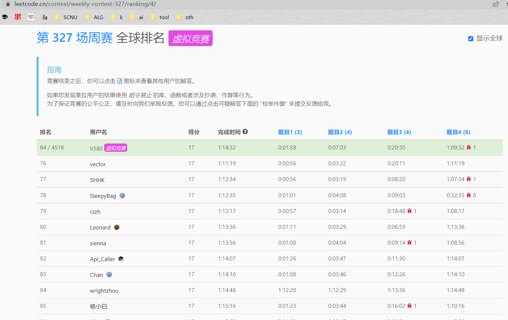

因为 `md` 太大加载太慢，所以分开多个 `leetcode`。记录算法题。

## 目录

### 旧

即 `leetcode.md` 的

#### 力扣

##### 题单

- 4\. 寻找两个正序数组的中位数

  **分治(二分)**

- 10\. 正则表达式匹配

  **DP 字符串**

- 23\. 合并K个升序链表

  堆

- 25\. K 个一组翻转链表

  模拟

- 30\. 串联所有单词的子串

  滑动窗口 STL

- 32\. 最长有效括号

  **DP / 贪心** / (前缀和 + 二分 + 树状数组)

- 37\. 解数独

  DFS

- 41\. 缺失的第一个正数

  模拟(mex)

- 42\. 接雨水

  前缀和 / <u>单调栈 / 双指针</u>

- 44\. 通配符匹配

  **DP 字符串** / **AC自动机**

- 51\. N皇后

  DFS

- 60\. 排列序列

  模拟(康托展开)

- 65\. 有效数字

  模拟(自动机/regex)

- 68\. 文本左右对齐

  模拟

- 72\.编辑距离

  DP 字符串

- 76\.最小覆盖子串

  滑动窗口

- 84\.柱状图中的最大矩形

  <u>单调栈</u> / ST表

- 85\.最大矩形

  悬线法 / <u>单调栈</u>

- 87\.扰乱字符串

  **记忆化DFS/DP**

- 115\.不同的子序列

  <u>DP</u>

- 123\.买卖股票的最佳时机III

  <u>DP</u> / 前缀和

- 124\.二叉树中的最大路径和

  DFS

- 126\.单词接龙II

  毒瘤卡常爆搜

- 132\.分割回文串II

  <u>DP</u> / DP+字符串哈希

- 140\.单词拆分II

  模拟DFS

- 149\.直线上最多的点数

  <u>枚举+STL</u> / 随机化

- 154\.寻找旋转排序数组中的最小值II

  **二分**

- 164\.最大间距

  基数排序

- 174\.地下城游戏

  **DP**

- 188\.买卖股票的最佳时机IV

  **DP** / **wqs二分**

- 212\.单词搜索II

  模拟DFS

- 214\.最短回文串

  manacher / 字符串哈希 / <u>KMP</u>

- 218\.天际线问题

  小模拟+(对顶堆 / <u>堆</u>)

- 220\.存在重复元素III

  滑动窗口+STL二分 / <u>滑动窗口+STL</u>

- 224\.基本计算器

  模拟(栈)

- 233\.数字1的个数

  思维 / <u>数位DP</u>

- 239\.滑动窗口最大值

  滑动窗口+(对顶堆 / <u>堆</u> / <u>单调队列</u>) / <u>ST表/分块</u>

- 273\.整数转英文表示

  模拟

- 282\.给表达式添加运算符

  模拟+DFS

- 295\.数据流的中位数

  对顶堆

- 297\.二叉树的序列化与反序列化

  DFS

- 301\.删除无效的括号

  DFS / <u>枚举子集</u>

- 312\.戳气球

  区间DP

- 315\.计算右侧小于当前元素的个数

  权值树状数组 / <u>归并排序</u> / <u>平衡树</u>

- 982\.按位与为零的三元组

  **<u>FWT</u> / <u>高维前缀和</u>** / <u>桶枚举</u> / bitset优化枚举

- 321\.拼接最大数

  (**单调栈+反悔贪心**(+后缀数组/后缀自动机)) / **子序列自动机**

- 327\.区间和的个数

  平衡树(pb\_ds) / <u>归并排序</u> / 线段树+离散化

- 329\.矩阵中的最长递增路径

  BFS/DFS/DP

- 330\.按要求补齐数组

  **贪心**

- 332\.重新安排行程

  欧拉图 DFS/Hierholzer

- 335\.路径交叉

  **思维**

- 1617\.统计子树中城市之间最大距离

  树直径+并查集判树+枚举子集 / <u>floyd+记忆化DFS/DP</u>

- 336\.回文对

  字符串哈希 / (trie+manacher)

- 352\.将数据流变为多个不相交区间

  模拟(链表/STL)

- 354\.俄罗斯套娃信封问题

  **单调栈+二分 (LIS)**

- 2488\.统计中位数为k的子数组

  前缀和 桶枚举

- 363\.矩形区域不超过k的最大数值和

  **二分优化枚举**
  
- 381\.O(1)时间插入、删除和获取随机元素-允许重复

  数据结构 STL <u>swap优化</u>
  
- 391\.完美矩阵

  (线段树+离散化+扫描线) / <u>扫描线</u> / <u>思维</u> / <u>格林公式</u>
  
- 407\.接雨水II

  **BFS+堆优化**
  
- 1626\.无矛盾的最佳球队

  DP <u>+树状数组优化</u>
  
- 410\.分割数组的最大值

  二分答案+贪心 / <u>DP</u>

- 1630\.等差子数组

  模拟 / <u>数学优化</u>

- 420\.强密码检测器

  **思维**
  
- 1032\.字符流

  <u>AC自动机</u> / 字符串哈希
  
- 1574\.删除最短的子数组使剩余数组有序

  <u>双指针</u> / 二分 

- 432\.全O(1)的数据结构

  哈希表+链表
  
- 1638\.统计只差一个字符的子串数目

  字符串哈希 / <u>枚举</u> / <u>DP</u>
  
- 1092\.最短公共超序列

  **DP**

- 1641\.统计字典序元音字符串的数目

  高阶前缀和 / DP
  
- 1039\.多边形三角剖分的最低得分

  <u>DP</u>
  
- 1053\.交换一次的先前排列

  <u>贪心</u> / STL二分
  
- 1000\.合并石子的最低成本

  **DP**
  
- 2417\.公因子的数目

  枚举 / <u>gcd优化</u>
  
- 1017\.负二进制转换

  模拟 进制
  
- 1040\.移动石子直到连续II

  思维+STL / 双指针

- 3\.无重复字符的最长子串

  双指针 / <u>前向星</u>
  
- 1125\.最小的必要团队

  BFS 状压
  
- 1147\.段式回文

  字符串哈希 贪心 双指针
  
- 1023\.驼峰式匹配

  小模拟 / <u>正则</u>
  
- 1157\.子数组中占绝大多数的元素

  **随机化+二分** / **摩尔投票+线段树**

- 2409\.统计共同度过的日子数

  日期 模拟 / <u>优化</u>
  
- 1026\.节点与其祖先之间的最大差值

  DFS
  
- 1043\.分隔数组以得到最大和

  **DP**
  
- 1187\.使数组严格递增

  DP+二分 / <u>优化</u>
  
- 1027\.最长等差数列

  DP
  
- 1105\.填充书架

  DP
  
- 1163\.按字典序排在最后的子串

  后缀数组 / <u>双指针</u>
  
- 1031\.两个非重叠子数组的最大和

  前缀和 / <u>DP+滑动窗口</u>
  
- 1048\.最长字符串链

  DP / 拓扑排序 / <u>后缀自动机</u>
  
- 1172\.餐盘栈

  数据结构
  
- 2423\.删除字符使频率相同

  STL
  
- 1003\.检查替换后的词是否有效

  贪心
  
- 2106\.摘水果

  前缀和 / <u>滑动窗口</u>
  
- 1419\.数青蛙

  贪心 小模拟
  
- 1010\.总持续时间可被60整除的歌曲

  枚举
  
- 1263\.推箱子

  BFS套BFS
  
- 1015\.可被k整除的最小整数

  数论
  
- 1016\.子串能表示从1到N的数字的二进制串

  枚举 / <u>滑动窗口+数学</u>
  
- 1330\.翻转子数组得到最大的数组值

  **思维**
  
- 1054\.距离相等的条形码

  STL
  
- 1335\.工作计划的最低难度

  DP / <u>单调栈优化</u>
  
- 2446\.判断两个事件是否存在冲突

  日期
  
- 1073\.负二进制数相加

  模拟
  
- 1079\.活字印刷

  DFS / <u>DP</u>
  
- 2514\.统计同位异构字符串数目

  组合数学
  
- LCP33\.蓄水

  贪心 <u>+优先队列</u>

- 1373\.二叉搜索子树的最大键值和

  DFS
  
- 1080\.根到叶路径上的不足节点

  DFS
  
- 1090\.受标签影响的最大值

  贪心
  
- 1377\.T秒后青蛙的位置

  DFS
  
- 2451\.差值数组不同的字符串

  模拟
  
- 1093\.大样本统计

  模拟
  
- 1439\.有序矩阵中的第k个最小数组和

  STL <u>+归并优化</u> <u>+DP剪枝</u> / <u>二分答案+DFS</u>
  
- 1110\.删点成林

  DFS

- 1130\.叶值的最小代价生成树

  区间DP / <u>单调栈</u>
  
- 2517\.礼盒的最大甜蜜度

  二分答案+STL / <u>二分答案</u>
  
- 2559\.统计范围内的元音字符串数目

  前缀和
  
- 1156\.单字符重复子串的最大长度

  小模拟 / 滑动窗口
  
- 2611\.老鼠和奶酪

  排序 / 优先级队列
  
- 1240.铺瓷砖

  **DFS**
  
- 2699\.修改图中的边权

  **Dijkstra序贪心** / **二分+最短路**
  
- 1170\.比较字符串最小字母出现频次

  前缀和
  
- 1171\.从链表中删去总和值为零的连续节点

  前缀和 STL 链表 / <u>优化</u>
  
- 1483\.树节点的第k个祖先

  树上k级祖先
  
- 2475\.数组中不等三元组的数目

  枚举 / <u>排序+指针</u> / <u>STL</u>
  
- 1375\.二进制字符串前缀一致的次数

  树状数组 / <u>思维</u>
  
- 1177\.构建回文串检测

  前缀和 / <u>前缀异或和</u>
  
- 1494\.并行课程 II

  DFS+BFS / <u>子集枚举</u>
  
- 2481\.分割圆的最少切割次数

  思维

- 1254\.统计封闭岛屿的数目

  BFS / DFS / 并查集
  
- 1262\.可被三整除的最大和

  贪心+二维DP / <u>贪心</u> / <u>DP</u>
  
- 1595\.连通两组点的最小成本

  **网络流** / **状压DP**
  
- LCP41\.黑白翻转棋

  模拟 / <u>BFS</u>
  
- 16\.19\.水域大小

  BFS
  
- 1659\.最大化网格幸福感

  <u>状压DP</u> / <u>轮廓线优化</u>
  
- 1401\.圆和矩形是否有重叠

  计算几何 / <u>思维</u>
  
- 2485\.找出中枢整数

  数学
  
- 1186\.删除一次得到子数组最大和

  **DP**
  
- 1681\.最小不兼容性

  **状压DP+枚举子集**
  
- 1253\.重构2行二进制矩阵

  构造
  
- 2490\.回环句

  小模拟
  
- 443\.两数相加II

  模拟链表
  
- 2178\.拆分成最多数目的正偶数之和

  贪心 构造
  
- 167\.两数之和 II - 输入有序数组

  二分 / <u>双指针</u>
  
- 15\.三数之和

  二分 / <u>双指针</u>
  
- 16\.最接近的三数之和

  二分 / <u>双指针</u>
  
- 1911\. 最大子序列交替和

  贪心 / <u>DP</u>
  
- 979\.在二叉树中分配硬币

  <u>DFS</u> / LCA+网络流
  
- 18\.四数之和

  二分 / 双指针
  
- 834\.树中距离之和

  树上DP
  
- 415\.字符串相加

  高精度
  
- 1851\.包含每个查询的最小区间

  离线 STL
  
- 918\.环形子数组的最大和

  前缀和+可删堆 / <u>前缀和+单调队列</u> / <u>DP</u>
  
- 1499\.满足不等式的最大值

  单调队列 / 堆
  
- 2050\.并行课程 III

  拓扑 / 记忆化DFS
  
- 141\.环形链表

  双指针 / 哈希表
  
- 142\.环形链表II

  <u>双指针</u> / 哈希表
  
- 143\.重排链表

  <u>双指针</u> / 模拟 
  
- 2681\.英雄的力量

  DP / 数学

- 822\.翻转卡片游戏

  小模拟 STL
  
- 21\.合并两个有序链表

  链表
  
- 980\.不同路径III

  BFS / DFS
  
- 1749\.任意子数组和的绝对值的最大值

  前缀和
  
- 1289\.下降路径最小和II

  DP 前缀和
  
- 88\.合并两个有序数组

  双指针
  
- 833\.字符串中的查找与替换

  模拟+双指针
  
- 1444\.切披萨的方案数

  DP+二维前缀和
  
- 1388\.3n 块披萨

  **DP** / **反悔贪心**
  
- 2337\.移动片段得到字符串

  贪心
  
- 849\.到最近的人的最大距离

  枚举 / 链表/前缀和
  
- 1782\.统计点对的数目

  二分 / <u>双指针</u>
  
- 225\.汇总区间

  小模拟
  
- 56\.合并区间

  排序
  
- 57\.插入区间

  小模拟
  
- 440\.字典序的第k小数字

  **DFS+trie**
  
- 823\.带因子的二叉树

  DP (+ <u>双指针优化</u>)

- 446\.等差数列划分 II

  **DP**

- 1654\.到家的最少跳跃次数

  <u>BFS</u>

- 458\.可怜的小猪

  思维+DP / <u>DP+组合数学</u> / <u>数学</u>
  
- 1761\.一个图中连通三元组的最小度数

  枚举 / <u>bitset优化</u> / <u>排序+快速矩阵乘法</u>
  
- 2240\.买钢笔和铅笔的方案数

  枚举 / <u>类欧几里得算法</u>
  
- 2511\.最多可以摧毁的敌人城堡数目

  小模拟
  
- 1921\.消灭怪物的最大数量

  贪心
  
- 449\.序列化和反序列化二叉搜索树

  小模拟
  
- 2605\.从两个数字数组生成最小数字

  小模拟
  
- 1123\.最深叶节点的最近公共祖先

  LCA / <u>DFS</u>
  
- 2594\.修车的最少时间

  二分 / STL
  
- 630\.课程表III

  **贪心**
  
- 1462\.课程表IV

  最短路(+bitset优化) / <u>快速矩阵乘法</u>
  
- 2596\.检查骑士巡视方案

  小模拟
  
- 886\.可能的二分法

  二分图判定 DFS/<u>种类并查集</u>
  
- 198\.打家劫舍

  DP
  
- 213\.打家劫舍II

  DP
  
- 337\.打家劫舍III

  树上DP
  
- 2560\.打家劫舍IV

  二分+DP / <u>二分+贪心</u>
  
- 2591\.将钱分给最多的儿童

  贪心 / <u>DP</u>
  
- 2603\.收集树中金币

  **拓扑排序** / **树上DP**
  
- 1993\.树上的操作

  DFS / <u>DFS序+树状数组二分</u>
  
- 2582\.递枕头

  数学
  
- 146\.LRU 缓存

  STL / <u>STL+链表</u>

- 460\.LFU 缓存

  <u>STL</u> / STL+链表
  
- 2251\.花期内花的数目

  差分+离线+双指针 / <u>二分</u>
  
- 605\.种花问题

  小模拟
  
- 466\.统计重复个数

  <u>字符串模拟+思维</u>
  
- 2136\.全部开花的最早一天

  贪心
  
- 472\.连接词

  字符串哈希+DP / <u>trie+记忆化DFS</u>
  
- 479\.最大回文数乘积

  <u>爆搜</u>

- 714\.买卖股票最佳时机含手续费

  贪心/DP
  
- 309\.买卖股票最佳时期含冷冻期

  DP

- 480\.滑动窗口中位数

  对顶堆+set / <u>对顶堆+pq</u>

- 483\.最小好进制

  二分+数学 / <u>数学</u>
  
- 488\.祖玛游戏

  <u>爆搜</u>
  
- 901\.股票价格跨度

  二分+线段树 / <u>单调栈</u>
  
- 493\.翻转对

  红黑树 / <u>离散化+树状数组</u> / <u>归并排序</u>
  
- 502\.IPO

  贪心+STL
  
- 514\.自由之路

  DP
  
- 2578\.最小和分割

  <u>贪心</u> / 爆搜
  
- 2731\.移动机器人

  思维 + 前缀和/<u>组合数学</u>
  
- 571\.超级洗衣机

  **贪心**
  
- 546\.移除盒子

  **DP**
  
- 786\.第k个最小的素数分数

  排序 / <u>堆</u> / <u>二分+双指针</u>
  
- 552\.学生出勤记录II

  DP / <u>矩阵快速幂</u>
  
- 1488\.避免洪水泛滥

  贪心+STL
  
- 564\.寻找最近的回文数

  思维/贪心+小模拟
  
- 137\.只出现一次的数字II

  STL / <u>位运算</u>
  
- 260\.只出现一次的数字III

  STL / <u>位运算</u>
  
- 2652\.倍数求和

  容斥
  
- 1726\.同积元素

  STL
  
- 2316\.统计无向图中无法相互到达点对数

  DFS
  
- 1402\.做菜顺序

  贪心 / <u>贪心+前缀和</u> / <u>DP</u>
  
- 1155\.掷骰子等于目标和的方法数

  DP / 分治 MTT
  
- 2698\.求一个整数的惩罚数

  爆搜
  
- 274\.H指数

  二分答案 / 排序 / 计数排序+后缀和
  
- 275\.H指数II

  二分答案

- 2127\.参加会议的最多员工数

  **拓扑排序**(内向基环树)

- 117\. 填充每个节点的下一个右侧节点指针 II

  DFS / <u>BFS层序</u>

- 2003\.每棵子树内缺失的最小基因值

  树上启发式合并+STL / <u>树上启发式合并</u> / <u>DFS</u>
  
- 421\.数组中两个数的最大异或值

  <u>01trie</u> / <u>STL</u>
  
- 187\.重复的DNA序列

  STL / <u>STL+滑动窗口</u>
  
- 318\.最大单词长度乘积

  位运算

- 229\.多数元素II

  STL / <u>摩尔投票</u>
  
- 2586\. 统计范围内的元音字符串数

  签到
  
- 2609\.最长平衡子字符串

  枚举
  
- 2258\.逃离火灾

  <u>BFS+二分 / BFS</u>
  
- 2300\.咒语和药水的成功对数

  双指针 / 二分
  
- 715\.Range 模块

  <u>动态开点线段树 / STL模拟</u>
  
- 765\.情侣牵手

  贪心 / <u>BFS(连通分量)</u>
  
- 1334\.阈值距离内邻居最少的城市

  最短路
  
- 2760\.最长奇偶子数组

  滑动窗口 / DP
  
- 2736\.最大和查询

  **权值树状数组 / 单调栈 / 归并排序**
  
- 689\.三个无重叠子数组的最大和

  **滑动窗口+前缀和 /前缀和 / DP**
  
- 53\.最大子数组和

  前缀和 / DP / <u>分治</u>
  
- 2216\.美化数组的最少删除数

  小模拟+贪心+DP / 贪心
  
- 2304\.网格中的最小路径代价

  最短路 / DP
  
- 1410\.HTML实体解析器

  STL
  
- 2824\.统计和小于目标的下标对数目

  二分 / 双指针
  
- 1457\.二叉树中的伪回文路径

  DFS(+位运算优化)
  
- 828\.统计子串中的唯一字符

  组合数学
  
- 907\.子数组的最小值之和

  单调栈 / 单调栈+DP
  
- 1670\.设计前中后队列

  STL
  
- 2336\.无限集中的最小数字

  STL
  
- 1657\.确定两个字符串是否接近

  STL
  
- 1423\.可获得的最大点数

  <u>滑动窗口</u> / <u>后缀数组</u>
  
- 1038\.从二叉搜索树到更大和树

  DFS / <u>Morris遍历</u>
  
- 2477\.到达首都的最少油耗

  DFS / 有根树拓扑排序
  
- 2646\.最小化旅行的价格总和

  LCA + 树上DP
  
- 2008\.出租车的最大盈利

  DP
  
- 2048\.下一个更大的数值平衡数

  爆搜  / <u>枚举</u> / 打表+二分
  
- 1631\.最小体力消耗路径

  最小生成树+DFS / 二分+BFS / <u>并查集</u> / 最短路
  
- 2454\.下一个更大元素IV

  ST表+二分 / <u>单调栈</u>
  
- 2132\.用邮票贴满网格图

  二维前缀和差分
  
- 2415\.反转二叉树的奇数层

  DFS(<u>+优化</u>)
  
- 2276\.统计区间中的整数数目

  动态开点线段树 / <u>STL(珂朵莉树)</u>
  
- 746\.使用最小花费爬楼梯

  DP
  
- 162\.寻找峰值

  枚举 / <u>二分</u>
  
- 1901\.寻找峰值II

  枚举 / <u>二分</u>
  
- 2828\.判别首字母缩略词

  签到
  
- 2866\.美丽塔II

  单调栈+DP
  
- 1671\.得到山形数组的最少删除次数

  DP+前缀和 / <u>DP</u> / <u>二分+单调栈</u>
  
- 1962\.移除石子使总数最小

  STL
  
- 1954\.收集足够苹果的最小花园周长

  数学+二分/枚举
  
- 1349\. 参加考试的最大学生数

  状压DP / <u>网络流</u>
  
- 2735\.收集巧克力

  枚举(+优化) / <u>单调栈+前缀和+斜率优化</u>
  
- 2706\.购买两块巧克力

  签到
  
- 2487\.从链表中移除节点

  链表
  
- 2397\. 被列覆盖的最多行数

  DFS / 二进制枚举 / <u>Gosper's Hack</u>
  
- 1944\.队列中可以看到的人数

  静态双链表 / <u>单调栈</u>
  
- 2807\.在链表中插入最大公约数

  链表
  
- 383\.赎金信

  STL
  
- 2707\.字符串中的额外字符

  DP
  
- 2696\.删除子串后的字符串

  静态双链表 / <u>栈</u>
  
- 2182\.构造限制重复的字符串

  贪心+小模拟/双指针
  
- 83\.删除排序链表中的重复元素

  链表
  
- 82\.删除排序链表中的重复元素II

  链表
  
- 2719\.统计整数数目

  数位DP
  
- 2744\.最大字符串配对数目

  哈希
  
- 2171\.拿出最少数目的魔法豆

  前缀和 排序
  
- 2809\. 使数组和小于等于 x 的最少时间

  **排序不等式 贪心 DP**
  
- 670\.最大交换

  贪心
  
- 2765\.最长交替子数组

  小模拟(指针)
  
- 2846\.边权重均等查询

  LCA 树上前缀和
  
- 365\.水壶问题

  裴蜀定理 / 搜索 / STL
  
- 2808\.使循环数组所有元素相等

  STL
  
- 1686\.石子游戏VI

  **贪心**+博弈论
  
- LCP24\.数字游戏

  对顶堆(证明定点距离和是中位数)
  
- 1690\.石子游戏VII

  博弈论 记忆化DFS/<u>DP</u>
  
- 1696\.跳跃游戏VI

  DP+单调队列
  
- LCP30\.魔塔游戏

  贪心+优先级队列
  
- 2641\.二叉树的堂兄弟节点II

  搜索
  
- 993\.二叉树的堂兄弟节点

  搜索
  
- 236\.二叉树的最近公共祖先

  LCA 搜索
  
- 94\.二叉树的中序遍历

  DFS
  
- 144\.二叉树的前序遍历

  DFS Morris遍历
  
- 145\.二叉树的后序遍历

  DFS Morris遍历
  
- 987\.二叉树的垂序遍历

  数据结构/<u>排序</u>

- 102\.二叉树的层序遍历

  BFS
  
- 2476\.二叉搜索树最近节点查询

  DFS+二分
  
- 105\.从前序与中序遍历序列构造二叉树

  DFS 分治

- 106\.从中序与后序遍历序列构造二叉树

  DFS 分治

- 889\.根据前序和后序遍历构造二叉树

  DFS 构造

- 235\.二叉搜索树的最近公共祖先

  DFS LCA
  
- 938\.二叉搜索树的范围和

  DFS
  
- 2867\.统计树中的合法路径数目

  欧拉筛 树上DP
  
- 2673\.使二叉树所有路径值相等的最小代价

  二分治+贪心 / <u>贪心</u>
  
- 2581\.统计可能的树根数目

  DFS(换根DP)
  
- 2369\.检查数组是否存在有效划分

  DP
  
- 2368\.受限条件下可到达节点的数目

  BFS DFS 并查集
  
- 225\.用队列实现栈

  STL
  
- 1976\.到达目的地的方案数

  Dijkstra
  
- 2575\.找出字符串的可整除数组

  数论
  
- 2834\.找出美丽数组的最小和

  贪心 数学
  
- 299\.猜数字游戏

  小模拟

- 2386\.找出数组的第K大和

  **二分答案+爆搜 / 最小堆**
  
- 2129\.将标题首字母大写

  小模拟
  
- 2864\.最大二进制奇数

  签到 贪心
  
- 2789\.合并后数组中的最大元素

  贪心
  
- 2312\.卖木头块

  **DP**
  
- 2684\.矩阵中移动的最大次数

  DP DFS BFS
  
- 310\.最小高度树

  换根DP / <u>重心</u>
  
- 1793\.好子数组的最大分数

  贪心 双指针
  
- 1969\.数组元素的最小非零乘积

  贪心 构造 快速幂
  
- 2671\.频率跟踪器

  STL
  
- 2642\.设计可以求最短路径的图类

  Dijkstra
  
- 2549\.统计桌面上的不同数字

  贪心
  
- 322\.零钱兑换

  无限背包DP
  
- 522\.零钱兑换II

  **背包DP计数**
  
- 2580\.统计将重叠区间合并成组的方案数

  模拟
  
- 2617\.网格图中最少访问的格子数

  **DP+单调栈** / **BFS+并查集/set** **DP+线段树** **贪心+最小堆**
  
- 1997\.访问完所有房间的第一天

  前缀和优化DP
  
- 2908\.元素和最小的山形三元组I

  前缀和
  
- 2952\.需要添加的硬币的最小数量

  贪心
  
- 331\.验证二叉树的前序序列化

  DFS
  
- 2810\.故障键盘

  STL
  
- P1314\.聪明的质监员

  前缀和 三分/<u>二分</u>
  
- 894\.所有可能的真二叉树

  DP DFS <u>指针</u>
  
- 2192\. 邮箱无向图中一个节点的所有祖先

  DFS / 拓扑排序
  
- 1483\.树节点的第k个祖先

  倍增
  
- 1600\.王位继承顺序

  DFS
  
- 2009\.使数组连续的最少操作数

  离散前缀和 / <u>滑动窗口</u>
  
- 2529\.正整数和负整数的最大计数

  二分
  
- 1702\.修改后的最大二进制字符串

  贪心 构造
  
- 1766\.互质树

  DFS
  
- 2924\.找到冠军II

  图论/签到
  
- 924\.尽量减少恶意软件的传播

  BFS / <u>连通分量(DFS/并查集)</u>
  
- 928\.尽量减少恶意软件的传播II

  爆搜 / <u>连通分量(DFS)</u>
  
- 1883\.准时抵达会议现场的最小跳过休息次数

  DP 精度
  
- 39\.组合总和

  DFS
  
- 216\.组合总和III

  DFS / 二进制枚举
  
- 377\.组合总和IV

  DP 取模
  
- 1052\.爱生气的书店老板

  前缀和 / <u>滑动窗口</u>
  
- 2385\.感染二叉树需要的总时间

  二叉树 DFS
  
- 2739\.总行驶距离

  数学
  
- 2639\.查询网格图中每一列的宽度

  签到
  
- 1146\.快照数组

  数据结构
  
- 1329\.将矩阵按对角线排序

  模拟
  
- 2462\.雇佣k位工人的总代价

  数据结构
  
- 857\.雇佣k名工人的最低成本

  排序+优先级队列
  
- 1235\.规划兼职工作

  DP + 树状数组(区间max)/线段树/<u>二分搜索</u>
  
- 1652\.拆炸弹

  前缀和 / 滑动窗口
  
- 741\.摘樱桃

  **DP**
  
- 1463\.摘樱桃II

  DP(/+压缩数组)
  
- 2079\.给植物浇水

  模拟
  
- 2105\.给植物浇水II

  模拟
  
- 2960\.统计已测试设备

  模拟 / 差分
  
- 2391\.收集垃圾的最少总时间

  模拟
  
- 1553\.吃掉N个橘子的最少天数

  记忆化搜索 / 最短路
  
- 994\.腐烂的橘子

  BFS
  
- 2244\.完成所有任务需要的最少轮数

  贪心
  
- 2589\.完成所有任务的最少时间

  **排序+贪心 (/线段树二分/栈上前缀和+二分) / 差分约束**
  
- 1953\.你可以工作的最大周数

  贪心 构造
  
- 826\.安排工作以达到最大收益

  排序 双指针
  
- 2644\.找出可整除性得分最大的整数

  签到
  
- 1535\.找出数组游戏的赢家

  模拟 思维
  
- 2769\.找出最大的可达成数字

  签到 思维
  
- 1542\.找出最长的超赞子字符串

  **前缀异或和**
  
- 2225\.找出输掉零场或一场比赛的玩家

  签到
  
- 2831\.找出最长等值子数组

  滑动窗口
  
- 1673\.找出最具竞争力的子序列

  <u>前缀和+模拟+贪心</u> / **贪心+单调栈/ST表(维护min所在下标)**/(优先队列+滑窗)/<u>线段树+二分</u>
  
- 2903\.找出满足差值条件的下标I

  滑动窗口+二分 / 滑动窗口
  
- 1738\.找出第 k 大的异或坐标值

  前缀和 排序(nth)
  
- 2028\.找出缺失的观测数据

  构造 模拟/数学
  
- 2981\.找出出现至少三次的最长特殊子字符串I

  模拟 排序/堆
  
- 2965\.找出缺失和重复的数字

  模拟 / <u>位运算(异或)</u>
  
- 2928\.给小朋友们分糖果I

  枚举 / <u>枚举优化 / 容斥原理</u>
  
- 3067\.在带权树网络中统计可连接服务器对数目

  计数 (DFS / <u>点分治</u>)
  
- 1103\.分糖果II

  暴力 / 二分 / 数学
  
- 3072\.将元素分配到两个数组中II

  pb\_ds / <u>离散化+树状数组</u>
  
- 2938\.区分黑球与白球

  贪心 逆向/组合数学
  
- 3040\.相同分数的最大操作数目II

  爆搜
  
- 881\.救生艇

  贪心 + (multiset二分 / <u>双指针</u>)
  
- 419\.棋盘上的战舰

  BFS / 枚举
  
- 2813\.子序列最大优雅度

  排序 数据结构 贪心+枚举+模拟 / <u>反悔贪心</u>
  
- 2786\.访问数组中的位置使分数最大

  DP
  
- 2779\.数组的最大美丽值

  排序+二分 / 排序+滑动窗口 / 差分 / 离散差分 / 线段树
  
- 521\.最长特殊序列I

  签到 思维
  
- 522\.最长特殊序列II

  思维 字符串
  
- 2288\.价格减免

  小模拟 字符串
  
- 2713\.矩阵中严格递增的单元格数

  **DP**
  
- 2748\.美丽下标对的数目

  枚举
  
- LCP61\. 气温变化趋势

  签到
  
- 2663\.字典序最小的美丽字符串

  **构造 模拟 贪心**
  
- 503\.下一个更大元素 II

  单调栈
  
- 2732\. 找到矩阵中的好子集

  贪心 + 模拟/数学 <u>SOSDP</u>
  
- 2741\.特别的排列

  **状压DP**
  
- 2734\.执行子串操作后的字典序最小

  签到 贪心
  
- 2742\.给墙壁刷油漆

  01背包DP
  
- 2710\.移除字符串中的尾随零

  签到 / 正则表达式
  
- 494\.目标和

  折半搜索 / <u>01背包DP</u>
  
- 3102\.最小化曼哈顿距离

  **计算几何 曼哈顿距离 切比雪夫距离** <s>凸包直径</s>
  
- 3086\.拾起K个1需要的最少行动次数

  **中位数 贪心 前缀和 +二分/+双指针**
  
- 202\.快乐数

  STL / <u>快慢指针 / 打表</u>
  
- 2970\.统计移除递增子数组的数目I

  暴力 / <u>双指针</u>
  
- 3011\.判断一个数组是否可以变为有序

  滑动窗口+排序 / <u>滑动窗口</u>
  
- 807\.保持城市天际线

  签到
  
- 721\.账户合并

  并查集 小模拟
  
- 2959\.关闭分部的可行集合数目

  爆搜+Floyd
  
- 3112\.访问消失节点的最少时间

  Dijkstra改
  
- 3096\.得到更多分数的最少关卡数目

  前缀和 签到
  
- 2850\.将石头分散到网格图的最少移动次数

  排列/DFS爆搜 / <u>最小费用最大流</u>
  
- 1186\.删除一次得到子数组最大和

  **DP**
  
- 2101\.引爆最多的炸弹

  DFS / <u>Floyd</u>
  
- 3098\.求出所有子序列的能量和

  **DP** / ***DP+前缀和优化***
  
- 2766\.重新放置石块

  签到
  
- 2844\.生成特殊数字的最少操作

  签到 思维 字符串
  
- 2740\.找出分区值

  签到 贪心 排序
  
- 3106\.满足距离约束且字典序最小的字符串

  贪心
  
- 699\.掉落的方块

  暴力 / <u>STL+二分</u> / 线段树 / 动态开点线段树
  
- 2961\.双模幂运算

  快速幂
  
- 3111\.覆盖所有点的最少矩形数目

  贪心
  
- LCP40\.心算挑战

  反悔贪心 / +<u>nth_element 优化排序</u>
  
- 3128\.直角三角形

  签到 组合数学(乘法原理)
  
- 3143\.正方形中的最多点数

  排序+枚举 / <u>二分 / 枚举(+最值维护)</u>
  
- 572\.另一棵树的子树

  爆搜 / 树哈希 /<u> DFS序+KMP</u>
  
- 600\.不含连续1的非负整数

  数位DP
  
- 3129\.找出所有稳定的二进制数组I

  **DP / DP + 容斥原理** (生成函数优化)
  
- 1443\.收集树上所有苹果的最少时间

  DFS
  
- 3131\.找出与数组相加的整数I

  签到 排序
  
- 3132\.找出与数组相加的整数II

  枚举+排序+双指针 / <u>排序+双指针</u>
  
- 1971\.寻找图中是否存在路径

  签到 DFS

- 2540\.找到 Alice 和 Bob 可以相遇的建筑

  离线 + map二分 / <u>离线 + 堆 / 离线 + 单调栈二分 / 在线 + 线段树二分</u>
  
- 1035\.不相交的线

  DP+前缀和 / <u>LCS DP</u>

- 676\.实现一个魔法字典

  字符串 暴力/预处理 / <u>字典树+DFS</u> 
  
- 3152\.特殊数组II

  ST表 / <u>前缀和</u>
  
- 3148\.矩阵中的最大得分

  DP / <u>二维前缀和</u>
  
- 3097\.或值至少为 K 的最短子数组

  **LogTrick + 二分/滑动窗口**
  
- 3117\.划分数组得到的最小的值之和

  <u>记忆化DFS / (LogTrick(二分/滑动窗口)/ST表二分 + (单调栈/线段树)优化DP)</u>
  
- 3137\.K 周期字符串需要的最少操作次数

  签到 思维 字符串
  
- 2492\.两个城市间路径的最小分数

  DFS
  
- 802\.找到最终的安全状态

  环 DFS / <u>拓扑排序</u>
  
- 1559\.二维网格图中探测环

  DFS / <u>并查集</u>
  
- 3154\.到达第K级台阶的方案数

  组合数学 / <u>DP(记忆化DFS)</u>
  
- 3007\.价值和小于等于K的最大数字

  位运算 二分
  
- 3133\.数组最后一个元素的最小值

  位运算
  
- 3145\.大数组元素的乘积

  位运算 二分/<u>倍增</u> 差分 快速幂 扩展欧拉公式
  
- 1466\.重新规划路线

  DFS
  
- 3146\.两个字符串的排列差

  签到 STL(哈希)
  
- 698\.划分为k个相等的子集

  状压 + 记忆化DFS/<u>(优化) / DP</u>
  
- 279\. 完全平方数

  BFS / DP / <u>数学</u>
  
- 3134\.找出唯一性数组的中位数

  **二分 + 滑动窗口**
  
- 3144\.分割字符频率相等的最少子字符串

  BFS / <u>记忆化DFS / DP</u>
  
- 3153\.所有数对中数位不同之和

  组合数学 计数
  
- 1450\.在既定时间做作业的学生人数

  签到 / 差分 / 二分
  
- 2024\.考试的最大困扰度

  滑动窗口
  
- 113\.路径总和II

  DFS / BFS 输出方案
  
- 2708\.一个小组的最大实力值

  二进制枚举 / 爆搜 / <u>贪心</u>
  
- 2860\.让所有学生保持开心的分组方法数

  排序 枚举
  
- 3176\.求出最长好子序列I

  DP <u>前缀和优化</u>
  
- 977\.有序数组的平方

  滑动窗口双指针
  
- 2115\.从给定原材料中找到所有可以做出的菜

  拓扑排序
  
- 2181\.合并零之间的节点

  链表
  
- 338\.比特位计数

  二进制 DP
  
- 2552\.统计上升四元组

  **DP 组合数学 枚举**
  
- 2555\.两个线段获得的最多奖品

  滑动窗口 前缀和(max)
  
- 2576\.求出最多标记下标

  排序 贪心 二分/<u>双指针</u>
  
- 2398\.预算内的最多机器人数目

  滑动窗口 单调栈
  
- 2390\.从字符串中移除星号

  签到 栈
  
- 2332\.坐上公交的最晚时间

  模拟 双指针
  
- 815\.公交路线

  BFS
  
- 2848\.与车相交的点

  前缀和差分
  
- 2414\.最长的字母序连续子字符串的长度

  签到 模拟

- 2376\.统计特殊整数

  DFS打表+二分 / <u>数位DP / 组合数学</u>
  
- 2374\.边积分最高的节点

  签到
  
- 997\.找到小镇的法官

  签到 图论
  
- 1014\.最佳观光组合

  前缀和
  
- 2207\.字符串中最多数目的子序列

  前缀和 / <u>贪心</u>
  
- 2306\.公司命名

  **组合数学 枚举**
  
- 2535\.数组元素和与数字和的绝对差

  签到
  
- 2516\.每种字符至少取K个

  二分+前缀和 / <u>滑动窗口</u>
  
- 2286\.以组为单位定音乐会的门票

  线段树二分
  
- 2073\.买票需要的时间

  签到 数学
  
- 1845\.座位预约管理系统

  堆/优先级队列
  
- 134\.加油站

  前缀和+滑动窗口+单调队列 / <u>贪心</u>
  
- 2187\.完成旅途的最少时间

  二分答案
  
- 1227\.飞机座位分配概率

  概率 (数学归纳 / <u>DP + 错位相减优化</u>)
  
- 983\.最低票价

  DP / (<u>+双指针优化</u>)
  
- 1870\.准时到达的列车最小时速

  二分答案
  
- 1928\.规定时间内到达终点的最小花费

  **Bellman Ford+DP / Dijkstra**
  
- 871\.最低加油次数

  **DP / 贪心+堆**
  
- 1436\.旅行终点站

  签到 set
  
- 3171\.找到按位或最接近K的子数组

  二分答案+滑动窗口+卡常 / <u>位运算枚举优化(logtrick)</u> / 滑动窗口+bin / <u>滑动窗口+栈</u>
  
- 3164\.优质数对的总数II

  <u>数论 倍数(因数) 质因数分解/调和级数枚举</u>
  
- 224\.基本计算器

  栈 模拟
  
- 258\.各位相加

  数论 同余
  
- 3158\.求出出现两次数字的XOR值

  位运算 bitset
  
- 1884\.鸡蛋掉落-两枚鸡蛋

  DP / 数学
  
- 887\.鸡蛋掉落

  **DP+(二分优化/单调决策优化/逆向思维)**
  
- 3200\.三角形的最大高度

  签到 / <u>数学</u>
  
- 3194\.最小元素和最大元素的最小平均值

  签到
  
- 3193\.统计逆序对的数目

  **DP/DP+前缀和优化**
  
- 3191\.使二进制数组全部等于1的最少操作次数I

  贪心
  
- 3192\.使二进制数组全部等于1的最少操作次数II

  贪心 前缀和
  
- 908\.最小差值I

  签到 数学/思维
  
- 910\.最小差值II

  枚举 排序 贪心
  
- 386\.字典序排数

  DFS / 枚举 / 排序
  
- 3185\.构成整天的下标对数目II

  签到 枚举 计数
  
- 3175\.找到连续赢K场比赛的第一位玩家

  数据结构(队列) 模拟 思维
  
- 110\.平衡二叉树

  DFS
  
- 3180\.执行操作可获得的最大总奖励I

  DP /+滑动窗口/二分优化
  
- 3181\.执行操作可获得的最大总奖励II

  DP + bitset优化 + SPJ优化
  
- 684\.冗余连接

  <u>并查集</u> 判环
  
- 685\.冗余连接II

  <u>并查集</u> 判有向环
  
- 264\.丑数II

  堆 / <u>DP+指针优化</u>
  
- 3211\.生成不含相邻零的二进制字符串

  爆搜(DFS/二进制枚举) DP算复杂度
  
- 50\.Pow(x,n)

  快速幂
  
- 3216\.交换后字典序最小的字符串

  签到
  
- 3165\.不包含相邻元素的子序列的最大和

  **带修DP 分治 线段树**
  
- 3259\.超级饮料的最大强化能量

  DP
  
- 2479\.图中最大星和

  图 排序 / <u>快速选择排序</u>
  
- 3226\.使两个整数相等的位更改次数

  签到 位运算
  
- 638\.大礼包

  DP 记忆化DFS 多维分组背包
  
- 209\.长度最小的子数组

  滑动窗口 / 前缀和+二分
  
- 633\.平方数之和

  枚举+数学(解方程) / <u>双指针 / 数学质因数分解</u>
  
- 3222\.求出硬币游戏的赢家

  签到 数学
  
- 930\.和相同的二元子数组

  滑动窗口 / 枚举+前缀和+STL
  
- 438\.找到字符串中所有字母异位词

  滑动窗口
  
- 3255\.长度为K的子数组的能量值II

  枚举 / 滑动窗口
  
- 3235\.判断矩形的两个角落是否可达

  **计算几何 DFS/并查集**
  
- 3242\.设计相邻元素求和服务

  签到
  
- 540\.有序数组中的单一元素

  二分
  
- 1547\.切棍子的最小成本

  <u>区间DP</u>
  
- 3258\.统计满足K约束的子字符串数量I

  滑动窗口+容斥 / <u>滑动窗口</u> / 签到
  
- 3261\.统计满足K约束的子字符串数量II

  **莫队+滑动窗口 / 滑动窗口+二分+前缀和 / 滑动窗口+预处理+前缀和**
  
- 3112\.访问消失节点的最少时间

  Dijkstra最短路
  
- 3249\.统计好节点的数目

  DFS 树
  
- 3341\.到达最后一个房间的最少时间I

  Dijkstra最短路
  
- 3239\.最少翻转次数使二进制矩阵回文I

  签到
  
- 3240\.最少翻转次数使二进制矩阵回文II

  **模拟 思维**
  
- 825\.适龄的朋友

  排序+二分 / <u>排序+双指针 / 前缀和</u>

- 661\.图片平滑器

  签到 前缀和
  
- 1202\.交换字符串中的元素

  并查集
  
- 3244\.新增道路查询后的最短距离II

  二分+模拟 / <u>并查集 / 线段树</u>
  
- 3248\.矩阵中的蛇

  签到
  
- 3233\.统计不是特殊数字的数字数量

  预处理 质数筛 + 二分 / <u>离散前缀和</u>
  
- 3238\.求出胜利玩家的数目

  签到
  
- 743\.网络延迟时间

  Dijkstra 最短路
  
- 69\.x 的平方根

  签到 数学 / <u>牛顿迭代法</u>

- 632\.最小区间

  <u>贪心+指针+堆</u> / 离散化+滑动窗口+二分 / 离散化+滑动窗口

- 3206\.交替组I

  签到
  
- 3208\.交替组II

  前缀和 / 滑动窗口
  
- 3245\.交替组III

  **线段树/树状数组 + 模拟 + 二分**
  
- 3251\.单调数组对的数目II

  DP + 差分 / <u> DP + 前缀和 / 组合数学 </u>
  
- 3232\.判断是否可以赢得数字游戏

  签到
  
- 3274\.检查棋盘方格颜色是否相同

  签到
  
- 3001\.捕获黑皇后需要的最少移动次数

  思维 + 模拟 / <u>数学</u>
  
- 2056\.棋盘上有效移动组合的数目

  DFS 模拟
  
- 999\.可以被进一步捕获的棋子数

  签到 模拟
  
- 688\.骑士在棋盘上的概率

  记忆化DFS / DP
  
- 782\.变为棋盘

  **思维 构造** 位运算
  
- 935\.骑士拨号器

  DP 预处理
  
- 2717\.半有序排列

  签到 数学
  
- 2931\.购买物品的最大开销

  数学(排序不等式) 排序 贪心
  
- 3266\.K次乘运算后的最终数组II

  数学(对数) 排序 贪心 快速幂 堆 模拟
  
- 1338\.数组大小减半

  STL(哈希/排序) 贪心 
  
- 1847\.最近的房间

  离线 二分 / +双指针
  
- 3285\.找到稳定山的下标

  签到
  
- 3292\.形成目标字符串需要的最少字符串数II

  **字符串哈希+二分+贪心 / 字符串哈希+双指针+贪心 / AC自动机+DP / Z函数+贪心 / KMP+DP**
  
- 3138\.同位字符串连接的最小长度

  数学(枚举因子) STL
  
- 2545\.根据第K场考试的分数排序

  排序 签到
  
- 1387\.将整数按权重排序

  记忆化DFS 排序
  
- 855\.考场就座

  大模拟 数据结构 STL 二分
  
- 1705\.吃苹果的最大数目

  模拟 数据结构 STL 贪心
  
- 3219\.切蛋糕的最小总开销II

  **DP / 最小生成树 贪心 逆向**
  
- 3080\.字符串及其反转中是否存在同一字符串

  签到 位运算优化
  
- 3159\.查询数组中元素的出现位置

  签到
  
- 3046\.分割数组

  签到 构造

- 1366\.通过投票对团队排名

  结构体排序
  
- 1367\.二叉树中的链表

  DFS (+ 字符串哈希 / KMP)
  
- 3280\.将日期转换为二进制表示

  签到
  
- 729\.我的日程安排表I

  二分 区间
  
- 731\.我的日程安排表II

  线段树
  
- 732\.我的日程安排表III

  差分 / 线段树
  
- 2241\.设计一个ATM机器

  模拟 签到
  
- 2274\.不含特殊楼层的最大连续楼层数

  排序
  
- 3019\.按键变更的次数

  签到 字符位运算
  
- 2264\.字符串中最大的3位相同数字

  签到
  
- 3298\.统计重新排列后包含另一个字符串的子字符串数目 II

  滑动窗口
  
- 3270\.求出数字答案

  签到
  
- 2275\.按位与结果大于零的最长组合

  **位运算 计数**
  
- 2270\.分割数组的方案数

  前缀和 枚举
  
- 3065\.超过阈值的最少操作数I

  签到
  
- 3066\.超过阈值的最少操作数II

  贪心 堆(STL)
  
- 3097\.或值至少为K的最短子数组II

  滑动窗口 / <u>LogTrick后缀和 / 滑动窗口+双栈重构(无逆运算区间滑动)</u>
  
- 3287\.求出数组中最大序列值

  状压DP / <u>贪心等优化</u>
  
- 2266\.统计打字方案数

  DP 数学(乘法原理，取模) 预处理
  
- 2239\.找到最接近0的数字

  签到
  
- 2218\.从栈中取出K个硬币的最大面值和

  **DP 分组背包**
  
- 1561\.你可以获得的最大硬币数目

  排序 贪心
  
- 2920\.收集所有金币可获得的最大积分

  树上DP
  
- 2944\.购买水果需要的最少金币数

  DP / <u>DP+滑动窗口优化</u>
  
- 2412\.完成所有交易的初始最少钱数

  **贪心**
  
- 40\.组合总和II

  <u>DFS 剪枝</u>
  
- 45\.跳跃游戏II

  DP / <u>DP+滑动窗口/堆优化 贪心</u>
  
- 119\.杨辉三角II

  签到
  
- 219\.存在重复元素II

  滑动窗口
  
- 350\.两个数组的交集II

  签到 STL
  
- 541\.反转字符串II

  签到 字符串
  
- 81\.搜索旋转排序数组II

  二分
  
- 598\.区间加法II

  思维 签到 数学
  
- 680\.验证回文串II

  签到 模拟 字符串
  
- 922\.按奇偶排序数组II

  签到 双指针
  
- 90\.子集II

  爆搜 DFS/二进制枚举
  
- 47\.全排列II

  爆搜 DFS/二进制枚举
  
- 80\.删除有序数组中的重复项II

  双指针 / 栈
  
- 63\.不同路径II

  DP
  
- 59\.螺旋矩阵II

  模拟 签到
  
- 913\.猫和老鼠

  **DP 拓扑排序 博弈论**
  
- 1728\.猫和老鼠 II

  DP 拓扑排序 博弈论
  
- 1760\.袋子里最少数目的球

  二分答案
  
- 1742\.盒子中小球的最大数目

  签到 枚举 / <u>预处理+前缀和 / 数位DP</u>
  
- 1552\.两球之间的磁力

  二分答案
  
- 1706\.球会落何处

  模拟
  
- 1299\.将每个元素替换为右侧最大元素

  签到 前缀和
  
- 1287\.有序数组中出现次数超过25%的元素

  签到 / 二分
  
- 624\.数组列表中的最大距离

  枚举 区间 思维

- 2595\.奇偶位数

  签到 位运算
  
- 2209\.用地毯覆盖后的最少白色砖块

  **DP**
  
- 2506\.统计相似字符串对的数目

  签到 数学 计数

### 新

- 1206\.设计跳表

  STL / <u>数据结构</u>

- 1656\.设计有序流

  签到 STL
  
- 2502\.设计内存分配器

  模拟 / <u>线段树二分</u>
  
- 2466\.统计构造好字符串的方案数

  DP
  
- 740\.删除并获得点数

  DP
  
- 3405\.统计恰好有 K 个相等相邻元素的数组数目

  <u>数学</u>
  
- 1472\.设计浏览器历史记录

  STL
  
- 2320\.统计放置房子的方式数

  DP / <u>DP+乘法原理</u>
  
- 2353\.设计食物评分系统

  STL
  
- 131\.分割回文串

  DFS
  
- 1278\.分割回文串III

  DP
  
- 2606\.找到最大开销的子字符串

  前缀和(/DP)

- 1745\.分割回文串IV

  DP / <u>manacher</u>
  
- 1328\.破坏回文串

  贪心 分类讨论
  
- 1191\.K次串联后最大子数组和

  前缀和

- 2321\.拼接数组的最大分数

  前缀和 / DP
  
- 2588\.统计美丽子数组数目

  位运算 前缀和 STL
  
- 2070\.每一个查询的最大美丽值

  排序 离线+双指针/<u>在线+前缀和+二分</u>
  
- 2269\.找到一个数字的K美丽值

  签到 数学(取模)
  
- 2597\.美丽子集的数目

  爆搜 / <u>DP+组合数学</u>
  
- 152\.乘积最大子数组

  DP
  
- 2012\.数组美丽值求和

  前缀和
  
- 3306\.元音辅音字符串计数II

  滑动窗口
  
- 3340\.检查平衡字符串

  签到
  
- 3110\.字符串的分数

  签到
  
- 2614\.对角线上的质数

  签到

- 1963\.使字符串平衡的最小交换次数

  贪心(括号序列)
  
- 2272\.最大波动的子字符串

  **DP**
  
- 2610\.转换二维数组

  STL / 排序
  
- 3418\.机器人可以获得的最大金币数

  DP
  
- 2612\.最少翻转操作数

  **BFS + (STL/并查集/笛卡尔树)优化**

- 1937\.扣分后的最大得分

  **DP+前缀和优化**
  
- 1143\.最长公共子序列

  DP

- 718\.最长重复子数组

  DP / 二分+字符串哈希
  
- 2680\.最大或值

  贪心+前缀和 / <u>贪心+位运算</u>

- 2787\.将一个数字表示成幂的和的方案数

  背包DP
  
- 2643\.一最多的行

  签到

- 2116\.判断一个括号字符串是否有效

  **括号序列 数学/STL/贪心**
  
- 2255\.统计是给定字符串前缀的字符串数目

  签到
  
- 2829\.k-avoiding数组的最小总和

  贪心 / 数学优化
  
- 2712\.使所有字符相等的最小成本

  前缀和 / <u>思维</u>
  
- 2716\.最小化字符串长度

  签到 STL/位运算 思维

- 2109\.向字符串添加空格

  模拟 字符串
  
- 2360\.图中的最长环

  DFS tarjan 内向基环树 

- 2711\.对角线上不同值的数量差

  前缀和 / 位运算 + 模拟(对角线)
  
- 2278\.字母在字符串中的百分比

  签到
  
- 2140\.解决智力问题

  DP
  
- 2874\.有序三元组中的最大值II

  前缀和(DP)
  
- 1863\.找出所有子集的异或总和再求和

  爆搜 / <u>数学+位运算</u>
  
- 368\.最大整除子集

  DP/最长路(拓扑排序) 数论
  
- 416\.分割等和子集

  DP(背包)
  
- 3375\.使数组的值全部为K的最少操作次数

  排序/map(unique)
  
- 435\.无重叠区间

  **贪心**
  
- 2999\.统计强大整数的数目

  <u>数位DP / 组合数学</u>
  
- 2843\.统计对称整数的数目

  枚举 / 预处理+前缀和 / <u>数位DP</u>
  
- 3272\.统计好整数的数目

  组合数学
  
- 1922\.统计好数字的数目

  快速幂
  
- 1534\.统计好三元组

  枚举 / <u>前缀和</u>

- 2179\.统计数组中好三元组数目

  树状数组
  
- 2537\.统计好子数组的数目

  滑动窗口
  
- 2176\.统计数组中相等且可以被整除的数对

  枚举 / <u>数学</u>
  
- 2364\.统计坏数对的数目

  STL

- 2563\.统计公平数对的数目

  STL+二分 / <u>二分</u> / <u>二分+双指针</u>
  
- 781\.森林中的兔子

  STL 数学
  
- 2145\.统计隐藏数组数目

  前缀和
  
- 2338\.统计理想数组的数目

  数论(质因数分解+组合数学)
  
- 1399\.统计最大组的数目

  枚举 / <u>数位DP</u>
  
- 2444\.统计定界子数组的数组

  滑动窗口
  
- 3392\.统计符合条件长度为3的子数组数目

  签到
  
- 2302\.统计得分小于K的子数组数目

  滑动窗口
  
- 2962\.统计最大元素出现至少K次的子数组

  枚举 / 滑动窗口
  
- 1295\.统计位数为偶数的数字

  签到
  
- 2071\.你可以安排的最多任务数目

  **二分+贪心+STL**

- 838\.推多米诺

  模拟 / BFS

- 1007\.行相等的最少多米诺旋转

  枚举 / <u>贪心</u>

- 1128\.等价多米诺骨牌对的数量

  STL 哈希 计数

- 790\.多米诺和托米诺

  <u>DP / 矩阵快速幂</u>

- 1920\.基于排列构建数组

  签到
  
- 3341\.到达最后一个房间的最少时间I

  Dijkstra

- 3342.到达最后一个房间的最少时间II

  Dijkstra
  
- 3343\.统计平衡排列的数目

  **DP/记忆化搜索 组合数学**
  
- 2918\.数组的最小相等和

  思维 签到
  
- 1550\.存在连续三个奇数的数组

  签到

- 2094\.找出3位偶数

  签到 枚举
  
- 3335\.字符串转换后的长度I

  枚举

- 3337\.字符串转换后的长度II

  DP 矩阵快速幂
  
- 2900\.最长相邻不相等子序列I

  签到 贪心

- 2901.最长相邻不相等子序列II

  BFS / DP / <u>子序列DP</u>
  
- 79\.颜色分类

  排序 / 双指针

- 1931\.用三种不同颜色为网格涂色

  状压DP / <u>矩阵快速幂</u>
  
- 3024\.三角形类型

  签到
  
- 3355\.零数组变换I

  差分
  
- 3356.零数组变换II

  二分 差分

- 3362.零数组变换III

  贪心 差分 堆 排序
  
- 3068\.最大节点价值之和

  树上DP / 思维+图论+DP

- 2942\.查找包含给定字符的单词

  签到
  
- 2131\.连接两字母单词得到的最长回文串

  贪心 字符串
  
- 1857\.有向图中最大颜色值

  拓扑排序DP / 记忆化DFS
  
- 3372\.连接两棵树后最大目标节点数目I

  枚举 DFS

- 3373\.连接两棵树后最大目标节点数目II

  树上DP(换根)
  
- 1298\.你能从盒子里获得的最大糖果数

  BFS

- 909\.蛇梯棋

  BFS
  
- 3403\.从盒子中找出字典序最大的字符串I

  枚举 字符串 / 后缀数组 / <u>枚举优化</u>
  
- 1061\.按字典序排列最小的等效字符串

  并查集

- 2434\.使用机器人打印字典序最小的字符串

  贪心 <u>+前缀和</u>

- 3170\.删除星号以后字典序最小的字符串

  贪心 <u>+位运算</u>
  
- 3442\.奇偶频次间的最大差值I

  签到

- 3445.奇偶频次间的最大差值II

  **滑动窗口+前缀和**

- 3423\.循环数组中相邻元素的最大差值

  签到

- 2616\.最小化数对的最大差值

  **二分 DP 排序 差分 贪心**
  
- 2566\.替换一个数字后的最大差值

  枚举 / 贪心

- 1432\.改变一个整数能得到的最大差值

  枚举 / 贪心
  
- 2016\.增量元素之间的最大差值

  前缀和
  
- 2966\.划分数组并满足最大差限制

  排序 贪心
  
- 3443\.K次修改后的最大曼哈顿距离

  **枚举 前缀和**
  
- 2138\.将字符串拆分为若干长度为k的组

  签到
  
- 2081\.k镜像数字的和

  枚举 模拟(回文，进制) 
  
- 2200\.找出数组中的所有K近邻下标

  签到 / 差分 / 滑动窗口
  
- 2040\.两个有序数组的第K小乘积

  二分+二分/滑动窗口
  
- 2311\.小于等于K的最长二进制子序列

  贪心

- 2014\.重复K次的最长子序列

  **爆搜 / +子序列自动机**
  
- 2099\.找到和最大的长度为K的子序列

  排序 贪心
  
- 1498\.满足条件的子序列数目

  排序 二分/双指针 组合数学
  
- 594\.最长和谐子序列

  签到 STL
  
- 3330\.找到初始输入字符串I

  签到 计数 思维

- 3333\.找到初始输入字符串II

  **多项式FFT(生成函数) / 背包+前缀和**
  
- 3304\.找出第K个字符I

  签到

- 3307\.找出第K个字符II

  递归(位运算)
  
- 1394\.找出数组中的幸运数

  签到
  
- 1865\.找出和为指定值的下标对

  数据结构(STL, 哈希) 枚举
  
- 1353\.最多可以参加的会议数目

  **排序 贪心 STL(堆)/并查集**
  
- 3136\.有效单词

  签到
  
- 3201\.找出有效子序列的最大长度I

  贪心 分类讨论
  
- 3202\.找出有效子序列的最大长度II

  DP
  
- 1957\.删除字符使字符串变好

  签到

- 1948\.删除系统中的重复文件夹

  树哈希 / 字典树

- 1695\.删除子数组的最大得分

  滑动窗口

- 1233\.删除子文件夹

  字符串哈希 / 排序
  
- 1717\.删除子字符串的最大得分

  **贪心**
  
- 2322\.从树中删除边的最小分数

  LCA 枚举
  
- 3487\.删除后的最大子数组元素和

  STL 签到 贪心

- 1290\.二进制链表转整数

  签到

- 2410\.运动员和训练师的最大匹配数

  排序 双指针 贪心

- 3169\.无需开会的工作日

  排序 指针(区间) / 离散化 差分 前缀和
  
- 3440\.重新安排会议得到最多空余时间II

  枚举 + 前缀和(/max)

- 3439.重新安排会议得到最多空余时间I

  滑动窗口

- 1900\.最佳运动员的比拼回合

  记忆化搜索 / <u>DP / **贪心(分类讨论,数学)**</u>

- 1353\.最多可以参加的会议数目

  贪心 排序 STL(堆) / <u>并查集</u>

- 1751\.最多可以参加的会议数目II

  离散化+DP / **排序+DP+二分**

- 2163\.删除元素后和的最小差值

  枚举(前后缀分解) STL(堆) 

- 3480\.删除一个冲突对后最大子数组数目

  **枚举(区间) 双指针 思维**
  
- 2411\.按位或最大的最小子数组长度

  ST表+二分 / logtrick
  
- 2419\.按位与最大的最长子数组

  思维 位运算
  
- 2683\.相邻值的按位异或

  位运算 枚举+构造 / 思维
  
- 118\.杨辉三角

  签到
  
- 2561\.重排水果

  贪心 思维
  
- 2106\.摘水果

  枚举 滑动窗口
  
- 906\.水果成篮

  滑动窗口
  
- 3477\.水果成篮II

  签到

- 3479\.水果成篮III

  线段树二分 / 分块
  
- 3363\.最多可收集的水果数目

  DP 思维
  
- 808\.分汤

  DP(记忆化搜索) 思维(剪枝)
  
- 231\.2的幂

  位运算
  
- 869\.重新排序得到2的幂

  搜索 / 打表
  
- 2438\.二的幂数组中查询范围内的乘积

  位运算(构造) 前缀和+逆元 / 前缀和 / 预处理
  
- 326\.3的幂

  签到 数学
  
- 1780\.判断一个数字是否可以表示成三的幂的和

  DP / <u>进制/倍增</u>
  
- 342\.4的幂

  签到 数学 位运算

## 算法

> 力扣其他，CF杂题，其他杂题是 `leetcode.md` 搬过来的；力扣是新的力扣常规题。

### 力扣其他

> ### 力扣比赛

#### 周赛327

**vp成绩**：



##### 2529\. 正整数和负整数的最大计数

签到题。进阶就二分 xx bound 即可。

```c++
int maximumCount(vector<int> &nums)
{
    int neg = 0, pos = 0;
    for (int i = 0, n = nums.size(); i < n; ++i)
    {
        neg += nums[i] < 0;
        pos += nums[i] > 0;
    }
    return max(neg, pos);
}
```


##### 2530\. 执行 K 次操作后的最大分数

小根堆的板子题。

```c++
long long maxKelements(vector<int> &nums, int k)
{
    using ll = long long;
    priority_queue<ll> q;
    for (int i = 0, n = nums.size(); i < n; ++i)
    {
        q.push(nums[i]);
    }
    ll ans = 0;
    while (k--)
    {
        ll x = q.top();
        q.pop();
        ans += x;
        q.push((x - 1) / 3 + 1);
    }
    return ans;
}
```


##### 2531\. 使字符串总不同字符的数目相等

暴力优化。容易发现每个字母只有前两次出现(/首次出现)是有用的，之后再出现全删了。因此可以在一遍扫描后用 $O(26^2)$ 的复杂度暴力尝试所有字母组合的交换。(写得烂，实际上写出来 $O(52^2)$，但无伤大雅)

```c++
bool isItPossible(string word1, string word2)
{
    int bin1[130] = {}, bin2[130] = {};
    int n1 = 0, n2 = 0, m1 = 0, m2 = 0;
    string s1, s2;
    auto add = [&](char c, int *bin, int &m)
    {
        if (bin[c]++ == 0)
        {
            m++;
        }
    };
    auto del = [&](char c, int *bin, int &m)
    {
        if (--bin[c] == 0)
        {
            m--;
        }
    };
    for (auto c : word1)
    {
        add(c, bin1, m1);
        if (bin1[c] <= 2)
        {
            n1++;
            s1 += c;
        }
    }
    for (auto c : word2)
    {
        add(c, bin2, m2);
        if (bin2[c] <= 2)
        {
            n2++;
            s2 += c;
        }
    }
    for (int i = 0; i < n1; ++i)
    {
        for (int j = 0; j < n2; ++j)
        {
            del(s1[i], bin1, m1);
            del(s2[j], bin2, m2);
            add(s1[i], bin2, m2);
            add(s2[j], bin1, m1);
            if (m1 == m2)
            {
                return true;
            }
            del(s1[i], bin2, m2);
            del(s2[j], bin1, m1);
            add(s1[i], bin1, m1);
            add(s2[j], bin2, m2);
        }
    }
    return false;
}
```


##### 2532\. 过桥的时间

大模拟题。按题意做即可，一眼大约 $O(t\log n)$ 的复杂度。

```c++
static long long t;
static int suc;
static int hsuc;
struct worker
{
    int i, ltr, po, rtl, pn;
    bool operator<(const worker &rhs) const
    {
        if (ltr + rtl != rhs.ltr + rhs.rtl)
        {
            return ltr + rtl < rhs.ltr + rhs.rtl;
        }
        return i < rhs.i;
    }
};
static priority_queue<worker> lq, rq;

struct event;
static bool busy;
static priority_queue<event> ev;
const static int e_finish_cross_bridge_fright = 1;
const static int e_finish_putnew = 2;
const static int e_finish_cross_bridge_fleft = 3;
const static int e_finish_putold = 4;
struct event
{
    long long t;
    int ty;
    worker w;
    void next() const
    { // 回调事件
        if (ty == e_finish_cross_bridge_fright)
        { // putnew
            busy = false;
            ++suc;
            ev.push({t + w.pn, e_finish_putnew, w});
        }
        else if (ty == e_finish_putnew)
        { // left to right
            lq.push(w);
        }
        else if (ty == e_finish_cross_bridge_fleft)
        { // putold
            busy = false;
            ++hsuc;
            ev.push({t + w.po, e_finish_putold, w});
        }
        else if (ty == e_finish_putold)
        { // right to left
            rq.push(w);
        }
    }
    bool operator<(const event &rhs) const
    {
        return t > rhs.t;
    }
};

class Solution
{
public:
    int findCrossingTime(int n, int k, vector<vector<int>> &time)
    {
        t = 0;
        suc = 0;  // 走回左岸的
        hsuc = 0; // 从旧仓库拿起的
        busy = false;
        while (!ev.empty())
        {
            ev.pop();
        }
        while (!lq.empty()) // left side waiting
        {
            lq.pop();
        }
        while (!rq.empty())
        {
            rq.pop();
        }

        for (int i = 0; i < k; ++i)
        {
            lq.push({i, time[i][0], time[i][1], time[i][2], time[i][3]});
        }

        while (suc < n)
        {
            while (!ev.empty() && ev.top().t == t)
            {
                ev.top().next();
                ev.pop();
            }
            if (!busy)
            {
                if (!rq.empty())
                {
                    worker w = rq.top();
                    rq.pop();
                    ev.push({t + w.rtl, e_finish_cross_bridge_fright, w});
                    busy = true;
                }
                else if (!lq.empty() && hsuc < n)
                {
                    worker w = lq.top();
                    lq.pop();
                    ev.push({t + w.ltr, e_finish_cross_bridge_fleft, w});
                    busy = true;
                }
            }
            if (suc < n && !ev.empty())
            {
                t = ev.top().t;
            }
        }
        return t;
    }
};
```

> 挂了一次，因为 operator 重载写炸了，太久没练手写成了：
>
> ```c++
> bool operator<(const worker &rhs) const
> {
>  if (ltr + rtl < rhs.ltr + rhs.rtl)
>  {
>      return true;
>  }
>  return i < rhs.i;
> }
> ```


#### Shell

##### 193\. 有效电话号码

[题目](https://leetcode.cn/problems/valid-phone-numbers/),任意一种：

```shell
grep -P '^(\d{3}-|\(\d{3}\) )\d{3}-\d{4}$' file.txt
sed -n -r '/^([0-9]{3}-|\([0-9]{3}\) )[0-9]{3}-[0-9]{4}$/p' file.txt
awk '/^([0-9]{3}-|\([0-9]{3}\) )[0-9]{3}-([0-9]{4})$/' file.txt
```

chatGPT:

grep 是一种在文本文件中查找文本的命令行工具。它的基本语法如下：

```sh
grep 'pattern' file
```

其中，'pattern' 是要查找的文本字符串，file 是要搜索的文件。

如果要在多个文件中搜索，可以将文件名列在命令行中：

```sh
grep 'pattern' file1 file2 file3
```

可以在目录中搜索文件，可以使用通配符。

```sh
grep 'pattern' /path/to/dir/*
```

还可以使用递归模式搜索整个目录：

```sh
grep -r 'pattern' /path/to/dir
```

grep 命令还有很多选项可用, 例如：

- -n : 显示匹配行的行号。输出如 `\d:` 格式不带空格拼接后面内容
- -i : 忽略大小写。
- -v : 显示不包含匹配字符串的行。
- -w 用于在文本文件中搜索仅完全匹配单词的文本(类似于正则的单词边界检测，即若有 `sh` 能匹配 `sh st` 不能匹配 `shst`)

可以使用 man grep 查看详细信息。

`grep -P` 是一个选项，它允许使用 Perl 正则表达式 (PCRE) 来搜索文本。

Perl 正则表达式是一种功能强大的正则表达式语言，支持许多特殊字符和模式匹配操作。例如，可以使用 PCRE 中的捕获组来匹配多个子字符串，或者使用命名组来方便地管理匹配的子字符串。

如果要使用 PCRE 来搜索文本，可以在 grep 命令中使用 -P 选项，例如：

```sh
grep -P '\d{3}-\d{2}-\d{4}' file
```

这个命令将在文件中查找所有符合美国社会安全号码格式的字符串（xxx-xx-xxxx）。

请注意，使用 -P 选项需要 PCRE 库的支持。如果系统上没有安装该库，则会提示错误信息。

另外, -P 是GNU grep独有的参数，在其他版本的 grep 中可能不支持。

假设你有一个名为 "log.txt" 的文件，其中包含多行日志信息，你想查找所有包含 "error" 的行。

可以使用以下命令来实现：

```sh
grep 'error' log.txt
```

这个命令将在 "log.txt" 中查找所有含有 "error" 的行，并将这些行的文本打印到屏幕上。


##### 195\. 第十行

[题目](https://leetcode.cn/problems/tenth-line/)。

`cut` 是一个命令行工具，用于从文本文件中删除或提取特定字段。它通常用于处理以某种字符（通常是制表符或空格）分隔的文本文件。

`cut` 的基本语法如下：

```sh
cut -f field_number -d delimiter file
```

其中，-f 指定要提取的字段，-d 指定字段之间的分隔符，file 是要处理的文件。

例如，假设你有一个文件 "data.txt"，其中包含以逗号分隔的数据，如下所示：

```
Copy codeName,Age,Gender
John,30,Male
Sara,25,Female
```

你可以使用以下命令提取第一列（Name）：

```sh
cut -f 1 -d ',' data.txt
```

输出

```
Name
John
Sara
```

也可以提取多列，例如提取第一列和第二列

```sh
cut -f 1,2 -d ',' data.txt
```

输出

```
Name,Age
John,30
Sara,25
```

第二种格式：

`cut -d: -f2` 是一个 `cut` 命令的例子。

`-d:` 指定字段之间的分隔符为冒号 (:)。

`-f2` 指定要提取的字段是第二个字段。

例如，假设你有一个文件 "data.txt"，其中包含以冒号分隔的数据，如下所示：

```
Name:Age:Gender
John:30:Male
Sara:25:Female
```

你可以使用 `cut -d: -f2` 来提取第二列（Age）:

```sh
cut -d: -f2 data.txt
```

输出

```
30
25
```

这个命令将会在文件中查找所有冒号分隔的字段，并输出第二个字段。

由此，引出第一种解法：

```sh
grep -n "" file.txt | grep -w '10' | cut -d : -f 2
```


`sed` 是一个流编辑器，用于在文本文件中执行替换、删除、插入和其他编辑操作。它在命令行中运行，可以对文本文件进行非常强大的编辑。

`sed` 的基本语法如下：

```sh
sed 's/old/new/g' file
```

其中 `s/old/new/g` 是一个替换命令，它会替换文件中所有的 "old" 为 "new"。

```sh
sed -n '10p' file.txt
```

`-n` 选项表示禁止默认输出，只有在符合特定条件时才会输出

`10p` 指令是打印第10行。


```sh
awk '{if(NR==10){print $0}}' file.txt
```

`awk` 是一种用于文本处理的命令行工具，可以轻松地对文本文件进行模式匹配、替换、计算和其他操作。

在这个命令中，`NR==10` 是一个条件，它指明 awk 只对第10行执行操作。

`{print $0}` 指令是打印整行。


加小于十行判定：

```sh
row_num=$(cat file.txt | wc -l)
echo $row_num
if [ $row_num -lt 10 ];then
    echo "The number of row is less than 10"
else
    awk '{if(NR==10){print $0}}' file.txt
fi
```

输出总行数的办法：

```sh
awk '{print NR}' file.txt | tail -n1
awk 'END{print NR}' file.txt 
grep -nc "" file.txt 
grep -c "" file.txt 
grep -vc "^$" file.txt 
grep -n "" file.txt|awk -F: '{print '}|tail -n1 | cut -d: -f1
grep -nc "" file.txt
sed -n "$=" file.txt 
wc -l file.txt 
cat file.txt | wc -l
wc -l file.txt | cut -d' ' -f1
```


##### 194\. 转置字符

[题目](https://leetcode.cn/problems/transpose-file/)

```sh
columns=$(cat file.txt | head -n 1 | wc -w)
for i in $(seq 1 $columns)
do
awk '{print $'''$i'''}' file.txt | xargs
done
```

1. 使用 `cat` 命令读取文件 file.txt 的第一行
2. 使用 `head -n 1` 命令取出第一行
3. 使用 `wc -w` 命令统计第一行的单词数，并将结果存储在变量 `columns` 中
4. 使用 `seq 1 $columns` 命令生成从 1 到 $columns 的数字序列
5. 对于序列中的每一个数字，使用 `awk '{print $i}' file.txt` 命令取出文件中第i列的值
6. 将第i列的值使用 `xargs` 命令打印到屏幕上. xargs 可将多个参数用空格隔开，如 `cat` 管道到 `xargs` 会以空格代替换行

`xargs` 是一个命令行工具，它可以将输入转换为命令行参数并执行命令。通常与其他命令结合使用，如 find, grep 等等。

`xargs` 的基本语法如下：

```sh
command | xargs [options] [command [options]]
```

其中，`command` 是输入的命令，`xargs` 将其输出作为参数传递给后面的命令。

例如，假设你有一个文件夹 /tmp 中有很多文件，你想删除所有以 .txt 结尾的文件。

```sh
\find /tmp -name '*.txt' | xargs rm
```

这个命令将使用 find 命令在 /tmp 目录中查找所有以 .txt 结尾的文件，并将这些文件名传递给 xargs 命令。xargs 命令将这些文件名作为参数传递给后面的 rm 命令，从而删除这些文件

上文莫名其妙的一堆单引号，可以改为双引号解析内部变量：

```sh
awk '{print $'"$i"'}' file.txt | xargs
```

或：(因为多余的可以认为是空串`''`，做的字符串拼接)

```sh
awk '{print $'$i'}' file.txt | xargs
```


`$()` 是 shell 中的一种特殊格式，称为命令替换。它允许将命令的输出作为参数传递给其他命令。

它的语法如下：

```sh
$(command)
```

其中，command 是要执行的命令，$() 将命令的输出作为参数传递给其他命令


##### 192\. 统计词频

[题目](https://leetcode.cn/problems/word-frequency/)

```sh
cat words.txt | tr -s ' ' '\n' | sort | uniq -c | sort -nr | awk '{ print $2, $1 }'
```

`cat` 读文件并返回每行内容

`tr` 命令用于转换或删除文件中的字符 -s：缩减连续重复的字符成指定的单个字符。在这里将任意多空格转为单个换行

`sort` 按字典序排序每一行

`uniq` 命令用于检查及删除文本文件中重复出现的行列，一般与 sort 命令结合使用。-c：在每列开头显示该行重复出现的次数，格式是 `\d` 加一个空格与原内容隔开。

再次排序，使其倒序。注意，当单词的出现次数大于10时，sort 需要考虑按数字排序，而非默认的按 ascii 码排序

然后逐行按指定格式输出，[awk参考](https://mp.weixin.qq.com/s/rIvOa5yvXFCAWiidxFz_ug)


#### 数据库

##### 175\. 组合两个表

[题目](https://leetcode.cn/problems/combine-two-tables/)

```mysql
select a.firstName, a.lastName, b.city, b.state
from Person as a left join Address as b
on a.personId = b.personId;
```

> 更优雅：
>
> ```mysql
> select FirstName, LastName, City, State
> from Person left join Address
> on Person.PersonId = Address.PersonId;
> ```


##### 176\. 第二高的薪水

[题目](https://leetcode.cn/problems/second-highest-salary/)，注意去重后的第二高

对只有一行一列的数据，可以用再次 select 的方法输出，如果查不到数据，这样输出会返回 NULL，并且可以用 as 方法重命名列名

```mysql
select 1 as colname;
```

将查询结果套到这个 select 里，即可查空输出 NULL，个人解法：先嵌套子查询找最值，然后取小于最值的最大值

```mysql
select (
    select salary from Employee
    where salary < (select max(salary) from Employee)
    order by salary desc
    limit 1
) as SecondHighestSalary
```

更优解：直接排序时加 offset

```mysql
SELECT
    (SELECT DISTINCT
            Salary
        FROM
            Employee
        ORDER BY Salary DESC
        LIMIT 1 OFFSET 1) AS SecondHighestSalary;
```

也可以套 ifnull 函数：

```mysql
SELECT
    IFNULL(
      (SELECT DISTINCT Salary
       FROM Employee
       ORDER BY Salary DESC
        LIMIT 1 OFFSET 1),
    NULL) AS SecondHighestSalary
```


##### 177\. 第N高的薪水

[题目](https://leetcode.cn/problems/nth-highest-salary/)

offset 不能是表达式只能是变量/常量不然会炸，所以先设变量

```mysql
CREATE FUNCTION getNthHighestSalary(N INT) RETURNS INT
BEGIN
  declare x int;
  set x = n-1;
  RETURN (
      # Write your MySQL query statement below.
      select (
          select distinct salary from Employee
          order by salary desc limit 1 offset x
      ) 
  );
END
```

可以把赋值塞到初始化，两行合一行：

```mysql
declare x int default N-1;
```

也可以不设变量，直接修改传入的参数：

```mysql
set N = N-1; # 或 :=
```

> chatGPT:
>
> `set n = 1` 是在 MySQL 的 SQL 查询中设置变量的语法，在这种情况下， n 将会被视为一个普通的变量。
>
> 而 `set n := 1` 是在 MySQL 的存储过程中设置变量的语法，在这种情况下，n 将会被视为一个局部变量。

[更多其他解法](https://leetcode.cn/problems/nth-highest-salary/solution/mysql-zi-ding-yi-bian-liang-by-luanz/)


##### 178\. 分数排名

[题目](https://leetcode.cn/problems/rank-scores/)

```mysql
select score,
dense_rank() over (order by score desc) as `rank` 
from Scores
```


##### 180\. 连续出现的数字

[题目](https://leetcode.cn/problems/consecutive-numbers/)

```mysql
select distinct a.Num as ConsecutiveNums
from Logs as a, Logs as b, Logs as c
where a.Id = b.Id - 1 and b.Id = c.Id - 1 and a.Num = b.Num and b.Num = c.Num
```


##### 181\. 超过经理收入的员工

[题目](https://leetcode.cn/problems/employees-earning-more-than-their-managers/) 注意读题，题意应当是每个人只有零个或一个上级经理，找到收入大于他直接上级的人

个人版用时很高的的代码(800ms+)：

```mysql
select a.name as `Employee`
from Employee as a
where a.salary > (
    select b.salary from Employee as b
    where b.id=a.managerId and a.salary>b.salary)
```

快很多(360ms)的两个相似代码：

```mysql
SELECT
    a.Name AS 'Employee'
FROM
    Employee AS a,
    Employee AS b
WHERE
    a.ManagerId = b.Id
    AND a.Salary > b.Salary
```

```mysql
SELECT
     a.NAME AS Employee
FROM Employee AS a JOIN Employee AS b
     ON a.ManagerId = b.Id
     AND a.Salary > b.Salary
```


##### 184\. 部门工资最高的员工

[题目](https://leetcode.cn/problems/department-highest-salary/)

个人效率很低的代码：(1080ms)

```mysql
select b.name as `Department`, a.name as `Employee`, a.salary as `Salary`
from Employee as a, Department as b
where a.departmentId = b.id and a.salary >= (
    select max(salary) from Employee as c
    where c.departmentId = b.id 
)
```

优化代码：(664ms)

```mysql
SELECT
    Department.name AS 'Department',
    Employee.name AS 'Employee',
    Salary
FROM
    Employee
        JOIN
    Department ON Employee.DepartmentId = Department.Id
WHERE
    (Employee.DepartmentId , Salary) IN
    (   SELECT
            DepartmentId, MAX(Salary)
        FROM
            Employee
        GROUP BY DepartmentId
	)
```


##### 185\. 部门工资前三高的所有员工

[题目](https://leetcode.cn/problems/department-top-three-salaries/)

> 注意到子查询不能带 limit(`This version of MySQL doesn't yet support 'LIMIT & IN/ALL/ANY/SOME subquery'`) 所以下面语句不能用：
>
> ```mysql
> select b.name as `Department`, a.name as `Employee`, Salary
> from Employee as a, Department as b
> where a.departmentId = b.id and
> Salary > any(
>  select c.salary from Employee as c
>  where a.departmentId = c.departmentId
>  order by salary desc limit 3
> )
> ```

修改上一题的思路，考虑：前三大，即在去重后的子查询里，最多只有两个(即 `<3`)人工资比他大，count 一下即可

```mysql
select b.name as `Department`, a.name as `Employee`, Salary
from Employee as a join Department as b
on a.departmentId = b.id
where 3 > (
    select count(distinct c.salary) from Employee as c
    where c.salary > a.salary
    and a.departmentId = c.departmentId
)
```


##### 182\. 查找重复的电子邮箱

[题目](https://leetcode.cn/problems/duplicate-emails/)

自己的弱智代码：(多余地增加了外层 select)

```mysql
select distinct a.Email from Person as a
where a.Email in (
    select b.Email from Person as b 
    group by b.Email having count(*)>1)
```

官解：

```mysql
select Email from Person group by Email having count(Email) > 1
```


##### 262\. 行程和用户

[题目](https://leetcode.cn/problems/trips-and-users/)

注意：

- 枚举类型的操作跟字符串差不多
- 联表要点(不能or合并连一次，必须连两次)
- round, sum, if 来实现计算

```mysql
select a.request_at as Day,
    round(sum(if(a.status='completed',0,1))/count(a.status),2) as `Cancellation Rate`
from Trips as a
join Users as b on a.client_id=b.users_id and b.banned='no'
join Users as c on a.driver_id=c.users_id and c.banned='no'
where a.request_at between '2013-10-01' and '2013-10-03'
group by a.request_at
```

效率高一点：

```mysql
SELECT T.request_at AS `Day`, 
	ROUND(
			SUM(
				IF(T.STATUS = 'completed',0,1)
			)
			/ 
			COUNT(T.STATUS),
			2
	) AS `Cancellation Rate`
FROM trips AS T
WHERE 
T.Client_Id NOT IN (
	SELECT users_id
	FROM users
	WHERE banned = 'Yes'
)
AND
T.Driver_Id NOT IN (
	SELECT users_id
	FROM users
	WHERE banned = 'Yes'
)
AND T.request_at BETWEEN '2013-10-01' AND '2013-10-03'
GROUP BY T.request_at
```


##### 196\.删除重复的电子邮箱

[题目](https://leetcode.cn/problems/delete-duplicate-emails/)

> 不能用下面语句，会报错为 `You can't specify target table 'Person' for update in FROM clause`
>
> ```mysql
> delete from Person
> where id not in (
>  select b.id from Person as b 
>  where b.id <= all (
>      select c.id from Person as c
>      where c.email = b.email
>  )
> )
> ```

```mysql
delete a from Person a, Person b
where a.email=b.email and a.id>b.id
```

其他方法：

```mysql
DELETE 
FROM
	Person 
WHERE
	id NOT IN 
	(SELECT t.id from (SELECT MIN(id) /*每个email分组中最小id*/as id FROM Person GROUP BY Email/*依据Email进行分组*/) t)
```


##### 601\.体育馆的流量

[题目](https://leetcode.cn/problems/human-traffic-of-stadium/)

个人不看题解的AC代码(340ms)：

```mysql
select distinct a.* from Stadium as a, Stadium as b, Stadium as c
where a.people>=100 and b.people>=100  and c.people>=100 and(
    (a.id=b.id-1 and b.id=c.id-1) or
    (a.id=b.id+1 and a.id=c.id-1) or
    (a.id=b.id+1 and b.id=c.id+1)
)
order by visit_date asc
```

372ms 的窗口函数解法，好处是适用于任意连续(上述连续几个要join几下)：

```mysql
with t1 as(
    select *,id - row_number() over(order by id) as rk
    from stadium
    where people >= 100
)

select id,visit_date,people
from t1
where rk in(
    select rk
    from t1
    group by rk
    having count(rk) >= 3
)
```

原理：如果要筛去 `<100` 的，则每次删除时会造成一个不连续，致使前后的 `id-row_number` (即未删时row number减既删时row number)的差值加至少1。所以每个连续段的差值是一致的，只要这个连续段长够3即可纳入


##### 197\.上升的温度

[题目](https://leetcode.cn/problems/rising-temperature/)

日期比较，使用 `datediff`，(472ms)

```mysql
select a.id from Weather as a, Weather as b
where datediff(a.recordDate,b.recordDate)=1 and a.Temperature>b.Temperature
```

窗口函数更快(348ms)

```mysql
select id
from
    (select 
        id,
        temperature,
        recordDate,
        lag(recordDate,1) over(order by recordDate) as last_date,
        lag(temperature,1) over(order by recordDate) as last_temperature
    from Weather) a
where temperature > last_temperature and datediff(recordDate, last_date) = 1
```

其他函数：

```mysql
select w1.Id
from Weather as w1, Weather as w2
where TIMESTAMPDIFF(DAY, w2.RecordDate, w1.RecordDate) = 1 
AND w1.Temperature > w2.Temperature
```

```mysql
select a.id 
    from weather a join weather b 
    on (a.recorddate = adddate(b.recorddate,INTERVAL 1 day))
where a.temperature > b.temperature
```

```mysql
select 
    w.Id
from Weather w
join (
    select 
        RecordDate,Temperature
    from 
        Weather
) t1
on w.RecordDate = DATE_ADD(t1.RecordDate,INTERVAL 1 day)
where w.Temperature > t1.Temperature;
```


##### 608\.树节点

[题目](https://leetcode.cn/problems/tree-node/)

个人代码：


```mysql
select id,
    case when (id in (select id from tree where isnull(p_id))) then 'Root'
    when (id in (select distinct p_id from tree)) then 'Inner'
    else 'Leaf' end as `Type`
from tree -- 或 is null 关键字而不是用函数
```

可以等价于：

```mysql
SELECT
    atree.id,
    IF(ISNULL(atree.p_id),
        'Root',
        IF(atree.id IN (SELECT p_id FROM tree), 'Inner','Leaf')) Type
FROM tree atree
```


##### 511\.游戏玩法分析I

[题目](https://leetcode.cn/problems/game-play-analysis-i/)

group by 裸题：

```mysql
select player_id, min(event_date) as first_login
from Activity group by player_id
```


##### 626\.换座位

[题目](https://leetcode.cn/problems/exchange-seats/)

if-else 题：

```mysql
select id,
    case when id%2=1 and isnull(lead(student,1) over (order by id asc))=0
        then lead(student,1) over (order by id asc)
    when id%2=0 then lag(Seat.student,1) over (order by id asc)
    else student end as `student`
from Seat
```

注意不能直接搞 min, max, count 等聚类函数，否则只会查一列。

要搞可以这么搞：

```mysql
SELECT
    (CASE
        WHEN MOD(id, 2) != 0 AND counts != id THEN id + 1
        WHEN MOD(id, 2) != 0 AND counts = id THEN id
        ELSE id - 1
    END) AS id,
    student
FROM
    seat,
    (SELECT
        COUNT(*) AS counts
    FROM
        seat) AS seat_counts
ORDER BY id ASC;
```


##### 584\.寻找用户推荐人

[题目](https://leetcode.cn/problems/find-customer-referee/)

注意 mysql 是三值比较，即有 true, false, unknown，所以要特判 null

```mysql
select name from customer where referee_id!=2 or isnull(referee_id)
```

安全等于：当两个操作数均为 NULL 时，其返回值为 1 而不为 NULL； 而当一个操作数为 NULL 时，其返回值为 0 而不为 NULL。 [ref](https://leetcode.cn/link/?target=http://c.biancheng.net/view/7191.html)

```mysql
SELECT name FROM customer WHERE NOT referee_id <=> 2;
```


##### 1393\.股票的资本损益

[题目](https://leetcode.cn/problems/capital-gainloss/)

```mysql
select stock_name,
    sum(case when operation='Buy' then -price else price end) as `capital_gain_loss`
from Stocks
group by stock_name
```

题解其他写法解法：

```mysql
select 
    stock_name, 
    sum(if(operation='Buy',-price, price)) capital_gain_loss 
from Stocks
group by stock_name
```


##### 586\.订单最多的客户

[题目](https://leetcode.cn/problems/customer-placing-the-largest-number-of-orders/)

我的实现：(一定要有 as c 不然报错，临时表必须命名)

```mysql
select c.customer_number from (
    select customer_number, count(*)
    from Orders
    group by customer_number 
    order by count(*) desc
    limit 1
) as c
```

更优雅的做法是：

```mysql
SELECT
    customer_number
FROM
    orders
GROUP BY customer_number
ORDER BY COUNT(*) DESC
LIMIT 1
```


##### 158\.市场分析I

[题目](https://leetcode.cn/problems/market-analysis-i/)

究极低效个人代码：

```mysql
select user_id as `buyer_id`, join_date, if(isnull(tmp),0,tmp) as `orders_in_2019`
from Users left join (
    select buyer_id, count(*) as tmp from Orders
    where extract(year from order_date)='2019'
    group by buyer_id
) as c on user_id=buyer_id
```

快 300ms：

```mysql
select Users.user_id as buyer_id, join_date, ifnull(UserBuy.cnt, 0) as orders_in_2019
from Users
left join (
    select buyer_id, count(order_id) cnt 
    from Orders
    where order_date between '2019-01-01' and '2019-12-31'
    group by buyer_id
) UserBuy
on Users.user_id = UserBuy.buyer_id
```


##### 595\.大的国家

[题目](https://leetcode.cn/problems/big-countries/)

慢：

```mysql
select name,population,`area` from World
where `area`>=3000000 or population>=25000000
```

快：(快一点)

```mysql
SELECT
    name, population, area
FROM
    world
WHERE
    area >= 3000000

UNION

SELECT
    name, population, area
FROM
    world
WHERE
    population >= 25000000
```


##### 596\.超过5名学生的课

[题目](https://leetcode.cn/problems/classes-more-than-5-students/)

签。

```mysql
select class from Courses
group by class
having count(*)>=5
```


##### 607\.销售员

[题目](https://leetcode.cn/problems/sales-person/)

较高效率的个人写法：

```mysql
select a.name from SalesPerson as a
where a.sales_id not in (
    select b.sales_id from Orders as b
    where b.com_id in (
        select c.com_id from Company as c
        where c.name like 'RED'
    )
)
```


##### 620\.有趣的电影

[题目](https://leetcode.cn/problems/not-boring-movies/)

签。

```mysql
select * from cinema
where id%2=1 and description not like 'boring'
order by rating desc
```


##### 627\.变更性别

[题目](https://leetcode.cn/problems/swap-salary/)

不快：

```mysql
update Salary set sex=(
    case when sex='f' then 'm' else 'f' end
)
```

比较快：

```mysql
update salary set sex = if(sex='m','f','m');
```

跟上面速度一样：

```mysql
update salary set sex = char(ascii('m') + ascii('f') - ascii(sex));
```


##### 1084\.销售分析III

[题目](https://leetcode.cn/problems/sales-analysis-iii/)

低效率：

```mysql
select product_id, product_name from Product
where product_id not in (
    select product_id from Sales
    where sale_date not between '2019-01-01' and '2019-03-31'
) and product_id in (
    select distinct product_id from Sales
)
```

一样低效率：

```mysql
select
    product_id,
    product_name
from product
where product_id in (
    select
        product_id
    from sales
    group by product_id
    having max(sale_date) <= '2019-03-31'
    and min(sale_date) >= '2019-01-01'
)
```

快 200ms:

```mysql
select
    s.product_id,
    p.product_name
from
    Sales s left join Product p
        on s.product_id = p.product_id
group by
    s.product_id
having
    min(s.sale_date) >= '2019-01-01'
        and max(s.sale_date) <= '2019-03-31'
```


##### 1141\.查询近30天活跃用户数

[题目](https://leetcode.cn/problems/user-activity-for-the-past-30-days-i/)

我的写法一：

```mysql
select activity_date as `day`,
    count(distinct user_id) as `active_users`
from Activity
where activity_date between '2019-06-28' and '2019-07-27'
group by activity_date
```

写法二：(没我的写法快)

```mysql
SELECT activity_date AS day, count(distinct user_id) AS active_users
FROM activity
WHERE DATEDIFF('2019-07-27', activity_date) >=0
AND DATEDIFF('2019-07-27', activity_date) < 30
GROUP BY activity_date;
```


##### 1148\.文章浏览I

[题目](https://leetcode.cn/problems/article-views-i/submissions/)

```mysql
select distinct author_id as id
from Views
where author_id=viewer_id
order by author_id asc
```


##### 1179\.重新格式化部门表

[题目](https://leetcode.cn/problems/reformat-department-table/)

```mysql
SELECT id, 
SUM(CASE WHEN month='Jan' THEN revenue END) AS Jan_Revenue,
SUM(CASE WHEN month='Feb' THEN revenue END) AS Feb_Revenue,
SUM(CASE WHEN month='Mar' THEN revenue END) AS Mar_Revenue,
SUM(CASE WHEN month='Apr' THEN revenue END) AS Apr_Revenue,
SUM(CASE WHEN month='May' THEN revenue END) AS May_Revenue,
SUM(CASE WHEN month='Jun' THEN revenue END) AS Jun_Revenue,
SUM(CASE WHEN month='Jul' THEN revenue END) AS Jul_Revenue,
SUM(CASE WHEN month='Aug' THEN revenue END) AS Aug_Revenue,
SUM(CASE WHEN month='Sep' THEN revenue END) AS Sep_Revenue,
SUM(CASE WHEN month='Oct' THEN revenue END) AS Oct_Revenue,
SUM(CASE WHEN month='Nov' THEN revenue END) AS Nov_Revenue,
SUM(CASE WHEN month='Dec' THEN revenue END) AS Dec_Revenue
FROM department
GROUP BY id
ORDER BY id;
```


##### 1484\.按日期分组销售产品

[题目](https://leetcode.cn/problems/group-sold-products-by-the-date/)

```mysql
select sell_date, count(distinct product) as `num_sold`,
    group_concat(distinct product order by product separator ',') as `products`
from Activities as a
group by sell_date
order by sell_date
```

或：

```mysql
SELECT sell_date,
       COUNT(DISTINCT product) num_sold,
       GROUP_CONCAT(DISTINCT product) products
FROM Activities
GROUP BY sell_date
```


##### 1407\.排名靠前的旅行者

[题目](https://leetcode.cn/problems/top-travellers/)

```mysql
select name, if(isnull(sum(distance)),0,sum(distance)) as `travelled_distance`
from Users left join Rides on Rides.user_id=Users.id
group by user_id
order by travelled_distance desc, name asc
```

效率差一点的写法：

```mysql
select
name,ifnull(travelled_distance,0) as travelled_distance
from Users
left join(
select
user_id,sum(distance) as travelled_distance 
from 
Rides 
group by user_id
)t1
on t1.user_id= Users.id
order by travelled_distance desc, name asc
```


##### 1795\.每个产品在不同商店的价格

[题目](https://leetcode.cn/problems/rearrange-products-table/)

is not null

```mysql
SELECT product_id, 'store1' store, store1 price FROM products WHERE store1 IS NOT NULL
UNION
SELECT product_id, 'store2' store, store2 price FROM products WHERE store2 IS NOT NULL
UNION
SELECT product_id, 'store3' store, store3 price FROM products WHERE store3 IS NOT NULL
```


##### 1873\.计算特殊奖金

[题目](https://leetcode.cn/problems/calculate-special-bonus/)

770ms:

```mysql
SELECT employee_id,
IF(MOD(employee_id,2)!=0 AND LEFT(name,1)!='M',salary,0) bonus
FROM Employees
ORDER BY employee_id
```

600ms:

```mysql
select employee_id, 
    case when name not like 'M%' and employee_id&1=1 then salary
    else 0 end as `bonus`
from Employees
order by employee_id asc
```

481ms:

```mysql
SELECT employee_id ,salary AS bonus
FROM Employees
WHERE employee_id%2!=0 AND name NOT LIKE ('M%')
UNION 
SELECT employee_id ,salary*0 AS bonus
FROM Employees
WHERE employee_id%2=0 OR name LIKE ('M%')
ORDER BY employee_id;
```


##### 1890\.2020年最后一次登录

[题目](https://leetcode.cn/problems/the-latest-login-in-2020/)

慢：

```mysql
select user_id, max(time_stamp) as `last_stamp`
from Logins
where extract(year from time_stamp) = '2020'
group by user_id
```

```mysql
SELECT user_id, max(time_stamp) last_stamp
FROM Logins
WHERE year(time_stamp) = 2020
GROUP BY user_id
```

```mysql
select user_id, max(time_stamp) last_stamp
from Logins
where time_stamp >= '2020-01-01 00:00:00' and time_stamp <= '2020-12-31 23:59:59'
group by user_id
```

```mysql
select user_id, max(time_stamp) as last_stamp
from logins
where datediff(time_stamp, '2020-01-01') >= 0 and datediff(time_stamp, '2021-01-01') < 0
group by user_id
```

快：

```mysql
select user_id,max(time_stamp)last_stamp from logins
where time_stamp like "2020%"
group by user_id
```


##### 1581\.进店缺未进行过交易的顾客

[题目](https://leetcode.cn/problems/customer-who-visited-but-did-not-make-any-transactions/)

1546ms:

```mysql
select customer_id, count(*) as `count_no_trans`
from Visits
where visit_id not in (select distinct visit_id from Transactions)
group by customer_id
```

1330ms:

```mysql
select v.customer_id,count(*) count_no_trans 
from Visits v 
left join Transactions t 
on (v.visit_id = t.visit_id) 
where amount is null 
group by customer_id 
```


##### 1527\.患某种疾病的患者

[题目](https://leetcode.cn/problems/patients-with-a-condition/)

```mysql
select * from Patients
where conditions like 'DIAB1%' or conditions like '% DIAB1%'
```

不能 `%DIAB1%`，考虑反例 `NOTDIAB11`

效率相近：

```mysql
SELECT * FROM PATIENTS
WHERE CONDITIONS REGEXP '^DIAB1|\\sDIAB1'
```


##### 1587\.银行账户概要II

[题目](https://leetcode.cn/problems/bank-account-summary-ii/)

910ms:

```mysql
select name, sum(amount) as `balance`
from Users, Transactions
where Users.account = Transactions.account
group by Users.account 
having sum(amount)>10000
```

750-800ms:

```mysql
select name, sum(amount) as balance
from users left join transactions on users.account = transactions.account
group by users.account
having balance > 10000
```


##### 1741\.查询每个员工花费的总时间

[题目](https://leetcode.cn/problems/find-total-time-spent-by-each-employee/)

```mysql
select event_day as `day`, emp_id, sum(out_time-in_time) as `total_time`
from Employees
group by day, emp_id
```


##### 1693\.每天的领导和合伙人

[题目](https://leetcode.cn/problems/reconstruct-itinerary/)

```mysql
select date_id, make_name, count(distinct lead_id) as `unique_leads`, 
count(distinct partner_id) as `unique_partners`
from DailySales
group by date_id, make_name
```

#### 多线程

##### 1114\.按序打印

[题目](https://leetcode.cn/problems/print-in-order/)

> 错误的：
>
> ```java
> class Foo {
> 
> private static boolean firstDone = false;
> private static boolean secondDone = false;
> 
> public Foo() {
> 
> }
> 
> public void first(Runnable printFirst) throws InterruptedException {
> 
>   // printFirst.run() outputs "first". Do not change or remove this line.
>   printFirst.run();
>   firstDone = true;
> }
> 
> public void second(Runnable printSecond) throws InterruptedException {
> 
>   // printSecond.run() outputs "second". Do not change or remove this line.
>   while (!firstDone)
>       ;
>   printSecond.run();
>   secondDone = true;
> }
> 
> public void third(Runnable printThird) throws InterruptedException {
> 
>   // printThird.run() outputs "third". Do not change or remove this line.
>   while (!secondDone)
>       ;
>   printThird.run();
> }
> }
> ```
>
>
> 换成非静态更错，会导致 TLE 的发生。
>
> 对非静态，分析如下：
>
> 每个线程有自己的工作内存(线程栈)，将用到的变量备份一份。所以最初每个线程都把 `firstDone, secondDone` 拷贝了一份。当 `firstDone` 更新时，这个更新没有通知其他线程的工作内存。
>
> 修改：被`volatile`关键字修饰的变量保证修改的值立刻更新到主存，使得其他线程需要读取时要到主存读取。所以上述变量加个 `volatile` 即可。

先看一份**错误的**代码：

```java
class Foo {

    private boolean firstDone = false;
    private boolean secondDone = false;

    public Foo() {
    }

    public void first(Runnable printFirst) throws InterruptedException {
        printFirst.run();
        firstDone = true;  
    }

    public void second(Runnable printSecond) throws InterruptedException {
        while (!firstDone)
            ;
        printSecond.run();
        secondDone = true;
    }

    public void third(Runnable printThird) throws InterruptedException {
        while (!secondDone)
            ;
        printThird.run();
    }
}
```

错误原因分析：

每个线程有自己的工作内存(线程栈)，将用到的变量备份一份。所以最初每个线程都把 `firstDone, secondDone` 拷贝了一份。当 `f1` 执行完毕时，`firstDone` 更新时，这个更新没有通知其他线程的工作内存，所以导致 `firstDone` 对其他线程一直认为是 `false` 的。

> 具体而言，JVM定义了内存模型JMM(java memory model)屏蔽硬件平台和操作系统的内存访问差异，规定所有变量存在主存，线程有自己的工作内存，所有操作在工作内存进行(不能直接对主存操作)，线程不能访问其他线程的工作内存。

被 `volatile` 关键字修饰的变量保证修改的值立刻更新到主存，使得其他线程需要读取时要到主存读取。

> 具体而言，类的成员或静态成员变量被 `volatile` 修饰后：
>
> - 保证可见性，一个线程修改值后新值对其他线程立刻可见
>
>   当写一个volatile变量时，JMM会把该线程本地内存中的变量强制刷新到主内存中去，这个写会操作会导致其他线程中的volatile变量缓存无效
>
> - 禁止进行指令重排序
>
>   即执行到volatile变量时，其前面的所有语句都执行完，后面所有语句都未执行。且前面语句的结果对volatile变量及其后面语句可见
>
> 但 volatile 不保证原子性，因为运算操作符并非原子操作，需要保证原子性可以使用下面三种方法之一：
>
> 1. synchronized
> 2. Lock 
> 3. `AtomicInteger`
>
> 由于单纯的 `firstDone = true` 操作是原子操作，所以直接使用 volatile 即可。具体而言，Java 只保证基本数据类型变量的读取和赋值是原子性操作，如：
>
> ```java
> x = 10; //原子性
> y = x; //非原子性
> x++; //非原子性
> x = x + 1; //非原子性
> ```

因此，正确代码如下：

```java
class Foo {

    private volatile boolean firstDone = false;
    private volatile boolean secondDone = false;

    public Foo() {
    }

    public void first(Runnable printFirst) throws InterruptedException {
        printFirst.run();
        firstDone = true;  
    }

    public void second(Runnable printSecond) throws InterruptedException {
        while (!firstDone)
            ;
        printSecond.run();
        secondDone = true;
    }

    public void third(Runnable printThird) throws InterruptedException {
        while (!secondDone)
            ;
        printThird.run();
    }
}
```

正确的其他：

①原子变量

```java
class Foo {

  private AtomicInteger firstJobDone = new AtomicInteger(0);
  private AtomicInteger secondJobDone = new AtomicInteger(0);

  public Foo() {}

  public void first(Runnable printFirst) throws InterruptedException {
    // printFirst.run() outputs "first".
    printFirst.run();
    // mark the first job as done, by increasing its count.
    firstJobDone.incrementAndGet();
  }

  public void second(Runnable printSecond) throws InterruptedException {
    while (firstJobDone.get() != 1) {
      // waiting for the first job to be done.
    }
    // printSecond.run() outputs "second".
    printSecond.run();
    // mark the second as done, by increasing its count.
    secondJobDone.incrementAndGet();
  }

  public void third(Runnable printThird) throws InterruptedException {
    while (secondJobDone.get() != 1) {
      // waiting for the second job to be done.
    }
    // printThird.run() outputs "third".
    printThird.run();
  }
}
```

同步锁：

```java
class Foo {
    
    private boolean firstFinished;
    private boolean secondFinished;
    private Object lock = new Object();

    public Foo() {
        
    }

    public void first(Runnable printFirst) throws InterruptedException {
        
        synchronized (lock) {
            // printFirst.run() outputs "first". Do not change or remove this line.
            printFirst.run();
            firstFinished = true;
            lock.notifyAll(); 
        }
    }

    public void second(Runnable printSecond) throws InterruptedException {
        
        synchronized (lock) {
            while (!firstFinished) {
                lock.wait();
            }
        
            // printSecond.run() outputs "second". Do not change or remove this line.
            printSecond.run();
            secondFinished = true;
            lock.notifyAll();
        }
    }

    public void third(Runnable printThird) throws InterruptedException {
        
        synchronized (lock) {
           while (!secondFinished) {
                lock.wait();
            }

            // printThird.run() outputs "third". Do not change or remove this line.
            printThird.run();
        } 
    }
}
```

##### 1115\.交替打印FooBar

[题目](https://leetcode.cn/problems/print-foobar-alternately/)

一种**错误的**超时代码如下：(n=5就超时了)

```java
class FooBar {
    private int n;
    private volatile boolean beforeBar = true;

    public FooBar(int n) {
        this.n = n;
    }

    public void foo(Runnable printFoo) throws InterruptedException {
        for (int i = 0; i < n; i++) {
            while (!beforeBar)
                ;
            printFoo.run();
            beforeBar = false;
        }
    }

    public void bar(Runnable printBar) throws InterruptedException {
        for (int i = 0; i < n; i++) {
            while (beforeBar)
                ;
            printBar.run();
            beforeBar = true;
        }
    }
}
```

错误理由：忙等太浪费 CPU，使得拉满时间片，占用了 2n 次时间片。

语法前置知识：

- synchronized了同一个对象的，同一时间只能有一个线程执行这个同步块中的代码。但不保证同步块内是原子性的。
- 将一个 Object 对象视为资源，当该对象使用 wait 方法时，阻塞掉对象所在线程。直到其他线程里被同一对象使用 notify(唤醒第一个wait的线程)或 notifyAll(唤醒所有wait的线程)
- 注意，wait 和 notify(All) 方法必须放在对该 object 自身的同步块内执行。

修改后的代码：

```java
class FooBar {
    private int n;
    private volatile boolean beforeBar = true;// 上一次打印了Bar
    private Object lock = new Object();

    public FooBar(int n) {
        this.n = n;
    }

    public void foo(Runnable printFoo) throws InterruptedException {
        for (int i = 0; i < n; i++) {
            synchronized (lock) {
                while (!beforeBar) {
                    lock.wait(); // 因lock而阻塞当前线程
                }
                printFoo.run();
                beforeBar = false;
                lock.notifyAll(); // 唤醒所有被lock阻塞的线程
                //在本题,都用notify也行
            }
        }

    }

    public void bar(Runnable printBar) throws InterruptedException {
        for (int i = 0; i < n; i++) {
            synchronized (lock) {
                while (beforeBar) {
                    lock.wait();
                }
                printBar.run();
                beforeBar = true;
                lock.notifyAll();
            }
        }
    }
}
```

为什么上述代码是可行的，考虑一种情况，线程 A 执行 foo，线程 B 执行 bar， A,B 单处理机并发，一种可能的顺序如下：(不考虑 print 等的 IO 阻塞)

1. A while 判假，直接 print foo
2. A 赋值 `beforeBar=false` 然后时间片到了让出了处理机
3. B 刚开始执行，看到 false 了所以 while 判假，print bar
4. B 继续跑，不仅弄了 `beforeBar = true` 还 `notifyAll` 了
5. B 这一轮 for 完了，下一次 while 里把自己阻塞了
6. A 顺着之前，`notifyAll` 然后时间片又到了(或者被B唤醒抢占)
7. B 被唤醒，while 走下一轮，又把自己阻塞了
8. A 继续 print foo……

> 这样写也行：(foo bar 都类似改)
>
> ```java
> for (int i = 0; i < n; i++) {
>  while (!beforeBar) {
>      synchronized (lock) { //如果改成 lock2 或别的不行
>          lock.wait(); // 因lock而阻塞当前线程
>      }
>  }
>  printFoo.run();
>  beforeBar = false;
>  synchronized (lock) {
>      lock.notify(); // 唤醒所有被lock阻塞的线程
>  }
> }
> ```


附：六种方法：

```java
//手太阴肺经 BLOCKING Queue
public class FooBar {
    private int n;
    private BlockingQueue<Integer> bar = new LinkedBlockingQueue<>(1);
    private BlockingQueue<Integer> foo = new LinkedBlockingQueue<>(1);
    public FooBar(int n) {
        this.n = n;
    }
    public void foo(Runnable printFoo) throws InterruptedException {
        for (int i = 0; i < n; i++) {
            foo.put(i);
            printFoo.run();
            bar.put(i);
        }
    }

    public void bar(Runnable printBar) throws InterruptedException {
        for (int i = 0; i < n; i++) {
            bar.take();
            printBar.run();
            foo.take();
        }
    }
}

//手阳明大肠经CyclicBarrier 控制先后
class FooBar6 {
    private int n;

    public FooBar6(int n) {
        this.n = n;
    }

    CyclicBarrier cb = new CyclicBarrier(2);
    volatile boolean fin = true;

    public void foo(Runnable printFoo) throws InterruptedException {
        for (int i = 0; i < n; i++) {
            while(!fin);
            printFoo.run();
            fin = false;
            try {
                cb.await();
            } catch (BrokenBarrierException e) {}
        }
    }

    public void bar(Runnable printBar) throws InterruptedException {
        for (int i = 0; i < n; i++) {
            try {
                cb.await();
            } catch (BrokenBarrierException e) {}
            printBar.run();
            fin = true;
        }
    }
}

//手少阴心经 自旋 + 让出CPU
class FooBar5 {
    private int n;

    public FooBar5(int n) {
        this.n = n;
    }

    volatile boolean permitFoo = true;

    public void foo(Runnable printFoo) throws InterruptedException {     
        for (int i = 0; i < n; ) {
            if(permitFoo) {
        	    printFoo.run();
            	i++;
            	permitFoo = false;
            }else{
                Thread.yield();
            }
        }
    }

    public void bar(Runnable printBar) throws InterruptedException {       
        for (int i = 0; i < n; ) {
            if(!permitFoo) {
        	printBar.run();
        	i++;
        	permitFoo = true;
            }else{
                Thread.yield();
            }
        }
    }
}


//手少阳三焦经 可重入锁 + Condition
class FooBar4 {
    private int n;

    public FooBar4(int n) {
        this.n = n;
    }
    Lock lock = new ReentrantLock(true);
    private final Condition foo = lock.newCondition();
    volatile boolean flag = true;
    public void foo(Runnable printFoo) throws InterruptedException {
        for (int i = 0; i < n; i++) {
            lock.lock();
            try {
            	while(!flag) {
                    foo.await();
                }
                printFoo.run();
                flag = false;
                foo.signal();
            }finally {
            	lock.unlock();
            }
        }
    }

    public void bar(Runnable printBar) throws InterruptedException {
        for (int i = 0; i < n;i++) {
            lock.lock();
            try {
            	while(flag) {
                    foo.await();
            	}
                printBar.run();
                flag = true;
                foo.signal();
            }finally {
            	lock.unlock();
            }
        }
    }
}

//手厥阴心包经 synchronized + 标志位 + 唤醒
class FooBar3 {
    private int n;
    // 标志位，控制执行顺序，true执行printFoo，false执行printBar
    private volatile boolean type = true;
    private final Object foo=  new Object(); // 锁标志

    public FooBar3(int n) {
        this.n = n;
    }
    public void foo(Runnable printFoo) throws InterruptedException {
        for (int i = 0; i < n; i++) {
            synchronized (foo) {
                while(!type){
                    foo.wait();
                }
                printFoo.run();
                type = false;
                foo.notifyAll();
            }
        }
    }

    public void bar(Runnable printBar) throws InterruptedException {
        for (int i = 0; i < n; i++) {
            synchronized (foo) {
                while(type){
                    foo.wait();
                }
                printBar.run();
                type = true;
                foo.notifyAll();
            }
        }
    }
}


//手太阳小肠经 信号量 适合控制顺序
class FooBar2 {
    private int n;
    private Semaphore foo = new Semaphore(1);
    private Semaphore bar = new Semaphore(0);
    public FooBar2(int n) {
        this.n = n;
    }

    public void foo(Runnable printFoo) throws InterruptedException {
        for (int i = 0; i < n; i++) {
            foo.acquire();
        	printFoo.run();
            bar.release();
        }
    }
    public void bar(Runnable printBar) throws InterruptedException {
        for (int i = 0; i < n; i++) {
            bar.acquire();
        	printBar.run();
            foo.release();
        }
    }
}
```

##### 1116\.打印零与奇偶数

[题目](https://leetcode.cn/problems/print-zero-even-odd/)

个人：

```java
class ZeroEvenOdd {
    private int n;
    private volatile boolean beforeZero = false;
    private volatile boolean beforeEven = true;
    private Object lockZero = new Object();
    private Object lockOdd = new Object();
    private Object lockEven = new Object();

    public ZeroEvenOdd(int n) {
        this.n = n;
    }

    // printNumber.accept(x) outputs "x", where x is an integer.
    public void zero(IntConsumer printNumber) throws InterruptedException {
        for (int i = 0; i < n; ++i) {
            while (beforeZero) {
                synchronized (lockZero) {
                    lockZero.wait();
                }
            }
            printNumber.accept(0);
            beforeZero = true;
            synchronized (lockOdd) {
                lockOdd.notifyAll();
            }
            synchronized (lockEven) {
                lockEven.notifyAll();
            }
        }
    }

    public void even(IntConsumer printNumber) throws InterruptedException {
        for (int i = 2; i <= n; i += 2) {
            while (!(beforeZero && !beforeEven)) {
                synchronized (lockEven) {
                    lockEven.wait();
                }
            }
            printNumber.accept(i);
            beforeEven = true;
            beforeZero = false;
            synchronized (lockZero) {
                lockZero.notifyAll();
            }
            synchronized (lockOdd) {
                lockOdd.notifyAll();
            }
        }
    }

    public void odd(IntConsumer printNumber) throws InterruptedException {
        for (int i = 1; i <= n; i += 2) {
            while (!(beforeZero && beforeEven)) {
                lockOdd.wait();
            }
            printNumber.accept(i);
            beforeEven = false;
            beforeZero = false;
            synchronized (lockZero) {
                lockZero.notifyAll();
            }
            synchronized (lockEven) {
                lockEven.notifyAll();
            }
        }
    }
}
```

[其他一堆解法](https://leetcode.cn/problems/print-zero-even-odd/solution/by-be_a_better_coder-axp4/)

[一些解法](https://leetcode.cn/problems/print-zero-even-odd/solution/java-san-chong-xing-neng-you-yue-de-jie-h4pxx/)

信号量：

```java
class ZeroEvenOdd {
    private int n;

    // 默认 zero 有一个信号量可用
    private Semaphore zero = new Semaphore(1);

    // 默认 even 和 odd 没有可用信号量
    private Semaphore even = new Semaphore(0);
    private Semaphore odd = new Semaphore(0);

    public ZeroEvenOdd(int n) {
        this.n = n;
    }

    // printNumber.accept(x) outputs "x", where x is an integer.
    public void zero(IntConsumer printNumber) throws InterruptedException {

        for (int i = 1;i <= n; i++){

            // 首次执行时， zero 有一个可用的信号量
            zero.acquire();
            printNumber.accept(0);
            if(i % 2 == 1){
                // 可以理解为 odd 增加一个信号量，这样 odd 可以继续走流程
                odd.release();
            }else{
                // 可以理解为 even 增加一个信号量， 这样 even 可以继续走流程
                even.release();
            }
        }
    }

    public void even(IntConsumer printNumber) throws InterruptedException {

        for (int i = 2; i <= n;i += 2){

            // 等待信号量，获取到了信号后，往下走
            even.acquire();

            printNumber.accept(i);

            // 发送信号量给 zero
            zero.release();
        }

    }

    public void odd(IntConsumer printNumber) throws InterruptedException {

        for (int i = 1; i <= n; i += 2){

            // 等待信号量，获取到了信号后，往下走
            odd.acquire();
            printNumber.accept(i);

            // 发送信号量给 zero
            zero.release();
        }
    }

}
```

```java
class ZeroEvenOdd {
    private int n;

    // 方法二： 不用锁，直接用 volatile
    private volatile int curValue = 0;

    public ZeroEvenOdd(int n) {
        this.n = n;
    }

    // printNumber.accept(x) outputs "x", where x is an integer.
    public void zero(IntConsumer printNumber) throws InterruptedException {

        for (int i = 1; i <= n; i++) {
            while (curValue != 0) {
                Thread.yield();
            }

            printNumber.accept(0);

            if (i % 2 == 1) {
                curValue = 1;
            } else {
                curValue = 2;
            }

        }
    }

    public void even(IntConsumer printNumber) throws InterruptedException {
        for (int i = 2; i <= n; i += 2) {
            while (curValue != 2) {
                Thread.yield();
            }

            printNumber.accept(i);
            curValue = 0;
        }
    }

    public void odd(IntConsumer printNumber) throws InterruptedException {
        for (int i = 1; i <= n; i += 2) {
            while (curValue != 1) {
                Thread.yield();
            }

            printNumber.accept(i);
            curValue = 0;
        }
    }
}
```

##### 1117\.H2O生成

[题目](https://leetcode.cn/problems/building-h2o/)

个人：

```java
package lc;

import java.util.concurrent.Semaphore;
import java.util.concurrent.atomic.AtomicInteger;

class H2O {
    private Semaphore h1 = new Semaphore(0), h2 = new Semaphore(0);
    private Semaphore o1 = new Semaphore(0), o2 = new Semaphore(0);
    private Semaphore ho1 = new Semaphore(0), ho2 = new Semaphore(0);
    private Semaphore o = new Semaphore(1), h = new Semaphore(2);
    private AtomicInteger cnt = new AtomicInteger(0);

    public H2O() {

    }

    public void hydrogen(Runnable releaseHydrogen) throws InterruptedException {
//        System.out.println("1");
        boolean isFirst;
        synchronized (cnt) {
            isFirst = cnt.get() % 2 == 1 ? true : false;
            cnt.incrementAndGet();
        }
        h.acquire();
        if (isFirst) {
            h1.release();
            ho1.release();
            h2.acquire();
            o1.acquire();
        } else {
            h2.release();
            ho2.release();
            h1.acquire();
            o2.acquire();
        }
        // releaseHydrogen.run() outputs "H". Do not change or remove this line.
        releaseHydrogen.run();
        h.release();
    }

    public void oxygen(Runnable releaseOxygen) throws InterruptedException {
//        System.out.println(2);
        o.acquire();
        o1.release();
        o2.release();
        ho1.acquire();
        ho2.acquire();
        // releaseOxygen.run() outputs "O". Do not change or remove this line.
        releaseOxygen.run();
        o.release();
    }
}

public class lc1117 {
    public static void main(String[] args) throws InterruptedException {
        Runnable h = new Runnable() {
            @Override
            public void run() {
                System.out.print("H");
            }
        };
        Runnable o = new Runnable() {
            @Override
            public void run() {
                System.out.print("O");
            }
        };
        H2O h2o = new H2O();
        for (int i = 0; i < 2; ++i) {
            new Thread(new Runnable() {
                @Override
                public void run() {
                    try {
                        h2o.hydrogen(h);
                    } catch (InterruptedException e) {
                        e.printStackTrace();
                    }
                }
            }).start();
        }
        for (int i = 0; i < 1; ++i) {
            new Thread(new Runnable() {
                @Override
                public void run() {
                    try {
                        h2o.oxygen(o);
                    } catch (InterruptedException e) {
                        e.printStackTrace();
                    }
                }
            }).start();
        }
    }
}
```

题解：

```java
class H2O {


    private Semaphore hSema = new Semaphore(2);
    private Semaphore oSema = new Semaphore(0);


    public H2O() {

    }

    public void hydrogen(Runnable releaseHydrogen) throws InterruptedException {
        hSema.acquire();
        releaseHydrogen.run();
        oSema.release();
    }

    public void oxygen(Runnable releaseOxygen) throws InterruptedException {
        oSema.acquire(2);
        releaseOxygen.run();
        hSema.release(2);
    }
}
```

[更多办法](https://leetcode.cn/problems/building-h2o/solution/chang-you-duo-xian-cheng-zhi-h2osheng-ch-8f7g/)

##### 1195\.交替打印字符串

[题目](https://leetcode.cn/problems/fizz-buzz-multithreaded/)

按序输出导致实际上每次只能同时运行一个线程。所以用一个变量表示当前应该输出哪个值，如果某个线程负责这个值就输出，否则就把自己的时间片让出去给别的线程。

因为变量值要通知给多个线程，所以可以考虑使用原子变量，或者使用 volatile 都可以。因为只能同时运行一个线程，所以不原子性也没啥问题。

原子变量：

```java
import java.util.concurrent.atomic.AtomicInteger;
import java.util.function.IntConsumer;

class FizzBuzz {
    private int n;
    private AtomicInteger cnt = new AtomicInteger(1);

    public FizzBuzz(int n) {
        this.n = n;
    }

    // printFizz.run() outputs "fizz".
    public void fizz(Runnable printFizz) throws InterruptedException {
        for (int i = 3; i <= n; i += 3) {
            if (i % 5 != 0) {
                while (cnt.get() != i) {
                    Thread.yield();
                }
                printFizz.run();
                cnt.incrementAndGet();
            }
        }
    }

    // printBuzz.run() outputs "buzz".
    public void buzz(Runnable printBuzz) throws InterruptedException {
        for (int i = 5; i <= n; i += 5) {
            if (i % 3 != 0) {
                while (cnt.get() != i) {
                    Thread.yield();
                }
                printBuzz.run();
                cnt.incrementAndGet();
            }
        }
    }

    // printFizzBuzz.run() outputs "fizzbuzz".
    public void fizzbuzz(Runnable printFizzBuzz) throws InterruptedException {
        for (int i = 15; i <= n; i += 15) {
            while (cnt.get() != i) {
                Thread.yield();
            }
            printFizzBuzz.run();
            cnt.incrementAndGet();
        }
    }

    // printNumber.accept(x) outputs "x", where x is an integer.
    public void number(IntConsumer printNumber) throws InterruptedException {
        for (int i = 1; i <= n; ++i) {
            if (i % 5 != 0 && i % 3 != 0) {
                while (cnt.get() != i) {
                    Thread.yield();
                }
                printNumber.accept(i);
                cnt.incrementAndGet();
            }
        }
    }
}
```

volatile:

```java
class FizzBuzz {
    private int n;
    private volatile int cnt = 1;

    public FizzBuzz(int n) {
        this.n = n;
    }

    // printFizz.run() outputs "fizz".
    public void fizz(Runnable printFizz) throws InterruptedException {
        for (int i = 3; i <= n; i += 3) {
            if (i % 5 != 0) {
                while (cnt != i) {
                    Thread.yield();
                }
                printFizz.run();
                ++cnt;
            }
        }
    }

    // printBuzz.run() outputs "buzz".
    public void buzz(Runnable printBuzz) throws InterruptedException {
        for (int i = 5; i <= n; i += 5) {
            if (i % 3 != 0) {
                while (cnt != i) {
                    Thread.yield();
                }
                printBuzz.run();
                ++cnt;
            }
        }
    }

    // printFizzBuzz.run() outputs "fizzbuzz".
    public void fizzbuzz(Runnable printFizzBuzz) throws InterruptedException {
        for (int i = 15; i <= n; i += 15) {
            while (cnt != i) {
                Thread.yield();
            }
            printFizzBuzz.run();
            ++cnt;
        }
    }

    // printNumber.accept(x) outputs "x", where x is an integer.
    public void number(IntConsumer printNumber) throws InterruptedException {
        for (int i = 1; i <= n; ++i) {
            if (i % 5 != 0 && i % 3 != 0) {
                while (cnt != i) {
                    Thread.yield();
                }
                printNumber.accept(i);
                ++cnt;
            }
        }
    }
}
```

[更多解法](https://leetcode.cn/problems/fizz-buzz-multithreaded/solution/chang-you-duo-xian-cheng-zhi-jiao-ti-da-eeurc/)

更好的本地调试：

```java
public static void main(String[] args) {
    Runnable printFizz = () -> {
        System.out.printf("%s", "fizz");
    };
    Runnable printBuzz = () -> {
        System.out.printf("%s", "buzz");
    };
    Runnable printFizzBuzz = () -> {
        System.out.printf("%s", "fizzbuzz");
    };
    IntConsumer intConsumer = new IntConsumer();
    FizzBuzz fb = new FizzBuzz(15);
    new Thread(() -> {
        try {
            fb.fizz(printFizz);
        } catch (InterruptedException e) {
            e.printStackTrace();
        }
    }).start();
    new Thread(() -> {
        try {
            fb.buzz(printBuzz);
        } catch (InterruptedException e) {
            e.printStackTrace();
        }
    }).start();
    new Thread(() -> {
        try {
            fb.fizzbuzz(printFizzBuzz);
        } catch (InterruptedException e) {
            e.printStackTrace();
        }
    }).start();
    new Thread(() -> {
        try {
            fb.number(intConsumer);
        } catch (InterruptedException e) {
            e.printStackTrace();
        }
    }).start();

}


public class IntConsumer {
    public void accept(int i) {
        System.out.printf("%d", i);
    }
}
```

同步量：

```java
class FizzBuzz {
    private int n;

    private Semaphore number = new Semaphore(1);
    private Semaphore fizz = new Semaphore(0);
    private Semaphore buzz = new Semaphore(0);
    private Semaphore fizzbuzz = new Semaphore(0);


    public FizzBuzz(int n) {
        this.n = n;
    }

    // printFizz.run() outputs "fizz".
    public void fizz(Runnable printFizz) throws InterruptedException {
        for (int i = 1; i <= n; i++) {
            if (i % 3 == 0 && i % 5 != 0) {
                fizz.acquire();
                printFizz.run();
                number.release();
            }
        }
    }

    // printBuzz.run() outputs "buzz".
    public void buzz(Runnable printBuzz) throws InterruptedException {
        for (int i = 1; i <= n; i++) {
            if (i % 3 != 0 && i % 5 == 0) {
                buzz.acquire();
                printBuzz.run();
                number.release();
            }
        }
    }

    // printFizzBuzz.run() outputs "fizzbuzz".
    public void fizzbuzz(Runnable printFizzBuzz) throws InterruptedException {
        for (int i = 1; i <= n; i++) {
            if (i % 3 == 0 && i % 5 == 0) {
                fizzbuzz.acquire();
                printFizzBuzz.run();
                number.release();
            }
        }
    }

    // printNumber.accept(x) outputs "x", where x is an integer.
    public void number(IntConsumer printNumber) throws InterruptedException {
        for (int i = 1; i <= n; i++) {
            number.acquire();
            if (i % 3 != 0 && i % 5 != 0) {//开始打印
                printNumber.accept(i);
                number.release();
            } else if (i % 3 == 0 && i % 5 != 0) {//fizz开始打印
                fizz.release();
            } else if (i % 3 != 0 && i % 5 == 0) {//buzz开始打印
                buzz.release();
            } else {
                fizzbuzz.release();//fizzbuzz开始打印
            }
        }
    }
}
```

##### 1226\.哲学家进餐

[题目](https://leetcode.cn/problems/the-dining-philosophers/)

设 5 个信号量 $c$，$c_i$ 表示第 $i$ 根筷子是否空闲，初始有 $c_i=1$。如果写成下面的**错误**形式：

```java
c[i].acquire();
c[(i + 1) % 5].acquire();

pickLeftFork.run();
pickRightFork.run();
eat.run();
putLeftFork.run();
putRightFork.run();

c[i].release();
c[(i + 1) % 5].release();
```

会出现死锁问题，考虑：

5 个哲学家都只执行完第一行代码(`c[i].acquire();`)就时间片到，进而导致每个哲学家都只拿了一根筷子，且等待别人拿了的另一根，满足死锁的四个条件：互斥、不可剥夺、请求和保持、循环等待。

为了打破死锁，规定每个哲学家要么同时拿起两根筷子，要么一根也不拿(即拿起一双筷子原子化)，为了实现这样的目的，可以增设一个 mutex 信号量，即：五个哲学家里，每次只允许一个哲学家拿筷子，当有哲学家将要拿筷子时，任何其他哲学家不能拿筷子。

因为拿到筷子的哲学家一定能吃，所以他拿的筷子一定会被释放，所以如果有另一位哲学家拿到一只筷子，他的等待时间是有限的，进而打破了死锁。完整代码：

```java
class DiningPhilosophers {
    Semaphore c[] = new Semaphore[5], mutex = new Semaphore(1);

    public DiningPhilosophers() {
        for (int i = 0; i < 5; ++i) {
            c[i] = new Semaphore(1);
        }
    }

    // call the run() method of any runnable to execute its code
    public void wantsToEat(int i, Runnable pickLeftFork, Runnable pickRightFork, Runnable eat,
            Runnable putLeftFork, Runnable putRightFork) throws InterruptedException {
        mutex.acquire();
        c[i].acquire();
        c[(i + 1) % 5].acquire();
        pickLeftFork.run();
        pickRightFork.run();
        mutex.release();
        eat.run();
        putLeftFork.run();
        putRightFork.run();
        c[i].release();
        c[(i + 1) % 5].release();
    }
}
```

> 思路参考：2023 王道计算机操作系统考研复习指导 P102-P103。

##### 2808\.使循环数组所有元素相等

[题目](https://leetcode.cn/problems/minimum-seconds-to-equalize-a-circular-array)

枚举每个值，求最长间隙可对应求得变为该值的最少秒数

```python
from typing import *
from collections import defaultdict
class Solution:
    def minimumSeconds(self, nums: List[int]) -> int:
        n = len(nums)
        ans = n // 2
        d = defaultdict(list)
        for i, v in enumerate(nums):
            d[v].append(i)
        for l in d:
            m, mx = len(d[l]), 0
            if m == 1:
                continue
            for i in range(m):
                x, y = d[l][i], d[l][(i + 1) % m]
                mx = max(mx, y-x-1+n*(y<x))
            ans=min(ans,(mx+1)//2)
        return ans
```

优雅写法：

```python
class Solution:
    def minimumSeconds(self, nums: List[int]) -> int:
        pos = defaultdict(list)
        for i, x in enumerate(nums):
            pos[x].append(i)

        ans = n = len(nums)
        for a in pos.values():
            a.append(a[0] + n)
            mx = max((j - i) // 2 for i, j in pairwise(a))
            ans = min(ans, mx)
        return ans
```


### CF杂题

#### 训练赛2

SCNU 软院集训队个人赛第二场。

1. E [CF710A](https://vjudge.csgrandeur.cn/problem/CodeForces-710A/origin)

   签到 模拟

2. A [CF707B](https://vjudge.csgrandeur.cn/problem/CodeForces-707B/origin)

   图论 STL

3. F [CF709C](https://vjudge.csgrandeur.cn/problem/CodeForces-709C/origin)

   贪心

4. B [CF707C](https://vjudge.csgrandeur.cn/problem/CodeForces-707C/origin)

   数学 构造

5. C [CF707D](https://vjudge.csgrandeur.cn/problem/CodeForces-707D/origin)

   并查集 DFS 离线 bitset

6. G [CF709D](https://vjudge.csgrandeur.cn/problem/CodeForces-709D/origin)

   贪心 构造

7. D [CF707E](https://vjudge.csgrandeur.cn/problem/CodeForces-707E/origin)

   二维树状数组 离线 预处理

8. H [CF709E](https://vjudge.csgrandeur.cn/problem/CodeForces-709E/origin)

   重心 树上DP

##### E CF710A

喵一眼题面 href 可知，王后八方向。直接模拟或数学即可。

```c++
#include <bits/stdc++.h>
using namespace std;
using ll = long long;
signed main()
{
    ios::sync_with_stdio(false), cin.tie(0);
    char c;
    ll d;
    cin >> c >> d;
    ll r = c - 'a' + 1;
    ll ans = 0;
    for (ll i = r - 1; i <= r + 1; ++i)
    {
        for (ll j = d - 1; j <= d + 1; ++j)
        {
            if (!(i == r && j == d))
            {
                if (i >= 1 && i <= 8 && j >= 1 && j <= 8)
                {
                    ++ans;
                }
            }
        }
    }
    cout << ans;
    return 0;
}
```

##### A CF707B

对只有非负权的边，显然任意最短路的最小值是只有一条边的最短路。set 存所有原料店，枚举每条边，如果边的一端在原料店内，一端不在，就更新边权。

```c++
#include <bits/stdc++.h>
using namespace std;
using ll = long long;
const ll mn = 1e5 + 10, inf = 1e9 + 10;
ll n, m, k, ans = inf;
vector<pair<ll, ll>> g[mn];
set<ll> a;
signed main()
{
    ios::sync_with_stdio(false), cin.tie(0);
    cin >> n >> m >> k;
    for (ll i = 1, u, v, w; i <= m; ++i)
    {
        cin >> u >> v >> w;
        g[u].push_back({v, w});
        g[v].push_back({u, w});
    }
    for (ll i = 1, u; i <= k; ++i)
    {
        cin >> u;
        a.insert(u);
    }
    for (ll u = 1; u <= n; ++u)
    {
        if (a.find(u) == a.end())
        {
            continue;
        }
        for (auto [v, w] : g[u])
        {
            if (a.find(v) != a.end())
            {
                continue;
            }
            ans = min(ans, w);
        }
    }
    if (ans == inf)
    {
        cout << -1;
    }
    else
    {
        cout << ans << '\n';
    }
    return 0;
}
```

##### F CF709C

找到第一个不是 a 的地方开始，然后对每个字符都不为 a 的连续子段操作。如果无法找到，字符串必然全 a，改最后一个。

```c++
#include <bits/stdc++.h>
using namespace std;
using ll = long long;
const ll mn = 1e5 + 10;
ll n;
char s[mn];
signed main()
{
    ios::sync_with_stdio(false), cin.tie(0);
    cin >> s;
    n = strlen(s);
    for (ll i = 0; i < n; ++i)
    {
        if (s[i] != 'a')
        {
            for (; i < n && s[i] != 'a'; ++i)
            {
                s[i]--;
            }
            cout << s;
            return 0;
        }
    }
    // all a
    for (ll i = 0; i < n; ++i)
    {
        assert(s[i] == 'a');
    }
    s[n - 1] = 'z';
    cout << s;
    return 0;
}
/*
codeforces
abacaba
z
zbb
za
*/
```

##### B CF707C

考虑 $m^2-(m-1)^2=2m-1(m\ge2)$，可覆盖所有 $> 1$ 的奇数的 $n^2$。

接下来对 $m^2-(m-2)^2=4m-4(m\ge 3)$，可以覆盖从 $8$ 开始的所有的 $4$ 的倍数的 $n^2$。

对任意 $m^2-(m-i)^2=2mi-i^2(i > 2, m - i \ge 1)$，若 $i$ 是奇数，则结果是奇数，不如 $i=1$。

否则，若 $i$ 是偶数，则 $2mi$ 是 $4$ 的倍数，由于 $i=2j$，故 $i^2=4j^2$ 也是 $4$ 的倍数。最小的是 $i=4$，为 $5^2-(5-4)^2=24$，所以覆盖不了 $8$ 以下。其覆盖结果也都不如 $i=2$。

对于任意的 $n^2$，若 $n$ 是奇数，$n^2$ 也是奇数，必然能被 $i=1$ 覆盖。若 $n > 2$ 且 $n$ 是偶数，则 $n=2x,n^2=4x^2$，即 $n$ 必然是 $4$ 的倍数，能被 $i=2$ 覆盖。所以仅有 $n=1,n=2$ 无解。也就是说得以严格证明不需要使用 $m^2+k^2$，只需要使用 $m^2-(m-1)^2,m^2-(m-2)^2$ 就可以覆盖全体正整数。

因此只需要考虑 $i=1,2$ 就可以覆盖全部情况。

```c++
#include <bits/stdc++.h>
using namespace std;
using ll = long long;
ll n;
signed main()
{
    ios::sync_with_stdio(false), cin.tie(0);
    cin >> n;
    n *= n;
    if (n > 1 && n % 2 == 1)
    {
        cout << n / 2 + 1 << ' ' << n / 2;
        return 0;
    }
    if (n > 4 && n % 4 == 0)
    {
        cout << n / 4 + 1 << ' ' << n / 4 - 1;
        return 0;
    }
    cout << -1;
    return 0;
}
/*
1
3
2
4
8
16
3200080001 40000 40001
200080010 10001 10003
*/
```

##### C CF707D

注意到每次修改只能基于当前版本，且每次操作 $4$ 只能回退当前版本。即本题对版本的变化灵活性较差，这是关键。

当没有操作 4 时，操作可以看成一条链，边就是操作。从初始版本 $0$ 出发走一遍就得到了链上每个结果。当有操作 4 时，设从 $v$ 回退到 $u$，则将 $u,v$ 两点合并(考虑并查集)，然后下一次非 $4$ 的操作从 $v$ 出发继续延伸链，可知，能将询问离线得到一棵树。 

那么只需要从根节点 $0$ 出发，遍历这棵树，遍历时执行操作，然后回溯时撤销掉所执行的操作，就能处理出全部的询问。使用 bitset 优化操作 $3$，则复杂度为 $O(\dfrac m C)$，其他操作都是 $O(1)$。故总复杂度为 $O(\dfrac{qm}C)$。

注意一个细节，对无效的操作 $1$ 或 $2$，不需要撤销。操作 $1$、操作 $2$ 互为逆操作，操作 $3$ 的逆操作是自身。

```c++
#include <bits/stdc++.h>
using namespace std;
using ll = long long;
const ll mb = 1024, mn = 1e5 + 10;
bitset<mb> a[mb], rv;
ll k[mn], n, m, q, fa[mn], s;
struct cmd
{
    ll op, i, j;
};
vector<pair<ll, cmd>> g[mn];
ll findf(ll x)
{
    while (x != fa[x])
    {
        x = fa[x];
    }
    return x;
}
void perform(cmd &c)
{
    if (c.op == 1)
    {
        if (!a[c.i][c.j])
        {
            ++s;
        }
        else
        {
            c.op = 5;
        }
        a[c.i][c.j] = 1;
    }
    else if (c.op == 2)
    {
        if (a[c.i][c.j])
        {
            --s;
        }
        else
        {
            c.op = 5;
        }
        a[c.i][c.j] = 0;
    }
    else if (c.op == 3)
    {
        s -= a[c.i].count();
        a[c.i] ^= rv;
        s += a[c.i].count();
    }
}
void revoke(cmd c)
{
    if (c.op <= 2)
    {
        c.op = 3 - c.op;
    }
    perform(c);
}
void dfs(ll u)
{
    k[u] = s;
    // cout << "k:" << u << ' ' << k[u] << '\n';
    for (auto [v, cm] : g[u])
    {
        perform(cm);
        dfs(v);
        revoke(cm);
        // cout << "revoke: " << s << '\n';
    }
}
signed main()
{
    ios::sync_with_stdio(false), cin.tie(0);
    cin >> n >> m >> q;
    for (ll i = 1; i <= m; ++i)
    {
        rv[i] = 1;
    }
    for (ll i = 1; i <= q; ++i)
    {
        fa[i] = i;
    }
    for (ll u = 0, v = 1; v <= q; ++v)
    {
        cmd cm;
        cin >> cm.op >> cm.i;
        if (cm.op <= 2)
        {
            cin >> cm.j;
        }
        if (cm.op == 4)
        {
            u = cm.i;
            fa[findf(v)] = findf(u);
            continue;
        }
        g[findf(u)].push_back({v, cm});
        u = v;
    }
    dfs(0);
    for (ll i = 1; i <= q; ++i)
    {
        cout << k[findf(i)] << '\n';
    }
    return 0;
}
```

##### G CF709D

打表找规律，一个参考打表程序如下：

> ```c++
> #include <bits/stdc++.h>
> using namespace std;
> using ll = long long;
> const ll mn = 1e6 + 10;
> ll a[mn], top;
> map<pair<ll, ll>, set<pair<ll, ll>>> m;
> signed main()
> {
> ios::sync_with_stdio(false), cin.tie(0);
> cin >> top;
> for (ll i = 0; i < 1 << top; ++i)
> {
>   for (ll j = 0; j < top; ++j)
>   {
>       a[j] = (i >> j) & 1;
>   }
>   ll a00 = 0, a01 = 0, a10 = 0, a11 = 0;
>   for (ll j = 0; j < top; ++j)
>   {
>       for (ll k = j + 1; k < top; ++k)
>       {
>           a00 += a[j] == 0 && a[k] == 0;
>           a01 += a[j] == 0 && a[k] == 1;
>           a10 += a[j] == 1 && a[k] == 0;
>           a11 += a[j] == 1 && a[k] == 1;
>       }
>   }
>   for (ll j = top - 1; j >= 0; --j)
>   {
>       cout << a[j];
>   }
>   cout << ' ' << a00 << ' ' << a01 << ' ' << a10 << ' ' << a11 << '\n';
>   m[{a00, a11}].insert({a01, a10});
> }
> for (auto [pr, s] : m)
> {
>   cout << pr.first << ' ' << pr.second << " - " << s.size() << " : ";
>   for (auto [a01, a10] : s)
>   {
>       cout << '(' << a01 << ',' << a10 << ") ";
>   }
>   cout << '\n';
> }
> return 0;
> }
> ```

根据打表规律，发现有解必然满足：

1. $a_{00},a_{11}$ 的出现次数是 $C_{x}^2$。其中 $x$ 是 $0$ 或 $1$ 的数目。

   证明：共有 $x$ 个 $0$ 时，$00$ 的数目一定是 $C_x^2$，直接高中组合数学即可。对 $1$ 同理。

2. 设有 $n_0$ 个 $0$，$n_1$ 个 $1$，若 $n_0 > 0,n_1 > 0$，恒满足 $n_0n_1=a_{01}+a_{10}$。

   证明：一共有 $n_1$ 个 $1$，对每个 $1$，与每个 $0$，要么组成 $10$，要么组成 $01$，故每个 $1$ 贡献 $n_0$ 个 $a_{01}+a_{10}$，故共贡献 $n_0n_1$ 次。

根据第二个规律的证明过程，可以通过在 $n_0$ 个 $0$ 上不断插入 $1$ 构造得字符串，对每次构造，设要插入的 $1$ 的前面有 $u(0\le u\le n_0)$ 个 $0$，后面有 $v=n_0-u$ 个 $0$，则当前 $1$ 对 $a_{01}$ 贡献 $u$，对 $a_{10}$ 贡献 $v$。可以直接贪心，即设 $1$ 先最大地去凑 $a_{10}$，然后再最大地去凑 $a_{01}$。反过来地，若已知某个 $1$ 贡献分别为 $(u,n_0-u)$，也能确定它必然插入在第 $u$ 个 $0$ 后面。注意每个 $0$ 后面可以插入零到任意多个 $1$。设当前还差 $c_{01}$ 个 $a_{01}$ 贡献要凑，$c_{10}$ 个 $a_{10}$ 贡献要凑，有：

- 若 $c_{10}\ge n_{0}$，把 $1$ 插入到最前面(第 $1$ 个 $0$ 前边)，导致 $c_{01}$ 不变，$c_{10}$ 减少 $n_0$。
- 否则，$0\le c_{10} < n_0$，把 $1$ 插入到第 $c_{10}$ 个 $0$ 前边，导致 $c_{10}$ 清零，$c_{01}$ 减少 $n_0-c_{10}$。

不断如此构造，即可得到有解的目标字符串。

特判一些边界，如全 $0$ 全 $1$ 等，即可得解。 

```c++
#include <bits/stdc++.h>
using namespace std;
using ll = long long;
map<ll, ll> m;
const ll mn = 1e6 + 10;
ll n, n0, n1, a00, a01, a10, a11;
ll cnt[mn];
signed main()
{
    ios::sync_with_stdio(false), cin.tie(0);
    for (ll x = 1; x * (x - 1) / 2 <= 2e9; ++x)
    {
        m[x * (x - 1) / 2] = x;
    }
    cin >> a00 >> a01 >> a10 >> a11;
    if (a00 == 0 && a11 == 0 && a01 == 0 && a10 == 0)
    {
        cout << 0;
        return 0;
    }
    if (m.find(a00) == m.end() || m.find(a11) == m.end())
    {
        cout << "Impossible";
        return 0;
    }
    n0 = m[a00], n1 = m[a11], n = n0 + n1;
    if (a11 == 0 && a01 == 0 && a10 == 0)
    {
        for (ll i = 0; i < n0; ++i)
        {
            cout << 0;
        }
        return 0;
    }
    if (a00 == 0 && a01 == 0 && a10 == 0)
    {
        for (ll i = 0; i < n1; ++i)
        {
            cout << 1;
        }
        return 0;
    }
    if (n0 * n1 != a01 + a10)
    {
        cout << "Impossible";
        return 0;
    }
    ll c01 = a01, c10 = a10;
    for (ll i = 0; i < n1; ++i)
    {
        ll p01, p10;
        if (c10 >= n0)
        {
            p10 = n0;
        }
        else
        {
            p10 = c10;
        }
        p01 = n0 - p10;
        cnt[p01]++;
        c10 -= p10, c01 -= p01;
    }
    for (ll i = 0; i < n0; ++i)
    {
        for (ll j = 0; j < cnt[i]; ++j)
        {
            cout << 1;
        }
        cout << 0;
    }
    for (ll j = 0; j < cnt[n0]; ++j)
    {
        cout << 1;
    }
    return 0;
}
```

##### D CF707E

> 一开始审题失误没看到关键点 $len < 2000$，且没剩多少时间了，所以没开。

[能过的代码参考](https://blog.csdn.net/dieyi9889/article/details/101867233)

一眼二维树状数组维护矩阵和。对条链，先将其点亮，对应到二维树状数组上有 $O(len\log n\log m)\approx n\log^2 n$ 的代价。然后遍历共 $O(n)$ 次 ask，每次查询该点亮的链对该**子矩阵**(注意不是对该询问)的贡献是多少，查询的复杂度是四次树状数组询问，$O(n)$ 次 ask 故也共 $O(n\log^2 n)$。然后再将该链删掉，即还原树状数组，反向操作，耗费 $O(n\log^2 n)$。共 $k$ 条链，每条都做一次，共 $O(n^2\log^2n)$ 的复杂度。<u>经过这样的预处理，使得每条链对每个子矩阵的贡献都存了下来。</u>(解题核心思路)

接下来顺序遍历询问，维护 bool 数组表示当前点亮的链来维护 switch。对每个 ask，再遍历一遍每条链的点亮状态，如果亮着，加上该子矩阵该链的值。这个过程是 $O(q+nk)=O(n^2)$ 的。

故总复杂度为 $O(n^2\log^2n)$。

```c++
#include <bits/stdc++.h>
using namespace std;
typedef long long ll;
bool Finish_read;
template <class T>
inline void read(T &x)
{
    Finish_read = 0;
    x = 0;
    int f = 1;
    char ch = getchar();
    while (!isdigit(ch))
    {
        if (ch == '-')
            f = -1;
        if (ch == EOF)
            return;
        ch = getchar();
    }
    while (isdigit(ch))
        x = x * 10 + ch - '0', ch = getchar();
    x *= f;
    Finish_read = 1;
}
template <class T>
inline void print(T x)
{
    if (x / 10 != 0)
        print(x / 10);
    putchar(x % 10 + '0');
}
template <class T>
inline void writeln(T x)
{
    if (x < 0)
        putchar('-');
    x = abs(x);
    print(x);
    putchar('\n');
}
template <class T>
inline void write(T x)
{
    if (x < 0)
        putchar('-');
    x = abs(x);
    print(x);
}
/*================Header Template==============*/
const int maxn = 2005;
int n, m, k, qcnt, q;
ll T[maxn + 50][maxn + 50];
int len[maxn];
int x[maxn][maxn], y[maxn][maxn], w[maxn][maxn];
int c[1000005], qx1[maxn], qy1[maxn], qx2[maxn], qy2[maxn];
bool change[maxn];
ll ans[maxn][maxn];
#define lowbit(x) x & (-x)
/*==================Define Area================*/
void Add(int x, int y, int w)
{
    for (int i = x; i <= maxn; i += lowbit(i))
    {
        for (int j = y; j <= maxn; j += lowbit(j))
        {
            T[i][j] += w;
        }
    }
}

ll Sum(int x, int y)
{
    ll res = 0;
    for (int i = x; i; i -= lowbit(i))
    {
        for (int j = y; j; j -= lowbit(j))
        {
            res += T[i][j];
        }
    }
    return res;
}

int main()
{
    read(n);
    read(m);
    read(k);
    for (int i = 1; i <= k; i++)
    {
        read(len[i]);
        for (int j = 1; j <= len[i]; j++)
        {
            read(x[i][j]);
            read(y[i][j]);
            read(w[i][j]);
        }
    }
    read(q);
    for (int i = 1; i <= q; i++)
    {
        char opt[2];
        scanf("%s", opt);
        if (opt[0] == 'A')
        {
            ++qcnt;
            read(qx1[qcnt]);
            read(qy1[qcnt]);
            read(qx2[qcnt]);
            read(qy2[qcnt]);
        }
        else
        {
            read(c[i]);
        }
    }
    for (int i = 1; i <= k; i++)
    {
        for (int j = 1; j <= len[i]; j++)
        {
            Add(x[i][j], y[i][j], w[i][j]);
        }
        for (int j = 1; j <= qcnt; j++)
        {
            ans[i][j] = Sum(qx2[j], qy2[j]) + Sum(qx1[j] - 1, qy1[j] - 1) - Sum(qx1[j] - 1, qy2[j]) - Sum(qx2[j], qy1[j] - 1);
        }
        for (int j = 1; j <= len[i]; j++)
        {
            Add(x[i][j], y[i][j], -w[i][j]);
        }
    }
    for (int i = 1, cnt = 1; i <= q; i++)
    {
        if (c[i])
        {
            change[c[i]] ^= 1;
        }
        else
        {
            ll res = 0;
            for (int j = 1; j <= k; j++)
            {
                if (!change[j])
                    res += ans[j][cnt];
            }
            printf("%lld\n", res);
            cnt++;
        }
    }
    return 0;
}
```

##### H CF709E

> 开始一眼以为统计方案数，所以跳了。

[参考](https://blog.csdn.net/xgc_woker/article/details/82957280)

以重心为根进行 DFS。维护子树大小，该点为根子树的最大和非严格次大子树大小。设 DFS 时选择移边的子树的大小是 $s$，将这条边移动到当前遍历的子树上。

对重心外的点，如果它不是最大子树，那么往下遍历该点时，若当前点的最大子树更大，更新 $s$。否则，它自己是最大子树，不能我挪我自己，所以若当前点的非严格次大子树更大，更新 $s$。

如果有 $s$，当前子树大小是 $t$，因为从重心开始遍历，所以 $t$ 肯定不超，然后子树外部分大小是 $n-t$，如果把那个可删的最大子树 $s$ 给锯掉，连到自己上去，发现能成为重心，就可行。否则不可行。

如果一开始 DFS 根下来第一次就选定了 $s$，容易得知不会再更新 $s$。否则，一开始选的严格次大的话，有可能更新当前的新子树为 $s$，但绝无可能再把原重心那边的更新过来，因为如果包含重心的子树，必然是大于一半个节点树的。所以接下来的更新只需要在 $s$ 子树内考虑即可，且只需要考虑最大子树，看看有没有大于最开始给的非严格次大即可。

参考：

```c++
#include <cstdio>
#include <cstring>
#include <algorithm>

using namespace std;
typedef long long LL;
int _min(int x, int y) { return x < y ? x : y; }
int _max(int x, int y) { return x > y ? x : y; }
int read()
{
    int s = 0, f = 1;
    char ch = getchar();
    while (ch < '0' || ch > '9')
    {
        if (ch == '-')
            f = -1;
        ch = getchar();
    }
    while (ch >= '0' && ch <= '9')
        s = s * 10 + ch - '0', ch = getchar();
    return s * f;
}

struct edge
{
    int x, y, next;
} e[810000];
int len, last[410000];
int n, mx1[410000], mx2[410000], bs[410000];
int tot[410000], ans[410000];

void ins(int x, int y)
{
    e[++len].x = x, e[len].y = y;
    e[len].next = last[x], last[x] = len;
}

void dfs(int x, int fa)
{
    tot[x] = 1;
    mx1[x] = mx2[x] = bs[x] = 0;
    for (int k = last[x]; k; k = e[k].next)
    {
        int y = e[k].y;
        if (y != fa)
        {
            dfs(y, x);
            tot[x] += tot[y];
            if (tot[y] > n / 2)
                bs[x] = tot[y]; // 不满足重心的一个子树
            else if (tot[y] > mx1[x])
                mx2[x] = mx1[x], mx1[x] = tot[y];
            else if (tot[y] > mx2[x])
                mx2[x] = tot[y];
        }
    }
    if (n - tot[x] > n / 2)
        bs[x] = n - tot[x];
    else if (n - tot[x] > mx1[x])
        mx2[x] = mx1[x], mx1[x] = n - tot[x];
    else if (n - tot[x] > mx2[x])
        mx2[x] = n - tot[x];
}

void dfs2(int x, int fa, int s)
{
    if (!bs[x])
        ans[x] = 1;
    else if (n - tot[x] - s <= n / 2)
        ans[x] = 1;
    for (int k = last[x]; k; k = e[k].next)
    {
        int y = e[k].y;
        if (y != fa)
        {
            if (mx1[x] != tot[y])
                dfs2(y, x, _max(s, mx1[x]));
            else
                dfs2(y, x, _max(s, mx2[x]));
        }
    }
}

int main()
{
    n = read();
    for (int i = 1; i < n; i++)
    {
        int x = read(), y = read();
        ins(x, y), ins(y, x);
    }
    dfs(1, 0); // 找重心
    int rt;
    for (int i = 1; i <= n; i++)
    {
        if (!bs[i])
        {
            rt = i;
            break;
        }
    }
    dfs(rt, 0); // 重心为根,重新维护最大和次大子树
    dfs2(rt, 0, 0);
    for (int i = 1; i <= n; i++)
        printf("%d ", ans[i]);
    return 0;
}
```

#### CCPC2023网络赛热身赛

原题：[2021CCPC女生赛](https://codeforces.com/gym/103389)，分别是K,B,H,J

- A 签到
- B 倍增
- C 半平面交
- D 树上DP

##### 音乐游戏

签。略。赛时忘了 getline 语法懒得去翻，所以写了 C 风格，然后 < 写成 <= debug 了五分钟左右：

```c++
#include <bits/stdc++.h>
using namespace std;
signed main()
{
    int n;
    char nth;
    scanf("%d%c",&n,&nth);
    int cnt = 0;
    for(int h=0;h<n;++h){
        char c;
        for(int i=0;i<6;++i){
            scanf("%c",&c);
            if(c=='-'){
                ++cnt;
            }
            //printf("[%c]",c);
        }
        //printf("Done %d %d\n", h,n);
        if(h+1<n){
            scanf("%c",&nth);
        }
    }
    cout << cnt << '\n';
    return 0;
}
```

##### 攻防演练

> 我的思路：通过暴力程序，找出未证明的规律，若一个串能找到 $t$ 个长为 $m$ 的 $A-M$ 的序列排列为子序列的串，那么答案为 $t+1$。例如对 $m=3$，`abcacb` 是 $k=3$，同理 `abbcaaaacacb` 也是 $k=3$，而 `abbcca` 只能是 $k=2$。然后发现对 $q$ 次询问做不到，我的复杂度无论如何只能 $O(nq)$。莫队不会回滚，ST/线段树/前缀和/DP 不会实现。

预处理出在下标 $i$ 处<u>的下个位置</u>到后面出现的首个第 $j$ 个字母的下标 $nxt_{i,j}$，可以 $O(nm)$ 处理。

定义 $f_{i,0}=\max_{j=0}^mnxt_{i,j}$，即包含 $A\sim M$ 的全体字符的子序列的最后一个字符所在。做倍增，定义 $f_{i,j}$ 表示包含 $2^j$ 个这样的子序列的最后一个字符所在，显然 $f_{i,j}=f_{f_{i,j-1},j-1}$。

长为 $k+1$ 的任意串都不是 $s_{l,r}$ 的子序列时，那么长为 $k$ 的是子序列，这表明从 $l-1$ 开始跳 $k$ 次能跳到。所以在跳完不超过 $r$ 的情况下跑倍增不断跳，输出 $k+1$ 即可。

暴力找出来的规律的具体原理：$k$ 长都匹配，即有长为 $k$ 的通配符。每个通配符具体到上面即一个 $f_{i,0}$ 的跨度

[参考](https://blog.csdn.net/kaka03200/article/details/121098182)

```c++
#include <bits/stdc++.h>
using namespace std;

typedef long long ll;
typedef pair<int, int> pii;
typedef unsigned long long ull;
const ll inf = 1e18;
const int N = 2e5 + 10;
const int M = 1e6 + 10;
const double eps = 1e-8;
const int mod = 998244353;

#define fi first
#define se second
#define re register
#define lowbit (-x&x)
#define endl '\n'
int n, m;
char s[N];
int nxt[N][26];
int f[N][20];
int pos[26];
void solve() {
    cin >> m >> n;
    cin >> (s + 1);
    for (int i = 0; i < 26; i++) nxt[n][i] = n + 1;
    for (int i = n; i >= 1; i--) {
        if (!pos[s[i]-'a']) nxt[i][s[i]-'a'] = n + 1;
        else nxt[i][s[i]-'a'] = pos[s[i]-'a'];
        pos[s[i]-'a'] = i;
        for (int j = 0; j < m; j++) {
            if (pos[j]) nxt[i-1][j] = pos[j];
            else nxt[i-1][j] = n + 1;
        }
    }
    for (int i = 0; i <= n; i++) {
        int ma = 0;
        for (int j = 0; j < m; j++) ma = max(ma, nxt[i][j]);
        f[i][0] = ma;
        for (int j = 0; j < 20; j++) f[n+1][j] = f[n][j] = n + 1;
    }
    for (int j = 1; j < 20; j++) {
        for (int i = 0; i <= n; i++) {
            f[i][j] = f[f[i][j-1]][j-1];
//            if (!i) cout << f[i][j] << ' ' << f[i][j-1] << ' ' << j-1 << endl;
        }
    }
    int q; cin >> q;
    while (q--) {
        int l, r; cin >> l >> r;
        int ans = 0;
        int now = l - 1;
        for (int i = 19; ~i; i--) {
            if (f[now][i] <= r) {
                ans += (1 << i);
                now = f[now][i];
            }
        }
        printf("%d\n", ans+1);
    }
}
signed main() {
    ios_base::sync_with_stdio(false);
    cin.tie(0);
    cout.tie(0);
#ifdef ACM_LOCAL
    freopen("input", "r", stdin);
    freopen("output", "w", stdout);
#endif

#ifdef ACM_LOCAL
    auto start = clock();
#endif
    int t = 1;
//    cin >> t;
    while (t--)
        solve();
#ifdef ACM_LOCAL
    auto end = clock();
    cerr << "Run Time: " << double(end - start) / CLOCKS_PER_SEC << "s" << endl;
#endif
    return 0;
}
```

##### 4G网络

[参考](https://codeforces.com/gym/103389/attachments/download/16594/2021CCPC%E5%A5%B3%E7%94%9F%E8%B5%9B%E9%A2%98%E8%A7%A3.pdf) 直接看官方题解，很清晰。超出能力不补。

##### 最大权边独立集

> 枚举位于答案边集的加入的边的数量 $t$，显然 $0\le t\le k$，因为独立集的定义故 $2t\le n$。加入 $t$ 条边等价于删掉 $2t$ 个点，则这 $t$ 条边贡献 $tp$，剩下的图再求一个最大权边独立集。
>
> 设 $f_{i,j,0}$ 表示 $i$ 为根的子树，子树删了 $j$ 个点，不能往上匹配时的答案，$1$ 是能网上匹配。枚举 $j$ 从 $0$ 到 $\min(size_x,k)$。
>
> 没有代码，看不懂 DP。


#### 未分类

目录：

1. CF367C-Hard problem

   DP/最短路

2. CF861B-Playing in a Casino

   枚举优化 排序

3. -Division

   质因数分解

4. codeton4-D Climbing the Tree

   思维 数学 讨论

##### CF367C-Hard problem

[题目](https://codeforces.com/contest/706/problem/C)

每个位置至于前后位置的选择有关。不妨建图，每个字符串有转与不转两种选择，分别连向前后转与不转，然后标上旋转代价，注意不要重复贡献(wa了一发)，然后图上拓扑DP/最短路即可。

```c++
#include <bits/stdc++.h>
using namespace std;
using ll = long long;
const ll mn = 2e5 + 10, big = 1e16;
vector<pair<ll, ll>> g[mn];
ll n, c[mn], t;
string s[mn];
ll d[mn];
bool vis[mn];
struct node
{
    ll i, d;
    bool operator<(const node &o) const { return d > o.d; }
};
priority_queue<node> q;
signed main()
{
    ios::sync_with_stdio(false), cin.tie(0);
    cin >> n;
    for (ll i = 1; i <= n; ++i)
    {
        cin >> c[i];
    }
    for (ll i = 1; i <= n; ++i)
    {
        cin >> s[i];
    }
    t = 2 * n + 1;
    g[0].push_back({1, 0});
    g[0].push_back({2, c[1]});
    for (ll i = 1; i < n; ++i)
    {
        string &sa = s[i], &sb = s[i + 1];
        string ta = sa, tb = sb;
        reverse(ta.begin(), ta.end());
        reverse(tb.begin(), tb.end());
        ll ua = 2 * i - 1, va = 2 * i, ub = 2 * i + 1, vb = 2 * i + 2;
        if (sa <= sb)
        {
            g[ua].push_back({ub, 0});
        }
        if (sa <= tb)
        {
            g[ua].push_back({vb, c[i + 1]});
        }
        if (ta <= sb)
        {
            g[va].push_back({ub, 0});
        }
        if (ta <= tb)
        {
            g[va].push_back({vb, c[i + 1]});
        }
    }
    g[2 * n - 1].push_back({t, 0});
    g[2 * n].push_back({t, 0});
    for (ll i = 1; i <= t; ++i)
    {
        d[i] = big;
    }
    q.push({0, 0});
    while (!q.empty())
    {
        node p = q.top();
        q.pop();
        ll u = p.i;
        if (vis[u])
        {
            continue;
        }
        vis[u] = true;
        for (auto [v, w] : g[u])
        {
            if (d[v] > d[u] + w)
            {
                d[v] = d[u] + w;
                q.push({v, d[v]});
            }
        }
    }
    if (d[t] >= big)
    {
        cout << -1;
    }
    else
    {
        cout << d[t];
    }
    return 0;
}
/*
2
1 2
ba
ac

3
1 3 1
aa
ba
ac

2
5 5
bbb
aaa

2
3 3
aaa
aa

4
0 0 8 6
bi
qp
bt
ya
*/
```

##### CF861B-Playing in a Casino

[题目](https://codeforces.com/contest/1808/problem/B)

按列排序后，可以去掉绝对值，那么对同一个被减数，减数是前缀和。

```c++
#include <bits/stdc++.h>
using namespace std;
using ll = long long;
const ll mn = 3e5;
signed main()
{
    ios::sync_with_stdio(false), cin.tie(0);
    ll t;
    cin >> t;
    while (t--)
    {
        ll n, m;
        cin >> n >> m;
        vector<vector<ll>> a(m + 1, vector<ll>(n + 1));
        vector<vector<ll>> s(m + 1, vector<ll>(n + 1));
        for (ll i = 1; i <= n; ++i)
        {
            for (ll j = 1; j <= m; ++j)
            {
                cin >> a[j][i];
            }
        }
        for (ll i = 1; i <= m; ++i)
        {
            sort(a[i].begin(), a[i].end());
            for (ll j = 1; j <= n; ++j)
            {
                s[i][j] = a[i][j] + s[i][j - 1];
            }
        }
        ll ans = 0;
        for (ll i = 1; i <= m; ++i)
        {
            for (ll j = 1; j < n; ++j)
            {
                ans += (s[i][n] - s[i][j]) - a[i][j] * (n - j);
            }
        }
        cout << ans << '\n';
    }
    return 0;
}
```


##### Division

[题目]()

> 显然不可以对 $p$ 朴素质因数分解(pollard rho 也许可以？但我没成功，对一些数据卡到 TLE 了)。

对 $q$ 质因数分解，则要满足条件必然对所有 $q$ 的组成质数 $mq^{t_i}_i$，如果 $p$ 也有该质数 $mq_{i}^{t'_i}$，若对想要构造的 $x$，其必然 $t'$都是 $p$ 的子集，且满足 $t'_i < t'_i$。

```c++
#include <bits/stdc++.h>
using namespace std;
using ll = long long;
signed main()
{
    ios::sync_with_stdio(false), cin.tie(0);
    ll t;
    cin >> t;
    while (t--)
    {
        ll p, q;
        cin >> p >> q;
        map<ll, ll> mq;
        {
            ll x = q;
            for (ll i = 2; i * i <= x; ++i)
            {
                while (x % i == 0)
                {
                    ++mq[i];
                    x /= i;
                }
            }
            if (x > 1)
            {
                mq[x] = 1;
            }
        }
        ll r = 1;
        if (p % q)
        {
            r = p;
        }
        for (auto [p_, t_q] : mq)
        {
            ll x = p, t_p = 0;
            while (x % p_ == 0)
            {
                t_p++;
                x /= p_;
            }
            if (t_p >= t_q)
            {
                ll new_r = p;
                for (ll i = 0; i < t_p - t_q + 1; ++i)
                {
                    new_r /= p_;
                }
                r = max(r, new_r);
            }
        }
        cout << r << '\n';
    }
    return 0;
}
/*
2
1 998244353
6 580
*/
```


##### codeton4-D Climbing the Tree

[题目](https://codeforces.com/contest/1810/problem/D)

对 $(a,b,n)$ 可以确定唯一的可能高度区间 $[a(n-1)-b(n-2)+1,an-b(n-1)]$ (特判 $n=1$ 为 $[1,a]$)。对每个新的 $(a,b,n)$，如果与原有的区间不相交，不合法，否则，取重复区间。

对询问 $(a,b)$，设已知高度为 $h$，则最少需要 $an-b(n-1)\ge h$ 天，解得 $n=\lceil\dfrac{h-b}{a-b}\rceil$，特判 $h\le a$ 为 $1$ 天。对区间两个端点分别计算出 $n$，如果 $n$ 一致，输出，否则说不知道。

单次操作复杂度 $O(1)$。

```c++
#include <bits/stdc++.h>
using namespace std;
using ll = long long;
using pr = pair<ll, ll>;
const ll inf = 5e18;
bool intersect(pr x, pr y)
{
    return !(x.second < y.first || y.second < x.first);
}
/*
cout << intersect({1, 3}, {4, 6}) << '\n';
cout << intersect({4, 6}, {1, 3}) << '\n';
cout << intersect({2, 3}, {1, 4}) << '\n';
cout << intersect({1, 4}, {2, 3}) << '\n';
cout << intersect({1, 10}, {10, 11}) << '\n';
cout << intersect({10, 11}, {1, 10}) << '\n';
cout << intersect({4, 7}, {5, 7}) << '\n';
cout << intersect({5, 7}, {4, 7}) << '\n';
cout << intersect({4, 7}, {5, 8}) << '\n';
cout << intersect({5, 8}, {4, 7}) << '\n';
*/
pr combine(pr x, pr y)
{
    return {max(x.first, y.first), min(x.second, y.second)};
}
ll cei(ll a, ll b)
{
    return (a + b - 1) / b;
}
pr rng(ll a, ll b, ll n)
{
    if (n == 1)
    {
        return {1, a};
    }
    return {a * (n - 1) - b * (n - 2) + 1, a * n - b * (n - 1)};
}
ll minday(ll a, ll b, ll h)
{
    if (h <= a)
    {
        return 1;
    }
    return cei(h - b, a - b);
}
signed main()
{
    ios::sync_with_stdio(false), cin.tie(0);
    ll t;
    cin >> t;
    while (t--)
    {
        pr eff = {0, inf};
        ll q;
        cin >> q;
        while (q--)
        {
            ll cmd, a, b, n;
            cin >> cmd >> a >> b;
            if (cmd == 1)
            {
                cin >> n;
                pr nw = rng(a, b, n);
                if (intersect(eff, nw))
                {
                    cout << "1 ";
                    eff = combine(eff, nw);
                }
                else
                {
                    cout << "0 ";
                }
            }
            else
            {
                ll l = minday(a, b, eff.first);
                ll r = minday(a, b, eff.second);
                if (l == r)
                {
                    cout << l << ' ';
                }
                else
                {
                    cout << "-1 ";
                }
            }
        }
        cout << "\n";
    }
    return 0;
}
```

### 其他杂题

#### ATC

##### DP-V-Subtree

[题目](https://atcoder.jp/contests/dp/tasks/dp_v?lang=en) [题解](https://blog.csdn.net/Emm_Titan/article/details/123875298)

$f$ 维护自己往下的子树数，$g$ 维护自己往上的子树数，答案是 $fg$。

转移时要用除法，但模数不是质数，所以将其转化为前后缀积乘法。

```c++
#include <bits/stdc++.h>
using namespace std;
#define int long long
#define maxn 100005
vector < int > pre[maxn], suf[maxn];
vector < int > G[maxn];
int f[maxn], g[maxn];
int n, mod;
void dfs1( int u, int fa ) {
	f[u] = 1;
	for( int v : G[u] )
		if( v == fa ) continue;
		else dfs1( v, u ), f[u] = f[u] * (f[v] + 1) % mod;
	pre[u].resize( G[u].size() + 1, 1 );
	suf[u].resize( G[u].size() + 1, 1 );
	for( int i = 1;i < G[u].size();i ++ ) {
		pre[u][i] = pre[u][i - 1];
		if( G[u][i - 1] ^ fa ) 
			pre[u][i] = pre[u][i] * (f[G[u][i - 1]] + 1) % mod;
	}
	for( int i = G[u].size() - 2;i >= 0;i -- ) {
		suf[u][i] = suf[u][i + 1];
		if( G[u][i + 1] ^ fa )
			suf[u][i] = suf[u][i] * (f[G[u][i + 1]] + 1) % mod;
	}
}
void dfs2( int u, int fa ) {
	for( int i = 0;i < G[u].size();i ++ ) {
		int v = G[u][i];
		if( v == fa ) continue;
		g[v] = pre[u][i] * suf[u][i] % mod * g[u] % mod + 1;//加1是父亲代表的子树全为白 
		dfs2( v, u );
	}
}
signed main() {
	scanf( "%lld %lld", &n, &mod );
	for( int i = 1, u, v;i < n;i ++ ) {
		scanf( "%lld %lld", &u, &v );
		G[u].push_back( v );
		G[v].push_back( u );
	}
	dfs1( 1, 0 );
	g[1] = 1;
	dfs2( 1, 0 );
	for( int i = 1;i <= n;i ++ ) printf( "%lld\n", g[i] * f[i] % mod );
	return 0;
}
```

#### 微众银行笔试

##### 1

酷酷的小明准备和小伙伴们展示他捏出来的超酷的橡皮泥士兵。在展示之前，小明发现有些楼皮泥士兵大小十分相似甚至相同，这让小明感觉不是很酷，因为小明想要他的橡皮泥作品都有自己的风格，即使是大小也要有区别。小明的n个橡皮泥士兵的大小分别为a1,a.an，小明可以通过给某个士兵加一单位橡皮泥来使得其大小增加一单位。小明想知道如果他想要让所有的换皮泥士兵大小都不相同，至少需要一共加多少单位橡皮泥

第一行1个整数n，表示小明的橡皮泥士兵数量第二行n个整数a1a2.an，分别表示小明的橡皮泥士兵的大小对于100%的数据，1<=n<=50000,1<=ai<=100000

输出一行一个整数表示总共至少加多少单位的橡皮泥

```
5
1 1 2 3 3
```

```
5
```

我们给一个大小为1的橡皮泥士兵增加4单位橡皮泥，大小变为5;再给一个大小为3的橡皮泥士兵增加1单位橡皮泥，大小变为4。此时像皮泥士兵们的大小分别为1、2、3、4、5，没有两个橡皮泥士兵拥有相同大小了。可以证明没有更优方案。

 

##### 2

小明有一个数组。他挑选了一个有理数u/v，现在他想知道这个数组有多少个子区间的平均借
恰好等于u/v。数组的子区间即是数组中连续的一段区间，如数组[4,2,6]有6个子区间[4],[2],[6],[4,2],[2,6],[4,2,6]

第一行有三个整数n,u,v(1<=n<=100000,1<=u<=nv)，代表数组的长度，小明选择的有理数的分子和分母。输入保证u和v的最大公因数是1，即u/是最简分数第二行有n个绝对值不超过1000000的整数，代表数组中的元素
数字间两两有空格隔开。

输出一个非负整数，代表所求的答案

```c
6 5 2
2 4 1 3 2 3
```

```
6
```


##### 3

小美想要买糖果店的一根长长的糖果。糖果店顾客可以从中选取一个位置然后老板会在那切断，糖果前端到那个切断位置的糖果就会出售给这位顾客。这个糖果其实不同段有着不同的口味，小美希望她选出来的糖果中各个段有着不同的口味，在这基础上希望能选出尽可能长的糖果。小美想知道她能买到最长多长的糖果，请你帮帮她

第一行1个整数n，表示糖果的长度
第二行n个整数a1a2...an，其中ai表示从糖果前端开始第i的口味，每段均1为单位长
对于100%的数据，1<=n<=50000，1<=ai<=50000

```c
5
1 2 3 3 4
```

```
3
```

如果我们买长度为4的糖果，包含的口味为[1，2，3，3]，存在了重复而长度为3时，包含的口味为[1，2，3]，不存在重复。因此长度3为最长的不存在重复口味糖果长度


##### 解

> 1解：设 set $b_i$ 为全体未取之数，可以取到 $b_i=i(1\le i\le \max a+n)$ 即可。对每个 $a_i$，取最小 $\ge a_i$ 的 $b_j$ 作为目标数，加到 $s$ 上，删掉 $b_i$，最后计算 $s-\sum a$ 即可。
>
> 别人解：sort a, 顺序操 $a_i=\max(a_{i-1}+1,a_i)$ 即若小则变成上一个 +1,操作后减操作前(根据求和可分割性易得)


> 2参考题解：每个元素乘v转化为平均数为u，然后每个元素减u转化为区间和为0的个数
>
> 之后解：前缀和有多少 $s_r=s_{l-1}$，即统计 map $b_i$ 为 $s_j=i$ 的个数，求 $\sum C(b_i,2)$ 即可。


> 3解：满足单调性，二分长度，对每个长度，cnt 数组维护所有颜色计数，并维护 s 为 cnt[i] = 1 的个数，若存在 s=长度，该长度可行
>
> 别人解：set+双指针即可

#### 洛谷

##### P1314\.聪明的质监员

[题目](https://www.luogu.com.cn/problem/P1314)

原式转化为前缀和，对每个 $y_i$ 的每个内层求和，结果值固定(与外层无关)，使用前缀和维护内层的 $sumv$，并维护外层的计数 $cnt$ 前缀和。即可 $O(1)$ 求每个 $y_i$。

$y$ 随 $w$ 减少，则 $|y-s|$ 是单峰的凹函数。由于三分不能求有函数值连续相同的段的函数，注意到只有不同 $w_i$ 会改变 $y$，所以离散化三分要枚举的值设为 $w$。

```c++
#include <bits/stdc++.h>
using namespace std;
using ll = long long;
signed main() {
    // freopen("P1314_4.in", "r", stdin);
    ll n,m,s;
    cin>>n>>m>>s;
    vector<ll> w(n+1), v(n+1), a;
    for(int i=1;i<=n;++i){
        cin>>w[i]>>v[i];
        a.emplace_back(w[i]);
    }
    a.emplace_back(1e9);//不加也能过
    sort(a.begin(),a.end());
    ll lf = 0;
    ll rf = unique(a.begin(),a.end()) - a.begin();
    vector<ll> l(m+1), r(m+1);
    for(int i=1;i<=m;++i){
        cin>>l[i]>>r[i];
    }
    auto getStd = [&](ll W) {
        vector<ll> cs(n+1,0), ws(n+1,0);
        for(int i=1;i<=n;++i){
            cs[i]=cs[i-1]+(w[i]>=W);
            ws[i]=ws[i-1]+(w[i]>=W?v[i]:0);
        }
        ll y=0;
        for(int i=1;i<=m;++i){
            ll cnt=cs[r[i]]-cs[l[i]-1],sumv=(ws[r[i]]-ws[l[i]-1]);
            y+=cnt*sumv;
        }
        return abs(y-s);
    };
    ll ans = 9e18;
    while(lf<rf){
        ll tri = (rf-lf)/3;
        ll lc=lf+tri, rc=rf-tri;
        ll lv = getStd(a[lc]), rv = getStd(a[rc]);
        ans=min({lv,rv,ans});
        if(lv<rv) {
            rf=rc-1;
        } else {
            lf=lc+1;
        }
    }
    cout<<ans;
    return 0;
}
```

注意到 $y < s$ 时应当增大 $y$ 即减少 $w$；$y > s$ 时应当减小 $y$ 即增大 $w$，$y=s$ 时直接输出即可，可以根据 $y < s$ 与否来二分。

```c++
#include<bits/stdc++.h>
using namespace std;
const int maxn=200010;
int w[maxn],v[maxn],l[maxn],r[maxn];
long long pre_n[maxn],pre_v[maxn];
long long Y,s,sum;
int n,m,mx=-1,mn=2147483647;
bool check(int W)
{	
	Y=0,sum=0;
	memset(pre_n,0,sizeof(pre_n));
	memset(pre_v,0,sizeof(pre_v));
	for(int i=1;i<=n;i++)
	{
		if(w[i]>=W) pre_n[i]=pre_n[i-1]+1,pre_v[i]=pre_v[i-1]+v[i];
		else pre_n[i]=pre_n[i-1],pre_v[i]=pre_v[i-1];
	}
	for(int i=1;i<=m;i++)
		Y+=(pre_n[r[i]]-pre_n[l[i]-1])*(pre_v[r[i]]-pre_v[l[i]-1]);
		

	sum=llabs(Y-s);
	if(Y>s) return true;
	else return false;
	
}
int main(){
//	freopen("qc.in","r",stdin);
//	freopen("qc.out","w",stdout); 
	scanf("%d %d %lld",&n,&m,&s); 
	for(int i=1;i<=n;i++)
	{
		scanf(" %d %d",&w[i],&v[i]);
		mx=max(mx,w[i]);
		mn=min(mn,w[i]);	
	}
	for(int i=1;i<=m;i++)
		scanf(" %d %d",&l[i],&r[i]);
	int left=mn-1,right=mx+2,mid;  //这里有的人说要特判左右端点的check，但是其实你把left开成mn-1,right开成mx+2(注意取mx+1时即为W比所有都大，Y是0，这个情况要考虑，所以+2包含mx+1)就可以包含左右端点的check了，会简单点。
	long long ans=0x3f3f3f3f3f3f3f3f;//ll 范围内的无穷大，近似于(maxll/2)的大小
	while(left<=right)
	{
		mid=(left+right)>>1;
		if(check(mid)) 	left=mid+1;
		else right=mid-1;
		if(sum<ans) ans=sum;
	}
	printf("%lld",ans);
	return 0;
} 
```

#### 稀土掘金AI刷题

##### 2.计算位置x到y的最少步数

```python
from math import ceil
def solution(x_position, y_position):
    n = abs(x_position - y_position)
    # 1+1+...+k+k>=n, k->len=2k
    k1 = ceil(((1+4*n)**0.5-1)/2) * 2
    # 1+1+...+k+k+(k+1)>=n, k->len=2k+1
    k2 = ceil(n**0.5 - 1) * 2 + 1
    return min(k1, k2)

if __name__ == "__main__":
    #  You can add more test cases here
    print(solution(12, 6) == 4 )
    print(solution(34, 45) == 6)
    print(solution(50, 30) == 8)
```

##### 20\.比赛配对问题

~~即 $a_1=0,a_n=a_{\lceil\frac n2\rceil}+\lfloor\dfrac n2\rfloor$。~~每配对一次少一个队伍，最后要变成 1 个队伍，故 $n-1$。

```python
def solution(n: int) -> int:
    return n-1
    return 0 if n==1 else solution((n+1)//2)+n//2
```


#### NOIP

##### 494\.游戏通关

[题目](http://www.noip.ac.cn/p/494)

枚举打前 i 关，然后一直打第 i 关

```c++
#include <bits/stdc++.h>
using namespace std;
using ll = long long;
const ll mn = 2e5+3;
ll n, m, x[mn], y[mn], ans=9e18, s1;
signed main() {
    ios::sync_with_stdio(false), cin.tie(0), cout.tie(0);
    cin >> n >> m;
    for (ll i = 1; i <= n; ++i) cin >> x[i] >> y[i];
    for (ll i = 1; i <= min(n,m); ++i) {
        s1 += x[i] + y[i];
        ans = min(ans, s1 + (m - i) * y[i]);
    }
    cout << ans;
    return 0;
}
```

#### sekai ctf 2024

##### nokotan

[题目](https://github.com/project-sekai-ctf/sekaictf-2024/blob/main/ppc/nokotan/solution/README.md)

- 题意：$n\le 10^5$ 个节点的完全二叉树，每个叶子结点可以自由选 0 或选 1，每个非叶子节点的值是子节点的异或，树和是 1 的数目，问共有多少种可能的树和

容易想到树形 DP，每个节点维护当前节点取 0/1 时，所有可能的子树和。

```python
def solve(n):
    dp = [[] for _ in range(n+1)] #dp[i][j] 是点i的子树，点i选j的所有可能的子树和
    m = (n+1)//2
    for i in range(m):
        dp[n-i] = [{0},{1}]
    for i in range(n-m,0,-1):
        if i*2+1>n:
            dp[i].append(dp[i*2][0])
            dp[i].append({v+1 for v in dp[i*2][1]})
            continue
        s01 = {v1+v2 for v1 in dp[i*2][0] for v2 in dp[i*2+1][0]}
        s02 = {v1+v2 for v1 in dp[i*2][1] for v2 in dp[i*2+1][1]}
        dp[i].append(s01|s02)
        s11 = {v1+v2+1 for v1 in dp[i*2][0] for v2 in dp[i*2+1][1]}
        s12 = {v1+v2+1 for v1 in dp[i*2][1] for v2 in dp[i*2+1][0]}
        dp[i].append(s11|s12)
    return dp[1][0]|dp[1][1]
for i in range(1,21):
    ans = solve(i)
    print(i,f'ans={len(ans)}',ans)
```

复杂度计算：层数 $d=\log n$，每个节点的子树大小是 $2^{d-i}$，要把两个子树做多项式乘法合并，共有 $2^i$ 个节点在第 $i$ 层，故 $\sum_{i=1}^d2^i(2^{d-i})^2\approx 2^{2d}=n^2$。即复杂度为 $O(n^2)$。

可以把多项式乘法用 FFT 优化，则复杂度变成 $O(n\log n)$(易算)。题解：

```c++
#include <bits/stdc++.h>
using namespace std;

#define rep(i, a, b) for(int i = a; i < (b); ++i)
#define all(x) begin(x), end(x)
#define sz(x) (int)(x).size()
typedef long long ll;
typedef pair<int, int> pii;
typedef vector<int> vi;

typedef complex<double> C;
typedef vector<double> vd;
void fft(vector<C>& a) {
	int n = sz(a), L = 31 - __builtin_clz(n);
	static vector<complex<long double>> R(2, 1);
	static vector<C> rt(2, 1);  // (^ 10% faster if double)
	for (static int k = 2; k < n; k *= 2) {
		R.resize(n); rt.resize(n);
		auto x = polar(1.0L, acos(-1.0L) / k);
		rep(i,k,2*k) rt[i] = R[i] = i&1 ? R[i/2] * x : R[i/2];
	}
	vi rev(n);
	rep(i,0,n) rev[i] = (rev[i / 2] | (i & 1) << L) / 2;
	rep(i,0,n) if (i < rev[i]) swap(a[i], a[rev[i]]);
	for (int k = 1; k < n; k *= 2)
		for (int i = 0; i < n; i += 2 * k) rep(j,0,k) {
			// C z = rt[j+k] * a[i+j+k]; // (25% faster if hand-rolled)  /// include-line
			auto x = (double *)&rt[j+k], y = (double *)&a[i+j+k];        /// exclude-line
			C z(x[0]*y[0] - x[1]*y[1], x[0]*y[1] + x[1]*y[0]);           /// exclude-line
			a[i + j + k] = a[i + j] - z;
			a[i + j] += z;
		}
}
vd conv(const vd& a, const vd& b) {
	if (a.empty() || b.empty()) return {};
	vd res(sz(a) + sz(b) - 1);
	int L = 32 - __builtin_clz(sz(res)), n = 1 << L;
	vector<C> in(n), out(n);
	copy(all(a), begin(in));
	rep(i,0,sz(b)) in[i].imag(b[i]);
	fft(in);
	for (C& x : in) x *= x;
	rep(i,0,n) out[i] = in[-i & (n - 1)] - conj(in[i]);
	fft(out);
	rep(i,0,sz(res)) res[i] = imag(out[i]) / (4 * n);
	return res;
}
vector<int> multiply(vector<int> a, vector<int> b) {
  vd aa(a.size()), bb(b.size());
  for (int i = 0; i < (int) a.size(); ++i) aa[i] = (double) a[i];
  for (int i = 0; i < (int) b.size(); ++i) bb[i] = (double) b[i];
  vd res = conv(aa, bb);
  vector<int> resres(res.size());
  for (int i = 0; i < (int) res.size(); ++i) resres[i] = (int) (res[i] + 0.5);
  return resres;
}

void solve() {
  int n; cin >> n;
  vector<vector<int>> dpFull0(24);
  vector<vector<int>> dpFull1(24);
  vector<vector<int>> dpPartial0(24);
  vector<vector<int>> dpPartial1(24);
  dpFull0[0] = {1};
  dpFull1[0] = {0, 1};
  vector<pair<bool, int>> info(n + 1); // true = full, false = not full
  for (int i = n; i > 0; --i) {
    if (2 * i > n) info[i] = {true, 0};
    else if (2 * i + 1 > n) info[i] = {false, 1};
    else if (!info[2 * i].first || !info[2 * i + 1].first) info[i] = {false, info[2 * i].second + 1};
    else if (info[2 * i].second != info[2 * i + 1].second) info[i] = {false, info[2 * i].second + 1};
    else info[i] = {true, info[2 * i].second + 1};
  }
  for (int i = n; i > 0; --i) {
    int lvl = info[i].second;
    if (info[i].first) {
      if ((int) dpFull0[lvl].size()) continue;
      // needs to calculate dp:
      vector<int> t1 = multiply(dpFull0[lvl - 1], dpFull0[lvl - 1]);
      vector<int> t2 = multiply(dpFull0[lvl - 1], dpFull1[lvl - 1]); // shift, assign dpFull1
      vector<int> t3 = multiply(dpFull1[lvl - 1], dpFull0[lvl - 1]); // shift, assign dpFull1
      vector<int> t4 = multiply(dpFull1[lvl - 1], dpFull1[lvl - 1]);
      dpFull0[lvl].resize(max(t1.size(), t4.size()));
      for (int i = 0; i < dpFull0[lvl].size(); ++i) if ((i < (int) t1.size() && t1[i]) || (i < (int) t4.size() && t4[i])) dpFull0[lvl][i] = 1;
      dpFull1[lvl].resize(max(t2.size(), t3.size()) + 1);
      for (int i = 1; i < dpFull1[lvl].size(); ++i) if ((i - 1 < (int) t2.size() && t2[i - 1]) || (i - 1 < (int) t3.size() && t3[i - 1])) dpFull1[lvl][i] = 1;
    } else {
      // only one node per level, need to calculate dp no matter what:
      if (2 * i + 1 > n) {
        dpPartial0[lvl] = {1};
        dpPartial1[lvl] = {0, 0, 1};
      } else {
        vector<int> t1;
        vector<int> t2;
        vector<int> t3;
        vector<int> t4;
        if (!info[2 * i].first) {
          t1 = multiply(dpPartial0[lvl - 1], dpFull0[lvl - 2]);
          t2 = multiply(dpPartial0[lvl - 1], dpFull1[lvl - 2]);
          t3 = multiply(dpPartial1[lvl - 1], dpFull0[lvl - 2]);
          t4 = multiply(dpPartial1[lvl - 1], dpFull1[lvl - 2]);
        } else if (!info[2 * i + 1].first) {
          t1 = multiply(dpFull0[lvl - 1], dpPartial0[lvl - 1]);
          t2 = multiply(dpFull0[lvl - 1], dpPartial1[lvl - 1]);
          t3 = multiply(dpFull1[lvl - 1], dpPartial0[lvl - 1]);
          t4 = multiply(dpFull1[lvl - 1], dpPartial1[lvl - 1]);
        } else {
          t1 = multiply(dpFull0[lvl - 1], dpFull0[lvl - 2]);
          t2 = multiply(dpFull0[lvl - 1], dpFull1[lvl - 2]);
          t3 = multiply(dpFull1[lvl - 1], dpFull0[lvl - 2]);
          t4 = multiply(dpFull1[lvl - 1], dpFull1[lvl - 2]);
        }
        dpPartial0[lvl].resize(max(t1.size(), t4.size()));
        for (int i = 0; i < dpPartial0[lvl].size(); ++i) if ((i < (int) t1.size() && t1[i]) || (i < (int) t4.size() && t4[i])) dpPartial0[lvl][i] = 1;
        dpPartial1[lvl].resize(max(t2.size(), t3.size()) + 1);
        for (int i = 1; i < dpPartial1[lvl].size(); ++i) if ((i - 1 < (int) t2.size() && t2[i - 1]) || (i - 1 < (int) t3.size() && t3[i - 1])) dpPartial1[lvl][i] = 1;
      }
    }
  }
  int lvl = info[1].second;
  set<int> ans;
  if (info[1].first) {
    for (int i = 0; i < (int) dpFull0[lvl].size(); ++i) if (dpFull0[lvl][i]) ans.insert(i);
    for (int i = 0; i < (int) dpFull1[lvl].size(); ++i) if (dpFull1[lvl][i]) ans.insert(i);
  } else {
    for (int i = 0; i < (int) dpPartial0[lvl].size(); ++i) if (dpPartial0[lvl][i]) ans.insert(i);
    for (int i = 0; i < (int) dpPartial1[lvl].size(); ++i) if (dpPartial1[lvl][i]) ans.insert(i);
  }
  cout << ans.size() << '\n';
}

int main() {
  ios_base::sync_with_stdio(false); cin.tie(NULL);
  int t; cin >> t;
  for (int i = 0; i < t; ++i) solve();
  return 0;
}
```

### 力扣

##### 1206\.设计跳表

[题目](https://leetcode.cn/problems/design-skiplist) [跳表](https://oi-wiki.org/ds/skiplist/)

跳表是有序链表的改进，期望空间复杂度 $O(n)$ 且增删查期望 $O(\log n)$，最坏 $O(n)$。

> 跳表是一种随机化的数据结构，可以被看做二叉树的一个变种，它在性能上和红黑树、AVL树不相上下，但是跳表的原理非常简单，目前在Redis和LevelDB中都有用到。
>

跳表第一层是原始有序链表。设计常数 $p$，使得每个第 $i$ 层节点有 $p$ 概率出现在第 $i+1$ 层。第 $i$ 层期望有 $np^{i-1}$ 个元素。令第 $k$ 层期望有 $\dfrac1p$ 个元素，即 $np^{k-1}=p^{-1}$，解得 $k=\log_{1/p}n$。限制最高有 $k$ 层。

某节点最高停留在第 $i$ 层的概率为 $p^{i-1}(1-p)$，即前 $i-1$ 次在，第 $i$ 次不在。设共有 $l$ 层，则期望：
$$
E(l)=\sum_{i=1}^\infty i P(L=i)=\sum_{i=1}^\infty ip^{i-1}(1-p)=(1-p)\sum_{i=1}^\infty ip^{i-1}
$$
其中级数 $\sum_{i=1}^\infty ip^{i-1}=\dfrac1{(1-p)^2}$，故 $E(l)=\dfrac1{1-p}$ 为常数。故期望空间复杂度 $O(n)$，限制最高 $k$ 层时，最坏复杂度为 $O(n\log n)$。

查询：从最高的第 $k$ 层开始找，不断往低层，直到找到为止。可以解得(没看懂)期望查找 $\dfrac{L(n)-1}{p}+\dfrac2p$ 个节点，即 $O(\log n)$ 个节点。而插入和删除就是先查询，查到了就改它。

> 设在第 $i$ 层找 $x$，根据定义有 $p$ 的概率高一层还有 $x$，那么往高处找更好，否则低处更好。

实现：

- `SkiplistNode` 是一列，且 `forward` 表示每一列的下一节点。
- 查询：注意遍历层不是每次从头开始，而是从上一层的位置往下后往右，所以最坏 $O(n)$。然后找到小于目标的最近元素，看它下一个是不是目标即可。
- 插入：查询每一层小于插入点的最近节点并记录，然后随机一个插入点的层数，将这些层的记录上一个节点做单向链表插入。并更新最大层数。
- 删除：同理搞记录，把记录点跳到下一个点。

```c++
constexpr int MAX_LEVEL = 32;
constexpr double P_FACTOR = 0.25;

struct SkiplistNode {
    int val;
    vector<SkiplistNode *> forward;
    SkiplistNode(int _val, int _maxLevel = MAX_LEVEL) : val(_val), forward(_maxLevel, nullptr) {
        
    }
};

class Skiplist {
private:
    SkiplistNode * head;
    int level;
    mt19937 gen{random_device{}()};
    uniform_real_distribution<double> dis;

public:
    Skiplist(): head(new SkiplistNode(-1)), level(0), dis(0, 1) {

    }

    bool search(int target) {
        SkiplistNode *curr = this->head;
        for (int i = level - 1; i >= 0; i--) {
            /* 找到第 i 层小于且最接近 target 的元素*/
            while (curr->forward[i] && curr->forward[i]->val < target) {
                curr = curr->forward[i];
            }
        }
        curr = curr->forward[0];
        /* 检测当前元素的值是否等于 target */
        if (curr && curr->val == target) {
            return true;
        } 
        return false;
    }

    void add(int num) {
        vector<SkiplistNode *> update(MAX_LEVEL, head);
        SkiplistNode *curr = this->head;
        for (int i = level - 1; i >= 0; i--) {
            /* 找到第 i 层小于且最接近 num 的元素*/
            while (curr->forward[i] && curr->forward[i]->val < num) {
                curr = curr->forward[i];
            }
            update[i] = curr;
        }
        int lv = randomLevel();
        level = max(level, lv);
        SkiplistNode *newNode = new SkiplistNode(num, lv);
        for (int i = 0; i < lv; i++) {
            /* 对第 i 层的状态进行更新，将当前元素的 forward 指向新的节点 */
            newNode->forward[i] = update[i]->forward[i];
            update[i]->forward[i] = newNode;
        }
    }

    bool erase(int num) {
        vector<SkiplistNode *> update(MAX_LEVEL, nullptr);
        SkiplistNode *curr = this->head;
        for (int i = level - 1; i >= 0; i--) {
            /* 找到第 i 层小于且最接近 num 的元素*/
            while (curr->forward[i] && curr->forward[i]->val < num) {
                curr = curr->forward[i];
            }
            update[i] = curr;
        }
        curr = curr->forward[0];
        /* 如果值不存在则返回 false */
        if (!curr || curr->val != num) {
            return false;
        }
        for (int i = 0; i < level; i++) {
            if (update[i]->forward[i] != curr) {
                break;
            }
            /* 对第 i 层的状态进行更新，将 forward 指向被删除节点的下一跳 */
            update[i]->forward[i] = curr->forward[i];
        }
        delete curr;
        /* 更新当前的 level */
        while (level > 1 && head->forward[level - 1] == nullptr) {
            level--;
        }
        return true;
    }

    int randomLevel() {
        int lv = 1;
        /* 随机生成 lv */
        while (dis(gen) < P_FACTOR && lv < MAX_LEVEL) {
            lv++;
        }
        return lv;
    }
};
```

> 我的 multiset：
>
> ```c++
> #include <bits/stdc++.h>
> using namespace std;
> class Skiplist {
>     multiset<int> s;
>     public:
>         Skiplist() {
>         }
>         
>         bool search(int target) {
>             return s.find(target)!=s.end();
>         }
>         
>         void add(int num) {
>             s.insert(num);
>         }
>         
>         bool erase(int num) {
>             auto it = s.find(num);
>             if(it!=s.end()){
>                 s.erase(it);
>                 return true;
>             }
>             return false;
>         }
>     };
>     
>     /**
>      * Your Skiplist object will be instantiated and called as such:
>      * Skiplist* obj = new Skiplist();
>      * bool param_1 = obj->search(target);
>      * obj->add(num);
>      * bool param_3 = obj->erase(num);
>      */
> ```

##### 1656\.设计有序流

[题目](https://leetcode.cn/problems/design-an-ordered-stream)

```c++
#include <bits/stdc++.h>
using namespace std;
class OrderedStream {
    int ptr = 1;
    vector<string> v;
    public:
        OrderedStream(int n) {
            v.resize(n+2);
        }
        
        vector<string> insert(int idKey, string value) {
            v[idKey] = value;
            vector<string> ans;
            while(v[ptr] != "") {
                ans.push_back(v[ptr]);
                ptr++;
            }
            return ans;
        }
    };
    
```

##### 2502\.设计内存分配器

[题目](https://leetcode.cn/problems/design-memory-allocator)

```c++
#include <bits/stdc++.h>
using namespace std;
class Allocator {
    vector<int> m;
    int n;
    public:
        Allocator(int n) {
            m.resize(n,0);
            this->n=n;
        }
        
        int allocate(int size, int mID) {
            int emp = 0, l = 0;
            for(int i = 0; i < n; ++i) {
                if(m[i] == 0) {
                    if(emp == 0) l = i;
                    if(++emp == size) {
                        for(int j = l; j <= i; ++j) {
                            m[j] = mID;
                        }
                        return l;
                    }
                } else {
                    emp = 0;
                }
            }
            return -1;
        }
        
        int freeMemory(int mID) {
            int cnt = 0;
            for(int i = 0; i < n; ++i) {
                if(m[i] == mID) {
                    m[i] = 0;
                    ++cnt;
                }
            }
            return cnt;
        }
    };
    
    /**
     * Your Allocator object will be instantiated and called as such:
     * Allocator* obj = new Allocator(n);
     * int param_1 = obj->allocate(size,mID);
     * int param_2 = obj->freeMemory(mID);
     */
```

```c++
class Allocator {
    vector<int> memory;

public:
    Allocator(int n) : memory(n) {}

    int allocate(int size, int mID) {
        int free = 0;
        for (int i = 0; i < memory.size(); i++) {
            if (memory[i] > 0) { // 已分配
                free = 0; // 重新计数
                continue;
            }
            free++;
            if (free == size) { // 找到了
                fill(memory.begin() + (i - size + 1), memory.begin() + (i + 1), mID);
                return i - size + 1;
            }
        }
        return -1; // 无法分配内存
    }

    int freeMemory(int mID) {
        int ans = 0;
        for (int i = 0; i < memory.size(); i++) {
            if (memory[i] == mID) {
                ans++;
                memory[i] = 0; // 标记为空闲内存
            }
        }
        return ans;
    }
};
```

解法二：线段树二分。设空闲内存为0，分配的内存为1，线段树维护区间的最长连续0个数 $max_0$，归并合并左右区间时，设前缀和后缀0个数记作 $pre_0,suf_0$，当前节点的 $max_0$ 为：
$$
max_0=\max\{max_{0left},max_{0right},suf_{0left}+pre_{0right}\}
$$
二分方法：先找左子树，若不符合，找 $suf_{0left}+pre_{0right}$，还不符合找右。注意在这种情况下，除了某个查询恰好是某个节点区间，其他答案都是从 $suf_{0left}+pre_{0right}$ 来的。

具体实现思路见代码。注意几个细节：

- 线段树长度的设置
- 一般修改 v=1/0，初始化时都一样不需要懒标签下放所以 v=-1，功能等价于 v=0

```c++
class SegTree {
    struct Node {
        int pre0, suf0, max0, todo;
    };

    vector<Node> t;

    void do_(int i, int l, int r, int v) {
        auto& o = t[i];
        int size = v <= 0 ? r - l + 1 : 0;
        o.pre0 = o.suf0 = o.max0 = size;
        o.todo = v;
    }

    // 下传懒标记
    void spread(int o, int l, int r) {
        int& v = t[o].todo;
        if (v != -1) {
            int m = (l + r) / 2;
            do_(o * 2, l, m, v);
            do_(o * 2 + 1, m + 1, r, v);
            v = -1;
        }
    }

    // 初始化线段树
    void build(int o, int l, int r) {
        do_(o, l, r, -1);
        if (l == r) {
            return;
        }
        int m = (l + r) / 2;
        build(o * 2, l, m);
        build(o * 2 + 1, m + 1, r);
    }

public:
    SegTree(int n) {
        t.resize(2 << bit_width((unsigned) n - 1));
        build(1, 0, n - 1);
    }

    // 把 [ql, qr] 都置为 v
    void update(int o, int l, int r, int ql, int qr, int v) {
        if (ql <= l && r <= qr) {
            do_(o, l, r, v);
            return;
        }
        spread(o, l, r);
        int m = (l + r) / 2;
        if (ql <= m) {
            update(o * 2, l, m, ql, qr, v);
        }
        if (m < qr) {
            update(o * 2 + 1, m + 1, r, ql, qr, v);
        }

        // 合并左右子树的信息
        Node& lo = t[o * 2];
        Node& ro = t[o * 2 + 1];
        // 区间前缀连续 0 的个数
        t[o].pre0 = lo.pre0;
        if (lo.pre0 == m - l + 1) {
            t[o].pre0 += ro.pre0; // 和右子树的 pre0 拼起来
        }
        // 区间后缀连续 0 的个数
        t[o].suf0 = ro.suf0;
        if (ro.suf0 == r - m) {
            t[o].suf0 += lo.suf0; // 和左子树的 suf0 拼起来
        }
        // 区间最长连续 0 的个数
        t[o].max0 = max({lo.max0, ro.max0, lo.suf0 + ro.pre0});
    }

    // 线段树二分，找最左边的区间左端点，满足区间全为 0 且长度 >= size
    // 如果不存在这样的区间，返回 -1
    int find_first(int o, int l, int r, int size) {
        if (t[o].max0 < size) {
            return -1;
        }
        if (l == r) {
            return l;
        }
        spread(o, l, r);
        int m = (l + r) / 2;
        int idx = find_first(o * 2, l, m, size); // 递归左子树
        if (idx < 0) {
            // 左子树的后缀 0 个数 + 右子树的前缀 0 个数 >= size
            if (t[o * 2].suf0 + t[o * 2 + 1].pre0 >= size) {
                return m - t[o * 2].suf0 + 1;
            }
            idx = find_first(o * 2 + 1, m + 1, r, size); // 递归右子树
        }
        return idx;
    }
};

class Allocator {
    int n;
    SegTree tree;
    unordered_map<int, vector<pair<int, int>>> blocks;

public:
    Allocator(int n) : n(n), tree(n) {}

    int allocate(int size, int mID) {
        int i = tree.find_first(1, 0, n - 1, size);
        if (i < 0) { // 无法分配内存
            return -1;
        }
        blocks[mID].emplace_back(i, i + size - 1);
        tree.update(1, 0, n - 1, i, i + size - 1, 1); // 分配内存 [i, i+size-1]
        return i;
    }

    int freeMemory(int mID) {
        int ans = 0;
        for (auto& [l, r] : blocks[mID]) {
            ans += r - l + 1;
            tree.update(1, 0, n - 1, l, r, 0); // 释放内存
        }
        blocks.erase(mID);
        return ans;
    }
};
```

##### 2466\.统计构造好字符串的方案数

[题目](https://leetcode.cn/problems/count-ways-to-build-good-strings)

```c++
#include <bits/stdc++.h>
const int mod = 1e9+7;
class Solution {
    public:
        int countGoodStrings(int low, int high, int zero, int one) {
            vector<int> dp(high+1);
            dp[0]=1;
            for(int i = 1;i<=high;++i) {
                if(i>=zero) dp[i]=(dp[i]+dp[i-zero])%mod;
                if(i>=one) dp[i]=(dp[i]+dp[i-one])%mod;
            }
            int ans = 0;
            for(int i = low;i<=high;++i) {
                ans=(ans+dp[i])%mod;
            }
            return ans;
        }
    };
```

##### 3405\.统计恰好有 K 个相等相邻元素的数组数目

[题目](https://leetcode.cn/problems/count-the-number-of-arrays-with-k-matching-adjacent-elements/)

隔板，从 $n-1$ 个空隙选 $k$ 个，形成 $C_{n-1}^k$ 个隔板隔开 $n-1-k$ 个片段，其中每个片段逻辑上含一个或两个相等元素。第一个片段元素任选，剩下的元素一定不能和之前的一样。故 $C_{n-1}^km(m-1)^{n-k-1}$。

```python
class Solution:
    def countGoodArrays(self, n: int, m: int, k: int) -> int:
        MOD = 1_000_000_007
        return comb(n - 1, k) % MOD * m * pow(m - 1, n - k - 1, MOD) % MOD
```

##### 740\.删除并获得点数

[题目](https://leetcode.cn/problems/delete-and-earn)

我的离散：16ms 很慢

```c++
#include <bits/stdc++.h>
using namespace std;
class Solution {
public:
    int deleteAndEarn(vector<int>& nums) {
        map<int, int> a;
        for(auto i : nums) ++a[i];
        int m = a.size();
        map<int, int> dp;
        dp[-3] = dp[-2] = 0;
        for(auto &[x, cnt] : a) {
            auto pv = dp.rbegin();
            if(pv->first+1 != x) {
                dp[x] = pv->second + x*cnt;
            } else {
                auto ppv = next(pv);
                dp[x] = max(pv->second, ppv->second + x*cnt);
            }
        }
        return dp.rbegin()->second;
    }
};
```

不离散 0ms

```c++
class Solution {
    // 198. 打家劫舍
    int rob(vector<int>& nums) {
        int f0 = 0, f1 = 0;
        for (int x : nums) {
            int new_f = max(f1, f0 + x);
            f0 = f1;
            f1 = new_f;
        }
        return f1;
    }

public:
    int deleteAndEarn(vector<int>& nums) {
        int mx = ranges::max(nums);
        vector<int> a(mx + 1);
        for (int x : nums) {
            a[x] += x; // 统计等于 x 的元素之和
        }
        return rob(a);
    }
};
```

##### 1472\.设计浏览器历史记录

[题目](https://leetcode.cn/problems/design-browser-history)

```c++
#include <bits/stdc++.h>
using namespace std;
class BrowserHistory {
    vector<string> h;
    int top = 0, now = 0;
    public:
        BrowserHistory(string homepage) {
            h.emplace_back(homepage);
        }
        
        void visit(string url) {
            ++now;
            if(now >= h.size()) {
                h.emplace_back(url);
            } else {
                h[now] = url;
            }
            top = now;
        }
        
        string back(int steps) {
            now = max(0, now - steps);
            return h[now];
        }
        
        string forward(int steps) {
            now = min(top, now + steps);
            return h[now];
        }
    };
    
    /**
     * Your BrowserHistory object will be instantiated and called as such:
     * BrowserHistory* obj = new BrowserHistory(homepage);
     * obj->visit(url);
     * string param_2 = obj->back(steps);
     * string param_3 = obj->forward(steps);
     */
```

```c++
class BrowserHistory {
    vector<string> history;
    int cur = 0; // 当前页面是 history[cur]

public:
    BrowserHistory(string homepage) : history{homepage} {}

    void visit(string url) {
        cur++;
        history.resize(cur); // 把浏览历史前进的记录全部删除
        history.push_back(url); // 从当前页跳转访问 url 对应的页面
    }

    string back(int steps) {
        cur = max(cur - steps, 0); // 后退 steps 步
        return history[cur];
    }

    string forward(int steps) {
        cur = min(cur + steps, (int) history.size() - 1); // 前进 steps 步
        return history[cur];
    }
};
```

##### 2320\.统计放置房子的方式数

[题目](https://leetcode.cn/problems/count-number-of-ways-to-place-houses)

```c++
#include <bits/stdc++.h>
using namespace std;
const int maxn = 1e4+1, p = 1e9+7;
int dp[maxn][2][2]; // 上面放没放，下面放没放
int ans[maxn];
auto f = []() {
    dp[0][0][0] = dp[0][0][1] = dp[0][1][0] = dp[0][1][1] = 1;
    ans[0] = 4;
    for (int i = 1; i < maxn; ++i) {
        dp[i][1][1] = dp[i-1][0][0];
        dp[i][1][0] = (dp[i-1][0][0] + dp[i-1][0][1]) % p;
        dp[i][0][1] = (dp[i-1][0][0] + dp[i-1][1][0]) % p;
        dp[i][0][0] = (1LL * dp[i-1][0][0] + dp[i-1][0][1] + dp[i-1][1][0] + dp[i-1][1][1]) % p;
        ans[i] = (1LL * dp[i][0][0] + dp[i][0][1] + dp[i][1][0] + dp[i][1][1]) % p;
    }
    return 0;
}();
class Solution {
public:
    int countHousePlacements(int n) {
        return ans[n-1];
    }
};
```

题解：如果只考虑单侧，那么就是朴素斐波那契 $fib_i$，且两侧相互独立，直接乘法原理得 $fib_i^2$。

```python
MOD = 10 ** 9 + 7
f = [1, 2]
for _ in range(10 ** 4 - 1):
    f.append((f[-1] + f[-2]) % MOD)

class Solution:
    def countHousePlacements(self, n: int) -> int:
        return f[n] ** 2 % MOD
```

```c++
const int MOD = 1e9 + 7, MX = 1e4 + 1;
int f[MX] = {1, 2};
int init = []() {
    for (int i = 2; i < MX; ++i)
        f[i] = (f[i - 1] + f[i - 2]) % MOD;
    return 0;
}();

class Solution {
public:
    int countHousePlacements(int n) {
        return (long) f[n] * f[n] % MOD;
    }
};
```

##### 2353\.设计食物评分系统

[题目](https://leetcode.cn/problems/design-a-food-rating-system)

```c++
#include<bits/stdc++.h>
using namespace std;
class FoodRatings {
    using Food = pair<int, string>;
    unordered_map<string, set<Food>> m;
    unordered_map<string, int> f;
    unordered_map<string, string> f2;
    public:
        FoodRatings(vector<string>& foods, vector<string>& cuisines, vector<int>& ratings) {
            const int n = foods.size();
            for(int i = 0; i < n; i++){
                const string& food = foods[i];
                const int& rating = ratings[i];
                const string& cuisine = cuisines[i];
                f[food] = rating;
                f2[food] = cuisine;
                m[cuisine].insert({-rating, food});
            }
        }
        
        void changeRating(const string&food, const int&newRating) {
            Food fo = {-f[food], food};
            f[food] = newRating;
            auto& s = m[f2[food]];
            s.erase(fo);
            s.insert({-newRating, food});
        }
        
        string highestRated(const string&cuisine) {
            return m[cuisine].begin()->second;
        }
    };
    
    /**
     * Your FoodRatings object will be instantiated and called as such:
     * FoodRatings* obj = new FoodRatings(foods, cuisines, ratings);
     * obj->changeRating(food,newRating);
     * string param_2 = obj->highestRated(cuisine);
     */
```

const & 对时间影响不大，少一个 map 会快一点。

##### 131\.分割回文串

[题目](https://leetcode.cn/problems/palindrome-partitioning)

```c++
#include <bits/stdc++.h>
using namespace std;
bool isPali[18][18];
class Solution {
    public:
        vector<vector<string>> partition(string s) {
            int n = s.size();
            for(int i=0; i<n; ++i) {
                fill_n(isPali[i], n, false);
                isPali[i][i] = 1;
            }
            for(int i=0;i<n-1;++i) {
                isPali[i][i+1] = (s[i] == s[i+1]);
            }
            for(int len=3; len<=n; ++len) {
                for(int l=0, r=len-1; r<n; ++l, ++r) {
                    isPali[l][r] = isPali[l+1][r-1] && (s[l] == s[r]);
                }
            }
            vector<vector<string>> ans;
            vector<string> cur;
            auto dfs = [&](auto&self,int l) {
                if (n == l) {
                    ans.push_back(cur);
                    return;
                }
                for(int r=l; r<n; ++r) {
                    if(isPali[l][r]) {
                        cur.push_back(s.substr(l, r-l+1));
                        self(self, r+1);
                        cur.pop_back();
                    }
                }
            };
            dfs(dfs,0);
            return ans;
        }
    };
```

##### 1278\.分割回文串II

[题目](https://leetcode.cn/post-editor)

时间 100%，空间 93.62%

设 $pali[i][j]$ 表示字符串区间 $[i,j]$ 要变成回文串需要修改多少次，可以容易 $O(n^2)$ DP 得知。然后设 $dp[i][j]$ 表示字符串区间 $[0,i]$ 要变成恰 $j$ 个回文串需要修改多少次。转移：
$$
dp[i][j]=\min_{i2=0}^{i-1}(dp[i2][j-1]+pali[i2+1,i])
$$

> 注意无需区间 DP 或其他更复杂的转移求 $[i2,i]$ 分割为 $k-j2$ 个回文串，只需要分割为 $1$ 个回文串， 如果 $[i2,i]$ 需要分割为 $x$ 个回文串，必然存在最后一个回文串 $[i3,i]$，前面 $[i2,i3)$ 分割为 $x-1$ 个，等价于从 $dp[i3-1][j-x+1]$ 转移上面的方程。

```c++
#include <bits/stdc++.h>
using namespace std;
const int maxn = 101;
int pali[maxn][maxn]; // pali[i][j] let [i:j] be pali need pali[i][j] fix
int dp[maxn][maxn];   // dp[i][j] [0:i] cut j parts needs dp[i][j] fix
class Solution {
    public:
        int palindromePartition(string s, int k) {
            int n = s.length();
            for(int i=0;i<n;++i) pali[i][i] = 0;
            for(int i=0;i<n-1;++i) pali[i][i+1] = s[i]==s[i+1]?0:1;
            for(int len=3;len<=n;++len){
                for(int l=0,r=len-1;r<len;++l,++r) {
                    pali[l][r] = pali[l+1][r-1] + (s[l]==s[r]?0:1);
                }
            }
            for(int i=0;i<n;++i) dp[i][1] = pali[0][i];
            for(int j=2;j<=k;++j) { // j 维度可以压缩数组
                for(int i=0;i<n;++i) {
                    dp[i][j] = 1e9;
                    for(int i2=0;i2<i;++i2) {
                        dp[i][j] = min(dp[i2][j-1] + pali[i2+1][i], dp[i][j]);
                    }
                }
            }
            return dp[n-1][k];
        }
    };
```

更优的细节：

```c++
class Solution {
public:
    int palindromePartition(string s, int k) {
        int n = s.size();
        vector min_change(n, vector<int>(n));
        for (int i = n - 2; i >= 0; i--) {
            for (int j = i + 1; j < n; j++) {
                min_change[i][j] = min_change[i + 1][j - 1] + (s[i] != s[j] ? 1 : 0);
            }
        }

        vector f(k, vector<int>(n, INT_MAX));
        f[0] = move(min_change[0]);
        for (int i = 1; i < k; i++) {
            for (int r = i; r <= n - k + i; r++) { // r<n也行
                for (int l = i; l <= r; l++) {
                    f[i][r] = min(f[i][r], f[i - 1][l - 1] + min_change[l][r]);
                }
            }
        }
        return f[k - 1][n - 1];
    }
};
```

$r\le n-k+i$，是因为，当前到 $r$ 只有 $i+1$ 个，那么 $r$ 后必然还有 $k-i-1$ 个，至少需要 $k-i$ 大小，即 $r$ 上限从 $n-1$ 变为 $n-1-(k-i-1)=n-k+i$。

显然可以压缩 $i$ 这个维度。

```c++
class Solution {
public:
    int palindromePartition(string s, int k) {
        int n = s.size();
        vector min_change(n, vector<int>(n));
        for (int i = n - 2; i >= 0; i--) {
            for (int j = i + 1; j < n; j++) {
                min_change[i][j] = min_change[i + 1][j - 1] + (s[i] != s[j] ? 1 : 0);
            }
        }

        auto f = move(min_change[0]);
        for (int i = 1; i < k; i++) {
            for (int r = n - k + i; r >= i; r--) {
                f[r] = INT_MAX;
                for (int l = i; l <= r; l++) {
                    f[r] = min(f[r], f[l - 1] + min_change[l][r]);
                }
            }
        }
        return f[n - 1];
    }
};
```

##### 1745\.分割回文串IV

[题目](https://leetcode.cn/problems/palindrome-partitioning-iv)

预处理出每个子字符串是不是回文，然后枚举两个隔板端点即可。两种写法：

```c++
#include<bits/stdc++.h>
using namespace std;
const int maxn = 2001;
bool isPali[maxn][maxn];
class Solution {
    public:
        bool checkPartitioning(string s) {
            int n = s.size();
            for(int i=0; i<n; ++i) {
                fill_n(isPali[i], n, false);
                isPali[i][i] = 1;
            }
            for(int i=0;i<n-1;++i) {
                isPali[i][i+1] = (s[i] == s[i+1]);
            }
            for(int len=3; len<=n; ++len) {
                for(int l=0, r=len-1; r<n; ++l, ++r) {
                    isPali[l][r] = isPali[l+1][r-1] && (s[l] == s[r]);
                }
            }
            for(int i=0;i<n;++i) {
                for(int j=i+1;j<n-1;++j) {
                    if(isPali[0][i] && isPali[i+1][j] && isPali[j+1][n-1]) {
                        return true;
                    }
                }
            }
            return false;
        }
    };
```

写法二：

```c++
#include<bits/stdc++.h>
using namespace std;
const int maxn = 2001;
bool isPali[maxn][maxn];
auto f = []() {
    for(int i=0;i<maxn;++i) isPali[i][i] = true;
    for(int i=0;i<maxn-1;++i) isPali[i+1][i] = true;
    return 0;
}();
class Solution {
    public:
        bool checkPartitioning(string s) {
            int n = s.size();
            for(int i=n-2;i>=0;--i) 
                for(int j=i+1;j<n;++j) 
                    isPali[i][j] = isPali[i+1][j-1] && (s[i]==s[j]);
            for(int i=0;i<n;++i) 
                for(int j=i+1;j<n-1;++j) 
                    if(isPali[0][i] && isPali[i+1][j] && isPali[j+1][n-1]) 
                        return true;
            return false;
        }
    };
```

直接调用上一题：

```c++
return palindromePartition(s, 3) == 0;
```

对 `isPali` 的判断，需要 $O(n)$ 空间复杂度时，设 $v_i$ 表示 manacher 下半径，如 `aba` 的半径是 $2$，其中 $i$ 位置字符为 `b`。若 $[x,y]$ 是回文串，manacher 扩展串下中心是 $c=\dfrac{x+y}2$，直径为 $2v[c]-1$ 若等于区间长 $x-y+1$ 就是回文串。

```c++
class Solution {
public:
    bool checkPartitioning(string s) {
        int n = s.size();
        string t = "$";
        t += "#";
        for(int i = 0; i < n; i++) {
            t += s[i];
            t += "#";
        }
        t += "^";
        n = 2 * n + 3;
        vector<int> v(n);
        int id = 0;
        int mx = 0;
        for(int i = 1; i < n; i++) {
            if(i < mx) v[i] = min(v[2 * id - i], mx - i);
            else v[i] = 1;
            while(t[i - v[i]] == t[i + v[i]]) v[i]++;
            if(mx < i + v[i]) {
                id = i;
                mx = i + v[i];
            }
        }
        for(int i = 3; i < n; i += 2) {
            for(int j = i + 2; j < n - 3; j += 2) {
                if(check(1, i, v) && check(i, j, v) && check(j, n - 2, v)) {
                    return true;
                }
            }
        }
        return false;
    }
    
    bool check(int x, int y, vector<int>& v) {
        if(v[(x + y) / 2] * 2 - 1 >= y - x + 1) return true;
        return false;
    }
};
```

线性做法，用 manacher 预处理出前缀是否双回文，再枚举一次。[src](https://leetcode.cn/problems/palindrome-partitioning-iv/solutions/3067717/ma-la-che-manacheyong-shi-0mszuo-fa-by-w-92ef/) HDU5340 [题目](https://acm.hdu.edu.cn/showproblem.php?pid=5340) [题解](https://leetcode.cn/problems/palindrome-partitioning-iv/solutions/616854/hui-wen-shu-on-by-hqztrue-4mvo/)

```c++
const int N = 2000 + 5;
int hL[N << 1];
int check(int l, int r) {
    l = l * 2 + 2;
    r = r * 2 + 2;
    int mid = l + r >> 1;
    return hL[mid] > r - mid;
}
int l[N];
class Solution {
public:
    bool checkPartitioning(string s) {
        for (int i = 0; i < N; i++)
            l[i] = 0;
        string t = "^#";
        for (char c : s) {
            t += c;
            t += '#';
        }
        t += '$';
        for (int i = 2, boxM = 0, boxR = 0; i < t.size() - 2; i++) {
            int hl = 1;
            if (i < boxR) {
                hl = min(hL[boxM * 2 - i], boxR - i);
            }
            l[i - 2 >> 1] = max(l[i - 2 >> 1], check(0, (i - 2 >> 1) - 1));
            while (t[i - hl] == t[i + hl]) {
                int cl = i - hl - 2 >> 1;
                int cr = i + hl - 2 >> 1;
                if (t[i - hl] != '#' && cl > 0) {
                    l[cr] = max(l[cr], check(0, cl - 1));
                }
                hl++;
                boxM = i;
                boxR = i + hl;
            }
            hL[i] = hl;
        }
        for (int i = 1; i < s.size() - 1; i++) {
            if (l[i] && check(i + 1, s.size() - 1))
                return 1;
        }
        return 0;
    }
};
```

##### 1745\.分割回文串IV

[题目](https://leetcode.cn/problems/palindrome-partitioning-iv)

预处理出每个子字符串是不是回文，然后枚举两个隔板端点即可。两种写法：

```c++
#include<bits/stdc++.h>
using namespace std;
const int maxn = 2001;
bool isPali[maxn][maxn];
class Solution {
    public:
        bool checkPartitioning(string s) {
            int n = s.size();
            for(int i=0; i<n; ++i) {
                fill_n(isPali[i], n, false);
                isPali[i][i] = 1;
            }
            for(int i=0;i<n-1;++i) {
                isPali[i][i+1] = (s[i] == s[i+1]);
            }
            for(int len=3; len<=n; ++len) {
                for(int l=0, r=len-1; r<n; ++l, ++r) {
                    isPali[l][r] = isPali[l+1][r-1] && (s[l] == s[r]);
                }
            }
            for(int i=0;i<n;++i) {
                for(int j=i+1;j<n-1;++j) {
                    if(isPali[0][i] && isPali[i+1][j] && isPali[j+1][n-1]) {
                        return true;
                    }
                }
            }
            return false;
        }
    };
```

写法二：

```c++
#include<bits/stdc++.h>
using namespace std;
const int maxn = 2001;
bool isPali[maxn][maxn];
auto f = []() {
    for(int i=0;i<maxn;++i) isPali[i][i] = true;
    for(int i=0;i<maxn-1;++i) isPali[i+1][i] = true;
    return 0;
}();
class Solution {
    public:
        bool checkPartitioning(string s) {
            int n = s.size();
            for(int i=n-2;i>=0;--i) 
                for(int j=i+1;j<n;++j) 
                    isPali[i][j] = isPali[i+1][j-1] && (s[i]==s[j]);
            for(int i=0;i<n;++i) 
                for(int j=i+1;j<n-1;++j) 
                    if(isPali[0][i] && isPali[i+1][j] && isPali[j+1][n-1]) 
                        return true;
            return false;
        }
    };
```

直接调用上一题：

```c++
return palindromePartition(s, 3) == 0;
```

对 `isPali` 的判断，需要 $O(n)$ 空间复杂度时，设 $v_i$ 表示 manacher 下半径，如 `aba` 的半径是 $2$，其中 $i$ 位置字符为 `b`。若 $[x,y]$ 是回文串，manacher 扩展串下中心是 $c=\dfrac{x+y}2$，直径为 $2v[c]-1$ 若等于区间长 $x-y+1$ 就是回文串。

```c++
class Solution {
public:
    bool checkPartitioning(string s) {
        int n = s.size();
        string t = "$";
        t += "#";
        for(int i = 0; i < n; i++) {
            t += s[i];
            t += "#";
        }
        t += "^";
        n = 2 * n + 3;
        vector<int> v(n);
        int id = 0;
        int mx = 0;
        for(int i = 1; i < n; i++) {
            if(i < mx) v[i] = min(v[2 * id - i], mx - i);
            else v[i] = 1;
            while(t[i - v[i]] == t[i + v[i]]) v[i]++;
            if(mx < i + v[i]) {
                id = i;
                mx = i + v[i];
            }
        }
        for(int i = 3; i < n; i += 2) {
            for(int j = i + 2; j < n - 3; j += 2) {
                if(check(1, i, v) && check(i, j, v) && check(j, n - 2, v)) {
                    return true;
                }
            }
        }
        return false;
    }
    
    bool check(int x, int y, vector<int>& v) {
        if(v[(x + y) / 2] * 2 - 1 >= y - x + 1) return true;
        return false;
    }
};
```

线性做法，用 manacher 预处理出前缀是否双回文，再枚举一次。[src](https://leetcode.cn/problems/palindrome-partitioning-iv/solutions/3067717/ma-la-che-manacheyong-shi-0mszuo-fa-by-w-92ef/) HDU5340 [题目](https://acm.hdu.edu.cn/showproblem.php?pid=5340) [题解](https://leetcode.cn/problems/palindrome-partitioning-iv/solutions/616854/hui-wen-shu-on-by-hqztrue-4mvo/)

```c++
const int N = 2000 + 5;
int hL[N << 1];
int check(int l, int r) {
    l = l * 2 + 2;
    r = r * 2 + 2;
    int mid = l + r >> 1;
    return hL[mid] > r - mid;
}
int l[N];
class Solution {
public:
    bool checkPartitioning(string s) {
        for (int i = 0; i < N; i++)
            l[i] = 0;
        string t = "^#";
        for (char c : s) {
            t += c;
            t += '#';
        }
        t += '$';
        for (int i = 2, boxM = 0, boxR = 0; i < t.size() - 2; i++) {
            int hl = 1;
            if (i < boxR) {
                hl = min(hL[boxM * 2 - i], boxR - i);
            }
            l[i - 2 >> 1] = max(l[i - 2 >> 1], check(0, (i - 2 >> 1) - 1));
            while (t[i - hl] == t[i + hl]) {
                int cl = i - hl - 2 >> 1;
                int cr = i + hl - 2 >> 1;
                if (t[i - hl] != '#' && cl > 0) {
                    l[cr] = max(l[cr], check(0, cl - 1));
                }
                hl++;
                boxM = i;
                boxR = i + hl;
            }
            hL[i] = hl;
        }
        for (int i = 1; i < s.size() - 1; i++) {
            if (l[i] && check(i + 1, s.size() - 1))
                return 1;
        }
        return 0;
    }
};
```

##### 2606\.找到最大开销的子字符串

[题目](https://leetcode.cn/problems/find-the-substring-with-maximum-cost)

前缀和：

```c++
#include <bits/stdc++.h>
using namespace std;
class Solution
{
public:
    int maximumCostSubstring(string s, string chars, vector<int> &vals)
    {
        vector<int> v(26);
        iota(v.begin(), v.end(), 1);
        for (int i = 0; i < chars.size(); i++)
            v[chars[i] - 'a'] = vals[i];
        // max [l:r] = s[r] - min s[l-1]
        int mins = 0, ans = 0, sum = 0;
        for(int i = 0; i < s.size(); i++)
        {
            sum += v[s[i] - 'a'];
            ans = max(ans, sum - mins);
            mins = min(mins, sum);
        }
        return ans;
    }
};
```

DP：$f_i=\max(f_{i-1}+a_i, a_i)$，分别是接和不接(设新 $l$)前面的。

```python
class Solution:
    def maximumCostSubstring(self, s: str, chars: str, vals: List[int]) -> int:
        mapping = dict(zip(ascii_lowercase, range(1, 27))) | dict(zip(chars, vals))
        ans = f = 0
        for c in s:
            f = max(f, 0) + mapping[c]
            ans = max(ans, f)
        return ans
```

```python
class Solution:
    def maximumCostSubstring(self, s: str, chars: str, vals: List[int]) -> int:
        mapping = dict(zip(ascii_lowercase, range(1, 27))) | dict(zip(chars, vals))
        ans = f = 0
        for c in s:
            f = max(f, 0) + mapping[c]
            ans = max(ans, f)
        return ans
```

##### 1328\.破坏回文串

[题目](https://leetcode.cn/problems/break-a-palindrome)

```c++
#include <bits/stdc++.h>
using namespace std;
class Solution {
    public:
        string breakPalindrome(string palindrome) {
            if(palindrome.size() == 1) return "";
            int n = palindrome.size();
            for(int l=0,r=n-1;l<r;++l,--r){
                if(palindrome[l] != 'a'){
                    palindrome[l] = 'a';
                    return palindrome;
                }
            }
            palindrome[n-1] = 'b';
            return palindrome;
        }
    };
```

```c++
class Solution {
public:
    string breakPalindrome(string s) {
        int n = s.size();
        if (n == 1) {
            return "";
        }
        // 把第一个不等于 a 的字母改成 a
        // 只需找前一半，如果前一半没有不等于 a 的字母，那么后一半肯定也没有
        for (int i = 0; i < n / 2; i++) {
            if (s[i] != 'a') {
                s[i] = 'a';
                return s;
            }
        }
        // 除了回文中心，全是 a
        s.back() = 'b'; // 最后一个字母改成 b
        return s;
    }
};
```

##### 1191\.K次串联后最大子数组和

[题目](https://leetcode.cn/problems/k-concatenation-maximum-sum)

注意到所有长度为 $n$ 的子数组的和都等于原数组和，而不仅仅是所有起点是 $\forall c,cn$ 的长 $n$ 子数组等于。找到两倍长的最大子数组和，拼接 $k-2$ 个长 $n$ 子数组和。

```c++
#include <bits/stdc++.h>
using namespace std;
const int maxn = 2e5+3, p = 1e9+7;
int a[maxn];
using ll = long long;
class Solution {
        ll solve(int n) {
            ll ans = 0, ml = 0, s = 0;
            for(int i=0; i<n; ++i) {
                s += a[i];
                ans = max(ans, s - ml);
                ml = min(ml, s);
            }
            return ans;
        }
    public:
        int kConcatenationMaxSum(vector<int>& arr, int k) {
            int n = arr.size();
            for(int i=0;i<n;++i) a[i] = arr[i];
            ll s = accumulate(a, a+n, 0LL);
            if(k==1) return solve(n);
            for(int i=0;i<n;++i) a[i+n] = a[i];
            ll smx = 0, pmx = 0, ss=0, sp=0;
            for(int i=0;i<n;++i) smx=max(smx, ss), ss+=a[i];
            for(int i=n-1;i>=0;--i) pmx=max(pmx, sp), sp+=a[i];
            ll a2 = solve(2*n);
            //cout << a2 << ' ' << s << " " << k << " " << pmx << " " << smx;
            return max({0LL, s*k, a2+max(0LL,s*(k-2)), max(0LL,s*(k-1))+max(pmx, smx)}) % p;
        }
    };
```

最大子数组和的 DP 解法有名 Kanade 算法。简化后只需要 a2+s(k-2) 项

```c++
class Solution {
  public int kConcatenationMaxSum(int[] arr, int k) {
    if (arr == null || arr.length == 0) return 0;
    long maxOfEnd = arr[0] > 0 ? arr[0] : 0L, maxSoFar = maxOfEnd, sum = arr[0];
    for (int i = 1; i < Math.min(k, 2) * arr.length; i++) {
      maxOfEnd = Math.max(maxOfEnd + arr[i % arr.length], arr[i % arr.length]);
      maxSoFar = Math.max(maxOfEnd, maxSoFar);
      if (i < arr.length) sum += arr[i];
    }
    if (sum > 0 && k > 2) {
        long r = (sum * (k - 2)) % 1000000007;
        maxSoFar += r;
    }
    return (int) maxSoFar % 1000000007;
  }
}
```

注意比较大小要在取模前。

##### 2321\.拼接数组的最大分数

[题目](https://leetcode.cn/problems/maximum-score-of-spliced-array)

设数组为 $a,b$，0-indexed，设选取 $0\le L\le l\le r\le R<n$，设区间和为 $s$，子问题：
$$
\begin{align}
f(a,b)=&\max_{L,l,r,R}sa[L,R]+sb[l,r]-sa[l,r]\\
=&\max_{L,l,r,R}sa[L,l-1]+sb[l,r]+sa[r+1,R]
\end{align}
$$
用前缀和维护 $\max sa[L,l-1]$，对子问题 $sa[L,l-1]+sb[l,r]$，等价于维护 $\max sb[l,r]=sb[r]-sb[l-1]$ 的基础上，变成 $sb[r]-sb[l-1]+sa[l-1]-sa[L-1]$。原本是维护 $\min sb[l-1]$ 即 $-\max sb[l-1]$，现在令 $sb'[l-1]=sb[l-1]+sa[l-1]-sa[L-1]$，其中 $sa[l-1]-sa[L-1]$ 根据“前缀和维护 $\max sa[L,l-1]$”可得，所以等价于维护 $sb[r]-sb'[l-1]$。同理，推广到 $f(a,b)$ 如法炮制得解。

写法一：

```c++
#include<bits/stdc++.h>
using namespace std;
class Solution {
    void test(const vector<int>& a) {
        for(auto&x:a) cout<<x<<' '; cout << '\n';
    }
    int solve(vector<int>& a, vector<int>& b) {
        int n = a.size();
        int ans = 0;
        vector<int> sa(n, 0), sb(n, 0);
        partial_sum(a.begin(), a.end(), sa.begin());
        partial_sum(b.begin(), b.end(), sb.begin());
        vector<int> s1(n, 0); // max -a[0:l]
        for(int i=1; i<n; i++) { 
            s1[i] = max(s1[i-1], -sa[i]); // 前缀min
        }
        vector<int> s2(n, 0); // max a[l:r]
        for(int i=1; i<n; i++) {
            s2[i] = max(s2[i-1], sa[i] + s1[i]);
            ans = max(ans, s2[i]);
        }
        // ans = max a[L:R] - b[l:r] L<=l<=r<=R
        // = max a[L:l-1] + b[l:r] + a[l+1:r]
        vector<int> s3(n, 0); // max -b[0:l]+a[L:l-1]
        for(int i=1; i<n; i++) {
            s3[i] = max(s3[i-1], -sb[i-1] + s2[i-1]);
        }
        vector<int> s4(n, 0); // max b[l:r]+a[L:l-1]
        for(int i=1; i<n; i++) {
            s4[i] = max(s4[i-1], sb[i] + s3[i]);
            ans = max(ans, s4[i]);
        }
        vector<int> s5(n, 0);
        for(int i=1; i<n; i++) {
            s5[i] = max(s5[i-1], -sa[i-1] + s4[i-1]);
        }
        vector<int> s6(n, 0);
        for(int i=1; i<n; i++) {
            s6[i] = max(s6[i-1], sa[i] + s5[i]);
            ans = max(ans, s6[i]);
        }

        return ans;
    }
public:
    int maximumsSplicedArray(vector<int>& nums1, vector<int>& nums2) {
        nums1.insert(nums1.begin(), 0);
        nums2.insert(nums2.begin(), 0);
        return max(solve(nums1, nums2), solve(nums2, nums1));
    }
};
```

写法二：

```c++
#include<bits/stdc++.h>
using namespace std;
vector<int> blank(1e5+1);
class Solution {
    int ans = 0, n;
    vector<int> f(vector<int>& a, vector<int>& p) {
        vector<int> p2(n, 0);
        int minsl = 0, s = 0;
        for (int i = 1; i < n; i++) {
            s += a[i];
            minsl = max(minsl, -s + p[i]);
            p2[i] = max(p2[i - 1], s + minsl);
            ans = max(ans, p2[i]);
            
        }
        return p2;
    }
    void solve(vector<int>& a, vector<int>& b) {
        vector<int> p0 = f(a, blank);
        vector<int> p1 = f(b, p0);
        f(a, p1);
    }
public:
    int maximumsSplicedArray(vector<int>& nums1, vector<int>& nums2) {
        nums1.insert(nums1.begin(), 0);
        nums2.insert(nums2.begin(), 0);
        n = nums1.size();
        solve(nums1, nums2);
        solve(nums2, nums1);
        return ans;
    }
};
```

解法二：假设交换了 $[l,r]$，对 $a$ 数组交换后的前缀和 $sa'_i$ 为：
$$
sa'_i=sa_i+sb_r-sb_{l-1}-(sa_r-sa_{l-1})
$$
令 $d=b-a$，其前缀和为 $sd$，即 $sa'_i=sa_i+sd_r-sd_{l-1}$。

求 $d$ 的最大子数组和，由于 $a>0$，则 $a$ 的最大子数组和必然是 $sa_{n-1}$，故原问题等价于 $d$ 的最大子数组和 $+sa_{n-1}$。

```python
class Solution:
    def solve(self, nums1: List[int], nums2: List[int]) -> int:
        max_sum = f = 0
        for x, y in zip(nums1, nums2):
            f = max(f, 0) + y - x
            max_sum = max(max_sum, f)
        return sum(nums1) + max_sum
    def maximumsSplicedArray(self, nums1: List[int], nums2: List[int]) -> int:
        return max(self.solve(nums1, nums2), self.solve(nums2, nums1))
```

##### 2588\.统计美丽子数组数目

[题目](https://leetcode.cn/problems/count-the-number-of-beautiful-subarrays)

等价于求异或为 0 的子数组数量，等价于叠前缀异或后，找到对当前异或和，在这之前有几个一样的异或和。使用静态全局数组代替 map/unmap。可以 0ms 双百通过。

```c++
#include<bits/stdc++.h>
using namespace std;
int bin[(1<<20) + 3] {1};
class Solution {
    public:
        long long beautifulSubarrays(vector<int>& nums) {
            long long ans = 0;
            int s = 0;
            for(int&x:nums) {
                s ^= x;
                ans += bin[s]++;
            }
            s = 0;
            for(int&x:nums) {
                s ^= x;
                --bin[s];
            }
            return ans;
        }
    };
```

##### 2070\.每一个查询的最大美丽值

[题目](https://leetcode.cn/problems/most-beautiful-item-for-each-query)

离线：

```c++
#include<bits/stdc++.h>
using namespace std;
class Solution {
public:
    vector<int> maximumBeauty(vector<vector<int>>& items, vector<int>& queries) {
        int m = queries.size(), n = items.size();
        vector<pair<int, int>> q(m);
        for(int i = 0; i < m; ++i) {
            q[i] = {queries[i], i};
        }
        sort(q.begin(), q.end());
        sort(items.begin(), items.end());
        vector<int> ans(m);
        int i = 0, maxBeauty = 0;
        for(int qi = 0; qi < m; ++qi) {
            while(i < n && items[i][0] <= q[qi].first) {
                maxBeauty = max(maxBeauty, items[i][1]);
                ++i;
            }
            ans[q[qi].second] = maxBeauty;
        }
        return ans;
    }
};
```

在线：前缀max上二分，可以再去掉递减信息降低前缀和长度

```c++
class Solution {
public:
    vector<int> maximumBeauty(vector<vector<int>>& items, vector<int>& queries) {
        ranges::sort(items, {}, [](auto& item) { return item[0]; });
        for (int i = 1; i < items.size(); i++) {
            // 原地计算 beauty 的前缀最大值
            items[i][1] = max(items[i][1], items[i - 1][1]);
        }

        for (int& q : queries) {
            int j = ranges::upper_bound(items, q, {}, [](auto& item) { return item[0]; }) - items.begin();
            q = j ? items[j - 1][1] : 0;
        }
        return queries;
    }
};
```

```c++
class Solution {
public:
    vector<int> maximumBeauty(vector<vector<int>>& items, vector<int>& queries) {
        ranges::sort(items, {}, [](auto& item) { return item[0]; });
        int k = 0;
        for (int i = 1; i < items.size(); i++) {
            if (items[i][1] > items[k][1]) { // 有用
                items[++k] = items[i];
            }
        }

        for (int& q : queries) {
            int j = upper_bound(items.begin(), items.begin() + (k + 1), q, [](int value, auto& item) {
                return value < item[0];
            }) - items.begin();
            q = j ? items[j - 1][1] : 0;
        }
        return queries;
    }
};
```

##### 2234\.花园里的最大总美丽值

[题目](https://leetcode.cn/problems/maximum-total-beauty-of-the-gardens)

排序。枚举不完善花园的最少数目，用后缀和+指针维护达成这个最少数目需要多少花，然后同样用指针维护在这之前的部分能最大搞多少个完善花园，注意在这之后的部分，除了最后一盆之外，也都能用除法计算出能额外搞多多少个完善花园。注意特判，细节参见代码。

```c++

#include<bits/stdc++.h>
using namespace std;
using ll = long long;
class Solution {
public:
    ll maximumBeauty(vector<int>& flowers, ll newFlowers, int target, int full, int partial) {
        int n = flowers.size();
        sort(flowers.begin(), flowers.end());
        reverse(flowers.begin(), flowers.end());
        vector<ll> sumLeft(n, 0);
        for(int i = 0; i < n; ++i) {
            sumLeft[i] = (i == 0 ? 0 : sumLeft[i - 1]);
            sumLeft[i] += max(0LL, target*1LL - flowers[i]);
        }
        ll iFull = upper_bound(sumLeft.begin(), sumLeft.end(), newFlowers) - sumLeft.begin() - 1;
        ll costFull = iFull>=0 ? sumLeft[iFull] : 0;
        ll ans = (iFull+1) * full;
        //cout << "iFull=" << iFull << " ans=" << ans << '\n';
        // i: 第一个下标，大于当前花的最少数目
        ll sumRight = 0, costRight = 0, i = n - 1;
        auto moveIFull = [&]() {
            if(iFull < 0) return;
            costFull -= target - flowers[iFull];
            --iFull;
        };
        if(iFull == n - 1) moveIFull();
        //cout << "iFull=" << iFull << " ans=" << ans << '\n';
        for(ll minNum = 1; minNum < target; ++minNum) {
            while(i >= 0 && flowers[i] < minNum) {
                sumRight += flowers[i];
                --i;
            }
            if(i==n-1 && flowers[i] > minNum) continue;
            costRight = minNum * (n - 1 - i) - sumRight;
            while(iFull > i) moveIFull();
            
            while(costFull + costRight > newFlowers) {
                moveIFull();
                if (iFull < 0) break;
            }
            if(costFull + costRight > newFlowers) break;
            ll costRemain = newFlowers - costFull - costRight;
            ll numFull = iFull + 1 + (costRemain / (target - minNum));
            numFull = min(numFull, n - 1LL);
            ll total = numFull * full + minNum * partial;
            ans = max(ans, total);
            //cout << "minNum=" << minNum << " iFull=" << iFull << " i=" << i << " costRight=" << costRight << " costFull=" << costFull << " total=" << total << '\n';
        }
        return ans;
    }
};
```

##### 2269\.找到一个数字的K美丽值

[题目](https://leetcode.cn/problems/find-the-k-beauty-of-a-number)

需要 long long

```c++
class Solution {
public:
    int divisorSubstrings(int num, int k) {
        long long x=0,ans=0,kp=10;
        string s = to_string(num);
        int n=s.size();
        for(int i=0;i<k-1;++i) {
            kp*=10;
            x=x*10+(s[i]-'0');
        }
        for(int i=k-1;i<n;++i) {
            x=(x*10+(s[i]-'0'))%kp;
            ans+=x&&(num%x==0);
        }
        return ans;
    }
};
```

更好的写法：模数扩大10倍每次，然后去掉最低数

```c++
class Solution {
public:
    int divisorSubstrings(int num, int k) {
        long long m = pow(10, k);
        int ans = 0;
        for (int n = num; n >= m / 10; n /= 10) {
            int x = n % m;
            if (x > 0 && num % x == 0) {
                ans++;
            }
        }
        return ans;
    }
};
```

字符串：

```c++
class Solution {
public:
    int divisorSubstrings(int num, int k) {
        string s = to_string(num);
        int ans = 0;
        for (int i = k; i <= s.size(); i++) {
            int x = stoi(s.substr(i - k, k)); // 长为 k 的子串
            if (x > 0 && num % x == 0) { // 子串能整除 num
                ans++;
            }
        }
        return ans;
    }
};
            }
            return ans;
        }
    };
```

##### 2597\.美丽子集的数目

[题目](https://leetcode.cn/problems/the-number-of-beautiful-subsets)

我的二进制枚举：800ms

```c++
#include <bits/stdc++.h>
using namespace std;
int bin[2003];
class Solution {
    public:
        int beautifulSubsets(vector<int>& nums, int k) {
            int n = nums.size(), ans = 0;
            for(int i=1;i<1<<n;++i) {
                bool ok = true;
                int je = 0;
                for(int j=0;j<n;++j) {
                    if(i>>j&1) {
                        int v = nums[j];
                        je=j;
                        ++bin[v];
                        if(v-k>=0 && bin[v-k] || bin[v+k]) {
                            ok = false;
                            break;
                        }
                    }
                }
                ans += ok;
                for(int j=0;j<=je;++j) 
                    if(i>>j&1) 
                        --bin[nums[j]];
                
            }
            return ans;
        }
    };
```

注意到二进制枚举完全不剪枝，虽然不递归，但是实际上远远慢于爆搜，因为爆搜会剪枝，例如同样条件下，DFS 快 10 倍，80ms

```c++
int cnt[2003];
class Solution {
public:
    int beautifulSubsets(vector<int>& nums, int k) {
        int ans = -1; // 去掉空集

        // 在 [i, n-1] 中选一个数
        auto dfs = [&](this auto&& dfs, int i) -> void {
            ans++;
            if (i == nums.size()) {
                return;
            }
            for (int j = i; j < nums.size(); j++) { // 枚举选哪个
                int x = nums[j];
                if ((x-k<0||cnt[x - k] == 0) && cnt[x + k] == 0) { // 可以选
                    cnt[x]++; // 选
                    dfs(j + 1); // 下一个数在 [j+1, n-1] 中选
                    cnt[x]--; // 撤销，恢复现场
                }
            }
        };

        dfs(0);
        return ans;
    }
};
// 第二种写法：不要j+1，就选与不选 dfs(i+1)
```

```c++
class Solution {
public:
    int beautifulSubsets(vector<int>& nums, int k) {
        int ans = -1; // 去掉空集
        unordered_map<int, int> cnt; // unmap:200ms，像我那样就80ms

        // nums[i] 选或不选
        auto dfs = [&](this auto&& dfs, int i) -> void {
            if (i == nums.size()) {
                ans++;
                return;
            }
            dfs(i + 1); // 不选
            int x = nums[i];
            if (cnt[x - k] == 0 && cnt[x + k] == 0) { // 可以选
                cnt[x]++; // 选
                dfs(i + 1); // 讨论 nums[i+1] 选或不选
                cnt[x]--; // 撤销，恢复现场
            }
        };

        dfs(0);
        return ans;
    }
};
```

按摸 $k$ 同余把 $num$ 划分为若干个同余组，每个组是 $a$，组内每个元素的出现次数是 $c$。

定义 $f_{i+1}$ 是在 $a[0,i]$ 的选数方案。选与不选：

1. 不选，$f_{i+1}=f_i$。

2. 选，若 $a_i-a_{i-1}=k$，组内上一个不可以选，上上一个可以选。并且在 $c_i$ 个 $a_i$ 元素选非空子集有 $2^{c_i}-1$ 个方案，故总方案 $f_{i-1}(2^{c_i}-1)$。

   若 $a_i-a_{i-1}=k$，同理，$f_i(2^{c_i}-1)$。 其中这种情况与不选合并，可得 $f_i2^{c_i}$。

选子集，显然跨组的两个元素相减无论如何都凑不出 $k$，每组互不干扰，故每个 $f$ 乘法原理即可。复杂度取划分复杂度 $O(n\log n)$。注意删掉空集方案。

```c++
class Solution {
public:
    int beautifulSubsets(vector<int>& nums, int k) {
        unordered_map<int, map<int, int>> groups;
        for (int x : nums) {
            // 模 k 同余的数分到同一组，记录元素 x 及其出现次数
            groups[x % k][x]++;
        }

        int ans = 1;
        for (auto& [_, cnt] : groups) {
            // 计算这一组的方案数
            int m = cnt.size();
            vector<int> f(m + 1);
            auto it = cnt.begin();
            f[0] = 1;
            f[1] = 1 << it++->second;
            for (int i = 1; i < m; i++, it++) {
                auto [x, c] = *it;
                if (x - prev(it)->first == k) {
                    f[i + 1] = f[i] + f[i - 1] * ((1 << c) - 1);
                } else {
                    f[i + 1] = f[i] << c;
                }
            }
            ans *= f[m]; // 每组方案数相乘
        }
        return ans - 1; // 去掉空集
    }
};
```

上述 DP，根据打家劫舍，可以滚动优化。

```python
class Solution:
    def beautifulSubsets(self, nums: List[int], k: int) -> int:
        groups = defaultdict(Counter)
        for x in nums:
            # 模 k 同余的数分到同一组，记录元素 x 及其出现次数
            groups[x % k][x] += 1

        ans = 1
        for cnt in groups.values():
            # 计算这一组的方案数
            a = sorted(cnt.items())
            f0, f1 = 1, 1 << a[0][1]
            for (pre, _), (x, c) in pairwise(a):
                if x - pre == k:
                    f0, f1 = f1, f1 + f0 * ((1 << c) - 1)
                else:
                    f0, f1 = f1, f1 << c
            ans *= f1  # 每组方案数相乘
        return ans - 1  # 去掉空集
```

还可以继续优化，卡掉 $\log n$。注意到如果同余组里某一相邻隔断了超过 $k$，隔断前后各取一个无论怎么减都凑不起来 $k$，也就是说等价于可以拆成两组求 $f$。找到每个同余的首项，直接在 map 里不断 $+k$ 推。实际表现不如不优化。

```c++
class Solution {
public:
    int beautifulSubsets(vector<int>& nums, int k) {
        unordered_map<int, int> cnt;
        for (int x : nums) {
            cnt[x]++;
        }

        int ans = 1;
        for (auto& [x, c] : cnt) {
            if (cnt.contains(x - k)) { // x 不是等差数列的首项
                continue;
            }
            // 计算这一组的方案数
            int f0 = 1, f1 = 1 << c;
            for (int y = x + k; cnt.contains(y); y += k) {
                int new_f = f1 + f0 * ((1 << cnt[y]) - 1);
                f0 = f1;
                f1 = new_f;
            }
            ans *= f1; // 每组方案数相乘
        }
        return ans - 1; // 去掉空集
    }
};
```

##### 152\.乘积最大子数组

[题目]()

注意负负得正。

```c++
class Solution {
public:
    int maxProduct(vector<int>& nums) {
        long maxF = nums[0], minF = nums[0], ans = nums[0];
        for (int i = 1; i < nums.size(); ++i) {
            long mx = maxF, mn = minF;
            maxF = max(mx * nums[i], max((long)nums[i], mn * nums[i]));
            minF = min(mn * nums[i], min((long)nums[i], mx * nums[i]));
            if(minF<INT_MIN) {
                minF=nums[i];
            }
            ans = max(maxF, ans);
        }
        return ans;
    }
};
```

##### 2012\.数组美丽值求和

[题目](https://leetcode.cn/problems/sum-of-beauty-in-the-array)

```c++
#include <bits/stdc++.h>
using namespace std;
class Solution {
    public:
        int sumOfBeauties(vector<int>& nums) {
            int n = nums.size(), mx = nums[0], ans = 0;
            vector<int> mi(n, 0);
            mi[n-1]=nums[n-1];
            for(int i=n-2;i>=0;--i) {
                mi[i] = min(nums[i], mi[i+1]);
            }
            for(int i=1;i<=n-2;++i) {
                if(mx < nums[i] && nums[i] < mi[i+1])
                    ans+=2;
                else if(nums[i-1] < nums[i] && nums[i] < nums[i+1])
                    ++ans;
                mx = max(mx, nums[i]);
            }
            return ans;
        }
    };
```

##### 3306\.元音辅音字符串计数II

[题目](https://leetcode.cn/problems/count-of-substrings-containing-every-vowel-and-k-consonants-ii)

> I 可以暴力枚举字符串：我的 go (37ms 比题解 56ms 快)
>
> ```go
> package main
> 
> func countOfSubstrings(word string, k int) int {
> 	n := len(word)
> 	ans := 0
> 	var isAeiou = func(c byte) bool {
> 		switch c {
> 		case 'a', 'e', 'i', 'o', 'u':
> 			return true
> 		}
> 		return false
> 	}
> 	for l := 0; l < n; l++ {
> 		cnt := make(map[byte]int)
> 		ac := 0
> 		cnt2 := 0
> 
> 		for r := l; r < n; r++ {
> 			if isAeiou(word[r]) {
> 				if cnt[word[r]] == 0 {
> 					ac++
> 				}
> 				cnt[word[r]]++
> 			} else {
> 				cnt2++
> 			}
> 			if ac == 5 && cnt2 == k {
> 				ans++
> 			}
> 			if cnt2 > k {
> 				break
> 			}
> 		}
> 	}
> 	return ans
> }
> ```
>
> 题解：(我加了 break)
>
> ```go
> func countOfSubstrings(word string, k int) int {
>     vowels := map[byte]bool{'a': true, 'e': true, 'i': true, 'o': true, 'u': true}
>     n := len(word)
>     res := 0
>     for i := 0; i < n; i++ {
>         occur := map[byte]bool{}
>         consonants := 0
>         for j := i; j < n; j++ {
>             if vowels[word[j]] {
>                 occur[word[j]] = true
>             } else {
>                 consonants++
>             }
>             if len(occur) == 5 && consonants == k {
>                 res++
>             }
>             if consonants > k {
>                 break
>             }
>         }
>     }
>     return res
> }
> ```

双指针维护满足有所有元音的最右边 $lV$，则对给定 $r$，满足元音条件的左边取值范围是 $[0,lV]$。

再任意手段维护出现 $k$ 次辅音的区间段 $[lC1,lC2]$。把这两个取值范围合并即可。

650ms

```go
package main

func countOfSubstrings(word string, k int) int64 {
	vowel := map[byte]bool{'a': true, 'e': true, 'i': true, 'o': true, 'u': true}
	var ans int64
	n := len(word)
	numVowel := map[byte]int{}
	cntVowel := 0
	cons := []int{} // 所有辅音的下标
	lV := 0         //保持全部元音的最右
	lC1 := 0        // 保持k个辅音的最左
	lC2 := 0        // 保持k个辅音的最右
	var failVowelAfterRemove = func() bool {
		c := word[lV]
		if !vowel[c] { // 辅音不影响，不会影响
			return false
		}
		return numVowel[c] == 1
	}
	for r := 0; r < n; r++ {
		c := word[r]
		if vowel[c] {
			if numVowel[c] == 0 {
				cntVowel++
			}
			numVowel[c]++
		} else {
			cons = append(cons, r)
			if len(cons) >= k {
				//最右>=k个辅音的下标
				i := len(cons) - k - 1
				if i < 0 { // len == k
					lC1 = 0
				} else {
					lC1 = cons[i] + 1
				}
				if k != 0 {
					lC2 = cons[i+1]
				}
			}
		}

		for ; lV < r && !failVowelAfterRemove(); lV++ {
			c = word[lV]
			if vowel[c] {
				numVowel[c]--
				if numVowel[c] == 0 {
					cntVowel--
				}
			}
		}
		if cntVowel == 5 && len(cons) >= k {
			if k != 0 {
				ans += int64(max(0, min(lV, lC2)-lC1+1))
			} else {
				ans += int64(max(0, lV-lC1+1))
			}
		}
	}
	return ans
}
```

等价于求：

- 各元音字母至少出现一次，至少包含 $k$ 个辅音的个数 $f_k$
- 各元音字母至少出现一次，至少包含 $k+1$ 个辅音的个数 $f_{k+1}$
- 当前答案为 $f_k-f_{k+1}$

```go
func f(word string, k int) (ans int64) {
	// 这里用哈希表实现，替换成数组会更快
	cnt1 := map[byte]int{} // 每种元音的个数
	cnt2 := 0 // 辅音个数
	left := 0
	for _, b := range word {
		if strings.ContainsRune("aeiou", b) {
			cnt1[byte(b)]++
		} else {
			cnt2++
		}
		for len(cnt1) == 5 && cnt2 >= k {
			out := word[left]
			if strings.ContainsRune("aeiou", rune(out)) {
				cnt1[out]--
				if cnt1[out] == 0 {
					delete(cnt1, out)
				}
			} else {
				cnt2--
			}
			left++
		}
		ans += int64(left)
	}
	return
}

func countOfSubstrings(word string, k int) int64 {
	return f(word, k) - f(word, k+1)
}
```

位运算优化：把字母表看成 26 位整数，故在不在 aeiou 就看看当前字母是不是地 aeiou 个数位，按位与>0即可，能把上述代码 400ms 优化到 50ms

```go
func f(word string, k int) (ans int64) {
	const vowelMask = 1065233
	cnt1 := ['u' - 'a' + 1]int{}
	size1 := 0 // 元音种类数
	cnt2 := 0
	left := 0
	for _, b := range word {
		b -= 'a'
		if vowelMask>>b&1 > 0 {
			if cnt1[b] == 0 {
				size1++
			}
			cnt1[b]++
		} else {
			cnt2++
		}
		for size1 == 5 && cnt2 >= k {
			out := word[left] - 'a'
			if vowelMask>>out&1 > 0 {
				cnt1[out]--
				if cnt1[out] == 0 {
					size1--
				}
			} else {
				cnt2--
			}
			left++
		}
		ans += int64(left)
	}
	return
}

func countOfSubstrings(word string, k int) int64 {
	return f(word, k) - f(word, k+1)
}
```

也可以同时滑两个

```go
func countOfSubstrings(word string, k int) (ans int64) {
	const vowelMask = 1065233
	var cntVowel1, cntVowel2 ['u' - 'a' + 1]int
	sizeVowel1, sizeVowel2 := 0, 0 // 元音种类数
	cntConsonant1, cntConsonant2 := 0, 0
	left1, left2 := 0, 0
	for _, b := range word {
		b -= 'a'
		if vowelMask>>b&1 > 0 {
			if cntVowel1[b] == 0 {
				sizeVowel1++
			}
			cntVowel1[b]++
			if cntVowel2[b] == 0 {
				sizeVowel2++
			}
			cntVowel2[b]++
		} else {
			cntConsonant1++
			cntConsonant2++
		}

		for sizeVowel1 == 5 && cntConsonant1 >= k {
			out := word[left1] - 'a'
			if vowelMask>>out&1 > 0 {
				cntVowel1[out]--
				if cntVowel1[out] == 0 {
					sizeVowel1--
				}
			} else {
				cntConsonant1--
			}
			left1++
		}

		for sizeVowel2 == 5 && cntConsonant2 > k {
			out := word[left2] - 'a'
			if vowelMask>>out&1 > 0 {
				cntVowel2[out]--
				if cntVowel2[out] == 0 {
					sizeVowel2--
				}
			} else {
				cntConsonant2--
			}
			left2++
		}

		ans += int64(left1 - left2)
	}
	return
}
```

##### 3340\.检查平衡字符串

[题目](https://leetcode.cn/problems/check-balanced-string)

```go
func isBalanced(num string) bool {
	s, p := 0, 1
	for _, v := range num {
		s += (int(v) - 48) * p
		p *= -1
	}
	return s == 0
}
```

第二种写法：

```go
func isBalanced(num string) bool {
    s := 0
    for i, b := range num {
        s += (i%2*2 - 1) * int(b-'0')
    }
    return s == 0
}
```

##### 3110\.字符串的分数

[题目](https://leetcode.cn/problems/score-of-a-string)

```go
import "math"

func scoreOfString(s string) int {
	ans, n := 0.0, len(s)
	for i := 1; i < n; i++ {
		ans += math.Abs(float64(s[i]) - float64(s[i-1]))
	}
	return int(ans)
}
```

```go
func scoreOfString(s string) (ans int) {
	for i := 1; i < len(s); i++ {
		ans += abs(int(s[i-1]) - int(s[i]))
	}
	return
}

func abs(x int) int { if x < 0 { return -x }; return x }
```

##### 2272\.最大波动的子字符串

[题目](https://leetcode.cn/problems/substring-with-largest-variance)

枚举当前最大 $a$ 和最小次数字符 $b$ 分别是哪两个，如果答案不是这个的话，这样的枚举虽然冗余但不破坏正确性。然后对最大最小分别记作 $+1,-1$，其他记作 $0$，统计这样的最大子数组和。需要增设状态条件是否包含 $b$，否则只有 $b$ 一种字符最大最小都是它。设 $f_{i+1,0}$ 是不管是否包含 $s_i$ 结尾，$f_{i+1,1}$ 是包含。$f_{i+1,0}$ 就是朴素最大子数组和，对 $f_{i+1,1}$，首先可以继承 $f_{i,1}$，如果当前是 $b$，就可以继承 $f_{i+1,0}$。初始值 $f_{0,1}=-\infty$。复杂度 $O(n|\Sigma|^2)$。

```go
func largestVariance(s string) (ans int) {
    for a := 'a'; a <= 'z'; a++ {
        for b := 'a'; b <= 'z'; b++ {
            if b == a {
                continue
            }
            f0, f1 := 0, math.MinInt
            for _, ch := range s {
                if ch == a {
                    f0 = max(f0, 0) + 1
                    f1++
                } else if ch == b {
                    f1, f0 = max(f0, 0)-1, max(f0, 0)-1
                } // else { f0 = max(f0, 0) } 可以留到 ch 等于 a 或者 b 的时候计算，f1 不变
                ans = max(ans, f1)
            }
        }
    }
    return
}
```

优化：只遍历一次字符串，同时维护所有 $|\Sigma|^2$ 次 DP。

```go
func largestVariance(s string) (ans int) {
	var f0, f1 [26][26]int
	for i := range f1 {
		for j := range f1[i] {
			f1[i][j] = math.MinInt
		}
	}

	for _, ch := range s {
		ch -= 'a'
		// 遍历到 ch 时，只需计算 a=ch 或者 b=ch 的状态，其他状态和 ch 无关，f 值不变
		for i := range 26 {
			if i == int(ch) {
				continue
			}
			// 假设出现次数最多的字母 a=ch，更新所有 b=i 的状态
			f0[ch][i] = max(f0[ch][i], 0) + 1
			f1[ch][i]++
			// 假设出现次数最少的字母 b=ch，更新所有 a=i 的状态
			f0[i][ch] = max(f0[i][ch], 0) - 1
			f1[i][ch] = f0[i][ch]
			ans = max(ans, f1[ch][i], f1[i][ch])
		}
	}
	return
}
```

##### 2614\.对角线上的质数

[题目](https://leetcode.cn/problems/prime-in-diagonal)

```go
func diagonalPrime(nums [][]int) int {
	n, ans := len(nums), 0
	isPrime := func(x int) bool {
		for i := 2; i*i <= x; i++ {
			if x%i == 0 {
				return false
			}
		}
		return x > 1
	}
	for i := 0; i < n; i++ {
		x, y := i, n-1-i
		if isPrime(nums[i][x]) {
			ans = max(ans, nums[i][x])
		}
		if x != y && isPrime(nums[i][y]) {
			ans = max(ans, nums[i][y])
		}
	}
	return ans
}
```

```go
func isPrime(n int) bool {
    for i := 2; i*i <= n; i++ {
        if n%i == 0 {
            return false
        }
    }
    return n >= 2 // 1 不是质数
}

func diagonalPrime(nums [][]int) (ans int) {
    for i, row := range nums {
        if x := row[i]; x > ans && isPrime(x) {
            ans = x
        }
        if x := row[len(nums)-1-i]; x > ans && isPrime(x) {
            ans = x
        }
    }
    return
}
```

##### 1963\.使字符串平衡的最小交换次数

[题目](https://leetcode.cn/problems/minimum-number-of-swaps-to-make-the-string-balanced/description/)

反正盲猜出来了，每次匹配一定能消掉两对。

```go
func minSwaps(s string) int {
	ans, l := 0, 0
	for _, c := range s {
		if c == '1' {
			l++
		} else {
			l--
		}
		ans = min(ans, l)
	}
	return (-ans + 1) / 2
}
```

括号字符串的前 $i$ 个字符的左括号数减右括号数设为 $c_i$，括号合法的充要条件是 $\forall i,c_i\ge0$。

> - 必要性：只要合法，一定满足该条件。显然。
> - 充分性：只要满足该条件，一定合法。也容易理解。

0x3f方案：对第一个不匹配的右括号，找到最右边的左括号进行交换。

贪心的说，这个交换一定让第一个不匹配位置 $i$ 的 $c_i$ 增加 $2$，并且让 $c$ 得到右括号减少 $1$ 的时间尽可能的后，所以交换方案，如找更前边的左括号交换，答案一定不会更优。所以，在策略角度，是最优策略。

证明：这样的操作一定能多匹配两个失配的。所有匹配掉的都可以删去，本质上等价于求简化的 `]]]....[[[....`，没有区别。也就是说，求这个的交换和求原串交换等价。因为从这个简化(按消除顺序)加回去一样的。在交换前，如果有两个失配右括号，必然有两个失配左括号。交换后显然可以多匹配两个。只需要忽略掉所有本来就匹配了的括号，容易得知。

> 计算上模拟：
>
> ```go
> func minSwaps(S string) (ans int) {
> 	s := []byte(S)
> 	c := 0
> 	j := len(s) - 1
> 	for _, b := range s {
> 		if b == '[' {
> 			c++
> 		} else if c > 0 {
> 			c--
> 		} else { // c == 0
> 			// 找最右边的左括号交换
> 			for s[j] == ']' {
> 				j--
> 			}
> 			s[j] = ']' // s[i] = '[' 可以省略
> 			ans++
> 			c++ // s[i] 变成左括号，c 加一
> 		}
> 	}
> 	return
> }
> ```
>
> 等价于：
>
> ```go
> func minSwaps(s string) (ans int) {
> 	c := 0
> 	for _, b := range s {
> 		if b == '[' {
> 			c++
> 		} else if c > 0 {
> 			c--
> 		} else { // c == 0
> 			ans++
> 			c++ // s[i] 变成左括号，c 加一
> 		}
> 	}
> 	return
> }
> ```

> 如：`]]][[[` 本来得到 `[][[]]`，但计算上等价于 `[][[[[`，即下面代码：
>
> ```go
> func minSwaps(s string) (ans int) {
> 	c := 0
> 	for _, b := range s {
> 		if b == '[' {
> 			c++
> 		} else if c > 0 {
> 			c--
> 		} else { // c == 0
> 			ans++
> 			c++ // s[i] 变成左括号，c 加一
> 		}
> 	}
> 	return
> }
> ```
>
> 进一步优化为：多出的左括号的次数。
>
> ```go
> func minSwaps(s string) int {
> 	c := 0
> 	for _, b := range s {
> 		if b == '[' || c == 0 {
> 			c++
> 		} else {
> 			c--
> 		}
> 	}
> 	return c / 2
> }
> ```

##### 2610\.转换二维数组

[题目](https://leetcode.cn/problems/convert-an-array-into-a-2d-array-with-conditions)

```go
import "sort"

func findMatrix(nums []int) (ans [][]int) {
	sort.Ints(nums)
	prv, cnt := 0, 0
	for _, x := range nums {
		if prv != x {
			cnt = 0
		}
		if len(ans) <= cnt {
			ans = append(ans, []int{})
		}
		ans[cnt] = append(ans[cnt], x)
		prv = x
		cnt++
	}
	return
}
```

一行行写：

```go
func findMatrix(nums []int) (ans [][]int) {
    // 统计每个元素的出现次数
    cnt := map[int]int{}
    for _, x := range nums {
        cnt[x]++
    }

    for len(cnt) > 0 {
        row := make([]int, 0, len(cnt)) // 预分配空间
        // cnt 中的每个元素的出现次数都减一
        for x := range cnt {
            row = append(row, x)
            cnt[x]--
            if cnt[x] == 0 {
                delete(cnt, x) // 删除当前正在遍历的元素是安全的
            }
        }
        ans = append(ans, row)
    }
    return
}
```

或者记录上一个数字出现在了第几行：

```go
func findMatrix(nums []int) (ans [][]int) {
    cnt := make([]int, len(nums)+1)
    for _, x := range nums {
        c := cnt[x]
        if c == len(ans) { // 需要加一行
            ans = append(ans, []int{})
        }
        ans[c] = append(ans[c], x)
        cnt[x]++
    }
    return
}
```

##### 3418\.机器人可以获得的最大金币数

[题目](https://leetcode.cn/problems/maximum-amount-of-money-robot-can-earn)

```go
package main

func maximumAmount(coins [][]int) (ans int) {
	n, m := len(coins), len(coins[0])
	dp := make([][][]int, n+1)
	for i := range dp {
		dp[i] = make([][]int, m+1)
		for j := range dp[i] {
			dp[i][j] = make([]int, 3)
		}
	}
	for k := 0; k < 3; k++ {
		for i := 0; i <= n; i++ {
			dp[i][0][k] = -1e9
		}
		for j := 0; j <= m; j++ {
			dp[0][j][k] = -1e9
		}
	}
	for k := 0; k < 3; k++ { 
        dp[1][0][k] = 0
    }
	for i := 1; i <= n; i++ {
		for j := 1; j <= m; j++ {
			for k := 0; k < 3; k++ {
				dp[i][j][k] = max(dp[i-1][j][k], dp[i][j-1][k]) + coins[i-1][j-1]
				if k > 0 && coins[i-1][j-1] < 0 {
					dp[i][j][k] = max(dp[i-1][j][k-1], dp[i][j-1][k-1], dp[i][j][k])
				}
			}
		}
	}
    ans = -1e9
    for k := 0; k < 3; k++ { 
        ans = max(ans, dp[n][m][k])
    }
	return
}
```

其他写法：

```go
func maximumAmount(coins [][]int) int {
	m, n := len(coins), len(coins[0])
	f := make([][][3]int, m+1)
	for i := range f {
		f[i] = make([][3]int, n+1)
	}
	for j := range f[0] {
		f[0][j] = [3]int{math.MinInt / 2, math.MinInt / 2, math.MinInt / 2}
	}
	f[0][1] = [3]int{}
	for i, row := range coins {
		f[i+1][0] = [3]int{math.MinInt / 2, math.MinInt / 2, math.MinInt / 2}
		for j, x := range row {
			f[i+1][j+1][0] = max(f[i+1][j][0], f[i][j+1][0]) + x
			f[i+1][j+1][1] = max(f[i+1][j][1]+x, f[i][j+1][1]+x, f[i+1][j][0], f[i][j+1][0])
			f[i+1][j+1][2] = max(f[i+1][j][2]+x, f[i][j+1][2]+x, f[i+1][j][1], f[i][j+1][1])
		}
	}
	return f[m][n][2]
}
```

```go
func maximumAmount(coins [][]int) int {
	m, n := len(coins), len(coins[0])
	memo := make([][][3]int, m)
	for i := range memo {
		memo[i] = make([][3]int, n)
		for j := range memo[i] {
			for k := range memo[i][j] {
				memo[i][j][k] = math.MinInt
			}
		}
	}
	var dfs func(int, int, int) int
	dfs = func(i, j, k int) int {
		if i < 0 || j < 0 {
			return math.MinInt
		}
		x := coins[i][j]
		if i == 0 && j == 0 {
			if k == 0 {
				return x
			}
			return max(x, 0)
		}
		p := &memo[i][j][k]
		if *p != math.MinInt { // 之前计算过
			return *p
		}
		res := max(dfs(i-1, j, k), dfs(i, j-1, k)) + x // 选
		if x < 0 && k > 0 {
			res = max(res, dfs(i-1, j, k-1), dfs(i, j-1, k-1)) // 不选
		}
		*p = res // 记忆化
		return res
	}
	return dfs(m-1, n-1, 2)
}
```

压缩：直接去掉第一个维度，对 k 改成逆序

```go
func maximumAmount(coins [][]int) int {
	n := len(coins[0])
	f := make([][3]int, n+1)
	for j := range f {
		f[j] = [3]int{math.MinInt / 2, math.MinInt / 2, math.MinInt / 2}
	}
	f[1] = [3]int{}
	for _, row := range coins {
		for j, x := range row {
			f[j+1][2] = max(f[j][2]+x, f[j+1][2]+x, f[j][1], f[j+1][1])
			f[j+1][1] = max(f[j][1]+x, f[j+1][1]+x, f[j][0], f[j+1][0])
			f[j+1][0] = max(f[j][0], f[j+1][0]) + x
		}
	}
	return f[n][2]
}
```

##### 2612\.最少翻转操作数

[题目](https://leetcode.cn/problems/minimum-reverse-operations)

显然 BFS。容易判断出，$i$ 的下一步是 $i+k-1,i+k-3,\cdots,i-k+1$，即共 $k$ 项，公差为 $2$。进一步地，设按 $[L,R]$ 区间翻转，$L\to R,L+1\to R-1,\cdots$，可以发现翻转前后下标之和为 $L+R$，故 $i\to L+R-i$。

枚举和单调分析可知，0-indexed，$i<k-1$，则极小值 $L=0,R=k-1$，有 $i$ 翻转为 $k-i-1$。若 $i>n-k$，$L=n-k,R=n-1$ 极大值 $L+R-i=2n-k-i-1$。

故 $i$ 翻转后的下标范围是：(公差为 $2$)
$$
(\max(i-k+1,k-i-1),\min(i+k-1,2n-k-i-1))
$$
问题的关键是如何快速遍历这里没被访问过的下标。显然，公差为 $2$，同一步奇偶相同，故可以维护两个 set，代表未访问下标。每次在这个范围的下标入队，并清除这些下标。也可以用并查集做到这一点，每个根是最大值，能够做到类似双向链表删除的快速遍历 skip vis 策略。都是 $O(n\log n)$。如果用笛卡尔树代替并查集，可以做到线性复杂度。暴力位运算 bitset / 汇编优化也可以卡过，略 [src](https://leetcode.cn/problems/minimum-reverse-operations/solutions/2204034/on232de-ya-wei-bao-li-by-hqztrue-ownd/?envType=daily-question&envId=2025-03-20)。

set C++ 459ms, go 295ms

```c++
class Solution {
public:
    vector<int> minReverseOperations(int n, int p, vector<int>& banned, int k) {
        unordered_set<int> ban{banned.begin(), banned.end()};
        set<int> indices[2];
        for (int i = 0; i < n; i++) {
            if (i != p && !ban.contains(i)) {
                indices[i % 2].insert(i);
            }
        }
        indices[0].insert(n); // 哨兵，下面无需判断 it != st.end()
        indices[1].insert(n);

        vector<int> ans(n, -1);
        ans[p] = 0; // 起点
        queue<int> q;
        q.push(p);
        while (!q.empty()) {
            int i = q.front(); q.pop();
            // indices[mn % 2] 中的从 mn 到 mx 的所有下标都可以从 i 翻转到
            int mn = max(i - k + 1, k - i - 1);
            int mx = min(i + k - 1, n * 2 - k - i - 1);
            auto& st = indices[mn % 2];
            for (auto it = st.lower_bound(mn); *it <= mx; it = st.erase(it)) {
                ans[*it] = ans[i] + 1; // 移动一步
                q.push(*it);
            }
        }
        return ans;
    }
};
```

```go
func minReverseOperations(n int, p int, banned []int, k int) []int {
    ban := map[int]struct{}{p: {}}
    for _, b := range banned {
        ban[b] = struct{}{}
    }

    indices := [2]*redblacktree.Tree[int, struct{}]{
        redblacktree.New[int, struct{}](),
        redblacktree.New[int, struct{}](),
    }
    for i := range n {
        if _, ok := ban[i]; !ok {
            indices[i%2].Put(i, struct{}{})
        }
    }
    indices[0].Put(n, struct{}{}) // 哨兵，下面无需判断 node != nil
    indices[1].Put(n, struct{}{})

    ans := make([]int, n)
    for i := range ans {
        ans[i] = -1
    }
    ans[p] = 0 // 起点
    q := []int{p}
    for len(q) > 0 {
        i := q[0]
        q = q[1:]
        // indices[mn%2] 中的从 mn 到 mx 的所有下标都可以从 i 翻转到
        mn := max(i-k+1, k-i-1)
        mx := min(i+k-1, n*2-k-i-1)
        t := indices[mn%2]
        for node, _ := t.Ceiling(mn); node.Key <= mx; node, _ = t.Ceiling(mn) {
            j := node.Key
            ans[j] = ans[i] + 1 // 移动一步
            q = append(q, j)
            t.Remove(j)
        }
    }
    return ans
}
```

并查集 C++ 31ms，go 28ms

```c++
class UnionFind {
    vector<int> fa;

public:
    UnionFind(int n) : fa(n) {
        iota(fa.begin(), fa.end(), 0);
    }

    int find(int x) {
        if (fa[x] != x) {
            fa[x] = find(fa[x]);
        }
        return fa[x];
    }

    void merge(int from, int to) {
        fa[find(from)] = find(to);
    }
};

class Solution {
public:
    vector<int> minReverseOperations(int n, int p, vector<int>& banned, int k) {
        UnionFind indices(n + 2);
        indices.merge(p, p + 2); // 删除 p
        for (int i : banned) {
            indices.merge(i, i + 2); // 删除 i
        }

        vector<int> ans(n, -1);
        ans[p] = 0;
        queue<int> q;
        q.push(p);
        while (!q.empty()) {
            int i = q.front(); q.pop();
            int mn = max(i - k + 1, k - i - 1);
            int mx = min(i + k - 1, n * 2 - k - i - 1);
            for (int j = indices.find(mn); j <= mx; j = indices.find(j + 2)) { // 快速跳到 >= j+2 的下一个下标
                ans[j] = ans[i] + 1;
                q.push(j);
                indices.merge(j, mx + 2); // 删除 j
            }
        }
        return ans;
    }
};
```

```go
type unionFind struct {
    fa []int
}

func newUnionFind(n int) unionFind {
    fa := make([]int, n)
    for i := range fa {
        fa[i] = i
    }
    return unionFind{fa}
}

func (uf unionFind) find(x int) int {
    if uf.fa[x] != x {
        uf.fa[x] = uf.find(uf.fa[x])
    }
    return uf.fa[x]
}

func (uf unionFind) merge(from, to int) {
    uf.fa[uf.find(from)] = uf.find(to)
}

func minReverseOperations(n, p int, banned []int, k int) []int {
    indices := newUnionFind(n + 2)
    indices.merge(p, p+2) // 删除 p
    for _, i := range banned {
        indices.merge(i, i+2) // 删除 i
    }

    ans := make([]int, n)
    for i := range ans {
        ans[i] = -1
    }
    ans[p] = 0
    q := []int{p}
    for len(q) > 0 {
        i := q[0]
        q = q[1:]
        mn := max(i-k+1, k-i-1)
        mx := min(i+k-1, n*2-k-i-1)
        for j := indices.find(mn); j <= mx; j = indices.find(j + 2) { // 快速跳到 >= j+2 的下一个下标
            ans[j] = ans[i] + 1
            q = append(q, j)
            indices.merge(j, mx+2) // 删除 j
        }
    }
    return ans
}
```

[笛卡尔树](https://ljt12138.blog.uoj.ac/blog/4874)

##### 1937\.扣分后的最大得分

[题目](https://leetcode.cn/problems/maximum-number-of-points-with-cost)

分类讨论，转移方程 $f_{i,j}=a_{i,j}+\max f_{i-1,k}-|k-j|$ 化简为：
$$
f_{i,j}=\begin{cases}
a_{i,j}-j+\max f_{i-1,k}+k,k\le j\\
a_{i,j}+j+\max f_{i-1,k}-k,k> j\\
\end{cases}
$$
记 $f0=f_{i-1,k+k},f1=f_{i-1,k}-k$，分别维护 $f0$ 前缀 max，$f1$ 后缀 max。

```go
func maxPoints(points [][]int) int64 {
	ans := 0
	n := len(points[0])
	f := make([][2]int, n)
	sufMax := make([]int, n) // 后缀最大值
	for i, row := range points {
		if i == 0 {
			for j, v := range row {
				ans = max(ans, v)
				f[j][0] = v + j
				f[j][1] = v - j
			}
		} else {
			preMax := math.MinInt32
			for j, v := range row {
				preMax = max(preMax, f[j][0])
				res := max(v-j+preMax, v+j+sufMax[j]) // 左侧和右侧的最大值即为选择 points[i][j] 时的计算结果
				ans = max(ans, res) // 直接更新答案，这样下面就不直接存储 res 了，改为存储 res + j 和 res - j
				f[j][0] = res + j
				f[j][1] = res - j
			}
		}
		// 计算完一整行 f 后，对于每个位置 j，计算其右侧的所有 f[k] - k 的最大值
		// 这可以通过倒着遍历 f 求出
		sufMax[n-1] = f[n-1][1]
		for j := n - 2; j >= 0; j-- {
			sufMax[j] = max(sufMax[j+1], f[j][1])
		}
	}
	return int64(ans)
}

func max(a, b int) int { if a > b { return a }; return b }
```

##### 2787\.将一个数字表示成幂的和的方案数

[题目](https://leetcode.cn/problems/ways-to-express-an-integer-as-sum-of-powers)

背包 DP；可以预处理出全部结果。

```go
package main

const mod int = 1e9 + 7

func numberOfWays(n int, x int) int {
	a := []int{}
	for i := 1; ; i++ {
		ip := 1
		for j := 1; j <= x; j++ {
			ip *= i
		}
		a = append(a, ip)
		if ip > n {
			break
		}
	}
	dp := make([]int, n+1)
	dp[0] = 1
	for x := range a {
		for i := n; i >= a[x]; i-- {
			dp[i] = (dp[i] + dp[i-a[x]]) % mod
		}
	}
	return dp[n]
}
```

```go
func numberOfWays(n, x int) int {
	f := make([]int, n+1)
	f[0] = 1
	for i := 1; pow(i, x) <= n; i++ {
		v := pow(i, x)
		for s := n; s >= v; s-- {
			f[s] += f[s-v]
		}
	}
	return f[n] % 1_000_000_007
}

// 本题数据范围小，math.Pow 的计算结果一定准确
func pow(i, x int) int {
	return int(math.Pow(float64(i), float64(x)))
}
```

预处理

```go
package main

const mod int = 1e9 + 7

var dp = [5][301]int{}

func init() {
	for x := 0; x < 5; x++ {
		a := []int{}
		for i := 1; ; i++ {
			ip := 1
			for j := 0; j <= x; j++ {
				ip *= i
			}
			a = append(a, ip)
			if ip > 300 {
				break
			}
		}
		dp[x][0] = 1
		for v := range a {
			for i := 300; i >= a[v]; i-- {
				dp[x][i] = (dp[x][i] + dp[x][i-a[v]]) % mod
			}
		}
	}
}

func numberOfWays(n int, x int) int {
	return dp[x-1][n]
}
```

##### 1143\.最长公共子序列

[题目](https://leetcode.cn/problems/longest-common-subsequence)

```go
func longestCommonSubsequence(s, t string) int {
    n, m := len(s), len(t)
    f := [2][]int{make([]int, m+1), make([]int, m+1)}
    for i, x := range s {
        for j, y := range t {
            if x == y {
                f[(i+1)%2][j+1] = f[i%2][j] + 1
            } else {
                f[(i+1)%2][j+1] = max(f[i%2][j+1], f[(i+1)%2][j])
            }
        }
    }
    return f[n%2][m]
}
```

优化到一个数组：

```go
func longestCommonSubsequence(s, t string) int {
    m := len(t)
    f := make([]int, m+1)
    for _, x := range s {
        pre := 0 // f[0]
        for j, y := range t {
            if x == y {
                f[j+1], pre = pre+1, f[j+1]
            } else {
                pre = f[j+1]
                f[j+1] = max(f[j+1], f[j])
            }
        }
    }
    return f[m]
}
```

##### 718\.最长重复子数组

[题目](https://leetcode.cn/problems/maximum-length-of-repeated-subarray)

```go
package main

func findLength(nums1 []int, nums2 []int) (ans int) {
	n, m := len(nums1), len(nums2)
	dp := make([][]int, 2)
	dp[0] = make([]int, m+1)
	dp[1] = make([]int, m+1)
	for i := 1; i <= n; i++ {
		for j := 1; j <= m; j++ {
			if nums1[i-1] == nums2[j-1] {
				dp[i&1][j] = dp[(i-1)&1][j-1] + 1
			} else {
				dp[i&1][j] = 0
			}
			ans = max(ans, dp[i&1][j])
		}
	}
	return
}
```

滑动窗口：本质上就是优化的枚举。让 A 在 B 滑或 B 在 A 滑，在这个过程暴力枚举最长匹配的。

```go
func findLength(A []int, B []int) int {
    n, m := len(A), len(B)
    ret := 0
    for i := 0; i < n; i++ {
        len := min(m, n - i)
        maxLen := maxLength(A, B, i, 0, len)
        ret = max(ret, maxLen)
    }
    for i := 0; i < m; i++ {
        len := min(n, m - i)
        maxLen := maxLength(A, B, 0, i, len)
        ret = max(ret, maxLen)        
    }
    return ret
}

func maxLength(A, B []int, addA, addB, len int) int {
    ret, k := 0, 0
    for i := 0; i < len; i++ {
        if A[addA + i] == B[addB + i] {
            k++
        } else {
            k = 0
        }
        ret = max(ret, k)
    }
    return ret
}

func max(x, y int) int {
    if x > y {
        return x
    }
    return y
}

func min(x, y int) int {
    if x < y {
        return x
    }
    return y
}
```

字符串哈希+二分：参考蓝桥2024pythonA省赛E题吊坠，在我的其他笔记 `.md`，即算法练习部分，有。略，很显然。

##### 2680\.最大或值

[题目](https://leetcode.cn/problems/maximum-or)

贪心，对一个数一直操作比对多个数分别操作好，容易反证。维护前后缀 or。

```go
func findLength(nums1 []int, nums2 []int) (ans int) {
	n, m := len(nums1), len(nums2)
	dp := make([][]int, 2)
	dp[0] = make([]int, m+1)
	dp[1] = make([]int, m+1)
	for i := 1; i <= n; i++ {
		for j := 1; j <= m; j++ {
			if nums1[i-1] == nums2[j-1] {
				dp[i&1][j] = dp[(i-1)&1][j-1] + 1
			} else {
				dp[i&1][j] = 0
			}
			ans = max(ans, dp[i&1][j])
		}
	}
	return
}
```

优化：设整体异或和为 `allOr`，记录出现过 $\ge2$ 个 $1$ 的所有位为 `fixed`，即当前 `allOr & x` 为 $1$ 的所有位的或。那么去掉 `x` 的异或和为 `(allOr^x)|fixed`。故

```go
func maximumOr(nums []int, k int) int64 {
    allOr, fixed := 0, 0
    for _, x := range nums {
        // 如果在计算 allOr |= x 之前，allOr 和 x 有公共的 1
        // 那就意味着有多个 nums[i] 在这些比特位上都是 1
        fixed |= allOr & x // 把公共的 1 记录到 fixed 中
        allOr |= x // 所有数的 OR
    }
    ans := 0
    for _, x := range nums {
        ans = max(ans, (allOr^x)|fixed|x<<k)
    }
    return int64(ans)
}
```

##### 2643\.一最多的行

[题目](https://leetcode.cn/problems/row-with-maximum-ones)

```go
func rowAndMaximumOnes(mat [][]int) []int {
    mxCnt, idx := 0, 0
	for i, row := range mat {
		cnt := 0
		for _, v := range row {
			cnt += v
		}
		if cnt > mxCnt {
			mxCnt = cnt
			idx = i
		}
	}
	return []int{idx, mxCnt}
}
```

##### 2116\.判断一个括号字符串是否有效

[题目](https://leetcode.cn/problems/check-if-a-parentheses-string-can-be-valid)

贪心，首先枚举最多可以得到多少个 `(`，这个过程如果失配就 fail。然后继续枚举，看看最多得到多少个 `)`，这个过程如果失配就 fail。[src](https://leetcode.cn/problems/check-if-a-parentheses-string-can-be-valid/solutions/3624031/python3javacgotypescript-yi-ti-yi-jie-ta-9t9b/?envType=daily-question&envId=2025-03-23)

```go
func canBeValid(s string, locked string) bool {
	n := len(s)
	if n%2 == 1 {
		return false
	}
	x := 0
	for i := range s {
		if s[i] == '(' || locked[i] == '0' {
			x++
		} else if x > 0 {
			x--
		} else {
			return false
		}
	}
	x = 0
	for i := n - 1; i >= 0; i-- {
		if s[i] == ')' || locked[i] == '0' {
			x++
		} else if x > 0 {
			x--
		} else {
			return false
		}
	}
	return true
}
```

一次遍历，对不 lock 的位置，视为 `?`，并分别选择 ±，维护所有可能到达的左-右的数目，使用 set 位运算维护，或直接维护最大最小值(因为一定是连续的集合)，看看最后是否有一个可能的状态是 0 即可。

```go
func canBeValid(s, locked string) bool {
    if len(s)%2 > 0 {
        return false
    }
    mn, mx := 0, 0
    for i, lock := range locked {
        if lock == '1' { // 不能改
            d := 1 - int(s[i]%2*2) // 左括号是 1，右括号是 -1
            mx += d
            if mx < 0 { // c 不能为负
                return false
            }
            mn += d
        } else { // 可以改
            mx++ // 改成左括号，c 加一
            mn-- // 改成右括号，c 减一
        }
        if mn < 0 { // c 不能为负
            mn = 1 // 此时 c 的取值范围都是奇数，最小的奇数是 1
        }
    }
    return mn == 0 // 说明最终 c 能是 0
}
```

##### 2255\.统计是给定字符串前缀的字符串数目

[题目](https://leetcode.cn/problems/count-prefixes-of-a-given-string)

```go
import "strings"
func countPrefixes(words []string, s string) (ans int) {
	for _, v := range words {
		if strings.HasPrefix(s, v) {
			ans++
		}
	}
	return
}
```

##### 2829\.k-avoiding数组的最小总和

[题目](https://leetcode.cn/problems/determine-the-minimum-sum-of-a-k-avoiding-array)

贪心取 $[1,\lfloor\dfrac k2\rfloor]\cup[k,\infty)$ 的前 $n$ 个元素，可以等差数列优化。

```go
package main

func minimumSum(n int, k int) (s int) {
	cnt := 0
	for i := 1; i <= k/2; i++ {
		s += i
		cnt++
		if cnt == n {
			return
		}
	}
	for i := k; cnt < n; i++ {
		s += i
		cnt++
	}
	return
}
```

设 $m=\min(\lfloor\dfrac k2\rfloor,n)$，取 $\dfrac{m(m+1)}2$ 和 $n-m$ 个首项为 $k$ 的 $\dfrac{(n-m)(2k+n-m-1)}2$。

```go
func minimumSum(n, k int) int {
    m := min(k/2, n)
    return (m*(m+1) + (k*2+n-m-1)*(n-m)) / 2
}
```

##### 2712\.使所有字符相等的最小成本

[题目](https://leetcode.cn/problems/minimum-cost-to-make-all-characters-equal)

容易发现，如果对 <= i 的全部用前缀翻转，>i 的全部用后缀翻转，要反转的下标是固定的，故答案一定不会比在这两部分都有前缀有后缀更差。维护前缀后缀，分别表示把这段前缀/后缀全部变成0/1所需的代价和，其代价和就是所有当前下标不等于下一个下标字符的下标和。

```go
func minimumCost(s string) (ans int64) {
	n := len(s)
	getPrefix := func(s string) ([]int64, []int64) {
		sumPos := int64(0)
		to0 := make([]int64, n)
		to1 := make([]int64, n)
		for i := int64(0); i < int64(n); i++ {
			if s[i] == '0' {
				to0[i] = sumPos
				to1[i] = sumPos + i + 1
			} else {
				to1[i] = sumPos
				to0[i] = sumPos + i + 1
			}
			if i+1 < int64(n) && s[i] != s[i+1] {
				sumPos += i + 1
			}
		}
		return to0, to1
	}
	to0p, to1p := getPrefix(s)
	rs := []rune(s)
	for i, j := 0, n-1; i < j; i, j = i+1, j-1 {
		rs[i], rs[j] = rs[j], rs[i]
	}
	ans = min(to0p[n-1], to1p[n-1])
	to0s, to1s := getPrefix(string(rs))
	for i, j := 0, n-1; i < n-1; i, j = i+1, j-1 {
		to0v := to0p[i] + to0s[j-1]
		to1v := to1p[i] + to1s[j-1]
		ans = min(ans, to0v, to1v)
	}
	return
}
```

贪心：每对相邻字符串相互独立，目标是每个相邻相等，每次操作只会改变一个相邻相等，其他等价不变。故每对选最小的即可。

```go
func minimumCost(s string) (ans int64) {
    n := len(s)
    for i := 1; i < n; i++ {
        if s[i-1] != s[i] {
            ans += int64(min(i, n-i))
        }
    }
    return
}
```

##### 2716\.最小化字符串长度

[题目](https://leetcode.cn/problems/minimize-string-length)

```go
func minimizedStringLength(s string) int {
    m := make(map[rune]bool)
    for _, c := range s {
        m[c] = true
    }
    return len(m)
}
```

```go
func minimizedStringLength(s string) int {
    set := map[rune]struct{}{}
    for _, c := range s {
        set[c] = struct{}{}
    }
    return len(set)
}
```

```go
func minimizedStringLength(s string) int {
    mask := uint(0)
    for _, c := range s {
        mask |= 1 << (c - 'a') // 把 c-'a' 加到集合中
    }
    return bits.OnesCount(mask) // 集合的大小
}
```

##### 2109\.向字符串添加空格

[题目](https://leetcode.cn/problems/adding-spaces-to-a-string)

朴素 sb，8ms

```go
package main
import "strings"
func addSpaces(s string, spaces []int) string {
	j, m := 0, len(spaces)
	sb := strings.Builder{}
	for i, v := range s {
		if j < m && spaces[j] <= i {
			sb.WriteByte(' ')
			j++
		}
		sb.WriteRune(v)
	}
	return sb.String()
}
```

换成静态数组，更慢 11ms

```go
func addSpaces(s string, spaces []int) string {
	ans := make([]byte, 0, len(s)+len(spaces))
	j := 0
	for i, c := range s {
		if j < len(spaces) && spaces[j] == i {
			ans = append(ans, ' ')
			j++
		}
		ans = append(ans, byte(c))
	}
	return string(ans)
}
```

分组添加，很快，0ms，分隔符思路

```go
func addSpaces(s string, spaces []int) string {
	spaces = append(spaces, len(s)) // 这样可以在循环中处理最后一段
	ans := make([]byte, 0, len(s)+len(spaces))
	ans = append(ans, s[:spaces[0]]...)
	for i := 1; i < len(spaces); i++ {
		ans = append(ans, ' ')
		ans = append(ans, s[spaces[i-1]:spaces[i]]...)
	}
	return string(ans)
}
```

##### 2360\.图中的最长环

[题目](https://leetcode.cn/problems/longest-cycle-in-a-graph)

我的：

```go
package main

func longestCycle(edges []int) (ans int) {
	n := len(edges)
	g := make([][]int, n)
	for u, v := range edges {
		if v != -1 {
			g[u] = append(g[u], v)
		}
	}
	dfn := make([]int, n)
	t := 1
	vis := make([]int, n)
	var dfs func(u int) // tarjan
	dfs = func(u int) {
		if vis[u] > 0 {
			if vis[u] == 1 {
				ans = max(ans, t-dfn[u])
			}
			return
		}
		vis[u] = 1
		dfn[u] = t
		t++
		for _, v := range g[u] {
			dfs(v)
		}
		vis[u] = 2
	}
    ans = -1
	for i := 0; i < n; i++ {
		dfs(i)
	}
	return
}
```

有向图，树，添加一条有向边，至少会形成一个环，称为内向基环树。定义：(ds)

1. 每个点有且仅有一个出边
2. 由多棵基环树组成，即：一个环和若干指向该环的树

```go
func longestCycle(edges []int) int {
    ans := -1
    curTime := 1 // 当前时间
    visTime := make([]int, len(edges)) // 首次访问 x 的时间
    for x := range edges {
        startTime := curTime // 本轮循环的开始时间
        for x != -1 && visTime[x] == 0 { // 没有访问过 x
            visTime[x] = curTime // 记录访问 x 的时间
            curTime++
            x = edges[x] // 访问下一个节点
        }
        if x != -1 && visTime[x] >= startTime { // x 在本轮循环中访问了两次，说明 x 在环上
            ans = max(ans, curTime-visTime[x]) // 前后两次访问 x 的时间差，即为环长
        }
    }
    return ans // 如果没有找到环，返回的是 ans 的初始值 -1
}
```

##### 2829\.k-avoiding数组的最小总和

[题目](https://leetcode.cn/problems/determine-the-minimum-sum-of-a-k-avoiding-array)

贪心取 $[1,\lfloor\dfrac k2\rfloor]\cup[k,\infty)$ 的前 $n$ 个元素，可以等差数列优化。

```go
package main

func minimumSum(n int, k int) (s int) {
	cnt := 0
	for i := 1; i <= k/2; i++ {
		s += i
		cnt++
		if cnt == n {
			return
		}
	}
	for i := k; cnt < n; i++ {
		s += i
		cnt++
	}
	return
}
```

设 $m=\min(\lfloor\dfrac k2\rfloor,n)$，取 $\dfrac{m(m+1)}2$ 和 $n-m$ 个首项为 $k$ 的 $\dfrac{(n-m)(2k+n-m-1)}2$。

```go
func minimumSum(n, k int) int {
    m := min(k/2, n)
    return (m*(m+1) + (k*2+n-m-1)*(n-m)) / 2
}
```

##### 2712\.使所有字符相等的最小成本

[题目](https://leetcode.cn/problems/minimum-cost-to-make-all-characters-equal)

容易发现，如果对 <= i 的全部用前缀翻转，>i 的全部用后缀翻转，要反转的下标是固定的，故答案一定不会比在这两部分都有前缀有后缀更差。维护前缀后缀，分别表示把这段前缀/后缀全部变成0/1所需的代价和，其代价和就是所有当前下标不等于下一个下标字符的下标和。

```go
func minimumCost(s string) (ans int64) {
	n := len(s)
	getPrefix := func(s string) ([]int64, []int64) {
		sumPos := int64(0)
		to0 := make([]int64, n)
		to1 := make([]int64, n)
		for i := int64(0); i < int64(n); i++ {
			if s[i] == '0' {
				to0[i] = sumPos
				to1[i] = sumPos + i + 1
			} else {
				to1[i] = sumPos
				to0[i] = sumPos + i + 1
			}
			if i+1 < int64(n) && s[i] != s[i+1] {
				sumPos += i + 1
			}
		}
		return to0, to1
	}
	to0p, to1p := getPrefix(s)
	rs := []rune(s)
	for i, j := 0, n-1; i < j; i, j = i+1, j-1 {
		rs[i], rs[j] = rs[j], rs[i]
	}
	ans = min(to0p[n-1], to1p[n-1])
	to0s, to1s := getPrefix(string(rs))
	for i, j := 0, n-1; i < n-1; i, j = i+1, j-1 {
		to0v := to0p[i] + to0s[j-1]
		to1v := to1p[i] + to1s[j-1]
		ans = min(ans, to0v, to1v)
	}
	return
}
```

贪心：每对相邻字符串相互独立，目标是每个相邻相等，每次操作只会改变一个相邻相等，其他等价不变。故每对选最小的即可。

```go
func minimumCost(s string) (ans int64) {
    n := len(s)
    for i := 1; i < n; i++ {
        if s[i-1] != s[i] {
            ans += int64(min(i, n-i))
        }
    }
    return
}
```

##### 2716\.最小化字符串长度

[题目](https://leetcode.cn/problems/minimize-string-length)

```go
func minimizedStringLength(s string) int {
    m := make(map[rune]bool)
    for _, c := range s {
        m[c] = true
    }
    return len(m)
}
```

```go
func minimizedStringLength(s string) int {
    set := map[rune]struct{}{}
    for _, c := range s {
        set[c] = struct{}{}
    }
    return len(set)
}
```

```go
func minimizedStringLength(s string) int {
    mask := uint(0)
    for _, c := range s {
        mask |= 1 << (c - 'a') // 把 c-'a' 加到集合中
    }
    return bits.OnesCount(mask) // 集合的大小
}
```

##### 2109\.向字符串添加空格

[题目](https://leetcode.cn/problems/adding-spaces-to-a-string)

朴素 sb，8ms

```go
package main
import "strings"
func addSpaces(s string, spaces []int) string {
	j, m := 0, len(spaces)
	sb := strings.Builder{}
	for i, v := range s {
		if j < m && spaces[j] <= i {
			sb.WriteByte(' ')
			j++
		}
		sb.WriteRune(v)
	}
	return sb.String()
}
```

换成静态数组，更慢 11ms

```go
func addSpaces(s string, spaces []int) string {
	ans := make([]byte, 0, len(s)+len(spaces))
	j := 0
	for i, c := range s {
		if j < len(spaces) && spaces[j] == i {
			ans = append(ans, ' ')
			j++
		}
		ans = append(ans, byte(c))
	}
	return string(ans)
}
```

分组添加，很快，0ms，分隔符思路

```go
func addSpaces(s string, spaces []int) string {
	spaces = append(spaces, len(s)) // 这样可以在循环中处理最后一段
	ans := make([]byte, 0, len(s)+len(spaces))
	ans = append(ans, s[:spaces[0]]...)
	for i := 1; i < len(spaces); i++ {
		ans = append(ans, ' ')
		ans = append(ans, s[spaces[i-1]:spaces[i]]...)
	}
	return string(ans)
}
```

##### 2360\.图中的最长环

[题目](https://leetcode.cn/problems/longest-cycle-in-a-graph)

我的：

```go
package main

func longestCycle(edges []int) (ans int) {
	n := len(edges)
	g := make([][]int, n)
	for u, v := range edges {
		if v != -1 {
			g[u] = append(g[u], v)
		}
	}
	dfn := make([]int, n)
	t := 1
	vis := make([]int, n)
	var dfs func(u int) // tarjan
	dfs = func(u int) {
		if vis[u] > 0 {
			if vis[u] == 1 {
				ans = max(ans, t-dfn[u])
			}
			return
		}
		vis[u] = 1
		dfn[u] = t
		t++
		for _, v := range g[u] {
			dfs(v)
		}
		vis[u] = 2
	}
    ans = -1
	for i := 0; i < n; i++ {
		dfs(i)
	}
	return
}
```

有向图，树，添加一条有向边，至少会形成一个环，称为内向基环树。定义：(ds)

1. 每个点有且仅有一个出边
2. 由多棵基环树组成，即：一个环和若干指向该环的树

```go
func longestCycle(edges []int) int {
    ans := -1
    curTime := 1 // 当前时间
    visTime := make([]int, len(edges)) // 首次访问 x 的时间
    for x := range edges {
        startTime := curTime // 本轮循环的开始时间
        for x != -1 && visTime[x] == 0 { // 没有访问过 x
            visTime[x] = curTime // 记录访问 x 的时间
            curTime++
            x = edges[x] // 访问下一个节点
        }
        if x != -1 && visTime[x] >= startTime { // x 在本轮循环中访问了两次，说明 x 在环上
            ans = max(ans, curTime-visTime[x]) // 前后两次访问 x 的时间差，即为环长
        }
    }
    return ans // 如果没有找到环，返回的是 ans 的初始值 -1
}
```

##### 2711\.对角线上不同值的数量差

[题目](https://leetcode.cn/problems/difference-of-number-of-distinct-values-on-diagonals)

我的模拟：先定义每条对角线如何运算，然后对第一行和第一列为对角线起点，直接复用运算。

```go
package main

func differenceOfDistinctValues(grid [][]int) [][]int {
	n, m := len(grid), len(grid[0])
	ans := make([][]int, n)
	for i := range ans {
		ans[i] = make([]int, m)
	}
	abs := func(x int) int {
		if x < 0 {
			return -x
		}
		return x
	}
	f := func(x, y int) {
		tlv := make(map[int]bool)
		tkn := []int{}
		i, j := x, y
		for ; i < n && j < m; i, j = i+1, j+1 {
			tkn = append(tkn, len(tlv))
			tlv[grid[i][j]] = true
		}
		brv := make(map[int]bool)
		brn := 0
		i, j = i-1, j-1
		for ; i >= x && j >= y; i, j = i-1, j-1 {
			ans[i][j] = abs(tkn[len(tkn)-1] - brn)
			tkn = tkn[:len(tkn)-1]
			brv[grid[i][j]] = true
			brn = len(brv)
		}
	}
	for i := 1; i < n; i++ {
		f(i, 0)
	}
	for i := 0; i < m; i++ {
		f(0, i)
	}
	return ans
}
```

另一种遍历主对角线：设有 $n$ 列，设对角线编号为 $k=i-j+n$，则从右上角到左下角为 $1\to m+n-1$。且 $i=k+j-n$ 或者说 $j=n+i-k$。故每个 $k$，对应的 $j\in[\max(0, n-k), \min(n-1,n+m-1-k)]$。可以原地存储，先存左上，再更新为左上-右下，并共用 set，来优化内存。

```go
func differenceOfDistinctValues(grid [][]int) [][]int {
    m, n := len(grid), len(grid[0])
    ans := make([][]int, m)
    for i := range ans {
        ans[i] = make([]int, n)
    }
    set := map[int]struct{}{}

    // 第一排在右上，最后一排在左下
    // 每排从左上到右下
    // 令 k=i-j+n，那么右上角 k=1，左下角 k=m+n-1
    for k := 1; k < m+n; k++ {
        // 核心：计算 j 的最小值和最大值
        minJ := max(n-k, 0)       // i=0 的时候，j=n-k，但不能是负数
        maxJ := min(m+n-1-k, n-1) // i=m-1 的时候，j=m+n-1-k，但不能超过 n-1

        clear(set)
        for j := minJ; j <= maxJ; j++ {
            i := k + j - n
            ans[i][j] = len(set) // topLeft[i][j] == len(set)
            set[grid[i][j]] = struct{}{}
        }

        clear(set)
        for j := maxJ; j >= minJ; j-- {
            i := k + j - n
            ans[i][j] = abs(ans[i][j] - len(set)) // bottomRight[i][j] == len(set)
            set[grid[i][j]] = struct{}{}
        }
    }
    return ans
}

func abs(x int) int { if x < 0 { return -x }; return x }
```

位运算，显然：

```go
func differenceOfDistinctValues(grid [][]int) [][]int {
    m, n := len(grid), len(grid[0])
    ans := make([][]int, m)
    for i := range ans {
        ans[i] = make([]int, n)
    }

    for k := 1; k < m+n; k++ {
        minJ := max(n-k, 0)
        maxJ := min(m+n-1-k, n-1)

        set := uint(0)
        for j := minJ; j <= maxJ; j++ {
            i := k + j - n
            ans[i][j] = bits.OnesCount(set) // set 的大小
            set |= 1 << grid[i][j] // 把 grid[i][j] 加到 set 中
        }

        set = 0
        for j := maxJ; j >= minJ; j-- {
            i := k + j - n
            ans[i][j] = abs(ans[i][j] - bits.OnesCount(set))
            set |= 1 << grid[i][j]
        }
    }
    return ans
}

func abs(x int) int { if x < 0 { return -x }; return x }
```

##### 2278\.字母在字符串中的百分比

[题目](https://leetcode.cn/problems/percentage-of-letter-in-string)

```go
func percentageLetter(s string, letter byte) int {
    n := 0
    for _, c := range s {
        if byte(c) == letter {
            n++
        }
    }
    return n*100/len(s)
}
```

```go
func percentageLetter(s string, letter byte) int {
    return strings.Count(s, string(letter)) * 100 / len(s)
}
```

##### 2140\.解决智力问题

[题目](https://leetcode.cn/problems/solving-questions-with-brainpower)

```go
func mostPoints(questions [][]int) int64 {
    n := len(questions)
    dp := make([]int64, n)
    dp[n-1] = int64(questions[n-1][0])
    for i := n-2; i >=0; i-- {
        dp[i] = max(int64(questions[i][0]), dp[i+1])
        if i+questions[i][1]+1<n {
            dp[i] = max(dp[i], int64(questions[i][0])+dp[i+questions[i][1]+1])
        }
    }
    return dp[0]
}
```

其他实现：

```go
func mostPoints(questions [][]int) int64 {
    n := len(questions)
    dp := make([]int64, n + 1) // 解决每道题及以后题目的最高分数
    for i := n - 1; i >= 0; i-- {
        dp[i] = max(dp[i + 1], int64(questions[i][0]) + dp[min(n, i + questions[i][1] + 1)])
    }
    return dp[0]
}
```

```go
func mostPoints(questions [][]int) int64 {
    n := len(questions)
    f := make([]int64, n+1)
    for i, q := range slices.Backward(questions) {
        j := min(i+q[1]+1, n)
        f[i] = max(f[i+1], f[j]+int64(q[0]))
    }
    return f[0]
}
```

顺推，从查表变成刷表：

```go
func mostPoints(questions [][]int) int64 {
    n := len(questions)
    f := make([]int64, n+1)
    for i, q := range questions {
        f[i+1] = max(f[i+1], f[i])
        j := min(i+q[1]+1, n)
        f[j] = max(f[j], f[i]+int64(q[0]))
    }
    return f[n]
}
```

##### 2874\.有序三元组中的最大值II

[题目](https://leetcode.cn/problems/maximum-value-of-an-ordered-triplet-ii)

先枚举 j 维护最大差值，再枚举 k 维护答案

```go
package main

func maximumTripletValue(nums []int) (ans int64) {
	n := len(nums)
	mxi := nums[0]
	maxdis := make([]int, n)
	for j := 1; j < n; j++ {
		maxdis[j] = max(maxdis[j-1], mxi-nums[j])
		mxi = max(mxi, nums[j])
	}
	for k := 2; k < n; k++ {
		ans = max(ans, int64(maxdis[k-1])*int64(nums[k]))
	}
	return
}
```

优化：

```python
func maximumTripletValue(nums []int) int64 {
    var ans, maxDiff, preMax int
    for _, x := range nums {
        ans = max(ans, maxDiff*x)
        maxDiff = max(maxDiff, preMax-x)
        preMax = max(preMax, x)
    }
    return int64(ans)
}
```

也可以枚举 j 为最后，维护前后的最大值，i, k 都取最大值即可，显然。

```go
func maximumTripletValue(nums []int) int64 {
    ans := 0
    n := len(nums)
    sufMax := make([]int, n+1)
    for i := n - 1; i > 1; i-- {
        sufMax[i] = max(sufMax[i+1], nums[i])
    }

    preMax := 0
    for j, x := range nums {
        ans = max(ans, (preMax-x)*sufMax[j+1])
        preMax = max(preMax, x)
    }
    return int64(ans)
}
```

##### 1863\.找出所有子集的异或总和再求和

[题目](https://leetcode.cn/problems/sum-of-all-subset-xor-totals)

二进制枚举

```go
func subsetXORSum(nums []int) (s int) {
    n := len(nums)
    for i:=0;i<1<<n;i++ {
        x := 0
        for j:=0;j<n;j++ {
            if (i>>j)&1==1 {
                x ^= nums[j]
            }
        }
        s +=x
    }
    return
}
```

设元素全是 0/1，那么只要子集有奇数个 1，异或和一定是 1。

设有 $m$ 个 1，$n-m$ 个 $0$，在 $m$ 个 1 里选出奇数个 1 的方案数一定是 $2^{m-1}$ 

多种证明方法，一种是二项式定理，$2^m=(1+1)^m=C_m^0+\cdots C_m^m$，且 $0^m=(1-1)^n=C_m^0-C_m^1+\cdots+(-1)^mC_m^m$，相减得 $2^m-0^m=2(C_m^1+C_m^3+\cdots)$，故 $C_m^1+C_m^3+\cdots=2^{m-1}$。

则剩下的 $0$ 选与不选都不影响有奇数个 $1$，总方案数为 $2^{m-1}2^{n-m}=2^{n-1}$。

即，只要有至少一个 $1$，异或和为 $1$ 的方案数一定是 $2^{n-1}$。

由于每个位相互独立互不影响，故每个位分别这样算，然后加起来即可。设第 $x_1,\cdots, x_t$ 位有 $1$，则答案为 $2^{x_1}2^{n-1}+\cdots+2^{x_t}2^{n-1}$，即 $orsum\cdot 2^{n-1}$，其中原数组全部或起来 $orsum=2^{x_1}+\cdots+2^{x_t}$。

```go
func subsetXORSum(nums []int) int {
    or := 0
    for _, x := range nums {
        or |= x
    }
    return or << (len(nums) - 1)
}
```

##### 368\.最大整除子集

[题目](https://leetcode.cn/problems/largest-divisible-subset)

相互整除的元素，等价于排序后，后一个元素总能被前一个元素整除。

等价于维护DAG(边权为1)的最长路，按拓扑序(升序即可)DP即可。

```go
package main

import "sort"

func largestDivisibleSubset(nums []int) (ans []int) {
	sort.Ints(nums)
	n := len(nums)
	prv := make([]int, n)
	for u := 0; u < n; u++ {
		prv[u] = -1
	}
	siz := make([]int, n)
	mxSiz, mxIdx := 0,0
	for u := 0; u < n; u++ {
		for v := u+1; v < n; v++ {
			if nums[v]%nums[u] != 0 {
				continue
			}
			if siz[v] < siz[u]+1 {
				siz[v] = siz[u] + 1
				prv[v] = u
				if siz[v] > mxSiz {
					mxSiz = siz[v]
					mxIdx = v
				}
			}
		}
	}
	for mxIdx != -1 {
		ans = append(ans, nums[mxIdx])
		mxIdx = prv[mxIdx]
	}
	return
}
```

> 优化前：
>
> ```go
> package main
> 
> import "sort"
> 
> func largestDivisibleSubset(nums []int) (ans []int) {
> 	sort.Ints(nums)
> 	n := len(nums)
> 	g := make([][]int, n)
> 	du := make([]int, n)
> 	for i := 0; i < n; i++ {
> 		for j := i+1; j < n; j++ {
> 			if nums[j]%nums[i] == 0 {
> 				g[i] = append(g[i], j)
> 				du[i]++
> 			}
> 		}
> 	}
> 	prv := make([]int, n)
> 	for u := 0; u < n; u++ {
> 		prv[u] = -1
> 	}
> 	siz := make([]int, n)
> 	mxSiz, mxIdx := 0, 0
> 	for u := 0; u < n; u++ {
> 		for _, v := range g[u] {
> 			if siz[v] < siz[u]+1 {
> 				siz[v] = siz[u] + 1
> 				prv[v] = u
> 				if siz[v] > mxSiz {
> 					mxSiz = siz[v]
> 					mxIdx = v
> 				}
> 			}
> 		}
> 	}
> 	for mxIdx != -1 {
> 		ans = append(ans, nums[mxIdx])
> 		mxIdx = prv[mxIdx]
> 	}
> 	return
> }
> ```

##### 416\.分割等和子集

[题目](https://leetcode.cn/problems/partition-equal-subset-sum)

```go
func canPartition(nums []int) bool {
    s := 0
    for _, v := range nums {
        s += v
    }
    if s % 2 != 0 {
        return false
    }
    t := s / 2
    dp := make([]bool, t+1)
    dp[0] = true
    for _, v := range nums {
        for i := t; i >= v; i-- {
            dp[i] = dp[i] || dp[i-v]
        }
    }
    return dp[t]
}
```

从 10多ms(上一份)优化到1s，只需要一个break

```go
func canPartition(nums []int) bool {
    s := 0
    for _, x := range nums {
        s += x
    }
    if s%2 != 0 {
        return false
    }
    s /= 2 // 注意这里把 s 减半了
    f := make([]bool, s+1)
    f[0] = true
    s2 := 0
    for _, x := range nums {
        s2 = min(s2+x, s)
        for j := s2; j >= x; j-- {
            f[j] = f[j] || f[j-x]
        }
        if f[s] {
            return true
        }
    }
    return false
}
```

位运算优化(bitset)：0ms

```go
func canPartition(nums []int) bool {
    s := 0
    for _, x := range nums {
        s += x
    }
    if s%2 != 0 {
        return false
    }
    s /= 2
    f := big.NewInt(1)
    p := new(big.Int)
    for _, x := range nums {
        f.Or(f, p.Lsh(f, uint(x)))
    }
    return f.Bit(s) == 1
}
```

##### 3396\.使数组元素互不相同所需的最少操作次数

[题目](https://leetcode.cn/problems/minimum-number-of-operations-to-make-elements-in-array-distinct/description/?envType=daily-question&envId=2025-04-08)

```go
func minimumOperations(nums []int) int {
	n := len(nums)
	s := make(map[int]bool)
	for i := n - 1; i >= 0; i-- {
		if !s[nums[i]] {
			s[nums[i]] = true
		} else {
			return (i + 3) / 3
		}
	}
	return 0
}
```

写法2：

```go
func minimumOperations(nums []int) int {
    seen := map[int]struct{}{}
    for i, x := range slices.Backward(nums) {
        if _, ok := seen[x]; ok {
            return i/3 + 1
        }
        seen[x] = struct{}{}
    }
    return 0
}
```

##### 3375\.使数组的值全部为K的最少操作次数

[题目](https://leetcode.cn/problems/minimum-operations-to-make-array-values-equal-to-k)

一定要不大于最小元素，这样最小元素才能变成 k。不断把最大元素变成次大元素，直到所有元素都变成 k。

两种写法：set / 排序邻元素遍历

```go
import "sort"
func minOperations(nums []int, k int) int {
	sort.Ints(nums)
	if nums[0] < k {
		return -1
	}
	n := len(nums)
	i := sort.Search(n, func(i int) bool { return nums[i] > k })
	s := make(map[int]bool)
	for ; i < n; i++ {
		s[nums[i]] = true
	}
	return len(s)
}
```

```go
import "sort"
func minOperations(nums []int, k int) int {
	sort.Ints(nums)
	if nums[0] < k {
		return -1
	}
	n := len(nums)
	i := sort.Search(n, func(i int) bool { return nums[i] > k })
	s := 0
	if i < n {
		s++
	}
	for j := i + 1; j < n; j++ {
		if nums[j] != nums[j-1] {
			s++
		}
	}
	return s
}
```

##### 2999\.统计强大整数的数目

[题目](https://leetcode.cn/problems/count-the-number-of-powerful-integers)

数位 DP，limitHigh 表示当前是否受到了上界的影响，初始是，之后每次都选最高位就是继续是限制。同理有 limitLow，也可以做两次(dp(High) - dp(Low-1))。

不限制就记忆化，限制就不记忆化。显然限制只有一次，即限制状态数是线性的。复杂度 $O(D\log a)$，其中 $a$ 是上限，$D=10$ 是数位 limit。

```go
func numberOfPowerfulInt(start, finish int64, limit int, s string) int64 {
	low := strconv.FormatInt(start, 10)
	high := strconv.FormatInt(finish, 10)
	n := len(high)
	low = strings.Repeat("0", n-len(low)) + low // 补前导零，和 high 对齐
	diff := n - len(s)

	memo := make([]int64, n)
	for i := range memo {
		memo[i] = -1
	}
	var dfs func(int, bool, bool) int64
	dfs = func(i int, limitLow, limitHigh bool) (res int64) {
		if i == n {
			return 1
		}
		
		if !limitLow && !limitHigh {
			p := &memo[i]
			if *p >= 0 {
				return *p
			}
			defer func() { *p = res }()
		}

		// 第 i 个数位可以从 lo 枚举到 hi
		// 如果对数位还有其它约束，应当只在下面的 for 循环做限制，不应修改 lo 或 hi
		lo := 0
		if limitLow {
			lo = int(low[i] - '0')
		}
		hi := 9
		if limitHigh {
			hi = int(high[i] - '0')
		}

		if i < diff { // 枚举这个数位填什么
			for d := lo; d <= min(hi, limit); d++ {
				res += dfs(i+1, limitLow && d == lo, limitHigh && d == hi)
			}
		} else { // 这个数位只能填 s[i-diff]
			x := int(s[i-diff] - '0')
			if lo <= x && x <= min(hi, limit) {
				res += dfs(i+1, limitLow && x == lo, limitHigh && x == hi)
			}
		}
		return
	}
	return dfs(0, true, true)
}
```

不能设置为 `hi=min(hi,limit)`，这是因为high可能是大于limit的，比如 `high=63666` (灵神[视频](https://www.bilibili.com/video/BV1Fg4y1Q7wv) 45分钟例子)，`limit=5`，那么第一位搜 5 进入 limit，第二位只能选 0-3；但事实上第一位选 5 不是被限制，第二位可以任选 0-5。

```c++
class Solution {
public:
    long long numberOfPowerfulInt(long long start, long long finish, int limit, string s) {
        string low = to_string(start);
        string high = to_string(finish);
        int n = high.size();
        low = string(n - low.size(), '0') + low; // 补前导零，和 high 对齐
        int diff = n - s.size();

        vector<long long> memo(n, -1);
        auto dfs = [&](this auto&& dfs, int i, bool limit_low, bool limit_high) -> long long {
            if (i == low.size()) {
                return 1;
            }

            if (!limit_low && !limit_high && memo[i] != -1) {
                return memo[i]; // 之前计算过
            }

            // 第 i 个数位可以从 lo 枚举到 hi
            // 如果对数位还有其它约束，应当只在下面的 for 循环做限制，不应修改 lo 或 hi
            int lo = limit_low ? low[i] - '0' : 0;
            int hi = limit_high ? high[i] - '0' : 9;

            long long res = 0;
            if (i < diff) { // 枚举这个数位填什么
                for (int d = lo; d <= min(hi, limit); d++) {
                    res += dfs(i + 1, limit_low && d == lo, limit_high && d == hi);
                }
            } else { // 这个数位只能填 s[i-diff]
                int x = s[i - diff] - '0';
                if (lo <= x && x <= min(hi, limit)) {
                    res = dfs(i + 1, limit_low && x == lo, limit_high && x == hi);
                }
            }

            if (!limit_low && !limit_high) {
                memo[i] = res; // 记忆化 (i,false,false)
            }
            return res;
        };
        return dfs(0, true, true);
    }
};
```

```python
class Solution:
    def numberOfPowerfulInt(self, start: int, finish: int, limit: int, s: str) -> int:
        high = list(map(int, str(finish)))  # 避免在 dfs 中频繁调用 int()
        n = len(high)
        low = list(map(int, str(start).zfill(n)))  # 补前导零，和 high 对齐
        diff = n - len(s)

        @cache
        def dfs(i: int, limit_low: bool, limit_high: bool) -> int:
            if i == n:
                return 1

            # 第 i 个数位可以从 lo 枚举到 hi
            # 如果对数位还有其它约束，应当只在下面的 for 循环做限制，不应修改 lo 或 hi
            lo = low[i] if limit_low else 0
            hi = high[i] if limit_high else 9

            res = 0
            if i < diff:  # 枚举这个数位填什么
                for d in range(lo, min(hi, limit) + 1):
                    res += dfs(i + 1, limit_low and d == lo, limit_high and d == hi)
            else:  # 这个数位只能填 s[i-diff]
                x = int(s[i - diff])
                if lo <= x <= min(hi, limit):
                    res = dfs(i + 1, limit_low and x == lo, limit_high and x == hi)
            return res

        return dfs(0, True, True)
```

组合数学：i 0-indexed，preLen 是上界x长减去s长度。全体长度到 i 的数：

- 如果当前位比限制要大，当前位和剩下的 s 之外的位，设一共有 preLen-i 位，它们都可以在 limit+1 个数任选。答案位 $(limit+1)^{preLen-1}$。
- 否则，当前位限制，当前位取到 $x_i$，剩下的任取，故 $x_i(limit+1)^{preLen-i-1}$

最后特判一下 s 位数(x的这几位)，是否有唯一答案。

```go
func numberOfPowerfulInt(start int64, finish int64, limit int, s string) int64 {
    start_ := strconv.FormatInt(start - 1, 10)
	finish_ := strconv.FormatInt(finish, 10)
	return calculate(finish_, s, limit) - calculate(start_, s, limit)
}

func calculate(x string, s string, limit int) int64 {
	if len(x) < len(s) {
		return 0
	}
	if len(x) == len(s) {
		if x >= s {
			return 1
		}
		return 0
	}

	suffix := x[len(x) - len(s):]
	var count int64
	preLen := len(x) - len(s)

	for i := 0; i < preLen; i++ {
		digit := int(x[i] - '0')
		if limit < digit {
			count += int64(math.Pow(float64(limit + 1), float64(preLen - i)))
			return count
		}
		count += int64(digit) * int64(math.Pow(float64(limit + 1), float64(preLen - 1- i)))
	}
	if suffix >= s {
		count++
	}
	return count
}
```

##### 2843\.统计对称整数的数目

[题目](https://leetcode.cn/problems/count-symmetric-integers)

```go
package main

var s [10001]int

func init() {
	for i := 1; i <= 9; i++ {
		s[11*i]++
	}
	for x4 := 1; x4 <= 9; x4++ {
		for x3 := 0; x3 <= 9; x3++ {
			s2 := x3 + x4
			for x2 := max(0, s2-9); x2 <= min(9, s2); x2++ {
				x1 := s2 - x2
				s[x1+x2*10+x3*100+x4*1000]++
			}
		}
	}
	for i := 1; i <= 10000; i++ {
		s[i] += s[i-1]
	}
}
func countSymmetricIntegers(low int, high int) int {
	return s[high] - s[low-1]
}
```

数位：

```go
func countSymmetricIntegers(low, high int) int {
    lowS := strconv.Itoa(low)
    highS := strconv.Itoa(high)
    n := len(highS)
    m := n / 2
    diffLH := n - len(lowS)

    memo := make([][][]int, n)
    for i := range memo {
        memo[i] = make([][]int, diffLH+1) // start <= diffLH
        for j := range memo[i] {
            memo[i][j] = make([]int, m*18+1)
            for k := range memo[i][j] {
                memo[i][j][k] = -1
            }
        }
    }
    var dfs func(int, int, int, bool, bool) int
    dfs = func(i, start, diff int, limitLow, limitHigh bool) (res int) {
        if i == n {
            if diff != 0 {
                return 0
            }
            return 1
        }

        // start 当 isNum 用
        if start != -1 && !limitLow && !limitHigh {
            p := &memo[i][start][diff+m*9]
            if *p != -1 {
                return *p
            }
            defer func() { *p = res }()
        }

        lo := 0
        if limitLow && i >= diffLH {
            lo = int(lowS[i-diffLH] - '0')
        }
        hi := 9
        if limitHigh {
            hi = int(highS[i] - '0')
        }

        // 如果前面没有填数字，且剩余数位个数是奇数，那么当前数位不能填数字
        if start < 0 && (n-i)%2 > 0 {
            if lo > 0 {
                return 0 // 必须填数字但 lo > 0，不合法
            }
            return dfs(i+1, start, diff, true, false)
        }

        isLeft := start < 0 || i < (start+n)/2
        for d := lo; d <= hi; d++ {
            newStart := start
            if start < 0 && d > 0 {
                newStart = i // 记录第一个填数字的位置
            }
            newDiff := diff
            if isLeft {
                newDiff += d
            } else {
                newDiff -= d
            }
            res += dfs(i+1, newStart, newDiff, limitLow && d == lo, limitHigh && d == hi)
        }
        return
    }
    return dfs(0, -1, 0, true, true)
}
```

##### 3272\.统计好整数的数目

[题目](https://leetcode.cn/problems/find-the-count-of-good-integers)

> 错误的我的数位 DP：不能处理前导 0：
>
> ```go
> package main
> import "math/bits"
> func countGoodIntegers(n int, k int) (ans int64) {
> 	dp := make([][][]int64, n)
> 	for i := 0; i < n; i++ {
> 		dp[i] = make([][]int64, k)
> 		for j := 0; j < k; j++ {
> 			dp[i][j] = make([]int64, 1<<10)
> 		}
> 	}
> 	for j := 0; j <= 9; j++ {
> 		dp[0][j%k][1<<j] = 1
> 	}
> 	for i := 1; i < n; i++ { //第几位
> 		low := 0
> 		if i == n-1 {
> 			low = 1
> 		}
> 		for j := low; j <= 9; j++ { //第i位选啥
> 			for r := 0; r < k; r++ { //之前余多少
> 				r2 := (r*10 + j) % k         // 现在余多少
> 				for b := 0; b < 1<<10; b++ { //当前各数字奇偶性
> 					dp[i][r2][b] += dp[i-1][r][b^(1<<j)]
> 				}
> 			}
> 		}
> 	}
> 	for b := 0; b < 1<<10; b++ {
> 		if bits.OnesCount(uint(b)) == 1 {
> 			ans += dp[n-1][0][b]
> 		}
> 	}
> 	return ans
> }
> ```

枚举每个被k整除的回文数，计算每个回文数的排列组合。

注意去除，如 `12021` 和 `21012` 若 k=1 都是合法的，且排列组合一样，故 map 去重只算一次。

设当前回位数每个数位 $i$ 有 $cnt_i$ 个，共有 $n$ 位：

- 若不含 $0$，计算为
  $$
  C_n^{cnt_1}C_{n-cnt_1}^{cnt_2}C_{n-cnt_1-cnt_2}^{cnt_3}\cdots=\prod_{i=1}^9C_{n-\sum_{j=1}^{i-1}cnt_j}^{cnt_i}
  $$

- 若含 $0$，第一个位置不能填，第一项 $n-1$ 而不是 $n$。计算为：
  $$
  C_{n-1}^{cnt_0}C_{n-cnt_0}^{cnt_2}C_{n-cnt_0-cnt_1}^{cnt_1}C_{n-cnt_0-cnt_1-cnt_2}^{cnt_3}\cdots=C_{n-1}^{cnt_0}\prod_{i=1}^9C_{n-\sum_{j=0}^{i-1}cnt_j}^{cnt_i}
  $$
  

全部回文数的排列组合加起来即可。

```go
package main

import "fmt"

var pw [11]int64
var C [11][11]int64 // 杨辉三角

func init() {
	pw[0] = 1
	for i := 1; i <= 10; i++ {
		pw[i] = pw[i-1] * 10
	}
	C[0][0] = 1
	for i := 1; i <= 10; i++ {
		C[i][0] = 1
		for j := 1; j <= i; j++ {
			C[i][j] = C[i-1][j] + C[i-1][j-1]
		}
	}
}

func comb(x int64, k int, sbin map[int64]int64) (ans int64) {
	cnt := [10]int64{}
	var num int64
	for i := x; i > 0; i /= 10 {
		cnt[i%10]++
		num++
	}
	if x%int64(k) != 0 {
		return int64(0)
	}

	// 判重
	var v int64
	for i := 0; i < 10; i++ {
		v += pw[i] * int64(cnt[i])
	}
	if sbin[v] > 0 {
		// fmt.Println("!!", sbin[v], x)
		return int64(0)
	}
	sbin[v] = x

	// 计算组合数
	if cnt[0] > 0 {
		ans = C[num-1][cnt[0]]
		n := num - cnt[0]
		for i := 1; i < 10; i++ {
			ans *= C[n][cnt[i]]
			n -= cnt[i]
		}
	} else {
		ans = 1
		n := num
		for i := 0; i < 10; i++ {
			ans *= C[n][cnt[i]]
			n -= cnt[i]
        }
	}
	return ans
}

func countGoodIntegers(n, k int) (ans int64) {
	sbin := make(map[int64]int64) // 防止重复计数
	m := n / 2
	if n == 1 {
		return int64(9 / k)
	}
	for i := pw[m-1]; i < pw[m]; i++ {
		var iv int64
		for it := i; it > 0; it /= 10 {
			iv = iv*10 + it%10
		}
		if n%2 == 1 {
			for j := int64(0); j <= 9; j++ {
				ans += comb(iv+j*pw[m]+i*pw[m+1], k, sbin)
			}
		} else {
			ans += comb(iv+i*pw[m], k, sbin)
		}
	}
	return ans
}
```

题解：第一位有 $n-cnt_0$ 个可以选，剩下的位任意，总方案数为 $(n-cnt_0)\cdot (n-1)!$，然后排除所有重复子项，除以全体 $cnt_i!$ 的乘积即可。即：$\dfrac{(n-cnt_0)\cdot (n-1)!}{\prod_{i=0}^9cnt_i!}$。用排序字符串写哈希更简单。

```go
func countGoodIntegers(n, k int) (ans int64) {
	factorial := make([]int, n+1)
	factorial[0] = 1
	for i := 1; i <= n; i++ {
		factorial[i] = factorial[i-1] * i
	}

	vis := map[string]bool{}
	base := int(math.Pow10((n - 1) / 2))
	for i := base; i < base*10; i++ { // 枚举回文数左半边
		x := i
		t := i
		if n%2 > 0 {
			t /= 10
		}
		for ; t > 0; t /= 10 {
			x = x*10 + t%10
		}
		if x%k > 0 { // 回文数不能被 k 整除
			continue
		}

		bs := []byte(strconv.Itoa(x))
		slices.Sort(bs)
		s := string(bs)
		if vis[s] { // 不能重复统计
			continue
		}
		vis[s] = true

		cnt := [10]int{}
		for _, c := range bs {
			cnt[c-'0']++
		}
		res := (n - cnt[0]) * factorial[n-1]
		for _, c := range cnt {
			res /= factorial[c]
		}
		ans += int64(res)
	}
	return
}
```

##### 1922\.统计好数字的数目

[题目](https://leetcode.cn/problems/count-good-numbers)

显而易见。

```go
package main

func abs(x int) int {
	if x < 0 {
		return -x
	}
	return x
}
func countGoodTriplets(arr []int, a int, b int, c int) (ans int) {
	n := len(arr)
	for i := 0; i < n; i++ {
		for j := i + 1; j < n; j++ {
			for k := j + 1; k < n; k++ {
				if abs(arr[i]-arr[j]) <= a && abs(arr[j]-arr[k]) <= b && abs(arr[i]-arr[k]) <= c {
					ans++
				}
			}
		}
	}
	return
}
```

枚举 $j,k$，对 $i$ 满足：

-  $|a_i-a_j|\le a\Rightarrow a_j-a\le a_i\le a_j+a$
-  $|a_i-a_k|\le c\Rightarrow a_k-c\le a_i\le a_k+c$

故 $a_i\in[\max(a_j-a,a_k-c,0),\min(a_j+a,a_k+c,\max a)]$。

对 $a$ 的值域计数 bin，叠前缀和，然后可以查询这个区间有多少个 $a_i$。

考虑到 $[0,x]$ 要求 $s[0-1]$，所以用 1 下标代表值 0，以此类推。

```go
func countGoodTriplets(arr []int, a, b, c int) (ans int) {
    mx := slices.Max(arr)
    s := make([]int, mx+2) // cnt 数组的前缀和
    for j, y := range arr {
        for _, z := range arr[j+1:] {
            if abs(y-z) > b {
                continue
            }
            l := max(y-a, z-c, 0)
            r := min(y+a, z+c, mx)
            ans += max(s[r+1]-s[l], 0) // 如果 l > r + 1，s[r + 1] - s[l] 可能是负数
        }
        for v := y + 1; v < mx+2; v++ {
            s[v]++ // 把 y 加到 cnt 数组中，更新所有受到影响的前缀和
        }
    }
    return
}

func abs(x int) int { if x < 0 { return -x }; return x }
```

##### 2179\.统计数组中好三元组数目

[题目](https://leetcode.cn/problems/count-good-triplets-in-an-array)

把 nums1 变成 iota 0,1,2,..., n-1 ，则原问题为统计 nums2 的上升三元组对数。故需要计算每个位置前面小于它和后面大于它的个数相乘即可。树状数组/线段树/平衡树都可以。

```go
package main

type fenwick struct {
	n int
	a []int
}

func NewFenwick(n int) *fenwick {
	return &fenwick{n: n, a: make([]int, n+1)}
}

func (t *fenwick) Add(i int) {
	for ; i <= t.n; i += i & -i {
		t.a[i] += 1
	}
}

func (t *fenwick) Query(i int) (sum int) {
	for ; i > 0; i -= i & -i {
		sum += t.a[i]
	}
	return
}

func (t *fenwick) QueryRange(l, r int) int {
	return max(0, t.Query(r)-t.Query(l-1))
}

func goodTriplets(nums1 []int, nums2 []int) (ans int64) {
	n := len(nums1)
	v2i := make([]int, n)
	for i, v := range nums1 {
		v2i[v] = i
	}
	for i, v := range nums2 {
		nums2[i] = v2i[v]
	}
	lt := make([]int64, n) // lt[i]: <i 有几个小于它的元素
	gt := make([]int64, n) // gt[i]: >i 有几个大于它的元素
	t1 := NewFenwick(n)
	for i, v := range nums2 {
		v++
		lt[i] = int64(t1.QueryRange(1, v-1))
		t1.Add(v)
	}
	t2 := NewFenwick(n)
	for i := n - 1; i >= 0; i-- {
		v := nums2[i] + 1
		gt[i] = int64(t2.QueryRange(v+1, n))
		t2.Add(v)
	}
	for i := 1; i < n-1; i++ {
		ans += lt[i] * gt[i]
	}
	return
}

```

优化：0-indexed，当前元素是 v，下标是 i，设左侧有 x 个元素比 v 小。在 [0, n-1] 全排列里，恒有 n-1-v 个元素比 v 大，在前面的 i 个元素中，既然 x 个比它小，那就有 i-x 个元素比它大，那么 n-1-v - (i-x) 个元素比它大，不用再算 gt 了。

```go
func goodTriplets(nums1, nums2 []int) (ans int64) {
	n := len(nums1)
	p := make([]int, n)
	for i, v := range nums1 {
		p[v] = i
	}
	tree := make([]int, n+1)
	for i := 1; i < n-1; i++ {
		for j := p[nums2[i-1]] + 1; j <= n; j += j & -j { // 将 p[nums2[i-1]]+1 加入树状数组
			tree[j]++
		}
		y, less := p[nums2[i]], 0
		for j := y; j > 0; j &= j - 1 { // 计算 less
			less += tree[j]
		}
		ans += int64(less) * int64(n-1-y-(i-less))
	}
	return
}
```

Python sortedList

```python
from sortedcontainers import SortedList

class Solution:
    def goodTriplets(self, nums1: List[int], nums2: List[int]) -> int:
        n = len(nums1)
        p = [0] * n
        for i, x in enumerate(nums1):
            p[x] = i
        ans = 0
        s = SortedList()
        for i in range(1, n - 1):
            s.add(p[nums2[i - 1]])
            y = p[nums2[i]]
            less = s.bisect_left(y)
            ans += less * (n - 1 - y - (i - less))
        return ans
```

##### 2537\.统计好子数组的数目

[题目](https://leetcode.cn/problems/count-the-number-of-good-subarrays)

```go
package main

func countGood(nums []int, k int) (ans int64) {
	bin := make(map[int]int)
	var cnt int // never > int32 since l++
	l := 0      // [l, r] longest invalid
	for _, v := range nums {
		cnt += bin[v]
		bin[v]++
		for cnt >= k {
			v2 := nums[l]
			bin[v2]--
			cnt -= bin[v2]
			l++
		}
		ans += int64(l)
	}
	return
}
```

##### 435\.无重叠区间

[题目](https://leetcode.cn/problems/non-overlapping-intervals)

右端点排序，然后贪心算当前能选的即可。每次都是一个最优子问题。

```python
class Solution:
    def eraseOverlapIntervals(self, intervals: List[List[int]]) -> int:
        intervals.sort(key=lambda x: x[1])
        ans = 0
        pre_r = -inf
        for l, r in intervals:
            if l >= pre_r:
                ans += 1
                pre_r = r
        return len(intervals) - ans
```

##### 2176\.统计数组中相等且可以被整除的数对

[题目](https://leetcode.cn/problems/count-equal-and-divisible-pairs-in-an-array)

枚举 $j$，设 $d=\gcd(j,k)$，则 $ij\equiv0(\bmod k)\Rightarrow i\dfrac jdd\equiv0\bmod(\dfrac kdd)$，由于 $d|0$ 恒成立，根据同余性质：[src](https://oi-wiki.org/math/number-theory/basic/#%E5%90%8C%E4%BD%99)

- 若 $a,b\in Z,d,m\in N^*,d|a,d|b,d|m,a\equiv b(\bmod m)$ 则 $\dfrac ad\equiv\dfrac bd(\bmod \dfrac md)$

故 $i\dfrac jdd\equiv0\bmod(\dfrac kdd)\Rightarrow i\dfrac jd\equiv0(\bmod\dfrac kd)$。显然 $\dfrac jd|\dfrac kd$ 不成立，故 $i$ 必须是 $\dfrac kd$ 的倍数。设数值 $v$，则任意 $\dfrac kd|i$ 均可以是答案。

故对每个 $\dfrac kd$ 叠前缀和。预处理每个数的因数表，对每个数值 $v$ 和下标 $i$，对 $i$ 的每个因数 $i'$，即 $i'|i$，都累加贡献。

注意特判 0。

```go
const mx = 101
var divisors [mx][]int

func init() {
    // 预处理每个数的因子
    for i := 1; i < mx; i++ {
        for j := i; j < mx; j += i {
            divisors[j] = append(divisors[j], i)
        }
    }
}

func countPairs(nums []int, k int) (ans int) {
    type pair struct{ v, d int }
    cnt := map[pair]int{}
    for j, x := range nums { // 枚举 j，计算左边有多少个符合要求的 i
        if j > 0 && x == nums[0] {
            ans++ // 单独统计 i=0 的情况
        }
        k2 := k / gcd(k, j)
        ans += cnt[pair{x, k2}] // 统计左边有多少个数，值为 x 且下标是 k2 的倍数
        for _, d := range divisors[j] { // j 是 d 的倍数
            cnt[pair{x, d}]++
        }
    }
    return
}

func gcd(a, b int) int { for a != 0 { a, b = b%a, a }; return b }
```

##### 2364\.统计坏数对的数目

[题目](https://leetcode.cn/problems/count-number-of-bad-pairs)

```go
package main

func countBadPairs(nums []int) (ans int64) {
	// j-i != nums[j]-nums[i] => j-nums[j] != i-nums[i]
	m := map[int]int{}
	for i, v := range nums {
		x := i - v
		ans += int64(i - m[x])
		m[x]++
	}
	return
}
```

##### 2563\.统计公平数对的数目

[题目](https://leetcode.cn/problems/count-the-number-of-fair-pairs)

红黑树上二分：pb_ds

```python
from sortedcontainers import *
from typing import *
class Solution:
    def countFairPairs(self, nums: List[int], lower: int, upper: int) -> int:
        a = SortedList()
        ans = 0
        for v in nums:
            l = a.bisect_left(lower-v)
            r = a.bisect_right(upper-v) - 1
            ans += max(0, r-l+1)
            a.add(v)
        return ans
```

排序不影响结果。排序后直接二分即可。

```python
class Solution:
    def countFairPairs(self, nums: List[int], lower: int, upper: int) -> int:
        nums.sort()
        ans = 0
        for j, x in enumerate(nums):
            # 注意要在 [0, j-1] 中二分，因为题目要求两个下标 i < j
            r = bisect_right(nums, upper - x, 0, j)
            l = bisect_left(nums, lower - x, 0, j)
            ans += r - l  
        return ans
```

```go
func countFairPairs(nums []int, lower, upper int) (ans int64) {
    slices.Sort(nums)
    for j, x := range nums {
        // 注意要在 [0, j-1] 中二分，因为题目要求两个下标 i < j
        r := sort.SearchInts(nums[:j], upper-x+1)
        l := sort.SearchInts(nums[:j], lower-x)
        ans += int64(r - l)
    }
    return
}
```

其中，对 l, r 的二分，分别各自满足随着 j 增加，x 增大，故查询变小，可以单调，双指针。

```go
func countFairPairs(nums []int, lower, upper int) (ans int64) {
    slices.Sort(nums)
    l, r := len(nums), len(nums)
    for j, x := range nums {
        for r > 0 && nums[r-1] > upper-x {
            r--
        }
        for l > 0 && nums[l-1] >= lower-x {
            l--
        }
        // 在方法一中，二分的结果必须 <= j，方法二同理
        ans += int64(min(r, j)-min(l, j))
    }
    return
}
```

##### 781\.森林中的兔子

[题目](https://leetcode.cn/problems/rabbits-in-forest)

设 $x$ 个人都说同一个数字 $v$，那么加上它自己，会有一个颜色有 $v+1$ 人，如果 $x\le v+1$ 它们可以都是一个颜色，否则，除一下分组颜色。

```go
func numRabbits(answers []int) (ans int) {
	m := map[int]int{}
	for _, v := range answers {
		m[v+1]++
	}
	for i, v := range m {
		ans += (v + i - 1) / i * i // ceil(v/i)
	}
	return
}
```

一次遍历：

```go
func numRabbits(answers []int) (ans int) {
    left := map[int]int{}
    for _, x := range answers {
        if left[x] == 0 {
            ans += x + 1 // 找到了一个大小为 x+1 的颜色组
            left[x] = x  // 允许其他 x 只兔子也回答 x
        } else {
            left[x]--
        }
    }
    return
}
```

##### 2145\.统计隐藏数组数目

[题目](https://leetcode.cn/problems/count-the-hidden-sequences)

叠前缀和，随便求任意一个原数组的值域跨度，若大于题设跨度无解。否则该值域跨度可在题设跨度内任意滑动，求出滑动方案数即可。

```go
func numberOfArrays(differences []int, lower int, upper int) int {
	var minv, maxv, s int64
	for _, v := range differences {
		s += int64(v)
		minv = min(minv, s)
		maxv = max(maxv, s)
	}
	cnt := maxv - minv + 1
	leng := upper - lower + 1
	if cnt > int64(leng) {
		return 0
	}
	return leng - int(cnt) + 1
}
```

```go
func numberOfArrays(differences []int, lower, upper int) int {
    var s, minS, maxS int // s[0] = 0
    for _, d := range differences {
        s += d
        minS = min(minS, s)
        maxS = max(maxS, s)
    }
    return max(upper-lower-maxS+minS+1, 0)
}
```

##### 2338\.统计理想数组的数目

[题目](https://leetcode.cn/problems/count-the-number-of-ideal-arrays)

不妨推导一下，设最后一个数 $v$ 只有一个非 $1$ 因子，该因子次数为 $k$：

- 对 $k=0$，随着 $n$ 增长，方案数为 $1,1,1,\cdots$，通项 $1$

- 对 $k=1$，随着 $n$ 增长，方案数为 $1,2,3,\cdots$，通项 $n$

- 对 $k=2$，随着 $n$ 增长，方案数为 $1,3,6,\cdots$，通项 $\dfrac{n(n+1)}2$

  > 如 $v=4,n=2$，`14 24 44`，$n=3$，`114 124 144 224 244 444`

- 对 $k=3$，随着 $n$ 增长，方案数为 $1,4,10,\cdots$，通项 $C_{n+k-1}^{k}$

  > 如：$v=8,n=3$，`1114 1124 1144 1224 1244 1444 2224 2244 2444 4444`

证明：观察易得，若 $k=1$ 方案数设为数列 $c=1,1,\cdots$；则 $k$ 每增加一次，新的方案数数列 $c'$ 总是上一个方案数数列 $c$ 的前缀和。

根据 $k$ 阶前缀和的结论：

> 对 $a=(1,1,\cdots)$ 的 $k$ 阶前缀和 $s_n$ 是 $\dfrac{n(n+1)\cdots(n+k-1)}{k!}=C_{n+k-1}^k$。
>
> 对任意 $a$ 的 $y$ 阶前缀和 $s_{y,x}=\sum_{i=1}^xC_{y+x-i-1}^{y-1}a_i=\sum_{i=1}^xC_{x-i}^{y-1}a_i$，可以 $O(x)$ 求。要求一段前缀和的和，可以求它更高一阶的两边界值。
>
> 证明见 SCNUOJ 题目高阶前缀和，题解在我博客思维/数学题单。

可得，若 $a_{n-1}=v^k$，则方案数通项为 $C_{n+k-1}^{k}$。

对双因子，如 $v=6=2^1\times3^1$，有：$n=1,4,9\cdots$，其中：

$n=3$，`116 126 136 166 226 266 336 366 666`，$9=3^2$，其中 $3$ 是 $v=2,v=3$ 各自的。故猜测乘法原理，对每个质因子分别如上处理即可。

```go
package main

const maxn = 10000
const mod = int64(1e9 + 7)

var b [maxn + 1]map[int]int //各数的质因数分解
var f [maxn + 99]int64      //阶乘
var invf [maxn + 99]int64

func qpow(a, b int64) int64 {
	r := int64(1)
	for ; b > 0; b >>= 1 {
		if (b & 1) == 1 {
			r = r * a % mod
		}
		a = a * a % mod
	}
	return r
}
func C(a, b int) int64 { // a个选b个
	return f[a] * invf[b] % mod * invf[a-b] % mod
}
func init() {
	for i := 1; i <= maxn; i++ {
		b[i] = make(map[int]int)
		x := i
		for j := 2; j*j <= x; j++ {
			if x%j == 0 {
				cnt := 0
				for x%j == 0 {
					cnt++
					x /= j
				}
				b[i][j] = cnt
			}
		}
		if x > 1 {
			b[i][x] = 1
		}
	}
	f[0] = 1
	for i := 1; i < len(f); i++ {
		f[i] = f[i-1] * int64(i) % mod
	}
	invf[len(f)-1] = qpow(f[len(f)-1], mod-2)
	// f[i]*(i+1)=f[i+1] -> (i+1)/f[i+1]=1/f[i]
	for i := len(f) - 2; i >= 0; i-- {
		invf[i] = int64(i+1) * invf[i+1] % mod
	}
}
func idealArrays(n int, maxValue int) int {
	ans := int64(0)
	for i := 1; i <= maxValue; i++ {
		s := int64(1)
		for _, k := range b[i] {
			s = s * C(n+k-1, k) % mod
		}
		ans = (ans + s) % mod
	}
	return int(ans)
}
```

质因数分解的优化：参见 nlogn 枚举因数，既然都枚举因数了，用同样的办法来统计每个数的质因数的个数即可。

严格证明：类似差分，相邻做除法求商分，即 $q_0=a_0,a_i=\dfrac{a_i}{a_{i-1}}(i\ge1)$。对商分求前缀积就是原数组。故原问题等价于如何构造 $q$，使得 $\prod_{i=0}^{n-1}q_i=a_{n-1}$。固定枚举 $a_{n-1}$，显然构造的元素由 $1$ 和 $a_{n-1}$ 的全体质因数构成。

建模为球盒问题，若只考虑 $a_{n-1}=v^k$，等价于放 $k$ 个无区别球到 $n$ 个有区别盒，允许空盒，根据隔板法(加 $n$ 个虚空球，隔 $k-1$ 个板)公式得 $C_{n+k-1}^{n-1}=C_{n+k-1}^k$。若 $a_{n-1}$ 由多个因数组成，各个因素代表的球怎么放是相互独立的，所以直接乘法原理即可。

还可以 min25 筛 [src](https://leetcode.cn/problems/count-the-number-of-ideal-arrays/solutions/3658527/min25shai-jie-fa-by-vclip-2uji/?envType=daily-question&envId=2025-04-22)

##### 1399\.统计最大组的数目

[题目](https://leetcode.cn/problems/count-largest-group)

```go
func countLargestGroup(n int) (ans int) {
	cnt := map[int]int{}
	top := 0
	for i := 1; i <= n; i++ {
		x := 0
		for j := i; j > 0; j /= 10 {
			x += j % 10
		}
		cnt[x]++
	}
	for _, v := range cnt {
		if v == top {
			ans++
		} else if v > top {
			ans = 1
			top = v
		}
	}
	return
}
```

设数位从左往右第 i 位开始，要凑数位和剩下的是 left，是否受到高位限制是 limitHigh。则对共 9n 个数位和都看看方案数，然后求最大方案数的出现频次即可。

```go
func countLargestGroup(n int) (ans int) {
	s := strconv.Itoa(n)
	m := len(s)
	memo := make([][]int, m)
	for i := range memo {
		memo[i] = make([]int, m*9+1)
		for j := range memo[i] {
			memo[i][j] = -1
		}
	}

	var dfs func(i, left int, limitHigh bool) int
	dfs = func(i, left int, limitHigh bool) (res int) {
		if i == m {
			if left == 0 {
				return 1
			}
			return
		}

		if !limitHigh {
			p := &memo[i][left]
			if *p != -1 {
				return *p
			}
			defer func() { *p = res }()
		}

		// 当前数位至多填 hi
		hi := 9
		if limitHigh {
			hi = int(s[i] - '0')
		}

		for d := 0; d <= min(hi, left); d++ { // 枚举当前数位填 d
			res += dfs(i+1, left-d, limitHigh && d == hi)
		}
		return
	}

	maxCnt := 0
	for target := 1; target <= m*9; target++ { // 枚举目标数位和
		cnt := dfs(0, target, true)
		if cnt > maxCnt {
			maxCnt = cnt
			ans = 1
		} else if cnt == maxCnt {
			ans++
		}
	}
	return
}
```

数位 $d=10$，i 有 $\log n$ 个，left 有 $d\log n$ 个，故状态数是 $O(d\log^2n)$，转移方程复杂度 $d$，故时间复杂度 $O(d^2\log^2n)$。

##### 2444\.统计定界子数组的数目

[题目](https://leetcode.cn/problems/count-subarrays-with-fixed-bounds)

```go
func countSubarrays(nums []int, minK int, maxK int) (ans int64) {
	lastMin := -1
	lastMax := -1
	lastFail := -1
	for i, v := range nums {
		if v < minK || v > maxK {
			lastFail = i
		}
		if v == minK {
			lastMin = i
		}
		if v == maxK {
			lastMax = i
		}
		lastAvail := min(lastMin, lastMax)
		len := max(0, lastAvail-lastFail)
		ans += int64(len)
	}
	return
}
```

##### 3392\.统计符合条件长度为3的子数组数目

[题目](https://leetcode.cn/problems/count-subarrays-of-length-three-with-a-condition/)

```go
func countSubarrays(nums []int) (ans int) {
    n := len(nums)
    for i := 1; i < n-1; i++ {
        if (nums[i-1]+nums[i+1])*2 == nums[i] {
            ans++
        }
    }
    return
}
```

##### 2302\.统计得分小于K的子数组数目

[题目](https://leetcode.cn/problems/count-subarrays-with-score-less-than-k)

```go
package main

func countSubarrays(nums []int, k int64) (ans int64) {
	l := 0
	s := int64(0)
	for r, v := range nums {
		s += int64(v)
		for int64(r-l+1)*s >= k {
			s -= int64(nums[l])
			l++
		}
		ans += int64(r - l + 1)
	}
	return
}
```

##### 2962\.统计最大元素出现至少K次的子数组

[题目](https://leetcode.cn/problems/count-subarrays-where-max-element-appears-at-least-k-times)

我的枚举：

```go
func countSubarrays(nums []int, k int) (ans int64) {
	mx := 0
	for _, v := range nums {
		mx = max(mx, v)
	}
	idx := []int{}
	for i, v := range nums {
		if v == mx {
			idx = append(idx, i)
		}
		if len(idx) >= k {
			ans += int64(idx[len(idx)-k] + 1)
		}
	}
	return
}
```

感觉不如滑动窗口：

```go
func countSubarrays(nums []int, k int) (ans int64) {
	mx := slices.Max(nums)
	cntMx, left := 0, 0
	for _, x := range nums {
		if x == mx {
			cntMx++
		}
		for cntMx == k {
			if nums[left] == mx {
				cntMx--
			}
			left++
		}
		ans += int64(left)
	}
	return
}
```

##### 1295\.统计位数为偶数的数字

[题目](https://leetcode.cn/problems/find-numbers-with-even-number-of-digits)

```go
func findNumbers(nums []int) (ans int) {
    for _, v := range nums {
        cnt := 0
        for ;v > 0;v/=10 {
            cnt++
        }
        if cnt%2==0 {
            ans++
        }
    }
    return
}
```

```go
func findNumbers(nums []int) (ans int) {
	for _, x := range nums {
		for x >= 100 {
			x /= 100
		}
		if x >= 10 {
			ans++
		}
	}
	return
}
```

##### 2071\.你可以安排的最多任务数目

[题目](https://leetcode.cn/problems/maximum-number-of-tasks-you-can-assign)

二分枚举能完成 k 个任务，显然单调。当只有前 k 个最简单任务时，选最好的 k 个工人，从差往好枚举，对每个工人和对应的任务：

- 若当前工人不吃药可以完成剩下最简单的任务，显然直接让他做这个
- 如果哪怕当前工人吃了药，也做不了剩下最简单的任务，那一定无法完成全部任务 (缺的这个没办法补)
- 当工人吃药后，可以让他完成能做的最难的的任务，等价于删了工人再加入强化后的该工人

我的逻辑：(fail)

> ```python
> from typing import *
> import heapq
> class Solution:
>     def maxTaskAssign(self, tasks: List[int], workers: List[int], pills: int, strength: int) -> int:
>         tasks.sort()
>         workers.sort()
>         n = len(tasks)
>         lf, rf, ans = 1, n, 0
>         while lf<=rf:
>             cf = (lf+rf)>>1
>             w = list(zip(workers[-cf:], [True]*cf))
>             i = 0
>             p = pills
>             while w:
>                 v, notPilled = heapq.heappop(w)
>                 if v >= tasks[i]:
>                     i += 1
>                     continue
>                 if p and notPilled:
>                     p -= 1
>                     heapq.heappush(w, (v+strength, False))
>             if i != cf:
>                 rf = cf - 1
>             else:
>                 lf = cf + 1
>                 ans = cf
>         return ans
> ```

可以使用 deque 维护这个过程，避免删了再加的堆操作。

```go
func maxTaskAssign(tasks, workers []int, pills, strength int) int {
	slices.Sort(tasks)
	slices.Sort(workers)
	m := len(workers)
	ans := sort.Search(min(len(tasks), m), func(k int) bool {
		k++
		// 贪心：用最强的 k 名工人，完成最简单的 k 个任务
		i, p := 0, pills
		validTasks := []int{}
		for _, w := range workers[m-k:] { // 枚举工人
			// 在吃药的情况下，把能完成的任务记录到 validTasks 中
			for ; i < k && tasks[i] <= w+strength; i++ {
				validTasks = append(validTasks, tasks[i])
			}
			// 即使吃药也无法完成任务
			if len(validTasks) == 0 {
				return true
			}
			// 无需吃药就能完成（最简单的）任务
			if w >= validTasks[0] {
				validTasks = validTasks[1:]
				continue
			}
			// 必须吃药
			if p == 0 { // 没药了
				return true
			}
			p--
			// 完成（能完成的）最难的任务
			validTasks = validTasks[:len(validTasks)-1]
		}
		return false
	})
	return ans
}
```

##### 838\.推多米诺

[题目](https://leetcode.cn/problems/push-dominoes)

懒得写，最好的思路是分类讨论，也可以 BFS。

```go
func fill(s []byte, ch byte) {
    for i := range s {
        s[i] = ch
    }
}

func pushDominoes(dominoes string) string {
    s := []byte("L" + dominoes + "R") // 前后各加一个哨兵
    n := len(s)
    pre := 0 // 上一个 L 或 R 的位置
    for i, ch := range s {
        if ch == '.' {
            continue
        }
        if ch == s[pre] { // L...L 或 R...R
            fill(s[pre:i], ch) // 全变成 s[i]
        } else if ch == 'L' { // R...L
            fill(s[pre+1:(pre+i+1)/2], 'R') // 前一半变 R
            fill(s[(pre+i)/2+1:i], 'L')     // 后一半变 L
        }
        pre = i
    }
    return string(s[1 : n-1]) // 去掉前后哨兵
}
```

##### 1007\.行相等的最少多米诺旋转

[题目](https://leetcode.cn/problems/minimum-domino-rotations-for-equal-row)

可以直接枚举所有的目标值和上/下。懒得写。

- 优化一：上下枚举变成维护两个变量，目标在上半和下半的次数，取最小
- 优化二：第一列的上面或下面一定是目标，否则无解，故解两次即可

```python
class Solution:
    def minDominoRotations(self, tops: List[int], bottoms: List[int]) -> int:
        def min_rot(target: int) -> int:
            to_top = to_bottom = 0
            for x, y in zip(tops, bottoms):
                if x != target and y != target:
                    return inf
                if x != target:
                    to_top += 1  # 把 y 旋转到上半
                elif y != target:
                    to_bottom += 1  # 把 x 旋转到下半
            return min(to_top, to_bottom)

        ans = min(min_rot(tops[0]), min_rot(bottoms[0]))
        return -1 if ans == inf else ans
```

##### 1128\.等价多米诺骨牌对的数量

[题目](https://leetcode.cn/problems/number-of-equivalent-domino-pairs)

```go
func numEquivDominoPairs(dominoes [][]int) (ans int) {
	m := map[int]int{}
	for _, pr := range dominoes {
		x, y := min(pr[0], pr[1]), max(pr[0], pr[1])
		m[x*10+y]++
	}
	for _, v := range m {
		ans +=  v*(v-1)/2
	}
	return ans
}
```

也可以一次枚举：

```go
func numEquivDominoPairs(dominoes [][]int) (ans int) {
    cnt := [10][10]int{}
    for _, d := range dominoes {
        a, b := min(d[0], d[1]), max(d[0], d[1]) // 保证 a <= b
        ans += cnt[a][b]
        cnt[a][b]++
    }
    return
}
```

##### 790\.多米诺和托米诺

[题目](https://leetcode.cn/problems/domino-and-tromino-tiling)

直接 0x3f。略。

- n<=1000，DP 即可
- n<=1e8，DP 的数学化简
- n<=1e18，DP + 矩阵快速幂

```go
func numTilings(n int) int {
    if n == 1 {
        return 1
    }
    a, b, c := 1, 1, 2
    for i := 3; i <= n; i++ {
        a, b, c = b, c, (c*2+a)%1_000_000_007
    }
    return c
}
```

```go
const mod = 1_000_000_007

type matrix [][]int

func newMatrix(n, m int) matrix {
    a := make(matrix, n)
    for i := range a {
        a[i] = make([]int, m)
    }
    return a
}

// 返回矩阵 a 和矩阵 b 相乘的结果
func (a matrix) mul(b matrix) matrix {
    c := newMatrix(len(a), len(b[0]))
    for i, row := range a {
        for k, x := range row {
            if x == 0 {
                continue
            }
            for j, y := range b[k] {
                c[i][j] = (c[i][j] + x*y) % mod
            }
        }
    }
    return c
}

// a^n * f
func (a matrix) powMul(n int, f matrix) matrix {
    res := f
    for ; n > 0; n /= 2 {
        if n%2 > 0 {
            res = a.mul(res)
        }
        a = a.mul(a)
    }
    return res
}

func numTilings(n int) int {
    if n == 1 {
        return 1
    }
    f2 := matrix{{2}, {1}, {1}}
    m := matrix{
        {2, 0, 1},
        {1, 0, 0},
        {0, 1, 0},
    };
    fn := m.powMul(n-2, f2)
    return fn[0][0]
}
```

##### 1920\.基于排列构建数组

[题目](https://leetcode.cn/problems/build-array-from-permutation)

```go
func buildArray(nums []int) []int {
    n := len(nums)
    ans := make([]int, n)
    for i, v := range nums {
        ans[i] = nums[v]
    }
    return ans
}
```

##### 3341\.到达最后一个房间的最少时间I

[题目](https://leetcode.cn/problems/find-minimum-time-to-reach-last-room-i)

BFS+优先级队列的本质就是堆优化 dijkstra。

```go
func minTimeToReach(moveTime [][]int) int {
	n, m := len(moveTime), len(moveTime[0])
	d := make([][]int, n)
	v := make([][]bool, n)
	for i := range d {
		d[i] = make([]int, m)
		v[i] = make([]bool, m)
		for j := range d[i] {
			d[i][j] = math.MaxInt32
		}
	}

	dirs := [][]int{{1, 0}, {-1, 0}, {0, 1}, {0, -1}}
	d[0][0] = 0
	q := &PriorityQueue{}
	heap.Push(q, State{0, 0, 0})

	for q.Len() > 0 {
		s := heap.Pop(q).(State)
		if v[s.x][s.y] {
			continue
		}
		v[s.x][s.y] = true
		for _, dir := range dirs {
			nx, ny := s.x + dir[0], s.y + dir[1]
			if nx < 0 || nx >= n || ny < 0 || ny >= m {
				continue
			}
			dist := max(d[s.x][s.y], moveTime[nx][ny]) + 1
			if d[nx][ny] > dist {
				d[nx][ny] = dist
				heap.Push(q, State{nx, ny, dist})
			}
		}
	}

	return d[n - 1][m - 1]
}

type State struct {
	x, y, dis int
}

type PriorityQueue []State

func (pq PriorityQueue) Len() int           { 
    return len(pq) 
}

func (pq PriorityQueue) Less(i, j int) bool { 
    return pq[i].dis < pq[j].dis 
}

func (pq PriorityQueue) Swap(i, j int) { 
    pq[i], pq[j] = pq[j], pq[i] 
}

func (pq *PriorityQueue) Push(x interface{}) { 
    *pq = append(*pq, x.(State)) 
}

func (pq *PriorityQueue) Pop() interface{} {
	old := *pq
	n := len(old)
	x := old[n - 1]
	*pq = old[:n - 1]
	return x
}
```

##### 3342\.到达最后一个房间的最少时间II

[题目](https://leetcode.cn/problems/find-minimum-time-to-reach-last-room-ii)

棋盘下标i+j就是步数，决定了花费1/2秒

```go
var dirs = []struct{ x, y int }{{-1, 0}, {1, 0}, {0, -1}, {0, 1}}

func minTimeToReach(moveTime [][]int) (ans int) {
	n, m := len(moveTime), len(moveTime[0])
	dis := make([][]int, n)
	for i := range dis {
		dis[i] = make([]int, m)
		for j := range dis[i] {
			dis[i][j] = math.MaxInt
		}
	}
	dis[0][0] = 0

	h := hp{{}}
	for {
		top := heap.Pop(&h).(tuple)
		i, j := top.x, top.y
		if i == n-1 && j == m-1 {
			return top.dis
		}
		if top.dis > dis[i][j] {
			continue
		}
		time := (i+j)%2 + 1
		for _, d := range dirs {
			x, y := i+d.x, j+d.y
			if 0 <= x && x < n && 0 <= y && y < m {
				newD := max(top.dis, moveTime[x][y]) + time
				if newD < dis[x][y] {
					dis[x][y] = newD
					heap.Push(&h, tuple{newD, x, y})
				}
			}
		}
	}
}

type tuple struct{ dis, x, y int }
type hp []tuple
func (h hp) Len() int           { return len(h) }
func (h hp) Less(i, j int) bool { return h[i].dis < h[j].dis }
func (h hp) Swap(i, j int)      { h[i], h[j] = h[j], h[i] }
func (h *hp) Push(v any)        { *h = append(*h, v.(tuple)) }
func (h *hp) Pop() (v any)      { a := *h; *h, v = a[:len(a)-1], a[len(a)-1]; return }
```

##### 3343\.统计平衡排列的数目

[题目](https://leetcode.cn/problems/count-number-of-balanced-permutations)

略。看题解。

```go
const MOD = 1_000_000_007

func countBalancedPermutations(num string) int {
	tot, n := 0, len(num)
	cnt := make([]int, 10)
	for _, ch := range num {
		d := int(ch - '0')
		cnt[d]++
		tot += d
	}
	if tot%2 != 0 {
		return 0
	}

	target := tot / 2
	maxOdd := (n + 1) / 2
	/* 预计算组合数 */
	comb := make([][]int, maxOdd + 1)
	for i := range comb {
		comb[i] = make([]int, maxOdd + 1)
		comb[i][i], comb[i][0] = 1, 1
		for j := 1; j < i; j++ {
			comb[i][j] = (comb[i - 1][j] + comb[i - 1][j - 1]) % MOD
		}
	}

	psum := make([]int, 11)
	for i := 9; i >= 0; i-- {
		psum[i] = psum[i + 1] + cnt[i]
	}

	memo := make([][][]int, 10)
	for i := range memo {
		memo[i] = make([][]int, target + 1)
		for j := range memo[i] {
			memo[i][j] = make([]int, maxOdd + 1)
			for k := range memo[i][j] {
				memo[i][j][k] = -1
			}
		}
	}

	var dfs func(pos, curr, oddCnt int) int
	dfs = func(pos, curr, oddCnt int) int {
		/* 如果剩余位置无法合法填充，或者当前奇数位置元素和大于目标值 */
		if oddCnt < 0 || psum[pos] < oddCnt || curr > target {
			return 0
		}
		if pos > 9 {
			if curr == target && oddCnt == 0 {
				return 1
			}
			return 0
		}
		if memo[pos][curr][oddCnt] != -1 {
			return memo[pos][curr][oddCnt]
		}
		/* 偶数位剩余需要填充的位数 */
		evenCnt := psum[pos] - oddCnt
		res := 0
		start := max(0, cnt[pos] - evenCnt)
		end := min(cnt[pos], oddCnt)
		for i := start; i <= end; i++ {
			/* 当前数字在奇数位填充 i 位，偶数位填充 cnt[pos] - i 位 */
			ways := comb[oddCnt][i] * comb[evenCnt][cnt[pos] - i] % MOD
			res = (res + ways * dfs(pos + 1, curr + i * pos, oddCnt - i)%MOD) % MOD
		}
		memo[pos][curr][oddCnt] = res
		return res
	}

	return dfs(0, 0, maxOdd)
}

```

##### 2918\.数组的最小相等和

[题目](https://leetcode.cn/problems/minimum-equal-sum-of-two-arrays-after-replacing-zeros)

```go
package main

func sum(a []int) (ans int64, cnt0 int64) {
	for _, v := range a {
		ans += int64(v)
		if v == 0 {
			cnt0++
		}
	}
	return
}
func minSum(nums1 []int, nums2 []int) int64 {
	s1, n1 := sum(nums1)
	s2, n2 := sum(nums2)
	if n1 > 0 && n2 > 0 {
		return max(s1+n1, s2+n2)
	}
	if n2 == 0 && n1 != 0 {
		if s1+n1 <= s2 {
			return s2
		}
		return -1
	}
	if n1 == 0 && n2 != 0 {
		if s2+n2 <= s1 {
			return s1
		}
		return -1
	}
	if s1 == s2 {
		return s1
	}
	return -1
}
```

```go
func calc(nums []int) (sum int64, zero bool) {
	for _, x := range nums {
		if x == 0 {
			zero = true
			sum++
		} else {
			sum += int64(x)
		}
	}
	return
}

func minSum(nums1, nums2 []int) int64 {
	s1, zero1 := calc(nums1)
	s2, zero2 := calc(nums2)
	if !zero1 && s1 < s2 || !zero2 && s2 < s1 {
		return -1
	}
	return max(s1, s2)
}
```

##### 1550\.存在连续三个奇数的数组

[题目](https://leetcode.cn/problems/three-consecutive-odds/)

```go
func threeConsecutiveOdds(arr []int) bool {
    for i := 1; i < len(arr) - 1; i++ {
        if arr[i]&1==1 && arr[i-1]&1==1 && arr[i+1]&1==1 {
            return true
        }
    }
    return false
}
```

##### 2094\.找出3位偶数

[题目](https://leetcode.cn/problems/finding-3-digit-even-numbers)

```go
func findEvenNumbers(digits []int) []int {
	cnt := [10]int{}
	for _, d := range digits {
		cnt[d]++
	}
	cnt2 := [10]int{}
	ans := []int{}
	for i := 100; i <= 998; i += 2 {
		a, b, c := i/100, i/10%10, i%10
		cnt2[a]++
		cnt2[b]++
		cnt2[c]++
		if cnt2[a] <= cnt[a] && cnt2[b] <= cnt[b] && cnt2[c] <= cnt[c] {
			ans = append(ans, i)
		}
		cnt2[a]--
		cnt2[b]--
		cnt2[c]--
	}
	return ans
}
```

```go
func findEvenNumbers(digits []int) (ans []int) {
    cnt := [10]int{}
    for _, d := range digits {
        cnt[d]++
    }

next:
    for i := 100; i < 1000; i += 2 { // 枚举所有三位数偶数 i
        c := [10]int{}
        for x := i; x > 0; x /= 10 { // 枚举 i 的每一位 d
            d := x % 10
            c[d]++
            // 如果 i 中 d 的个数比 digits 中的还多，那么 i 无法由 digits 中的数字组成
            if c[d] > cnt[d] {
                continue next // 枚举下一个偶数
            }
        }
        ans = append(ans, i)
    }
    return
}
```

```go
func findEvenNumbers(digits []int) (ans []int) {
    cnt := make([]int, 10)
    for _, d := range digits {
        cnt[d]++
    }

    // i=0 百位，i=1 十位，i=2 个位，x 表示当前正在构造的数字
    var dfs func(i, x int)
    dfs = func(i, x int) {
        if i == 3 {
            ans = append(ans, x)
            return
        }
        for d, c := range cnt {
            if c > 0 && (i == 0 && d > 0 || i == 1 || i == 2 && d%2 == 0) {
                cnt[d]-- // 消耗一个数字 d
                dfs(i+1, x*10+d)
                cnt[d]++ // 复原
            }
        }
    }
    dfs(0, 0)
    return
}
```

##### 3335\.字符串转换后的长度I

[题目](https://leetcode.cn/problems/total-characters-in-string-after-transformations-i)

```go
package main

func lengthAfterTransformations(s string, t int) int {
	const mod = int64(1e9 + 7)
	var b = [2][26]int64{}
	for _, c := range s {
		b[0][int(c-'a')]++
	}
	for j := 1; j <= t; j++ {
		for i := 0; i < 25; i++ {
			b[j&1][i+1] = b[(j-1)&1][i]
		}
		b[j&1][0] = b[(j-1)&1][25]
		b[j&1][1] += b[(j-1)&1][25]
		b[j&1][1] %= mod
	}
	var ans int64
	for i := 0; i < 26; i++ {
		ans += b[t&1][i]
	}
	return int(ans % mod)
}
```

##### 3337\.字符串转换后的长度II

[题目](https://leetcode.cn/problems/total-characters-in-string-after-transformations-ii)

```go
package main

const mod int64 = 1e9 + 7

type matrix [][]int64

func mul(a, b matrix) matrix {
    n1 := len(a)
    n2 := len(a[0])
    n3 := len(b[0])
    c := make(matrix, n1)
    for i := 0; i < n1; i++ {
        c[i] = make([]int64, n3)
        for k := 0; k < n2; k++ { // 局部性原理，这样快
            for j := 0; j < n3; j++ {
                c[i][j] = (c[i][j] + a[i][k]*b[k][j]) % mod
            }
        }
    }
    return c
}

func lengthAfterTransformations(s string, t int, nums []int) int {
    a := make(matrix, 1)
    a[0] = make([]int64, 26)
    for _, c := range s {
        a[0][int(c-'a')]++
    }
    
    b := make(matrix, 26)
    for i := 0; i < 26; i++ {
        b[i] = make([]int64, 26)
    }
    for i := 0; i < 26; i++ {
        for j, cnt := (i+1)%26, 0; cnt < nums[i]; j, cnt = (j+1)%26, cnt+1 {
            b[i][j] = 1
        }
    }
    
    p := make(matrix, 26)
    for i := 0; i < 26; i++ {
        p[i] = make([]int64, 26)
        p[i][i] = 1
    }
    


    for ; t > 0; t >>= 1 {
        if t & 1 == 1 {
            p = mul(p, b)
        }
        b = mul(b, b)
    }
    
    a = mul(a, p)
    
    var ans int64
    for i := 0; i < 26; i++ {
        ans = (ans + a[0][i]) % mod
    }
    return int(ans)
}
```

优化：不需要单位矩阵，直接用向量

```go
const mod = 1_000_000_007

type matrix [][]int

func newMatrix(n, m int) matrix {
	a := make(matrix, n)
	for i := range a {
		a[i] = make([]int, m)
	}
	return a
}

func (a matrix) mul(b matrix) matrix {
	c := newMatrix(len(a), len(b[0]))
	for i, row := range a {
		for k, x := range row {
			if x == 0 {
				continue
			}
			for j, y := range b[k] {
				c[i][j] = (c[i][j] + x*y) % mod
			}
		}
	}
	return c
}

// a^n * f0
func (a matrix) powMul(n int, f0 matrix) matrix {
	res := f0
	for ; n > 0; n /= 2 {
		if n%2 > 0 {
			res = a.mul(res)
		}
		a = a.mul(a)
	}
	return res
}

func lengthAfterTransformations(s string, t int, nums []int) (ans int) {
	const size = 26
	f0 := newMatrix(size, 1)
	for i := range f0 {
		f0[i][0] = 1
	}
	m := newMatrix(size, size)
	for i, c := range nums {
		for j := i + 1; j <= i+c; j++ {
			m[i][j%size] = 1
		}
	}
	mt := m.powMul(t, f0)

	cnt := [26]int{}
	for _, c := range s {
		cnt[c-'a']++
	}
	for i, row := range mt {
		ans += row[0] * cnt[i]
	}
	return ans % mod
}
```

##### 2900\.最长相邻不相等子序列I

[题目](https://leetcode.cn/problems/longest-unequal-adjacent-groups-subsequence-i)

答案一定是 010101.... / 101010.... ，第一个一定能选，如果不选，假设第一个是 0，后面是 0101...，把那个0和第一个0互换成立答案不会更差；如果第一个是 0，后面是 10101...，加上第一个答案更优。综上所述，贪心算第一个，答案不会变得更差。

```go

func getLongestSubsequence(words []string, groups []int) (ans []string) {
	last := groups[0]
	ans = append(ans, words[0])
	for i := 1; i < len(words); i++ {
		if groups[i] != last {
			last = groups[i]
			ans = append(ans, words[i])
		}
	}
	return
}
```

```go
func getLongestSubsequence(words []string, groups []int) (ans []string) {
	n := len(groups)
	for i, g := range groups {
		if i == n-1 || g != groups[i+1] { // i 是连续相同段的末尾
			ans = append(ans, words[i])
		}
	}
	return
}
```

##### 2901\.最长相邻不相等子序列II

[题目](https://leetcode.cn/problems/longest-unequal-adjacent-groups-subsequence-ii)

我的 BFS：

```go
func getWordsInLongestSubsequence(words []string, groups []int) (ans []string) {
	n := len(words)
	g := make([][]int, n)
	for i := 0; i < n; i++ {
		for j := i + 1; j < n; j++ {
			s, t := words[i], words[j]
			if len(s) != len(t) || groups[i] == groups[j] {
				continue
			}
			hm := 0
			for k := 0; k < len(s); k++ {
				if s[k] != t[k] {
					hm++
				}
			}
			if hm == 1 {
				g[i] = append(g[i], j)
			}
		}
	}
	dp := make([]int, n)
	q := []int{}
	prv := make([]int, n)
	vis := make([]bool, n)
	for i := 0; i < n; i++ {
		prv[i] = -1
		dp[i] = 1
		q = append(q, i)
	}
	for len(q) > 0 {
		u := q[0]
		q = q[1:]
		if vis[u] {
			continue
		}
		vis[u] = true
		for _, v := range g[u] {
			if dp[u]+1 > dp[v] {
				dp[v] = dp[u] + 1
				prv[v] = u
				q = append(q, v)
			}
		}
	}
	mxi, mxv := -1, -1
	for i := 0; i < n; i++ {
		if dp[i] > mxv {
			mxv = dp[i]
			mxi = i
		}
	}
	stk := []int{}
	for i := mxi; i != -1; i = prv[i] {
		stk = append(stk, i)
	}
	for i := len(stk) - 1; i >= 0; i-- {
		ans = append(ans, words[stk[i]])
	}
	return
}
```

- 可以直接开定长 ans，最后不用 for 2 次

```go
func ok(s, t string) (diff bool) {
	if len(s) != len(t) {
		return
	}
	for i := range s {
		if s[i] != t[i] {
			if diff { // 汉明距离大于 1
				return false
			}
			diff = true
		}
	}
	return
}

func getWordsInLongestSubsequence(words []string, groups []int) []string {
	n := len(words)
	f := make([]int, n)
	from := make([]int, n)
	maxI := n - 1
	for i := n - 1; i >= 0; i-- {
		for j := i + 1; j < n; j++ {
			// 提前比较 f[j] 与 f[i] 的大小，如果 f[j] <= f[i]，就不用执行更耗时的 check 了
			if f[j] > f[i] && groups[j] != groups[i] && ok(words[i], words[j]) {
				f[i] = f[j]
				from[i] = j
			}
		}
		f[i]++ // 加一写在这里
		if f[i] > f[maxI] {
			maxI = i
		}
	}

	i := maxI
	ans := make([]string, f[i])
	for k := range ans {
		ans[k] = words[i]
		i = from[i]
	}
	return ans
}
```

子序列 DP：

- dp[i]，i 表示当前字符串，每个字符用 5 位表示，通配符用 11111 表示，那么 int64 可以表示状态，故 map dp。
- 当前字符串的状态，转化为至多 10 个一样的子序列长度值，即当前字符串每个位置换成通配符。转移方程：每次取通配符替换后的 max。
- 因为有 group 存在，需要同时维护最大值，次大值，及其方案。

复杂度 $O(nL)$，其中 $L=10$ 是字符串长度。

```go
func getWordsInLongestSubsequence(words []string, groups []int) []string {
	n := len(words)
	fMap := map[int]struct{ maxF, j, maxF2, j2 int }{}
	from := make([]int, n)
	maxF, maxI := 0, 0
	for i := n - 1; i >= 0; i-- {
		w, g := words[i], groups[i]

		// 计算 w 的哈希值
		hash := 0
		for _, ch := range w {
			hash = hash<<5 | int(ch&31)
		}

		f := 0 // 方法一中的 f[i]
		for j := range w {
			h := hash | 31<<(j*5) // 用记号笔把 w[k] 涂黑（置为 11111）
			t := fMap[h]
			if g != groups[t.j] { // 可以从最大值转移过来
				if t.maxF > f {
					f = t.maxF
					from[i] = t.j
				}
			} else { // 只能从次大值转移过来
				if t.maxF2 > f {
					f = t.maxF2
					from[i] = t.j2
				}
			}
		}

		f++
		if f > maxF {
			maxF, maxI = f, i
		}

		// 用 f 更新 fMap[h] 的最大次大
		// 注意要保证最大次大的 group 值不同
		for j := range w {
			h := hash | 31<<(j*5)
			t := fMap[h]
			if f > t.maxF { // 最大值需要更新
				if g != groups[t.j] {
					t.maxF2 = t.maxF // 旧最大值变成次大值
					t.j2 = t.j
				}
				t.maxF = f
				t.j = i
			} else if f > t.maxF2 && g != groups[t.j] { // 次大值需要更新
				t.maxF2 = f
				t.j2 = i
			}
			fMap[h] = t
		}
	}

	ans := make([]string, maxF)
	i := maxI
	for k := range ans {
		ans[k] = words[i]
		i = from[i]
	}
	return ans
}
```

##### 79\.颜色分类

[题目](https://leetcode.cn/problems/sort-colors)

```go
func swapColors(colors []int, target int) (countTarget int) {
    for i, c := range colors {
        if c == target {
            colors[i], colors[countTarget] = colors[countTarget], colors[i]
            countTarget++
        }
    }
    return
}

func sortColors(nums []int) {
    count0 := swapColors(nums, 0) // 把 0 排到前面
    swapColors(nums[count0:], 1)  // nums[:count0] 全部是 0 了，对剩下的 nums[count0:] 把 1 排到前面
}
```

```go
func sortColors(nums []int) {
    p0, p1 := 0, 0
    for i, c := range nums {
        if c == 0 {
            nums[i], nums[p0] = nums[p0], nums[i]
            if p0 < p1 {
                nums[i], nums[p1] = nums[p1], nums[i]
            }
            p0++
            p1++
        } else if c == 1 {
            nums[i], nums[p1] = nums[p1], nums[i]
            p1++
        }
    }
}
```

还有一种前后写法略。也可以插入排序略。

##### 1931\.用三种不同颜色为网格涂色

[题目](https://leetcode.cn/problems/sort-colors)

> $m=1,ans=3\cdot 2^{n-1}$。
>
> $m=2,n=1,ans=6$，推广到 $n=2$：
>
> ```
> 12 12 13
> 21 23 21
> ```
>
> 所以对每一个前一列，都有 $3$ 个不同扩展，故 $m=2,ans=2\cdot 3^n$。
>
> 显然 $n=1$，答案为 $3\cdot 2^{m-1}$ 作为列初始值。对其他情况，状压 DP 可以。

状压，$O(nm3^{2m})$。实际上 pair 也可以预处理变成 $O(n3^{2m})$，略。空间 $O(n3^m)$。双百 0ms。

> 实际上的这里的复杂度，经过代码 valid 筛选处理后，每个状态去掉相邻的，本质上是 $O(nm2^{2m})=O(nm4^m)$。

```go
package main

const mod int64 = 1000000007
const maxn = 1001

var p3 = [6]int{0, 3, 9, 27, 81, 243}
var dp [][]int64
var f [][][]int64

func state(i, m int) []int {
	ans := make([]int, m)
	for j, i0 := 0, i; j < m; i0, j = i0 / 3, j + 1 {
		ans[j] = i0 % 3
	}
	return ans
}

func valid(st []int) bool {
	for i := 1; i < len(st); i++ {
		if st[i] == st[i-1] {
			return false
		}
	}
	return true
}

func solve(dp []int64, f [][]int64, m int) {
	for i := 0; i < maxn; i++ {
		f[i] = make([]int64, p3[m])
	}
	valids := [][]int{}
	valids_idx := []int{}
	for i := 0; i < p3[m]; i++ {
		st := state(i, m)
		if valid(st) {
			f[0][i] = 1
			valids = append(valids, st)
			valids_idx = append(valids_idx, i)
		}
	}
	for i := 1; i < maxn; i++ {
		for v1i, v1 := range valids {
			i1 := valids_idx[v1i]
			for v2i, v2 := range valids {
				same := false
				for j := 0; j < m; j++ {
					if v1[j] == v2[j] {
						same = true
						break
					}
				}
				if !same {
					f[i][i1] += f[i-1][valids_idx[v2i]]
				}
			}
			f[i][i1] %= mod
		}
	}
	for i := 0; i < maxn; i++ {
		for _, v := range f[i] {
			dp[i] += v
		}
		dp[i] %= mod
	}
}

func init() {
	dp = make([][]int64, 5)
	f = make([][][]int64, 5)
	for i := 0; i < 5; i++ {
		dp[i] = make([]int64, maxn)
		f[i] = make([][]int64, maxn)
		solve(dp[i], f[i], i+1)
	}
}

func colorTheGrid(m int, n int) int {
	return int(dp[m-1][n-1]) // m=5, n=1 报错
}
```

题解哈希但是 174ms，复杂度理论比我的少 m。大约是没有预处理吧。

```go
const mod = 1000000007

func colorTheGrid(m int, n int) int {
	// 哈希映射 valid 存储所有满足要求的对一行进行涂色的方案
	valid := make(map[int][]int)

	// 在 [0, 3^m) 范围内枚举满足要求的 mask
	maskEnd := int(math.Pow(3, float64(m)))
	for mask := 0; mask < maskEnd; mask++ {
		color := make([]int, m)
		mm := mask
		for i := 0; i < m; i++ {
			color[i] = mm % 3
			mm /= 3
		}
		check := true
		for i := 0; i < m-1; i++ {
			if color[i] == color[i+1] {
				check = false
				break
			}
		}
		if check {
			valid[mask] = color
		}
	}

	// 预处理所有的 (mask1, mask2) 二元组，满足 mask1 和 mask2 作为相邻行时，同一列上两个格子的颜色不同
	adjacent := make(map[int][]int)
	for mask1 := range valid {
		for mask2 := range valid {
			check := true
			for i := 0; i < m; i++ {
				if valid[mask1][i] == valid[mask2][i] {
					check = false
					break
				}
			}
			if check {
				adjacent[mask1] = append(adjacent[mask1], mask2)
			}
		}
	}

	f := make(map[int]int)
	for mask := range valid {
		f[mask] = 1
	}
	for i := 1; i < n; i++ {
		g := make(map[int]int)
		for mask2 := range valid {
			for _, mask1 := range adjacent[mask2] {
				g[mask2] = (g[mask2] + f[mask1]) % mod
			}
		}
		f = g
	}

	ans := 0
	for _, num := range f {
		ans = (ans + num) % mod
	}
	return ans
}
```

不用 map，不用预处理，9ms

```go
func colorTheGrid(m, n int) int {
	const mod = 1_000_000_007
	pow3 := make([]int, m)
	pow3[0] = 1
	for i := 1; i < m; i++ {
		pow3[i] = pow3[i-1] * 3
	}

	valid := []int{}
next:
	for color := range pow3[m-1] * 3 {
		for i := range m - 1 {
			if color/pow3[i+1]%3 == color/pow3[i]%3 { // 相邻颜色相同
				continue next
			}
		}
		valid = append(valid, color)
	}

	nv := len(valid)
	nxt := make([][]int, nv)
	for i, color1 := range valid {
	next2:
		for j, color2 := range valid {
			for _, p3 := range pow3 {
				if color1/p3%3 == color2/p3%3 { // 相邻颜色相同
					continue next2
				}
			}
			nxt[i] = append(nxt[i], j)
		}
	}

	f := make([][]int, n)
	for i := range f {
		f[i] = make([]int, nv)
	}
	for j := range f[0] {
		f[0][j] = 1
	}
	for i := 1; i < n; i++ {
		for j := range f[i] {
			for _, k := range nxt[j] {
				f[i][j] += f[i-1][k]
			}
			f[i][j] %= mod
		}
	}

	ans := 0
	for _, fv := range f[n-1] {
		ans += fv
	}
	return ans % mod
}
```

显然任意 $i\to i+1$ 转移相同，转移可以看成是状态 pair 的 0/1 邻接矩阵。故复杂度为 $(2^m)^3\log n$。空间复杂度仅需 $2^{2n}$。

```python
import numpy as np

MOD = 1_000_000_007

class Solution:
    def colorTheGrid(self, m: int, n: int) -> int:
        pow3 = [3 ** i for i in range(m)]
        valid = []
        for color in range(3 ** m):
            for i in range(1, m):
                if color // pow3[i] % 3 == color // pow3[i - 1] % 3:  # 相邻颜色相同
                    break
            else:  # 没有中途 break，合法
                valid.append(color)

        nv = len(valid)
        m = np.zeros((nv, nv), dtype=object)
        for i, color1 in enumerate(valid):
            for j, color2 in enumerate(valid):
                for p3 in pow3:
                    if color1 // p3 % 3 == color2 // p3 % 3:  # 相邻颜色相同
                        break
                else:  # 没有中途 break，合法
                    m[i, j] = 1

        f0 = np.ones((nv,), dtype=object)
        res = np.linalg.matrix_power(m, n - 1) @ f0
        return np.sum(res) % MOD
```

##### 3024\.三角形类型

[题目]()

```go
package main

import "sort"

func triangleType(nums []int) string {
	sort.Ints(nums)
	if nums[0]+nums[1] <= nums[2] {
		return "none"
	}
	if nums[0] == nums[1] && nums[1] == nums[2] { 
		return "equilateral" // 优化：只需要 nums[0] == nums[2]
	}
	if nums[0] == nums[1] || nums[1] == nums[2] {
		return "isosceles"
	}
	return "scalene"
}
```

或者直接用哈希表：

```python
class Solution:
    def triangleType(self, nums: List[int]) -> str:
        nums.sort()
        if nums[0] + nums[1] <= nums[2]:
            return "none"
        return ("equilateral", "isosceles", "scalene")[len(set(nums)) - 1]
```

##### 3355\.零数组变换I

[题目](https://leetcode.cn/problems/zero-array-transformation-i)

```go
package main

func isZeroArray(nums []int, queries [][]int) bool {
	n := len(nums)
	a := make([]int, n+1)
	for _, q := range queries {
		l, r := q[0], q[1]
		a[l]++
		a[r+1]--
	}
	for i := 1; i <= n; i++ {
		a[i] += a[i-1]
	}
	for i := 0; i < n; i++ {
		if nums[i] > a[i] {
			return false
		}
	}
	return true
}
```

```go
func isZeroArray(nums []int, queries [][]int) bool {
	diff := make([]int, len(nums)+1)
	for _, q := range queries {
		// 区间 [l,r] 中的数都加一
		diff[q[0]]++
		diff[q[1]+1]--
	}

	sumD := 0
	for i, x := range nums {
		sumD += diff[i]
		// 此时 sumD 表示 x=nums[i] 要减掉多少
		if x > sumD { // x 无法变成 0
			return false
		}
	}
	return true
}
```

##### 3356.零数组变换II

[题目](https://leetcode.cn/problems/zero-array-transformation-ii/)

```go
package main

func isZeroArray(nums []int, queries [][]int, k int) bool {
	n := len(nums)
	a := make([]int, n+1)
	for j := 0; j < k; j++ {
		q := queries[j]
		l, r, v := q[0], q[1], q[2]
		a[l] += v
		a[r+1] -= v
	}
	for i := 1; i <= n; i++ {
		a[i] += a[i-1]
	}
	for i := 0; i < n; i++ {
		if nums[i] > a[i] {
			return false
		}
	}
	return true
}

func minZeroArray(nums []int, queries [][]int) int {
	l, r, ans := 0, len(queries), -1
	for l <= r {
		k := (l + r) >> 1
		if isZeroArray(nums, queries, k) {
			ans = k
			r = k - 1
		} else {
			l = k + 1
		}
	}
	return ans
}
```

##### 3362.零数组变换III

[题目](https://leetcode.cn/problems/zero-array-transformation-iii/)

区间按左端点长度排，每次遍历到当前下标，把所有以它为起点的区间都放到到候选区间里。

设当前下标还需要凑几个区间（前缀和差分维护），那么从候选区间里，找出贡献最大的几个区间，区间右端点越右，其贡献一定不会比右端点比它左的更优。所以不断贪心的选出最右端点的区间。所以候选区间按右端点从大到小排序，用堆实现。

如果候选区间都没了还凑不够就无解。

```python
from typing import List
import heapq
class Solution:
    def maxRemoval(self, nums: List[int], queries: List[List[int]]) -> int:
        need = 0
        n, m = len(nums), len(queries)
        a = [0] * (n+1)
        s = [0] * n
        
        queries.sort(key=lambda x:x[0]) # (key=lambda x:(x[0], -x[1]))，这样的话多100ms
        j = 0
        def pick(l, r):
            nonlocal need
            # print(l, r)
            a[l] += 1
            a[r+1] -= 1
            s[l] += 1
            need += 1
        pool = []
        for i in range(n):
            if i:
                s[i] = s[i-1] + a[i]
            while j < m and queries[j][0] <= i:
                l, r = queries[j]
                heapq.heappush(pool, (-r, (l, r)))
                j += 1
            while pool and s[i] < nums[i]:
                _, (l, r) = heapq.heappop(pool)
                if r < i:
                    continue
                pick(i, r)
            if s[i] < nums[i]:
                return -1
                    
        return m - need
```

更优的写法，比我的400ms快一倍

```python
class Solution:
    def maxRemoval(self, nums: List[int], queries: List[List[int]]) -> int:
        queries.sort(key=lambda q: q[0])  # 按照左端点从小到大排序
        h = []
        diff = [0] * (len(nums) + 1)
        sum_d = j = 0
        for i, x in enumerate(nums):
            sum_d += diff[i]
            # 维护左端点 <= i 的区间
            while j < len(queries) and queries[j][0] <= i:
                heappush(h, -queries[j][1])  # 取相反数表示最大堆
                j += 1
            # 选择右端点最大的区间
            while sum_d < x and h and -h[0] >= i:
                sum_d += 1
                diff[-heappop(h) + 1] -= 1
            if sum_d < x:
                return -1
        return len(h)
```

```go
func maxRemoval(nums []int, queries [][]int) int {
	slices.SortFunc(queries, func(a, b []int) int { return a[0] - b[0] })
	h := hp{}
	diff := make([]int, len(nums)+1)
	sumD, j := 0, 0
	for i, x := range nums {
		sumD += diff[i]
		// 维护左端点 <= i 的区间
		for ; j < len(queries) && queries[j][0] <= i; j++ {
			heap.Push(&h, queries[j][1])
		}
		// 选择右端点最大的区间
		for sumD < x && h.Len() > 0 && h.IntSlice[0] >= i {
			sumD++
			diff[heap.Pop(&h).(int)+1]--
		}
		if sumD < x {
			return -1
		}
	}
	return h.Len()
}

type hp struct{ sort.IntSlice }
func (h hp) Less(i, j int) bool { return h.IntSlice[i] > h.IntSlice[j] }
func (h *hp) Push(v any)        { h.IntSlice = append(h.IntSlice, v.(int)) }
func (h *hp) Pop() any          { a := h.IntSlice; v := a[len(a)-1]; h.IntSlice = a[:len(a)-1]; return v }
```

##### 3068\.最大节点价值之和

[题目](https://leetcode.cn/problems/find-the-maximum-sum-of-node-values)

树上DP，其转移方程是另一个DP。

设状态：每个点的父亲边是否被操作。则对当前子树根结点的儿子的全部状态，看看选择了奇数个操作边和偶数个操作边下的最大值，这本身可以用一个简单的 DP 求解，子问题为：从等长序列 a0, a1；每个下标 i，a0[i], a1[i] 二选一，a1选了奇数次和偶数次下的最大值。

在这之后这两个最值，根据当前状态父亲边是否被操作，考虑是否进行翻转。然后奇数次的话当前点异或，偶数次不异或。

复杂度 O(n)。

```go
package main

// 从等长序列 a0, a1；每个下标 i，a0[i], a1[i] 二选一，a1选了奇数次和偶数次下的最大值
func findMinMax(a0, a1 []int64) (max0, max1 int64) {
	var prvMax0, prvMax1 int64
    max1 = -1e18
    prvMax1 = -1e18
	for i, _ := range a0 {
		v0, v1 := a0[i], a1[i]
		max0 = max(prvMax1+v1, prvMax0+v0)
		max1 = max(prvMax1+v0, prvMax0+v1)
		prvMax0, prvMax1 = max0, max1
	}
	return
}

func maximumValueSum(nums []int, k int, edges [][]int) int64 {
	n := len(nums)
	dp := make([][]int64, 2)
	dp[0] = make([]int64, n) // 父亲边没动
	dp[1] = make([]int64, n) // 父亲边动了
	g := make([][]int, n)
	for _, e := range edges {
		u, v := e[0], e[1]
		g[u] = append(g[u], v)
		g[v] = append(g[v], u)
	}
	var dfs func(u, fa int)
	dfs = func(u, fa int) {
		a0, a1 := []int64{}, []int64{}
		for _, v := range g[u] {
			if v != fa {
				dfs(v, u)
				a0 = append(a0, dp[0][v])
				a1 = append(a1, dp[1][v])
			}
		}
		var oddMax int64  // 子边动了奇数次的最大值
		var evenMax int64 // 子边动了偶数次的最大值
		evenMax, oddMax = findMinMax(a0, a1)
		v0, v1 := int64(nums[u]), int64(nums[u]^k)
		dp[0][u] = max(oddMax+v1, evenMax+v0)
		dp[1][u] = max(oddMax+v0, evenMax+v1)
        // fmt.Println(a0, a1, dp[0][u], dp[1][u], oddMax, evenMax)
	}
	dfs(0, -1)
	return dp[0][0]
}
```

更好的 DP，直接设奇偶而不是设父亲。(返回值是父边分别不操作、操作)

```go
func maximumValueSum(nums []int, k int, edges [][]int) int64 {
	n := len(nums)
	g := make([][]int, n)
	for _, e := range edges {
		x, y := e[0], e[1]
		g[x] = append(g[x], y)
		g[y] = append(g[y], x)
	}

	var dfs func(int, int) (int, int)
	dfs = func(x, fa int) (int, int) {
		f0, f1 := 0, math.MinInt // f[x][0] 和 f[x][1]
		for _, y := range g[x] {
			if y != fa {
				r0, r1 := dfs(y, x)
				f0, f1 = max(f0+r0, f1+r1), max(f1+r0, f0+r1)
			}
		}
		return max(f0+nums[x], f1+(nums[x]^k)), max(f1+nums[x], f0+(nums[x]^k))
	}
	ans, _ := dfs(0, -1)
	return int64(ans)
}
```

优化：

1. 对一条路径都操作，等价于只有首位点被影响；因此可以实现树上任意两点同时+1或-1；因此树结构可以简化掉，看成是一个序列
2. 每次操作，被异或的总点数必然是偶数个，要么+2，要么-2，要么+1-1。所以等价于上面我代码的子问题。即求操作偶数次的最大值。

```go
func maximumValueSum(nums []int, k int, _ [][]int) int64 {
	f0, f1 := 0, math.MinInt
	for _, x := range nums {
		f0, f1 = max(f0+x, f1+(x^k)), max(f1+x, f0+(x^k))
	}
	return int64(f0)
}
```

##### 2942\.查找包含给定字符的单词

[题目](https://leetcode.cn/problems/find-words-containing-character)

```go
import "strings"
func findWordsContaining(words []string, x byte) (ans []int) {
	for i, w := range words {
		if strings.Contains(w, string(x)) {
            // if strings.IndexByte(s, x) >= 0 {
			ans = append(ans, i)
		}
	}
	return
}
```

##### 2131\.连接两字母单词得到的最长回文串

[题目](https://leetcode.cn/problems/longest-palindrome-by-concatenating-two-letter-words)

我的：68ms

```go
func longestPalindrome(words []string) (ans int) {
	m := map[string]int{}
	for _, w := range words {
		wr := string([]byte{w[1], w[0]})
		if m[wr] > 0 {
			ans += 4
			m[wr]--
		} else {
			m[w]++
		}
	}
	singleton := false
	for c := byte('a'); c <= 'z' && !singleton; c++ {
		w := string([]byte{c, c})
		if m[w] > 0 {
			ans += 2
			singleton = true
		}
	}
	return
}
```

题解：30ms

```go
func longestPalindrome(words []string) int {
    freq := make(map[string]int)
    for _, word := range words {
        freq[word]++
    }
    res := 0
    mid := false
    for word, cnt := range freq {
        rev := string(word[1]) + string(word[0])
        if word == rev {
            if cnt%2 == 1 {
                mid = true
            }
            res += 2 * (cnt / 2 * 2)
        } else if strings.Compare(word, rev) > 0 {
            res += 4 * min(freq[word], freq[rev])
        }
    }
    if mid {
        res += 2
    }
    return res
}
```

更优：no map 0ms

```go
func longestPalindrome(words []string) (ans int) {
	cnt := [26][26]int{}
	for _, w := range words {
		cnt[w[0]-'a'][w[1]-'a']++
	}

	odd := 0 // 是否存在出现奇数次的 cnt[i][i]
	for i := range cnt {
		c := cnt[i][i]
		ans += c - c%2 // 保证结果是偶数，也可以写成 c &^ 1
		odd |= c % 2   // 存在出现奇数次的 cnt[i][i]
		for j := i + 1; j < 26; j++ {
			ans += min(cnt[i][j], cnt[j][i]) * 2
		}
	}
	return (ans + odd) * 2 // 上面统计的是字符串个数，乘以 2 就是长度 
}
```

##### 1857\.有向图中最大颜色值

[题目](https://leetcode.cn/problems/largest-color-value-in-a-directed-graph)

假设答案就在某字母 c 取得， 那么其他字母的颜色可以忽略，问题简化为求字母 c 出现次数最多的路径，显然拓扑 DP 即可。现在只需要把这个问题重复 26 次，用一次拓扑序 BFS 即可同时维护每个点的这 26 个子问题。 

```go
package main

func largestPathValue(colors string, edges [][]int) (ans int) {
	n := len(colors)
	dp := make([][]int, n) // 假设最大颜色是j, dp[i][j] 表示出现次数
	g := make([][]int, n)
	for i := 0; i < n; i++ {
		dp[i] = make([]int, 26)
	}
	ru := make([]int, n)
	for _, e := range edges {
		u, v := e[0], e[1]
		g[u] = append(g[u], v)
		ru[v]++
	}
	q := []int{}
	for i := 0; i < n; i++ {
		if ru[i] == 0 {
			q = append(q, i)
		}
	}
	for len(q) > 0 {
		u := q[0]
		q = q[1:]
		dp[u][colors[u]-'a']++
		for _, v := range g[u] {
			for i := 0; i < 26; i++ {
				dp[v][i] = max(dp[v][i], dp[u][i])
			}
            ru[v]--
            if ru[v] == 0 {
                q = append(q, v)
            }
		}
	}
	for i := 0; i < n; i++ {
		if ru[i] != 0 {
			return -1
		}
		for j := 0; j < 26; j++ {
			ans = max(ans, dp[i][j])
		} 
	}
	return
}
```

优化1：BFS 时 ans 只取当前点颜色的 max

优化2：make 容量 n 的 q，看是否出队了 n 次：cap 实现

```go
func largestPathValue(colors string, edges [][]int) (ans int) {
	n := len(colors)
	g := make([][]int, n)
	deg := make([]int, n)
	for _, e := range edges {
		x, y := e[0], e[1]
		if x == y { // 自环
			return -1
		}
		g[x] = append(g[x], y)
		deg[y]++
	}

	q := make([]int, 0, n)
	for i, d := range deg {
		if d == 0 {
			q = append(q, i) // 入度为 0 的点入队
		}
	}

	f := make([][26]int, n)
	for len(q) > 0 {
		x := q[0] // x 的所有转移来源都计算完毕，也都更新到 f[x] 中
		q = q[1:]
		ch := colors[x] - 'a'
		f[x][ch]++
		ans = max(ans, f[x][ch])
		for _, y := range g[x] {
			for i, cnt := range f[x] {
				f[y][i] = max(f[y][i], cnt) // 刷表法，更新邻居的最大值
			}
			deg[y]--
			if deg[y] == 0 {
				q = append(q, y)
			}
		}
	}

	if cap(q) > 0 { // 有节点没入队，说明有环
		return -1
	}
	return
}
```

也可以反方向，记忆化 DFS 来 DP，不过比较慢

```go
func largestPathValue(colors string, edges [][]int) (ans int) {
	n := len(colors)
	g := make([][]int, n)
	for _, e := range edges {
		x, y := e[0], e[1]
		if x == y { // 自环
			return -1
		}
		g[x] = append(g[x], y)
	}

	memo := make([][]int, n)
	var dfs func(int) []int
	dfs = func(x int) []int {
		if memo[x] != nil { // x 计算中或者计算过
			return memo[x] // 如果 memo[x] 是空列表，返回空列表，表示有环
		}
		memo[x] = []int{} // 用空列表表示计算中
		res := make([]int, 26)
		for _, y := range g[x] {
			cy := dfs(y)
			if len(cy) == 0 { // 有环
				return cy
			}
			for i, c := range cy {
				res[i] = max(res[i], c)
			}
		}
		res[colors[x]-'a']++
		memo[x] = res // 记忆化，同时也表示 x 计算完毕
		return res
	}

	for x, ch := range colors {
		res := dfs(x)
		if len(res) == 0 { // 有环
			return -1
		}
		ans = max(ans, res[ch-'a'])
	}
	return
}
```

##### 3372\.连接两棵树后最大目标节点数目I

[题目](https://leetcode.cn/problems/maximize-the-number-of-target-nodes-after-connecting-trees-i)

对第二棵树，总是链接最大的那个节点。最终对每棵树每个节点只需要 DFS 一次。

```go
func maxTargetNodes(edges1 [][]int, edges2 [][]int, k int) []int {
	buildGraph := func(edges [][]int) [][]int {
		g := make([][]int, len(edges)+1)
		for _, e := range edges {
			u, v := e[0], e[1]
			g[u] = append(g[u], v)
			g[v] = append(g[v], u)
		}
		return g
	}
	g1 := buildGraph(edges1)
	g2 := buildGraph(edges2)
	var dfs func([][]int, int, int, int) int
	dfs = func(g [][]int, u, fa, k int) int {
        if k < 0 {
            return 0
        }
		if k == 0 {
			return 1
		}
		res := 1
		for _, v := range g[u] {
			if v != fa {
				res += dfs(g, v, u, k-1)
			}
		}
		return res
	}
	g2max := 0
	for u := 0; u < len(g2); u++ {
		g2max = max(g2max, dfs(g2, u, u, k-1))
	}
	n := len(g1)
	ans := make([]int, n)
	for u := 0; u < n; u++ {
		ans[u] = dfs(g1, u, u, k) + g2max
	}
	return ans
}
```

##### 3373\.连接两棵树后最大目标节点数目II

[题目](https://leetcode.cn/problems/maximize-the-number-of-target-nodes-after-connecting-trees-ii)

换根树上DP，维护每个点为根的子树的奇偶点数，树1的偶点数+数2的max奇点数即可。

```go
func maxTargetNodes(edges1 [][]int, edges2 [][]int) []int {
	buildGraph := func(edges [][]int) [][]int {
		g := make([][]int, len(edges)+1)
		for _, e := range edges {
			u, v := e[0], e[1]
			g[u] = append(g[u], v)
			g[v] = append(g[v], u)
		}
		return g
	}
	g1 := buildGraph(edges1)
	g2 := buildGraph(edges2)
	solve := func(g [][]int) (odd, even []int) {
		n := len(g)
		odd = make([]int, n)
		even = make([]int, n)
		sonOdd := make([]int, n)
		sonEven := make([]int, n)
		var dfs1 func(int, int)
		dfs1 = func(u, fa int) {
			sonEven[u] = 1
			for _, v := range g[u] {
				if v != fa {
					dfs1(v, u)
					sonEven[u] += sonOdd[v]
					sonOdd[u] += sonEven[v]
				}
			}
		}
		dfs1(0, 0)
		var dfs2 func(int, int, int, int)
		dfs2 = func(u, fa, fao, fae int) {
			odd[u] = sonOdd[u] + fao
			even[u] = sonEven[u] + fae
			for _, v := range g[u] {
				if v != fa {
					fao2 := fae + sonEven[u] - sonOdd[v] // nowEven
					fae2 := fao + sonOdd[u] - sonEven[v] // nowOdd
					dfs2(v, u, fao2, fae2)
				}
			}
		}
		dfs2(0, 0, 0, 0)
		return
	}
	_, even1 := solve(g1)
	odd2, _ := solve(g2)
	maxOdd := 0
	for i := 0; i < len(odd2); i++ {
		maxOdd = max(maxOdd, odd2[i])
	}
	n := len(even1)
	ans := make([]int, n)
	for i := 0; i < n; i++ {
		ans[i] = maxOdd + even1[i]
	}
	return ans
}
```

##### 1298\.你能从盒子里获得的最大糖果数

[题目](https://leetcode.cn/problems/maximum-candies-you-can-get-from-boxes)

如果找到钥匙但还没有找到盒子，那么后面找到盒子时，就会递归这个盒子；如果找到盒子但还没有找到钥匙，那么后面找到钥匙时，就会递归对应的盒子。

```go
func maxCandies(status []int, candies []int, keys [][]int, containedBoxes [][]int, initialBoxes []int) (ans int) {
	n := len(status)
	own := make([]bool, n)
	vis := make([]bool, n)
	q := []int{}
	add := func(u int) {
		if own[u] && status[u] == 1 && !vis[u] {
			q = append(q, u)
		}
	}
	for _, u := range initialBoxes {
		own[u] = true
		add(u)
	}
	for len(q) > 0 {
		u := q[0]
		q = q[1:]
		if vis[u] {
			continue
		}
		vis[u] = true
		ans += candies[u]
		for _, v := range keys[u] {
			status[v] = 1
            add(v)
		}
		for _, v := range containedBoxes[u] {
			own[v] = true
			add(v)
		}

	}
	return
}
```

优化：去掉 vis

```go
func maxCandies(status []int, candies []int, keys [][]int, containedBoxes [][]int, initialBoxes []int) (ans int) {
	hasKey := status // 把开着的盒子当作有钥匙
	hasBox := make([]bool, len(status))
	for _, x := range initialBoxes {
		hasBox[x] = true
	}

	var dfs func(int)
	dfs = func(x int) {
		ans += candies[x]
		hasBox[x] = false // 避免找到钥匙后重新访问开着的盒子

		// 找到钥匙，打开盒子（说明我们先找到盒子，然后找到钥匙）
		for _, y := range keys[x] {
			hasKey[y] = 1
			if hasBox[y] {
				dfs(y)
			}
		}

		// 找到盒子，使用钥匙（说明我们先找到钥匙，然后找到盒子）
		for _, y := range containedBoxes[x] {
			hasBox[y] = true
			if hasKey[y] == 1 {
				dfs(y)
			}
		}
	}

	for _, x := range initialBoxes {
		if hasBox[x] && hasKey[x] == 1 { // 注意 dfs 中会修改 hasBox
			dfs(x)
		}
	}
	return
}
```

##### 909\.蛇梯棋

[题目](https://leetcode.cn/problems/snakes-and-ladders/)

```go
func snakesAndLadders(board [][]int) int {
	n := len(board)
	n2 := n*n + 1
	pass := make([]int, n2)
	i, j, idx, drt := n-1, 0, 1, 1
	for idx < n2 {
		pass[idx] = board[i][j]
		j += drt
		if j >= n || j < 0 {
			j -= drt
			i--
			drt *= -1
		}
		idx++
	}
	g := make([][]int, n2)
	for i := 1; i < n2; i++ {
		for j := i + 1; j <= min(i+6, n2 - 1); j++ {
			v := j
			if pass[j] != -1 {
				v = pass[j]
			}
			g[i] = append(g[i], v)
		}
	}
	// vis := make([]bool, n2)
	dp := make([]int, n2)
	q := []int{1}
    dp[1] = 1
	for len(q) > 0 {
		u := q[0]
		q = q[1:]
		for _, v := range g[u] {
			if dp[v] == 0 {
				dp[v] = dp[u] + 1
				q = append(q, v)
			}
		}
	}
	return dp[n2-1] - 1
}
```

```go
func snakesAndLadders(board [][]int) (step int) {
    n := len(board)
    vis := make([]bool, n*n+1)
    vis[1] = true // 题目保证起点没有蛇梯，不写也可以
    q := []int{1} // 起点
    for len(q) > 0 {
        tmp := q
        q = nil
        for _, x := range tmp {
            if x == n*n { // 终点
                return
            }
            for y := x + 1; y <= min(x+6, n*n); y++ {
                r, c := (y-1)/n, (y-1)%n
                if r%2 > 0 {
                    c = n - 1 - c // 奇数行从右到左
                }
                nxt := board[n-1-r][c]
                if nxt < 0 {
                    nxt = y
                }
                if !vis[nxt] {
                    vis[nxt] = true // 有环的情况下，避免死循环
                    q = append(q, nxt)
                }
            }
        }
        step++
    }
    return -1 // 无法到达终点
}
```

##### 3403\.从盒子中找出字典序最大的字符串I

[题目](https://leetcode.cn/problems/find-the-lexicographically-largest-string-from-the-box-i)

令k=n-numFriends+1, 原串后面扩展长为k-1的空串，枚举有效起点下标，长为k的一定是最优的

```go
package main

import "strings"

func answerString(word string, numFriends int) string {
    if numFriends == 1 {
        return word
    }
	n := len(word)
	k := n - numFriends + 1
	ans := 0
	w := word + strings.Repeat("A", k-1)
	for l := 1; l < n; l++ {
		for i := 0; i < k; i++ {
			ca, cb := w[ans+i], w[l+i]
			if ca > cb {
				break
			}
			if ca < cb {
				ans = l
				break
			}
		}
	}
	return w[ans:min(n, ans+k)]
}
```

不如调库

```go
func answerString(s string, k int) (ans string) {
	if k == 1 {
		return s
	}
	n := len(s)
	for i := range n {
		ans = max(ans, s[i:min(i+n-k+1, n)])
	}
	return
}
```

go 自带后缀数组。取字典序最大的后缀的长为 n-k+1 的前缀，容易可以证明最优

```go
func answerString(s string, k int) string {
	if k == 1 {
		return s
	}
	sa := (*struct{_[]byte;sa[]int32})(unsafe.Pointer(suffixarray.New([]byte(s)))).sa
	n := len(s)
	i := int(sa[n-1])
	return s[i:min(i+n-k+1, n)]
}
```

类似 KMP 的跳过，其原理类似。

```go
func answerString(s string, k int) string {
	if k == 1 {
		return s
	}
	n := len(s)
	i, j := 0, 1
	for j < n {
		k := 0
		for j+k < n && s[i+k] == s[j+k] {
			k++
		}
		if j+k < n && s[i+k] < s[j+k] {
			i, j = j, max(j+1, i+k+1)
		} else {
			j += k + 1
		}
	}
	return s[i:min(i+n-k+1, n)]
}
```

##### 1061\.按字典序排列最小的等效字符串

[题目](https://leetcode.cn/problems/lexicographically-smallest-equivalent-string)

```go
func smallestEquivalentString(s1 string, s2 string, baseStr string) string {
	fa := [26]int{}
	for i := 0; i < 26; i++ {
		fa[i] = i
	}
	findFa := func(x int) int {
		for x != fa[x] {
			x = fa[x]
		}
		return x
	}
	m := len(s1)
	for i := 0; i < m; i++ {
		a, b := int(s1[i]-'a'), int(s2[i]-'a')
		a, b = findFa(a), findFa(b)
		if a != b {
			fa[max(a, b)] = min(a, b)
		}
	}
	n := len(baseStr)
	ans := make([]byte, n)
	for i := 0; i < n; i++ {
		ans[i] = byte(findFa(int(baseStr[i]-'a')) + 'a')
	}
	return string(ans)
}
```

##### 2434\.使用机器人打印字典序最小的字符串

[题目](https://leetcode.cn/problems/using-a-robot-to-print-the-lexicographically-smallest-string)

设tc为输出阈值字符，初始为字母a。当前t尾部小于等于tc时不断输出t的尾部，在每次加入字符到t的时候，查看tc是否在s里没有了，如果没有了，那么tc往后挪一位并继续上述过程。

```go
func robotWithString(s string) string {
	n := len(s)
	cnt := [27]int{}
	for _, c := range s {
		cnt[c-'a']++
	}
	cnt[26] = 1 // break usage
	tc := 0
	t := []byte{}
	ans := []byte{}
	flush := func() {
		for len(t)>0&&int(t[len(t)-1]-'a') <= tc {
			ans = append(ans, t[len(t)-1])
			t = t[:len(t)-1]
		}
	}
	for i := 0; i < n; i++ {
		cnt[s[i]-'a']--
		t = append(t, s[i])
		for cnt[tc] == 0 {
			flush()
			tc++
		}
		flush()
	}
	return string(ans)
}
```

也可以改用前缀min维护cnt

```go
func robotWithString(s string) string {
	n := len(s)
	// 计算后缀最小值
	sufMin := make([]byte, n+1)
	sufMin[n] = math.MaxUint8
	for i := n - 1; i >= 0; i-- {
		sufMin[i] = min(sufMin[i+1], s[i])
	}

	ans := make([]byte, 0, n)
	st := sufMin[:0]
	for i, ch := range s {
		st = append(st, byte(ch))
		for len(st) > 0 && st[len(st)-1] <= sufMin[i+1] {
			ans = append(ans, st[len(st)-1])
			st = st[:len(st)-1]
		}
	}
	return string(ans)
}
```

##### 3170\.删除星号以后字典序最小的字符串

[题目](https://leetcode.cn/problems/lexicographically-minimum-string-after-removing-stars)

```go
package main

func clearStars(s string) string {
	n := len(s)
	del := make([]bool, n)
	idx := [26][]int{}
	mi := byte(25)
	idx[25] = append(idx[25], -1)
	for i := 0; i < n; i++ {
		if s[i] != '*' {
			c := s[i] - 'a'
			idx[c] = append(idx[c], i)
			mi = min(c, mi)
		} else {
			del[i] = true
			j := idx[mi][len(idx[mi])-1]
			del[j] = true
			idx[mi] = idx[mi][:len(idx[mi])-1]
			for len(idx[mi]) == 0 {
				mi++
			}
		}
	}
	ans := []byte{}
	for i := 0; i < n; i++ {
		if !del[i] {
			ans = append(ans, s[i])
		}
	}
	return string(ans)
}
```

也可以用位运算维护 min：

```go
func clearStars(S string) string {
	s := []byte(S)
	stacks := [26][]int{}
	mask := 0
	for i, c := range s {
		if c != '*' {
			c -= 'a'
			stacks[c] = append(stacks[c], i)
			mask |= 1 << c // 标记第 c 个栈为非空
		} else {
			k := bits.TrailingZeros(uint(mask))
			st := stacks[k]
			s[st[len(st)-1]] = '*'
			stacks[k] = st[:len(st)-1]
			if len(stacks[k]) == 0 {
				mask ^= 1 << k // 标记第 k 个栈为空
			}
		}
	}

	t := s[:0]
	for _, c := range s {
		if c != '*' {
			t = append(t, c)
		}
	}
	return string(t)
}
```

##### 3442\.奇偶频次间的最大差值I

[题目](https://leetcode.cn/problems/maximum-difference-between-even-and-odd-frequency-i)

```go
package main

func maxDifference(s string) int {
	bin := [26]int{}
	for _, c := range s {
		bin[c-'a']++
	}
	mx, mi := 0, 580
	for i := 0; i < 26; i++ {
		if bin[i]%2 == 1 {
			mx = max(mx, bin[i])
		} else if bin[i]>0 {
			mi = min(mi, bin[i])
		}
	}
	return mx - mi
}
```

##### 3445.奇偶频次间的最大差值II

[题目](https://leetcode.cn/problems/maximum-difference-between-even-and-odd-frequency-ii)

灵神题解讲得很好，不赘述。

```go
func maxDifference(s string, k int) int {
	const inf = math.MaxInt / 2
	ans := -inf
	for x := range 5 {
		for y := range 5 {
			if y == x {
				continue
			}
			curS := [5]int{}
			preS := [5]int{}
			minS := [2][2]int{{inf, inf}, {inf, inf}}
			left := 0
			for i, b := range s {
				curS[b-'0']++
				r := i + 1
				for r-left >= k && curS[x] > preS[x] && curS[y] > preS[y] {
					p := &minS[preS[x]&1][preS[y]&1]
					*p = min(*p, preS[x]-preS[y])
					preS[s[left]-'0']++
					left++
				}
                ans = max(ans, curS[x]-curS[y]-minS[curS[x]&1^1][curS[y]&1])
			}
		}
	}
	return ans
}
```

##### 3423\.循环数组中相邻元素的最大差值

[题目](https://leetcode.cn/problems/maximum-difference-between-adjacent-elements-in-a-circular-array)

或 math.Abs

```go
func abs(x int) int {
    if x >= 0 {
        return x
    }
    return -x
}
func maxAdjacentDistance(nums []int) (ans int) {
    n := len(nums)
    for i := 1; i < n; i++ {
        ans = max(ans, abs(nums[i]-nums[i-1]))
    }
    ans = max(ans, abs(nums[0]-nums[n-1]))
    return
}
```

##### 2616\.最小化数对的最大差值

[题目](https://leetcode.cn/problems/minimize-the-maximum-difference-of-pairs)

排序后只选相邻会比跨选更优，故等价于求排序后数组的差分数组里选择互不相邻的p个数，使得选出来的最大值最小。

二分答案，使用打家劫舍型DP，对给定最大阈值，看看能不能打劫>=p个房舍。

```go
package main

import (
	"sort"
)

func abs(x int) int {
	if x < 0 {
		return -x
	}
	return x
}

func minimizeMax(nums []int, p int) int {
    n := len(nums)
    if n == 1 || p == 0 {
        return 0
    }
	sort.Ints(nums) // 排序后只选相邻会比跨选更优
	d := make([]int, n-1)
	mx := 0
	for i := 0; i < n-1; i++ {
		d[i] = abs(nums[i+1] - nums[i])
		mx = max(mx, d[i])
	} // 差分数组里选择互不相邻的p个数，使得选出来的最大值最小
    if n == 2 {
        return d[0]
    }
	dp0 := make([]int, n-1) // 当前选
	dp1 := make([]int, n-1) // 当前不选
    //fmt.Println(d)
	l, r, res := 0, mx, mx
	for l <= r {
		c := (l + r) >> 1
		if d[0] <= c {
			dp0[0] = 1
		} else { // flush multi query
            dp0[0] = 0
        }
        if d[1] <= c {
            dp0[1] = 1
        } else {
            dp0[1] = 0
        }
        dp1[1] = dp0[0]
        //fmt.Println(c, 0, dp0[0], dp1[0])
        //fmt.Println(c, 1, dp0[1], dp1[1])
		for i := 2; i < n-1; i++ {
			dp1[i] = max(dp0[i-1], dp1[i-1])
			if d[i] <= c {
				dp0[i] = 1 + max(dp0[i-2], dp1[i-1])
			} else {
				dp0[i] = dp1[i]
			}
            //fmt.Println(c, i, dp0[i], dp1[i])
		}
		ans := max(dp0[n-2], dp1[n-2])
		if ans >= p {
			r = c - 1
			res = c
		} else {
			l = c + 1
		}
	}
	return res
}
```

也可以不差分，等价于打家劫舍跳 2 个。则 `f[n]=max(f[n-1],f[n-2]+1)`。注意到 `f[n-2]>=f[n-3]`。由于 `f[n-1], f[n-3]` 最多相差 1，故 `f[n-3]+1>=f[n-1]`。故 `f[n-2]+1>=f[n-3]+1>=f[n-1]`，故 `f[n]=f[n-2]+1`。故贪心成立。即：只要能选就选。

```python
class Solution:
    def minimizeMax(self, nums: List[int], p: int) -> int:
        nums.sort()
        def check(mx: int) -> int:
            cnt = i = 0
            while i < len(nums) - 1:
                if nums[i + 1] - nums[i] <= mx:  # 选 nums[i] 和 nums[i+1]
                    cnt += 1
                    i += 2
                else:  # 不选 nums[i]
                    i += 1
            return cnt >= p
        return bisect_left(range(nums[-1] - nums[0]), True, key=check)
```

```go
func minimizeMax(nums []int, p int) int {
    slices.Sort(nums)
    n := len(nums)
    return sort.Search(nums[n-1]-nums[0], func(mx int) bool {
        cnt := 0
        for i := 0; i < n-1; i++ {
            if nums[i+1]-nums[i] <= mx { // 选 nums[i] 和 nums[i+1]
                cnt++
                i++
            }
        }
        return cnt >= p
    })
}
```

优化：显然答案在差分数组的某个差分值取得，可以只对差分数组排序后的下标二分，降低搜索值域范围从连续整数为离散整数。

```python
class Solution:
    def minimizeMax(self, nums: List[int], p: int) -> int:
        nums.sort()
        diffs = [0] + sorted(y - x for x, y in pairwise(nums))

        def check(idx: int) -> int:
            mx = diffs[idx]
            cnt = i = 0
            while i < len(nums) - 1:
                if nums[i + 1] - nums[i] <= mx:  # 选 nums[i] 和 nums[i+1]
                    cnt += 1
                    i += 2
                else:  # 不选 nums[i]
                    i += 1
            return cnt >= p

        left, right = -1, len(nums) - 1
        while left + 1 < right:
            mid = (left + right) // 2
            if check(mid):
                right = mid
            else:
                left = mid
        return diffs[right]
```

##### 2566\.替换一个数字后的最大差值

[题目](https://leetcode.cn/problems/maximum-difference-by-remapping-a-digit)

```go
package main
func minMaxDifference(num int) int {
	mi, mx := int(1e9), 0
	for d1 := 0; d1 < 10; d1++ {
		for d2 := 0; d2 < 10; d2++ {
			v := 0
			for j, p := num, 1; j > 0; j, p = j/10, p*10 {
				d := j % 10
				if d == d1 {
					d = d2
				}
				v += d * p
			}
			mi = min(mi, v)
			mx = max(mx, v)
		}
	}
	return mx - mi
}
```

贪心：第一个非9变9；第一个非0(一定是最高位)变0

```go
func minMaxDifference(num int) int {
    s := strconv.Itoa(num)
    t := s
    pos := 0
    for pos < len(s) && s[pos] == '9' {
        pos++
    }
    if pos < len(s) {
        s = strings.ReplaceAll(s, string(s[pos]), "9")
    }
    t = strings.ReplaceAll(t, string(t[0]), "0")
    max, _ := strconv.Atoi(s)
    min, _ := strconv.Atoi(t)
    return max - min
}
```

##### 1432\.改变一个整数能得到的最大差值

[题目](https://leetcode.cn/problems/max-difference-you-can-get-from-changing-an-integer/)

```go
package main

import (
	"strconv"
	"strings"
)

func maxDiff(num int) (ans int) {
	s := strconv.Itoa(num)
    ma, mb := 0, int(1e9)
	for x1 := '0'; x1 <= '9'; x1++ {
		for x2 := '0'; x2 <= '9'; x2++ {
			s1 := strings.Replace(s, string(x1), string(x2), -1)
			if s1[0] == '0' {
				continue
			}
			a, _ := strconv.Atoi(s1)
            ma = max(ma, a)
            mb = min(mb, a)
		}
	}
	return ma-mb
}
```

最大值和上一题一样，最小值，若最高为不为1换成1；否则，第一个>1的换为0，否则不操作。

```go
func maxDiff(num int) int {
    s := strconv.Itoa(num)

    replace := func(old byte, new string) int {
        t := strings.ReplaceAll(s, string(old), new)
        x, _ := strconv.Atoi(t)
        return x
    }

    mx := num
    for _, d := range s {
        if d != '9' {
            mx = replace(byte(d), "9")
            break
        }
    }

    mn := num
    if s[0] != '1' {
        mn = replace(s[0], "1")
    } else {
        for _, d := range s[1:] {
            if d > '1' { // 不是 0 也不是 1
                mn = replace(byte(d), "0")
                break
            }
        }
    }

    return mx - mn
}
```

##### 2016\.增量元素之间的最大差值

[题目](https://leetcode.cn/problems/maximum-difference-between-increasing-elements)

```go
package main

func maximumDifference(nums []int) int {
	mi := int(2e9)
	ans := -1
	for _, v := range nums {
		if v > mi {
			ans = max(ans, v-mi)
		}
		mi = min(v, mi)
	}
	return ans
}
```

##### 2966\.划分数组并满足最大差限制

[题目](https://leetcode.cn/problems/divide-array-into-arrays-with-max-difference)

```go
func divideArray(nums []int, k int) [][]int {
	sort.Ints(nums)
	a := [][]int{}
	n := len(nums)
	for i, j := 0, 0; i < n; i, j = i+3, j+1 {
		a = append(a, []int{})
		if nums[i+2]-nums[i] > k {
			return nil
		}
		a[j] = append(a[j], nums[i:i+3]...)
	}
	return a
}
```

##### 3443\.K次修改后的最大曼哈顿距离

[题目](https://leetcode.cn/problems/maximum-manhattan-distance-after-k-changes)

枚举走到第 i 步最大。横纵可分离，因为对横用一次一定能增加 2 距离(除非改成全部同向了)，纵同理。所以横纵等价的，只要有效操作数一样的话。横纵分别维护即可。

```go
func maxDistance(s string, k int) (ans int) {
	cnt := ['X']int{} // 'W' + 1 = 'X'
	for _, ch := range s {
		cnt[ch]++
		left := k
		f := func(a, b int) int {
			d := min(a, b, left)
			left -= d
			return abs(a-b) + d*2
		}
		ans = max(ans, f(cnt['N'], cnt['S'])+f(cnt['E'], cnt['W']))
	}
	return
}

func abs(x int) int { if x < 0 { return -x }; return x }
```

##### 3085\.成为K特殊字符串需要删除的最少字符数

[题目](https://leetcode.cn/problems/minimum-deletions-to-make-string-k-special)

连续或离散枚举每个范围，不在范围内的删到是为止。特判单一字符。

可以离散的原因是，少的肯定是删光的，如果不踩在某个已有值上，肯定不如滑到下一个已知值域更好，还能覆盖更多的。下面给出两种做法。

```go
func minimumDeletions(word string, k int) int {
	cnt := [26]int{}
	for _, c := range word {
		cnt[c-'a']++
	}
    n := len(word)
	ans := n
    for _, v := range cnt {
        ans = min(ans, n - v)
    }
	for l := 0; l < n; l++ {
		s, r := 0, l+k
		for _, v := range cnt {
            if v == 0 {
                continue
            }
			if v < l {
				s += v
			}
			if v > r {
				s += min(v, v - r)
			}
            // fmt.Println(v, s)
		}
        // fmt.Println(l, r, s)
		ans = min(ans, s)
	}
	return ans
}
```

```go
func minimumDeletions(word string, k int) int {
	cnt := [26]int{}
	for _, c := range word {
		cnt[c-'a']++
	}
    n := len(word)
	ans := n
    for _, v := range cnt {
        ans = min(ans, n - v)
    }
	for _, l := range cnt {
        if l == 0 {
            continue
        }
		s, r := 0, l+k
		for _, v := range cnt {
            if v == 0 {
                continue
            }
			if v < l {
				s += v
			}
			if v > r {
				s += min(v, v - r)
			}
            // fmt.Println(v, s)
		}
        // fmt.Println(l, r, s)
		ans = min(ans, s)
	}
	return ans
}
```

离散优化写法

```go
func minimumDeletions(word string, k int) int {
	cnt := make([]int, 26)
	for _, b := range word {
		cnt[b-'a']++
	}
	slices.Sort(cnt)

	maxSave := 0
	for i, base := range cnt {
		sum := 0
		for _, c := range cnt[i:] {
			sum += min(c, base+k) // 至多保留 base+k 个
		}
		maxSave = max(maxSave, sum)
	}

	return len(word) - maxSave
}
```

若值域很大，无法枚举，则值排序，上滑动窗口。窗口外都是砍成右端点，乘法即可。

```go
func minimumDeletions(word string, k int) int {
	const sigma = 26
	cnt := [sigma]int{}
	for _, b := range word {
		cnt[b-'a']++
	}
	slices.Sort(cnt[:])

	var maxSave, s, right int
	for _, base := range cnt {
		for right < sigma && cnt[right] <= base+k {
			s += cnt[right]
			right++
		}
		// 现在 s 表示出现次数不变的字母个数之和
		// 再加上出现次数减少为 base+k 的 sigma-right 种字母，即为保留的字母总数
		maxSave = max(maxSave, s+(base+k)*(sigma-right))
		// 下一轮循环 base 全删
		s -= base
	}
	return len(word) - maxSave
}
```

##### 2138\.将字符串拆分为若干长度为k的组

[题目](https://leetcode.cn/problems/divide-a-string-into-groups-of-size-k)

```go
import "strings"

func divideString(s string, k int, fill byte) []string {
	n := (len(s) + k - 1) / k
	ans := make([]string, n)
	for i := 0; i < n; i++ {
		ans[i] = s[i*k : min(i*k+k, len(s))]
	}
	if len(ans[n-1]) != k {
		ans[n-1] += strings.Repeat(string(fill), k-len(ans[n-1]))
	}
	return ans
}
```

##### 2081\.k镜像数字的和

[题目](https://leetcode.cn/problems/sum-of-k-mirror-numbers)

我的枚举。

```go
package main

import "fmt"

var ans [10][31]int64
var cnt [10]int

func init() {
	const DLIM = 18
	pw10 := [DLIM]int64{1}
	for i := 1; i < DLIM; i++ {
		pw10[i] = pw10[i-1] * 10
	}

	// 判断它的 2-9 进制是否回文
	// var bin [64]int64
	solveComplete := false
	sumcnt := 0
	solve := func(x int64) {
		for k := 2; k < 10; k++ {
			if cnt[k] >= 30 {
				continue
			}
			// m := 0
			// for t := x; t > 0; t /= int64(k) {
			// 	bin[m] = t % int64(k)
			// 	m++
			// }
			// isPali := true
			// for i, j := 0, m-1; i < j; i, j = i+1, j-1 {
			// 	if bin[i] != bin[j] {
			// 		isPali = false
			// 		break
			// 	}
			// }
			revx := int64(0)
			for t, ki := x, int64(k); t > 0; t /= ki {
				revx = revx*ki + t%ki
			}

			if x == revx {
				cnt[k]++
				ans[k][cnt[k]] = x
				fmt.Println(k, cnt[k], x)
				fmt.Println(cnt)
				sumcnt++
			}
		}
		if sumcnt == 30*8 {
			fmt.Println("all finish at", x)
			solveComplete = true
		}
	}

	// 给定x，返回 x的回文x
	pali := func(x int64) int64 {
		var rev int64
		for t := x; t > 0; t /= 10 {
			rev = rev*10 + t%10
		}
		return rev
	}

	// 枚举 10 进制回文
	for i := int64(1); i <= 9; i++ {
		solve(i)
	}
	for d := 2; d < DLIM; d++ {
		// fmt.Println("Searching", d)
		if d%2 == 0 {
			for l := pw10[d/2-1]; l < pw10[d/2] && !solveComplete; l++ {
				solve(pali(l) + l*pw10[d/2])
			}
		} else {
			for l := pw10[d/2-1]; l < pw10[d/2] && !solveComplete; l++ {
				for y := 0; y < 10; y++ {
					solve(pali(l) + l*pw10[d/2+1] + int64(y)*pw10[d/2])
				}
			}
		}
	}

	for k := 2; k < 10; k++ {
		fmt.Print(k, ": ")
		for i := 1; i <= 30; i++ {
			fmt.Print(ans[k][i], " ")
			ans[k][i] += ans[k][i-1]
		}
		fmt.Println()
	}
}

func kMirror(k int, n int) int64 {
	return ans[k][n]
}
```

题解其他写法：(关于枚举回文串的)

```python
const maxN = 30

var ans [10][]int

// 力扣 9. 回文数
func isKPalindrome(x, k int) bool {
	if x%k == 0 {
		return false
	}
	rev := 0
	for rev < x/k {
		rev = rev*k + x%k
		x /= k
	}
	return rev == x || rev == x/k
}

func doPalindrome(x int) bool {
	done := true
	for k := 2; k < 10; k++ {
		if len(ans[k]) < maxN && isKPalindrome(x, k) {
			ans[k] = append(ans[k], x)
		}
		if len(ans[k]) < maxN {
			done = false
		}
	}
	if !done {
		return false
	}

	for k := 2; k < 10; k++ {
		// 计算前缀和 
		for i := 1; i < maxN; i++ {
			ans[k][i] += ans[k][i-1]
		}
	}
	return true
}

func init() {
	for k := 2; k < 10; k++ {
		ans[k] = make([]int, 0, maxN) // 预分配空间
	}
	for base := 1; ; base *= 10 {
		// 生成奇数长度回文数，例如 base = 10，生成的范围是 101 ~ 999
		for i := base; i < base*10; i++ {
			x := i
			for t := i / 10; t > 0; t /= 10 {
				x = x*10 + t%10
			}
			if doPalindrome(x) {
				return
			}
		}
		// 生成偶数长度回文数，例如 base = 10，生成的范围是 1001 ~ 9999
		for i := base; i < base*10; i++ {
			x := i
			for t := i; t > 0; t /= 10 {
				x = x*10 + t%10
			}
			if doPalindrome(x) {
				return
			}
		}
	}
}

func kMirror(k, n int) int64 {
	return int64(ans[k][n-1])
}
```

实际上可以认为是折半搜索：

```python
func kMirror(k int, n int) int64 {
    digit := make([]int, 100)
	left, count, ans := 1, 0, int64(0)
	for count < n {
		right := left * 10
		// op = 0 表示枚举奇数长度回文，op = 1 表示枚举偶数长度回文
		for op := 0; op < 2; op++ {
			// 枚举 i'
			for i := left; i < right && count < n; i++ {
				combined := int64(i)
				x := i
				if op == 0 {
					x = i / 10
				}
				for x > 0 {
					combined = combined * 10 + int64(x % 10)
					x /= 10
				}
				if isPalindrome(combined, k, digit) {
					count++
					ans += combined
				}
			}
		}
		left = right
	}
	return ans
}

func isPalindrome(x int64, k int, digit []int) bool {
	length := -1
	for x > 0 {
		length++
		digit[length] = int(x % int64(k))
		x /= int64(k)
	}
	for i, j := 0, length; i < j; i, j = i + 1, j - 1 {
		if digit[i] != digit[j] {
			return false
		}
	}
	return true
}
```

##### 2200\.找出数组中的所有K近邻下标

[题目](https://leetcode.cn/problems/find-all-k-distant-indices-in-an-array)

```go
func findKDistantIndices(nums []int, key int, k int) (ans []int) {
	n := len(nums)
	p := make([]int, n+1)
	for i := 0; i < n; i++ {
		if nums[i] == key {
			p[max(0, i-k)]++
			p[min(n, i+k+1)]--
		}
	}
	for i := 0; i < n; i++ {
		if p[i] > 0 {
			ans = append(ans, i)
		}
		p[i+1] += p[i]
	}
	return
}
```

滑动窗口

```python
func findKDistantIndices(nums []int, key, k int) (ans []int) {
	last := -k - 1 // 保证 key 不存在时 last < i-k
	for i := k - 1; i >= 0; i-- {
		if nums[i] == key {
			last = i
			break
		}
	}

	for i := range nums {
		if i+k < len(nums) && nums[i+k] == key {
			last = i + k
		}
		if last >= i-k { // key 在窗口中
			ans = append(ans, i)
		}
	}
	return
}
```

也是线性的

```go
func findKDistantIndices(nums []int, key int, k int) []int {
    var res []int
	r := 0 // 未被判断过的最小下标
	n := len(nums)
	for j := 0; j < n; j++ {
		if nums[j] == key {
			l := max(r, j - k)
			r = min(n - 1, j + k) + 1
			for i := l; i < r; i++ {
				res = append(res, i)
			}
		}
	}
	return res
}
```

##### 2040\.两个有序数组的第K小乘积

[题目](https://leetcode.cn/problems/kth-smallest-product-of-two-sorted-arrays)

```go
package main

func kthSmallestProduct(nums1 []int, nums2 []int, k int64) int64 {
	n, m := len(nums1), len(nums2)
	mul := func(i, j int) int64 {
		return int64(nums1[i]) * int64(nums2[j])
	}
	lf, rf := int64(1e18), int64(-1e18)
	for _, i := range []int{0, n - 1} {
		for _, j := range []int{0, m - 1} {
			lf = min(lf, mul(i, j))
			rf = max(rf, mul(i, j))
		}
	}
	ans := rf
	for lf <= rf {
		cf := (lf + rf) >> 1
		cnt := int64(0) // nums (i, j), mul(i, j) <= cf
		for i := 0; i < n; i++ {
			if nums1[i] >= 0 { // find first j mul(i,j) > cf
				lf2, rf2, ans2 := 0, m-1, m
				for lf2 <= rf2 {
					cf2 := (lf2 + rf2) >> 1
					if mul(i, cf2) > cf {
						ans2 = cf2
						rf2 = cf2 - 1
					} else {
						lf2 = cf2 + 1
					}
				}
				cnt += int64(ans2)
			} else { // find last j mul(i,j) > cf
				lf2, rf2, ans2 := 0, m-1, -1
				for lf2 <= rf2 {
					cf2 := (lf2 + rf2) >> 1
					if mul(i, cf2) > cf {
						ans2 = cf2
						lf2 = cf2 + 1
					} else {
						rf2 = cf2 - 1
					}
				}
				cnt += int64(m - 1 - ans2)
			}
		}
		if cnt >= k {
			ans = cf
			rf = cf - 1
		} else {
			lf = cf + 1
		}
	}
	return ans
}
```

滑动窗口：

```go
func kthSmallestProduct(nums1 []int, nums2 []int, k int64) int64 {
    n1, n2 := len(nums1), len(nums2)
    pos1, pos2 := 0, 0
    for pos1 < n1 && nums1[pos1] < 0 {
        pos1++
    }
    for pos2 < n2 && nums2[pos2] < 0 {
        pos2++
    }
    left, right := int64(-1e10), int64(1e10)
    for left <= right {
        mid := (left + right) / 2
        count := int64(0)
        i1, i2 := 0, pos2 - 1
        for i1 < pos1 && i2 >= 0 {
            if int64(nums1[i1]) * int64(nums2[i2]) > mid {
                i1++
            } else {
                count += int64(pos1 - i1)
                i2--
            }
        }
        i1, i2 = pos1, n2 - 1
        for i1 < n1 && i2 >= pos2 {
            if int64(nums1[i1]) * int64(nums2[i2]) > mid {
                i2--
            } else {
                count += int64(i2 - pos2 + 1)
                i1++
            }
        }
        i1, i2 = 0, pos2
        for i1 < pos1 && i2 < n2 {
            if int64(nums1[i1]) * int64(nums2[i2]) > mid {
                i2++
            } else {
                count += int64(n2 - i2)
                i1++
            }
        }
        i1, i2 = pos1, 0
        for i1 < n1 && i2 < pos2 {
            if int64(nums1[i1]) * int64(nums2[i2]) > mid {
                i1++
            } else {
                count += int64(n1 - i1)
                i2++
            }
        }
        if count < k {
            left = mid + 1
        } else {
            right = mid - 1
        }
    }
    return left
}
```

```go
func kthSmallestProduct(a, b []int, K int64) int64 {
	n, m, k := len(a), len(b), int(K)
	i0 := sort.SearchInts(a, 0) // 四个区域的水平分界线
	j0 := sort.SearchInts(b, 0) // 四个区域的垂直分界线

	corners := []int{a[0] * b[0], a[0] * b[m-1], a[n-1] * b[0], a[n-1] * b[m-1]}
	left := slices.Min(corners)
	right := slices.Max(corners)
	ans := left + sort.Search(right-left, func(mx int) bool {
		mx += left
		cnt := 0

		if mx < 0 {
			// 右上区域
			i, j := 0, j0
			for i < i0 && j < m { // 注：可以加个 cnt < k 的判断，提前退出
				if a[i]*b[j] > mx {
					j++
				} else {
					cnt += m - j
					i++
				}
			}

			// 左下区域
			i, j = i0, 0
			for i < n && j < j0 {
				if a[i]*b[j] > mx {
					i++
				} else {
					cnt += n - i
					j++
				}
			}
		} else {
			// 右上区域和左下区域的所有数都 <= 0 <= mx
			cnt = i0*(m-j0) + (n-i0)*j0

			// 左上区域
			i, j := 0, j0-1
			for i < i0 && j >= 0 {
				if a[i]*b[j] > mx {
					i++
				} else {
					cnt += i0 - i
					j--
				}
			}

			// 右下区域
			i, j = i0, m-1
			for i < n && j >= j0 {
				if a[i]*b[j] > mx {
					j--
				} else {
					cnt += j - j0 + 1
					i++
				}
			}
		}

		return cnt >= k
	})
	return int64(ans)
}
```

##### 2311\.小于等于K的最长二进制子序列

[题目](https://leetcode.cn/problems/longest-binary-subsequence-less-than-or-equal-to-k)

贪心选0，然后从后往前选1，可以证明其他方案不会更优。

```go
import "strings"

func longestSubsequence(s string, k int) int {
	ans := strings.Count(s, "0")
	x := 0
	p := 1
	for i := len(s) - 1; i >= 0; i-- {
		if s[i] == '1' && x+p <= k {
			ans++
			x += p
		}
		p *= 2
		if p > k {
			break
		}
	}
	return ans
}
```

```go
func longestSubsequence(s string, k int) int {
	n, m := len(s), bits.Len(uint(k))
	if n < m {
		return n // 全选
	}
	ans := m // 后缀长度
	sufVal, _ := strconv.ParseInt(s[n-m:], 2, 0)
	if int(sufVal) > k {
		ans--
	}
	return ans + strings.Count(s[:n-m], "0") // 添加前导零
}
```

##### 2014\.重复K次的最长子序列

[题目](https://leetcode.cn/problems/longest-subsequence-repeated-k-times)

直接看0神题解。

```go
// 47. 全排列 II
// 枚举从 nums 中选任意个数的所有排列，用 f 处理枚举的排列
func permuteFunc[T comparable](nums []T, f func([]T)) {
    n := len(nums)
    path := []T{}
    onPath := make([]bool, n) // onPath[j] 表示 nums[j] 是否已经填入排列
    var dfs func()
    dfs = func() {
        f(path)
        if len(path) == n {
            return
        }
        // 枚举 nums[j] 填入 path[i]
        for j, on := range onPath {
            // 如果 nums[j] 已填入排列，continue
            // 如果 nums[j] 和前一个数 nums[j-1] 相等，且 nums[j-1] 没填入排列，continue
            if on || j > 0 && nums[j] == nums[j-1] && !onPath[j-1] {
                continue
            }
            path = append(path, nums[j])
            onPath[j] = true // nums[j] 已填入排列（注意标记的是下标，不是值）
            dfs() // 填排列的下一个数
            onPath[j] = false // 恢复现场
            path = path[:len(path)-1] // 恢复现场
        }
    }
    dfs()
}

// 392. 判断子序列
// 返回 seq*k 是否为 s 的子序列
func isSubsequence(seq []byte, k int, s string) bool {
    n := len(seq)
    i := 0
    for _, c := range s {
        if seq[i%n] == byte(c) {
            i++
            if i == n*k { // seq*k 的所有字符匹配完毕
                return true // seq*k 是 s 的子序列
            }
        }
    }
    return false
}

func longestSubsequenceRepeatedK(s string, k int) string {
    cnt := [26]int{}
    for _, c := range s {
        cnt[c-'a']++
    }
    a := []byte{}
    for i := 25; i >= 0; i-- { // 倒序，这样我们可以优先枚举字典序大的排列
        bs := []byte{'a' + byte(i)}
        a = append(a, bytes.Repeat(bs, cnt[i]/k)...)
    }

    ans := []byte{}
    permuteFunc(a, func(seq []byte) {
        // 先比大小（时间复杂度低），再判断是否为子序列（时间复杂度高）
        if len(seq) > len(ans) || len(seq) == len(ans) && bytes.Compare(seq, ans) > 0 {
            if isSubsequence(seq, k, s) {
                ans = slices.Clone(seq)
            }
        }
    })
    return string(ans)
}
```

其中，查找固定字符串的多个子序列，用子序列自动机，即：记录当前下标的最近下一个每个字母。具体参见代码。

```go
// 47. 全排列 II
// 枚举从 nums 中选任意个数的所有排列，用 f 处理枚举的排列
func permuteFunc[T comparable](nums []T, f func([]T)) {
    n := len(nums)
    path := []T{}
    onPath := make([]bool, n) // onPath[j] 表示 nums[j] 是否已经填入排列
    var dfs func()
    dfs = func() {
        f(path)
        if len(path) == n {
            return
        }
        // 枚举 nums[j] 填入 path[i]
        for j, on := range onPath {
            // 如果 nums[j] 已填入排列，continue
            // 如果 nums[j] 和前一个数 nums[j-1] 相等，且 nums[j-1] 没填入排列，continue
            if on || j > 0 && nums[j] == nums[j-1] && !onPath[j-1] {
                continue
            }
            path = append(path, nums[j])
            onPath[j] = true // nums[j] 已填入排列（注意标记的是下标，不是值）
            dfs() // 填排列的下一个数
            onPath[j] = false // 恢复现场
            path = path[:len(path)-1] // 恢复现场
        }
    }
    dfs()
}

// 392. 判断子序列
// 返回 seq*k 是否为 s 的子序列
func isSubsequence(seq []byte, k int, s string) bool {
    n := len(seq)
    i := 0
    for _, c := range s {
        if seq[i%n] == byte(c) {
            i++
            if i == n*k { // seq*k 的所有字符匹配完毕
                return true // seq*k 是 s 的子序列
            }
        }
    }
    return false
}

func longestSubsequenceRepeatedK(s string, k int) string {
    cnt := [26]int{}
    for _, c := range s {
        cnt[c-'a']++
    }
    a := []byte{}
    for i := 25; i >= 0; i-- { // 倒序，这样我们可以优先枚举字典序大的排列
        bs := []byte{'a' + byte(i)}
        a = append(a, bytes.Repeat(bs, cnt[i]/k)...)
    }

    ans := []byte{}
    permuteFunc(a, func(seq []byte) {
        // 先比大小（时间复杂度低），再判断是否为子序列（时间复杂度高）
        if len(seq) > len(ans) || len(seq) == len(ans) && bytes.Compare(seq, ans) > 0 {
            if isSubsequence(seq, k, s) {
                ans = slices.Clone(seq)
            }
        }
    })
    return string(ans)
}
```

##### 2099\.找到和最大的长度为K的子序列

[题目](https://leetcode.cn/problems/find-subsequence-of-length-k-with-the-largest-sum)

```go
import "sort"

func maxSubsequence(nums []int, k int) []int {
	n := len(nums)
	a := make([]int, n)
	for i := 0; i < n; i++ {
		a[i] = i
	}
	sort.Slice(a, func(i, j int) bool {
		return nums[a[i]] > nums[a[j]]
	})
	ans := make([]int, k)
	for i := 0; i < k; i++ {
		ans[i] = a[i]
	}
	sort.Ints(ans)
	for i := 0; i < k; i++ {
		ans[i] = nums[ans[i]]
	}
	return ans
}
```

更优雅：

```go
func maxSubsequence(nums []int, k int) []int {
	// 创建下标数组，对下标数组排序
	idx := make([]int, len(nums))
	for i := range idx {
		idx[i] = i
	}
	slices.SortFunc(idx, func(i, j int) int { return nums[j] - nums[i] })

	// 对前 k 个下标排序
	idx = idx[:k]
	slices.Sort(idx)

	// 取出 nums 的子序列
	for i, j := range idx {
		idx[i] = nums[j]
	}
	return idx
}
```

##### 1498\.满足条件的子序列数目

[题目](https://leetcode.cn/problems/number-of-subsequences-that-satisfy-the-given-sum-condition)

子序列问题排序后不变。枚举区间右端点，则左端点一定先增再降，所以也是双指针，且复杂度仍然是线性的。也可以二分，略。

左端点是指：最小值必须不得超过哪个地方。设左端点是 $l$，需要在 $[0,l]$ 至少选一个数，方案为 $2^l-1$，以你为不能不选。然后在 $(l,r)$ 之间有 $r-l-1$ 个数，可选可不选不影响答案，方案数为 $2^{r-l-1}$，故乘法原理，得 $(2^l-1)2^{r-l-1}$。然后特判 $[r,r]$ 自己是不是合法的。

```go
import "sort"

var pw2 [100003]int64

const mod = int64(1e9 + 7)

func init() {
	pw2[0] = 1
	for i := 1; i < 100003; i++ {
		pw2[i] = (pw2[i-1] * 2) % mod
	}
}

func numSubseq(nums []int, target int) int {
	sort.Ints(nums)
	n := len(nums)
	l := 0
    ans := int64(0)
	for r := 0; r < n; r++ {
		for l < r && l >= 0 && nums[l]+nums[r] <= target {
			l++
		}
		for l >= 0 && nums[l]+nums[r] > target {
			l--
		}
        sc := int64(pw2[min(l, r-1)+1] - 1) * pw2[max(0, r-l-1)]
        //fmt.Println(l, r, ans, sc)
		ans += (sc + mod) % mod
		if nums[r]*2 <= target {
            //fmt.Println(r, "ex", ans)
			ans++
		}
	}
	return int(ans % mod)
}
```

也可以真双指针，而不是我的滑动窗口。设左右指针是排序后的最小最大值，且一定选。则当前 min-max 的答案是 $2^{max-min}$，这里的方案是：$[min+1,max]$ 可选可不选，也就是方案里的 max 值不是固定的。 

算出当前答案后，想办法看看更大的能不能满足，所以+左，直到不满足，那对该右，所有左其实就都试过了。当不满足之后，把右往前挪动，此时，因为上面的可选可不选 $max$，所以此时 min 不用从头开始滑动了。

二分略，看官方题解。

##### 594\.最长和谐子序列

[题目](https://leetcode.cn/problems/longest-harmonious-subsequence)

```go

func findLHS(nums []int) (ans int) {
	b := make(map[int]int) // cnt := map[int]int{}
	for _, v := range nums {
		b[v]++
	}
	for k, v := range b {
		if v2, ok := b[k+1]; ok {
			ans = max(ans, v+v2)
		}
	}
##### 3330\.找到初始输入字符串I

[题目](https://leetcode.cn/problems/find-the-original-typed-string-i)

```go
func possibleStringCount(word string) (ans int) {
	p := 0
    n := len(word)
	for i := 1; i < n; i++ {
		if word[i] != word[i-1] {
			ans += i - 1 - p
			p = i
		}
	}
    ans += n - p // +1 (not change)
	return
}
```

写法二：

```go
func possibleStringCount(word string) int {
	ans := 1
	for i := 1; i < len(word); i++ {
		if word[i-1] == word[i] {
			ans++
		}
	}
	return ans
}
```

##### 3333\.找到初始输入字符串II

[题目](https://leetcode.cn/problems/find-the-original-typed-string-ii)

连续长为 $p+1$ 的同一字母，可以删除 $0,1,\cdots,p$ 次，等价于一个多项式 $(1+x+x^2+\cdots+x^{p-1})$。将原字符串每一连续字母子串转化为一个多项式，问题等价于将全部多项式相乘，求其结果的第 $0,\cdots, n-k$ 次共 $n-k+1$ 个系数之和。

> 朴素暴力，显然不行，一开始以为是 $k$ 个系数之和。

根据生成函数，略。暴力代码如下。

> ```c++
> const mod = int64(1e9 + 7)
> 
> // 1 + x + x^2 + ... + x^{n-1}
> func poly(n int) []int64 {
> 	a := make([]int64, n)
> 	for i := 0; i < n; i++ {
> 		a[i] = 1
> 	}
> 	return a
> }
> 
> // 朴素多项式乘法(k位截断)，只保留[0,k)项的系数, O(k^2)
> func mul(a, b []int64, k int) []int64 {
> 	c := make([]int64, k)
> 	n, m := len(a), len(b)
> 	for i := 0; i < n; i++ {
> 		for j := 0; j < m && i+j < k; j++ {
> 			c[i+j] = (c[i+j] + a[i]*b[j]) % mod
> 		}
> 	}
> 	return c
> }
> 
> // 该函数用于计算数组a的n次幂，并返回结果数组, O(k^2logn)
> func qpow(a []int64, n, k int) []int64 {
> 	r := poly(1)
> 	for ; n > 0; n >>= 1 {
> 		if n&1 == 1 {
> 			r = mul(r, a, k)
> 		}
> 		a = mul(a, a, k)
> 	}
> 	return r
> }
> 
> func possibleStringCount(word string, k int) int {
> 	c := map[int]int{}
> 	p := 0
> 	n := len(word)
> 	for i := 1; i < n; i++ {
> 		if word[i] != word[i-1] {
> 			c[i-p]++
> 			p = i
> 		}
> 	}
> 	c[n-p]++
> 
> 	a := poly(1)
>     k = n - k + 1
> 	for x, y := range c {
> 		b := qpow(poly(x), y, k)
> 		a = mul(a, b, k)
> 	}
> 	ans := int64(0)
> 	for i := 0; i < k; i++ {
> 		ans = (ans + a[i]) % mod
> 	}
> 	return int(ans)
> }
> ```
>

> 经过反问题改造：还是 TLE
>
> ```go
> const mod = int64(1e9 + 7)
> 
> // 1 + x + x^2 + ... + x^{n-1}
> func poly(n int) []int64 {
> 	a := make([]int64, n)
> 	for i := 0; i < n; i++ {
> 		a[i] = 1
> 	}
> 	return a
> }
> 
> // 朴素多项式乘法(k位截断)，只保留[0,k)项的系数, O(k^2)
> func mul(a, b []int64, k int) []int64 {
> 	c := make([]int64, k)
> 	n, m := len(a), len(b)
> 	for i := 0; i < n; i++ {
> 		for j := 0; j < m && i+j < k; j++ {
> 			c[i+j] = (c[i+j] + a[i]*b[j]) % mod
> 		}
> 	}
> 	return c
> }
> 
> // 该函数用于计算数组a的n次幂，并返回结果数组, O(k^2logn)
> func qpow(a []int64, n, k int) []int64 {
> 	r := poly(1)
> 	for ; n > 0; n >>= 1 {
> 		if n&1 == 1 {
> 			r = mul(r, a, k)
> 		}
> 		a = mul(a, a, k)
> 	}
> 	return r
> }
> 
> func possibleStringCount(word string, k int) int {
> 	c := map[int]int{}
> 	p := 0
> 	n := len(word)
> 	total := int64(1)
>     m := 1
> 	for i := 1; i < n; i++ {
> 		if word[i] != word[i-1] {
> 			c[i-p]++
>             total = total * int64(i-p) % mod
> 			p = i
>             m++
> 		}
> 	}
> 	c[n-p]++
>     total = total * int64(n-p) % mod
> 
> 	a := poly(1)
> 	k = k - m
>     if k <= 0 {
>         return int(total)
>     }
> 	for x, y := range c {
> 		b := qpow(poly(x), y, k)
> 		a = mul(a, b, k)
> 	}
> 	ans := int64(0)
> 	for i := 0; i < k; i++ {
> 		ans = (ans + a[i]) % mod
> 	}
> 	return int((total - ans + mod) % mod)
> }
> ```

生成函数，见白神。略。看不懂。

多重背包，连续字符串是一种物品，每个物品有长度-1个。设 $f_{i,j}$ 表示前 $i$ 种物品选至多 $j$ 个。显然 $f_{0,j}=1$，即多项式 $(1+x+\cdots)$。设当前第 $i$ 组物品有 $c$ 个，显然，转移方程为：$f_{i,j}=\sum_{L=0}^cf_{i-1}[j-L]$。令 $p=j-L$，有：$f_{i,j}=\sum_{p=\max(0,j-c)}^jf_{i-1,p}$，使用前缀和优化 $f_{i-1}$，可以 $O(1)$ 递推。

总原串数是，每个连续子串的方案数相乘。分为两部分：原串长度 >=k 和 <k。只需要求 <k 的即可。设最小原串的长度是 $m$，即组的个数。则可以认为是选择 +1，故答案为 $f_{m,k-1-m}$。

```go
func possibleStringCount(word string, k int) int {
	if len(word) < k { // 无法满足要求
		return 0
	}

	const mod = 1_000_000_007
	cnts := []int{}
	ans := 1
	cnt := 0
	for i := range word {
		cnt++
		if i == len(word)-1 || word[i] != word[i+1] {
			// 如果 cnt = 1，这组字符串必选，无需参与计算
			if cnt > 1 {
				if k > 0 {
					cnts = append(cnts, cnt-1)
				}
				ans = ans * cnt % mod
			}
			k-- // 注意这里把 k 减小了
			cnt = 0
		}
	}

	if k <= 0 {
		return ans
	}

	m := len(cnts)
	f := make([][]int, m+1)
	for i := range f {
		f[i] = make([]int, k)
	}
	for i := range f[0] {
		f[0][i] = 1
	}

	s := make([]int, k+1)
	for i, c := range cnts {
		// 计算 f[i] 的前缀和数组 s
		for j, v := range f[i] {
			s[j+1] = s[j] + v
		}
		// 计算子数组和
		for j := range f[i+1] {
			f[i+1][j] = (s[j+1] - s[max(j-c, 0)]) % mod
		}
	}

	return (ans - f[m][k-1] + mod) % mod // 保证结果非负
}
```

##### 3304\.找出第K个字符I

[题目](https://leetcode.cn/problems/find-the-k-th-character-in-string-game-i)

预处理。

```go
package main

var a [501]byte

func init() {
	k := 500
	n := 1
	a[0] = 0
	for n < k {
		for i, n0, j := 0, n, n; j < k && i < n0; i, j = i+1, j+1 {
			a[j] = (a[i] + 1) % 26
		}
        n*=2
	}
}

func kthCharacter(k int) byte {
	return a[k-1] + 'a'
}
```

二进制有几个1，答案就+多少。

```python
func kthCharacter(k int) byte {
	return 'a' + byte(bits.OnesCount(uint(k-1)))
}
```

##### 3307\.找出第K个字符II

[题目](https://leetcode.cn/problems/find-the-k-th-character-in-string-game-ii)

使用递归+指针，从高往低枚举，看看从起点怎么走到终点。

```python
package main

func kthCharacter(k int64, operations []int) byte {
	var dfs func(m, t int64) byte
	dfs = func(m, t int64) byte {
		if m == 1 {
			return 0
		}
		for 1<<t >= m {
			t--
		}
		prv := dfs(m-(1<<t), t)
		if operations[t] == 1 {
			prv = (prv + 1) % 26
		}
		return prv
	}
	return dfs(k, int64(60)) + 'a'
}
```

```go
func kthCharacter(k int64, operations []int) byte {
	n := len(operations)
	if n == 0 {
		return 'a'
	}
	n-- // 注意这里减一了
	op := operations[n]
	operations = operations[:n]
	if n >= 63 || k <= 1<<n { // k 在左半边
		return kthCharacter(k, operations)
	}
	// k 在右半边
	ans := kthCharacter(k-1<<n, operations)
	return 'a' + (ans-'a'+byte(op))%26
}
```

枚举法：从高到低

```go
func kthCharacter(k int64, operations []int) byte {
	inc := 0
	for i := bits.Len(uint(k-1)) - 1; i >= 0; i-- {
		if k > 1<<i { // k 在右半边
			inc += operations[i]
			k -= 1 << i
		}
	}
	return 'a' + byte(inc%26)
}
```

从低到高：

```go
func kthCharacter(k int64, operations []int) byte {
	k--
	inc := 0
	for i, op := range operations[:bits.Len(uint(k))] {
		if k>>i&1 > 0 {
			inc += op
		} // inc += int(k) >> i & op
	}
	return 'a' + byte(inc%26)
}
```

##### 1394\.找出数组中的幸运数

[题目](https://leetcode.cn/problems/find-lucky-integer-in-an-array)

```go
package main

var b [501]int

func findLucky(arr []int) int {
	for _, v := range arr {
		b[v]++
	}
	ans := -1
	for _, v := range arr {
		if v == b[v] && v > ans {
			ans = v
		}
	}
	for _, v := range arr {
		b[v]--
	}
	return ans
}
```

##### 1865\.找出和为指定值的下标对

[题目](https://leetcode.cn/problems/finding-pairs-with-a-certain-sum)

枚举左，哈希右。右原数组也要更新。

```go
type FindSumPairs struct {
	a, b map[int]int
	br   []int
}

func Constructor(nums1 []int, nums2 []int) FindSumPairs {
	a := map[int]int{}
	b := map[int]int{}
	br := nums2
	for _, v := range nums1 {
		a[v]++
	}
	for _, v := range nums2 {
		b[v]++
	}
	return FindSumPairs{a, b, br}
}

func (this *FindSumPairs) Add(index int, val int) {
	x := this.br[index]
	this.b[x]--
	x += val
    this.br[index] = x
	this.b[x]++
}

func (this *FindSumPairs) Count(tot int) (ans int) {
	for k, v := range this.a {
		ans += v * this.b[tot-k]
	}
	return
}

/**
 * Your FindSumPairs object will be instantiated and called as such:
 * obj := Constructor(nums1, nums2);
 * obj.Add(index,val);
 * param_2 := obj.Count(tot);
 */
```

##### 1353\.最多可以参加的会议数目

[题目](https://leetcode.cn/problems/maximum-number-of-events-that-can-be-attended)

有空再仔细看。

```c++
class Solution {
public:
    int maxEvents(vector<vector<int>>& events) {
        int mx = 0;
        for (auto& e : events) {
            mx = max(mx, e[1]);
        }

        // 按照开始时间分组
        vector<vector<int>> groups(mx + 1);
        for (auto& e : events) {
            groups[e[0]].push_back(e[1]);
        }

        int ans = 0;
        priority_queue<int, vector<int>, greater<>> pq;
        for (int i = 0; i <= mx; i++) {
            // 删除过期会议
            while (!pq.empty() && pq.top() < i) {
                pq.pop();
            }
            // 新增可以参加的会议
            for (int end_day : groups[i]) {
                pq.push(end_day);
            }
            // 参加一个结束时间最早的会议
            if (!pq.empty()) {
                ans++;
                pq.pop();
            }
        }
        return ans;
    }
};
```

```go
func maxEvents(events [][]int) (ans int) {
    slices.SortFunc(events, func(a, b []int) int { return a[1] - b[1] })

    mx := events[len(events)-1][1]
    fa := make([]int, mx+2)
    for i := range fa {
        fa[i] = i
    }

    var find func(int) int
    find = func(x int) int {
        if fa[x] != x {
            fa[x] = find(fa[x])
        }
        return fa[x]
    }

    for _, e := range events {
        x := find(e[0]) // 查找从 startDay 开始的第一个可用天
        if x <= e[1] {
            ans++
            fa[x] = x + 1 // 标记 x 已占用
        }
    }
    return
}
```

##### 3136\.有效单词

[题目](https://leetcode.cn/problems/valid-word)

mine:

```go
func isValid(word string) bool {
    if (len(word) < 3) {
        return false;
    }
    has1, has2 := false, false
    target := "AEIOUaeiou"
    for _, v := range word {
        if !(('0'<=v&&v<='9') || ('a'<=v&&v<='z') || ('A'<=v&&v<='Z')) {
            return false;
        }
        if ('a'<=v&&v<='z') || ('A'<=v&&v<='Z') {
            isTarget := false
            for _, u := range target {
                if u == v {
                    isTarget = true
                }
            }
            if isTarget {
                has2 = true
            } else {
                has1 = true
            }
        }
    }
    return has1 && has2
}
```

库函数：

```go
func isValid(word string) bool {
	if len(word) < 3 {
		return false
	}
	var f0, f1 bool
	for _, c := range word {
		if unicode.IsLetter(c) {
			if strings.ContainsRune("aeiou", unicode.ToLower(c)) {
				f1 = true
			} else {
				f0 = true
			}
		} else if !unicode.IsDigit(c) {
			return false
		}
	}
	return f0 && f1
}
```

##### 3201\.找出有效子序列的最大长度I

[题目](https://leetcode.cn/problems/find-the-maximum-length-of-valid-subsequence-i)

只有3种情况：全部奇数、全部偶数、奇偶交叉

```go
func maximumLength(nums []int) (ans int) {
    prv := (nums[0]%2)^1
    ex, odd, even := 0, 0, 0
    for _, v := range nums {
        if v%2 != prv {
            prv ^= 1
            ex++
        }
        if v%2==0 {
            odd++
        } else {
            even++
        }
    }
    ans = max(odd, even)
    ans = max(ans, ex)
    ans = max(ans, 2)
    return
}
```

```go
func maximumLength(nums []int) int {
    res := 0
    patterns := [][]int{{0, 0}, {0, 1}, {1, 0}, {1, 1}}
    for _, pattern := range patterns {
        cnt := 0
        for _, num := range nums {
            if num % 2 == pattern[cnt % 2] {
                cnt++
            }
        }
        res = max(res, cnt)
    }
    return res
}
```

##### 1957\.删除字符使字符串变好

[题目](https://leetcode.cn/problems/delete-characters-to-make-fancy-string)

比判断 i-1, i-2 更好。

```go
func makeFancyString(s string) string {
	ans := []byte{}
	cnt := 0
	for i, ch := range s {
		cnt++
		if cnt < 3 {
			ans = append(ans, byte(ch))
		}
		if i < len(s)-1 && byte(ch) != s[i+1] {
			cnt = 0 // 当前字母和下个字母不同，重置计数器
		}
	}
	return string(ans)
}
```

##### 1695\.删除子数组的最大得分

[题目](https://leetcode.cn/problems/delete-duplicate-folders-in-system)

```go
package main

func maximumUniqueSubarray(nums []int) (ans int) {
	m := map[int]bool{}
	l := 0
	s := 0
	for _, v := range nums {
		for m[v] {
			s -= nums[l]
			m[nums[l]] = false
            l++
		}
		m[v] = true
		s += v
		ans = max(ans, s)
	}
	return
}
```

map 换成 bool[] 会更好。

##### 1948\.删除系统中的重复文件夹

[题目](https://leetcode.cn/problems/delete-duplicate-folders-in-system)

树哈希，可以自由设计。这里考虑用 `根字符串(字树哈希)` 代表根哈希，直接用字符串做哈希值。

```typescript

class FileTreeNode {
  value: string
  subtreeHash: string
  children: Map<string, FileTreeNode>
  constructor(value: string) {
    this.value = value
    this.subtreeHash = ''
    this.children = new Map()
  }
}

class FileTree {
  root = new FileTreeNode('/')

  insert(path: string[]): void {
    let root = this.root
    for (const char of path) {
      if (!root.children.has(char)) root.children.set(char, new FileTreeNode(char))
      root = root.children.get(char)!
    }
  }
}

function deleteDuplicateFolder(paths: string[][]): string[][] {
  const tree = new FileTree()
  const hashCounter = new Map<string, number>()
  paths.forEach(path => tree.insert(path))

  // 1. 生成子树哈希，并将信息保存在每个节点上
  dfs(tree.root)

  // 2. 看子树哈希是否重复，回溯返回结果
  const res: string[][] = []
  bt(tree.root, [])
  return res

  function dfs(root: FileTreeNode): string {
    const subTree: string[] = []
    for (const child of root.children.values()) {
      subTree.push(dfs(child))
    }

    subTree.sort()
    root.subtreeHash = subTree.join('')

    // 叶子结点子树哈希值不计入counter
    if (root.children.size !== 0) {
      hashCounter.set(root.subtreeHash, (hashCounter.get(root.subtreeHash) ?? 0) + 1)
    }

    const res = `${root.value}(${root.subtreeHash})`
    return res
  }

  function bt(root: FileTreeNode, path: string[]): void {
    if (hashCounter.get(root.subtreeHash)! >= 2) return
    if (path.length > 0) res.push(path.slice())

    for (const [childName, child] of root.children.entries()) {
      path.push(childName)
      bt(child, path)
      path.pop()
    }
  }
}
```

同理，构造一个字典树，每个节点不是一个字母是一个字符串。

```go
type trieNode struct {
	son     map[string]*trieNode
	name    string // 文件夹名称
	deleted bool   // 删除标记
}

func deleteDuplicateFolder(paths [][]string) (ans [][]string) {
	root := &trieNode{}
	for _, path := range paths {
		// 把 path 插到字典树中，见 208. 实现 Trie
		cur := root
		for _, s := range path {
			if cur.son == nil {
				cur.son = map[string]*trieNode{}
			}
			if cur.son[s] == nil {
				cur.son[s] = &trieNode{}
			}
			cur = cur.son[s]
			cur.name = s
		}
	}

	exprToNode := map[string]*trieNode{} // 子树括号表达式 -> 子树根节点
	var genExpr func(*trieNode) string
	genExpr = func(node *trieNode) string {
		if node.son == nil { // 叶子
			return node.name // 表达式就是文件夹名
		}

		expr := make([]string, 0, len(node.son)) // 预分配空间
		for _, son := range node.son {
			// 每个子树的表达式外面套一层括号
			expr = append(expr, "("+genExpr(son)+")")
		}
		slices.Sort(expr)

		subTreeExpr := strings.Join(expr, "") // 按字典序拼接所有子树的表达式
		n := exprToNode[subTreeExpr]
		if n != nil { // 哈希表中有 subTreeExpr，说明有重复的文件夹
			n.deleted = true    // 哈希表中记录的节点标记为删除
			node.deleted = true // 当前节点标记为删除
		} else {
			exprToNode[subTreeExpr] = node
		}

		return node.name + subTreeExpr
	}
	for _, son := range root.son {
		genExpr(son)
	}

	// 在字典树上回溯，仅访问未被删除的节点，并将路径记录到答案中
	// 类似 257. 二叉树的所有路径
	path := []string{}
	var dfs func(*trieNode)
	dfs = func(node *trieNode) {
		if node.deleted {
			return
		}
		path = append(path, node.name)
		ans = append(ans, slices.Clone(path))
		for _, son := range node.son {
			dfs(son)
		}
		path = path[:len(path)-1] // 恢复现场
	}
	for _, son := range root.son {
		dfs(son)
	}
	return
}
```

##### 1233\.删除子文件夹

[题目](https://leetcode.cn/problems/remove-sub-folders-from-the-filesystem)

先按 / 的多寡排序；然后按 / 数目多少顺序遍历。对每个字符串，一个一个部分的添加子文件夹，判断添加后是不是哈希值存在。设有 n 个字符串，每个字符串长度是 m；复杂度是 O(nlogn + nm)

```c++
#include<bits/stdc++.h>
using namespace std;
class Solution {
    public:
        vector<string> removeSubfolders(vector<string>& folder) {
            map<int, vector<vector<string>>> a;
            for(auto& path : folder) {
                vector<string> tokens;
                string token;
                stringstream ss(path);
                while (getline(ss, token, '/')) {
                    tokens.push_back(token);
                }
                a[tokens.size()].push_back(tokens);
            }

            set<uint64_t> m;
            vector<string> result;
            auto push = [&](string& s, const string& t, uint64_t& h) {
                for(auto& c : t) {
                    h = h * 233 + c;
                }
                s += t;
            };
            for(auto& pr : a) {
                for(auto& path : pr.second) {
                    uint64_t h = 0;
                    string s;
                    bool ok = true;
                    for(auto& token : path) {
                        if(!token.size()) {
                            continue; // first
                        }
                        push(s, "/", h);
                        push(s, token, h);
                        if(m.find(h) != m.end()) {
                            ok = false;
                            break;
                        }
                    }
                    if (ok) {
                        m.insert(h);
                        result.push_back(s);
                    }
                }
            }
            return result;
        }
    };
```

排序后，维护没删的栈，如果当前不是栈顶的前缀；或者虽然是，但是它的文件名后边还有(不是接着 `/`)，那么就合法。比较快。

```go
func removeSubfolders(folder []string) []string {
    slices.Sort(folder)
    ans := folder[:1]
    for _, s := range folder[1:] {
        last := ans[len(ans)-1]
        if !strings.HasPrefix(s, last) || s[len(last)] != '/' {
            ans = append(ans, s)
        }
    }
    return ans
}
```

字典树：比字符串哈希慢。

```c++
struct Trie {
    Trie(): ref(-1) {}

    unordered_map<string, Trie*> children;
    int ref;
};

class Solution {
public:
    vector<string> removeSubfolders(vector<string>& folder) {
        auto split = [](const string& s) -> vector<string> {
            vector<string> ret;
            string cur;
            for (char ch: s) {
                if (ch == '/') {
                    ret.push_back(move(cur));
                    cur.clear();
                }
                else {
                    cur.push_back(ch);
                }
            }
            ret.push_back(move(cur));
            return ret;
        };

        Trie* root = new Trie();
        for (int i = 0; i < folder.size(); ++i) {
            vector<string> path = split(folder[i]);
            Trie* cur = root;
            for (const string& name: path) {
                if (!cur->children.count(name)) {
                    cur->children[name] = new Trie();
                }
                cur = cur->children[name];
            }
            cur->ref = i;
        }

        vector<string> ans;

        function<void(Trie*)> dfs = [&](Trie* cur) {
            if (cur->ref != -1) {
                ans.push_back(folder[cur->ref]);
                return;
            }
            for (auto&& [_, child]: cur->children) {
                dfs(child);
            }
        };

        dfs(root);
        return ans;
    }
};
```

##### 1717\.删除子字符串的最大得分

[题目](https://leetcode.cn/problems/maximum-score-from-removing-substrings)

贪心，略。看官方题解。

```go
func maximumGain(s string, x int, y int) int {
    if x < y {
        x, y = y, x
        s2 := []rune(s)
        for i := range s2 {
            if s2[i] == 'a' {
                s2[i] = 'b'
            } else if s2[i] == 'b' {
                s2[i] = 'a'
            }
        }
        s = string(s2)
    }

    ans := 0
    for i:=0; i < len(s); i++ {
        cntA, cntB := 0, 0
        for i < len(s) && (s[i] == 'a' || s[i] == 'b') {
            if s[i] == 'a' {
                cntA++
            } else {
                if cntA > 0 {
                    cntA--
                    ans += x
                } else {
                    cntB++
                }
            }
            i++
        }
        if cntA < cntB {
            ans += cntA * y
        } else {
            ans += cntB * y
        }
    }
    return ans
}
```

##### 2322\.从树中删除边的最小分数

[题目](https://leetcode.cn/problems/maximum-erasure-value)

最近公共祖先 倍增法LCA。枚举删的边的 pair。

```go
package main

var f [1024][11]int 
var d [1024]int

func minimumScore(nums []int, edges [][]int) (ans int) {
    n := len(nums)
    // 初始化全局数组
    for i := range f {
        f[i] = [11]int{}
        d[i] = 0
    }
    
    xor := make([]int, n)
    g := make([][]int, n)
    for _, e := range edges {
        u, v := e[0], e[1]
        g[u] = append(g[u], v)
        g[v] = append(g[v], u)
    }
    
    var dfs func(int, int)
    dfs = func(u, fa int) {
        
        d[u] = d[fa] + 1
        f[u][0] = fa
        
        xor[u] = nums[u]
        // 初始化整张倍增表（i=1到10）
        for i := 1; i < 11; i++ {
            f[u][i] = f[f[u][i-1]][i-1]
        }
        for _, v := range g[u] {
            if v == fa {
                continue
            }
            dfs(v, u)
            xor[u] ^= xor[v]
        }
    }
    dfs(0, 0) // 根节点父节点设为自身
    
    lca := func(u, v int) int {
        if d[u] < d[v] {
            u, v = v, u
        }
        // 修正：按指数幅度跳转深度
        for i := 10; i >= 0; i-- {
            if d[u]-(1<<i) >= d[v] {
                u = f[u][i]
            }
        }
        if u == v {
            return u
        }
        for i := 10; i >= 0; i-- {
            if f[u][i] != f[v][i] {
                u = f[u][i]
                v = f[v][i]
            }
        }
        return f[u][0]
    }
    
    getChild := func(u, v int) int {
        if d[u] < d[v] {
            return v
        }
        return u
    }
    
    const inf = 1 << 30
    ans = inf
    update := func(x1, x2, x3 int) {
        maxVal := max(max(x1, x2), x3)
        minVal := min(min(x1, x2), x3)
        ans = min(ans, maxVal-minVal)
    }
    
    for i := 0; i < len(edges); i++ {
        v1 := getChild(edges[i][0], edges[i][1])
        for j := i + 1; j < len(edges); j++ {
            v2 := getChild(edges[j][0], edges[j][1])
            fv := lca(v1, v2)
            if fv != v1 && fv != v2 {
                update(xor[0]^xor[v1]^xor[v2], xor[v1], xor[v2])
            } else if fv == v1 {
                update(xor[0]^xor[v1], xor[v1]^xor[v2], xor[v2])
            } else { // fv == v2
                update(xor[0]^xor[v2], xor[v1]^xor[v2], xor[v1])
            }
        }
    }
    return
}

func min(a, b int) int {
    if a < b {
        return a
    }
    return b
}

func max(a, b int) int {
    if a > b {
        return a
    }
    return b
}
```

如果只需要判断 u, v 是否谁是谁的祖先(/子树)，而不需要求不是祖先时的LCA是谁的话。可以：求每个节点进入和出来的时间戳

```go
func minimumScore(nums []int, edges [][]int) int {
	n := len(nums)
	g := make([][]int, n)
	for _, e := range edges {
		x, y := e[0], e[1]
		g[x] = append(g[x], y)
		g[y] = append(g[y], x)
	}

	xor := make([]int, n)
	in := make([]int, n)
	out := make([]int, n)
	clock := 0
	var dfs func(int, int)
	dfs = func(x, fa int) {
		clock++
		in[x] = clock // 递
		xor[x] = nums[x]
		for _, y := range g[x] {
			if y != fa {
				dfs(y, x)
				xor[x] ^= xor[y]
			}
		}
		out[x] = clock // 归
	}
	dfs(0, -1)

	// 判断 x 是否为 y 的祖先
	isAncestor := func(x, y int) bool {
		return in[x] < in[y] && in[y] <= out[x]
	}

	ans := math.MaxInt
	// 枚举：删除 x 与 x 父节点之间的边，删除 y 与 y 父节点之间的边
	for x := 2; x < n; x++ {
		for y := 1; y < x; y++ {
			var a, b, c int
			if isAncestor(x, y) { // x 是 y 的祖先
				a, b, c = xor[y], xor[x]^xor[y], xor[0]^xor[x]
			} else if isAncestor(y, x) { // y 是 x 的祖先
				a, b, c = xor[x], xor[x]^xor[y], xor[0]^xor[y]
			} else { // x 和 y 分别属于两棵不相交的子树
				a, b, c = xor[x], xor[y], xor[0]^xor[x]^xor[y]
			}
			ans = min(ans, max(a, b, c)-min(a, b, c))
			if ans == 0 { // 不可能变小
				return 0 // 提前返回
			}
		}
	}
	return ans
}
```

##### 3202\.找出有效子序列的最大长度II

[题目](https://leetcode.cn/problems/find-the-maximum-length-of-valid-subsequence-ii)

两种 DP。看 0 神。略。反正不算特别难吧。倒是可以学学。

余数+最后一项。不同的余数等价于独立的问题，做模值域次DP。

```go
func maximumLength(nums []int, k int) (ans int) {
	f := make([]int, k)
	for m := 0; m < k; m++ {
		clear(f)
		for _, x := range nums {
			x %= k
			f[x] = f[(m-x+k)%k] + 1
			ans = max(ans, f[x])
		}
	}
	return
}
```

或者按最后两项更新。

```python
class Solution:
    def maximumLength(self, nums: List[int], k: int) -> int:
        f = [[0] * k for _ in range(k)]
        for x in nums:
            x %= k
            for y, fxy in enumerate(f[x]):
                f[y][x] = fxy + 1
        return max(map(max, f))
```

##### 3487\.删除后的最大子数组元素和

[题目](https://leetcode.cn/problems/maximum-unique-subarray-sum-after-deletion)

```java
import java.util.HashSet;
class Solution {
    public int maxSum(int[] nums) {
        HashSet<Integer> m = new HashSet<>();
        int mx = (int)-1e9;
        for(int x:nums) {
            mx=Math.max(x,mx);
        }
        if(mx<=0) {
            return mx;
        }
        int s = 0;
        for(int x:nums) {
            if(x>0&&!m.contains(x)) {
                m.add(x);
                s += x;
            }
        }
        return s;
    }
}
```

##### 1290\.二进制链表转整数

[题目](https://leetcode.cn/problems/convert-binary-number-in-a-linked-list-to-integer)

```go
/**
 * Definition for singly-linked list.
 * type ListNode struct {
 *     Val int
 *     Next *ListNode
 * }
 */
func getDecimalValue(head *ListNode) (ans int) {
    for nil != head {
        ans = (ans<<1)+head.Val
        head=head.Next
    }
    return 
}
```

##### 2410\.运动员和训练师的最大匹配数

[题目](https://leetcode.cn/problems/maximum-matching-of-players-with-trainers)

最大的训练员，找到最大能匹配的运动员。不断如此。

```java
import java.util.Arrays;
class Solution {
    public int matchPlayersAndTrainers(int[] players, int[] trainers) {
        Arrays.sort(players);
        Arrays.sort(trainers);
        int ans = 0;
        int n = players.length, m = trainers.length;
        int i=n-1;
        for(int j=m-1;j>=0;j--) {
            while(i>=0&&players[i]>trainers[j]) {
                i--;
            }
            if(i>=0) {
                i--;
                ans++;
            }
        }
        return ans;
    }
}
```

或者，顺序枚举运动员，找到第一个能要的训练员。

```python
class Solution:
    def matchPlayersAndTrainers(self, players: List[int], trainers: List[int]) -> int:
        players.sort()
        trainers.sort()
        j, m = 0, len(trainers)
        for i, p in enumerate(players):
            while j < m and trainers[j] < p:
                j += 1
            if j == m:  # 无法找到匹配的训练师
                return i
            j += 1  # 匹配一位训练师
        return len(players)  # 所有运动员都有匹配的训练师
```

或者，顺序枚举训练员，找到第一个能带的运动员。

```python
class Solution:
    def matchPlayersAndTrainers(self, players: List[int], trainers: List[int]) -> int:
        players.sort()
        trainers.sort()
        j, m = 0, len(players)
        for t in trainers:
            if j < m and players[j] <= t:
                j += 1
        return j
```

##### 3169\.无需开会的工作日

[题目](https://leetcode.cn/problems/count-days-without-meetings)

排序+区间维护。

```java
import java.util.Arrays;
import java.util.Comparator;

class Solution {
    public int countDays(int days, int[][] meetings) {
        Arrays.sort(meetings, Comparator.comparingInt(a -> a[0]));
        int lastR = 0, s = 0;
        for(int[] meeting : meetings) {
            int l = meeting[0], r = meeting[1];
            if(l>lastR) {
                s+=l-lastR;
            }
            lastR = Math.max(lastR, r);
        }
        return s;
    }
}
```

也可以反向计算。求区间并的长。

```java
class Solution {
    public int countDays(int days, int[][] meetings) {
        Arrays.sort(meetings, (p, q) -> p[0] - q[0]); // 按照左端点从小到大排序
        int start = 1, end = 0; // 当前合并区间的左右端点
        for (int[] p : meetings) {
            if (p[0] > end) { // 不相交
                days -= end - start + 1; // 当前合并区间的长度
                start = p[0]; // 下一个合并区间的左端点
            }
            end = Math.max(end, p[1]);
        }
        days -= end - start + 1; // 最后一个合并区间的长度
        return days;
    }
}
```

离散化+前缀和+差分

```python
from typing import *
class Solution:
    def countDays(self, days: int, meetings: List[List[int]]) -> int:
        times = {days, 0} # 俩边界；+0 方便计算第一个区间，避免特判
        for l, r in meetings: # 加入所有前缀和差分里要用的时间
            times.add(l)
            times.add(r+1)
        # 把时间映射为相对顺序(order)，最小时间是0，次小是1，以此类推...
        order2time = sorted(list(times)) # times -> order
        time2order = {t: i for i, t in enumerate(order2time)} # order -> time
        
        m = len(times)
        d = [0] * (m+1) # 差分数组
        '''设当前时间 t0, t1, .... , t{m-1} 映射到了顺序 0, 1, 2, ..., m-1
        那么不妨设差分数组里 d[0] 表示时间段 [t0, t1), d[1] 表示时间段 [t1, t2), ... , d[m-1] 表示时间段 [t{m-1}, 无穷/days)'''
        for l, r in meetings:
            d[time2order[l]] += 1
            d[time2order[r+1]] -= 1
        
        # 正难则反，计算区间并的长度
        ans = 0
        for i in range(1, m):
            d[i] += d[i-1]
            if d[i] != 0:
                ans += order2time[i+1] - order2time[i]
        return days - ans
```


##### 3440\.重新安排会议得到最多空余时间II

[题目](https://leetcode.cn/problems/reschedule-meetings-for-maximum-free-time-ii)

对每个会议，要么不移动，要么原地移动(使其紧邻前一个或后一个)，要么移动到最大的间隔(前后缀max维护间隔max)里。枚举即可。

```java
class Solution {
    public int maxFreeTime(int eventTime, int[] startTime, int[] endTime) {
        int n = startTime.length;
        int[] a = new int[n+1];
        a[0] = startTime[0];
        a[n] = eventTime - endTime[n-1];
        int ans = Math.max(a[0], a[n]); // not move
        for(int i=1;i<n;i++) {
            a[i]=startTime[i]-endTime[i-1];
            ans = Math.max(ans, a[i]); // not move
        }
        for(int i=0;i<n;i++) {
            ans = Math.max(ans, a[i]+a[i+1]); // move nearby
        }

        int []pre = new int[n+1], suf=new int[n+1];
        pre[0] = a[0];
        for(int i=1;i<=n;i++) {
            pre[i]=Math.max(pre[i-1], a[i]);
        }
        suf[n] = a[n];
        for(int i=n-1;i>=0;i--) {
            suf[i]=Math.max(suf[i+1], a[i]);
        }
        
        for(int i=0;i<n;i++) { // move anywhere
            int spare = 0;
            if(i>0) {
                spare = Math.max(spare, pre[i-1]);
            }
            if(i<n-1) {
                spare = Math.max(spare, suf[i+2]);
            }
            if(spare>=endTime[i]-startTime[i]) {
                ans = Math.max(ans, a[i]+a[i+1]+endTime[i]-startTime[i]);
            }
        }
        return ans;
    }
}
```

也可以只维护top3max。

```java
class Solution {
    private int eventTime;
    private int[] startTime, endTime;

    public int maxFreeTime(int eventTime, int[] startTime, int[] endTime) {
        this.eventTime = eventTime;
        this.startTime = startTime;
        this.endTime = endTime;
        int n = startTime.length;

        // 有 n+1 个空位，计算前三大的空位在哪
        int a = 0, b = -1, c = -1;
        for (int i = 1; i <= n; i++) {
            int sz = get(i);
            if (sz > get(a)) {
                c = b; b = a; a = i;
            } else if (b < 0 || sz > get(b)) {
                c = b; b = i;
            } else if (c < 0 || sz > get(c)) {
                c = i;
            }
        }

        int ans = 0;
        // 枚举桌子
        for (int i = 0; i < n; i++) {
            int sz = endTime[i] - startTime[i];
            if (i != a && i + 1 != a && sz <= get(a) ||
                i != b && i + 1 != b && sz <= get(b) ||
                sz <= get(c)) { // 可以移出去
                ans = Math.max(ans, get(i) + sz + get(i + 1));
            } else {
                ans = Math.max(ans, get(i) + get(i + 1));
            }
        }
        return ans;
    }

    // 计算空位长度
    private int get(int i) {
        if (i == 0) {
            return startTime[0];
        }
        int n = startTime.length;
        if (i == n) {
            return eventTime - endTime[n - 1];
        }
        return startTime[i] - endTime[i - 1];
    }
}
```

##### 3439\.重新安排会议得到最多空余时间I

[题目](https://leetcode.cn/problems/reschedule-meetings-for-maximum-free-time-i)

```java
class Solution {
    public int maxFreeTime(int eventTime, int k, int[] startTime, int[] endTime) {
        int n = startTime.length;
        int a[] = new int[n+1];
        a[0] = startTime[0];
        a[n] = eventTime - endTime[n-1];
        for(int i=1;i<n;i++) {
            a[i]=startTime[i]-endTime[i-1];
        }
        int s = 0;
        for(int i=0;i<=k;i++) {
            s+=a[i];
        }
        int ans = s;
        for(int i=k+1;i<=n;i++) {
            s-=a[i-k-1];
            s+=a[i];
            ans=Math.max(ans,s);
        }
        return ans;
    }
}
```

##### 1900\.最佳运动员的比拼回合

[题目](https://leetcode.cn/problems/the-earliest-and-latest-rounds-where-players-compete)

我的记忆化搜索 爆搜。

```go
package main

import (
	"sort"
	"strconv"
	"strings"
)

func earliestAndLatest(n int, firstPlayer int, secondPlayer int) []int {
	mi, mx := 999, 0
	perm := func(a, b []int) [][]int {
		ans := [][]int{}
		now := []int{}
		n := len(a)

		// 650ms -> 250ms
		seen := make(map[string]struct{})

		var dfs1 func(i int)
		dfs1 = func(i int) {
			if i == n {
				sortedNow := make([]int, len(now))
				copy(sortedNow, now)
				sort.Ints(sortedNow)

				var sb strings.Builder
				for j, num := range sortedNow {
					if j > 0 {
						sb.WriteString(",")
					}
					sb.WriteString(strconv.Itoa(num))
				}
				key := sb.String()

				if _, exists := seen[key]; !exists {
					seen[key] = struct{}{}
					ans = append(ans, sortedNow)
				}
				return
			}

			now = append(now, a[i])
			dfs1(i + 1)
			now = now[:len(now)-1]

			now = append(now, b[i])
			dfs1(i + 1)
			now = now[:len(now)-1]
		}

		dfs1(0)
		return ans
	}

	m := map[string]bool{}
	var dfs func(round int, players []int)
	dfs = func(round int, players []int) {
		// state := fmt.Sprintf("%d|", round)
		// for _, player := range players {
		// 	state += fmt.Sprintf("%d,", player)
		// }
		var sb strings.Builder // 250ms -> 185ms
		sb.WriteString(strconv.Itoa(round))
		sb.WriteString("|")
		for i, player := range players {
			if i > 0 {
				sb.WriteString(",")
			}
			sb.WriteString(strconv.Itoa(player))
		}
		state := sb.String()
		if m[state] {
			return
		}
		m[state] = true
		a, b := []int{}, []int{}
		for i, j := 0, len(players)-1; i <= j; i, j = i+1, j-1 {
            if (players[i] == firstPlayer && players[j] == secondPlayer) {// || (players[j] == firstPlayer && players[i] == secondPlayer) {
				mi = min(mi, round)
				mx = max(mx, round)
				return
			}
			if players[i] == firstPlayer || players[i] == secondPlayer {
				a = append(a, players[i])
				b = append(b, players[i])
			} else if players[j] == firstPlayer || players[j] == secondPlayer {
				a = append(a, players[j])
				b = append(b, players[j])
			} else {
				a = append(a, players[i])
				b = append(b, players[j])
			}
		}
		nextPlayers := perm(a, b)
		// fmt.Println(round, players)
		// fmt.Println(nextPlayers)
		for _, players := range nextPlayers {
			sort.Ints(players)
			dfs(round+1, players)
		}
	}
	players := make([]int, n)
	for i := 1; i <= n; i++ {
		players[i-1] = i
	}
	dfs(1, players)
	return []int{mi, mx}
}
```

优化：参见0神。显然其他人是谁不重要，只需要看这两个人在什么位置。则可以 DFS+DP。记忆化搜索的量大幅下降。甚至可以 O1 贪心。

##### 1353\.最多可以参加的会议数目

[题目](https://leetcode.cn/problems/maximum-number-of-events-that-can-be-attended)

每次选取结束时间最早的一个会议参加。排序后用堆维护会议。

```java
import java.util.PriorityQueue;

class Solution {
    public int maxEvents(int[][] events) {
        PriorityQueue<Integer> pq = new PriorityQueue<>();
        Arrays.sort(events, (a, b) -> a[0] - b[0]);
        int dayNum = 0;
        for(int[] event : events) {
            dayNum = Math.max(dayNum, event[1]);
        }
        int i=0, n=events.length, ans=0;
        for(int d=1;d<=dayNum;d++) {
            while(i<n&&events[i][0]<=d) {
                pq.offer(events[i][1]);
                i++;
            }
            while(!pq.isEmpty()&&pq.peek()<d) {
                pq.poll();
            }
            if(!pq.isEmpty()) {
                pq.poll();
                ans++;
            }
        }
        return ans;
    }
}
```

或者按结束时间排序，对当前会议，找到 [l, r] 内第一个可用天来参会。用并查集维护区间可用天。即如果用了当前天，在链表作删除，等价于合并当前节点和它的下一个节点(直接+1就是下一个)，根节点表示可用天，非根就是不可用天。

```java
class Solution {
    public int maxEvents(int[][] events) {
        Arrays.sort(events, (a, b) -> a[1] - b[1]);

        int mx = events[events.length - 1][1];
        int[] fa = new int[mx + 2];
        for (int i = 0; i < fa.length; i++) {
            fa[i] = i;
        }

        int ans = 0;
        for (int[] e : events) {
            int x = find(e[0], fa); // 查找从 startDay 开始的第一个可用天
            if (x <= e[1]) {
                ans++;
                fa[x] = x + 1; // 标记 x 已占用
            }
        }
        return ans;
    }

    private int find(int x, int[] fa) {
        if (fa[x] != x) {
            fa[x] = find(fa[x], fa);
        }
        return fa[x];
    }
}
```

##### 1751\.最多可以参加的会议数目II

[题目](https://leetcode.cn/problems/maximum-number-of-events-that-can-be-attended-ii)

对时间离散化，设有 n 个会议，最多有 m=2n 个时间。做二维 DP 即可。i`dp[i][j]` 表示前i个离散时间里，参加了j个会议。

复杂度分析：外层循环每执行一次，meetings会被遍历一次，其中meetings有n个元素，故复杂度为 O(nk+n^2)。

```java
import java.util.ArrayList;
import java.util.HashMap;
import java.util.TreeSet;

class Solution {
    private HashMap<Integer, Integer> hs;
    private int get(int v) { // 离散化
        if(!hs.containsKey(v)) {
            hs.put(v, hs.size()+1);
        }
        return hs.get(v);
    }
    public int maxValue(int[][] events, int k) {
        int n = events.length;
        hs = new HashMap<>();
        TreeSet<Integer> times = new TreeSet<>();
        for(int[] event : events) {
            times.add(event[0]);
            times.add(event[1]);
        }
        for(int time : times) {
            get(time);
        }
        int m = hs.size();
        ArrayList<int[]> meetings[] = new ArrayList[m+1];
        for(int i=0;i<meetings.length;i++) {
            meetings[i] = new ArrayList<>();
        }
        for(int[] event : events) {
            int u = get(event[0]), v = get(event[1]), w = event[2];
            meetings[v].add(new int[]{u, w});
        }
        
        int dp[][] = new int[m+1][k+1];
        for(int i=0;i<=m;i++) {
            Arrays.fill(dp[i], (int)-1e9);
        }
        for(int i=0;i<=m;i++) {
            dp[i][0] = 0;
        }
        int ans = 0;
        for(int i=1;i<=m;i++) {
            for(int j=k;j>=1;j--) {
                dp[i][j]=dp[i-1][j];
                for(int[] meeting : meetings[i]) {
                    int v = meeting[0], w = meeting[1];
                    dp[i][j] = Math.max(dp[i][j], dp[v-1][j-1]+w);
                    //System.out.println("-- "+(v-1)+" "+(j-1)+" "+dp[v-1][j-1]+" "+w);
                    ans = Math.max(ans, dp[i][j]);
                }
                //System.out.println(i+" "+j+" "+dp[i][j]);
            }
        }
        return ans;
    }
}
```

按结束时间排序，设 `dp[i][j]` 表示前 i-1 个会议里参加了j个。对当前i，找到结束时间小于它开始时间的最大下标p，使得 `dp[i+1][j]=max(dp[i][j],dp[i+1][j-1]+v)`，分别表示选和不选。

```java
class Solution {
    public int maxValue(int[][] events, int k) {
        // 特判 k=1 的情况可以更快
        if (k == 1) {
            int mx = 0;
            for (int[] e : events) {
                mx = Math.max(mx, e[2]);
            }
            return mx;
        }

        Arrays.sort(events, (a, b) -> a[1] - b[1]); // 按照结束时间排序
        int n = events.length;
        int[][] f = new int[n + 1][k + 1];
        for (int i = 0; i < n; i++) {
            int p = search(events, i, events[i][0]);
            for (int j = 1; j <= k; j++) {
                f[i + 1][j] = Math.max(f[i][j], f[p + 1][j - 1] + events[i][2]);
            }
        }
        return f[n][k];
    }

    // 返回 endDay[i] < upper 的最大 i
    private int search(int[][] events, int right, int upper) {
        int left = -1;
        while (left + 1 < right) {
            int mid = left + (right - left) / 2;
            if (events[mid][1] < upper) {
                left = mid;
            } else {
                right = mid;
            }
        }
        return left;
    }
}
```

双倍经验，LC1235，即 k=1。

##### 2163\.删除元素后和的最小差值

[题目](https://leetcode.cn/problems/minimum-difference-in-sums-after-removal-of-elements)

```java
import java.util.PriorityQueue;
import java.util.TreeSet;

class Solution {
    public long minimumDifference(int[] nums) {
        int n = nums.length / 3;
        long pre[] = new long[n+1];
        PriorityQueue<Integer> mx = new PriorityQueue<>();
        long s = 0;
        for(int i=0;i<n;i++) {
            mx.add(-nums[i]);
            s += nums[i];
        }
        pre[0] = s;
        for(int i=0;i<n;i++) {
            mx.add(-nums[i+n]);
            int x = -mx.poll();
            s = s - x + nums[i+n];
            pre[i+1] = s;
        }
        mx.clear();

        long suf = 0;
        s = 0;
        PriorityQueue<Integer> mi = new PriorityQueue<>();
        for(int i=n-1;i>=0;i--) {
            mi.add(nums[2*n+i]);
            s += nums[2*n+i];
        }
        suf = s;
        long ans = pre[n] - suf;
        for(int i=n-1;i>=0;i--) {
            mi.add(nums[n+i]);
            int x = mi.poll();
            s = s - x + nums[i+n];
            suf = s;
            ans = Math.min(ans, pre[i]-suf);
        }
        return ans;
    }
}
```

##### 2411\.按位或最大的最小子数组长度

[题目](https://leetcode.cn/problems/smallest-subarrays-with-maximum-bitwise-or)

ST表可以求任意区间的或；固定左端点，二分右端点，可以求出最小长度。

```java
class Solution {
    private static int lg2[]= new int[100010];
    private static int st[][] = new int[100003][18];
    private static boolean inited = false;
    private void init() {
        if(inited) return;
        for(int i=2;i<lg2.length;i++) {
            lg2[i] = lg2[i>>1] + 1;
        }
    }
    public int[] smallestSubarrays(int[] nums) {
        init();
        int n = nums.length, m = lg2[n]+1;
        for(int i=0;i<n;i++) {
            st[i][0] = nums[i];
        }
        for(int j=1;j<m;j++) {
            for(int i=0;i+(1<<j)-1<n;i++) {
                st[i][j] = st[i][j-1] | st[i+(1<<(j-1))][j-1];
            }
        }
        int mx = 0;
        int[] ans = new int[n];
        for(int i=n-1;i>=0;i--) {
            mx |= nums[i];
            int l = i, r = n-1, res = r;
            while(l<=r) {
                int c = (l+r)>>1;
                int p = lg2[c-i+1];
                int xor = st[i][p] | st[c-(1<<p)+1][p];
                // System.out.println(mx + " " + i + " " + c + " " + xor + " " + p + " " + st[i][p] +" " + st[c-(1<<p)+1][p]);
                if(xor == mx) {
                    res = c;
                    r = c-1;
                } else {
                    l = c+1;
                }
            }
            ans[i] = res-i+1;
        }
        return ans;
    }
}
```

设有后缀或数组，现在要动态更新，插入一个新元素到后面。从后往前更新，如果新元素或了当前位置元素后不变，则显然再往前也不会变了。变只能0->1，只能变log次，所以是nlogn的。

在这个变化过程中，不断更新最后一次改变的长度，对当前点，它的最后一次改变就是答案。

```java
class Solution {
    public int[] smallestSubarrays(int[] nums) {
        int n = nums.length;
        int[] ans = new int[n];
        for (int i = 0; i < n; i++) { // 计算右端点为 i 的子数组的或值
            int x = nums[i];
            ans[i] = 1; // 子数组的长度至少是 1
            // 循环直到 nums[j] 无法增大，其左侧元素也无法增大
            for (int j = i - 1; j >= 0 && (nums[j] | x) != nums[j]; j--) {
                nums[j] |= x; // nums[j] 增大，现在 nums[j] = 原数组 nums[j] 到 nums[i] 的或值
                ans[j] = i - j + 1; // nums[j] 最后一次增大时的子数组长度就是答案
            }
        }
        return ans;
    }
}
```

##### 2419\.按位与最大的最长子数组

[题目](https://leetcode.cn/problems/longest-subarray-with-maximum-bitwise-and)

按位与肯定在长为1取得最大，看连续相等的max值是谁即可。

```java
class Solution {
    public int longestSubarray(int[] nums) {
        int n = nums.length;
        int ans=0, cnt=0, mx=0;
        for(int i=0;i<n;i++) {
            mx = Math.max(mx, nums[i]);
        }
        for(int i=0;i<n;i++) {
            if(nums[i]==mx) {
                cnt++;
            }else{
                cnt=0;
            }
            ans = Math.max(ans, cnt);
        }
        return ans;
    }
}
```

##### 2683\.相邻值的按位异或

[题目](https://leetcode.cn/problems/neighboring-bitwise-xor)

derived[0] 可以推导出两个原数组，分别顺着一路推下去，看看推出来是否没有矛盾。

```java
class Solution {
    private int n;
    private int[] original;
    private boolean check(int[] derived) {
        for(int i=1;i<n-1;i++) {
            original[i+1] = original[i] ^ derived[i];
        }
        return (original[n-1]^original[0]) == derived[n-1];
    }
    public boolean doesValidArrayExist(int[] derived) {
        n = derived.length;
        if(n==1) {
            return derived[0] == 0;
        }
        original = new int[n];
        if (derived[0] == 0) {
            original[0] = 0;
            original[1] = 0;
            if(check(derived)) {
                return true;
            }
            original[0] = 1;
            original[1] = 1;
            if(check(derived)) {
                return true;
            }
        } else {
            original[0] = 0;
            original[1] = 1;
            if(check(derived)) {
                return true;
            }
            original[0] = 1;
            original[1] = 0;
            if(check(derived)) {
                return true;
            }
        }
        return false;
    }
}
```

将 original[n-1] 展开 为 original[n-2] xor derived[n-2]，同理不断展开 original 直到 0，得 `original[0] xor derived[0] xor ... xor derived[n-2]`，由于 `original[0] xor original[n-1] = derived[n-1]`，代入得 `derived[0] xor ... derived[n-2] = derived[n-1]`，两边异或 `derived[n-1]`，得 derived 异或和 = 0 是充要条件。

```python
class Solution:
    def doesValidArrayExist(self, derived: List[int]) -> bool:
        return reduce(xor, derived) == 0
```

##### 118\.杨辉三角

[题目](https://leetcode.cn/problems/pascals-triangle)

```java
class Solution {
    public List<List<Integer>> generate(int numRows) {
        List<List<Integer>> list = new ArrayList<>();
        for (int i = 0; i < numRows; i++) {
            List<Integer> row = new ArrayList<>();
            for (int j = 0; j <= i; j++) {
                if (j == 0 || j == i) {
                    row.add(1);
                } else {
                    row.add(list.get(i - 1).get(j - 1) + list.get(i - 1).get(j));
                }
            }
            list.add(row);
        }
        return list;
    }
}
```

##### 2561\.重排水果

[题目](https://leetcode.cn/problems/rearranging-fruits)

每个元素出现偶数次就一定有解。考虑两种策略：1. 直接交换(那么拿最小的和最大的交换，设左右各有n个元素要交换，设左右分别前n小占了n1和n2个，显然n1+n2=n；则左n1匹配右边没选上n2的n-n2=n1个，右同理，可得：两边2n个元素的前n小就是答案)；2.间接交换(设全局最小值是c,拿c取左右走一遭，可以换掉两个元素，花费为2c)。故前n小若大于2c，选择2c即可。

```c++
#include <bits/stdc++.h>
using namespace std;
/* case1: a <-> b  cost=min(a,b)
case2: a c | c b, a <-> c <-> b  cost=2c (c=min basket)
策略1：一边min与另一边max互换
*/
using ll = long long;
class Solution {
public:
    ll minCost(vector<int>& basket1, vector<int>& basket2) {
        map<int, int> cnt, cnt1, cnt2;
        for (auto &a : basket1) cnt[a]++, cnt1[a]++;
        for (auto &a : basket2) cnt[a]++, cnt2[a]++;
        for (auto &[k, v] : cnt) if (v % 2) return -1;
        
        int c = 2e9;
        for (auto &[k, v] : cnt) c = min(c, k);
        vector<int> a;
        for (auto &[k, v] : cnt) {
            for(int i = 0; i < max(cnt1[k] - cnt2[k], cnt2[k] - cnt1[k]) / 2; i++) {
                a.push_back(k);
            }
        }
        // for(auto&x:a) {cout<<x<<" ";}
        ll ans = 0;
        for(int i=0,n=a.size()/2;i<n;i++) {
            ans+=min(2*c, a[i]);
        }
        return ans;
    }
};
```

##### 2106\.摘水果

[题目](https://leetcode.cn/problems/maximum-fruits-harvested-after-at-most-k-steps/)

要么一边走到底，要么走到某个点折返。枚举。滑动窗口维护。

```java
class Solution {
    public int maxTotalFruits(int[][] fruits, int startPos, int k) {
        int si=0, n=fruits.length, ans=0;
        while(si<n&& fruits[si][0]<=startPos) si++;
        int[][] cntL = new int[si+2][2], cntR = new int[n-si+2][2];
        // System.out.println((si+1)+" "+(n-si+1)+" "+si);
        int nl=0,nr=0;
        for(int i=si-1,j=1,s=0;i>=0;i--,j++) {
            cntL[j][0] = startPos-fruits[i][0];
            if(cntL[j][0]>k) break;
            else nl++;
            s += fruits[i][1];
            cntL[j][1] = s;
            ans = Math.max(ans, s);
        }
        for(int i=si,j=1,s=0;i<n;i++,j++) {
            cntR[j][0] = fruits[i][0]-startPos;
            if(cntR[j][0]>k) break;
            else nr++;
            s += fruits[i][1];
            cntR[j][1] = s;
            ans = Math.max(ans, s);
        }
        if(!(nl>0&&nr>0)) return ans;
        //System.out.println(nl+" "+nr);
        for(int r=nr,l=0;r>=0;r--) {
            int dis=2*cntL[l][0]+cntR[r][0];
            while(l<=nl&&dis<=k) {
                l++;
                // System.out.println("first "+l+" "+r);
                dis = 2*cntL[l][0]+cntR[r][0];
            }
            int s = cntL[l-1][1] + cntR[r][1];
            ans = Math.max(ans, s);
        }
        for(int l=nl,r=0;l>=0;l--) {
            int dis=2*cntR[r][0]+cntL[l][0];
            while(r<=nr&&dis<=k) {
                r++;
                dis = 2*cntR[r][0]+cntL[l][0];
            }
            int s = cntL[l][1] + cntR[r-1][1];
            ans = Math.max(ans, s);
        }
        return ans;
    }
}
```

0x3f有优雅实现。

##### 906\.水果成篮

[题目](https://leetcode.cn/problems/fruit-into-baskets)

```java
import java.util.*;
class Solution {
    public int totalFruit(int[] fruits) {
        int n = fruits.length, ans = 0, l = 0;
        Map<Integer, Integer> m = new HashMap<>();
        for(int r=0;r<n;r++) {
            m.put(fruits[r], m.getOrDefault(fruits[r], 0)+1);
            while(m.size()>2) {
                int v= fruits[l++];
                m.put(v, m.get(v)-1);
                if(m.get(v)==0) m.remove(v);
            }
            ans = Math.max(ans, r-l+1);
        }
        return ans;
    }
}
```

##### 3479\.水果成篮III

[题目](https://leetcode.cn/problems/fruits-into-baskets-iii)

```java
class SegTr {
    private int mx[], x[], n;
    public SegTr(int x[]) {
        n = x.length;
        mx = new int[4 * n];
        this.x = x;
        init(1, 1, n);
    }

    private void init(int p, int l, int r) {
        if (l == r) {
            mx[p] = x[l-1];
            return;
        }
        int c = (l+r)>>1;
        init(2*p, l, c-1);
        init(2*p+1, c+1, r);
        mx[p] = Math.max(mx[2*p], mx[2*p+1]);
    }

    public void update(int pos, int val) { update(1, 1, n, pos, val); }
    private void update(int p, int l, int r, int pos, int val) {
        if (l == r) {
            mx[p] = val;
            return;
        }
        int c = (l+r)>>1;
        if (pos <= c) {
            update(2*p, l, c, pos, val);
        } else {
            update(2*p+1, c+1, r, pos, val);
        }
        mx[p] = Math.max(mx[2*p], mx[2*p+1]);
    }

    public int query(int val) { return query(1, 1, n, val); }
    private int query(int p, int l, int r, int val) { // first >= val
        if (l == r) {
            if (mx[p] >= val) return l;
            return -1;
        }
        int c = (l+r)>>1;
        if (mx[2*p] >= val) {
            return query(2*p, l, c, val);
        }
        return query(2*p+1, c+1, r, val);
    }
}
class Solution {
    public int numOfUnplacedFruits(int[] fruits, int[] baskets) {
        SegTr segtr = new SegTr(baskets);
        int ans = 0;
        for(int fruit:fruits) {
            int pos = segtr.query(fruit);
            if (pos == -1) {
                ans++;
            } else {
                segtr.update(pos, 0);
            }
        }
        return ans;
    }
}
```

可以合并两个操作。数组长度也可以更好的限制。

```java
class SegmentTree {
    private final int[] max;

    public SegmentTree(int[] a) {
        int n = a.length;
        max = new int[2 << (32 - Integer.numberOfLeadingZeros(n - 1))];
        build(a, 1, 0, n - 1);
    }

    // 找区间内的第一个 >= x 的数，并更新为 -1，返回这个数的下标（没有则返回 -1）
    public int findFirstAndUpdate(int o, int l, int r, int x) {
        if (max[o] < x) { // 区间没有 >= x 的数
            return -1;
        }
        if (l == r) {
            max[o] = -1; // 更新为 -1，表示不能放水果
            return l;
        }
        int m = (l + r) / 2;
        int i = findFirstAndUpdate(o * 2, l, m, x); // 先递归左子树
        if (i < 0) { // 左子树没找到
            i = findFirstAndUpdate(o * 2 + 1, m + 1, r, x); // 再递归右子树
        }
        maintain(o);
        return i;
    }

    private void maintain(int o) {
        max[o] = Math.max(max[o * 2], max[o * 2 + 1]);
    }

    // 初始化线段树
    private void build(int[] a, int o, int l, int r) {
        if (l == r) {
            max[o] = a[l];
            return;
        }
        int m = (l + r) / 2;
        build(a, o * 2, l, m);
        build(a, o * 2 + 1, m + 1, r);
        maintain(o);
    }
}

class Solution {
    public int numOfUnplacedFruits(int[] fruits, int[] baskets) {
        SegmentTree t = new SegmentTree(baskets);
        int n = baskets.length;
        int ans = 0;
        for (int x : fruits) {
            if (t.findFirstAndUpdate(1, 0, n - 1, x) < 0) {
                ans++;
            }
        }
        return ans;
    }
}

```

##### 3363\.最多可收集的水果数目

[题目](https://leetcode.cn/problems/find-the-maximum-number-of-fruits-collected)

由于只能走n-1步，第一个人一定走对角线；且另外两个人不可能走交集，一个在对角线以左下，一个在对角线以右上。直接这两个人各自普通 DP 即可。

```java
class Solution {
    public int maxCollectedFruits(int[][] fruits) {
        int n = fruits.length;
        int ans = 0;
        for (int i = 0; i < n; i++) {
            ans += fruits[i][i];
            fruits[i][i] = 0;
        }

        int dp[][] = new int[n][n];
        for(int i=0;i<n;i++) {
            Arrays.fill(dp[i], Integer.MIN_VALUE / 2);
        }
        dp[n-1][0] = fruits[n-1][0];
        for(int j=1;j<n;j++) {
            for(int i=j;i<n;i++) {
                int v = dp[i][j-1];
                if(i-1>=0) v=Math.max(v, dp[i-1][j-1]);
                if(i+1<n) v=Math.max(v, dp[i+1][j-1]);
                if(v>=0) dp[i][j]=v+fruits[i][j];
            }
        }
        ans += dp[n-1][n-1];
        dp[n-1][n-1] = Integer.MIN_VALUE / 2;
        
        dp[0][n-1] = fruits[0][n-1];
        for(int i=1;i<n;i++) {
            for(int j=i;j<n;j++) {
                int v = dp[i-1][j];
                if(j-1>=0) v=Math.max(v, dp[i-1][j-1]);
                if(j+1<n) v=Math.max(v, dp[i-1][j+1]);
                if(v>=0) dp[i][j]=v+fruits[i][j];
            }
        }
        ans += dp[n-1][n-1];
        return ans;
    }
}
```

```java
class Solution {
    public int maxCollectedFruits(int[][] fruits) {
        int n = fruits.length;
        int ans = 0;
        // 从 (0, 0) 出发的小朋友
        for (int i = 0; i < n; i++) {
            ans += fruits[i][i];
        }

        // 从 (0, n - 1) 出发的小朋友
        ans += dp(fruits);

        // 从 (n - 1, 0) 出发的小朋友（按照主对角线翻转）
        // 把下三角形中的数据填到上三角形中
        for (int i = 0; i < n; i++) {
            for (int j = 0; j < i; j++) {
                fruits[j][i] = fruits[i][j];
            }
        }
        return ans + dp(fruits);
    }

    int dp(int[][] fruits) {
        int n = fruits.length;
        int[][] f = new int[n - 1][n + 1];
        for (int[] row : f) {
            Arrays.fill(row, Integer.MIN_VALUE);
        }
        f[0][n - 1] = fruits[0][n - 1];
        for (int i = 1; i < n - 1; i++) {
            for (int j = Math.max(n - 1 - i, i + 1); j < n; j++) {
                f[i][j] = Math.max(Math.max(f[i - 1][j - 1], f[i - 1][j]), f[i - 1][j + 1]) + fruits[i][j];
            }
        }
        return f[n - 2][n - 1];
    }
}
```

##### 808\.分汤

[题目](https://leetcode.cn/problems/soup-servings)

显然，每25ml的区间答案是一样的，即[25x, 25(x+1) ) 区间答案一样。暴力打表，发现x>=235时，答案趋于1，故只需要计算前面x=235的答案。复杂度O(x^2)。

```c++
#include <bits/stdc++.h>
using namespace std;
map<pair<int,int>, double> m;
double dfs(int a, int b) {
    if(a<=0&&b<=0) return 1./2;
    if(a<=0) return 1;
    if(b<=0) return 0;
    if(m.find({a,b}) != m.end()) return m[{a,b}];
    double ans = 0;
    ans += dfs(a-4, b);
    ans += dfs(a-3, b-1);
    ans += dfs(a-2, b-2);
    ans += dfs(a-1, b-3);
    return m[{a,b}] = ans/4;
}
class Solution {
    public:
        double soupServings(int n) {
            int x=(n+24)/25;
            if(x>=235) return 1;
            return dfs(x,x);
        }
    };
```

记忆化搜索比DP更快。可以map转数组。实际上根据四舍五入，到179即可。

##### 231\.2的幂

[题目](https://leetcode.cn/problems/power-of-two)

一定是正数(0也不是)。去掉最低位为0就是2的幂。

```java
return Integer.bitCount(n) == 1 && n > 0;
return ((long)n&((long)n-1))==0 && n!=0;
return n > 0 && (n & (n - 1)) == 0;
```

##### 869\.重新排序得到2的幂

[题目](https://leetcode.cn/problems/reordered-power-of-2)

next_permutation 前要排序。

```c++
#include<bits/stdc++.h>
using namespace std;
class Solution {
    public:
        bool reorderedPowerOf2(int n) {
            vector<int> a;
            while(n){
                a.push_back(n%10);
                n/=10;
            }
            sort(a.begin(),a.end());
            do{
                if(a[0]==0) continue;
                int x=0;
                for(auto&v:a) x=x*10+v;
                // cout<<x<<'\n';
                if((x&(x-1))==0) return true;
            }while(next_permutation(a.begin(),a.end()));
            return false;
        }
    };
```

逆向：处理所有 2^k，看看是否输入是某个。

```java
class Solution {
    private static final Set<String> powTwoSortedStrSet = new HashSet<>();

    static {
        final int MAX_N = 1_000_000_000;
        for (int i = 1; i < MAX_N; i <<= 1) {
            String s = intToSortedStr(i);
            powTwoSortedStrSet.add(s);
        }
    }

    private static String intToSortedStr(int n) {
        char[] s = String.valueOf(n).toCharArray();
        Arrays.sort(s);
        return new String(s);
    }

    public boolean reorderedPowerOf2(int n) {
        String s = intToSortedStr(n);
        return powTwoSortedStrSet.contains(s);
    }
}
```

##### 2438\.二的幂数组中查询范围内的乘积

[题目](https://leetcode.cn/problems/range-product-queries-of-powers)

二进制就是最优 powers。前缀积+逆元快速询问。

- 也可以直接预处理，powers 长度平方的数组大小。
- 显然区间和是2的幂的前缀和，直接做指数前缀和即可。

```java
import java.util.ArrayList;

class Solution {
    private static final long mod = (long)(1e9)+7;
    private long qpow(long a, long b) {
        long r = 1;
        while(b > 0) {
            if((b & 1) == 1) {
                r = r * a % mod;
            }
            a = a * a % mod;
            b >>= 1;
        }
        return r;
    }
    public int[] productQueries(int n, int[][] queries) {
        ArrayList<Integer> powers = new ArrayList<>();
        for(int i=31;i>=0;i--) {
            if((n & (1 << i)) != 0) {
                powers.add(1<<i);
                n ^= (1 << i);
            }
        }
        int m = powers.size();
        long a[] = new long[m+1];
        for(int i=1;i<=m;i++) {
            a[i] = powers.get(m-i);
            //System.out.println(a[i]);
        }
        a[0] = 1;
        for(int i=1;i<=m;i++) {
            a[i] = (a[i] * a[i-1]) % mod;
        }
        long inva[] = new long[m+1];
        for(int i=1;i<=m;i++) {
            inva[i] = qpow(a[i], mod-2);
        }
        inva[0] = 1;
        int q = queries.length;
        int ans[] = new int[q];
        for(int i=0;i<q;i++) {
            int l = queries[i][0];
            int r = queries[i][1];
            //System.out.println(a[r+1]+" "+inva[l]);
            ans[i] = (int)((a[r+1] * inva[l]) % mod);
        }
        return ans;
    }
}
```

```java
class Solution {
    private static final int MOD = 1_000_000_007;
    private static final int MX = 436;
    private static final int[] pow2 = new int[MX];

    static {
        pow2[0] = 1;
        for (int i = 1; i < MX; i++) {
            pow2[i] = pow2[i - 1] * 2 % MOD;
        }
    }

    public int[] productQueries(int n, int[][] queries) {
        List<Integer> s = new ArrayList<>();
        s.add(0);
        for (; n > 0; n &= n - 1) { // n &= n-1 去掉 n 的最低比特 1
            int e = Integer.numberOfTrailingZeros(n);
            // 直接计算 e 的前缀和
            s.add(s.getLast() + e);
        }

        int[] ans = new int[queries.length];
        for (int i = 0; i < queries.length; i++) {
            int[] q = queries[i];
            int sumE = s.get(q[1] + 1) - s.get(q[0]);
            ans[i] = pow2[sumE];
        }
        return ans;
    }
}
```

##### 326\.3的幂

[题目](https://leetcode.cn/problems/power-of-three)

```java
class Solution {
    private static HashSet<Integer> m = new HashSet<>();
    static {
        long x = 1;
        while (x <= Integer.MAX_VALUE) {
            m.add((int) x);
            x *= 3;
        }
    }
    public boolean isPowerOfThree(int n) {
        return m.contains(n);
    }
}
```

可知最大是 3^19，任意3的幂是它的因数，所以可以整除。

```python
return n > 0 and 1162261467 % n == 0
```

##### 1780\.判断一个数字是否可以表示成三的幂的和

[题目](https://leetcode.cn/problems/check-if-number-is-a-sum-of-powers-of-three)

```python
class Solution {
    private static boolean dp[] = new boolean[10000001];
    static {
        dp[0] = true;
        for(int j=1;j<=10000000;j*=3) {
            for(int i=10000000;i>=j;i--) {
                dp[i] |= dp[i-j];
            }
        }
    }
    public boolean checkPowersOfThree(int n) {
        return dp[n];
    }
}
```

倍增：从 3^i 开始能减就减。

```java
class Solution {
    private static ArrayList<Integer> a = new ArrayList<>();
    static {
        for(int j=1;j<=10000000;j*=3) {
            a.add(j);
        }
    }
    public boolean checkPowersOfThree(int n) {
        for(int i=a.size()-1;i>=0;i--) {
            if(n>=a.get(i)) {
                n-=a.get(i);
            }
        }
        return n==0;
    }
}
```

可以将 *n* 转换成 3 进制。如果 *n* 的 3 进制表示中每一位均不为 2，那么答案为 True，否则为 False。

```python
class Solution {
    public boolean checkPowersOfThree(int n) {
        while (n != 0) {
            if (n % 3 == 2) {
                return false;
            }
            n /= 3;
        }
        return true;
    }
}
```

##### 342\.4的幂

[题目](https://leetcode.cn/problems/power-of-four)

```java
class Solution {
    private static HashSet<Integer> a = new HashSet<>();
    static {
        long x=1;
        while(x<=Integer.MAX_VALUE) {
            a.add((int)x);
            x*=4;
        }
    }
    public boolean isPowerOfFour(int n) {
        return a.contains(n);
    }
}
```

只有1个1，且必然在偶数位(即与0x555....与后不为0 / 0xaaaa... 与后为0)

```python
return n > 0 and n & (n - 1) == 0 and n & 0x55555555 > 0
```

二项式展开，得 `4^k=(3+1)^k`，展开后，除了最后一项是1，其他项模3都是0，即 `4^k%3=1` 恒成立。

如果它是 2 的幂，显然 `2*4^k%3=2`。故条件等价于：是 2 的幂，且模 3 不为 2。

```python
return n > 0 and n & (n - 1) == 0 and n % 3 == 1
```

