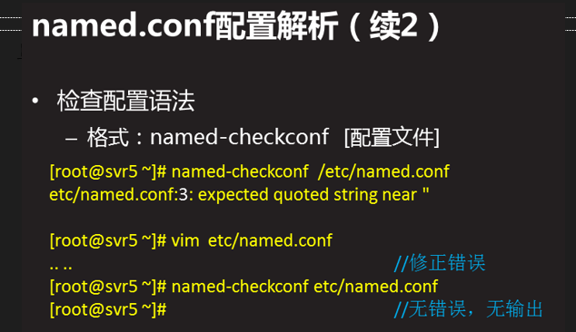
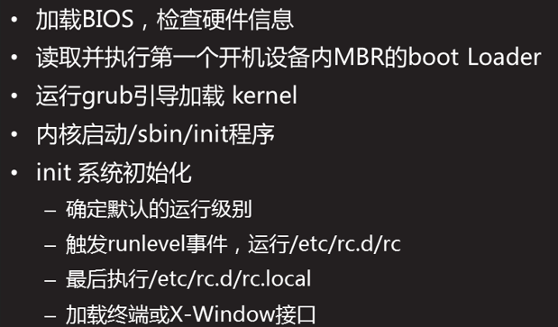
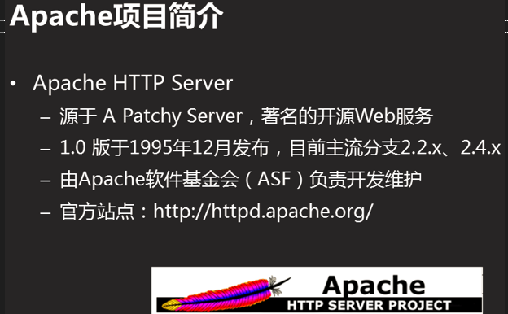
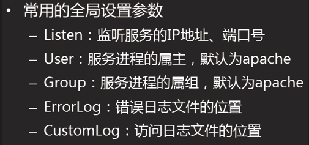

# Linux理论

### 版本号

Linux内核的版本 主版本.次版本.修订号  次版本奇数是开发板，偶数是稳定版


### 分区表示

默认采用的是MBR分区方案(主引导记录模式，MSDOS模式)，只能有1~4个主分区。想要有更多的分区，必须创建扩展分区，再在扩展分区之上再继续划分逻辑分区，一般第五个分区为第一个逻辑分区。

采用磁盘第一个扇区(512字节)

sda4是拓展分区。sda5是第一个逻辑分区，在sda4的第一个分区

· 磁盘设备存放于/dev/文件夹下，

· IDE接口的磁盘(hd)：/dev/hda、/dev/hdb、/dev/hdc、/dev/hdd  (a,b,c是磁盘序号)

· SCSI接口的磁盘(sd)：/dev/sda、/dev/sdb、/dev/sdc、/dev/sdd (注意写完整带/dev)

· 主分区：最多四个（其中一个可作为扩展分区），其分区编号为1-4

· 扩展分区：可以没有，最多一个，不能格式化用来存放文档，占用主分区编号

· 逻辑分区：从扩展分区范围内划分出的一部分，其分区编号始终从5开始

> 举例：
>
> · /dev/sda5：Linux系统的SATA接口第一块磁盘的第一个逻辑分区。
>
> · /dev/hda1：这是Linux系统的IDE接口第一块磁盘的第一个主分区。（hd表示磁盘接口为IDE）。
>
> · /dev/sdd: 这是Linux系统的SATA接口第四块磁盘。

> RHEL6.5版本，默认使用的文件系统包括EXT4（第四代扩展文件系统）、SWAP（交换文件系统，即虚拟内存）。支持其他文件系统如FAT16,FAT32,NTFS,XFS,JFS


### 系统启动

#### 运行级别

Linux系统有7个运行级别(runlevel)：

- 运行级别0：系统停机状态，系统默认运行级别不能设为0，否则不能正常启动
- 运行级别1：单用户工作状态，root权限，用于系统维护，禁止远程登陆
- 运行级别2：多用户状态(没有NFS)
- 运行级别3：完全的多用户状态(有NFS)，登陆后进入控制台命令行模式
- 运行级别4：系统未使用，保留
- 运行级别5：X11控制台，登陆后进入图形GUI模式
- 运行级别6：系统正常关闭并重启，默认运行级别不能设为6，否则不能正常启动

ctrl+alt+F某，进入对应级别

> 默认我们登录的就是第一个窗口，也就是tty1，这个六个窗口分别为tty1,tty2 … tty6，你可以按下Ctrl + Alt + F1 ~ F6 来切换它们。
>
> 如果你安装了图形界面，默认情况下是进入图形界面的，此时你就可以按Ctrl + Alt + F1 ~ F6来进入其中一个命令窗口界面。
>
> 当你进入命令窗口界面后再返回图形界面只要按下Ctrl + Alt + F7 就回来了。

不同的终端相当于同时打开的多个命令框窗口，不可以上下移动窗口(鼠标不可用)，需要大段输入要随机查看时，建议写到文件里

### 目录结构


以下是对这些目录的解释：

- **/bin**：
   bin 是 Binaries (二进制文件) 的缩写, 这个目录存放着最经常使用的命令。

- **/boot：**
  这里存放的是启动 Linux 时使用的一些核心文件，包括一些连接文件以及镜像文件。 内核 引导菜单

- **/dev ：**
  dev 是 Device(设备) 的缩写, 该目录下存放的是 Linux 的外部设备，在 Linux 中访问设备的方式和访问文件的方式是相同的。

- **/etc：**
  etc 是 Etcetera(等等) 的缩写,这个目录用来存放所有的系统管理所需要的配置文件和子目录。

- **/home**：
  用户的主目录，在 Linux 中，每个用户都有一个自己的目录，一般该目录名是以用户的账号命名的，如上图中的 alice、bob 和 eve。

- **/lib**：
  lib 是 Library(库) 的缩写这个目录里存放着系统最基本的动态连接共享库，其作用类似于 Windows 里的 DLL 文件。几乎所有的应用程序都需要用到这些共享库。

- **/lost+found**：
  这个目录一般情况下是空的，当系统非法关机后，这里就存放了一些文件。

- **/media**：
   linux 系统会自动识别一些设备，例如U盘、光驱等等，当识别后，Linux 会把识别的设备挂载到这个目录下。

- **/mnt**：
  系统提供该目录是为了让用户临时挂载别的文件系统的，我们可以将光驱挂载在 /mnt/ 上，然后进入该目录就可以查看光驱里的内容了。

- **/opt**：
  opt 是 optional(可选) 的缩写，这是给主机额外安装软件所摆放的目录。比如你安装一个ORACLE数据库则就可以放到这个目录下。默认是空的。

- **/proc**：
  proc 是 Processes(进程) 的缩写，/proc 是一种伪文件系统（也即虚拟文件系统），存储的是当前内核运行状态的一系列特殊文件，这个目录是一个虚拟的目录，它是系统内存的映射，我们可以通过直接访问这个目录来获取系统信息。
  这个目录的内容不在硬盘上而是在内存里，我们也可以直接修改里面的某些文件，比如可以通过下面的命令来屏蔽主机的ping命令，使别人无法ping你的机器：

  ```
  echo 1 > /proc/sys/net/ipv4/icmp_echo_ignore_all
  ```

  存放运行中的内存映射数据
  
- **/root**：
  该目录为系统管理员，也称作超级权限者的用户主目录。

- **/sbin**：
   s 就是 Super User 的意思，是 Superuser Binaries (超级用户的二进制文件) 的缩写，这里存放的是系统管理员使用的系统管理程序。

- **/selinux**：
   这个目录是 Redhat/CentOS 所特有的目录，Selinux 是一个安全机制，类似于 windows 的防火墙，但是这套机制比较复杂，这个目录就是存放selinux相关的文件的。

- **/srv**：
   该目录存放一些服务启动之后需要提取的数据。

- **/sys**：

  这是 Linux2.6 内核的一个很大的变化。该目录下安装了 2.6 内核中新出现的一个文件系统 sysfs 。

  sysfs 文件系统集成了下面3种文件系统的信息：针对进程信息的 proc 文件系统、针对设备的 devfs 文件系统以及针对伪终端的 devpts 文件系统。

  该文件系统是内核设备树的一个直观反映。

  当一个内核对象被创建的时候，对应的文件和目录也在内核对象子系统中被创建。

- **/tmp**：
   tmp 是 temporary(临时) 的缩写这个目录是用来存放一些临时文件的。 关机自动清理。

- **/usr**：
   usr 是 unix shared resources(共享资源) 的缩写，这是一个非常重要的目录，用户的很多应用程序和文件都放在这个目录下，类似于 windows 下的 program files 目录。

- **/usr/bin：**
  系统用户使用的应用程序。

- **/usr/sbin：**
  超级用户使用的比较高级的管理程序和系统守护程序。

- **/usr/src：**
  内核源代码默认的放置目录。

- **/var**：
   var 是 variable(变量) 的缩写，这个目录中存放着在不断扩充着的东西，我们习惯将那些经常被修改的目录放在这个目录下。包括各种日志文件。

- **/run**：
  是一个临时文件系统，存储系统启动以来的信息。当系统重启时，这个目录下的文件应该被删掉或清除。如果你的系统上有 /var/run 目录，应该让它指向 run。

在 Linux 系统中，有几个目录是比较重要的，平时需要注意不要误删除或者随意更改内部文件。

**/etc**： 上边也提到了，这个是系统中的配置文件，如果你更改了该目录下的某个文件可能会导致系统不能启动。

**/bin, /sbin, /usr/bin, /usr/sbin**: 这是系统预设的执行文件的放置目录，比如 ls 就是在 /bin/ls 目录下的。

值得提出的是，/bin, /usr/bin 是给系统用户使用的指令（除root外的通用户），而/sbin, /usr/sbin 则是给 root 使用的指令。 

**/var**： 这是一个非常重要的目录，系统上跑了很多程序，那么每个程序都会有相应的日志产生，而这些日志就被记录到这个目录下，具体在 /var/log 目录下，另外 mail 的预设放置也是在这里。


### 文件属性

#### 权限

在 Linux 中我们可以使用 ll 或者 ls –l 命令来显示一个文件的属性以及文件所属的用户和组，如：

```
[root@www /]# ls -l
total 64
dr-xr-xr-x   2 root root 4096 Dec 14  2012 bin
dr-xr-xr-x   4 root root 4096 Apr 19  2012 boot
……
```

实例中，**bin** 文件的第一个属性用 d 表示。d 在 Linux 中代表该文件是一个目录文件。

在 Linux 中第一个字符代表这个文件是目录、文件或链接文件等等。

- 当为 d 则是目录
- 当为 - 则是文件；
- 若是 l 则表示为链接文档(link file)；
- 若是 b 则表示为装置文件里面的可供储存的接口设备(可随机存取装置)；
- 若是 c 则表示为装置文件里面的串行端口设备，例如键盘、鼠标(一次性读取装置)。

接下来的字符中，以三个为一组，且均为 rwx 的三个参数的组合。其中， r 代表可读(read)、 w 代表可写(write)、 x 代表可执行(execute)。 要注意的是，这三个权限的位置不会改变，如果没有权限，就会出现减号  - 而已。


每个文件的属性由左边第一部分的 10 个字符来确定（如下图）。


从左至右用 **0-9** 这些数字来表示。

第 **0** 位确定文件类型，第 **1-3** 位确定属主（该文件的所有者）拥有该文件的权限。

第4-6位确定属组（所有者的同组用户）拥有该文件的权限，第7-9位确定其他用户拥有该文件的权限。


其中，第 **1、4、7** 位表示读权限，如果用 r 字符表示，则有读权限，如果用 - 字符表示，则没有读权限；

第 **2、5、8** 位表示写权限，如果用 w 字符表示，则有写权限，如果用 - 字符表示没有写权限；第 **3、6、9** 位表示可执行权限，如果用 x 字符表示，则有执行权限，如果用 - 字符表示，则没有执行权限。


## 网络

### DNS服务

以RHEL6为例





单区域DNS服务：


# Linux使用

## 安装

### 装机

### 虚拟机

#### 安装

使用官网或其他途径下载，安装，使用序列号：

```
ZF3R0-FHED2-M80TY-8QYGC-NPKYF
```

参考下载[链接](https://download3.vmware.com/software/wkst/file/VMware-workstation-full-16.2.0-18760230.exe)  ，这个是 16 版本

装好建议重启。


下载 linux (在自己网盘有 RHEL 6.7)。


使用：上面的两竖向矩形图标可以显示和隐藏左侧菜单


#### 创建新虚拟机

打开，点击创建新的虚拟机，自定义，选 `Workstation 16.x`，稍后安装操作系统，选Linux，RHEL 6 64位，自己起名和换位置，处理器数量建议2，单个核心1，内存选2048MB，选NAT，选LST Logic，选SCSI，创建新的虚拟磁盘，建议20G(也可以60)，单个文件，不勾选立即分配所有磁盘空间，建议不要改磁盘文件，完成

CD/DVD双击进去选使用ISO，选下载的 `iso` 文件，点开启此虚拟机，直接回车，右箭头+空格 skip 掉。中文，美国英语式，基本存储设备，是，忽略所有数据，计算机名可以默认，亚洲/上海，密码自己设，创建自定义布局，然后创建标准分区，挂载点选/boot，ext4，200MB；再创建/，ext4，10240；再创建交换分区(缓存)，分虚拟内存的二倍，文件系统类型swap；再输入/data，ext4，给点空间；然后剩余空间不分配，下一步，点格式化，将修改写入磁盘，然后直接下一步，基本服务器，现在自定义，只需要基本和网络文件系统客户端，其他都不要，桌面要选择x窗口系列、字体、桌面、输入法、通用桌面，应用程序选一个浏览器，预言支持选中文就行，其他都不选，检查是不少于980个安装包，点重新引导。前进，同意，不以后再注册，以后在注册，前进，(不需要用户)前进，前进，取消勾选启用Kdump（可能提高崩溃概率），否。那么安装结束


使用vmvare workstation版本越新越好

会有快照功能

#### vmtools

在虚拟机安装，然后安装完毕重启。安装时一路回车，具体为：

> 安装 vmtools
>
> 弹出本来有的光盘
>
> 虚拟机-安装 VMware Tools
>
> `cd /misc/cd`
>
> `ls`
>
> `tar -xf VMWare....tar.gz -C /data`
>
> `cd /data/vmware-tools-distrib`
>
> `./vmware-install.pl`
>
> 一路回车
>
> 重启

使用：在图形化文件管理器打开，然后在虚拟机外拖拽文件放到这里面即可


#### 网络

右击右下角设置NAT模式，左上-编辑-虚拟网络编辑器

勾选使用本地dhcp服务器将ip地址分配给虚拟机

子网网段(虚拟机的)可以不改；点击dhcp设置，可以改起始/结束ip地址

点击nat设置，可以进行设置


添加网卡：右下角设置，添加，网络适配器，下一步，nat，完成；不同网卡ip不同

windows网络中心-更改适配器设置


> ip获取：整体思路是外部改好 id，然后内部装好 ifconfig 等 net-tools，配置 `ifcfg`，重启网络服务。


#### 克隆

虚拟机-管理-克隆，创建链接克隆。

克隆后可以要新建一个网卡(同上方法操作)

克隆后的虚拟机可能不能用 `network` ，可以注释掉 `/etc/sysconfig/network-scripts` 对应文件把 `HWADDR` 这一行注释掉(`#`) ，如果还报错，可以把 `UUID` 也注释掉。  

为避免设备冲突，虚拟机会用新的MAC地址，网卡新名字，但网卡配置文件没变。可以清空网卡命名的udev规则文件，重启系统

```shell
> /etc/udev/rules.d/70-persistent-net.rules
reboot
```

删除要管理-从磁盘移除

左侧菜单右击可重命名虚拟机


#### 打开装好的虚拟机

装好的虚拟机的特征为：文件夹，内有 `.vmx` 的文件，比较大(可能几百MB)。

VMware-打开虚拟机，点击那个 vmx 即可。


#### 杂

移动 与 复制 的区别：

每一台计算机都有一个唯一的MAC地址，虚拟机也一样，通过复制产生另一个一模一样的虚拟机，其中包括MAC地址，所以要选择“我已复制改虚拟机”告诉VMware平台“我这台需要重新生成一个MAC地址”。如果选择“我已移动改虚拟机”则不会生成新的MAC地址.不能同时开启2台相同MAC地址的虚拟机（2台虚拟机不能通信）


右击管理可以调虚拟机内存。


### 装软件

#### 常用软件安装流程

##### fcitx

##### codeblock

##### vscode

##### typora

##### wechat

##### cloudmusic

##### python

##### WPS

##### flameshoot

##### baidudisk

##### rar

```linux
sudo apt-get install unrar
sudo apt-get install unar
```

##### thefuck

```linux
sudo apt update
sudo apt install python-dev python3-pip
sudo pip3 install thefuck
vim ~/.bashrc
```

然后下、右方向键拉到最下，然后按insert，然后enter新的一行`eval "$(thefuck --alias fuck)"`，然后按下esc，然后输入`:wq`，保存并退出。

使之生效

```linux
source ~/.bashrc
```

之后就可以使用fuck指令了，使用方法即输入错误之后输入fuck，然后会给你提示是否要进行如下命令，按下回车执行修正后的命令。

##### gpick

屏幕取色软件

```linux
sudo apt-get install gpick
```


##### gimp

一个类似于ps的linux图像编辑器

```linux
sudo add-apt-repository ppa:otto-kesselgulasch/gimp
sudo apt-get update
sudo apt-get install gimp gimp-plugin-registry gimp-data-extras
```


##### redshift

护眼软件 安装指令：

```linux
sudo apt-get install redshift
```

配置：在目录`~/.config`新建`redshift.conf` (新建任意文件改后缀即可)

输入：

```conf
[redshift]
; 白天屏幕温度
temp-day=5000
; 夜晚屏幕温度
temp-night=4100
; 昼夜是否平滑过度(1/0)
transition=1

; 位置提供方式(redshift -l list)
location-provider=manual

[manual]
; 位置提供方式设置
; 经纬度(北京)
lat=39.90
lon=116.41
```

温度越高越亮。


#### 开发软件

##### jdk

以centos7为例

解压 tar.gz 包到如 `/usr/local/java`，下有包内文件夹如 `jdk1.8.0_51`

在 `etc/profile` 修改 java 那三行为：

```sh
export JAVA_HOME=/usr/local/java/jdk1.8.0_51
export JRE_HOME=${JAVA_HOME}/jre
export CLASSPATH=.:${JAVA_HOME}/lib:${JRE_HOME}/lib
export PATH=${JAVA_HOME}/bin:$PATH
```

重新编译：`source /etc/profile`

删除软连接 `rm -rf /usr/bin/java`

添加软连接 `ln -s /usr/local/java/jdk1.8.0_51/bin/java /usr/bin/java`

检查：`java -version`

##### mysql

Mysql常用路径：

数据文件：/var/lib/mysql/

配置文件模板：/usr/share/mysql

客户端工具目录：/usr/bin

日志目录：/var/log/

sock文件：在/var/lib/mysql/目录下

一般配置文件会放置在/etc下

相关命令：/usr/bin（mysqladmin mysqldump等命令）

启动脚本：/etc/rc.d/init.d/（启动脚本文件mysql的目录）


### EFI顺序更改

默认装了ubuntu后开机默认启动ubuntu，可以改成启动windows:

查看当前状况：

```bash
efibootmgr
```

看到 `BootOrder` 一行，将对应于 `ubuntu` 和 `WIndows Boot Manager` 两项对调，如：

```bash
efibootmgr -o 0004,0005,2001,2002,2003
```


## 快捷键

### 全局

ctrl+alt+t 打开cmd窗口(即终端)

alt+F2 打开命令输入框

shift+F10 模拟右键

> shift+F10+e 可以在当前路径打开终端


#### 截图

PrtSc – 获取整个屏幕的截图并保存到 Pictures 目录。
Shift + PrtSc – 获取屏幕的某个区域截图并保存到 Pictures 目录。

> Alt + PrtSc –获取当前窗口的截图并保存到 Pictures 目录。
> Ctrl + PrtSc – 获取整个屏幕的截图并存放到剪贴板。
> Shift + Ctrl + PrtSc – 获取屏幕的某个区域截图并存放到剪贴板。
> Ctrl + Alt + PrtSc – 获取当前窗口的 截图并存放到剪贴板。


### 终端

两种方法实现复制粘贴：

ctrl+shift+c ctrl+shift+v

鼠标选中要复制的地方，然后在需要粘贴的地方点击滚轮


输入命令(的前缀)后连按两次tab键，显示所有该前缀的命令；

若只按一次tab，就是补全唯一以该为前缀的补全项或什么也不做(找不到或多个)

输入`\`以强制换行，实现多行输入单一指令 (此时tab不可用) (注意不要写多余空格)


上下箭头 直接输出上一次执行的命令

alt+. 输出上一个命令的参数

ctrl+u 从光标处(不含光标处)清空至行首

ctrl+k 从光标处(含光标处)清空至行尾

ctrl+l 伪清屏(看不到上面内容，但是上滑后还是看得见的)

ctrl+c 中止当前编辑的命令行(运行中的)


### nautilus

ctrl+h 显示隐藏文件

ctrl+l 定位到地址栏

> f1 帮助文档

f2 选中的文件重命名

f9 左边栏显示和隐藏

f10 点下下三角按钮(展开设置)

alt+home 主文件夹

alt+↑/↓ 打开父文件夹(选中的当前子文件夹)

alt+←/→ 打开上一个/下一个文件夹

ctrl+n 在新窗口打开当前目录的副本


## 指令

#### 指令格式

一般格式：命令字 [选项] ... [参数1] [参数2] ...

选项：

- 短选项如-l -A 可组合为 -lA
- 长选项如 --color --help


> 绿色 可执行文件 (./ 来执行)
>
> 青蓝 链接文件
>
> 红色 压缩包
>
> 红底白字 比较危险的命令
>
> 深蓝 文件夹
>
> 黑色 普通文件
>
> 青色 mp3
>
> 紫色 rmvb文件(视频)
>
> 黑底红字 错误的链接


##### 常用选项

-R 以DFS顺序递归执行 如`ls /home/lr580 -R`

-i infomation 提示


##### 注意

路径中以`/`开头的是绝对路径，不以之开头的是相对路径。如绝对路径`/var`和相对路径`abc/def`

对一条命令可以设置别名，可以设置临时有效/永久有效

`#`后可以打注释，如`uname #注释`


##### 通配符

- `*` 匹配任意多个字符
- `?` 匹配单个字符
- `[a-z]` 连续多个字符的一个
- `{str1, str2, str3 ...}` 匹配不连续多组字符

如：`ls install*`  , `ls install.???`


单双引号区别：单引号是字面文本；双引号里面的文本是会被解析的


#### 基本

##### sudo

以管理员身份身份执行一条指令，如果希望把当前默认为管理员，可以输入：

```linux
sudo su
```

或

```linux
sudo -i
```


之后就会一直管理员状态

也可以

```
su
```

但是这样需要输入一次密码。


用`exit`退出窗口


##### ls

就是 list 的缩写，通过 ls 命令不仅可以查看 linux 文件夹包含的文件，而且可以查看文件权限(包括目录、文件夹、文件权限) 查看目录信息等等。

ls+路径，表示要列出的路径，不写就默认是当前路径。如`ls /`列出根目录。

可以+多个路径，那么等于多次执行这个命令。(其他的命令类似)

```linux
ls -a 列出目录所有文件，包含以.开始的隐藏文件
ls -A 列出除.及..的其它文件
ls -r 反序排列
ls -t 以文件修改时间排序
ls -S 以文件大小排序
ls -h (human)以易读大小显示
ls -l (long)除了文件名之外，还将文件的权限、所有者、文件大小等信息详细列出来
ls -R 查看目录的内容以及它所有子目录的内容
ls -d (directory)只看文件夹
ls -ld 查看日期等信息(不会列举包含的内容)
ls -F 添加后缀，此时/后缀是目录，@后缀是链接
```

> 计算文件大小时计算文件夹大小不准确

例如：

(1) 按易读方式按时间反序排序，并显示文件详细信息

```
ls -lhrt
```

(2) 按大小反序显示文件详细信息

```
ls -lrS
```

(3)列出当前目录中所有以"t"开头的目录的详细内容

```
ls -l t*
```

> `ls -l`的简化命令是`ll`，所以上面可以写成`ll t*`

(4) 列出文件绝对路径（不包含隐藏文件）

```
ls | sed "s:^:`pwd`/:"
```

(5) 列出文件绝对路径（包含隐藏文件）

```
find $pwd -maxdepth 1 | xargs ls -ld
```

> 例如：
>
> `ls /dev/tty?` 匹配任意字符， 查看个位数的tty设备(虚拟控制台设备)
>
> 或`ls /dev/tty[0-9]`    查看所有 `ls /dev/tty*`  `ls /dev/tty{1?, 20}` `ls /dev/tty{1[0-9],20}`
>
> 两位数即`tty??` 

`ls -ld` 的子段意义：

- 权限位 硬连接数 属主 属组 大小 最后修改时间 文件/目录名称


##### cd

1）进入根目录

```
cd /
```

（2）进入 "home" 目录 (root下是`/root`，不然是`/home/`+用户名)

```
cd ~
```

（3）进入上一次工作路径(再次执行的话，上一次就是本来的)

```
cd -
```

（4）把上个命令的参数作为cd参数使用。

```
cd !$
```

(5)进入上一级

```linux
cd ..
```

> 没有cd ...或cd ....，但是有cd ../../..这样的多次上一级

> . 是当前路径
>
> \- 前一个路径(返回)(只有一个记忆，即不断运行会在两个路径间反复横跳)
>
> ~\+user 用户user的家目录  如`cd ~root`


##### pwd

获取当前绝对路径

```c++
pwd
```

查看软链接的实际路径

```
pwd -P
```


##### mkdir

mkdir 命令用于创建文件夹。

可用选项：

- **-m**: 对新建目录设置存取权限数字，也可以用 chmod 命令设置;
- **-p**: 可以是一个路径名称。此时若路径中的某些目录尚不存在,加上此选项后，系统将自动建立好那些尚不在的目录，即一次可以建立多个目录。 -p是递归的意思。

**实例：**

（1）当前工作目录下创建名为  t的文件夹

```
mkdir t
```

（2）在 tmp 目录下创建路径为 test/t1/t 的目录，若不存在，则创建：

```
mkdir -p /tmp/test/t1/t
```

> 检验：ls -R /tmp


##### rmdir

从一个目录中删除一个或多个子目录项，删除某目录时也必须具有对其父目录的写权限。

**注意**：不能删除非空目录

**实例：**

（1）当 parent 子目录被删除后使它也成为空目录的话，则顺便一并删除：

```
rmdir -p parent/child/child11
```


##### rm

删除一个目录中的一个或多个文件或目录，如果没有使用 -r 选项，则 rm 不会删除目录。如果使用 rm 来删除文件，通常仍可以将该文件恢复原状。

```
rm [选项] 文件…
```

**实例：**

（1）删除任何 .log 文件，删除前逐一询问确认：

```
rm -i *.log
```

（2）删除 test 子目录及子目录中所有档案删除，并且不用一一确认：

```
rm -rf test
```

（3）删除以 -f 开头的文件

```
rm -- -f*
```


##### mv

移动文件或修改文件名，根据第二参数类型（如目录，则移动文件；如为文件则重命名该文件）。

当第二个参数为目录时，第一个参数可以是多个以空格分隔的文件或目录，然后移动第一个参数指定的多个文件到第二个参数指定的目录中。

**实例：**

（1）将文件 test.log 重命名为 test1.txt

```
mv test.log test1.txt
```

（2）将文件 log1.txt,log2.txt,log3.txt 移动到根的 test3 目录中

```
mv llog1.txt log2.txt log3.txt /test3
```

（3）将文件 file1 改名为 file2，如果 file2 已经存在，则询问是否覆盖

(如果是文件夹对文件夹，会把文件夹放到这个文件夹内部)

```
mv -i log1.txt log2.txt
```

（4）移动当前文件夹下的所有文件到上一级目录

```
mv * ../
```


##### cp

源文件复制至目标文件，或将多个源文件复制至目标目录。

注意：命令行复制，如果目标文件已经存在会提示是否覆盖，而在 shell 脚本中，如果不加 -i 参数，则不会提示，而是直接覆盖！

```
-i 提示
-f 不提示(强制覆盖)
-r 复制目录及目录内所有项目
-a 复制的文件与原文件时间一样
-p 保持原文件属性不变(含权限，日期)
```

**实例：**

（1）复制 a.txt 到 test 目录下，保持原文件时间，如果原文件存在提示是否覆盖。

```
cp -ai a.txt test  #或test/
```

（2）为 a.txt 建立一个链接（快捷方式）

```
cp -s a.txt link_a.txt
```

注意还是相对连接，所以该快捷方式不能移位

可以一次复制多个内容，正确的都会复制过去：

```linux
cp 1.mp3 3.rmvb d #复制到目录内
```

```linux
cp a d #文件对文件 或 文件对文件夹下同名文件 或 文件夹对文件夹
```


##### cat

concatenate

cat 主要有三大功能：

1.一次显示整个文件:

```
cat filename
```

2.从键盘创建一个文件:

```
cat > filename
```

 只能创建新文件，不能编辑已有文件。ctrl+c结束输入

3.将几个文件合并为一个文件:

```
cat file1 file2 > file
```

- -b 对非空输出行号
- -n 输出所有行号

**实例：**

（1）把 log2012.log 的文件内容加上行号后输入 log2013.log 这个文件里

```
cat -n log2012.log log2013.log
```

（2）把 log2012.log 和 log2013.log 的文件内容加上行号（空白行不加）之后将内容附加到 log.log 里

```
cat -b log2012.log log2013.log log.log
```

（3）使用 here doc 生成新文件

```
cat >log.txt <<EOF
>Hello
>World
>PWD=$(pwd)
>EOF
ls -l log.txt
cat log.txt
Hello
World
PWD=/opt/soft/test
```

> 必须加上<<EOF命令

（4）反向列示 (-n时1是最后一行)

```
tac log.txt
PWD=/opt/soft/test
World
Hello
```


##### touch

参数是文件名，代表新建一个文件(不能在不存在的路径)

若已有该文件，什么也不会做，不会覆盖


##### more

这个是基本文本阅读器(不推荐)，more所有linux自带

功能类似于 cat, more 会以一页一页的显示方便使用者逐页阅读，而最基本的指令就是按回车下一行，按空白键（space）就往下一页显示，按 b 键就会往回（back）一页显示。按/键向后查找。Q退出。?键了解操作说明

**命令参数：**

```
+n      从笫 n 行开始显示
-n       定义屏幕大小为n行
+/pattern 在每个档案显示前搜寻该字串（pattern），然后从该字串前两行之后开始显示 
-c       从顶部清屏，然后显示
-d       提示“Press space to continue，’q’ to quit（按空格键继续，按q键退出）”，禁用响铃功能
-l        忽略Ctrl+l（换页）字符
-p       通过清除窗口而不是滚屏来对文件进行换页，与-c选项相似
-s       把连续的多个空行显示为一行
-u       把文件内容中的下画线去掉
```

**常用操作命令：**

```
Enter    向下 n 行，需要定义。默认为 1 行
Ctrl+F   向下滚动一屏
空格键  向下滚动一屏
Ctrl+B  返回上一屏
=       输出当前行的行号
:f     输出文件名和当前行的行号
V      调用vi编辑器
!命令   调用Shell，并执行命令
q       退出more
```

**实例：**

（1）显示文件中从第3行起的内容

```
more +3 text.txt
```

（2）在所列出文件目录详细信息，借助管道使每次显示 5 行

```
ls -l | more -5
```

按空格显示下 5 行。


##### less

这个是增强型文本阅读器，不一定所有linux自带

less 与 more 类似，但使用 less 可以随意浏览文件，而 more 仅能向前移动，却不能向后移动，而且 less 在查看之前不会加载整个文件。

PgUp,PgDn翻页，?向前，/向后查找 ,n上一个 N下一个被查找内容

**常用命令参数：**

```
-i  忽略搜索时的大小写
-N  显示每行的行号
-o  <文件名> 将less 输出的内容在指定文件中保存起来
-s  显示连续空行为一行
/字符串：向下搜索“字符串”的功能
?字符串：向上搜索“字符串”的功能
n：重复前一个搜索（与 / 或 ? 有关）
N：反向重复前一个搜索（与 / 或 ? 有关）
-x <数字> 将“tab”键显示为规定的数字空格
b  向后翻一页
d  向后翻半页
h  显示帮助界面
Q  退出less 命令
u  向前滚动半页
y  向前滚动一行
空格键 滚动一行
回车键 滚动一页
[pagedown]： 向下翻动一页
[pageup]：   向上翻动一页
```

**实例：**

（1）ps 查看进程信息并通过 less 分页显示

```
ps -aux | less -N
```

（2）查看多个文件

```
less 1.log 2.log
```

可以使用 n 查看下一个，使用 p 查看前一个。


##### head

head 用来显示档案的开头至标准输出中，默认 head 命令打印其相应文件的开头 10 行。

**常用参数：**

```
-n<行数> 显示的行数（行数为复数表示从最后向前数）
```

**实例：**

（1）显示 1.log 文件中前 20 行(可以简写为-20)

```
head 1.log -n 20
```

（2）显示 1.log 文件前 20 字节

```
head -c 20 log2014.log
```

（3）显示  t.log最后 10 行

```
head -n -10 t.log
```


##### tail

用于显示指定文件末尾内容，不指定文件时，作为输入信息进行处理。常用查看日志文件。

**常用参数：**

```
-f 循环读取（常用于查看递增的日志文件）
-n<行数> 显示行数（从后向前）
```

（1）循环读取逐渐增加的文件内容

```
ping 127.0.0.1 > ping.log &
```

后台运行：可使用 jobs -l 查看，也可使用  fg 将其移到前台运行。 

```
tail -f ping.log
```


##### which

在 linux 要查找某个可执行指令，但不知道放在哪里了，可以使用下面的一些命令来搜索：

```
which     查看可执行文件的位置。
whereis 查看文件的位置。
locate  配合数据库查看文件位置。
find        实际搜寻硬盘查询文件名称。
```

which 是在 PATH 就是指定的路径中，搜索某个系统命令的位置，并返回第一个搜索结果。使用 which 命令，就可以看到某个系统命令是否存在，以及执行的到底是哪一个位置的命令。

默认会查找别名，但不查找命令

应用：误删命令，找到位置，从别的地方下载回来放到这个位置

**常用参数：**

```
-n 　指定文件名长度，指定的长度必须大于或等于所有文件中最长的文件名。
```

**实例：**

（1）查看 ls 命令是否存在，执行哪个

```
which ls
```

（2）查看 which

```
which which
```

（3）查看 cd

```
which cd（显示不存在，因为 cd 是内建命令，而 which 查找显示是 PATH 中的命令）
```

查看当前 PATH 配置：

```
echo $PATH
```

或使用 env 查看所有环境变量及对应值


##### whereis

whereis  命令只能用于程序名的搜索，而且只搜索二进制文件（参数-b）、man说明文件（参数-m）和源代码文件（参数-s）。如果省略参数，则返回所有信息。whereis 及 locate 都是基于系统内建的数据库进行搜索，因此效率很高，而find则是遍历硬盘查找文件。

**常用参数：**

```
-b   定位可执行文件。
-m   定位帮助文件。
-s   定位源代码文件。
-u   搜索默认路径下除可执行文件、源代码文件、帮助文件以外的其它文件。
```

**实例：**

（1）查找 locate 程序相关文件

```
whereis locate
```

（2）查找 locate 的源码文件

```
whereis -s locate
```

（3）查找 lcoate 的帮助文件

```
whereis -m locate
```


##### locate

locate 通过搜寻系统内建文档数据库达到快速找到档案，数据库由 updatedb 程序来更新，updatedb 是由 cron  daemon 周期性调用的。默认情况下 locate 命令在搜寻数据库时比由整个由硬盘资料来搜寻资料来得快，但较差劲的是 locate  所找到的档案若是最近才建立或 刚更名的，可能会找不到，在内定值中，updatedb 每天会跑一次，可以由修改 crontab 来更新设定值  (etc/crontab)。

locate 与 find 命令相似，可以使用如 *、? 等进行正则匹配查找

**常用参数：**

```
-l num（要显示的行数）
-f   将特定的档案系统排除在外，如将proc排除在外
-r   使用正则运算式做为寻找条件
```

建立定位索引库：`updatedb` 

一般位置在`/var/lib/mlocate/mlocate.db`

**实例：**

（1）查找和 pwd 相关的所有文件(文件名中包含 pwd）

```
locate pwd
```

（2）搜索 etc 目录下所有以 sh 开头的文件

```
locate /etc/sh
```

（3）查找 /var 目录下，以 reason 结尾的文件

```
locate -r '^/var.*reason$'（其中.表示一个字符，*表示任务多个；.*表示任意多个字符）
```


> 可能需要安装，如`sudo apt install locate`

使用举例：

```shell
touch myhttpd.conf
updatedb
locate httpd.conf
```


##### find

用于在文件树中查找文件，并作出相应的处理。

命令格式：

```
find pathname -options [-print -exec -ok ...]
```

命令参数：

```
pathname: find命令所查找的目录路径。例如用.来表示当前目录，用/来表示系统根目录。
-print： find命令将匹配的文件输出到标准输出。
-exec： find命令对匹配的文件执行该参数所给出的shell命令。相应命令的形式为'command' {  } \;，注意{   }和\；之间的空格。
-ok： 和-exec的作用相同，只不过以一种更为安全的模式来执行该参数所给出的shell命令，在执行每一个命令之前，都会给出提示，让用户来确定是否执行。
-a 多个条件同时满足
-o 多个条件满足其一
```

**命令选项：**

```
-name 按照文件名查找文件
-perm 按文件权限查找文件
-user 按文件属主查找文件
-group  按照文件所属的组来查找文件。
-type  查找某一类型的文件，诸如：
   b - 块设备文件
   d - 目录
   c - 字符设备文件
   l - 符号链接文件
   p - 管道文件
   f - 普通文件

-size n :[c] 查找文件长度为n块文件，带有c时表文件字节大小
-amin n   查找系统中最后N分钟访问的文件
-atime n  查找系统中最后n*24小时访问的文件
-cmin n   查找系统中最后N分钟被改变文件状态的文件
-ctime n  查找系统中最后n*24小时被改变文件状态的文件
-mmin n   查找系统中最后N分钟被改变文件数据的文件
-mtime n  查找系统中最后n*24小时被改变文件数据的文件
(用减号-来限定更改时间在距今n日以内的文件，而用加号+来限定更改时间在距今n日以前的文件。 )
-maxdepth n 最大查找目录深度
-prune 选项来指出需要忽略的目录。在使用-prune选项时要当心，因为如果你同时使用了-depth选项，那么-prune选项就会被find命令忽略
-newer 如果希望查找更改时间比某个文件新但比另一个文件旧的所有文件，可以使用-newer选项
```

```shell
xargs 命令从标准输入流中获取参数，并基于它们执行命令。xargs比exec更快
```


**实例：**

（1）查找 48 小时内修改过的文件

```
find -atime -2
```

（2）在当前目录查找 以 .log 结尾的文件。  .  代表当前目录

```
find ./ -name '*.log'
```

（3）查找 /opt 目录下 权限为 777 的文件

```
find /opt -perm 777
```

（4）查找大于 1K 的文件

```
find -size +1000c
```

查找等于 1000 字符的文件

```
find -size 1000c 
```

-exec 参数后面跟的是 command 命令，它的终止是以 ; 为结束标志的，所以这句命令后面的分号是不可缺少的，考虑到各个系统中分号会有不同的意义，所以前面加反斜杠。{} 花括号代表前面find查找出来的文件名。

**实例：**

（5）在当前目录中查找更改时间在10日以前的文件并删除它们(无提醒）

```
find . -type f -mtime +10 -exec rm -f {} \;
```

（6）当前目录中查找所有文件名以.log结尾、更改时间在5日以上的文件，并删除它们，只不过在删除之前先给出提示。 按y键删除文件，按n键不删除

```
find . -name '*.log' mtime +5 -ok -exec rm {} \;
```

（7）当前目录下查找文件名以 passwd 开头，内容包含 "pkg" 字符的文件

```
find . -f -name 'passwd*' -exec grep "pkg" {} \;
```

（8）用 exec 选项执行 cp 命令 

```
find . -name '*.log' -exec cp {} test3 \;
```

-xargs find 命令把匹配到的文件传递给 xargs 命令，而 xargs 命令每次只获取一部分文件而不是全部，不像 -exec 选项那样。这样它可以先处理最先获取的一部分文件，然后是下一批，并如此继续下去。

实例：

（9）查找当前目录下每个普通文件，然后使用 xargs 来判断文件类型

```
find . -type f -print | xargs file
```

（10）查找当前目录下所有以 js 结尾的并且其中包含 'editor' 字符的普通文件

```
find . -type f -name "*.js" -exec grep -lF 'ueditor' {} \;
find -type f -name '*.js' | xargs grep -lF 'editor'
```

（11）利用 xargs 执行 mv 命令

```
find . -name "*.log" | xargs -i mv {} test4
```

（12）用 grep 命令在当前目录下的所有普通文件中搜索 hostnames 这个词，并标出所在行：

```
find . -name \*(转义） -type f -print | xargs grep -n 'hostnames'
```

（13）查找当前目录中以一个小写字母开头，最后是 4 到 9 加上 .log 结束的文件：

```
find . -name '[a-z]*[4-9].log' -print
```

（14）在 test 目录查找不在 test4 子目录查找

```
find test -path 'test/test4' -prune -o -print
```

（15）实例1：查找更改时间比文件 log2012.log新但比文件 log2017.log 旧的文件

```
find -newer log2012.log ! -newer log2017.log
```

**使用 depth 选项：**

depth 选项可以使 find 命令向磁带上备份文件系统时，希望首先备份所有的文件，其次再备份子目录中的文件。 

实例：find 命令从文件系统的根目录开始，查找一个名为 CON.FILE 的文件。 它将首先匹配所有的文件然后再进入子目录中查找

```
find / -name "CON.FILE" -depth -print
```


```shell
find ./  -type f | xargs grep "hh"
find ./ -mtime -1 | xargs rm -rf
find ./ -size 0 | xargs rm -rf
```


##### chmod

用于改变 linux 系统文件或目录的访问权限。用它控制文件或目录的访问权限。该命令有两种用法。一种是包含字母和操作符表达式的文字设定法；另一种是包含数字的数字设定法。

每一文件或目录的访问权限都有三组，每组用三位表示，分别为文件属主的读、写和执行权限；与属主同组的用户的读、写和执行权限；系统中其他用户的读、写和执行权限。可使用 ls -l test.txt 查找。

以文件 log2012.log 为例：

```
-rw-r--r-- 1 root root 296K 11-13 06:03 log2012.log
```

第一列共有 10  个位置，第一个字符指定了文件类型。在通常意义上，一个目录也是一个文件。如果第一个字符是横线，表示是一个非目录的文件。如果是  d，表示是一个目录。从第二个字符开始到第十个 9 个字符，3 个字符一组，分别表示了 3  组用户对文件或者目录的权限。权限字符用横线代表空许可，r 代表只读，w 代表写，x 代表可执行。

常用参数：

```
-c 当发生改变时，报告处理信息
-R 处理指定目录以及其子目录下所有文件
```

权限范围：

```
u ：目录或者文件的当前的用户
g ：目录或者文件的当前的群组
o ：除了目录或者文件的当前用户或群组之外的用户或者群组
a ：所有的用户及群组
```

权限代号：

```
r ：读权限，用数字4表示
w ：写权限，用数字2表示
x ：执行权限，用数字1表示
- ：删除权限，用数字0表示
s ：特殊权限
```

实例：

（1）增加文件 t.log 所有用户可执行权限

```
chmod a+x t.log
```

（2）撤销原来所有的权限，然后使拥有者具有可读权限,并输出处理信息

```
chmod u=r t.log -c
```

（3）给 file 的属主分配读、写、执行(7)的权限，给file的所在组分配读、执行(5)的权限，给其他用户分配执行(1)的权限

```
chmod 751 t.log -c（或者：chmod u=rwx,g=rx,o=x t.log -c)
```

（4）将 test 目录及其子目录所有文件添加可读权限

```
chmod u+r,g+r,o+r -R text/ -c
```


例如，666可读可写


##### tar

用来压缩和解压文件。tar 本身不具有压缩功能，只具有打包功能，有关压缩及解压是调用其它的功能来完成。

弄清两个概念：打包和压缩。打包是指将一大堆文件或目录变成一个总的文件；压缩则是将一个大的文件通过一些压缩算法变成一个小文件

归档操作，制作和释放分别是：

`tar [选项] 归档文件 原文件/目录`  和 `tar [选项] 归档文件 [-C 目标目录]`

**常用参数：**

```
-c 建立新的压缩文件.tar
-x 从压缩包中抽取文件
-f 指定压缩文件.tar
-r 添加文件到已经压缩文件包中
-u 添加改了和现有的文件到压缩包中
-t 显示压缩文件中的内容
-z 支持gzip压缩
-j 支持bzip2压缩
-Z 支持compress解压文件
-v 显示操作过程(输出详细信息)
-t 列表查看包内文件
-C 指定目标文件夹 (解压必须)
```

> ```
> -A 新增压缩文件到已存在的压缩
> -d 记录文件的差别
> -l 文件系统边界设置
> -k 保留原有文件不覆盖
> -m 保留文件不被覆盖
> -W 确认压缩文件的正确性
> ```

有关 gzip 及 bzip2 压缩:

```
gzip 实例：压缩 gzip fileName .tar.gz 和.tgz  解压：gunzip filename.gz 或 gzip -d filename.gz
          对应：tar zcvf filename.tar.gz     tar zxvf filename.tar.gz

bz2实例：压缩 bzip2 -z filename .tar.bz2 解压：bunzip filename.bz2或bzip -d filename.bz2
       对应：tar jcvf filename.tar.gz         解压：tar jxvf filename.tar.bz2
```

**实例：**

（1）将文件全部打包成 tar 包

```
tar -cvf log.tar 1.log,2.log 或tar -cvf log.*
```

（2）将 /etc 下的所有文件及目录打包到指定目录，并使用 gz 压缩

```
tar -zcvf /tmp/etc.tar.gz /etc
```

（3）查看刚打包的文件内容（一定加z，因为是使用 gzip 压缩的）

```
tar -ztvf /tmp/etc.tar.gz
```

（4）要压缩打包 /home, /etc ，但不要 /home/dmtsai

```
tar --exclude /home/dmtsai -zcvf myfile.tar.gz /home/* /etc
```

常用组合：zcf, zxf


后面可以加多个文件（目录），表示一并归档

若出现提示：`删除/`，是正常现象，不是报错

解压可以省略压缩类型

`-tf` 查看归档文件内容


##### chown

chown 将指定文件的拥有者改为指定的用户或组，用户可以是用户名或者用户 ID；组可以是组名或者组 ID；文件是以空格分开的要改变权限的文件列表，支持通配符。

```
-c 显示更改的部分的信息
-R 处理指定目录及子目录
```

**实例：**

（1）改变拥有者和群组 并显示改变信息

```
chown -c mail:mail log2012.log
```

（2）改变文件群组

```
chown -c :mail t.log
```

（3）改变文件夹及子文件目录属主及属组为 mail

```
chown -cR mail: test/
```


##### df

显示磁盘空间使用情况。获取硬盘被占用了多少空间，目前还剩下多少空间等信息，如果没有文件名被指定，则所有当前被挂载的文件系统的可用空间将被显示。默认情况下，磁盘空间将以 1KB 为单位进行显示，除非环境变量 POSIXLY_CORRECT 被指定，那样将以512字节为单位进行显示：

```
-a 全部文件系统列表
-h 以方便阅读的方式显示信息
-i 显示inode信息
-k 区块为1024字节
-l 只显示本地磁盘
-T 列出文件系统类型
```

**实例：**

（1）显示磁盘使用情况

```
df -l
```

（2）以易读方式列出所有文件系统及其类型

```
df -haT
```


##### du

du 命令也是查看使用空间的，但是与 df 命令不同的是 Linux du 命令是对文件和目录磁盘使用的空间的查看：

命令格式：

```
du [选项] [文件]
```

**常用参数：**

```
-a 显示目录中所有文件大小(而不只是目录)
-k 以KB为单位显示文件大小
-m 以MB为单位显示文件大小
-g 以GB为单位显示文件大小
-h 以易读方式显示文件大小
-s 仅显示总计
-c或--total  除了显示个别目录或文件的大小外，同时也显示所有目录或文件的总和
```

**实例：**

（1）以易读方式显示文件夹内及子文件夹大小

```
du -h scf/
```

（2）以易读方式显示文件夹内所有文件大小

```
du -ah scf/
```

（3）显示几个文件或目录各自占用磁盘空间的大小，还统计它们的总和

```
du -hc test/ scf/
```

（4）输出当前目录下各个子目录所使用的空间

```
du -hc --max-depth=1 scf/
```

> 常用选项为 du -sh (统计大小)


##### ln

-s 添加符号链接

创建快捷方式

```linux
ln -s 被创建路径 快捷方式路径
```

如：

```linux
ln -s _新建文件夹2/yc/dia diaa
```

注意该快捷方式搬了地方之后将不再可用，即只能在创建快捷方式的地方使用这个快捷方式，移动到别的目录下导致无效，如果要有效，使用绝对路径：

```linux
ln -s /media/lr580/Data/_lr580/_新建文件夹2/yc/dia diaw
```


功能是为文件在另外一个位置建立一个同步的链接，当在不同目录需要该问题时，就不需要为每一个目录创建同样的文件，通过 ln 创建的链接（link）减少磁盘占用量。

链接分类：软件链接及硬链接

软链接：

- 1.软链接，以路径的形式存在。类似于Windows操作系统中的快捷方式
- 2.软链接可以 跨文件系统 ，硬链接不可以
- 3.软链接可以对一个不存在的文件名进行链接
- 4.软链接可以对目录进行链接

硬链接:

- 1.硬链接，以文件副本的形式存在。但不占用实际空间。
- 2.不允许给目录创建硬链接
- 3.硬链接只有在同一个文件系统中才能创建

> 举例，删掉硬链接会删掉源文件，软链接不会；修改都会影响

**需要注意：**

- 第一：ln命令会保持每一处链接文件的同步性，也就是说，不论你改动了哪一处，其它的文件都会发生相同的变化；
- 第二：ln的链接又分软链接和硬链接两种，软链接就是ln –s 源文件  目标文件，它只会在你选定的位置上生成一个文件的镜像，不会占用磁盘空间，硬链接 ln 源文件 目标文件，没有参数-s，  它会在你选定的位置上生成一个和源文件大小相同的文件，无论是软链接还是硬链接，文件都保持同步变化。
- 第三：ln指令用在链接文件或目录，如同时指定两个以上的文件或目录，且最后的目的地是一个已经存在的目录，则会把前面指定的所有文件或目录复制到该目录中。若同时指定多个文件或目录，且最后的目的地并非是一个已存在的目录，则会出现错误信息。

**常用参数：**

```
-b 删除，覆盖以前建立的链接
-s 软链接（符号链接）（不加就是硬连接）
-v 显示详细处理过程
```

**实例：**

（1）给文件创建软链接，并显示操作信息

```
ln -sv source.log link.log
```

（2）给文件创建硬链接，并显示操作信息

```
ln -v source.log link1.log
```

（3）给目录创建软链接

```
ln -sv /opt/soft/test/test3 /opt/soft/test/test5
```

对软连接使用指令等同于对指向的文件本身使用，如`cat`


##### date

显示或设定系统的日期与时间。

命令参数：

```
-d<字符串> 　显示字符串所指的日期与时间。字符串前后必须加上双引号。
-s<字符串> 　根据字符串来设置日期与时间。字符串前后必须加上双引号。
-u 　显示GMT。
%H 小时(00-23)
%I 小时(00-12)
%M 分钟(以00-59来表示)
%s 总秒数。起算时间为1970-01-01 00:00:00 UTC。
%S 秒(以本地的惯用法来表示)
%a 星期的缩写。
%A 星期的完整名称。
%d 日期(以01-31来表示)。
%D 日期(含年月日)。
%m 月份(以01-12来表示)。
%y 年份(以00-99来表示)。
%Y 年份(以四位数来表示)。
```

**实例：**

（1）显示下一天

```
date +%Y%m%d --date="+1 day"  //显示下一天的日期
```

（2）-d参数使用

```
date -d "nov 22"  今年的 11 月 22 日是星期三
date -d '2 weeks' 2周后的日期
date -d 'next monday' (下周一的日期)
date -d next-day +%Y%m%d（明天的日期）或者：date -d tomorrow +%Y%m%d
date -d last-day +%Y%m%d(昨天的日期) 或者：date -d yesterday +%Y%m%d
date -d last-month +%Y%m(上个月是几月)
date -d next-month +%Y%m(下个月是几月)
```


##### cal

以用户显示公历（阳历）日历如只有一个参数，则表示年份(1-9999)，如有两个参数，则表示月份和年份：

常用参数：

```
-3 显示前一月，当前月，后一月三个月的日历
-m 显示星期一为第一列
-j 显示在当前年第几天
-y [year]显示当前年[year]份的日历
```

**实例：**

（1）显示指定年月日期

```
cal 9 2012
```

（2）显示2013年每个月日历

```
cal -y 2013
```

（3）将星期一做为第一列,显示前中后三月

```
cal -3m
```


##### grep

强大的文本搜索命令，grep(Global Regular Expression Print) 全局正则表达式搜索。

grep 的工作方式是这样的，它在一个或多个文件中搜索字符串模板。如果模板包括空格，则必须被引用，模板后的所有字符串被看作文件名。搜索的结果被送到标准输出，不影响原文件内容。

命令格式：

```
grep [option] pattern file|dir
```

常用参数：

```
-A n --after-context显示匹配字符后n行
-B n --before-context显示匹配字符前n行
-C n --context 显示匹配字符前后n行
-c --count 计算符合样式的列数
-i 忽略大小写
-l 只列出文件内容符合指定的样式的文件名称
-f 从文件中读取关键词
-n 显示匹配内容的所在文件中行数
-R 递归查找文件夹
-v 输出不符合条件的行
--color 突出显示查找字符串
-E 使用拓展正则表达式 等同于egrep
```

grep 的规则表达式:

```
^  #锚定行的开始 如：'^grep'匹配所有以grep开头的行。 
$  #锚定行的结束 如：'grep$'匹配所有以grep结尾的行。 
^$ 空行
.  #匹配一个非换行符的字符 如：'gr.p'匹配gr后接一个任意字符，然后是p。  
*  #匹配零个或多个先前字符 如：'*grep'匹配所有一个或多个空格后紧跟grep的行。
.*   #一起用代表任意字符。  
[]   #匹配一个指定范围内的字符，如'[Gg]rep'匹配Grep和grep。 
[^]  #匹配一个不在指定范围内的字符，如：'[^A-FH-Z]rep'匹配不包含A-R和T-Z的一个字母开头，紧跟rep的行。  
\(..\)  #标记匹配字符，如'\(love\)'，love被标记为1。   
\<      #锚定单词的开始，如:'\<grep'匹配包含以grep开头的单词的行。
\>      #锚定单词的结束，如'grep\>'匹配包含以grep结尾的单词的行。
x\{m\}  #重复字符x，m次，如：'0\{5\}'匹配包含5个o的行。 
x\{m,\}  #重复字符x,至少m次，如：'o\{5,\}'匹配至少有5个o的行。  
x\{m,n\}  #重复字符x，至少m次，不多于n次，如：'o\{5,10\}'匹配5--10个o的行。  
\w    #匹配文字和数字字符，也就是[A-Za-z0-9]，如：'G\w*p'匹配以G后跟零个或多个文字或数字字符，然后是p。  
\W    #\w的反置形式，匹配一个或多个非单词字符，如点号句号等。  
\b    #单词锁定符，如: '\bgrep\b'只匹配grep。
```

**实例：**

（1）查找指定进程

```
ps -ef | grep svn
```

（2）查找指定进程个数

```
ps -ef | grep svn -c
```

（3）从文件中读取关键词

```
cat test1.txt | grep -f key.log
```

（4）从文件夹中递归查找以grep开头的行，并只列出文件

```
grep -lR '^grep' /tmp
```

（5）查找非x开关的行内容

```
grep '^[^x]' test.txt
```

（6）显示包含 ed 或者 at 字符的内容行

```
grep -E 'ed|at' test.txt
```


##### wc

wc(word count)功能为统计指定的文件中字节数、字数、行数，并将统计结果输出

命令格式：

```
wc [option] file..
```

**命令参数：**

```
-c 统计字节数
-l 统计行数
-m 统计字符数
-w 统计词数，一个字被定义为由空白、跳格或换行字符分隔的字符串
```

默认参数是`-lwc`

**实例：**

（1）查找文件的  行数 单词数 字节数 文件名

```
wc text.txt
```

 结果：

```
7     8     70     test.txt
```

（2）统计输出结果的行数

```
cat test.txt | wc -l
```


##### ps

ps(process status)，用来查看当前运行的进程状态，一次性查看，如果需要动态连续结果使用 top

linux上进程有5种状态:

- \1. 运行(正在运行或在运行队列中等待)
- \2. 中断(休眠中, 受阻, 在等待某个条件的形成或接受到信号)
- \3. 不可中断(收到信号不唤醒和不可运行, 进程必须等待直到有中断发生)
- \4. 僵死(进程已终止, 但进程描述符存在, 直到父进程调用wait4()系统调用后释放)
- \5. 停止(进程收到SIGSTOP, SIGSTP, SIGTIN, SIGTOU信号后停止运行运行)

ps 工具标识进程的5种状态码:

```
D 不可中断 uninterruptible sleep (usually IO)
R 运行 runnable (on run queue)
S 中断 sleeping
T 停止 traced or stopped
Z 僵死 a defunct (”zombie”) process
```

**命令参数：**

```
-A 显示所有进程
a 显示所有进程
-a 显示同一终端下所有进程
c 显示进程真实名称
e 显示环境变量
f 显示进程间的关系
r 显示当前终端运行的进程
-aux 显示所有包含其它使用的进程
```

**实例：**

（1）显示当前所有进程环境变量及进程间关系

```
ps -ef
```

（2）显示当前所有进程

```
ps -A
```

（3）与grep联用查找某进程

```
ps -aux | grep apache
```

（4）找出与 cron 与 syslog 这两个服务有关的 PID 号码

```
ps aux | grep '(cron|syslog)'
```


> - 选项 "j" 用于显示作业控制信息。这包括进程 ID、父进程 ID、用户 ID、CPU 使用率、内存使用量、开始时间等详细信息。
> - 选项 "-A" 用于显示所有进程，而不仅仅是与当前终端相关的进程。
>
> ```sh
> ps j -A
> ```


##### top

显示当前系统正在执行的进程的相关信息，包括进程 ID、内存占用率、CPU 占用率等

**常用参数：**

```
-c 显示完整的进程命令
-s 保密模式
-p <进程号> 指定进程显示
-n <次数>循环显示次数
```

实例：

**（1）**

```
top - 14:06:23 up 70 days, 16:44,  2 users,  load average: 1.25, 1.32, 1.35
Tasks: 206 total,   1 running, 205 sleeping,   0 stopped,   0 zombie
Cpu(s):  5.9%us,  3.4%sy,  0.0%ni, 90.4%id,  0.0%wa,  0.0%hi,  0.2%si,  0.0%st
Mem:  32949016k total, 14411180k used, 18537836k free,   169884k buffers
Swap: 32764556k total,        0k used, 32764556k free,  3612636k cached
PID USER      PR  NI  VIRT  RES  SHR S %CPU %MEM    TIME+  COMMAND  
28894 root      22   0 1501m 405m  10m S 52.2  1.3   2534:16 java  
```

前五行是当前系统情况整体的统计信息区。

**第一行，任务队列信息，同 uptime 命令的执行结果，具体参数说明情况如下：**

14:06:23 — 当前系统时间

up 70 days, 16:44 — 系统已经运行了70天16小时44分钟（在这期间系统没有重启过的吆！）

2 users — 当前有2个用户登录系统

load average: 1.15, 1.42, 1.44 — load average后面的三个数分别是1分钟、5分钟、15分钟的负载情况。

load average数据是每隔5秒钟检查一次活跃的进程数，然后按特定算法计算出的数值。如果这个数除以逻辑CPU的数量，结果高于5的时候就表明系统在超负荷运转了。

**第二行，Tasks — 任务（进程），具体信息说明如下：**

系统现在共有206个进程，其中处于运行中的有1个，205个在休眠（sleep），stoped状态的有0个，zombie状态（僵尸）的有0个。

**第三行，cpu状态信息，具体属性说明如下：**

```
5.9%us — 用户空间占用CPU的百分比。
3.4% sy — 内核空间占用CPU的百分比。
0.0% ni — 改变过优先级的进程占用CPU的百分比
90.4% id — 空闲CPU百分比
0.0% wa — IO等待占用CPU的百分比
0.0% hi — 硬中断（Hardware IRQ）占用CPU的百分比
0.2% si — 软中断（Software Interrupts）占用CPU的百分比
```

**备注：**在这里CPU的使用比率和windows概念不同，需要理解linux系统用户空间和内核空间的相关知识！

第四行，内存状态，具体信息如下：

```
32949016k total — 物理内存总量（32GB）
14411180k used — 使用中的内存总量（14GB）
18537836k free — 空闲内存总量（18GB）
169884k buffers — 缓存的内存量 （169M）
```

**第五行，swap交换分区信息，具体信息说明如下：**

```
32764556k total — 交换区总量（32GB）
0k used — 使用的交换区总量（0K）
32764556k free — 空闲交换区总量（32GB）
3612636k cached — 缓冲的交换区总量（3.6GB）
```

**第六行，空行。**

**第七行以下：各进程（任务）的状态监控，项目列信息说明如下：**

```
PID — 进程id
USER — 进程所有者
PR — 进程优先级
NI — nice值。负值表示高优先级，正值表示低优先级
VIRT — 进程使用的虚拟内存总量，单位kb。VIRT=SWAP+RES
RES — 进程使用的、未被换出的物理内存大小，单位kb。RES=CODE+DATA
SHR — 共享内存大小，单位kb
S — 进程状态。D=不可中断的睡眠状态 R=运行 S=睡眠 T=跟踪/停止 Z=僵尸进程
%CPU — 上次更新到现在的CPU时间占用百分比
%MEM — 进程使用的物理内存百分比
TIME+ — 进程使用的CPU时间总计，单位1/100秒
COMMAND — 进程名称（命令名/命令行）
```

**top 交互命令**

```
h 显示top交互命令帮助信息
c 切换显示命令名称和完整命令行
m 以内存使用率排序
P 根据CPU使用百分比大小进行排序
T 根据时间/累计时间进行排序
W 将当前设置写入~/.toprc文件中
o或者O 改变显示项目的顺序
```


##### kill

发送指定的信号到相应进程。不指定型号将发送SIGTERM（15）终止指定进程。如果任无法终止该程序可用"-KILL"  参数，其发送的信号为SIGKILL(9) ，将强制结束进程，使用ps命令或者jobs  命令可以查看进程号。root用户将影响用户的进程，非root用户只能影响自己的进程。

**常用参数：**

```
-l  信号，若果不加信号的编号参数，则使用“-l”参数会列出全部的信号名称
-a  当处理当前进程时，不限制命令名和进程号的对应关系
-p  指定kill 命令只打印相关进程的进程号，而不发送任何信号
-s  指定发送信号
-u  指定用户
```

**实例：**

（1）先使用ps查找进程pro1，然后用kill杀掉

```
kill -9 $(ps -ef | grep pro1)
```


```sh
kill -SIGTERM -- -19701
```

用一个负数 -19701 向进程组发送信号。如果传递的是一个正数，这个数将被视为进程 ID 用于终止进程。如果传递的是一个负数，它被视为 PGID，用于终止整个进程组。负数来自系统调用的直接定义

杀死会话中的所有进程与之完全不同。即使是具有会话 ID 的系统，例如 Linux，也没有提供系统调用来终止会话中的所有进程。需要遍历 /proc 输出的进程树，收集所有的 SID，然后一一终止进程。

- kill 命令的执行原理是这样的，kill 命令会向操作系统内核发送一个信号（多是终止信号）和目标进程的 PID，然后系统内核根据收到的信号类型，对指定进程进行相应的操作。kill 命令的基本格式如下：

  `kill [信号] PID`

- kill 命令是按照 PID 来确定进程的，所以 kill 命令只能识别 PID，而不能识别进程名。

- kill 命令只是“发送”一个信号，因此，只有当信号被程序成功“捕获”，系统才会执行 kill 命令指定的操作；反之，如果信号被“封锁”或者“忽略”，则 kill 命令将会失效。

Pgrep 实现了遍历、收集并通过会话 ID 杀死进程的算法。可以使用以下命令：

```sh
pkill -s <SID>
```


##### free

1）显示内存使用情况

```
free
free -k
free -m
```

（2）以总和的形式显示内存的使用信息

```
free -t
```

（3）周期性查询内存使用情况

```
free -s 10
```


#### 辅助指令

##### clear

清除屏幕内容


##### alias

别名 (临时的)

`alias` 查看所有别名

`alias 新别名="指令名"` 如`alias shutlr="shutdown -r +15"`

> 单引号也行

如果原有别名，会覆盖旧别名

永久添加别名，在`~/.bashrc`文件里找到alias的那几行，在里面加一行(管理员则 `/root/.bashrc`) ，然后使其生效，执行：`source ./bashrc` 即可。


##### unalias

删除别名 

如`unalias cls `

删掉原来覆盖的也不会回来，如`ls='ls --color=auto'`


##### echo

输出变量的值(没有特殊意义就原样输出)，如：

`echo $SHELL`, 查看解释器

 `echo abc`


#### 帮助指令

##### type

查看命令的类型

如`type echo`,`type cat` 会表示是内建(内部命令)，或告诉你路径(外部命令)

也有可能输出：未找到，关键字(keyword)，别名，Shell函数


如：`type -a ls cd ifconfig hostname pwd uname cat` (如果是别名还会继续输出)


##### help

`help 内部命令`或`外部命令 --help`

如：`help echo` ,`cat --help`


##### man

> [外部命令有效]

`man 命令名`如`man cat`

可以输入数字和路径或命令查阅特定内容，有：1 用户指令、2 系统、3 程序库、4 设备、5 文件系统、6 游戏、7 杂项、8 系统指令、9 内核指令。

> 其中1、5、8常用需要重点记忆。

> man找到的文档的第一行就说了这个内容是什么类别的


如：`man 5 /etc/passwd`  或 `man 5 passwd` (显示内容不一样)


命令`manpath`查看man手册页存放路径


快捷键

pageup pagedn 上下页   home 回到第一页


#### 系统管理

##### uname

插件系统架构

`uname` 输出Linux

`uname -r` 内核版本

`uname -a` 显示主机名/内核/硬件平台等全部信息

> 具体小版本：(RHEL为例)`cat etc/redhat-release`

查看CPU信息 `cat /proc/cpuinfo`

查看内存信息 `cat /proc/meminfo`

查看IP地址 `cat /etc/hosts`

查看内核版本 `cat /proc/version`

系统版本查看 `cat /etc/issue`


##### whoami

显示当前用户

查看所有用户(包括进程用户)：`cat -n /etc/passwd`


##### sync

保存内存缓存信息


##### shutdown

关机，优点是可以控制时间

`shutdown -h +15 "信息"` 15分钟后关机

`shutdown -c` 取消关机计划

`shutdown -k now` 或`shutdown -h now`

`-r`重启，`-h`关机 `-k` 模拟

普通用户关机没有倒计时显示。

> 不写参数-?的话关机后可能进入 single user mode


##### poweroff

暴力关机(突然断电模拟)

> 会有lck临时文件，如果是虚拟机，手动删除后可以打开


##### init

切换运行级别。

`init 0` 关机

`init 6` 重启

更多查看 `runlevel` 指令笔记。

 

##### dmesg

查看Linux识别的网卡接口的设备信息

如，查看启动信息：


##### date

直接输入以查看当前日期


##### chmod

访问权限：

- 读取 允许查看内容 **r**ead
- 写入 允许修改内容 **w**rite
- 可执行 允许运行和切换 e**x**ecute

归属关系：

- 所有者 拥有此文件/目录的用户 **u**ser
- 所属组 拥有此文件/目录的组 **g**roup
- 其他用户 除所有者、所属组以外的用户 **o**ther
- 所有用户 以上三者 **a**ll

权限位解析：共十个字符，分别为：

- 类型
- User 权限 三位 (`r w x`) ，若无权限是 `-`
- Group 权限
- Other 权限

三个访问权限可以连起来形成一个三位二进制数，如 `rwx` 是 $7$ ， `r-x` 是 $5$ 

`chmod` 格式：

- `chmod [ugoa] [+-=][rwx] 文件`
- `chmod [nnn] 文件`

选项：

- `-R` 递归修改权限

如：

- `chmod g+w,o-rx /data/test`
- `chmod 755 /data/test`


常见问题：

- 对父目录有 `w` 权限，才能移动其子目录；对子目录本身的 `w` 权限并不能移动它
- 不能给只读光盘设备 `chmod` 写权限
- 用户对目录有 `w` 权限时，即使对目录下文件没有 `w` 权限，也可以通过 `vim` 强制修改文件


特殊权限：叠加在权限位 `u,g,o` 分组之上，用来传递程序执行身份，限制目录写入权

分类：

- `Set UID` `ls` 显示字符为 `s` 数字为 `4` 叠加位置为 `User x`
- `Set GID   s  2  Group x`
- `Sticky Bit    t    1    Other x`

`suid` 设置占用属主 user 的 x 位，显示为 s 或 S ，取决于属主是否有 x 权限，只对可执行程序有意义，当其他用户执行带 `suid` 标记的程序时，具有此程序属主的身份和相应权限。

如：

- root 执行 `cp /bin/mkdir /bin/mymd1`  `chmod u+s /bin/mymd1` 使得普通用户可以通过 `mymd1` 复刻的 `mkdir` 可以以管理员权限调用。 

对 `sgid` ，对可执行程序/目录有效，其他用户执行带该标记的程序时，具有属组身份和对应权限，在具有该权限目录下新建的文档自动继承该目录属组身份

未设置 `sgid` 的时候，谁创建目录就是谁拥有。设置之后上层目录是谁就是谁所有。如：

- `chmod g+s /nsdpublic`  `mkdir /nsdpublic/nsd2` 本来这个文件属于谁新文件就属于谁

`sticky bit` 粘滞位，适用于目录，用来限制用户滥用写入权。在设置了粘滞位的文件夹下，即使用户有写入权限，也不能删除或改名其他用户文档。如：

- `mkdir -m 777 /stdir`  `chmod o+t /stdir` 


##### umask

对文件目录的默认权限，一般文件默认都不给 x 执行权限，其他取决于 `umask` 设置。

- `umask`
- `umask -S` 若`u=rwx,g=rx,o=rx` ，实际上新目录 755 ，新文件 644
- `umask 0027` 移除默认的所有 other 权限。

权限掩码由四个数字组成，将现有的默认存取权限减掉权限掩码后，即可获知建立文件时默认的权限。上述命令结果表示系统当前用户root的umask值为0022。

Linux系统中root用户对目录默认的满权限为777，默认的权限掩码设为0022，两者后三位相减得到新建目录的权限为755；Linux中root用户对文件默认的满权限为666，默认的权限掩码设为0022，两者相减后可得新建文件权限为644，可以看到用户新建的文件默认是没有可执行权限的，这是基于安全的考虑。


##### chown

归属关系设置

- `chown 属主 文件`
- `chown 属主:属组 文件`
- `chown :属组 文件`   等效于 `chgrp` 命令，专改属组

常用 `-R` 递归修改权限

如：

- `mkdir -m 755 /pot/studir` `chown -R gr1:usr1 /opt/studir`

  从 root root 改成 `gr1, usr1`

- `chown usr2 /opt/studir` 只改用户


##### tune2fs

EXT 系列文件系统支持 ACL 权限，可以为个别用户、组设置独立的 `rwx` 权限，为目录设置新建子档案的默认 `rwx` 权限： `tune2fs -l /dev/sda2 |grep acl`


##### getfacl

查看 ACL 权限。指定文件或目录路径作为参数，大部分文档默认不会设置任何额外的 ACL 策略。如：`getfacl Desktop/`


##### setfacl

- `setfacl [选项] u:用户名:权限 文件`
- `setfacl [选项] g:组名:权限 文件`

常用命令选项：

- `-m` 定义一条 ACL 策略
- `-x` 清除指定的
- `-b` 清除所有已设置的
- `-R` 递归
- `-d` 为目录设置默认权限，子文档自动继承

如：

- `setfacl -m user:stu01:r-x /root`  `getfacl /root`

- `setfacl -b /acltest/ /root` `getfacl /acltest/ | grep 'usr1'`

- 为 `/acltest` 设置默认权限，其下新建文档，用户 `usr1`  都有 `rwx` 权限

  `setfacl -dm user:usr1:rwx /acltest`

- `/setfacl -m m:r /acltest/nfile` 设置有效权限


##### ps

processes snapshot

- `-a` 显示当前终端下的所有进程
- `u` 以用户为主的格式输出信息
- `-x` 显示当前用户在所有终端下的进程
- `-e` 显示系统内所有进程
- `-l` 使用长格式输出信息
- `-f` 以最完整的格式输出信息


`-aux` / `-elf` 依次显示部分注解：

- %MEM 内存
- VSZ 虚拟内存
- RSS 固定内存
- TTY 中断
- STAT 状态
- START 起始时间
- TIME 消耗的CPU时间
- COMMAND 程序指令
- PPID 父进程 PID号
- PRI/NI 进程优先级，越小优先级越高
- UID 进程拥有者
- CMD 引发进程的程序命令行

> `-elf` / `-aux` 可以列出正在运行的所有进程


S列：(STAT)

- R Running 正在运行
- S Sleep 休眠，需要时可唤醒，通常大部分进程都是这个状态
- D 不可中断的休眠，通常为等待I/O ，常见于内存满了
- T 可以停止状态
- Z 僵尸进程，程序已终止但占用的内存却未被释放，通常终止其父进程


`ps aux |grep 进程名` 查看某进程是否启动(包括当前执行的管道命令也有一个进程)，或 PID，如

```shell
ps -aux | grep apache
```

端口查进程/进程查端口：

- 查端口

  ```shell
  ps -ef | grep 进程名 #得到pid
  netstat -nap | grep 进程pid
  ```

- 查进程

  ```shell
  netstat -nap | grep 端口号
  ```

  


##### pstree

所有进程的祖先进程是 `init` 进程 id 是 1 ；一个进程可以创建若干个子进程，有父/子进程的区分。

processes tree ，参数是 PID 或 用户名。默认是 `init` 。查看以某进程为根的进程树。

选项：

- `-a` 完整命令行显示
- `-u` 列出各进程所属的用户名
- `-p` 列出对应的 PID 号 或用户

如：`pstree -aup `, `pstree 17928`  , `pstree -ap zhangsan` (看用户)


##### pid

PID 进程 id号，数字越小，优先级越高

查看某进程的id，如 `pid mysqld `，也可以用`service mysqld status`


##### top

交互式工具，按资源占用多少排序查看当前进程

- -d 刷新秒数，默认3秒
- -U 用户名

```
-d 指定每两次屏幕信息刷新之间的时间间隔。当然用户可以使用s交互命令来改变之。 
-p 通过指定监控进程ID来仅仅监控某个进程的状态。 
-q 该选项将使top没有任何延迟的进行刷新。如果调用程序有超级用户权限，那么top将以尽可能高的优先级运行。 
-S 指定累计模式 
-s 使top命令在安全模式中运行。这将去除交互命令所带来的潜在危险。 
-i 使top不显示任何闲置或者僵死进程。 
-c 显示整个命令行而不只是显示命令名 
```

按键指令：

- `?` 查看帮助
- `P、M` 根据 `%CPU, %MEM` 降序排序
- `T` 根据进程消耗的 TIME 降序排序
- `k` 杀死指定的进程
- `q` 退出

如： `top -d5`

刷系统资源模拟 `cpuburn` ： `dd i=/dev/zero of=/dev/null`

输入 k ，再输入 PID ，可以终止进程。

> 1. 第一行，任务队列信息，同 uptime 命令的执行结果，具体参数说明情况如下：
>
>    00:12:54 — 当前系统时间
>
>    up ？days, 4:49 — 系统已经运行了？天4小时49分钟（在这期间系统没有重启过）
>
>    21users — 当前有1个用户登录系统
>
>    load average: 0.06, 0.02, 0.00 — load average后面的三个数分别是1分钟、5分钟、15分钟的负载情况。load average数据是每隔5秒钟检查一次活跃的进程数，然后按特定算法计算出的数值。如果这个数除以逻辑CPU的数量，结果高于5的时候就表明系统在超负荷运转了。
>
> 2. 第二行，Tasks — 任务（进程），具体信息说明如下：
>
>    系统现在共有256个进程，其中处于运行中的有1个，177个在休眠（sleep），stoped状态的有0个，zombie状态（僵尸）的有0个。
>
> 3. 第三行，cpu状态信息，具体属性说明如下：
>
>    0.2%us — 用户空间占用CPU的百分比。
>
>    0.2% sy — 内核空间占用CPU的百分比。
>
>    0.0% ni — 改变过优先级的进程占用CPU的百分比
>
>    99.5% id — 空闲CPU百分比
>
>    0.0% wa — IO等待占用CPU的百分比
>
>    0.0% hi — 硬中断（Hardware IRQ）占用CPU的百分比
>
>    0.0% si — 软中断（Software Interrupts）占用CPU的百分比
>
> 4. 第四行，内存状态，具体信息如下：
>
>    2017552 total — 物理内存总量
>
>    720188 used — 使用中的内存总量
>
>    197916 free — 空闲内存总量
>
>    1099448 cached — 缓存的总量
>
> 5. 第五行，swap交换分区信息，具体信息说明如下：
>
>    998396 total — 交换区总量
>
>    989936 free — 空闲交换区总量
>
>    8460 used — 使用的交换区总量
>
>    1044136 cached — 缓冲的交换区总量


##### pgrep

process grep

常用命令选项：

- -l 输出进程名
- -U 检索指定用户的进程
- -t 检索指定终端的进程

例如：

- `pgrep -l 'log'` 模糊匹配
- `pgrep -U zhangsan -t tty2 -l` 列出用户在指定终端开启的进程

可以用 `pstree -apu 用户名` 替代。


##### watch

`watch 指令`，每隔一段时间(如两秒)执行一次该指令，如：

```shell
watch date
```


##### sleep

加一个数字参数代表秒数；ctrl+z 打断


##### jobs

把进程放到后台调用使用 `&` 符号。ctrl+z 挂起当前进程，暂停并转入后台。

`jobs` 查看被打断的数字`[数字]` ，即查看后台任务列表，即在后台进行的所有进程的序号。

`jobs -l` 查看列表。


##### bg

`bg 数字` 将对应数字进程转后台运行。如 `sleep 20 &` ，在后台休眠


##### fg

调到前台 `fg 数字` 。`bg,fg` 无参数时，缺省为最近的一个任务(数字小的)。


##### crontab

周期性任务执行，通常在服务器用户流量少的时间点使用

开启：`/etc/init.d/crond start` 

用户计划文件：`/var/spool/cron/用户名` ，编辑该文件即可配置任务

默认计划任务：

- 全局配置 `/etc/crontab`
- 系统计划 `/etc/cron.hourly/*`  , `/etc/cron.daily/*` , `/ect/cron.weekly/*` , `/etc/cron.monthly/*`

执行周期，依次为：

- 分钟 $[0,59]$
- 小时 $[0,23]$
- 日期 $[1,31]$
- 月份 $[1,12]$ 或小写英文单词简写
- 星期 $[0,7]$ ，其中 $0,7$ 都是星期天。或小写英文简写

可以用特殊字符：

- `*` 任意
- `,` 多个不连续并集
- `-` 时间范围(闭区间)
- `/n` 指定时间频率，每 `n` 。

如：

- `0 17 * * 1-5` 工作日每天下午五点
- `30 8 * * 1,3,5` 周一三五八点半
- `0 8-18/2 * * *` 每天8到18点每两小时
- `0 0 */3 * *` 每三天零点

编辑，查看，删除计划任务分别是 `-e, -l, -r` ，格式是：

- `crontab -? [-u 用户名]`

每条计划任务用执行周期+命令格式，如：

- `30 7 * * * /etc/init.d/sshd start`
  `30 23 * * * /etc/init.d/sshd stop`

任务授权：

- `/etc/cron.allow` , `/etc/cron.deny` 如果存在`allow` ，则只允许指定用户使用计划任务；否则若 `deny` 存在，除了内含用户外都允许 ，如果都不存在，只允许 `root` 使用。


##### anacron

延时补救。适用于不需要 24 小时持续运行的主机。

- 任务周期：每小时检查一次，最近 x 天以内的任务
- 由 `crond` 服务调度检查，执行被错过的人物操作

安装：

- `rpm -qa | grep anacron`
- `rpm -ql cronie-anacron |grep etc`

其中：

- `/etc/anacrontab` 全局配置

  记录格式：周期 延时 任务名称 命令行

  周期诸如 `@monthly` 的变量可用

- `/etc/cron.hourly/Oanacron` 检查任务的脚本


##### kill

ctrl+c 中断正在执行的命令程序

kill PID 终止线程执行 ，或 `killall 进程名` 。一个同名进程可能有多个 PID 同时运行，如多个正在打开的 `vim` 。

选项 `-9` 表示强制终止，相当于 `-s SIGKILL`


##### pkill

用法类似 `pgrep` ，模糊匹配和杀死进程，如：

- `pgrep -l -U usr1`
- `pkill -9 -U usr1`


##### runlevel

Linux 引导总览：




Linux 运行级别：


查看当前运行级别：`runlevel` 。


初始化配置文件：


例如：`vim /etc/rc.local` 并增加：`echo 123456 | passwd --stdin root` 每次开机后重置 root 密码。


重置 root 密码：引导进入单用户模式，然后重设密码：`grub > kernel .... single` 或 `s` 或 `1` 时。

修改默认启动级别：`/etc/inittab` 配置文件

破解密码：

- 关闭计算机，启动，在出现 grub 菜单时，按键盘上下键停止在 grub 菜单

- 通过操作(具体为：e ↓ e e e 1 回车 b)进入单用户模式，修改 root 密码。

  


##### chkconfig

查看全部级别：`ls /etc/rc.d`

里面的快捷方式里， `K` 是关闭， `S` 是开启

使用 `chkconfig --list 服务名` 查看每个级别对某个服务开启还是关闭；也可以 `ls /etc/rc.d/rc[0-6].d/*服务名` ，如： `chkconfig --list autofs` (自动挂载)

可以禁用服务，如 `chkconfig 服务 off` 


##### free

查看内存使用情况 `free -m` (-m 是以 MB 为单位)

```
-h 以合适的单位显示内存使用情况，最大为三位数(每行不一样，推荐)
-t 显示总和
-s 数字 每数字秒刷新一次(append输出)
-b 　以Byte为单位显示内存使用情况
-k 　以KB为单位显示内存使用情况
-m 　以MB为单位显示内存使用情况
-o 　不显示缓冲区调节列
-V 　显示版本信息
```


#### 软件管理

##### apt

apt（Advanced Packaging Tool）是一个在 Debian 和 Ubuntu 中的 Shell 前端软件包管理器。

apt 命令提供了查找、安装、升级、删除某一个、一组甚至全部软件包的命令，而且命令简洁而又好记。

apt 命令执行需要超级管理员权限(root)。

```
  apt [options] [command] [package ...]
```

- **options：**可选，选项包括 -h（帮助），-y（当安装过程提示选择全部为"yes"），-q（不显示安装的过程）等等。
- **command：**要进行的操作。
- **package**：安装的包名。

- 列出所有可更新的软件清单命令：sudo apt update

- 升级软件包：sudo apt upgrade

  列出可更新的软件包及版本信息：apt list --upgradeable

  升级软件包，升级前先删除需要更新软件包：sudo apt full-upgrade

- 安装指定的软件命令：sudo apt install <package_name>

  安装多个软件包：sudo apt install  <package_1>  <package_2>  <package_3>

- 更新指定的软件命令：sudo apt update <package_name>

- 显示软件包具体信息,例如：版本号，安装大小，依赖关系等等：sudo apt show <package_name>

- 删除软件包命令：sudo apt remove <package_name>

- 清理不再使用的依赖和库文件: sudo apt autoremove

- 移除软件包及配置文件: sudo apt purge  <package_name>

- 查找软件包命令： sudo apt search <keyword>

- 列出所有已安装的包：apt list --installed

- 列出所有已安装的包的版本信息：apt list --all-versions


##### dpkg

“dpkg ”是“Debian Packager ”的简写。为 “Debian” 专门开发的套件管理系统，方便软件的安装、更新及移除。所有源自“Debian”的“Linux ”发行版都使用 “dpkg”，例如 “Ubuntu”、“Knoppix ”等。

**1）安装软件** 

命令行：dpkg -i <.deb file name>

示例：dpkg -i avg71flm_r28-1_i386.deb

**2）安装一个目录下面所有的软件包**

命令行：dpkg -R

示例：dpkg -R /usr/local/src

**3）释放软件包，但是不进行配置**

命令行：dpkg –-unpack package_file 如果和-R一起使用，参数可以是一个目录

示例：dpkg –-unpack avg71flm_r28-1_i386.deb

**4）重新配置和释放软件包**

命令行：dpkg –configure package_file

如果和-a一起使用，将配置所有没有配置的软件包

示例：dpkg –configure avg71flm_r28-1_i386.deb

**5）删除软件包（保留其配置信息）**

命令行：dpkg -r

示例：dpkg -r avg71flm

**6）替代软件包的信息**

命令行：dpkg –update-avail <Packages-file>

**7）合并软件包信息**

dpkg –merge-avail <Packages-file>

**8）从软件包里面读取软件的信息**

命令行：dpkg -A package_file

**9）删除一个包（包括配置信息）**

命令行：dpkg -P

**10）丢失所有的Uninstall的软件包信息**

命令行：dpkg –forget-old-unavail

**11）删除软件包的Avaliable信息**

命令行：dpkg –clear-avail

**12）查找只有部分安装的软件包信息**

命令行：dpkg -C

**13）比较同一个包的不同版本之间的差别**

命令行：dpkg –compare-versions ver1 op ver2

**14）显示帮助信息**

命令行：dpkg –help

**15）显示dpkg的Licence**

命令行：dpkg –licence (or) dpkg –license

**16）显示dpkg的版本号**

命令行：dpkg --version

**17）建立一个deb文件**

命令行：dpkg -b directory [filename]

**18）显示一个Deb文件的目录**

命令行：dpkg -c filename

**19）显示一个Deb的说明**

命令行：dpkg -I filename [control-file]

**20）搜索Deb包**

命令行：dpkg -l package-name-pattern

示例：dpkg -I vim

**21）显示所有已经安装的Deb包，同时显示版本号以及简短说明**

命令行：dpkg -l

**22）报告指定包的状态信息**

命令行：dpkg -s package-name

示例：dpkg -s ssh

**23）显示一个包安装到系统里面的文件目录信息**

命令行：dpkg -L package-Name

示例：dpkg -L apache2

**24）搜索指定包里面的文件（模糊查询）**

命令行：dpkg -S filename-search-pattern

**25）显示包的具体信息**

命令行：dpkg -p package-name

示例：dpkg -p cacti


##### snap

> 什么是snap，snap是一种全新的软件包管理方式，它类似一个容器拥有一个应用程序所有的文件和库，各个应用程序之间完全独立。所以使用snap包的好处就是它解决了应用程序之间的依赖问题，使应用程序之间更容易管理。但是由此带来的问题就是它占用更多的磁盘空间。
>
> Snap的安装包扩展名是.snap，类似于一个容器，它包含一个应用程序需要用到的所有文件和库（snap包包含一个私有的root文件系统，里面包含了依赖的软件包）。它们会被安装到单独的目录；各个应用程序之间相互隔离。使用snap有很多好处，首先它解决了软件包的依赖问题；其次，也使应用程序更容易管理。
>
> 现在支持snap的应用并不多，snap软件包一般安装在/snap目录下
>
> snap安装的应用可能存在缺陷，如没有菜单栏等

snap安装

sudo apt-get install snapd

sudo apt-get install snapcraft 

\# 列出已经安装的snap包

sudo snap list

\# 搜索要安装的snap包

sudo snap find <text to search>

\# 安装一个snap包

sudo snap install <snap name>

\# 更新一个snap包，如果你后面不加包的名字的话那就是更新所有的snap包

sudo snap refresh <snap name>

\# 把一个包还原到以前安装的版本

sudo snap revert <snap name>

\# 删除一个snap包

sudo snap remove <snap name>


##### wine

Wine （“Wine Is Not an Emulator(Wine不是一个模拟器)” 的缩写）是一个能够在多种 POSIX-compliant 操作系统（诸如 Linux，Mac OSX 及 BSD 等）上运行Windows 应用的兼容层。

安装

sudo apt-get install wine

> **请注意：由这种方法安装的Wine通常不是最新版本。**要获取最新版，请使用由官方网站上下载安装包、添加ppa源（针对Ubuntu用户）等方法或直接编译安装。

可以右键.exe文件，然后选择wine运行，也可以通过命令行实现：

```
wine xxx.exe
```

然后是wine的一些基本命令：

```
winecfg #（wine的设置~）
wine  taskmgr #（任务管理器）
wine  uninstaller #（卸载软件）
wine  regedit #（注册表）
wine  notepad #（记事本）
wineboot #（ 重启wine）
```


#### 文件操作

##### tar

见上

##### gz

gzip是个使用广泛的压缩程序，文件经它压缩过后，其名称后面会多出".gz"的扩展名

```
//命令格式：
gzip [-acdfhlLnNqrtvV][-S &lt;压缩字尾字符串&gt;][-&lt;压缩效率&gt;][--best/fast][文件...] 或 gzip [-acdfhlLnNqrtvV][-S &lt;压缩字尾字符串&gt;][-&lt;压缩效率&gt;][--best/fast][目录]
    
//常用参数：
-a或--ascii 　使用ASCII文字模式。
-c或--stdout或--to-stdout 　把压缩后的文件输出到标准输出设备，不去更动原始文件。
-d或--decompress或----uncompress 　解开压缩文件。
-f或--force 　强行压缩文件。不理会文件名称或硬连接是否存在以及该文件是否为符号连接。
-h或--help 　在线帮助。
-l或--list 　列出压缩文件的相关信息。
-L或--license 　显示版本与版权信息。
-n或--no-name 　压缩文件时，不保存原来的文件名称及时间戳记。
-N或--name 　压缩文件时，保存原来的文件名称及时间戳记。
-q或--quiet 　不显示警告信息。
-r或--recursive 　递归处理，将指定目录下的所有文件及子目录一并处理。
-S<压缩字尾字符串>或----suffix<压缩字尾字符串> 　更改压缩字尾字符串。
-t或--test 　测试压缩文件是否正确无误。
-v或--verbose 　显示指令执行过程。
-V或--version 　显示版本信息。
-<压缩效率> 　压缩效率是一个介于1－9的数值，预设值为"6"，指定愈大的数值，压缩效率就会愈高。
--best 　此参数的效果和指定"-9"参数相同。
--fast 　此参数的效果和指定"-1"参数相同。
```

如：

```shell
gzip *            #压缩目录下的所有文件
gzip -dv *        #解压文件，并列出详细信息 
```

##### bz2

bzip2(选项)（参数）：用于创建和管理.bz2格式的压缩包

```shell
//命令格式：
bzip2 源文件       //压缩不保留源文件
bzip2 -k 源文件    //压缩保留源文件
//注意 bzip2 命令不能解压目录

//常用参数：
-c 将压缩与解压缩的结果送到标准输出
-d 执行解压缩
-f 在压缩或解压缩时，若输出文件与现有文件名相同，预设不会覆盖现有文件；使用该选项，可覆盖文件
-k 在压缩或解压缩后，会删除原是文件；若要保留原是文件，使用该选项
-v 压缩或解压缩文件时，显示详细的信息
-z 强制执行压缩
```

如：

```shell
#1.压缩
bzip2 源文件       #压缩不保留源文件
bzip2 -k 源文件    #压缩保留源文件
    
#2.解压文件  
bzip2 -d 源文件   #解压缩 -k 保留压缩文件
bunzip2  源文件   #解压缩 -k 保留压缩文件   
```


##### compress

Linux compress命令是一个相当古老的 unix 档案压缩指令，压缩后的档案会加上一个 .Z 延伸档名以区别未压缩的档案，压缩后的档案可以以 uncompress 解压。若要将数个档案压成一个压缩档，必须先将档案 tar 起来再压缩。由于 gzip 可以产生更理想的压缩比例，一般人多已改用 gzip 为档案压缩工具

```
//命令格式：
compress [-dfvcV] [-b maxbits] [file ...]
 
//常用参数：    
-c 输出结果至标准输出设备（一般指荧幕）
-f 强迫写入档案，若目的档已经存在，则会被覆盖 (force)
-v 将程序执行的讯息印在荧幕上 (verbose)
-b 设定共同字串数的上限，以位元计算，可以设定的值为 9 至 16 bits 。由于值越大，能使用的共同字串就 越多，压缩比例就越大，所以一般使用预设值 16 bits (bits)
-d 将压缩档解压缩
-V 列出版本讯息    
    
//实例
//1.压缩
compress -f source.dat   //将 source.dat 压缩成 source.dat.Z ，若 source.dat.Z 已经存在，内容则会被压缩档覆盖。    
    
//2.解压文件  
compress -d source.dat   //将 source.dat.Z 解压成 source.dat ，若档案已经存在，使用者按 y 以确定覆盖档案，若使用 -df 程序则会自动覆盖档案。 
```


##### zip

`zip 压缩包名 被压缩的文件`

加上`-r`可以打包目录

如：`zip a.zip f.txt new.txt`

解压缩是`unzip`，可以`-d`加路径名

如：`unzip -d newa/ a.zip` (或`unzip a.zip -d newa/`)

否则解压到当前文件夹，如`unzip a.zip`


其他压缩，压缩完毕原文件会消失，解压压缩包会消失，如：

.gz格式，压缩工具是gzip, gunzip (-d)  小文件比较快

.bz2,  bzip2  bunzip2 (-d)   适用于中型文件

.xz xz unxz  使用大型文件


zip

```
//命令格式：
zip [-AcdDfFghjJKlLmoqrSTuvVwXyz$][-b <工作目录>][-ll][-n <字尾字符串>][-t <日期时间>][-<压缩效率>][压缩文件][文件...][-i <范本样式>][-x <范本样式>]
    
//常用参数：
-m 将文件压缩并加入压缩文件后，删除原始文件，即把文件移到压缩文件中。
-o 以压缩文件内拥有最新更改时间的文件为准，将压缩文件的更改时间设成和该文件相同。
-q 不显示指令执行过程。
-r 递归处理，将指定目录下的所有文件和子目录一并处理。
-x<范本样式> 压缩时排除符合条件的文件。
    
//实例：
//将 /home/html/ 这个目录下所有文件和文件夹打包为当前目录下的 html.zip：
zip -q -r html.zip /home/html
    
//如果在我们在 /home/html 目录下，可以执行以下命令：
zip -q -r html.zip *
    
//从压缩文件 cp.zip 中删除文件 a.c
zip -dv cp.zip a.c
```

unzip

```
//命令格式：
unzip [-cflptuvz][-agCjLMnoqsVX][-P <密码>][.zip文件][文件][-d <目录>][-x <文件>] 或 unzip [-Z]
    
//常用参数：    
-c 将解压缩的结果显示到屏幕上，并对字符做适当的转换。
-f 更新现有的文件。
-l 显示压缩文件内所包含的文件。
-p 与-c参数类似，会将解压缩的结果显示到屏幕上，但不会执行任何的转换。
-t 检查压缩文件是否正确。
-u 与-f参数类似，但是除了更新现有的文件外，也会将压缩文件中的其他文件解压缩到目录中。
-v 执行是时显示详细的信息。
-z 仅显示压缩文件的备注文字。
-a 对文本文件进行必要的字符转换。
-b 不要对文本文件进行字符转换。
-C 压缩文件中的文件名称区分大小写。
-j 不处理压缩文件中原有的目录路径。
-L 将压缩文件中的全部文件名改为小写。
-M 将输出结果送到more程序处理。
-n 解压缩时不要覆盖原有的文件。
-o 不必先询问用户，unzip执行后覆盖原有文件。
-P<密码> 使用zip的密码选项。
-q 执行时不显示任何信息。
-s 将文件名中的空白字符转换为底线字符。
-V 保留VMS的文件版本信息。
-X 解压缩时同时回存文件原来的UID/GID。
[.zip文件] 指定.zip压缩文件。
[文件] 指定要处理.zip压缩文件中的哪些文件。
-d<目录> 指定文件解压缩后所要存储的目录。
-x<文件> 指定不要处理.zip压缩文件中的哪些文件。
-Z unzip -Z等于执行zipinfo指令。
    
//实例
unzip text.zip   //将压缩文件text.zip在指定目录/tmp下解压缩，如果已有相同的文件存在，要求unzip命令不覆盖原先的文件。    
unzip -n text.zip -d /tmp  //查看压缩文件目录，但不解压。
```


##### vi

virsual interface 默认文本编辑器


##### vim

vi improved，增加了语法高亮等拓展功能

三种工作模式：命令模式、输入模式、末行模式

一开始是命令模式，输入a,i,o等键进入输入模式(光标后、光标处、光标后一行)，输入esc回到命令模式；输入:键进入末行模式，输入esc回到命令模式。

如果 `vim` 的文件是不存在的，就新建


###### 光标

> 在命令行时

四方向移动；Home或`^`或`0`行首(0/Home是强制，^是到空为止)，End或`$`行尾

-+上下一行行首

pgup,pgdn翻页，1G或gg文件行首；G文件行尾  #G是 #行


###### 文本操作

复制 yy #yy 复制光标处的一行，#行

粘贴 p,P 粘贴到光标(所在行)后/前(光标移到复制后的第一个字符)

删除 x 或Delete 光标处单个字符

​       dd #dd 一行 #行

​       d^ 从光标处之前删除到行首第一个碰到的空白字符(不包括光标处)

​       d$ 从光标处删除到行尾(包括光标处)


查找 /word 向后找`"word"` ；向前找 ?word 

n/N 下一个/上一个找到的字符串

u 撤销最近一次操作 U 撤销当前行所有修改 ctrl+r 取消上一次撤销

ZZ 保存退出


###### 常见指令

i 进入编辑模式

esc+:+wq +enter 保存退出

共有：

```shell
e 不保存退出(没修改)
q! 不保存退出(修改过)
w 保存
wq 保存修改并退出(或x)
w 路径名 另存为
r 路径名 读入其他文件
s /str1/str2 用str2替换当前行的第一个str1
s /str1/str2/g 替换所有
n,ms /old/new/g 替换[n,m]行
%s /old/new/g 替换全文
%s /old/new/gc 每次要确认
set nu(/noun) 显示/不显示行号
set (ai/noai) 启动/关闭自动递归
set tapstop=# tab键跳#格
```


###### 配置文件

在`~/.vimrc`可以预先设置一些vim参数

如：`vim ~/.vimrc` 然后：

```shell
set nu
set ai
set tabstop=4
```

保存后马上生效


`~/.viminfo` 记录用户历史操作

`~/.ffilename.swp` 编辑过程中的缓存文件(非法关闭文档时缓存)


###### 常见问题

ctrl+s是锁死，这之后按什么都没用，包括esc和ctrl+c

按ctrl+q退出锁死

可能需要管理员权限，建议sudo

swp文件一直存在，可以


#### 硬件操作

一个光盘文件的packages里存放软件包

linux下光驱设备快捷方式（链接文件）：`/dev/cdrom` ，实际设备文件 `/dev/sr0` 或 `/dev/hdc`

linux默认触发挂载设备目录是`/misc/cd`，默认挂载点是`/mnt` 或 `/media`


> 虚拟机挂光盘：打开红帽.vmx；右下角硬盘图标右击，CD找到.iso文件
>
> 如果不是红帽无法打开RHEL的光盘
>
> 然后：`mkdir /sss`  `mount /dev/cdrom /sss`


##### mount

`mount` 查看现在所有挂载的东西

> 最新一个挂载的：`mount | tail -1`

`mount 设备路径 目录` 将一个块设备放在一个目录上。一个块设备可以放在多个地方上


> 触发挂载点：(RHEL6)按需挂载：
>
> 访问`/misc/cd` 时，自动挂载光盘；5分钟不访问就自动消失
>
> ubuntu是`/proc/sys/dev/cdrom`


##### umount

`umount 设备` 随机卸载掉一个挂载的目录

`umount 目录` 卸载指定的挂载(此时pwd不能在目录里)

挂载点全部没了之后就会等效于拔出了设备


##### lscpu

[参考](https://blog.csdn.net/daocaokafei/article/details/116517874)

查看 CPU 信息

```shell
lscpu
```

查看核数：

```shell
cat /proc/cpuinfo |grep processor |wc -l
```

查看服务器主板：

```shell
sudo dmidecode | grep -A16 "System Information$"
```


##### 内存

查看详细内存信息：

```shell
sudo dmidecode | grep -A16 "Memory Device$"
```

查看内存插槽：

```shell
sudo dmidecode -t memory
```

查看内存插槽数：

```shell
sudo dmidecode|grep  -P  -A5  "Memory\s+Device"|grep Size|grep -v Range
```

查看最大支持内存容量：

```shell
sudo dmidecode|grep -P  'Maximum\s+Capacity'
```

查看已安装的内存总量：

```shell
grep MemTotal /proc/meminfo
```


##### 网卡

查看网卡设备配置

```shell
lshw -c network
```

……


#### 软件包操作

- rpm 软件包，拓展名`.rpm` 使用 `RedHat` 系列

  `SUSE` 等系列也采用，建立集中数据库，记录安装卸载等变化信息，分析依赖关系

  安装包网站见 [这里](http://rpmfind.net) 和 [这里](http://www.centos.org)

  文件名特征：软件名-版本信息.操作系统.硬件架构.rpm

  > 如：`firefox-17.0.10-1.el6_4.i686.rpm`

  一般安装位置：

  - 普通执行程序 `/usr/bin /bin`
  - 服务器程序，管理工具 `/usr/sbin /sbin`
  - 配置文件 `/etc /etc/软件名`
  - 日志文件 `/var/log /var/log/软件名`
  - 程序文档，man手册页 `/usr/share/doc /usr/share/man`

- deb 软件包 `.deb`  `Debian`

- 源代码软件包 `.tar.gz` 或 `.tar.bz2` 等，包含程序的原始代码文件

- 其他：`install.sh setup *.bin *.pl` 或 免安装


> 32位可能装在64位；64位不能装在32位


##### rpm

ubuntu安装：`sudo apt install rpm`

###### 查询

查询已安装 RPM 软件包信息：`rpm -q[子选项] [软件名称]`

常用子选项：

- -a 列出已安装所有软件包

- -i 查看指定软件的详细信息

- -l 查看指定软件的文件安装清单

- -c 仅列出清单中的配置(在etc下的配置才有)

- -f +路径 查询某个目录/文件是哪个rpm包带来的 

  即使目标文件被删除，也可以查询

- -p 安装包的，如 `-qpi`

如：

- 查看bash是否已安装(精确查找)：`rpm -q bash`
- 列出所有包 `rpm -qa`
- 模糊查找 `rpm -qa | grep 'vim'`  或 `rpm -q vim*`
- 列出安装清单 `rpm -ql bash`
- 查看软件说明 `rpm -qi bash`
- 查询已安装目录 `rpm -qf /etc/inittab /bin/bash`
- 查询未安装rpm安装文件 `rpm -q[] 包文件`
- 了解软件包信息 `rpm -qpi lynx-*.rpm`


###### 安装或升级

`rpm -q[] [RPM包文件]`

- -i 安装
- -U 升级(没安装就安装)
- -F 升级(没安装就忽略)

辅助：

- -v 显示细节信息 visual (卸载不会显示)
- -h 以#号显示安装进度 (只能用在安装)
- --force 强制安装、覆盖安装
- --test 测试安装，不做真实安装动作
- --nodeps 忽略依赖关系

如：

- `rpm -ivh lynx-* iptraff-*`  或 `Uvh` `Fvh`


安装失败可以强制安装(应用于已安装的一些软件丢失了一部分，想要重补)


###### 卸载

- -e

卸载时也可以加 `--nodeps`


###### 依赖关系

- 先安装/卸载要求的包
- 如果RPM


###### 验证

文件完整性，是否被破坏：`rpm -K --nosignature 包文件`

是否文官方版本：`rpm --import 软件官方公钥`

​	如：`rpm --import /光盘路径/RPM-GPG-KEY-redhat-release`

`rpm -K RPM包文件`


##### yum

###### 准备

在RHEL挂载光盘，然后新建文件夹，如`mkdir /mcdrom`

看最新的光盘是不是`/dev/sr0` ，用`mount`

将光盘重挂载到这里 `mount /dev/sr0 /mcdrom`

打开目录`cd /etc/yum.repos.d/` 

编辑文件：`vim rhel-source.repo`  (可以先备份)

删掉第二段，只保留第一段，修改：

```shell
[mcdrom]
name=随便写
baseurl=file:///mcdrom
enabled=1
gpgcheck=0
```

其他不要改，保存退出

查看是否配置好了 `yum repolist`


> 草稿 准备工作：
>
> `mount /dev/sr0 /mcdrom`
>
> `cat -n /etc/yum.conf`
>
> `cat -n redhat.repo`
>
> `yum repolist`


###### 使用

`yum list | less` 查看所有

`yum list available | less` 可安装

`yum list installed | less` 已安装 

准确查询包，如 `yum list httpd`

模糊查找包(名字或描述)，如 `yum search httpd`

查询信息，如`yum info httpd` ，查看描述(比rpm详细)

查询哪些软件能提供某个路径，如`yum provides /etc/passwd`

支持通配符，如`yum info '*/hostname'`


安装：`yum -y install 包名` 如 `yum -y install bind-chroot`

- -y 是默认一直yes
- install可以改成update, remove (remove不建议 `-y`)


清空本地yum缓存：`yum clear all`

切换语言：`LANG=en` ，切回来：`LANG=zh_CN.UTF-8`


软件包组的常用指令：`yum [-y] 指令 [包组名]` ，指令有：

- `grouplist` ,`groupinfo`,`groupinstall`,`groupupdate`,`groupremove `均顾名思义

> 如：`yum -y groupinstall "Development tools" `安装开发环境


##### make

查看工具是否已装：`gcc --version`,`g++ --version`,`make --version`

源码编译安装的步骤：

- 下载源码包，用`tar` 解压缩到一个位置(通常是`/usr/src/软件名-版本号/`)

- 然后执行`./configure`来配置，指定安装目录，功能模块等选项

  可以`./configure --help` 查看帮助，典型配置参数为`--prefix=安装目录`

  可以查看帮助 `cat README` ，`cat INSTALL`

- 然后`make`编译

- 然后`make install`安装，将编译好的文件复制到安装目录

  或者合并为 `make && make install`


##### apt

ubuntu 所用包管理工具


#### 用户管理

访问控制基于账户身份

账户类别有：

- 用户账号 (UID)
  - 超级用户 root 、 系统用户、 普通用户
- 组账号 (GID)
  - 基本组(私有组)、附加组(公共组)
  - 组用于区分权限，同组用户权限相同[]


本地账户数据存在本机磁盘；网络账户存在服务器

本地数据文件：

- `/etc/passwd`

  每个用户记录一行，用 `:` 分割的七个字段

  依次代表：

  1. 用户账号名字
  2. 密码子串或占位符 `x`
  3. 用户账号账号 UID 号
  4. 所属基本组的 GID 号
  5. 用户全名
  6. 宿主目录
  7. 登录 Shell 程序(即所用解释器)的路径

  如 `root:x:0:0:root:/root:/bin/bash`

- `/etc/shadow` 要管理员权限

  保存密码字段/有效期等信息，依次代表：(行与`passwd`一一对应，下同)

  1. 用户账号名字
  2. 加密后的密码字符串(`!!`代表无法登录[])
  3. 上次修改密码的时间
  4. 密码最短有效天数，默认0
  5. 密码最长有效天数，默认99999
  6. 密码过期前的警告天数，默认7
  7. 密码过期后多少天禁用此用户账号
  8. 账号失效时间，默认值为空
  9. 保留字段(未使用)

  如 `lr580::18727:0:99999:7:::`

- `/etc/group`

  依次代表：

  1. 组账号名字
  2. 密码占位符 `x`
  3. 组账号 GID
  4. 本组成员用户列表

- `/etc/gshadow` 要管理员权限

  依次代表：

  1. 组账号名字
  2. 加密后密码字符串
  3. 本组管理员列表
  4. 本组成员用户列表


默认配置文件：`etc/default/useradd`

登录定义文件，对新创建账号起作用：`/etc/login.defs`

如：`grep -vE '^#|^$' /etc/login.defs`

用户初始配置文件：根据目录`etc/skel` 复制，主要配置文件：

- `~/.bash_profile` 每次登录时执行 (ubuntu 可能是 `./profile`)
- `~/.bashrc` 每次进入新的 Bash 环境时执行里面的代码

  > 因此可以在里面写诸如 `echo` , `alias` 之类的东西。
  >
  > 可以配置环境变量 path ，文件内添加一行格式是：
  >
  > `export PATH=路径/:$PATH`
  >
  > 重启生效：`source ~/.bashrc`
- `~/.bash_logout` 每次退出登录时执行

> 可`ls -a` 列举隐藏文件

> 因此，如果想要每次新建用户的时候给用户一个诸如 `readme` 的东西，可以把这个东西放到 `etc/skel` 里

全局配置为：`/etc/bashrc`, `/etc/profile ` (前者 ubuntu 没有)


##### id

查看用户名的信息，如 `id root`


##### su

登录用户，默认登录root，否则加`-`加用户名登录普通用户

如`su`, `sudo su` , `su - lr580`


##### useradd

增加一个用户，第一个参数是用户名，如：

```linux
useradd abc
su - abc
```

`useradd 选项 用户名` ，选项有：

- `-u` 指定 UID 标记号(系统用户id是 $[0,499]$ ，且root $0$ ， RHEL 用户从 $500$ 开始)
- `-d` 指定宿主目录，默认为 `/home/`用户名
- `-e` 指定账号失效时间
- `-g -G` 指定所属的基本组、附加组
- `-M` 不为用户建立并初始化宿主目录(则无法`su` 登录)
- `-s` 指定用户的登录 `Shell`

如：

- `sudo useradd sz && sudo grep sz /etc/passwd /etc/shadow`
- `sudo useradd -d /opt/stu1 stu1 `  (找不到路径`/opt/stu1`)
- `sudo useradd -g users stu02`
- `useradd -M -s /sbin/nologin sys01` 不建宿主目录，不用于登录
- `sudo useradd -e 2021-11-15 ssss`

 

##### passwd

设置口令(不设置密码可能无法登陆)

`passwd [选项] 用户名`

选项：

- `-d` 清空用户密码
- `-l` 锁定用户账号
- `-S` 查看用户账号的状态(是否被锁定)
- `-u` 解锁用户账号
- `--stdin` 用标准输入(如管道) 获取密码，而不是键盘输入

如：

- `passwd stu01 `  设置密码(然后输入)
- `echo 123456 | passwd --stdin stu02`


##### usermod

修改用户

常见选项：

- `-l` 更改用户账号登录名称
- `-L` 锁定 (密码里看到多了`!!`)
- `-U` 解锁 (空密码解锁可能需要 `-uf`)
- `-o` 强制设置 (也可以vim直接改配置文档`/etc/passwd`和`/etc/shadow`等)
- `u,d,e,g,G,s` 同 useradd

> usermod移动目录，还要手动mv一下 (即修改登录shell后要手动操作)


##### chage

管理密码有效期

- `-l` 列出有效期信息
- `-E` 指定账号过期时间 `YYYY-MM-DD`
- `-m` 指定密码最小天数
- `-M` 指定密码最大天数


##### userdel

删除用户，增加 `-r` 的话宿主目录+用户邮件一并删除


##### groupadd

添加组账号

`groupadd -g GID 组名`


##### gpasswd

- `-A` 定义组管理员列表
- `-a` 添加一个组成员
- `-d` 删除一个组成员
- `-M` 定义组成员列表，可以多个

> 多个用逗号隔开，如`gpasswd -M ab,bc,cd stugrp`


##### groupdel

删除组；删除的目标组不能是用户基本组


#### 网络操作

IP范围，每个字段 $[1,254]$ ， $255$ 给掩码用了 ($0$ 是 any)

子网掩码：IP地址按位与子网掩码相同是同一个网段

同一网段不需要流量

ip地址有五类，局域网c类

53号端口是dns服务器专用


##### hostname

`hostname`主机名字查看

`hostname 新名字`  设置主机名

> bash 进入新的shell环境

如果想永久改变主机名，可以使用hostnamectl命令

```shell
sudo hostnamectl set-hostname myDebian #myDebian为修改名
```

或者直接改：`/etc/hostname`


##### ifconfig

interface configure

`ifconfig` (不是ipconfig) 查看网卡信息（当前活动的）

`ifconfig eth0` (第一块网卡) (显示找不到？)

可以查看所有，加参数`-a`

禁用网卡`ifconfig 网卡名 down `  禁用后ifconfig不可见,-a可见

启用网卡`ifconfig 网卡名 up`

> 查看所有ip地址`cat /etc/hosts`

查找：

- ifconfig 网卡名 | grep UP

类型：

- `ethN` 以太网链接
- `lo` 本地回环接口
- `sitN` ipv6地址网卡接口
- `fddN` 光纤网卡
- `PPPN` ADSL宽带或VPN连接


设置 IP地址/掩码：

- ifconfig 接口 ip地址 [netmask 子网掩码]
- ifconfig 接口 ip地址[/掩码长度]

添加虚拟网络接口：

- ifconfig 物理接口:序号 ip地址[/掩码长度]


如：修改ip

```shell
ifconfig eth0 192.168.1.1/24
#或
ifconfig eth0 192.168.1.1 netmask 255.255.255.0
```

两虚拟机设置不同的网卡IP，调试：

```shell
ping 192.168.1.254
```

同一网段可达(若 `192.168.2.254` 不可达，因网段是 `192.168.1.0`)


可以在一个网卡上建虚拟网卡，名字加`:数字`，如`eth0:0` ，如：

```shell
ifconfig eth0:0 200.0.0.1/24
```


##### dhclient

`dhclient -r 端口 网卡` 释放IP地址

`dhclient 网卡` 给网卡获取端口


##### route

查看本机路由表

`route -n` 显示数字地址

标志：

- U 直连路由
- UG  静态直连路由(网关)

目标：可以去到的网段


添加/删除默认网关记录

- route add default gw IP地址
- route del defalut gw IP地址

添加静态路由：

- route add -net 目标网段 gw IP地址
- route del -net 目标网段

如：

```shell
route add default gw 192.168.8.1
route -n | grep UG
route add -net 172.16.16.0/24 gw 192.168.10.1
route -n | grep 172.16
```


配置网关必须跟IP网段一样。如：`192.168.1.1` 可以配 `192.168.1.254` ，后者可以是另一台机子的 IP。配置网关后，可以到达此台机子的所有 IP。

```shell
route add default 192.168.1.254
route -n # 测试
ping 192.168.2.254 # OK
```

静态路由适合规模小的拓扑图。如：

```shell
route add -net 192.168.2.0/24 gw 192.168.2.1
```

那么 `192.168.1.1` 可以经由这台机子前往 `192.168.2.1`

需要设置 `/etc/sysctl.conf` 文件，改成 `net.ipv4.ip_forward=1` ，开启内核文件的路由功能，然后用 `sysctl -p` 刷新内核文件。开启了路由的机子需要开。

如果还不通，可以设 `iptables -F` 关闭防火墙


##### arp

arp 地址解析协议

查看缓存表

`-a` 列出所有条目

`-n` 显示数字地址

如`arp -an`


位于后面的字符串是硬件地址(全球独一无二)


##### netstat

查看网络连接信息

Network Statistics

- `-a` 显示所有活动连接
- `-n` 以数字形式显示
- `-p` 显示进程信息
- `-t` 查看TCP连接
- `-u` 查看UDP连接
- `-r` 显示路由表

如 `netstat -anptu`

如 `netstat -rn` 

查看已与本机建立的TCP连接 `netstat -anptu | grep ESTABLISHED`

查看指定端口是否开启 `netstat -ln |grep :22`

查看指定服务监听的端口：`netstat -tulnp | grep sshd`


pid号：进程号

> centos7没有，可以 `yum install net-tools`。

> ```
> //示例
> 查看Web服务器（Nginx Apache）的并发请求数及其TCP连接状态：
> netstat -n | awk '/^tcp/ {++S[$NF]} END {for(a in S) print a, S[a]}'
> 
> 解释:
> 返回结果示例： 
> LAST_ACK 5   (正在等待处理的请求数) 
> SYN_RECV 30 
> ESTABLISHED 1597 (正常数据传输状态) 
> FIN_WAIT1 51 
> FIN_WAIT2 504 
> TIME_WAIT 1057 (处理完毕，等待超时结束的请求数) 
>  
> 状态：描述 
> CLOSED：无连接是活动的或正在进行 
> LISTEN：服务器在等待进入呼叫 
> SYN_RECV：一个连接请求已经到达，等待确认 
> SYN_SENT：应用已经开始，打开一个连接 
> ESTABLISHED：正常数据传输状态 
> FIN_WAIT1：应用说它已经完成 
> FIN_WAIT2：另一边已同意释放 
> ITMED_WAIT：等待所有分组死掉 
> CLOSING：两边同时尝试关闭 
> TIME_WAIT：另一边已初始化一个释放 
> LAST_ACK：等待所有分组死掉
> ```


##### ping

测网络连接

参数是ipv4地址或网址

`ping -c 包个数 -s 包大小` (windows下只发四个包)

按 ctrl+c 停止测试

如`ping -c 4 socoding.cn`

```
-d 使用Socket的SO_DEBUG功能。
-c<完成次数> 设置完成要求回应的次数。
-f 极限检测。
-i<间隔秒数> 指定收发信息的间隔时间。
-I<网络界面> 使用指定的网络接口送出数据包。
-l<前置载入> 设置在送出要求信息之前，先行发出的数据包。
-n 只输出数值。
-p<范本样式> 设置填满数据包的范本样式。
-q 不显示指令执行过程，开头和结尾的相关信息除外。
-r 忽略普通的Routing Table，直接将数据包送到远端主机上。
-R 记录路由过程。
-s<数据包大小> 设置数据包的大小。
-t<存活数值> 设置存活数值TTL的大小。
-v 详细显示指令的执行过程。
```


##### telnet

yum 安装

`telnet IP 端口` 查看某个端口是否开了


##### host

查看网址对应的IP (测试DNS解析)

如`host baidu.com`


##### nslookup

与host相比nslookup更详细

`nslookup 目标主机 [DNS服务器地址]`

如`nslookup baidu.com`


##### traceroute

追踪路由，到某个地址需要经由多少个服务器

安装：`sudo apt install traceroute`

ctl+c退出


##### mtr

动态诊断工具，结合traceroute和ping

按q退出


##### lsof

`lsof -i` 查看所有端口号

`lsof -i:端口号` 查看特定端口号


##### iptables

关闭防火墙：

```shell
service iptables stop #清空规则
service iptables save #保存规则
chkconfig iptables off #禁止开机自启
```

检查：

```shell
service iptables status
```


##### ss

[参考](https://blog.csdn.net/solaraceboy/article/details/89190393)

socket statistics 的缩写。ss 命令可以用来获取socket 统计信息，它可以显示与 netstat 类似的内容。但 ss 的优势在于它能够显示更多更详细的有关TCP和连接状态的信息，而且比netstat更快速更高效


##### getenforce

关闭SELinux服务

查看状态：`getenforce` ，关闭：`setenforce 0`

永久关闭：`vim /etc/sysconfig/selinux`

改成`SELINUX=disabled`


##### 配置文件

###### 注意事项

系统服务 `network`

每次修改结束都要重启服务：

```shell
/etc/init.d/network restart
```

为了防止冲突，禁用图形窗口的网络服务程序：

```shell
/etc/init.d/NetworkManager stop
/etc/init.d/NetworkManager status #查看状态
chkconfig NetworkManager off #禁止开机自启
/etc/init.d/network restart
```


###### IP地址

网卡配置目录：`/etc/sysconfig/network-scripts/ifcfg-接口名`

配置文件名称：`ifcfg-lo`  `ifcfg-ethN`

修改：

```shell
ONBOOT=yes
#随着network服务启动

NETMASK=255.255.255.0
IPADDR=静态IP地址
```

其他段注释：

```shell
DEVICE 设备名
TYPE 网络类型
BOOTPROTO none或dhcp或static 网络配置参数
HWADDR 物理MAC地址
UUID（Universally Unique Identifier）是系统层面的全局唯一标识符号
NM_CONTROLLED 设置 yes 表示网卡允许用 NetworkManager 程序管理
```

然后重启网络服务：

```shell
/etc/init.d/network restart
```


###### 主机名

主机名配置文件：`/etc/sysconfig/network`  ，有全局网络设置如主机名，默认网关。

可以设置：

```shell
NETWORKING=yes #网络是否被配置
HOSTNAME= 主机名
GATEWAY= 网关IP(重启后生效)
```

同理重启网络服务。


###### 主机映射文件

主机映射文件：把主机名映射到IP。提高域名解析效率。地址是`/etc/hosts` 。起到别名列表的作用，像 `localhost` 所起的功能。多个同一 IP 的别名一行内用空格隔开。


###### DNS配置文件

DNS配置文件：位置为 `/etc/resolv.conf` (每次重启时被重新检测重写)，或 `/etc/sysconfig/network-scripts/ifcfg-...` ，任写到其一即可。

把真机的 DNS 加到虚拟机 DNS 后，可以让虚拟机(科学)上网。

对第一个文件，配置为：

```shell
search localdomain 默认搜索域/后缀
nameserver IP(一个DNS服务器，多个就多行这个)
```

对第二个文件：

```shell
DNS1=IP
DNS2=IP
...
```


###### 静态路由

静态路由配置文件：`/etc/sysconfig/network-scripts/route-网卡`

格式：

```shell
目标网段 via 网关 dev 网卡
```


##### 防火墙

centos 7 为例

检查状态 `systemctl status firewalld.service`

临时关闭 `systemctl stop firewalld.service`

永久关闭 `systemctl disable firewalld.service`


查看 selinux 状态：`getenforce` [参考](https://blog.csdn.net/javazhouchon/article/details/119428372)

临时关闭：`setenforce 0`

永久关闭：`/etc/selinux/config` 里 `SELINUX=enforcing` 改为 `SELINUX=disabled`


#### 网络服务

C/S 服务架构 Client/Server架构

服务端：

- 可以提供某种资源/功能的应用程序
- 需要在服务器监听某个IP地址的某个端口

客户端：

- 可以访问某种资源/功能的应用程序
- 能通过IP，端口连接到服务端程序

应用层协议：

- 服务端，客户端共同遵守的一套通信协议

常用网络服务：


##### aria2

可以从各种途径获得源码包，使用源码编译的方式编译。记住安装路径。(以 `--prefix=/usr/local/aria2` 为例)

那么其路径在安装路径下的`bin` 下，使用 `./aria2c` 可以运行。

可以对其配置全局路径目录：`~/.bashrc` 增加：

```shell
export PATH=/usr/local/aria2/bin:$PATH
```

重启：`source ~/.bashrc` ，那么接下来只需要打 `aria2c` 即可。

配置文件：新建 `/etc/aria2`

新建 `aria2.conf, aria2.session` ，编辑前者，输入：

```ini
## 文件保存相关 ##
 
# 文件保存目录
dir=/usr/local/aria2/downloads
# 启用磁盘缓存, 0为禁用缓存, 需1.16以上版本, 默认:16M
disk-cache=32M
# 断点续传
continue=true
 
# 文件预分配方式, 能有效降低磁盘碎片, 默认:prealloc
# 预分配所需时间: none < falloc ? trunc < prealloc
# falloc和trunc则需要文件系统和内核支持
# NTFS建议使用falloc, EXT3/4建议trunc, MAC 下需要注释此项
file-allocation=trunc
 
## 下载连接相关 ##
 
# 最大同时下载任务数, 运行时可修改, 默认:5
#max-concurrent-downloads=100
# 同一服务器连接数, 添加时可指定, 默认:1
# 官方的aria2最高设置为16, 如果需要设置任意数值请重新编译aria2
max-connection-per-server=10
# 整体下载速度限制, 运行时可修改, 默认:0（不限制）
#max-overall-download-limit=0
# 单个任务下载速度限制, 默认:0（不限制）
#max-download-limit=0
# 整体上传速度限制, 运行时可修改, 默认:0（不限制）
#max-overall-upload-limit=0
# 单个任务上传速度限制, 默认:0（不限制）
#max-upload-limit=0
# 禁用IPv6, 默认:false
# disable-ipv6=true
 
# 最小文件分片大小, 添加时可指定, 取值范围1M -1024M, 默认:20M
# 假定size=10M, 文件为20MiB 则使用两个来源下载; 文件为15MiB 则使用一个来源下载
min-split-size=10M
# 单个任务最大线程数, 添加时可指定, 默认:5
# 建议同max-connection-per-server设置为相同值
split=256
 
## 进度保存相关 ##
 
# 从会话文件中读取下载任务
input-file=/etc/aria2/aria2.session
# 在Aria2退出时保存错误的、未完成的下载任务到会话文件
save-session=/etc/aria2/aria2.session
# 定时保存会话, 0为退出时才保存, 需1.16.1以上版本, 默认:0
save-session-interval=60
 
## RPC相关设置 ##
 
# 启用RPC, 默认:false
enable-rpc=true
# 允许所有来源, 默认:false
rpc-allow-origin-all=true
# 允许外部访问, 默认:false
rpc-listen-all=true
# RPC端口, 仅当默认端口被占用时修改
# rpc-listen-port=6800
# 设置的RPC授权令牌, v1.18.4新增功能, 取代 --rpc-user 和 --rpc-passwd 选项
# rpc-secret=lr583
# 启动SSL
# rpc-secure=true
# 证书文件, 如果启用SSL则需要配置证书文件, 例如用https连接aria2
# rpc-certificate=
# rpc-private-key=
 
## BT/PT下载相关 ##
 
# 当下载的是一个种子(以.torrent结尾)时, 自动开始BT任务, 默认:true
# follow-torrent=true
# 客户端伪装, PT需要
# peer-id-prefix=-TR2770-
user-agent=Transmission/2.77
# 强制保存会话, 即使任务已经完成, 默认:false
# 较新的版本开启后会在任务完成后依然保留.aria2文件
#force-save=false
# 继续之前的BT任务时, 无需再次校验, 默认:false
# bt-seed-unverified=true
# 保存磁力链接元数据为种子文件(.torrent文件), 默认:false
# bt-save-metadata=true
# 单个种子最大连接数, 默认:55 0表示不限制
# bt-max-peers=0
# 最小做种时间, 单位:分
# seed-time = 60
# 分离做种任务
# bt-detach-seed-only=true
```

启动： `aria2c --conf-path="aria2.conf"`

输入 ctrl+c 结束，会等待一段时间再结束

可以转后台运行


##### ftp

File Transfer Protocol 基于 C/S 结构的文件传输协议

FTP会话属于复合TCP连接

控制连接：TCP 21端口，发送FTP命令信息

数据链接：TCP 20端口，上传/下载数据


搭建完vsftpd之后：


注意 ! 是在当前路径本机执行指令

get 服务器路径 本地路径 是下载

put 本地路径 服务器路径 是上传

delete 路径 删除文件(不能用rm)

通过setfacl可以让一个用户在不是自己的目录如/var/ftp/下增删改(不然报错553 could not create file)


##### vsftpd

vsftpd服务


配置文件：`/etc/vsftpd/vsftpd.conf`


使用匿名登入时，所登入的目录。默认值为/var/ftp。注意ftp目录不能是777的权限属性，即匿名用户的家目录不能有777的权限。

对于用户的访问控制可以通过/etc/vsftpd目录下的vsftpd.user_list和ftpusers文件来实现。
userlist_file=/etc/vsftpd.user_list　　//控制用户访问FTP的文件，里面写着用户名称。一个用户名称一行。
userlist_enable=YES/NO（NO）　 //是否启用vsftpd.user_list文件。
userlist_deny=YES/NO（YES）　  //决定vsftpd.user_list文件中的用户是否能够访问FTP服务器。若设置为YES，则vsftpd.user_list文件中的用户不允许访问FTP，若设置为NO，则只有vsftpd.user_list文件中的用户才能访问FTP。 

远程登录FTP过慢，解决：

在vsftpd.conf文件中加入：

reverse_lookup_enable=NO 

> reverse_lookup_enable=NO表示不查找dns服务器

保存后重新启动vsftpd：

service vsftpd restart


##### wget

`wget -O 本地路径 URL` 下载URL的指定文件到本地，如：

`wget -O wa.txt ftp://192.168.4.5/pub/anon.txt`


##### httpd

###### 常规





搭建Web服务器过程：


即http://服务器ip/

帮助手册是http://服务器地址/manual/


那么部署网址http://服务器地址/  对应目录  /var/www/html，接下来自行加路径即可访问子网，如http://服务器地址/muban1 对应/var/www/html/muban1/


###### php和迁移

常用配置：





需要用 `yum -y install php` 安装，然后重启 httpd ，方可支持 php 网页。


###### 虚拟主机


#### 拓展

##### source

用于从当前shell会话中的文件读取和执行命令。source命令通常用于保留、更改当前shell中的环境变量。简而言之，source一个脚本，将会在当前shell中运行execute命令。

可以在当前的shell环境中定义一个别名。为`ls -al`定义一个别名为`ll`：

```
[root@localhost ~]# echo "alias ll='ls -al'" >> ~/.bashrc 
```

在~/.bashrc文件中定义完别名，可以使用source命令刷新当前shell环境：

```
[root@localhost ~]# source ~/.bashrc 
```

现在可以使用`ll`别名列出当前目录里所有文件了，包括隐藏文件。

##### export

export 指令用于将一个变量或函数设置为环境变量。这意味着该变量或函数将在当前 shell 会话中可用，并且也会被其他由该 shell 启动的进程和子进程继承和使用。通过 export 命令创建的环境变量可以在 shell 脚本和系统中的其他程序中使用。

```sh
export HADOOP_CONF_DIR=/home/hadoop-2.7.3/etc/hadoop
export SPARK_CLASSPATH=$SPARK_CLASSPATH:/home/mysql-connector-java-5.1.46-bin.jar
export HADOOP_HOME=/home/hadoop-2.7.3
export PATH=$PATH:$HADOOP_HOME/bin
export PATH=$PATH:$HADOOP_HOME/sbin
```


##### chown

即change owner，设置文件所有者和文件关联组的命令，需要超级用户 root 的权限(可以开sudo)才能执行此命令。

```linux
chown [-cfhvR] [--help] [--version] user[:group] file...
```

- user : 新的文件拥有者的使用者 ID
- group : 新的文件拥有者的使用者组(group)
- -c : 显示更改的部分的信息
- -f : 忽略错误信息
- -h :修复符号链接
- -v : 显示详细的处理信息
- -R : 处理指定目录以及其子目录下的所有文件
- --help : 显示辅助说明
- --version : 显示版本


#### 其他

##### 重定义输出

`>` 符号 将本来显示在屏幕的内容写到文本去(类似于freopen)

如`man useradd > /root/useradd.help` ,`ls > ls.txt`

写覆盖。

若`>>`是写追加。


##### 管道操作

| 链接作用，以上一命令的输出作为下一命令的输入

例如：

查看文件的第$8-12$行，如：`head -12 /etc/passwd | tail -5`

并输出行号：`cat -n /etc/passwd | head -12 | tail -5`

分页查看帮助：`ls --help | less`

查看搜索结果数：`ls /etc/*.conf | wc -l`

查找并显示行数：`cat -n /etc/passwd | grep 'root'`


#### $

##### $(whoami)

who am i，返回当前用户，如：

```linux
echo $(whoami)
```


## 应用

#### 开机自启

1. **方法 #1 - 使用 cron 任务**

   除了常用格式（分 / 时 / 日 / 月 / 周）外，cron 调度器还支持 @reboot 指令。这个指令后面的参数是脚本（启动时要执行的那个脚本）的绝对路径。

   然而，这种方法需要注意两点：

   a) cron 守护进程必须处于运行状态（通常情况下都会运行），同时

   b) 脚本或 crontab 文件必须包含需要的环境变量。

2. **方法 #2 - 使用 /etc/rc.d/rc.local**

   这个方法对于 systemd-based 发行版 Linux 同样有效。不过，使用这个方法，需要授予 /etc/rc.d/rc.local 文件执行权限：

   ```
   # chmod +x /etc/rc.d/rc.local
   ```

   然后在这个文件底部添加脚本。


服务的开机自启：

```sh
chkconfig --add mysql
chkconfig mysql on
```


#### path

可以改 `/etc/profile`，往里面丢 path 路径。改完了 `source /etc/profile`。


## 维护

### 清理垃圾

##### 日志文件

清理一个目录下文件：`rm -rf /var/log/*`

用`journalctl --disk-usage `查看垃圾大小

用`journalctl --vacuum-time=1w` 只保留一周的日志

用`journalctl --vacuum-size=500M` 只保留500M的日志

> 第一次清理了1G到2G

##### 缓存等

`sudo apt-get clean`清除缓存(/var/cache/apt/archives/{,partial}下)中所有已下载的包

`sudo apt-get autoclean`类似于clean，比clean清除的范围要小一些。仅仅清除的是缓存中过期的包（即已不能下载或者是无用的包）

` sudo apt-get autoremove`慎用（不到万不得已则禁用）：删除因安装软件自动安装的依赖，而现在不需要的依赖包

> 可能可以释放1G

##### 旧版本系统

查看已安装的所有版本 `dpkg --get-selections | grep linux-image`

查看当前版本`uname -a`

除了当前版本(和你要更新的版本外)都可以删了，删除方法：

`sudo apt-get purge linux-image-4.4.0-72-generic` (4.4.0-72)改成你具体查到的版本名字

> 不要尝试删除你现在的版本(反正你也删不掉……)

> 删一个大概释放两百多M，自己一共释放了1G

> 理论上，除正在用的其它的都可以卸载，但刚升级的东西可能不稳定，为保险起见，保留1-2个之前版本备用吧


### 重新分配分区

gparted 工具


## 链接服务器

### 免密登录配置

#### 普通命令登录

使用window或linux，装了ssh软件后，以window为例：

在cmd输入ssh 用户名@服务器IP，然后输入密码，进行登录，如：

```cmd
ssh scnuoj@10.191.65.243
ssh ubuntu@internal.socoding.cn
```

登陆进去后平时怎么用linux命令行操作就怎么用操作这台服务器，可以做一切事情。


#### 免密配置

找到自己电脑的用户目录(如`C:\Users\lr580\`)，如果有`.ssh`文件夹，里面有公钥私钥文件(公钥后缀是`.pub`，私钥无后缀)，如`id_rsa`，那么取出公钥内的内容

否则创建一个钥，步骤如下：

在用户目录下

```cmd
ssh-keygen -t rsa -C '你的邮箱(或别的东西，即你的id备注)'
```

然后一路回车，生成完毕。(也可以不一路回车，即改一下文件名之类的配置)

之后登陆进服务器，找到服务器的用户目录，一般是`~/.ssh`，如`/home/scnuoj/.ssh`，找到里面的`authorized_keys`文件，在文件后面加上一行内容，内容是自己的公钥内容。

加内容的方法多种多样，可以使用vscode，用vim等。

之后就可以免密登录了。输入`ssh`登录服务器一键登录。

> [更多简化参考](https://blog.csdn.net/czdecsdn/article/details/112388817) 暂时不学习

> [root登录](https://blog.csdn.net/qq_35760825/article/details/127337925) 疑似无效 [新建.ssh权限问题](https://blog.csdn.net/wang704987562/article/details/78904350)

服务器没有 `.ssh`：

如果服务器没安装 `ssh-keygen`，则先安装：

```shell
apt-get update #非root的话全sudo
apt-get upgrade
apt-get install -y openssh-server
```

安装了，生成：[参考](https://blog.csdn.net/m0_72167535/article/details/128348904)

```shell
ssh-keygen -t rsa -C "abc@def.com" #一路回车
```


可以传送自己的公钥：

```sh
ssh-copy-id 目标ID
```


### vscode操作

#### 基操

下载安装remote-ssh插件

之后ctrl+shift+p ，使用命令Remote-SSH: Connect to Host

输入`用户名@IP`，如`scnuoj@10.191.65.243`，然后登陆，(输入密码)，登陆成功

之后按ctrl+o可以打开服务器的任意位置的文件

也可以在左边栏的电脑+小圆圈的图标(鼠标停留后显示远程资源管理器)，点进去，放到ssh targets栏，点击增加，按照提示格式输入指令，增加一个服务器。

菜单栏点终端点新终端，就会调出相当于linux的ctrl+alt+t的命令行，在这个命令行就可以随意操作服务器了


#### 常见问题

突然无法连接了，可以通过其他方式链接，如cmd的ssh，然后登录上服务器，找到`/home/登录用户名/`即`~`下有一个文件夹为`.vscode-server`，将其弄走，如`mv .vscode-server/ .vscode-server-old/`，那么就可以连接了。

如果 vscode 链接超时，而 cmd 等途径可以连接，可以尝试删掉本机 `C:\Users\用户名\.ssh\known_hosts` 文件对应 IP 的一行，然后再次链接时 vscode 会弹窗，点击是即可


### 文件互传

#### scp

在 `windows` 的 `cmd` 。

服务器到本地：`scp 用户名@地址:目录 本地目录`

本地到服务器：两个参数互换，即`scp 本地目录 用户名@地址:目录`

加 `-r` 关键字表示目录，`-q` 不显示进度。

可能需要输入密码。如果已有会覆盖，不会提醒。

例如：下载一道 `OJ` 题目的数据

```c++
scp -r scnuoj@10.191.65.243:/var/www/scnuoj/next/judge/data/1577/ .
```

上传：

```bash
scp .\DuLa-Net-master.zip root@121.37.165.73:/root
```


### XSHELL


# 问题解决

## 常规

无法在D盘和C盘进行写操作(包括粘贴、修改等)：

策略1：尝试关闭window的快速启动，在window下操作，具体方法百度


没有ubuntu启动项：

具体描述：window自动更新后产生的问题

启动bios(本系统开机时FN+F2)，然后看到按钮，中间那个，选到ubuntu，然后关闭bios即可


微信无法启动：

打开隐藏文件，找到Wechat字样和.开头的文件夹，搬走，启动，(再搬回去)


typora没有菜单栏：

不要使用snap安装，使用apt重新安装


typora的ctrl+5快捷键失效：

与fcitx快捷键冲突，点击fcitx，配置-全局配置-显示高级选项-快捷键，找到重新载入配置，换掉或删掉即可


与windows相差8小时

(暂未验证)：

/etc/profile文件中增加一行 **export TZ='CST-8'**

使文件立即生效

**source /etc/profile** 或者 **. /etc/profile**

需要使用chmod 666修改其为可读写文件


右击菜单的新建文件没有新建文本文档：

> 此方法无效：
>
> 使用管理员打开文件夹(nautilus)，然后找到目录`/root/template`，有时这个目录也叫模板，然后在里面新建一个txt文件即可，可以使用touch指令。

有效方法：直接在用户文件夹(路径`~`)里的模板处加即可……


vscode无法使用background-cover插件

输入下列指令即可

```linux
sudo chown -R $(whoami) /usr/share/code
```


(linux无关)本电脑(拯救者)键盘灯开关：FN+空格 (有两档灯)


apt-get 冲突

在 `etc/apt/sources.list` 更改


