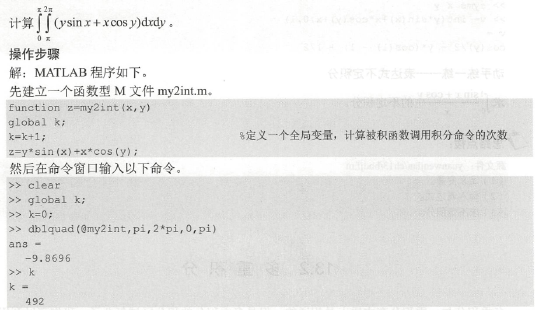
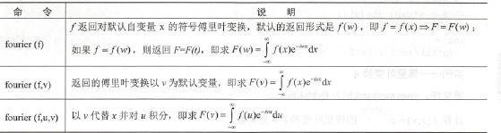
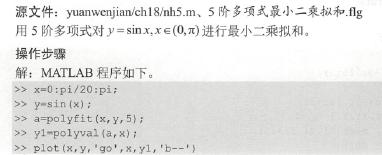
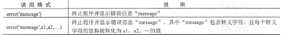
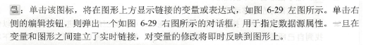
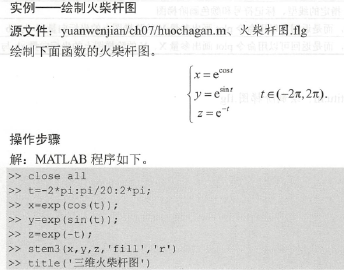
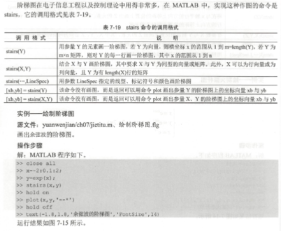
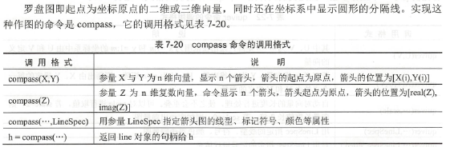
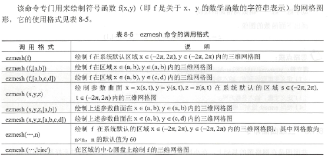

# Matlab

## 软件使用

安装略。可以使用vscode，加插件matlab和matlab-formatter，然后进行配置即可。配置需要在设置里找到matlab.matlabpath，地址改成MATLAB\R2019b(或对应版本号)\bin\matlab.exe (绝对地址)，如：`D:\Program Files\MATLAB\R2018b\bin\matlab.exe`；matlab.mlintpath改成对应地址\bin\win64\mlint.exe，如：`D:\Program Files\MATLAB\R2018b\bin\win64\mlint.exe`。

> 具体参见[这个](https://blog.csdn.net/ErenTuring/article/details/72996042)

vscode只负责编辑，跑代码还是只能靠matlab本体。用起来像python的IDLE。

matlab代码文件是.m文件。

注意vscode的matlab代码纠错功能会中文乱码，需要在vscode项目配置文件即vscode项目目录下`.vscode\setting.json`的大括号内增加：

```json
,
  "matlab.mlintpath": "D:\\Program Files\\MATLAB\\R2018b\bin\\win64\\mlint.exe",
  "matlab.linterEncoding": "gb2312",
  "material-icon-theme.files.associations": {
      "*.m": "matlab"
  },
  "matlab.matlabpath": "D:\\Program Files\\MATLAB\\R2018b\bin\\matlab.exe",
  "[matlab]": {
      "files.encoding": "gb2312"
  },
```

其中第一个逗号是json格式，灵活处理。

路径改成自己的路径即可。重启后生效。


matlab快捷键：略


## 语法

基本特征：

- 每一行代码通常要带分号；不带分号的表达式是会输出的内容。
- %单行注释
- 下标从1开始，用`(下标系列)`或`{下标系列}`取元素

常见运算符：

- :
- ; 区分行(矩阵行分隔；列分隔用空格)，取消运行显示
- , 区分列和函数参数
- () 控制优先级
- [] 矩阵定义
- {} 数组定义
- . 小数点，域访问符
- ... 续行符
- ! 调用操作系统运算
- = 赋值
- ' 字符串标记


### 数据类型

主要包括数字、字符串、向量、矩阵、单元型数据和结构型数据。

#### 变量

命名规范：

- 以字母开头，任意字母、数字、下划线
- 区分大小写
- 不超过31个字符(31后被忽略)

一般声明的一切变量认为是局部变量，只在使用的.m文件有效。

变量前加global关键字声明为全局变量，习惯上用大写英文字母命名。

保留变量和常量：

- ans 上一次运算的结果
- pi $\pi$ 一般输出$3.1416$
- eps 浮点运算相对精度 $2.2204e-16$
- inf 无穷大，如$\frac10$ 输出`Inf`
- NaN 不定值，如$\frac00,\frac\infty\infty,0\cdot\infty$ 输出`NaN`
- i (或j) 复数的虚数单位 均输出$0.0000 + 1.0000i$
- realmin 最小正浮点数 输出$2.2251e-308$
- realmax 最大正浮点数 输出$1.7977e+308$

注意可以修改上述量；clear后会恢复默认值。


#### 数值

数值类型：

- char 1字节
- unsigned char
- short 2字节
- unsigned short
- int 4字节
- unsigned int
- long 4字节
- unsigned long
- float 4字节 $3.4E\!-\!38 \sim 3.4E\!+\!38 $，7位有效数字
- double 8字节 $1.7E-308\sim1.7E+308$$3.4E\!-\!38 \sim 3.4E\!+\!38 $，16位有效数字

有复数。如$1+2i$。

有类型转换函数`int32`


#### 向量

##### 生成

1. 直接输入行/列矩阵就是向量，如：

   ```matlab
   x = [2 4 6 8] %行向量
   y = [1; 3; 5] %列向量
   ```

2. 生成表达式 `first:increment:last`  首项为first，公差为increment，最大值为last(公差负则最小值)的行向量，可以省略`:increment`，如：

   ```matlab
   z = 0:1.9:5 %三项
   w = 5:-1:2 %四项
   h = 1:12 %12项
   ```

3. 构造函数 `linspace(first, last, number)`

   生成首项为$first$，公差为$\dfrac{last-first}{number-1}$，末项为$last$，共$number$项的等差数列$[first, \cdots, last]$。若$number=1$，生成$[last]$。如：


   ```matlab
   z = linspace(5,9,4)
   ```

4. 构造函数 `logspace(first, last, number)`

   对`linspace`的每一项作$10^i$后的结果。即`10.^linspace(...)​`，如：

   ```matlab
   z = logspace(0, 2, 5)
   w = 10.^linspace(0, 2, 5)
   h = log10(logspace(0, 2, 5))
   ```

##### 下标

1. `(i)`取第$i$个元素，如：

   ```matlab
   a = [1, 3, 7, 19];
   a(2) * a(3)
   ```

2. `(i1:i2)`取区间$[i1,i2]$内元素，范围不对则是空向量，如：

   ```matlab
   a = [1, 3, 7, 19];
   [a(1:1), a(2:4), a(-1:-2)] %矩阵拼接了
   ```

##### 运算

###### 普通运算

与对一个实数运算，相当于每个元素与该实数运算，如四则运算和函数运算。例如：

```matlab
a = [1, 3, 7, 19];
log2(a + 1)
```

###### 程序运算

`size`函数可以计算每一维的长度并依次输出。

###### 向量运算

点积

`dot(a,b)` 同维向量点乘结果(行列可以混，长度一样即可) 如：

```matlab
a = [1 3 7 19];
b = [1; 3; 7; 19];
c = [0.5 1/3 1/7 30];
[dot(a, b), dot(a, c)]
```

差积

`cross(a,b)` 必须是三维向量 如：

```matlab
a = [1 2 3]; b = [4; 5; 6]; c = [7 8 9];
[cross(a, b), cross(a, c)]
```


#### 多项式

由数字和字母构成的代数式，有单项式和多项式。

语法和使用上与向量紧密联系。

##### 生成

1. 创建多项式直接输入字符串，按照matlab语法，

   如$ax^n+bx^{n-1}$表示为：

   ```matlab
   expr = 'a*x.^n+b*x.^(n-1)'
   ```

2. 使用构造函数`poly2sym(向量)`，次数从高到低(最低$0$)生成多项式。

   如$3x^4-2x^3+4x^2+6x+8$表示为：

   ```matlab
   expr = poly2sym([3 -2 4 6 8])
   ```

3. 构造函数`poly(解集)`创造有若干个零点$f(x)=0$的多项式，如：

   ```matlab
   poly([2 2]), poly([2]), poly([-5 3+2i 3-2i])
   ```

   

##### 运算

加法减法是多项式直接加减，加减的系数向量必须大小相等。系数向量或多项式均可以。

多项式卷积必须由系数向量参与，语法为`conv(p1,p2)`。

多项式解卷是`deconv(p1,p2)`，

$[k,r]=deconv(p1,p2)\Leftrightarrow p1=conv(p2,k)+r$，$k$是商，$r$是余，如：

```matlab
e1 = poly2sym([3 -2 4 6 8]);
e2 = poly2sym([3 2 4 -6 0]);
[e1 + e2, e1 - e2]
conv([3 -2 4 6 8], [3 2 4 -6 0])
conv([3 -2 4 6 8], [3 2 4 0])
```

求导使用`polyder(p)`，传入系数向量，返回新系数向量，如：

```matlab
p = 10:-1:1;

for index = 1:10
    p = polyder(p);
    poly2sym(p)
end
```


#### 单元型变量

单元型和结构型数据类型的特点是允许用户将不同但相关的数据类型集成为单一变量。

单元型变量是以单元为元素的数组，每个元素是单元。由`{}`创建。

##### 生成

1. 直接构造，元素以逗号隔开，大括号创建，如：

   ```matlab
   v = 581;
   va = {[1 2; 3 4], 3 + 2i, 'lr580', v}
   ```

   如上创建了$1\times 4$的`cell数组`，若加分号(需要保证构建出来是矩形)，可以创建$n\times m$的。

2. 先构造空间，使用`cell`函数，用法有：

   - `cell(n)` 生成$n\times n$阶空单元数组
   - `cell(m,n)` $m\times n$
   - `cell(m,n,p, ...)` 生成高维单元数组
   - `cell(size(a))` 生成与单元数组`a`同形的单元空数组

##### 下标

`{行，列}`

如：

```matlab
arr = {'lr580', 'kkksc', 'countless bugs'};
siz_arr = size(arr);

for i1 = 1:siz_arr(2)
    fprintf(strcat('Hello,', arr{1, i1}, '!\n'))
end
```


##### 使用

###### cellfun

第一个参数是字符串，是一个函数名，第二个参数是单元数组。

第一个参数为`islogical`时，判定是否是逻辑变量，返回布尔值数组。

如：

```matlab
x = {[1 2 3], 4, 6, logical(0.0)};
cellfun('islogical', x)
```

###### cellplot

图表显示数组，参数是单元型数组；若有第二个参数为`legend`，会有图表注解

###### celldisp

显示内容，参数是单元型数组，可以加第二个参数字符串，表示显示的变量数组名(默认`ans`)(不会创建这个名字的变量)

###### num2cell

数值转单元型变量

###### deal

输入输出处理

###### iscell

是否是单元型变量

###### cell2struct

单元型转结构型

###### struct2cell

结构型转单元型

###### reshape

改变单元数组结构


#### 结构型变量

根据属性名`field`组织起来不同数据结构。类似python的dict。

##### 生成

`struct`构造函数，奇数参数填值(只能符合变量名命名规范的不重复字符串)，偶数参数填内容(空则填`{}`)。如：

```matlab
x = struct('a1', {'s1', 's2', i}, 'a2', [1 2 3]);
```

##### 下标

显然用`.`运算符，如：

```matlab
s = struct('score', {23, 34, 45}, 'level', {'C', 'C', 'B'}); %结构体数组，使用单元体排版

for a = 1:3
    disp({num2str(s(a).score), s(a).level})
end
```

##### 使用

###### fieldnames

属性名

###### getfield

得到属性值

###### setfield

设置属性值

###### rmfield

删属性

###### isfield

是否是结构变量的属性

###### isstruct

是否是结构变量


#### 矩阵

是matlab数据操作的基本单位。

##### 生成

###### 常规创建

元素行用空格或逗号隔开，列用分号隔开。[]是空矩阵。允许方括号内还有方括号(但不表达嵌套)：

```matlab
x = [[1 2]; 3, 4]
```

###### 读取文件

可以读取.m或.txt

直接输入同目录下的.m文件名，文件内有矩阵变量，等效于执行了一遍那个文件：

```matlab
%p002.m
a = [1 2 4; 8 16 31]; %不加分号会被p001调用时输出内容
```

```matlab
%p001.m
clc
format long g
p002
a(1)+a(2) %1+8
```

.txt要求行分隔是换行，列分割是若干个空格。需要用`load 文件名`调用用路径下的文件(含后缀名)，矩阵名就是文件名，如：

```txt
1 2 3
4 6 5
9 7 8
```

```matlab
clc
format long g
load d001.txt
d001(2)
```

###### 特殊生成

`eye(n), eye(m,n), eye(size(a))` 创建$n\times n$,$m \times n$或同型单位矩阵

`ones()` 创建全$1$矩阵(参数同理，下同)

`zeros()` 全$0$

`rand()` $[0,1]$均匀随机矩阵

> `randn()` 随机矩阵(值域多少是个谜)

`compan(P)` 系数向量为$P$的多项式的伴随矩阵

`diag(v)` 向量$\vec v$元素为对角的对角阵

`hilb(n)` $n\times n$的Hilbert矩阵

`magic(n)` $n$阶魔方矩阵

`sparse(A)` $A$的稀疏矩阵形式


##### 运算

###### 元素修改

用`[]`表达式，内都是矩阵时，表示为矩阵的拼接

`(:)` 取整个矩阵

`(m,:)` 取或赋值整行，赋值为`[]`表示删除

`(:,n)` 整列

`(m,n)` 单一元素调用

###### 变换

`reshape(X, m, n)` 将已知矩阵变成$m\times n$

如：

```matlab
a = reshape(1:12, 2, 6);
c = zeros(3, 4);
c(:) = a(:)
```


`rot90(a)` 对$a$逆时针旋转$90^\circ$

`rot90(a, k)` 旋转$k\times 90^\circ$

`fliplr(a)` 左右翻转 等于`flipdim(a,2)`

`flipud(a)` 上下翻转 等于`flipdim(a,1)`

`a'`直接进行转置运算 或`transpose`


###### 抽取

`diag(x,k)` 第$k$条对角线上元素组成一个向量。$k=0$主对角线，$k>0$是上方第$k$条，$k<0$是下方。可以缺省`k`。

`tril(x)` 主下三角部分

`tril(x, k)` 第$k$条对角线及其下三角部分

`trlu(同理)` 上三角


###### 数学运算

加减和数乘、矩阵乘法、求逆矩阵(除法)、幂运算直接操作即可。注意矩阵维度的对应，否则会报错。$DX=B\to D^{-1}B=X$左除`\`的条件是$D$阶数和$B$行数一样。右除`/`就列数。

此外，还有点乘、点除(左右)、点幂运算。


###### 矩阵运算

`cond` 条件数值

`condest` $1-$范数矩阵条件数值

`det` 行列式值 或`determ`

`eig` 特征值

`inv` 逆

`norm` 范数值

`normest` $2-$范数值

`rank` 秩

`orth` 正交化运算

`rcond` 逆条件数值

`diag` 对角变换

`triu` 上三角变换

`tril` 下三角变换

`exmp` 指数运算

`logm` 对数运算

`sqrtm` 开方运算

`cdf2rdf` 复数对角矩阵转实数块对角矩阵

`rref` 转换成逐行递减的阶梯矩阵

`rsf2esf` 实数块对角矩阵转复数对角矩阵

`rot90` 逆时针转

`fliplr` 左右转

`flipud` 上下转

`reshape` 改变维度

`funm` 矩阵函数

> 条件数：
> $$
> cond(A)_v=||A^{-1}||_v||A||_v,v=1,2,\cdots,F
> $$
> 若条件数远大于$1$，矩阵是病态的，否则是良态的
>
> 
>
> 


###### 矩阵分解

> 
>
> 
>
> 
>
> 
>
> 
>
> 源码在书`p93`此处略。
>
> 
>
> 
>
> 
>
> 
>
> 
>
> 
>
> 
>
> 
>
> 
>
> 


#### 字符串

##### 转换

`num2str` 数字转字符串

##### 运算

`strcmp(a,b)` 比较

`strcat(a,b, ...)` 字符串连接，可以接字符串或字符ASCII码(字符串会删掉尾部空格)


### 运算

#### 算术运算

优先级是一般的数学优先级

- \+ \- \*  \^ 加减乘、算术乘方 

- \.\* 点乘 \.\^ 点乘乘方

- \ .\ / ./ 左除右除(常规除)及其点除(算术右除和左除互为倒数)

- ' 矩阵转置(复数矩阵求共轭转置)

- .' 矩阵转置(复数矩阵不求矩阵的共轭)

- 取模使用`mod(a,p)`，可以取实数，返回值一定是正数。

  > 可以用`rem(a,p)`，唯一的区别是返回值符号与$a$一致。

> 可以视作.是一种单独的运算符，结合形成了复合运算符。

点强调元素的点对点，即矩阵内元素对元素的运算，要求参与运算的变量结构相似

如：

```matlab
clc
format long g
x = 580^0.5; %也可以用sqrt函数
y = 7 \ 1; %右除，即1/7
z = [1 2; 3 4];
w = [5 6; 7 8];
x, y, z .* w, mod(-0.1, 1.9) %1.8
```

#### 关系运算

- == 等于
- ~= 不等于
- < > <= >= 大于 小于 大于等于 小于等于

#### 逻辑运算

- & 逻辑与 (&&也行)
- | 逻辑或  (||也行)
- ~ 逻辑非
- xor 逻辑异或(括起来两个参数)
- any 是否存在非零元素
- all 是否所有元素非零

如：

```matlab
clc
format long g
t = logical(233); %强转布尔值，不转也行的
f = 1 - 1.0;
[t & f, t | f, xor(t, f), any([t, f]), all([t, f])]
```

#### 函数运算

##### 复数运算

###### complex

`complex(a,b)` 构造函数

###### isreal

是否是实数

举例：

```matlab
[isreal(1),isreal(i),isreal([0 i])]
```

###### real

取实部

###### imag

取虚部(得实数)

###### angle

复数的幅角($\theta=\tan^{-1}\frac ba$)

###### abs

复数的模

###### conj

取共轭复数

##### 三角函数运算

弧度制(还有超越三角函数如`tanh`)

例如：

```matlab
clc
format long g
[sin(pi / 2), sec(pi / 4), acos(-1)]
```

##### 其他函数运算

有`exp`，即$e^x$

有`log`(即$\ln x$)，`log2`，`log10`

有`abs`, `sign`, `round`, `floor`, `ceil`

有`rat`， 将实数表示成分数展开(字符串)

有`rats`  将实数表示为分数(字符串)，一般用这个，如：

```matlab
rat(0.33), rats(0.33)
```

有`min`, `max `(多维求每列的，下同)

有`sum` ,还有忽略NaN的`nansum`和求行一维前缀和的`cumsum`

> 可以传入多一个参数`2`，把求行改为求列；前缀和，可以传入参数`reverse`求后缀和

有`sort`，如：

```matlab
k = [1 3 2; 5 0 -1; 4 2 0.5];
max(max(k)), min(min(k)), sort(k)
```

有`std` 求标准差 `var` 求方差，可以加参数权重向量

有`range`  求最大值和最小值的差值。

有`mad` 求绝对差分平均值

有`mean` 求平均值, `nanmean` 算术平均 `geomean` 几何平均 `harmmean` 和谐平均 `trimmean` 调和平均

有`factor` 分解因式，返回向量(不会合并去重，会排序)

有`factorial` 阶乘 或广义的`gamma`计算实数阶乘

有`perms` 输出向量的全排列

有`nchoosek(x,k)` 输出向量的组合或组合数(x为向量或为整数时) ，也可以用`combntns`

有`prod(n:m)` 求$\prod_{i=n}^mi$ 有`cumprod(n:m)` 依次输出这个乘积式每一次

> 用法同sum，也有cumprod

> 先组合再全排列以输出任意排列

如：输出$A_5^2$的结果

```matlab
r = []
for x = nchoosek(['abcde'], 2)'
    r = [r perms(x')];
end
r'
```


#### 矩阵运算

##### 特征值、特征向量


应用：对角化


##### 线性方程组解


如：


> 
>
> 


##### 其他


#### 符号运算

eval将符号转数字，sym将数值转符号。syms可以用空格隔开符号化多个变量。findsym可以找表达式的符号。


符号矩阵：


如：

```matlab
syms x y
a = [x + y x; y y + 5]
mat = sym('a', [1 5]) %1行5列
mat2 = sym('b_%d', [1 4])
```

下面给矩阵加上`x`变量：

```matlab
syms x
a = [-1 2; 3 4];
b = a*x %或sym(@(x)(x * a))
```


##### 常规运算

`factor` 提取公因式(因式分解)

`expand` 展开

`simplify` 简化矩阵

`numden` 分式合并

`horner` 转化为秦九韶型


`fzero(f, k)` 求一元方程离$k$最近的根

> 更多参数：tol=eps，trace指定迭代信息是否在运算中显示，为1时显示，为0时不显示，缺省时取trace=0。 还有一个近似函数`fsolve`


符号的代值数值运算举例(不是近似值是精确值)：

```matlab
syms x
f = 2 .* x + sqrt(x);
r = subs(f, x, 8) + subs(f, x, 2) %不会化简
simplify(r) %化简
```

符号运算举例：

```matlab
mat = sym('x_%d_%d', 4) %4行4列
det(mat)
inv(mat)
syms x y
factor(x^3 - 1)
expand((x+3)^4)
expand(cos(x+y))
syms x y
[fz, fm] = numden(x / y + y / x) %直接输出只有分子
fz, fm 
horner(x^4 - 3 * x + 6 * x^2 - x^3 + 1)
fzero('exp(x)-x^3', 0)
```


##### 高等运算

###### 极限


如：


###### 求导


###### 级数求和


如：


###### 积分


也可以计算反常积分和求不出原函数的积分。

可以用`vpa`求近似值。

可以求累次积分。二重积分经过人工分析后可以经由求出。三重积分类似。


如：





###### 泰勒展开


###### 傅里叶变换





###### 拉普拉斯变换


#### 统计运算

##### 线性回归

###### 一元

polyfit函数(一阶多项式拟合)


###### 多元


##### 曲线拟合


如：




### 程序语句

#### 条件判断

##### if

完整结构：

```matlab
if 表达式
	语句组
elseif 表达式
	语句组
elseif 表达式
	语句组
...
else
	语句组
end
```

##### switch

注意自带break，所以不写break

完整结构：

```matlab
switch 变量
	case 常量表达式
		语句组
	...
	otherwise
		语句组
end
```

常量表达式可以是单元体括起来的多个内容，那么是其中一个就会触发。

如：

```matlab
x = 3;

switch x
    case 2
        disp('haha')
    case {1, 3} %执行这里
        disp('hoho')
    case 4
        disp('gg')
    otherwise
        disp('shit')

end
```


#### 循环

##### for

类似于python的for，格式为：

```matlab
for 变量 = 表达式
	循环体
end
```

如：

```matlab
x = [1 2 3; 4 5 6; 7 8 9];
r = 0;

for a = x %取每一列
    r = r + prod(a); %列乘积
end

r
```

```matlab
for a = 1:5

    if a == 2
        continue
    end

    for b = 1:a

        if b == 4
            break
        end

        disp(a.^b)
    end

end
```

##### while

```matlab
while 表达式
	循环体
end
```


#### 错误判定

```matlab
try
	语句组
catch
	语句组
end
```

如：

```matlab
for a = 1:3

    try
        disp('wdnmd')

        if a == 2
            error('qwq') %qwq不会被显示
        end

        disp({'=w=', num2str(a)})

    catch
        disp({'QAQ', num2str(a .* a)})
    end

end
```


#### 流程控制

##### pause


单纯的`pause`不会提示用户，建议手动输出一些东西提示用户按下任意键


#### 函数句柄

间接调用函数的一种语言结构，可以在函数使用时保存函数相关信息，如函数执行信息。

通过`@`+函数名实现，实际上是结构数组。


#### 断点


### 输入输出

#### 输出

不带分号的运算表达式会直接输出。

##### disp

`disp(str)` 输出一行内容(不限于`str`为字符串)

多个参数可以搞成一个大括号括起来，即单元数组。

##### warning

`waring(str)`输出一行`警告：`红色内容`str`，`str`必须是字符串


如：

```matlab
warning('%d+%d=%d', 1, 2, 3)
```


##### error

`error(str)`输出一行红色报错。并停止后续的代码执行。



##### echo


#### 输入

##### input

读取并返回输入单值表达式或字符串(第二个参数固定为`s`，否则不填第二个参数)，第一个参数是提示文本。输入类型有误会要求重输，表达式有误会报错。如：

```matlab
x = input('你故意找茬是不是:') %读入并输出结果
x = input('你就说你要不要吧：', 's')
```


##### keyboard

打开新的交互，此时用户可以输入任意指令。

提示符是`K>>`，此时可以输入matlab语句，输入dbcont结束输入，或输入return后结束输入(有些版本)。


##### menu

`menu(提示文本, 选项1标题, ...)` ，选择了哪个返回值就是整数几。选择了关闭窗口是返回$0$。


#### 文件操作

##### 执行代码

直接输入同目录下的代码文件的名称，可以完整执行一遍该代码文件。

```matlab
% p003.m
clc
format long g

cnt = 0;

for i0 = 1:tot
    x = unidrnd(1e9 + 7); %均匀随机正整数[1,1e9+7]
    xfs = size(factor(x));

    if xfs == 1
        cnt = cnt + 1;
    end

end

fprintf(strcat('there are', 32, num2str(cnt), ' primes in ', 32, num2str(tot), ' numbers.')) %32是ASCII空格，strcat会抹掉尾部空格
```

```matlab
% p001.m
tot = 580;
p003
```


#### 图形界面

略


##### 函数文件

作为一个函数的定义而存在的文件，开头为：

`function 返回值=函数名(参数)`

结尾是`end`。

只要在同目录下，不需要显性声明，即可直接调用函数。函数名与文件名一致。如：

```matlab
function y = cal(x)
%cal.m 这个地方的内容会显示在在help里
%所以这里的内容可以好好写
    if x <= 0
        error('bad input'); %报错并停止
    elseif x == 1
        y = 0;
    else
        y = x.^(x - 1);
    end
end
```

```matlab
clc
format long g
cal(5), cal(1)
cal(0)
```


可以有`return`，但是不会传返回值(返回值还是需要自己用赋值语句)，只代表提前结束函数


#### xlsx操作

##### xlsread

`xlsread(路径, 表单名/下标, 范围字符串)` 范围字符串用excel格式，如`D2:D8`，路径相对绝对均可

返回矩阵(只能读数值，所有的文本都会变成NaN)

如：

```matlab
clc
format long g
res = xlsread('中文路径测试.xlsx', 1)
```

##### xlswrite

格式同xlsread，只不过参数列表改成`xlswrite(路径, 数据矩阵, 表单, 范围)`

如下面代码生成九九乘法表并保存：(新建时会有警告；替换同名文件时不会)

```matlab
clc
format long g
arr = zeros(9); %初始化

for x = 1:9

    for y = 1:9
        arr(x, y) = x .* y;
    end

end

%新建xlsx文件(自带Shee1表单)和新建表单，保存(若相对路径，具体在哪看matlab的配置)
xlswrite('99table.xlsx', arr, '九九乘法表')
```


### 绘图

#### 二维绘图

##### plot

`plot(x)` 

- 若`x`是实向量，画以下标为横坐标，值为纵坐标的曲线
- 若`x`是实矩阵，把每一列都按上述方法绘图，画若干条曲线
- 若`x`是复数矩阵，每一列实部横坐标，虚部纵坐标

`plot(x,y)`

- 若`x,y`同形向量，以`x`为横坐标，`y`为纵坐标的散点折线图
- 若`x`是向量，`y`是有一维与`x`同形的矩阵，绘制不同颜色多个曲线，曲线数目为矩阵另一维数，`x`为横坐标
- 若`x`是矩阵，`y`是向量，同理，而`y`是横坐标
- 若`x,y`是同维矩阵，以`x`对应列为横坐标，`y`对应列为纵坐标绘制。曲线数为矩阵列数。

`plot(x1,y1,x2,y2,...)`

- 绘制多条曲线，即逐次执行`plot(x1,y1)`，$\cdots$

`plot(x,y,s)`，字符串`s`代表图案控制，有：

- 颜色(有线型就线色，否则点边缘色)
  - b 蓝色
  - g 绿色
  - r 红色
  - c 青色
  - m 品红
  - y 黄色
  - k 黑色
  - w 白色
- 线型
  - \- 实线(默认)
  - : 点线
  - \-\- 虚线
  -  \-\. 点画线
- 点型
  - +
  - o
  - *
  - .
  - x
  - d 棱形
  - ^ 向上三角
  - v 向下三角
  - \> 向右三角
  - < 向左三角
  - s 正方形
  - h 正六边形
  - p 正五边形 

其他两两结合的图形属性：

- `MarkerSize` 数字 点的大小
- `MarkerEdgeColor` 三维RGB向量 点边沿色(若上面不规定线型覆盖上面的颜色指令)
- `MarkerFaceColor` 同理 点内色

`plot(x1,y1,s1,x2,y2,s2,...)`  同理

如：(若运行多个`plot`，只显示最后一个结果)

```matlab
plot(1:10, sqrt(1:10))
plot(1:10, (1:10).^2)
```

```matlab
clc
format long g
a = 1:0.1:10
hold on %见下
plot(a, cos(cos(a)), 'ro') %散点
plot(a, cos(sin(a)), 'g-') %只有线
plot(a, sin(sin(a)), 'bo-', 'MarkerSize', 3, 'MarkerEdgeColor', [0.5, 0, 0], 'MarkerFaceColor', [0, 0.8, 0]) %有点有线
```


##### hold

`hold on`指令，保持之前的`plot`，下次`plot`叠加

`hold off`，不保持，下次覆盖

如：

```matlab
a = 1:0.1:10
plot(a, sin(a), 'b:x')
hold on
plot(a, csc(a), 'r--s')
% hold off  若有，只显示最后那个，否则三个都显示
plot(a, log(a).^2, 'yo-.')
```


##### subplot

划定窗口区域(紧接着可以绘图一次)

`subplot(m,n,p)` 窗口划分为$m\times n$个视图，并下一次绘图画在第$p$个(从左往右从上往下)。例如：

```matlab
clc
format long g
subplot(1, 2, 1)
plot(1:0.1:10, log(1:0.1:10))
subplot(1, 2, 2)
plot(1:0.1:10, exp(1:0.1:10))
```


##### fplot

绘制一元函数

`fplot(f, lim)` 在范围内画出一元函数

`fplot(f, lim, s)` `s`的规定见上

`fplot(f, lim, e)` 相对误差是$e$

`fplot(f, lim, e, s)`

`fplot(f, lim, n)` 至少描出$n+1$个点

> 上述参数可以以任意形式组合输入

返回值是横坐标和纵坐标散点向量。可以给函数在最后输入参数。使用默认参数只需要填`[]`即可。

`f`是可以`eval`执行的字符串或返回行向量的函数，格式为`@(x)函数体`。

`lim`是$x$轴范围区间$[x_\min,x_\max]$或$[x_\min, x_\max,y_\min,y_\max]$。

`e`默认为$2\times10^{-3}$

`n`至少把`limits`分成$n$个小区间，最大步长不超过$\dfrac{x_\max-x_\min}n$

例如：

```matlab
fplot(@(x)sin(1 ./ x), [0.01, 0.02])
```


##### ezplot

更简单的指令，绘制符号化函数。

`ezplot(f)` 默认区间是$(-2\pi, 2\pi)$。若隐函数，$x,y$都在这个区间

`ezplot(f,[a,b]) ` 规定默认区间

`ezplot(f,[xa,xb,ya,yb])` 隐函数区间规定

`ezplot(x,y)` 参数曲线，默认参数区间是$t\in(0,2\pi)$

`ezplot(x,y,[a,b])` 规定区间

`ezplot(..., figure)` 指定图形窗口

首先需要符号化一个变量，语法为：`syms 变量名` (可以逗号分割，符号化多个)

如：

```matlab
clc
format long g
syms t
subplot(2, 1, 1)
ezplot(cos(t), sin(t), [0, pi * 3 / 4])
subplot(2, 1, 2)
ezplot(cos(t), sin(t))
```

```matlab
clc
format long g
clear all
syms x
hold on

for i0 = 1:9
    subplot(3, 3, i0)
    ezplot(strcat('x.^', num2str(i0)), [-5, 5])
end
```


##### polar

`polar(thera,rho)` 两个参数函数。可以附加参数`s`。如：

```matlab
t = 0:0.01:4 * pi
polar(t, sin(t) .* cos(t))
```


##### semilogx(y)

> semilogx, semilogy 
>
> 


##### loglog

> 


##### plotyy

同一坐标系上两个图像(分别用不同的`y`轴)

> 


#### 图形窗口

##### 基本指令

`figure` 创建

`figure(n)` 设置句柄为正整数`n` (窗口名是`Figure n`)

`figure(PropertyName, PropertyValue, ...)` 键值对设置属性

`set(n)` 返回图形窗口`n`的所有图像属性名称和属性值可能取值

`get(n)` 返回图形窗口`n`的所有图像属性名称和属性值当前取值

`close` 关闭窗口

`clf` 清除窗口内容

`clf(rest)` 清除内容，设置位置和单位属性外其他属性为默认


属性如下：


##### 基本操作





#### 图形属性

##### 坐标系

`axis([xmin, xmax, ymin, ymax, zmin, zmax])`


##### 标题


##### 填充


##### 注释

有`text`和`gtext`两种。


可以用Tex语法。


##### 图例


综合使用举例：


##### 方格线


##### 其他

###### alpha

透明度修改(会叠加)，如：

```matlab
a = imread('2.png');
imshow(a)
alpha(0.75)
hold on
b = imread('1.png');
imshow(b)
alpha(0.5) %a的透明度会比0.75淡
```


#### 统计图表

##### 条形图


##### 面积图


如：

```matlab
stat = [5 2 3; 4 4 1; 1 1 2; 3 3 3; 3 4 3; 0 1 0; 2 0 1]
title('面积图示例')
grid on
area(stat)
```


##### 饼图

有`pie`和`pie3`


##### 柱状图


#### 离散数据图

##### 误差棒图


如：


##### 火柴杆图


如：




##### 阶梯图




#### 向量图

##### 罗盘图




##### 羽毛图


##### 箭头图


#### 三维绘图

绘制曲线。同二维绘图理，函数`plot3,ezplot3`，参数加一个`z`即可。

绘制曲面：

##### mesh


如：

```matlab
t = -4:0.1:4;
subplot(1, 2, 1)
plot3(t .* sin(t), t .* cos(t), t)
subplot(1, 2, 2)
[x, y] = meshgrid(t);
z = x.^2 + y.^2;
mesh(x, y, z)
axis([-3, 3, -3, 3, 0, 9]) %注意顺序在mesh之后
```


##### ezmesh




##### surf

参数同mesh，绘制曲面。如：

```matlab
t = -4:0.1:4;
[x, y] = meshgrid(t);
z = x.^2 + y.^2;
surf(x, y, z)
axis([-5, 5, -5, 5, 0, 10])
```


##### ezsurf

同理


##### cylinder


例如：

```matlab
subplot(1, 2, 1)
t = 0:pi / 10:2 * pi;
[x, y, z] = cylinder(2 + sin(t) - cos(t), 30) % 边长半径
surf(x, y, z)
subplot(1, 2, 2)
cylinder(2, 6) %正六边形，半径为2
```


##### square


##### contour3


##### contour


##### contourf


##### contourc


##### clabel


##### ezcontour


##### ezsurfc


#### 三维图属性

##### 视角


##### 颜色

使用`colormap`设置颜色主题，有关键字`winter`,`summer`,`default`,`parula`等，可以加括号表示颜色数目。(绘图后再设置)


##### 光影


#### 图片读写

##### 读写


如：

```matlab
a = imread('1.png');
imwrite(a,'3.jpg', 'jpg') %转换格式并保存
```


##### 显示


如：

```matlab
a = imread('2.png');
image(a) %会显示坐标轴
imshow(a) %不显示坐标轴
```


##### 信息查询


如：

```matlab
imfinfo('2.png')
```


#### 图形动画


如：

```matlab
[x, y, z] = sphere
surf(x, y, z)
axis([-3, 3, -3, 3, -2, 2])
axis off
shading interp
colormap cool
m = moviein(20) %20帧

for i = 1:20
    view(-37.5 + 24 * (i - 1), 30)
    m(:, i) = getframe;
end

movie(m, 3) %播放3次
```


### 内建指令

#### 控制指令

##### cd

显示或改变工作目录

##### clc

清除命令行窗口(一般可以在整个程序第一个输出前使用，避免上次运行的输出混淆视听)

##### clear

删除变量(一次只能一个)，如：

```matlab
clear x
```

可以`clear all`删除全部

##### format

修改显示格式 `format 格式` (有后效性，下次运行会顺承)

格式有：

- short 5位定点(默认)
- long 15位定点
- short e 浮点
- long e
- short g 定点和浮点间选择最好的格式
- long g
- hex 十六进制
- \+ 矩阵里用+,-和空格表示符号(空格为$0$)
- bank 美元和美分定点
- rat 有理数(分数)
- compact 变量间无空行
- loose 变量间有空行

如：

```matlab
x = 1E9 + 7;
y = 998244353;
z = 0.114514;
clc
format long g
x, y %分开写
format long e, x, z %合并多行
```

##### eval

传入一个字符串，将其执行

##### clf

清除图形窗口

##### diary

日志文件

##### dir

显示当前目录下文件

##### disp

显示变量或文字内容

##### echo

命令行窗口信息显示开关

##### save

保存内存变量指定文件

##### hold

保持图形

##### load

加载指定文件的变量

##### pack

整理内存碎片

##### path

显示搜索目录

##### quit

退出MATLAB

##### type

显示文件内容


#### 帮助命令

##### help

> 直接输入help会显示当前路径的所有目录

输入help 函数(类)名 展开帮助，如：

```matlab
help eig
```

另有helpwin和helpdesk(或doc)用于调用MATLAB联机帮助窗口(打开的页面不同)，也可以功能区的资源-帮助-文档

##### lookfor

通过关键字查找函数确切名，如：

```matlab
lookfor quadratic
```

##### demos

打开官方示例窗口。或者在资源-帮助-示例

##### who

who 内存变量列表

##### whos

whos 内存变量详细信息

##### what

what 目录中文件列表

##### which

which+文件名(无论有无后缀都行) 确定文件位置，如：

```matlab
which p001.m %输出D:\_lr580\大学\高数实验课\数模\prac\p001.m
```

##### exist

exist+变量名 变量检验函数，返回0或1，如：

```matlab
exist x %此前的运行建立过就1，否则0
```


# MUPAD

**打开mupad:**

方法一：打开matlab(最新版本不支持)，输入mupad

方法二：打开matlab(最新版本不支持)，输入mupadwelcome,打开new notebook

## 基本语法

### 运算符

按照优先级排序，不同优先级换行表示

```matlab
' 求导
[] 下标从1开始
@@ 函数迭代(?)
@ 函数复合(?)
! 阶乘; !! 双阶乘，如3!!=3,4!!=8,3!!!=(3!!)!=3!=6
^ 幂，如2^3+1=9 注意优先级，如2^(3^4)代表2^81，否则从左往右
*/
- 负号
+-
div 地板除;mod 取模  3 div 2 = 1 //注意空格
... 浮点数闭区间(?)
intersect 交集(?)
minus 差集(?)
union 并集(?)
.. 取值范围
= ~= <> < > <= >= in subset   第二个是约等于，subset是子集(?)
$ 创建序列
not
and 
xor 逻辑异或(?)
or assuming 局部假设(?)
==> 逻辑蕴含(?)
<=> 逻辑等价(?)
| 函数在某点取值(?)
```

```matlab
: 不显示结果的命令语句结束符
; 显示结果的命令语句结束符(默认)
:= 赋值
% 倒数第一个计算结果
%n 倒数第n个计算结果
// /* */ 代码注释，如z:=1/*123*/+2;
```

```matlab
-> 映射而不计算
--> 映射并计算
{} 生成集合(也可以用下标)
\ 续行 系统设置输出区域每一行的最大字符个数的默认值为80，大于时续行
```

保留字：

```matlab
D 值域
E e
I i
O 上界
```


### 基本数学函数

```matlab
exp(x) 即E^x
ln(x) log10(x) log2(x) 自然对数函数
log(底, x) log(2,8)=3
sqrt(x) 开方 surd(x,n) 开n次方 会化简，而^运算符不会
max(可变参数) min(...) 最值
ceil floor round trunc 取整
sign abs 符号函数，绝对值函数
Re(x) Im(x) 取实数实部和虚部
arg(x) 复数辐角，范围(-PI,PI]
sin cos tan cot arc-... 三角和反三角
sinh cosh tanh coth 和arc-... 双曲和反双曲
```

#### 取整函数

##### round

round(x)或round(x,n)四舍五入并保留n为小数

注意，对于分数，一定是准确的，但对于小数的0.5，有如下特性：

```matlab
i+0.5$i=-4..6 
= -3.5, -2.5, -1.5, -0.5, 0.5, 1.5, 2.5, 3.5, 4.5, 5.5, 6.5 
round(i+0.5)$i=-4..6
= -4, -2, -2, 0, 0, 2, 2, 4, 4, 6, 6
```

### 基本命令

```matlab
delete 清除标识符 删除一个或多个(逗号分隔) 不进行输出故;:等效
	delete可以避免要用一个变量建立表达式，但它是程序意义上的变量而进行替代
domtype type 查看数据类型(略有区别，一般用前者)
float 计算近似值 
```

```matlab
hold() 不计算内部的内容，用于积分或只显示(数学格式)
```

```matlab
assuming 逻辑条件  为当前计算设置前置条件
assume(条件) 为所有计算设置前置条件
```

```matlab
numer(f) 返回分子
denom(f) 返回分母
```

### 控制命令

#### 打印

可以不使用print，直接使用x;x为可打印变量；或赋值时开启;而不是使用:

在循环控制结构，应该使用print语句，使用后穿透end_for的:，且不会与原有的;型输出重复输出。

print():与print();效果相同；在一般顺次结构里，不会影响上一次的输出

#### if

格式有：

```matlab
if 表达式 then
	代码
else
	代码
end_if;//;或:控制是否进行输出(多行只输出最后一次无论其本身:/;)
```

#### for

```matlab
for i from v1 to v2 do
	代码
end_for:
```

举例：

```matlab
delete x,y;
x:=0:
y:=0:
for i from 1 to 10 do
x:=x+i;//记得分号(代码块的最后一行可以不)
y:=y+i*i;//只输出y的最后一次
end_for;//若改为:，一次也不输出
```

### 常量

```matlab
PI，E 常量  I 虚数单位
infinity -infinity Left Right 常量
TRUE FALSE UNKNOWN 逻辑常量
```

```matlab
N_ 自然数集
R_ 实数集
C_ 复数集
```

#### 默认参数

##### 普通

```matlab
DIGITS 10 十进制有效小数位数，注意是有效小数位数，而不是小数位数
```

对于带有小数点的十进制数，如果为$a_m$非零数字，则称$0.00a_ma_{m+1} \dots a_{m+k-1}a_{m+k}$具有k位有效数字

超出有效小数部分会丢失，除非重改该常量，可提高计算精度。

> 如果DIGITS<=9,10^-10^的浮点数都是1.0e-10，精确值，科学计数法
>
> 如果>=10,都是0.0000000001，精确值
>
> 
>
> 如果DIGITS<=15,2^-52^的浮点数都采用科学计数法，，尾数部分显示给定位数的有效数字，近似值
>
> 如果16<=DIGITS<=36，都采用小数，显示给定位数的有效数字，近似值
>
> 如>=37，采用小数，精确值(因为够位置显示了)
>
> 即规律为：如果已经有足够的位数显示所有，就精确，否则科学/近似 


> EPS为2^-52^ 约为2e-16

否则：1^20^+5=1^20^，1+1^-99^=1

### 输出与文本

#### 输出方法

使用逗号间隔或作行末，最后使用分号，同一行内输出多个运算结果

使用冒号结尾，不输出运算结果

使用print输出，必然输出运算结果。

#### 输出区域格式

在Notebook处较下方

##### Typeset Math

标准的印刷体数学符号(图片型/latex型)

##### Abbreviate Output

仅在Typeset Math下有效，显示缩写

##### Pretty Print

用纯文本模拟数学公式

> 将输出的任意内容复制到代码框，会得到一般纯文本(即输入的代码)

都不勾选就是一般的代码

#### 下标输出

一个下划线对应右边1个字符，不能再多；没有下标嵌套

例如xyz_n3_m1为$xyz_n3_m1$

如果需要使用变量下标，应当用.号：

```matlab
delete x_,n;
x_.1;
x_.n;
x_.1^2+x_.n^2;
x_.i $ i=1..3;//[1,3]闭区间
x_.{i} $ i=-10..15 step 5;
x_.i._.j $ j=1..3 $ i=1..3;//相当于内层j外层i
```

### 精确值

小数都是不精确的，分数可以符号运算

```matlab
0.5+1/2 = 1.0
1/2+1/2 = 1
56^(1/2)=sqrt(56)(未化简)
56^0.5=7.483314774
```

### 特殊文本

> 还有更多在课件里找到复制到命令行就可以看到源码了

偏导数：

```matlab
output::mathText(`&PartialD;`,u)/output::mathText(`&PartialD;`, x)
```

单位方向：

```matlab
matrix([[`i&rarr;`, `j&rarr;`, `k&rarr;`]])
```


## 数据类型

### 常规

略(实数R、复数C、布尔值、表达式、函数等)

### 数组类

#### 列表

DOM_LIST

> 帮助文档的Lists

```matlab
a:=[[1,2],[3,4]]:
b:=[];//空列表
```

下标：以1开始，可以反着来，如-2代表倒数第二个

可以进行列表加法，乘法(一一对应组合)，幂(同理)

列表可以同常数进行加法、乘法、幂操作

列表可以插入一个或多个元素，使用下面两种方法之一：

```matlab
lt:=[a,b,c]:
lt2:=append(lt,d,e);//lt不变；如果是让lt真正插入，lt2改lt
```

```matlab
lt:=[a,b,c]:
lt:=lt.[d,e];//连接运算符
```

删除某个元素，使用delete lt[下标]

可以用sort()函数升序排序

#### 集合

DOM_SET

> 题目要求生成集合就加一个大括号

```matlab
a:={x+y=1,x-y=3}:
```

自然有数学集合的特性，元素不能重复。列表转集合可以去重，方法：

```matlab
unique_c = {c};//c是列表
```

默认升序排序

#### 序列

```matlab
a:=$1..9; //公差1首项1项数9等比数列
b:=k $ k=9..1 step -1//公差-1，余同上
c:=sin(k*PI/n) $ k=0..n;
x$5 五个重复的x
i^2$i in [1,3,-2] //集合也可
```

## 代数

### 表达式变换

#### 代值

##### subs

```matlab
delete a,b,c,x;
f:=a+b+c:
subs(f,[a=x^2,c=5]);
```

不会改变f

subs执行的类似于宏替代

##### subsex

同subs,但可以代入表达式，而不是死板类似宏替代

```matlab
delete a,b,c,x;
f:=a+b+c:
subsex(f,a+c=x^2+5);
```

#### 常态

normal(表达式)

分式会通分，用因式分解合并分母(但不拆，保留积的形式)，分子也会因式分解；但normal分解因式不彻底

#### 化简

传入的值可以是一个表达式，或多个表达式的列表/集合

##### simplify

- 对三角函数的化简不是最简的
- 对根式化简，提取公因式，可能不提取分母

##### Simplify

- 三角函数化简到最简
- 对根式化简，提取公因式；也会提取分母

##### radsimp

根式化简，不提取公因式

> 先expand后化简和直接化简对三角函数产生的结果可能不一致；expand后更可能元会变大，如从x到2x乃至4x

##### normal

通分

```matlab
normal(11/33)
```


#### 合并

##### collect

合并同类项，用法：collect(表达式,变元)

```matlab
delete x,y,z;
p:=x*y^4+x*z+2*x^3+x^2*y*z+3*x^3*y^4*z^2+y*z^2+5*x*y*z;
collect(p,x);
```

分式会对分子分母都做

获得变元的N次多项式。如果变元有多个，使用列表，排序顺序按列表顺序，具体为：

1. 有前者优先
2. 都有前者，次数大优先

对[z,x]举例(忽略系数)：$先后为：z^2x^3 \to z^2 \to zx^2 \to zx \to x^3 \to x$

> 用sincos合并sin(x)+cos(x)会得到cos的改写，
> 但S/simplify会写成sin

#### 重写

##### rewrite

rewrite(f,g)用g重写f，例如：

```matlab
delete x:
rewrite(tanh(x),exp);
rewrite(arcsinh(x),exp);
rewrite(exp(x),sinhcosh);//sinh,cosh
rewrite(exp(x),tanh);
rewrite(beta(x,y),fact);
```

#### 分解

##### factor

命令factor计算多项式的因式分解，返回不可约因式的乘积

也可以进行数的幂归并或质因数分解。

factor(f)
factor(f, Full, MaxDegree=n)
factor(f, Adjoin=[k_1,k_2,...],MaxDegree=n)
factor(f,R_ )
factor(f,C_)

> ​		如果多项式f的系数都是有理数，factor(f)就返回f在有理数域内的全部不可约因式的乘积的符号表达式；
> ​		如果f的系数含有浮点小数，factor(f)就返回f在实数域内的全部不可约因式的乘积，但是所有系数以及f的全部实数根
> ​        都输出成浮点数值（包括精确值和近似值）；
> factor(f, Full, MaxDegree=n)返回多项式 f 在复数域内的不可约因式分解（一次因式及其乘幂）的符号精确解，
> ​        选项MaxDegree=n是符号解当中所用到的正整数次方根的最高次数（显然正整数 n 的最小值是2，因为不存在一次方根），系统的默认值是MaxDegree=2，即符号解只用到平方根。在代数学理论上已经知道五次及五次以上的一元代数方程没有一般的求根公式

```matlab
delete x;
f:=(x^2+x+2)^2*(x^3+1)*(x^3-2*x-1);
factor(f);
factor(f, Full);//展开二次、三次等到复数集，如(x^2+x+x)^2展开在复数域的不可约因式分解的符号精确解；根式、复数都展开
factor(f, Adjoin=[sqrt(5)]);//实数域的不可约因式分解的符号精确解：展开根式而不展开复数
factor(f, R_);//展开根式并根式转float，不展开复数
```

```matlab
factor(205891132094649/1073741824)
factor(992)
```

##### partfrac

partfrac(f,x)
partfrac(f,x,Adjoin=[k_1,k_2,...])
partfrac(f,x,Domain=R_)

```matlab
partfrac(1/f);//展开为分式
partfrac(1/f, Adjoin=[sqrt(5)]);//+分解
partfrac(1/f, Domain=R_);//分解为float
```

有理函数展开

```matlab
delete a,b,c,d,e,x;
P:=2-2*x;
Q:=x^5+x^4+2*x^3+2*x^2+x+1;
partfrac(P/Q);
```

```matlab
//也可以用换元法
R:=a/(x+1)+(b*x+c)/(x^2+1)+(d*x+e)/(x^2+1)^2:
f:=collect(numer(normal(R)), x);
eqs:=coeff(f-P,[x]);//从最高次项至0提取系数(无则跳过)
S:=solve([eqs], [a,b,c,d,e]);
subs(R, S[1]); //与上面结果一致
```

计算有理函数积分：

```matlab
delete x;
//int(x^7/(x^3+1), x);
partfrac(x^7/(x^3+1));
int(x^4-x, x) - int(1/(3*(x+1)), x) +int((x/3+1/3)/(x^2-x+1), x);
```

##### 其他

numer(f) 返回分子
denom(f) 返回分母
normal(f)把相除之后的真数通分
coeff(f)提取单变量多项式的系数(按系数降序，若无系数跳过该项)
	coeff(f,[x])以x为变元提取系数

```matlab
subs(-(t*(t^4+3)^(1/2))/3, t=((x+1)/(x-1))^(1/2));
normal(%) assuming x>1;
```

#### 求和

sum(表达式, 求和范围) 返回符号解

numeric::sum(同上) 则返回数值解(默认十位小数)

```matlab
sum(i,i=1..10);
delete i,n;
sum(i^3,i=1..n);
```

```matlab
delete j,k,n,t;
v:=t->160-9.8*t:
sum(v((k-1)*(3/n))*(3/n), k=1..n);
Simplify(%);
limit(%, n=infinity);
```

product求积

```matlab
product(i,i=3..5)
```

### 方程

#### 方程的写法

##### 一般

- 一个表达式，如x^2^+1
- (推荐)映射g:=x->x+1, g:=(x,y)->x^2^+y^3^，如果需要计算导数等，-->
- 分段函数piecewise
- 复合函数f(g(x))可以写作f@g

##### 分段函数

piecewise

```matlab
delete f,x,pw;
f:=x->piecewise([x<0 or x >1,0],[x>=0 and x<=1,1])
pw:=x->piecewise([x>0 and x < 1,1],[Otherwise,0]);
```

举例：

```matlab
h:=t-->int(v(s), s=0..t);//可以计算用-->
h'(t);

f:=x-->x^2:
g:=x-->sin(x):
(g@f)(2)

f:=(x,y)-->x*x*y/(x*x+y*y):
```

在绘图时，可以用Otherwise和undefined来让一些不想要绘图的地方不画：

```matlab
delete x,y,z:
h1:=(x,y)->piecewise([x^3<=y<=sqrt(x), 0], [Otherwise, undefined]):
h2:=(x,y)->piecewise([x^3<=y<=sqrt(x), 1+x^2+y^2], [Otherwise, undefined]):
f:=(y,z)->piecewise([z<=1+y^4+y^2, z], [Otherwise, undefined]):
g:=(x,z)->piecewise([z<=1+x^2+x^6, z], [Otherwise, undefined]):
S1:=plot::Function3d(h1(x,y), x=0..1, y=0..1):
S2:=plot::Function3d(h2(x,y), x=0..1, y=0..1):
S3:=plot::Surface([y^2, y, f(y,z)], y=0..1, z=0..3, Color=RGB::Green):
S4:=plot::Surface([x, x^3, g(x,z)], x=0..1, z=0..3, Color=RGB::Blue):
plot(S1, S2, S3, S4);
```


#### 解方程

solve

```matlab
solve(方程,自变量,MaxDegree=最高次)
可以加上Real表示在实数范围内求解
```

```matlab
delete x:
solve(x^3 + x^2 + 1 = 0, x, MaxDegree = 3);//=0可以省略
solve(a*x^2+b*x+c,x);
```

```matlab
delete x,y;
solve({x+y=1,x-y=3},{x,y});//方括号也行
```

参数不够也能解，未知参数会保留：

```matlab
solve([x-y+2*z=6, 2*x+y+z=5], [x,y,z]);
```

```matlab
solve(x^2=-1);
solve(x^2=-1,Real);//无解,输出空集
solve((1/(n+1)^2-0)<epsilon,n,Real)assuming n > 0;
```

使用assuming限定范围：

```matlab
delete x,a,b,c:
solve(a*x^2+b*x+c,x) assuming a<>0;
```

> 待解决:纯虚数等值域问题

MaxDegree开得小将不能求解三次方根，三次方根必须开MaxDegree求解：

```matlab
delete a,b,c;
solve(a*x^3+b*x^2+c*x+d=0,x,MaxDegree=3)
```

但是即便开了MaxDegree，最高只能求4次方程的通解或特解。

如果只需要某个方程的数值解而不是符号解，应当使用numeric::solve，当然这个是可以算五次方或以上的，而且不用开MaxDegree。

```matlab
numeric::solve(13*x^4+2*x^3+5*x^2-7*x+16=0,x);
```

低次时，float(solve(..))即可得到某个特解的数值解。

> 语法格式为：
>
> (1) numeric::solve(eqs, vars, options)
>
> 说明：
>
> eqs：只求解一个方程时，eqs指代方程的表达式；求解方程组时，eqs指代若干个方程表达式的集合
>
> （DOM_SET类型，用一对花括号括住若干个方程表达式）或者列表（DOM_LIST类型，用一对方括号括住若干个方程表达式）；
>
> vars：只有一个未知数时，vars指代未知数的标识符；有多个未知数时，vars指代若干个未知数的标识符的集合
>
> （DOM_SET类型，用一对花括号括住若干个方程表达式）或者列表（DOM_LIST类型，用一对方括号括住若干个方程表达式）；一般而言，未知数的个数等于方程的个数；eqs与vars的类型须一致；
>
> options：可选项，本次实验需要用到AllRealRoots，用于求出方程（一个未知数）的全部实根的数值解.
>
> (2) numeric::solve(eq, var=a)    返回方程（一个未知数）在数值a附近的一个数值解.
>
> (3) numeric::solve(eq, var=a..b)    返回方程（一个未知数）在区间[a, b]范围内的一个数值解.
>
> (4) numeric::solve(eq, var=a..b, AllRealRoots)    返回方程（一个未知数）在[a, b]范围内的全部实根的数值解.

可以给一个初始值，找这附近的解

```matlab
numeric::solve(subs(E^y+x*y-E, x=-2), y=2);
```

也可以给区间范围

```matlab
numeric::solve(subs(E^y+x*y-E, x=-2), y=-2..3, AllRealRoots);
```


#### 其他

linsolve：求解线性方程组
RootOf：求解多项式的根
solve：求解方程组和不等式组(具见上)
testeq：检验两个表达式是否相等
divide(p,q,[x])多项式除法，返回商和余

```matlab
testeq(0.5,1/2)//TRUE，不能测三个参数
divide(x^5,x+1,[x])
```

### 高等数学

#### 极限

limit(表达式,自变量趋向值,<趋向方向>)

使用infinity,-infinity表示无穷；

使用Left,Right表示左极限和右极限，默认双侧极限

```matlab
limit(a*(1 - cos(x))/x^2, x=1);
limit(a*(1 - cos(x))/x^2, x);//即x=0
limit((1 + 1/n)^n, n = infinity);
limit(1/x, x = 0, Left);
```

返回值若为undefined，表示极限不存在

##### 重极限

如果存在，则先算一层再算一层

```matlab
f:=(x,y)--> ((x*y + 1)^(1/2) - 1)/(x*y)
limit(limit(f(x,y),x=0),y=0)
```

#### 求导

##### 显函数

使用映射，如：

```matlab
delete x;
f:=x->exp(x)+x^2;
```

可以直接求导：

```matlab
f';
D(f);//二者等效
```

可以带入值运算：

```matlab
D(f)(x);  D(f)(1);
f'(x);  f'(1);
```

可以使用函数diff//还是觉得很迷，这样的出来的无法计算数值

diff(f, x $ n)返回 *n* 阶导数

```matlab
delete f,x:
f:=x->x^3;
diff(f(x),x)
```

```matlab
delete n,x;
diff(sin(n*x)*sin(x)^n, x);
diff(sin(n*x)*sin(x)^n, x $ 2);
diff(sin(x), x $ n) $ n=1..8;
```

```matlab
f:=(E^x)*cos(x):
diff(f,x$36);
```

抽象函数：

```matlab
delete x,y:
eq:=diff(E^y(x)+x*y(x)-E, x);//不能写成y
S:=solve(eq, diff(y(x), x));//求dy/dx
d1y_x:=-y(x)/(x+exp(y(x)))://S的结果
d2y_x:=diff(d1y_x, x);
d2y_x:=normal(subsex(d2y_x, diff(y(x), x)=d1y_x));
```

隐函数求导可以使用公式：
$$
\frac{dy}{dx}=-\frac{F_x}{F_y}
$$

$$
\frac{d^2y}{dx^2}=\frac{\partial}{\partial x}(\frac{dy}{dx})+\frac{\partial}{\partial y}(\frac{dy}{dx})\frac{dy}{dx}
$$

```matlab
F:=E^y+x*y-E:
d1y_x:=-diff(F,x)/diff(F,y);
diff(d1y_x, x)+diff(d1y_x, y)*d1y_x;
d2y_x:=normal(%);
```

也可以使用微分法。

```matlab
delete x,y,dx,dy:
F:=E^y+x*y-E;
dF:=diff(F,x)*dx+diff(F,y)*dy;
solve(dF,dy);
//然后把dx拉过去即可，然后用上面的公式求二阶导
```


##### 隐函数

```matlab
delete x,y:
diff(E^y(x)+x*y(x)-E=0,x);
solve(%,y'(x))

//上面的二阶导：
diff(-y(x)/(x + exp(y(x))),x);
normal(subsex(%,diff(y(x),x)=-y(x)/(x + exp(y(x)))))
```

##### 参数方程

```matlab
delete x,y,t,a:
x:=a*(t-sin(t));
y:=a*(1-cos(t));
d1:=diff(y,t)/diff(x,t);
d2:=simplify(diff(d1,t)/diff(x,t))
```

##### 偏导数

diff(f, x1, x2, ...)    对自变元x1, x2, ...依次求高阶偏导数，例如diff(f, y, x)即先x再y(?)

 命令gradient用来计算多元函数的梯度（列向量），语法格式：

gradient(f, x)，梯度是对每个元的偏导数的向量，$\nabla$

```matlab
f:=(x,y)-->(sqrt(1-x*x-y*y)):
grf:=gradient(f(x,y),[x,y]);//列向量
```

例如：

```matlab
delete x,y:
f:=(x,y)->-x^2/4-y^2/6;
D([1],f);
D([1],f)(-1,1);
D([2],f);
D([2],f)(-1,1);
```

或：

```matlab
g:=-x^2/4-y^2/6;
diff(g, x);
subs(diff(g,x), x=-1, y=1);
diff(g, y);
subs(diff(g,y), x=-1, y=1);
```

求梯度：

```matlab
f:=(x,y)->-x^2/4-y^2/6;
Gr:=gradient(f(x,y), [x, y]);//返回列向量
```

例如：

```matlab
z:=ln(sqrt(x*x+y*y)):
simplify(diff(z,x,x)+diff(z,y,y));
```

注意不等价：

```matlab
u:=f((s-sqrt(3)*t)/2,(sqrt(3)*s+t)/2);
u:=f(x,y):
x:=(s-sqrt(3)*t)/2:
y:=sqrt(3)*s+t)/2:
```

但是顺序换回来就等价了，即u赋值放在最后


两种写法等价：

```matlab
delete x,y,z,f:
w:=f(x+y+z, x*y*z):
diff(w,x);
diff(w,x,z);

delete x,y,z,f:
w:=(x,y,z)->f(x+y+z, x*y*z);
D([1],w);
D([1,3],w);
```


##### 雅克比

使用jacobian计算函数组f1,f2...fm关于x1,x2...xn的雅可比矩阵：

```matlab
jacobian([f1,...,fm],[x1,...,xm])
```

再对结果使用det命令返回雅克比行列式。

以用全微分法和解线性方程组求隐函数组的偏导数，其求解公式为：
$$
\left(\matrix{dx\\dz}\right)=-\left(\matrix{F_y&F_z\\G_y&G_z}\right)\left(\matrix{F_x\\G_x}\right)dx
$$

```matlab
-inverse(jacobian([F,G],[x,y]))*jacobian([F,G],[z]);
subs(%,[x=-1, y=-1, z=sqrt(2)]);
```


#### 积分

##### 不定积分

命令int(f, x)返回被积函数的一个原函数.

> 这个f建议现输，用一个变量可能会出点问题

与一般手算积分的区别：

- 省略任意常数
- 对数的真数部分都不带绝对值号

> 不能计算出原函数时，命令int返回待求的积分表达式

```matlab
delete a,x;
int(1/(a-x), x);
int(1/sqrt(a^2-x^2), x);
int(1/sqrt(a^2-x^2), x) assuming a>0;//结果不一样
int(x*(x+1)^n, x) assuming n in N_;
```

> 注意：
>
> - 直接计算有理函数可能出现虚数解，应当先拆后算，见语法-代数-表达是变幻-分解-partfrac

###### 换元积分法

intlib::changevar(integral, eq, var) 

> 命令intlib::changevar(integral, eq, var)会自动检查换元的方程eq能否解出新积分变量（对于第二换元法，就是是否能解出反函数，这在理论上是必须满足的条件），如果不能唯一地解出来（反函数不存在）或者解不出来（非初等函数），系统会分别给出警告信息（命令返回换元后的结果，该结果是否合理需要小心验证）或者错误信息（命令不返回计算结果）.

如果不使用hold，那么直接返回最终结果，跟一般计算没什么区别，如果要看中间过程，需要hold：

```matlab
//第一类换元法
intlib::changevar(hold(int(x/sqrt(1-x^2),x)), v=1-x^2, v);
int(-1/(2*v^(1/2)), v);//再计算
subs(%, v=1-x^2); 
```

```matlab
//第二类换元法
delete t,v,x;
intlib::changevar(hold(int(x/sqrt(1-x^2),x)), x=sqrt(1-v), v);
intlib::changevar(hold(int(x/sqrt(1-x^2),x)), x=-sqrt(1-v), v);//两种情况分别讨论

intlib::changevar(hold(int(x/sqrt(1-x^2),x)), x=sin(t), t); //或更好的换元法
Simplify((2^(1/2)*sin(2*t))/(2*(cos(2*t)+1)^(1/2))) assuming cos(t)>0;
```

###### 分部积分法

intlib::byparts(integral, du)

du是换到d里面的整体表达式(换前，即在原式看得到的部分)

```matlab
//解法一
intlib::byparts(hold(int(exp(a*x)*cos(b*x), x)),exp(a*x));
intlib::byparts(hold(int(exp(a*x)*sin(b*x), x)),exp(a*x));
solve({P=exp(a*x)*cos(b*x)/a+b/a*Q, 
Q=exp(a*x)*sin(b*x)/a-b/a*P}, {P,Q});
```

```matlab
//解法二
intlib::byparts(hold(int(exp(a*x)*cos(b*x), x)), exp(a*x));
exp(a*x)*cos(b*x)/a + b/a*intlib::byparts(hold(int(exp(a*x)*
sin(b*x), x)), exp(a*x));
collect(%,exp(a*x)); //合并含有exp(a*x)的两个函数表达式
solve(P=(cos(b*x)/a+(b*sin(b*x))/a^2)*exp(a*x)-(b/a)^2*P, P);
```

##### 定积分

int(f,x=a..b)计算定积分

###### 反常积分

```matlab
int(1/(x^2+x-2),x=2..infinity)
```

##### 重积分

可以用展开为一重积分的式子来计算：

```matlab
int(int(cos(y*y),y=x..1),x=0..1)
int(int(exp(y/x),y=x*x..x),x=1/2..1)
```

#### 极值

##### 黑塞矩阵

命令hessian用来计算多元函数的黑塞矩阵，语法格式：

```matlab
hessian(f, x)
```

二元函数的黑塞矩阵$H_f(P_0)$是实对称矩阵，且其行列式为$AC-B^2$：
$$
\large\left(\matrix{\frac{\partial^2f}{\partial x^2}&
\frac{\partial^2f}{\partial x\partial y}\\
\frac{\partial^2f}{\partial x\partial y}&
\frac{\partial^2f}{\partial y^2}}\right)
$$
代入点，若矩阵正定，则在点处严格极小值；若负定，严格极大值，否则不能取极值，是鞍点；若行列式为0，无法判断。

#### 泰勒展开

```matlab
taylor(cos(x),x,5)
```

### 线性代数

#### 矩阵

##### 创建

###### 一般矩阵

 命令matrix(m, n)创建m行n列的零矩阵.

该矩阵可以跟二维数组一样使用。

matrix(m,n,对应二维数组)创建矩阵：

```matlab
matrix(2,3,[[1,2,3],[4,5,6]])
```

可以不写行列：

```matlab
matrix([[1,2,3],[4,5,6]])
```

可以使用一个长度小于m的一维数组补足第一列，其余部分用0代替。

```matlab
matrix(3,5,[1,2,3])
```

使用二维数组则按照常规理解灵活补足：

```matlab
matrix(3,5,[[1],[2,3],[4,5,6]])
```

创建行向量和列向量matrix([[]]), matrix([])，如：

```matlab
matrix([[1,2,3]]) //行
matrix([1,2,3]) //列
```

###### 雅克比矩阵

```matlab
jacobian([f1,f2,...,fn],[x1,x2,...,xn])
```


##### 行列式

det(A)
det(A, Normal=FALSE)
说明：
A：方阵，矩阵类型；
Normal：可选项，默认值为Normal=TRUE，即计算行列式时系统自动使用命令normal进行通分运算再返回计算结果，
这样有可能需要较长的耗用时间，设置Normal=FALSE，可以得到未通分的结果，并且缩短耗用时间.

```matlab
y:=matrix(3,3,[[1,3,3],[4,5,6],[7,8,9]])
det(y)
```

```matlab
det(matrix([[1,x*(x+1),x],[x^2,1,x^2],[1,2*x,x*(x-1)]]),Normal=FALSE) //这个未化简，下面化简了：
det(matrix([[1,x*(x+1),x],[x^2,1,x^2],[1,2*x,x*(x-1)]]))
```


##### 运算

###### 加法

+即可

###### 乘法

*即可，注意左右顺序，如：

```matlab
matrix([[1,2,3]])*matrix([3,4,5]) #得到1阶矩阵
```

```matlab
matrix([[1,2,3],[4,5,6]])*matrix([[3,4],[5,6],[7,8]])
```

标量乘法同理。

###### 链接

使用.符号链接两个向量，如果规格不同自动补0

```matlab
matrix([1,2]).matrix([[3,4,5]])
```

###### 拓展

如果左边是列向量，右边是行向量，*号拓展生成矩阵，

```matlab
matrix([1,2,3])*matrix([[3,4,5]])
```

###### 秩

```matlab
x:=matrix(3,3,[[1,2,3],[8,9,4],[7,6,5]]);
linalg::rank(x)
```


#### 向量

用行矩阵或列矩阵创建向量。

##### 模长

norm(v,2)

注意如果norm(v,n),$n\in\Z$，表示式子：
$$
\sqrt[n]{\sum i^n}
$$

```matlab
x:=matrix([1,2]) //如果数组不行
norm(x,2)
```

##### 单位向量

将向量化为方向向量，即每个元除以它的模长。返回向量。

```matlab
linalg::normalize(x)
```

###### 方向角

先化单位向量，然后迭代arccos：

```matlab
x:=matrix([[-1,1,-sqrt(2)]]):
arccos(linalg::normalize(x)[i]) $i=1..3
```


##### 运算

###### 数量积

linalg::scalarProduct(a, b)
linalg::scalarProduct(a, b, Real)
说明：
a, b：元素个数相等的向量（行或列皆可），矩阵类型；
Real：可选项，注意首字母R需要大写，默认格式linalg::scalarProduct(a, b)按照复向量的数量积的数学定义返回

只能算列向量。若下面是matrix([[1,2]])和matrix([[3,4]])无效

```matlab
x:=matrix([1,2])
y:=matrix([3,4])
linalg::scalarProduct(x,y)
```

###### 向量积

只有在 3 维向量之间才有向量积运算

linalg::crossProduct(x,y)

```matlab
x:=matrix([1,2,3])
y:=matrix([4,5,6])
linalg::crossProduct(x,y)
```

###### 夹角

linalg::angle(x,y) //或y,x，结果相同。

对于二维向量与x轴正向夹角，可以用arg：

命令arg计算复数及其相应的平面向量 (*x*, *y*) 的辐角，即向量与 *x* 轴正向所成的角，以逆时针为正向，

规定辐角的范围是. 语法格式为：

arg(x+iy)

arg(x, y)

```matlab
f:=(x,y)-->(x*x-y*y)/2:
x0:=1:
y0:=-1:
fx:=D([1],f)(x0,y0):
fy:=D([2],f)(x0,y0):
t0:=arg(fx,fy); //pi/4
```


## 绘图

### plot

plot(元件(可变参数),默认参数)绘制图像

注：三维图像可以鼠标拖拽更换视角

#### 绘图参数

GridVisible = TRUE 显示网格 #G

Scaling = Constrained 或 #C 坐标轴等比

Mesh = 121 采样点数

AdaptiveMesh = 4 自适应采样(0关闭)

> Mesh=[m, n]，即XMesh=m，YMesh=n.
>
> 将变量 x 和 y 的取值范围分别进行等分和等分，获得平面 *Oxy* 上的矩形网格，(参数方程则对应方程)
>
> 生成空间中相应的 *x* 线和 *y* 线，进而生成网格状曲面.  默认值Mesh=[25, 25].
>
> Submesh=[s, t]，即XSubmesh=s，YSubmesh=t.
>
> 如果XMesh或YMesh的值不够大，二元函数图像的网格状曲面的分辨度就不够高，看起来就不够光滑和细致.
>
> Submesh可以得到平面 *Oxy* 上的加密的矩形网格，从而生成分辨度更高的网格状曲面，看起来更光滑更细致. 
>
> 默认值Submesh=[0, 0]，即没有额外的加密. 
>
> 当XMesh=m，XSubmesh=s的时候，*x* 的取值范围先等分成个小区间，对每一个小区间，
>
> 再进一步额外等分成个小区间，从而在 *x* 的取值范围，总共取得了个均匀等距的采样点.
>
>  *y* 的取值范围也以同样的方式获得额外加密的采样点，从而与 *x* 的采样点一起构成额外加密的网格.
>
> AdaptiveMesh=n.
>
> 采用自适应采样技术来绘制函数图像，非负整数 n 是自适应采样的深度，默认值为 0，即不启用自适应采样；
>
> 当 n 是正整数时，启用自适应采样，值越大采样点越细密，图像逼真度越高，但是耗时也越长.
>
> 建议从默认值开始，以 1 为步长逐步增加深度 *n*，直到获得满意的图像为止.
>
> 注1：根据对Mesh的解释，XMesh和YMesh都至少是2，否则不能产生曲面的图像；
> 注2：因为系统默认由Mesh决定的 x 线和 y 线显示在曲面上，并且它们的数量在视觉上恰好合适，
> 所以不建议修改Mesh的值；
> 注3：由Submesh产生的更细密的网格线不显示在曲面上

XLinesVisible=TRUE / FALSE

YLinesVisible=TRUE / FALSE

> 以X为例。默认值为TRUE，在曲面上显示由Mesh确定的 *x* 线；若设置为FALSE，曲面上不显示 *x* 线.
>
> 对Surface，将X,Y改为U,V

#x = 1 绘制水平虚线(黑色)

#y = -1 绘制垂直虚线(黑色)

ViewingBox = [x1..x2,y1..y2] 可视范围

AxesVisible=FALSE 不显示坐标轴(默认显示)

Axes=Origin 或 #O 坐标原点显示在图形里

AxesTitles=[列表] 坐标轴名称

YAxisTitle = "y" y轴名称 //da tr X同理

ViewingBox=[x1..x2,y1..y2] 可视区域(会覆盖#O)//三维还有z

Height=80 高度(mm)

Width=120 宽度(mm)

Header="123" 顶部文字

Footer="123" 底部文字

> 注：当图像分辨率不够高时，可以在命令plot::Function3d、plot::Implicit3d和plot::Surface设置选项AdaptiveMesh=3（自适应采样的深度为3，深度取3通常就足够了，该正整数值越大耗用时间越长），或者在命令plot::Function3d和plot::Surface设置选项Submesh=[4,4]（每个采样点区间内额外增加4个采样点，在命令plot::Implicit3d改成设置Submesh=[4,4,4]，加密4个采样点通常就足够了，该正整数值越大耗用时间越长），都能较好地提高图像的分辨率，改善图像的逼真程度.

使用VisibleBefore和VisibleAfter、TimeRange控制分步动画。

分步动画示例：

```matlab
Py:=plot::Group3d(plot::Point3d(
[x,y,f(x,y)], x=1/2..0, PointSize=2,
 VisibleBefore=10, TimeRange=0..10)
   $ y=-0.95..0.95 step 0.1):
  //取定y，令x趋于0所得到的动点族，动画在第0至10秒演示，在第10秒之前可见
Px:=plot::Group3d(plot::Point3d
([0,u,f(0,u)], u=y..0, PointSize=2,
VisibleAfter=10, TimeRange=10..15)
$ y=-0.95..0.95 step 0.1):
  //取定x=0，令y趋于0所得到的动点族，动画在第10秒后可见，在第10至15秒演示
plot(Gf, Cy, Py, Px, Ly, #C);
```


#### 元件参数

> 非泛用的见各元件

##### 颜色

###### RGB

默认RGB::Blue

- Color=RGB::Red
  常见的(但不常写)颜色：Grey,Grey50
- Color=[r,g,b] //取值为[0,1],其中[0,0,0]为黑,[1,1,1]为白

> 查看颜色的RGB名字：//如无返回近似的
>
> ```matlab
> RGB::colorName([0,0,0])
> ```
>
> 查看某颜色str的颜色效果
>
> ```matlab
> RGB::plotColorPalette("PrussianBlue")
> ```

###### RGBa

三元列表增设第四个参数a，取值范围为$[0,1]$，从完全透明到完全不透明

可以用链接运算符与一般的颜色单词连用，如：

```matlab
RGB::Black.[0.25]
```

##### 动画参数

**基本方法**：添加一个变量标识符，然后在参数区域的**变量范围之后**给这个标识符确定一个范围，如下所示：

```matlab
delete a;//a是动画参数
f1 := plot::Function2d(sin(a*x), x = 0..2*PI,a=1..3):
plot(f1,#C)
```

```matlab
f2 := plot::Function2d(sin(a*x),a=1..3,x = 0..2*PI);
plot(f2,#C,#O)//x是动画参数
```

Frames = 40 帧数

TimeRange = 0..10时长

```matlab
plot(plot::Function2d(sin(b*x), x = 0..2*PI, b = 1..2, Frames = 100,TimeRange=0..1)):
```

若值域含动画参数，可以模拟绘制过程：

```matlab
C2 := plot::Curve2d([sin(t), cos(t)], t = 0..b, b=0..2*PI);
P := plot::Point2d([sin(t), cos(t)], t=0..2*PI);
plot(C2,P,#C)
```

> 动画参数可以从大到小，从小到大或其他特殊变化。

使用AdaptiveMesh=3改善绘画效果，避免曲线折线化：

```matlab
curve := plot::Curve3d([sin(t)*cos(20*t), sin(t)*sin(20*t), cos(t)],t = 0..b, b = 0..PI,AdaptiveMesh=3):
plot(curve,#C)
```

当然也可以加上Mesh(或XMesh,YMesh，其乘积为Mesh)

```matlab
plot(plot::Curve2d([x,sin(1/x)],x=1/b..1,b=PI/2..20*PI+PI/2,Mesh=1000,AdaptiveMesh=3,Frames=21),   plot::Point2d([1/b,sin(b)],b=PI/2..20*PI+PI/2,Frames=21),ViewingBox=[0..1,-1..1]);
```

Submesh 额外采样点密度，默认0，这三者主要用于奇点

##### 线形

LineStyle

- Solid 实线(默认)
- Dashed 虚线
- Dotted 点划线

##### 线宽

LineWidth，单位mm，要用其他单位，使用诸如unit::cm(默认0.35)

##### 点型

默认值是PointStyle=FilledCircles

- Squares//空心正方形
- FilledSquares//实心正方形
- Circles//空心圆
- FilledCircles//实心圆
- Crosses//+十字
- XCrosses//x十字
- Diamonds//空心斜正方形
- FilledDiamonds//实心斜正方形
- Stars//密*形星

##### 点宽

PointSize 默认值是PointSize=1.5，单位是毫米. 

#### 元件

##### Function2d

函数

plot::Function2d(f,x=xmin..xmax,<attributes>)

```matlab
delete x;
f1 := plot::Function2d(sin(x), x = 0..2*PI);
```

> 如果在某处具有奇异性，则会有铅锤的虚线，如$\sqrt{1-x^2}$的$x=\pm1$处

> 对比不同元件画一个圆的质量：
>
> - Function2d 在接近$x=\pm1$时不佳(因为奇异性)
> - Implicit2d比前者好，但仍有瑕疵
> - Curve2d/Polar质量较好;Polar不加#C也能等比例显示

###### Function3d

plot::(二元函数,x范围，y范围) //如果不提供范围，默认为$[-5,5]$

有参数XLinesVisible,YLinesVisible,ZContours(无X,Y的)

```matlab
plot::Function3d(-x-y,x=-2..2,y=-2..2)
```

> 用命令plot::Surface按照参数方程绘制圆锥面比用命令plot::Function3d的效果更好

##### Curve2d

参数方程

plot::Curve2d([x的参数方程,y的参数方程],参数取值范围)

```matlab
curve := plot::Curve2d([r*sin(r), r*cos(r)], r = -6..6);
```

```matlab
curve := plot::Curve3d([sin(thet)*cos(20*thet),
sin(thet)*sin(20*thet),cos(thet)],thet = 0.2*a..a, a = PI..0):
```

###### Curve3d

同理，加多一个参数方程。

##### Implicit2d

隐函数

plot::Implicit2d(方程,x取值范围, y取值范围)

```matlab
plot(plot::Implicit2d((x-y)*(x+y), x = -1..1, y = -1..1))
plot(plot::Implicit2d(x^2 - y^2 = (x - a*y)*(x^2 + y^2),x = -2..2, y = -2..2, a = -2..2)
```

> 可以绘制二元函数的等高线/等值线：
>
> plot::Implicit2d(f(x, y), x=xmin..xmax, y=ymin..ymax, Contours=c)
> $$
> f(x,y)=c
> $$
> plot::Implicit2d(f(x, y), x=xmin..xmax, y=ymin..ymax, Contours=[c1, c2, …, cn])
> $$
> f(x,y)=c_1,\dots f(x,y)=c_n
> $$

有参数Contours，即绘制等高线在xOy的投影

```matlab
z0:=0.4:
Ct:=plot::Implicit2d(sin(x-y), 
x=-PI..PI, y=-PI..PI, Contours=z0):
plot(Ct, #C);
```

命令plot::Implicit2d可通过设置图形属性Contours绘制二元函数的等高线，并设置图像属性


LineColorFunction实现按照高度来着色，从低到高由蓝色渐变到红色. 语法格式：

plot::Implicit2d(f(x, y), x=xmin..xmax, y=ymin..ymax, Contours=[c1, c2, …, cn], 
                          LineColorFunction=((x,y)->[(f(x,y)-m)/(M-m),0,(M-f(x,y))/(M-m)]))

说明：

m和M分别是在取值范围内的最小值和最大值；

这条命令绘制 *n* 条等高线, f(x,y)=c_1, ...,f(x,y)= c_n... ,，按照高度c1, c2, …, cn从低到高的顺序（即数值从小到大），

等高线的颜色由蓝色渐变到红色.

```matlab
Gzc:=plot::Implicit2d(f(x,y), x=-5..5, y=-5..5, Contours=[$0..1 step 0.1],LineColorFunction=((x,y)->[f(x,y), 0, 1-f(x,y)])):
plot(Gzc, #C);
```


###### Implicit3d

隐函数，由于耗用时间较其他方法长，分辨率也较其他方法低，不推荐使用

##### Inequaity

绘制不等式确定的平面(注意不是空间)点集

plot::Inequality(ineq, x=xmin..xmax, y=ymin..ymax, Attributes)
plot::Inequality([ineq1, ineq2, ……], x=xmin..xmax, y=ymin..ymax, Attributes)

例如：

```matlab
Ig:=plot::Inequality([x^2+(y-1)^2>1, x^2+(y-2)^2<=4], x=-3..3, y=-1..5): //平面点集(在图中范围内是绿色的，否则是红色的)
plot(Ig, #C);
```


(1) FillColorTrue，满足不等式（组）的平面点集的颜色，默认值RGB::Green；
(2) FillColorFalse，不满足不等式（组）的平面点集的颜色，默认值RGB::Red；
(3) FillColorUnknown，系统不能判断部分的颜色，默认值RGB::Black.

由于命令plot::Inequality对不等号>和≥、<和≤不加区分，所以边界常常是系统不能判断的部分，
而且不论开集、闭集，边界默认都绘成实线，而且上述图形属性的默认值常常不符合需要，可以作出如下调整：
(1) 把图形属性FillColorFalse和FillColorUnknown都设置为RGB::White（白色），
把FillColorTrue设置成我们想用的颜色；
(2) 另外用plot::Function2d、plot::Curve2d、plot::Implicit2d或者plot::Line2d等命令绘制边界，
用虚线（设置LineStyle=Dashed）表示开集的边界，用实线（系统默认值）表示闭集的边界；
(3) 如果点(a, b)不属于定义域，则用命令plot::Circle2d(r, [a,b])画一个半径为r的圆圈（r取相对比较小的数值），
表示去掉该点.

例如：

```matlab
Ig:=plot::Inequality([x^2+(y-1)^2>1,x^2+(y-2)^2<=4], x=-3..3, y=-1..5,FillColorFalse=RGB::White,FillColorUnknown=RGB::White):
Cg1:=plot::Curve2d([2*cos(t),2+2*sin(t)], t=0..2*PI):
Cg2:=plot::Curve2d([cos(t),1+sin(t)],t=0..2*PI, LineStyle=Dashed):
plot(Ig, Cg1, Cg2, #C);
```


##### Plane

生成平面

可以用：

①平面点法式方程，第一个参数是点(三元数组即DOM_LIST)，第二个参数是法向量(三元数组)

②平面三点式方程，前三个三个参数分别是三个点

两种格式都不需要设置直角坐标范围，系统会根据在同一幅图里面其他的图形对象的直角坐标范围自动匹配

##### Polar

极坐标

方程为[r方程,$\theta$方程]

```matlab
plot(plot::Polar([r, PI/3], r = 0.8..1))//直线
plot(plot::Polar([arccos(sin(r)),r], r = 0..2*PI))
```

可以额外使用Mesh默认参数，如Mesh=400，提高平滑感。

这个也可以用AdaptiveMesh=4

##### Point2d

1）plot::Point2d(x, y, <a=a1..a2>, <attributes>) 
2）plot::Point2d([x, y], <a=a1..a2>, <attributes>) 

PointStyle：点的形状，默认值是PointStyle=FilledCircles，还有8种形状可用：Squares, FilledSquares, Circles, Crosses, XCrosses, Diamonds, FilledDiamonds, Stars；

PointSize：点的尺寸，默认值是PointSize=1.5，单位是毫米. 

```matlab
plot::Point2d(2, 2, PointSize = 50, PointColor = RGB::Grey50, PointStyle = Circles)
```

###### Point3d

同理

###### PointList2d

plot::PointList2d(pts, <a=a1..a2>, <attributes>) 
pts：点列坐标的列表，形如[[x1,y1],[x2,y2],... ,[xn,yn]]或者[[x[i],y[i]]$i=1..n]，列表类型，要有两重方括号； 

```matlab
PL1 := plot::PointList2d([[1,1],[2,4],[3,9],
[4,16],[5,25]],PointStyle=Stars);
PL2 :=plot::PointList2d([[i,i^2]$i=1..5],PointStyle=Stars);
```

##### Sequence

参数(关于n的通项表达式,n范围)

##### Line2d

plot::Line2d([x1, y1], [x2, y2], <a=a1..a2>, <attributes>) 
LineStyle、LineWidth和 LineColor来修饰直线段

```matlab
L2:=plot::Line2d([-3,-3],[3,3],LineStyle = Dashed,
LineWidth = 2.5*unit::mm, LineColor = RGB::Green):
```

###### Line3d

同理，给定两点，生成直线段。

##### Arrow2d

有向线段，首个坐标为箭尾，第二个为箭头

可以直接扔向量(dack)

```matlab
plot(plot::Arrow2d([0,0],[1,1]));
```

```matlab
delete t;
T:=b/a*2*PI:
a:=1:  b:=0.8: //修改b的值（0<b<=a），观察图像的变化
Cc:=plot::Curve2d(P_t(t), t=0..T, Color=RGB::Red): // 外摆线，t是曲线参数
// 以下图形对象当中，t都是动画参数 
Ct:=plot::Circle2d(b, O_t(t), t=0..T):
Arc:=plot::Arc2d(b, O_t(t), t+PI..t+PI+a/b*t, t=0..T,
                 Color=RGB::Green, LineWidth=0.7):
Arrow1:=plot::Arrow2d([0,0], O_t(t), t=0..T):
Arrow2:=plot::Arrow2d(O_t(t), P_t(t), t=0..T):
Ot:=plot::Point2d(O_t(t), t=0..T, Color=RGB::Blue):
Qt:=plot::Point2d(Q_t(t), t=0..T, Color=RGB::Black):
Pt:=plot::Point2d(P_t(t), t=0..T, PointSize=2, Color=RGB::Red):
plot(C, Cc, Ct, Arc, Arrow1, Arrow2, Ot, Qt, Pt, #C);
```

###### Arrow3d

有向空间线段：

```matlab
plot(plot::Arrow3d([0,1,0],[1,0,0]))
```

可以直接扔向量做点。其他元件可以类推。

##### Rectangle2d

plot::Rectangle(xmin .. xmax, ymin .. ymax, <a = amin .. amax>, options)
选项Filled=TRUE将对矩形的内部进行填充，默认的设置是Filled=FALSE。
可以通过LineStyle、LineWidth 和 LineColor来设置边界线的属性。

```matlab
P1 := plot::Rectangle(-2..2, -2..2, Filled = TRUE
,FillColor = RGB::Red);
P2 := plot::Rectangle(1..5, 1..5, Filled = FALSE,
LineColor = RGB::Black, LineStyle = Dashed);
```

###### Polygon2d

plot::Polygon2d([pt2d1, pt2d2, …], <attributes>)
LinesVisible：线是否显示，默认值是LinesVisible=TRUE，即显示线，此时可以设置以下图形属性： 
      · Color、LineStyle和LineWidth（默认值与plot ::Function2d的相同）； 
      · Closed（默认值是Closed=FALSE，即终点[xn,yn]与始点[x1,y1]不连线）； 
Filled：内部是否填充，默认值是Filled=FALSE，即内部不填充，若修改成Filled=TRUE，则此时可以设置以下图形属性： 
      · FillColor（填充颜色，默认值是FillColor=RGB::Red）； 
      · FillPattern（填充方式，默认值是FillPattern=DiagonalLines）； 
PointsVisible：点是否显示，默认值是PointsVisible=FALSE，即不显示点，若修改成PointsVisible=TRUE，则此时可以设置以下图形属性： 
      · PointSize（点尺寸，默认值是PointSize=1.5）； 
      · PointStyle（点型，默认值是PointStyle=FilledCircles）. 

```matlab
plot::Polygon2d([[cos(2*PI*k/5), sin(2*PI*k/5)] $ k = 0..4],Closed= TRUE,Filled=TRUE):
```

```matlab
n:=3://取n=1,2,3,...
C1:=plot::Circle2d(1,[0,0],Color=RGB::Green):
P1:=plot::Polygon2d(
[[cos(2*PI*k/(6*2^(n-1))),sin(2*PI*k/(6*2^(n-1)))]
$k=0..(6*2^(n-1))],PointsVisible=TRUE,PointSize=1):
plot(C1,P1,AxesVisible=FALSE);
```

```matlab
//五角星
r1:=2:
r2:=1:
lt:=[[r1*sin(PI*k*72/180),r1*cos(PI*k*72/180)]
$k=0..4,
[-r2*sin(PI*k*72/180),-r2*cos(PI*k*72/180)]
$k=0..4]:
lt3:=[lt[1], lt[9],
lt[2], lt[10],
lt[3], lt[6],
lt[4], lt[7],
lt[5], lt[8]]:
p1:=plot::Polygon2d(lt3, Closed=TRUE
,FillColor=RGB::Red,Filled=TRUE):
plot(p1,#C);
```

###### Box

 命令plot::Box创建三维空间中长方体的图形对象，语法格式：

plot::Box(xmin..xmax, ymin..ymax, zmin..zmax, Attributes)

说明：

xmin..xmax, ymin..ymax, zmin..zmax：空间直角坐标 *x*, *y*, *z* 的取值范围，必须xmin<xmax, ymin<ymax, zmin<zmax；

Attributes：图形属性，可选项.

```matlab
Bg:=plot::Box(-delta..delta, -delta..delta, -epsilon..epsilon,Color=RGB::Blue.[0.1]):
```

##### Circle2d

命令plot::Circle2d(r, [x, y])创建圆心在 (x, y)半径为r的2D圆对象，如果命令中没有给出圆心坐标，则默认将圆心设置在原点处。LinesVisible：线是否显示，默认值是TRUE，即显示，此时可以设置图形属性Color、LineStyle和LineWidth，默认值与命令plot ::Function2d相同； 
Filled：内部是否填充，默认值是FALSE，即不填充，若修改成TRUE，则可以设置填充颜色FillColor，默认值是FillColor=RGB::Red. 

```matlab
C3 :=plot::Circle2d(3,[1, 1],Filled = TRUE,LineColor=RGB::Yellow,FillColor=[0.5,0.6,0.7]):
Point1:=plot::Point2d(1,1,PointSize=2):
plot(C3,Point1):
```

###### Cylinder

命令plot::Cylinder创建三维空间中圆柱体的图形对象，语法格式：

plot::Cylinder(r, [x1, y1, z1], [x2, y2, z2], Attributes)

说明：

r：圆柱体的半径；

[x1, y1, z1], [x2, y2, z2]：圆柱体的两个底面的圆心的三维坐标；

Attributes：图形属性，可选项

```c++
Cg:=plot::Cylinder(delta, [0,0,-epsilon],[0,0,epsilon], Color=RGB::Blue.[0.1]):
```


##### Arc2d

plot::Arc2d(r, [x, y], t1..t2, a=a1..a2, Attributes)
说明：
r：圆弧或扇形所在的圆的半径；
[x, y]：可选项，圆弧或扇形所在的圆的圆心的坐标，若缺省，默认值为原点的坐标[0, 0]；
t1..t2：可选项，圆心角的范围，若缺省，默认值为0..2*PI，即完整的圆；
a=a1..a2：可选项，动画参数及其取值范围，既可以a1<a2，也可以a1>a2；
Attributes：可选项，修改图形属性的设置，本次实验需要用到以下图形属性：
    (1)  Closed=TRUE，显示圆弧以及圆心角的两条边（半径），也就是扇形的完整轮廓，
          默认值是FALSE（仅显示圆弧）；
    (2)  Filled=TRUE,  在扇形内填充阴影，默认值是FALSE（不填充）；
    (3)  FillPattern=Solid，以默认的红色完全填充扇形内部，默认值是DiagonalLines（斜线）.

```matlab
float(A);
for j from 1 to 5 do
    n:=2^j: //增加或减小正整数n的值，观察图形的变化
    h:=PI/n:  
    t:=-PI/2+k*h:
    S:=numeric::sum(1/2*r(t+h/2)^2*h, k=0..n-1):
    print(j,n,S,float(S-A));
    Fans:=plot::Group2d(plot::Arc2d(r(t+h/2), t..t+h, Closed=TRUE,Filled=TRUE, FillPattern=Solid)
 $ k=0..n-1):
    plot(Fans, Heart, Ly);
end;
```

##### Group2d

一组相似的图形：

```matlab
delete k,x;
fff:=plot::Group2d(plot::Function2d(k*x,x=0..3) $ k=0..3)://4条直线
plot(fff);
```

###### Group3d

命令plot::Group3d生成一族三维图形对象，用此命令可以生成空间（直）线族或曲（平）面族，语法格式如下：

plot::Group3d(obj1, obj2, ..., Attributes)

说明：obj1, obj2, ...：多个三维图形对象，可利用序列运算符$简化重复性的代码.

##### Text2d

plot::Text2d(text, [x, y], <a=a1..a2>, <attributes>) 
命令plot::Text2d常用的图形属性有以下这些： 
1）TextFont：文本的字体，默认值是["sans-serif", 11]； 
2）TextRotation：文本的旋转角度，弧度制，默认值是0； //逆时针
3）HorizontalAlignment：文本相对于添加位置的水平方位，默认值是Left，另外还有Center和Right两种设置； 
4）VerticalAlignment：文本相对于添加位置的垂直位置，默认值是BaseLine，另外还有Bottom、Center和Top三种设置. 

```matlab
Tex1 := plot::Text2d("cos(x) < sin(x)/x < 1", [-1.3,1.1]);
```

```matlab
plot(plot::Rectangle(0..2, 0..4),
     plot::Point2d([1, 2]),
     plot::Text2d("Hello world!", [1, 2*a],
HorizontalAlignment = Left,
a=0.1..2, TextFont = [24]), 
     Axes = Frame, PointColor = RGB::Red, 
PointSize = 3*unit::mm)//动画文本
```

```matlab
plot(plot::Circle2d(sqrt(2)),//旋转过的文本
     plot::Text2d("Hello (1)", [ 1, 1],
 HorizontalAlignment = Left,
                  TextRotation = PI/4),
     plot::Text2d("Hello (2)", [ 1,-1],
 HorizontalAlignment = Left,
                  TextRotation = -PI/4),
     plot::Text2d("Hello (3)", [-1,-1],
 HorizontalAlignment = Right,
                  TextRotation = PI/4),
     plot::Text2d("Hello (4)", [-1, 1],
 HorizontalAlignment = Right,
                  TextRotation = -PI/4),
     HorizontalAlignment = Left, TextFont = [20])
```

> 字体属性和数据类型转str可以参见帮助文档，使用举例：
>
> ```matlab
> ed:=6:
> sc:=150:
> txc:=[int2text(k)$k=1..ed-1].["..."]:
> exenh:=plot::Group2d(plot::Line2d([k,k],[k,ed])$k=1..ed-1):
> exenw:=plot::Group2d(plot::Line2d([k,k],[ed,k])$k=1..ed-1):
> exonh:=plot::Group2d(plot::Line2d([-k,k],[-k,ed])$k=1..ed-1):
> exonw:=plot::Group2d(plot::Line2d([-k,k],[-ed,k])$k=1..ed-1):
> exanh:=plot::Group2d(plot::Line2d([-k,-k],[-k,-ed])$k=1..ed-1):
> exanw:=plot::Group2d(plot::Line2d([-k,-k],[-ed,-k])$k=1..ed-1):
> exunh:=plot::Group2d(plot::Line2d([k,-k],[k,-ed])$k=1..ed-1):
> exunw:=plot::Group2d(plot::Line2d([k,-k],[ed,-k])$k=1..ed-1):
> exent:=plot::Group2d(plot::Text2d(
> "D".txc[k],[k-0.6,k-0.6])$k=1..ed):
> exont:=plot::Group2d(plot::Text2d(
> "D".txc[k],[-k,k-0.6])$k=1..ed):
> exant:=plot::Group2d(plot::Text2d(
> "D".txc[k],[-k,-k+0.3])$k=1..ed):
> exunt:=plot::Group2d(plot::Text2d(
> "D".txc[k],[k-0.6,-k+0.3])$k=1..ed):
> s1:=plot::Point2d([0.6,1.7],Color=RGB::Blue):
> s2:=plot::Point2d([-4.4,2.1],Color=RGB::Blue):
> s3:=plot::Point2d([3.9,-3.2],Color=RGB::Blue):
> st1:=plot::Text2d("P1",[0.4,1.8],TextFont=["serif",12,[0,0,1]]):
> st2:=plot::Text2d("P2",[-5,2.3],TextFont=["serif",12,[0,0,1]]):
> st3:=plot::Text2d("P3",[4.2,-3.5],TextFont=["serif",12,[0,0,1]]):
> plot(exenh,exenw,exonh,exonw,exanw,exanh,exunh,exunw,
> exent,exont,exant,exunt,s1,s2,s3,st1,st2,st3,
> #C,#O,Color=RGB::Black,ViewingBox=[-ed..ed,-ed..ed],
> Height=sc,Width=sc);
> ```
>
> 

##### Surface

曲面

如果是平面的点位式方程，参数$s,t$，为：

plot::Surface([x0+ux\*s+vx\*t, y0+uy\*s+vy\*t, z0+uz\*s+vz\*t], s=smin..smax, t=tmin..tmax, a=a1..a2, Attributes)

> Surface绘制正圆锥面效果最好。Implicit3d需要AdaptiveMesh且网格线不那么好
>
> plot::Surface绘得的正圆锥面的图像，可看到曲面上显示的网格线由圆周（纬线）和直线（经线）组成，直线族恰好是直线 *L* 绕 *z* 轴旋转有向角(k*pi/12,k=[0,23])z得到的，而圆周族是L的25个等距分布的点

在命令plot::Surface设置ULinesVisible=FALSE和VLinesVisible=FALSE，使得曲面上不显示参数曲线网格；
设置Submesh=[4, 4]额外增加采样点密度，并且使用RGBa值颜色，使得等值线更光滑.

设置图形属性FillColorType=Flat，即曲面颜色保持不变（系统默认值FillColorType=Dichromatic会使得色调随着竖坐标值增大而变暖）. 

在命令plot::Surface设置XContours=[\$-r*a..r*a step a/2]，使得在曲面上显示被平面族$x=-ra+\frac{ka}2\quad(k=0,1,\dots,4r)$截得的平行截线族.y,z,同理

举例：绘图观察单叶双曲面的 *x* 等值线

```matlab
S:=plot::Surface([a*cos(u)*sec(v), b*sin(u)*sec(v), c*tan(v)],
u=0..2*PI, v=-arctan(r)..arctan(r), 
Submesh=[4,4],ULinesVisible=FALSE, VLinesVisible=FALSE,
XContours=[$-r*a..r*a step a/2],LineColor=RGB::Black.[0.9]):
plot(S, #C);
```

所以可以换成：

```matlab
YContours=[$-r*b..r*b step b/2]
ZContours=[$-r*c..r*c step c/2]//等高线和间距step
```

当然是可以一起出现的。

##### Hatch

Hatch(f)生成f(定义域内)与x围成的面积

```matlab
Gv:=plot::Function2d(v(t), t=0..3, Color=RGB::Blue):
L3:=plot::Line2d([3,0], [3,v(3)], Color=RGB::Black):
plot(plot::Hatch(Gv), Gv, L3, YAxisTitle="v");
```

##### Integral

积分和(黎曼和)plot::Integral(F, n, a=a1..a2, Attributes)

可选方法有：

- RiemannLower
- RiemannLowerAbs
- RiemannUpper
- RiemannUpperAbs
- RiemannLeft
- RiemannMiddle
- RiemannRight

```matlab
delete j;
m:=8: n:=3*2^(j-1):
Rs:=plot::Integral(Gv,n,j=1..m,IntMethod=RiemannLeft, Frames=m):
plot(Rs, Gv, YAxisTitle="v");
```

##### XRotate

Oxy上曲线绕x旋转得到的立体

```matlab
plot(plot::XRotate(sqrt(x),x=0..5,AdaptiveMesh=3))
//AdaptiveMesh加不加影响不大
```

同理有Oxz绕z轴的ZRotate。都默认开启\#C

[返回曲面]

```matlab
C:=plot::ZRotate(sqrt(3)/3*x, x=-1..1):
plot(C);
```

###### Rotate3d

plot::Rotate3d(angle, [x0, y0, z0], [vx, vy, vz], obj1, obj2, ..., a=a1..a2, Attributes)

angle：给定的旋转角度，按右手规则约定旋转角的正方向，即右手拇指伸直，其余四指握拳，当拇指指向给定的旋转轴的方向$\vec v=(v_x,v_y,v_z)$，其余四指恰好指向旋转角的正方向；

[x0, y0, z0v], [vx, vy, vz]：可选项，分别是点和向量v的坐标（旋转轴经过点 *P*，以v为方向向量），默认值分别为[0, 0, 0]（原点）和[0, 0, 1]（ *z* 轴正方向），如果二者同时缺省，即以 *z* 轴为旋转轴，如果只缺省一个三元列表，系统只接受表示方向向量的第二项缺省，即以经过点 *P* 平行于 *z* 轴的直线为旋转轴；

obj1, obj2, ...：一个或多个空间图形对象，从obj2开始是可选项；
a=a1..a2：可选项，动画参数及取值范围，既可以a1<a2，也可以a1>a2；
Attributes：可选项，修改某些图形属性的默认设置，其中选项Center=[x0, y0, z0]是旋转轴经过的已知点的坐标，选项Axis=[vx, vy, vz]是旋转轴的方向向量的坐标，默认值分别为[0, 0, 0]和[0, 0, 1].

[返回曲线]

```matlab
L0:=plot::Curve3d([v, 0, sqrt(3)/3*v], v=-1..1, Color=RGB::Black.[0.9]):
L:=plot::Rotate3d(angle, [0,0,0], [0,0,1], L0, angle=0..2*PI):
plot(C, L0, L);
```


