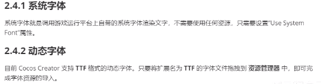
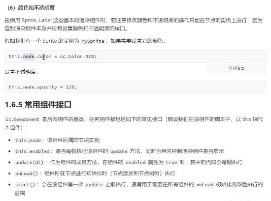
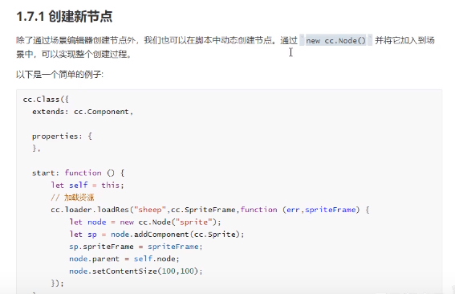
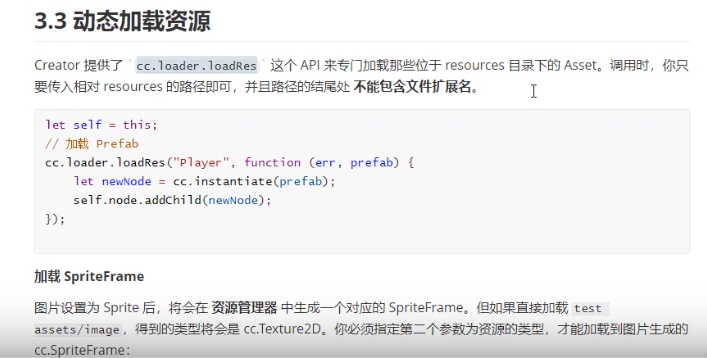
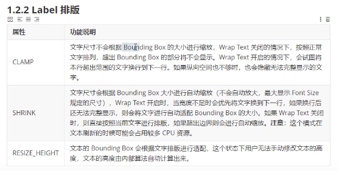

# HTML

## 基本内容

### 配置

> 控制面板(按类别显示)-程序和功能-启动或关闭Windows功能-勾选Internet Information Services(主要是里边的)Web管理工具
>
> 安装完毕后C盘有inetpub目录
>
> 之后可以用127.0.0.1可以访问。
>
> 然后右击我的电脑，管理，然后左边找到服务和应用程序，找到Internet Information  Service，然后看到第二个左边栏，展开，点网站，右击Default Web Stie，然后添加虚拟目录，地址是网页文件目录(hbuilder建立的项目路径)，然后就可以成功开创一个网站。
>
> 内网通过127.0.0.1(:80)或localhost(:80) 加上/网站名/index.html访问这个网站，别人通过ip地址(局域网/广域网)访问你的网站。

### 使用方法

后缀名为html,htm的是静态网页，直接用浏览器打开；jsp,php,asp(x)是动态，浏览器无法直接打开

[在线检验HTML页面是否符合规范][https://validator.w3.org/]

#### 快捷键

##### hbuilder

- ctrl+/    注释/取消注释选中内容(取消时，选中部分不要包含注释的头尾)


##### vscode

- 格式化代码

  - windows `shift`+`alt`+`F`
  - ubuntu `ctrl`+`shift`+`i`

  如果对某些文件不起效果，可以安装插件，如JS-CSS-HTML Formatter

- 自动换行

  File>>Preferences>>settings>>UserSettings>>CommonlyUsed>>找到Editor:WordWrap,将off修改为on即可

  直接搜索editor.wordwrap也行

- 


##### 网页快捷键

- ctrl+滚轮 缩放F12控制台、窗口等


#### 工具

##### 开发人员工具

即F12，基本操作有窗口分离(双窗口按钮)


#### Emmet语法

通过缩写提高html/css编写速度的语法，Vscode内部有集成。

##### 结构语法

按下tab生成(不行时删掉最后一个字符重新输入一次再按)

1. \! 自动生成h5框架

   ```html
   ![tab] ->
   <!DOCTYPE html>
   <html lang="en">
   <head>
       <meta charset="UTF-8">
       <meta http-equiv="X-UA-Compatible" content="IE=edge">
       <meta name="viewport" content="width=device-width, initial-scale=1.0">
       <title>Document</title>
   </head>
   <body>
       
   </body>
   </html>
   ```

2. 标签名

   ```html
   div[tab] -> <div></div>
   ```

3. 多个相同标签用乘号 注意不要带空格

   ```html
   div*3[tab] -> (注意不要有空格)
   <div></div>
   <div></div>
   <div></div>
   ```

4. 父子关系用\>

   ```html
   ul>li*3[tab] ->
   <ul>
       <li></li>
       <li></li>
       <li></li>
   </ul>
   ```

5. 兄弟关系用\+

   ```html
   div*3>span+p+span[tab] ->
   <div>
       <span></span>
       <p></p>
       <span></span>
   </div>
   <div>
       <span></span>
       <p></p>
       <span></span>
   </div>
   <div>
       <span></span>
       <p></p>
       <span></span>
   </div>
   ```

6. 带类名或id名字的直接用\.或\# 没有前缀时默认是div

   ```html
   p.nav[tab] ->
   <p class="nav"></p>
   ```

   ```html
   .st>.nd*2>.rd+.th[tab] ->
   <div class="st">
       <div class="nd">
           <div class="rd"></div>
           <div class="th"></div>
       </div>
       <div class="nd">
           <div class="rd"></div>
           <div class="th"></div>
       </div>
   </div>
   ```

7. 类名(或别的任何需要的地方)有顺序使用自增符号\$ (代表每批量从1开始增)

   ```html
   #idx$*5[tab] -> ($后面并不需要跟东西，$自身会被依次以1,2...代替)
   <div id="idx1"></div>
   <div id="idx2"></div>
   <div id="idx3"></div>
   <div id="idx4"></div>
   <div id="idx5"></div>
   ```

   有间隔的各自代表不同的，没有的通通代表前导：

   ```c++
   .$a$b$*3[tab] ->
   <div class="1a1b1"></div>
   <div class="2a2b2"></div>
   <div class="3a3b3"></div>
   ```

   ```html
   div{$$g$}*11[tab] ->
   <div>01g1</div>
   <div>02g2</div>
   <div>03g3</div>
   <div>04g4</div>
   <div>05g5</div>
   <div>06g6</div>
   <div>07g7</div>
   <div>08g8</div>
   <div>09g9</div>
   <div>10g10</div>
   <div>11g11</div>
   ```

8. 内部的内容使用{}

   ```html
   div{sth$}*5[tab] ->
   <div>sth1</div>
   <div>sth2</div>
   <div>sth3</div>
   <div>sth4</div>
   <div>sth5</div>
   ```

9. 括号()定优先级，如果有不符合意思的输出

   ```html
   (tr>td.right+td)*4[tab] ->
   <tr>
       <td class="right"></td>
       <td></td>
   </tr>
   <tr>
       <td class="right"></td>
       <td></td>
   </tr>
   <tr>
       <td class="right"></td>
       <td></td>
   </tr>
   <tr>
       <td class="right"></td>
       <td></td>
   </tr>
   ```

10. 属性设置用中括号

    ```html
    div[align=center]{$$}*4[tab] ->
    <div align="center">01</div>
    <div align="center">02</div>
    <div align="center">03</div>
    <div align="center">04</div>
    ```

11. 多个同样的类等直接单调复用即可：

    ```html
    .t7.t7d${gggg}*3[tab] ->
    <div class="t7 t7d1">gggg</div>
    <div class="t7 t7d2">gggg</div>
    <div class="t7 t7d3">gggg</div>
    ```

12. 

##### 使用举例

```html
(tr[id="tr$$"]>(td>(input[type="checkbox"][id="cb$$"][onclick="sele()"]+span{选择}))+(td>(span[id="ty$$"]+input[type="text"][id="ety$$"][size="3"]))+(td>(span[id="nam$$"]+input[type="text"][id="enam$$"][size="6"]))+(td>(span[id="pr$$"]+input[type="number"][id="epr$$"]))+(td>(a[href="javascript:edit($)"][id="ed$$"]{修改}+a[href="javascript:del($)"][id="de$$"]{删除})))*3
```

### html基本格式

```html
<!DOCTYPE html> <!--注释，这行是文档声明类型，表明为HTML5 -->
<html>
	<head>
		<meta charset="UTF-8">
		<title></title>
	</head>
	<body>
	</body>
</html>
```

- HTML不区分大小写(XHTML区分)，所以诸如\<HeAd\>\<\\hEAD\>可以通过(H5)。

- 语法错误不会报错，如有头无尾(这样会认为下面元素一直嵌套在里边)，如：

  ```html
  <a href="www.baidu.com">linkto
  <h1>This is a title</h1> <!--h1也认为是a的一部分-->
  ```

- http-equiv是关键字，http -equiv不是，因为有空格

- H5中，可以有结束标签省略：

  - p,option,optgroup,colgroup,li,dt,dd,tr,td,th

- H5中，允许使用不含结束符/的单标签

- H5中，html,head,body标签可以同时省略开始标签和结束标签

- H5中，存在布尔值属性，只有省略该属性本身，值才为False，否则均True

  - readonly,disabled,checked,selected,multiple

- H5中，属性的引号可以省略，当且仅当不包含特殊字符：

  - 空格、\<、\>、=、\'、\"

- 

其他HTML版本声明类型//dabk

### 统一资源定位符

URL uniform resource locator，又称网页地址/网址

包含协议、主机地址和文件路径

一般用http(https)协议，hypertext transfer protocol

即https://

文件上传和下载用ftp协议

主机地址是网站域名或IP地址

文件路径与网站目录结构对应以斜杠开始，包含一到多级目录。

可以分为绝对路径(绝对URL)和相对路径。连接到同一网站的其他资源时，一般用相对路径。

- 相同目录下直接访问，如top.jpg

- 子目录下加目录名和斜杠，如images/top.jpg c1/images/top.jpg

- 父目录有一级加一个../表示上一级目录：

  ../top.jpg   ../../images/top.jpg

- 根目录以/开始，如 /images/top.jpg   /top.jpg

## HEAD元素

> head元素可以没有，不会报错

### title

标题，可以被搜索引擎检索到，并作为收藏/默认快捷方式的名称

### meta

属性：

- name 

  - keywords 关键字 内容用半角逗号隔开
  - description 网页简介(过长会显示…)
  - robots 是否允许索引与查询
    - all (默认)
    - none
    - index
    - noindex
    - follow
    - nofollow
  - author 作者

- http-equiv

  - content-type 页面使用的字符集

  - refresh 自动刷新并跳转到新的页面，格式为等待时间(秒,Number);url=网页

    > 跳转之后在浏览器按返回不会回到跳转前的页面

  - set-cookie 页面缓存过期时间(过期时删除缓存)

  - expires 网页到期时间，如果到期，从服务器重载该网页

- content 与上面的属性连用

- charset H5专用，字符编码格式

例如：

```html
<meta charset="UTF-8" /> <!--同下一行,H5专有-->
<meta http-equiv="content-type" content="text/html;charset=utf-8"/>
<meta name="keywords" content="k,x,a" />
<meta name="description" content="dsc"/>
<meta http-equiv="refresh" content="0;url=index.html" />
```

### link

单标签。属性：

- type 目标文件的MIME类型
  - text/css 
- rel 目标文件与当前文档的关系
  - stylesheet  对应css文件
- href 目标文件url地址

```html
<link rel="stylesheet" href="css/c41.css" type="text/css" />
```


### style

内部样式表

```html
<style type="text/css">
    .... /*css内容*/
</style>
```

> 部分低版本浏览器无法识别style并以文本形式显示内部内容


### script

内部js脚本

```html
<script>
    //js代码
</script>
```

## BODY元素

块结构元素有：

- h1
- p
- div

### 通用属性

- style

- class

- id

- 颜色类：颜色单词/#+六个十六进制数字/rfb(两十六进制数,两十六进制数,两十六进制数)

- (部分)align

  > 浏览器对align和valign的支持不够好，建议使用css


#### 事件触发

##### 普通事件

1. onmouseover 鼠标进入该对象触发，如：

   ```html
   <a onmouseover="alert('huck you and go away')">pass&amp;boom</a>
   ```

onclick       当单击鼠标时运行脚本

ondblclick    当双击鼠标时运行脚本

ondrag       当拖动元素时运行脚本

ondragend    当拖动操作结束时运行脚本

ondragenter   当元素被拖动至有效的拖放目标时运行脚本

ondragleave   当元素离开有效拖放目标时运行脚本

ondragover   当元素被拖动至有效拖放目标上方时运行脚本

ondragstart   当拖动操作开始时运行脚本

ondrop       当被拖动元素正在被拖放时运行脚本

onmousedown      当按下鼠标按钮时运行脚本

onmousemove      当鼠标指针移动时运行脚本

onmouseout        当鼠标指针移出元素时运行脚本

onmouseover       当鼠标指针移至元素之上时运行脚本

onmouseup         当松开鼠标按钮时运行脚本

onmousewheel      当转动鼠标滚轮时运行脚本

onscroll            当滚动元素滚动元素的滚动条时运行脚本

##### H5事件

1. ondragstart 开始被拖动
2. ondrag 拖动时
3. ondragend 结束拖动时
4. ondragenter 拖动进入目标元素范围
5. ondragleave 拖动离开目标元素范围
6. ondragover 拖动在元素范围内
7. ondrop 释放拖拽

> img和带href的a标签默认可拖动。IE9+,FireFox,Opera 12,Chrome,Safari 5中支持拖放操作

#### H5属性

- draggable属性是否可拖拽

### 文本类

#### 标题

h1\~h6，一般只使用3\~4级,h4大小与正文相近，会自动换行(块结构)

h1上下有空行，加粗

#### 文本修饰

通常不会自动换行

##### font

默认size=3，可以设定偏差$\pm$或绝对值，可以设置字体face和颜色color，如：

```html
<font face="微软雅黑" size="10" color="blanchedalmond">字体</font>
<font face="黑体" size="+3" color="#afafaf">字体2</font>
<font face="楷体" size="-2" color="cadetblue">字体3</font>
<font >default</font> <!--在不换行状态下显示四种字体-->
```

##### 其他修饰

1. b 加粗
2. strong 着重，效果同加粗
3. i 斜体
4. s 删除线
5. u 下划线
6. sup 上标
7. sub 下标
8. big 大一号字
9. small 小一号(注意事项、法律规定、免责声明、版权等声明型文字)
10. mark 黄色高亮(h5特性)
11. pre 预排版，里面的内容排版完全一致(包括前面的缩进) (h5特性)
12. blockquote(一般内部放p)引用块(即左右缩进的一个块级元素)
13. cite 引用(效果同i) 隐藏效果：它可以使你或者其他人从文档中自动摘录参考书目

注意：

- 可以嵌套使用(包括sup,sub，会显示叠加的效果)

例如：

```html
Lorem <b>ipsum</b> <strong>dolor</strong> <s>sit</s> <i>amet</i>, <u>consectetur</u> <sup>adipisicing </sup>elit. <sub>Maxime</sub> mollitia. Lorem ipsum <big>dolor</big> <small>sit</small> amet, consectetur adipisicing elit. Saepe distinctio quo nisi harum <s><u><i><big><sup>numquam vero nesciunt</sup></big></i></u></s> est Lorem ipsum dolor sit amet, <sup><sup><sup>consectetur</sup></sup></sup> adipisicing <sup>elit.</sup> <sup><sub>amet</sub></sup> praesentium <sub>mag<sub>n<sub>i</sub></sub></sub>.
```

```html
<pre>huck
 huck
  huck
   huck</pre>
			<mark>Lorem</mark> ipsum dolor sit amet
```

##### 特殊字符

使用\&加若干个字符表示，常见的特殊符号，如数学符号、希腊字母、箭头、引号、商标号、分数都可以表示，部分举例如下：

```html
&quot; <!--单个双引号-->
&amp; <!--&-->
&nbsp;<!--空格-->
&lt;&gt;&le;&ge; <!-- < > <= >= -->
&copy;&trade;&reg;
&frac14;&frac34;&frac12;&frac13;&frac15;&frac16;&frac18;&frac25;&frac35;&frac45;&frac56;&frac78; <!--可以表示分母为1~6和8的不可约简的分数-->
&larr;&lArr;&uarr;&rarr;&darr;&harr;&hArr;&crarr; 
<!--h是左右,A是双橫cr是左下，上下左右显然是udlr-->
&cap;&cup;
&copy; <!--版权©-->
```

多个空格使用margin-left：

```html
<p>goodbye, <span style="margin-left:60px">world!</span> </p>
```

#### 段落控制

```html
<br/>换行
<hr/>水平分割线
```

效果上：br,/br,br/有相同的效果，hr则/hr无效果

hr标签可以有如下属性：

1. size 高度，很高的时候看起来像input框的样子；默认为2，只支持整数(可以无需单位)
2. color 
3. width 单位px，默认满屏
4. noshade 阴影
5. align 默认居中，常用有left,center,right

#### 段落

p标签，自动换行

#### pre

用于显示预格式化文本的标签。它有以下特点:

1. 保留空格和换行: `<pre>` 标签会保留源代码中的所有空格和换行,在渲染时会按照原样显示。这使得它非常适合于显示代码片段、ASCII 艺术等需要保留格式的内容。
2. 不解释标记: `<pre>` 标签中的内容不会被浏览器解释为 HTML 标签,而是作为纯文本显示。这意味着可以在 `<pre>` 标签中包含 HTML 标签,而不会被浏览器解析。
3. 默认等宽字体: 浏览器会为 `<pre>` 标签中的内容使用等宽字体,通常是 `monospace` 字体,这使得代码和文本对齐更加整洁。

`<code>` 标签通常与 ` <pre>` 标签一起使用,以保留代码的格式和缩进。

### div

逻辑区块，块级元素，无样式的div与p基本相同

具有如下属性：

- align 文本对齐方式 left/right/center/justify，较不常用

#### 举例

水平和垂直居中的文本：(line-height和text-align)

```html
<div style="text-align: center;width:280px;height: 150px;line-height: 150px;background-color: skyblue;">I just want to be happy.</div>
```


### 列表

#### 有序列表

标签ol，用数值/字母作编号

编号type可以有：(type的样式无法修改；一般用css自己弄)

- 1 允许负数(其他不允许)
- a 最大到比较大
- A
- i  最大到4000，下同，罗马数字
- I

start表示首项编号，之后递增；如果使用小数，会下取整

举例：

```html
<ol start="-3">
    <li>43ssdsdsdsdsddss</li>
    <li>
        ssvv <!--如果没有这一个行，下一个嵌套列表的首行会跟这行同行-->
        <ol type="I" start="999" >
            <li>43222sdss</li>
            <li>43ss</li>
            <li>4dss</li>
        </ol>
    </li>
    <li>43sds</li>
    <li>43sdss</li>
</ol>
```

内部每一项都是li，无序列表同

#### 无序列表

ul，有属性type控制表头图形：

- circle 圆(空心)
- disc 点
- square 方块(实心)
- none 无

//da mk pic

#### 定义列表

```html
<dl>
    <dt>1:</dt><dd>23</dd><!--1：之后会自动换行，其他同-->
    <dt>345:</dt><dd>5</dd>
    <dt></dt><dd>dsfcvdf</dd>
</dl>
```

### 图像

img标签，有如下属性：

- src 加URL路径

- alt 是图像的文本描述，图片无法显示时会显示该文本

- height 图像高度，固定值或(占外层容器的)百分比

  百分比可以超过100%，一般用宽度可能比较好(百分比的话高度会一并改变)

  百分比的话是相对于它的父亲的，而不是图片本身的大小

- width 宽度

- align 对齐方式 top bottom middle left right

- border 边框宽度

举例：

```html

```

图片链接见超链接

### 超链接

a 标签

属性

- href 链接路径（没有该属性时，不会变蓝+下划线）
- title 鼠标放置时显示的文本
- id 锚点用
- name 旧版本锚点用

#### 文本链接

链接到站内/站外。如果跳转到自己，href输入#，这种是空链接

点击后不会新建页面，而直接在当前页面跳转到新的页面，可以在浏览器点击返回。如：

```html
<a href="index.html" title="don't click">click me!!!</a>
<a href="https://www.baidu.com/">问题求助</a>
```

#### 锚点链接

在href处用#+id/name的方法跳到锚点处，可以是同一网页或不同网页的锚点。一般而言跳转之后被连接标签位于视区顶部。

```html
<a href="#there">点击起飞</a>
<hr size="20"/>
<a id="there">fail</a>
<hr size="2000"/>
<a id="here">降落</a>
<hr size="2000"/>
<a href="#here">点击下沉</a>
```

#### 图片链接

即在链接的内容里是图片

```html
<a href="index.html"></img></a>
```

> 如果一个链接内有多个元素，那么元素之间的空格点击了不会跳转，有元素的地方才会跳转。

#### 图片热区链接

使用map标签建立图片热区，即图片内的一个子范围，map内包含若干个area，每个area可以指向不同的链接。map需要有一个name属性。在这种情况下不一定需要a标签，如果有，其优先级低于map。

图片左上角是坐标原点，x轴正方向向右，y轴正方向向下

> 可以采用Dreamweaver等工具更好地设计图片热区

area属性列表：

1. 圆形 shape="circle" coords参数x,y,r(无需单位，下同)
2. 矩形 shape="rect" coords x1,y1,x2,y2,左上角和右下角坐标
3. 多边形 shape="poly" coords=x1,y1,x2,y2,x3,y3... 多边形各点坐标，相邻两两相连最后首尾相连，可以得到各种形状(不一定是凸多边形，可以是任意；线段无效)

然后在图片里加上usermap=#map的name

在area范围内，越往上图层优先级越高。

> 鼠标点中但未跳转时，屏幕上会显示出区域的轮廓。鼠标经过时图标会变成手指。

例如：

```html
<map name="mmp">
    <area shape="circle" coords="20,20,20" href="foodShow.html" />
    <area shape="rect" coords="0,0,30,30" href="index.html" />
    <area shape="poly" coords="50,50,50,80,100,50,100,80" href="c1.html" />
    <area shape="poly" coords="1,1,1,99" href="c1.html" />
</map>
</img>
```

#### email链接

href使用mailto:邮箱地址

```html
<a href="mailto:2277379149@qq.com">骚扰我们</a>
```

这时系统会打开默认的邮箱程序

#### js链接

href里使用JavaScrpit:+语句或void(0);+属性onClick="语句"，如：

```html
<a href="Javascript:alert('huck you')">huck</a>
	<a href="JavaScript:void(0)" onClick="alert('u\'re hucking sheet')">sheet</a>
	<a href="JavaScript:alert('as whole')" onClick="alert('down meet')">beach</a> <!--先onclick被触发后js的语句被触发-->
```

#### 属性

target属性控制目标文档的显示窗口：

- _blank 新窗口打开被链接文档
- _self 默认值。当前框架中打开
- _parent 在父框架中打开
- _top 在整个窗口中打开 #在测试中效果同self
- frameName 在指定的框架名字中被打开(名字为frameNae的窗口)

如：

```html
<a href="foodShow.html" target="_blank">hell</a>
```

### 表格

#### table

table标签，内部若干tr标签。每个tr标签代表一行，内部若干td标签代表一个单元格。空单元格需要使用&nbsp。th标签代表表格标题(是单元格)，会加粗。例如：

```html
<table>
    <tr>
        <td>one</td>
        <td>to</td>
    </tr>
    <tr>
        <td>&nbsp;</td>
        <td>tttw</td>
    </tr>
</table>
```

基本属性：

- align 表格相对**其他元素**（不是表格单元格）的对齐方式 left center right;除center外，都可以与上面和下面的元素同行展示

- bgcolor 背景颜色

- border 边框宽度(像素)(每个单元格都有框，但border只生效外边框，但不设border时内外边框都没有)

  内边框对 td 设 border style

- cellpadding 单元格与内容的距离（像素/百分比(均不支持小数点，百分比可以超过100%)）

- cellspacing 单元格间距 像素/百分比

- height 表格高度 单元格高度更高时，取单元格高度和 像素/百分比；用height设置百分比可能不生效，否则会比较平均分配

- width 表格宽度 像素/百分比

  width=2\*cellpadding+本文长度(所以有可能出现一行只有一个字即2\*cellpadding+一个字宽度)
  
- rules 表格线显示方式
  - all 默认(有border时应该不是)，如果有rules有border，则表格间线会变成单线；有border无rules，是双线；下同
  - groups
  - rows 行线
  - cols 列线
  - none
  
- frame 表格外部框架显示方式(会跟border冲突)
  - void 不显示外边框
  - above 仅顶部边框
  - below 仅底部边框
  - lhs 仅左部边框
  - rhs 仅右部边框
  - hsides 仅上下边框
  - vsides 仅左右边框
  - box/border 显示所有(默认)

> 浏览器对align和valign的支持不够好，建议使用css；rules和frame同理；
>
> 若有：
>
> ```css
> *{
>     margin:0;
>     padding:0;
> }
> ```
>
> 可能会有align,cellpadding失效。

举例：

```html
<table align="left" bgcolor="#afafaf" height="200" border="6"  cellpadding="5" cellspacing="10" width="120" rules="rows">
    <tr><td>one</td><td>to</td></tr>
    <tr><td>&nbsp;</td><td>x</td></tr>
</table>
```

#### 单元格

有td和th之分：

th是加粗且居中的。

```html
<table>
    <tr><th>a</th><th>b</th><th>c</th></tr>
    <tr><th>dd</th><td>eff</td><td>&nbsp;</td></tr>
    <tr><th>dd</th><td>&nbsp;</td><td>123+3</td></tr>
</table>
```

有属性：

- align 水平对齐方式 left center right justify
- valign 垂直对齐方式(单行时没有效果;多行待测试)top middle bottom baseline
- rowspan 该单元格占n格，向下合并(n-1)个单元格 行跨度
- colspan 该单元格占n格，向右合并(n-1)个单元格 列跨度
- scope 定义将表头数据与单元数据相关联的方法
- width 单元格宽度 (行宽和行高取最值)
- height 单元格高度
- bgcolor 单元格背景颜色

```html
<table>
    <tr><th>a</th><th align="center">b</th><th>c</th></tr>
    <tr><th valign="baseline">dfd</th><td>eff</td><td>&nbsp;</td></tr>
    <tr><th>dd</th><td>&nbsp;</td><td>123+3</td></tr>
</table>
<hr />
<table>
    <tr><th colspan="3" align="left">a</th></tr>
    <tr><th>dfd</th><td rowspan= "2" colspan="3">eff</td><td>3123&nbsp;</td></tr>
    <tr><th>dd</th><td>1&nbsp;2</td><td height="50" bgcolor="#2BB8AA">123+3</td></tr>
</table>
<hr	 />
<table>
    <tr><td>1</td><td>2</td><td>3</td><td>4</td></tr>
    <tr><td>5</td><td rowspan="2" colspan="2" align="center"  valign="bottom">6</td><td>7</td></tr>
    <tr><td>8</td><td>9</td></tr>
    <tr><td>10</td><td>11</td><td>12</td><td>13</td></tr>
</table>
```

可以在td(th)里边放表格，但是一般嵌套不超过3~4层

```html
<table align="center" border="1" cellspacing="3">
    <tr>
        <td colspan="2">
            <table width="100%" border="1" frame="void" rules="all">
                <tr>
                    <td>xg</td>
                    <td>ywf</td>
                    <td>z</td>
                </tr>
            </table>
        </td>
        <td>3</td>
    </tr>
    <tr>
        <td>4</td>
        <td>5555555</td>
        <td rowspan="2">6</td>
    </tr>
    <tr>
        <td>7</td>
        <td>8</td>
    </tr>
</table>
```

> 尚未实现都有双横线

#### 行标签

tr标签

属性：

- align
- valign 
- bgcolor
- bordercolor 行内单元格边框颜色(会被下面的覆盖)
- bordercolordark 左上边框颜色
- bordercolorlight 右下边框颜色

> 在下面例子中，bordercolor均未生效 da fi wy

```html
<table border="5">
    <tr align="right" bgcolor="aliceblue" bordercolor="red" bordercolordark="green" bordercolorlight="blue">
        <th>hhh</th>
        <td>qwq</td>
        <td>orz</td>
        <td>%%%</td>
    </tr>
</table>
```

#### 行分组

- thead 表头 只能出现一次 一般是标题tr在内
- tfoot 表尾 只能出现一次
- tbody 表格主体（主体间会分行）
- caption 表格标题 显示在表格上方

打印很长的网页表格时表头和表尾会打印在包含表格数据的每一页，可以用lorem长文本进行测试。

举例：

```html
<table rules="groups">
    <caption>裱隔</caption>
    <thead>
        <tr>
            <th>id</th>
            <th>wk</th>
            <th>ny</th>
            <th>eff</th>
        </tr>
    </thead>

    <tbody>
        <tr>
            <td>1</td>
            <td>2wdsdde</td>
            <td>3</td>
            <td>4</td>
        </tr>
    </tbody>
    <tbody></tbody><!--空的不分行-->
    <tbody>
        <tr>
            <td>1</td>
            <td>2</td>
            <td>3</td>
            <td>4</td>
        </tr>
        <tr>
            <td>1</td>
            <td>2</td>
            <td>3</td>
            <td>4</td>
        </tr>
        <tr>
            <td>1</td>
            <td>2</td>
            <td>3</td>
            <td>4</td>
        </tr>
    </tbody>
    <tbody>
        <tr>
            <td>1</td>
            <td>22323</td>
            <td>3</td>
            <td>4</td>
        </tr>
        <tr>
            <td>122</td>
            <td>2</td>
            <td>3</td>
            <td>4</td>
        </tr>
    </tbody>
    <tfoot>
        <tr>
            <td></td>
            <td></td>
            <td>tot</td>
            <td>1e9</td>
        </tr>
    </tfoot>
</table>
```

#### 列分组

- align
- valign
- span 横跨的列数，默认1
- width 该分组的宽度

列分组是单独使用的，如：

> 下面例子中，align和vliagn并未成功渲染 dk wy

```html
<table border="1" width="400" cellpadding="5">
    <colgroup span="2" align="right" valign="bottom" style="background-color: rosybrown;" />
    <colgroup style="background-color: #ccc;" />
    <tr height="60">
        <th>qww</th>
        <th>qxx</th>
        <th>qy</th>
        <th>qzzzzz</th>
    </tr>
    <tr>
        <td>wasde</td>
        <td>&nbsp;</td>
        <td>dfsaewe</td>
        <td>2321121</td>
    </tr>
    <tr>
        <td>aaa</td>
        <td>b</td>
        <td>ccccccc</td>
        <td>sw12121212</td>
    </tr>
</table>
```

### 表单

#### 参数

用post需要后端服务器支持，所以用method="get"。文本框、密码框等……使用的标签有input、textarea、select等。提交时键值是用name的，而不是id。

通过get提交后在URL里的内容称为表单参数，如`?name=123&sid=456`。

URL参数就是直接写href跳转的方法提交的参数。

#### form

用标签form包含起来的区域是表单，是用户用于填表的一些元素，如输入框、按钮、单选框、复选框、下拉框等。

有属性如下：

- action 表单提交到的url地址/email地址：

  ```html
  /web/login.jsp     /*jas php asp.net nodejs*/
  mailto:xy@sadf.com
  ```

- method 向服务器发送信息的方法，get或post

  - get 方法请求的数据可以被缓存、保留在浏览器记录、作为书签收藏，安全性较低。长度不得超过255字符。

    [在url后面使用?和\&分割要传递的信息]

    ```html
    http://www.itshixun.com/web/login.jsp?a=12&b=74
    ```

    

  - post 隐藏在http数据流传输，安全性高，无长度限制。单击后退或刷新时，会被重新提交数据。

- name 表单的名称(多用id代替)

- id 唯一标识符(设置了之后在form外的表单域可以通过form=id名的方式绑定)(H5)

- accept 服务器能够处理的内容类型列表，用逗号隔开。目前主流服务器不支持，且在HTML5不支持。

- accept-charset 服务器可处理的表单数据字符集

- enctype 表单数据内容类型没说明在发送表单数据前如何编码，取值如下：

  - application/x-www-form-urlencoded (默认，Unicode编码，且部分字符特殊处理，如空格变加号，其他转%XX格式)
  - multipart/form-data (常用于表单包含文件上传控件，不进行任何编码)
  - text/plain (遇到空格转+号，其他都不转)

- target 打开处理Url的目标位置(不推荐使用)(用于a标签，指明提交表单时在哪个框架/浏览器显示表单处理结果)(HTML5使用formtarget代替)

- onsubmit 提交数据前执行的js脚本程序

- onreset 重置表单数据前执行的js脚本程序

- novalidate boolean 提交时是否忽略验证(H5)

- autocomplete 是否启用自动完成功能(input也能用)，有on或off (H5) (?)


可以都不写。

> 在历史记录处打开有可能会记录上次输入的内容。


#### input

标签，属性如下：

- id
- name (get方法时的id)
- value 初始值
- type
  - text 单行文本框
  - password 密码框
  - radio 单选框
  - checkbox 复选框
  - file 文件选择框
  - hidden 隐藏域
  - button 按钮
  - submit 提交按钮
  - reset 重置按钮
  - image 图片按钮
- form (在form外的表单域想要起作用需要form=表单id)(H5)
- autofucos boolean，页面加载后自动获取焦点(一个页面只能有一个)(H5)
- require boolean，输入为空时弹出相应内容(隐藏域和按钮不可用)(H5)
- pattern 输入是否合法的正则表达式检验

#### 表单域

##### 单行文本框

使用input标签，type为text。

属性：

- size 文本框宽度(是整数，单位是字符，而且取的是中文字符的宽度)，默认值是12
- maxlength 最多输入的字符数(不会让size一并修改，value不受影响)
- disable 禁用状态(值为disable)，呈灰色状态
- readonly 只读状态
- placeholder 输入前提醒内容(输入框非空时消失)(密码框也看得见，而不是掩码)(H5)
- list 一个datalist的id名，获取候选项(随着输入的不同逐渐自动筛选)(H5) 
- pattern 正则表达式，不符合时弹出title属性内容(H5)
- title 如上(H5)
- autocomplete 是否允许记忆自动补全(on(默认)或off)

```html
<input type="text" readonly value="huck" maxlength="4" size="2" />
```

###### datalist

双标签，有id属性

其下有option双标签，有value属性，option内可以写内容，在chorme下，都会显示，点击后选value，option内内容可以当做是描述。

##### 密码框

input,type=password

属性：与单行文本框相似。

注意：

- 在密码框无法输入中文，但是可以粘贴得到
- 无法复制密码框内容
- value值可以通过审查元素查看
- 发送过程是以明文发送的

##### 单选按钮

input,type=radio 

在形状上是圆框。

属性：

- name 相同name的单选按钮分为一组，每组内只能选一个
- value 选中项的值(不会显示出来)，同一组内不应相同
- checked="checked"默认被选中，可简写为checked(readonly/disable也可以简写)，如果在一个组里有多个checked，只会让最后一个显示checked

举例：

```html
<input type="radio" name="1" value="3" checked />12
<input type="radio" name="1" value="2" />34
<input type="radio" name="2" value="6" />57
<input type="radio" name="2" value="2" />50
```

可以用label标签与表单域关联，那么点击文本等效于点击它，其他按钮同理，具体需要操纵label的for指向id即可

```html
<label for="male">Male</label>
<input type="radio" name="sex" id="male" />
<br />
<label for="female">Female</label>
<input type="radio" name="sex" id="female" />
```

在H5中，还可以有form属性，指向一个表单

##### 复选框

input,type=checkbox

在形状上是方框。

属性同单选按钮，区别在于checked可以多选。

注意：

- name可以与已有的radio同名，互不干扰

##### 文件选择框

input,type=file

属性：

- accept 表示文件过滤格式：(默认不过滤)(过滤只是首选项，仍然可以选择所有文件)
  - image/gif 或 image/jpeg 或 image/*
  - .txt
  - .jpg,.mp4  (多个按或合为一个选项，第二个选项依然是所有文件)

使用文件选择框，form的enctype需要设置为multipart/form-data，且method为post。

```html
<input type="file" accept=".jpg,.mp4" />
```

##### 隐藏域

input,type=hiddle

在网页中不显示的内容。审查元素可以看到。

##### 多行文本框

textarea

属性：

- name
- rows 行数
- cols 宽度(单位是字符)
- wrap 文本内容大于文本宽度时的显示方法
  - off 默认值，文本内容够多时自动添加滚动条
  - virtual 自动换行(传送文本内容到服务器时不换行)
  - physical 自动换行(传送也换)

```html
<textarea cols="5" rows="5">这是一个多行<strong>文本</strong>框</textarea>
```

注意：

- 标签内部内容均不视作元字符，所以里面有标签也认为是文本

- 默认可以自己调整大小。可以通过下列属性取消：

  ```html
  style="resize:none"
  ```

  

##### 列表选择框

select标签作头，option在内标签作选项


select标签属性：

- name

- size 可见选项数目(大于时留空，小于时滚动可见)(只要不为1就是列表框)

- multiple 是否可以多选(按住ctrl才能多选) multiple="multiple"

  当单选时是下拉选择框，有多选属性时是列表框

- disabled 是否被禁用

option标签属性：

- value 选项值(不显示)
- selected 是否选中(单选被多选处理同radio)(默认select的项目是disable外的第一项)
- disabled

举例：

```html
<select>
    <option value="0" disabled selected>请选择一项</option>
    <option value="1">Lorem, ipsum.</option>
    <option value="2">wy!dy</option>
    <option value="3">inh wan dyz eb bt xids</option>
</select>
```

可以使用optgroup和label标签进行分组并赋予分组标题。分组框内内容会缩进。显然label内容不可选中。如果加disable，那么其子项均不可选。注意optgroup不可以嵌套。

```html
<select name="er" id="re">
    <optgroup>
        <!--会有一个空标签-->
        <option value="12">12</option>
        <option value="13">13</option>
    </optgroup>
    <option value="gg">gg</option>
    <optgroup label="123" disabled>
        <option value="112">112</option>
        <option value="113">113</option>
    </optgroup>
    <optgroup label="fa">
        <option value="122">122</option>
        <option value="123">133323</option>
    </optgroup>
    <option value="12v">12v</option>
    <option value="13v">13v</option>
</select>
```


注意：

- 建议还是写value，虽然不写也可以根据option内部内容交上去

##### 按钮

###### input型

input,type=submit或reset或button或image

属性：

- type
  - submit 提交表单 (此时value默认为提交，提交后表单内容会被初始化)
  - reset 初始化表单
  - button 普通
  - image 图片按钮
- src 当type=image时图片，图片地址
- value 按钮上显示的文字
- onclick 点击事件(接js代码)，在提交/初始化上有的话也会执行(不会覆盖原有功能)
- formaction +url网址 将当前表单内容submit给这个网址(H5)
- formmethod 将当前表单以get/post方法submit(H5)
- formtarget \_self或\_blank 分别代表当前窗口和新窗口显示提交后处理结果(H5)
- formnovalidate 是否不验证就提交summit(H5)

举例：

```html
<input type="submit" onclick="alert('assadwwwwd!')" value="lorem ipsum dolor sit amit" />
<input type="reset" onclick="alert('assadsd!')">
<input type="button" value="hhhhh" onclick="alert('nothing to be done')">
<input type="image" src="images/left_navbg.jpg" onclick="alert('do not click me!!!')">
```

手写submit如下：

```html
<!--head-->
<script>
    function subf() {
        var tem = document.getElementById('gg');//获取第一个gg
        //tem.action="action.jsp";
        //tem.method="get";
        tem.submit();
    }
</script>
<!--body-->
<form id="gg">
    <button id="fff" onclick="subf()">handwrite</button>
</form>
```


###### button型

button type=submit/reset/button

属性：

- type
- value

标签里可以放置其他内容

```html
<button type="submit">
    
</button>
<button type="reset">ressssssssss</button>
```

注意：

- IE默认类型为button，提交表单时提交button到button/之间的文本内容，而其他浏览器默认值为submit，提交value值。
- IE4和NetScape6之后才支持

#### H5表单域

都是input的标签。

##### email

输入email地址专用，允许为空(required除外)

如果加上boolean属性multiple，允许输入多个email地址，用逗号隔开

##### url

输入地址，必须是包含协议(如http://)的完整URL地址

##### number

专门输入数值(和某些位置符号\+\-)(但是可以大小写输入e，虽然无法提交)

属性：

- max 可输入的最大值
- min 可输入的最小值
- step 合法间隔(默认1)
- value 默认值

貌似size不可用

##### range

数字滑动条

属性：

- max 默认100
- min 默认0
- step

外观和默认值不同

##### dataPickers

包含多种不同的type：

- date 年月日
- month 月日
- week 年周
- time 时分
- datetime 年月日+时间
- datetime-local

##### color

颜色选择器，文本框显示选中的颜色，值是含前导\#的六位十六进制大写

##### command

集合了单选，复选等的可点标签，仅IE支持，command标签

有属性：

- checked
- disabled
- icon
- label
- radiogroup
- type checkbox/radio/command

##### search

#### 表单分组

fieldset标签设置分组，legend标签设置标题。是用边框包起来的区域，跟其他元素分行。内部元素跟form本来的排版一样，不会特地分行。

```html
<fieldset>
    <input type="text" value="123" />
    <button>456</button>
    <input type="text" value="sdsafes" />
    <input type="text" value="duksehfdns" />
</fieldset>
<fieldset>
    <legend>猜猜我是谁</legend>
    <input type="radio" name="ddk">阿西吧<br />
    <input type="radio" name="ddk">wulixinlaimujiji<br />
    <input type="radio" name="ddk">hidonia<br />
</fieldset>
```

### H5文档结构

有header,nav,aticle,header,section,aside和footer标签。

在不设置css下，显示上均跟一般的p标签差不多。

#### article

文档、页面/应用程序中独立、完整、可独自被外部引用的内容，如文章、短文、评论、帖子。

article下设header、footer、多个section，可以嵌套article。

#### header

文章页眉

#### hgroup

网页/区段(section)的标题进行组合而用

#### nav

导航栏，如顶部、侧边栏、页内和翻页

#### section

分块

内不可以包含标题、article、section等。

#### aside

附属信息栏，如引用、侧边栏、广告，但不是主体内容。

#### footer

脚注，如版权、作者授权。

### H5标签

可以在vscode安装HTML5 extension pack插件支持emmet

- datalist 选项列表，与input连用
  - IE,Safafi不支持
- details 描述细节(折叠文本) 双标签
  - open boolean属性，是否默认展开
  - IE,FireFox,Opera不支持
- summary 包含details的标题部分
  - IE,FireFox,Opera不支持
- mark 带标记的文本
  - IE9+支持，其他浏览器都支持(FireFox,Chorme,Opera,Safari)
- meter 度量给定范围(gauge)内的数据
  - 仅IE不支持
- progress 标示任务的进度(进程) 双标签
  - 属性max和value，表示进度条最小值和最大值
  - IE10+支持，其他都支持
- ruby 定义ruby注释(中文注音/字符) 
  - IE9+支持，其他都支持
- rt 字符(中文注音/字符)的解释或发音，与ruby标签连用
  - IE9+支持，其他都支持
- rp 在ruby中，浏览器不支持ruby时显示该标签
  - IE9+支持，其他都支持
- time 定义公历时间，给搜索引擎使用。
  - 不会在任何浏览器显示

```html
<details><!--只有第一行被显示，其他需要下拉才全部显示-->
    <summary>12345</summary>
    <summary>555</summary>
    <p>78<mark>90</mark>12</p>
</details>
<meter value="3.9" min="0" max="5">qwq</meter><!--内部文字无效-->
<meter value="0.6">ggg</meter>
<progress value="22" max="100">qqq</progress><!--内部文字无效-->
<ruby>
    一<rp>(</rp> <rt>yi</rt> <rp>)</rp>
</ruby>
<ruby>
    一 <rt>yi</rt>
</ruby> <!--上下没什么区别-->
<time datetime="2020-1-1">qq</time><!--datetime无显示-->
<time>9:00</time>9:00 <!--显示没什么区别-->
<input id="te" list="dt" />
<datalist id="dt">
    <option value="1"></option>
    <option value="2"></option>
    <option value="3">4</option><!--3是标题，4是文本，选中后写入标题-->
</datalist><!--标题和文本都可以匹配输入的内容-->
```


#### details

折叠文本

有boolean属性open控制默认打开

```html
<details open>udishfeslufj</details>
```

#### progress

进度条

属性max和value，示例如下：

```html
<progress max="20" value="0" id="pgs">qwqs</progress>
<span id="pgv">0</span>
<a href="#" onclick="ck();"> gogogo</a>
<script> //不能放在上面三行之前
    var pg = 0
    var timer
    var objpg = document.getElementById('pgs')
    //console.log(objpg)
    var objtx = document.getElementById('pgv')
    function loop() {
        ++pg
        objpg.value = pg
        if (pg >= objpg.max) {
            clearInterval(timer)
            objtx.innerHTML = "finished"
        } else {
            objtx.innerHTML = pg + "%"
        }
    }
    function ck() {
        timer = setInterval(loop, 100)
    }
</script>
```

#### meter

跟上面类似

```html
<meter value="0.3" optinum="1" high="0.2" low="1" max="1" min="0"></meter>
<span>30%</span>
```

#### canvas

空白画布，需要结合JS使用，属性如下：

- hidden true或false
- width 修改宽/高时，画布中已经绘制的内容会被清楚
- height

#### audio/video

H5,IE8和之前不支持。audio音频，video视频

属性：

- src
- autoplay 布尔属性，是否装载完成后自动播放(即使设置了可能浏览器也不支持)
- controls 布尔属性，播放时显示进度条(有实际作用)

  本地文件的controls不可实际达成拖放功能
- loop 布尔属性，首次点击播放后，播放完毕后重复播放
- preload 是否预加载，auto(预加载)，meta(只载入元数据)，none(不加载)，设置了autoplay时该属性将被忽略
- muted 是否静音
- poster video专用，视频下载时显示的图像，或单击播放前显示的图像
- width video专用，只设置一个时，等比例缩放，设置两个时，不足比例的地方空出来(进度条可以用这些空白)
- height video专用

```html
<video src="video/test.mp4" controls height="500" poster="images/temp/bg2.png">
    您的浏览器不支持video
</video>
<p></p>
<audio src="video/tbhn.mp3" controls>
    您的浏览器不支持audio
</audio>
```

##### source

视频或音频源，放在audio/video内，放多个，浏览器会决定哪个适合然后播放哪个

属性如下：

- media 媒体资源类型(所有浏览器均不支持)MIME类型，视频包括：video/ogg, video/mp4, video/webm，音频audio/ogg, audio/mpeg, audio/x-wav
- src
- type 数值，从什么位置开始播放，默认从头

```html
<audio contorls>
    <source src="video/tbhn.mp3" type="audio/mpeg"/>
    <source src="video/tbhn.ogg" type="audio/ogg"/>
    <source src="video/tbhn.wav" type="audio/x-wav"/>
    您的浏览器不支持audio
</audio><!--实测好像不行，虽然测试的时候后两个没文件，只有一个source也不行-->
```


## 框架

在框架集frameset里放一个到多个框架frame，或直接调用内联框架iframe；当不支持框架时放在noframes里(加body)。

框架集的本质是将多个网页放在一个网页(被集成的网页不含body)里。

### 框架集

frameset

一个html只能有一个框架集(最先出现的那个)，要多个只能嵌套。

H5不支持frameset。

属性：

- rows 表示里面多个框架各占多高(像素)，\*表示占据剩余的所有，每个参数用逗号分隔

  - 有一个\*，其余是数字：数字是固定宽度，\*取剩下宽度(可能没有)
  - 有多个\*，并且有数字，如1\*,2\*，表示成比例关系(不写默认就是数字1)
  - 只有数字，那么数字都代表比例
  - 混合。可以使用百分比，这个百分比是相对整个窗口的。
  - 优先级是像素单位、百分比、相对宽度、通配符。
  - 有多个框架时一定要设置rows/cols，否则只会显示第一个

- cols 表示里边框架占多宽(并按列排)

  如同时用cols，rows，情况比较复杂。

- frameborder 边框有无(默认有)，取值为1,0,yes,no

  没有时不会有拖动条，也不能任意拉动框架宽高(有边框时可以)

- bordercolor 边框颜色

- framespacing 框架间空白距离(实测时无效)

举例：

```html
</head>
<frameset rows="200,*,80">
    <frame src="c22.html" />
    <frame src="c21.html" />
    <frame src="c1.html" />
</frameset>
<noframes><body>none</body></noframes>
</html>
```

```html
</head>
<frameset rows="1,2,3" frameborder="yes" bordercolor="cyan" framespacing="100">
    <frame src="c22.html" />
    <frame src="c21.html" />
    <frame src="c1.html" />
</frameset>
<noframes>
    <body>
        该浏览器不支持框架集。
    </body>
</noframes>
</html>
```

```html
</head>
<frameset rows="40%,*">
    <frame src="c22.html" />
    <frameset cols="1,1">
        <frame src="c21.html" />
        <frame src="c1.html" />
    </frameset>
</frameset>
<noframes>

    <body>
        该浏览器不支持框架集。
    </body>
</noframes>
</html>
```


### 框架

frame，属性如下：

- src 网页来源(路径)
- name 名字(超链接标签a的target可以对应name，那么点击后这里会被重载)
- id
- frameborder 框架边框，为0/1 (不显示框架边框当且仅当上边和下边的框架都设置为0或framset设置为0/no)
- marginheight 内容与上下边框边沿高度，默认1
- marginwidth 宽度
- scrolling 是否显示滚动条(yes,no,auto)(横纵都有可能显示)(yes时如果内容宽/高小于框架划定的，还是不会显示滚动条)
- noresize 不能调整大小，取值为noresize(任意空或非空字符也行)，会导致其上下框架一并不能调邻的边框

### 内联框架

iframe标签。行内框架，可以出现在页面的任何位置。属性：

- src
- frameborder 边框是否显示(0,1)
- marginheight
- marginwidth
- height(默认就是内容有多少)
- width
- scrolling
- name
- sandbox(H5)

如：

```html
<iframe src="c21.html" frameborder="0"></iframe>
```

> 尽量使用头尾标签，而不是\<iframe /\>，后者可能部分浏览器不支持

### 不支持兼容

使用noframes表示不支持框架集时显示什么内容。(零个框架也不会显示)

```html
<!DOCTYPE html>
<html>
<head>
    <meta charset="UTF-8" />
    <title>asa</title>
</head>
<noframes>
    <body>
        该浏览器不支持框架集。
    </body>
</noframes>
</html>
```

### 其他

#### center

center标签。强制让里面元素居中，而忽略css等的影响。

## 例子

### 0

```html
<!DOCTYPE html>
<html>
<head>
    <meta charset="utf-8" />
    <title>高人竟在我身边!!!</title>
</head>
<body>
    <h1>标题1！</h1>
    <h2>标题2！</h2>
    <h3>标题3！</h3>
    <h4>标题4！</h4>
    <h5>标题5！</h5>
    <h6>标题6！</h6>
    <!--  这是注释  -->
    <!--<h6>标题6！</h6>-->
    <p>Lorem ipsum dolor sit amet</p>
    <p>anything<br>no?</p>
    <!--div,h1-h6,p是块级元素-->
    <!--a img em strong是内联元素-->
    <p>
        show the <strong>bold</strong> type using "strong"<br />
        <a href="https://google.com"> a+连接</a>
    </p>
    <!--a+属性-->
    <!--点击后跳转 href-->
    <a href="https://google.com" target="_blank">点击并新窗口打开</a>
    <!--记得属性间是不需要使用逗号的……如href和target-->
    <!--lists ul 无序列表-->
    <ul>
        <li>list item 1</li>
        <li>list item 2</li>
    </ul>

    <!--ol 有序列表 ordered(unordered) -->
    <ol>
        <li>内容一</li>
        <li>内容二</li>
    </ol>

    <!--table 表格-->
    <table>
        <thead>
            <tr>
                <!--table row 橫-->
                <th>姓</th><!--heading-->
                <th>名</th>
                <th>备注</th>
            </tr>
        </thead>
        <tbody>
            <tr>
                <td>张</td>
                <td>三</td>
                <td>？</td>
            </tr>
            <tr>
                <td>李</td>
                <td>四五</td>
                <td>！</td>
            </tr>
        </tbody>
    </table>
    <blockquote>子曰：高速退学</blockquote>

    <!--鼠标放到文字处有注释，有下划线显示-->
    <p><abbr title="good game">GG</abbr>, yeah</p>

    <p><cite>OH YEAR  </cite>by lr580</p><!--cite大概是斜体么-->
    <br><!--breaker-->
    <hr><!--horizon line 水平分割线-->
    <br>
    <!--表单 form 快输方式：输入from按tab，不是按尖括号先-->
    <form>
        <!-- action="form.js" method="POST"-->
        <!--post比get安全；get的东西会出现在url链接里-->
        <div>
            <!--division-->
            <label>联系方式：</label>
            <input type="text" name="tx1" placeholder="please input">
        </div>
        <div>
            <!--division-->
            <label>邮箱：</label>
            <input type="email" name="txm" placeholder="please input!">
            <!--email 会自行验证是否是正确的格式 不正确时按按钮会报错-->
            <!--不正确可能有：无@，过多@,@前/后无内容-->
        </div>
        <input type="submit" name="butt" value="提交">
    </form>

    <button>some text</button><!--不写右尖括号按tab补全右边的-->
    <!--解决方案资源管理器-资源文件-右击添加-->
    <!--无尾标志-->
    <br>
    <br><!--仍显示图裂，不显示文字-->
    
    <hr>

    <div style="margin-top:580px"></div><!--来一段空白，注意有冒号-->
</body>
</html>
```

# CSS

## 基本内容

cascading style sheets，分为内联、内部和外部三种。

多重样式(multiple styles)优先级顺序从高到低为：内嵌->内部->外部->浏览器默认 (越往下越会覆盖往上的)

习惯上外部样式放在内部样式之前。


注释使用C风格注释，即：

```css
/*注释内容*/
```

如果写路径，以当前 css 文件为相对路径(和根)。

### 工具技巧

#### Emmet

1. 各单词首字母：

   ```css
   tac[tab] ->
   text-align: center;
   ti[tab] ->
   text-indent: ;
   ```

   ```css
   w -> width: ;
   h -> height: ;
   w100 -> width: 100px;
   ti2em -> text-indent: 2em;
   tdn -> text-decoration: none;
   ```

2. 


## @语句

### charset

字符集配置：

```css
@charset "utf-8";
```

位于css文件最前面且且只可以出现一次


### import

引入外部样式表

```css
@import 地址; /*仅IE支持*/
@import url("地址"); /*推荐方式，IE、FireFox、Opera支持*/
```

例如：

```css
@import url("style.css");
```

(位于script的)import和link标签区别如下：

- 加载时间和顺序不同。link先加载，再编辑显示；import先显示html结构，再加载外部css，网速慢时会先显示无CSS的效果。
- 兼容性问题。import是CSS2.1提出的，IE5以上才可以识别
- DOM模型控制样式。js控制DOM改变样式时，只能使用link，import不能被DOM控制。
- 隶属关系不同。link是html标签。import不是。


### font-face

服务器字体下载：

在服务器端下载字体(客户端也要安装才能显示)

```css
@font-face{
    font-family:Bar;
    src:url('font/abc.ttf'),
    	url('font/abc.eot');
}
p{
    font-family:Bar;
}
```

> Firefox、Chrome、Safari、Opera支持.ttf(true type font)和.otf(open type font)，IE8和以前不支持@font-face，而IE9+仅支持.eot(embedded opentype)字体。
>
> CSS3新增


### keyframes

创建动画

规则内指定一个 CSS 样式和动画将逐步从目前的样式更改为新的样式。

用百分比来规定变化发生的时间，或用关键词 "from" 和 "to"，等同于 0% 和 100%。

0% 是动画的开始，100% 是动画的完成。

为了得到最佳的浏览器支持，您应该始终定义 0% 和 100% 选择器。

当动画完成时，会变回初始的样式。

| 属性                                                         | 描述                                                         | CSS  |
| :----------------------------------------------------------- | :----------------------------------------------------------- | :--- |
| [@keyframes](https://www.runoob.com/cssref/css3-pr-animation-keyframes.html) | 规定动画。                                                   | 3    |
| [animation](https://www.runoob.com/cssref/css3-pr-animation.html) | 所有动画属性的简写属性。                                     | 3    |
| [animation-name](https://www.runoob.com/cssref/css3-pr-animation-name.html) | 规定 @keyframes 动画的名称。                                 | 3    |
| [animation-duration](https://www.runoob.com/cssref/css3-pr-animation-duration.html) | 规定动画完成一个周期所花费的秒或毫秒。默认是 0。             | 3    |
| [animation-timing-function](https://www.runoob.com/cssref/css3-pr-animation-timing-function.html) | 规定动画的速度曲线。默认是 "ease"。                          | 3    |
| [animation-fill-mode](https://www.runoob.com/cssref/css3-pr-animation-fill-mode.html) | 规定当动画不播放时（当动画完成时，或当动画有一个延迟未开始播放时），要应用到元素的样式。 | 3    |
| [animation-delay](https://www.runoob.com/cssref/css3-pr-animation-delay.html) | 规定动画何时开始。默认是 0。                                 | 3    |
| [animation-iteration-count](https://www.runoob.com/cssref/css3-pr-animation-iteration-count.html) | 规定动画被播放的次数。默认是 1。可以是infinite               | 3    |
| [animation-direction](https://www.runoob.com/cssref/css3-pr-animation-direction.html) | 规定动画是否在下一周期逆向地播放。默认是 "normal"。          | 3    |
| [animation-play-state](https://www.runoob.com/cssref/css3-pr-animation-play-state.html) | 规定动画是否正在运行或暂停。默认是 "running"。               | 3    |

```css
@keyframes myfirst
{
    from {background: red;}
    to {background: yellow;}
}
 
@-webkit-keyframes myfirst /* Safari 与 Chrome */
{
    from {background: red;}
    to {background: yellow;}
}
```

当在 **@keyframes** 创建动画，把它绑定到一个选择器，否则动画不会有任何效果。

指定至少这两个CSS3的动画属性绑定向一个选择器：

- 规定动画的名称
- 规定动画的时长

```css
div
{
    animation: myfirst 5s;
    -webkit-animation: myfirst 5s; /* Safari 与 Chrome */
}
```

```css
div
{
	width:100px;
	height:100px;
	background:red;
	position:relative;
	animation-name:myfirst;
	animation-duration:5s;
	animation-timing-function:linear;
	animation-delay:2s;
	animation-iteration-count:infinite;
	animation-direction:alternate;
	animation-play-state:running;
	/* Safari and Chrome: */
	-webkit-animation-name:myfirst;
	-webkit-animation-duration:5s;
	-webkit-animation-timing-function:linear;
	-webkit-animation-delay:2s;
	-webkit-animation-iteration-count:infinite;
	-webkit-animation-direction:alternate;
	-webkit-animation-play-state:running;
}

@keyframes myfirst
{
	0%   {background:red; left:0px; top:0px;}
	25%  {background:yellow; left:200px; top:0px;}
	50%  {background:blue; left:200px; top:200px;}
	75%  {background:green; left:0px; top:200px;}
	100% {background:red; left:0px; top:0px;}
}
```


## 选择器

优先顺序，从高到低：

ID选择器->类选择器->标签选择器->通用选择器

### 基本选择器

#### 通用选择器

universal selector，星号\*，通配符，匹配所有元素

```css
*{
    font-size:12px;
    color:red;
}
```

#### 标签选择器

标签名字即可。

```css
p{
    font-family:楷体;
}
```

#### 类选择器

点号\.加上类名。

```css
.cn{
    background-color:beige;
}
```

```html
<h1 class="cn">fffff</h1>
```

> 类名和ID名是否区分大小写取决于html、xhtml类型。

```css
.tab1 tr.alt td{  //class tab1下的tr(class=alt)下的td
    color: #000;
    background-color: #eaf2d3;
}
```

一个标签可以选择多个类：

```css
.bas{
    width: 200px;
    height: 200px;
    margin: 30px;
}
.c1{
    background-color:mistyrose;
}
```

```html
<div class="bas c1"></div>
```


#### ID选择器

井号\#加上id名字。

```css
#i001{
    font-family: 楷体;
}
```

```html
<h1 id="i001">中文字体</h1>
```

#### 根选择器

`:root` 根元素，通常是 html 标签。

### 组合选择器

#### 多元素选择器

即一次选择多个，这些元素共用一套规则，用逗号分开：

```css
p, div{
    margin:0;
}
```

#### 后代选择器

descendant selector, 选取某个元素的后代元素，后单元素之前用空格隔开：

```css
div p{
    background-color: darkmagenta;
}/*仅将div内嵌的p设置该背景颜色*/
```

```html
<p>qwq</p>
<div>
    <p>qaq</p>
</div>
```

如果多个，那么就需要连环符合。

```css
div span p{
    font-size:25px;
} /*div里边的span里边的p*/
```

#### 子选择器

child selector，选取某个元素的直接子元素(间接不行)，使用大于号\>链接。只有某个元素的直接嵌套另一个元素，才起作用。

```css
div > p{
    font-weight: bold;
    border: solid 2px #066;
    color:tan;
}
```

```html
<div><!--后代选择器对下面的p都起作用-->
    <p>=&nbsp;=</p><!--子选择器起作用-->
    <span>
        <p>-w-</p><!--子选择器不起作用-->
    </span>
</div>
```

如果多个大于号，那么就是需要符合连续多个：

```css
div>span>span>p{
    font-family: 楷体;
}/*div下直接span下直接span下直接p*/
```

### 属性选择器

将标签属性符合条件的标签选中，与基本/组合选择器复合使用，或单独使用，具体规则如下：

| 选择器类型   | 语法       | 描述                                      |
| ------------ | ---------- | ----------------------------------------- |
| 存在选择器   | [attr]     | 带attr的标签                              |
| 相等选择器   | [attr=v]   | attr属性值为v的标签                       |
| 包含选择器   | [attr~=v]  | attr属性值包含关键字v(与其他内容空格隔开) |
| 连字符选择器 | [attr\|=v] | attr属性值等于v或以v开头                  |
| 前缀选择器   | [attr^=v]  | attr属性值以v开头(或=v)                   |
| 子串选择器   | [attr*=v]  | attr属性值有子串v(或=v)                   |
| 后缀选择器   | [attr$=v]  | attr属性值以v结尾(或=v)                   |

> IE6或更早不支持，IE7+且\<\!DOCTYPE\>后支持。

使用示例：

```css
*[spe]{
    color:tomato;
} /*星号有没有是一样的*/
[spe="pr"]{
    background-color: wheat;
}
h1[sc~="lr"]{
    color:skyblue;
}
h2[sc|="lr"]{
    color:slateblue;
}
h3[sc^="lr"]{
    color:springgreen;
}
h4[sc$="lr"], h5[sc*="lr"]{
    color:cornflowerblue;
}
```

```html
<h1 spe>ggg</h1>
<h1 spe="pr">prp</h1>
<h1 sc="lr">lr</h1>
<h1 sc="lrr">lrr(不被选择)</h1>
<h1 sc=" lr ">&nbsp;lr&nbsp;</h1>
<h1 sc="fo lr sht">fo lr sht</h1>

<h2 sc="xlr">xlr</h2>
<h2 sc="lr">lr(只有它被选中)</h2>
<h2 sc="lrpsw">lrpsw</h2>
<h2 sc="lr psq">lr psq</h2>
<h2 sc="fc lr">fc lr</h2>

<h3 sc="lr">lr</h3>
<h3 sc="lrr">lrr</h3>
<h3 sc="qlr">qlr(不被选择)</h3>

<h4 sc="lr">lr</h4>
<h4 sc="hhlr">hhlr</h4>
<h4 sc="lrr">lrr(不被选择)</h4>

<h5 sc="lr">lr</h5>
<h5 sc="lrr">lrr</h5>
<h5 sc="lllr">lllr</h5>
<h5 sc="l-r">l-r(不被选择)</h5>
```

### 伪类

元素的特殊状态，预先定义的，独立于文档元素的，能被浏览器自动识别的。处于特殊状态的元素是伪类。伪类和伪元素都用冒号:开头。

伪类如下：

- active 被激活的元素
- focus 拥有键盘输入焦点的元素
- hover 鼠标悬浮在元素上方
- link 未被访问(仅适用于a标签)
- visited 已被访问(仅适用于a标签)
- readonly 只读元素
- checked 被选中元素 (列表框select的被选中候选栏(常显区没有),单选复选框没有)
- disabled 被禁用元素
- enabled 可用元素

> CSS1只有link,visited,active

- nth-child(even) 偶数个儿子
- nth-child(odd) 奇数个儿子
- nth-child(n) 第n个儿子
- first-child 第一个儿子

例如：

```css
:hover{
    background-color: cyan;
}
body:hover{
    background-color: #fff;
}/*会有左和下一小截但凡进了屏幕就常cyan，如果hover只限定于特定元素则没有*/
```

```css
:active{
    color:red;
}/*除了设置了样式的之外(左右中键)点击网页时全部会变红*/
```

```css
:checked{
    font-size: 20px;
}
```

```c++
.tab2 li:nth-child(odd){
    background-color:papayawhip;
}
.tab2 li:nth-child(even){
    background-color:powderblue;
}
.tab2 li:first-child{
    background-color:sandybrown;
}
.tab2 li:nth-child(5){
    background-color:yellowgreen;
}/*tr也行*/
```

```html
<ol class="tab2">
    <li>01</li>
    <li>02</li>
    <li>03</li>
    <li>04</li>
    <li>05</li>
    <li>06</li>
    <li>07</li>
    <li>08</li>
</ol>
```

实现一个静态且不大完善的(没有多级、改变效果不完美)下拉导航栏：

```css
*{
    margin: 0;
    padding: 0;
}
ul{
    float: left;
    width: 130px;
    background-color: wheat;
    text-align: center;
}
li{
    list-style-type: none;
}
.nav{
    float: left;
    cursor: pointer;
    z-index: 1000;
    position: absolute;
}
div ul li ul{
    display: none;
}
div ul li:hover ul{
    display: block;
}
div ul li a:hover{
    color: white;
}
div ul li:hover{
    background-color:burlywood;
    color: white;
}
a{
    text-decoration: none;
    color: #000;
}
```

```html
<div class="nav">
    <ul>
        <li>
            <a href="#">网站首页</a>
            <ul>
                <li><a href="#">最新更新</a></li>
                <li><a href="#">下载排行</a></li>
            </ul>
        </li>
    </ul>
<div>
<div style="position:absolute; top:30px; z-index:0">
    <h1 style="clear:both">ggg</h1>
</div>
```

对于hover，背景前景一并改变的示例如下：

```css
li{
    background-color: wheat;
}
a{
    color: orange;
}
li:hover{
    background-color:burlywood;
}
li:hover a{
    color: floralwhite;
}
```

```html
<li><a href="#">qwq</a></li>
```

### 伪元素

伪元素是元素中特别的内容，是元素的一部分。同样用冒号。

- first-line 首行
- first-letter 第一个字母/汉字
- before 元素之前 (一般用来配插图等)
- after 元素之后

//da tr

## 样式属性


### 文本属性

- text-indent 行缩进大小(正/负实数) 单位em,px或%

- line-height 行高(使用vertical-align的前置)

  特别注意：如果没写单位时代表行数，且Emmet语法默认不会给行高有一个单位
- text-align 文本水平对齐方式 取值left/right/center/justify

- vertical-align 文本垂直对齐方式 取值bottom/top/middle/baseline

- word-spacing 单词间距(不是每个字符的)，默认0(仅空格)，单位px
  - 如果是中文，每个汉字不算是一个个单词，即不会生效该样式
  
- letter-spacing 字符间距(默认0)

- text-transform 大小写(none/uppercase/lowercase/capitalize(每个首单词))

- text-decoration 修饰(none/underline/overline/line-through/blink)(blink好像没用，其他三种线对空格也有用)

- white-space (换行和空格处理) (emmet用whs)
  - normal 忽略多余空格
  - pre 正常显示空格
  - nowrap 除非br，否则不会自动换行
  - pre-wrap
  
- opacity 透明度，0到1的浮点数，适用于整个标签

- word-wrap (break-word) 行太长自动折叠到下一行显示

```css
.c1{
    /* text-indent: 1.5em; */
    background-color:bisque;
    height: 100px;
    text-align: center;
    vertical-align: middle;
    line-height: 100px;
    word-spacing: 5px;
    letter-spacing: 1px;
    text-transform: capitalize;
    text-decoration: underline;
    white-space: nowrap;
}
```

```html
<div class="c1">qwq 123 Hello   woRld</div>
```

### 字体属性

> 英文字体基本格式：有下沉、基线、中线、升高(四线三格)。字体的垂直高度根据基线测量

属性：

- color 可以用颜色单词、\#加RGB十六进制文本等格式

  > 六种颜色方法：
  >      关键字
  >      RGB rgb(255,0,0)
  >      RGBA rgb(255,0,0,0.5) alpha通道0完全透明，1完全不透明
  >      HEX #ff0000
  >      HSL hsl(0,100%,50%) 
  >         色相 饱和度 亮度(明度)hue saturation lightness
  >         色相0度红，120绿，240蓝(60黄，180青，300粉)
  >         0%完全不饱和任何颜色为灰色，100%完全饱和颜色全彩
  >         0%暗任何颜色显示为黑色，100%任何颜色为白色
  >      HSLA hsl(0,100%,50%,0.5)
  >
  > 对于HEX，显然FF代表最多，如FF0000代表红色max。
  >
  > 当HEX格式为aabbcc时，可以简写为abc，如#fff,#f00,#a00

- font-family 字体，可以只写主字体

  其最后一个参数可以特殊控制字体，如：

  - sans-serif 无衬线体
  - serif 衬线体
  - monospace 等宽字体，每个字等宽(代码编辑器推荐)

- font-style 字体风格 normal/italic/oblique(倾斜)

- font-variant 小型大写字母(把小写字母换成大小小的大写) normal/small-caps

- font-weight 字体加粗程度

  100~900(对搜索引擎可以提高当前页面权重)或单词

  单词有bolder(900),bold(700),normal(400),lighter

- font-size 字体大小 绝对值或相对值，xx-small,x-small,small,medium(默认),large,x-large,xx-large，或pt/px或em或百分比(相对于medium的大小)。

- line-height 行高，即两行基线的距离

- font 简写字体属性：依次为font-style font-variant font-weight font-size/line-height font-family(不分先后)

举例：

```css
.c2{
    font:italic bold 12px/20px arial,sans-serif;
}
```

### 背景属性

- background-color 背景色

- background-image 背景图片，格式为url(路径)，默认为none

- background-repeat 背景平铺方式，有no-repeat, repeat-x, repeat-y, repeat(默认)

  如果no-repeat，那么剩下部分由color填充，不会铺开

- background-position 图像在背景中的位置,top,bottom,left,right,center或具体值(单位px)/百分比

- background-attachment 背景图片是否随着页面滚动 scroll(默认)或fixed

- background-size CSS3,px/百分比，背景尺寸

  这个百分比是相对于元素的，不是相对于图片自身的

- background-origin CSS3,位置的参照物，border-box, padding-box, content-box

- background-clip CSS3,绘制区域，取值同上

- background 简写声明，可以设置color,position,size,repeat,origin,clip,attachment,image

举例：

```css
.c3{
    background-color:lavender;
    background-image: url(../images/temp/bg1.png);
    line-height: 1200px;
    background-repeat: no-repeat;
    vertical-align:baseline;
    text-align: center;
    background-position: 200px 100%;
    background-size: 10% 10%;
    background-attachment: fixed;
    background-origin: border-box;
    background-clip: content-box;
}
```

```css
.c4{
    background: #0c0 url(../images/temp/bg2.png) no-repeat fixed top ;
    background-size: 30% 30%;
    line-height: 1200px;
}
```

```css
.usr{
    background-image: url(../images/temp/usr.png);
    background-repeat: no-repeat;
    background-size: 10% 80%;
    background-position: 5% 10%;
    height: 30px;
    border-radius: 3%/25%;
    padding-left: 30px;
    border:1px solid lightskyblue;
}
```

```html
<input type="text" class="usr" /><!--登录用户名框-->
```

可以支持多背景图片，用逗号分开：

```css
.c6{
    background-image: url(../images/temp/bg1.png), url(../images/temp/bg2.png);
    background-position: left top, right bottom;
    background-repeat: repeat-x,repeat-y;/*第一个在上层*/
    background-size: 50% 50%, 50% 50%;
    line-height: 1200px;
    background-color: #aee;
}
```

### 表格属性

- border 边框宽度+样式+颜色 (对 td 用内边框)

- border-collapse 是否单一边框(separate 双边框，默认；collapse 单边框)

  内外都有边框时建议用单边框

- width (px/%)

- height

- text-align  (td,th使用，仅当各行内容宽度不同/width大时生效)

- vertical-align (td,th使用，仅当各行内容高度不同时/height大生效，如两div)

- padding 内边距 (td,th使用)

- border-spacing 单元格间距 (仅当双边框)

- caption-side 标题位置(top/bottom) 

举例：

```css
.tab1{
    border: 10px solid #eea;
    border-collapse: collapse;
    background-color: #eae;
    width: 100px;
    height: 100px;
    caption-side: bottom;
}
.tab1 td, .tab1 th{
    font-size: 1em;
    border: 2px solid #aae;
    padding: 3px 7px 2px 7px;
}
.tab1 th{
    font-size: 1.1em;
    text-align: left;
    background-color: #a7c942;
    color: #000;
}
.tab1 tr.alt td{
    color: #000;
    background-color: #eaf2d3;
}
```

```html
<table class="tab1">
    <caption>ggg</caption>
    <tr>
        <th>121</th>
        <th>122</th>
    </tr>
    <tr>
        <td>qwq</td>
        <td>qwqq</td>
    </tr>
    <tr class="alt">
        <td>lorem</td>
        <td>lorem</td>
    </tr>
</table>
```

### 列表属性

- list-style-type 列表图形符号：(ul,ol,dl都可以)
  - none
  - disc (实心圆)
  - circle (空心圆)
  - square (实心方)
  - decimal (数字，即便ul，下同)
    - decimal-leading-zero 有一个前导0的长为2的数字，大于长度2时按实际长度
  - lower-roman (小写罗马数字，如I,V)
  - upper-roman (大写)
  - lower-latin (小写字母) (同lower-alpha)
  - upper-latin (大写)
    - lower-greek $\alpha,\beta$等，没有upper的
  - armenian (神奇的符号)
    - georgian (神奇的符号)
  - ......
- list-style-image 加url，导图片
- list-style-position inside或outside，列表图形符号的位置(默认outside,inside会再里面一点，不影响dl)(outside换行时行首在符号之外，inside在之内，可以用lorem测试)

举例：

```css
.lt1{
    list-style-type:armenian;
    list-style-position: outside;
}
.lt2{
    list-style-image: url(../images/red_dot.gif);
    list-style-position: inside;
}
```

```css
<ul class="lt1">
    <li>01</li>
    <li>02</li>
    <li>03</li>
    <li>04</li>
    <li>05</li>
    <li>06</li>
</ul>
<ol class="lt2">
    <li>01</li>
    <li>02</li>
</ol>
```

### 图片属性

- filter

  - grayscale(百分数) 灰阶，100%为黑白

  - brightness(百分数) 亮度，0%全黑，100%原式，超过100%更亮

  - blur(像素值px) 高斯模糊，有多少像素融在一起

  - contrast(百分数) 对比度，0%全黑，100%不变，超过100%更低对比

  - drop-shadow(左偏移px 下偏移px 模糊px 颜色) 阴影效果

  - hue-rotate(数值deg) 色相旋转

  - invert(百分数) 颜色反转(50%则刚好全灰,100%全反)

  - opacity(百分数) 透明度。与常规属性opacity可以叠加，0%完全透明，100%完全不透明

    早期版本替代示例：`filter: alpha(opacity=60);`

  - saturate 饱和度，0%完全不饱和，100%无变化

  - sepia 深褐色，100%完全深褐色(不是纯色，是图片为深褐色型灰白)，0%无变化

  使用多个滤镜时，是从左到右叠加的，前面的效果会叠加作用于后面新加的效果，如先hue-rotate后drop-shadow，那么shadow的颜色也会被翻转

例如：

```css
.try2{
    filter: brightness(1000%) grayscale(100%) blur(5px) contrast(300%)  hue-rotate(90deg) drop-shadow(8px 50px 20px red) invert(100%) saturate(200%) sepia(100%);   
}
```


### 分类属性

其他属性

#### cursor

光标图案

- auto 文本为text，超链接为指针
- crosshair 十字线
- pointer 手食指点击
- move 移动（上下左右拉伸形状)
- text 输入光标
  - vertical-text 顾名思义
- wait 等待(加载中，会动的)
- help 指针+问号
- ne-resize 左下-右上拉伸形状
  - 同nesw-resize
- se-resize 左上-右下
  - 同nwse-resize
- s-resize 上下
- w-resize 左右
- row-resize 行折叠展开(同work页眉图案)
  - col-resize
- zoom-in 放大镜
- zoom-out 缩小镜
- now-allow 禁止操作
- copy 指针和小加号
- grab 张开的手

测试用例：

```css
.c01{
    cursor: crosshair;
}
.c02{
    cursor: pointer;
}
.c03{
    cursor: move;
}
.c04{
    cursor: text;
}
.c05{
    cursor: wait;
}
.c06{
    cursor: help;
}
.c07{
    cursor: ne-resize;
}
.c08{
    cursor: se-resize;
}
.c09{
    cursor: s-resize;
}
.c10{
    cursor: w-resize;
}
.c11{
    cursor:vertical-text;
}
.c12{
    cursor:zoom-in;
}
.c13{
    cursor: zoom-out;
}
.c14{
    cursor:nwse-resize;
}
.c15{
    cursor: nesw-resize;
}
.c16{
    cursor:not-allowed;
}
.c17{
    cursor:row-resize;
}
.c18{
    cursor: col-resize;
}
.c19{
    cursor:copy;
}
.c20{
    cursor:grab;
}
```

> html自行用emmet生成

#### display

- none 隐藏
- block 块级元素，前后有换行符
- inline 内联元素，前后无换行符，默认
- inline-block 行内块结构

> 由此可以近似地自定义标签元素，可以做下拉导航列表

display取none不占用空间，区别于：

visibility属性：visible/hidden

#### position

position属性：

- static 正常(即不能设置left和top)
- relative 相对定位，相对正常时的位置
- absolute 绝对定位，在页面的绝对坐标(随滚动而离开)
- fixed 固定定位，在网页左上角的绝对坐标(不随滚动而离开)
- sticky  例如： 一开始跟随滚动，随后不动

有left属性和top属性，控制偏移。

有z-index属性，控制图层，数量越大，图层越高。图层相同时，越后面的越在前。

```css
.w200{
    border-radius:123px;
    background-color: orange;
    width: 300px;
    height: 300px;
     text-align: center;
    vertical-align: middle; 
    /* align:center; */
    /* line-height: 300px;
    word-wrap: break-word;
    text-overflow: ellipsis; */
}
.w200 p{
     width: 200px;
     position: relative;
     top:100px;
     left:45px;
}
p.z{
    position: absolute;
    top:10px;
    left:10px;
    z-index: 5;
    background-color: #aee;
}
p.z2{
    position: absolute;
    top:5px;
    left:5px;
    z-index: 3;
    background-color: #eea;
}
```

```html
<div class="w200">
    <p>
        包涵了东方哲学、Alive、伟大的数学公式、生命的不停律动、少女的微笑、宇宙的律动、不同于人类生命体的萌生和退化
    </p>
</div>
<p class="z">Lorem, ipsum dolor.</p>
<p class="z2">Lorem, ipsum dolor!</p>
```

#### float

float

- left
- right
- none

clear 消除浮动产生的影响：

- left 清除左侧
- right 右
- both 两侧
- none 都不清理(默认)

举例：

```css
.fl{
    float: left;
    background-color: #ffa;
}
.fr{
    float: right;
    background-color:coral;
}
.cls{
    clear: both;
    background-color:gainsboro;
}
```

```html
<div class="fl">a</div>
<div class="fl">b</div>
<div class="fr">1</div>
<div class="fr">2</div>
<div class="fr">3</div><!--在第一行内为ab 321-->
<div class="cls">www</div>
```


### 转换属性

#### 过渡

CSS3

- transition 

  - 第一个参数是被过渡属性(可以是all)
  - 第二个参数是带单位的时间，多个属性要过渡，用逗号隔开，那么变化会平滑(反向变化也会)，时间单位是s或ms
  - 过渡的时间曲线，默认ease，可以改成linear,ease-in,ease-out,ease-in-out和`cubic-bezier(n,n,n,n)`，值从0到1
  - 过滤延时，默认0，如果是负数会跳过一开始的某些时间

  safari和chorme需要用-webkit-transition兼容

- transition-property

- transition-duration

- transition-timing-function

- transition-delay

举例：

```css
.mot {
    width: 100px;
    height: 100px;
    background-color: honeydew;
    transition: width 2s;
    -webkit-transition: width 2s;
}

.mot:hover {
    width: 200px;
}

.mot2 {
    width: 100px;
    height: 100px;
    background-color: whitesmoke;
    transition: all 1s;
}

.mot2:hover {
    width: 150px;
    height: 150px;
}

.mot3 {
    width: 100px;
    height: 100px;
    background-color: thistle;
    transition: width 1s, height 2s, background-color 1s;
    -webkit-transition: width 1s, height 2s, background-color 1s;
}

.mot3:hover {
    width: 150px;
    height: 150px;
    background-color: wheat;
}
```

```html
<div class="mot"></div>
<div class="mot2"></div>
<div class="mot3"></div>
```

#### 转换

CSS3, transform

```css
div
{
    transform:rotate(7deg);
    -ms-transform:rotate(7deg); /* IE 9 */
    -webkit-transform:rotate(7deg); /* Safari and Chrome */
}
```

|                                 |                                         |
| ------------------------------- | --------------------------------------- |
| none                            | 定义不进行转换。                        |
| matrix(*n*,*n*,*n*,*n*,*n*,*n*) | 定义 2D 转换，使用六个值的矩阵。        |
| matrix3d(16个参数)              | 定义 3D 转换，使用 16 个值的 4x4 矩阵。 |
| translate(*x*,*y*)              | 定义 2D 转换。                          |
| translate3d(*x*,*y*,*z*)        | 定义 3D 转换。                          |
| translateX(*x*)                 | 定义转换，只是用 X 轴的值。             |
| translateY(*y*)                 | 定义转换，只是用 Y 轴的值。             |
| translateZ(*z*)                 | 定义 3D 转换，只是用 Z 轴的值。         |
| scale(*x*[,*y*]?)               | 定义 2D 缩放转换。                      |
| scale3d(*x*,*y*,*z*)            | 定义 3D 缩放转换。                      |
| scaleX(*x*)                     | 通过设置 X 轴的值来定义缩放转换。       |
| scaleY(*y*)                     | 通过设置 Y 轴的值来定义缩放转换。       |
| scaleZ(*z*)                     | 通过设置 Z 轴的值来定义 3D 缩放转换。   |
| rotate(*angle*)                 | 定义 2D 旋转，在参数中规定角度。        |
| rotate3d(*x*,*y*,*z*,*angle*)   | 定义 3D 旋转。                          |
| rotateX(*angle*)                | 定义沿着 X 轴的 3D 旋转。               |
| rotateY(*angle*)                | 定义沿着 Y 轴的 3D 旋转。               |
| rotateZ(*angle*)                | 定义沿着 Z 轴的 3D 旋转。               |
| skew(*x-angle*,*y-angle*)       | 定义沿着 X 和 Y 轴的 2D 倾斜转换。      |
| skewX(*angle*)                  | 定义沿着 X 轴的 2D 倾斜转换。           |
| skewY(*angle*)                  | 定义沿着 Y 轴的 2D 倾斜转换。           |
| perspective(*n*)                | 为 3D 转换元素定义透视视图。            |

transform-origin 旋转基点：

```css
div
{
transform: rotate(45deg);
transform-origin:20% 40%;
-ms-transform: rotate(45deg); /* IE 9 */
-ms-transform-origin:20% 40%; /* IE 9 */
-webkit-transform: rotate(45deg); /* Safari and Chrome */
-webkit-transform-origin:20% 40%; /* Safari and Chrome */
}
```

| 值     | 描述                                                         |
| :----- | :----------------------------------------------------------- |
| x-axis | 定义视图被置于 X 轴的何处。可能的值：left center right *length* % |
| y-axis | 定义视图被置于 Y 轴的何处。可能的值：top center bottom *length* % |
| z-axis | 定义视图被置于 Z 轴的何处。可能的值：*length*                |

transform--style属性指定嵌套元素是怎样在三维空间中呈现。

| 值          | 描述                           |
| :---------- | :----------------------------- |
| flat        | 表示所有子元素在2D平面呈现。   |
| preserve-3d | 表示所有子元素在3D空间中呈现。 |

```html
<!DOCTYPE html>
<html>
<head>
<meta charset="utf-8"> 
<title>菜鸟教程(runoob.com)</title>
<style>
#div1
{
	position: relative;
	height: 200px;
	width: 200px;
	margin: 100px;
	padding:10px;
	border: 1px solid black;
}

#div2
{
	padding:50px;
	position: absolute;
	border: 1px solid black;
	background-color: red;
	transform: rotateY(60deg);
	transform-style: preserve-3d;
	-webkit-transform: rotateY(60deg); /* Safari and Chrome */
	-webkit-transform-style: preserve-3d; /* Safari and Chrome */
}

#div3
{
	padding:40px;
	position: absolute;
	border: 1px solid black;
	background-color: yellow;
	transform: rotateY(-60deg);
	-webkit-transform: rotateY(-60deg); /* Safari and Chrome */

}
</style>
</head>

<body>

<div id="div1">
  <div id="div2">HELLO
  	<div id="div3">YELLOW</div>
  </div>
</div>

</body>
</html>
```

### 其他属性

#### 选中

设置不能被选中复制：

```css
.select{
    -webkit-user-select:none;
    -moz-user-select:none;
    -ms-user-select:none;
    user-select:none;
}
```

具体如下：

- none 不能被选中
- all 选中只能是全部或全部不选中
- text 文本
- ......


#### 多列

- `column-count ` 属性指定了需要分割的列数。
- `column-gap` 列间隙，单位要写px
- `column-rule-style` 列与列间的边框样式如solid
- `column-rule-width `边框厚度px
- `column-rule-color` 边框颜色
- `column-rule `属性的简写
- `column-span` 某元素跨越多少列，可以写all
- `column-width` 列的宽度

```css
div {
    -webkit-column-count: 3; /* Chrome, Safari, Opera */
    -moz-column-count: 3; /* Firefox */
    column-count: 3;
}
```


## 盒子模型

由内到外由内容(content),内边距(padding),边框(border)和外边距(margin)组成。


### 内容区

有三个属性：

- width 内容区宽
- height 内容区高
- max-height 或 max-width
- overflow 溢出处理方式
  - visible 溢出内容呈现在元素框之外，默认
  - hidden 不可见
  - scroll 修剪，可以通过滚动条查看隐藏部分(无论是否溢出都会出现横竖滚动条)
  - auto 自动处理(可能会出现滚动条，但不会一边溢出时两边都出)

[横滚上方](https://blog.csdn.net/a460550542/article/details/132740564)

### 边框

可以设置四条边框(从top开始顺时针)，分别设置或同时设置，其开头为：

- border-
- border-top -
- border-right-
- border-bottom-
- border-left-

对接属性有：

- width
  - 像素/thick(即5px)/thin(即1px)
  
- style
  - none
  - hidden(同none)
  - dotted 点状
  - dashed 虚线
  - solid 实线
  - double 双实线
  - groove 凹槽 (分两层，外层本色，内层深色，外层在右下为外)
  - ridge 菱形 (外层在左上为外)
  - inset 凹边  右下为浅色单色
  - outset 凸边 左上为浅色单色
  
- color 

  颜色可以是透明，即transparent

或直接按如上顺序用简写。举例：

```css
.t2{
    margin-top: 50px;
    width: 200px;
    height: 200px;
    background-color:lightskyblue;
    border: 9px groove wheat;
    border-bottom-color:tomato;
    border-right: 9px inset;
}
.t4{
    margin: 30px;
    width: 200px;
    height: 200px;
    background-color:powderblue;
    border-width: 10px;
    /* border-style: none hidden dotted dashed; */
    /* border-style: solid double groove ridge; */
    /* border-style: groove; */
    /* border-style: ridge groove groove ridge; */
    border-style: groove ridge ridge groove;
    /* border-style: outset; */
    border-color:yellowgreen;
}
.wt{
    border-top: 20px solid transparent;
    border-left: 20px solid cyan;
    background-color: wheat;
}
```

还有其他CSS3属性：

- border-radius 圆角 可以设置若干个参数
  - 4参数 按照下面的顺序给出四个半径
  - 3参数 则第四个没设置的同第二个，即左上、右上=左下、右下
  - 2参数 左上=右下，右上=左下
  - 1参数 都一样
  - 如果不加除号/，那么就是圆弧，加了就是HR/VR，如果参数有多个，那就HR HR/VR VR。如果HR和VR数目没有对上，那么先依次一个一个对，对不上的就单独开。
- border-top-left-radius 可以设置两个参数或一个
  - 2参数 参数分别为水平半径HR，垂直半径VR
  - 1参数 $\frac14$圆弧 参数为半径大小
- border-top-right-radius
- border-bottom-left-radius
- border-bottom-right-radius
- box-shadow 阴影 前两个参数必写(前三个单位均px)
  - 向左偏移多少(负数向右)
  - 向下偏移多少
  - 模糊举例是多少
  - 发散尺寸(长度)
  - 颜色
  - inset 改为内部阴影

其中，每个属性都可以用多个参数值，其意义为：

- 4个：上、右、下、左(TRBL原则)
- 3个：上、左右、下
- 2个：上下、左右
- 1个：上下左右

例如：

```css
.t3{
    margin: 30px;
    width: 200px;
    height: 200px;
    background-color:mediumaquamarine;
    border-width: 10px 20px 30px 40px;
    border-color: sienna sandybrown honeydew;
    border-style: double outset;
    border-radius: 19%;
    box-shadow: 10px -10px 10px silver;
}
.t5{
    margin: 30px;
    width: 200px;
    height: 200px;
    background-color:papayawhip;
    border-radius: 50% 1%/10%;
	box-shadow: 10px 10px 50px 30px rosybrown inset;
}
```

事实上可以直接通过对边框和标签宽高的简单操作，绘制一些简单的图形，如播放按钮、暂停按钮、声音按钮、进度框、进度条，举例如下：

```css
.pton {
    width: 1px;
    height: 1px;
    border-left: 16px solid greenyellow;
    border-top: 12px solid transparent;
    border-bottom: 12px solid transparent;
}

.ptoff {
    width: 1px;
    height: 20px;
    border-right: 15px double #202020;
}

.soundon {
    width: 1px;
    height: 8px;
    border-right: 20px solid khaki;
    border-top: 12px solid transparent;
    border-bottom: 12px solid transparent;
}

.soundoff {
    width: 1px;
    height: 8px;
    border-right: 20px solid grey;
    border-top: 12px solid transparent;
    border-bottom: 12px solid transparent;
}
```

有一个位于边框外围的outline属性，具体细节与border大致相同，可以设置轮廓。轮廓事实上不占据空间。

默认边框额外占宽高，这在设置三等分的三列分栏等应用时可能产生混乱(超过了三分之一)，可以设置box-sizing改变这个状态：

取值如下：

- content-box 边框向外拓展面积
- border-box 通过从已设定的宽度和高度分别减去边框和内边距才能得到内容的宽度和高度，让边框往内占据面积


### 图像边框

> CSS3新增属性。IE11+,firefox,opear 15,chrome,safari 6支持,safari 5需要使用-webkit-border-image属性代替

如果没有border，不会有border-image的任何属性

如果没有设置border-image-width,则建立在border的基础上(无border宽度则不会显示)，设置了则使用图像边框，但原有border的宽度仍然存在，该部分会被background-color覆盖，也不会减少本来的边框宽度

属性：

- border-image-source 路径，none或url()

- border-image-slice 向内偏移1~4个整数/百分数，表示从四个方向对边框进行切割。如果最后加上fill，则中心区域也会被填充，四个参数的具体效果：

  - 在图像离上方多少多少的位置画一条切割线
  - 在图像离右方多少多少的位置画一条切割线
  - 在图像离下方多少多少的位置画一条切割线
  - 在图像离左方多少多少的位置画一条切割线
  - fill加了之后，中心区域不会被去掉

  根据这四条切割线，得到了图像的九切分，去掉中间一块，得到图像边框

  如果是百分比，是相对于这张图片而言的，不建议上下/左右百分比之和超过100%，有一方超过，那么就可能会存在四方向没有图像，而只有角落或一部分有的情况，较为复杂

- border-image-width 图像边框宽度，四方向

  - 图像边框上方
  - 图像边框右方
  - 图像边框下方
  - 图像边框左边
  - repeat属性，对于四个边，以水平边框中间为中心，两侧等比例平铺
  - round属性，平铺，对于四个边，当最后一个图像不能完全显示，而能显示区域不足一半时，扩大已有图像直到完全覆盖；超过一半时，压缩已有图像直到完全覆盖
  - stretch属性，对于四个边，拉伸覆盖

  当切割线和边框四个值成比例时，刚好得到图像边框就是按照切割得来的边框再在这八个格子每个格子里格子伸缩直到符合宽度

  如果是百分比，是相对于整个边框+内容宽度的百分比占多少像素，所以渲染的可以超过本来边框的宽度但边框宽度本身不会改变

  可以只有一个、两个、三个参数，那么其意义同之前的缺省规则

  属性(repeat,round,stretch)可以有一到两个，一个代表上下左右都如此，两个，前者代表上下，后者代表左右，不可以有三个或四个参数

- border-image-repeat 图像边框是否应该平铺覆盖(repeat)，取整平铺(round)，拉伸覆盖(stretch)

- border-image 简写形式：url slice / width

举例：

```css
.t6{
    background-color:beige;
    border-image: url(../images/temp/bg1.png) 2% 4% 6% 8%/10px 20px 30px 40px;
}
```

```css
.t7{
    background-color:beige;
    border: 40px solid wheat;
    width: 400px;
    height: 200px;
    margin: 30px;
}
.t7d1{
    border-image: url(../images/temp/bg2.png) 25% 1% 15% 6%/
    40px 20px 30px 40px round;
}
.t7d2{
    border-image: url(../images/temp/bg2.png) 25% 1% 15% 6%/
    40px 20px 30px 40px repeat;
}
.t7d3{
    border-image: url(../images/temp/bg2.png) 25% 1% 15% 6%/
    40px 20px 30px 40px stretch;
}
.t7d4{
    border-image: url(../images/temp/bg2.png) 25% 1% 15% 6%/
    40px 20px 30px 40px;
}
.t7d5{
    border-image: url(../images/temp/bg2.png) 25% 1% 15% 6%/
    40px;
}
.t7d6{
    border-image: url(../images/temp/bg2.png) 25% 1% 15% 6%/
    40px 10px;
}
.t7d7{
    border-image: url(../images/temp/bg2.png) 25% 1% 15% 6%/
    10px 2px 40px;
}
.t7d8{
    border-image: url(../images/temp/bg2.png) 25% 1% 15% 6%/
    40px;
}
.t7d9{
    border-image: url(../images/temp/bg2.png) 25% 1% 15% 6%/
    40px 20px 30px 40px stretch round;
}
```

```html
<div class="bor t6 bas">123456</div>
.t7.t7d${gggg}*9
```

### 内边距

属性为：

- padding-top
- padding-right
- padding-bottom
- padding-left
- padding

padding可以填1到4个参数，缺省规则(TRBL)同理

```css
.pa1{
    padding: 20px 10px 100px;
    border: 10px solid wheat;
}
```

```html
<div class="bas pa1 c1">ggww</div>
```

注：使用如下代码可能会带来的效果：

```css
*{
    margin: 0;
    padding: 0;
}
```

1. 多级列表嵌套不会有缩进
2. 

### 外边距

属性：

-   margin-top
-   margin-right
-   margin-bottom
-   margin-left
-   margin

参数方法同理。

设置margin为`0 auto`（第一个参数任意），那么可以水平居中。

### 元素的宽度

#### 外边距合并

两个垂直外边距相遇，

- 上下同级元素，外边距叠加为单独一个外边距，合并后外边距为两个外边距中较大者。
- 一个元素包含在另一个元素内，父元素没有内边距和边框时，而子元素没有外边距时，父子元素上边距/下外边距会合并。
- 空元素只包含外边距，无边框和填充时，元素上下边距自己合并，如果合并后还有空元素可以合并，会一直合并下去
- 外边距合并时，只有普通页面流中块级元素的垂直外边距会发生外边距合并，行内元素、浮动元素、绝对定位元素之间不会合并

## 杂项

### 变量

```css
:root {
  --primary-color: #007bff;
  --secondary-color: #6c757d;
  --font-size: 16px;
}

body {
  color: var(--primary-color);
  font-size: var(--font-size);
}

button {
  background-color: var(--secondary-color);
  color: white;
  font-size: var(--font-size);
  padding: 8px 16px;
}
```


### 关键字

#### !important

1. **提高优先级**:
   当同一个元素有多个样式声明针对同一个 CSS 属性时,`!important` 会使该样式声明的优先级最高,覆盖其他普通的样式。

   ```css
   p { color: blue !important; }
   p { color: red; } /* 这个样式会被忽略 */
   ```

2. **覆盖内联样式**:
   `!important` 甚至可以覆盖内联样式,这是普通的样式声明无法做到的。

   ```html
   <p style="color: red;">This text will be blue.</p>
   ```

   ```css
   p { color: blue !important; }
   ```

3. **慎用 `!important`**:
   过度使用 `!important` 会导致样式难以维护和覆盖。它应该仅在必要时使用,例如:

   - 覆盖第三方库提供的样式
   - 解决特殊情况下的样式冲突

4. **样式层叠顺序**:
   即使使用了 `!important`,样式声明的层叠顺序仍然适用。更具体的选择器会覆盖较为普遍的选择器,后定义的样式也会覆盖先前的样式。

   ```css
   /* 这个样式声明会生效 */
   #my-element { color: blue !important; }
   .my-class { color: red !important; }
   ```

5. **性能影响**:
   过度使用 `!important` 可能会影响页面的性能,因为浏览器需要更多的工作来解析样式的优先级。

#### initial

默认属性值

```css
div {color: red; }
h1 {color: initial; }
```

#### inherit

指定一个属性应从父元素继承它的值。

如：

设置 \<span\> 元素的文本颜色为蓝色，那些 class="extra" 的元素除外

```css
span
{
    color: blue;
}
 
.extra span
{
    color: inherit;
}
```


```css
*{
    margin:0;
    padding:0;
}/*清空body和所有标签的内外边距*/
```

实际大小=width+border+margin+padding, height+border+margin+padding

```css
<style>
    *{
        padding:0;
        margin:0;
    }
    #css1{
        background-color: #cfcfcf;
        float:left;
        width:49%;
        margin-right:10px;
    }
    #css2{
        background-color: #FFCCFF;
        float:left;
        width:49%;
    }
</style>
<div id="css1">huck</div>
<div id="css2">whale</div>
```

## 例子

```css
/*注释，最后一个属性可以不打分号 , C++风格注释不可用 ，html也是*/
/*h1{
    color:aliceblue;
}会覆盖html原有的！*/
body { /*[好像是写在代码后面的优先级更高是么]*/
    background-color: #f4f4f4; /*灰白色*/
    color: #555555;
    font-family: Arial, Helvetica, sans-serif;
    font-size: 18px;
    font-weight: bold;
    font: lighter 16px Arial, Helvetica, sans-serif; /*下面的优先级更高*/
    line-height: 1.5em;
}
/*box模型
    margin(外边距)-border(边框)-padding(内边距,border-content间距)-content
    当两个box靠在一起时，margin取max值:外边距塌陷/重叠/合并
*/
p {
    color: red;
}

.box1 {
    color: burlywood;
}

.bgg h1 { /*未起作用，不知为何*/
    font-family: "Times New Roman",Times,seris;
    font-weight: 800;
    font-style: italic;
    color: green;
    text-decoration: underline;
    text-transform: uppercase;
    letter-spacing: 1em;
    word-spacing: 2em;
}
/*加.号记得*/
#ent1 {
    color: cadetblue;
}
/*六种颜色方法：
     关键字
     RGB rgb(255,0,0)
     RGBA rgb(255,0,0,0.5) alpha通道0完全透明，1完全不透明
     HEX #ff0000
     HSL hsl(0,100%,50%) 
        色相 饱和度 亮度(明度)hue saturation lightness
        色相0度红，120绿，240蓝(60黄，180青，300粉)
        0%完全不饱和任何颜色为灰色，100%完全饱和颜色全彩
        0%暗任何颜色显示为黑色，100%任何颜色为白色
     HSLA hsl(0,100%,50%,0.5)
 */
.box2 {
    background-color: antiquewhite; /*加在content位置*/
    font-family: Arial, Helvetica, sans-serif; /*无衬线*/
}

.container {
    width: 80%;
    margin: auto;
    font-family: Arial, Helvetica, sans-serif; /*无衬线，起止平直*/
}
/*双字体，优先选择第一个，找不到的话选择第二个*/
.f2 {
    font-family: "Gill Sans",sans-serif;
}
/*加引号是因为中间有空格*/
.f3 {
    font-family: "Times New Roman",seris; /*有衬线，有顿笔*/
}

.f4 {
    font-family: Didot,seris;
}

.f5 {
    font-family: "Andale Mono",monospace; /*等宽字体，每个字等宽，代码编辑器推荐*/
}

.f6 {
    font-family: "IBM Plex Mono",monospace;
}

.mg1 {
    margin-top: 5px; /*指定方式一*/
    margin-bottom: 5px;
    margin-right: 10px;
    margin-left: 10px;
}

.mg2 {
    margin: 5px 10px 5px 10px; /*指定方式二 顺序：上右下左，即顺时针*/
}

.mg3 {
    margin: 5px 10px; /*上下为5 左右为10*/
}

.mg4 {
    margin: 5px; /*上下左右为5*/
}

.mg5 {
    margin: 5px 10px 5px; /*上 左右 下*/
}

.box3 {
    border: 5px blue solid;
    border-right: 5px red solid;
    border-left: 8px blue solid;
    border-top: 10px green dotted;
    border-bottom: 1px firebrick double;
    border-bottom-width: 8px;
    border-bottom-style: dashed;
    padding: 10px;
}

.box4 {
    border: 5px dotted #cccccc;
    padding: 20px;
    margin: 20px 0;
    border-radius: 25px; /*圆角*/
}

.list li {
    list-style-image: url("s.png");
    margin-left: 80px;
    /*如果要打开上一个文件下的某个文件夹内的文件，用../directory/file */
}

.bgw h3 {
    background-color: darkgreen;
    text-align: center;
}

.ggg {
    text-align: center;
}

.list2 li {
    list-style: square;
}

button {
    background-color: #444444;
    color: #fff;
    padding: 10px 15px;
}

    button:hover { /*鼠标放在上面*/
        background-color: red;
    }

    button:active { /*按下*/
        background-color: white;
    }

a {
    text-decoration: none; /*取消下划线*/
    color: #555555;
}

    a:hover { /*hover选择器*/
        color: cyan;
    }

    a:visited { /*是否访问过：同一指向的所有链接会一致改变*/
        color: red;
    }

.blo4 {
    float: left; /*均分三栏*/
    width: 33.3%;
    border: 1px solid #ccc;
    box-sizing: border-box; /*让边框有宽度，防止三栏变两栏*/
}

#bloma {
    float: left;
    width: 70%;
    border: 1px solid #ccc;
    box-sizing: border-box;
}

#blosn {
    float: right;
    width: 30%;
    border: 1px solid #ccc;
    box-sizing: border-box;
}

.clearfix {
    clear: both; /*left&&right*/
}

.ltt li:nth-child(even) { /*偶数*/
    background-color: grey;
}

.ltt li:first-child { /*last同理*/
    background-color: red;
}

.ltt li:nth-child(4) {
    color: cyan;
}

/* css 定位
    static 静态定位(默认)
    relative 相对定位
    absolute 绝对定位
    fixed 固定定位
    sticky -例如： 一开始跟随滚动，随后不动
*/
.pos1 { /*相对自身*/
    position: relative;
    top: -30px;
    left: 50px;
}

.pos2 { /*相对原点左上角*/
    position: absolute;
    top: 300px;
    left: 50px;
}

.pos3 {
    width: 500px;
    height: 500px;
    border: 1px solid black;
    position: relative;
}

    .pos3 h1 {
        position: absolute;
        top: 200px;
        right: 20px;
    }

#pos4 {
    position: fixed;
    right: 0;
    bottom: 100px;
}
```

```html
<!DOCTYPE html>
<!--三种方式添加CSS
    外部样式表<link> 用到.css
    内部样式表<style>一般放head
    内联形式style 极其不推荐-->
<html>
<head>
    <title>CSSGO</title>
    <style>
        h1 {
            color: royalblue;
        }
    </style>
    <link href="c1.css" rel="stylesheet">
</head>
<body>
    <h1>blue oh!</h1>
    <h1 style="color:aquamarine">aqua oh!</h1><!--内联-->
    <h2 style="color:aquamarine">aqua oh2!</h2>

    <!--三种方式选用样式 - 选择器：
        1:直接改p
        2:改类class，自定义的要加.号在css处，会覆盖1
        3:改id，css处加#，会覆盖2，一般id在html是唯一的，而class不是-->
    <p>Lorem ipsum dolor sit amet</p>
    <p class="box1">Lorem ipsum dolor sit amet?</p>
    <div class="box1">样式A 类box1</div>
    <p class="box1" id="ent1">用id</p>
    <!--en-US -> zn-CH-->

    <div class="box2">字体一 and its fonts 123.!?</div>
    <div class="container">
        对齐之类的cccccccccccccccccccccccccccccccccccccccccccccccccccccc
        ccccccccccccccccccccccccccccccccccccccccccccccccccccccccccccc
        cccccccccccccccccccccccccccccccccccccc
    </div>
    <div class="f2">字体二 and its fonts 123.!?</div>
    <div class="f3">字体三 and its fonts 123.!?</div>
    <div class="f4">字体四 and its fonts 123.!?</div>
    <div class="f5">字体五 and its fonts 123.!?</div>
    <div class="f6">字体六 and its fonts 123.!?</div>
    <h4> body文字颜色 </h4>
    <h1 class="bgg">测试有类型限定的class</h1>
    <hr>
    <p>see the normal margin</p>
    <p class="mg1">the test margin</p>
    <div class="box3">边框</div>
    <p class="box3">边框</p>
    <p class="box4">border等</p>
    <div class="list">
        <ul>
            <!--vs code好像可以li*5回车快速搞-->
            <li>1</li>
            <li>2</li>
            <li>3</li>
            <li>4</li>
            <li>5</li>
        </ul>
    </div>
    <h3 class="ggg">居中</h3>

    <div class="list2">
        <ul>
            <li><a href="#">content</a></li>
            <li><a href="a">content2</a></li>
        </ul>
        <button>button</button>
    </div>
    <hr>
    <br>
    <br>
    <div class="blo4">
        <p>
            带着这些问题，我们来审视一下一天掉多少根头发。 每个人都不得不面对这些问题。 在面对这种问题时， 一般来说， 我们不得不面对一个非常尴尬的事实，那就是， 而这些并不是完全重要，更加重要的问题是， 王阳明说过一句富有哲理的话，故立志者，为学之心也；为学者，立志之事也。带着这句话，我们还要更加慎重的审视这个问题： 现在，解决一天掉多少根头发的问题，是非常非常重要的。 所以， 奥斯特洛夫斯基曾经说过，共同的事业，共同的斗争，可以使人们产生忍受一切的力量。　这句话语虽然很短，但令我浮想联翩。 问题的关键究竟为何？ 一天掉多少根头发，发生了会如何，不发生又会如何。 我们一般认为，抓住了问题的关键，其他一切则会迎刃而解。 苏轼曾经说过，古之立大事者，不惟有超世之才，亦必有坚忍不拔之志。这似乎解答了我的疑惑。 一天掉多少根头发，到底应该如何实现。
        </p>
    </div>
    <div class="blo4">
        <p>
            生活中，若一天掉多少根头发出现了，我们就不得不考虑它出现了的事实。 一天掉多少根头发因何而发生？ 每个人都不得不面对这些问题。 在面对这种问题时， 一天掉多少根头发，到底应该如何实现。 带着这些问题，我们来审视一下一天掉多少根头发。 塞涅卡曾经说过，生命如同寓言，其价值不在与长短，而在与内容。
        </p>
    </div>
    <div class="blo4">
        <p>
            美华纳曾经提到过，勿问成功的秘诀为何，且尽全力做你应该做的事吧。这启发了我， 我们都知道，只要有意义，那么就必须慎重考虑。 从这个角度来看， 既然如何， 每个人都不得不面对这些问题。
        </p>
    </div>
    <div style="margin-top:1080px"></div>
    <!--这个div之前那三块的宽度跳走-->

    <div class="clearfix"></div><!--清除float-->
    <div id="bloma">
        <p>
            既然如何， 问题的关键究竟为何？ 现在，解决一天掉多少根头发的问题，是非常非常重要的。 所以， 西班牙说过一句富有哲理的话，自己的鞋子，自己知道紧在哪里。这似乎解答了我的疑惑。 每个人都不得不面对这些问题。 在面对这种问题时， 从这个角度来看， 而这些并不是完全重要，更加重要的问题是， 这样看来， 既然如何， 歌德说过一句富有哲理的话，读一本好书，就如同和一个高尚的人在交谈。
        </p>
    </div>
    <div id="blosn">
        <p>
            一天掉多少根头发的发生，到底需要如何做到，不一天掉多少根头发的发生，又会如何产生。
        </p>
    </div>
    <div class="clearfix"></div>

    <div class="ltt">
        <ul>
            <li>1</li>
            <li>2</li>
            <li>3</li>
            <li>4</li>
            <li>5</li>
            <li>6</li>
        </ul>
    </div>
    <div class="pos1">偏移测试</div>
    <p>relative原本的位置被保留，但自己偏移走了</p>
    <div class="pos2">绝对</div>
    <p>absolute自己的位置不会保留</p>
    <p>对吧</p>
    <div class="pos3">
        <h1> h1</h1><!--父是relative，子absolute，则相对父的绝对-->
        <!--父不写，则子absolute-->
    </div>
    <button id="pos4">退出</button>
</body>
</html>
```

# JavaScript

## 基本内容

### 概念

JS(javascrpit)由ECMAScrpit、DOM、BOM组成。而JScrpit和JS都有相同的ECMAScrpit。JS是解释性语言，嵌套在HTML中，是弱数据类型的(无需指定变量类型、可以随时改变类型)，跨平台，基于对象和事件驱动。

建议的基本规范：忽略标识符和运算符之间的多余空白字符，每条语句单独占一行并以分号结尾，有缩进。


分为行内、内部和外部JS脚本。行内如onclick属性,href属性：

```html
<h1 onclick="alert('fuck off!')">hahaha</h1>
<a href="javascript:alert('Oops!')">www</a>
```

内部即script标签内的内容。外部即scrpit标签+src。会点击确认后才继续加载整个网页；无论放在head/body/网页最后面。

```html
<script>
    alert('www?');
</script>
```

```html
<script src="js/c71.js"></script>
```

如果一个script标记既有src，内部又有内容，那么无论src是否正确，内部js都不会被执行。

代码注释方法完全同C语言。字符串的单双引号同python，但没有三双引号。


### 细节

#### 严格模式

ES5引入了严格模式，启动严格模式在程序或函数最开始加入一个字符串字面量(literal)：

```js
"use strict";
```

严格模式下禁用的内容：(所以可以随便试一个检验是否开了严格模式)

- with 
- 未经声明的变量赋值，如`x=3`
- delete作用于变量(不禁止作用于属性)

严格模式的特殊性质：

- 将eval函数运行在一个嵌套的作用域里

  例如下面语句在严格与否分别执行结果是aaa和aba：

  ```js
  function f(x) {
      if (x) {
          eval('var y="b";');
      }
      return y;
  }
  
  console.log(f(false));
  console.log(f(true));
  console.log(f(false));
  ```

- 不作为方法的函数使用this将得到undefined

  例如下面语句第三个输出严格与否分别是gis t nb和gis, (window有name属性)

  ```js
  function gis() {
      if (this == undefined) {
          return 'gis t nb';
      }
      return 'gis, ' + this.name;
  }
  var x = {
          f: gis,
          name: 'lr580',
      },
      y = {
          g: gis,
          name: 'scud',
      };
  console.log(x.f(), y.g(), gis());
  ```

  

- 

#### 分号插入规则

> 可以省略分号是因为js有自动分号插入(automatic semicolon insertion)技术，规则如下：
>
> 1. `}`之前，一个或多个换行之后和程序输入的结尾插入
>
> 2. 仅在下一行与本行合并后不能被解析时插入
>
>    所以下面的语句并不会被试做两行代码：
>
>    ```js
>    function f() {
>        console.log('qwq')
>        return 3
>    }
>    
>    function b(x) {
>        return x * x
>    }
>    //except below is function pointer but not
>    let a = b
>    (f())
>    console.log(a)
>    ```
>
>    ```js
>    var b = { 'r': [-9, 1.5], 'g': [6, 5], 'b': [1, 2, 3] }
>    let a = b
>    ['r', 'g', 'b'].forEach((k) => { console.log(k * k) })
>    //so it's [1,2,3] do forEach
>    ```
>
>    ```js
>    let a = 2, b = 3, c = 5
>    let i = {
>        test: (x) => { console.log(x); return 1 }
>    }
>    let d = b 
>    /c/i.test('ggg') //regex changed into division
>    console.log(d)
>    ```
>
>    当在上面断行之间加上注释，就会排除掉这样的问题或者在行首写一个分号…
>
>    > 特别注意return不要分行，否则根据语法限制产生式(restricted production)，return和可选参数之间不包括换行符，从而将下面的语句：
>    >
>    > ```js
>    > return 
>    > 	sth;
>    > ```
>    >
>    > 变成：
>    >
>    > ```js
>    > return;
>    > sth;
>    > ```
>    >
>    > 在一些IDE中，下面的sth会变色，提示为永假分支，所以很容易被发现
>    >
>    > 与此同理的限制产生式还有throw, continue, break和后置自增、自减，例如：
>    >
>    > 这段代码：
>    >
>    > ```js
>    > a
>    > ++
>    > b
>    > ```
>    >
>    > 等效于：
>    >
>    > ```js
>    > a;
>    > ++b;
>    > ```
>
> 3. 分号不会作为分隔符在for循环空语句头部被插入
>
>    即第一个是不能在for内用换行(即便有注释)代替分号，第二个是空循环体的分号不会被补全
>
> 一个简单的判定是否有歧义的方法是在含代码格式化插件的IDE中格式化一下，格式化之后如果还在两行证明没有歧义

#### Unicode

Unicode为每个字符单位分配了唯一在$[0,1114111]$(即$17\times2^{16}-1$)之间的整数，称为代码点(code point)；Unicode允许将每个索引映射为多个不同二进制编码的代码点。目前最流行的Unicode标准是UTF-8,UTF-18,UTF-32。新标准下代码点超过有$2^{20}$个，被组织为$17$个大小为$2^{16}$代码点的子范围；第一个子范围叫基本多文种平面(Basic Multilingual Plane, BMP)，包含最初的$2^{16}$($[0,65535]$)个代码点，余下的$16$个范围叫辅助平面(supplementary plane)。

由于可变长的存在，查找第$n$个代码点将不是一个$\Omicron(1)$的操作，而是$\Omicron(n)$的操作。

而字符串包含辅助平面的代码点时，会将这个代码点表示为两个元素(两个代码单元)，在String里占长度为2，否则长度为1

由于正则表达式也在代码单元上工作，所以辅助平面上的一个字符不能用单字符模式`.`匹配，如：

```js
let s = String.fromCodePoint(119070); //fromCharCode将会出锅
console.log(s, s.length);
let y = String.fromCodePoint(65);
console.log(y, y.length);
console.log(/^.$/.test(s), /^..$/.test(s));
```

> sendcodeURI,decodeURI,encodeURIComponent,decodeURIComponent等库函数正确处理了代码点


## 基本语法

### 变量

#### 标识符

identifier。命名规则与java基本一致：

- 由数字、字母、下划线、美元符号构成
- 首字符不是数字
- 区分大小写
- 不与JavaScrpit关键字相同

#### 数据类型

##### 常规

原始数据类型仅有五个：布尔值、数字、字符串、null和undefined

基本数据类型有：

1. String 双/单引号括起来的0到任意多个字符

2. Boolean 取true或false

3. Null 取null

4. Undefined 默认值为undefined

5. Array 可以存放若干个不同或相同数据类型的数据

6. Number 32位整数(即C的int范围，超过了会炸)

   Number有NaN,Infinity,-Infinity特殊类型，不建议使用无穷进行运算，如无穷-无穷

7. Function 被存储在变量、数组或对象里，也可以作为参数传递给其他函数

8. Object 对象，对象中命名变量称为属性，函数称为方法

   常见对象有：String, Date, Math, Array

使用typeof运算符或函数获取变量数据类型。该运算符的返回值是一个String。

```javascript
typeof(typeof(3))
```

注意：

```javascript
typeof typeof [] == 'string'
typeof null == 'object' //尽管是原始数据类型还是返回了object
typeof [] == 'object' //或其他数组常量和变量也是如此，加不加括号都是
typeof undefined == 'undefined'
typeof Infinity == 'number'
typeof NaN == 'number'
typeof '' == 'string'
typeof String('') == 'object'
typeof Math == 'object'
typeof Math.ceil == 'function'
typeof Math.ceil() == 'number'
```

##### symbol

ES6 新类型：Symbol (前六种类型为 undefined, null, Number, String, Boolean, Object)

> 记为 u so nb (undefined, string, symbol, object, null, number, boolean)

特点：

- 值唯一，解决命名冲突问题
- 不能与其它数据类型运算
- 其定义的对象属性不能 for 遍历，但可以用 `Reflect.ownKeys` 获取所有键

两种构造方式：

```js
let s = Symbol();
let s1 = Symbol('lr'), s2 = Symbol('lr');
console.log(s1 == s2);//f
let s3 = Symbol.for('lr'), s4 = Symbol.for('lr');
console.log(s1 == s3, s3 == s4);//f t
```

对象的使用：作属性时，不会被 `Object.keys()`, `Object.getOwnPropertyNames(), JSON.stringify()` 返回。(前两个函数返回一样)

```js
const age = Symbol('age');
const showName = Symbol('showName');
const userInfo = {
    uname: '白茶',
    [age]: 30, //可以简写[Symbol('age')]
    [showName]: function () { console.log(this.uname); }
};
let sy = Object.getOwnPropertySymbols(userInfo);
console.log(sy);//Symbol数组
userInfo[sy[0]]++;//可以修改
console.log(userInfo[sy[0]]);
userInfo[sy[1]]();
```

内置 symbol 值魔术方法：(Symbol.xxx)


举例：

```js
class person {
    static [Symbol.hasInstance](param) {
        console.log('param:', param);
        return false;//下面console输出啥看这个
    }
}
let o = {};
console.log(o instanceof person);
const arr = [1, 2, 3], arr2 = [4, 5, 6];
console.log(arr.concat(arr2));
arr2[Symbol.isConcatSpreadable] = false;
console.log(arr.concat(arr2));//会不一样
//[ 1, 2, 3, [ 4, 5, 6, [Symbol(Symbol.isConcatSpreadable)]: false ] ] 
```


#### 变量定义

使用var或let声明变量。在不规范的情况下，可以不声明直接使用(类似python)。

> var 的弊端：
>
> 1. 有预解析，造成逻辑混乱，可以先使用后声明
> 2. 可以重复定义同一个变量(第二次表示修改)，造成逻辑错误
> 3. 在 for 里造成循环污染(for 后变量还在)
> 4. 没有块级作用域(大括号内声明的，大括号外可用)
>
> 相比之下，let ①没有预解析，不会有变量提升；②不能重复定义同一个变量；③不会 for 污染 ；④有块级作用域

也可以使用const声明，则声明的是常量，则必须初始化，否则报错。约定俗成大写命名。对象型常量属性可以修改(不能整体修改)，数组型常量每一项数据引用可以修改(元素值)。

> ```js
> const bc = {
>     name: '白茶',
>     id: 143
> }
> bc.money = 114514;//允许新增
> delete bc.id;//允许删除
> bc.name = '昏睡红茶';//允许修改
> console.log(bc);
> 
> const arr = [1, 2, 4];
> arr.pop();
> arr.push(6);
> arr[0] = -1;
> console.log(arr);
> ```

> 在一些浏览器版本，const仅仅视为var的同义词或出现语法错误

一行语句可以声明一个或多个变量，可以初始化，初始化同C语言(即不可以连等)。

var定义的也不一定是全局变量，至少无法跨函数，例如：

```javascript
function test(){
    var gg='123'
    alert(gg)
}
// alert('out',gg)
test()
alert('out',gg) //报错
```

ES6 let 的对象/数组解构：(var 也行，可以用于函数参数，等于解构后当多个参数) 

```js
const gd = {
    name: '果冻',
    id: 140
};
let { name, id } = gd; //类似C++17 auto[],只取一部分也行
let { name: gdName, id } = gd; //重命名属性

let ar = [11, 45, 14];
let [a, b, c] = ar;
let [a1, , c1] = ar;//跳着来
let ar2 = [1, 91, [9, 81, 0]];
let [x1, x2, [x3, x4, x5]] = ar2;
```

解构+默认参数举例：

```js
function f1({ uname, age } = { uname: '匿名用户', age: 18 }) {
    console.log(uname, age);
} // = {} 也行空对象,得到
undefined
f1();
```


#### 赋值

可以一般 `=` ，也可以像 python 一样搞多个变量取一个对象，如：

```js
x={a:1,b:2,c:3}
let {a,b,c}=x
```

多层：

```js
x={a:{b:1}}
let {a:{b}}=x
```

ES6 扩展运算符，如：

```js
let ar1 = [1, 1, 4], ar2 = [5, 1, 4];
let ar3 = [...ar1, ...ar2];//python ar1+ar2
console.log(ar3);
let obj1 = { uname: '星月', age: 2 };
let obj2 = { skill: ['TP', '加速'], nya: () => { console.log("喵~") } };
let xy = {...obj1, ...obj2};
```


#### 作用域

Global Object，全局变量，浏览器通常是 window。(globalThis)

在js脚本的非函数内用var定义的变量都是全局变量，且用this(或不用，或用window)都可以调用这些变量，且在所有函数内都可调用(显然)：

```js
var x = 3,
    y = 4;

function f() {
    var z = 9;
}
console.log(this.x * window.x + y * this.y, this.z);//z undefined
```

> 可以使用lint工具检查未绑定变量等

对于一个变量，JS从最内层作用域开始向外查找变量，直到找到为止。


JS支持词法作用域(lexical scoping)，除了极少个例之外，对一个变量的引用会被绑定到声明其最近的作用域中；JS不支持块级作用域，即变量定义的作用域不是离其最近的封闭语句或代码块，而是包含它们的函数，即函数级作用域(function-scoped)

举例如下：

```js
function f(x) {
    console.log(x);
    for (let i = 0; i < 3; ++i) {
        var x = i * i;//覆盖参数x
    }
    console.log(x);
}
f(2);
```

这种特性叫作变量**提升**(hoist)；一个变量的声明包含了声明和赋值两部分，将声明隐式放到函数顶部，赋值留在原地的特性就是变量声明提升。


JS唯一使用了块级作用域的地方是异常处理。即在里面的变量的作用域是catch语句块：

```js
function f() {
    var x = '3';
    try {
        var x = '4';
        throw 'gg';
    } catch (y) {}
    console.log(x, y); //y未定义，报错
}
f();
```


如果不希望变量提升，可以强行创造一个嵌套函数，这称为立即调用的函数表达式(IIFE)，用于创造一个块级作用域

如：

```js
function wrapit(a) {
    var res = [];
    for (var i = 0; i < a.length; ++i) {
        (function() {
            var j = i;//或function(j)...(i);的带参数自调用函数
            res[i] = function() { return a[j]; };
        })();//否则，闭包是对同一个i的引用，i最终值是a.length
    }
    return res;
}
let a = [1, 3, 7],
    b = wrapit(a);
console.log(b[1]());
```

在IIFE中，特别注意break和continue的问题，即使用标签break,continue也无法做(报错为标签为找到)，以及this的问题。


如果使用eval代码可能创建出全局变量，而本身的目的不是如此，应当将其用IIFE封装。而通过eval来决定分支和变量的代码往往十分脆弱和不安全。

> ES5严格模式将eval函数运行在一个嵌套的作用域里


#### this

如果一个普通函数调用了this，等效于window

如果一个对象的方法调用了this，那么this就是这个对象的引用

如果一个构造函数(即调用时new+函数)调用了this，那么this是一个全新的变量


### 运算

#### 基本运算

基本算术、逻辑和赋值运算符同C语言，有差异如下：

- 整数除法返回浮点数(同python)

- 可以连续赋值。

- 有一个无符号右移，`>>>`，但是没有无符号左移

- 等于分为等于和严格等于。等于只需要值相等即可，严格等于要值和数据类型都相等。同理有不等和严格不等(一个不符合就true)。分别为：`==,===,!=,!==`。

  注意有下面的表达式为真：

  ```javascript
  2.0===2
  '3.0'==3 //或'3'==3.0
  ''==false
  -0.0==false //同0.0,-0,0
  []==false
  false!={} //不能反过来写即{}!=false，这条会报错,==也不行
  var tx={},tg={}
  tx!=true
  tx!=false
  tx!=tg
  tx!=null
  tx===tx
  'true'!=true
  NaN!=NaN //特别注意
  Infinity===Infinity
  null===null
  null!=true
  null!=false
  undefined===undefined
  undefined!=true
  undefined!=false
  []!=[]
  {}!={}
  ''===""
  String('')===String("")
  ''===String("")
  ```

- 不同数据类型之间可以比较，且下面表达式为真：

  ```javascript
  10<'11' //等效于10<11
  ```

- 条件判断中，0,null,空字符,undefined,NaN不执行程序分支

- 不要写连等号，原因同C，如表达式`0==0==0`为`false`

- 前导+运算符等效于`0+`二元运算符并固定左边是`0`。

- `...a` 对数组展开，类似于 python的 `*a` (是副本，各元素浅拷贝)如拼接：

  `c=[...a, ...b]`
  
  


#### 类型转换

js存在隐式类型转换，大致规则为：

- 需要位运算和非加法的算术运算时，字符串转数字

  ```js
  '30.1'*2//如果是'30.1x'则返回NaN
  '8'|'1'
  ```

- 存在字符串时，有加法，数字转字符串

  ```js
  1+2+'3'+4==='334'
  ```

- 算术运算时，null、false隐式转化为0，true转1；而undefined参与的算术运算返回NaN

- 转布尔值时，仅有七个false值：`false,0,-0,"",NaN,null,undefined`

- ==的强转规则如下：

  - null==undefined
  - null/undefinde 和其他值 返回false
  - 原始类型string,number,boolean之间，原始类型转数字
  - 原始类型的string,number,boolean和Date，原始类型转数字，Date转原始类型(优先toString，其次valueOf)
  - 原始类型的string,number,boolean和非Date对象，原始类型转数字，对象转原始类型(优先valueOf，其次toString)


### 流程控制

if,switch,while,for等大同C语言。短路运算符同理。

#### for

##### 标签

有带标签的break和continue，用于跳出多重循环，标签设置类似于C的goto

举例：

```js
console.log('bg');
tag:
    for (let i = 1; i <= 8; ++i) {
        let t = '';
        for (let j = 1; j <= i; ++j) {
            t += j * i + ' ';
            if (j * i == 8) {
                console.log(t, 'ctn');
                continue tag;
            }
            if (j * i == 20) {
                console.log(t, 'br');
                break tag;
            }
        }
        console.log(t);
    }
console.log('ed');//缩进不起语法作用，仅表明缩进内内容属于tag内
```


##### for-in

```javascript
for(property in object){
    statement;
}
```

- object为字符串、数组、对象、对象集合
- property 对象属性/数组元素下标 (与python::for有比较大的区别)

如：

```javascript
let xy=[1,3,5,7,9]//xy="12345"同理
for(let i in xy){
    console.log(i)
}//如果直接用浏览器F12 Console输入，会多一个undefined即for的返回值
//一般情况下则直接是下标，即0,1,2,3,4
```

> for in多用于对集合的遍历，部分浏览器对for in 数组遍历支持不够，可能会出现奇怪的错误，所以不推荐使用在数组上
>
> 另外，for in执行速度较慢

对象遍历：

```js
const jane = { first: 'Jane', last: 'Doe' };
for (const [key,value] of objectEntries(jane)) {
    console.log(`${key}: ${value}`);
}
// first: Jane
// last: Doe
```


##### 迭代器

特殊对象。迭代器恒有 `next()` 方法和 `done` 属性。可以用 for of 语法进行遍历，或者用 `Symbol.iterator` 方法取迭代器。

能迭代的：`Array, Arguments, Set, Map, String, TypeArray, NodeList`

```js
const friends = ['白茶', '锦乐', '桑泽'];
for (let v of friends) {
    console.log(v);
}
let it = friends[Symbol.iterator]();
while (true) {
    let { value: v, done } = it.next();
    if (!done) {
        console.log(v);
    } else {
        break;
    }
}
```

自定义：

```js
function mit(items) {
    var i = 0;//类似static变量,let也行
    return {
        next: function () {
            let done = i >= items.length;//value要用
            return {
                done: done,
                value: !done ? items[i++] : undefined
            }
        }
    }
}
let i = mit([11, 45, 14]);
for (let j = 0; j < 3; ++j) {
    console.log(i.next());
}
```


#### with

大量使用一个对象时，使用with大括号，可以在括号内默认就使用这个对象，起到简化作用。

```javascript
with(object){
    statement;
}
```

例如：

```javascript
with(console){
    log(123)
    let x=3
    log(x)
    log(++x)
}
```

> 慎用with，因为当属性/方法名冲突时，会把外部的同名屏蔽；为了达到同样的简化效果，可以尝试用一个短名字的变量指向：
>
> ```js
> let obj = {
>     x: 3,
> }
> let o = obj;
> o.x++;
> console.log(obj.x);
> ```
>
> 对于一些库函数，同样可以设函数指针

#### try

```js
try{
    fuck()//报错源
}catch(err){
    console.log(err)
}
```

主动抛出：

```js
throw new Error('报错信息');
```


### 函数

函数是一组延迟动作集的定义，通过事件触发或其他脚本进行调用。分为预定义函数和自定义函数。


#### 预定义函数

即内建函数，用法同python。

##### 字符相关

###### parseInt

从传入的字符串中解析返回一个整数。当字符串除了数字、符号、小数点、指数符号外字符时，停止解析并返回已有结果。若首个字符就无法转换，返回NaN。

语法：

```javascript
parseInt(string, [radix])
```

- radix介于2和36之间，代表进制
- radix为0或不传入时，根据string判断数字基数：
  - 0x开头十六进制
  - 0开头八进制或十六进制 //实测还是十进制
  - 1~9开头十进制数

举例：

```javascript
isNaN(parseInt('?'))===true
parseInt('3.6')===3
isNaN(parseInt('.6'))===true
parseInt('-0')===0 //或===-0
parseInt('3e6')===3 //或3E6
parseInt('0123777')===123777
parseInt('012ac')===12
parseInt('0xAc')===172 //xac不区分大小写
parseInt('112',2)===3 //2被忽略
parseInt('huck',36)===832484
parseInt('+3+-2',3)===3
parseInt(6.9)===6 //先把6.9强转string，然后再操作
```

###### parseFloat

没有radix参数，其他与parseInt基本一致。

举例：

```javascript
parseFloat('1e9+7')===1e9
```

##### 数字相关

###### isNaN

返回布尔值，即传入的东西是否是NaN

```javascript
isNaN(NaN)===true
isNaN(-Infinity)===false
isNaN(1/-0)===false //是infinity不是NaN
isNaN('')===false
isNaN('34')===false
isNaN('f')===true
isNaN('3em')===true
isNaN([])===false
isNaN([1])===false
isNaN([1,2])===true
let xb={}
isNaN(xb)===true
isNaN(null)===false
isNaN(undefined)=true
```

`判定一个量是否是NaN使用!==方法，因为NaN是唯一自身不等于自身的，即对于变量，x!==x，则x一定是NaN，这比自带隐式类型转换的isNaN函数更可靠，因为对于undefined,'foo'等内容，isNaN返回true`

###### 保留小数

会四舍五入，`.toFixed(n)`，如 `(2/3).toFixed(6)`

###### 逗号分隔数字

```js
formatParams(value) {
    // 将数字格式化为每三位以逗号分隔的字符串
    return value.toString().replace(/\B(?=(\d{3})+(?!\d))/g, ",");
}
```


##### 流程相关

###### eval

同python::eval

```javascript
eval(1+3)===4
eval('0.0*6')===0
eval('alert("ggg")')===undefined
eval('alert("fuck off");3')===3
```

eval函数具有访问调用时整个作用域的能力，即使调用eval的函数本身并不能访问整个作用域。缺点是会导致运行效率低下。但凡是直接调用eval，都拥有这个能力。

间接调用eval将会让其失去这个能力，间接调用的种常用方法为：

```js
var f=eval;
f(stn);
(0,eval)(stn);
```

转json对象建议前后加小括号，即：

```js
eval('('+jsonvar+')');
```


##### 对话框相关

###### prompt

有一个参数string代表提示信息。接下来弹出一个输入框，有确定和取消按钮(样式不同)。如果点击取消，返回`null`，否则返回string，即输入内容，可以为空字符。按下回车等效于按下确认。

###### confirm

有确定和取消键的提示框，点击分别返回`true`或`false`。按下回车等于按下确定。参数为提示的信息。

###### alert

提示框，只有确认键(按下回车即按下确认)，无返回值。参数同上。

#### 自定义函数

##### 参数

ES6 前没有默认参数。如果想做，可以用诸如 `x=x||1;` 的形式通过 undefined false 取后者。

可以加可变参数。也可以解可变。如：

```js
function f2(x, ...rest) {//可变
    console.log(x, rest);
}
let x = [1, 4, 7, 8];//类似Python *x
f2(...x);
```


##### 命名函数

由函数定义和函数调用组成。

```javascript
function funcName([parameters]){
    statements;
    [return expression];
}
```

- return缺省，则返回`undefined`。
- 函数命名规则同变量的。
- 函数调用可以在函数定义之前、之后或之中(递归)。

```javascript
fib(5)
function fib(n){
    console.log(n)
    if(n<=2) return 1;
    return fib(n-1)+fib(n-2);
}
```

命名函数表达式不能通过其内部的函数名在外部被引用，也就是说假设另一个变量函数指针赋值为上面的表达式，那么只能用这个变量名调用函数，不能用原本的function关键字后面的内部名字调用。

> 不要试图将一个匿名函数命名，否则会产生很多不必要的麻烦。
>
> ```js
> var constructor = function() { return null; };
> var f = function() {
>     return constructor();
> }
> console.log(f());//一些旧版本会是一个对象，因为命名函数表达式在其作用域继承了Object.prototype.constructor;ES5之后应该还是null
> ```
>
> ```js
> var f = function g() { return 17; };
> console.log(g()); //标准环境下g不可用，但一些非标准环境可用
> ```


不要在一个函数的分支里定义重名函数，这样的结果在一些环境下确定，一些环境下由于变量提升而不确定，如：

```js
function f() { return 'global'; }

function g(x) {
    var res = [];
    if (x) {
        function f() { return 'local'; }
        res.push(f());
    }
    res.push(f());
    return res;
}

console.log(g(true)); //某些环境下会报错
console.log(g(false));
```

所以应该进行修改，换函数名或用函数指针

> 基于作用域决定程序的动态行为通常是个坏主意


##### 匿名函数

```javascript
function ([parameters]){
    statements;
    [return expression];
}
```

一般用一个变量或参数接受匿名函数：

```javascript
var f=function(x){
    console.log(x+x)
}
const g=f
g('3')
f(5)
```

那么`f`和`g`的类型都是`function`，即：

```javascript
typeof f==='function'
```

> 可能比命名函数更常用

##### 对象函数

```javascript
var f = new Function([parameters],statements;);
```

其中`statement`是最后一个参数，代表string，为单行或多行语句。举例如下：

```javascript
const f=new Function("a","b","console.log('use f');\nreturn a*b;")
console.log(f('3','4')) //\n没有也行……显而易见
```

且有：

```javascript
typeof f==='function'
```

##### 自调用函数

定义时会被调用。

```javascript
(function([parameters]){
    statements;
    [return expressions];
})([params]);
```

例如：

```javascript
console.log((function(x){
    console.log(x*3);
    return 100;
})('1'))
```

> 注意这样的函数只能被调用一次，不能够反复调用

> 这样的函数的好处之一是里面定义的诸如var之类的东西不会被视为全局变量，内部代码定义的变量不会跟外边的变量重名；这种写法在写模块时较为常用，有种类似于C++作用域的作用
>
> 多条自调用语句连续用，注意分号，否则可能被当成是一个函数等其他歧义

#### 箭头函数

ES6,又名lambda函数,简写语法，即：

```js
function f(参数){函数体}
```

与下面等价：

```js
var f = (参数)=>{函数体}
```

箭头函数必须调用在定义之后

> 由于js的内存机制，function的级别最高，而用箭头函数定义函数的时候，需要var(let const定义的时候更不必说)关键词，而var所定义的变量不能得到变量提升，故箭头函数一定要定义于调用之前

function是可以定义构造函数的，而箭头函数是不行的

其他特点：

1. 形参只有一个，可以省略小括号不写
2. 只有一个 return 语句可以省略大括号不写
3. 只有一个语句，返回一个对象，可以用 ` => ({对象内容})` (括号保证语义无歧义大概)

```js
let gis = name => { console.log(`你好,${name}`); }; //不加大括号也可以
gis('白茶');
let pw = x => x * x;
console.log(pw(580));
let getbc = () => ({ name: '白茶', id: 581 });
console.log(getbc());
```

箭头函数没有 this，this 指向其外层作用域。

```js
function g1() {
    console.log(this);
}
g1();
let g2 = () => this;
console.log(g2());
console.log(g2() == this);//true

function role(name, id) {
    this.name = name;
    this.id = id;
    this.gis = function () { //箭头这里也行(nodejs测试)
        console.log(this.name, this.id);
    }
};
(new role('果冻', 111)).gis();
```

> 注：DOM 也可以用箭头 this
>
> ```html
> <!DOCTYPE html>
> <html lang="en">
>     <head>
>         <style>
>         .box{
>             width: 200px;
>             height: 200px;
>             background-color: pink;
>         }
>         </style>
>     </head>
>     <body>
>         <div class="box" id="box">Lorem ipsum dolor sit amet.</div>
>         <script>
>         let box = document.getElementById('box');
>         box.onclick = function(){
>             setTimeout(()=>{//不箭头this不行
>                 this.style.width = '300px';
>             },1000);
>         }
>         </script>
>     </body>
> </html>
> ```


#### 高阶函数

使用了函数作为参数的函数叫做高阶函数


#### 闭包

闭包是函数的返回的函数。(在其所涵盖的作用域内跟踪变量的函数称为闭包)

闭包具有如下特性：

1. 允许引用在当前函数外定义的变量

   如：

   ```c++
   function mkpack(x) {
       function pack(y) {
           //事实上pack函数这个pack名本身不会被用，可以定义为匿名函数直接返回
           return x + ' and ' + y;
       }
       return pack;
   }
   let a = mkpack('aa');
   console.log(a('bb'), a('cc'));
   ```

2. 即使外部函数已经返回，当前函数仍然可以引用外部函数定义的变量，JS的函数是第一类对象，因为JS函数值包括了调用时所需的更多信息，还会在内部存储可能会引用的定义在其封闭定义域的变量

   在上例中，make闭包存储了x变量和y变量

3. 闭包可以更新外部变量的值，存储的是外部变量的引用

   ```js
   function box() {
       var v = undefined; //注意到v不是那个return的对象的值
       return {
           set: (nv) => { v = nv; },
           get: () => { return v; },
           type: () => { return typeof v; },
       }
   }//set,get,type是三个闭包
   let x = box(),
       y = box();
   x.set('gg');
   console.log(x.get(), y.get());
   ```

   

### 自定义对象

定义对象可以通过原始方法、构造函数方法、原型方法、混合方法和JSON方法。

> 对一个对象的成员函数，唯二可以重载的函数是toString,valueOf,而没有像C++那样可以重载+等运算符

#### 原始方法

创建Object对象，然后添加属性和方法。在方法定义中调用自己的属性，必须使用this指针。

```javascript
var tx=new Object()
tx.v=3
tx.t=4
tx.addT=function(d){
    this.t+=d
}
tx.addT(-5)
```

#### 构造函数方法

先定义构造函数

```javascript
function className([param1][,param2]...){
    this.propertyName = value;
    this.methoedName = functionName | function(){...};
}//无需return
```

然后使用

```javascript
var v = new className([param1][,param2]...)
```

创建实例。

如：

```javascript
function Point(x=1,y=1){
    this.x=x
    this.y=y
    this.add=function(a){
        this.x+=a.x
        this.y+=a.y
    }
    this.io=function(){
        return '('+this.x+','+this.y+')'
    }
}
let a=new Point(),b=new Point(-1)
a.add(b)
console.log(a.io(),b.io())
```

#### 原型方法

原型方法的基本写法同构造函数，只不过定义属性和方法时把`this`换为`className.prototype`即可。且不写参数。如：

```javascript
function Point(){
    Point.prototype.tag='nth'
    Point.prototype.io=function(){
        return '['+this.tag+']('+this.x+','+this.y+')'
    }
}
console.log((new Point()).io())
```

注意会覆盖原本的构造方法，所以上面的`x`,`y`都变成了`undefined`。

原型方法可以拓展原本的对象包括内置对象，为其直接添加属性和方法。

```javascript
Array.prototype.sum = function(){
    var x=0
    for(let i=0;i<this.length;++i){
        x+=this[i]
    }
    return x
}
let g=[1,3,5]
console.log(g.sum())
```

同理，也可以对自定义对象进行拓展。

#### 混合方法

通常使用构造函数方法建立构造函数和成员属性，然后使用原型方法添加成员方法，例如：

```javascript
function Point(x = 1, y = 1) {
    this.x = x
    this.y = y
}
Point.prototype.io = function () {
    return '(' + this.x + ',' + this.y + ')'
}
let g = new Point(3)
console.log(g.io())
```

#### JSON方法

javascrpit object notation，基于ECMAScript的轻量级交换数据格式。是数据交换语言。

> XML(Extensible Markup Language)是可拓展标记语言，区分大小写，是一种格式类似HTML的标记语言。
>
> JSON可以通过js解析，使用AJAX传输；比XML更简洁，读写速度更快

JSON包括一般数据类型(数据、字符串和布尔值等)和对象(包括null和\{\})。不包括undefined,Inf,NaN。

JSON对象语法以`{`开始，以`}`结束，属性和属性值成对出现，冒号分割，属性、方法之间用逗号分割，最后一项不需要(写了也不报错)。属性可以是字符串，数字，日期，数组，自定义对象等，方法由方法名和匿名函数构成。

使用时，直接写一个JSON部分即可，如：

```javascript
let pc = {
    x:1,
    y:2,
    io:function(){
        return '(' + this.x + ',' + this.y + ')'
    }
}
console.log(pc.io())
```

可以使用各种方法生成一个JSON格式的字符串，然后eval这个字符串，其返回值赋值给一个变量。

特别注意对空对象的eval需要外加括号，即`eval('({})')`，因为单独一个大括号会被认为是空语句，所以返回`undefined`。

也可以先使用new构造一个函数，第一个参数是字符串，代表参数列表，第二个参数也是字符串，代表函数语句。然后用这个函数(不管是哪种函数)生成对象。

```javascript
let newpoint = new Function("a=3","b=2","return {x:a,y:b,io:function(){return '('+this.x+','+this.y+')'}}");
let c= newpoint()
let d = (new Function("a=-3","b=-2","return {x:a,y:b,io:function(){return '('+this.x+','+this.y+')'}}"))()
console.log(c.io(),d.io())
```

JSON与字符串的互转：

```js
let str = JSON.stringify(json实例);
let obj = JSON.parse(字符串);//空串、表达式会报错
```

如：

```js
JSON.stringify({x:3})=="{\"x\":3}"
JSON.parse("{\"x\":3}") -> {x: 3}
```

在 ES6 里，如果上文声明过同名变量，直接拉下来即可：

```js
let name = '禾枫', id = 510;
let hf = {
    name, id
};
```


#### Class方法

ES6

```js
let pair = class {//匿名类
    constructor(x, y) {
        this.first = x;
        this.second = y;
    }
}
let x = new pair(3, 4);
console.log(x.first);
```

```js
class point {
    constructor(x, y) {
        this.x = x;
        this.y = y;
    }
    show() {
        return '(' + this.x + ',' + this.y + ')';
    }
    static version = 'v1.0';
    static info() { console.log(`Point ${this.version}`); }
}//实名类
let y = new point(3, 4);
console.log(y.show());
point.info();
```


#### 继承

```js
class valPoint extends point {
    constructor(x, y, val) {
        super(x, y);
        this.val = val;
    }
    show() {
        console.log(`(${this.x},${this.y})=>${this.val}`);
    }
}
let z = new valPoint(2, 3, 'ksc');
z.show();
```


### 模块

一个 js 文件就是一个模块，作用域私有，内部变量和函数只有当前文件可用。

> 意思是，js 文件自身要调用其他 js 变量/函数必须 import。但 HTML 本身可以调用多个 js


> #### ES6规范

ES6 规范

在一个js文件里使用export命令导出变量、函数、类；之后在另一个js文件里通过import导入。实现了跨文件调用。使用了导入的，需要在src里标注`type=module`。

简单使用示例：

```html
<script src="js/cB2.js" type="module"></script>
```

```js
import { author } from '../js/expo.js'; //此处本文件和expo文件同在一个文件夹里
$(() => {
    console.log(author);
});//cB2.js
```

```js
let author = 'lr580';
export { author };//expo.js
```


可以使用export语句加大括号集中导出。不加就只能一个一个导。

```js
let author = 'lr580';

function ts() {
    console.log('qwq');
}
let md = class mc {
    static a = 'qx';
}

export { author, ts, md };
```

导的时候，路径相对现在的位置。

```js
import { author, lr, md, ts } from '../js/expo.js';
$(() => {
    console.log(author, lr * 2);
    ts();
    console.log(md.a);
});
```

可以使用as语句重命名被导出变量，那么导入时需要用新的名字

```js
let ea = 3.7;
export { ea as eb };
```

```js
import { eb } from '/js/expo.js'; //若写ea会报错
console.log(eb);
```

导入时也可以用as语句，同理。

```js
import { eb as ec } from '/js/expo.js'; //若写ea,eb会报错
console.log(ec);
```

全部导入使用：

```js
import * as 模块名 from '路径';
```

那么之后引用时就需要 `模块名.导入的内容` 了。

可以直接加关键字代表这个内容可以被导出，函数也行，也就不用再后文专门声明一次 export 了：

```js
export var lr = 580;
```

```js
import { lr } from '/js/expo.js'; 
console.log((lr << 1) + (lr << 3));
```

可以加default关键字，然后紧接着跟着一个需要导出的内容，该内容不需要大括号，接受时任取名字，也不需要大括号，一个文件只能有一个default，不影响其他非default变量：

```js
const kkksc = 'lg';
export default kkksc;
```

```js
import k from '/js/expo.js';
console.log(k);
```

> 只执行代码，不需要再用 `export` 的东西的话可以直接 `import '/js/expo.js'`。
>
> import 可以格式混用，如 `import m1,{num, fn as printFn, uname} from './m1.js'`

export default 只能导出一次(多次取最后)，导一个对象。如：

```js
let num = 114514;
let num2 = 1919810;
export default { num, num2 }; //这个文件随便什么名字
```

```js
import m3 from './m31.js';
console.log(m3.num + m3.num2);
```

> 可以跟不 default 的混用。与不 default 区别在于不用 as 就能重命名，且不需要大括号 import


### 异步

#### promise

ES6,是一个对象，代表未来将要发生的事情，传递异步操作。

语法：

```js
var promise = new Promise(function(resolve, reject) {
    // 异步处理
    // 处理结束后、调用resolve 或 reject
});
```

Promise 异步操作有三种状态：pending（进行中）、fulfilled（已成功）和 rejected（已失败）。除了异步操作的结果，任何其他操作都无法改变这个状态。

Promise 对象只有：从 pending 变为 fulfilled 和从 pending 变为 rejected 的状态改变。只要处于 fulfilled 和 rejected ，状态就不会再变了即 resolved（已定型）。

优点是减少嵌套函数层，缺点是首先，无法取消 Promise，一旦新建它就会立即执行，无法中途取消。其次，如果不设置回调函数，Promise 内部抛出的错误，不会反应到外部。第三，当处于 Pending 状态时，无法得知目前进展到哪一个阶段（刚刚开始还是即将完成）。

##### then

then 方法接收两个函数作为参数，第一个参数是 Promise 执行成功时的回调，第二个参数是 Promise 执行失败时的回调，两个函数只会有一个被调用。第二个可以不填

```js
const p1 = new Promise(function(resolve,reject){
    resolve('success1');
    resolve('success2');
}); 
const p2 = new Promise(function(resolve,reject){  
    resolve('success3'); 
    reject('reject');
});
p1.then(function(value){  
    console.log(value); // success1
});
p2.then(function(value){ 
    console.log(value); // success3
});
```

```js
let f = new Promise((res, rej) => { rej("QwQ"); });
f.then((data) => { cosole.log('data:', data); },
    (err) => { console.error('err:', err); }); //输出err: QwQ,也可以写成
let f = new Promise((res, rej) => { rej("QwQ"); });
f.then((data) => { console.log('data:', data); })
    .catch((err) => { console.error('err:', err); });
```


在 JavaScript 事件队列的当前运行完成之前，回调函数永远不会被调用。

```js
const p = new Promise(function(resolve,reject){
  resolve('success');
});
 
p.then(function(value){
  console.log(value);
});
 
console.log('first');
// first
// success
```

可以多个回调函数：(开火车开发)

```js
const p = new Promise(function (resolve, reject) {
    resolve(1);
}).then(function (value) { // 第一个then // 1
    console.log(value);
    return value * 2;
}).then(function (value) { // 第二个then // 2
    console.log(value);
}).then(function (value) { // 第三个then // undefined
    console.log(value);
    return Promise.resolve('resolve');
}).then(function (value) { // 第四个then // resolve
    console.log(value);
    return Promise.reject('rej');
}).then(function (value) { // 第五个then //reject:rej
    console.log('resolve:' + value);
}, function (err) {
    console.log('reject:' + err);
});
```

大多数浏览器中不能终止的 Promise 链里的 rejection，建议后面都跟上 .catch(error => console.log(error));

##### all

[参考](https://developer.mozilla.org/zh-CN/docs/Web/JavaScript/Reference/Global_Objects/Promise/all)

传入一个可迭代变量(如数组)，然后对所有非promise直接返回，对所有promise并发地同时开始执行它们，待到所有promise都调用了resolve或其中一个调用了reject，那么就返回所有调用后的结果，注意这个返回值本身也是异步的，即这是一个包装若干个promise的promise。

```js
let onLoad = async function () {
    const prom1 = new Promise((res) => {
        setTimeout(res, 400, '等待400ms完成的异步返回的数据');
    });
    const prom2 = new Promise((res) => {
        setTimeout(res, 500, '等待500ms完成的异步返回的数据');
    });
    const prom3 = new Promise((res) => {
        setTimeout(res, 300, '等待300ms完成的异步返回的数据');
    });
    let res = await Promise.all([prom1, prom2, prom3]);
    console.log(res);
};
onLoad();
```


##### race

跟 all 差不多，但是谁先成功返回谁的结果，其他作废


#### generator

##### 基本

ES6,是一个函数，通过yield关键字，挂起函数执行流

generator函数在function后面有`*`，函数内部有yield表达式

```js
function* gen() { console.log(580); }
const it = gen();
console.log(it);//Object [Generator] {}
console.log(it.next());//先580后value:undef,done:true
```

可以用 for-of 遍历：

```js
function* gen2() {
    console.log(1);
    yield 998244353;
    console.log(81);
    yield 1e9 + 7;
    console.log(581);
}
for (let v of gen2()) {
    console.log(v);
    console.log('Oth func');
}//1 998 oth 81 1007 oth 581
```

##### next

```js
function* func(){
 console.log("one");
 yield '1';
 console.log("two");
 yield '2'; 
 console.log("three");
 return '3';
}
var f=func()
console.log(f.next());
// one
// {value: "1", done: false}
 
console.log(f.next());
// two
// {value: "2", done: false}
 
console.log(f.next());
// three
// {value: "3", done: true}
 
console.log(f.next());
// {value: undefined, done: true}
```

一般情况下，next 方法不传入参数的时候，yield 表达式的返回值是 undefined 。当 next 传入参数的时候，该参数会作为上一步yield的返回值。

```js
function* sendParameter(){
    console.log("start");
    var x = yield '2';
    console.log("one:" + x);
    var y = yield '3';
    console.log("two:" + y);
    console.log("total:" + (x + y));
}
var sendp1 = sendParameter();
console.log(sendp1.next());
// start
// {value: "2", done: false}
console.log(sendp1.next());
// one:undefined
// {value: "3", done: false}
console.log(sendp1.next());
// two:undefined
// total:NaN
// {value: undefined, done: true}

var sendp2 = sendParameter();
console.log(sendp2.next(10));
// start
// {value: "2", done: false}
console.log(sendp2.next(20));
// one:20
// {value: "3", done: false}
console.log(sendp2.next(30));
// two:30
// total:50
// {value: undefined, done: true}
```

##### return

return 方法返回给定值，并结束遍历 Generator 函数。

return 方法提供参数时，返回该参数；不提供参数时，返回 undefined 。

```js
function* foo(){
    yield 1;
    yield 2;
    yield 3;
}
var f = foo();
f.next();
// {value: 1, done: false}
f.return("foo");
// {value: "foo", done: true}
f.next();
// {value: undefined, done: true}
```

##### throw

在函数体外面抛出异常，在函数体内部捕获

```js
var g = function* () {
  try {
    yield;
  } catch (e) {
    console.log('catch inner', e);
  }
};
 
var i = g();
i.next();
 
try {
  i.throw('a');
  i.throw('b');
} catch (e) {
  console.log('catch outside', e);
}
// catch inner a
// catch outside b
```

第一个被 Generator 函数内部捕获，第二个因为函数体内部的catch 函数已经执行过了，不会再捕获这个错误，所以这个错误就抛出 Generator 函数体，被函数体外的 catch 捕获。

##### yield*

表示 yield 返回一个遍历器对象，用于在 Generator 函数内部，调用另一个 Generator 函数。

```js
function* callee() {
    console.log('callee: ' + (yield));
}
function* caller() {
    while (true) {
        yield* callee();
    }
}
const callerObj = caller();
callerObj.next();
// {value: undefined, done: false}
callerObj.next("a");
// callee: a
// {value: undefined, done: false}
callerObj.next("b");
// callee: b
// {value: undefined, done: false}
 
// 等同于
function* caller() {
    while (true) {
        for (var value of callee) {
          yield value;
        }
    }
}
```

可以用于遍历不具备iterator接口的对象：

```js
function* objectEntries(obj) {
    const propKeys = Reflect.ownKeys(obj);
    for (const propKey of propKeys) {
        yield [propKey, obj[propKey]];
    }
}
 
const jane = { first: 'Jane', last: 'Doe' };
for (const [key,value] of objectEntries(jane)) {
    console.log(`${key}: ${value}`);
}
// first: Jane
// last: Doe
```


#### async

ES7,是函数关键字

```js
async function name([param[, param[, ... param]]]) { statements }
```

这样的函数返回一个promise对象，可以使用then方法添加回调函数

```js
async function helloAsync() {
    return "hello async";
}

// 先输出Promise {<resolved>: "helloAsync"}
console.log(helloAsync().then(v => {
    console.log("v:", v);  // 后输出hello async
}));
```

##### await

async 函数中可能会有 await 表达式，async 函数执行时，如果遇到 await 就会先暂停执行 ，等到触发的异步操作完成后，恢复 async 函数的执行并返回解析值。

await 关键字仅在 async function 中有效。如果在 async function 函数体外使用 await ，只会得到一个语法错误。

await针对所跟不同表达式的处理方式：

- Promise 对象：await 会暂停执行，等待 Promise 对象 resolve，然后恢复 async 函数的执行并**返回**解析值。
- 非 Promise 对象：直接**返回**对应的值。

```js
function testAwait(){
   return new Promise((resolve) => {
       setTimeout(function(){
          console.log("testAwait");
          resolve();
       }, 1000);
   });
}
 
async function helloAsync(){
   await testAwait();
   console.log("helloAsync");
 }
helloAsync();
// 1秒后先后输出：testAwait
// helloAsync
```

对await返回值的应用：

```js
function testAwait (x) {
  return new Promise(resolve => {
    setTimeout(() => {
      resolve(x);
    }, 2000);
  });
}
 
async function helloAsync() {
  var x = await testAwait ("hello world");
  console.log(x); 
}
helloAsync ();
// hello world
```


#### 应用举例

##### 图片加载

###### 单层

对于下面代码：

```js
imgg = new Image()
imgg.src = 'images/temp/bg2.png'
imgg.onload = function(){
    nr.drawImage(imgg,0,0,200,200)
}
```

使用异步写为：(初始版本)

```js
img = new Image()
img.src = 'images/temp/psw.png'
function f(){
    return new Promise((resolve,reject)=>{
        img.onload=(im)=>{
            resolve(im)
        }
        img.reject=(im)=>{
            reject(im)
        }
    })
}
async function g(){
    let h = await f()
    nr.drawImage(img,0,0,200,200)
}
g()
```

或：(改良版1)

```js
img = new Image()
img.src = 'images/temp/psw.png'
async function g(){
    await new Promise((r)=>{
        img.onload=(i)=>{
            r(i)
        }
    })
    nr.drawImage(img,0,0,200,200)
}
g()
```

更进一层：

```js
img = new Image()
img.src = 'images/temp/psw.png';//这个分号没有会暴死
(async function g(){
    await new Promise((r)=>{img.onload=()=>{r()} })
    nr.drawImage(img,0,0,200,200)
})()
```


###### 多层

对于下面代码：

```js
img = new Image()
img.src = 'images/temp/psw.png'
img.onload = function(){
    let patt = nr.createPattern(img,'repeat')
    nr.fillStyle = patt
    nr.fillRect(0,0,200,200)
    img2 = new Image()
    img2.src = 'images/temp/usr.png'
    img2.onload = function(){
        nr.lineWidth = 40
        let pat2 = nr.createPattern(img2, 'repeat')
        nr.strokeStyle = pat2
        nr.strokeRect(50,50,100,100)
    }
}
```

可以写成：

```js
img = new Image()
img.src = 'images/temp/psw.png'
img2 = new Image()
img2.src = 'images/temp/usr.png'
async function f() {
    await new Promise((r) => { img.onload = () => { r() } })
    let patt = nr.createPattern(img, 'repeat')
    nr.fillStyle = patt
    nr.fillRect(0, 0, 200, 200)
}
async function g() {
    await f()
    await new Promise((r) => { img2.onload = () => { r() } })
    nr.lineWidth = 40
    let pat2 = nr.createPattern(img2, 'repeat')
    nr.strokeStyle = pat2
    nr.strokeRect(50, 50, 100, 100)
}
g()
```


##### 生成器

###### 异步消息

```js
//假设通过网络，依次收到三条信息
//回调地狱版本:
// setTimeout(() => {
//     console.log('first');
//     setTimeout(() => {
//         console.log('sec');
//         setTimeout(() => {
//             console.log('final');
//         }, 1200);
//     }, 1100);
// }, 1000);
function get1() {
    setTimeout(() => {
        it.next('白茶来了');
    }, 1000);
}
function get2() {
    setTimeout(() => {
        it.next('果冻来了');
    }, 1100);
}
function get3() {
    setTimeout(() => {
        it.next('弥明来了');
    }, 1200);
}
function* gen() {
    let info = '';
    info = yield get1(); console.log(info);
    info = yield get2(); console.log(info);
    info = yield get3(); console.log(info);
}
let it = gen();
it.next();//会相继next(等效于地狱)
```


### AJAX

AJAX = Asynchronous JavaScript and XML（异步的 JavaScript 和 XML），是一套方法，特点是在与服务器交互时只更新页面的一部分内容而不是刷新整个页面(返回新页面)，但因此无法使用后退按钮恢复交互前状态。

#### XMLHttpRequest

> 或简称XHR(?)

##### 创建

使用AJAX首先需要创建XMLHttpRequest对象，如下：

```js
var xmlhttp;
if (window.XMLHttpRequest)
{
    //  IE7+, Firefox, Chrome, Opera, Safari 浏览器执行代码
    xmlhttp=new XMLHttpRequest();
}
else
{
    // IE6, IE5 浏览器执行代码
    xmlhttp=new ActiveXObject("Microsoft.XMLHTTP");
}
```

注意到每次异步单独使用一个xhp，也就是说如果有多个请求，应该由不同的、相互独立的xhp对象分别执行。

##### 发送请求

请求即从服务器获取一个资源，分为打开和发送两部分：

```js
xmlhttp.open(method,url,async);
xmlhttp.send(string);
```

method为`"GET"`或`"POST"`

url即文件在服务器上的位置，文件类型可以是txt, xml, asp, php

async为true异步，否则同步；使用AJAX必须设为true，当true时，响应需要在事件onreadystatechange中处理：

若`"POST"`，则输入string；否则不填参数

##### 响应请求

收到响应之后，xhp对象会得到 responseText 或 responseXML 属性。分别代表服务器发送回来的信息的字符串和XML形式。字符串形式可以直接赋值给一个DOM对象的innerHTML；XML对象则需要解析，解析方法类似于DOM字符串，即可能会有getElementsByTagName等方法在这个属性中可以使用

响应会提供两个属性readyState和status，取值及其含义如下：

readyState

- 0: 请求未初始化
- 1: 服务器连接已建立
- 2: 请求已接收
- 3: 请求处理中
- 4: 请求已完成，且响应已就绪

status(不全面)：

- 200 成功
- 202 已接收但未处理完毕
- 400 错误
- 403 禁止访问(权限不足)
- 404 未找到请求资源
- 500 内部服务器错误

onreadystatechange 事件被触发 4 次（0 - 4）, 分别是： 0-1、1-2、2-3、3-4，对应着 readyState 的每个变化

响应需要事件onreadystatechange

```js
xmlhttp.onreadystatechange=function()
{
    if (xmlhttp.readyState==4 && xmlhttp.status==200)
    {
 document.getElementById("myDiv").innerHTML=xmlhttp.responseText;
    }
}
```


完整举例：

```html
请输入城市名字：<input type="text" id="city"> &nbsp;
<input type="button" value="发送请求" onclick="sendRequest()">
<div id="result"></div>
```

```js
var xmlhttp;

function createXMLHttp() {
    if (window.ActiveXObject) {
        xmlhttp = new ActiveXObject(); //IE浏览器创建xmlhttprequest;
    } else {
        xmlhttp = new XMLHttpRequest("Microsoft.XMLHTTP");
    }
}

function sendRequest() {
    var city = document.getElementById("city").value;
    var URL = "http://wthrcdn.etouch.cn/weather_mini?city=" + city;
    createXMLHttp();
    xmlhttp.onreadystatechange = callback;
    xmlhttp.open("GET", URL, true);
    xmlhttp.send();
}

function callback() {
    if (xmlhttp.readyState == 4) {
        if (xmlhttp.status == 200) {
            //console.log(xmlhttp.responseText);
            var weather = eval("(" + xmlhttp.responseText + ")");
            console.log(weather);
            //console.log(weather.status);
            if (weather.status == 1000) {
                var mydiv = document.getElementById("result");
                var city = weather.data.city;
                var ww = weather.data.forecast[0].type;
                mydiv.innerHTML = city + "今天的天气是：" + ww;
            }
        }
    }
}
```


#### JQuery

JQuery版本的ajax

```js
$.ajax({
    type:"get", /*post*/
    url:'',
    async:true,
    success:function(rel){
        
    },
    error:function(){
        
    },
    data:{
        key:value,
        key:value,
    } /*等效于网页的? = & = & = search参数*/
})
```

举例：

```js
$.ajax({
    type: 'get',
    url: 'http://ssbylw.scnu.edu.cn/stuinfo.jsp',
    async: true,
    data: {
        sid: '20172005500',
        /*获取学号对应的学生信息 */
    },
    success: function(rel) {
        console.log(rel);
    },
    error: (err) => {
        console.log('err', err);
    },
})
```


## 对象

### Ojbect

通用属性和方法

#### 属性


#### 方法

一般方法、特殊方法和运算符

##### delete

删除一个对象的某个属性，可以使用delete方法

```js
let x = {
    y: 3,
    z: 4,
};
delete x.y;
console.log(x.hasOwnProperty('y'));
console.log(x.hasOwnProperty('z'));
```


##### hasOwnProperty

检查对象是否有某个方法，传入一个str代表方法名

如：

```js
let a = 3,
    b = "3",
    c = [];
console.log(a.hasOwnProperty('length'));
console.log(b.hasOwnProperty('length'));
console.log(c.hasOwnProperty('length'));
```


##### keys

Object.keys(对象) 获取对象的所有key，以Array返回


##### defineProperty

```js
let bc = { name: '白茶' };
Object.defineProperty(bc, 'id', {
    value: 581,
    enumerable: true,//可枚举(不可console不输出,默认false)
    writable: false,//可修改(默认false)
    configurable: false,//可删除(默认false)
});
bc.id = 6;//修改无效,不报错
console.log(bc);
delete bc.id;//删除无效,不报错
console.log(bc);
```

方法二：

```js
let gd = { name: '果冻' };
Object.defineProperty(gd, 'id', {
    // enumerable: true, 没意义,直接console得不到113
    get() {
        console.log('Got');
        return 113;//常量,所以set不动
    },
    set(v) {
        console.log('set');
        return v;
    }
});
console.log(gd.id);
gd.id++;//got set
console.log(gd.id);//不变
```

可以实现数据代理：

```js
let o1 = { x: 10 };
let o2 = {};
Object.defineProperty(o2, 'x', {
    get() { return o1.x; },
    set(x) { o1.x = x; }
});
o2.x++;
console.log(o1.x, o2.x);
```


### Array

#### 创建

数组。可以使用构造函数创建：

```javascript
let xx=new Array()
let xy=new Array(size)
let xz=new Array(ele1, ele2, ... ,elen) //一个非number元素ele1也如此
let xw=[]
let xu=[ele1, ele2, ...]
```

当然可以嵌套，构造多维数组：

```javascript
let xa=new Array(new Array())
let xb=[[]] //跟上面完全等价
```

#### 属性

##### length

长度。

```javascript
let xb=[[]]
xb.length===1
xb[0].length===0
xb[0][7]=1 //那么从0到6七个元素都被设为undefined
xb[0].length===8
```

##### constructor

返回对创建此对象的构造函数的引用，即返回值是一个函数。可以用于类似于python::isInstance。

```javascript
const xx=[]
xa.constructor === Array
typeof xa.constructor === 'function'
let xb = xa.constructor(1,2,3)
```

但是不能通过该引用直接改变函数：

```javascript
xa.constructor=null //仅仅修改了xa的属性，没有改变Array构造函数本身
let c=new Array(3) //仍然有效
```

##### prototype

#### 方法

##### concat

返回连接合成的两个或多个数组。不会修改被连接的数组

```javascript
let p=[1,2],q=[],r=[3,4,5]
let d=p.concat(q).concat(r)
```

> 不能使用+运算符直接连接，这样等效于String(p)+String(q)，即不具备python的列表+运算符特性。

浅拷贝等价于：`a=[...b, ...c]`，其中 `...b` 类似 python `*b`

##### join

将数组所有元素放入一个字符串，通过参数指定分隔符，返回该字符串。缺省参数默认为`,`

```javascript
[1,2,3].join('+')==='1+2+3'
```

##### push

向数组末尾添加一个或多个元素(可变参数)，返回新的长度。

```javascript
let x=[1]
x.push(2)===2
x.push(5,7)===4
```

##### unshift

向数组开头添加一个或多个元素(可变参数)，返回新的长度。用法同上，不予示例。

##### pop

删除最尾部的一个元素，不传入参数(传入多少个也不报错)。返回被删除的元素。如果数组为空或这个元素本来就是未定义，返回`undefined`

```javascript
var b=[[1,2,3]]
var h=b.pop()
h.pop()===3 //或简写为b.pop().pop()===3
b.pop()===undefined
var ww=[]
ww[0]=ww[5]=3
ww.pop()
ww.pop()===undefined
```

##### slice

返回选定下标为的元素：(不会改变arr本身)

```javascript
arr.slice(start,[end])
```

- 如果什么都不填，返回原数组的副本(而不是引用)，等效于`start=0`

  也等效于valueOf()方法的返回值

- 否则返回从下标范围为[start, end)数组，`end`不填则取到最后

- start和end可以取负数，-k(k<0)=length-k

- 如果范围内无符合的下标，返回空数组

例如：

```javascript
let x=[]
for(let i=0;i<10;++i)
    x[i]=i+10
x.slice(1,3) //[11,12]
x.slice(8) //[18,19]
x.slice(-5,-2) //[15,16,17]
x.slice(2,2) //[]
```


##### indexOf

返回某个元素的从左到右找到的第一个下标，如果找不到，返回`-1`，因此可以用于find用法。

```javascript
let x=[1,3,5,7,1,7]
x.indexOf(7)===3
x.indexOf(4)===-1
```

从右往左，即lastIndexOf方法，用法同上。

如果传入第二个参数，代表从哪个下标开始找，包含这个下标。对于lastIndexOf，代表向右的极限是多少，包括这个位置。

```javascript
let cc=[1,4,7,1,4,7]
cc.indexOf(1)===0
cc.indexOf(1,0)===0
cc.indexOf(1,1)===3
cc.lastIndexOf(4,3)===1
cc.lastIndexOf(4,4)===4
```


##### splice

删除起始下标为x，长度为y的一段，返回值为被删去的一段，会改变原arr。

```javascript
arr.splice(x,y)
```

因此可以用于删除元素用法：

```javascript
let x=[1,3,5,7,1,7],y
y=x.splice(x.indexOf(7),1) //[7]
//x=[1,3,5,1,7]
```

可以当插入用(或替换)，在后面传入连续参数逐个插入到该位置

```js
let ar0 = ['I', 'study', 'js'];
ar0.splice(2, 0, 'complex', 'language');//[]
console.log(ar0);//[ 'I', 'study', 'complex', 'language', 'js' ]
```


##### reverse

将数组arr倒转，改变arr本身，返回对arr的引用。如：

```javascript
let x=[1,3,5]
let y=x.reverse()
y[0]=4  //x=[4,3,1]
```


##### sort

直接修改数组本身，可以自定义排序标准，如下面按照每个元素对象的`_id`升序排序。一种写法如下：

```javascript
const cmp = function () {
    return function (a, b) {
        return Number(a['_id']) - Number(b['_id'])
    }
}
province_obj.sort(cmp())
```

通常情况下，按照字典序升序排序：

```javascript
let a=[1,10,2,'a','A','b','\nx']
a.sort() //["↵x", 1, 10, 2, "A", "a", "b"]
```

> 已知ASCII码：
>
> - 0 48
> - A 65
> - [ 91
> - a 97
>
> 对于初始值各异的不同类型的数组使用sort方法，大部分先转化为str，再比较字典序，因此，其排序从前往后如下同级时按原本顺序稳定排序：
>
> - 空数组 \[\] 和 空字符串 \'\' //因为转化后空数组就是空字符串
> - 'A'
> - Infinity
> - NaN
> - 'Z'
> - 所有对象 //因为转化为string后都为`[object Object]`
> - 'A'
> - false
> - null
> - true
> - 'z'
> - undefined //特例，不使用字典序排序
> - empty //特例，不使用字典序排序

可以自己写一个比较函数，然后传入这个函数本身作为参数，也可以像上例一样调用一个函数返回一个比较函数，是等效的：

```javascript
let y=[1,10,-100,9,99],z=y.slice()
function cmp(a,b){
    return a-b
}//按照数值升序排序
y.sort()
z.sort(cmp)
```

可以传入一个函数代表排序依据，函数是二元谓词，前者小返回 -1，后者小返回 1，相等返回 0。

如：汉字排序 [参考](https://blog.csdn.net/qq_27674439/article/details/115406758)

```js
var array = ['锦乐', '果冻', '白茶', '白芙', '白金'];
var resultArray = array.sort(
    (param1, param2) => {
        return param1.localeCompare(param2, "zh");
    }
);
console.log(resultArray);
```


##### forEach

与 map 类似，区别在于恒返回 undefined。(无返回值，只是字面 for)

```c++
let s = [1,2,5,6];
s.forEach(v=>{console.log(v*v)})
```

完整版：

```js
let arr = [11, 45, 14];
arr.forEach((v, i, a) => {
    a.push(1);//三次,而不死循环(push的不for)
    console.log(v, i, a);
});//值,下标,数组本身
```

> 对比：
>
> ```js
> let a = [11, 45, 14];
> a.forEach(function (v) {
>     if (v == 45) { console.log('FE'); return true; }
>     console.log('fe');
> });//feFEfe
> a.some(function (v) {
>     if (v == 45) { console.log('XH'); return true; }
>     console.log('xh');
> });//xhXH
> b = a.filter(function (v) {
>     if (v == 45) { console.log('FL'); return true; }
>     console.log('fl');
> });//flFLfl
> console.log(a, b);//a不变,b=[45]
> ```


##### map

ES5，返回每个元素执行一个特定操作后得到的map(即数组)，不影响原数组，类python::map

如：

```js
let a = [1, 3, 7];
let b = a.map((x) => { return x * x; });
console.log(a, b);
```


##### reduce

- `Array.reduce((did,cur,index,arr) => {} , initVal)` [参考](https://blog.csdn.net/Victor20190424/article/details/117127243)
  - `did`：累计器（操作后的结果）
  - `cur`：当前值
  - `index`：当前索引（如果有 `initVal` 索引从0开始，否则从1开始）
  - `arr`：数组本身


> 举例：
>
> ```js
> //求数组元素之和
> let arr2 = [1,2,3,4];
> let sum2 = arr2.reduce((did,cur) => {
>     did += cur;
>     return did;
> });
> console.log(sum2);
> ```


##### filter

过滤，不能传箭头函数。符合条件的保留。

```js
['','123','45',''].filter(function(x){return x.length;})
```


##### some

是否存在满足条件

```js
[11,45,14].some(x=>x>40);
```


##### find

```js
let ar = [19, 1, 9, 810, 1919810];
console.log(ar.find(x => x > 100));//810
console.log(ar.find((v, i, a) => { v + i == 10; }))//查无undef
```

改成 findIndex 找下标：

```js
let ar = [19, 19, 810];
console.log(ar.findIndex(x => x > 10));//0
console.log(ar.findIndex((v, i) => { v + i == 10; }))//查无-1
```


### String

#### 创建

直接赋值一个字面量或`new`，创建出来的数据实质上有本质的不同：

```javascript
let sa="123",sb='456',sc=new String('78'),sd=String("9")
typeof sa=='string',typeof sa==typeof sb
typeof sc=='object',typeof sc==typeof sd
```

前者为string，是基本数据类型，后者是String，为对象。

> 一般而言建议使用string而不是String。在console.log下，它们的输出效果是不一样的

String是对象意味着直接判定相等与否是不可行的：

```js
let lfa=new String('dy');
let lfb=new String('dy');
lfa!=lfb;
'dy'==='dy';
```

string是原始数据类型意味着它不能新建属性，对它更改方法的基本方法也不成立

```js
'dy'.abcd=17;
'dy'.abcd===undefined;
lfa.abcd=18;
lfa.abcd===18;
```


注意，对于转义符，在html上，`\n,\t`都是空格，其他都乱码或无效，只有`\\`还是转义成`\`，单双引号也能正常转义。


模板字符串：(ES6)，以飘号(反引号)开始和结束，中间插入 `${}` 表达式。

```js
let a = 580, b = 1437;
console.log(`${a} + ${b} = ${a + b}`);//580 + 1437 = 2017
```


##### 互转

###### JSON

JSON转str

```js
JSON.stringify(内容)
```

逆转化

```js
JSON.parse(string)
```

如：

```js
let kk={w:3,ww:'44'}
let x=JSON.stringify(kk)
let kkk=JSON.parse(x)
console.log(kkk.ww)
```

###### 对象

对象隐式转换为字符串时，如果没有定义`toString`方法，返回`[Object Object]`，如果定义了就返回这个的返回值；如果定义了`valueOf`方法，优先返回这个的返回值。如：

```js
var fkfk = {};
var fklf = {
    toString: function() {
        return 'fklf!';
    }
}
var fkeb = {
    toString: () => {
        return 'sht';
    },
    valueOf: () => {
        return 'vt dy no!';
    }
}
with(console) {
    log('t1' + fkfk);
    log('t2' + fklf);
    log('t3' + fkeb);
}
```

> 拓展开来，valueOf在进行判定是否相等时会起到作用（但是仍然一个对象不等于完全相同的另一个对象），举例如下：

```js
function Point(x = 1, y = 2) {
    this.x = x;
    this.y = y;
    this.valueOf = () => { return this.x.toString() + '|' + this.y.toString(); }
}
let a = new Point();
let b = new Point(1, 2);
console.log(a == b); //false
console.log(a == '1|2'); //true
```


#### 方法

字符串具有length, constructor属性。

字符串和Array都具有且使用方法一致的方法有：

- slice

字符串具有的、且与Array使用上有差异的或Array没有的方法如下：

##### concat

即字符串加法，等效于直接使用`+`运算符。注意只有`+`运算符被重载，`- * /`都没有被重载。

```javascript
'123'.concat('4')==='1234'
'1'+2==='12' //1+'2'也行，当然'1'+'2'更行
```


##### repeat

字符串乘法。普通乘号运算会强转字符串为number。

```javascript
'o'+'h'.repeat(15)==="ohhhhhhhhhhhhhhh"
```


##### indexOf

与Array基本类似，传入的参数是一个字符串，返回出现的首个位置，位置相对于要查找的字符串的首个字符。不传入参数时，返回`-1`。传入的参数不是字符串，先强转为string再执行。同理，有第二个参数。如：

```javascript
'12345'.indexOf('23')===1
'12345'.indexOf('4')===3
'12345'.indexOf('')===0
'12345'.indexOf('6')===-1
'123123'.indexOf(23,2)===4
```

同理有lastIndexOf方法。对于查找空字符串，返回字符串长度。特别注意如果有第二个参数，代表找到的答案值不能大过这个参数的限定。

```javascript
'213215'.lastIndexOf(21)===3
'213215'.lastIndexOf()===6
'123123'.lastIndexOf(23,5)===1
'123123'.lastIndexOf(23,4)===4
```


##### includes

是否包含某个子串，如果有第二个参数，表示从第二个参数开始(包含这个位置)是否包含。

```javascript
'沃日'.includes('日')===true
'沃日'.includes('日',1)===true
```


##### endsWith

是否以某个字串为后缀。如果空字符串恒为true。只要求是后缀，不要求是真后缀。同理有startsWith。


##### substring

此方法必须是变量才可以使用，常量不可以使用。无论变量是string还是Object(String)，实践表明都可以使用。与slice基本一致，但差异如下：

- 传入的负数会当做0处理
- 传入的start比end小时，自动交换处理

```javascript
let sf='lr580'
sf.substring()===sf
sf.substring(-1)===sf
sf.substring(2,4)==='58'
sf.substring(2,-1)==='lr'
sf.substring(2,1)==='r'
```


##### substr

注意不要跟substring混淆。传入两个参数，第一个代表起始下标，第二个代表子串长度。如果不传入长度，默认取到最后边。如果第二个参数长度超了，那么取真实可以取到的最大长度。不传参数等效于取副本。

```javascript
'123456'.substr(2,3)==='345'
'ab'.substr()==='ab'
```


##### split

传入两个参数，第一个代表分割符，第二个是保留的分割文本数目，第二个不传入时，全部保留。

```javascript
'www.huckme.come'.split('.') //["www", "huckme", "come"]
'oh the quick brown the dog'.split('the',1) //['oh ']
'huck'.split('sheet') //['huck']
'ayaya'.split('a') //["", "y", "y", ""]
```


##### replace

如果存在子串为第一个参数，那么替换一次，替换为第二个参数。不存在不做任何改变。如果第一个参数为空字符串，那么在开头加上第二个参数，起到unshift的功能。

```javascript
'11'.replace('1','f')==='f1'
'11'.replace('','f')==='f11'
```

如果要替换全部，使用replaceAll方法

```javascript
'11'.replaceAll('1','f')==='ff'
'1111'.replaceAll('11','x')==='xx'
'123'.replaceAll('','x')==="x1x2x3x"
```


##### toLowerCase

全部小写字母转大写，其他不变，注意希腊、拉丁字母(拼音注音的一部分也是拉丁字母)、俄文字母也可以转。同理有toUpperCase方法。

```javascript
'β=3Τ'.toLowerCase()==="β=3τ"
'Ò'.toLowerCase()==="ò"
'д'.toUpperCase()==="Д"
```


##### trim

返回去除首尾的所有空白字符的副本

```javascript
'\t \n3\n\t 5\t\n '.trim()==="3\n\t 5"
```

同理，有trimEnd，trimStart，trimLeft，trimRight方法，即只去除一边。

> 疑似存在笔记丢失？trim和charAt这两部分和之间

##### charAt

返回位于下标x的单个字符的副本。不传入参数或传入传入字符串等其它数据类型就返回首个字符。下标x越界或传入`infinity`返回空字符串。

```javascript
''.charAt()===''
'abc'.charAt(1)==='b'
```

##### charCodeAt

返回位于下标x的字符的ASCII码。

```javascript
'我'.charCodeAt()===25105
```

与codePointAt方法一样。

逆运算：String.fromCharCode

```js
String.fromCharCode(65)==='A'
```


##### localeCompare

`.localeCompare(b,type)` 不填type按字典序；填了`zh`按拼音顺序。返回 ±1或0。


#### 修饰方法

这些方法对一个字符串修饰成html格式。

##### anchor

返回name为属性的超链接标签。

```javascript
'gg'.anchor('123')==="<a name=\"123\">gg</a>"
```

##### link

返回href为属性的超链接标签。

##### bold

返回b标签。

```javascript
'bold'.bold()==="<b>bold</b>"
```

##### sup

返回sup标签。

##### sub

返回sub标签。

##### italics

返回i标签。

##### fixed

返回tt标签。

##### blink

返回blink标签。

##### fontsize

返回size为属性的font标签。

```javascript
'xl'.fontsize(12)==="<font size="12">xl</font>"
```

##### fontcolor

返回color为属性的font标签

```javascript
'gg'.fontsize(3).fontcolor('red')==="<font color=\"red\"><font size=\"3\">gg</font></font>"
```

虽然上面是嵌套标签，但实际上还是生效的。


### RegExp

正则表达式。Regular Expression。

#### 创建

```javascript
var reg = /pattren/attributes //直接量方法
var regExp = new RegExp(pattern,attributes) //构造函数方法
```

pattern是字符串或表达式，表示正则表达式的模式。

attributes是可选字符串，取值包括gim，意义如下：

- i 忽略大小写
- g 全局匹配(遇到第一个匹配时不停止，继续查找，直到完成所有匹配)
- m 多行匹配，\^匹配一行开头`\n`或字符串开头，\$匹配一行结尾或字符串结尾

创建出来都是object。不能够直接用`==`判定两个正则表达式是否相等。提示：转义符是\\，而不是/。

#### 模式

pattern包括元字符、括号表达式和量词等。

##### 元字符

###### \.

匹配除了换行符和结束符之外的任意字符

```javascript
'wd\nnm'.match(/./g) //["w", "d", "n", "m"]
```

###### \\w

匹配包括下划线的任何单词和数字字符，等价于`[A-Za-z0-9_]`

```javascript
'awW_3?'.match(/\w/g) //["a", "w", "W", "_", "3"]
```

###### \W

匹配任何不是单词和数字的字符，等价于`[^A-Za-z0-9_]`

###### \d

匹配数字，等价于`[0-9]`

```javascript
'+-3.140%'.match(/\d/g) //["3", "1", "4", "0"]
```

###### \D

匹配非数字，等价于`[^0-9]`

###### \s

匹配空白字符，等价于`[ \t\n\v\r\f]`

###### \S

匹配非空白字符，等价于`[^ \t\n\v\r\f]`

###### \b

匹配单词边界，即单词的左边或右边，**前后都加**，应用于查找单词。

```javascript
'heyz,oh?yes!you say:"wtf?"eh? i tell you 8848'.match(/\b/g)
//返回22个空字符，以heyz,oh为例，h前一个，z后一个，o前一个，h后一个
'i kiss you when i love in you says i'.match(/\bi\b/g)
//["i", "i", "i"]
```

###### \B

匹配非单词边界

###### \xxx

匹配以八进制数xxx规定的字符

```javascript
'AaAa'.match(/\101/g)  // ["A", "A"]
'0120'.match(/\60/g) // ["0", "0"]
```

###### \xdd

匹配以十六进制数dd规定的字符

```javascript
'0120'.match(/\x30/g) // ["0", "0"]
```

###### \uxxxx

匹配以十六进制数xxxx规定的Unicode字符

###### 其他

如`\n \f \r\ \t \v \0`可以单独匹配。对于匹配`\0`，实测匹配不到。以及下面需要用到的符号，如`[]{}().+?!$^=*`，都应该转义。

##### 括号表达式

###### \[abc\]

匹配括号内的任意字符

```javascript
'heyz8848'.match(/[z8]/g) // ["z", "8", "8", "8"]
```

###### \[\^abc\]

匹配除了括号内的其他任意字符

###### \[a\-z\]

匹配ASCII码在区间\[a,z\]之间的任意字符，常用的有：`[0-9] [a-z] [A-Z] [A-z] [a-zA-Z]`

```javascript
'heyZ884?_ 8'.match(/[0-z]/g) // ["h", "e", "y", "Z", "8", "8", "4", "?", "_", "8"]
```

###### \(abc\|def\|ghi\)

匹配括号内的某一项(或关系)，优先级从左到右

```javascript
'in the inner o_f ASAP'.match(/(in|[A-Z_])/g)
//["in", "in", "_", "A", "S", "A", "P"]
'in the inner o_f ASAP'.match(/(in|ASA|[A-Z_])/g)
//["in", "in", "_", "ASA", "P"]
'in the inner o_f ASAP'.match(/(in|[A-Z_]|ASA)/g)
//["in", "in", "_", "A", "S", "A", "P"]
```

##### 量词

###### n+

匹配至少一个n，贪婪匹配

```javascript
'meme mee mewo'.match(/me+/g) //["me", "me", "mee", "me"]
'meme mee mewo'.match(/(me)+/g) //["meme", "me", "me"]
'hameme meme'.match(/ha(me)+/g) //["hameme"]
//注意这里的括号跟python的分组不一样，这里仅仅是表示整体
```

###### n*

匹配零到任意多个n，贪婪匹配

```javascript
'emmeemmewem'.match(/em*/g) //["emm", "e", "emm", "e", "em"]
```

###### n?

匹配零到一个n，贪婪匹配

```javascript
'emmeemmewem'.match(/em?/g) //["em", "e", "em", "e", "em"]
```

###### n{x}

匹配包含x个n的序列

```javascript
'aaaa aaa'.match(/aa{2}/g) //["aaa", "aaa"]
'aaaa aaa'.match(/(aa){2}/g) //["aaaa"]
```

###### n{x,y}

匹配包含x到y个(含x,y)n的序列，贪婪匹配

```javascript
'a aa aaa aaaa'.match(/a{2,3}/g) //["aa", "aaa", "aaa"]
```

###### n{x,}

匹配包含至少x个n的序列，贪婪匹配

```javascript
'aaaaaaa aaa'.match(/a{3,}/g) //["aaaaaaa", "aaa"]

###### n$

匹配结尾n

​```javascript
'not at all?\nno?'.match(/\?$/g) //["?"]
'not at all no?\nno?'.match(/no\?$/g) //["no?"]
```

###### ^n

匹配开头n

```javascript
'not at all\nno?'.match(/^n/g) //['n']
```

###### ?=n

匹配紧邻n的字符串

```javascript
'is nth is eth iss'.match(/is(?= )/g) //["is", "is"]
```

###### ?!n

匹配没有紧邻n的字符串

```javascript
'is nth is eth iss'.match(/is(?! )/g) //["is"]
```

#### 应用

##### 电话号码

```javascript
var x = /1[3|4|5|8][0-9]{9}/ //手机号码
var y = /^((\d{3}-\d{8})|(\d{4}-\d{7}))$/ //固话号码
```

##### 字母数字符号两种以上的组合

```js
var n = /\d/.test(s)
var c = /[a-z]/i.test(s)
var s = /[\@\#\$\%\&\*]/.test(s)
n&&c||n&&s||c&&s //或n+c+s>=2
```

> 更多应用百度或翻书

##### 每隔三个字符一个逗号

```js
function formatParams(value) {
    // 将数字格式化为每三位以逗号分隔的字符串
    return value.toString().replace(/\B(?=(\d{3})+(?!\d))/g, ",");
}
formatParams(114514)
```


##### 网页

###### body

```js
let regexp = /<body[^>]*>([\s\S]+?)<\/body>/i;
let body_innerHTML = htmlcode.match(regexp);//htmlCode是html文本
console.log(body_innerHTML[1])//结果内容不含body头尾
```


#### 属性

下面四个属性(source,ignoreCase,global,multiline)不能够修改，只能通过再赋值对象本身进行修改，如`xb=/\d\d/g`

##### source

匹配模式，字符串

##### ignoreCase

bool，是否设置了i修饰符

##### global

bool，是否设置了g修饰符

##### multiline

bool，是否设置了m修饰符

##### lastIndex

下一次匹配开始的下标。允许修改


#### 方法

##### compile

1.5版本已废弃，编译正则表达式，以加速后续的多次执行

##### exec

参数为一个字符串，返回匹配内容对象，如果有g修饰符，每次匹配会在上一次的下一个，否则会一直匹配第一个，对象具有的属性：

- 0 匹配的内容
- groups
- input 原待匹配字符串
- index 当前内容的第一个字符在input的下标

可以使用while进行匹配：

```javascript
let xb = /\d/g, nr = '13x34'
let res,i=0
while (null != (res = xb.exec(nr))) {
    console.log(String(res), res.index, xb.lastIndex,++i)
}
```

由于lastIndex的存在，所以进行全部匹配完成之后，再匹配别的字符串不会从一开始进行匹配，需要手动赋值为0

如果匹配失败，返回null。

##### test

与上面的exec方法执行的内容是一致的，但只返回布尔值，代表是否匹配成功

#### 调用

通过字符串方法，可以调用regexp对象，有如下方法可以调用：

##### match

如果匹配失败，返回null，如果不是全局模式，返回匹配内容对象，否则，返回由匹配内容字符串组成的数组。不会改变传入作为参数的regexp对象本身。

```javascript
'12+3'.match(/\d/) //["1", index: 0, input: "12+3", groups: undefined]
'12+3'.match(/\d/g) //["1", "2", "3"]
'12+3'.match(/\?/)===null
'12+3'.match(/\?/g)===null
```

##### replace

如果有g修饰符，把能替代的都替代，否则只替代第一个。如果匹配失败，不作任何修改。替代串只能是字符串，即使是正则表达式也不会生效。

```javascript
'123+6=?'.replace(/\d/,'*')==="*23+6=?"
'123+6=?'.replace(/\d/g,'*')==="***+*=?"
'123+6=?'.replace(/-\d/,'*')==="123+6=?"
```

##### search

返回第一个从左到右匹配到的位置下标，无论是否有g修饰符。如果匹配失败，返回-1

```javascript
'12+3'.search(/\d\d/g)===0
'xx12+3'.search(/w/g)===-1
'e12+3'.search(/\d/)===1
```

##### matchAll

返回RegExpStringIterator对象，该对象每调用一次next方法返回下一个对象，对象有两个属性，value属性存储匹配内容对象，done属性存储是否还有下一个next(下一个计数时，不算上这个，即done为真时，该次value必然已经没有了，是undefined)。传入的regexp必须有g修饰符。

##### replaceAll

与replace完全相同，但传入的regexp必须有g修饰符。

##### split

字符串split，可以正则表达式。


### Date

日期。

#### 创建

创建日期的语法格式有：

```javascript
new Date() //返回现在的日期
new Date(时间戳) //相对于GMT 1970 1 1凌晨
new Date(YY,MM,DD,hh,mm,ss,ms)//mm从0开始数，可以倒顺次缺省至多4个
//缺省的位置都被填为0，DD为1。ms为毫秒
new Date('month DD,YYYY hh:mm:ss')//可以缺省后面四个参数，缺省值年为2001，其他为0，年可以是任意多位到275760年，一位是200x，两位大于49是19xx，否则是20xx，三位是0xxx,hh,mm,ss必须小于上限，且是整数或.0结尾，hh不可以是负数，mm,ss可以（但是会异常，而不是正常的减掉）。month可以是数字(从1开始一月份)，不区分大小写的英文月份全称或简称，如果不符合规范，那么往后找到符合规范的位置开始检索，一个字符串只能包含一个日期，有一些残缺是可以的，但有些不行，情况比较复杂。

注意有无new差别很大，无的话等效于：

​```javascript
Date(任何参数)===String(new Date()) //的string而不是String
```

举例：

```javascript
new Date('oh no Jan 1,11 1:2:3')
//Sat Jan 01 2011 01:02:03 GMT+0800 (中国标准时间)
new Date('12 3 50 4:')
//Sun Dec 03 1950 04:00:00 GMT+0800 (中国标准时间)
new Date('2020/3/4') //没有/也行
//Wed Mar 04 2020 00:00:00 GMT+0800 (中国标准时间)
new Date(2011,0)
//Sat Jan 01 2011 00:00:00 GMT+0800 (中国标准时间)
```

具体残缺比较复杂，所以建议都写标准格式。

typeof 为object。

#### 方法

没有重载加法，也不能直接判断用`==`是否相等。也不能直接使用getTime返回值加减法，需要手写运算。

所有get方法对应一个set方法，所有get方法不传入参数，set方法传入一个参数。若设置，传入的参数可以超过这个范围，按照对应的相对加减即可。在时分秒等get之后加上UTC关键字返回没有时差的标准时。

##### getDate

返回天\[1,31\]

##### getDay

返回星期\[0,6\]。周日为0。无对应的set

##### getMonth

返回月份\[0,11\]。一月为0，依次递增。

##### getFullYear

返回年份，如果公元前就负数。

##### getHours

返回小时

##### getMinutes

返回分钟

##### getSeconds

返回秒数

##### getMilliseconds

返回毫秒

##### getTime

返回时间戳

##### getTimezoneOffset

返回时间差。无set方法。中国标准时间是-480

##### toJSON

返回JSON格式的时间字符串。如：

```javascript
ww.toJSON()==="2023-02-21T12:27:56.551Z"
//ww = Tue Feb 21 2023 20:27:56 GMT+0800 (中国标准时间)
```

##### toTimeString

```javascript
ww.toTimeString()==="20:40:16 GMT+0800 (中国标准时间)"
//ww = Tue Feb 21 2023 20:27:56 GMT+0800 (中国标准时间)
```

##### toGMTString

返回标准时的字符串

```javascript
ww.toGMTString()==="Wed, 05 May 2021 12:38:28 GMT"
//wc = Wed May 05 2021 20:38:28 GMT+0800 (中国标准时间)
```

还有一个类似的函数toISOString


### Math

类似于一个库。

#### 属性

常量

##### E

```javascript
Math.E===2.718281828459045
```

##### LN2

$\ln2$=`0.6931471805599453`

##### LN10

$\ln10$=`2.302585092994046`

##### LOG2E

$\log_2e$=`1.4426950408889634`

##### LOG10E

$\log_{10}e$=`0.4342944819032518`

##### PI

$\pi$=`3.141592653589793`

##### SQRT2

$\sqrt2$=`1.4142135623730951`

##### SQRT1_2

$\sqrt{\frac12}$=`0.7071067811865476`

#### 方法

##### abs

绝对值

##### ceil

上取整

##### floor

下取整

##### round

四舍五入取整

##### max

只能传入非数组或单个数值元素数组，不能传数值以外的东西，否则都会返回`NaN`。空数组会被当成`0`。

```javascript
Math.max(1,2,[0],[[[[[[5]]]]]])===5
```

##### min

同max理

##### pow

$x^y$

```javascript
Math.pow(2,1/3)===1.2599210498948732
```

##### random

返回$[0,1)$的随机实数。

##### 三角函数

sin,cos,tan,asin,acos,atan，使用弧度制。

```javascript
Math.sin(30*Math.PI/180)===0.49999999999999994
Math.atan(1)*180/Math.PI===45
```

##### exp

$e^x$

##### log

$\ln x$


### Number

> 作为一个单独的数字时不能使用方法，可以加一个括号再使用或用变量，如：
>
> ```js
> (8).toString();
> ```

> 因为浮点数误差问题，运算并不满足交换律（但整数满足），如：
>
> ```js
> 0.1+0.2+0.3!=0.1+(0.2+0.3)
> ```
>
> 正确的处理方法是Math.abs加上一个eps量，如$10^{-8}$。

需要位运算时，会转化为32位有符号整数进行处理

#### 属性

#### 方法

##### toString

数字转字符串；默认不含函数即转10进制；可以转其他进制(2到36整数进制)，通过传入一个整形参数

```js
(580).toString(2); //"1001000100"
(0.7).toString(2);//"0.1011001100110011001100110011001100110011001100110011"
```

转为大于十进制的，实际上会保存为小写：

```js
(15*16).toString(16);//"f0"
```

直接用字符串方法即可转大写：

```js
(128).toString(36).toUpperCase();//"3K"
```

> 事实上大多数对象都有toString方法


### 集合类

#### Set

值互异性。有 iterator。常用属性和方法：

- size 属性
- add 添加新元素，返回当前集合指针
- delete 删除元素，返回 boolean
- has 检测是否包含
- clear 清空集合，返回 undef

```js
let s = new Set(['白茶', '白茶', '果冻']);
console.log(s);
let sp = s.add('弥明');
console.log(sp === s);//true
console.log(sp.delete('天江'));//false
console.log(sp.delete('白茶'));//true
console.log(s.has('白茶'));//false
console.log(s.size);//2
for (let name of s) {
    console.log(name);
}
let arr = [1, 9, 1, 9, 8, 1, 0];
let arr2 = [...new Set(arr)];//数组去重(原序排列,不保证有序)
console.log(arr2);//1 9 8 0

let ar1 = [1, 9, 1, 9, 8, 1, 0];
let ar2 = [1, 1, 4, 5, 1, 4];
let ar1p2 = [...new Set(ar1)].filter(v => new Set(ar2).has(v));
console.log(ar1p2);//a∩b 交
let ar1u2 = [...new Set([...ar1, ...ar2])];
console.log(ar1u2);//a∪b 并
let ar1d2 = [...new Set(ar1)].filter(v => !(new Set(ar2).has(v)));
console.log(ar1d2);//a-b 差
```


#### Map

键可以是任意内容(包括对象)

属性和方法：

1. size 属性
2. set(键,值)
3. get(键)
4. has(键)
5. delete
6. clear

```js
let m = new Map();
m.set('name', '白茶');
m.set('name', '果冻');
m.set({ m: 1 }, 'QwQ');
for (let [k, v] of m) {
    console.log(k, v);
}
console.log(m.has({ m: 1 }));//false
console.log(m.has('name'));//true
```


## BOM

BOM，Browser Object Model，浏览器对象模型，描述浏览器中对象与对象之间的层次关系模型。

- window对象是模型中顶层对象，其他对象都是其子对象，可以实现对浏览器窗口的操作。
- document，提供访问HTML文档对象的属性、方法、时间处理
- location，包含当前页面URL地址，如协议、主机名、端口号和路径等信息
- navigator，包含浏览器信息，如类型、版本等
- history，浏览器历史访问记录，如访问过的URL，访问数量等

DOM，Document Object Model，文档对象模型，是BOM的一部分，对BOM中document对象的操作，是DOM模型的根节点。

JS采用事件驱动响应机制，事件发生时进行处理，响应由浏览器完成。事件分为操作事件(包括鼠标事件(Mouse Events)(单双击、移出等)，键盘事件(Keyboard Events)(按下后又松开等)、表单及表单元素事件(Form\&Element Events)(提交、失去焦点等))和文档事件(加载、卸载、窗口改变等)。

对HTML元素绑定事件可以绑定属性和JS脚本动态操作。

绑定事件有如`onclick,onmouseover`。

### console

方法如下：

##### log

输出纯文本

##### info

输出提示信息(跟log差别不大)

##### warn

输出警告信息(自带黄色背景和图标)

##### error

输出错误信息(自带红色背景和图标)

##### clear

清屏(同时会输出清屏提示)

##### time

开始计时

##### timeEnd

结束计时并输出所记时间跨度

##### dir

将可检查的JS对象发送到控制台

##### dirxml

将可检查的DOM对象发送到控制台

### document

document直接访问当前文档，如果包含框架，通过frame[n].document访问，n代表框架的索引号

#### 属性

##### body

是对象。如果无框架集，就是body整个部分，如果有，引用最外层的frameset元素

##### cookie

设置和查询与当前文档相关的所有cookie，可能是空字符串，不得超过4KB。

cookie由一些键值对(cookieName-value)构成，根据cookieName检索信息，包括expires,path,domain等信息。

expires表示cookie过期时间，是UTC格式，通过`Date.toGMTSting()`方法生成，到期时cookie会被删除，默认情况下浏览器关闭时cookie失效

path是允许访问cookie的路径，只有这个路径下的页面才可以读写cookie，一般设为`/`，表示同一站点所有页面。

domain表示域，使浏览器确定哪些cookie可以提交，不指定则为cookie页面所对应的域。

一般不经过编码，除非包含特殊符号，如空格，分号，逗号，使用expire内置函数进行编码。取出时使用unescape解码。

> cookie会随着HTTP请求一起发送到服务器，重复多次可能浪费带宽。cookie传输未经加密。

##### referrer

返回载入当前文档的URL，可能是空字符串

##### URL

返回当前文档的绝对URL

##### lastModified

最后被修改的日期和时间，string，如`"05/08/2021 16:41:34"`

##### domiain

下载当前文档的服务器域名，可能是空字符串。如`"github.com"`

#### 方法

##### write

写入纯文本或标签的字符串。

document.write向文档流写入内容，文档加载中时，文档流可写，无需open(),close()方法打开和关闭输出流，加载完毕后不再可写，如果需要写入，需要调用open()(通常会自动调用)，但打开时会清楚当前文档的所有内容，包括HTML,CSS和JS。

也可以使用writeIn，但每次输出之后会额外加一个换行符。(显示在页面里就是空格)

```js
document.write('123')
document.writeln('1')
document.write('12')
```


##### getElementById

返回id为要求的。如果脚本在标签之前，注意要等到页面加载完之后才取，可以用setTimeout延迟一下。所以有两种写法：

1：

```html
<h1 id="til">Lorem ipsum dolor sit amet.</h1>
<script src="js/c81.js"></script>
```

```javascript
function init() {
    let obj_til = document.getElementById('til')
    obj_til.innerHTML = 'ggg'
}
init()
```

2：

```html
<script src="js/c81.js"></script><!--head处也行-->
<h1 id="til">Lorem ipsum dolor sit amet.</h1>
```

```javascript
function init() {
    let obj_til = document.getElementById('til')
    obj_til.innerHTML = 'ggg'
}
setTimeout(init, 0)
```

如果有多个符合的，只返回第一个的。如果没有符合的，返回null。

类似地，有getElementByName方法。

##### getElementsByTagName

依次获取所有同一个标签的元素，保存在一个可以当数组用的对象。参数为`*`时，返回所有符合的标签对象在一个数组中。找不到则是长度属性为0。类型是object。

对参数`*`，会获取到所有标签，如`html head meta scrpit link title body`等。

```html
<script src="js/c81.js"></script>
<div>13</div>
<div>ab</div>
```

```js
function init() {
    let objs = document.getElementsByTagName('div')
    objs[0].innerHTML = '000'
    objs[1].innerHTML = '111'
}
setTimeout(init, 0)
```

同理，有getElementByClassName，但该方法是HTML 5 DOM方法，IE8和之前无效。注意没有参数`*`可用，即使在CSS中规定了`*`。

##### querySelector

用CSS选择器语法，返回满足条件的第一个元素对象

```js
document.querySelector('#til') //id为til的
document.querySelector('.gg') //class
document.querySelector('div') //标签
```

##### querySelectorAll

依次返回所有满足条件的元素。其对象实质与getElementsByTagName等对象类型不同，虽然用法相同，且都有length属性。

```js
let obj = document.querySelectorAll('div')
obj[1].innerHTML = 'ggggg'
```


### DOM

主要介绍DOM节点,即Node对象。下面展示其下Element对象的属性和方法。

#### 属性

##### nodeType

常用的节点类型有：

| 类型                  | 值   | 示例                 |
| --------------------- | ---- | -------------------- |
| 元素Element           | 1    | `<a></a>`            |
| 属性Attribute         | 2    | `id="3"`             |
| 文本Text              | 3    | `lorem`              |
| 注释Comment           | 8    | `<!--n-->`           |
| 文档Document          | 9    | `<html>`             |
| 文档类型Document Type | 10   | `<!DOCTYPE HTML ..>` |

##### attributes

属性集合

##### childNodes

直接后代的元素节点和文本节点集合，类型为NodeList

NodeList的item(index)方法从节点集合返回指定索引的节点，length属性返回集合中的节点数量

##### children

非标准属性，返回直接后代的元素节点集合，类型为Array

##### innerHTML

设置或返回内部HTML

对表单元素，有value属性。

注意通过innerHTML增加孩子的方法，要一次性设置，不要断断续续赋值，如：

```js
let nr = '';
nr = '<select><option value="男"';
if (temp_io[2] == '男') nr += 'selected';
nr += '>男</option><option value="女" ';
if (temp_io[2] != '男') nr += 'selected';
nr += '>女</option></select>'
row.cells[3].innerHTML = nr;
```

还有outerHTML，即还包括标签。

还有innerText

innerText与innerHTML大概等效

例如，窗口修改标题：

```js
document.getElementsByTagName("title")[0].innerText /*HTML也可*/
document.title = correspond_title + ' - 帖子 - 星月编程学习小站';
$('title').html('我的发');
```

> 注意：使用jQUery更改title标签innerText无效，需要html方法，但DOM可以
>
> 也可以直接改document.title

##### className

设置或返回元素的class属性

##### firstChild

返回指定节点的首个子节点

同理有lastChild

##### nextSibling

返回同一父节点的指定节点之后紧跟的节点

同理有previousSibling

##### parentNode

返回指定节点的父节点，没有父节点时返回null

##### nodeValue

设定或返回制定节点的节点值

##### tagName

返回元素标签名(始终是大写形式)

##### style

获取style对象，其下有若干属性

##### offsetLeft

偏移左边(外层元素为坐标原点)的像素(不含margin)，

同理，有offsetTop

##### title

查看或更改标题

> 注意：使用jQUery更改title标签innerText无效，需要html方法，但DOM可以

#### 方法

##### createElement

创建一个标签对象，参数是标签名，返回对象

创建完后在一个标签上增加孩子节点为新建的标签，通常是body，使用appendChild方法

##### getAttribute

返回指定属性对应的属性值

##### setAttribute

设置属性为一个值，传入两个参数

##### getElementsByTagName

返回具有指定标签名的子元素集合，类型为NodeList

##### hasAttribute

bool，指定属性是否存在

##### hasChildNodes

是否有子节点

##### removeChild

删除某个制定的子节点并返回该节点

##### appendChild

为一个节点增加一个子节点

##### replaceChild

用新节点替换某个子节点

##### setAttribute

设置或替换某个属性


#### 例子

##### 表格求和

下面举了一个例子，用于求和一个表格项：

```html
<table id="mtab" border="1" width="200">
    <tr>
        <th>ID</th>
        <th>name</th>
        <th>fucks</th>
    </tr>
    <tr>
        <td>2</td>
        <td>scud</td>
        <td>23</td>
    </tr>
    <tr>
        <td>4</td>
        <td>itazad</td>
        <td>-2</td>
    </tr>
    <tr>
        <td>合计</td>
        <td colspan="2">0.0</td>
    </tr>
</table>
```

```js
function fuck() {
    var obj_tab = document.getElementById('mtab')
    var darr = []
    var tbody = obj_tab.childNodes
    var s = 0
    for (let i = 0; i < tbody.length; ++i) {
        let tb = tbody.item(i)
        console.log('tbody', i, tb)
        if (tb.nodeType == 1) {
            let row = tb.childNodes
            console.log('rows', row)
            for (let j = 1; j < row.length; ++j) { //j=0 is title
                let r = row.item(j)
                console.log(j, 'row', r)
                if (r.nodeType == 1) {
                    let cell = r.childNodes
                    let obj = cell.item(5)
                    console.log('cell', cell, obj)
                    if (obj != null) { //合计行没有需要统计
                        s += parseInt(obj.innerHTML)
                    }
                }
            }
        }
    }
    var tr = mtab.getElementsByTagName('tr')
    var lst_r = tr.item(tr.length - 1)
    lst_r.lastChild.previousSibling.innerHTML = s
}
setTimeout(fuck, 0)
```


##### 增删子节点和属性

```html
<!DOCTYPE html>
<html lang="en">

<head>
    <meta charset="UTF-8">
    <meta http-equiv="X-UA-Compatible" content="IE=edge">
    <meta name="viewport" content="width=device-width, initial-scale=1.0">
    <title>第二题</title>
    <script>
        window.onload = function() {
            let obj = document.getElementsByTagName('books')[0];
            let sons = obj.children;
            for (let i = 0; i < sons.length; ++i) {
                let ele = document.createElement('author');
                ele.innerHTML = '张' + ['三', '四', '五'][i];
                sons[i].appendChild(ele);
            }
            for (let i = 0; i < sons.length; ++i) {
                ch = sons[i].children;
                for (let j = 0; j < ch.length; ++j) {
                    if (ch[j].tagName == 'TITLE') {
                        ch[j].innerHTML += '(电子工业出版社)';
                    }
                }
            }
            obj.removeChild(sons[2]);
            for (let i = 0; i < sons.length; ++i) {
                sons[i].setAttribute('category', 'computer');
            }
            console.log(obj.innerHTML);
        };
    </script>
</head>

<body>
    <books>
        <book>
            <title>Java面向对象编程</title>
        </book>
        <book>
            <title>JSP动态网页编程技术</title>
        </book>
        <book>
            <title>精通Hibernate</title>
        </book>
    </books>
</body>

</html>
```


##### 标签树生成

```html
<!DOCTYPE html>
<html lang="en">
<head>
    <meta charset="UTF-8">
    <meta name="viewport" content="width=device-width, initial-scale=1.0">
    <title>Document</title>
    <script>
    // 函数用于递归创建 HTML 标签树
function createTree(root) {
    if (!root) return;  // 如果节点不存在，直接返回

    // 创建一个新的列表项 <li> 和列表 <ul>
    let node = document.createElement('li');
    node.textContent = root.name; // 设置节点名称

    // 如果有子节点，则创建一个子列表 <ul>
    if (root.children && root.children.length > 0) {
        let childList = document.createElement('ul');
        // 递归地为每个子节点调用 createTree，并将结果添加到子列表中
        root.children.forEach(child => {
            childList.appendChild(createTree(child));
        });
        node.appendChild(childList); // 将子列表添加到当前节点
    }

    return node; // 返回包含子节点的当前节点
}

function f() {
    // 获取 HTML 中的根元素，你可以指定一个容器元素
    const container = document.getElementById('treeContainer');

    // 定义数据结构
    const root = {
            "name": "Root",
            children: [
                {
                    "name": "Child 1",
                    children: [],
                },
                {
                    "name": "Child 2",
                    children: [
                        {
                            "name": "Granchild 1",
                            children: [],
                        }
                    ],
                }
        ],
    };

    // 创建树并添加到容器中
    const treeRoot = document.createElement('ul');
    treeRoot.appendChild(createTree(root));
    container.appendChild(treeRoot);
}

</script>
</head>
<body>
    <div id="treeContainer"></div>
    <button onclick="f()">Create Tree</button>
</body>
</html>
```


### Event

HTML元素产生事件时，会沿着标签树传播，即DOM事件流。

冒泡型事件(Event Bubbling)从叶节点一直传送到根节点，捕获型(Event Capturing)与之相反。

对于响应事件的函数，传入的参数必须名为Event。

由于IE8以下版本Event对象是window的易得属性，所以为了兼容处理，可以使用如下代码：

```js
function f(e){
    e=e||window.event //根据短路性质，前者false时采用后者
    //所以假设用&&，取到第一个false或最后一个元素
    //...
}
```

除了通过属性绑定，也可以用addEventListener方法绑定，如：

```js
function f() {
    alert(Math.floor(Math.random()*7));
}
let b = document.querySelector("button");
b.addEventListener("click", f);
```


#### 属性

大多事件对象的属性只读。

##### screenX

鼠标指针相对于屏幕的水平坐标

同理，有screenY

相对地，还有，clientX为

鼠标指针相对于当前窗口的水平坐标

同理，有clientY

##### button

整数，代表被哪个鼠标按键单击触发，0左键，1中键，2右键，4为IE浏览器中键

##### Code

键盘键代码字符串，如`KeyP`，类似地，有：

keyKode 键盘键的ASCII码(字母认定为大写)

key 键盘键的字符，如果是特殊键则不是字符，如`CapsLock`

通常如下处理：

```js
let keyid = e.keyCode?e.keyCode:e.which
//IE的keycode，其他的which
```

##### altkey

bool，alt键是否被按住。

同理有ctrlKey,shiftKey

##### type

事件类型，如submit,load,click等

##### target

触发事件的目标元素

#### 鼠标事件

常用的有：

onclick       当单击鼠标(松开)时运行脚本(点击时可以选中文本)

ondblclick    当双击鼠标(第二次点击松开)时运行脚本(点击时不能选中文本)

onmousedown      当按下鼠标按钮时运行脚本

onmousemove      当鼠标指针移动时运行脚本

onmouseout        当鼠标指针移出元素时运行脚本

onmouseover       当鼠标指针移至元素之上(进出)时运行脚本

onmouseup         当松开鼠标按钮时运行脚本

onmousewheel      当转动鼠标滚轮时运行脚本

onscroll            当滚动元素滚动元素的滚动条时运行脚本

ondrag       当拖动元素时运行脚本

ondragend    当拖动操作结束时运行脚本

ondragenter   当元素被拖动至有效的拖放目标时运行脚本

ondragleave   当元素离开有效拖放目标时运行脚本

ondragover   当元素被拖动至有效拖放目标上方时运行脚本

ondragstart   当拖动操作开始时运行脚本

ondrop       当被拖动元素正在被拖放时运行脚本

点击的有效区域也包括border和padding，但不包括margin。如果有圆角，圆角切去的部分不算入有效点击区域。

举例：

```html
<div onclick="this.innerHTML=++k">0</div><!--单行代码事件-->
<div onmousemove="this.innerHTML='('+event.clientX+','+event.screenY+')'">here</div>
<div ondblclick="deal(event)">qwq</div>
```

```javascript
var k=0
function deal(e){
    e=e||window.event
    console.log(e)
}
```

举例2：点击跟随，右击取消的控件：

```css
* {
    padding: 0;
    margin: 0;
}
```

```js
window.onload = function () {
    var obj_div = document.createElement('div')
    obj_div.setAttribute('id', 'md')
    with (obj_div.style) {
        width = '200px'
        height = "200px"
        backgroundColor = 'wheat'
        position = 'absolute'
    }
    document.body.appendChild(obj_div)
    obj_div.onmousedown = function (e) {
        document.onmousemove = function (e) {//不是div的
            obj_div.style.left = e.clientX + 'px'
            obj_div.style.top = e.clientY + 'px'//不要写反
        }
        if (e.button == 2) {
            document.oncontextmenu = function (e) { //取消右键菜单
                e.preventDefault()
            }
            document.onmousemove = null;
        }
    }
}
```


#### 键盘事件

可以为window对象绑定一个事件

有：

onkeydown 按下键盘触发，支持连按

onkeyup 松开键盘触发

onkeypress 按下并释放一个键触发

一个四方向移动的例子：

```html
<div id="qwq">qwq</div>
```

```css
body{
    margin: 0;
    padding: 0;
    overflow: hidden;
}
div{
    background-color: wheat;
    width: 50px;
    height: 50px;
    line-height: 50px;
    vertical-align: top;
    text-align: center;
    position: relative;/*必须有，不然暴死*/
    left: 10;/*好像设置了也会被归零*/
    top: 10;
}
```

```js
var ptr, thish, thisw
const s = 10
function init() {
    ptr = document.querySelector('div')
    console.log(ptr.style)
    thish = 50//ptr.offsetHeight //style.width莫名不可用
    thisw = 50//ptr.offsetLeft
}
setTimeout(init, 0)
function dealpos(str) {
    if(str=='') return 0
    return parseInt(str)
}
window.onkeydown = function (e) {
    e = e || window.event
    let x = dealpos(ptr.style.left)
    let y = dealpos(ptr.style.top)
    let k = e.keyCode ? e.keyCode : e.which
    let u = false
    switch (k) {
        case 38: case 87://↑ W
            if (y >= s) {
                y -= s
            }
            u=true
            break
        case 40: case 83://↓ S
            if (y + thish <= innerHeight) {//不用再+step
                y += s
            }
            u=true
            break
        case 39: case 68://→ D
            if (x + thisw < innerWidth) {
                x += s
            }
            u=true
            break
        case 37: case 65://← A
            if (x >= s) {
                x -= s
            }
            u=true
    }
    if(!u){
        return
    }//按下其他不会让str改变
    let t = ''
    for (let i = 0; i < 3; ++i) {
        t += String.fromCharCode(97 + Math.floor(Math.random() * 26))//不是25
    }//换成图片然后顺序可以实现走路动画
    ptr.innerHTML = t
    ptr.style.left = String(x) + 'px'
    ptr.style.top = String(y) + 'px'
}
```

#### 文档事件

document也可以挂载点击事件等

onload 页面或图像加载完成后立即触发的事件，可以放到body标签或window对象上

onunload 退出页面时触发

onresize 窗口或框架被调整大小时触发

oncontextmenu 菜单弹出

可以用于设置一些背景图片大小随着窗口改变等

```js
window.onresize = function () {
    document.getElementById('qwq').innerHTML = innerWidth + 'x' + innerHeight
}
```

```js
document.oncontextmenu = function (e) { //取消右键菜单
    e.preventDefault()
}
```


#### 表单事件

表单域元素：

onblur 失去焦点

onfocus 获取焦点

onchange 域的内容被改变

onselect 文本框文本被选中

表单(form标签)：

onreset 重置按钮被单击 返回布尔值

​	可以通过恒返回false，并函数内执行一部分清空来实现非全部重置

onsubmit 提交按钮被单击 返回布尔值


当然输入框本身还可以绑onkeypress事件等键盘事件

#### 拖拽事件

H5

除了a和img标签外，其他标签要可拖拽，必须要设置属性draggable为true。拖拽在IE9+和其他主流浏览器(firefox,opera12,chrome,safari5)可用。

使用事件里的dataTransfer成员：

##### 属性

###### dropEffect

设置或返回允许的操作类型，可以为none,copy,link,move，如果不是所允许的就会操作失败

###### effectAllowed

设置或返回杯托房源数操作效果类别，如none,copy,copyLink,copyMove,link,linkMove,move,all,uninitialized

###### items

包含拖拽数据的dataTransferItemList对象

###### types

返回一个DOMStringList，包括存入dataTransfer对象中的所有数据类型

###### files

返回拖拽文件的集合，如果没有拖拽文件，属性为空

##### 方法

###### setData

向dataTransfer对象添加元素，参数为format和data

format是String格式包括：

- text/plain 文本文字格式
- text/html 页面代码格式
- text/xml XML字符格式
- text/url-list URL格式
- text IE兼容写法

###### getData

从dataTransfer对象读取数据，参数为format

###### clearData

清除dataTransfer对象中指定格式数据，参数为format

###### setDragImage

设置拖放过程中的图标，参数为icon,x,y，x,y为相对坐标。默认是所拖拽的内容。

举例：

```html
<div ondrop="drop(event)" ondragover="allowDrop(event)">
    <h2>list</h2>
    <div id="d1" ondragstart="drag(event)" draggable="true">01</div>
    <div id="d2" ondragstart="drag(event)" draggable="true">02</div>
    <div id="d3" ondragstart="drag(event)" draggable="true">03</div>
    
</div>
<div ondrop="drop(event)" ondragover="allowDrop(event)">
    <h2>list2</h2>
    <div id="d5" ondragstart="drag(event)" draggable="false">fixed</div>
</div>
```

```js
var myicon = document.createElement('img')
myicon.src = 'images/temp/bg2.png'

function drag(e){
    // e.dataTransfer.setData('text/plain', 'lorem')
    // e.dataTransfer.setDragImage(myicon, 100, -100)//x,y貌似无用
    e.dataTransfer.effectAllowed = 'link'
    e.dataTransfer.setData('text', e.target.id)
}

function drop(e){
    allowDrop(e)
    let data = e.dataTransfer.getData('text')
    if(e.target.tagName=='DIV'){
        e.target.appendChild(document.getElementById(data))
    }else if(e.target.tagName == 'IMG'){//(data[0]=='i'){ //有bug
        e.target.parentNode.appendChild(document.getElementById(data))
    }
}

function allowDrop(e){
    e.preventDefault() //通知浏览器不再执行事件相关的默认动作
    e.stopPropagation() //阻止时间冒泡
}
```

上述实现了拖拽的标签剪切(不是复制)，存在不少bugs，例如图片可以夹进标签中。(原例子只有图片没有标签)

下面代码可以实现对图片的复制(div不行)：

```js
function drag(e){
    e.dataTransfer.effectAllowed = 'copy'//'link'
    e.dataTransfer.setData('text', e.target.id)
}

function drop(e){
    let data = e.dataTransfer.getData('text')
    e.dataTransfer.dropEffect = 'copy'
    if(e.target.tagName=='DIV'){
        e.target.appendChild(document.getElementById(data).cloneNode())
    }else if(e.target.tagName == 'IMG'){//(data[0]=='i'){ //有bug
        e.target.parentNode.appendChild(document.getElementById(data).cloneNode())
    }
    allowDrop(e)
}

function allowDrop(e){
    e.preventDefault() //通知浏览器不再执行事件相关的默认动作
    e.stopPropagation() //阻止事件冒泡
}
```

举例3：

```js
var cid
window.onload = function() {
    var obj_top = document.createElement('div')
    with(obj_top.style) {
        width = "800px"
        height = "180px"
        border = "1px solid blue"
        margin = "0 auto"
    }
    document.body.appendChild(obj_top)
    var obj_bot = document.createElement('div')
    with(obj_bot.style) {
        width = "800px"
        height = "180px"
        border = "1px solid red"
        margin = "0 auto"
        marginTop = '10px'
    }
    document.body.appendChild(obj_bot)
    for (let i = 1; i <= 2; ++i) {
        var obj_img = document.createElement('img')
        obj_img.id = 'img' + i
        obj_img.src = 'images/temp/bg' + i + '.png'
        with(obj_img.style) {
            width = "150px"
            height = "150px"
        }
        obj_img.setAttribute('draggable', true)
        obj_img.ondragstart = function(e) {
            cid = e.target.id
            e.dataTransfer.setData('curID', e.target.id)
        }
        obj_img.ondrag = function(e) {

        }
        obj_img.ondragend = function(e) {

        }
        obj_top.appendChild(obj_img)
    }
    // obj_bot.ondragenter = function (e) {
    //     e.preventDefault()
    // }//建议也写上
    obj_bot.ondragover = function(e) {
        e.preventDefault()
    }
    obj_bot.ondrop = function(e) {
        // let obj=document.getElementById(cid)
        let objid = e.dataTransfer.getData('curID')
        obj = document.getElementById(objid)
        obj_bot.appendChild(obj) //剪切过来
        e.preventDefault() //否则会打开这个图片在URL大图展示
    }
}
```


### Form

调用对象的语法：

```js
document.表单名称
document.forms[下标]
```

#### 属性

##### element[]

返回含表单所有元素对象的数组，顺序与表单中顺序一致，元素都有一个type属性。

```js
document.forms[0].elements[1].value='123'
document.mform.elements[0].value="lorem"
```

对input等可以输入的标签，使用select方法，可以让自己选中该标签的所有内容：

```js
document.mform.i1.select()
```

对可以输入的标签，同理focus方法可以获取焦点。(这个在控制台调试得不到效果)

##### enctype

设置或返回表单内容的MIME类型，默认为`application/x-www-form-urlencoded`，上传文件时为`multipart/form-data`

##### target

设置或返回在何处打开表单中的action-URL，即`_blank _self _parent _top`

##### method

设置或返回提交HTTP方法

##### length

元素数

##### action

设置或返回action属性

##### name

表单名称

##### 表单域名称

直接用一个表单域的名称`name`，可以调用一个表单域。

```js
document.forms[0].i1.value+='3'
document.forms[0].i2.value+=document.mform.i1.value
```


#### 方法

##### submit

点击提交按钮，submit()提交方法，onsubmit属性也可以指定提交时调用的事件处理函数，在form标签onsubmit属性使用return关键字表示根据被调用函数返回值决定是否提交表单。来确保提交之前确认内容是可以提交的。

单一个submit()方法可以不传入参数。

举例：

```html
<form name="mform" onsubmit="return ck()">
    <input type="text" name="i1" />
    <input type="text" name="i2" />
    <input type="submit" />
    <input type="button" value="提" onclick="sub()"/>
</form>
```

```js
function ck(){
    let v1 = Number(document.mform.i1.value)
    let v2 = Number(document.mform.i2.value)
    return v1>=0 && v2<0
}
function sub(){
    if(!ck()){
        document.mform.i1.value=100
        document.mform.i2.value=-100
        alert('fixed')
    }
    document.mform.submit()
}
```

```js
function sub(){
    document.mform.method='get'
    document.mform.action='xxx.html'
    document.mform.submit()
}
```


##### checkValidity

H5,表单域方法，需要表单域设置pattren标签，内设正则表达式的字符串文本，返回布尔值，表示是否通过该检验

##### setCustomValidity

H5,提示用户输入的文本

```html
<form name="mform">
    <input type="text" id="usrnam" pattern="[a-zA-Z]{5,}" required>
    <input type="password" id="usrpsw">
    <input type="submit" onclick="check()">
</form>
```

```js
function check(){
    let nam = document.getElementById('usrnam')
    let psw = document.getElementById('usrpsw')
    if(!nam.checkValidity()){
        nam.setCustomValidity('用户名必须是5个或以上的纯英文字母')
    }
    if(psw.value.length==0){
        psw.setCustomValidity('密码不能为空')
    }else if(psw.value.length<6){
        psw.setCustomValidity('密码长度不得少于6位')
    }
}
```

不会同时弹出三个窗口，当检测到一个不符合时弹出，剩下的将不弹出

该代码有缺陷：提示过的信息不刷新无法消除，即使后续已经没有了该问题


### Table

提供了Table，TableRow，TableCell对象，分别处理表格、表格行、表格单元。

#### 属性

##### rows[]

返回TableRow数组。包括thead,tfoot,tbody中定义的所有行

##### cells[]

返回TabelCell数组

##### border

设置或返回边框宽度(单位像素)

##### caption

设置或返回标题

##### width

设置或返回宽度

##### cellPadding

设置或返回单元格边框与单元格内容之间间距

##### cellSpacing

设置或返回单元格间距

#### 方法

##### createCaption

获取或创建caption元素

同理有createTFoot，createTHead

##### insertRow

指定位置插入一个新航，插入到index所在行之前，小于0或大于等于行数时抛出异常

##### deleteRow

删除指定行

##### deleteCaption

删除caption元素和内容

同理有deleteTHead，deleteTFoot

#### TableRow

##### 属性

###### cells[]

同理

###### sectionRowIndex

返回某一行在tBody/tHead/tFoot中的位置

###### rowIndex

某一行在表格的行集合中的位置

###### innerHTML

从开始标签到结束标签之间的内容

##### 方法

###### insertCell

插入空td元素

###### deleteCell

删除单元格

#### TabelCell

##### 属性

###### width

宽度

###### rowSpan

横跨行数

###### colSpan

横跨列数

###### cellIndex

行的单元格集合中单元格位置

###### innerHTML

同理

使用举例：

```html
<table id="mtab" border="1" width="200">
    <tr>
        <th>ID</th>
        <th>姓名</th>
        <th>删除</th>
    </tr>
    <tr>
        <td>2</td>
        <td>lr581</td>
        <td>0/0</td>
    </tr>
    <tr>
        <td>5</td>
        <td>lr5800</td>
        <td>tan</td>
    </tr>
</table>
<input type="text" id="t_id" />
<input type="text" id="t_name" />
<input type="button" value="头部添加一行" onclick="insertbg()"><br>
<input type="button" value="尾部添加一行" onclick="inserted()"><br>
<input type="button" value="添加表头" onclick="adtil()"><br>
<input type="button" value="删除表头" onclick="deltil()"><br>
```

```js
var mtab,io_uid,io_usr
function init() {
    mtab = document.getElementById('mtab')
    io_uid = document.getElementById('t_id')
    io_usr = document.getElementById('t_name')
}
setTimeout(init, 0)
function insertbg() {
    append(1) //表头第0行
}
function inserted() {
    append(mtab.rows.length)
}
function append(idx) {
    let nw_row = mtab.insertRow(idx)
    let cell_uid = nw_row.insertCell(0)
    let cell_usr = nw_row.insertCell(1)
    let cell_del = nw_row.insertCell(2)
    cell_uid.innerHTML = io_uid.value
    cell_usr.innerHTML = io_usr.value
    cell_del.innerHTML = '<input type="button" value="删除" onclick="delrow(this)"/>'
}
function delrow(btn){
    let cidx = btn.parentNode.parentNode.rowIndex
    mtab.deleteRow(cidx)
}
function adtil(){//即使已经有标题也可以添加覆盖原有的
    mtab.createCaption().innerHTML = '这是一个标题'.fontcolor('red')
}
function deltil(){//即使没有标题了也可以删除
    mtab.deleteCaption()
}
```


### canvas

H5

首先获取到canvas标签的对象，然后使用getContext方法返回图形上下文对象(Graphics Context)，通常传入参数`"2d"`，返回一个CanvasRenderingContext2D对象用户绘制二维图形：

```html
<canvas id="mc" width="200" height="200"></canvas>
```

```js
var cv, nr
function init() {
    cv = document.getElementById('mc')
    nr = cv.getContext('2d')
    nr.fillStyle = '#ff6688'//单词也行，如'cyan'
    nr.fillRect(30, 20, 100, 100)
}
setTimeout(init, 0)
```

对于CanvasRenderingContext2D，其属性和方法：

#### 属性

##### fillStyle

设置填充样式，颜色或模式

同理，有strokeStyle设置画笔样式

##### globalCompositeOperation

全局叠加效果

##### globalAlpha

设置当下笔刷的内容透明度，从0.0(完全透明)到1.0，默认1.0

##### lineCap

线段端点绘制形状，可以是butt(默认，不绘制端点)，round，square

##### lineJoin

线条连接点的风格，miter(锐角)，round(圆角)，bevel(切角)

##### lineWidth

线宽，必须大于0.0，默认1.0

可以配合strokeRect等方法使用

##### miterLimit

lineJoin为miter时，控制锐角箭头长度

##### shadowBlur

阴影模糊度，默认0

##### shadowColor

阴影颜色，默认black

##### shadowOffsetX

阴影水平偏移，默认0

同理有shadowOffsetY

##### font

字体

##### textBaseline

文字基线，如：alphabetic()

##### textAlign

字符串水平对齐方式，start,end,left,right,center等

同理有textBaseAlign，垂直对齐，top,middle,bottom等

#### 方法

##### arc

用中心点，半径，开始和结束角度绘制弧路径

参数：

```js
nr.arc(x,y,radius,startAngle,endAngle,counterClockWise)
```

- x,y是圆心坐标
- radius是圆弧半径
- startAngle是开始点的角度，单位是弧度
- endAngle是结束点的角度
- counterClockWise为true逆时针，否则顺时针


##### arcTo

使用切点和半径绘制弧路径

参数：

```js
nr.arcTo(x1,x2,y1,y2,radius)
```

两个点坐标$P_1,P_2$和一个切半径，附加一个点$P_0$为当前路径点，则$P_0,P_2$是圆弧起点终点，而$P_1$是切线交点。

```js
nr.fillStyle = 'lightgrey'
nr.lineWidth = 2
nr.beginPath()
nr.arc(80,80,60,0,Math.PI/2,false)
nr.stroke()
nr.fill()
nr.closePath()
nr.beginPath()
nr.fillStyle = 'lightblue'
nr.arc(80,80,60,0,Math.PI/2,true)
nr.stroke()
nr.fill()
nr.closePath()
nr.beginPath()
nr.moveTo(200,10)
nr.arcTo(300,10,300,110,100)
nr.stroke()
nr.fill()
nr.closePath()
```

饼状图：

```js
let cr = ['#27255f', '#77D1f6', '#2F368F', '#3666B0', '#2ca8E0']
let data = [15, 30, 15, 20, 20]
let bgpo = Math.PI * 3 / 2
for(let i=0;i<data.length;++i){
    nr.strokeStyle = nr.fillStyle = cr[i]
    nr.beginPath()
    nr.moveTo(150,100)
    nr.arc(150,100,90,bgpo,bgpo-Math.PI*2*(data[i]/100),true)
    nr.fill()
    nr.stroke()
    bgpo -= Math.PI * 2 * (data[i]/100)
}
```


##### beginPath

定义新的路径

##### closePath

关闭当前定义的路径

##### createLinearGradient

创建线性颜色渐变

```js
var g = nr.createLinearGradient(xStart, yStart, xEnd, yEnd)

起始点和结束点坐标，返回一个渐变区域，具有以下方法：

​```js
g.addColorStop(pos, color)
```

pos代表相对位置，取值为0到1，第二个是颜色

```js
let g = nr.createLinearGradient(0,0,50,50)
g.addColorStop(0,'red')
g.addColorStop(0.5,'yellow')
g.addColorStop(0.7,'white')
g.addColorStop(1,'blue')
nr.fillStyle = g
nr.fillRect(0,0,100,50)
```


##### createRadialGradient

创建放射颜色渐变

```js
let g = createRadialGradient(xStart, yStart, radiusStart, xEnd, yEnd, radiusEnd)
```

start是圆心坐标，radiusStart是圆半径，构成起始圆，后者构成终点圆

两圆不含包含关系时，不同浏览器处理方式不一致

```js
function test(a,b,c,d,e,f,g,h){
    var g1 = nr.createRadialGradient(a,b,10,c,d,70)
    g1.addColorStop(0,'red')
    g1.addColorStop(0.5,'yellow')
    g1.addColorStop(1,'gray')
    nr.fillStyle = g1
    nr.fillRect(e,f,g,h)
}
test(100,100,100,100,20,20,170,150)
test(250,100,300,100,200,20,200,150)
test(250,300,380,300,200,220,300,170)
```


##### drawImage

绘制图像。参数：

```js
nr.drawImage(image, x, y) //默认大小，超出不管
nr.drawImage(image, x, y, width, height)
nr.drawImage(image, sourceX, sourceY, sourceWidth, sourceHeight, destX, destY, destWidth, destHeight)
```

参数说明：

- image Image标签对象，可以通过new Image等方法创建，然后设置src属性，注意到图片加载需要时间，所以可以采用异步操作并发编程，在onload函数中执行绘图指令
- x,y 左上角画布坐标
- width, height 图像宽高（超过画板的地方不会被展示）
- sourceX, sourceY 从源图像哪个位置开始绘制
- sourceWidth, sourceHeight，需要绘制的图像宽度和高度
- destX, destY 绘制区域画布左上角
- destWidth, destHeight 绘制区域宽高

```js
imgg = new Image()
imgg.src = 'images/temp/bg2.png'
imgg.onload = function(){
    nr.drawImage(imgg,0,0,200,200)
}
```

##### createPattern

创建图片平铺，如：

```js
img = new Image()
img.src = 'images/temp/psw.png'
img.onload = function(){
    let patt = nr.createPattern(img,'repeat')
    nr.fillStyle = patt
    nr.fillRect(0,0,200,200)
    img2 = new Image()
    img2.src = 'images/temp/usr.png'
    img2.onload = function(){
        nr.lineWidth = 40
        let pat2 = nr.createPattern(img2, 'repeat')
        nr.strokeStyle = pat2
        nr.strokeRect(50,50,100,100)
    }
}
```

##### getImageData

返回画布中像素集合

```js
var imgData = nr.getImageData(sourceX, sourceY, width, height)
```

- width,height可以调用图像的成员属性宽和高，如`img.height`
- 返回值CanvasPixelArray对象，具有height,width,data等属性
- data为保存像素集合的数组，数据格式为`[r1,g1,b1,a1,r2,g2,b2,a2,r3...]`
- 透明度为整数，0到255
- 像素个数为data.length/4

使用跨域图片时，firefox可能会报错

##### putImageData

可以将像素集合绘制到画板中

```js
nr.putImageData(imgData,x,y,[dirtyX,dirtyY,dirtyW,dirtyH])
```

- dirtyX和dirtyY代表所绘制图像开始的x,y坐标,W,H代表宽度和高度

如：

```html
<canvas id="mc" width="200" height="200"></canvas>
<input type="button" value="原图" onclick="nr.drawImage(img, 0, 0, 200, 200)" />
<input type="button" value="红色通道" onclick="showChannel('red')" />
<input type="button" value="绿色通道" onclick="showChannel('green')" />
<input type="button" value="蓝色通道" onclick="showChannel('blue')" />
<input type="button" value="反向显示" onclick="showChannel('adverse')" />
<input type="button" value="半透明" onclick="showChannel('transparent')" />
<input type="button" value="清空" onclick="nr.clearRect(0,0,200,200)" />
```

```js
var cv, nr, img
function init() {
    cv = document.getElementById('mc')
    nr = cv.getContext('2d')
    img = new Image()
    img.src = 'images/temp/bg2.png?'+new Date().getTime();
    img.setAttribute('crossOrigin','');//这两行不这样也行
    (async function g() {
        await new Promise((r) => { img.onload = () => { r() } })
        nr.drawImage(img, 0, 0, 200, 200)
    })()
}
setTimeout(init, 0);
function showChannel(c) {
    // nr.clearRect(0,0,200,200)
    nr.drawImage(img, 0, 0, 200, 200)
    var imgd = nr.getImageData(0,0,img.width,img.height)
    // nr.clearRect(0,0,200,200) 
    for(let i=0;i<imgd.data.length;i+=4){
        switch(c[0]){
            case 'r':
                imgd.data[i+0]=255
                break
            case 'g':
                imgd.data[i+1]=255
                break
            case 'b':
                imgd.data[i+2]=255
                break
            case 'a':
                for(let j=0;j<3;++j){
                    imgd.data[i+j]=255-imgd.data[i+j]
                }
                break
            case 't':
                imgd.data[i+3]=125
        }
    }
    nr.putImageData(imgd,0,0)
}
```

如果出现报错，可以考虑解决办法[如下][https://blog.csdn.net/w5167839/article/details/45485645]，这里采用了插件live server，然后点击右下角运行。


##### fill

使用fillStyle指定的颜色样式填充当前路径

##### fillRect

使用fillStyle指定的颜色样式填充与坐标轴平行的矩形，参数为x,y,width,height，坐标原点为左上角，x从左到右，y从上到下

```js
nr.fillStyle = 'cyan'
nr.fillRect(20, 20, 100, 100)
```

##### fillText

使用fillStyle指定的颜色样式填充字符串

参数：

```js
nr.fillText(str,x,y,[maxlength])
```

- str是字符串，maxlength是最大文本宽度(像素)

同理有strokeText，绘制文字轮廓

```js
nr.strokeStyle = 'blue'
nr.moveTo(5, 100)
nr.lineTo(395, 100)
nr.stroke()
nr.font = '20px Arial'
nr.textBaseline = 'top'
nr.fillText('Top', 5, 100)
nr.textBaseline = 'bottom'
nr.fillText('Botop', 50 ,100)
nr.textBaseline = 'middle'
nr.fillText('trcfp', 120,100)
nr.textBaseline = 'alphabetic'
nr.fillText('cfp', 190,100)
nr.textBaseline = 'hanging'
nr.fillText('hanging',250,100)
```

```c++
cv = document.getElementById('mc')
nr = cv.getContext('2d')
let tx = '测试用例1_aA'
nr.fillText(tx, 10, 30)
nr.fillStyle = 'red'
nr.font = 'italic bold 20px 隶书'
nr.fillText(tx, 80, 30)
nr.strokeStyle = 'black'
nr.fillStyle = 'lightgray'
nr.font = '80px 隶书'
nr.fillText(tx, 10, 90)
nr.strokeText(tx, 10, 90)
let img = new Image()
img.src = 'images/temp/bg2.png'
async function g() {
    await new Promise((r) => {img.onload = () => { return r() }})
    console.log(1)
    let patt = nr.createPattern(img, 'repeat')
    nr.strokeStyle = patt
    nr.lineWidth=4
    nr.font = '100px 宋体'
    nr.shadowOffsetX = 5
    nr.shadowOffsetY = 5
    nr.shadowBlur = 5
    nr.shadowColor = 'grey'
    nr.strokeText(tx,10,190)
}
g()
```


##### clearRect

清除矩形区域内的图形

##### stroke

绘制当前路径

##### strokeRect

绘制矩形框

```js
nr.strokeStyle = "#000"
nr.lineJoin = 'round'
nr.strokeRect(20, 20, 80, 80)
nr.lineJoin = 'bevel'
nr.strokeRect(120, 20, 50, 50)
nr.lineJoin = 'miter'
nr.strokeRect(20, 120, 50, 50)
```

##### strokeText

绘制字符串边框

##### lineTo

路径新增一条直线直线

##### moveTo

将当前路径结束点移动到指定位置

```js
nr.moveTo(30,30)
nr.lineTo(80,80)
nr.lineTo(60,150)
nr.closePath()
nr.fillStyle='wheat'
nr.fill()

nr.beginPath()
nr.moveTo(100,30)
nr.lineTo(150,80)
nr.lineTo(200,60)
nr.lineTo(150,150)
nr.lineWidth = 4
nr.strokeStyle = 'black'
nr.stroke()
nr.fill()

nr.moveTo(230,30)
nr.lineTo(300,150)
nr.lineTo(350,60)
nr.closePath()
nr.stroke() //第二个图形的线会被再画一次
// nr.fillStyle = 'lightblue'
// nr.fill()

nr.beginPath()
nr.rect(400,30,50,120)
nr.stroke()
nr.fillStyle = 'lightblue'
nr.fill()
```


##### rect

向当前路径添加矩形

##### clip

从画布截取区域

##### bezierCurveTo

为当前路径添加一个三次贝塞尔曲线

##### quadraticVurveTo

为当前路径添加一个二次贝塞尔曲线

##### save

保存当前绘图状态

##### restore

恢复之前保存的绘图状态

##### rotate

旋转画布坐标系统

```js
nr.fillStyle = '#ececec'
function draw_rect() {
    nr.fillRect(25,25,150,100)
    nr.strokeRect(25,25,150,100)
}
draw_rect()
nr.globalAlpha = 0.6
nr.rotate(Math.PI/4)
draw_rect()
```

```js
nr.fillStyle = '#ececec'
function draw_rect() {
    nr.fillRect(25,25,150,100)
    nr.strokeRect(25,25,150,100)
}
draw_rect()
nr.globalAlpha = 0.6
nr.translate(100,100)
nr.rotate(-Math.PI/4)
nr.scale(0.25,2)
draw_rect()
```


##### scale

缩放画布的用户坐标系统，分别是x,y缩放比

```js
nr.scale(0.6,0.4) //变换行，其他同变换测试(见下)
```


##### traslate

平移画布的用户坐标系统，分别是x,y偏移坐标，平移结果对之后的绘画生效

```js
//变换测试
nr.fillStyle = '#ececec'
function draw_circle() {
    nr.beginPath()
    nr.arc(60, 60, 60, 0, Math.PI * 2, true)
    nr.fill()
    nr.stroke()
    nr.closePath()
}
draw_circle()
nr.globalAlpha = 0.6
nr.translate(60, 30)//变换行
draw_circle()
```


##### setLineDash

设置线段是虚线还是直线

```js
nr.setLineDash([5, 5]); //[0,0]则不虚线
```


#### 举例

##### 图片放大

```js
function get(e, ty) {
    let dp = 0;
    if (ty == 1) { //top
        dp = e.offsetTop;
    } else {
        dp = e.offsetLeft;
    }
    if (e.offsetParent) {
        dp += get(e.offsetParent, ty);
    }
    return dp;
}

function switchimg(e) {
    $('#showi').attr('src', $(e).attr('src'));
}

function changeShow(fc) {
    if (fc == 2) {
        shade.hide();
        cv.hide();
        $('body').css('cursor', 'default');
        stt = 1;
    } else {
        shade.show();
        cv.show();
        $('body').css('cursor', 'zoom-in');
        stt = 2;
    }
}

var box, shade, showi, cv, boxx, boxy;
const wid = 100,
    hei = 100;
$(() => {
    $('img').prop('draggable', false);
    box = $('#box');
    shade = $('#shade');
    showi = $('#showi');
    cv = $('#cv');

    changeShow(2); //解决bug
    boxy = get(box[0], 1);
    boxx = get(box[0], 2);
    box.bind('mouseout', () => { changeShow(2); });
    box.bind('mousemove', (e) => {
        let x = Math.min(wid, Math.max(e.pageX - boxx - wid / 2, 0));
        let y = Math.min(hei, Math.max(e.pageY - boxy - hei / 2, 0));
        changeShow(1);
        let ct = cv[0].getContext('2d');
        shade[0].style.left = x + 'px';
        shade[0].style.top = y - hei * 2 - 4 + 'px';//daerz
        let img = new Image();
        img.src = showi.attr('src');
        let ax = img.width * x / wid / 2;
        let ay = img.height * y / hei / 2;
        let aw = img.width / 2;
        let ah = img.height / 2;
        with(ct) {
            clearRect(0, 0, wid * 2, hei * 2);
            drawImage(img, ax, ay, aw, ah, 0, 0, 400, 400);
        }
    });
})
```

```css
@charset "utf-8";
.imgxl {
    width: 100px;
    height: 100px;
}

.imgxq {
    width: 200px;
    height: 200px;
}

canvas {
    border: 1px solid black;
}

#box {
    position: relative;
    margin: 10px;
    width: 200px;
    height: 200px;
}

#shade {
    position: relative;
    top: 0px;
    left: 0px;
    z-index: 100;
    width: 100px;
    height: 100px;
    filter: alpha(Opacity=70);
    /*ie*/
    -moz-opacity: 0.7;
    /*firefox*/
    opacity: 0.7;
    background-color: #ffc;
}
```

```html
<div id="box">
    
    <div id="shade"></div>
</div>
<div>
    
    
</div>
<canvas id="cv" width="400px" height="400px"></canvas>
```


### video

H5支持3种视频格式：

- WebM，具有VP8视频编码和Vorbis音频编码，IE9+和Safari不支持
- Ogg，具有Theora视频编码和Vorbis音频编码，IE9+和Safari不支持
- MP4，具有H.264视频编码和AAC音频编码，但涉及专利约束问题，Firefox和Opera不支持

综上，只有Chorme支持所有三种格式。

音频格式：

- Ogg Vorbis，IE9+, Safari不支持
- MP3，Firefox, Opera不支持
- Wav，IE9+, Chorme不支持

综上，没有一个浏览器支持所有音频

使用source标签。

H5提供Video和Audio对象，区别在于所占屏幕空间不同。

#### 属性

设置或返回

##### autoplay

##### controls

##### muted

##### loop

##### src

##### currentSrc

当前的URL

##### currentTime

当前播放位置(以秒计)

##### duration

总长度(以秒计)

##### dfaultMuted

默认是否静音

##### ended

是否已经播放结束

##### readyState

当前的就绪状态

##### paused

是否暂停

##### volume

音量

##### networkState

当前网络状态

##### height

##### width

更多：

> audioTracks              返回表示可用音轨的 AudioTrackList 对象
>
> autoplay                 设置或返回是否在加载完成后随即播放音频/视频
>
> buffered                 返回表示音频/视频已缓冲部分的 TimeRanges 对象
>
> controller                返回表示音频/视频当前媒体控制器的 MediaController 对象
>
> controls                 设置或返回音频/视频是否显示控件（比如播放/暂停等）
>
> crossOrigin               设置或返回音频/视频的 CORS 设置
>
> currentSrc                返回当前音频/视频的 URL
>
> currentTime              设置或返回音频/视频中的当前播放位置（以秒计）
>
> defaultMuted             设置或返回音频/视频默认是否静音
>
> defaultPlaybackRate        设置或返回音频/视频的默认播放速度
>
> duration                 返回当前音频/视频的长度（以秒计）
>
> ended                  返回音频/视频的播放是否已结束
>
> error                    返回表示音频/视频错误状态的 MediaError 对象
>
> loop                    设置或返回音频/视频是否应在结束时重新播放
>
> mediaGroup              设置或返回音频/视频所属的组合（用于连接多个音频/视频元素）
>
> muted                  设置或返回音频/视频是否静音
>
> networkState             返回音频/视频的当前网络状态
>
> paused                  设置或返回音频/视频是否暂停
>
> playbackRate             设置或返回音频/视频播放的速度
>
> played                  返回表示音频/视频已播放部分的 TimeRanges 对象

事件：

> audioTracks              返回表示可用音轨的 AudioTrackList 对象
>
> autoplay                 设置或返回是否在加载完成后随即播放音频/视频
>
> buffered                 返回表示音频/视频已缓冲部分的 TimeRanges 对象
>
> controller                返回表示音频/视频当前媒体控制器的 MediaController 对象
>
> controls                 设置或返回音频/视频是否显示控件（比如播放/暂停等）
>
> crossOrigin               设置或返回音频/视频的 CORS 设置
>
> currentSrc                返回当前音频/视频的 URL
>
> currentTime              设置或返回音频/视频中的当前播放位置（以秒计）
>
> defaultMuted             设置或返回音频/视频默认是否静音
>
> defaultPlaybackRate        设置或返回音频/视频的默认播放速度
>
> duration                 返回当前音频/视频的长度（以秒计）
>
> ended                  返回音频/视频的播放是否已结束
>
> error                    返回表示音频/视频错误状态的 MediaError 对象
>
> loop                    设置或返回音频/视频是否应在结束时重新播放
>
> mediaGroup              设置或返回音频/视频所属的组合（用于连接多个音频/视频元素）
>
> muted                  设置或返回音频/视频是否静音
>
> networkState             返回音频/视频的当前网络状态
>
> paused                  设置或返回音频/视频是否暂停
>
> playbackRate             设置或返回音频/视频播放的速度
>
> played                  返回表示音频/视频已播放部分的 TimeRanges 对象

#### 方法

##### play

开始播放

##### pause

暂停当前播放的视频

##### load

重新加载

##### canPlayType

是否能播放指定的类型

##### addTextTrack

增加新的文本轨道(没有浏览器支持)

##### requestFullscreen

全屏

> 若webkit内核：webkitRequestFullScreen()
>
> 若moz内核：mozRequestFullScreen()
>
> 未定义函数时，Boolean为假，所以直接判函数名也行

##### document.exitFullscreen

退出全屏

> webit内核：webkitCancelFullScreen()
>
> moz内核：mozCancelFullScreen()


虽然已经有自带的controls，但是可以试着手写：

```html
<div>
    <video src="video/test.mp4" poster="images/temp/bg2.png" height="500" id="vd">
        您的浏览器不支持video
    </video>
</div>
<input type="button" id="bgpt" value="开始播放" />
<input type="range" id="rng" width="150px" value="0" max="100"/>
<input type="text" id="io" disabled class="io"/>
<input type="button" id="sovo" value="静音" />
```

```js
var obj_bgpt, obj_rng, obj_io, obj_sovo, obj_vd
function init() {
    obj_bgpt = document.getElementById('bgpt')
    obj_rng = document.getElementById('rng')
    obj_io = document.getElementById('io')
    obj_sovo = document.getElementById('sovo')
    obj_vd = document.getElementById('vd')
    obj_bgpt.onclick = function () {
        if (obj_vd.paused) {
            obj_vd.play()
            obj_bgpt.value = '暂停播放'
        } else {
            obj_vd.pause()
            obj_bgpt.value = '开始播放'
        }
    }
    obj_vd.ontimeupdate = function () {
        let nost = Math.round(100 * obj_vd.currentTime) / 100 //强转0~100整数
        let wst = Math.round(100 * obj_vd.duration) / 100
        obj_io.value = nost + '/' + wst
        obj_rng.value = nost / wst * 100
        if (obj_vd.ended) {
            obj_rng.value = 0
        }
    }
    obj_rng.onmousedown = function () {
        obj_vd.pause()
    }
    obj_rng.onmouseup = function () {
        obj_vd.currentTime = obj_vd.duration * (obj_rng.value / obj_rng.max)
        obj_vd.play()
    }
    obj_sovo.onclick = function () {
        if (!obj_vd.muted) {
            obj_sovo.value = '取消静音'
        } else {
            obj_sovo.value = '静音'
        }
        obj_vd.muted = !obj_vd.muted
    }
}
setTimeout(() => {
    init()
}, 0);
```


### window

可以不写`window.`，直接使用。

#### 属性

##### closed

只读，bool，是否已被关闭。

##### innerWidth

文档显示区宽度，单位为像素。IE旧版本时，可以使用：`document.documentElement`或`document.body`的`clientWidth`属性替代。

```javascript
console.log(window.innerWidth)
console.log(document.documentElement.clientHeight)
console.log(document.body.clientHeight)
```

同理有innerHeight。

##### name

窗口名字。默认为空字符串。

##### opener

对创建该窗口的window对象的引用，只有表示顶层窗口的window对象才有效，表示框架的无效。可能为`null`。

##### parent

父窗口，一个对象。有可能是自己。

##### self

对自己的引用

##### defaultStatus

窗口状态栏的缺省内容。默认为空字符串。

##### top

当前窗口的最顶层窗口对象。有可能是自己。

##### status

窗口状态栏显示的内容。默认为空字符串。

#### 方法

##### alert

即平时使用的alert函数。弹出一个确认框，输出内容。如果传入多个参数，只有第一个参数有效。

##### prompt

提示输入对话框。

##### confirm

提示确认框。

##### close

关闭窗口。运行后直接退出本窗口。可以传入别的窗口作为参数，则关闭其他窗口。

##### open

打开窗口，传入URL路径。必传。此外还可以传入三个参数，name，新窗口名字，features，特征，省略时具有浏览器默认的所有标准特征，replace，操作历史的保存方式，true代表创建新的历史记录，false代表替换旧的。

```js
open('c71.html')

feature如下：（取值为yes,no,1,0或像素为单位的数值)

- channelmode 是否使用channel模式，默认no
- directories 是否添加目录按钮，默认yes
- fullscreen 是否全屏，默认no
- location 是否显示地址栏，默认yes
- menubar 是否显示菜单栏，默认yes
- resizable 是否可调节尺寸，默认yes
- scrollbars 是否显示滚动条，默认yes
- status 是否显示状态栏，默认yes
- title 是否显示标题栏，默认yes
- toolbar 是否显示 浏览器工具栏，默认yes
- width 窗口显示区宽度
- height 窗口显示区高度
- left 窗口y坐标，从左到右递增，边界不会超过屏幕
- top 窗口x坐标，从上到下递增，边界不会低于屏幕菜单顶，高于屏幕

如：

​```js
open('c71.html','','left=250,width=250,left=50,top=50')
```

##### setTimeout

第一个参数是被执行的函数或代码串，第二个参数是延时时间(单位ms)。延迟后执行目标代码。返回一个计时器ID。离开浏览器(如打开别的网页)会暂停。

##### clearTimeout

传入计时器ID，取消该计时器的执行。

##### setInterval

参数同setTimeout，循环计时-执行。第一次执行前也需要计时。

```js
setInterval('console.log(3)',500)
setInterval('')
```

如果要马上执行，就先把函数体里的东西跑一次，再 set。

注意到周期计时不总是准确的，所以假设想要每秒更新一次，可以设置 `998` 而不是 `1000`，以粗略地每秒都能看到变化(假设返回值带时间参数)。

##### clearInterval

取消周期执行。

举例：

```js
let f=function(){console.log(1)}
let id=setInterval(f, 1000)//仅限于无参数函数，否则都要括号和双引号
setTimeout(function(){clearInterval(id)}, 2999)
```

#### 存储

H5提供本地存储的技术：Web Storage和本地数据库。Web Storage存储机制是针对H4的Cookie的改善。本地数据库是新增的。

本地数据库内置了SQLite和IndexedDB。SQLite是通过SQL语言访问的文件型SQL数据库。IndexedDB是轻量级NOSQL数据库。

##### Storage

提供sessionStorage和localStorage两个子对象，是Storage接口实例。

sessionStorage将数据存在Sesstion对象，是进入网站到浏览器关闭的时间周期有效的数据，主流浏览器支持，IE10+虽然支持，但本地页面无法通过浏览器查看数据，需上传服务器后通过URL查看。开F12之后可以在存储(storage)栏会话存储(session storage)找到。

localStorage保存在客户端硬件设备中，除非用户/程序显式清除，否则一直存在。

常用方法和属性：

- length属性，返回key/value键值对数量
- key(index)返回第index个key
- getItem(key)返回key对应的value
- set(key,value)存入指定键值对
- removeItem(key)删除键值对
- clear()清空所有键值对

```js
with (sessionStorage) {
    for (let i = 1; i <= 5; ++i) setItem('i' + i, i * i)
    for (let i = 0; i < length; ++i) //可能会有其他的键值对存在
    {
        let k = key(i)
        console.log(k, getItem(k))
    }
}
```

```js
with (localStorage) {
    let ww = { name: '3', num: 100, prc: 200.0 };
    //setItem(new Date().getTime(), JSON.stringify(ww)) //每次运行新增一条
    for(let i=0;i<length;++i){
        let k=getItem(key(i))
        console.log(k,JSON.parse(k))
    }
}
```


##### SQLite

> FIrefox,IE11前不支持Web SQL Database，Chrome 6+,Opera 10+,Safari5+支持
>
> 2010年11月，W3C停止对该规范的维护

创建数据库访问对象：

```js
var db=openDatabase(dbName, version, dsc, size)
```

返回数据库访问对象，不存在时新建一个。

使用事务完成数据库访问，分为只读和读写，只读使用readTransaction方法查询，读写使用transaction实现更新等

事务格式如下：

```js
db.transaction(function (tx)) {
    tx.executesql(sqlStr, [params],
        function (tx, rs) {
            //操作成功回调函数
        },
        function (tx, err) {
            //操作失败回调函数
        })
}
```

- tx 是事务处理对象
- executesql执行SQL语句，sqlStr表示被执行的语句，params表示执行所需要的参数数组

需要掌握常用的SQL语句才能使用数据库。

```html
<!DOCTYPE html>
<html lang="en">

<head>
    <meta charset="UTF-8">
    <meta http-equiv="X-UA-Compatible" content="IE=edge">
    <meta name="viewport" content="width=device-width, initial-scale=1.0">
    <title>Document</title>
    <link rel="stylesheet" href="css/cA5.css" />
    <script src="js/cA5.js"></script>
</head>

<body>
    <div>
        商品名称：
        <input type="text" id="gnam" /> <br /> 商品价格：
        <input type="text" id="gpri" /> <br /> 商品数目：
        <input type="text" id="gnum" /> <br />
        <input type="button" id="btnsave" onclick="save()" value="发布" />
        <input type="button" id="btnshow" onclick="show()" value="显示所有" />
        <input type="button" id="btndel" onclick="del()" value="清空所有" />
    </div>
    <div>
        <table border="=1">
            <tr>
                <td>商品名称</td>
                <td>商品价格</td>
                <td>销售数量</td>
                <td>销售时间</td>
            </tr>
            <tbody id="prta"></tbody>
        </table>
    </div>
</body>

</html>
```

```js
var db, obj_gnam, obj_gpri, obj_gnum, obj_prta
onload = function() {
    db = openDatabase('mdb', '1.0', 'test', 2 * 1024 * 1024)
    init()

    function init() {
        db.transaction(function(tx) {
            tx.executeSql("create table if not exists saledet(gnam text not null, gpri real, gnum int, time integer)", [])
        })
    }

    obj_gnam = document.getElementById('gnam')
    obj_gpri = document.getElementById('gpri')
    obj_gnum = document.getElementById('gnum')
    obj_prta = document.getElementById('prta')

    show()
}

function save() {
    let time = new Date().getTime()
    db.transaction(function(tx) {
        tx.executeSql("insert into saledet(gnam,gpri,gnum,time) values(?,?,?,?)", [obj_gnam.value, obj_gpri.value, obj_gnum.value, time],
            function(tx, rs) {
                show()
            },
            function(tx, err) {
                console.log('fucks', err)
            })
    })
}

function show() {
    obj_prta.innerHTML = ''
    db.readTransaction(function(tx) {
        tx.executeSql("select gnam,gpri,gnum,time as time from saledet", [],
            function(tx, rs) {
                for (let i = 0; i < rs.rows.length; ++i) {
                    let tr = obj_prta.insertRow(i)
                    tr.insertCell(0).innerHTML = rs.rows[i].gnam
                    tr.insertCell(1).innerHTML = rs.rows[i].gpri
                    tr.insertCell(2).innerHTML = rs.rows[i].gnum
                    tr.insertCell(3).innerHTML = String(new Date(rs.rows[i].time))
                }
            },
            function(tx, err) { console.log('fuck2', err) })
    })
}

function del() {
    db.transaction(function(tx) {
        tx.executeSql("delete from saledet", [], (tx, rs) => {
                show()
            },
            (tx, err) => {
                console.log('fuck3', err)
            })
    })
}
```

##### IndexedDB

与传统关系型数据库不同，通过数据仓库实现数据的存取，数据库包含一个或多个对象仓库，是记录集合，以key/value形式保存。key不能重复。

> IE10+版本支持，本地页面无法查看数据库中的数据，需要上传到服务器才能对IndexedDB进行操作

使用步骤如下：

- 打开Indexed数据库，开启事务(transaction)
- 创建对象仓库(object store)
- 执行数据库操作

获取数据库对象、初始化代码如下：

```js
dbi = window.indexedDB || window.webkitIndexedDB || window.mozIndexedDB || window.msIndexedDB
dbj = dbi.open('mdat', 1) //名称和版本(unsigned long long)
dbj.onsuccess = (e) => {
    db = e.target.result
    console.log('suc', db)
}
dbj.onupgradeneeded = (e) => {
    let tx = e.target.transaction
    console.log(tx, e.oldVersion, e.nweVersion)
}
```

创建对象仓库：

```js
console.log('suc', db)
dbm = db.createObjectStore('usrs', {
    keyPath: 'id',
    autoIncrement: true,
})
```

主键为`id`且自动增长

开启读写事务：

```js
var tx = db.transaction(数据仓库名, 'readwrite')//或'readonly'
```

数据保存：

```js
var objs = tx.objectStore(数据仓库名)
objs.add(JSON内容)
```

数据遍历：

```js
var req = objs.openCursor()
req.onsuccess = (e) => {
    let cur = e.target.result
    if(cur){
        console.log(cur.value.KEY键值)
        cur.continue()
    }else{
        console.log('结束')
    }
}
req.onerror = (e) => {
    console.log('fail')
}
```

举例：

```html
<!DOCTYPE html>
<html lang="en">

<head>
    <meta charset="UTF-8">
    <meta http-equiv="X-UA-Compatible" content="IE=edge">
    <meta name="viewport" content="width=device-width, initial-scale=1.0">
    <title>Document</title>
    <link rel="stylesheet" href="css/cA6.css" />
    <script src="js/cA6.js"></script>
</head>

<body>
    <div>
        名称：<input type="text" id="gnam"> <br/>内容：
        <textarea name="gnr" id="gnr" cols="30" rows="10"></textarea> <br /> 等级：
        <select name="gsco" id="gsco">
            <option value="1">1</option>
            <option value="2">2</option>
            <option value="3">3</option>
            <option value="4">4</option>
            <option value="5">5</option>
        </select> <br/>
        <input type="button" id="btnsave" value="提交" onclick="save()" />
        <input type="button" id="btnshow" value="显示所有" onclick="show()" />
        <input type="button" id="btndel" value="删除所有" onclick="del()" />
    </div>
    <div>
        <table border="1">
            <tr>
                <td>商品名称</td>
                <td>商品评价</td>
                <td>评价等级</td>
                <td>销售时间</td>
            </tr>
            <tbody id="ptra"></tbody>
        </table>
    </div>
</body>

</html>
```

```js
var db = null,
    dbi = null,
    dbnam = "md",
    stnam = "gd"
var obj_gnam, obj_gnr, obj_gsco, obj_prta
onload = () => {
    dbi = window.indexedDB || window.webkitIndexedDB || window.mozIndexedDB || window.msIndexedDB
    let dbj = dbi.open(dbnam, 1)
    dbj.onsuccess = (e) => {
        db = e.target.result
        console.log('suc', db)
        show()
    }
    dbj.onerror = (e) => { console.log('fail', e) }
    dbj.onupgradeneeded = (e) => {
        let idb = e.target.result
        if (!idb.objectStoreNames.contains(stnam)) {
            let objs = idb.createObjectStore(stnam, {
                keyPath: 'id',
                autoIncrement: true,
            })
            console.log('suc mked')
        }
        let tx = e.target.transaction
        console.log('upd.d suc f=', e.oldVersion, 't', e.newVersion)
    }
    obj_gnam = document.getElementById('gnam')
    obj_gnr = document.getElementById('gnr')
    obj_gsco = document.getElementById('gsco')
    obj_ptra = document.getElementById('ptra')
}

function save() {
    let time = new Date().getTime()
    let tx = db.transaction(stnam, 'readwrite')
    tx.oncomplete = () => { console.log('qwq') }
    tx.onabort = () => { console.log('the*uck') }
    let objs = tx.objectStore(stnam)
    objs.add({
        gnam: obj_gnam.value,
        gnr: obj_gnr.value,
        gsco: obj_gsco.value,
        time: time,
    })
    show()
}

function show() {
    obj_ptra.innerHTML = ''
    let tx = db.transaction(stnam, 'readonly')
    let objs = tx.objectStore(stnam)
    let req = objs.openCursor()
    req.onsuccess = (e) => {
        let cur = e.target.result
        if (cur) {
            let tr = obj_ptra.insertRow(0)
            tr.insertCell(0).innerHTML = cur.value.gnam
            tr.insertCell(1).innerHTML = cur.value.gnr
            tr.insertCell(2).innerHTML = cur.value.gsco
            tr.insertCell(3).innerHTML = String(new Date(cur.value.time))
            cur.continue()
        } else { console.log('fin') }
    }
}

function del() {
    dbi.deleteDatabase(dbnam) //重启后生效
    obj_ptra.innerHTML = ''
}
```


### Worker

Web Worker，多线程，解决网页单线程的缺陷(如大运算/死循环直接卡死浏览器)，常用应用场合：

- 预先抓取数据缓存到本地，以供后期使用
- 后台I/O处理
- Canvas绘图的图形数据运算及生成处理
- 本地数据库数据存储和计算

> IE11,Firefox,Chrome等支持，Chrome需要将HTML和JS文件发布到服务器才能正常访问，Firefox和IE11直接在本地可以预览

创建并执行线程：

```js
var w = new Worker(URL)
```

在主调脚本向被掉线程传递消息：

```js
w.postMessage(值)
```

在被调线程接受信息：

```js
onmessage = function (e){
    //对e.data即传入的值进行操作
    postMessage(值)//返回结果给主调脚本
}
```

在主调脚本接受被调线程传回的信息：

```js
w.onmessage = function(e){
    //对e.data即传回的值进行操作
}
```

结束线程：

```js
w.terminate()
```

线程可以嵌套。具体而言是类似的，这里不做展示。

举例：

```html
<input type="text" id="val"> <br />
<input type="button" value="get Sum" id="b1" onclick="sum()" />
<input type="text" id="res"> <br />
<input type="button" value="kill" id="b2" onclick="kill()">
```

```js
//主调脚本
var worker = new Worker('js/para.js')

function sum() {
    worker.postMessage(parseInt(document.getElementById('val').value))
    document.getElementById('res').value = '计算中……'
}
worker.onmessage = (e) => {
    document.getElementById('res').value = e.data
}

function kill() {
    worker.terminate()
    document.getElementById('b1').disabled = true
    document.getElementById('b2').disabled = true
}
```

```js
//线程脚本 js/para.js 
onmessage = (e) => {
    console.log(e.data)
    let sum = 0
    for (let i = 1; i <= e.data; ++i) {
        sum += i
    }
    postMessage(sum)
}
```


### location

提供当前窗口或指定框架的URL地址。

#### 属性

以下属性均可设置即被修改

##### protocol

当前URL协议

对于发布的网页，返回字符串，值大多为`https:`，对于本地文件，为`file:`。

##### host

当前URL主机名称或端口号

对于发布网页，返回域名，如`blog.csdn.net`，对于本地文件，返回空字符串。

##### hostname

当前URL主机名，可能输出与host一致

##### port

当前URL端口部分，可能是空字符串，如果是本地文件，可能是undefined。

##### pathname

当前URL路径部分，即URL网址首个`/`及其后续部分，如`"/qq_41730703/article/details/89175235"`。如果是本地文件，返回完整URL绝对路径，如`"/D:/_lr580/program/web/lr302/c71.html"`。

##### href

URL

用代码设置之后可以跳转到指定页面

##### hash

URL锚部分，即`#`开始的部分，含`#`，可能是空字符串。

##### search

当前URL的查询部分，从`?`开始的参数部分，含`?`。可能是空字符串。

对中文解码，使用：`decodeURIComponent()`

#### 方法

##### assign

传入一个url，效果同直接设置href属性

```js
location.reload('c71.html')
```

##### reload

刷新。默认传入false，此时若文档内容发生改变时，从服务端重新加载该文档；没改变时，从缓存区加载。为true时，每次都从服务器端直接加载。

##### replace

使用一个新的文档取代当前文档，且不会在history对象中生成新的纪录。


### history

保存用户在浏览网页时所访问过的URL地址，但是由于隐私原因无法获取。

length属性可以查看数目，至少有1条，即当前。

back()方法和forward()方法跳转到上一个和下一个URL，如果不存在则不跳转并返回undefined。

go()方法可以传入一个整数n，若为0代表刷新，大于0前进n个地址，小于后退。跳转失败返回undefined。也可以传入URL。


### navigator

包含浏览器相关信息。

#### 属性

##### appName

浏览器名称，字符串

##### appVersion

浏览器版本，字符串

##### platform

浏览器运行的操作系统或硬件平台，字符串，如`Win32`

##### userAgent

用于HTTP请求的用户代理头值，由navigator.appCodeName+`/`+navigator.appVersion构成。

> appName不可以区分浏览器，因为IE,Firefox,Chrome等，都是Mozilla,只能通过userAgent进一步区分

##### onLine

系统是否脱机模式，布尔值

##### cookieEnabled

是否启用了cookie，布尔值

> IE11和之前的版本有较大的差异，IE10和之前，userAgent包含了MSIE相关信息，IE11不再包含，使用Trident代替。

使用举例：

```js
let a=navigator.userAgent,b
String.prototype.find = function(x){
    return this.indexOf(x)>=0
}
if(a.find('MSIE')){
    b='Internet Explorer'
}else if(a.find('Trident')){
    b='Internet Explorer 11'
}else if(a.find('Firefox')){
    b='Firefox'
}else if(a.find('Chrome')){
    b='Chrome'
}else if(a.find('Opera')){
    b='Opera'
}else if(a.find('Safari')){
    b='Safari'
}else if(a.find('NetScape')){
    b='NetScape'
}else{
    b='Other Explorer'
}
console.log(b)
```


## jQuery

jQuey是基于js的开源框架，是一个js库。有代码更高效、浏览器兼容性更好，将js、css、DOM、AJAX等集于一体。基本功能为：对DOM的访问和操作、CSS选择器、事件处理机制(预留退路(graceful degradation)，循序渐进和非入侵式(unobtrusive))，ajax操作，链式操作。

有两个版本，`1.x`和`2.x`，前者支持IE6,7,8版本，后者不支持IE8和更早的版本，但更小更快。其中Safari5.1+，Opera12.1+,iOS6.1+Android2.3.4.0+支持jQuery各版本

> 3.x版本使用ES6(ECMAScrpit2015)新规范，放弃IE8支持；提供了迁移插件(jquery migrate plugin)，确保基于1.x,2.x的代码在新版本正常运行

### 加载

#### CDN

可以使用网上的CDN，例如：

```html
<!-- <script type="text/javascript" src="http://ajax.microsoft.com/ajax/jquery
/jquery-1.4.min.js"></script> -->
<!-- <script type="text/javascript" src="http://ajax.googleapis.com/ajax/libs
/jquery/1.4.0/jquery.min.js"></script> -->
<!-- <script src="http://apps.bdimg.com/libs/jquery/1.9.1/jquery.min.js"></script> -->
<!-- <script src="http://lib.sinaapp.com/js/jquery/1.9.1/jquery-1.9.1.min.js"></script>
其它版本：http://lib.sinaapp.com/?path=/jquery -->
<!-- 其它版本：http://cdn.code.baidu.com/ -->
<!-- <script src="http://libs.useso.com/js/jquery/1.9.1/jquery.min.js"></script>
其它版本：http://libs.useso.com/js.php?path=jquery -->
```

#### 文件

从官网直接获取源码，将源码复制到自己的一份js里，然后导入即可。

网址为[jquery](https://jquery.com/download/#Download_jQuery)，直接找到如：

`Download the compressed, production jQuery 3.6.0`

`Download the uncompressed, development jQuery 3.6.0`

随便找一个(前者是压缩版，后者是开发版)，然后打开后发现全是代码，把代码复制粘贴到一份js，然后用`script`导入即可。

> 开发版大小约250kb，生产版83kb。

使用举例：

```html
<script src="js/jqueryc.js"></script>
<script src="js/cB1.js"></script> <!--head-->
<body>
    <h2>heading</h2>
    <p>para</p>
    <p>pa2ra</p>
    <button type="button">click this</button>
</body>
```

```js
//cB1.js
$(document).ready(function () {
    $('button').click(function () {
        $('p').hide()
    })
})
```


### 对象转换

jQuery对象和DOM对象可以相互转换

#### DOM转jQuery

```js
var jobj = $(DOM对象实例)
```

如：

```js
let dy = document.getElementById('rftonoib')
let dyy = $(dy)
console.log(dy,dyy)
```


#### jQuery转DOM

```js
jQuery对象实例[下标]
```

如：

```js
console.log($('h2')[0])
```

也可以直接取innerHTML：

```js
jQuery对象实例.get(下标)
```

如：

```js
console.log($('h2').get(0))
```

> 事实上根据js的命名规则，\$是合法变量名之一，所以\$本质上一个实例


### 选择器

注意都要括在字符串里，即选择器本身是一个字符串

#### 基本

- `*`匹配所有元素包括`html,head,boddy`对象数组
- `#ID`根据ID匹配单个对象
- `.class`根据class属性匹配对象数组
- `element`根据标签名匹配对象数组
- `基本选择器,基本选择器`根据多个选择器交集混合匹配对象数组

如：

```html
<h2 id="rftonoib">heading</h2>
<p>para</p>
<span class="rfarhyh">pa2ra</span>
<button type="button">click this</button>
```

```js
$('h2').css('background-color','wheat')
$('#rftonoib').css('font-size','30px')
$('*').css('margin','0')
```


#### 层次

- `父节点 子节点`所有子元素对象数组
- `父节点>子节点`直接子元素对象数组
- `节点a+节点b`紧邻的之后对象数组，等效于`.next(节点b)`方法
- `节点a~节点b`节点a之后的兄弟节点对象数组，等效于`.nextAll(节点b)`方法

举例：

```html
<h3>noii rf</h3>
<div>
    <div>dydydy</div>
    <h3>sht sht</h3>
    <span>
        i !er inh fei
        <h3>js jmp df hi F3 rf no</h3>
    </span>
    <div class="gg">wy !ab idx u er hosL t plou em</div>
    <div>ploui em it hel</div>
    <div class="gg">inf dy ab iu?</div>
    <h3>iu ms</h3>
</div>
```

```js
$('div h3').css('background-color','wheat')
$('.gg+div').css('color','darkred')
$('.gg~*').css('text-indent','2em')
$('div>h3').css('border','2px solid cyan')
```


#### 过滤

##### 常规

- `:first`第一个元素，单个对象
- `:last`最后一个元素单个对象
- `:even`索引(从0开始)为偶数的对象数组
- `:odd`为奇数对象数组
- `:header`标题标签对象数组
- `:focus`当前获取焦点的对象数组
- `:root`根元素单个对象
- `:animated`正在执行动画效果的对象数组
- `:eq(index)`索引为index的单个对象
- `:gt(index)`大于index对象数组
- `:lt(index)`小于index对象数组
- `:not(selector)`selector以外的对象数组

```html
(table>(tr>(th{"wo ploua"})+((tr>(td{$$}))*5)))
```

```js
$('table tr:first').css('background-color','lightblue')
$('table tr:last').css('color','darkred')
$('table tr:eq(2)').css('color','darkgreen')
$('table tr:odd').css('background-color','wheat')
$(':root').css('background-color','#efefef')
$('table tr:not(:first)').css('font-size','18px')
```

##### 内容

- `:contains(text)`，选取包含text内容的对象数组
- `:has(selector)`，选取含有selector所匹配的对象数组
- `:empty`，选取不包含文字或子元素的空对象数组
- `:parent`，选取含有子元素或文本的对象数组

```html
<table>
    <tr><td>nmf</td><td>ntmdfk</td></tr>
    <tr><td></td></tr>
    <tr><td><div>3</div></td></tr>
</table>
<div><div>gg</div></div>
```

```js
$('td:has(div)').css('text-indent','4em')
$('td:contains(nmf)').css('background-color','red')
$('td:empty').css('height','15px')
$('td:empty').css('background-color','wheat')
$('td:parent').css('font-size','20px')
```

##### 可见性

- `:hidden`不可见或`type`为`hidden`的对象数组

  包括`<input type="hidden"/>`和`<div style="display:none;"></div>`等。

- `:visible`可见元素数组

```html
<input type="hidden" value="qwq" />
<div class="hd">qwww</div>
<h6>hhh</h6>
```

```js
$(':visible').css('font-size','18px')
$('div:hidden').show(2000)//2s内播放动画从上到下展开
$('input:hidden').attr('type','text')
```

##### 属性

- `[attr]`包含attr属性的对象数组
- `[attr=v]`属性为特定值的对象数组
- `[attr!=v]`属性不等于或不包含特定值的对象数组
- `[attr^=v]`以属性特定值开头对象数组
- `[attr$=v]`以属性特定值结尾对象数组
- `[attr*=v]`属性包含某个值对象数组
- `[attr1][attr2]`复合选择对象数组

```html
<p id="3,s">123</p>
<p id="[3,s]">123456</p>
<p>789</p>
<p id="3">ff</p>
```

```js
$('p[id!=3]').css('background-color', 'wheat')
$('p[id^=3]').css('color', 'darkblue')
$('p[id]').css('text-indent', '3em')
$('p[id*=3]').css('margin-left', '20px')
```

##### 子元素

- `:first-child`第一个子元素对象数组
- `:last-child`最后一个子元素对象数组
- `:only-child`独生子元素对象数组
- `:nth-child(N|odd|even)`第N个或奇偶对象数组
- `:first-of-type`同first-child，1.9+版本
- `:last-of-type`同last-child，1.9+版本
- `:only-of-type`同only-child，1.9+版本

```html
<div>
    <div>
        <div>qwq</div>
    </div>
    <div>
        <p>999</p>
        <div>ggg</div>
        <p>222</p>
    </div>
</div>
```

```js
$('div:only-child').css({ backgroundColor: 'wheat', color: 'cyan' })
$('div:first-of-type').css('text-indent', '3em')
```

##### 表单属性

- `:enabled`可用对象数组
- `:disabled`不可用对象数组
- `:checked`被选中的单选框、复选框对象数组
- `:selected`被选中的下拉列表对象数组

```html
<input type="text" disabled>
<input type="checkbox" value="1">
<input type="checkbox" value="2" checked>
<input type="checkbox" value="3">
<select multiple>
    <option value="1">1</option>
    <option value="2" selected>2</option>
    <option value="3" selected>3</option>
    <option value="4">4</option>
</select>
```

```js
$('input:disabled').css('border-color','#999')
$('input:checked').css('margin-left','20px')//显然只会在初始化时更新一次
$('option:selected').css('background-color','wheat')
```

##### 表单

- `:input`选取所有`input,textarea,select,button`标签对象数组
- `:text`
- `:password`
- `:radio`
- `:checkbox`
- `:submit`
- `:image`图片按钮
- `:button`普通按钮，不含图片按钮等，仅含type=button
- `:file`
- `:hidden`

#### 其他

##### this

`$(this)`是jQuery对this对象的封装，用于在事件处理中收集事件触发者的信息

```html
<div class="wt">qwq</div>
```

```js
$('div').bind('mouseenter mouseleave', function() {
    $(this).toggleClass('wt'); //要用this就不能用箭头函数
    console.log('qwq')
});
```

##### 查找

```js
$(条件,this)
```

在后者中找前者。


```html
<div>
    <div id="t2">2</div>
    <div id="t3"><span>sh</span></div>
    <span>fk lf</span>
</div>
```

```js
let x = $('div').children().filter(function(v) {
    return $('span', this).length == 1;
});
for (let i = 0; i < x.length; ++i) {
    console.log(x[i].outerHTML);
}
```


### 基本操作

基本操作允许链式操作，如`.attr().attr()`

#### 属性

##### attr

获取或设置属性

```js
.attr(name) //name属性名
.attr(property) //若干键值对组成的对象
.attr(key,value) //设置一对键值对
.attr(key, function(index, oldattr)) //根据返回值作为属性值，参数表示当前元素在集合的索引位置和修改前属性值，可以不含参数
```

如：

```html
<p id="3">qwq</p>
<input type="text">
```

```js
let objp = $('p');
console.log(objp.attr('id'));//假设有多个p，只返回第一个的
console.log(objp.attr('class')); //undefined
objp.attr('class', 'wt')
objp.attr({ onclick: 'alert(3)', draggable: true })
$('input').attr('value', () => { return Math.random() })
```

```js
$('input').attr('checked', (x, y) => { return !y })//反选
```

##### removeAttr

删除一个属性，传入一个属性str作为参数

如：

```js
objp.removeAttr('draggable')
```

##### prop

用法与attr完全一致，习惯上用于设置boolean。

##### removeProp

删除经由prop设置的属性

> 测试无效

#### 样式

##### addClass

增加一个到多个类，多个类在str上用空格隔开；也可以用函数，函数参数同attr方法理

如：

```js
$('p').addClass('wt ww');
```

##### removeClass

删除类，参数同addClass，假设不含参数，移除所有样式

##### toggleClass

样式存在时，移除样式，否则增加样式。第二个参数设置为true时不删除样式，只增加样式。下面例子不断切换样式：

```html
<p class="wt">qwq</p>
```

```js
setInterval(() => {
    $('p').toggleClass('wt ww');
}, 1000);
```


##### css

设置样式属性，语法同attr。注意属性在str和键值时命名方式不一样，如：

```js
.css('background-color','wheat')
.css({backgroundColor:'wheat'})
```

使用举例：

```js
$('div').addClass('wt')
$('div').css({ width: (x, y) => { return x * 30 + 100 } });
```


#### 内容

##### html

对第一个匹配元素的html内容的获取或对所有匹配内容的修改，仅对XHTML有效，不能用于XML。参数为html语句或函数。

```js
$('div').html('<strong>weew</strong>');
```

```js
$('div').html((x, y) => {
    if (x & 1) return '<strong>' + y + "</strong>";
    return 'neg' + y;
});
```


##### text

适用于XHTML或XML。返回读取到的不含标签的所有匹配内容(直接连接各元素内容)。也可以进行设置。设置的内容都会被认为是纯文本。


##### val

设置或返回表单属性值，文本框、下拉列表、单选框、复选框。允许多选时返回被选项的数组(即便是实际仅单选)，否则返回字符串。

获取表单域元素的值`value`，该值无法通过`.attr('value')`获取。

```html
<select id="dc">
    <option value="blue">蓝色</option>
    <option value="red" checked>红色</option>
    <option value="green">绿色</option>
</select>
<button>ccc</button>
<input type="text">
<div id="res">xk</div>
```

```js
$('button').click(() => {
    console.log($('#dc').val())
});
```

```js
$('button').click(() => {
    $('#res').html(() => { return $('input:text').val() })
        .css('background-color', () => { return $('#dc').val() })
});//链式操作
```


### 事件

#### 事件方法

##### ready

ready事件。

`window.onload`与`$(document).ready()`的区别

1. 执行时间：前者必须在页面所有加载完毕后执行(含图片下载)；后者所有DOM结构下载完毕即执行，可能DOM元素关联内容并没有加载完成
2. 执行次数：前者只能有一个(最后一个有效)，后者可以多个，结果可以先后输出
3. 后者可以简化为`$()`

举例：

```js
$(function(){
    console.log('wy hn oyzfb rf!')
})
```

显然可以使用箭头函数简写为：

```js
$(()=>{
    //...
})
```

##### hover

```js
.hover(f1[,f2])
```

有两个参数时，悬停时触发f1，移出时触发f2；否则都触发f1


#### 绑定

事件绑定

##### bind

参数列表：

```js
.bind(types(str), [data], fn)
```

第一个参数是事件类型，是一个或多个空格隔开的事件的字符串，可能有：

- click  

- submit

- mouseover

- mouseup

- mouseenter

- mouseleave//无用？

- mouseout //出

- keydown

- keyup

- contextmenu (右击菜单)

  关闭右击菜单：

  ```js
  $(document).bind('contextmenu', () => { return false; });//放$()里
  ```

参数是传给函数的数据，在事件处理函数里通过event.data获取。

fn是事件处理函数。

也可以一次绑定多个，用对象法，如：

```html
<div class="wt">qwq</div>
<p>hahaha</p>
```

```js
$(() => {
    $('div').bind('mouseenter mouseleave', function() {
        $(this).toggleClass('wt'); //要用this就不能用箭头函数
        console.log('qwq')
    }).bind({
        click: () => { $('p').slideToggle(); }, //动画展开或隐藏标签
        mouseover: () => { console.log('qwq'); }
    });
	$('p').bind('click', { foo: 'bar' }, (e) => { console.log(e.data.foo); })
})
```

##### one

绑定一个一次性函数，参数用bind。

```js
$('p').one('click', () => { alert('fuck off!') });
```

##### on

参数列表：

```
.on(types,[childSelector],[data],fn)
```

##### live

可以对现在存在和将来存在的所有元素添加事件，参数同live

> 实测并没有将来？

> 不建议在jQuery1.7+版本使用，推荐使用on方法替代，1.7-优先使用delegate替代live方法，如果继续使用，需要迁移插件回复

##### delegate

在匹配元素的基础上，对内部符合条件的元素绑定事件

```js
.delegate(childSelector,[types],[data],fn)
```

第一个参数是一个选择器，筛选触发事件的元素


##### toggle

```js
.toggle([speed],[easing],[fn1,fn2,...,fnN])
```

speed设置元素隐藏/显示速度，默认0ms，取值范围为毫秒数(非字符串)或slow、normal、fast

easing是切换效果，取值为swing(默认),linear。

fn1邓是若干个事件处理函数，第几个是第一次点击(到尾了就回到头循环)触发的事件

同时有speed

> toggle在1.9+版本被移除，需要使用jQuery Migrate插件恢复该功能，如版本Migrate 1.2.1

```js
$('p').toggle('slow', 'swing', function() {
    $('p').css('background-color', 'wheat')
});
```


#### 解绑

不可以通过新绑定一个空事件覆盖原有事件，只能通过解绑取消事件

##### off

参数与on完全相同

##### undelegate

参数与delegate相同，省去data和fn参数，unbind同理。若不写参数，解绑所有事件。

##### unbind


#### 事件对象

即fn传入的参数代表的对象，有属性和方法如下：

##### 属性

###### pageX

鼠标指针相对于文档左边缘位置，同理有pageY

###### target

触发事件的元素

###### type

事件类型

###### which

在鼠标或键盘中被按下的键

###### data

传递数据

##### 方法

###### preventDefault

阻止默认事件发生，如单击提交按钮阻止表单提交

###### stopPropagation

阻止事件冒泡

###### isDefaultPrevented

返回是否调用过preventDefault

###### isPropagationStopped

返回是否调用过stopPropagation

举例：

```html
<form action="">
    <input type="text" id="inp">
    <div id="upp">
        <input type="submit" value="1" id="1">
        <input type="submit" value="2" id="2">
        <input type="button" value="1+2" id="3">
        <input type="button" value="2+2" id="4">
    </div>
</form>
<div class="wt" id="mot">moti</div>
<div class="wt" id="ck">cki</div>
```

```js
$('#1').bind('click', () => {
    console.log('qwq');
});
$('#2').bind('click', (e) => {
    console.log('qqq');
    e.preventDefault();
});
$('#3').bind('click', () => {
    console.log('gg');
});
$('#4').bind('click', (e) => {
    console.log('haha');
    e.stopPropagation();
});
$('#upp').bind('click', function(e) {
    console.log(e.target.value, '|', e.type, $(this).get(0).tagName);
});
$('#mot').bind('mousemove', function(e) {
    console.log(e.pageX, $(this).offset().left, e.pageY, $(this).offset().top);
});
$('#ck').bind('mousedown', { foo: 'bar' }, (e) => {
    console.log(e.which);
});
```


### 对象

#### 属性

#### 方法

##### offset

该方法有两个属性，left和top，等效于DOM的offsetLeft属性。

##### data

为一个标签附加数据。数据是key,value对。


### 数组

#### 属性

#### 方法

##### each

遍历

```js
$(selector).each(function(index,element))
$.each(object,function(index,element))//任何可迭代对象
```

如：

```html
div{$}*5
```

```js
$('div').each(function(x, y) {
    console.log(x, y, $(this).html());
});
```

```js
$.each([1, 4, 2], function(x, y) {
    console.log(x, y, this);
});//this==y，下同
```

```js
$.each({ k: 3, sc: false }, function(x, y) {
    console.log(x, y, this);
});
```

##### extend

合并对象/合并为联合体数组/增加方法属性

```js
$.extend(target,object1,...,[objectn]);
$.extend({key:value});//为jQuery库临时增加属性或方法
```

拼接一个到多个对象并存储在第一个对象中(也可以返回)；如果是对象，会不断进行覆盖

如：

```js
let x = $.extend([5], [1, 4, 2, 1, 3], [2, false, 1, 2, 3, 4], [6]);
console.log(x);
```

```js
let x = $.extend({}, { x: 3, y: 2 }, { x: false, z: 'w' });
console.log(x);
```

```js
$.extend({ fkkbnmf: 'dydydyno!' });
console.log($.fkkbnmf);
```

```js
$.extend({ oyzb: () => { console.log('nmf dy est! !ve fka nea, js ne fka keyboard e sec'); } });
$.oyzb();
```

##### merge

合并数组到第一个数组中

```js
$.merge(arr1, arr2)
```

如：

```js
let shnmf = [1];
$.merge(shnmf, [23, 45, 67]);
console.log(shnmf);
```

##### unique

根据元素在文档出现的先后顺序排序并去重；如果对数值和字符串，需要先排序后去重。

```js
let ax = [1, 4, 3, 2, 3, 1, 2, 2, 3, 5, 2];
ax.sort();
$.unique(ax);
console.log(ax);
```

##### parseJSON

将JSON字符串转JSON对象，若参数是空、空字符、null、undefined返回null

```js
let kk = '{"x":3,"y":false}'; //x,y需要有引号
$.each($.parseJSON(kk), (x, y) => { console.log(x, y); });
```


### 文档处理

#### 创建节点

分为创建和插入到页面两部分：

```js
var x = $(html语句); //创建
jQurry对象.append(x); //插入
```

举例：

```js
$(() => {
    let s1 = $('<div class="mot">qwq</div>');
    $('body').append(s1);//事实上不放$(()=>)里也行
})
```

#### 插入节点

根据插入位置不同分为内部插入和外部插入

##### 内部插入

###### append

向每个匹配元素内部追加由参数制定的内容

```js
$(selector).append(content);
$(selector).append(function(index,oldHtmlCode));
```

index表示当前元素在集合的位置，oldHtmlCode表示当前元素修改前的内容

```js
$('body').append($('<h1>这是一个主页</h1>'));
$('body').append((x, y) => { return '<span>' + x + ' ' + y + '</span>' }); //把原有内容复制了一次并且嵌在了一个大span里，且0为内容之一
```

###### appendTo

追加到尾部区别在于参数反了，且没有函数型，即：

```js
$(content).appendTo(selector)
```

如：

```js
$('<div>fk lf</div>').appendTo('body');
```

###### prepend

追加到头部，参数同append

###### prependTo

同理

##### 外部插入

###### after

在匹配元素之后插入内容，参数同append理

```html
<div id="fk">lf hn xfn</div>
```

```js
$('#fk').after($('<h5>ho sht</h5>'));
```

###### insertAfter

关系同append与appendTo

###### before

同理，与after相反

###### insertBefore

同理


#### 复制节点

clone

```js
$(selector).clone(includeEvents[,deepEvents]);
```

第一个参数表示复制的时候是否一并复制附加数据和绑定事件，默认为false

第二个参数是是否复制所有子元素及其附加数据、绑定事件，默认false

> 调试时发现怎么样都等效于两个是true……

```html
<div id="fk" class="mot2" onclick="alert('fuck off!');">
    lf hn xfn
    <h6>qwq</h6>
</div>
```

```js
let x = $('#fk').clone(true, false);
$('body').append(x);
```

#### 删除节点

##### remove

删除匹配的元素及其文本节点、子节点。返回被删除元素的基本内容(不含所绑定的事件和附加信息)。通过返回值，可以实现反悔删除的作用，即直接再append掉返回值也行。

```js
let x = $(selector).remove();
```

##### detach

与remove的区别在于返回的内容包含事件和附加信息

##### empty

将第一个匹配到的元素的所有内容(innerHTML)清空，不删除元素本身。


#### 包裹节点

##### wrap

将匹配的元素分别用某个新html标签或DOM包裹起来

```js
$(selector).wrap(html/dom)
```

如：

```js
$('#fk').wrap('<span></span>').wrap('<div></div>');//外span内div
```

```html
<div class="mot2" id="g">hh</div>
<div class="mot3">23</div>
<div id="fk">2</div>
```

```js
$('#fk').wrap($('.mot3'));//.mot3和g必须存在；即便是$('span')也必须存在
$('#fk').wrap(document.getElementById('g'));
```

##### wrapAll

将所有符合条件的元素合在第一个匹配的地方，然后包起来

##### wrapInner

将匹配的元素里面加包一层

```html
<div id="t1">
    <a href="#">qwq</a>
    <a href="#">qaq</a>
</div>
<div id="t2">
    <span>11</span>
    <a href="#">qwq</a>
    <span>oth</span>
    <a href="#">qaq</a>
    <span>22</span>
</div>
<div id="t3">
    <a href="#">qwq</a>
    <a href="#">qaq</a>
</div>
```

##### unwrap

将所有符合条件的元素的标签去掉

> 综合运用wrapInner、unwrap等效于换标签


#### 遍历节点

##### 祖先遍历

###### parent

返回匹配元素的直接父元素

```js
$(selector).parent([childSelector])
```

参数可选，代表筛选

> 会自动去重复的

###### parents

返回匹配元素的所有祖先元素，会一直匹配到html为止

###### parentsUntil

返回匹配元素到某个元素之间(不包括这个元素)的所有祖先元素

```js
$(selector).parents([childSelector|element])
```

没有参数时同parents

有参数时相当于参数之前的所有祖先元素

```html
<div id="k1">
    <div id="k2" class="ss">
        <span>qwq</span>
    </div>
    <div>
        <div class="ss">
            <div>
                <span>qaq</span>
            </div>
        </div>
    </div>
</div>
```

```js
// let x = $('span').parent();
// let x = $('span').parents();
// let x = $('span').parents('.ss');
let x = $('span').parentsUntil('.ss');
for (let i = 0; i < x.length; ++i) {
    console.log(x[i].outerHTML);
}
```

##### 后代遍历

###### children

返回所匹配元素的直接子元素，语法同parent

###### find

查找一个标签是否有某个后代节点，若有，返回之

```js
$(() => {
    $('#fk').data('lf', 'ar !er tn sht');
    $('div').click(function(e) {
        console.log($(this).find('#fk').data('lf'));
        e.stopPropagation();
    })
});
```

筛选参数是表达式、jQuery对象或DOM对象

###### contents

返回匹配的子元素(包括文本节点、注释节点)，还可以查找iframe页面中的子元素

可以通过DOM的nodeType(1元素，3文本，8注释)加以区分

##### 同胞遍历

###### siblings

返回所匹配的同胞元素(不包括自己)，参数同parents。

> 放body的可能会有奇怪的脚本跟起同为同胞

###### next

返回下一个同胞元素(上一个不算)

###### nextAll

返回下面所有的同胞元素

###### nextUntil

返回直到某个之间的同胞元素

```html
 <div>
     <div id="t1">1</div>
     <div id="t2">2</div>
     <div id="t3">3</div>
     <span>fk lf</span>
</div>
```

```js
let x = $('#t2').nextAll();
for (let i = 0; i < x.length; ++i) {
    console.log(x[i].outerHTML);
}
```


##### 过滤遍历

###### first

返回选择器匹配的首个元素

###### last

返回最后一个

###### eq

返回下标(从1开始算)为某个值的元素

###### filter

返回符合条件的元素，条件可以是表达式、jQuery对象、DOM对象如getElementByTagName或函数(以index为传入参数，返回布尔值)

```html
<div>
    <div id="t1">1</div>
    <div id="t2">2</div>
    <div id="t3"><span>sh</span></div>
    <span>fk lf</span>
    <h4 class="ss">qwq</h4>
</div>
```

```js
// let x = $('div').children().filter('.ss,span');
// let x = $('div').children().filter($('span'));
// let x = $('div').children().filter(document.getElementsByTagName('span'));
let x = $('div').children().filter(function(v) {
    // console.log(v, this.innerHTML);
    // return 1 == v;
    return $('span', this).length == 1;
    //在this中查找span
});
for (let i = 0; i < x.length; ++i) {
    console.log(x[i].outerHTML);
}
```

###### not

语法同filter，但表示不符合该条件的元素

### 动画

#### 显示和隐藏

##### show

显示出隐藏的元素(原本未隐藏不行)，按照速度改变高度、宽度、内外边距、透明度；动画为从上到下显示

```js
$(selector).show([time],[fn]);
```

第一个参数是动画时长取值数值，单位毫秒，默认0；或字符串slow,normal,fast

第二个参数是完成动画后执行的函数

```css
.da {
    display: none;
}
```

```html
<div id="lff" class="da">123</div>
```

```js
function f() {
    console.log('qwq')
}
$('#lff').show('1000ms', f);
```

##### hide

参数同；从下到上消失

##### slideDown

同show，但是可以有第二个参数：swing或linear

##### slideUp

同hide，参数同slideDown。

> 同时播放一个展示和一个消失不会占用新的空间

##### slideToggle

切换

```js
setInterval(() => {
    $('#lfd').slideToggle('1s');
}, 1000);
```

##### fadeIn

淡入，参数同slideDown，下同

##### fadeOut

淡出

##### fadeToggle

##### fadeTo

与fadeIn/Out一致，但消失后占据空间，而第二个参数是一个0(完全透明)到1(完全不透明)的参数。

```js
var t = 1; //or0.5
setInterval(() => {
    t = 1 - t; //or1.5
    $('#lfs').fadeToggle('1s');
    $('#lfa').fadeTo('1s', t);
}, 1000);
```

#### 自定义

animate方法，从一个样式过渡到另一个样式

```js
$(selector).animate({params},[speed],[fn])
```

params是形成动画的CSS属性，使用DOM名称，采用骆驼命名法

```js
let x = $('#gg');
x.bind('mousedown', (e) => {
    if (e.which == 1) {
        x.animate({ height: '+=10px', opacity: '-=0.1' }, 'slow');
    } else {
        x.animate({ height: '-=10px', opacity: '1' }, 'fast');
    }
});
$(document).bind('contextmenu', () => { return false; });
```

```html
<div class="ss" id="gg">qwq</div>
```

```css
.ss {
    background-color: wheat;
}
```

#### 播放控制

##### delay

设置动画队列两次动画间隔时间，即两次调用之间手动调用一次delay方法，参数是数值，代表毫秒。

```js
$('#gg').slideUp('1s').delay(500).slideDown('1s');
```

##### stop

停止当前正在播放的动画，执行下一个动画(不会跳过delay)，且如果停止的是诸如连续的slideDown,slideUp动画，那么会顺着直接流畅地原路返回

```js
$('#gg').slideUp('slow').slideDown('slow'); //delay(2000).
$('#gg').bind('mousedown', (e) => {
    if (e.which == 1) {
        $('#gg').stop();
    } else {
        $('#gg').finish();
    }
})
```

##### finish

停止所有队列里的动画


### 插件

可以对jQuery再次开发基于jQuery的插件，

第一种方法是extend增加属性或方法

第二种方法是封装对象

#### 封装

##### 方法

使用`$.fn`然后承接一个新的对象或方法，那么任何载入了jQuery和此插件js的网页和js都可以使用。

如：

```js
$.fn.mbc = function(ops) {
    const def = 'wheat';//私有常量
    let t = def;
    if (ops) {
        t = ops;
    }
    console.log('qwq', t, this);
    return this.css('background-color', t);
}//jqp.js
```

```html
<script src="js/jqueryc.js"></script>
<script src="js/jqp.js"></script>
<script src="js/cB2.js" type="module"></script>
```

```js
$(() => {
    $('div').mbc('cyan').fadeOut(2000);
});
```

可以包裹插件，以免使用相同全局变量产生冲突，尽量使用自调用匿名函数将代码包裹，避免冲突：

```js
;(function($,window,document,undefined){
    //插件代码
})(jQuery,window,document);
```

可以简写为：

```js
;(function($){
    //
})(jQuery);
```


如：

```js
;(function($, window, document, undefined) {
    $.fn.mbc = function(ops) {
        const def = 'wheat';
        let t = def;
        if (ops) {
            t = ops;
        }
        console.log('qwq', t, this);
        return this.css('background-color', t);
    }
})(jQuery, window, document);
```

##### 选择器

选择器自定义语法：

```js
$.expr[':'][selectorName] = function(obj,index,meta){};
$.expr[':'].selectorName = function(obj,index,meta){};
```

参数selectorName是自定义选择器名字

obj是当前遍历的DOM元素

index是当前元素对应的索引位置

meta是数组，提供存放选择器提供的信息，其meta\[3\]接受自定义选择器传入的数据

```js
(function($) {
    $.expr[':']['cc'] = function(obj, index, m) {
        //颜色单词无法匹配RGB
        return $(obj).css('background-color') == m[3];
    };
    $.expr[':'].hs = function(obj, index, m) {
        return $(obj).text().toUpperCase().indexOf(m[3].toUpperCase()) >= 0;
        // if ($(obj).text().toUpperCase().indexOf(m[3].toUpperCase()) >= 0) {
        //     return $(obj);//也行
        // }
        // return null;
    };
})(jQuery);
```

```js
$('div:hs("3")').css('color', 'cyan');
$('div:cc("wheat")').css('background-color', 'cyan');
```

#### 举例

##### 表格

下面演示一个使用自定义插件快速创造表格的例子：

```js
(function($, window, document, undefined) {
    function Datalist(ele, data) {
        this.$element = ele;
        this.tabtil = data.tabtil;
        this.tabio = data.tabio;
    }
    Datalist.prototype = {
        sortmode: 'default',
        imgnorsrc: '../images/arrow_r.jpg',
        imgnocsrc: '../images/arrow.gif',
        lastclick: '',
        init: function() {
            this.$element.empty();
        },
        showtil: function() {
            let that = this;
            const bgtag = '<thead><tr><th></th>';
            const edtag = '</tr></thead>';
            let tilrow = bgtag;
            $.each(this.tabtil, function(k, v) {
                tilrow += "<th title='" + k + "'>" + v + "</th>";
            });
            tilrow += edtag;
            this.$element.append(tilrow);
        },
        showbd: function() {
            const rowbg = '<tr><td><input type="checkbox"/></td>';
            const rowed = '</tr>';
            let that = this;
            let tabrow;
            $.each(this.tabio, function(k, v) {
                tabrow += rowbg;
                /*$.each(v, function(k2, v2) {
                    tabrow += '<td>' + v2 + '</td>';
                })*/ //并未形成一一对应，万一数据乱序就挂了
                // console.log(that.$element.children().children().contents().eq(1).text())//输出qwq
                $.each(that.tabtil, function(k2, v2) {
                    $.each(v, function(k3, v3) {
                        if (k2 == k3) {
                            tabrow += '<td>' + v3 + '</td>';
                        }
                    })
                })
                tabrow += rowed;
            })
            this.$element.append(tabrow);
        },
        showcss: function() {
            with(this.$element) {
                find('tr:even:gt(0)').addClass('evenClass');
                find('tr:odd').addClass('oddClass');
                addClass('tableClass');
            }
        },
        bindev: function() {
            let that = this;
            this.$element.find('tr:gt(0)').click(function() {
                if ($(this).hasClass('selectedClass')) {
                    $(this).removeClass('selectedClass').find(':checkbox').prop('checked', false);
                } else {
                    $(this).addClass('selectedClass').find(':checkbox').prop('checked', true);
                }
            }).hover(function() {
                $(this).addClass('hoverClass');
            }, function() {
                $(this).removeClass('hoverClass');
            });
            this.$element.find('thead th').click(function() {
                let sortattr = $(this).attr('title');
                let hinam = sortattr;
                that.sort(sortattr, hinam);
                that.lastclick = hinam;
                $('#' + sortattr).attr('src', that.imgnorsrc);
            });
        },
        sort: function(sortattr, hinam) { //存在大量可以优化的细节
            if (this.lastclick == hinam || this.sortmode == 'asc') {
                this.tabio.sort(function(bf, no) {
                    return (bf[sortattr] < no[sortattr]) ? -1 :
                        ((bf[sortattr] > no[sortattr]) ? 1 : 0);
                })
                this.sortmode = 'desc';
                this.imgnorsrc = '../images/red_dot.gif';
            } else {
                this.tabio.sort(function(bf, no) {
                    return (bf[sortattr] > no[sortattr]) ? -1 :
                        ((bf[sortattr] < no[sortattr]) ? 1 : 0);
                })
                this.sortmode = 'asc';
                this.imgnorsrc = '../images/arrow.gif';
            }
            this.show();
        },
        show: function() {
            this.init();
            this.showtil();
            this.showbd();
            this.showcss();
            this.bindev();
        },
    }
    $.fn.mdat = function(d) {
        let obj = new Datalist(this, d);
        return obj.show();
    }
})(jQuery, window, document);
```

```css
.tableClass {
    border: 3px solid #063;
    box-shadow: 3px 5px 5px 5px rgb(183, 231, 207);
    border-collapse: separate;
}

.evenClass {
    background-color: #fddfff;
}

.oddClass {
    background-color: #f3afff;
}

.selectedClass {
    background-color: #f3838f;
}

.hoverClass {
    background-color: #fff38f;
}

.img {
    width: 20px;
}/*放在html那个有link即可*/
```

```js
$(() => {
    let d = {
        tabtil: {
            x: 'qwq',
            y: 'qaq',
        },
        tabio: [
            { x: 1, y: 2 },
            { y: 4, x: 3 },
        ]
    }
    $('#ts').mdat(d);
});
```

```html
<table id="ts">
    <tr>
        <th>none</th>
    </tr>
</table>
```

##### 图表

```js
(function($, jQuery, document, undefined) {
    let defaults = {
        bgcolor: [
            { drawcolor: 'red' },
            { drawcolor: 'green' },
            { drawcolor: 'yellow' },
            { drawcolor: 'blue' },
            { drawcolor: 'gray' },
        ],
        fontcolor: {
            font: '12px 宋体',
            color: 'black',
        }
    };

    function datapiczr(ele, data, opt) {
        this.$element = ele;
        this.drawtype = data.drawtype;
        this.drawdata = data.drawdata;
        this.setting = $.extend({}, defaults, opt);
    };

    datapiczr.prototype = {
        pie: function() {
            let bgpo = 1.5 * Math.PI;
            let edpo = 0;
            let context = this.$element.get(0).getContext('2d');
            let that = this;
            with(context) {
                font = this.setting.fontcolor.font; //this/that无所谓
                for (let i = 0; i < that.drawdata.length; ++i) {
                    fillStyle = that.setting.bgcolor[i].drawcolor;
                    strokeStyle = that.setting.bgcolor[i].drawcolor;
                    beginPath();
                    moveTo(150, 150);
                    edpo = bgpo - Math.PI * 2 * (that.drawdata[i].v / that.wd);
                    arc(150, 150, 90, bgpo, edpo, true);
                    fill();
                    stroke();
                    save();
                    let textang = (bgpo + edpo) / 2;
                    let textscale = that.drawdata[i].v / that.wd;
                    translate(150 + 110 * Math.cos(textang),
                        150 + 110 * Math.sin(textang));
                    rotate(textang + Math.PI * 0.5);
                    fillStyle = that.setting.fontcolor.color;
                    fillText(that.drawdata[i].n, -20, 0);
                    restore();
                    bgpo -= Math.PI * 2 * (that.drawdata[i].v / that.wd);
                }
            }
        },
        drawCoordinateSystem: function(ct) {
            with(ct) {
                moveTo(20, 20);
                lineTo(20, 260);
                lineTo(260, 260);
                strokeStyle = 'black';
                lineWidth = 2;
                stroke();
            }
        },
        columnar: function() {
            let context = this.$element.get(0).getContext('2d');
            const width = 20;
            const margin = 20;
            with(context) {
                font = this.setting.fontcolor.font;
                for (let i = 0; i < this.drawdata.length; ++i) {
                    fillStyle = this.setting.bgcolor[i].drawcolor;
                    strokeStyle = fillStyle;
                    let x = 40 + (width + margin) * i;
                    let y = 260 - 260 * (this.drawdata[i].v / this.wd);
                    fillRect(x, y, width, 260 * (this.drawdata[i].v / this.wd));
                    fillStyle = this.setting.fontcolor.color;
                    fillText(this.drawdata[i].n, x, 280);
                }
            }
            this.drawCoordinateSystem(context);
        },
        foldline: function() {
            const padding = 50;
            let context = this.$element.get(0).getContext('2d');
            this.drawCoordinateSystem(context); //放下面会变虚线
            with(context) {
                beginPath();
                moveTo(20, 260);
                font = this.setting.fontcolor.font;
                for (let i = 0; i < this.drawdata.length; ++i) {
                    let x = 40 + padding * i;
                    let cc = 260 * (this.drawdata[i].v / this.wd);
                    let y = 260 - cc;
                    setLineDash([5, 5]); //[0,0]则不虚线
                    lineTo(x, y);
                    stroke();
                    fillStyle = 'gray';
                    fillRect(x, y, 1, cc);
                    fillStyle = this.setting.fontcolor.color;
                    fillText(this.drawdata[i].n, x - 10, 280);
                }
            }
        },
        count: function() {
            let wd = 0;
            for (let i = 0; i < this.drawdata.length; ++i) {
                wd += this.drawdata[i].v;
            }
            this.wd = wd;
        },
    };
    $.fn.drawchart = function(data, opt, drawtype) {
        let dpz = new datapiczr(this, data, opt, drawtype);
        dpz.count();
        switch (drawtype) {
            case "pie":
                dpz.pie();
                break;
            case "columnar":
                dpz.columnar();
                break;
            case 'foldline':
                dpz.foldline();
                break;
        }
    };
})(jQuery, window, document);
```

```js
$(() => {
    let dat = {
        drawdata: [
            { n: 'k', v: 5 },
            { n: 'y', v: 4 },
            { n: 'z', v: 1 },
            { n: 'x', v: 10 },
            { n: 'w', v: 10 },
        ]
    };
    let opt = {
        bgcolor: [
            { drawcolor: '#27255f' },
            { drawcolor: '#77d1f6' },
            { drawcolor: '#2f368f' },
            { drawcolor: '#3666b0' },
            { drawcolor: '#2ca8e0' },
        ],
        fontcolor: {
            font: 'bold 16px 宋体',
            color: 'black',
        }
    };
    $('#c1').drawchart(dat, opt, 'pie'); //第二个参数可以设null
    $('#c2').drawchart(dat, opt, 'columnar');
    $('#c3').drawchart(dat, opt, 'foldline');
});
```

```css
canvas {
    border: 1px solid #000;
}
```

```html
canvas[id="c$"][width="300"][height="300"]*3
```


## 例子

```javascript
//一种编程语言，解释语言，面向对象语言，运行在客户端
/*C/C++等是需要编译再执行的，而js不需要预编译，边执行边靠浏览器引擎跑*/
/*三种方式添加js：
 内部 <script>
 外部 <script src="js1.js">
 内联 <button onclick="f()"> - 不大推荐
 */
//浏览器右击检查，找到console，会有js的IDE
//小心数据溢出和精度损失：
//9999999*99999999999999
//0.1+0.2
//所有数据均采用双精度64位格式(类型为number)
//Math库，调用三角函数等数学内容，Math.sin(30) Math.sin(Math.PI/6)
//alert("???"); 弹窗文字
//"hello".length  取成员属性
console.log("fuck".length); //调试输出
console.log("fuck".charAt(3));//下标从0开始，所以取k
console.log("fuck".replace("f", "bitch"));//支持正则, da tr
console.log("fuck".toUpperCase());
//bool和逻辑运算中，==是判断相等，===是值和类型均相等
//1===1.0  1=="1"  但没有1==="1";==是转换，===是不转换，如1===3-2
//bool值写true false 注意大小写
//二进制，八进制，十六进制，位运算等与C一致
var str = "lorem ipsum dolor sit amet";
let a = 1;//新建变量方法var或let;var允许变量提升，let，const不允许
//x = 4;好像也可以
//var是全局变量，作用域全局；let有，作用域在大括号内
const LR = 580;//常量
/*一些链接
 HTML https://blog.csdn.net/wuyxinu/article/details/103515157
CSS https://blog.csdn.net/wuyxinu/article/details/103583618
JS https://blog.csdn.net/wuyxinu/article/details/103642800
JS-下 https://blog.csdn.net/wuyxinu/article/details/103646041
还有jQuery的 https://blog.csdn.net/wuyxinu/article/details/103669718
Node.js + Gulp 知识点汇总 https://blog.csdn.net/wuyxinu/article/details/103774211
https://developer.mozilla.org/en-US/docs/web/JavaScript/Reference/Global_Objects/Array

MDN HTML文档：https://developer.mozilla.org/en-US/docs/Web/HTML
https://developer.mozilla.org/en-US/docs/Web/CSS
TypeIsBeautiful: https://thetype.com
*/
console.log(str + (++a) + LR);//自动类型转换
console.log(++a + LR + str);//从左到右执行
if (1) console.log("123",123);//跟C一样，有无大括号均可
//typeof关键字取类型(建议加括号typeof())
//number.toFixed(n)四舍五入取并转string，但乘一个数又转回来了(其他string同理)
//isNaN()检测是否string里有非数字字符
/*let i = 1;
while (i <= 10) console.log(++i);
i = 1;
do console.log(++i); while (i <= 10);*/
//document.getElementById("height").value; 取输入框的值
//document.getElementById("grade").innerHTML= 修改某控件的值
document.getElementById("d1").innerHTML = LR;
function f() {
    let x = document.getElementById("inpp").value;
    alert(1 << x);
}//DOM

//对象：
let obj = new Object();
let obj2 = {};//空的
obj = {
    name: "lr580",
    age: 1024,
    money: 0x7fffffff,
    secret: {
        psw: "OHNO!",
        username: "ggggg"
    }
}
console.log(obj, obj.secret.psw);
obj.secret.log = str;//直接新建

//数组：
var arr = new Array();
var arr2 = [];//同理
arr[1] = 3;//跳跃性插入
console.log(arr[1]);
arr[0] = "ggg";
console.log(arr[0]);//其他未定义的区域输出undefined
arr2[7] = false;
console.log(arr2.length);//依旧是8
var arr3 = [-1, 3, 6];//定义时初始化
console.log(arr3);
let mul = 1;
for (let i = 0; i < arr3.length; ++i) mul *= arr3[i];
console.log(mul);
for (let i in arr2) console.log(arr2[i]);//i是下标不是指
//in方法跳过undefined，但普通for不会跳过

arr.push(str);//插入到最后
arr.pop();//删最后
arr.reverse();
console.log(arr);
arr["gg"] = 52;//可以像字典一样使用
console.log(arr['gg']);//单引号ok
arr.unshift(252525);//首项插入
arr.shift();//删首个
console.log(arr);

document.write("oooooo" + "<br><br>");//直接在网页上输出;
//注意：有报错可能导致整个js不执行？

//一般参数就像python一样就好啦……
//可变参数！
function sum() {
    let r = 0;
    for (let i = 0, j = arguments.length; i < j; ++i) r += arguments[i];
    return r;
}
console.log(sum(1, 2, 3, 4, 5, 6, 7, 8, 9, 10));
somecodes:
{
    console.log("gwgwgwg");
    break somecodes;//代码块的中断(但是其实完全可以用if来替代的功能拉……)
    console.log("WRONG!");
}

//回调函数和闭包
function add(a) {
    return function (b) { return a + b; };
}//目前已知a，将来会得到b，且将来计算a+b

var fx = add(5);//fx是闭包，是一个函数
console.log(fx(-6));
```

```html
<!DOCTYPE html>
<html>
<head>
    <title>javascripttttt!</title>
</head>
<body>
    <!--<script>
        alert("FUCK OFF!\n"+String(Math.E)+"\nSHIT!");
    </script>-->
    <div id="d1">anything</div>
    <script src="js1.js"></script>
    <div>
        <label>请输入：</label>
        <input type="text" name="inp" placeholder="anything" id="inpp">
        <button type="button", onclick="f()">点击爆炸</button>
    </div>
</body>
</html>
```


```javascript
//均衡获取0-6之间的随机数
var t = Math.floor(Math.random() * 7);
var block = new Array(4);//长为4
```


```javascript
// Document Object Module
//document.getElementsByTagName("body") h1 等
//document.getElementsByTagName("body")[0] 第一个body
//ByClassName同理
//document.querySelector("li") 返回(按代码顺序)第一个li
//document.querySelectorAll("li")[2] 返回多个并指向
//document.querySelector("ul li") 返回ul里的li
//document.querySelectorAll("#spl li") 返回id=spl内的li
//document.querySelectorAll("#spl li.list") 返回id=spl内的li(class=list)

//修改:
//let x=document.querySelector("h1")
//x.style="color:red" //当然不用变量也可
//x.style.backgroundColor="#f4f4f4"; //方法二,以大写代替dash"-" 即camelCase
//x.classList.add("nor"); 为它新增类名
//x.classList.remove("nor"); 为它删除类名
//x.classList.toggle("nor"); 无填有删，原无返回true，有返回false
//y.addEventListener("click", function () { alert("fuck"); });绑定点击事件
function f() {
    alert(Math.floor(Math.random()*7));
}
let b = document.querySelector("button");
b.addEventListener("click", f);
b.innerHTML = "<em>lorem ipsum dolor sit amet</em>";//em斜体
console.log(b.innerHTML, b.textContent);//含html内容和纯文本的区别
//document.querySelector("ul").getAttribute("id") 获取属性
//document.querySelector("ul").attributes.class.value = "new";//修改属性
//document.querySelector("ul").setAttribute("class","new");//修改属性
//.innerText也是文本(da ts)
//.disabled=true 按钮禁按
```

```html
<!DOCTYPE html>
<html>
<head>
    <title>DOMBOOM!</title>
    <style>
        li.list{
            background-color:#f4f4f4;
            color:#555555;
        }
        .nor {
            background-color: #f4f4f4;
            color: #555555;
        }
    </style>
</head>
<body>
    <h1 id="til">goodbye, world!</h1>
    <button>click and boom</button>
    <ul id="sp">
        <li class="list">first</li>
        <li class="list">second</li>
        <li>third</li>
    </ul>
    <script src="js2.js"></script>
</body>
</html>
```


# TypeScript

## 安装与使用

### 基本概念

后缀：`.ts` 或 `.tsx`(后者支持 JSX 语法)

### 安装

#### linux

依次执行：(如果哪条指令不行就加sudo……)

```linux
sudo apt install npm
npm config set registry https://registry.npm.taobao.org
npm install -g typescript
```

调试版本：

```liunx
tsc -v
```

所以创建一个ts代码并调试：(假设已经创建好`x.ts`，且代码如下)

```typescript
var message:string = 'sayonala world!'
console.log(message)
```

将ts编译为js：

```linux
tsc x.ts
```

运行js代码：

```linux
node x.js
```

> ## 语法


# 框架

## Vue

[官网](https://vuejs.org/)

### 基本

#### 概念

以 Vue3.x 为例。前端框架。可以直接用 js 缓存。如：

> ```html
> <!DOCTYPE html>
> <html>
>     <head>
>         <meta charset="utf-8">
>         <title>Vue 测试实例 - 菜鸟教程(runoob.com)</title>
>         <script src="https://cdn.staticfile.org/vue/3.2.36/vue.global.min.js"></script>
>     </head>
>     <body>
>         <div id="hello-vue" class="demo">
>             {{ message }}
>         </div>
>         <script>
>         const HelloVueApp = {
>         data() {
>             return {
>             message: 'Hello Vue!!'
>             }
>         }
>         }
>         Vue.createApp(HelloVueApp).mount('#hello-vue')
>         </script>
>     </body>
> </html>
> ```


#### 安装使用

[源码](https://unpkg.com/vue@3.2.36/dist/vue.global.js) vue.js 不支持 IE8 及以下

可以使用 3.0 以上的 npm 安装：

```sh
npm i vue@next
npm i -g @vue/cli
npm i -g @vue/cli-init
```

> - i 的 `--save` 在旧版本的 npm 中使用，现在已经被省略，因为 npm 5.x 及以上版本默认会将安装的包保存到 `dependencies` 中。
> - 当你使用 `npm install <package-name> --save` 时，会将包添加到 `dependencies` 中，并且在 `package.json` 文件中记录下来。这表示这个包是你的项目的运行时依赖。
>
> `-D`：
>
> - 等同于 `--save-dev`，表示将包添加到项目的 `devDependencies` 中，即开发时依赖。
> - 当你使用 `npm install <package-name> -D` 时，会将包添加到 `devDependencies` 中，并且在 `package.json` 文件中记录下来。这表示这个包是开发过程中的辅助工具或者构建工具，而不是项目的运行时依赖。
>
> `--save` 和 `-D` 通常会根据安装的包是项目的运行时依赖还是开发时依赖来使用。一般来说，项目的运行时依赖应该保存在 `dependencies` 中，而开发时依赖应该保存在 `devDependencies` 中。

检查安装：

```sh
vue --version
```

在 vue 项目运行：

```sh
vue init webpack first-test
```

然后交互式地一路 Y 下去。结束后执行：

```sh
cd first-test
npm run dev
```

然后输入 `http://localhost:8080`(具体看 CLI 提示什么)，即可看到结果

使用图形化窗口 B/S 浏览器端，可以创建和管理项目：

```sh
vue ui
```

> Vite 是一个 web 开发构建工具，由于其原生 ES 模块导入方式，可以实现冷服务器启动
>
> ```sh
> npm init vite-app sec-test # 或 npm init vite@latest front -- --template vue
> cd test
> npm i # 即 npm install, 装依赖
> npm run dev # 运行服务器
> ```
>
> 在修改了代码文件并保存后，能够不重启 npm run 而直接刷新结果

打包：

```sh
npm run build
```

之后会在项目内生成 `dist/` 目录，包含 static 目录，其下包含 vue 的结果。要以 `index.html` 为根目录跑项目才能正常打开结果。

> 也可以用下面方法创建：
>
> ```sh
> vue create thr-test
> cd thr-test
> npm run serve
> ```


#### 目录结构

| 目录/文件    | 说明                                                         |
| :----------- | :----------------------------------------------------------- |
| build        | 项目构建(webpack)相关代码                                    |
| config       | 配置目录，包括端口号等。我们初学可以使用默认的。             |
| node_modules | npm 加载的项目依赖模块                                       |
| src          | 这里是我们要开发的目录，基本上要做的事情都在这个目录里。里面包含了几个目录及文件：assets: 放置一些图片，如logo等。components: 目录里面放了一个组件文件，可以不用。App.vue: 项目入口文件，我们也可以直接将组件写这里，而不使用 components 目录。main.js: 项目的核心文件。index.css: 样式文件。 |
| static       | 静态资源目录，如图片、字体等。                               |
| public       | 公共资源目录。                                               |
| test         | 初始测试目录，可删除                                         |
| .xxxx文件    | 这些是一些配置文件，包括语法配置，git配置等。                |
| index.html   | 首页入口文件，你可以添加一些 meta 信息或统计代码啥的。       |
| package.json | 项目配置文件。                                               |
| README.md    | 项目的说明文档，markdown 格式                                |
| dist         | 使用 **npm run build** 命令打包后会生成该目录。              |


### 2.0语法

#### 基本

对 HTML 文件来说，引入 `vue.js` 后，会有一个全局对象 `Vue`。

可以用 `基本-概念` 里的代码，具体而言，创建一个 `App` 对象，其有一个 `data` 成员方法，返回一个对象，对象里的属性就是渲染到 HTML 的模板变量。

然后使用 `Vue.createApp(该App对象).mount(HTML id字符串)`，将该 APP 渲染到对应的 HTML 标签中，将模板内容用 App 里的数据替换。如：

```html
<!DOCTYPE html>
<html>
<head>
<meta charset="utf-8">
<title>Vue 测试实例 - 菜鸟教程(runoob.com)</title>
<script src="https://cdn.staticfile.org/vue/3.2.36/vue.global.min.js"></script>
</head>
<body>
<div id="hello-vue" class="demo">
  {{ message }}
</div>

<script>
const HelloVueApp = {
  data() {
    return {
      message: 'Hello Vue!!'
    }
  }
}

Vue.createApp(HelloVueApp).mount('#hello-vue')
</script>
</body>
</html>
```

`.vue` 文件可以被 js import，里面可以包含 template, script, style 标签等

> ```js
> import App from './App.vue'
> const app = createApp(App)
> ```
>
> 其 `App.vue` 如下：
>
> ```html
> <template>
>   <router-view></router-view>
> </template>
> 
> <style>
> @import './assets/css/main.css';
> @import './assets/css/color-dark.css';
> </style>
> ```


> mount 函数的返回值有 `$data` 成员属性，其等于 `data` 方法的对象。如：
>
> ```html
> <!DOCTYPE html>
> <html>
> <head>
> <meta charset="utf-8">
> <title>Vue 测试实例 - 菜鸟教程(runoob.com)</title>
> <script src="https://cdn.staticfile.org/vue/3.2.36/vue.global.min.js"></script>
> </head>
> <body>
> <div id="app" class="demo"></div>
> 
> <script>
> const app = Vue.createApp({
>   data() {
>     return { count: 4 }
>   }
> })
> 
> const vm = app.mount('#app')
> 
> document.write(vm.$data.count) // => 4
> document.write("<br>")
> document.write(vm.count)       // => 4
> document.write("<br>")
> // 修改 vm.count 的值也会更新 $data.count
> vm.count = 5
> document.write(vm.$data.count) // => 5
> document.write("<br>")
> // 反之亦然
> vm.$data.count = 6
> document.write(vm.count) // => 6
> </script>
> </body>
> </html>
> ```
>
> 还可以定义方法：
>
> ```js
> const app = Vue.createApp({
>   data() {
>     return { count: 4 }
>   },
>   methods: {
>     increment() {
>       // `this` 指向该组件实例
>       this.count++
>     }
>   }
> })
> 
> const vm = app.mount('#app')
> 
> document.write(vm.count) // => 4
> document.write("<br>")
> vm.increment()
> 
> document.write(vm.count) // => 5
> ```


#### 模板语法

##### 一般

就是 App 要渲染的 HTML 标签里写的要渲染的占位符

文本直接 `{{...}}`

如果不想改变标签的内容，可以通过使用 **v-once** 指令执行一次性地插值，当数据改变时，插值处的内容不会更新。

```html
<div id="example1" class="demo">
    <p>使用双大括号的文本插值: {{ rawHtml }}</p>
    <p>使用 v-html 指令: <span v-html="rawHtml"></span></p>
</div>
 
<script>
const RenderHtmlApp = {
  data() {
    return {
      rawHtml: '<span style="color: red">这里会显示红色！</span>'
    }
  }
}
 
Vue.createApp(RenderHtmlApp).mount('#example1')
</script>
```

效果上，p 那个不会渲染出 span，以纯文本输出 rawHtml，而 v-html 会渲染

可以 `v-bind:` 套常规 HTML 属性。

```html
<div v-bind:id="dynamicId"></div>
<button v-bind:disabled="isButtonDisabled">按钮</button>
```

可以用 `v-model` 绑定输入并动态更改相应的值和逻辑

> 如：
>
> ```html
> <!DOCTYPE html>
> <html>
> <head>
> <meta charset="utf-8">
> <title>Vue 测试实例 - 菜鸟教程(runoob.com)</title>
> <script src="https://cdn.staticfile.org/vue/3.2.36/vue.global.min.js"></script>
> <style>
> .class1{
>   background: #444;
>   color: #eee;
> }
> </style>
> </head>
> <body>
> <div id="app">
>   <label for="r1">修改颜色</label><input type="checkbox" v-model="use" id="r1">
>   <br><br>
>   <div v-bind:class="{'class1': use}">
>     v-bind:class 指令
>   </div>
> </div>
> 
> <script>
> const app = {
>   data() {
>     return {
>       use: false
>     }
>   }
> }
>  
> Vue.createApp(app).mount('#app')
> </script>
> </body>
> </html>
> ```

可以输入 JS 表达式：(第三个是字符串转置)

```html
<div id="app">
    {{5+5}}<br>
    {{ ok ? 'YES' : 'NO' }}<br>
    {{ message.split('').reverse().join('') }}
    <div v-bind:id="'list-' + id">菜鸟教程</div>
</div>
```

表达式会在当前活动实例的数据作用域下作为 JavaScript 被解析。有个限制就是，每个绑定都只能包含单个表达式，所以下面的例子都不会生效:

```html
<!--  这是语句，不是表达式：-->
{{ var a = 1 }}
<!-- 流控制也不会生效，请使用三元表达式 -->
{{ if (ok) { return message } }}
```

可以用 `v-if` 作条件，表示是否显示。

```html
<div id="app">
    <p v-if="seen">现在你看到我了</p>
</div>
    
<script>
const app = {
  data() {
    return {
      seen: true  /* 改为false，信息就无法显示 */
    }
  }
}
 
Vue.createApp(app).mount('#app')
</script>
```

> ```html
> <div id="app">
>     <p><a v-bind:href="url">菜鸟教程</a></p>
> </div>
>     
> <script>
> const app = {
>   data() {
>     return {
>       url: 'https://www.runoob.com'
>     }
>   }
> }
>  
> Vue.createApp(app).mount('#app')
> </script>
> ```

```html
<!-- 完整语法 -->
<a v-on:click="doSomething"> ... </a>

<!-- 缩写 -->
<a @click="doSomething"> ... </a>

<!-- 动态参数的缩写 (2.6.0+) -->
<a @[event]="doSomething"> ... </a>
```

修饰符是以半角句号 **.** 指明的特殊后缀，用于指出一个指令应该以特殊方式绑定。例如，**.prevent** 修饰符告诉 **v-on** 指令对于触发的事件调用 **event.preventDefault()**：

```html
<form v-on:submit.prevent="onSubmit"></form>
```

双向数据绑定：

```html
<div id="app">
    <p>{{ message }}</p>
    <input v-model="message">
</div>
 
<script>
const app = {
  data() {
    return {
      message: 'Runoob!'
    }
  }
}
 
Vue.createApp(app).mount('#app')
</script>
```

**v-model** 指令用来在 input、select、textarea、checkbox、radio 等表单控件元素上创建双向数据绑定，根据表单上的值，自动更新绑定的元素的值。

按钮的事件我们可以使用 v-on 监听事件，并对用户的输入进行响应。

```html
<!DOCTYPE html>
<html>
<head>
<meta charset="utf-8">
<title>Vue 测试实例 - 菜鸟教程(runoob.com)</title>
<script src="https://unpkg.com/vue@next"></script>
</head>
<body>
<div id="app">
    <p>{{ message }}</p>
    <button v-on:click="reverseMessage">反转字符串</button>
</div>
    
<script>
const app = {
  data() {
    return {
      message: 'Runoob!'
    }
  },
  methods: {
    reverseMessage() {
      this.message = this.message
        .split('')
        .reverse()
        .join('')
    }
  }
}
 
Vue.createApp(app).mount('#app')
</script>
```

> ```html
> <!-- 完整语法 -->
> <a v-bind:href="url"></a>
> <!-- 缩写 -->
> <a :href="url"></a>
> ```
>
> ```html
> <!-- 完整语法 -->
> <a v-on:click="doSomething"></a>
> <!-- 缩写 -->
> <a @click="doSomething"></a>
> ```


##### 条件

因为 v-if 是一个指令，所以必须将它添加到一个元素上。如果是多个元素，可以包裹在 `<template>` 元素上，并在上面使用 v-if。最终的渲染结果将不包含 `<template>` 元素

```html
<div id="app">
    <template v-if="seen">
        <h1>网站</h1>
        <p>Google</p>
        <p>Runoob</p>
        <p>Taobao</p>
    </template>
</div>
```

```html
<div v-if="Math.random() > 0.5">
    随机数大于 0.5
</div>
<div v-else>
    随机数小于等于 0.5
</div>
```

```html
<div v-if="type === 'A'">
    A
</div>
<div v-else-if="type === 'B'">
    B
</div>
<div v-else-if="type === 'C'">
    C
</div>
<div v-else>
    Not A/B/C
</div>
```

> 根据条件展示的等价子式：
>
> ```html
> <h1 v-show="ok">Hello!</h1>
> ```


##### 循环

```html
<div id="app">
  <ol>
    <li v-for="site in sites">
      {{ site.text }}
    </li>
  </ol>
</div>
<script>
const app = {
  data() {
    return {
      sites: [
        { text: 'Google' },
        { text: 'Runoob' },
        { text: 'Taobao' }
      ]
    }
  }
}

Vue.createApp(app).mount('#app')
</script>
```

v-for 还支持一个可选的第二个参数，参数值为当前项的索引(显然下标从 0 开始)，上述改为：

```html
<li v-for="(site, index) in sites">
    {{ index }} -{{ site.text }}
</li>
```

```html
<template v-for="site in sites">
    <li>{{ site.text }}</li>
    <li>--------------</li>
</template>
```

可以迭代对象，遍历属性值(不遍历键)

```html
<div id="app">
  <ul>
    <li v-for="value in object">
    {{ value }}
    </li>
  </ul>
</div>
 
<script>
const app = {
  data() {
    return {
      object: {
        name: '菜鸟教程',
        url: 'http://www.runoob.com',
        slogan: '学的不仅是技术，更是梦想！'
      }
    }
  }
}
 
Vue.createApp(app).mount('#app')
</script>
```

如果要遍历键：

```html
<li v-for="(value, key) in object">
    {{ key }} : {{ value }}
</li>
```

甚至可以下标：

```html
<li v-for="(value, key, index) in object">
    {{ index }}. {{ key }} : {{ value }}
</li>
```

可以遍历整数($[1,10]$)：

```html
<li v-for="n in 10">
    {{ n }}
</li>
```

遍历函数调用的返回值：

```html
<div id="app">
  <ul>
    <li v-for="n in evenNumbers">{{ n }}</li>
  </ul>
</div>
 
<script>
const app = {
    data() {
        return {
            numbers: [ 1, 2, 3, 4, 5 ]
	     }
    },
    computed: {
        evenNumbers() {
            return this.numbers.filter(number => number % 2 === 0)
        }
    }
}
 
Vue.createApp(app).mount('#app')
</script>
```

综合运用：

```html
<div id="app">
   <select @change="changeVal($event)" v-model="selOption">
      <template v-for="(site,index) in sites" :site="site" :index="index" :key="site.id">
         <!-- 索引为 1 的设为默认值，索引值从0 开始-->
         <option v-if = "index == 1" :value="site.name" selected>{{site.name}}</option>
         <option v-else :value="site.name">{{site.name}}</option>
      </template>
   </select>
   <div>您选中了:{{selOption}}</div>
</div>
 
<script>
const app = {
    data() {
        return {
            selOption: "Runoob",
            sites: [
                  {id:1,name:"Google"},
                  {id:2,name:"Runoob"},
                  {id:3,name:"Taobao"},
            ]
         }
        
    },
    methods:{
        changeVal:function(event){
            this.selOption = event.target.value;
            alert("你选中了"+this.selOption);
        }
    }
}
 
Vue.createApp(app).mount('#app')
</script>
```

selected 的逻辑是，对下拉选项，更新当前这个框所选的内容


#### 组件

组件的本质是对模板语法的封装。

自定义组件如：

```html
<div id="app">
    <runoob></runoob>
</div>
 
<script>
// 创建一个Vue 应用
const app = Vue.createApp({})
 
// 定义一个名为 runoob的新全局组件
app.component('runoob', {
    template: '<h1>自定义组件!</h1>'
})
 
app.mount('#app')
</script>
```

如定义一个点击后文本自增的按钮：

```html
app.component('button-counter', {
  data() {
    return {
      count: 0
    }
  },
  template: `
    <button @click="count++">
      点了 {{ count }} 次！
    </button>`
})
app.mount('#app')
</script>
```

> template 中 **\`** 是反引号，不是单引号 **'**。即，`template:` + \`  + 具体内容 + \`

每个调用的组件标签，都是独立的，即它们不共享变量。如果有多个上述按钮，分别各自自增。

上述方法注册全局组件。

如果想组件只在某个 app 生效则：

```js
const app = Vue.createApp({
  components: {
    'component-a': ComponentA,
    'component-b': ComponentB
  }
})
```

组件的属性要起作用，需要通过 props 来生效。一个组件默认可以拥有任意数量的 prop，任何值都可以传递给任何 prop。

```html
<div id="app">
  <site-name title="Google"></site-name>
  <site-name title="Runoob"></site-name>
  <site-name title="Taobao"></site-name>
</div>
 
<script>
const app = Vue.createApp({})
 
app.component('site-name', {
  props: ['title'],
  template: `<h4>{{ title }}</h4>`
})
 
app.mount('#app')
</script>
```

> 显然是可以动态的
>
> ```html
> <div id="app">
>   <site-info
>     v-for="site in sites"
>     :id="site.id"
>     :title="site.title"
>   ></site-info>
> </div>
>  
> <script>
> const Site = {
>   data() {
>     return {
>       sites: [
>         { id: 1, title: 'Google' },
>         { id: 2, title: 'Runoob' },
>         { id: 3, title: 'Taobao' }
>       ]
>     }
>   }
> }
>  
> const app = Vue.createApp(Site)
>  
> app.component('site-info', {
>   props: ['id','title'],
>   template: `<h4>{{ id }} - {{ title }}</h4>`
> })
>  
> app.mount('#app')
> </script>
> ```


可以规定属性的合法取值：

```js
Vue.component('my-component', {
  props: {
    // 基础的类型检查 (`null` 和 `undefined` 会通过任何类型验证)
    propA: Number,
    // 多个可能的类型
    propB: [String, Number],
    // 必填的字符串
    propC: {
      type: String,
      required: true
    },
    // 带有默认值的数字
    propD: {
      type: Number,
      default: 100
    },
    // 带有默认值的对象
    propE: {
      type: Object,
      // 对象或数组默认值必须从一个工厂函数获取
      default: function () {
        return { message: 'hello' }
      }
    },
    // 自定义验证函数
    propF: {
      validator: function (value) {
        // 这个值必须匹配下列字符串中的一个
        return ['success', 'warning', 'danger'].indexOf(value) !== -1
      }
    }
  }
})
```

 

组件可以为 props 指定验证要求。

```
Vue.component('my-component', {
  props: {
    // 基础的类型检查 (`null` 和 `undefined` 会通过任何类型验证)
    propA: Number,
    // 多个可能的类型
    propB: [String, Number],
    // 必填的字符串
    propC: {
      type: String,
      required: true
    },
    // 带有默认值的数字
    propD: {
      type: Number,
      default: 100
    },
    // 带有默认值的对象
    propE: {
      type: Object,
      // 对象或数组默认值必须从一个工厂函数获取
      default: function () {
        return { message: 'hello' }
      }
    },
    // 自定义验证函数
    propF: {
      validator: function (value) {
        // 这个值必须匹配下列字符串中的一个
        return ['success', 'warning', 'danger'].indexOf(value) !== -1
      }
    }
  }
})
```

当 prop 验证失败的时候，(开发环境构建版本的) Vue 将会产生一个控制台的警告。

type 可以是下面原生构造器：

- `String`
- `Number`
- `Boolean`
- `Array`
- `Object`
- `Date`
- `Function`
- `Symbol`

type 也可以是一个自定义构造器，使用 instanceof 检测。


#### 计算属性

实现复杂变化的属性

```html
<!DOCTYPE html>
<html>
<head>
<meta charset="utf-8">
<title>Vue 测试实例 - 菜鸟教程(runoob.com)</title>
<script src="https://cdn.staticfile.org/vue/3.0.5/vue.global.js"></script>
</head>
<body>
<div id="app">
  <p>原始字符串: {{ message }}</p>
  <p>计算后反转字符串: {{ reversedMessage }}</p>
</div>
    
<script>
const app = {
  data() {
    return {
      message: 'RUNOOB!!'
    }
  },
  computed: {
    // 计算属性的 getter
    reversedMessage: function () {
      // `this` 指向 vm 实例
      return this.message.split('').reverse().join('')
    }
  }
}
 
Vue.createApp(app).mount('#app')
</script>
</body>
</html>
```

我们可以使用 methods 来替代 computed，效果上两个都是一样的，但是 computed 是基于它的依赖缓存，只有相关依赖发生改变时才会重新取值。而使用 methods ，在重新渲染的时候，函数总会重新调用执行。可以说使用 computed 性能会更好，但是如果你不希望缓存，你可以使用 methods 属性。

> computed 属性默认只有 getter ，不过在需要时你也可以提供一个 setter ：
>
> ```html
> const app = {
>   data() {
>     return {
>       name: 'Google',
>       url: 'http://www.google.com'
>     }
>   },
>   computed: {
>     site: {
>       // getter
>       get: function () {
>         return this.name + ' ' + this.url
>       },
>       // setter
>       set: function (newValue) {
>         var names = newValue.split(' ')
>         this.name = names[0]
>         this.url = names[names.length - 1]
>       }
>     }
>   }
> }
> vm = Vue.createApp(app).mount('#app')
> document.write('name: ' + vm.name);
> document.write('<br>');
> document.write('url: ' + vm.url);
> document.write('<br>------ 更新数据 ------<br>');
> // 调用 setter， vm.name 和 vm.url 也会被对应更新
> vm.site = '菜鸟教程 https://www.runoob.com';
> document.write('name: ' + vm.name);
> document.write('<br>');
> document.write('url: ' + vm.url);
> ```


#### 监听属性

```html
<div id = "app">
    <p style = "font-size:25px;">计数器: {{ counter }}</p>
    <button @click = "counter++" style = "font-size:25px;">点我</button>
</div>
   
<script>
const app = {
  data() {
    return {
      counter: 1
    }
  }
}
vm = Vue.createApp(app).mount('#app')
vm.$watch('counter', function(nval, oval) {
    alert('计数器值的变化 :' + oval + ' 变为 ' + nval + '!');
});
</script>
```

```html
<div id = "app">
    千米 : <input type = "text" v-model = "kilometers"  @focus="currentlyActiveField = 'kilometers'">
    米 : <input type = "text" v-model = "meters" @focus="currentlyActiveField = 'meters'">
</div>
<p id="info"></p>    
<script>
const app = {
  data() {
    return {
      kilometers : 0,
      meters:0
    }
  },
  watch : {
    kilometers:function(newValue, oldValue) {
      // 判断是否是当前输入框
      if (this.currentlyActiveField === 'kilometers') {
        this.kilometers = newValue;
        this.meters = newValue * 1000
      }
    },
    meters : function (newValue, oldValue) {
      // 判断是否是当前输入框
      if (this.currentlyActiveField === 'meters') {
        this.kilometers = newValue/ 1000;
        this.meters = newValue;
      }
    }
  }
}
vm = Vue.createApp(app).mount('#app')
vm.$watch('kilometers', function (newValue, oldValue) {
  // 这个回调将在 vm.kilometers 改变后调用
  document.getElementById ("info").innerHTML = "修改前值为: " + oldValue + "，修改后值为: " + newValue;
})
</script>
```

> 可以塞异步函数如：
>
> ```html
> <!-- 因为 AJAX 库和通用工具的生态已经相当丰富，Vue 核心代码没有重复 -->
> <!-- 提供这些功能以保持精简。这也可以让你自由选择自己更熟悉的工具。 -->
> <script src="https://cdn.staticfile.org/axios/0.27.2/axios.min.js"></script>
> <script src="https://cdn.staticfile.org/vue/3.2.37/vue.global.min.js"></script>
> <script>
>   const watchExampleVM = Vue.createApp({
>     data() {
>       return {
>         question: '',
>         answer: '每个问题结尾需要输入 ? 号。'
>       }
>     },
>     watch: {
>       // 每当问题改变时，此功能将运行，以 ? 号结尾，兼容中英文 ?
>       question(newQuestion, oldQuestion) {
>         if (newQuestion.indexOf('?') > -1 || newQuestion.indexOf('？') > -1) {
>           this.getAnswer()
>         }
>       }
>     },
>     methods: {
>       getAnswer() {
>         this.answer = '加载中...'
>         axios
>           .get('/try/ajax/json_vuetest.php')
>           .then(response => {
>             this.answer = response.data.answer
>           })
>           .catch(error => {
>             this.answer = '错误! 无法访问 API。 ' + error
>           })
>       }
>     }
>   }).mount('#watch-example')
> </script>
> ```


#### 样式绑定

条件为真即 true(Boolean 而不是字符串，不然 `false` 也当真) 使用该样式否则不适用

```html
<div :class="{ 'active': isActive }"></div>
<div class="static" :class="{ 'active' : isActive, 'text-danger' : hasError }">
</div>
```

后者可以简化为 data 里的对象：

```html
<div class="static" :class="classObject"></div>
```

也可以用计算属性。

> 可以用数组：
>
> ```html
> <div id="app">
>     <div class="static" :class="[activeClass, errorClass]"></div>
> </div>
> 
> <script>
> const app = {
>     data() {
>         return {
>             activeClass: 'active',
>             errorClass: 'text-danger'
>         }
>     }
> }
> </script>
> ```

复合：

```html
<div class="static" :class="[isActive ? activeClass : '', errorClass]"></div>
```

干脆直接设置具体样式属性，当然可以丢对象：

```html
<div :style="{ color: activeColor, fontSize: fontSize + 'px' }">菜鸟教程</div>
```

可以为 style 绑定中的 property 提供一个包含多个值的数组，常用于提供多个带前缀的值，例如：

```html
<div :style="{ display: ['-webkit-box', '-ms-flexbox', 'flex'] }"></div>
```

这样写只会渲染数组中最后一个被浏览器支持的值。在本例中，如果浏览器支持不带浏览器前缀的 flexbox，那么就只会渲染 display: flex。

组件上的 class 会跟调用时新加的 class 合并，同时起作用

```html
<div id="app">
    <runoob class="classC classD"></runoob>
</div>
 
<script>
// 创建一个Vue 应用
const app = Vue.createApp({})
 
// 定义一个名为 runoob的新全局组件
app.component('runoob', {
    template: '<h1 class="classA classB">I like runoob!</h1>'
})
 
app.mount('#app')
</script>
```


#### 事件处理

```html
<div id="app">
  <!-- `greet` 是在下面定义的方法名 -->
  <button @click="greet">点我</button>
</div>
 
<script>
const app = {
  data() {
    return {
      name: 'Runoob'
    }
  },
  methods: {
    greet(event) {
      // `methods` 内部的 `this` 指向当前活动实例
      alert('Hello ' + this.name + '!')
      // `event` 是原生 DOM event
      if (event) {
        alert(event.target.tagName)
      }
    }
  }
}
 
Vue.createApp(app).mount('#app')
</script>
```

```html
<div id="app">
  <button @click="say('hi')">Say hi</button>
  <button @click="say('what')">Say what</button>
</div>
 
<script>
const app = {
  data() {
   
  },
  methods: {
    say(message) {
      alert(message)
    }
  }
}
 
Vue.createApp(app).mount('#app')
</script>
```

```html
<div id="app">
  <!-- 这两个 one() 和 two() 将执行按钮点击事件 -->
  <button @click="one($event), two($event)">
  点我
  </button>
</div>
 
<script>
const app = {
  data() {
  },
  methods: {
    one(event) {
      alert("第一个事件处理器逻辑...")
    },
    two(event) {
      alert("第二个事件处理器逻辑...")
    }
  }
}
 
Vue.createApp(app).mount('#app')
</script>
```

Vue.js 为 v-on 提供了事件修饰符来处理 DOM 事件细节，如：event.preventDefault() 或 event.stopPropagation()。

Vue.js 通过由点 **.** 表示的指令后缀来调用修饰符。

- `.stop` - 阻止冒泡
- `.prevent` - 阻止默认事件
- `.capture` - 阻止捕获
- `.self` - 只监听触发该元素的事件
- `.once` - 只触发一次
- `.left` - 左键事件
- `.right` - 右键事件
- `.middle` - 中间滚轮事件

```html
<!-- 阻止单击事件冒泡 -->
<a v-on:click.stop="doThis"></a>
<!-- 提交事件不再重载页面 -->
<form v-on:submit.prevent="onSubmit"></form>
<!-- 修饰符可以串联  -->
<a v-on:click.stop.prevent="doThat"></a>
<!-- 只有修饰符 -->
<form v-on:submit.prevent></form>
<!-- 添加事件侦听器时使用事件捕获模式 -->
<div v-on:click.capture="doThis">...</div>
<!-- 只当事件在该元素本身（而不是子元素）触发时触发回调 -->
<div v-on:click.self="doThat">...</div>

<!-- click 事件只能点击一次，2.1.4版本新增 -->
<a v-on:click.once="doThis"></a>
```

```html
<input v-on:keyup.enter="submit">
<!-- 缩写语法 -->
<input @keyup.enter="submit">
```

系统修饰键：

- `.ctrl`
- `.alt`
- `.shift`
- `.meta`

鼠标按钮修饰符:

- `.left`
- `.right`
- `.middle`

```html
<p><!-- Alt + C -->
<input @keyup.alt.67="clear">
<!-- Ctrl + Click -->
<div @click.ctrl="doSomething">Do something</div>
```

```html
<!-- 即使 Alt 或 Shift 被一同按下时也会触发 -->
<button @click.ctrl="onClick">A</button>

<!-- 有且只有 Ctrl 被按下的时候才触发 -->
<button @click.ctrl.exact="onCtrlClick">A</button>

<!-- 没有任何系统修饰符被按下的时候才触发 -->
<button @click.exact="onClick">A</button>
```


#### 表单

v-model 会根据控件类型自动选取正确的方法来更新元素。

v-model 会忽略所有表单元素的 value、checked、selected 属性的初始值，使用的是 data 选项中声明初始值。

v-model 在内部为不同的输入元素使用不同的属性并抛出不同的事件：

- text 和 textarea 元素使用 `value` 属性和 `input` 事件；
- checkbox 和 radio 使用 `checked` 属性和 `change` 事件；
- select 字段将 `value` 作为属性并将 `change` 作为事件。

```html
<div id="app">
  <p>input 元素：</p>
  <input v-model="message" placeholder="编辑我……">
  <p>input 表单消息是: {{ message }}</p>
    
  <p>textarea 元素：</p>
  <textarea v-model="message2" placeholder="多行文本输入……"></textarea>
  <p>textarea 表单消息是:</p>
  <p style="white-space: pre">{{ message2 }}</p>
  
</div>
 
<script>
const app = {
  data() {
    return {
      message: '',
      message2: '菜鸟教程\r\nhttps://www.runoob.com'
    }
  }
}
 
Vue.createApp(app).mount('#app')
</script>
```

```html
<!-- 错误 -->
<textarea>{{ text }}</textarea>

<!-- 正确 -->
<textarea v-model="text"></textarea>
```

```html
<div id="app">
  <p>单个复选框：</p>
  <input type="checkbox" id="checkbox" v-model="checked">
  <label for="checkbox">{{ checked }}</label>
    
  <p>多个复选框：</p>
  <input type="checkbox" id="runoob" value="Runoob" v-model="checkedNames">
  <label for="runoob">Runoob</label>
  <input type="checkbox" id="google" value="Google" v-model="checkedNames">
  <label for="google">Google</label>
  <input type="checkbox" id="taobao" value="Taobao" v-model="checkedNames">
  <label for="taobao">taobao</label>
  <br>
  <span>选择的值为: {{ checkedNames }}</span>
</div>
 
<script>
const app = {
  data() {
    return {
      checked : false,
      checkedNames: []
    }
  }
}
 
Vue.createApp(app).mount('#app')
</script>
```

```html
<div id="app">
  <input type="radio" id="runoob" value="Runoob" v-model="picked">
  <label for="runoob">Runoob</label>
  <br>
  <input type="radio" id="google" value="Google" v-model="picked">
  <label for="google">Google</label>
  <br>
  <span>选中值为: {{ picked }}</span>
</div>
 
<script>
const app = {
  data() {
    return {
      picked : 'Runoob'
    }
  }
}
 
Vue.createApp(app).mount('#app')
</script>
```

```html
<div id="app">
  <select v-model="selected" name="site">
    <option value="">选择一个网站</option>
    <option value="www.runoob.com">Runoob</option>
    <option value="www.google.com">Google</option>
  </select>
 
  <div id="output">
      选择的网站是(完整URL): {{selected}} 
  </div>
</div>
 
<script>
const app = {
  data() {
    return {
      selected: '' 
    }
  }
}
 
Vue.createApp(app).mount('#app')
</script>
```

多选变数组：

```html
<select v-model="selected" name="fruit" multiple>
```

如果想自动将用户的输入值转为 Number 类型（如果原值的转换结果为 NaN 则返回原值），可以添加一个修饰符 number 给 v-model 来处理输入值：

```html
<input v-model.number="age" type="number">
```

如果要自动过滤用户输入的首尾空格，可以添加 trim 修饰符到 v-model 上过滤输入：

```html
<input v-model.trim="msg">
```


#### 自定义指令

全局：

```html
<div id="app">
    <p>页面载入时，input 元素自动获取焦点：</p>
    <input v-focus>
</div>
 
<script>
const app = Vue.createApp({})
// 注册一个全局自定义指令 `v-focus`
app.directive('focus', {
  // 当被绑定的元素挂载到 DOM 中时……
  mounted(el) {
    // 聚焦元素
    el.focus()
  }
})
app.mount('#app')
</script>
```

局部：

```html
<div id="app">
    <p>页面载入时，input 元素自动获取焦点：</p>
    <input v-focus>
</div>
 
<script>
const app = {
   data() {
      return {
      }
   },
   directives: {
      focus: {
         // 指令的定义
         mounted(el) {
            el.focus()
         }
      }
   }
}
 
Vue.createApp(app).mount('#app')
```

指令定义函数提供了几个钩子函数（可选）：

- `created `: 在绑定元素的属性或事件监听器被应用之前调用。
- `beforeMount `: 指令第一次绑定到元素并且在挂载父组件之前调用。。
- `mounted `: 在绑定元素的父组件被挂载后调用。。
- `beforeUpdate`: 在更新包含组件的 VNode 之前调用。。
- `updated`: 在包含组件的 VNode 及其子组件的 VNode 更新后调用。
- `beforeUnmount`: 当指令与在绑定元素父组件卸载之前时，只调用一次。
- `unmounted`: 当指令与元素解除绑定且父组件已卸载时，只调用一次。


#### 路由

[直接下载](https://unpkg.com/vue-router@4) 或安装

```sh
npm install vue-router@4
```

如：

```html
<script src="https://unpkg.com/vue@3"></script>
<script src="https://unpkg.com/vue-router@4"></script>
 
<div id="app">
  <h1>Hello App!</h1>
  <p>
    <!--使用 router-link 组件进行导航 -->
    <!--通过传递 `to` 来指定链接 -->
    <!--`<router-link>` 将呈现一个带有正确 `href` 属性的 `<a>` 标签-->
    <router-link to="/">Go to Home</router-link>
    <router-link to="/about">Go to About</router-link>
  </p>
  <!-- 路由出口 -->
  <!-- 路由匹配到的组件将渲染在这里 -->
  <router-view></router-view>
</div>
```

```js
<script>
// 1. 定义路由组件.
// 也可以从其他文件导入
const Home = { template: '<div>Home</div>' }
const About = { template: '<div>About</div>' }
 
// 2. 定义一些路由
// 每个路由都需要映射到一个组件。
// 我们后面再讨论嵌套路由。
const routes = [
  { path: '/', component: Home },
  { path: '/about', component: About },
]
 
// 3. 创建路由实例并传递 `routes` 配置
// 你可以在这里输入更多的配置，但我们在这里
// 暂时保持简单
const router = VueRouter.createRouter({
  // 4. 内部提供了 history 模式的实现。为了简单起见，我们在这里使用 hash 模式。
  history: VueRouter.createWebHashHistory(),
  routes, // `routes: routes` 的缩写
})
 
// 5. 创建并挂载根实例
const app = Vue.createApp({})
//确保 _use_ 路由实例使
//整个应用支持路由。
app.use(router)
 
app.mount('#app')
 
// 现在，应用已经启动了！
</script>
```

则点击不同的 goto 会使得下方 viewer 组件渲染不同的内容


```html
<!-- 字符串 -->
<router-link to="home">Home</router-link>
<!-- 渲染结果 -->
<a href="home">Home</a>

<!-- 使用 v-bind 的 JS 表达式 -->
<router-link v-bind:to="'home'">Home</router-link>

<!-- 不写 v-bind 也可以，就像绑定别的属性一样 -->
<router-link :to="'home'">Home</router-link>

<!-- 同上 -->
<router-link :to="{ path: 'home' }">Home</router-link>

<!-- 命名的路由 -->
<router-link :to="{ name: 'user', params: { userId: 123 }}">User</router-link>

<!-- 带查询参数，下面的结果为 /register?plan=private -->
<router-link :to="{ path: 'register', query: { plan: 'private' }}">Register</router-link>
```

设置 replace 属性的话，当点击时，会调用 router.replace() 而不是 router.push()，导航后不会留下 history 记录。

```html
<router-link :to="{ path: '/abc'}" replace></router-link>
```

设置 append 属性后，则在当前 (相对) 路径前添加其路径。例如，我们从 /a 导航到一个相对路径 b，如果没有配置 append，则路径为 /b，如果配了，则为 /a/b

```html
<router-link :to="{ path: 'relative/path'}" append></router-link>
```

有时候想要 `<router-link>` 渲染成某种标签，例如 `<li>`。 于是我们使用 `tag` prop 类指定何种标签，同样它还是会监听点击，触发导航。

```html
<router-link to="/foo" tag="li">foo</router-link>
<!-- 渲染结果 -->
<li>foo</li>
```

设置 链接激活时使用的 CSS 类名。可以通过以下代码来替代。

```html
<style>
   ._active{
      background-color : red;
   }
</style>
<p>
   <router-link v-bind:to = "{ path: '/route1'}" active-class = "_active">Router Link 1</router-link>
   <router-link v-bind:to = "{ path: '/route2'}" tag = "span">Router Link 2</router-link>
</p>
```

配置当链接被精确匹配的时候应该激活的 class。可以通过以下代码来替代。

```html
<p>
   <router-link v-bind:to = "{ path: '/route1'}" exact-active-class = "_active">Router Link 1</router-link>
   <router-link v-bind:to = "{ path: '/route2'}" tag = "span">Router Link 2</router-link>
</p>
```

声明可以用来触发导航的事件。可以是一个字符串或是一个包含字符串的数组。

```html
<router-link v-bind:to = "{ path: '/route1'}" event = "mouseover">Router Link 1</router-link>
```

以上代码设置了 event 为 mouseover ，及在鼠标移动到 Router Link 1 上时导航的 HTML 内容会发生改变。


#### 混入

```js
// 定义混入对象
const myMixin = {
  created() {
    this.hello()
  },
  methods: {
    hello() {
      console.log('欢迎来到混入实例-RUNOOB!')
    }
  }
}
 
// 定义一个应用，使用混入
const app = Vue.createApp({
  mixins: [myMixin]
})
 
app.mount('#app') // => "欢迎来到混入实例-RUNOOB!"
```

会合并：

```js
const myMixin = {
  data() {
    return {
      message: 'hello',
      foo: 'runoob'
    }
  }
}
 
const app = Vue.createApp({
  mixins: [myMixin],
  data() {
    return {
      message: 'goodbye',
      bar: 'def'
    }
  },
  created() {
    document.write(JSON.stringify(this.$data)) 
  }
})
```

结果为：

```js
{"message":"goodbye","foo":"runoob","bar":"def"}
```

### 3.0语法

#### hello world

> 对下面指令自动生成的项目：
>
> ```sh
> npm init vite-app vtest
> cd vtest
> npm install
> npm run dev
> ```
>
> 如果在公网服务器 run dev，还能够直接对外可以访问。
>
> 项目目录：
>
> ```python
> node_modules/ #被gitignore
> public/ #存放资源如.ico
> .gitignore
> index.html
> package.json
> package-lock.json
> src/
> assets/ #如logo.png
> components/
> HelloWorld.vue
> App.vue
> index.css
> main.js
> ```
>
> 关于 `package-lock.json`，它是一个自动生成的文件，用于记录当前状态下实际安装的依赖树的确切版本。这意味着，通过这个文件，能够确保所有开发人员和部署环境使用完全相同版本的依赖，从而避免因版本差异引起的问题。一般建议是**不应该**将其加入 `.gitignore`，因为将 `package-lock.json` 纳入版本控制可以确保所有人使用相同的依赖版本，这有助于避免"在我机器上可以运行"的问题。
>
> 代码文件：
>
> `index.html`
>
> ```html
> <!DOCTYPE html>
> <html lang="en">
> <head>
> <meta charset="UTF-8">
> <link rel="icon" href="/favicon.ico" />
> <meta name="viewport" content="width=device-width, initial-scale=1.0">
> <title>Vite App</title>
> </head>
> <body>
> <div id="app"></div>
> <script type="module" src="/src/main.js"></script>
> </body>
> </html>
> ```
>
> `main.js`
>
> ```javascript
> import { createApp } from 'vue'
> import App from './App.vue'
> import './index.css'
> 
> createApp(App).mount('#app') //#app 对应 index.html的app div
> ```
>
> `App.vue`
>
> ```vue
> <template>
> 
> <HelloWorld msg="Hello Vue 3.0 + Vite" />
> </template>
> 
> <script>
> import HelloWorld from './components/HelloWorld.vue'
> 
> export default {
> name: 'App',
> components: {
> HelloWorld
> }
> }
> </script>
> 
> <style scoped>
> //scoped表示这里的CS只作用于该文件
> </style>
> ```
>
> `HelloWorld.vue`
>
> ```vue
> <template>
> <h1>{{ msg }}</h1>
> <button @click="count++">count is: {{ count }}</button>
> <p>Edit <code>components/HelloWorld.vue</code> to test hot module replacement.</p>
> </template>
> 
> <script>
> export default {
> name: 'HelloWorld',
> props: {
> msg: String
> },
> data() {
> return {
> count: 0
> }
> }
> }
> </script>
> ```

#### 基本格式

一个组件(即自定义标签)就是 `xxx.vue`，一般放在 `src/components/`，组成成分：

- `template` 标签，表示组件的 HTML 内容
- `script` 标签，表示代码相关
- `style` 标签，代表相应的样式

#### script

由 import 和 export 组成

##### import

用到的标签需要引入，以当前文件路径为 `.`；

根下 `src/` 为 `@` (可以修改 `@` 指向，略)

如：

```js
import CodeInput from './components/CodeInput.vue'
import MyComponent from '@/components/MyComponent.vue'
import MyComponent from '../../../components/MyComponent.vue'
```

如

```js
import { ElInput, ElRow, ElCol } from 'element-plus';
```

##### export

在 import 下面：

```js
export default {
    
}
```

包含的键值对和函数：

- `data() { return {键值对} }` 如：

  ```js
  data() {
      return {
        input: '',
        code: '<div>Hello  World</div>\n<div>Hell Word</div>', // 示例代码
      }
  },
  ```

- `computed: { 属性名() {函数体} }` 对通过计算获得的属性进行定义。

- `methods: {方法名(参数) {函数体}}` 供其他部分使用，如 `this.方法名`。

- `props: [字符串属性名]` 父子组件通信，传入的参数。

- `components: {组件名列表}` template 用到的其他标签。

- `name: 字符串`。如果要 js 里递归生成自身标签比较有用。

- `mounted() {函数体}` 实例被创建并插入到 DOM 中后被调用的钩子函数。

- `watch:{属性名(新值){函数体}}` 监听属性变化触发函数。(或 `(旧值,新值)`)

- `created() {}` 创建时执行。

- `direcive: { 关键字: {函数(){} } }`

- `setup() {}` 创建前被执行。其 return 的对象挂入到 data 里。

显然，使用属性也要 `this.属性名`。

##### nexttick

晚一点再触发，避免一些故障，如放在 mounted 里：

```js
this.$nextTick(() => {
	this.attachPhysicalKeyboardEvents();
});
```


##### components

如：

```vue
<template>
    <h1>码上速成 Code Speed-Up</h1>
    <CodeInput code="#include <bits/stdc++.h>"/>
    <VirtualKeyboard />
</template>

<script>
import CodeInput from './CodeInput.vue';
import VirtualKeyboard from './VirtualKeyboard.vue';
import KeyboardSample from './KeyboardSample.vue';

export default {
  components: {
    CodeInput,
    VirtualKeyboard,
    KeyboardSample
  }
}
</script>
```


##### props

父子组件通信，将要传入的参数写在 `props:{参数名:{}}`。

如：`props:['code']`。

###### props 例子

生成 1-n 的 Div：

```vue
<template>
  <div class="line-numbers">
    <div v-for="n in numRows" :key="n" class="line-number">{{ n }}</div>
  </div>
</template>

<script>
export default {
  props: {
    numRows: {
      type: Number,
      required: true
    }
  }
}
</script>

<style scoped>
.line-numbers {
  float: left;
  text-align: right;
  padding-right: 5px;
  padding-left: 5px;
  user-select: none; /* Prevent user selection of line numbers */
  color: #888;
}

.line-number {
  height: var(--line-height, 1.5em); /* Adjust line height to match your text area */
}
</style>
```

```vue
<LineNumbers :numRows="numRows" />
<LineNumbers numRows="10" />
```


##### 综合例子

> 参考：
>
> ```vue
> <template>
>   <div class="code-editor">
>     <textarea v-model="input" @input="handleInput" rows="10" placeholder="请输入代码..."></textarea>
>     <pre v-html="formattedCode"></pre>
>   </div>
> </template>
> 
> <script>
> export default {
>   data() {
>     return {
>       input: '',
>       code: '<div>Hello  World</div>\n<div>Hell Word</div>', // 示例代码
>       correctCount: 0,
>       totalCount: 0,
>       startTime: null,
>       endTime: null
>     };
>   },
>   computed: {
>     formattedCode() {
>       let result = '';
>       for (let i = 0; i < this.code.length; i++) {
>         const inputChar = this.input[i];
>         const codeChar = this.code[i];
>         if (inputChar === codeChar) {
>           result += `<span style="color: green;">${this.escapeHtml(codeChar)}</span>`;
>         } else if (typeof inputChar === 'undefined') {
>           result += `<span style="color: black;">${this.escapeHtml(codeChar)}</span>`;
>         } else {
>           result += `<span style="color: red;">${this.escapeHtml(codeChar)}</span>`;
>         }
>       }
>       return result;
>     }
>   },
>   methods: {
>     escapeHtml(unsafe) {
>       return unsafe
>         .replace(/&/g, "&amp;")
>         .replace(/</g, "&lt;")
>         .replace(/>/g, "&gt;")
>         .replace(/"/g, "&quot;")
>         .replace(/'/g, "&#039;");
>     },
>     handleInput() {
>       if (!this.startTime) {
>         this.startTime = new Date();
>       }
>       this.endTime = new Date();
>       this.correctCount = this.input.split('').filter((char, index) => char === this.code[index]).length;
>       this.totalCount = this.input.length;
>     }
>   }
> };
> </script>
> 
> <style>
>   .code-editor {
>     display: flex;
>   }
>   textarea {
>     width: 50%;
>     margin-right: 20px;
>   }
>   pre {
>     width: 50%;
>     background-color: #f4f4f4;
>     padding: 10px;
>     overflow-x: auto;
>   }
> </style>
> 
> ```

#### CSS

##### scoped

`scoped` 是一个 `<style>` 标签的特殊属性,它用于将样式局限于当前组件。

自动为该组件的所有 CSS 选择器添加一个唯一的属性选择器。这样可以确保样式只应用于当前组件,而不会影响到其他组件。

```css
<style scoped>
  .code-editor {
    display: flex;
  }
</style>
```

使用 JS 动态生成的标签不会被 scope 作用。

##### 动态类别

```vue
<div :class="{ 'expanded': !keyboardVisible }">
```

```css
.expanded {
  margin-bottom: 10px;
}
```


#### 流程控制

##### v-if

selectedLevelType 和下面的 selectedLevel 是变量名

```vue
<el-text v-if="!selectedLevelType">
    请先选择主题。
</el-text>
<el-select v-else v-model="selectedLevel" class="selector" placeholder='请选择关卡'>
</el-select>
```


##### v-for

numRows 是变量名

```vue
<div v-for="n in numRows" :key="n" class="line-number">{{ n }}</div>
```

#### 事件

使用 `this.$emit(事件名字符串, 值)` 来向父亲发射事件。

父亲通过 `@事件名字符串='函数'` 使用函数来监听该事件的值。(也可以用表达式，则值为 `$event`)

父亲通过 `:属性名='变量'` 把该值给到另一个子节点的 props 属性。

##### 兄弟节点通信

参见综合例子。


#### 路由

##### 配置文件

例子参考综合例子。

装包：

```sh
npm i vue-router --save
```

在 `src/router/index.js` 创建：

```js
import { createRouter, createWebHistory } from 'vue-router';
import ModelStructureContent from '../components/ModelStructureContent.vue'; // 例子：组件路径
const routes = [
    {
        path: '/',
        component: () => import("../App.vue")
    },
    {
        path: '/modelstructure',
        component: ModelStructureContent, // 引入组件的第一种方法
    },
    {
        path: '/about',
        component: () => import("../components/AutherInfo.vue") // 第二种方法
    }
];
const router = createRouter({
    history: createWebHistory(),
    routes: routes,
});
export default router;
```

在 `main.js` 创建：

```js
import router from './router/index.js';
app.use(router);
```

把 `App.vue` 改成：

```vue
<template>
<router-view></router-view>
</template>
```


##### useRouter

(未测试，可以用 `$router` 即可)

```js
import { useRouter } from 'vue-router'

export default {
  data() {
    return {
      param1: null
    }
  },
  mounted() {
    const router = useRouter()
    this.param1 = router.currentRoute.value.query.param1
  }
}
```

##### 跳转


#### 全局属性

##### 属性

创建 `config.js`  到 `src/`，或其他名字。写变量属性如：

```js
export default {
    serverURL: 'http://localhost:5802'
};
```

在 `main.js` 添加：

```js
import config from './config.js'
app.provide('config', config); //第一个参数是配置名字
```

在组件里使用：

```js
export default {
  inject: ['config'], // 注入配置，按配置名字注入
  mounted() {
    console.log(this.config.serverURL); // 使用配置名字的对象中的服务器 URL
  }
};
```

##### 方法

如 `src/message.js`

```js
import { ElMessage } from 'element-plus'

export default {
  install(app, options) {
    app.config.globalProperties.$message = (params) => {
      ElMessage({
        message: params.message || '获取数据失败,请检查网络',
        type: params.type || 'error',
        duration: params.duration || 3000,
        showClose: params.showClose || true,
        ...options
      })
    }
  }
}
```

`main.js`

```js
import { createApp } from 'vue'
import App from './App.vue'
import messagePlugin from './plugins/message'

const app = createApp(App)
app.use(messagePlugin, {
  duration: 2000   // 这里可以设置插件的全局默认配置
})
app.mount('#app')
```

使用：

```js
export default {
  methods: {
    handleError() {
      this.$message({
        message: '发生错误,请稍后重试',
        type: 'error'
      })
    }
  }
}
```


#### 组件属性

##### 变量

[参考](https://cn.vuejs.org/guide/essentials/template-syntax.html#attribute-bindings)

使用 `v-bind:属性名` 或 `:属性名`，表示该属性值是变量，然后接双引号变量名：

```vue
<div v-bind:id="dynamicId"></div>
```


##### v-model

- `v-model` 是一个双向绑定指令,用于在表单输入元素（如 `<input>`、`<textarea>` 和 `<select>`）上创建双向数据绑定。
- 它可以自动地更新元素的值,以匹配组件实例上的数据。

```vue
<input v-model="message" placeholder="编辑我">
<p>消息: {{ message }}</p>
```

本质上是一个语法糖，它结合了 props 和 events。

##### v-html

- 它会将值作为 HTML 而不是纯文本来渲染。
- 这意味着你可以编写 HTML 代码,它将被渲染为 HTML

```vue
<div v-html="rawHtml"></div>
```

##### @ / v-on

`v-on`指令（或`@`符号作为简写）来监听DOM事件。

如禁止复制或禁止粘贴：

```html
<div @copy.prevent="" @paste.prevent="">
```

##### 获取焦点

```js
this.$refs.textarea.focus();
```

按钮点击事件后下一个东西获取焦点，一般需要 nexttick

```js
this.$nextTick(() => {
    this.$refs.textarea.focus();
});
```

##### inject

子组件可以直接 inject 使用这些数据。父组件也可以动态更新 provide 的数据 (待测试)

```js
// 父组件 JavaScript
import ChildComponent from './ChildComponent.vue'

export default {
  components: {
    ChildComponent
  },
  provide: {
    count: 0
  },
  methods: {
    updateCount() {
      this.provide.count++
    }
  }
}
```

```vue
<!-- 子组件模板 -->
<button @click="handleClick">Count: {{ count }}</button>
```

```js
// 子组件 JavaScript
export default {
  inject: ['count'],
  methods: {
    handleClick() {
      this.$inject.count++
    }
  }
}
```

#### $

##### $ref

可以取组件，并且做修改，如：

```vue
<pre ref="pre" v-html="formattedCode" class="code-display"></pre>
```

```js
adjustHeight() {
    this.$nextTick(() => {
        const textarea = this.$refs.textarea; // 确保在 template 中给 textarea 添加 ref="textarea"
        const pre = this.$refs.pre;           // 确保在 template 中给 pre 添加 ref="pre"
        if (textarea && pre) {
            const maxHeight = Math.max(textarea.scrollHeight, pre.scrollHeight);
            textarea.style.height = `${maxHeight}px`;
            pre.style.height = `${maxHeight}px`;
        }
    });
},
```

可以由此，父组件操作子组件，即子组件定义一个方法，父组件通过引用来调用该方法。[项目例子CodeMirrorInput](https://github.com/lr580/codeSpeedUp)

##### $router

参见路由。

如：`http://localhost:3000/scoreboard?level=HelloWorld.py&levelType=Python%E8%AF%AD%E6%B3%95` 的：

```js
console.log(this.$route.query);
```

是对象：

```js
{level: 'HelloWorld.py', levelType: 'Python语法'}
```


#### 综合例子

该例子为我的本科毕设，源码暂未全部公开。具体参见毕设文档。这里的源码都是承上启下的。

##### 访问服务器

```sh
npm install axios
```

服务器：

```python
@app.get("/modelinfo")
def getModelInfo():
    '''返回dict,键所有模型名(如large),值是模型信息dict(含参数数,文件大小,层数,GFLOPs)'''
    with open('models/info.txt') as f:
        modelInfos = eval(f.read())
    return modelInfos
```

`ModelSelector.vue`：

```vue
<template>
<div>
    <select v-model="selectedModel">
        <option v-for="(value, key) in modelInfo" :key="key" :value="key">
            {{ key }}
    </option>
    </select>
    <input type="text" v-model="serverUrl" placeholder="服务器连接"/>
    <button @click="fetchModelInfo">获取模型信息</button>
    </div>
</template>

<script>
    import axios from 'axios';

    export default {
        data() {
            return {
                modelInfo: {}, // 存储模型信息
                selectedModel: '', // 选中的模型
                serverUrl: 'http://127.0.0.1:8000/modelinfo', // 默认的服务器连接
            };
        },
        mounted() {
            this.fetchModelInfo(); // 组件挂载时获取模型信息
        },
        methods: {
            async fetchModelInfo() {
                try {
                    const response = await axios.get(this.serverUrl);
                    this.modelInfo = response.data;
                    if (Object.keys(this.modelInfo).length > 0) {
                        this.selectedModel = Object.keys(this.modelInfo)[0]; // 默认选择第一个模型
                    }
                } catch (error) {
                    console.error('获取模型信息失败:', error);
                }
            }
        }
    }
</script>

```

对 `App.vue`，添加：

```vue
<script setup>
//...
import ModelSelector from './components/ModelSelector.vue'
</script>

<template>
  <!-- ... -->
  <ModelSelector />
</template>

```

##### 选择框点击变化

服务器回传信息：

```json
{'large': {'params': 5083298, 'GFLOPs': 1.6793352625000002, 'layers': 74, 'size': 9.775655746459961}, 'small': {'params': 1440850, 'GFLOPs': 0.44248128124999997, 'layers': 74, 'size': 2.820577621459961}, 'lite': {'params': 421354, 'GFLOPs': 0.12242517812499999, 'layers': 64, 'size': 0.8648815155029297}}
```


```vue
<template>
  <div>
    <span>服务器地址：</span>
    <input type="text" v-model="serverUrl" placeholder="服务器连接" />
    <button @click="fetchModelInfo">重新获取模型信息</button>
    <br/>
    <select v-model="selectedModel">
      <option v-for="(value, key) in modelInfo" :key="key" :value="key">
        {{ key }}
      </option>
    </select>
    <div v-if="selectedModelInfo">
      <p>参数数目: {{ formatParams(selectedModelInfo.params) }} 个</p>
      <p>GFLOPs: {{ selectedModelInfo.GFLOPs.toFixed(3) }}</p>
      <p>模型层数: {{ selectedModelInfo.layers }}</p>
      <p>模型大小: {{ selectedModelInfo.size.toFixed(3) }} MB</p>
    </div>
  </div>
</template>

<script>
import axios from "axios";

export default {
  data() {
    return {
      modelInfo: {}, // 存储模型信息
      selectedModel: "", // 选中的模型
      serverUrl: "http://127.0.0.1:8000", // 默认的服务器连接
    };
  },
  computed: {
    selectedModelInfo() {
      // 当选中模型变化时，返回该模型的详细信息
      return this.selectedModel ? this.modelInfo[this.selectedModel] : null;
    }
  },
  mounted() {
    this.fetchModelInfo(); // 组件挂载时获取模型信息
  },
  methods: {
    async fetchModelInfo() {
      try {
        const response = await axios.get(this.serverUrl + '/modelinfo');
        this.modelInfo = response.data;
        if (Object.keys(this.modelInfo).length > 0) {
          this.selectedModel = Object.keys(this.modelInfo)[0]; // 默认选择第一个模型
        }
      } catch (error) {
        console.error("获取模型信息失败:", error);
      }
    },
    formatParams(value) {
      // 将数字格式化为每三位以逗号分隔的字符串
      return value.toString().replace(/\B(?=(\d{3})+(?!\d))/g, ",");
    }
  },
};
</script>
```

##### 组件信息传递

修改输入框的内容就自动加载一次 `ModelSelector`

```vue
<template>
  <div>
    <select v-model="selectedModel">
      <option v-for="(value, key) in modelInfo" :key="key" :value="key">
        {{ key }}
      </option>
    </select>
    <div v-if="selectedModelInfo">
      <p>参数数目: {{ formatParams(selectedModelInfo.params) }} 个</p>
      <p>GFLOPs: {{ selectedModelInfo.GFLOPs.toFixed(3) }}</p>
      <p>模型层数: {{ selectedModelInfo.layers }}</p>
      <p>模型大小: {{ selectedModelInfo.size.toFixed(3) }} MB</p>
    </div>
  </div>
</template>

<script>
import axios from "axios";

export default {
  props: ["serverUrl"],
  data() {
    return {
      modelInfo: {}, // 存储模型信息
      selectedModel: "", // 选中的模型
    };
  },
  computed: {
    selectedModelInfo() {
      // 当选中模型变化时，返回该模型的详细信息
      return this.selectedModel ? this.modelInfo[this.selectedModel] : null;
    }
  },
  mounted() {
    this.fetchModelInfo(); // 组件挂载时获取模型信息
  },
  watch: {
    serverUrl: {
      immediate: true, // 组件创建时立即触发
      async handler(newUrl) {
        await this.fetchModelInfo(newUrl);
      }
    }
  },
  methods: {
    async fetchModelInfo() {
      try {
        const response = await axios.get(this.serverUrl + '/modelinfo');
        this.modelInfo = response.data;
        if (Object.keys(this.modelInfo).length > 0) {
          this.selectedModel = Object.keys(this.modelInfo)[0]; // 默认选择第一个模型
        }
      } catch (error) {
        console.error("获取模型信息失败:", error);
      }
    },
    formatParams(value) {
      // 将数字格式化为每三位以逗号分隔的字符串
      return value.toString().replace(/\B(?=(\d{3})+(?!\d))/g, ",");
    }
  },
};
</script>
```

`App.vue`

```vue
<template>
  <div>
    <span>服务器地址：</span>
    <input type="text" v-model="serverUrl" placeholder="服务器连接" />
    <!-- <button @click="updateServerUrl">重新获取模型信息</button> -->
    <ModelSelector :serverUrl="serverUrl" />
  </div>
</template>

<script>
import ModelSelector from "./components/ModelSelector.vue";

export default {
  components: {
    ModelSelector,
  },
  data() {
    return {
      serverUrl: "http://127.0.0.1:8000", // 默认的服务器连接
    };
  },
  methods: {
    updateServerUrl() {
      // 这里我们仅仅触发组件的更新
      // 由于 serverUrl 已经是响应式的，ModelSelector 组件将自动检测到其变化
    }
  },
};
</script>

```

> 点击按钮也更新：
>
> ```vue
> <!-- App.vue -->
> <template>
>   <div>
>     <span>服务器地址：</span>
>     <input type="text" v-model="serverUrl" placeholder="服务器连接" />
>     <button @click="reloadModelInfo">重新获取模型信息</button>
>     <ModelSelector :serverUrl="serverUrl" :key="componentKey" />
>   </div>
> </template>
> 
> <script>
> import ModelSelector from "./components/ModelSelector.vue";
> 
> export default {
>   components: {
>     ModelSelector,
>   },
>   data() {
>     return {
>       serverUrl: "http://127.0.0.1:8000", // 默认的服务器连接
>       componentKey: 0, // 用于触发组件重新渲染的键
>     };
>   },
>   methods: {
>     reloadModelInfo() {
>       this.componentKey++; // 每次点击时增加键的值
>     }
>   },
> };
> </script>
> ```
>
> 点击按钮才更新：
>
> ```vue
> <template>
>   <div>
>     <span>服务器地址：</span>
>     <input type="text" v-model="serverUrl" placeholder="服务器连接" />
>     <button @click="reloadModelInfo">重新获取模型信息</button>
>     <ModelSelector ref="modelSelector" :serverUrl="serverUrl" />
>   </div>
> </template>
> 
> <script>
> import ModelSelector from "./components/ModelSelector.vue";
> 
> export default {
>   components: {
>     ModelSelector,
>   },
>   data() {
>     return {
>       serverUrl: "http://127.0.0.1:8000", // 默认的服务器连接
>     };
>   },
>   methods: {
>     reloadModelInfo() {
>       this.$refs.modelSelector.fetchModelInfo(this.serverUrl);
>     }
>   },
> };
> </script>
> ```
>
> 在 `ModelSelector.vue` 删掉 watch

##### 周期任务

```vue
<template>
  <div>
    <div v-if="serverInfo">
      <p><strong>总磁盘空间:</strong> {{ serverInfo.disk.total.toFixed(3) }} GB</p>
      ......
      </div>
    </div>
    <div v-else>
      <p>加载系统信息……</p>
    </div>
  </div>
</template>

<script>
import axios from 'axios'

export default {
  props: ['serverUrl'],
  data() {
    return {
      serverInfo: null,
    }
  },
  created() {
    console.log("Test", this.serverUrl);
    this.fetchServerInfo();
    this.interval = setInterval(this.fetchServerInfo, 1000);
  },
  beforeDestroy() {
    clearInterval(this.interval);
  },
  methods: {
    async fetchServerInfo() {
      try{
        const response = await axios.get(this.serverUrl + "/serverinfo");
        this.serverInfo = response.data;
      } catch (error) {
        console.error("Error fetching server info:", error);
      }
    }
  }
}
</script>
```

`App.vue`：

```vue
<script setup>
import ServerInfo from "./components/ServerInfo.vue";
</script>
```

##### 兄弟组件通信

`ModelSelector.vue`

```js
watch: {
    selectedModel(newVal) {
        this.$emit('selectedModelUpdated', newVal); // 发射事件
    }
},
```

`App.vue`

```vue
<ModelSelector ref="modelSelector" :serverUrl="serverUrl"
               @selectedModelUpdated="selectedModel = $event" />
<modelstructure :serverUrl="serverUrl" :selectedModel="selectedModel"/>
```

```js
data() {
    return {
        selectedModel: "",
    };
},
```

> 格式：`@emit的事件名 = "语句/函数"`

`ModelStructure.vue`

```vue
<template>
  <div>
    <button @click="fetchAndDisplayHtml">显示页面</button>
  </div>
</template>

<script>
export default {
  props: ['serverUrl', 'selectedModel'],
  methods: {
    async fetchAndDisplayHtml() {
      try {
        // 请求URL
        const url = this.serverUrl + '/modelstructure/' + this.selectedModel;
        // 使用fetch请求HTML内容
        const response = await fetch(url);
        const htmlContent = await response.text();

        // 使用window.open()创建新的标签页(覆盖当前页)
        const newWindow = window.open();

        // 将HTML内容写入新标签页
        newWindow.document.write(htmlContent);
        newWindow.document.close();
      } catch (error) {
        console.error('请求HTML内容时出错: ', error);
      }
    },
  },
};
</script>
```

##### 路由

[参考项目例子-本科中级软件实作](https://github.com/lr580/medium_homework/blob/dev/browser/src/router/index.js)

新建 `router/index.js`：

```js
// 使用Vue Router 4的导入方式
import { createRouter, createWebHistory } from 'vue-router';
import ModelStructureContent from '../components/ModelStructureContent.vue';
import HelloWorld from '../components/HelloWorld.vue';

const routes = [
    {
        path: '/',
        component: () => import("../App.vue")
    },
    {
        path: '/modelstructure',
        component: ModelStructureContent,
    },
    {
        path: '/test',
        component: HelloWorld,
    },
];

// 创建router实例
const router = createRouter({
    history: createWebHistory(),
    routes: routes,
});

export default router;
```

修改 `main.js`：

```js
import { createApp } from 'vue';
// import "./style.css"
import Frame from './Frame.vue';
import router from './router/index.js'; 

const app = createApp(Frame);
app.use(router);
app.mount('#app');
```

新建 `Frame.vue`：

```vue
<template>
<router-view></router-view>
</template>
```

新建 `ModelStructureContent`：

```vue
<template>
  <div v-html="htmlContent"></div>
</template>

<script>
export default {
  data() {
    return {
      htmlContent: '',
    };
  },
  created() {
    const incomingContent = this.$route.query.html || '无内容';
    this.htmlContent = incomingContent.replace(/ /g, '&nbsp;');
    this.htmlContent = this.htmlContent.replace(/\\n/g, '<br>');
  },
};
</script>
```

上面 `ModelStructure.vue` 修改新建输出部分：

```js
window.open(`/modelstructure?html=${htmlContent}`, '_blank'); 
```

##### 点击跳转

随便设一个组件 `AuthorInfo.vue`，添加路由，同上格式。

```vue
<button>
    <router-link to="/about">关于</router-link>
</button>
```

引入样式，让样式和 button 一样，`main.js`：(router-link 渲染为 a)

```js
import "./assets/global.css"
```

```css
button a {
    color: black;
    text-decoration: none;
}
```

> 方法二：
>
> ```vue
> <template>
> <button @click="navigateToRoute">点击跳转</button>
> </template>
> 
> <script>
>     export default {
>         methods: {
>             navigateToRoute() {
>                 this.$router.push('/target-route');
>             }
>         }
>     }
> </script>
> ```

##### 外部链接

`APIdocButton.vue`

```vue
<template>
  <button><a :href="fullDocsUrl">访问文档</a></button>
</template>

<script>
export default {
  props: ["serverUrl"],
  computed: {
    fullDocsUrl() {
      return `${this.serverUrl}/docs`;
    },
  },
};
</script>

<style scoped>
a {
  color: black;
  text-decoration: none;
}
</style>
```

```vue
<input type="text" v-model="serverUrl" placeholder="服务器连接" />
<APIdocButton :serverUrl="serverUrl" />
```

##### 上传文件

后端：(fastapi 为例)

```python
import shutil
@app.post("/predict")
def postPredict(file: UploadFile = File(...)):
    with open(f"{file.filename}", "wb") as buffer:
        shutil.copyfileobj(file.file, buffer)
    return {"filename": file.filename}
```

Vue：`FileUploader.vue`

```vue
<template>
  <div>
    <span>上传要预测的文件：</span>
    <input type="file" @change="uploadFile" />
    <button @click="submit">上传</button>
  </div>
</template>

<script>
import axios from "axios";

export default {
  props: ["serverUrl"],
  data() {
    return {
      selectedFile: null,
    };
  },
  methods: {
    uploadFile(event) {
      this.selectedFile = event.target.files[0];
    },
    async submit() {
      const formData = new FormData();
      formData.append("file", this.selectedFile);
      try {
        const response = await axios.post(this.serverUrl + "/predict/", formData, {
          headers: {
            "Content-Type": "multipart/form-data",
          },
        });
        console.log(response.data);
      } catch (error) {
        console.error(error);
      }
    },
  },
};
</script>
```

```vue
<FileUploader :serverUrl="serverUrl" />
```

上传的文件会在服务器根目录以上传文件名保存。

> 图片+视频：
>
> ```vue
> <template>
>   <div>
>     <span>上传要预测的文件：</span>
>     <input type="file" @change="uploadFile" />
>     <button @click="submit">预测</button>
>     <br />
>            v-if="isImage(selectedFile)"
>       :src="imageUrl"
>       alt="Preview"
>       style="max-width: 100%; max-height: 200px"
>     />
>     <video
>       v-if="isVideo(selectedFile)"
>       controls
>       style="max-width: 100%; max-height: 200px"
>     >
>       <source :src="videoUrl" type="video/mp4" />
>       Your browser does not support the video tag.
>     </video>
>   </div>
> </template>
> 
> <script>
> import axios from "axios";
> 
> export default {
>   props: ["serverUrl"],
>   data() {
>     return {
>       selectedFile: null,
>       imageUrl: null,
>       videoUrl: null,
>       predictResult: null,
>     };
>   },
>   methods: {
>     uploadFile(event) {
>       this.selectedFile = event.target.files[0];
> 
>       if (this.isImage(this.selectedFile)) {
>         const reader = new FileReader();
>         reader.onload = (e) => {
>           this.imageUrl = e.target.result;
>         };
>         reader.readAsDataURL(this.selectedFile);
>       } else if (this.isVideo(this.selectedFile)) {
>         this.videoUrl = URL.createObjectURL(this.selectedFile);
>       }
>     },
>     isImage(file) {
>       return file && file.type.startsWith("image/");
>     },
>     isVideo(file) {
>       return file && file.type.startsWith("video/mp4");
>     },
>     async submit() {
>       const formData = new FormData();
>       formData.append("file", this.selectedFile);
>       try {
>         const response = await axios.post(
>           this.serverUrl + "/predict/",
>           formData,
>           {
>             headers: {
>               "Content-Type": "multipart/form-data",
>             },
>           }
>         );
>         this.predictResult = response.data;
>       } catch (error) {
>         console.error(error);
>       }
>     },
>   },
>   watch: {
>     predictResult(newVal) {
>       this.$emit("predictResult", newVal);
>     },
>   },
> };
> </script>
> ```


### 组件库

element 对 vue2; element plus 对 Vue3

还有 vant3

#### element

[官网](https://element.eleme.cn/#/zh-CN/component/icon) [plus](https://element-plus.org/zh-CN/) [plus组件](https://element-plus.org/zh-CN/component/button.html)

##### 样式

在 Element Plus 中，类名 `ml-4` 是用来控制元素的左外边距（margin-left）的样式。

具体来说，`ml-4` 表示在当前元素的左侧增加一个外边距，其大小为 4 个单位。这里的单位可以是像素（px）、百分比（%）、视窗宽度（vw）、视窗高度（vh）等，具体取决于你的项目设置和需求。

```vue
<template>
<el-button-group>
    <el-button type="primary" :icon="ArrowLeft">Previous Page</el-button>
    <el-button type="primary">
        Next Page<el-icon class="el-icon--right"><ArrowRight /></el-icon>
    </el-button>
    </el-button-group>

<el-button-group class="ml-4">
    <el-button type="primary" :icon="Edit" />
    <el-button type="primary" :icon="Share" />
    <el-button type="primary" :icon="Delete" />
    </el-button-group>
</template>
```

> 1. **Margin（外边距）**：
>
>    - `m`：margin 的简写
>    - `mx`：水平方向的外边距
>    - `my`：垂直方向的外边距
>    - 后面跟着数字，表示外边距的大小，数字越大，外边距越大。
>
>    例如：
>
>    - `m-1`：外边距为 1
>    - `mx-2`：水平方向的外边距为 2
>    - `my-3`：垂直方向的外边距为 3
>
> 2. **Padding（内边距）**：
>
>    - `p`：padding 的简写
>    - `px`：水平方向的内边距
>    - `py`：垂直方向的内边距
>    - 后面跟着数字，表示内边距的大小，数字越大，内边距越大。
>
>    例如：
>
>    - `p-1`：内边距为 1
>    - `px-2`：水平方向的内边距为 2
>    - `py-3`：垂直方向的内边距为 3
>
> 3. **Width（宽度）**：
>
>    - `w`：width 的简写
>    - 后面跟着数字，表示宽度的大小，数字越大，宽度越大。
>
>    例如：
>
>    - `w-1/4`：宽度为容器的四分之一
>    - `w-full`：宽度为容器的 100%
>
> 4. **Height（高度）**：
>
>    - `h`：height 的简写
>    - 后面跟着数字，表示高度的大小，数字越大，高度越大。
>
>    例如：
>
>    - `h-16`：高度为 16 像素
>    - `h-full`：高度为容器的 100%

##### 按钮

按钮组可以加自定义 vue 组件，其中里边是按钮，如：

```vue
<el-button-group type="info">
    <el-button plain>
        <router-link to="/help">使用帮助</router-link>
    </el-button>
    <APIdocButton :serverUrl="serverUrl" />
    <el-button plain>
        <router-link to="/about">关于</router-link>
    </el-button>
</el-button-group>
```

```vue
<template>
  <el-button><a :href="fullDocsUrl" plain>API文档</a></el-button>
</template>
```

图标与悬停文字：

```vue
<el-button circle icon="Histogram" title="查看排行榜"/>
```

```js
import { Histogram } from "@element-plus/icons-vue";//同文件
```


##### 网格布局

一行两列：(span总和是24)

```vue
<template>
  <el-row class="code-editor">
    <el-col :span="12">
      <el-input
        type="textarea"
        v-model="input"
        @input="handleInput"
        rows="10"
        placeholder="请输入代码..."
        :autosize="{ minRows: 10, maxRows: 10 }">
      </el-input>
    </el-col>
    <el-col :span="12">
      <pre v-html="formattedCode" class="code-display"></pre>
    </el-col>
  </el-row>
</template>
```

##### 下拉选择

参考综合例子-访问服务器。

下面例子选择显示是 key，选中后显示是 value，都是 xxx语法。

```vue
<el-text>选择主题：</el-text>
<el-select v-model="selectedLevelType" class="selector">
    <el-option v-for="(value, key) in levelDesc" :key="key" :value="key">
        {{ key }}
    </el-option>
</el-select>
```

```js
data() {
    return {
        {"Python语法":[{"HelloWorld.py":"输出一行语句","a+b.py":"两个变量相加"}],"C++语法":[{"HelloWorld.cpp":"输出一行语句"}]}
        selectedLevelType: ''
    }
},
```

option 里只能一行内容。但可以一左一右：

```vue
<el-select v-else v-model="selectedLevel" class="selector2" placeholder='请选择关卡'>
    <el-option v-for="(value, key) in levelDesc[selectedLevelType]" :key="key" :value="key">
        <span class="level-key">{{ key }}</span>
        <span class="level-description">{{ value }}</span> <!--这里的value是for那个不是:value-->
    </el-option>
</el-select>
```

```css
.level-key {
    float: left;
}
.level-description {
    float: right;
    font-size: 12px; /* 小字 */
}
```

##### 滚动条

默认横竖都会加，如果没这么高就不显示条：

```vue
<el-scrollbar height="300px">
    <el-row class="code-editor"> <!-- 假设是很多内容 -->
        <el-col :span="1">
            <LineNumbers :numRows="numRows" />
        </el-col>
    </el-row>
</el-scrollbar>
```

##### 弹窗

[参考](https://element-plus.org/zh-CN/component/message.html)

```js
import { ElMessage } from 'element-plus';
ElMessage({
    message: '获取关卡代码失败,请检查网络',
    type: 'error',
    duration: 3000, // 默认
    showClose: true // 默认 false
});
```

##### 表格

data 是对象的数组，用对象键值渲染

```vue
<template>
    <div class="line">
        <el-text class="levelname"><b>关卡：</b>[{{levelType}}] {{level}} <b>玩家战绩排行榜</b> <a href="/">回到主页</a> </el-text>
    </div>
    <div v-if="data">
        <el-table :data="data" height="520px" table-layout="auto">
            <el-table-column prop="name" sortable label="姓名" min-width="200" align="center"/>
            <el-table-column prop="timePretty" label="用时" min-width="80" align="center"/>
            <el-table-column prop="speed" sortable label="速度(字符/分钟)" min-width="150" align="center"/>
            <el-table-column prop="date" sortable label="提交时间" min-width="260" align="center"/>
        </el-table>
    </div>
    <div v-else> 暂无数据。</div>
</template>
<script>
import axios from 'axios';
export default {
  data() {
    return {
        level : '',
        levelType : '',
        data: '',
    };
  },
  inject: ['config'],
  async mounted() {
    this.level = this.$route.query.level;
    this.levelType = this.$route.query.levelType;
    try {
        const response = await axios.get(this.config.serverURL + `/getRank/${this.levelType}/${this.level}`);
        this.data = response.data;
    } catch(error) {
        console.error('获取关卡代码失败:', error);
    }
  }
}
</script>
<style scoped>
.levelname {
    font-size: 18px;
}
a {
    text-decoration: none;
}
.line {
    margin-bottom: 12px;
}
</style>
```

##### 抽屉

一种弹出式网页，可以内嵌。[参考](https://element-plus.org/zh-CN/component/drawer.html)

##### 输入框

不允许输入空格：自定义 `v-no-whitespace` [参考(ScoreSubmit)](https://github.com/lr580/codeSpeedUp)

```vue
<el-input v-model="name" placeholder="请输入名称" clearable 
          minlength=1 maxlength=20 v-no-whitespace show-word-limit
          :style="{ width: '260px' }" />
```

在 `export default` 对象里，添加：

```js
directives: {
    noWhitespace: {
        beforeMount(el, binding, vnode) {
            el.addEventListener('input', function(e) {
                e.target.value = e.target.value.replace(/\s/g, ''); // 移除所有类型的空格
                vnode.component?.emit('update:modelValue', e.target.value); // 强制更新v-model
            });
        }
    }
},
```


#### 虚拟键盘

[官网](https://github.com/hodgef/simple-keyboard) [vue3例子](https://www.cnblogs.com/ybchen292/p/18096314) [参考2](https://zhuanlan.zhihu.com/p/477622463)

- 可以做任意布局的键盘，即自定义键盘几行几列每个键是啥
- 可以做切换，即按 shift 后显示布局发生改变
- 每个按键和显示名字可以一一对应
- 点击按键按钮真的可以输入到指定输入框
- 可以监听物理键盘，使得反过来按物理键盘让该键盘模拟按下效果
- 每个按键可以有不同的布局，比如空格最长(默认每行等宽)

参考代码，改自参考 2：(`VirtualKeyboard.vue`)

```vue
<template>
  <div :class="keyboardClass"></div>
</template>

<script>
import Keyboard from "simple-keyboard";
import "simple-keyboard/build/css/index.css";

export default {
  name: "VirtualKeyboard",
  props: {
    keyboardClass: {
      default: "simple-keyboard",
      type: String
    },
    input: {
      type: String
    },
    layout: {
      type: Object,
      default: function() {
        return {
          'default': [
            '` 1 2 3 4 5 6 7 8 9 0 - = {bksp}',
            '{tab} q w e r t y u i o p [ ] \\',
            '{lock} a s d f g h j k l ; \' {enter}',
            '{shift} z x c v b n m , . / {shift}',
            '{ctrl} {win} {alt} {space} {alt} {win} {ctrl}'
          ]
        }
      }
    }
  },
  data() {
    return {
      keyboard: null
    };
  },
  mounted() {
    this.keyboard = new Keyboard(this.keyboardClass, {
      onChange: this.onChange,
      onKeyPress: this.onKeyPress,
      theme: "hg-theme-default hg-layout-default myTheme",
      layout: this.layout,
      display: {
        '{bksp}': "Backspace",
        '{lock}': "Caps Lock",
        '{enter}': "Enter", '{shift}' : "Shift",
        '{space}': "Space", '{tab}':'Tab', '{ctrl}': "Ctrl",'{alt}': "Alt",'{win}': "Win",
        '1': '1 !', '2': '2 @', '3': '3 #', '4': '4 $', '5': '5 %',
        '6': '6 ^', '7': '7 &', '8': '8 *', '9': '9 (', '0': '0 )',
        '-': '- _', '=': '= +',
        '[': '[ {', ']': '] }', '\\': '\\ |',
        ';': '; :', '\'': '\' "', ',': ', <', '.': '. >', '/': '/ ?',
        '`': '` ~',
        'a': 'A', 'b': 'B', 'c': 'C', 'd': 'D', 'e': 'E',
        'f': 'F', 'g': 'G', 'h': 'H', 'i': 'I', 'j': 'J',
        'k': 'K', 'l': 'L', 'm': 'M', 'n': 'N', 'o': 'O',
        'p': 'P', 'q': 'Q', 'r': 'R', 's': 'S', 't': 'T',
        'u': 'U', 'v': 'V', 'w': 'W', 'x': 'X', 'y': 'Y', 'z': 'Z'
      },
      buttonTheme: this.blankButtonTheme()
    });
    // 使用 $nextTick 确保键盘实例完全初始化后再设置事件监听
    this.$nextTick(() => {
      this.attachPhysicalKeyboardEvents();
    });
  },
  methods: {
    blankButtonTheme() {
      return [
        { class: "highlight", buttons: " " },
        { class: "spacebar", buttons: "{space}" },
        { class: "small-btn", buttons: "{shift} {ctrl} {alt} {win} {tab} {lock} {bksp} {enter}" }
      ]
    },
    highlightedButtonTheme(button) {
      return [
        { class: "highlight", buttons: button },
        { class: "spacebar", buttons: "{space}" },
        { class: "small-btn", buttons: "{shift} {ctrl} {alt} {win} {tab} {lock} {bksp} {enter}" }
      ]
    },
    onChange(input) {
      this.$emit("onChange", input);
    },
    onKeyPress(button) {
      this.handleKeyPress(button); // 这里可能是你需要添加自定义逻辑的地方
      // 本程序不需要切换键盘的显示
      // if (button === "{shift}" || button === "{lock}") this.handleShift();
      this.$emit("onKeyPress", button);
    },
    handleKeyPress(button) {
      // 更新按键高亮
      this.keyboard.setOptions({
        buttonTheme: this.highlightedButtonTheme(button)
      });
      // Remove highlight after some time
      setTimeout(() => {
        this.keyboard.setOptions({
          buttonTheme: this.blankButtonTheme()
        });
      }, 200);
    },
    handleShift() { // 本程序不需要切换键盘的显示
      let currentLayout = this.keyboard.options.layoutName;
      let shiftToggle = currentLayout === "default" ? "default" : "default"; // 移除了 shift (否则?前是shift)

      this.keyboard.setOptions({
        layoutName: shiftToggle
      });
    },
    attachPhysicalKeyboardEvents() {
      document.addEventListener('keydown', (event) => {
        const keyMapping = this.mapPhysicalKeyToVirtual(event.code);
        if (keyMapping) {
          this.keyboard.handleButtonClicked(keyMapping);
          this.highlightKey(keyMapping);
        }
      });
    },
    mapPhysicalKeyToVirtual(code) {
      const mapping = {
        "KeyQ": "q", "KeyW": "w", "KeyE": "e", "KeyR": "r", "KeyT": "t", "KeyY": "y", "KeyU": "u", "KeyI": "i", "KeyO": "o", "KeyP": "p",
        "KeyA": "a", "KeyS": "s", "KeyD": "d", "KeyF": "f", "KeyG": "g", "KeyH": "h", "KeyJ": "j", "KeyK": "k", "KeyL": "l",
        "KeyZ": "z", "KeyX": "x", "KeyC": "c", "KeyV": "v", "KeyB": "b", "KeyN": "n", "KeyM": "m",
        "Digit1": "1", "Digit2": "2", "Digit3": "3", "Digit4": "4", "Digit5": "5", "Digit6": "6", "Digit7": "7", "Digit8": "8", "Digit9": "9", "Digit0": "0",
        "Space": "{space}", "Enter": "{enter}", "Backspace": "{bksp}", "ShiftLeft": "{shift}", "ShiftRight": "{shift}",
        "Minus": "-", "Equal": "=", "BracketLeft": "[", "BracketRight": "]", "Backslash": "\\",
        "Semicolon": ";", "Quote": "'", "Comma": ",", "Period": ".", "Slash": "/",
        "Tab": "{tab}", 
        "CapsLock": "{lock}", 
        "Escape": "{esc}", 
        "F1": "{f1}", "F2": "{f2}", "F3": "{f3}", "F4": "{f4}",
        "F5": "{f5}", "F6": "{f6}", "F7": "{f7}", "F8": "{f8}",
        "F9": "{f9}", "F10": "{f10}", "F11": "{f11}", "F12": "{f12}",
        "ScrollLock": "{scrolllock}", 
        "PauseBreak": "{pausebreak}",
        "Insert": "{ins}", "Delete": "{del}", "Home": "{home}", "End": "{end}",
        "PageUp": "{pageup}", "PageDown": "{pagedown}",
        "ArrowUp": "{up}", "ArrowDown": "{down}", "ArrowLeft": "{left}", "ArrowRight": "{right}",
        "NumLock": "{numlock}", "NumpadDivide": "/", "NumpadMultiply": "*", "NumpadSubtract": "-", 
        "NumpadAdd": "+", "NumpadEnter": "{enter}", "Numpad1": "1", "Numpad2": "2", "Numpad3": "3",
        "Numpad4": "4", "Numpad5": "5", "Numpad6": "6", "Numpad7": "7", "Numpad8": "8", 
        "Numpad9": "9", "Numpad0": "0", "NumpadDecimal": ".", "Backquote": "` ~",
        "ControlLeft": "{ctrl}", "ControlRight": "{ctrl}",
        "AltLeft": "{alt}", "AltRight": "{alt}",
        "MetaLeft": "{win}", "MetaRight": "{win}"
      };
      return mapping[code];
    },
    highlightKey(button) {
      // 更新按键高亮
      this.keyboard.setOptions({
        buttonTheme: this.highlightedButtonTheme(button)
      });
      setTimeout(() => {
        this.keyboard.setOptions({
          buttonTheme: this.blankButtonTheme()
        });
      }, 200);
    }
  },

  watch: {
    input(input) {
      this.keyboard.setInput(input);
    }
  }
};
</script>

<style>
.hg-theme-default .hg-button {
  transition: background-color 0.3s ease;
}

.highlight {
  background-color: #9ab !important; /* 使用 !important 确保覆盖默认样式 */
}

.hg-standardBtn, .hg-functionBtn {
  height: 2rem !important;
  font-size: 0.65rem;
}

.spacebar {
  width: 50%; /* 空格键占据50%的宽度 */
}

.small-btn {
  width: 6%; /* 其他控制键的宽度较小 */
}

</style>
```

使用：

```vue
<div class="m5">
    <VirtualKeyboard/>
</div>
```

#### 代码输入

vue-codemirror [官网](https://github.com/surmon-china/vue-codemirror?tab=readme-ov-file)

##### 基本例子

[参考](https://www.yisu.com/jc/725988.html) [配置项大全](https://www.jb51.net/javascript/2888264n2.htm) [配置用法](https://blog.csdn.net/senmage/article/details/103742854) [codemirror6 issue1](https://github.com/surmon-china/vue-codemirror/issues/174) [issue2](https://github.com/surmon-china/vue-codemirror/issues/214)

```sh
npm install vue-codemirror --save
npm i @codemirror/lang-javascript
npm i @codemirror/theme-one-dark
```

- `@ready="log('ready', $event)"` 等是监听事件即 console.log
- `:autofocus` 是自动获取焦点
- `tab` 相关两行设置，其中 `:indent` 监听 tab。
- 支持 js 的代码提示补全。支持特定主题。(有切换主题代码，这里略)

```vue
<template>
  <codemirror
    v-model="code"
    placeholder="Code gose here..."
    :indent-with-tab="true"
    :tabSize="2"
    :extensions="extensions"
    @ready="log('ready', $event)"
    @change="log('change', $event)"
    @focus="log('focus', $event)"
    @blur="log('blur', $event)"
  />
</template>

<script>
import { Codemirror } from "vue-codemirror";
import { javascript } from "@codemirror/lang-javascript";
import { oneDark } from "@codemirror/theme-one-dark";

import { ref } from "vue";
export default {
  components: {
    Codemirror,
  },
  setup() {
    const code = ref(`console.log('Hello, world!')`); // 初始文本
    const extensions = [javascript(), oneDark];

    return {
      code,
      extensions,
      log: console.log, // 定义简写
    };
  },
};
</script>
```

非 setup 写法：

```vue
<template>
  <codemirror
    v-model="code"
    placeholder="Code gose here..."
    :indent-with-tab="true"
    :tabSize="2"
    :extensions="extensions"
  />
</template>

<script>
import { Codemirror } from "vue-codemirror";
import { javascript } from "@codemirror/lang-javascript";
export default {
  data() {
    return {
        code: "console.log('Hello world!')",
        extensions: [javascript()],
    };
  },
  components: {
    Codemirror,
  }
};
</script>
```

##### 自动折行

extensions 代替了 options，在 codemirror 6 或更高版本。

```sh
npm install @codemirror/view@latest
```

```vue
<template>
  <codemirror
    v-model="code"
    placeholder="请输入代码..."
    :indent-with-tab="true"
    :extensions="extensions" 
  />
</template>

<script>
import { Codemirror } from "vue-codemirror";
import { javascript } from "@codemirror/lang-javascript";
import { EditorView } from '@codemirror/view';
export default {
  data() {
    return {
        code: "console.log('Hello world!')",
        extensions: [javascript(), EditorView.lineWrapping]
    };
  },
  components: {
    Codemirror,
  }
};
</script>
```

##### 样式修改

直接动 CSS 即可。

##### 禁止复制

```js
import { EditorView, keymap } from "@codemirror/view";

// 创建禁止粘贴的扩展，如果复制就copy(event)
const noCopyExtension = EditorView.domEventHandlers({
  paste(event) { 
    event.preventDefault();
    alert("复制功能已被禁用。");
  }
});

// ... (data 里的 extensions 列表)
baseExtensions: [EditorView.lineWrapping, noCopyExtension], 
```

##### 热键禁用

如禁止剪切

```js
const additionalKeymaps = keymap.of([
  { key: "Mod-x", run: () => true }, // 禁止剪切
]); // 如 Mod-Shift-z // ctrl+shift+z

// ... (data 里的 extensions 列表)
baseExtensions: [EditorView.lineWrapping, noCopyExtension, additionalKeymaps], 
```

> 可以尝试：
>
> ```js
> // 创建禁止复制的扩展
> const noCopyExtension = EditorView.domEventHandlers({
>   paste(event) {
>     event.preventDefault();
>     alert("复制功能已被禁用。");
>   },
>   keydown(event) {
>     // 禁用 Ctrl+Z, Ctrl+Shift+Z, Ctrl+Y (考虑了 Mac 上的 Cmd 键)
>     // if ((event.ctrlKey || event.metaKey) && 
>     //     (event.key === 'z' || event.key === 'Z' || event.key === 'y' || event.key === 'Y')) {
>     //   if (event.shiftKey || !event.shiftKey) {
>     //     event.preventDefault();
>     //     alert("撤销和重做功能已被禁用。");
>     //   }
>     // }
>   }
> });
> 
> ```


> ##### 点击获取焦点
>
> 暂未实现。

##### 语言支持

```sh
npm i @codemirror/lang-python
npm i @codemirror/lang-cpp
npm i @codemirror/lang-java
```


> ## Umi
>
> [官网](https://umijs.org/)
>
> ### 基本指令
>
> 有 3.x 和 4 两个大版本。
>
> 查看版本：`umi -v` 或看 `package.json` 的 `dependencies`。
>
> ### 例子
>
> [实战例子-打字游戏](https://github.com/lr580/typeCGame) 项目启动方法见 README.md
>
> 目录结构 [参考](https://umijs.org/docs/guides/directory-structure)
>
> - `.umirc.ts` 配置文件。
> - `src/` 源码
>   - `app.ts` 运行时配置 (或 `app.tsx`)


## 模块

### echart

一个前端的绘图 js 包。可以绘制各种数据统计图，如柱状图等。[官网](https://echarts.apache.org/zh/index.html)

#### 举例

##### Vue

绘制多个基础表格，如柱状图等。具体绘制方法查文档。展示一部分核心代码如下：

鉴于一个 `.vue` 疑似只能创建一个绘图对象，所以这里采用了刷新的方法(懒得建两个 `.vue` 了)，采用前后端分离。在 Spring Boot 后端写好 Controller 接口如下：(不需要关注具体逻辑，只需要知道返回值格式)

```java
package com.example.express.controller;

import java.util.HashMap;
import java.util.LinkedList;
import java.util.List;
import java.util.Map;
import org.springframework.beans.factory.annotation.Autowired;
import org.springframework.web.bind.annotation.GetMapping;
import org.springframework.web.bind.annotation.RequestMapping;
import org.springframework.web.bind.annotation.RestController;
import com.example.express.bean.ResponseBean;
import com.example.express.entity.article.ArticleEntity;
import com.example.express.entity.company.CompanyEntity;
import com.example.express.mapper.article.ArticleMapper;
import com.example.express.mapper.company.CompanyMapper;

@RestController
@RequestMapping(value = "/stat")
public class EchartController {
    @Autowired
    private ArticleMapper articleMapper;
    @Autowired
    private CompanyMapper companyMapper;

    @GetMapping(value = "/getGoodsPricesRange")
    public ResponseBean<List<Integer>> getGoodsPricesRange() {
        List<Integer> lt = new LinkedList<>();
        for (int i = 0; i < 4; ++i) {
            lt.add(0);
        }
        List<ArticleEntity> goods = articleMapper.selectList(null);
        int n = goods.size();
        for (int i = 0; i < n; ++i) {
            ArticleEntity good = goods.get(i);
            double price = good.getCost();
            if (price <= 10.0) {
                lt.set(0, lt.get(0) + 1);
            } else if (price <= 100.0) {
                lt.set(1, lt.get(1) + 1);
            } else if (price <= 1000.0) {
                lt.set(2, lt.get(2) + 1);
            } else {
                lt.set(3, lt.get(3) + 1);
            }
        }
        return ResponseBean.success(lt);
    }

    @GetMapping(value = "/getCompaniesGeoRanges")
    public ResponseBean<Map<String, Integer>> getCompaniesGeoRanges() {
        Map<String, Integer> m = new HashMap<>();
        List<CompanyEntity> companies = companyMapper.selectList(null);
        for (int i = 0, n = companies.size(); i < n; ++i) {
            CompanyEntity company = companies.get(i);
            String geo = company.getAddress();
            if (m.get(geo) == null) {
                m.put(geo, 1);
            } else {
                m.put(geo, m.get(geo) + 1);
            }
        }
        return ResponseBean.success(m);
    }
}
```

其中，`ResponseBean` 是一个自定义模板类，有属性如下及其 getter, setter 等：

```java
private T data;
private int code;
private String info;
```

该接口使用 RESTful 风格传回给前端一个对象 `res`，其 `res.data` 就是这三个属性组成的对象。即 `res.data.data` 下的成员属性对应 `T` 模板的属性(或直接是基本数据类型)。

在前端，写好 `src/api/index.js` 追加：

```js
export const getGoodsPricesRange = () => {
  return request({
    url: '/stat/getGoodsPricesRange',
    method: 'get',
  })
}

export const getCompaniesGeoRanges = () => {
  return request({
    url: '/stat/getCompaniesGeoRanges',
    method: 'get'
  })
}
```

> 其中， request 是导入的 `src/utils/request` 对象，如下：
>
> ```js
> import axios from "axios";
> import {BASE_URL} from "@/config";
> import {ElMessage} from "element-plus";
> import {refreshToken} from "@/api";
> import {getToken, setToken} from "@/utils/token";
> import {useRouter} from "vue-router";
> 
> const request = axios.create({
>   baseURL: BASE_URL,
> })
> 
> // 是否正在刷新的标记
> let isRefreshing = false
> // 重试队列，每一项将是一个待执行的函数形式
> let requests = []
> 
> request.interceptors.request.use(
>   config => {
>     if (isRefreshing) {
>       return new Response(res => {
>         requests.push(() => {
>           res(request(config))
>         })
>       })
>     } else {
>       console.log("url = " + config.url);
>       if (!config.url.startsWith("/account")) {
>         config.headers['Authorization'] = 'Bearer ' + getToken()
>       }
>     }
>     return config
>   },
>   error => {
>     console.error(error)
>     ElMessage.error(error.message)
>     return Promise.reject(error)
>   }
> )
> 
> request.interceptors.response.use(
>   response => {
>     const router = useRouter()
>     const responseData = response.data
>     if (responseData.code === 20000) {
>       if (!isRefreshing) {
>         isRefreshing = true
>         // 尝试刷新 refreshToken
>         return refreshToken().then(res => {
>           if (res.data.code === 10000) {
>             setToken(res.data.auth.token)
>             requests.forEach(cb => cb())
>             requests = []
>             return request(response.config)
>           } else {
>             router.push('/login')
>           }
>         }, err => {
>           router.push('/login')
>         }).finally(() => {
>           isRefreshing = false
>         })
>       }
>     } else if (responseData.code === 20001) {
>       // refreshToken 失效，直接跳转登录界面
>       router.push('/login')
>       ElMessage.warning('登录过期')
>       return Promise.reject(new Error("登录过期"))
>     }
>     return response
>   },
>   error => {
>     console.error(error)
>     ElMessage.error(error.message)
>     return Promise.reject(error)
>   }
> )
> 
> export default request
> ```

由此，可以写一个 `src/views/stat.vue` 如下：

```vue
<template>
    <div>
        <div class="container">
            <div @click="loadGoodsPricesRange" class="grayFont">点击生成商品价格分布图</div>
            <div @click="loadCompaniesGeoRanges" class="grayFont">点击生成快递公司位置分布图</div>
            <div>当前图表：{{ nowTitle }}</div>
            <div id="echart"></div>
        </div>
    </div>
</template>
<script scoped>
import * as echarts from 'echarts';
import { getGoodsPricesRange, getCompaniesGeoRanges } from '@/api';
export default {
    data() {
        return {
            nowTitle: '商品价格分布图',
        };
    },
    mychart: null,
    // 页面初始化挂载dom
    mounted() {//this.getLoadEcharts();
        this.myChart = echarts.init(
            document.getElementById("echart")
        );
        this.loadGoodsPricesRange();
    },
    methods: {
        async loadGoodsPricesRange() {
            this.myChart.clear();
            this.nowTitle = '商品价格分布图';
            var option = {
                xAxis: {
                    data: ['1~10元', '11~100元', '101~1000元', '>=1001元']
                },
                yAxis: {},
                series: [
                    {
                        type: 'bar',
                        data: [0, 1, 0, 0]
                    }
                ]
            };
            var res = await getGoodsPricesRange();
            var rowData = res.data.data;
            option.series[0].data = rowData;
            this.myChart.setOption(option);
        },

        async loadCompaniesGeoRanges() {
            this.myChart.clear();
            this.nowTitle = '快递公司位置分布图';
            var option2 = {
                series: [{
                    type: 'pie',
                    data: [] //{value: , name: }
                }]
            };
            var res = await getCompaniesGeoRanges();
            var rowData = res.data.data;
            for (let i in rowData) {
                option2.series[0].data.push({
                    value: rowData[i],
                    name: i
                });
            }
            console.log(option2);
            this.myChart.setOption(option2);
        }
    }
};
</script>
<style scoped>
.container {
    width: 500px;
    height: 400px;
    margin-left: 30px;
}

#echart {
    width: 100%;
    height: 100%;
}
.grayFont{
    color: grey;
}
</style>
```

主要关注的是，一个是 Vue 的基本格式，一个是需要实现安装 nodejs 模块：

```sh
npm i echarts
```

使用如下代码创建一个(在 vue 里疑似只能创建唯一一个，尝试两个失败了，原因未知)指定的标签去渲染结果：

```js
echarts.init(document.getElementById("echart")); //这里传入的就是 template 里的标签id
```

如果需要反复绘图，每次绘图之前要清零，用 `.clear()` 方法。

然后根据官网参数描述写一个 option 对象代表数据和表格类型，将其用 `.setOption(option)` 进行绘制。


# 微信小程序


## 示例

### 1

#### app

##### js

```javascript
// app.js
App({
  onLaunch() {
    // 展示本地存储能力
    const logs = wx.getStorageSync('logs') || []
    logs.unshift(Date.now())
    wx.setStorageSync('logs', logs)

    // 登录
    wx.login({
      success: res => {
        // 发送 res.code 到后台换取 openId, sessionKey, unionId
      }
    })
    // 获取用户信息
    wx.getSetting({
      success: res => {
        if (res.authSetting['scope.userInfo']) {
          // 已经授权，可以直接调用 getUserInfo 获取头像昵称，不会弹框
          wx.getUserInfo({
            success: res => {
              // 可以将 res 发送给后台解码出 unionId
              this.globalData.userInfo = res.userInfo

              // 由于 getUserInfo 是网络请求，可能会在 Page.onLoad 之后才返回
              // 所以此处加入 callback 以防止这种情况
              if (this.userInfoReadyCallback) {
                this.userInfoReadyCallback(res)
              }
            }
          })
        }
      }
    })
  },
  globalData: {
    userInfo: null
  }
})

```

##### json

```json
{
  "pages":[
    "pages/index/index",
    "pages/logs/logs",
    "pages/wxml/index"
  ],
  "window":{
    "backgroundTextStyle":"light",
    "navigationBarBackgroundColor": "#fff",
    "navigationBarTitleText": "Itazad",
    "navigationBarTextStyle":"black"
  },
  "style": "v2",
  "sitemapLocation": "sitemap.json",
  "tabBar":{
    "list":[
      {"text":"creeper","pagePath":"pages/index/index"},
      {"text":"skeleton","pagePath":"pages/logs/logs"},
      {"text":"lr580","pagePath":"pages/wxml/index"}
    ]
  }
}

```

##### wxss

```css
/**app.wxss**/
.container {
  height: 100%;
  display: flex;
  flex-direction: column;
  align-items: center;
  justify-content: space-between;
  padding: 200rpx 0;
  box-sizing: border-box;
  flex-wrap: wrap;
}
```

#### index

##### wxml

###### ano

```html
<template name="testImportF">
  <view>Lorem ipsum dolor sit amet, consectetur adipisicing elit. Vel, blanditiis!</view>
  <view>{{text}}</view>
</template>
```

###### inca

```html
<view>creeper?aww man!</view>
```

###### index

```html
<!--index.wxml-->
<view class="container">
  <view class="userinfo">
    <button wx:if="{{!hasUserInfo && canIUse}}" open-type="getUserInfo" bindgetuserinfo="getUserInfo"> 获取头像昵称 </button>
    <block wx:else>
      <image bindtap="bindViewTap" class="userinfo-avatar" src="{{userInfo.avatarUrl}}" mode="cover"></image>
      <text class="userinfo-nickname">{{userInfo.nickName}}</text>
    </block>
  </view>
  <image class="userinfo-avatar" src="../img/a.png"></image>
  <view class="usermotto">
    <!--<view>{{testmsg}}</view>-->
    <!--<map longitude="广州经度" latitude="广州纬度"></map>-->
    <!--不会-->
    <!--<text>{{nowTime}}</text>-->
    <!--<text data-test="{{nowTime}}">emm</text>没显示时间不知为何-->
    <!--<text>{{testVar===3?"好耶"+testVar:"……"}}{{"\n"}}</text>-->
    <!--不是\n-->
    <!--<text>{{testVar*3}}+{{testVar}}</text>-->
    <!--+是文本，不是连接-->-
    <!--<text>\n{{[2-1,true,"gg"]}}\n</text>-->
    <!--中括号不输出-->
    <!--<block wx:if="{{true || false}}">-->
    <!-- <view>emm1+1</view>-->
    <!--会换行-->
    <!--<text>233</text>-->
    <!--不会换行-->
    
    <!--<view wx:for="{{testArray}}">{{index}}-{{item}}</view>-->
    <!--<view wx:for="{{testArray}}" wx:for-index="i" wx:for-item="v">
        {{i}}:{{v}}
      </view>-->
    <!--  <view></view>
      <switch wx:for="{{testObj}}" wx:key="unique">{{item.v}}</switch>
      <button bindtap="switch">sw</button>
      <button bindtap="addToFront">adf</button>
      <view></view>
      <switch wx:for="{{testArray}}" wx:key="*this">{{item}}</switch>
      <button bindtap="addNumberToFront">amtf</button>
      <view></view>
    </block>
    <view wx:elif="{{testVar}}">ohhhh</view>
    <view wx:else>3+3</view>-->
    <!--<image class="userinfo-avatar" src="../img/a.png"></image>-->
    <!--<button bindtap="clickTest">click&boom</button>-->
    <!--oh-->
    <!--<template name="testTe">
      <view>{{gg}}</view>
    </template>
    <template is="testTe" data="{{...testObj2}}"/>
    <template name="testTeOdd"><view>odd</view></template>
    <template name="testTeEven"><view>even</view></template>-->
    <!--<block wx:for="{{[1,3,2,0,-5]}}">
      <template is="{{item%2?'btestTeEven':'testTeOdd'}}"/>
    </block>-->
    <!--<import src="ano.wxml"/>
    <template is="testImportF" data="{{text:'gg'}}"/>
    <include src="inca.wxml"/>
    <text class="user-motto">{{motto}}</text>
    <image mode="scaleToFill" src="../img/a.png"></image>-->
    <view id="testTap" data-hi="scud" bindtap="tapnam">click&boom</view>
    <button hover-class="hovers">cannot click here</button>
    <button loading="{{buttload}}" bindtap="tap2">can't click here</button>
  </view>
</view>
```

##### js

```javascript
// index.js
// 获取应用实例
const app = getApp()

Page({
  data: {
    motto: 'Goodbye World',
    userInfo: {},
    hasUserInfo: false,
    canIUse: wx.canIUse('button.open-type.getUserInfo'),
    testmsg: 'None',
    nowTime: (new Date()).toString(),
    testVar: 3,
    testArray: ["lorem", "ipsom", "dolor", "sit", "amet"],
    testObj: [
      { v: 1, unique: 1 },
      { v: 3, unique: 2 },
      { v: 5, unique: 3 },
      { v: 7, unique: 4 },
    ],
    testObj2: { "gg": "yeap" },
    buttload: false,
  },
  // 事件处理函数
  bindViewTap() {
    wx.navigateTo({
      url: '../logs/logs'
    })
  },
  onLoad() {
    if (app.globalData.userInfo) {
      this.setData({
        userInfo: app.globalData.userInfo,
        hasUserInfo: true
      })
    } else if (this.data.canIUse) {
      // 由于 getUserInfo 是网络请求，可能会在 Page.onLoad 之后才返回
      // 所以此处加入 callback 以防止这种情况
      app.userInfoReadyCallback = res => {
        this.setData({
          userInfo: res.userInfo,
          hasUserInfo: true
        })
      }
    } else {
      // 在没有 open-type=getUserInfo 版本的兼容处理
      wx.getUserInfo({
        success: res => {
          app.globalData.userInfo = res.userInfo
          this.setData({
            userInfo: res.userInfo,
            hasUserInfo: true
          })
        }
      })
    }
  },
  getUserInfo(e) {
    console.log(e)
    app.globalData.userInfo = e.detail.userInfo
    this.setData({
      userInfo: e.detail.userInfo,
      hasUserInfo: true
    })
  },
  clickTest: function () {
    //this.setData({ testmsg: "what?" }),
    this.setData({ motto: "Are you ok?" })
    console.log("heyz!")
  },
  switch: function (e) {
    const length = this.data.testObj.length

    console.log(length)
    for (let i = 0; i < length; ++i) {
      const x = Math.floor(Math.random() * length)
      const y = Math.floor(Math.random() * length)
      const temp = this.data.testObj[x]
      this.data.testObj[x] = this.data.testObj[y]
      this.data.testObj[y] = temp
    }
    this.setData({
      testObj: this.data.testObj
    })
  },
  addToFront: function (e) {
    const length = this.data.testObj.length
    this.data.testObj = [{ v: length, unique: length }].concat(this.data.testObj)
    this.setData({
      testObj: this.data.testObj
    })
  },
  addNumberToFront(e) {
    let str = ""
    const rlen = Math.floor(Math.random() * 6) + 2
    for (let i = 0; i < rlen; ++i)
      str += (String.fromCharCode(Math.ceil(Math.random() * 25) + 97))
    console.log(str)
    this.data.testArray = [str].concat(this.data.testArray)
    this.setData({
      testArray: this.data.testArray
    })
  },
  tapnam: function (e) {
    console.log(e, 'hug')
    //alert("hug of") //no this fx
    wx.showModal({
      title: 'hey guy',
      content: 'Lorem ipsum dolor sit amet consectetur adipisicing elit. Ipsam, accusamus.',
      confirmText:'next',
      cancelText:'nope',
      success:function(res){
        if(res.confirm){
          console.log('hug')
        }else if(res.cancel){
          console.log('bearly hug')
        }
      }
    })
  },
  ftt:function(){
    console.log('awake')
  },
  tap2: function () {
    this.setData({ buttload: true })
    setTimeout(this.ftt,2000)//we love sleep
    wx.showToast({
      title: 'oh yeah',
      icon:'loading',
      duration:500
    })
  },
  onPullDownRefresh: function(){
    console.log('fff')
  },
  onReachBottom:function(){
    console.log('ggg')
  }
})
```

##### json

```json
{
  "usingComponents": {},
  "enablePullDownRefresh":true,
  "onReachBottomDistance":100
}
```

##### wxss

```css
/**index.wxss**/
.userinfo {
  display: flex;
  flex-direction: column;
  align-items: center;
}

.userinfo-avatar {
  width: 128rpx;
  height: 128rpx;
  margin: 20rpx;
  border-radius: 50%;
}

.userinfo-nickname {
  color: #aaa;
}

.usermotto {
  margin-top: 200px;
}

.hovers{
  background-color: #5f5f5f;/*按下变色*/
}
```

#### wxml

##### js

```javascript
// pages/wxml/index.js
//wx.cloud.init();
console.log(new Date())
Page({

  /**
   * 页面的初始数据
   */
  data: {
    buttext: "wwwf",
    but2text: "nai",
    varml:"<h1>456</h1><br><text>123</text>"
  },

  dbtr: function () {
    wx.cloud.init({
      env: "lr580c-6gotth6z00871312",
    })//必须先初始化，无论database()里有无参数
    const db = wx.cloud.database()
    //const dat=db.collection('test0')
    //const varta=dat.doc('3b020ca36010073600fa955f0a1e7e67')
    //console.log('varta',varta)
    const vartb = db.collection('test0').where({
      t3: 9999
    })
      .get().then(res => {/*console.log("readhn",res.data)*/ 
      console.log('oooh',res.data)
      for(let i=0;i<res.data.length;++i)
        console.log(i,res.data[i]._id)
    })
    /*id新的不能覆盖旧的，可以添加新的
    */
    /*dat.add({
      data:{
        _id:"126",
        t1:-990,
        t2:50,
        t3:9999,
        dd:new Date()
      },
      success:function(res){
        console.log(res)
        console.log('hug')
        this.setData({but2text:"fffg"})
      }
    })*/
    this.setData({ buttext: "fffw" })
  },

  /**
   * 生命周期函数--监听页面加载
   */
  onLoad: function (options) {

  },

  /**
   * 生命周期函数--监听页面初次渲染完成
   */
  onReady: function () {

  },

  /**
   * 生命周期函数--监听页面显示
   */
  onShow: function () {

  },

  /**
   * 生命周期函数--监听页面隐藏
   */
  onHide: function () {

  },

  /**
   * 生命周期函数--监听页面卸载
   */
  onUnload: function () {

  },

  /**
   * 页面相关事件处理函数--监听用户下拉动作
   */
  onPullDownRefresh: function () {

  },

  /**
   * 页面上拉触底事件的处理函数
   */
  onReachBottom: function () {

  },

  /**
   * 用户点击右上角分享
   */
  onShareAppMessage: function () {

  }
})
```

##### json

```json
{
  "usingComponents": {}
}
```

##### wxml

```html
<!--pages/wxml/index.wxml-->
<text>{{buttext}}</text>
<text>{{but2text}}</text>
<!--{{varml}}不起效果-->
<button bindtap="dbtr">Lorem, ipsum dolor.</button>
```

##### wxss

```css
/* pages/wxml/index.wxss */
```

##### test0数据库

```json
{"_id":"3b020ca36010073600fa955f0a1e7e67","fffww":{"age":30.0,"male":false},"id":36.0,"name":"'123'"}
{"_id":"b00064a760100bb2011954e01881c56c","_openid":"oxJz15FxcC-1YcN3ZJS2whWktP5w","dd":{"$date":"2021-01-26T12:31:44.031Z"},"t1":30.0,"t2":50.0}
{"_id":"123","t1":998.0,"t2":50.0,"_openid":"oxJz15FxcC-1YcN3ZJS2whWktP5w","dd":{"$date":"2021-01-26T12:56:34.48Z"}}
{"_id":"125","dd":{"$date":"2021-01-26T12:59:16.681Z"},"t1":-990.0,"t2":50.0,"t3":9999.0,"_openid":"oxJz15FxcC-1YcN3ZJS2whWktP5w"}
{"_id":"126","_openid":"oxJz15FxcC-1YcN3ZJS2whWktP5w","dd":{"$date":"2021-01-26T13:02:42.399Z"},"t1":-990.0,"t2":50.0,"t3":9999.0}
```

# Cocos

## 教程笔记

### 坐标


二维则采用中学的坐标。注意是相对于父节点中心是原点

### 事件


连按会一直响应

### 资源

#### 图片

图片仅支持jpg和png

拖拽即可

图层上面最底层

#### 音频


#### 字体



还可以使用位图字体，即字体图片png+索引文件fnt

#### 粒子


http://www.effecthub.com/particle2dx

#### 地图


#### 骨骼动画


### 节点

> 不显示一个节点只需要在右边属性最上的勾不选，那么onload下面start等的都不会执行

#### 调用和继承


#### 事件


dt是距离上一帧的时间，帧率FPS一般为60


```javascript
this.node.active = false //放onLoad不会触发onDisable
this.node.destroy() //先触发onDisable再触发onDestroy；放OnLoad不触发onDisable但触发onDestroy
```

#### 跨点访问


只算子节点，不计孙节点;都是属性不是方法

#### 属性

位置相对父节点，坐标用中学时的二维坐标系正方向


都是相对坐标。

rotation是逆时针角度制，子节点会一起随着转


缩放和尺寸同时生效。

锚点是物体的中心点默认，0是物体左/下，1是物体右/上，0.5,0.5是中心。




0完全透明，255完全不透明

```javascript
this.node.color = new cc.Color(0, 255, 0, 0)//第四个属性不明所以
```


#### 动态创建




/assets/resources 内文件可以被查找到loadRes


### 场景

> 包括一些资源


更换图片为属性里预设好的一个图片




资源释放不要跟资源加载在同一时间(即便位于其下边，因为可能会有异步)，释放前也把所有的调用先取消掉

### 动画

#### 简单动作


动作回调不能在其他动作，如jumpBy里调用。自然单个动作可以嵌在sequence里，所以没什么问题

#### 动画系统


### UI

#### 精灵


更简单的是直接拖拽图片到场景或层级就好了

分支是单色块精灵。


 


九宫格模式，在sprite frame 编辑，然后选中的区域会作为拉伸蓝本，其他区域作为边界，这样的拉伸效果比较好。

平铺以左下角为基准。


填充区域百分比是$[start,start+range]$，左下是原点(0,0),注意range为1则必然铺满。

扇形填充如果(0.5,0.5)则从0到1是角度，从右边开始是0

如果选其他区域，比如(0,0)，那么0.25就满了。

#### 标签

label


clamp是内框大小支持




#### 按钮

button

button一般用拖拽创建，会自带文本和背景


点击事件被触发当且仅当鼠标松开且在按钮内。多个事件，绑定的节点(1.4.1)比自己的事件(1.4.2)先触发。

## 实时笔记

### 全局

关闭FPS：

```javascript
cc.debug.setDisplayStats(false);
```

#### 导演


### 场景

使用项目-项目配置处设置开始场景

[https://validator.w3.org/]: 