# MySQL

## 基本

### 基本概念

RDBMS(Relational Database Management System：关系数据库管理系统)，基本特点：

- 数据以表格的形式出现
- 每行为各种记录名称
- 每列为记录名称所对应的数据域
- 许多的行和列组成一张表单
- 若干的表单组成database

> mongodb(nosql) 是非关系型数据库

mysql是rdbms。

- **数据库:** 数据库是一些关联表的集合。
- **数据表:** 表是数据的矩阵。在一个数据库中的表看起来像一个简单的电子表格。
- **列:** 一列(数据元素) 包含了相同类型的数据, 例如邮政编码的数据。
- **行：**一行（=元组，或记录）是一组相关的数据，例如一条用户订阅的数据。
- **冗余**：存储两倍数据，冗余降低了性能，但提高了数据的安全性。
- **主键**：主键是唯一的。一个数据表中只能包含一个主键。你可以使用主键来查询数据。
- **外键：**外键用于关联两个表。
- **复合键**：复合键（组合键）将多个列作为一个索引键，一般用于复合索引。
- **索引：**使用索引可快速访问数据库表中的特定信息。索引是对数据库表中一列或多列的值进行排序的一种结构。类似于书籍的目录。
- **参照完整性:** 参照的完整性要求关系中不允许引用不存在的实体。与实体完整性是关系模型必须满足的完整性约束条件，目的是保证数据的一致性。

> MySQL 是一个关系型数据库管理系统，由瑞典 MySQL AB 公司开发，目前属于 Oracle 公司。MySQL 是一种关联数据库管理系统，关联数据库将数据保存在不同的表中，而不是将所有数据放在一个大仓库内，这样就增加了速度并提高了灵活性。
>
> - MySQL 是开源的，目前隶属于 Oracle 旗下产品。
> - MySQL 支持大型的数据库。可以处理拥有上千万条记录的大型数据库。
> - MySQL 使用标准的 SQL 数据语言形式。
> - MySQL 可以运行于多个系统上，并且支持多种语言。这些编程语言包括 C、C++、Python、Java、Perl、PHP、Eiffel、Ruby 和 Tcl 等。
> - MySQL 对PHP有很好的支持，PHP 是目前最流行的 Web 开发语言。
> - MySQL 支持大型数据库，支持 5000 万条记录的数据仓库，32 位系统表文件最大可支持 4GB，64 位系统支持最大的表文件为8TB。
> - MySQL 是可以定制的，采用了 GPL 协议，你可以修改源码来开发自己的 MySQL 系统。


### 使用

导入导出等其他指令可见指令-其他指令

#### 使用

在线测试 [fiddle](https://dbfiddle.uk/)

> 以下均以linux系统为准

安装略。

验证安装：(mysql admin)

```shell
mysqladmin --version
```

输出了有效信息代表安装成功。

启动：(可能需要管理员`sudo`)(-u是`user`,`-uroot`是`root`用户；`-p`是password，同理可以诸如`-p123456`)

```shell
mysql
```

```shell
mysql -u 用户名 -p
```

然后输入密码。

退出：`exit`或`\q`或`quit`

启动后可以直接交互，类似于`python shell`交互方法。

参数：

- `-h 主机` ，如`localhost, 127.0.0.1, 10.191.65.243`
- `-P 端口`
- `-u 用户名`
- `-p` 密码（随后输入）；或`-p密码` 

示例：

```shell
mysqladmin -h 127.0.0.1 -u root -p123 create test
cmd /c mysql -h 127.0.0.1 -u root -p123 test < tb_thu.sql
```


检查MySQL服务器是否启动：

```shell
ps -ef | grep mysqld
```

启动服务器：

```shell
cd /usr/bin
./mysqld_safe &
```

关闭服务器：

```shell
cd /usr/bin
./mysqladmin -u 用户名 -p shutdown
```

文件配置路径：`/etc/my.cnf`

> 上述文件配置在SCNUOJ服务器不存在


重启：[参考](https://blog.csdn.net/m0_67402914/article/details/124131630)

windows win+r `net stop mysql` 然后 `net start mysql`


#### sql 脚本

一系列 sql 语句的集合。可以用 shell 执行，重定向输入输出。后缀名是 `.sql `。以 shell 为例：

```shell
sudo mysql < xxx.sql > xxx.out
```


#### 开关服务

##### windows

开关分别是：

```shell
mysqld --console
mysqladmin -uroot shutdown
```


##### linux

查看是否启动：

```shell
ps -ef | grep mysqld
```

启动：

```shell
cd /usr/bin
./mysqld_safe &
```

关闭：

```shell
mysqladmin -u root -p shutdown
```

##### 临时启动

关闭cmd就结束

```sh
mysqld --console
```


#### vscode

可以使用插件：`SQL Formatter`


#### my.ini

可以查看数据存放的路径

#### 中文问题

如果 `select '你好'` 表头是乱的如 `???`，但是数据正常，可能是 powershell gbk，但数据库 utf8，可以：

```sh
chcp 65001
# mysql -u root -p ...
```

永久修改：cmd，进入 regedit，在路径 `HKEY_LOCAL_MACHINE\SOFTWARE\Microsoft\Command Processor`，新建字符串值名称 `Autorun`，值是 `chcp 65001 > nul`，检验：新的 cmd 输入 `chcp` 输出 65001。

永久修改：powershell，输入：

```sh
# 如果配置文件不存在则自动创建
if (!(Test-Path $PROFILE)) { New-Item $PROFILE -Force }
notepad $PROFILE
```

在打开的文件，追加一行并保存：

```
[Console]::InputEncoding = [Console]::OutputEncoding = [System.Text.Encoding]::UTF8
```

刷新配置：

```sh
. $PROFILE
```


### 基本格式

指令不区分大小写，以分号结束。如可以输入：

```mysql
SHOW DATABASES;
```

> 列出所有数据表

单行注释用`#`或`--`

> `#`和`--`的区别就是：`#`后面直接加注释内容，而`--`的第 2 个破折号后需要跟一个空格符在加注释内容。

多行注释用`/**/`

```mysql
use mysql; #选定数据库，之后所有语句针对这个数据库
SHOW TABLES; -- 展示所有数据表
SHOW /*多行
注释*/ TABLES;
SHOW COLUMNS FROM user; #查看user数据表的所有属性
SHOW INDEX FROM user; #显示数据表的详细索引信息，包括PRIMARY KEY（主键）
SHOW TABLE STATUS from mysql; # 输出数据库性能和统计信息
SHOW TABLE STATUS from mysql LIKE 'time%';     # 表名以time开头的表的信息
SHOW TABLE STATUS from mysql LIKE 'time%'\G;   # 加上 \G，查询结果按列打印
```

名字(数据库名、数据表名、用户名等)可以不用任何引号，数据库名、数据表名、列名都不区分大小写，也可以用单引号或反勾号(esc下面的键)。两者在linux下和windows下不同，linux下不区分，windows下区分。如果SQL服务器模式包括ANSI_QUOTES模式选项，还可以用双引号将识别符引起来。

一般引号用途是避免关键字冲突，如对`date`为列名时，需要引号。三种引号：

- 飘号 \`\` ，通常用于表示可能会产生歧义的列名
- 单引号 \'\' ，用于字符串，也可以用双引号
- 数值不能用引号；字符串不能不用引号也不能用飘号；列名不能用引号

退出：

```mysql
exit
```

> `use,exit`是不需要分号的语句


算术运算符，除法可以用`/`或`DIV`，整除整是小数，取模用`%`或`MOD` 。零除返回 null 。

关系运算符有`between 值 and 值` ，是 $[x,y]$ 区间，`in` , `is null` 及其 `not` 前缀的。还有 greatest, least, like, regexp 。is null (isnull()) ， is not null 。`least(v1, v2, v3, ...)` 。存在 null 返回 null 。有 `in(v1, v2, ...)` ，找不到、括号里有或本来要判断的左操作数是 null 返回 null 。like 里 `%` 是零到多个， `_` 是任意一个。输入左/右 null(不带引号) 返回 null， regexp 同理。

`=`是是否等于，任一方为`NULL`得`NULL`，否则是`0/1` 。一个字符串一个整数按数值比较。还有安全等与 `<=>` ，唯一区别是都为 null 返回 1 。不等于用 `<>` 或 `!= ` 。null 参与比较运算符返回 null，如 `<=` 。字符串比较字典序。

因为 windows 下不区分大小写，所以字符串比较也不区分。要区分的话在字符串前添加 binary 关键字，即如 `binary 'a' != 'A'` 

逻辑有 `!` 或 `NOT` ，有 `AND, OR , XOR` 。操作数为 null 得 null 。对 not 而言， `''` , `'0'` 都返回 1 。xor 的等效是 `(a and (not b))` 或反之即 `((not a) and b)` 。

可以有位运算符 `&|^!<<>>~`，其中`!`取反。返回64位无符号整数。

如：

```mysql
select 22 div 3;
```

最低优先级为： **:=**。(注意这里1最低而不是最高)


最高优先级为： **!**、**BINARY**、 **COLLATE**。


### 数据类型

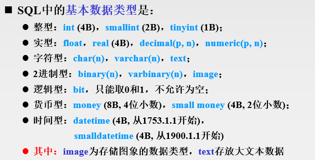

#### 数值

支持所有标准 SQL 数值数据类型。

这些类型包括严格数值数据类型(INTEGER、SMALLINT、DECIMAL 和 NUMERIC)，以及近似数值数据类型(FLOAT、REAL 和 DOUBLE PRECISION)。

关键字INT是INTEGER的同义词，关键字DEC是DECIMAL的同义词。

BIT数据类型保存位字段值，并且支持 MyISAM、MEMORY、InnoDB 和 BDB表。

作为 SQL 标准的扩展，MySQL 也支持整数类型 TINYINT、MEDIUMINT 和 BIGINT。下面的表显示了需要的每个整数类型的存储和范围。

| 类型         | 大小                                     | 范围（有符号）                                               | 范围（无符号）                                               | 用途            |
| :----------- | :--------------------------------------- | :----------------------------------------------------------- | :----------------------------------------------------------- | :-------------- |
| TINYINT      | 1 Bytes                                  | (-128，127)                                                  | (0，255)                                                     | 小整数值        |
| SMALLINT     | 2 Bytes                                  | (-32 768，32 767)                                            | (0，65 535)                                                  | 大整数值        |
| MEDIUMINT    | 3 Bytes                                  | (-8 388 608，8 388 607)                                      | (0，16 777 215)                                              | 大整数值        |
| INT或INTEGER | 4 Bytes                                  | (-2 147 483 648，2 147 483 647)                              | (0，4 294 967 295)                                           | 大整数值        |
| BIGINT       | 8 Bytes                                  | (-9,223,372,036,854,775,808，9 223 372 036 854 775 807)      | (0，18 446 744 073 709 551 615)                              | 极大整数值      |
| FLOAT        | 4 Bytes                                  | (-3.402 823 466 E+38，-1.175 494 351 E-38)，0，(1.175 494 351 E-38，3.402 823 466 351 E+38) | 0，(1.175 494 351 E-38，3.402 823 466 E+38)                  | 单精度 浮点数值 |
| DOUBLE       | 8 Bytes                                  | (-1.797 693 134 862 315 7 E+308，-2.225 073 858 507 201 4 E-308)，0，(2.225 073 858 507 201 4 E-308，1.797 693 134 862 315 7 E+308) | 0，(2.225 073 858 507 201 4 E-308，1.797 693 134 862 315 7 E+308) | 双精度 浮点数值 |
| DECIMAL      | 对DECIMAL(M,D) ，如果M>D，为M+2否则为D+2 | 依赖于M和D的值                                               | 依赖于M和D的值                                               | 小数值          |

------

int 可以用 int(数值)，表示显示宽度。实际存储宽度可能会大于显示宽度，也就是说显示不出但后台可以存更高。默认显示宽度分别为 4,6,9,11,20 。可以使用 `unsigned` 修饰符。

decimal 默认是 10,0 。[即 numeric]

 

#### 日期时间

表示时间值的日期和时间类型为DATETIME、DATE、TIMESTAMP、TIME和YEAR。

每个时间类型有一个有效值范围和一个"零"值，当指定不合法的MySQL不能表示的值时使用"零"值。

TIMESTAMP类型有专有的自动更新特性，将在后面描述。

year 的输入可以输入字符串，如直接 insert 时 `'2010'` ，可以输入二位，那么范围 $[1,69]$ 前缀为 `20` ，$[70,99]$ 的前缀为 `19`  。特别地输入 `0` 表示 `0000` 

time 的输入可以 `D HH:MM:SS` , `HH:MM:SS` , `HH:MM` , `D HH:MM` `D HH` , `SS` 字符串，其中 D 为 $[0,34]$ 。转换为小时，即 $24D+HH$ ，因为 $HH$ 可以大于 $24$ 。有含义的 `HHMMSS` 数值也合法，但诸如 `1112` 被解释为 `00:11:12` 。同理 `12` 是 `00:00:12` 。冒号则不一样。注意 `D HH` 的 `HH` 一定是 `02d` 格式的。也可以用函数 `NOW()` 或常数 `CURRENT_TIME` (前者有年月日，后者没有) (可以加括号，下同)。

date 可以用字符串 `YYYY-MM-DD` , `YYYYMMDD` , `YY-MM-DD` ，或数值 `YY-MM-DD` , `YYMMDD` ，或 `NOW()` 或 `CURRENT_DATE`。任何标点符号，如 `-./@` 都可以作为日期部分分割符。

datetime `YYYY-MM-D HH:MM:SS` , `YYYYMMDDHHMMSS` ，范围是 `1000-01-01 00:00:00` 到 `9999-12-3 23:59:59` 。其中 `YYYY` 可简写为 `YY` ，可以有 `00` 。也可以用数字格式。同理分隔符可以不严格。可以用 `now()`

timestamp 范围为 `1970-01-01 00:00:01 UTC` 到 `2038-01-19 03:14:07 UTC` 。 UTC 是 coordinated universal time ，世界标准时间。timestamp 存储时转换，查询时按当前时区输出，所以不同时区对同一数据输出不同。

修改时区例如： `set time_zone='+10:00'`

存储时的实质是存储字符串，而不是十进制数值

| 类型      | 大小 ( bytes) | 范围                                                         | 格式                | 用途                     |
| :-------- | :------------ | :----------------------------------------------------------- | :------------------ | :----------------------- |
| DATE      | 3             | 1000-01-01/9999-12-31                                        | YYYY-MM-DD          | 日期值                   |
| TIME      | 3             | '-838:59:59'/'838:59:59'                                     | HH:MM:SS            | 时间值或持续时间         |
| YEAR      | 1             | 1901/2155                                                    | YYYY                | 年份值                   |
| DATETIME  | 8             | 1000-01-01 00:00:00/9999-12-31 23:59:59                      | YYYY-MM-DD HH:MM:SS | 混合日期和时间值         |
| TIMESTAMP | 4             | 1970-01-01 00:00:00/2038结束时间是第 **2147483647** 秒，北京时间 **2038-1-19 11:14:07**，格林尼治时间 2038年1月19日 凌晨 03:14:07 | YYYYMMDD HHMMSS     | 混合日期和时间值，时间戳 |

日期比较如：`select count(*) from solution where created_at > '2022-12-29';` (datetime 字段比较)


#### 字符串

字符串类型指CHAR、VARCHAR、BINARY、VARBINARY、BLOB、TEXT、ENUM和SET。该节描述了这些类型如何工作以及如何在查询中使用这些类型。

| 类型       | 大小                  | 用途                            |
| :--------- | :-------------------- | :------------------------------ |
| CHAR       | 0-255 bytes           | 定长字符串                      |
| VARCHAR    | 0-65535 bytes         | 变长字符串                      |
| TINYBLOB   | 0-255 bytes           | 不超过 255 个字符的二进制字符串 |
| TINYTEXT   | 0-255 bytes           | 短文本字符串                    |
| BLOB       | 0-65 535 bytes        | 二进制形式的长文本数据          |
| TEXT       | 0-65 535 bytes        | 长文本数据                      |
| MEDIUMBLOB | 0-16 777 215 bytes    | 二进制形式的中等长度文本数据    |
| MEDIUMTEXT | 0-16 777 215 bytes    | 中等长度文本数据                |
| LONGBLOB   | 0-4 294 967 295 bytes | 二进制形式的极大文本数据        |
| LONGTEXT   | 0-4 294 967 295 bytes | 极大文本数据                    |

char(n) 和 varchar(n) 中括号中 n 代表字符的个数，并不代表字节个数，比如 CHAR(30) 就可以存储 30 个字符。(没赋值的地方用空格补全)

CHAR 和 VARCHAR 类型类似，但它们保存和检索的方式不同。它们的最大长度和是否尾部空格被保留等方面也不同。在存储或检索过程中不进行大小写转换。

**查询不区分大小写**，若 binary 才区分大小写。

char 定长； varchar 可变长；前者查询快，后者查询慢。若对 char(n) ，那么多出部分右侧空格填充。

BINARY 和 VARBINARY 类似于 CHAR 和 VARCHAR，不同的是它们包含二进制字符串而不要非二进制字符串。也就是说，它们包含字节字符串而不是字符字符串。这说明它们没有字符集，并且排序和比较基于列值字节的数值值。

> 如果使用了 `binary` 字符集或字段是 `BINARY` 类型，则会区分大小写。
>
> 可以通过设置表或列的字符集和排序规则来控制大小写敏感性。例如，使用 `utf8mb4_bin` 排序规则将使比较区分大小写

BLOB 是一个二进制大对象，可以容纳可变数量的数据。有 4 种 BLOB 类型：TINYBLOB、BLOB、MEDIUMBLOB 和 LONGBLOB。它们区别在于可容纳存储范围不同。blob变长。

有 4 种 TEXT 类型：TINYTEXT、TEXT、MEDIUMTEXT 和 LONGTEXT。对应的这 4 种 BLOB 类型，可存储的最大长度不同，可根据实际情况选择。text变长。

此外还有 enum ，1 或 2 字节(最大65535) 。定义时只能取指定值，即 `字段名 enum('x', 'y', ..)` ，当然可以是字符串，因为实际存的是下标。从 1 开始编号。取时， NULL 对 NULL， 0 对 `"` ，其他照常对。插入时可以输入字符串值或下标。若声明为 null，null值是该列首个有效值，默认值是null。声明not null默认为允许的值列表第一个元素。比较适合诸如性别选择。

有 set ，有多个成员， 1,2,3,4或8字节，取决成员数量(最多64个)。定义和存储原理类似。会自动去重。按定义顺序显示。比如插入 `'a'` ,  `'a,b,c'` 。比较适合诸如爱好选择。

实际存储长度是字符串长度+1，多出一位存长度数值

二进制字符串有 bit , (var)binary , (tiny/medium/long/)blob 。如 bit(二进制位数)，然后插入数值即可。bin函数转数字为二进制，可以用来 select 显示。多余左补 0 ，如 `b'1010'` 。因为二进制，可以存图片、音频等，但不建议这么做。建议存路径。

(var)binary 可以包含二进制字节。前者可右补足 `\0`


### 安装

#### windows

> 废置：官网下载 [这里](https://dev.mysql.com/downloads/windows/installer/8.0.html) ，下载安装包
>
> 选custom，然后点击右边列表的每一项，更改小字点击advance更改安装路径

 [这里](https://dev.mysql.com/downloads/mysql/) 选 No thanks 即可。下完到合适位置直接解压，就是目录了。

接下来配置：在该安装目录(如：`D:\Temps\mysql-8.0.27-winx64`)

新建文件 `my.ini` ，输入：

```ini
[mysql]
default-character-set=utf8

[mysqld]
port = 3306 
basedir=D:\Temps\mysql-8.0.27-winx64
datadir=D:\Temps\mysql-8.0.27-winx64\data
max_connections=200
character-set-server=utf8
default-storage-engine=INNODB 
```

> 对其中路径改成合适的安装路径

以管理员身份运行 cmd (`C:\Windows\System32` 里找到右击) ，进入安装目录，输入：

```shell
mysqld --remove mysql #清除原有
mysqld -install #或install
mysqld --initialize 
net start mysql
```

在安装目录的 `\data` 找到 `.err` 后缀文件，打开看到最后一行，找到初始密码。

登录：

```shell
mysql -uroot -p
```

输入初始密码。

修改密码：

```mysql
ALTER USER 'root'@'localhost' IDENTIFIED BY '新的密码';
exit; -- 退出
```

> 注意: 在 5.7 需要初始化 data 目录：
>
> ```shell
> cd C:\web\mysql-8.0.11\bin 
> mysqld --initialize-insecure 
> ```
>
> 初始化后再运行 net start mysql 即可启动 mysql


#### Linux安装

##### ubuntu

一系列应用如下：

> - **MySQL** - MySQL服务器。你需要该选项，除非你只想连接运行在另一台机器上的MySQL服务器。
> - **MySQL-client** - MySQL 客户端程序，用于连接并操作Mysql服务器。
> - **MySQL-devel** - 库和包含文件，如果你想要编译其它MySQL客户端，例如Perl模块，则需要安装该RPM包。
> - **MySQL-shared** - 该软件包包含某些语言和应用程序需要动态装载的共享库(libmysqlclient.so*)，使用MySQL。
> - **MySQL-bench** - MySQL数据库服务器的基准和性能测试工具。
>
> 可以使用 MariaDB 代替，MariaDB 数据库管理系统是 MySQL 的一个分支，主要由开源社区在维护，采用 GPL 授权许可。开发这个分支的原因之一是：甲骨文公司收购了 MySQL 后，有将 MySQL 闭源的潜在风险，因此社区采用分支的方式来避开这个风险。
>
> MariaDB的目的是完全兼容MySQL，包括API和命令行，使之能轻松成为MySQL的代替品。
>
> ```shell
> yum install mariadb-server mariadb 
> ```
>
> mariadb数据库的相关命令是：
>
> ```shell
> systemctl start mariadb  #启动MariaDB
> systemctl stop mariadb  #停止MariaDB
> systemctl restart mariadb  #重启MariaDB
> systemctl enable mariadb  #设置开机启动
> ```

> rpm下卸载参考：
>
> ```shell
> rpm -e mysql　　// 普通删除模式
> rpm -e --nodeps mysql　　// 强力删除模式，如果使用上面命令删除时，提示有依赖的其它文件，则用该命令可以对其进行强力删除
> ```

##### centos

> 如未安装 mysql，以 centos 为例，gpt：(注意有可能自带 mariadb)
>
> ```sh
> yum update
> yum install wget
> wget https://dev.mysql.com/get/mysql80-community-release-el7-3.noarch.rpm
> rpm -Uvh mysql80-community-release-el7-3.noarch.rpm
> yum install --nogpgcheck mysql-server
> ```

##### 8降5

因特殊需求，如mycat，可能需要降级。以 centos 为例，先卸载：

```sh
systemctl stop mysqld
systemctl disable mysqld
yum remove mysql
```

删库跑路：

```sh
rm -rf /var/lib/mysql/*
```

可能有残留，继续卸载已有的 mysql 相关：

```sh
yum list installed | less #对着这个找，一个个remove
```

安装：[参考](https://blog.csdn.net/weixin_65870997/article/details/124191390)

```sh
rpm -ivh https://repo.mysql.com//mysql57-community-release-el7-9.noarch.rpm
yum install -y mysql-server --nogpgcheck
```

启动和开机自启和检查状态

```sh
systemctl start mysqld
systemctl enable mysqld
systemctl status mysqld
```

可能需要按下文改一下 root 密码，可以用 8 + 5 的方法(即开 skip 修改 user 表)

改密码上点强度，否则正常启动时会要求改密码如 `set password=password('abcDEF1+');` 才能执行任何其他操作。

要让外机可连，可以：

```mysql
update mysql.user set host='%' where user='root';
flush privilges;
```


> 下文作废：
>
> 因为 yum 不到，gpt 让去 [mysql官网](https://dev.mysql.com/downloads/mysql/) 装 mysql，点 [archive](https://downloads.mysql.com/archives/community/)，下个压缩包。选 RHEL，看看自己的大版本：(任意执行一个)
>
> ```sh
> cat /etc/centos-release
> cat /etc/redhat-release
> uname -r
> ```
>
> 查看架构是 x86 还是 arm，并查看操作系统位数：
>
> ```sh
> uname -m
> ```
>
> 下一个 server。


#### root密码修改

##### 5

> 开一个快捷键：
>
> ```sh
> #根据 ps -aux | grep mysql 找到 /www/server/mysql/ 为根目录
> ln -s /www/server/mysql/bin/mysqld_safe /usr/bin/mysqld_safe
> ```
>

关闭 mysql：

```sh
service mysql stop
```

开启安全模式：(如果找不到安全模式，按8的操作改 `my.cnf`)

```sh
mysqld_safe --skip-grant-tables &
```

进行免密登录：

```sh
mysql -u root
```

给一个新的代替 root 的用户，因为在安全模式，所以只能修改表，不能 create user，为此先临时修改 root 密码：

```mysql
use mysql;
select authentication_string,user from user; #记录下root的密码
update user set authentication_string=password('password') where user='root';
flush privileges;
exit
```

关闭 mysql 服务，然后重启：

```sh
service mysql stop
service mysql start
```

之后就可以用刚刚设的密码进入 root 账号了，这时开一个有全部权限的新用户：

```mysql
create user 'baicha'@'localhost' identified by 'password';
grant all privileges on *.* to 'baicha'@'localhost' with grant option;
flush privileges;
```

然后测试成功后，可以把 root 的密码改回去。

##### 8

mysql 8 没有 `mysqld_safe`，关掉 service，找到 `/etc/my.cnf`，追加：

```properties
[mysqld]
skip-grant-tables
```

重启，进去，先清空密码然后重建密码：

```mysql
use mysql;
update user set authentication_string='' where user='root'; 
FLUSH PRIVILEGES;
alter user 'root'@'localhost' identified by 'Guodong1+';
```

注意密码要保持强度，不然可能创不了。关掉 `skip-grant-tables`，重启。

目前没有发现 `root` 在非 `localhost` 能修改的办法，如果想要别的用户有全部权限在远程登录，需要用 root 额外创建用户：

```mysql
create user 'baicha'@'%' identified by 'Guodong1+';
grant all privileges on *.* to 'baicha'@'%' with grant option;
FLUSH PRIVILEGES;
```

连接测试：(记得开防火墙)

```sh
mysql -u baicha -h 192.168.126.129 -P 3306 -p
```


## 指令

### 权限指令

#### 理论

用户分为普通和 `root`。后者可以增删改用户，普通用户一般不行。权限表由 `MYSQL_install_db` 脚本初始化。权限信息表主要有 `user,db,host,tables_priv,columns_priv,procs_priv`。

##### 权限表

在数据库 `mysql`。

###### user

记录允许连接到服务器的账户信息，全局级的权限，即有权限就能操作所有数据库。可以 `desc user;` 看表结构。

用户列包括 `Host`, `User`, `authentication_string` 表示主机名、用户名、密码(显然经过加密)。前两者是该表的联合主键。只有这三个值都匹配，才能连接建立。修改用户密码的本质是修改密码列。

权限列表明了允许的操作，字段值类型是 enum，修改权限可以直接改这个列，也可以用 `grant` 语句。

安全列有 6 个子段，两个是 `ssl` 加密，两个是 `x509` 标准用于识别用户，另外两个是授权插件相关的 (`plugin` 字段)，为空使用内部授权验证机制。通过 `show variables like 'have_openssl';` 检查是否支持 `ssl` 功能。

资源控制列，限制用户使用的资源， `max_questions` 每小时允许执行查询操作数； `max_updates` , `max_connections` (连接操作次数)，`max_user_connections` 同时建立连接数。若超出限制，会被锁定，直到下一个小时才能执行对应操作。


###### db

存储用户对某个数据库的操作权限。主键是 `host,user,db`。其中 `create_routine_priv,aalter_routine_priv` 是创建和修改存储过程的权限。host 可以为空。


###### tables_priv

对表设置操作权限。


###### columns_priv

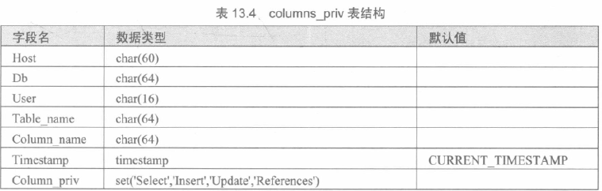


###### procs_priv

存储过程/函数。

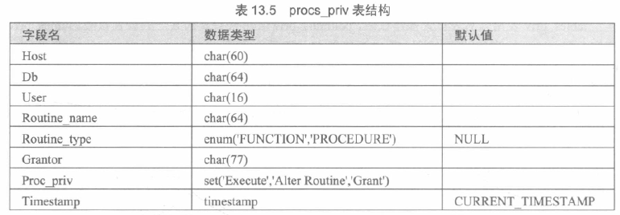


##### 访问控制

两个阶段：

- 连接核实阶段，即对密码
- 请求核实阶段，即查命令是否有权做


#### 登录

SHELL 命令。可以查看帮助： `mysql --help`

`mysql` 登陆命令的参数：

- `-h` 主机名，默认 `localhost`
- `-u` 用户名
- `-p` 指定登录密码或随后输入(无密码直接回车)
- `-P` 端口号
- `数据库名` 
- `-e` 执行该参数后的指令 SQL 语句并退出(输出执行结果)

如：

```shell
mysql -u root -p #或mysql -uroot -p
mysql -u root -p test_db -e "DESC person;"
```


> 使用 `mysqld -initialize` 安装 `mysql` 是安全的，因为自动为 `root` 生成标记过期的随机密码，不创建任何匿名账户和 `test` 数据库。


匿名用户：`user`表里 `user` 子段为空字符串，使得任何用户可以连接到数据库。检查是否存在并删除：

```mysql
select * from user where user='';
delete from user where user='';
```


#### 新建

首先选择一个数据库，用：

```mysql
use 数据库名;
```

> 数据库名不需要加引号；列出所有数据库用指令`SHOW DATABASES;`


命令为 

```sql
CREATE USER 用户名 IDENTIFIED BY '密码';
```

如：

```mysql
create user oj identified by 'scnunoj';
```

> 标准格式：
>
> ```mysql
> create user user_specification[,user_speci..]
> ```
>
> 其中后面的参数可以是：
>
> ```mysql
> user@host
> identified by [password] 'password'
> | identified with auth_plugin [as 'auth_string']
> ```
>
> 若选上 `password` 关键字，表示用哈希值设置密码。插件名字可以单引号或双引号。新添加的账号没有任何权限。不能跟已有账户重复。

也可以直接操作表，就插入数据的格式，即：

```mysql
insert into mysql.user(host, user, authentication_string,[权限名字,...]) values ('host','username',md5('密码'),['Y'/'N',...])
```

如：

```mysql
INSERT INTO user
	(host, user, authentication_string,
    select_priv, insert_priv, update_priv)
VALUES ('IP地址', '用户名', MD5(密码), 'Y', 'Y', 'Y')
```

> password() 加密函数已经在 8.0.11 中移除了，可以使用 MD5() 函数代替
>
> 在`5.7`以下，`authentication_string` 是 `password`

可以设置 `Y/N` 的包括：

- Select_priv
- Insert_priv
- Update_priv
- Delete_priv
- Create_priv
- Drop_priv
- Reload_priv
- Shutdown_priv
- Process_priv
- File_priv
- Grant_priv
- References_priv
- Index_priv
- Alter_priv


#### 删除

```mysql
drop user 用户名,[用户名];
```

如：

```mysql
drop user 'user'@'localhost';
drop user; -- 干掉全部
```

不能自动删掉任何打开的用户对话，删的话要等到该用户对话关闭后才会生效。

也可以：

```mysql
delete from mysql.user where host='' and user=''
```

如：

```mysql
delete from mysql.user where host='localhost' and user='baicha';
```


#### 修改

修改密码，直接改表，如：

```mysql
update mysql.user set authentication_string=md5('新密码') where user='root' and host='localhost';
```

修改后要生效，需要刷新：

```mysql
flush privileges;
```

对非 `root` 用户，修改密码可以：

```mysql
set password for 'user'@'localhost' = '密码';
```

也可以跟上面一样的改法。但无论如何都要刷新。

> 没试过：
>
> ```sql
> alter user <username> identified by “<new_password>”;
> ```


#### 授权

使用 grant 命令授权，撤回是 revoke。全局权限是 `grant all on *.*` ，撤回同理。数据库层级就 `on 数据库.*`，表就后者改成表名。子程序可以是全局或数据库、子程序级别的。有 grant 权限的可以执行。语法：

```mysql
grant priv_type [(columns)] [,priv_type columns...]
on [object_type] table1,...
to user [with grant option]
```

`object_type` 有 `table,function,procedure`。升级时要用就要升级授权表。若不指定 `columns` 就是全表。旧版本 `mysql` 。可以设置密码。with 后一个或多个参数：

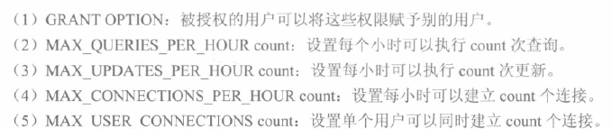

```mysql
GRANT ALL PRIVILEGES ON 数据库名.* to 用户名@'%' IDENTIFIED BY 'scnuoj';
```

```mysql
FLUSH PRIVILEGES; # 重新加载
```

如：

```mysql
grant all privileges on scnuoj.* to oj@'%' identified by 'scnuoj';
flush privileges;
```

```mysql
-- 给指定数据库TUTORIALS添加用户 zara ，密码为 zara123 
GRANT SELECT,INSERT,UPDATE,DELETE,CREATE,DROP
ON TUTORIALS.*
TO 'zara'@'localhost'
IDENTIFIED BY 'zara123';
```

```mysql
grant select,insert on *.* to 'grantUser'@'localhost'
identified by 'grantpwd'
with grant option;
```

```mysql
grant select(classNo,className,institute),update(classNo,className,institute) on scoredb.class to user01, user02;
flush privileges;
-- 那么这两个用户可以查和改这几个列(单独或同时)
```


##### 权限列表


可以使用的权限：

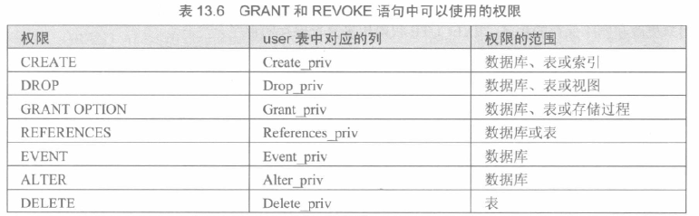


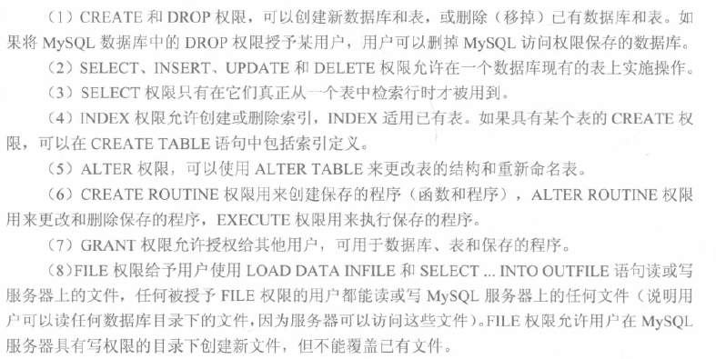

其它权限是管理性操作，用 `mysqladmin` 或 `sql` 语句：


#### 收回

revoke。从 `db,host,table_priv,columns_priv` 删除。语法：

```mysql
revoke all privileges, grant option
from 'user'@'host' [,'user'@'host'...]
```

```mysql
revoke priv_type [(columns)] [,...]
on table1, ...
from 'user'@'host' ,...
```

有全局 `create user,update` 之一的可以使用该权限。

如：

```mysql
revoke update on *.* from 'user'@'localhost';
```


#### 查询

```mysql
show grants for 'user'@'host';
```

或者查表的字段，如：

```mysql
select privileges_list from user where user='' ,  host=''
```

`privileges_list` 如 `select_priv` 等。


#### 自动换密码

8.0

设置账户密码过期时间，过期用户要连接需要更改密码。查看：

```mysql
select user,host,password_last_changed,password_lifeftime,password_expired from mysql.user \G;
```

时间为 `null` 永不过期。设置永不过期，如：

```sql
alter user root@localhost password expire default;
alter user root@localhost password expire interval 260 day; -- 260天过期
```


#### 角色

用户组。

```sql
create role role_name;
```

```mysql
grant select on db.* to role_name;
revoke select on db.* from role_name;
```

```mysql
grant role_name to user@host;
```

```mysql
select * from mysql.default_roles;
select * from mysql_role_edges; -- 用户属于什么角色
```

```mysql
drop role role_name;
```

#### 连接

也可以参见 `其他指令-查询-连接数` 和 `连接最大时长`。

查询到的 id 可以清除：

```mysql
kill connection +6; # 断开id6的连接
```

处于空闲状态的连接被服务端主动断开后，这个客户端并不会马上知道，等到客户端在发起下一个请求的时候，才会收到报错。

> 查看当前所有连接
>
> ```mysql
> show processlist;
> ```
>
> command 列是 sleep 就是连接完 MySQL 服务就没有再执行过任何命令（空闲连接）
>
> time 列是空闲时长（秒）
>
> `wait_timeout` 参数控制最大空闲时长，默认 28800s (8h)，超时自动断开。
>
> ```sql
> show variables like 'wait_timeout';
> ```
>
> 最大连接数：
>
> ```sql
> show variables like 'max_connections';
> ```
>
> 超过最大连接数就拒绝接下来的请求。

### 数据库指令

#### 查询

显示所有数据库。

```mysql
SHOW DATABASES;
```

显示编码：

```mysql
SHOW VARIABLES LIKE 'character_set_database';
```


#### 创建

```mysql
CREATE DATABASE 数据库名;
```

可以用管理员权限在shell时创建：

```shell
mysqladmin -u 管理员帐号名 -p create 数据库名
```

已存在同名时不能创建。


变体：不存在则创建

```mysql
CREATE DATABASE IF NOT EXISTS 数据库名
```

设定编码：

```mysql
CREATE DATABASE IF NOT EXISTS 数据库名 DEFAULT CHARSET utf8 COLLATE utf8_general_ci;
```

`utf8_general_ci` 数据库的校验规则,ci是case insensitive的缩写,意思是大小写不敏感;相对的是cs,即case sensitive,大小写敏感;

MYSQL8.0前默认字符集是 `latin1` ，`utf8` 是 `utf8mb3` ； 8.0 开始，默认编码是 `utf8mb4` 。

> utf8_unicode_ci，用来定义排序的规则，对于mysql中那些字符类型的列，如VARCHAR，CHAR，TEXT类型的列，都需要有一个COLLATE类型来告知mysql如何对该列进行排序和比较。
> GBK编码的默认COLLATE为gbk_chinese_ci，
> utf8mb4编码的默认值为utf8mb4_general_ci
>
> mysql中的utf8最多只能支持3bytes长度的字符编码，对于一些需要占据4bytes的文字，mysql的utf8就不支持了，要使用utf8mb4才行。
>
> \_ci字样，是Case Insensitive的缩写，即大小写无关，也就是说”A”和”a”在排序和比较的时候是一视同仁的。`selection * from table1 where field1=”a”`同样可以把field1为”A”的值选出来。
> 与此同时，对于那些\_cs后缀的COLLATE，则是Case Sensitive，即大小写敏感的。


#### 删除

```mysql
DROP DATABASE 数据库名;
```

或shell：

```shell
mysqladmin -u 管理员帐号名 -p drop 数据库名
```

执行后会出现提示，确认是否删除。而PHP脚本删除，不会出现提示消息。

> 删除数据库对象（表、库、索引、视图等）都用 drop ，删除数据都用 delete

drop 不可以回滚

#### 选择

```mysql
USE 数据库名;
```

选择后，mysql指令会针对这个数据库。


### 数据表指令

#### 枚举

```mysql
SHOW TABLES;
```


#### 查看概况

```mysql
DESC 数据表名;
```

或全称：

```mysql
DESCRIBE 数据表名;
```

查看列名。

查看建表语句(跟真实输入的建表语句不一样，经过转换的)：

```mysql
SHOW CREATE TABLE 数据表名;
```

查看数据库默认编码直接查看建表语句。


可以看当前全部数据表类型：

```mysql
SHOW TABLE STATUS ;
```

查看特定库：

```mysql
show table status from 数据库;
```


其他更多指令：

```mysql
SHOW COLUMNS FROM user; #查看user数据表的所有属性
SHOW INDEX FROM user; #显示数据表的详细索引信息，包括PRIMARY KEY（主键）
SHOW TABLE STATUS from mysql; # 输出数据库性能和统计信息
SHOW TABLE STATUS from mysql LIKE 'time%';     # 表名以time开头的表的信息
SHOW TABLE STATUS from mysql LIKE 'time%'\G;   # 加上 \G，查询结果按列打印
```


#### 创建

```mysql
CREATE TABLE table_name (column_name column_type);
```

```mysql
CREATE TABLE 数据表名(`列名` 列类型, `列名` 列类型, ..., PRIMARY KEY(`主键列名`) ) ENGINE=存储引擎 CHARSET=编码 DEFAULT
```

当数据库有规定 `ENGINE, CHARSET` 时，数据表大概可以不规定

如：

```mysql
CREATE TABLE IF NOT EXISTS runoob_tbl(
   runoob_id INT UNSIGNED AUTO_INCREMENT,
   runoob_title VARCHAR(100) NOT NULL,
   runoob_author VARCHAR(40) NOT NULL,
   submission_date DATE,
   PRIMARY KEY ( runoob_id )
)ENGINE=InnoDB DEFAULT CHARSET=utf8;
```


#### 删除

```mysql
DROP TABLE 数据表名;
```

> 只清空数据不删掉表可以用 truncate (见数据指令-删除)

drop 不可以回滚，truncate 可以回滚。[力扣](https://leetcode.cn/leetbook/read/job-hunting-all-in-one-school/0sgua6/)

#### 更改

`ALTER`

增删改字段：

```mysql
ALTER TABLE 数据表名 DROP 列名;
ALTER TABLE 数据表名 ADD 列名 数据类型;
ALTER TABLE 数据表名 MODIFY 列名 数据类型;
ALTER TABLE 数据表名 CHANGE 列名 新列名 数据类型;
ALTER TABLE 数据表名 SET DEFAULT 值;
ALTER TABLE 数据表名 DROP DEFAULT;
ALTER TABLE 数据表名 DROP FOREIGN KEY 约束名;
ALTER TABLE 数据表名 ENGINE = 新数据表类型;
ALTER TABLE 数据表名 RENAME TO 数据表名; -- TO 可以不写
```

增加时可以设置位置，用`first`或`after 列名`；增加后会得到全空值。不设置就默认在最后添加。可以设置默认值，`default` 加值。(删掉就默认`NULL`)，修改时也可以用，作为调整位置。设置数据类型时可以附加约束。修改时原列名可以和新列名一样。如果本来`not null`修改时不能漏，不然会默认改成`null`允许的。`modify` 可以实现重排序。

引擎默认为 `InnoDB` ，还支持 `FEDERATED, MRG_MYISAM, MyISAM, BLACKHOLE, CSV, MEMORY, ARCHIVE, PERFORMANCE_SCHEMA` 。

如：

```mysql
alter table student add haha int first;
alter table student drop haha;
alter table student add haha int after id;
alter table student drop haha;
alter table student add haha int;
alter table student drop haha;
alter table student add haha int not null default 580;
alter table student modify haha bigint not null;
alter table student change haha xixi bigint not null;
```

```mysql
ALTER TABLE testalter_tbl ALTER i SET DEFAULT 1000;
ALTER TABLE testalter_tbl ALTER i DROP DEFAULT;
ALTER TABLE testalter_tbl ENGINE = MYISAM;
ALTER TABLE testalter_tbl RENAME TO alter_tbl;
```

> `show table status;`可以看数据表类型

重命名：rename [参考](https://blog.csdn.net/Kingsea442/article/details/140370507)

```mysql
rename table 旧名字 to 新名字;
```

约束相关：

```mysql
alter table WorksAt add constraint new_primary_key primary key (staffId, firmName);
alter table WorksAt drop primary key;
alter table Staff add constraint CHK_age check (age between 20 and 40);
alter table Staff modify age not null;
```


#### 复制

先复制表结构：

```mysql
CREATE TABLE 新表名 LIKE 旧表名;
```

或：

```mysql
CREATE TABLE 新表名 SELECT * FROM 旧表;
```


再覆盖数据：

```mysql
INSERT INTO 新表名 SELECT * FROM 旧表名; 
```

可以部分复制并同时复制数据：

```mysql
CREATE TABLE 新表名 AS
(
    SELECT 列名, 列名 FROM 旧表名
)
```

可以改列名并同时复制数据：

```mysql
CREATE TABLE 新表名 AS
(
    SELECT 列名 AS 新名字 FROM 旧表名
)
```

如：

```mysql
create table hhh as (select id,student_name as `name` from student);
```

可以用新规则覆盖旧列名，如：

```mysql
create table hhh (id int) as (select * from student);
```

> 部分更新：
>
> ```mysql
> update b set b.col=a.col from a,b where a.id=b.id;
> update b set col=a.col from b inner join a on a.id=b.id;
> update b set b.col=a.col from b left Join a on b.id = a.id;
> ```


#### 计算列

通过别的列计算得到的列。定义：

```sql
col_name data_type [generated always] as (expression) [virtual | stored] [unique [key]] [comment comm] [not null|null] [[primary] key]
```

可以通过 `create table` 或 `alter table` 来搞，例如：

```sql
c int(9) generated always as ((a+b)) virtual
```


#### 检查

查看数据库的类似哈希值(long)

```mysql
checksum table 表名;
```

得到 `Checksum` 属性是 `long` ，跟其他表的作对比可以检查两表是否数据一致


#### explain

后接一条命令。如：

```mysql
explain select * from cart;
```

可以查看性能(如filtered列)。

MySQL中提供了EXPLAIN语句和DESCRIBE语句，用来分析查询语句，EXPLAIN语句的基本语法如下：

```mysql
EXPLAIN [EXTENDED] SELECT select_options
```

使用EXTENED关键字，EXPLAIN语句将产生附加信息。

DESCRIBE语句的使用方法与EXPLAIN语句是一样的，分析结果也是一样的，并且可以缩写成DESC

```mysql
DESCRIBE SELECT select_options
```

执行该语句，可以分析EXPLAIN后面SELECT语句的执行情况，并且能够分析出所查询表的一些特征。下面对查询结果进行解释：

1. id：SELECT识别符。这是SELECT的查询序列号。
2. select_type：表示SELECT语句的类型。
3. table：表示查询的表。
4. type：表示表的连接类型。
5. possible_keys：给出了MySQL在搜索数据记录时可选用的各个索引。
6. key：是MySQL实际选用的索引。(NULL 表示不用到)
7. key_len：给出索引按字节计算的长度，key_len数值越小，表示越快。
8. ref：给出了关联关系中另一个数据表里的数据列名。
9. rows：是MySQL在执行这个查询时预计会从这个数据表里读出的数据行的个数。(近似值)
10. Extra：提供了与关联操作有关的信息。

> extra 里若有 using filesort 表明是外部排序，证明效率较低

重点要关注如下几列：

| 列名    | 备注                                                         |
| ------- | ------------------------------------------------------------ |
| type    | 本次查询表联接类型，从这里可以看到本次查询大概的效率。       |
| key     | 最终选择的索引，如果没有索引的话，本次查询效率通常很差。     |
| key_len | 本次查询用于结果过滤的索引实际长度。                         |
| rows    | 预计需要扫描的记录数，预计需要扫描的记录数越小越好。         |
| Extra   | 额外附加信息，主要确认是否出现 Using filesort、Using temporary 这两种情况。 |

其中，type包含以下几种结果，从上之下依次是最差到最好：

| 类型            | 备注                                                         |
| --------------- | ------------------------------------------------------------ |
| ALL             | 执行full table scan，这是最差的一种方式。                    |
| index           | 执行full index scan，并且可以通过索引完成结果扫描并且直接从索引中取的想要的结果数据，也就是可以避免回表，比ALL略好，因为索引文件通常比全部数据要来的小。 |
| range           | 利用索引进行范围查询，比index略好。                          |
| index_subquery  | 子查询中可以用到索引。                                       |
| unique_subquery | 子查询中可以用到唯一索引，效率比 index_subquery 更高些。     |
| index_merge     | 可以利用index merge特性用到多个索引，提高查询效率。(分别扫描各索引，然后合并结果集) |
| ref_or_null     | 表连接类型是ref，但进行扫描的索引列中可能包含NULL值。        |
| fulltext        | 全文检索。                                                   |
| ref             | 基于索引的等值查询，或者表间等值连接。                       |
| eq_ref          | 表连接时基于主键或非NULL的唯一索引完成扫描，比ref略好。      |
| const           | 基于主键或唯一索引唯一值查询，最多返回一条结果，比eq_ref略好。 |
| system          | 查询对象表只有一行数据，这是最好的情况。                     |

另外，Extra列需要注意以下的几种情况：

| 关键字                       | 备注                                                         |
| ---------------------------- | ------------------------------------------------------------ |
| Using filesort               | 将用外部排序而不是按照索引顺序排列结果，数据较少时从内存排序，否则需要在磁盘完成排序，代价非常高，需要添加合适的索引。 |
| Using temporary              | 需要创建一个临时表来存储结果，这通常发生在对没有索引的列进行GROUP BY时，或者ORDER BY里的列不都在索引里，需要添加合适的索引。 |
| Using index                  | 表示MySQL使用覆盖索引避免全表扫描，不需要再到表中进行二次查找数据，这是比较好的结果之一。注意不要和type中的index类型混淆。 |
| Using index condition        | 使用了索引下推 [参考](https://www.xiaolincoding.com/mysql/base/how_select.html#%E6%89%A7%E8%A1%8C%E5%99%A8) |
| Using where                  | 通常是进行了全表/全索引扫描后再用WHERE子句完成结果过滤，需要添加合适的索引。 |
| Impossible WHERE             | 对Where子句判断的结果总是false而不能选择任何数据，例如where 1=0，无需过多关注。 |
| Select tables optimized away | 使用某些聚合函数来访问存在索引的某个字段时，优化器会通过索引直接一次定位到所需要的数据行完成整个查询，例如MIN()\MAX()，这种也是比较好的结果之一。 |


#### 直方图

8.0

近似获得一列数据分布情况。支持等宽 singleton 和等高 equi-height 。

创建语法：

```sql
analyze table table_name [update histogram on col_name with n buckets | drop histogram on col_name]
```

buckets 默认值 100 ，合法范围是 $[1,100]$ ，取决：这列不同值数目，数据分布情况和准确性要求。存储在数据字典表 `column_statistics` 中，可以通过查询视图 `information_schema.COLUMN_STATISTICS` 访问。以 json 格式存储。`analyze` 会基于表大小自动判断是否取样，和建立什么图。可以多列。如：

```mysql
analyze table flower update histogram on yourprice with 60 buckets;
```

删除：

```mysql
analyze table flower drop histogram on yourprice；
```

直方图创建后永不更新。建立时数据读到内存，然后进行操作。为了避免 MLE ，会根据 `histogram_generation_max_mem_size` 计算读多少行数据到内存，可以用 `set` 语句设置它的值。


#### 注释

每个列可以添加注释，使用 `comment` 关键字接字符串

```mysql
create table server_load( 
	id int not null default 0 comment '用户id' 
) 
```

查看带注释列的表信息：

```mysql
show full columns from server_load;
```

对已有表插入注释：(`alter add column` 等同理)

```mysql
alter table server_load modify column id int not null default 0 comment '用户ID!';
```

表注释：

```mysql
create table test2( 
    field_name int comment '字段的注释' 
)comment='表的注释'; 
```

修改：

```mysql
alter table test2 comment '修改后的表的注释';
```

查看表注释：

```mysql
show create table test2;
```

或：

```mysql
use information_schema; 
select * from TABLES where TABLE_SCHEMA='my_db' and TABLE_NAME='test2' \G
-- 元数据看字段注释
select * from COLUMNS where TABLE_SCHEMA='my_db' and TABLE_NAME='test2' \G
```

#### 临时表

```sql
CREATE TEMPORARY TABLE temp_solved AS SELECT ...;
DROP TEMPORARY TABLE IF EXISTS temp_solved;
```

1. 会话范围：临时表只在创建它的数据库会话中可见，其他会话无法看到或访问它。
2. 自动删除：当创建它的数据库会话结束时，临时表会自动被删除。这意味着通常不需要手动删除临时表，除非你有特定的原因需要在会话结束前删除它。
3. 安全性：使用 `TEMPORARY` 关键字确保即使有同名的持久表存在，也只会删除临时表，不会影响持久表。

检查临时表存在：(任选一个)

```sql
SELECT 1 FROM temp_table_name LIMIT 1; # 不存在报错
CREATE TEMPORARY TABLE IF NOT EXISTS temp_table_name (id INT); # 存在不成功
SHOW TABLES LIKE 'temp_table_name';
```


#### 优化建议

MySQL数据库优化是多方面的，原则是减少系统的瓶颈，减少资源的占用，增加系统的反应速度。例如，通过优化文件系统，提高磁盘I\O的读写速度；通过优化操作系统调度策略，提高MySQL在高负荷情况下的负载能力；优化表结构、索引、查询语句等使查询响应更快。

针对查询，我们可以通过使用索引、使用连接代替子查询的方式来提高查询速度。

针对慢查询，我们可以通过分析慢查询日志，来发现引起慢查询的原因，从而有针对性的进行优化。

针对插入，我们可以通过禁用索引、禁用检查等方式来提高插入速度，在插入之后再启用索引和检查。

针对数据库结构，我们可以通过将字段很多的表拆分成多张表、增加中间表、增加冗余字段等方式进行优化。


##### 查询

如果查询时没有使用索引，查询语句将扫描表中的所有记录。在数据量大的情况下，这样查询的速度会很慢。如果使用索引进行查询，查询语句可以根据索引快速定位到待查询记录，从而减少查询的记录数，达到提高查询速度的目的。

索引可以提高查询的速度，但并不是使用带有索引的字段查询时索引都会起作用。有几种特殊情况，在这些情况下有可能使用带有索引的字段查询时索引并没有起作用。

1. 使用LIKE关键字的查询语句

   在使用LIKE关键字进行查询的查询语句中，如果匹配字符串的第一个字符为“%”，索引不会起作用。只有“%”不在第一个位置，索引才会起作用。

2. 使用多列索引的查询语句

   MySQL可以为多个字段创建索引。一个索引可以包括16个字段。对于多列索引，只有查询条件中使用了这些字段中的第1个字段时索引才会被使用。

3. 使用OR关键字的查询语句

   查询语句的查询条件中只有OR关键字，且OR前后的两个条件中的列都是索引时，查询中才使用索引。否则，查询将不使用索引。


使用子查询可以进行SELECT语句的嵌套查询，即一个SELECT查询的结果作为另一个SELECT语句的条件。子查询可以一次性完成很多逻辑上需要多个步骤才能完成的SQL操作。

子查询虽然可以使查询语句很灵活，但执行效率不高。执行子查询时，MySQL需要为内层查询语句的查询结果建立一个临时表。然后外层查询语句从临时表中查询记录。查询完毕后，再撤销这些临时表。因此，子查询的速度会受到一定的影响。如果查询的数据量比较大，这种影响就会随之增大。

在MySQL中，可以使用连接（JOIN）查询来替代子查询。连接查询不需要建立临时表，其速度比子查询要快，如果查询中使用索引，性能会更好。


数据量大，建议按照如下顺序进行优化：

1. 优化SQL和索引；
2. 增加缓存，如memcached、redis；
3. 读写分离，可以采用主从复制，也可以采用主主复制；
4. 使用MySQL自带的分区表，这对应用是透明的，无需改代码，但SQL语句是要针对分区表做优化的；
5. 做垂直拆分，即根据模块的耦合度，将一个大的系统分为多个小的系统；
6. 做水平拆分，要选择一个合理的sharding key，为了有好的查询效率，表结构也要改动，做一定的冗余，应用也要改，sql中尽量带sharding key，将数据定位到限定的表上去查，而不是扫描全部的表。


##### 插入

影响插入速度的主要是索引、唯一性校验、一次插入记录条数等。针对这些情况，可以分别进行优化。

对于MyISAM引擎的表，常见的优化方法如下：

1. 禁用索引

   对于非空表，插入记录时，MySQL会根据表的索引对插入的记录建立索引。如果插入大量数据，建立索引会降低插入记录的速度。为了解决这种情况，可以在插入记录之前禁用索引，数据插入完毕后再开启索引。对于空表批量导入数据，则不需要进行此操作，因为MyISAM引擎的表是在导入数据之后才建立索引的。

2. 禁用唯一性检查

   插入数据时，MySQL会对插入的记录进行唯一性校验。这种唯一性校验也会降低插入记录的速度。为了降低这种情况对查询速度的影响，可以在插入记录之前禁用唯一性检查，等到记录插入完毕后再开启。

3. 使用批量插入

   插入多条记录时，可以使用一条INSERT语句插入一条记录，也可以使用一条INSERT语句插入多条记录。使用一条INSERT语句插入多条记录的情形如下，而这种方式的插入速度更快。

   ```
   INSERT INTO fruits VALUES ('x1', '101', 'mongo2', '5.7'), ('x2', '101', 'mongo3', '5.7'), ('x3', '101', 'mongo4', '5.7');
   ```

4. 使用LOAD DATA INFILE批量导入

   当需要批量导入数据时，如果能用LOAD DATA INFILE语句，就尽量使用。因为LOAD DATA INFILE语句导入数据的速度比INSERT语句快。

对于InnoDB引擎的表，常见的优化方法如下：

1. 禁用唯一性检查

   插入数据之前执行set unique_checks=0来禁止对唯一索引的检查，数据导入完成之后再运行set unique_checks=1。这个和MyISAM引擎的使用方法一样。

2. 禁用外键检查

   插入数据之前执行禁止对外键的检查，数据插入完成之后再恢复对外键的检查。

3. 禁用自动提交

   插入数据之前禁止事务的自动提交，数据导入完成之后，执行恢复自动提交操作。


##### 慢查询日志

MySQL中慢查询日志默认是关闭的，可以通过配置文件my.ini或者my.cnf中的log-slow-queries选项打开，也可以在MySQL服务启动的时候使用--log-slow-queries[=file_name]启动慢查询日志。

启动慢查询日志时，需要在my.ini或者my.cnf文件中配置long_query_time选项指定记录阈值，如果某条查询语句的查询时间超过了这个值，这个查询过程将被记录到慢查询日志文件中。

直接分析mysql慢查询日志，利用explain关键字可以模拟优化器执行SQL查询语句，来分析sql慢查询语句。

常见慢查询优化：

1. 索引没起作用的情况(上述三种)

2. 优化数据库结构

   - 对于字段比较多的表，如果有些字段的使用频率很低，可以将这些字段分离出来形成新表。因为当一个表的数据量很大时，会由于使用频率低的字段的存在而变慢。
   - 对于需要经常联合查询的表，可以建立中间表以提高查询效率。通过建立中间表，把需要经常联合查询的数据插入到中间表中，然后将原来的联合查询改为对中间表的查询，以此来提高查询效率。

3. 分解关联查询

   很多高性能的应用都会对关联查询进行分解，就是可以对每一个表进行一次单表查询，然后将查询结果在应用程序中进行关联，很多场景下这样会更高效。

4. 优化LIMIT分页

   当偏移量非常大的时候，例如可能是limit 10000,20这样的查询，这是mysql需要查询10020条然后只返回最后20条，前面的10000条记录都将被舍弃，这样的代价很高。优化此类查询的一个最简单的方法是尽可能的使用索引覆盖扫描，而不是查询所有的列。然后根据需要做一次关联操作再返回所需的列。对于偏移量很大的时候这样做的效率会得到很大提升。

### 查询指令

#### 概述

读取所有数据：

```mysql
SELECT * FROM 数据表名;
```

通用：

```mysql
SELECT [ALL | DISTINCT] <目标列表达式> [AS] [<别名>]
                 [, <目标列表达式> [AS] [<别名>] ... ]
FROM {<表名> | <视图名> | <查询表>} [AS] [<别名>]
             [, {<表名> | <视图名> | <查询表>} [AS] [<别名>] ... ]
[ WHERE <条件表达式> ]
[ GROUP BY <列名1> [, <列名2> ... ]
   [ HAVING <条件表达式> ] ]
[ ORDER BY <列名表达式> [ASC | DESC] 
                [, <列名表达式> [ASC | DESC] ... ] ]
```

```mysql
SELECT 列名, 列名, ...
FROM 数据表名
[WHERE 从句判断] /*可选：包含任何条件*/
[LIMIT 数目] /*可选：返回记录数*/
[OFFSET 数目] /*可选：开始查询的数据偏移量，默认0*/
```

```mysql
SELECT 字段列表 FROM 数据表名
[WHERE xx] [GROUP BY 字段名] [HAVING 分组条件]
[ORDER BY ASC|DESC]
```

> **having：**用于对where和group by查询出来的分组经行过滤，查出满足条件的分组结果。它是一个过滤声明，是在查询返回结果集以后对查询结果进行的过滤操作
>
> > WHERE是一个约束声明，使用WHERE约束来自数据库的数据，WHERE是在结果返回之前起作用的，WHERE中不能使用聚合函数。
> >
> > HAVING是一个过滤声明，是在查询返回结果集以后对查询结果进行的过滤操作，在HAVING中可以使用聚合函数。另一方面，HAVING子句中不能使用除了分组字段和聚合函数之外的其他字段。
> >
> > 从性能的角度来说，HAVING子句中如果使用了分组字段作为过滤条件，应该替换成WHERE子句。因为WHERE可以在执行分组操作和计算聚合函数之前过滤掉不需要的数据，性能会更好
>
> 顺序：
>
> 1. FROM, including JOINs
> 2. WHERE
> 3. GROUP BY
> 4. HAVING
> 5. WINDOW functions
> 6. SELECT
> 7. DISTINCT
> 8. UNION
> 9. ORDER BY
> 10. LIMIT and OFFSET

如：

```mysql
select * from student;
select * from student where id=1;
select * from student where id in (1,2,3) and grade >= 10;
select name,age from tb_emp where sex="female" order by age;
select 'abc'; -- 直接输出，单双引号都行，表达式也行如 3*4，行是写进去的内容，值是计算结果
```


- offset 必须在 limit 下才能用，作用为先偏移后获取不超过 limit 个

- order by 也可以用列名，之后可以加升序降序(默认升序)，可以有多个排序依据。8.0后对 group by 不再隐式排序

  按拼音排序(utf8)为例：`order by convert(列名 using gbk)`

  一个 desc 只对当前关键字起作用

- distinct 关键字取不重复值

- between and 关键字可以取区间(字符串也行)，包含边界

- `%`代表任意零到多个字符，`_`是任一个字符，可以用\\转义

  需要用 like 关键字才能用(不含`%`时等效于`=`)，注意不区分大小写

  需要转移时，用 `escape` ，如 `like '%16\_%' escape '\'` 。

  可以使用能用的正则表达式，用`REGEXP`代替`=`位置即可(^$分别是开头和结尾)，也可以用 `RLIKE`，如 `WHERE CONDITIONS REGEXP '^DIAB1|\\sDIAB1'`

- 不等于可以用 `!=` 或 `<>`

- 使用 binary 关键字设定区分大小写；默认不区分

- 运算符`IS NULL` 当列值是`NULL`返回true；同理有`IS NOT NULL`，有`<=>`运算符，当相等或都为`NULL`返回真

  (不可以使用`=NULL`,`!=NULL`作为比较条件，恒假)

  可以用函数`ifnull(值,成真值)`将`NULL`转掉

- `limit [offset,] length` (或 `limit length offset offsetval`)

- 比较运算符，若比较者是集合(大于一个元组)，需要用 all 或 any(some) 修饰，如 `=any, >all, !=any`。聚合函数不可以直接使用在WHERE子句中所以不能用 max,min取代。(=any 是 in, !=all 是not in)

- as 列别名字符串用任意(单双反)引号括起来(如无空格不用引号也行，下同)，如as 表别名只能反引号或不引号

  别名计算列如 count 不可以出现在 where 里，同 having 理，因 where 时还没算到。

如：

```mysql
select * from student order by grade;
select * from student order by grade desc;
select * from student_1 order by convert(major using gbk), student_number;
select distinct grade from student;
select * from student where id between 2 and 7;
select * from student where id between '2' and '7';
select * from student_1 where name like '张%' and id>5;
select * from student where binary student_name='abc';
select * from student_1 where student_number regexp "^20202005\\d{3}"; #可以再加一个$
```

> 子查询是在索引上完成的，而普通的查询时在数据文件上完成的，通常来说，索引文件要比数据文件小得多，所以操作起来也会更有效率。
>
> 实际可以利用类似策略模式的方式去处理分页，比如判断如果是一百页以内，就使用最基本的分页方式，大于一百页，则使用子查询的分页方式

select 可以是表达式即对列名的运算，如：(表达式字符串是结果里新的列名)

```sql
select empId+1 from Employee;
```

#### limit

跳过前三个，输出第四第五个：(limit, offset 参数可以是非负数)

```mysql
select * from orders limit 2 offset 3; -- 不能顺序反过来
select * from orders limit 3,2; -- 第二种写法
```

在偏移量非常大的时候，例如 LIMIT 10000,20 这样的查询，这时MySQL需要查询10020条记录然后只返回最后20条，前面的10000条记录都将被抛弃，这样的代价是非常高的。如果所有的页面被访问的频率都相同，那么这样的查询平均需要访问半个表的数据。要优化这种查询，要么是在页面中限制分页的数量，要么是优化大偏移量的性能。

优化此类分页查询的一个最简单的办法就是尽可能地使用索引覆盖扫描，而不是查询所有的列，然后根据需要做一次关联操作再返回所需的列。对于偏移量很大的时候，这样做的效率会提升非常大。考虑下面的查询：

```mysql
SELECT film_id,description FROM sakila.film ORDER BY title LIMIT 50,5;
```

可以优化为：

```mysql
SELECT film.film_id,film.description  FROM sakila.film INNER JOIN (  SELECT film_id FROM sakila.film ORDER BY title LIMIT 50,5 ) AS lim USING(film_id);
```

这里的“延迟关联”将大大提升查询效率，它让MySQL扫描尽可能少的页面，获取需要访问的记录后再根据关联列回原表查询需要的所有列。这个技术也可以用于优化关联查询中的LIMIT子句。

> 有时候也可以将LIMIT查询转换为已知位置的查询，让MySQL通过范围扫描获得对应的结果。例如，如果在一个位置列上有索引，并且预先计算出了边界值，上面的查询就可以改写为：
>
> ```mysql
> SELECT film_id,description FROM skila.film WHERE position BETWEEN 50 AND 54 ORDER BY position;
> ```

对数据进行排名的问题也与此类似，但往往还会同时和GROUP BY混合使用，在这种情况下通常都需要预先计算并存储排名信息。

LIMIT和OFFSET的问题，其实是OFFSET的问题，它会导致MySQL扫描大量不需要的行然后再抛弃掉。如果可以使用书签记录上次取数的位置，那么下次就可以直接从该书签记录的位置开始扫描，这样就可以避免使用OFFSET。例如，若需要按照租赁记录做翻页，那么可以根据最新一条租赁记录向后追溯，这种做法可行是因为租赁记录的主键是单调增长的。首先使用下面的查询获得第一组结果：

```mysql
SELECT * FROM sakila.rental ORDER BY rental_id DESC LIMIT 20;
```

假设上面的查询返回的是主键16049到16030的租赁记录，那么下一页查询就可以从16030这个点开始：

```mysql
SELECT * FROM sakila.rental  WHERE rental_id < 16030 ORDER BY rental_id DESC LIMIT 20;
```

该技术的好处是无论翻页到多么后面，其性能都会很好。

由于关键字优先级缘故，如果用了 limit，然后要 union 的话，要用命名子查询，如：

```sql
SELECT * FROM (
    SELECT sex, substr(name,1,1) AS first_name, count(*) AS c1
    FROM student_table
    WHERE sex = '男'
    GROUP BY first_name
    LIMIT 3
) t1
UNION ALL
SELECT * FROM (
    SELECT sex, substr(name,1,1) AS first_name, count(*) AS c1
    FROM student_table
    WHERE sex = '女'
    GROUP BY first_name
    LIMIT 3
) t2;
```


#### UNION

将两个`select`结果组合到一起输出，并去重，如：

```mysql
select id from student union select id from score order by id;
```

所联合的东西必须具有一致列数。如果使用`union all` ，那么不会去重。

可以联合多个表，如：

```mysql
select * from student_2 union select * from student_3 union select * from student_4;
```

同样可以使用 `all` ，使用一次对一次生效(从左到右)


[deepseek](https://chat.deepseek.com/a/chat/s/4337b01d-274a-40ec-8419-d39b4f783a6a)

 - `UNION`：合并结果集并**去重**（删除重复的行）。
 - `UNION ALL`：合并结果集并**保留所有行**，包括重复的行。

性能：

- `UNION ALL` 比 `UNION` 性能更高，因为它不需要去重操作。
- 如果明确知道结果集不会有重复行，或者需要保留重复行，应该使用 `UNION ALL`。

#### EXISTS

NOT EXISTS 是 SQL 中的一个逻辑运算符，用于检查子查询是否返回任何行。如果子查询不返回任何行，则 NOT EXISTS 条件为真。`NOT EXISTS` 和 `COUNT = 0` 在逻辑上可以表达相同的条件。

1. NOT EXISTS 通常在子查询可能返回 NULL 值时表现更好
2. 对于大型数据集，NOT EXISTS 通常比 NOT IN 更高效
3. 数据库优化器通常能更好地优化 EXISTS/NOT EXISTS 查询

查找没有订单的客户：

```sql
SELECT CustomerID, CustomerName
FROM Customers
WHERE NOT EXISTS (
    SELECT 1
    FROM Orders
    WHERE Orders.CustomerID = Customers.CustomerID
);
```

双重 not：

> employee(employee name,street,city)works(employee name,company_name,salary),company(company name，city)，manages(employee name,manager name)
> 假设一个公司可以在好几个城市有分部。找出位于“Small Bank Corporation”所有所在城市的所有公司。(即找出这样的公司A，所有“Small Bank Corporation”分部所在的城市都有A的分部)
>
> ```sql
> SELECT DISTINCT A.company_name
> FROM company A
> WHERE NOT EXISTS (
>     -- 找出Small Bank Corporation所在但A公司不在的城市
>     SELECT B.city
>     FROM company B
>     WHERE B.company_name = 'Small Bank Corporation'
>     AND NOT EXISTS (
>         -- 检查A公司是否在该城市有分部
>         SELECT *
>         FROM company C
>         WHERE C.company_name = A.company_name
>         AND C.city = B.city
>     )
> );
> ```
>
> B的城市集合是A的城市集合的真子集 $B\subseteq A$
>
> - B 的每个城市都在 $A$ 里 $\forall c\in B\Rightarrow c\in A$
>
> - → 不存在B的某个城市，A的所有城市都找不到 $\not\exists c\in B\wedge c\notin A$，即 
>
>   不存在B的某个城市，该城市不存在于A的所有城市
>
> 等价于：(注意 B.city 是遍历每次看一个，不是 C.city = 一堆城市，是 = 某个)
>
> ```python
> for A in 全部公司:
>     notExistsA = True # 外层 not exists 是否满足
>     
>     for B.某城市 in B.城市集合:
>         notExistsB = True # 内层 not exists 是否满足
>         for A.某城市 in A.城市集合:
>             if A.某城市 == B.某城市:
>                 notExistsB = False
>         if notExistsB: # A的全部城市不包含B的某城市
>             notExistsA = False
>     if notExistsA: # 不存在B.某城市，A.全部城市找不到
>         print(A)
> ```
>
> ds: 逻辑等价：(但 mysql 不支持，sql server / postgresql 支持)
>
> ```mysql
> SELECT DISTINCT c1.company_name
> FROM company c1
> WHERE NOT EXISTS (
>     -- 找出Small Bank有但c1公司没有的城市
>     SELECT c2.city
>     FROM company c2
>     WHERE c2.company_name = 'Small Bank Corporation'
>     EXCEPT
>     SELECT c3.city
>     FROM company c3
>     WHERE c3.company_name = c1.company_name
> );
> ```

#### GROUP BY

语法：

```mysql
SELECT column_name, function(column_name)
FROM table_name
WHERE column_name operator value
GROUP BY column_name;
```

可以加上关键字`with rollup` 统计总结果(均值是总均值，累积就累积)在最后一行输出。可以设置分组列名为`coalesce(a,b,c)`，顺次判断，a空选b，b空选c

所用函数通常有：`count, sum, avg, max, min, std`(总体方差)。可以聚多个，如 `sum(price*number)`。聚合函数不能进行运算，如 `>80` 。聚合函数使用 `f(distinct 列名)` 先去重再计算。不去重就不填或填 all。除 `count(*)` 外所有的函数皆跳过空值，只处理非空值。count(字段名)只计算该列非NULL的(若 count(1) 就包含 NULL 行，等效于 `count(*)`)。min,max 可以求字典序

> std, stddev, stddev_pop 都是总体方差，stddev_samp 是样本方差。

> having 是聚合后筛选，where 是聚合前筛选，所以：
>
> having 也可以用非聚合函数，但 where 不能用聚合

例如，统计每个人有多少条记录：

```mysql
select student_id, count(*) from score_1 group by student_id;
select student_id, avg(value) from score_1 group by student_id;
```

统计分数均值、总值和计次：

```mysql
select student_id, avg(value), sum(value), count(*) from score_1 group by student_id with rollup;
```

使得求和列名有意义（非NULL）：

```mysql
select coalesce(student_id, '统计量'), avg(value), sum(value), count(*) from score_1 group by student_id with rollup;
```

```mysql
select sum(distinct value) from infos;
```

函数里可以套 case：

```mysql
CASE [column_name] WHEN [value1] THEN [result1]... ELSE [default] END
```

如：

```mysql
select sum(case usertype when 0 then id when 1 then password else email end) from user;
```

```mysql
select sum(case when usertype<=0 then id when usertype=1 then password else email end) as res from user;
```

使用这种方法可以sum不同的列。也可以完成行列转换(只对特定条件加，其他ignore)

可以将组内每个值连在一起，用 `group_concat`，可以加 distinct, order, separator，如：

```mysql
select sell_date, count(distinct product) as `num_sold`,
    group_concat(distinct product order by product separator ',') as `products`
from Activities group by sell_date order by sell_date
```

上述可以简写为 `group_concat(distinct product)`


#### JOIN

联合多表查询；可以在`SELECT,UPDATE,DELETE` 中使用，分为：

- `INNER JOIN` 内连接(等值连接)(简写为`JOIN`)，得到两表交集 (join 默认 inner)
- `LEFT JOIN` (left outer join)左连接(获取左表所有记录，即使右表没有对应匹配的记录)(得到左表和两表)，区别在于即使右匹配不到，也会强行得到一个NULL作为结果；即：left/right选哪个哪个不为null，如left就左非空右可空
- `RIGHT JOIN` (right outer join)右连接
- `full outer join` (full join)全外连接，左+右 (mysql不支持)
- `cross join` 等价于直接 `,`
- natural join (把 on 自动判定，不需要手写)

> 等值连接：通过WHERE子句中的条件，将两张表连接在一起，它的实际效果等同于内连接。出于语义清晰的考虑，一般更建议使用内连接，而不是等值连接

> 自然连接会去掉重复的列，只保留一个。与内连接区别在于 on 的那两个列，内连接保留两个，自然保留一个。


要配合联合列名的约束条件，用`on`关键字；为了区分开，通常把表名定义，然后用`a.列名` 这样的方法指出 `a` 表的列(若歧义)，如：

```mysql
SELECT a.runoob_id, a.runoob_author, b.runoob_count FROM runoob_tbl a INNER JOIN tcount_tbl b ON a.runoob_author = b.runoob_author;
```

也可以用 using，即代表联表条件的 on=：

```mysql
SELECT a.runoob_id, a.runoob_author, b.runoob_count FROM runoob_tbl a INNER JOIN tcount_tbl b ON using(runoob_author);
```

使用 using 的条件：

1. 查询必须是等值连接。
2. 等值连接中的列必须具有相同的名称和数据类型

可以多表查询，如：(?处随便填点什么，#同理写个数字)

```mysql
select a.name, a.major, b.name, b.semester, c.value from 
`student_#` a join
`subject_#` b join
`score_#` c on
a.id = c.student_id and
b.id = c.subject_id and
c.value>=? and 
c.value <=? and
a.name like ? and 
a.major like ? and 
b.name like ? and 
b.semester like ?;
```

> 区分：
>
> - 一对多关联：这种关联形式最为常见，一般是两张表具有主从关系，并且以主表的主键关联从表的外键来实现这种关联关系。另外，以从表的角度来看，它们是具有多对一关系的，所以不再赘述多对一关联了。
> - 多对多关联：这种关联关系比较复杂，如果两张表具有多对多的关系，那么它们之间需要有一张中间表来作为衔接，以实现这种关联关系。这个中间表要设计两列，分别存储那两张表的主键。因此，这两张表中的任何一方，都与中间表形成了一对多关系，从而在这个中间表上建立起了多对多关系。
> - 自关联：自关联就是一张表自己与自己相关联，为了避免表名的冲突，需要在关联时通过别名将它们当做两张表来看待。一般在表中数据具有层级（树状）时，可以采用自关联一次性查询出多层级的数据。

##### 例子

笛卡尔积：

```sql
SELECT Student.StudentID, Course.CourseID
FROM Student
CROSS JOIN Course;
#等价于
SELECT Student.StudentID, Course.CourseID
FROM Student, Course;
```


三种 join

数据：

```sql
CREATE TABLE departments (
    id INT AUTO_INCREMENT PRIMARY KEY,
    department_name VARCHAR(255) NOT NULL
);
CREATE TABLE employees (
    id INT AUTO_INCREMENT PRIMARY KEY,
    name VARCHAR(255) NOT NULL,
    department_id INT,
    FOREIGN KEY (department_id) REFERENCES departments(id)
);
INSERT INTO departments (department_name) VALUES ('Human Resources');
INSERT INTO departments (department_name) VALUES ('Engineering');
INSERT INTO departments (department_name) VALUES ('Marketing');
INSERT INTO employees (name, department_id) VALUES ('Alice', 1);
INSERT INTO employees (name, department_id) VALUES ('Bob', 2);
INSERT INTO employees (name, department_id) VALUES ('Charlie', NULL);
INSERT INTO employees (name, department_id) VALUES ('David', 2);
INSERT INTO employees (name, department_id) VALUES ('Eve', NULL);
```

inner join:

```sql
SELECT employees.name, departments.department_name
FROM employees
INNER JOIN departments ON employees.department_id = departments.id;
```

```
+-------+-----------------+
| name  | department_name |
+-------+-----------------+
| Alice | Human Resources |
| Bob   | Engineering     |
| David | Engineering     |
+-------+-----------------+
```

left join: (对每个左边，要么找到所有右边，要么返回 NULL)(即 left outer join)

```sql
SELECT employees.name, departments.department_name
FROM employees LEFT JOIN departments ON employees.department_id = departments.id;
```

```
+---------+-----------------+
| name    | department_name |
+---------+-----------------+
| Alice   | Human Resources |
| Bob     | Engineering     |
| Charlie | NULL            |
| David   | Engineering     |
| Eve     | NULL            |
+---------+-----------------+
```

right join:

```sql
SELECT employees.name, departments.department_name
FROM employees RIGHT JOIN departments ON employees.department_id = departments.id;
```

```
+-------+-----------------+
| name  | department_name |
+-------+-----------------+
| Alice | Human Resources |
| Bob   | Engineering     |
| David | Engineering     |
| NULL  | Marketing       |
+-------+-----------------+
```

full outer join / full join: 返回两个表中的所有行，包括左表和右表中没有匹配的行,缺失的值用 NULL 填充


natural join

自动匹配：`NATURAL JOIN` 会自动根据两个表中同名的列进行连接。

去重列：在结果集中，同名的列只会出现一次

```sql
select * from person natural join address;
```

natural 只是自动 on，还可以搭配 left / right 如：

```sql
select * from person natural left outer join address;
```


##### 应用例子

求中转一次的(找到所有不存在 `a->b` 但存在 `a->c->b` 的)

```sql
with flights_trunc as (
    select distinct origin_city, dest_city from flights
)
select distinct f2.dest_city as city
from flights_trunc as f1
join flights_trunc as f2 on f1.dest_city = f2.origin_city
where f1.origin_city = 'San Diego ca'
  and f2.dest_city != 'San Diego ca'
  and not exists (
    select 1
    from flights_trunc as f3
    where f3.origin_city = 'San Diego CA'
      and f3.dest_city = f2.dest_city
  )
order by city; -- with 是重要优化; 区分city字符串大小写
```


#### case

参见 `函数指令-流程控制`，也可以用 if。如给树节点分类：

```mysql
select id,
    case when (id in (select id from tree where isnull(p_id))) then 'Root'
    when (id in (select distinct p_id from tree)) then 'Inner'
    else 'Leaf' end as `Type`
from tree -- 或 is null 关键字而不是用函数
```

可以等价于：

```mysql
SELECT
    atree.id,
    IF(ISNULL(atree.p_id),
        'Root',
        IF(atree.id IN (SELECT p_id FROM tree), 'Inner','Leaf')) Type
FROM tree atree
```


```sql
select origin_city, 
round(
sum(case when actual_time < 180 then 1 else 0 end) * 100.0 / count(*), 2
) as percentage
from flights
where canceled = false
group by origin_city
order by percentage desc, origin_city;
```


#### with

8.0

通用表表达式 CTE (Common Table Expressions) ，命名临时结果集

```mysql
with [recursive]
	cte_name [cols] as (subquery)
	[,cte_name [cols] as (subquery) ...]
select / update / delete 
-- 或诸如 insert ... with ... select
-- 或诸如 select ... where in (with ... select ...) ...
```

> ```sql
> with a as(
> SELECT * 
> FROM Student 
> WHERE sex='女')
> SELECT studentNo, studentName, convert(varchar(10),birthday, 111) as birthday
> FROM  a
> WHERE year(birthday)=1999 # convert 是 SQL Server
> ```


> 多个 with:
>
> ```postgresql
> WITH flights_trunc AS (
>     SELECT DISTINCT origin_city, dest_city FROM flights
> ), DirectFlights AS (
>     SELECT DISTINCT dest_city
>     FROM flights_trunc
>     WHERE origin_city = 'San Diego CA'
> ), OneStopFlights AS (
>     SELECT f1.dest_city AS transit_city, f2.dest_city AS final_destination
>     FROM flights_trunc f1
>     JOIN flights_trunc f2 ON f1.dest_city = f2.origin_city
>     WHERE f1.origin_city = 'San Diego CA'
>       AND f2.dest_city != 'San Diego CA'
>       AND f2.dest_city NOT IN (SELECT dest_city FROM DirectFlights)
> )
> SELECT DISTINCT final_destination AS city
> FROM OneStopFlights
> ORDER BY city;
> ```
>
> 


#### 嵌套

同时选修两门课：

```mysql
SELECT a.studentNo, studentName, b.courseNo, b.score, c.courseNo, c.score
FROM Student a, Score b, 
(SELECT * FROM Score WHERE courseNo='002') c
WHERE b.courseNo='001' 
   AND a.studentNo=b.studentNo # 表a与表b的连接条件
   AND a.studentNo=c.studentNo # 表a与表c的连接条件
```

> 对 select 子查询做 from 子表，必须规定名字，如上文的 c (或 as c)

等价于：

```sql
SELECT a.studentNo, studentName, b.courseNo, b.score, c.courseNo, c.score
  FROM Student a, Score b, Score c
  WHERE a.studentNo=b.studentNo # 表a与表b的连接条件
    AND a.studentNo=c.studentNo # 表a与表c的连接条件
        AND b.courseNo='001' # 表b上的选择条件
        AND c.courseNo='002' # 表c上的选择条件
  ORDER BY a.studentNo
```


选修过包含`系统`二字的课程的学生信息：(同理不含就是 not like)

```mysql
SELECT studentNo, studentName, classNo
FROM Student
WHERE studentNo IN 
           ( SELECT studentNo FROM Score
            WHERE courseNo IN 
            ( SELECT courseNo FROM Course
             WHERE courseName LIKE '%系统%' ))
```

```mysql
SELECT studentNo, studentName, classNo
FROM Student
WHERE studentNo IN 
           ( SELECT studentNo 
            FROM Score b, Course c
            WHERE b.courseNo=c.courseNo 
            AND courseName LIKE '%系统%' )
```

```mysql
SELECT DISTINCT a.studentNo, studentName, classNo
FROM Student a, Score b, Course c
WHERE a.studentNo=b.studentNo
 AND b.courseNo=c.courseNo 
 AND courseName LIKE '%系统%' 
```

并不是每一个IN子查询都可以转化为连接运算来实现


除法运算，同时选修两门课的人选的所有课：(也可以用 in 三层)

```mysql
SELECT  a.studentNo, studentName, courseName, score
FROM Student a, Course b, Score c
WHERE  a.studentNo=c.studentNo AND b.courseNo=c.courseNo
AND   a.studentNo IN 
 ( SELECT studentNo FROM Score x, Course y
             WHERE x.courseNo=y.courseNo 
             AND courseName='计算机原理' )
AND   a.studentNo IN 
  ( SELECT studentNo FROM Score x, Course y
             WHERE x.courseNo=y.courseNo 
             AND courseName='高等数学' )
ORDER BY a.studentNo, score DESC
```


查询最高分：

```mysql
SELECT studentNo, courseNo, score
FROM Score
WHERE score=( SELECT max(score) FROM Score )
```

年龄小于班上某个人(即出生日期晚于)

```mysql
SELECT studentNo, studentName, year(getdate())-year(birthday) AS age
FROM Student
WHERE birthday>ANY
( 	SELECT birthday
	FROM Student a, Class b
	WHERE className='计算机科学与技术16-01班' 
	AND a.classNo=b.classNo )
```


exists是逻辑表达式，若子句非空条件为真

exists 的使用：(将元组扔到 exists 子句里判断)(选修了课程的人)

```mysql
SELECT studentName, classNo 
FROM Student x
WHERE EXISTS 
     ( SELECT * FROM Score a, Course b
      WHERE a.courseNo=b.courseNo 
      AND a.studentNo=x.studentNo 
      AND courseName='计算机原理' )
```


全称量词转存在量词：
$$
(\forall c)P(x,c)\Leftrightarrow\lnot(\exists c(\lnot P(x,c)))
$$
如选修了所有课程的学生：

```mysql
SELECT studentName 
FROM Student x
WHERE NOT EXISTS 
( SELECT * FROM Course c
WHERE NOT EXISTS   
-- 判断学生x.studentNo没有选修课程c.courseNo
    ( SELECT * FROM Score
     WHERE studentNo=x.studentNo 
     AND courseNo=c.courseNo )
)
```

解析：

- 整体逻辑：先找一个集合，集合里的人没选修全部课程，然后找出不属于这个集合的人；对于这个集合，等价于这些人不在选修关系里
- 如果一个人选修了所有课程，那么每门课它都修了即最内层select结果非空，所以exists(非空)为真，not exists为假，那么中间层select没有结果，是空集，那么最外层成立
- 如果一个人有一门课没选修，那么这门课not exists为真，中间层不空，所以not exists为假

如：至少选修了特定学号学生所选修的所有课程的学生：

即：不存在一门课程，特定学号学生选修了，且该学生没选修

```mysql
SELECT studentName
FROM Student x
WHERE NOT EXISTS 
    ( SELECT * FROM Score y      // 不能用Course表
     WHERE studentNo='1600002'  
     -- 查询学生'1600002'所选修课程的情况
     AND NOT EXISTS    
     -- 判断学生x.studentNo没有选修课程y.courseNo
         ( SELECT * FROM Score
          WHERE studentNo=x.studentNo 
          AND courseNo=y.courseNo )
    )
```

至少选修了学号为1600002学生所选修的所有课程的学生学号、姓名以及该学生所选修的1600002学生选修过的所有课程的课程名和成绩：

```mysql
SELECT  x.studentNo,  studentName,  courseName,  score 
FROM  Student x, Course y, Score z
WHERE  x.studentNo=z.studentNo AND y.courseNo=z.courseNo 
      AND   NOT EXISTS
   ( SELECT * FROM Score b
    WHERE studentNo='1600002'   -- 查询学生'1600002'所选修课程的情况
    AND NOT EXISTS    -- 判断学生x.studentNo没有选修课程b.courseNo
        ( SELECT * FROM Score
         WHERE studentNo=x.studentNo AND courseNo=b.courseNo )
   )
    AND  y.courseNo IN ( SELECT courseNo FROM Score WHERE studentNo='1600002')
```


至少拿了 28 学分的人：

```mysql
SELECT a.studentNo, studentName, courseName, score, creditHour
FROM Student a, Course b, 
    ( SELECT studentNo, courseNo, max(score) score
     FROM Score
     WHERE score>=60    -- 仅列示已经获得学分(即及格了)的课程
     GROUP BY studentNo, courseNo ) AS c      -- 查询表c
WHERE a.studentNo=c.studentNo AND c.courseNo=b.courseNo 
       AND a.studentNo IN 
   ( SELECT studentNo     -- 子查询Q
     FROM Course x, 
    ( SELECT studentNo, courseNo, max(score) score
     FROM Score
     WHERE score>=60    -- 只有及格才能获得学分
     GROUP BY studentNo, courseNo ) AS y
    WHERE y.courseNo=x.courseNo
    GROUP BY studentNo
    HAVING sum(creditHour)>=28 )
ORDER BY a.studentNo
```


查询至少选修了5门课程且课程平均分最高的同学的学号和课程平均分。如果一个学生选修同一门课程多次，则选取最高成绩：

```mysql
SELECT studentNo, avg(score) avgScore
FROM  ( SELECT studentNo, courseNo, max(score) score
       FROM Score
       GROUP BY studentNo, courseNo ) AS a
GROUP BY studentNo
HAVING count(*)>=5 
 AND avg(score)=
    ( SELECT max(avgScore)    -- 子查询Q2
     FROM ( SELECT studentNo, avg(score) avgScore    -- 子查询Q1
           FROM  ( SELECT studentNo, courseNo, max(score) score
                  FROM Score
                  GROUP BY studentNo, courseNo ) AS b
           GROUP BY studentNo
           HAVING count(*)>=5 ) AS x)
```

非相关子查询指子查询的结果不依赖于上层查询
相关子查询指当上层查询的元组发生变化时，其子查询必须重新执行


查询平均分最高的课程：

```mysql
SELECT a.courseNo, courseName, avg(score) 最高平均分
FROM Course a, Score b
WHERE a.courseNo=b.courseNo
GROUP BY a.courseNo, courseName
HAVING avg(score)=
   ( SELECT max(avgScore)
    FROM ( SELECT avg(score) avgScore
          FROM Score
          GROUP BY courseNo ) x)
```


集合运算 union(并), intersect(交), except(减)可以用其他语句改写

order by表达式可以是列名或表达式

#### 窗口函数

##### 概述

[参考](https://blog.csdn.net/Annabel_CM/article/details/125840831)。mysql8 支持，对旧版本需要手写

窗口函数也称为OLAP（Online Anallytical Processing）函数，意思是对数据库数据进行实时分析处理

```mysql
<窗口函数> OVER (partition by <用于分组的列名>
                order by <用于排序的列名>)
```

与GROUP BY不同，窗口函数不会将多行合并为一行、在每行旁边显示聚合结果。

##### 窗口帧

窗口帧（Window Frame），即函数计算时考虑的行范围

partition by：

- 都不填就是 over 全表。如 `over()`。
- partition by 填了，但没有 order by，窗口帧是全部该组元素。

order by：

- 如果指定了 `ORDER BY`，窗口帧是 `RANGE BETWEEN UNBOUNDED PRECEDING AND CURRENT ROW`（从分区开始到当前行）。

  重复元素的话，一块算。

- 如果 **没有** `ORDER BY`，窗口帧是 `ROWS BETWEEN UNBOUNDED PRECEDING AND UNBOUNDED FOLLOWING`（整个分区）。

指定了 rows between and 时，只严格按这个，不再看 order 的范围，但看 order 的计算顺序排序。

###### 全表

```mysql
CREATE TABLE sales (
    month VARCHAR(10),
    revenue INT
);
INSERT INTO sales VALUES
('Jan', 100), ('Feb', 120), ('Mar', 150),
('Apr', 180), ('May', 200), ('Jun', 210);
```

```mysql
SELECT month,revenue,JSON_ARRAYAGG(month) over() from sales;
```

```
+-------+---------+--------------------------------------------+
| month | revenue | JSON_ARRAYAGG(month) over()                |
+-------+---------+--------------------------------------------+
| Jan   |     100 | ["Jan", "Feb", "Mar", "Apr", "May", "Jun"] |
| Feb   |     120 | ["Jan", "Feb", "Mar", "Apr", "May", "Jun"] |
| Mar   |     150 | ["Jan", "Feb", "Mar", "Apr", "May", "Jun"] |
| Apr   |     180 | ["Jan", "Feb", "Mar", "Apr", "May", "Jun"] |
| May   |     200 | ["Jan", "Feb", "Mar", "Apr", "May", "Jun"] |
| Jun   |     210 | ["Jan", "Feb", "Mar", "Apr", "May", "Jun"] |
+-------+---------+--------------------------------------------+
```

###### 分组

```sql
CREATE TABLE test_data (
    group_id INT,
    value INT
);
INSERT INTO test_data VALUES
(1, 100), (2, 100), (1, 300), (2, 400), (2, 500);
```

```sql
select group_id, value, 
json_arrayagg(value) over (partition by group_id) as g1,
json_arrayagg(group_id) over (partition by value) as g2 
from test_data;
```

```
+----------+-------+-----------------+--------+
| group_id | value | g1              | g2     |
+----------+-------+-----------------+--------+
|        1 |   100 | [100, 300]      | [1, 2] |
|        2 |   100 | [100, 400, 500] | [1, 2] |
|        1 |   300 | [100, 300]      | [1]    |
|        2 |   400 | [100, 400, 500] | [2]    |
|        2 |   500 | [100, 400, 500] | [2]    |
+----------+-------+-----------------+--------+
```

```sql
SELECT month,revenue,JSON_ARRAYAGG(revenue) over(partition by month) as g from sales;
```

```
+-------+---------+-------+
| month | revenue | g     |
+-------+---------+-------+
| Apr   |     180 | [180] |
| Feb   |     120 | [120] |
| Jan   |     100 | [100] |
| Jun   |     210 | [210] |
| Mar   |     150 | [150] |
| May   |     200 | [200] |
+-------+---------+-------+
```

###### 排序

上例子。

```mysql
SELECT 
    month,
    revenue,
    JSON_ARRAYAGG(month) OVER(ORDER BY revenue) AS window_months
FROM sales;
```

```
+-------+---------+--------------------------------------------+
| month | revenue | window_months                              |
+-------+---------+--------------------------------------------+
| Jan   |     100 | ["Jan"]                                    |
| Feb   |     120 | ["Jan", "Feb"]                             |
| Mar   |     150 | ["Jan", "Feb", "Mar"]                      |
| Apr   |     180 | ["Jan", "Feb", "Mar", "Apr"]               |
| May   |     200 | ["Jan", "Feb", "Mar", "Apr", "May"]        |
| Jun   |     210 | ["Jan", "Feb", "Mar", "Apr", "May", "Jun"] |
+-------+---------+--------------------------------------------+
```

```sql
select group_id, value, 
json_arrayagg(value) over (partition by group_id order by value desc) as g from test_data;
```

```
+----------+-------+-----------------+
| group_id | value | g               |
+----------+-------+-----------------+
|        1 |   300 | [300]           |
|        1 |   100 | [300, 100]      |
|        2 |   500 | [500]           |
|        2 |   400 | [500, 400]      |
|        2 |   100 | [500, 400, 100] |
+----------+-------+-----------------+
```

```sql
select group_id, value, 
json_arrayagg(value) over (partition by group_id order by group_id) as g
from test_data;
```

```
+----------+-------+-----------------+
| group_id | value | g               |
+----------+-------+-----------------+
|        1 |   100 | [100, 300]      |
|        1 |   300 | [100, 300]      |
|        2 |   100 | [100, 400, 500] |
|        2 |   400 | [100, 400, 500] |
|        2 |   500 | [100, 400, 500] |
+----------+-------+-----------------+
```


###### 手动range

格式：

```sql
ROWS BETWEEN 左 and 右
```

可以是：`CURRENT_ROW`, `x PRECEDING`，`x FOLLOWING`，x 可以是 `UNBOUNDED`。

```mysql
select month, revenue, 
json_arrayagg(month) over (rows between 1 preceding and current row) as g1,
json_arrayagg(month) over (rows between unbounded preceding and 1 following) as g2 
from sales;
```

```
+-------+---------+----------------+--------------------------------------------+
| month | revenue | g1             | g2                                         |
+-------+---------+----------------+--------------------------------------------+
| Jan   |     100 | ["Jan"]        | ["Jan", "Feb"]                             |
| Feb   |     120 | ["Jan", "Feb"] | ["Jan", "Feb", "Mar"]                      |
| Mar   |     150 | ["Feb", "Mar"] | ["Jan", "Feb", "Mar", "Apr"]               |
| Apr   |     180 | ["Mar", "Apr"] | ["Jan", "Feb", "Mar", "Apr", "May"]        |
| May   |     200 | ["Apr", "May"] | ["Jan", "Feb", "Mar", "Apr", "May", "Jun"] |
| Jun   |     210 | ["May", "Jun"] | ["Jan", "Feb", "Mar", "Apr", "May", "Jun"] |
+-------+---------+----------------+--------------------------------------------+
```

组合，如 order

```sql
select month, revenue, 
json_arrayagg(month) over (order by month rows between 1 preceding and 1 following) as g from sales;
```

```
+-------+---------+-----------------------+
| month | revenue | g                     |
+-------+---------+-----------------------+
| Apr   |     180 | ["Apr", "Feb"]        |
| Feb   |     120 | ["Apr", "Feb", "Jan"] |
| Jan   |     100 | ["Feb", "Jan", "Jun"] |
| Jun   |     210 | ["Jan", "Jun", "Mar"] |
| Mar   |     150 | ["Jun", "Mar", "May"] |
| May   |     200 | ["Mar", "May"]        |
+-------+---------+-----------------------+
```

```sql
select group_id, value, 
json_arrayagg(value) over (partition by group_id order by value) as g1,
json_arrayagg(value) over (partition by group_id order by value rows between unbounded preceding and unbounded following) as g2
from test_data;
```


##### 函数

###### 窗口帧

输出窗口帧：`JSON_ARRAYAGG()`，在窗口的都输出。

###### rank

序号函数。举例：

```mysql
select y, rank() over (order by y desc) as 'rank' from test0;
```

rank 会以后面 over 为排序依据(默认升序，所以要 desc 表示高的第一)

- rank 的排名同名并列时，会占用后边的排名。即如会出现 `1,2,2,4,5,5,7` 的排名
- dense\_rank 并列时，不占用后边的排名，即如 `1,2,2,3,4,4,5`。
- row\_number 仅仅是在排序后给排序后的下标顺序，即如 `1,2,3,4,5,6,7`

mysql8 支持，对旧版本需要手写，以 dense_rank 为例，写成：

```mysql
select 
    s1.Score,
    count(distinct(s2.score)) `rank`
from
Scores s1,Scores s2
where
s1.score<=s2.score
group by s1.Id
order by `rank`
```

在不加 where 时，count 算的就是共有多少个不同的值。如果还不加 group，只有一列，count 结果不变。加了 where 实现排序效果，等同于：

```mysql
select a.Score as Score,
(select count(distinct b.Score) from Scores b where b.Score >= a.Score) as Rank
from Scores a
order by a.Score DESC
```

> 窗口函数效率不一定更优，如下面的需要 1500ms：
>
> ```sql
> select distinct origin_city, dest_city, actual_time as time
> from (
>     select origin_city, dest_city, actual_time,
>            rank() over (partition by origin_city order by actual_time desc) as rank
>     from flights
> ) as ranked_flights
> where rank = 1
> order by origin_city, dest_city;
> ```
>
> 但用其他办法只需要 438ms：
>
>  ```sql
>  with b as (
>  select distinct origin_city, max(actual_time) as time
>  from flights
>  group by origin_city )
>  select distinct a.origin_city, a.dest_city, a.actual_time as time 
>  from flights as a, b where
>  a.origin_city = b.origin_city and 
>  a.actual_time = b.time
>  order by origin_city, dest_city;
>  ```


###### 分布函数

`percent_rank`，即 `(rank-1)/(rows-1)`，语义为严格小于除自己外的整体的百分之多少的人，即如 `0,1/6,1/6,1/2,4/6,4/6,1` (会成浮点)

`cume_dist`，分组内大于等于当前rank值的行数/分组内总行数，即小于等于自己的百分之多少，即如 `1/7,3/7,3/7,4/7,6/7,6/7,1`

###### 前后函数

`lead(列名,v),lag(列名,v)`，表示当前行的前/后v行的该列的值，查无 null，如：

```mysql
select y, lead(y,1) over (order by y desc) as 'prev', lag(y,1) over (order by y desc) as 'post' from test0;
```

###### 头尾函数

截止当前列位置，第一列的某属性 `first_value(列名)` 和当前列的某属性 `last_value(列名)`(注意不保证遍历，即如y相同时有多个x,只恒输出其中一个)

```mysql
select y, first_value(x) over (order by y desc) as 'st', last_value(x) over (order by y desc) as 'ed' from test0;
```

拓展到，`nth_value(列名,n)`，即截止当前列位置，第几行的什么列

> `nfile()`，将分区中的有序数据分为n个桶，记录桶号

> 2024年阿里云秋招研发岗第一批笔试
>
> 输出各部门 hours 最长的人，先按 department 分，然后逆序排序，得到窗口帧取第一个人。顺序排序+last value 的话按窗口帧取的是从排序首到自己则不行。
>
> 代码：
>
> ```sql
> SELECT
>     employee_name,
>     department,
>     hours,
>     FIRST_VALUE(employee_name) OVER (
>         PARTITION BY department
>         ORDER BY hours DESC
>     ) longest_time_name
> FROM
>     overtime_table;
> ```
>
> ```
> +-------------------+------------+-------+-----------------+
> | employee_name     | department | hours |longest_time_name|
> +-------------------+------------+-------+-----------------+
> | Mary Patterson    | Accounting |    74 | Mary Patterson  |
> | Jeff Firrelli     | Accounting |    40 | Mary Patterson  |
> | Diane Murphy      | Accounting |    37 | Mary Patterson  |
> | Anthony Bow       | Finance    |    66 | Anthony Bow     |
> | William Patterson | Finance    |    58 | Anthony Bow     |
> | Gerard Bondur     | Finance    |    47 | Anthony Bow     |
> +-------------------+------------+-------+-----------------+
> ```

###### 聚类函数

`sum,avg,count,max,min(列名)`

#### 优化指令

##### force index

强制使用索引

```sql
SELECT * 
FROM table_name
FORCE INDEX (index_name)
WHERE condition;
```

```sql
SELECT * FROM users FORCE INDEX (idx_name) WHERE age > 30;
```

##### 慢查询日记

查看是否开启

```sql
SHOW VARIABLES LIKE 'slow_query_log';
```

开启：

```sql
SET GLOBAL slow_query_log = 'ON';
SET GLOBAL long_query_time = 秒数;
```

日志文件位置：

```sql
SHOW VARIABLES LIKE 'slow_query_log_file';
```

##### 预处理

设置一个会话级的语句 `cmd1`，会话结束后删除。

```sql
prepare cmd1 from 'select * from idx2 where age > ?';
set @age=20;
execute cmd1 using @age; -- 一定要变量
-- 直接删除
deallocate prepare cmd1;
```

多个 ?

```sql
EXECUTE stmt USING @age, @city;
```

#### 优化技巧

> ##### 概述
>
> 超过三个以上的表不建议join

##### 延迟关联

> 2024 招商银行信用卡中心春招实习生技术岗B卷。利用延迟关联或者子查询优化超多分页场景

场景：查询第 10000-10010 条有序记录。

**延迟关联**的核心思想是：先通过子查询快速定位到需要的主键ID，然后再关联原表获取完整数据。这种方法避免了传统分页在大偏移量时的性能问题

> 传统写法：MySQL需要先读取10010条记录，然后丢弃前10000条，只返回最后10条，当偏移量很大时，性能急剧下降
>
> ```sql
> SELECT * FROM large_table ORDER BY id LIMIT 10000, 10;
> ```

优化：

```sql
SELECT t.* FROM large_table t
JOIN (SELECT id FROM large_table ORDER BY id LIMIT 10000, 10) AS tmp
ON t.id = tmp.id;
```

1. 子查询只查询ID：内部子查询只选择主键ID列，减少了数据传输量
2. 索引覆盖：如果id列有索引，子查询可以完全使用索引覆盖，避免回表
3. 减少数据量：主查询只需要通过ID关联获取10条完整记录
4. 减少排序开销：子查询的排序量大大减少

> 还可以考虑：
>
> 1. 使用游标分页(手动记录上次查询的最后一条记录ID)
>
> 2. 使用覆盖索引优化（Covering Index）
>
>    创建一个包含查询所需所有字段的索引，使查询可以完全通过索引完成，避免回表操作。
>
> 3. 业务层面限制最大分页深度

### 约束指令

#### 概述

- 如果不想字段为 **NULL** 可以设置字段的属性为 **NOT NULL**， 在操作数据库时如果输入该字段的数据为**NULL** ，就会报错。

- PRIMARY KEY关键字用于定义列为主键。 您可以使用多列来定义主键，列间以逗号分隔。单个主键可以直接在定义属性时定义(`属性 类型 PRIMARY KEY [默认值]`)，多个必须用 `PRIMARY KEY(属性,属性, ...)` (也可以加前缀 `CONSTRAINT 约束名`)

  主键的特性：非空，唯一，非必须

- AUTO_INCREMENT定义列为自增的属性，只能用于主键，数值会自动加1。

  MYSQL 5.7 自增起始值重启后会以当前 `MAX` 初始化；而 `8.0` 不会

  可以定义自增起始，如 `) ENGINE=InnoDB AUTO_INCREMENT=6382 DEFAULT CHARSET=utf8 COMMENT='秒杀成功明细表';`

- ENGINE 设置存储引擎，CHARSET 设置编码

- 外键约束：(约束名字不能重复)

  ```mysql
  CONSTRAINT 约束名字 FOREIGN KEY(属性1) REFERENCES 数据表名(该表属性名)
  ```

  (也可以一行属性1，属性2 一一对应)，数据类型、数据表引擎必须匹配，否则报错

  可以写在定义属性时如

  ```sql
  carrier_id varchar(7) references CARRIERS(cid),
  ```

  有外键约束的，不可删除被外键指向的一列；数据表也是

- 也可以做表达式判定，用 `check(逻辑表达式)` ，如：

  ```mysql
  check(classNum > 0 and classNum < 50)
  constraint checkClassNum check(classNum > 0 and classNum < 50)
  ```

  如果使用了如 `sysdate()` ，那么是动态的，不是以建表时日期为准

- 唯一性约束：`UNIQUE` ，可以单独定义，也可以定义属性时定义，允许为空但只允许一次

- 默认值：`DEFAULT 值 `，定义属性时定义

  当前时间默认值如 `create_time timestamp NOT NULL DEFAULT CURRENT_TIMESTAMP`

- `on delete cascade` 来设置外键约束，以便在删除父表中的记录时，自动删除子表中相关的记录

> 规定行格式和存储用 BTREE (参考 `数据库.md-理论-MySQL-架构组成-存储层-行格式`)
>
> ```sql
> CREATE TABLE `t_user` (
> `id` int(11) NOT NULL,
> `name` VARCHAR(20) DEFAULT NULL,
> `phone` VARCHAR(20) DEFAULT NULL,
> `age` int(11) DEFAULT NULL,
> PRIMARY KEY (`id`) USING BTREE
> ) ENGINE = InnoDB DEFAULT CHARACTER SET = ascii ROW_FORMAT = COMPACT;
> ```

#### 外键约束

- foreign key (键) 指向另外一个表的主键
- 级联删除：删除主键，对应外键的一起删了

```mysql
drop table if exists m1;
create table m1 (mid int primary key); -- 必须主键
insert into m1 values (10);
drop table if exists t1 ;
create table t1 (tid int, managerid int);
insert into t1 values (1, NULL);
insert into t1 values (2, 10);
insert into t1 values (3, 10);
-- insert into t1 values (5, 11); 有这个就无法添加外键
alter table t1 add foreign key (managerid) references  m1(mid) on delete cascade;
-- insert into t1 values (5, 11); will fail
select * from t1;
delete from m1;
select * from t1; -- only 1 NULL left
```


### 索引指令

> 索引是一个单独的、存储在磁盘上的数据库结构，包含着对数据表里所有记录的引用指针。使用索引可以快速找出在某个或多个列中有一特定值的行，所有MySQL列类型都可以被索引，对相关列使用索引是提高查询操作速度的最佳途径。
>
> 索引是在存储引擎中实现的，因此，每种存储引擎的索引都不一定完全相同，并且每种存储引擎也不一定支持所有索引类型。MySQL中索引的存储类型有两种，即BTREE和HASH，具体和表的存储引擎相关。MyISAM和InnoDB存储引擎只支持BTREE索引；MEMORY/HEAP存储引擎可以支持HASH和BTREE索引。
>
> 索引的优点主要有以下几条：
>
> 1. 通过创建唯一索引，可以保证数据库表中每一行数据的唯一性。
> 2. 可以大大加快数据的查询速度，这也是创建索引的主要原因。
> 3. 在实现数据的参考完整性方面，可以加速表和表之间的连接。
> 4. 在使用分组和排序子句进行数据查询时，也可以显著减少查询中分组和排序的时间。
>
> 增加索引也有许多不利的方面，主要表现在如下几个方面：
>
> 1. 创建索引和维护索引要耗费时间，并且随着数据量的增加所耗费的时间也会增加。
> 2. 索引需要占磁盘空间，除了数据表占数据空间之外，每一个索引还要占一定的物理空间，如果有大量的索引，索引文件可能比数据文件更快达到最大文件尺寸。
> 3. 当对表中的数据进行增加、删除和修改的时候，索引也要动态地维护，这样就降低了数据的维护速度。
>
> 
>
> 索引分单列索引和组合索引。单列索引，即一个索引只包含单个列，一个表可以有多个单列索引，但这不是组合索引。组合索引，即一个索引包含多个列。
>
> 1. 普通索引和唯一索引
>
>    普通索引是MySQL中的基本索引类型，允许在定义索引的列中插入重复值和空值。
>
>    唯一索引要求索引列的值必须唯一，但允许有空值。如果是组合索引，则列值的组合必须唯一。
>
>    当唯一性是某种数据本身的特征时，指定唯一索引。使用唯一索引需能确保定义的列的数据完整性，以提高查询速度
>
>    主键索引是一种特殊的唯一索引，不允许有空值。
>
> 2. 单列索引和组合索引
>
>    单列索引即一个索引只包含单个列，一个表可以有多个单列索引。
>
>    组合索引是指在表的多个字段组合上创建的索引，只有在查询条件中使用了这些字段的左边字段时，索引才会被使用。使用组合索引时遵循最左前缀集合。
>
>    假设在id、name、age字段上已经成功建立了一个名为MultiIdx的组合索引。索引行中按id、name、age的顺序存放，索引可以搜索id、（id,name）、（id, name, age）字段组合。如果列不构成索引最左面的前缀，那么MySQL不能使用局部索引，如（age）或者（name,age）组合则不能使用该索引查询。
>
>    在频繁进行排序或分组（即进行group by或order by操作）的列上建立索引，如果待排序的列有多个，可以在这些列上建立组合索引。
>
> 3. 全文索引
>
>    全文索引类型为FULLTEXT，在定义索引的列上支持值的全文查找，允许在这些索引列中插入重复值和空值。全文索引可以在CHAR、VARCHAR或者TEXT类型的列上创建。
>
> 4. 空间索引
>
>    空间索引是对空间数据类型的字段建立的索引，MySQL中的空间数据类型有4种，分别是GEOMETRY、POINT、LINESTRING和POLYGON。MySQL使用SPATIAL关键字进行扩展，使得能够用创建正规索引类似的语法创建空间索引。创建空间索引的列，必须将其声明为NOT NULL，空间索引只能在存储引擎为MyISAM的表中创建。
>
> 创建索引时，需要确保该索引是应用在 SQL 查询语句的条件(一般作为 WHERE 子句的条件)。
>
> 实际上，索引也是一张表，该表保存了主键与索引字段，并指向实体表的记录。
>
> 所有引擎支持每个表至少 16 个索引，总长度至少 256 byte 。类型有 btree 和 hash 。myisam 和 innodb 只支持 btree , memory / heap 可以同时支持。
>
> 普通索引可以重复和null。唯一索引可以null但不可以重复。组合索引那么组合值必须唯一。主键索引不能null。全文索引是 fulltext 类型，在定义的列上全文查找，允许重复和空，可以在 char, varchar, text 里，只有 myisam 支持。空间索引有  geomerty, point, linestring, polygon ，使用 spatial 关键字拓展，使得能用个创建正则索引类似的语法创建空间索引；必须是 not null 和 myisam 。
>
> 经验原则：不要太多以影响磁盘 IO ，避免在常更新的表设很多，数据小的不要设，条件表达式经常用的且取值范围大的可以设，频繁排序和分组的可以设，唯一性可以设。
>
> > 1. 避免对经常更新的表进行过多的索引，并且索引中的列要尽可能少。应该经常用于查询的字段创建索引，但要避免添加不必要的字段。
> > 2. 数据量小的表最好不要使用索引，由于数据较少，查询花费的时间可能比遍历索引的时间还要短，索引可能不会产生优化效果。
> > 3. 在条件表达式中经常用到的不同值较多的列上建立索引，在不同值很少的列上不要建立索引。比如在学生表的“性别”字段上只有“男”与“女”两个不同值，因此就无须建立索引，如果建立索引不但不会提高查询效率，反而会严重降低数据更新速度。
> > 4. 当唯一性是某种数据本身的特征时，指定唯一索引。使用唯一索引需能确保定义的列的数据完整性，以提高查询速度。
> > 5. 在频繁进行排序或分组（即进行group by或order by操作）的列上建立索引，如果待排序的列有多个，可以在这些列上建立组合索引。

#### 主键索引

一张表最多只有一个主键索引，索引列的值不允许有空值。(USING BTREE 可以不写)

```mysql
CREATE TABLE table_name  (
  ....
  PRIMARY KEY (index_column_1) USING BTREE
);
```

#### 普通索引

##### 创建

```mysql
CREATE INDEX indexName ON table_name (column_name);
```

> 如果是CHAR，VARCHAR类型，length可以小于字段实际长度；如果是BLOB和TEXT类型，必须指定 length。

建表时添加的详细为：

```mysql
create table name [col_name data_type] 
[unique|fulltext|spatial] [index|key] [index_name] (col_name [length]) [asc|desc]
```

> index 和 key 是同义词。索引长度只对字符串类型能用。默认 col_name 为索引值。 8.0 支持降序排序(5.7实际创建还是升序的)

添加索引：

```mysql
ALTER table tableName ADD INDEX indexName(columnName)
```

创建时指定：

```mysql
CREATE TABLE mytable(  
 
ID INT NOT NULL,   
 
username VARCHAR(16) NOT NULL,  
 
INDEX [indexName] (username(length))  
 
);  
```

> 升序索引比降序索引效率高

如：  

```mysql
index(bookNo)
unique index uniqIdx(bookNo)
index(bookNo, readerNo) # 联合索引
fulltext index idx2(info)
```


##### 删除

```mysql
DROP INDEX [indexName] ON mytable; 
```

或

```mysql
ALTER TABLE testalter_tbl DROP INDEX c;
```


#### 唯一指引

索引列的值必须唯一，但允许有空值(可以有多个 null)。如果是组合索引，则列值的组合必须唯一。指令如下：

```mysql
CREATE UNIQUE INDEX indexName ON mytable(username(length)) 
```

```mysql
ALTER table mytable ADD UNIQUE [indexName] (username(length))
```

```mysql
CREATE TABLE mytable(  
 
ID INT NOT NULL,   
 
username VARCHAR(16) NOT NULL,  
 
UNIQUE [indexName] (username(length))   
 -- (usrname) 括号不好省略
);  
```

#### 前缀索引

前缀索引是指对字符类型字段的前几个字符建立的索引，而不是在整个字段上建立的索引，前缀索引可以建立在字段类型为 char、 varchar、binary、varbinary 的列上。

使用前缀索引的目的是为了减少索引占用的存储空间，提升查询效率。

在创建表时，创建前缀索引的方式如下：

```sql
CREATE TABLE table_name(
    column_list,
    INDEX(column_name(length))
); 
```

建表后，如果要创建前缀索引，可以使用这面这条命令：

```sql
CREATE INDEX index_name
ON table_name(column_name(length)); 
```

#### 函数索引

MySQL 8.0 开始：

```sql
alter table t_user add key idx_name_length ((length(name)));
```


#### 修改

有四种方式来添加数据表的索引：

- **ALTER TABLE tbl_name ADD PRIMARY KEY (column_list):**

  该语句添加一个主键，这意味着索引值必须是唯一的，且不能为NULL。

- **ALTER TABLE tbl_name ADD UNIQUE index_name (column_list):** 这条语句创建索引的值必须是唯一的（除了NULL外，NULL可能会出现多次）。

- **ALTER TABLE tbl_name ADD INDEX index_name (column_list):** 添加普通索引，索引值可出现多次。

- **ALTER TABLE tbl_name ADD FULLTEXT index_name (column_list):**该语句指定了索引为 FULLTEXT ，用于全文索引。

如：

```mysql
ALTER TABLE testalter_tbl ADD INDEX (c);
ALTER TABLE testalter_tbl DROP INDEX c;
```

主键作用于列上（可以一个列或多个列联合主键），添加主键索引时，你需要确保该主键默认不为空（NOT NULL）

```mysql
ALTER TABLE testalter_tbl MODIFY i INT NOT NULL;
ALTER TABLE testalter_tbl ADD PRIMARY KEY (i);
ALTER TABLE testalter_tbl DROP PRIMARY KEY;
```


#### 显示

```mysql
SHOW INDEX FROM 数据表名
```

> 可以加\G以列表而不是表格来显示结果

也可以查看建表来看 `show create table 表名 \G`

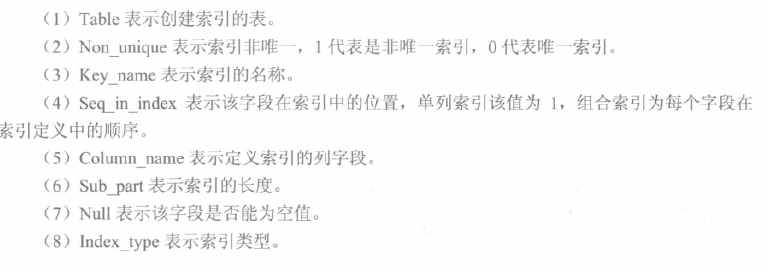


#### 使用检查

可以使用EXPLAIN语句查看索引是否正在使用。

举例，假设已经创建了book表，并已经在其year_publication字段上建立了普通索引。执行如下语句：

```mysql
EXPLAIN SELECT * FROM book WHERE year_publication=1990;
```

EXPLAIN语句将为我们输出详细的SQL执行信息，其中：

- possible_keys行给出了MySQL在搜索数据记录时可选用的各个索引。
- key行是MySQL实际选用的索引。

如果possible_keys行和key行都包含year_publication字段，则说明在查询时使用了该索引。


> 索引是否起作用，主要取决于字段类型：
>
> - 如果字段类型为字符串，需要给in查询中的数值与字符串值都需要添加引号，索引才能起作用。
> - 如果字段类型为int，则in查询中的值不需要添加引号，索引也会起作用。
>
> IN的字段，在联合索引中，按以上方法，也会起作用。
>
> 在MySQL中模糊查询 mobile like ‘%8765’，这种情况是不能使用 mobile 上的索引的，那么如果需要根据手机号码后四位进行模糊查询，可以添加冗余转置列，然后查 `5678%` 方法进行改造。


可以采用以下几种方式，来避免索引失效：

1. 使用组合索引时，需要遵循“最左前缀”原则；

2. 不在索引列上做任何操作，例如计算、函数、类型转换，会导致索引失效而转向全表扫描；

3. 尽量使用覆盖索引（之访问索引列的查询），减少 select * 覆盖索引能减少回表次数；

   覆盖索引是select的数据列只用从索引中就能够取得，不必读取数据行，换句话说查询列要被所建的索引覆盖

4. MySQL在使用不等于（!=或者<>）的时候无法使用索引会导致全表扫描；

5. LIKE以通配符开头（%abc）MySQL索引会失效变成全表扫描的操作；

6. 字符串不加单引号会导致索引失效（可能发生了索引列的隐式转换）；

7. 少用or，用它来连接时会索引失效。

> 我们可以加入冗余列（MySQL5.7之后加入了虚拟列，使用虚拟列更合适，思路相同），比如 mobile_reverse，内部存储为 mobile 的倒叙文本，如 mobile为17312345678，那么 mobile_reverse 存储 87654321371，为 mobile_reverse 列建立索引，查询中使用语句 mobile_reverse like reverse(’%5678’) 即可。
>
> reverse 是 MySQL 中的反转函数，这条语句相当于 mobile_reverse like ‘8765%’ ，这种语句是可以使用索引的。

下列几种情况，是不适合创建索引的：

1. 频繁更新的字段不适合建立索引；
2. where条件中用不到的字段不适合建立索引；
3. 数据比较少的表不需要建索引；
4. 数据重复且分布比较均匀的的字段不适合建索引，例如性别、真假值；
5. 参与列计算的列不适合建索引。


#### 原理

##### 存储

在MySQL中，索引是在存储引擎层实现的，不同存储引擎对索引的实现方式是不同的

m阶B+树的性质：

- 每个节点至多m个叶子节点
- 根节点外每个节点至少m/2(下取整)个叶子节点；根节点至少两个叶子节点
- k个叶子的节点有k个关键字
- 所有叶子节点高度相等

B+树的查找与B树不同，当索引部分某个结点的关键字与所查的关键字相等时，并不停止查找，应继续沿着这个关键字左边的指针向下，一直查到该关键字所在的叶子结点为止

> m阶B树：(只写区别)
>
> - 非根节点关键字个数在m/2上取整-1到m-1之间(含边界)
> - 非根非叶节点度数是关键字个数+1

B+树由B树和索引顺序访问方法演化而来，它是为磁盘或其他直接存取辅助设备设计的一种平衡查找树，在B+树中，所有记录节点都是按键值的大小顺序存放在同一层的叶子节点，各叶子节点通过指针进行链接

B+树索引在数据库中的一个特点就是高扇出性，例如在InnoDB存储引擎中，每个页的大小为16KB。在数据库中，B+树的高度一般都在2～4层，这意味着查找某一键值最多只需要2到4次IO操作，这还不错。因为现在一般的磁盘每秒至少可以做100次IO操作，2～4次的IO操作意味着查询时间只需0.02～0.04秒。


MyISAM引擎使用B+Tree作为索引结构，叶节点的data域存放的是数据记录的地址，MyISAM索引的原理图如下。这里假设表一共有三列，假设我们以Col1为主键，则上图是一个MyISAM表的主索引（Primary key）示意。可以看出MyISAM的索引文件仅仅保存数据记录的地址。在MyISAM中，主索引和辅助索引（Secondary key）在结构上没有任何区别，只是主索引要求key是唯一的，而辅助索引的key可以重复


> 从本质上来说，联合索引还是一棵B+树，不同的是联合索引的键值数量不是1，而是大于等于2，参考下图。另外，只有在查询条件中使用了这些字段的左边字段时，索引才会被使用，所以使用联合索引时遵循最左前缀集合
>
> 

如果我们在Col2上建立一个辅助索引，则此索引的结构同样也是一颗B+Tree

而在InnoDB中，表数据文件本身就是按B+Tree组织的一个索引结构，这棵树的叶节点data域保存了完整的数据记录。这个索引的key是数据表的主键，因此InnoDB表数据文件本身就是主索引。

> 在InnoDB存储引擎中，可以将B+树索引分为聚簇索引和辅助索引（非聚簇索引）。无论是何种索引，每个页的大小都为16KB，且不能更改。
>
> 聚簇索引是根据主键创建的一棵B+树，聚簇索引的叶子节点存放了表中的所有记录。辅助索引是根据索引键创建的一棵B+树，与聚簇索引不同的是，其叶子节点仅存放索引键值，以及该索引键值指向的主键。也就是说，如果通过辅助索引来查找数据，那么当找到辅助索引的叶子节点后，很有可能还需要根据主键值查找聚簇索引来得到数据，这种查找方式又被称为书签查找。因为辅助索引不包含行记录的所有数据，这就意味着每页可以存放更多的键值，因此其高度一般都要小于聚簇索引。

下图是InnoDB主索引（同时也是数据文件）的示意图，可以看到叶节点包含了完整的数据记录。这种索引叫做聚集索引。因为InnoDB的数据文件本身要按主键聚集，所以InnoDB要求表必须有主键（MyISAM可以没有），如果没有显式指定，则MySQL系统会自动选择一个可以唯一标识数据记录的列作为主键，如果不存在这种列，则MySQL自动为InnoDB表生成一个隐含字段作为主键，这个字段长度为6个字节，类型为长整形。


InnoDB的辅助索引data域存储相应记录主键的值而不是地址。换句话说，InnoDB的所有辅助索引都引用主键作为data域。下图为定义在Col3上的一个辅助索引。这里以英文字符的ASCII码作为比较准则。聚集索引这种实现方式使得按主键的搜索十分高效，但是辅助索引搜索需要检索两遍索引：首先检索辅助索引获得主键，然后用主键到主索引中检索获得记录

不建议使用过长的字段作为主键，因为所有辅助索引都引用主索引，过长的主索引会令辅助索引变得过大。再例如，用非单调的字段作为主键在InnoDB中不是个好主意，因为InnoDB数据文件本身是一颗B+Tree，非单调的主键会造成在插入新记录时数据文件为了维持B+Tree的特性而频繁的分裂调整，十分低效，而使用自增字段作为主键则是一个很好的选择。

##### 重构

需要重构：

1. 表上频繁发生update,delete操作；
2. 表上发生了alter table ..move操作（move操作导致了rowid变化）。

一般看索引是否倾斜的严重，是否浪费了空间，对索引进行结构分析(实测好像无效，没这条指令)

```mysql
analyze index index_name validate structure;
```

在相同的session中查询index_stats表：

```mysql
select height,DEL_LF_ROWS/LF_ROWS from index_stats;
```

当查询的height>=4（索引的深度，即从根到叶节点的高度）或DEL_LF_ROWS/LF_ROWS>0.2的情况下，就应该考虑重建该索引

- drop原索引，然后再创建索引：

  ```mysql
  drop index index_name;
  create index index_name on table_name (index_column);
  ```

  这种方式相当耗时，一般不建议使用。

- 直接重建索引：

  ```mysql
  alter index indexname rebuild;
  alter index indexname rebuild online;
  ```

  此方法较快，建议使用。

rebuild是快速重建索引的一种有效的办法，因为它是一种使用现有索引项来重建新索引的方法。如果重建索引时有其他用户在对这个表操作，尽量使用带online参数来最大限度的减少索引重建时将会出现的任何加锁问题。由于新旧索引在建立时同时存在，因此，使用这种重建方法需要有额外的磁盘空间可供临时使用，当索引建完后把老索引删除，如果没有成功，也不会影响原来的索引。利用这种办法可以用来将一个索引移到新的表空间。

1. Rebuild以index fast full scan或table full scan方式（采用那种方式取决于cost）读取原索引中的数据来构建一个新的索引，重建过程中有排序操作，rebuild online执行表扫描获取数据，重建过程中有排序的操作；
2. Rebuild会阻塞DML操作，rebuild online不会阻塞DML操作；
3. rebuild online时系统会产生一个SYS_JOURNAL_xxx的IOT类型的系统临时日志表，所有rebuild online时索引的变化都记录在这个表中，当新的索引创建完成后，把这个表的记录维护到新的索引中去，然后drop掉旧的索引，rebuild online就完成了。

注意：

1. 执行rebuild操作时，需要检查表空间是否足够；
2. 虽然说rebuild online操作允许DML操作，但还是建议在业务不繁忙时间段进行；
3. Rebuild操作会产生大量Redo Log；


##### hash

hash索引底层就是hash表，进行查找时，调用一次hash函数就可以获取到相应的键值，之后进行回表查询获得实际数据。B+树底层实现是多路平衡查找树，对于每一次的查询都是从根节点出发，查找到叶子节点方可以获得所查键值，然后根据查询判断是否需要回表查询数据。它们有以下的不同：

- hash索引进行等值查询更快(一般情况下)，但是却无法进行范围查询。因为在hash索引中经过hash函数建立索引之后，索引的顺序与原顺序无法保持一致，不能支持范围查询。而B+树的的所有节点皆遵循(左节点小于父节点，右节点大于父节点，多叉树也类似)，天然支持范围。
- hash索引不支持使用索引进行排序，原理同上。
- hash索引不支持模糊查询以及多列索引的最左前缀匹配，原理也是因为hash函数的不可预测。
- hash索引任何时候都避免不了回表查询数据，而B+树在符合某些条件(聚簇索引，覆盖索引等)的时候可以只通过索引完成查询。
- hash索引虽然在等值查询上较快，但是不稳定，性能不可预测，当某个键值存在大量重复的时候，发生hash碰撞，此时效率可能极差。而B+树的查询效率比较稳定，对于所有的查询都是从根节点到叶子节点，且树的高度较低。

因此，在大多数情况下，直接选择B+树索引可以获得稳定且较好的查询速度。而不需要使用hash索引。


### 数据指令

#### 插入

```mysql
INSERT INTO 数据表名 (列名1, ...) VALUES (值1, ...);
```

如：

```mysql
INSERT INTO runoob_tbl
(runoob_title, runoob_author, submission_date)
VALUES
("学习 MySQL", "菜鸟教程", NOW());
```

```mysql
insert into tb_emb values(2,'lr580','啊','啊啊');
```

对有自增主键的，列里可以不包含这个列；没定义 `not null` 的也可以缺省

为了防止中文乱码，可以事先设置：

```mysql
set names utf8;
```

可以一次插入多个行，逗号隔开，多条记录一个语句插效率更高，如：

```mysql
insert into student (student_name, grade) values ('abc',3),('aBC',4);
```

其实可以插入值`NULL`

如果列按顺序来且都有赋值，第一个括号可以不要，如：

```mysql
insert into student values (14,'aaa',55);
```

可以用 `ignore` 关键字，无则插有则忽略(但warning)。可以用 `replace into` ，无则插有则换。如：

```mysql
replace into student values (7,'qwq',666);
insert ignore into student values (7,'qwq',666);
```

如果插入多个时，其中一个出错(比如重复主键(跟已有或输入的多个重复))，整个语句打断，一条插入也不执行。

可以将查询结果批量插入，如：(见数据表指令-复制)

```mysql
insert into test2 select * from test;
```


#### 更新

```mysql
UPDATE 数据表名 SET 字段名 = 新字段值 WHERE 条件表达式
```

可以逗号分隔，更改多列

可以自增自减

如：

```mysql
update tb_emp set age = 24 where id = 2;
update student set student_name='www',grade=123 where id=7;
update student set grade=grade-1 where id=7;
```

可以多表查然后更改：

> ```mysql
> update t1,t2 set t1.v=t2.v where t1.id=t2.id;
> ```


#### 删除

```mysql
DELETE FROM 数据表名 WHERE 条件表达式
```

如：

```mysql
delete from tb_emp where id = 1024;
```

> 如果没有`where` 子句就是删掉整个表。
>
> delete，drop，truncate 都有删除表的作用，区别在于：
>
> -  1、delete 和 truncate 仅仅删除表数据，drop 连表数据和表结构一起删除
> -  2、delete 是 DML 语句，操作完以后如果没有不想提交事务还可以回滚，truncate 和 drop 是 DDL 语句，操作完马上生效，不能回滚(不记日志)
> -  3、执行的速度上，**drop>truncate>delete**
>
> truncate 约等于 drop + create ，变为初始大小。delete 删了之后数据表大小不变。
>
> drop 不可以回滚，delete, truncate 可以回滚 [参考](https://leetcode.cn/leetbook/read/job-hunting-all-in-one-school/0sgua6/)

```mysql
delete a from Person a, Person b
where a.email=b.email and a.id>b.id #功能:对所有重复的邮箱只保留id最小的
```

### 视图指令

视图：虚表，不存数据，只存定义。建视图不会随着关闭 CLI 而删除。可以 CRUD。

> 2024年淘天集团春招研发岗笔试 下列选项中关于MySQL视图的说法正确的有（ABD）
>
> A使用视图可以达到保护数据的作用，用户只能访问他们被允许查询的结果集
>
> B视图可以简化复杂的SQL操作，用户不需要关心表的结构、关联条件和筛选条件
>
> C视图创建之后，可以对它进行SELECT操作，但不能对它插入、修改、删除操作
>
> D保障数据安全性，提高查询效率是视图的主要作用

#### 创建

不执行查询指令，创建跟查询相同定义的视图

```mysql
create view 视图名 as 查询指令;
```

通用格式：

```mysql
create view 视图名 [(列名[,列名……])] as 子查询 [with check option]
```

详细：

```sql
create [on replace] [algorithm = {undefined | merge | temptable}] view view_name [cols] as select_statement [with [cascade | local] check option]
```

如果 `with check option` ，那么增删改必须满足创建时的条件。如果增改了不符合条件的元素，那么查询时查不出来。

列名不定义就跟查询得到的一样。但若目标列是聚集函数或表达式、多表连接同列名时必须写列名。(select 处定义也行)

> replace 表示替换已存在的，需要有 drop 权限。算法分别表示自动选择、试图语句与试图定义合并(定义的某一部分取代语句对应部分)、存入临时表然后用临时表执行语句。cascade 默认，更新时满足相关条件，local满足视图条件即可。
>
> 跨选择的数据库建视图要作用域，如 `db_name.view_name` 

视图的常用功能之一是计算一些由数据库基本信息计算得出的信息，如出生日期计算年龄

> 基于保留主码基本表的视图是行列子集视图；视图可建立在多个基本表，或视图上

> 如：
>
> ```mysql
> CREATE VIEW ScoreView
> AS
>       SELECT a.studentNo, studentName, courseName, creditHour, score
>       FROM Student a, Course b, Score c
>       WHERE a.studentNo=c.studentNo AND b.courseNo=c.courseNo
>              AND score>=60     -- 成绩必须大于等于60分才能获得学分
> ```
>
> ```mysql
> CREATE VIEW SourceView(courseNo, courseName, courseCount, courseAvg)
> AS
>       SELECT a.courseNo, courseName, count(*), avg(score)
>       FROM Course a, Score b
>       WHERE a.courseNo=b.courseNo
>       GROUP BY a.courseNo, courseName
> ```
>
> 上例也可以在 select 取名，不在一开始取，即：
>
> ```mysql
> SELECT a.courseNo, courseName, count(*) courseCount, avg(score) courseAvg
> ```
>
> ```mysql
> CREATE VIEW SourceView2
> AS SELECT * FROM SourceView WHERE courseCount>=5
> ```


#### 查询

等价于把查询条件和视图条件融合起来再查基本表。 (视图消解)

对聚合函数的运算，会被消解为 having 。如：

> ```mysql
> SELECT * FROM SourceView WHERE courseAvg>=80
> ```


#### 更新

通过视图来直接增删改及本表数据。如果创建视图的语句中包含了表达式，或聚合运算，或消除重复值运算，则不能对视图进行更新操作(一般行列子集视图可以更新，其他类型的一般不更新)。不建议对视图更新。语法同数据指令。

更新字段可以 `create or relpace view` 或 `alter` 。如：

```mysql
create or replace view view_t as select * from flower;
```

或 alter ：

```mysql
alter view view_t as select * from flower;
```


#### 删除

```mysql
drop view 数据表名 [cascade]
```

cascade 是级联删除，选中时，若该视图导出了其他视图，一并删除。

删除基本表时，由该基本表导出的所有视图都必须显式地使用DROP VIEW语句删除。


#### 查看

可以 `describe` / `desc`。也可以 `show table statuc like 'view_name' \G` 。也可以 `show create view view_name \G` 。也可以看系统表：

```mysql
select * from infomation_schema.views;
```


### 事务指令

#### 事务理论

##### 概念

并发情况下，读操作可能存在的三类问题：脏读、不可重复读、幻读

读脏数据：如果事务T2读取事务T1修改但未提交的数据后，事务T1由于某种原因中止而撤销，这时事务T2就读取了不一致的数据。数据库中将这种读未提交且被撤销的数据为读“脏数据”。

丢失更新：两个或多个事务都读取了同一数据值并修改，最后提交事务的执行结果覆盖了前面提交事务的执行结果，从而导致前面事务的更新被丢失

不可重复读。是指事务Ti两次从数据库中读取的结果不同，可分为三种情况：

- 事务Ti读取一数据后，事务Tj对该数据进行了更改。当事务Ti再次读该数据时，则会读到与前一次不同的值。
- 事务Ti按某条件读取数据库中某些记录后，事务Tj删除了其中部分记录。当事务Ti再次按相同条件读取时，发现记录数变少了。（幻影现象1）
- 事务Ti按某条件读取数据库中某些记录后，事务Tj插入了新的记录。当事务Ti再次按相同条件读取时，发现记录数变多了。（幻影现象2）

脏读与不可重复读的区别在于：前者读到的是其他事务未提交的数据，后者读到的是其他事务已提交的数据。

不可重复读与幻读的区别可以通俗的理解为：前者是数据变了，后者是数据的行数变了。

##### ACID

> - 在 MySQL 中只有使用了 Innodb 数据库引擎的数据库或表才支持事务。
> - 事务处理可以用来维护数据库的完整性，保证成批的 SQL 语句要么全部执行，要么全部不执行。
> - 事务用来管理 insert,update,delete 语句
>
> 一般来说，事务是必须满足4个条件（ACID）：原子性（**A**tomicity，或称不可分割性）、一致性（**C**onsistency）、隔离性（**I**solation，又称独立性）、持久性（**D**urability）
>
> - **原子性：**一个事务（transaction）中的所有操作，要么全部完成，要么全部不完成，不会结束在中间某个环节。事务在执行过程中发生错误，会被回滚（Rollback）到事务开始前的状态，就像这个事务从来没有执行过一样。
> - **一致性：**在事务开始之前和事务结束以后，数据库的完整性没有被破坏。这表示写入的资料必须完全符合所有的预设规则，这包含资料的精确度、串联性以及后续数据库可以自发性地完成预定的工作。
> - **隔离性：**数据库允许多个并发事务同时对其数据进行读写和修改的能力，隔离性可以防止多个事务并发执行时由于交叉执行而导致数据的不一致。事务隔离分为不同级别，包括读未提交（Read uncommitted）、读提交（read committed）、可重复读（repeatable read）和串行化（Serializable）。
> - **持久性：**事务处理结束后，对数据的修改就是永久的，即便系统故障也不会丢失
>
> 实现：
>
> - 实现原子性的关键，是当事务回滚时能够撤销所有已经成功执行的sql语句。InnoDB实现回滚靠的是undo log，当事务对数据库进行修改时，InnoDB会生成对应的undo log。如果事务执行失败或调用了rollback，导致事务需要回滚，便可以利用undo log中的信息将数据回滚到修改之前的样子。
>
>   undo log属于逻辑日志，它记录的是sql执行相关的信息。当发生回滚时，InnoDB会根据undo log的内容做与之前相反的工作。对于insert，回滚时会执行delete。对于delete，回滚时会执行insert。对于update，回滚时则会执行相反的update，把数据改回去。
>
> - InnoDB作为MySQL的存储引擎，数据是存放在磁盘中的，但如果每次读写数据都需要磁盘IO，效率会很低。为此，InnoDB提供了缓存(Buffer Pool)，Buffer Pool中包含了磁盘中部分数据页的映射，作为访问数据库的缓冲。当从数据库读取数据时，会首先从Buffer Pool中读取，如果Buffer Pool中没有，则从磁盘读取后放入Buffer Pool。当向数据库写入数据时，会首先写入Buffer Pool，Buffer Pool中修改的数据会定期刷新到磁盘中（这一过程称为刷脏）。
>
>   Buffer Pool的使用大大提高了读写数据的效率，但是也带了新的问题：如果MySQL宕机，而此时Buffer Pool中修改的数据还没有刷新到磁盘，就会导致数据的丢失，事务的持久性无法保证。
>
>   于是，redo log被引入来解决这个问题。当数据修改时，除了修改Buffer Pool中的数据，还会在redo log记录这次操作。当事务提交时，会调用fsync接口对redo log进行刷盘。如果MySQL宕机，重启时可以读取redo log中的数据，对数据库进行恢复。redo log采用的是WAL（Write-ahead logging，预写式日志），所有修改先写入日志，再更新到Buffer Pool，保证了数据不会因MySQL宕机而丢失，从而满足了持久性要求。
>
>   既然redo log也需要在事务提交时将日志写入磁盘，为什么它比直接将Buffer Pool中修改的数据写入磁盘(即刷脏)要快呢？主要有以下两方面的原因：
>
>   - 刷脏是随机IO，因为每次修改的数据位置随机，但写redo log是追加操作，属于顺序IO。
>   - 刷脏是以数据页（Page）为单位的，MySQL默认页大小是16KB，一个Page上一个小修改都要整页写入。而redo log中只包含真正需要写入的部分，无效IO大大减少。
>
> - 隔离性追求的是并发情形下事务之间互不干扰。简单起见，我们主要考虑最简单的读操作和写操作(加锁读等特殊读操作会特殊说明)，那么隔离性的探讨，主要可以分为两个方面。
>
>   第一方面，(一个事务)写操作对(另一个事务)写操作的影响：锁机制保证隔离性。
>
>   隔离性要求同一时刻只能有一个事务对数据进行写操作，InnoDB通过锁机制来保证这一点。锁机制的基本原理可以概括为：事务在修改数据之前，需要先获得相应的锁。获得锁之后，事务便可以修改数据。该事务操作期间，这部分数据是锁定的，其他事务如果需要修改数据，需要等待当前事务提交或回滚后释放锁。
>
>   按照粒度，锁可以分为表锁、行锁以及其他位于二者之间的锁。表锁在操作数据时会锁定整张表，并发性能较差。行锁则只锁定需要操作的数据，并发性能好。但是由于加锁本身需要消耗资源，因此在锁定数据较多情况下使用表锁可以节省大量资源。MySQL中不同的存储引擎支持的锁是不一样的，例如MyIsam只支持表锁，而InnoDB同时支持表锁和行锁，且出于性能考虑，绝大多数情况下使用的都是行锁。
>
>   第二方面，(一个事务)写操作对(另一个事务)读操作的影响：MVCC保证隔离性。
>
>   InnoDB默认的隔离级别是RR（REPEATABLE READ），RR解决脏读、不可重复读、幻读等问题，使用的是MVCC。MVCC全称Multi-Version Concurrency Control，即多版本的并发控制协议。它最大的优点是读不加锁，因此读写不冲突，并发性能好。InnoDB实现MVCC，多个版本的数据可以共存，主要基于以下技术及数据结构：
>
>   1. 隐藏列：InnoDB中每行数据都有隐藏列，隐藏列中包含了本行数据的事务id、指向undo log的指针等。
>   2. 基于undo log的版本链：每行数据的隐藏列中包含了指向undo log的指针，而每条undo log也会指向更早版本的undo log，从而形成一条版本链。
>   3. ReadView：通过隐藏列和版本链，MySQL可以将数据恢复到指定版本。但是具体要恢复到哪个版本，则需要根据ReadView来确定。所谓ReadView，是指事务（记做事务A）在某一时刻给整个事务系统（trx_sys）打快照，之后再进行读操作时，会将读取到的数据中的事务id与trx_sys快照比较，从而判断数据对该ReadView是否可见，即对事务A是否可见。
>
> - 可以说，一致性是事务追求的最终目标。前面提到的原子性、持久性和隔离性，都是为了保证数据库状态的一致性。此外，除了数据库层面的保障，一致性的实现也需要应用层面进行保障。实现一致性的措施包括：
>
>   - 保证原子性、持久性和隔离性，如果这些特性无法保证，事务的一致性也无法保证。
>   - 数据库本身提供保障，例如不允许向整形列插入字符串值、字符串长度不能超过列的限制等。
>   - 应用层面进行保障，例如如果转账操作只扣除转账者的余额，而没有增加接收者的余额，无论数据库实现的多么完美，也无法保证状态的一致。
>
> 
>
> 在 MySQL 命令行的默认设置下，事务都是自动提交的，即执行 SQL 语句后就会马上执行 COMMIT 操作。因此要显式地开启一个事务务须使用命令 BEGIN 或 START TRANSACTION，或者执行命令 SET AUTOCOMMIT=0，用来禁止使用当前会话的自动提交
>
> 8.0 InnoDB 支持 DDL 事务完整性， DDL 操作要么成功要么回滚，后者写入日志到 `data dictionary` 数据字典隐藏表 `mysql.innodb_ddl_log` 。通过设置参数可以将 DDL 操作日志打印输出到错误日志中。意思是执行到一半发现报错的指令，会全部撤销掉，而不是一半执行一半不执行。 
>
> TPL 事务处理语言

##### 日志

binlog（Binary Log）：

二进制日志文件就是常说的binlog。二进制日志记录了MySQL所有修改数据库的操作，然后以二进制的形式记录在日志文件中，其中还包括每条语句所执行的时间和所消耗的资源，以及相关的事务信息。

默认情况下，二进制日志功能是开启的，启动时可以重新配置--log-bin[=file_name]选项，修改二进制日志存放的目录和文件名称。

redo log：

重做日志用来实现事务的持久性，即事务ACID中的D。它由两部分组成：一是内存中的重做日志缓冲（redo log buffer），其是易失的；二是重做日志文件（redo log file），它是持久的。

InnoDB是事务的存储引擎，它通过Force Log at Commit机制实现事务的持久性，即当事务提交（COMMIT）时，必须先将该事务的所有日志写入到重做日志文件进行持久化，待事务的COMMIT操作完成才算完成。这里的日志是指重做日志，在InnoDB存储引擎中，由两部分组成，即redo log和undo log。

redo log用来保证事务的持久性，undo log用来帮助事务回滚及MVCC的功能。redo log基本上都是顺序写的，在数据库运行时不需要对redo log的文件进行读取操作。而undo log是需要进行随机读写的。

undo log：

重做日志记录了事务的行为，可以很好地通过其对页进行“重做”操作。但是事务有时还需要进行回滚操作，这时就需要undo。因此在对数据库进行修改时，InnoDB存储引擎不但会产生redo，还会产生一定量的undo。这样如果用户执行的事务或语句由于某种原因失败了，又或者用户用一条ROLLBACK语句请求回滚，就可以利用这些undo信息将数据回滚到修改之前的样子。

redo存放在重做日志文件中，与redo不同，undo存放在数据库内部的一个特殊段（segment）中，这个段称为undo段（undo segment），undo段位于共享表空间内。

##### 事务类别

> 事务可以分为以下几种类型：
>
> - 扁平事务：是事务类型中最简单的一种，而在实际生产环境中，这可能是使用最为频繁的事务。在扁平事务中，所有操作都处于同一层次，其由BEGIN WORK开始，由COMMIT WORK或ROLLBACK WORK结束。处于之间的操作是原子的，要么都执行，要么都回滚。
> - 带有保存点的扁平事务：除了支持扁平事务支持的操作外，允许在事务执行过程中回滚到同一事务中较早的一个状态，这是因为可能某些事务在执行过程中出现的错误并不会对所有的操作都无效，放弃整个事务不合乎要求，开销也太大。保存点（savepoint）用来通知系统应该记住事务当前的状态，以便以后发生错误时，事务能回到该状态。
> - 链事务：可视为保存点模式的一个变种。链事务的思想是：在提交一个事务时，释放不需要的数据对象，将必要的处理上下文隐式地传给下一个要开始的事务。注意，提交事务操作和开始下一个事务操作将合并为一个原子操作。这意味着下一个事务将看到上一个事务的结果，就好像在一个事务中进行的。
> - 嵌套事务：是一个层次结构框架。有一个顶层事务（top-level transaction）控制着各个层次的事务。顶层事务之下嵌套的事务被称为子事务（subtransaction），其控制每一个局部的变换。
> - 分布式事务：通常是一个在分布式环境下运行的扁平事务，因此需要根据数据所在位置访问网络中的不同节点。对于分布式事务，同样需要满足ACID特性，要么都发生，要么都失效。
>
> 对于MySQL的InnoDB存储引擎来说，它支持扁平事务、带有保存点的扁平事务、链事务、分布式事务。对于嵌套事务，MySQL数据库并不是原生的，因此对于有并行事务需求的用户来说MySQL就无能为力了，但是用户可以通过带有保存点的事务来模拟串行的嵌套事务。

##### 锁

锁是数据库系统区别于文件系统的一个关键特性，锁机制用于管理对共享资源的并发访问。

共享锁（shared lock, 记为S）：如果事务T获得了数据对象Q的共享锁，则事务T可读Q但不能写Q。

排它锁（exclusive lock, 记为X）：如果事务T获得了数据对象Q上的排它锁，则事务T既可读Q又可写Q。

> 理解锁的作用：（ for update 就是排他锁，相对地 lock in share mode 是共享锁）
>
> 两个会话如果正在：
>
> ```mysql
> start transaction;
> select * from test where id = 1 lock in share mode;
> ```
>
> 这两个会话可以同时进行。但如果添加第三个会话如下：
>
> ```mysql
> start transaction;
> select * from test where id = 1 for update;
> ```
>
> 则第三个会话超时报错 [参考](https://blog.csdn.net/u011547570/article/details/121232774)

如果一个事务T1已经获得了行r的共享锁，那么另外的事务T2可以立即获得行r的共享锁，因为读取并没有改变行r的数据，称这种情况为锁兼容。但若有其他的事务T3想获得行r的排他锁，则其必须等待事务T1、T2释放行r上的共享锁，这种情况称为锁不兼容。下图显示了共享锁和排他锁的兼容性，可以发现X锁与任何的锁都不兼容，而S锁仅和S锁兼容。需要特别注意的是，S和X锁都是行锁，兼容是指对同一记录（row）锁的兼容性情况。

“锁相容”是指如果Ti已持有数据对象Q的某类型锁后，事务Tj也申请对Q的封锁。如果允许事务Tj获得对Q的锁，则称事务Tj申请锁类型与事务Ti的持有锁类型相容；否则称为不相容。

基本锁类型的封锁相容性原则：共享锁与共享锁相容，排它锁与共享锁、排它锁与排它锁是不相容的。

InnoDB存储引擎支持多粒度锁定，这种锁定允许事务在行级上的锁和表级上的锁同时存在。为了支持在不同粒度上进行加锁操作，InnoDB存储引擎支持一种额外的锁方式，称之为意向锁。意向锁是将锁定的对象分为多个层次，意向锁意味着事务希望在更细粒度上进行加锁。

InnoDB存储引擎支持意向锁设计比较简练，其意向锁即为表级别的锁。设计目的主要是为了在一个事务中揭示下一行将被请求的锁类型。其支持两种意向锁：(I: Intention)

- 意向共享锁（IS Lock），事务想要获得一张表中某几行的共享锁。
- 意向排他锁（IX Lock），事务想要获得一张表中某几行的排他锁。

由于InnoDB存储引擎支持的是行级别的锁，因此意向锁其实不会阻塞除全表扫以外的任何请求。故表级意向锁与行级锁的兼容性如下图所示。


InnoDB存储引擎有3种行锁的算法，其分别是：

- Record Lock：单个行记录上的锁。

  只有通过索引条件检索数据，InnoDB才使用行级锁，否则，InnoDB将使用表锁

  当表中锁定其中的某几行时，不同的事务可以使用不同的索引锁定不同的行。另外，不论使用主键索引、唯一索引还是普通索引，InnoDB都会使用行锁来对数据加锁

- Gap Lock：间隙锁，锁定一个范围，但不包含记录本身。

  阻止多个事务将记录插入到同一范围内，而这会导致幻读问题的产生。

- Next-Key Lock∶Gap Lock+Record Lock，锁定一个范围，并且锁定记录本身。

Record Lock总是会去锁住索引记录，如果InnoDB存储引擎表在建立的时候没有设置任何一个索引，那么这时InnoDB存储引擎会使用隐式的主键来进行锁定。Next-Key Lock是结合了Gap Lock和Record Lock的一种锁定算法，在Next-Key Lock算法下，InnoDB对于行的查询都是采用这种锁定算法。采用Next-Key Lock的锁定技术称为Next-Key Locking，其设计的目的是为了解决Phantom Problem（幻读）。而利用这种锁定技术，锁定的不是单个值，而是一个范围，是谓词锁（predict lock）的一种改进。

死锁是指两个或两个以上的事务在执行过程中，因争夺锁资源而造成的一种互相等待的现象。若无外力作用，事务都将无法推进下去。

> A等待B、B等待A，这种死锁问题被称为AB-BA死锁。
>
> 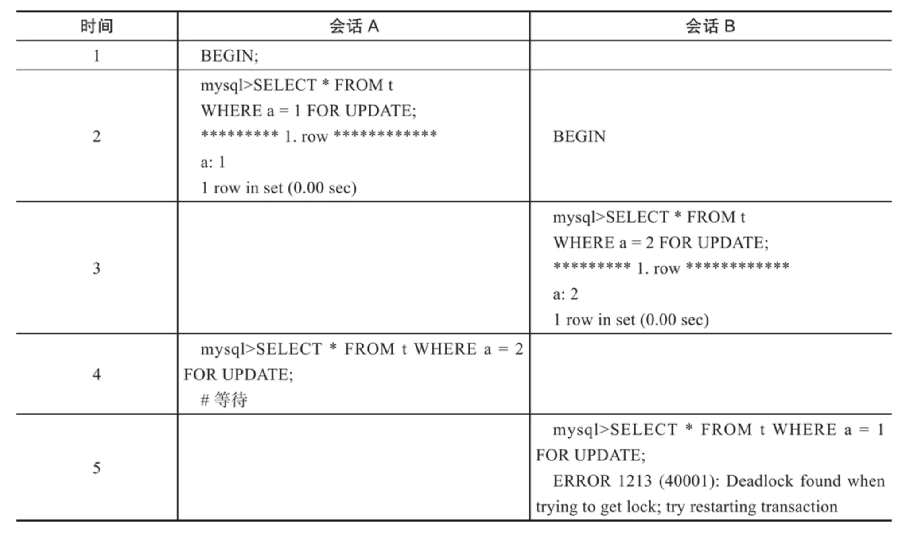

解决死锁问题最简单的一种方法是超时，即当两个事务互相等待时，当一个等待时间超过设置的某一阈值时，其中一个事务进行回滚，另一个等待的事务就能继续进行。

除了超时机制，当前数据库还都普遍采用wait-for graph（等待图）的方式来进行死锁检测。较之超时的解决方案，这是一种更为主动的死锁检测方式。InnoDB存储引擎也采用的这种方式。wait-for graph要求数据库保存以下两种信息：

- 锁的信息链表；
- 事务等待链表；

通过上述链表可以构造出一张图，而在这个图中若存在回路，就代表存在死锁，因此资源间相互发生等待。这是一种较为主动的死锁检测机制，在每个事务请求锁并发生等待时都会判断是否存在回路，若存在则有死锁，通常来说InnoDB存储引擎选择回滚undo量最小的事务。

锁升级（Lock Escalation）是指将当前锁的粒度降低。举例来说，数据库可以把一个表的1000个行锁升级为一个页锁，或者将页锁升级为表锁。

InnoDB存储引擎不存在锁升级的问题。因为其不是根据每个记录来产生行锁的，相反，其根据每个事务访问的每个页对锁进行管理的，采用的是位图的方式。因此不管一个事务锁住页中一个记录还是多个记录，其开销通常都是一致的。


##### 隔离级别

> SQL 标准定义了四种隔离级别，这四种隔离级别分别是：
>
> - 读未提交（READ UNCOMMITTED）；
> - 读提交 （READ COMMITTED）；
> - 可重复读 （REPEATABLE READ）；
> - 串行化 （SERIALIZABLE）。
>
> 事务隔离是为了解决脏读、不可重复读、幻读问题，下表展示了 4 种隔离级别对这三个问题的解决程度：
>
> | 隔离级别         | 脏读   | 不可重复读 | 幻读   |
> | ---------------- | ------ | ---------- | ------ |
> | READ UNCOMMITTED | 可能   | 可能       | 可能   |
> | READ COMMITTED   | 不可能 | 可能       | 可能   |
> | REPEATABLE READ  | 不可能 | 不可能     | 可能   |
> | SERIALIZABLE     | 不可能 | 不可能     | 不可能 |
>
> 上述4种隔离级别MySQL都支持，并且InnoDB存储引擎默认的支持隔离级别是REPEATABLE READ，但是与标准SQL不同的是，InnoDB存储引擎在REPEATABLE READ事务隔离级别下，使用Next-Key Lock的锁算法，因此避免了幻读的产生。所以，InnoDB存储引擎在默认的事务隔离级别下已经能完全保证事务的隔离性要求，即达到SQL标准的SERIALIZABLE隔离级别。
>
> 这四种隔离级别的实现机制如下：
>
> 1. READ UNCOMMITTED & READ COMMITTED：
>
>    通过Record Lock算法实现了行锁，但READ UNCOMMITTED允许读取未提交数据，所以存在脏读问题。而READ COMMITTED允许读取提交数据，所以不存在脏读问题，但存在不可重复读问题。
>
> 2. REPEATABLE READ：
>
>    使用Next-Key Lock算法实现了行锁，并且不允许读取已提交的数据，所以解决了不可重复读的问题。另外，该算法包含了间隙锁，会锁定一个范围，因此也解决了幻读的问题。
>
> 3. SERIALIZABLE：
>
>    对每个SELECT语句后自动加上LOCK IN SHARE MODE，即为每个读取操作加一个共享锁。因此在这个事务隔离级别下，读占用了锁，对一致性的非锁定读不再予以支持。
>
> 


#### 支持查看

查看支持事务操作的引擎：

```mysql
show engines;
```

查看一个表的引擎：

#### 事务控制

- BEGIN 或 START TRANSACTION 显式地开启一个事务；
- COMMIT 也可以使用 COMMIT WORK，不过二者是等价的。COMMIT 会提交事务，并使已对数据库进行的所有修改成为永久性的；
- ROLLBACK 也可以使用 ROLLBACK WORK，不过二者是等价的。回滚会结束用户的事务，并撤销正在进行的所有未提交的修改；
- SAVEPOINT identifier，SAVEPOINT 允许在事务中创建一个保存点，一个事务中可以有多个 SAVEPOINT；
- RELEASE SAVEPOINT identifier 删除一个事务的保存点，当没有指定的保存点时，执行该语句会抛出一个异常；(但是不会回滚)
- ROLLBACK TO identifier 把事务回滚到标记点；
- SET TRANSACTION 用来设置事务的隔离级别。InnoDB 存储引擎提供事务的隔离级别有READ UNCOMMITTED、READ COMMITTED、REPEATABLE READ 和 SERIALIZABLE。

处理事务的两种方法：

1、用 BEGIN, ROLLBACK, COMMIT来实现

- **BEGIN** 开始一个事务
- **ROLLBACK** 事务回滚
- **COMMIT** 事务确认

2、直接用 SET 来改变 MySQL 的自动提交模式:

- **SET AUTOCOMMIT=0** 禁止自动提交
- **SET AUTOCOMMIT=1** 开启自动提交

> 使用`savepoint`必须关

例如：

```mysql
begin;
insert into score values(5);
# 当前生效，但不永久生效；
insert into score values(6);
commit;
select * from score;
begin;
insert into score values(7);
rollback;
select * from score;
```

```mysql
set autocommit=0;
begin;
insert into score values(5);
savepoint svp;
select * from score;
insert into score values(6);
rollback to svp;
select * from score;
insert into score values(7);
release savepoint svp;
commit;
```

#### 超时时间

参数 如 InnoDB, `innodb_lock_wait_timeout` 默认 50 秒。

#### 事务开始

- 第一种：begin 或 start transaction 命令；(begin 单独打一个单词)
- 第二种：start transaction with consistent snapshot 命令；

这两种开启事务的命令，事务的启动时机是不同的：

- 执行了 begin/start transaction 命令后，并不代表事务启动了。只有在执行这个命令后，执行了第一条 select 语句，才是事务真正启动的时机；
- 执行了 start transaction with consistent snapshot 命令，就会马上启动事务。

#### autocommit

执行一条语句是否自动提交事务，是由 `autocommit` 参数决定的，默认是开启。所以，执行一条 update 语句也是会使用事务的。

#### 当前读

普通 select 是快照读，这个是当前读

`SELECT ... FOR UPDATE` 是一种 SQL 语句，用于在进行事务处理时锁定一组数据行，直到事务结束。加上排它锁（exclusive lock）

```mysql
START TRANSACTION;
SELECT balance FROM accounts WHERE id = 1 FOR UPDATE;
UPDATE accounts SET balance = balance + 100 WHERE id = 1;
COMMIT;
```

`SELECT ... FOR UPDATE` 只在事务中有效，且该事务必须支持行级锁定

#### 两阶段事务

eXtended Architecture

```sql
XA START 'xid'; -- 开启一个XA事务，其中xid是事务ID
-- 执行一些SQL操作
XA END 'xid'; -- 结束事务的操作阶段
XA PREPARE 'xid'; -- 准备提交事务
XA COMMIT 'xid'; -- 提交事务
XA ROLLBACK 'xid'; -- 回滚事务(结束后)
```


### 锁指令

#### 全局锁

使用：

```sql
flush tables with read lock
```

会阻塞的：数据 CUD，表结构更改(alter, drop)

释放：手动或会话断开

```sql
unlock tables
```

#### 表锁

```sql
lock tables t_student read; -- 表级别的共享锁，也就是读锁
lock tables t_student write; -- 表级别的独占锁，也就是写锁
```

查看所有表锁：(in_use 列是 1)

```sql
SHOW OPEN TABLES WHERE In_use > 0;
```

每次执行 lock 之前会把先前的锁全部释放，所以要同时多表加锁：

```sql
lock tables tmp write, employees read;
```

释放所有：(没有释放特定， lock 可以实现特定)

```sql
unlock tables;
```

#### 行级锁

InnoDB 引擎是支持行级锁的，而 MyISAM 引擎并不支持行级锁

普通的 select 语句是不会对记录加锁的，因为它属于快照读。如果要在查询时对记录加行锁，可以使用下面这两个方式，这种查询会加锁的语句称为锁定读。

```mysql
select ... lock in share mode -- 对读取的记录加共享锁
select ... for update; -- 对读取的记录加独占锁
```

必须在一个事务中，因为当事务提交了，锁就会被释放，所以在使用这两条语句的时候，要加上 begin、start transaction 或者 set autocommit = 0。

同时会自动加意向锁。

#### 锁查询

```sql
select * from performance_schema.data_locks\G;
```

开启事务才有用(如 `start transaction`)，而且要设置 `performance_schema=ON`。检查：

```sql
SHOW VARIABLES LIKE 'performance_schema';
```

列解释：

- `LOCK_TYPE` 行级/表级
- `LOCK_MODE` 哪种行级，是 X 还是 S 等。
- `LOCK_DATA` 索引数据。有虚拟正无穷数据 supremum pseudo-record
- `INDEX_NAME` 所用索引，如 `primary`
- `LOCK_STATUS` GRANTED(成功)或WAITING(阻塞)

#### 死锁检测

参数 `innodb_deadlock_detect` 设置为 on。

### 操作指令

暂时不会分类的东西

#### 临时表

> 临时表在MySQL 3.23版本中添加，如果你的MySQL版本低于 3.23版本就无法使用MySQL的临时表
>
> 临时表只在当前连接可见，当关闭连接时，Mysql会自动删除表并释放所有空间；使用PHP脚本来创建MySQL临时表，那每当PHP脚本执行完成后，该临时表也会自动销毁

创建数据表时，增加关键字 `TEMPORARY` 即可，其他操作基本是一样的；特别的，`show tables;` 不会看到临时表；可以用 `drop table` 手动删除，不过退出时会自动删除的

如：

```mysql
CREATE TEMPORARY TABLE SalesSummary (
    product_name VARCHAR(50) NOT NULL,
    total_sales DECIMAL(12,2) NOT NULL DEFAULT 0.00,
    avg_unit_price DECIMAL(7,2) NOT NULL DEFAULT 0.00
    ,total_units_sold INT UNSIGNED NOT NULL DEFAULT 0
);
```

可以查询时创建：

```mysql
CREATE TEMPORARY TABLE 临时表名 AS
(
    SELECT *  FROM 旧的表名
    LIMIT 0,10000
);
```


#### 元数据

以下命令语句可以在 MySQL 的命令提示符使用，也可以在脚本中 使用，如PHP脚本。

| 命令               | 描述                      |
| :----------------- | :------------------------ |
| SELECT VERSION( )  | 服务器版本信息            |
| SELECT DATABASE( ) | 当前数据库名 (或者返回空) |
| SELECT USER( )     | 当前用户名                |
| SHOW STATUS        | 服务器状态                |
| SHOW VARIABLES     | 服务器配置变量            |

后两个很长；user是`名@IP`，如：`root@localhost`


#### 序列

即自增 `auto_increment` 。

使用 SQL中的LAST_INSERT_ID( ) 函数来获取最后的插入表中的自增列的值。

要重置这个值需要删掉该列再加入，但是需要谨防数据混乱。

默认值起始为1，修改的话建表的时候`auto_increment=起始值`即可，或：

```mysql
ALTER TABLE t AUTO_INCREMENT = 100;
```


#### 重复处理

在 MySQL 数据表中设置指定的字段为 **PRIMARY KEY（主键）** 或者 **UNIQUE（唯一）** 索引来保证数据的唯一性

可以尝试双主键：

```mysql
CREATE TABLE person_tbl
(
   first_name CHAR(20) NOT NULL,
   last_name CHAR(20) NOT NULL,
   sex CHAR(10),
   PRIMARY KEY (last_name, first_name)
);
```

或 UNIQUE 索引：

```mysql
CREATE TABLE person_tbl
(
   first_name CHAR(20) NOT NULL,
   last_name CHAR(20) NOT NULL,
   sex CHAR(10),
   UNIQUE (last_name, first_name)
);
```


如果我们设置了唯一索引，那么在插入重复数据时，SQL 语句将无法执行成功,并抛出错。

INSERT IGNORE INTO 与 INSERT INTO 的区别就是 INSERT IGNORE INTO 会忽略数据库中已经存在的数据，如果数据库没有数据，就插入新的数据，如果有数据的话就跳过这条数据。这样就可以保留数据库中已经存在数据，达到在间隙中插入数据的目的。如：

```mysql
INSERT IGNORE INTO person_tbl (last_name, first_name)
VALUES( 'Jay', 'Thomas'), ( 'Jay', 'Thomas');
```

插入数据时，在设置了记录的唯一性后，如果插入重复数据，将不返回错误，只以警告形式返回。 而 REPLACE INTO 如果存在 primary 或 unique 相同的记录，则先删除掉。再插入新记录。


统计重复：

```mysql
SELECT COUNT(*) as repetitions, last_name, first_name
FROM person_tbl
GROUP BY last_name, first_name
HAVING repetitions > 1;
```


选择时读取不重复数据，加入`distinct`，如：

```mysql
SELECT DISTINCT last_name, first_name FROM person_tbl;
```

或用`group by`列，如：

```mysql
SELECT DISTINCT last_name, first_name FROM 
GROUP BY (last_name, first_name);
```

数据表去重，先建一个表，插入选中的所有去重后元素，然后删掉原表，然后这个表改名为原表名，或单纯增加一下主键，如：

```mysql
ALTER IGNORE TABLE person_tbl
ADD PRIMARY KEY (last_name, first_name);
```


#### 手动报错

如：

```mysql
signal sqlstate 'HY000' set message_text = '不允许插入';
```


#### 注入

1. 永远不要信任用户的输入。对用户的输入进行校验，可以通过正则表达式，或限制长度；对单引号和 双"-"进行转换等。
2. 永远不要使用动态拼装sql，可以使用参数化的sql或者直接使用存储过程进行数据查询存取。
3. 永远不要使用管理员权限的数据库连接，为每个应用使用单独的权限有限的数据库连接。
4. 不要把机密信息直接存放，加密或者hash掉密码和敏感的信息。
5. 应用的异常信息应该给出尽可能少的提示，最好使用自定义的错误信息对原始错误信息进行包装
6. sql注入的检测方法一般采取辅助软件或网站平台来检测，软件一般采用sql注入检测工具jsky，网站平台就有亿思网站安全平台检测工具。MDCSOFT SCAN等。采用MDCSOFT-IPS可以有效的防御SQL注入，XSS攻击等。


### 迁移指令

> 看不懂的可以看基本-使用章节或基本
>

#### 导出

##### SQL格式

需要 process 权限，如果没有的话 grant 下。

```shell
mysqldump -uroot -p 数据库名 数据表名 > 输出文件名.sql
mysqldump -uroot -p 数据库名 数据表名,表名2,... > 输出文件名.sql
mysqldump -uroot -p 数据库名 > 输出文件名.sql
mysqldump -uroot -p --databases 库名,库名.. > 输出文件名.sql
mysqldump -uroot -p --all-databases > 输出文件名.sql #含系统数据库
```

> 或 `-p密码` ，这种方法通常用于非输入式。注意文件名所在的目录要存在。

如：

```shell
mysqldump -uroot -p javase > test.sql
mysqldump -uroot -p javase score > test.sql
mysqldump -uroot -p javase s1, s2 > test.sql
```

可以 `-P端口 -hIP` , `-u用户名 -p密码` 的方式导出非本地数据库如：

```shell
mysqldump -uroot -p -P3306 -h127.0.0.1 went > abcc.sql
```

> 可以用 `--tab=路径`，如：
>
> ```shell
> mysqldump -u root -p --no-create-info
> --tab=/tmp RUNOOB runoob_tbl
> ```

输出的文件 `.sql` 实质是指令集，执行后能够得到与之一样的数据库格式和数据，会在注释里表明工具版本号、备份账号名称、主机信息、数据库名、服务器版本号。会看到格式为诸如 `/*!40101 set @a=1*/;` 的语句，这些语句会被 `mysql` 执行，其他DBMS当成注释。意思是当且仅当版本号不小于那个数字时执行。`@@` 是系统变量，不能够自己新建。

> `mysqldump`，加 `–single-transaction` 参数的时候，就会在备份数据库之前先开启事务。这种方法只适用于支持可重复读隔离级别的事务的存储引擎。对于 MyISAM 这种不支持事务的引擎，在备份数据库时就要使用全局锁的方法。

##### 文本格式

也可以上指令：在`select`时`into outfile '路径'`

在下面的例子中，生成一个文件，各值用逗号隔开。这种格式可以被许多程序使用。(具体见下)

```mysql
SELECT a,b,a+b INTO OUTFILE '/tmp/result.text'
FIELDS TERMINATED BY ',' OPTIONALLY ENCLOSED BY '"'
LINES TERMINATED BY '\n'
FROM test_table;
```

- LOAD DATA INFILE是SELECT ... INTO OUTFILE的逆操作，SELECT句法。为了将一个数据库的数据写入一个文件，使用SELECT ... INTO OUTFILE，为了将文件读回数据库，使用LOAD DATA INFILE。

- SELECT...INTO OUTFILE 'file_name'形式的SELECT可以把被选择的行写入一个文件中。该文件被创建到服务器主机上，因此您必须拥有FILE权限，才能使用此语法。

- 输出不能是一个已存在的文件。防止文件数据被篡改。

- 你需要有一个登陆服务器的账号来检索文件。否则 SELECT ... INTO OUTFILE 不会起任何作用。

- 在UNIX中，该文件被创建后是可读的，权限由MySQL服务器所拥有。这意味着，虽然你就可以读取该文件，但可能无法将其删除

- 分割符可以是字符串而不是单字符，注意 line 的末行也会分隔，如：

  ```mysql
  FIELDS TERMINATED BY '|0F1e1d+|' LINES TERMINATED BY '|0Tup1e+|'
  ```

- 可以对换行符，`"` 等字符加转义符特殊处理，即：

  ```mysql
  OPTIONALLY ENCLOSED BY '"'
  ```

   `OPTIONALLY ENCLOSED BY` 子句，指定了一个字符来包围字段值，但这只在必要时才会发生。这意味着如果字段值中包含字段分隔符（如逗号）或其他特殊字符，那么这个值将被指定的字符包围。

  例如，假设你有一个字段值 `New York, NY`，在导出为 CSV 时：

  - 没有使用 `OPTIONALLY ENCLOSED BY`： 字段可能会被错误地分割为 "New York" 和 "NY" 两个不同的字段。
  - 使用 `OPTIONALLY ENCLOSED BY '"'`： 字段会被导出为 `"New York, NY"`，因此即使包含逗号，它也会被视为一个完整的字段。

> 在写出的时候会出现The MySQL server is running with the --secure-file-priv option so it cannot execute this statement的错误解决方法：
>
> 出现这个错误是因为没有给数据库指定写出文件的路径或者写出的路径有问题。
>
> 首先使用下面的命令 **show variables like '%secure%';** 查看数据库的存储路径。如果查出的 secure_file_priv 是 null 的时候就证明在 my.ini 文件里面没有配置写出路径。
>
> 这时候就可以在 mysql.ini 文件的 [mysqld] 代码下增加 secure_file_priv=E:/TEST 再重启 mysql 就可以了。然后在导出的地址下面写上刚才配置的这个地址 eg: **select \* from tb_test into outfile "E:/TEST/test.txt"；**就可以了。


> 若在服务器上备份且表都是 `myisam`，应该考虑使用 `MYSQLhotcopy`。
>
> ```shell
> mysqlhotcopy db_name_1, .... /path/new_directory
> ```
>
> 如：
>
> ```shell
> pysqlhotcupy -u root -p test /usr/backup
> ```
>
> 需要有 `select,reload(即flush tables),lock table` 权限。本质是将表所在目录复制到另一个位置，只适用于 `myisam,archive`，也不能跨操作系统。

> 也可以暴力复制备份，如对 windows，在 `C:\Documents and Settings\All Users\Application Data\MYSQL\MYSQL Server 8.0\data` 或用户自定义，对 linux 在 `/var/lib/MYSQL/` 具体情况具体分析，直接复制。需要版本相同。主版本号(第一个数字)相同的话，数据库文件格式相同。
>
> 保持备份一致性，要备份前执行：
>
> ```mysql
> lock tables;
> flush tables;
> -- 或者：
> flush tables with read lock;
> ```
>
> 这样复制时允许用户查询；flush 作用是确保备份前所有激活的索引页写入硬盘。


单表

```mysql
select ... into outfile 'filename' [option];
```

将一个查询语句结果导出到外部文件。默认`\t`分割，`\n`换行，`NULL`得`\N`。选项有：

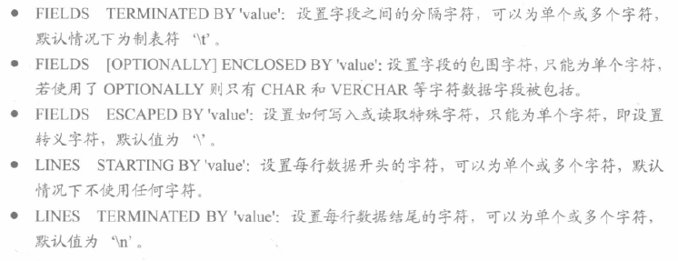

`files` 和 `lines` 都有时，前者必须在前面。一般是在服务器用的，客户端只能用这样的形式调用：

```shell
mysql -e "select ... > file_name"
```

导出的可以用 `load data infile` 导入。

导出的目录有权限限制，可以查看：

```mysql
show global variables like '%secure%';
```

要自定义导出路径需要修改 `my.ini` ，如注释掉 `secure-file-priv` 行，添加 `secure-file-priv="D:/"` 来修改。

如：

```mysql
select * from db1.tb1 into outfile 'D:/abc.txt';
select * from d.t into outfile 'D:/abc2.txt'
fields terminated by ',' enclosed by '\"' escaped by '\''
lines terminated by '\r\n';
```

 

也可以用 `MYSQLdump`，指定 `-T` 参数和选项，那么多导出一个 `txt`：


如：

```shell
mysqldump -T D:\ test_db person -u root -p
mysqldump -T D:\ test_db person -u root -p --fields-terminated-by=, --fields-optionally-enclosed-by\" --files-escaped-by? --lines-terminated-by=\r\n
```

也可以用 `mysql -e 语句`，如：

```shell
mysql -u root -p --execute="select * from abc;" dbname > filename.txt
```

 输入 `--vertical` 输出显示结果。输入 `--html` 导出为 `html` 格式文件，得到一张表格。也可以用 `--xml` ，得到 `resultset,row,field`等子段。

##### 路径

如果 `select into outfile` 的路径没有权限，可以查看权限：

```sh
SHOW VARIABLES LIKE 'secure_file_priv';
```

`--secure-file-priv` 选项用于限制 MySQL 服务器读写文件的位置，以增强安全性。这个选项可以设置为三种值之一：

1. 空字符串 (`''`)：表示禁止服务器读写文件。
2. NULL：表示没有限制，服务器可以在任何位置读写文件。
3. 特定的路径：服务器只能在该路径下读写文件。

更改调配置文件。

#### 导入

##### 创建数据库

`mysqladmin -h 端口号 -u 用户名 -p密码 create 数据库名`

也可以输入密码的方式，下同

如：

```shell
mysqladmin -h 127.0.0.1 -u root -p1 create test
```


##### 导入数据表

`cmd /c mysql -h 端口号 -u 用户名 -p密码 < 文件名.sql`

> cmd /k在执行命令后不关掉命令行窗口 cmd /c在执行完命令行后关掉命令行窗口 

如：(本地的话 `-h 127.0.0.1` 可以不写)

```shell
mysql -h 127.0.0.1 -u root -p1 test < tb_thu.sql
```

数据库主版本号相同可以直接迁移，如：

```shell
mysqldump -h www.bac.cm -uroot -ppassword dbname |
mysql -h www.bcd.com -uroot -ppasword
```

> 旧升新好升，新降旧比较麻烦。
>
> windows 下可以用 `MyODBC` 实现 `MySQL` 和 `SQL Server` 迁移。官方工具 `MYSQL Migration Toolkit` 也可以做迁移。


##### source

source 命令导入数据库需要先登录到数库终端：

```mysql
create database abc;      # 创建数据库
use abc;                  # 使用已创建的数据库 
set names utf8;           # 设置编码
source /home/abc/abc.sql  # 导入备份数据库
```


##### load data

MySQL 中提供了LOAD DATA INFILE语句来插入数据。通用格式：

```mysql
load data infile 'filename.txt' into table tablename [option] [ignore number lines]
```

ignore 是忽略头多少行。

以下实例中将从当前目录中读取文件 dump.txt ，将该文件中的数据插入到当前数据库的 mytbl 表中。

```shell
mysql> LOAD DATA LOCAL INFILE 'dump.txt' INTO TABLE mytbl;
```

如果指定LOCAL关键词，则表明从客户主机上按路径读取文件。如果没有指定，则文件在服务器上按路径读取文件。

你能明确地在LOAD DATA语句中指出列值的分隔符和行尾标记，但是默认标记是定位符和换行符。

两个命令的 FIELDS 和 LINES 子句的语法是一样的。两个子句都是可选的，但是如果两个同时被指定，FIELDS 子句必须出现在 LINES 子句之前。

如果用户指定一个 FIELDS 子句，它的子句 （TERMINATED BY、[OPTIONALLY] ENCLOSED BY 和 ESCAPED BY) 也是可选的，不过，用户必须至少指定它们中的一个。

```mysql
LOAD DATA LOCAL INFILE 'dump.txt' INTO TABLE mytbl
FIELDS TERMINATED BY ':'
LINES TERMINATED BY '\r\n';
```

LOAD DATA 默认情况下是按照数据文件中列的顺序插入数据的，如果数据文件中的列与插入表中的列不一致，则需要指定列的顺序。

如，在数据文件中的列顺序是 a,b,c，但在插入表的列顺序为b,c,a，则数据导入语法如下：

```mysql
LOAD DATA LOCAL INFILE 'dump.txt' 
INTO TABLE mytbl (b, c, a);
```


##### mysqlimport

mysqlimport 客户端提供了 LOAD DATA INFILEQL 语句的一个命令行接口。不需要登录 mysql 客户端。mysqlimport 的大多数选项直接对应 LOAD DATA INFILE 子句。 

从文件 dump.txt 中将数据导入到 mytbl 数据表中, 可以使用以下命令：

```shell
mysqlimport -u root -p --local mytbl dump.txt
```

mysqlimport 命令可以指定选项来设置指定格式,命令语句格式如下：

```shell
mysqlimport -u root -p --local --fields-terminated-by=":" --lines-terminated-by="\r\n"  mytbl dump.txt
```

mysqlimport 语句中使用 --columns 选项来设置列的顺序：

```shell
mysqlimport -u root -p --local --columns=b,c,a mytbl dump.txt
```

------

mysqlimport的常用选项介绍

| 选项                         | 功能                                                         |
| :--------------------------- | :----------------------------------------------------------- |
| -d or --delete               | 新数据导入数据表中之前删除数据数据表中的所有信息             |
| -f or --force                | 不管是否遇到错误，mysqlimport将强制继续插入数据              |
| -i or --ignore               | mysqlimport跳过或者忽略那些有相同唯一 关键字的行， 导入文件中的数据将被忽略。 |
| -l or -lock-tables           | 数据被插入之前锁住表，这样就防止了， 你在更新数据库时，用户的查询和更新受到影响。 |
| -r or -replace               | 这个选项与－i选项的作用相反；此选项将替代 表中有相同唯一关键字的记录。 |
| --fields-enclosed- by= char  | 指定文本文件中数据的记录时以什么括起的， 很多情况下 数据以双引号括起。 默认的情况下数据是没有被字符括起的。 |
| --fields-terminated- by=char | 指定各个数据的值之间的分隔符，在句号分隔的文件中， 分隔符是句号。您可以用此选项指定数据之间的分隔符。 默认的分隔符是跳格符（Tab） |
| --lines-terminated- by=str   | 此选项指定文本文件中行与行之间数据的分隔字符串 或者字符。 默认的情况下mysqlimport以newline为行分隔符。 您可以选择用一个字符串来替代一个单个的字符： 一个新行或者一个回车。 |

mysqlimport 命令常用的选项还有 -v 显示版本（version）， -p 提示输入密码（password）等


##### hotcopy

用 `MYSQLhotcopy` 备份后的恢复，在服务器停止运行时，直接复制、给权限和重启即可，如：

```shell
chown -R abc.sql /var/lib/mysql/dbname
cp -R /usr/backup/abc usr/local/mysql/data
```

若数据库已存在，先删掉。注意版本必须兼容。

### 其他指令

#### 查询

##### 引擎

系统表类型：

```mysql
select distinct(engine) from information_schema.tables;
```


##### 警告

```mysql
show warnings;
```


##### 连接数

查看当前所有连接

```mysql
show processlist;
```

command 列是 sleep 就是连接完 MySQL 服务就没有再执行过任何命令（空闲连接）

time 列是空闲时长（秒）。更多参见 `权限指令-连接`

##### 连接最大时长

`wait_timeout` 参数控制最大空闲时长，默认 28800s (8h)，超时自动断开。

```sql
show variables like 'wait_timeout';
```

更多参见 `权限指令-连接`

##### 储存目录

```mysql
SHOW VARIABLES LIKE 'datadir';
```

更多参见 `数据库.md-理论-MySQL-架构组成-存储层`。

#### 配置

##### 全局设置

###### 时区

例如： `set time_zone='+10:00'`  设置为东十区


###### 编码

在 `my.ini` ，找到 `default-character-set` , `character-set-server` ，改为想要的，如 `gbk, gb2312, latin1` ，然后重启。

查询： `show variables like 'character_set_%'` 

临时修改，如： `set names utf8;`

###### 临时表

```mysql
SET GLOBAL tmp_table_size =512*1024*1024; （512M）
SET global innodb_buffer_pool_size= 1*1024*1024*1024 (1G);
```


##### 严格模式

非严格模式不会理字符串越界。


### 函数指令

#### 内置

> 可以见 [列表](https://www.runoob.com/mysql/mysql-functions.html)
>


常用：数学函数、字符串函数、日期和时间函数、聚合函数和系统函数等

##### 数学

有 `abs, pi, sign` 。

有 `sqrt` ，负数返回 null 。`mod(x,y)` 返回 $x\bmod y$ ，可以是小数。有 `power(a,b)`。会丢失精度如 2^62 不准。

有 `ceil` / `ceiling` ，不小于目标的最小整数 (bigint) 和 `floor` 。

有 `rand(种子)` 取随机数 $[0,1]$ 

`round(x,y)` 返回最接近 $x$ 的保留小数点后 $y$ (若负则前) $y$ 位。四舍五入。truncate 参数同理，截断小数部分。

有 `pow` / `power` ，有 `exp` ，输出常数则 `exp(1)` 。有 `log` (以 $e$ 为底)，有 `log10` 。负数返回 null 。

有 `radians` ， `degrees` 。用弧度制有六种三角函数。超出值返回 null 。

`conv(n, base1, base2)` 进制转换，从 base1 到 base2 。英文用大写。基数范围 $[2,36]$

`inet_aton(expr)` 将 4 或 8 位地址转换为十进制数。如 `inet_aton('192.168.1.1')` 。反函数是 `inet_ntoa` 。

窗口函数(传入集合，返回多行结果)，8.0 新增，如 rank 。按升序排序，使用举例：

```mysql
select *,rank() over w1 from infos window w1 as (order by value);
select *,(value/sum(value) over()) from infos; -- 求百分比
```


##### 字符串

求长度 `char_length` ，中文算 1 。而用 `length` 的话，中文算 3 。

合并 `concat(s1, s2, ...)` 。存在 null 就 null。存在二进制就变二进制。用 `concat_ws(sep, s1, s2, ...)` ，在两两之间添加分割符 (with separator)

替换 `insert(s1, x, len, s2)` 将 s1 从 x 开始的长为 len 被取代。若 x 超过越界返回原始，下标从 1 开始，若大于从 x 开始。如 `insert('quest',2,4,'what)='qwhat'` , `insert('quest',-1,4,'what)='quest'` , `insert('quest',3,100,'what)='quwhat'` , `insert('jinle',4,1,'sangze')='jinsangzee` 

大小写转换， `lower` 或 `lcase` ； `upper` 或 `ucase` 。希腊字母也行。

取长为 n 的前/后缀 `left(s,n)` , `right(s,n)` 

填充 `lpad(s1, len ,s2)` , 将 s1 长度变为 len ，不足部分用 s2 填充。如 `lpad('xingyue',10,'xo')='xoxxingyue'`  , `rpad('xingyue',5,'qwq')=lpad('xingyue',5,'qwq')='xingy'` 

删除空白字符 `ltrim, rtrim, trim` 。可以 `trim(s1 from s)` ，把 s 里的首尾 s1 全部干掉。

字符串乘法 `repeat(s,n)` 。用 `space(n)` 等于 `repeat(' ',n)` 。

字符串替换 `replace(s,s1,s2)` , 用 s2 替换 s 里所有 s1 子串。不会递归下去。

字典序比较 `strcmp` ，返回 $\pm1$ 或 $0$ 

获得子串 `substring(s,n,len)` ，从 n 开始(负的语法同 python),len越界就本来长度有多长算多长。同名函数是 `mid` 。若 len 小于 1 得到空串。(n 1-indexed)

匹配子串开始的位置 `locate(substr, str), position(subs in str), instr(str, substr)` (instr首次出现位置,1-indexed)。找不到返回 0 。

转置 `reverse` 。

`elt(n, s1, s2, s3, ...)` 返回 `sn` 。越界返回 null 。

`fleld(s, s1, s2, ..., sn)` 返回 s 第一次出现的位置 i 。找不到得 0 。

`find_in_set(s1, s2)` 等效于上面，其中 `s2=concat_ws(',',s1,s2,...,sn)` 。所以 `s1` 不要有逗号。

`make_set(x,s1,s2,...,sn)` ，按二进制枚举用 `,` 拼接选出来的字符串，可以是空串。其中最小位代表 s1

转换编码 `convert(str using 编码集)` 如 `convert('abc' using latin1)`

格式化 `format(x,n)` 将数字 x 四舍五入保留 n 位返回字符串。若 n 为 0 不含小数部分。注意每个三位输出一个逗号。如 `format(1e9,2)`

查询分组拼接：`group_concat(key)` ，如：

```mysql
select value,group_concat(`key`) from infos group by value;
```

转换大小写：lower(str), upper(str)

去除空格 ltrim(str), rtrim(str), trim(str) (不能去除\n \t)


##### 时间

now 是当时的年月日时分秒

current\_time 或 curtime 是当时的时分秒。同理年月日替换为字 date

还有 `current_timestamp, localtime, sysdate` 。`current_date` 是年月日如 `2024-11-23`

`unix_timestamp(date)` ，无参数返回 now 与 `1970-01-01 00:00:00 GMT` 的秒数差。GMT是 green wich mean time 格林尼治标准时间。跟这个时间作差。`from_unixtime(date)` 就是时间戳转时间，可以传入字符串/数值。其实这两个就是两种格式互转。

`utc_date()` 返回 UTC (世界标准时间)格式日期值，返回当前时区日期值。

用 `month, monthname` 截取 date 。值域是 $[1,12]$ 或英文全名(首字母大写)；用 `dayname,dayofweek,weekday` 取 $[1,7]$ 或全名，或周索引 $[0,6]$ ；用 `week,weekofyear` 获取一年中的第几周， week 第二个参数：

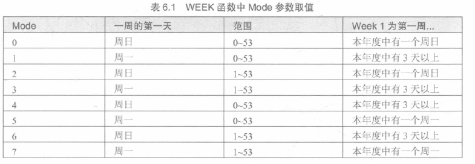

默认为 0 ；天数用 `dayofyear, dayofmonth` ，一年中的第几天。

year 获取年份，值域 $[1970,2069]$ 。 quarter 返回 $[1,4]$ ， minute(time) 返回 $[0,59]$ ， second 同理。

`extract(type from date)` 用类型获取日期的某个值，如 `extract(year from '2018-07-02')` 。参数有 `year, year_month, day_minute` (时分秒)

> 如 `where extract(year from order_date)='2019'`

`time_to_sec` 返回时间的秒数。反函数 `sec_to_time` 。

日期运算 `date_add, adddate, date_sub, subdate, addtime, subtime, date_diff`  。对 `date_add(date, interval expr type)` ，date 是起始值，expr 表达式，type 关键字。


例如：`date_add('2010-12-31 23:59:59', interval 1 second)` , `date_add('2010-12-31 23:59:59', interval 1:1 minute_second)` 。 add 放负数也可以。或者粗暴一点， `addtime(date, expr)` ，如 `addtime('02:02:02', '02:00:00')` 。而 `datediff` 计算日期的间隔天数。

格式化：`date_format(date, format)` 


同理有 `time_format` 。可以用 `get_format(type, area)` 表示某个地区显示的格式，即根据表的第一项(不用引号)和第二项(要)查第三项：

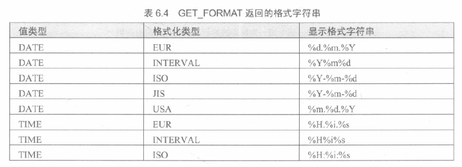


`datediff(a,b)` 两个日期a-b相减(date的话单位是天)，等效于 `timestampdiff(day,a,b)`

`last_day` 最后一天。

```sql
select last_day('2024-2-2'); -- 2024-02-29 
```


##### 条件判断

`if(expr, v1, v2)` ，为真返回 `v1` ，否则 `v2` 。`ifnull(v1,v2)` 。

`case expr when v1 then r1 [when v2 then r2] ... [else rn] end` ，具体返回字符串还是数值看需要用到处的运算。


##### 系统

`version()` ，如 `8.0.27` 。

`connection_id()` 当前连接 id 整数。

`processlist` 连接数和所有链接状态，前 100 条(`full processlist` 可以全部)。只有 root 能看到全部，一般用户看到自己。如果不行，用 `select * from information_schema.processlist;` 

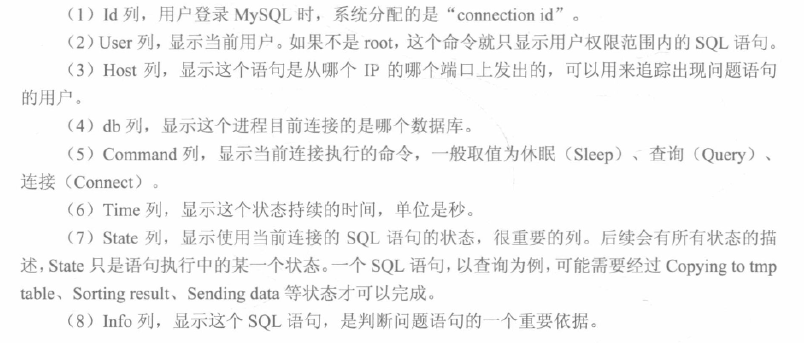

`database()` 当前数据库名。可能是 null 。 `schema()`  同。

`user(),current_user,current_user(),system_user(),session_user()` 获取用户名。格式是 `主机名字@IP` 如 `root@localhost`

`charset(str)` 获得当前字符串所用字符集。`collation(str)` 返回排列方式。

`last_insert_id()` 最后生成的 `auto_increment` 。一个语句插入多条时，以第一条为准。与表无关。

`get_lock(str, timeout)` 给字符串 str 名字加 timeout 秒的锁，成功得到 1 ，超时得到 0 ，错误得到 null 。 `release_lock(str)` 或连接断开断开这个锁，前者锁被解开返回 1，没有创建锁返回0，不存在这个所返回null。提前解开或未get过就是不存在。`is_free_lock(str)` 检查名为 str 的锁是否可用(未被封锁)，可用返回 1，被占用返回 0，其他返回 null 。`is_used_lock(str)` 同理，但被封锁返回用锁客户端的connection ID，否则返回 null

`benchmark(count, expr)` 执行 count 次 expr 。返回值是运行时间(客户端时间，而不是服务端CPU时间)，通常是 0 。


##### 加密

在 8.0 新增 

一般都传入 null 得 null

`md5(str)` 进行 MD5 128比特校验和，以32位十六进制二进制字符串返回

`sha(str)` 返回格式一样

`sha2(str, hash_length)` ，第二个参数支持 `224,256,384,512,0` ，其中 0=256

`aes_encrypt(src,pwd), aes_decrypt`，正常查看加密后的显示是一段乱码或十六进制数字。解码得到十六进制数字。

##### 类型转换

`cast(x as type)` 或 `convert(x, type)` 进行类型转换。type 有 `binary, char(n), date, time, datetime, decimal, signed ,unsigned` 。如 `cast(100 as char(2))`

```mysql
select * from t_user where CAST(phone AS signed int) = 1300000001;
```

##### uuid

36 字符长的字符串，代表 128 位整数(十六进制形式)

```
xxxxxxxx-xxxx-Mxxx-Nxxx-xxxxxxxxxxxx
```

`Mxxx`: `M` 表示 UUID 的版本，在 MySQL 中通常是 `4`

`Nxxx`: `N` 表示 UUID 的变体，通常为 `8`、`9`、`A` 或 `B`

同一个事务一般第一部分随机，其他不变。

#### 存储过程

是一条或多条 SQL 语句集合，类似批处理。

```sql
create procedure sp_name ([proc_parameter]) [characteristics ...] routine_body ;
```

参数列表形式如下：

```mysql
[in | out | inout] param_name type
```

存储过程特性 characteristics 取值如下：

- `language sql` 由 SQL 语句组成
- `[not] deterministic` 存储过程执行结果是否是确定的(同一输入得到同一输出)，默认 not 
- `[contains sql | no sql | reads sql data | modifies sql data]` 子程序限制。依次是：
  - 包含 SQL 但不包含读写数据。默认
  - 不包含 SQL
  - 包含读数据
  - 包含写数据
- `sql security {definer | invoker}` 有权限执行者，定义者或有权调用者。默认前者。
- `comment 'string'` 注释

routine body 用 `begin` , `end` 开始和结束。

使用 `delimiter` 符号修改结束符，避免存储过程 `;` 与语义 `;` 冲突，将其换为别的。一般不用 `\` ，其他随便用。

不支持修改代码，想修改只能删掉重写。函数同。可以调用其他存储过程，但不能 drop  其他存储过程。中文阐述建议规定字符集，如：

```mysql
create procedure userinfo(in u_name varchar(50) character set gbk, out u_age int)
```

如：

```mysql
delimiter $
create procedure AvgPrice ()
begin
select avg(`yourprice`) as `AvgPrice` from `flower`;
end$
delimiter ;
call AvgPrice(); -- 调用
drop procedure AvgPrice; -- 删除
```

调用通式是 `call dbmane.procname` ，即可能跨库调用。IO 示例如下：

```mysql
delimiter //
create procedure countgt (in pr int, out num int)
begin
select count(*) into num from flower where yourprice >= pr;
end //
delimiter ;
call countgt(100, @tmp);
select @tmp;
```


#### 自定义函数

UDF(User-Defined Function)

本质上都是存储程序。区别在于 return 与否，以及限制的多寡。例如函数不能用临时表，只能用表变量，一些函数不可用，但是可以嵌入到 sql 语句内使用。

```sql
create function func_name ([func_parameter])
returns type [characteristics ...] routine_body
```

默认参数总是 in 。函数体必须包含 `return value` 语句。

可以显示当前是否允许不指定特性：

```mysql
show variables like 'log_bin_trust_function_creators';
```

设置为允许，防止下面例子报错：

```mysql
set global log_bin_trust_function_creators=1;
```

> 这样设置显然是临时的，可以在 `my.cnf` 添加  `log_bin_trust_function_creators=1`

如：

```mysql
delimiter //
create function hello()
returns char(20)
return (select fName from flower limit 1); //
delimiter ;
select hello(); -- 函数调用
drop function if exists hello; -- 函数删除
```

```mysql
delimiter lr580
create function countpr2 (pr int) returns int begin
return (select count(*) from flower where yourprice>pr);
end; lr580
delimiter ;
select countpr2(200);
```


#### 变量

不区分大小写。

##### 常规

定义：

```mysql
declare var_name[,var_name, ...] data_type [default value]
```

如：

```sql
declare myparam int default 100;
```

赋值：

```mysql
set var_name = expr [,var_name = expr ...];
```

如：

```mysql
set myparam = myparam * 2;
```

也可以用下面方法为一个或多个变量赋值：

```mysql
select col_name[, ...] into var_name[, ...] table_expr;
```

如：

```mysql
select fName, flowerId into name, id from flower where flowerId = 1;
```

##### 用户变量

`@var_name` 是用户变量，用 set 赋值，与连接有关，一个客户定义的不能被其他用户看到，连接释放自动释放。如：

```sql
select @x; -- NULL
set @x=1;
select @x;
```

可以使用变量笛卡尔积联表然后自增来标号：

(大意是 i从100开始增长，循环 person 表行数次，把 person 表遍历与 i=100 两个表笛卡尔积，nx1=n)

```mysql
select (@i:=@i+1) as rownum, person_name 
from person, (select @i:=100) as init; 
```

将其与 insert 配合，可以翻倍增加元素。

##### 全局变量

加 global 关键字。数据库重启后从配置项重新读取。

如：

```mysql
set global MAX_EXECUTION_TIME = 2000;
```

而用 `persist` 则保存到 `mysqld-auto.cnt` 下次启动会读取，覆盖默认配置，如：

```mysql
set persist max_connections = 1000;
```

可以查询：

```mysql
show variables like '%max_connections%';
```


#### 条件处理

类似于 try...catch 。

定义处理的条件：

```sql
declare condition_name condition for [condition_type]
[condition_type]:
sqlstate [value] sqlstate_value | mysql_error_code
```

`sqlstate_value` 是长度为 $5$ 是字符串错误类型代码，`mysql_error_code` 是数值错误代码。如：

```mysql
declare cmd_not_allow condition for sqlstate '42000';
declare cmd_not_allow condition for sqlstate 1148;
```

定义处理条件的程序：

```sql
declare handler_type handler for condition_value[,...] sp_statement
handler_type: continue | exit | undo
condition_value: sqlstate [value] sqlstate_value | condition_name | sqlwarning | not found | sqlexception | mysql_error_code
```

`handler_type` 为错误处理方式，分别为不处理、马上退出和撤回之前的操作(不支持 undo )。`sqlwarning` 匹配所有 `01` 开头的 `sqlstate` 错误代码，`not found` 则以 `02` 开头， `sqlexception` 则是没有被上述两种捕获的全部错误代码

如：

```sql
declare continue handler for sqlstate '42S02' set @info='NO_SUCH_TABLE';
declare no_such_table condition for 1146;
declare continue handler for no_such_table set @info='NO_SUCH_TABLE';
declare exit handler for sqlwarning set @info='ERROR';
```

综合使用：

```sql
delimiter //
create procedure fdemo ()
begin
declare continue handler for sqlstate '23000' set @x2 = 1;
-- 主键冲突忽略
set @x = 1;
insert into test_db.t values (1);
insert into test_db.t values (1); -- 主键冲突
set @x = 2; -- 理论上调用后得到 @x=2
end;//
delimiter ;
```


#### 光标

声明：

```sql
declare cursor_name cursor for select_statement;
```

如：

```mysql
declare cursor_flower cursor for select fName, flowerID from flower;
```


打开：

```mysql
open cursor_name;
```

使用：

```mysql
fetch cursor_name into var_name [, var_name ...]
```

表示将光标中 select 查出来的信息存入到这个 `var_name` 里

关闭：

```mysql
close cursor_name;
```

只能在存储过程 / 函数使用。


#### 流程控制

if:

```sql
if expr_condition then statement_list
[elseif expr_condition then statment_list ...]
[else statement_list]
end if;
```

如：

```mysql
if val is null then select 'empty val'; -- 输出
else select 'ok';
end if;
```


case:

```mysql
case case_expr when when_value then statement_list 
[,when ...]
[else statement_list]
end case;
```

或：

```sql
case
[when expr_condition then statement_list] ...
[else statement_list]
end case;
```

> 存储程序与函数里略有不同。


loop:

```mysql
[loop_label:] loop
	statement_list
end loop [loop_label]
```

使用 `leave loop_label`  break ；使用 `iterate loop_label` continue;

如：

```mysql
delimiter $
create procedure fordemo()
begin
declare id int default 0;
add_loop: loop
	set `id` = `id` + 1;
	if `id` >= 10 then leave add_loop;
	elseif `id` = 5 then iterate add_loop; -- else if 暴毙 
	end if;
	select `id`;
end loop add_loop;
end$
delimiter ;
```


repeat:

```sql
[repeat_label:] repeat
	statement_list
until expr_condition
end repeat [repeat_label];
```


while:

```mysql
[while_label] while expr_condition do
	statement_list
end while [while_label];
```


#### 查询状态

可以直接从系统的 `information_schema` 数据库查询。也可以：

```mysql
show {procedure | function} status [like 'pattern']
```

返回子程序的特征，如数据库、名字、类型、创建者、创建日期、修改日期。一定要 like ，不然会输出一大堆乱七八糟的内容。如：

```mysql
show procedure status like 'fordemo%'\G;
```

也可以：

```sql
show create {procedure | function} sp_name;
```

如：

```mysql
show create procedure fordemo\G;
```

也可以查系统表：

```mysql
select * from information_schema.Routines where ROUTINE_NAME='sp_name' \G;
```

还可以只差函数或过程，限定： `and ROUTINE_TYPE = 'FUNCTION'` 。


#### 修改

```mysql
alter {procedure | function} sp_name [characteristic ...]
```


例如：

```mysql
alter procedure mypro modifies sql data sql security invoker;
alter procedure mypro comment 'QwQ';
```


#### 触发器

trigger ，特殊的存储过程。预定义事件（增删改）发生时，被 mysql 自动调用。通常而言很不推荐使用触发器，除非对需求有显著好处。

单行语句触发器语法：

```mysql
create trigger trigger_name trigger_time trigger_event
on tbl_name for each row trigger_stmt
```

`trigger_time` 为 `before` 或 `after` ，`trigger_event` 为触发事件，包括 `insert,update,delete` 。插入时临时新列是 new ，删除临时旧表示 old 。通过对这两张表操作可以实现 rollback 。

如：

```mysql
create trigger ins_sum before insert on account
for each row set @sum = @sum + NEW.value;
```

多行语句：

```mysql
create trigger trigger_name trigger_time trigger_event
on tbl_name for each row begin
...
end
```

查看： `show triggers` , 查看特定从 `information_schema` 数据库找 `trigger` 表，条件属性名 `TRIGGER_NAME` 。删除也是 `drop` 。

相同表相同事件只能有一个触发器。

如：

```mysql
create table if not exists ts (v int);
delimiter lr580
create trigger tst before insert on ts for each row begin
if new.v <= 0 then
signal sqlstate 'HY000' set message_text = '不允许插入';
end if;
end lr580
delimiter ;
insert into ts values (0); -- 输出报错
insert into ts values (10);
```


### 日志指令

分为：

- 错误日志：记录 MYSQL 服务启动、运行或停止 MYSQL 服务时出现的问题
- 查询日志：记录建立的客户端连接和执行的语句
- 二进制日志：记录所有更改数据的语句，可以用于数据复制
- 慢查询日志：记录所有执行时间超过 `long_query_time` 的所有查询或不使用索引的查询

日志创建在 MYSQL 数据目录。刷新日志可以强制 MYSQL 关闭。用指令 `flush logs`,或 cmd 语句 `mysqladmin flush-logs`, `mysqladmin refresh`。

复制功能，在复制服务器上维护更多日志文件，称为接替日志

查询和慢查询日志可能会降低性能和占用大量空间

日志跟数据库文件不建议放在同一个磁盘，若磁盘故障可能会一锅端

8.0 新版本添加了每条记录的错误信息编号如`[my-010311]`和错误所属子系统如`[server]`。

#### 二进制日志

事务安全。包含所有更新了数据或已经潜在更新了数据的语句，以事件形式保存，描述数据更改。包含每个更新数据库语句的执行时间信息。目的：最大可能地恢复数据库

修改配置 `my.ini`，来启动：

```ini
log-bin [=path/ [filename]]
```

定义路径和日志文件名称。会生成 `filename.000001` 等和 `filename.index`。`expire_logs_days` 定义了清除过期日志的时间，即自动删除的天数。默认为 0 即不删除。启动或刷新时可能删除。`max_binlog_size` 定义单个文件大小限制，不能大于 1GB 或小于 4096B，默认 1GB。但是大的事务会使得实际值超过该限制。

如：

```ini
[mysqld]
log-bin
expire_logs_days = 10
max_binlog_size = 100M
```

查询：

```mysql
show variables like 'log_%';
show binary logs;
```

也可以 cmd：

```shell
mysqlbinlog 文件路径
```

如：

```shell
mysqlbinlog D:/mysql/log/binlog.000001
```

删除全部：

```sql
reset master
```

删除指定文件名(比指定的编号小的所有(不包括这个指定的))或日期(该日期之前的所有(不包括当天))：

```mysql
purge {master | binary} logs to 'log_name';
purge {master | binary} logs before 'date';
```

如：

```mysql
purge master logs before '20190130';
purge master logs to "abc.000003";
```

使用日志恢复数据库：

```shell
mysqlbinlog [option] filename | mysql -uuser -ppass
```

选项有 `--start-date, --stop-date` 和 `--start-position, --stop-position`，指定时间和位置。时间如 `--stop-date="2019-01-30 15:27:48"`，其中 `|` 是管道运算符, windows 也可以管道

暂停/启动：

```mysql
set sql_log_bin = {0|1}
```


#### 错误日志

当启动和停止或运行时的严重错误相关信息。默认在数据库数据目录下，为 `hostname.err`。执行 `flush logs` 会重新加载。

配置：(修改后重启生效, `my.ini` 或 `my.cnf`)

```ini
[mysqld]
log-error=[path / [file_name]]
```

查看：

```mysql
show variables like 'log_error';
```

删除：直接找到文件删掉即可。5.5.7 以前版本 flush logs 可以重命名为 `filename.err_old` 并创建新的，之后只重新打开，不存在创建。运行时删除不会自动创建，需要的话：

```shell
mysqladmin -u root -p flush-logs
```

或：

```mysql
flush logs;
```


#### 通用查询日志

所有用户操作，含启动关闭服务、执行查询和更新。

默认不开启。查询：

```mysql
show variables like '%general%';
```

开启：(关闭设0)(调其他变量同理)

```mysql
set @@global.general_log=1;
```

查看可以直接到路径下翻。删除可以直接删，重建的话用：

```shell
mysqladmin [-u root -p] -flush logs
```


#### 慢查询日志

配置：

```ini
[mysqld]
log-slow-queries[=pat / [filename]]
long_query_time=n
```

n 是超过阈值，不填默认 10 秒。单位是秒。默认在数据目录，文件名 `hostname-slow.log`。查看直接打开。可以借助 mysql dump slow, mysql sla, mysql log ffilter, myprofi 等工具分析。删除同查询日志。


## 其他

### 性能优化

#### 性能查询

```mysql
show status like 'value';
```

value 如：

- `Connections` 连接服务器次数
- `uptime` 服务器上线时间
- `slow_queries` 慢查询次数
- `com_select` 查询次数
- `com_insert` 插入次数
- `com_update` 更新次数
- `com_delete` 删除次数


#### 查询分析

三者其一

```mysql
explain [extended] select select_option
describe select select_option
desc select select_option
```

输出里 `id` 是查询序列号。

`select_type` 有不含连接查询和子查询的简单查询 `simple`，主查询(最外层查询) `primary`，`union` 连接查询的非首个查询语句。`dependent union` 是连接查询非首个的 select；`union result` 是连接查询结果。`subquery` 是子查询第一个语句。同理 `dependent subquery`。`derived` 导出表的 select(from 子句的子查询)。

`table` 是要查询的表。

`type` 是连接类型。从最优到最差分别是 `system`, `const`(最多一个匹配行)，`eq_ref`(从前两者的组合里读取一行；当一个索引所有部分都在查询中使用且是 union/primary key索引时可以使用)；`ref` (前面的表读取所有匹配行)；`ref_or_null`；`index_merge` (索引合并优化)；`index_subquery`；`index_subquery`；`range`；`index`；`all`。

`rows` 遍历次数。

`extended` 会产生附加信息。

查询语句条件中只有 or 且前后两条件的列都是索引时才会使用索引，否则不使用。

子查询灵活但效率不高。会有临时表的创建和撤销。使用 join 代替子查询从而不需要建立临时表。连接效率更高只因为不需要再内存中创建临时表。

8.0 索引可以被隐藏，此时不被查询优化器使用。

```mysql
create table test1(a int, b int, index idx_a_b(a,b desc) invisible);
alter table test1 alter index idx_a_b visible;
show index from test1 \G
```


#### 数据库结构

字段多的表，对使用频率低的子段可以分离形成新表。

经常联合查询的表，可以建立中间表。

降低范式，添加冗余字段，减少连接操作。但是可能代价是空间和修改。

8.0 增加资源组用于调控线程优先级和绑定 CPU。mysql 用户权限为 resource\_group\_admin。进程要有 cap\_sys\_nice 权限如：

```shell
sudo setcap cap_sys_nice+ep /usr/local/mysql8.0/bin/mysqld
getcap /usr/local/mysql8.0/bin/mysqld # 输出
```

```mysql
create resource group my_re type=user vcpu=0,1 thread_priority=5;
set resource group my_re;
select * from performance_schema.threads where resource_group='my_re';
drop resource group my_re;
alter resource group my_re vcpu=2,3 thread_priority=8;
set resource group usr_default for 48;
set resource group my_re for thead_id;
select thread_id from performance_schema.threads;
set resource group my_reso for 20;
```


#### 数据插入

影响插入的主要因素是索引、唯一性校验、插入的数目。myisam可以插入前禁用索引，插入后再开启，如：

```mysql
alter table table_name disable keys;
alter table table_name enable keys;
```

同理禁用唯一性校验：

```mysql
set unique_checks=0;
set unique_checks=1;
```

用一条插入语句代替多条插入语句。

用 `load data infile` 代替 insert，更快。

对 innodb，可以：同理禁用唯一性，还可以禁用外键检查：

```mysql
set foreign_key_checks=0;
```

禁用自动提交：

```mysql
set autocommit=0;
```


#### 分析表

分析关键字的分布。

```mysql
analyze [local | no_write_to_binlog] table tbl_name [,tbl_name]...
```

local 与后者互为别名，都表示执行过程不写入二进制日志。

分析时加只读锁。能分析 innodb, bdb, myisam。

table 是表名。on 是执行的操作。msg\_type 是 status/info/note/warning/error, msg\_text 是显示信息


#### 检查表

检查 innodb, myisam 是否存在错误。后者还会更新关键字统计数据。也可以检查视图(如被引用的表不存在)

```mysql
check table tbl_name [,tbl_name] ... [option] ...
```

option 有 quick(不扫描行，不检查错误连接)；fast(只检查未被正确关闭的表)；changed(只检查上次检查后被更改和未正确关闭的)；medium(扫描行，验证删除的连接是有效的，计算各行关键字校验和)；extended(每行关键字做全面关键字查找，确保表 100% 一致)

option 只能 myisam。check 时加只读锁。


#### 优化表

对 innodb, myisam 有效，优化 varchar, blob, text。

```mysql
optimize [local | no_write_to_binlog] table tbl_name [,tbl_name] ...
```

可以消除删除和更新造成的文件碎片。加只读锁。一般只需要一周或一个月一次，只需要对特定的表运行。


#### 服务器

硬件：较大的内存。内存速度比磁盘 I/O 快。增加缓冲区容量使得在内存停留更久。高速磁盘。合理分布磁盘 I/O，分散到多个设备减少资源竞争，提高并行操作。配置多处理器，多线程。

参数：

- `key_buffer_size` 索引缓冲区大小。所有线程共享。值太大会操作系统频繁换页，降低系统性能
- `table_cache` 同时打开的表个数，太多影响系统性能
- `query_cache_size` 查询缓冲区大小。与 `query_cache_type` 配合，为 0 时都不使用，但不会导致释放所配置的内存；为 1 时都使用，除非查询语句指定 `select sql_no_cache * from` 这样的语法。而为 2 时，只有语句有 `sql_cache` 关键字才用。用缓冲区可以提高查询速度，只使用修改操作少和经常执行相同查询操作
- `sort_buffer_size` 排序缓冲区大小，越大排序速度越快。提高 order by 或 group by，默认约 2MB(2097144 byte)
- `read_buffer_size` 每个线程连续扫描时为扫描的每个表分配的缓冲区大小(字节)，从表连续读取记录时用到。可以 `set session read_buffer_size=n` 临时设置
- `read_rnd_buffer_size` 每个线程保留的缓冲区大小。主要用于存储按特定顺序读取出来的记录。也可以 set。频繁多次连续扫描可以增加。
- `innodb_buffer_pool_size` 该类型表和索引最大缓存。越大查询越快，太大影响操作系统性能
- `max_connections`。连接会浪费内存资源，过多会僵死
- `innodb_flush_log_at_fix_commit` 何时将缓冲区写入日志。0 是每隔一秒写入磁盘，1 是每次提交事务，2 是每次提交事务写日志，每隔 1 秒日志存盘。默认 1。0 更快但安全性差。
- `back_log` 暂时停止回答新请求的时间内，多少请求可以存在栈里。即对到来的 tcp/ip 连接侦听队列大小。高于操作系统无效。
- `interactive_timeout` 关闭连接前等待行动秒数
- `thread_cache_size` 复用线程数
- `wait_timeout` 关闭连接前等待秒数，默认 28800
- `innodb_log_buffer_size`
- `innodb_log_file_size`


#### 临时表

8.0 

可以把数据库和表归组到逻辑和物理表空间，提高资源利用率

去掉了临时表不必要持久化。增加 undo 日志额外的类型。临时表设置特别类型。

临时表元数据在 innodb\_temp\_table\_info 系统表

用 `create tablespace` 创建通用表空间。

```mysql
create tablespace dxy add datefile 'dxy.ibd' file_block_size=16k;
alter table t1 tablespace dxy;
drop table t1;
drop tablespace dxy;
```


#### 超时处理

限制语句时间。

```mysql
set global max_execution_time=2000; -- 毫秒,0无限
```

会话超时时间：

```mysql
set session max_execution_time=2000;
```


### 主从

Replication

数据库复制。从一个主服务器(master)将数据复制到另外若干台从服务器(slaves)的过程。将主数据库的 DDL 和 DML 操作通过二进制日志传到从服务器上然后执行，使得同步。复制异步进行。

从服务器一般用于处理查询，减少主服务器压力。

> 复制（replication）是MySQL数据库提供的一种高可用高性能的解决方案，一般用来建立大型的应用。总体来说，replication的工作原理分为以下3个步骤：
>
> 1. 主服务器（master）把数据更改记录到二进制日志（binlog）中。
> 2. 从服务器（slave）把主服务器的二进制日志复制到自己的中继日志（relay log）中。
> 3. 从服务器重做中继日志中的日志，把更改应用到自己的数据库上，以达到数据的最终一致性。
>
> 复制的工作原理并不复杂，其实就是一个完全备份加上二进制日志备份的还原。不同的是这个二进制日志的还原操作基本上实时在进行中。这里特别需要注意的是，复制不是完全实时地进行同步，而是异步实时。这中间存在主从服务器之间的执行延时，如果主服务器的压力很大，则可能导致主从服务器延时较大。复制的工作原理，其中从服务器有2个线程，一个是I/O线程，负责读取主服务器的二进制日志，并将其保存为中继日志；另一个是SQL线程，负责执行中继日志。

#### windows

查看数据路径：

```mysql
show variables like '%datadir%';
```

修改 `my.ini` 添加：

```ini
[mysqld]
log_bin="D:/MySQLlog/binlog"
expire_logs_days=10
max_binlog_size=100M
```

创建对应的文件。参数：删除的天数和最大的大小。

测试是否成功开启：

```mysql
show variables like '%log_bin%';
```

`log_bin=ON` 则开启。

配置一个复制用的账号 `repl`：

```mysql
grant replication slave on *.* to repl@'%' identified by '123';
flush privileges;
```

继续配置 ini：

```ini
server-id=1
binlog-do-db=test
binlog-ignore-db=mysql
```

放服务器标识 id，与 slave 不一样。要复制的数据库名和不需要复制的数据库名。

重启，查询信息：

```mysql
show master status \G;
```

导出数据，导入到从服务器：

```shell
mysqldump -u root -p -h localhost test > c:\a.txt
```

复制 txt 到从服务器，导入：

```shell
mysqldump -u root -p -h localhost test < c:\a.txt
```

继续配置从服务器：

```ini
[mysql]
default-character-set=utf8
log_bin="D:/MySQLlog/binlog"
expire_logs_days=10
max_binlog_size=100M

[mysqld]
server-id=2
```

可以注释掉 log\_bin 在 mysqld 的

重启从服务器，执行：

```mysql
stop slave;
change master to
master_host='192.168.0.208',
master_user='repl',
master_password='123',
master_log_file='binlog.000003',
master_log_pos=120;
start slave;
show slave status \G;
```

后两个表示要复制的日志文件和偏移量。

解决 fatal error 1236:

重启主机，执行：

```mysql
show master status \G;
```

记录 file 和 position 值。

重新设置从机，并把后两个参数调成这个值。

可以发现，主机每执行一次更改，就会同步到从机。


#### linux

安装 mysql

停止服务器：

```shell
service mysql stop
```

若 netstat 查询 330 无结果，则已经关闭

下略


#### 维护

查看从服务器：

```mysql
show slave status \G;
```

大文本复制出错：

```mysql
show variables like 'max_allowed_packet';
set @@global.max_allowed_packet=16777216;
```

或 `my.cnf` 设置。（16MB）

自增长冲突：主服务器设置 `auto_increment_increment=1,auto_increment_offfset=1`，从后者 0 前者 1。

切换服务器：

```mysql
stop slave IO_THREAD;
show processlist \G;
```

从：

```mysql
stop slave;
reset master;//从变f主
```


#### Proxy

mysql proxy 使得一个客户端的读写命令，写命令放到主数据库，读放到从数据库。只有一个 proxy 机器可能会出现单点失效，可以用多个 proxy 作为冗余。

```shell
mysql-proxy --help-all
```

[下载](downloads.mysql.com/archives/proxy)


### 锁

三种锁：行级、页级、表级。

#### 行级锁定

innodb 支持(row-level locking)和表级锁。默认前者。myisam memory两者表级。BDB 是页面和表。

颗粒度小，发生争用概率小。获取和释放消耗大，容易死锁。

如果一个事物请求的锁模式与当前模式兼容，就可以做，否则要等待。(考虑并发，多个会话)显然同一个会话自己不会冲突，加锁时其他会话可能会冲突。

共享锁 S，排他锁 X，意向共享锁 IX，意向排他锁 IX。

|      | S    | X    | IS   | IX   |
| ---- | ---- | ---- | ---- | ---- |
| S    | √    |      | √    |      |
| X    |      |      |      |      |
| IS   | √    |      | √    | √    |
| IX   |      |      | √    | √    |

意向锁自动添加。普通 select innodb 不加任何锁。增删改 innodb 自动加排他锁。

添加共享锁 S：

```mysql
select * from ... lock in share mode;
```

添加排他锁 X：

```c++
select * from ... for update;
```


#### 表级锁定

颗粒度大。系统开销小。较好避免死锁。冲突率高，并发度低。

包含读锁定和写锁定。

类型包括：

- ignore, unlock, read, write, `read_with_shared_locks`, `read_high_priority`, `read_no_insert`, `write_allow_write`, `write_allow_read`, `write_concurrent_insert`, `write_delayed`, `write_low_priority`, `write_only`

```mysql
lock table table_name read;
unlock tables;
```


#### 页级锁定

介于两者之间的颗粒度。因此性质也是介于两者之间。


#### myisam

有共享读锁 table read lock 和表独占写锁 table write lock

|      | None | 读锁 | 写锁 |
| ---- | ---- | ---- | ---- |
| 读锁 | √    | √    |      |
| 写锁 | √    |      |      |

如：

```mysql
lock table read_lock write;
unlock tables;
```

争用查看：

```mysql
show status like 'table%';
```

`table_locks_immediate` 产生表级锁定的次数

`table_locks_waited` 出现比较锁定争用而发生的等待次数

后者高争用明显。大量读写并发效率大大降低。读增加可能严重读写锁问题，实际上采用主从分离。

建议：将 `concurrent_insert` 设 2，文件碎片定期 `optimize table`；设置 `max_write_lock_count=1`；给读更高优先级 `low-priority-updates=1`

锁表语法：

```mysql
lock table tbl_name [as alias] {read[local] | [low_priority] write} [,tbl_name ...] ...
unlock tables;
```

用别名引用表就要用一样的别名锁定表，如：

```mysql
lock table cc as c read;
select * from cc as c; -- OK,直接select不OK
select * from cc; -- BAD
unlock tables;
lock table cc read;
select * from cc as c; -- BAD
select * from cc; -- OK
```

read local 允许锁定时执行非冲突性 insert 语句同时插入；若 low priority write，则等待特定的锁定，直到没有申请 read 锁定的线程为止，已经获得 write 时，其他线程会等待

系统变量 `concurrent_insert` 为 0 不允许并发插入，1 表没有被删除的行允许在一个进程读表时另一个进程表尾插入；2 无论如何都允许表尾并发插入

查询：

```mysql
show variables like '%concurrent%';
```


#### innodb

支持事务处理。但可能发生：

- 更新丢失：两个数据更新同一行数据，第二个进程中途退出，两个修改都失效
- 脏读：读了之后另一个事务马上更改了，使得所有操作被回滚可能
- 不可重复读：重复读两次，两次结果不一致
- 幻读：两次查询，第二次出现了第一次没有出现的数据


添加共享锁：

```mysql
select id,data from s_table where id=120 lock in share mode;
```

查询争用情况：

```mysql
show status like '%innodb_row_lock%'
```

`innodb_row_lock_current_waits` 当前等待锁定的数量，`innodb_row_lock_time` 从系统启动到现在锁定总时间长度，`innodb_row_lock_time_avg` 每次等待平均时间，`innodb_row_lock_time_max` 系统启动到现在最长的一次等待，`innodb_row_lock_waits` 启动后到现在一共等待了多少次

```mysql
show innodb status;
```


间隙锁

net-key 锁。存储一个区间数据时，会锁定这个区间的全部记录。即使某条记录不存在也会被锁定。

查看隔离级别：

```mysql
select @@tx_isolation;
```

```mysql
set session transaction isolation level repeatable read;
set session transaction isolation level serializable;
```


建议：控制事务大小；尽可能所有数据检索通过索引，避免表级锁定；减少基于范围的数据检索搜索条件；尽量用较低级别的事务隔离；尽可能按相同顺序访问；尽可能以此锁定所需所有资源；容易死锁可以放弃innodb行级使用表级；不要申请超过需求的锁级别。


#### 跳过锁等待

5.7 `select ... for update` 执行时若获取不到锁，会一直等待直到 `innodb_lock_wait_timeout` 超时

8.0 对其他会话，想要获取锁时，添加 nowait 和 skip locked 立即返回。若查询的加锁，前者返回报错，后者返回不包含锁定的行。

```mysql
select * from bbs1 where id=102 for update nowait;
select * from bbs1 where id=102 for update skip locked;
```


### 其他8.0特性

#### innodb

##### 在线

旧版本添加主键需要复制数据表。8.0 可以直接添加：

```mysql
create table tt(id int);
alter table tt add primary key(id);
```

8.0 在线更改 varchar：(增大到 255 内，且不支持在线介绍)

```mysql
alter table tm modify name varchar(255);
```

8.0 在线重命名索引：

```mysql
alter table bb rename index bs to newbs;
```


##### 缓冲池

可以动态修改大小

大小是 128mb 的倍数，否则会适当调大。

查看大小和个数：

```mysql
show variables like '%innodb_buffer_pool_size%';
show variables like '%innodb_buffer_pool_instances%';
```

设置：

```mysql
set global innodb_buffer_pool_size=1048576000;
```

查看设置进度：

```mysql
show global status like 'innodb_buffer_pool_resize_status';
```


##### 表空间数据加密

支持对独享表空间的 innodb 数据加密，使用 keyring plugin 管理，启动参数：

```ini
[mysqld]
early-plugin-load=keyring_file.so
```

检查是否支持加密：

```mysql
select plugin_name, plugin_status from information_schema.plugins where plugin_name like 'keyring%';
```

创建：

```mysql
create table t(id int, name varchar(10)) engine=innodb default charset utf8mb4 encryption='y';
```


#### json

传统存储为字符串，需要用户保证正确性，且在用户代码处理，只提取json一个字段也需要读取整个字符串，且无法建索引。

8.0 实现 json 支持。

```mysql
create table tb(data json)engine=innodb; -- or myisam
insert into tb values('{"key":"val"}');
```

实际存储是 blob。key 的长度用 2 字节(65535)保存，超过会错。内部会 key 排序。

```mysql
insert into tb values(json_object('key','val'));
```


#### 全文索引加强

支持外部分析器。实现标记优化器。实现支持 CJK(中日韩)全文检索。

检索(旧版本全部匹配到就算匹配到，新版本匹配到子串就行了)：

```mysql
select * from tft where match (name) against ('中文文本');
```


### 存储引擎

MySQL 8.0支持的存储引擎有InnoDB、MyISAM、Memory、Merge、Archive、Federated、CSV、BLACKHOLE等。

比较：


存储的树上的叶子节点区别参见 `索引指令-原理-存储`

提供提交、回滚和崩溃恢复能力，事务安全，并发控制，innodb。

数据表主要用来插入和查询，效率 myisam 较高。

临时存放，数据量不大，不需要较高安全性，可以 memory。

只有 insert, select 可以 archive，高并发插入，但不事务安全。非常适合归档数据，如日志信息。

查看默认引擎：

```mysql
show variables like 'storage_engine';
```

#### InnoDB

InnoDB是事务型数据库的首选引擎，支持事务安全表（ACID），支持行锁定和外键。MySQL 5.5.5之后，InnoDB作为默认存储引擎，主要特性如下：

1. InnoDB给MySQL提供了具有提交、回滚和崩溃恢复能力的事务安全（ACID兼容）存储引擎。InnoDB锁定在行级并且也在SELECT语句中提供一个类似Oracle的非锁定读。这些功能增加了多用户部署和性能。在SQL查询中，可以自由地将InnoDB类型的表与其他MySQL表的类型混合起来，甚至在同一个查询中也可以混合。
2. InnoDB是为处理巨大数据量的最大性能设计。它的CPU效率可能是任何其他基于磁盘的关系数据库引擎所不能匹敌的。
3. InnoDB存储引擎完全与MySQL服务器整合，为在主内存中缓存数据和索引而维持它自己的缓冲池。InnoDB将它的表和索引存在一个逻辑表空间中，表空间可以包含数个文件（或原始磁盘分区）。这与MyISAM表不同，比如在MyISAM表中每个表被存在分离的文件中。InnoDB表可以是任何尺寸，即使在文件尺寸被限制为2GB的操作系统上。
4. InnoDB支持外键完整性约束（FOREIGN KEY）。存储表中的数据时，每张表的存储都按主键顺序存放，如果没有显示在表定义时指定主键，InnoDB会为每一行生成一个6B的ROWID，并以此作为主键。
5. InnoDB被用在众多需要高性能的大型数据库站点上。InnoDB不创建目录，使用InnoDB时，MySQL将在数据目录下创建一个名为ibdata1的10MB大小的自动扩展数据文件，以及两个名为ib_logfile0和ib_logfile1的5MB大小的日志文件。

#### MyISAM

MyISAM基于ISAM存储引擎，并对其进行扩展。它是在Web、数据仓储和其他应用环境下最常使用的存储引擎之一。MyISAM拥有较高的插入、查询速度，但不支持事务。MyISAM的主要特性如下：

1. 在支持大文件（达63位文件长度）的文件系统和操作系统上被支持。
2. 当把删除和更新及插入操作混合使用的时候，动态尺寸的行产生更少碎片。这要通过合并相邻被删除的块以及若下一个块被删除则扩展到下一块来自动完成。
3. 每个MyISAM表最大的索引数是64，这可以通过重新编译来改变。每个索引最大的列数是16个。
4. 最大的键长度是1000B，这也可以通过编译来改变。对于键长度超过250B的情况，一个超过1024B的键将被用上。
5. BLOB和TEXT列可以被索引。
6. NULL值被允许在索引的列中，这个值占每个键的0~1个字节。
7. 所有数字键值以高字节优先被存储，以允许一个更高的索引压缩。
8. 每个表一个AUTO_INCREMENT列的内部处理。MyISAM为INSERT和UPDATE操作自动更新这一列，这使得AUTO_INCREMENT列更快（至少10%）。在序列顶的值被删除之后就不能再利用。
9. 可以把数据文件和索引文件放在不同目录。
10. 每个字符列可以有不同的字符集。
11. 有VARCHAR的表可以固定或动态记录长度。
12. VARCHAR和CHAR列可以多达64KB。

### SQL注入

SQL注入的原理是将SQL代码伪装到输入参数中，传递到服务器解析并执行的一种攻击手法。

#### 登录

用户名设置为 `1' or '1='1` ，密码同理。使得通过 `where` 时， or 后边的判断总是成立，从而使得用户和密码总是正确，如：

```mysql
select * from _userlist where name = '?' and psw = '?';
```

如果我们使用 `' or 1=1 #` 作为用户名参数，那么服务端构建的SQL语句就如下：(注释掉后面条件)

```mysql
select * from user where username='' or 1=1 #' and password='123456'
```

在 java 里用 `mysql` ，statement 难以防御注入，建议使用 `preparestatement` ，可以防止注入，把特殊符号转义。

建议：

1. 严格的参数校验 在一些不该有特殊字符的参数中提前进行特殊字符校验即可。

2. SQL预编译

   在知道了SQL注入的原理之后，我们同样也了解到MySQL有预编译的功能，指的是在服务器启动时，MySQL Client把SQL语句的模板（变量采用占位符进行占位）发送给MySQL服务器，MySQL服务器对SQL语句的模板进行编译，编译之后根据语句的优化分析对相应的索引进行优化，在最终绑定参数时把相应的参数传送给MySQL服务器，直接进行执行，节省了SQL查询时间，以及MySQL服务器的资源，达到一次编译、多次执行的目的，除此之外，还可以防止SQL注入。

   具体是怎样防止SQL注入的呢？实际上当将绑定的参数传到MySQL服务器，MySQL服务器对参数进行编译，即填充到相应的占位符的过程中，做了转义操作。我们常用的JDBC就有预编译功能，不仅提升性能，而且防止SQL注入。

SQL 预编译的例子：(可以防止 SQL 注入)

```mysql
set @x=1;
prepare stmt from 'select * from user where id=?';
execute stmt using @x;
```


### 配置

#### 缓存池大小

```ini
[mysqld]
innodb_buffer_pool_size = 1G
```

调整完毕应当重启。

#### cli中文显示

```sh
mysql -uroot -pmy-secret-pw --default-character-set=utf8mb4
```

或者：

```mysql
show variables like "%char%";
SET character_set_client = utf8;
SET character_set_connection = utf8;
SET character_set_results = utf8;
```

应该可以显示。

# NoSQL

## 概念

### 基本

将一批数据的共有特性经过提取后的有结构的数据就是结构化数据(例如一个国家的所有学生信息)

不能以同一个结构描述的一个数据集合,统称为非结构化数据(网页,日志是典型的非结构化数据)

存储结构化数据使用二维表;

典型的关系型数据库（MySQL、Oracle）,处理的是结构化数据，使用的操作语言sql(structured query language);

存储非结构化数据使用的常用结构就是key-value;

对于非结构化的海量数据处理(增删查改),使用nosql(not only structured query language);

典型的非关系型数据库redis,mongoDB


## MongoDB

### 安装

#### windows

[下载](https://www.runoob.com/mongodb/mongodb-window-install.html) [安装教程](http://www.ppmy.cn/news/3940.html)

安装后，设一下 path，在安装目录下的 `data`(不带空格等)，新建 `db\`，如果没有，在安装目录 `log\mongod.log` 新建，有就不理。安装目录新建 `mongo.config`，如果无权，改一下文件夹权限。内容为：

```yaml
# MongoDB 配置文件 示例

# 数据库路径
storage:
  dbPath: C:\temps\mongo\data\db #自己改

# 日志文件路径
systemLog:
  destination: file
  path: C:\temps\mongo\log\mongodb.log
  logAppend: true

# 监听的 IP 和端口
net:
  bindIp: 127.0.0.1
  port: 27017

# 是否启用安全认证（默认情况下关闭）
security:
  authorization: "disabled"

# 默认情况下，MongoDB 使用独占锁定，如果需要开启并发支持，请将下面的选项设置为 true
#wiredTigerConcurrentRead: (gpt刷的，感觉有错)
#  enabled: true

# 集群配置，如需要，请取消注释并根据实际情况进行修改
#replication:
#  replSetName: "rs0"

# 分片配置，如需要，请取消注释并根据实际情况进行修改
#sharding:
#  clusterRole: "shardsvr"
```

运行：

> --install 安装为服务后，MongoDB 将在 Windows 启动时自动启动，并且可以在服务管理器中进行管理。

```sh
mongod --config C:\temps\mongo\mongo.config --install
```

> ```sh
> mongod.exe --config C:\temps\mongo\mongo.config --serviceName "MongoDB" --serviceDisplayName "MongoDB" --install
> ```

管理员模式，启动关闭服务：

```sh
net start MongoDB
net stop MongoDB
```

删除服务：

```sh
mongod.exe --remove
```

如果访问 `http://localhost:27017/` 有：`It looks like you are trying to access MongoDB over HTTP on the native driver port.`，则证明启动成功了。

安装Mongoshell：[下载链接](https://www.mongodb.com/try/download/shell)，直接解压到安装目录下，并配置 path。进入 sh：

```sh
mongosh
```

> ```sh
> mongosh "mongodb://localhost:27017/mydatabase"
> ```

### 概念

#### 术语

| SQL术语/概念 | MongoDB术语/概念 | 解释/说明                           |
| :----------- | :--------------- | :---------------------------------- |
| database     | database         | 数据库                              |
| table        | collection       | 数据库表/集合                       |
| row          | document         | 数据记录行/文档                     |
| column       | field            | 数据字段/域                         |
| index        | index            | 索引                                |
| table joins  |                  | 表连接,MongoDB不支持                |
| primary key  | primary key      | 主键,MongoDB自动将_id字段设置为主键 |

|       RDBMS        | MongoDB                           |
| :----------------: | :-------------------------------- |
|       数据库       | 数据库                            |
|        表格        | 集合                              |
|         行         | 文档                              |
|         列         | 字段                              |
|       表联合       | 嵌入文档                          |
|        主键        | 主键 (MongoDB 提供了 key 为 _id ) |
| 数据库服务和客户端 |                                   |
|   Mysqld/Oracle    | mongod                            |
|   mysql/sqlplus    | mongo                             |

##### 文档

文档是一组键值(key-value)对(即 BSON)。MongoDB 的文档不需要设置相同的字段，并且相同的字段不需要相同的数据类型，这与关系型数据库有很大的区别，也是 MongoDB 非常突出的特点。

```json
{"site":"www.runoob.com", "name":"菜鸟教程"}
```

需要注意的是：

1. 文档中的键/值对是有序的。
2. 文档中的值不仅可以是在双引号里面的字符串，还可以是其他几种数据类型（甚至可以是整个嵌入的文档)。
3. MongoDB区分类型和大小写。
4. MongoDB的文档不能有重复的键。
5. 文档的键是字符串。除了少数例外情况，键可以使用任意UTF-8字符。

文档键命名规范：

- 键不能含有\0 (空字符)。这个字符用来表示键的结尾。
- .和$有特别的意义，只有在特定环境下才能使用。
- 以下划线"_"开头的键是保留的(不是严格要求的)。

##### 集合

集合就是 MongoDB 文档组，类似于 RDBMS （关系数据库管理系统：Relational Database Management System)中的表格。

集合存在于数据库中，集合没有固定的结构，这意味着你在对集合可以插入不同格式和类型的数据，但通常情况下我们插入集合的数据都会有一定的关联性。

比如，我们可以将以下不同数据结构的文档插入到集合中：

```json
{"site":"www.baidu.com"}
{"site":"www.google.com","name":"Google"}
{"site":"www.runoob.com","name":"菜鸟教程","num":5}
```

当第一个文档插入时，集合就会被创建。

- 集合名不能是空字符串""。
- 集合名不能含有\0字符（空字符)，这个字符表示集合名的结尾。
- 集合名不能以"system."开头，这是为系统集合保留的前缀。
- 用户创建的集合名字不能含有保留字符。有些驱动程序的确支持在集合名里面包含，这是因为某些系统生成的集合中包含该字符。除非你要访问这种系统创建的集合，否则千万不要在名字里出现$。　

> Capped collections 就是固定大小的collection。
>
> 它有很高的性能以及队列过期的特性(过期按照插入的顺序). 有点和 "RRD" 概念类似。
>
> Capped collections 是高性能自动的维护对象的插入顺序。它非常适合类似记录日志的功能和标准的 collection 不同，你必须要显式的创建一个capped collection，指定一个 collection 的大小，单位是字节。collection 的数据存储空间值提前分配的。
>
> Capped collections 可以按照文档的插入顺序保存到集合中，而且这些文档在磁盘上存放位置也是按照插入顺序来保存的，所以当我们更新Capped collections 中文档的时候，更新后的文档不可以超过之前文档的大小，这样话就可以确保所有文档在磁盘上的位置一直保持不变。
>
> 由于 Capped collection 是按照文档的插入顺序而不是使用索引确定插入位置，这样的话可以提高增添数据的效率。MongoDB 的操作日志文件 oplog.rs 就是利用 Capped Collection 来实现的。
>
> 要注意的是指定的存储大小包含了数据库的头信息。
>
> ```
> db.createCollection("mycoll", {capped:true, size:100000})
> ```
>
> - 在 capped collection 中，你能添加新的对象。
> - 能进行更新，然而，对象不会增加存储空间。如果增加，更新就会失败 。
> - 使用 Capped Collection 不能删除一个文档，可以使用 drop() 方法删除 collection 所有的行。
> - 删除之后，你必须显式的重新创建这个 collection。
> - 在32bit机器中，capped collection 最大存储为 1e9( 1X109)个字节。

#### 元数据

数据库的信息是存储在集合中。它们使用了系统的命名空间：

```
dbname.system.*
```

在MongoDB数据库中名字空间 <dbname>.system.* 是包含多种系统信息的特殊集合(Collection)，如下:

| 集合命名空间             | 描述                                      |
| :----------------------- | :---------------------------------------- |
| dbname.system.namespaces | 列出所有名字空间。                        |
| dbname.system.indexes    | 列出所有索引。                            |
| dbname.system.profile    | 包含数据库概要(profile)信息。             |
| dbname.system.users      | 列出所有可访问数据库的用户。              |
| dbname.local.sources     | 包含复制对端（slave）的服务器信息和状态。 |

对于修改系统集合中的对象有如下限制。

在{{system.indexes}}插入数据，可以创建索引。但除此之外该表信息是不可变的(特殊的drop index命令将自动更新相关信息)。

{{system.users}}是可修改的。 {{system.profile}}是可删除的。

#### 数据类型

表为MongoDB中常用的几种数据类型。

| 数据类型           | 描述                                                         |
| :----------------- | :----------------------------------------------------------- |
| String             | 字符串。存储数据常用的数据类型。在 MongoDB 中，UTF-8 编码的字符串才是合法的。 |
| Integer            | 整型数值。用于存储数值。根据你所采用的服务器，可分为 32 位或 64 位。 |
| Boolean            | 布尔值。用于存储布尔值（真/假）。                            |
| Double             | 双精度浮点值。用于存储浮点值。                               |
| Min/Max keys       | 将一个值与 BSON（二进制的 JSON）元素的最低值和最高值相对比。 |
| Array              | 用于将数组或列表或多个值存储为一个键。                       |
| Timestamp          | 时间戳。记录文档修改或添加的具体时间。                       |
| Object             | 用于内嵌文档。                                               |
| Null               | 用于创建空值。                                               |
| Symbol             | 符号。该数据类型基本上等同于字符串类型，但不同的是，它一般用于采用特殊符号类型的语言。 |
| Date               | 日期时间。用 UNIX 时间格式来存储当前日期或时间。你可以指定自己的日期时间：创建 Date 对象，传入年月日信息。 |
| Object ID          | 对象 ID。用于创建文档的 ID。                                 |
| Binary Data        | 二进制数据。用于存储二进制数据。                             |
| Code               | 代码类型。用于在文档中存储 JavaScript 代码。                 |
| Regular expression | 正则表达式类型。用于存储正则表达式                           |

##### ObjectId

ObjectId 类似唯一主键，可以很快的去生成和排序，包含 12 bytes，含义是：

- 前 4 个字节表示创建 **unix** 时间戳,格林尼治时间 **UTC** 时间，比北京时间晚了 8 个小时
- 接下来的 3 个字节是机器标识码
- 紧接的两个字节由进程 id 组成 PID
- 最后三个字节是随机数

MongoDB 中存储的文档必须有一个 _id 键。这个键的值可以是任何类型的，默认是个 ObjectId 对象

由于 ObjectId 中保存了创建的时间戳，所以你不需要为你的文档保存时间戳字段，你可以通过 getTimestamp 函数来获取文档的创建时间

##### 字符串

**BSON 字符串都是 UTF-8 编码**

##### 时间戳

BSON 有一个特殊的时间戳类型用于 MongoDB 内部使用，与普通的 日期 类型不相关。 时间戳值是一个 64 位的值。其中：

- 前32位是一个 time_t 值（与Unix新纪元相差的秒数）
- 后32位是在某秒中操作的一个递增的`序数`

在单个 mongod 实例中，时间戳值通常是唯一的。

在复制集中， oplog 有一个 ts 字段。这个字段中的值使用BSON时间戳表示了操作时间。

> BSON 时间戳类型主要用于 MongoDB 内部使用。在大多数情况下的应用开发中，你可以使用 BSON 日期类型。

##### 日期

表示当前距离 Unix新纪元（1970年1月1日）的毫秒数。日期类型是有符号的, 负数表示 1970 年之前的日期

#### 链接

```
mongodb://[username:password@]host1[:port1][,host2[:port2],...[,hostN[:portN]]][/[database][?options]]
```

- **mongodb://** 这是固定的格式，必须要指定。
- **username:password@** 可选项，如果设置，在连接数据库服务器之后，驱动都会尝试登录这个数据库
- **host1** 必须的指定至少一个host, host1 是这个URI唯一要填写的。它指定了要连接服务器的地址。如果要连接复制集，请指定多个主机地址。
- **portX** 可选的指定端口，如果不填，默认为27017
- **/database** 如果指定username:password@，连接并验证登录指定数据库。若不指定，默认打开 test 数据库。
- **?options** 是连接选项。如果不使用/database，则前面需要加上/。所有连接选项都是键值对name=value，键值对之间通过&或;（分号）隔开

标准的连接格式包含了多个选项(options)，如下所示：

| 选项                | 描述                                                         |
| :------------------ | :----------------------------------------------------------- |
| replicaSet=name     | 验证replica set的名称。 Impliesconnect=replicaSet.           |
| slaveOk=true\|false | true:在connect=direct模式下，驱动会连接第一台机器，即使这台服务器不是主。在connect=replicaSet模式下，驱动会发送所有的写请求到主并且把读取操作分布在其他从服务器。false: 在 connect=direct模式下，驱动会自动找寻主服务器. 在connect=replicaSet 模式下，驱动仅仅连接主服务器，并且所有的读写命令都连接到主服务器。 |
| safe=true\|false    | true: 在执行更新操作之后，驱动都会发送getLastError命令来确保更新成功。(还要参考 wtimeoutMS).false: 在每次更新之后，驱动不会发送getLastError来确保更新成功。 |
| w=n                 | 驱动添加 { w : n } 到getLastError命令. 应用于safe=true。     |
| wtimeoutMS=ms       | 驱动添加 { wtimeout : ms } 到 getlasterror 命令. 应用于 safe=true. |
| fsync=true\|false   | true: 驱动添加 { fsync : true } 到 getlasterror 命令.应用于 safe=true.false: 驱动不会添加到getLastError命令中。 |
| journal=true\|false | 如果设置为 true, 同步到 journal (在提交到数据库前写入到实体中). 应用于 safe=true |
| connectTimeoutMS=ms | 可以打开连接的时间。                                         |
| socketTimeoutMS=ms  | 发送和接受sockets的时间。                                    |

### 指令

使用 `mongosh` 进入后输入指令。支持 js 语法

#### 数据库

查看所有数据库：

```mysql
show dbs
```

查看当前数据库对象/集合：

```
db
```

连接到指定数据库，如果不存在，新建：

```mysql
use 数据库名
```

> 数据库也通过名字来标识。数据库名可以是满足以下条件的任意UTF-8字符串。
>
> - 不能是空字符串（"")。
> - 不得含有' '（空格)、.、$、/、\和\0 (空字符)。
> - 应全部小写。
> - 最多64字节。
>
> 有一些数据库名是保留的，可以直接访问这些有特殊作用的数据库。
>
> - **admin**： 从权限的角度来看，这是"root"数据库。要是将一个用户添加到这个数据库，这个用户自动继承所有数据库的权限。一些特定的服务器端命令也只能从这个数据库运行，比如列出所有的数据库或者关闭服务器。
> - **local:** 这个数据永远不会被复制，可以用来存储限于本地单台服务器的任意集合
> - **config**: 当Mongo用于分片设置时，config数据库在内部使用，用于保存分片的相关信息。

插入数据示例：

```mysql
use testmongo
db.testmongo.insertOne({"name":"你好"})
```

删除当前 use 的数据库：

```sh
db.dropDatabase()
```

#### 集合

创建：

```sh
db.createCollection(name, options)
```

> options 可以是如下参数：
>
> | 字段        | 类型 | 描述                                                         |
> | :---------- | :--- | :----------------------------------------------------------- |
> | capped      | 布尔 | （可选）如果为 true，则创建固定集合。固定集合是指有着固定大小的集合，当达到最大值时，它会自动覆盖最早的文档。 **当该值为 true 时，必须指定 size 参数。** |
> | autoIndexId | 布尔 | 3.2 之后不再支持该参数。（可选）如为 true，自动在 _id 字段创建索引。默认为 false。 |
> | size        | 数值 | （可选）为固定集合指定一个最大值，即字节数。 **如果 capped 为 true，也需要指定该字段。** |
> | max         | 数值 | （可选）指定固定集合中包含文档的最大数量。                   |
>
> 在插入文档时，MongoDB 首先检查固定集合的 size 字段，然后检查 max 字段。

```sh
db.createCollection("test1")
```

> 创建固定集合 mycol，整个集合空间大小 6142800 B, 文档最大个数为 10000 个。
>
> ```sh
> db.createCollection("mycol", { capped : true, autoIndexId : true, size : 6142800, max : 10000 } )
> ```

在 MongoDB 中，你不需要创建集合。当你插入一些文档时，MongoDB 会自动创建集合

```sh
db.mycol2.insertOne({"name" : "白茶"})
```

列出集合：

```sh
show collections
```

删除集合：`db.集合名.drop()`

```sh
db.mycol2.drop()
```

列出集合内的全部文档：

```sh
db.mycol2.find()
```


#### 文档

##### 插入

> MongoDB 使用 insert() 或 save() 方法向集合中插入文档，语法如下：
>
> ```
> db.COLLECTION_NAME.insert(document)
> 或
> db.COLLECTION_NAME.save(document)
> ```
>
> - save()：如果 _id 主键存在则更新数据，如果不存在就插入数据。该方法新版本中已废弃，可以使用 **db.collection.insertOne()** 或 **db.collection.replaceOne()** 来代替。
> - insert(): 若插入的数据主键已经存在，则会抛 **org.springframework.dao.DuplicateKeyException** 异常，提示主键重复，不保存当前数据。

db.collection.insertOne() 用于向集合插入一个新文档，语法格式如下：

```
db.collection.insertOne(
   <document>,
   {
      writeConcern: <document>
   }
)
```

db.collection.insertMany() 用于向集合插入一个多个文档，语法格式如下：

```
db.collection.insertMany(
   [ <document 1> , <document 2>, ... ],
   {
      writeConcern: <document>,
      ordered: <boolean>
   }
)
```

参数说明：

- document：要写入的文档。
- writeConcern：写入策略，默认为 1，即要求确认写操作，0 是不要求。
- ordered：指定是否按顺序写入，默认 true，按顺序写入。

如：

```json
db.col.insertOne({title: 'MongoDB 教程', 
    description: 'MongoDB 是一个 Nosql 数据库',
    by: '菜鸟教程',
    url: 'http://www.runoob.com',
    tags: ['mongodb', 'database', 'NoSQL'],
    likes: 100
})
```

变量定义与使用：

```js
document=({title: 'MongoDB 教程', 
    description: 'MongoDB 是一个 Nosql 数据库',
    by: '菜鸟教程',
    url: 'http://www.runoob.com',
    tags: ['mongodb', 'database', 'NoSQL'],
    likes: 100
});
db.col.insertOne(document);
```

```sh
var res = db.collection.insertMany([{"b": 3}, {'c': 4}])
res
```

##### 更新

```json
db.collection.update(
   <query>,
   <update>,
   {
     upsert: <boolean>,
     multi: <boolean>,
     writeConcern: <document>
   }
)
```

**参数说明：**

- **query** : update的查询条件，类似sql update查询内where后面的。
- **update** : update的对象和一些更新的操作符（如$,$inc...）等，也可以理解为sql update查询内set后面的
- **upsert** : 可选，这个参数的意思是，如果不存在update的记录，是否插入objNew,true为插入，默认是false，不插入。
- **multi** : 可选，mongodb 默认是false,只更新找到的第一条记录，如果这个参数为true,就把按条件查出来多条记录全部更新。
- **writeConcern** :可选，抛出异常的级别。

```sh
db.col.updateOne({'title':'MongoDB 教程'},{$set:{'title':'MongoDB'}})
db.col.find().pretty()
```

以上语句只会修改第一条发现的文档，如果你要修改多条相同的文档，则需要设置 multi 参数为 true。

```sh
db.col.update({'title':'MongoDB 教程'},{$set:{'title':'MongoDB'}},{multi:true})
```

update 是修改指定的字段，replace 是完全覆盖。

##### 删除

```js
db.collection.remove(
   <query>,
   {
     justOne: <boolean>,
     writeConcern: <document>
   }
)
```

- **query** :（可选）删除的文档的条件。
- **justOne** : （可选）如果设为 true 或 1，则只删除一个文档，如果不设置该参数，或使用默认值 false，则删除所有匹配条件的文档。
- **writeConcern** :（可选）抛出异常的级别。

```sh
db.col.remove({'title':'MongoDB 教程'})
```

全删：

```sh
db.col.remove({})
```

如果你只想删除第一条找到的记录可以设置 justOne 为 1，如下所示：

```sh
db.COLLECTION_NAME.remove(DELETION_CRITERIA,1)
```

#### 查询

##### 常规

MongoDB 查询数据的语法格式如下：

```
db.collection.find(query, projection)
```

- **query** ：可选，使用查询操作符指定查询条件
- **projection** ：可选，使用投影操作符指定返回的键。查询时返回文档中所有键值， 只需省略该参数即可（默认省略）。

如果你需要以易读的方式来读取数据，可以使用 pretty() 方法，语法格式如下：

```
db.col.find().pretty()
```

pretty() 方法以格式化的方式来显示所有文档。

除了 find() 方法之外，还有一个 findOne() 方法，它只返回一个文档。

| 操作       | 格式                     | 范例                                        | RDBMS中的类似语句       |
| :--------- | :----------------------- | :------------------------------------------ | :---------------------- |
| 等于       | `{<key>:<value>`}        | `db.col.find({"by":"菜鸟教程"}).pretty()`   | `where by = '菜鸟教程'` |
| 小于       | `{<key>:{$lt:<value>}}`  | `db.col.find({"likes":{$lt:50}}).pretty()`  | `where likes < 50`      |
| 小于或等于 | `{<key>:{$lte:<value>}}` | `db.col.find({"likes":{$lte:50}}).pretty()` | `where likes <= 50`     |
| 大于       | `{<key>:{$gt:<value>}}`  | `db.col.find({"likes":{$gt:50}}).pretty()`  | `where likes > 50`      |
| 大于或等于 | `{<key>:{$gte:<value>}}` | `db.col.find({"likes":{$gte:50}}).pretty()` | `where likes >= 50`     |
| 不等于     | `{<key>:{$ne:<value>}}`  | `db.col.find({"likes":{$ne:50}}).pretty()`  | `where likes != 50`     |

MongoDB 的 find() 方法可以传入多个键(key)，每个键(key)以逗号隔开，即常规 SQL 的 AND 条件。语法格式如下：

```js
db.col.find({key1:value1, key2:value2}).pretty()
db.col.find({"by":"菜鸟教程", "title":"MongoDB 教程"}).pretty()
```

MongoDB OR 条件语句使用了关键字 **$or**,语法格式如下：

```sh
db.col.find({$or:[{"by":"菜鸟教程"},{"title": "MongoDB 教程"}]}).pretty()
db.col.find({"likes": {$gt:50}, $or: [{"by": "菜鸟教程"},{"title": "MongoDB 教程"}]}).pretty()
```

> `'where likes>50 AND (by = '菜鸟教程' OR title = 'MongoDB 教程')'`

```sh
db.col.find({likes : {$lt :200, $gt : 100}})
```

##### limit

```sh
db.COLLECTION_NAME.find().limit(NUMBER)
db.col.find({},{"title":1,_id:0}).limit(2)
```

使用skip()方法来跳过指定数量的数据，skip方法同样接受一个数字参数作为跳过的记录条数。

以下实例只会显示第二条文档数据

```sh
db.col.find({},{"title":1,_id:0}).limit(1).skip(1)
```

##### 排序

在 MongoDB 中使用 sort() 方法对数据进行排序，sort() 方法可以通过参数指定排序的字段，并使用 1 和 -1 来指定排序的方式，其中 1 为升序排列，而 -1 是用于降序排列。

```js
db.COLLECTION_NAME.find().sort({KEY:1})
db.col.find({},{"title":1,_id:0}).sort({"likes":-1})
```

skip(), limilt(), sort()三个放在一起执行的时候，执行的顺序是先 sort(), 然后是 skip()，最后是显示的 limit()。

##### 关系

MongoDB 的关系表示多个文档之间在逻辑上的相互联系。

文档间可以通过嵌入和引用来建立联系。

MongoDB 中的关系可以是：

- 1:1 (1对1)
- 1: N (1对多)
- N: 1 (多对1)
- N: N (多对多)

使用嵌入式方法，我们可以把用户地址嵌入到用户的文档中：

```json
{
   "_id":ObjectId("52ffc33cd85242f436000001"),
   "contact": "987654321",
   "dob": "01-01-1991",
   "name": "Tom Benzamin",
   "address": [
      {
         "building": "22 A, Indiana Apt",
         "pincode": 123456,
         "city": "Los Angeles",
         "state": "California"
      },
      {
         "building": "170 A, Acropolis Apt",
         "pincode": 456789,
         "city": "Chicago",
         "state": "Illinois"
      }]
} 
```

你可以这样查询用户的地址

```sh
db.users.findOne({"name":"Tom Benzamin"},{"address":1})
```

引用式关系是设计数据库时经常用到的方法，这种方法把用户数据文档和用户地址数据文档分开，通过引用文档的 **id** 字段来建立关系。

```sh
{
   "_id":ObjectId("52ffc33cd85242f436000001"),
   "contact": "987654321",
   "dob": "01-01-1991",
   "name": "Tom Benzamin",
   "address_ids": [
      ObjectId("52ffc4a5d85242602e000000"),
      ObjectId("52ffc4a5d85242602e000001")
   ]
}
```

```js
var result = db.users.findOne({"name":"Tom Benzamin"},{"address_ids":1})
var addresses = db.address.find({"_id":{"$in":result["address_ids"]}})
```

##### 引用

MongoDB 引用有两种：

- 手动引用（Manual References）
- DBRefs

考虑这样的一个场景，我们在不同的集合中 (address_home, address_office, address_mailing, 等)存储不同的地址（住址，办公室地址，邮件地址等）。

这样，我们在调用不同地址时，也需要指定集合，一个文档从多个集合引用文档，我们应该使用 DBRefs。

DBRef的形式：

```
{ $ref : , $id : , $db :  }
```

三个字段表示的意义为：

- $ref：集合名称
- $id：引用的id
- $db:数据库名称，可选参数

```js
{
   "_id":ObjectId("53402597d852426020000002"),
   "address": {
   "$ref": "address_home",
   "$id": ObjectId("534009e4d852427820000002"),
   "$db": "runoob"},
   "contact": "987654321",
   "dob": "01-01-1991",
   "name": "Tom Benzamin"
}
```

**address** DBRef 字段指定了引用的地址文档是在 runoob 数据库下的 address_home 集合，id 为 534009e4d852427820000002。

以下代码中，我们通过指定 $ref 参数（address_home 集合）来查找集合中指定id的用户地址信息：

```js
var user = db.users.findOne({"name":"Tom Benzamin"})
var dbRef = user.address
db[dbRef.$ref].findOne({"_id":(dbRef.$id)})
```

##### 覆盖索引

覆盖查询是以下的查询：

- 所有的查询字段是索引的一部分
- 所有的查询返回字段在同一个索引中

由于所有出现在查询中的字段是索引的一部分， MongoDB 无需在整个数据文档中检索匹配查询条件和返回使用相同索引的查询结果。

因为索引存在于RAM中，从索引中获取数据比通过扫描文档读取数据要快得多。

```js
{
   "_id": ObjectId("53402597d852426020000002"),
   "contact": "987654321",
   "dob": "01-01-1991",
   "gender": "M",
   "name": "Tom Benzamin",
   "user_name": "tombenzamin"
}
```

我们在 users 集合中创建联合索引，字段为 gender 和 user_name :

```js
db.users.createIndex({gender:1,user_name:1})
```

现在，该索引会覆盖以下查询：

```rs
db.users.find({gender:"M"},{user_name:1,_id:0})
```

也就是说，对于上述查询，MongoDB的不会去数据库文件中查找。相反，它会从索引中提取数据，这是非常快速的数据查询。

由于我们的索引中不包括 \_id 字段，\_id在查询中会默认返回，我们可以在MongoDB的查询结果集中排除它。

下面的实例没有排除_id，查询就不会被覆盖：

```rs
db.users.find({gender:"M"},{user_name:1})
```

最后，如果是以下的查询，不能使用覆盖索引查询：

- 所有索引字段是一个数组
- 所有索引字段是一个子文档

##### 分析

MongoDB 查询分析可以确保我们所建立的索引是否有效，是查询语句性能分析的重要工具。

MongoDB 查询分析常用函数有：explain() 和 hint()。

```sh
db.users.find({gender:"M"},{user_name:1,_id:0}).explain()
```

现在，我们看看这个结果集的字段：

- **indexOnly**: 字段为 true ，表示我们使用了索引。
- **cursor**：因为这个查询使用了索引，MongoDB 中索引存储在B树结构中，所以这是也使用了 BtreeCursor 类型的游标。如果没有使用索引，游标的类型是 BasicCursor。这个键还会给出你所使用的索引的名称，你通过这个名称可以查看当前数据库下的system.indexes集合（系统自动创建，由于存储索引信息，这个稍微会提到）来得到索引的详细信息。
- **n**：当前查询返回的文档数量。
- **nscanned/nscannedObjects**：表明当前这次查询一共扫描了集合中多少个文档，我们的目的是，让这个数值和返回文档的数量越接近越好。
- **millis**：当前查询所需时间，毫秒数。
- **indexBounds**：当前查询具体使用的索引。

虽然MongoDB查询优化器一般工作的很不错，但是也可以使用 hint 来强制 MongoDB 使用一个指定的索引。

这种方法某些情形下会提升性能。 一个有索引的 collection 并且执行一个多字段的查询(一些字段已经索引了)。

如下查询实例指定了使用 gender 和 user_name 索引字段来查询：

```js
db.users.find({gender:"M"},{user_name:1,_id:0}).hint({gender:1,user_name:1})
db.users.find({gender:"M"},{user_name:1,_id:0}).hint({gender:1,user_name:1}).explain()
```

#### 原子操作

mongodb不支持事务，所以，在你的项目中应用时，要注意这点。无论什么设计，都不要要求mongodb保证数据的完整性。

但是mongodb提供了许多原子操作，比如文档的保存，修改，删除等，都是原子操作。

所谓原子操作就是要么这个文档保存到Mongodb，要么没有保存到Mongodb，不会出现查询到的文档没有保存完整的情况。

##### $set

用来指定一个键并更新键值，若键不存在并创建。

```
{ $set : { field : value } }
```

##### $unset

用来删除一个键。

```
{ $unset : { field : 1} }
```

##### $inc

$inc可以对文档的某个值为数字型（只能为满足要求的数字）的键进行增减的操作。

```
{ $inc : { field : value } }
```

##### $push

用法：

```
{ $push : { field : value } }
```

把value追加到field里面去，field一定要是数组类型才行，如果field不存在，会新增一个数组类型加进去。

##### $pushAll

同$push,只是一次可以追加多个值到一个数组字段内。

```
{ $pushAll : { field : value_array } }
```

##### $pull

从数组field内删除一个等于value值。

```
{ $pull : { field : _value } }
```

##### $addToSet

增加一个值到数组内，而且只有当这个值不在数组内才增加。

##### $pop

删除数组的第一个或最后一个元素

```
{ $pop : { field : 1 } }
```

##### $rename

修改字段名称

```
{ $rename : { old_field_name : new_field_name } }
```

##### $bit

位操作，integer类型

```
{$bit : { field : {and : 5}}}
```

##### 偏移操作符

```
 t.find() { "_id" : ObjectId("4b97e62bf1d8c7152c9ccb74"), "title" : "ABC", "comments" : [ { "by" : "joe", "votes" : 3 }, { "by" : "jane", "votes" : 7 } ] }
 
> t.update( {'comments.by':'joe'}, {$inc:{'comments.$.votes':1}}, false, true )
 
> t.find() { "_id" : ObjectId("4b97e62bf1d8c7152c9ccb74"), "title" : "ABC", "comments" : [ { "by" : "joe", "votes" : 4 }, { "by" : "jane", "votes" : 7 } ] }
```


#### 其他

##### type

```sh
db.col.find({"title" : {$type : 'string'}})
db.col.find({"title" : {$type : 2}})
```

| **类型**                | **数字** | **备注**         |
| :---------------------- | :------- | :--------------- |
| Double                  | 1        |                  |
| String                  | 2        |                  |
| Object                  | 3        |                  |
| Array                   | 4        |                  |
| Binary data             | 5        |                  |
| Undefined               | 6        | 已废弃。         |
| Object id               | 7        |                  |
| Boolean                 | 8        |                  |
| Date                    | 9        |                  |
| Null                    | 10       |                  |
| Regular Expression      | 11       |                  |
| JavaScript              | 13       |                  |
| Symbol                  | 14       |                  |
| JavaScript (with scope) | 15       |                  |
| 32-bit integer          | 16       |                  |
| Timestamp               | 17       |                  |
| 64-bit integer          | 18       |                  |
| Min key                 | 255      | Query with `-1`. |
| Max key                 | 127      |                  |


## Redis

### 概念

#### 安装

##### windows

找个地方 [下载](https://pan.baidu.com/s/1ug6tN060YE9EYchxgdeW0w ) redis，解压后将 `redis-x64-3.2.100.zip` 解压，而 `desktop-manager` 是可视化客户端。检验方法：双击解压后的 `redis-server` 能跑。默认端口号 6379。安装客户端。打开后点右下角 connect to redis server，选 `127.0.0.1:6379`，在没关 server 时能连上。

> 提示说要更新，但是不更新也行，客户端。

##### linux

[下载](http://download.redis.io/releases/redis-3.2.11.tar.gz)，然后传到 linux 上 `/home/software`。解压：

```sh
tar -xf redis-3.2.11.tar.gz
```

安装插件：

```sh
yum -y install cmake gcc tcl*
```

cd 进解压的文件夹，执行编译：

```sh
make && make install
```

最后看到五个 install，表示安装成功。

或者：[apt ver 官网指导](https://redis.io/docs/latest/operate/oss_and_stack/install/install-redis/install-redis-on-linux/)

```sh
apt-get update
apt-get install redis
```


#### 概念

Redis（Remote Dictionary Server )，即远程字典服务

Redis 是一个支持nosql，key-value数据类型、内存、缓存、分布式的、可持久化、非关系型数据库。

redis在运行期间,使用的是内存资源作为存储介质存储数据;具有内存的致命缺陷(容量上限有限,断电丢失数据);优点是内存存储快

存储在redis内存中的数据,可以设置持久化策略,在断电内存数据丢失时,重启redis可以从磁盘文件重新读取数据(占据市场重要的技术点)

3.0之后的cluster技术,1000个节点，可以使用redis搭建传统结构的分布式,或者利用redis-cluster搭建集群

支持的功能：

1. 缓存,提升系统访问数据的性能(减少了层级之间的调用)

2. 低配版本的消息队列

3. 实现各种逻辑锁

4. session共享使用redis解决

### 指令

#### 启动

任意目录下，执行以下以启动单节点服务，要一直挂着，要么就丢后台。

```sh
redis-server
```

在挂着服务器的同时，另一个 bash 启动客户端：(默认 127.0.0.1 6379)

```sh
redis-cli
```

查看版本：

```sh
redis-cli --version
```

或进 `redis-cli` 后：`info server`

输入 `exit` 退出。

#### 基本

##### CRUD

- set key value
- get key
- del key

```redis
set myname baicha
get myname
del myname
```

第一行可以是C也可以是U，查无反馈 (nil)。

set 返回 OK 或 nil。重复 set 同一个值也 OK。

删除返回整数表示成功数，可以删不存在的返回0

key, value 都区分大小写，关键字不区分。


命令参数：

- EX 过期时间，单位为秒

  ```redis
  set myname baicha EX 10
  ```

  十秒内能查到，之后查反馈 nil

- PX 毫秒为单位的过期时间，同理

- NX 当且仅当值不存在时修改。如果存在，不管要改的跟之前一不一样，都返回 nil

  ```redis
  set myname guodong NX
  ```

- XX 当且仅当存在时修改


批量 CRUD 单节点批量操作（不支持多节点分布式，只能对本节点数据进行处理）(测试时确定当前节点拥有的数据)

```redis
mset n1 v1 n v2 n3 v3
mget n1 n2 n3 n4
```

即按顺序执行上述操作。


中文会编码，如下面 get 得 `"\xe7\x99\xbd\xe8\x8c\xb6"`

```redis
set name 白茶
get name
```


##### keys

keys，列表编号返回(疑似从新到远)每个 key，查无显示 empty list or set

```redis
set myname baicha
set myage 20
set hisname guodong
keys *
keys my*
keys *name
keys *ag*
```

##### select

默认存在 16 个数据分库，索引号为 0-15。默认是 0 号。可以换库。

```redis
set myname baicha
select 1
get myname
```

则找不到，select 回去找得到。

##### exists

是否存在某个 key。可以一下子查一堆。get也可以完成这个任务。redis在key-value结构的value存储容量是1G。使用get判断存在会先读再判断数据是否为空，浪费时间。

返回整数值表示个数。

```redis
exists myname urname hisname
exists hername
```

##### type

查看 key 的数据类型。

```redis
set myname lr580
type myname
hset user age 20
type user
lpush list01 10 20 50 80
type list
```

##### expire

对key添加超时过期的设定。

redis作为内存缓存数据库虽然速度快,还是有缺点的,内存容量,不可能比硬盘容量大的，可以通过expired key 设置数据的过期时间(秒)

`ttl key`，查看过期时间，-1 是无限，-2 是键不存在(或已经过期)。

`expire key sec`，设置某个键倒数 sec 秒后过期。只对存在的键有用。

`pttl key`，毫秒为单位查看过期时间。

`pexpire key msec`，同理，毫秒为单位设置到期。

redis最常见的保护内存的机制(热点数据保存,冷点数据超时清除)。访问次数多的数据，超时时间越长，访问次数少的数据，超时时间短。

##### flushall

清除所有分库的数据，包括清空 `dump.rdb` 文件。

##### save

当前内存数据保存到磁盘根目录 `dump.rdb`。关闭服务端还在。

##### flushdb

清空一个分库，不删除持久化文件内容。

##### append

对 key 对应的 value 追加数据，如字符串连接。返回追加后字符串长度。如果本来不存在 key 就新建。

```redis
set myname bai
append myname cha
get myname
```


##### 数字增减

`incr key`, `decr key`，如果字符串是不含前导零纯整数，可以自增自减，否则报错。

`incrby key num`, `decrby key num`。加减整数。

#### 其他

##### shutdown

关闭该服务器

##### 配置查询

`info replication`

##### slaveof

`slaveof IP port` 变成从节点

#### 集群

4.1 集群命令
cluster info ：打印集群的信息
cluster nodes ：列出集群当前已知的所有节点（ node），以及这些节点的相关信息。
4.2节点
cluster meet <ip> <port> ：将 ip 和 port 所指定的节点添加到集群当中，让它成为集群的一份子。
cluster forget <node_id> ：从集群中移除 node_id 指定的节点(保证空槽道)。
cluster replicate <node_id> ：将当前节点设置为 node_id 指定的节点的从节点。
cluster saveconfig ：将节点的配置文件保存到硬盘里面。
4.3槽(slot)
cluster addslots <slot> [slot ...] ：将一个或多个槽（ slot）指派（ assign）给当前节点。
cluster delslots <slot> [slot ...] ：移除一个或多个槽对当前节点的指派。
cluster flushslots ：移除指派给当前节点的所有槽，让当前节点变成一个没有指派任何槽的节点。
cluster setslot <slot> node <node_id> ：将槽 slot 指派给 node_id 指定的节点，如果槽已经指派给另一个节点，那么先让另一个节点删除该槽>，然后再进行指派。
cluster setslot <slot> migrating <node_id> ：将本节点的槽 slot 迁移到 node_id 指定的节点中。
cluster setslot <slot> importing <node_id> ：从 node_id 指定的节点中导入槽 slot 到本节点。
cluster setslot <slot> stable ：取消对槽 slot 的导入（ import）或者迁移（ migrate）。
4.5键
cluster keyslot <key> ：计算键 key 应该被放置在哪个槽上。
cluster countkeysinslot <slot> ：返回槽 slot 目前包含的键值对数量。
cluster getkeysinslot <slot> <count> ：返回 count 个 slot 槽中的键

### 数据类型

String, Hash, List, Set, Zset

#### String

字符串类型。基本操作如上所示。

#### Hash

> 对应value为hash结构的数据都是面向对象的数据结构

- `hset key field value`，key 是 map 名，field 是键。返回新增键数。
- `hget key field`
- `hexists key field`
- `hdel key field` 返回成功删除个数。

```redis
hset h1 k1 v1
hset h1 k1 v2
hget h1 k1
hexists h1 k1
```

得 `v2`。

批量设置和批量获取，不支持分布式：

```redis
hmset user name lr580 psw 123 age 17 location tj
hmget user name psw age location
```

输出所有值(不输出键)：`hvals key`

输出所有键(按插入顺序)：`hkeys key`

输出键值对数目：`hlen key`

直接端了整个 hash：`del key`

单增：`hincrby key field num`

```redis
hincrby user age -1
```

#### List

查看双向链表list和设置链表数据lpush（左表示上，右表示下）

- `lpush key v1 v2 ...` 依次插入到最左
- `rpush key v1 c2 ...` 依次插入到最右
- `lrange key l r` 展示范围从左往右 [l,r] -1 表示尾部(倒数第一个)。下标从 0 开始。
- `lrange key before/after v v2` 在从左找到的第一个 v 之前/后插入值
- `lset key index value` 从左的某个下标对应值进行修改
- `lrem key count value` 从左往右找 count 个 value 删了。若 count =0 全删，count > 0 从左往右找，否则从右往左找
- `ltrim key l r` 只保留给定范围的值
- `lpop key` 删掉最左元素
- `rpoplpush key1 key2` 将第一个链表最右元素删掉插入到第二个链表最左
- `llen key` 查询长度

```
lpush l1 7 6 5
lpush l1 4 3 2 1
lrange l1 0 -1
lrange l1 -3 -1
```

```redis
rpush l2 1 7 5 8 1
linsert l2 after 1 4
linsert l2 before 7 3
lset l2 6 0
lrange l2 0 -1
```


#### Set

无序，不重复。保存多个字符串元素。

- `sadd key member` 插入一到多个元素
- `smembers key` 遍历
- `srem key member` 删除
- `sismember key element` 查询某个元素是否在集合中
- `sinter key1 key2` 计算交集($S_1\cap S_2$)，不改变操作数
- `sunion key1 key2` 计算并集
- `sdiff key1 key2` 计算差集 s1-s2 (在前者不在后者)

```redis
sadd s1 pwp qwq owo PWP pwp
srem s1 owo ovo
smembers s1
scard s1
sismember s1 pwp
srandmember s1
```


#### ZSet

有序集合，绑定一个 score 作为排序依据。注意仍保证 member 不重。

- `zadd key score member`。返回插入时数，如已存在更新 score

- `zscore key member` 查询分数

- `zrank key member` 查询下标(先按score第一关键字，再按member字典序)

- `zrem key member` 删除

- `zincrby key increment member` score变动

- `zrange key l r` 查询排名范围的所有成员

  `zrange key l r withscores` 依次先输出 member 再输出 score

- `zrangebyscore key min max` 查询得分 [min,max] 的成员

- `zcount key min max` 得分区间的成员数目

- `zremrangebyrank key l r` 删除下标区间段

- `zremrangebyscore key min max` 删除得分区间段

- `zinterstore dest numkeys key1 key2 ...` 将若干个集合合并，score 相加，保存到 dest 这个集合里

```redis
zadd zs1 100 lr580
zadd zs1 0 lr580
zscore zs1 lr580
```

### 配置

#### 基本

Redis运行在保护模式下，保护模式默认是启用的，没有指定绑定地址，没有认证密码要求客户。在这种模式下，连接只接受环回接口。如果你想从外部电脑连接到Redis是不行的。远程链接不能进行 CRUD 等操作，进行CRUD操作会报错。

我们在Redis客户端可以查看Redis是否运行在保护模式下。也可以临时关闭保护模式。

查看当前模式：`config get protected-mode`

临时关闭：`config set protected-mode no`

永久关闭：找到 redis 根目录 `redis.conf`，删除或注释 `bind 127.0.0.1`。

一旦用#注释bind，没有任何限制，只要可以链接redis服务器，都允许使用。

> 如果这里绑定监听的ip（客户端只有通过被绑定的ip才可以连接服务器，利用 redis-cli -h ip地址链接服务器）
>
> 可以绑定多个ip，用空格分开：
>
> bing 127.0.0.1 106.75.101.218(外网可访问当前服务器的ip)
>
> 如果只是绑定127.0.0.1，则表示只有本机的客户端才能访问
>
> 启动一个客户端语法：
>
> redis-cli -p 连接的服务器端口(默认6379) -h连接的服务器ip地址（默认127.0.0.1）

接着，把 `protected-mode no` 修改，即关闭保护模式。

配置一个requirepass的授权密码,否则不安全，如 `requirepass 123456`。可以不配。配了就每次连接都要求提供登录密码。

授权密码在 cli 里：`auth 密码`。

端口号，对分布式其他 redis 示例需要修改。即 `port xxxx`。

当客户端空闲时间达到指定时间时,就会自动断开连接。此处可以指定为3600(1小时)默认为0秒表示不启用超时配置，即 `timeout 3600`。

是否开启后台运行模式，设置为yes,表示开启后台运行模式。

一旦开启后台运行模式，redis服务端启动时，控制台的提示内容会被放到一个日志文件中，而不需要占用一个控制台。

这个日志文件需要在指定地方配置，否则如果出错，错误提示信息没得查看

开启守护进程：`daemonize yes`。

每个进程在linux或者其他操作系统中都会占用pid号，当系统中的进程过多时，需要查找redis进程号可能比较麻烦，直接打开pid文件查看即可。

如果redis启动不成功，可直接查看日志文件。配置位置 `pidfile /var/run/redis_6379.pid`。如果把 redis 搬到根目录，则 `logfile "log6379.log"`。

save 持久化策略，如：

```
save 900 1 #900秒至少数据变动一次save1次
save 300 10
save 60 10000
```

制定 dump 的持久化文件，每个服务器单独指向一个文件 `dbfilename dump6379.rdb`。这样重启时，数据不会错乱。

同一个机子可以启动多个 redis，即：

```
redis-server redis01.conf
redis-server redis02.conf
```

> 复制粘贴配置文件，修改 `port,pidfile,logfile,dbfilename`。也可以批量替换端口号数字。

查看启动情况：

```sh
ps -ef | grep redis
```

或 cat 查看 log。登录：

```sh
redis-cli -p 6379
```

关闭节点：`kill pid`。ps 找 pid(第二列)。

### 集群

#### 理论

##### 基础

主从节点数据自动同步一致。


实现集群节点的高可用,支持数据的备份功能是高可用的基础

redis支持数据的主从复制,支持多级主从,一主多从的复制结构,当结构过于复杂时,数据同步的效率就降低了.企业经验,最多2级主从（父、子、孙）,最多一个主6个从节点;

命令和配置文件 slaveOf 

##### 哨兵

哨兵集群模式 sentinel

redis-cluster(Redis3.0)出现之前,绝大部分的redis的使用是围绕哨兵集群展开的;利用单独的进程(特殊redis-server),开启对主从结构的监听;监听主节点,先从主节点调用命令info replication,拿到主从结构的所有信息,保存在内存中,后续每1秒钟发起一次心跳检测(rpc远程通信协议),一旦发现主节点宕机,哨兵集群发起投票选举,最终过半的票数确定事件的结果

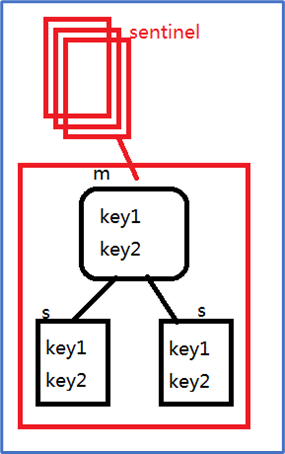

一个哨兵集群,只能维护一个数据分片的高可用结构,不能完成分布式的结构;

分布式结构如下:

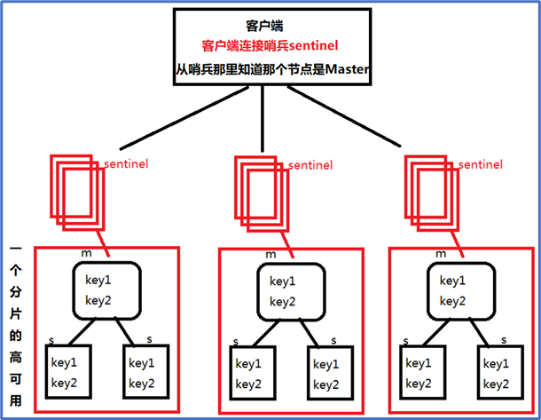

客户端连接的是哨兵，从哨兵那里知道哪个节点正在提供服务

为什么要投票?为什么过半?

哨兵监听的主从关系.是状态 ,每一次角色的变化,都由哨兵来监控--对所有的主从结构的决策都需要投票.

哨兵节点需要连接主从结构(涉及到网络通信),只有一个哨兵节点的管理结构,不可信，只有一个哨兵节点，当哨兵连接主从结构的网络异常时，会误判为主从结构的节点出问题。

所以必须引入哨兵集群，管理主从结构.毕竟超过一半的节点都误判了的几率极小;

- 集群容忍度(宕机容忍度)

哨兵集群容忍度:可以允许宕机的个数,就是集群的容忍度;

5个哨兵集群节点:为了达到过半选举至少3个节点;容忍度是2

6个哨兵集群节点:为了过半至少剩余4个节点,容忍度是2

2n-1个集群的容忍度和2n是一样的;一般过半机制的集群,选择都是奇数个;

##### cluster

Redis3.0版本出现的一个新的redis集群结构,引入了很多新的概念和逻辑.将之前学习的主从复制.哨兵监听的逻辑整合到了这个新的结构当中


- 集群节点两两互联,底层依赖二进制传输协议的,优化传输速度，内部之间传输很快.(集群的基础)
- 集群的监控监听机制,交给主节点投票(哨兵集成到了集群的主节点中),任意的主节点宕机,只要剩下的主节点满足过半.
- 客户端连接任意一个节点,都可以向集群传递命令存储和获取数据,数据会在集群内部做节点的连接跳转.
- 引入了新的分布式分片计算逻辑--hash取模(取余,CRC16()散列计算);取模结果[0,..16383],这个范围区间,称之为槽道号--hash slot，每个master负责管理一批槽道号，由于槽道的存在,key值做hash取模运算,根据key的取模结果判断是否归哪个节点管理,从而做到了解耦,key和节点的解耦key--slot--node.

redis 集群计算 key 的办法 [参考](https://segmentfault.com/a/1190000018094567?utm_source=tag-newest) 即对 key 做 CRC16 然后对 16384 取模。

Redis之间进行数据交换的时候消息头所占空间为CLUSTER_SLOTS/8，

也就是16384÷8÷1024=2kb

Redis Cluster要求一个集群最少需要3个主节点(最少的集群容忍度1,3个才能容忍宕一个),由于槽道的限制,理论上最多16384(官方版本提示1000节点左右)


每一个主节点都可以具备槽道管理权,也可以不具备槽道管理权(只具备投票权利)

- 计算CRC16()%16384,得到的整数，如何判断是否为当前节点的管理范围
- 如果不是当前节点管理的槽道范围,如何知道正确的槽道管理者是谁


根据后缀文件，两种redis的持久化策略对比

| rdb                                                      | aof                                                          |
| -------------------------------------------------------- | ------------------------------------------------------------ |
| 使用dump.rdb为默认的持久化文件,存储的是数据内容key-value | 一种追加模式的日志文件，存储的是命令的日志                   |
| 可以一次性存储多条数据(执行效率高)                       | 默认每秒同步执行的写命令(执行效率低)                         |
| save时间间隔长,对数据的备份能力要求高时不推荐使用rdb     | 备份数据时间比较短,最多最多,在极大的高并发先只会丢失1-2秒的数据 |
| 一次性存储数据过大时,有可能造成阻塞,影响使用             | 细水长流                                                     |
| 数据量并发少的时候rdb性能更高                            | 数据量并发到达一定程度aof反而性能高于rdb                     |


如果同时开启aof和rdb,aof优先级高于rdb;重启之后最先加载了

##### 槽道

槽道的组成部分：

- 16384位的二进制,本质上一个2048个元素的byte数组（1个8位，8*2048=16384）;通过对二进制的计算,获取(自定义的)下标,下标正好对应的槽道号,每个维护槽道的节点都会存储这样一个二进制的值,管理的和不管理的槽道号都会在二进制中体现,管理的槽道号对应的二进制值是 "1"/true,不管理的就是"0"/false,当一个key值传递到节点上做hash取模计算之后得到的0-16383的整数,到二进制判断结果1/0
- 16384个元素的数组,数组的元素值是一个引用的变量,该变量指向内存中保存的集群所有节点的信息的对象数据,每个节点都维护了一个完全一样的数组对象,只要判断槽道所属权是false将会调用这个数组的元素值(利用数组下标 0-16383),元素值的意义就是下标对应槽道号的管理节点信息的引用对象


二进制的值的特点**:**

主节点: 有槽道管理权的主节点,各自二进制不相同,自己管理的槽道的二进制是1,不是自己管理的槽道的二进制全是0;没有槽道管理权的节点.二进制值是16384位都是0

从节点:从节点没有槽道管理权，由于它备份了主节点的位序列，在key的槽道号计算完毕后,直接到索引数组中获取节点信息

创建集群时将该主节点管理的槽道号对应的二进制值从0变成1


索引数组/共享数组

节点相互握手的过程中,每个节点都会记录集群的所有节点的信息对象


创建集群时,需要节点与节点进行握手meet,一旦meet成功相当于把对方的信息对象(ip,id,port,ms关系,time)抓取到了自己的内存管理保存

对槽道的相关操作,会在每个节点中的数组对象里保存一个引用值


集群最终创建完毕之后,每个节点内的数组结构


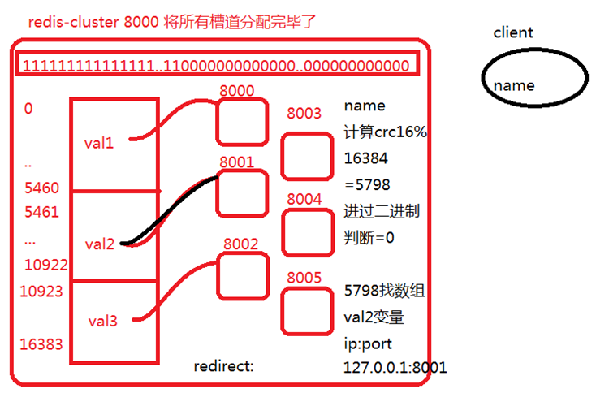

数组中每一个下标对应的都是槽道号,对应元素内容,除了有管理槽道的节点的对象引用外,还有其他数据(key值的对应关系)

#### Ruby

##### 安装

安装，先搞个 `tar.gz` 包解压到 `/usr/local`(其他路径最后 gem 会炸)，然后：

```
./configure
make && make install
```

查看版本：

```sh
ruby -v
```

安装 redis 接口：

```sh
gem install redis
```


#### 实例

##### 一主二从

复制上文 配置-基本 配好的一个 `redis.conf`，复制三份，批量换关键字，端口全改了(可能是6个关键字)。如端口改为 6382-6384。

默认情况下，所有的节点都是master。故从节点添加：(主节点ip和端口号)

```properties
slaveof 192.168.126.128 6382
```

启动各redis，`redis-server redis638x.conf`。CLI 登进各个去查看信息：

```redis
info replication
```

测试主节点写数据，然后主从都查数据，发现查到一样。从节点无权写数据。如果从节点能写(多级主从)，需要设置：

```properties
slave-read-only no
```

如果主节点宕机(如直接执行 shutdown)，则从节点不会变成主节点，什么也不做，只实现数据备份

##### 哨兵集群

根目录找到 `sentinel.conf` 哨兵模板配置文件，复制三份，修改：

- 保持注释 `# bind 127.0.0.1 192.168.1.1`

- 修改 `protected-mode no`

- 端口号 `port 26379` (其余两个为 `26380,26381`)是唯一哨兵间不同的地方

- 监听 `sentinel monitor mymaster 192.168.126.128 6382 2` (IP和端口根据上文)

  mymaster 自定义的名称,表示当前哨兵监听的一个主从结构的代号,也是其他哨兵判断是否是同一个集群的依据

  2 表示主观下限票数, 当集群哨兵不断宕机之后,最少剩下的节点数量

启动三个哨兵节点，每个用一个窗口，看日志信息：

```sh
redis-sentinel sentinel01.conf
```

查看输出，发现每个哨兵启动时，别的哨兵能马上监听到

如果Down掉其中一个哨兵节点。剩下两个也够投票

这时候关掉 master(6382)，经过一会儿，发现重新选举了一个主节点，如 6384

主节点一旦恢复,重新添加到集群以从节点角色继续提供服务。

查看哨兵的 conf，会发现自动追加了新东西，开头为：

```properties
# Generated by CONFIG REWRITE
```

如果主节点换掉了，上文的监听 sentinel monitor 也会自动改。

因此，每次重启哨兵节点的话，需要清理掉自动追加的内容，将监听端口号手动改回去。

一些信息解释


sentinel current-epoch 的作用：当 slave A 发现其所属的 master 下线时，就会试图发起故障转移流程。首先就是增加 current-epoch的值，这个增加后的 current-epoch的值是所有集群节点中最大的。然后slave A 向所有节点发起拉票请求，请求其他 节点投票给自己，使自己能成为新的 master。其他节点收到包后，发现发送者的 current-epoch比自己的 current-epoch 大，就会更新自己的 current-epoch，并在尚未投票的情况下，投票给 slave A，表示同意使其成为新的 master

哨兵节点开放防火墙：

```sh
firewall-cmd --query-port=26379/tcp
firewall-cmd --zone=public --add-port=26379/tcp --permanent
firewall-cmd --reload
firewall-cmd --query-port=26379/tcp
```

> 一行式子：
>
> ```sh
> firewall-cmd --query-port=26381/tcp;firewall-cmd --zone=public --add-port=26381/tcp --permanent;firewall-cmd --reload;firewall-cmd --query-port=26381/tcp
> ```

再把一主二从也开了(如果连不上)。

##### cluster

根目录配文件夹：

```sh
mkdir 8000 8001 8002 8003 8004 8005
```

复制一份根据上文 `配置-基本` 配好的 `redis.conf` 为 `redis-cluster.conf`，端口搞同一个，修改下述内容：

```properties
appendonly yes
appendfilename "appendonly6379.aof"
cluster-enabled yes
cluster-config-file nodes-6379.conf
```

将这份文件复制到上述文件夹里，端口号分别改为文件夹名

```sh
cp redis-cluster.conf 800x/
```

分别启动每个节点：

```sh
redis-server 800x/redis-cluster.conf
```

启动完后，发现无法操作任何一个 server 如 `redis-cli -p 800x` 进去不能 set

根据 `Ruby` 一节，安装好 `Ruby`，进到 `redis-3.2.11/src`，执行下面命令查看是否安装成功：

```sh
./redis-trib.rb
```

如果成功，搭建一个 3 主的结构，键入 yes：

```sh
./redis-trib.rb create 192.168.126.128:8000 192.168.126.128:8001 192.168.126.128:8002
```

现在登录 `redis-cli -c -p 8000`，键入：

```
cluster info
cluster nodes
```

信息内容解释：

| f73d56cfdcfe38e039f2e9dc97d37f494c6cba93 | 192.168.243.133:8002 | master | -                  | 0 1653911525764                                | 3    | connected | 10923-16383 |
| ---------------------------------------- | -------------------- | ------ | ------------------ | ---------------------------------------------- | ---- | --------- | ----------- |
| 节点id                                   | 节点host地址:端口    | 角色   | 节点对应的主节点id | 操作时间相关(时间戳，1970-1-1 0点到现在的秒数) | 序号 | 连接状态  | 管理槽道号  |

尝试 `set` 点什么，会先自动跳到对应的 server。

现在动态添加一个主节点，在 shell 在 `src/`

```sh
./redis-trib.rb add-node 192.168.126.128:8003 192.168.126.128:8000
```

看 `cluster nodes`，可以看到 8003 并没有获得任何槽道管理权，即不管理任何数据

挂从节点，先查询被挂主节点的 id，如 `5910513a54853005314120b4c2e1afbdf5a1ddef`，则：

```sh
./redis-trib.rb add-node --slave --master-id 5910513a54853005314120b4c2e1afbdf5a1ddef 192.168.126.128:8004 192.168.126.128:8003
```

即：以slave角色来添加8004节点，将8004节点挂接到8001（id: 5910513a54853005314120b4c2e1afbdf5a1ddef）,挂接或加入时通过8003来通知集群的其他节点

看 `cluster nodes` 检验。将主节点 8001 shutdown 掉，再次查询(需要等几秒)，发现成为了 master，取得了主节点的槽道。

再次启动主节点 8001，成为了 slave 且无槽道。

槽点转移，将 8002 的 200 个给 8003，先输入下面指令，然后依次输入① 200 和② 8003 的 id 和③ all(均分) 或 8002 的 id，④yes。

```
./redis-trib.rb reshard 192.168.126.128:8001
```

reshard不支持非空迁移(有数据的槽道),可以使用cluster集群提供的底层命令一步一步完成有数据的迁移(数据微调)

假设选了 all，发现每个 master 平均给了 60 多个槽道，否则，8002 给了 200 个

只能删除从节点或者没有槽道管理权的主节点,一旦删除,为了不影响集群使用,删除的节点自动关闭;如果删除的节点重新启动想重新添加到集群(做不到)

下面试图删除 8001，获取其 id，如：

```sh
./redis-trib.rb del-node 192.168.126.128:8001 5910513a54853005314120b4c2e1afbdf5a1ddef
```

8001不仅被删除，还被关闭，关闭的原因,是因为删除的节点不会修改配置文件node-8001.conf,8001自己以为节点启动,依然会以集群的角色出现,但是其他节点都不知道8001。

查看nodes-8001.conf，可以看到8001经过删除和关闭后，还认为自己在集群中。

尝试 up(即先 `redis-server` 再 `add-node`)，会发现 `[ERR]`。要解决，先关 8001 server，删掉根目录下述文件：

```
rm appendonly8001.aof nodes-8001.conf dump8001.rdb
```

再次启动和 add-node，发现成功。

如果集群坏了要修复，先 shutdown 或 shell kill 所有节点，然后删掉所有的持久化文件(如果是测试环境)：

```sh
rm -rf appendonly800* dump800* nodes-800*
```

启动：

```sh
redis-server 8000/redis-cluster.conf && redis-server 8001/redis-cluster.conf && redis-server 8002/redis-cluster.conf && redis-server 8003/redis-cluster.conf && redis-server 8004/redis-cluster.conf && redis-server 8005/redis-cluster.conf
```

重新搭建：

```sh
./redis-trib.rb create --replicas 1 192.168.126.128:8000 192.168.126.128:8001 192.168.126.128:8002 192.168.126.128:8003 192.168.126.128:8004 192.168.126.128:8005
```

预期看到的结果是3主3从，每个从对应不同的主。

记得开一开端口：

```sh
firewall-cmd --add-port=8000/tcp --permanent && firewall-cmd --reload && firewall-cmd --query-port=8000/tcp
```


##### 手动cluster

不借助 ruby。参考例子：

启动六个节点，通过 `redis-cli -c -p 8000 -h 192.168.126.128`，然后连五个集群：

```
cluster meet 192.168.126.128 800x
```

如果查询，会发现每个集群都没分配槽道，用一个 sh 脚本如 `8000slots.sh` 分配槽道：

```sh
for port in {0..5460};
	do redis-cli -h 192.168.126.128 -c -p 8000 cluster addslots $port;
done
```

执行：`sh 8000slots.sh`

如果权限不够，则先 `chmod u+x 8000slots.sh`，通过 `ll` 查看权限

同理，编写脚本对 8001 分配 5461-10922。8002 分配 10923-16383。

刚刚 meet 进来的都是 master。要改变某个节点为从节点，对该节点：

```
cluster replicate masterID
```

此时如果成功，在从想执行 set 就会自动跳到主

槽道迁移：(以8002 迁移 10923 给 8001 为例)

- 判断管理该槽道的节点的该槽道是否为空 \[被导出方如8002必须为空\]

  ```
  cluster getkeysinslot 槽道起始数字 槽道数量 
  ```

- 被导入方(8001)设置导入节点的id(8002)

  ```
  cluster setslot 槽道号 importing 被导出方ID
  ```

- 被导出方(8002)设置导出槽道

  ```
  cluster setslot 槽道号 migrating 被导入方ID
  ```

- 通知包括当事人的所有集群过半主节点，即过半主节点执行：

  ```
  cluster setslot 槽道号 node 被导入方ID
  ```

如果要迁移的槽道非空：

- 判断是否为空

- 被导入方执行：

  ```
  cluster setslot 槽道号 importing 被导出方
  ```

- 被导出方设置导出槽道

- 被导出方数据迁移

  ```
  migrate 被导出IP地址 被导出端口号 ""(key的匹配) 数据分区号(0-15) 超时毫秒(500) keys 键名1 键名2 ...
  ```

- 通知节点

## ElasticSearch

### 理论

> ds

#### 概念

##### 定义

Elasticsearch (ES) 是一个开源的分布式搜索和分析引擎，基于 Apache Lucene 构建。它被设计用于处理大规模数据的实时搜索和分析需求。

C/S 架构。

##### 功能

核心特性：

- 分布式架构：自动分片数据并在集群中分布
- 近实时搜索：数据几乎立即可搜
- RESTful API：通过HTTP接口进行所有操作
- 多租户支持：支持多索引并行操作
- 文档导向：存储结构化JSON文档
- 高性能：自动索引和强大的查询能力
- 可扩展性：轻松水平扩展

主要应用场景：

1. 全文搜索：网站、应用内搜索
2. 日志分析：ELK Stack (Elasticsearch, Logstash, Kibana)的核心组件
3. 数据分析：聚合和复杂分析
4. 商业智能：数据可视化和报表
5. 地理空间搜索：基于位置的数据查询

查询功能支持：

1. 全文搜索

   要对文本内容进行高效、灵活的搜索，包括模糊匹配、同义词扩展、分词查询等，并按相关性排序。

   - 支持中文分词（如"男士运动鞋"→["男士","运动鞋"]）
   - 可设置字段权重（名称比描述更重要）
   - 搜索结果按相关性自动排序

2. 半结构化数据

   数据格式不固定，包含动态字段、嵌套对象或可变结构，无需严格 Schema 定义。

   - 自动检测字段类型（如timestamp识别为date）
   - 支持嵌套对象和数组
   - 允许后期新增字段（不同于SQL需要ALTER TABLE）

3. 高扩展性和性能

   数据量巨大（TB/PB 级），要求低延迟查询和高吞吐量，能动态扩展集群。

   - 分片机制实现水平扩展
   - 倒排索引加速搜索
   - 近实时搜索（数据1秒内可查）

4. 复杂的聚合分析

   需要对大数据集进行统计分析，如分组（Group By）、计算指标（Sum/Avg）、多维钻取（Drill Down）。

   - 单次请求完成多维分析
   - 支持嵌套聚合（类似SQL的GROUP BY多字段）
   - 结果包含在查询响应中（无需额外计算）

5. 基于相关性的排序

   搜索结果不仅依赖精确匹配，还需结合多种因素（如点击率、时间衰减、个性化权重）动态排序。

   - 基础相关性（TF-IDF/BM25算法）
   - 浏览量的对数（避免热门内容完全主导）
   - 发布时间高斯衰减（新内容优先）

##### 基本概念

索引(Index)：类似数据库中的表

文档(Document)：索引中的基本单位，JSON格式

分片(Shard)：索引的子分区

副本(Replica)：分片的拷贝，提供高可用性

节点(Node)：运行中的ES实例

集群(Cluster)：一个或多个节点的集合

##### 对比SQL

适合使用SQL的情况：

- 需要复杂JOIN操作
- 严格的事务要求
- 结构化数据，固定模式
- 需要频繁更新数据

适合使用Elasticsearch的情况：

- 全文搜索需求
- 处理半结构化数据
- 需要高扩展性和性能
- 复杂的聚合分析
- 基于相关性的排序

#### 核心技术

##### 倒排索引

倒排索引 Inverted Index

> 正向索引：
>
> ```
> 文档ID → 文档内容
> 1 → "hello world"
> 2 → "hello elasticsearch"
> 3 → "hello world search"
> ```
>
> 倒排索引：
>
> ```
> 词项 → 文档ID列表
> "hello" → [1, 2, 3]
> "world" → [1, 3]
> "elasticsearch" → [2]
> "search" → [3]
> ```

1. 词项字典（Term Dictionary）
   - 包含所有文档中出现过的词项（terms）
   - 通常按字典序排序，可用二分查找加速查找
2. 倒排列表（Posting List）
   - 记录每个词项出现的文档ID列表
   - 通常还会存储：
     - 词频（Term Frequency）
     - 位置信息（Position）
     - 偏移量（Offset）

查询原理：单个词项直接查询，接近 O(1)、多词取交集、短语(相邻顺序词项)类似合并。集合运算完成复杂查询。

压缩存储：使用差值编码（Delta Encoding）压缩文档ID列表，1亿文档的倒排列表可压缩到几MB

实现优化：

1. FST（Finite State Transducer）：
   - 高效压缩词项字典
   - 内存占用比HashMap少5-10倍
2. 跳表（Skip List）：
   - 加速倒排列表的交并操作
   - 对于[1,3,20,100...]这样的有序列表，跳表可以快速跳过不符合的ID
3. Roaring Bitmaps：
   - 对文档ID集合的高效压缩存储
   - 比传统bitset节省空间

##### 分布式搜索与聚合

- Query Phase：
  - 协调节点将查询广播到相关分片，收集并合并结果（Scatter-Gather 模式）。
- Aggregation：
  - 使用 Trie 结构（如 `terms` 聚合）或 Histogram/Date Histogram 优化桶聚合。
  - 近似算法（如 `cardinality` 聚合使用 HyperLogLog++）。

##### 评分算法

早期 TF-IDF，默认现在采用更优的 BM25 算法。

- 改进的TF-IDF，考虑文档长度归一化，避免长文档的分数偏差，效果更优。

##### 分布式一致性

- 分片分配与平衡：
  - 分片（Sharding）：数据水平分割，并行处理（每个分片是独立的Lucene索引）。
  - 使用一致性哈希（Consistent Hashing）分配分片，确保数据均匀分布。
  - 动态平衡策略（如磁盘容量、负载权重）。
- 分布式聚合：基于Terms Aggregation、Histogram等算法，结合MapReduce模型在分片上并行计算。

- Zen Discovery（默认集群发现协议）：
  - 基于类 Gossip 协议管理节点状态，协调主节点选举。

##### 近实时搜索

NRT

- Refresh 机制：
  - 默认每秒刷新一次内存中的索引段（Segment），使其可被搜索（非持久化）。
- Translog（Write-Ahead Log）：
  - 写操作先记录到 Translog，确保故障恢复时的数据完整性。
- Segment 合并（Merge）：
  - 后台通过 Lucene 的 TieredMergePolicy 合并小段，优化查询性能。

##### 数据压缩

- FOR（Frame of Reference）编码：压缩数值类型（如整数）的倒排索引。
- LZ4 或 DEFLATE：压缩存储字段（`_source`）和日志。
- 前缀编码（Prefix Compression）：优化词典存储。

##### 机器学习

- k-NN搜索：通过HNSW（Hierarchical Navigable Small World）算法高效搜索向量。
- 时间序列异常检测：基于 EWMA（指数加权移动平均）或 PCA。

# 其他数据库

## SQLite

轻量级数据

### 安装使用

以 ubuntu 为例。安装：

```sh
sudo apt-get install sqlite3
```

选定一个数据库文件做存储并启动：

```sh
sqlite3 test.sqlite
sqlite3 test.db # 多种输入格式支持
```

[教程](https://www.runoob.com/sqlite/sqlite-tutorial.html)

### 配置指令

#### 指令

`.quit` 或 `.exit`

`.help`

`.tables` 

`.schema 数据表名`

`PRAGMA foreign_keys=ON;` 开启外键约束报错


`.header on` 加上显示表头

`.mode column` 使用格式化显示(否则默认是`|`分隔和`\n`换行)；默认是 list

> 假设有四列，要求每列在长度15截断：`.width 15 15 15 15`

> 参考：(假设已经 header on)
>
> before:
>
> ```
> sid|name|surname|age|gpa
> 1|Alicia|Shan|20|3.5
> ```
>
> after:
>
> ```
> sid  name    surname  age  gpa
> ---  ------  -------  ---  ---
> 1    Alicia  Shan     20   3.5
> ```

`.mode csv` 逗号格式

`.import filename tablename` 以当前 mode 读取文件到指定表格

> 如：`.import flights-small.csv FLIGHTS`

`.nullvalue NULL` 显示 null 而不是对 null 显示空格


`.read 文件名.sql` 导入 SQL 文件指令(/数据)

#### 永久化

在 `/home/用户名` 新建 `.sqliterc` 逐行增加配置内容。

### SQL指令

只描述跟一般 SQL 不一样的地方。

可以使用单双引号、反引号(`)。可以使用方括号标注列名(兼容微软语法)

group by 对非聚合值/非聚合键不会报错，其他数据库会

整数除法：`select 5/2=2`。

字符串类型转换：`select '100'+10=110`。

> #### 数据类型

#### 表达式

字符串拼接，如 `name || ',' || score`。

> #### 函数

## PostgreSQL

### 基本

#### 安装使用

[参考 多平台安装教程](https://s3.us-west-2.amazonaws.com/ucsd.dsc100/guides/Setting+Up+PostgreSQL.pdf)

安装：

```sh
sudo apt-get update
sudo apt-get install postgresql posgresql-contrib
```

启动：

```sh
sudo service postgresql start
```

以用户 postgres 身份启动 psql：

```sh
sudo -u postgres psql
```

> ```sh
> sudo su
> su - postgres
> psql
> ```

指定数据库：

```sh
sudo -u postgres psql -U postgres -d 数据库名
```

默认端口 5432

图形化界面(pgadmin) [官网](https://www.pgadmin.org/)

### 命令

#### 基本

`\q` 退出

`\?` 帮助 或 `\h 指令` 如 `\h SELECT`

`\dt` 列出数据表)(也可 `\dt 表名` 看存在性)

`\conninfo` 查看当前连接的是哪个数据库

`\c 数据库名` 切换数据库

`\d 表名` 查看表信息

`\l` 列出所有数据库 (`\list`)

`\g` 或 `;` 执行前一个命令

`\s` 显示命令历史

`\e` 文本编辑器打开上一条命令，编辑后可以再次执行

`\i 路径` 执行该路径 SQL 脚本命令

`\timing on` 显示语句执行所花费的时间

#### SQL

删除级联：`drop table 数据表名 cascade`

#### 功能函数

having 聚合：`bool_and` 所有组内满足表达式且非 null 返回 true，否则 false

filter 子句：对聚合函数进行条件过滤

```sql
SELECT product_id,
       SUM(sales_amount) AS total_sales,
       SUM(sales_amount) FILTER (WHERE is_promotion = TRUE) AS promotion_sales
FROM sales
GROUP BY product_id;
```


#### 导入

##### sql

要导入的 `.sql` 放到诸如 `/tmp` 这样的目录，否则可能即便 `chmod 777` 了还是没法导，导之前要 create 对应的数据库

```sh
sudo -u postgres psql -d 数据库名 -f 完整文件路径
```

##### csv

[参考](https://stackoverflow.com/questions/2987433/how-to-import-csv-file-data-into-a-postgresql-table)

`copy 数据表 from '路径' with (format csv, header)` 如果第一行是数据，省去 `,header`，如果分割符不是逗号，使用 `delimiter 'xxx'` 代替

或者使用 `\copy`

### 数据类型

int

serial 自动递增的整数列从 1 开始。

boolean

varchar

## Oracle

> 研究生当助教实验课内容

### 安装与介绍

> 师兄说不推荐安装，会让自己电脑越来越卡，建议找个生产环境什么的去装

下载服务器 Oracle Database Express Edition (XE)  [here](https://www.oracle.com/database/technologies/xe-downloads.html)

> 第一个商用关系数据库管理系统，是使用最广泛的商业 DBMS 之一

安装结束，自动运行，遇到什么问题百度解决。没运行的话去服务里启动一下。

自带叫 SQL*Plus 的命令行工具作为客户端执行操作。

Oracle 使用 PL/SQL

> [PL/SQL](https://baike.baidu.com/item/PL%2FSQL/8564979)也是一种[程序语言](https://baike.baidu.com/item/程序语言/10696489)，叫做过程化[SQL](https://baike.baidu.com/item/SQL语言/4801972)[语言](https://baike.baidu.com/item/SQL语言/4801972)（Procedural Language/SQL）。PL/SQL是[Oracle](https://baike.baidu.com/item/Oracle数据库/3710800)[数据库](https://baike.baidu.com/item/Oracle数据库/3710800)对SQL语句的扩展。在普通SQL语句的使用上增加了编程语言的特点，所以PL/SQL把数据操作和查询语句组织在PL/SQL代码的过程性单元中，通过逻辑判断、循环等操作实现复杂的功能或者计算

Oracle SQL Developer 是图形化的客户端。[下载](https://www.oracle.com/tools/downloads/sqldev-downloads.html)

默认配置一般不用修改，如果要的话自行查百度修改。导航栏绿色+号连接到服务器。用户名sys，即安装时输入了密码的那个用户名。test是测试连接但不连进去。

可以调字体大小，工具首选项代码编辑器字体。

可以拖拽sql文件到工作区执行，其他所见即所得很简单不用多介绍。

### 语法

这里讲区别于 MySQL / SQL 的部分。

#### 基础语法

##### 通用

创建表格不能用 `if exists` 语法(mysql专用)，但是 exist 时会报错，会继续执行下去(即忽略create若存在)。

同目录下的文件可以直接调用，如有文件名 `abc.sql`，执行代码 `@abc` 就可以执行这个文件的全部代码。类似 python exec。文件名不区分大小写。

新建用户，用户名以 `C##` 或 `c##` 开头 [参见]([https://docs.oracle.com/database/121/SQLRF/statements_8003.htm#SQLRF01503](https://docs.oracle.com/database/121/SQLRF/statements_8003.htm) ) [权限组]([https://www.cnblogs.com/yank/p/5088621.html ](https://www.cnblogs.com/yank/p/5088621.html))

> 由于 Oracle 数据库总是在 char 类型的属性值后面加上与字符串长度相同的尾部空格，因此可以使用 rtrim 函数删除这些尾部空格。将 char 类型的属性值与正则表达式进行比较时需要使用该函数。（课件
>
> (试验 length 发现长度还是正确的)，已知 length 会统计空格

##### select

仅表达与 mysql 不同的部分：

单引号文本，dual 是用来专门执行类似 print 输出常量的库。

```sql
select '文本' from dual -- mysql 的话不用 from dual且mysql单双引号都行
-- 也可以是表达式如 select 3*4 from dual; select 1 from dual;
```

`||` 运算符连接两列(mysql没有)

as 列别名只能双引号，不能单引号或反引号(mysql 可以)

对字符串，where `=` 区分大小写 (mysql一般情况不区分大小写)

`regexp_like(列名, 表达式)` 如：(对应 mysql regexp) [ref](https://docs.oracle.com/cd/B12037_01/server.101/b10759/ap_posix001.htm#i690819) [refeg](https://www.salvis.com/blog/2018/09/28/regular-expressions-sql-examples) [在线测试PCRE选项](https://www.regextester.com/) [regexp](https://www.cnblogs.com/lxl57610/p/8227599.html)

```sql
select * from Student
where regexp_like(lastName, '([aeiou])\1', 'i');
```

> [] : 表示目标字符可以是其内部任意一个
>
> （）： 圈起一个子表达式，其作用跟算术加减乘除表达式中的括号一样
>
> \1: 表示目标字符要连续出现 2次。 ‘i’：表达不区分大小写；3次就 \1\1
>
> 也可以将\1替换为{n}表示目标字符要连续出现n次。

支持 full outer join

##### 函数

注意要点： substr 1-indexed

initcap(str) 去除开头空格，每个单词首字母大写其他小写；mysql 没有该函数

根据运行结果，课件字符串函数5 Note 疑似不对

power 精度良好，2^64 准确的，而 mysql 不准确

trunc(a, n) a保留小数n位不四舍五入 (当然也有 round)

date 的推荐格式 date 'yyyy-mm-dd' 来强转；不然标准格式是 `dd-mm月-yyyy`很不符合国内写法。注意课件的 JAN 英文缩写不行。

ADD_MONTHS(date, number) 在给定日期 `date` 上增加 `number` 个月后的日期；mysql 没有该函数，注意日期输出格式是日月年，具体见下面的代码

NEXT_DAY(date, weekday)

```sql
SELECT ADD_MONTHS(DATE '2023-01-15', 2) from dual;
SELECT NEXT_DAY(DATE '2024-11-12', 2) FROM dual;
-- 下周一 （1是周日，2是周一，以此类推，可以1-7
-- 要么就写成 '星期日' / 一到六，同理不能写英文的
select next_day('05-10月-20', 2);
```

current_date  mysql 要 ()

to_date 感觉不如 date 简写(见上)

```sql
select to_date('2020-03-23', 'yyyy-mm-dd') from dual;
```

返回纯数字字符串，没有月，JAN 之类的：

```sql
select to_char(date '2024-11-23', 'yyyy/mm/dd') from dual; -- 2024/11/23
```

stddev 是样本方差(分母n-1)，等价于 stddev_samp。

stddev_pop 是总体偏差(分母n) 对 mysql 使用 std

##### 数据库更改

alter table xxx add (x int) 的括号不加也行，但mysql不加

可以有下面的例子，但mysql不行：

```sql
alter table t1 modify managerid references m1(mid) on delete cascade;
```


#### 配置语法

```sql
set feedback off -- 不显示执行结果输出(如成功插入) 反义词on是默认
-- 即抑制显示 SELECT、DELETE、UPDATE 或 INSERT 语句处理的记录数
set heading off -- 不显示表格表头 反义词on默认
clear screen  -- 清空输出窗口
set linesize 150;
```

### PL/SQL

#### 介绍

Procedural Language/SQL, 即过程化SQL语言

- 过程 procedure ： 不返回值
- 函数 function ：通过 **return** 关键字返回一个值

特点：

- 不区分大小写

  > 创建存储过程时使用了双引号（例如 `"Lab6CgaCalculationsSolution"`），那么名称将变为区分大小写，必须严格按照定义时的大小写来调用。
  >
  > 如果没有使用双引号，存储过程名称将被视为大写。

- 使用 C 风格注释 `/* */`

- 使用 := 运算符给变量赋值

- 使用 = 运算符进行比较

块 block是Oracle PL/SQL中的基本处理单元，使用begin…end来界定

允许的 SQL 语句: select, insert, update, delete (即 DML 语句)

不允许的 SQL 语句: create, drop, alter, rename (即 DDL 语句)

基本结构：

- create or replace procedure procedure_name [ as | is ]

  声明部分: 在此部分声明变量、类型和本地子程序

  可以在 name 后 as 前添加诸如：(不区分大小写)

  ```sql
  create or replace procedure Lab6CgaCalculationsSolution authId current_user as
  ```

  `authId` 表示存储过程将使用的权限标识。

  `current_user` 是一个动态值，意味着存储过程将以当前用户的身份执行

- begin	可执行部分: 在此部分编写过程化和 SQL 语句。此部分是块中唯一必须存在的部分

- exception	异常处理部分: 在此部分编写错误处理语句

- end;

例子参见下文 select-into

#### 使用

##### 常规

在 “连接”（ Connections ）导航窗格中,

右键单击 “过程”（ Procedures ）或 “函数”（ Functions ）节点

在上下文菜单中选择 “新建过程……”（ New Procedure…）或 “新建函数……”（ New Function…）

“创建过程”（ Create Procedure ）对话框中，

为该过程输入一个名称（例如，“课程注册报告”（CourseEnrollmentReport））

通过单击 + 符号来添加参数，并指定参数的名称、模式、数据类型，可能的话还需指定参数的默认值，以此来指定所有参数；(不填也行那就自己打)

单击 “确定”（ OK ）按钮

过程的名称必须与最终 **END** 语句中的名称完全匹配

工具栏：先编译，后执行

debug：还需要对计算机的防火墙进行配置，以允许来自 **SQL Developer** 的传入连接

在代码中执行：

```sql
exec 名字;
```

如：

```sql
exec Lab7DuplicateEmailCheck;
```


##### 断点

工具-首选项-debugger(调试器)-勾选数据库调试协议的三个√ (主机提示，端口范围，死锁)

点击debug，调试运行

#### 声明变量

[src](http://docs.oracle.com/cd/A97630_01/appdev.920/a96624/02_funds.htm)

数据类型：

- SQL 基本类型 (如, number, int, char, varchar2, date, 等等) 
- 与表的属性类型相同(table_name.attribute_name%type) 或者 与表的一行（记录）类型相同(table_name%rowtype).

```sql
count number; -- 声明 count 为基本类型 number 的变量：
projectors Facility.numberProjectors%type; -- 声明 projectors 为与 Facility 表中 numberProjectors 属性相同类型的变量
facilityRecord Facility%rowtype; -- 声明 facilityRecord 为与 Facility 表的一行（记录）相同类型的变量：
i	Testloop.testValue%type := 1; -- i is of type testValue and is initialized to 1
```

#### select into

select-into 语句必须最多从一个表中检索最多一条记录one 
（也就是说，不能在 select-into 语句中使用连接 join操作）

```sql
create or replace procedure ExtractMathRecords as
    -- deptName与Department表中的departmentName具有相同类型
    deptName	Department.departmentName%type;
    -- deptRoom与Department表中的roomNo具有相同类型
    deptRoom	Department.roomNo%type;
begin
    select departmentName, roomNo into deptName, deptRoom from Department where departmentId='MATH';
    insert into MathDept values (deptName, deptRoom);
end;
```

nDepartment表中 departmentName和 roomNo属性的值通过 **select**语句分别赋给了**PL/SQL**变量 deptName和  deptRoom

因为 **select**语句的结果始终是一个表，即便该表只包含一个值也是如此

> 所以不能这样写
>
> ```sql
> room := select roomNo from Department where departmentId='COMP';
> ```


#### 控制语句

[src](http://docs.oracle.com/cd/A97630_01/appdev.920/a96624/04_struc.htm)


##### if

if-then, if-then-else, if-then-elseif  -- end if;

如果 COMP 部门的房间号是以 3 开头的，那么这个过程会给该房间号加上 1000。如果房间号不是以 3 开头的，那么房间号会被设置为 5528

```sql
create or replace procedure IncrementRoomNumber as
	room	Department.roomNo%type; -- room is of type roomNo
begin
    select roomNo into room from Department where departmentId='COMP';
    if (room>3000 and room<4000) then
        update Department set roomNo=room+1000 where departmentId='COMP';
    else
        update Department set roomNo=5528 where departmentId='COMP';
    end if;
end;
```

##### loop

可以通过 **exit**或者 **exit when**关键字来终止循环**loop**。将值 1 到 10 插入

```sql
create or replace procedure LoopTest as
    i	Testloop.testValue%type := 1; -- i is of type testValue and is initialized to 1
begin
    loop
        insert into Testloop values (i);
        i := i + 1;
        exit when i > 10;
    end loop;
end;
```

label 双尖括号，一般用于跳出多重循环

```sql
create or replace procedure LoopTest as
    i	Testloop.testValue%type := 1; 
begin
	<<myLoop>>
    loop
        insert into Testloop values (i);
        i := i + 1;
        exit myLoop when i > 10;
    end loop;
end;
```

##### for

在这个示例中， **for-loop** 的作用类似于 **for-each-loop** ，在 **for-loop**的每次迭代中，变量 var 都会被赋值为 **select** 语句结果中的下一条记录

```sql
create or replace procedure IncrementProjectors as
	i	number(2) := 1;
begin
    for var in (select * from Facility order by departmentId) loop
        update Facility set numberComputers = numberComputers + 1 where departmentId=var.departmentId;
        i := i + 1;
    end loop;
end;
```

详见下文游标一节。

#### 游标

##### 定义

[src](http://www.techonthenet.com/oracle/cursors/)

如果 select 语句返回多个记录，就需要使用游标（ cursor ）逐条处理结果记录

游标cursor就像一个指针，指向 select 语句结果中的单个记录。

当与 for-loop 循环语句一起使用时，游标cursor会逐条遍历结果记录，从而允许访问并操作记录中的值。

```sql
cursor cursor_name is select_statement; -- 声明格式
```

声明一个游标，用于检索 Facility 表中的所有记录：

```sql
cursor facilityCursor is select * from Facility;
```

##### 显式游标

- 通过 open 命令激活
- 使用 fetch 命令逐一条记录地提取记录。
- 当所有记录都已提取完时，状态 %notfound 返回 true。
- 需要使用 close 命令关闭，以便释放资源。

##### 隐式游标

通过 for-loop 循环语句激活。

游标名称 cursor_name 替代了范围限定，因此循环的范围是从游标指向的第一条记录到最后一条记录。

如：使用了一个 **for-loop** 循环，它会自动打开游标，当游标中不再有记录时退出循环，并关闭游标

```sql
create or replace procedure InsertExample as
    varDeptId	Facility.departmentId%type;
    varComputers 	Facility.numberComputers%type;
    cursor facilityCursor is select departmentId, numberComputers from Facility; 
begin
    for record in facilityCursor loop
        varDeptId := record.departmentId;
        varComputers := record.numberComputers;
        insert into ResultTable values (varDeptId, varComputers);
    end loop;
end;
```

- 变量 record 的数据类型为 rowtype，但无需对其进行声明。
- for-loop 循环内的代码会针对游标中的每一行执行一次，并且每次都会将 departmentId 和 departmentName 这两个属性复制到 record 中。
- 可以直接访问 record 中的数据（如代码中所示）。
- 一旦获取完游标中的所有记录， for-loop 循环就会自动终止。
- 随后游标会自动关闭。

##### 游标状态

游标状态可能的值如下 （游标状态只能用于显式游标）

- 判断上一次提取操作是否失败cursor_name%notfound
- 判断上一次提取操作是否成功cursor_name%found
- 确定截至目前已提取的记录数量cursor_name%rowcount
- 判断游标是否仍处于打开状态cursor_name%isopen

如：facilityCursor 游标从 Facility 表中检索记录，并将这些记录的值逐个插入到另一个名为 ResultTable 的表中

```sql
create or replace procedure InsertExample as
    varDeptId	Facility.departmentId%type;
    varComputers 	Facility.numberComputers%type;
    cursor facilityCursor is select departmentId, numberComputers from Facility; 
begin
    open facilityCursor;
    loop
        fetch facilityCursor into varDeptId, varComputers;
        exit when facilityCursor%notfound;
        insert into ResultTable values (varDeptId, varComputers);
    end loop;
    close facilityCursor;
end;
```

##### 异常

[参考](http://docs.oracle.com/cd/B10501_01/appdev.920/a96624/07_errs.htm)，有预定义的错误，也可以用户自定义。

```sql
raise 错误名;
```

在某个代码块(begin end，类似于多一个 {})，添加异常处理：

```sh
exception
    when myException then
        ...
```

在声明部分要写异常类型：

```sql
myException exception;
```

整体：

```sql
myException exception;
begin
    begin
    	if condition then
    		raise myException;
    	endif;
    	exeption
    		when myException then
    			...
    end;
end;
```

```sql
declare
  peRatio number(3,1);
begin
    delete from stats where symbol = 'xyz';
    begin -- sub-block begins
    -- The select statement will throw an exception if nvl(earnings, 0) is zero
    	select price / nvl(earnings, 0) into peRatio from stocks where symbol = 'xyz';
    exception
        when zero_divide then
        	peRatio := 0;
    end; -- sub-block ends
    insert into stats (symbol, ratio) values ('xyz', peRatio);
exception
    when others then
end;
```

#### 调试输出

```sql
dbms_output.put_line('### Tried to insert duplicate email into the Student table.');
```


#### 例子

```sql
create or replace procedure Lab6CgaCalculationsSolution authId current_user as
    /* DECLARATION SECTION */
	currentStudentId            Student.studentId%type;
    honoursCga                  constant Student.cga%type := 3.5;
    studentLowCga               constant Student.cga%type := 2;
	studentCga                  Student.cga%type := 0;
    gradePoint                  number := 0;
    
    /* TODO: Declare any additional variables needed for the cga calculation */
	courseCredits               Course.credits%type := 0;
    sumCredits                  Course.credits%type := 0;
    sumCreditsTimesGradePoint   number := 0;
	
	-- Declare the cursors for the Student and EnrollsIn tables
	cursor studentCursor is select * from Student;
    
	/* TODO: Replace the declaration of the enrollsInCursor so as to retrieve
             the EnrollsIn records for the current student in the studentCursor */
	cursor enrollsInCursor is select courseId, grade from EnrollsIn where studentId=currentStudentId;
begin
    -- Reset the Student and LowCga database tables to facilitate testing
    update Student set cga = null;
    delete from LowCga;
   -- Process each Student record
   -- The cursor studentCursor points at the current student record
    for studentRecord in studentCursor loop
        currentStudentId := studentRecord.studentId;
        /* TODO: Reset the variables used to calculate a student's cga */
        sumCredits := 0;
        sumCreditsTimesGradePoint := 0;
        
        -- Process each EnrollsIn record of the current student
        -- The cursor enrollsInCursor points at an EnrollsIn record for the current student
        for enrollsInRecord in enrollsInCursor loop		
            -- Determine the grade point from the course grade
            gradePoint := greatest((enrollsInRecord.grade / 20) - 1, 0);
            
            /* TODO: Get the credits for the current enrollsInRecord */
            select credits into courseCredits from Course where courseId=enrollsInRecord.courseId;
            
            /* TODO: Collect the data needed to calculate the current student's cga */
            sumCredits := sumCredits + courseCredits;
            sumCreditsTimesGradePoint := sumCreditsTimesGradePoint + courseCredits * gradePoint;

        end loop; -- For processing each EnrollsIn record of the current student
        
        /* TODO: Calculate the current student's cga */
        studentCga := sumCreditsTimesGradePoint / sumCredits;
        
        /* TODO: Update the current student's cga in his/her Student record */
        update Student set cga=studentCga where studentId=currentStudentId;
		
        -- Output honours message if needed
        if studentCga >= honoursCga then
            dbms_output.put_line('>>> ' || studentRecord.firstName || ' ' || studentRecord.lastName || 
                ' (' || currentStudentId || ') with cga=' || studentCga || ' is an honours Student.');
        end if;
            
        /* TODO: Insert the current student record into the LowCga table if his/her cga is less than or equal to 2 */
        if studentCga <= studentLowCga then
            insert into Lowcga select * from Student where studentId=currentStudentId;
        end if;
    end loop; -- For processing each Student record
end Lab6CgaCalculationsSolution;
```

```sql
create or replace procedure Lab7DuplicateEmailCheck authid current_user as 
/* TODO: Check whether a unique index exists on the email attribute of the Student table */
begin
	/* Insert a record with a duplicate email */
	insert into Student values ('26189999', 'Duplicate', 'Email', 'bsbuffet', '29566035', null, 'BUS', '2017');
exception
    /* Output a message if a duplicate email exception is raised */
	when DUP_VAL_ON_INDEX then
		dbms_output.put_line('### Tried to insert duplicate email into the Student table.');
end Lab7DuplicateEmailCheck;
```

```sql
create or replace procedure Lab7CgaCalculations authid current_user as 
    /* DECLARATION SECTION */
    currentStudentId            Student.studentId%type;
	honoursCga                  Student.cga%type := 3.5;
	studentLowCga               Student.cga%type := 2;
	studentCga                  Student.cga%type := 0;
    gradePoint                  number := 0;
    -- Declare any additional variables needed for the CGA calculation
    courseCredits               Course.credits%type := 0;
	sumCredits                  Course.credits%type := 0;
	sumCreditsTimesGradePoint   number := 0;
    
    /* TODO: Declare any user exceptions */
	honoursStudent exception; 
	
	-- Declare the cursors for the Student and EnrollsIn tables
	cursor studentCursor is select studentId, firstName, lastName from Student;
	cursor enrollsInCursor is select courseId, grade from EnrollsIn where studentId=currentStudentId;
begin
    -- Reset the Student and LowCga database tables to facilitate testing
    update Student set cga = null;
    delete from LowCga;
    -- Process each Student record
    -- The cursor studentCursor points at the current student record
    for studentRecord in studentCursor loop
        currentStudentId := studentRecord.studentId;
        -- Reset the variables used to calculate a student's cga
        sumCredits := 0;
        sumCreditsTimesGradePoint := 0;		
        -- Process each EnrollsIn record of the current student
        -- The cursor enrollsInCursor points at an EnrollsIn record for the current student
        for enrollsInRecord in enrollsInCursor loop		
            -- Determine the grade point from the course grade
            gradePoint := greatest((enrollsInRecord.grade / 20) - 1, 0);
            -- Get the credits for the current enrollsInRecord
            select credits into courseCredits from Course where courseId=enrollsInRecord.courseId;				
            -- Collect the data needed to calculate the current student's cga
            sumCredits := sumCredits + courseCredits;
            sumCreditsTimesGradePoint := sumCreditsTimesGradePoint + courseCredits * gradePoint;
        end loop; -- For processing each EnrollsIn record of the current student
        begin
            -- Calculate the current student's cga - throws a divide-by-zero exception if there are no EnrollsIn records
            studentCga := sumCreditsTimesGradePoint / sumCredits;
            -- Update the current student's cga in his/her Student record
            update Student set cga=studentCga where studentId=currentStudentId;
            
            /* TODO: Raise honours student exception */
            if studentCga >= honoursCga then
                raise honoursStudent;
            end if;			
            -- Insert the current student record into the LowCga table if his/her cga is less than or equal to 2
            if studentCga <= studentLowCga then
                insert into LowCga select * from Student where studentId=currentStudentId;
                
                /* TODO: Output low cga message */
                dbms_output.put_line('*** Low CGA alert for ' || studentRecord.firstName || ' ' 
                    || studentRecord.lastName || ' (' || currentStudentId || ') with CGA=' || studentCga || '.');
            end if;

        /* EXCEPTION HANDLING SECTION */
        exception
            /* TODO: Handle divide-by-zero exception */
            when zero_divide then
                dbms_output.put_line('### ' || studentRecord.firstName || ' ' || studentRecord.lastName || 
                    ' (' || currentStudentId || ') is not enrolled in any course.');

            /* TODO: Handle honours student exception */
            when honoursStudent then
                dbms_output.put_line('>>> ' || studentRecord.firstName || ' ' || studentRecord.lastName || 
                    ' (' || currentStudentId || ') with CGA=' || studentCga || ' is an honours student.');
        end;
    end loop; -- For processing each Student record
end Lab7CgaCalculations;
```


# Docker

## 理论

[教程](https://yeasy.gitbook.io/docker_practice/basic_concept/image)

### 基本概念

docker类似于轻量虚拟机，可以用于将一台机子部署的东西快速迁移到别的机子


**镜像** Image 类似于 root 文件系统。是一个特殊的文件系统，除了提供容器运行时所需的程序、库、资源、配置等文件外，还包含了一些为运行时准备的一些配置参数（如匿名卷、环境变量、用户等）。镜像 **不包含** 任何动态数据，其内容在构建之后也不会被改变。

镜像构建时，会一层层构建，前一层是后一层的基础。每一层构建完就不会再发生改变，后一层上的任何改变只发生在自己这一层。

> 因此，在构建镜像的时候，需要额外小心，每一层尽量只包含该层需要添加的东西，任何额外的东西应该在该层构建结束前清理掉。


**容器** Container 。容器是镜像的实例。镜像是静态的定义，容器是镜像运行时的实体。容器可以被创建、启动、停止、删除、暂停等。

容器的实质是进程，但与直接在宿主执行的进程不同，容器进程运行于属于自己的独立的命名空间。因此容器可以拥有自己的 `root` 文件系统、自己的网络配置、自己的进程空间，甚至自己的用户 ID 空间。容器内的进程是运行在一个隔离的环境里，使用起来，就好像是在一个独立于宿主的系统下操作一样

> 容器不应该向其存储层内写入任何数据，容器存储层要保持无状态化。所有的文件写入操作，都应该使用 数据卷（Volume、或者 绑定宿主目录，在这些位置的读写会跳过容器存储层，直接对宿主（或网络存储）发生读写，其性能和稳定性更

一个 **Docker Registry** 中可以包含多个 **仓库**（`Repository`）；每个仓库可以包含多个 **标签**（`Tag`）；每个标签对应一个镜像。通过 `<仓库名>:<标签>` 的格式来指定具体是这个软件哪个版本的镜像。如果不给出标签，将以 `latest` 作为默认标签

> 仓库名经常以 *两段式路径* 形式出现，比如 `jwilder/nginx-proxy`，前者往往意味着 Docker Registry 多用户环境下的用户名，后者则往往是对应的软件名


## 使用

### 安装

#### windows 10

##### docker安装

建议先下载高速下载工具， winget [下载链接](https://www.microsoft.com/zh-cn/p/app-installer/9nblggh4nns1?rtc=1#activetab=pivot:overviewtab) 或者可以用我自己的备份[下载docker](https://cloud.socoding.cn/s/KZ1Tb)

然后在 cmd 键入指令：

```bash
winget install Docker.DockerDesktop
```

> 也可以 `-i` 指定交互界面安装，可以 `-l 路径` 指定安装目录，但是 docker 不支持
>
> 下载路径根据输出内容发现为： `C:\Users\lr580\AppData\Local\Temp\WinGet` ，装完好会自己删包

可能需要输入一次 `y` 

之后建议重启电脑一次


##### hyper-v安装

> 这一步可能是不需要的

然后安装 hyper-v，在管理员下执行该脚本：

```bat
pushd "%~dp0"

dir /b %SystemRoot%\servicing\Packages\*Hyper-V*.mum >hyper-v.txt

for /f %%i in ('findstr /i . hyper-v.txt 2^>nul') do dism /online /norestart /add-package:"%SystemRoot%\servicing\Packages\%%i"

del hyper-v.txt

Dism /online /enable-feature /featurename:Microsoft-Hyper-V-All /LimitAccess /ALL
```

然后重启电脑


##### 迁移到D盘

[教程对标](https://www.cnblogs.com/renguanyu/p/15201827.html) [备用对标教程](https://blog.csdn.net/jxl15680701016/article/details/106925002/)

因为默认安装在 C 盘，所以接下来考虑迁移走 C 盘：

首先在任务管理器关闭所有 Docker 前缀的进程

然后控制面板里搜索管理工具，点击Hyper-v管理器，点击仅有的一台，点停止服务，点 Hyper-v 设置


在管理员下，逐个剪切路径到另一个路径，然后执行下述命令：(后者路径仅供参考)

```sh
mklink /j "C:\ProgramData\Docker" "D:\Temps\docker\DockerData"
mklink /j "C:\ProgramData\DockerDesktop" "D:\Temps\docker\DockerDesktop"
mklink /j "C:\Program Files\Docker" "D:\Temps\docker\Docker"
mklink /j "C:\Users\lr580\AppData\Local\Docker" "D:\Users\lr580\AppData\Local\Docker"
```

> 如果重装时 `For security reasons C:\ProgramData\DockerDesktop cannot bea symlink`，则撤销：
>
> ```sh
> rmdir "C:\ProgramData\Docker"
> rmdir "C:\ProgramData\DockerDesktop"
> rmdir "C:\Program Files\Docker"
> rmdir "C:\Users\lr580\AppData\Local\Docker"
> ```

当且仅当在 C 盘对应位置能看到快捷图标然后点进去可以时，证明迁移成功，此时可以打开dockerdesktop。

验收标准：打开Docker Desktop正常，不会闪退(可能会要求安装WSL2)


##### WSL安装升级

安装 WSL(Windows Subsystem for Linux)：

win+r 运行 `winver` 查看版本号，确保内部版本号大于等于19041

打开 powershell ，列举可安装版本：

```bash
wsl -l -o
```

可以安装一个 Linux，如：

```bash
wsl --install -d Ubuntu-20.04
```

设置管理员密码：

```bash
sudo passwd root
```

关闭：

```bash
wsl --shutdown
```

然后迁移到D盘，使用类似的方法：

```bat
mklink /j  "C:\Users\lr580\AppData\Local\Packages\CanonicalGroupLimited.Ubuntu20.04onWindows_79rhkp1fndgsc" "D:\Temps\wsl\CanonicalGroupLimited.Ubuntu20.04onWindows_79rhkp1fndgsc"
```

然后右击设置权限为完全控制。 [参考教程](https://www.cnblogs.com/itkingyw/p/12736358.html)

要卸载的话可以在菜单搜索 Ubuntu，直接右击卸载

检查安装的版本是 WSL 1还是2，输入：

```bash
wsl -l -v
```

关闭特定，如：

```bash
wsl -t Ubuntu-20.04
```

要启动的话，直接菜单搜索点击即可

管理员下 powershell 输入指令：[参考文献](https://docs.microsoft.com/zh-cn/windows/wsl/install-manual#step-4---download-the-linux-kernel-update-package)

```bat
dism.exe /online /enable-feature /featurename:Microsoft-Windows-Subsystem-Linux /all /norestart
dism.exe /online /enable-feature /featurename:VirtualMachinePlatform /all /norestart
```

下载文献里的安装包 `.msi` ，大约16MB，安装，重启

对 WSL 1更新到 WSL 2： [参考文献](https://docs.microsoft.com/zh-cn/windows/wsl/install)

```bash
wsl --set-version Ubuntu-20.04 2
```

如果提示`转换完成。` 就成功了

设置默认版本：

```bash
wsl --set-default-version 2
```


验收标准：打开docker desktop，显示大约为：`Get started with Docker in a few easy steps!`


> 注意 docker 使用过程中疑似要一直开着那个虚拟机，所以不要关掉；此外 docker 还会创多两个虚拟机

#### linux

[参考](https://mirrors.tuna.tsinghua.edu.cn/help/docker-ce/)

ubuntu 为例：[参考](https://docs.docker.com/engine/install/ubuntu/)

删除旧的 docker：

```sh
for pkg in docker.io docker-doc docker-compose podman-docker containerd runc; do apt-get remove $pkg; done
```

安装依赖：

```
apt-get update
apt-get install ca-certificates curl gnupg
```

信任公钥，添加仓库：

```sh
install -m 0755 -d /etc/apt/keyrings
curl -fsSL https://download.docker.com/linux/ubuntu/gpg | gpg --dearmor -o /etc/apt/keyrings/docker.gpg
sudo chmod a+r /etc/apt/keyrings/docker.gpg
echo \
  "deb [arch=$(dpkg --print-architecture) signed-by=/etc/apt/keyrings/docker.gpg] https://mirrors.tuna.tsinghua.edu.cn/docker-ce/linux/ubuntu \
  "$(. /etc/os-release && echo "$VERSION_CODENAME")" stable" | \
  tee /etc/apt/sources.list.d/docker.list > /dev/null
```

安装：

```sh
apt-get update
apt-get install docker-ce docker-ce-cli containerd.io docker-buildx-plugin docker-compose-plugin
```

安装 compose:

```sh
sudo apt install docker-compose -y
```


### 配置

#### 镜像加速器

##### windows 10

菜单选择 `Settings`，打开配置窗口后在左侧导航菜单选择 `Docker Engine`，在右侧像下边一样编辑追加 json 文件，之后点击 `Apply & Restart` 保存后 Docker 就会重启并应用配置的镜像地址了。

```json
{
  "registry-mirrors": [
    "https://hub-mirror.c.163.com",
    "https://mirror.baidubce.com"
  ]
}
```

若输入指令：

```bash
docker info
```

后，能够查找到 `Registry Mirrors`有内容，即证明配置成功

##### linux

参考 [here](https://blog.csdn.net/qq_52712971/article/details/141862621?spm=1001.2101.3001.6650.3&utm_medium=distribute.pc_relevant.none-task-blog-2%7Edefault%7EYuanLiJiHua%7ECtr-3-141862621-blog-142520844.235%5Ev43%5Epc_blog_bottom_relevance_base8&depth_1-utm_source=distribute.pc_relevant.none-task-blog-2%7Edefault%7EYuanLiJiHua%7ECtr-3-141862621-blog-142520844.235%5Ev43%5Epc_blog_bottom_relevance_base8&utm_relevant_index=5)

修改 dns，保存自动生效：`/etc/resolv.conf`

```ini
nameserver 114.114.114.114
nameserver 8.8.8.8
```

修改 `/etc/docker/daemon.json`：

```json
{
     "max-concurrent-downloads": 10,
     "max-concurrent-uploads": 5,
     "default-shm-size": "1G",
     "debug": true,
     "experimental": false,
     "registry-mirrors":[
                "https://x9r52uz5.mirror.aliyuncs.com",
                "https://dockerhub.icu",
                "https://docker.chenby.cn",
                "https://docker.1panel.live",
                "https://docker.awsl9527.cn",
                "https://docker.anyhub.us.kg",
                "https://dhub.kubesre.xyz"
        ]
}
```

重启 docker:

```sh
sudo systemctl restart docker
```


#### 实验特性

一些 docker 命令或功能仅当 **实验特性** 开启时才能使用，在类似 `镜像加速器` 的方法里编辑 json：

```json
"expermental": true
```


### 使用

#### 官方hello-world

下载一个项目：

```bash
git clone git@github.com:docker/getting-started.git
```

cd 进入这个项目，在 docker 窗里跑：

```bash
docker run --name repo alpine
```

验收标准：不能再跑这个命令，输出`docker:Error response from daemon: Conflict.`

跑这个指令：

```bash
docker build -t docker101tutorial
```

等待完毕后，跑：

```bash
docker run -d -p 80:80 --name docker-tutorial docker101tutorial
```

注册一个账号，然后执行指令例如，上传分享：

```bash
docker tag docker101tutorial lr580/docker101tutorial
docker push lr580/docker101tutorial
```

可以点击查看 [自己上传的内容](https://hub.docker.com/repositories)

验收：发现端口是 80 ，猜测是 httpd ，所以直接在浏览器跑一下 [localhost](https://localhost) ，能看到网页就胜利了

#### 启动

windows wsl 为例，检查是否运行：

```sh
docker version
docker info
```

常见错误：

```
$ docker info
Server:
ERROR: Error response from daemon: open \\.\pipe\docker_engine_linux: The system cannot find the file specified.
errors pretty printing info
```

重装：windows 直接搜 ubuntu-20.04，右击设置，重置

#### 杂项

可以在任意 cmd 窗口，如 powershell 使用 docker，也可以用 Desktop

由于许多输出颜色跟 Powershell 背景颜色相似，建议右击标题栏修改 powershell 背景颜色


## 指令

### 镜像

#### 列举

```bash
docker image ls
```

列表包含了 `仓库名`、`标签`、`镜像 ID`、`创建时间` 以及 `所占用的空间`。

> 在镜像下载和上传过程中镜像是保持着压缩状态的，因此 Docker Hub 所显示的大小是网络传输中更关心的流量大小。而 `docker image ls` 显示的是镜像下载到本地后，展开的大小，准确说，是展开后的各层所占空间的总和，因为镜像到本地后，查看空间的时候，更关心的是本地磁盘空间占用的大小
>
> 镜像体积总和并非是所有镜像实际硬盘消耗。由于 Docker 镜像是多层存储结构，并且可以继承、复用，因此不同镜像可能会因为使用相同的基础镜像，从而拥有共同的层。由于 Docker 使用 Union FS，相同的层只需要保存一份即可，因此实际镜像硬盘占用空间很可能要比这个列表镜像大小的总和要小的多

通过 `docker system df` 命令来便捷的查看镜像、容器、数据卷所占用的空间


> 列举出摘要 (即 SHA256)
>
> ```bash
> docker image ls --digests
> ```
>
> 按名字精准查询，如：
>
> ```bash
> docker image ls -q docker101tutorial
> ```
>
> 某版本之前的，如：
>
> ```bash
> docker image ls -q -f before=mongo:3.2
> ```


#### 获取

```bash
docker pull --help
```

命令格式：

```bash
docker pull [选项] [Docker Registry 地址[:端口号]/]仓库名[:标签]
```

例如：

```bash
docker pull ubuntu:18.04
```


#### 删除

```bash
docker image rm [选项] <镜像1> [<镜像2> ...]
```

其中，`<镜像>` 可以是 `镜像短 ID`、`镜像长 ID`、`镜像名` 或者 `镜像摘要`。短 ID 一般取长为 3 的前缀，足以区分即可

如：

```bash
docker image rm centos # 若 docker rmi
```

更精确的是使用镜像摘要来删除，先列出摘要：

```bash
docker image ls --digests
```

然后删除用 `名字@摘要全文` ，如：

```bash
docker image rm node@sha256:b4f0e0bdeb578043c1ea6862f0d40cc4afe32a4a582f3be235a3b164422be228
```

> 镜像的唯一标识是其 ID 和摘要，而一个镜像可以有多个标签。

> 删除的过程先把满足我们要求的所有镜像标签都取消，当该镜像所有的标签都被取消了，该镜像很可能会失去了存在的意义，因此会触发删除行为。镜像是多层存储结构，因此在删除的时候也是从上层向基础层方向依次进行判断删除。直到没有任何层依赖当前层时，才会真实的删除当前层。

> 除了镜像依赖以外，还需要注意的是容器对镜像的依赖。如果有用这个镜像启动的容器存在（即使容器没有运行），那么同样不可以删除这个镜像。之前讲过，容器是以镜像为基础，再加一层容器存储层，组成这样的多层存储结构去运行的。因此该镜像如果被这个容器所依赖的，那么删除必然会导致故障。如果这些容器是不需要的，应该先将它们删除，然后再来删除镜像。


可以使用组合技 `docker image rm $(一条指令)` ，如：

```bash
docker image rm $(docker image ls -q -f before=mongo:3.2)
```


#### 对比

```bash
docker diff 镜像
```


#### 保存

**慎用该指令** ,因为这种方法所有对镜像的操作都是黑箱操作，生成的镜像也被称为 **黑箱镜像**

```bash
docker commit --author "作者" --message "更改内容" 名字 镜像:版本
```


#### 历史

```bash
docker history 镜像
```


#### mainfest

不懂，大概是跨平台用的


#### import

格式：`docker import [选项] <文件>|<URL>|- [<仓库名>[:<标签>]]`

压缩包可以是本地文件、远程 Web 文件，甚至是从标准输入中得到。压缩包将会在镜像 `/` 目录展开，并直接作为镜像第一层提交，如：

```bash
docker import http://download.openvz.org/template/precreated/ubuntu-16.04-x86_64.tar.gz openvz/ubuntu:16.04
docker image ls openvz/ubuntu
```


#### save

> Docker 还提供了 `docker save` 和 `docker load` 命令，用以将镜像保存为一个文件，然后传输到另一个位置上，再加载进来。这是在没有 Docker Registry 时的做法，现在已经不推荐，镜像迁移应该直接使用 Docker Registry，无论是直接使用 Docker Hub 还是使用内网私有 Registry 都可以

使用 `docker save` 命令可以将镜像保存为归档文件

```bash
docker save alpine -o filename
file filename
```

这里的 filename 可以为任意名称甚至任意后缀名，但文件的本质都是归档文件

注意：如果同名则会覆盖（没有警告）

如：

```bash
docker save alpine | gzip > alpine-latest.tar.gz
```

在另一台机子加载：

```bash
docker load -i alpine-latest.tar.gz
```

```bash
docker save <镜像名> | bzip2 | pv | ssh <用户名>@<主机名> 'cat | docker load'
```


### Dockerfile

镜像的定制实际上就是定制每一层所添加的配置、文件。如果我们可以把每一层修改、安装、构建、操作的命令都写入一个脚本，用这个脚本来构建、定制镜像，那么之前提及的无法重复的问题、镜像构建透明性的问题、体积的问题就都会解决。这个脚本就是 Dockerfile。

Dockerfile 是一个文本文件，其内包含了一条条的 **指令(Instruction)**，每一条指令构建一层，因此每一条指令的内容，就是描述该层应当如何构建。

在一个空白目录中，建立一个文本文件，并命名为 `Dockerfile` 

#### 概述

在该文件里输入：

```dockerfile
FROM nginx
RUN echo '<h1>Nya haha, I am lr580~</h1>' > /usr/share/nginx/html/index.html
```

##### FROM

FROM 是必备指令和第一条指令；除了选择现有镜像为基础镜像外，Docker 还存在一个特殊的镜像，名为 `scratch`。这个镜像是虚拟的概念，并不实际存在，它表示一个空白的镜像

##### RUN

RUN 执行命令行，格式为：`RUN <命令>` 或 `RUN ["可执行文件", "参数1", "参数2"]`

> Union FS 是有最大层数限制的，比如 AUFS，曾经是最大不得超过 42 层，现在是不得超过 127 层

为了压缩层数，将多个 RUN 使用 `&&` 串联；为了美观，使用 `\` 换行，使用 `#` 行首注释；通常安装完环境后还需要删除掉安装包


##### 构建

接下来在有 `Dockerfile` 的目录下构建：

```bash
docker build -t nginx:v3 .
```

通用格式为：

```bash
docker build [选项] <上下文路径/URL/->
```

`docker build` 命令构建镜像，其实并非在本地构建，而是在服务端，也就是 Docker 引擎中构建的；指定构建镜像上下文的路径，会将路径下的所有内容打包，然后上传给 Docker 引擎。这样 Docker 引擎收到这个上下文包后，展开就会获得构建镜像所需的一切文件


##### 上下文

context

> `COPY` 这类指令中的源文件的路径都是*相对路径* ， `COPY ../package.json /app` 或者 `COPY /opt/xxxx /app` 无法工作的原因，因为这些路径已经超出了上下文的范围，Docker 引擎无法获得这些位置的文件。如果真的需要那些文件，应该将它们复制到上下文目录中去，一种复制如：
>
> ```dockerfile
> COPY ./package.json /app/
> ```

一般来说，应该会将 `Dockerfile` 置于一个空目录下，或者项目根目录下。如果该目录下没有所需文件，那么应该把所需文件复制一份过来。如果目录下有些东西确实不希望构建时传给 Docker 引擎，那么可以用 `.gitignore` 一样的语法写一个 `.dockerignore`，该文件是用于剔除不需要作为上下文传递给 Docker 引擎的

> 这只是默认行为，实际上 `Dockerfile` 的文件名并不要求必须为 `Dockerfile`，而且并不要求必须位于上下文目录中，比如可以用 `-f ../Dockerfile.php` 参数指定某个文件作为 `Dockerfile`


##### 远程

可以用 `-t` 参数从 URL 构建，如：

```bash
docker build -t hello-world https://github.com/docker-library/hello-world.git#master:amd64/hello-world
```

也可以是 tar 压缩包，那么会自动解包：

```bash
docker build http://server/context.tar.gz
```


##### 输入构建

```bash
docker build - < Dockerfile
```

或

```bash
cat Dockerfile | docker build -
```

如果标准输入传入的是文本文件，则将其视为 `Dockerfile`，并开始构建。这种形式由于直接从标准输入中读取 Dockerfile 的内容，它没有上下文，因此不可以像其他方法那样可以将本地文件 `COPY` 进镜像之类的事情。

可以读取上下文压缩包：

```bash
docker build - < context.tar.gz
```


##### 运行

在窗口化里点击运行，输入参数端口，然后直接访问 [localhost](https://localhost) 即可


##### 阶段

另一种方式，就是我们事先在一个 `Dockerfile` 将项目及其依赖库编译测试打包好后，再将其拷贝到运行环境中，这种方式需要我们编写两个 `Dockerfile` 和一些编译脚本才能将其两个阶段自动整合起来，这种方式虽然可以很好地规避第一种方式存在的风险，但明显部署过程较复杂

如：

```dockerfile
FROM golang:alpine as builder

RUN apk --no-cache add git

WORKDIR /go/src/github.com/go/helloworld/

RUN go get -d -v github.com/go-sql-driver/mysql

COPY app.go .

RUN CGO_ENABLED=0 GOOS=linux go build -a -installsuffix cgo -o app .

FROM alpine:latest as prod

RUN apk --no-cache add ca-certificates

WORKDIR /root/

COPY --from=0 /go/src/github.com/go/helloworld/app .

CMD ["./app"]
```

使用 as 后，若只想构建某一阶段的镜像，就可以`--target=as名字`，如：

```dockerfile
FROM golang:alpine as builder
```

```bash
docker build --target builder -t username/imagename:tag .
```

使用 `COPY --from=0 /go/src/github.com/go/helloworld/app .` 从上一阶段的镜像中复制文件，我们也可以复制任意镜像中的文件

```dockerfile
$ COPY --from=nginx:latest /etc/nginx/nginx.conf /nginx.conf
```


#### 指令

##### COPY

格式：

`COPY [--chown=<user>:<group>] <源路径>... <目标路径>`

`COPY [--chown=<user>:<group>] ["<源路径1>",... "<目标路径>"]`

`COPY` 指令将从构建上下文目录中 `<源路径>` 的文件/目录复制到新的一层的镜像内的 `<目标路径>` 位置。比如：

```dockerfile
COPY package.json /usr/src/app/
```

`<源路径>` 可以是多个，甚至可以是通配符，其通配符规则要满足 Go 的 [`filepath.Match`](https://golang.org/pkg/path/filepath/#Match) 规则：

```
pattern:
	{ term }
term:
	'*'         matches any sequence of non-Separator characters
	'?'         matches any single non-Separator character
	'[' [ '^' ] { character-range } ']'
	            character class (must be non-empty)
	c           matches character c (c != '*', '?', '\\', '[')
	'\\' c      matches character c

character-range:
	c           matches character c (c != '\\', '-', ']')
	'\\' c      matches character c
	lo '-' hi   matches character c for lo <= c <= hi
```

目标路径不需要事先创建，如果目录不存在会在复制文件前先行创建缺失目录

使用 `COPY` 指令，源文件的各种元数据都会保留。比如读、写、执行权限、文件变更时间等

在使用该指令的时候还可以加上 `--chown=<user>:<group>` 选项来改变文件的所属用户及所属组，如：

```dockerfile
COPY --chown=55:mygroup files* /mydir/
COPY --chown=bin files* /mydir/
COPY --chown=1 files* /mydir/
COPY --chown=10:11 files* /mydir/
```

如果源路径为文件夹，复制的时候不是直接复制该文件夹，而是将文件夹中的内容复制到目标路径


##### ADD

是 COPY 的超集

 `<源路径>` 可以是一个 `URL`，这种情况下，Docker 引擎会试图去下载这个链接的文件放到 `<目标路径>` 去。下载后的文件权限自动设置为 `600`，如果这并不是想要的权限，那么还需要增加额外的一层 `RUN` 进行权限调整

> 另外，如果下载的是个压缩包，需要解压缩，也一样还需要额外的一层 `RUN` 指令进行解压缩。所以不如直接使用 `RUN` 指令，然后使用 `wget` 或者 `curl` 工具下载，处理权限、解压缩、然后清理无用文件更合理。因此，这个功能其实并不实用，而且不推荐使用
>
> 真的是希望复制个压缩文件进去，而不解压缩，这时就不可以使用 `ADD` 命令了
>
> `ADD` 指令会令镜像构建缓存失效，从而可能会令镜像构建变得比较缓慢

可以遵循这样的原则，所有的文件复制均使用 `COPY` 指令，仅在需要自动解压缩的场合使用 `ADD`


##### CMD

`shell` 格式：`CMD <命令>`

`exec` 格式：`CMD ["可执行文件", "参数1", "参数2"...]`

参数列表格式：`CMD ["参数1", "参数2"...]`。在指定了 `ENTRYPOINT` 指令后，用 `CMD` 指定具体的参数

在指令格式上，一般推荐使用 `exec` 格式，这类格式在解析时会被解析为 JSON 数组，因此一定要使用双引号 `"`，而不要使用单引号


Docker 不是虚拟机，容器就是进程。既然是进程，那么在启动容器的时候，需要指定所运行的程序及参数。`CMD` 指令就是用于指定默认的容器主进程的启动命令的

如果使用 `shell` 格式的话，实际的命令会被包装为 `sh -c` 的参数的形式进行执行。比如

```dockerfile
CMD echo $HOME
```

会变为：

```dockerfile
CMD [ "sh", "-c", "echo $HOME" ]
```

容器内没有后台服务的概念，例如 `service nginx start` 会挂掉

对于容器而言，其启动程序就是容器应用进程，容器就是为了主进程而存在的，主进程退出，容器就失去了存在的意义，从而退出，其它辅助进程不是它需要关心的东西

正确的做法是直接执行 `nginx` 可执行文件，并且要求以前台形式运行。比如：

```bash
CMD ["nginx", "-g", "daemon off;"]
```


只可以出现一次，如果写了多个，只有最后一个生效

运行时可以替换掉这个默认指令


##### ENTERPOINT

格式同 RUN

`ENTRYPOINT` 在运行时也可以替代，不过比 `CMD` 要略显繁琐，需要通过 `docker run` 的参数 `--entrypoint` 来指定。

当指定了 `ENTRYPOINT` 后，`CMD` 的含义就发生了改变，不再是直接的运行其命令，而是将 `CMD` 的内容作为参数传给 `ENTRYPOINT` 指令


场景一：让镜像像命令一样使用，如：

```dockerfile
FROM ubuntu:18.04
RUN apt-get update \
    && apt-get install -y curl \
    && rm -rf /var/lib/apt/lists/*
ENTRYPOINT [ "curl", "-s", "http://myip.ipip.net" ]
```

构建：

```bash
docker build -t myip
```

那么可以同时支持：

```bash
docker run myip
docker run myip -i
```

而不是后者需要：

```bash
docker run myip curl -s http://myip.ipip.net -i
```

> 若 `dockerfile` 的最后一行是 CMD 就要这么做


只可以出现一次，如果写了多个，只有最后一个生效


场景二：应用前的准备

通常用于一些初始化(特别是可能需要 root 的)

```dockerfile
FROM alpine:3.4
...
RUN addgroup -S redis && adduser -S -G redis redis
...
ENTRYPOINT ["docker-entrypoint.sh"]

EXPOSE 6379
CMD [ "redis-server" ]
```

其 `docker-entrypoint.sh` 为：

```bash
#!/bin/sh
...
# allow the container to be started with `--user`
if [ "$1" = 'redis-server' -a "$(id -u)" = '0' ]; then
    find . \! -user redis -exec chown redis '{}' +
    exec gosu redis "$0" "$@"
fi

exec "$@"
```

该脚本的内容就是根据 `CMD` 的内容来判断，如果是 `redis-server` 的话，则切换到 `redis` 用户身份启动服务器，否则依旧使用 `root` 身份执行，如：

```bash
docker run -it redis id
```


##### ENV

设置环境变量

```
ENV <key> <value>
```

```
ENV <key1>=<value1> <key2>=<value2>...
```

换行，以及对含有空格的值用双引号括起来的办法，如：

```dockerfile
ENV VERSION=1.0 DEBUG=on \
    NAME="Happy Feet"
```

环境变量可以被后文使用，如：

```dockerfile
ENV NODE_VERSION 7.2.0

RUN curl -SLO "https://nodejs.org/dist/v$NODE_VERSION/node-v$NODE_VERSION-linux-x64.tar.xz"
```

> 下列指令可以支持环境变量展开： `ADD`、`COPY`、`ENV`、`EXPOSE`、`FROM`、`LABEL`、`USER`、`WORKDIR`、`VOLUME`、`STOPSIGNAL`、`ONBUILD`、`RUN`。


##### ARG

构建参数和 `ENV` 的效果一样，都是设置环境变量。所不同的是，`ARG` 所设置的构建环境的环境变量，在将来容器运行时是不会存在这些环境变量的

`docker history` 还是可以看到所有值的(所以不可以存敏感信息)

该默认值可以在构建命令 `docker build` 中用 `--build-arg <参数名>=<值>` 来覆盖。

ARG 指令有生效范围，如果在 `FROM` 指令之前指定，那么只能用于 `FROM` 指令中


##### VOLUME

定义匿名卷

容器运行时应该尽量保持容器存储层不发生写操作，对于数据库类需要保存动态数据的应用，其数据库文件应该保存于卷(volume)中

可以事先指定某些目录挂载为匿名卷，这样在运行时如果用户不指定挂载，其应用也可以正常运行，不会向容器存储层写入大量数据，如：

```dockerfile
VOLUME /data
```

任何向 `/data` 中写入的信息都不会记录进容器存储层，从而保证了容器存储层的无状态化。当然，运行容器时可以覆盖这个挂载设置。比如：

```bash
docker run -d -v mydata:/data xxxx
```


##### EXPOSE

格式为 `EXPOSE <端口1> [<端口2>...]`

声明容器运行时提供服务的端口，这只是一个声明，在容器运行时并不会因为这个声明应用就会开启这个端口的服务。在 Dockerfile 中写入这样的声明有两个好处，一个是帮助镜像使用者理解这个镜像服务的守护端口，以方便配置映射；另一个用处则是在运行时使用随机端口映射时，也就是 `docker run -P` 时，会自动随机映射 `EXPOSE` 的端口

要将 `EXPOSE` 和在运行时使用 `-p <宿主端口>:<容器端口>` 区分开来。`-p`，是映射宿主端口和容器端口，换句话说，就是将容器的对应端口服务公开给外界访问，而 `EXPOSE` 仅仅是声明容器打算使用什么端口而已，并不会自动在宿主进行端口映射


##### WORKDIR

使用 `WORKDIR` 指令可以来指定工作目录（或者称为当前目录），以后各层的当前目录就被改为指定的目录，如该目录不存在，`WORKDIR` 会帮你建立目录，如：

```dockerfile
WORKDIR /app

RUN echo "hello" > world.txt
```

```dockerfile
WORKDIR /a
WORKDIR b
WORKDIR c

RUN pwd
```

> pwd在 `/a/b/c`


##### USER

`USER <用户名>[:<用户组>]`

注意，`USER` 只是帮助你切换到指定用户而已，这个用户必须是事先建立好的，否则无法切换

如果以 `root` 执行的脚本，在执行期间希望改变身份，比如希望以某个已经建立好的用户来运行某个服务进程，不要使用 `su` 或者 `sudo`，这些都需要比较麻烦的配置，而且在 TTY 缺失的环境下经常出错。建议使用 [`gosu`](https://github.com/tianon/gosu)

```dockerfile
# 建立 redis 用户，并使用 gosu 换另一个用户执行命令
RUN groupadd -r redis && useradd -r -g redis redis
# 下载 gosu
RUN wget -O /usr/local/bin/gosu "https://github.com/tianon/gosu/releases/download/1.12/gosu-amd64" \
    && chmod +x /usr/local/bin/gosu \
    && gosu nobody true
# 设置 CMD，并以另外的用户执行
CMD [ "exec", "gosu", "redis", "redis-server" ]
```


##### HEALTHCHECK

`HEALTHCHECK [选项] CMD <命令>`：设置检查容器健康状况的命令

`HEALTHCHECK NONE`：如果基础镜像有健康检查指令，使用这行可以屏蔽掉其健康检查指令

当在一个镜像指定了 `HEALTHCHECK` 指令后，用其启动容器，初始状态会为 `starting`，在 `HEALTHCHECK` 指令检查成功后变为 `healthy`，如果连续一定次数失败，则会变为 `unhealthy`。

`HEALTHCHECK` 支持下列选项：

- `--interval=<间隔>`：两次健康检查的间隔，默认为 30 秒；
- `--timeout=<时长>`：健康检查命令运行超时时间，如果超过这个时间，本次健康检查就被视为失败，默认 30 秒；
- `--retries=<次数>`：当连续失败指定次数后，则将容器状态视为 `unhealthy`，默认 3 次

和 `CMD`, `ENTRYPOINT` 一样，`HEALTHCHECK` 只可以出现一次，如果写了多个，只有最后一个生效。

如：

```dockerfile
FROM nginx
RUN apt-get update && apt-get install -y curl && rm -rf /var/lib/apt/lists/*
HEALTHCHECK --interval=5s --timeout=3s \
  CMD curl -fs http://localhost/ || exit 1
```

构建和启动、检查：

```bash
docker build -t myweb:v1 .
docker run -d --name web -p 80:80 myweb:v1
docker container ls
```

检查：

```bash
docker inspect --format '{{json .State.Health}}' web | python -m json.tool
```


##### ONBUILD

`ONBUILD` 是一个特殊的指令，它后面跟的是其它指令，比如 `RUN`, `COPY` 等，而这些指令，在当前镜像构建时并不会被执行。只有当以当前镜像为基础镜像，去构建下一级镜像的时候才会被执行


##### LABEL

`LABEL` 指令用来给镜像以键值对的形式添加一些元数据（metadata）

```dockerfile
LABEL <key>=<value> <key>=<value> <key>=<value> ...
```

如：

```dockerfile
LABEL org.opencontainers.image.authors="yeasy"

LABEL org.opencontainers.image.documentation="https://yeasy.gitbooks.io"
```


##### SHELL

格式：`SHELL ["executable", "parameters"]`

`SHELL` 指令可以指定 `RUN` `ENTRYPOINT` `CMD` 指令的 shell，Linux 中默认为 `["/bin/sh", "-c"]`

```dockerfile
SHELL ["/bin/sh", "-c"]

RUN lll ; ls

SHELL ["/bin/sh", "-cex"]

RUN lll ; ls
```

两个 `RUN` 运行同一命令，第二个 `RUN` 运行的命令会打印出每条命令并当遇到错误时退出。


### 容器

容器是独立运行的一个或一组应用，以及它们的运行态环境。对应的，虚拟机可以理解为模拟运行的一整套操作系统（提供了运行态环境和其他系统环境）和跑在上面的应用

#### 枚举

`docker container ls -a`

`docker ps`

#### 启动

`docker run 镜像`

`-t` 选项让Docker分配一个伪终端（pseudo-tty）并绑定到容器的标准输入上， `-i` 则让容器的标准输入保持打开，如：

```bash
docker run -t -i ubuntu:18.04 /bin/bash
```

当利用 `docker run` 来创建容器时，Docker 在后台运行的标准操作包括：

- 检查本地是否存在指定的镜像，不存在就从 registry 下载
- 利用镜像创建并启动一个容器
- 分配一个文件系统，并在只读的镜像层外面挂载一层可读写层
- 从宿主主机配置的网桥接口中桥接一个虚拟接口到容器中去
- 从地址池配置一个 ip 地址给容器
- 执行用户指定的应用程序
- 执行完毕后容器被终止


可以利用 `docker container start` 命令，直接将一个已经终止（`exited`）的容器启动运行。

可以在伪终端中利用 `ps` 或 `top` 来查看进程信息


#### 守护态运行

更多的时候，需要让 Docker 在后台运行而不是直接把执行命令的结果输出在当前宿主机下。此时，可以通过添加 `-d` 参数来实现

如果不使用 `-d` 参数运行容器，容器会把输出的结果 (STDOUT) 打印到宿主机上面

如果使用了 `-d` 参数运行容器，输出结果可以用 `docker logs` 查看

容器是否会长久运行，是和 `docker run` 指定的命令有关，和 `-d` 参数无关

使用 `-d` 参数启动后会返回一个唯一的 id，也可以通过 `docker container ls` 命令来查看容器信息


#### 终止

可以使用 `docker container stop` 来终止一个运行中的容器。

此外，当 Docker 容器中指定的应用终结时，容器也自动终止

中只启动了一个终端的容器，用户通过 `exit` 命令或 `Ctrl+d` 来退出终端时，所创建的容器立刻终止

终止状态的容器可以用 `docker container ls -a` 命令看到

处于终止状态的容器，可以通过 `docker container start` 命令来重新启动。

此外，`docker container restart` 命令会将一个运行态的容器终止，然后再重新启动它


#### 进入

在使用 `-d` 参数时，容器启动后会进入后台。

> 不是持久化操作，如果需要装包等，重启后将消失

某些时候需要进入容器进行操作，包括使用 `docker attach` 命令或 `docker exec` 命令，如：

```bash
docker run -dit ubuntu
docker container ls
docker attach 243c  #CONTAINER ID的前缀
```

*注意：* 如果从这个 stdin 中 exit，会导致容器的停止


`docker exec` 后边可以跟多个参数，这里主要说明 `-i` `-t` 参数。

只用 `-i` 参数时，由于没有分配伪终端，界面没有我们熟悉的 Linux 命令提示符，但命令执行结果仍然可以返回。

当 `-i` `-t` 参数一起使用时，则可以看到我们熟悉的 Linux 命令提示符，如：

```bash
docker run -dit ubuntu
docker container ls
docker exec -i 69d1 bash
docker exec -it 69d1 bash
```

如果从这个 stdin 中 exit，不会导致容器的停止


```bash
docker exec --help
```


#### 导出导入

导出：`docker export CONTAINER_ID > 文件名.tar`

导入：

- `cat 文件名.tar | docker import 镜像名/镜像:版本`
- `docker import URL 镜像`

如：

```bash
docker export 7691a814370e > ubuntu.tar
cat ubuntu.tar | docker import - test/ubuntu:v1.0
docker import http://example.com/exampleimage.tgz example/imagerepo
```

*注：用户既可以使用* *`docker load`* *来导入镜像存储文件到本地镜像库，也可以使用* *`docker import`* *来导入一个容器快照到本地镜像库。这两者的区别在于容器快照文件将丢弃所有的历史记录和元数据信息（即仅保存容器当时的快照状态），而镜像存储文件将保存完整记录，体积也要大。此外，从容器快照文件导入时可以重新指定标签等元数据信息。*

> 有一个完整的，包含卷的，导出多个docker容器组合，到另一台服务器运行的完整例子，参见 `服务器维护记事-domjudge榜单导出`。该笔记暂未公开。详细描述了全面综合的指令使用。
>

#### 删除

`docker container rm` ，如：

```bash
docker container rm trusting_newton
```

如果要删除一个运行中的容器，可以添加 `-f` 参数。Docker 会发送 `SIGKILL` 信号给容器。

用下面的命令可以清理掉所有处于终止状态的容器：

```bash
docker container prune
```

#### 文件导出

```sh
docker cp 容器IMAGE名:文件路径 外部路径
```

如：

```sh
docker cp mysql:/var/lib/mysql-files/647.txt 647.txt
```

> 这里镜像名字是 `mysql: 8.0` 所以可以用 mysql。

### 仓库

仓库（`Repository`）是集中存放镜像的地方。

一个容易混淆的概念是注册服务器（`Registry`）。实际上注册服务器是管理仓库的具体服务器，每个服务器上可以有多个仓库，而每个仓库下面有多个镜像。从这方面来说，仓库可以被认为是一个具体的项目或目录。例如对于仓库地址 `docker.io/ubuntu` 来说，`docker.io` 是注册服务器地址，`ubuntu` 是仓库名

docker hub 是官方公共仓库

基础镜像或根镜像。这些基础镜像由 Docker 公司创建、验证、支持、提供。这样的镜像往往使用单个单词作为名字

比如 `ansible/centos7-ansible` 镜像，它是由 Docker Hub 的注册用户创建并维护的，往往带有用户名称前缀。可以通过前缀 `username/` 来指定使用某个用户提供的镜像，比如 `ansible` 用户

私有仓库、Nexus3.x 略，有需要再看


#### 登录

可以通过执行 `docker login` 命令交互式的输入用户名及密码来完成在命令行界面登录 Docker Hub。

你可以通过 `docker logout` 退出登录。


#### 搜索

通过 `docker search` 命令来查找官方仓库中的镜像，如：

```bash
docker search centos
```

描述包括镜像名字、描述、收藏数（表示该镜像的受关注程度）、是否官方创建（`OFFICIAL`）、是否自动构建 （`AUTOMATED`）

查找的时候通过 `--filter=stars=N` 参数可以指定仅显示收藏数量为 `N` 以上的镜像


#### 拉取

```bash
docker pull
```


#### 推送

```bash
docker tag 镜像:版本 用户名/镜像:版本
docker push 用户名/镜像:版本
```

验证：

```bash
docker search username
```


### 数据


在容器中管理数据主要有两种方式：

- 数据卷（Volumes）
- 挂载主机目录 (Bind mounts)

`数据卷` 是一个可供一个或多个容器使用的特殊目录，它绕过 UFS，可以提供很多有用的特性：

- `数据卷` 可以在容器之间共享和重用
- 对 `数据卷` 的修改会立马生效
- 对 `数据卷` 的更新，不会影响镜像
- `数据卷` 默认会一直存在，即使容器被删除

`数据卷` 的使用，类似于 Linux 下对目录或文件进行 mount，镜像中的被指定为挂载点的目录中的文件会复制到数据卷中（仅数据卷为空时会复制）


#### 数据卷

##### 创建

```bash
docker volume create my-vol
```


##### 查看

列出全部：

```bash
docker volume ls
```

查看某个卷：

```bash
docker volume inspect my-vol
```

或(可能其实是两个不同的指令)

```bash
docker inspect my-vol
```


##### 启动

在用 `docker run` 命令的时候，使用 `--mount` 标记来将 `数据卷` 挂载到容器里。在一次 `docker run` 中可以挂载多个 `数据卷` ，如：

```bash
docker run -d -P \
    --name web \
    # -v my-vol:/usr/share/nginx/html \
    --mount source=my-vol,target=/usr/share/nginx/html \
    nginx:alpine
```


##### 删除

```bash
docker volume rm my-vol
```

`数据卷` 是被设计用来持久化数据的，它的生命周期独立于容器，Docker 不会在容器被删除后自动删除 `数据卷`，并且也不存在垃圾回收这样的机制来处理没有任何容器引用的 `数据卷`。如果需要在删除容器的同时移除数据卷。可以在删除容器的时候使用 `docker rm -v` 这个命令。

无主的数据卷可能会占据很多空间，要清理请使用以下命令

```bash
docker volume prune
```


#### 主机目录

本地目录的路径必须是绝对路径，以前使用 `-v` 参数时如果本地目录不存在 Docker 会自动为你创建一个文件夹，现在使用 `--mount` 参数时如果本地目录不存在，Docker 会报错。如：

```bash
docker run -d -P \
    --name web \
    # -v /src/webapp:/usr/share/nginx/html \
    --mount type=bind,source=/src/webapp,target=/usr/share/nginx/html \
    nginx:alpine
```

Docker 挂载主机目录的默认权限是 `读写`，用户也可以通过增加 `readonly` 指定为 `只读`，如：

```bash
docker run -d -P \
    --name web \
    # -v /src/webapp:/usr/share/nginx/html:ro \
    --mount type=bind,source=/src/webapp,target=/usr/share/nginx/html,readonly \
    nginx:alpine
```

`--mount` 标记也可以从主机挂载单个文件到容器中，如：

```bash
docker run --rm -it \
   # -v $HOME/.bash_history:/root/.bash_history \
   --mount type=bind,source=$HOME/.bash_history,target=/root/.bash_history \
   ubuntu:18.04 \
   bash
```

这样就可以记录在容器输入过的命令了。


### 网络

#### 端口

容器中可以运行一些网络应用，要让外部也可以访问这些应用，可以通过 `-P` 或 `-p` 参数来指定端口映射

当使用 `-P` 标记时，Docker 会随机映射一个端口到内部容器开放的网络端口

如：

```bash
docker run -d -P nginx:alpine
docker container ls -l #port处看端口
```

同样的，可以通过 `docker logs` 命令来查看访问记录，如：

```bash
docker logs sth
```

`-p` 则可以指定要映射的端口，并且，在一个指定端口上只可以绑定一个容器。支持的格式有 `ip:hostPort:containerPort | ip::containerPort | hostPort:containerPort`。

使用 `hostPort:containerPort` 格式本地的 80 端口映射到容器的 80 端口，可以执行，如：

```bash
docker run -d -p 80:80 nginx:alpine
```

可以使用 `ip:hostPort:containerPort` 格式指定映射使用一个特定地址，比如 localhost 地址 127.0.0.1，可以：

```bash
docker run -d -p 127.0.0.1:80:80 nginx:alpine
```

使用 `ip::containerPort` 绑定 localhost 的任意端口到容器的 80 端口，本地主机会自动分配一个端口

```bash
docker run -d -p 127.0.0.1::80 nginx:alpine
```

还可以使用 `udp` 标记来指定 `udp` 端口

```bash
docker run -d -p 127.0.0.1:80:80/udp nginx:alpine
```


使用 `docker port` 来查看当前映射的端口配置，也可以查看到绑定的地址，如：

```bash
docker port sth 80
```

容器有自己的内部网络和 ip 地址（使用 `docker inspect` 查看，Docker 还可以有一个可变的网络配置。）

`-p` 标记可以多次使用来绑定多个端口，如：

```bash
docker run -d \
    -p 80:80 \
    -p 443:443 \
    nginx:alpine
```


#### 互联

> 建议将容器加入自定义的 Docker 网络来连接多个容器，而不是使用 `--link` 参数

创建网络：

```bash
docker network create -d bridge my-net
```

运行一个容器并连接到新建的 `my-net` 网络

```bash
docker run -it --rm --name busybox1 --network my-net busybox sh
```

打开新的终端，再运行一个容器并加入到 `my-net` 网络

```bash
docker run -it --rm --name busybox2 --network my-net busybox sh
```

再在第三个终端查看容器信息：

```bash
docker container ls
```

此时两个容器可以互相 ping 通，如：

```bash
ping busybox2
```


#### DNS

 Docker 利用虚拟文件来挂载容器的 3 个相关配置文件。

在容器中使用 `mount` 命令可以看到挂载信息：

这种机制可以让宿主主机 DNS 信息发生更新后，所有 Docker 容器的 DNS 配置通过 `/etc/resolv.conf` 文件立刻得到更新。

配置全部容器的 DNS ，也可以在 `/etc/docker/daemon.json` 文件中增加以下内容来设置。

```bash
{
  "dns" : [
    "114.114.114.114",
    "8.8.8.8"
  ]
}
```

检验生效：

```bash
docker run -it --rm ubuntu:18.04 cat etc/resolv.conf
```

如果用户想要手动指定容器的配置，可以在使用 `docker run` 命令启动容器时加入如下参数：

`-h HOSTNAME` 或者 `--hostname=HOSTNAME` 设定容器的主机名，它会被写到容器内的 `/etc/hostname` 和 `/etc/hosts`。但它在容器外部看不到，既不会在 `docker container ls` 中显示，也不会在其他的容器的 `/etc/hosts` 看到。

`--dns=IP_ADDRESS` 添加 DNS 服务器到容器的 `/etc/resolv.conf` 中，让容器用这个服务器来解析所有不在 `/etc/hosts` 中的主机名。

`--dns-search=DOMAIN` 设定容器的搜索域，当设定搜索域为 `.example.com` 时，在搜索一个名为 host 的主机时，DNS 不仅搜索 host，还会搜索 `host.example.com`。

> 注意：如果在容器启动时没有指定最后两个参数，Docker 会默认用主机上的 `/etc/resolv.conf` 来配置容器。

### 其他

##### 清理缓存

1. **删除停止的容器**：
   - 使用 `docker container prune` 命令来删除所有停止的容器。
2. **删除未使用的镜像**：
   - 使用 `docker image prune` 来删除悬空（dangling）的镜像，即那些没有标签且不被任何容器引用的镜像。
   - 使用 `docker image prune -a` 来删除所有未被容器引用的镜像。
3. **删除未使用的网络**：
   - 使用 `docker network prune` 来删除未被任何容器使用的网络。
4. **删除构建缓存**：
   - 使用 `docker builder prune` 来删除 Docker 构建缓存，这可能包括过时的中间层镜像。
5. **删除未使用的卷**：
   - 使用 `docker volume prune` 来删除未被任何容器使用的卷。
6. **一键清理**：
   - 使用 `docker system prune` 命令来一次性清理未使用的容器、网络、悬空镜像。
   - 使用 `docker system prune -a` 将清理所有未使用的容器、网络、镜像（不仅仅是悬空的）和构建缓存。

## Compose

`Compose` 项目是 Docker 官方的开源项目，负责实现对 Docker 容器集群的快速编排。从功能上看，跟 `OpenStack` 中的 `Heat` 十分类似

定位是 「定义和运行多个 Docker 容器的应用（Defining and running multi-container Docker applications）」

它允许用户通过一个单独的 `docker-compose.yml` 模板文件（YAML 格式）来定义一组相关联的应用容器为一个项目（project）

`Compose` 中有两个重要的概念：

- 服务 (`service`)：一个应用的容器，实际上可以包括若干运行相同镜像的容器实例。
- 项目 (`project`)：由一组关联的应用容器组成的一个完整业务单元，在 `docker-compose.yml` 文件中定义。

> 原版本是 Python 写的，目前 Docker 官方用 GO 语言 [重写](https://github.com/docker/compose-cli) 了 Docker Compose，并将其作为了 docker cli 的子命令，称为 `Compose V2`。你可以参照官方文档安装，然后将熟悉的 `docker-compose` 命令替换为 `docker compose`，即可使用 Docker Compose。

`Docker Desktop for Mac/Windows` 自带 `docker-compose` 二进制文件，安装 Docker 之后可以直接使用(默认为v2)

使用如下命令查看是否装了：

```bash
docker-compose --version
```

Linux 有多种方法安装


### 使用

#### Hello world

在新的目录编写 `app.py` ：

```python
from flask import Flask
from redis import Redis

app = Flask(__name__)
redis = Redis(host='redis', port=6379)

@app.route('/')
def hello():
    count = redis.incr('hits')
    return 'Nya! lr580\'s here ovo <br/> 该页面已被访问 {} 次。\n'.format(count)

if __name__ == "__main__":
    app.run(host="0.0.0.0", debug=True)
```

> 每次重启 count 会被清零

编写 `Dockerfile` ，内容：

```dockerfile
FROM python:3.6-alpine
ADD . /code
WORKDIR /code
RUN pip install redis flask
CMD ["python", "app.py"]
```

编写 `docker-compose.yml` ，内容：

```yml
version: '3'
services:

  web:
    build: .
    ports:
     - "5000:5000"

  redis:
    image: "redis:alpine"
```

运行：

```bash
docker-compose up
```

在同一目录下执行以下指令结束：

```bash
docker-compose down
```


### 指令

通用格式：

```bash
docker-compose [-f=<arg>...] [options] [COMMAND] [ARGS...]
```

`-f, --file FILE` 指定使用的 Compose 模板文件，默认为 `docker-compose.yml`，可以多次指定。

`-p, --project-name NAME` 指定项目名称，默认将使用所在目录名称作为项目名。

`--verbose` 输出更多调试信息。

`-v, --version` 打印版本并退出。


#### help

```bash
docker-compose help
docker-compose 指令 --help
```


#### build

格式为 `docker-compose build [options] [SERVICE...]`。

构建（重新构建）项目中的服务容器。

服务容器一旦构建后，将会带上一个标记名，例如对于 web 项目中的一个 db 容器，可能是 web_db。

可以随时在项目目录下运行 `docker-compose build` 来重新构建服务。

选项包括：

- `--force-rm` 删除构建过程中的临时容器。
- `--no-cache` 构建镜像过程中不使用 cache（这将加长构建过程）。
- `--pull` 始终尝试通过 pull 来获取更新版本的镜像。


#### config

验证 Compose 文件格式是否正确，若正确则显示配置，若格式错误显示错误原因。


#### down

此命令将会停止 `up` 命令所启动的容器，并移除网络


#### exec

进入指定的容器


#### images

列出 Compose 文件中包含的镜像。

`up` 时才能看到，如果全部关闭是看不到的


#### kill

格式为 `docker-compose kill [options] [SERVICE...]`。

通过发送 `SIGKILL` 信号来强制停止服务容器。

支持通过 `-s` 参数来指定发送的信号，例如通过如下指令发送 `SIGINT` 信号。

```bash
docker-compose kill -s SIGINT
```


#### logs

格式为 `docker-compose logs [options] [SERVICE...]`。

查看服务容器的输出。默认情况下，docker-compose 将对不同的服务输出使用不同的颜色来区分。可以通过 `--no-color` 来关闭颜色。

该命令在调试问题的时候十分有用。


#### pause

格式为 `docker-compose pause [SERVICE...]`。

暂停一个服务容器。


#### port

格式为 `docker-compose port [options] SERVICE PRIVATE_PORT`。

打印某个容器端口所映射的公共端口。

选项：

- `--protocol=proto` 指定端口协议，tcp（默认值）或者 udp。
- `--index=index` 如果同一服务存在多个容器，指定命令对象容器的序号（默认为 1）。


#### ps

格式为 `docker-compose ps [options] [SERVICE...]`。

列出项目中目前的所有容器。

选项：

- `-q` 只打印容器的 ID 信息。


#### pull

格式为 `docker-compose pull [options] [SERVICE...]`。

拉取服务依赖的镜像。

选项：

- `--ignore-pull-failures` 忽略拉取镜像过程中的错误。


#### push

推送服务依赖的镜像到 Docker 镜像仓库。


#### restart

格式为 `docker-compose restart [options] [SERVICE...]`。

重启项目中的服务。

选项：

- `-t, --timeout TIMEOUT` 指定重启前停止容器的超时（默认为 10 秒）。


#### rm

格式为 `docker-compose rm [options] [SERVICE...]`。

删除所有（停止状态的）服务容器。推荐先执行 `docker-compose stop` 命令来停止容器。

选项：

- `-f, --force` 强制直接删除，包括非停止状态的容器。一般尽量不要使用该选项。
- `-v` 删除容器所挂载的数据卷。


#### run

格式为 `docker-compose run [options] [-p PORT...] [-e KEY=VAL...] SERVICE [COMMAND] [ARGS...]`。

在指定服务上执行一个命令。例如：

```bash
docker-compose run ubuntu ping docker.com
```

将会启动一个 ubuntu 服务容器，并执行 `ping docker.com` 命令。

默认情况下，如果存在关联，则所有关联的服务将会自动被启动，除非这些服务已经在运行中。

该命令类似启动容器后运行指定的命令，相关卷、链接等等都将会按照配置自动创建。

两个不同点：

- 给定命令将会覆盖原有的自动运行命令；
- 不会自动创建端口，以避免冲突。

如果不希望自动启动关联的容器，可以使用 `--no-deps` 选项，例如

```bash
docker-compose run --no-deps web python manage.py shell
```

将不会启动 web 容器所关联的其它容器。

选项：

- `-d` 后台运行容器。
- `--name NAME` 为容器指定一个名字。
- `--entrypoint CMD` 覆盖默认的容器启动指令。
- `-e KEY=VAL` 设置环境变量值，可多次使用选项来设置多个环境变量。
- `-u, --user=""` 指定运行容器的用户名或者 uid。
- `--no-deps` 不自动启动关联的服务容器。
- `--rm` 运行命令后自动删除容器，`d` 模式下将忽略。
- `-p, --publish=[]` 映射容器端口到本地主机。
- `--service-ports` 配置服务端口并映射到本地主机。
- `-T` 不分配伪 tty，意味着依赖 tty 的指令将无法运行。


#### scale

格式为 `docker-compose scale [options] [SERVICE=NUM...]`。

设置指定服务运行的容器个数。

通过 `service=num` 的参数来设置数量。例如：

```bash
docker-compose scale web=3 db=2
```

一般的，当指定数目多于该服务当前实际运行容器，将新创建并启动容器；反之，将停止容器

选项：

- `-t, --timeout TIMEOUT` 停止容器时候的超时（默认为 10 秒）


#### start

格式为 `docker-compose start [SERVICE...]`。

启动已经存在的服务容器。


#### stop

格式为 `docker-compose stop [options] [SERVICE...]`。

停止已经处于运行状态的容器，但不删除它。通过 `docker-compose start` 可以再次启动这些容器。

选项：

- `-t, --timeout TIMEOUT` 停止容器时候的超时（默认为 10 秒）。


#### top

查看各个服务容器内运行的进程。


#### unpause

格式为 `docker-compose unpause [SERVICE...]`。

恢复处于暂停状态中的服务。


#### up

格式为 `docker-compose up [options] [SERVICE...]`。

该命令十分强大，它将尝试自动完成包括构建镜像，（重新）创建服务，启动服务，并关联服务相关容器的一系列操作。

链接的服务都将会被自动启动，除非已经处于运行状态。

可以说，大部分时候都可以直接通过该命令来启动一个项目。

默认情况，`docker-compose up` 启动的容器都在前台，控制台将会同时打印所有容器的输出信息，可以很方便进行调试。

当通过 `Ctrl-C` 停止命令时，所有容器将会停止。

如果使用 `docker-compose up -d`，将会在后台启动并运行所有的容器。一般推荐生产环境下使用该选项。

默认情况，如果服务容器已经存在，`docker-compose up` 将会尝试停止容器，然后重新创建（保持使用 `volumes-from` 挂载的卷），以保证新启动的服务匹配 `docker-compose.yml` 文件的最新内容。如果用户不希望容器被停止并重新创建，可以使用 `docker-compose up --no-recreate`。这样将只会启动处于停止状态的容器，而忽略已经运行的服务。如果用户只想重新部署某个服务，可以使用 `docker-compose up --no-deps -d <SERVICE_NAME>` 来重新创建服务并后台停止旧服务，启动新服务，并不会影响到其所依赖的服务。

选项：

- `-d` 在后台运行服务容器。
- `--no-color` 不使用颜色来区分不同的服务的控制台输出。
- `--no-deps` 不启动服务所链接的容器。
- `--force-recreate` 强制重新创建容器，不能与 `--no-recreate` 同时使用。
- `--no-recreate` 如果容器已经存在了，则不重新创建，不能与 `--force-recreate` 同时使用。
- `--no-build` 不自动构建缺失的服务镜像。
- `-t, --timeout TIMEOUT` 停止容器时候的超时（默认为 10 秒）。


### compose文件

默认的模板文件名称为 `docker-compose.yml`，格式为 YAML 格式。

注意每个服务都必须通过 `image` 指令指定镜像或 `build` 指令（需要 Dockerfile）等来自动构建生成镜像。

如果使用 `build` 指令，在 `Dockerfile` 中设置的选项(例如：`CMD`, `EXPOSE`, `VOLUME`, `ENV` 等) 将会自动被获取，无需在 `docker-compose.yml` 中重复设置。


#### build

指定 `Dockerfile` 所在文件夹的路径（可以是绝对路径，或者相对 docker-compose.yml 文件的路径）。 `Compose` 将会利用它自动构建这个镜像，然后使用这个镜像。如：

```yml
version: '3'
services:

  webapp:
    build: ./dir
```

你也可以使用 `context` 指令指定 `Dockerfile` 所在文件夹的路径。

使用 `dockerfile` 指令指定 `Dockerfile` 文件名。

使用 `arg` 指令指定构建镜像时的变量。

```yml
version: '3'
services:

  webapp:
    build:
      context: ./dir
      dockerfile: Dockerfile-alternate
      args:
        buildno: 1
```

使用 `cache_from` 指定构建镜像的缓存

```yml
build:
  context: .
  cache_from:
    - alpine:latest
    - corp/web_app:3.14
```


#### cap_add,cap_drop

指定容器的内核能力（capacity）分配。

例如，让容器拥有所有能力可以指定为：

```yml
cap_add:
  - ALL
```

去掉 NET_ADMIN 能力可以指定为：

```yml
cap_drop:
  - NET_ADMIN
```


#### command

覆盖容器启动后默认执行的命令。

```yml
command: echo "hello world"
```


#### container_name

指定容器名称。默认将会使用 `项目名称_服务名称_序号` 这样的格式。

```yml
container_name: docker-web-container
```

> 注意: 指定容器名称后，该服务将无法进行扩展（scale），因为 Docker 不允许多个容器具有相同的名称。


#### dns

自定义 `DNS` 服务器。可以是一个值，也可以是一个列表。

```yml
dns: 8.8.8.8

dns:
  - 8.8.8.8
  - 114.114.114.114
```

配置 `DNS` 搜索域。可以是一个值，也可以是一个列表。

```yml
dns_search: example.com

dns_search:
  - domain1.example.com
  - domain2.example.com
```


#### env_file

从文件中获取环境变量，可以为单独的文件路径或列表。

如果通过 `docker-compose -f FILE` 方式来指定 Compose 模板文件，则 `env_file` 中变量的路径会基于模板文件路径。

如果有变量名称与 `environment` 指令冲突，则按照惯例，以后者为准。

```yml
env_file: .env

env_file:
  - ./common.env
  - ./apps/web.env
  - /opt/secrets.env
```

环境变量文件中每一行必须符合格式，支持 `#` 开头的注释行。

设置环境变量。你可以使用数组或字典两种格式。

只给定名称的变量会自动获取运行 Compose 主机上对应变量的值，可以用来防止泄露不必要的数据。

```yml
environment:
  RACK_ENV: development
  SESSION_SECRET:

environment:
  - RACK_ENV=development
  - SESSION_SECRET
```

如果变量名称或者值中用到 `true|false，yes|no` 等表达 [布尔](https://yaml.org/type/bool.html) 含义的词汇，最好放到引号里，避免 YAML 自动解析某些内容为对应的布尔语义。这些特定词汇，包括

```yml
y|Y|yes|Yes|YES|n|N|no|No|NO|true|True|TRUE|false|False|FALSE|on|On|ON|off|Off|OFF
```


Compose 模板文件支持动态读取主机的系统环境变量和当前目录下的 `.env` 文件中的变量。

例如，下面的 Compose 文件将从运行它的环境中读取变量 `${MONGO_VERSION}` 的值，并写入执行的指令中。

```yml
version: "3"
services:

db:
  image: "mongo:${MONGO_VERSION}"
```


#### image

指定为镜像名称或镜像 ID。如果镜像在本地不存在，`Compose` 将会尝试拉取这个镜像。

```yml
image: ubuntu
image: orchardup/postgresql
image: a4bc65fd
```


> 网络看文档吧，我不知道有什么用


#### secrets

存储敏感数据，例如 `mysql` 服务密码。

```yml
version: "3.1"
services:

mysql:
  image: mysql
  environment:
    MYSQL_ROOT_PASSWORD_FILE: /run/secrets/db_root_password
  secrets:
    - db_root_password
    - my_other_secret

secrets:
  my_secret:
    file: ./my_secret.txt
  my_other_secret:
    external: true
```


#### volumes

数据卷所挂载路径设置。可以设置为宿主机路径(`HOST:CONTAINER`)或者数据卷名称(`VOLUME:CONTAINER`)，并且可以设置访问模式 （`HOST:CONTAINER:ro`）。

该指令中路径支持相对路径。

```yml
volumes:
 - /var/lib/mysql
 - cache/:/tmp/cache
 - ~/configs:/etc/configs/:ro
```

如果路径为数据卷名称，必须在文件中配置数据卷。

```yml
version: "3"

services:
  my_src:
    image: mysql:8.0
    volumes:
      - mysql_data:/var/lib/mysql

volumes:
  mysql_data:
```


## 例子

### 模拟centos

```sh
docker run --network host --hostname localhost --dns 8.8.8.8 -it centos /bin/bash
#localhost是为了root@localhost好看，不然不好看；host是本机网络
docker run --hostname localhost -it centos /bin/bash
```

> 安装 httpd:
>
> ```sh
> curl -o /etc/yum.repos.d/CentOS-Base.repo http://mirrors.aliyun.com/repo/Centos-8.repo # 替换源
> ```

开启 clash, service 安装，开 TUN，使得 wsl 可翻墙

> Failed to set locale, defaulting to C.UTF-8

```sh
yum install -y glibc-langpack-en
```


### nginx hello world


# Nginx

请参考 `java.md-语法-Spring-Nginx`。

## 安装使用

### 使用

查看运行状态：

```sh
systemctl status nginx
```

默认配置文件，通常位于 `/etc/nginx/sites-available/default`。

检查 Nginx 配置文件的语法是否正确：

```sh
nginx -t
```

重启：

```sh
systemctl restart nginx
```


## 语法

### 例子

#### SCNUOJ

```nginx
server {
    listen 80;
    listen [::]:80;

    root /var/www/scnuoj/web;
    client_max_body_size 0;
    index index.php;
    server_name scnuoj;

    location / {
        try_files $uri $uri/ /index.php?$args;
    }

    location ~ \.php$ {
        include snippets/fastcgi-php.conf;
        fastcgi_pass unix:/var/run/php/php7.4-fpm.sock;
    }
}
```

#### 子域名指向端口

以 `game.young-oj.cn` 指代 `young-oj.cn:5801` 为例。

> 找到服务器的云解析 DNS，点我的解析，找到自己的域名，点添加记录，主机类型是 game (即子域名的名字)，记录类型是 A (ipv4)，线路类型默认，记录值写自己的主机 IP，其他不用改。可能需要等待生效。(参考 `linux.md-云服务器`)

在现有 server 块的前或后添加：

```nginx
server {
    listen 80;
    listen [::]:80; # 为 IPv6 配置监听
    server_name game.young-oj.cn;

    location / {
        proxy_pass http://localhost:5801; # 将请求转发到本地的 5801 端口
        proxy_set_header Host $host;
        proxy_set_header X-Real-IP $remote_addr;
        proxy_set_header X-Forwarded-For $proxy_add_x_forwarded_for;
        proxy_set_header X-Forwarded-Proto $scheme;
    }
}
```

重启 nginx 即可。

# 消息队列

[教程大全](https://cxykk.com/#message-queues)

## 理论

> [参考](https://www.zhihu.com/question/321144623/answer/3128270015) (用户敖丙回答) + ds

### 消息队列概论

#### 定义

消息队列（MQ）是分布式系统中用于异步通信的中间件，通过队列机制实现消息的生产、存储和消费

> 传输模式：
>
> - 点对点（Queue）：消息只能被一个消费者消费，如订单处理
> - 发布/订阅（Topic）：消息广播给多个订阅者，如日志收集
>
> 使用消息队列不可能是单机的（必然是分布式or集群）

#### 作用

核心作用：解耦、削峰填谷、异步处理、冗余存储、顺序保证等

> **解耦**：一个耗时操作，马上返回结果给用户，但是中间的若干个过程在返回后还在慢慢异步并行做，使用传统线程池，耦合高难以排查错误。使用消息队列，只需要接受其他步骤的成功信息即可，而不需要 try-catch 排查。缺点是其他过程失败了在这里处理不了(但负责开发该业务的人可能也不需要处理)
>
> **削峰**：请求放队列里，之后再处理

> #### 其他概念
>
> ##### 推/拉模式

#### 规范

编程语言规范

##### JMS

JMS（Java Message Service），主要用于消息中间件的标准接口，类似 JDBC 规范

JMS支持两种消息发送和接收模型：一种是P2P（Peer-to-Peer）点对点模型，另外一种是发布/订阅（Publish/Subscribe）模型

#### 主流产品

主流产品：**Kafka, RocketMQ**, RabbitMQ, Pulsar


> ActiveMQ和RabbitMQ这两着因为吞吐量还有GitHub的社区活跃度的原因热度在下降。主要是 Kafka, RocketMQ。
>
> RabbitMQ 使用 Erlang 开发。
>
> RocketMQ 阿里开源，git 活跃度还行。
>
> Kafka Scala 写的，由 LinkedIn 开发，后成为 Apache 软件基金会的项目
>
> 一般都用RocketMQ，如果是大数据、日志采集等较为推荐kafka [src](https://www.zhihu.com/question/381653287/answer/3612898427)

尚硅谷表：

| **特性**                | **ActiveMQ**                       | **RabbitMQ**                       | **RocketMQ**                     | **Kafka**                                               |
| ----------------------- | ---------------------------------- | ---------------------------------- | -------------------------------- | ------------------------------------------------------- |
| 单机吞吐量              | 万级，比RocketMQ,Kafka低一个数量级 | 万级，比RocketMQ,Kafka低一个数量级 | 10万级，支持高吞吐               | 10万级，支持高吞吐                                      |
| Topic数量对吞吐量的影响 |                                    |                                    | Topic可以达到几百/几千量级       | Topic可以达到几百量级，如果更多的话，吞吐量会大幅度下降 |
| 时效性                  | ms级                               | 微秒级别，延迟最低                 | ms级                             | ms级                                                    |
| 可用性                  | 高，基于主从架构实现高可用         | 高，基于主从架构实现高可用         | 非常高，分布式架构               | 非常高，分布式架构                                      |
| 消息可靠性              | 有较低的概率丢失数据               | 基本不丢                           | 经过参数优化配置，可以做到0丢失  | 经过参数优化配置，可以做到0丢失                         |
| 功能支持                | MQ领域的功能极其完备               | 并发能力强，性能极好，延时很低     | MQ功能较为完善，分布式，扩展性好 | 功能较为简单，支持简单的MQ功能，在大数据领域被广泛使用  |
| 其他                    | 很早的软件，社区不是很活跃         | 开源，稳定，社区活跃度高           | 阿里开发，社区活跃度不高         | 开源，高吞吐量，社区活跃度极高                          |

#### 技术选型

[知乎](https://zhuanlan.zhihu.com/p/163246737) [小林](https://www.xiaolincoding.com/backend_interview/internet_giants/tencent.html#%E7%94%A8%E7%9A%84%E4%BB%80%E4%B9%88%E6%B6%88%E6%81%AF%E9%98%9F%E5%88%97-%E6%B6%88%E6%81%AF%E9%98%9F%E5%88%97%E6%80%8E%E4%B9%88%E9%80%89%E5%9E%8B%E7%9A%84) [知乎2](https://zhuanlan.zhihu.com/p/713261131)

> #### Kafka
>
> Kafka 性能(吞吐量)更高，在单机同步发送的场景下，Kafka的吞吐量高达17.3w/s，RocketMQ吞吐量在11.6w/s。
>
> - 生产者：Kafka会把收到的消息都写入到硬盘中，它绝对不会丢失数据。为了优化写入速度Kafak采用了两个技术，顺序写入和MMFile。
>
>   收到消息后Kafka会把数据插入到文件末尾，Kafka是不会删除数据的，它会把所有的数据都保留下来，顺序I/O提高了磁盘读写速度。
>
>   并不是实时的写入硬盘，Memory Mapped Files也被翻译成内存映射文件。不可靠，写到mmap中的数据并没有被真正的写到硬盘
>
> - 消费者：zero copy与批量压缩。
>
>   传统read/write方式进行网络文件传输的方式，文件数据实际上是经过了四次copy操作：硬盘—>内核buf—>用户buf—>socket相关缓冲区—>协议引擎
>
>   kafka基于sendfile实现Zero Copy，直接从内核空间（DMA的）到内核空间（Socket的），然后发送网卡。
>
>   在很多情况下，系统的瓶颈不是CPU或磁盘，而是网络IO。Kafka使用了批量压缩，即将多个消息一起压缩
>
> kafka性吞吐量更高主要是由于Producer端将多个小消息合并，批量发向Broker。kafka采用异步发送的机制，当发送一条消息时，消息并没有发送到broker而是缓存起来，然后直接向业务返回成功，当缓存的消息达到一定数量时再批量发送。
> 此时减少了网络io，从而提高了消息发送的性能，但是如果消息发送者宕机，会导致消息丢失，业务出错，所以理论上kafka利用此机制提高了io性能却降低了可靠性。
>
> RocketMQ通常使用的Java语言，缓存过多消息会导致频繁GC
>
> #### RocketMQ
>
> 当broker里面的topic的partition数量过多时，kafka的性能却不如rocketMq。
>
> kafka和rocketMq都使用文件存储，但是kafka是一个分区一个文件，当topic过多，分区的总量也会增加，kafka中存在过多的文件，当对消息刷盘时，就会出现文件竞争磁盘，出现性能的下降。一个partition（分区）一个文件，顺序读写。一个分区只能被一个消费组中的一个 消费线程进行消费，因此可以同时消费的消费端也比较少。
>
> rocketMq所有的队列都存储在一个文件中，每个队列的存储的消息量也比较小，因此topic的增加对rocketMq的性能的影响较小。rocketMq可以存在的topic比较多，可以适应比较复杂的业务
>
> 优点：
>
> - 开发语言优势。RocketMQ 使用 Java 语言开发，比起使用 Erlang 开发的 RabbitMQ 来说，有着更容易上手的阅读体验和受众。在遇到 RocketMQ 较为底层的问题时，大部分熟悉 Java 的同学都可以深入阅读其源码，分析、排查问题。
> - 社区氛围活跃。RocketMQ 是阿里巴巴开源且内部在大量使用的消息队列，说明 RocketMQ 是的确经得起残酷的生产环境考验的，并且能够针对线上环境复杂的需求场景提供相应的解决方案。
> - 特性丰富。根据 RocketMQ 官方文档的列举，其高级特性达到了 12 种，例如顺序消息、事务消息、消息过滤、定时消息等。顺序消息、事务消息、消息过滤、定时消息。RocketMQ 丰富的特性，能够为我们在复杂的业务场景下尽可能多地提供思路及解决方案。

#### 常见问题

##### 重复消费

###### 背景

一个业务可能发送消息后，由多个其他业务接收，有的业务发生异常，可能要求重新发送消息，但可能造成其他成功业务重复收到消息。

重试是很正常的，服务的网络抖动，开发人员代码Bug，还有数据问题等都可能处理失败要求重发的。

###### 幂等

幂等（idempotent、idempotence），是一个数学与计算机学概念，常见于抽象代数中。在编程中一个幂等操作的特点是其任意多次执行所产生的影响均与一次执行的影响相同。

> 可以利用唯一交易号(流水号)实现，保证同样的参数调用多少次结果都一样。

重要场景强校验，不重要就弱校验。

强校验：用订单号+业务场景这样的唯一标识，去流水表查，看看有没有这条流水，有就直接return不要走下面的流程了，没有就执行后面的逻辑。用流水表，是因为涉及到金钱这样的活动，有啥问题后面也可以去流水表对账，还有就是帮助开发人员定位问题。

弱校验：如发短信告知用户进行了某操作/发送验证码。把这个id+场景唯一标识作为Redis的key，放到缓存里面，失效时间看情况而定。或者token。

###### 去重策略

只要保持幂等性，不管来多少条重复消息，最后处理的结果都一样，需要业务端来实现

保证每条消息都有唯一编号(比如唯一流水号)，且保证消息处理成功与去重表的日志同时出现

建立一个消息表，拿到这个消息做数据库的insert操作。给这个消息做一个唯一主键（primary key）或者唯一约束，那么就算出现重复消费的情况，就会导致主键冲突，那么就不再处理这条消息


##### 顺序消费

同个业务场景下不同几个操作的消息同时过去，本身顺序是对的，但是你发出去的时候同时发出去了，消费的时候却乱掉了，这样就有问题了。

> 如：在数据库同步，数据库同时对一个Id的数据进行了增、改、删三个操作，但是消息发过去消费的时候变成了改，删、增，导致最后没有删掉。

如，同步发送：只有同个订单的创建消息发送成功，再发送支付消息。这样，我们保证了发送有序。消费有序可以由业务保证。

每个有不同的实现，如参见 RabbitMQ hash+同步消息等。

Kafka会将数据写到partition，单个partition的写入是有顺序的。如果要保证全局有序，那只能写入一个partition中。如果要消费也有序，消费者也只能有一个。

##### 消息堆积

消息中间件的主要功能是异步解耦，还有个重要功能是挡住前端的数据洪峰，保证后端系统的稳定性，这就要求消息中间件具有一定的消息堆积能力，消息堆积分以下两种情况：

- 消息堆积在内存Buffer，一旦超过内存Buffer，可以根据一定的丢弃策略来丢弃消息，如CORBA Notification规范中描述。适合能容忍丢弃消息的业务，这种情况消息的堆积能力主要在于内存Buffer大小，而且消息堆积后，性能下降不会太大，因为内存中数据多少对于对外提供的访问能力影响有限。

- 消息堆积到持久化存储系统中，例如DB，KV存储，文件记录形式。当消息不能在内存Cache命中时，要不可避免的访问磁盘，会产生大量读IO，读IO的吞吐量直接决定了消息堆积后的访问能力。

- 评估消息堆积能力主要有以下四点：

  消息能堆积多少条，多少字节？即消息的堆积容量。

  消息堆积后，发消息的吞吐量大小，是否会受堆积影响？

  消息堆积后，正常消费的Consumer是否会受影响？

  消息堆积后，访问堆积在磁盘的消息时，吞吐量有多大？

### RPC框架

##### 定义

RPC（Remote Procedure Call，远程过程调用）框架是一种允许程序像调用本地方法一样调用网络中其他计算机上服务的技术，分为三个部分：

（1）服务提供者（RPC Server）：运行在服务器端，提供服务接口定义与服务实现类。

（2）注册中心（Registry）：运行在服务器端，负责将本地服务发布成远程服务，管理远程服务，提供给服务消费者使用。

（3）服务消费者（RPC Client）：运行在客户端，通过远程代理对象调用远程服务

> 调用过程：
>
> （1）服务提供者启动后主动向服务注册中心注册机器ip、端口以及提供的服务列表；
>
> （2）服务消费者启动时向服务注册中心获取服务提供方地址列表，在本地缓存一份；
>
> （3）服务消费者通过本地调用的方式调用服务，调用模块收到请求后通过负载均衡策略选取合适的远程服务地址；
>
> （4）协议模块负责将方法、入参等信息序列化(编码)成能够进行网络传输的消息体，并将消息通过网络发送给服务端；
>
> （5）服务端收到消息后进行解码(反序列化操作)。
>
> （6）根据解码结果调用本地的服务进行相关处理；
>
> （7）服务端将处理返回的结果进行序列化（编码），并将结果通过网络发送至服务消费者；
>
> （8）服务消费者收到消息后进行解码最终得到结果

核心功能：服务寻址、数据编解码、网络传输。

##### 主流产品

Dubbo 是阿里巴巴开源的一款 高性能、轻量级的 Java RPC 框架，用于解决分布式系统中的服务调用问题。

- RMI（Sun/Oracle）
- Thrift（Facebook/Apache）
- gRPC（Google）
- Finagle（Twitter）
- Dubbo（阿里巴巴/Apache）
- Motan（新浪微博）
- brpc（百度/Apache）

##### 注册中心

注册中心有：(ds)

- ZooKeeper （经典方案）是 Apache 开源的分布式协调服务，可以用于服务注册与发现，Dubbo、Kafka 等依赖它。Zookeeper 还可以用于分布式锁，Hadoop。
- Nacos（阿里开源，更现代）
- Redis
- ……

##### 关键技术

###### 服务寻址

服务消费者如何寻找服务提供者，这就是服务寻址。

在远程过程调用中所有的函数都必须有一个ID，这个 ID 在整套系统中是唯一确定的。

服务寻址的实现方式有很多种，比较常见的是：服务**注册中心**。要调用服务，首先你需要一个服务注册中心去查询对方服务都有哪些实例，然后根据负载均衡策略择优选一。

###### 数据编解码

序列化 (Serialization)：将 数据结构或对象 转换为一种 可存储或可传输的格式（如二进制、JSON、XML），以便在网络上传输或持久化存储。

编码 (Encoding)：数据按特定规则转换为另一种表示形式。如字符编码(GBK)、二进制编码。

逆过程是解码(Decoding)，反序列化(Deserialization)。

客户端把函数参数等转二进制流传输，将对象转换成二进制流的过程就叫做序列化编码，简称序列化。

服务端接收到二进制流不能识别，势必要将二进制流转换成对象，这个逆过程就叫做反序列化解码。

###### 网络传输

客户端的数据经过序列化+编码后，就需要通过网络传输到服务端。网络传输层需要把前面说的函数 ID 和序列化后的参数字节流传给服务端，服务端处理完然后再把序列化后的调用结果传回客户端。原则上只要能实现上面这个功能的都可以作为传输层来使用，具体协议没有限制。

市面上大部分 RPC 框架都使用 TCP 协议，但也有少部分框架使用其他协议，比如 gRPC 就基于 HTTP2 来实现的。理由：

- TCP 连接可以是按需连接，需要调用的时候就先建立连接，调用结束后就立马断掉，也可以是长连接，客户端和服务器建立起连接之后保持长期持有，不管此时有无数据包的发送，可以配合心跳检测机制定期检测建立的连接是否存活有效。

数据编解码和网络传输可以有多种组合方式，比如常见的有：HTTP+JSON, Dubbo 协议+TCP 等。

Netty 是一个 Java 高性能的网络通信框架。

##### 差异

ds

RPC 同步为主，强耦合，实时响应，通常基于二进制协议，错误直接返回异常，一般在微服务内部等调用。

消息队列异步为主，弱耦合，允许延迟，常用文本协议，错误处理依赖重试、死信队列等机制。

> ### 选型

### RocketMQ

[官网](https://rocketmq.apache.org/) [敖丙](https://mp.weixin.qq.com/s/y-4TVwbc7AFGEA7q-_OkYw)

发展历史和成功案例见敖丙推文。

#### 消息领域模型

##### Topic

（主题）可以看做消息的规类，它是消息的第一级类型。比如一个电商系统可以分为：交易消息、物流消息等，一条消息必须有一个 Topic 。

> Topic 与生产者和消费者的关系非常松散，一个 Topic 可以有0个、1个、多个生产者向其发送消息，一个生产者也可以同时向不同的 Topic 发送消息。
>
> 一个 Topic 也可以被 0个、1个、多个消费者订阅

##### Tag

标签）可以看作子主题，它是消息的第二级类型，用于为用户提供额外的灵活性。使用标签，同一业务模块不同目的的消息就可以用相同 Topic 而不同的 Tag 来标识。比如交易消息又可以分为：交易创建消息、交易完成消息等，一条消息可以没有 Tag

标签有助于保持您的代码干净和连贯，并且还可以为 RocketMQ 提供的查询系统提供帮助

##### Message

要传输的信息

一条消息必须有一个主题（Topic），主题可以看做是你的信件要邮寄的地址。

一条消息也可以拥有一个可选的标签（Tag）和额处的键值对，它们可以用于设置一个业务 Key 并在 Broker 上查找此消息以便在开发期间查找问题

##### Group

分组，一个组可以订阅多个Topic。

分为ProducerGroup，ConsumerGroup，代表某一类的生产者和消费者，一般来说同一个服务可以作为Group，同一个Group一般来说发送和消费的消息都是一样的

##### Queue

在Kafka中叫Partition，每个Queue内部是有序的，在RocketMQ中分为读和写两种队列，一般来说读写队列数量一致。(ds)是消息存储和分配的基本单位

##### Message Queue

（消息队列），主题被划分为一个或多个子主题，即消息队列，(ds)由 queue 组成，提供完整的消息服务功能

一个 Topic 下可以设置多个消息队列，发送消息时执行该消息的 Topic ，RocketMQ 会轮询该 Topic 下的所有队列将消息发出去。

消息的物理管理单位。一个Topic下可以有多个Queue，Queue的引入使得消息的存储可以分布式集群化，具有了水平扩展能力

##### Offset

在RocketMQ 中，所有消息队列都是持久化，长度无限的数据结构，所谓长度无限是指队列中的每个存储单元都是定长，访问其中的存储单元使用Offset 来访问，Offset 为 java long 类型，64 位，理论上在 100年内不会溢出，所以认为是长度无限。

也可以认为 Message Queue 是一个长度无限的数组，Offset 就是下标

#### 组成部分

##### Broker

消息中转角色，负责存储消息，转发消息

体提供业务的服务器，单个Broker节点与所有的NameServer节点保持长连接及心跳，并会定时将Topic信息注册到NameServer

> 底层的通信和连接都是基于Netty实现的

Broker负责消息存储，以Topic为纬度支持轻量级的队列，单机可以支撑上万队列规模，支持消息推拉模型。

官网上有数据显示：具有上亿级消息堆积能力，同时可严格保证消息的有序性

RocketMQ 提供了三种方式发送消息：同步、异步和单向

###### Buffer

Broker的Buffer通常指的是Broker中一个队列的内存Buffer大小，这类Buffer通常大小有限。

另外，RocketMQ没有内存Buffer概念，RocketMQ的队列都是持久化磁盘，数据定期清除。

RocketMQ同其他MQ有非常显著的区别，RocketMQ的内存Buffer抽象成一个无限长度的队列，不管有多少数据进来都能装得下，这个无限是有前提的，Broker会定期删除过期的数据。

例如Broker只保存3天的消息，那么这个Buffer虽然长度无限，但是3天前的数据会被从队尾删除。

##### Producer

消息生产者，负责产生消息，一般由业务系统负责产生消息

Producer由用户进行分布式部署，消息由Producer通过多种负载均衡模式发送到Broker集群，发送低延时，支持快速失败

RocketMQ 提供了三种方式发送消息：同步、异步和单向

- 同步发送：同步发送指消息发送方发出数据后会在收到接收方发回响应之后才发下一个数据包。一般用于重要通知消息，例如重要通知邮件、营销短信。
- 异步发送：异步发送指发送方发出数据后，不等接收方发回响应，接着发送下个数据包，一般用于可能链路耗时较长而对响应时间敏感的业务场景，例如用户视频上传后通知启动转码服务。
- 单向发送：单向发送是指只负责发送消息而不等待服务器回应且没有回调函数触发，适用于某些耗时非常短但对可靠性要求并不高的场景，例如日志收集

##### Consumer

消息消费者，负责消费消息，一般是后台系统负责异步消费

也由用户部署，支持PUSH和PULL两种消费模式，支持集群消费和广播消息，提供实时的消息订阅机制

###### 消息消费模式

- 默认情况下就是集群消费，该模式下一个消费者集群共同消费一个主题的多个队列，一个队列只会被一个消费者消费，如果某个消费者挂掉，分组内其它消费者会接替挂掉的消费者继续消费

  > 适合多个消费者 分担任务（比如处理订单，谁有空谁处理，但同一订单不重复处理）,所有订单被平均分配，避免重复配送。

- 而广播消费消息会发给消费者组中的每一个消费者进行消费

  > 适合需要 全员通知 的场景（比如系统配置更新，所有节点都要同步）

###### 推/拉

> 拉模式 pull model 消费者（客户端）主动向生产者（服务端）请求数据
>
> - 数据更新的实时性取决于消费者轮询的间隔、务端被动响应，适合数据变化不频繁的场景
> - 如：HTTP 请求，SQL 查询，消息队列(Kafka消费者主动从Broker拉取消息)
>
> 推模式 push model 反过来
>
> - 数据一旦产生立即推送，适合对延迟敏感的场景、服务端压力大(生产者需维护消费者状态)、可能丢失数据(消费者不可用)
> - 如：发布订阅模型，消息邮件提醒等

- Pull：拉取型消费者（Pull Consumer）主动从消息服务器拉取信息，只要批量拉取到消息，用户应用就会启动消费过程，所以 Pull 称为主动消费型。
- Push：推送型消费者（Push Consumer）封装了消息的拉取、消费进度和其他的内部维护工作，将消息到达时执行的回调接口留给用户应用程序来实现。所以 Push 称为被动消费类型，但从实现上看还是从消息服务器中拉取消息，不同于 Pull 的是 Push 首先要注册消费监听器，当监听器处触发后才开始消费消息

###### 消费顺序

Message Order（消息顺序）有两种：Orderly（顺序消费）和Concurrently（并行消费）

- 顺序消费表示消息消费的顺序同生产者为每个消息队列发送的顺序一致，所以如果正在处理全局顺序是强制性的场景，需要确保使用的主题只有一个消息队列。
- 并行消费不再保证消息顺序，消费的最大并行数量受每个消费者客户端指定的线程池限制。

> 可使用Hash取模法，让同一个订单发送到同一个队列中 (因为hash幂等，故一定是同一个消费者消费)，再使用同步发送，只有同个订单的创建消息发送成功，再发送支付消息。这样，我们保证了发送有序。
>
> RocketMQ的topic内的队列机制,可以保证存储满足FIFO（First Input First Output 简单说就是指先进先出）,剩下的只需要消费者顺序消费即可。
>
> RocketMQ仅保证顺序发送，顺序消费由消费者业务保证

##### NameServer

注册中心的角色，负责管理整个消息队列集群的元数据信息

> 与Zookeeper相比更轻量。主要是因为每个NameServer节点互相之间是独立的，没有任何信息交互；压力不会太大，平时主要开销是在维持心跳和提供Topic-Broker的关系数据。
>
> 但有一点需要注意，Broker向NameServer发心跳时， 会带上当前自己所负责的所有Topic信息，如果Topic个数太多（万级别），会导致一次心跳中，就Topic的数据就几十M，网络情况差的话， 网络传输失败，心跳失败，导致NameServer误认为Broker心跳失败

NameServer 被设计成几乎无状态的，可以横向扩展，节点之间相互之间无通信，通过部署多台机器来标记自己是一个伪集群

每个 Broker 在启动的时候会到 NameServer 注册，Producer 在发送消息前会根据 Topic 到 NameServer 获取到 Broker 的路由信息，Consumer 也会定时获取 Topic 的路由信息

#### 通信流程

Producer 与 NameServer集群中的其中一个节点（随机选择）建立长连接，定期从 NameServer 获取 Topic 路由信息，并向提供 Topic 服务的 Broker Master 建立长连接，且定时向 Broker 发送心跳。

Producer 只能将消息发送到 Broker master，但是 Consumer 则不一样，它同时和提供 Topic 服务的 Master 和 Slave建立长连接，既可以从 Broker Master 订阅消息，也可以从 Broker Slave 订阅消息。


启动流程如下：

##### NameService

- 第一步是初始化配置

- 创建NamesrvController实例，并开启两个定时任务：

  每隔10s扫描一次Broker，移除处于不激活的Broker；

  每隔10s打印一次KV配置

- 第三步注册钩子函数，启动服务器并监听Broker

##### Producer

> 流程图略，看敖丙

通过轮训，Producer轮训某个Topic下面的所有队列实现发送方的负载均衡

##### Broker

处理Producer发送消息请求，Consumer消费消息的请求，并且进行消息的持久化

##### Consumer

消费端会通过RebalanceService线程，10秒钟做一次基于Topic下的所有队列负载

#### 相关技术

##### 确认机制

QoS：Quality of Service，服务质量

消息领域有一个对消息投递的QoS定义，分为：

- 最多一次（At most once）
- 至少一次（At least once）
- 仅一次（ Exactly once）

> 几乎所有的MQ产品都声称自己做到了At least once

网络原因闪断，ACK返回失败等等故障，确认信息没有传送到消息队列，导致消息队列不知道自己已经消费过该消息了，再次将该消息分发给其他的消费者。

不同的消息队列发送的确认信息形式不同，例如RabbitMQ是发送一个ACK确认消息，RocketMQ是返回一个CONSUME_SUCCESS成功标志，Kafka实际上有个offset的概念。

RocketMQ没有内置消息去重的解决方案

##### 可用性

RocketMQ对消息的刷盘提供了同步和异步的策略来满足我们的，当我们选择同步刷盘之后，如果刷盘超时会给返回FLUSH_DISK_TIMEOUT，如果是异步刷盘不会返回刷盘相关信息，选择同步刷盘可以尽最大程度满足我们的消息不会丢失

主从同步提供了同步和异步两种模式来进行复制，当然选择同步可以提升可用性，但是消息的发送RT时间会下降10%左右

采用的是混合型的存储结构，即为Broker单个实例下所有的队列共用一个日志数据文件（即为CommitLog）来存储

> 而Kafka采用的是独立型的存储结构，每个队列一个文件。

> 采用混合型存储结构的缺点在于，会存在较多的随机读操作，因此读的效率偏低。同时消费消息需要依赖ConsumeQueue，构建该逻辑消费队列需要一定开销

##### 刷盘

在消息的存取时直接操作的是内存（内存映射文件），这可以提供系统的吞吐量，但是无法避免机器掉电时数据丢失，所以需要持久化到磁盘中。

刷盘的最终实现都是使用NIO中的 MappedByteBuffer.force() 将映射区的数据写入到磁盘，如果是同步刷盘的话，在Broker把消息写到CommitLog映射区后，就会等待写入完成。

异步而言，只是唤醒对应的线程，不保证执行的时机，流程如图所示

##### 消息回查

Half Message(半消息) 是指暂不能被Consumer消费的消息。Producer 已经把消息成功发送到了 Broker 端，但此消息被标记为暂不能投递状态，处于该种状态下的消息称为半消息。需要 Producer 对消息的二次确认后，Consumer才能去消费它

由于网络闪段，生产者应用重启等原因。导致 Producer 端一直没有对 Half Message(半消息) 进行 二次确认。这是Brock服务器会定时扫描长期处于半消息的消息，会

主动询问 Producer端 该消息的最终状态(Commit或者Rollback),该消息即为 消息回查

> 1. A服务先发送个Half Message给Brock端，消息中携带 B服务 即将要+100元的信息。
>
> 2. 当A服务知道Half Message发送成功后，那么开始第3步执行本地事务。
>
> 3. 执行本地事务(会有三种情况1、执行成功。2、执行失败。3、网络等原因导致没有响应)
>
>    如果本地事务成功，那么Product像Brock服务器发送Commit,这样B服务就可以消费该message。
>
>    如果本地事务失败，那么Product像Brock服务器发送Rollback,那么就会直接删除上面这条半消息。
>
>    如果因为网络等原因迟迟没有返回失败还是成功，那么会执行RocketMQ的回调接口,来进行事务的回查。

##### 消息过滤

- Broker端消息过滤　　
  在Broker中，按照Consumer的要求做过滤，优点是减少了对于Consumer无用消息的网络传输。缺点是增加了Broker的负担，实现相对复杂。
- Consumer端消息过滤
  这种过滤方式可由应用完全自定义实现，但是缺点是很多无用的消息要传输到Consumer端

##### 回溯消费

回溯消费是指Consumer已经消费成功的消息，由于业务上的需求需要重新消费，要支持此功能，Broker在向Consumer投递成功消息后，消息仍然需要保留。并且重新消费一般是按照时间维度。

例如由于Consumer系统故障，恢复后需要重新消费1小时前的数据，那么Broker要提供一种机制，可以按照时间维度来回退消费进度。

RocketMQ支持按照时间回溯消费，时间维度精确到毫秒，可以向前回溯，也可以向后回溯

##### 定时消息

定时消息是指消息发到Broker后，不能立刻被Consumer消费，要到特定的时间点或者等待特定的时间后才能被消费。

如果要支持任意的时间精度，在Broker层面，必须要做消息排序，如果再涉及到持久化，那么消息排序要不可避免的产生巨大性能开销。

RocketMQ支持定时消息，但是不支持任意时间精度，支持特定的level，例如定时5s，10s，1m等

#### 优缺点

RocketMQ优点：

- 单机吞吐量：十万级
- 可用性：非常高，分布式架构
- 消息可靠性：经过参数优化配置，消息可以做到0丢失
- 功能支持：MQ功能较为完善，还是分布式的，扩展性好
- 支持10亿级别的消息堆积，不会因为堆积导致性能下降
- 源码是java，我们可以自己阅读源码，定制自己公司的MQ，可以掌控
- 天生为金融互联网领域而生，对于可靠性要求很高的场景，尤其是电商里面的订单扣款，以及业务削峰，在大量交易涌入时，后端可能无法及时处理的情况
- RoketMQ在稳定性上可能更值得信赖，这些业务场景在阿里双11已经经历了多次考验，如果你的业务有上述并发场景，建议可以选择RocketMQ

RocketMQ缺点：

- 支持的客户端语言不多，目前是java及c++，其中c++不成熟
- 社区活跃度不是特别活跃那种
- 没有在 mq 核心中去实现JMS等接口，有些系统要迁移需要修改大量代码

### Kafka

> 学习自：敖丙+尚硅谷

#### 基本概念

##### 概念

Kafka是一个由Scala和Java语言开发的，经典高吞吐量的分布式消息发布和订阅系统

> 分布式消息日志传输系统，Jay Kreps因喜欢小说家Jay Kafka给项目取名为Kafka
>
> Kafka借鉴了JMS规范的思想，但是却并没有完全遵循JMS规范 (java 信息服务技术规范)

> Kafka的绝大数代码都是Scala语言编写的，而Scala语言本身就是基于Java语言开发的，并且由于Kafka内置了Scala语言包，所以Kafka是可以直接运行在JVM上的，无需安装其他软件

##### 省流

给队列取名字，叫做topic(相当于数据库里边逻辑表的概念)，提高一个队列(topic)的吞吐量，Kafka会把topic进行分区(Partition)

一台Kafka服务器叫做Broker，Kafka集群就是多台Kafka服务器，一个topic会分为多个partition，实际上partition会分布在不同的broker中。每个partition都会备份(replica)，这些备份严格分散在不同的broker上，备份分区仅仅用作于备份，不做读写，挂了就选举，达到高可用。

Kafka是将partition的数据写在磁盘的(消息日志)，不过Kafka只允许追加写入(顺序访问)，避免缓慢的随机 I/O 操作。Kafka也不是partition一有数据就立马将数据写到磁盘上，它会先缓存一部分，等到足够多数据量或等待一定的时间再批量写入(flush)

有消费者组，就可以每个消费者去消费一个分区（也是为了提高吞吐量），用`offset`来表示消费者的消费进度到哪了，每个消费者会都有自己的`offset`表示消费进度。在broker以内部topic(`__consumer_offsets`)的方式来保存起来。

组间进行广播消费，组内进行集群消费。每个 Partition 只能由消费组中的一个消费者进行消费。如主题A有4个分区，消费组1有4个消费者，则每个一个分区；消费组2有2个消费者，每个两个分区。

Zookeeper是Kafka一个重要的依赖。

> - 探测broker和consumer的添加或移除。
> - 负责维护所有partition的领导者/从属者关系（主分区和备份分区），如果主分区挂了，需要选举出备份分区作为主分区。
> - 维护topic、partition等元配置信息等。

Kafka 在新版本（自 2.8.0 起正式支持）中逐步弃用 ZooKeeper，使用 Raft 算法。

> 从Kafka 2.8.X版本开始，Kafka就尝试增加了Raft算法实现节点间的协调管理，来代替ZooKeeper。不过Kafka官方不推荐此方式应用在生产环境中，计划在Kafka 4.X版本中完全移除ZooKeeper，让我们拭目以待。

##### 设计架构

Kafka 为实时日志流而生，要处理的并发和数据量非常大。可见，Kafka 本身就是一个高并发系统，它必然会遇到高并发场景下典型的三高挑战：高性能、高可用和高扩展

为了简化实现的复杂度，Kafka 最终采用了很巧妙的消息模型：它将所有消息进行了持久化存储，让消费者自己各取所需，想取哪个消息，想什么时候取都行，只需要传递一个消息的 offset 进行拉取即可

一条消息的流转路径，先走主题路由，然后走分区路由，最终决定这条消息该发往哪个分区。中分区路由可以简单理解成一个 Hash 函数，生产者在发送消息时，完全可以自定义这个函数来决定分区规则。如果分区规则设定合理，所有消息将均匀地分配到不同的分区中

副本之间是 “一主多从” 的关系，其中 leader 副本负责读写请求，follower 副本只负责和 leader 副本同步消息，当 leader 副本发生故障时，它才有机会被选举成新的 leader 副本并对外提供服务，否则一直是待命状态 [ds 对比(为什么)](https://chat.deepseek.com/a/chat/s/0ba61e9c-d04a-44e3-a1d8-ff0969d2abc9)

> 1、Producer：生产者，负责创建消息，然后投递到 Kafka 集群中，投递时需要指定消息所属的 Topic，同时确定好发往哪个 Partition。
>
> 2、Consumer：消费者，会根据它所订阅的 Topic 以及所属的消费组，决定从哪些 Partition 中拉取消息。
>
> 3、Broker：消息服务器，可水平扩展，负责分区管理、消息的持久化、故障自动转移等。
>
> 4、Zookeeper：负责集群的元数据管理等功能，比如集群中有哪些 broker 节点以及 Topic，每个 Topic 又有哪些 Partition 等。
>
> 很显然，在 Kafka 整体架构中，Partition 是发送消息、存储消息、消费消息的纽带。

#### 性能

##### 概论

性能快，主要体现在：网络、磁盘、复杂度。

优化思路：`提出问题` > `列出问题点` > `列出优化方法` > `列出具体可切入的点` > `tradeoff和细化实现`。

核心优化点：并发、压缩、批量、缓存、算法。

最重要：顺序IO、page cache与零拷贝、批量处理与压缩。

##### 顺序写

(ds) 虽然 SSD 随机写比顺序写可能只慢了最多十倍，但 HDD 可能慢几百倍。[参考](https://www.zhihu.com/question/47544675/answer/2924069738)

> HDD 为例，
>
> 1. 寻道时间：Tseek 是指将读写磁头移动至正确的磁道上所需要的时间。寻道时间越短，I/O 操作越快，目前磁盘的平均寻道时间一般在 3-15ms。
> 2. 旋转延迟：Trotation 是指盘片旋转将请求数据所在的扇区移动到读写磁盘下方所需要的时间。旋转延迟取决于磁盘转速，通常用磁盘旋转一周所需时间的 1/2 表示。比如：7200rpm 的磁盘平均旋转延迟大约为 60*1000/7200/2 = 4.17ms，而转速为 15000rpm 的磁盘其平均旋转延迟为 2ms。
> 3. 数据传输时间：Ttransfer 是指完成传输所请求的数据所需要的时间，它取决于数据传输率，其值等于数据大小除以数据传输率。目前 IDE/ATA 能达到 133MB/s，SATA II 可达到 300MB/s 的接口数据传输率，数据传输时间通常远小于前两部分消耗时间。简单计算时可忽略。
>
> 因此，如果在写磁盘的时候省去`寻道`、`旋转`可以极大地提高磁盘读写的性能。
>
> 对 HDD 来说，因为写放大(每次写一块)，总操作数据大小增大；其他原因还有对碎片垃圾回收、映射表更新等。

Kafka 中每个分区是一个有序的(FIFO)，不可变的消息序列，新的消息不断追加到 Partition 的末尾，在 Kafka 中 Partition 只是一个逻辑概念，Kafka 将 Partition 划分为多个 Segment，每个 Segment 对应一个物理文件，Kafka 对 segment 文件追加写，这就是顺序写文件。

> 有序就可以这样优化，比如 `Redis`的 AOF(append only file) 文件，各种数据库的`WAL(Write ahead log)`机制等等。

##### 零拷贝

传统 IO 流程（读文件，发送到网络），需要复制4次。具体是：

- 磁盘 -> 内核缓冲区 -> 用户缓冲区 -> 内核 Socket 缓冲区 -> 网卡队列

  其中，application buffer (用户缓冲区) 在用户态，其他在内核态，这两次是 CPU 复制，其他是 DMA 复制

  

设计初衷：用户内存和内核内存隔离，这是为了程序和系统安全考虑。

> 零拷贝的常见思路：
>
> - 直接 I/O。数据直接跨过内核，在用户地址空间与 I/O 设备之间传递。
>
>   磁盘 -> 用户缓冲区 -> 内核 Socket 缓冲区 -> 网卡队列 (ds)
>
> - 避免内核和用户空间之间的数据拷贝：当应用程序不需要对数据进行访问时，则可以避免将数据从内核空间拷贝到用户空间。
>
> - 写时复制：数据不需要提前拷贝，而是当需要修改的时候再进行部分拷贝。

mmap：（内存映射文件）将文件直接映射到进程的虚拟内存空间。文件DMA复制到内核缓冲区，页表映射到用户空间。

sendfile：（零拷贝运输）系统调用直接将数据从文件描述符传输到 Socket，绕过用户内存。文件DMA复制到内核缓冲区，再DMA复制到网卡缓冲区。

组合拳：mmap到内存预处理，再sendfile到网络。


Kafka 使用到了 `mmap` 和 `sendfile` 的方式来实现`零拷贝`。分别对应 Java 的 `MappedByteBuffer` 和 `FileChannel.transferTo`。上下文数量减少到一个，副本数从4个减少到3个，只有一个涉及用户态。上下文切换的数量从四个减少到了两个。


> 原本的4次：read调用，切内核再切回去。write同理。
>
> - 3个副本：2次DMA + 1次内核内复制 (磁盘 → 内核缓冲区 → Socket缓冲区 → 网络(设备缓冲区) )
> - 2次切换：仅调用一次`sendfile()`，触发2次上下文切换（用户态→内核态→用户态）
> - 在这个切换过程，仅一次切换(一个上下文数量)，一个用户态。

> ds：一个实验对比

##### PageCache

如果 Kafka producer 的生产速率与 consumer 的消费速率相差不大，那么就能几乎只靠对 broker page cache 的读写完成整个生产 - 消费过程，磁盘访问非常少。

producer 生产消息到 Broker 时，Broker 会使用 pwrite() 系统调用【对应到 Java NIO 的 FileChannel.write() API】按偏移量写入数据，此时数据都会先写入`page cache`。consumer 消费消息时，Broker 使用 sendfile() 系统调用【对应 FileChannel.transferTo() API】，零拷贝地将数据从 page cache 传输到 broker 的 Socket buffer，再通过网络传输。

leader 与 follower 之间的同步，与上面 consumer 消费数据的过程是同理的。

`page cache`中的数据会随着内核中 flusher 线程的调度以及对 sync()/fsync() 的调用写回到磁盘，就算进程崩溃，也不用担心数据丢失。另外，如果 consumer 要消费的消息不在`page cache`里，才会去磁盘读取，并且会顺便预读出一些相邻的块放入 page cache，以方便下一次读取。

##### 网络模型

> Netty 是 JVM 领域一个优秀的网络框架，提供了高性能的网络服务

Kafka 自己实现了网络模型做 RPC。底层基于 Java NIO，采用和 Netty 一样的 Reactor 线程模型。

Reacotr 模型主要分为三个角色

- Reactor：把 IO 事件分配给对应的 handler 处理
- Acceptor：处理客户端连接事件
- Handler：处理非阻塞的任务

在传统阻塞 IO 模型中，每个连接都需要独立线程处理，当并发数大时，创建线程数多，占用资源；采用阻塞 IO 模型，连接建立后，若当前线程没有数据可读，线程会阻塞在读操作上，造成资源浪费

> ds: 资源浪费并不是因为线程在自旋（spin）或忙等待，而是因为线程在无数据可读时会被动挂起（阻塞），导致线程虽不消耗 CPU 但仍占用系统资源（如内存、上下文切换开销）

Reactor 模型基于池化思想，避免为每个连接创建线程，连接完成后将业务处理交给线程池处理；基于 IO 复用模型，多个连接共用同一个阻塞对象，不用等待所有的连接。遍历到有新数据可以处理时，操作系统会通知程序，线程跳出阻塞状态，进行业务逻辑处理


其中包含了一个`Acceptor`线程，用于处理新的连接，`Acceptor` 有 N 个 `Processor` 线程 select 和 read socket 请求，N 个 `Handler` 线程处理请求并相应，即处理业务逻辑。

I/O 多路复用可以通过把多个 I/O 的阻塞复用到同一个 select 的阻塞上，从而使得系统在单线程的情况下可以同时处理多个客户端请求。它的最大优势是系统开销小，并且不需要创建新的进程或者线程，降低了系统的资源开销。

##### 批量与压缩 

 发送消息依次经过以下处理器：

- Serialize：键和值都根据传递的序列化器进行序列化。优秀的序列化方式可以提高网络传输的效率。
- Partition：决定将消息写入主题的哪个分区，默认情况下遵循 murmur2 算法。自定义分区程序也可以传递给生产者，以控制应将消息写入哪个分区。
- Compress：默认情况下，在 Kafka 生产者中不启用压缩.Compression 不仅可以更快地从生产者传输到代理，还可以在复制过程中进行更快的传输。压缩有助于提高吞吐量，降低延迟并提高磁盘利用率。
- Accumulate：`Accumulate`顾名思义，就是一个消息累计器。其内部为每个 Partition 维护一个`Deque`双端队列，队列保存将要发送的批次数据，`Accumulate`将数据累计到一定数量，或者在一定过期时间内，便将数据以批次的方式发送出去。记录被累积在主题每个分区的缓冲区中。根据生产者批次大小属性将记录分组。主题中的每个分区都有一个单独的累加器 / 缓冲区。
- Group Send：记录累积器中分区的批次按将它们发送到的代理分组。批处理中的记录基于 batch.size 和 linger.ms 属性发送到代理。记录由生产者根据两个条件发送。当达到定义的批次大小或达到定义的延迟时间时。

Kafka 支持多种压缩算法：lz4、snappy、gzip。Kafka 2.1.0 正式支持 ZStandard —— ZStandard 是 Facebook 开源的压缩算法，旨在提供超高的压缩比 (compression ratio)，具体细节参见 zstd。

Producer、Broker 和 Consumer 使用相同的压缩算法，在 producer 向 Broker 写入数据，Consumer 向 Broker 读取数据时甚至可以不用解压缩，最终在 Consumer Poll 到消息时才解压，这样节省了大量的网络和磁盘开销。

##### 分区并发

Kafka 的 Topic 可以分成多个 Partition，每个 Paritition 类似于一个队列，保证数据有序。同一个 Group 下的不同 Consumer 并发消费 Paritition，分区实际上是调优 Kafka 并行度的最小单元，因此，可以说，每增加一个 Paritition 就增加了一个消费并发

Kafka 具有优秀的分区分配算法——StickyAssignor，可以保证分区的分配尽量地均衡，且每一次重分配的结果尽量与上一次分配结果保持一致。这样，整个集群的分区尽量地均衡，各个 Broker 和 Consumer 的处理不至于出现太大的倾斜

分区数：

- 越多的分区需要打开更多的文件句柄。每个分区都会对照着文件系统的一个目录，每个日志数据段都会分配两个文件，一个索引文件和一个数据文件，必要时需要调整操作系统允许打开的文件句柄数。
- 客户端 producer 有个参数 batch.size，默认是 16KB。它会为每个分区缓存消息，一旦满了就打包将消息批量发出
- 分区越多，每个 Broker 上分配的分区也就越多，当一个发生 Broker 宕机，那么恢复时间将很长，可能降低可用性

##### 文件结构


Kafka 消息是以 Topic 为单位进行归类，各个 Topic 之间是彼此独立的，互不影响。每个 Topic 又可以分为一个或多个分区。每个分区各自存在一个记录消息数据的日志文件。

Kafka 每个分区日志在物理上实际按大小被分成多个 Segment

- segment file 组成：由 2 大部分组成，分别为 index file 和 data file，此 2 个文件一一对应，成对出现，后缀”.index”和“.log”分别表示为 segment 索引文件、数据文件。
- segment 文件命名规则：partion 全局的第一个 segment 从 0 开始，后续每个 segment 文件名为上一个 segment 文件最后一条消息的 offset 值。数值最大为 64 位 long 大小，19 位数字字符长度，没有数字用 0 填充。

index 采用稀疏索引(间隔一定数量的消息才建立一个索引项)，这样每个 index 文件大小有限，Kafka 采用`mmap`的方式，直接将 index 文件映射到内存，这样对 index 的操作就不需要操作磁盘 IO。`mmap`的 Java 实现对应 `MappedByteBuffer` 。

> mmap 是一种内存映射文件的方法。即将一个文件或者其它对象映射到进程的地址空间，实现文件磁盘地址和进程虚拟地址空间中一段虚拟地址的一一对映关系。实现这样的映射关系后，进程就可以采用指针的方式读写操作这一段内存，而系统会自动回写脏页面到对应的文件磁盘上，即完成了对文件的操作而不必再调用 read,write 等系统调用函数。相反，内核空间对这段区域的修改也直接反映用户空间，从而可以实现不同进程间的文件共享。

Kafka 充分利用二分法来查找对应 offset 的消息位置

1. 按照二分法找到小于 offset 的 segment 的.log 和.index
2. 用目标 offset 减去文件名中的 offset 得到消息在这个 segment 中的偏移量。
3. 再次用二分法在 index 文件中找到对应的索引。
4. 到 log 文件中，顺序查找，直到找到 offset 对应的消息。


## Zookeeper

> 分类在消息队列而不是分布式也不妥，但目前先这样放着吧，以后写了分布式笔记再搬过去。

#### 概念

[敖丙](https://mp.weixin.qq.com/s?__biz=MzAwNDA2OTM1Ng==&mid=2453140996&idx=1&sn=b2391f3eb780529020ace3a4c4357bda&chksm=8cf2d487bb855d916bca80d709ed8e22457af52d1746e093fe8d4e3d4d095dbcc767e68dd1c1&scene=21#wechat_redirect)

##### 定义

ZooKeeper: A Distributed Coordination Service for Distributed Applications

ZooKeeper可以：统一配置管理、统一命名服务、分布式锁、集群管理。

ZooKeeper和Redis一样，也是C/S结构(分成客户端和服务端)

##### Znode

ZooKeeper的数据结构，跟Unix文件系统非常类似，可以看做是一颗树，每个节点叫做ZNode。每一个节点可以通过路径来标识

Znode 的类型：

- 短暂/临时(Ephemeral)：当客户端和服务端断开连接后，所创建的Znode(节点)会自动删除
- 持久(Persistent)：当客户端和服务端断开连接后，所创建的Znode(节点)不会删除

##### 监听器

常见的监听场景有以下两项：

- 监听Znode节点的数据变化
- 监听子节点的增减变化

##### 应用

###### 统一配置管理

有三个系统A、B、C，他们有三份配置，分别是`ASystem.yml、BSystem.yml、CSystem.yml`，相同的配置项抽取出来成一份公用的配置`common.yml`，并且即便`common.yml`改了，也不需要系统A、B、C重启。

可以将`common.yml`这份配置放在ZooKeeper的Znode节点中，系统A、B、C监听着这个Znode节点有无变更，如果变更了，及时响应。 [参考](https://blog.csdn.net/u011320740/article/details/78742625)

###### 统一命名管理

跟域名一样，为这某一部分的资源给它取一个名字，通过这个名字就可以拿到对应的资源。

> 如现在有一个域名`www.java3y.com`，但这个域名下有多台机器：
>
> - 192.168.1.1
> - 192.168.1.2
> - 192.168.1.3
> - 192.168.1.4
>
> 访问`www.java3y.com`即可访问到机器，而不是通过IP去访问。

###### 分布式锁

如系统A、B、C都去访问`/locks`节点，访问的时候会创建带顺序号的临时/短暂(`EPHEMERAL_SEQUENTIAL`)节点，比如，系统A创建了`id_000000`节点，系统B创建了`id_000002`节点，系统C创建了`id_000001`节点。拿到`/locks`节点下的所有子节点(id_000000,id_000001,id_000002)，判断自己创建的是不是最小的那个节点。

- 如果是，则拿到锁。释放锁：执行完操作后，把创建的节点给删掉
- 如果不是，则监听比自己要小1的节点变化

###### 集群状态

三个系统A、B、C为例，在ZooKeeper中创建临时节点，只要系统A挂了，那`/groupMember/A`这个节点就会删除，通过监听`groupMember`下的子节点，系统B和C就能够感知到系统A已经挂了。(新增也是同理)

除了能够感知节点的上下线变化，ZooKeeper还可以实现动态选举Master的功能。(如果集群是主从架构模式下)

想要实现动态选举Master的功能，Znode节点的类型是带顺序号的临时节点(`EPHEMERAL_SEQUENTIAL`)就好了。Zookeeper会每次选举最小编号的作为Master，如果Master挂了，自然对应的Znode节点就会删除。然后让新的最小编号作为Master

## Kafka

### 安装使用

#### 安装

[下载页](https://kafka.apache.org/downloads) 

下 binary download，文件名：`kafka_scala版本号-go版本号.tgz`。解压。

windows，要求：安装 java，配置了 JAVA_HOME 环境变量。可以把解压目录下的 `bin/windows` 加到 path。

#### 启动

> 参考 [博客](https://blog.csdn.net/wangjingzepashei/article/details/146539945)，尚硅谷，官方 quickstart

修改 `config\server.properties`，配置目录 `log.dirs=` 行，如：

```ini
log.dirs=C:\\softwares\\kafka_2.13-4.0.0\\data
```

追加一行：Kraft 必须的投票配置 (好像不设置也能跑)

```ini
controller.quorum.voters=1@localhost:9093
```

输出随机 ID，看最后一行即可，不用管其他，测试：

```sh
kafka-storage.bat random-uuid # 假设生成了GhNcSL64TZOZtsfPGL-QhQ
```

基于这一条指令，使用随机 uuid，使用配置项，生成 log 目录 (配置文件目录自己改)

```sh
kafka-storage.bat format --standalone -t GhNcSL64TZOZtsfPGL-QhQ -c C:\softwares\kafka_2.13-4.0.0\config\server.properties
```

> --standalone 表示当前 Kafka 节点不加入集群，而是作为独立的 Broker 运行，适用于开发、测试或单机环境

结果：对应目录出现 `__cluster_metadata-0` 等。其中 `meta.properties` 有新的配置项，如刚刚的随机 id 等。删除环境：整个 `log.dirs` 文件夹清空。

启动：

```sh
kafka-server-start.bat C:\softwares\kafka_2.13-4.0.0\config\server.properties
```

看到 server started 没指令错误即可。Ctrl+C 强退关闭。下次启动只需要输入这个即可。

测试：新开 cmd，创建 topic，生产消息(输入消息内容，回车发送)和消费消息(新开cmd)，测试结果：生产者每发送一条，消费者就收到一条。(重启kafka，生产者历史发过的全部消息，消费者启动都收得到，因为 from beginning)

```sh
kafka-topics.bat --create --bootstrap-server localhost:9092 --topic test
kafka-console-producer.bat --bootstrap-server localhost:9092 --topic test
kafka-console-consumer.bat --bootstrap-server localhost:9092 --topic test --from-beginning
```

> 未知报错，但不影响使用：`2025-04-07T09:49:37.368714700Z main ERROR Reconfiguration failed: No configuration found for '4617c264' at 'null' in 'null'`

服务器日志可以在 `logs.txt` 里看，退出才会写进去。

> #### kafkatool
>
> 可视化工具。[下载](https://www.kafkatool.com/download.html) offset explorer，更新不新

#### 配置项

##### 持久化

消息保存多久，最多多少：(如 7 天，1 GB)

```ini
log.retention.hours=168
log.retention.bytes=1073741824
```

> hours 也可以改为其他单位，如 `log.retention.minutes`，或 `ms`。

### 命令行

#### 主题

##### 基本

`kafka-topics`。

- `-bootstrap-server URL` 以当前DOS窗口为客户端，要访问的服务端
- `--topic` 主题的名字
- `--create` 不加参数，表示创建 (已存在报错)
- `--list` 不加参数，列举所有主题
- `--describe` 不加参数，表示查看详细信息 (不存在主题报错)
- `--delete` 不加参数，删除 (不存在报错) (不建议操作，windows会崩)

如：

```sh
kafka-topics.bat --list --bootstrap-server localhost:9092 --topic test
kafka-topics.bat --describe --bootstrap-server localhost:9092 --topic test
kafka-topics.bat --create --bootstrap-server localhost:9092 --topic test
kafka-topics.bat --delete --bootstrap-server localhost:9092 --topic test
```

describe 如：

```
Topic: test     TopicId: stW0N8lsRHK2HvXQl5MVOw PartitionCount: 1       ReplicationFactor: 1    Configs: segment.bytes=1073741824
        Topic: test     Partition: 0    Leader: 1       Replicas: 1     Isr: 1  Elr:    LastKnownElr:
```

- `--alter` + 要改的参数和值

如修改分区

```sh
kafka-topics.bat --bootstrap-server localhost:9092 --topic test --alter --partitions 2
```

##### 收发

```sh
kafka-console-producer.bat --bootstrap-server localhost:9092 --topic test
kafka-console-consumer.bat --bootstrap-server localhost:9092 --topic test --from-beginning
```

### Java

新建 maven 项目

```xml
<dependency>
    <groupId>org.apache.kafka</groupId>
    <artifactId>kafka-clients</artifactId>
    <version>4.0.0</version>
</dependency>
```

可能需要一个 slf4j 实现类，如任意：（Simple Logging Facade for Java）

```xml
<dependency>
    <groupId>org.apache.logging.log4j</groupId>
    <artifactId>log4j-slf4j-impl</artifactId>
    <version>2.23.1</version>
</dependency>
<dependency>
    <groupId>org.apache.logging.log4j</groupId>
    <artifactId>log4j-core</artifactId>
    <version>2.23.1</version>
</dependency>
```


#### 基本

配置类、生产者、消费者

- 设置了 key(用于分区)、value，配置它们都是字符串(序列化方式)给生产者
- 消费者需要反序列化方式，和消费者不同的config类
- 只有第一次运行时收到了消息，之后运行就收不到新消息，通常是因为 消费者组（Consumer Group）的偏移量（Offset）已经被提交，导致后续运行不再重复消费旧消息

```java
package org.example;

import org.apache.kafka.clients.consumer.ConsumerConfig;
import org.apache.kafka.clients.consumer.ConsumerRecord;
import org.apache.kafka.clients.consumer.ConsumerRecords;
import org.apache.kafka.clients.consumer.KafkaConsumer;
import org.apache.kafka.clients.producer.KafkaProducer;
import org.apache.kafka.clients.producer.ProducerConfig;
import org.apache.kafka.clients.producer.ProducerRecord;

import java.time.Duration;
import java.util.Collections;
import java.util.HashMap;
import java.util.Map;

public class Test1
{
    public static void testProducer() {
        Map<String, Object> configMap = new HashMap<>();
        configMap.put(ProducerConfig.BOOTSTRAP_SERVERS_CONFIG, "localhost:9092");
        configMap.put(ProducerConfig.KEY_SERIALIZER_CLASS_CONFIG, "org.apache.kafka.common.serialization.StringSerializer");
        configMap.put(ProducerConfig.VALUE_SERIALIZER_CLASS_CONFIG, "org.apache.kafka.common.serialization.StringSerializer");
        KafkaProducer<String, String> producer = new KafkaProducer<>(configMap);
        ProducerRecord<String, String> record = new ProducerRecord<>("test", "key一", "value六啊"); // key:用来分区
        producer.send(record);
        producer.close();
    }
    public static void testConsumer() {

        Map<String, Object> configMap = new HashMap<>();
        configMap.put(ConsumerConfig.BOOTSTRAP_SERVERS_CONFIG, "localhost:9092");
        configMap.put(ConsumerConfig.KEY_DESERIALIZER_CLASS_CONFIG, "org.apache.kafka.common.serialization.StringDeserializer");
        configMap.put(ConsumerConfig.VALUE_DESERIALIZER_CLASS_CONFIG, "org.apache.kafka.common.serialization.StringDeserializer");
        configMap.put(ConsumerConfig.AUTO_OFFSET_RESET_CONFIG, "earliest"); // 从最早开始读
        configMap.put(ConsumerConfig.GROUP_ID_CONFIG, "c1"); // 消费者组名字
        configMap.put(ConsumerConfig.ENABLE_AUTO_COMMIT_CONFIG, "true");
        KafkaConsumer<String, String> consumer = new KafkaConsumer<>(configMap);
        consumer.subscribe(Collections.singletonList("test"));
        System.out.println("start catch");
        while (true) { // 不断收取消息 (每100ms)
            ConsumerRecords<String, String> records = consumer.poll(Duration.ofMillis(100));
//            System.out.println("Catching"); // 并不是第一发就会 catch到
            for(ConsumerRecord<String, String> record : records) {
                System.out.println(record.key()+" "+record.value());
            }
        }
    }

    public static void main(String[] args) {
        testProducer();
        testConsumer();
    }
}
```

