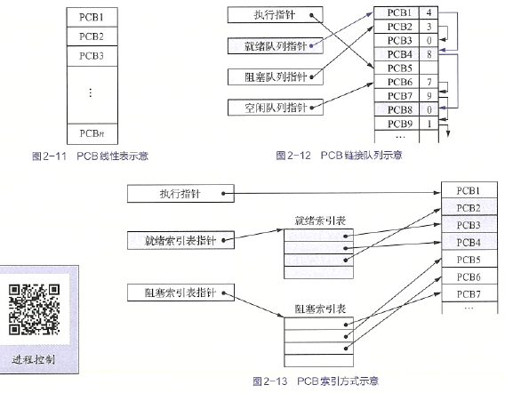
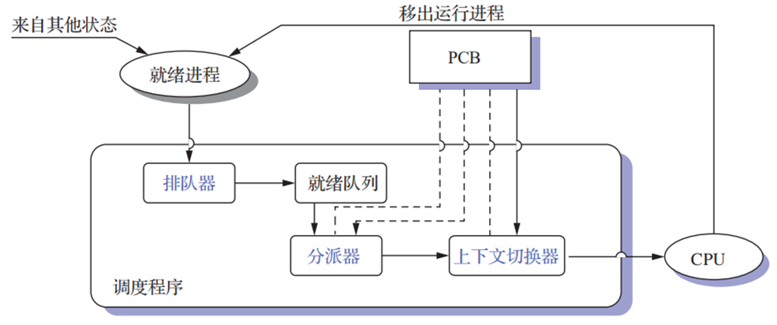
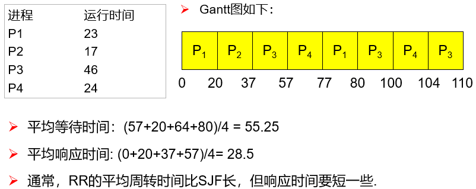
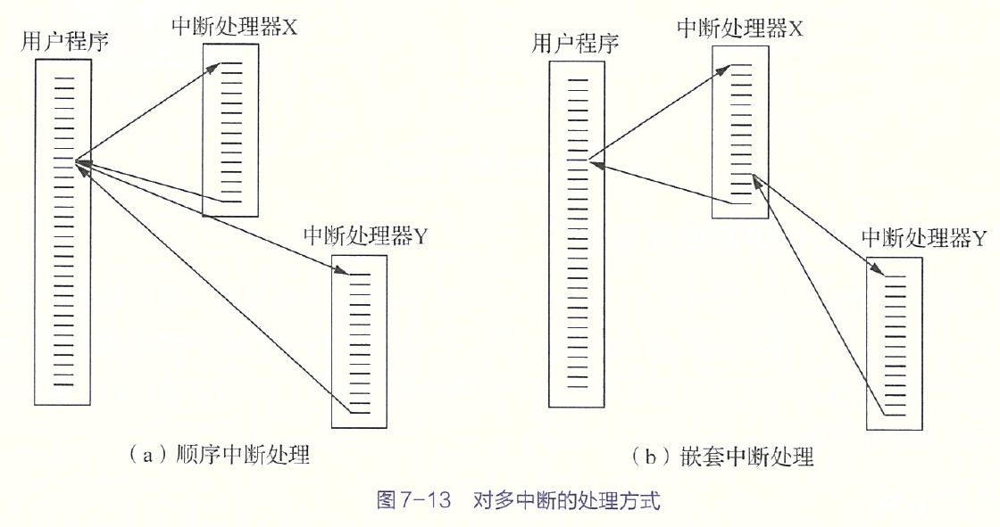
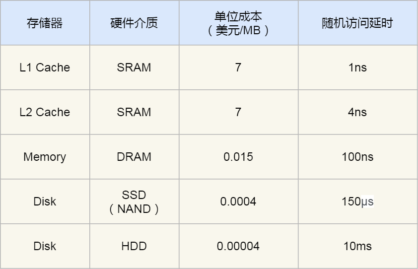
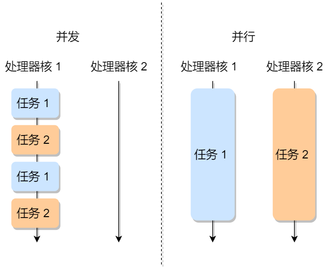
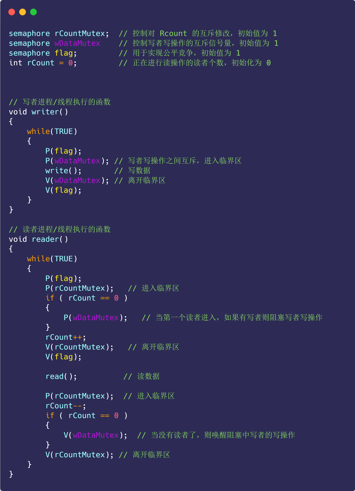
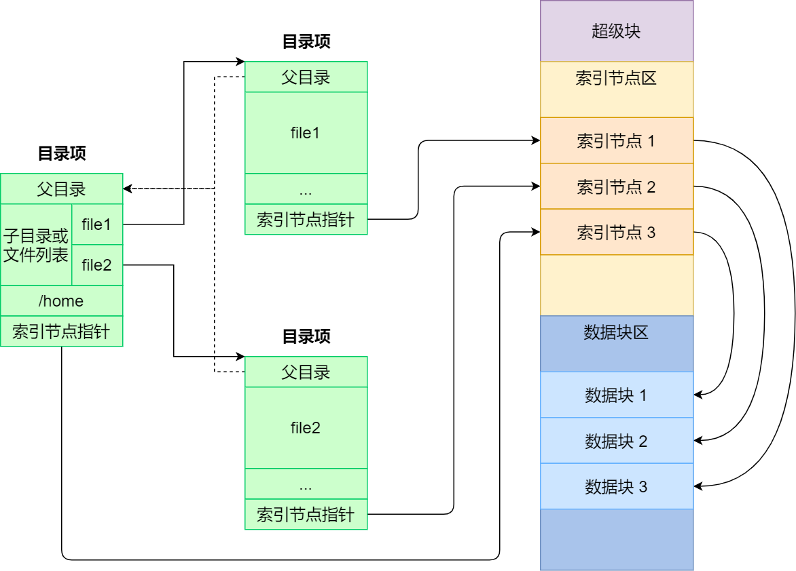

# 操作系统理论

## 操作系统引论

### 目标和作用

> OS 是配置在计算机硬件上的第一层软件，是对硬件系统的首次扩充。作用：管理硬件设备，提高它们的利用率和系统吞吐量，并为用户和应用程序提供一个简单的接口。

OS是(P9)一组能有效地组织和管理计算机硬件和软件资源，合理地对各类作业进行调度，以及方便用户使用的程序的集合。

OS 的主要目标：(方便性、有效性最重要)

- 方便性
- 有效性 (提高系统资源利用率、提高系统吞吐量)
- 可扩充性
- 开放性 (遵循国际标准如开放系统互连OSI参考模型)

作用：

- 用户与计算机硬件系统的接口
- 作为计算机系统资源的管理者
- 实现了对计算机资源的抽象

推动OS发展的主要动力：

- 不断提高计算机系统资源的利用率
- 方便用户
- 器件不断更新换代
- 计算机体系结构不断发展
- 不断提出新的应用需求


### 发展过程

1. 无操作系统

   1. 人工操作方式

   纸带 用户独占全机 CPU等待人工操作(I/O缓慢)

   1. 脱机 I/O 方式

   程序输入输出在外围机完成，脱离主机 (对立的称为联机I/O方式)，减少了 CPU 空闲时间，提高了 I/O 速度

2. 单道批处理系统

   单道 批处理 系统

   先把作业脱机 I/O 输入到磁带，用监督程序连续处理作业，运行控制权交给作业，完成后还给监督程序。不能充分利用系统资源，若程序运行时发出 I/O 请求，利用不充分

   

   

   目的：提高CPU利用率

   缺点：系统资源得不到充分利用

3. 多道批处理系统

   作业放在外存形成后备队列，作业调度程序选若干个调入内存，若一个 I/O 就调度另一个

   

   资源利用率高，系统吞吐量大(CPU和其他资源保持忙碌，作业完成或运行不下去才切换，系统开销小)，平均周转时间长，无交互能力(一旦提交，直到作业完成，不能交互，不利于修改和调试)

   需要解决：争用处理机问题，内存分配和保护问题，I/O设备分配问题，文件的组织与管理问题，作业管理问题，用户与系统的接口问题

4. 分时系统

   为了满足用户对人机交互的需求而产生，需求为人机交互(希望独占和直接控制)、共享主机。

   关键问题：用户如何与作业交互。需要提供多个终端，且输入命令能处理和返回结果，之后继续交互。即：①及时接收。多路卡，分时多路复用，扫描各个终端并停留很短时间接收数据。每个终端配置缓冲区暂存命令和数据。②及时处理。采用作业直接进入内存，采用轮转运行，引入时间片，每个作业运行一个时间片就调度下一个作业。

   特征：①多路性。多台终端连一台主机，分时原则服务每个用户；②独立性。每个用户彼此不干扰；③及时性。用户请求很短时间响应。④交互性。用户可以通过终端与系统进行广泛的人机对话。

5. 实时系统

   实时计算：系统的正确性不仅由计算的逻辑结果确定，还取决于产生结果的时间。最主要特征：时间作为关键参数。规定的时间内完成事件的处理。

   常见：工业控制系统、信息查询系统、多媒体系统、嵌入式系统。

   任务类型：①周期性实时任务和非周期性实时任务。前者：外部设备周期发激励信号给计算机。截止时间分为开始截止时间和完成截止时间。②硬实时任务和软实时任务。hard/soft real time HRT SRT。后者偶尔错过时间影响不大。

   特征比较：①多路性。②独立性。③及时性，优化到秒级到毫秒级。④交互性。⑤可靠性。多级容错措施。

6. 微机操作系统

   1. 单用户单任务 OS CP/M(8位) MS-DOS(16位)

   2. 单用户多任务 Windows 3.1, 95/98

   3. 多用户多任务 UNIX, UNIX(Solaris, Linux), Windows NT/Server

      界面友好，管理方便，适于普及，可移植良好，功能强大，通信能力强

7. 嵌入式操作系统 embedded system

   ①系统内核小。②系统精简。③实时性高。④具有可配置性。

8. 网络操作系统

   用于计算机网络环境下对网络资源进行管理和控制，实现数据通信及对网络资源的共享，为用户提供网络资源接口的一组软件和规程的集合。

   ①硬件独立性。②接口一致性。③资源透明性。系统能对网络中的资源进行统一管理，能够根据用户的要求对资源进行自动选择和分配。④系统可靠性。⑤执行并行性。

   功能：①连接的建立和拆除。②报文的分解与组装。③传输控制。④流量控制。⑤差错的检测与纠正。

9. 分布式操作系统 distributed system

   基于软件实现的一种多处理机系统，是多个处理机通过通信线路互联而构成的松散耦合系统。如 WWW

   ①每个节点都是一台独立的计算机，有完整的外部设备。②节点耦合程度更低；③每个节点可以运行不同的OS。

   特征：①分布性。②透明性。资源被所有计算机共享，包括CPU、文件、打印机等。③同一性。可以共同完成同一个任务。④全局性。

   功能：①通信管理。②资源管理。③进程管理。


### 基本特征

1. 并发 concurrent

   并行：两个或多个事情同一时刻发生

   并发：两个或多个事情在同一时间间隔内发生

   进程：系统中能独立运行并能作为资源分配对象的基本单位，由一组机器指令、数据和堆栈等组成，是能独立运行的活动实体。

2. 共享 sharing

   资源共享/资源复用：系统中的资源可供内存中的多个并行执行的进程共同使用

   互斥共享方式：先提出请求，空闲就能用，否则等待，用完释放。

   临界资源/独占资源：一段时间内只允许一个进程访问的资源。如物理设备、栈、变量、表格等。

   同时共享方式：微观上互斥，宏观同时(单处理机下)。如磁盘设备。

3. 虚拟 virtual

   为了提高通信信道利用率引入，通过空分复用/时分复用将一条物理信道分为若干逻辑信道。将一个物理实体变为若干个逻辑对应物的功能是虚拟。

   时分复用能提高资源利用率的根本原因：令某设备在为一个用户服务空闲时间为其他用户服务，充分利用设备。

   虚拟处理机技术：多道程序设计技术，每道程序至少一个进程，多道程序并发执行。一台物理处理机虚拟为多台逻辑上处理机。用户所感觉到的处理机称为虚拟处理机。

   虚拟设备技术：I/O 设备。使原来仅允许在一段时间内由一个用户访问的设备(临界资源)变为允许多个用户“同时”访问的共享设备。

   空分复用：利用存储器空闲空间(如某道程序阻塞时换到外存空出来的内存空间)存放其他程序以提高内存利用率。

   虚拟存储技术：内存的分时复用，使程序在远小于它的内存空间运行。如每次调入一小部分到内存，运行结束调出。

   时分复用的代价是每台虚拟设备的平均速度小于等于 $\dfrac 1N$。空分复用的平均占用空间同理。

4. 异步 asynchronism

   由于资源等因素的限制，进程的执行通常不可能一气呵成，而停停走走。进程以人们不可预知的速度向前推进就是进程的异步性。若 OS 配置完善的进程同步机制且运行环境相同，则作业即使经过多次运行，也都会获得完全相同的结果。因此异步运行是允许的。

最基本的特征：并发和共享。互为对方存在的条件。


### 运行环境

#### 硬件支持

硬件支持：

开机时运行初始程序/引导程序(bootstrap program)，在固件(firmware)中如 ROM read-only memory 或电擦除可编程只读存储器 electrically-erasable programmable read-only memory EEPROM 等，初始化系统各组件如 CPU 寄存器、设备控制器等和内存内容。引导程序必须定位 OS 内核(kernel)并加载到内存。

内核是 OS 一直运行在计算机上的程序。除此之外还有系统程序和应用程序。UNIX 首个系统进程为 init。

CPU 只能从内存加载指令。通用计算机程序位于可读写内存(随机存取存储器 random access memory RAM)，内存为动态 RAM(DRAM dynamic)。半导体技术。CPU 通过一系列 load/store 内存指令对指定内存地址进行操作。


#### 内核

内核：

OS 内核：将一些与硬件紧密相关的模块如中断处理程序等、常用设备驱动程序、运行频率较高的模块(时钟管理、进程调度等)和许多模块所公用的操作安排在紧靠硬件的软件层次中并常驻内存。目的：便于对这些软件保护防止被其他应用程序破坏、提高 OS 运行效率。功能：

1. 支撑功能 提供给 OS 其他模块所需的基本功能

   1. 中断处理 最基本的功能    OS 赖以活动的基础

      为减少处理机中断时间，提高执行并发性，对中断进行有限处理后便转入相关进程完成后续工作

   2. 时钟管理

      时间片轮转调度中，每当时间片用完就产生中断信号

   3. 原语操作 

      原语 primitive 是由若干指令构成的用于完成一定功能的一个过程，是原子操作 action operation，一个操作所有动作要么全做要么全不做。原语执行不允许被中断，在内核态执行，常驻内存。

2. 资源管理功能

   1. 进程管理

      因为运行频率较高或为多种原语操作所需要的，放内核提高性能

   2. 存储器管理

      运行频率较高，保证运行速度较高

   3. 设备管理

      设备管理与硬件紧密相关


#### 处理机的双重工作模式

处理机的双重工作模式：区分 OS 代码和用户代码的执行。大多数采用硬件支持以区分。

处理机至少需要两种单独运行模式：用户态(user mode，目态)和内核态(kernel mode，管态，系统态)。硬件通过模式位mode bit表示当前模式，0为内核态。


存在系统引导时，从内核态开始工作，OS接着加载，然后在用户态下执行程序。若中断或陷阱，切换到内核态。每当OS能够控制计算机时处于内核态。控制权给用户前切换到用户态。

这提供了保护手段，防止 OS 和用户程序受到错误的用户程序影响。实现：可能引起损害的机器指令当作特权指令privileged instruction，硬件只有在内核态下才允许执行。其他是非特权指令(non-\~)。

- 特权指令。对内存空间访问范围不受限。切换到用户态也是特权指令。
- 非特权指令。用户态下运行的都是。

限制由硬件实现。应用程序使用了特权指令则硬件不会执行，并发出权限出错信号，OS捕获后进入错误处理程序，停止运行该应用程序，重新程序调度。


#### 中断与异常

现代OS是中断驱动的interrupt driven。OS会等待某个事件发生，事件总是由中断interrupt或陷阱trap引起的。它们是一种由程序引起的中断，源于出错或用户程序的特定请求。OS这种终端特性规定了系统的通用结构。每一种中断通过不同代码处理。中断处理程序。

中断是硬件通过系统总线发送信号到CPU触发的。被中断会停止正在做的事情并立即转到固定位置继续执行，包括中断程序开始地址。执行完后重新执行被中断的计算。

实现中断将控制转移到中断处理程序的直接方法：调用通用程序以检查终端信息，然后调用中断处理程序。可以通过中断处理程序指针表间接调用程序。指针表通常位于低地址内存(100左右)，包含各种设备中断处理程序地址。这种地址为中断向量interrupt vector。对给定的中断请求，可通过唯一设备号索引，提供设备中断处理程序地址。


### 主要功能

引入OS主要目的：为多道程序的运行提供良好的运行环境，以保证多道程序能有条不紊、高效运行，最大限度提高系统中各种资源的利用率和方便用户的使用。

#### 处理机管理功能

传统多道程序系统处理机分配和运行以进程为基本单位。

主要功能：创建和撤销进程，对各进程的运行进行协调，实现进程之间的信息交换，按照一定的算法把处理机分配给进程。

1. 进程控制

   每道作业一个或多个进程。设置有线程的OS为一个进程创建若干线程。

   主要功能：为作业创建进程，撤销(终止)已结束的进程，控制进程在运行过程中的状态转换。

2. 进程同步

   主要任务：对多个进程(含线程)的运行进行协调。有进程互斥方式(对临界资源访问)，进程同步方式(最简单是锁)，实现同步最常用是信号量机制。

3. 进程通信

   一组相互合作的进程完成一个共同任务需要交换信息。同意计算机系统采用直接通信，进程利用发送命令，将消息message挂到目标进程消息队列。

4. 调度

   传统OS包括作业调度(基本任务：从后备队列选出若干作业，分配资源，调入内存，

   建立线程，插入就绪队列)和进程调度(任务：就绪队列选进程分配给处理机，设置运行现场)。

#### 存储器管理功能

主要任务：为多道程序的运行提供良好的环境、提高存储器的利用率、方便用户使用、并能从逻辑上扩大内存。

主要功能：

1. 内存分配和回收

   主要任务：①为每道程序分配内存空间，使它们各得其所；②提高存储器的利用率，尽量减少不可用的内存空间(内部碎片)；③允许正在运行的程序申请附加的内存空间，以适应程序和数据动态增长的需要

   静态分配模式：不允许作业申请新内存和作业在内存中移动

   动态分配模式：允许运行时继续申请新的附加内存空间，允许移动

   回收：程序所占用的内存，根据内存管理算法将回收的内存经过处理放入对应的管理数据结构中，供下次分配时使用

2. 内存保护

   主要任务：①确保每道用户程序仅在自己的内存空间中运行，彼此互不干扰；②不允许用户程序访问OS的程序和数据，转移到非共享的其他用户程序中去执行

   一种机制：设置两个界限寄存器，放在执行程序上下界，越界发出越界中断请求

3. 地址映射

   每道程序地址从0开始的，各程序段地址空间逻辑地址与内存空间物理地址不一致。硬件支持

4. 内存扩充

   虚拟存储技术。设置内存扩充机制(包含少量硬件)：①请求调入功能。在仅装入部分用户程序和数据下启动该程序运行，若其余部分未装入向OS发出请求，由OS从磁盘将所需部分调入内存。②置换功能。内存无足够空间装入时，将内存一部分暂时不用的程序和数据调到盘上，腾出空间

#### 设备管理功能

主要任务：①完成用户进程提出的I/O请求，为用户进程分配所需的I/O设备，完成指定I/O操作；②提高CPU和I/O设备的利用率，提高I/O速度，方便用户使用I/O设备。

功能：

1. 缓冲管理

   内存设置缓冲区。增加缓冲区容量可以改善系统性能。常用机制：①单缓冲区机制；②双向同时传送数据的双缓冲区机制；③供多个设备同时使用的公用缓冲池机制

2. 设备分配

   根据用户进程I/O请求与系统现有资源情况，分配所需设备。如果存在设备控制器和I/O通道，需要对应分配。

   设置设备控制表、控制器控制表等。

3. 设备处理

   又称设备驱动程序，实现CPU和设备控制器之间的通信，CPU向设备控制器发出I/O命令，要求它完成指定的I/O操作，以及接受从设备控制器发出的中断请求

   首先检查合法性，设备是否空闲，读取相关传递参数设置工作方式，然后向设备控制器发出I/O命令，启动设备。及时响应设备控制器发来的中断请求。自动构成通道程序。

#### 文件管理功能

对用户文件和系统文件进行管理，方便使用，保证安全性。

1. 文件存储空间管理

   为每个文件分配外存空间，提高外存利用率，文件系统存取速度。对存储空间分配和回收。

2. 目录管理

   为每个文件建立目录项(文件名、属性、物理位置等)，方便按名存取。文件共享(外存保留共享文件一份副本即可)。快速查询手段

3. 文件读/写管理和保护

   检索目录，获取位置，用文件读写指针进行操作，修改指针，为下一次做准备。读写不会同时进行，可以合用

   文件保护。防止未经核准用户存取文件，防止冒名顶替存取文件，防止不正确方式使用文件

#### 接口管理功能

分为：

1. 用户接口

   向作业发出命令控制作业运行。分为：

   1. 联机用户接口 即命令行模式 CLI command-line interface

      由键盘操作命令和命令解释程序组成 (不方便，花时间，需要熟记所有命令及其格式和参数并逐个字符输入)

   2. 脱机用户接口 批命令方式

      为批处理作业用户提供，使用作业控制语言 JCL job control language，事先写在作业说明书。调度时逐条解释执行

   3. 图形用户接口 GUI graphic user interface

2. 程序接口

   用户程序访问系统资源，取得OS服务的唯一途径。一组系统调用组成。早期是汇编语言。高级语言提供库函数

#### 现代操作系统新功能

1. 保证系统安全

   认证技术：确定对象真实性。如身份验证。

   密码技术：存储和传输的数据加密。

   访问控制技术：对用户存取权限设置，对文件属性设置

   反病毒技术：最好是预防。

2. 支持用户通过联网获取服务

   网络通信：无差错数据传输，通信链路建立和拆除，传输控制，差错控制，流量控制等

   资源管理：网络共享资源(软硬件)

   应用互操作：信息的互通性：处于不同网络中用户之间实现信息的互通。信息的互用性：用户可以访问不同网络中的文件系统和数据库系统中的信息。

3. 可处理多媒体信息

   接纳控制功能：保证多个实时进程截止时间，对系统中运行的SRT任务数据，驻留在内存中的SRT任务数目加以限制

   实时调度

   存储多媒体文件：对离散存放和磁盘寻道方式加以改进

### 结构

#### 简单结构

只需要功能实现和高效率，缺乏首尾一致的设计思想。OS是一组过程的集合，每个过程可任意调度其他过程。内部复杂混乱，无结构。

又称整体系统结构。如 MS-DOS。

#### 模块化结构

模块-接口法关键问题：模块的划分和规定好模块之间的接口。划分太细会联系过多系统混乱；模块过大内部复杂。

模块独立性衡量标准：①内聚性，模块内部各部分间联系的紧密程度；②耦合度，模块间相互影响的程度

优点：①提高了OS设计的正确性、可理解性和易维护性；②增强OS可适应性；③加速了OS的开发过程

问题：①对各模块间接口的规定很难完成划分后模块对接口的实际需求②在OS设计阶段，设计者必须做出一系列决定，每个决定建立在上一个决定上，难以找到可靠地决定顺序，很难做到每一步决定建立在可靠决定基础上。因此成为无序模块法。

目前常用设计方法是可加载的内核模块loadable kernel module。内核核心组件无论启动时还是运行时都可以通过模块链入额外服务，常见于UNIX和Windows实现。思想是：内核提供核心服务，其他服务在内核运行时动态实现。动态链接服务优先于直接添加新功能到内核。后者要重新编译内核。

#### 分层式结构

无序决定改为游戏性。任务：在目标系统 $A_n$ 和裸机系统(宿主系统) $A_0$ 之间，铺设若干层次软件 $A_i$。自底向上分层。

基本原则：每一步设计建立在可靠基础上。每一层只能使用低一层功能和服务。

优点：①易保证系统正确性，自下而上，所有决定有序，建立在较为可靠基础上②可保证系统易维护性和可扩充性，添加修改替换不改变接口就不会影响其他

缺点：系统效率低。分层单向依赖，每层建立层间通信机制，增加通信开销。

#### 微内核结构

microkernel。非常实用分布式。如Windows 2000/XP。

为提高正确性、灵活性、易维护性、可扩充性，即使单处理机也大多采用C/S模式的微内核结构，将OS划分为微内核和多个服务器。

特点：

1. 足够小的内核。能实现现代OS最基本核心功能，不是完整的OS，通常包含：①处理硬件紧密部分；②最基本功能；③客户服务器通信。

2. 基于C/S模式。OS绝大部分功能放在一组服务器(进程)实现，运行在用户态，与微内核用消息传递机制信息交互。

   

3. 采用策略与机制分离原则。机制：实现某一功能的具体执行机构。策略：在机制上借助某些参数和算法实现功能的优化或达到不同的功能目的。通常机制在系统基层、策略在系统高层。通常微内核放机制。

4. 采用面向对象技术。抽象和隐藏原则控制复杂性。对象封装继承等保证正确性可靠性易修改性易扩展性，提高设计速度。

基本功能：

1. 进程(线程)管理。

   进程(线程)间通信，进程切换，调度，多处理机间同步等。

2. 低级存储器管理

   实现逻辑地址转物理的页表机制和地址变换机制，依赖于机器。

3. 中断和陷入处理

   捕获，前期处理(中断现场保护，识别类型，转换信息发送给服务器)。进程管理存储器管理I/O管理一分为二，机制放内部。

优点：

1. 提高了系统可扩展性
2. 增强了系统可靠性。提供规范精简的程序应用接口 API application programming interface。服务器出错不影响微内核和其他服务器。
3. 增强了系统可移植性。硬件相关的放微内核和下面的硬件隐藏层
4. 提供了对分布式系统的支持。支持分布式和网络。服务所有进程和服务器唯一标识符，微内核配置系统映射表，就可以不管消息在哪台机器
5. 融入了面向对象技术

问题：运行效率有所降低。最主要：一次客户对OS提出对服务请求，利用消息实现多次交互和用户/内核模式上下文多次切换，早期一般只有两次。微内核至少4次。

> 改善效率：重新把一些常用基本功能由服务器移入微内核。

#### 外核模式

exokernel，外内核OS基本思想：内核不提供进程、虚拟存储器等抽象事物，专注于物理资源隔离(保护)与复用，硬件资源管理委托给应用程序。


### 系统调用

程序接口由一组系统调用system call组成。系统调用提供了用户程序与OS内核之间的接口。可以给应用程序和OS自身使用。(能完成特定功能的子程序)

提供系统调用的目的：使应用程序可以通过系统调用间接调用OS相关过程，进而取得相应服务，本质是应用程序请求OS内核完成某功能时的一种特殊过程调用。

1. 运行在不同的系统状态。调用程序运行在用户态，被调程序运行在内核态。
2. 状态的装换。通过软中断机制先用户态转内核。
3. 返回问题。抢占式(剥夺)调度方式里，调用完成后，重新优先级分析，若调用程序仍有最高优先级才继续执行它，否则重新调度，调用进程放入就绪队列。
4. 嵌套调用。系统调用可以嵌套。有深度限制。一般的过程调用对嵌套调用深度没有限制。

系统调用通过中断机制实现，一个OS所有系统调用通过同一个中断入口实现。中断机制本身收拥有保护机制的OS保护。对终端号授权。如Linux有3H,4H,5H和80H，最后者是系统调用中断号。

类型：

1. 进程控制类系统调用

   创建和终止系统进程；获得和设置进程属性(标识符、优先级、最大允许执行时间等)；等待某事件出现的系统调用

2. 文件操纵类系统调用

   创建和删除文件；打开和关闭文件；读写文件

3. 进程通信类

   单处理机：信息传递方式和共享存储区方式。①信息传递方式：打开一个连接，发送信息，接受信息，关闭连接；②共享存储区：建立存储区，连接到进程自身虚地址空间，读写存储区

4. 其他

   设备管理类(申请释放重定向获得设置属性)、信息维护类(有关系统和文件的时间信息、OS版本、当前用户、空闲内存、磁盘空间大小等)


## 进程的描述与控制

### 前驱图和程序执行

前驱图 precedence graph 是 DAG directed acyclic graph，描述进程执行先后关系，节点表示一个进程/一段程序/一条语句，有向边表示偏序partial order或前驱关系precedence relation。无前驱是初始节点initial node，无后继终止节点final node。节点带权，表示程序量/程序执行时间。

程序顺序执行：前一程序段完成才运行后一程序段，图是链。特征：顺序性、封闭性(独占全机，除初始状态只有本程序才能改变资源状态，一旦开始结果不受外界影响)、可再现性

程序并发执行：不存在前驱关系可以并发执行。特征：间断性(相互制约，执行-暂停-执行的活动规律)、失去封闭性(共享全机资源、状态受外界影响)、不可再现性(环境和初始条件相同，结果不一样)(如:共享同一变量，多个程序一起修改和输出)


### 进程的描述

#### 定义

进程是程序的执行过程，是系统进行资源分配和调度的一个独立单位。

由程序段、相关数据段和进程控制块(PCB, process control block)。PCB描述进程的基本情况和活动过程。创建和撤销的实质是PCB增删。

进程的特征：

1. 动态性。最基本的特征。具有生命期。
2. 并发性。一段时间内同时执行。
3. 独立性。是能独立运行的基本单位，独立获得资源和独立调度的基本单位。
4. 异步性。各自独立、不可预知的速度推进。

进程是程序的一个实例，一次执行。进程是活动的，程序是静态的。程序是进程的代码部分。进程在内存中，程序在外存中。

#### 状态

基本状态：

1. 就绪 ready。分配到了除CPU外的所有必要资源，按优先级策略排为就绪队列。
2. 执行 running。获得 CPU 后正在执行，单处理机系统里唯一进程处于该状态。
3. 阻塞 block。又称等待/封锁。发生事件导致无法继续执行(I/O请求、申请缓冲区失败等)，引发进程调度，分配给另一个就绪资源。排成阻塞队列，一些系统有多个队列。

此外，还有：

1. 创建(新建)状态。申请空白PCB，填写PCB，分配资源，设为就绪状态插入就绪队列。
2. 终止状态。等待OS善后，（不能再被执行，但保留记录(状态码，计时统计数据供其他进程收集)），收回PCB。


为了满足系统和用户观察与分析进程的需要，引入挂起操作。包括：终端用户、父进程、负荷调节和OS(如CPU时间、实际使用时间、作业、进程数量统计)的需要。进入挂起suspend和激活active原语。

- 活动就绪$\leftrightarrow$静止就绪，活动阻塞$\leftrightarrow$静止阻塞


还有：NULL$\to$创建。创建$\to$活动就绪/静止就绪(看性能和内存容量而定)。执行$\to$终止。


#### PCB

OS 对每个资源和进程设置数据结构表征其实体，称为资源信息表和进程信息表(含标志、描述、状态等)。控制表分为内存表、设备表、文件表、进程表(PCB)。


PCB是进程的一部分，是操作系统中最重要的记录型数据结构，是进程存在的唯一标志，常驻内存。(描述进程当前情况和管理进程运行状态的全部信息)

PCB作用：使一个在多道程序环境下不能独立运行的程序(含数据)成为一个能独立运行的基本单位。

1. 作为独立运行基本单位的标志

   进程存在于系统中的唯一标志

2. 实现间断性运行方式

   保留运行时的 CPU 现场信息

3. 提供进程管理所需要的信息

   调度进程时根据PCB记录的程序和数据在内存/外存起始地址(基址/始址)找对应程序和数据

4. 提供进程调度所需要的信息

   就绪状态，优先级，等待时间，已执行时间

5. 实现与其他进程的同步与通信

   用于同步的信号量，实现进城通信的区域或通信队列指针等

PCB中的信息：

1. 进程标识符

   1. 外部标识符 创建者提供，字母和数字组成。设置父子进程标识符。还可设置用户标识符指示拥有该进程的用户
   2. 内部标识符 数字，进程序号

2. 处理机状态 (处理机上下文)

   由处理机各种寄存器中内容组成。包括：

   - 通用寄存器 (用户可视寄存器) 可被用户程序访问，暂存信息
   - 指令计数器 下一条指令地址
   - 程序状态字寄存器 状态信息如条件码、执行方式、中断屏蔽标志等
   - 用户栈指针寄存器 与用户进程相关的系统栈，存放进程、系统调用参数和调用地址。栈指针指向栈顶

3. 进程调度信息

   - 进程状态
   - 进程优先级 整数 高的优先
   - 其他信息 如进程已等待CPU时间总和、已执行时间总和等，与调度算法有关
   - 事件 进程由执行状态转换为阻塞状态所等待发生的事件即阻塞原因

4. 进程控制信息

   - 程序和数据的地址 (内存/外存起始地址)
   - 进程同步和通信机制，如消息队列指针、信号量等
   - 资源清单 运行期间所需除CPU外全部资源
   - 链接指针 队列下一个进程PCB始址

> 2024年阿里云秋招研发岗第一批笔试 牛牛系统正在运行一段Python语言编写的程序，下列有关程序在使用内存时的说法正确的是 (解：ABD)
>
> A进程的状态和进程的优先级都在PCB中
>
> B已经赋值的全局变量会在正文段，各种常量也在正文段
>
> C未赋值的局部变量在栈段，而实参传递在堆段
>
> D由于动态内存分配在堆段，所以动态数组的分配会在堆栈

> 程序在使用内存时一般分为三个段，它们一般是正文段（代码和赋值数据段），数据堆段和数据栈段。二进制代码和常量存放在正文段，动态分配的存储区在数据堆段，临时使用的变量在数据栈段。

组织方式：

1. 线性方式 

   线性表，表起始地址存在内存专用区域，简单，开销小，但查找扫描全表

2. 链接方式

   用PCB链接字将具有相同状态的进程PCB链成队列，如优先级队列(高在前)

3. 索引方式

   进程状态不同建立索引表




### 进程控制

进程管理最基本的功能。

#### 进程创建

一个进程创建另一个进程，创建者为父进程parent process。进程与其子孙共同组成进程组(进程家族)。撤销进程资源归还父进程，撤销所有子进程。(windows不存在层次结构概念，进程创建者获得句柄即令牌，控制被创建进程，可以传递句柄)。

进程图process graph是有向图，描述父子关系。根节点是祖先ancestor。

引起创建的事件：(前三种是系统内核创建新进程)

1. 用户登录。分时系统用户登录终端成功，插入到就绪队列
2. 作业调度。多道批
3. 提供服务。用户程序提出请求，系统创建进程提供服务如打印
4. 应用请求。用户进程自己创建新进程

进程创建步骤：

1. 申请唯一数字标识符，从PCB集合索取空白PCB。
2. 分配物理和逻辑资源如内存、文件、I/O设备、CPU时间等。从OS/父进程获得。①批处理作业大小在用户提出创建进程要求时提供；②交互型作业系统分配，如果要共享内存的某个地址空间(已装入内存的共享段)必须建立相应的链接
3. 初始化PCB。①标志信息(标识符，父进程标识符)；②处理机状态信息，时程序计数器指向程序入口地址，栈指针指向栈顶；③处理机控制信息，进程状态为就绪/静止就绪，通常最低优先级
4. 就绪队列能接纳就入队

> 进程创建新进程的两种可能：父子进程并发执行、父进程等待直到某个或全部子进程执行完毕。
>
> 新进程地址空间两种可能：子进程与父进程数据和程序相同(复制关系)、子进程加载新程序

> UNIX 是 fork 复制，子进程调用返回 0，父进程返回子进程标识符。

> 1. 子进程的结束和父进程的运行是一个异步过程,即父进程永远无法预测子进程到底什么时候结束。 当一个 进程完成它的工作终止之后，它的父进程需要调用wait()或者waitpid()系统调用取得子进程的终止状态。
>
> 2. 孤儿进程：一个父进程退出，而它的一个或多个子进程还在运行，那么那些子进程将成为孤儿进程。孤儿进程将被init进程(进程号为1)所收养，并由init进程对它们完成状态收集工作。
>
>    杀死父进程后，子进程将会成为孤儿进程，而 init 进程将重新成为它的父进程
>
> 3. 僵尸进程：一个进程使用fork创建子进程，如果子进程退出，而父进程并没有调用wait或waitpid获取子进程的状态信息，那么子进程的进程描述符仍然保存在系统中。这种进程称之为僵尸进程


#### 进程终止

引起终止的事件：

- 正常结束

- 异常结束

  越界(存储区超过进程所占范围)

  保护错(访问不允许的资源/文件或以不当方式访问)

  指令错(执行不存在/非法指令)，如把数据区当指令

  特权指令错(只允许OS执行的指令)

  运行超时(设定最大值)

  等待超时(等待某时间时间超过指定值)

  算术运算错(如零除

  I/O错

- 外界干预

  操作员/OS。如事件(系统死锁)

  父进程请求

  父进程终止

终止的过程：

1. 根据标识符从PCB集合检索出该进程PCB，读出状态
2. 若处于执行状态，立刻终止执行，调度标志为真
3. 终止它的子孙进程
4. 将被终止进程资源归还父进程或系统
5. 移出PCB所在队列/链表，等待其他程序搜集信息

#### 阻塞与唤醒

触发事件：

- 向系统请求共享资源状态失败。转为阻塞。其他进程释放后唤醒。
- 等待某种操作的完成。如I/O。完成后唤醒。
- 新数据尚未到达。相互合作的进程，一个进程需要获得另一个进程的数据进行后续操作。
- 等待新任务的到达。特定系统进程当完成任务就阻塞自己。如发送数据包的服务器。

阻塞过程：（阻塞是进程自身的主动行为）

- 若执行状态停止执行，改为阻塞，插PCB入阻塞队列；若多个队列插入到具有相同事件的
- 转到调度程序重新调度，保留被阻塞进程处理机状态，按新进程PCB处理机状态设置CPU环境

唤醒过程：

- 从阻塞队列移出，PCB状态改为就绪，插入就绪队列

阻塞与唤醒原语(block, wakeup)必须成对使用，否则可能永远不能唤醒。

#### 挂起与激活

挂起 suspend：

- 检查状态，就绪改静止就绪，阻塞改静止阻塞
- 将PCB复制到指定内存区域
- 若正在执行让调度程序重新调度

激活 active：

- 进程从外存调入内存，静止就绪改活动就绪，静止阻塞改活动阻塞
- 若抢占调度，则检查是否要重新调度(优先级高分配给刚被激活的进程)


### 进程通信

IPC interprocess communication

低级进程通信：

- 效率低。生产者每次向缓冲区投放一个产品(消息)，消费者每次取得一个
- 通信对用户不透明。OS只提供共享存储器，数据结构、传送、互斥同步都要程序员手动实现

高级通信：

- 使用方便。隐藏细节，提供原语，减少通信时程序复杂性。
- 高效传送大量数据

高级通信机制类型：

- 共享存储器系统 shared-memory system

  - 基于共享数据结构的通信方式。各进程共享某些数据结构，如有界缓冲区。低级进程通信。
  - 基于共享存储区的通信方式。内存划分出。数据形式和位置(甚至访问)由进程控制。高级。通信前申请一个分区，附加到自己的内存地址。完毕或不需要就归还。

- 管道通信系统 pipe

  管道：连接一个读进程和写进程的共享文件又名pipe文件。字节流形式读写，首创UNIX。

  提供的协调能力：

  - 互斥。一个进程在读/写时，另一个必须等待
  - 同步。写入一定量如4KB时就睡眠(等待)，直到被读走再唤醒；读空时也睡眠，直到写入再唤醒
  - 确定对方是否存在

- 消息传递机制 message passing system

  不借助任何数据结构/共享区，以格式化信息message为单位，用OS原语通信。当前最广泛，最主要。如报文，微内核OS的微内核与服务器。

  实现方式：

  - 直接通信方式。用原语

    - 对称寻址方式。双方显式提供对方标识符。原语：`send(receiver,message),receive(sender,massage)`

      一旦改变进程名，就可能需要检查所有其他进程定义，不利于模块化

    - 非对称寻址。`send(p,message)`,`receive(id,message)`,id是发送方id或名字

    格式：短定长或变长

    完成后同步方式：发送接收阻塞，无缓冲；发送不阻塞接收阻塞(最广应用)；均不阻塞

    通信链路：原语建立(主要计网)，或不需要建立原语直接发送。有单向和双向。

  - 间接通信方式。通过共享中间实体(信箱)

    信箱结构：信箱头(信箱标识符，拥有者标识符，口令，空格数等)，信箱体(若干存放消息(或消息头)的信箱格，创建新箱静态确定)。单向或双向

    原语：信箱创建(名字，属性(公用私用共享)，共享者名字)，撤销；发送接收 `send/receive(mailbox,message)`。

    类型：①私用信箱。进程自己创立，自己读，其他用户发。单向。②公用。OS创建，核准进程可用。双向。③共享。进程创建，指明共享进程名字。拥有者和共享者能发送。

    四种关系：发送与接收的一/多对一/多。其中多对一是C/S，一对多广播。

- 客户机-服务器系统

  实现方式：

  - 套接字 socket。是通信标志类型数据结构，包含通信目标地址、端口号、传输层协议、进程所在网络地址、系统调用/API等。是进程通信和网络通信基本构建。分为：

    - 基于文件型。一个套接字关联一个特殊文件，原理类似管道通信
    - 基于网络型。非对称通信，发送者需要提供接收者名字，双方在不同主机。通信分配一对套接字。发出连接请求时随即申请套接字，主机分配端口与之绑定。接受进程有全局公认套接字和指定端口。

  - 远程过程调用 remote procedure call RPC 和远程方法调用

    若涉及软件采用 OOP，又称远程方法调用 RMI Remote Method Invocation

    进程：本地客户和远程服务器，统称网络守护进程，一般阻塞。

    根 stub。本地客户端每个运行的运行过程有一个客户存根 client stubborn。服务端也有，且也一般阻塞

    步骤：

    - 本地过程调用者调用远程过程在本地关联客户存根，传参，控制权给用户存根
    - 执行客户存根，控制权给本地客户
    - 本地客户进程完成，消息发送
    - 远程服务器接收，执行，找到并发给服务器存根、
    - 服务器存根阻塞转执行，调用远程过程
    - 服务器返回存根
    - 服务器存根将结果打包给消息，控制权给远程服务器
    - 远程服务器消息发回客户端
    - 客户端收到信息，存入关联客户存根，控制权给客户存根
    - 客户存根取结果，返回本地过程调用者进程，完成控制权转移


Linux 通信例子，包括：管道、信号、消息队列、共享内存、信号量、套接字等。支持语义符合可移植操作系统接口 POSIX portable operating system interface 标准的信号函数

> 进程间通信主要有以下几种方式：匿名管道、命名管道、信号、消息队列、共享内存、信号量、Socket。
>
> - 匿名管道：管道是一种半双工的通信方式，数据只能单向流动，而且只能在具有亲缘关系的进程间使用。进程的亲缘关系通常是指父子进程关系。
>
> - 有名管道(FIFO)。有名管道的名字存在于文件系统中，内容存放在内存中。只要可以访问该路径，就能够彼此通过有名管道相互通信。读队首，写队尾。
>
> - 信号是Linux系统中用于进程间互相通信或者操作的一种机制，信号可以在任何时候发给某一进程，而无需知道该进程的状态。
>
>   如果该进程当前并未处于执行状态，则该信号就有内核保存起来，知道该进程回复执行并传递给它为止。
>
>   如果一个信号被进程设置为阻塞，则该信号的传递被延迟，直到其阻塞被取消是才被传递给进程。
>
>   | 信号    | 描述                                                         |
>   | ------- | ------------------------------------------------------------ |
>   | SIGHUP  | 当用户退出终端时，由该终端开启的所有进程都退接收到这个信号，默认动作为终止进程。 |
>   | SIGINT  | 程序终止(interrupt)信号, 在用户键入INTR字符(通常是Ctrl+C)时发出，用于通知前台进程组终止进程。 |
>   | SIGQUIT | 和SIGINT类似, 但由QUIT字符(通常是Ctrl+\)来控制. 进程在因收到SIGQUIT退出时会产生core文件, 在这个意义上类似于一个程序错误信号。 |
>   | SIGKILL | 用来立即结束程序的运行. 本信号不能被阻塞、处理和忽略。       |
>   | SIGTERM | 程序结束(terminate)信号, 与SIGKILL不同的是该信号可以被阻塞和处理。通常用来要求程序自己正常退出。 |
>   | SIGSTOP | 停止(stopped)进程的执行. 注意它和terminate以及interrupt的区别:该进程还未结束, 只是暂停执行. 本信号不能被阻塞, 处理或忽略. |
>
> - 消息队列是存放在内核中的消息链表，每个消息队列由消息队列标识符表示。消息队列存放在内核中，只有在内核重启(即，操作系统重启)或者显式地删除一个消息队列时，该消息队列才会被真正的删除。与管道不同的是，消息队列在某个进程往一个队列写入消息之前，并不需要另外某个进程在该队列上等待消息的到达
>
>   （1）消息队列是消息的链表,具有特定的格式,存放在内存中并由消息队列标识符标识.
>
>   （2）消息队列允许一个或多个进程向它写入与读取消息.
>
>   （3）管道和消息队列的通信数据都是先进先出的原则。消息队列可以实现消息的随机查询,消息不一定要以先进先出的次序读取,也可以按消息的类型读取.比FIFO更有优势。
>
>   （4）消息队列克服了信号承载信息量少，管道只能承载无格式字 节流以及缓冲区大小受限等缺。
>
>   （5）目前主要有两种类型的消息队列：POSIX消息队列以及System V消息队列，系统V消息队列目前被大量使用。系统V消息队列是随内核持续的，只有在内核重起或者人工删除时，该消息队列才会被删除
>
> - 共享内存。给两个进程开辟了一块二者均可访问的内存空间，这时，两个进程便可以共享一些数据了。但是，多进程同时占用资源会带来一些意料之外的情况，这时，我们往往会采用下述的信号量来控制多个进程对共享内存空间的访问。
>
>   采用共享内存通信的一个显而易见的好处是效率高，因为进程可以直接读写内存，而不需要任何数据的拷贝。对于像管道和消息队列等通信方式，则需要在内核和用户空间进行四次的数据拷贝(用户->内核->内存->内核->用户)，而共享内存则只拷贝两次数据：一次从输入文件到共享内存区，另一次从共享内存区到输出文件。
>
>   实际上，进程之间在共享内存时，并不总是读写少量数据后就解除映射，有新的通信时，再重新建立共享内存区域。而是保持共享区域，直到通信完毕为止，这样，数据内容一直保存在共享内存中，并没有写回文件。共享内存中的内容往往是在解除映射时才写回文件的。因此，采用共享内存的通信方式效率是非常高的
>
> - 信号量。主要用来解决进程和线程间并发执行时的同步问题，进程同步是并发进程为了完成共同任务采用某个条件来协调他们的活动。即 PV 操作。
>
> - socket。字可以看做是：不同主机之间的进程进行双向通信的端点。（套接字 = IP地址 + 端口号）。计网里应用层与传输层的桥梁。

> 区别：线程通信
>
> 1. 锁机制：包括互斥锁、条件变量、读写锁互斥锁提供了以排他方式防止数据结构被并发修改的方法。读写锁允许多个线程同时读共享数据，而对写操作是互斥的。条件变量可以以原子的方式阻塞进程，直到某个特定条件为真为止。对条件的测试是在互斥锁的保护下进行的。条件变量始终与互斥锁一起使用。
> 2. 信号量机制(Semaphore)：包括无名线程信号量和命名线程信号量
> 3. 信号机制(Signal)：类似进程间的信号处理线程间的通信目的主要是用于线程同步，所以线程没有像进程通信中的用于数据交换的通信机制。


### 线程的概念

60s中提出进程概念，80s中提出线程概念，90s后多处理机系统引入

引入线程的目的：①减少程序在并发执行时所付出的时空开销，②使OS具有更好的并发性(资源利用率和吞吐量) ③适用于SMP结构的计算机系统 Symmetrical Multi-Processing 对称多处理机

> **进程的**基本属性：
>
> 1. 进程是一个可拥有资源的独立单位。包括磁盘、内存地址空间、I/O设备、已打开的文件、信号量等。
> 2. 进程是可独立调度和分派的基本单位。进程有唯一PCB，可以保存断点信息，恢复现场。
>
> 进程与线程的区别：
>
> （1）一个线程从属于一个进程；一个进程可以包含多个线程。
>
> （2）一个线程挂掉，对应的进程挂掉；一个进程挂掉，不会影响其他进程。
>
> （3）进程是系统资源调度(CPU分配资源)的最小单位；线程CPU调度的最小单位。
>
> （4）进程系统开销显著大于线程开销；线程需要的系统资源更少。
>
> （5）进程在执行时拥有独立的内存单元，多个线程共享进程的内存，如代码段、数据段、扩展段；但每个线程拥有自己的栈段和寄存器组。
>
> （6）进程切换时需要刷新TLB并获取新的地址空间，然后切换硬件上下文和内核栈，线程切换时只需要切换硬件上下文和内核栈。线程是运行在进程上下文中的逻辑流，其上下文也更小(是进程上下文子集)。
>
> （7）通信方式不一样。
>
> （8）进程适应于多核、多机分布；线程适用于多核

线程(轻型进程 light-weight process LWP)对比传统进程(HWP)

- 在传统的OS中，拥有资源、独立调度和分派的基本单位都是进程

  在引入线程的OS，线程作为调度和分派的基本单位，**线程是能独立运行的基本单位**。

  同一进程，线程的切换不引起进程的切换。进程间线程切换会引起进程切换

- 进程之间可以并发且一个进程的多个线程间可并发

- 进程作为拥有资源的基本单位；线程本身不拥有资源，仅有一点保证独立运行的资源，允许多个线共享其隶属进程所拥有的资源

  线程有 TCB，指示被执行指令序列的程序计数器，保留局部变量，少数状态参数和返回地址等的一组寄存器和堆栈

  共享其隶属进程所拥有的资源表现在属于同一进程的线程相同地址空间，可以访问每一个虚地址和进程资源如打开的文件、定时器、信号量机构等和I/O设备等

- 同一进程的不同线程间独立性比不同进程的独立性低很多。一个线程的堆栈可以被其他线程读写甚至完全清除，打开的文件也能被其他线程读写

- 线程创建撤销切换的代价低于进程的，通信同步也简单

- 支持多处理机系统。一个进程多个线程分配到多个处理机，加速进程完成

线程基本状态：执行、就绪、阻塞。与进程状态转换一样。

进程控制块 TCB 有：

- 进程标识符
- 寄存器(程序计数器、状态寄存器、通用寄存器等)
- 线程执行状态
- 优先级
- 线程存储区(现场信息，统计信息等)
- 信号屏蔽
- 堆栈指针。过程调用嵌套的局部变量和返回地址。指向用户自己的堆栈(用户态用户栈局部变量返回地址)和指向核心栈的堆栈(内核态系统核心栈局部变量和返回地址)

多线程OS里**进程**属性：**可拥有资源的基本单位**，可并发执行，但不是可执行的基本单位

> 协程是微线程，在子程序内部执行，可在子程序内部中断，转而执行别的子程序，在适当的时候再返回来接着执行
>
> 1. 线程与协程的区别：
>
>    （1）协程执行效率极高。协程直接操作栈基本没有内核切换的开销，所以上下文的切换非常快，切换开销比线程更小。
>
>    （2）协程不需要多线程的锁机制，因为多个协程从属于一个线程，不存在同时写变量冲突，效率比线程高。
>
>    （3）一个线程可以有多个协程。
>
> 2. 协程的优势：
>
>    （1）协程调用跟切换比线程效率高：协程执行效率极高。协程不需要多线程的锁机制，可以不加锁的访问全局变量，所以上下文的切换非常快。
>
>    （2）协程占用内存少：执行协程只需要极少的栈内存（大概是4～5KB），而默认情况下，线程栈的大小为1MB。
>
>    （3）切换开销更少：协程直接操作栈基本没有内核切换的开销，所以切换开销比线程少。
>
>    效率高，且协程不需要多线程的锁机制，因为多个协程从属于一个线程，不存在同时写变量冲突，效率比线程高。避免了加锁解锁的开销


### 线程的实现

方式：用户级或内核支持线程。

内核支持线程 kernel supported thread KST

- 内核空间实现创建阻塞撤销切换等，设置TCB (若A有1KST，B进程有100个KST，则B得到时间片百倍于A)
- 优点：①内核同时调度同一进程多个进程并行；②若一个线程被阻塞，可以调度进程的其他线程或其他进程的线程；③线程小数据结构和堆栈，切换快切换开销小；④内核本身多线程，提高系统执行速度和效率
- 缺点：用户线程切换模式切换开销大

用户级线程 user level thread ULT

- 创建撤销同步通信等无需内核支持。调度以进程为单位(若A有1个ULT，B进程有100个ULT，则A线程运行时间百倍于B线程，本质不公平)
- 优点：①线程切换不需要转内核空间，节省模式切换开销；②调度算法进程专用，不干扰OS不同进程自己选择自己的管理调度；③与OS无关实现，可以在不支持线程的OS实现
- 缺点：①线程阻塞则进程内所有线程阻塞；②不能用多处理机多重处理

组合方式：既有KST又有ULT。

- 多对一。多个ULT映射到一个KST。UTL需要访问内核时映射到KST，每次只允许一个映射。优点线程管理开销小效率高；缺点一个线程阻塞全阻塞，不能多处理机多线程

- 一对一。优点：阻塞时能调度其他线程，更好并发；允许多线程并行在多处理机系统；缺点：KST开销大，限制线程数。如Windows 2000/NT, Linux。

- 多对多。KST数目变动，可以小于等于ULT。结合上述两个模型优点。

  


KST 实现：

- 创建新进程分配 PTDA per task data area 任务数据区，包括若干 TCB。与进程类似原理。

ULT 实现：

- 运行时系统 runtime system 是用于管理和控制线程的函数(过程)的集合。ULT不能利用系统调用，需要时要传给运行时系统通过调用获取

- 核心线程 LWP Light Weight Process。一个进程有多个，有自己的 TCB，可以系统调用。ULT连接到LWP。缓冲区，线程池。ULT多路复用一个 LWP。

  


线程的创建：

- 应用程序启动时通常仅有初始化线程，主要功能是创建新线程，利用线程创建函数或系统调用，返回线程标识符。

线程的终止：(完成任务或异常)

- 调用函数执行；系统线程会一直执行。大多OS终止后不会立即释放资源，只有其他线程执行分离函数才资源分离，杯其他线程利用资源
- 已终止未释放资源仍有可能被重新恢复运行。调用等待线程终止连接命令，若未被终止则调用的线程被阻塞，终止后才与连接并继续执行。若已经被终止则不会被阻塞而是继续执行


## 处理机调度与死锁

### 处理机调度概述

调度的实质：资源分配。

层次：

- 高级调度/长程调度/作业调度 high level scheduling。对象是作业。决定将外存后备队列哪些作业调入内存创建进程放就绪队列。主要用于多道批处理系统，分时和实时不设置。
- 低级调度/短程调度/进程调度 low level scheduling。对象是进程/LWP。决定就绪队列哪个进程获得处理机。最基本调度，系统必须有。
- 中级调度/内存调度 intermediate scheduling。目的：提高内存利用率、系统吞吐率。将暂时不能运行的进程调到外存等待，就绪驻外存状态(或挂起)。

调度频率是低级(10-100ms)<中级<高级(几分钟)


在多道批里，作业是用户提交给系统的一项相对独立的任务，包含程序、数据、作业说明书。有作业控制块 JCB。作业调度又称接纳调度 admission scheduling。需要决定：接纳多少作业(多道程序度 degree off multiprogramming)，允许多少作业同时在内存运行，以及接纳哪些作业。


进程调度任务：

1. 保存CPU现场信息。如程序计数器、多个通用寄存器内容。
2. 按某种算法选取进程。选就绪队列一个改为运行状态。
3. 将CPU分配给进程。将PCB内CPU现场信息装入寄存器，CPU控制权给进程。

进程调度机制基本部分：




排队器：将就绪进程排成若干队列。

分派器：取出队列进程，进行从分派器到新选进程间上下文切换，以将CPU分配给新选进程。

上下文切换器：①第一对切换，保存当前进程上下文到PCB，装入分派程序上下文；②第二堆：移出分派程序上下文，新选进程现场信息装入寄存器

一般通过硬件减少上下文切换时间。采用多组寄存器，不同寄存器给不同状态(用户态/内核态)使用，只需要改变指针而不需要改变内容。


调度方式：

- 非抢占调度方式 non-preemptive mode 

  一旦分配就一直运行，不会因时钟中断等抢占，直到完成或阻塞。引起调度的因素：①执行完毕或无法继续执行；②提出I/O；③通信或同步执行了如block原语。优点：实现简单系统开销小使用大多批处理系统。缺点难以满足交互性和实时。

- 抢占调度方式

  抢占原则：①优先级原则。②短进程优先原则。③时间片原则。时间片完就停止进程。

处理机调度算法共同目标：

- 资源利用率
  $$
  CPU\mathbf{利用率}=
  \dfrac
  {CPU\mathbf{有效工作时间}}
  {CPU\mathbf{有效工作时间}+CPU\mathbf{空闲等待时间}}
  $$

- 公平性。各进程获得合理 CPU 时间，防止发生进程饥饿现象。公平是相对的，同一类获得同一种服务。

- 平衡性。让 CPU 繁忙和 I/O 繁忙的作业都经常忙碌，保证系统资源使用平衡。

- 策略强制执行。有需要就准确执行，即使可能造成某些工作延迟。

批处理系统目标：

- 平均周转(作业周转)时间短。

  周转时间 $T$：指作业被提交给系统开始到完成的时间间隔，包括：①在外存后备队列等待作业调度时间；②在就绪队列等待进程调度时间；③CPU执行耗费时间；④等待 I/O 操作完成时间。后三者可能发生多次。

  带权周转时间 $T_w$：周转时间 $T_i$ 与系统提供服务时间 $T_{s_i}$ 之比。

  平均带权周转时间为 $T_w=\dfrac1n\sum_{i=1}^n\dfrac{T_i}{T_{s_i}}$

- 系统吞吐率高。指单位时间内系统完成的作业数，与作业平均长度有关。尽可能选短作业。

- 处理机利用率高。尽可能算算量大。

分时系统目标：

- 保证响应速度快。指用户通过键盘提交一个请求开始，到屏幕显示结果的时间间隔，包括：①请求信息从键盘输入开始到传送到处理机的时间；②处理机对请求信息处理；③将响应信息回送终端显示器。
- 保证均衡性：系统响应时间快慢与用户请求服务复杂性适应。一般复杂任务用户允许响应时间长。

实时系统：

- 保证满足截止时间的要求。指任务必须开始执行的最晚时间或必须完成的最晚时间。HRT必须满足，SRT基本满足。
- 保证可预测性。如多媒体连续播放。

> 如：有调度甘特图
>
> 
>
> 则平均等待时间是 $\dfrac{0+24+27}{3}=17$，平均周转时间 $\dfrac{24+27+30}{3}=27$


### 调度算法

#### FCFS

先来先服务调度算法 first come first serve。作业/进程调度。

优先考虑等待时间最长(队首)的作业。通常与其他调度算法结合使用。

> [牛客](https://www.nowcoder.com/exam/test/85635347/submission?pid=60088749&pageSource=testHistory) 不利于短作业

#### SJF

短作业优先调度算法 short job first。作业/进程调度。

> [牛客](https://www.nowcoder.com/exam/test/85635347/submission?pid=60088749&pageSource=testHistory) 或者 SPF，process

长短：作业要求的运行时间。

缺点：①必须预先知道运行时间；②长作业不利(利于短作业)，饥饿现象；③无法实现人机交互；④不考虑紧迫程度

> 非抢占：
>
> 
>
> 抢占：
>
> 


#### PR

优先级调度算法。作业/进程调度。

外部赋予进程优先级，每次选优先级最高。

调度类型：

- 非抢占。
- 抢占。只要出现了更高的算法，将其分配给更高的，每次就绪进程新出现时就会比较一下，更高马上运行。

优先级类型：

- 静态优先级。如整数优先数 $[0,255]$，越小优先级越高。依据：①进程类型。系统进程(接受进程、对换进程等)一般高。②对资源要求少的高。③用户要求。

  简单易行，系统开销小，但不够精确，可能低优先级长期未调度。

  动态优先级。随进程推进/等待时间改变。可以规定随运行时间推移下降，防止长作业垄断。

> 非抢占：
>
> 

解决饥饿：老化 —— 视进程等待时间的延长提高其优先数

实现简单，考虑了进程的紧迫程度；灵活，可模拟其它算法


#### HRRN

> [牛客](https://www.nowcoder.com/exam/test/85635347/submission?pid=60088749&pageSource=testHistory) 又名 HRN

highest response ratio next。高响应比有限调度算法。作业调度。$R_p$ 是响应比，则：
$$
优先级=R_P=\dfrac{等待时间+要求服务时间}{要求服务时间}=\dfrac{响应时间}{要求服务时间}
$$

> [牛客](https://www.nowcoder.com/exam/test/85635347/submission?pid=60088749&pageSource=testHistory) 既利于短作业又有利于长作业；[deepseek](https://chat.deepseek.com/a/chat/s/dfa65b92-6fbc-446c-8ece-6109dfe890e0): 减少短作业等待时间，避免长作业饥饿，平衡性较好

#### RR

round robin。轮转调度算法。

按 FCFS 排就绪，每隔一段时间中断。每个进程每次运行一个时间片，就绪里公平地都获得约 $\dfrac 1n$ 处理机时间。切换时机：①时间片未完进程完；②时间片完。

如等待时间相同，运行时间越短，类似于 SJF；如运行时间相同，取决于等待时间，类似于 FCFS

时间片大小建议：略大于一次典型交互所需时间。太大 FCFS，太小上下文切换时间多。应该考虑：响应速度、就绪队列进程数目、系统处理能力。

一般准则：$\dfrac{时间片}{10} > 进程上下文切换时间$。

缺点：每次调度之前，都需要计算响应比，增加系统开销

> 如：
>
> 
>
> 
>
> 


#### 多级队列

multilevel queue。按照不同进程类型/性质分在不同就绪队列，每个队列用不同的调度算法。如前台进程 RR，后台 FCFS。


#### 多级反馈队列

multilevel feedback queue。公认较好。

机制：

- 多个就绪队列，每个队列优先级不一样，第一个最高，降序。优先级越高时间片越小，如逐个队列倍增时间片。
- 每个队列内部 FCFS，但最后的队列 RR。新进程放第一个队尾，之后每次放下一个队尾。
- 按队列优先级调度。每次调度最高优先级队列的各进程。仅当当前队空调度下一个队列。调度中新进程入队时，马上原地放本来队尾然后去调度新进程。

性能：

1. 终端型用户作业多是交互性，较小，第一队列能完成。
2. 段批处理作业用户。稍长在第二第三队列。
3. 长批处理作业一般最后 RR。

优点：

1. 不需要事先知道各种进程所需执行时间
2. 满足各种类型进程需要


#### 基于公平原则

1. 保证调度算法。明确的性能保障。如公平分配处理机。

   功能：①跟踪计算每个进程创建以来的已经执行的处理时间；②计算应该获得的处理机时间，即 $\dfrac{创建以来的时间}n,n$ 是相同类型进程数；③计算获得处理机时间比，即 $\dfrac{实际执行的处理时间}{应获得的处理时间}$；④比较处理时间比；⑤选择比率最低的分配给它，直到超过最接近它的进程比率。

2. 公平分享调度算法。针对用户。所有用户获得相同处理机时间或要求的时间比例。


### 实时调度

#### 概念

基本条件：

1. 系统提供给调度程序必要信息

   1. 就绪时间。状态转换为就绪的起始时间(周期任务可预知)
   2. 开始截止时间和完成截止时间。
   3. 处理时间。从开始执行直到完成所需时间。
   4. 资源要求。
   5. 优先级。若被错过开始截止时间势必引起故障，赋予绝对优先级；若错过不影响，赋予相对优先级。

2. 系统处理能力强

   若系统有 $m$ 个周期性 HRT，处理时间为 $C_i$，周期时间是 $P_i$，若有 $n$ 个处理机，必须满足 $\sum_{i=1}^m\dfrac{C_i}{P_i}\le n$。

3. 采用抢占式调度机制

   小实时系统能预知开始截止时间可以非抢占，但实时任务要小，且执行完关键性程序和临界区代码将自己阻塞

4. 采用快速切换机制

   ①对中断的快速响应能力。紧迫外部事件请求中断及时响应，禁止中断的时间间隔尽量短

   ②快速的任务分派能力。使得运行功能单位适当小，减小任务切换开销

分类：实时任务性质分为HRT,SRT调度算法；方式分为抢占式和非抢占式。

1. 非抢占式：
   1. 非抢占式轮转调度算法。用于要求不太严格的实时控制系统
   2. 非抢占式优先级调度算法。有一定要求的实时控制系统
2. 抢占式：
   1. 基于时钟中断的抢占式优先级调度算法。优先级高于当前任务，等待时钟中断才给它。用于大多数实时系统
   2. 立即抢占的优先级调度算法。外部中断，当前任务未处于临界区，就立即剥夺执行。


#### EDF

最早截止时间优先算法 earliest deadline first

1. 非抢占式、非周期：

   > 如：
   >
   > 

2. 抢占式、周期

   当一个任务到达(周期任务就是等效于无穷多个任务初始就到达，但 DDL 等差数列)，谁先截止让谁跑

   > 如：A,B 周期 20, 50ms; A,B 处理时间 10, 25ms
   >
   > 
   >
   > 


#### LLF

最低松弛度优先 least laxity first LLF

根据紧急程度(松弛度)，紧急程度越高(松弛越低)越优。松弛为零马上执行。
$$
松弛度=必须完成时间-本身运行时间-当前时间
$$

> 如：A,B 周期 20, 50ms; A,B 处理时间 10, 25ms，DDL 如图：
>
> 
>
> 调度如图：
>
> 
>
> 


#### 优先级倒置

存在影响进程运行的资源，产生优先级倒置现象 priority inversion problem，即高优先级进程被低优先级进程阻塞

> 设 p1,p2,p3 按优先级从高到低排序，且 p1,p2 共享一个临界资源。如：
>
> 

解决：规定进程进入临界区时，占用的处理机不允许被抢占。建立动态优先级继承(要使用时，如果临界资源被正在使用，则使用者获得想要用的进程的优先级，直到退出临界区)

> 如：动态优先级
>
> 


### 死锁

#### 概念

> 如两进程同时想写入光盘 compact disk CD,一个进程请求扫描仪，另一个请求刻录机，相互阻塞。

> 死锁（Deadlock）：指多个进程在运行过程中因争夺资源而造成的一种僵局，当进程处于这种僵持状态时，若无外力作用，这些进程都将永远不能再向前推进。

死锁：一组进程中的每个进程都在等待仅由该组进程中其他进程才能引发的事件发生，那么该组进程是死锁的。（一组等待的进程，其中每一个进程都持有资源，并且等待着由这个组中其他进程所持有的资源。）

可重用/可消耗资源：

1. 可重用资源

   ①每个可重用资源中的单元，只能分配给一个进程使用，不允许多个进程共享

   ②要使用先请求，请求失败阻塞/循环等待；使用然后释放

   ③系统每类可重用资源单元数目相对固定，进程运行期间无法增删

2. 可消耗资源 / 临时性资源

   进程动态创建和消耗 (因此分为生产者进程、消费者进程)，典型：进程间通信的消息等

   ①每类单元数目在进程运行期间不断变化，为非负数

   ②进程运行时，可以创造，放入该资源类缓冲区

   ③可以运行时请求若干个，用于自己消耗，不再返回给资源类

可抢占/不可抢占：

1. 可抢占资源

   优先级高可以抢优先级低，如抢占进程在内存的空间，转移存储区或调出外存

2. 不可抢占资源

   一旦分配不可强行收回，只能等待用完自行释放；如刻录光盘、磁带、打印机

#### 原因

死锁产生原因：

1. 竞争不可抢占资源

   如两进程分别打开文件a,b;b,a。一个打开a同时另一个打开b。

2. 竞争可消耗资源

   如若干个进程成环地发给下一个进程消息，从上一个进程接受信息，且先收再发。

   

3. 进程推进顺序不当

   合法的顺序如：①②③，不合法如④，不安全区是D，如果越过不安全区继续走就会死锁

   

#### 条件

必要条件：

1. 互斥条件

   进程对所分配到的资源排他性使用

2. 请求和保持条件

   至少占有了一个资源，又提出新的资源请求，请求的资源被占有，请求进程被阻塞，且对已占有资源保持不放

3. 不可抢占条件

   进程已获得的资源未使用完前不能抢占，只能使用完后自己释放

4. 循环等待条件

   存在“进程-资源”循环链，一个在等待下一个占用的资源，等待关系成有向环图

处理方法：

- 采用某个协议预防/避免死锁，确保永远不会进入
- 允许进入，但是检测然后修复
- 忽略，假设永远不会出现(Linux, Windows等)

#### 处理

实现方法：(防范程度逐渐减弱，资源利用率逐渐提高，进程因资源因素阻塞频度下降，进程并发程度提高)

##### 预防死锁

设置限制条件破坏必要条件。较易实现。

1. 破坏请求、保持

   第一种协议：进程开始前一次性申请所需全部资源。有就分配，没就等待。分别破坏请求、保持。

   简单、易行、安全。但①资源严重浪费，降低资源利用率；②经常饥饿现象

   第二种协议：获得初期所需资源就运行，逐步释放用毕全部资源，再请求新的。

2. 破坏不可抢占

   规定保持了不可抢占的提出新的资源时，必须释放已有全部资源。即已占有被抢占。

   实现复杂，代价大。可能反复申请和释放，使得无限期推迟，延长周转时间，增加开销，降低吞吐量。

3. 破坏循环等待

   资源类型编号。规定每个进程按编号递增顺序请求资源，当且仅当新请求的资源比本来的大才能请求，要多个同类资源必须一起请求。如果想要低编号资源，要先释放相同的或更高的，从而破坏环路。

   概述资源利用率和系统吞吐量。问题①序号相对稳定，限制新类型设备增加；②使用顺序与规定不一致，资源浪费；③限制用户简单自主地编程

##### 避免死锁(银行家算法)

动态分配资源时防止进入不安全状态。

若分配不会导致进入不安全状态就分配，否则等待。安全状态是系统能按照某种进程推进顺序分配资源顺利完成每个进程的状态，该顺序是安全序列。找不到安全序列就是不安全状态。并非所有不安全状态都会转变为死锁。不安全状态可能进入死锁。安全状态一定不会进入死锁。

> 如设共有 $12$ 个资源，分配图如下，是安全的(安全序列有 $p_2,p_3,p_1$)：
>
> 
>
> 若此时给一个资源给 $p_3$，就不安全了。

银行家算法 Dijkstra 避免死锁。

> 设有 $m$ 种资源，分别当前还有 $available_i$ 个；$n$ 个进程，第 $i$ 个进程需要第 $j$ 种 $max_{i,j}$ 个，已经分配了 $allocation_{i,j}$ 个，还需要 $need_{i,j}$ 个，显然 $need_{i,j}=max_{i,j}-allocation_{i,j}$。设进程请求 $request_{i,j}$ 个资源，每次请求执行算法如下：
>
> 1. 若 $request_{i,j} > need_{i,j}$ 报错，请求超过最大值
>
> 2. 否则，若 $request_{i,j} > available_j$ 表示尚无足够资源，需要等待
>
> 3. 否则，尝试分配，即 $available_j$ 减少，$allocation_{i,j}$ 增加，$need_{i,j}$ 增加
>
> 4. 若分配后处于安全状态，则分配结束；否则，分配作废，撤销分配并让其等待。检测是否处于安全性的算法为：
>
>    令 $work=available$，设每个进程 $finish_i=0$，然后：
>
>    1. 不断找到 $k$ 满足 $finish_k=0,need_{k,j}\le work_j$，使其完成，即 $finish_k=1,work_j$ 加上 $allocation_{j,k}$
>
>       如果找不到，就不安全；如果最终使得全部 $finish=1$ 则安全

说人话就是：尝试分配，然后贪心地结束所有进程，能结束就安全。

> 如：初始有
>
> 
>
> 有安全序列 $p_1,p_3,p_4,p_2,p_0$，所以是安全的。

##### 检测死锁

资源分配图：resource allocation graph 描述系统死锁，有向图，将节点分为两个互斥子集，进程节点 $P$ 和资源节点 $R$。每一条边连接 $P\to R$，表示进程 $P$ 请求一个单位 $R$ 资源。每一条边 $R\to P$ 表示资源分配关系。资源有几个原点就是这类资源有几个。如：


死锁定理：简化资源分配图检测是否死锁。

1. 从图里找到一个不阻塞又非独立的进程 $p_i$，如果它能获得全部请求资源，就让它获得然后释放它。不断执行这样的步骤，使得图上无边，则该图是可完全简化的。若不可简化，所有简化顺序都能得到相同的不可简化图。故状态为死锁的充分条件是资源分配图不可完全简化。算法步骤类似安全性算法，从略。

##### 解除死锁

1. 通用：撤销进程，回收资源给阻塞进程。

   ①抢占资源，分配给死锁进程

   ②终止若干个死锁进程，直到打破循环等待。如：

   - 直接终止所有发生死锁的进程
   - 按某个顺序逐个终止死锁进程，直到有资源打破循环等待，每次终止一次都要死锁检测算法算一下。选择因素：①进程优先级；②已执行时间，还需多少时间；③运行用了多少资源，还需多少资源；④交互还是批处理

   付出代价最小的死锁解除算法：DP。设当前进程集为 $S$，删掉一个进程后的进程集的集为 $U_i$。每个集合有 $R(S)$，即将这个集合不死锁的代价是多少。删除某个进程代价为 $f_i$，则有 $R(S)=\min(f_i+R(U_i))$。

##### 鸵鸟策略

[力扣](https://leetcode.cn/leetbook/read/job-hunting-all-in-one-school/0sgua6/) poe

> 在数据库领域，鸵鸟策略（Ostrich Strategy）指的是一种处理死锁的方式，即系统选择忽视死锁的存在，继续执行而不采取任何措施来检测或解决死锁。这种策略通常表现为：
>
> - **不检测死锁**：系统在运行时不主动检查是否存在死锁，而是让用户或外部程序来处理。
> - **依赖重试机制**：当发生死锁时，系统可能会让应用程序在后续操作中重试，而不是即时解决死锁。
> - **降低开销**：通过避免死锁检测，减少系统开销，但这可能导致响应时间变长。
>
> 虽然鸵鸟策略在某些情况下可以简化设计和实现，但它也可能导致系统的不稳定性，特别是在高并发环境中。有效的死锁处理通常需要更主动的策略，如死锁检测和恢复机制。

#### 代码例子

> 死锁举例：
>
> ```c
> mutex;   //代表一个全局互斥对象
> void  A()
> {
>     mutex.lock();
>     //这里操作共享数据
>     B();  //这里调用B方法
>     mutex.unlock();
>     return;
> }
> void  B()
> {
>     mutex.lock();
>     //这里操作共享数据
>     mutex.unlock();
>     return;
> }
> ```

#### 锁类型

> **悲观锁**并不是某一个锁，是一个锁类型，无论是否并发竞争资源，都会锁住资源，并等待资源释放下一个线程才能获取到锁。传统的关系型数据库里边就用到了很多这种锁机制，比如行锁，表锁等，读锁，写锁等，都是在做操作之前先上锁
>
> **乐观锁**也是一个锁类型。当线程开始竞争资源时，不是立马给资源上锁，而是进行一些前后值比对，以此来操作资源。例如常见的CAS(compare and swap)操作
>
> ```c
> int cas(long *addr, long old, long new) {
>     /* 原子执行 */
>     if(*addr != old)
>         return 0;
>     *addr = new;
>     return 1;
> }
> ```
>
> **自旋锁**是一种基础的同步原语，用于保障对共享数据的互斥访问。与互斥锁的相比，在获取锁失败的时候不会使得线程阻塞而是一直自旋尝试获取锁。当线程等待自旋锁的时候，CPU不能做其他事情，而是一直处于轮询忙等的状态。自旋锁主要适用于被持有时间短，线程不希望在重新调度上花过多时间的情况。实际上许多其他类型的锁在底层使用了自旋锁实现，例如多数互斥锁在试图获取锁的时候会先自旋一小段时间，然后才会休眠。如果在持锁时间很长的场景下使用自旋锁，则会导致CPU在这个线程的时间片用尽之前一直消耗在无意义的忙等上，造成计算资源的浪费。spinlock
>
> 特点：
>
> - 用于临界区互斥
> - 在任何时刻最多只能有一个执行单元获得锁
> - 要求持有锁的处理器所占用的时间尽可能短
> - 等待锁的线程进入忙循环
>
> 问题：
>
> - 如果某个线程持有锁的时间过长，就会导致其它等待获取锁的线程进入循环等待，消耗CPU。使用不当会造成CPU使用率极高。
> - 无法满足等待时间最长的线程优先获取锁。不公平的锁就会存在“线程饥饿”问题。
>
> 优点：
>
> - 自旋锁不会使线程状态发生切换，一直处于用户态，即线程一直都是active的；不会使线程进入阻塞状态，减少了不必要的上下文切换，执行速度快
> - 非自旋锁在获取不到锁的时候会进入阻塞状态，从而进入内核态，当获取到锁的时候需要从内核态恢复，需要线程上下文切换。（线程被阻塞后便进入内核（Linux）调度状态，这个会导致系统在用户态与内核态之间来回切换，严重影响锁的性能）
>
> 自旋锁与互斥锁区别：
>
> - 自旋锁与互斥锁都是为了实现保护资源共享的机制。
> - 无论是自旋锁还是互斥锁，在任意时刻，都最多只能有一个保持者。
> - 获取互斥锁的线程，如果锁已经被占用，则该线程将进入睡眠状态；获取自旋锁的线程则不会睡眠，而是一直循环等待锁释放。
>
> ```c++
> // 用户空间用 atomic_flag 实现自旋互斥
> #include <thread>
> #include <vector>
> #include <iostream>
> #include <atomic>
> 
> std::atomic_flag lock = ATOMIC_FLAG_INIT;
> 
> void f(int n)
> {
>     for (int cnt = 0; cnt < 100; ++cnt) {
>         while (lock.test_and_set(std::memory_order_acquire))  // 获得锁
>              ; // 自旋
>         std::cout << "Output from thread " << n << '\n';
>         lock.clear(std::memory_order_release);               // 释放锁
>     }
> }
> 
> int main()
> {
>     std::vector<std::thread> v;
>     for (int n = 0; n < 10; ++n) {
>         v.emplace_back(f, n);
>     }
>     for (auto& t : v) {
>         t.join();
>     }
> }
> ```
>
> **公平锁**：多个线程竞争同一把锁，如果依照先来先得的原则，那么就是一把公平锁
>
> **非公平锁**：多个线程竞争锁资源，抢占锁的所有权
>
> **共享锁**：多个线程可以共享这个锁的拥有权。一般用于数据的读操作，防止数据被写修改。与之相对有**互斥锁**。

#### 例题

> [牛客](https://www.nowcoder.com/exam/test/85642751/submission?examPageSource=Intelligent&pid=60093895&testCallback=https%3A%2F%2Fwww.nowcoder.com%2Fexam%2Fintelligent%3FdayCountBigMember%3D%E8%BF%9E%E7%BB%AD%E5%8C%85%E6%9C%88%26questionJobId%3D10%26tagId%3D21002%26type%3Dbase&testclass=%E8%BD%AF%E4%BB%B6%E5%BC%80%E5%8F%91) 某系统有n台互斥使用的同类设备，3个并发进程需要3,4,5台设备，可确保系统不发生死锁的设备数n最小为
>
> 3个进程需要的最大的情况为:2,3,4此时再多一个资源就可以打破死锁的环境,所以为2+3+4+1=10

## 进程同步

### 基本概念

#### 定义

进程同步：异步环境下一组并发进程因直接制约而互相发送信息、互相合作、互相等待，使得各进程按一定的速度执行的过程。

协作进程：具有同步关系的一组并发进程。

协作进程能直接共享逻辑地址空间(代码和数据)。可以通过轻量级进程/线程实现共享逻辑地址。共享数据可能会产生数据不一致问题。

同步机制主要任务：执行次序上对多个协作进程协调，使并发执行的多个协作进程间能按照一定规则(时序)共享系统资源，很好地相互合作，使得程序执行具有可再现性。

进程同步(协作进程间制约的统称)关系：

1. 互斥关系 - 间接相互制约关系

   对系统资源的互斥访问，使用前提出申请，不能直接使用。

2. 同步关系 - 直接相互制约关系

   多个进程完成同一个任务。

#### 临界资源

临界资源/互斥资源/共享变量 critical resource：硬件/软件(如变量，文件)一次只允许一个进程使用。采取互斥方式实现。

CPU，打印机，共享缓冲区是临界资源，非共享缓冲区不是临界资源(每个进程有自己的)

> 生产者-消费者问题。有 $n$ 个缓冲区的缓冲池，不允许消费者进程取空缓冲区，不允许生产者进程写带内容的缓冲区。朴素实现是共享循环队列，但并发执行会出错，因为对共享变量(如队长)同时做出队入队时，可能会破坏自增/自减的原子性。应当将共享的变量设置为原子的，以作为临界资源处理。

临界区critical section(进程中访问临界资源的代码)问题。

> 即([牛客](https://www.nowcoder.com/exam/test/85635347/submission?pid=60088749&pageSource=testHistory))：临界区是指一个访问共用资源的程序片段，是代码。临界区本身不是一种同步机制，也不是进程或线程。

进程进入临界区前，检查欲访问的临界资源，未被访问可以访问并设置正被访问，否则不能访问。检查代码是进入区entry section，后面是退出区exit section设置不被访问。其他是剩余区。可以用软件方法实现，或者系统设置同步机构，遵循准则如下：(必须满足前三个)

1. 空闲让进。无进程在临界区允许一个请求立即进入临界区。
2. 忙则等待。
3. 有限等待。有限时间内能进入临界区，不能死等。
4. 让权等待。(原则上遵循，并非必须)不能进入临界区时，立即释放CPU处理机(如转换到阻塞)，避免陷入忙等状态。

### 软件同步机制

经典是 Peterson 方案，不确保正确运行在每台机器上。编程方法解决，有难度和局限性，现在很少采用。

两个进程交替使用临界区，设当前进程和另一进程为 $p_i,p_j$。进程共享变量 `turn` 表示哪个进程进入临界区，`flag[]` 表示哪个进程准备进入临界区。 

对每个进程 $p_i$，执行：

```c++
do {
    flag[i] = true; //表示希望占用
    turn = j; //如果另一进程希望进入，当前进程忙等
    while (flag[j] && turn == j); //另一进程在用
    临界区;
    flag[i] = false;
    剩余区;
} while (1);
```

满足空闲让进、忙则等待、有限等待。

### 硬件同步机制

特殊的硬件指令，允许对一个字的内容检测/修正或两个字内容交换。

标志看成是一个锁，初始是开的。进入临界区进程测试锁，未开等待，开了就马上锁上以阻止其他进程进入。测试和关锁操作必须是原子的，即连续不允许分开操作，防止被多个进程同时测试到锁开。

缺点：临界资源被访问时，其他访问进程必须不断进行测试(未遵循让权等待)，处于忙等，不符合让权等待，造成处理机浪费，难以解决复杂进程同步问题。

#### 关中断

最简单的实现互斥的方法。

进入锁测试前，关掉中断机制，完成锁测试且上锁后，开启中断测试。则执行临界区期间，不响应中断，所以保证了原子性。

缺点：①滥用关中断权限可能导致严重后果。②关中断太长影响系统效率，限制CPU交叉执行程序能力；③不适用于多CPU系统，一个CPU关中断不防其他CPU执行相同临界区代码

#### TS

TS 即 Test-and-Set。测试并建立。即：

```c++
bool ts(bool& lock) { //原语(原子性)
    bool old = lock;
    lock = true;
    return old;
}
```

```c++
do {
    //...
    while (ts(lock));
    //临界区
    lock=false;
    //剩余区;
} while(true);
```

如果测试返回结果为 true，证明被上锁了，则需要等待(再赋值一次lock为真也没用)。否则，证明还没被上锁，赋值一次代表进行上锁。

#### swap

对换变量值。为每个临界资源设置一个全局 lock 变量，和局部 key 变量。

```c++
do {
    key = true;
    do{
        swap(lock, key);
    } while(key);
    //临界区
    lock=false;
    //剩余区;
} while(true);
```

如果当前没被占用，对换后  key 为真，跳出循环，可以占用。否则，当前被占用，需要等待。本质上就是 TS。


### 信号量机制

有效的进程同步机制，被广泛应用。

初版机制，定义整型 $s$ 代表资源数目，仅能通过两个标准原子操作 atomic operation 访问，即 `wait(s), signal(s)`，又名 `p,v` 操作。

```c++
wait(s) {
    while(s<=0);
    s--;
}
signal(s) {
    s++;
}
```

并未遵循让权等待，只是忙等。

升级：记录型信号量。不存在忙等。用进程链表 list 连接所有等待进程，每个信号量 semaphore 除了有整型代表资源数外，还有一个链表指针表示等待列表。修改 PV 操作为：

```c++
wait(s) {
    s的value--;
    if(s的value<0){
        block(s的链表);
    }
}
signal(s) {
    s的value++;
    if(s的value<=0){
        wakeup(s的链表);
    }
}
```

上述情况只针对每个进程最多共享一个临界资源。有些场合一个进程需要多个共享资源，用上述做法可能会引发死锁。那么需要用 AND 型信号量，基本思路是进程运行过程所需的全部资源，一次性分配，然后一次性释放。如果不能一次性分配就不分配。每个资源分配采用原子操作。

AND 的缺点是一次需要 $n$ 个单位就需要 $n$ 次 P 操作，低效且增加死锁概率。有时为了确保安全性，申请资源量低于一个下限时需要管制，不给分配。改进为信号量集机制，必须要求每个资源不大于下限才给分配即 $s_i\ge t_i$。一旦允许分配，每次减去需求量即变为 $s_i-d_i$。特别地，若 $swait(s,t=1,d=0)$，若 $s\ge 1$ 允许多个进程进入临界区，否则阻止进入特定区。类似于可控开关。


显然可以用信号量实现互斥。若强制同步，如强制 $p_1$ 进程的代码 $c_1$ 先于 $p_2$ 进程的 $c_2$ 执行，可以 $c_1$ 后 signal，然后 $c_2$ 前 wait，初始值 $s=0$。更复杂的同步实现起来会更麻烦。


缺点：进程需要自备 PV 操作，分散在各个进程，系统管理麻烦，同步不当会死锁。


### 管程机制

管程 monitor。代表共享资源的数据结构，以及由该共享数据结构实施操作的一组过程所组成的资源管理程序，共同构成了一个 OS 的资源管理模块，即管程。被请求和释放资源的进程调度。

定义：管程是一个数据结构和能被并发进程(在该数据结构上)所执行的一组操作，这组操作能同步进程和改变管程中的数据。组成：

1. 管程的名字
2. 局限于管程内的共享数据结构说明
3. 对该数据结构进行操作的一组过程
4. 设置局限于管程内的共享数据初值的语句


包含了面向对象封装的思想。特性：

1. 模块化。基本程序单位，可以单独编译。
2. 抽象数据结构。有数据和对数据的操作。
3. 信息掩蔽。数据结构只被管程的过程内部定义和外部调用，外部不可见细节。

与进程的区别：

1. 进程定义私有数据结构，管程定义公有数据结构(如消息队列)

2. 进程由顺序程序执行有关操作，管程主要进行同步和初始化操作

3. 进程的目的是实现系统并发性，管程的目的是解决共享资源互斥使用

4. 进程通过调用管程的过程对共享数据结构进行操作，即

   进程是主动工作方式，管程是被动工作方式

5. 进程能并发执行，管程不能与被调用者并发

6. 进程具有动态性，动态创建和消亡，管程是OS资源管理模块

条件变量 condition，操作为 wait 或 signal。

- `x, wait`。若 $x$ 因条件需要被阻塞/挂起，将自己插入 $x$ 的条件等待队列，释放管程，直到 $x$ 条件变化。此时其他进程可以用该管程。
- `x, signal`。重启一个因 $x$ 阻塞/挂起的进程。有多个选择一个，没有则继续执行原进程。

若 $Q$ 因 $x$ 条件处于阻塞，而 $P$ 执行 $x.signal$，则 $P,Q$ 谁等待谁执行尚无定论。Hoare 认为 $P$ 等待，Hansen 认为 $Q$ 等待。


### 经典进程同步问题

解决思路：

- 进程同步：
  - 找到需要同步的关键代码
  - 分析执行次序
  - 增加同步信号量，初始化
  - 类比上文，代码前后加 PV
- 进程互斥：
  - 查找临界资源
  - 划分临界区
  - 定义互斥信号，初始化
  - 临界区进出加入 PV

#### 生产者-消费者问题

有 $n$ 个缓冲区的缓冲池，不允许消费者进程取空缓冲区，不允许生产者进程写带内容的缓冲区。

记录型信号量：对生产者需要 $P(empty),P(mutex)$，用完了对应 $V$(与 $P$ 逆序)；使得满足不会有多个生产者同时操作一个空，也不会有缓冲池共同使用。对消费者需要 $P(full),P(mutex)$，用完了也对应 $V$；同理。(empty, full 是空、满缓冲区数目)

也可以用 AND，是类似的。注意参数顺序也是 $P,V$ 互逆。

也可以用管程，建立一个 PC 管程，有 `put,get` 过程(满/空时分别等待)。有 `cwait, csignal`。管程被进程占用时挂队列。


#### 哲学家进餐问题

有 $5$ 个哲学家与有 $5$ 根筷子交替围成一圈，每个哲学家随机产生进餐需求，当且仅当里该哲学家最近的两根筷子都不被占用，才可以进餐。

可以设 $n$ 个信号量表示筷子是否被占用。每次用餐需要 $P$ 两个筷子，再 $V$ 这两个筷子。会引发死锁，如五个哲学家同时进行第一个 $P$ 操作。解决办法：

1. 至多允许 $n-1$ 个哲学家同时拿左边筷子，能保证至少一位哲学家进餐。
2. 当且仅当两根筷子均可用时，才允许 $P$。
3. 奇数哲学家拿左边再拿右边，偶数反过来。

可以用 AND 信号量，那么不会产生冲突，因为是原子的。

可以用管程，对哲学家设置三个状态，不饿，饥饿，用餐。当且仅当左右两个哲学家都不进餐时，才能设置为进餐。饥饿又不能拿到筷子时，阻塞自己。用餐结束后对邻居都测试一下是否能用餐。不会死锁，但存在一个问题，哲学家可能会饿死。


#### 读者-写者问题

一个数据/记录被多个进程共享，只需要读的进程是reader，否则都是writer。允许多个writer一起共享，不允许writer跟任何其它进程共享。

1. 第一问题。没有读者才能写。写者可能饥饿。
2. 第二问题。写着时不能加读。读者可能饥饿。

信号量法，设读者数目，修改前需要 PV 该变量。且如果开始读前修改变量或读完后修改变量时发现无读者，PV 一下写变量，表示禁止写。写的操作就等到可以 P 写变量为止。

信号量集简单很多，可以读者 `swait(L,1,1),swait(mx,1,0)`，读完 `ssignal(l,1)`，写者 `swait(mx,1,1;l,rn,0)`，写完 `ssignal(mx,1)`。


## 存储器管理

### 层次结构

存储器的要求：

1. 速度非常快(与处理机相匹配，访问速度跟得上处理机运行速度)
2. 容量大
3. 便宜

通用计算机存储层次至少 3 层：

- 最高层：CPU寄存器
- 中间层：主存(主存储器/内存)
- 最底层：辅存(辅助存储器)

或分为六层：


> 高速缓存 -> 主存储器 -> 磁盘(二级) -> 第三级存储器(磁带,DVD等主要用于备份)
>
> 高速缓存1-6MB, 与CPU <10ms，与主存 10-100ns; 主存10-100ns；辅助存储器如磁盘，一次<10ms。磁盘存储器，DVD光盘，TB/PB级别，成本低，速度慢(s / min)

层次越高，访问速度越快，价格越高，存储容量越小。OS管理CPU寄存器和主存，不管理辅存。

可执行存储器：寄存器和主存。计算机对其采取的访问机制与辅存不一样，耗时也不一样。进程在很少时钟周期可以访问可执行存储器，对辅存需要借助I/O设备(设计中断，设备驱动程序，物理设备运行)，运行时间相差三个数量级或更多。

OS的存储管理对可执行存储器分配和回收，提供不同存储层次间数据移动管理机制。

主存储器：计算机系统主要部件。内存访问速度远低于CPU执行指令速度。一般从里面取得指令和数据，然后放入寄存器；或者相反。

寄存器：CPU内部小型存储区域，暂存参与运算的指令、数据】运算结果，与处理机同等速度。数百个寄存器，每个32/64位。

高速缓存：备份内存中较常用数据，减少内存访问，提高执行速度。比内存小两到三个数量级容量，KB到MB。数据和指令都可以存。有的计算机系统有多级高速缓存。

磁盘缓存：磁盘I/O速度远低于内存访问速度，可以暂存磁盘数据。

> 常见的磁盘故障：
>
> 1. 间断性故障：反复读取，间断性成功
> 2. 介质损坏：数据丢失
> 3. 写故障：不能写入扇区，也不能检索写过的扇区
> 4. 磁盘崩溃：整个磁盘不能读写
>
> 解决思路：校验和、冗余容错

### 程序的装入和链接

运行用户程序，需要先装入内存，然后转变为可执行程序：

1. 编译。编译器compiler编译源程序，形成若干目标模块object module。
2. 链接。连接程序linker将库函数与目标模块形成完整装入模块load module
3. 装入/加载。装入程序loader将装入模块装入内存。


#### 地址绑定和内存保护

源程序地址用符号表示，编译器将地址绑定bind到可重定位地址或相对地址，链接程序将其绑到绝对地址。每次绑定从一个地址空间到另一个的映射。

CPU生成的地址是逻辑地址/相对地址。内存单元看到的地址(装入内存地址寄存器的地址)是物理地址/绝对地址。

编译和装入时地址绑定生成相同逻辑/物理地址，执行时生成不同的逻辑/物理地址，称逻辑地址为虚拟地址。程序生成的所有逻辑地址集合是逻辑地址空间，对应的物理地址集合是物理地址空间。

OS不干预CPU对内存的访问，否则性能损失。硬件实现内存保护：

- 基地址寄存器 base register 保存最小合法物理内存地址(基地址)
- 界限寄存器 limit register 指定合法范围大小(界限地址) 即长度

> 如基地址为 300040，界限寄存器为 120900，可以访问 $[300040,420939]$。

内存保护的实现通过比较用户态物理地址与寄存器地址，如果访问的地址在OS内存或其他用户内存，即超过了上述区间，陷入OS内核，作为致命错误。

加载基地址寄存器、界限寄存器使用特权指令。用户无法修改。

#### 程序的装入

对无连接的单个目标模块装入，将一个装入模块装入内存时，可以：

1. 绝对装入方式 absolute loading mode

   单道程序运行（单片机），知道程序驻留在内存什么位置，如用户程序驻留在 R 处开始的位置，则编译程序产生的目标模块可以向上拓展，逻辑地址与实际内存地址完全相同

   绝对地址可以编译/汇编时给出，或程序员赋予。（同时只能运行一个程序）

2. 可重定位装入方式 relocation loading mode

   多道程序环境，无法预知目标模块内存。起始地址从 0 开始，其他地址相对起始地址计算。使得逻辑地址与实际内存物理地址不一样。

   

   装入时目标程序指令和数据逻辑地址变为物理地址的过程是重定位

   地址变换在进程装入时一次性完成不在改变是静态重定位

3. 动态运行时装入方式 dynamic run-time loading mode

   多道程序环境。不允许程序运行时在内存移位。但进程可能被多次换入换出。装入内存后不马上相对地址变换，而是推迟到执行时。需要重定位寄存器，以不影响指令执行速度。

#### 程序的链接

链接的时间不同，分为：

- 静态链接 static linking

  运行前链接。需要解决：

  - 修改相对地址

    每个模块地址从相对起始地址算，链接成装入模块后，模块气起始地址前缀和变化。

  - 变换外部调用符号

    模块所用外部调用符号变换为相对地址。进行链接形成的完整装入模块，即可执行文件，形成后不拆开

- 装入时动态链接 load-time dynamic linking

  边装入边链接，如果发生外部模块调用，找到该模块装入内存

  优点：

  - 便于修改和更新。修改目标模块容易
  - 便于实现对目标模块的共享。静态时每个应用模块含有目标模块的复制版本，无法对目标模块共享。动态可以一个目标模块链接到多个应用模块，实现对目标模块共享。

- 运行时动态链接 run-time dynamic linking

  每次运行模块不相同。如错误处理模块。执行时发现被调未装入内存就OS去找和装入和链接。

### 对换与覆盖

内存不足，进程所需空间大于系统能提供空间时，用特殊技术保证较小内存空间运行较大进程，称为内存扩充技术。对现有物理内存基础上扩大内存使用效率。

包括：对换/交换swapping、覆盖overlay、紧凑、虚拟存储器。

#### 对换

多道程序下，内存一些进程，事件未完成而阻塞，占用大量内存空间。对换，把暂时不能运行的进程，暂时不用的程序和数据，转移到外存，具备条件时在存进去。

根据对换数量，分类类型：

- 整体对换。如处理机中级调度(进程为单位)。
- 页面/分段对换。以进程一个页面/分段为单位。部分对换。请求分页/请求分段存储管理的基础，支持虚拟存储系统。实现：对换区的管理、进程的换出与换入。

磁盘空间分为文件区和对换区。对换区占用磁盘小部分区域。

- 文件区管理主要目标：提高文件存储空间利用率，其次提高访问速度。采取离散分配存储管理方式
- 对换区管理主要目标：提高进程换入换出速度，其次提高利用率。采用连续分配存储管理，很少考虑碎片问题。

数据结构：与内存动态分区分配方式类似，即空闲分区表+空闲分区链。表目包含对换区起始地址和大小，用盘块号和盘块数表示。

连续分配，算法可以是多种，与动态分区方式相同。

进程换出：内核因执行操作发现空间不足时调用，选择被换出进程，优先选择阻塞/睡眠里优先级最低的，可能还考虑驻留时长。只能换出非共享程序和数据段，只要还有共享进程还要用共享的就不会被换出。换出时申请对换区，启动磁盘，未错误就回收内存，修改PCB等，换到无内存阻塞为止。

进程换入：查看PCB找到就绪且换出，选择时间最久的(且大于规定时间如2s的)，申请内存空间，成功就调入，否则先换出。直到无就绪且换出或无足够内存停止。

交换不高效。处理及正常运行时可以不启动对换，若许多进程运行时缺页且内存紧张则对换，明显减少缺页率，下降吞吐量时暂停对换。

#### 覆盖

进程大小比分配到的大。任何时候只在内存保留需要的指令和数据，要其他时装入到不需要的占用的内存空间。实现时，不同部分相互替换。要求模块有明确调用结构，程序员实现。


优点：不需要OS特别支持。

缺点：程序设计复杂。

### 连续分配存储管理方式

分为：

1. 单一连续分配

   单道。用户区一道程序独占。

2. 固定分区分配

   多道。用户空间划分为若干固定大小分区，一个分区一道作业。

   分区大小可以相等(一台计算机控制多个相同对象，如工业)，分区大小不等，根据需要分配(多个小分区，少量大分区)。

   分区按大小排队，建立固定分区使用表，包括起始地址，大小，状态。

3. 动态分区分配

   数据结构：

   - 空闲分区表。分区号，分区大小，起始地址，状态等。
   - 空闲分区链。一般是双向链表。

   分配算法：

   基于顺序搜索的动态分区分配算法 (链)

   - 首次适应算法 first fit FF

     链按地址递增。找到大小能满足就匹配。优先利用低地址。缺点是碎片多(小的空闲分区)，查找慢。好处是高地址大空间分区多。

   - 循环首次适应算法 next fit NF

     从上次找到的空闲分区的下一个空闲分区开始找。空闲分区分布更均匀，查找开销小一些，但大空闲分区较缺乏。

   - 最佳适应算法 best fit BF

     能满足的最小空间分区分配。按容量排序。每次分配后剩余部分最小，使得碎片多。

   - 最坏适应算法 worst fit WF

     选能满足的最大空闲区。容量逆序排序。碎片概率小，查找效率高。

   基于索引搜索的动态分区分配算法 

   基本思想：根据分区大小分类，每一类一个空闲分区链表

   - 快速适应算法 quick fit

     找到最小容纳的最小空闲分区链表，取第一块分配。不对分区产生分割，不产生内存碎片。但合并有效分区，分区归还复杂。一个分区只属于一个进程，存在浪费，空间换时间。

   - 伙伴系统 duddy system

     分区大小是 2 的正整数次幂。每个大小设双向链表。找到第一个满足要求的空闲分区，如果刚好最小满足的找不到，就往大的找，且把大的一分为二，一个分配给它，另一个加入空闲，回收时需要多次合并。

   - 哈希算法

     以大小为关键字建表。

   分配内存：定义请求分区大小为 `u.size`，空闲分区大小为 `m.size`，不再切割的最小分区大小 `size`(即允许的浪费量)

   

回收内存：根据回收区起始地址，找到插入点

- 回收区与插入点前一个空闲分区 $f_1$ 相邻，则回收区与 $f_1$ 合并，修改 $f_1$ 大小

- 与后一个空闲分区 $f_2$ 相邻，合并，回收区起始地址作为新空闲区起始地址

- 同时与前后相邻。用 $f_1$，删 $f_2$，三者合并。

- 都不相邻，添加新表项。

  

  

  

- 动态重定位分区分配

  碎片全部合在一起，内存程序重定位。经常紧凑，每紧凑一次就要对移动的程序修改地址。考虑动态重定位。

  当找不到空闲分区，且碎片容量和能满足需求时，对内存紧凑。

  

> 牛客 某购物商城有一基于动态分区存储管理的计算机，其主存容量为55MB（初始为空），采用最佳适配（Best Fit）算法，分配和释放的顺序为：分配12MB，分配20MB，释放12MB，分配6MB，分配9MB，此时主存中最大空闲分区的大小是（）解：14MB

### 分页存储管理方式

连续分配形成碎片，紧凑开销大。将进程分散装入若干不相邻分区，充分利用内存空间无需紧凑，因此提出离散分配存储管理方式。分为：

- 分页存储管理方式

  页面：用户程序的地址空间固定大小区域。典型页面大小1/2/4kb。内存空间分为若干物理块/页框frame。页和块大小相同，用户页放物理块。

  > ds: Windows, Linux 都是分页式，也是现代主流

- 分段存储管理方式

  用户程序地址空间若干大小不同段，每一段定义相对完整信息。段在内存可以不相邻。

- 段页式存储管理方式

页面：从0编号。块同理。进程分配内存以块为单位。装入不相邻物理块。最后一页装不满会有页内碎片/内碎片。大小一般是2的幂KB。太小页表太长，换入换出效率低，太大页内碎片多。

地址结构：页号 P 和位移量 W。如低 $[0,11]$ 位是页内地址，高位是页号。计算得地址空间为 $4KB$，共有 $1MB$ 个页。给定逻辑空间地址，可以通过除法和取模分别求得页号和页内地址。

> 2024年阿里云秋招研发岗第一批笔试 假设有一逻辑空间，由16个这样页面组成，每页大小为1KB，传入64个物理块磁盘中，则物理地址需要多少位二进制表示
>
> 解：1KB 10 位，64 个 -> 6 位，加起来 16 位

进程的页面映像表是页表，记录了每个页的物理块号。

> 由于页表的存在，若一个进程可以划分为很多块，这些块在内存中不需连续存储，


页表表项设存取控制字段，保护读写方式(r/w/rw等)。

地址变换机构将逻辑地址转换为物理地址。事实上只转页号。硬件实现。一个页表项一个寄存器。页表大多驻留内存，设置一个页表寄存器page-table register PTR，存放页表在内存的起始地址和页表长度。平时放PCB，调度时放进来。


页表在内存，每次CPU存取数据访问两次，先找页表再找数据。为了提高地址变换速度，添加并行查询能力高速缓冲寄存器，associative memory 联想寄存器/快表/地址变换高速缓存 translation lock aside buffer TLB，存放当前访问的页表项。

CPU给出有效地址后，如果此前有匹配页号，直接读物理块号，否则访问页表。页表快慢就换出。


一般 16-512 页表项。

有效访问时间 effective access time EAT 是进程发出逻辑地址请求，到取出数据的花费时间。设访问内存花费为 $t$，基本分页存储管理需要先访问页表再访问实际物理地址为 $2t$。

加入快表后，直接得到物理块号。设查找快表时间 $\lambda$，命中率 $\alpha$，则：$\alpha\lambda+(1-\lambda)(t+\lambda)+t=2t+\lambda-t\alpha$。

页表太大，可以：①离散分配，解决难以找到大的连续的；②需要的调入内存，其他驻留磁盘。对①可以采用多级页表。

难以找到连续大内存空间放页表，可以将页表分页，页面大小与内存物理块大小相同，编号。离散分配的页表再建页表，称为外层页表outer page table。

如两级页表，外层页号 $[22,31]$ 位，外层页内地址 $[12,21]$ 位，页内地址 $[0,11]$ 位。


32位两级页表合适。64位可以采用多级页表如三级。


一个进程逻辑空间很大的话，需要有许多页表。减少页表内存空间，引入反置页表。一般页表按页号排序，内容是物理块号。反置页表inverted page table为物理块设置页表项，按物理块编号排序，内容是页号和进程标识符。

搜索反置页表就是找到匹配的项就把键值返回。通常用哈希检索反置页表。

> 如 64MB 机器页面大小 4KB，反置页表占 64KB (不懂)

表包含调入内存的页面，不包含未调入的。为每个进程创建外部页表，访问页面不在内存时会用到。


### 分段存储管理方式

符合用户的多方面需求：

1. 方便编程。用户把自己的作业按逻辑分段
2. 信息共享。如函数。
3. 信息保护。可以对特定段加上只读标记。
4. 动态链接。以目标程序为链接的基本单位。
5. 动态增长。动态增加数据段。

原理：作业地址分为若干段，有段号。段长由逻辑信息组决定，不等长，但地址结构一样。以 $[0,15]$ 段内地址，$[16,31]$ 段号为例，则一个作业最多 $64K$ 个段且最大段长 $64KB$。

同理有段表和地址变换机构。


与分页的异同：

- 页是信息的物理单位。分页是系统行为，用户不可见。分段是信息逻辑单位，是用户需求。
- 页大小固定，系统决定。段长度不固定，用户决定(编译程序划分)。
- 分页的用户程序地址空间是一维的。用户地址单一线性。分段时是二维的，地址有段明和段内地址。

信息共享：

可重入代码reentrant code/纯代码pure code，允许多个进程同时访问的代码。不允许执行时有任何改变。

### 段页式存储管理方式

结合：

- 分段系统：便于实现、分段可共享、易于保护、可动态链接
- 分页系统：解决外部碎片问题

用户程序分段，段分页。有段表和页表。地址结构为段号S+段内页号S+页内地址W。


## 虚拟存储器

### 概述

常规存储器管理方式特征：

1. 一次性：作业一次性装入内存。①作业很大装入作业数目很少；②有大量作业时，降低处理机利用率，系统吞吐量
2. 驻留性：装入后，整个作业驻留内存，任何部分不会被换出。

程序局部性原理：

1. 程序执行时，少部分转移/过程调用指令，大部分顺序执行。
2. 过程调用深度大多情况不超过5。
3. 循环结构只有少数指令构成，但多次执行。
4. 数据结构操作局限在很小范围内。

概括为：

- 时间局限性。如果程序中的某条指令被执行，则不久后该指令可能会被再次执行，如果某数据被访问过了，则不久以后该数据可能会被再次访问。典型原因：程序大量的循环操作。
- 空间局限性。一旦程序访问了某个存储单元，不久后，其附近的存储单元也将会被访问。即程序在一段时间内所访问的地址可能集中在一定的范围之内。典型原因：程序的顺序执行。

虚拟存储器：具有请求调入功能和置换功能，能从逻辑上对内存容量加以扩充的一种存储器系统。

特点：

- 多次性。(传统：一次性)指一个作业中的程序和数据，无须在作业运行时一次性调入内存，允许多次调用内存。最重要的特征。(虚拟存储器是具有多次性特征的存储器管理系统)

  > [牛客](https://www.nowcoder.com/exam/test/85635347/submission?pid=60088749&pageSource=testHistory) 最基本的特征。

- 对换性。(传统：驻留性)指一个作业中程序和数据允许运行时换入换出到内存，暂时不运行的进程调到外存。

- 虚拟性。逻辑上扩大内存容量，看到的大于实际的。可以在小内存运行大作业/提高多道程序度。能改善内存利用率，并发度，增加系统吞吐量。是表现出来最重要的特征和虚拟存储器最重要目标。以多次性和对换性为基础。

多次性和对换性建立在离散分配方式的基础上。

实现方法：(任选一个)

1. 请求分页系统

   分页系统上增加了请求调页功能、页面置换功能的页式虚拟存储系统。以页为单位置换。

   硬件支持：①请求分页的页表机制；②缺页中断机构(每次访问未调入时产生缺页中断)；③地址变换机构

   软件：实现请求调页、页面置换。

2. 请求分段系统

   在分段系统基础上，增加了请求调段、分段置换功能后形成的段式虚拟存储系统。

   硬件支持：①请求分段的段表机制；②缺段中断机构；③地址变换机构

   软件：实现请求调段、段置换。


### 请求分页存储管理方式

#### 硬件支持

请求页表机制：

主要数据结构：请求页表。表项：

1. 页号
2. 物理块号
3. 状态位P/存在位。只有一位，表示该页是否已调入内存。
4. 访问字段A。本页一段时间内被访问次数/最近多长时间未被访问。
5. 修改位M/脏位。调入内存后是否修改过。未修改无需写回外存。
6. 外存地址。通常是物理块号。调入时参考。


缺页中断机构：访问的页面不在内存时，产生缺页中断。特点：

- 指令执行期间，产生和处理中断信号(一般是执行后)。如果发现不在内存马上产生和处理。
- 一条指令执行期间可能产生多次缺页中断。例如跨了两个页面的指令/数据。需要保存多次中断的状态，保证最后返回中断前地方。

> 如：
>
> 
>
> 涉及两个数据块，将两个页大小的东西搬到两个页，其中这条指令也占两个页。


地址变换机构：


#### 内存分配

三个问题：

1. 为保证进程正常运行所需最小物理块数

   与硬件结构有关，取决于指令格式、功能、寻址方式。如单地址指令+直接寻址是2(指令+数据)。间接寻址则3。如如果要发生6次中断，至少6个物理块装入六个页面。

2. 内存分配策略(物理块固定/可变)

   固定分配fixed和可变分配variable allocation。全局置换global和局部置换local replacement。

   - 固定分配局部置换

     每个进程一组固定数目物理块不变。缺页就从里面换掉一页。

     根据进程类型(如交互型/批处理型等)或程序员/程序管理员而定。困难在于具体分配物理块数目难以确定。太少频繁缺页中断降低吞吐率。太大内存驻留进程少造成空闲且对换花费时间多。

   - 可变分配全局置换

     运行期间可以增减物理块。缺页就取空闲物理块队列给它，或者队空时以所有进程物理块为标的选一块换出给它。

     最容易实现。被换出的页可能是任何进程的页，使得缺页率增加。

   - 可变分配局部变换。

     进程类型/程序员要求分配固定数目。缺页时选自己的一页换出，但频繁缺页中断就增加物理块；缺页率特别地就适当减少。

3. 分配算法(平均/进程大小按比例)

   - 平均分配算法

     如100物理块5进程，均20。未考虑进程本身大小，实际上不公平。考虑10页与200页进程。

   - 按比例分配。设页面总和为 $S=\sum_{i=1}^nS_i$。设可用物理块总数为 $m$，则分配物理块数为 $b_i=\dfrac{S_i}{S}m$。进行取整且大于最小物理块数。

   - 考虑优先权的分配算法。

     物理块一部分按比例，一部分按优先权分配。或者完全按优先权(如重要实时控制系统)。


页面调入问题：

1. 何时调入页面

   - 预调页策略

     许多页放在外存连续区域则一次调入高效，但大多未访问又低。故以预测为基础，预测成功率约为 50%。

     ①可用于第一次将进程调入内存时，将程序员指出的页调入；②采用工作集的系统，每个进程有一张表，表记录运行时工作集，程序被调度运行时，将工作集所有页调入内存

   - 请求调页策略

     运行时发现程序/数据不在内存提出请求调入内存。

     易于实现，大多采用。但每次仅能调入一页，需要较大系统开销，增加磁盘I/O启动频率。

2. 何处调入页面

   外存分为：存放文件的文件区(连续分配)、存放对面页面的对换区(离散分配)。对换区存取速度比文件区高。

   - 系统有足够对换区空间，从对换区调入全部所需页面(运行前进程有关文件从文件区复制到对换区)
   - 系统无足够对换区空间，不会修改的文件直接从文件区调入，要修改的，换出时调到对换区，需要时再换入。
   - UNIX方式。未运行过从文件区调入，运行过且换出从对换区调入。UNIX允许页面共享，请求的页面可能被其他进程调入内存，无需再从对换区调入。

3. 如何调入页面

   存在位为0时，发出缺页中断，首先保留CPU现场，分析中断原因，转入中断处理程序，查表得到外存地址，能容纳新页就I/O，慢了就置换，根据修改位决定是否写回磁盘。然后改存在位，写入快表，访问内存地址。

4. 定义与调入次数相关的缺页率

   若进程逻辑空间 $n$ 页，分配了内存物理块 $m(m\le n)$ 块，设访问页面成功(在内存)次数为 $S$，失败次数为 $F$，则总数为 $A=S+F$。缺页率为 $f=\dfrac FA$。

   影响因素：

   - 页面大小。页面划分大缺页率低。
   - 进程所分配物理块的数目。分配物理块越多缺页率低。
   - 页面置换算法。
   - 程序固有特性。局部性越高缺页率低。


### 页面置换算法

不适当的算法可能会产生抖动thrashing，即刚换出又很快重新调入，频繁更换页面。好的置换算法有较低页面置换频率。

#### OPT

最佳页面置换算法 OPT optimal。无法实现。将以后永不使用(或未来最长时间不被访问)的页面换掉。


如上图所示，上述页面号引用串的置换次数是 6。


#### FIFO

先进先出页面置换算法。first in first out。

淘汰最先进入内存的页面。

优点实现简单。

缺点是与实际规律不相适应，一些页面(如全局变量、常用函数、例程等)经常访问。

无法根据数据使用频次、时间等维度优化，导致缓存命中率降低。


> 例：若系统采用先进先出算法且最多分配5个物理页面，初始时页表为空。当该进程的访问页面顺序是1、3、2、4、5、1、2、6、3、4、5、1、2、3、6、4、5，进程运行过程中会发生（）次缺页。答：8 ds: (循环队列)
>
> | 访问页面 | 内存状态（之前） | 是否缺页 | 内存状态（之后）    | 置换出的页面 | 缺页次数 |
> | :------- | :--------------- | :------- | :------------------ | :----------- | :------- |
> | 1        | []               | 是       | [1]                 | -            | 1        |
> | 3        | [1]              | 是       | [1, 3]              | -            | 2        |
> | 2        | [1, 3]           | 是       | [1, 3, 2]           | -            | 3        |
> | 4        | [1, 3, 2]        | 是       | [1, 3, 2, 4]        | -            | 4        |
> | 5        | [1, 3, 2, 4]     | 是       | [1, 3, 2, 4, 5]     | -            | 5        |
> | 1        | [1, 3, 2, 4, 5]  | 否       | [1, 3, 2, 4, 5]     | -            | 5        |
> | 2        | [1, 3, 2, 4, 5]  | 否       | [1, 3, 2, 4, 5]     | -            | 5        |
> | 6        | [1, 3, 2, 4, 5]  | 是       | [**6**, 3, 2, 4, 5] | 1            | 6        |
> | 3        | [6, 3, 2, 4, 5]  | 否       | [6, 3, 2, 4, 5]     | -            | 6        |
> | 4        | [6, 3, 2, 4, 5]  | 否       | [6, 3, 2, 4, 5]     | -            | 6        |
> | 5        | [6, 3, 2, 4, 5]  | 否       | [6, 3, 2, 4, 5]     | -            | 6        |
> | 1        | [6, 3, 2, 4, 5]  | 是       | [6, **1**, 2, 4, 5] | 3            | 7        |
> | 2        | [6, 1, 2, 4, 5]  | 否       | [6, 1, 2, 4, 5]     | -            | 7        |
> | 3        | [6, 1, 2, 4, 5]  | 是       | [6, 1, **3**, 4, 5] | 2            | 8        |
> | 6        | [6, 1, 3, 4, 5]  | 否       | [6, 1, 3, 4, 5]     | -            | 8        |
> | 4        | [6, 1, 3, 4, 5]  | 否       | [6, 1, 3, 4, 5]     | -            | 8        |
> | 5        | [6, 1, 3, 4, 5]  | 否       | [6, 1, 3, 4, 5]     | -            | 8        |

#### LRU

最近最久未使用页面置换算法 least recently used。

每个页面赋予访问字段，记录从上次访问以来经历的时间，选择最大的删掉。


要求系统提供较多的硬件支持。

- 寄存器：每个页面配置移位寄存器 $R=R_{n-1\cdots R_0}$。访问某个物理块时设 $R_{n-1}=1$，每隔一段时间寄存器右移一位。最小数值寄存器就是最久未使用。

  

- 栈：保存各页面页号。栈长是分配的物理块数，不在栈就放入栈，满了就扔掉栈底；在就拖回栈顶。如设页面号序列为 `47071012126`：

  

优点：热点缓存持续命中。

缺点：所有缓存数据变成热点后，失去 LRU 的优点。

#### LFU

最少使用页面置换算法 least frequency used

优点：提高频繁使用的数据的命中率。

缺点：所有数据频繁使用时，失去优点

每个页面设置移位寄存器，记录访问频率，将最近时期使用最少的淘汰。存储器访问较慢，如100ns，故只能用较大间隔记录。每次访问最高位设1，每隔一段时间如100ms右移一次。最近最少就是 $\sum R$ 最小。

并不能真正反映页面使用情况，因为一个间隔内任意多次都算一次。

> #### ARC

> 非教材算法，数据库底层可能使用

adaptive replacement cache 自适应缓存替换算法，结合 LRU+LFU

根据内存使用方式动态调整 LRU, LFU 大小，适应当前最佳缓存命中

缺点：占用更多内存空间

> 如先看 LRU 是否在范围内，不在就驱逐，在的话驱逐 LFU 的
>
> 弊端：重载前期热点，后期不是热点，一直在缓存中
>
> 2Q(queue)：第一次访问挂FIFO，第二次移动到LRU，各自淘汰
>
> ……

#### Clock

LRU 要硬件支持，成本较高。实际上可能采用近似，即  clock 页面置换算法是一种。

##### NRU

no recently used 最近未用 / 二次机会页面置换算法 / 简单clock页面置换算法

每页一个访问位。所有页面循环队列。换出时若访问位0就换出，1就置0。


> ds: Ubuntu 用这种，结合交换和 Zswap 优化性能
>

##### 改进

如果已经修改要写入。所以需要考虑置换代价。所以根据访问位 A 和修改位 M 组合为：

- 第一类 A=0 M=0，最佳淘汰页
- 第二类 A=0 M=1
- 第三类 A=1 M=0
- 第四类 A=1 M=1

分为三步：

1. 从当前位置开始扫描循环队列，找到第一类页面
2. 找不到就找第二类页面，淘汰第一个找到的，且扫到的全部访问位都设 A=0
3. 否则，回到开始位置，全部访问位复0，重复第一步

减少磁盘I/O操作次数，但扫描可能很多次，实现算法开销增大。

> ds: Windows 用这种，工作集 + 时钟算法，侧重全局管理
>

#### 页面缓冲算法

影响页面换入/换出效率的若干因素：

- 页面置换算法。最重要因素。
- 写回磁盘的频率。如可以建立已修改换出页面链表，暂时不写回，到达一定数目才写回。
- 读入内存的频率。换出链表里的被访问时，无需调入磁盘，可以减少开销使其回到驻留集。

PBA page buffering algorithm 页面缓冲算法

在原页面置换算法基础上增设已修改页面链表，保存已修改且要被换出的页面，到达一定数目再一起换出磁盘。特点：

1. 显著降低页面换入/换出频率，减少磁盘I/O操作次数，减少页面换入/换出开销。
2. 简单置换策略，不需要特殊硬件支持，实现简单

设置两个链表：

1. 空闲页面链表。即空闲物理块链表。分配给频繁缺页进程。换出时挂到链表末尾。也慢有数据，免除了磁盘读入数据。
2. 修改页面链表。减少换出次数。


#### 内存有效访问时间

考虑访问页表，访问实际物理地址数据时间，缺页中断处理时间。

1. 被访问页在内存，对应页表项在快表

   $EAT=\lambda+t$，分别为查找快表时间，访问一次实际物理地址时间。

2. 被访问页在内存，对应页不在快表

   读页表，读数据，更新快表。则：

   查找快表、查找页表、修改快表、访问实际物理地址

   $EAT=\lambda+t+\lambda+t$

3. 被访问页不在内存

   查找快表、查找页表、处理缺页中断(设为 $\epsilon$)、更新快表、访问实际物理地址

   $EAT=\lambda+t+\epsilon+\lambda+t$

考虑命中率为 $\alpha$，缺页率为 $f$，则：
$$
EAT=\lambda+\alpha t+(1-\alpha)(t+(1-f)(\lambda+t)+f(\epsilon+\lambda+t))
$$

### 抖动与工作集

希望增加多道程序度(道数)，但实际如图所示：


抖动的根本原因：运行进程太多，分配给每个进程物理块太少，不能满足正常运行基本要求，使得运行时频繁缺页，将所缺页调入内存。使得排序等待页面换入/换出数量增加。

现象：处理机利用率急剧下降而趋于0的情况。

缺页率时间间隔与进程获得物理块数有关。


基于程序运行时局部性原理，运行期间访问页面不均匀，一段时间内局限于较少的页面，称为活跃页面。

工作集：某段时间间隔 $\Delta$ 中进程实际要访问的页面的集合。 为了较少产生缺页，尽可能让程序全部工作集装入内存。

进程在时间 $t$ 的工作集是 $w(t,\Delta)$。其中 $\Delta$ 是工作集窗口尺寸 windows size。如图所示：


工作集大小是窗口尺寸的非降函数，满足 $w(t,\Delta)\subseteq w(t,\Delta+1)$

预防抖动：

1. 局部置换策略

   缺页时只能在分配给它的内存空间置换，使得抖动不影响其他进程

   简单易行，效果不是很好，因为抖动后长期处于磁盘I/O等待队列，使队列长度增加，延长其他进程缺页中断处理时间，即对磁盘的访问时间

2. 工作集算法融入处理机调度中

   外存调作业前，检查进程在内存主流页面是否足够多，不够就先处理缺页率高的作业给物理块而不是调入新作业

3. 利用 L=S 准则调节缺页率

   L是缺页之间的平均时间，S是平均缺页服务时间即置换一个页面所需时间。

   若L远大于S，则很少缺页，磁盘能力未充分利用

   若L小于S，频繁缺页，缺页速度超过磁盘处理能力

   若L与S接近，磁盘和处理机达到最大利用率

4. 选择暂停的程序

   多道程序度偏高影响到利用率时，暂停一些活动进程、调到磁盘上


### 请求分段存储管理方式

硬件支持：

请求段表机制的段表项

- 段名
- 段长
- 段的起始地址
- 存取方式 只执行/只读/读写
- 访问字段A 频繁程度
- 修改位M
- 存在位P
- 增补位 运行过程是否做过动态增长
- 外存地址 起始盘块号

缺段中断机构


地址变换机构


分段的共享和保护：

共享段表。所有共享段共同占有一项表项。


- 共享进程计数 count。进程不再需要该段可立即释放。
- 存取控制。不同的进程给不同的权限
- 段号。对不同进程可以有不同段号

共享段的分配：首个分配物理区和调入该区和段表，其他直接维护。

共享段回收：同理。一般直接维护，最后一个撤销。

分段保护：

- 越界检查。地址变换机构。

- 存取控制检查。三种读写方式。硬件实现。

- 环保护机制。低编号的环高优先级。OS核心在0号环。重要实用程序，OS服务在中间，一般应用程序在外环。

  ①一个程序可以调用驻留在相同或较高(内环)特权环服务；

  ②一个程序可以访问主流在相同或较低(外环)特权环数据。

  


## 输入/输出系统

### 概述

I/O系统管理的主要对象：I/O设备和相应的设备控制器。

最主要任务：满足用户进程提出的I/O请求，提高I/O速度，提高设备的利用率，为更高层的进程方便地使用I/O设备提供手段

基本功能：

1. 隐藏I/O设备细节 - 方便用户使用I/O设备

   差异(产生接收数据速度、数据传输方向、数据粒度、表示形式、可靠性)多。配置设备控制器(硬件设备)，含若干寄存器，存控制命令和参数。

2. 保证设备无关性 - 方便用户使用I/O设备

   在上一个功能的基础。只需提供抽象的逻辑设备名，不需要具体指定。提高可移植性、易适应性

   允许在不重编译OS下添加新的设备驱动程序，安装新的I/O设备

3. 提高处理机和I/O设备的利用率 - ~

   相互独立，并行操作，提高利用率。尽量减少处理机干预设备。

4. 对I/O设备进行控制 - ↑

   - 轮询的可编程I/O方式
   - 中断的可编程I/O方式
   - DMA direct memory access 直接存储器访问
   - I/O通道方式

   采用什么方式与I/O设备传输速率，数据单位等有关。如打印机键盘灯低速设备单位是字节/字，用中断；磁盘/光盘等单位是数据块，用DMA。

   I/O通道使得独立进行I/O操作的组织和数据的传输，无需CPU干预

5. 确保对设备的正确共享 - 给用户在共享设备时提供方便

   设备分为：

   - 独占设备。进程互斥访问。如打印机，磁带机。
   - 共享设备。如磁盘。

6. 处理错误

   临时性错误：重试。

   持久性错误：向上层报告。


为了让I/O软件有清晰结构、更好移植性、易适应性，采用分层，每层利用下层服务。

1. 用户层软件。提供与用户交互接口，直接调用库函数。
2. 与设备无关的I/O软件。实现用户程序与设备驱动程序的统一接口、设备命名、设备保护、设备的分配和释放，为设备管理和数据传输提供必要存储空间。
3. 设备驱动程序。硬件直接相关。执行I/O设备发出的操作指令，驱动I/O设备工作。
4. 中断处理程序。保存被中断进程I/O现场环境，处理完恢复返回。


I/O系统模型，描述主要模块的关系：


I/O 系统的上/下接口：

1. I/O系统接口。是上接口。向上提供抽象I/O命令。上层为文件系统，虚拟存储器系统，用户进程等。
2. 软件/硬件接口。下接口。上层是中断处理程序，设备驱动程序。下层是设备控制器。

上下接口之间是I/O系统。

I/O系统的分层：

- 中断处理程序。
- 设备驱动程序。
- 与设备无关的I/O软件。

I/O系统的接口：

1. 块设备接口

   块设备管理程序与上层之间的接口。反映大部分磁盘存储器、光盘存储器、闪存等的本质特征

   块设备：数据的存取和传输以数据块为单位。典型是磁盘。基本特征：传输速率高(几十到几百MB/s)。可寻址，能指定数据的输入源地址、输出目标地址，随机读写任一块。通常DMA。

   隐藏磁盘二维结构：块设备接口按扇区从0编号，二维(磁道号、扇区号)变线性。

   抽象命令映射为低层操作。

2. 流设备接口

   大部分字符设备的本质特征。

   字符设备：数据的存取/传输以字符/字节为单位。如键盘，打印机。基本特征：传输速率较低，每秒几到数千B。不可寻址，不能指定源和目标地址。通常中断驱动I/O方式。

   get/put操作。顺序存取，设缓冲区(队列)，get是从缓冲区读入一个字节到内存，put是将新字节从内存输出到字符缓冲区。

   in-control。统一处理，通用指令，多个参数。

   独占设备，互斥。提供打开和关闭操作。

3. 网络通信接口


### I/O设备和设备控制器

#### I/O设备

I/O设备一般由执行I/O操作的机械部分和执行I/O控制的电子部件组成。前者是一般的I/O设备，后者称为设备控制器/适配器adapter。

微型/小型计算机控制器做成印刷电路卡，又称为控制卡/接口卡/网卡。中大型配置I/O通道/I/O处理机。

设备分类：

- 块设备/字符设备
- 独占设备/共享设备
- 从使用特性分类。
  - 存储设备：外存/辅存。存储信息的主要设备。
  - I/O设备。
    - 输入设备：接收外部信息。键、鼠、扫描仪、视频摄像机
    - 输出设备：将计算机处理后的信息送到处理机外部的设备。打印机、绘图仪
    - 交互式设备。集成上述二者。显示器。用于同步显示用户命令以及命令执行的结果。
- 从传输速率分分类。
  - 低速设备 几到几百字节/秒。键鼠。
  - 中速设备 数千/十万字节/秒。行式打印机，激光打印机。
  - 高速设备 数十万/千兆字节/秒。磁带，磁盘机，光盘机。

设备通常不直接与CPU通信，而与设备控制器通信。


1. 数据信号线。输入设备外界输入的信号先进缓冲器，一定比特/字节后再送到控制器。输出先暂存缓冲，转换后再逐字符输出
2. 控制信号线。规定设备将要执行的操作。
3. 状态信号线。传送指示设备当前状态的信号，正在读/写，已读/写完成，准备好新的需要传送的数据等。


#### 设备控制器

主要功能：控制一个或多个I/O设备，以实现I/O设备和计算机之间的数据交换。

可编址设备。如果链接多个设备，有多个设备地址。

分为两类：控制字符设备、控制块设备。

基本功能：

1. 接收和识别命令。
2. 数据交换。CPU与它通过数据总线并行读/写，它与设备通过寄存器。
3. 标志和报告设备的状态。设置状态寄存器。
4. 地址识别。配置地址译码器。
5. 数据缓冲区。I/O设备数据传输速率远低于CPU/内存。
6. 差错控制。有错报告CPU，使其重传。

组成：

1. 设备控制器与CPU的接口。三类信号线：数据线、地址线、控制线。

   数据线通常与数据寄存器、控制/状态寄存器相连。

2. 设备控制器与设备的接口。存在数据、控制、状态三类型信号。

3. I/O逻辑。


#### 内存映像I/O

将抽象I/O命令转换为具体命令。两种方法：

- 特定I/O指令形式。每个寄存器分配8/16位I/O端口，特定 I/O 指令如：`io-store cpu-reg,dev-no,dev-reg` 和存入内存 `store,cpu-reg,k`。

  主要缺点：访问内存和访问设备需要两种不同指令。

- 内存映像I/O形式。编址不去纷纷内存单元地址，设备控制器寄存地址，都用整数 k，在 0\~n\-1 就是内存地址，否则是设备控制器寄存器地址。通用 `store cpu-reg,n`。


#### I/O通道

主机配置I/O设备很多时，CPU负担重。增设通道channel，主要目的：建立独立的I/O操作，使数据传输，对I/O操作的组织、管理、结束处理尽量独立，让CPU少干活。向通道发送一条指令，完成任务后再向CPU发送中断信号。

I/O通道的实质是特殊的处理机。特点：①指令类型单一(硬件简单)；②没有自己的内存，用主机内存，与CPU共享内存

类型：

1. 字节多路通道 byte multiplexor channel

   按字节交叉方式工作。有数十上百个非分配型子通道，每个连接一台I/O设备。子通道按时间片轮转共享主通道。完成一个字节交换就腾出。只要扫描子通道速度够快设设备速率不太高就不会丢信息。不适合连接高速设备。

2. 数组选择通道 block selector channel

   只有一个子通道。设备独占直到传输完毕。利用率低。

3. 数组多路通道 block multiplexor channel

   结合两种通道优点。广泛用于连接中高速外围设备。

通道不足容易造成瓶颈现象。


解决的有效办法是增加设备到主机间的通路，不增加通道。一个设备连接到多个设备控制器，一个设备控制器连接到多个通道。还能提高系统可靠性，个别通道/设备控制器的故障不会使设备和存储器间没有通路。


#### I/O设备控制方式

宗旨：减少主机对I/O控制的干预。


1. 轮询的可编程I/O方式(程序轮询I/O)

   处理机发I/O指令，然后直到就绪才执行。

   CPU绝大部分时间用于等待I/O设备完成数据I/O的循环测试，极大浪费CPU。忙等。如，输入一个字节100ms，送入缓冲区\<0.1ms。

2. 使用中断的可编程I/O方式(中断驱动I/O)

   当前广泛采用。要I/O时发一条指令然后不管，等中断再管。极大提高CPU利用率。

3. 直接存储器访问方式(DMA Direct Memory Access)

   DMA控制器的组成：主机与DMA的接口，DMA与块设备接口，I/O控制逻辑。

   

   设置四类寄存器：

   - 命令寄存器 CR command register

     接收 CPU 发来的 I/O 命令，或有关控制信息，或设备状态。

   - 内存地址寄存器 MAR memory address register

     输入时，存内存起始目标地址；输出时，存内存到设备的内存源地址

   - 数据寄存器 DR data register

   - 数据计数器 DC data counter

     本次 CPU 要读/写的字(节)数

   
   CPU 要读时，发指令送入 CR，要读的数据在内存的起始目标地址送入 MAR，要读的数目送入 DC，磁盘源地址送到 I/O 控制逻辑，之后 CPU 干别的事情。

   将字(节)为单位的干预减少到以数据块为单位的干预。如果一次读且放到不同内存区域，或反之，仍然要多次中断。

4. I/O 通道方式

   DMA 的发展，进一步减少CPU干预。对数据块读写减少为数据块读写和有关控制管理为单位，实现CPU，通道，I/O设备三者并行，提高利用率。

   通道是执行通道程序并与设备控制器共同工作实现对I/O设备控制。通道程序由通道命令构成，每条指令包含：

   - 操作码。读/写/控制。
   - 内存地址。读：字节送入内存/写：内存取出数据的内存起始地址
   - 计数。字节数。
   - 通道程序结束位P。通道程序是否最后一条指令
   - 记录结束标志。R=1是处理某记录的最后一条指令。区分开不同的记录(指令属于记录)

   如下图共三条记录(三个R)：

   


### 中断和中断处理程序

中断是设备管理、多道程序实现的基础。中断处理程序是I/O系统最低一层，I/O系统的基础。

根据信号来源不同，分为：

- 中断 interrupt 是 CPU 对 I/O 设备发来的中断信号的响应。CPU 暂停正在执行的程序，保留 CPU 现场，执行该 I/O 设备的中断处理程序。执行完回到断点。称为外中断/硬中断。
- 陷入/陷阱 trap。CPU 内部事件引起。如上下溢，程序出错(指令非法，地址越界，电源故障)，预设软终端指令。内中断。

中断向量表：每种设备配以响应中断处理程序，入口地址放向量表表项。规定中断号。中断控制器根据中端号查表取得入口地址。

中断有优先级。处理方式：

1. 屏蔽(禁止)中断

   处理机处理中断时，让新中断等待(处理后检查有无新中断)，中断排队。简单，但不能对实时性要求较高的中断请求处理。

2. 嵌套中断

   同时多个中断时，有限处理最高级的。高优先级中断可以抢占运行中低优先级中断处理机。

   

中断处理程序：

1. 测定是否有未响应中断信号

   设备完成一个字符(字/数据块)读/写时，设备控制器发送中断请求。程序执行完指令后，CPU测试有无未响应中断信号。

2. 保护被中断进程的 CPU 现场信息

   硬件将处理机状态字PSW processor status word，程序计数器PC program counter下一条指令地址保存在中断保留区(中断栈)。

   

3. 转入相应设备的中断处理程序

   向提供中断信号的设备发送确认信号。设备受到后取消中断请求信号，将中断处理程序入口地址装入PC，CPU运行可自动转入。

4. 处理中断

   中断处理程序读设备状态，若正常完成中断(而不是异常)就处理，将数据传CPU，存入缓冲区，修改指针。可以发送新命令给设备控制器，进行下一轮数据传输。异常的话根据原因处理。

5. 恢复 CPU 现场环境后退出中断

   是否返回被中断进程取决于：

   1. 如果采取了屏蔽(禁止)终端驱动程序返回
   2. 如果中断嵌套，没有更高优先级来请求就返回

   取出现场信息装入寄存器，包括下一次执行指令的地址，处理机状态字，各通用寄存器，段寄存器内容。

   驱动程序检查是否错误，向上层软件报告。


### 设备驱动程序

又名设备处理程序。I/O系统的上层与设备控制器之间的通信程序。是低级系统程序。

主要任务：接收上层软件发来的抽象I/O请求。将设备控制器信号传给上层软件。通常每类设备配置一种设备驱动程序。

功能：

1. 接收命令和参数，转换为低层操作序列
2. 检查用户I/O请求合法性，了解/设置I/O设备工作状态，传递I/O设备操作相关参数
3. 发出I/O命令，空闲立即启动，忙碌挂到I/O设备队列等待
4. 响应设备控制器中断请求，调用相应中断处理程序

特点：

1. 实现设备无关软件与设备控制器通信转换的程序
2. 与设备控制器，I/O设备硬件特性紧密相关
3. 与I/O设备采用的I/O控制方式紧密相关
4. 一部分必须用汇编。可以固化ROM
5. 允许可重入(一个正在运行的设备驱动程序通常会在一次调用完成前被再次调用)

设备处理方式。按设置什么进程分类：

1. 为每类设备设置一个进程。适合较大系统。
2. 设置一个进程或一个I一个O。
3. 不设置专门设备处理进程，为设备设置相应设备驱动程序。主流。


执行过程：

1. 将抽象要求转换为具体要求

2. 校验服务请求

   检验非法，如读打印机/读写权限不对。可以停止运行/通知。

3. 检查设备的状态

   每个设备控制器配状态寄存器。启动设备前读入CPU，测试位了解状态。就绪才能启动。

   

4. 传送必要的参数

5. 启动I/O设备

   一旦发出启动，控制权给I/O系统，自己阻塞直到中断。


框架：

1. 与外界的接口

   - 与OS内核接口

   - 与系统引导的接口

     对设备初始化，分配数据结构、设备、请求队列

   - 与设备的接口

2. 程序的组成

   - 设备驱动程序的注册与注销

     系统初启初始化/需要时动态加载。自己的地址登记在设备表。

   - 设备的打开与释放

     首次打开初始化设备，最后一个释放关闭设备

   - 设备的读/写操作

     空闲马上做，忙放队列。命令写入设备控制器的设备寄存器

   - 设备的中断与轮询

     设备支持终端就中断驱动I/O

     - 很多情况下设备驱动程序等待设备控制器时阻塞自己
     - 一些情况无延迟完成了操作，不必阻塞(如滚屏)

     不支持中断就轮询。如打印机。


### 与设备无关的I/O软件

方便提高OS可适应性、可扩展性。实现设备独立性device independence /设备无关性。含义：应用程序使用的设备不局限于具体物理设备。称为设备独立性软件。I/O最高层软件。

早期用物理设备名使用设备。之后引入逻辑设备名。可以I/O重定向，用于I/O的设备可以更换。逻辑设备表实现设备名转换。

出于对OS、设备独立性、设备驱动程序运行效率等考虑，有些功能会下放到设备驱动程序。

共有操作：

1. 提供设备驱动程序的统一接口

   同时禁止用户直接访问设备

2. 缓冲管理

3. 差错控制

   - 暂时性错误。如电源电压波动。重试。多次都出错(如10次)向上层报告。一般只处理设备驱动程序无法处理的错误

   - 持久性错误。如电源断电，磁盘划痕，零除错误。

     有些可以OS处理，如少数盘块失效，放入坏盘表即可。

4. 独占设备的分配与回收

   要用申请，OS检查空闲给，阻塞队列等。

5. 提供独立于设备的逻辑数据块

   搞一个统一的大小


设备的分配与回收：

每个设备配置一张设备控制表DCT device control table。


有：

- type 指示设备类型字段
- deviceid 设备标识符
- 设备队列队首指针 请求本设备未得到满足的进程，指向PCB
- 设备状态 忙/闲
- 与设备连接的控制器控制表指针
- 重复执行次数/时间 (重复多少次内恢复正常不算传送失败)

进程释放设备且无其他进程请求该设备时，将该设备 DCT 设备状态改闲

控制器控制表 COCT controller control table 

通道控制表 CHCT channel control table

系统设备表 SDT system device table。系统全部设备情况。


系统分配设备时考虑：

- 设备固有属性
  - 独占设备的分配策略
  - 共享设备的分配策略。先后次序合理调度。
  - 虚拟设备的分配策略
- 设备分配算法
  - FCFS
  - 最高优先级优先算法。同优先级FCFS
- 设备分配中的安全性
  - 安全分配方式。进程发出I/O请求后，进入阻塞状态，完成被唤醒。摒弃死锁的“请求和保持”，安全。缺点是CPU与I/O设备顺序工作
  - 不安全分配方式。进程发出请求后继续运行，直到请求的设备被其他进程占用才阻塞。优点：一个进程可以同时操作多个设备；缺点：不安全可能死锁。分配是计算安全性，安全才分配。

独占设备的分配程序：

1. 分配设备。查 SDT，找到 DCT，忙等，闲且不会不安全就分配，否则入队
2. 分配控制器。找到 COCT，忙将进程挂到控制器等待队列，否则分配
3. 分配通道。同理

改进：用逻辑名请求，SDT 找第一个可用该类 DCT。


逻辑设备表：表项包含逻辑设备名、物理设备名、设备驱动程序入口地址。


第一种方式：整个系统只有一张表，不存在逻辑重名，主要用于单用户系统

第二种方式：每个用户一张逻辑设备表，指向系统设备表。

调度I/O是用特定顺序执行，可以提高计算机效率。也可以通过缓冲、缓存、假脱机、使用内存/磁盘存储空间提高计算机效率。


### 用户层的I/O软件

少部分在用户层，包括与用户程序链接在一起的库函数，完全运行于内核之外的假脱机系统等

需要使用系统调用。系统调用与库函数几乎一一对应。程序员利用接口取得OS服务。

内核提供OS基本功能，库函数扩展OS内核。许多现代OS系统调用是C语言写的，以函数形式提供。


假脱机技术将一台物理I/O设备虚拟为多台逻辑I/O设备，让多个用户共享。为了缓和CPU高速和I/O设备低速而引入。

外围操作与CPU对数据的处理同时进行，联机情况下实现的同时外围操作技术称为SPOOLing simultaneaus periphernal operating online，假脱机技术。假脱机系统是对脱机输入输出系统的模拟。


- 输入井、输出井。文件形式组织管理，称为井文件。一个文件放一个进程的I或O。所有进程的链接为I/O队列
- 输入/输出缓冲区。
- 输出进程/输出进程。预输入进程模拟脱机输入外围控制机。缓输出进程也是。
- 井管理程序。

特点：

- 提高了I/O速度。
- 将独占设备改造为共享设备。
- 实现了虚拟设备功能。

假脱机打印系统：

- 磁盘缓冲区
- 打印缓冲区
- 假脱机管理进程和假脱机打印进程

用户进程发出打印输出请求时，先在磁盘缓冲区申请空闲盘块，数据暂存；然后给用户进程申请空白用户请求打印表，挂到假脱机文件序列，用户看起来输出任务完成了。打印机空闲时，队首取表交付打印。

概念：对每个用户并未即时做真的操作，而是即时输出到缓冲区。用户不可见真实操作什么时候做了。

守护进程：允许使用设备的唯一进程。其他进程要调用就放假脱机队列，唤醒睡眠守护进程，由其操作设备，做完全部后睡眠。独占设备改造为共享时一般都设置一个守护进程和一个假脱机文件队列(目录)。


### 缓冲区管理

可以由硬件寄存器(速度要求很高)组成，或内存组成。

引入理由：

- 缓和CPU与I/O设备间速度的不匹配的矛盾

- 减少对CPU终端的频率，放宽对CPU中断响应时间的限制

  否则，收到一位中断一次，防止缓冲区被新数据覆盖，要求极快响应

  

- 解决数据粒度(数据单元大小)不匹配的问题

- 提高CPU和I/O设备之间的并行性

单缓冲区 single buffer

用户进程发出一个I/O请求，OS分配一个缓冲区。设I/O输入一块数据到缓冲区时间为 $T$，OS 将缓冲区数据送到工作区时间为 $M$，CPU 处理该数据时间为 $C$，则系统处理每块数据时间为 $\max(C,T)+M$。

缓冲区数据没提取完时，用户进程应阻塞。生产者消费者互斥使用，出现等待，故 $T,M$ 不并发，而 $T,C$ 可以并发。


双缓冲区  double buffer/buffer swapping

设备输入时，送入第一缓冲区，装满转向第二缓冲区，OS 可以从第一缓冲区读出数据。则时间为 $\max(C+M,T)$。


双机通信，双缓冲区可以同时收发。否则只能半双工。

两者速度差得很远时，双缓冲区效果不理想。

环形缓冲区包含多个大小相同的缓冲区。输入的缓冲区分为装输入数据的空缓冲区R，已装满数据的缓冲区G，计算进程正在使用的现行工作缓冲区C。设置三个指针，指示进程下次用的缓冲区 nextG，输入进程下次用的 nexgi，计算进程正在用的 current。


- getbuf过程。计算进程用 nextg 数据，改当前为current，nextg 移位。读入进程就 nexti 移位。
- releasebuf过程。计算进程读完，释放c该位r。输入装满时也释放，改g

进程间同步问题：

- nexti追赶上nextg，输入速度大，输入阻塞，releasebu后唤醒。则系统收计算限制。
- nextg追赶上nexti，则系统受I/O限制。

缓冲池：公用I/O buffer pool。

缓冲区是内存块链表，缓冲池是数据结构+操作函数的管理机制，管理多个缓冲区。组成：

缓冲区=缓冲首部(缓冲区号、设备号、设备上数据块号、同步信号量、队列链接指针等)+缓冲体。

- 空白缓冲队列 emq。队首 F，队尾 L。
- 输入队列 inq。装满输入的缓冲区
- 输出队列 outq。装满输出的缓冲区

缓冲池队列是临界资源，互斥+同步。设置互斥信号量MS，资源信号量RS


四种工作方式：

- 收容输入。输入进程`getbuf(emp)`，输入后`putbuf(inq,hin)`
- 提取输入。计算进程`getbuf(inq)`，计算后`putbuf(emp,sin)`
- 收容输出。计算进程`getbuf(emp)`，输入后`putbuf(outq,hout)`
- 提取输出。输出进程`getbuf(outq)`,提取后`putbuf(emp,sout)`


缓冲保存数据项唯一现有版本，缓存提供一个位于其它地方的数据项的更快存储副本。但内存可以作缓冲也能作缓存。


### 磁盘性能概述和磁盘调度

#### 磁盘概述

磁盘存储器是计算机系统最重要存储设备。改善性能：①磁盘调度算法；②提高磁盘I/O速度；③冗余技术。

磁盘包括若干物理盘片，每个盘片有一到两个盘面(存储面)surface，每个盘面有若干磁道track，磁道(柱面)间有间隔。每条磁道存储相同数目二进制位。磁盘密度(每英寸存储位数)内层高。磁道逻辑上划分为扇区sectors。硬盘数百个，软盘8到32个扇区。扇区有间隔。一个扇区是一个盘块/数据块。


现代磁盘盘面划分若干环带，一个环带所有磁道扇区相同。

扇区容量的残差用来存放控制信息。扇区包括两个字段，①标识符子段(synch作为定界符，磁道号、磁头号、扇区号标志一个扇区)，CRC段校验；②数据字段。


磁盘格式化后分区。每个分区是独立逻辑磁盘，起始扇区和大小记录在磁盘0扇区主引导记录所包含的分区表，至少一个分区标记为活动的(即引导块)，保证从硬盘引导系统

磁盘：硬盘软盘，单片盘多片盘等。

- 固定头磁盘。每条磁道一个读/写磁头，所有磁头装到一个刚性磁臂。主要用于大容量磁盘
- 移动头磁盘。每个盘面一个磁头。磁头移动寻道。只能串行读/写。结构简单。

磁盘访问时间：

- 寻道时间 $T_s$。磁臂(磁头)移动到指定磁道时间，是启动磁臂时间 $k$，磁头移动时间 $n$。$T_s=mn+k$，其中 $m$ 与磁盘驱动器速度有关，一般磁盘 $m=0.2$，高速磁盘 $m\le 0.1$。
- 平均旋转延迟时间 $T_r$。扇区移动到磁头下经历的时间。软盘 300(r/min)，硬盘 7200-15000 或更高。$r$ 是磁盘每秒转数。则  $T_r=\dfrac1{2r}$。
- 传输时间 $T_t$。读出数据/写入数据经历的时间。字节数 $b$，$N$ 是磁道字节数，则 $T_t=\dfrac{b}{rN}$

$T_s,T_r$ 通常占大头。所以适当集中数据进行传输有利于提高传输速率。

#### 磁盘调度算法

##### FCFS

公平简单，不会一个进程长时间未满足。平均寻道距离大，适用于I/O进程数目少。


(加起来平均数就是平均寻道长度，左边是已知，右边列是算出来的)


##### SSTF

shortest seek time first 最短寻道时间优先

选择与当前磁头距离最短的。不能保证平均寻道时间最短。


(这个是根据FCFS的第一列序列用SSTF重排后的，右边列是均值计算依据)

优先级低会饥饿。不断来新请求后，远的可能一直未被处理。


下面是基于扫描的：

##### SCAN

优先考虑当前移动方向的欲被访问的最近的。直到无下一个时换方向。又名电梯调度算法。


问题：下一个进程就要访问刚好经过了的地方


##### CSCAN

单向移动。移动到最外后，返回最里的第一个请求处。将单向最远的 $2T$ 优化为 $2T+S_{\max}$，即最外直接移到最里的时间。


上述三种算法都可能停留在某处不动，即若干进程对某磁道较高访问频率垄断磁盘设备，称为磁盘粘着armstickiness。


##### NStepSCAN

磁盘请求队列分为若干个长度为 $N$ 的子队列，每个都 FSFS。处理某个队列时出现新请求放到其他子队列。避免磁盘粘着。N 大接近 SCAN，为 1 是 FCFS。


##### FSCAN

优化NStepSCAN。分为两个子队列，一个是当前所有请求磁盘I/O进程形成的队列，一个是扫描期间新的。


## 文件管理

### 文件和文件系统

文件系统组成：文件集合、目录。

管理功能的实现：通过将其管理的程序和数据组织成一系列文件的方式。

数据的组成分为文件、记录、数据项三级。

- 数据项 最低级数据组织形式

  - 基本数据项/字段 描述对象某种属性的字符集 数据组织中可以命名的最小逻辑数据单位 数据名+数据类型
  - 组合数据项/组项 若干字段组成

- 记录

  相关数据项的集合，描述一个对象在某方面的属性

  若干数据项为关键字key，唯一标志一个记录。通常只需要一个

- 文件 最大数据单位

  创建者所定义的具有文件名的一组相关元素的集合 描述对象集

  - 有结构文件 若干记录组成
  - 无结构文件 字节流

  主要属性：

  1. 文件类型 (源文件、目标文件、可执行文件等)
  2. 文件长度 单位字节/字/块/允许的最大长度
  3. 物理位置 设备极其地址指针
  4. 建立时间 /最后修改时间


文件名：不同系统命名规定不一样，不一定区分大小写

扩展名/后缀名：指示文件类型，添加在文件名后面的若干附加字符

文件类型：

- 按性质和用途

  - 系统文件 系统软件构成的文件，只能调用，不能读/修改
  - 用户文件 源码/目标文件/可执行文件/数据等
  - 库文件 允许调用不允许修改

- 按文件中数据的形式

  - 源文件 源程序+数据

    终端或输入设备输入的源程序和数据所形成的的文件

    由ASCII(美国信息交换标准代码 American standard code for information interchange)或汉字组成

  - 目标文件

    由源程序经过编译程序编译后但尚未经过链接程序链接的目标代码 `.obj`

  - 可执行文件

    源程序经过编译程序变异后产生的目标代码经过链接程序链接后形成的文件， windows 下 `.exe` 或 `.com`

- 按存取控制属性

  - 可执行文件 不可读写
  - 只读文件 拥有者和被核准能读 不能写
  - 读/写文件 拥有者和被核准能读/写

- 组织形式和处理方式

  - 普通文件 ASCII/二进制码组成的字符文件 源程序、数据、OS自身代码、实用程序等
  - 目录文件 文件目录所组成的文件，通过目录文件对下属文件信息检索，对可执行文件操作
  - 特殊文件 各类I/O设备 只是操作由设备驱动程序做，文件系统负责管理

层次结构：

- 最底层：对象及其属性

  - 文件
  - 目录 (有文件名、属性说明、物理地址/指针)
  - 磁盘(磁带)存储空间

- 中间层：对对象进行操纵和管理的软件集合

  功能：①文件存储空间管理功能 ②文件目录管理功能 ③文件逻辑地址 ④文件读/写管理功能 ⑤文件的共享与保护功能

  分为：

  - I/O控制层 设备驱动程序层 最底层 磁盘驱动程序组成
  - 基本文件系统 实现内存与磁盘数据块交换
  - 文件组织模块 I/O管理模块 地址变换，管理空闲盘块，指定I/O缓存等
  - 逻辑文件系统 处理并记录同文件相关的操作

  

- 最高层：文件系统提供给用户的接口

  命令接口：用户与文件系统直接交互

  程序接口：用户程序调用

文件操作：

- 创建文件 分配外存，建立目录项(文件名，外存地址等)
- 删除文件 目录项置空，回收占用的存储空间
- 读文件 找到地址(目录项有指针)
- 写文件 写指针
- 设置读/写位置 随机存取

打开文件：将指定文件属性(含物理位置)复制到内存打开文件表表目，返回表目编号(索引号)，能节省检索开销，提高速度

关闭：断开此链接，删除条目

其他操作：改变文件属性(权限、拥有者、文件名)、目录增删改、文件共享


### 文件逻辑结构

#### 概述

逻辑文件：用户看到的文件，由逻辑记录组成

逻辑记录是能被存取的基本单位

- 文件的逻辑结构 file logical structure 用户可以直接处理的数据及其结构，独立于文件的物理特性，又名文件组织 file organization，对应逻辑文件

  基本要求:提高检索速度，其次方便用户维护，再次减少占用空间(不需要大片连续)

- 文件的物理结构 文件的存储结构 是存储于外存形成的一种存储组织形式 与介质存储性能，采用的外存分配方式有关

两种结构都影响检索速度


逻辑结构的类型：

- 按是否有结构分

  - 有结构文件/记录文件 若干记录构成

    每个记录描述一个实体，各记录有数据项。

    - 定长记录 所有记录长度相同，各数据项位置相同，顺序长度相同

      用记录数表示文件长度，高检索速度效率，方便处理

    - 变长记录 数据项数目/长度不定，慢，常用

  - 无结构文件/流式文件 字节流构成

    源程序，可执行文件，库函数等。以字节为单位。一个记录只有一个字节。

- 按组织方式分

  - 顺序文件 即记录有序
  - 索引文件 可变长记录文件建索引表，记录设表项
  - 索引顺序文件 相结合，一组记录的第一个记录建表项


#### 顺序文件 

sequential file

按照不同的结构排列：

- 串结构。通常按存入先后 费时
- 顺序结构。用户指定字段作关键字，任意类型。唯一性。查找速度更快

最佳应用：批量存取。存取效率最高。顺序存储设备只有顺序文件能有效工作

查找修改单个记录效率差，且增删记录困难。解决：配置运行记录文件log file/事务文件transaction file，要增删改记在里面，隔一段时间将其与主文件有序合并

寻址：

- 隐式寻址方式

  读文件设置读指针 `Rptr`，指向下一个纪录的起始地址。每次读完增加记录长度，往下走。同理有写指针 `Wptr`。定长快，变长慢。

  

- 显式寻址方式

  定长可直接/随机访问。为了边长也能，添加支持机构：

  - 利用文件中记录的位置 每个记录用 $[0,n)$ 整数表示，即上图所示
  - 利用关键字 用户指定字段，系统利用关键字顺序比较匹配。关键字是符号文件名


索引文件 index file

- 按关键字建立索引

  问变长记录顺序文件建立索引表，记录逻辑空间起始地址和长度，按关键字排序(索引表是定长记录顺序文件)，因此转为对定长的随机检索。可以快速搜索

  

- 顺序文件可有多个索引表

  优点时快查找，增删。最广泛应用。增加存储开销

索引顺序文件 index sequential file 克服变长不能随机访问不便删插，保留顺序文件特征，一引入了文件索引表，二增加了溢出overflow文件记录增删改

一级索引顺序文件：变长记录分组，每组首个建表项。最常见。显然复杂度是分块，即根号复杂度。


两级索引顺序文件。为索引建索引。如 $\dfrac32\sqrt[3]{n}$ 复杂度。多级设 $k$ 级，可以归纳出为 $\dfrac{(k+1)\sqrt[k+1]{n}}2$。


直接文件：根据关键字直接获得物理地址。关键字值到记录物理地址的变换称为键值变换key to address transformation。

哈希文件是应用最广的直接文件。


### 文件目录

#### 概述

标志系统中文件及其物理地址。要求：

- 按名存取。目录管理最基本功能和文件系统最基本服务
- 提高检索速度。中大型文件系统主要目标
- 文件共享。外存留一个副本即可，方便使用，提高利用率
- 允许文件重名

文件设置用于描述和控制文件的数据结构，文件控制块 FCB。FCB 的有序集合是文件目录。一个 FCB 是一个目录项。文件目录看作一个文件，称为目录文件。

三类信息：

- 基本信息类。文件名、文件物理位置(设备名、起始盘块号、占盘块/字节数(文件长度))、文件逻辑结构(流式/记录式，记录数，定长/变长)、物理结构(外存组织方式，连续/链接/索引)

- 存取控制信息类。拥有者，核准用户，一般用户权限

- 使用信息类。建立、上次修改日期时间，当前使用信息(已打开该文件的进程数，是否被锁，是否已修改未复制到盘)

  

若目录文件占 $N$ 盘块，顺序查找启动磁盘的代价大。而该过程只需要文件名，所以把文件名与文件描述信息分开存储。文件描述信息单独形成索引节点 iNode 数据结构，即 i 节点。则目录仅由文件名和节点指针构成。


磁盘索引节点：存放在磁盘上的索引节点。每个文件唯一。包括：①文件拥有者(个人/小组)。②文件类型，正规/目录/特别。③权限。④物理地址。直接或间接给出盘块编号。⑤文件长度。⑥文件链接计数(指向该文件的指针数)。⑦存取时间(被进程/修改/索引节点修改)

内存索引节点：文件被打开时复制自磁盘索引节点。增加了①索引节点编号；②状态(是否锁/被修改)；③访问计数(并发访问)；④所属逻辑设备号；⑤链接指针(空闲链表，散列队列)


#### 简单文件目录

单级文件目录。唯一目录表。状态位表示是否空闲。


新建文件要检索所有项以保证文件名唯一，然后找到空白目录项。

简单，但只能按名存取(四个要求的第一点)。且①查找速度慢；②不允许重名；③不便于文件共享。


两级文件目录。每个用户建 UFD user file directory。结构相似。主文件目录 MFD master 对每个用户一个目录项。

用户可以请求和撤销 UFD。基本满足私房面要求。① $nm$ 优化为 $n+m$，即按用户分块；②同名。③可以根据不同文件名共享(隔离)(但合作不方便)


#### 树形目录

最通用实用。tree-structured directory。

MFD 是唯一根目录。


路径名 path name，用 `/` 链接。

当前目录 current directory。每个进程设一个当工作目录。当前目录开始到数据文件为止构成的路径名为相对路径名 relative path name，树根开始的路径名称为绝对路径名 absolute path name。

更快，层次清晰，有效管理和保护。但需要逐级访问，增加磁盘访问次数。

目录操作：

- 创建目录。
- 删除目录。空直接删，不空可以不删或递归删。
- 改变目录。当前目录改为主目录(用户的最顶层目录)
- 移动目录
- 连接操作(指定文件多个父目录)
- 查找操作。精确/模糊

共享不对称(有所属主目录)


#### 无环图目录

共享目录/文件位于多个文件系统。可以对称共享


#### 目录查询技术

线性检测法/顺序检索法。任意一个分量(某层)没找到就报告不存在

Hash 方法。提供通配符 `*?` 的话无法哈希，只能线性。

冲突处理：

- 目录表项空，无指定文件
- 目录项匹配，找到了，返回地址
- 不匹配，冲突，hash加常数(与目录互质)，形成新索引表重新查询


### 文件共享

早期：绕弯路法、连访法、基本文件实现文件共享。

#### 有向无环图

文件物理信息等放索引节点，文件目录指向它。UNIX称为硬链接hard link


可以将创建文件者设为拥有者。


#### 符号链接

symbolic link。一个是主(属主)父目录，其他时链接父目录。删找等更方便。


软链接。优点：文件拥有者才有索引节点指针，其他用户只有路径名。不会出现贡献者删除共享文件留悬空指针。类比 href。

缺点：其他用户读时，要查找，磁盘开销。链接本身也是文件，浪费空间。遍历时遇到链接文件会等于多次遍历到同一文件


### 文件保护

影响文件安全性主要因素：

1. 人为因素。有意无意破坏丢失
2. 系统因素。磁盘等。
3. 自然因素。时间久远，磁盘数据消失。

采取：

- 存取控制机制防止人为因素。
- 系统容错技术。
- 后备系统。


每个进程仅能在保护域 protection domain 内执行操作，只允许进程访问具有访问权 access right 的对象。

访问权用对象名+权集有序对表示，如 `F1, {RW}`。

保护域简称域，是进程对一组对象访问权集合。一个对象可以在多个域内，即被多个进程有权。


进程与域一对多。依此可以将运行分段。动态联系方式。增设保护域切换功能。


访问矩阵access matrix表示访问控制。行是域，列是对象，元素是权集。


可以加切换。把能转换的状态(单向转换)写进去。如下图 $D_1\to D_2\to D_3$


复制权copy right表示将某个域访问权扩展到同一列的域。可以限制复制，即被复制的没有复制权。如图


所有权owner right，能增删权限到列上。

控制权control right：改变同一行各项访问权，改变其他域的进程的访问权。


访问矩阵是稀疏的，可以按行/列建权限/控制表。

访问控制表是域和权集的组成。用户/进程是域。可以定义默认访问权表。想到系统查权。

访问权限表如图所示：


不能直接被用户访问。系统专用区存。

一般两种表同时采用。先查控制表，查到有就访问。


## 磁盘存储器管理

### 外存组织方式

目的和要求：

1. 有效利用存储空间。合理文件分配方式，分配必要存储空间，减少磁盘碎片，改善利用率
2. 提高磁盘I/O速度。
3. 提高磁盘系统可靠性。冗余措施，后备系统。

外存组织方式有：

#### 连续组织方式

连续分配方式。逻辑文件顺序存储邻接物理盘块。


删除后形成外部碎片。可以紧凑，但是开销远比内存大。

优点：

- 顺序访问容易。访问顺序文件容易，支持定长随机存取。
- 顺序访问速度快。盘块在一条或几条相邻磁道，磁头移动距离少。

缺点：

- 外部碎片。严重降低外存空间利用率。紧凑花费大量机器时间。
- 必须事先知道文件长度。如果估算比实际小，会MLE终止复制。从而使得贪婪估算。
- 不能灵活删除、插入记录。
- 动态增长文件会覆盖后续文件。且实现难知道最终大小。


#### 链接组织方式

##### 概念

多个不连续连成链表。

优点：

- 消除外部碎片，提高利用率
- 非常容易增删改
- 适应动态增长

隐式连接组织方式：文件目录项必须含有指向链接文件第一个盘块，最后一个盘块指针


如图所示，占了 $9\to 16\to 1\to 10\to 25$ 五个盘块。设每个盘块大小 $512B$，指针大小 $4B$，则文件大小是 $5\cdot 508B$。

随机访问极其低效。可靠性差，容易断链。可以几个盘块组簇。但改进有限，增大内部碎片。


显式连接组织方式：链接各物理盘块的指针存在链接表。磁盘仅一张。表序号是物理盘块号。每个表项存下一盘块链接。第一盘块号填入 FCB。显著提高检索速度，减少访问磁盘次数。由于分配给文件的所有盘块指针都存放在表里称该表为文件分配表 FAT file allocation table。


##### FAT

> FAT 引入卷 volume 后，支持物理磁盘分四个逻辑磁盘，每个是一个卷(分区；一个逻辑卷可以对应一个物理分区，也可以由多个分区组合)，即单独格式化和使用的逻辑单元。一个卷包含文件系统信息，一组文件以及空闲空间。每个卷单独划分区域存目录、FAT以及逻辑驱动器字母。一个卷也可以由多个物理磁盘组成。
>
> 同一个分区的簇大小都相同。

早期 FAT12 以盘块为基本分配空间。每个分区配两张相同文件分配表 FAT1, FAT2。每个表项 12bit。


大小计算如：设 $1.2MB$ 软盘，每个盘块大小 $512B$，则每个 FAT 有 $\dfrac{1.2MB}{512B}=2.4K$ 个表项，每个表项 $1.5B$，FAT 总大小 $3.6KB$。

因位数限制，最多 $2^{12}$ 个表项。则上限是 $8MB$ 容量(四个分区每个 $2MB$)。即 

引入簇，$2^n$ 个盘块一个簇。FAT16 支持 64 个盘块，使得 $2GB$($2^{16}\times 64\times 512B$)。

好处：适应磁盘容量不断增大，减少 FAT 项数。FAT 项数与簇大小反比。但更大簇内碎片。每个簇可以 $128KB$，最大碎片 $(128K-1)B$。

FAT32 每个簇在表项 $4B\sim 4KB$。理论最大 $2^{32}\times 4KB=16TB$。但是引导扇区只用 $4B=2^{32}=4G$，故最多 $4G$ 个扇区。每个扇区 $512B$，则 $2TB$。且高 $4$ 位不用，即 $2^{28}\times 4KB=1TB$。


不足：文件分配表扩大运行速度慢。最小管理空间限制(至少 $2^{16}+1$ 簇)，不支持小于 $512MB$ 分区。小分区用 FAT16,FAT12。单文件不能超过 $4GB$。还有兼容性限制(最大限制)。不向下兼容。


整体问题：①不能支持高效直接存取，大文件存取顺序查找许多盘块号。②FAT占用较大内存空间。文件所占盘块随机分布在FAT，整个FAT调入内存才能找到文件。


#### 索引组织方式

思想：打开文件时只需要要将该文件占用的盘块编号调入内存，不需要调入整个FAT。将文件对应盘块号集中放在一起。将每个文件分配索引块(表)，分配给它的全部盘块号都放里边。建立文件时目录项填上索引块指针。

单级索引组织方式


索引块满了就再给多一个，用链表连索引块。

优点：支持直接访问。直接找到第 $i$ 盘块号。不产生外部碎片。较大文件优于链接组织方式。

缺点：每个文件都有索引块。中小型文件利用率低。


多级索引组织方式。

索引块上建索引块。


如盘块大小 $1KB$，每个盘块号 $4B$，则一个索引块放 $256$ 盘块号。二级索引下可以放 $256^2=64K$ 个索引块，文件最大长度是 $64K\cdot 1KB=64MB$。

多级索引加快对大型文件查找速度。缺点是启动磁盘次数随级数增加，小文件也如此。实际中小文件居多，不很理想。


增量式索引组织方式 (UNIX)

小文件($1\sim10 / 4\sim 40 KB$)直接寻址(盘块地址直接放FCB/索引节点)

中文件($11KB\sim 256KB$ / $5KB\sim 4MB$)单级索引组织方式，一次间址

大型特大型用二级、三级寻址。


上图的十三个地址 `i.addr(0-12)`：

1. 直接地址 如 `i.addr(0-9)`。
2. 一次间接地址。如 `i.addr(10)`
3. 多次间接地址 `i.addr(11,12)`


### 文件存储空间的管理

为文件分配盘块，需要文件分配表 disk allocation table 记住可供非配的存储空间情况。以盘块为单位。

> 2024年阿里云秋招研发岗第一批笔试 下列选项中属于外存空间中空闲块的管理方式的有：(全选) 空闲块法、空闲块链表、成组空闲块链表、位示图。
>

#### 空闲法

空闲区表法

空闲区表是连续组织方式。


首次适应算法，最佳适应算法等，与内存类似。外存可以使用连续组织方式，如多媒体。

空闲链表法时空闲盘区搞成链表。

1. 空闲盘块链。释放时挂链表尾部，优点分配回收简单，但分配是重复操作多次效率较低。且链很长。
2. 空闲盘区表。盘区是若干盘块。指示空闲盘区指针和本盘区大小。可以显示连接组织方式。复杂，但效率高，短。


#### 位示图法

> [牛客](https://www.nowcoder.com/exam/test/85635347/submission?pid=60088749&pageSource=testHistory) 在 Windows 的 FAT 文件系统中，对磁盘空闲空间的管理采用位示图法。

位示图是用二进制位表示磁盘盘块的方法。0空闲，或反之。通常 $mn$ 个位组成二维数组。


盘块的分配：

1. 顺序扫位示图，找到第一组连续空闲位
2. 将找到的转换为盘块号即 $b=n(i-1)+j$。
3. 修改位示图

盘块的回收：

1. 找到行列即 $i=\lfloor\dfrac{(b-1)}n\rfloor+1,j=(b-1)\bmod n+1$
2. 修改位示图

优点：容易找到，占用空间少，可以存内存，节省磁盘操作。常用于微机，小型计算机。


上二方法都不适合大型系统。太长了。

#### 成组链接法

将上述相结合，解决太长问题。

空闲盘块的组织：

- 空闲盘块号栈。当前一组空闲盘块号和栈内盘块数目(栈顶指针作用，即指向 $n-1$ 为栈顶)。临界资源，带锁。`S.free(0)` 是栈底。
- 所有空闲盘块分组，如 $100$ 个盘块一组。如设 $[201,7999]$ 盘块存放文件，则 $[201,300]$ 是第一组，$[7901,7999]$ 最后一组。
- 将每组盘块总数和该组所有盘块号记入上一组首个盘块，连链。
- 第一组盘块总数和所有盘块号记入空闲盘块号栈，所谓当前可供分配的空闲盘块号。
- 最末组少一个盘块号，每个盘块号放入前一组的 `S.free(1-99)`，在 `S.free(0)` 放结束标志 $0$。


分配：未上锁取栈顶一块分配，栈顶下移，若是栈底，则如果该盘块号记录了下一组盘块号，就读盘换栈，分配缓冲区。

回收时加入栈顶，若栈满就栈里的记入新回收盘块，开新栈。


### 提高磁盘I/O速度的途径

> [力扣](https://leetcode.cn/leetbook/read/job-hunting-all-in-one-school/0sgua6/)
>
> 读写一个磁盘块的时间的影响因素有：
>
> - 旋转时间：主轴转动盘面，使得磁头移动到适当的扇区上
> - 寻道时间：制动手臂移动，使得磁头移动到适当的磁道上

提高文件访问速度：

- 改进文件目录结构和检索目录的方法
- 选取好的文件存储结构，提高文件访问速度
- 提高磁盘I/O速度

磁盘I/O速度比内存低 $4\sim 6$ 个数量级。


最主要技术是磁盘高速缓存 disk cache

内存中为磁盘盘块设置的缓冲区，保留某些盘块副本。出现磁盘请求时先看是否在缓冲区，在就直接获取。不在就读盘并送到cache

考虑的问题：

- 如何将cache数据传送给请求进程
- 置换算法
- 已修改盘块何时写回cache

数据交付data delivery：将cache中数据传送给请求进程。

- 数据交付。直接讲cache传送到内存工作区
- 指针交付。将cache某区域指针交付

置换算法：常用LRU、Clock置换、最少使用置换等。考虑因素：

- 访问频率。每执行一条指令通常访问一次联想存储器，即对其远高于cache访问频率
- 可预见性。有一部分可知，如二次间址，目录块读后很久不访问，写入数据的未满块很快可能再访问。
- 数据的一致性。内存易失性存储器。有的系统cache盘块拉LRU链，严重影响一致性/很久都不再用的放头部优先写回，不久要用挂尾部。

周期性写回磁盘：后台运行修改程序，周期调用SYNC，强制全部写盘，如30s。


提前读：顺序访问方式，可预知下次要读的，预读，减少磁盘I/O。广泛用。

延迟写：若将要写，但可能不久后再被自己或别的进程(共享资源)写，则挂到空闲缓冲区末尾，等到队首再写回去。

优化物理块的分布：如第一个盘块最里磁道，第二个盘块最外磁道。位示图找相邻盘块即可。线性表困难，可以同一磁道若干盘块组簇，分配簇。

虚拟盘：内存空间仿真磁盘。又称RAM盘。主要问题：易失性存储器。一般放临时文件。与cache主要区别：虚拟盘完全用户控制内容，cache是OS控制。


设计思想：若仅用一个组件对改进受限大，可以用多个相同组件提升性能。

廉价磁盘冗余阵列RAID redundant array of inexpensive disk。多个小磁盘组成容量大的磁盘。用磁盘阵列控制器统一管理控制磁盘驱动器组成大型磁盘系统。增加容量，提高I/O速度，可靠性。

并行交叉存储：每盘块数据分若干子盘数据，分存不同磁盘同一位置，并行传输。


分为多个等级：

- 0级。仅并行交叉存取。优点高效传输高速I/O请求。缺点无冗余校验功能，可靠性不高，一个磁盘坏了就不可弥补。
- 1级。有磁盘镜像功能，一半时镜像盘。优点可靠性好恢复简单，缺点容量利用率低。
- 2级。内存方式的差错纠正组织。奇偶校验。
- 3级。并行，利用一个奇偶校验盘。利用率为 $\dfrac{n-1}{n}$。
- 4级。块交错奇偶校验结构，块级分条。+单独奇偶校验盘。
- 5级。独立传送。每个驱动器各自数据通路，独立读写，无校验盘。纠错校验信息以螺旋spiral方式散布在数据盘。
- 6级。专用可快速访问异步校验盘有独立数据通路。改进有限代价大。
- 7级。所有磁盘较高传输速率优异性能。价格高。

优点：

- 可靠性高。磁盘损坏可以恢复。可靠性比单个磁盘高一个数量级。
- 磁盘I/O速度快。提高 $n-1$ 倍。
- 性价比(性能/价格)高。与同容量速度磁盘系统比体积小价格低可靠性高，牺牲 $\dfrac 1n$ 容量换取高可靠性。


### 提高磁盘可靠性的技术

容错技术是通过在系统中设置冗余部件来提高系统可靠性的一种技术。增加冗余的磁盘驱动器、控制器等可以提高可靠性。分为三个级别：

- 低级磁盘容错技术
- 中级磁盘容错技术
- 基于集群系统的容错技术。SFT system fault tolerant 系统容错技术


SFT-I 

第一级容错技术。最基本。

主要防止磁盘表面缺陷造成数据损失。包含双份目录、双份FAT、热修复重定向、写后读校验等。

- 双份：一个主，一个备用。主损启备。
- 热修复重定向：容量的一部分如 $2\sim 3\%$ 作热修复重定向区，存放发现磁盘有缺陷时的待写数据，登记便以后快速访问。
- 写后读校验：写数据块后马上读送另一个缓冲区比对，不对重写，仍不对认为缺陷，放热修复。


SFT-II

主要防止系统因磁盘驱动器，磁盘控制器故障无法正常工作。分为磁盘镜像disk mirroring和磁盘双工disk duplexing。

磁盘镜像：同一磁盘控制器增设完全相同的磁盘驱动器。主磁盘写入后写到备份磁盘上，使其位像图完全相同。磁盘利用率降低到 $50\%$，速度不提高。


磁盘双工：两个磁盘驱动器接到两个磁盘控制器，且控制器镜像成对。文件同时写到两个盘。


基于集群系统的容错技术

级群：一组互连的自主计算机组成统一的计算机系统。提高并行处理能力，系统可用性。使用最广泛。主要工作方式：双机热备份、双机互为备份、公用磁盘。

双机热备份模式：两台处理能力相同的服务器，主服务器运行，备份服务器时刻监视主服务器运行状态；主服务器故障，备份服务器接替为新主，修复后的原主做备份。


为了保持镜像关系，装网卡，通过镜像服务器链路 MSL mirrored server link 链接，保持一定距离。用光纤(光纤分布式数据接口FDDI fiber distributed data interface FDDI的单模光纤)可达 20km。设置检测主服务器数据改变的机制。为了保证通信高速性和安全性，选用高速通信信道并设置备份线路。

为保证切换速度够快(数分钟)，要求配置用于切换硬件开关的设备，备份服务器事先建立通信配置。

优点：提高可用性，易于实现，完全独立支持远程。消除火灾爆炸等非计算机因素隐患。主要缺点是备份服务器被动等待，系统效率 $50\%$。


双机互为备份模式

两台服务器均在线，负责不同的业务。


每台服务器最好两个硬盘，一块是系统程序/应用程序，一块是备份数据，即另一台服务器的镜像盘。正常运行时锁死镜像盘，保证正确性。单块硬盘就虚拟盘/分区。

故障时，路由器验证，如果证实，正常服务器向客户机广播，表明切换。成功后无需重新登录可以继续访问。期间用户只会感觉到稍有减慢。重新修复后服务回到被修复服务器上。

优点：两台服务器都处理任务，效率高。可以增加到 $2^n$ 太服务器，任何一台故障都可以接替。


公用磁盘模式：多台计算机连接到公用磁盘。一个计算机一个卷。故障就重新配置，用另一台机器代替，承担任务。以消除信息复制时间，减少网络/服务器开销。


后备系统：一方面磁盘系统不够大装不下，暂时不需要的放后备；一方面防止系统故障/病毒感染，可以放重要数据。常用：磁带机、硬盘、光盘驱动器。

磁带机：只适合顺序文件。容量大，便宜，只能顺序存取速度慢(数百KB数M每秒)。

磁盘：

- 移动磁盘：小型系统。速度快，脱机保存方便，时间长(比磁带机长三五年)。单位容量费用高。体积较小。

- 固定磁盘驱动器：两个大容量磁盘，划分数据区、备份区。每天将数据复制到另一个磁盘的备份区。

  

光盘驱动器：

- 只读光盘驱动器 CD-ROM / DVD-ROM。音频、视频。
- 可读写光盘驱动器/刻录机。
  - CD-RW 播放和刻录 CD/VCD
  - COMBO。播放数字视频光盘 DVD digital video disc，只能刻录 CD/VCD等
  - DVD。播放和刻录 CD,VCD,DVD等


### 存储新技术

#### 传统存储系统

直连式系统 DAS direct attached storage / 主机连接方式

最原始最基本

通过总线适配器直接将硬盘等存储介质连接到主机上才存储方式

多种连接通道技术，如典型台式计算机I/O总线架构(IDE(ATA),SATA,SCSCI等)，高端工作站/服务器用FC fiber channel等。

DAS设备主要是硬盘驱动器、RAID、CD、DVD、磁带驱动器、磁盘簇 JBOD just a bunch of disks等。

架构简单，成本低廉，读写效率高。容量有限，难以共享，容易形成信息孤岛。


网络附加存储 NAS network attached storage

提供文件级别访问接口的网络存储架构，NFS、SMB/CIFS等网络文件共享协议。直接连接在计算机网络上。多客户端同时访问，大容量集中式存储，方便数据共享。可以挂在存储服务到本地访问。

消耗网络带宽，加重网络通信延迟，对大型客户机-服务器环境影响较大


存储区域网络 SAN storage area network

通过光纤交换机等高速网络设备在服务器和磁盘阵列等存储设备间搭设专门的服务网络

灵活性，多个主机和存储阵列可以连接到同一个SAN，存储任务可以动态分配到各个主机

与NAS区别在于提供块级别访问接口。通过SCSI等I/O总线架构将SAN映射到本地磁盘，创建文件系统后使用


集中式存储系统无法满足大数据对存储的需求

#### 新型存储系统

分布式存储系统

单位容量存储成本降低，性能，维护性，容灾性也有优势。关键技术问题为可扩展性、数据冗余、数据一致性、全局命名空间缓存等。分为C/S架构和P2P架构或兼备。

共性问题：如何组织和管理成员节点，如何建立数据与节点之间的映射关系。


云存储系统

是由第三方运营商提供的在线存储系统，如网盘等。

运营商负责数据中心的部署、运维和维护等。数据包装成服务提供给用户。

作为云计算的延伸和重要组件之一，按需分配，按量收费。


#### 硬盘新技术

传统为机械硬盘HDD hard disk driver，新为固态硬盘 SSD solid state disk

SSD 速度，功耗，噪声优势，但容量，写入耐久度，价格还是不足。

HDD从传统磁记录CMR conventional magnetic recording 到叠瓦式磁记录 SMR shingled magnetic recording，到引入热辅导磁记录 HAMR heat assisted magnetic recording，扩容。双磁头驱动臂技术提升读写速度。

SSD使用固态电子存储芯片阵列制成的。接口的规范与定义功能用法与普通硬盘相同，外形尺寸与普通硬盘一致。新兴 `U.2,M.2` 等接口 SSD 则与 SATA 尺寸外形完全不同。

介质不同，可以分为：

- 基于闪存的固态硬盘

  将Flash芯片作为存储介质。固态硬盘主要类别。最大优点可以移动，数据保护不受电源控制，适合各种环境、个人使用。

  寿命根据闪存介质不同。可靠性高，故障率可以达到HDD十分之一以下。

- 基于 DRAM 固态硬盘

  应用范围窄。模仿机械硬盘设计。可被绝大部分 OS 文件系统工具进行卷设置、卷管理，并能提供外设互连PCI peripheral component interconnect 标准接口和 FC 标准接口用于连接主机或服务器。

  应用方式分为固态硬盘和固态磁盘阵列两种。高性能存储器，理论无限写入。缺点独立电源保护数据安全。非主流存储设备。

- 基于 XPoint 类的固态硬盘

  接近 DRAM 原理。非易失性存储器。读取延时极低，能达到 SSD 百分之一，接近无限存储寿命。

  密度相对于闪存低，成本极高


### 数据一致性控制

一致性问题：保存在多个文件中的同一个数据，在任何情况下都必须保证相同。

事务是用于访问和修改各种数据项的一个程序单位。可以看作一系列读/写操作。只有对分布在不同位置的统一数据进行读写操作全部完成时，才能通过托付操作commit operation来终止事务。只要失败任意，就夭折操作abort operation。失败可能由逻辑错误/系统故障。

被夭折需要退回rolled back，即原子性

事务记录transaction record，放在可靠存储器/稳定存储器，信息叫运行记录log，包含：事务名，数据项名，旧值，新值

恢复算法：

- `undo<T_i>` 把所有事务修改过的数据恢复为修改前的值
- `redo<T_i>` 把被修改过的设置为新值

尚未清理的事务分类：

- 都已完成。即包含开始与托付记录，则 `redo`
- 只有开始没有托付，就 `undo`

记录多，故障后清理费时。

引入检查点check points，主要目的：使事务记录表中事务记录的清理工作经常化，每隔一段时间就：

- 将驻留在易失性存储器(内存)1当前事务记录所有记录输出到稳定存储器中
- 将驻留易失性存储器已修改数据输出到稳定存储器
- 将检查点记录输出到稳定存储器
- 每出现一个检查点，执行一次恢复即 `redo, undo`

如果事物在检查点前交付，则不必 `redo`，具体恢复算法如下：

- 找到离检查点前开始执行的最后事务
- 搜索事务记录表，找到第一个检查点记录
- 搜索各个事务 redo undo
  - 事务表出现托付，redo
  - 未出现 undo


并发控制

事务有次序时，只有一个完成才允许另一个，且修改互斥。顺序性。

实现事务顺序性的技术是并发控制 concurrent control。

简单 灵活 应用最多 的同步机制 锁

互斥锁 exclusive lock，每个共享对象设置一把，要访问该对象时先获得锁，成功就锁住然后做，否则不能访问，完成释放。一批的话每个都要获得才行。

简单易行，效率不高。一个写多个读，锁了不能多读。

为了提高效率引入共享锁 shared lock，允许多个读，只能一个写

如果两个锁都有，都要满足。


重复数据的一致性问题

可重复文件的一致性：被修改时同时修改几个复制。

- 被修改后查找目录得到索引节点编号，找到其他文件修改
- 给被修改文件重新复制，用新文件替代旧复制文件

链接数一致性检查：计数变量与实际一致。配置计数器表，每个文件建立表项，含有索引节点编号计数值。检查是从根目录查，遇到该索引节点加一，全部遍历一次。

- 若计数变量偏大，可能导致一直驻留。用检查正确值覆盖。
- 如果偏小，可能潜在危险。用检查正确值覆盖。


# 理论

包含操作系统面经和计算机组成原理部分知识。

## 数据信息的表示

信息：数据信息(计算机加工处理的对象)、控制信息(控制数据信息的加工处理)。

数据表示的作用：将数据按照某种方式组织起来，以便计算机硬件能直接识别和使用。考虑：

1. 数据的类型。支持数值和非数值。
2. 表示的范围和精度。
3. 存储和处理的代价。易于表示、存储和处理，易于设计处理数据的硬件，性能需求和硬件开销。
4. 可移植性。符合规范，方便软件移植。

二进制：数码最少，容易与简单物理状态对应，算术逻辑运算电路更容易实现。

### 数值数据的表示

#### 数的机器码表示

真值：`+-` 表示数据的符号。一种数据书写格式。是±表示正负的二进制数值

机器数/机器码：符号和数值一起编码表示的二进制数。有原码、反码、补码、移码。

##### 原码

signed magnitude

原码：正0，负1一位符号位在最左，数值不变。

定点小数原码公式：$x=x_0x_1\cdots x_n$。(定点小数是 $\pm0.?$，如 $(0.1011)_2=\dfrac12+\dfrac18+\dfrac1{16}$，原码是 `01011`)
$$
[x]_原=\begin{cases}
x&,0\le x < 1\\
1+|x|&,-1< x\le 0
\end{cases}
$$
定点整数公式，同理：即符号位权值从 $1$ 变成 $2^n$。$n$ 是数据位长。
$$
[x]_原=\begin{cases}
x&,0\le x < 2^n\\
2^n+|x|&,2^n< x\le 0
\end{cases}
$$
特点：

- $\pm0$ 编码不一样，即 $0$ 有两个编码。
- 加减法运算复杂，符号位不能直接参与运算，同号求和，异号求差，最后符号选择复杂。(特别是 $a-b(a < b)$)
- 表示范围：$(2^{-n},2^n)$

应用：仅表示浮点数尾码。


##### 反码

one's complement

又称 1 的补码。

真值为正数时，与原码相同；

真值为负数时，符号位不变，数值位按位取反。

定点小数公式：
$$
[x]_反=\begin{cases}
x&,0\le x < 1\\
(2-2^{-n})+x&,-1< x\le 0
\end{cases}
$$
定点整数公式：
$$
[x]_反=\begin{cases}
x&,0\le x < 1\\
(2^{n+1}-1)+x&,-1< x\le 0
\end{cases}
$$
特点：

- $\pm0$ 编码不一样，即 $0$ 有两个编码。
- 加减比原码简单，加法符号位相加(最高位进位要从最低位相加，即循环进位)，减法被减数反码加减数负数反码，也要循环进位
- 表示范围：$(2^{-n},2^n)$


##### 补码

two's complement

模 2 的补码。

原理：在模意义下，负数减法可以用加上负数的同构类最小正数表示。

真值为正数与原码一样。

真值为负数，等于反码末尾 $+1$。本质是转成模等价下的下一个正数。(对机器来说，按位取反+1比加模数再取模的代价更小)

定点小数：
$$
[x]_补=\begin{cases}
x&,0\le x < 1\\
2+x&,-1< x\le 0
\end{cases}\pmod2
$$

> 如 $-\dfrac18$ 反一下，有 $2-\dfrac18=1+\dfrac78$，然后 $1$ 给符号位，所以数值位 $(111)_2$。

定点整数：
$$
[x]_补=\begin{cases}
x&,0\le x < 2^n\\
2^{n+1}+x&,-2^n\le x\le 0
\end{cases}\pmod{2^{n+1}}
$$
即 $x_反=(x+2^{n+1})\bmod 2^{n+1}$。

已知补码，求原码手算速算：从低位到高遍历，第一个 $1$ 及其更低的全部前导 $0$ 不变，高位按位取反。如补码为 $(1110100)_2$，操作后为 $(0001100)_2$，原码为 $-12$。

性质：

- 正负零相同
- 任意符号加法直接相加再模；减法等于加上负数
- 表示范围多一个最小值，即 $[2^{-n},2^n)$

目前计算机普遍采用补码表示有符号整数。


##### 变形补码

双符号补码，即模 4 补码。两个符号位。00 是正，11 是负。

定点小数：
$$
[x]_补=\begin{cases}
x&,0\le x < 1\\
4+x&,-1< x\le 0
\end{cases}\pmod4
$$
定点整数：
$$
[x]_补=\begin{cases}
x&,0\le x < 1\\
2^{n+2}+x&,-1< x\le 0
\end{cases}\pmod{2^{n+2}}
$$
变形补码的作用：运算溢出检测容易。符号位最高位是正确的符号位。即 01 是正溢出，10 是负溢出。显然。

实际因为成本问题，不采用，只用单符号位。


##### 移码

biased/excess notation

常用于浮点数阶码。编码方式：真值加上一个常量偏移量 bias，沿数轴正方向平移。偏移量一般是 $2^n$(即符号位)，故：
$$
[x]_移=x+2^n,-2^n\le x< 2^n
$$
对正负数，编码方式相同，都是直接平移。


显然有性质：$[x]_补=2^n+[x]_移\pmod{2^{n+1}}$。即与补码的区别在于符号位取反。

特点：

- 符号位 $0$ 负数，$1$ 正数
- 同一数值的移码和补码除了符号位相反，其他各位相同。
- 0 唯一，表示为 $(100\cdots0)_2$。
- 表示范围(真值，如上图) $[-2^n,2^n)$

作为阶码的优点：将真值从有正有负映射到自然数(正数)，可以按无符号规则比较数据大小；简化浮点机器 0 的判断。尾数全 0 (符号位 1)就是浮点机器 0。但运算相对复杂。


性质：

1. 原码、反码表示区间关于原点对称，且存在两个 $0$。
2. 补码、移码不对称，最左侧多了一个数。
3. 原码、反码、补码符号位相同，正数机器码相同。
4. 整数补码、移码符号位相反，数值位相同。
5. 负数反码、补码末尾相差 1。即同一个数值的反码+1=补码。
6. 负数反码、补码比较大小：数值码越大绝对值越小。
7. 移码没有符号位，可以直接比较正负数大小。


#### 定点数表示

定点小数：约定计算机所有小数点位置固定，在数据位之前符号位之后。

定点整数：小数点在最低数位之后。

定点数的小数点不需要存储位置。没有高级语言数据类型对应定点小数。

一位符号位，$n$ 位数值位的定点小数，最大正数和最小正数是 $1-2^{-n},2^{-n}$，最大负数和最小负数同理为 $-2^{-n},-(1-2^{-n})$。

定点整数的范围是 $[-2^n,2^n)$。

数据超出最大范围叫正上溢，超出最小范围叫负上溢。

定点小数还存在精度溢出，即不在数轴刻度的都无法表示，只能舍入近似。


#### 浮点数表示

##### 常规

$$
N=2^E\times M\times(\pm0.m)
$$

其中 $E$ 阶码 Exponent 是定点整数，$M$ 尾数 Mantissa 是定点小数。阶码决定表示范围，值决定小数点位置；尾数决定精度。阶码和尾数均可用不同机器码表示。

阶码变化一个刻度，数据变大一倍，数轴刻度不均匀分布。


同一个浮点数有多个表示形式，即不同尾数和阶码的组合。为了唯一和提高精度，要求规格化处理，使得尾数真值最高有效位为 $1$，即尾数绝对值大于等于 $0.5$。规格化操作，减少阶码值是左移规格化，增大是右移。

> 另一种方法是使得绝对值大于 $1$ 小于 $2$。

实际表示时，可以采用与定点小数一样的策略，不需要单独表示最高位 $1$，被隐藏的这一位称为隐藏位。

##### IEEE754

IEEE754 规定了 32 位单精度和 64 位双精度浮点数，与 C 语言对应，2008 年重新制定。


以单精度为例，第一位是数符表示正负，接下来 $8$ 位是阶码，规定 $(127)_{10}$ 表示 $0$ 指数。剩下的是规格化后的小数部分。采用隐藏位。

> 阶码加 127 偏移量的理由是避免正负不同加减麻烦，无符号运算方便

> 例如：
>
> $3.3_{(10)}\to IEEE\ 754\ float$ 
>
> 转二进制得 $11.01\overline{0011}$。规格化得 $1.101\overline{0011}\times2^1$
>
> 取 $23$ 位尾数，舍入后变小。由于 $1+127=10000000_2$，则：
> $$
> 0\quad\overset{n=8}{\overbrace{10000000}}\quad
> \overset{n=23}{\overbrace{10100110011001100110011}}
> $$


非零浮点数除零无穷大，而不是像整数零除直接报错。非规格化能进一步提高浮点数表示精度，即 $N=(-1)^s\times 2^{-126}\times (0.M)_2$。


浮点数密度变化导致小数与大数相加，小数会被忽略掉，即精度溢出。设 $a < < b$，则 $(a+b)-b\neq(b-b)+a$。

> 求浮点数的精度：float 有 23 个尾数，加上固定隐藏位有 24 位，所以最小刻度是 $2^{-24}$，故 $log_{0.1}2^{-24}\approx 7.22$ 即有效位数大约 7 位。double 同理 53 对应 15.95 位
>
> 可以使用 binaryconvert 工具直观演示与十进制的转换过程

##### 十进制编码

避免二进制精度误差如 $(0.1+0.1+0.1)\neq0.3$，可以使用二进制数码精确表示十进制数。

## 硬件结构

### CPU执行程序过程

[参考](https://www.xiaolincoding.com/os/1_hardware/how_cpu_run.html#%E5%9B%BE%E7%81%B5%E6%9C%BA%E7%9A%84%E5%B7%A5%E4%BD%9C%E6%96%B9%E5%BC%8F) 结合了计组笔记第一章

#### 计算机发展历程

> 计组

> 计算机是一种能对数字化信息进行自动、高速算术和逻辑运算的机器

- 电子管计算机(1946-1958)：穿孔卡片/纸带，机器语言，主存是水银延迟线、磁鼓、磁芯(几千个存储单元)。运算速度：每秒几千次到几万次。体积大，功耗高，可靠性较差。
- 晶体管计算机(1958-1964)：主存磁芯(10万单元以上)，磁鼓磁盘为辅存，运算数十万百万。从科学计算扩展到数据处理。汇编，开始用 fortran, cobol, algol 等高级语言
- 集成电路计算机(1964-1971)：主存半导体，出现键鼠显示器，操作系统，可以数百万千万次，出现大小型两极分化。出现微程序、流水线和并行性。
- 超大规模集成电路计算机(1971至今)运算速度从MIPS提升到GIPS,TIPS(即1e9,1e12)，出现精简指令系统计算机RISC和复杂指令系统计算机CISC。多机并行处理与网络化是重要特征

摩尔定律：当价格不变时，集成电路上可容纳的晶体管数量大约18\~24个月翻一番，性能也将提升一倍。2013年开始放缓到3年翻一番。

意义与影响：

1. 单个芯片集成度提高后，其成本变化不大，因此总体成本明显下降
2. 高集成度的芯片中，电路间的距离更短，其连线更短，工作速度可以更高
3. 增加了芯片内部的连线，从而减少了外部连线，可靠性得以提高
4. 计算机体积越来越小，减少了电能的消耗，适应性更好

放缓主要原因：三极管体积小，进入纳米级量子尺寸，经典物理学失效，三极管的漏电流问题。提高开关响应速度、减少漏电流是目前的挑战。

集成电路integrated circuit生产：

- IC设计：根据芯片设计目的进行逻辑设计和规则制定，并根据设计图制作掩模以供后续光刻阶段使用
- IC制造：将芯片电路图从掩模转到晶圆，包括光刻、刻蚀、离子注入、薄膜沉积、化学机械研磨等
- IC封测：完成对芯片的封装和性能、功能的测试

光刻是半导体芯片生产流程最复杂、最关键。当代超大规模集成电路制造需要几十上百次光刻

#### 图灵机

- 有一条纸带，纸带由一个个连续的格子组成，每个格子可以写入字符，纸带就好比内存，而纸带上的格子的字符就好比内存中的数据或程序；
- 有一个读写头，读写头可以读取纸带上任意格子的字符，也可以把字符写入到纸带的格子；
- 读写头上有一些部件，比如存储单元、控制单元以及运算单元： 1、存储单元用于存放数据； 2、控制单元用于识别字符是数据还是指令，以及控制程序的流程等； 3、运算单元用于执行运算指令

读到操作数，存进存储设备（图灵机状态），读到操作符，传给控制单元，将操作符出栈运算，将结果写入纸带

#### 冯诺依曼模型

计算机包括硬件、软件。一部分软件为固件(firmware)如BIOS(basic input output system)。

硬件系统：电子线路和电子元件等物理设备的总称，是核心。

冯诺依曼：二进制、<u>存储程序</u>(工作方式。将解题的步骤编制成程序，将程序和运行程序所需要的数据以二进制形式存放到存储器方便执行)、程序控制(计算机中控制器逐条取出存储器指令并按顺序执行，控制各功能部件进行相应的操作，完成数据的加工处理)。后两者是冯诺依曼计算机主要设计思想。

硬件系统包括：**运算器、控制器、存储器、输入设备和输出设备。**

- 中央处理器(CPU central processing unit)是运算器+控制器
- 主机(Host)：CPU+存储器
- 外部设备：输入输出设备。


存储器：存放程序和数据(分别计算机操作的依据和对象)，统称为信息。预先存放在主存储器然后才能被CPU读取。目前主存储器是半导体存储器，信息按单元存放，对应一个编号为单元地址。读写存储器都成为访问存储器，过程是先由地址译码器将送来的单元地址译码找到存储单元，找到存储单元，由读/写控制电路确定访问存储器的方式(读/写)，完成对应操作。与之有关的部件有地址总线、数据总线，分别为存储器传递地址信息和数据信息，前者单向，后者双向。

> 内存的地址是从 0 开始编号

运算器：用于信息加工处理，进行<u>算术运算和逻辑运算</u>。由算术逻辑单元(ALU Arithmetic Logic Unit)和一系列寄存器组成。ALU具体完成算术与逻辑运算，寄存器存放运算操作数，累加器存放操作数和中间结果、最后结果。两器的原始数据从存储器或其他寄存器获得，累加器结果同理输出到这些地方。运算器一次运算能处理的二进制位数为**机器字长**。其他部件的长度一般与机器字长相等。运算器一般有多个寄存器。设置通用寄存器组可以减少访问存储器次数，提高运算速度。


控制器是指挥中心。工作实质是解释程序，每次从存储器读取一条指令，分析译码产生一串操作命令，再发给各部件动作。控制流信息(操作命令)分散流向各功能部件，数据流信息受前者控制，从一个部件流向另一个，流动时被相应部件加工处理。控制流发源地是控制器，依据是指令寄存器的机器指令(计算机操作的主要依据)、状态寄存器(存放反映计算机运行的状态信息)、时序电路。


输入设备：与主机之间通过接口连接，因大多是机电设备，传送速度速度远远低于主机，用接口进行数据缓冲；输入设备所用的信息格式与主机不同，进行信息格式的转换；向主机报告设备运行的状态、传达主机的命令等。A/D转换器能将模拟量转化为数字量(输出里有D/A同理)。

输出设备：外存储器既可以是输入也可以是输出，且常作为辅存，有磁盘光盘磁带机等。

系统互连：总线(Bus)互连方案：连接两个或多个设备(部件)的公共信息通路，主要由数据线、地址线和控制线组成。CPU连接各主要部件的总线是系统总线。同一时刻只允许一个设备向总线发送信息，但允许多个设备同时接收。


> CPU central processing unit 中央处理器
>
> PC Program Counter 程序计数器
>
> MAR Memory Address Register存储器地址寄存器
>
> ALU arithmetic and logic unit 算术逻辑部件
>
> IR Instruction Register 指令寄存器
>
> MDR Memory Data Register 存储器数据寄存器
>
> GPRs  General Purpose Register 通用寄存器组

#### 位宽

扩展上面计组没详细记录的内容。

##### CPU 位宽

32 位，64 位 CPU 区别：一次计算的位数，分别是 4/8 字节。

称为 CPU 的位宽，代表的是 CPU 一次可以计算（运算）的数据量。

位宽决定了 CPU 一次计算支持的数据范围。如 32 位 CPU 能计算的最大整数是 `4294967295`。

> 用 32 位 CPU 去加和两个 64 位大小的数字，就需要把这 2 个 64 位的数字分成 2 个低位 32 位数字和 2 个高位 32 位数字来计算，先加个两个低位的 32 位数字，算出进位，然后加和两个高位的 32 位数字，最后再加上进位

##### 总线

用于 CPU 和内存以及其他设备之间的通信，总线可分为 3 种：

- 地址总线，用于指定 CPU 将要操作的内存地址；
- 数据总线，用于读写内存的数据；
- 控制总线，用于发送和接收信号，比如中断、设备复位等信号，CPU 收到信号后自然进行响应，这时也需要控制总线；

当 CPU 要读写内存数据的时候，一般需要通过下面这三个总线：

- 首先要通过地址总线来指定内存的地址；
- 然后通过控制总线控制是读或写命令；
- 最后通过数据总线来传输数据

输入设备向计算机输入数据，计算机经过计算后，把数据输出给输出设备。期间，如果输入设备是键盘，按下按键时是需要和 CPU 进行交互的，这时就需要用到控制总线了

##### 线路位宽

操作电压，低电压表示 0，高压电压则表示 1，传输数据

一位一位传输的方式，称为串行，下一个 bit 必须等待上一个 bit 传输完成才能进行传输。当然，想一次多传一些数据，增加线路即可，这时数据就可以并行传输

避免低效率的串行传输的方式，线路的位宽最好一次就能访问到所有的内存地址

想要 CPU 操作 4G 大的内存，那么就需要 32 条地址总线，因为 `2 ^ 32 = 4G`

通常来说 64 位 CPU 的地址总线是 48 位

##### 指令位宽

64 位和 32 位软件，实际上代表指令是 64 位还是 32 位的：

- 如果 32 位指令在 64 位机器上执行，需要一套兼容机制，就可以做到兼容运行了。但是如果 64 位指令在 32 位机器上执行，就比较困难了，因为 32 位的寄存器存不下 64 位的指令；
- 操作系统其实也是一种程序，我们也会看到操作系统会分成 32 位操作系统、64 位操作系统，其代表意义就是操作系统中程序的指令是多少位，比如 64 位操作系统，指令也就是 64 位，因此不能装在 32 位机器上。

总之，硬件的 64 位和 32 位指的是 CPU 的位宽，软件的 64 位和 32 位指的是指令的位宽

#### 指令周期

##### 指令周期

- 第一步，CPU 读取程序计数器的值，这个值是指令的内存地址，然后 CPU 的控制单元操作地址总线指定需要访问的内存地址，接着通知内存设备准备数据，数据准备好后通过数据总线将指令数据传给 CPU，CPU 收到内存传来的数据后，将这个指令数据存入到指令寄存器。
- 第二步，程序计数器的值自增，表示指向下一条指令。这个自增的大小，由 CPU 的位宽决定，比如 32 位的 CPU，指令是 4 个字节，需要 4 个内存地址存放，因此程序计数器的值会自增 4；
- 第三步，CPU 分析指令寄存器中的指令，确定指令的类型和参数，如果是计算类型的指令，就把指令交给逻辑运算单元运算；如果是存储类型的指令，则交由控制单元执行；

CPU 从程序计数器读取指令、到执行、再到下一条指令，这个过程会不断循环，直到程序执行结束，这个不断循环的过程被称为 CPU 的指令周期

##### 流水线

现代大多数 CPU 都使用来流水线的方式来执行指令，所谓的流水线就是把一个任务拆分成多个小任务，于是一条指令通常分为 4 个阶段，称为 4 级流水线

1. CPU 通过程序计数器读取对应内存地址的指令，这个部分称为 Fetch（取得指令）；
2. CPU 对指令进行解码，这个部分称为 Decode（指令译码）；
3. CPU 执行指令，这个部分称为 Execution（执行指令）；
4. CPU 将计算结果存回寄存器或者将寄存器的值存入内存，这个部分称为 Store（数据回写）

上面这 4 个阶段，我们称为指令周期（Instrution Cycle），CPU 的工作就是一个周期接着一个周期，周而复始


- 取指令的阶段，我们的指令是存放在存储器里的，实际上，通过程序计数器和指令寄存器取出指令的过程，是由控制器操作的；
- 指令的译码过程，也是由控制器进行的；
- 指令执行的过程，无论是进行算术操作、逻辑操作，还是进行数据传输、条件分支操作，都是由算术逻辑单元操作的，也就是由运算器处理的。但是如果是一个简单的无条件地址跳转，则是直接在控制器里面完成的，不需要用到运算器

#### 指令

##### 指令

程序数据和指令是分开区域存放的，存放指令区域的地方称为正文段


编译器会把 `a = 1 + 2` 翻译成 4 条指令，存放到正文段中。如图，这 4 条指令被存放到了 0x100 ~ 0x10c 的区域中：

- 0x100 的内容是 `load` 指令将 0x200 地址中的数据 1 装入到寄存器 `R0`；
- 0x104 的内容是 `load` 指令将 0x204 地址中的数据 2 装入到寄存器 `R1`；
- 0x108 的内容是 `add` 指令将寄存器 `R0` 和 `R1` 的数据相加，并把结果存放到寄存器 `R2`；
- 0x10c 的内容是 `store` 指令将寄存器 `R2` 中的数据存回数据段中的 0x208 地址中，这个地址也就是变量 `a` 内存中的地址；

编译完成后，具体执行程序的时候，程序计数器会被设置为 0x100 地址，然后依次执行这 4 条指令。

上面的例子中，由于是在 32 位 CPU 执行的，因此一条指令是占 32 位大小，所以你会发现每条指令间隔 4 个字节。

而数据的大小是根据你在程序中指定的变量类型，比如 `int` 类型的数据则占 4 个字节，`char` 类型的数据则占 1 个字节

##### MIPS

指令的内容是一串二进制数字的机器码，每条指令都有对应的机器码，CPU 通过解析机器码来知道指令的内容。

不同的 CPU 有不同的指令集，也就是对应着不同的汇编语言和不同的机器码

MIPS 的指令是一个 32 位的整数，高 6 位代表着操作码，表示这条指令是一条什么样的指令，剩下的 26 位不同指令类型所表示的内容也就不相同，主要有三种类型R、I 和 J


- R 指令，用在算术和逻辑操作，里面有读取和写入数据的寄存器地址。如果是逻辑位移操作，后面还有位移操作的位移量，而最后的功能码则是再前面的操作码不够的时候，扩展操作码来表示对应的具体指令的；
- I 指令，用在数据传输、条件分支等。这个类型的指令，就没有了位移量和功能码，也没有了第三个寄存器，而是把这三部分直接合并成了一个地址值或一个常数；
- J 指令，用在跳转，高 6 位之外的 26 位都是一个跳转后的地址


加和运算 add 指令是属于 R 指令类型：

- add 对应的 MIPS 指令里操作码是 `000000`，以及最末尾的功能码是 `100000`，这些数值都是固定的，查一下 MIPS 指令集的手册就能知道的；
- rs 代表第一个寄存器 R0 的编号，即 `00000`；
- rt 代表第二个寄存器 R1 的编号，即 `00001`；
- rd 代表目标的临时寄存器 R2 的编号，即 `00010`；
- 因为不是位移操作，所以位移量是 `00000`

编译器在编译程序的时候，会构造指令，这个过程叫做指令的编码。CPU 执行程序的时候，就会解析指令，这个过程叫作指令的解码

##### 指令类型

指令从功能角度划分，可以分为 5 大类：

- *数据传输类型的指令*，比如 `store/load` 是寄存器与内存间数据传输的指令，`mov` 是将一个内存地址的数据移动到另一个内存地址的指令；
- *运算类型的指令*，比如加减乘除、位运算、比较大小等等，它们最多只能处理两个寄存器中的数据；
- *跳转类型的指令*，通过修改程序计数器的值来达到跳转执行指令的过程，比如编程中常见的 `if-else`、`switch-case`、函数调用等。
- *信号类型的指令*，比如发生中断的指令 `trap`；
- *闲置类型的指令*，比如指令 `nop`，执行后 CPU 会空转一个周期

#### 软件系统

程序是软件的核心组成部分。软件系统：一台计算机全部程序的集合。按功能分为应用软件和系统软件。系统软件用于对计算机系统的管理、调度、监视和服务，方便用户、提高计算机使用效率、扩充系统的功能。

系统软件分为：

- 操作系统

- 程序设计语言及语言处理程序。程序设计语言是用于书写计算机程序的语言，基础是一组记号和一组规则。分为机器语言、汇编语言和高级语言。

  机器语言：用二进制代码表示的计算机能直接识别和执行的一种机器指令的集合。计算机设计者通过计算机硬件结构赋予计算机的操作功能。每台机器指令格式和代码代表含义事先规定好。是面向机器的语言。不同硬件结构一般不一样。运行快，编程繁琐，硬件透明性差，直观性差，容易出错。

  汇编语言：用助记符表示的面向机器的计算机语言。一定程序简化变成过程。

  高级语言：面向用户的程序设计语言。有Basic,FORTRAN,Pascal等。分为解释型和编译型。编译器将高级语言翻译为汇编代码，汇编器将其再翻译为机器语言目标程序。解释器不生成目标程序。

  

- 数据库管理系统(/软件)。DBMS。

#### 执行速度

时间是衡量计算机系统性能的最基本标准。程序执行经过硬盘访问、内存访问、I/O操作、操作系统开销和CPU执行等多个阶段。故一段程序执行时间(响应时间)由这些时间构成。

CPU执行时间(CPU时间)是CPU真正花费在该程序上的时间，包括用户CPU时间(执行用户程序本身所花费的时间)和系统CPU时间(为执行程序而花费在操作系统上的时间)。一般基于用户CPU时间评价性能，因难以区分两者。

**时钟周期**是计算机中最基本、最小的时间单位，一个周期内CPU仅完成一个最基本的动作。时钟周期为时钟频率倒数，又名节拍周期或T周期。如主频1GHz的CPU时间周期为1ns （代表着 1 秒会产生 1G 次数的脉冲信号，每一次脉冲信号高低电平的转换就是一个周期）。因指令功能不同且相同功能指令可能有不同寻址方式，故指令执行需要的时钟周期会不同。一个时钟周期内，CPU 仅能完成一个最基本的动作。大多数指令不能在一个时钟周期完成。即**CPU 主频**，如 2.5 GHz

> 摩尔定律早已失效，当今的 CPU 主频已经很难再做到翻倍的效果了

**CPI**(Clock Cycles Per Instruction)是执行每条指令所需要的平均时钟周期数。CPI可以表示每条指令执行所需时钟周期性，或一类指令/一段程序的所有制令执行所需时钟周期数平均值。若程序包含总指令条数为 $IC$，程序执行所需时钟周期数为 $m$，时钟周期 $T$，频率为 $f$，指令使用频率(这类指令占全部指令的比例值)为 $P$，则：
$$
CPI=\dfrac{m}{IC}=\sum_{i=1}^mCPI_i\times P_i=\sum_{i=1}^mCPI_i\dfrac{IC_i}{IC}
$$
CPU 时间 $T_{cpu}$ 公式：
$$
T_{cpu}=m\times T=\dfrac mf=CPI\times IC\times T=\dfrac{CPI\times IC}{f}
$$
时钟频率取决于 CPU 实现技术和工艺。CPI 取决于计算机实现技术和指令集结构。指令条数与指令系统的设计和编译技术有关。

> 要想程序跑的更快，优化这三者即可：
>
> - *指令数*，表示执行程序所需要多少条指令，以及哪些指令。这个层面是基本靠编译器来优化
> - *每条指令的平均时钟周期数 CPI*，表示一条指令需要多少个时钟周期数，现代大多数 CPU 通过流水线技术（Pipeline），让一条指令需要的 CPU 时钟周期数尽可能的少；
> - *时钟周期时间*，表示计算机主频，取决于计算机硬件。有的 CPU 支持超频技术，打开了超频意味着把 CPU 内部的时钟给调快了，于是 CPU 工作速度就变快了，但是也是有代价的，CPU 跑的越快，散热的压力就会越大，CPU 会很容易奔溃

IPC(instructions per cycle)是每个时钟周期 CPU 能执行的指令条数，即 CPI 倒数。目前可以大于 1。与 ISA 指令集、处理器微体系结构、计算机系统组成、操作系统效率以及应用软件的设计相关。不能直接比较计算机性能(需要基于真实场景负载)。

MIPS(million instructions per second)每秒多少百万条指令。还有GPIS(giga)。即 $MIPS=\dfrac{IC}{T_{cpu}\times10^6}=\dfrac{f}{CPI}=IPC\times f$。

后者是 CPU 全性能公式。

常见的基准测试程序：Whetstone、Dhrystone，前者测试浮点运算，后者测试整数编译器和CPU处理整数指令和控制功能的有效性。


MFLOPS(million floating-point operations per second)每秒执行浮点运算次数。更大的单位是G,T,P。不是实际执行程序的速度，而是理论上能达到的浮点运算处理速度。即 $MFLOPS=\dfrac{IC_{flops}}{T_{cpu}\times10^6}$。

> 
>
> 
>
> 
>
> 指令和数据都用二进制表示，形式上无差别 √
>
> 
>
> 4 A
>
> 
>
> 
>
> 6 D
>
> 
>
> 
>
> 9D 10C
>
> 设执行 $x$ 条指令需要 $20s$，则 $0.7x=0.7\times 20=14s$。因为增加了单位指令用时，则 $14\times1.2=16.8s$。
>
> 由 $CPI$ 换言之，$M1$ 的效率是低一半的，即 $1.5\times0.5=0.75$，则效率 $\dfrac{0.75}{1.2}$，用时 $\dfrac{1.2}{0.75}=1.6$。
>


性能测试工具：


基准测试程序：把应用程序中使用频率最高的那些核心程序作为评价计算机性能的标准程序，即基准程序(Benchmark)。不同基准测试程序侧重点不一样。测试程序有 Dhrystone, Whetstone, Linpack, SPEC, NPB 等。

### 存储器

[参考](https://www.xiaolincoding.com/os/1_hardware/storage.html)

#### 类型

##### 概述

一般规律：对于存储器，它的速度越快、能耗会越高、而且材料的成本也是越贵的，以至于速度快的存储器的容量都比较小

CPU 寄存器：速度最快、存储的数据最少

CPU Cache（高速缓存）：速度比寄存器慢些，存储数据多些

- L1：离 CPU 最近，比 L2/L3 快和小，分为：数据缓存、指令缓存
- L2/L3：以此类推逐级递减


##### 寄存器

在 CPU 里，还紧挨着控制单元和逻辑运算单元，计算时速度会很快

CPU 存储组件：寄存器、CPU L1/L2/L3 Cache。

常见的寄存器种类：

- 通用寄存器，用来存放需要进行运算的数据，比如需要进行加和运算的两个数据。
- 程序计数器，用来存储 CPU 要执行下一条指令所在的内存地址，注意不是存储了下一条要执行的指令，此时指令还在内存中，程序计数器只是存储了下一条指令的地址。
- 指令寄存器，用来存放当前正在执行的指令，也就是指令本身，指令被执行完成之前，指令都存储在这里

寄存器的数量通常在几十到几百之间，每个寄存器可以用来存储一定的字节（byte）的数据。比如：

- 32 位 CPU 中大多数寄存器可以存储 `4` 个字节；
- 64 位 CPU 中大多数寄存器可以存储 `8` 个字节

寄存器的访问速度非常快，一般要求在半个 CPU 时钟周期内完成读写，CPU 时钟周期跟 CPU 主频息息相关，比如 2 GHz 主频的 CPU，那么它的时钟周期就是 1/2G，也就是 0.5ns（纳秒）

##### CPU Cache

###### 概述

CPU Cache 用的是一种叫 SRAM（Static Random-Access Memory，静态随机存储器） 的芯片

- 静态：只要有电，数据就可以保持存在，而一旦断电，数据就会丢失了
- 在 SRAM 里面，一个 bit 的数据，通常需要 6 个晶体管，所以 SRAM 的存储密度不高，同样的物理空间下，能存储的数据是有限的，不过也因为 SRAM 的电路简单，所以访问速度非常快


###### L1

L1 高速缓存的访问速度几乎和寄存器一样快，通常只需要 `2~4` 个时钟周期，而大小在几十 KB 到几百 KB 不等

每个 CPU 核心都有一块属于自己的 L1 高速缓存，指令和数据在 L1 是分开存放的，所以 L1 高速缓存通常分成指令缓存和数据缓存

在 Linux 系统，我们可以通过这条命令，查看 CPU 里的 L1 Cache 数据缓存的容量大小：

```bash
$ cat /sys/devices/system/cpu/cpu0/cache/index0/size
32K
```

而查看 L1 Cache 指令缓存的容量大小，则是：

```bash
$ cat /sys/devices/system/cpu/cpu0/cache/index1/size
32K
```

###### L2

CPU 型号不同大小也就不同，通常大小在几百 KB 到几 MB 不等，访问速度则更慢，速度在 `10~20` 个时钟周期

```bash
$ cat /sys/devices/system/cpu/cpu0/cache/index2/size
256K
```

###### L3

通常大小在几 MB 到几十 MB 不等，访问速度在 `20~60`个时钟周期

```bash
$ cat /sys/devices/system/cpu/cpu0/cache/index3/size 
3072K
```

##### 内存

使用的是一种叫作 DRAM （Dynamic Random Access Memory，动态随机存取存储器） 的芯片

相比 SRAM，DRAM 的密度更高，功耗更低，有更大的容量，而且造价比 SRAM 芯片便宜很多。DRAM 存储一个 bit 数据，只需要一个晶体管和一个电容就能存储，但是因为数据会被存储在电容里，电容会不断漏电，所以需要定时刷新电容，才能保证数据不会被丢失，这就是 DRAM 之所以被称为动态存储器的原因，只有不断刷新，数据才能被存储起来

DRAM 的数据访问电路和刷新电路都比 SRAM 更复杂，所以访问的速度会更慢，内存速度大概在 `200~300` 个 时钟周期之间

##### 硬盘

SSD（*Solid-state disk*） 就是我们常说的固体硬盘，结构和内存类似，但是它相比内存的优点是断电后数据还是存在的，而内存、寄存器、高速缓存断电后数据都会丢失。内存的读写速度比 SSD 大概快 `10~1000` 倍。

当然，还有一款传统的硬盘，也就是机械硬盘（*Hard Disk Drive, HDD*），它是通过物理读写的方式来访问数据的，因此它访问速度是非常慢的，它的速度比内存慢 `10W` 倍左右。

由于 SSD 的价格快接近机械硬盘了，因此机械硬盘已经逐渐被 SSD 替代了

##### 层次关系

CPU 并不会直接和每一种存储器设备直接打交道，而是每一种存储器设备只和它相邻的存储器设备打交道。

比如，CPU Cache 的数据是从内存加载过来的，写回数据的时候也只写回到内存，CPU Cache 不会直接把数据写到硬盘，也不会直接从硬盘加载数据，而是先加载到内存，再从内存加载到 CPU Cache 中：

- 当 CPU 需要访问内存中某个数据的时候，如果寄存器有这个数据，CPU 就直接从寄存器取数据即可，如果寄存器没有这个数据，CPU 就会查询 L1 高速缓存，如果 L1 没有，则查询 L2 高速缓存，L2 还是没有的话就查询 L3 高速缓存，L3 依然没有的话，才去内存中取数据

  这样的访问机制，跟我们使用内存作为硬盘的缓存的逻辑是一样的，如果内存有缓存的数据，则直接返回，否则访问硬盘


##### 价格



> 可以看到 L1 Cache 的访问延时是 1 纳秒，而内存已经是 100 纳秒了，相比 L1 Cache 速度慢了 `100` 倍。另外，机械硬盘的访问延时更是高达 10 毫秒，相比 L1 Cache 速度慢了 `10000000` 倍，差了好几个数量级别。
>
> 在价格上，每生成 MB 大小的 L1 Cache 相比内存贵了 `466` 倍，相比机械硬盘那更是贵了 `175000` 倍

把上述的时间比例差异放大后，就能非常直观感受到它们的性能差异了。如果 CPU 访问 L1 Cache 的缓存时间是 1 秒，那访问内存则需要大约 2 分钟，随机访问 SSD 里的数据则需要 1.7 天，访问机械硬盘那更久，长达近 4 个月

### CPU硬件优化

[参考](https://www.xiaolincoding.com/os/1_hardware/how_to_make_cpu_run_faster.html)

#### CPU Cache 结构

##### cache line

由很多个 Cache Line （缓冲块）组成的，Cache Line 是 CPU 从内存读取数据的基本单位，而 Cache Line 是由各种标志（Tag）+ 数据块（Data Block）组成

查看 cache line 的大小：

```ls
cat /sys/devices/system/cpu/cpu0/cache/index0/coherency_line_size # 如64
```

因此存在局部性原理，如读取 `a[0]` 会把 `a[0]-a[15]` 都读进去凑够 64 字节

##### 直接映射

判定内存数据是否在 cache：

直接映射 cache: Direct Mapped Cache

- 用取模映射决定内存地址映射到哪个 Cache Line 地址

  如内存有 32 块，cache 有 8 个 line，15 号内存块映射到 `15%8=7` 号 cache line

- 避免哈希冲突歧义，所以 tag 里对应的内存块，即组标记

- 还有额外的有效位 valid bit，为 0 直接访存重新加载数据

cpu 读 cpu cache 不会读一整个 line，只读取一个字 word，所以需要偏移量 offset。所以内存访问地址由组标记、cache line 索引、偏移量组成

访 cache line 步骤：

1. 根据内存地址中索引信息，计算在 CPU Cache 中的索引，也就是找出对应的 CPU Cache Line 的地址
2. 判断有效位，无效访内存重载数据，否则继续
3. 核对组标记与内存地址是否一致，不一致重新加载，否则继续
4. 根据偏移量读取一个字的数据

其他策略：全相连 Cache （*Fully Associative Cache*）、组相连 Cache （*Set Associative Cache*）

#### 缓存命中率

命中率越高，代码性能越好。分别就数据缓存和指令缓存讨论。

数据缓存，如：二维数组按行遍历比按列遍历更快。

CPU 分支预测器：如果分支预测可以预测到接下来要执行 if 里的指令，还是 else 指令的话，就可以提前把这些指令放在指令缓存中，这样 CPU 可以直接从 Cache 读取到指令，于是执行速度就会很快

- 当数组元素都是是顺序的，分支预测器会动态地根据历史命中数据对未来进行预测，这样命中率就会很高

如果你肯定代码中的 `if` 中的表达式判断为 `true` 的概率比较高，我们可以使用显示分支预测工具，比如在 C/C++ 语言中编译器提供了 `likely` 和 `unlikely` 这两种宏，如果 `if` 条件为 `ture` 的概率大，则可以用 `likely` 宏把 `if` 里的表达式包裹起来，反之用 `unlikely` 宏

实际上，CPU 自身的动态分支预测已经是比较准的了，所以只有当非常确信 CPU 预测的不准，且能够知道实际的概率情况时，才建议使用这两种宏

```c
#include <bits/stdc++.h>
using namespace std;
int main() {
    int x;
    cin >> x;
    #define likely(x) __builtin_expect(!!(x), 1)
    #define unlikely(x) __builtin_expect(!!(x), 0)
    if (likely(x<=100)) {
        cout << "Good\n";
    }else{
        cout << "Bad\n";
    }
    return 0;
}
```

现代 CPU 都是多核心的，线程可能在不同 CPU 核心来回切换执行，这对 CPU Cache 不是有利的，虽然 L3 Cache 是多核心之间共享的，但是 L1 和 L2 Cache 都是每个核心独有的，如果一个线程在不同核心来回切换，各个核心的缓存命中率就会受到影响，相反如果线程都在同一个核心上执行，那么其数据的 L1 和 L2 Cache 的缓存命中率可以得到有效提高，缓存命中率高就意味着 CPU 可以减少访问 内存的频率

当有多个同时执行计算密集型的线程，为了防止因为切换到不同的核心，而导致缓存命中率下降的问题，我们可以把线程绑定在某一个 CPU 核心上，这样性能可以得到非常可观的提升，如在 Linux 上提供了 `sched_setaffinity` 方法，来实现将线程绑定到某个 CPU 核心

#### 缓存一致性

[参考](https://www.xiaolincoding.com/os/1_hardware/cpu_mesi.html)

##### 写内存概述

如果数据写入 Cache 之后，内存与 Cache 相对应的数据将会不同，这种情况下 Cache 和内存数据都不一致了，于是我们肯定是要把 Cache 中的数据同步到内存里的

两种针对写入数据的方法：

- 写直达（*Write Through*）
- 写回（*Write Back*）

写直达：保持内存与 Cache 一致性最简单的方式是，把数据同时写入内存和 Cache 中

- 如果数据已经在 Cache 里面，先将数据更新到 Cache 里面，再写入到内存里面；
- 如果数据没有在 Cache 里面，就直接把数据更新到内存里面

弊端：无论数据在不在 Cache 里面，每次写操作都会写回到内存，这样写操作将会花费大量的时间

写回：当发生写操作时，新的数据仅仅被写入 Cache Block 里，只有当修改过的 Cache Block 被替换时才需要写到内存中


具体而言：

- 数据已经在 cache 里，更新+标脏
- cache block 存了其他数据
  - 若脏，先把原本数据写回内存，再把当前数据从内存读进来(这一步理由 [参考](https://stackoverflow.com/questions/26672661/for-write-back-cache-policy-why-data-should-first-be-read-from-memory-before-w)) ，再把要写入的数据写到 cache，再标脏
  - 不脏，把当前数据从内存读进来到 cache block，再写到 cache block

好处是，如果我们大量的操作都能够命中缓存，那么大部分时间里 CPU 都不需要读写内存

对读，同理，若脏，写回去；然后读取并再标记为不脏

##### 缓存一致性问题

多核 CPU 下，设初始双核 cache 都持有 `i=0`

- A 核执行 `i++`，若写回策略则只标脏，未同步到内存
- B 核读取 `i` 的值，读到还是 `i=0`

解决策略：

- 第一点，某个 CPU 核心里的 Cache 数据更新时，必须要传播到其他核心的 Cache，这个称为写传播（Write Propagation）；
- 第二点，某个 CPU 核心里对数据的操作顺序，必须在其他核心看起来顺序是一样的，这个称为事务的串行化（Transaction Serialization）

第二点的例子：四核 CPU 共同持有 `i=0`，同时做：

- A 核执行 `i=100`，B 核执行 `i=200`
- 如果没有串行化，C/D 的 `i` 是多少，取决于先收到 A/B 谁的传播，可能不一致

##### 总线嗅探

总线嗅探（Bus Snooping），是写传播最常见的实现方式

- 一个核修改了 cache 的变量值，通过总线把这个事件广播给所有核
- 每个核监听总线广播事件，检查自己的 cache 有无该变量，有就更新

优点：简单

缺点：

- CPU 需要每时每刻监听总线上的一切活动，但是不管别的核心的 Cache 是否缓存相同的数据，都需要发出一个广播事件，会加重总线的负载

##### MESI协议

MESI 含义如下：

- *Modified*，已修改：脏标记，代表修改了但没刷到内存
- *Exclusive*，独占：该数据只在一个 CPU 存在
- *Shared*，共享：多核都有这个数据
- *Invalidated*，已失效：该 cache block 数据失效，不可读取

要更新共享数据的步骤：

- 给所有核广播请求，把其他核的相应 cache line 标记为无效
- 更新当前核 cache 数据

优化后已修改和独占状态不需要广播，减轻总线带宽压力

MESI 的有限状态机：


> 对于不同状态触发的事件操作，可能是来自本地 CPU 核心发出的广播事件，也可以是来自其他 CPU 核心通过总线发出的广播事件

##### 伪共享

如两个 CPU 交替使用同一个变量(或同一个 cache line 的不同变量)，使得另一个 CPU 的缓存失效从而不断读内存：伪共享（False Sharing）

解决办法：将变量地址对齐到下一个 cache line，使用如 `__cacheline_aligned` 的宏定义等手段。或者手动凑，例如在一个变量前后加上 7 个不用的 long long，从而导致该变量不会和其他变量占同一个 cache line。

#### 线程调度

##### Linux

Linux 内核里的调度器，调度的对象就是 `task_struct`（线程或进程）结构体，统称为任务

在 Linux 系统中，根据任务的优先级以及响应要求，主要分为两种，其中优先级的数值越小，优先级越高：

- 实时任务，对系统的响应时间要求很高，也就是要尽可能快的执行实时任务，优先级在 `0~99` 范围内的就算实时任务；
- 普通任务，响应时间没有很高的要求，优先级在 `100~139` 范围内都是普通任务级别

调度方法：


- *SCHED_DEADLINE*：是按照 deadline 进行调度的，距离当前时间点最近的 deadline 的任务会被优先调度；
- *SCHED_FIFO*：对于相同优先级的任务，按先来先服务的原则，但是优先级更高的任务，可以抢占低优先级的任务，也就是优先级高的可以插队；
- *SCHED_RR*：对于相同优先级的任务，轮流着运行，每个任务都有一定的时间片，当用完时间片的任务会被放到队列尾部，以保证相同优先级任务的公平性，但是高优先级的任务依然可以抢占低优先级的任务
- *SCHED_NORMAL*：普通任务使用的调度策略；
- *SCHED_BATCH*：后台任务的调度策略，不和终端进行交互，因此在不影响其他需要交互的任务，可以适当降低它的优先级

##### 完全公平调度

Completely Fair Scheduling

分配给每个任务的 CPU 时间是一样。它为每个任务安排一个虚拟运行时间 vruntime，如果一个任务在运行，其运行的越久，该任务的 vruntime 自然就会越大。会优先选择 vruntime 少的任务，以保证每个任务的公平性

内核中会有一个 nice 级别与权重值的转换表，控制权重。通过控制增量(vruntime 增长速度与权重反比)，高权重任务的 vruntime 比低权重任务的 vruntime 少，所以高权重的任务就会被优先调度了

##### CPU 运行队列

描述在此 CPU 上所运行的所有进程，其队列包含三个运行队列，Deadline 运行队列 dl_rq、实时任务运行队列 rt_rq 和 CFS 运行队列 cfs_rq，其中 cfs_rq 是用红黑树来描述的，按 vruntime 大小来排序的，最左侧的叶子节点，就是下次会被调度的任

优先级如下：Deadline > Realtime > Fair。也就是说先从 `dl_rq` 里选择任务，然后从 `rt_rq` 里选择任务，最后从 `cfs_rq` 里选择任务。因此，实时任务总是会比普通任务优先被执行

##### 优先级

默认情况下都是普通任务

nice 是优先级修正数值，priority(new) = priority(old) + nice。想让某个普通任务有更多的执行时间，可以调整任务的 `nice` 值，从而让优先级高一些的任务执行更多时间。

nice 的值能设置的范围是 `-20～19`， 值越低，表明优先级越高，因此 -20 是最高优先级，19 则是最低优先级，默认优先级是 0。priority 的范围是 0~139，值越低，优先级越高。

启动任务的时候，可以指定 nice 的值为 -3，如：

```
nice -n -3 /usr/sbin/mysqld
```

修改 nice 为 -10：

```
renice -10 -p 进程pid
```

nice 调整的是普通任务的优先级，所以不管怎么缩小 nice 值，任务永远都是普通任务，如果某些任务要求实时性比较高

修改为 FIFO，优先级为 1：

```
chrt -f 1 -p 1996
```

#### 软中断

##### 中断

中断是一种异步的事件处理机制，可以提高系统的并发处理能力

操作系统收到了中断请求，会打断其他进程的运行，所以中断请求的响应程序，也就是中断处理程序，要尽可能快的执行完，这样可以减少对正常进程运行调度地影响

中断处理程序在响应中断时，可能还会临时关中断，这意味着，如果当前中断处理程序没有执行完之前，系统中其他的中断请求都无法被响应，类比为电话正在通话中，也就说中断有可能会丢失，所以中断处理程序要短且快

##### 软中断

Linux 系统为了解决中断处理程序执行过长和中断丢失的问题，将中断过程分成了两个阶段

- 上半部用来快速处理中断，一般会暂时关闭中断请求，主要负责处理跟硬件紧密相关或者时间敏感的事情。
- 下半部用来延迟处理上半部未完成的工作，一般以内核线程的方式运行

举一个计算机中的例子，常见的网卡接收网络包的例子。

网卡收到网络包后，通过 DMA 方式将接收到的数据写入内存，接着会通过硬件中断通知内核有新的数据到了，于是内核就会调用对应的中断处理程序来处理该事件，这个事件的处理也是会分成上半部和下半部。

上部分要做的事情很少，会先禁止网卡中断，避免频繁硬中断，而降低内核的工作效率。接着，内核会触发一个软中断，把一些处理比较耗时且复杂的事情，交给软中断处理程序去做，也就是中断的下半部，其主要是需要从内存中找到网络数据，再按照网络协议栈，对网络数据进行逐层解析和处理，最后把数据送给应用程序。

所以，中断处理程序的上部分和下半部可以理解为：

- 上半部直接处理硬件请求，也就是硬中断，主要是负责耗时短的工作，特点是快速执行；
- 下半部是由内核触发，也就说软中断，主要是负责上半部未完成的工作，通常都是耗时比较长的事情，特点是延迟执行

硬中断（上半部）是会打断 CPU 正在执行的任务，然后立即执行中断处理程序，而软中断（下半部）是以内核线程的方式执行，并且每一个 CPU 都对应一个软中断内核线程，名字通常为ksoftirqd/CPU 编号，比如 0 号 CPU 对应的软中断内核线程的名字是 `ksoftirqd/0`

一些内核自定义事件也属于软中断，比如内核调度等、RCU 锁（内核里常用的一种锁）等

##### 例子

Linux 系统里，我们可以通过查看 `/proc/softirqs` 的 内容来知晓软中断的运行情况，以及 `/proc/interrupts` 的 内容来知晓硬中断的运行情况

使用 `watch -d cat /proc/softirqs` 命令查看中断次数的变化速率

如 `ps aux | grep softirqs` 内核线程的名字外面都有有中括号，这说明 ps 无法获取它们的命令行参数，所以一般来说，名字在中括号里的都可以认为是内核线程。

查询当前的系统的软中断情况，我们可以使用 `top` 命令查看（如若 CPU 使用率最高的进程也是软中断 `ksoftirqd`，因此可以认为此时系统的开销主要来源于软中断）

使用 `watch -d cat /proc/softirqs` 命令查看每个软中断类型的中断次数的变化速率

如果发现 `NET_RX` 网络接收中断次数的变化速率过快，接下来就可以使用 `sar -n DEV` 查看网卡的网络包接收速率情况，然后分析是哪个网卡有大量的网络包进来

通过 `tcpdump` 抓包，分析这些包的来源，如果是非法的地址，可以考虑加防火墙，如果是正常流量，则要考虑硬件升级等

## 内存

> [力扣](https://leetcode.cn/leetbook/read/job-hunting-all-in-one-school/0sgua6/) 
>
> 内存管理的基本功能：内存分配、地址映射、内存保护与共享、虚拟内存


### 虚拟内存

#### 虚拟内存

##### 内存分段

Segmentation


- 段选择子就保存在段寄存器里面。段选择子里面最重要的是段号，用作段表的索引。段表里面保存的是这个段的基地址、段的界限和特权等级等。
- 虚拟地址中的段内偏移量应该位于 0 和段界限之间，如果段内偏移量是合法的，就将段基地址加上段内偏移量得到物理内存地址

程序是由若干个逻辑分段组成的，如可由代码分段、数据分段、栈段、堆段组成。如图所示：


有内存外部碎片，没有内存内部碎片。因为碎片整理的 swap 导致内存交换效率低。

Swap 空间是从硬盘划分出来的，用于内存与硬盘的空间交换。


##### 内存分页

Paging


在 Linux 下，每一页的大小为 `4KB`。

页表是存储在内存里的，内存管理单元 （MMU）就做将虚拟内存地址转换成物理地址的工作


存在内部碎片，可能有内存浪费

如果内存空间不够，操作系统会把其他正在运行的进程中的最近没被使用的内存页面给释放掉，也就是暂时写在硬盘上，称为换出（Swap Out）。一旦需要的时候，再加载进来，称为换入（Swap In）。所以，一次性写入磁盘的也只有少数的一个页或者几个页，不会花太多时间，内存交换的效率就相对比较高

分页的方式使得我们在加载程序的时候，不再需要一次性都把程序加载到物理内存中。我们完全可以在进行虚拟内存和物理内存的页之间的映射之后，并不真的把页加载到物理内存里，而是只有在程序运行中，需要用到对应虚拟内存页里面的指令和数据时，再加载到物理内存里面去

缺点：页表很大，4G 的内存空间的话，一个页 4KB，需要 $2^{20}$​ 页，每个页表 4 字节（32 位对应 4 GB），则需要 4MB 来存页表。每个进程都是有自己的虚拟地址空间的，也就说都有自己的页表，则一百个进程就是 400MB。


##### 多级页表

Multi-Level Page Table

页表（一级页表）分为 `1024` 个页表（二级页表），每个表（二级页表）中包含 `1024` 个页表项，形成二级分页


在需要时才创建二级页表，以节省内存空间，其本质是把原本一页 4KB 变成了一页 $4\times 1024KB$（页表范围对应 1024 页）。这是因为一级页号的大范围对应了二级页表的小范围已创建地址，所以可以懒加载二级。

对于 64 位的系统，两级分页肯定不够了，就变成了四级目录，分别是：

- 全局页目录项 PGD（*Page Global Directory*）；
- 上层页目录项 PUD（*Page Upper Directory*）；
- 中间页目录项 PMD（*Page Middle Directory*）；
- 页表项 PTE（*Page Table Entry*）


多级页表缺点：访存次数增加

##### TLB

把最常访问的几个页表项存储到访问速度更快的硬件，在 CPU 芯片中，加入了一个专门存放程序最常访问的页表项的 Cache，这个 Cache 就是 TLB（Translation Lookaside Buffer） ，通常称为页表缓存、转址旁路缓存、快表等。

在 CPU 芯片里面，封装了内存管理单元（Memory Management Unit）芯片，它用来完成地址转换和 TLB 的访问与交互。

有了 TLB 后，那么 CPU 在寻址时，会先查 TLB，如果没找到，才会继续查常规的页表。

TLB 的命中率其实是很高的，因为程序最常访问的页就那么几个


##### 段页式

- 先将程序划分为多个有逻辑意义的段
- 接着再把每个段划分为多个页，也就是对分段划分出来的连续空间，再划分固定大小的页；

然增加了硬件成本和系统开销，但提高了内存的利用率

段页式地址变换中要得到物理地址须经过三次内存访问：

- 第一次访问段表，得到页表起始地址；
- 第二次访问页表，得到物理页号；
- 第三次将物理页号与页内位移组合，得到物理地址


##### Linux

早期 Intel 的处理器从 80286 开始使用的是段式内存管理。但是很快发现，光有段式内存管理而没有页式内存管理是不够的，这会使它的 X86 系列会失去市场的竞争力。因此，在不久以后的 80386 中就实现了页式内存管理。也就是说，80386 除了完成并完善从 80286 开始的段式内存管理的同时还实现了页式内存管理。

但是这个 80386 的页式内存管理设计时，没有绕开段式内存管理，而是建立在段式内存管理的基础上，这就意味着，页式内存管理的作用是在由段式内存管理所映射而成的地址上再加上一层地址映射。

- 程序所使用的地址，通常是没被段式内存管理映射的地址，称为逻辑地址；
- 通过段式内存管理映射的地址，称为线性地址，也叫虚拟地址


Linux 内存主要采用的是页式内存管理，但同时也不可避免地涉及了段机制。

这主要是上面 Intel 处理器发展历史导致的，因为 Intel X86 CPU 一律对程序中使用的地址先进行段式映射，然后才能进行页式映射

Linux 系统中的每个段都是从 0 地址开始的整个 4GB 虚拟空间（32 位环境下），也就是所有的段的起始地址都是一样的。这意味着，Linux 系统中的代码，包括操作系统本身的代码和应用程序代码，所面对的地址空间都是线性地址空间（虚拟地址），这种做法相当于屏蔽了处理器中的逻辑地址概念，段只被用于访问控制和内存保护

虚拟地址空间的内部又被分为内核空间和用户空间两部分，不同位数的系统，地址空间的范围也不同。比如最常见的 32 位和 64 位系统：

- 进程在用户态时，只能访问用户空间内存；
- 只有进入内核态后，才可以访问内核空间的内存


虽然每个进程都各自有独立的虚拟内存，但是每个虚拟内存中的内核地址，其实关联的都是相同的物理内存。这样，进程切换到内核态后，就可以很方便地访问内核空间内存


用户空间内存，从低到高分别是 6 种不同的内存段：

- 代码段，包括二进制可执行代码；
- 数据段，包括已初始化的静态常量和全局变量；
- BSS 段，包括未初始化的静态变量和全局变量；
- 堆段，包括动态分配的内存，从低地址开始向上增长；
- 文件映射段，包括动态库、共享内存等，从低地址开始向上增长（[跟硬件和内核版本有关](http://lishiwen4.github.io/linux/linux-process-memory-location)）；
- 栈段，包括局部变量和函数调用的上下文等。栈的大小是固定的，一般是 `8 MB`。当然系统也提供了参数，以便我们自定义大小

代码段下面还有一段内存空间的（灰色部分），这一块区域是保留区，之所以要有保留区这是因为在大多数的系统里，我们认为比较小数值的地址不是一个合法地址，例如，我们通常在 C 的代码里会将无效的指针赋值为 NULL

堆和文件映射段的内存是动态分配的。比如说，使用 C 标准库的 `malloc()` 或者 `mmap()` ，就可以分别在堆和文件映射段动态分配内存

虚拟内存的意义：

- 第一，虚拟内存可以使得进程对运行内存超过物理内存大小，因为程序运行符合局部性原理，CPU 访问内存会有很明显的重复访问的倾向性，对于那些没有被经常使用到的内存，我们可以把它换出到物理内存之外，比如硬盘上的 swap 区域。
- 第二，由于每个进程都有自己的页表，所以每个进程的虚拟内存空间就是相互独立的。进程也没有办法访问其他进程的页表，所以这些页表是私有的，这就解决了多进程之间地址冲突的问题。
- 第三，页表里的页表项中除了物理地址之外，还有一些标记属性的比特，比如控制一个页的读写权限，标记该页是否存在等。在内存访问方面，操作系统提供了更好的安全性

##### 管理概述

页表项字段：

- *状态位*：用于表示该页是否有效，也就是说是否在物理内存中，供程序访问时参考。
- *访问字段*：用于记录该页在一段时间被访问的次数，供页面置换算法选择出页面时参考。
- *修改位*：表示该页在调入内存后是否有被修改过，由于内存中的每一页都在磁盘上保留一份副本，因此，如果没有修改，在置换该页时就不需要将该页写回到磁盘上，以减少系统的开销；如果已经被修改，则将该页重写到磁盘上，以保证磁盘中所保留的始终是最新的副本。
- *硬盘地址*：用于指出该页在硬盘上的地址，通常是物理块号，供调入该页时使用

整体流程图：


#### malloc

##### 执行逻辑

malloc() 并不是系统调用，而是 C 库里的函数，用于动态分配内存。

malloc 申请内存的时候，会有两种方式向操作系统申请堆内存。

- 方式一：通过 brk() 系统调用从堆分配内存
- 方式二：通过 mmap() 系统调用在文件映射区域分配内存

方式一实现的方式很简单，就是通过 brk() 函数将堆顶指针向高地址移动，获得新的内存空间

方式二通过 mmap() 系统调用中私有匿名映射的方式，在文件映射区分配一块内存，也就是从文件映射区“偷”了一块内存

malloc() 源码里默认定义了一个阈值：

- 如果用户分配的内存小于 128 KB，则通过 brk() 申请内存；
- 如果用户分配的内存大于 128 KB，则通过 mmap() 申请内存；

注意，不同的 glibc 版本定义的阈值也是不同

malloc() 分配的是虚拟内存。

如果分配后的虚拟内存没有被访问的话，虚拟内存是不会映射到物理内存的，这样就不会占用物理内存了。

只有在访问已分配的虚拟地址空间的时候，操作系统通过查找页表，发现虚拟内存对应的页没有在物理内存中，就会触发缺页中断，然后操作系统会建立虚拟内存和物理内存之间的映射关系

##### 分配实际大小

malloc() 在分配内存的时候，并不是老老实实按用户预期申请的字节数来分配内存空间大小，而是会预分配更大的空间作为内存池。

具体会预分配多大的空间，跟 malloc 使用的内存管理器有关系，我们就以 malloc 默认的内存管理器（Ptmalloc2）来分析

```c
#include <stdio.h>
#include <malloc.h>

int main() {
  //申请1字节的内存
  void *addr = malloc(1);
  printf("此1字节的内存起始地址：%x\n", addr);
  printf("使用cat /proc/%d/maps查看内存分配\n",getpid());
 
  //将程序阻塞，当输入任意字符时才往下执行
  getchar();

  //释放内存
  free(addr);
  printf("释放了1字节的内存，但heap堆并不会释放\n");
  
  getchar();
  return 0;
}
```

```sh
cat /proc/3191/maps | grep d730
00d73000-00d94000 rw-p 00000000 00:00 0 [heap]
```

可以看到，堆空间的内存地址范围是 00d73000-00d94000，这个范围大小是 132KB，也就说明了 malloc(1) 实际上预分配 132K 字节的内存

若 cat 的输出没有 `[heap]`，则是文件映射。

- malloc 通过 brk() 方式申请的内存，free 释放内存的时候，并不会把内存归还给操作系统，而是缓存在 malloc 的内存池中，待下次使用；
- malloc 通过 mmap() 方式申请的内存，free 释放内存的时候，会把内存归还给操作系统，内存得到真正的释放。

当进程退出后，操作系统就会回收进程的所有资源

申请内存的操作应该避免频繁的系统调用，如果都用 mmap 来分配内存，等于每次都要执行系统调用。

malloc 通过 brk() 系统调用在堆空间申请内存的时候，由于堆空间是连续的，所以直接预分配更大的内存来作为内存池，当内存释放的时候，就缓存在内存池中。等下次在申请内存的时候，就直接从内存池取出对应的内存块就行了，而且可能这个内存块的虚拟地址与物理地址的映射关系还存在，这样不仅减少了系统调用的次数，也减少了缺页中断的次数，这将大大降低 CPU 的消耗

对 brk，随着系统频繁地 malloc 和 free ，尤其对于小块内存，堆内将产生越来越多不可用的碎片，导致“内存泄露”。而这种“泄露”现象使用 valgrind 是无法检测出来的。

所以，malloc 实现中，充分考虑了 brk 和 mmap 行为上的差异及优缺点，默认分配大块内存 (128KB) 才使用 mmap 分配内存空间

##### free

malloc 返回给用户态的内存起始地址比进程的堆空间起始地址多了 16 字节吗？

这个多出来的 16 字节就是保存了该内存块的描述信息，比如有该内存块的大小

这样当执行 free() 函数时，free 会对传入进来的内存地址向左偏移 16 字节，然后从这个 16 字节的分析出当前的内存块的大小，自然就知道要释放多大的内存了


#### OOM处理

##### 缺页中断

应用程序通过 malloc 函数申请内存的时候，实际上申请的是虚拟内存，此时并不会分配物理内存。

当应用程序读写了这块虚拟内存，CPU 就会去访问这个虚拟内存， 这时会发现这个虚拟内存没有映射到物理内存， CPU 就会产生缺页中断，进程会从用户态切换到内核态，并将缺页中断交给内核的 Page Fault Handler （缺页中断函数）处理。

缺页中断处理函数会看是否有空闲的物理内存，如果有，就直接分配物理内存，并建立虚拟内存与物理内存之间的映射关系。

如果没有空闲的物理内存，那么内核就会开始进行回收内存的工作，回收的方式主要是两种：直接内存回收和后台内存回收。

- 后台内存回收（kswapd）：在物理内存紧张的时候，会唤醒 kswapd 内核线程来回收内存，这个回收内存的过程异步的，不会阻塞进程的执行。
- 直接内存回收（direct reclaim）：如果后台异步回收跟不上进程内存申请的速度，就会开始直接回收，这个回收内存的过程是同步的，会阻塞进程的执行。

如果直接内存回收后，空闲的物理内存仍然无法满足此次物理内存的申请，那么内核就会触发 OOM （Out of Memory）机制

OOM Killer 机制会根据算法选择一个占用物理内存较高的进程，然后将其杀死，以便释放内存资源，如果物理内存依然不足，OOM Killer 会继续杀死占用物理内存较高的进程，直到释放足够的内存位置

##### 内存回收

可回收的内存：

- 文件页（File-backed Page）：内核缓存的磁盘数据（Buffer）和内核缓存的文件数据（Cache）都叫作文件页。回收干净页的方式是直接释放内存，回收脏页的方式是先写回磁盘后再释放内存
- 匿名页（Anonymous Page）：这部分内存没有实际载体，不像文件缓存有硬盘文件这样一个载体，比如堆、栈数据等。这部分内存很可能还要再次被访问，所以不能直接释放内存，它们回收的方式是通过 Linux 的 Swap 机制，Swap 会把不常访问的内存先写到磁盘中，然后释放这些内存，给其他更需要的进程使用。再次访问这些内存时，重新从磁盘读入内存就可以了

文件页和匿名页的回收都是基于 LRU 算法，也就是优先回收不常访问的内存。LRU 回收算法，实际上维护着 active 和 inactive 两个双向链表，其中：

- active_list 活跃内存页链表，这里存放的是最近被访问过（活跃）的内存页；
- inactive_list 不活跃内存页链表，这里存放的是很少被访问（非活跃）的内存页

活跃和非活跃的内存页，按照类型的不同，又分别分为文件页和匿名页。可以从 /proc/meminfo 中，查询它们的大小

```
# grep表示只保留包含active的指标（忽略大小写）
# sort表示按照字母顺序排序
[root@xiaolin ~]# cat /proc/meminfo | grep -i active | sort
Active:           901456 kB
Active(anon):     227252 kB
Active(file):     674204 kB
Inactive:         226232 kB
Inactive(anon):    41948 kB
Inactive(file):   184284 kB
```

回收内存的操作基本都会发生磁盘 I/O 的，如果回收内存的操作很频繁，意味着磁盘 I/O 次数会很多，这个过程势必会影响系统的性能，整个系统给人的感觉就是很卡

文件页的回收操作对系统的影响相比匿名页的回收操作会少一点，因为文件页对于干净页回收是不会发生磁盘 I/O 的

##### 回收倾向

Linux 提供了一个 `/proc/sys/vm/swappiness` 选项，用来调整文件页和匿名页的回收倾向。

swappiness 的范围是 0-100，数值越大，越积极使用 Swap，也就是更倾向于回收匿名页；数值越小，越消极使用 Swap，也就是更倾向于回收文件页

```
[root@xiaolin ~]# cat /proc/sys/vm/swappiness
0
```

一般建议 swappiness 设置为 0（默认值是 60），这样在回收内存的时候，会更倾向于文件页的回收，但是并不代表不会回收匿名页

##### 回收指标

`sar -B 1` 命令观察：

- pgscank/s : kswapd(后台回收线程) 每秒扫描的 page 个数。
- pgscand/s: 应用程序在内存申请过程中每秒直接扫描的 page 个数。
- pgsteal/s: 扫描的 page 中每秒被回收的个数（pgscank+pgscand）

如果系统时不时发生抖动，并且在抖动的时间段里如果通过 sar -B 观察到 pgscand 数值很大，那大概率是因为直接内存回收导致的

可以通过尽早的触发后台内存回收来避免应用程序进行直接内存回收

内核定义了三个内存阈值（watermark，也称为水位），用来衡量当前剩余内存（pages_free）是否充裕或者紧张，分别是：

- 页最小阈值（pages_min）；
- 页低阈值（pages_low）；
- 页高阈值（pages_high）；

这三个内存阈值会划分为四种内存使用情况，如下图：


- 果剩余内存（pages_free）在页低阈值（pages_low）和页最小阈值（pages_min）之间，说明内存压力比较大，剩余内存不多了。这时 kswapd0 会执行内存回收，直到剩余内存大于高阈值（pages_high）为止。虽然会触发内存回收，但是不会阻塞应用程序，因为两者关系是异步的。
- 图中红色部分：如果剩余内存（pages_free）小于页最小阈值（pages_min），说明用户可用内存都耗尽了，此时就会触发直接内存回收，这时应用程序就会被阻塞，因为两者关系是同步的

页低阈值（pages_low）可以通过内核选项 `/proc/sys/vm/min_free_kbytes` （该参数代表系统所保留空闲内存的最低限）来间接设置。

min_free_kbytes 虽然设置的是页最小阈值（pages_min），但是页高阈值（pages_high）和页低阈值（pages_low）都是根据页最小阈值（pages_min）计算生成的，它们之间的计算关系如下：

```
pages_min = min_free_kbytes
pages_low = pages_min*5/4
pages_high = pages_min*3/2
```

如果系统时不时发生抖动，并且通过 sar -B 观察到 pgscand 数值很大，那大概率是因为直接内存回收导致的，这时可以增大 min_free_kbytes 这个配置选项来及早地触发后台回收，然后继续观察 pgscand 是否会降为 0

增大了 min_free_kbytes 配置后，这会使得系统预留过多的空闲内存，从而在一定程度上降低了应用程序可使用的内存量，这在一定程度上浪费了内存。极端情况下设置 min_free_kbytes 接近实际物理内存大小时，留给应用程序的内存就会太少而可能会频繁地导致 OOM 的发生。

所以在调整 min_free_kbytes 之前，需要先思考一下，应用程序更加关注什么，如果关注延迟那就适当地增大 min_free_kbytes，如果关注内存的使用量那就适当地调小 min_free_kbytes

##### OOM保护

Linux `oom_badness()` 函数，它会把系统中可以被杀掉的进程扫描一遍，并对每个进程打分，得分最高的进程就会被首先杀掉。

进程得分的结果受下面这两个方面影响：

- 第一，进程已经使用的物理内存页面数。
- 第二，每个进程的 OOM 校准值 `oom_score_adj`。它是可以通过 `/proc/[pid]/oom_score_adj` 来配置的。我们可以在设置 -1000 到 1000 之间的任意一个数值，调整进程被 OOM Kill 的几率

```
// points 代表打分的结果
// process_pages 代表进程已经使用的物理内存页面数
// oom_score_adj 代表 OOM 校准值
// totalpages 代表系统总的可用页面数
points = process_pages + oom_score_adj*totalpages/1000
```

每个进程的 `oom_score_adj` 默认值都为 0，所以最终得分跟进程自身消耗的内存有关，消耗的内存越大越容易被杀掉。我们可以通过调整 `oom_score_adj` 的数值，来改成进程的得分结果：

- 如果你不想某个进程被首先杀掉，那你可以调整该进程的 oom_score_adj，从而改变这个进程的得分结果，降低该进程被 OOM 杀死的概率。
- 如果你想某个进程无论如何都不能被杀掉，那你可以将 oom_score_adj 配置为 -1000。

我们最好将一些很重要的系统服务的 `oom_score_adj` 配置为 -1000，比如 `sshd`，因为这些系统服务一旦被杀掉，我们就很难再登陆进系统了。

但是，不建议将我们自己的业务程序的 `oom_score_adj` 设置为 -1000，因为业务程序一旦发生了内存泄漏，而它又不能被杀掉，这就会导致随着它的内存开销变大，OOM killer 不停地被唤醒，从而把其他进程一个个给杀掉

#### CPU架构

##### SMP架构

对称多处理（Symmetric multiprocessing）

SMP 指的是一种多个 CPU 处理器共享资源的电脑硬件架构，也就是说每个 CPU 地位平等，它们共享相同的物理资源，包括总线、内存、IO、操作系统等。每个 CPU 访问内存所用时间都是相同的，因此，这种系统也被称为一致存储访问结构（UMA，Uniform Memory Access）

随着 CPU 处理器核数的增多，多个 CPU 都通过一个总线访问内存，这样总线的带宽压力会越来越大，同时每个 CPU 可用带宽会减少，这也就是 SMP 架构的问题

##### NUMA架构

非一致存储访问结构（Non-uniform memory access，NUMA）


NUMA 架构将每个 CPU 进行了分组，每一组 CPU 用 Node 来表示，一个 Node 可能包含多个 CPU 。

每个 Node 有自己独立的资源，包括内存、IO 等，每个 Node 之间可以通过互联模块总线（QPI）进行通信，所以，也就意味着每个 Node 上的 CPU 都可以访问到整个系统中的所有内存。但是，访问远端 Node 的内存比访问本地内存要耗时很多

在 NUMA 架构下，当某个 Node 内存不足时，系统可以从其他 Node 寻找空闲内存，也可以从本地内存中回收内存。

具体选哪种模式，可以通过 `/proc/sys/vm/zone_reclaim_mode` 来控制。它支持以下几个选项：

- 0 （默认值）：在回收本地内存之前，在其他 Node 寻找空闲内存；
- 1：只回收本地内存；
- 2：只回收本地内存，在本地回收内存时，可以将文件页中的脏页写回硬盘，以回收内存。
- 4：只回收本地内存，在本地回收内存时，可以用 swap 方式回收内存

虽然说访问远端 Node 的内存比访问本地内存要耗时很多，但是相比内存回收的危害而言，访问远端 Node 的内存带来的性能影响还是比较小的

#### 申请内存

##### 概述

在 4G 机器申请 8G 内存会怎么样？

这个问题要考虑三个前置条件：

- 操作系统是 32 位的，还是 64 位的？
- 申请完 8G 内存后会不会被使用？
- 操作系统有没有使用 Swap 机制？

结论：

- 在 32 位操作系统，因为进程理论上最大能申请 3 GB 大小的虚拟内存，所以直接申请 8G 内存，会申请失败。
- 在 64位 位操作系统，因为进程理论上最大能申请 128 TB 大小的虚拟内存，即使物理内存只有 4GB，申请 8G 内存也是没问题，因为申请的内存是虚拟内存。如果这块虚拟内存被访问了，要看系统有没有 Swap 分区：
  - 如果没有 Swap 分区，因为物理空间不够，进程会被操作系统杀掉，原因是 OOM（内存溢出）；
  - 如果有 Swap 分区，即使物理内存只有 4GB，程序也能正常使用 8GB 的内存，进程可以正常运行；

##### 系统位数

32 位操作系统，进程最多只能申请 3 GB 大小的虚拟内存空间，因为内核要用 GG。所以直接在申请虚拟内存阶段就会失败

64 位操作系统，进程可以使用 128 TB 大小的虚拟内存空间，所以进程申请 8GB 内存是没问题的，因为进程申请内存是申请虚拟内存，只要不读写这个虚拟内存，操作系统就不会分配物理内存。查看物理内存：`free -m`

通过下面这条命令查看进程（如文件名字为 test 的程序）的虚拟内存大小：

```
# ps aux | grep test
USER       PID %CPU %MEM    VSZ   RSS TTY      STAT START   TIME COMMAND
root      7797  0.0  0.0 4198540  352 pts/1
```

VSZ 就代表进程使用的虚拟内存大小，RSS 代表进程使用的物理内存大小

跟 Linux 中的 [overcommit_memory](http://linuxperf.com/?p=102) 参数有关，可以使用 `cat /proc/sys/vm/overcommit_memory` 来查看这个参数，这个参数接受三个值：

- 如果值为 0（默认值），代表：Heuristic overcommit handling，它允许overcommit，但过于明目张胆的overcommit会被拒绝，比如malloc一次性申请的内存大小就超过了系统总内存。Heuristic的意思是“试探式的”，内核利用某种算法猜测你的内存申请是否合理，大概可以理解为单次申请不能超过free memory + free swap + pagecache的大小 + SLAB中可回收的部分 ，超过了就会拒绝overcommit。
- 如果值为 1，代表：Always overcommit. 允许overcommit，对内存申请来者不拒。
- 如果值为 2，代表：Don’t overcommit. 禁止overcommit。

如修改设置：

```
echo 1 > /proc/sys/vm/overcommit_memory 
```

##### swap 机制

如果申请物理内存大小超过了空闲物理内存大小，就要看操作系统有没有开启 Swap 机制：

- 如果没有开启 Swap 机制，程序就会直接 OOM；
- 如果有开启 Swap 机制，程序可以正常运行

使用 Swap 机制优点是，应用程序实际可以使用的内存空间将远远超过系统的物理内存。由于硬盘空间的价格远比内存要低，因此这种方式无疑是经济实惠的。当然，频繁地读写硬盘，会显著降低操作系统的运行速率，这也是 Swap 的弊端

时机：内存不足(直接内存回收)/内存闲置(kSwapd)

Linux 提供了两种不同的方法启用 Swap，分别是 Swap 分区（Swap Partition）和 Swap 文件（Swapfile），开启方法可以看[这个资料](https://support.huaweicloud.com/trouble-ecs/ecs_trouble_0322.html)

- Swap 分区是硬盘上的独立区域，该区域只会用于交换分区，其他的文件不能存储在该区域上，我们可以使用 `swapon -s` 命令查看当前系统上的交换分区；
- Swap 文件是文件系统中的特殊文件，它与文件系统中的其他文件也没有太多的区别

内核缓存的文件数据，因为都有对应的磁盘文件，所以在回收文件数据的时候， 直接写回到对应的文件就可以了。

但是像进程的堆、栈数据等，它们是没有实际载体，这部分内存被称为匿名页。而且这部分内存很可能还要再次被访问，所以不能直接释放内存，于是就需要有一个能保存匿名页的磁盘载体，这个载体就是 Swap 分区。

匿名页回收的方式是通过 Linux 的 Swap 机制，Swap 会把不常访问的内存先写到磁盘中，然后释放这些内存，给其他更需要的进程使用。再次访问这些内存时，重新从磁盘读入内存就可以了

Linux 的分区则是固定大小的，Swap 分区不会根据使用情况而自动增长）

> Linux 通过一个 swappiness 参数来控制 Swap 机制：这个参数值可为 0-100，控制系统 swap 的优先级：
>
> - 高数值：较高频率的 swap，进程不活跃时主动将其转换出物理内存。
> - 低数值：较低频率的 swap，这可以确保交互式不因为内存空间频繁地交换到磁盘而提高响应延迟

#### LRU改进

##### 问题

Redis 的缓存淘汰算法则是通过实现 LFU 算法来避免缓存污染而导致缓存命中率下降的问题（Redis 没有预读机制）。

MySQL 和 Linux 操作系统是通过改进 LRU 算法来避免预读失效和缓存污染而导致缓存命中率下降的问题

> 假设有这样一种状况，就是一个页面被疯狂频繁的使用，毫无疑问它肯定是一个热页，但是这个页面最近的一次访问时间离现在稍微久了一点点，此时进来大量的页面，这些页面的特点是只会使用一两次，以后将再也不会用到
>
> 根据 LRU 的语义这个之前频繁地被疯狂访问的页面就会被置换出去了（本来应该将这些大量一次性访问的页面置换出去的），当这个页面在不久之后要被访问时，此时已经不在内存中了，还需要在重新置换进来，造成性能的损耗。这种现象也叫 Page Thrashing（页面颠簸）
>
> ([牛客题](https://www.nowcoder.com/exam/test/85642751/submission?examPageSource=Intelligent&pid=60093895&testCallback=https%3A%2F%2Fwww.nowcoder.com%2Fexam%2Fintelligent%3FdayCountBigMember%3D%E8%BF%9E%E7%BB%AD%E5%8C%85%E6%9C%88%26questionJobId%3D10%26tagId%3D21002%26type%3Dbase&testclass=%E8%BD%AF%E4%BB%B6%E5%BC%80%E5%8F%91), deepseek)即缺页率高引起的，频繁进行页面置换

##### 预读失效

预读机制 ReadaHead：每次会读取超过一页进入内存池

初衷减少磁盘 IO，但可能不会被访问的预读页却占用了 LRU 链表前排的位置，而末尾淘汰的页，可能是热点数据，这样就大大降低了缓存命中率

不能因为害怕预读失效，而将预读机制去掉，大部分情况下，空间局部性原理还是成立的

Linux 操作系统和 MySQL Innodb 通过改进传统 LRU 链表来避免预读失效带来的影响，具体的改进分别如下：

- Linux 操作系统实现两个了 LRU 链表：活跃 LRU 链表（active_list）和非活跃 LRU 链表（inactive_list）；
- MySQL 的 Innodb 存储引擎是在一个 LRU 链表上划分来 2 个区域：young 区域 和 old 区域。

这两个改进方式，设计思想都是类似的，都是将数据分为了冷数据和热数据，然后分别进行 LRU 算法。不再像传统的 LRU 算法那样，所有数据都只用一个 LRU 算法管理

预读页就只需要加入到 inactive list 区域的头部，当页被真正访问的时候，才将页插入 active list 的头部。如果预读的页一直没有被访问，就会从 inactive list 移除，这样就不会影响 active list 中的热点数据。active 页末尾会降级到 inactive 而不是被淘汰

##### 缓存污染

缓存污染：批量读取数据的时候，由于数据被访问了一次，这些大量数据都会被加入到活跃 LRU 链表里，然后之前缓存在活跃 LRU 链表（或者 young 区域）里的热点数据全部都被淘汰了，如果这些大量的数据在很长一段时间都不会被访问的话，那么整个活跃 LRU 链表（或者 young 区域）就被污染了。产生大量的磁盘 I/O，系统性能就会急剧下降

提高进入到活跃 LRU 链表（或者 young 区域）的门槛，就能有效地保证活跃 LRU 链表（或者 young 区域）里的热点数据不会被轻易替换掉

- Linux 操作系统：在内存页被访问第二次的时候，才将页从 inactive list 升级到 active list 里。

- MySQL Innodb 在内存页被访问

  第二次

  的时候，并不会马上将该页从 old 区域升级到 young 区域，因为还要进行

  停留在 old 区域的时间判断

  - 如果第二次的访问时间与第一次访问的时间在 1 秒内（默认值），那么该页就不会被从 old 区域升级到 young 区域；
  - 如果第二次的访问时间与第一次访问的时间超过 1 秒，那么该页就会从 old 区域升级到 young 区域

##### 

#### 置换算法

[参考](https://www.xiaolincoding.com/os/5_schedule/schedule.html#%E5%86%85%E5%AD%98%E9%A1%B5%E9%9D%A2%E7%BD%AE%E6%8D%A2%E7%AE%97%E6%B3%95)

##### OPT

最佳页面置换算法基本思路是，置换在未来最长时间不访问的页面


实际系统中无法实现，因为程序访问页面时是动态的，我们是无法预知每个页面在下一次访问前的等待时间

作用：衡量算法效率，离 OPT 越近越好

##### FIFO

选择在内存驻留时间很长的页面进行中置换，这个就是先进先出置换算法的思想


##### LRU

最近最久未使用（*LRU*）的置换算法的基本思路是，发生缺页时，选择最长时间没有被访问的页面进行置换

近似最优置换算法，通过历史推断未来


理论上是可以实现的，但代价很高。为了完全实现 LRU，需要在内存中维护一个所有页面的链表，最近最多使用的页面在表头，最近最少使用的页面在表尾。

困难的是，在每次访问内存时都必须要更新整个链表。在链表中找到一个页面，删除它，然后把它移动到表头是一个非常费时的操作。

所以，LRU 虽然看上去不错，但是由于开销比较大，实际应用中比较少使用。

其改进可以参见 LRU 改进部分

##### Clock

时钟页面置换算法，跟 LRU 近似，又是对 FIFO 的一种改进

把所有的页面都保存在一个类似钟面的环形链表中，一个表针指向最老的页面

当发生缺页中断时，算法首先检查表针指向的页面：

- 如果它的访问位位是 0 就淘汰该页面，并把新的页面插入这个位置，然后把表针前移一个位置；
- 如果访问位是 1 就清除访问位，并把表针前移一个位置，重复这个过程直到找到了一个访问位为 0 的页面为止


##### LFU

最不常用（*LFU* least frequently used）算法，当发生缺页中断时，选择访问次数最少的那个页面，并将其淘汰

对每个页面设置一个访问计数器，每当一个页面被访问时，该页面的访问计数器就累加 1。在发生缺页中断时，淘汰计数器值最小的那个页面

效率和硬件成本不划算

时间问题：有些页面在过去时间里访问的频率很高，但是现在已经没有访问了

- 解决办法：定期减少访问的次数，比如当发生时间中断时，把过去时间访问的页面的访问次数除以 2

### 虚拟内存管理

[参考](https://xiaolincoding.com/os/3_memory/linux_mem.html#_4-6-%E6%B7%B1%E5%85%A5%E7%90%86%E8%A7%A3-linux-%E8%99%9A%E6%8B%9F%E5%86%85%E5%AD%98%E7%AE%A1%E7%90%86)

#### 虚拟内存地址

##### 格式

以 Intel Core i7 处理器为例，64 位虚拟地址的格式为：全局页目录项（9位）+ 上层页目录项（9位）+ 中间页目录项（9位）+ 页表项（9位）+ 页内偏移（12位）。共 48 位组成的虚拟内存地址

32 位虚拟地址的格式为：页目录项（10位）+ 页表项（10位） + 页内偏移（12位）。共 32 位组成的虚拟内存地址

##### 目的

- 避免多进程冲突，多进程的同一虚拟地址对应不同物理地址
- 程序局部性原理，暂没用到的内存可以不分配物理内存

##### 虚拟内存空间组成

包含，下面三个编译期间确定的段：

- 代码段：二进制文件中的机器码
- 数据段：指定了初始值的全局变量和静态变量
- BSS 段：没有指定初始值的全局变量和静态变量，被加载进内存之后会被初始化为 0 值 Block Started by Symbol segment

运行期间动态的区域：

- 堆(OS 的堆，不是 JVM 的堆)

- 文件映射与匿名映射区：

  动态链接库：`.so` 文件放在磁盘，如 C 程序的 `glibc`，这些苦自己的代码段、数据段、BSS 段

  文件与虚拟内存的映射 `mmap`

- 栈：函数参数、局部变量

#### Linux虚拟内存空间

##### 32位

用户态虚拟内存空间为 3 GB，虚拟内存地址范围为：0x0000 0000 - 0xC000 000 

内核态虚拟内存空间为 1 GB，虚拟内存地址范围为：0xC000 000 - 0xFFFF FFFF

0x0000 0000 到 0x0804 8000 这段虚拟内存地址是一段不可访问的保留区(128MB多 288KB（256+32)

BSS 段中的数据也存在于二进制文件中，因为内核知道这些数据是没有初值的，所以在二进制文件中只会记录 BSS 段的大小，在加载进内存时会生成一段 0 填充的内存空间


在内核中使用 start_stack 标识栈的起始位置，RSP 寄存器中保存栈顶指针 stack pointer，RBP 寄存器中保存的是栈基地址

##### 64位

[参考](https://xiaolincoding.com/os/3_memory/linux_mem.html#_4-6-%E6%B7%B1%E5%85%A5%E7%90%86%E8%A7%A3-linux-%E8%99%9A%E6%8B%9F%E5%86%85%E5%AD%98%E7%AE%A1%E7%90%86)

64 位完整的大小为 16EB (EB, PB, TB, GB, ...)

只使用了低 48 位 共 128 TB 用户态 0x0000 0000 0000 0000 - 0x0000 7FFF FFFF F000

高 128 TB 内核态 0xFFFF 8000 0000 0000 - 0xFFFF FFFF FFFF FFFF

高 16 位区分是哪个态的

0x0000 7FFF FFFF F000 - 0xFFFF 8000 0000 0000 的叫做 canonical address 空洞


主要不同的地方有三点：

1. 地址空洞
2. 代码段，数据段之间存在不可读写的保护段，作用是防止越界
3. 大小不一样

#### 虚拟内存空间管理

##### 结构体

```c
truct task_struct {
        // 进程id
	    pid_t				pid;
        // 用于标识线程所属的进程 pid
	    pid_t				tgid;
        // 进程打开的文件信息
        struct files_struct		*files;
        // 内存描述符表示进程虚拟地址空间
        struct mm_struct		*mm;
    //...
}
```


> arg_start 和 arg_end 是参数列表的位置， env_start 和 env_end 是环境变量的位置。它们都位于栈中的最高地址处
>
> locked_vm 就是被锁定不能换出的内存页总数，pinned_vm 表示既不能换出，也不能移动的内存页总数
>
> data_vm 表示数据段中映射的内存页数目，exec_vm 是代码段中存放可执行文件的内存页数目，stack_vm 是栈中所映射的内存页数目
>
> 子进程在新创建出来之后它的虚拟内存空间是和父进程的虚拟内存空间一模一样的，直接拷贝过来
>
> 子进程共享了父进程的虚拟内存空间，这样子进程就变成了我们熟悉的线程，是否共享地址空间几乎是进程和线程之间的本质区别。Linux 内核并不区别对待它们，线程对于内核来说仅仅是一个共享特定资源的进程而已
>
> 内核线程和用户态线程的区别就是内核线程没有相关的内存描述符 mm_struct ，内核线程对应的 task_struct 结构中的 mm 域指向 Null，所以内核线程之间调度是不涉及地址空间切换的
>
> 内核会将调度之前的上一个用户态进程的虚拟内存空间 mm_struct 直接赋值给内核线程，因为内核线程不会访问用户空间的内存，它仅仅只会访问内核空间的内存，所以直接复用上一个用户态进程的虚拟地址空间就可以避免为内核线程分配 mm_struct 和相关页表的开销，以及避免内核线程之间调度时地址空间的切换开销
>
> task_size 定义了用户态地址空间与内核态地址空间之间的分界线
>
> 32 位系统中用户地址空间和内核地址空间的分界线在 0xC000 000 地址处，那么自然进程的 mm_struct 结构中的 task_size 为 0xC000 000

##### VMA

虚拟内存区域 VMA（virtual memory area）

每个 vm_area_struct 结构对应于虚拟内存空间中的唯一虚拟内存区域 VMA，vm_start 指向了这块虚拟内存区域的起始地址（最低地址），vm_start 本身包含在这块虚拟内存区域内。vm_end 指向了这块虚拟内存区域的结束地址（最高地址），而 vm_end 本身包含在这块虚拟内存区域之外，所以 vm_area_struct 结构描述的是 [vm_start，vm_end) 这样一段左闭右开的虚拟内存区域

##### 权限

vm_page_prot 和 vm_flags 都是用来标记 vm_area_struct 结构表示的这块虚拟内存区域的访问权限和行为规范

vm_page_prot 偏向于定义底层内存管理架构中页这一级别的访问控制权限，它可以直接应用在底层页表中，它是一个具体的概念，页表中关于内存页的访问权限就是由 vm_page_prot 决定的

vm_flags 则偏向于定于整个虚拟内存区域的访问权限以及行为规范。描述的是虚拟内存区域中的整体信息，而不是虚拟内存区域中具体的某个独立页面。它是一个抽象的概念。可以通过 `vma->vm_page_prot = vm_get_page_prot(vma->vm_flags)` 实现到具体页面访问权限 vm_page_prot 的转换

VM_READ，VM_WRITE，VM_EXEC 定义了虚拟内存区域是否可以被读取，写入，执行等权限。

比如代码段这块内存区域的权限是可读，可执行，但是不可写。数据段具有可读可写的权限但是不可执行。堆则具有可读可写，可执行的权限（Java 中的字节码存储在堆中，所以需要可执行权限），栈一般是可读可写的权限，一般很少有可执行权限。而文件映射与匿名映射区存放了共享链接库，所以也需要可执行的权限

VM_SHARD 用于指定这块虚拟内存区域映射的物理内存是否可以在多进程之间共享

VM_IO 的设置表示这块虚拟内存区域可以映射至设备 IO 空间中。通常在设备驱动程序执行 mmap 进行 IO 空间映射时才会被设置。

VM_RESERVED 的设置表示在内存紧张的时候，这块虚拟内存区域非常重要，不能被换出到磁盘中。

VM_SEQ_READ 的设置用来暗示内核，应用程序对这块虚拟内存区域的读取是会采用顺序读的方式进行，内核会根据实际情况决定预读后续的内存页数，以便加快下次顺序访问速度

VM_RAND_READ 的设置会暗示内核，应用程序会对这块虚拟内存区域进行随机读取，内核则会根据实际情况减少预读的内存页数甚至停止预读

我们可以通过 posix_fadvise，madvise 系统调用来暗示内核是否对相关内存区域进行顺序读取或者随机读取 [参考](https://mp.weixin.qq.com/s?__biz=Mzg2MzU3Mjc3Ng==&mid=2247486623&idx=1&sn=0cafed9e89b60d678d8c88dc7689abda&chksm=ce77cad8f90043ceaaca732aaaa7cb692c1d23eeb6c07de84f0ad690ab92d758945807239cee&token=1276722624&lang=zh_CN#rd)

##### 映射

映射到物理内存上我们称之为匿名映射，映射到文件中我们称之为文件映射

调用 malloc 申请内存时，如果申请的是小块内存（低于 128K）则会使用 do_brk() 系统调用通过调整堆中的 brk 指针大小来增加或者回收堆内存。

如果申请的是比较大块的内存（超过 128K）时，则会调用 mmap 在上图虚拟内存空间中的文件映射与匿名映射区创建出一块 VMA 内存区域（这里是匿名映射）。这块匿名映射区域就用 struct anon_vma 结构表示。

当调用 mmap 进行文件映射时，vm_file 属性就用来关联被映射的文件。这样一来虚拟内存区域就与映射文件关联了起来。vm_pgoff 则表示映射进虚拟内存中的文件内容，在文件中的偏移

##### 函数

提供函数指针，表示加载，删除，缺页异常，只读变可写等时执行什么。[参考](https://mp.weixin.qq.com/s?__biz=Mzg2MzU3Mjc3Ng==&mid=2247483737&idx=1&sn=7ef3afbb54289c6e839eed724bb8a9d6&chksm=ce77c71ef9004e08e3d164561e3a2708fc210c05408fa41f7fe338d8e85f39c1ad57519b614e&scene=21#wechat_redirect)

不同文件类型对函数的操作可能不一样

##### 组织

struct vm_area_struct 结构的双向链表将虚拟内存空间中的这些虚拟内存区域 VMA 串联起来，双向链表是有顺序的，所有 VMA 节点按照低地址到高地址的增长方向排序。

最后一个 VMA 节点的 vm_next 指针指向 NULL，双向链表的头指针存储在内存描述符 struct mm_struct 结构中的 mmap

我们可以通过 `cat /proc/pid/maps` 或者 `pmap pid` 查看进程的虚拟内存空间布局以及其中包含的所有内存区域。这两个命令背后的实现原理就是通过遍历内核中的这个 vm_area_struct 双向链表获取的

内存区域 vm_area_struct 会有两种组织形式，一种是双向链表用于高效的遍历，另一种就是红黑树用于高效的查找


##### ELF文件

是一段一段的，每一段包含了不同的元数据

磁盘文件中的段我们叫做 Section，内存中的段我们叫做 Segment，也就是内存区域

磁盘文件中的这些 Section 会在进程运行之前加载到内存中并映射到内存中的 Segment。通常是多个 Section 映射到一个 Segment

比如磁盘文件中的 .text，.rodata 等一些只读的 Section，会被映射到内存的一个只读可执行的 Segment 里（代码段）。而 .data，.bss 等一些可读写的 Section，则会被映射到内存的一个具有读写权限的 Segment 里（数据段，BSS 段）

内核中完成这个映射过程的函数是 load_elf_binary ，这个函数的作用很大，加载内核的是它，启动第一个用户态进程 init 的是它，fork 完了以后，调用 exec 运行一个二进制程序的也是它。当 exec 运行一个二进制程序的时候，除了解析 ELF 的格式之外，另外一个重要的事情就是建立上述提到的内存映射

#### 布局内核虚拟空间

##### 概述

以 32 位为例

进入内核态之后使用的仍然是虚拟内存地址，只不过在内核中使用的虚拟内存地址被限制在了内核态虚拟内存空间范围中


##### 直接映射区

总共大小 1G 的内核虚拟内存空间中，位于最前边有一块 896M 大小的区域，我们称之为直接映射区或者线性映射区，地址范围为 3G -- 3G + 896m，这块连续的虚拟内存地址会映射到 0 - 896M 这块连续的物理内存上，这块区域中的虚拟内存地址直接减去 0xC000 0000 (3G) 就得到了物理内存地址

前 1M 已经在系统启动的时候被系统占用，1M 之后的物理内存存放的是内核代码段，数据段，BSS 段（这些信息起初存放在 ELF格式的二进制文件中，在系统启动的时候被加载进内存

通过 `cat /proc/iomem` 命令查看具体物理内存布局情况

进程相关的数据结构也会存放在物理内存前 896M 的这段区域中

当我们使用 fork 系统调用创建进程的时候，内核会创建一系列进程相关的描述符，比如之前提到的进程的核心数据结构 task_struct，进程的内存空间描述符 mm_struct，以及虚拟内存区域描述符 vm_area_struct 等。

这些进程相关的数据结构也会存放在物理内存前 896M 的这段区域中，当然也会被直接映射至内核态虚拟内存空间中的 3G -- 3G + 896m 这段直接映射区域中

当进程被创建完毕之后，在内核运行的过程中，会涉及内核栈的分配，内核会为每个进程分配一个固定大小的内核栈（一般是两个页大小，依赖具体的体系结构），每个进程的整个调用链必须放在自己的内核栈中，内核栈也是分配在直接映射区
与进程用户空间中的栈不同的是，内核栈容量小而且是固定的，用户空间中的栈容量大而且可以动态扩展。内核栈的溢出危害非常巨大，它会直接悄无声息的覆盖相邻内存区域中的数据，破坏数据

理想状况下任何种类的数据页都可以存放在任何页框中，但是实际的计算机体系结构受到硬件方面的限制制约，间接导致限制了页框的使用方式

比如在 X86 体系结构下，ISA 总线的 DMA （直接内存存取）控制器，只能对内存的前16M 进行寻址，这就导致了 ISA 设备不能在整个 32 位地址空间中执行 DMA，只能使用物理内存的前 16M 进行 DMA 操作。

因此直接映射区的前 16M 专门让内核用来为 DMA 分配内存，这块 16M 大小的内存区域我们称之为 ZONE_DMA

而直接映射区中剩下的部分也就是从 16M 到 896M（不包含 896M）这段区域，我们称之为 ZONE_NORMAL。从字面意义上我们可以了解到，这块区域包含的就是正常的页框（使用没有任何限制）

##### 高端内存

而物理内存 896M 以上的区域被内核划分为 ZONE_HIGHMEM 区域，我们称之为高端内存

内核剩余可用的虚拟内存空间就变为了 1G - 896M = 128M，显然物理内存中 3200M 大小的 ZONE_HIGHMEM 区域无法继续通过直接映射的方式映射到这 128M 大小的虚拟内存空间中

high_memory 往上有一段 8M 大小的内存空洞。空洞范围为：high_memory 到 VMALLOC_START 

##### vmalloc

接下来 VMALLOC_START 到 VMALLOC_END 之间的这块区域成为动态映射区。采用动态映射的方式映射物理内存中的高端内存

vmalloc 分配的内存在虚拟内存上是连续的，但是物理内存是不连续的。通过页表来建立物理内存与虚拟内存之间的映射关系，从而可以将不连续的物理内存映射到连续的虚拟内存上

由于 vmalloc 获得的物理内存页是不连续的，因此它只能将这些物理内存页一个一个地进行映射，在性能开销上会比直接映射大得多

##### 永久映射区

而在 PKMAP_BASE 到 FIXADDR_START 之间的这段空间称为永久映射区。在内核的这段虚拟地址空间中允许建立与物理高端内存的长期映射关系。比如内核通过 alloc_pages() 函数在物理内存的高端内存中申请获取到的物理内存页，这些物理内存页可以通过调用 kmap 映射到永久映射区中

LAST_PKMAP 表示永久映射区可以映射的页数限制

##### 固定映射区

内核虚拟内存空间中的下一个区域为固定映射区，区域范围为：FIXADDR_START 到 FIXADDR_TOP

在内核虚拟内存空间的直接映射区中，直接映射区中的虚拟内存地址与物理内存前 896M 的空间的映射关系都是预设好的，一比一映射。

在固定映射区中的虚拟内存地址可以自由映射到物理内存的高端地址上，但是与动态映射区以及永久映射区不同的是，在固定映射区中虚拟地址是固定的，而被映射的物理地址是可以改变的。也就是说，有些虚拟地址在编译的时候就固定下来了，是在内核启动过程中被确定的，而这些虚拟地址对应的物理地址不是固定的。采用固定虚拟地址的好处是它相当于一个指针常量（常量的值在编译时确定），指向物理地址，如果虚拟地址不固定，则相当于一个指针变量。

那为什么会有固定映射这个概念呢 ? 比如：在内核的启动过程中，有些模块需要使用虚拟内存并映射到指定的物理地址上，而且这些模块也没有办法等待完整的内存管理模块初始化之后再进行地址映射。因此，内核固定分配了一些虚拟地址，这些地址有固定的用途，使用该地址的模块在初始化的时候，将这些固定分配的虚拟地址映射到指定的物理地址上去。

##### 临时映射区

[参考](https://mp.weixin.qq.com/s?__biz=Mzg2MzU3Mjc3Ng==&mid=2247486623&idx=1&sn=0cafed9e89b60d678d8c88dc7689abda&chksm=ce77cad8f90043ceaaca732aaaa7cb692c1d23eeb6c07de84f0ad690ab92d758945807239cee&token=1276722624&lang=zh_CN#rd)

内核又不能直接进行拷贝，因为从 page cache 中取出的缓存页 page 是物理地址，而在内核中是不能够直接操作物理地址的，只能操作虚拟地址。

那怎么办呢？所以就需要使用 kmap_atomic 将缓存页临时映射到内核空间的一段虚拟地址上，这段虚拟地址就位于内核虚拟内存空间中的临时映射区上，然后将用户空间缓存区 DirectByteBuffer 中的待写入数据通过这段映射的虚拟地址拷贝到 page cache 中的相应缓存页中。这时文件的写入操作就已经完成了。

由于是临时映射，所以在拷贝完成之后，调用 kunmap_atomic 将这段映射再解除掉

##### 64位


#### 物理内存

##### 分类概念

存也叫随机访问存储器（ random-access memory ）也叫 RAM 。而 RAM 分为两类：

- 一类是静态 RAM（ `SRAM` ），这类 SRAM 用于 CPU 高速缓存 L1Cache，L2Cache，L3Cache。其特点是访问速度快，访问速度为 1 - 30 个时钟周期，但是容量小，造价高。
- 另一类则是动态 RAM ( `DRAM` )，这类 DRAM 用于我们常说的主存上，其特点的是访问速度慢（相对高速缓存），访问速度为 50 - 200 个时钟周期，但是容量大，造价便宜些（相对高速缓存）。

内存由一个一个的存储器模块（memory module）组成，它们插在主板的扩展槽上。常见的存储器模块通常以 64 位为单位（ 8 个字节）传输数据到存储控制器上或者从存储控制器传出数据，如黑色一条条的就是存储模块

##### DRAMstruct page {

DRAM 芯片就包装在存储器模块中，每个存储器模块中包含 8 个 DRAM 芯片，依次编号为 0 - 7 

每一个 DRAM 芯片的存储结构是一个二维矩阵，二维矩阵中存储的元素我们称为超单元（supercell），每个 supercell 大小为一个字节（8 bit）。每个 supercell 都由一个坐标地址（i，j）

i 表示二维矩阵中的行地址，在计算机中行地址称为 RAS (row access strobe，行访问选通脉冲)。 j 表示二维矩阵中的列地址，在计算机中列地址称为 CAS (column access strobe,列访问选通脉冲)

中 DRAM 芯片包含了两个地址引脚( `addr` )，因为我们要通过 RAS，CAS 来定位要获取的 supercell 。还有 8 个数据引脚（`data`），因为 DRAM 芯片的 IO 单位为一个字节（8 bit），所以需要 8 个 data 引脚从 DRAM 芯片传入传出数据

实际硬件中的引脚数量是不一定的

访问过程：坐标地址为（2，2）的 supercell 为例

1. 首先存储控制器将行地址 RAS = 2 通过地址引脚发送给 DRAM 芯片。
2. DRAM 芯片根据 RAS = 2 将二维矩阵中的第二行的全部内容拷贝到内部行缓冲区中。
3. 接下来存储控制器会通过地址引脚发送 CAS = 2 到 DRAM 芯片中。
4. DRAM芯片从内部行缓冲区中根据 CAS = 2 拷贝出第二列的 supercell 并通过数据引脚发送给存储控制器

##### 读取主存办法

CPU 与内存之间的数据交互是通过总线（bus）完成的，而数据在总线上的传送是通过一系列的步骤完成的，这些步骤称为总线事务（bus transaction）

其中数据从内存传送到 CPU 称之为读事务（read transaction），数据从 CPU 传送到内存称之为写事务（write transaction）。

总线上传输的信号包括：地址信号，数据信号，控制信号。其中控制总线上传输的控制信号可以同步事务，并能够标识出当前正在被执行的事务信息：到内存 / 磁盘 / IO？都还是写？传输地址还是数据？

总线上传输的地址均为物理内存地址，如 MESI 的

系统总线是连接 CPU 与 IO bridge 的，存储总线是来连接 IO bridge 和主存的

IO bridge 负责将系统总线上的电子信号转换成存储总线上的电子信号。IO bridge 也会将系统总线和存储总线连接到IO总线（磁盘等IO设备）上。IO bridge 其实起的作用就是转换不同总线上的电子信号

##### 读取数据过程

CPU 只会访问虚拟内存，在操作总线之前，需要把虚拟内存地址转换为物理内存地址，总线上传输的都是物理内存地址，这里省略了虚拟内存地址到物理内存地址的转换过程


CPU 芯片中的总线接口会在总线上发起读事务（read transaction）。 该读事务分为以下步骤进行：

1. CPU 将物理内存地址 A 放到系统总线上。随后 IO bridge 将信号传递到存储总线上。
2. 主存感受到存储总线上的地址信号并通过存储控制器将存储总线上的物理内存地址 A 读取出来。
3. 存储控制器通过物理内存地址 A 定位到具体的存储器模块，从 DRAM 芯片中取出物理内存地址 A 对应的数据 X。
4. 存储控制器将读取到的数据 X 放到存储总线上，随后 IO bridge 将存储总线上的数据信号转换为系统总线上的数据信号，然后继续沿着系统总线传递。
5. CPU 芯片感受到系统总线上的数据信号，将数据从系统总线上读取出来并拷贝到寄存器中

##### 根据物理地址读数据

存储控制器会将物理内存地址转换为 DRAM 芯片中 supercell 在二维矩阵中的坐标地址(RAS，CAS)。并将这个坐标地址发送给对应的存储器模块。随后存储器模块会将 RAS 和 CAS 广播到存储器模块中的所有 DRAM 芯片

一个 supercell 存储了一个字节（ 8 bit ） 数据，这里我们从 DRAM0 到 DRAM7 依次读取到了 8 个 supercell 也就是 8 个字节，然后将这 8 个字节返回给存储控制器，由存储控制器将数据放到存储总线上

CPU 每次会向内存读写一个 cache line 大小的数据（ 64 个字节），但是内存一次只能吞吐 8 个字节

由 8 个 DRAM 芯片组成的物理存储结构的限制，内存读取数据只能是按照物理内存地址，8 个字节 8 个字节地顺序读取数据。所以说内存一次读取和写入的单位是 8 个字节

连续的物理内存地址实际上在物理上是不连续的。因为这连续的 8 个字节其实是存储于不同的 DRAM 芯片上的。每个 DRAM 芯片存储一个字节（supercell）

##### 写数据

CPU 芯片中的总线接口会向总线发起写事务（write transaction）。写事务步骤如下：

1. CPU 将要写入的物理内存地址 A 放入系统总线上。
2. 通过 IO bridge 的信号转换，将物理内存地址 A 传递到存储总线上。
3. 存储控制器感受到存储总线上的地址信号，将物理内存地址 A 从存储总线上读取出来，并等待数据的到达。
4. CPU 将寄存器中的数据拷贝到系统总线上，通过 IO bridge 的信号转换，将数据传递到存储总线上。
5. 存储控制器感受到存储总线上的数据信号，将数据从存储总线上读取出来。
6. 存储控制器通过内存地址 A 定位到具体的存储器模块，最后将数据写入存储器模块中的 8 个 DRAM 芯片中

### 物理内存管理

#### 内存模型

##### 概述

内核为每个物理页 struct page 结构体定义了一个索引编号：PFN（Page Frame Number）。PFN 与 struct page 是一一对应的关系

内核中如何组织管理这些物理内存页 struct page 的方式我们称之为做物理内存模型，不同的物理内存模型，应对的场景以及 page_to_pfn 与 pfn_to_page 的计算逻辑都是不一样的

##### 平坦内存模型 FLATMEM

物理内存是连续的，物理地址也是连续的，划分出来的这一页一页的物理页必然也是连续的，并且每页的大小都是固定的，所以我们很容易想到用一个数组来组织这些连续的物理内存页 struct page 结构，其在数组中对应的下标即为 PFN 。这种内存模型就叫做平坦内存模型 FLATMEM

内核中使用了一个 mem_map 的全局数组用来组织所有划分出来的物理内存页

page_to_pfn 与 pfn_to_page 的计算逻辑就非常简单，本质就是基于 mem_map 数组进行偏移操作

Linux 早期使用的就是这种内存模型，因为在 Linux 发展的早期所需要管理的物理内存通常不大（比如几十 MB），那时的 Linux 使用平坦内存模型 FLATMEM 来管理物理内存就足够高效了。

内核中的默认配置是使用 FLATMEM 平坦内存模型

##### 非连续内存模型 DISCOUNTIGMEM

只适合管理一整块连续的物理内存，而对于多块非连续的物理内存来说使用 FLATMEM 平坦内存模型进行管理则会造成很大的内存空间浪费

struct page 结构大部分情况下需要占用 40 字节，如果物理内存中存在的大块的地址空洞，那么为这些空洞而分配的 struct page 将会占用大量的内存空间，导致巨大的浪费

内核将物理内存从宏观上划分成了一个一个的节点 node （微观上还是一页一页的物理页），每个 node 节点管理一块连续的物理内存。这样一来这些连续的物理内存页均被划归到了对应的 node 节点中管理，就避免了内存空洞造成的空间浪费


- 通过 arch_pfn_to_nid 可以根据物理页的 PFN 定位到物理页所在 node。
- 通过 page_to_nid 可以根据物理页结构 struct page 定义到 page 所在 node。

当定位到物理页 struct page 所在 node 之后，剩下的逻辑就和 FLATMEM 内存模型一模一样了

##### 稀疏内存模型 SPARSEMEM

随着内存技术的发展，内核可以支持物理内存的热插拔了，每个 node 中的物理内存也不一定都是连续的

SPARSEMEM 稀疏内存模型的核心思想就是对粒度更小的连续内存块进行精细的管理，用于管理连续内存块的单元被称作 section 。物理页大小为 4k 的情况下， section 的大小为 128M ，物理页大小为 16k 的情况下， section 的大小为 512M

由于 section 被用作管理小粒度的连续内存块，这些小的连续物理内存在 section 中也是通过数组的方式被组织管理，每个 struct mem_section 结构体中有一个 section_mem_map 指针用于指向 section 中管理连续内存的 page 数组


SPARSEMEM 稀疏内存模型已经完全覆盖了前两个内存模型的所有功能，因此稀疏内存模型可被用于所有内存布局的情况

##### 热插拔

物理内存的热插拔 hotplug [参考](https://mp.weixin.qq.com/s?__biz=Mzg2MzU3Mjc3Ng==&mid=2247485290&idx=1&sn=58d7eb2c25c2e51b41e35a4ce4dab517&chksm=ce77c12df900483bf5a0edc6b31e710d6e3019deeeb788ed89faa69f9055872e85d518ee52f6&token=65686925&lang=zh_CN#rd)

为了实现集群资源的动态均衡，可以通过物理内存热插拔的功能实现集群机器物理内存容量的动态增减

从总体上来讲，内存的热插拔分为两个阶段：

- 物理热插拔阶段：这个阶段主要是从物理上将内存硬件插入（hot-add），拔出（hot-remove）主板的过程，其中涉及到硬件和内核的支持。
- 逻辑热插拔阶段：这一阶段主要是由内核中的内存管理子系统来负责，涉及到的主要工作为：如何动态的上线启用（online）刚刚 hot-add 的内存，如何动态下线（offline）刚刚 hot-remove 的内存

并非所有的物理页都可以迁移，因为迁移意味着物理内存地址的变化，而内存的热插拔应该对进程来说是透明的，所以这些迁移后的物理页映射的虚拟内存地址是不能变化的

但是在内核态的虚拟地址空间中，有一段直接映射区，在这段虚拟内存区域中虚拟地址与物理地址是直接映射的关系，因此这部分物理页是无法轻易迁移的

将内存按照物理页是否可迁移，划分为不可迁移页，可回收页，可迁移页。可能会被拔出的内存中只分配那些可迁移的内存页

#### 物理内存架构

##### 概述

多核服务器中多个 CPU 与内存之间的架构关系

##### UMA 架构


在 UMA 架构下，多核服务器中的多个 CPU 位于总线的一侧，所有的内存条组成一大片内存位于总线的另一侧，所有的 CPU 访问内存都要过总线，而且距离都是一样的，由于所有 CPU 对内存的访问距离都是一样的，所以在 UMA 架构下所有 CPU 访问内存的速度都是一样的。这种访问模式称为 SMP（Symmetric multiprocessing），即对称多处理器。

这里的一致性是指同一个 CPU 对所有内存的访问的速度是一样的。即一致性内存访问 UMA（Uniform Memory Access）

优点：结构简单、速度一致

这样总线很快就会成为性能瓶颈，主要体现在以下两个方面：

1. 总线的带宽压力会越来越大，随着 CPU 个数的增多导致每个 CPU 可用带宽会减少
2. 总线的长度也会因此而增加，进而增加访问延迟

扩充总线成本高昂

##### NUMA 架构

非一致性内存访问 NUMA（Non-uniform memory access）


内存被划分成了一个一个的内存节点 （NUMA 节点）

每个 CPU 都有属于自己的本地内存节点，CPU 访问自己的本地内存不需要经过总线，因此访问速度是最快的。当 CPU 自己的本地内存不足时，CPU 就需要跨节点去访问其他内存节点，这种情况下 CPU 访问内存就会慢很多

CPU 和它的本地内存组成了 NUMA 节点，CPU 与 CPU 之间通过 QPI（Intel QuickPath Interconnect）点对点完成互联

在 NUMA 架构下，只有 DISCONTIGMEM 非连续内存模型和 SPARSEMEM 稀疏内存模型是可用的。而 UMA 架构下，前面介绍的三种内存模型都可以配置使用

##### 内存分配策略

NUMA 为例，

|   内存分配策略    |                           策略描述                           |
| :---------------: | :----------------------------------------------------------: |
|     MPOL_BIND     |   必须在绑定的节点进行内存分配，如果内存不足，则进行 swap    |
|  MPOL_INTERLEAVE  |              本地节点和远程节点均可允许分配内存              |
|  MPOL_PREFERRED   | 优先在指定节点分配内存，当指定节点内存不足时，选择离指定节点最近的节点分配内存 |
| MPOL_LOCAL (默认) | 优先在本地节点分配，当本地节点内存不足时，可以在远程节点分配内存 |

> libnuma 共享库 API 文档：[here](https://man7.org/linux/man-pages/man3/numa.3.html#top_of_page)

> set_mempolicy 接口文档：[here](https://man7.org/linux/man-pages/man2/set_mempolicy.2.html)

> numactl 文档：[here](https://man7.org/linux/man-pages/man8/numactl.8.html) numastat 文档：[here](https://man7.org/linux/man-pages/man8/numastat.8.html)
>
> - `numactl -H` 命令可以查看服务器的 NUMA 配置
> - `numactl -s` 来查看 NUMA 的内存分配策略设置
> - `numastat` 还可以查看各个 NUMA 节点的内存访问命中率
>
> 过共享库 libnuma 在程序中进行 NUMA 相关的操作

##### NUDA 管理

[参考](https://www.xiaolincoding.com/os/3_memory/linux_mem2.html#_4-%E5%86%85%E6%A0%B8%E5%A6%82%E4%BD%95%E7%AE%A1%E7%90%86-numa-%E8%8A%82%E7%82%B9) 包括节点、物理内存区域管理

#### 内存页描述

##### 页大小

2 的整数次幂，选 4KB 的理由是：据在磁盘中组织形式也是根据一个磁盘块一个磁盘块来管理的，4kB 和 4MB 都是磁盘块大小的整数倍，但在大多数情况下，内存与磁盘之间传输小块数据时会更加的高效。

##### page

内核在 struct page 结构体中增加一个字段的代价也是非常之大，该结构体中每个字段中的每个比特，内核用的都是淋漓尽致

```c
struct page {
    // 存储 page 的定位信息以及相关标志位
    unsigned long flags;        

    union {
        struct {    /* Page cache and anonymous pages */
            // 用来指向物理页 page 被放置在了哪个 lru 链表上
            struct list_head lru;
            // 如果 page 为文件页的话，低位为0，指向 page 所在的 page cache
            // 如果 page 为匿名页的话，低位为1，指向其对应虚拟地址空间的匿名映射区 anon_vma
            struct address_space *mapping;
            // 如果 page 为文件页的话，index 为 page 在 page cache 中的索引
            // 如果 page 为匿名页的话，表示匿名页在对应进程虚拟内存区域 VMA 中的偏移
            pgoff_t index;
            // 在不同场景下，private 指向的场景信息不同
            unsigned long private;
        };
        
        struct {    /* slab, slob and slub */
            union {
                // 用于指定当前 page 位于 slab 中的哪个具体管理链表上。
                struct list_head slab_list;
                struct {
                    // 当 page 位于 slab 结构中的某个管理链表上时，next 指针用于指向链表中的下一个 page
                    struct page *next;
#ifdef CONFIG_64BIT
                    // 表示 slab 中总共拥有的 page 个数
                    int pages;  
                    // 表示 slab 中拥有的特定类型的对象个数
                    int pobjects;   
#else
                    short int pages;
                    short int pobjects;
#endif
                };
            };
            // 用于指向当前 page 所属的 slab 管理结构
            struct kmem_cache *slab_cache; 
        
            // 指向 page 中的第一个未分配出去的空闲对象
            void *freelist;     
            union {
                // 指向 page 中的第一个对象
                void *s_mem;    
                struct {            /* SLUB */
                    // 表示 slab 中已经被分配出去的对象个数
                    unsigned inuse:16;
                    // slab 中所有的对象个数
                    unsigned objects:15;
                    // 当前内存页 page 被 slab 放置在 CPU 本地缓存列表中，frozen = 1，否则 frozen = 0
                    unsigned frozen:1;
                };
            };
        };
        struct {    /* 复合页 compound page 相关*/
            // 复合页的尾页指向首页
            unsigned long compound_head;    
            // 用于释放复合页的析构函数，保存在首页中
            unsigned char compound_dtor;
            // 该复合页有多少个 page 组成
            unsigned char compound_order;
            // 该复合页被多少个进程使用，内存页反向映射的概念，首页中保存
            atomic_t compound_mapcount;
        };

        // 表示 slab 中需要释放回收的对象链表
        struct rcu_head rcu_head;
    };

    union {     /* This union is 4 bytes in size. */
        // 表示该 page 映射了多少个进程的虚拟内存空间，一个 page 可以被多个进程映射
        atomic_t _mapcount;

    };

    // 内核中引用该物理页的次数，表示该物理页的活跃程度。
    atomic_t _refcount;

#if defined(WANT_PAGE_VIRTUAL)
    void *virtual;  // 内存页对应的虚拟内存地址
#endif /* WANT_PAGE_VIRTUAL */

} _struct_page_alignment;
```

##### 总结


详细的参考原文 [here](https://www.xiaolincoding.com/os/3_memory/linux_mem2.html#_6-%E5%86%85%E6%A0%B8%E5%A6%82%E4%BD%95%E6%8F%8F%E8%BF%B0%E7%89%A9%E7%90%86%E5%86%85%E5%AD%98%E9%A1%B5)

#### 磁盘调度算法

[参考](https://www.xiaolincoding.com/os/5_schedule/schedule.html#%E7%A3%81%E7%9B%98%E8%B0%83%E5%BA%A6%E7%AE%97%E6%B3%95)

寻道的时间是磁盘访问最耗时的部分

##### FCFS

先来先服务（*First-Come，First-Served，FCFS*）


大量进程竞争使用磁盘，请求访问的磁道可能会很分散，那先来先服务算法在性能上就会显得很差

##### SSF

最短寻道时间优先（*Shortest Seek First，SSF*）


饥饿现象：磁头在一小块区域来回移动

##### Scan

扫描算法：磁头在一个方向上移动，访问所有未完成的请求，直到磁头到达该方向上的最后的磁道，才调换方向。又名电梯算法

目的：避免饥饿

会碰到最边边，即使最边边没有请求

中间部分的磁道会比较占便宜，中间部分相比其他部分响应的频率会比较多，也就是说每个磁道的响应频率存在差异


##### CSCAN

循环扫描（*Circular Scan, CSCAN* ）规定：只有磁头朝某个特定方向移动时，才处理磁道访问请求，而返回时直接快速移动至最靠边缘的磁道，也就是复位磁头，这个过程是很快的，并且返回中途不处理任何请求，该算法的特点，就是磁道只响应一个方向上的请求

目的：避免每个磁道响应的频率存在差异，各个位置磁道响应频率相对比较平均

会碰到两边的头，即使这个过程两边没有请求


##### LOOK

磁头在移动到最远的请求位置，然后立即反向移动

针对 SCAN 算法的优化则叫 LOOK 算法，它的工作方式，磁头在每个方向上仅仅移动到最远的请求位置，然后立即反向移动，而不需要移动到磁盘的最始端或最末端，反向移动的途中会响应请求

同理，对 SCAN 的该优化就是C-LOOK：磁头在每个方向上仅仅移动到最远的请求位置，然后立即反向移动，而不需要移动到磁盘的最始端或最末端，反向移动的途中不会响应请求


## 进程

### 基础知识

[参考](https://www.xiaolincoding.com/os/4_process/process_base.html#%E8%BF%9B%E7%A8%8B)

#### 进程

##### 概念

运行中的程序，就被称为进程（Process）

> 考虑有一个会读取硬盘文件数据的程序被执行了，那么当运行到读取文件的指令时，就会去从硬盘读取数据，但是硬盘的读写速度是非常慢的，那么在这个时候，如果 CPU 傻傻的等硬盘返回数据的话，那 CPU 的利用率是非常低的，所以，当进程要从硬盘读取数据时，CPU 不需要阻塞等待数据的返回，而是去执行另外的进程。当硬盘数据返回时，CPU 会收到个中断，于是 CPU 再继续运行这个进程

##### 并发并行




##### 状态

- 运行状态（*Running*）：该时刻进程占用 CPU；
- 就绪状态（*Ready*）：可运行，由于其他进程处于运行状态而暂时停止运行；
- 阻塞状态（*Blocked*）：该进程正在等待某一事件发生（如等待输入/输出操作的完成）而暂时停止运行，这时，即使给它CPU控制权，它也无法运行；

当然，进程还有另外两个基本状态：

- 创建状态（*new*）：进程正在被创建时的状态；
- 结束状态（*Exit*）：进程正在从系统中消失时的状态


- *NULL -> 创建状态*：一个新进程被创建时的第一个状态；
- *创建状态 -> 就绪状态*：当进程被创建完成并初始化后，一切就绪准备运行时，变为就绪状态，这个过程是很快的；
- *就绪态 -> 运行状态*：处于就绪状态的进程被操作系统的进程调度器选中后，就分配给 CPU 正式运行该进程；
- *运行状态 -> 结束状态*：当进程已经运行完成或出错时，会被操作系统作结束状态处理；
- *运行状态 -> 就绪状态*：处于运行状态的进程在运行过程中，由于分配给它的运行时间片用完，操作系统会把该进程变为就绪态，接着从就绪态选中另外一个进程运行；
- *运行状态 -> 阻塞状态*：当进程请求某个事件且必须等待时，例如请求 I/O 事件；
- *阻塞状态 -> 就绪状态*：当进程要等待的事件完成时，它从阻塞状态变到就绪状态

##### 挂起

被阻塞状态的进程占用着物理内存就一种浪费物理内存的行为。所以，在虚拟内存管理的操作系统中，通常会把阻塞状态的进程的物理内存空间换出到硬盘，等需要再次运行的时候，再从硬盘换入到物理内存

挂起状态可以分为两种：

- 阻塞挂起状态：进程在外存（硬盘）并等待某个事件的出现；
- 就绪挂起状态：进程在外存（硬盘），但只要进入内存，即刻立刻运行


导致进程挂起的原因不只是因为进程所使用的内存空间不在物理内存，还包括如下情况：

- 通过 sleep 让进程间歇性挂起，其工作原理是设置一个定时器，到期后唤醒进程。
- 用户希望挂起一个程序的执行，比如在 Linux 中用 `Ctrl+Z` 挂起进程

##### PCB

进程控制块（*process control block，PCB*），PCB 是进程存在的唯一标识，这意味着一个进程的存在，必然会有一个 PCB，如果进程消失了，那么 PCB 也会随之消失

包含：

- 进程描述信息：

  进程标识符：标识各个进程，每个进程都有一个并且唯一的标识符；

  用户标识符：进程归属的用户，用户标识符主要为共享和保护服务；

- 进程控制和管理信息：

  进程当前状态，如 new、ready、running、waiting 或 blocked 等；

  进程优先级：进程抢占 CPU 时的优先级；

- 资源分配清单：

  有关内存地址空间或虚拟地址空间的信息，所打开文件的列表和所使用的 I/O 设备信息。

- CPU 相关信息：

  CPU 中各个寄存器的值，当进程被切换时，CPU 的状态信息都会被保存在相应的 PCB 中，以便进程重新执行时，能从断点处继续执行。

链表的方式进行组织，把具有相同状态的进程链在一起，组成各种队列。比如：

- 将所有处于就绪状态的进程链在一起，称为就绪队列；
- 把所有因等待某事件而处于等待状态的进程链在一起就组成各种阻塞队列

一般会选择链表，因为可能面临进程创建，销毁等调度导致进程状态发生变化，所以链表能够更加灵活的插入和删除。也可以用索引表（数组）

##### 控制过程

###### 创建

操作系统允许一个进程创建另一个进程，而且允许子进程继承父进程所拥有的资源。

创建进程的过程如下：

- 申请一个空白的 PCB，并向 PCB 中填写一些控制和管理进程的信息，比如进程的唯一标识等；
- 为该进程分配运行时所必需的资源，比如内存资源；
- 将 PCB 插入到就绪队列，等待被调度运行

###### 终止

3 种终止方式：正常结束、异常结束以及外界干预（信号 `kill` 掉）。

当子进程被终止时，其在父进程处继承的资源应当还给父进程。而当父进程被终止时，该父进程的子进程就变为孤儿进程，会被 1 号进程收养，并由 1 号进程对它们完成状态收集工作。

终止进程的过程如下：

- 查找需要终止的进程的 PCB；
- 如果处于执行状态，则立即终止该进程的执行，然后将 CPU 资源分配给其他进程；
- 如果其还有子进程，则应将该进程的子进程交给 1 号进程接管；
- 将该进程所拥有的全部资源都归还给操作系统；
- 将其从 PCB 所在队列中删除

###### 阻塞

当进程需要等待某一事件完成时，它可以调用阻塞语句把自己阻塞等待。而一旦被阻塞等待，它只能由另一个进程唤醒。

阻塞进程的过程如下：

- 找到将要被阻塞进程标识号对应的 PCB；
- 如果该进程为运行状态，则保护其现场，将其状态转为阻塞状态，停止运行；
- 将该 PCB 插入到阻塞队列中去

###### 唤醒

进程由运行转变为阻塞状态是由于进程必须等待某一事件的完成，所以处于阻塞状态的进程是绝对不可能叫醒自己的。

如果某进程正在等待 I/O 事件，需由别的进程发消息给它，则只有当该进程所期待的事件出现时，才由发现者进程用唤醒语句叫醒它。

唤醒进程的过程如下：

- 在该事件的阻塞队列中找到相应进程的 PCB；
- 将其从阻塞队列中移出，并置其状态为就绪状态；
- 把该 PCB 插入到就绪队列中，等待调度程序调度；

进程的阻塞和唤醒是一对功能相反的语句，如果某个进程调用了阻塞语句，则必有一个与之对应的唤醒语句

##### 上下文切换

一个进程切换到另一个进程运行，称为进程的上下文切换

CPU 寄存器和程序计数是 CPU 在运行任何任务前，所必须依赖的环境，这些环境就叫做 CPU 上下文

任务包含进程、线程和中断。所以，可以根据任务的不同，把 CPU 上下文切换分成：进程上下文切换、线程上下文切换和中断上下文切换

进程是由内核管理和调度的，所以进程的切换只能发生在内核态。

所以，进程的上下文切换不仅包含了虚拟内存、栈、全局变量等用户空间的资源，还包括了内核堆栈、寄存器等内核空间的资源

进程上下文切换：

- 为了保证所有进程可以得到公平调度，CPU 时间被划分为一段段的时间片，这些时间片再被轮流分配给各个进程。这样，当某个进程的时间片耗尽了，进程就从运行状态变为就绪状态，系统从就绪队列选择另外一个进程运行；
- 进程在系统资源不足（比如内存不足）时，要等到资源满足后才可以运行，这个时候进程也会被挂起，并由系统调度其他进程运行；
- 当进程通过睡眠函数 sleep 这样的方法将自己主动挂起时，自然也会重新调度；
- 当有优先级更高的进程运行时，为了保证高优先级进程的运行，当前进程会被挂起，由高优先级进程来运行；
- 发生硬件中断时，CPU 上的进程会被中断挂起，转而执行内核中的中断服务程序

#### 线程

##### 概述

线程 thread 是进程当中的一条执行流程

同一个进程内多个线程之间可以共享代码段、数据段、打开的文件等资源，但每个线程各自都有一套独立的寄存器和栈，这样可以确保线程的控制流是相对独立的

线程的优点：

- 一个进程中可以同时存在多个线程；
- 各个线程之间可以并发执行；
- 各个线程之间可以共享地址空间和文件等资源；

线程的缺点：

- 当进程中的一个线程崩溃时，会导致其所属进程的所有线程崩溃（这里是针对 C/C++ 语言，Java语言中的线程奔溃不会造成进程崩溃

##### 对比

线程与进程的比较如下：

- 进程是资源（包括内存、打开的文件等）分配的单位，线程是 CPU 调度的单位；
- 进程拥有一个完整的资源平台，而线程只独享必不可少的资源，如寄存器和栈；
- 线程同样具有就绪、阻塞、执行三种基本状态，同样具有状态之间的转换关系；
- 线程能减少并发执行的时间和空间开销；

对于，线程相比进程能减少开销，体现在：

- 线程的创建时间比进程快，因为进程在创建的过程中，还需要资源管理信息，比如内存管理信息、文件管理信息，而线程在创建的过程中，不会涉及这些资源管理信息，而是共享它们；
- 线程的终止时间比进程快，因为线程释放的资源相比进程少很多；
- 同一个进程内的线程切换比进程切换快，因为线程具有相同的地址空间（虚拟内存共享），这意味着同一个进程的线程都具有同一个页表，那么在切换的时候不需要切换页表。而对于进程之间的切换，切换的时候要把页表给切换掉，而页表的切换过程开销是比较大的；（页表指针修改即可）
- 由于同一进程的各线程间共享内存和文件资源，那么在线程之间数据传递的时候，就不需要经过内核了，这就使得线程之间的数据交互效率更高了；

所以，不管是时间效率，还是空间效率线程比进程都要高

##### 上下文切换

看线程是不是属于同一个进程：

- 当两个线程不是属于同一个进程，则切换的过程就跟进程上下文切换一样；
- 当两个线程是属于同一个进程，因为虚拟内存是共享的，所以在切换时，虚拟内存这些资源就保持不动，只需要切换线程的私有数据、寄存器等不共享的数据

##### 类型

###### 概述

- 用户线程（User Thread）：在用户空间实现的线程，不是由内核管理的线程，是由用户态的线程库来完成线程的管理；

- 内核线程（Kernel Thread）：在内核中实现的线程，是由内核管理的线程；

- 轻量级进程（LightWeight Process）：在内核中来支持用户线程

  > 轻量级进程(LWP)不是线程的实现方式,而是操作系统内核用来支持线程运行的一种机制 [牛客](https://www.nowcoder.com/exam/test/87358390/submission?pid=57453193&testCallback=https%3A%2F%2Fwww.nowcoder.com%2Fexam%2Fcompany%3FquestionJobId%3D10%26subTabName%3Dwritten_page)

用户线程和内核线程的对应关系：一个或多个用户线程对应一个内核线程，或多对多关系

###### 用户线程

用户级线程：多对一

用户线程是基于用户态的线程管理库来实现的，那么线程控制块（Thread Control Block, TCB） 也是在库里面来实现的，对于操作系统而言是看不到这个 TCB 的，它只能看到整个进程的 PCB

用户线程的优点：

- 每个进程都需要有它私有的线程控制块（TCB）列表，用来跟踪记录它各个线程状态信息（PC、栈指针、寄存器），TCB 由用户级线程库函数来维护，可用于不支持线程技术的操作系统；
- 用户线程的切换也是由线程库函数来完成的，无需用户态与内核态的切换，所以速度特别快；

用户线程的缺点：

- 由于操作系统不参与线程的调度，如果一个线程发起了系统调用而阻塞，那进程所包含的用户线程都不能执行了。
- 当一个线程开始运行后，除非它主动地交出 CPU 的使用权，否则它所在的进程当中的其他线程无法运行，因为用户态的线程没法打断当前运行中的线程，它没有这个特权，只有操作系统才有，但是用户线程不是由操作系统管理的。
- 由于时间片分配给进程，故与其他进程比，在多线程执行时，每个线程得到的时间片较少，执行会比较慢

###### 内核线程

内核级线程：一对一

内核线程的优点：

- 在一个进程当中，如果某个内核线程发起系统调用而被阻塞，并不会影响其他内核线程的运行；
- 分配给线程，多线程的进程获得更多的 CPU 运行时间；

内核线程的缺点：

- 在支持内核线程的操作系统中，由内核来维护进程和线程的上下文信息，如 PCB 和 TCB；
- 线程的创建、终止和切换都是通过系统调用的方式来进行，因此对于系统来说，系统开销比较大

###### 轻量级线程

轻量级进程（Light-weight process，LWP），一个进程可有一个或多个 LWP，LWP 是由内核管理并像普通进程一样被调度

LWP与普通进程的区别也在于它只有一个最小的执行上下文和调度程序所需的统计信息

LWP 与用户线程的对应关系就有三种：

- `1 : 1`，即一个 LWP 对应 一个用户线程；
- `N : 1`，即一个 LWP 对应多个用户线程；
- `M : N`，即多个 LWP 对应多个用户线程；


1:1 （上例进程1）

- 优点：实现并行，当一个 LWP 阻塞，不会影响其他 LWP；
- 缺点：每一个用户线程，就产生一个内核线程，创建线程的开销较大


N:1 （上例进程2）

线程管理是在用户空间完成的，此模式中用户的线程对操作系统不可见。

- 优点：用户线程要开几个都没问题，且上下文切换发生用户空间，切换的效率较高；
- 缺点：一个用户线程如果阻塞了，则整个进程都将会阻塞


M:N （上例进程3）

根据前面的两个模型混搭一起，就形成 `M:N` 模型，该模型提供了两级控制，首先多个用户线程对应到多个 LWP，LWP 再一一对应到内核线程，如上图的进程 3。

- 优点：综合了前两种优点，大部分的线程上下文发生在用户空间，且多个线程又可以充分利用多核 CPU 的资源


还可以组合 （上例进程5）

#### 调度

##### 概念

进程调度算法也称 CPU 调度算法

调度程序（*scheduler*）

以下状态的变化都会触发操作系统的调度：

> - *从就绪态 -> 运行态*：当进程被创建时，会进入到就绪队列，操作系统会从就绪队列选择一个进程运行；
> - *从运行态 -> 阻塞态*：当进程发生 I/O 事件而阻塞时，操作系统必须选择另外一个进程运行；
> - *从运行态 -> 结束态*：当进程退出结束后，操作系统得从就绪队列选择另外一个进程运行
>
> 通常：
>
> 1. 当进程从运行状态转到等待状态；
> 2. 当进程从运行状态转到就绪状态；（时间片到）
> 3. 当进程从等待状态转到就绪状态；（高优先级，一回去就运行）
> 4. 当进程从运行状态转到终止状态；
>
> 其中发生在 1 和 4 两种情况下的调度称为非抢占式调度，2 和 3 两种情况下发生的调度称为抢占式调度

这些状态变化的时候，操作系统需要考虑是否要让新的进程给 CPU 运行，或者是否让当前进程从 CPU 上退出来而换另一个进程运行

- 非抢占式调度算法挑选一个进程，然后让该进程运行直到被阻塞，或者直到该进程退出，才会调用另外一个进程，也就是说不会理时钟中断这个事情。
- 抢占式调度算法挑选一个进程，然后让该进程只运行某段时间，如果在该时段结束时，该进程仍然在运行时，则会把它挂起，接着调度程序从就绪队列挑选另外一个进程。这种抢占式调度处理，需要在时间间隔的末端发生时钟中断，以便把 CPU 控制返回给调度程序进行调度，也就是常说的时间片机制

##### 原则

- CPU 利用率：调度程序应确保 CPU 是始终匆忙的状态，这可提高 CPU 的利用率；
- 系统吞吐量：吞吐量表示的是单位时间内 CPU 完成进程的数量，长作业的进程会占用较长的 CPU 资源，因此会降低吞吐量，相反，短作业的进程会提升系统吞吐量；
- 周转时间：周转时间是进程运行+阻塞时间+等待时间的总和，一个进程的周转时间越小越好；
- 等待时间：这个等待时间不是阻塞状态的时间，而是进程处于就绪队列的时间，等待的时间越长，用户越不满意；
- 响应时间：用户提交请求到系统第一次产生响应所花费的时间，在交互式系统中，响应时间是衡量调度算法好坏的主要标准

#### 调度算法

[参考](https://www.xiaolincoding.com/os/5_schedule/schedule.html)

单核 CPU 系统中常见的调度算法 

##### FCFS

非抢占式的先来先服务（First Come First Serve, FCFS）算法

当一个长作业先运行了，那么后面的短作业等待的时间就会很长，不利于短作业。

FCFS 对长作业有利，适用于 CPU 繁忙型作业的系统，而不适用于 I/O 繁忙型作业的系统

##### SJF

最短作业优先（Shortest Job First, SJF）调度算法同样也是顾名思义，它会优先选择运行时间最短的进程来运行

这显然对长作业不利，很容易造成一种极端现象

##### HRRN

高响应比优先 （Highest Response Ratio Next, HRRN）调度算法主要是权衡了短作业和长作业

每次进行进程调度时，先计算响应比优先级，然后把响应比优先级最高的进程投入运行

计算公式为：(等待时间+要求服务时间)/要求服务时间。

要求服务时间不可预估，故该算法是理想算法，现实实现不了

##### RR

时间片轮转（Round Robin, RR）调度算法

最古老、最简单、最公平且使用最广的算法

每个进程被分配一个时间段，称为时间片（Quantum）

- 如果时间片设得太短会导致过多的进程上下文切换，降低了 CPU 效率；
- 如果设得太长又可能引起对短作业进程的响应时间变长。将

一般来说，时间片设为 `20ms~50ms` 通常是一个比较合理的折中值

##### HPF

从就绪队列中选择最高优先级的进程进行运行，这称为最高优先级（Highest Priority First，HPF）调度算法

- 静态优先级：创建进程时候，就已经确定了优先级了，然后整个运行时间优先级都不会变化；
- 动态优先级：根据进程的动态变化调整优先级，比如如果进程运行时间增加，则降低其优先级，如果进程等待时间（就绪队列的等待时间）增加，则升高其优先级，也就是随着时间的推移增加等待进程的优先级

以及：

- 非抢占式：当就绪队列中出现优先级高的进程，运行完当前进程，再选择优先级高的进程。
- 抢占式：当就绪队列中出现优先级高的进程，当前进程挂起，调度优先级高的进程运行

缺点，可能会导致低优先级的进程永远不会运行

##### MFQ

多级反馈队列（Multilevel Feedback Queue）调度算法

- 每个队列优先级从高到低，同时优先级越高时间片越短
- 如果有新的进程加入优先级高的队列时，立刻停止当前正在运行的进程，转而去运行优先级高的队列


- 新的进程会被放入到第一级队列的末尾，按先来先服务的原则排队等待被调度，如果在第一级队列规定的时间片没运行完成，则将其转入到第二级队列的末尾，以此类推，直至完成
- 当较高优先级的队列为空，才调度较低优先级的队列中的进程运行。如果进程运行时，有新进程进入较高优先级的队列，则停止当前运行的进程并将其移入到原队列末尾

可以发现，对于短作业可能可以在第一级队列很快被处理完。对于长作业，如果在第一级队列处理不完，可以移入下次队列等待被执行，虽然等待的时间变长了，但是运行时间也变更长了，所以该算法很好的兼顾了长短作业，同时有较好的响应时间

### 通信

#### 管道

如命令行 `ps auxf | grep mysql`

管道是内核里面的一串缓存

管道传输数据是单向的，如果想相互通信，我们需要创建两个管道才行

`|`表示的管道称为匿名管道，用完了就销毁

管道还有另外一个类型是命名管道，也被叫做 `FIFO`

在使用命名管道前，先需要通过 `mkfifo` 命令来创建，并且指定管道名字

```sh
 mkfifo myPipe
```

基于 Linux 一切皆文件的理念，所以管道也是以文件的方式存在，可以用 ls 看，这个文件的类型是 p，也就是 pipe（管道） 

```sh
echo "hello" > myPipe  // 将数据写进管道
                         // 停住了 ...
```

操作了后，会发现命令执行后就停在这了，这是因为管道里的内容没有被读取，只有当管道里的数据被读完后，命令才可以正常退出

执行另外一个命令来读取这个管道里的数据

```sh
cat < myPipe
```

管道效率低，不适合进程间频繁地交换数据。好处是简单，也很容易得知管道里的数据已经被另一个进程读取了。

系统调用创建匿名管道。匿名管道是特殊的文件，只存在于内存，不存于文件系统中。返回了两个描述符，一个是管道的读取端描述符 `fd[0]`，另一个是管道的写入端描述符 `fd[1]`，

用 `fork` 创建子进程，创建的子进程会复制父进程的文件描述符，这样就做到了两个进程各有两个 `fd[0]` 与 `fd[1]`，两个进程就可以通过各自的 fd 写入和读取同一个管道文件实现跨进程通信了，一般来说：

- 父进程关闭读取的 fd[0]，只保留写入的 fd[1]；
- 子进程关闭写入的 fd[1]，只保留读取的 fd[0]；


所以说如果需要双向通信，则应该创建两个管道

在 shell 里面执行 `A | B`命令的时候，A 进程和 B 进程都是 shell 创建出来的子进程，A 和 B 之间不存在父子关系，它俩的父进程都是 shell


 shell 里通过 `|` 匿名管道将多个命令连接在一起，实际上也就是创建了多个子进程，那么在我们编写 shell 脚本时，能使用一个管道搞定的事情，就不要多用一个管道，这样可以减少创建子进程的系统开销

于匿名管道，它的通信范围是存在父子关系的进程。因为管道没有实体，也就是没有管道文件，只能通过 fork 来复制父进程 fd 文件描述符，来达到通信的目的。

另外，对于命名管道，它可以在不相关的进程间也能相互通信。因为命令管道，提前创建了一个类型为管道的设备文件，在进程里只要使用这个设备文件，就可以相互通信。

不管是匿名管道还是命名管道，进程写入的数据都是缓存在内核中，另一个进程读取数据时候自然也是从内核中获取，同时通信数据都遵循先进先出原则，不支持 lseek 之类的文件定位操作。匿名管道的生命周期，是随进程的创建而建立，随进程的结束而销毁

#### 消息队列

管道不适合进程间频繁地交换数据，消息队列可以

A 进程要给 B 进程发送消息，A 进程把数据放在对应的消息队列后就可以正常返回了，B 进程需要的时候再去读取数据就可以了

消息队列是保存在内核中的消息链表，在发送数据时，会分成一个一个独立的数据单元，也就是消息体（数据块），消息体是用户自定义的数据类型，消息的发送方和接收方要约定好消息体的数据类型，所以每个消息体都是固定大小的存储块，不像管道是无格式的字节流数据。如果进程从消息队列中读取了消息体，内核就会把这个消息体删除

局限：一是通信不及时，二是附件也有大小限制

内核中每个消息体都有一个最大长度的限制，同时所有队列所包含的全部消息体的总长度也是有上限。在 Linux 内核中，会有两个宏定义 `MSGMAX` 和 `MSGMNB`，它们以字节为单位，分别定义了一条消息的最大长度和一个队列的最大长度

消息队列生命周期随内核，如果没有释放消息队列或者没有关闭操作系统，消息队列会一直存在

消息队列通信过程中，存在用户态与内核态之间的数据拷贝开销，因为进程写入数据到内核中的消息队列时，会发生从用户态拷贝数据到内核态的过程，同理另一进程读取内核中的消息数据时，会发生从内核态拷贝数据到用户态的过程

#### 共享内存

拿出一块虚拟地址空间来，映射到相同的物理内存中，样这个进程写入的东西，另外一个进程马上就能看到了，都不需要拷贝，大大提高了进程间通信的速度

#### 信号量

多个进程同时修改同一个共享内存，很有可能就冲突

信号量其实是一个整型的计数器，主要用于实现进程间的互斥与同步，而不是用于缓存进程间通信的数据

两种原子操作：

- 一个是 P 操作，这个操作会把信号量减去 1，相减后如果信号量 < 0，则表明资源已被占用，进程需阻塞等待；相减后如果信号量 >= 0，则表明还有资源可使用，进程可正常继续执行。
- 另一个是 V 操作，这个操作会把信号量加上 1，相加后如果信号量 <= 0，则表明当前有阻塞中的进程，于是会将该进程唤醒运行；相加后如果信号量 > 0，则表明当前没有阻塞中的进程

两个操作是必须成对出现。信号初始化为 `1` 是互斥信号

同步信号：初始化为 0，生产一次 -1，消费一次 +1

> 信号量更常见的实现是作为互斥锁，但也有一些系统和库会将其实现为自旋锁 (GPT4)

#### 信号

上面说的进程间通信，都是常规状态下的工作模式。对于异常情况下的工作模式，就需要用信号的方式来通知进程

> 信号与信号量的区别就像老婆和老婆饼的区别

可以通过 `kill -l` 命令，查看所有的信号：

```shell
$ kill -l
 1) SIGHUP       2) SIGINT       3) SIGQUIT      4) SIGILL       5) SIGTRAP
 6) SIGABRT      7) SIGBUS       8) SIGFPE       9) SIGKILL     10) SIGUSR1
11) SIGSEGV     12) SIGUSR2     13) SIGPIPE     14) SIGALRM     15) SIGTERM
16) SIGSTKFLT   17) SIGCHLD     18) SIGCONT     19) SIGSTOP     20) SIGTSTP
21) SIGTTIN     22) SIGTTOU     23) SIGURG      24) SIGXCPU     25) SIGXFSZ
26) SIGVTALRM   27) SIGPROF     28) SIGWINCH    29) SIGIO       30) SIGPWR
31) SIGSYS      34) SIGRTMIN    35) SIGRTMIN+1  36) SIGRTMIN+2  37) SIGRTMIN+3
38) SIGRTMIN+4  39) SIGRTMIN+5  40) SIGRTMIN+6  41) SIGRTMIN+7  42) SIGRTMIN+8
43) SIGRTMIN+9  44) SIGRTMIN+10 45) SIGRTMIN+11 46) SIGRTMIN+12 47) SIGRTMIN+13
48) SIGRTMIN+14 49) SIGRTMIN+15 50) SIGRTMAX-14 51) SIGRTMAX-13 52) SIGRTMAX-12
53) SIGRTMAX-11 54) SIGRTMAX-10 55) SIGRTMAX-9  56) SIGRTMAX-8  57) SIGRTMAX-7
58) SIGRTMAX-6  59) SIGRTMAX-5  60) SIGRTMAX-4  61) SIGRTMAX-3  62) SIGRTMAX-2
63) SIGRTMAX-1  64) SIGRTMAX
```

运行在 shell 终端的进程，我们可以通过键盘输入某些组合键的时候，给进程发送信号。例如

- Ctrl+C 产生 `SIGINT` 信号，表示终止该进程；
- Ctrl+Z 产生 `SIGTSTP` 信号，表示停止该进程，但还未结束；

如果进程在后台运行，可以通过 `kill` 命令的方式给进程发送信号，但前提需要知道运行中的进程 PID 号，例如：

- kill -9 1050 ，表示给 PID 为 1050 的进程发送 `SIGKILL` 信号，用来立即结束该进程

信号事件的来源主要有硬件来源（如键盘 Cltr+C ）和软件来源（如 kill 命令）

信号是进程间通信机制中唯一的异步通信机制（发送进程可以继续执行而不需要等待接收进程处理信号），因为可以在任何时候发送信号给某一进程，一旦有信号产生，我们就有下面这几种，用户进程对信号的处理方式。

1.执行默认操作。Linux 对每种信号都规定了默认操作，例如，上面列表中的 SIGTERM 信号，就是终止进程的意思。

2.捕捉信号。我们可以为信号定义一个信号处理函数。当信号发生时，我们就执行相应的信号处理函数。

3.忽略信号。当我们不希望处理某些信号的时候，就可以忽略该信号，不做任何处理。有两个信号是应用进程无法捕捉和忽略的，即 `SIGKILL` 和 `SEGSTOP`，它们用于在任何时候中断或结束某一进程


#### socket

##### 概述

跨网络与不同主机上的进程之间通信，自然也可以在同主机上进程间通信

- 实现 TCP 字节流通信： socket 类型是 AF_INET 和 SOCK_STREAM；
- 实现 UDP 数据报通信：socket 类型是 AF_INET 和 SOCK_DGRAM；
- 实现本地进程间通信： 本地字节流 socket 类型是 AF_LOCAL 和 SOCK_STREAM，本地数据报 socket 类型是 AF_LOCAL 和 SOCK_DGRAM。另外，AF_UNIX 和 AF_LOCAL 是等价的，所以 AF_UNIX 也属于本地 socket

三种 socket 模型：

##### TCP


- 服务端和客户端初始化 `socket`，得到文件描述符；
- 服务端调用 `bind`，将绑定在 IP 地址和端口;
- 服务端调用 `listen`，进行监听；
- 服务端调用 `accept`，等待客户端连接；
- 客户端调用 `connect`，向服务器端的地址和端口发起连接请求；
- 服务端 `accept` 返回用于传输的 `socket` 的文件描述符；
- 客户端调用 `write` 写入数据；服务端调用 `read` 读取数据；
- 客户端断开连接时，会调用 `close`，那么服务端 `read` 读取数据的时候，就会读取到了 `EOF`，待处理完数据后，服务端调用 `close`，表示连接关闭。

这里需要注意的是，服务端调用 `accept` 时，连接成功了会返回一个已完成连接的 socket，后续用来传输数据。

所以，监听的 socket 和真正用来传送数据的 socket，是两个 socket，一个叫作监听 socket，一个叫作已完成连接 socket。

成功连接建立之后，双方开始通过 read 和 write 函数来读写数据，就像往一个文件流里面写东西一样

##### UDP


DP 是没有连接的，所以不需要三次握手，也就不需要像 TCP 调用 listen 和 connect，但是 UDP 的交互仍然需要 IP 地址和端口号，因此也需要 bind。

对于 UDP 来说，不需要要维护连接，那么也就没有所谓的发送方和接收方，甚至都不存在客户端和服务端的概念，只要有一个 socket 多台机器就可以任意通信，因此每一个 UDP 的 socket 都需要 bind。

另外，每次通信时，调用 sendto 和 recvfrom，都要传入目标主机的 IP 地址和端口

##### 本地进程

本地 socket 被用于在同一台主机上进程间通信的场景：

- 本地 socket 的编程接口和 IPv4 、IPv6 套接字编程接口是一致的，可以支持字节流和数据报两种协议；
- 本地 socket 的实现效率大大高于 IPv4 和 IPv6 的字节流、数据报 socket 实现；

对于本地字节流 socket，其 socket 类型是 AF_LOCAL 和 SOCK_STREAM。

对于本地数据报 socket，其 socket 类型是 AF_LOCAL 和 SOCK_DGRAM。

本地字节流 socket 和 本地数据报 socket 在 bind 的时候，不像 TCP 和 UDP 要绑定 IP 地址和端口，而是绑定一个本地文件，这也就是它们之间的最大区别

### 多线程

#### 同步

##### 竞争

两个线程同时 `i++`：分为三条指令①从寄存器取出；②计算；③存回去

假设线程A一次执行了①②，在③时钟中断，则线程B执行①取到加之前的，这样一次答案就少1；更糟糕的是，线程B时钟中断后，B这段时间所有的加法都作废了，因为A从自己的CPU寄存器状态恢复赋值③，所以会导致结果少很多


这样的情况称为竞争条件：race condition

在执行过程中发生了上下文切换，我们得到了错误的结果，事实上，每次运行都可能得到不同的结果，因此输出的结果存在不确定性（indeterminate）

多线程执行操作共享变量的这段代码可能会导致竞争状态，因此我们将此段代码称为临界区（critical section），它是访问共享资源的代码片段，一定不能给多线程同时执行

> MESI 协议不生效，因为可能单核

##### 互斥

互斥（mutualexclusion）：保证一个线程在临界区执行时，其他线程应该被阻止进入临界区

互斥也并不是只针对多线程。在多进程竞争共享资源的时候，也同样是可以使用互斥的方式来避免资源竞争造成的资源混乱

##### 同步

所谓同步，就是并发进程/线程在一些关键点上可能需要互相等待与互通消息，这种相互制约的等待与互通信息称为进程/线程同步

- 同步就好比：操作 A 应在操作 B 之前执行，操作 C 必须在操作 A 和操作 B 都完成之后才能执行等；
- 互斥就好比：操作 A 和操作 B 不能在同一时刻执行

#### 实现技术

##### 忙等

忙等待可以用 `while` 循环等待实现，不过最好是使用 CPU 提供的 `PAUSE` 指令来实现忙等待，因为可以减少循环等待时的耗电量

##### 测试和置位

现代 CPU 体系结构提供的特殊原子操作指令 —— 测试和置位（Test-and-Set）指令

```c
int TestAndSet(int *old_ptr, int new) {
	int old = *old_ptr;
	*old_ptr = new;
	return old;
}
```

这些代码是原子执行。因为既可以测试旧值，又可以设置新值

缺点：忙等，不断尝试获取锁，这可能会导致资源浪费

##### CAS

[参考](https://www.xiaolincoding.com/os/4_process/pessim_and_optimi_lock.html#%E4%BA%92%E6%96%A5%E9%94%81%E4%B8%8E%E8%87%AA%E6%97%8B%E9%94%81)

Compare-and-Swap

原子操作。非阻塞的，失败会不断重试

三个参数：一个内存位置的引用（例如变量的内存地址）、期望值和新值。操作的原理是比较当前内存位置的值与期望值，如果相等，则将该内存位置的值更新为新值。

即如加锁：

- 第一步，查看锁的状态，如果锁是空闲的，则执行第二步；
- 第二步，将锁设置为当前线程持有

CAS(lock, 0, pid) 就表示自旋锁的加锁操作，CAS(lock, pid, 0) 则表示解锁操作

#### 同步互斥实现

##### 概述

- *锁*：加锁、解锁操作；
- *信号量*：P、V 操作

信号量比锁的功能更强一些，它还可以方便地实现进程/线程同步

##### 锁

任何想进入临界区的线程，必须先执行加锁操作。若加锁操作顺利通过，则线程可进入临界区；在完成对临界资源的访问后再执行解锁操作，以释放该临界资源

锁的实现不同，可以分为忙等待锁和无忙等待锁

###### 忙等

```c
//锁初始值是0，解锁将其设置为0
void lock(lock_t *lock) {
	while(TestAndSet(&lock->flag, 1) == 1);
}
```

- 第一个场景是，首先假设一个线程在运行，调用 `lock()`，没有其他线程持有锁，所以 `flag` 是 0。当调用 `TestAndSet(flag, 1)` 方法，返回 0，线程会跳出 while 循环，获取锁。同时也会原子的设置 flag 为1，标志锁已经被持有。当线程离开临界区，调用 `unlock()` 将 `flag` 清理为 0。
- 第二种场景是，当某一个线程已经持有锁（即 `flag` 为1）。本线程调用 `lock()`，然后调用 `TestAndSet(flag, 1)`，这一次返回 1。只要另一个线程一直持有锁，`TestAndSet()` 会重复返回 1，本线程会一直忙等。当 `flag` 终于被改为 0，本线程会调用 `TestAndSet()`，返回 0 并且原子地设置为 1，从而获得锁，进入临界区

自旋锁（spin lock）,在单 CPU 上无法使用，因为一个自旋的线程永远不会放弃 CPU,单处理器上，需要抢占式的调度器（即不断通过时钟中断一个线程，运行其他线程）

###### 无等待

没获取到锁的时候，就把当前线程放入到锁的等待队列，然后执行调度程序，把 CPU 让给其他线程执行

解锁：取队头线程拿出来跑

##### 信号量

信号量表示资源的数量，对应的变量是一个整型（`sem`）变量。

另外，还有两个原子操作的系统调用函数来控制信号量的，分别是：

- *P 操作*：将 `sem` 减 `1`，相减后，如果 `sem < 0`，则进程/线程进入阻塞等待，否则继续，表明 P 操作可能会阻塞；
- *V 操作*：将 `sem` 加 `1`，相加后，如果 `sem <= 0`，唤醒一个等待中的进程/线程，表明 V 操作不会阻塞

例子，如果 sem = 1，有三个线程进行了 P 操作：

- 第一个线程 P 操作后，sem = 0；
- 第二个线程 P 操作后，sem = -1；
- 第三个线程 P 操作后，sem = -2；

这时，第一个线程执行 V 操作后， sem 是 -1，因为 sem <= 0，所以要唤醒第二或第三个线程

具体如何用信号量实现同步和互斥参考上文“同步”一节例子

#### 同步问题

##### 生产者-消费者问题

生产者-消费者问题描述：

- 生产者在生成数据后，放在一个缓冲区中；
- 消费者从缓冲区取出数据处理；
- 任何时刻，只能有一个生产者或消费者可以访问缓冲区

分析：

- 任何时刻只能有一个线程操作缓冲区，说明操作缓冲区是临界代码，需要互斥；
- 缓冲区空时，消费者必须等待生产者生成数据；缓冲区满时，生产者必须等待消费者取出数据。说明生产者和消费者需要同步

三个信号量，分别是：

- 互斥信号量 `mutex`：用于互斥访问缓冲区，初始化值为 1；
- 资源信号量 `fullBuffers`：用于消费者询问缓冲区是否有数据，有数据则读取数据，初始化值为 0（表明缓冲区一开始为空）；
- 资源信号量 `emptyBuffers`：用于生产者询问缓冲区是否有空位，有空位则生成数据，初始化值为 n （缓冲区大小）


##### 哲学家就餐问题

方法一：只使用 5 个信号量(init=1)表示 5 个叉子 = 死锁：每个人同时拿起了左边的叉子

方法二：只能有一个人同时拿起叉子 -> 效率低

方法三：偶数编号的哲学家先拿左边的叉子后拿右边的叉子，奇数编号的哲学家先拿右边的叉子后拿左边的叉子 (放下的顺序无所谓，拿起按照该顺序即可)，不会出现死锁，也可以两人同时进餐。


方法四：一个哲学家只有在两个邻居都没有进餐时，才可以进入进餐状态。state 来记录每一位哲学家的三个状态，分别是在进餐状态、思考状态、饥饿状态（正在试图拿叉子）同样不会出现死锁，也可以两人同时进餐。


##### 读者-写者问题

读者只会读取数据，不会修改数据，而写者即可以读也可以修改数据。

读者-写者的问题描述：

- 读-读允许：同一时刻，允许多个读者同时读
- 读-写互斥：没有写者时读者才能读，没有读者时写者才能写
- 写-写互斥：没有其他写者时，写者才能写

###### 读者优先


###### 写者优先


这里 `rMutex` 的作用，开始有多个读者读数据，它们全部进入读者队列，此时来了一个写者，执行了 `P(rMutex)` 之后，后续的读者由于阻塞在 `rMutex` 上，都不能再进入读者队列，而写者   到来，则可以全部进入写者队列，因此保证了写者优先。

同时，第一个写者执行了 `P(rMutex)` 之后，也不能马上开始写，必须等到所有进入读者队列的读者都执行完读操作，通过 `V(wDataMutex)` 唤醒写者的写操作

###### 公平策略



`flag` 的作用就是阻止读者的这种特殊权限（只要读者到达，就可以进入读者队列）。

比如：开始来了一些读者读数据，它们全部进入读者队列，此时来了一个写者，执行 `P(flag)` 操作，使得后续到来的读者都阻塞在 `flag` 上，不能进入读者队列，这会使得读者队列逐渐为空，即 `rCount` 减为 0。

这个写者也不能立马开始写（因为此时读者队列不为空），会阻塞在信号量 `wDataMutex` 上，读者队列中的读者全部读取结束后，最后一个读者进程执行 `V(wDataMutex)`，唤醒刚才的写者，写者则继续开始进行写操作

#### 最大线程数

[参考](https://www.xiaolincoding.com/os/4_process/create_thread_max.html)

##### 概述

一个进程所允许创建的线程数的上限，受到下面的限制：

- 进程的虚拟内存空间上限，因为创建一个线程，操作系统需要为其分配一个栈空间，如果线程数量越多，所需的栈空间就要越大，那么虚拟内存就会占用的越多
- 系统参数限制，虽然 Linux 并没有内核参数来控制单个进程创建的最大线程个数，但是有系统级别的参数来控制整个系统的最大线程个数

看下当前系统的线程数是多少： `top -H` 

##### 虚拟内存大小

`ulimit -a` 这条命令，查看进程创建线程时默认分配的栈空间大小 (stack size)

修改如：`ulimit -s 512` (半MB)

32位 Linux 用户态 3G，设栈空间等加起来 10M，那就 300个左右线程。

64 位系统的虚拟内存大小，理论上可以创建无数个线程

##### 参数限制

Linux 参数：

- ***/proc/sys/kernel/threads-max***，表示系统支持的最大线程数，默认值是 `14553`；
- ***/proc/sys/kernel/pid_max***，表示系统全局的 PID 号数值的限制，每一个进程或线程都有 ID，ID 的值超过这个数，进程或线程就会创建失败，默认值是 `32768`；
- ***/proc/sys/vm/max_map_count***，表示限制一个进程可以拥有的VMA(虚拟内存区域)的数量，如果它的值很小，也会导致创建线程失败，默认值是 `65530`

修改如：`echo 99999 > /proc/sys/kernel/threads-max`

#### 线程崩溃

[参考](https://www.xiaolincoding.com/os/4_process/thread_crash.html)

##### 段错误

访问内存时的错误，所以统一会报 Segment Fault 错误（即段错误），这些都会导致进程崩溃

只读内存写入数据：

```c
char *s = "hello world";
// 向只读内存写入数据，崩溃
s[1] = 'H';
```

访问了进程没有权限访问的地址空间（比如内核空间）：

```c
int *p = (int *)0xC0000fff;
// 针对进程的内核空间写入数据，崩溃
*p = 10; 
```

访问了不存在的内存：

```c
int *a = NULL;
*a = 1; 
```

##### 信号

kill 执行的是系统调用，将控制权转移给了内核（操作系统），由内核来给指定的进程发送信号

机制如下

1. CPU 执行正常的进程指令

2. 调用 kill 系统调用向进程发送信号

3. 进程收到操作系统发的信号，CPU 暂停当前程序运行，并将控制权转交给操作系统

4. 调用 kill 系统调用向进程发送信号（假设为 11，即 SIGSEGV，一般非法访问内存报的都是这个错误）

5. 操作系统根据情况执行相应的信号处理程序（函数），一般执行完信号处理程序逻辑后会让进程退出

   如果线程注册了自己的信号处理函数，则会执行自己的

收到 kill 信号后，可以调用 exit() 来退出，但也可以使用 sigsetjmp，siglongjmp 这两个函数来恢复进程的执行

```c
#include <stdio.h>
#include <signal.h>
#include <stdlib.h>
// 自定义信号处理函数，处理自定义逻辑后再调用 exit 退出
void sigHandler(int sig) {
  printf("Signal %d catched!\n", sig);
  exit(sig);
}
int main(void) {
  signal(SIGSEGV, sigHandler);
  int *p = (int *)0xC0000fff;
  *p = 10; // 针对不属于进程的内核空间写入数据，崩溃
}
```

忽略信号：

```c
#include <stdio.h>
#include <signal.h>
#include <stdlib.h>
int main(void) {
  // 忽略信号
  signal(SIGSEGV, SIG_IGN);
  // 产生一个 SIGSEGV 信号
  raise(SIGSEGV);
  printf("正常结束");
}
```

kill -9 命令例外，不管进程是否定义了信号处理函数，都会马上被干掉

##### JVM

JVM 自定义了自己的信号处理函数，拦截了 SIGSEGV 信号，针对 `StackoverflowError` 或者 `NPE(NullPointerException)` 这不让它们崩溃 [源码](https://github.com/AdoptOpenJDK/openjdk-jdk8u)

1. 发生 stackoverflow 还有空指针错误，确实都发送了 SIGSEGV，只是虚拟机不选择退出，而是自己内部作了额外的处理，其实是恢复了线程的执行，并抛出 StackoverflowError 和 NPE，这就是为什么 JVM 不会崩溃且我们能捕获这两个错误/异常的原因
2. 如果针对 SIGSEGV 等信号，在以上的函数中 JVM 没有做额外的处理，那么最终会走到 report_and_die 这个方法，这个方法主要做的事情是生成 `hs_err_pid_xxx.log` crash 文件（记录了一些堆栈信息或错误），然后退出

> 动机：针对 stackoverflow 其实它采用了一种栈回溯的方法保证线程可以一直执行下去，而捕获空指针错误主要是这个错误实在太普遍了。
>
> 为了这一个很常见的错误而让 JVM 崩溃那线上的 JVM 要宕机多少次，所以出于工程健壮性的考虑，与其直接让 JVM 崩溃倒不如让线程起死回生，并且将这两个错误/异常抛给用户来处理。

### 锁

加锁的目的就是保证共享资源在任意时间里，只有一个线程访问，这样就可以避免多线程导致共享数据错乱的问题

#### 死锁

[参考](https://xiaolincoding.com/os/4_process/deadlock.html#%E6%AD%BB%E9%94%81%E7%9A%84%E6%A6%82%E5%BF%B5)

##### 条件

- 互斥：多个线程不能同时使用同一个资源
- 持有并等待：已经拥有资源的线程，等待申请其他资源成功时，不会释放已有资源
- 不可剥夺：自己的资源用完前不给其他线程
- 循环等待：获取资源的关系构成环

##### 检测

Java 程序是否死锁，则可以使用 `jstack` 工具，它是 jdk 自带的线程堆栈分析工具

其他语言 Linux 下，我们可以使用 `pstack` + `gdb` 工具来定位死锁问题

pstack 命令可以显示每个线程的栈跟踪信息（函数调用过程），只需要 `pstack <pid>` 

> 判断依据：Thread x 一直阻塞获取锁（`pthread_mutex_lock()` 输出，且多次输出的信息没有变化，大概率死锁）

`gdp -p <pid>` 然后具体调试：

> ```
> $ pstack 87746
> Thread 3 (Thread 0x7f60a610a700 (LWP 87747)):
> #0  0x0000003720e0da1d in __lll_lock_wait () from /lib64/libpthread.so.0
> #1  0x0000003720e093ca in _L_lock_829 () from /lib64/libpthread.so.0
> #2  0x0000003720e09298 in pthread_mutex_lock () from /lib64/libpthread.so.0
> #3  0x0000000000400725 in threadA_proc ()
> #4  0x0000003720e07893 in start_thread () from /lib64/libpthread.so.0
> #5  0x00000037206f4bfd in clone () from /lib64/libc.so.6
> Thread 2 (Thread 0x7f60a5709700 (LWP 87748)):
> #0  0x0000003720e0da1d in __lll_lock_wait () from /lib64/libpthread.so.0
> #1  0x0000003720e093ca in _L_lock_829 () from /lib64/libpthread.so.0
> #2  0x0000003720e09298 in pthread_mutex_lock () from /lib64/libpthread.so.0
> #3  0x0000000000400792 in threadB_proc ()
> #4  0x0000003720e07893 in start_thread () from /lib64/libpthread.so.0
> #5  0x00000037206f4bfd in clone () from /lib64/libc.so.6
> Thread 1 (Thread 0x7f60a610c700 (LWP 87746)):
> #0  0x0000003720e080e5 in pthread_join () from /lib64/libpthread.so.0
> #1  0x0000000000400806 in main ()
> 
> ....
> 
> $ pstack 87746
> Thread 3 (Thread 0x7f60a610a700 (LWP 87747)):
> #0  0x0000003720e0da1d in __lll_lock_wait () from /lib64/libpthread.so.0
> #1  0x0000003720e093ca in _L_lock_829 () from /lib64/libpthread.so.0
> #2  0x0000003720e09298 in pthread_mutex_lock () from /lib64/libpthread.so.0
> #3  0x0000000000400725 in threadA_proc ()
> #4  0x0000003720e07893 in start_thread () from /lib64/libpthread.so.0
> #5  0x00000037206f4bfd in clone () from /lib64/libc.so.6
> Thread 2 (Thread 0x7f60a5709700 (LWP 87748)):
> #0  0x0000003720e0da1d in __lll_lock_wait () from /lib64/libpthread.so.0
> #1  0x0000003720e093ca in _L_lock_829 () from /lib64/libpthread.so.0
> #2  0x0000003720e09298 in pthread_mutex_lock () from /lib64/libpthread.so.0
> #3  0x0000000000400792 in threadB_proc ()
> #4  0x0000003720e07893 in start_thread () from /lib64/libpthread.so.0
> #5  0x00000037206f4bfd in clone () from /lib64/libc.so.6
> Thread 1 (Thread 0x7f60a610c700 (LWP 87746)):
> #0  0x0000003720e080e5 in pthread_join () from /lib64/libpthread.so.0
> #1  0x0000000000400806 in main ()
> ```
>
> ```
> // gdb 命令
> $ gdb -p 87746
> 
> // 打印所有的线程信息
> (gdb) info thread
> 3 Thread 0x7f60a610a700 (LWP 87747)  0x0000003720e0da1d in __lll_lock_wait () from /lib64/libpthread.so.0
> 2 Thread 0x7f60a5709700 (LWP 87748)  0x0000003720e0da1d in __lll_lock_wait () from /lib64/libpthread.so.0
> * 1 Thread 0x7f60a610c700 (LWP 87746)  0x0000003720e080e5 in pthread_join () from /lib64/libpthread.so.0
> //最左边的 * 表示 gdb 锁定的线程，切换到第二个线程去查看
> 
> // 切换到第2个线程
> (gdb) thread 2
> [Switching to thread 2 (Thread 0x7f60a5709700 (LWP 87748))]#0  0x0000003720e0da1d in __lll_lock_wait () from /lib64/libpthread.so.0 
> 
> // bt 可以打印函数堆栈，却无法看到函数参数，跟 pstack 命令一样 
> (gdb) bt
> #0  0x0000003720e0da1d in __lll_lock_wait () from /lib64/libpthread.so.0
> #1  0x0000003720e093ca in _L_lock_829 () from /lib64/libpthread.so.0
> #2  0x0000003720e09298 in pthread_mutex_lock () from /lib64/libpthread.so.0
> #3  0x0000000000400792 in threadB_proc (data=0x0) at dead_lock.c:25
> #4  0x0000003720e07893 in start_thread () from /lib64/libpthread.so.0
> #5  0x00000037206f4bfd in clone () from /lib64/libc.so.6
> 
> // 打印第三帧信息，每次函数调用都会有压栈的过程，而 frame 则记录栈中的帧信息
> (gdb) frame 3
> #3  0x0000000000400792 in threadB_proc (data=0x0) at dead_lock.c:25
> 27    printf("thread B waiting get ResourceA \n");
> 28    pthread_mutex_lock(&mutex_A);
> 
> // 打印mutex_A的值 ,  __owner表示gdb中标示线程的值，即LWP
> (gdb) p mutex_A
> $1 = {__data = {__lock = 2, __count = 0, __owner = 87747, __nusers = 1, __kind = 0, __spins = 0, __list = {__prev = 0x0, __next = 0x0}}, 
>   __size = "\002\000\000\000\000\000\000\000\303V\001\000\001", '\000' <repeats 26 times>, __align = 2}
> 
> // 打印mutex_B的值 ,  __owner表示gdb中标示线程的值，即LWP
> (gdb) p mutex_B
> $2 = {__data = {__lock = 2, __count = 0, __owner = 87748, __nusers = 1, __kind = 0, __spins = 0, __list = {__prev = 0x0, __next = 0x0}}, 
>   __size = "\002\000\000\000\000\000\000\000\304V\001\000\001", '\000' <repeats 26 times>, __align = 2}  
> ```
>
> 上面的调试过程：
>
> 1. 通过 `info thread` 打印了所有的线程信息，可以看到有 3 个线程，一个是主线程（LWP 87746），另外两个都是自己创建的线程（LWP 87747 和 87748）；
> 2. 通过 `thread 2`，将切换到第 2 个线程（LWP 87748）；
> 3. 通过 `bt`，打印线程的调用栈信息，可以看到有 threadB_proc 函数，说明这个是线程 B 函数，也就说 LWP 87748 是线程 B;
> 4. 通过 `frame 3`，打印调用栈中的第三个帧的信息，可以看到线程 B 函数，在获取互斥锁 A 的时候阻塞了；
> 5. 通过 `p mutex_A`，打印互斥锁 A 对象信息，可以看到它被 LWP 为 87747（线程 A） 的线程持有着；
> 6. 通过 `p mutex_B`，打印互斥锁 B 对象信息，可以看到他被 LWP 为 87748 （线程 B） 的线程持有着；
>
> 因为线程 B 在等待线程 A 所持有的 mutex_A, 而同时线程 A 又在等待线程 B 所拥有的mutex_B, 所以可以断定该程序发生了死锁

##### 避免

最常见的并且可行的就是使用资源有序分配法，来破环循环等待条件

如线程 A,B 都获取先后获取资源 x,y，则不会循环等待

#### 互斥自旋锁

[参考](https://www.xiaolincoding.com/os/4_process/pessim_and_optimi_lock.html)

##### 概念

- 互斥锁加锁失败后，线程会释放 CPU ，给其他线程；
- 自旋锁加锁失败后，线程会忙等待，直到它拿到锁；

它们是锁最基本处理方式，更高级的锁都会选择其中一个来实现，比如读写锁既可以选择互斥锁实现，也可以基于自旋锁实现

##### 互斥锁

互斥锁加锁失败时，会从用户态陷入到内核态，让内核帮我们切换线程，虽然简化了使用锁的难度，但是存在一定的性能开销成本：两次上下文切换

- 当前线程加锁失败，切换它给其他线程
- 锁被释放，合适时间切换回给当前线程

上下文切换大概在几十纳秒到几微秒之间，如果锁住的代码执行时间比较短，那可能上下文切换的时间都比锁住的代码执行时间还要长

##### 自旋锁

通过 CPU 提供的 `CAS` 函数（*Compare And Swap*），在用户态完成加锁和解锁操作，不会主动产生线程上下文切换，所以相比互斥锁来说，会快一些，开销也小一些

单核 CPU 上，需要抢占式的调度器（即不断通过时钟中断一个线程，运行其他线程）。否则，自旋锁在单 CPU 上无法使用，因为一个自旋的线程永远不会放弃 CPU

自旋的线程会长时间占用 CPU 资源，所以自旋的时间和被锁住的代码执行的时间是成正比的关系

#### 读写锁

##### 概念

由读锁和写锁两部分构成，如果只读取共享资源用读锁加锁，如果要修改共享资源则用写锁加锁

适用于能明确区分读操作和写操作的场景

读写锁在读多写少的场景，能发挥出优势。

另外，根据实现的不同，读写锁可以分为读优先锁和写优先锁，可以参考上文读者-写者问题。

> 互斥锁和自旋锁都是最基本的锁，读写锁可以根据场景来选择这两种锁其中的一个进行实现

##### 读优先锁

当读线程 A 先持有了读锁，写线程 B 在获取写锁的时候，会被阻塞，并且在阻塞过程中，后续来的读线程 C 仍然可以成功获取读锁，最后直到读线程 A 和 C 释放读锁后，写线程 B 才可以成功获取写锁

对于读线程并发性更好，但容易写线程饥饿

##### 写优先锁

读线程 A 先持有了读锁，写线程 B 在获取写锁的时候，会被阻塞，并且在阻塞过程中，后续来的读线程 C 获取读锁时会失败，于是读线程 C 将被阻塞在获取读锁的操作，这样只要读线程 A 释放读锁后，写线程 B 就可以成功获取写锁

但是可能读线程饿死

##### 公平读写锁

队列把获取锁的线程排队，不管是写线程还是读线程都按照先进先出的原则加锁即可，这样读线程仍然可以并发，也不会出现饥饿的现象

#### 悲观乐观锁

##### 概念

悲观锁认为多线程同时修改共享资源的概率比较高，于是很容易出现冲突，所以访问共享资源前，先要上锁

乐观锁假定冲突的概率很低，先修改完共享资源，再验证这段时间内有没有发生冲突，如果没有其他线程在修改资源，那么操作完成，如果发现有其他线程已经修改过这个资源，就放弃本次操作

互斥锁、自旋锁、读写锁都是悲观锁

乐观锁全程并没有加锁，所以它也叫无锁编程

乐观锁：SVN、Git （通过版本号来判断是否产生了冲突，发生了冲突的地方，需要我们自己修改后，再重新提交）、在线文档 (不一致则提交失败)

乐观锁虽然去除了加锁解锁的操作，但是一旦发生冲突，重试的成本非常高，所以只有在冲突概率非常低，且加锁成本非常高的场景时，才考虑使用乐观锁

## 操作系统

### 内核

[参考](https://www.xiaolincoding.com/os/2_os_structure/linux_vs_windows.html#%E5%86%85%E6%A0%B8)

#### 概述

##### 基本概念

内核作为应用连接硬件设备的桥梁，一般提供的能力：

- 进程调度、内存管理、硬件通信、系统调用

windows 内核不开源，linux 内核源码开源

把内存分成了两个区域：

- 内核空间，这个内存空间只有内核程序可以访问；
- 用户空间，这个内存空间专门给应用程序使用；

用户空间的代码只能访问一个局部的内存空间，而内核空间的代码可以访问所有内存空间。因此，当程序使用用户空间时，我们常说该程序在用户态执行，而当程序使内核空间时，程序则在内核态执行。

用户程序执行在用户态。当应用程序使用系统调用时，会产生一个中断。发生中断后， CPU 会中断当前在执行的用户程序，转而跳转到中断处理程序，也就是开始执行内核程序。内核处理完后，主动触发中断，把 CPU 执行权限交回给用户程序，回到用户态继续工作


### Linux

#### 设计概述

##### 概述

芬兰 Linus Torvalds 在 1991 用 C 写出了第一版 Linux

内核设计理念：

- *MultiTask*，多任务
- *SMP*，对称多处理
- *ELF*，可执行文件链接格式
- *Monolithic Kernel*，宏内核

##### 多任务

多任务的操作系统，同时（并发/并行）执行多个任务：

- 对于单核 CPU 时，可以让每个任务执行一小段时间，时间到就切换另外一个任务，从宏观角度看，一段时间内执行了多个任务，这被称为并发。
- 对于多核 CPU 时，多个任务可以同时被不同核心的 CPU 同时执行，这被称为并行

##### ELF

Executable and Linkable Format

ELF 把文件分成了一个个分段，每一个段都有自己的作用。


ELF 文件有两种索引，Program header table 中记录了运行时所需的段，而 Section header table 记录了二进制文件中各个段的首地址。

编写的代码，首先通过编译器编译成汇编代码，接着通过汇编器变成目标代码，也就是目标文件，最后通过链接器把多个目标文件以及调用的各种函数库链接起来，形成一个可执行文件，也就是 ELF 文件。

执行 ELF 文件的时候，会通过装载器把 ELF 文件装载到内存里，CPU 读取内存中的指令和数据，于是程序就被执行起来了

##### 宏内核

Monolithic Kernel

意味着 Linux 的内核是一个完整的可执行程序，且拥有最高的权限

宏内核的特征是系统内核的所有模块，比如进程调度、内存管理、文件系统、设备驱动等，都运行在内核态

Linux 也实现了动态加载内核模块的功能，例如大部分设备驱动是以可加载模块的形式存在的，与内核其他模块解藕，让驱动开发和驱动加载更为方便、灵活

反方向：微内核

微内核架构的内核只保留最基本的能力，比如进程调度、虚拟机内存、中断等，把一些应用放到了用户空间，比如驱动程序、文件系统等。这样服务与服务之间是隔离的，单个服务出现故障或者完全攻击，也不会导致整个操作系统挂掉，提高了操作系统的稳定性和可靠性

微内核内核功能少，可移植性高，相比宏内核有一点不好的地方在于，由于驱动程序不在内核中，而且驱动程序一般会频繁调用底层能力的，于是驱动和硬件设备交互就需要频繁切换到内核态，这样会带来性能损耗。华为的鸿蒙操作系统的内核架构就是微内核

混合类型内核，它的架构有点像微内核，内核里面会有一个最小版本的内核，然后其他模块会在这个基础上搭建，然后实现的时候会跟宏内核类似，也就是把整个内核做成一个完整的程序，大部分服务都在内核中，这就像是宏内核的方式包裹着一个微内核

### Windows

#### 概述

Windows 7、Windows 10 使用的内核叫 Windows NT，NT 全称叫 New Technology


支持 MultiTask 和 SMP，但不同的是，Window 的内核设计是混合型内核，上图的 MicroKernel 是最小版本的内核

Windows 的可执行文件的格式与 Linux 也不同，所以这两个系统的可执行文件是不可以在对方上运行的。

Windows 的可执行文件格式叫 PE，称为**可移植执行文件**，扩展名通常是`.exe`、`.dll`、`.sys`等

PE 结构与 ELF 类似：


## 文件系统

含设备、网络系统

### 基本知识

[参考](https://www.xiaolincoding.com/os/6_file_system/file_system.html)

#### 组成

##### 索引与目录

> 文件系统的基本数据单位是文件，它的目的是对磁盘上的文件进行组织管理，那组织的方式不同，就会形成不同的文件系统

Linux 不仅普通的文件和目录，就连块设备、管道、socket 等，也都是统一交给文件系统管理的

Linux 文件系统会为每个文件分配两个数据结构：索引节点（index node）和目录项（directory entry），它们主要用来记录文件的元信息和目录层次结构

- 索引节点，也就是 *inode*，用来记录文件的元信息，比如 inode 编号、文件大小、访问权限、创建时间、修改时间、数据在磁盘的位置等等。索引节点是文件的唯一标识，它们之间一一对应，也同样都会被存储在硬盘中，所以索引节点同样占用磁盘空间。
- 目录项，也就是 *dentry*，用来记录文件的名字、索引节点指针以及与其他目录项的层级关联关系。多个目录项关联起来，就会形成目录结构，但它与索引节点不同的是，目录项是由内核维护的一个数据结构，不存放于磁盘，而是缓存在内存

目录也是文件，也是用索引节点唯一标识，和普通文件不同的是，普通文件在磁盘里面保存的是文件数据，而目录文件在磁盘里面保存子目录或文件

> 目录是个文件，持久化存储在磁盘，而目录项是内核一个数据结构，缓存在内存；目录项这个数据结构不只是表示目录，也是可以表示文件的
>
> 为了加速文件的访问，通常会把索引节点加载到内存中

所以目录项和索引节点的关系是多对一，也就是说，一个文件可以有多个别名。比如，硬链接的实现就是多个目录项中的索引节点指向同一个文件

##### 逻辑块

磁盘读写的最小单位是扇区，扇区的大小只有 `512B`

文件系统把多个扇区组成了一个逻辑块，每次读写的最小单位就是逻辑块（数据块），Linux 中的逻辑块大小为 `4KB`，也就是一次性读写 8 个扇区

[牛客题](https://www.nowcoder.com/exam/test/85642751/submission?examPageSource=Intelligent&pid=60093895&testCallback=https%3A%2F%2Fwww.nowcoder.com%2Fexam%2Fintelligent%3FdayCountBigMember%3D%E8%BF%9E%E7%BB%AD%E5%8C%85%E6%9C%88%26questionJobId%3D10%26tagId%3D21002%26type%3Dbase&testclass=%E8%BD%AF%E4%BB%B6%E5%BC%80%E5%8F%91) 上述的逻辑块，在Windows下叫做**簇**；在Linux下叫做**块（block）**。是文件系统管理的最小磁盘空间单位。

##### 关系图



##### 磁盘格式

- *超级块*，用来存储文件系统的详细信息，比如块个数、块大小、空闲块等等。
- *索引节点区*，用来存储索引节点；
- *数据块区*，用来存储文件或目录数据

部分加载到内存：

- 超级块：当文件系统挂载时进入内存；
- 索引节点区：当文件被访问时进入内存

#### 虚拟文件系统

##### 概念

文件系统的种类众多，而操作系统希望对用户提供一个统一的接口，于是在用户层与文件系统层引入了中间层，这个中间层就称为虚拟文件系统（Virtual File System，VFS）

VFS 定义了一组所有文件系统都支持的数据结构和标准接口，这样程序员不需要了解文件系统的工作原理，只需要了解 VFS 提供的统一接口即可


##### 类型

Linux 支持的文件系统也不少，根据存储位置的不同，可以把文件系统分为三类：

- *磁盘的文件系统*，它是直接把数据存储在磁盘中，比如 Ext 2/3/4、XFS 等都是这类文件系统。
- *内存的文件系统*，这类文件系统的数据不是存储在硬盘的，而是占用内存空间，我们经常用到的 `/proc` 和 `/sys` 文件系统都属于这一类，读写这类文件，实际上是读写内核中相关的数据。
- *网络的文件系统*，用来访问其他计算机主机数据的文件系统，比如 NFS、SMB 等等。

文件系统首先要先挂载到某个目录才可以正常使用，比如 Linux 系统在启动时，会把文件系统挂载到根目录

##### 文件描述符

打开了一个文件后，操作系统会跟踪进程打开的所有文件，操作系统为每个进程维护一个打开文件表，文件表里的每一项代表文件描述符，所以说文件描述符是打开文件的标识

操作系统在打开文件表中维护着打开文件的状态和信息：

- 文件指针：系统跟踪上次读写位置作为当前文件位置指针，这种指针对打开文件的某个进程来说是唯一的；
- 文件打开计数器：文件关闭时，操作系统必须重用其打开文件表条目，否则表内空间不够用。因为多个进程可能打开同一个文件，所以系统在删除打开文件条目之前，必须等待最后一个进程关闭文件，该计数器跟踪打开和关闭的数量，当该计数为 0 时，系统关闭文件，删除该条目；
- 文件磁盘位置：绝大多数文件操作都要求系统修改文件数据，该信息保存在内存中，以免每个操作都从磁盘中读取；
- 访问权限：每个进程打开文件都需要有一个访问模式（创建、只读、读写、添加等），该信息保存在进程的打开文件表中，以便操作系统能允许或拒绝之后的 I/O 请求

用户习惯以字节的方式读写文件，而操作系统则是以数据块来读写文件

- 当用户进程从文件读取 1 个字节大小的数据时，文件系统则需要获取字节所在的数据块，再返回数据块对应的用户进程所需的数据部分。
- 当用户进程把 1 个字节大小的数据写进文件时，文件系统则找到需要写入数据的数据块的位置，然后修改数据块中对应的部分，最后再把数据块写回磁盘

#### 文件存储

##### 概述

数据在磁盘上的存放方式：

- 连续空间存放方式 （顺序方式）
- 非连续空间存放方式
  - 链表方式
  - 索引方式


##### 连续空间存放方式

文件存放在磁盘连续的物理空间中，读写效率高一次磁盘寻道就能读出

前提条件：事先知道文件的大小

文件头里需要指定起始块的位置和长度 （文件头，就类似于 Linux 的 inode）

存在磁盘空间碎片和文件长度不易扩展的缺陷

##### 链表方式

离散的，不用连续的，于是就可以消除磁盘碎片，可大大提高磁盘空间的利用率，同时文件的长度可以动态扩展。根据实现的方式的不同，链表可分为隐式链表和显式链接两种形式

隐式链表的方式存放的话，实现的方式是文件头要包含第一块和最后一块的位置，并且每个数据块里面留出一个指针空间，用来存放下一个数据块的位置

缺点在于无法直接访问数据块，只能通过指针顺序访问文件，以及数据块指针消耗了一定的存储空间。隐式链接分配的稳定性较差，系统在运行过程中由于软件或者硬件错误导致链表中的指针丢失或损坏，会导致文件数据的丢失

取出每个磁盘块的指针，把它放在内存的一个表中，就可以解决上述隐式链表的两个不足。那么，这种实现方式是显式链接，它指把用于链接文件各数据块的指针，显式地存放在内存的一张链接表中，该表在整个磁盘仅设置一张，每个表项中存放链接指针，指向下一个数据块号

内存中的这样一个表格称为文件分配表（File Allocation Table，FAT）


查找记录的过程是在内存中进行的，因而不仅显著地提高了检索速度，而且大大减少了访问磁盘的次数。但也正是整个表都存放在内存中的关系，它的主要的缺点是不适用于大磁盘

假设 200GB 的磁盘，一个块 1KB，则有 2 亿项，若每个项 4 字节，需要 800MB 内存

链表的方式解决了连续分配的磁盘碎片和文件动态扩展的问题，但是不能有效支持直接访问（FAT除外）

##### 索引方式

索引的实现是为每个文件创建一个索引数据块，里面存放的是指向文件数据块的指针列表

文件头需要包含指向索引数据块的指针


优点在于：

- 文件的创建、增大、缩小很方便；
- 不会有碎片的问题；
- 支持顺序读写和随机读写（链表不支持随机读）

缺点：小文件需要额外的索引数据的开销；大文件一个索引块放不下

大文件：

链式索引块：在索引数据块留出一个存放下一个索引数据块的指针，于是当一个索引数据块的索引信息用完了，就可以通过指针的方式。缺点：万一某个指针损坏了，后面的数据也就会无法读取了


多级索引块：


##### Unix实现

根据文件的大小，存放的方式会有所变化：

- 如果存放文件所需的数据块小于 10 块，则采用直接查找的方式；
- 如果存放文件所需的数据块超过 10 块，则采用一级间接索引方式；
- 如果前面两种方式都不够存放大文件，则采用二级间接索引方式；
- 如果二级间接索引也不够存放大文件，这采用三级间接索引方式

文件头（*Inode*）就需要包含 13 个指针：

- 10 个指向数据块的指针；
- 第 11 个指向索引块的指针；
- 第 12 个指向二级索引块的指针；
- 第 13 个指向三级索引块的指针

总结：

- 对于小文件使用直接查找的方式可减少索引数据块的开销；
- 对于大文件则以多级索引的方式来支持，所以大文件在访问数据块时需要大量查询；

这个方案就用在了 Linux Ext 2/3 文件系统里，虽然解决大文件的存储，但是对于大文件的访问，需要大量的查询，效率比较低。

为了解决这个问题，Ext 4 做了一定的改变


##### 目录存储

目录文件的块里面保存的是目录里面一项一项的文件信息

在目录文件的块中，最简单的保存格式就是列表，就是一项一项地将目录下的文件信息（如文件名、文件 inode、文件类型等）列在表里

列表中每一项就代表该目录下的文件的文件名和对应的 inode，通过这个 inode，就可以找到真正的文件，常，第一项是`.`，表示当前目录，第二项是`..`，表示上一级目录，接下来就是一项一项的文件名和 inode。

保存目录的格式改成哈希表，对文件名进行哈希计算，把哈希值保存起来，如果我们要查找一个目录下面的文件名，可以通过名称取哈希。如果哈希能够匹配上，就说明这个文件的信息在相应的块里面

Linux 系统的 ext 文件系统就是采用了哈希表，来保存目录的内容，这种方法的优点是查找非常迅速，插入和删除也较简单，不过需要一些预备措施来避免哈希冲突

##### 硬链接

hard link

多个目录项中的索引节点指向一个文件，也就是指向同一个 inode

硬链接是不可用于跨文件系统：每个文件系统都有各自的 inode 数据结构和列表

由于多个目录项都是指向一个 inode，那么只有删除文件的所有硬链接以及源文件时，系统才会彻底删除该文件

##### 软连接

Symbolic Link 符号链接

软链接相当于重新创建一个文件，这个文件有独立的 inode，但是这个文件的内容是另外一个文件的路径，所以访问软链接的时候，实际上相当于访问到了另外一个文件，所以软链接是可以跨文件系统的，甚至目标文件被删除了，链接文件还是在的，只不过指向的文件找不到了而已

#### 空闲空间管理

##### 空闲表法


当请求分配磁盘空间时，系统依次扫描空闲表里的内容，直到找到一个合适的空闲区域为止。当用户撤销一个文件时，系统回收文件空间。这时，也需顺序扫描空闲表，寻找一个空闲表条目并将释放空间的第一个物理块号及它占用的块数填到这个条目中

这种方法仅当有少量的空闲区时才有较好的效果。如果存储空间中有着大量的小的空闲区，则空闲表变得很大，这样查询效率会很低。另外，这种分配技术适用于建立连续文件

##### 空闲链表法

当创建文件需要一块或几块时，就从链头上依次取下一块或几块。反之，当回收空间时，把这些空闲块依次接到链头上。

这种技术只要在主存中保存一个指针，令它指向第一个空闲块。其特点是简单，但不能随机访问，工作效率低，因为每当在链上增加或移动空闲块时需要做很多 I/O 操作，同时数据块的指针消耗了一定的存储空间

空闲表法和空闲链表法都不适合用于大型文件系统，因为这会使空闲表或空闲链表太大

##### 位图法

利用二进制的一位来表示磁盘中一个盘块的使用情况

当值为 0 时，表示对应的盘块空闲，值为 1 时，表示对应的盘块已分配

在 Linux 文件系统就采用了位图的方式来管理空闲空间，不仅用于数据空闲块的管理，还用于 inode 空闲块的管理，因为 inode 也是存储在磁盘的，自然也要有对其管理

一个块 4KB，则一个块大小的位图可以表示 2e15 个块，每个块 4KB，共 128 MB 的块，在 Linux 文件系统，把这个结构称为一个块组

Linux Ext2 整个文件系统的结构和块组的内容，文件系统都由大量块组组成，在硬盘上相继排布：


最前面的第一个块是引导块，在系统启动时用于启用引导

- *超级块*，包含的是文件系统的重要信息，比如 inode 总个数、块总个数、每个块组的 inode 个数、每个块组的块个数等等。
- *块组描述符*，包含文件系统中各个块组的状态，比如块组中空闲块和 inode 的数目等，每个块组都包含了文件系统中所有块组的组描述符信息。
- *数据位图和 inode 位图*， 用于表示对应的数据块或 inode 是空闲的，还是被使用中。
- *inode 列表*，包含了块组中所有的 inode，inode 用于保存文件系统中与各个文件和目录相关的所有元数据。
- *数据块*，包含文件的有用数据

超级块和块组描述符表，这两个都是全局信息：

- 如果系统崩溃破坏了超级块或块组描述符，有关文件系统结构和内容的所有信息都会丢失。如果有冗余的副本，该信息是可能恢复的。
- 通过使文件和管理数据尽可能接近，减少了磁头寻道和旋转，这可以提高文件系统的性能

Ext2 的后续版本采用了稀疏技术。该做法是，超级块和块组描述符表不再存储到文件系统的每个块组中，而是只写入到块组 0、块组 1 和其他 ID 可以表示为 3、 5、7 的幂的块组中

#### 文件I/O

##### 缓存

- 缓冲 I/O，利用的是标准库的缓存实现文件的加速访问，而标准库再通过系统调用访问文件。
- 非缓冲 I/O，直接通过系统调用访问文件，不经过标准库缓存

这里所说的缓冲特指标准库内部实现的缓冲。

比方说，很多程序遇到换行时才真正输出，而换行前的内容，其实就是被标准库暂时缓存了起来，这样做的目的是，减少系统调用的次数，毕竟系统调用是有 CPU 上下文切换的开销的

##### 直接

- 直接 I/O，不会发生内核缓存和用户程序之间数据复制，而是直接经过文件系统访问磁盘。
- 非直接 I/O，读操作时，数据从内核缓存中拷贝给用户程序，写操作时，数据从用户程序拷贝给内核缓存，再由内核决定什么时候写入数据到磁盘

在使用文件操作类的系统调用函数时，指定了 `O_DIRECT` 标志，则表示使用直接 I/O。如果没有设置过，默认使用的是非直接 I/O

以下几种场景会触发内核缓存的数据写入磁盘：

- 在调用 `write` 的最后，当发现内核缓存的数据太多的时候，内核会把数据写到磁盘上；
- 用户主动调用 `sync`，内核缓存会刷到磁盘上；
- 当内存十分紧张，无法再分配页面时，也会把内核缓存的数据刷到磁盘上
- 内核缓存的数据的缓存时间超过某个时间时，也会把数据刷到磁盘上

对于磁盘，异步 I/O 只支持直接 I/O

##### 阻塞

- 阻塞 I/O：当用户程序执行 `read` ，线程会被阻塞，一直等到内核数据准备好，并把数据从内核缓冲区拷贝到应用程序的缓冲区中，当拷贝过程完成，`read` 才会返回

  

- 非阻塞 I/O：在数据未准备好的情况下立即返回，可以继续往下执行，此时应用程序不断轮询内核，直到数据准备好，内核将数据拷贝到应用程序缓冲区，`read` 调用才可以获取到结果。过程如下图

  成功准备好数据将要拷贝到应用程序时，将是同步过程（此时需要等待返回）

  

举个例子，访问管道或 socket 时，如果设置了 `O_NONBLOCK` 标志，那么就表示使用的是非阻塞 I/O 的方式访问，而不做任何设置的话，默认是阻塞 I/O

基于非阻塞 I/O 的多路复用：

应用程序每次轮询内核的 I/O 是否准备好不优，所以使用 I/O 多路复用技术，如 select、poll，它是通过 I/O 事件分发，当内核数据准备好时，再以事件通知应用程序进行操作，大改善了 CPU 的利用率，避免阻塞

当调用了 I/O 多路复用接口，如果没有事件发生，那么当前线程就会发生阻塞，这时 CPU 会切换其他线程执行任务，等内核发现有事件到来的时候，会唤醒阻塞在 I/O 多路复用接口的线程，然后用户可以进行后续的事件处理。

整个流程要比阻塞 IO 要复杂，似乎也更浪费性能。但 I/O 多路复用接口最大的优势在于，用户可以在一个线程内同时处理多个 socket 的 IO 请求（参见下文网易系统）


##### 同步

阻塞、非阻塞、基于非阻塞 I/O 的多路复用都是同步调用

同步：在 read 调用时，内核将数据从内核空间拷贝到应用程序空间，过程都是需要等待的

异步：这两个过程都不需要等待，马上返回。(`aio_read`)

> 阻塞 I/O 好比，你去饭堂吃饭，但是饭堂的菜还没做好，然后你就一直在那里等啊等，等了好长一段时间终于等到饭堂阿姨把菜端了出来（数据准备的过程），但是你还得继续等阿姨把菜（内核空间）打到你的饭盒里（用户空间），经历完这两个过程，你才可以离开。
>
> 非阻塞 I/O 好比，你去了饭堂，问阿姨菜做好了没有，阿姨告诉你没，你就离开了，过几十分钟，你又来饭堂问阿姨，阿姨说做好了，于是阿姨帮你把菜打到你的饭盒里，这个过程你是得等待的。
>
> 基于非阻塞的 I/O 多路复用好比，你去饭堂吃饭，发现有一排窗口，饭堂阿姨告诉你这些窗口都还没做好菜，等做好了再通知你，于是等啊等（`select` 调用中），过了一会阿姨通知你菜做好了，但是不知道哪个窗口的菜做好了，你自己看吧。于是你只能一个一个窗口去确认，后面发现 5 号窗口菜做好了，于是你让 5 号窗口的阿姨帮你打菜到饭盒里，这个打菜的过程你是要等待的，虽然时间不长。打完菜后，你自然就可以离开了。
>
> 异步 I/O 好比，你让饭堂阿姨将菜做好并把菜打到饭盒里后，把饭盒送到你面前，整个过程你都不需要任何等待

### 页缓存

[参考](https://www.xiaolincoding.com/os/6_file_system/pagecache.html#page-cache)

#### 概念

##### 概念

page cache

Page Cache 的本质是由 Linux 内核管理的内存区域。我们通过 mmap 以及 buffered I/O 将文件读取到内存空间实际上都是读取到 Page Cache 中


##### 查看

```sh
cat /proc/meminfo
```

则：

```
Buffers + Cached + SwapCached = Active(file) + Inactive(file) + Shmem + SwapCached
```

即：

```
Page Cache = Buffers + Cached + SwapCached
```


执行 free 命令，注意到会有两列名为 buffers 和 cached，也有一行名为 “-/+ buffers/cache”。

```sh
~ free -m
             total       used       free     shared    buffers     cached
Mem:        128956      96440      32515          0       5368      39900
-/+ buffers/cache:      51172      77784
Swap:        16002          0      16001
```

其中，cached 列表示当前的页缓存（Page Cache）占用量，buffers 列表示当前的块缓存（buffer cache）占用量

##### 分类

Page Cache 的大小为 4KB 的整数倍

inux 系统上供用户可访问的内存分为两个类型，即：

- File-backed pages：文件备份页也就是 Page Cache 中的 page，对应于磁盘上的若干数据块；对于这些页最大的问题是脏页回盘；
- Anonymous pages：匿名页不对应磁盘上的任何磁盘数据块，它们是进程的运行是内存空间（例如方法栈、局部变量表等属性）

File-backed pages（Page Cache）的内存回收代价较低。Page Cache 通常对应于一个文件上的若干顺序块，因此可以通过顺序 I/O 的方式落盘

Anonymous pages 的内存回收代价较高。这是因为 Anonymous pages 通常随机地写入持久化交换设备。另一方面，无论是否有写操作，为了确保数据不丢失，Anonymous pages 在 swap 时必须持久化到磁盘

##### swap

虚拟内存管理机制，让内存空间可大于物理内存，所有进程的内存空间之和超过物理内存的部分就需要交换到磁盘上

主内存中不包含可以使用的空间时，操作系统会从选择合适的物理内存页驱逐回磁盘，为新的内存页让出位置，选择待驱逐页的过程在操作系统中叫做页面替换（Page Replacement），替换操作又会触发 swap 机制

Linux 通过一个 swappiness 参数来控制 Swap 机制：这个参数值可为 0-100，控制系统 swap 的优先级：

- 高数值：较高频率的 swap，进程不活跃时主动将其转换出物理内存。
- 低数值：较低频率的 swap，这可以确保交互式不因为内存空间频繁地交换到磁盘而提高响应延迟

##### buffer cache

块缓存

Page Cache 用于缓存文件的页数据，buffer cache 用于缓存块设备（如磁盘）的块数据。

- 页是逻辑上的概念，因此 Page Cache 是与文件系统同级的；
- 块是物理上的概念，因此 buffer cache 是与块设备驱动程序同级的。

Page Cache 与 buffer cache 的共同目的都是加速数据 I/O

在 Linux 2.4 版本的内核之前，Page Cache 与 buffer cache 是完全分离的。但是，块设备大多是磁盘，磁盘上的数据又大多通过文件系统来组织，这种设计导致很多数据被缓存了两次，浪费内存。

所以在 2.4 版本内核之后，两块缓存近似融合在了一起：如果一个文件的页加载到了 Page Cache，那么同时 buffer cache 只需要维护块指向页的指针就可以了。只有那些没有文件表示的块，或者绕过了文件系统直接操作（如dd命令）的块，才会真正放到 buffer cache 里。

因此，我们现在提起 Page Cache，基本上都同时指 Page Cache 和 buffer cache 两者，本文之后也不再区分，直接统称为 Page Cache

##### 结构

下图近似地示出 32-bit Linux 系统中可能的一种 Page Cache 结构，其中 block size 大小为 1KB，page size 大小为 4KB


Page Cache 中的每个文件都是一棵基数树（radix tree，本质上是多叉搜索树），树的每个节点都是一个页。根据文件内的偏移量就可以快速定位到所在的页

##### 预读

预读机制（PAGE_READAHEAD）

- 用户线程仅仅请求读取磁盘上文件 A 的 offset 为 0-3KB 范围内的数据，由于磁盘的基本读写单位为 block（4KB），于是操作系统至少会读 0-4KB 的内容，这恰好可以在一个 page 中装下。
- 但是操作系统出于局部性原理会选择将磁盘块 offset [4KB,8KB)、[8KB,12KB) 以及 [12KB,16KB) 都加载到内存，于是额外在内存中申请了 3 个 page

##### 优点

- 加快 I/O 访问：内存访问比磁盘访问快很多
- 减少 I/O 次数，提高系统磁盘 I/OO 吞吐量：预读能力

##### 缺点

- 额外内存空间开销：使得 swap 和磁盘 I/O 加剧
- 对应用层透明，不利于用户管理和针对优化
- 某些情况下磁盘读写 I/O 增加

对比：Direct I/O(不含页缓存)，数据不需要在内核备份一次，直接存用户空间

#### 一致性

##### 概述

任何系统引入缓存，就会引发一致性问题：内存中的数据与磁盘中的数据不一致，例如常见后端架构中的 Redis 缓存与 MySQL 数据库就存在一致性问题

trade-off：吞吐量与数据一致性保证是一对矛盾

文件一致性其实包含了两个方面：数据一致+元数据一致

- 元数据包括：文件大小、创建时间、访问时间、属主属组等信息

##### 实现

Linux 下以两种方式实现文件一致性：

1. Write Through（写穿）：向用户层提供特定接口，应用程序可主动调用接口来保证文件一致性；
2. Write back（写回）：系统中存在定期任务（表现形式为内核线程），周期性地同步文件系统中文件脏数据块，这是默认的 Linux 一致性方案；

上述两种方式最终都依赖于系统调用，主要分为如下三种系统调用：

| 方法              | 含义                                                         |
| :---------------- | :----------------------------------------------------------- |
| fsync(intfd)      | fsync(fd)：将 fd 代表的文件的脏数据和脏元数据全部刷新至磁盘中。 |
| fdatasync(int fd) | fdatasync(fd)：将 fd 代表的文件的脏数据刷新至磁盘，同时对必要的元数据刷新至磁盘中，这里所说的必要的概念是指：对接下来访问文件有关键作用的信息，如文件大小，而文件修改时间等不属于必要信息 |
| sync()            | sync()：则是对系统中所有的脏的文件数据元数据刷新至磁盘中     |

Write Through 与 Write back 在持久化的可靠性上有所不同：

- Write Through 以牺牲系统 I/O 吞吐量作为代价，向上层应用确保一旦写入，数据就已经落盘，不会丢失；
- Write back 在系统发生宕机的情况下无法确保数据已经落盘，因此存在数据丢失的问题。不过，在程序挂了，例如被 kill -9，Page Cache 中的数据操作系统还是会确保落盘

> 设计：
>
> - 每个设备保存脏文件链表，保存的是该设备上存储的脏文件的 inode 节点。所谓的回写文件脏页面即回写该 inode 链表上的某些文件的脏页面；
> - 系统中存在多个回写时机，第一是应用程序主动调用回写接口（fsync，fdatasync 以及 sync 等），第二管理线程周期性地唤醒设备上的回写线程进行回写，第三是某些应用程序/内核任务发现内存不足时要回收部分缓存页面而事先进行脏页面回写

### 设备

[参考](https://www.xiaolincoding.com/os/7_device/device.html)

#### 基本概念

##### 设备控制器

为了屏蔽设备之间的差异，每个设备都有一个叫设备控制器（Device Control） 的组件

设备控制器里有芯片，它可执行自己的逻辑，也有自己的寄存器，用来与 CPU 进行通信，比如：

- 通过写入这些寄存器，操作系统可以命令设备发送数据、接收数据、开启或关闭，或者执行某些其他操作。
- 通过读取这些寄存器，操作系统可以了解设备的状态，是否准备好接收一个新的命令等

三类寄存器：

- *数据寄存器*，CPU 向 I/O 设备写入需要传输的数据，比如要打印的内容是Hello，CPU 就要先发送一个 H 字符给到对应的 I/O 设备。
- *命令寄存器*，CPU 发送一个命令，告诉 I/O 设备，要进行输入/输出操作，于是就会交给 I/O 设备去工作，任务完成后，会把状态寄存器里面的状态标记为完成。
- *状态寄存器*，目的是告诉 CPU ，现在已经在工作或工作已经完成，如果已经在工作状态，CPU 再发送数据或者命令过来，都是没有用的，直到前面的工作已经完成，状态寄存标记成已完成，CPU 才能发送下一个字符和命令

块设备通常传输的数据量会非常大，于是控制器设立了一个可读写的数据缓冲区。

- CPU 写入数据到控制器的缓冲区时，当缓冲区的数据囤够了一部分，才会发给设备。
- CPU 从控制器的缓冲区读取数据时，也需要缓冲区囤够了一部分，才拷贝到内存

目的：减少对设备的频繁操作。

CPU 与设备通信的方式：

- *端口 I/O*，每个控制寄存器被分配一个 I/O 端口，可以通过特殊的汇编指令操作这些寄存器，比如 `in/out` 类似的指令。
- *内存映射 I/O*，将所有控制寄存器映射到内存空间中，这样就可以像读写内存一样读写数据缓冲区

##### I/O控制方式

轮询：CPU 一直查寄存器的状态，直到状态标记为完成，占用 CPU 全部时间

中断：软中断（代码调用 INT 指令触发）、硬件中断（硬件通过中断控制器触发）

- 对于频繁读写数据的磁盘，并不友好，这样 CPU 容易经常被打断，会占用 CPU 大量的时间


DMA Direct Memory Access：设备在 CPU 不参与的情况下，能够自行完成把设备 I/O 数据放入到内存


早期 DMA 只存在在主板上，如今由于 I/O 设备越来越多，数据传输的需求也不尽相同，所以每个 I/O 设备里面都有自己的 DMA 控制器

##### 设备驱动程序

虽然设备控制器屏蔽了设备的众多细节，但每种设备的控制器的寄存器、缓冲区等使用模式都是不同的，所以为了屏蔽设备控制器的差异，引入了设备驱动程序

设备控制器不属于操作系统范畴，它是属于硬件，而设备驱动程序属于操作系统的一部分

设备驱动程序里，它会及时响应控制器发来的中断请求，并根据这个中断的类型调用响应的中断处理程序进行处理。

通常，设备驱动程序初始化的时候，要先注册一个该设备的中断处理函数


中断处理程序的处理流程：

1. 在 I/O 时，设备控制器如果已经准备好数据，则会通过中断控制器向 CPU 发送中断请求；
2. 保护被中断进程的 CPU 上下文；
3. 转入相应的设备中断处理函数；
4. 进行中断处理；
5. 恢复被中断进程的上下文

##### 通用块层

对于块设备，为了减少不同块设备的差异带来的影响，Linux 通过一个统一的通用块层，来管理不同的块设备。

通用块层是处于文件系统和磁盘驱动中间的一个块设备抽象层，它主要有两个功能：

- 第一个功能，向上为文件系统和应用程序，提供访问块设备的标准接口，向下把各种不同的磁盘设备抽象为统一的块设备，并在内核层面，提供一个框架来管理这些设备的驱动程序；
- 第二功能，通用层还会给文件系统和应用程序发来的 I/O 请求排队，接着会对队列重新排序、请求合并等方式，也就是 I/O 调度，主要目的是为了提高磁盘读写的效率。

##### I/O调度算法

Linux 内存支持 5 种 I/O 调度算法，分别是：

- 没有调度算法

  常用在虚拟机 I/O 中，此时磁盘 I/O 调度算法交由物理机系统负责

- 先入先出调度算法

- 完全公平调度算法

  大部分系统都把这个算法作为默认的 I/O 调度器，它为每个进程维护了一个 I/O 调度队列，并按照时间片来均匀分布每个进程的 I/O 请求

- 优先级调度

  适用于运行大量进程的系统，像是桌面环境、多媒体应用等

- 最终期限调度算法

  分别为读、写请求创建了不同的 I/O 队列，这样可以提高机械磁盘的吞吐量，并确保达到最终期限的请求被优先处理，适用于在 I/O 压力比较大的场景，比如数据库等

##### 总结

可以把 Linux 存储系统的 I/O 由上到下可以分为三个层次，分别是文件系统层、通用块层、设备层。他们整个的层次关系如下图：


这三个层次的作用是：

- 文件系统层，包括虚拟文件系统和其他文件系统的具体实现，它向上为应用程序统一提供了标准的文件访问接口，向下会通过通用块层来存储和管理磁盘数据。
- 通用块层，包括块设备的 I/O 队列和 I/O 调度器，它会对文件系统的 I/O 请求进行排队，再通过 I/O 调度器，选择一个 I/O 发给下一层的设备层。
- 设备层，包括硬件设备、设备控制器和驱动程序，负责最终物理设备的 I/O 操作。

有了文件系统接口之后，不但可以通过文件系统的命令行操作设备，也可以通过应用程序，调用 `read`、`write` 函数，就像读写文件一样操作设备，所以说设备在 Linux 下，也只是一个特殊的文件。

但是，除了读写操作，还需要有检查特定于设备的功能和属性。于是，需要 `ioctl` 接口，它表示输入输出控制接口，是用于配置和修改特定设备属性的通用接口。

另外，存储系统的 I/O 是整个系统最慢的一个环节，所以 Linux 提供了不少缓存机制来提高 I/O 的效率。

- 为了提高文件访问的效率，会使用页缓存、索引节点缓存、目录项缓存等多种缓存机制，目的是为了减少对块设备的直接调用。
- 为了提高块设备的访问效率， 会使用缓冲区，来缓存块设备的数据

##### I/O桥接器


I/O 桥接器，另一边接入了内存总线，使得 CPU 和内存通信。再另一边，又接入了一个 I/O 总线，用来连接 I/O 设备，比如键盘、显示器等

##### 键盘输入全过程

当用户输入了键盘字符，键盘控制器就会产生扫描码数据，并将其缓冲在键盘控制器的寄存器中，紧接着键盘控制器通过总线给 CPU 发送中断请求。

CPU 收到中断请求后，操作系统会保存被中断进程的 CPU 上下文，然后调用键盘的中断处理程序。

键盘的中断处理程序是在键盘驱动程序初始化时注册的，那键盘中断处理函数的功能就是从键盘控制器的寄存器的缓冲区读取扫描码，再根据扫描码找到用户在键盘输入的字符，如果输入的字符是显示字符，那就会把扫描码翻译成对应显示字符的 ASCII 码，比如用户在键盘输入的是字母 A，是显示字符，于是就会把扫描码翻译成 A 字符的 ASCII 码。

得到了显示字符的 ASCII 码后，就会把 ASCII 码放到读缓冲区队列，接下来就是要把显示字符显示屏幕了，显示设备的驱动程序会定时从读缓冲区队列读取数据放到写缓冲区队列，最后把写缓冲区队列的数据一个一个写入到显示设备的控制器的寄存器中的数据缓冲区，最后将这些数据显示在屏幕里。

显示出结果后，恢复被中断进程的上下文

> 

### 零拷贝

#### DMA局限性

一次读写发生了四次用户态内核态上下文切换：

- 读：切内核态、再切回用户态；写同理

和四次拷贝：

- *第一次拷贝*，把磁盘上的数据拷贝到操作系统内核的缓冲区里，这个拷贝的过程是通过 DMA 搬运的。
- *第二次拷贝*，把内核缓冲区的数据拷贝到用户的缓冲区里，于是我们应用程序就可以使用这部分数据了，这个拷贝到过程是由 CPU 完成的。
- *第三次拷贝*，把刚才拷贝到用户的缓冲区里的数据，再拷贝到内核的 socket 的缓冲区里，这个过程依然还是由 CPU 搬运的。
- *第四次拷贝*，把内核的 socket 缓冲区里的数据，拷贝到网卡的缓冲区里，这个过程又是由 DMA 搬运的

#### 实现

##### mmap+write

`mmap()` 系统调用函数会直接把内核缓冲区里的数据映射到用户空间，这样，操作系统内核与用户空间就不需要再进行任何的数据拷贝操作

用 `mmap()` 替换 `read()` 系统调用函数，而 write 不变。


具体过程如下：

- 应用进程调用了 `mmap()` 后，DMA 会把磁盘的数据拷贝到内核的缓冲区里。接着，应用进程跟操作系统内核共享这个缓冲区；
- 应用进程再调用 `write()`，操作系统直接将内核缓冲区的数据拷贝到 socket 缓冲区中，这一切都发生在内核态，由 CPU 来搬运数据；
- 最后，把内核的 socket 缓冲区里的数据，拷贝到网卡的缓冲区里，这个过程是由 DMA 搬运的

我们可以得知，通过使用 `mmap()` 来代替 `read()`， 可以减少一次数据拷贝的过程。

但这还不是最理想的零拷贝，因为仍然需要通过 CPU 把内核缓冲区的数据拷贝到 socket 缓冲区里，而且仍然需要 4 次上下文切换，因为系统调用还是 2 次

##### sendfile

在 Linux 内核版本 2.1 中，提供了一个专门发送文件的系统调用函数 `sendfile()`

直接把内核缓冲区里的数据拷贝到 socket 缓冲区里，不再拷贝到用户态，这样就只有 2 次上下文切换，和 3 次数据拷贝


##### SG-DMA

网卡支持 SG-DMA（*The Scatter-Gather Direct Memory Access*）技术（和普通的 DMA 有所不同），我们可以进一步减少通过 CPU 把内核缓冲区里的数据拷贝到 socket 缓冲区的过程

Linux 系统通过下面这个命令，查看网卡是否支持 scatter-gather 特性：

```sh
ethtool -k eth0 | grep scatter-gather
# scatter-gather: on
```

从 Linux 内核 `2.4` 版本开始起，对于支持网卡支持 SG-DMA 技术的情况下， `sendfile()` 系统调用的过程发生了点变化，具体过程如下：

- 第一步，通过 DMA 将磁盘上的数据拷贝到内核缓冲区里；
- 第二步，缓冲区描述符和数据长度传到 socket 缓冲区，这样网卡的 SG-DMA 控制器就可以直接将内核缓存中的数据拷贝到网卡的缓冲区里，此过程不需要将数据从操作系统内核缓冲区拷贝到 socket 缓冲区中，这样就减少了一次数据拷贝；

所以，这个过程之中，只进行了 2 次数据拷贝，如下图：


这就是所谓的零拷贝（Zero-copy）技术，因为我们没有在内存层面去拷贝数据，也就是说全程没有通过 CPU 来搬运数据，所有的数据都是通过 DMA 来进行传输的

零拷贝技术的文件传输方式相比传统文件传输的方式，减少了 2 次上下文切换和数据拷贝次数，只需要 2 次上下文切换和数据拷贝次数，就可以完成文件的传输，而且 2 次的数据拷贝过程，都不需要通过 CPU，2 次都是由 DMA 来搬运

总体来看，零拷贝技术可以把文件传输的性能提高至少一倍以上

Kafka 和 Nginx 支持零拷贝技术，即 `sendfile` 函数调用来实现的

使用 sendfile，Linux 内核版本必须要 2.1 以上的版本

#### 大文件传输

##### 页缓存局限性

在传输大文件（GB 级别的文件）的时候，PageCache 会不起作用，那就白白浪费 DMA 多做的一次数据拷贝，造成性能的降低，即使使用了 PageCache 的零拷贝也会损失性能

GB 级别文件需要传输，每当用户访问这些大文件的时候，内核就会把它们载入 PageCache 中，于是 PageCache 空间很快被这些大文件占满。

另外，由于文件太大，可能某些部分的文件数据被再次访问的概率比较低，这样就会带来 2 个问题：

- PageCache 由于长时间被大文件占据，其他热点的小文件可能就无法充分使用到 PageCache，于是这样磁盘读写的性能就会下降了；
- PageCache 中的大文件数据，由于没有享受到缓存带来的好处，但却耗费 DMA 多拷贝到 PageCache 一次

所以大文件不应该使用页缓存

##### 实现方式

避免阻塞，应该使用异步 I/O


异步 I/O 并没有涉及到 PageCache，所以使用异步 I/O 就意味着要绕开 PageCache

绕开 PageCache 的 I/O 叫直接 I/O，使用 PageCache 的 I/O 则叫缓存 I/O。通常，对于磁盘，异步 I/O 只支持直接 I/O

在高并发的场景下，针对大文件的传输的方式，应该使用异步 I/O + 直接 I/O来替代零拷贝技术

绕过了 PageCache，就无法享受内核的这两点的优化：

- 内核的 I/O 调度算法会缓存尽可能多的 I/O 请求在 PageCache 中，最后合并成一个更大的 I/O 请求再发给磁盘，这样做是为了减少磁盘的寻址操作；
- 内核也会预读后续的 I/O 请求放在 PageCache 中，一样是为了减少对磁盘的操作；

所以，传输文件的时候，我们要根据文件的大小来使用不同的方式：

- 传输大文件的时候，使用异步 I/O + 直接 I/O；
- 传输小文件的时候，则使用零拷贝技术；

在 nginx 中，我们可以用如下配置，来根据文件的大小来使用不同的方式：

```nginx
location /video/ { 
    sendfile on; 
    aio on; 
    directio 1024m; 
}
```

当文件大小大于 `directio` 值后，使用异步 I/O + 直接 I/O，否则使用零拷贝技术

### I/O多路复用

#### Socket

##### 概述

socket：插口

可以指定网络层使用的是 IPv4 还是 IPv6，传输层使用的是 TCP 还是 UDP

在内核中 Socket 也是以文件的形式存在的，也是有对应的文件描述符

监听的 Socket 和真正用来传数据的 Socket 是两个 Socket


[参考](https://www.xiaolincoding.com/os/9_linux_cmd/linux_network.html#socket-%E4%BF%A1%E6%81%AF%E5%A6%82%E4%BD%95%E6%9F%A5%E7%9C%8B)


> 全连接队列指的是服务器与客户端完了 TCP 三次握手后，还没有被 `accept()` 系统调用取走连接的队列

sk_buff 可以表示各个层的数据包，在应用层数据包叫 data，在 TCP 层我们称为 segment，在 IP 层我们叫 packet，在数据链路层称为 frame，只用同一个结构体来描述

- 如果每一层都用一个结构体，那在层之间传递数据的时候，就要发生多次拷贝，这将大大降低 CPU 效率
- 调整 data 指针，可以知道当前是什么数据


##### 最大连接数

最大 TCP 连接数 = 客户端 IP 数×客户端端口数

IPv4 有 2e32 个，端口有 2e16 个，理论上可以连接 2e48 个客户端

实际限制：

- 文件描述符，Socket 实际上是一个文件，也就会对应一个文件描述符。在 Linux 下，单个进程打开的文件描述符数是有限制的，没有经过修改的值一般都是 1024，不过我们可以通过 ulimit 增大文件描述符的数目；
- 系统内存，每个 TCP 连接在内核中都有对应的数据结构，意味着每个连接都是会占用一定内存的

C10K 问题：Client：单机同时处理 1 万个请求的问题，条件：内存 2GB，网卡千兆。

从硬件资源角度看，对于 2GB 内存千兆网卡的服务器，如果每个请求处理占用不到 200KB 的内存和 100Kbit 的网络带宽就可以满足并发 1 万个请求。（即 2GB 和 1000M 分别除一万）

不过，要想真正实现 C10K 的服务器，要考虑的地方在于服务器的网络 I/O 模型，效率低的模型，会加重系统开销，从而会离 C10K 的目标越来越远

##### 多进程模型

基于最原始的阻塞网络 I/O， 如果服务器要支持多个客户端，其中比较传统的方式，就是使用多进程模型，也就是为每个客户端分配一个进程来处理请求。

服务器的主进程负责监听客户的连接，一旦与客户端连接完成，accept() 函数就会返回一个已连接 Socket，这时就通过 `fork()` 函数创建一个子进程，实际上就把父进程所有相关的东西都复制一份，包括文件描述符、内存地址空间、程序计数器、执行的代码等。

这两个进程刚复制完的时候，几乎一模一样。不过，会根据返回值来区分是父进程还是子进程，如果返回值是 0，则是子进程；如果返回值是其他的整数，就是父进程

当子进程退出时，实际上内核里还会保留该进程的一些信息，也是会占用内存的，如果不做好“回收”工作，就会变成僵尸进程，随着僵尸进程越多，会慢慢耗尽我们的系统资源

有两种方式可以在子进程退出后回收资源，分别是调用 `wait()` 和 `waitpid()` 函数

在应对 100 个客户端还是可行的，但是当客户端数量高达一万时，肯定扛不住的，因为每产生一个进程，必会占据一定的系统资源，而且进程间上下文切换的“包袱”是很重的，性能会大打折扣。

进程的上下文切换不仅包含了虚拟内存、栈、全局变量等用户空间的资源，还包括了内核堆栈、寄存器等内核空间的资源

##### 多线程模型

通过 `pthread_create()` 函数创建线程，然后将已连接 Socket的文件描述符传递给线程函数，接着在线程里和客户端进行通信，从而达到并发处理的目的

如果每来一个连接就创建一个线程，线程运行完后，还得操作系统还得销毁线程，虽说线程切换的上写文开销不大，但是如果频繁创建和销毁线程，系统开销也是不小的

使用线程池的方式来避免线程的频繁创建和销毁，所谓的线程池，就是提前创建若干个线程，这样当由新连接建立时，将这个已连接的 Socket 放入到一个队列里，然后线程池里的线程负责从队列中取出已连接 Socket 进行处理

队列是全局的，每个线程都会操作，为了避免多线程竞争，线程在操作这个队列前要加锁

果要达到 C10K，意味着要一台机器维护 1 万个连接，相当于要维护 1 万个进程/线程，也还是不行

#### I/O多路复用

##### 概念

多个请求复用了一个进程，这就是多路复用，这种思想很类似一个 CPU 并发多个进程，所以也叫做时分多路复用。

select/poll/epoll 内核提供给用户态的多路复用系统调用，进程可以通过一个系统调用函数从内核中获取多个事件

##### 动机

有了线程池，那么一个线程要处理多个连接的业务，线程在处理某个连接的 `read` 操作时，如果遇到没有数据可读，就会发生阻塞，那么线程就没办法继续处理其他连接的业务。

要解决这一个问题，最简单的方式就是将 socket 改成非阻塞，然后线程不断地轮询调用 `read` 操作来判断是否有数据，这种方式虽然该能够解决阻塞的问题，但是解决的方式比较粗暴，因为轮询是要消耗 CPU 的，而且随着一个 线程处理的连接越多，轮询的效率就会越低。

上面的问题在于，线程并不知道当前连接是否有数据可读，从而需要每次通过 `read` 去试探。

只有当连接上有数据的时候，线程才去发起读请求：I/O 多路复用技术会用一个系统调用函数来监听我们所有关心的连接

在获取事件时，先把我们要关心的连接传给内核，再由内核检测：

- 如果没有事件发生，线程只需阻塞在这个系统调用，而无需像前面的线程池方案那样轮训调用 read 操作来判断是否有数据。
- 如果有事件发生，内核会返回产生了事件的连接，线程就会从阻塞状态返回，然后在用户态中再处理这些连接对应的业务即可

##### select

select 实现多路复用的方式是，将已连接的 Socket 都放到一个文件描述符集合，然后调用 select 函数将文件描述符集合拷贝到内核里，让内核来遍历检查是否有网络事件产生，当检查到有事件产生后，将此 Socket 标记为可读或可写， 接着再把整个文件描述符集合拷贝回用户态里，然后用户态还需要再通过遍历的方法找到可读或可写的 Socket，然后再对其处理

经历 2 次遍历和 2 次拷贝

elect 使用固定长度的 BitsMap，表示文件描述符集合，而且所支持的文件描述符的个数是有限制的，在 Linux 系统中，由内核中的 FD_SETSIZE 限制， 默认最大值为 `1024`，只能监听 0~1023 的文件描述符

##### poll

用动态数组，以链表形式来组织，突破了 select 的文件描述符个数限制，当然还会受到系统文件描述符限制

并没有太大的本质区别，都是使用线性结构存储进程关注的 Socket 集合，因此都需要遍历文件描述符集合来找到可读或可写的 Socket，时间复杂度为 O(n)，而且也需要在用户态与内核态之间拷贝文件描述符集合，这种方式随着并发数上来，性能的损耗会呈指数级增长

##### epoll

epoll 在内核里使用红黑树来跟踪进程所有待检测的文件描述字

使用事件驱动的机制，内核里维护了一个链表来记录就绪事件，当某个 socket 有事件发生时，通过回调函数内核会将其加入到这个就绪事件列表中；当用户调用 `epoll_wait()` 函数时，只会返回有事件发生的文件描述符的个数，不需要像 select/poll 那样轮询扫描整个 socket 集合，大大提高了检测的效率

epoll 的方式即使监听的 Socket 数量越多的时候，效率不会大幅度降低，能够同时监听的 Socket 的数目也非常的多了，上限就为系统定义的进程打开的最大文件描述符个数

`epoll_wait` 实现的内核代码中调用了 `__put_user` 函数，这个函数就是将数据从内核拷贝到用户空间

##### 触发

epoll 支持两种事件触发模式，分别是边缘触发（edge-triggered，ET）和水平触发（level-triggered，LT）

- 使用边缘触发模式时，当被监控的 Socket 描述符上有可读事件发生时，服务器端只会从 epoll_wait 中苏醒一次，即使进程没有调用 read 函数从内核读取数据，也依然只苏醒一次，因此我们程序要保证一次性将内核缓冲区的数据读取完；
- 使用水平触发模式时，当被监控的 Socket 上有可读事件发生时，服务器端不断地从 epoll_wait 中苏醒，直到内核缓冲区数据被 read 函数读完才结束，目的是告诉我们有数据需要读取；

举个例子，你的快递被放到了一个快递箱里，如果快递箱只会通过短信通知你一次，即使你一直没有去取，它也不会再发送第二条短信提醒你，这个方式就是边缘触发；如果快递箱发现你的快递没有被取出，它就会不停地发短信通知你，直到你取出了快递，它才消停，这个就是水平触发的方式

如果使用水平触发模式，当内核通知文件描述符可读写时，接下来还可以继续去检测它的状态，看它是否依然可读或可写。所以在收到通知后，没必要一次执行尽可能多的读写操作。

如果使用边缘触发模式，I/O 事件发生时只会通知一次，而且我们不知道到底能读写多少数据，所以在收到通知后应尽可能地读写数据，以免错失读写的机会。因此，我们会循环从文件描述符读写数据，那么如果文件描述符是阻塞的，没有数据可读写时，进程会阻塞在读写函数那里，程序就没办法继续往下执行。所以，边缘触发模式一般和非阻塞 I/O 搭配使用，程序会一直执行 I/O 操作，直到系统调用（如 `read` 和 `write`）返回错误，错误类型为 `EAGAIN` 或 `EWOULDBLOCK`。

一般来说，边缘触发的效率比水平触发的效率要高，因为边缘触发可以减少 epoll_wait 的系统调用次数，系统调用也是有一定的开销的的，毕竟也存在上下文的切换。

select/poll 只有水平触发模式，epoll 默认的触发模式是水平触发，但是可以根据应用场景设置为边缘触发模式

##### 非阻塞I/O

> Linux 手册关于 select 的内容中：

多路复用 API 返回的事件并不一定可读写的，如果使用阻塞 I/O， 那么在调用 read/write 时则会发生程序阻塞，因此最好搭配非阻塞 I/O，以便应对极少数的特殊情况

原因：数据到达，报告了可读写，然后发现校验和不正确等其他情况，然后丢弃了该数据，则此时就绪报告是错误的

### 网络模式

#### Reactor模式

##### 动机

动机：I/O 多路复用接口面向过程，开发效率不高。

基于面向对象的思想，对 I/O 多路复用作了一层封装，让使用者不用考虑底层网络 API 的细节，只需要关注应用代码的编写

##### 概念

Reactor(反应堆) 这里的反应指的是对事件反应，也就是来了一个事件，Reactor 就有相对应的反应/响应。

事实上，Reactor 模式也叫 `Dispatcher` 模式，即 I/O 多路复用监听事件，收到事件后，根据事件类型分配（Dispatch）给某个进程 / 线程

Reactor 模式主要由 Reactor 和处理资源池这两个核心部分组成，它俩负责的事情如下：

- Reactor 负责监听和分发事件，事件类型包含连接事件、读写事件；
- 处理资源池负责处理事件，如 read -> 业务逻辑 -> send

Reactor 是非阻塞同步网络模式

##### 分类

1. Reactor 的数量可以只有一个，也可以有多个；
2. 处理资源池可以是单个进程 / 线程，也可以是多个进程 /线程

两两组合，有四种 reactor 方案，其中，多 Reactor 单进程 / 线程实现方案相比单 Reactor 单进程 / 线程方案，不仅复杂而且也没有性能优势，因此实际中并没有应用。

剩下的 3 个方案都是比较经典的，且都有应用在实际的项目中：

- 单 Reactor 单进程 / 线程；
- 单 Reactor 多线程 / 进程；
- 多 Reactor 多进程 / 线程

方案具体使用进程还是线程，要看使用的编程语言以及平台有关：

- Java 语言一般使用线程，比如 Netty;
- C 语言使用进程和线程都可以，例如 Nginx 使用的是进程，Memcache 使用的是线程

##### 单Reactor单进程/线程

一般 C 语言进程，Java 线程。因为：

- C 编写完的程序，运行后就是一个独立的进程，不需要在进程中再创建线程
- Java 程序是跑在 Java 虚拟机这个进程上面的，虚拟机中有很多线程，我们写的 Java 程序只是其中的一个线程而已


- Reactor 对象的作用是监听和分发事件；
- Acceptor 对象的作用是获取连接；
- Handler 对象的作用是处理业务

select、accept、read、send 是系统调用函数，dispatch 和 业务处理是需要完成的操作，其中 dispatch 是分发事件操作

方案：

- Reactor 对象通过 select （IO 多路复用接口） 监听事件，收到事件后通过 dispatch 进行分发，具体分发给 Acceptor 对象还是 Handler 对象，还要看收到的事件类型；
- 如果是连接建立的事件，则交由 Acceptor 对象进行处理，Acceptor 对象会通过 accept 方法 获取连接，并创建一个 Handler 对象来处理后续的响应事件；
- 如果不是连接建立事件， 则交由当前连接对应的 Handler 对象来进行响应；
- Handler 对象通过 read -> 业务处理 -> send 的流程来完成完整的业务流程。

单 Reactor 单进程的方案因为全部工作都在同一个进程内完成，所以实现起来比较简单，不需要考虑进程间通信，也不用担心多进程竞争。

但是，这种方案存在 2 个缺点：

- 第一个缺点，因为只有一个进程，无法充分利用 多核 CPU 的性能；
- 第二个缺点，Handler 对象在业务处理时，整个进程是无法处理其他连接的事件的，如果业务处理耗时比较长，那么就造成响应的延迟；

所以，单 Reactor 单进程的方案不适用计算机密集型的场景，只适用于业务处理非常快速的场景。

Redis 是由 C 语言实现的，在 Redis 6.0 版本之前采用的正是单 Reactor 单进程的方案，因为 Redis 业务处理主要是在内存中完成，操作的速度是很快的，性能瓶颈不在 CPU 上，所以 Redis 对于命令的处理是单进程的方案

##### 单Reactor多进程/线程


区别在于：

- Handler 对象不再负责业务处理，只负责数据的接收和发送，Handler 对象通过 read 读取到数据后，会将数据发给子线程里的 Processor 对象进行业务处理；
- 子线程里的 Processor 对象就进行业务处理，处理完后，将结果发给主线程中的 Handler 对象，接着由 Handler 通过 send 方法将响应结果发送给 client

要避免多线程由于竞争共享资源而导致数据错乱的问题，就需要在操作共享资源前加上互斥锁，以保证任意时间里只有一个线程在操作共享资源，待该线程操作完释放互斥锁后，其他线程才有机会操作共享数据

一般都是多线程，因为单 Reactor 多进程相比单 Reactor 多线程实现起来很麻烦，主要因为要考虑子进程 <-> 父进程的双向通信，并且父进程还得知道子进程要将数据发送给哪个客户端。

而多线程间可以共享数据，虽然要额外考虑并发问题，但是这远比进程间通信的复杂度低得多，因此实际应用中也看不到单 Reactor 多进程的模式

单 Reactor 的问题：一个 Reactor 对象承担所有事件的监听和响应，而且只在主线程中运行，在面对瞬间高并发的场景时，容易成为性能的瓶颈的地方

##### 多Reactor多进程/线程


- 主线程中的 MainReactor 对象通过 select 监控连接建立事件，收到事件后通过 Acceptor 对象中的 accept 获取连接，将新的连接分配给某个子线程；
- 子线程中的 SubReactor 对象将 MainReactor 对象分配的连接加入 select 继续进行监听，并创建一个 Handler 用于处理连接的响应事件。
- 如果有新的事件发生时，SubReactor 对象会调用当前连接对应的 Handler 对象来进行响应。
- Handler 对象通过 read -> 业务处理 -> send 的流程来完成完整的业务流程

与单 reactor 多线程相比：

- 主线程和子线程分工明确，主线程只负责接收新连接，子线程负责完成后续的业务处理。
- 主线程和子线程的交互很简单，主线程只需要把新连接传给子线程，子线程无须返回数据，直接就可以在子线程将处理结果发送给客户端

经典例子：

- 多线程：开源软件 Netty 和 Memcache
- 多进程：Nginx

> nginx：主进程中仅仅用来初始化 socket，并没有创建 mainReactor 来 accept 连接，而是由子进程的 Reactor 来 accept 连接，通过锁来控制一次只有一个子进程进行 accept（防止出现惊群现象），子进程 accept 新连接后就放到自己的 Reactor 进行处理，不会再分配给其他子进程
>
> 惊群现象：常会有多个线程或进程同时监听多个套接字（socket），虽然只有一个线程或进程最终会处理事件，但操作系统却唤醒了多个线程或进程

#### Proactor

##### 概述

Proactor 是异步网络模型，采用了异步 I/O 技术

- Reactor 是非阻塞同步网络模式，感知的是就绪可读写事件。在每次感知到有事件发生（比如可读就绪事件）后，就需要应用进程主动调用 read 方法来完成数据的读取，也就是要应用进程主动将 socket 接收缓存中的数据读到应用进程内存中，这个过程是同步的，读取完数据后应用进程才能处理数据。
- Proactor 是异步网络模式， 感知的是已完成的读写事件。在发起异步读写请求时，需要传入数据缓冲区的地址（用来存放结果数据）等信息，这样系统内核才可以自动帮我们把数据的读写工作完成，这里的读写工作全程由操作系统来做，并不需要像 Reactor 那样还需要应用进程主动发起 read/write 来读写数据，操作系统完成读写工作后，就会通知应用进程直接处理数据。

因此，Reactor 可以理解为来了事件操作系统通知应用进程，让应用进程来处理，而 Proactor 可以理解为来了事件操作系统来处理，处理完再通知应用进程。这里的事件就是有新连接、有数据可读、有数据可写的这些 I/O 事件这里的处理包含从驱动读取到内核以及从内核读取到用户空间。

> 举个实际生活中的例子，Reactor 模式就是快递员在楼下，给你打电话告诉你快递到你家小区了，你需要自己下楼来拿快递。而在 Proactor 模式下，快递员直接将快递送到你家门口，然后通知你

无论是 Reactor，还是 Proactor，都是一种基于事件分发的网络编程模式，区别在于 Reactor 模式是基于待完成的 I/O 事件，而 Proactor 模式则是基于已完成的 I/O 事件

##### 工作流程


工作流程：

- Proactor Initiator 负责创建 Proactor 和 Handler 对象，并将 Proactor 和 Handler 都通过 Asynchronous Operation Processor 注册到内核；
- Asynchronous Operation Processor 负责处理注册请求，并处理 I/O 操作；
- Asynchronous Operation Processor 完成 I/O 操作后通知 Proactor；
- Proactor 根据不同的事件类型回调不同的 Handler 进行业务处理；
- Handler 完成业务处理

在 Linux 下的异步 I/O 是不完善的， `aio` 系列函数是由 POSIX 定义的异步操作接口，不是真正的操作系统级别支持的，而是在用户空间模拟出来的异步，并且仅仅支持基于本地文件的 aio 异步操作，网络编程中的 socket 是不支持的，这也使得基于 Linux 的高性能网络程序都是使用 Reactor 方案。

而 Windows 里实现了一套完整的支持 socket 的异步编程接口，这套接口就是 `IOCP`，是由操作系统级别实现的异步 I/O，真正意义上异步 I/O，因此在 Windows 里实现高性能网络程序可以使用效率更高的 Proactor 方案

### 一致性哈希

#### 动机

##### 分布式负载均衡

网站用多台服务器节点构成集群来对外提供服务

负载均衡问题：

- 引入一个中间的负载均衡层，让它将外界的请求轮流的转发给内部的集群

- 加权轮询：考虑到每个节点的硬件配置有所区别，可以引入权重值

  前提：每个节点存储的数据都是相同的，否则：分布式

分布式系统（数据分片的系统）：每个节点存储的数据是不同的

提高系统的容量，就会将数据水平切分到不同的节点来存储，也就是将数据分布到了不同的节点。比如一个分布式 KV（key-value） 缓存系统，某个 key 应该到哪个或者哪些节点上获得，应该是确定的，不是说任意访问一个节点都可以得到缓存结果的

##### 朴素哈希

哈希的问题：如果节点数量发生了变化，也就是在对系统做扩容或者缩容时，必须迁移改变了映射关系的数据，否则会出现查询不到数据的问题。

如原三个节点，数据存储在 `hash(key)%3`，则1扩大到四个节点后，需要 `%4`，其模结果会发生变化

朴素解决：迁移数据，重新哈希，成本太高

#### 一致性哈希

##### 概念

对 `2^32` 取模，哈希值是固定的，把取模结果组成一个环，这个环有 `2^32` 个点，称为哈希环

进行两步哈希：

- 第一步：对存储节点进行哈希计算，也就是对存储节点做哈希映射，比如根据节点的 IP 地址进行哈希；
- 第二步：当对数据进行存储或访问时，对数据进行哈希映射；

所以，一致性哈希是指将存储节点和数据都映射到一个首尾相连的哈希环上

一个数据属于的节点是沿着它哈希值顺时针方向找到的第一个节点

##### 增删

在一致哈希算法中，如果增加或者移除一个节点，仅影响该节点在哈希环上顺时针相邻的后继节点，其它数据也不会受到影响，也就是说影响到的节点会比朴素情况少，要做的迁移减少

##### 均匀性

一致性哈希算法并不保证节点能够在哈希环上分布均匀，这样就会带来一个问题，会有大量的请求集中在一个节点上

在这种节点分布不均匀的情况下，进行容灾与扩容时，哈希环上的相邻节点容易受到过大影响，容易发生雪崩式的连锁反应（大量数据的节点一旦崩溃，这些数据顺着给到下一个节点，下一个节点也有一堆数据，于是越来越崩溃）

##### 虚拟节点

不再将真实节点映射到哈希环上，而是将虚拟节点映射到哈希环上，并将虚拟节点映射到实际节点，所以这里有两层映射关系，也就是多个虚拟节点代表一个真实节点

节点数量多了后，节点在哈希环上的分布就相对均匀了

比如 Nginx 的一致性哈希算法，每个权重为 1 的真实节点就含有160 个虚拟节点

虚拟节点除了会提高节点的均衡度，还会提高系统的稳定性。当节点变化时，会有不同的节点共同分担系统的变化，因此稳定性更高

带虚拟节点的一致性哈希方法不仅适合硬件配置不同的节点的场景，而且适合节点规模会发生变化的场景

## 实际设备

#### 操作系统种类

> 不是操作系统的是：
>
> - [牛客](https://www.nowcoder.com/exam/test/85635347/submission?pid=60088749&pageSource=testHistory) Access 2000 (是office自带的数据库)


> 不是典型服务器操作系统的是：
>
> - [力扣](https://leetcode.cn/leetbook/read/job-hunting-all-in-one-school/0sk3n5/) macOS
>
> 是的是：
>
> - Solaris
>
>   poe Sun Microsystems 开发的 Unix 操作系统；被广泛应用于企业数据中心、金融服务、科研计算等领域，尤其是在需要高可靠性和高性能的环境中
>
> - Linux
>
> - Windows Server 201x


> 嵌入式操作系统：[力扣](https://leetcode.cn/leetbook/read/job-hunting-all-in-one-school/0sk3n5/)
>
> - QNX
> - VxWorks
> - Linux
>
> 不是嵌入式：Windows

#### 外设

##### U盘

> [牛客](https://www.nowcoder.com/exam/test/85635347/submission?pid=60088749&pageSource=testHistory) 当对优盘执行卸载操作后，如果不拔掉再重新插上，则不能访问优盘进行读写，这样的说法正确吗？
>
> deepseek
>
> 1. **Windows系统**：
>    - 在Windows中，执行“安全删除硬件并弹出媒体”操作后，系统会断开与优盘的连接，释放相关资源。此时，如果不重新插拔优盘，通常无法直接访问它。
>    - 但某些情况下，可以通过重新扫描硬件（如使用设备管理器中的“扫描检测硬件改动”）来重新挂载优盘，而无需物理插拔。
> 2. **Linux/Unix系统**：
>    - 在Linux/Unix系统中，卸载（unmount）优盘后，文件系统会被卸载，但设备仍然存在。可以通过重新挂载（mount）命令再次访问优盘，而无需物理插拔。
>    - 例如，使用 `mount /dev/sdX1 /mnt/usb` 命令重新挂载。
> 3. **macOS系统**：
>    - macOS的行为与Linux类似，卸载后可以通过磁盘工具或命令行重新挂载优盘，而无需物理插拔。
>
> - **Windows**：通常需要重新插拔，但某些情况下可以通过重新扫描硬件恢复访问。
> - **Linux/macOS**：无需重新插拔，可以通过命令重新挂载。
>
> 因此，是否必须重新插拔优盘取决于操作系统及其配置。

#### 数据线

##### USB

> [力扣](https://leetcode.cn/leetbook/read/job-hunting-all-in-one-school/0sk3n5/) poe
>
> **USB 1.0**：最大速率为 **1.5 Mbps**（低速）和 **12 Mbps**（全速）。
>
> **USB 2.0**：最大速率为 **480 Mbps**（高速）。
>
> **USB 3.0**：最大速率为 **5 Gbps**（超高速）。

## 分布式

> 主要内容参考我导研究生课程"云计算与分布式系统"，看了一点，没有继续往下记笔记了

### 分布式系统绪论

> #### 概念

##### 定义

> 一个分布式系统是若干个独立的计算机的集合，但是对该系统的用户来说， 感觉该系统就像一台计算机一样。 
>
> 非正式的定义： 在一个系统中一台计算机出现故障时， 但是用户不知道， 且系统能够正常运行的系统。

> 类比，集中式系统就是存储、CPU、IO等都在一起，分布式系统就是它们分布在不同的地方。


###### 云计算

一种分布式计算模式。 在互联网上提供的动态可扩展的虚拟化资源的服务

成千上万台的计算机， 组成了“云”。  

用户通过网络与“云”连接后， 就可使用“云”中的计算能力和资源

###### 普适计算

强调计算与环境融为一体。 随时随地可以进行计算

例： 无线传感器网络， 传感器节点组成的自组织（ Ad hoc） 网络

##### 谬误

[8个谬误](https://zhuanlan.zhihu.com/p/668016332) Fallacies of distributed systems

- 1、网络是可靠的；

  > 任何特定的通信都有可能失败；一种解决：存储并转发，如 MQ。

- 2、网络延迟是0；

  > 延迟无处不在。它发生在所有的通信中

- 3、带宽是无限的；

  > 规模达到一定程度，且通信通道达到了上限才会出现

- 4、网络是安全的；

  > 不要完全信任你所在的网络或你正在为其构建系统的人

- 5、网络拓扑是不变的；

  > 解决服务发现问题，避免单点失败

- 6、总是有一个管理员；

  > 你不能控制一切

- 7、网络传输成本是0；

  > 优化JSON这类有点重的消息格式的成本是值得，权衡成本与开发便捷

- 8、网络是同质化的。

  > 所有的系统都不一样，并且不将解决方案耦合到特定方面技术

##### 特点

与集中式系统相比，

1. 经济性：高的性能/价格比  
2. 性能
3. 应用的固有的分布性  
4. 可靠性高
5. 可扩充性强

与独立PC机相比：

1. 支持数据共享  
2. 支持设备共享
3. P2P通信 (QQ等)
4. 灵活性

缺点：

1. 复杂性：OS、中间件、编程语言、工具
2. 网络带宽
3. 安全性和可信性

##### 设计目标

1. 透明性 （Transparency）
2. 开放性 （Openness）
3. 可伸缩性（scalability）
4. 可靠性 （Reliability）
5. 高性能 （Performance）

###### 透明性

访问透明性： 用户不必知道数据表示和访问方法 
位置透明性： 用户不必知道资源位于何处
迁移透明性： 资源可以不改名， 而随意移动
重定位透明性： 资源可在使用中移动位置
复制透明性： 用户不必知道有多少个备份存在
并发透明性： 多个用户可以自动地共享资源
故障透明性： 用户不必了解故障恢复处理

###### 开放性

开放式系统：符合标准协议（ 语法和语义规则）  

互操作性： 不同系统可共同工作
可移植性： 应用程序可在不同系统上运行
灵活性： 可配置不同开发者的构件
可扩展性： 可增减构件

###### 可扩展性

指标：

1. 规模可伸缩性

2. 地理位置可伸缩性

   通信延迟、不可靠通信、集中式方案

3. 管理可伸缩性

   策略冲突

限制规模可伸缩性的问题：
集中式服务（ 如高度机密的信息）
集中式数据（ 通信线路影响）
集中式算法（ 如最佳路由选择）

技术：

隐藏通信延迟：异步通信、胖客户(减少服务器工作量)

分布化：命名服务

复制和高速缓存

###### 可信性

可用性、安全性、容错性(冗余、恢复)

###### 高性能

吞吐率throughput、实时性、粗细粒度并行性

##### 类型

分布式计算系统： 高性能科学计算  

- 计算机集群系统：主节点管理，从节点计算；
- 计算机网络系统：虚拟组织、资源

分布式信息系统： 信息管理和事务处理  

- 事务处理系统

分布式普适系统： 嵌入式应用 

- 手机 

##### P2P系统

###### 定义

对等的、 自主的计算机构成的自组织系统， 以共享方式使用分布资源

如CPU共享，存储空间共享。

每一台计算机既能充当服务的请求者， 又能为其它计算机的请求， 提供资源和服务

- 非中心化： 可扩展性、 健壮性  
- 高性价比： 有效聚集计算资源和存储资源  

举例：QQ 

###### 技术

覆盖网络overlay network：建立在另一个网络上的网络， 属于应用层网络， 面向应用层的， 不考虑或很少考虑网络层， 物理层的问题

拓扑结构

- 集中型（Centralized Topology）

  中央索引 (单点失效，维护成本，可伸缩性)

- 分散型结构化拓扑（Decentralized Structured Topology，也称作DHT网络）

  采用分布式散列表（Distributed Hash Table, 简写成DHT） 技术来组织网络中的结点
  加密散列函数， 将一个对象的名字或关键词映射为128位或160位的散列值

  散列表被分割成不连续的块， 每个结点被分配给一个属于自己的散列块， 并成为这个散列块的管理者

  如 Chord 系统，CAN 系统

- 分散型无结构拓扑（Decentralized Unstructured Topology） ；

  Gnutella协议。 基于完全随机图的洪泛(Flooding)搜索算法。

  不能保证性能(复杂度)，带宽消耗大，可伸缩性差

- 半分散型拓扑（Partially Decentralized Topology）

### 分布式系统体系结构

##### 体系结构的样式

软件体系结构（ Software Architecture）  ：软件的组件， 以及组件之间的相互关系  

样式：如何表示一个体系结构  ，组件、 连接方式、 数据交互、 如何集成  

- 组件(component)： 模块单元， 能提供良好的接口  
- 连接器（ connector） ： 实现组件间通信的机制， 使组件相互协调和协作

分类：

1. 层次性
2. 面向对象
3. 以数据为中心的
4. 以事件为中心的  (发布/订阅)

##### 系统体系结构

软件体系结构的具体实例(实现)  

根据软件组件、 组件间的交互以及软件组件的安放位置， 确定不同类型的体系结构

- 集中式：

  客户/服务器模型

  层次型客户/服务器模型：用户接口层、处理层(应用服务器)、数据层

  多层C/S体系结构：瘦客户/胖服务器，胖客户/瘦服务器(管理困难)

- 非集中式：

  垂直分布：不同功能

  水平分布：相同功能复制

  对等(peer-peer)型分布 p2p

- 混合型

> ##### 中间件

中间件：在本地 OS 与具体应用之间的一层。客户端服务端之间。

