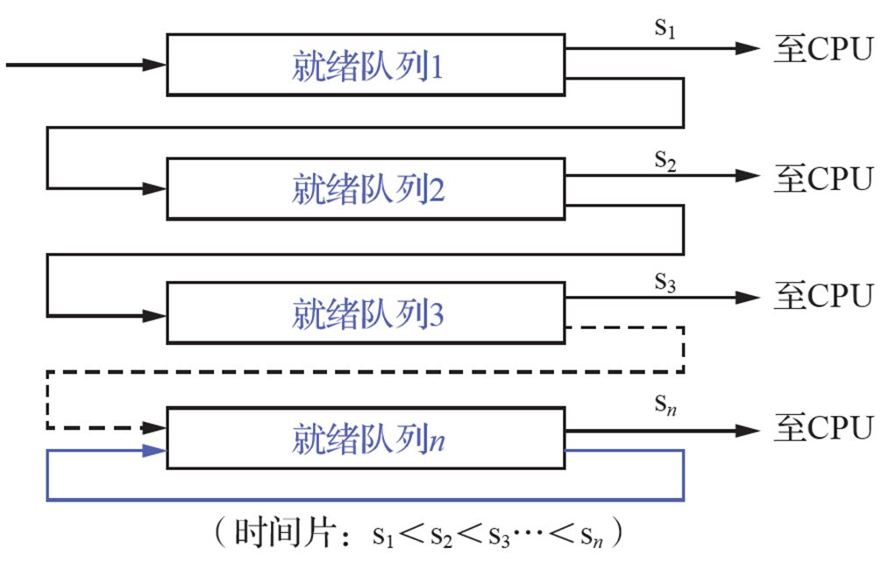
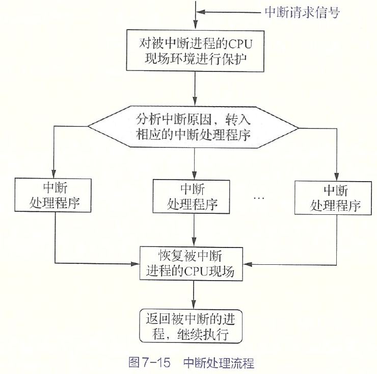
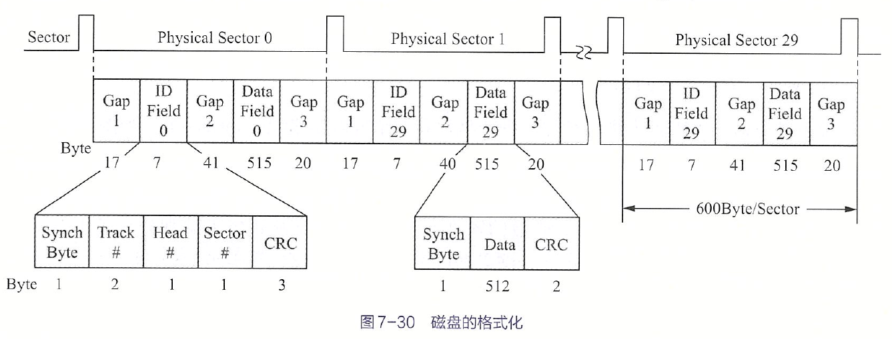
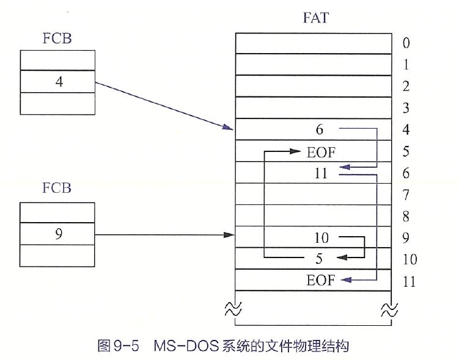
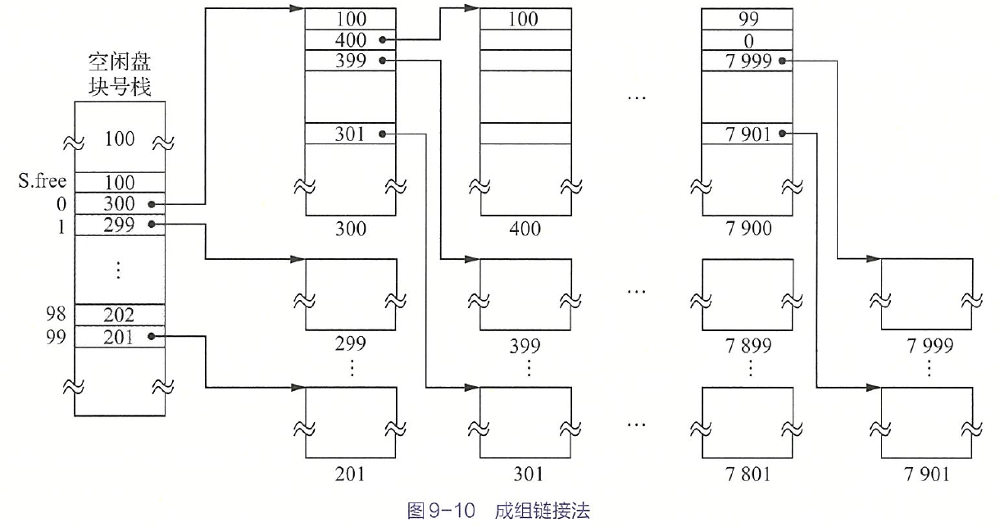

## 操作系统引论

### 目标和作用

> OS 是配置在计算机硬件上的第一层软件，是对硬件系统的首次扩充。作用：管理硬件设备，提高它们的利用率和系统吞吐量，并为用户和应用程序提供一个简单的接口。

OS是(P9)一组能有效地组织和管理计算机硬件和软件资源，合理地对各类作业进行调度，以及方便用户使用的程序的集合。

OS 的主要目标：(方便性、有效性最重要)

- 方便性
- 有效性 (提高系统资源利用率、提高系统吞吐量)
- 可扩充性
- 开放性 (遵循国际标准如开放系统互连OSI参考模型)

作用：

- 用户与计算机硬件系统的接口
- 作为计算机系统资源的管理者
- 实现了对计算机资源的抽象

推动OS发展的主要动力：

- 不断提高计算机系统资源的利用率
- 方便用户
- 器件不断更新换代
- 计算机体系结构不断发展
- 不断提出新的应用需求


### 发展过程

1. 无操作系统

   1. 人工操作方式

   纸带 用户独占全机 CPU等待人工操作(I/O缓慢)

   1. 脱机 I/O 方式

   程序输入输出在外围机完成，脱离主机 (对立的称为联机I/O方式)，减少了 CPU 空闲时间，提高了 I/O 速度

2. 单道批处理系统

   单道 批处理 系统

   先把作业脱机 I/O 输入到磁带，用监督程序连续处理作业，运行控制权交给作业，完成后还给监督程序。不能充分利用系统资源，若程序运行时发出 I/O 请求，利用不充分

   

   

   目的：提高CPU利用率

   缺点：系统资源得不到充分利用

3. 多道批处理系统

   作业放在外存形成后备队列，作业调度程序选若干个调入内存，若一个 I/O 就调度另一个

   

   资源利用率高，系统吞吐量大(CPU和其他资源保持忙碌，作业完成或运行不下去才切换，系统开销小)，平均周转时间长，无交互能力(一旦提交，直到作业完成，不能交互，不利于修改和调试)

   需要解决：争用处理机问题，内存分配和保护问题，I/O设备分配问题，文件的组织与管理问题，作业管理问题，用户与系统的接口问题

4. 分时系统

   为了满足用户对人机交互的需求而产生，需求为人机交互(希望独占和直接控制)、共享主机。

   关键问题：用户如何与作业交互。需要提供多个终端，且输入命令能处理和返回结果，之后继续交互。即：①及时接收。多路卡，分时多路复用，扫描各个终端并停留很短时间接收数据。每个终端配置缓冲区暂存命令和数据。②及时处理。采用作业直接进入内存，采用轮转运行，引入时间片，每个作业运行一个时间片就调度下一个作业。

   特征：①多路性。多台终端连一台主机，分时原则服务每个用户；②独立性。每个用户彼此不干扰；③及时性。用户请求很短时间响应。④交互性。用户可以通过终端与系统进行广泛的人机对话。

5. 实时系统

   实时计算：系统的正确性不仅由计算的逻辑结果确定，还取决于产生结果的时间。最主要特征：时间作为关键参数。规定的时间内完成事件的处理。

   常见：工业控制系统、信息查询系统、多媒体系统、嵌入式系统。

   任务类型：①周期性实时任务和非周期性实时任务。前者：外部设备周期发激励信号给计算机。截止时间分为开始截止时间和完成截止时间。②硬实时任务和软实时任务。hard/soft real time HRT SRT。后者偶尔错过时间影响不大。

   特征比较：①多路性。②独立性。③及时性，优化到秒级到毫秒级。④交互性。⑤可靠性。多级容错措施。

6. 微机操作系统

   1. 单用户单任务 OS CP/M(8位) MS-DOS(16位)

   2. 单用户多任务 Windows 3.1, 95/98

   3. 多用户多任务 UNIX, UNIX(Solaris, Linux), Windows NT/Server

      界面友好，管理方便，适于普及，可移植良好，功能强大，通信能力强

7. 嵌入式操作系统 embedded system

   ①系统内核小。②系统精简。③实时性高。④具有可配置性。

8. 网络操作系统

   用于计算机网络环境下对网络资源进行管理和控制，实现数据通信及对网络资源的共享，为用户提供网络资源接口的一组软件和规程的集合。

   ①硬件独立性。②接口一致性。③资源透明性。系统能对网络中的资源进行统一管理，能够根据用户的要求对资源进行自动选择和分配。④系统可靠性。⑤执行并行性。

   功能：①连接的建立和拆除。②报文的分解与组装。③传输控制。④流量控制。⑤差错的检测与纠正。

9. 分布式操作系统 distributed system

   基于软件实现的一种多处理机系统，是多个处理机通过通信线路互联而构成的松散耦合系统。如 WWW

   ①每个节点都是一台独立的计算机，有完整的外部设备。②节点耦合程度更低；③每个节点可以运行不同的OS。

   特征：①分布性。②透明性。资源被所有计算机共享，包括CPU、文件、打印机等。③同一性。可以共同完成同一个任务。④全局性。

   功能：①通信管理。②资源管理。③进程管理。

### 基本特征

1. 并发 concurrent

   并行：两个或多个事情同一时刻发生

   并发：两个或多个事情在同一时间间隔内发生

   进程：系统中能独立运行并能作为资源分配对象的基本单位，由一组机器指令、数据和堆栈等组成，是能独立运行的活动实体。

2. 共享 sharing

   资源共享/资源复用：系统中的资源可供内存中的多个并行执行的进程共同使用

   互斥共享方式：先提出请求，空闲就能用，否则等待，用完释放。

   临界资源/独占资源：一段时间内只允许一个进程访问的资源。如物理设备、栈、变量、表格等。

   同时共享方式：微观上互斥，宏观同时(单处理机下)。如磁盘设备。

3. 虚拟 virtual

   为了提高通信信道利用率引入，通过空分复用/时分复用将一条物理信道分为若干逻辑信道。将一个物理实体变为若干个逻辑对应物的功能是虚拟。

   时分复用能提高资源利用率的根本原因：令某设备在为一个用户服务空闲时间为其他用户服务，充分利用设备。

   虚拟处理机技术：多道程序设计技术，每道程序至少一个进程，多道程序并发执行。一台物理处理机虚拟为多台逻辑上处理机。用户所感觉到的处理机称为虚拟处理机。

   虚拟设备技术：I/O 设备。使原来仅允许在一段时间内由一个用户访问的设备(临界资源)变为允许多个用户“同时”访问的共享设备。

   空分复用：利用存储器空闲空间(如某道程序阻塞时换到外存空出来的内存空间)存放其他程序以提高内存利用率。

   虚拟存储技术：内存的分时复用，使程序在远小于它的内存空间运行。如每次调入一小部分到内存，运行结束调出。

   时分复用的代价是每台虚拟设备的平均速度小于等于 $\dfrac 1N$。空分复用的平均占用空间同理。

4. 异步 asynchronism

   由于资源等因素的限制，进程的执行通常不可能一气呵成，而停停走走。进程以人们不可预知的速度向前推进就是进程的异步性。若 OS 配置完善的进程同步机制且运行环境相同，则作业即使经过多次运行，也都会获得完全相同的结果。因此异步运行是允许的。

最基本的特征：并发和共享。互为对方存在的条件。


### 运行环境

#### 硬件支持

硬件支持：

开机时运行初始程序/引导程序(bootstrap program)，在固件(firmware)中如 ROM read-only memory 或电擦除可编程只读存储器 electrically-erasable programmable read-only memory EEPROM 等，初始化系统各组件如 CPU 寄存器、设备控制器等和内存内容。引导程序必须定位 OS 内核(kernel)并加载到内存。

内核是 OS 一直运行在计算机上的程序。除此之外还有系统程序和应用程序。UNIX 首个系统进程为 init。

CPU 只能从内存加载指令。通用计算机程序位于可读写内存(随机存取存储器 random access memory RAM)，内存为动态 RAM(DRAM dynamic)。半导体技术。CPU 通过一系列 load/store 内存指令对指定内存地址进行操作。


#### 内核

内核：

OS 内核：将一些与硬件紧密相关的模块如中断处理程序等、常用设备驱动程序、运行频率较高的模块(时钟管理、进程调度等)和许多模块所公用的操作安排在紧靠硬件的软件层次中并常驻内存。目的：便于对这些软件保护防止被其他应用程序破坏、提高 OS 运行效率。功能：

1. 支撑功能 提供给 OS 其他模块所需的基本功能

   1. 中断处理 最基本的功能    OS 赖以活动的基础

      为减少处理机中断时间，提高执行并发性，对中断进行有限处理后便转入相关进程完成后续工作

   2. 时钟管理

      时间片轮转调度中，每当时间片用完就产生中断信号

   3. 原语操作 

      原语 primitive 是由若干指令构成的用于完成一定功能的一个过程，是原子操作 action operation，一个操作所有动作要么全做要么全不做。原语执行不允许被中断，在内核态执行，常驻内存。

2. 资源管理功能

   1. 进程管理

      因为运行频率较高或为多种原语操作所需要的，放内核提高性能

   2. 存储器管理

      运行频率较高，保证运行速度较高

   3. 设备管理

      设备管理与硬件紧密相关


#### 处理机的双重工作模式

处理机的双重工作模式：区分 OS 代码和用户代码的执行。大多数采用硬件支持以区分。

处理机至少需要两种单独运行模式：用户态(user mode，目态)和内核态(kernel mode，管态，系统态)。硬件通过模式位mode bit表示当前模式，0为内核态。


存在系统引导时，从内核态开始工作，OS接着加载，然后在用户态下执行程序。若中断或陷阱，切换到内核态。每当OS能够控制计算机时处于内核态。控制权给用户前切换到用户态。

这提供了保护手段，防止 OS 和用户程序受到错误的用户程序影响。实现：可能引起损害的机器指令当作特权指令privileged instruction，硬件只有在内核态下才允许执行。其他是非特权指令(non-\~)。

- 特权指令。对内存空间访问范围不受限。切换到用户态也是特权指令。
- 非特权指令。用户态下运行的都是。

限制由硬件实现。应用程序使用了特权指令则硬件不会执行，并发出权限出错信号，OS捕获后进入错误处理程序，停止运行该应用程序，重新程序调度。


#### 中断与异常

现代OS是中断驱动的interrupt driven。OS会等待某个事件发生，事件总是由中断interrupt或陷阱trap引起的。它们是一种由程序引起的中断，源于出错或用户程序的特定请求。OS这种终端特性规定了系统的通用结构。每一种中断通过不同代码处理。中断处理程序。

中断是硬件通过系统总线发送信号到CPU触发的。被中断会停止正在做的事情并立即转到固定位置继续执行，包括中断程序开始地址。执行完后重新执行被中断的计算。

实现中断将控制转移到中断处理程序的直接方法：调用通用程序以检查终端信息，然后调用中断处理程序。可以通过中断处理程序指针表间接调用程序。指针表通常位于低地址内存(100左右)，包含各种设备中断处理程序地址。这种地址为中断向量interrupt vector。对给定的中断请求，可通过唯一设备号索引，提供设备中断处理程序地址。


### 主要功能

引入OS主要目的：为多道程序的运行提供良好的运行环境，以保证多道程序能有条不紊、高效运行，最大限度提高系统中各种资源的利用率和方便用户的使用。

#### 处理机管理功能

传统多道程序系统处理机分配和运行以进程为基本单位。

主要功能：创建和撤销进程，对各进程的运行进行协调，实现进程之间的信息交换，按照一定的算法把处理机分配给进程。

1. 进程控制

   每道作业一个或多个进程。设置有线程的OS为一个进程创建若干线程。

   主要功能：为作业创建进程，撤销(终止)已结束的进程，控制进程在运行过程中的状态转换。

2. 进程同步

   主要任务：对多个进程(含线程)的运行进行协调。有进程互斥方式(对临界资源访问)，进程同步方式(最简单是锁)，实现同步最常用是信号量机制。

3. 进程通信

   一组相互合作的进程完成一个共同任务需要交换信息。同意计算机系统采用直接通信，进程利用发送命令，将消息message挂到目标进程消息队列。

4. 调度

   传统OS包括作业调度(基本任务：从后备队列选出若干作业，分配资源，调入内存，

   建立线程，插入就绪队列)和进程调度(任务：就绪队列选进程分配给处理机，设置运行现场)。

#### 存储器管理功能

主要任务：为多道程序的运行提供良好的环境、提高存储器的利用率、方便用户使用、并能从逻辑上扩大内存。

主要功能：

1. 内存分配和回收

   主要任务：①为每道程序分配内存空间，使它们各得其所；②提高存储器的利用率，尽量减少不可用的内存空间(内部碎片)；③允许正在运行的程序申请附加的内存空间，以适应程序和数据动态增长的需要

   静态分配模式：不允许作业申请新内存和作业在内存中移动

   动态分配模式：允许运行时继续申请新的附加内存空间，允许移动

   回收：程序所占用的内存，根据内存管理算法将回收的内存经过处理放入对应的管理数据结构中，供下次分配时使用

2. 内存保护

   主要任务：①确保每道用户程序仅在自己的内存空间中运行，彼此互不干扰；②不允许用户程序访问OS的程序和数据，转移到非共享的其他用户程序中去执行

   一种机制：设置两个界限寄存器，放在执行程序上下界，越界发出越界中断请求

3. 地址映射

   每道程序地址从0开始的，各程序段地址空间逻辑地址与内存空间物理地址不一致。硬件支持

4. 内存扩充

   虚拟存储技术。设置内存扩充机制(包含少量硬件)：①请求调入功能。在仅装入部分用户程序和数据下启动该程序运行，若其余部分未装入向OS发出请求，由OS从磁盘将所需部分调入内存。②置换功能。内存无足够空间装入时，将内存一部分暂时不用的程序和数据调到盘上，腾出空间

#### 设备管理功能

主要任务：①完成用户进程提出的I/O请求，为用户进程分配所需的I/O设备，完成指定I/O操作；②提高CPU和I/O设备的利用率，提高I/O速度，方便用户使用I/O设备。

功能：

1. 缓冲管理

   内存设置缓冲区。增加缓冲区容量可以改善系统性能。常用机制：①单缓冲区机制；②双向同时传送数据的双缓冲区机制；③供多个设备同时使用的公用缓冲池机制

2. 设备分配

   根据用户进程I/O请求与系统现有资源情况，分配所需设备。如果存在设备控制器和I/O通道，需要对应分配。

   设置设备控制表、控制器控制表等。

3. 设备处理

   又称设备驱动程序，实现CPU和设备控制器之间的通信，CPU向设备控制器发出I/O命令，要求它完成指定的I/O操作，以及接受从设备控制器发出的中断请求

   首先检查合法性，设备是否空闲，读取相关传递参数设置工作方式，然后向设备控制器发出I/O命令，启动设备。及时响应设备控制器发来的中断请求。自动构成通道程序。

#### 文件管理功能

对用户文件和系统文件进行管理，方便使用，保证安全性。

1. 文件存储空间管理

   为每个文件分配外存空间，提高外存利用率，文件系统存取速度。对存储空间分配和回收。

2. 目录管理

   为每个文件建立目录项(文件名、属性、物理位置等)，方便按名存取。文件共享(外存保留共享文件一份副本即可)。快速查询手段

3. 文件读/写管理和保护

   检索目录，获取位置，用文件读写指针进行操作，修改指针，为下一次做准备。读写不会同时进行，可以合用

   文件保护。防止未经核准用户存取文件，防止冒名顶替存取文件，防止不正确方式使用文件

#### 接口管理功能

分为：

1. 用户接口

   向作业发出命令控制作业运行。分为：

   1. 联机用户接口 即命令行模式 CLI command-line interface

      由键盘操作命令和命令解释程序组成 (不方便，花时间，需要熟记所有命令及其格式和参数并逐个字符输入)

   2. 脱机用户接口 批命令方式

      为批处理作业用户提供，使用作业控制语言 JCL job control language，事先写在作业说明书。调度时逐条解释执行

   3. 图形用户接口 GUI graphic user interface

2. 程序接口

   用户程序访问系统资源，取得OS服务的唯一途径。一组系统调用组成。早期是汇编语言。高级语言提供库函数

#### 现代操作系统新功能

1. 保证系统安全

   认证技术：确定对象真实性。如身份验证。

   密码技术：存储和传输的数据加密。

   访问控制技术：对用户存取权限设置，对文件属性设置

   反病毒技术：最好是预防。

2. 支持用户通过联网获取服务

   网络通信：无差错数据传输，通信链路建立和拆除，传输控制，差错控制，流量控制等

   资源管理：网络共享资源(软硬件)

   应用互操作：信息的互通性：处于不同网络中用户之间实现信息的互通。信息的互用性：用户可以访问不同网络中的文件系统和数据库系统中的信息。

3. 可处理多媒体信息

   接纳控制功能：保证多个实时进程截止时间，对系统中运行的SRT任务数据，驻留在内存中的SRT任务数目加以限制

   实时调度

   存储多媒体文件：对离散存放和磁盘寻道方式加以改进

### 结构

#### 简单结构

只需要功能实现和高效率，缺乏首尾一致的设计思想。OS是一组过程的集合，每个过程可任意调度其他过程。内部复杂混乱，无结构。

又称整体系统结构。如 MS-DOS。

#### 模块化结构

模块-接口法关键问题：模块的划分和规定好模块之间的接口。划分太细会联系过多系统混乱；模块过大内部复杂。

模块独立性衡量标准：①内聚性，模块内部各部分间联系的紧密程度；②耦合度，模块间相互影响的程度

优点：①提高了OS设计的正确性、可理解性和易维护性；②增强OS可适应性；③加速了OS的开发过程

问题：①对各模块间接口的规定很难完成划分后模块对接口的实际需求②在OS设计阶段，设计者必须做出一系列决定，每个决定建立在上一个决定上，难以找到可靠地决定顺序，很难做到每一步决定建立在可靠决定基础上。因此成为无序模块法。

目前常用设计方法是可加载的内核模块loadable kernel module。内核核心组件无论启动时还是运行时都可以通过模块链入额外服务，常见于UNIX和Windows实现。思想是：内核提供核心服务，其他服务在内核运行时动态实现。动态链接服务优先于直接添加新功能到内核。后者要重新编译内核。

#### 分层式结构

无序决定改为游戏性。任务：在目标系统 $A_n$ 和裸机系统(宿主系统) $A_0$ 之间，铺设若干层次软件 $A_i$。自底向上分层。

基本原则：每一步设计建立在可靠基础上。每一层只能使用低一层功能和服务。

优点：①易保证系统正确性，自下而上，所有决定有序，建立在较为可靠基础上②可保证系统易维护性和可扩充性，添加修改替换不改变接口就不会影响其他

缺点：系统效率低。分层单向依赖，每层建立层间通信机制，增加通信开销。

#### 微内核结构

microkernel。非常实用分布式。如Windows 2000/XP。

为提高正确性、灵活性、易维护性、可扩充性，即使单处理机也大多采用C/S模式的微内核结构，将OS划分为微内核和多个服务器。

特点：

1. 足够小的内核。能实现现代OS最基本核心功能，不是完整的OS，通常包含：①处理硬件紧密部分；②最基本功能；③客户服务器通信。

2. 基于C/S模式。OS绝大部分功能放在一组服务器(进程)实现，运行在用户态，与微内核用消息传递机制信息交互。

   

3. 采用策略与机制分离原则。机制：实现某一功能的具体执行机构。策略：在机制上借助某些参数和算法实现功能的优化或达到不同的功能目的。通常机制在系统基层、策略在系统高层。通常微内核放机制。

4. 采用面向对象技术。抽象和隐藏原则控制复杂性。对象封装继承等保证正确性可靠性易修改性易扩展性，提高设计速度。

基本功能：

1. 进程(线程)管理。

   进程(线程)间通信，进程切换，调度，多处理机间同步等。

2. 低级存储器管理

   实现逻辑地址转物理的页表机制和地址变换机制，依赖于机器。

3. 中断和陷入处理

   捕获，前期处理(中断现场保护，识别类型，转换信息发送给服务器)。进程管理存储器管理I/O管理一分为二，机制放内部。

优点：

1. 提高了系统可扩展性
2. 增强了系统可靠性。提供规范精简的程序应用接口 API application programming interface。服务器出错不影响微内核和其他服务器。
3. 增强了系统可移植性。硬件相关的放微内核和下面的硬件隐藏层
4. 提供了对分布式系统的支持。支持分布式和网络。服务所有进程和服务器唯一标识符，微内核配置系统映射表，就可以不管消息在哪台机器
5. 融入了面向对象技术

问题：运行效率有所降低。最主要：一次客户对OS提出对服务请求，利用消息实现多次交互和用户/内核模式上下文多次切换，早期一般只有两次。微内核至少4次。

> 改善效率：重新把一些常用基本功能由服务器移入微内核。

#### 外核模式

exokernel，外内核OS基本思想：内核不提供进程、虚拟存储器等抽象事物，专注于物理资源隔离(保护)与复用，硬件资源管理委托给应用程序。


### 系统调用

程序接口由一组系统调用system call组成。系统调用提供了用户程序与OS内核之间的接口。可以给应用程序和OS自身使用。(能完成特定功能的子程序)

提供系统调用的目的：使应用程序可以通过系统调用间接调用OS相关过程，进而取得相应服务，本质是应用程序请求OS内核完成某功能时的一种特殊过程调用。

1. 运行在不同的系统状态。调用程序运行在用户态，被调程序运行在内核态。
2. 状态的装换。通过软中断机制先用户态转内核。
3. 返回问题。抢占式(剥夺)调度方式里，调用完成后，重新优先级分析，若调用程序仍有最高优先级才继续执行它，否则重新调度，调用进程放入就绪队列。
4. 嵌套调用。系统调用可以嵌套。有深度限制。一般的过程调用对嵌套调用深度没有限制。

系统调用通过中断机制实现，一个OS所有系统调用通过同一个中断入口实现。中断机制本身收拥有保护机制的OS保护。对终端号授权。如Linux有3H,4H,5H和80H，最后者是系统调用中断号。

类型：

1. 进程控制类系统调用

   创建和终止系统进程；获得和设置进程属性(标识符、优先级、最大允许执行时间等)；等待某事件出现的系统调用

2. 文件操纵类系统调用

   创建和删除文件；打开和关闭文件；读写文件

3. 进程通信类

   单处理机：信息传递方式和共享存储区方式。①信息传递方式：打开一个连接，发送信息，接受信息，关闭连接；②共享存储区：建立存储区，连接到进程自身虚地址空间，读写存储区

4. 其他

   设备管理类(申请释放重定向获得设置属性)、信息维护类(有关系统和文件的时间信息、OS版本、当前用户、空闲内存、磁盘空间大小等)


## 进程的描述与控制

### 前驱图和程序执行

前驱图 precedence graph 是 DAG directed acyclic graph，描述进程执行先后关系，节点表示一个进程/一段程序/一条语句，有向边表示偏序partial order或前驱关系precedence relation。无前驱是初始节点initial node，无后继终止节点final node。节点带权，表示程序量/程序执行时间。

程序顺序执行：前一程序段完成才运行后一程序段，图是链。特征：顺序性、封闭性(独占全机，除初始状态只有本程序才能改变资源状态，一旦开始结果不受外界影响)、可再现性

程序并发执行：不存在前驱关系可以并发执行。特征：间断性(相互制约，执行-暂停-执行的活动规律)、失去封闭性(共享全机资源、状态受外界影响)、不可再现性(环境和初始条件相同，结果不一样)(如:共享同一变量，多个程序一起修改和输出)


### 进程的描述

进程是程序的执行过程，是系统进行资源分配和调度的一个独立单位。

由程序段、相关数据段和进程控制块(PCB, process control block)。PCB描述京城的基本情况和活动过程。创建和撤销的实质是PCB增删。

进程的特征：

1. 动态性。最基本的特征。具有生命期。
2. 并发性。一段时间内同时执行。
3. 独立性。是能独立运行的基本单位，独立获得资源和独立调度的基本单位。
4. 异步性。各自独立、不可预知的速度推进。

进程是程序的一个实例，一次执行。进程是活动的，程序是静态的。程序是进程的代码部分。进程在内存中，程序在外存中。

基本状态：

1. 就绪 ready。分配到了除CPU外的所有必要资源，按优先级策略排为就绪队列。
2. 执行 running。获得 CPU 后正在执行，单处理机系统里唯一进程处于该状态。
3. 阻塞 block。又称等待/封锁。发生事件导致无法继续执行(I/O请求、申请缓冲区失败等)，引发进程调度，分配给另一个就绪资源。排成阻塞队列，一些系统有多个队列。

此外，还有：

1. 创建(新建)状态。申请空白PCB，填写PCB，分配资源，设为就绪状态插入就绪队列。
2. 终止状态。等待OS善后，（不能再被执行，但保留记录(状态码，计时统计数据供其他进程收集)），收回PCB。


为了满足系统和用户观察与分析进程的需要，引入挂起操作。包括：终端用户、父进程、负荷调节和OS(如CPU时间、实际使用时间、作业、进程数量统计)的需要。进入挂起suspend和激活active原语。

- 活动就绪$\leftrightarrow$静止就绪，活动阻塞$\leftrightarrow$静止阻塞


还有：NULL$\to$创建。创建$\to$活动就绪/静止就绪(看性能和内存容量而定)。执行$\to$终止。


OS 对每个资源和进程设置数据结构表征其实体，称为资源信息表和进程信息表(含标志、描述、状态等)。控制表分为内存表、设备表、文件表、进程表(PCB)。


PCB是进程的一部分，是操作系统中最重要的记录型数据结构，是进程存在的唯一标志，常驻内存。(描述进程当前情况和管理进程运行状态的全部信息)

PCB作用：使一个在多道程序环境下不能独立运行的程序(含数据)成为一个能独立运行的基本单位。

1. 作为独立运行基本单位的标志

   进程存在于系统中的唯一标志

2. 实现间断性运行方式

   保留运行时的 CPU 现场信息

3. 提供进程管理所需要的信息

   调度进程时根据PCB记录的程序和数据在内存/外存起始地址(基址/始址)找对应程序和数据

4. 提供进程调度所需要的信息

   就绪状态，优先级，等待时间，已执行时间

5. 实现与其他进程的同步与通信

   用于同步的信号量，实现进城通信的区域或通信队列指针等

PCB中的信息：

1. 进程标识符

   1. 外部标识符 创建者提供，字母和数字组成。设置父子进程标识符。还可设置用户标识符指示拥有该进程的用户
   2. 内部标识符 数字，进程序号

2. 处理机状态 (处理机上下文)

   由处理机各种寄存器中内容组成。包括：

   - 通用寄存器 (用户可视寄存器) 可被用户程序访问，暂存信息
   - 指令计数器 下一条指令地址
   - 程序状态字寄存器 状态信息如条件码、执行方式、中断屏蔽标志等
   - 用户栈指针寄存器 与用户进程相关的系统栈，存放进程、系统调用参数和调用地址。栈指针指向栈顶

3. 进程调度信息

   - 进程状态
   - 进程优先级 整数 高的优先
   - 其他信息 如进程已等待CPU时间总和、已执行时间总和等，与调度算法有关
   - 事件 进程由执行状态转换为阻塞状态所等待发生的事件即阻塞原因

4. 进程控制信息

   - 程序和数据的地址 (内存/外存起始地址)
   - 进程同步和通信机制，如消息队列指针、信号量等
   - 资源清单 运行期间所需除CPU外全部资源
   - 链接指针 队列下一个进程PCB始址

组织方式：

1. 线性方式 

   线性表，表起始地址存在内存专用区域，简单，开销小，但查找扫描全表

2. 链接方式

   用PCB链接字将具有相同状态的进程PCB链成队列，如优先级队列(高在前)

3. 索引方式

   进程状态不同建立索引表


### 进程控制

进程管理最基本的功能。

#### 进程创建

一个进程创建另一个进程，创建者为父进程parent process。进程与其子孙共同组成进程组(进程家族)。撤销进程资源归还父进程，撤销所有子进程。(windows不存在层次结构概念，进程创建者获得句柄即令牌，控制被创建进程，可以传递句柄)。

进程图process graph是有向图，描述父子关系。根节点是祖先ancestor。

引起创建的事件：(前三种是系统内核创建新进程)

1. 用户登录。分时系统用户登录终端成功，插入到就绪队列
2. 作业调度。多道批
3. 提供服务。用户程序提出请求，系统创建进程提供服务如打印
4. 应用请求。用户进程自己创建新进程

进程创建步骤：

1. 申请唯一数字标识符，从PCB集合索取空白PCB。
2. 分配物理和逻辑资源如内存、文件、I/O设备、CPU时间等。从OS/父进程获得。①批处理作业大小在用户提出创建进程要求时提供；②交互型作业系统分配，如果要共享内存的某个地址空间(已装入内存的共享段)必须建立相应的链接
3. 初始化PCB。①标志信息(标识符，父进程标识符)；②处理机状态信息，时程序计数器指向程序入口地址，栈指针指向栈顶；③处理机控制信息，进程状态为就绪/静止就绪，通常最低优先级
4. 就绪队列能接纳就入队

> 进程创建新进程的两种可能：父子进程并发执行、父进程等待直到某个或全部子进程执行完毕。
>
> 新进程地址空间两种可能：子进程与父进程数据和程序相同(复制关系)、子进程加载新程序

> UNIX 是 fork 复制，子进程调用返回 0，父进程返回子进程标识符。

> 1. 子进程的结束和父进程的运行是一个异步过程,即父进程永远无法预测子进程到底什么时候结束。 当一个 进程完成它的工作终止之后，它的父进程需要调用wait()或者waitpid()系统调用取得子进程的终止状态。
>
> 2. 孤儿进程：一个父进程退出，而它的一个或多个子进程还在运行，那么那些子进程将成为孤儿进程。孤儿进程将被init进程(进程号为1)所收养，并由init进程对它们完成状态收集工作。
>
>    杀死父进程后，子进程将会成为孤儿进程，而 init 进程将重新成为它的父进程
>
> 3. 僵尸进程：一个进程使用fork创建子进程，如果子进程退出，而父进程并没有调用wait或waitpid获取子进程的状态信息，那么子进程的进程描述符仍然保存在系统中。这种进程称之为僵尸进程


#### 进程终止

引起终止的事件：

- 正常结束

- 异常结束

  越界(存储区超过进程所占范围)

  保护错(访问不允许的资源/文件或以不当方式访问)

  指令错(执行不存在/非法指令)，如把数据区当指令

  特权指令错(只允许OS执行的指令)

  运行超时(设定最大值)

  等待超时(等待某时间时间超过指定值)

  算术运算错(如零除

  I/O错

- 外界干预

  操作员/OS。如事件(系统死锁)

  父进程请求

  父进程终止

终止的过程：

1. 根据标识符从PCB集合检索出该进程PCB，读出状态
2. 若处于执行状态，立刻终止执行，调度标志为真
3. 终止它的子孙进程
4. 将被终止进程资源归还父进程或系统
5. 移出PCB所在队列/链表，等待其他程序搜集信息

#### 阻塞与唤醒

触发事件：

- 向系统请求共享资源状态失败。转为阻塞。其他进程释放后唤醒。
- 等待某种操作的完成。如I/O。完成后唤醒。
- 新数据尚未到达。相互合作的进程，一个进程需要获得另一个进程的数据进行后续操作。
- 等待新任务的到达。特定系统进程当完成任务就阻塞自己。如发送数据包的服务器。

阻塞过程：（阻塞是进程自身的主动行为）

- 若执行状态停止执行，改为阻塞，插PCB入阻塞队列；若多个队列插入到具有相同事件的
- 转到调度程序重新调度，保留被阻塞进程处理机状态，按新进程PCB处理机状态设置CPU环境

唤醒过程：

- 从阻塞队列移出，PCB状态改为就绪，插入就绪队列

阻塞与唤醒原语(block, wakeup)必须成对使用，否则可能永远不能唤醒。

#### 挂起与激活

挂起 suspend：

- 检查状态，就绪改静止就绪，阻塞改静止阻塞
- 将PCB复制到指定内存区域
- 若正在执行让调度程序重新调度

激活 active：

- 进程从外存调入内存，静止就绪改活动就绪，静止阻塞改活动阻塞
- 若抢占调度，则检查是否要重新调度(优先级高分配给刚被激活的进程)


### 进程通信

IPC interprocess communication

低级进程通信：

- 效率低。生产者每次向缓冲区投放一个产品(消息)，消费者每次取得一个
- 通信对用户不透明。OS只提供共享存储器，数据结构、传送、互斥同步都要程序员手动实现

高级通信：

- 使用方便。隐藏细节，提供原语，减少通信时程序复杂性。
- 高效传送大量数据

高级通信机制类型：

- 共享存储器系统 shared-memory system

  - 基于共享数据结构的通信方式。各进程共享某些数据结构，如有界缓冲区。低级进程通信。
  - 基于共享存储区的通信方式。内存划分出。数据形式和位置(甚至访问)由进程控制。高级。通信前申请一个分区，附加到自己的内存地址。完毕或不需要就归还。

- 管道通信系统 pipe

  管道：连接一个读进程和写进程的共享文件又名pipe文件。字节流形式读写，首创UNIX。

  提供的协调能力：

  - 互斥。一个进程在读/写时，另一个必须等待
  - 同步。写入一定量如4KB时就睡眠(等待)，直到被读走再唤醒；读空时也睡眠，直到写入再唤醒
  - 确定对方是否存在

- 消息传递机制 message passing system

  不借助任何数据结构/共享区，以格式化信息message为单位，用OS原语通信。当前最广泛，最主要。如报文，微内核OS的微内核与服务器。

  实现方式：

  - 直接通信方式。用原语

    - 对称寻址方式。双方显式提供对方标识符。原语：`send(receiver,message),receive(sender,massage)`

      一旦改变进程名，就可能需要检查所有其他进程定义，不利于模块化

    - 非对称寻址。`send(p,message)`,`receive(id,message)`,id是发送方id或名字

    格式：短定长或变长

    完成后同步方式：发送接收阻塞，无缓冲；发送不阻塞接收阻塞(最广应用)；均不阻塞

    通信链路：原语建立(主要计网)，或不需要建立原语直接发送。有单向和双向。

  - 间接通信方式。通过共享中间实体(信箱)

    信箱结构：信箱头(信箱标识符，拥有者标识符，口令，空格数等)，信箱体(若干存放消息(或消息头)的信箱格，创建新箱静态确定)。单向或双向

    原语：信箱创建(名字，属性(公用私用共享)，共享者名字)，撤销；发送接收 `send/receive(mailbox,message)`。

    类型：①私用信箱。进程自己创立，自己读，其他用户发。单向。②公用。OS创建，核准进程可用。双向。③共享。进程创建，指明共享进程名字。拥有者和共享者能发送。

    四种关系：发送与接收的一/多对一/多。其中多对一是C/S，一对多广播。

- 客户机-服务器系统

  实现方式：

  - 套接字 socket。是通信标志类型数据结构，包含通信目标地址、端口号、传输层协议、进程所在网络地址、系统调用/API等。是进程通信和网络通信基本构建。分为：

    - 基于文件型。一个套接字关联一个特殊文件，原理类似管道通信
    - 基于网络型。非对称通信，发送者需要提供接收者名字，双方在不同主机。通信分配一对套接字。发出连接请求时随即申请套接字，主机分配端口与之绑定。接受进程有全局公认套接字和指定端口。

  - 远程过程调用 remote procedure call RPC 和远程方法调用

    若涉及软件采用 OOP，又称远程方法调用 RMI Remote Method Invocation

    进程：本地客户和远程服务器，统称网络守护进程，一般阻塞。

    根 stub。本地客户端每个运行的运行过程有一个客户存根 client stubborn。服务端也有，且也一般阻塞

    步骤：

    - 本地过程调用者调用远程过程在本地关联客户存根，传参，控制权给用户存根
    - 执行客户存根，控制权给本地客户
    - 本地客户进程完成，消息发送
    - 远程服务器接收，执行，找到并发给服务器存根、
    - 服务器存根阻塞转执行，调用远程过程
    - 服务器返回存根
    - 服务器存根将结果打包给消息，控制权给远程服务器
    - 远程服务器消息发回客户端
    - 客户端收到信息，存入关联客户存根，控制权给客户存根
    - 客户存根取结果，返回本地过程调用者进程，完成控制权转移


Linux 通信例子，包括：管道、信号、消息队列、共享内存、信号量、套接字等。支持语义符合可移植操作系统接口 POSIX portable operating system interface 标准的信号函数

> 进程间通信主要有以下几种方式：匿名管道、命名管道、信号、消息队列、共享内存、信号量、Socket。
>
> - 匿名管道：管道是一种半双工的通信方式，数据只能单向流动，而且只能在具有亲缘关系的进程间使用。进程的亲缘关系通常是指父子进程关系。
>
> - 有名管道(FIFO)。有名管道的名字存在于文件系统中，内容存放在内存中。只要可以访问该路径，就能够彼此通过有名管道相互通信。读队首，写队尾。
>
> - 信号是Linux系统中用于进程间互相通信或者操作的一种机制，信号可以在任何时候发给某一进程，而无需知道该进程的状态。
>
>   如果该进程当前并未处于执行状态，则该信号就有内核保存起来，知道该进程回复执行并传递给它为止。
>
>   如果一个信号被进程设置为阻塞，则该信号的传递被延迟，直到其阻塞被取消是才被传递给进程。
>
>   | 信号    | 描述                                                         |
>   | ------- | ------------------------------------------------------------ |
>   | SIGHUP  | 当用户退出终端时，由该终端开启的所有进程都退接收到这个信号，默认动作为终止进程。 |
>   | SIGINT  | 程序终止(interrupt)信号, 在用户键入INTR字符(通常是Ctrl+C)时发出，用于通知前台进程组终止进程。 |
>   | SIGQUIT | 和SIGINT类似, 但由QUIT字符(通常是Ctrl+\)来控制. 进程在因收到SIGQUIT退出时会产生core文件, 在这个意义上类似于一个程序错误信号。 |
>   | SIGKILL | 用来立即结束程序的运行. 本信号不能被阻塞、处理和忽略。       |
>   | SIGTERM | 程序结束(terminate)信号, 与SIGKILL不同的是该信号可以被阻塞和处理。通常用来要求程序自己正常退出。 |
>   | SIGSTOP | 停止(stopped)进程的执行. 注意它和terminate以及interrupt的区别:该进程还未结束, 只是暂停执行. 本信号不能被阻塞, 处理或忽略. |
>
> - 消息队列是存放在内核中的消息链表，每个消息队列由消息队列标识符表示。消息队列存放在内核中，只有在内核重启(即，操作系统重启)或者显式地删除一个消息队列时，该消息队列才会被真正的删除。与管道不同的是，消息队列在某个进程往一个队列写入消息之前，并不需要另外某个进程在该队列上等待消息的到达
>
>   （1）消息队列是消息的链表,具有特定的格式,存放在内存中并由消息队列标识符标识.
>
>   （2）消息队列允许一个或多个进程向它写入与读取消息.
>
>   （3）管道和消息队列的通信数据都是先进先出的原则。消息队列可以实现消息的随机查询,消息不一定要以先进先出的次序读取,也可以按消息的类型读取.比FIFO更有优势。
>
>   （4）消息队列克服了信号承载信息量少，管道只能承载无格式字 节流以及缓冲区大小受限等缺。
>
>   （5）目前主要有两种类型的消息队列：POSIX消息队列以及System V消息队列，系统V消息队列目前被大量使用。系统V消息队列是随内核持续的，只有在内核重起或者人工删除时，该消息队列才会被删除
>
> - 共享内存。给两个进程开辟了一块二者均可访问的内存空间，这时，两个进程便可以共享一些数据了。但是，多进程同时占用资源会带来一些意料之外的情况，这时，我们往往会采用下述的信号量来控制多个进程对共享内存空间的访问。
>
>   采用共享内存通信的一个显而易见的好处是效率高，因为进程可以直接读写内存，而不需要任何数据的拷贝。对于像管道和消息队列等通信方式，则需要在内核和用户空间进行四次的数据拷贝(用户->内核->内存->内核->用户)，而共享内存则只拷贝两次数据：一次从输入文件到共享内存区，另一次从共享内存区到输出文件。
>
>   实际上，进程之间在共享内存时，并不总是读写少量数据后就解除映射，有新的通信时，再重新建立共享内存区域。而是保持共享区域，直到通信完毕为止，这样，数据内容一直保存在共享内存中，并没有写回文件。共享内存中的内容往往是在解除映射时才写回文件的。因此，采用共享内存的通信方式效率是非常高的
>
> - 信号量。主要用来解决进程和线程间并发执行时的同步问题，进程同步是并发进程为了完成共同任务采用某个条件来协调他们的活动。即 PV 操作。
>
> - socket。字可以看做是：不同主机之间的进程进行双向通信的端点。（套接字 = IP地址 + 端口号）。计网里应用层与传输层的桥梁。

> 区别：线程通信
>
> 1. 锁机制：包括互斥锁、条件变量、读写锁互斥锁提供了以排他方式防止数据结构被并发修改的方法。读写锁允许多个线程同时读共享数据，而对写操作是互斥的。条件变量可以以原子的方式阻塞进程，直到某个特定条件为真为止。对条件的测试是在互斥锁的保护下进行的。条件变量始终与互斥锁一起使用。
> 2. 信号量机制(Semaphore)：包括无名线程信号量和命名线程信号量
> 3. 信号机制(Signal)：类似进程间的信号处理线程间的通信目的主要是用于线程同步，所以线程没有像进程通信中的用于数据交换的通信机制。


### 线程的概念

60s中提出进程概念，80s中提出线程概念，90s后多处理机系统引入

引入线程的目的：①减少程序在并发执行时所付出的时空开销，②使OS具有更好的并发性(资源利用率和吞吐量) ③适用于SMP结构的计算机系统 Symmetrical Multi-Processing 对称多处理机

> **进程的**基本属性：
>
> 1. 进程是一个可拥有资源的独立单位。包括磁盘、内存地址空间、I/O设备、已打开的文件、信号量等。
> 2. 进程是可独立调度和分派的基本单位。进程有唯一PCB，可以保存断点信息，恢复现场。
>
> 进程与线程的区别：
>
> （1）一个线程从属于一个进程；一个进程可以包含多个线程。
>
> （2）一个线程挂掉，对应的进程挂掉；一个进程挂掉，不会影响其他进程。
>
> （3）进程是系统资源调度(CPU分配资源)的最小单位；线程CPU调度的最小单位。
>
> （4）进程系统开销显著大于线程开销；线程需要的系统资源更少。
>
> （5）进程在执行时拥有独立的内存单元，多个线程共享进程的内存，如代码段、数据段、扩展段；但每个线程拥有自己的栈段和寄存器组。
>
> （6）进程切换时需要刷新TLB并获取新的地址空间，然后切换硬件上下文和内核栈，线程切换时只需要切换硬件上下文和内核栈。线程是运行在进程上下文中的逻辑流，其上下文也更小(是进程上下文子集)。
>
> （7）通信方式不一样。
>
> （8）进程适应于多核、多机分布；线程适用于多核

线程(轻型进程 light-weight process LWP)对比传统进程(HWP)

- 在传统的OS中，拥有资源、独立调度和分派的基本单位都是进程

  在引入线程的OS，线程作为调度和分派的基本单位，**线程是能独立运行的基本单位**。

  同一进程，线程的切换不引起进程的切换。进程间线程切换会引起进程切换

- 进程之间可以并发且一个进程的多个线程间可并发

- 进程作为拥有资源的基本单位；线程本身不拥有资源，仅有一点保证独立运行的资源，允许多个线共享其隶属进程所拥有的资源

  线程有 TCB，指示被执行指令序列的程序计数器，保留局部变量，少数状态参数和返回地址等的一组寄存器和堆栈

  共享其隶属进程所拥有的资源表现在属于同一进程的线程相同地址空间，可以访问每一个虚地址和进程资源如打开的文件、定时器、信号量机构等和I/O设备等

- 同一进程的不同线程间独立性比不同进程的独立性低很多。一个线程的堆栈可以被其他线程读写甚至完全清除，打开的文件也能被其他线程读写

- 线程创建撤销切换的代价低于进程的，通信同步也简单

- 支持多处理机系统。一个进程多个线程分配到多个处理机，加速进程完成

线程基本状态：执行、就绪、阻塞。与进程状态转换一样。

进程控制块 TCB 有：

- 进程标识符
- 寄存器(程序计数器、状态寄存器、通用寄存器等)
- 线程执行状态
- 优先级
- 线程存储区(现场信息，统计信息等)
- 信号屏蔽
- 堆栈指针。过程调用嵌套的局部变量和返回地址。指向用户自己的堆栈(用户态用户栈局部变量返回地址)和指向核心栈的堆栈(内核态系统核心栈局部变量和返回地址)

多线程OS里**进程**属性：**可拥有资源的基本单位**，可并发执行，但不是可执行的基本单位

> 协程是微线程，在子程序内部执行，可在子程序内部中断，转而执行别的子程序，在适当的时候再返回来接着执行
>
> 1. 线程与协程的区别：
>
>    （1）协程执行效率极高。协程直接操作栈基本没有内核切换的开销，所以上下文的切换非常快，切换开销比线程更小。
>
>    （2）协程不需要多线程的锁机制，因为多个协程从属于一个线程，不存在同时写变量冲突，效率比线程高。
>
>    （3）一个线程可以有多个协程。
>
> 2. 协程的优势：
>
>    （1）协程调用跟切换比线程效率高：协程执行效率极高。协程不需要多线程的锁机制，可以不加锁的访问全局变量，所以上下文的切换非常快。
>
>    （2）协程占用内存少：执行协程只需要极少的栈内存（大概是4～5KB），而默认情况下，线程栈的大小为1MB。
>
>    （3）切换开销更少：协程直接操作栈基本没有内核切换的开销，所以切换开销比线程少。
>
>    效率高，且协程不需要多线程的锁机制，因为多个协程从属于一个线程，不存在同时写变量冲突，效率比线程高。避免了加锁解锁的开销


### 线程的实现

方式：用户级或内核支持线程。

内核支持线程 KST kernel supported thread

- 内核空间实现创建阻塞撤销切换等，设置TCB (若A有1KST，B进程有100个KST，则B得到时间片百倍于A)
- 优点：①内核同时调度同一进程多个进程并行；②若一个线程被阻塞，可以调度进程的其他线程或其他进程的线程；③线程小数据结构和堆栈，切换快切换开销小；④内核本身多线程，提高系统执行速度和效率
- 缺点：用户线程切换模式切换开销大

用户级线程 user level thread ULT

- 创建撤销同步通信等无需内核支持。调度以进程为单位(若A有1个ULT，B进程有100个ULT，则A线程运行时间百倍于B线程，本质不公平)
- 优点：①线程切换不需要转内核空间，节省模式切换开销；②调度算法进程专用，不干扰OS不同进程自己选择自己的管理调度；③与OS无关实现，可以在不支持线程的OS实现
- 缺点：①线程阻塞则进程内所有线程阻塞；②不能用多处理机多重处理

组合方式：既有KST又有ULT。

- 多对一。多个ULT映射到一个KST。UTL需要访问内核时映射到KST，每次只允许一个映射。优点线程管理开销小效率高；缺点一个线程阻塞全阻塞，不能多处理机多线程

- 一对一。优点：阻塞时能调度其他线程，更好并发；允许多线程并行在多处理机系统；缺点：KST开销大，限制线程数。如Windows 2000/NT, Linux。

- 多对多。KST数目变动，可以小于等于ULT。结合上述两个模型优点。

  


KST 实现：

- 创建新进程分配 PTDA per task data area 任务数据区，包括若干 TCB。与进程类似原理。

ULT 实现：

- 运行时系统 runtime system 是用于管理和控制线程的函数(过程)的集合。ULT不能利用系统调用，需要时要传给运行时系统通过调用获取

- 核心线程 LWP Light Weight Process。一个进程有多个，有自己的 TCB，可以系统调用。ULT连接到LWP。缓冲区，线程池。ULT多路复用一个 LWP。

  


线程的创建：

- 应用程序启动时通常仅有初始化线程，主要功能是创建新线程，利用线程创建函数或系统调用，返回线程标识符。

线程的终止：(完成任务或异常)

- 调用函数执行；系统线程会一直执行。大多OS终止后不会立即释放资源，只有其他线程执行分离函数才资源分离，杯其他线程利用资源
- 已终止未释放资源仍有可能被重新恢复运行。调用等待线程终止连接命令，若未被终止则调用的线程被阻塞，终止后才与连接并继续执行。若已经被终止则不会被阻塞而是继续执行


## 处理机调度与死锁

### 处理机调度概述

调度的实质：资源分配。

层次：

- 高级调度/长程调度/作业调度 high level scheduling。对象是作业。决定将外存后备队列哪些作业调入内存创建进程放就绪队列。主要用于多道批处理系统，分时和实时不设置。
- 低级调度/短程调度/进程调度 low level scheduling。对象是进程/LWP。决定就绪队列哪个进程获得处理机。最基本调度，系统必须有。
- 中级调度/内存调度 intermediate scheduling。目的：提高内存利用率、系统吞吐率。将暂时不能运行的进程调到外存等待，就绪驻外存状态(或挂起)。

调度频率是低级(10-100ms)<中级<高级(几分钟)


在多道批里，作业是用户提交给系统的一项相对独立的任务，包含程序、数据、作业说明书。有作业控制块 JCB。作业调度又称接纳调度 admission scheduling。需要决定：接纳多少作业(多道程序度 degree off multiprogramming)，允许多少作业同时在内存运行，以及接纳哪些作业。


进程调度任务：

1. 保存CPU现场信息。如程序计数器、多个通用寄存器内容。
2. 按某种算法选取进程。选就绪队列一个改为运行状态。
3. 将CPU分配给进程。将PCB内CPU现场信息装入寄存器，CPU控制权给进程。

进程调度机制基本部分：


排队器：将就绪进程排成若干队列。

分派器：取出队列进程，进行从分派器到新选进程间上下文切换，以将CPU分配给新选进程。

上下文切换器：①第一对切换，保存当前进程上下文到PCB，装入分派程序上下文；②第二堆：移出分派程序上下文，新选进程现场信息装入寄存器

一般通过硬件减少上下文切换时间。采用多组寄存器，不同寄存器给不同状态(用户态/内核态)使用，只需要改变指针而不需要改变内容。


调度方式：

- 非抢占调度方式 non-preemptive mode 

  一旦分配就一直运行，不会因时钟中断等抢占，直到完成或阻塞。引起调度的因素：①执行完毕或无法继续执行；②提出I/O；③通信或同步执行了如block原语。优点：实现简单系统开销小使用大多批处理系统。缺点难以满足交互性和实时。

- 抢占调度方式

  抢占原则：①优先级原则。②短进程优先原则。③时间片原则。时间片完就停止进程。

处理机调度算法共同目标：

- 资源利用率
  $$
  CPU\mathbf{利用率}=
  \dfrac
  {CPU\mathbf{有效工作时间}}
  {CPU\mathbf{有效工作时间}+CPU\mathbf{空闲等待时间}}
  $$

- 公平性。各进程获得合理 CPU 时间，防止发生进程饥饿现象。公平是相对的，同一类获得同一种服务。

- 平衡性。让 CPU 繁忙和 I/O 繁忙的作业都经常忙碌，保证系统资源使用平衡。

- 策略强制执行。有需要就准确执行，即使可能造成某些工作延迟。

批处理系统目标：

- 平均周转(作业周转)时间短。

  周转时间 $T$：指作业被提交给系统开始到完成的时间间隔，包括：①在外存后备队列等待作业调度时间；②在就绪队列等待进程调度时间；③CPU执行耗费时间；④等待 I/O 操作完成时间。后三者可能发生多次。

  带权周转时间 $T_w$：周转时间 $T_i$ 与系统提供服务时间 $T_{s_i}$ 之比。

  平均带权周转时间为 $T_w=\dfrac1n\sum_{i=1}^n\dfrac{T_i}{T_{s_i}}$

- 系统吞吐率高。指单位时间内系统完成的作业数，与作业平均长度有关。尽可能选短作业。

- 处理机利用率高。尽可能算算量大。

分时系统目标：

- 保证响应速度快。指用户通过键盘提交一个请求开始，到屏幕显示结果的时间间隔，包括：①请求信息从键盘输入开始到传送到处理机的时间；②处理机对请求信息处理；③将响应信息回送终端显示器。
- 保证均衡性：系统响应时间快慢与用户请求服务复杂性适应。一般复杂任务用户允许响应时间长。

实时系统：

- 保证满足截止时间的要求。指任务必须开始执行的最晚时间或必须完成的最晚时间。HRT必须满足，SRT基本满足。
- 保证可预测性。如多媒体连续播放。

> 如：有调度甘特图
>
> 
>
> 则平均等待时间是 $\dfrac{0+24+27}{3}=17$，平均周转时间 $\dfrac{24+27+30}{3}=27$


### 调度算法

#### FCFS

先来先服务调度算法 first come first serve。作业/进程调度。

优先考虑等待时间最长(队首)的作业。通常与其他调度算法结合使用。


#### SJF

短作业优先调度算法 short job first。作业/进程调度。

长短：作业要求的运行时间。

缺点：①必须预先知道运行时间；②长作业不利，饥饿现象；③无法实现人机交互；④不考虑紧迫程度

> 非抢占：
>
> 
>
> 抢占：
>
> 


#### PR

优先级调度算法。作业/进程调度。

外部赋予进程优先级，每次选优先级最高。

调度类型：

- 非抢占。
- 抢占。只要出现了更高的算法，将其分配给更高的，每次就绪进程新出现时就会比较一下，更高马上运行。

优先级类型：

- 静态优先级。如整数优先数 $[0,255]$，越小优先级越高。依据：①进程类型。系统进程(接受进程、对换进程等)一般高。②对资源要求少的高。③用户要求。

  简单易行，系统开销小，但不够精确，可能低优先级长期未调度。

  动态优先级。随进程推进/等待时间改变。可以规定随运行时间推移下降，防止长作业垄断。

> 非抢占：
>
> 

解决饥饿：老化 —— 视进程等待时间的延长提高其优先数

实现简单，考虑了进程的紧迫程度；灵活，可模拟其它算法


#### HRRN

highest response ratio next。高响应比有限调度算法。作业调度。$R_p$ 是响应比，则：
$$
优先级=R_P=\dfrac{等待时间+要求服务时间}{要求服务时间}=\dfrac{响应时间}{要求服务时间}
$$


#### RR

round robin。轮转调度算法。

按 FCFS 排就绪，每隔一段时间中断。每个进程每次运行一个时间片，就绪里公平地都获得约 $\dfrac 1n$ 处理机时间。切换时机：①时间片未完进程完；②时间片完。

如等待时间相同，运行时间越短，类似于 SJF；如运行时间相同，取决于等待时间，类似于 FCFS

时间片大小建议：略大于一次典型交互所需时间。太大 FCFS，太小上下文切换时间多。应该考虑：响应速度、就绪队列进程数目、系统处理能力。

一般准则：$\dfrac{时间片}{10} > 进程上下文切换时间$。

缺点：每次调度之前，都需要计算响应比，增加系统开销

> 如：
>
> 
>
> 
>
> 


#### 多级队列

multilevel queue。按照不同进程类型/性质分在不同就绪队列，每个队列用不同的调度算法。如前台进程 RR，后台 FCFS。


#### 多级反馈队列

multilevel feedback queue。公认较好。

机制：

- 多个就绪队列，每个队列优先级不一样，第一个最高，降序。优先级越高时间片越小，如逐个队列倍增时间片。
- 每个队列内部 FCFS，但最后的队列 RR。新进程放第一个队尾，之后每次放下一个队尾。
- 按队列优先级调度。每次调度最高优先级队列的各进程。仅当当前队空调度下一个队列。调度中新进程入队时，马上原地放本来队尾然后去调度新进程。

性能：

1. 终端型用户作业多是交互性，较小，第一队列能完成。
2. 段批处理作业用户。稍长在第二第三队列。
3. 长批处理作业一般最后 RR。

优点：

1. 不需要事先知道各种进程所需执行时间
2. 满足各种类型进程需要




#### 基于公平原则

1. 保证调度算法。明确的性能保障。如公平分配处理机。

   功能：①跟踪计算每个进程创建以来的已经执行的处理时间；②计算应该获得的处理机时间，即 $\dfrac{创建以来的时间}n,n$ 是相同类型进程数；③计算获得处理机时间比，即 $\dfrac{实际执行的处理时间}{应获得的处理时间}$；④比较处理时间比；⑤选择比率最低的分配给它，直到超过最接近它的进程比率。

2. 公平分享调度算法。针对用户。所有用户获得相同处理机时间或要求的时间比例。


### 实时调度

#### 概念

基本条件：

1. 系统提供给调度程序必要信息

   1. 就绪时间。状态转换为就绪的起始时间(周期任务可预知)
   2. 开始截止时间和完成截止时间。
   3. 处理时间。从开始执行直到完成所需时间。
   4. 资源要求。
   5. 优先级。若被错过开始截止时间势必引起故障，赋予绝对优先级；若错过不影响，赋予相对优先级。

2. 系统处理能力强

   若系统有 $m$ 个周期性 HRT，处理时间为 $C_i$，周期时间是 $P_i$，若有 $n$ 个处理机，必须满足 $\sum_{i=1}^m\dfrac{C_i}{P_i}\le n$。

3. 采用抢占式调度机制

   小实时系统能预知开始截止时间可以非抢占，但实时任务要小，且执行完关键性程序和临界区代码将自己阻塞

4. 采用快速切换机制

   ①对中断的快速响应能力。紧迫外部事件请求中断及时响应，禁止中断的时间间隔尽量短

   ②快速的任务分派能力。使得运行功能单位适当小，减小任务切换开销

分类：实时任务性质分为HRT,SRT调度算法；方式分为抢占式和非抢占式。

1. 非抢占式：
   1. 非抢占式轮转调度算法。用于要求不太严格的实时控制系统
   2. 非抢占式优先级调度算法。有一定要求的实时控制系统
2. 抢占式：
   1. 基于时钟中断的抢占式优先级调度算法。优先级高于当前任务，等待时钟中断才给它。用于大多数实时系统
   2. 立即抢占的优先级调度算法。外部中断，当前任务未处于临界区，就立即剥夺执行。


#### EDF

最早截止时间优先算法 earliest deadline first

1. 非抢占式、非周期：

   > 如：
   >
   > 

2. 抢占式、周期

   当一个任务到达(周期任务就是等效于无穷多个任务初始就到达，但 DDL 等差数列)，谁先截止让谁跑

   > 如：A,B 周期 20, 50ms; A,B 处理时间 10, 25ms
   >
   > 
   >
   > 


#### LLF

最低松弛度优先 least laxity first LLF

根据紧急程度(松弛度)，紧急程度越高(松弛越低)越优。松弛为零马上执行。
$$
松弛度=必须完成时间-本身运行时间-当前时间
$$

> 如：A,B 周期 20, 50ms; A,B 处理时间 10, 25ms，DDL 如图：
>
> 
>
> 调度如图：
>
> 
>
> 


#### 优先级倒置

存在影响进程运行的资源，产生优先级倒置现象 priority inversion problem，即高优先级进程被低优先级进程阻塞

> 设 p1,p2,p3 按优先级从高到低排序，且 p1,p2 共享一个临界资源。如：
>
> 

解决：规定进程进入临界区时，占用的处理机不允许被抢占。建立动态优先级继承(要使用时，如果临界资源被正在使用，则使用者获得想要用的进程的优先级，直到退出临界区)

> 如：动态优先级
>
> 


### 死锁

> 如两进程同时想写入光盘 compact disk CD,一个进程请求扫描仪，另一个请求刻录机，相互阻塞。

> 死锁（Deadlock）：指多个进程在运行过程中因争夺资源而造成的一种僵局，当进程处于这种僵持状态时，若无外力作用，这些进程都将永远不能再向前推进。

死锁：一组进程中的每个进程都在等待仅由该组进程中其他进程才能引发的事件发生，那么该组进程是死锁的。（一组等待的进程，其中每一个进程都持有资源，并且等待着由这个组中其他进程所持有的资源。）

可重用/可消耗资源：

1. 可重用资源

   ①每个可重用资源中的单元，只能分配给一个进程使用，不允许多个进程共享

   ②要使用先请求，请求失败阻塞/循环等待；使用然后释放

   ③系统每类可重用资源单元数目相对固定，进程运行期间无法增删

2. 可消耗资源 / 临时性资源

   进程动态创建和消耗 (因此分为生产者进程、消费者进程)，典型：进程间通信的消息等

   ①每类单元数目在进程运行期间不断变化，为非负数

   ②进程运行时，可以创造，放入该资源类缓冲区

   ③可以运行时请求若干个，用于自己消耗，不再返回给资源类

可抢占/不可抢占：

1. 可抢占资源

   优先级高可以抢优先级低，如抢占进程在内存的空间，转移存储区或调出外存

2. 不可抢占资源

   一旦分配不可强行收回，只能等待用完自行释放；如刻录光盘、磁带、打印机


死锁产生原因：

1. 竞争不可抢占资源

   如两进程分别打开文件a,b;b,a。一个打开a同时另一个打开b。

2. 竞争可消耗资源

   如若干个进程成环地发给下一个进程消息，从上一个进程接受信息，且先收再发。

   

3. 进程推进顺序不当

   合法的顺序如：①②③，不合法如④，不安全区是D，如果越过不安全区继续走就会死锁

   


必要条件：

1. 互斥条件

   进程对所分配到的资源排他性使用

2. 请求和保持条件

   至少占有了一个资源，又提出新的资源请求，请求的资源杯被占有，请求进程被阻塞，且对已占有资源保持不放

3. 不可抢占条件

   进程已获得的资源未使用完前不能抢占，只能使用完后自己释放

4. 循环等待条件

   存在“进程-资源”循环链，一个在等待下一个占用的资源，等待关系成有向环图

处理方法：

- 采用某个协议预防/避免死锁，确保永远不会进入
- 允许进入，但是检测然后修复
- 忽略，假设永远不会出现(Linux, Windows等)

实现方法：(防范程度逐渐减弱，资源利用率逐渐提高，进程因资源因素阻塞频度下降，进程并发程度提高)

1. 预防死锁。设置限制条件破坏必要条件。较易实现。

   1. 破坏请求、保持

      第一种协议：进程开始前一次性申请所需全部资源。有就分配，没就等待。分别破坏请求、保持。

      简单、易行、安全。但①资源严重浪费，降低资源利用率；②经常饥饿现象

      第二种协议：获得初期所需资源就运行，逐步释放用毕全部资源，再请求新的。

   2. 破坏不可抢占

      规定保持了不可抢占的提出新的资源时，必须释放已有全部资源。即已占有被抢占。

      实现复杂，代价大。可能反复申请和释放，使得无限期推迟，延长周转时间，增加开销，降低吞吐量。

   3. 破坏循环等待

      资源类型编号。规定每个进程按编号递增顺序请求资源，当且仅当新请求的资源比本来的大才能请求，要多个同类资源必须一起请求。如果想要低编号资源，要先释放相同的或更高的，从而破坏环路。

      概述资源利用率和系统吞吐量。问题①序号相对稳定，限制新类型设备增加；②使用顺序与规定不一致，资源浪费；③限制用户简单自主地编程

2. 避免死锁。动态分配资源时防止进入不安全状态。

   若分配不会导致进入不安全状态就分配，否则等待。安全状态是系统能按照某种进程推进顺序分配资源顺利完成每个进程的状态，该顺序是安全序列。找不到安全序列就是不安全状态。并非所有不安全状态都会转变为死锁。不安全状态可能进入死锁。安全状态一定不会进入死锁。

   > 如设共有 $12$ 个资源，分配图如下，是安全的(安全序列有 $p_2,p_3,p_1$)：
   >
   > 
   >
   > 若此时给一个资源给 $p_3$，就不安全了。

   银行家算法 Dijkstra 避免死锁。

   > 设有 $m$ 种资源，分别当前还有 $available_i$ 个；$n$ 个进程，第 $i$ 个进程需要第 $j$ 种 $max_{i,j}$ 个，已经分配了 $allocation_{i,j}$ 个，还需要 $need_{i,j}$ 个，显然 $need_{i,j}=max_{i,j}-allocation_{i,j}$。设进程请求 $request_{i,j}$ 个资源，每次请求执行算法如下：
   >
   > 1. 若 $request_{i,j} > need_{i,j}$ 报错，请求超过最大值
   >
   > 2. 否则，若 $request_{i,j} > available_j$ 表示尚无足够资源，需要等待
   >
   > 3. 否则，尝试分配，即 $available_j$ 减少，$allocation_{i,j}$ 增加，$need_{i,j}$ 增加
   >
   > 4. 若分配后处于安全状态，则分配结束；否则，分配作废，撤销分配并让其等待。检测是否处于安全性的算法为：
   >
   >    令 $work=available$，设每个进程 $finish_i=0$，然后：
   >
   >    1. 不断找到 $k$ 满足 $finish_k=0,need_{k,j}\le work_j$，使其完成，即 $finish_k=1,work_j$ 加上 $allocation_{j,k}$
   >
   >       如果找不到，就不安全；如果最终使得全部 $finish=1$ 则安全

   说人话就是：尝试分配，然后贪心地结束所有进程，能结束就安全。

   > 如：初始有
   >
   > 
   >
   > 有安全序列 $p_1,p_3,p_4,p_2,p_0$，所以是安全的。

3. 检测死锁。

   资源分配图：resource allocation graph 描述系统死锁，有向图，将节点分为两个互斥子集，进程节点 $P$ 和资源节点 $R$。每一条边连接 $P\to R$，表示进程 $P$ 请求一个单位 $R$ 资源。每一条边 $R\to P$ 表示资源分配关系。资源有几个原点就是这类资源有几个。如：

   

   死锁定理：简化资源分配图检测是否死锁。

   1. 从图里找到一个不阻塞又非独立的进程 $p_i$，如果它能获得全部请求资源，就让它获得然后释放它。不断执行这样的步骤，使得图上无边，则该图是可完全简化的。若不可简化，所有简化顺序都能得到相同的不可简化图。故状态为死锁的充分条件是资源分配图不可完全简化。算法步骤类似安全性算法，从略。

4. 解除死锁。通用：撤销进程，回收资源给阻塞进程。

   ①抢占资源，分配给死锁进程

   ②终止若干个死锁进程，直到打破循环等待。如：

   - 直接终止所有发生死锁的进程
   - 按某个顺序逐个终止死锁进程，直到有资源打破循环等待，每次终止一次都要死锁检测算法算一下。选择因素：①进程优先级；②已执行时间，还需多少时间；③运行用了多少资源，还需多少资源；④交互还是批处理

   付出代价最小的死锁解除算法：DP。设当前进程集为 $S$，删掉一个进程后的进程集的集为 $U_i$。每个集合有 $R(S)$，即将这个集合不死锁的代价是多少。删除某个进程代价为 $f_i$，则有 $R(S)=\min(f_i+R(U_i))$。


> 死锁举例：
>
> ```c
> mutex;   //代表一个全局互斥对象
> void  A()
> {
>     mutex.lock();
>     //这里操作共享数据
>     B();  //这里调用B方法
>     mutex.unlock();
>     return;
> }
> void  B()
> {
>     mutex.lock();
>     //这里操作共享数据
>     mutex.unlock();
>     return;
> }
> ```


> **悲观锁**并不是某一个锁，是一个锁类型，无论是否并发竞争资源，都会锁住资源，并等待资源释放下一个线程才能获取到锁。传统的关系型数据库里边就用到了很多这种锁机制，比如行锁，表锁等，读锁，写锁等，都是在做操作之前先上锁
>
> **乐观锁**也是一个锁类型。当线程开始竞争资源时，不是立马给资源上锁，而是进行一些前后值比对，以此来操作资源。例如常见的CAS(compare and swap)操作
>
> ```c
> int cas(long *addr, long old, long new) {
>     /* 原子执行 */
>     if(*addr != old)
>         return 0;
>     *addr = new;
>     return 1;
> }
> ```
>
> **自旋锁**是一种基础的同步原语，用于保障对共享数据的互斥访问。与互斥锁的相比，在获取锁失败的时候不会使得线程阻塞而是一直自旋尝试获取锁。当线程等待自旋锁的时候，CPU不能做其他事情，而是一直处于轮询忙等的状态。自旋锁主要适用于被持有时间短，线程不希望在重新调度上花过多时间的情况。实际上许多其他类型的锁在底层使用了自旋锁实现，例如多数互斥锁在试图获取锁的时候会先自旋一小段时间，然后才会休眠。如果在持锁时间很长的场景下使用自旋锁，则会导致CPU在这个线程的时间片用尽之前一直消耗在无意义的忙等上，造成计算资源的浪费。spinlock
>
> 特点：
>
> - 用于临界区互斥
> - 在任何时刻最多只能有一个执行单元获得锁
> - 要求持有锁的处理器所占用的时间尽可能短
> - 等待锁的线程进入忙循环
>
> 问题：
>
> - 如果某个线程持有锁的时间过长，就会导致其它等待获取锁的线程进入循环等待，消耗CPU。使用不当会造成CPU使用率极高。
> - 无法满足等待时间最长的线程优先获取锁。不公平的锁就会存在“线程饥饿”问题。
>
> 优点：
>
> - 自旋锁不会使线程状态发生切换，一直处于用户态，即线程一直都是active的；不会使线程进入阻塞状态，减少了不必要的上下文切换，执行速度快
> - 非自旋锁在获取不到锁的时候会进入阻塞状态，从而进入内核态，当获取到锁的时候需要从内核态恢复，需要线程上下文切换。（线程被阻塞后便进入内核（Linux）调度状态，这个会导致系统在用户态与内核态之间来回切换，严重影响锁的性能）
>
> 自旋锁与互斥锁区别：
>
> - 自旋锁与互斥锁都是为了实现保护资源共享的机制。
> - 无论是自旋锁还是互斥锁，在任意时刻，都最多只能有一个保持者。
> - 获取互斥锁的线程，如果锁已经被占用，则该线程将进入睡眠状态；获取自旋锁的线程则不会睡眠，而是一直循环等待锁释放。
>
> ```c++
> // 用户空间用 atomic_flag 实现自旋互斥
> #include <thread>
> #include <vector>
> #include <iostream>
> #include <atomic>
> 
> std::atomic_flag lock = ATOMIC_FLAG_INIT;
> 
> void f(int n)
> {
>     for (int cnt = 0; cnt < 100; ++cnt) {
>         while (lock.test_and_set(std::memory_order_acquire))  // 获得锁
>              ; // 自旋
>         std::cout << "Output from thread " << n << '\n';
>         lock.clear(std::memory_order_release);               // 释放锁
>     }
> }
> 
> int main()
> {
>     std::vector<std::thread> v;
>     for (int n = 0; n < 10; ++n) {
>         v.emplace_back(f, n);
>     }
>     for (auto& t : v) {
>         t.join();
>     }
> }
> ```
>
> **公平锁**：多个线程竞争同一把锁，如果依照先来先得的原则，那么就是一把公平锁
>
> **非公平锁**：多个线程竞争锁资源，抢占锁的所有权
>
> **共享锁**：多个线程可以共享这个锁的拥有权。一般用于数据的读操作，防止数据被写修改。与之相对有**互斥锁**。


## 进程同步

### 基本概念

进程同步：异步环境下一组并发进程因直接制约而互相发送信息、互相合作、互相等待，使得各进程按一定的速度执行的过程。

协作进程：具有同步关系的一组并发进程。

协作进程能直接共享逻辑地址空间(代码和数据)。可以通过轻量级进程/线程实现共享逻辑地址。共享数据可能会产生数据不一致问题。

同步机制主要任务：执行次序上对多个协作进程协调，使并发执行的多个协作进程间能按照一定规则(时序)共享系统资源，很好地相互合作，使得程序执行具有可再现性。

进程同步(协作进程间制约的统称)关系：

1. 互斥关系 - 间接相互制约关系

   对系统资源的互斥访问，使用前提出申请，不能直接使用。

2. 同步关系 - 直接相互制约关系

   多个进程完成同一个任务。

临界资源/互斥资源/共享变量 critical resource：硬件/软件(如变量，文件)一次只允许一个进程使用。采取互斥方式实现。

> 生产者-消费者问题。有 $n$ 个缓冲区的缓冲池，不允许消费者进程取空缓冲区，不允许生产者进程写带内容的缓冲区。朴素实现是共享循环队列，但并发执行会出错，因为对共享变量(如队长)同时做出队入队时，可能会破坏自增/自减的原子性。应当将共享的变量设置为原子的，以作为临界资源处理。

临界区critical section(进程中访问临界资源的代码)问题。进程进入临界区前，检查欲访问的临界资源，未被访问可以访问并设置正被访问，否则不能访问。检查代码是进入区entry section，后面是退出区exit section设置不被访问。其他是剩余区。可以用软件方法实现，或者系统设置同步机构，遵循准则如下：(必须满足前三个)

1. 空闲让进。无进程在临界区允许一个请求立即进入临界区。
2. 忙则等待。
3. 有限等待。有限时间内能进入临界区，不能死等。
4. 让权等待。(原则上遵循，并非必须)不能进入临界区时，立即释放CPU处理机(如转换到阻塞)，避免陷入忙等状态。

### 软件同步机制

经典是 Peterson 方案，不确保正确运行在每台机器上。编程方法解决，有难度和局限性，现在很少采用。

两个进程交替使用临界区，设当前进程和另一进程为 $p_i,p_j$。进程共享变量 `turn` 表示哪个进程进入临界区，`flag[]` 表示哪个进程准备进入临界区。 

对每个进程 $p_i$，执行：

```c++
do {
    flag[i] = true; //表示希望占用
    turn = j; //如果另一进程希望进入，当前进程忙等
    while (flag[j] && turn == j); //另一进程在用
    临界区;
    flag[i] = false;
    剩余区;
} while (1);
```

满足空闲让进、忙则等待、有限等待。

### 硬件同步机制

特殊的硬件指令，允许对一个字的内容检测/修正或两个字内容交换。

标志看成是一个锁，初始是开的。进入临界区进程测试锁，未开等待，开了就马上锁上以阻止其他进程进入。测试和关锁操作必须是原子的，即连续不允许分开操作，防止被多个进程同时测试到锁开。

缺点：临界资源被访问时，其他访问进程必须不断进行测试(未遵循让权等待)，处于忙等，不符合让权等待，造成处理机浪费，难以解决复杂进程同步问题。

#### 关中断

最简单的实现互斥的方法。

进入锁测试前，关掉中断机制，完成锁测试且上锁后，开启中断测试。则执行临界区期间，不响应中断，所以保证了原子性。

缺点：①滥用关中断权限可能导致严重后果。②关中断太长影响系统效率，限制CPU交叉执行程序能力；③不适用于多CPU系统，一个CPU关中断不防其他CPU执行相同临界区代码

#### TS

TS 即 Test-and-Set。测试并建立。即：

```c++
bool ts(bool& lock) { //原语(原子性)
    bool old = lock;
    lock = true;
    return old;
}
```

```c++
do {
    //...
    while (ts(lock));
    //临界区
    lock=false;
    //剩余区;
} while(true);
```

如果测试返回结果为 true，证明被上锁了，则需要等待(再赋值一次lock为真也没用)。否则，证明还没被上锁，赋值一次代表进行上锁。

#### swap

对换变量值。为每个临界资源设置一个全局 lock 变量，和局部 key 变量。

```c++
do {
    key = true;
    do{
        swap(lock, key);
    } while(key);
    //临界区
    lock=false;
    //剩余区;
} while(true);
```

如果当前没被占用，对换后  key 为真，跳出循环，可以占用。否则，当前被占用，需要等待。本质上就是 TS。


### 信号量机制

有效的进程同步机制，被广泛应用。

初版机制，定义整型 $s$ 代表资源数目，仅能通过两个标准原子操作 atomic operation 访问，即 `wait(s), signal(s)`，又名 `p,v` 操作。

```c++
wait(s) {
    while(s<=0);
    s--;
}
signal(s) {
    s++;
}
```

并未遵循让权等待，只是忙等。

升级：记录型信号量。不存在忙等。用进程链表 list 连接所有等待进程，每个信号量 semaphore 除了有整型代表资源数外，还有一个链表指针表示等待列表。修改 PV 操作为：

```c++
wait(s) {
    s的value--;
    if(s的value<0){
        block(s的链表);
    }
}
signal(s) {
    s的value++;
    if(s的value<=0){
        wakeup(s的链表);
    }
}
```

上述情况只针对每个进程最多共享一个临界资源。有些场合一个进程需要多个共享资源，用上述做法可能会引发死锁。那么需要用 AND 型信号量，基本思路是进程运行过程所需的全部资源，一次性分配，然后一次性释放。如果不能一次性分配就不分配。每个资源分配采用原子操作。

AND 的缺点是一次需要 $n$ 个单位就需要 $n$ 次 P 操作，低效且增加死锁概率。有时为了确保安全性，申请资源量低于一个下限时需要管制，不给分配。改进为信号量集机制，必须要求每个资源不大于下限才给分配即 $s_i\ge t_i$。一旦允许分配，每次减去需求量即变为 $s_i-d_i$。特别地，若 $swait(s,t=1,d=0)$，若 $s\ge 1$ 允许多个进程进入临界区，否则阻止进入特定区。类似于可控开关。


显然可以用信号量实现互斥。若强制同步，如强制 $p_1$ 进程的代码 $c_1$ 先于 $p_2$ 进程的 $c_2$ 执行，可以 $c_1$ 后 signal，然后 $c_2$ 前 wait，初始值 $s=0$。更复杂的同步实现起来会更麻烦。


缺点：进程需要自备 PV 操作，分散在各个进程，系统管理麻烦，同步不当会死锁。


### 管程机制

管程 monitor。代表共享资源的数据结构，以及由该共享数据结构实施操作的一组过程所组成的资源管理程序，共同构成了一个 OS 的资源管理模块，即管程。被请求和释放资源的进程调度。

定义：管程是一个数据结构和能被并发进程(在该数据结构上)所执行的一组操作，这组操作能同步进程和改变管程中的数据。组成：

1. 管程的名字
2. 局限于管程内的共享数据结构说明
3. 对该数据结构进行操作的一组过程
4. 设置局限于管程内的共享数据初值的语句


包含了面向对象封装的思想。特性：

1. 模块化。基本程序单位，可以单独编译。
2. 抽象数据结构。有数据和对数据的操作。
3. 信息掩蔽。数据结构只被管程的过程内部定义和外部调用，外部不可见细节。

与进程的区别：

1. 进程定义私有数据结构，管程定义公有数据结构(如消息队列)

2. 进程由顺序程序执行有关操作，管程主要进行同步和初始化操作

3. 进程的目的是实现系统并发性，管程的目的是解决共享资源互斥使用

4. 进程通过调用管程的过程对共享数据结构进行操作，即

   进程是主动工作方式，管程是被动工作方式

5. 进程能并发执行，管程不能与被调用者并发

6. 进程具有动态性，动态创建和消亡，管程是OS资源管理模块

条件变量 condition，操作为 wait 或 signal。

- `x, wait`。若 $x$ 因条件需要被阻塞/挂起，将自己插入 $x$ 的条件等待队列，释放管程，直到 $x$ 条件变化。此时其他进程可以用该管程。
- `x, signal`。重启一个因 $x$ 阻塞/挂起的进程。有多个选择一个，没有则继续执行原进程。

若 $Q$ 因 $x$ 条件处于阻塞，而 $P$ 执行 $x.signal$，则 $P,Q$ 谁等待谁执行尚无定论。Hoare 认为 $P$ 等待，Hansen 认为 $Q$ 等待。


### 经典进程同步问题

解决思路：

- 进程同步：
  - 找到需要同步的关键代码
  - 分析执行次序
  - 增加同步信号量，初始化
  - 类比上文，代码前后加 PV
- 进程互斥：
  - 查找临界资源
  - 划分临界区
  - 定义互斥信号，初始化
  - 临界区进出加入 PV

#### 生产者-消费者问题

有 $n$ 个缓冲区的缓冲池，不允许消费者进程取空缓冲区，不允许生产者进程写带内容的缓冲区。

记录型信号量：对生产者需要 $P(empty),P(mutex)$，用完了对应 $V$(与 $P$ 逆序)；使得满足不会有多个生产者同时操作一个空，也不会有缓冲池共同使用。对消费者需要 $P(full),P(mutex)$，用完了也对应 $V$；同理。(empty, full 是空、满缓冲区数目)

也可以用 AND，是类似的。注意参数顺序也是 $P,V$ 互逆。

也可以用管程，建立一个 PC 管程，有 `put,get` 过程(满/空时分别等待)。有 `cwait, csignal`。管程被进程占用时挂队列。


#### 哲学家进餐问题

有 $5$ 个哲学家与有 $5$ 根筷子交替围成一圈，每个哲学家随机产生进餐需求，当且仅当里该哲学家最近的两根筷子都不被占用，才可以进餐。

可以设 $n$ 个信号量表示筷子是否被占用。每次用餐需要 $P$ 两个筷子，再 $V$ 这两个筷子。会引发死锁，如五个哲学家同时进行第一个 $P$ 操作。解决办法：

1. 至多允许 $n-1$ 个哲学家同时拿左边筷子，能保证至少一位哲学家进餐。
2. 当且仅当两根筷子均可用时，才允许 $P$。
3. 奇数哲学家拿左边再拿右边，偶数反过来。

可以用 AND 信号量，那么不会产生冲突，因为是原子的。

可以用管程，对哲学家设置三个状态，不饿，饥饿，用餐。当且仅当左右两个哲学家都不进餐时，才能设置为进餐。饥饿又不能拿到筷子时，阻塞自己。用餐结束后对邻居都测试一下是否能用餐。不会死锁，但存在一个问题，哲学家可能会饿死。


#### 读者-写者问题

一个数据/记录被多个进程共享，只需要读的进程是reader，否则都是writer。允许多个writer一起共享，不允许writer跟任何其它进程共享。

1. 第一问题。没有读者才能写。写者可能饥饿。
2. 第二问题。写着时不能加读。读者可能饥饿。

信号量法，设读者数目，修改前需要 PV 该变量。且如果开始读前修改变量或读完后修改变量时发现无读者，PV 一下写变量，表示禁止写。写的操作就等到可以 P 写变量为止。

信号量集简单很多，可以读者 `swait(L,1,1),swait(mx,1,0)`，读完 `ssignal(l,1)`，写者 `swait(mx,1,1;l,rn,0)`，写完 `ssignal(mx,1)`。


## 存储器管理

### 层次结构

存储器的要求：

1. 速度非常快(与处理机相匹配，访问速度跟得上处理机运行速度)
2. 容量大
3. 便宜

通用计算机存储层次至少 3 层：

- 最高层：CPU寄存器
- 中间层：主存(主存储器/内存)
- 最底层：辅存(辅助存储器)

或分为六层：


层次越高，访问速度越快，价格越高，存储容量越小。OS管理CPU寄存器和主存，不管理辅存。

可执行存储器：寄存器和主存。计算机对其采取的访问机制与辅存不一样，耗时也不一样。进程在很少时钟周期可以访问可执行存储器，对辅存需要借助I/O设备(设计中断，设备驱动程序，物理设备运行)，运行时间相差三个数量级或更多。

OS的存储管理对可执行存储器分配和回收，提供不同存储层次间数据移动管理机制。

主存储器：计算机系统主要部件。内存访问速度远低于CPU执行指令速度。一般从里面取得指令和数据，然后放入寄存器；或者相反。

寄存器：CPU内部小型存储区域，暂存参与运算的指令、数据】运算结果，与处理机同等速度。数百个寄存器，每个32/64位。

高速缓存：备份内存中较常用数据，减少内存访问，提高执行速度。比内存小两到三个数量级容量，KB到MB。数据和指令都可以存。有的计算机系统有多级高速缓存。

磁盘缓存：磁盘I/O速度远低于内存访问速度，可以暂存磁盘数据。


### 程序的装入和链接

运行用户程序，需要先装入内存，然后转变为可执行程序：

1. 编译。编译器compiler编译源程序，形成若干目标模块object module。
2. 链接。连接程序linker将库函数与目标模块形成完整装入模块load module
3. 装入/加载。装入程序loader将装入模块装入内存。


#### 地址绑定和内存保护

源程序地址用符号表示，编译器将地址绑定bind到可重定位地址或相对地址，链接程序将其绑到绝对地址。每次绑定从一个地址空间到另一个的映射。

CPU生成的地址是逻辑地址/相对地址。内存单元看到的地址(装入内存地址寄存器的地址)是物理地址/绝对地址。

编译和装入时地址绑定生成相同逻辑/物理地址，执行时生成不同的逻辑/物理地址，称逻辑地址为虚拟地址。程序生成的所有逻辑地址集合是逻辑地址空间，对应的物理地址集合是物理地址空间。

OS不干预CPU对内存的访问，否则性能损失。硬件实现内存保护：

- 基地址寄存器 base register 保存最小合法物理内存地址(基地址)
- 界限寄存器 limit register 指定合法范围大小(界限地址) 即长度

> 如基地址为 300040，界限寄存器为 120900，可以访问 $[300040,420939]$。

内存保护的实现通过比较用户态物理地址与寄存器地址，如果访问的地址在OS内存或其他用户内存，即超过了上述区间，陷入OS内核，作为致命错误。

加载基地址寄存器、界限寄存器使用特权指令。用户无法修改。

#### 程序的装入

对无连接的单个目标模块装入，将一个装入模块装入内存时，可以：

1. 绝对装入方式 absolute loading mode

   单道程序运行，知道程序驻留在内存什么位置，如用户程序驻留在 R 处开始的位置，则编译程序产生的目标模块可以向上拓展，逻辑地址与实际内存地址完全相同

   绝对地址可以编译/汇编时给出，或程序员赋予。

2. 可重定位装入方式 relocation loading mode

   多道程序环境，无法预知目标模块内存。起始地址从 0 开始，其他地址相对起始地址计算。使得逻辑地址与实际内存物理地址不一样。

   

   装入时目标程序指令和数据逻辑地址变为物理地址的过程是重定位

   地址变换在进程装入时一次性完成不在改变是静态重定位

3. 动态运行时装入方式 dynamic run-time loading mode

   多道程序环境。不允许程序运行时在内存移位。但进程可能被多次换入换出。装入内存后不马上相对地址变换，而是推迟到执行时。需要重定位寄存器，以不影响指令执行速度。

#### 程序的链接

链接的时间不同，分为：

- 静态链接 static linking

  运行前链接。需要解决：

  - 修改相对地址

    每个模块地址从相对起始地址算，链接成装入模块后，模块气起始地址前缀和变化。

  - 变换外部调用符号

    模块所用外部调用符号变换为相对地址。进行链接形成的完整装入模块，即可执行文件，形成后不拆开

- 装入时动态链接 load-time dynamic linking

  边装入边链接，如果发生外部模块调用，找到该模块装入内存

  优点：

  - 便于修改和更新。修改目标模块容易
  - 便于实现对目标模块的共享。静态时每个应用模块含有目标模块的复制版本，无法对目标模块共享。动态可以一个目标模块链接到多个应用模块，实现对目标模块共享。

- 运行时动态链接 run-time dynamic linking

  每次运行模块不相同。如错误处理模块。执行时发现被调未装入内存就OS去找和装入和链接。

### 对换与覆盖

内存不足，进程所需空间大于系统能提供空间时，用特殊技术保证较小内存空间运行较大进程，称为内存扩充技术。对现有物理内存基础上扩大内存使用效率。

包括：对换/交换swapping、覆盖overlay、紧凑、虚拟存储器。

#### 对换

多道程序下，内存一些进程，事件未完成而阻塞，占用大量内存空间。对换，把暂时不能运行的进程，暂时不用的程序和数据，转移到外存，具备条件时在存进去。

根据对换数量，分类类型：

- 整体对换。如处理机中级调度(进程为单位)。
- 页面/分段对换。以进程一个页面/分段为单位。部分对换。请求分页/请求分段存储管理的基础，支持虚拟存储系统。实现：对换区的管理、进程的换出与换入。

磁盘空间分为文件区和对换区。对换区占用磁盘小部分区域。

- 文件区管理主要目标：提高文件存储空间利用率，其次提高访问速度。采取离散分配存储管理方式
- 对换区管理主要目标：提高进程换入换出速度，其次提高利用率。采用连续分配存储管理，很少考虑碎片问题。

数据结构：与内存动态分区分配方式类似，即空闲分区表+空闲分区链。表目包含对换区起始地址和大小，用盘块号和盘块数表示。

连续分配，算法可以是多种，与动态分区方式相同。

进程换出：内核因执行操作发现空间不足时调用，选择被换出进程，优先选择阻塞/睡眠里优先级最低的，可能还考虑驻留时长。只能换出非共享程序和数据段，只要还有共享进程还要用共享的就不会被换出。换出时申请对换区，启动磁盘，未错误就回收内存，修改PCB等，换到无内存阻塞为止。

进程换入：查看PCB找到就绪且换出，选择时间最久的(且大于规定时间如2s的)，申请内存空间，成功就调入，否则先换出。直到无就绪且换出或无足够内存停止。

交换不高效。处理及正常运行时可以不启动对换，若许多进程运行时缺页且内存紧张则对换，明显减少缺页率，下降吞吐量时暂停对换。

#### 覆盖

进程大小比分配到的大。任何时候只在内存保留需要的指令和数据，要其他时装入到不需要的占用的内存空间。实现时，不同部分相互替换。要求模块有明确调用结构，程序员实现。


优点：不需要OS特别支持。

缺点：程序设计复杂。

### 连续分配存储管理方式

分为：

1. 单一连续分配

   单道。用户区一道程序独占。

2. 固定分区分配

   多道。用户空间划分为若干固定大小分区，一个分区一道作业。

   分区大小可以相等(一台计算机控制多个相同对象，如工业)，分区大小不等，根据需要分配(多个小分区，少量大分区)。

   分区按大小排队，建立固定分区使用表，包括起始地址，大小，状态。

3. 动态分区分配

   数据结构：

   - 空闲分区表。分区号，分区大小，起始地址，状态等。
   - 空闲分区链。一般是双向链表。

   分配算法：

   基于顺序搜索的动态分区分配算法 (链)

   - 首次适应算法 first fit FF

     链按地址递增。找到大小能满足就匹配。优先利用低地址。缺点是碎片多(小的空闲分区)，查找慢。好处是高地址大空间分区多。

   - 循环首次适应算法 next fit NF

     从上次找到的空闲分区的下一个空闲分区开始找。空闲分区分布更均匀，查找开销小一些，但大空闲分区较缺乏。

   - 最佳适应算法 best fit BF

     能满足的最小空间分区分配。按容量排序。每次分配后剩余部分最小，使得碎片多。

   - 最坏适应算法 worst fit WF

     选能满足的最大空闲区。容量逆序排序。碎片概率小，查找效率高。

   基于索引搜索的动态分区分配算法 

   基本思想：根据分区大小分类，每一类一个空闲分区链表

   - 快速适应算法 quick fit

     找到最小容纳的最小空闲分区链表，取第一块分配。不对分区产生分割，不产生内存碎片。但合并有效分区，分区归还复杂。一个分区只属于一个进程，存在浪费，空间换时间。

   - 伙伴系统 duddy system

     分区大小是 2 的正整数次幂。每个大小设双向链表。找到第一个满足要求的空闲分区，如果刚好最小满足的找不到，就往大的找，且把大的一分为二，一个分配给它，另一个加入空闲，回收时需要多次合并。

   - 哈希算法

     以大小为关键字建表。

   分配内存：定义请求分区大小为 `u.size`，空闲分区大小为 `m.size`，不再切割的最小分区大小 `size`(即允许的浪费量)

   

回收内存：根据回收区起始地址，找到插入点

- 回收区与插入点前一个空闲分区 $f_1$ 相邻，则回收区与 $f_1$ 合并，修改 $f_1$ 大小

- 与后一个空闲分区 $f_2$ 相邻，合并，回收区起始地址作为新空闲区起始地址

- 同时与前后相邻。用 $f_1$，删 $f_2$，三者合并。

- 都不相邻，添加新表项。

  

  

  

- 动态重定位分区分配

  碎片全部合在一起，内存程序重定位。经常紧凑，每紧凑一次就要对移动的程序修改地址。考虑动态重定位。

  当找不到空闲分区，且碎片容量和能满足需求时，对内存紧凑。

  

### 分页存储管理方式

连续分配形成碎片，紧凑开销大。将进程分散装入若干不相邻分区，充分利用内存空间无需紧凑，因此提出离散分配存储管理方式。分为：

- 分页存储管理方式

  页面：用户程序的地址空间固定大小区域。典型页面大小1/2/4kb。内存空间分为若干物理块/页框frame。页和块大小相同，用户页放物理块。

- 分段存储管理方式

  用户程序地址空间若干大小不同段，每一段定义相对完整信息。段在内存可以不相邻。

- 段页式存储管理方式

页面：从0编号。块同理。进程分配内存以块为单位。装入不相邻物理块。最后一页装不满会有页内碎片/内碎片。大小一般是2的幂KB。太小页表太长，换入换出效率低，太大页内碎片多。

地址结构：页号 P 和位移量 W。如低 $[0,11]$ 位是页内地址，高位是页号。计算得地址空间为 $4KB$，共有 $1MB$ 个页。给定逻辑空间地址，可以通过除法和取模分别求得页号和页内地址。

进程的页面映像表是页表，记录了每个页的物理块号。


页表表项设存取控制字段，保护读写方式(r/w/rw等)。

地址变换机构将逻辑地址转换为物理地址。事实上只转页号。硬件实现。一个页表项一个寄存器。页表大多驻留内存，设置一个页表寄存器page-table register PTR，存放页表在内存的起始地址和页表长度。平时放PCB，调度时放进来。


页表在内存，每次CPU存取数据访问两次，先找页表再找数据。为了提高地址变换速度，添加并行查询能力高速缓冲寄存器，associative memory 联想寄存器/快表/地址变换高速缓存 translation lock aside buffer TLB，存放当前访问的页表项。

CPU给出有效地址后，如果此前有匹配页号，直接读物理块号，否则访问页表。页表快慢就换出。


一般 16-512 页表项。

有效访问时间 effective access time EAT 是进程发出逻辑地址请求，到取出数据的花费时间。设访问内存花费为 $t$，基本分页存储管理需要先访问页表再访问实际物理地址为 $2t$。

加入快表后，直接得到物理块号。设查找快表时间 $\lambda$，命中率 $\alpha$，则：$\alpha\lambda+(1-\lambda)(t+\lambda)+t=2t+\lambda-t\alpha$。

页表太大，可以：①离散分配，解决难以找到大的连续的；②需要的调入内存，其他驻留磁盘。对①可以采用多级页表。

难以找到连续大内存空间放页表，可以将页表分页，页面大小与内存物理块大小相同，编号。离散分配的页表再建页表，称为外层页表outer page table。

如两级页表，外层页号 $[22,31]$ 位，外层页内地址 $[12,21]$ 位，页内地址 $[0,11]$ 位。


32位两级页表合适。64位可以采用多级页表如三级。


一个进程逻辑空间很大的话，需要有许多页表。减少页表内存空间，引入反置页表。一般页表按页号排序，内容是物理块号。反置页表inverted page table为物理块设置页表项，按物理块编号排序，内容是页号和进程标识符。

搜索反置页表就是找到匹配的项就把键值返回。通常用哈希检索反置页表。

> 如 64MB 机器页面大小 4KB，反置页表占 64KB (不懂)

表包含调入内存的页面，不包含未调入的。为每个进程创建外部页表，访问页面不在内存时会用到。


### 分段存储管理方式

符合用户的多方面需求：

1. 方便编程。用户把自己的作业按逻辑分段
2. 信息共享。如函数。
3. 信息保护。可以对特定段加上只读标记。
4. 动态链接。以目标程序为链接的基本单位。
5. 动态增长。动态增加数据段。

原理：作业地址分为若干段，有段号。段长由逻辑信息组决定，不等长，但地址结构一样。以 $[0,15]$ 段内地址，$[16,31]$ 段号为例，则一个作业最多 $64K$ 个段且最大段长 $64KB$。

同理有段表和地址变换机构。


与分页的异同：

- 页是信息的物理单位。分页是系统行为，用户不可见。分段是信息逻辑单位，是用户需求。
- 页大小固定，系统决定。段长度不固定，用户决定(编译程序划分)。
- 分页的用户程序地址空间是一维的。用户地址单一线性。分段时是二维的，地址有段明和段内地址。

信息共享：

可重入代码reentrant code/纯代码pure code，允许多个进程同时访问的代码。不允许执行时有任何改变。

### 段页式存储管理方式

结合：

- 分段系统：便于实现、分段可共享、易于保护、可动态链接
- 分页系统：解决外部碎片问题

用户程序分段，段分页。有段表和页表。地址结构为段号S+段内页号S+页内地址W。


## 虚拟存储器

### 概述

常规存储器管理方式特征：

1. 一次性：作业一次性装入内存。①作业很大装入作业数目很少；②有大量作业时，降低处理机利用率，系统吞吐量
2. 驻留性：装入后，整个作业驻留内存，任何部分不会被换出。

程序局部性原理：

1. 程序执行时，少部分转移/过程调用指令，大部分顺序执行。
2. 过程调用深度大多情况不超过5。
3. 循环结构只有少数指令构成，但多次执行。
4. 数据结构操作局限在很小范围内。

概括为：

- 时间局限性。如果程序中的某条指令被执行，则不久后该指令可能会被再次执行，如果某数据被访问过了，则不久以后该数据可能会被再次访问。典型原因：程序大量的循环操作。
- 空间局限性。一旦程序访问了某个存储单元，不久后，其附近的存储单元也将会被访问。即程序在一段时间内所访问的地址可能集中在一定的范围之内。典型原因：程序的顺序执行。

虚拟存储器：具有请求调入功能和置换功能，能从逻辑上对内存容量加以扩充的一种存储器系统。

特点：

- 多次性。(传统：一次性)指一个作业中的程序和数据，无须在作业运行时一次性调入内存，允许多次调用内存。最重要的特征。(虚拟存储器是具有多次性特征的存储器管理系统)
- 对换性。(传统：驻留性)指一个作业中程序和数据允许运行时换入换出到内存，暂时不运行的进程调到外存。
- 虚拟性。逻辑上扩大内存容量，看到的大于实际的。可以在小内存运行大作业/提高多道程序度。能改善内存利用率，并发度，增加系统吞吐量。是表现出来最重要的特征和虚拟存储器最重要目标。以多次性和对换性为基础。

多次性和对换性建立在离散分配方式的基础上。

实现方法：(任选一个)

1. 请求分页系统

   分页系统上增加了请求调页功能、页面置换功能的页式虚拟存储系统。以页为单位置换。

   硬件支持：①请求分页的页表机制；②缺页中断机构(每次访问未调入时产生缺页中断)；③地址变换机构

   软件：实现请求调页、页面置换。

2. 请求分段系统

   在分段系统基础上，增加了请求调段、分段置换功能后形成的段式虚拟存储系统。

   硬件支持：①请求分段的段表机制；②缺段中断机构；③地址变换机构

   软件：实现请求调段、段置换。


### 请求分页存储管理方式

#### 硬件支持

请求页表机制：

主要数据结构：请求页表。表项：

1. 页号
2. 物理块号
3. 状态位P/存在位。只有一位，表示该页是否已调入内存。
4. 访问字段A。本页一段时间内被访问次数/最近多长时间未被访问。
5. 修改位M/脏位。调入内存后是否修改过。未修改无需写回外存。
6. 外存地址。通常是物理块号。调入时参考。


缺页中断机构：访问的页面不在内存时，产生缺页中断。特点：

- 指令执行期间，产生和处理中断信号(一般是执行后)。如果发现不在内存马上产生和处理。
- 一条指令执行期间可能产生多次缺页中断。例如跨了两个页面的指令/数据。需要保存多次中断的状态，保证最后返回中断前地方。

> 如：
>
> 
>
> 涉及两个数据块，将两个页大小的东西搬到两个页，其中这条指令也占两个页。


地址变换机构：


#### 内存分配

三个问题：

1. 为保证进程正常运行所需最小物理块数

   与硬件结构有关，取决于指令格式、功能、寻址方式。如单地址指令+直接寻址是2(指令+数据)。间接寻址则3。如如果要发生6次中断，至少6个物理块装入六个页面。

2. 内存分配策略(物理块固定/可变)

   固定分配fixed和可变分配variable allocation。全局置换global和局部置换local replacement。

   - 固定分配局部置换

     每个进程一组固定数目物理块不变。缺页就从里面换掉一页。

     根据进程类型(如交互型/批处理型等)或程序员/程序管理员而定。困难在于具体分配物理块数目难以确定。太少频繁缺页中断降低吞吐率。太大内存驻留进程少造成空闲且对换花费时间多。

   - 可变分配全局置换

     运行期间可以增减物理块。缺页就取空闲物理块队列给它，或者队空时以所有进程物理块为标的选一块换出给它。

     最容易实现。被换出的页可能是任何进程的页，使得缺页率增加。

   - 可变分配局部变换。

     进程类型/程序员要求分配固定数目。缺页时选自己的一页换出，但频繁缺页中断就增加物理块；缺页率特别地就适当减少。

3. 分配算法(平均/进程大小按比例)

   - 平均分配算法

     如100物理块5进程，均20。未考虑进程本身大小，实际上不公平。考虑10页与200页进程。

   - 按比例分配。设页面总和为 $S=\sum_{i=1}^nS_i$。设可用物理块总数为 $m$，则分配物理块数为 $b_i=\dfrac{S_i}{S}m$。进行取整且大于最小物理块数。

   - 考虑优先权的分配算法。

     物理块一部分按比例，一部分按优先权分配。或者完全按优先权(如重要实时控制系统)。


页面调入问题：

1. 何时调入页面

   - 预调页策略

     许多页放在外存连续区域则一次调入高效，但大多未访问又低。故以预测为基础，预测成功率约为 50%。

     ①可用于第一次将进程调入内存时，将程序员指出的页调入；②采用工作集的系统，每个进程有一张表，表记录运行时工作集，程序被调度运行时，将工作集所有页调入内存

   - 请求调页策略

     运行时发现程序/数据不在内存提出请求调入内存。

     易于实现，大多采用。但每次仅能调入一页，需要较大系统开销，增加磁盘I/O启动频率。

2. 何处调入页面

   外存分为：存放文件的文件区(连续分配)、存放对面页面的对换区(离散分配)。对换区存取速度比文件区高。

   - 系统有足够对换区空间，从对换区调入全部所需页面(运行前进程有关文件从文件区复制到对换区)
   - 系统无足够对换区空间，不会修改的文件直接从文件区调入，要修改的，换出时调到对换区，需要时再换入。
   - UNIX方式。未运行过从文件区调入，运行过且换出从对换区调入。UNIX允许页面共享，请求的页面可能被其他进程调入内存，无需再从对换区调入。

3. 如何调入页面

   存在位为0时，发出缺页中断，首先保留CPU现场，分析中断原因，转入中断处理程序，查表得到外存地址，能容纳新页就I/O，慢了就置换，根据修改位决定是否写回磁盘。然后改存在位，写入快表，访问内存地址。

4. 定义与调入次数相关的缺页率

   若进程逻辑空间 $n$ 页，分配了内存物理块 $m(m\le n)$ 块，设访问页面成功(在内存)次数为 $S$，失败次数为 $F$，则总数为 $A=S+F$。缺页率为 $f=\dfrac FA$。

   影响因素：

   - 页面大小。页面划分大缺页率低。
   - 进程所分配物理块的数目。分配物理块越多缺页率低。
   - 页面置换算法。
   - 程序固有特性。局部性越高缺页率低。


### 页面置换算法

不适当的算法可能会产生抖动thrashing，即刚换出又很快重新调入，频繁更换页面。好的置换算法有较低页面置换频率。

#### OPT

最佳页面置换算法 OPT optimal。无法实现。将以后永不使用(或未来最长时间不被访问)的页面换掉。


如上图所示，上述页面号引用串的置换次数是 6。


#### FIFO

先进先出页面置换算法。

淘汰最先进入内存的页面。缺点是与实际规律不相适应，一些页面(如全局变量、常用函数、例程等)经常访问。


#### LRU

最近最久未使用页面置换算法 least recently used。

每个页面赋予访问字段，记录从上次访问以来经历的时间，选择最大的删掉。


要求系统提供较多的硬件支持。

- 寄存器：每个页面配置移位寄存器 $R=R_{n-1\cdots R_0}$。访问某个物理块时设 $R_{n-1}=1$，每隔一段时间寄存器右移一位。最小数值寄存器就是最久未使用。

  

- 栈：保存各页面页号。栈长是分配的物理块数，不在栈就放入栈，满了就扔掉栈底；在就拖回栈顶。如设页面号序列为 `47071012126`：

  


#### LFU

最少使用页面置换算法 least frequency used

每个页面设置移位寄存器，记录访问频率，将最近时期使用最少的淘汰。存储器访问较慢，如100ns，故只能用较大间隔记录。每次访问最高位设1，每隔一段时间如100ms右移一次。最近最少就是 $\sum R$ 最小。

并不能真正反映页面使用情况，因为一个间隔内任意多次都算一次。


#### Clock

LRU 要硬件支持，成本较高。实际上可能采用近似，即  clock 页面置换算法是一种。

##### NRU

no recently used 最近未用 / 二次机会页面置换算法 / 简单clock页面置换算法

每页一个访问位。所有页面循环队列。换出时若访问位0就换出，1就置0。


##### 改进

如果已经修改要写入。所以需要考虑置换代价。所以根据访问位 A 和修改位 M 组合为：

- 第一类 A=0 M=0，最佳淘汰页
- 第二类 A=0 M=1
- 第三类 A=1 M=0
- 第四类 A=1 M=1

分为三步：

1. 从当前位置开始扫描循环队列，找到第一类页面
2. 找不到就找第二类页面，淘汰第一个找到的，且扫到的全部访问位都设 A=0
3. 否则，回到开始位置，全部访问位复0，重复第一步

减少磁盘I/O操作次数，但扫描可能很多次，实现算法开销增大。


#### 页面缓冲算法

影响页面换入/换出效率的若干因素：

- 页面置换算法。最重要因素。
- 写回磁盘的频率。如可以建立已修改换出页面链表，暂时不写回，到达一定数目才写回。
- 读入内存的频率。换出链表里的被访问时，无需调入磁盘，可以减少开销使其回到驻留集。

PBA page buffering algorithm 页面缓冲算法

在原页面置换算法基础上增设已修改页面链表，保存已修改且要被换出的页面，到达一定数目再一起换出磁盘。特点：

1. 显著降低页面换入/换出频率，减少磁盘I/O操作次数，减少页面换入/换出开销。
2. 简单置换策略，不需要特殊硬件支持，实现简单

设置两个链表：

1. 空闲页面链表。即空闲物理块链表。分配给频繁缺页进程。换出时挂到链表末尾。也慢有数据，免除了磁盘读入数据。
2. 修改页面链表。减少换出次数。


#### 内存有效访问时间

考虑访问页表，访问实际物理地址数据时间，缺页中断处理时间。

1. 被访问页在内存，对应页表项在快表

   $EAT=\lambda+t$，分别为查找快表时间，访问一次实际物理地址时间。

2. 被访问页在内存，对应页不在快表

   读页表，读数据，更新快表。则：

   查找快表、查找页表、修改快表、访问实际物理地址

   $EAT=\lambda+t+\lambda+t$

3. 被访问页不在内存

   查找快表、查找页表、处理缺页中断(设为 $\epsilon$)、更新快表、访问实际物理地址

   $EAT=\lambda+t+\epsilon+\lambda+t$

考虑命中率为 $\alpha$，缺页率为 $f$，则：
$$
EAT=\lambda+\alpha t+(1-\alpha)(t+(1-f)(\lambda+t)+f(\epsilon+\lambda+t))
$$

### 抖动与工作集

希望增加多道程序度(道数)，但实际如图所示：


抖动的根本原因：运行进程太多，分配给每个进程物理块太少，不能满足正常运行基本要求，使得运行时频繁缺页，将所缺页调入内存。使得排序等待页面换入/换出数量增加。

现象：处理机利用率急剧下降而趋于0的情况。

缺页率时间间隔与进程获得物理块数有关。


基于程序运行时局部性原理，运行期间访问页面不均匀，一段时间内局限于较少的页面，称为活跃页面。

工作集：某段时间间隔 $\Delta$ 中进程实际要访问的页面的集合。 为了较少产生缺页，尽可能让程序全部工作集装入内存。

进程在时间 $t$ 的工作集是 $w(t,\Delta)$。其中 $\Delta$ 是工作集窗口尺寸 windows size。如图所示：


工作集大小是窗口尺寸的非降函数，满足 $w(t,\Delta)\subseteq w(t,\Delta+1)$

预防抖动：

1. 局部置换策略

   缺页时只能在分配给它的内存空间置换，使得抖动不影响其他进程

   简单易行，效果不是很好，因为抖动后长期处于磁盘I/O等待队列，使队列长度增加，延长其他进程缺页中断处理时间，即对磁盘的访问时间

2. 工作集算法融入处理机调度中

   外存调作业前，检查进程在内存主流页面是否足够多，不够就先处理缺页率高的作业给物理块而不是调入新作业

3. 利用 L=S 准则调节缺页率

   L是缺页之间的平均时间，S是平均缺页服务时间即置换一个页面所需时间。

   若L远大于S，则很少缺页，磁盘能力未充分利用

   若L小于S，频繁缺页，缺页速度超过磁盘处理能力

   若L与S接近，磁盘和处理机达到最大利用率

4. 选择暂停的程序

   多道程序度偏高影响到利用率时，暂停一些活动进程、调到磁盘上


### 请求分段存储管理方式

硬件支持：

请求段表机制的段表项

- 段名
- 段长
- 段的起始地址
- 存取方式 只执行/只读/读写
- 访问字段A 频繁程度
- 修改位M
- 存在位P
- 增补位 运行过程是否做过动态增长
- 外存地址 起始盘块号

缺段中断机构


地址变换机构


分段的共享和保护：

共享段表。所有共享段共同占有一项表项。


- 共享进程计数 count。进程不再需要该段可立即释放。
- 存取控制。不同的进程给不同的权限
- 段号。对不同进程可以有不同段号

共享段的分配：首个分配物理区和调入该区和段表，其他直接维护。

共享段回收：同理。一般直接维护，最后一个撤销。

分段保护：

- 越界检查。地址变换机构。

- 存取控制检查。三种读写方式。硬件实现。

- 环保护机制。低编号的环高优先级。OS核心在0号环。重要实用程序，OS服务在中间，一般应用程序在外环。

  ①一个程序可以调用驻留在相同或较高(内环)特权环服务；

  ②一个程序可以访问主流在相同或较低(外环)特权环数据。

  


## 输入/输出系统

### 概述

I/O系统管理的主要对象：I/O设备和相应的设备控制器。

最主要任务：满足用户进程提出的I/O请求，提高I/O速度，提高设备的利用率，为更高层的进程方便地使用I/O设备提供手段

基本功能：

1. 隐藏I/O设备细节 - 方便用户使用I/O设备

   差异(产生接收数据速度、数据传输方向、数据粒度、表示形式、可靠性)多。配置设备控制器(硬件设备)，含若干寄存器，存控制命令和参数。

2. 保证设备无关性 - 方便用户使用I/O设备

   在上一个功能的基础。只需提供抽象的逻辑设备名，不需要具体指定。提高可移植性、易适应性

   允许在不重编译OS下添加新的设备驱动程序，安装新的I/O设备

3. 提高处理机和I/O设备的利用率 - ~

   相互独立，并行操作，提高利用率。尽量减少处理机干预设备。

4. 对I/O设备进行控制 - ↑

   - 轮询的可编程I/O方式
   - 中断的可编程I/O方式
   - DMA direct memory access 直接存储器访问
   - I/O通道方式

   采用什么方式与I/O设备传输速率，数据单位等有关。如打印机键盘灯低速设备单位是字节/字，用中断；磁盘/光盘等单位是数据块，用DMA。

   I/O通道使得独立进行I/O操作的组织和数据的传输，无需CPU干预

5. 确保对设备的正确共享 - 给用户在共享设备时提供方便

   设备分为：

   - 独占设备。进程互斥访问。如打印机，磁带机。
   - 共享设备。如磁盘。

6. 处理错误

   临时性错误：重试。

   持久性错误：向上层报告。


为了让I/O软件有清晰结构、更好移植性、易适应性，采用分层，每层利用下层服务。

1. 用户层软件。提供与用户交互接口，直接调用库函数。
2. 与设备无关的I/O软件。实现用户程序与设备驱动程序的统一接口、设备命名、设备保护、设备的分配和释放，为设备管理和数据传输提供必要存储空间。
3. 设备驱动程序。硬件直接相关。执行I/O设备发出的操作指令，驱动I/O设备工作。
4. 中断处理程序。保存被中断进程I/O现场环境，处理完恢复返回。


I/O系统模型，描述主要模块的关系：


I/O 系统的上/下接口：

1. I/O系统接口。是上接口。向上提供抽象I/O命令。上层为文件系统，虚拟存储器系统，用户进程等。
2. 软件/硬件接口。下接口。上层是中断处理程序，设备驱动程序。下层是设备控制器。

上下接口之间是I/O系统。

I/O系统的分层：

- 中断处理程序。
- 设备驱动程序。
- 与设备无关的I/O软件。

I/O系统的接口：

1. 块设备接口

   块设备管理程序与上层之间的接口。反映大部分磁盘存储器、光盘存储器、闪存等的本质特征

   块设备：数据的存取和传输以数据块为单位。典型是磁盘。基本特征：传输速率高(几十到几百MB/s)。可寻址，能指定数据的输入源地址、输出目标地址，随机读写任一块。通常DMA。

   隐藏磁盘二维结构：块设备接口按扇区从0编号，二维(磁道号、扇区号)变线性。

   抽象命令映射为低层操作。

2. 流设备接口

   大部分字符设备的本质特征。

   字符设备：数据的存取/传输以字符/字节为单位。如键盘，打印机。基本特征：传输速率较低，每秒几到数千B。不可寻址，不能指定源和目标地址。通常中断驱动I/O方式。

   get/put操作。顺序存取，设缓冲区(队列)，get是从缓冲区读入一个字节到内存，put是将新字节从内存输出到字符缓冲区。

   in-control。统一处理，通用指令，多个参数。

   独占设备，互斥。提供打开和关闭操作。

3. 网络通信接口


### I/O设备和设备控制器

#### I/O设备

I/O设备一般由执行I/O操作的机械部分和执行I/O控制的电子部件组成。前者是一般的I/O设备，后者称为设备控制器/适配器adapter。

微型/小型计算机控制器做成印刷电路卡，又称为控制卡/接口卡/网卡。中大型配置I/O通道/I/O处理机。

设备分类：

- 块设备/字符设备
- 独占设备/共享设备
- 从使用特性分类。
  - 存储设备：外存/辅存。存储信息的主要设备。
  - I/O设备。
    - 输入设备：接收外部信息。键、鼠、扫描仪、视频摄像机
    - 输出设备：将计算机处理后的信息送到处理机外部的设备。打印机、绘图仪
    - 交互式设备。集成上述二者。显示器。用于同步显示用户命令以及命令执行的结果。
- 从传输速率分分类。
  - 低速设备 几到几百字节/秒。键鼠。
  - 中速设备 数千/十万字节/秒。行式打印机，激光打印机。
  - 高速设备 数十万/千兆字节/秒。磁带，磁盘机，光盘机。

设备通常不直接与CPU通信，而与设备控制器通信。


1. 数据信号线。输入设备外界输入的信号先进缓冲器，一定比特/字节后再送到控制器。输出先暂存缓冲，转换后再逐字符输出
2. 控制信号线。规定设备将要执行的操作。
3. 状态信号线。传送指示设备当前状态的信号，正在读/写，已读/写完成，准备好新的需要传送的数据等。


#### 设备控制器

主要功能：控制一个或多个I/O设备，以实现I/O设备和计算机之间的数据交换。

可编址设备。如果链接多个设备，有多个设备地址。

分为两类：控制字符设备、控制块设备。

基本功能：

1. 接收和识别命令。
2. 数据交换。CPU与它通过数据总线并行读/写，它与设备通过寄存器。
3. 标志和报告设备的状态。设置状态寄存器。
4. 地址识别。配置地址译码器。
5. 数据缓冲区。I/O设备数据传输速率远低于CPU/内存。
6. 差错控制。有错报告CPU，使其重传。

组成：

1. 设备控制器与CPU的接口。三类信号线：数据线、地址线、控制线。

   数据线通常与数据寄存器、控制/状态寄存器相连。

2. 设备控制器与设备的接口。存在数据、控制、状态三类型信号。

3. I/O逻辑。


#### 内存映像I/O

将抽象I/O命令转换为具体命令。两种方法：

- 特定I/O指令形式。每个寄存器分配8/16位I/O端口，特定 I/O 指令如：`io-store cpu-reg,dev-no,dev-reg` 和存入内存 `store,cpu-reg,k`。

  主要缺点：访问内存和访问设备需要两种不同指令。

- 内存映像I/O形式。编址不去纷纷内存单元地址，设备控制器寄存地址，都用整数 k，在 0\~n\-1 就是内存地址，否则是设备控制器寄存器地址。通用 `store cpu-reg,n`。


#### I/O通道

主机配置I/O设备很多时，CPU负担重。增设通道channel，主要目的：建立独立的I/O操作，使数据传输，对I/O操作的组织、管理、结束处理尽量独立，让CPU少干活。向通道发送一条指令，完成任务后再向CPU发送中断信号。

I/O通道的实质是特殊的处理机。特点：①指令类型单一(硬件简单)；②没有自己的内存，用主机内存，与CPU共享内存

类型：

1. 字节多路通道 byte multiplexor channel

   按字节交叉方式工作。有数十上百个非分配型子通道，每个连接一台I/O设备。子通道按时间片轮转共享主通道。完成一个字节交换就腾出。只要扫描子通道速度够快设设备速率不太高就不会丢信息。不适合连接高速设备。

2. 数组选择通道 block selector channel

   只有一个子通道。设备独占直到传输完毕。利用率低。

3. 数组多路通道 block multiplexor channel

   结合两种通道优点。广泛用于连接中高速外围设备。

通道不足容易造成瓶颈现象。


解决的有效办法是增加设备到主机间的通路，不增加通道。一个设备连接到多个设备控制器，一个设备控制器连接到多个通道。还能提高系统可靠性，个别通道/设备控制器的故障不会使设备和存储器间没有通路。


#### I/O设备控制方式

宗旨：减少主机对I/O控制的干预。


1. 轮询的可编程I/O方式(程序轮询I/O)

   处理机发I/O指令，然后直到就绪才执行。

   CPU绝大部分时间用于等待I/O设备完成数据I/O的循环测试，极大浪费CPU。忙等。如，输入一个字节100ms，送入缓冲区\<0.1ms。

2. 使用中断的可编程I/O方式(中断驱动I/O)

   当前广泛采用。要I/O时发一条指令然后不管，等中断再管。极大提高CPU利用率。

3. 直接存储器访问方式(DMA Direct Memory Access)

   DMA控制器的组成：主机与DMA的接口，DMA与块设备接口，I/O控制逻辑。

   

   设置四类寄存器：

   - 命令寄存器 CR command register

     接收 CPU 发来的 I/O 命令，或有关控制信息，或设备状态。

   - 内存地址寄存器 MAR memory address register

     输入时，存内存起始目标地址；输出时，存内存到设备的内存源地址

   - 数据寄存器 DR data register

   - 数据计数器 DC data counter

     本次 CPU 要读/写的字(节)数

   
   CPU 要读时，发指令送入 CR，要读的数据在内存的起始目标地址送入 MAR，要读的数目送入 DC，磁盘源地址送到 I/O 控制逻辑，之后 CPU 干别的事情。

   将字(节)为单位的干预减少到以数据块为单位的干预。如果一次读且放到不同内存区域，或反之，仍然要多次中断。

4. I/O 通道方式

   DMA 的发展，进一步减少CPU干预。对数据块读写减少为数据块读写和有关控制管理为单位，实现CPU，通道，I/O设备三者并行，提高利用率。

   通道是执行通道程序并与设备控制器共同工作实现对I/O设备控制。通道程序由通道命令构成，每条指令包含：

   - 操作码。读/写/控制。
   - 内存地址。读：字节送入内存/写：内存取出数据的内存起始地址
   - 计数。字节数。
   - 通道程序结束位P。通道程序是否最后一条指令
   - 记录结束标志。R=1是处理某记录的最后一条指令。区分开不同的记录(指令属于记录)

   如下图共三条记录(三个R)：

   


### 中断和中断处理程序

中断是设备管理、多道程序实现的基础。中断处理程序是I/O系统最低一层，I/O系统的基础。

根据信号来源不同，分为：

- 中断 interrupt 是 CPU 对 I/O 设备发来的中断信号的响应。CPU 暂停正在执行的程序，保留 CPU 现场，执行该 I/O 设备的中断处理程序。执行完回到断点。称为外中断/硬中断。
- 陷入/陷阱 trap。CPU 内部事件引起。如上下溢，程序出错(指令非法，地址越界，电源故障)，预设软终端指令。内中断。

中断向量表：每种设备配以响应中断处理程序，入口地址放向量表表项。规定中断号。中断控制器根据中端号查表取得入口地址。

中断有优先级。处理方式：

1. 屏蔽(禁止)中断

   处理机处理中断时，让新中断等待(处理后检查有无新中断)，中断排队。简单，但不能对实时性要求较高的中断请求处理。

2. 嵌套中断

   同时多个中断时，有限处理最高级的。高优先级中断可以抢占运行中低优先级中断处理机。

   

中断处理程序：

1. 测定是否有未响应中断信号

   设备完成一个字符(字/数据块)读/写时，设备控制器发送中断请求。程序执行完指令后，CPU测试有无未响应中断信号。

2. 保护被中断进程的 CPU 现场信息

   硬件将处理机状态字PSW processor status word，程序计数器PC program counter下一条指令地址保存在中断保留区(中断栈)。

   

3. 转入相应设备的中断处理程序

   向提供中断信号的设备发送确认信号。设备受到后取消中断请求信号，将中断处理程序入口地址装入PC，CPU运行可自动转入。

4. 处理中断

   中断处理程序读设备状态，若正常完成中断(而不是异常)就处理，将数据传CPU，存入缓冲区，修改指针。可以发送新命令给设备控制器，进行下一轮数据传输。异常的话根据原因处理。

5. 恢复 CPU 现场环境后退出中断

   是否返回被中断进程取决于：

   1. 如果采取了屏蔽(禁止)终端驱动程序返回
   2. 如果中断嵌套，没有更高优先级来请求就返回

   取出现场信息装入寄存器，包括下一次执行指令的地址，处理机状态字，各通用寄存器，段寄存器内容。

   驱动程序检查是否错误，向上层软件报告。




### 设备驱动程序

又名设备处理程序。I/O系统的上层与设备控制器之间的通信程序。是低级系统程序。

主要任务：接收上层软件发来的抽象I/O请求。将设备控制器信号传给上层软件。通常每类设备配置一种设备驱动程序。

功能：

1. 接收命令和参数，转换为低层操作序列
2. 检查用户I/O请求合法性，了解/设置I/O设备工作状态，传递I/O设备操作相关参数
3. 发出I/O命令，空闲立即启动，忙碌挂到I/O设备队列等待
4. 响应设备控制器中断请求，调用相应中断处理程序

特点：

1. 实现设备无关软件与设备控制器通信转换的程序
2. 与设备控制器，I/O设备硬件特性紧密相关
3. 与I/O设备采用的I/O控制方式紧密相关
4. 一部分必须用汇编。可以固化ROM
5. 允许可重入(一个正在运行的设备驱动程序通常会在一次调用完成前被再次调用)

设备处理方式。按设置什么进程分类：

1. 为每类设备设置一个进程。适合较大系统。
2. 设置一个进程或一个I一个O。
3. 不设置专门设备处理进程，为设备设置相应设备驱动程序。主流。


执行过程：

1. 将抽象要求转换为具体要求

2. 校验服务请求

   检验非法，如读打印机/读写权限不对。可以停止运行/通知。

3. 检查设备的状态

   每个设备控制器配状态寄存器。启动设备前读入CPU，测试位了解状态。就绪才能启动。

   

4. 传送必要的参数

5. 启动I/O设备

   一旦发出启动，控制权给I/O系统，自己阻塞直到中断。


框架：

1. 与外界的接口

   - 与OS内核接口

   - 与系统引导的接口

     对设备初始化，分配数据结构、设备、请求队列

   - 与设备的接口

2. 程序的组成

   - 设备驱动程序的注册与注销

     系统初启初始化/需要时动态加载。自己的地址登记在设备表。

   - 设备的打开与释放

     首次打开初始化设备，最后一个释放关闭设备

   - 设备的读/写操作

     空闲马上做，忙放队列。命令写入设备控制器的设备寄存器

   - 设备的中断与轮询

     设备支持终端就中断驱动I/O

     - 很多情况下设备驱动程序等待设备控制器时阻塞自己
     - 一些情况无延迟完成了操作，不必阻塞(如滚屏)

     不支持中断就轮询。如打印机。


### 与设备无关的I/O软件

方便提高OS可适应性、可扩展性。实现设备独立性device independence /设备无关性。含义：应用程序使用的设备不局限于具体物理设备。称为设备独立性软件。I/O最高层软件。

早期用物理设备名使用设备。之后引入逻辑设备名。可以I/O重定向，用于I/O的设备可以更换。逻辑设备表实现设备名转换。

出于对OS、设备独立性、设备驱动程序运行效率等考虑，有些功能会下放到设备驱动程序。

共有操作：

1. 提供设备驱动程序的统一接口

   同时禁止用户直接访问设备

2. 缓冲管理

3. 差错控制

   - 暂时性错误。如电源电压波动。重试。多次都出错(如10次)向上层报告。一般只处理设备驱动程序无法处理的错误

   - 持久性错误。如电源断电，磁盘划痕，零除错误。

     有些可以OS处理，如少数盘块失效，放入坏盘表即可。

4. 独占设备的分配与回收

   要用申请，OS检查空闲给，阻塞队列等。

5. 提供独立于设备的逻辑数据块

   搞一个统一的大小


设备的分配与回收：

每个设备配置一张设备控制表DCT device control table。


有：

- type 指示设备类型字段
- deviceid 设备标识符
- 设备队列队首指针 请求本设备未得到满足的进程，指向PCB
- 设备状态 忙/闲
- 与设备连接的控制器控制表指针
- 重复执行次数/时间 (重复多少次内恢复正常不算传送失败)

进程释放设备且无其他进程请求该设备时，将该设备 DCT 设备状态改闲

控制器控制表 COCT controller control table 

通道控制表 CHCT channel control table

系统设备表 SDT system device table。系统全部设备情况。


系统分配设备时考虑：

- 设备固有属性
  - 独占设备的分配策略
  - 共享设备的分配策略。先后次序合理调度。
  - 虚拟设备的分配策略
- 设备分配算法
  - FCFS
  - 最高优先级优先算法。同优先级FCFS
- 设备分配中的安全性
  - 安全分配方式。进程发出I/O请求后，进入阻塞状态，完成被唤醒。摒弃死锁的“请求和保持”，安全。缺点是CPU与I/O设备顺序工作
  - 不安全分配方式。进程发出请求后继续运行，直到请求的设备被其他进程占用才阻塞。优点：一个进程可以同时操作多个设备；缺点：不安全可能死锁。分配是计算安全性，安全才分配。

独占设备的分配程序：

1. 分配设备。查 SDT，找到 DCT，忙等，闲且不会不安全就分配，否则入队
2. 分配控制器。找到 COCT，忙将进程挂到控制器等待队列，否则分配
3. 分配通道。同理

改进：用逻辑名请求，SDT 找第一个可用该类 DCT。


逻辑设备表：表项包含逻辑设备名、物理设备名、设备驱动程序入口地址。


第一种方式：整个系统只有一张表，不存在逻辑重名，主要用于单用户系统

第二种方式：每个用户一张逻辑设备表，指向系统设备表。

调度I/O是用特定顺序执行，可以提高计算机效率。也可以通过缓冲、缓存、假脱机、使用内存/磁盘存储空间提高计算机效率。


### 用户层的I/O软件

少部分在用户层，包括与用户程序链接在一起的库函数，完全运行于内核之外的假脱机系统等

需要使用系统调用。系统调用与库函数几乎一一对应。程序员利用接口取得OS服务。

内核提供OS基本功能，库函数扩展OS内核。许多现代OS系统调用是C语言写的，以函数形式提供。


假脱机技术将一台物理I/O设备虚拟为多台逻辑I/O设备，让多个用户共享。为了缓和CPU高速和I/O设备低速而引入。

外围操作与CPU对数据的处理同时进行，联机情况下实现的同时外围操作技术称为SPOOLing simultaneaus periphernal operating online，假脱机技术。假脱机系统是对脱机输入输出系统的模拟。


- 输入井、输出井。文件形式组织管理，称为井文件。一个文件放一个进程的I或O。所有进程的链接为I/O队列
- 输入/输出缓冲区。
- 输出进程/输出进程。预输入进程模拟脱机输入外围控制机。缓输出进程也是。
- 井管理程序。

特点：

- 提高了I/O速度。
- 将独占设备改造为共享设备。
- 实现了虚拟设备功能。

假脱机打印系统：

- 磁盘缓冲区
- 打印缓冲区
- 假脱机管理进程和假脱机打印进程

用户进程发出打印输出请求时，先在磁盘缓冲区申请空闲盘块，数据暂存；然后给用户进程申请空白用户请求打印表，挂到假脱机文件序列，用户看起来输出任务完成了。打印机空闲时，队首取表交付打印。

概念：对每个用户并未即时做真的操作，而是即时输出到缓冲区。用户不可见真实操作什么时候做了。

守护进程：允许使用设备的唯一进程。其他进程要调用就放假脱机队列，唤醒睡眠守护进程，由其操作设备，做完全部后睡眠。独占设备改造为共享时一般都设置一个守护进程和一个假脱机文件队列(目录)。


### 缓冲区管理

可以由硬件寄存器(速度要求很高)组成，或内存组成。

引入理由：

- 缓和CPU与I/O设备间速度的不匹配的矛盾

- 减少对CPU终端的频率，放宽对CPU中断响应时间的限制

  否则，收到一位中断一次，防止缓冲区被新数据覆盖，要求极快响应

  

- 解决数据粒度(数据单元大小)不匹配的问题

- 提高CPU和I/O设备之间的并行性

单缓冲区 single buffer

用户进程发出一个I/O请求，OS分配一个缓冲区。设I/O输入一块数据到缓冲区时间为 $T$，OS 将缓冲区数据送到工作区时间为 $M$，CPU 处理该数据时间为 $C$，则系统处理每块数据时间为 $\max(C,T)+M$。

缓冲区数据没提取完时，用户进程应阻塞。生产者消费者互斥使用，出现等待，故 $T,M$ 不并发，而 $T,C$ 可以并发。


双缓冲区  double buffer/buffer swapping

设备输入时，送入第一缓冲区，装满转向第二缓冲区，OS 可以从第一缓冲区读出数据。则时间为 $\max(C+M,T)$。


双机通信，双缓冲区可以同时收发。否则只能半双工。

两者速度差得很远时，双缓冲区效果不理想。

环形缓冲区包含多个大小相同的缓冲区。输入的缓冲区分为装输入数据的空缓冲区R，已装满数据的缓冲区G，计算进程正在使用的现行工作缓冲区C。设置三个指针，指示进程下次用的缓冲区 nextG，输入进程下次用的 nexgi，计算进程正在用的 current。


- getbuf过程。计算进程用 nextg 数据，改当前为current，nextg 移位。读入进程就 nexti 移位。
- releasebuf过程。计算进程读完，释放c该位r。输入装满时也释放，改g

进程间同步问题：

- nexti追赶上nextg，输入速度大，输入阻塞，releasebu后唤醒。则系统收计算限制。
- nextg追赶上nexti，则系统受I/O限制。

缓冲池：公用I/O buffer pool。

缓冲区是内存块链表，缓冲池是数据结构+操作函数的管理机制，管理多个缓冲区。组成：

缓冲区=缓冲首部(缓冲区号、设备号、设备上数据块号、同步信号量、队列链接指针等)+缓冲体。

- 空白缓冲队列 emq。队首 F，队尾 L。
- 输入队列 inq。装满输入的缓冲区
- 输出队列 outq。装满输出的缓冲区

缓冲池队列是临界资源，互斥+同步。设置互斥信号量MS，资源信号量RS


四种工作方式：

- 收容输入。输入进程`getbuf(emp)`，输入后`putbuf(inq,hin)`
- 提取输入。计算进程`getbuf(inq)`，计算后`putbuf(emp,sin)`
- 收容输出。计算进程`getbuf(emp)`，输入后`putbuf(outq,hout)`
- 提取输出。输出进程`getbuf(outq)`,提取后`putbuf(emp,sout)`


缓冲保存数据项唯一现有版本，缓存提供一个位于其它地方的数据项的更快存储副本。但内存可以作缓冲也能作缓存。


### 磁盘性能概述和磁盘调度

#### 磁盘概述

磁盘存储器是计算机系统最重要存储设备。改善性能：①磁盘调度算法；②提高磁盘I/O速度；③冗余技术。

磁盘包括若干物理盘片，每个盘片有一到两个盘面(存储面)surface，每个盘面有若干磁道track，磁道(柱面)间有间隔。每条磁道存储相同数目二进制位。磁盘密度(每英寸存储位数)内层高。磁道逻辑上划分为扇区sectors。硬盘数百个，软盘8到32个扇区。扇区有间隔。一个扇区是一个盘块/数据块。


现代磁盘盘面划分若干环带，一个环带所有磁道扇区相同。

扇区容量的残差用来存放控制信息。扇区包括两个字段，①标识符子段(synch作为定界符，磁道号、磁头号、扇区号标志一个扇区)，CRC段校验；②数据字段。



磁盘格式化后分区。每个分区是独立逻辑磁盘，起始扇区和大小记录在磁盘0扇区主引导记录所包含的分区表，至少一个分区标记为活动的(即引导块)，保证从硬盘引导系统

磁盘：硬盘软盘，单片盘多片盘等。

- 固定头磁盘。每条磁道一个读/写磁头，所有磁头装到一个刚性磁臂。主要用于大容量磁盘
- 移动头磁盘。每个盘面一个磁头。磁头移动寻道。只能串行读/写。结构简单。

磁盘访问时间：

- 寻道时间 $T_s$。磁臂(磁头)移动到指定磁道时间，是启动磁臂时间 $k$，磁头移动时间 $n$。$T_s=mn+k$，其中 $m$ 与磁盘驱动器速度有关，一般磁盘 $m=0.2$，高速磁盘 $m\le 0.1$。
- 平均旋转延迟时间 $T_r$。扇区移动到磁头下经历的时间。软盘 300(r/min)，硬盘 7200-15000 或更高。$r$ 是磁盘每秒转数。则  $T_r=\dfrac1{2r}$。
- 传输时间 $T_t$。读出数据/写入数据经历的时间。字节数 $b$，$N$ 是磁道字节数，则 $T_t=\dfrac{b}{rN}$

$T_s,T_r$ 通常占大头。所以适当集中数据进行传输有利于提高传输速率。

#### 磁盘调度算法

##### FCFS

公平简单，不会一个进程长时间未满足。平均寻道距离大，适用于I/O进程数目少。


(加起来平均数就是平均寻道长度，左边是已知，右边列是算出来的)


##### SSTF

shortest seek time first 最短寻道时间优先

选择与当前磁头距离最短的。不能保证平均寻道时间最短。


(这个是根据FCFS的第一列序列用SSTF重排后的，右边列是均值计算依据)

优先级低会饥饿。不断来新请求后，远的可能一直未被处理。


下面是基于扫描的：

##### SCAN

优先考虑当前移动方向的欲被访问的最近的。直到无下一个时换方向。又名电梯调度算法。


问题：下一个进程就要访问刚好经过了的地方


##### CSCAN

单向移动。移动到最外后，返回最里的第一个请求处。将单向最远的 $2T$ 优化为 $2T+S_{\max}$，即最外直接移到最里的时间。


上述三种算法都可能停留在某处不动，即若干进程对某磁道较高访问频率垄断磁盘设备，称为磁盘粘着armstickiness。


##### NStepSCAN

磁盘请求队列分为若干个长度为 $N$ 的子队列，每个都 FSFS。处理某个队列时出现新请求放到其他子队列。避免磁盘粘着。N 大接近 SCAN，为 1 是 FCFS。


##### FSCAN

优化NStepSCAN。分为两个子队列，一个是当前所有请求磁盘I/O进程形成的队列，一个是扫描期间新的。


## 文件管理

### 文件和文件系统

文件系统组成：文件集合、目录。

管理功能的实现：通过将其管理的程序和数据组织成一系列文件的方式。

数据的组成分为文件、记录、数据项三级。

- 数据项 最低级数据组织形式

  - 基本数据项/字段 描述对象某种属性的字符集 数据组织中可以命名的最小逻辑数据单位 数据名+数据类型
  - 组合数据项/组项 若干字段组成

- 记录

  相关数据项的集合，描述一个对象在某方面的属性

  若干数据项为关键字key，唯一标志一个记录。通常只需要一个

- 文件 最大数据单位

  创建者所定义的具有文件名的一组相关元素的集合 描述对象集

  - 有结构文件 若干记录组成
  - 无结构文件 字节流

  主要属性：

  1. 文件类型 (源文件、目标文件、可执行文件等)
  2. 文件长度 单位字节/字/块/允许的最大长度
  3. 物理位置 设备极其地址指针
  4. 建立时间 /最后修改时间


文件名：不同系统命名规定不一样，不一定区分大小写

扩展名/后缀名：指示文件类型，添加在文件名后面的若干附加字符

文件类型：

- 按性质和用途

  - 系统文件 系统软件构成的文件，只能调用，不能读/修改
  - 用户文件 源码/目标文件/可执行文件/数据等
  - 库文件 允许调用不允许修改

- 按文件中数据的形式

  - 源文件 源程序+数据

    终端或输入设备输入的源程序和数据所形成的的文件

    由ASCII(美国信息交换标准代码 American standard code for information interchange)或汉字组成

  - 目标文件

    由源程序经过编译程序编译后但尚未经过链接程序链接的目标代码 `.obj`

  - 可执行文件

    源程序经过编译程序变异后产生的目标代码经过链接程序链接后形成的文件， windows 下 `.exe` 或 `.com`

- 按存取控制属性

  - 可执行文件 不可读写
  - 只读文件 拥有者和被核准能读 不能写
  - 读/写文件 拥有者和被核准能读/写

- 组织形式和处理方式

  - 普通文件 ASCII/二进制码组成的字符文件 源程序、数据、OS自身代码、实用程序等
  - 目录文件 文件目录所组成的文件，通过目录文件对下属文件信息检索，对可执行文件操作
  - 特殊文件 各类I/O设备 只是操作由设备驱动程序做，文件系统负责管理

层次结构：

- 最底层：对象及其属性

  - 文件
  - 目录 (有文件名、属性说明、物理地址/指针)
  - 磁盘(磁带)存储空间

- 中间层：对对象进行操纵和管理的软件集合

  功能：①文件存储空间管理功能 ②文件目录管理功能 ③文件逻辑地址 ④文件读/写管理功能 ⑤文件的共享与保护功能

  分为：

  - I/O控制层 设备驱动程序层 最底层 磁盘驱动程序组成
  - 基本文件系统 实现内存与磁盘数据块交换
  - 文件组织模块 I/O管理模块 地址变换，管理空闲盘块，指定I/O缓存等
  - 逻辑文件系统 处理并记录同文件相关的操作

  

- 最高层：文件系统提供给用户的接口

  命令接口：用户与文件系统直接交互

  程序接口：用户程序调用

文件操作：

- 创建文件 分配外存，建立目录项(文件名，外存地址等)
- 删除文件 目录项置空，回收占用的存储空间
- 读文件 找到地址(目录项有指针)
- 写文件 写指针
- 设置读/写位置 随机存取

打开文件：将指定文件属性(含物理位置)复制到内存打开文件表表目，返回表目编号(索引号)，能节省检索开销，提高速度

关闭：断开此链接，删除条目

其他操作：改变文件属性(权限、拥有者、文件名)、目录增删改、文件共享


### 文件逻辑结构

#### 概述

逻辑文件：用户看到的文件，由逻辑记录组成

逻辑记录是能被存取的基本单位

- 文件的逻辑结构 file logical structure 用户可以直接处理的数据及其结构，独立于文件的物理特性，又名文件组织 file organization，对应逻辑文件

  基本要求:提高检索速度，其次方便用户维护，再次减少占用空间(不需要大片连续)

- 文件的物理结构 文件的存储结构 是存储于外存形成的一种存储组织形式 与介质存储性能，采用的外存分配方式有关

两种结构都影响检索速度


逻辑结构的类型：

- 按是否有结构分

  - 有结构文件/记录文件 若干记录构成

    每个记录描述一个实体，各记录有数据项。

    - 定长记录 所有记录长度相同，各数据项位置相同，顺序长度相同

      用记录数表示文件长度，高检索速度效率，方便处理

    - 变长记录 数据项数目/长度不定，慢，常用

  - 无结构文件/流式文件 字节流构成

    源程序，可执行文件，库函数等。以字节为单位。一个记录只有一个字节。

- 按组织方式分

  - 顺序文件 即记录有序
  - 索引文件 可变长记录文件建索引表，记录设表项
  - 索引顺序文件 相结合，一组记录的第一个记录建表项


#### 顺序文件 

sequential file

按照不同的结构排列：

- 串结构。通常按存入先后 费时
- 顺序结构。用户指定字段作关键字，任意类型。唯一性。查找速度更快

最佳应用：批量存取。存取效率最高。顺序存储设备只有顺序文件能有效工作

查找修改单个记录效率差，且增删记录困难。解决：配置运行记录文件log file/事务文件transaction file，要增删改记在里面，隔一段时间将其与主文件有序合并

寻址：

- 隐式寻址方式

  读文件设置读指针 `Rptr`，指向下一个纪录的起始地址。每次读完增加记录长度，往下走。同理有写指针 `Wptr`。定长快，变长慢。

  

- 显式寻址方式

  定长可直接/随机访问。为了边长也能，添加支持机构：

  - 利用文件中记录的位置 每个记录用 $[0,n)$ 整数表示，即上图所示
  - 利用关键字 用户指定字段，系统利用关键字顺序比较匹配。关键字是符号文件名


索引文件 index file

- 按关键字建立索引

  问变长记录顺序文件建立索引表，记录逻辑空间起始地址和长度，按关键字排序(索引表是定长记录顺序文件)，因此转为对定长的随机检索。可以快速搜索

  

- 顺序文件可有多个索引表

  优点时快查找，增删。最广泛应用。增加存储开销

索引顺序文件 index sequential file 克服变长不能随机访问不便删插，保留顺序文件特征，一引入了文件索引表，二增加了溢出overflow文件记录增删改

一级索引顺序文件：变长记录分组，每组首个建表项。最常见。显然复杂度是分块，即根号复杂度。


两级索引顺序文件。为索引建索引。如 $\dfrac32\sqrt[3]{n}$ 复杂度。多级设 $k$ 级，可以归纳出为 $\dfrac{(k+1)\sqrt[k+1]{n}}2$。


直接文件：根据关键字直接获得物理地址。关键字值到记录物理地址的变换称为键值变换key to address transformation。

哈希文件是应用最广的直接文件。


### 文件目录

#### 概述

标志系统中文件及其物理地址。要求：

- 按名存取。目录管理最基本功能和文件系统最基本服务
- 提高检索速度。中大型文件系统主要目标
- 文件共享。外存留一个副本即可，方便使用，提高利用率
- 允许文件重名

文件设置用于描述和控制文件的数据结构，文件控制块 FCB。FCB 的有序集合是文件目录。一个 FCB 是一个目录项。文件目录看作一个文件，称为目录文件。

三类信息：

- 基本信息类。文件名、文件物理位置(设备名、起始盘块号、占盘块/字节数(文件长度))、文件逻辑结构(流式/记录式，记录数，定长/变长)、物理结构(外存组织方式，连续/链接/索引)

- 存取控制信息类。拥有者，核准用户，一般用户权限

- 使用信息类。建立、上次修改日期时间，当前使用信息(已打开该文件的进程数，是否被锁，是否已修改未复制到盘)

  

若目录文件占 $N$ 盘块，顺序查找启动磁盘的代价大。而该过程只需要文件名，所以把文件名与文件描述信息分开存储。文件描述信息单独形成索引节点 iNode 数据结构，即 i 节点。则目录仅由文件名和节点指针构成。


磁盘索引节点：存放在磁盘上的索引节点。每个文件唯一。包括：①文件拥有者(个人/小组)。②文件类型，正规/目录/特别。③权限。④物理地址。直接或间接给出盘块编号。⑤文件长度。⑥文件链接计数(指向该文件的指针数)。⑦存取时间(被进程/修改/索引节点修改)

内存索引节点：文件被打开时复制自磁盘索引节点。增加了①索引节点编号；②状态(是否锁/被修改)；③访问计数(并发访问)；④所属逻辑设备号；⑤链接指针(空闲链表，散列队列)


#### 简单文件目录

单级文件目录。唯一目录表。状态位表示是否空闲。


新建文件要检索所有项以保证文件名唯一，然后找到空白目录项。

简单，但只能按名存取(四个要求的第一点)。且①查找速度慢；②不允许重名；③不便于文件共享。


两级文件目录。每个用户建 UFD user file directory。结构相似。主文件目录 MFD master 对每个用户一个目录项。

用户可以请求和撤销 UFD。基本满足私房面要求。① $nm$ 优化为 $n+m$，即按用户分块；②同名。③可以根据不同文件名共享(隔离)(但合作不方便)


#### 树形目录

最通用实用。tree-structured directory。

MFD 是唯一根目录。


路径名 path name，用 `/` 链接。

当前目录 current directory。每个进程设一个当工作目录。当前目录开始到数据文件为止构成的路径名为相对路径名 relative path name，树根开始的路径名称为绝对路径名 absolute path name。

更快，层次清晰，有效管理和保护。但需要逐级访问，增加磁盘访问次数。

目录操作：

- 创建目录。
- 删除目录。空直接删，不空可以不删或递归删。
- 改变目录。当前目录改为主目录(用户的最顶层目录)
- 移动目录
- 连接操作(指定文件多个父目录)
- 查找操作。精确/模糊

共享不对称(有所属主目录)


#### 无环图目录

共享目录/文件位于多个文件系统。可以对称共享


#### 目录查询技术

线性检测法/顺序检索法。任意一个分量(某层)没找到就报告不存在

Hash 方法。提供通配符 `*?` 的话无法哈希，只能线性。

冲突处理：

- 目录表项空，无指定文件
- 目录项匹配，找到了，返回地址
- 不匹配，冲突，hash加常数(与目录互质)，形成新索引表重新查询


### 文件共享

早期：绕弯路法、连访法、基本文件实现文件共享。

#### 有向无环图

文件物理信息等放索引节点，文件目录指向它。UNIX称为硬链接hard link


可以将创建文件者设为拥有者。


#### 符号链接

symbolic link。一个是主(属主)父目录，其他时链接父目录。删找等更方便。


软链接。优点：文件拥有者才有索引节点指针，其他用户只有路径名。不会出现贡献者删除共享文件留悬空指针。类比 href。

缺点：其他用户读时，要查找，磁盘开销。链接本身也是文件，浪费空间。遍历时遇到链接文件会等于多次遍历到同一文件


### 文件保护

影响文件安全性主要因素：

1. 人为因素。有意无意破坏丢失
2. 系统因素。磁盘等。
3. 自然因素。时间久远，磁盘数据消失。

采取：

- 存取控制机制防止人为因素。
- 系统容错技术。
- 后备系统。


每个进程仅能在保护域 protection domain 内执行操作，只允许进程访问具有访问权 access right 的对象。

访问权用对象名+权集有序对表示，如 `F1, {RW}`。

保护域简称域，是进程对一组对象访问权集合。一个对象可以在多个域内，即被多个进程有权。


进程与域一对多。依此可以将运行分段。动态联系方式。增设保护域切换功能。


访问矩阵access matrix表示访问控制。行是域，列是对象，元素是权集。


可以加切换。把能转换的状态(单向转换)写进去。如下图 $D_1\to D_2\to D_3$


复制权copy right表示将某个域访问权扩展到同一列的域。可以限制复制，即被复制的没有复制权。如图


所有权owner right，能增删权限到列上。

控制权control right：改变同一行各项访问权，改变其他域的进程的访问权。


访问矩阵是稀疏的，可以按行/列建权限/控制表。

访问控制表是域和权集的组成。用户/进程是域。可以定义默认访问权表。想到系统查权。

访问权限表如图所示：


不能直接被用户访问。系统专用区存。

一般两种表同时采用。先查控制表，查到有就访问。


## 磁盘存储器管理

### 外存组织方式

目的和要求：

1. 有效利用存储空间。合理文件分配方式，分配必要存储空间，减少磁盘碎片，改善利用率
2. 提高磁盘I/O速度。
3. 提高磁盘系统可靠性。冗余措施，后备系统。

外存组织方式有：

#### 连续组织方式

连续分配方式。逻辑文件顺序存储邻接物理盘块。


删除后形成外部碎片。可以紧凑，但是开销远比内存大。

优点：

- 顺序访问容易。访问顺序文件容易，支持定长随机存取。
- 顺序访问速度快。盘块在一条或几条相邻磁道，磁头移动距离少。

缺点：

- 外部碎片。严重降低外存空间利用率。紧凑花费大量机器时间。
- 必须事先知道文件长度。如果估算比实际小，会MLE终止复制。从而使得贪婪估算。
- 不能灵活删除、插入记录。
- 动态增长文件会覆盖后续文件。且实现难知道最终大小。


#### 链接组织方式

多个不连续连成链表。

优点：

- 消除外部碎片，提高利用率
- 非常容易增删改
- 适应动态增长

隐式连接组织方式：文件目录项必须含有指向链接文件第一个盘块，最后一个盘块指针


如图所示，占了 $9\to 16\to 1\to 10\to 25$ 五个盘块。设每个盘块大小 $512B$，指针大小 $4B$，则文件大小是 $5\cdot 508B$。

随机访问极其低效。可靠性差，容易断链。可以几个盘块组簇。但改进有限，增大内部碎片。


显式连接组织方式：链接各物理盘块的指针存在链接表。磁盘仅一张。表序号是物理盘块号。每个表项存下一盘块链接。第一盘块号填入 FCB。显著提高检索速度，减少访问磁盘次数。由于分配给文件的所有盘块指针都存放在表里称该表为文件分配表 FAT file allocation table。


FAT 引入卷 volume 后，支持物理磁盘分四个逻辑磁盘，每个是一个卷(分区)，即单独格式化和使用的逻辑单元。一个卷包含文件系统信息，一组文件以及空闲空间。每个卷单独划分区域存目录、FAT以及逻辑驱动器字母。一个卷也可以由多个物理磁盘组成。

早期 FAT12 以盘块为基本分配空间。每个分区配两张相同文件分配表 FAT1, FAT2。每个表项 12bit。



大小计算如：设 $1.2MB$ 软盘，每个盘块大小 $512B$，则每个 FAT 有 $\dfrac{1.2MB}{512B}=2.4K$ 个表项，每个表项 $1.5B$，FAT 总大小 $3.6KB$。

因位数限制，最多 $2^{12}$ 个表项。则上限是 $8MB$ 容量(四个分区每个 $2MB$)。即 

引入簇，$2^n$ 个盘块一个簇。FAT16 支持 64 个盘块，使得 $2GB$($2^{16}\times 64\times 512B$)。

好处：适应磁盘容量不断增大，减少 FAT 项数。FAT 项数与簇大小反比。但更大簇内碎片。每个簇可以 $128KB$，最大碎片 $(128K-1)B$。

FAT32 每个簇在表项 $4B\sim 4KB$。理论最大 $2^{32}\times 4KB=16TB$。但是引导扇区只用 $4B=2^{32}=4G$，故最多 $4G$ 个扇区。每个扇区 $512B$，则 $2TB$。且高 $4$ 位不用，即 $2^{28}\times 4KB=1TB$。


不足：文件分配表扩大运行速度慢。最小管理空间限制(至少 $2^{16}+1$ 簇)，不支持小于 $512MB$ 分区。小分区用 FAT16,FAT12。单文件不能超过 $4GB$。还有兼容性限制(最大限制)。不向下兼容。


整体问题：①不能支持高效直接存取，大文件存取顺序查找许多盘块号。②FAT占用较大内存空间。文件所占盘块随机分布在FAT，整个FAT调入内存才能找到文件。


#### 索引组织方式

思想：打开文件时只需要要将该文件占用的盘块编号调入内存，不需要调入整个FAT。将文件对应盘块号集中放在一起。将每个文件分配索引块(表)，分配给它的全部盘块号都放里边。建立文件时目录项填上索引块指针。

单级索引组织方式


索引块满了就再给多一个，用链表连索引块。

优点：支持直接访问。直接找到第 $i$ 盘块号。不产生外部碎片。较大文件优于链接组织方式。

缺点：每个文件都有索引块。中小型文件利用率低。


多级索引组织方式。

索引块上建索引块。


如盘块大小 $1KB$，每个盘块号 $4B$，则一个索引块放 $256$ 盘块号。二级索引下可以放 $256^2=64K$ 个索引块，文件最大长度是 $64K\cdot 1KB=64MB$。

多级索引加快对大型文件查找速度。缺点是启动磁盘次数随级数增加，小文件也如此。实际中小文件居多，不很理想。


增量式索引组织方式 (UNIX)

小文件($1\sim10 / 4\sim 40 KB$)直接寻址(盘块地址直接放FCB/索引节点)

中文件($11KB\sim 256KB$ / $5KB\sim 4MB$)单级索引组织方式，一次间址

大型特大型用二级、三级寻址。


上图的十三个地址 `i.addr(0-12)`：

1. 直接地址 如 `i.addr(0-9)`。
2. 一次间接地址。如 `i.addr(10)`
3. 多次间接地址 `i.addr(11,12)`


### 文件存储空间的管理

为文件分配盘块，需要文件分配表 disk allocation table 记住可供非配的存储空间情况。以盘块为单位。


#### 空闲法

空闲区表法

空闲区表是连续组织方式。


首次适应算法，最佳适应算法等，与内存类似。外存可以使用连续组织方式，如多媒体。

空闲链表法时空闲盘区搞成链表。

1. 空闲盘块链。释放时挂链表尾部，优点分配回收简单，但分配是重复操作多次效率较低。且链很长。
2. 空闲盘区表。盘区是若干盘块。指示空闲盘区指针和本盘区大小。可以显示连接组织方式。复杂，但效率高，短。


#### 位示图法

位示图是用二进制位表示磁盘盘块的方法。0空闲，或反之。通常 $mn$ 个位组成二维数组。


盘块的分配：

1. 顺序扫位示图，找到第一组连续空闲位
2. 将找到的转换为盘块号即 $b=n(i-1)+j$。
3. 修改位示图

盘块的回收：

1. 找到行列即 $i=\lfloor\dfrac{(b-1)}n\rfloor+1,j=(b-1)\bmod n+1$
2. 修改位示图

优点：容易找到，占用空间少，可以存内存，节省磁盘操作。常用于微机，小型计算机。


上二方法都不适合大型系统。太长了。

#### 成组链接法

将上述相结合，解决太长问题。

空闲盘块的组织：

- 空闲盘块号栈。当前一组空闲盘块号和栈内盘块数目(栈顶指针作用，即指向 $n-1$ 为栈顶)。临界资源，带锁。`S.free(0)` 是栈底。
- 所有空闲盘块分组，如 $100$ 个盘块一组。如设 $[201,7999]$ 盘块存放文件，则 $[201,300]$ 是第一组，$[7901,7999]$ 最后一组。
- 将每组盘块总数和该组所有盘块号记入上一组首个盘块，连链。
- 第一组盘块总数和所有盘块号记入空闲盘块号栈，所谓当前可供分配的空闲盘块号。
- 最末组少一个盘块号，每个盘块号放入前一组的 `S.free(1-99)`，在 `S.free(0)` 放结束标志 $0$。



分配：未上锁取栈顶一块分配，栈顶下移，若是栈底，则如果该盘块号记录了下一组盘块号，就读盘换栈，分配缓冲区。

回收时加入栈顶，若栈满就栈里的记入新回收盘块，开新栈。


### 提高磁盘I/O速度的途径

提高文件访问速度：

- 改进文件目录结构和检索目录的方法
- 选取好的文件存储结构，提高文件访问速度
- 提高磁盘I/O速度

磁盘I/O速度比内存低 $4\sim 6$ 个数量级。


最主要技术是磁盘高速缓存 disk cache

内存中为磁盘盘块设置的缓冲区，保留某些盘块副本。出现磁盘请求时先看是否在缓冲区，在就直接获取。不在就读盘并送到cache

考虑的问题：

- 如何将cache数据传送给请求进程
- 置换算法
- 已修改盘块何时写回cache

数据交付data delivery：将cache中数据传送给请求进程。

- 数据交付。直接讲cache传送到内存工作区
- 指针交付。将cache某区域指针交付

置换算法：常用LRU、Clock置换、最少使用置换等。考虑因素：

- 访问频率。每执行一条指令通常访问一次联想存储器，即对其远高于cache访问频率
- 可预见性。有一部分可知，如二次间址，目录块读后很久不访问，写入数据的未满块很快可能再访问。
- 数据的一致性。内存易失性存储器。有的系统cache盘块拉LRU链，严重影响一致性/很久都不再用的放头部优先写回，不久要用挂尾部。

周期性写回磁盘：后台运行修改程序，周期调用SYNC，强制全部写盘，如30s。


提前读：顺序访问方式，可预知下次要读的，预读，减少磁盘I/O。广泛用。

延迟写：若将要写，但可能不久后再被自己或别的进程(共享资源)写，则挂到空闲缓冲区末尾，等到队首再写回去。

优化物理块的分布：如第一个盘块最里磁道，第二个盘块最外磁道。位示图找相邻盘块即可。线性表困难，可以同一磁道若干盘块组簇，分配簇。

虚拟盘：内存空间仿真磁盘。又称RAM盘。主要问题：易失性存储器。一般放临时文件。与cache主要区别：虚拟盘完全用户控制内容，cache是OS控制。


设计思想：若仅用一个组件对改进受限大，可以用多个相同组件提升性能。

廉价磁盘冗余阵列RAID redundant array of inexpensive disk。多个小磁盘组成容量大的磁盘。用磁盘阵列控制器统一管理控制磁盘驱动器组成大型磁盘系统。增加容量，提高I/O速度，可靠性。

并行交叉存储：每盘块数据分若干子盘数据，分存不同磁盘同一位置，并行传输。


分为多个等级：

- 0级。仅并行交叉存取。优点高效传输高速I/O请求。缺点无冗余校验功能，可靠性不高，一个磁盘坏了就不可弥补。
- 1级。有磁盘镜像功能，一半时镜像盘。优点可靠性好恢复简单，缺点容量利用率低。
- 2级。内存方式的差错纠正组织。奇偶校验。
- 3级。并行，利用一个奇偶校验盘。利用率为 $\dfrac{n-1}{n}$。
- 4级。块交错奇偶校验结构，块级分条。+单独奇偶校验盘。
- 5级。独立传送。每个驱动器各自数据通路，独立读写，无校验盘。纠错校验信息以螺旋spiral方式散布在数据盘。
- 6级。专用可快速访问异步校验盘有独立数据通路。改进有限代价大。
- 7级。所有磁盘较高传输速率优异性能。价格高。

优点：

- 可靠性高。磁盘损坏可以恢复。可靠性比单个磁盘高一个数量级。
- 磁盘I/O速度快。提高 $n-1$ 倍。
- 性价比(性能/价格)高。与同容量速度磁盘系统比体积小价格低可靠性高，牺牲 $\dfrac 1n$ 容量换取高可靠性。


### 提高磁盘可靠性的技术

容错技术是通过在系统中设置冗余部件来提高系统可靠性的一种技术。增加冗余的磁盘驱动器、控制器等可以提高可靠性。分为三个级别：

- 低级磁盘容错技术
- 中级磁盘容错技术
- 基于集群系统的容错技术。SFT system fault tolerant 系统容错技术


SFT-I 

第一级容错技术。最基本。

主要防止磁盘表面缺陷造成数据损失。包含双份目录、双份FAT、热修复重定向、写后读校验等。

- 双份：一个主，一个备用。主损启备。
- 热修复重定向：容量的一部分如 $2\sim 3\%$ 作热修复重定向区，存放发现磁盘有缺陷时的待写数据，登记便以后快速访问。
- 写后读校验：写数据块后马上读送另一个缓冲区比对，不对重写，仍不对认为缺陷，放热修复。


SFT-II

主要防止系统因磁盘驱动器，磁盘控制器故障无法正常工作。分为磁盘镜像disk mirroring和磁盘双工disk duplexing。

磁盘镜像：同一磁盘控制器增设完全相同的磁盘驱动器。主磁盘写入后写到备份磁盘上，使其位像图完全相同。磁盘利用率降低到 $50\%$，速度不提高。


磁盘双工：两个磁盘驱动器接到两个磁盘控制器，且控制器镜像成对。文件同时写到两个盘。


基于集群系统的容错技术

级群：一组互连的自主计算机组成统一的计算机系统。提高并行处理能力，系统可用性。使用最广泛。主要工作方式：双机热备份、双机互为备份、公用磁盘。

双机热备份模式：两台处理能力相同的服务器，主服务器运行，备份服务器时刻监视主服务器运行状态；主服务器故障，备份服务器接替为新主，修复后的原主做备份。


为了保持镜像关系，装网卡，通过镜像服务器链路 MSL mirrored server link 链接，保持一定距离。用光纤(光纤分布式数据接口FDDI fiber distributed data interface FDDI的单模光纤)可达 20km。设置检测主服务器数据改变的机制。为了保证通信高速性和安全性，选用高速通信信道并设置备份线路。

为保证切换速度够快(数分钟)，要求配置用于切换硬件开关的设备，备份服务器事先建立通信配置。

优点：提高可用性，易于实现，完全独立支持远程。消除火灾爆炸等非计算机因素隐患。主要缺点是备份服务器被动等待，系统效率 $50\%$。


双机互为备份模式

两台服务器均在线，负责不同的业务。


每台服务器最好两个硬盘，一块是系统程序/应用程序，一块是备份数据，即另一台服务器的镜像盘。正常运行时锁死镜像盘，保证正确性。单块硬盘就虚拟盘/分区。

故障时，路由器验证，如果证实，正常服务器向客户机广播，表明切换。成功后无需重新登录可以继续访问。期间用户只会感觉到稍有减慢。重新修复后服务回到被修复服务器上。

优点：两台服务器都处理任务，效率高。可以增加到 $2^n$ 太服务器，任何一台故障都可以接替。


公用磁盘模式：多台计算机连接到公用磁盘。一个计算机一个卷。故障就重新配置，用另一台机器代替，承担任务。以消除信息复制时间，减少网络/服务器开销。


后备系统：一方面磁盘系统不够大装不下，暂时不需要的放后备；一方面防止系统故障/病毒感染，可以放重要数据。常用：磁带机、硬盘、光盘驱动器。

磁带机：只适合顺序文件。容量大，便宜，只能顺序存取速度慢(数百KB数M每秒)。

磁盘：

- 移动磁盘：小型系统。速度快，脱机保存方便，时间长(比磁带机长三五年)。单位容量费用高。体积较小。

- 固定磁盘驱动器：两个大容量磁盘，划分数据区、备份区。每天将数据复制到另一个磁盘的备份区。

  

光盘驱动器：

- 只读光盘驱动器 CD-ROM / DVD-ROM。音频、视频。
- 可读写光盘驱动器/刻录机。
  - CD-RW 播放和刻录 CD/VCD
  - COMBO。播放数字视频光盘 DVD digital video disc，只能刻录 CD/VCD等
  - DVD。播放和刻录 CD,VCD,DVD等


### 存储新技术

#### 传统存储系统

直连式系统 DAS direct attached storage / 主机连接方式

最原始最基本

通过总线适配器直接将硬盘等存储介质连接到主机上才存储方式

多种连接通道技术，如典型台式计算机I/O总线架构(IDE(ATA),SATA,SCSCI等)，高端工作站/服务器用FC fiber channel等。

DAS设备主要是硬盘驱动器、RAID、CD、DVD、磁带驱动器、磁盘簇 JBOD just a bunch of disks等。

架构简单，成本低廉，读写效率高。容量有限，难以共享，容易形成信息孤岛。


网络附加存储 NAS network attached storage

提供文件级别访问接口的网络存储架构，NFS、SMB/CIFS等网络文件共享协议。直接连接在计算机网络上。多客户端同时访问，大容量集中式存储，方便数据共享。可以挂在存储服务到本地访问。

消耗网络带宽，加重网络通信延迟，对大型客户机-服务器环境影响较大


存储区域网络 SAN storage area network

通过光纤交换机等高速网络设备在服务器和磁盘阵列等存储设备间搭设专门的服务网络

灵活性，多个主机和存储阵列可以连接到同一个SAN，存储任务可以动态分配到各个主机

与NAS区别在于提供块级别访问接口。通过SCSI等I/O总线架构将SAN映射到本地磁盘，创建文件系统后使用


集中式存储系统无法满足大数据对存储的需求

#### 新型存储系统

分布式存储系统

单位容量存储成本降低，性能，维护性，容灾性也有优势。关键技术问题为可扩展性、数据冗余、数据一致性、全局命名空间缓存等。分为C/S架构和P2P架构或兼备。

共性问题：如何组织和管理成员节点，如何建立数据与节点之间的映射关系。


云存储系统

是由第三方运营商提供的在线存储系统，如网盘等。

运营商负责数据中心的部署、运维和维护等。数据包装成服务提供给用户。

作为云计算的延伸和重要组件之一，按需分配，按量收费。


#### 硬盘新技术

传统为机械硬盘HDD hard disk driver，新为固态硬盘 SSD solid state disk

SSD 速度，功耗，噪声优势，但容量，写入耐久度，价格还是不足。

HDD从传统磁记录CMR conventional magnetic recording 到叠瓦式磁记录 SMR shingled magnetic recording，到引入热辅导磁记录 HAMR heat assisted magnetic recording，扩容。双磁头驱动臂技术提升读写速度。

SSD使用固态电子存储芯片阵列制成的。接口的规范与定义功能用法与普通硬盘相同，外形尺寸与普通硬盘一致。新兴 `U.2,M.2` 等接口 SSD 则与 SATA 尺寸外形完全不同。

介质不同，可以分为：

- 基于闪存的固态硬盘

  将Flash芯片作为存储介质。固态硬盘主要类别。最大优点可以移动，数据保护不受电源控制，适合各种环境、个人使用。

  寿命根据闪存介质不同。可靠性高，故障率可以达到HDD十分之一以下。

- 基于 DRAM 固态硬盘

  应用范围窄。模仿机械硬盘设计。可被绝大部分 OS 文件系统工具进行卷设置、卷管理，并能提供外设互连PCI peripheral component interconnect 标准接口和 FC 标准接口用于连接主机或服务器。

  应用方式分为固态硬盘和固态磁盘阵列两种。高性能存储器，理论无限写入。缺点独立电源保护数据安全。非主流存储设备。

- 基于 XPoint 类的固态硬盘

  接近 DRAM 原理。非易失性存储器。读取延时极低，能达到 SSD 百分之一，接近无限存储寿命。

  密度相对于闪存低，成本极高


### 数据一致性控制

一致性问题：保存在多个文件中的同一个数据，在任何情况下都必须保证相同。

事务是用于访问和修改各种数据项的一个程序单位。可以看作一系列读/写操作。只有对分布在不同位置的统一数据进行读写操作全部完成时，才能通过托付操作commit operation来终止事务。只要失败任意，就夭折操作abort operation。失败可能由逻辑错误/系统故障。

被夭折需要退回rolled back，即原子性

事务记录transaction record，放在可靠存储器/稳定存储器，信息叫运行记录log，包含：事务名，数据项名，旧值，新值

恢复算法：

- `undo<T_i>` 把所有事务修改过的数据恢复为修改前的值
- `redo<T_i>` 把被修改过的设置为新值

尚未清理的事务分类：

- 都已完成。即包含开始与托付记录，则 `redo`
- 只有开始没有托付，就 `undo`

记录多，故障后清理费时。

引入检查点check points，主要目的：使事务记录表中事务记录的清理工作经常化，每隔一段时间就：

- 将驻留在易失性存储器(内存)1当前事务记录所有记录输出到稳定存储器中
- 将驻留易失性存储器已修改数据输出到稳定存储器
- 将检查点记录输出到稳定存储器
- 每出现一个检查点，执行一次恢复即 `redo, undo`

如果事物在检查点前交付，则不必 `redo`，具体恢复算法如下：

- 找到离检查点前开始执行的最后事务
- 搜索事务记录表，找到第一个检查点记录
- 搜索各个事务 redo undo
  - 事务表出现托付，redo
  - 未出现 undo


并发控制

事务有次序时，只有一个完成才允许另一个，且修改互斥。顺序性。

实现事务顺序性的技术是并发控制 concurrent control。

简单 灵活 应用最多 的同步机制 锁

互斥锁 exclusive lock，每个共享对象设置一把，要访问该对象时先获得锁，成功就锁住然后做，否则不能访问，完成释放。一批的话每个都要获得才行。

简单易行，效率不高。一个写多个读，锁了不能多读。

为了提高效率引入共享锁 shared lock，允许多个读，只能一个写

如果两个锁都有，都要满足。


重复数据的一致性问题

可重复文件的一致性：被修改时同时修改几个复制。

- 被修改后查找目录得到索引节点编号，找到其他文件修改
- 给被修改文件重新复制，用新文件替代旧复制文件

链接数一致性检查：计数变量与实际一致。配置计数器表，每个文件建立表项，含有索引节点编号计数值。检查是从根目录查，遇到该索引节点加一，全部遍历一次。

- 若计数变量偏大，可能导致一直驻留。用检查正确值覆盖。
- 如果偏小，可能潜在危险。用检查正确值覆盖。


