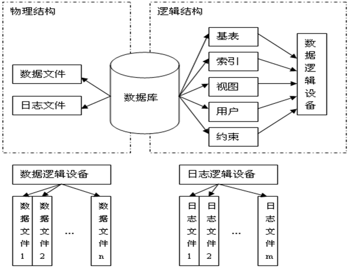
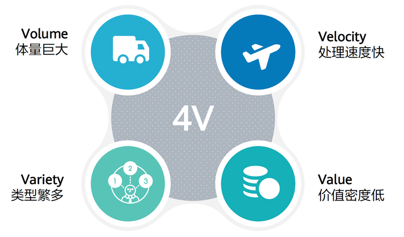
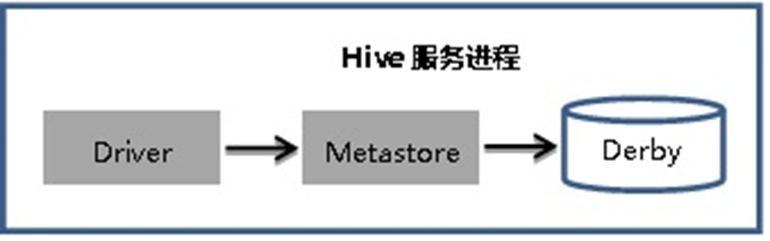
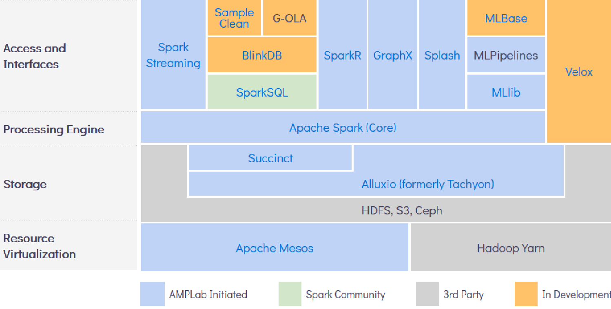

MySQL 见 `后端.md`

# 理论

## 概论

> ### 导学
>
> > 大数据, 或称巨量资料，是指需要新处理模式才能具有更强的决策力、洞察力和流程优化能力的海量、高增长率和多样化的信息资产
> >
> > 大数据的5V特点：Volume(大量)、Velocity(高速)、Variety(多样)、Value(价值密度)、Veracity(真实性)
>
> 数据库管理系统(database management system, DBMS)是由一个相互关联的数据的集合和一组用以访问、管理和控制这些数据的程序(建立在操作系统之上的系统软件)组成
>
> 这个相互关联的数据集合通常称为数据库(database, DB)，其中包含了关于某个企业信息系统的所有信息。 
>
> 设计DBMS的目的是为了有效地管理大量的数据，并解决操作系统的文件处理系统中存在的问题。
>
> 数据的有效管理，包括定义数据存储结构、提供数据操作机制。
> 不仅需要解决数据的共享性、独立性和数据之间的联系问题；
> 还需要解决数据的完整性、原子性、并发控制和安全性问题。
>
> 数据库系统(database system, DBS)，是指在计算机系统中引入数据库后的系统，一般由数据库、数据库管理系统(及其应用开发工具)、应用系统、数据库管理员和最终用户构成。——人机系统  
>
> > 服务外包：信息技术外包服务(ITO)，业务流程外包服务(BPO)

### 数据库系统的作用

数据：描述事物的符号记录。分为：

- 无结构的文本描述形式
- 结构化数据（表格，表中一行构成一条记录）
- 半结构化数据（XML，一般自描述，结构和内容混在一起)

数据处理：从大量的、可能是杂乱无章的、难以理解的数据中抽取并推导出对于某些特定的人们来说有价值、有意义的数据。

数据管理：对数据进行有效的分类、组织、编码、存储、检索、维护和应用——数据处理的中心问题。

**数据库管理技术的产生与发展**：

- 人工管理阶段(20c50s中以前)，数据面向应用程序，一个数据集对应一个程序，由应用程序定义和管理，无法共享利用，存在大量冗余数据

- 文件系统阶段(20c50s后-60s中)，计算机开始应用于数据管理，按文件名访问，按记录进行存取，数据放在多个数据文件

  

  主要特点：文件内的结构性，即一个文件内的数据是按记录进行组织的，这样的数据是有结构的(语义的) ，语义明确；整体上还是无结构的，即多个文件之间是相互独立的，无法建立全局的结构化数据管理模式

  弊端：数据共享性差 即数据冗余和不一致（不同应用程序难共享），数据独立性差（不易扩充，数据与应用程序之间缺乏逻辑独立性），数据孤立，数据获取困难（数据间的联系缺乏有效管理），完整性问题，安全性问题，原子性问题，并发访问异常

- 数据库管理系统阶段

  主要特点：(**数据库系统特点**)

  - 数据结构化。与文件系统的本质区别。不仅内部结构化，而是将数据以及数据之间的联系统一管理起来，使之结构化。不是仅仅针对某一个应用，而是面向全组织的所有应用。

  - 数据的共享度高，冗余度低，易扩充

  - 数据独立性高

  - 数据由数据库管理系统（DBMS）统一管理和控制 

    （数据的安全性保护，数据的完整性检查，并发控制，数据库恢复

  <u>助记：独统共结(独(自)统(治)共(\*党)解(\*军))</u>


数据库管理系统(DBMS)是由一个相互关联的数据的集合(数据库, DB)和一组用以访问、管理和控制这些数据的程序组成，是系统软件。

数据的完整性是指数据的正确性、有效性和相容性，也称为一致性约束

数据独立是指数据的使用(即应用程序)与数据的说明(即数据的组织结构与存储方式)分离，使得应用程序只需要考虑如何使用数据，而无须关心数据库中的数据是如何构造和存储的(表现为不会因为系统数据存储结构与数据逻辑结构的变化而影响应用程序)

- 数据独立性用来描述应用程序与数据结构之间的依赖程度，包括数据的物理独立性和数据的逻辑独立性
  - 物理独立性是指用户的应用程序与数据库中数据的物理结构是相互独立的；应用程序只关心数据的逻辑结构
  - 逻辑独立性是指用户的应用程序与数据库中数据的逻辑结构是相互独立的；应用程序只关心数据的局部逻辑结构(即应用视图) 


### 数据模型

数据库结构的基础是数据模型(data model)，是一个描述数据结构、数据操作以及数据约束的数学形式体系(即概念及其符号表示系统)(**三要素**)

- 数据结构：描述数据库的组成对象以及对象之间的联系 

- 数据操作：指对数据库中各种对象(型)的实例(值)允许执行的操作集合，包括操作及有关的操作规则 

- 数据完整性约束：一组数据完整性规则，是数据、数据语义和数据联系所具有的制约和依存规则，以保证数据库中数据的正确、有效和相容

  > 数据约束是对数据结构和数据操作的一致性、完整性约束，亦称为数据完整性约束 

<u>助记：完结操(玩节操)</u>

根据数据抽象的不同级别，将数据模型划分为3类：(**数据模型的分层**)

- 概念模型：概念层次的数据模型，也称为信息模型
- 逻辑模型：用于描述数据库数据的逻辑结构
- 物理模型：用来描述数据的物理存储结构和存取方法 


概念模型有实体-联系模型(E-R模型)和面向对象模型(OO模型) 

OO模型是用面向对象观点来描述现实世界实体(对象)的逻辑组织、对象间限制和联系等的模型

E-R模型基于对现实世界的如下认识：现实世界是由一组称作实体的基本对象以及这些对象间的联系构成

实体是现实世界中可区别于其他对象的一件“事情”或一个“物体”


逻辑模型是是用户通过数据库管理系统看到的现实世界，是按计算机系统的观点对数据建模，即数据的计算机实现形式，主要用于DBMS的实现。不同的DBMS提供不同的逻辑数据模型

- 层次模型(hierarchical model)

  优点：数据结构比较简单清晰，查询效率高，提供了良好的数据完整性支持

  缺点：不能很好地表达多对多联系，解决的办法：一是通过引入冗余数据(易产生不一致性)，二是创建非自然的数据结构(引入虚拟结点) ；查询孩子结点必须通过双亲结点；由于结构严密，层次命令趋于程序化 

- 网状模型(network model)

  条件：允许一个以上的结点无双亲，一个结点可以有多个双亲

  优点：能够更为直接地描述现实世界；具有良好的性能，存取效率较高

  缺点：结构比较复杂，而且随着应用规模的扩大，数据库的结构会变得越来越复杂，不利于最终用户掌握；操作语言比较复杂 

- 关系模型(relational model)

  优点：

  - 严格的数学基础：有关系代数作为语言模型，有关系数据理论作为理论基础
  - 概念单一：无论实体还是实体之间的联系都是用关系来表示，对数据(关系)的操作(查询和更新)结果还是关系。所以其数据结构简单、清晰，用户易懂易用
  - 存取路径透明：具有更高的数据独立性、更好的安全保密性，简化了程序员的工作，提高了软件的开发和维护效率

  缺点：

  - 由于存取路径对用户透明，查询效率往往不如非关系数据模型
  - 为了提高性能，DBMS必须对用户的查询请求进行查询优化，这样就增加了DBMS的开发难度

- 面向对象模型(即OO模型)

- XML模型

- 对象关系模型(object relational model)


物理模型：物理层是数据抽象的最低层。

> 从现实世界到概念模型的转换是由数据库设计人员完成
>
> 从概念模型到逻辑模型的转换可以由数据库设计人员完成，也可以用数据库设计工具协助设计人员完成
>
> 从逻辑模型到物理模型的转换一般由DBMS来完成 
>
> 概念模型：从现实世界到信息世界
> 逻辑模型：信息世界到逻辑机器世界
> 物理模型：逻辑机器世界到物理机器世界

三层模型是数据库设计的工具和方法(要满足DBMS体系结构的要求)，目的

1. 较真实地模拟现实世界、容易被人理解、便于计算机实现。
2. 提供全局逻辑模型：支持整体结构化，从而实现数据共享度高、冗余度低。
3. 同时满足DBMS三级模式结构要求。


关系模型：

- 关系(relation)：一个关系对应一张二维表，每一个关系有一个名称，即关系名

- 元组(tuple)：表中的一行称为一个元组

- 属性(attribute)：表中的一列称为一个属性，每一个属性有一个名称，即属性名

- 码(key)：也称为码键或键。表中的某个属性或属性组，它可以唯一地确定关系中的一个元组

- 域(domain)：属性的取值范围

- 分量(component)：元组中的一个属性值

- 外码(foreign key)：表中的某个属性或属性组，用来描述本关系中的元组(实体)与另一关系中的元组(实体)之间的联系

  外码的取值范围对应于另一个关系的码的取值范围的子集

- 关系模式(relational schema)：通过关系名和属性名列表对关系进行描述，即二维表的表头部分(表格的描述部分)

  如：关系名(属性名1，属性名2，…，属性名n)

  带下画线的属性为码属性，斜体的属性为外码属性 

  要求：关系必须是规范化：

  - 关系的每一个元组必须是可分区的，即存在码属性 
  - 关系的每一个属性(即元组的分量)必须是一个不可分的数据项，即不允许表中有表 

  完整性约束：实体完整性、参照完整性和用户自定义完整性 
  
  <u>助记：自实参(自(己)食铲)</u>


### 数据抽象与数据库的三级模式

隐藏关于数据存储和维护的某些细节，为用户提供数据在不同层次上的视图，即数据抽象

- 物理层抽象：最低层次的抽象，描述数据实际上是怎样存储的
- 逻辑层抽象：描述数据库中存储什么数据以及这些数据之间存在什么关联。数据库管理员和数据库应用开发人员使用
- 视图层抽象：只描述整个数据库的某个部分，即局部逻辑结构；同一数据库提供多个视图，每一个视图对应一个具体的应用，亦称为应用视图

提供观察数据库的3个不同角度。这就是数据库的三级模式结构，是DBMS的体系结构：(**三级模式结构**)

- 内模式：存储模式。对应于物理层数据抽象，它是数据的物理结构和存储方式的描述，是数据在数据库内部的表示方式
- 模式：逻辑模式。对应于逻辑层数据抽象，是数据库中全体数据的逻辑结构和特征的描述，是所有用户的公共数据视图。模式的一个具体值称为模式的一个实例(instance)。是DBMS模式结构的中间层
- 外模式：用户模式，子模式。对应视图层数据抽象。是数据库用户能够看见和使用的局部数据的逻辑结构和特征的描述，是数据库用户的数据视图，是与某一具体应用有关的数据的逻辑表示。外模式是保证数据库安全性的一个有力措施

目的：

1. 隐藏数据的存储和维护的细节，为用户提供数据在不同层次上的视图，方便不同的使用者可以从不同的角度去观察和利用数据库中的数据
2. 支持数据独立性的实现
3. 提供全局逻辑视图(模式)：支持整体结构化，从而实现数据共享度高、冗余度低、易扩充
4. 部分支持安全性的实现


**两层映像**功能：(**数据库独立性**)

- 模式/内模式映像。数据库中只有一个模式，也只有一个内模式，模式/内模式映像是唯一的，它定义了数据全局逻辑结构与存储结构之间的对应关系。在模式描述中定义模式/内模式映像。保证了数据与应用程序的物理独立性，简称为数据的物理独立性 
- 外模式/模式映像。对应于一个模式可以有多个外模式。对于每一个外模式，数据库管理系统都有一个模式/外模式映像，它定义了该外模式与模式之间的对应关系。在各自的外模式描述中定义外模式/模式映像。保证了数据与应用程序的逻辑独立性，简称为数据的逻辑独立性

模式即全局逻辑结构是数据库的核心和关键。设计数据库模式结构时，应首先确定数据库的逻辑模式

> 要保证数据库的数据独立性，应该修改的是两种映射


### 数据库系统

数据库系统(database system, DBS)，是指在计算机系统中引入数据库后的系统，一般由数据库、数据库管理系统(及其应用开发工具)、应用系统、数据库管理员和最终用户构成(**组成**)

数据库管理员(database administrator, DBA)，是指数据库的建立、使用和维护等的工作人员

- 决定数据库中的信息内容和结构
- 决定数据库的存储结构和存取策略
- 定义数据的安全性要求和完整性约束条件
- 监控数据库的使用和运行
- 数据库的改进和重组重构

在不引起混淆的情况下，常常把数据库系统简称为数据库，数据库管理系统简称为数据库系统 


数据库管理系统(DBMS)是一组软件，负责数据库的访问、管理和控制。功能：

- 数据定义：DBMS提供数据定义语言(DDL)
- 数据组织、存储和管理：DBMS要分类组织、存储和管理各种数据，包括数据字典、用户数据、数据的存取路径等 
- 数据操纵：DBMS还提供数据操纵语言(DML) 
- 数据库的事务管理和运行管理：数据库在建立、运行和维护时由DBMS统一管理、统一控制，以保证数据的安全性、完整性(一致性)，以及多用户对数据并发操作时的数据库正确性(称为并发控制)和系统发生故障后的数据库正确性(称为恢复与备份) 
- 数据库的建立和维护
- 其他功能 

组成：

- 查询处理器：对用户请求的SQL操作进行查询优化，从而找到一个最优的执行策略，然后向存储管理器发出命令，使其执行
- 存储管理器：根据执行策略，从数据库中获取相应的数据,或更新数据库中相应的数据
- 事务管理器：负责保证系统的完整性，保证多个同时运行的事务不发生冲突操作，以及保证当系统发生故障时数据不会丢失。


## 关系模型与关系代数

### 关系模型

> 关系模型的数据结构是二维表，亦称为关系
>
> 关系数据库是表的集合，即关系的集合
>
> 表是一个实体集，一行就是一个实体，它由有关联的若干属性的值所构成
>
> 关系模型中，现实世界的实体以及实体间的各种联系都是用关系来表示
>
> 基本特征有：与行的次序、列的次序无关

**关系数据结构**的形式化定义：(**关系模型的相关概念**)

域：是一组具有相同数据类型的值的集合($D$)

笛卡尔积：$D_1\times \cdots D_n=\{(d_1,\cdots ,d_n)|d_i\in D_i,i=1,\cdots n\}$

给定一组域 $D_i$，集合中每一个元素 $(d_1,\cdots ,d_n)$ 是 $n$ 元组，简称元组，每一个值 $d_i$ 是一个分量。$D_i$ 为有限集且基数为 $m_i$，则笛卡尔积基数为 $\prod_{i=1}^nm_i$。

关系：一组域的笛卡尔积的有限子集是该组域上的关系，即笛卡尔积的有限子集，表示为 $r(D_1,\cdots, D_n)$。$r$ 是关系名，$n$ 是关系的目或度(degree)。$n=1$ 单元关系，$n=2$ 二元关系。 表的一行对应关系一个元祖，一列对应一个域。列名是属性（因不同列的域可以相同）。$n$ 目关系共有 $n$ 个属性

关系的要求：

- 关系中的每个属性的域必须是原子的，即域中的每个值都是不可再分的一个完整单元。
- 关系中的每个元组都是可区分的，即存在唯一标识不同元组的属性(集)——码

空值(null)是所有可能的域的一个取值。

关系模式(relation schema)是关系的描述。表示为 $r(U,D,DOM,F)$，$U$ 是属性名集合，$DOM$ 是属性向域的映像集合，$F$ 是属性间数据依赖关系集合。简记 $r(U)$ 或 $r(A_1,\cdots,A_n)$，后者即属性名集合。 表头部分对应关系模式，是型。表体部分对应关系，是元祖集合，实例，是值。

> 人们经常把关系数据库模式和关系数据库实例都笼统地称为关系数据库，即型+值。

超码(super key)：关系 $r$ 的一个或多个属性的集合 $A$ 满足可以唯一地标识关系 $r$ 中的一个元组

候选码(candidate key)：关系 $r$ 的超码 $A$，满足任意真子集不是超码

主码：人为选定的若干候选码的一个

外码(foreign key)：$F$ 是关系 $r$ 的一个属性(集)满足对 $K_s$ 是关系 $s$ 的主码，$F$ 与 $K_s$ 相对应(关系 $r$ 中属性 $F$ 取值范围对应 $s$ 中 $K_s$ 取值范围的子集)，那么 $F$ 是关系 $r$ 参照关系 $s$ 的外码，简称 $F$ 是关系 $r$ 的外码


**关系完整性约束**条件：(**完整性规则**)

- 实体完整性：主码每个属性都非空
- 参照完整性：外码要么空，要么为对应的主码值
- 用户自定义完整性。如取值范围，取值间逻辑关系，唯一性等。


数据库模式导航图：一个含有主码和外码依赖的数据库模式的图例


- 下划线：主码
- 斜体：外码


**关系操作**特点：集合为单位。非关系数据模型操作方式：记录为单位。分为查询（选择select，投影project，连接join，除divide，并union，交intersection，差except，笛卡尔积，更名等）和更新（增删改）。查询是最主要操作。

关系操作表示方式：代数方式、逻辑方式。

- 关系代数是用代数方式表达的关系查询语言。
- 关系演算是用逻辑方式表达的关系查询语言。

对于关系代数、关系演算均是抽象的查询语言，在表达能力上是完全等价的。


### 关系代数

传统集合运算，(前三者)要求具有相同数量属性，域对应相同，即两关系的模式/结构相同。

- 并运算 $r\cup s=\{t|t\in r\vee t\in s\}$ 
- 差 $r-s=\{t|t\in r\wedge t\notin s\}$
- 交 $r\cap s=\{t|t\in r\wedge t\in s\}=r-(r-s)$ 
- 笛卡尔积 $r\times s=\{t_r\cdot t_s|t_r\in r,t_s\in s\}$ 得到 $n+m$ 目元组

关系运算：(**基本关系代数运算**)

选择：$\sigma_P(r)=\{t|t\in r\wedge P(t)\}$，$P$ 是谓词，逻辑表达式

投影：$\prod_A(r)=\{t[A]|t\in r\}$，选出若干列组成子关系

连接：$r\bowtie_\theta s=\{t_r\cdot t_s|t_t\in r\wedge t_s\in s\wedge(r.A\ op\ s.B)\}$，记作 $A\ op\ B$，两者为属性个数相等且可比的连接属性集，$op$ 是谓词，等效 $\sigma_\theta(r\times s)$。

$\theta$ 为等值比较谓词时，称为等值连接(equijoin)。自然连接(natural join)是特殊等值连接，要求具有公共属性集，并进行去重。

除：$r\div s=\{t_r[R-S]|t_r\in r\wedge s\subseteq S_x\}$，是 $R-S$ 上投影，条件为 $r$ 中 $R-S$ 取值象集包含 $s$。也就是先找到 $r$ 中元组，按 $R-S$ 分组，使得每组能取遍属性集 $R\wedge S$ 的所有取值。


> 如：
> $$
> (\prod_{stuNo,cNo}(Score))\div(\prod_{cNo}(\sigma_{name=语文 \vee name=数学}(Course)))
> $$

> 构造关系代数表达式的步骤：
>
> - 明确该查询涉及到哪些属性
> - 明确该查询涉及到哪些关系
> - 根据数据库模式导航图，通过多对一联系(或一对多联系)把所有涉及的关系连接起来，每一个多对一联系(或一对多联系)都可以表示为外码属性的自然连接

五种基本关系代数运算：$\cup,-,\times,\sigma,\pi$。(和更名)

其他运算：$\cap,\bowtie,\div,=$(赋值)。


## SQL查询语句

### SQL概述

包括：

- 数据操纵语言 **DML**： select, insert, update, delete (M: manipulation)

- 数据定义语言 **DDL**： create, drop, alter (D: definition)

- 数据控制语言 DCL： grant, revoke (C: control)

- 其他（嵌入式和动态，重新组织，备份，恢复）

**SQL特点**：

- 综合统一 (DDL,DML,DCL于一体)
- 高度非过程化
- 面向集合的操作方式
- 同一种语法结构提供两种使用方式 (自含式、嵌入式)
- 语言简洁，易学易用 (动词少)

非过程化。

SQL语言支持三级模式结构，外模式对应视图和部分基本表，模式对应基本表，内模式对应存储文件 

基本表：数据库中独立存在的表称为基本表，在SQL中一个关系对应一个基本表，一个(或多个)基本表对应一个存储文件，一个表可以带若干索引，索引存放在存储文件中

视图：指从一个或几个基本表(或视图)导出的表，是虚表，只存放视图的定义而不存放对应数据

查询表：指查询结果对应的表

存储文件：指数据库中存放关系的物理文件


**单表查询、连接查询、嵌套子查询**都是重点

单表查询：(各子句用法)

1. 投影运算：查询列、消除重复元组、别名、计算列
2. 选择运算：比较运算、范围查询、集合查询、空值查询、字符匹配、逻辑查询
3. 排序运算、聚合查询

连接查询：等值/非等值连接

嵌套子查询：IN/NOT IN，比较运算符(=ANY,!ALL等价于IN, NOT IN)

### 单表查询

> SQL Server函数：`lower,getdate,year,month` 等

>  举例：年龄大于或等于19岁 (==da:周岁==)
>
> ```sql
> SELECT studentNo, studentName, birthday
> FROM Student
> WHERE year(getdate()) - year(birthday)>=19
> ```
>
> 不含 `福` ：
>
> ```mysql
> SELECT studentNo, studentName
> FROM Student WHERE studentName NOT LIKE '%福%'
> ```
>
> with 的使用：
>
> ```sql
> with a as(
> SELECT * 
> FROM Student 
> WHERE sex='女')
> SELECT studentNo, studentName, convert(varchar(10),birthday, 111) as birthday
>    FROM  a
>    WHERE year(birthday)=1999 # convert 是 SQL Server
> ```


### 连接查询

> 同时选修两门课：
>
> ```mysql
> SELECT a.studentNo, studentName, b.courseNo, b.score, c.courseNo, c.score
> FROM Student a, Score b, 
> (SELECT * FROM Score WHERE courseNo='002') c
> WHERE b.courseNo='001' 
>       AND a.studentNo=b.studentNo # 表a与表b的连接条件
>       AND a.studentNo=c.studentNo # 表a与表c的连接条件
> ```
>
> ```sql
> SELECT a.studentNo, studentName, b.courseNo, b.score, c.courseNo, c.score
>      FROM Student a, Score b, Score c
>      WHERE a.studentNo=b.studentNo # 表a与表b的连接条件
>        AND a.studentNo=c.studentNo # 表a与表c的连接条件
>            AND b.courseNo='001' # 表b上的选择条件
>            AND c.courseNo='002' # 表c上的选择条件
>      ORDER BY a.studentNo
> ```
>
> 
>
> SQL不直接支持自然连接，完成自然连接的方法是在等值连接的基础上消除重复列
>
> 若某个表与自己进行连接，称为自表连接 
>


### 嵌套子查询

> 常用：
>
> - 元素与集合间的属于关系
> - 集合之间的包含和相等关系
> - 集合的存在关系
> - 元素与集合元素之间的比较关系

> 子查询中，不允许使用ORDER BY子句，该子句仅用于最后结果排序
>
> 分为非相关子查询，相关子查询。
>
> 选修过包含`系统`二字的课程的学生信息：
>
> ```mysql
> SELECT studentNo, studentName, classNo
> FROM Student
> WHERE studentNo IN 
>               ( SELECT studentNo FROM Score
>                WHERE courseNo IN 
>                ( SELECT courseNo FROM Course
>                 WHERE courseName LIKE '%系统%' ))
> ```
>
> ```mysql
> SELECT studentNo, studentName, classNo
> FROM Student
> WHERE studentNo IN 
>               ( SELECT studentNo 
>                FROM Score b, Course c
>                WHERE b.courseNo=c.courseNo 
>                AND courseName LIKE '%系统%' )
> ```
>
> ```mysql
> SELECT DISTINCT a.studentNo, studentName, classNo
> FROM Student a, Score b, Course c
> WHERE a.studentNo=b.studentNo
>     AND b.courseNo=c.courseNo 
>     AND courseName LIKE '%系统%' 
> ```
>
> 并不是每一个IN子查询都可以转化为连接运算来实现
>
> 
>
> 除法运算，同时选修两门课的人选的所有课：(也可以用 in 三层)
>
> ```mysql
> SELECT  a.studentNo, studentName, courseName, score
> FROM Student a, Course b, Score c
> WHERE  a.studentNo=c.studentNo AND b.courseNo=c.courseNo
>    AND   a.studentNo IN 
>     ( SELECT studentNo FROM Score x, Course y
>                 WHERE x.courseNo=y.courseNo 
>                 AND courseName='计算机原理' )
>    AND   a.studentNo IN 
>      ( SELECT studentNo FROM Score x, Course y
>                 WHERE x.courseNo=y.courseNo 
>                 AND courseName='高等数学' )
> ORDER BY a.studentNo, score DESC
> ```
>
> 
>
> 查询最高分：
>
> ```mysql
> SELECT studentNo, courseNo, score
> FROM Score
> WHERE score=( SELECT max(score) FROM Score )
> ```
>
> 年龄小于班上某个人(即出生日期晚于)
>
> ```mysql
> SELECT studentNo, studentName, year(getdate())-year(birthday) AS age
> FROM Student
> WHERE birthday>ANY
> ( 	SELECT birthday
> 	FROM Student a, Class b
> 	WHERE className='计算机科学与技术16-01班' 
> 	AND a.classNo=b.classNo )
> ```
>
> 
>
> exists是逻辑表达式，若子句非空条件为真
>
> exists 的使用：(将元组扔到 exists 子句里判断)(选修了课程的人)
>
> ```mysql
> SELECT studentName, classNo 
> FROM Student x
> WHERE EXISTS 
>         ( SELECT * FROM Score a, Course b
>          WHERE a.courseNo=b.courseNo 
>          AND a.studentNo=x.studentNo 
>          AND courseName='计算机原理' )
> ```
>
> 
>
> 全称量词转存在量词：
> $$
> (\forall c)P(x,c)\Leftrightarrow\lnot(\exists c(\lnot P(x,c)))
> $$
> 如选修了所有课程的学生：
>
> ```mysql
> SELECT studentName 
> FROM Student x
> WHERE NOT EXISTS 
>   ( SELECT * FROM Course c
>    WHERE NOT EXISTS   
>    --判断学生x.studentNo没有选修课程c.courseNo
>        ( SELECT * FROM Score
>         WHERE studentNo=x.studentNo 
>         AND courseNo=c.courseNo )
>   )
> ```
>
> 解析：
>
> - 整体逻辑：先找一个集合，集合里的人没选修全部课程，然后找出不属于这个集合的人；对于这个集合，等价于这些人不在选修关系里
> - 如果一个人选修了所有课程，那么每门课它都修了即最内层select结果非空，所以exists(非空)为真，not exists为假，那么中间层select没有结果，是空集，那么最外层成立
> - 如果一个人有一门课没选修，那么这门课not exists为真，中间层不空，所以not exists为假
>
> 如：至少选修了特定学号学生所选修的所有课程的学生：
>
> 即：不存在一门课程，特定学号学生选修了，且该学生没选修
>
> ```mysql
> SELECT studentName
> FROM Student x
> WHERE NOT EXISTS 
>     ( SELECT * FROM Score y      // 不能用Course表
>      WHERE studentNo='1600002'  
>      --查询学生'1600002'所选修课程的情况
>      AND NOT EXISTS    
>      --判断学生x.studentNo没有选修课程y.courseNo
>          ( SELECT * FROM Score
>           WHERE studentNo=x.studentNo 
>           AND courseNo=y.courseNo )
>     )
> ```
>
> 至少选修了学号为1600002学生所选修的所有课程的学生学号、姓名以及该学生所选修的1600002学生选修过的所有课程的课程名和成绩：
>
> ```mysql
> SELECT  x.studentNo,  studentName,  courseName,  score 
> FROM  Student x, Course y, Score z
> WHERE  x.studentNo=z.studentNo AND y.courseNo=z.courseNo 
>       AND   NOT EXISTS
>    ( SELECT * FROM Score b
>     WHERE studentNo='1600002'   --查询学生'1600002'所选修课程的情况
>     AND NOT EXISTS    --判断学生x.studentNo没有选修课程b.courseNo
>         ( SELECT * FROM Score
>          WHERE studentNo=x.studentNo AND courseNo=b.courseNo )
>    )
>     AND  y.courseNo IN ( SELECT courseNo FROM Score WHERE studentNo='1600002')
> ```
>
> 
>
> 至少拿了 28 学分的人：
>
> ```mysql
> SELECT a.studentNo, studentName, courseName, score, creditHour
> FROM Student a, Course b, 
>     ( SELECT studentNo, courseNo, max(score) score
>      FROM Score
>      WHERE score>=60    -- 仅列示已经获得学分(即及格了)的课程
>      GROUP BY studentNo, courseNo ) AS c      -- 查询表c
> WHERE a.studentNo=c.studentNo AND c.courseNo=b.courseNo 
>        AND a.studentNo IN 
>    ( SELECT studentNo     -- 子查询Q
>      FROM Course x, 
>     ( SELECT studentNo, courseNo, max(score) score
>      FROM Score
>      WHERE score>=60    -- 只有及格才能获得学分
>      GROUP BY studentNo, courseNo ) AS y
>     WHERE y.courseNo=x.courseNo
>     GROUP BY studentNo
>     HAVING sum(creditHour)>=28 )
> ORDER BY a.studentNo
> ```
>
> 
>
> 查询至少选修了5门课程且课程平均分最高的同学的学号和课程平均分。如果一个学生选修同一门课程多次，则选取最高成绩：
>
> ```mysql
> SELECT studentNo, avg(score) avgScore
> FROM  ( SELECT studentNo, courseNo, max(score) score
>        FROM Score
>        GROUP BY studentNo, courseNo ) AS a
> GROUP BY studentNo
> HAVING count(*)>=5 
>  AND avg(score)=
>     ( SELECT max(avgScore)    -- 子查询Q2
>      FROM ( SELECT studentNo, avg(score) avgScore    -- 子查询Q1
>            FROM  ( SELECT studentNo, courseNo, max(score) score
>                   FROM Score
>                   GROUP BY studentNo, courseNo ) AS b
>            GROUP BY studentNo
>            HAVING count(*)>=5 ) AS x)
> ```
>
> 非相关子查询指子查询的结果不依赖于上层查询
> 相关子查询指当上层查询的元组发生变化时，其子查询必须重新执行
>
> 
>
> 查询平均分最高的课程：
>
> ```mysql
> SELECT a.courseNo, courseName, avg(score) 最高平均分
> FROM Course a, Score b
> WHERE a.courseNo=b.courseNo
> GROUP BY a.courseNo, courseName
> HAVING avg(score)=
>    ( SELECT max(avgScore)
>     FROM ( SELECT avg(score) avgScore
>           FROM Score
>           GROUP BY courseNo ) x)
> ```
>
> 
>
> 集合运算 union(并), intersect(交), except(减)可以用其他语句改写
>
> order by表达式可以是列名或表达式

SQL 语句一般格式：

```mysql
SELECT [ALL | DISTINCT] <目标列表达式> [AS] [<别名>]
                 [, <目标列表达式> [AS] [<别名>] ... ]
FROM {<表名> | <视图名> | <查询表>} [AS] [<别名>]
             [, {<表名> | <视图名> | <查询表>} [AS] [<别名>] ... ]
[ WHERE <条件表达式> ]
[ GROUP BY <列名1> [, <列名2> ... ]
   [ HAVING <条件表达式> ] ]
[ ORDER BY <列名表达式> [ASC | DESC] 
                [, <列名表达式> [ASC | DESC] ... ] ]
```


## 数据库建模

### 数据库设计过程

**全节重点**

数据库设计过程概述：

数据库设计就是根据各种应用处理的要求、硬件环境及操作系统的特性等，将现实世界中的数据进行合理组织，并利用已有的数据库管理系统(DBMS)来建立数据库系统的过程。
具体地说，对于一个给定的应用环境，构造出最优的数据库逻辑模式和物理模式，并建立数据库及其应用系统，使之能够有效地存储和管理数据，满足用户的信息要求和处理要求。 


- 需求分析：基础，最困难和耗时

  功能需求、数据需求、数据使用业务规则、数据联系及约束、性能需求等；分析用户行为、需求分析、建立数据流图

- 概念设计：得到概念模型(E-R图)(E-R模型是语义模型，能映射到数据库概念模型)(使用到的抽象方法：聚合、概括、分类；不包括合并)(概念模型独立于硬件设备和DBMS)

- 逻辑设计：逻辑数据模型(数据库(关系)模式) 考虑概念模式、处理要求、DBMS特性，不考虑存取方式

- 模式求精：分析并发现数据库逻辑模式存在的问题，并进行改进和优化(减少数据冗余，消除更新、插入与删除异常)(基于关系理论)

- 物理结构：数据库文件组织格式、文件内部存储结构、索引、表的聚集；关注存取方式、索引与入口设计、安全性完整性一致性问题

- 应用与安全设计：访问权限(角色)，存储过程

E-R图合并可能会出现属性、结构和命名冲突(不会出现语法冲突)、

实施阶段的工作：建立数据库、加载数据、系统调试(无扩充功能)


### E-R模型基本概念及表示

**全节重点**

实体是客观世界中可区别于其他事物的“事物”或“对象”，特征：独立存在、可区别于其他实体。可以是有形、实在或抽象、概念(课程、单据)

实体集是具有相同类型即相同性质(或属性)的实体组成的集合

属性是实体集中每个实体都具有的特征描述。实体集具有相同属性，有属性值和属性的域

- 简单属性：不能分为更小部分
- 复合属性：可以进一步划分为更小部分 (如住址拆成省市街道)
- 单值属性：特定实体任何时候只能取一个值
- 多值属性：0到任意多个(如电话号码) (转为弱实体集/多个单值)
- 派生属性：值可以从其它相关属性或实体(集)派生出来 (如年龄)
- 空值NULL：在某个属性没有值，表示未知/不存在

联系：多个实体相互关联

联系集：同类联系的集合。是 $n(n\ge 2)$ 个实体集 $E$ 上的数学关系，实体集不必互异。联系集是 $\{(e_1,\cdots,e_n)|e_i\in E_i\}$ 的子集。可具有自身的描述属性

- 度：参与联系集的实体集的数目。划分为 $x$ 元联系集

多联系：在相同的实体集上可能存在多个不同的联系集

多值联系：是指在同一个给定的联系集中，相关联的相同实体之间可能存在多个联系 (如客户与银行可能发生多次贷款)

角色：实体在联系中的作用


### 约束

主要有：

1. **映射约束**：

   - 实体集A中的一个实体通过某联系集R能与实体集B中的实体相联系的数目，称为实体集A到实体集B之间的联系集R的映射基数(mapping cardinality)，简称为联系集R的映射基数

     共有一对一，一对多和多对多三种映射基数

   - 一对一: A中的一个实体至多(允许不)同B中的一个实体相联系，B中的一个实体也至多(允许不)同A中的一个实体相联系。如发票与销货单(可以存在实体与另一方无联系(即如不开发票))

   - 一对多:A中一个实体可以同B中任意数目(可以为0)的实体相联系，而B中一个实体至多(允许不)同A中一个实体相联系。如班级和学生一对多(学生可以不加入班级，也可以有空班)

   - 多对多:A中的一个实体可以同B中任意数目(可以为0)的实体相联系，而B中的一个实体也可以同A中任意数目(可以为0)的实体相联系。如学生与选课

2. **码约束**：

   - 超码：一个或多个属性的集合，且这些属性的集合在一实体集中能够唯一标识一个实体。超码的任意超集是超码
   - 候选码和超码是实体集客观存在的特性，它们表示实体集中任意两个实体不允许在码属性上有相同的值
   - 主码选择原则：
     选择属性长度最短的候选码；
     选择包含单个属性的码，而不是复合候选码；
     选择在数据库系统生命周期内属性值最少变化的候选码；
     选择在数据库系统生命周期内更可能包含唯一值的候选码
   - 一个联系集中的每一个联系也要求是可区分的，也必须存在候选码，并选择其中的一个候选码作为主码，用于唯一标识该联系集中的一个联系。联系集的超码是与它联系的所有实体集主码的并
   - 二元联系集的主码选择，依赖于联系集的映射基数：
     - 一对一：主码可以使用参与联系集中的任何一方实体集的主码
     - 一对多(多对一)：主码由“多”的一方实体集的主码组成
     - 多对多：主码由参与联系集中所有实体集的主码组成
   - 二元联系集**联系属性安置**：
     - 一对一联系集的属性：安置于联系集或任一边的实体集上
     - 一对多联系集的属性：安置于联系集或多的一方实体集上
     - 多对多联系集的属性：它是描述相关联实体集间的交互性语义，因此，联系属性只能安置于联系集上，不能放到相关联的实体集上去

3. **依赖约束**：

   - 指联系中一种实体的存在依赖于该联系集中联系或其他实体集中实体的存在
     - 联系中一种实体的存在依赖于该联系集中联系的存在，称为实体集与联系集之间的依赖约束，并将依赖于联系集而存在的实体集称为**依赖实体集**
     - 联系中一种实体的存在依赖于其他实体集中实体的存在，称为实体集之间的依赖约束，并将依赖于其他实体集而存在的实体集称为**弱实体集**

4. 参与约束：

   - 如果实体集A中的每个实体都参与到联系集R中至少一个联系中，则称实体集A全部参与联系集R
   - 如果实体集A中只有部分实体参与到联系集R的联系中，则称实体集A部分参与联系集R


### 弱实体集

**全节重点**

与之相对是强实体集

弱实体集所依赖的强实体集称为标识实体集 (identifying entity set)

弱实体集必须与一标识实体集相关联才有意义，该联系集称为标识联系集 (identifying relationship set)

一个弱实体集中用来标识弱实体的属性(集) 称为该弱实体集的部分码 (partial key)

弱实体集中的实体是由其标识实体集中的主码与其部分码共同标识

限制：

- 标识实体集和弱实体集必须是“一对多”联系集 
- 弱实体在标识联系集中是全部参与

应用：

1. 多值属性建模为弱实体集

   (依赖约束和多值联系可能会导致将联系集建模为依赖实体集或弱实体集)

2. 语义上存在包含关系的实体 (如学院与系)

   (没有必要在系统全局范围内唯一标识的实体集可建模为弱实体集)

弱实体集可以同时依赖于多个标识实体集


### 扩展E-R特征

使用实体集的继承和ISA联系(超类/子类联系)描述子集。子类会继承父类的所有属性

联系集之间的联系：使用聚合

聚合是一种抽象，它将一个联系集及其相关联的实体集抽象为一个高层实体集(称为联系实体集)对待，然后建立该高层实体集与其它实体集之间的联系集


### E-R建模问题

基本原则：[(属性冲突、命名冲突、结构冲突)]

1. 忠实性 (首要，最重要) (忠于需求)
2. 简单性 (不要添加非必要成分)
3. 避免冗余 (一个对象只存放在一个地方)

通常满足下述两条规则，均可作为属性对待：

- 作为属性，不能再具有要描述的性质；
- 属性不能和其它实体相联系

注意：

- 不能将实体集主码表示为另一实体集属性 (要使用联系)
- 不能将相关实体集的主码属性作为联系集属性 (已经隐含了)

一事物是描述为实体集还是联系集并没有一个绝对的标准。通常原则：

- 实体对应于现实世界中实际存在的事物，是名词
- 联系对应的概念一般为一种动作，即描述实体间的一种行为

三元联系转二元联系：

- 通过聚合将二元联系集建模成一个联系实体集，再加上它与原来联系的实体集之间的二元联系，如图(b)所示
- 或者建立一个依赖实体集或弱实体集，再与原实体集之间建立二元联系，如图(c)、图(d)所示


下图 b,c 是错误示范(语义不对)，下下图是对的


依赖约束：依赖于联系集而存在的实体集一般是指伴随着业务发生而形成的单据。如员工、客户、商品之间发生销售/购买商品等业务时，伴随着会产生销货单/购货单。
在E-R建模时，一般将依赖于业务的发生而产生的销货单/购货单等直接建模为依赖实体集(而不是联系集)，并将它直接与所依赖的联系集关联起来

> 类似的业务有：
> 领料员/采购员、仓库保管员、材料之间发生的出库/入库业务会伴随着产生出库单/入库单；
> 读者、图书管理员、图书之间发生的借书业务会伴随着产生借书单；
> 客户、员工、现金之间发生的存款/取款业务会伴随着产生存款单/取款单;
> 病人、医生、药品之间发生的诊断业务会伴随着产生病历记录-处方单；
> 旅客、员工、客房之间发生的入住业务会伴随着产生入住单；
> 司机、警察、违章处罚目录之间发生的违章处罚业务会伴随着产生违章处罚单；
> 员工、游客、景点之间发生的旅游业务会伴随着产生旅游安排单；
> 公交车、车站之间发生的运行安排业务会伴随着产生公交线路。 


概念设计任务：

- 定义实体集及属性，实体集的主码，并用数据字典描述实体集；
- 定义联系集及属性，联系集的主码，联系的映射基数及参与约束,联系中实体的角色，并用E-R图描述被建模的联系集；
- 分析初步E-R图中是否存在依赖约束、多值联系，并将其建模为依赖实体集或弱实体集；
- 利用扩展E-R特征对对象进行分类及聚合(建模为联系实体集) ；
- 将多元联系转化为二元联系进行建模(联系实体集、依赖实体集或弱实体集)；
- 去除冗余数据，并保证满足所有数据需求不冲突；
- 对照需求分析规格说明书，检查E-R模型，看其是否包含了所有数据、能否满足所有功能需求等


### E-R图图例

E-R图图例：

- 实体集：矩形
- 属性：椭圆 (主码：下划线)
- 多值属性：双椭圆
- 派生属性：虚线椭圆
- 属性与实体之间：连线
- 联系：菱形
- 联系与实体之间：连线 (箭头指向一，横线指向多，双横线是全部参与)
- 依赖实体集：带填充背景的矩形 
- 依赖实体集所依赖的联系集：带填充背景的菱形
- 弱实体集：双矩形
- 标识实体集：双菱形
- 部分码：虚下划线
- ISA联系：三角形
- 联系实体集：内部包含无填充背景虚线菱形的填充背景矩形
- 聚合：虚线矩形


### 逻辑设计

**全节重点**

逻辑模型(数据库模式，关系模式的集合)

- 强实体集：直接转

- 弱实体集：用外码加部分码当主码

- 联系集：

  - 一对多：多方增加一方的主码作为外码和联系属性(如公司与员工的聘用，把公司名和聘期放到员工去)
  - 一对一：把任意一方看成多，同上处理
  - 多对多：按映射基数确定主码，外码是各实体集主码并

- 标识联系集：不需要转化

- 复合属性：拆成多个简单属性

- 多值属性：创建关系模型(建模为弱实体集)，属性为所在实体集(/联系集)主码(是外码)和本来多值属性对应的属性

- 类层次：

  - 父类是公共属性，子类是特殊属性和父类主码，子类主码与父类主码相同
  - 只转换子类，删掉父类

- 聚合：

  - 内层联系集、外层联系集都是按其映射基数决定是否需要单独转化为一个独立的关系模式(多对多联系集才需要)
  - 外层联系集的主码根据映射基数不同分别由内层联系集(即联系实体集)的主码、外层实体集的主码按不同方式产生

  说人话就对被联系的练习集，跳过聚合这玩意本身，就是拆掉聚合，用它对应的实体集去做，如：

  

  

  


## 关系数据理论与模式求精

### 问题提出

数据冗余是指同一信息在数据库中存储了多个副本。它可能引起下列问题：

- 冗余存储：信息被重复存储，导致浪费大量存储空间
- 更新异常：当重复信息的一个副本被修改，所有副本都必须进行同样的修改。因此当更新数据时，系统要付出很大的代价来维护数据库的完整性，否则会面临数据不一致的危险
- 插入异常：只有当一些信息事先已经存放在数据库中时，另外一些信息才能存入数据库中
- 删除异常：删除某些信息时可能丢失其它信息

模式分解存在的问题：

- 有损分解：两个分解后的关系通过连接运算还原得到的信息与原来关系的信息不一致

  反之称为无损分解(lossless decomposition)

- 丢失依赖关系

  反之，如果被分解关系模式上的所有依赖关系都在分解得到的关系模式上保留，称该分解为依赖保持 (dependency preserving)分解

好的关系模式：

- 数据冗余尽可能少(即数据共享尽可能高)
- 不发生插入异常、删除异常、更新异常等问题。
- 模式分解时，分解后的模式应具有无损连接、保持依赖等特性

理论依据：关系规范化理论

候选关键字的属性可以有 1 个或多个。候选关键字可能有 1 个或多个，但主关键字只有一个

关系模式的任何属性不可再分


### 函数依赖定义

**全节重点**

函数依赖(functional dependency, 简称FD)是一种完整性约束,  是现实世界事物属性之间的一种制约关系

函数依赖定义：设 $r(R)$ 为关系模式，$\alpha\subseteq R,\beta\subseteq R$，对任意合法关系 $r$ 及其中任两个元组 $t_i,t_j(i\neq j)$，若 $t_i[\alpha]=t_j[\alpha]$ 则 $t_i[\beta]=t_j[\beta]$，则称 $\alpha$ 函数确定 $\beta$，或 $\beta$ 函数依赖于 $\alpha$，记作 $\alpha\to\beta$。

函数依赖那么 $\alpha,\beta$ 可能是多对一关系

函数依赖是语义范畴的，只能根据数据语义确定，不能被证明

码约束是函数依赖特例，码属性(集)是 $\alpha$，关系中所有属性是 $\beta$

非平凡函数依赖：$\alpha\to\beta,\beta\not\subseteq\alpha$；否则是平凡函数依赖($\beta\subseteq\alpha$)。对于任一关系模式，平凡函数依赖都是必然成立的，它不反映新的语义

完全函数依赖：对非平凡函数依赖，$\forall\gamma\subset\alpha,\gamma\to\beta$ 都不成立。简称函数依赖。否则是部分函数依赖，简称部分依赖

对完全函数依赖 $\alpha\neq \beta$，则 $\alpha\to\beta$ 一定是非平凡函数依赖

显然 $\alpha$ 是单属性时函数依赖一定是完全函数依赖

若 $\gamma\subseteq R,\alpha\to\beta,\beta\to\gamma$ 则存在函数依赖 $\alpha\to\gamma$，若 $\alpha\to\beta,\beta\to\gamma,\alpha\to\gamma$ 非平凡函数依赖，且 $\beta\not\to\alpha$，则 $\alpha\to\gamma$ 是传递函数依赖，简称传递依赖

因为是非平凡函数依赖，所以共四个条件：$\beta\not\subseteq\alpha,\gamma\not\subseteq\beta,\gamma\not\subseteq\alpha,\beta\not\to\alpha$

因为最后一个条件，所以 $\beta$ 一定不是候选码

传递依赖也可能会导致数据冗余及产生各种异常

函数依赖是指关系模式中属性之间存在的一种约束关系。这种约束关系既可以是现实世界事物或联系的属性之间客观存在的约束，也可以是数据库设计者根据应用需求或设计需要强加给数据的一种约束
但不论是哪种约束，一旦确定，进入数据库中的所有数据都必须严格遵守


### 范式

**全节重点**

第一范式 $\mathbf{1NF}$：关系模式每个属性值域都不可分(原子的)，则 $r(R)\in1NF$

目标：将基本数据划分成称为实体集或表的逻辑单元，当设计好每个实体后，需要为其指定主码

主属性：$\alpha\subseteq R,\alpha$ 包含在 $r(R)$ 的某个候选码中；否则是非主属性

第二范式 $\mathbf{2NF}$：$1NF$ 的所有非主属性完全函数依赖于 $r(R)$ 的候选码(不存在非主属性对候选码的部分依赖)

目标：将只部分依赖于候选码（即依赖于候选码的部分属性）的非主属性移到其他表中(全部是码)

第三范式 $\mathbf{3NF}$：$2NF$ 的所有非主属性直接函数依赖于 $r(R)$ 候选码(不存在非主属性传递依赖于候选码)

目标：去掉表中不直接依赖于候选码的非主属性(仅仅是码)

> 如：$r(R)=r(A,B,C),F=\{AB\to C,C\to A\}$，计算得候选码为 $AB$ 或 $BC$，故 $r(R)\in 3NF$；理由：都是主属性，没有非主属性

Boyce-Codd 范式 $\mathbf{BCNF}$：$1NF$ 的 $F^+$ 所有函数依赖 $\alpha\to\beta$ 要么是平凡函数依赖，要么 $\alpha$ 是一个超码(即包含 $r(R)$ 的候选码) (即 $F^+$ 的每个非平凡函数依赖的决定属性集 $\alpha$ 包含候选码)

BCNF 排除了：任何属性(包括主属性和非主属性)对候选码的部分依赖和传递依赖；主属性之间的传递依赖

> 如：$r(R)=r(A,B,C)$，则
>
> - $F=\{A\to B,B\to C\}$ 不是 $BCNF$
> - $F=\{AB\to C,C\to A\}$ 不是 $BCNF$
> - $F=\{AB\to C,BC\to A\}$ 是 $BCNF$

$BCNF\subset 3NF\sub 2NF\sub 1NF$

BCNF 与 3NF 的区别在于是否 $\beta-\alpha$ 的每个属性都是候选码的一部分(3NF 不要求都在一个候选码里，多个候选码时不一定都在)，即 3NF 允许存在主属性对候选码的传递依赖和部分依赖

若 $\beta-\alpha$ 每个属性都是候选码的一部分，那么 $\alpha$ 也一定包含候选码的一部分

> 满足BCNF范式的模式分解，可能不是保持依赖分解。3NF分解既是无损分解，又是保持依赖分解

3NF存在数据冗余和异常问题，而BCNF是基于函数依赖理论能够达到的最好关系模式(任何二元关系模式的最高范式)

总结：

- 2NF：不存在非主属性对候选码的部分依赖

- 3NF：不存在非主属性对候选码的传递依赖

  ​		允许存在主属性对候选码的部分和传递依赖

- BCNF：每个非平凡函数依赖的左部是超码 

  (不存在对候选码的部分依赖和传递依赖和主属性传递依赖)

任何一个关系模式都一定有码


### 函数依赖理论

给定函数依赖集 $F$，可以证明其他成立的函数依赖是被 $F$ 逻辑蕴涵的函数依赖。 

**函数依赖集闭包**：$F$ 逻辑蕴涵的所有函数依赖组成的集合 $F^+$

Armstrong 公理：

- 自反律(reflexivity rule)  $\beta\subseteq\alpha\Rightarrow\alpha\to\beta$ 
- 增补律(augmentation rule) $\alpha\to\beta\Rightarrow\gamma\alpha\to\gamma\beta$
- 传递律(transitivity rule) $\alpha\to\beta,\beta\to\gamma\Rightarrow\alpha\to\gamma$

推论：

- 合并律(union rule) $\alpha\to\beta,\alpha\to\gamma\Rightarrow\alpha\to\beta\gamma$
- 分解律(decomposition rule) $\alpha\to\beta\gamma\Rightarrow\alpha\to\beta,\alpha\to\gamma$
- 伪传递律(pseudo-transitivity rule) $\alpha\to\beta,\beta\gamma\to\delta\Rightarrow\alpha\gamma\to\delta$ 

**属性集闭包**：$A\subseteq R,F$ 下由 $A$ 函数确定的所有属性的集合为 $F$ 下属性集 $A$ 的闭包 $A^+$

作用：

- 判断 $\alpha\to\beta$ 是否在 $F^+$ 等价于 $\beta\subseteq\alpha_F^+$ 是否成立
- 判断 $\alpha$ 是否是超码，计算 $\alpha^+$ 是否包含 $R$ 所有属性
- 判断 $\alpha$ 是否是候选码，检验 $\alpha$ 所有子集闭包是否不存在包含 $R$ 所有属性的
- 求函数是否在 $F^+$ 。$\forall\gamma\subseteq R$，求 $\gamma^+$，若 $\forall S\subseteq\gamma^+$，可知 $\gamma\to S$

**候选码计算** 

1. 将属性分类：
   - $L$ 类：只在函数依赖左部出现
   - $R$ 类：只在函数依赖右部出现
   - $N$ 类：在函数依赖左右都未出现
   - $LR$ 类：在函数依赖左右都出现
2. 结论：
   - $L$ 类属性一定是任一候选码成员；若闭包为 $U$ 就是唯一候选码
   - $R$ 类属性不在任何候选码中
   - $N$ 类属性在任一候选码中
3. 步骤：
   1. 找出 $X=L\cup N$，若 $X^+=R$ 就是唯一候选码
   2. 否则，尝试增加一个属性(在 $LR$ 找)，增加后闭包全了就是一个候选码，这样的结果可能有零个或多个
   3. 在找到的之外，继续尝试增加两个、三个……属性，看看还有没有别的候选码

> 如：
>
> -  $r(R)=(A,B,C,D),F=\{B\to C,D\to A\}$，找到 $L=BD$ 为候选码一部分，且 $(BD)^+=R$，所以是唯一候选码
> - $r(R)=(A,B,C,D,E),F=\{A\to B,BC\to E,ED\to A\}$，$L=CD,(CD)^+=CD$；所以判断，发现 $(ACD)^+=(BCD)^+=(CDE)^+=R$，所以存在三个候选码；由于 $R-CD-ABE=\varnothing$，所以不用继续判断了
> - $r(R)=(A,B,C,D,E,G)$, $F=\{B\to ADE,A\to BE,AC\to G,BC\to D\}$；得 $L=C,C^+=C$，那么在 $AB$ 里抽单属性，发现 $(AC)^+=(BC)^+=R$，之后不用往下判断了

> 正则覆盖略

无损连接：$r_1(R_1),r_2(R_2)$ 子模式，对任意一个满足 $F$ 的关系实例 $r$ 都有 $\prod_{R_1(r)}\bowtie\prod_{R_2(r)}=r$，则该分解对于 $F$ 是无损连接的

**无损连接分解**当且仅当 $F^+$ 包含 $R_1\cap R_2\to R_1$ 或 $R_1\cap R_2\to R_2$，即 $F$ 下 $R_1\subseteq(R_1\cap R_2)^+$ 或  $R_2\subseteq(R_1\cap R_2)^+$。充要条件：公共属性包含 $r_1(R_1)$ 或 $r_2(R_2)$ 的码，即 $R_1\cap R_2$ 是 $r_1(R_1)$ 或 $r_2(R_2)$ 的超码

> 如：$r(R)=r(A,B,C,D,E)$, $F=\{A\to BC,CD\to E,B\to D,E\to A\}$ 
>
> - $r_1(R_1)=r_1(A,B,C),r_2(R_2)=r_2(A,D,E)$，由于 $R_1\cap R_2=A,A\to R_1$ 所以是
> - $r_1(R_1)=r_1(A,B,C),r_2(R_2)=r_2(C,D,E)$ 因为 $C\not\to R_1,C\not\to R_2$ 所以不是

若多个子关系模式，判断是否为无损连接分解

1. 逐步连接分解法：选择两个满足无损连接条件的子关系模式进行连接，不断重复上述操作，直到连成一个则是无损分解；如果剩下两个子模式不能无损连接就是有损

2. 表格判断法：

   1. 建立行为子关系模式，列为属性的表格，一开始哪个子关系模式有哪些属性就填到表上方格，填 $a_x$ 代表有第 $x$ 个属性
   2. 对 $F$ 每个函数依赖，当一个依赖在某一行左右都在表里时，对另外的所有行若左边所有属性在一个表格列都有，那么把右边那些属性也填到该表格对应列上
   3. 重复上述操作，若某一表格行填满了就是无损连接分解；若无论如何都填不满(遍历 $F$ 后表格不变)，那么有损

   

保持依赖分解：若 $F$ 在 $R_i$ 投影为 $F^+$ 中所有只包含 $R_i$ 属性依赖的集合 $F_i$ 满足 $\alpha\to\beta$ 在 $F_i$ 中，则 $\alpha,\beta$ 的所有属性都在 $R_i$ 中。

保持依赖分解：$(F_1\cup F_2\cup\cdots\cup F_n)^+=F^+$

> 例如 $r(R)=r(A,B,C),F=\{A\to B,B\to C\}$，则：
>
> - $r_1(R_1)=r_1(A,B),r_2(R_2)=r_2(B,C)$ 是
> - $r_1(R_1)=r_1(A,B),r_2(R_2)=r_2(A,C)$ 不是


### 模式分解算法

分解的基本原则：无损分解、保持依赖

数据库设计目标(基于函数依赖)：BCNF，无损连接，保持依赖

若不能同时达到，需要在 BCNF, 3NF 选一个

**BCNF 分解**：若 $\alpha\to\beta$ 的 $\alpha$ 不是超码，将 $r(R)$ 分解为：

- $R_1=\alpha\beta,F_1=\{\alpha\to\beta\}$，若 $\alpha\cap\beta=\varnothing$ 则 $\alpha$ 为候选码 
- $R_2=R-(\beta-\alpha)$ 

直到 $R_2$ 属于 $BCNF$ 为止，否则递归执行上述操作

> 如：
>
> - $r(R)=r(A,B,C),F=\{AB\to C,C\to A\}$，计算得候选码为 $AB$ 或 $BC$，因为 $C\to A$ 不符合 $BCNF$，故拆分为 $r_1(R_1)=r_1(A,C),r_2(R_2)=r_2(B,C)$。分解后丢失了函数依赖 $AB\to C$
> - $r(R)=(A,B,C,D,G,H)$, $F=\{A\to BC,DG\to H,D\to A\}$，求得候选码 $DG$，所以拆分为 $r_1(A,B,C),r_{21}(D,A),r_{22}(D,G,H)$ 
> - $r(R)=r(A,B,C,D,G,H)$, $F=\{AB\to GH,CD\to GH,B\to A,D\to B\}$，求得 $CD$ 候选码，拆分为 $r_1(A,B,G,H),r_{21}={BA},r_{221}={D,B},r_{222}={C,D}$ 

上述算法得到的分解不仅是BCNF分解，而且是无损分解（但可能不是保持函数依赖分解），用该算法生成的BCNF分解不是唯一的

> 3NF 分解算法：略


### 数据库模式求精

模式求精是运用关系理论(如函数依赖理论、多值依赖理论等)对已有关系模式进行结构调整、分解、合并和优化的过程，以满足应用系统的功能及性能等需求

模式分解。根据范式要求(是选择BCNF还是3NF)，运用规范化方法将关系模式分解成所要求的关系模式
模式合并。在分解过程中可能进行模式合并。如当查询经常涉及到多个关系模式的属性时，系统将经常进行连接操作，而连接运算的代价是相当高的。此时，可考虑将这几个关系合并为一个关系


## SQL数据定义、更新及数据库编程

### SQL数据定义语言

包括对数据库、基本表、视图、索引的增删改(后两个不能改)

包括：数据库、关系模式、每个属性的值域、完整性约束、每个关系的索引集合和关系的物理存储结构等

数据库保存了企业所有的数据，以及相关的一些控制信息，如安全性和完整性约束、关系的存储路径等

数据库包含了基本表、视图、索引以及约束等对象



数据库作为一个整体存放在外存的物理文件中
物理文件(即磁盘文件)有两种：
一是数据文件，存放数据库中的对象数据
二是日志文件，存放用于恢复数据库的企业冗余数据
物理文件可以是多个，可以将一个或若干个物理文件设置为一个逻辑设备
数据库可以有多个逻辑设备，必须在定义数据库时进行定义
数据库的对象存放在逻辑设备上，由逻辑设备与物理文件进行联系，从而实现数据库的逻辑模式与存储模式的独立

数据库定义(SQL server)：长度 1 到 30 之丰富，首必须字母、下划线或@，之后可以有数字，不能有空格。数据库的大小可以被扩展或者收缩

> 如：
>
> ```sql
> CREATE DATABASE ScoreDB 
> ON    -- 定义第一个逻辑设备(默认为主逻辑设备)及其数据文件
>       (  NAME=ScoreDB,     -- 数据文件的逻辑文件名(即别名)
>          FILENAME='e:\SQLDatabase\ScoreDB.mdf',   -- 物理(磁盘)文件名 
>          SIZE=2, 
>          MAXSIZE=10, 
>          FILEGROWTH=1 ) 
> LOG ON         -- 定义日志逻辑设备及其日志文件
>       (  NAME=ScoreLog,     -- 日志文件的逻辑文件名(即别名)
>          FILENAME='e:\SQLDatabase\ScoreLog.ldf',   -- 日志(磁盘)文件名 
>          SIZE=1, 
>          MAXSIZE=5, 
>          FILEGROWTH=1 )
> ```
>
> SQL Server 可以 `alter database 数据库名 动词 名词……` 

通过将基本表与逻辑设备相关联，使得一个基本表可以放在一个数据文件(磁盘文件)上，也可以放在多个数据文件上

> SQL中的基本数据类型是：
> 整型：int (4B)，smallint (2B)，tinyint (1B)；
> 实型：float，real (4B)，decimal(p, n)，numeric(p, n)；
> 字符型：char(n)，varchar(n)，text；
> 2进制型：binary(n)，varbinary(n)，image；
> 逻辑型：bit，只能取0和1，不允许为空；
> 货币型：money (8B, 4位小数)，small money (4B, 2位小数)；
> 时间型：datetime (4B, 从1753.1.1开始)，
>                      smalldatetime (4B, 从1900.1.1开始)
> 其中：image为存储图象的数据类型，text存放大文本数据

基本**表的定义**：(基本表的名称，最多可包含 128 个字符) (**约束定义**)

```sql
 CREATE TABLE <tableName>
      (  <columnName1> <dataType>
                  [DEFAULT <defaultValue>] [null | NOT null], 
         [ <columnName2> <dataType>
                  [DEFAULT <defaultValue>] [null | NOT null],  … ]
        [ [CONSTRAINT <constraintName1>] {UNIQUE | PRIMARY KEY}
                  (<columName> [, <columName>…]) [ON <filegroupName>], ... ] 
        [ [CONSTRAINT <constraintName2>] 
                  FOREIGN KEY (<columName1> [, <columName2>…] ) 
                  REFERENCE [<dbName>.owner.]<refTable>
                         (<refColumn1> [, <refColumn2>… ]) [ON <filegroupName>], ... ] 
     ) [ON <filegroupName>] 
```

> 如：
>
> ```sql
> CREATE TABLE Course (          -- 创建课程表Course
>     courseNo	      char(3) 	                             NOT NULL,     --课程号
>     courseName   varchar(30)   UNIQUE            NOT NULL,     --课程名
>     creditHour     numeric(1)     DEFAULT  0     NOT NULL,     --学分
>     courseHour    tinyint            DEFAULT  0      NOT NULL,     --课时数
>     priorCourse   char(3)		                NULL,               --先修课程
>     /* 建立命名的主码约束和匿名的外码约束 */
>     CONSTRAINT CoursePK PRIMARY KEY (courseNo),
>     FOREIGN KEY (priorCourse)  REFERENCES  Course(courseNo)  
> )              -- 外码约束是匿名的
> ```
>
> ```sql
> CHECK (studentNo LIKE '[0-9][0-9][0-9][0-9][0-9][0-9][0-9]'),    --学号
> ```

修改：

增加列（新增一列的值为空值）：
ALTER TABLE <tableName>
     ADD <columnName> <dataType>
增加约束：
ALTER TABLE <tableName>
     ADD CONSTRAINT <constraintName>
删除约束：
ALTER TABLE <tableName>
     DROP <constraintName>
修改列的数据类型：
ALTER TABLE <tableName>
     ALTER COLUMN <columnName> <newDataType>

> ```sql
> [例7.6]  在MyTempDB数据库中为TempTable表增加一列。
> ALTER TABLE TempTable
> ADD xsex int DEFAULT 0
> [例7.7]  在MyTempDB数据库中为TempTable表的xname 列修改数据类型。
> ALTER TABLE TempTable
> ALTER COLUMN xname char(10)
> [例7.8]  在MyTempDB数据库中为TempTable表的xname列增加唯一约束
> ALTER TABLE TempTable
> ADD CONSTRAINT UniqueXname UNIQUE (xname)
>     注意：基本表在修改过程中，不可以删除列，一次仅执行一种操作。
> ```

删除：DROP TABLE <tableName> [RESTRICT | CASCADE]

若选择RESTRICT，则该基本表的删除有限制条件
即该基本表不能有视图、触发器以及被其它表所引用(如检查约束CHECK，外码约束FOREIGN KEY)，该项为缺省项。
若选择CASCADE，则该基本表的删除没有限制条件
在删除基本表的同时，也删除建立在该基本表上的所有索引、完整性规则、触发器和视图等。

> SQL Server不支持 [RESTRICT | CASCADE]选项

索引：一个基本表可以建立多个索引。由<搜索码值，指针>的记录构成
索引中的记录(称为索引项)按照搜索码值的顺序进行排列，但不改变基本表中记录的物理顺序；索引和基本表分别存储。

索引的类型有：聚集或非聚集，非聚集索引就是普通索引，一个基本表可以建立多个普通索引。
每个基本表仅能建立一个聚集索引

聚集索引按搜索码值的某种顺序(升/降序)来重新组织基本表中的记录
即索引的顺序就是基本表记录存放的顺序
聚集索引可以极大地提高查询速度，但是给数据的修改带来困难
建立了聚集索引的基本表一般仅执行查询操作，很少进行更新操作，这在数据仓库中使用得较多。

索引建立：

```sql
CREATE [UNIQUE] [CLUSTERED | NONCLUSTERED] INDEX <indexName>
 ON <tableName> ( <columnName1> [ASC | DESC]
                                  [, <columnName2> [ASC | DESC] … ] )
 [ON <filegroupName>]
```

UNIQUE：建立唯一索引(要求索引属性或属性组上的取值必须唯一)；
CLUSTERED | NONCLUSTERED ：表示建立聚集或非聚集索引，默认为非聚集索引；

> 如：
>
> ```mysql
> CREATE NONCLUSTERED INDEX InstituteIdx 
> ON Class(institute)
> CREATE INDEX ClassBirthIdx 
> ON Student(classNo, birthday DESC)
> DROP INDEX <indexName> ON <tableName>
> ```


### SQL数据更新语言

**全节重点**

包括插入、删除和修改数据

插入：(没有列出的属性列自动取空值NULL或默认值)

```sql
INSERT INTO <tableName> [ (<columnName1> [, <columnName2> ... ] ) ] 
VALUES (<value1> [, <value2> ... ] ) 
```

> 如：
>
> ```sql
> insert into student(sno,sname,ssex,sdept,sage) 
> select fields from table
> insert into student(sno,sname,ssex,sdept,sage)
> select '200215128','陈冬','男','IS','18'
> union all
> select '200215129','陈冬','男','IS','18'
> ```
>
> ```sql
> DELETE FROM Score 
> WHERE studentNo IN (
>     SELECT studentNo 
>     FROM Score 
>     GROUP BY studentNo
>     HAVING avg(score) BETWEEN 60 AND 70 )
> ```
>
> ```sql
> UPDATE Score 
> SET score=88
> WHERE courseNo='002' AND termNo='151' 
>       AND studentNo IN 
>       (  SELECT studentNo FROM Student 
>                     WHERE studentName='王红敏' )
> ```
>
> ```sql
> UPDATE Score 
> SET score=88
> FROM Score a, Student b
> WHERE a.studentNo=b.studentNo AND courseNo='002' 
>       AND termNo='151' AND studentName='王红敏'
> ```
>
> ```sql
> UPDATE Class 
> SET classNum=sCount 
> FROM Class a, 
>   ( SELECT classNo, count(*) sCount
>    FROM Student
>    GROUP BY classNo ) b
> WHERE a.classNo=b.classNo
> ```

插入、删除和修改操作会破坏数据的完整性，如果违反了完整性约束条件，其操作会失败


### 视图

**全节重点**

视图是虚表，是从一个或几个基本表(或视图)中导出的表。(**概念**)

基于视图的操作包括：查询、删除、受限更新和创建基于该视图的新视图

视图的主要作用是：(**特点**)

- 简化用户的操作；
- 使用户能以多种角度看待同一数据库模式；
- 对重构数据库模式提供了一定程度的逻辑独立性；
- 能够对数据库中的机密数据提供一定程度的安全保护；
- 适当的利用视图可以更清晰的表达查询

```sql
CREATE VIEW <viewName> [(<columnName1> [, <columnName2> ... ]) ]
AS <subquery>
[WITH CHECK OPTION] -- 有的话增删改必须满足
```

> ```sql
> CREATE VIEW StudentView1999
> AS SELECT * FROM Student WHERE year(birthday)=1999      -- 创建视图中的谓词条件
> WITH CHECK OPTION
> ```
>
> ```sql
> CREATE VIEW StudentAgeView
> AS SELECT studentNo, studentName, year(getdate())-year(birthday) age FROM Student
> ```
>
> ```mysql
> SELECT * FROM SourceView WHERE courseAvg>=80
> -- 对聚合函数的限制转化为 having
> ```

当视图是基于一个基本表创建的，且保留了主码属性，这样的视图称为行列子集视图

从系统的角度来看，查询视图的过程是：

- 有效性检查：检查查询中涉及的基本表和视图是否存在？
- 从数据字典中取出创建视图的语句，将创建视图的子查询与用户的查询结合起来，转换成等价的对基本表的查询；
- 执行改写后的查询

**更新限制条件**

如果创建视图的语句中包含了表达式，或聚合运算，或消除重复值运算，则不能对视图进行更新操作

一般来讲，如果是行列子集视图，则可以对该视图进行更新操作；其它类型的视图，具体的数据库系统有具体的定义，一般不对其进行更新操作

```sql
DROP VIEW <viewName> [CASCADE]
```

如果该视图上还导出了其他视图，使用CASCADE级联删除语句，把该视图和由它导出的所有视图一起删除

删除基本表时，由该基本表导出的所有视图都必须显式地使用DROP VIEW语句删除


### T-SQL语言简介

```sql
局部变量：变量名前加1个@符号
全局变量：变量名前加2个@@符号。如:
@@ERROR：当事务成功时为0，否则为最近一次的错误号
@@ROWCOUNT：返回受上一语句影响的行数
@@FETCH_STATUS：返回最近的FETCH语句执行后的游标状态
变量的声明与赋值
声明变量的语法：
    DECLARE <@variableName> <datatype> [, <@variableName> <datatype> … ]
单个变量赋值的语法：SET <@variableName> = <expr>
变量列表赋值(或显示表达式的值)的语法：
  SELECT <@variableName> [= <expr | columnName>] 
   [, <@variableName> [= <expr | columnName>] … ]
```


程序块范围用 BEGIN-END


### 游标

对SELECT语句的结果集进行逐行处理，需使用游标。
游标(cursor)是系统为用户开设的一个数据缓冲区，用于存放SQL语句的执行结果(元组集合)。每个游标都有一个名字，用户可以用SQL提供的语句从游标中逐一获取元组(记录)，并赋给主变量，交由主语言进一步处理。
可对游标的当前位置进行更新、查询和删除，使用游标需要经历5个步骤：
定义游标：DECLARE
打开游标：OPEN
逐行提取游标集中的行：FETCH
关闭游标：CLOSE
释放游标：DEALLOCATE

```sql
DECLARE <cursorName> CURSOR 
FOR <SQL-Statements>
 [FOR{ READ ONLY | UPDATE [OF <columnName_list>]}] 
```


### 存储过程

存储过程是为了完成特定功能汇集而成的一组命名了的SQL语句集合 (**概念**)

使用存储过程具有如下优点：(**特点**)

- 将业务操作封装
- 便于事务管理
- 实现一定程度的安全性保护
- 减少网络通信量，特别适合统计和查询操作

使用存储过程时，必须执行命令EXECUTE

注意：由于存储过程是在服务器端执行，程序中不需要有输出命令SELECT，由SELECT引出的输出不会在客户端出现。预编译好的。是数据库对象


### 触发器

触发器(trigger)是用户定义在关系表上的一类由事件驱动的存储过程，由服务器自动激活。(**概念**)

是一种特殊的存储过程，不管什么原因造成的数据变化都能自动响应。常用于保证完整性，一定程度上实现完全性 (**特点**)

可以同步数据库的相关表进行级联更新，SQL Server 支持 DDL 触发器

特殊的触发器表：

在SQL Server中使用deleted表和inserted表；
Oracle数据库使用old表和new表

触发器仅在当前数据库中被创建
触发器有3种类型，即插入、删除和修改；
插入、删除或修改也可组合起来作为一种类型的触发器

> ```mysql
> CREATE TRIGGER sexIns    -- 创建插入类型的触发器
> ON Student                                -- 触发器作用的基本表
> FOR INSERT,UPDATE          -- 触发器的类型，即触发该触发器的事件
> AS
>     IF EXISTS (SELECT * FROM inserted WHERE sex NOT IN ('男', '女'))
>           ROLLBACK    -- 事务的回滚操作，即终止触发该触发器的插入操作
> ```


## 数据库存储结构与查询处理

### 索引与散列

**索引的基本概念、作用、优缺点**

索引可以提升查询、分组和排序的性能；全表扫描不一定比使用索引的执行效率低；索引应该建在选择性高的字段上；针对某些字段建立索引,能够有效的减少相关数据库表的磁盘空间占用

顺序索引(ordered index)：索引中的记录(索引项)基于搜索码值顺序排列

组织结构：在索引中按搜索码值的顺序存储索引项，并将索引项与包含该索引项中搜索码值的文件记录关联起来(通过指针).

用于支持快速地对文件中的记录进行顺序或随机地访问


散列索引(hash index)：索引中的记录(索引项)基于搜索码值的散列函数(即哈希函数)的值平均、随机地分布到若干个散列桶中

建立了索引的文件称为索引文件(指数据文件)。索引文件中的记录自身可以按照某种排序顺序存储。一个索引文件可以有多个索引，分别对应于不同的搜索码。
如果索引文件中的记录按照某个搜索码值指定的顺序物理存储，那么该搜索码对应的索引就称为主索引(primary index)，也叫聚集索引(clustering index)。 (存储了实际数据)
与此相反，搜索码值顺序与索引文件中记录的物理顺序不同的那些索引称为辅助索引(secondary index)或非聚集索引(non-clustering index)

对于索引顺序文件，顺序索引有两类：稠密索引和稀疏索引。稀疏索引就是没有每个搜索码都建立索引


通过多级索引技术能够较好地解决上述问题。所谓多级索引就是在索引之上再建立索引

辅助索引必须是稠密索引，即对于每个搜索码值都必须有一个索引项，而且该索引项要存放指向数据文件中具有该搜索码值的所有记录的指针

可以通过指针桶的方式实现，即将数据文件中具有该搜索码值的所有记录的指针存放在一个指针桶中，索引项中的指针域再存放指向指针桶的指针(可以理解为指向指针数组的指针)


**B+树索引**

B+树索引是一个多级索引，但其结构不同于多级顺序索引

B+树索引采用平衡树结构，即每个叶结点到根结点的路径长度相同

B+树索引中的所有结点的结构都相同，它最多包含n-1个搜索码值和n个指针，每个节点搜索码值升序存放

每个非叶子节点有 $[\lceil\dfrac n2\rceil,n]$ 个儿子节点

指针指向具有搜索码值的一条文件记录或一个指针桶，且指针桶中的每个指针指向具有搜索码值的一条文件记录


B+树索引中的非叶结点形成叶结点上的一个多级(稀疏)索引

非叶结点的结构与叶结点相同，只不过非叶结点中的所有指针都是指向B+树中下一层结点的指针

根结点与其他非叶结点不同，它包含的指针数可以小于 $\lceil\dfrac n2\rceil$，但是除了整棵B+树只有一个结点之外，根结点中必须至少包含两个指针

插入和删除比查找更加复杂，因为结点可能因为插入而变得过大需要分裂，或因为删除而变得过小(指针数少于 $\lceil\dfrac n2\rceil$ )而需要合并

此外，当一个结点分裂或一对结点合并时，必须保证B+树能保持平衡

B+树文件组织是通过在B+树的叶结点层直接包含真实的数据记录，以解决索引顺序文件组织中随着文件的增大而性能下降的缺点

在B+树文件组织中，B+树结构不仅用做索引，同时也是文件中记录的组织者，树叶结点中存储的是记录

基于B+树的索引技术能有效地支持范围检索，并且它的等值检索效果也很好


散列索引(hash index)将搜索码值及其相应的文件记录指针组织成一个散列索引项

将散列函数作用于一条文件记录的搜索码值，以确定该文件记录所对应的散列索引项的散列桶；
将由该搜索码值以及相应文件记录指针组成的散列索引项存入散列桶(或溢出桶)中


散列其实就是一种不通过值的比较，而通过值的含义来确定存储位置的方法，它是为有效地实现等值查询而设计的；基于散列技术不支持范围检索


### 查询处理

查询处理(query processing)是指从数据库中提取数据时所涉及的一系列活动 (**概念**)

包括：(**查询处理过程**)

- 语法分析与翻译
- 查询优化
- 查询执行

<u>助记：分翻优执(纷繁幼稚)</u>


- 语法分析与翻译：检查用户查询的语法，并利用数据字典验证查询中出现的关系名、属性名等是否正确；构造该查询语句的语法分析树，并将其翻译成关系代数表达式

- 查询执行计划与查询优化器：一个给定的查询任务，一般都会有多种计算结果的方法 (最主要的模块)

  执行一个查询，不仅需要提供关系代数表达式，还要对该关系代数表达式加上注释来说明如何执行每个关系运算。生成查询执行计划

  不同的查询执行计划会有不同的代价。构造具有最小查询执行代价的查询执行计划称为查询优化，由查询优化器来完成

  查询优化是影响RDBMS性能的关键因素

- 查询执行引擎：根据输入的查询执行计划，调用相关算法实现查询计算，并将计算结果返回给用户

  有效地对内存缓冲区进行管理是影响查询执行性能的非常重要的方面

查询处理的代价：主要包括磁盘存取时间、执行一个查询所用的CPU时间、以及在并行/分布式数据库系统中的通信开销等

对于大型数据库系统而言，在磁盘上存取数据的代价通常是最重要的代价 ，可以通过传输磁盘块数以及搜索磁盘次数来度量

在代价估算时，通常假定是最坏的情形

用于选择运算的搜索算法有：
不用索引的搜索算法——文件扫描，包括

线性搜索算法A1
二分搜索算法A2 

使用索引的搜索算法——索引扫描，包括

在主索引的码属性上的等值比较算法A3
在主索引的非码属性上的等值比较算法A4
在辅助索引上的等值比较算法A5
在主索引上的范围比较算法A6
在辅助索引上的范围比较算法

数据库的很多查询都涉及到连接运算，因此连接运算的效率就成为衡量RDBMS(关系数据库管理系统)性能的一个主要指标

实现连接运算的主要算法有： (全表扫描和索引扫描)

- (块)嵌套循环连接算法(nested-loop join, NLJ) ——最基本的、通用的算法 
- 索引嵌套循环连接算法(index nested-loop join, INLJ) 
- 归并连接算法
- 散列连接算法

其他运算：

- 排序
- 去除重复元组
- 投影
- 集合运算
- 聚集运算 


### 查询优化

处理一个给定的查询，尤其是复杂的查询，通常会有许多种执行策略。
查询优化(query optimization)就是从这许多策略中找出最有效的查询执行计划的处理过程。 
期望RDBMS能够构造并选择出一个具有最小查询执行代价的查询执行计划

查询优化三步：（1,3交叉进行，为主要步骤）

1. 逻辑优化，即产生逻辑上与给定关系代数表达式等价的关系代数表达式；

2. 代价估计，即估计每个查询执行计划的代价；

3. 物理优化，即对所产生的表达式以不同方式作注释，产生不同的查询执行计划 (根据系统所提供的存取路径,选择合理的存取策略)

等价规则：(**关系表达式转换**)


如何为一个给定查询选择最佳查询执行计划？(**查询优化策略**)
一种方法是搜索所有的查询执行计划，基于代价估计选择最佳的查询执行计划
第二种是使用启发式策略选择查询执行计划
实际中的查询优化器将两种方法结合起来使用

基于代价的优化器(cost-based optimizer)通过使用等价规划从给定的查询语句产生一系列查询执行计划，并选择代价最小的一个。对于一个复杂的查询，等价于给定查询的不同查询执行计划可能很多。

基于代价的优化器在实际应用中，不可能也没必要对所有可能的查询执行计划进行穷举搜索，通常寻找接近最优的查询执行计划

**启发式优化准则** 启发式(heuristics)规则

1. 尽早执行选择操作
2. 尽早执行投影运算(以1为前提)

(而不是先要对文件进行预处理)

将频繁访问的视图物化并进行维护,有利于提高查询效率；将频繁地向数据库发送的某条查询语句用存储过程来代替,可以提高查询效率

笛卡尔积和连接运算最费时间


### 物理数据库设计

**全节重点**

数据库在物理设备上的存储结构与存取方法称为数据库的物理结构，它依赖于给定的计算机系统。
为一个给定的逻辑数据模型选取一个最适合应用环境的物理结构的过程，就是数据库的物理设计。

目标：
提高数据库性能，以满足应用的性能需求；
有效利用存储空间；
在性能和空间之间做出最优平衡。

内容：
确定数据库的存储结构；
为数据选择合适的存取路径，即索引的设计；
对物理结构进行评价，重点是评价时间和空间效率

确定数据存放位置 ：为了提高系统性能，数据应该根据应用情况将易变部分和稳定部分、经常存取部分和存取频率较低部分分开来存放。

确定数据库存储结构：确定数据库存储结构时要综合考虑存取时间、存储空间利用率和维护代价三个方面的因素。这三个方面常常是相互矛盾的。例如，消除一切冗余数据虽然能够节约存储空间，但往往会导致检索代价的增加，因此必须进行权衡，选择一个折衷方案

在关系数据库中，选择存取路径主要是指确定如何建立索引。例如:
应选择哪些属性作为搜索码建立索引
建立多少个索引
建立聚集索引(主索引)，还是非聚集索引(辅助索引)
建立单码索引还是组合索引，等等

常用的文件存储方式有三种：索引方法、聚集方法和散列(Hash, 哈希)方法。目前使用最普遍的是B+树索引 

通常情况下，系统配置参数包括：同时使用数据库的用户数，同时打开数据库对象数，使用的缓冲区长度、个数，时间片大小，数据库的大小，装填因子，锁的数目等。这些参数值影响存取时间和存储空间的分配，在数据库物理设计时要根据应用环境确定这些参数值，以使系统性能最优

注意，在数据库物理设计时对系统配置参数的调整只是初步的，在系统运行时还要根据系统实际运行情况做进一步的调整，以期切实改进系统性能

数据库物理设计过程中，需要对时间效率、空间效率、维护代价和各种用户要求进行权衡，其结果可以产生多种方案

数据库设计人员必须对这些方案进行细致的评价，从中选择一个较优的方案作为数据库的物理结构

影响物理设计的主要因素：

- 应用处理需求。在进行数据库物理设计前，应先弄清应用的处理需求，如吞吐量、平均响应时间、系统负荷、事务类型及发生频率等，这些需求直接影响着设计方案的选择，而且它们还会随应用环境的变化而变化。
- 数据特征。数据本身的特性对数据库物理设计也会有较大影响。如关系中每个属性值的分布、记录的长度与个数等，这些特性都影响到数据库的物理存储结构和存取路径的选择。
- 运行环境。数据库物理设计与运行环境有关，因此在设计时还要充分考虑DBMS、操作系统、网络、计算机硬件等运行环境的特征和限制。
- 物理设计的调整。数据库物理设计是基于数据库的当前状况选择的一个合适的设计方案。数据库的状态和特性也会发生变化，因此可能导致以前的物理设计不能再满足目前的应用需求，因此，需对物理设计不断调整，甚至是重新设计

<u>助记：应运特调</u>


## 数据库安全性与完整性

### 数据库安全性

**概述**

数据库的安全性：保护数据库以防止不合法使用所造成的数据泄密、更改或破坏

数据库的完整性：防止数据库中存在不符合语义的数据，其防范对象是不合语义的、不正确的数据 （正确性和相容性）

安全性、完整性、并发控制是必须的，可移植性不是

数据库系统中大量数据集中存放，且为许多最终用户直接共享

数据库安全保护目标是确保只有授权用户才能访问数据库，未被授权的人员则无法接近数据

安全措施是指计算机系统中用户直接或通过应用程序访问数据库所要经过的安全认证过程


- 用户标识与鉴别(identification & authentication)

  当用户访问数据库时，要先将其用户名(user name)与密码(password)提交给数据库管理系统进行认证；
  只有在确定其身份合法后，才能进入数据库进行数据存取操作

- 数据库安全保护

  通过身份认证的用户，拥有了进入数据库的“凭证”；
  用户在数据库中执行什么操作，需通过“存取控制”或视图进行权限分配

存取控制：决定用户对数据库中的哪些对象进行操作，进行何种操作。存取控制机制主要包括两部分：

- 定义用户权限及将用户权限登记到数据字典中；

- 合法权限检查：当用户发出操作请求后，DBMS查找数据字典并根据安全规则进行合法权限检查，若操作请求超出了定义的权限，系统将拒绝执行此操作

- 操作系统安全保护
  通过操作系统提供的安全措施来保证数据库的安全性 

- 数据密码存储

  访问控制和存取控制可将用户的应用系统访问范围最小化和数据对象操作权限最低化，但对一些敏感数据进行“加密存储”也是系统提供的安全策略；
  数据加密(data encryption)：防止数据库中数据存储和传输失密的有效手段；
  加密的基本思想：先根据一定的算法将原始数据(即明文, plaintext)加密为不可直接识别的格式(即密文, ciphertext)，然后数据以密文的方式存储和传输

视图：通过为不同的用户定义不同的视图，达到限制用户访问范围的目的。(提高了安全性，不提高隔离性、完整性)

视图机制能隐藏用户无权存取的数据，从而自动地对数据库提供一定程度的安全保护；
视图的主要功能在于提供数据库的逻辑独立性，其安全性保护不太精细，往往不能达到应用系统的要求；
在实际应用中，通常将视图与存取控制机制结合起来使用，如先通过视图屏蔽一部分保密数据，然后进一步定义存取权限

审计：是一种监视措施，用于跟踪并记录有关数据的访问活动

审计追踪把用户对数据库的所有操作自动记录下来，存放在审计日志(audit log)中；
审计日志的内容一般包括：
操作类型(如修改、查询、删除)；
操作终端标识与操作者标识；
操作日期和时间；
操作所涉及到的相关数据(如基本表、视图、记录、属性)；
数据库的前映像(即修改前的值)和后映像(即修改后的值)。
利用这些信息，可找出非法存取数据库的人、时间和内容等；
数据库管理系统往往将审计作为可选特征，允许操作者打开或关闭审计功能

定义审计功能，必然会带来系统的开销，DBMS一般不启用审计功能

制定审计方针的一些参考意见：
最小化审计选项来降低审计跟踪记录个数，如仅跟踪user01用户。
监视或定期删除审计跟踪记录。
避免审计跟踪记录被非法用户删除。定义的审计表只能DBA操作，任何其它用户没有操作权限

主体：指数据库的访问者，包括用户、进程和线程等；
客体：指数据库中的数据和载体，如基本表、视图、存储过程和数据文件等；
主体与客体是独立的，一个主体可以在一定条件下访问某些客体。

自主存取控制(Discretionary Access Control, 简记为DAC)
DAC是一种基于存取矩阵的存取控制模型；
此模型由三种元素组成，即主体、客体和存取操作。三种元素构成一个矩阵，列表示主体，行表示客体，矩阵中的元素表示存取操作，如读(R)、写(W)、删除(D)和修改(U)操作
在DAC中，主体按存取矩阵的要求访问客体，存取矩阵中的元素可通过授权方式进行修改

强制存取控制(Mandatory Access Control, 简记为MAC)
MAC不是用户能直接感知或进行控制的；
MAC适用于对数据有严格而固定密级分类的部门，如军事部门或政府部门；
对于主体和客体，DBMS为每个实例(值)指派了一个敏感度标记(label)；
敏感度标记被分成若干级别，例如绝密(top secret)、机密(secret)、可信(confidential)和公开(public)等；
主体的敏感度标记称为许可证级别(clearance level)，客体的敏感度标记称为密级(classification level)；
MAC对比主体和客体的敏感度标记，确定主体是否能够存取客体
规则1：仅当主体的许可证级别大于或等于客体的密级时，该主体才能读取相应的客体；
规则2：仅当主体的许可证级别等于客体的密级时，该主体才能写相应的客体
仅当主体的许可证级别小于或等于客体的密级时，才能写相应的客体；
即用户可以为写数据对象赋予高于自己的许可证级别的密级，这样一旦数据被写入，该用户自己也不能再读该数据对象了
两种规则的共同点在于：
禁止拥有高许可证级别的主体更新低密级的数据对象，从而防止敏感数据泄漏.
强制存取控制是对数据本身进行密级标记，标记与数据是不可分的整体；只有符合密级标记要求的用户才可操纵数据，从而提供更高级别的安全性

隐蔽通道
在主体访问客体时，一般通过正常路径访问；但在网络数据流中利用隐蔽通道进行非法通信已成为威胁网络数据库安全的一种重要手段；
在数据库安全中，一定要寻找和防止隐蔽通道的出现，一旦发现要采取措施加以阻塞。
数据库安全的形式化
由于数据库的安全在整个系统中的重要性，必须建立一套有效的形式化体系用于保证其自身正确性，发现并填补安全漏洞，防止隐蔽通道，为数据库安全的研究提供理论依据；
目前数据库安全的形式化已成为高级数据库安全的必要条件.
访问监控器
访问监视器是一个独立的物理机构，由一定的软件和硬件共同组成，它能够监视主体对客体的全部访问活动

最有影响的标准为TCSEC（Trusted Computer System Evaluation Criteria，美国国防部标准，1985年）和          CC（Common Criteria for IT Security Evaluation，ISO标准，1999年）。 
TCSEC将系统划分为４组共七个级别，依次为D，C(C1, C2)，B(B1, B2, B3)和A(A1)：
D：最低级，DOS属于该级别，几乎没有专门的安全机制;
C1：初级的自主安全保护。将用户和数据分离，实现自主存取控制，限制用户权限的传播；
C2：安全产品的最低档，提供受控的存取保护，实施审计和资源隔离：
如Windows 2008、Oracle11g、SQL Server 2014等；
在SQL中，通过授权语句GRANT和REVOKE来实现
B1：标记安全保护。对数据加以标记，对主体和客体实施强制存取控制：
这类产品一般加上安全或信任字样，如Trusted Oracle7；
该标准的核心是强制存取控制。
B2：隐蔽通道和形式化，适合于网络工作方式，目前国内外尚无符合该标准的数据库系统。
B3：访问监控器，适合于网络工作方式，目前国内外尚无符合该标准的数据库系统。
A1：验证设计，较高的形式化要求，仅仅是一种理想化的等级，目前没有相应的系统

国际标准化组织提出的CC文本由三部分组成：简介及一般模型、安全功能要求、安全保证要求。
我国于1999年颁布了国家标准，其标准与TCSEC标准相似


SQL支持受控的存取保护：
在自主存取控制中，用户对不同的数据对象有不同的存取权限；
不同的用户对同一对象有不同的权限；
用户可将其拥有的存取权限转授给其他用户。
自主存取控制通过SQL的**GRANT**和**REVOKE**语句实现

用户权限：是指用户可以在哪些数据对象上进行哪些类型的操作。它由两个要素组成：数据对象和操作类型。
定义存取权限称为授权(authorization)；
授权粒度可以精细到字段级，也可以粗到关系级；
授权粒度越细，授权子系统就越灵活，但是系统的开销也会相应地增大
自主存取控制：用户可自由地决定将数据的存取权限授予何人，决定是否将“授权”的权限授予别人

授权分为数据库级、表级和列级权限。
在SQL Server中权限只能由担任不同角色的用户来分配；
不同类型的用户有不同的等级；
下图给出了授权等级图


对数据库模式的授权则由DBA在创建用户时实现

GRANT和REVOKE有两种权限：目标权限和命令权限

命令权限的授予与收回
主要指DDL操作权限，语法分别为：

```sql
GRANT {all | <command_list>} TO {public | <username_list>} 
REVOKE {all | <command_list>} FROM {public | <username_list>}
<command_list>可以是create database、create default、create function、create procedure、create rule、create table、create view、create index、backup database和backup log等
```

如果具有创建对象的create权限，则自动具有其创建对象的修改alter权限和删除drop权限

对于基本表，自动具有在所创建表上创建、删除和修改触发器的权限；
修改alter和删除drop权限不额外授权；

all：表示上述所有权限

public：表示所有的用户


目标权限(DML)：

```sql
 GRANT {all | <command_list>} ON <objectName> [(<columnName_list>)] 
TO {public | <username_list>} [WITH GRANT OPTION] 
 REVOKE {all | <command_list>} ON <objectName> [(<columnName_list>)] 
FROM {public | <username_list>} [CASCADE | RESTRICT]
```

<command_list>可以是update、select、insert、delete、execute和all
execute针对存储过程授予执行权限；
update、select、insert、delete针对基本表和视图授权

对象的创建者自动拥有该对象的插入、删除、修改和查询操作权限；存储过程的创建者自动拥有所创建过程的执行权限

CASCADE：级联收回；
RESTRICT：缺省值，若转赋了权限，则不能收回；
WITH GRANT OPTION：允许将指定对象上的目标权限授予其它安全用户

不允许循环授权，即不允许将得到的权限授予其祖先

> ```sql
> GRANT create table, create view TO u1, u2
> GRANT all ON Score TO u1 WITH GRANT OPTION
> GRANT select, insert ON Score TO u5
> REVOKE select ON Score FROM u6 
> ```

数据库角色是指被命名的一组与数据库操作相关的权限；
角色是权限的集合，可以为一组具有相同权限的用户创建一个角色


### 数据库完整性

**概述**

为维护数据库的完整性，数据库管理系统提供如下功能:
完整性约束条件定义机制
完整性约束条件也称为完整性规则，是数据库中的数据必须满足的语义约束条件；
由SQL的DDL实现，作为模式的一部分存入数据库中。
完整性检查方法
检查数据是否满足已定义的完整性约束条件称为完整性检查；
一般在insert、delete、update执行后开始检查，或事务提交时进行检查。
违约处理措施
若发现用户操作违背了完整性约束条件，应采取一定的措施，如拒绝操作等

完整性约束条件作用的对象可以是关系、元组、列三种：
列约束：在定义属性的同时定义该属性应满足的约束条件，主要是定义属性的数据类型、取值范围和精度、默认值、是否允许空值、是否唯一、单一属性主码等约束条件；
元组约束：定义元组中属性间的联系的约束条件；在定义属性之后单独定义；
关系约束：定义若干元组间、关系集合上以及关系之间的联系的约束条件，亦称为表约束；在定义属性之后单独定义。

完整性约束，其状态可是静态的，也可是动态的。

静态约束：指数据库每一确定状态时的数据对象所应满足的约束条件。
反映数据库状态合理性的约束；

静态约束主要表现在：

静态列约束：对列的取值域的说明，包括以下几方面：
对数据类型的约束，包括数据的类型、长度、单位、精度等；
对数据格式的约束；
对取值范围或取值集合的约束；
对空值的约束；
其他约束。
静态元组约束：规定元组的各个列之间的约束关系。
静态关系约束：在一个关系的各个元组之间或者若干关系之间常存在各种联系或约束。常见的静态关系约束有：
实体完整性约束；
参照完整性约束；
函数依赖约束，大部分函数依赖约束都在关系模式中定义；
统计约束，字段值与关系中多个元组的统计值之间的约束关系。

动态约束：指数据库从一种状态转变为另一种状态时的新、旧值之间所应满足的约束条件。
反映数据库状态变迁的约束；
动态约束主要表现在：
动态列约束：修改列定义或列值时应满足的约束条件。
修改列定义时的约束。如，将允许空值的列改为不允许空值时，如果该列已存在空值，则拒绝这种修改。
修改列值时的约束。修改列值有时需要参照其旧值，并且新旧值之间需要满足某种约束条件。
例如，职工工资调整不得低于其原来工资，学生年龄只能增长等。
动态元组约束：指修改元组的值时元组中各个字段间需要满足某种约束条件。
例如，职工工资调整时，新工资不得低于原工资+工龄*1.5。
动态关系约束：动态关系约束是加在关系变化前后状态上的     限制条件。
例如，事务一致性、原子性等约束条件。

完整性约束又分为立即执行的约束和延迟执行的约束：
立即执行约束(immediate CONSTRAINTS)：检查是否违背完整性约束的时机是在一条语句执行完后立即检查。
延迟执行约束(deferred CONSTRAINTS)：需要延迟到整个事务执行结束后再进行检查。


**SQL Server 完整性** **实现方法**

用户可以为完整性约束命名，命名格式如下：

一是便于理解约束的含义；
二是修改约束方便，不必查询数据字典

使用ALTER TABLE语句修改基本表中的完整性约束。
要修改约束，必须先删除约束，然后加入新的约束

```sql
[ CONSTRAINT <constraintName> ]
  PRIMARY KEY (<constraintExpr>)
[ CONSTRAINT <constraintName> ]
  FOREIGN KEY (<constraintExpr>) REFERENCES <refTable>(<constraintExpr>) 
[ CONSTRAINT <constraintName> ] 
  CHECK (<constraintExpr>)
```


实体完整性要求基本表的主码值唯一且不允许为空值

- 用 `primary key` 或 `alter` 里 `add primary key` 

- 对单属性构成的主码可定义为列约束, 也可定义为元组约束;
  对多个属性构成的主码，只能定义为元组约束(也有的书将其划归关系约束，即表约束) 

  > ```sql
  > CONSTRAINT ClassPK PRIMARY KEY (classNo)
  > CONSTRAINT ScorePK PRIMARY KEY (studentNo, courseNo, termNo)
  > PRIMARY KEY (studentNo, courseNo, termNo)
  > ```

- 检查主码值是否唯一，如果不唯一则拒绝插入或修改；
  检查主码的各个属性是否为空，只要有一个为空则拒绝插入或修改

- unique 关键字(唯一性约束)

参照完整性为若干个基本表中的相应元组建立联系

- `foreign key` `references` 或 `alter` 的 `add`

- 给出FOREIGN KEY定义的关系称为参照关系；
  由REFERENCES指明的基本表称为被参照关系

- > ```sql
  > CONSTRAINT ScoreFK1 FOREIGN KEY (studentNo)
  > REFERENCES Student(studentNo), -- 表约束
  > FOREIGN KEY (studentNo) REFERENCES Term (studentNo)
  > ```

- 如果外码是主码的一部分，则外码不允许为空值

  (外码是某个关系的码，体现了关系间的联系手段，是一个关系的码同时是另一个关系的属性)

- 当在被参照关系中删除元组时，仅当参照关系中没有任何元组的外码值与被参照关系中要删除元组的主码值相同时，系统才执行删除操作，否则拒绝此操作

- 参照关系中可以随意删除元组

- 级联(CASCADE)操作。当删除或修改被参照关系的某些元组造成了与参照关系的不一致时，则自动级联删除或修改参照关系中所有不一致的元组

  > ```sql
  > CONSTRAINT ScoreFK1 FOREIGN KEY (studentNo)
  >    REFERENCES Student (studentNo)
  >    ON DELETE CASCADE     /* 级联删除参照关系Score中相应的元组 */
  >    ON UPDATE CASCADE,    /* 级联修改参照关系Score中相应的元组 */
  > CONSTRAINT ScoreFK2 FOREIGN KEY (courseNo)  
  >       REFERENCES Course (courseNo)
  >       ON DELETE NO ACTION 	  -- 该定义为默认值，可以不定义 
  >       -- 当修改被参照表Course中的courseNo时, 级联修改参照关系Score中相应的元组 
  >       ON UPDATE CASCADE
  > ```

用户自定义完整性就是定义某一具体应用中数据必须满足的语义要求，由RDBMS提供，而不必由应用程序承担。
用户自定义完整性包括属性上的约束和元组上的约束两种

- 列约束

  - 属性上的约束包括：数据类型、列值非空、列值唯一、设置默认值、满足CHECK (<predicate>)定义等；
    属性上的约束：当向基本表中插入或修改属性值时，系统检查是否满足约束条件，若不满足，则拒绝相应的操作

  - > ```sql
    > sex char(2) NULL CHECK (sex IN ('男', '女')),
    > age	tinyint DEFAULT 16 NULL 
    > CONSTRAINT ageCK CHECK ( age > 0 AND age < 60 ),
    > CHECK ( studNo LIKE '[0-9][0-9][0-9][0-9][0-9]' ) -- 五位数
    > CHECK ( studNo LIKE '[S, M, D, s, m, d, 1, 2, 3][0-9][0-9][0-9][0-9]' )
    > ```

- 元组约束

  - 元组上的约束可以设置不同属性之间的取值的相互约束条件；
    用短语CHECK (<predicate>)引出的约束；
    插入元组或修改属性的值时，RDBMS检查元组上的约束条件是否被满足，若不满足，则拒绝相应的操作

  - > ```sql
    > CONSTRAINT SexCK CHECK (sex='女' OR studName NOT LIKE '刘%'),
    > ```

如果在定义属性的同时定义约束条件，则为列约束；
如果单独定义约束条件，则为元组约束

```sql
ALTER TABLE <tableName> DROP CONSTRAINT <constraintName>
ALTER TABLE <tableName>
   ADD CONSTRAINT <constraintName> 
   < CHECK | UNIQUE | PRIMARY KEY | FOREIGN KEY >  (<constraintExpr>)
```

> ```sql
> ALTER TABLE Stud
>     ADD CONSTRAINT sNoCK 
>     CHECK ( studNo BETWEEN '15001' AND '25999' )
> ALTER TABLE Stud
>     DROP CONSTRAINT ageCK
> ```

也可以规则和触发器实现完整性


## 事务管理与恢复

### 事务

**全节重点**

为解决上述问题，数据库管理系统引入了事务概念，它将这些有内在联系的操作当作一个逻辑单元看待，并采取相应策略保证一个逻辑单元内的全部操作要么都执行成功，要么都不执行。
对数据库用户而言，只需将具有完整逻辑意义的一组操作正确地定义在一个事务之内即可

**概念**

对于用户而言，事务是具有完整逻辑意义的数据库操作序列的集合。
对于数据库管理系统而言，事务则是一个读写操作序列。这些操作是一个不可分割的逻辑工作单元，要么都做，要么都不做。
事务是数据库管理系统中竞争资源、并发控制和恢复的基本单元。 它是由数据库操作语言(如SQL)或高级编程语言（如Java、C、C++）提供的事务开始语句、事务结束语句以及由它们包含的全部数据库操作语句组成

事务结束的类型：

- 事务提交(commit)：将成功完成事务的执行结果(即更新)永久化，并释放事务占有的全部资源。
- 事务回滚(rollback)：中止当前事务、撤销其对数据库所做的更新，并释放事务占有的全部资源

三种事务模式：

- 显式事务是指用户使用Transact-SQL事务语句所定义的事务，其事务语句包括：
  - 事务开始：BEGIN TRANSACTION
  - 事务提交：COMMIT TRANSACTION，COMMIT WORK
  - 事务回滚：ROLLBACK TRANSACTION，ROLLBACK WORK
- 隐式事务是指事务提交或回滚后，系统自动开始新的事务。该类事务不需要采用BEGIN TRANSACTION语句标识事务的开始。
- 自动定义事务：当一个语句成功执行后，它被自动提交，而当执行过程中出错时，则被自动回滚

**特性** 为了保证事务并发执行或发生故障时数据库的一致性（完整性），事务应具有以下ACID特性

- 原子性(atomicity)。事务的所有操作要么全部都被执行，要么都不被执行。

- 一致性(consistency)。一个单独执行的事务应保证其执行结果的一致性，即总是将数据库从一个一致性状态转化到另一个一致性状态。

  > [this](https://zhuanlan.zhihu.com/p/382569958) 事务执行前后，数据的改变都是合法，且各方数据都是一致的(如主键、外键用户自定义)
  >
  > (百科)是指事务的运行并不改变数据库中数据的一致性。例如，完整性约束了a+b=10，一个事务改变了a，那么b也应该随之改变。

- 隔离性(isolation)。当多个事务并发执行时，一个事务的执行不能影响另一个事务，即并发执行的各个事务不能互相干扰。

- 持久性(durability)。一个事务成功提交后，它对数据库的改变必须是永久的，即使随后系统出现故障也不会受到影响

原子性也称为故障原子性或(故障)可靠性
由DBMS通过撤销未完成事务对数据库的影响来实现。

一致性是指单个事务的一致性，也称为并发原子性或正确性
由编写该事务代码的应用程序员负责，但有时也可利用DBMS提供的数据库完整性约束(如触发器)的自动检查功能来保证。

隔离性也称为执行原子性或可串行化，可以看作是多个事务并发执行时的一致性或正确性要求
由DBMS的并发控制模块保证。

持久性也称为恢复原子性或恢复可靠性
它是利用已记录在稳固存储介质(如磁盘阵列)中的恢复信息(如日志、备份等)来实现丢失数据(如因中断而丢失的存放在主存中但还未保存到磁盘数据库中去的数据等)的恢复。
它是由DBMS的恢复管理模块保证。


数据库管理系统允许多个事务并发执行：
优点
增加系统吞吐量(throughput)。吞吐量是指单位时间系统完成事务的数量。当一事务需等待磁盘I/O时，CPU可去处理其它正在等待CPU的事务。这样，可减少CPU和磁盘空闲时间，增加给定时间内完成事务的数量。
减少平均响应时间(average response time)。事务响应时间是指事务从提交给系统到最后完成所需要的时间。事务的执行时间有长有短，如果按事务到达的顺序依次执行，则短事务就可能会由于等待长事务导致完成时间的延长。如果允许并发执行，短事务可以较早地完成。因此，并发执行可减少事务的平均响应时间。
缺点
若不对事务的并发执行加以控制，则可能破坏数据库的一致性

问题：

读脏数据。如果事务T2读取事务T1修改但未提交的数据后，事务T1由于某种原因中止而撤销，这时事务T2就读取了不一致的数据。数据库中将这种读未提交且被撤销的数据为读“脏数据”。
丢失更新。两个或多个事务都读取了同一数据值并修改，最后提交事务的执行结果覆盖了前面提交事务的执行结果，从而导致前面事务的更新被丢失
不可重复读。是指事务Ti两次从数据库中读取的结果不同，可分为三种情况：
事务Ti读取一数据后，事务Tj对该数据进行了更改。当事务Ti再次读该数据时，则会读到与前一次不同的值。	
事务Ti按某条件读取数据库中某些记录后，事务Tj删除了其中部分记录。当事务Ti再次按相同条件读取时，发现记录数变少了。（幻影现象1）
事务Ti按某条件读取数据库中某些记录后，事务Tj插入了新的记录。当事务Ti再次按相同条件读取时，发现记录数变多了。（幻影现象2）

死锁不属于并发操作带来的问题


启示：如果一组并发执行事务的执行结果与它们串行执行得到的结果是相同的，那么就可以认为该并发执行的结果是正确的

事务并发执行顺序是随机的，将由多个事务操作组成的随机执行序列称为一个调度。
对由一组事务操作组成的调度序列而言，应满足下列条件：
 该调度应包括该组事务的全部操作；
 属于同一个事务的操作应保持在原事务中的执行顺序

在调度S中，如果属于同一事务的操作都是相邻的，则称S是串行调度。
对由n个事务组成的一组事务而言，共有n!种有效串行调度

事务串行执行可保证数据库的一致性，如果能判断一个并发调度的执行结果等价于一个串行调度的结果，就称该并发调度可保证数据库的一致性

假设调度S包含两个事务Ti与Tj，若两个相邻操作OiTi，OjTj访问不同的数据对象，则交换Oi与Oj不会影响调度中任何操作的结果。若Oi与Oj访问相同的数据对象，并且有一个为写操作时，则不能改变它们被调度执行的顺序

在一调度S中，如果Oi与Oj是不同事务在相同数据对象上的操作，并且其中至少有一个是写操作，则称Oi与Oj是冲突操作；否则称为非冲突操作

如果一调度S可以经过交换一系列非冲突操作执行的顺序而得到一个新的调度S’，则称S与S’是冲突等价的(conflict equivalent)

如果一调度S与一串行调度是冲突等价的，则称S是冲突可串行化的(conflict serializable).

冲突可串行化仅仅是正确调度的充分条件，并不是必要条件，即冲突可串行化调度执行结果一定是正确的，而正确的调度不一定都是冲突可串行化的

设S是一个调度。由S构造一个有向图，称为优先图，记为G=(V, E)，其中V是顶点集，E是边集。顶点集由所有参与调度的事务组成，边集由满足下列3个条件之一的边Ti→Tj组成：
Ti执行了Wi(Q)后Tj执行Rj(Q)；
Ti执行了Ri(Q)后Tj执行Wj(Q)；
Ti执行了Wi(Q)后Tj执行Wj(Q)


基于优先图的冲突可串行化判别准则：如果优先图中无环，则S是冲突可串行化的；如果优先图中有环，则S是非冲突可串行化的

测试冲突可串行化的算法：

构建S的优先图；
采用环路测试算法（如基于深度优先搜索的环检测算法）检测S中是否有环；
若S包含环，则S是非冲突可串行化的，否则调度S是冲突可串行化的


### 并发控制

**封锁概念**

DBMS 普遍采用封锁保证调度正确性(解决并发操作带来的数据不一致问题)

并发控制机制大体上可分为悲观的和乐观的两种。
悲观的并发控制方法认为数据库的一致性经常会受到破坏，因此在事务访问数据对象前须采取一定措施加以控制，只有得到访问许可时，才能访问数据对象，如基于封锁的并发控制方法。——事前控制
乐观的并发控制方法则认为数据库的一致性通常不会遭到破坏，故事务执行时可直接访问数据对象，只在事务结束时才验证数据库的一致性是否会遭到破坏，如基于有效性验证方法。——事后验证
本章介绍基于封锁的并发控制方法

基本思想：当事务T需访问数据对象Q时，先申请对Q的锁。如批准获得，则事务T继续执行，且此后不允许其他任何事务修改Q，直到事务T释放Q上的锁为止。
基本锁类型：
共享锁（shared lock, 记为S）：如果事务T获得了数据对象Q的共享锁，则事务T可读Q但不能写Q。
排它锁（exclusive lock, 记为X）：如果事务T获得了数据对象Q上的排它锁，则事务T既可读Q又可写Q。

“锁相容”是指如果Ti已持有数据对象Q的某类型锁后，事务Tj也申请对Q的封锁。如果允许事务Tj获得对Q的锁，则称事务Tj申请锁类型与事务Ti的持有锁类型相容；否则称为不相容。
基本锁类型的封锁相容性原则：
共享锁与共享锁相容
排它锁与共享锁、排它锁与排它锁是不相容的。

申请和释放锁操作：
SL(Q)——申请数据对象Q上的共享锁；
XL(Q)——申请数据对象Q上的排它锁；
UL(Q)——释放数据对象Q上的锁

死锁是事务故障


### 恢复与备份

对于一个事务而言，它是通过三个地址空间同数据库进行交互：
保存数据库记录的磁盘块空间——物理数据库；
缓冲区管理器所管理内存地址空间——数据缓冲区；
事务的局部地址空间——事务工作区。
数据元素A在不同地址空间之间移动的操作原语包括：
INPUT(X)：将包含数据库记录A的磁盘块X拷贝到数据缓冲区。
READ(A)：将数据记录A从缓冲区拷贝到事务工作区。如果包含A的磁盘块X不在缓冲区中，则首先执行INPUT(X)操作。
WRITE(A)：将A的修改值从事务工作区拷贝到缓冲区X块中以替换A的值。如果此时X块不在内存缓冲区中，则应先执行INPUT(X)后再替换。
OUTPUT(X)：将更新后的X块写回磁盘

注意的是发出这些命令的对象是不同的：READ和WRITE由事务发出，而INPUT和OUTPUT由缓冲区管理器发出

对于不同类型的故障在恢复时应做不同的恢复处理。
恢复的本质是利用存储的冗余数据（如日志、影子、备份副本(数据库后备副本)等）来重建数据库中已经被破坏或已经不正确的那部分数据。
DBMS中的恢复管理模块由两部分组成：
正常事务处理过程中：系统需记录冗余的恢复信息，以保证故障发生后有足够的信息进行数据库恢复；
故障发生后：利用冗余信息进行UNDO或REDO等操作，将数据库恢复到一致性状态。 

**日志概念** DBMS记录数据库全部更新操作的序列文件

主要特点有：
日志文件记录了数据库的全部更新顺序。
日志文件是一个追加（append-only）文件。
DBMS允许事务的并发执行导致日志文件是“交错的”。
属于单个事务的日志顺序与该事务更新操作的执行顺序是一致的。
日志记录通常是先写到日志缓冲区中，然后写到稳固存储器（如磁盘阵列）中

类型：
记录数据更新操作的日志记录，包括UPDATE、INSERT和DELETE操作；
记录事务操作的日志记录, 包括START、COMMIT和ABORT操作

格式：

<Ti, A, V1, V2>表示事务Ti对数据元素A执行了更新操作，V1表示A更新前的值(前映像)， V2表示A更新后的值(后映像)。对于插入操作，V1为空；对于删除操作，V2为空。
<Ti, START>表示事务Ti已经开始。此时DBMS完成对事务的初始化工作，如分配事务工作区等。
<Ti, COMMIT>表示事务Ti已经提交，即事务Ti已经执行成功（该事务对数据库的修改必须永久化）。事务提交时其更新的数据都写到了数据缓冲区中，但是由于不能控制缓冲区管理器何时将缓冲块从内存写到磁盘。因此当看到该日志记录时，通常不能确定更新是否已经写到磁盘上。
<Ti, ABORT>表示事务已经中止，即事务执行失败。此时，如果Ti所做的更新已反映到磁盘上，DBMS必须通过UNDO操作来消除Ti对磁盘数据库的影响

**基于日志的故障恢复策略**

为了保证数据库能运用日志进行恢复，要求日志文件必须放到稳固存储器(如磁盘阵列)上，并且要求每条日志记录必须在其所包含数据记录的更新值写到外存储器之前先写到稳固存储器上，即先写(write-ahead)日志规则

对于要UNDO的事务T，日志中记录有<T, START>以及T对数据库的所有更新操作的日志记录。
UNDO过程为：从T的最后一条更新日志记录开始，从日志尾向日志头(反向)依次将T更新的数据元素值恢复为旧值(V1)。
如果增加一条规则：T对数据库的所有更新值在日志<T, COMMIT>写到磁盘前不能写到磁盘。这样，如果没有看到事务T 的<T, COMMIT>日志记录，就可以确定T的更新值一定没有写到磁盘，从而可避免UNDO操作

与UNDO相反，REDO操作是对已提交事务进行重做，将数据库状态恢复到事务结束后的状态。
对于要REDO的事务T，日志中已经记录了<T, START>、T的所有更新操作日志以及<T, COMMIT>。
REDO过程为：从T的第一条更新日志记录开始，从日志头向日志尾(顺向)依次将T更新的数据元素值恢复为新值(V2)。
如果增加一条规则：事务对数据库的所有更新值必须在提交日志<Ti, COMMIT>写到磁盘之前写到磁盘，就可以避免REDO操作

总结：

- 崩溃区间有 start 没 commit，执行 undo
- 崩溃区间有 start 有 commit ，执行 redo

三个阶段：

分析阶段：从日志头开始顺向扫描日志，确定重做事务集（REDO-set）和撤销事务集（UNDO-set）。将既有<T, START>又有<T, COMMIT>日志记录的事务T加入REDO-set；将只有<T, START>没有<T, COMMIT>日志记录的事务T加入UNDO-set。
撤销阶段：从日志尾反向扫描日志，对每一条属于UNDO-set中事务的更新操作日志依次执行UNDO操作。
重做阶段：从日志头顺向扫描日志，对每一条属于REDO-set中事务的更新操作日志依次执行REDO操作

UNDO与REDO必须是幂等的，即重复执行任意次的结果与执行一次的结果是一样的

为了减少扫描开销和提高恢复效率，引入了检查点技术

检查点是周期性地向日志中写一条检查点记录并记录所有当前活跃的事务，为恢复管理器提供信息，以决定从日志的何处开始恢复。
检查点工作主要包括：
将当前位于日志缓冲区的所有日志记录输出到磁盘上；
将当前位于数据缓冲区的所有更新数据块输出到磁盘上；
记录日志记录<Checkpoint L>并输出到磁盘上，其中L是做检查点时活跃事务的列表

在检查点执行过程中，不允许事务执行任何更新动作，如写缓冲块或写日志记录，称其为静态检查点技术。
如果事务T在做检查点之前就已提交，那么它的<T, COMMIT>记录一定出现在<Checkpoint L>记录前，并且其更新在做Checkpoint时都已写到磁盘中，因此不需要对T做任何恢复操作，这样可大大减少恢复工作量。
如果数据缓冲区及日志缓冲区中缓存的更新数据很多时，就会导致系统长时间不能接受事务处理，这对响应时间要求较严格的系统来说是不可忍受的。为避免这种中断，可使用模糊检查点(fuzzy checkpoint)技术，允许在做检查点的同时接受数据库更新操作


撤销阶段：首先，从日志尾反向扫描日志文件至遇到最后一次检查点止，对每一条属于UNDO-set中事务的更新操作日志依次执行UNDO操作

从最后一次检查点开始顺向扫描日志，对每一条属于REDO-set中事务的更新操作日志依次执行REDO操作


数据备份(Backup)是数据库管理系统用来进行介质故障恢复的常用方法。它是由DBA周期性地将整个数据库的内容复制到其他外存储器上(通常为大容量的磁带或磁鼓)保存起来

数据备份操作可分为静态备份和动态备份。
静态备份是在系统中无运行事务时进行的备份操作。优点是简单。但由于备份必须等待用户事务结束后才能进行，而新的事务必须等待备份结束后才能执行，因此会降低数据库的可用性。
动态备份是指备份操作与用户事务的执行并发进行，备份期间允许对数据库进行存取或修改。动态备份克服了静态备份的缺点，它不用等待正在运行的用户事务结束，也不会影响新事务的运行。但它不能保证副本中的数据正确有效

具体进行数据备份时可以分全备份和增量备份。
全备份是指每次备份全部数据库，而增量备份是只备份上次备份后更新过的数据。
从恢复角度看，一般说来使用全备份得到的后备副本进行恢复会更方便些。但如果数据库很大，事务处理又十分频繁，则增量备份方式更实用更有效。
不管是那种形式的备份及介质故障的恢复处理，都需要DBA介入。由于备份又是十分耗费时间和资源的，不能频繁进行。所以DBA应该根据数据库使用情况确定适当的备份周期和备份方法


> # 底层原理

> ## MySQL

> 具体指令、操作、部署等笔记参见 `后端.md`，这里主要是理论笔记


> ### misc
>
> 底层存储：


# NoSQL

## 概念

### 基本

将一批数据的共有特性经过提取后的有结构的数据就是结构化数据(例如一个国家的所有学生信息)

不能以同一个结构描述的一个数据集合,统称为非结构化数据(网页,日志是典型的非结构化数据)

存储结构化数据使用二维表;

典型的关系型数据库（MySQL、Oracle）,处理的是结构化数据，使用的操作语言sql(structured query language);

存储非结构化数据使用的常用结构就是key-value;

对于非结构化的海量数据处理(增删查改),使用nosql(not only structured query language);

典型的非关系型数据库redis,mongoDB


## MongoDB

### 安装

#### windows

[下载](https://www.runoob.com/mongodb/mongodb-window-install.html) [安装教程](http://www.ppmy.cn/news/3940.html)

安装后，设一下 path，在安装目录下的 `data`(不带空格等)，新建 `db\`，如果没有，在安装目录 `log\mongod.log` 新建，有就不理。安装目录新建 `mongo.config`，如果无权，改一下文件夹权限。内容为：

```yaml
# MongoDB 配置文件 示例

# 数据库路径
storage:
  dbPath: C:\temps\mongo\data\db #自己改

# 日志文件路径
systemLog:
  destination: file
  path: C:\temps\mongo\log\mongodb.log
  logAppend: true

# 监听的 IP 和端口
net:
  bindIp: 127.0.0.1
  port: 27017

# 是否启用安全认证（默认情况下关闭）
security:
  authorization: "disabled"

# 默认情况下，MongoDB 使用独占锁定，如果需要开启并发支持，请将下面的选项设置为 true
#wiredTigerConcurrentRead: (gpt刷的，感觉有错)
#  enabled: true

# 集群配置，如需要，请取消注释并根据实际情况进行修改
#replication:
#  replSetName: "rs0"

# 分片配置，如需要，请取消注释并根据实际情况进行修改
#sharding:
#  clusterRole: "shardsvr"
```

运行：

> --install 安装为服务后，MongoDB 将在 Windows 启动时自动启动，并且可以在服务管理器中进行管理。

```sh
mongod --config C:\temps\mongo\mongo.config --install
```

> ```sh
> mongod.exe --config C:\temps\mongo\mongo.config --serviceName "MongoDB" --serviceDisplayName "MongoDB" --install
> ```

管理员模式，启动关闭服务：

```sh
net start MongoDB
net stop MongoDB
```

删除服务：

```sh
mongod.exe --remove
```

如果访问 `http://localhost:27017/` 有：`It looks like you are trying to access MongoDB over HTTP on the native driver port.`，则证明启动成功了。

安装Mongoshell：[下载链接](https://www.mongodb.com/try/download/shell)，直接解压到安装目录下，并配置 path。进入 sh：

```sh
mongosh
```

> ```sh
> mongosh "mongodb://localhost:27017/mydatabase"
> ```

### 概念

#### 术语

| SQL术语/概念 | MongoDB术语/概念 | 解释/说明                           |
| :----------- | :--------------- | :---------------------------------- |
| database     | database         | 数据库                              |
| table        | collection       | 数据库表/集合                       |
| row          | document         | 数据记录行/文档                     |
| column       | field            | 数据字段/域                         |
| index        | index            | 索引                                |
| table joins  |                  | 表连接,MongoDB不支持                |
| primary key  | primary key      | 主键,MongoDB自动将_id字段设置为主键 |

|       RDBMS        | MongoDB                           |
| :----------------: | :-------------------------------- |
|       数据库       | 数据库                            |
|        表格        | 集合                              |
|         行         | 文档                              |
|         列         | 字段                              |
|       表联合       | 嵌入文档                          |
|        主键        | 主键 (MongoDB 提供了 key 为 _id ) |
| 数据库服务和客户端 |                                   |
|   Mysqld/Oracle    | mongod                            |
|   mysql/sqlplus    | mongo                             |

##### 文档

文档是一组键值(key-value)对(即 BSON)。MongoDB 的文档不需要设置相同的字段，并且相同的字段不需要相同的数据类型，这与关系型数据库有很大的区别，也是 MongoDB 非常突出的特点。

```json
{"site":"www.runoob.com", "name":"菜鸟教程"}
```

需要注意的是：

1. 文档中的键/值对是有序的。
2. 文档中的值不仅可以是在双引号里面的字符串，还可以是其他几种数据类型（甚至可以是整个嵌入的文档)。
3. MongoDB区分类型和大小写。
4. MongoDB的文档不能有重复的键。
5. 文档的键是字符串。除了少数例外情况，键可以使用任意UTF-8字符。

文档键命名规范：

- 键不能含有\0 (空字符)。这个字符用来表示键的结尾。
- .和$有特别的意义，只有在特定环境下才能使用。
- 以下划线"_"开头的键是保留的(不是严格要求的)。

##### 集合

集合就是 MongoDB 文档组，类似于 RDBMS （关系数据库管理系统：Relational Database Management System)中的表格。

集合存在于数据库中，集合没有固定的结构，这意味着你在对集合可以插入不同格式和类型的数据，但通常情况下我们插入集合的数据都会有一定的关联性。

比如，我们可以将以下不同数据结构的文档插入到集合中：

```json
{"site":"www.baidu.com"}
{"site":"www.google.com","name":"Google"}
{"site":"www.runoob.com","name":"菜鸟教程","num":5}
```

当第一个文档插入时，集合就会被创建。

- 集合名不能是空字符串""。
- 集合名不能含有\0字符（空字符)，这个字符表示集合名的结尾。
- 集合名不能以"system."开头，这是为系统集合保留的前缀。
- 用户创建的集合名字不能含有保留字符。有些驱动程序的确支持在集合名里面包含，这是因为某些系统生成的集合中包含该字符。除非你要访问这种系统创建的集合，否则千万不要在名字里出现$。　

> Capped collections 就是固定大小的collection。
>
> 它有很高的性能以及队列过期的特性(过期按照插入的顺序). 有点和 "RRD" 概念类似。
>
> Capped collections 是高性能自动的维护对象的插入顺序。它非常适合类似记录日志的功能和标准的 collection 不同，你必须要显式的创建一个capped collection，指定一个 collection 的大小，单位是字节。collection 的数据存储空间值提前分配的。
>
> Capped collections 可以按照文档的插入顺序保存到集合中，而且这些文档在磁盘上存放位置也是按照插入顺序来保存的，所以当我们更新Capped collections 中文档的时候，更新后的文档不可以超过之前文档的大小，这样话就可以确保所有文档在磁盘上的位置一直保持不变。
>
> 由于 Capped collection 是按照文档的插入顺序而不是使用索引确定插入位置，这样的话可以提高增添数据的效率。MongoDB 的操作日志文件 oplog.rs 就是利用 Capped Collection 来实现的。
>
> 要注意的是指定的存储大小包含了数据库的头信息。
>
> ```
> db.createCollection("mycoll", {capped:true, size:100000})
> ```
>
> - 在 capped collection 中，你能添加新的对象。
> - 能进行更新，然而，对象不会增加存储空间。如果增加，更新就会失败 。
> - 使用 Capped Collection 不能删除一个文档，可以使用 drop() 方法删除 collection 所有的行。
> - 删除之后，你必须显式的重新创建这个 collection。
> - 在32bit机器中，capped collection 最大存储为 1e9( 1X109)个字节。

#### 元数据

数据库的信息是存储在集合中。它们使用了系统的命名空间：

```
dbname.system.*
```

在MongoDB数据库中名字空间 <dbname>.system.* 是包含多种系统信息的特殊集合(Collection)，如下:

| 集合命名空间             | 描述                                      |
| :----------------------- | :---------------------------------------- |
| dbname.system.namespaces | 列出所有名字空间。                        |
| dbname.system.indexes    | 列出所有索引。                            |
| dbname.system.profile    | 包含数据库概要(profile)信息。             |
| dbname.system.users      | 列出所有可访问数据库的用户。              |
| dbname.local.sources     | 包含复制对端（slave）的服务器信息和状态。 |

对于修改系统集合中的对象有如下限制。

在{{system.indexes}}插入数据，可以创建索引。但除此之外该表信息是不可变的(特殊的drop index命令将自动更新相关信息)。

{{system.users}}是可修改的。 {{system.profile}}是可删除的。

#### 数据类型

表为MongoDB中常用的几种数据类型。

| 数据类型           | 描述                                                         |
| :----------------- | :----------------------------------------------------------- |
| String             | 字符串。存储数据常用的数据类型。在 MongoDB 中，UTF-8 编码的字符串才是合法的。 |
| Integer            | 整型数值。用于存储数值。根据你所采用的服务器，可分为 32 位或 64 位。 |
| Boolean            | 布尔值。用于存储布尔值（真/假）。                            |
| Double             | 双精度浮点值。用于存储浮点值。                               |
| Min/Max keys       | 将一个值与 BSON（二进制的 JSON）元素的最低值和最高值相对比。 |
| Array              | 用于将数组或列表或多个值存储为一个键。                       |
| Timestamp          | 时间戳。记录文档修改或添加的具体时间。                       |
| Object             | 用于内嵌文档。                                               |
| Null               | 用于创建空值。                                               |
| Symbol             | 符号。该数据类型基本上等同于字符串类型，但不同的是，它一般用于采用特殊符号类型的语言。 |
| Date               | 日期时间。用 UNIX 时间格式来存储当前日期或时间。你可以指定自己的日期时间：创建 Date 对象，传入年月日信息。 |
| Object ID          | 对象 ID。用于创建文档的 ID。                                 |
| Binary Data        | 二进制数据。用于存储二进制数据。                             |
| Code               | 代码类型。用于在文档中存储 JavaScript 代码。                 |
| Regular expression | 正则表达式类型。用于存储正则表达式                           |

##### ObjectId

ObjectId 类似唯一主键，可以很快的去生成和排序，包含 12 bytes，含义是：

- 前 4 个字节表示创建 **unix** 时间戳,格林尼治时间 **UTC** 时间，比北京时间晚了 8 个小时
- 接下来的 3 个字节是机器标识码
- 紧接的两个字节由进程 id 组成 PID
- 最后三个字节是随机数

MongoDB 中存储的文档必须有一个 _id 键。这个键的值可以是任何类型的，默认是个 ObjectId 对象

由于 ObjectId 中保存了创建的时间戳，所以你不需要为你的文档保存时间戳字段，你可以通过 getTimestamp 函数来获取文档的创建时间

##### 字符串

**BSON 字符串都是 UTF-8 编码**

##### 时间戳

BSON 有一个特殊的时间戳类型用于 MongoDB 内部使用，与普通的 日期 类型不相关。 时间戳值是一个 64 位的值。其中：

- 前32位是一个 time_t 值（与Unix新纪元相差的秒数）
- 后32位是在某秒中操作的一个递增的`序数`

在单个 mongod 实例中，时间戳值通常是唯一的。

在复制集中， oplog 有一个 ts 字段。这个字段中的值使用BSON时间戳表示了操作时间。

> BSON 时间戳类型主要用于 MongoDB 内部使用。在大多数情况下的应用开发中，你可以使用 BSON 日期类型。

##### 日期

表示当前距离 Unix新纪元（1970年1月1日）的毫秒数。日期类型是有符号的, 负数表示 1970 年之前的日期

#### 链接

```
mongodb://[username:password@]host1[:port1][,host2[:port2],...[,hostN[:portN]]][/[database][?options]]
```

- **mongodb://** 这是固定的格式，必须要指定。
- **username:password@** 可选项，如果设置，在连接数据库服务器之后，驱动都会尝试登录这个数据库
- **host1** 必须的指定至少一个host, host1 是这个URI唯一要填写的。它指定了要连接服务器的地址。如果要连接复制集，请指定多个主机地址。
- **portX** 可选的指定端口，如果不填，默认为27017
- **/database** 如果指定username:password@，连接并验证登录指定数据库。若不指定，默认打开 test 数据库。
- **?options** 是连接选项。如果不使用/database，则前面需要加上/。所有连接选项都是键值对name=value，键值对之间通过&或;（分号）隔开

标准的连接格式包含了多个选项(options)，如下所示：

| 选项                | 描述                                                         |
| :------------------ | :----------------------------------------------------------- |
| replicaSet=name     | 验证replica set的名称。 Impliesconnect=replicaSet.           |
| slaveOk=true\|false | true:在connect=direct模式下，驱动会连接第一台机器，即使这台服务器不是主。在connect=replicaSet模式下，驱动会发送所有的写请求到主并且把读取操作分布在其他从服务器。false: 在 connect=direct模式下，驱动会自动找寻主服务器. 在connect=replicaSet 模式下，驱动仅仅连接主服务器，并且所有的读写命令都连接到主服务器。 |
| safe=true\|false    | true: 在执行更新操作之后，驱动都会发送getLastError命令来确保更新成功。(还要参考 wtimeoutMS).false: 在每次更新之后，驱动不会发送getLastError来确保更新成功。 |
| w=n                 | 驱动添加 { w : n } 到getLastError命令. 应用于safe=true。     |
| wtimeoutMS=ms       | 驱动添加 { wtimeout : ms } 到 getlasterror 命令. 应用于 safe=true. |
| fsync=true\|false   | true: 驱动添加 { fsync : true } 到 getlasterror 命令.应用于 safe=true.false: 驱动不会添加到getLastError命令中。 |
| journal=true\|false | 如果设置为 true, 同步到 journal (在提交到数据库前写入到实体中). 应用于 safe=true |
| connectTimeoutMS=ms | 可以打开连接的时间。                                         |
| socketTimeoutMS=ms  | 发送和接受sockets的时间。                                    |

### 指令

使用 `mongosh` 进入后输入指令。支持 js 语法

#### 数据库

查看所有数据库：

```mysql
show dbs
```

查看当前数据库对象/集合：

```
db
```

连接到指定数据库，如果不存在，新建：

```mysql
use 数据库名
```

> 数据库也通过名字来标识。数据库名可以是满足以下条件的任意UTF-8字符串。
>
> - 不能是空字符串（"")。
> - 不得含有' '（空格)、.、$、/、\和\0 (空字符)。
> - 应全部小写。
> - 最多64字节。
>
> 有一些数据库名是保留的，可以直接访问这些有特殊作用的数据库。
>
> - **admin**： 从权限的角度来看，这是"root"数据库。要是将一个用户添加到这个数据库，这个用户自动继承所有数据库的权限。一些特定的服务器端命令也只能从这个数据库运行，比如列出所有的数据库或者关闭服务器。
> - **local:** 这个数据永远不会被复制，可以用来存储限于本地单台服务器的任意集合
> - **config**: 当Mongo用于分片设置时，config数据库在内部使用，用于保存分片的相关信息。

插入数据示例：

```mysql
use testmongo
db.testmongo.insertOne({"name":"你好"})
```

删除当前 use 的数据库：

```sh
db.dropDatabase()
```

#### 集合

创建：

```sh
db.createCollection(name, options)
```

> options 可以是如下参数：
>
> | 字段        | 类型 | 描述                                                         |
> | :---------- | :--- | :----------------------------------------------------------- |
> | capped      | 布尔 | （可选）如果为 true，则创建固定集合。固定集合是指有着固定大小的集合，当达到最大值时，它会自动覆盖最早的文档。 **当该值为 true 时，必须指定 size 参数。** |
> | autoIndexId | 布尔 | 3.2 之后不再支持该参数。（可选）如为 true，自动在 _id 字段创建索引。默认为 false。 |
> | size        | 数值 | （可选）为固定集合指定一个最大值，即字节数。 **如果 capped 为 true，也需要指定该字段。** |
> | max         | 数值 | （可选）指定固定集合中包含文档的最大数量。                   |
>
> 在插入文档时，MongoDB 首先检查固定集合的 size 字段，然后检查 max 字段。

```sh
db.createCollection("test1")
```

> 创建固定集合 mycol，整个集合空间大小 6142800 B, 文档最大个数为 10000 个。
>
> ```sh
> db.createCollection("mycol", { capped : true, autoIndexId : true, size : 6142800, max : 10000 } )
> ```

在 MongoDB 中，你不需要创建集合。当你插入一些文档时，MongoDB 会自动创建集合

```sh
db.mycol2.insertOne({"name" : "白茶"})
```

列出集合：

```sh
show collections
```

删除集合：`db.集合名.drop()`

```sh
db.mycol2.drop()
```

列出集合内的全部文档：

```sh
db.mycol2.find()
```


#### 文档

##### 插入

> MongoDB 使用 insert() 或 save() 方法向集合中插入文档，语法如下：
>
> ```
> db.COLLECTION_NAME.insert(document)
> 或
> db.COLLECTION_NAME.save(document)
> ```
>
> - save()：如果 _id 主键存在则更新数据，如果不存在就插入数据。该方法新版本中已废弃，可以使用 **db.collection.insertOne()** 或 **db.collection.replaceOne()** 来代替。
> - insert(): 若插入的数据主键已经存在，则会抛 **org.springframework.dao.DuplicateKeyException** 异常，提示主键重复，不保存当前数据。

db.collection.insertOne() 用于向集合插入一个新文档，语法格式如下：

```
db.collection.insertOne(
   <document>,
   {
      writeConcern: <document>
   }
)
```

db.collection.insertMany() 用于向集合插入一个多个文档，语法格式如下：

```
db.collection.insertMany(
   [ <document 1> , <document 2>, ... ],
   {
      writeConcern: <document>,
      ordered: <boolean>
   }
)
```

参数说明：

- document：要写入的文档。
- writeConcern：写入策略，默认为 1，即要求确认写操作，0 是不要求。
- ordered：指定是否按顺序写入，默认 true，按顺序写入。

如：

```json
db.col.insertOne({title: 'MongoDB 教程', 
    description: 'MongoDB 是一个 Nosql 数据库',
    by: '菜鸟教程',
    url: 'http://www.runoob.com',
    tags: ['mongodb', 'database', 'NoSQL'],
    likes: 100
})
```

变量定义与使用：

```js
document=({title: 'MongoDB 教程', 
    description: 'MongoDB 是一个 Nosql 数据库',
    by: '菜鸟教程',
    url: 'http://www.runoob.com',
    tags: ['mongodb', 'database', 'NoSQL'],
    likes: 100
});
db.col.insertOne(document);
```

```sh
var res = db.collection.insertMany([{"b": 3}, {'c': 4}])
res
```

##### 更新

```json
db.collection.update(
   <query>,
   <update>,
   {
     upsert: <boolean>,
     multi: <boolean>,
     writeConcern: <document>
   }
)
```

**参数说明：**

- **query** : update的查询条件，类似sql update查询内where后面的。
- **update** : update的对象和一些更新的操作符（如$,$inc...）等，也可以理解为sql update查询内set后面的
- **upsert** : 可选，这个参数的意思是，如果不存在update的记录，是否插入objNew,true为插入，默认是false，不插入。
- **multi** : 可选，mongodb 默认是false,只更新找到的第一条记录，如果这个参数为true,就把按条件查出来多条记录全部更新。
- **writeConcern** :可选，抛出异常的级别。

```sh
db.col.updateOne({'title':'MongoDB 教程'},{$set:{'title':'MongoDB'}})
db.col.find().pretty()
```

以上语句只会修改第一条发现的文档，如果你要修改多条相同的文档，则需要设置 multi 参数为 true。

```sh
db.col.update({'title':'MongoDB 教程'},{$set:{'title':'MongoDB'}},{multi:true})
```

update 是修改指定的字段，replace 是完全覆盖。

##### 删除

```js
db.collection.remove(
   <query>,
   {
     justOne: <boolean>,
     writeConcern: <document>
   }
)
```

- **query** :（可选）删除的文档的条件。
- **justOne** : （可选）如果设为 true 或 1，则只删除一个文档，如果不设置该参数，或使用默认值 false，则删除所有匹配条件的文档。
- **writeConcern** :（可选）抛出异常的级别。

```sh
db.col.remove({'title':'MongoDB 教程'})
```

全删：

```sh
db.col.remove({})
```

如果你只想删除第一条找到的记录可以设置 justOne 为 1，如下所示：

```sh
db.COLLECTION_NAME.remove(DELETION_CRITERIA,1)
```

#### 查询

##### 常规

MongoDB 查询数据的语法格式如下：

```
db.collection.find(query, projection)
```

- **query** ：可选，使用查询操作符指定查询条件
- **projection** ：可选，使用投影操作符指定返回的键。查询时返回文档中所有键值， 只需省略该参数即可（默认省略）。

如果你需要以易读的方式来读取数据，可以使用 pretty() 方法，语法格式如下：

```
db.col.find().pretty()
```

pretty() 方法以格式化的方式来显示所有文档。

除了 find() 方法之外，还有一个 findOne() 方法，它只返回一个文档。

| 操作       | 格式                     | 范例                                        | RDBMS中的类似语句       |
| :--------- | :----------------------- | :------------------------------------------ | :---------------------- |
| 等于       | `{<key>:<value>`}        | `db.col.find({"by":"菜鸟教程"}).pretty()`   | `where by = '菜鸟教程'` |
| 小于       | `{<key>:{$lt:<value>}}`  | `db.col.find({"likes":{$lt:50}}).pretty()`  | `where likes < 50`      |
| 小于或等于 | `{<key>:{$lte:<value>}}` | `db.col.find({"likes":{$lte:50}}).pretty()` | `where likes <= 50`     |
| 大于       | `{<key>:{$gt:<value>}}`  | `db.col.find({"likes":{$gt:50}}).pretty()`  | `where likes > 50`      |
| 大于或等于 | `{<key>:{$gte:<value>}}` | `db.col.find({"likes":{$gte:50}}).pretty()` | `where likes >= 50`     |
| 不等于     | `{<key>:{$ne:<value>}}`  | `db.col.find({"likes":{$ne:50}}).pretty()`  | `where likes != 50`     |

MongoDB 的 find() 方法可以传入多个键(key)，每个键(key)以逗号隔开，即常规 SQL 的 AND 条件。语法格式如下：

```js
db.col.find({key1:value1, key2:value2}).pretty()
db.col.find({"by":"菜鸟教程", "title":"MongoDB 教程"}).pretty()
```

MongoDB OR 条件语句使用了关键字 **$or**,语法格式如下：

```sh
db.col.find({$or:[{"by":"菜鸟教程"},{"title": "MongoDB 教程"}]}).pretty()
db.col.find({"likes": {$gt:50}, $or: [{"by": "菜鸟教程"},{"title": "MongoDB 教程"}]}).pretty()
```

> `'where likes>50 AND (by = '菜鸟教程' OR title = 'MongoDB 教程')'`

```sh
db.col.find({likes : {$lt :200, $gt : 100}})
```

##### limit

```sh
db.COLLECTION_NAME.find().limit(NUMBER)
db.col.find({},{"title":1,_id:0}).limit(2)
```

使用skip()方法来跳过指定数量的数据，skip方法同样接受一个数字参数作为跳过的记录条数。

以下实例只会显示第二条文档数据

```sh
db.col.find({},{"title":1,_id:0}).limit(1).skip(1)
```

##### 排序

在 MongoDB 中使用 sort() 方法对数据进行排序，sort() 方法可以通过参数指定排序的字段，并使用 1 和 -1 来指定排序的方式，其中 1 为升序排列，而 -1 是用于降序排列。

```js
db.COLLECTION_NAME.find().sort({KEY:1})
db.col.find({},{"title":1,_id:0}).sort({"likes":-1})
```

skip(), limilt(), sort()三个放在一起执行的时候，执行的顺序是先 sort(), 然后是 skip()，最后是显示的 limit()。

##### 关系

MongoDB 的关系表示多个文档之间在逻辑上的相互联系。

文档间可以通过嵌入和引用来建立联系。

MongoDB 中的关系可以是：

- 1:1 (1对1)
- 1: N (1对多)
- N: 1 (多对1)
- N: N (多对多)

使用嵌入式方法，我们可以把用户地址嵌入到用户的文档中：

```json
{
   "_id":ObjectId("52ffc33cd85242f436000001"),
   "contact": "987654321",
   "dob": "01-01-1991",
   "name": "Tom Benzamin",
   "address": [
      {
         "building": "22 A, Indiana Apt",
         "pincode": 123456,
         "city": "Los Angeles",
         "state": "California"
      },
      {
         "building": "170 A, Acropolis Apt",
         "pincode": 456789,
         "city": "Chicago",
         "state": "Illinois"
      }]
} 
```

你可以这样查询用户的地址

```sh
db.users.findOne({"name":"Tom Benzamin"},{"address":1})
```

引用式关系是设计数据库时经常用到的方法，这种方法把用户数据文档和用户地址数据文档分开，通过引用文档的 **id** 字段来建立关系。

```sh
{
   "_id":ObjectId("52ffc33cd85242f436000001"),
   "contact": "987654321",
   "dob": "01-01-1991",
   "name": "Tom Benzamin",
   "address_ids": [
      ObjectId("52ffc4a5d85242602e000000"),
      ObjectId("52ffc4a5d85242602e000001")
   ]
}
```

```js
var result = db.users.findOne({"name":"Tom Benzamin"},{"address_ids":1})
var addresses = db.address.find({"_id":{"$in":result["address_ids"]}})
```

##### 引用

MongoDB 引用有两种：

- 手动引用（Manual References）
- DBRefs

考虑这样的一个场景，我们在不同的集合中 (address_home, address_office, address_mailing, 等)存储不同的地址（住址，办公室地址，邮件地址等）。

这样，我们在调用不同地址时，也需要指定集合，一个文档从多个集合引用文档，我们应该使用 DBRefs。

DBRef的形式：

```
{ $ref : , $id : , $db :  }
```

三个字段表示的意义为：

- $ref：集合名称
- $id：引用的id
- $db:数据库名称，可选参数

```js
{
   "_id":ObjectId("53402597d852426020000002"),
   "address": {
   "$ref": "address_home",
   "$id": ObjectId("534009e4d852427820000002"),
   "$db": "runoob"},
   "contact": "987654321",
   "dob": "01-01-1991",
   "name": "Tom Benzamin"
}
```

**address** DBRef 字段指定了引用的地址文档是在 runoob 数据库下的 address_home 集合，id 为 534009e4d852427820000002。

以下代码中，我们通过指定 $ref 参数（address_home 集合）来查找集合中指定id的用户地址信息：

```js
var user = db.users.findOne({"name":"Tom Benzamin"})
var dbRef = user.address
db[dbRef.$ref].findOne({"_id":(dbRef.$id)})
```

##### 覆盖索引

覆盖查询是以下的查询：

- 所有的查询字段是索引的一部分
- 所有的查询返回字段在同一个索引中

由于所有出现在查询中的字段是索引的一部分， MongoDB 无需在整个数据文档中检索匹配查询条件和返回使用相同索引的查询结果。

因为索引存在于RAM中，从索引中获取数据比通过扫描文档读取数据要快得多。

```js
{
   "_id": ObjectId("53402597d852426020000002"),
   "contact": "987654321",
   "dob": "01-01-1991",
   "gender": "M",
   "name": "Tom Benzamin",
   "user_name": "tombenzamin"
}
```

我们在 users 集合中创建联合索引，字段为 gender 和 user_name :

```js
db.users.createIndex({gender:1,user_name:1})
```

现在，该索引会覆盖以下查询：

```rs
db.users.find({gender:"M"},{user_name:1,_id:0})
```

也就是说，对于上述查询，MongoDB的不会去数据库文件中查找。相反，它会从索引中提取数据，这是非常快速的数据查询。

由于我们的索引中不包括 \_id 字段，\_id在查询中会默认返回，我们可以在MongoDB的查询结果集中排除它。

下面的实例没有排除_id，查询就不会被覆盖：

```rs
db.users.find({gender:"M"},{user_name:1})
```

最后，如果是以下的查询，不能使用覆盖索引查询：

- 所有索引字段是一个数组
- 所有索引字段是一个子文档

##### 分析

MongoDB 查询分析可以确保我们所建立的索引是否有效，是查询语句性能分析的重要工具。

MongoDB 查询分析常用函数有：explain() 和 hint()。

```sh
db.users.find({gender:"M"},{user_name:1,_id:0}).explain()
```

现在，我们看看这个结果集的字段：

- **indexOnly**: 字段为 true ，表示我们使用了索引。
- **cursor**：因为这个查询使用了索引，MongoDB 中索引存储在B树结构中，所以这是也使用了 BtreeCursor 类型的游标。如果没有使用索引，游标的类型是 BasicCursor。这个键还会给出你所使用的索引的名称，你通过这个名称可以查看当前数据库下的system.indexes集合（系统自动创建，由于存储索引信息，这个稍微会提到）来得到索引的详细信息。
- **n**：当前查询返回的文档数量。
- **nscanned/nscannedObjects**：表明当前这次查询一共扫描了集合中多少个文档，我们的目的是，让这个数值和返回文档的数量越接近越好。
- **millis**：当前查询所需时间，毫秒数。
- **indexBounds**：当前查询具体使用的索引。

虽然MongoDB查询优化器一般工作的很不错，但是也可以使用 hint 来强制 MongoDB 使用一个指定的索引。

这种方法某些情形下会提升性能。 一个有索引的 collection 并且执行一个多字段的查询(一些字段已经索引了)。

如下查询实例指定了使用 gender 和 user_name 索引字段来查询：

```js
db.users.find({gender:"M"},{user_name:1,_id:0}).hint({gender:1,user_name:1})
db.users.find({gender:"M"},{user_name:1,_id:0}).hint({gender:1,user_name:1}).explain()
```

#### 原子操作

mongodb不支持事务，所以，在你的项目中应用时，要注意这点。无论什么设计，都不要要求mongodb保证数据的完整性。

但是mongodb提供了许多原子操作，比如文档的保存，修改，删除等，都是原子操作。

所谓原子操作就是要么这个文档保存到Mongodb，要么没有保存到Mongodb，不会出现查询到的文档没有保存完整的情况。

##### $set

用来指定一个键并更新键值，若键不存在并创建。

```
{ $set : { field : value } }
```

##### $unset

用来删除一个键。

```
{ $unset : { field : 1} }
```

##### $inc

$inc可以对文档的某个值为数字型（只能为满足要求的数字）的键进行增减的操作。

```
{ $inc : { field : value } }
```

##### $push

用法：

```
{ $push : { field : value } }
```

把value追加到field里面去，field一定要是数组类型才行，如果field不存在，会新增一个数组类型加进去。

##### $pushAll

同$push,只是一次可以追加多个值到一个数组字段内。

```
{ $pushAll : { field : value_array } }
```

##### $pull

从数组field内删除一个等于value值。

```
{ $pull : { field : _value } }
```

##### $addToSet

增加一个值到数组内，而且只有当这个值不在数组内才增加。

##### $pop

删除数组的第一个或最后一个元素

```
{ $pop : { field : 1 } }
```

##### $rename

修改字段名称

```
{ $rename : { old_field_name : new_field_name } }
```

##### $bit

位操作，integer类型

```
{$bit : { field : {and : 5}}}
```

##### 偏移操作符

```
 t.find() { "_id" : ObjectId("4b97e62bf1d8c7152c9ccb74"), "title" : "ABC", "comments" : [ { "by" : "joe", "votes" : 3 }, { "by" : "jane", "votes" : 7 } ] }
 
> t.update( {'comments.by':'joe'}, {$inc:{'comments.$.votes':1}}, false, true )
 
> t.find() { "_id" : ObjectId("4b97e62bf1d8c7152c9ccb74"), "title" : "ABC", "comments" : [ { "by" : "joe", "votes" : 4 }, { "by" : "jane", "votes" : 7 } ] }
```


#### 其他

##### type

```sh
db.col.find({"title" : {$type : 'string'}})
db.col.find({"title" : {$type : 2}})
```

| **类型**                | **数字** | **备注**         |
| :---------------------- | :------- | :--------------- |
| Double                  | 1        |                  |
| String                  | 2        |                  |
| Object                  | 3        |                  |
| Array                   | 4        |                  |
| Binary data             | 5        |                  |
| Undefined               | 6        | 已废弃。         |
| Object id               | 7        |                  |
| Boolean                 | 8        |                  |
| Date                    | 9        |                  |
| Null                    | 10       |                  |
| Regular Expression      | 11       |                  |
| JavaScript              | 13       |                  |
| Symbol                  | 14       |                  |
| JavaScript (with scope) | 15       |                  |
| 32-bit integer          | 16       |                  |
| Timestamp               | 17       |                  |
| 64-bit integer          | 18       |                  |
| Min key                 | 255      | Query with `-1`. |
| Max key                 | 127      |                  |


## Redis

### 概念

#### 安装

##### windows

找个地方 [下载](https://pan.baidu.com/s/1ug6tN060YE9EYchxgdeW0w ) redis，解压后将 `redis-x64-3.2.100.zip` 解压，而 `desktop-manager` 是可视化客户端。检验方法：双击解压后的 `redis-server` 能跑。默认端口号 6379。安装客户端。打开后点右下角 connect to redis server，选 `127.0.0.1:6379`，在没关 server 时能连上。

> 提示说要更新，但是不更新也行，客户端。

##### linux

[下载](http://download.redis.io/releases/redis-3.2.11.tar.gz)，然后传到 linux 上 `/home/software`。解压：

```sh
tar -xf redis-3.2.11.tar.gz
```

安装插件：

```sh
yum -y install cmake gcc tcl*
```

cd 进解压的文件夹，执行编译：

```sh
make && make install
```

最后看到五个 install，表示安装成功。


#### 概念

Redis（Remote Dictionary Server )，即远程字典服务

Redis 是一个支持nosql，key-value数据类型、内存、缓存、分布式的、可持久化、非关系型数据库。

redis在运行期间,使用的是内存资源作为存储介质存储数据;具有内存的致命缺陷(容量上限有限,断电丢失数据);优点是内存存储快

存储在redis内存中的数据,可以设置持久化策略,在断电内存数据丢失时,重启redis可以从磁盘文件重新读取数据(占据市场重要的技术点)

3.0之后的cluster技术,1000个节点，可以使用redis搭建传统结构的分布式,或者利用redis-cluster搭建集群

支持的功能：

1. 缓存,提升系统访问数据的性能(减少了层级之间的调用)

2. 低配版本的消息队列

3. 实现各种逻辑锁

4. session共享使用redis解决

### 指令

#### 启动

任意目录下，执行以下以启动单节点服务，要一直挂着，要么就丢后台。

```sh
redis-server
```

在挂着服务器的同时，另一个 bash 启动客户端：(默认 127.0.0.1 6379)

```sh
redis-cli
```

#### 基本

##### CRUD

- set key value
- get key
- del key

```redis
set myname baicha
get myname
del myname
```

第一行可以是C也可以是U，查无反馈 (nil)。

set 返回 OK 或 nil。重复 set 同一个值也 OK。

删除返回整数表示成功数，可以删不存在的返回0

key, value 都区分大小写，关键字不区分。


命令参数：

- EX 过期时间，单位为秒

  ```redis
  set myname baicha EX 10
  ```

  十秒内能查到，之后查反馈 nil

- PX 毫秒为单位的过期时间，同理

- NX 当且仅当值不存在时修改。如果存在，不管要改的跟之前一不一样，都返回 nil

  ```redis
  set myname guodong NX
  ```

- XX 当且仅当存在时修改


批量 CRUD 单节点批量操作（不支持多节点分布式，只能对本节点数据进行处理）(测试时确定当前节点拥有的数据)

```redis
mset n1 v1 n v2 n3 v3
mget n1 n2 n3 n4
```

即按顺序执行上述操作。


中文会编码，如下面 get 得 `"\xe7\x99\xbd\xe8\x8c\xb6"`

```redis
set name 白茶
get name
```


##### keys

keys，列表编号返回(疑似从新到远)每个 key，查无显示 empty list or set

```redis
set myname baicha
set myage 20
set hisname guodong
keys *
keys my*
keys *name
keys *ag*
```

##### select

默认存在 16 个数据分库，索引号为 0-15。默认是 0 号。可以换库。

```redis
set myname baicha
select 1
get myname
```

则找不到，select 回去找得到。

##### exists

是否存在某个 key。可以一下子查一堆。get也可以完成这个任务。redis在key-value结构的value存储容量是1G。使用get判断存在会先读再判断数据是否为空，浪费时间。

返回整数值表示个数。

```redis
exists myname urname hisname
exists hername
```

##### type

查看 key 的数据类型。

```redis
set myname lr580
type myname
hset user age 20
type user
lpush list01 10 20 50 80
type list
```

##### expire

对key添加超时过期的设定。

redis作为内存缓存数据库虽然速度快,还是有缺点的,内存容量,不可能比硬盘容量大的，可以通过expired key 设置数据的过期时间(秒)

`ttl key`，查看过期时间，-1 是无限，-2 是键不存在(或已经过期)。

`expire key sec`，设置某个键倒数 sec 秒后过期。只对存在的键有用。

`pttl key`，毫秒为单位查看过期时间。

`pexpire key msec`，同理，毫秒为单位设置到期。

redis最常见的保护内存的机制(热点数据保存,冷点数据超时清除)。访问次数多的数据，超时时间越长，访问次数少的数据，超时时间短。

##### flushall

清除所有分库的数据，包括清空 `dump.rdb` 文件。

##### save

当前内存数据保存到磁盘根目录 `dump.rdb`。关闭服务端还在。

##### flushdb

清空一个分库，不删除持久化文件内容。

##### append

对 key 对应的 value 追加数据，如字符串连接。返回追加后字符串长度。如果本来不存在 key 就新建。

```redis
set myname bai
append myname cha
get myname
```


##### 数字增减

`incr key`, `decr key`，如果字符串是不含前导零纯整数，可以自增自减，否则报错。

`incrby key num`, `decrby key num`。加减整数。

#### 其他

##### shutdown

关闭该服务器

##### 配置查询

`info replication`

##### slaveof

`slaveof IP port` 变成从节点

#### 集群

4.1 集群命令
cluster info ：打印集群的信息
cluster nodes ：列出集群当前已知的所有节点（ node），以及这些节点的相关信息。
4.2节点
cluster meet <ip> <port> ：将 ip 和 port 所指定的节点添加到集群当中，让它成为集群的一份子。
cluster forget <node_id> ：从集群中移除 node_id 指定的节点(保证空槽道)。
cluster replicate <node_id> ：将当前节点设置为 node_id 指定的节点的从节点。
cluster saveconfig ：将节点的配置文件保存到硬盘里面。
4.3槽(slot)
cluster addslots <slot> [slot ...] ：将一个或多个槽（ slot）指派（ assign）给当前节点。
cluster delslots <slot> [slot ...] ：移除一个或多个槽对当前节点的指派。
cluster flushslots ：移除指派给当前节点的所有槽，让当前节点变成一个没有指派任何槽的节点。
cluster setslot <slot> node <node_id> ：将槽 slot 指派给 node_id 指定的节点，如果槽已经指派给另一个节点，那么先让另一个节点删除该槽>，然后再进行指派。
cluster setslot <slot> migrating <node_id> ：将本节点的槽 slot 迁移到 node_id 指定的节点中。
cluster setslot <slot> importing <node_id> ：从 node_id 指定的节点中导入槽 slot 到本节点。
cluster setslot <slot> stable ：取消对槽 slot 的导入（ import）或者迁移（ migrate）。
4.5键
cluster keyslot <key> ：计算键 key 应该被放置在哪个槽上。
cluster countkeysinslot <slot> ：返回槽 slot 目前包含的键值对数量。
cluster getkeysinslot <slot> <count> ：返回 count 个 slot 槽中的键

### 数据类型

String, Hash, List, Set, Zset

#### String

字符串类型。基本操作如上所示。

#### Hash

> 对应value为hash结构的数据都是面向对象的数据结构

- `hset key field value`，key 是 map 名，field 是键。返回新增键数。
- `hget key field`
- `hexists key field`
- `hdel key field` 返回成功删除个数。

```redis
hset h1 k1 v1
hset h1 k1 v2
hget h1 k1
hexists h1 k1
```

得 `v2`。

批量设置和批量获取，不支持分布式：

```redis
hmset user name lr580 psw 123 age 17 location tj
hmget user name psw age location
```

输出所有值(不输出键)：`hvals key`

输出所有键(按插入顺序)：`hkeys key`

输出键值对数目：`hlen key`

直接端了整个 hash：`del key`

单增：`hincrby key field num`

```redis
hincrby user age -1
```

#### List

查看双向链表list和设置链表数据lpush（左表示上，右表示下）

- `lpush key v1 v2 ...` 依次插入到最左
- `rpush key v1 c2 ...` 依次插入到最右
- `lrange key l r` 展示范围从左往右 [l,r] -1 表示尾部(倒数第一个)。下标从 0 开始。
- `lrange key before/after v v2` 在从左找到的第一个 v 之前/后插入值
- `lset key index value` 从左的某个下标对应值进行修改
- `lrem key count value` 从左往右找 count 个 value 删了。若 count =0 全删，count > 0 从左往右找，否则从右往左找
- `ltrim key l r` 只保留给定范围的值
- `lpop key` 删掉最左元素
- `rpoplpush key1 key2` 将第一个链表最右元素删掉插入到第二个链表最左
- `llen key` 查询长度

```
lpush l1 7 6 5
lpush l1 4 3 2 1
lrange l1 0 -1
lrange l1 -3 -1
```

```redis
rpush l2 1 7 5 8 1
linsert l2 after 1 4
linsert l2 before 7 3
lset l2 6 0
lrange l2 0 -1
```


#### Set

无序，不重复。保存多个字符串元素。

- `sadd key member` 插入一到多个元素
- `smembers key` 遍历
- `srem key member` 删除
- `sismember key element` 查询某个元素是否在集合中
- `sinter key1 key2` 计算交集($S_1\cap S_2$)，不改变操作数
- `sunion key1 key2` 计算并集
- `sdiff key1 key2` 计算差集 s1-s2 (在前者不在后者)

```redis
sadd s1 pwp qwq owo PWP pwp
srem s1 owo ovo
smembers s1
scard s1
sismember s1 pwp
srandmember s1
```


#### ZSet

有序集合，绑定一个 score 作为排序依据。注意仍保证 member 不重。

- `zadd key score member`。返回插入时数，如已存在更新 score

- `zscore key member` 查询分数

- `zrank key member` 查询下标(先按score第一关键字，再按member字典序)

- `zrem key member` 删除

- `zincrby key increment member` score变动

- `zrange key l r` 查询排名范围的所有成员

  `zrange key l r withscores` 依次先输出 member 再输出 score

- `zrangebyscore key min max` 查询得分 [min,max] 的成员

- `zcount key min max` 得分区间的成员数目

- `zremrangebyrank key l r` 删除下标区间段

- `zremrangebyscore key min max` 删除得分区间段

- `zinterstore dest numkeys key1 key2 ...` 将若干个集合合并，score 相加，保存到 dest 这个集合里

```redis
zadd zs1 100 lr580
zadd zs1 0 lr580
zscore zs1 lr580
```

### 配置

#### 基本

Redis运行在保护模式下，保护模式默认是启用的，没有指定绑定地址，没有认证密码要求客户。在这种模式下，连接只接受环回接口。如果你想从外部电脑连接到Redis是不行的。远程链接不能进行 CRUD 等操作，进行CRUD操作会报错。

我们在Redis客户端可以查看Redis是否运行在保护模式下。也可以临时关闭保护模式。

查看当前模式：`config get protected-mode`

临时关闭：`config set protected-mode no`

永久关闭：找到 redis 根目录 `redis.conf`，删除或注释 `bind 127.0.0.1`。

一旦用#注释bind，没有任何限制，只要可以链接redis服务器，都允许使用。

> 如果这里绑定监听的ip（客户端只有通过被绑定的ip才可以连接服务器，利用 redis-cli -h ip地址链接服务器）
>
> 可以绑定多个ip，用空格分开：
>
> bing 127.0.0.1 106.75.101.218(外网可访问当前服务器的ip)
>
> 如果只是绑定127.0.0.1，则表示只有本机的客户端才能访问
>
> 启动一个客户端语法：
>
> redis-cli -p 连接的服务器端口(默认6379) -h连接的服务器ip地址（默认127.0.0.1）

接着，把 `protected-mode no` 修改，即关闭保护模式。

配置一个requirepass的授权密码,否则不安全，如 `requirepass 123456`。可以不配。配了就每次连接都要求提供登录密码。

授权密码在 cli 里：`auth 密码`。

端口号，对分布式其他 redis 示例需要修改。即 `port xxxx`。

当客户端空闲时间达到指定时间时,就会自动断开连接。此处可以指定为3600(1小时)默认为0秒表示不启用超时配置，即 `timeout 3600`。

是否开启后台运行模式，设置为yes,表示开启后台运行模式。

一旦开启后台运行模式，redis服务端启动时，控制台的提示内容会被放到一个日志文件中，而不需要占用一个控制台。

这个日志文件需要在指定地方配置，否则如果出错，错误提示信息没得查看

开启守护进程：`daemonize yes`。

每个进程在linux或者其他操作系统中都会占用pid号，当系统中的进程过多时，需要查找redis进程号可能比较麻烦，直接打开pid文件查看即可。

如果redis启动不成功，可直接查看日志文件。配置位置 `pidfile /var/run/redis_6379.pid`。如果把 redis 搬到根目录，则 `logfile "log6379.log"`。

save 持久化策略，如：

```
save 900 1 #900秒至少数据变动一次save1次
save 300 10
save 60 10000
```

制定 dump 的持久化文件，每个服务器单独指向一个文件 `dbfilename dump6379.rdb`。这样重启时，数据不会错乱。

同一个机子可以启动多个 redis，即：

```
redis-server redis01.conf
redis-server redis02.conf
```

> 复制粘贴配置文件，修改 `port,pidfile,logfile,dbfilename`。也可以批量替换端口号数字。

查看启动情况：

```sh
ps -ef | grep redis
```

或 cat 查看 log。登录：

```sh
redis-cli -p 6379
```

关闭节点：`kill pid`。ps 找 pid(第二列)。

### 集群

#### 理论

##### 基础

主从节点数据自动同步一致。


实现集群节点的高可用,支持数据的备份功能是高可用的基础

redis支持数据的主从复制,支持多级主从,一主多从的复制结构,当结构过于复杂时,数据同步的效率就降低了.企业经验,最多2级主从（父、子、孙）,最多一个主6个从节点;

命令和配置文件 slaveOf 

##### 哨兵

哨兵集群模式 sentinel

redis-cluster(Redis3.0)出现之前,绝大部分的redis的使用是围绕哨兵集群展开的;利用单独的进程(特殊redis-server),开启对主从结构的监听;监听主节点,先从主节点调用命令info replication,拿到主从结构的所有信息,保存在内存中,后续每1秒钟发起一次心跳检测(rpc远程通信协议),一旦发现主节点宕机,哨兵集群发起投票选举,最终过半的票数确定事件的结果


一个哨兵集群,只能维护一个数据分片的高可用结构,不能完成分布式的结构;

分布式结构如下:


客户端连接的是哨兵，从哨兵那里知道哪个节点正在提供服务

为什么要投票?为什么过半?

哨兵监听的主从关系.是状态 ,每一次角色的变化,都由哨兵来监控--对所有的主从结构的决策都需要投票.

哨兵节点需要连接主从结构(涉及到网络通信),只有一个哨兵节点的管理结构,不可信，只有一个哨兵节点，当哨兵连接主从结构的网络异常时，会误判为主从结构的节点出问题。

所以必须引入哨兵集群，管理主从结构.毕竟超过一半的节点都误判了的几率极小;

- 集群容忍度(宕机容忍度)

哨兵集群容忍度:可以允许宕机的个数,就是集群的容忍度;

5个哨兵集群节点:为了达到过半选举至少3个节点;容忍度是2

6个哨兵集群节点:为了过半至少剩余4个节点,容忍度是2

2n-1个集群的容忍度和2n是一样的;一般过半机制的集群,选择都是奇数个;

##### cluster

Redis3.0版本出现的一个新的redis集群结构,引入了很多新的概念和逻辑.将之前学习的主从复制.哨兵监听的逻辑整合到了这个新的结构当中


- 集群节点两两互联,底层依赖二进制传输协议的,优化传输速度，内部之间传输很快.(集群的基础)
- 集群的监控监听机制,交给主节点投票(哨兵集成到了集群的主节点中),任意的主节点宕机,只要剩下的主节点满足过半.
- 客户端连接任意一个节点,都可以向集群传递命令存储和获取数据,数据会在集群内部做节点的连接跳转.
- 引入了新的分布式分片计算逻辑--hash取模(取余,CRC16()散列计算);取模结果[0,..16383],这个范围区间,称之为槽道号--hash slot，每个master负责管理一批槽道号，由于槽道的存在,key值做hash取模运算,根据key的取模结果判断是否归哪个节点管理,从而做到了解耦,key和节点的解耦key--slot--node.

redis 集群计算 key 的办法 [参考](https://segmentfault.com/a/1190000018094567?utm_source=tag-newest) 即对 key 做 CRC16 然后对 16384 取模。

Redis之间进行数据交换的时候消息头所占空间为CLUSTER_SLOTS/8，

也就是16384÷8÷1024=2kb

Redis Cluster要求一个集群最少需要3个主节点(最少的集群容忍度1,3个才能容忍宕一个),由于槽道的限制,理论上最多16384(官方版本提示1000节点左右)


每一个主节点都可以具备槽道管理权,也可以不具备槽道管理权(只具备投票权利)

- 计算CRC16()%16384,得到的整数，如何判断是否为当前节点的管理范围
- 如果不是当前节点管理的槽道范围,如何知道正确的槽道管理者是谁


根据后缀文件，两种redis的持久化策略对比

| rdb                                                      | aof                                                          |
| -------------------------------------------------------- | ------------------------------------------------------------ |
| 使用dump.rdb为默认的持久化文件,存储的是数据内容key-value | 一种追加模式的日志文件，存储的是命令的日志                   |
| 可以一次性存储多条数据(执行效率高)                       | 默认每秒同步执行的写命令(执行效率低)                         |
| save时间间隔长,对数据的备份能力要求高时不推荐使用rdb     | 备份数据时间比较短,最多最多,在极大的高并发先只会丢失1-2秒的数据 |
| 一次性存储数据过大时,有可能造成阻塞,影响使用             | 细水长流                                                     |
| 数据量并发少的时候rdb性能更高                            | 数据量并发到达一定程度aof反而性能高于rdb                     |


如果同时开启aof和rdb,aof优先级高于rdb;重启之后最先加载了

##### 槽道

槽道的组成部分：

- 16384位的二进制,本质上一个2048个元素的byte数组（1个8位，8*2048=16384）;通过对二进制的计算,获取(自定义的)下标,下标正好对应的槽道号,每个维护槽道的节点都会存储这样一个二进制的值,管理的和不管理的槽道号都会在二进制中体现,管理的槽道号对应的二进制值是 "1"/true,不管理的就是"0"/false,当一个key值传递到节点上做hash取模计算之后得到的0-16383的整数,到二进制判断结果1/0
- 16384个元素的数组,数组的元素值是一个引用的变量,该变量指向内存中保存的集群所有节点的信息的对象数据,每个节点都维护了一个完全一样的数组对象,只要判断槽道所属权是false将会调用这个数组的元素值(利用数组下标 0-16383),元素值的意义就是下标对应槽道号的管理节点信息的引用对象


二进制的值的特点**:**

主节点: 有槽道管理权的主节点,各自二进制不相同,自己管理的槽道的二进制是1,不是自己管理的槽道的二进制全是0;没有槽道管理权的节点.二进制值是16384位都是0

从节点:从节点没有槽道管理权，由于它备份了主节点的位序列，在key的槽道号计算完毕后,直接到索引数组中获取节点信息

创建集群时将该主节点管理的槽道号对应的二进制值从0变成1


索引数组/共享数组

节点相互握手的过程中,每个节点都会记录集群的所有节点的信息对象


创建集群时,需要节点与节点进行握手meet,一旦meet成功相当于把对方的信息对象(ip,id,port,ms关系,time)抓取到了自己的内存管理保存

对槽道的相关操作,会在每个节点中的数组对象里保存一个引用值


集群最终创建完毕之后,每个节点内的数组结构


数组中每一个下标对应的都是槽道号,对应元素内容,除了有管理槽道的节点的对象引用外,还有其他数据(key值的对应关系)

#### Ruby

##### 安装

安装，先搞个 `tar.gz` 包解压到 `/usr/local`(其他路径最后 gem 会炸)，然后：

```
./configure
make && make install
```

查看版本：

```sh
ruby -v
```

安装 redis 接口：

```sh
gem install redis
```


#### 实例

##### 一主二从

复制上文 配置-基本 配好的一个 `redis.conf`，复制三份，批量换关键字，端口全改了(可能是6个关键字)。如端口改为 6382-6384。

默认情况下，所有的节点都是master。故从节点添加：(主节点ip和端口号)

```properties
slaveof 192.168.126.128 6382
```

启动各redis，`redis-server redis638x.conf`。CLI 登进各个去查看信息：

```redis
info replication
```

测试主节点写数据，然后主从都查数据，发现查到一样。从节点无权写数据。如果从节点能写(多级主从)，需要设置：

```properties
slave-read-only no
```

如果主节点宕机(如直接执行 shutdown)，则从节点不会变成主节点，什么也不做，只实现数据备份

##### 哨兵集群

根目录找到 `sentinel.conf` 哨兵模板配置文件，复制三份，修改：

- 保持注释 `# bind 127.0.0.1 192.168.1.1`

- 修改 `protected-mode no`

- 端口号 `port 26379` (其余两个为 `26380,26381`)是唯一哨兵间不同的地方

- 监听 `sentinel monitor mymaster 192.168.126.128 6382 2` (IP和端口根据上文)

  mymaster 自定义的名称,表示当前哨兵监听的一个主从结构的代号,也是其他哨兵判断是否是同一个集群的依据

  2 表示主观下限票数, 当集群哨兵不断宕机之后,最少剩下的节点数量

启动三个哨兵节点，每个用一个窗口，看日志信息：

```sh
redis-sentinel sentinel01.conf
```

查看输出，发现每个哨兵启动时，别的哨兵能马上监听到

如果Down掉其中一个哨兵节点。剩下两个也够投票

这时候关掉 master(6382)，经过一会儿，发现重新选举了一个主节点，如 6384

主节点一旦恢复,重新添加到集群以从节点角色继续提供服务。

查看哨兵的 conf，会发现自动追加了新东西，开头为：

```properties
# Generated by CONFIG REWRITE
```

如果主节点换掉了，上文的监听 sentinel monitor 也会自动改。

因此，每次重启哨兵节点的话，需要清理掉自动追加的内容，将监听端口号手动改回去。

一些信息解释


sentinel current-epoch 的作用：当 slave A 发现其所属的 master 下线时，就会试图发起故障转移流程。首先就是增加 current-epoch的值，这个增加后的 current-epoch的值是所有集群节点中最大的。然后slave A 向所有节点发起拉票请求，请求其他 节点投票给自己，使自己能成为新的 master。其他节点收到包后，发现发送者的 current-epoch比自己的 current-epoch 大，就会更新自己的 current-epoch，并在尚未投票的情况下，投票给 slave A，表示同意使其成为新的 master

哨兵节点开放防火墙：

```sh
firewall-cmd --query-port=26379/tcp
firewall-cmd --zone=public --add-port=26379/tcp --permanent
firewall-cmd --reload
firewall-cmd --query-port=26379/tcp
```

> 一行式子：
>
> ```sh
> firewall-cmd --query-port=26381/tcp;firewall-cmd --zone=public --add-port=26381/tcp --permanent;firewall-cmd --reload;firewall-cmd --query-port=26381/tcp
> ```

再把一主二从也开了(如果连不上)。

##### cluster

根目录配文件夹：

```sh
mkdir 8000 8001 8002 8003 8004 8005
```

复制一份根据上文 `配置-基本` 配好的 `redis.conf` 为 `redis-cluster.conf`，端口搞同一个，修改下述内容：

```properties
appendonly yes
appendfilename "appendonly6379.aof"
cluster-enabled yes
cluster-config-file nodes-6379.conf
```

将这份文件复制到上述文件夹里，端口号分别改为文件夹名

```sh
cp redis-cluster.conf 800x/
```

分别启动每个节点：

```sh
redis-server 800x/redis-cluster.conf
```

启动完后，发现无法操作任何一个 server 如 `redis-cli -p 800x` 进去不能 set

根据 `Ruby` 一节，安装好 `Ruby`，进到 `redis-3.2.11/src`，执行下面命令查看是否安装成功：

```sh
./redis-trib.rb
```

如果成功，搭建一个 3 主的结构，键入 yes：

```sh
./redis-trib.rb create 192.168.126.128:8000 192.168.126.128:8001 192.168.126.128:8002
```

现在登录 `redis-cli -c -p 8000`，键入：

```
cluster info
cluster nodes
```

信息内容解释：

| f73d56cfdcfe38e039f2e9dc97d37f494c6cba93 | 192.168.243.133:8002 | master | -                  | 0 1653911525764                                | 3    | connected | 10923-16383 |
| ---------------------------------------- | -------------------- | ------ | ------------------ | ---------------------------------------------- | ---- | --------- | ----------- |
| 节点id                                   | 节点host地址:端口    | 角色   | 节点对应的主节点id | 操作时间相关(时间戳，1970-1-1 0点到现在的秒数) | 序号 | 连接状态  | 管理槽道号  |

尝试 `set` 点什么，会先自动跳到对应的 server。

现在动态添加一个主节点，在 shell 在 `src/`

```sh
./redis-trib.rb add-node 192.168.126.128:8003 192.168.126.128:8000
```

看 `cluster nodes`，可以看到 8003 并没有获得任何槽道管理权，即不管理任何数据

挂从节点，先查询被挂主节点的 id，如 `5910513a54853005314120b4c2e1afbdf5a1ddef`，则：

```sh
./redis-trib.rb add-node --slave --master-id 5910513a54853005314120b4c2e1afbdf5a1ddef 192.168.126.128:8004 192.168.126.128:8003
```

即：以slave角色来添加8004节点，将8004节点挂接到8001（id: 5910513a54853005314120b4c2e1afbdf5a1ddef）,挂接或加入时通过8003来通知集群的其他节点

看 `cluster nodes` 检验。将主节点 8001 shutdown 掉，再次查询(需要等几秒)，发现成为了 master，取得了主节点的槽道。

再次启动主节点 8001，成为了 slave 且无槽道。

槽点转移，将 8002 的 200 个给 8003，先输入下面指令，然后依次输入① 200 和② 8003 的 id 和③ all(均分) 或 8002 的 id，④yes。

```
./redis-trib.rb reshard 192.168.126.128:8001
```

reshard不支持非空迁移(有数据的槽道),可以使用cluster集群提供的底层命令一步一步完成有数据的迁移(数据微调)

假设选了 all，发现每个 master 平均给了 60 多个槽道，否则，8002 给了 200 个

只能删除从节点或者没有槽道管理权的主节点,一旦删除,为了不影响集群使用,删除的节点自动关闭;如果删除的节点重新启动想重新添加到集群(做不到)

下面试图删除 8001，获取其 id，如：

```sh
./redis-trib.rb del-node 192.168.126.128:8001 5910513a54853005314120b4c2e1afbdf5a1ddef
```

8001不仅被删除，还被关闭，关闭的原因,是因为删除的节点不会修改配置文件node-8001.conf,8001自己以为节点启动,依然会以集群的角色出现,但是其他节点都不知道8001。

查看nodes-8001.conf，可以看到8001经过删除和关闭后，还认为自己在集群中。

尝试 up(即先 `redis-server` 再 `add-node`)，会发现 `[ERR]`。要解决，先关 8001 server，删掉根目录下述文件：

```
rm appendonly8001.aof nodes-8001.conf dump8001.rdb
```

再次启动和 add-node，发现成功。

如果集群坏了要修复，先 shutdown 或 shell kill 所有节点，然后删掉所有的持久化文件(如果是测试环境)：

```sh
rm -rf appendonly800* dump800* nodes-800*
```

启动：

```sh
redis-server 8000/redis-cluster.conf && redis-server 8001/redis-cluster.conf && redis-server 8002/redis-cluster.conf && redis-server 8003/redis-cluster.conf && redis-server 8004/redis-cluster.conf && redis-server 8005/redis-cluster.conf
```

重新搭建：

```sh
./redis-trib.rb create --replicas 1 192.168.126.128:8000 192.168.126.128:8001 192.168.126.128:8002 192.168.126.128:8003 192.168.126.128:8004 192.168.126.128:8005
```

预期看到的结果是3主3从，每个从对应不同的主。

记得开一开端口：

```sh
firewall-cmd --add-port=8000/tcp --permanent && firewall-cmd --reload && firewall-cmd --query-port=8000/tcp
```


##### 手动cluster

不借助 ruby。参考例子：

启动六个节点，通过 `redis-cli -c -p 8000 -h 192.168.126.128`，然后连五个集群：

```
cluster meet 192.168.126.128 800x
```

如果查询，会发现每个集群都没分配槽道，用一个 sh 脚本如 `8000slots.sh` 分配槽道：

```sh
for port in {0..5460};
	do redis-cli -h 192.168.126.128 -c -p 8000 cluster addslots $port;
done
```

执行：`sh 8000slots.sh`

如果权限不够，则先 `chmod u+x 8000slots.sh`，通过 `ll` 查看权限

同理，编写脚本对 8001 分配 5461-10922。8002 分配 10923-16383。

刚刚 meet 进来的都是 master。要改变某个节点为从节点，对该节点：

```
cluster replicate masterID
```

此时如果成功，在从想执行 set 就会自动跳到主

槽道迁移：(以8002 迁移 10923 给 8001 为例)

- 判断管理该槽道的节点的该槽道是否为空 \[被导出方如8002必须为空\]

  ```
  cluster getkeysinslot 槽道起始数字 槽道数量 
  ```

- 被导入方(8001)设置导入节点的id(8002)

  ```
  cluster setslot 槽道号 importing 被导出方ID
  ```

- 被导出方(8002)设置导出槽道

  ```
  cluster setslot 槽道号 migrating 被导入方ID
  ```

- 通知包括当事人的所有集群过半主节点，即过半主节点执行：

  ```
  cluster setslot 槽道号 node 被导入方ID
  ```

如果要迁移的槽道非空：

- 判断是否为空

- 被导入方执行：

  ```
  cluster setslot 槽道号 importing 被导出方
  ```

- 被导出方设置导出槽道

- 被导出方数据迁移

  ```
  migrate 被导出IP地址 被导出端口号 ""(key的匹配) 数据分区号(0-15) 超时毫秒(500) keys 键名1 键名2 ...
  ```

- 通知节点


# 分布式

## 理论

### 大数据

传统关系型数据库：`Oracle、openGauss、SQL Server、Mysql、DB2、SyBase、SqlLite`，容易理解、使用方便、易于维护。

缺点：

- 扩展性差（仅几十台），成本高；仅本地磁盘存储
- 难以满足海量数据（TB级）的高效率读写；
- 难以满足非常高的并发读写需求；


大数据：分布式存储，分布式计算； 普通服务器搭建；节点故障不影响集群

大数据：无法用常规工具对其内容进行分析处理的海量数据集合。

大数据技术：从多种类型的海量数据中快速获得有价值信息的技术

NoSQL（Not Only SQL）技术；对海量数据进行存储、管理、分析的系统：大数据库。大数据库+ 软件环境：大数据库系统




NoSQL技术：根据CAP理论，遵循BASE原则设计。

**CAP理论**：一个分布式系统不能同时满足一致性(consistency)、可用性(availability)和分区容错性(partition tolerance)这三个需求，最多只能同时满足两个

> GPT4：
>
> 1. 一致性：多个副本之间能够保持一致的特性，最高级别的要求是任何读操作都能返回最新的写入结果
> 2. 可用性：所有的请求都能在有限的时间内返回结果。但是这个结果并不一定是最新的
> 3. 分区容错性：分区是因为故障导致的不连通的若干区域，即在存在分区时仍能保证对外提供服务
>
> 如：
>
> - 存在分区时，不可能同时保持一致性和可用性；
>   - 分区+一致，则拒绝部分请求故不可用
>   - 分区+可用，则一部分数据不一致
>   - 一致+可用，不能分区

> 分布式系统中，节点组成的网络应该是连通的。然而因为一些故障，使得有些节点之间不连通了，整个网络就分成了几块区域。数据散布在这些不连通的区域中，这就叫分区。
>
> 当一个数据项只在一个节点中，分区出现后，和这个节点不连通的部分就访问不到这个数据。这时分区是无法容忍的。
>
> 提高分区容忍性的办法：一个数据项复制到多个节点上，出现分区后，这一数据项就可能分布到各个区里。容忍性就提高了。
>
> 数据复制到多个节点：一致性问题，多个节点的数据可能不一致。要保证一致，每次写操作要等待全部节点写成功，等待会带来可用性问题。
>
> 数据存在的节点越多，分区容忍性越高，要复制更新的数据就越多，一致性就越难保证。为了保证一致性，更新所有节点数据所需要的时间就越长，可用性就会降低

**BASE原则**是指Basically Available（基本可用）、Soft State（软状态）和Eventually Consistent（最终一致性）。

- 基本可用是指分布式系统在出现不可预知的故障的时候，允许损失部分可用性。 
   a、时间上的损失：正常情况下，一个在线搜索引擎需要在0.5秒之内返回给用户的查询结果，但由于出现故障，查询结果的响应时间增加到1-2秒。 
   b、功能上的损失：正常情况下，在一个电子商务网站上进行购物，消费者几乎能够顺利的完成每一笔订单；

  购物高峰（双十一），购物行为激增，为了保护购物系统的稳定性，部分消费者可能会被引导到一个降级页面

- 软状态: 不用完全符合ACID的原子性
  把订单状态改成已支付成功，告诉用户已经成功了；再异步发送消息通知积分服务和仓库服务，即使消息失败,MQ消息也会重新发送（重试）

  

  

  ACID原则：Atomicity原子性 Consistency一致性 Isolation隔离性 Durability持久性

- 最终一致性：系统中所有的数据副本，在经过一段时间的同步后，最终能够达到一致的状态。

  不需要实时保证强一致性

BASE原则： 对CAP中一致性和可用性权衡的结果，大规模分布式系统实践的总结；

BASE原则的核心：无法做到强一致性，可以根据自身业务特点，采用适当的方式来使系统达到最终一致性


按数据存储方式和处理数据的类型分类：


### Hadoop

#### 简介

Hadoop是一个由Apache基金会所开发的[分布式系统](https://baike.baidu.com/item/分布式系统/4905336)基础架构

三大核心组件：

- 分布式文件系统 解决海量数据存储（HDFS）Hadoop Distributed File System
- 并行计算框架 海量数据分析（MapReduce）
- 资源管理平台 资源管理调度问题（YARN）Yet Another Resource Negotiator


#### HDFS

HDFS是根据Google的GFS来实现的

HDFS是主从结构的，有主节点（NameNode）和从节点（DataNode）。一个主节点可关联多个从节点，一个从节点也可关联多个主节点。从节点又称数据节点。每一个block会在多个DataNode上存储多份副本


在存储数据的时候，会将数据进行切块。Block是HDFS的基本存储单位。可以通过dfs.blocksize来更改块的大小，在更改的时候，单位是字节。如果一个文件的大小不足128M，那么这个文件是多大，在HDFS上就占多大

在HDFS中，会对Block进行编号，我们称之为Block ID

分块的好处：便于存储超大文件，便于进行快速的备份

为了防止产生数据丢失，会将数据进行备份，备份称为副本。在Hadoop中，默认的副本数量为3


namenode 管理DataNode和记录元数据Meta，元数据包括：①记录数据的虚拟存储路径、记录文件的切块数量、记录每一个数据块的存放位置、数据块的副本数量、文件权限。元数据的大小是在150B左右（130B-180B）

NameNode将元数据维系在内存以及磁盘中，在内存中的目的是为了快速查询，在磁盘中的目的是为了崩溃恢复。元数据在磁盘中是以edits文件和fsimage文件的形式存在。dits：记录写操作；fsimage:记录元数据，fsimage中的元数据和内存中的元数据并不是同步的

当NameNode接收到写请求之后，会将该请求记录到edits_inprogress文件中，如果记录成功，则将该请求同步更新到内存中，修改内存中的元数据，内存修改完成之后会给客户端返回一个ack表示成功

hadoop.tmp.dir属性：其他临时目录的基础，如果不配置，就是根目录下的/tmp

在HDFS中，会给每一个写操作分配一个编号叫做事务id，在HDFS中叫txid。当edits文件达到条件的时候会将操作更新到fsimage文件中，修改fsimage文件的元数据：①空间维度：当edit_inprogess文件达到指定大小的时候就会触发更新，默认是64M，大小可以由fs.checkpoint.size（core-site.xml）来进行指定，默认单位是字节；②时间维度：当距离上次更新时间达到指定间隔时间时就会触发更新，默认是1小时，时间大小由fs.checkpoint.period来指定，默认单位是秒；③重启更新：NameNode重启之后，会自动的将edits_inprogress中的操作更新到fsimage中；④强制更新：hadoop dfsadmin -rollEdits。

在更新的时候，会将edits_inprogress重命名为edits_xxxxxx-xxxxxx,同时会产生一个新的edits_inprogress。在Hadoop中，如果存在SecondaryNameNode，则更新过程是发生在SecondaryNameNode上。在HDFS中，最核心的节点是NameNode，但是在Hadoop1.0版本中只能有一个NameNode,在Hadoop2.0版本中，允许多设置一个NameNode，代价是丢掉SecondaryNameNode。

NameNode通过心跳机制来管理DataNode：DataNode每隔定长时间会给NameNode发送心跳信息，默认情况下，DataNode每隔3秒给NameNode发送一条信息，如果NameNode长时间（默认是10分钟）没有收到某个DataNode的心跳信息，则认为这个DataNode已经lost（丢失），此时NameNode会将这个DataNode中的数据再次备份，保证副本数量。心跳信息包括：当前节点的状态、当前节点中所存储的数据块信息。

NameNode重新启动的时候，将edits中的操作更新到fsimage中，将fsimage中的元数据加载到内存中，等待DataNode的心跳（如果DataNode一直没有心跳过来，则要重新备份保证副本数量，校验数据总量），这个过程称之为安全模式(safe mode)。如果所有的校验都成功则HDFS会自动退出安全模式。

退出安全模式的命令（极少用）：hadoop dfsadmin -safemode leave

因为安全模式问题，所以在伪分布下，副本数量必须为1-如果副本数量不是为1，则重启NameNode的时候，会导致HDFS一直处于安全模式

副本放置策略：

\1)  第一个副本：如果是外部客户端上传数据，则此时NameNode会选择一个相对空闲的节点，存放第一个副本；如果是内部上传，则第一个副本是放在本节点上。

\2)  第二个副本：在hadoop2.7以前，第二个副本要放在第一个副本的不同**机架**的节点上。从hadoop2.7以后的版本，第二个副本是放在第一个副本相同机架的节点上。

\3)  第三个副本：在hadoop2.7以前，第三个副本是放在和第二副本的同个机架上。从hadoop2.7以后的版本，第三个副本是放在第二个副本不同机架的节点上。

\4)  如果有更多副本：则随机挑选空闲节点存放。

在Hadoop所指的机架并不是物理结构，而是逻辑结构。

可以通过映射关系来指定节点对应的机架，也就意味着同一个物理机架上的节点可以映射到不同的逻辑机架上。

实际使用中，一般会将一个或者几个物理机架上的节点放在一个逻辑机架上

datanode

\1.  用于存储数据，注意数据是以Block形式存储

\2.  数据在DataNode上的存储位置由hadoop.tmp.dir属性决定。存储目录是：

/home/hadoop-2.7.3/tmp/hdfs/data/current/块池/current/finalized/subdir0/subdir0

\3.  DataNode会通过心跳机制（RPC方式）来向NameNode发送心跳信息


#### MapReduce

分布式计算框架，基于它写出来的应用程序能够运行在Hadoop集群上。MapReduce采用“分而治之”的思想，把对大规模数据集的操作，分发给一个主节点管理下的各个从节点共同完成，然后通过整合各个节点的中间结果，得到最终结果。简单地说，MapReduce就是“任务的分解与结果的汇总”


Map阶段负责数据的整理，Reduce阶段负责数据的汇总

Reducer中的迭代器只能遍历一次，如果Mapper和Reducer结果类型一致，可以只设置一个

果输入路径是一个文件，则MapReduce只处理这个文件，如果输入的是一个目录，则处理这个目录下的所有文件。注意：如果文件以“\_”开头，则该文件会被跳过，在MapReduce中，以“\_”开头的文件被认为是隐藏文件而不需要处理

mapper中的4个泛型：

`Mapper<LongWritable, Text, Text, Text>`

根据实际情况改变以上参数的类型

keyin：数据偏移量；长整型

valuein：输入的一行数据； 字符串

keyout：输出的健类型：

valueout：输出的值类型

传输的数据要能够被序列化


#### Yarn

资源管理、任务调度分开

| **组件**                | **功能**                                                     |
| ----------------------- | ------------------------------------------------------------ |
| ResourceManager(RM)     | 负责对各NM上的资源进行统一管理和调度。将AM分配空闲的Container运行并监控其运行状态。对AM申请的资源请求分配相应的空闲Container。 |
| NodeManager (NM)        | NM是每个节点上的资源和任务管理器。它会定时地向RM汇报本节点上的资源使用情况和各个Container的运行状态；同时会接收并处理来自AM的Container 启动/停止等请求。 |
| ApplicationMaster  (AM) | 应用框架，它负责向ResourceManager协调资源，并且与NodeManager协同工作完成Task的执行和监控 |
| Container               | Container是YARN中的资源抽象，它封装了某个节点上的多维度资源，如内存、CPU、磁盘、网络等，当AM向RM申请资源时，RM为AM返回的资源便是用Container 表示的。 |

#### 其他

| 其它Hadoop生态圈组件 | 功能                                                         |
| -------------------- | ------------------------------------------------------------ |
| HBase                | 一个建立在HDFS之上，面向列的针对结构化数据的可伸缩、高可靠、高性能、分布式和面向列的动态模式数据库。 |
| Hive                 | Hive定义了一种类似SQL的查询语言(HQL),将SQL转化为MapReduce任务在Hadoop上执行，通常用于离线分析。 |
| Spark                | 一种与  Hadoop 相似的开源集群计算环境，它基于内存计算，数据分析速度更快。 |
| Mahout               | 创建一些可扩展的机器学习领域经典算法的实现，旨在帮助开发人员更加方便快捷地创建智能应用程序。 |
| Pig                  | 提供一种基于MapReduce的数据分析工具。                        |
| Zookeeper            | 解决分布式环境下的数据管理问题                               |
| Sqoop                | 主要用于传统数据库和Hadoop之间传输数据。                     |


### HBase

#### 简介

> BigTable是一个分布式存储系统，起初用于解决典型的互联网搜索问题
>
> 1 爬虫持续不断地抓取新页面，这些页面每页一行地存储到BigTable里
>
> 2 MapReduce计算作业运行在整张表上，生成索引，为网络搜索应用做准备
>
> •BigTable是一个分布式存储系统
>
> •利用谷歌提出的MapReduce分布式并行计算模型来处理海量数据
>
> •使用谷歌分布式文件系统GFS作为底层数据存储
>
> •可以扩展到PB级别的数据和上千台机器，具备广泛应用性、可扩展性、高性能和高可用性等特点
>
> •谷歌的许多项目都存储在BigTable中，包括搜索、地图、财经、打印、社交网站Orkut、视频共享网站YouTube和博客网站Blogger等

HBase是一个高可靠、高性能、面向列、可伸缩的分布式数据库，是谷歌BigTable的开源实现，主要用来存储非结构化和半结构化的松散数据。HBase的目标是处理非常庞大的表，可以通过水平扩展的方式，利用廉价计算机集群处理超过10亿行数据和数百万列元素组成的数据表 


|              | **BigTable** | **HBase**         |
| ------------ | ------------ | ----------------- |
| 文件存储系统 | GFS          | HDFS              |
| 海量数据处理 | MapReduce    | Hadoop  MapReduce |
| 协同服务管理 | Chubby       | Zookeeper         |

Hadoop：解决大规模数据的离线批量处理问题；MapReduce:高延迟数据处理机制，无法满足大规模数据实时处理应用的需求

HDFS面向批量访问模式，不是随机访问模式

传统的关系数据库无法应对数据规模剧增时导致的系统扩展性和性能问题（分库分表也不能很好解决）

传统关系数据库在数据结构变化时一般需要停机维护；空列浪费存储空间

HBase已成功应用于互联网服务领域、在线数据分析处理系统

HBase与传统关系数据库的区别：

（1）数据类型：关系数据库采用关系模型，具有丰富的数据类型和存储方式；HBase采用简单的数据模型，把数据存储为未经解释的字符串

（2）数据操作：关系数据库包含丰富的操作，涉及复杂的多表连接。HBase不存在复杂的表与表之间的关系，只有简单的插入、查询、删除、清空；HBase在设计上避免复杂的表和表之间的关系

（3）存储模式：关系数据库：基于行模式存储。

Hbase：基于列存储，每个列族都由几个文件保存，不同列族的文件是分离的

（4）数据索引：关系数据库：可以针对不同列构建复杂的多个索引，以提高数据访问性能；

 HBase只有一个行键索引，通过巧妙的设计，HBase中的所有访问方法，或者通过行键访问，或者通过行键扫描，从而使得整个系统不会慢下来

（5）数据维护：关系数据库：更新操作会用最新的当前值去替换记录中原来的旧值，旧值被覆盖后不会存在。

 HBase中执行更新操作时，不会删除旧版本，而是生成一个新的版本

（6）可伸缩性：关系数据库很难实现横向扩展，纵向扩展的空间也比较有限。

 HBase能轻易地通过在集群中增加或者减少硬件数量来实现性能的伸缩


用户在表中存储数据，每一行都有一个可排序的行键和任意多的列

表在水平方向由一个或者多个列族组成，一个列族中可以包含任意多个列，同一个列族里面的数据存储在一起

列族支持动态扩展，可以很轻松地添加一个列族或列，无需预先定义列的数量以及类型，所有列均以字符串形式存储，用户需要自行进行数据类型转换


表：HBase采用表来组织数据，表由行和列组成，列划分为若干个列族

行：每个HBase表都由若干行组成，每个行由行键（row key）来标识。

列族：一个HBase表被分组成许多“列族”（Column Family）的集合，它是基本的访问控制单元

列限定符：列族里的数据通过列限定符（或列）来定位

单元格：在HBase表中，通过行、列族和列限定符确定一个“单元格”（cell），单元格中存储的数据没有数据类型，总被视为字节数组byte[]

时间戳：每个单元格都保存着同一份数据的多个版本，这些版本采用时间戳进行索引

“四维坐标”，即[行键, 列族, 列限定符, 时间戳]，如：

| 键                                            | 值            |
| --------------------------------------------- | ------------- |
| [“201505003”, “Info”, “email”, 1174184619081] | “xie@qq.com”  |
| [“201505003”, “Info”, “email”, 1174184620720] | “you@163.com” |


•HBase包括2个主要组件：

–（1）一个Master主服务器

–（2）多个Region服务器

主服务器Master负责管理和维护HBase表的分区信息，维护Region服务器列表，分配Region，负载均衡

Region服务器负责存储和维护分配给自己的Region，处理来自客户端的读写请求

客户端不是直接从Master主服务器上读取数据，而是在获得Region的存储位置信息后，直接从Region服务器上读取数据

客户端不依赖Master，通过Zookeeper来获得Region位置信息，大多数客户端不和Master通信，这种设计方式使得Master负载很小 

一个HBase表被划分成多个Region，一个Region会分裂成多个新的Region。开始只有一个Region，后来不断分裂。Region拆分操作非常快，接近瞬间，因为拆分之后的Region读取的仍然是原存储文件，直到“合并”过程把存储文件异步地写到独立的文件之后，才会读取新文件


每个Region默认大小是100MB到200MB（2006年以前的硬件配置）

每个Region的最佳大小取决于单台服务器的有效处理能力

目前每个Region最佳大小建议1GB-2GB（2013年以后的硬件配置）

同一个Region不会被分拆到多个Region服务器

每个Region服务器存储10-1000个Region


元数据表，.META.表，存储Region和Region服务器的映射关系

HBase表很大时， .META.表会被分裂成多个Region

根数据表，又名-ROOT-表，记录所有元数据的具体位置

-ROOT-表只有唯一一个Region

Zookeeper文件记录了-ROOT-表的位置


| **层次** | **名称**      | **作用**                                                     |
| -------- | ------------- | ------------------------------------------------------------ |
| 第一层   | Zookeeper文件 | 记录了-ROOT-表的位置信息                                     |
| 第二层   | -ROOT-表      | 记录了.META.表的Region位置信息  -ROOT-表只能有一个Region。通过-ROOT-表，就可以访问.META.表中的数据 |
| 第三层   | .META.表      | 记录了用户数据表的Region位置信息，.META.表可以有多个Region，保存了HBase中所有用户数据表的Region位置信息 |

为了加快访问速度，.META.表的全部Region都会被保存在内存中

假设.META.表的每行（一个映射条目）在内存中大约占用1KB，并且每个Region限制为128MB，那么，上面的三层结构可以保存的用户数据表的Region数目的计算方法是：

（-ROOT-表能够寻址的.META.表的Region个数）×（每个.META.表的 Region可以寻址的用户数据表的Region个数）

一个-ROOT-表最多只能有一个Region，也就是最多只能有128MB，按照每行（一个映射条目）占用1KB内存计算，128MB空间可以容纳128MB/1KB=$2^{17}$行，也就是说，一个-ROOT-表可以寻址这么多个.META.表的Region。

同理，每个.META.表的 Region可以寻址的用户数据表的Region个数是128MB/1KB。

最终，三层结构可以保存的Region数目是(128MB/1KB) × (128MB/1KB) = $2^{34}$个Region

•为了加速寻址，客户端会缓存位置信息，同时，需要解决缓存失效问题

寻址过程客户端只需要询问Zookeeper服务器，不需要连接Master服务器


客户端包含访问HBase的接口，同时在缓存中维护着已经访问过的Region位置信息，用来加快后续数据访问过程

Zookeeper可以帮助选举出一个Master作为集群的总管，并保证在任何时刻总有唯一一个Master在运行，这就避免了Master的“单点失效”问题

Zookeeper是一个很好的集群管理工具，被大量用于分布式计算，提供配置维护、域名服务、分布式同步、组服务等。


主服务器Master主要负责表和Region的管理工作：

–管理用户对表的增加、删除、修改、查询等操作

–实现不同Region服务器之间的负载均衡

–在Region分裂或合并后，负责重新调整Region的分布

–对发生故障失效的Region服务器上的Region进行迁移

. Region服务器

–Region服务器是HBase中最核心的模块，负责维护分配给自己的Region，并响应用户的读写请求

行键是按照字典序存储，因此，设计行键时，要充分利用这个排序特点，将经常一起读取的数据存储到一块，将最近可能会被访问的数据放在一块。

例：如果最近写入HBase表中的数据是最可能被访问的，可以考虑将时间戳作为行键的一部分，由于是字典序排序，所以可以使用Long.MAX_VALUE - timestamp作为行键，这样能保证新写入的数据在读取时可以被快速命中


#### 配置理论

HBase有三种运行模式，单机模式、伪分布式模式、分布式模式。
 以下先决条件很重要，比如没有配置JAVA_HOME环境变量，就会报错。
 – JDK
 – Hadoop( 单机模式不需要，伪分布式模式和分布式模式需要)
 – SSH

启动关闭Hadoop和HBase的顺序一定是：
 启动Hadoop—>启动HBase—>关闭HBase—>关闭Hadoop

HBASE_MANAGES_ZK=true，则由HBase自己管理Zookeeper

否则，启动独立的Zookeeper

建议：单机版HBase，使用自带Zookeeper；集群安装HBase则采用单独Zookeeper集群


•[HBase](http://c.biancheng.net/hbase/) 解决不了所有的问题，但是针对某些特点的数据可以使用 HBase 高效地解决，如以下的应用场景。数据模式是动态的或者可变的，且支持半结构化和非结构化的数据。

•数据库中的很多列都包含了很多空字段，在 HBase 中的空字段不会像在关系型数据库中占用空间。

•需要很高的吞吐量，瞬间写入量很大。

•数据有很多版本需要维护，HBase 利用时间戳来区分不同版本的数据。

•具有高可扩展性，能动态地扩展整个存储系统。

•在实际应用中，有很多公司使用 Hbase。

Facebook 公司的 Social Inbox 系统，使用 HBase 作为消息服务的基础存储设施，每月可处理几千亿条的消息；


### Hive

#### 概述

Hive本质上是一个SQL解析引擎，它将SQL语句转译成MapReduce作业并在Hadoop上执行。Hive执行过程如下，其工作原理如图

（1）用户通过用户接口连接Hive，发布Hive QL。
（2）Hive解析查询并制定查询计划。
（3）Hive将查询转换成MapReduce作业。
（4）Hive在Hadoop上执行MapReduce作业


Hive的体系架构如图所示，按功能主要分5大模块：用户接口、Thrift服务器、解析器、MetaStore元数据和Hadoop集群


Hive包含以下四种数据模型：内部表（Managed Table）、外部表（External Table）、分区（Partition）和桶（Bucket）。Hive中的数据存储如下图所示


（1）内部表（Managed Table）。
每个Hive内部表在HDFS中都有对应目录用来存储表的数据。
内部表的创建过程和数据加载过程可以分别独立完成，也可以在同一个语句中完成。
删除内部表时，表中的数据和元数据会被同时删除。
（2）Hive外部表（External Table）
Hive外部表和内部表在元数据组织上是一样的，但在实际数据存储上有较大差异。
外部表数据不存储在自己表所属目录中，存储在LOCATION指定的HDFS路径中。
外部表仅有一个过程，创建表和数据加载过程同时进行和完成。
删除外部表仅仅是删除外部表对应的元数据，外部表所指向的数据不会被删除。
创建外部表使用EXTERNAL关键字。

（3）分区（Partition）
分区是表的部分列的集合。
一般为频繁使用的数据建立分区，在查找分区中数据时不用扫描全表，有利于提高查找效率。
Hive每个表有一个相应的目录存储数据，表中的的每一个分区对应表目录下的一个子目录，每个分区中的数据存储在对应子目录下的文件中。例如，表member（假定包含分区字段gender）在HDFS的路径为/user/hive/warehouse/member，分区gender=F对应的HDFS路径为/user/hive/warehouse/ member/gender=F，分区gender=M对应的HDFS路径为/user/hive/warehouse/member/gender=M，当导入数据到分区gender=F，则数据存储在/user/hive/warehouse/member/gender=F/000000_0文件中，当导入数据到分区gender=M，则数据存储在/user/hive/warehouse/member/gender=M/000000_0文件中

（4） 桶（Bucket）
桶是将表的列通过Hash算法进一步分解成不同的文件存储。
对指定列计算hash值，根据hash值切分数据，目的是为了并行。
每一个桶对应一个文件（注意和分区的区别）。分区是粗粒度的划分，桶是细粒度的划分，这样可以让查询发生在小范围的数据上，提高查询效率，适合进行表连接查询，适合用于采样分析。比如，要将member表的id列分散至32个桶中，首先对id列的值进行Hash值计算，其中对应Hash值是0的数据存储在/hive/warehouse/member/000000_0文件中，对应Hash值是1的数据存储在/hive/warehouse/ member/000001_0文件中，依次类推。

#### 部署

Hive将metastore元数据存储在RDBMS中，如MySQL、Derby。按metastore存储位置的不同，其部署模式分为内嵌模式、本地模式和完全远程模式三种

##### 内嵌模式

内嵌模式是安装时默认部署模式
元数据信息被存储在Hive自带的数据库Derby中
所示所有组件（如数据库、元数据服务）运行在同一个进程内。
只允许建立一个连接，意味着同一时刻只支持一个用户访问和操作Hive。



Hive是基于Hadoop的数据仓库技术，因此部署Hive前要预先部署完成Hadoop稳定版本的集群环境。hive-2.1.1二进制包的安装步骤如下。
（1）下载Hive安装包到/root/tools目录。
（2）解压二进制包到安装目录/usr/cstor，解压后生成子目录apache-hive-2.1.1-bin。
（3）将目录apache-hive-2.1.1-bin重命名为hive，方便后续操作。
（4）为Hive配置Hadoop安装路径。 
（5）在HDFS里新建Hive存储目录。
（6）初始化元数据库，启动Hive，进入Hive运行时环境。
内嵌模式下，启动Hive指的是启动Hive运行时环境。出现“hive>”提示表示Hive正常启动，否则部署失败。

##### 本地模式

本地模式的元数据服务运行在Hive服务主进程中。
当涉及元数据操作时，Hive服务中的元数据服务模块通过JDBC和存储于DB里的元数据数据库进行交互。
本地模式下MySQL数据库与Hive运行在同一台物理机器上
可提供多用户并发访问metastore服务。


Hive本地模式安装步骤。
（1）完成Hive基本安装。
（2）安装MySQL程序。
（3）启动MySQL。
（4）创建存储Hive元数据的数据库HiveDB。
（5）退出MySQL，切换到hive的bin目录编辑hive-config.sh文件。

（6）切换到hive的conf目录创建和编辑hive-site.xml文件。
（7）把Java连接MySQL的驱动程序文件mysql-connector-java-x.y.z-bin.jar复制到hive的lib目录。
（8）初始化元数据库，启动Hive，进入Hive运行时环境。
注意：要确保Hadoop集群已经启动和MySQL服务运行正常才可以启动Hive。

##### 远程模式

远程模式的元数据信息是被存储在独立数据库中
元数据可能存储在另一台物理机上，甚至另一种操作系统上。
元数据服务以独立进程运行。
远程模式允许创建多个连接，提供多用户同时访问并操作Hive。


远程模式的安装与本地模式类似，最主要的区别是在hive-site.xml配置文件中修改localhost为远程MySQL数据库的IP地址。

#### 配置

Hive启动时会读取相关配置信息，Hive配置可以调优HQL代码执行效率，Hive配置文件在conf子目录下，经常需要根据需求进行修改。Hive配置文件主要有两个。

1. 文件hive-env.sh。指定Hadoop安装路径。
2. 文件hive-site.xml。保存Hive运行时所需要的相关配置参数。
    HIVE_HOME/conf目录中的文件hive-default.xml.template保存着各个配置参数的默认值，用户可以通过在conf目录中创建hive-site.xml并新增特定参数的值来覆盖默认值。
    更改hive-site.xml文件中的配置属性的方法。
    （1）直接用命令vim hive-site.xml编辑hive-site.xml文件。
    （2）使用带-hiveconf选项的Hive命令。
    （3）使用set命令。

#### 接口

Hive主要提供Hive Shell接口、Hive Web接口、Hive API接口、Hcatalog接口、Pig接口和Beeline接口等。

##### Shell

Hive Shell接口运行在Hadoop集群环境上，提供在Hive Shell下执行类SQL命令相关HiveQL操作环境，是Hive提供的标准接口，也是开发者最常用命令行接口。
在Hive提示符后输入HiveQL命令，Hive Shell把HiveQL查询转换为一系列MapReduce作业对任务进行并行处理，然后返回处理结果。通过Shell接口，程序员和分析师很容易编写HiveQL来实现新建表和查询表操作。
安装完Hive后，输入“<HIVE_HOME>/bin/hive”或者“hive --service cli”回车即可启动Hive Shell。初次在Hive Shell下执行命令，会在执行命令操作的机器上创建metastore数据库。

Hive Shell操作有如下特点。
（1）命令必须以分号“;”结束，通知Hive开始执行相应的操作。
（2）命令不要求大小写敏感（除了进行字符串比较相关操作），因此，命令“show table;”将会产生与“SHOW TABLE;”相同的输出结果。
（3）支持Tab键命令自动补全功能，如在hive>提示符后输入SH或SHO按下Tab键会自动补齐为show，输入show ta按下Tab键会显示所有可能的命令。
（4）默认会输出执行过程信息，如执行查询操作所用时间，通过指定-S选项可以禁止输出此类信息，只输出HiveQL执行结果。
Hive Shell的常用命令如下。
（1）清屏。                                            （4）查看表结构。
（2）查看数据库中的表。                        （5）查看HDFS上的文件
（3）查看数据库中的内置函数。              （6）执行操作系统的命令

##### Web

Hive Web接口简称HWI（Hive Web Interface），是Hive Shell接口的一个替代方案（图形化实现），提供了更直观的Web界面，适合数据分析或数据运营人员做即席查询。用户通过浏览器来访问和操作Hive服务端，可以查看Hive数据库模式，执行HiveQL相关操作命令。在浏览器的地址栏输入http://<IP地址>:9999/hwi/回车实现访问Hive Web管理接口。
（1）配置HWI的步骤
打包war文件。
copy相关jar文件到$HIVE_HOME/lib目录下，
修改hive-site.xml配置文件
（2）启动HWI服务，在命令行下输入“hive --service hwi”启动Hive Web管理方式

#### SQL

Hive定义了简单的类SQL查询语句，称HiveQL，与大部分SQL语法兼容，方便熟悉SQL的开发者使用Hive开发和处理复杂的分析工作，还可以用HQL进行查询。

Hive支持基本类型和复杂类型，基本类型包括如下几种。
（1）整数类型：tinyint/smallint/int/bigint。
（2）浮点数类型：float/double/dicemal。
（3）布尔类型：boolean。
（4）字符串类型：string/varchar/char。

复杂类型包括如下几种。
（1）Array：数组类型，由一系列相同数据类型的元素组成。
（2）Map：集合类型，包括Key-Value键值对，可以通过Key来访问元素。
（3）Struct：结构类型，可以包含不同数据类型的元素，这些元素可以通过“点语法”的方式来得到所需要的元素。

DDL操作（Data Definition Language，数据定义语言），常用DDL语句。
（1） create/drop/alter数据库
（2） create/drop/truncate表
（3） alter表/分区/列
（4） Create/Drop/Alter视图
（5） Hive函数
Hive中内置了许多函数，比如日期操作函数day()、year()和month()等，数值操作函数sum()、avg()、max()、min()和count()等。但在某些特殊场景下，可能还是需要自定义函数满足特定功能，这时要用用户自定义函数UDF。

DML（Data Manipulation Language，数据操作语言），常见的操作包括下面几个方面。
（1）将文件中的数据导入（load）到Hive表中
（2） select和filters
（3）数据表连接join操作
（4）将select查询结果导出到Hive的另一个表中
（5）将select查询结果写入文件
写入本地文件系统
写入分布式文件系统HDFS


### Spark

#### 简介

美国加州大学伯克利分校的AMP实验室在2010年发布的一个快速、通用的开源大数据处理引擎 

与Hadoop平台类似, 提供更高效、更快的数据处理，兼容Hadoop生态

当前主流的数据分析、数据流式处理、机器学习平台之一

特点：

- 高效、高性能的批处理

  高效利用内存处理数据；计算中间结果不需要存储到文件系统；作业调度的优化

- 丰富、灵活的编程接口

  编程语言：Java、Scala、Python、R、SQL

  交互式数据处理: Spark Shell、PySpark、Spark SQL CLI

- 灵活、易用的编程模型

  DAG编程模型丰富了map,reduce操作接口，增加了filter、flatMap、union等操作接口

- 多种类数据处理支持

  批处理、流失处理、迭代计算（机器学习、图计算）、交互式查询

- 多数据源支持

  HDFS、Hive、HBase、Parquet等

生态系统 BDAS




RDD 的转化：

A----groupBy-->B

C----map------>D

D,E--union----->F

B,F---join------>G


#### 部署

单点部署。

Spark集群点部署 —Standalone模式集群的架构


Spark集群点部署 —高可用集群


配置Master节点本地文件系统恢复

#### 配置

1）Spark属性    应用程序相关配置。优先级由低到高：

1. spark-defaults.conf 配置文件
2. 命令行参数
3. SparkConf对象

常用属性：

| **属性名**              | **默认值** | **含义**                                          |
| ----------------------- | ---------- | ------------------------------------------------- |
| spark.app.name          | (none)     | Spark应用程序的名称                               |
| spark.driver.cores      | 1          | 集群模式下driver所使用的core的数量                |
| spark.driver.memory     | 1G         | Driver进程所使用的内存大小                        |
| spark.executor.memory   | 1G         | 每个executor进程所使用的内存大小                  |
| spark.master            | (none)     | 集群管理器URL                                     |
| spark.submit.deployMode | (none)     | Driver程序的部署模式，取值为：”client”或”cluster” |

2）环境变量     机器相关配置

| **配置项**       | **含义**                  |
| ---------------- | ------------------------- |
| SPARK_LOCAL_IP   | 绑定的IP地址              |
| SPARK_PUBLIC_DNS | Driver程序使用的DNS服务器 |
| SPARK_CLASSPATH  | 额外追加的classpath       |

3）日志配置     日志开关、级别等

#### RDD

Spark Resilient Distributed Dataset

特性：

- 数据集合 与编程语言中的集合类似
- 弹性分布 数据的分片可以自定义
- 可持久化 可缓存，避免重复计算 
- 分布式存储 切分为多个数据块，分散存储在多个节点中
- 只读 一旦生成便不可修改，易于同步处理
- 可重新计算 在出现异常错误的情况下能够重新计算出

| RDD转换       | 含义                                                         |
| ------------- | ------------------------------------------------------------ |
| map(func)     | 通过函数func对数据集中的每个成员进行转换                     |
| filter(func)  | 通过函数func选择过滤数据集中的成员                           |
| flatMap(func) | 和map转换类似，但函数func可以把单个成员转换为多个成员。      |
| union(other)  | 返回当前集合与otherDataset集合的union操作                    |
| distinct      | 去掉集合中重复成员，使新的集合中成员各不相同                 |
| groupByKey    | 对键-值（key-value）对集合按照键（key）进行groupBy操作       |
| sortByKey     | 对键-值（key-value）对集合进行排序                           |
| join(other)   | 对两个键-值（key-value）对集合：（K,V），（K,W）进行连接操作，形成新的键-值对集合：（K，（V,W）） |

RDD依赖关系：RDD转换生成新的RDD, 新的RDD依赖于旧的形成依赖关系

按照RDD分区的依赖关系可分为两种类型：

- 窄依赖 父RDD的每个分区最多被一个子RDD分区所依赖

  

  

- 宽依赖 子RDD的每个分区都依赖于父RDD的所有分区或多个分区

  

RDD行动操作（Action）

| **Action**           | **含义**                                                     |
| -------------------- | ------------------------------------------------------------ |
| collect              | 返回RDD中的所有元素                                          |
| count                | 返回RDD中元素的数量                                          |
| countByKey           | 计算键-值对RDD每个键（key）对应的元素个数                    |
| first                | 返回RDD中第一个元素                                          |
| take(n)              | 返回RDD中前n个元素                                           |
| reduce(func)         | 通过函数func对RDD进行聚合操作                                |
| saveAsTextFile(path) | 把RDD保存为一个文本文件，可以选择保存在本地文件系统、HDFS等。文件中的一行为RDD中的一个元素 |
| foreach(func)        | 通过函数func对RDD中的每个元素进行计算，通常在更新累加器或者使用外部存储系统时用到 |

RDD作业的执行 ，RDD的转换是惰性的（lazy），遇到Action时才会执行


### SparkSQL

#### 简介

Spark的结构化数据处理模块 

提供分布式SQL查询引擎

提供处理结构化数据的编程接口DataFrame

支持的结构化的数据源：


使用场景：

JDBC/ODBC 


命令行


DataFrame编程接口的使用


特性：

- 与Spark程序无缝集成

  在Spark程序中使用DataFrame API或SQL处理结构化数据

- 兼容Hive

  兼容Hive的数据、查询、用户定义函数

- 统一的数据访问方法

  DataFrame API与SQL类似，提供了一种操作结构化数据的标准方法

- 多数据源支持

  HDFS、Hive、HBase、Parquet等

架构：


原理


## 命令

### hadoop

#### 用户命令

| **命令**               | **功能**           |
| ---------------------- | ------------------ |
| bin/Hadoop             | 显示帮助           |
| bin/hadoop fs          | 文件操作           |
| bin/hadoop jar         | 运行MapReduce程序  |
| bin/hadoop version     | 查看Hadoop版本     |
| bin/hadoop checknative | 检查Hadoop的本地库 |

fs

| 命令                             | 功能                               |
| -------------------------------- | ---------------------------------- |
| -cat path/file                   | 输出文本文件的内容                 |
| -appendToFile 本地文件 集群文件  | 将本地文件的内容追加到集群文件结尾 |
| -copyFromLocal 本地文件 集群文件 | 将本地文件复制到集群               |
| -copyToLocal集群文件  本地文件   | 将集群文件复制到本地               |
| -cp 集群原文件 集群目标文件      | 复制集群文件                       |
| -mv 集群原文件 集群目标文件      | 移动或重命名文件                   |
| -ls 路径                         | 列出集群文件或者目录               |
| -mkdir 路径                      | 在集群中创建目录                   |
| -setrep [参数] [副本数] [路径]   | 设置文件副本数                     |


| 命令                                      | 功能                                                         |
| ----------------------------------------- | ------------------------------------------------------------ |
| hadoop fs  -mkdir /park                   | 在hdfs 的根目录下，创建 park目录                             |
| hadoop   fs -ls /                         | 查看hdfs根目录下有哪些目录                                   |
| hadoop fs  -put /root/1.txt /park         | 将linux操作系统root目录下的1.txt放在hdfs的park目录下(文件夹也行) |
| hadoop fs -get   /park/jdk /home          | 把hdfs文件系统下park目录的文件下载到linux的home目录下        |
| hadoop fs -rm  /park/文件名               | 删除hdfs  的park目录的指定文件                               |
| hadoop fs  -rmdir /park                   | 删除park目录，但是前提目录里没有文件                         |
| hadoop fs  -rmr /park                     | 删除park目录，即使目录里有文件                               |
| hadoop fs  -cat /park/a.txt               | 查看park目录下的a.txt文件                                    |
| hadoop fs  -tail /park/a.txt              | 查看park目录下a.txt文件末尾的数据                            |
| haddop  jar xxx.jar                       | 执行jar包                                                    |
| hadoop fs  -cat /park/result/part-r-00000 | 查看  /park/result/part-r-00000文件的内容                    |
| hadoop   fs  –mv  /park02 /park01         | 将HDFS上的park02目录重名为park01命令。                       |
| hadoop fs -mv /park02/1.txt /park01       | 将park02目录下的1.txt移动到/park01目录下                     |
| hadoop fs  -touchz /park/2.txt            | 创建一个空文件                                               |
| hadoop fs  -getmerge /park /root/tmp      | 将park目录下的所有文件合并成一个文件，并下载到linux的root目录下的tmp目录 |


#### 管理命令

|                                                           |                                                              |
| --------------------------------------------------------- | ------------------------------------------------------------ |
| hadoop  dfsadmin -safemode leave                          | 离开hadoop安全模式                                           |
| hadoop  dfsadmin -safemode enter                          | 进入安全模式                                                 |
| hadoop  dfsadmin -rollEdits                               | 手动执行fsimage文件和Edis文件合并元数据                      |
| hadoop  dfsadmin -report                                  | 查看存活的datanode节点信息                                   |
| hadoop fsck  /park                                        | 汇报/park目录  健康状况                                      |
| hadoop fsck  /park/1.txt -files -blocks -locations -racks | 查看1.txt  这个文件block信息以及机架信息       |
| hadoop fs  -expunge                                       | 手动清空hdfs回收站                                           |

#### 日志

调整日志级别：

```sh
bin/hadoop daemonlog -getlevel <host:httpport> <classname>
bin/hadoop daemonlog -setlevel <host:httpport> <classname> <level>
```

`DEBUG < INFO < WARN < ERROR < FATAL`

`http://<hostname>:50070/logLevel`

#### 启动关闭

| **命令**                                     | **功能**                             |
| -------------------------------------------- | ------------------------------------ |
| \$sbin/start-all.sh  $sbin/stop-all.sh       | 启动集群所有服务/关闭集群所有服务    |
| \$sbin/start-dfs.sh $sbin/stop-dfs.sh        | 启动dfs;关闭dfs                      |
| \$sbin/start-yarn.sh  $sbin/stop-yarn.sh     | 启动YARN;关闭YARN                    |
| $sbin/hadoop-daemon.sh  [start\|stop] 服务名 | 单个Hadoop服务启动或者关闭           |
| $sbin/hadoop-daemons.sh [start\|stop] 服务名 | 全部slaves上的Hadoop服务启动或者关闭 |
| $sbin/yarn-daemon.sh [start\|stop] 服务名    | 单个yarn服务的启动或者关闭           |
| $sbin/yarn-daemons.sh [start\|stop] 服务名   | 全部slaves上的yarn服务启动或者关闭   |
| $bin/hdfs secondarynamenode                  | 以控制台的方式启动SecondaryNameNode  |
| $bin/hdfs namenode                           | 以控制台的方式启动NameNode           |
| $bin/hdfs datanode                           | 以控制台的方式启动DataNode           |


#### 其他

|                                              |                                                              |
| -------------------------------------------- | ------------------------------------------------------------ |
| hadoop fs -cp   /park01/1.txt /park02        | 将HDFS上 /park01下的1.txt拷贝一份到 /park02目录下。   目标路径可以有多个，用空格隔开，比如：hadoop fs -cp /park01/1.txt /park02   /park03…… |
| hadoop fs -du  /park/1.txt                   | 查看HDFS上某个文件的大小。也可以查看指定目录，如果是目录的话，则列出目录下所有的文件及其大小，比如：hadoop fs -du /park |
| hadoop fs -copyFromLocal /home/1.txt /park01 | 将本地文件1.txt上传到/park01目录下                           |
| hadoop fs -lsr   /                           | 递归查看指定目录下的所有内容                                 |
| hadoop fs  -copyToLocal /park01/1.txt /home  | 将HDFS上的1.txt 拷贝到本地文件系统                           |

### hdfs

#### 用户命令

| **命令**                     | **功能**                                 |
| ---------------------------- | ---------------------------------------- |
| $bin/hdfs                    | 显示帮助                                 |
| $bin/hdfs dfs [参数]         | 文件操作，与$bin/hadoop fs的参数完全一样 |
| $bin/hdfs namenode  -format  | 格式化NameNode                           |
| $bin/hdfs getconf            | 从配置文件中获取配置信息                 |
| $bin/hdfs fsck [路径] [参数] | 处理损坏的文件                           |

fsck 参数：

| 参数                      | 功能                                             |
| ------------------------- | ------------------------------------------------ |
| -list-corruptfileblocks   | 输出损坏的文件及丢失的块                         |
| -move                     | 将文件移动到/lost+found目录                      |
| -delete                   | 删除损坏的文件                                   |
| -openforwrite             | 输出以写方式打开的文件                           |
| -files                    | 输出该目录及子目录下所有文件的状态               |
| -files -blocks            | 输出该目录及子目录下所有文件的块信息             |
| -files –blocks -locations | 输出该目录及子目录下所有文件在DataNode的存储信息 |
| -files -blocks -racks     | 输出该目录及子目录下所有文件机架感知信息         |


#### 管理命令

| **命令**                                                     | **功能**                              |
| ------------------------------------------------------------ | ------------------------------------- |
| $bin/hdfs dfsadmin -report                                   | 查看HDFS的基本统计信息                |
| $bin/hdfs dfsadmin -safemode <enter \| leave \| get \| wait> | 配置安全模式                          |
| $bin/hdfs dfsadmin -saveNamespace                            | 将内存信息保存到磁盘，并重置edits文件 |
| $bin/hdfs dfsadmin - refreshNodes                            | 刷新节点和排除文件                    |
| $bin/hdfs dfsadmin – setBalancerBandwidth [byte per second]  | 设置负载均衡带宽                      |
| $bin/hdfs secondarynamenode [参数]                           | 操作SecondaryNameNode                 |
| $bin/hdfs balancer                                           | 平衡集群中DataNode的数据              |


### hbase

#### shell命令

进入：`hbase shell`。退出 `exit`。

查看帮助 `help '命令名'`，如 `help 'create'`。

列出所有表 `list`

> 列出所有命名空间 `list_namespace`

查看表的字段：`describe '表名'`

查看表是否存在 `exists '表名'`

查询表的信息 `scan '表名'`

查询数据 `get '表名', '行名', '列族:列名'`

创建表 `create`

- 创建一个表，只有一个列族：`create 'test', 'cf'`

添加数据 `put`。在添加数据时，HBase会自动为添加的数据添加一个时间戳，当然，也可以在添加数据时人工指定时间戳的值。

- `put 表名, 行id, 列族:列名, 值`。如 `put 't1', 'r1', 'f1:a', 'baicha'`

  新的 put 会覆盖掉旧的，所以 put 可以增改

- 为了存多个时间戳版本，先设置只保留最新的两个版本数据：

  `alter 't1', NAME=>'f1', VERSIONS=>2`

  再增加带时间戳的数据 `put 't1', 'r1', 'f1:a', 'guodong', 1677840899646`

  查询 `get 't1','r1', COLUMN=>'f1:a',VERSIONS=>2`

- 删除，put 改 delete

使表有效或无效 `enable/disable '表名'`

删除表 `drop '表名'`。删除前必须 disable。


### hive

#### 部署

hive不需要所有节点都安装

加载指令：

Load data local inpath '/home/stu.txt'  into table student;

Navicat连接到mysql：

对应数据库名称：HIveDB； hive-site.xml中设置

表DBS: 存放hive中有哪些数据库

#### 基础

| **命令**                                                     | **作用**                                     | **额外说明**                                                 |
| ------------------------------------------------------------ | -------------------------------------------- | ------------------------------------------------------------ |
| show databases;                                              | 查看都有哪些数据库                           |                                                              |
| create  database park;                                       | 创建park数据库                               | 创建的数据库，实际是在Hadoop的HDFS文件系统里创建一个目录节点，统一存在： /user/hive/warehouse 目录下 |
| use park;                                                    | 进入park数据库                               |                                                              |
| show  tables;                                                | 查看当前数据库下所有表                       |                                                              |
| create  table stu   (id int,name string);                    | 创建stu表，以及相关的两个字段                | 1. hive里，表示字符串用的是string，不用char和varchar  2. 所创建的表，也是HDFS里的一个目录节点 |
| insert into  stu values(1,'zhang')                           | 向stu表插入数据                              | 1.      HDFS不支持数据的修改和删除，因此已经插入的数据不能够再进行任何的改动  2.      在Hadoop2.0版本后支持了数据追加。实际上，insert into 语句执行的是追加操作  3.      hive支持查询，行级别的插入。不支持行级别的删除和修改  4.      hive的操作实际是执行一个job任务，调用的是Hadoop的MR  5.      插入完数据之后，发现HDFS stu目录节点下多了一个文件，文件里存了插入的数据，因此，hive存储的数据，是通过HDFS的文件来存储的。 |
| select *  from stu                                           | 查看表数据                                   | 也可以根据字段来查询，比如select id from stu                 |
| drop table  stu                                              | 删除表                                       |                                                              |
| select * from stu                                            | 查询stu表数据                                |                                                              |
| load data  local inpath '/home//stu.txt' into table stu;     | 通过加载文件数据到指定的表里                 | 1.      在执行完这个指令之后，发现hdfs stu目录下多了一个txt文件。由此可见，hive的工作原理实际上就是在管理hdfs上的文件，把文件里数据抽象成二维表结构，然后提供hql语句供程序员查询文件数据  2.      可以做这样的实验：不通过load 指令，而通过插件向stu目录下再上传一个文件，看下hive是否能将数据管理到stu表里。 |
| create  table stu1(id int,name string) row format delimited fields terminated by  ' '; | 创建stu1表，并指定分割符 空格。              |                                                              |
| desc stu                                                     | 查看 stu表结构                               |                                                              |
| create  table stu2 like stu                                  | 创建一张stu2表，表结构和stu表结构相同        | like只复制表结构，不复制数据                                 |
| insert overwrite   table stu2 select * from stu              | 把stu表数据插入到stu2表中                    |                                                              |
| insert  overwrite local directory '/home/stu' row format delimited fields terminated  by '   ' select * from stu; | 将stu表中查询的数据写到本地的/home/stu目录下 |                                                              |
| insert  overwrite directory '/stu' row format delimited fields terminated by '   ' select * from stu; | 将stu表中查询的数据写到HDFS的stu目录下       |                                                              |
| from stu  insert overwrite table stu1 select * insert overwrite table stu2 select *; | 将stu表中查询的数据写到stu1以及stu2两张表中  |                                                              |
| alter  table stu rename to stu2                              | 为表stu重命名为stu2                          |                                                              |
| alter table  stu add columns (age int);                      | 为表stu增加一个列字段age，类型为int          |                                                              |
| exit  或 quit                                                | 退出hive                                     |                                                              |

#### 表结构

##### 内外部表

\1)    内部表：先在hive里建一张表，然后向这个表插入数据（用insert可以插入数据，也可以通过加载外部文件方式来插入数据），这样的表称之为hive的内部表

\2)    外部表：HDFS里已经有数据了，然后，通过hive创建一张表来管理这个文件数据。则这样表称之为外部表。需要注意的是，hive外部表管理的是HDFS里的某一个目录下的文件数据

外部表创建

```hive
create external table stu (id int,name string) row format delimited fields terminated by  '  '  location   '/目录路径'
```

\1)    对于内部表，在删除该表的时候，HDFS对应的目录节点会被删除

\2)    对于外部表，在删除该表的时候，HDFS对应的目录节点不会删除

##### 分区表

\1)    分区表可以通过添加指定的字段来提高Hive的查询效率

\2)    在数据量较大的情况下，往往会添加分区表来避免**全表**查询

| 指令                                                         | 作用                                         | 额外说明                                                     |
| ------------------------------------------------------------ | -------------------------------------------- | ------------------------------------------------------------ |
| create table book (id int, name string) **partitioned** by (category  string)   row format delimited fields terminated by '\t'; | 创建book表，以category作为分区               | 在创建分区表时，partitioned字段可以不在字段列表中。生成的表中自动就会具有该字段。 |
| load data local inpath '/home/cn.txt' overwrite into table book  partition (category='cn'); | 将本地文件cn.txt添加到book表中，分区字段为cn | 在HDFS下生成category=cn目录                                  |
| select * from book where category='cn';                      | 查看分区为cn的数据                           |                                                              |
| ALTER TABLE book add PARTITION  (category = 'jp') location '/user/hive/warehouse/park.db/book/category=jp'; | 将指定的目录添加为分区字段                   |                                                              |
| show partitions iteblog;                                     | 查看分区                                     |                                                              |
| msck repair table book;                                      | 修复分区                                     |                                                              |
| alter table book drop partition(category='cn');              | 删除分区                                     |                                                              |
| alter table book partition(category='french') rename to partition  (category='hh'); | 修改分区的名字                               |                                                              |

##### 分桶表

\1)    分桶表是一种更细粒度的数据分配方式

\2)    一个表既可以分区也可以分桶

\3)    分桶的主要作用是实现数据的抽样，方便进行数据测试

\4)    分桶表通过hash分桶算法，将数据分放在不同的桶(hdfs中的文件)中，方便后续获取

\5)    分桶表机制默认是不开启的，需要手动开启：set hive.enforce.bucketing=true;

\6)    分桶表不允许以外部文件方式导入数据，只能从另外一张表数据导入

| 指令                                                         | 作用                                         | 额外说明                                                     |
| ------------------------------------------------------------ | -------------------------------------------- | ------------------------------------------------------------ |
| create table teacher(name string) clustered by (name) into 3 buckets **row format delimited  fields terminated by ' '**; | 创建teacher表，以name作为分桶机制，分为3个桶 |                                                              |
| insert overwrite table teacher select * from tmp;            | 将tmp表中的数据添加到teacher表中             | 实际上是产生了3个文件用于存储不分桶的数据                    |
| select * from teacher tablesample(bucket 1 out of 3 on name); | 进行抽样                                     | 抽样格式为：bucket x out of y on XXX  1. x表示抽样的起始桶，例如bucket 1 out of 3表示从第1 个桶开始抽取数据  2. y决定抽样的比例，要求必须是桶数的因子或者整数倍  3. 如果桶数为6，y为2，则表示抽取6/2=3个桶中的数据  4. 如果桶数为6，y为3，则表示抽取6/3=2个桶中的数据  5. 如果桶数为6，y为12，则表示抽取6/12=0.5个桶中的数据  6. 如果桶数为6，抽样为bucket 1 out of 3 on  id表示从第1个桶开始抽样，抽取2个桶的数据，所以抽取的样本为1和4桶中的数据 |


#### 数据类型

| Hive中的类型 | Java中的类型 |
| ------------ | ------------ |
| tinyint      | byte         |
| smallint     | short        |
| int          | int          |
| bigint       | long         |
| boolean      | boolean      |
| float        | float        |
| double       | double       |
| string       | String       |
| timestamp    | TimeStamp    |
| binary       | byte[]       |

##### array

```
100,200,300 
200,300,500
```

```hive
create external table ex(vals array<int>) row format delimited fields terminated by '\t' collection items terminated by ',' location '/ex';
```

查询每行数组的个数，查询语句：

```hive
select size(vals) from ex;
```

注：hive 内置函数不具备查询某个具体行的数组元素。需要自定义函数来实现，但这样的需求在实际开发里很少，所以不需要在意。


```
100,200,300      tom,jary
200,300,500      rose,jack
```

```hive
create external table ex1(info1 array<int>,info2 array<string>) row format delimited fields terminated by '\t' collection items terminated by ',' location '/ex';
```


##### map

```
tom,23
rose,25
jary,28
```

```hive
create external table m1 (vals map<string,int>) row format delimited fields terminated by '\t' map keys terminated by ',' location '/map';
```

```hive
select vals['tom'] from m1;
```


```
tom 192.168.234.21
rose 192.168.234.21
tom 192.168.234.22
jary 192.168.234.21
tom 192.168.234.24
tom 192.168.234.21
rose 192.168.234.21
tom 192.168.234.22
jary 192.168.234.21
tom 192.168.234.22
tom 192.168.234.23
```

map类型，列的分割符必须是\t

```hive
create external table ex (vals map<string,string>) row format delimited fields terminated by '\t' map keys terminated by ' ' location '/ex';
```

```hive
select vals['tom'] from ex where vals['tom'] is not null;
```

去重：

```hive
select distinct(ip) from (select vals['tom'] ip from ex where vals['tom'] is not null)ex1;
```

```hive
select distinct(vals['tom']) from m2 where vals['tom'] is not null;
```


##### struct

```
tom 23
rose 22
jary 26
```

```hive
create external table ex (vals struct<name:string,age:int>)row format delimited collection items terminated by ' '  location '/ex';
```

```hive
select vals.age from ex where vals.name='tom';
```


#### 运算符

##### 关系

| 运算符        | 类型         | 说明                                                         |
| ------------- | ------------ | ------------------------------------------------------------ |
| A = B         | 所有原始类型 | 如果A与B相等，返回true，否则返回false                        |
| A == B        | 无           | 失败，因为无效的语法。 SQL使用”=”，不使用”==”。              |
| A <> B        | 所有原始类型 | 如果A不等于B返回TRUE,否则返回FALSE。如果A或B值为”NULL”，结果返回”NULL”。 |
| A < B         | 所有原始类型 | 如果A小于B返回TRUE,否则返回FALSE。如果A或B值为”NULL”，结果返回”NULL”。 |
| A <= B        | 所有原始类型 | 如果A小于等于B返回TRUE,否则返回FALSE。如果A或B值为”NULL”，结果返回”NULL”。 |
| A > B         | 所有原始类型 | 如果A大于B返回TRUE,否则返回FALSE。如果A或B值为”NULL”，结果返回”NULL”。 |
| A >= B        | 所有原始类型 | 如果A大于等于B返回TRUE,否则返回FALSE。如果A或B值为”NULL”，结果返回”NULL”。 |
| A IS NULL     | 所有类型     | 如果A值为”NULL”，返回TRUE,否则返回FALSE                      |
| A IS NOT NULL | 所有类型     | 如果A值不为”NULL”，返回TRUE,否则返回FALSE                    |
| A LIKE B      | 字符串       | 如果A或B值为”NULL”，结果返回”NULL”。字符串A与B通过sql进行匹配，如果相符返回TRUE，不符返回FALSE。B字符串中  的”_”代表任一字符，”%”则代表多个任意字符。例如： (‘foobar’ like ‘foo’)返回FALSE，（  ‘foobar’ like ‘foo_ _ _’或者 ‘foobar’ like ‘foo%’)则返回TURE |
| A RLIKE B     | 字符串       | 如果A或B值为”NULL”，结果返回”NULL”。字符串A与B通过java进行匹配，如果相符返回TRUE，不符返回FALSE。例如：（ ‘foobar’ rlike ‘foo’）返回FALSE，（’foobar’  rlike ‘^f.*r$’ ）返回TRUE。 |
| A REGEXP B    | 字符串       | 与RLIKE相同。                                                |

##### 算术

| 运算符 | 类型         | 说明                                                         |
| ------ | ------------ | ------------------------------------------------------------ |
| A + B  | 所有数字类型 | A和B相加。结果的与操作数值有共同类型。例如每一个整数是一个浮点数，浮点数包含整数。所以，一个浮点数和一个整数相加结果也是一个浮点数。 |
| A – B  | 所有数字类型 | A和B相减。结果的与操作数值有共同类型。                       |
| A * B  | 所有数字类型 | A和B相乘，结果的与操作数值有共同类型。需要说明的是，如果乘法造成溢出，将选择更高的类型。 |
| A / B  | 所有数字类型 | A和B相除，结果是一个double（双精度）类型的结果。             |
| A % B  | 所有数字类型 | A除以B余数与操作数值有共同类型。                             |
| A & B  | 所有数字类型 | 运算符查看两个参数的二进制表示法的值，并执行按位”与”操作。两个表达式的一位均为1时，则结果的该位为 1。否则，结果的该位为 0。 |
| A\|B   | 所有数字类型 | 运算符查看两个参数的二进制表示法的值，并执行按位”或”操作。只要任一表达式的一位为 1，则结果的该位为 1。否则，结果的该位为 0。 |
| A ^ B  | 所有数字类型 | 运算符查看两个参数的二进制表示法的值，并执行按位”异或”操作。当且仅当只有一个表达式的某位上为 1 时，结果的该位才为 1。否则结果的该位为 0。 |
| ~A     | 所有数字类型 | 对一个表达式执行按位”非”（取反）。                           |

##### 逻辑

| 运算符  | 类型   | 说明                                                         |
| ------- | ------ | ------------------------------------------------------------ |
| A AND B | 布尔值 | A和B同时正确时,返回TRUE,否则FALSE。如果A或B值为NULL，返回NULL。 |
| A && B  | 布尔值 | 与”A AND B”相同                                              |
| A OR B  | 布尔值 | A或B正确,或两者同时正确返返回TRUE,否则FALSE。如果A和B值同时为NULL，返回NULL。 |
| A \| B  | 布尔值 | 与”A OR B”相同                                               |
| NOT A   | 布尔值 | 如果A为NULL或错误的时候返回TURE，否则返回FALSE。             |
| ! A     | 布尔值 | 与”NOT A”相同                                                |


#### 函数

\1.   Hive实现了标准的sql，但在这之外，为了提升hive处理数据的能力，还额外提供了很多内置的函数，这些内置函数非常丰富，且可以直接使用，虽然不属于sql原生的语法，但大大的增强了hive处理数据的能力，是hive功能的重要组成部分

\2.   Hive除了有内置函数，还允许用户自定义函数

##### 数学

| 返回类型   | 函数                                               | 说明                                                         |
| ---------- | -------------------------------------------------- | ------------------------------------------------------------ |
| BIGINT     | round(double a)                                    | 四舍五入                                                     |
| DOUBLE     | round(double a, int  d)                            | 小数部分d位之后数字四舍五入，例如round(21.263,2),返回21.26   |
| BIGINT     | floor(double a)                                    | 对给定数据进行向下舍入最接近的整数。例如floor(21.2),返回21。 |
| BIGINT     | ceil(double a),  ceiling(double a)                 | 将参数向上舍入为最接近的整数。例如ceil(21.2),返回23.         |
| double     | rand(), rand(int  seed)                            | 返回大于或等于0且小于1的平均分布随机数（依重新计算而变）     |
| double     | exp(double a)                                      | 返回e的n次方                                                 |
| double     | ln(double a)                                       | 返回给定数值的自然对数                                       |
| double     | log10(double a)                                    | 返回给定数值的以10为底自然对数                               |
| double     | log2(double a)                                     | 返回给定数值的以2为底自然对数                                |
| double     | log(double base,  double a)                        | 返回给定底数及指数返回自然对数                               |
| double     | pow(double a, double  p) power(double a, double p) | 返回某数的乘幂                                               |
| double     | sqrt(double a)                                     | 返回数值的平方根                                             |
| string     | bin(BIGINT a)                                      | 返回二进制格式                                               |
| string     | hex(BIGINT a)  hex(string a)                       | 将整数或字符转换为十六进制格式                               |
| string     | unhex(string a)                                    | 十六进制字符转换由数字表示的字符。                           |
| string     | conv(BIGINT num, int  from_base, int to_base)      | 将指定数值，由原来的度量体系转换为指定的试题体系。例如CONV(‘a’,16,2),返回 |
| double     | abs(double a)                                      | 取绝对值                                                     |
| int double | pmod(int a, int b)  pmod(double a, double b)       | 返回a除b的余数的绝对值                                       |
| double     | sin(double a)                                      | 返回给定角度的正弦值                                         |
| double     | asin(double a)                                     | 返回x的反正弦，即是X。如果X是在-1到1的正弦值，返回NULL。     |
| double     | cos(double a)                                      | 返回余弦                                                     |
| double     | acos(double a)                                     | 返回X的反余弦，即余弦是X，，如果-1<= A <= 1，否则返回null.   |
| int double | positive(int a)  positive(double a)                | 返回A的值，例如positive(2)，返回2。                          |
| int double | negative(int a)  negative(double a)                | 返回A的相反数，例如negative(2),返回-2。                      |

##### 类型转换

| 返回类型    | 函数                  | 说明                                                         |
| ----------- | --------------------- | ------------------------------------------------------------ |
| 指定 “type” | cast(expr as  <type>) | 类型转换。例如将字符”1″转换为整数:cast(’1′ as  bigint)，如果转换失败返回NULL。 |

##### 日期

| 返回类型 | 函数                                             | 说明                                                         |
| -------- | ------------------------------------------------ | ------------------------------------------------------------ |
| string   | from_unixtime(bigint  unixtime[, string format]) | UNIX_TIMESTAMP参数表示返回一个值’YYYY- MM – DD HH：MM：SS’或YYYYMMDDHHMMSS.uuuuuu格式，这取决于是否是在一个字符串或数字语境中使用的功能。该值表示在当前的时区。 |
| bigint   | unix_timestamp()                                 | 如果不带参数的调用，返回一个Unix时间戳（从’1970- 01 – 0100:00:00′到现在的UTC秒数）为无符号整数。 |
| bigint   | unix_timestamp(string  date)                     | 指定日期参数调用UNIX_TIMESTAMP（），它返回参数值’1970- 01 – 0100:00:00′到指定日期的秒数。 |
| bigint   | unix_timestamp(string  date, string pattern)     | 指定时间输入格式，返回到1970年秒数：unix_timestamp(’2009-03-20′, ‘yyyy-MM-dd’) = 1237532400 |
| string   | to_date(string  timestamp)                       | 返回时间中的年月日：  to_date(“1970-01-01 00:00:00″)  = “1970-01-01″ |
| string   | to_dates(string  date)                           | 给定一个日期date，返回一个天数（0年以来的天数）              |
| int      | year(string date)                                | 返回指定时间的年份，范围在1000到9999，或为”零”日期的0。      |
| int      | month(string date)                               | 返回指定时间的月份，范围为1至12月，或0一个月的一部分，如’0000-00-00′或’2008-00-00′的日期。 |
| int      | day(string date)  dayofmonth(date)               | 返回指定时间的日期                                           |
| int      | hour(string date)                                | 返回指定时间的小时，范围为0到23。                            |
| int      | minute(string date)                              | 返回指定时间的分钟，范围为0到59。                            |
| int      | second(string date)                              | 返回指定时间的秒，范围为0到59。                              |
| int      | weekofyear(string  date)                         | 返回指定日期所在一年中的星期号，范围为0到53。                |
| int      | datediff(string  enddate, string startdate)      | 两个时间参数的日期之差。                                     |
| int      | date_add(string  startdate, int days)            | 给定时间，在此基础上加上指定的时间段。                       |
| int      | date_sub(string  startdate, int days)            | 给定时间，在此基础上减去指定的时间段。                       |

##### 条件

| 返回类型 | 函数                                                        | 说明                                                         |
| -------- | ----------------------------------------------------------- | ------------------------------------------------------------ |
| T        | if(boolean  testCondition, T valueTrue, T valueFalseOrNull) | 判断是否满足条件，如果满足返回一个值，如果不满足则返回另一个值。 |
| T        | COALESCE(T v1, T v2,  …)                                    | 返回一组数据中，第一个不为NULL的值，如果均为NULL,返回NULL。  |
| T        | CASE a WHEN b THEN c  [WHEN d THEN e]* [ELSE f] END         | 当a=b时,返回c；当a=d时，返回e，否则返回f。                   |
| T        | CASE WHEN a THEN b  [WHEN c THEN d]* [ELSE e] END           | 当值为a时返回b,当值为c时返回d。否则返回e。                   |

##### 字符串

| 返回类型                     | 函数                                                         | 说明                                                         |
| ---------------------------- | ------------------------------------------------------------ | ------------------------------------------------------------ |
| int                          | length(string A)                                             | 返回字符串的长度                                             |
| string                       | reverse(string A)                                            | 返回倒序字符串                                               |
| string                       | concat(string A,  string B…)                                 | 连接多个字符串，合并为一个字符串，可以接受任意数量的输入字符串 |
| string                       | concat_ws(string  SEP, string A, string B…)                  | 链接多个字符串，字符串之间以指定的分隔符分开。               |
| string                       | substr(string A, int  start) substring(string A, int start)  | 从文本字符串中指定的起始位置后的字符。                       |
| string                       | substr(string A, int  start, int len) substring(string A, int start, int len) | 从文本字符串中指定的位置指定长度的字符。                     |
| string                       | upper(string A)  ucase(string A)                             | 将文本字符串转换成字母全部大写形式                           |
| string                       | lower(string A)  lcase(string A)                             | 将文本字符串转换成字母全部小写形式                           |
| string                       | trim(string A)                                               | 删除字符串两端的空格，字符之间的空格保留                     |
| string                       | ltrim(string A)                                              | 删除字符串左边的空格，其他的空格保留                         |
| string                       | rtrim(string A)                                              | 删除字符串右边的空格，其他的空格保留                         |
| string                       | regexp_replace(string  A, string B, string C)                | 字符串A中的B字符被C字符替代                                  |
| string                       | regexp_extract(string  subject, string pattern, int index)   | 通过下标返回正则表达式指定的部分。regexp_extract(‘foothebar’, ‘foo(.*?)(bar)’,  2) returns ‘bar.’ |
| string                       | parse_url(string  urlString, string partToExtract [, string keyToExtract]) | 返回URL指定的部分。parse_url(‘http://facebook.com/path1/p.php?k1=v1&k2=v2#Ref1′, ‘HOST’) 返回：’facebook.com’ |
| string                       | get_json_object(string  json_string, string path)            | select a.timestamp,  get_json_object(a.appevents, ‘$.eventid’), get_json_object(a.appenvets, ‘$.eventname’) from log a; |
| string                       | space(int n)                                                 | 返回指定数量的空格                                           |
| string                       | repeat(string str,  int n)                                   | 重复N次字符串                                                |
| int                          | ascii(string str)                                            | 返回字符串中首字符的数字值                                   |
| string                       | lpad(string str, int  len, string pad)                       | 返回指定长度的字符串，给定字符串长度小于指定长度时，由指定字符从左侧填补。 |
| string                       | rpad(string str, int  len, string pad)                       | 返回指定长度的字符串，给定字符串长度小于指定长度时，由指定字符从右侧填补。 |
| array                        | split(string str,  string pat)                               | 将字符串转换为数组。                                         |
| int                          | find_in_set(string  str, string strList)                     | 返回字符串str第一次在strlist出现的位置。如果任一参数为NULL,返回NULL；如果第一个参数包含逗号，返回0。 |
| array<array<string>>         | sentences(string  str, string lang, string locale)           | 将字符串中内容按语句分组，每个单词间以逗号分隔，最后返回数组。 例如sentences(‘Hello there! How are you?’) 返回：( (“Hello”, “there”), (“How”, “are”, “you”) ) |
| array<struct<string,double>> | ngrams(array<array<string>>,  int N, int K, int pf)          | SELECT  ngrams(sentences(lower(tweet)), 2, 100 [, 1000]) FROM twitter; |
| array<struct<string,double>> | context_ngrams(array<array<string>>,  array<string>, int K, int pf) | SELECT context_ngrams(sentences(lower(tweet)),  array(null,null), 100, [, 1000]) FROM twitter; |

##### 聚合

| 返回类型                 | 函数                                                         | 说明                                                         |
| ------------------------ | ------------------------------------------------------------ | ------------------------------------------------------------ |
| bigint                   | count(*) ,  count(expr), count(DISTINCT expr[, expr_., expr_.]) | 返回记录条数。                                               |
| double                   | sum(col),  sum(DISTINCT col)                                 | 求和                                                         |
| double                   | avg(col), avg(DISTINCT  col)                                 | 求平均值                                                     |
| double                   | min(col)                                                     | 返回指定列中最小值                                           |
| double                   | max(col)                                                     | 返回指定列中最大值                                           |
| double                   | var_pop(col)                                                 | 返回指定列的方差                                             |
| double                   | var_samp(col)                                                | 返回指定列的样本方差                                         |
| double                   | stddev_pop(col)                                              | 返回指定列的偏差                                             |
| double                   | stddev_samp(col)                                             | 返回指定列的样本偏差                                         |
| double                   | covar_pop(col1,  col2)                                       | 两列数值协方差                                               |
| double                   | covar_samp(col1,  col2)                                      | 两列数值样本协方差                                           |
| double                   | corr(col1, col2)                                             | 返回两列数值的相关系数                                       |
| double                   | percentile(col, p)                                           | 返回数值区域的百分比数值点。0<=P<=1,否则返回NULL,不支持浮点型数值。 |
| array<double>            | percentile(col,  array(p~1,,\ [, p,,2,,]…))                  | 返回数值区域的一组百分比值分别对应的数值点。0<=P<=1,否则返回NULL,不支持浮点型数值。 |
| double                   | percentile_approx(col,  p[, B])                              | Returns an  approximate p^th^ percentile of a numeric column (including floating point  types) in the group. The B parameter controls approximation accuracy at the  cost of memory. Higher values yield better approximations, and the default is  10,000. When the number of distinct values in col is smaller than B, this  gives an exact percentile value. |
| array<double>            | percentile_approx(col,  array(p~1,, [, p,,2_]…) [, B])       | Same as above, but  accepts and returns an array of percentile values instead of a single one. |
| array<struct\{‘x’,'y’\}> | histogram_numeric(col,  b)                                   | Computes a histogram  of a numeric column in the group using b non-uniformly spaced bins. The  output is an array of size b of double-valued (x,y) coordinates that  represent the bin centers and heights |
| array                    | collect_set(col)                                             | 返回无重复记录                                               |

##### explode

explode函数可以将一个array或者map展开，其中explode(array)使得结果中将array列表里的每个元素生成一行；explode(map)使得结果中将map里的每一对元素作为一行，key为一列，value为一列.

1．explode 命令可以将行数据，按指定规则切分出多行

2．用explode做行切分，注意表里只有一列，并且行数据是string类型，因为只有字符类型才能做切分

```
100,200,300
200,300,500
```

要将上面两行数据根据逗号拆分成多行（每个数字占一行）

上传HDFS，并创建对应的外部表，执行：

```hive
create external table ex1 (num string) location '/ex';
```

切分：

```hive
select explode(split(num,',')) from ex1;
```


##### UDF

自定义函数

\1.    如果hive的内置函数不够用，用户也可以自己定义函数来使用，这样的函数称为hive的用户自定义函数，简称UDF

\2.    UDF使得Hive的可扩展性增强


\1.    新建java工程，导入hive相关包，导入hive相关的lib

\2.    创建类继承UDF

\3.    自己编写一个evaluate方法，返回值和参数任意。

```java
import org.apache.hadoop.hive.ql.exec.UDF;
public class ToUpper extends UDF{
    public String evaluate(String str){
        return str.toUpperCase();
    }
}
```

\4.    为了能让mapreduce处理，String要用Text处理。

\5.    将写好的类打成jar包，上传到linux中

\6.    在hive命令行下，向hive注册UDF：add jar /xxxx/xxxx.jar

\7.    在hive命令行下，为当前udf起一个名字：create temporary function fname as '类的全路径名';

\8.    之后就可以在hql中使用该自定义函数了。`select fname('asdasdsa');`


### sparkSQL

| **常用数据操作** | **SQL**                                                |
| ---------------- | ------------------------------------------------------ |
| 创建数据库       | create  database mytestdb                              |
| 查看数据库       | show  databases                                        |
| 指定当前数据库   | use  mytestdb                                          |
| 创建表           | create  table test_tbl(id int, name string, value int) |
| 查看表定义       | desc test_tbl                                          |
| 列出所有表       | show  tables                                           |
| 插入数据         | insert  into table test_tbl values(0,"blue",10)        |
| 查询数据         | select  * from test_tbl  where  value>15               |
| 删除表           | drop  table  test_tbl                                  |
| 删除数据库       | drop  database  mytestdb                               |

## 数据库集群

### 理论

#### 基本

单机的数据库在一个高并发需求的环境,一定会受限于它的物理瓶颈(oracle 单表数据量亿级别,mysql单表数据量千万级别)


数据库集群中的高可用也要基于数据的主从备份

以 mysql 集群为例。mysql也是支持多级主从.一主多从的主从结构搭建的，原理：


在一个主从结构中

主节点: 必须开启一个二进制的日志文件（log-bin）,以二进制格式记录所有的写操作命令,并且,会根据数据的写入,增加一个字段position的值,使得从节点通过判断position的值完成更新的判断和更新数据的抓取.例如主节点不断的写数据，position（指针）从100变化到1000，从节点不断监听（上次监听到的旧数据在100），发现主节点position已经从100变化到1000，从节点就知道自己要更新的范围是100-1000，就将要更新的数据抓取过去。

从节点:开启io线程,sql线程,本地的中继日志
Io线程:负责监听抓取主节点的更新内容(通过判断position的值是否变化);
relay.log:io线程将更新的内容存储在本地的一个日志文件（本地中继日志）
sql线程:负责监听本地中继日志,.判断更新(中继日志的position值判断),启动内部一个客户端执行所有更新的命令。

#### 双机热备

主节点宕机,使用从节点顶替主节点完成之前主节点的所有功能---故障转移

读写分离:将主从结构中的主,从节点充分利用起来,主节点即可以读也可以写,从节点可以分担一部分主节点读的压力,这种实现的逻辑--读写分离


单机热备，很少使用，就是单方向的主从关系实现的故障转移


双机热备(数据库集群单个分片的最小高可用单位)。双机热备的结构,就是以双向主从复制实现的故障转移


#### mycat

##### 基本

数据库代理技术 

支持高性能的读写分离(计算实现)，最大的千亿别的大表水平分片并行计算，支持数据整合输入和整合输出


实现的是对客户端发起的sql访问做拦截.计算之后连接后端数据库执行客户端具体的sql,根据连接的不同的数据库类型，在内部拦截后重新组织sql语句，所以支持不同后端数据库类型的方言


(dn: database node (gpt))

mycat,包括各种数据库集群中间件的执行逻辑:

1 拦截计算

2 找到对应的分片位置

3 计算读写分离的逻辑

4 获取一个要执行sql语句的后端数据库连接

5 获取数据

6 返回客户端

7 还回连接资源。 


同类产品：

4.1同类产品

amoeba:变形虫

cobar:mycat前身

mycat:11年左右出现的最新的中间件

4.2amoeba

早期常用的数据库中间件,支持读写分离,支持跨库查询数据,一旦垮库性能受到极大影响.

现状：停更了,团队差不多解散了.

4.3cobar

cobar非常受欢迎的数据库中间件,在mycat之前就是一个常用的中间件技术,开发团队有很多是来自于amoeba.

cobar早期版本(官方发表解释已经解决这个问题)存在致命缺陷 后端数据库假死;


后端数据库假死(无法响应请求，像崩溃了一样)

在高并发环境中,由于后端开发的技术基于阻塞线程的逻辑,极易出现由于线程都被占用,没有空闲线程处理请求sql逻辑,导致中间件判断本该访问的某个数据库后端节点宕机(实际没有宕机的)---假死


##### 逻辑表

###### 基本

核心概念逻辑表:逻辑库数据落地的具体体现方式;

逻辑库：不是真正的数据库,但是对于用户来讲,使用逻辑库的过程和真实库几乎没区别,而且逻辑库的数据来源对于客户端透明的(屏蔽,客户端也不关心)


###### 分片

分类:非分片表,分片表格,ER分片表,全局表

​	非分片表:mycat维护的逻辑表对应真实数据量不大 几万几十万,可以使用非分片表来管理后端数据


​	分片表:真实数据量整体庞大,无法在单独一个库,一个真实表中维护管理,将可以利用分片计算切分,对于用户客户端来讲,连接mycat看到一张-分片表


​	ER分片表:mycat处理垮库操作的首创的逻辑

​	全局表

###### 全局表

当某个表格数据不大,变化稳定时,本来应该在mycat配置成非分片的逻辑表,但是这种表格长期和业务表格(商品.用户)大量数据的分片表做关联查询使用,需要在mycat中将其配置为全局表.企业中常见的 工具字典表都是配置成全局表

工具字典表:和业务概念有关(如：分波器==15888,载波器=15889,拉普拉斯=88,傅里叶=89,麦克斯韦=90,http状态 200=成功,201,202,203,404=not found)

当一个逻辑表对应多个分片时,又不设置rule的分片计算规则,默认就是全局表

###### ER分片表

mycat没有直接解决垮库操作,影响效率;

ER分片表:分片表格多表关系的处理方式,mycat首创的.

定义的父级表格(1)t_order,定义子级表格(t_order_item),可以利用配置文件table包含childTable表示这种关系,所有表格的数据切分由父级表格统一维护(一种切分逻辑)


##### 基本配置

`conf/` 下备份配置文件

```sh
cp server.xml server.xml.bck && cp schema.xml schema.xml.bck
```

###### server.xml

`server.xml` 的关键标签：

- system标签:定义的当前mycat占用的各种资源配置**,**端口,线程上限下限,缓存容量.

  - properties sqlParser=druidParser;使用阿里的的路由sql解析器;自定义代码实现其他

    ```xml
    <property name="defaultSqlParser">druidparser</property>
    ```

- user标签:定义连接登录mycat的所有用户的权限,信息等,可有多个

  属性name,可以登录mycat的用户名(user自己的属性，其他是property子标签)

  属性password,可以登录mycat的当前用户名的密码校验

  属性readOnly,true表示用户只读,false可读可写(默认)

  属性schemas,当前用户登录后可以在mycat看到的逻辑库.如果配置多个逻辑库,以","隔开,并且确保scehma.xml有同名的配置

  ```xml
  <user name="user">
      <property name="password">user</property>
      <property name="schemas">TESTDB</property>
      <property name="readOnly">true</property>
  </user>
  ```

- quarantine标签:安全标签,定义了可连接客户端白名单.sql黑名单

  - 标签whitehost:定义可以访问当前mycat的用户白名单ip地址,一旦定义,只有白名单ip的客户端服务器可以登录mycat

  - sql语句黑名单,可以实现登录的客户端们能够发送的sql语句可以在blacklist中做限制,必须开启

    下例禁止 select

    ```xml
    <blacklist check="false">
        <property name="selelctAllow">false</property>
    </blacklist>
    ```


###### schema.xml

schema标签:定义逻辑库,一个schema标签对应一个逻辑库

- name属性:定义一个逻辑库给客户端看到的名称

- checkSQLschema属性:自动检测schema的名称,false不检测,true检测;例如:select * from t_order,如果false的话mycat不做自动检测schema的处理,原样表格名称t_order做计算,如果是true的话,mycat会自动根据逻辑库名称(mstest),拼接在t_order mstest.t_order;用法,如果schema逻辑库名称和真实库一致,建议配置false/true无所谓,如果不一致,必须配置false,否则无法连接使用后端数据库;

- sqlMaxLimit属性:最大查询数量,在sql语句中没有拼接limit关键字,mycat自动拼接,查询前100条;保护机制,防止客户端错误使用select语句导致mycat性能耗费;如果sql语句中客户端存在limit则不用加了。

table标签:定义逻辑表,一个schema中可以对应多个table

- name属性:逻辑表名称,无论分片非分片,对应真实表格必须一模一样的名称;

- primaryKey属性:逻辑表中的主键字段名称,也要和真实表一致

- dataNode属性:定义一个逻辑表示分片还是非分片,如果其值对应一个dataNode一定是非分片.对应多个就是分片表，也可以是全局表

- rule属性:当前表格分片表的计算分片的逻辑（算法）,不同的名称对应不同的执行算法;auto-sharding-long,根据整数id主键计算范围 0-500w 对应第一个分片,500w-1000w对应第二个分片,1000w-1500w对应第三个分片

childTable标签:与逻辑表ER分片表有关

- 与ER分片表格,主从表分片计算有关

dataNode标签:定义分片,绑定分片表格设置,绑定dataHost设置

- name:分片名称,用来计算分片的关键字(redis计算分片节点名称)
- dataHost:绑定一个dataHost标签,用来维护当前分片对应的具体数据库结构（可以是主从辅助，双击热备等结构）
- database:对应分片中数据库真实库的名称

dataHost标签:定义某个分片绑定的具体数据库结构

一个分片对应的数据库集群到低是双机热备还是单机热备.还是单节点完全取决于和dataNode绑定的dataHost决定

- name属性:dataHost标签的名称,可以用来和其他标签绑定(两个标签关联)

- maxCon属性:当前dataHost维护的所有数据库的连接池最大连接

- minCon属性:当前dataHost维护的所有数据库的连接池最小连接

- dbType属性:dataHost对应的数据库集群类型,必须全部一致

- dbDriver属性:如果是mysql类型可以使用native(本土)代替,如果是其他类型数据库,驱动类必须全路径名称

heartbeat标签:每个dataHost用来检测心跳,发现宕机的节点机制

writeHost标签:一个dataHost用来主要负责写操作的节点(主节点)

- name:名称

- url:真实库的连接地址 ip:port

- user:登录用户名

- password:登录密码

readHost标签:一个dataHost中某个writeHost包含的只能用来读的节点(可以是从节点,可以是主节点)

- name:名称

- url:真实库的连接地址 ip:port

- user:登录用户名

- password:登录密码

###### 黑名单

配置项      缺省值    描述

selelctAllow    true    是否允许执行 SELECT 语句

selectAllColumnAllow    true    是否允许执行 SELECT * FROM T 这样的语句。如果设置为 false，不允许执行 select * from t，但可以select * from (select id, name from t) a。这个选项是防御程序通过调用 select * 获得数据表的结构信息。

selectIntoAllow    true    SELECT 查询中是否允许 INTO 字句

deleteAllow    true    是否允许执行 DELETE 语句

updateAllow    true    是否允许执行 UPDATE 语句

insertAllow    true    是否允许执行 INSERT 语句

replaceAllow    true    是否允许执行 REPLACE 语句

mergeAllow    true    是否允许执行 MERGE 语句，这个只在 Oracle 中有用

callAllow    true    是否允许通过 jdbc 的 call 语法调用存储过程

setAllow    true    是否允许使用 SET 语法

truncateAllow    true    truncate 语句是危险，缺省打开，若需要自行关闭

createTableAllow    true    是否允许创建表

alterTableAllow    true    是否允许执行 Alter Table 语句

dropTableAllow    true    是否允许修改表

commentAllow    false    是否允许语句中存在注释，Oracle 的用户不用担心，Wall 能够识别 hints和注释的区别

noneBaseStatementAllow    false    是否允许非以上基本语句的其他语句，缺省关闭，通过这个选项就能够屏蔽 DDL。

multiStatementAllow    false    是否允许一次执行多条语句，缺省关闭

useAllow    true    是否允许执行 mysql 的 use 语句，缺省打开

describeAllow    true    是否允许执行 mysql 的 describe 语句，缺省打开

showAllow    true    是否允许执行 mysql 的 show 语句，缺省打开

commitAllow    true    是否允许执行 commit 操作

rollbackAllow    true    是否允许执行 roll back 操作

\##如果把 selectIntoAllow、deleteAllow、updateAllow、insertAllow、mergeAllow 都设置为 false，这就是一个只读数据源了。##

拦截配置－永真条件

selectWhereAlwayTrueCheck    true    检查 SELECT 语句的 WHERE 子句是否是一个永真条件

selectHavingAlwayTrueCheck    true    检查 SELECT 语句的 HAVING 子句是否是一个永真条件

deleteWhereAlwayTrueCheck    true    检查 DELETE 语句的 WHERE 子句是否是一个永真条件

deleteWhereNoneCheck    false    检查 DELETE 语句是否无 where 条件，这是有风险的，但不是 SQL 注入类型的风险

updateWhereAlayTrueCheck    true    检查 UPDATE 语句的 WHERE 子句是否是一个永真条件

updateWhereNoneCheck    false    检查 UPDATE 语句是否无 where 条件，这是有风险的，但不是SQL 注入类型的风险

conditionAndAlwayTrueAllow    false    检查查询条件(WHERE/HAVING 子句)中是否包含 AND 永真条件

conditionAndAlwayFalseAllow    false    检查查询条件(WHERE/HAVING 子句)中是否包含 AND 永假条件

conditionLikeTrueAllow    true    检查查询条件(WHERE/HAVING 子句)中是否包含 LIKE 永真条件

其他拦截配置

selectIntoOutfileAllow    false    SELECT ... INTO OUTFILE 是否允许，这个是 mysql 注入攻击的常见手段，缺省是禁止的

selectUnionCheck    true    检测 SELECT UNION

selectMinusCheck    true    检测 SELECT MINUS

selectExceptCheck    true    检测 SELECT EXCEPT

selectIntersectCheck    true    检测 SELECT INTERSECT

mustParameterized    false    是否必须参数化，如果为 True，则不允许类似 WHERE ID = 1 这种不参数化的 SQL

strictSyntaxCheck    true    是否进行严格的语法检测，Druid SQL Parser 在某些场景不能覆盖所有的SQL 语法，出现解析 SQL 出错，可以临时把这个选项设置为 false，同时把 SQL 反馈给 Druid 的开发者。

conditionOpXorAllow    false    查询条件中是否允许有 XOR 条件。XOR 不常用，很难判断永真或者永假，缺省不允许。

conditionOpBitwseAllow    true    查询条件中是否允许有"&"、"~"、"|"、"^"运算符。

conditionDoubleConstAllow    false    查询条件中是否允许连续两个常量运算表达式

minusAllow    true    是否允许 SELECT * FROM A MINUS SELECT * FROM B 这样的语句

intersectAllow    true    是否允许 SELECT * FROM A INTERSECT SELECT * FROM B 这样的语句

constArithmeticAllow    true    拦截常量运算的条件，比如说 WHERE FID = 3 - 1，其中"3 - 1"是常量运算表达式。

limitZeroAllow    false    是否允许 limit 0 这样的语句

禁用对象检测配置

tableCheck    true    检测是否使用了禁用的表

schemaCheck    true    检测是否使用了禁用的 Schema

functionCheck    true     检测是否使用了禁用的函数

objectCheck    true    检测是否使用了“禁用对对象”

variantCheck    true    检测是否使用了“禁用的变量”

readOnlyTables    空    指定的表只读，不能够在 SELECT INTO、DELETE、UPDATE、INSERT、MERGE 中作

### 例子

#### mysql一主一从

##### 基础操作

主从复制。准备两台虚拟机，配好网能 ping 通互联网。数据库开一下用户和防火墙，保证能连进去。

主节点(以 `192.168.126.128` 为例)，配置文件 `/etc/my.cnf` 追加：

```properties
#定义的是集群中mysql的id值,不能和其他mysql节点的id重复
server-id=1
#定义了一个开启的二进制日志文件的名称
log-bin=mysql-bin
```

> 可以查询，如 `show variables like 'server_id';`

重启，然后登进去查询 `show master status\G;`。信息解读：

- File 后缀是自增数字，从 1 开始，当服务器重启时,当文件数据量超过阈值64M/128M,会滚动,数字自增1。重启也会自增1
- Position 判断更新

mysql-bin的上一个滚动文件的指针指向下一个新文件的开始的

从节点(以 `192.168.126.129` 为例)，添加行：

```properties
server-id=2
#双机热备
log-bin=mysql-bin
```

重启，登进去 `show slave status\G;` 发现为空。

进行挂接操作，执行指令：

```mysql
CHANGE MASTER TO MASTER_HOST="192.168.126.128",
MASTER_PORT=3306,
MASTER_USER="root",
MASTER_PASSWORD="root",
MASTER_LOG_FILE="mysql-bin.000001",
MASTER_LOG_POS=376;
```

如果成功，再次查询 `show slave status\G;` 有记录。发现有：

```
Slave_IO_Running: No
Slave_SQL_Running: No
```

故，对从节点，启动：`start slave;`(关闭则 `stop slave;`)

查看 `datadir`：`show variables like 'datadir';`，用于下行查询

查看主从节点的 `cat /var/lib/mysql/auto.cnf`，发现两者 `uuid` 一致。查询 slave status 应该有：

```
Slave_IO_Running: Yes
Slave_SQL_Running: Yes
Seconds_Behind_Master: 0
```

> 如果关掉从节点，且删掉 `auto.cnf`，然后再启动(不需挂 `start slave`，会自动挂)，会得到新的 `uuid`。这种情况下，发现SQL线程能正常工作，IO线程不能正常工作，需要：
>
> 1. 从节点重启
> 2. 主节点 `flush logs;`
> 3. 从节点 `stop slave;`
> 4. 从节点重新执行 `CHANGE MASTER TO...`
> 5. 从节点 `start slave;`

主从测试：(先检查主从链接是否正常，否则不同步操作会出错)

- 主节点创建数据库表写入数据，查看从节点是否发生变化
- 从节点应当保证不写数据(如果硬要写，能写，但不会同步，导致一致性问题)
- 用户也会同步

##### 双机热备

在上文基础上(即129是128的slave)，让128再挂上129(change master to, start slave)，即互为master-slave。

主从测试：

- 无论在哪个节点更新数据，都能复制到另一个节点。
- 宕机测试，对129先关掉，然后128写数据，然后开129，期望数据同步。

#### mycat基本

##### 安装

一个下载 [release](http://dl.mycat.org.cn/1.6.7.6/20210303094759/) [链接](http://dl.mycat.org.cn/1.6.7.6/20201104174609/)

安装到任意一台虚拟机

安装mycat1.5版本需要jdk1.8支持和mysql的支持，查看支持：

```sh
java -version
```

解压 `mycat-server` 发布版 `.tar.gz` 到 `/home/software` 或别的目录

目录结构：

- bin mycat的命令脚本文件都在bin

- catlet 插件资源(默认是空)

- conf (配置文件所在路径,server.xml,schema.xml rule.xml等都是我们需要使用)

- logs:分两个

- - wrapper.log:启动日志
  - mycat.log:运行日志

启动，在 `bin` 下：(需要等待可能半分钟)

```sh
#./mycat start /后台启动,可以查看wrapper.log启动日志
#./mycat console /控制台，也可以去wrapper.log启动日志中查看 ctrl+c 可关闭
```

##### 配置

对上面的主从，假设数据库账号为 root，密码为 psw，数据库名位 mstest，有数据表 `t_user`。且 mycat 账号也设为 root，密码也设为 root(即 `server.xml`)

`server.xml`

```xml
<?xml version="1.0" encoding="UTF-8"?>
<!DOCTYPE mycat:server SYSTEM "server.dtd">
<mycat:server xmlns:mycat="http://io.mycat/">
    <system>
        <property name="defaultSqlParser">druidparser</property>
    </system>
    <user name="root">
        <property name="password">root</property>
        <property name="schemas">mstest</property>
    </user>
</mycat:server>
```

> 注：这里用的是自己装的版本，见上文链接，1.6 release，如果用课堂的，改成 `xmlns:mycat=http://org.opencloudb/`

`schema.xml`

```xml
<?xml version="1.0"?>
<!DOCTYPE mycat:schema SYSTEM "schema.dtd">
<mycat:schema xmlns:mycat="http://io.mycat/" >
	<schema name="mstest" checkSQLschema="false" sqlMaxLimit="100">
		<table name="t_user" dataNode="dn1" primaryKey="ID" />
	</schema>
	<dataNode name="dn1" dataHost="localhost1" database="mstest" />
	<dataHost name="localhost1" maxCon="1000" minCon="10" balance="0"
		writeType="0" dbType="mysql" dbDriver="native" switchType="1"  slaveThreshold="100">
		<heartbeat>select user()</heartbeat>
		<writeHost host="hostM1" url="192.168.126.128:3306" user="root" password="psw"/>
	</dataHost>
</mycat:schema>
```

> 注：如果本机就是 `192.168.126.128` 必须用 `localhost`，对其他机子就用 IP 即可。不能省略端口号，不能添加前后缀如 `jdbc://` 和 `?useSSL=false`。`select user()` 含义即输出当前链接的用户@IP。

试图运行，发现成功。

默认开放 8066 端口，所以防火墙开开。

```sh
firewall-cmd --add-port=8066/tcp --permanent && firewall-cmd --reload
```

> mysql5开一下中文编码，配置项：
>
> ```properties
> character-set-server = utf8mb4
> collation-server = utf8mb4_unicode_ci
> ```
>
> 检验：
>
> ```mysql
> SHOW VARIABLES LIKE 'character_set_database';
> ```
>
> 检验数据表的：
>
> ```mysql
> SHOW CREATE TABLE t_user\G;
> ```

如果没配过，128配一下数据库：

```mysql
create database mstest;
use mstest;
create table t_user (id int, user varchar(50));
ALTER TABLE t_user CONVERT TO CHARACTER SET utf8mb4 COLLATE utf8mb4_unicode_ci;
insert into t_user values (580,'白茶');
```

充分测试主从一致且能显示中文。

到 `bin` 去，启动：

```
./mycat console
```


> ##### mysql8适配
>
> 对 mysql8 支持不良，要自己调配：
>
> 1. 下一个 [mysql-connector-java](https://dev.mysql.com/downloads/file/?id=477058) 8 的 jar 包，复制到 `lib/`
>
>    ```sh
>    scp mysql-connector-java-8.0.11.jar root@192.168.126.128:/home/software/mycat/lib
>    ```
>
>    提权：
>
>    ```sh
>    chmod 777 mysql-connector-java-8.0.11.jar
>    ```
>
>    如果本来有 `mysql-connector-java-5.1.35.jar` 删了。
>
> 2. 数据库添加配置并重启
>
>    ```properties
>    default_authentication_plugin=mysql_native_password
>    ```
>
> 3. `server.xml` system 子节点添加：
>
>    ```xml
>    <property name="useHandshakeV10">1</property>
>    ```
>
> 没成功……

##### 基本指令

在上述配好后，随便找台机子连进去，如：

```sh
mysql -uroot -proot -h192.168.126.128 -P8066
```

必须完整测试下面的指令：

```mysql
show databases;
use mstest;
show tables;
select * from t_user;
```

如果出现虚拟机 mysql5 能连，但本机(windows) 的 mysql8 客户端无论怎么改参数都说密码错误连不上，可以考虑本机使用 python 测试：

```python
import pymysql as sql
oj = sql.connect(host='192.168.126.128', port=8066, user='root', password='root', database='mstest', charset='UTF8')
cur = oj.cursor()
cmd = 'select * from t_user'
print(cur.execute(cmd))
print(cur.fetchall())
```

#### mycat单分片

`dataHost` 的 `switchType` 若：

- -1 表示不开启当前dataHost中的高可用故障转移
- 1 表示开启故障转移

配置的dataHost中writeHost可以配置多个,按照顺序,分别在内存中给定index序号,0,1,2,3,4,5...

一旦开启故障转移,0号进行心跳检测如果发生问题,将会把1号上移

修改 schema 为双机热备结构：

```xml
<?xml version="1.0"?>
<!DOCTYPE mycat:schema SYSTEM "schema.dtd">
<mycat:schema xmlns:mycat="http://io.mycat/" >
	<schema name="mstest" checkSQLschema="false" sqlMaxLimit="100">
		<table name="t_user" dataNode="dn1" primaryKey="ID" />
	</schema>
	<dataNode name="dn1" dataHost="localhost1" database="mstest" />
	<dataHost name="localhost1" maxCon="1000" minCon="10" balance="0"
		writeType="0" dbType="mysql" dbDriver="native" switchType="1"  slaveThreshold="100">
		<heartbeat>select user()</heartbeat>
		<writeHost host="hostM1" url="localhost:3306" user="root" password="root"/>
		<writeHost host="hostM2" url="192.168.126.129:3306" user="root" password="root"/>
	</dataHost>
</mycat:schema>
```

验证高可用：

- 将第一个writeHost宕机，mysql服务停止  mycat客户端读写正常

- 将第一个宕机重启,将第二个writeHost宕机 mycat依然支持读写正常

参考测试：

```python
import pymysql as sql
from random import randint

oj = sql.connect(host='192.168.126.128', port=8066, user='root', password='root', database='mstest', charset='UTF8')

with oj.cursor() as cur:
    sql = "INSERT INTO t_user VALUES (%s, %s)"
    values = (randint(1, 65535), '白茶')
    cur.execute(sql, values)
    oj.commit()
with oj.cursor() as cur:
    cmd = 'SELECT * FROM t_user'
    cur.execute(cmd)
    print(cur.fetchall())
```


#### mycat读写分离

##### 单分片

先清空数据库，关掉主从：

```mysql
delete from t_user;
stop slave;
```

然后给两个数据库构造不同的数据：

```mysql
insert into mstest.t_user values (580,'白茶'),(581,'果冻'); #128
insert into mstest.t_user values (580,'锦乐'),(581,'桑泽'); #129
```

schema.xml写控制dataHost的writeType：

0:表示所有的当前dataHost的写操作都在第一个writeHost中完成(index最小)

1:老版本的遗留逻辑(1.5以上的mycat中不推荐配置),对当前的dataHost中所有writeHost进行读写随机

测试配置文件直接使用高可用故障转移 保证writeType=0/或者writeType=1


dataHost标签中balance属性

0:不开启读的分离,所有的读都在第一个writeHost进行

1:开启读写分离,绝大部分读都在除了第一个writeHost以外的其他writeHost,和所有readHost中完成,当并发超过一定量时,第一个writeHost也负责一部分读工作;

2:所有的读操作，都随机的在所有的writeHost和readHost中进行

3:所有的读操作，都在readHost中完成,在集群中没有配置ReadHost的情况下,读都到第一个writeHost完成


在2个writeHost的双机热备结构下实现读写分离,一旦某一个writeHost宕机,不会到它下面的readHost读操作

对上述单分片修改，设 switchType=1 writeType=0 balance=1，重启，执行查询，发现查到是锦乐桑泽。(写也到了129)


##### 多分片

```xml
<?xml version="1.0"?>
<!DOCTYPE mycat:schema SYSTEM "schema.dtd">
<mycat:schema xmlns:mycat="http://io.mycat/" >
	<schema name="mstest" checkSQLschema="false" sqlMaxLimit="100">
		<table name="t_user" dataNode="dn1" primaryKey="ID" />
        <table name="t_product" dataNode="dn1,dn2" primaryKey="ID" rule="auto-sharding-long"/>
	</schema>
	<dataNode name="dn1" dataHost="localhost1" database="mstest" />
    <dataNode name="dn2" dataHost="localhost2" database="mstest" />
	<dataHost name="localhost1" maxCon="1000" minCon="10" balance="0"
		writeType="0" dbType="mysql" dbDriver="native" switchType="1"  slaveThreshold="100">
		<heartbeat>select user()</heartbeat>
		<writeHost host="hostM1" url="localhost:3306" user="root" password="root"/>
	</dataHost>
    <dataHost name="localhost2" maxCon="1000" minCon="10" balance="0"
		writeType="0" dbType="mysql" dbDriver="native" switchType="1"  slaveThreshold="100">
		<heartbeat>select user()</heartbeat>
		<writeHost host="hostM1" url="192.168.126.129:3306" user="root" password="root"/>
	</dataHost>
</mycat:schema>
```

同目录下找 `rule.xml`，找到 `auto-sharding-long` 这一个 `tableRule`，进而找到 `function`，进而找到 `mapFile`，进而找到同目录下 `autopartition-long.txt`，删掉最后一行及 `1000M-15002M=2`，因为只有两个 DN。

两个数据库都建表：

```mysql
CREATE TABLE t_product (
    id int(11) NOT NULL AUTO_INCREMENT,
    name varchar(100) DEFAULT NULL,
    cid int(11) DEFAULT NULL,
    PRIMARY KEY (id)
) ENGINE=MyISAM DEFAULT CHARSET=utf8;
```

mycat 执行：

```mysql
insert into t_product(id,name,cid) values('1', '长虹空调', '1');
insert into t_product(id,name,cid) values('5000001', '华为手机', '2');
insert into t_product(id,name,cid) values('10000001', '三星手机', '3');#fail
select * from t_product; #都能查到，但每个数据库只存了一个
```

新增一条商品数据,观察最终新增到哪个分片

dn1,dn2;auto-sharding-long分片规则决定

dn1对应 index=0

dn2对应 index=1

auto-sharding-long默认配置中以id字段做参考计算

0-500w=index0  500w-1000w=index1  1000w-1500w=index2

也就是前 500w 自动存第一个库，后 500w 自动存第二个库。


如果计算分片的是其他数据类型 时间,字符串等等;可以使用hash一致性，如：

```mysql
CREATE TABLE es_user (
    user_id char(36) NOT NULL,
    name varchar(100) DEFAULT NULL,
    PRIMARY KEY (user_id)
) ENGINE= MyISAM DEFAULT CHARSET=utf8;
```

使用：

```xml
<table name="es_user" primaryKey="user_id" dataNode="dn1,dn2" rule="custom-by-murmur"/>
```

修改其 `rule.xml` 的 `tableRule` 对应 murmur 的 `rule` 下的 `columns` 为 `user_id`。如无添加，即：

```xml
<tableRule name="custom-by-murmur">
    <rule>
        <columns>id</columns>
        <algorithm>murmur</algorithm>
    </rule>
</tableRule>
```

看到对应 `Function` 的源码解释：

```xml
<function name="murmur"
          class="io.mycat.route.function.PartitionByMurmurHash">
    <property name="seed">0</property><!-- 默认是0 -->
    <property name="count">2</property><!-- 要分片的数据库节点数量，必须指定，否则没法分片 -->
    <property name="virtualBucketTimes">160</property><!-- 一个实际的数据库节点被映射为这么多虚拟节点，默认是160倍，也就是虚拟节点数是物理节点数的160倍 -->
    <!-- <property name="weightMapFile">weightMapFile</property> 节点的权重，没有指定权重的节点默认是1。以properties文件的格式填写，以从0开始到count-1的整数值也就是节点索引为key，以节点权重值为值。所有权重值必须是正整数，否则以1代替 -->
    <!-- <property name="bucketMapPath">/etc/mycat/bucketMapPath</property>
   用于测试时观察各物理节点与虚拟节点的分布情况，如果指定了这个属性，会把虚拟节点的murmur hash值与物理节点的映射按行输出到这个文件，没有默认值，如果不指定，就不会输出任何东西 -->
</function>
```


#### mycat全局表

两数据库建：

```mysql
CREATE TABLE t_category(
    id int(10) unsigned NOT NULL,
    name char(50) DEFAULT NULL,
    PRIMARY KEY(id)
) ENGINE=MyISAM DEFAULT CHARSET=utf8;
```

两数据库都插入同样的数据。

使用mycat维护2个逻辑表,

t_product表格:数据量大-分片表

t_category表格:数据量不大,变化不大，稳定-非分片表

mycat不支持底层跨数据库操作(不代表别的中间件不支持)


当一个逻辑表对应多个分片时,又不设置rule的分片计算规则,默认就是全局表，即：

```xml
<table name="t_category" primaryKey="id" dataNode="dn1,dn2" type="global"/>
```

测试：mycat 不能写，但是能联表查询。

```mysql
select * from t_product left jion t_category on t_product.cid=t_category.id;
```


#### mycatER表

真实数据库创建：

```mysql
CREATE TABLE  t_order (
    id varchar(100) NOT NULL,
    money int(11) DEFAULT NULL,
    PRIMARY KEY (id)
) ENGINE= InnoDB DEFAULT CHARSET=utf8;
CREATE TABLE t_order_item (
  id int(11) NOT NULL AUTO_INCREMENT,
  name varchar(100) DEFAULT NULL,
  oid varchar(100) DEFAULT NULL,
  PRIMARY KEY (id)
) ENGINE=InnoDB DEFAULT CHARSET=utf8;
```

配置：

```xml
<table name="t_order_item" primaryKey="id" dataNode="dn1,dn2" rule="auto-sharding-long"/>
<table name="t_order" primaryKey="id" dataNode="dn1,dn2" rule="sharding-by-murmur"/>
```

mycat 测试写入：

```mysql
insert into t_order(id,money) values('da57776f-9fae-431d-9359-18492ae13858',8000);
Insert into t_order(id,money) values('153b198e-228d-435b-91ab-58e6498c00f9',777);
Insert into t_order(id,money) values('3bca1c96-2a0f-4b0d-a684-106924823aa2',9327);
insert into t_order(id,money) values('ty57776f-9fae-431d-9359-18492ae13233',8880);
Insert into t_order_item(id,name,oid) values('1','电视','da57776f-9fae-431d-9359-18492ae13858');
Insert into t_order_item(id,name,oid) values('2','华为平板','da57776f-9fae-431d-9359-18492ae13858');
Insert into t_order_item(id,name,oid) values('300001','薯片','153b198e-228d-435b-91ab-58e6498c00f9');
Insert into t_order_item(id,name,oid) values('300002','华为手机','153b198e-228d-435b-91ab-58e6498c00f9');
Insert into t_order_item(id,name,oid) values('500001','海尔冰箱','3bca1c96-2a0f-4b0d-a684-106924823aa2');
Insert into t_order_item(id,name,oid) values('500002','格力空调','3bca1c96-2a0f-4b0d-a684-106924823aa2');
Insert into t_order_item(id,name,oid) values('200001','小米手机','ty57776f-9fae-431d-9359-18492ae13233');
Insert into t_order_item(id,name,oid) values('200002','vivo手机','ty57776f-9fae-431d-9359-18492ae13233');
```

如果执行：

```mysql
select * from t_order_item left join t_order on t_order.id=t_order_item.oid;
```

可能会报错：`ERROR 1064 (HY000): NullPointerException`

所以配置主从表格：

able标签:定义主表(父表 t_order),按照正常的分片表格配置

childTable标签:定义从表,不能指定分片,因为不能定义分片规则

joinKey属性:定义的是从表与主表的外键关联字段名称

parentKey:定义从表的外键字段在主表的名称

删掉 xml 里的 `<table name="t_order_item"` 一行，加上：

```xml
<table name="t_order" primaryKey="id" dataNode="dn1,dn2" rule="sharding-by-murmur">
    <childTable name="t_order_item" primaryKey="id" joinKey="oid" parentKey="id"/>
</table>
```

先在两数据库分别清空两表数据，然后重启，重新测试上述代码，预期正确。

