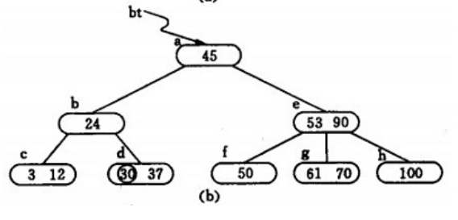
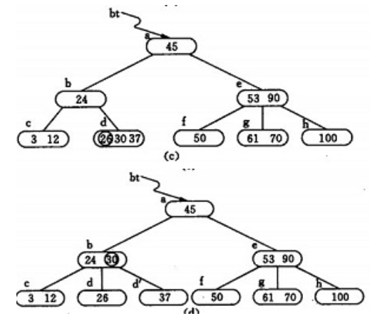
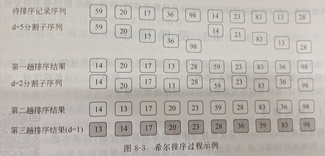

## 知识点

> 一个显然的事实是这里的知识在算法竞赛不完全适用，这里的部分知识是落后于时代的，也因此这部分知识不考虑收录在算法学习笔记中

### 绪论

#### 数据结构

> 数据(data)：数值、非数值
>
> 数据元素(data element)是数据基本单位；构成数据元素的最小单位称为数据项(data item)，数据元素通常具有相同个数和类型的数据项；能独立完整地描述问题世界的一切实体都是数据元素
>
> 数据元素是讨论数据结构时涉及到最小数据单位

> 数据结构(data structure)是指相互之间存在一定关系的数据元素的集合，分为逻辑结构和存储结构

逻辑结构(logical structure)：数据元素以及数据元素之间的逻辑关系，是从实际问题抽象出的数据模型，形式定义为二元组 $(D,R)$ ，其中 $D$ 是数据元素的有限集合， $R$ 是 $D$ 上关系的集合

通常用逻辑关系图(logical relation diagram) 描述逻辑结构，分为集合结构、线性结构、树结构和图结构(非线性结构)

逻辑结构是面向问题的


存储结构(storage structure)/物理结构：数据及其逻辑结构在计算机中的表示(映像)，除了存储数据元素外，必须隐式或显式存储元素之间的逻辑关系；通常有顺序存储结构和链接存储结构；一种数据的逻辑结构可以用多种存储结构来存储

存储结构是面向计算机的


#### 算法

> 算法可以没有输入；需要有穷性、确定性、可行性 (操作系统不是算法，因为无穷循环)

> 问题规模(problem scope) ；
>
> 基本语句(basic statement)是执行次数跟整个算法执行次数成正比的语句
>
> $O(2^n) < O(n!)$
>
> 空间复杂度：辅助空间大小(不计输入输出和算法本身)


> 若存在两个正常数 $c,n_0$ ，对任意 $n\ge n_0$ ，都有 $T\le c\times g(n)$ ，则称 $T(n)=\Omicron(g(n))$ 
>
> 若存在两个正常数 $c,n_0$ ，对任意 $n\ge n_0$ ，都有 $T\ge c\times g(n)$ ，则称 $T(n)=\Omega(g(n))$ 或称算法在 $\Omega(g(n))$ 中
>
> 大 $\Omega$ 符号描述增长率的下限(算法消耗时间的最小值)，这个下限的阶越高，结果越有价值
>
> 若存在三个正常数 $c_1,c_2,n_0$ ，对任意 $n\ge n_0$ ，都有 $c_1\times f(n)\ge T(n)\ge c_2\times f(n)$ ，$\Theta(f(n))$意味着 $T(n),f(n)$ 同阶，通常用来表示算法的精确阶 


### 线性表

linear table 简称表

#### 顺序表

> $n\ge 0$ ,$n=0$ 空表 定义 $a_1,a_n$ 是表头表尾元素， $a_i$ 的 $i$ 是元素在线性表的位置或序号(所以规定下标 $i-1$ 存第 $i$ 号元素) 相邻元素存在序偶关系 $< a_{i-1},a_i >$ ，一个称为另一个的前驱/后继；显然表头表尾分别无前驱后继
>
> 元素类型相同

> 线性表的顺序存储结构称为顺序表(sequential list)

> 计算任何一个元素的存储地址的时间是相等的，有这一特点的存储结构称为随机存取(random access)结构

> 顺序表的数据规定命名为 data ，长度命名为 length
>
> 顺序表构造注意 $n > maxSize$ 时 $throw$ 一下

> 顺序表无需销毁，析构函数为空 (变量退出作用域自动释放)
>
> 顺序表的按位查找不在 $[1,length]$ 时要 throw ，按值查找返回 $i+1$
>
> 顺序表插入在表满会上溢 ($length=maxSize$)，不在 $[1,length+1]$ 会引发位置错误，否则倒序移动插入
>
> 顺序表删除时若表空则下溢，位置不对错误，删除可以返回待删除元素 (上溢通常是程序错误，下溢是用户输入错误)


#### 单链表

> 单链表 singly linked list
>
> 数据域和指针域 (data, next) 组成了结点 node
>
> 设头指针 head pointer 指向第一个元素所在节点 (将头指针为 first 的单链表简称为 first) 表尾元素的next指针称为尾标志tail mark (\^)
>
> 通常在单链表开始结点前设头结点 head node ；除非特别说明不带头节点，不然都带
>
> 所有链表的头指针都是第一个指针，无头结点也有头指针；开始节点是第一个元素所在的节点

有头结点的原因：无论单链表是否是空表，头指针始终指向头结点，因此空表和非空表的处理统一了；避免表头插入单独处理(删除也是)

> 书中实现单链表求长度是 $O(n)$ 的
>
> 单链表是顺序存取(sequential access)结构
>
> 单链表按值查找返回的是整数代表序号(找到是正数，找不到是0)

单链表插入注意判找不到位置(传入位置 $i$ 代表要移动 $i-1$ 次找到插入前结点)(while条件是非空节点且没移动到位)

单链表头插法，每次把新申请结点插入到头结点后方

单链表尾插法，每次把新申请节点插入到终端节点后，设尾指针(一开始是头结点)，最后把尾指针域置空

单链表复制用尾插法

> 插入时，假设没头结点，发现是空时new后把头指针和它的next都指向new的节点，常规操作用else；删除发现空报下溢，单元素置头指针是空
>
> 单链表删除；while退出后如果当前是空或当前的指针域是空(尾节点)报错位置错误，记得delete掉$i-1$的next节点，返回被删除的值

> 单链表析构，从头结点开始，移位头结点并不断delete直到头为空


#### 双链表

> double linked list
>
> prior为前驱指针域 next为后继指针域
>
> 显然插入中对前驱的后继的更改应放在最后(会影响当前的后继、原后继的前驱)


#### 循环链表

> 循环单链表 circular singly linked list

> 指向终端节点的尾指针rear pointer指示循环单链表，那么开始节点是`rear->next->next`  ，结束就是 `rear` 本身


> 循环双链表 circular double linked list

> 终端节点后继指向头结点；头结点前驱指向终端节点；开始和结束分别是`first->next, first->prior`


> 通常判断循环工作指针是否等于某一指定指针(头/尾)来判断是否扫描了整个循环链表，如 `p!=first` 

> 将指针置于开始节点：若首等于尾，是空，否则是头指针的下一个；将当前指针指向后继节点，需要特判空表和表尾；删除节点如果循环链表有 `current` 变量，后移它


#### 静态链表

> static linked list 通常指静态单链表

> 指针域也称游标；设avail是空闲头指针(第一个空位置)，插入时其走向它的next，删除时被删者的next指向avail，然后被删者成为新avail
>
> 可以动态分配静链表，每次上移扩充一定长度(如10)，但是扩充空间是 $O(n)$ 的，因为要把新分配的数组用旧的完全填充


#### 其他

> 以 $O(n)$ 时间复杂度和 $O(1)$ 空间复杂度将数组向左循环移动 $i$ 次，可以：`reverse(0,i-1),reverse(i,n-1),reverse(0,n-1)`

>  约瑟夫问题的 $O(n)$ 解法：有 $n$ 个人，每次数到第 $q$ 个出去，那么最后的那个人为 $J_{n,q}$ ，有：
> $$
> J_{n,q}=(J_{n-1,q}+q)\bmod n
> $$


### 栈和队列

> 栈和队列是两种特殊的线性表(逻辑结构)

#### 栈

> stack ; stack top; stack bottom; 有空栈 ,插入叫入栈、进栈、压栈，删除叫出栈、弹栈

给定进栈序列，出栈序列不唯一(但可以判定是否可行)

> 出栈序列数为 Catalan 数，有 $c_0=1,c_{n+1}=\sum_{i=0}^nc_i\cdot c_{n-i-1}$
>
> 特别地，可以理解若第一个出栈是 $n$ ，则序列唯一 (即插入完毕前无出栈)
>
> 总结为，如果更后的出栈，前面的尚未出栈的必须按相对降序排列，如`cdbae`的`ba`，如果是`ab`必错，对`c,d`都违背了


> 顺序栈 sequential stack 下标0是栈底，top是栈顶；栈空top=-1,栈满$top=StackSize-1$  
>
> 入栈可能上溢，出栈可能下溢


> 链栈 linked stack 单链表头部作栈顶，没必要附加头结点，判空只需要看top是不是空指针


> 可以实现两栈共享空间，一个栈在数组头，一个在尾，常用于两栈长度在现实意义上呈相反关系时


#### 队列

> queue; queue-tail queue-head 队尾队头 插入叫入队、进队 删除叫出队


> 顺序队列 sequential queue 
>
> 约定存在前 $n$ 时，队头下标0 队尾是初始-1 出队 $O(n)$ 
>
> front指向队头前一个元素，rear指向队尾(front < rear) 会产生假溢出 false overflow ，在这个规定下，出队和入队都是 $+1$ 取模。
>
> 如果确定不会假溢出也可以用顺序队列

使用循环队列 circular queue 解决假溢出，为了区分队空和队满，开多一个空间什么也不存(即队满是剩一个空间)，那么 $(rear+1)\bmod QueueSize=front$ 队满，  $front=rear$ 队空 

一般初始化 $rear=front=QueueSize-1$ 

插入队满上溢，出队/取队头队空下溢；出入都是先改变指针后操作

> 队长为 $(rear-front+QueueSize)\bmod QueueSize$


> 链队列 linked queue 是单链表，为了使空队列和非空操作一致加头结点，队头指针指向头结点，队尾指针指向终端节点

构造头尾都指向一个节点，其next是空

入队尾插

出队队空下溢，特别注意出队后队空时(`p->next==nullptr`)尾赋值指向为头，这是因为把原本的尾给delete掉了

判空是front是否等于rear


> 双端队列 double-ended queue 允许在队列两端进行插入删除
>
> 特别地还有二进一出队列、一进二出队列

> 实现使用循环队列；队头入队时，front减一，队尾出队时rear减一


> 表达式求值的本质是维护运算符优先级递增的单调栈，不满足时弹栈运算并让操作数出栈两次入栈一次


### 字符串和多维数组

#### 字符串

> string 简称串 $n\ge 0$ 个字符组成的有限序列，记作 $S=s_1s_2\cdots s_n$  S是串名，右边是串值，$s_i$ 是一个任意字符， $s_i$在串中出现的序号称为该字符在串中的位置 区分空串和空格串 统计长度显然包括空格
>
> 字符串任意个连续字符组成的子序列是子串(substring)，包含子串的串称为主串(primary string)，子串第一个字符在主串的序号是子串在主串的位置location 计算机系统能够表示的所有字符构成系统字符集，常用标准字符集有ASCII，Unicode等；字符集中字符的唯一数值表示是数值编码 
>
> 大小关系为字典序即定义$X < Y$ 为下面情况之一：
>
> ①$n < m$ 且 $x_i=y_i(1\le i\le n)$  
>
> ②存在 $k\le\min(n,m)$，$x_i=y_i(1\le i\le k-1),x_k < y_k$

> 字符串逻辑结构与线性表相同

> 一般采用顺序存储，表示长度的三种方法：尾部设变量(下标0开始存字符)、头部设变量(1开始存字符)、`\0`或其他特殊字符终结符(C,C++,Java)

> 在主串S寻找子串T的过程称为模式匹配pattern matching ，T称为模式pattern，成功返回位置，失败返回0 

> BF 的最好平均比较次数是 $\dfrac{n+m}2$ ，最坏是 $\dfrac{m(n-m+2)}2$

KMP算法定义$next_j$表示 $T_j$对应的$k$值($0\le j < m$) , $k$的含义是$S_i,T_j$ 匹配失败后，$i$不回溯，$j$回溯到的位置$k$，使得$T_k$与$S_i$继续比较

回溯前有 $T_{j-k..j-1}=S_{i-k..i-1}$ 

回溯后有 $T_{0..k-1}=S_{i-k..i-1}$

根据等量代换，即有 $T_{0..k-1}=T_{j-k..j-1}$ 即长$j$子串中前缀和后缀相等的最大长度

那么有：
$$
next_j=\begin{cases}
-1&j=0\\
max\{k|1\le k< j, T_{0..k-1}=T_{j-k..j-1}\}&集合非空\\
0&其他情况
\end{cases}
$$


#### 多维数组

> 数组 array 是由类型相同的数据元素构成的有序集合，每个元素称为一个数组元素/元素，受 $n(n\ge 1)$ 个线性关系约束，在这些约束中序号 $i_1,\cdots ,i_n$ 称为元素的下标，该数组是 $n$ 维数组；一维数组是线性表，二维数组是线性表的线性表；数组是线性表的推广；显然约定下标从 $1$ 开始

> 数组上一般不能执行插入或删除

> 数组通常要求能随机存取，采用顺序存储，将多维映射到一维

常用映射有按行优先(以行序为主序 row major order)和按列优先(以列序为主序 column major order),C语言按行优先

设行下标列下标范围分别是$[l_1,h_1],[l_2,h_2]$，则存储地址为：
$$
LOC(a_{ij})=LOC(a_{l_1,l_2})+(i-l_1)(h_2-l_2+1)c+(j-h_2)c
$$
 即基地址和偏移量乘以每个元素所占存储单元数目


> 阶数很高同时很多值相同的元素且分布具有一定规律的是特殊矩阵 special matrix ;有很多零元素是稀疏矩阵 sparse matrix


对称矩阵($a_{ij}=a_{ji}$ 方阵)的压缩存储

按行优先+下三角对应的一维数组  SA[$\dfrac{n(n+1)}2$] 在下三角的下标有：
$$
k=\dfrac{i(i-1)}2+j-1  (i\ge j)
$$
对上三角部分，转置 $i,j$ 即可，即：$k=\dfrac{j(j-1)}2+i-1  (i < j)$


三角矩阵(主对角线以上(不包括主对角线)都是常数是上三角矩阵，同理有下三角矩阵)

下三角矩阵存储与对称矩阵类似，但开多最后一个空间存上三角部分常数


上三角矩阵按行存储上三角部分，下标为：
$$
k=\dfrac{(i-1)(2n-i+2)}2+j-i(i\le j)
$$

> 推导：第一行有 $n$ 个元素，第 $i-1$ 行有 $n-(i-1)+1$ 个元素，所以代入等差数列公式可得


> 对角矩阵：非零元素集中在主对角线为中心的带状区域(若干条次对角线)，其他都是 0 ，又称带状矩阵，如三对角矩阵(三条线上有值)，可以根据等差数列自行推导


> 稀疏矩阵用三元组存非零元素值 list of 3-tuples 
>
> 可以用顺序存储结构，三元组顺序表 sequential list of 3-tuples
>
> 还需要加上行数列数和非零元素数

> 稀疏矩阵的链接存储结构是十字链表 orthogonal list 
>
> 节点五个域 data(row,col,item),down,right，有行数+列数个头指针

> 稀疏矩阵的转置运算，暴力算法一：对稀疏顺序表，找每个列的三元组，遍历整个表，对当前符合的当前列值，存到新的每个行里(直接取顺序存)；算法二：遍历整个数组统计出每列有多少个值，叠前缀和，然后再遍历每个元素，按前缀和 `cnt` 摆到新数组对应位置，行列交换


> 广义表每个元素可以是一个新的广义表(子表)，或数据元素(单元素)，有深度一说
>
> 链接存储结构，头尾表示法 head tail expression ，可以设 tag ，区分元素类型


### 树

#### 树

> 元素称为节点 node 树是$n(n\ge0)$个节点的有限集合；非空树满足除根节点外其余节点被分为 $m(m > 0)$ 个互不相交的有限集合，每个集合是根节点的子树 subtree
>
> 树是图的特例，是无回路的连通图，叫自由树 free tree，即有根树 rooted tree ；有序树是根节点的子树从左到右是有顺序的 

节点的度 degree 是其拥有的子树个数(理解为出度)；树中节点度的最大值是树的度

> 度为0的节点是叶子节点 leaf node ，终端节点；不为 0 是分支节点 branch node，非终端节点
>
> 节点子树的根节点是孩子节点child node，相对有双亲结点parent node；同双亲的孩子节点互称brother node
>
> 树的节点序列 $n_1n_2\cdots n_k$ 满足 $n_i$ 是 $n_{i+1}$ 的双亲 ($1\le i < k$) ，则它是一条由 $n_1$ 到 $n_k$ 的路径 path ，路径上经过的边数称为路径长度 path length，树中路径是唯一的
>
> 从节点x到节点y有一条路径，那么x是y的祖先ancestor，y是x的子孙descendant(父亲也是祖先)
>
> 根节点层数level是1，某节点在第$k$层则其孩子节点在第$k+1$层，所有节点中最大层数称为树的深度depth，每一层节点个数的最值称为树的宽度

树的遍历traverse 从某个顶点出发，对所有顶点访问一次且仅一次

> 先序(DFS)、后序、层序(BFS)


> 存储结构：
>
> 双亲表示法 parent expression 有数据域和一个指针域，一维数组，-1表示节点是根节点
>
> 孩子表示法 child express 基于链表存储方式，单链表`firstChild`存，然后节点数据域是child(即一维数组下标)；自己的指针域是data(表头)
>
> 孩子兄弟表示法 children brother expression 又称二叉链表表示法
>
> 分别指向第一个孩子和右兄弟的指针 `firstChild, rightSib` 


#### 二叉树

树和二叉树是不同的结构

> 二叉树 binary tree $n(n\ge 0)$个节点的有限集合，空集或由根节点和两棵互不相交的左子树、右子树二叉树组成(left / right subtree)
>
> 不存在节点大于2度；左右子树不能任意颠倒，必须指明左右

> 二叉树不是度为2的树

> 所有节点只有左子树的二叉树是左斜树 left oblique tree ，同理右；统称斜树，特点是一层一个节点，深度=节点数
>
> 所有分支都有左右子树，所有叶子都在同一层的是满二叉树 full binary tree
>
> 层序编号后编号为 $i(1\le i\le n)$ 的节点与同样深度的满二叉树中编号为 $i$ 的节点在二叉树中的位置完全相同，就是完全二叉树 complete binary tree；满二叉树也是完全二叉树
>
> 特点：①深度为 $k$ 的完全二叉树在第 $k-1$ 层是完全二叉树；②叶子节点只能出现在最下两层，且都集中在左侧连续的位置；③如果有度为1的节点，只有一个，而且该节点只有左孩子

二叉树的基本性质：

1. 若叶子节点个数为 $n_0$ ，度为 $2$ 的节点个数为 $n_2$ ，则 $n_0=n_2+1$

   > 证明： $n=n_0+n_1+n_2$ ，且边数为 $n-1$ ，它们由非叶子节点贡献，且显然根据出度定义 $n-1=n_1+2n_2$ ，联立得之

2. 第 $i$ 层上最多有 $2^{i-1}$ 个节点($i\ge 1$) 

3. 深度为 $k$ 最多有 $2^k-1$ 个节点

4. 有 $n$ 个节点的完全二叉树深度为 $\lfloor\log_2n\rfloor+1$

   > 证明：即 $2^{k-1}\le n < 2^k$ ，取对数移项即可

5. 有 $n$ 节点完全二叉树从 $1$ 开始按层序编号， 对于编号为 $i(1\le i\le n)$ 的节点，有：

   1. 若 $i > 1$ ，则节点$i$ 的双亲节点为 $\lfloor\dfrac i2\rfloor$ ，否则是根节点
   2. 若 $2i\le n$ ，则 $i$ 左孩子编号是 $2i$ ，否则无左孩子
   3. 若 $2i+1\le n$ ，则 $i$ 右孩子编号是 $2i+1$ ，否则无右孩子

> 二叉树的遍历 前中后层 ;


先中、后中可以唯一确定地求出树

> 中序遍历为 `badce` ，后序遍历为 `bdeca` ，求前序遍历序列 (`abcde`)
>
> 神奇解法：先 `b` ，发现都在，所以 `b` 是左子树；然后 `a` 不在了，所以 `a` 是 `b` 的根，且右子树是后序里 `a` 的即 `dec` ，同理知 `d` 是左子树，`c` 是 `d` 的根，且 `e` 是右子树，那么 `c` 是 `a` 的右子树
>
> 正确解法：倒序搞后序遍历，那么 `a` 是全局根，且根据中序遍历可知，`a` 前左子树， `a` 后右子树，递归继续搞即可

> 输入先序和后序遍历，求中序情况数。
>
> 问题转化为找只有一个子节点的根节点，这种情况必然有两个分支，然后乘法原理即可。
>
> ```c++
> #include <bits/stdc++.h>
> using namespace std;
> #define STRL 252
> #define rep(i,a,b) for(int i=a;i<b;++i)
> int p, xs, ys;
> char x[STRL], y[STRL];
> signed main()
> {
> 	scanf("%s%s", x, y);
> 	xs = strlen(x); ys = strlen(y);
> 	rep(i, 0, xs) rep(j, 1, ys)
> 		if (x[i] == y[j] && x[i + 1] == y[j - 1]) ++p;
> 	printf("%lld", 1LL << p);
> 	return 0;
> }
> ```
>


> 顺序存储结构：按照完全二叉树层序编号，一维数组存，根节点是1，一般仅适用于完全二叉树
>
> 二叉链表法 binary linked list 一般采用 ；即数据域和`lchild, rchild` 

> 二叉链表法 构造函数 每个节点空指针引出一个虚节点，值为特殊值如`#` ，这样的处理后二叉树称为拓展二叉树 extended binary tree，使得通过单一遍历确定二叉树有可能
>
> 析构函数需要后序遍历delete掉点

> 三叉链表 trident linked list 加了parent域 


> 孩子兄弟表示法的树内存上唯一对应二叉链表的二叉树的左右孩子

树转换为二叉树：

1. 树中所有相邻兄弟节点加线 
2. 树的每个节点只保留它跟第一个孩子的线，其他都删了
3. 按照二叉树关系调整层次(左孩子是原本的上下线；右是原本的左右线)

> 性质：树的前序遍历与对应二叉树一样，后序等于中序
>
> 转换后根节点无右子树


二叉树还原树：

1. 若节点$x$是左孩子，将它的所有(只走右得到的)右子孙都连向$x$的双亲
2. 删除原二叉树所有右孩子跟它双亲的连线
3. 调整层次关系


> 非递归遍历
>
> 先序遍历：
>
> ```c++
> while (root != 0 || !s.empty()) {
>     while (root != 0) {
>         cout << root->data;
>         s.push(root);
>         root = root->lf;
>     }
>     if (!s.empty()) {
>         root = s.top(); s.pop();
>         root = root->rf;
>     }
> }
> ```
>
> 中序遍历：将上述代码的 `cout` 放到弹栈之后。
>
> 后序遍历：
>
> ```c++
> while (root != 0 || !s.empty()) {
>     while (root != 0) {
>         s.push({root, 1});
>         root = root->lf;
>     }
>     while (!s.empty() && s.top().flag == 2) {
>         root, flg = s.top(); s.pop();
>         cout << root->data;
>     }
>     if (!s.empty()) {
>         s.top().flag = 2;
>         root = root->rf;
>     }
> }
> ```


> 线索链表：利用空指针域；指向前驱或后继节点的指针称为线索 thread , 加上线索的二叉链表是线索链表 thread linked list , 二叉树是线索二叉树 thread binary tree
>
> 需要增设两个整形标记 `ltag, rtag` ，空置1，代表指针现在是线索；有四种线索链表：前序中序后序层序，视空指针指向什么而定；左是前驱，右是后继
>
> 经常遍历或查找前驱后继时比较管用


#### 森林

> forest 由 $m(m\ge 0)$ 棵互不相交的树的集合，由树构成
>
> 任何一棵树删掉根节点就变成森林；增加根节点将森林每一棵树作为其子树就得到了一棵树

> 遍历森林：依次遍历这些树，前序(根)遍历和后序(根)遍历，即依次用这样的遍历从左往右遍历每一棵树，结果加起来即可

> 森林转二叉树：
>
> 1. 每棵树转二叉树
> 2. 树根节点间连线
> 3. 调整好层次关系

> 特点：转换后根节点有右子树
>
> 二叉树还原为森林方法还原为树


#### 哈夫曼树

> 又称最优二叉树 optimal binary tree

> 叶子节点的权值 weight 

从根节点到各叶子节点的路径长度与对应叶子权值乘积和称为二叉树的带权路径长度 weighted path length，即 $WPL=\sum_{k=1}^n w_kl_k$ 

带权路径长度最小的二叉树称为最优二叉树(哈夫曼树)

> 存储结构：三叉链表

> 显然 n 叶子节点需要 $n-1$ 次合并，有 $2n-1$ 个总结点

建树：

1. 初始化 $2n-1$ 个节点，三个指针域设 -1
2. 赋值前 n 个元素权值
3. 从 $[n,n-2]$ 进行 $n-1$ 次合并，每次选取两权值最小的根节点，合并为新二叉树

> 表示字符集最简单的方法是列出每个字符并赋予二进制位串，称为编码 encoding，若所有编码等长，表示 n 个不同字符需要 $\lceil\log_2 n\rceil$ 位，是等长编码 equal-length code；每个字符使用频率相等时，是空间效率最高的方法；可以构造不等长编码 unequal-length code ，是文件压缩的核心思想；解码 decoding

前缀无歧义编码(前缀编码)(prefix code)：一组编码任一编码都不是其他任何编码的前缀

哈夫曼编码(Huffman code)用每个字符在哈夫曼树的路径作为编码

> 叶子平均深度是平均编码长度；编码总长度是各字符码长和出现次数的乘积和；字符都是叶子节点保证了前缀编码


#### 其他

> 极大队列入队时不断下沉到根节点或满足单调为止；出队则直接来个置换和下浮
>
> 逻辑上堆是树结构
>
> 并查集 union find set  书上代码不含路径压缩，其他都一样


### 图

#### 图

> 图数据元素称为顶点vertex 图graph是由顶点的有穷**非空**集合和顶点之间边的集合组成 
>
> 无向边，无序偶对表示 $(v_i,v_j)$   
>
> 有向边(弧)，有序偶对表示 $<v_i,v_j>$ 分别表示弧尾，弧头
>
> 任意顶点间边都是无向边是无向图 undirected graph 否则有向图 
>
> 权 weight 通常指边权，边权图称为带权图或网图network graph

> 无向图任意两顶点若存在边，称它们互为邻接点 adjacent ，称边 $(v_i,v_j)$ 依附adhere 于顶点 $v_i$ 和 $v_j$
>
> 有向图，称 $v_i$ 邻接到 $v_j$ , $v_j$ 邻接自 $v_i$ ，弧依附于顶点 $v_i$ 和 $v_j$ ，不混淆时称 $v_j$ 是 $v_i$ 的邻接点

无向图顶点的度 degree 指依附于该顶点的边数 记作$TD(v)$ ，有握手定理：$\sum_{i=0}^{n-1}TD(v_i)=2e$

有向图 $v$ 入度 (in-degree) 是以它为弧头的弧的个数， $ID(v)$ ;出度 out-degree 弧尾 $OD(v)$ ，有 $\sum_{i=0}^{n-1}ID(v_i)=\sum_{i=0}^{n-1}OD(v_i)=2e$

> 有向图，任意两点存在方向互反的两弧，叫有向完全图 directed complete graph ，显然 $n(n-1)$ 边

> 边数少的图稀疏图 sparse graph 反之稠密图 dense graph
>
> 无向图 $v_p,v_q$ 之间路径path是一个顶点序列，其中相邻两点组成的无序偶对必须是图的无向边；有向图类似；路径上边的数目是路径长度 path length；首尾顶点相同的路径是回路circuit，图中路径和回路不唯一
>
> 路径序列中顶点不重复出现的路径是简单路径simple path；除了首尾外不重复出现的是简单回路；通常路径指简单路径，回路指简单回路
>
> 子图 subgraph ，显而易见的定义

无向图，若顶点($i\neq j$)间存在路径，称 $v_i,v_j$ 连通，任意顶点间($i\neq j$)都有路径则图是连通图 connected graph；非连通图的极大连通子图是连通分量 connected component ，极大是满足连通的子图下，包括所有连通的顶点以及这些顶点相关联的边

有向图，任意顶点($i\neq j$)间存在路径，称为强连通图 strongly connected graph，非强连通图的极大强连通子图strongly connected component 


> 图的遍历 traverse 从某个顶点出发，对所有顶点访问一次且仅一次

> 规定图编号从 0 开始

深度优先遍历 depth-first traverse 访问一个点，从未访问邻接点里任选一个继续访问(默认从小的开始，根也是)

广度优先遍历 breadth-first traverse 访问一个点，依次访问未访问点，然后依次继续


邻接矩阵 adjacency matrix 无权图设1,0分别连、不连；有权图设0是自己对自己，不连通是无穷；显然度是行/列非零元个数，出度行，入度列

建图：定义 `vertexNum=n, edgeNum=e` ， 赋值顶点数组`vertex`，初始化边矩阵`edge`，然后赋值边

DFS注意边连通才能走，不能只看`visited`数组 $O(n^2)$

BFS用顺序队列，初始头尾-1,入队和设vis一个点；显然之前要置零`visited` $O(n^2)$

> 无法解决重边(边权不一样)

矩阵考的比较多


adjacency list 邻接表 顶点单链表，边表头指针数组和顶点数组构成表头数组，`vertex, firstEdge` 代表定点表顶点成员；边表节点成员有 `adjvex, next` 邻接点域；注意 `adjvex` 不能存邻接点数据信息存的是边的编号

构造先赋值点数边数，初始化顶点表数据域和`firstEdge`，然后插入边(头插法)

析构需要delete，显然。

DFS、BFS复杂度都是 $O(n+e)$ ；邻接表空间复杂度也是这个

> 邻接表查一个点的关联边平均复杂度是  $O(\dfrac en)$ ，边的表示不唯一，取决于输入顺序和头尾插


#### 最小生成树

> 连通图的生成树spanning tree是包含全部顶点的极小连通子图(边数最小)；**无向**连通网生成树上边权和叫做代价，代价最小是最小生成树minimal spanning tree

Prim 

```c++
U={v},TE={};
while (U!=V) {
    find min (i,j) , i in U, j in V-U ;
    U += {j};
    TE += {(i,j)};
}
```

> 邻接矩阵存；设 `adjvex[n], lowcost[n]` 依次代表候选最短边的邻接点及其权值；初始化为起点v，及其`edge[v][i]` ，且 `lowcost[v]=0` ，每次设 `lowcost[j]=0` ，且把 `lowcost` 设为 `edge[i][j], lowcost[i]` 最小值，更新时 `adjvex[i]=j` 
>
> 复杂度 $O(n^2)$


Kruskal 

```c++
U={v},TE={};
while (分量数!=1) {
    find min (u,v) in E-vis;
    if (fa[u]!=fa[v]) {
        TE += {(u,v)};
        union(u,v);
    }
    vis+=(u,v);
}
```

> 采用边集数组 edge set array 存储，可以先按权值排序 (三元组 from ,to ,weight)
>
> 双亲表示法存树，初始设 -1 ;复杂度为排序复杂度 $O(e\log_2 e)$ 


#### 最短路径

> shortest path 非网图指两顶点间经历边数最少路径；一个是源点 source, 最后一个终点 destination 

Dijkstra 

> 邻接矩阵 `dist[i], path[i]` 后者string数组 时间复杂度 $O(n^2)$ 
>
> 一开始赋值起点的邻点及其path,然后找 $n-1$ 次，每次找最小 `dist` 的下标`k`，遍历各点看看能不能松弛操作，能就更新 `dist,path`，并设`dist[k]=0`


Floyd

> `dist,path` ,邻接矩阵，一开始设`dist`为邻接矩阵，路径设相邻的；然后进行 n 次迭代，每次对每两点尝试松弛和更新(字符串加法连接字符串即可，可得路径)


#### 有向无环图

> 工程可以分为若干个子工程(活动 activity) ，活动持续一定时间，存在约束条件
>
> AOV 网，顶点表示活动，弧表示活动优先关系的有向图 activity on vertex network ，不出现回路
>
> 有向图的顶点序列 $v_0\cdots v_{n-1}$ 成为一个拓扑序列 topological order当且仅当满足：若 $v_i$ 到 $v_j$ 有一条路径，则顶点序列中 $v_i$ 一定在 $v_j$ 前，构造过程是拓扑排序topological sort，拓扑序列可能不唯一；即拓扑序列是满足偏序关系的，即自反、反对称和传递的

拓扑排序：直到全部顶点被输出或不存在无前驱顶点前，选择一个无前驱点输出然后删掉这个顶点及其所有以它为尾的弧 (最后未全部输出全部点证明有回路)

> 用邻接表，且给顶点增加入度域，用顺序栈即可(top=-1)，一开始入度0的都压栈，栈非空时，弹栈输出，计数加一，遍历该点邻接表，对其弧尾入度减一，减到0入栈；最后发现计数为顶点数就输出有回路，时间复杂度是 $O(n+e)$ 


> AOE 网  顶点表示事件，有向边表示活动，边权表示活动持续时间，有向图  activity on edge network ，无入边顶点是源点，无出边是终点
>
> 性质：只有进入某顶点的各个活动都结束，该顶点所代表的时间才发生；只有某顶点事件发生后，从该顶点出发的各活动才能开始
>
> 最短工期(完成整个工程所必须花费的时间)是源点到终点的最长路长度，具有最大路径长度的路径是关键路径critical path，关键路径上的活动成为关键活动critical activity
>
> 事件最早发生时间 `ve[k]` ，定义 
> $$
> ve[0]=0\\ve[k]=\max\{ve[j]+len<v_j,v_k>\}(<v_j,v_k>\in p[k])
> $$
> `p[k]` 是所有到达 $v_k$ 的有向边集合
>
> 不推迟最短工期下，事件最迟发生的时间 `vl[k]` 
> $$
> vl[n-1]=ve[n-1]\\
> vl[k]=\min\{vl[j]-len<v_k,v_j>\}(<v_k,v_j>\in s[k])
> $$
> `s[k]` 是从 $v_k$ 出发的有向边集合
>
> 活动最早开始时间 `ee[i]` $ee[i]=ve[k]$ , $a_i $ 是 $<v_k,v_j>$
>
> 活动最晚开始时间 `el[i]` $el[i]=vl[j]-len<v_k,v_j>$ 
>
> `el[i]=ee[i]` 是关键活动， > 不是； `el[i]-ee[i]` 是活动余量；关键活动确定后可以确定关键路径是关键活动所在的路径


#### 其他

> 为确定入度，可以建立有向图逆邻接表形成入边表
>
> 十字链表 orthogonal list，是邻接表和逆邻接表结合，
>
> 有顶点表`vertex, firstin, firstout` ，出入边表头指针
>
> 边表 `tailvex, headvex, headlink, taillink `，出入边表指针域和顶点表下标


> 邻接多重表  adjacency multi-list 无向图，顶点表还是一样，边表指向 $i,j$ 的下一条边和指针域


> 无向图
>
> 判定连通分量数目：看看需要遍历多少次能够访问到所有顶点
>
> 有 DFS, BFS 生成树(深度/广度优先生成树) 非连通图是生成森林

> 有向图
>
> 某顶点出发DFS，按所有邻接点都访问完(出栈)顺序排列构成序列S，在S中，从最后访问的顶点出发，沿着该顶点为头作逆向DFS，若不能遍历到所有图中点，则从剩下顶点最后访问的顶点出发，继续以此类推，直到所有顶点被访问到，逆向遍历顶点集是强连通分量顶点集
>
> 以下图为例：
>
> 
>
> 遍历序列是 $v_0v_1v_2v_4v_3$ ，出栈顶点序列是 $v_4v_2v_1v_3v_0$ ，两次在反图上 DFS ，一次是从 $v_0$ 开始的 $v_0,v_2,v_3,v_1$ ，一次是从 $v_4$ 出发得到的 $v_4$ ，这两个就是强连通分量顶点集


### 查找技术

> 查找问题将数据元素称为记录 record
>
> 可以标识一个记录的某个数据项称为关键码key ，其值称为键值keyword，若关键码可以唯一标识一个记录，称为主关键码primary key，反之为次关键码second key 
>
> 查找search是在具有相同类型的记录构成的集合中找到满足给定条件的记录；不涉及插入和删除操作的查找称为静态查找static search，查找不成功返回不成功标志；涉及的称为动态查找dynamic search ，不成功将其插入到查找集合中
>
> 面向查找操作的数据结构是查找结构search structure，有线性表(静态查找(顺序/折半))，树表(动态查找)，散列表(都适用)


#### 线性表

> 记录的平均比较次数，平均查找长度average search length，对查找成功，设 $p_i$ 是查找第 $i$ 个记录的概率， $c_i$ 是比较次数，则：
> $$
> AVL=\sum_{i=1}^np_ic_i
> $$
> 折半查找技术需要用在顺序存储结构
>
> 顺序查找sequential search 又称线性查找; 设置哨兵(为简化边界条件而引入的附加节点记录)放在尽头(搜索的另一端)
> $$
> ASL=\dfrac 1n\sum_{i=1}^n(n-i+1)=\dfrac{n+1}2
> $$
> 不成功时为 $n+1$ ;书上例子 $0$ 不设元素且设哨兵，从 $length$ 开始 while 递减

折半查找 binary search 假定有序表按关键码升序排列，设三个变量 `mid, low, high` ，下标范围是 $[1,length]$ ；对递归，退出条件是 $low > high$ 且返回 $0$ , 传三个参数 $low,high,k$ 

> 对表中每个记录的查找过程用折半查找判定树(简称判定树 bi-search decision tree),$low > high$ 判定树为空，非叶子节点是圆形，叶子是方形且格式为 `a~b` 其中 $b-a=1$ ，特别地两边界分别无 $a,b$ 
>
> 深度为 $\lfloor\log_2n\rfloor+1$ ，所以查找成功的比较次数至多也为此，不成功最多不超过树的深度
> $$
> ASL=\dfrac1n\sum_{j=1}^kj\times 2^{j-1}\approx log_2(n+1)-1
> $$

> 设顺序表长度为 $n$ ，根据判定表可以推断，具体折半查找的成功时平均查找次数为：
> $$
> ASL=\dfrac1n(1\times2^0+2\times2^1+3\times2^2+\cdots)
> $$
> (特别注意最后一项不是 $2^n$ ，而是不足 $2^n$ 是残缺项数目)
>
> 失败查找次数为 $\dfrac{nASL+n}{n+1}$ ，即失败等于成功的插缝法(首尾也插)，而只需要在所有成功的基础上再失败一次使得左大于右即可，所以再加了一次，或者说计算公式为：
> $$
> ASL=\dfrac1{n+1}(2\times2^0+3\times2^1+4\times2^2+\cdots)
> $$


#### 二叉排序树

> 将查找集合组织成树结构(称为树表)

二叉排序树 binary sort tree ，空二叉树或左子树所有节点小于根节点，右大于，且左右都是二叉排序树

> 通常用二叉链表存储；有重复时一般放在右子树或报错

二叉排序树的插入只需要查找直到空，然后在这个位置插入即可

> 代码实现上，当参数`bt`是空指针时返回new的一个(值赋第二个参数`x`)，左右递归时将左右子赋值给下次递归的返回值；else时加上返回参数自己(我认为书的代码有误)

二叉排序树的删除

先找到这个节点 $p$ ，然后：

- 叶子节点直接删

- 若只有一个子，直接删，用子代替自己

- 若有二子，可以在右子树一直找左子(直到深度最高)设为 $s$ ，则 $s$ 必然无左子，可能有右子 $s_r$，将其替代为原本的这个点(具体为：若 $s$ 的父亲 $s_p \neq p$ ，将 $s_p$ 的左子设为 $s_r$ ；否则 $s_p=p$ ，将 $s_p$ 的右子设为 $s_r$ ，然后将 $p$ 数据替换为 $s$ ，然后删掉 $s$ )

  也可以在左子树找右子，同理

> 最优时间复杂度均为 $\Omicron(\log n)$ ，最坏为 $\Omicron(n)$ (退化成链) ，$n$ 点最小深度为 $\lfloor\log_2n\rfloor+1$
>
> ```c++
> if ((p->lchild==nullptr)&&(p->rchild==nullptr)) {
>     f->lchild=nullptr; delete p; return;
> }
> if (p->lchild==nullptr) {
>     f->lchild=p->lchild; delete p; return;
> }
> if (p->rchild==nullptr) {
>     f->rchild=p->rchild; delete p; return;
> }
> BiNode *par = p, *s = p->rchild;
> while (s->lchild != nullptr) {
>     par = s, s = s->lchild;
> }
> p->data = s->data;
> if (par==p) par->rchild = s->rchild;
> else par->lchild = s->rchild;
> delete s;
> ```


#### 平衡二叉树

> Balance binary tree BT   又称  AVL 树  Adelson-Velskii , Landis

> 空二叉排序树或根节点的左右子树深度相差最多，左右子树也都是平衡二叉

> 节点的平衡因子(balance factor)是它的左子树和右子树的深度差，取值范围是 $-1,0,1$
>
> 最小不平衡子树(minimal unbalance subtree) 是离距离插入节点最近的，平衡因子绝对值大于1的节点为根的子树，这个节点称为最小不平衡点minimal unbalance node，又称关键不平衡点
>
> 深度为 $h$ 的层最少节点数为 $N_h$ ，则 $N_0=0,N_1=1,N_h=N_{h-1}+N_{h-2}+1$ (根$1$加一边$h-1$一边$h-2$)  ，得 $n$ 点不超过深度为 $1.44\log_2(n+2)-1.328$

定义右旋：(顺时针旋转)


设旋转节点为 $x$ ，$x$ 的左子为 $x_l$ ，将 $x_l$ 的右子 $x_{lr}$ 设为 $x$ 的新左子，将 $x_l$ 的右子设为 $x$ ， $x$ 的父亲的对应子设为 $x_l$ 。

设调整前 $x_{ll}$ 高 $h+1$ ，$x_{lr},x_r$ 高 $h$ 。则原平衡因子为 $2$ ，调整后为 $0$ 


相似定义左旋：(逆时针旋转)

$x_{rl}$ 设为 $x$ 的新右子， $x_r$ 的左子设为 $x$ ， $x$ 的父亲的对应子设为 $x_l$ 。

设调整前 $x_{rr}$ 高 $h+1$ ， $x_{rl},x_l$ 高 $h$ 。原平衡因子为 $-2$ ，调整后为 $0$


那么若 $x_{lr}=h+1,x_{ll}=x_r=h$ ，平衡因子为 $2$ ，先左旋 $x_l$ ，再右旋 $x$ 。

若 $x_{rl}=h+1,x_{rr}=x_l=h$ ，平衡因子为 $-2$ ，先右旋 $x_r$ ，再左旋 $x$ 。


总结为 LL 顺时针；RR 逆时针 ； LR 逆时针左子，顺时针根 ； RL 顺时针右子，逆时针根


> ```python
> Maintain-Balanced(p)
>     if h[ls[p]] - h[rs[p]] == 2
>         if h[ls[ls[p]]] >= h[rs[ls[p]]]
>             Right-Rotate(p)
>         else
>             Left-Rotate(ls[p])
>             Right-Rotate(p)
>     else if h[ls[p]] - h[rs[p]] == -2
>         if h[ls[rs[p]]] <= h[rs[rs[p]]]
>             Left-Rotate(p)
>         else
>             Right-Rotate(rs[p])
>             Left-Rotate(p)
> ```


#### B树

> 平衡的多路查找树 一棵 $m$ 阶 B 树是空树或 $m$ 叉树且满足如下条件：
>
> - 非叶子节点的子树数目不超过 $m$
> - 非叶子节点、非根节点的子树数目不低于 $\lceil\dfrac m2\rceil$
> - 若某非叶子节点有 $n$ 个关键码(值)，那么有 $n+1$ 个子树，且第 $i$ 个子树的所有关键码值小于第 $i$ 个关键码；第 $i+1$ 个子树所有关键码大于第 $i+1$ 个关键码
> - 根节点至少有两棵子树
> - 叶子节点都在同一层

> 例：可以推断出，并非每个节点都有两棵非空子树，且树中每个节点最多有 $m-1$ 个关键码，插入节点引发分裂后，树不一定长高一层

> 查找直接顺着单调关系一路往下即可，第 $k+1$ 层至少有 $2\left(\lceil\dfrac m2\rceil\right)^{k-1}$ 个节点(第一层 $1$ 个)，若有 $n$ 个关键码，则根据等式，查找不成功的节点有 $n+1$ 个，且：
> $$
> n+1\ge2\left(\lceil\dfrac m2\rceil\right)^{k-1}\Rightarrow k\le\log_{\lceil\frac m2\rceil}\left(\dfrac{n+1}2\right)+1
> $$
> 即最大深度不超过这个，即从根节点到关键码所在路径走的节点数不超过这个

> 插入关键码 $k$ 的步骤：(先判断 $m$ )
>
> - 找到 $k$ 应该插入到哪个叶子节点 $p$， 若 $n_p < m-1$ ，直接插入到此处
> - 否则，找到 $p$ 的中位数，将其上溢到父节点，则 $p$ 分裂为两个叶子节点，分别在中位数的两边
> - 对父节点递归判断是否需要上溢分裂(根节点也可能上溢分裂)
>
> 如果根节点没有两棵子树，那么根节点分裂后可能退化为斜树
>
> 如：
>
> 
>
> 
>
> 

> 
>
> 


> 删除：
>
> 先找到 $k$ 的位置 $q$ ，若它是 $K_i$ ，且 $q$ 不是叶子节点，用 $A_i$  所指子树最小值 $x$ 替换 $K_i$ ， 由于 $x$ 是叶子节点，所以最后转化为在叶子节点删除关键码：
>
> 若叶子节点关键码数大于 $\lceil\dfrac m2\rceil -1$ ，直接删除这个关键码，否则：
>
> 1. 查看相邻的兄弟节点，如果有大于 $\lceil\dfrac m2\rceil$ 个关键码，借来一个，将被借的上移到被删节点的双亲结点中，将双亲节点相应的关键码下移到被删除节点中
> 2. 否则，被删节点把关键码让一个给兄弟节点执行合并操作，从树中把这个空节点删除；合并后被删节点双亲的一个关键码下移到合并节点中，若被删节点的双亲没有下移就结束，否则双亲也要借关键码或合并，不断往上，如果到了根节点就会减少一层
>
> 


> B+树是非叶子节点值也在叶子节点重复出现的树
>
> 


#### 散列表

> 建立对应关系 H ，使得 key 和存储位置 $H(key)$ 相对应，这种查找技术是散列技术；将记录存储在的连续存储空间是散列表(hash table)，将关键码映射为散列表中适当存储位置的函数是散列函数  hash function，所得到的位置称为散列地址hash address
>
> 不适用于多个记录有同一关键码和范围查找
>
> 冲突collision是 $H(k_1)=H(k_2),k_1\neq k_2$ ，则 $k_1,k_2$ 相对于 H 称为同义词 synonym；散列函数的设计力求均匀

> 常见的散列函数：
>
> 启发规则：越是随机，越没有规律越是好的散列函数
>
> 直接定址法：$H(key)=a\times key+b(a,b是常数)$
>
> 特点：不会产生冲突，但实际应用能用的情况少，需要事先知道关键码分布，关键码集合不是很大且连续性较好
>
> 除留余数法：$H(key)=key\bmod p$ ，一般选大于数据范围的最小质数，或不包含小于20质因子的合数
>
> 最简单最常用，不要求事先知道关键码的分布
>
> 平方取中法：对关键码平方，按散列表大小取中间若干位(平方后截取)
>
> 事先不知道分布，且关键码位数不是很大 (有些编译器对标识符管理的方法就是这样)

处理冲突的方法：

开放定址法 open addressing 处理冲突得到的散列表叫做闭散列表

如果产生了冲突，就如此寻找下一个空位置： $H(key)+d_i\bmod m$ 

若 $d_i=1,2,\cdots, m-1$ 称为线性探测法，若 $d=\pm 1^2,\cdots \pm q^2,q\le\sqrt m$ 称为二次探测法

> 只要散列表足够大一定能找到空的散列地址
>
> 处理冲突过程中出现了非同义词之间对同一个散列地址争夺的现象是堆积mass，二次探测法可以减少堆积发生

> 删除：懒惰删除lazy deletion，被删除位置放特殊标记，以免阻断了线性探索


拉链法(链地址法)chaining 处理冲突构造的散列表称为开散列表

散列值相同的记录(所有同义词)存储在单链表中，称为同义词子表(synonym table)

> $n$个记录存在 $m$ 长度的开散列表，平均长度是 $\dfrac nm$ ；插入用头插法

> 性能分析：
>
> 散列表的装填因子load factor，设 $\alpha=\dfrac nm$ ，平均查找长度是 $a$ 的函数，且有：
>
> | 处理冲突的方法\平均查找长度 |                 查找成功时                 |                   查找失败时                   |
> | :-------------------------: | :----------------------------------------: | :--------------------------------------------: |
> |         线性探测法          | $\dfrac12\left(1+\dfrac1{1-\alpha}\right)$ | $\dfrac12\left(1+\dfrac1{(1-\alpha)^2}\right)$ |
> |         二次探测法          |       $-\dfrac1\alpha\ln(1+\alpha)$        |              $\dfrac1{1-\alpha}$               |
> |           拉链法            |             $1+\dfrac\alpha2$              |              $\alpha+e^{-\alpha}$              |

> 为获得空间效率，建议保持 $\alpha > 0.5$ ，至少是半满的，一般上限设为 $0.9$ 


#### 其他

> 分块查找 block searching ，索引顺序查找，使用前提是将线性表分块，使分块有序block order指块内无序，但下一块所有大于上一块(块间有序)，建立一个索引表，每块对应一个索引项，各索引项按关键码有序排序，一般包括每块最大关键码和指向块首的指针
>
> 设 $n$ 记录分 $m$ 块，每块都有 $t$ 个记录，则：
> $$
> ASL=\dfrac{m+1}2+\dfrac{t+1}2=\dfrac12(\dfrac nt+t)+1
> $$
> 若 $t=\sqrt n$ ，最小值为 $ASL=\sqrt n+1$
>
> 分块查找的平均查找长度和每一块中的记录个数有关，和线性表是否有序以及线性表的记录个数无关


> 插值查找 interpolation search
>
> 待查找区间 $[low, high]$ ，设待查找值通过下式求分割点：
> $$
> mid=low+\dfrac{k-r[row]}{r[high]-r[low]}(high-low)
> $$
> 若 $k < r[mid]$ 找左半区间，即 $high=mid-1$ ，$>$ 同理； $=$ 查找成功；查找区间不存在或 $mid$ 不再变化查找失败，其中 $r$ 是顺序表
>
> 时间性能在关键码分布比较均匀(线性均匀增长)时优于折半查找，比较次数小于 $\log_2\log_2 n+1$ ，但最坏情况为 $O(n)$ ，较大的表比折半查找可能更优
>
> 


### 排序技术

> 排序问题中数据元素称为记录record , 给定记录序列及其相应关键码，排序sort是将记录排成一个顺序，使得相应关键码升序或非降序(排序码)
>
> 根据排序过程待排序所有记录是否全部被放置在内存中，可以分为内排序和外排序；外排序是待排序记录太多不能同时放置在内存，需要内外存多次交换数据
>
> 根据是否建立在关键码比较基础上，分为基于和不基于比较的排序；基于有插入交换选择归并四类
>
> 多个具有相同关键码的记录，若经过排序相对次序保持不变是稳定stable，否则不稳定；不稳定只需要举反例，稳定需要分析
>
> 待排序记录序列已经排好序称为正序exact order，相反是逆序inverse order或反序anti-order
>
> 将待排序记录序列扫描一次是一趟pass
>
> 规定数据下标是 $[0,n-1]$  ，长度记为 `length ` ，数据记为 data


#### 插入排序

> 每趟排序将一个待排序记录按关键码大小插入到已经排好序的有序序列中直到有序

直接插入排序 straight insertion sort

> 实现上从 $i=[1,length)$ ，先记录 `temp` ，然后从 $j$在$[i-1,0]$ 递减直到 `temp` 小于当前 `data[j]` ，不然一直挪位置，最后设 $j+1$ 为 `temp`
>
> ```c++
> for (i=1;i<length;++i) {
>     temp=data[i];
>     for(j>i-1;j>=0&&temp<data[j];--j) {
>         data[j+1] = data[j];
>     }
>     data[j+1]=temp;
> }
> ```
>
> 比较次数是 $\sum_{i=2}^n\dfrac{i-1}2=\dfrac{n(n-1)}4$ ，移动次数是 $\sum_{i=2}^n\dfrac{i+1}2=\dfrac{(n+4)(n-1)}4$ 
>
> 稳定排序，一个记录的辅助空间


希尔排序 shell sort

> ```c++
> for (d=length/2; d>=1; d/=2) {
>     for(i=d; i<length; ++i) {
>         temp = data[i];
>         for(j=i-d; j>=0 && temp<data[j]; j-=d) {
>             data[j+d] = data[j];
>         }
>         data[j+d] = temp;
>     }
> }
> ```
>
> 时间复杂度在 $O(n\log_2n)$ 和 $O(n^2)$ 之间，适量的增量序列可以达到 $O(n^{1.3})$ ，需要一个辅助空间，不稳定排序
>
> 至今为止没有得到一个最好的增量序列；最早的提出是长度一半开始折半，且增量序列互质


#### 交换排序

> 交换排序主要思想是交换反序对；所有反序对被消除后排序完成

起泡排序 bubble sort

`exchange` 记载每次记录交换的位置， `bound` 是无序区最后一个记录位置，每趟排序范围是 $[0,bound]$ ，一趟后 `exchange` 位置后一定有序，下一趟无序最后一个位置是 `exchange` , `exchange` 初始 0 ，最后为 0 就结束了

```c++
exchange = length-1;
while (exchange != 0) {
    bound = exchange; exchange = 0;
    for (j=0; j<bound; ++j) {
        if (data[j]>data[j+1]) {
            temp=data[j];
            data[j]=data[j+1];
            data[j+1]=temp;
            exchange=j;
        }
    }
}
```

> 记录比较次数 $\sum_{i=1}^n(n-i)=\dfrac{n(n-1)}2$ 
>
> 记录移动次数 $3\sum_{i=1}^n(n-i)=\dfrac{3n(n-1)}2$
>
> 稳定，一个辅助空间


快速排序 quick sort 

> 选定轴值pivot(比较的基准)，将待排序记录划分为左边小于等于，右边大于等于，然后左右重复上述过程

```c++
int i=first, j=last, temp;
while (i<j) {
    while (i<j && data[i] <= data[j]) --j;
    if (i<j) {
        temp=data[i];data[i]=data[j];data[j]=temp;
        ++i;
    }
    while (i<j && data[i] <= data[j]) ++i;
    if (i<j) {
        temp=data[i];data[i]=data[j];data[j]=temp;
        --j;
    }
}
return i;//pivot
```

> $T(n)$ 是对 $n$ 个记录的序列进行排序的时间，则最优：
> $$
> T(n)\le 2T(\dfrac n2)+n\le\cdots\le nT(1)+n\log_2n
> $$
> 最坏情况是正序或逆序，比较次数： $\sum_{i=1}^n(n-i)=\dfrac{n(n-1)}2$，移动次数小于等于比较次数。
>
> 平均：设轴值记录关键码是待排序序列第 $k(1\le k\le n)$ 小记录，则：
> $$
> T(n)=\dfrac1n\sum_{k=1}^n(T(n-k)+T(k-1))+n\\=\dfrac2n\sum_{k=1}^nT(k)+n
> $$
> 归纳法证明数量级为 $O(n\log_2 n)$
>
> 最好和平均递归栈深度为 $O(\log_2n)$ ，不稳定排序
>
> 迄今为止所有内排序算法中平均时间性能最好的


#### 选择排序

> 每次选择待排序记录最小者添加到有序序列中，特点是移动次数少

简单选择排序 simple selection sort

> ```c++
> for (i=0; i<length-1; ++i) {
>     index=i;
>     for (j=i+1;j<length;++j) {
>         if (data[j] < data[index]) index=j;
>     }
>     if (index!=i) {
>         temp=data[i];
>         data[i]=data[index];
>         data[index]=temp;
>     }
> }
> ```
>
> 不稳定排序，一个额外空间，$\sum_{i=1}^n(n-i)=\dfrac{n(n-1)}2$ 比较次数


堆排序 heap sort

> 堆heap是完全二叉树，每个节点值小于等于其左右孩子节点值是小根堆；大于等于是大根堆；按层序从 $1$ 编号，有 $k_i\le k_{2i}, k_{2i+1}, 1\le i\le \lfloor\dfrac n2\rfloor$

> 逻辑结构上堆是树结构，然而实现上下标从 $0$ 开始

> 堆调整成员的函数：($k$ 是当前被调整节点，$last$是当前长度)函数名是Sift
>
> ```c++
> i=k;j=2*i+1;
> while (j<=last) {
>     if (j<last&&data[j]<data[j+1]) ++j;
>     if (data[i]>data[j]) break;
>     else {
>     temp=data[i];data[i]=data[j];data[j]=temp;
>     i=j;j=2*i+1;
>     }
> }//大根堆
> ```
>
> 排序算法：
>
> ```c++
> for (i=ceil(length/2)-1;i>=0;--i) {
>     Sift(i, length-1);
> }
> for (i=1;i<length;++i) {
>     temp=data[0];
>     data[0]=data[length-i];
>     data[length-i]=temp;
>     Sift(0, length-i-1);
> }
> ```
>
> 对初始状态不敏感，不稳定排序，一个额外空间，初始化 $O(n\log_2n)$ ，第 $i$ 次取堆顶重建堆需要 $O(\log_2i)$ ，取 $n-1$ 次堆顶


#### 归并排序

> 若干个有序序列逐步归并，最终归并为一个有序序列

二路归并排序 2-way merge sort

> 约定左数组下标 $[first1,last1]$ ，右 $[lats1+1, last2]$

> ```c++
> int *temp = new int[length];
> int i=first1, j=last1+1, k=first1;
> while (i<=last1 && j<=last2) {
>     if (data[i]<=data[j]) temp[k++]=data[i++];
>     else data[k++]=data[j++];
> }
> while (i<=last1) temp[k++]=data[i++];
> while (j<=last2) temp[k++]=data[j++];
> for (i=first1;i<=last2;++i) data[i]=temp[i];
> delete []temp;
> ```
>
> ```c++
> if (first==last) return;
> else {
>     int mid=(first+last)/2;
>     MergeSort1(first,mid);
>     MergeSort1(mid+1,last);
>     Merge(first,mid,last);
> }
> ```
>
> 需要 $\lceil\log_2n\rceil$ 趟，合并时间性能是 $O(n)$ ，最好最坏平均都是，稳定，空间复杂度 $O(n)$


> 递归自顶向下，非递归自底向上，效率较高(从 $n$ 个 $1$ 长有序开始向上)，每次合并传入参数 $h$
>
> ```c++
> int i=0;
> while (i+2*h<=length) {
>     Merge(i, i+h-1, i+2*h-1);
>     i+=2*h;//两两合并
> }
> if (i+h<length) {
>     Merge(i, i+h-1, length-1);
> }
> ```
>
> ```c++
> int h=1;
> while (h<length) {
>     MergePass(h);
>     h*=2;
> }
> ```


#### 综合

排序算法的比较

|          | 平均                     | 最好          | 最坏          | 辅助空间              |
| -------- | ------------------------ | ------------- | ------------- | --------------------- |
| 直接插入 | $O(n^2)$                 | $O(n)$        | $O(n^2)$      | $O(1)$                |
| 希尔     | $O(n\log_2n)\sim O(n^2)$ | $O(n^{1.3})$  | $O(n^2)$      | $O(1)$                |
| 起泡     | $O(n^2)$                 | $O(n)$        | $O(n^2)$      | $O(1)$                |
| 快速     | $O(n\log_2n)$            | $O(n\log_2n)$ | $O(n^2)$      | $O(\log_2n)\sim O(n)$ |
| 简单选择 | $O(n^2)$                 | $O(n^2)$      | $O(n^2)$      | $O(1)$                |
| 堆       | $O(n\log_2n)$            | $O(n\log_2n)$ | $O(n\log_2n)$ | $O(1)$                |
| 归并     | $O(n\log_2n)$            | $O(n\log_2n)$ | $O(n\log_2n)$ | $O(n)$                |

> 直接插入，简单选择，起泡是一类，直接插入最常用，特别对基本有序
>
> 堆、快速、归并一类，快速认为最快；待排序记录个数较多时归并比堆更快
>
> 最好情况起泡和直接插入最好，其他算法最好=平均；直接插入和起泡平均相同，但系数大一倍；最坏情况对简单选择、堆、归并影响不大
>
> 最好情况直接插入、起泡最快；平均快速最快；最坏时堆和归并最快
>
> 空间上归并一类、快速一类，其他一类
>
> 稳定：直接插入、起泡、归并；
>
> 不稳定：希尔、快速、简单选择、堆
>
> 简单：直接插入、简单选择、起泡；其他都是改进算法
>
> 对移动次数而言，有：
>
> |          | 最好   | 最坏     | 平均     |
> | -------- | ------ | -------- | -------- |
> | 直接插入 | $O(n)$ | $O(n^2)$ | $O(n^2)$ |
> | 起泡     | 0      | $O(n^2)$ | $O(n^2)$ |
> | 简单选择 | 0      | $O(n)$   | $O(n)$   |
>
> 记录信息量大时，简单选择更好。
>
> 正序时，直接插入和起泡最好，快速最坏，简单选择、堆、归并不随序列记录分布而改变


> 基于比较的排序算法是通过对输入元素两两比较进行的，可以用判定树研究排序算法的时间性能，判定树decision tree是满足如下条件的二叉树：每一个内部节点对应一个形如 $x\le y$ 的比较，如果成立走左子树，否则走右子树；每个叶子节点表示一个问题结果；叶子节点可能有 $n!$ 个代表所有不同结果，且可能更大(多个分支判定出同一个结果)
>
> 根据定理， $n!$ 个叶子节点的二叉树，高度至少为 $n\log_2n-1.5n$ 
>
> 证明：设 $m$ 是叶子数，高度为 $h$ 的满二叉树有 $2^{h-1}$ 叶子，所以 $n!\le m\le 2^h$ 
>
> 所以：
> $$
> h\ge \log_2 n!=\sum_{j=1}^nlog_2j\ge n\log_2n-n\log_2e+\log_2e\\
> \ge n\log_2n-1.5n
> $$
> 因此 $O(n\log_2n)$ 是算法时间下界


> 方形盒子里球被撞击一下然后无限运动，什么条件下会作循环运动?
>
> 设没有边界，向上走了 $p$ 个盒子距离，向右走了 $q$ 个盒子距离回到了起点，当且仅当 $\alpha=\dfrac\pi2$ 或 $\tan\alpha=\dfrac pq$是有理数时


#### 基数排序

> radix sort
>
> 借助对多关键码进行分配和收集的思想对单关键码进行排序 ，多关键码中 $k_i^0$ 是最主位关键码， $k_i^{d-1}$ 是最次位关键码
>
> 最主位优先 MSD most significant digit first 是顺着关键码顺序排序，然后对关键码相同的继续排，以此类推
>
> 最次位优先 LSD least significant digit first ，倒着按关键码次序排序，但是要求内部排序用稳定排序


## 题目

### 绪论

顺序存储结构中数据元素之间的逻辑关系由<u>存储位置</u>表示，链接存储结构由<u>指针</u>表示

计算机所处理的数据一般具有某种内在联系，这是指<u>元素和元素</u>之间存在某种关系


### 顺序表

单链表判环，可以用快慢指针法，循环结束条件是快指针不为空、它的下一位不为空且不等于慢指针


### 栈和队列

栈和队列的主要区别在于插入、删除运算的限定不一样(而不是逻辑结构不一样)


### 字符串和多维数组

求主串 `S="ababaababcb"` 和 模式 `T="ababc"` 的匹配过程：

求得 next 数组为 $-1,0,0,1,2$ 

第一趟匹配 $i=4,j=4$ ，匹配失败， $i$ 不动， $j=next[j]=2$ 

第二趟匹配$i=5,j=3$ ，匹配失败，  $i$ 不动， $j=next[j]=1$ 

第三趟匹配$i=5,j=1$ ，匹配失败，  $i$ 不动， $j=next[j]=0$ 

第三趟匹配$i=10,j=5$ ，匹配成功

> $i,j$ 是主串和模式在这次匹配时的最终位置 (移动的位长认为等于现在的$j$失败的位置减去`next`值)


二维数组 A 行下标范围从 $0\sim 8$ ，列下标范围从 $0\sim 9$ ，若 A 按行优先方式存储，元素 $A[8][5]$ 起始地址与 按列优先存储时 __ 的起始地址一致

`A.  A[8][5]   B.  A[3][10]   C.  A[5][8]   D.   A[4][9]`

对 $A[列][行]$， 求得 $k=8\times10+5=85$ ，那么对 $A[行][列]=A[i][j]$ ，有： $9j+i=85$ ，代入选项得 $D$ 正确 (计算也行)


### 树

已知先序遍历、中序遍历分别是 ABCDEFGH, CDBAFEHG ，求树：

解：

```C++
              A
        B              E
   C             F          G
      D              H
```

> 已知后序遍历和中序遍历分别是 DCBFHGEA, CDBAFEHG ，求树，答案同上


为5个使用频率不等的字符设计哈夫曼编码，不可能的方案是：

```C++
A. 000, 001, 010, 011, 1
B. 0000, 0001, 001, 01, 1
C. 000, 001, 01, 10, 11
D. 00, 100, 101, 110, 111
```


如图，D的00没有东西跟它合并，它虚空合并了，显然可以优化为 0,100,101,110,111，所以不是最优编码


任何一棵二叉树的叶子节点在前序、中序、后序遍历序列中的相对次序

A.肯定不发生改变 B.肯定发生改变 C.不能确定 D.有时发生改变

选A，因为根左右、左根右、左右根，可以发现去掉根后都是左右，即相对不变


例如：

- $124$ 个叶子节点的完全二叉树最多有多少个节点？

  个人解法：发现是$8$层，前$8$层和为$256$，最下一层少$8$个能够$8-8/2=4$，所以$256-8=248$

  更优解法：由性质一，$\because n_0=124\therefore n_2=123$ ； 完全二叉树的 $n_1$ 不大于 $1$ ，所以答案为 $248$ ，特别地，注意到一个事实，观察有 $5,6$ 个节点的完全二叉树，发现叶子结点数一致，即分别是 $n_1$ 的灵活性带来的，对于 $3,4$ 同理；即这表明如果算到是奇数个节点，一定可以加多一个

- 完全二叉树第 $6$ 层有 $24$ 个叶子节点，此树最多多少个节点？

  错误思路：叶子节点在第六层左边；正确思路：在右边

  那么有 $8$ 个非叶子节点，所以答案为 $2^6-1+2\times8=79$

- 100个节点的完全二叉树叶子结点数是多少？

  可以求层然后确定出树然后搞；也可以根据上文结论，$n=2n_0-1+n_1$ ，由奇偶性知 $n_1=1$ ，故 $n_0=50$

  有 $n(n > 0)$ 个节点的满二叉树有 $\dfrac{n+1}2$ 个叶子节点 $\dfrac{n-1}2$ 个非终端节点 (显然 $n$ 是奇数且 $n=2^{k}-1$ ，第一问所求为 $2^{k-1}$)


例：$n(n\ge1)$ 个节点的 $k$ 叉树， $k$ 叉链表存储，空指针个数为？

$kn-(n-1)=(k-1)n+1$ ，注意不存父亲所以一条边不减两个指针


例：森林对应二叉树有 $m$ 个节点，根为 $p$ ， $p$ 右子树有 $n$ 节点，则森林第一棵树节点数为多少？答曰 $m-n$


### 图

如：

- 非连通无向图有 $15$ 条边，至少有几个顶点？

  完全图最能消耗点，解得 $\dfrac{n(n-1)}2\ge15$ 的最小正整数是 $6$ ，再加一个孤立点使其变成为连通，所以是 $7$

- $n$ 顶点无向图，用邻接表存，邻接表最多有 $n(n-1)$ 个边表节点

- $n$ 个顶点的强连通图至少有 $n$ 条边 (区分概念：连通图、强连通图)

- 图的生成树唯一性不能确定 (树是特殊的图)

- 用深度优先遍历方法遍历一个有向无环图，按退栈次序打印顶点，输出的顶序列是逆拓扑有序(注意不是拓扑有序)


### 查找技术


关键码 $22,3,92,16,29,8$ 只需要一次，另外三个需要两次
$$
ASL=\dfrac{6\times1+3\times2}9=\dfrac43
$$


例：二叉排序树中最小值节点左指针一定为空，但右指针不一定为空

例：使用开放定址法解决冲突的散列查找中，发生聚集的主要原因是解决冲突的算法不好，而不是数据元素过多，装填因子过大，散列函数选择不当

例：平衡二叉树插入后，设最低不平衡点为 $A$ ，且已知 $A$ 左孩子平衡因子为 $0$ ，右孩子平衡因子为 $1$ ，则应该作 $RL$ 型调整使其平衡


### 排序技术





例：

- 下列排序中，()可能会出现在最后一趟排序之前，所有元素都不在最终位置

  A.起泡排序 <u>B.插入排序</u> C.快速排序 D.堆排序

- 对初始状态为递增有序的序列进行排序，最费时间的是()；已知数据表中每个元素距其最终位置不远，则采用()方法最节省时间

  A.堆排序 B.插入排序 C.快速排序 D.直接选择排序  (答案CB)

- 对关键码序列$\{23,17,72,60,25,8,68,71,52\}$进行堆排序，输出两个最小关键码后剩余堆是$\{23,25,68,52,60,72,71\}$

- ()方法是从为排序序列中挑选元素，将其放入已排序序列的一段

  A.归并排序 B.插入排序 C.快速排序 <u>D.选择排序</u>

- 关键码序列为$\{78,19,63,30,89,84,55,69,28,83\}$，采用基数排序，第一趟排序后的关键码序列为$\{30,63,83,84,55,78,28,19,89,69\}$

  解：关键是LSD和稳定排序

