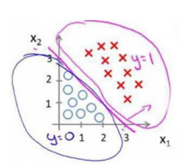
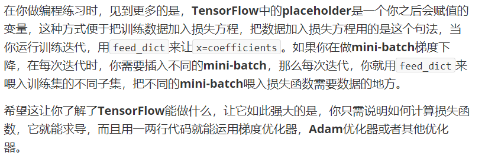

# 理论

## 概述

### 机器学习

#### 历史

概率建模(probabilistic modeling)是最早的机器学习形式之一，最出名的是朴素贝叶斯算法，是分类器(假设输入数据的特征独立)。

logistic回归(logreg, logistic regression)，分类算法(不是回归算法)。

#### 简述

$人工智能\supset机器学习\supset深度学习$

符号主义人工智能(symbolic AI)，只要编写足够多的明确规则处理知识，就可以实现与人类水平相当的人工智能。如专家系统。很难解决复杂、模糊的问题。


> 机器学习是，人们输入数据和从这些数据中预期得到的答案，系统输出规则。随后规则应用与新的数据并自主生成答案。

**机器学习**是在预先定义好的可能性空间中，利用反馈信号的指引来寻找输入数据的有用表示。

机器学习需要更快的硬件、更大的数据集，需要有用的数据表示。机器学习模型都是为输入数据寻找合适的表示：对数据进行变换，使其适合手头的任务。


机器学习中的学习就是指1寻找更好数据表示的自动搜索过程。所有机器学习算法都包括自动寻找这种变换，可以根据任务将数据转化为更加有用的表示，这些操作可以是坐标变换线性投影、平移、非线性操作（如取$x>0$的点）。机器学习寻找这些变换时仅仅遍历一组预先定义好的操作，即**假设空间**（hypothesis space）。

#### 模型

模型表示 Model Representation

##### 线性回归

特征feature$(x_1,\dots,x_n)$，特征数为n，$x^{(i)}$是第$i$个训练实例，是特征矩阵的第$i$行，是向量。例如：
$$
\left[\matrix{1\\2\\3\\4}\right]
$$
若该向量为第二个实例，则$x^{(2)}_1=1$。

多变量的假设$h_{\theta}(x)$为：
$$
h_\theta(x)=\theta_0+\sum_{i=1}^n\theta_ix_i
$$
可以假设$x_0=1$进而进一步化简该公式。显然，特征矩阵$X$的维度是$m\times(n+1)$，公式简化为：
$$
h_{\theta}(x)=\theta^TX
$$
可以得出，此时梯度下降的算式为：
$$
\theta_j=\theta_j-\alpha\frac1m\sum_{i=1}^m(h_\theta(x^{(i)})-y^{(i)})x^{(i)}_j
$$

代码为：

```python
def computeCost(X, y, theta):
    inner = np.power(((X * theta.T) - y), 2)
    return np.sum(inner) / (2 * len(X))
```

如果模型非线性，那么可以通过换元，把所有非线性元换成线性元，如：
$$
x_1=\sqrt{x_1},x_2=x_2^2,x_3=\log x_3
$$

##### 正规方程

normal equation

对于某些线性回归问题，正规方程是更好的解决方案。

设训练集特征矩阵为$X$，其中增设特征$x_0=1$，训练集结果为向量$y$，则解出向量$\theta=(X^TX)^{-1}X^Ty$

> 对于那些不可逆的矩阵（通常是因为特征之间不独立，如同时包含英尺为单位的尺寸和米为单位的尺寸两个特征，也有可能是特征数量大于训练集的数量），正规方程方法是不能用的。

正规方程无需学习率，无需多次迭代，计算时间复杂度是$\Omicron(n^3)$，只适用于线性模型，不适合逻辑回归等其他模型。一般而言特征数量$n\le10^4$可以接受。

```python
import numpy as np
def normalEqn(X, y):
   theta = np.linalg.inv(X.T@X)@X.T@y #X.T@X等价于X.T.dot(X)
   return theta
```

上述公式的推导过程如下：


#### 梯度下降

 gradient descent

##### 基本

公式：
$$
\theta_i=\theta_i-\alpha\frac{\partial J(\theta)}{\partial\theta_i} for\ \ i\ \ in\ \ all(p)
$$
$\alpha$是学习率(learning rate)。J是代价函数。过小需要很多步才能到达最低点，可能卡在局部最低点；过大可能越过最低点，无法收敛或发散。$\alpha$无需随着次数增加而减小，因为次数增加导数变小了，自然步幅小了。

通常可以考虑如下的学习率：
$$
\alpha=0.01,0.03,0.1,0.3,1,3,10
$$
通常在每迭代若干次之后计算一次代价函数，并观察，发现代价函数趋于收敛时，一般就停止学习。


若$h(x)=\theta_0+\theta_1x$，设$\theta_0,\theta_1$为唯一变量，其余为常量时，显然有：
$$
\begin{align}
\frac{\partial}{\partial\theta_i}J(\theta_0,\theta_1)&=\frac{\partial}{\partial\theta_i}\frac1{2m}\sum_{i=1}^m(h_{\theta}(x_i)-y_i)^2\\
\frac{\partial}{\partial\theta_0}J(\theta_0,\theta_1)&=\frac1m\sum_{i=1}^m(h_{\theta}(x_i)-y_i)^2\\
\frac{\partial}{\partial\theta_1}J(\theta_0,\theta_1)&=\frac1m\sum_{i=1}^m((h_{\theta}(x_i)-y_i)x_i)^2\\
\end{align}
$$
批量梯度下降：梯度下降每一步都用到了所有的训练样本。

在线性代数中，有一种计算最小值数值解法的正规方程(normal equations)法，但数据量较大时，梯度下降法更加适用。

##### 标准化

如果数据范围非常大，或者维度之间不成正比(扁平状多维空间)，那么梯度下降需要许多次迭代才会收敛，为了优化迭代次数，将所有特征的尺度都缩放到$[-1,1]$，即$x_n=\frac{x_n-\mu_n}{s_n},\mu_n是平均值，s_n是标准差$。

即缩放Scaling

##### 随机梯度下降法

如果我们一定需要一个大规模的训练集，我们可以尝试使用随机梯度下降法来代替批量梯度下降法。

在随机梯度下降法中，我们定义代价函数为一个单一训练实例的代价。

随机梯度下降算法在每一次计算之后便更新参数$\theta$ ，而不需要首先将所有的训练集求和，在梯度下降算法还没有完成一次迭代时，随机梯度下降算法便已经走出了很远。但是这样的算法存在的问题是，不是每一步都是朝着”正确”的方向迈出的。因此算法虽然会逐渐走向全局最小值的位置，但是可能无法站到那个最小值的那一点，而是在最小值点附近徘徊。


##### 小批量梯度下降

小批量梯度下降算法是介于批量梯度下降算法和随机梯度下降算法之间的算法，每计算常数$b$次训练实例，便更新一次参数

通常我们会令$b$在 2-100 之间。这样做的好处在于，我们可以用向量化的方式来循环$b$个训练实例，如果我们用的线性代数函数库比较好，能够支持平行处理，那么算法的总体表现将不受影响（与随机梯度下降相同）。

##### 收敛调试

在批量梯度下降中，我们可以令代价函数$J$为迭代次数的函数，绘制图表，根据图表来判断梯度下降是否收敛。但是，在大规模的训练集的情况下，这是不现实的，因为计算代价太大了。

在随机梯度下降中，我们在每一次更新$\theta$之前都计算一次代价，然后每$x$次迭代后，求出这$x$次对训练实例计算代价的平均值，然后绘制这些平均值与$x$次迭代的次数之间的函数图表。


当我们绘制这样的图表时，可能会得到一个颠簸不平但是不会明显减少的函数图像（如上面左下图中蓝线所示）。我们可以增加$\alpha$来使得函数更加平缓，也许便能看出下降的趋势了（如上面左下图中红线所示）；或者可能函数图表仍然是颠簸不平且不下降的（如洋红色线所示），那么我们的模型本身可能存在一些错误。

如果我们得到的曲线如上面右下方所示，不断地上升，那么我们可能会需要选择一个较小的学习率$\alpha$。

我们也可以令学习率随着迭代次数的增加而减小，例如令：


随着我们不断地靠近全局最小值，通过减小学习率，我们迫使算法收敛而非在最小值附近徘徊。 但是通常我们不需要这样做便能有非常好的效果了，对$\alpha$进行调整所耗费的计算通常不值得

##### 在线学习

一个算法来从中学习的时候来模型化问题在线学习算法指的是对数据流而非离线的静态数据集的学习。许多在线网站都有持续不断的用户流，对于每一个用户，网站希望能在不将数据存储到数据库中便顺利地进行算法学习。

在线学习的算法与随机梯度下降算法有些类似，我们对单一的实例进行学习，而非对一个提前定义的训练集进行循环。

一旦对一个数据的学习完成了，我们便可以丢弃该数据，不需要再存储它了。这种方式的好处在于，我们的算法可以很好的适应用户的倾向性，算法可以针对用户的当前行为不断地更新模型以适应该用户。

我们所使用的这个算法与随机梯度下降算法非常类似，唯一的区别的是，我们不会使用一个固定的数据集，我们会做的是获取一个用户样本，从那个样本中学习，然后丢弃那个样本并继续下去，而且如果你对某一种应用有一个连续的数据流，这样的算法可能会非常值得考虑。当然，在线学习的一个优点就是，如果你有一个变化的用户群，又或者你在尝试预测的事情，在缓慢变化，就像你的用户的品味在缓慢变化，这个在线学习算法，可以慢慢地调试你所学习到的假设，将其调节更新到最新的用户行为。

#### 逻辑回归

logistic regression 与线性回归不同(预测连续的值)，逻辑回归预测离散的值

**逻辑回归算法是分类算法，不是回归算法。**

##### 分类

Classification 

在二分类问题中，因变量(dependent variable)可能属于的两个类分别称为负向类（negative class）和正向类（positive class），因变量$y\in0,1$，0是负向量，1是正向量。

可以用线性回归的方法预测逻辑回归，并最后使用一个激活层即可，即对线性预测(输出值$\in[0,1]$取四舍五入)，这样的线性回归就是逻辑回归。

逻辑回归的假设是$h_\theta(x)=g(\theta^TX)$，g是逻辑函数，如sigmoid函数

一般使用sigmoid函数将值域调整到$[0,1]$，这个函数又称S形函数，公式为：
$$
g(x)=\frac1{1+e^{-x}}
$$
函数图像如下：


假设函数的作用是，对于给定的特征，根据参数计算得到结果是正向类的可能性有多大（该可能性estimated probablity是返回值）。

决策边界 decision boundary，是模型对分类结果的边界线，如：




如果直接用线性方程的代价函数表达式代入sigmoid函数，将会得到有许多局部最小值的非凸函数（non-convex function），因此，我们将重定义代价函数：
$$
J(\theta)=\frac1m\sum_{i=1}^mCost(h_\theta(x^{(i)}),y^{(i)})\\
Cost(h_\theta(x^{(i)}),y^{(i)})=\begin{cases}
-\log(h_\theta(x)&,y=1\\-\log(1-h_\theta(x))&,y=0
\end{cases}
$$
Cost函数图像如下图：


显而易见，这样的代价函数十分符合我们期望的定义。

可以进一步简化该函数的表达式：
$$
Cost(h_\theta(x^{(i)}),y^{(i)})=-y\times\log(h_\theta(x))-(1-y)\times\log(1-h_\theta(x))
$$
因此可以得到代价函数：
$$
J(\theta)=-\frac1m\sum_{i=1}^m[y^{(i)}\log(h_\theta(x^{(i)}))+(1-y^{(i)})\log(1-h_\theta(x^{(i)}))]
$$
代码如下：

```python
import numpy as np
def cost(theta, X, y):
  theta = np.matrix(theta)
  X = np.matrix(X)
  y = np.matrix(y)
  first = np.multiply(-y, np.log(sigmoid(X* theta.T)))
  second = np.multiply((1 - y), np.log(1 - sigmoid(X* theta.T)))
  return np.sum(first - second) / (len(X))
```

所以对代价函数的偏导数如下：
$$
\frac{\partial}{\partial\theta_j}J(\theta)=\frac1m\sum_{i=1}^m[h_\theta(x^{(i)})-y^{(i)}]x_j^{(i)}
$$

> 推导过程：
>
> 

> 一些梯度下降算法之外的选择： 除了梯度下降算法以外，还有一些常被用来令代价函数最小的算法，这些算法更加复杂和优越，而且通常不需要人工选择学习率，通常比梯度下降算法要更加快速。这些算法有：共轭梯度（Conjugate Gradient），局部优化法(Broyden fletcher goldfarb shann,BFGS)和有限内存局部优化法(LBFGS)。这三种算法通常不需要手动选择学习率，内部智能循环即线性搜索算法，会自动尝试不同学习率。

学习率更新的式子：
$$
\theta_j=\theta_j-\alpha\frac1m\sum_{i=1}^m[h_\theta(x^{(i)})-y^{(i)}]x_j^{(i)}
$$

##### 多分类

one-vs-all 一对多/余

可以做多个子假设函数$h_\theta^{(i)}(x)$，子伪训练集，将目标设为1，其余都设为0

#### 正则化

regularization

##### 概述

常见的模型问题有欠拟合under-fitting和过拟合over-fitting


如上图，左图欠拟合，右图过拟合。分类问题同理：


可以用多种方法解决过拟合问题：

1. 丢弃一些不能帮助我们正确预测的特征。可以是手工选择保留哪些特征，或者使用一些模型选择的算法来帮忙（例如**PCA**）
2. 正则化。 保留所有的特征，但是减少参数的大小（magnitude）。

特征的次数越高，越容易过拟合。尽可能让高次项系数接近0。可以修改代价函数，提高高次项参数在代价函数的权重，这样迫使经由高次项产生的误差减小，叫做惩罚。如果不知道需要惩罚什么参数和惩罚程度，得到如下代价函数：
$$
J(\theta)=\frac1{2m}\left[\sum_{i=1}^m(h_\theta(x^{(i)})-y^{(i)})^2+\lambda\sum_{j=1}^n\theta_j^2\right]
$$
$\lambda$是正则化参数regularization parameter，一般不对$\theta_0$惩罚。如果正则化参数过大，参数都会最小化，即$h_\theta(x)\approx\theta_0$，造成欠拟合，如图：


那么$\theta_0$的梯度下降不变，而其他下降的函数将变化如下：
$$
\theta_j=\theta_j-\alpha\left[\frac1m\sum_{i=1}^m(h_\theta(x^{(i)})-y^{(i)})x_j^{(i)}+\frac\lambda m\theta_j\right]
$$
变化在于每次让$\theta$减少了一个额外的值。

> 也可以用正规方程求解正则化线性回归模型：
>
> 

逻辑回归的代价方程表达式：


```python
import numpy as np
def costReg(theta, X, y, learningRate):
    theta = np.matrix(theta)
    X = np.matrix(X)
    y = np.matrix(y)
    first = np.multiply(-y, np.log(sigmoid(X*theta.T)))
    second = np.multiply((1 - y), np.log(1 - sigmoid(X*theta.T)))
    reg = (learningRate / (2 * len(X))* np.sum(np.power(theta[:,1:theta.shape[1]],2))
    return np.sum(first - second) / (len(X)) + reg
```

##### 程度

正则化程度过大或过小均不好。正则化的$\lambda$值，通常是0~10之间的二倍关系值，如：
$$
0,0.01,0.02,0.04,0.08,0.15,0.32,0.64,1.28,2.56,5.12,10
$$
同样地(见机器学习-应用-测试集)，可以划分训练集、交叉验证集、测试集。训练出12个正则化不同的模型，分别求交叉验证误差，选最小的继续训练。可以得到图像如下：


原因显而易见，正则化小时更容易过拟合，过大时更容易欠拟合。

#### 神经网络

Neuron Networks

##### 基本概念

如果使用非线性回归，即便只是两两组合参数一次方，也有$C_n^2$个项，计算非常庞大。假设识别图片，那么每个像素点就是一个特征，普通的逻辑回归难以处理如此多的特征。

神经网络是计算量偏大的算法。神经网络有多个层，每个特征输入作为输入单元Input units，整体组成了输入层input layer，最后一层是输出层output layer，中间的层都是隐藏层hidden layer，并且每个层都有一个偏置单位bias unit。


其中，$a_i^{(j)}$表示第$j$层第$i$个激活单元，$\theta^{(j)}$代表从第$j$到$j+1$层时的权重矩阵，尺寸为$j\times(j+1)$。

如果隐藏层数大于1，确保每个隐藏层的单元个数相同，通常情况下隐藏层单元的个数越多越好。

##### 前向传播

对于上图，有：注：$\Theta=\theta$


显然：$a=\theta\cdot X$，且$h^{(i+1)}=\theta^{(i)}X^T$，$X$是上一层的特征。

这样从左到右的算法称为前向传播算法( FORWARD PROPAGATION )

神经网络的特点在于每一层都利用之前的特征创造新的特征，不局限于输入的特征。

通过调整参数，倒数第二层到输出层可以实现一个(取值连续的)或门、与门等逻辑门。注意，异或门的实现比较复杂：
$$
XOR=NOT\ \ XNOR\\
XNOR=(x_1ANDx_2)OR((NOTx_1)AND(NOTx_2))
$$
对于多分类，在最后一层的结果应化为一个近似的只有一个峰值的向量。

设训练样本有$m$个，每个包含一组输入$x$和输出$y$，$L$表示层数，$S_I$表示每层的神经元个数，$S_l$表示输出层神经元个数，$S_L$表示最后一层中处理单元个数。则：

二类分类：$S_L=0,y=0\ or\ 1$

K类分类：$S_L=k,y_i=1$表示分到第$i$类。

逻辑回归的代价函数返回值是标量，而神经网络要更为复杂：


对于每一行特征，都给出K个预测，并选择可能性最高的一个。

##### 反向传播

Backpropagation Algorithm

为了计算代价函数的偏导数，需要首先计算最后一层的误差，然后一层层反向求出各层误差，直到倒数第二层。


最后的上式中，$l$是目前所计算的第几层，$j$是目前计算层中激活单元的下标，即下一层第$j$个输入变量的下标，$i$是下一层中误差单元的下标，即受权重矩阵第$i$行影响的下一层的误差单元的下标。

如果我们考虑正则化处理，并且我们的训练集是一个特征矩阵而非向量。在上面的特殊情况中，我们需要计算每一层的误差单元来计算代价函数的偏导数。在更为一般的情况中，我们同样需要计算每一层的误差单元，但是我们需要为整个训练集计算误差单元，此时的误差单元也是一个矩阵，我们用$\Delta_{ij}^{(l)}$表示这个误差矩阵，第$l$层的第$i$个激活单元受到第$j$个参数影响而导致的误差。

即首先用正向传播方法计算出每一层的激活单元，利用训练集的结果与神经网络预测的结果求出最后一层的误差，然后利用该误差运用反向传播法计算出直至第二层的所有误差。

求出误差矩阵后，可以计算代价函数的偏导数：


**梯度检验**

当我们对一个较为复杂的模型（例如神经网络）使用梯度下降算法时，可能会存在一些不容易察觉的错误，意味着，虽然代价看上去在不断减小，但最终的结果可能并不是最优解。

为了避免这样的问题，我们采取一种叫做梯度的数值检验（Numerical Gradient Checking）方法。这种方法的思想是通过估计梯度值来检验我们计算的导数值是否真的是我们要求的。

对梯度的估计采用的方法是在代价函数上沿着切线的方向选择离两个非常近的点然后计算两个点的平均值用以估计梯度。


对一般的逻辑回归，参数可以设置为初始0，但神经网络不可以，必须设置随机值通常取值范围是$[-\varepsilon,\varepsilon]$

##### 使用技巧

###### 维度检验

w的维度是（下一层的维数，前一层的维数）：
$$
w^{[l]}:(n^{[l]},n^{[l-1]})
$$
b的维度是（下一层的维数，1）：
$$
b^{[l]}:(n^{[l]},1)
$$

$$
z^{[l]},a^{[l]}:(n^{[l]},1)
$$

$$
dw^{[l]}=w^{[l]},db^{[l]}=b^{[l]}
$$

> $$
> 而Z^{{l}}=(z^{[l][1]},z^{[l][2]},\dots,z^{[l][m]})
> $$

m为训练集大小，故Z的维度为：
$$
Z^{[l]}=(n^{[l]},m)
$$

$$
A^{[l]}=Z^{[l]},X=A^{[0]}=Z^{[l]}
$$


#### 应用

##### 概述

当发现较大误差的时候，可以采用以下几种方法：

高方差也许对应过拟合，高偏差也许对应欠拟合。

1. 获得更多的训练样本——通常是有效的，但代价较大，下面的方法也可能有效，可考虑先采用下面的几种方法。解决高方差。
2. 尝试减少特征的数量，解决高方差
3. 尝试获得更多的特征，解决高偏差
4. 尝试增加多项式特征，如$x^2,x_1x_2$，解决高偏差
5. 尝试减少正则化程度$\lambda$，解决高偏差
6. 尝试增加正则化程度$\lambda$，解决高方差

机器学习诊断法：这是一种测试法，你通过执行这种测试，能够深入了解某种算法到底是否有用。这通常也能够告诉你，要想改进一种算法的效果，什么样的尝试，才是有意义的。

若使用较小的神经网络，类似于参数较少的情况，容易导致高偏差和欠拟合，但计算代价较小使用较大的神经网络，类似于参数较多的情况，容易导致高方差和过拟合，虽然计算代价比较大，但是可以通过正则化手段来调整而更加适应数据。 通常选择较大的神经网络并采用正则化处理会比采用较小的神经网络效果要好。 对于神经网络中的隐藏层的层数的选择，通常从一层开始逐渐增加层数。

##### 测试集

评估假设函数。首先，假设函数算出误差小，并不代表真的小，可能只是过拟合了。为验证过拟合，可以仅将数据的一部分用作数据集，剩下一部分用作测试集，它们均要有各种不同类型的数据(如多分类问题)。这个划分比例可以是：七三、五五等。

那么，每次使用训练集学习，并使用测试集计算误差：


除此之外，还有**交叉验证集**。也要参与划分如训练集、交叉验证集、测试集六二二开。交叉验证集一般用于验证不同的模型。首先用训练集训练若干个模型(如10个)，然后用这些模型分别对交叉验证集计算得到代价函数值，即交叉验证误差cross validation error，之后选取出代价函数最小的模型，然后对测试集计算得到代价函数值，即推广误差。

它们的关系可能大致如图：


图中$J_{train}$大致指训练集的误差，而不是测试集的误差。显然图中$J_{cv}$转折点代表过拟合的开始。

欠拟合underfit时，显然两者相近，时为偏差bias(?)，过拟合overfit时，显然交叉验证误差远大于训练集误差，时为方差variance(?)。

##### 学习曲线

learning curves

学习曲线是随着已训练集数目的增大，代价函数的图像。

使用学习曲线来判断某一个学习算法是否处于偏差、方差问题。学习曲线是学习算法的一个很好的合理检验（sanity check）

(图像没看懂为什么J的变化趋势是这样的单调性)


利用学习曲线识别高方差/过拟合：假设我们使用一个非常高次的多项式模型，并且正则化非常小，可以看出，当交叉验证集误差远大于训练集误差时，往训练集增加更多数据可以提高模型的效果。在高方差/过拟合的情况下，增加更多数据到训练集可能可以提高算法效果。

##### 误差度量

预测有四种情况：

1. 正确肯定（True Positive,TP）：  预测为真，实际为真
2. 正确否定（True Negative,TN）：预测为假，实际为假
3. 错误肯定（False Positive,FP）：  预测为真，实际为假
4. 错误否定（False Negative,FN）：预测为假，实际为真

有查准率P(precision)和查全率(召回率)R(recall)
$$
P=\frac{TP}{TP+FP}\\
R=\frac{TP}{TP+FN}
$$
对于预测值$0\sim1$，显然一般情况用0.5作预测，如果大于等于是真，否则是假，而希望更高的P时，可以提高为0.5以上，如$0.7,0.9$，如果希望R高，可以降低到0.5以下，如0.3


计算F1值(F1 score)可以帮我们选择阈值。
$$
F_1=2\frac{PR}{P+R}
$$

##### 数据可视化

略？

#### 支持向量机

##### 一般概念

SVM，support vector machine，又称大间距分类器，可以在分割两个数据集时采用更大间距的线：


假设函数：


当不是非常非常大的时候，它可以忽略掉一些异常点的影响，得到更好的决策界。甚至当你的数据不是线性可分的时候，支持向量机也可以给出好的结果。


##### 核函数

kernels


当我们使用换元法时，可以新建特征来代替多项式，从而继续得到线性的东西。


若训练样本和地标距离远，f近似于0，否则1。

一般样本数跟地标数相同。好处在于：得到的新特征是建立在原有特征与训练集中所有其他特征之间距离的基础之上的。

另外，支持向量机也可以不使用核函数，不使用核函数又称为线性核函数(linear kernel)，当我们不采用非常复杂的函数，或者我们的训练集特征非常多而样本非常少的时候，可以采用这种不带核函数的支持向量机。

在高斯核函数之外我们还有其他一些选择，如：

多项式核函数（**Polynomial Kerne**l）

字符串核函数（**String kernel**）

卡方核函数（ **chi-square kernel**）

直方图交集核函数（**histogram intersection kernel**）

等等...

这些核函数的目标也都是根据训练集和地标之间的距离来构建新特征，这些核函数需要满足Mercer's定理，才能被支持向量机的优化软件正确处理。

##### 应用


值得一提的是，神经网络在以上三种情况下都可能会有较好的表现，但是训练神经网络可能非常慢，选择支持向量机的原因主要在于它的代价函数是凸函数，不存在局部最小值。

#### 无监督学习

聚类 clustering，是将无标签的数据分类。


图上的数据看起来可以分成两个分开的点集（称为簇），一个能够找到我圈出的这些点集的算法，就被称为聚类算法。

##### K-均值算法

**K-均值**是最普及的聚类算法，算法接受一个未标记的数据集，然后将数据聚类成不同的组。

**K-均值**是一个迭代算法，假设我们想要将数据聚类成n个组，其方法为:

首先选择个随机的点，称为**聚类中心**（**cluster centroids**）；

对于数据集中的每一个数据，按照距离个中心点的距离，将其与距离最近的中心点关联起来，与同一个中心点关联的所有点聚成一类。

计算每一个组的平均值，将该组所关联的中心点移动到平均值的位置。

重复步骤2-4直至中心点不再变化。


这个拐点就是目标聚类个数。

我们的 T-恤制造例子中，我们要将用户按照身材聚类，我们可以分成3个尺寸:，也可以分成5个尺寸，这样的选择是建立在回答“聚类后我们制造的T-恤是否能较好地适合我们的客户”这个问题的基础上作出的。


2.聚类的衡量指标

(1). 均一性p：

类似于精确率，一个簇中只包含一个类别的样本，则满足均一性。其实也可以认为就是正确率(每个 聚簇中正确分类的样本数占该聚簇总样本数的比例和)

(2). 完整性r：

类似于召回率，同类别样本被归类到相同簇中，则满足完整性;每个聚簇中正确分类的样本数占该 类型的总样本数比例的和


##### 异常检测

anomaly detectcion

异常检测算法是一个非监督学习算法，意味着我们无法根据结果变量 y的值来告诉我们数据是否真的是异常的。我们需要另一种方法来帮助检验算法是否有效。当我们开发一个异常检测系统时，我们从带标记（异常或正常）的数据着手，我们从其中选择一部分正常数据用于构建训练集，然后用剩下的正常数据和异常数据混合的数据构成交叉检验集和测试集。

例如：我们有10000台正常引擎的数据，有20台异常引擎的数据。 我们这样分配数据：

6000台正常引擎的数据作为训练集

2000台正常引擎和10台异常引擎的数据作为交叉检验集

2000台正常引擎和10台异常引擎的数据作为测试集


异常检测与监督学习的异同：

| 异常检测                                                     | 监督学习                                                     |
| :----------------------------------------------------------- | :----------------------------------------------------------- |
| 非常少量的正向类（异常数据 ）, 大量的负向类（）              | 同时有大量的正向类和负向类                                   |
| 许多不同种类的异常，非常难。根据非常 少量的正向类数据来训练算法。 | 有足够多的正向类实例，足够用于训练 算法，未来遇到的正向类实例可能与训练集中的非常近似。 |
| 未来遇到的异常可能与已掌握的异常、非常的不同。               |                                                              |
| 例如： 欺诈行为检测 生产（例如飞机引擎）检测数据中心的计算机运行状况 | 例如：邮件过滤器 天气预报 肿瘤分类                           |


上图中，在蓝色圈内的数据属于该组数据的可能性较高，而越是偏远的数据，其属于该组数据的可能性就越低。

这种方法称为密度估计，表达如下：


异常检测主要用来识别欺骗。例如在线采集而来的有关用户的数据，一个特征向量中可能会包含如：用户多久登录一次，访问过的页面，在论坛发布的帖子数量，甚至是打字速度等。尝试根据这些特征构建一个模型，可以用这个模型来识别那些不符合该模式的用户。

再一个例子是检测一个数据中心，特征可能包含：内存使用情况，被访问的磁盘数量，CPU的负载，网络的通信量等。根据这些特征可以构建一个模型，用来判断某些计算机是不是有可能出错了。

高斯分布，即正态分布，可用于检验异常。


特征选择：


一个常见的问题是一些异常的数据可能也会有较高的$p(x)$值，因而被算法认为是正常的。这种情况下误差分析能够帮助我们，我们可以分析那些被算法错误预测为正常的数据，观察能否找出一些问题。我们可能能从问题中发现我们需要增加一些新的特征，增加这些新特征后获得的新算法能够帮助我们更好地进行异常检测。

多元高斯分布 Multivariate Gaussian Distribution

假使我们有两个相关的特征，而且这两个特征的值域范围比较宽，这种情况下，一般的高斯分布模型可能不能很好地识别异常数据。其原因在于，一般的高斯分布模型尝试的是去同时抓住两个特征的偏差，因此创造出一个比较大的判定边界。


在一般的高斯分布模型中，我们计算$p(x)$的方法是： 通过分别计算每个特征对应的几率然后将其累乘起来，在多元高斯分布模型中，我们将构建特征的协方差矩阵，用所有的特征一起来计算$p(x)$。

首先计算所有特征的平均值，然后再计算协方差矩阵：


上图是5个不同的模型，从左往右依次分析：

1. 是一个一般的高斯分布模型
2. 通过协方差矩阵，令特征1拥有较小的偏差，同时保持特征2的偏差
3. 通过协方差矩阵，令特征2拥有较大的偏差，同时保持特征1的偏差
4. 通过协方差矩阵，在不改变两个特征的原有偏差的基础上，增加两者之间的正相关性
5. 通过协方差矩阵，在不改变两个特征的原有偏差的基础上，增加两者之间的负相关性

原本的高斯分布模型是多元高斯分布模型的一个子集，即像上图中的第1、2、3，3个例子所示，如果协方差矩阵只在对角线的单位上有非零的值时，即为原本的高斯分布模型了。

| 原高斯分布模型                                               | 多元高斯分布模型                                             |
| :----------------------------------------------------------- | :----------------------------------------------------------- |
| 不能捕捉特征之间的相关性 但可以通过将特征进行组合的方法来解决 | 自动捕捉特征之间的相关性                                     |
| 计算代价低，能适应大规模的特征                               | 计算代价较高 训练集较小时也同样适用                          |
|                                                              | 必须要有$m>n$，不然的话协方差矩阵不可逆的，通常需要$m>10n$ ，另外特征冗余也会导致协方差矩阵不可逆 |

原高斯分布模型被广泛使用着，如果特征之间在某种程度上存在相互关联的情况，我们可以通过构造新新特征的方法来捕捉这些相关性。

如果训练集不是太大，并且没有太多的特征，我们可以使用多元高斯分布模型。

#### 优化

##### 降维

将数据从二维降至一维： 假使我们要采用两种不同的仪器来测量一些东西的尺寸，其中一个仪器测量结果的单位是英寸，另一个仪器测量的结果是厘米，我们希望将测量的结果作为我们机器学习的特征。现在的问题的是，两种仪器对同一个东西测量的结果不完全相等（由于误差、精度等），而将两者都作为特征有些重复，因而，我们希望将这个二维的数据降至一维。

从这件事情我看到的东西发生在工业上的事。如果你有几百个或成千上万的特征，它是它这往往容易失去你需要的特征。有时可能有几个不同的工程团队，也许一个工程队给你二百个特征，第二工程队给你另外三百个的特征，第三工程队给你五百个特征，一千多个特征都在一起，它实际上会变得非常困难，去跟踪你知道的那些特征，你从那些工程队得到的。其实不想有高度冗余的特征一样。


降维的算法只负责减少维数，新产生的特征的意义就必须由我们自己去发现了。


主成分分析(PCA, Principal Component Analysis)是最常见的降维算法。


主成分分析与线性回归是两种不同的算法。主成分分析最小化的是投射误差（Projected Error），而线性回归尝试的是最小化预测误差。线性回归的目的是预测结果，而主成分分析不作任何预测。


**PCA**将个n特征降维到k个，可以用来进行数据压缩，如果100维的向量最后可以用10维来表示，那么压缩率为90%。同样图像处理领域的**KL变换**使用**PCA**做图像压缩。但**PCA** 要保证降维后，还要保证数据的特性损失最小。

**PCA**技术的一大好处是对数据进行降维的处理。我们可以对新求出的“主元”向量的重要性进行排序，根据需要取前面最重要的部分，将后面的维数省去，可以达到降维从而简化模型或是对数据进行压缩的效果。同时最大程度的保持了原有数据的信息。

**PCA**技术的一个很大的优点是，它是完全无参数限制的。在**PCA**的计算过程中完全不需要人为的设定参数或是根据任何经验模型对计算进行干预，最后的结果只与数据相关，与用户是独立的。

但是，这一点同时也可以看作是缺点。如果用户对观测对象有一定的先验知识，掌握了数据的一些特征，却无法通过参数化等方法对处理过程进行干预，可能会得不到预期的效果，效率也不高。


错误的主要成分分析情况：一个常见错误使用主要成分分析的情况是，将其用于减少过拟合（减少了特征的数量）。这样做非常不好，不如尝试正则化处理。原因在于主要成分分析只是近似地丢弃掉一些特征，它并不考虑任何与结果变量有关的信息，因此可能会丢失非常重要的特征。然而当我们进行正则化处理时，会考虑到结果变量，不会丢掉重要的数据。

另一个常见的错误是，默认地将主要成分分析作为学习过程中的一部分，这虽然很多时候有效果，最好还是从所有原始特征开始，只在有必要的时候（算法运行太慢或者占用太多内存）才考虑采用主要成分分析。

###### 并行

映射化简和数据并行对于大规模机器学习问题而言是非常重要的概念。之前提到，如果我们用批量梯度下降算法来求解大规模数据集的最优解，我们需要对整个训练集进行循环，计算偏导数和代价，再求和，计算代价非常大。如果我们能够将我们的数据集分配给不多台计算机，让每一台计算机处理数据集的一个子集，然后我们将计所的结果汇总在求和。这样的方法叫做映射简化。

具体而言，如果任何学习算法能够表达为，对训练集的函数的求和，那么便能将这个任务分配给多台计算机（或者同一台计算机的不同CPU 核心），以达到加速处理的目的。

例如，我们有400个训练实例，我们可以将批量梯度下降的求和任务分配给4台计算机进行处理。

##### 激活函数

> Activation functions

除了回归问题，输出层的激活都要用非线性激活函数。所有问题的隐藏层都要用非线性激活函数。

###### sigmoid

$$
f(x)=\frac1{1+e^{-x}}
$$

$$
f'(x)=f(x)\times\left(1-f(x)\right)
$$

###### tanh

$$
\tanh x=\frac{e^x-e^{-x}}{e^x+e^{-x}}
$$

$$
\tanh'x=1-\tanh^2x
$$

###### ReLu

$$
f(x)=\max(0,x)
$$

$$
f'(x)=\begin{cases}0&x<0\\1&x>0\\无定义&x=0
\end{cases}
$$

###### Leaky ReLu

$$
f(x)=\max(0.01x,x)
$$

$$
f'(x)=\begin{cases}0.01&x<0\\1&x>0\\无定义&x=0
\end{cases}
$$

使用经验：

1. 二分类问题，可以对隐藏层使用tanh，对输出层使用sigmoid。两者共同的缺点是，在x特别大或者特别小的情况下，导数的梯度或者函数的斜率会变得特别小，最后就会接近于0，导致降低梯度下降的速度。
2. 二分类问题，输出层外都可以使用relu或leaky relu，后者效果略优。优点在于：在x的区间变动很大的情况下，激活函数的导数或者激活函数的斜率都会远大于0，并且计算量小。
3. sigmoid和tanh函数的导数在正负饱和区的梯度都会接近于0，这会造成梯度弥散，而(leaky)relu函数大于0部分都为常数，不会产生梯度弥散现象。同时应该注意到的是，Relu进入负半区的时候，梯度为0，神经元此时不会训练，产生所谓的稀疏性，而Leaky ReLu不会有这问题)
4. x在ReLu的梯度一半都是0，但是，有足够的隐藏层使得z值大于0，所以对大多数的训练数据来说学习过程仍然可以很快。
5. 尽管在反向传播中relu和leaky relu存在无导数点，但是该情况在连续输入值里出现概率很低，所以可以不用过于考虑。

总结：

- sigmoid：除了输出层是一个二分类问题基本不会用它。
- tanh：几乎适合所有场合。
- ReLu：如果不确定用哪个激活函数，就使用ReLu或者Leaky ReLu。

#### 其他术语

假设(hypothesis)，学习算法的解决方案/函数

向量机(SVM, support vector machine)。

决策边界(decision boundary)，分类问题区分两类数据的线(面...)。

特征工程：手动提取出对数据的有用的表示(层)

决策树(decision tree)，类似于流程图，对输入数据点分类或根据给定输入预测输出。

随机森林(random forest)，对于任何浅层机器学习任务，几乎总是第二好算法。

梯度提升机(gradient boosting machine)，将弱预测模型(如决策树)集成的机器学习技术，处理非感知数据最好。处理结构化数据问题。

top-5精度，如果模型预测的前5个标签包含正确标签，即为预测正确。

softmax：
$$
S_i=\frac{e^{V_i}}{\sum_i^Ce^{V_i}}
$$
Vi 是分类器前级输出单元的输出。i 表示类别索引，总的类别个数为 C。Si 表示的是当前元素的指数与所有元素指数和的比值。可以将多分类的输出数值转化为相对概率。

交叉熵，其用来衡量在给定的真实分布下，使用非真实分布所指定的策略消除系统的不确定性所需要付出的努力的大小。使用交叉熵做分类问题中的损失函数，可以在一定程度上减少梯度消散。

##### 常用符号


#### 其他概念

深度卷积神经网络(convnet)是所有计算机视觉任务的首选算法，对所有感知任务都有效。

### 深度学习

#### 简述

又名分层表示学习(layered representations learning)，层级表示学习(hierarchical representations learning)。与之相对的(只有一两层的数据表示)是浅层学习(shallow learning)

强调从连续的层(layer)学习，层对应越来越有意义的表示，深度指一系列连续的表示层。数据模型包含的层数称为深度(depth)。

神经网络中每层对输入数据做的操作保存在该层的权重(weight)中，每层实现的变换由其权重参数化(parameterize)，也称为该层的参数。此时学习即为神经网络的所有层找到一组权重值，使得该网络可以将每个示例输入与其目标正确地一一对应。

目标函数(objective function)/神经网络损失函数(loss function)是衡量输出与预期值之间的距离的函数，用于控制神经网络的输出。

优化器(optimizer)实现反向传播(backpropagation)，利用目标函数值对权重进行微调。

权重一开始随机赋值，在若干次训练循环(training loop)。

深度学习在许多问题上表现出更好的性能，将特征工程完全自动化。

深度学习模型在同一时间共同学习所有表示层，而不是依次连续学习(贪婪学习)。

训练10层以上模型时，深度学习优点更加突出。


#### 其他术语

神经层激活函数(activation function)

权重初始化方案(weight-initialization scheme)

优化方案(optimization scheme)，如RMSProp,Adam

有助于梯度传播的方法：批标准化、残差连接、深度可分离卷积等

0/1离散输出问题：顾名思义

建模误差 modeling error

局部/全局最小值 local/global minimum

平方误差函数/代价函数：Cost Function

多项式回归 Polynomial Regression

收敛 convergence
$$
J(x)=\frac1{2m}\sum_{i=1}^m(h(x)-y)^2,m是训练集实例数，h是假设函数
$$

聚类是无监督学习的一个例子。

#### 常用工具

Keras库等


## 数学基础

### 矩阵

#### 概念

下面是一个$4\times2$矩阵，4行2列，维度是$4\times2=8$
$$
\left[\matrix{1&2\\3&4\\5&6\\7&8}\right]
$$
$A_{ij}$是第i行，第j列的元素，如$A_{32}=6$，一般以1索引矩阵。

向量是特殊的矩阵，如图是一个三维列向量：
$$
\left[\matrix{1\\2\\3}\right]
$$

#### 运算

加法：
$$
\left[\matrix{1&0\\2&5\\3&1}\right]+
\left[\matrix{4&0.5\\2&5\\0&1}\right]=
\left[\matrix{5&0.5\\4&10\\3&2}\right]
$$
标量乘法(Scalar Multiplication)：
$$
3\times\left[\matrix{1&0\\2&5\\3&1}\right]=
\left[\matrix{1&0\\2&5\\3&1}\right]\times3=
\left[\matrix{3&0\\6&15\\9&3}\right]
$$
矩阵向量乘法：

$m\times n$矩阵乘$n\times1$向量得$m\times1$向量
$$
\begin{align}
\left[\matrix{1&3\\4&0\\2&1}\right]\left[\matrix{1\\5}\right]&=\left[\matrix{16\\4\\7}\right]\\
1\times1+3\times5&=16\\
4\times1+0\times5&=4\\
2\times1+1\times5&=7
\end{align}
$$
矩阵乘法：

$m\times n$矩阵乘$n\times o$矩阵得$m\times o$矩阵
$$
\begin{align}
\left[\matrix{a_1&a_2\\a_3&a_4}\right]\times\left[\matrix{b_1&b_2\\b_3&b_4}\right]&=\left[\matrix{c_1&c_2\\c_3&c_4}\right]\\
a_1\times b_1+a_2\times b_3&=c_1\\
a_1\times b_2+a_2\times b_4&=c_2\\
a_3\times b_1+a_4\times b_3&=c_3\\
a_3\times b_2+a_4\times b_4&=c_4
\end{align}
$$
矩阵乘法性质：
$$
A\times B\neq B\times A\\
A\times(B\times C)=(A\times B)\times C
$$
单位矩阵$I/E$：主对角线(左上到右下)全1，其余全0的矩阵，
$$
AI=IA=A
$$
逆(Inverse)矩阵$A^{-1}$：
$$
AA^{-1}=A^{-1}A=I
$$
不可逆矩阵为奇异或退化矩阵。

矩阵转置(Transpose)：$A_{ij}=A^T_{ji}$

性质 Properties ：
$$
A^T=A'=B
$$

$$
\left|\matrix{a&b\\c&d\\e&f}\right|^T=
\left|\matrix{a&c&e\\b&d&f}\right|
$$

$$
(A\pm B)^T=A^T\pm B^T(A\times B)^T\\=B^T\times A^T(A^T)^T
$$

### 统计

#### 指数加权平均数

设前$i$个指数加权平均数为$v_i$，数据为$a_i$，有：
$$
v_i=\beta v_{i-1}+(1-\beta)a_i
$$
例如：


展开，有：


其系数和加起来近似为1。称之为偏差修正。

每种不同的$\beta$都在一定次数后会达到$\frac1e$

指数加权平均数公式的好处之一在于，它占用极少内存，电脑内存中只占用一行数字而已，然后把最新数据代入公式，不断覆盖就可以了，正因为这个原因，其效率，它基本上只占用一行代码，计算指数加权平均数也只占用单行数字的存储和内存，当然它并不是最好的，也不是最精准的计算平均数的方法。如果你要计算移动窗，你直接算出过去10天的总和，过去50天的总和，除以10和50就好，如此往往会得到更好的估测。但缺点是，如果保存所有最近的温度数据，和过去10天的总和，必须占用更多的内存，执行更加复杂，计算成本也更加高昂。

##### 偏差修正

如果需要使用最开始的一些数据(深度学习中一般不会使用)，可以设：
$$
v'_t=\frac{v_t}{1-\beta^t}
$$
偏差修正可以帮助你更好预测温度，偏差修正可以帮助你使结果从紫线变成绿线：


## 深度学习

### 数据

#### 数据集

将数据集分为训练集、验证集(dev set)和(保留)交叉验证集(hold out cross validation set)。

- 当数据量为100~$10^4$时，按照70%训练集，30%测试集划分(原文验证-测试？)或60%训练，20%验证和20%测试。
- 数据量为$10^6$时，1%数据验证、1%数据测试即可。
- 数据量更大时，可以让验证和测试各占0.25%或验证0.4%，测试0.1%

测试集的目的是对最终所选定的神经网络系统做出无偏估计，如果不需要无偏估计，也可以不设置测试集。所以如果只有验证集，没有测试集，我们要做的就是，在训练集上训练，尝试不同的模型框架，在验证集上评估这些模型，然后迭代并选出适用的模型。因为验证集中已经涵盖测试集数据，其不再提供无偏性能评估。

数据集通常而言要保证划分的三个集分布（如地域、类别、准确率）是相同的。

测试集必须与应用场景尽可能一致。实际应用场景中传入不标准的样例的概率(模糊、有误、复杂等)会更高，需要考虑这些情况。

数据集分布要保证在要解决的问题里均匀分布，也就是不能只有一小部分样例(如汽车识别只给20种车型)，即使数据量特别多。否则过拟合可能非常严重。

#### 样本错误

数据集的标注可能会存在错误。但是小部分的随机均匀错误并不会显著影响结果。可以通过除法公式估计样本错误对误差率的贡献率。处理代价大时，如果过高才进行处理。

然而非随机均匀的错误会明显影响模型错误，需要修正。

#### 非平均分布

有时由于客观限制，不能够得到较多的真实情况下的样例。这时候可以把它们划分在测试和交叉验证集里，而不放在训练集，训练集用其他大量的样本。

可以设置一个新的训练-开发集。在这里每次训练时作一次评估(但不反向传播)。


在这种时候，对偏差和方差的分析需要改变策略。


也可以根据真实样本与训练集的差异对训练集作变换(增加确保是随机的噪音等)。

### 训练

#### 超参数

hyperparameter tuning 超参数调试

超参数取值，可以采用由粗糙到精细的策略。发现某个点效果较优，可以在其附近继续采点。

注意采点一般是对数轴而不是线性轴，如：
$$
[10^{-4},10^{-3},\dots,10^0]
$$
因为超参数在临近某些值(0或1)时可能会产生突变。

当可调用资源比较少，每次训练消耗成本高时，往往只能一次开一个模型(并一边往下训练不断调整超参数)。否则一般平行地测试多个参数。


#### 回归

##### softmax回归

Softmax regression
$$
\alpha^{[l]}=\frac{e^{z^{[l]}}}{\sum_{j=1}^me^{z^{[l]}}}
$$
一个双特征三分类的决策边界示例如下：


> 与之对比，hardmax会把最大可能性置1，其他置0

损失函数：
$$
L(\widehat y,y)=-\sum_{j=1}^my_j\log \widehat y_j
$$

$$
J(w^{[1]},b^{[1]},\dots)=\frac1m\sum_{i=1}^mL(\widehat y^{(i)},y^{(i)})
$$


#### 梯度

##### 梯度检验

用于查bug。


- 不要在训练中使用梯度检验，它只用于调试。计算量十分庞大。

- 算法的梯度检验失败，要检查所有项，检查每一项。

  

- 在实施梯度检验时，如果使用正则化，请注意正则项。计算梯度时需要考虑上。

- 梯度检验不能与dropout同时使用。

- 

##### 梯度下降

###### batch

即每次都训练全体样本

###### mini-batch

把训练集分割为小一点的子集训练，这些子集被取名为mini-batch。一般是顺次划分(注意全体数据提前打乱，每个batch需要包含所有类型的数据)。

以1000个样本为例，则：
$$
X^{\{1\}}=x^{(1)}\dots x^{(1000)}
$$
$Y$同理。而$X$维度为$(n_x,1000)$,$Y$为$(1,1000)$。

一次遍历了mini-batch，称为一代(1 epoch)

mini-batch的训练图与batch会有差异：


一般而言，样本数是2的n次方，如64或512比较常见。

最后需要注意的是在你的mini-batch中，要确保$X^{\{t\}}$和$Y^{\{t\}}$要符合CPU/GPU内存，取决于你的应用方向以及训练集的大小。如果你处理的mini-batch和CPU/GPU内存不相符，不管你用什么方法处理数据，你会注意到算法的表现急转直下变得惨不忍睹，所以我希望你对一般人们使用的mini-batch大小有一个直观了解。事实上mini-batch大小是另一个重要的变量，你需要做一个快速尝试，才能找到能够最有效地减少成本函数的那个，我一般会尝试几个不同的值，几个不同的2次方，然后看能否找到一个让梯度下降优化算法最高效的大小。希望这些能够指导你如何开始找到这一数值。

###### 随机梯度下降法

mini-batch的大小是1，即每次只训练一个样本，就是随机梯度下降法。

为随机梯度下降法永远不会收敛，而是会一直在最小值附近波动，但它并不会在达到最小值并停留在此。

一大缺点是，你会失去所有向量化带给你的加速，因为一次性只处理了一个训练样本，这样效率过于低下。

#### 参数

##### 随机化参数

权重矩阵：(高斯随机变量)
$$
w^{[l]}=np.random.randn(shape)\times np.sqrt(\frac1{n^{[l-1]}})
$$
$n^{[l-1]}$是第l-1层的神经单元数量。


###### 动量梯度下降法

Gradient descent with Momentum


例如，在上几个导数中，你会发现这些纵轴上的摆动平均值接近于零，所以在纵轴方向，你希望放慢一点，平均过程中，正负数相互抵消，所以平均值接近于零。但在横轴方向，所有的微分都指向横轴方向，因此横轴方向的平均值仍然较大，因此用算法几次迭代后，你发现动量梯度下降法，最终纵轴方向的摆动变小了，横轴方向运动更快，因此你的算法走了一条更加直接的路径，在抵达最小值的路上减少了摆动。

希望加快学习，你希望快速从左向右移，移向最小值，移向红点。所以使用动量梯度下降法。

它们能够最小化碗状函数，这些微分项，想象它们为你从山上往下滚的一个球，提供了加速度，Momentum项相当于速度。


###### RMSprop

root mean square prop算法


#### 迁移学习

将处理相似问题的神经网络的最后几层替换掉，然后直接拿来用的一种办法，一般是原模型数据量大，而现在需要处理的问题数据量极小(如100)时可以使用。当数据量偏差不大时，迁移的作用不大。

### 误差

#### 偏差、方差

偏差bias，是测试结果的准确率，偏差高代表欠拟合underfitting

方差variance，是训练集与测试集上的差异，方差高代表过拟合overfitting

否则是适度拟合。

在计算的时候，往往会考虑一个数据本身的准确性(因为有些数据人为标签也不能确保100%正确)。

#### 梯度消失/梯度爆炸

梯度消失vanishing/梯度爆炸exploding gradients

导数/坡度以指数级变化或变得非常大/小。

#### 局部最优

The problem of local optima

在高维空间，最值分为最小值和最小值(凸函数、凹函数)，所有维度均取到最小值而得到一个局部最优的概率为$0.5^k$，$k$为特征数，$k$通常成千上万。所以可以认为不存在局部最优问题(至少不需要考虑)。

#### 准确率

准确率需要考虑其他前置前提(比如时限、是否真的符合用户期望、是否有会造成损失的后果)，满足后才考虑高准确率。

而当机器学习准确率高于人的准确率时，将比较难以优化。

###### 贝叶斯最优错误率

Bayes optimal error

即理论上模型的最优错误率。因为样本和人的判定等在实际场合不一定是完全正确的(样本可能过于模糊等)。

在该错误率不为0的情况下，需要重新改进判定偏差和方差的方法。如果偏差跟错误率相差不大，那么更应该处理方差问题。

#### 代价函数

##### 指标

如果对于一个模型，需要同时度量多个指标(如查准率、查全率、用时等)，那么应当将他们用均值、权重、条件判断等方法结合。

###### 单一数字评估指标

Single number evaluation metric

如$F_1$值：
$$
F_1=\frac2{\frac1P+\frac1R}
$$

###### 满足和优化指标

Satisficing and optimizing metrics

满足指标是强制需要达到的指标，如时间限制。

优化指标是满足指标达成的前提下，需要尽可能优化的指标。

还有一种特殊情况，即有些时候一个模型会输出一些违规等内容误认为是正确数据，尽管该模型准确率较其他高，但也不应该使用，即满足指标未达到。

### 优化

#### 策略

> 选择更佳的策略以避免浪费大量的时间。


#### 正则化

正则化或准备更多的数据以解决高方差的问题。

正则化能够让边界曲线变得平缓，一般地会增加训练次数才能达到效果。

##### L1/L2正则化

设L2范数(欧几里得范数)的平方(即弗罗贝尼乌斯范数：矩阵中所有元素的平方和)为正则化参数的平方值和，在代价函数里增加一项，得到代价函数：
$$
J(w,b)=\frac 1m\sum_{i=1}^mg(y'^{(i)},y^{(i)})+\frac\lambda{2m}||w||_2^2
$$
而L1范数则是直接求和，即：$\sum_{j=1}^{n_x}|w|$，再乘以$\frac\lambda m$

L1正则化的w是稀疏的，有很多0,且占用内存比较小。而一般比较常用L2正则化。

L2正则化有时被称为“权重衰减”。

##### dropout

随机失活。在训练时随机关闭一些节点(神经网络)。

一种常用的实施方法是inverted dropout(反向随机失活)。设keep-prob是一个单元被保留的概率，如0.5，0.8。如果1，则不会dropout。

使用dropout会使得代价函数计算变难。

在计算机视觉领域使用较多。

##### 数据扩增

将原有数据通过平移、旋转、放缩、翻转等，以制造出假训练数据。

##### early stopping

在某个点提前结束训练。要做就是在中间点停止迭代过程，我们得到一个w值中等大小的弗罗贝尼乌斯范数，与L2正则化相似，选择参数w范数较小的神经网络，但愿你的神经网络过度拟合不严重。


缺点为停止了优化代价函数J，值可能不够小。

#### 正交化

Orthogonalization

尽可能让模型中的变化只改变单一的值的一种思维，类似于将多维坐标轴的单位向量变换使之与坐标轴单位向量的方向尽量一致。

#### 归一化

normalizing imputs

首先让每个数据减去平均值，以达到均值为0，然后归一化方差让每个特征的方差保持相似(扁平数据分布化为方形数据分布)


设向量：
$$
\sigma^2=\frac1m\sum_{i=1}^m(x^{(i)})^2
$$
让所有数据除以该向量。

归一化后代价函数更对称，高维空间上梯度下降也更顺利，代价函数优化起来更简单快速。特别适用于输入特征之间范围相差很大的情况。

##### 归一化网络的激活函数


t

#### Adam优化算法

Adam optimization algorithm

Adam优化算法基本上就是将Momentum和RMSprop结合在一起。


一般使用参数：
$$
\beta_1=0.9,\beta_2=0.999,\epsilon=10^{-8}
$$


#### 学习率衰减

Learning rate decay


# 框架


选择框架的标准：

一个重要的标准就是便于编程，这既包括神经网络的开发和迭代，还包括为产品进行配置，为了成千上百万，甚至上亿用户的实际使用，取决于你想要做什么。

第二个重要的标准是运行速度，特别是训练大数据集时，一些框架能让你更高效地运行和训练神经网络。

还有一个标准人们不常提到，但我觉得很重要，那就是这个框架是否真的开放，要是一个框架真的开放，它不仅需要开源，而且需要良好的管理。

## TensorFlow

### 举例





```python
#以下代码即使修改了仍有一处未知如何改的warning(版本为tf.__version__='1.15.0', np.__version__='1.20.1')
import numpy as np
import tensorflow as tf
#导入TensorFlow

w = tf.Variable(0,dtype = tf.float32)
#接下来，让我们定义参数w，在TensorFlow中，你要用tf.Variable()来定义参数

#然后我们定义损失函数：

cost = tf.add(tf.add(w**2,tf.multiply(- 10.,w)),25)
#然后我们定义损失函数J
#然后我们再写：

train = tf.train.GradientDescentOptimizer(0.01).minimize(cost)
#(让我们用0.01的学习率，目标是最小化损失)。

#最后下面的几行是惯用表达式:

#init = tf.global_variables_initializer()
init = tf.compat.v1.global_variables_initializer() #防warning

#session = tf.Session()#这样就开启了一个TensorFlow session。
session = tf.compat.v1.Session() #防warning

session.run(init)#来初始化全局变量。

#然后让TensorFlow评估一个变量，我们要用到:

session.run(w)

#上面的这一行将w初始化为0，并定义损失函数，我们定义train为学习算法，它用梯度下降法优化器使损失函数最小化，但实际上我们还没有运行学习算法，所以#上面的这一行将w初始化为0，并定义损失函数，我们定义train为学习算法，它用梯度下降法优化器使损失函数最小化，但实际上我们还没有运行学习算法，所以session.run(w)评估了w，让我：

print(session.run(w))

#现在让我们输入：

session.run(train)#，它所做的就是运行一步梯度下降法。
#接下来在运行了一步梯度下降法后，让我们评估一下w的值，再print：

print(session.run(w))
#在一步梯度下降法之后，w现在是0.1。
```


# 实例

## 理论实例

### 垃圾邮件分类

可以选择一个由100个最常出现在垃圾邮件中的词所构成的列表，根据这些词是否有在邮件中出现，来获得我们的特征向量，尺寸是$100\times1$，

考虑以下事项：

1. 收集更多的数据，让我们有更多的垃圾邮件和非垃圾邮件的样本
2. 基于邮件的路由信息开发一系列复杂的特征
3. 基于邮件的正文信息开发一系列复杂的特征，包括考虑截词的处理
4. 为探测刻意的拼写错误（把watch 写成w4tch）开发复杂的算法

在上面这些选项中，非常难决定应该在哪一项上花费时间和精力，作出明智的选择，比随着感觉走要更好。提前知道你应该做什么，是非常难的，因为你缺少证据，缺少学习曲线。

我们必须用证据来领导我们的决策，怎样分配自己的时间来优化算法，而不是仅仅凭直觉，凭直觉得出的东西一般总是错误的。除了画出学习曲线之外，一件非常有用的事是误差分析

看一看交叉验证数据集，然后亲自看一看哪些邮件被算法错误地分类。因此，通过这些被算法错误分类的垃圾邮件与非垃圾邮件，你可以发现某些系统性的规律

学习算法的推荐方法为：

1. 从一个简单的能快速实现的算法开始，实现该算法并用交叉验证集数据测试这个算法
2. 绘制学习曲线，决定是增加更多数据，或者添加更多特征，还是其他选择
3. 进行误差分析：人工检查交叉验证集中我们算法中产生预测误差的样本，看看这些样本是否有某种系统化的趋势

### 图片文字识别

OCR

从一张给定的图片中识别文字。这比从一份扫描文档中识别文字要复杂的多。

为了完成这样的工作，需要采取如下步骤：

1. 文字侦测（Text detection）——将图片上的文字与其他环境对象分离开来
2. 字符切分（Character segmentation）——将文字分割成一个个单一的字符
3. 字符分类（Character classification）——确定每一个字符是什么

#### 滑动窗口

滑动窗口是一项用来从图像中抽取对象的技术。假使我们需要在一张图片中识别行人，首先要做的是用许多固定尺寸的图片来训练一个能够准确识别行人的模型。然后我们用之前训练识别行人的模型时所采用的图片尺寸在我们要进行行人识别的图片上进行剪裁，然后将剪裁得到的切片交给模型，让模型判断是否为行人，然后在图片上滑动剪裁区域重新进行剪裁，将新剪裁的切片也交给模型进行判断，如此循环直至将图片全部检测完。

运用滑动窗口技术识别字符，一旦完成了字符的识别，我们将识别得出的区域进行一些扩展，然后将重叠的区域进行合并。接着我们以宽高比作为过滤条件，过滤掉高度比宽度更大的区域（认为单词的长度通常比高度要大）。完成文字侦测任务。

下图中绿色的区域是经过这些步骤后被认为是文字的区域，而红色的区域是被忽略的。


#### 数据集

数据不总是可以直接获得的，我们有可能需要人工地创造一些数据。

以我们的文字识别应用为例，我们可以字体网站下载各种字体，然后利用这些不同的字体配上各种不同的随机背景图片创造出一些用于训练的实例，这让我们能够获得一个无限大的训练集。这是从零开始创造实例。

另一种方法是，利用已有的数据，然后对其进行修改，例如将已有的字符图片进行一些扭曲、旋转、模糊处理。只要我们认为实际数据有可能和经过这样处理后的数据类似，我们便可以用这样的方法来创造大量的数据。

有关获得更多数据的几种方法：

1. 人工数据合成
2. 手动收集、标记数据
3. 众包

#### 上限分析

上限分析中，我们选取一部分，手工提供100%正确的输出结果，然后看应用的整体效果提升了多少。

提升最多的地方应该最花精力进行优化。

## 教程代码

### 线性回归

加载库：

```python
import pandas as pd
import seaborn as sns
sns.set(context="notebook", style="whitegrid", palette="dark")
import matplotlib.pyplot as plt
import tensorflow as tf
import numpy as np
```

读取数据：

```python
df = pd.read_csv('ex1data1.txt', names=['population', 'profit'])
```

注：数据是纯浮点数，每行两个，以半角逗号分隔

查看数据的前五行(列表形式)：

```python
df.head()
```

查看数据的信息(不会打印全部数据)

```python
df.info()
```

绘图查看原始数据(点图)：

```python
sns.lmplot('population', 'profit', df, size=6, fit_reg=False)
plt.show()
```

注意上述代码在最新版的库会报warning，

> 把size换成height解决一个warning，剩下一个有待解决
>
> height(size)控制图大小（划分多少个线），不是值域上限。即越大缩放越大
>
> 前面两个参数必须与之前读到的names一一对应，否则会报错
>
> 事实上6已经占了半屏了，无需再更大了

$$
{{h}_{\theta }}\left( x \right)={{\theta }_{0}}+{{\theta }_{1}}{{x}_{1}}+{{\theta }_{2}}{{x}_{2}}+...+{{\theta }_{n}}{{x}_{n}}
$$

```python
def get_X(df):#读取特征
    ones=pd.DataFrame({'ones':np.ones(len(df))})
    data=pd.concat([ones,df],axis=1)
    #return data.iloc[:,:-1].as_matrix()#报错，无as_matrix()函数
    return np.array(data.iloc[:,:-1]) #个人修正
def get_Y(df):#取出最后一列
    return np.array(df.iloc[:,-1])
def normalize_feature(df):#标准化
    return df.apply(lambda c:(c-c.mean())/c.std())
```

线性回归代码：(不会调用，感觉结果有误，算到的值很诡异)

```python
def linear_regression(x_data,y_data,alpha,epoch
                      ,optimizer=tf.train.GradientDescentOptimizer):
    x=tf.placeholder(tf.float32,shape=x_data.shape)
    y=tf.placeholder(tf.float32,shape=y_data.shape)
    with tf.variable_scope('linear-regression'):
        w = tf.get_variable("weights",
            (x_data.shape[1], 1),initializer=tf.constant_initializer())  # n*1
        y_pred = tf.matmul(x, w)  # m*n @ n*1 -> m*1
        loss = 1 / (2 * len(x_data)) * tf.matmul((y_pred - y),
                    (y_pred - y), transpose_a=True)  # (m*1).T @ m*1 = 1*1

    opt = optimizer(learning_rate=alpha)
    opt_operation = opt.minimize(loss)
    with tf.Session() as sess:# run the session
        sess.run(tf.global_variables_initializer())
        loss_data = []
        for i in range(epoch):
            _, loss_val, w_val = sess.run([opt_operation, loss, w],
                                    feed_dict={x: x_data, y: y_data})
            loss_data.append(loss_val[0, 0])
            # because every loss_val is 1*1 ndarray
            if len(loss_data) > 1 and np.abs(loss_data[-1] - loss_data[-2]) < 10 ** -9:  # early break when it's converged
                # print('Converged at epoch {}'.format(i))
                break
    # clear the graph
    tf.reset_default_graph()
    return {'loss': loss_data, 'parameters': w_val}  # just want to return in row vector format

```

$$
J\left( \theta  \right)=\frac{1}{2m}\sum\limits_{i=1}^{m}{{{\left( {{h}_{\theta }}\left( {{x}^{(i)}} \right)-{{y}^{(i)}} \right)}^{2}}}
$$

建立$\theta$:

```python
theta = np.zeros(X.shape[1])
```

计算损失函数：

```python
def lr_cost(theta, X, y):
#     """
#     X: R(m*n), m 样本数, n 特征数
#     y: R(m)
#     theta : R(n), 线性回归的参数
#     """
    m = X.shape[0]#m为样本数

    inner = X @ theta - y  # R(m*1)，X @ theta等价于X.dot(theta)

    # 1*m @ m*1 = 1*1 in matrix multiplication
    # but you know numpy didn't do transpose in 1d array, so here is just a
    # vector inner product to itselves
    square_sum = inner.T @ inner
    cost = square_sum / (2 * m)

    return cost
```

梯度下降：
$$
{{\theta }_{j}}:={{\theta }_{j}}-\alpha \frac{\partial }{\partial {{\theta }_{j}}}J\left( \theta  \right)
$$

```python
def gradient(theta, X, y):
    m = X.shape[0]

    inner = X.T @ (X @ theta - y)  # (m,n).T @ (m, 1) -> (n, 1)，X @ theta等价于X.dot(theta)

    return inner / m

def batch_gradient_decent(theta, X, y, epoch, alpha=0.01):
#   拟合线性回归，返回参数和代价
#     epoch: 批处理的轮数
#     """
    cost_data = [lr_cost(theta, X, y)]
    _theta = theta.copy()  # 拷贝一份，不和原来的theta混淆

    for _ in range(epoch):
        _theta = _theta - alpha * gradient(_theta, X, y)
        cost_data.append(lr_cost(_theta, X, y))

    return _theta, cost_data
#批量梯度下降函数
```

模拟一次梯度下降：

```python
x=get_X(df)
y=get_Y(df)
theta=np.zeros(x.shape[1])
final_theta,cost_data=batch_gradient_decent(theta,x,y,500)
flr=lr_cost(final_theta,x,y)
```

数据可视化：

绘制代价函数：

```python
#ax=sns.tsplot(cost_data,time=np.array(501)) 这三行代码实际不能运行
#ax.set_xlabel('epoch') #因此使用matlabplot库代替
#ax.set_ylabel('cost')
plt.plot(cost_data)
plt.xlabel('epoch',fontsize=12)
plt.ylabel('cost',fontsize=12)
plt.title('cost_data',fontsize=20)
plt.show()
```

绘制回归曲线和散点图：

> 源代码不可行：

> ```python
> b = final_theta[0] # intercept，Y轴上的截距
> m = final_theta[1] # slope，斜率
> 
> plt.scatter(data.population, data.profit, label="Training data")
> plt.plot(data.population, data.population*m + b, label="Prediction")
> plt.legend(loc=2)
> plt.show()
> ```

使用如下改进：

```python
b=final_theta[0]
m=final_theta[1]
popu=np.array(df.iloc[:,0])
prof=np.array(df.iloc[:,1])
plt.scatter(popu,prof,label='Training data')
plt.plot(popu,popu*m+b,label='Prediction')
plt.legend(loc=2)
plt.show()
```


使用标准化的一个例子：

> ex1data2.txt是在之前数据集的基础上，增加了一个特征的一个训练集

```python
raw_data = pd.read_csv('ex1data2.txt', names=['square', 'bedrooms', 'price'])
#raw_data.head()
data=normalize_feature(raw_data)
x=get_X(data)
y=get_Y(data)
theta=np.zeros(x.shape[1])
final_theta,cost_data=batch_gradient_decent(theta,x,y,500)
#sns.tsplot(time=np.arange(len(cost_data)),data=cost_data)#源代码不可用
'''plt.plot(cost_data)
plt.xlabel('epoch',fontsize=14)
plt.ylabel('cost',fontsize=14)
plt.show()'''
base=np.logspace(-1,-5,num=4)
candidate=np.sort(np.concatenate((base,base*3)))
fig,ax=plt.subplots(figsize=(8,4.5))
for alpha in candidate:
    _,cost_data=batch_gradient_decent(theta,x,y,50,alpha)
    ax.plot(np.arange(51),cost_data,label='%.2e'%alpha)
ax.set_xlabel('epoch',fontsize=14)
ax.set_ylabel('cost',fontsize=14)
#ax.legend(bbox_to_anchor=(1.05,1),loc=2,borderaxespad=0.)
ax.legend(loc=4)
ax.set_title('learning rate',fontsize=18)
plt.show()
```


正规方程：

```python
def normalEqn(X, y):
    theta = np.linalg.inv(X.T@X)@X.T@y#X.T@X等价于X.T.dot(X)
    return theta
```

使用正规方程和不同的优化器实现机器学习的实例：(会报大量warning，但可以运行)

```python
X_data = get_X(data) #data见上
y_data = get_Y(data).reshape(len(X_data), 1)#列向量
epoch = 2000
alpha = 0.01
optimizer_dict={'GD': tf.train.GradientDescentOptimizer,
                'Adagrad': tf.train.AdagradOptimizer,
                'Adam': tf.train.AdamOptimizer,
                'Ftrl': tf.train.FtrlOptimizer,
                'RMS': tf.train.RMSPropOptimizer
               }
results = []
for name in optimizer_dict:
    res = linear_regression(X_data, y_data, alpha, epoch,
                            optimizer=optimizer_dict[name])
    res['name'] = name
    results.append(res)
fig, ax = plt.subplots(figsize=(8, 4.5))
for res in results: 
    loss_data = res['loss']
    ax.plot(np.arange(len(loss_data)), loss_data, label=res['name'])
ax.set_xlabel('epoch', fontsize=18)
ax.set_ylabel('cost', fontsize=18)
#ax.legend(bbox_to_anchor=(1.05, 1), loc=2, borderaxespad=0.)
ax.legend(loc=2)
ax.set_title('different optimizer', fontsize=18)
plt.show()
```

### 逻辑回归

加载：

```python
import pandas as pd
import numpy as np
import matplotlib.pyplot as plt
import seaborn as sns
plt.style.use('fivethirtyeight')
import matplotlib.pyplot as plt
# import tensorflow as tf
from sklearn.metrics import classification_report
```

绘图显示数据：

```python
data=pd.read_csv('ex2data1.txt',names=['exam1','exam2','admitted'])
#print(data.head())
#print(data.describe())#显示最值，均值，中值和四分值
sns.set(context='notebook',style='darkgrid',palette=sns.color_palette('RdBu',2))
sns.lmplot(x='exam1',y='exam2',hue='admitted',data=data,height=6,fit_reg=False,scatter_kws={'s':50})
plt.show()
```

定义Sigmoid函数：

```python
def sigmoid(z):
    return 1 / (1 + np.exp(-z))
```

代价函数：
$$
\begin{align}
  & J\left( \theta  \right)=-\frac{1}{m}\sum\limits_{i=1}^{m}{[{{y}^{(i)}}\log \left( {{h}_{\theta }}\left( {{x}^{(i)}} \right) \right)+\left( 1-{{y}^{(i)}} \right)\log \left( 1-{{h}_{\theta }}\left( {{x}^{(i)}} \right) \right)]} \\ 
 & =\frac{1}{m}\sum\limits_{i=1}^{m}{[-{{y}^{(i)}}\log \left( {{h}_{\theta }}\left( {{x}^{(i)}} \right) \right)-\left( 1-{{y}^{(i)}} \right)\log \left( 1-{{h}_{\theta }}\left( {{x}^{(i)}} \right) \right)]} \\ 
\end{align}
$$

```python
def cost(theta, X, y):
    return np.mean(-y * np.log(sigmoid(X @ theta)) - (1 - y) * np.log(1 - sigmoid(X @ theta)))
```

梯度下降：
$$
\frac{\partial J\left( \theta  \right)}{\partial {{\theta }_{j}}}=\frac{1}{m}\sum\limits_{i=1}^{m}{({{h}_{\theta }}\left( {{x}^{(i)}} \right)-{{y}^{(i)}})x_{_{j}}^{(i)}}
$$
其向量公式为：
$$
\frac{1}{m} X^T( Sigmoid(X\theta) - y )
$$

```python
def gradient(theta, X, y):
    return (1 / len(X)) * X.T @ (sigmoid(X @ theta) - y)
```

拟合参数：

```python
X = get_X(data)
y = get_y(data)
theta = theta=np.zeros(3)
import scipy.optimize as opt
res = opt.minimize(fun=cost, x0=theta, args=(X, y), method='Newton-CG', jac=gradient) 
```

在训练集上预测和验证：

```python
def predict(x, theta):
    prob = sigmoid(x @ theta)
    return (prob >= 0.5).astype(int)
final_theta = res.x
y_pred = predict(X, final_theta)
print(classification_report(y, y_pred))
```

寻找决策边界：

```python
coef = -(res.x / res.x[2])
x = np.arange(130, step=0.1)
y = coef[0] + coef[1]*x

sns.set(context='notebook',style='ticks',font_scale=1.5)
sns.lmplot(x='exam1',y='exam2',hue='admitted',data=data,height=6,
           fit_reg=False,scatter_kws={'s':25})
plt.plot(x,y,'grey')
plt.xlim(0,130)
plt.ylim(0,130)
plt.title('Decision Boundary')
plt.show()
```


展示正则化数据：

```python
df = pd.read_csv('ex2data2.txt', names=['test1', 'test2', 'accepted'])
sns.lmplot(x='test1',y='test2',hue='accepted',data=df,height=6,fit_reg=False,scatter_kws={'s':50})
plt.title('Regularized Logistic Regression')
plt.show()
```

特征映射：

```python
def feature_mapping(x, y, power, as_ndarray=False):
#     """return mapped features as ndarray or dataframe"""
    # data = {}
    # # inclusive
    # for i in np.arange(power + 1):
    #     for p in np.arange(i + 1):
    #         data["f{}{}".format(i - p, p)] = np.power(x, i - p) * np.power(y, p)

    data = {"f{}{}".format(i - p, p): np.power(x, i - p) * np.power(y, p)
                for i in np.arange(power + 1)
                for p in np.arange(i + 1)
            }

    if as_ndarray:
        #return pd.DataFrame(data).as_matrix()#源代码有误
        return np.array(pd.DataFrame(data))
    else:
        return pd.DataFrame(data)
```

使用：

```python
x1 = np.array(df.test1)
x2 = np.array(df.test2)
data = feature_mapping(x1, x2, power=6)
```


正则化代价函数：
$$
J\left( \theta  \right)=\frac{1}{m}\sum\limits_{i=1}^{m}{[-{{y}^{(i)}}\log \left( {{h}_{\theta }}\left( {{x}^{(i)}} \right) \right)-\left( 1-{{y}^{(i)}} \right)\log \left( 1-{{h}_{\theta }}\left( {{x}^{(i)}} \right) \right)]}+\frac{\lambda }{2m}\sum\limits_{j=1}^{n}{\theta _{j}^{2}}
$$

```python
def regularized_cost(theta, X, y, l=1):
#     '''you don't penalize theta_0'''
    theta_j1_to_n = theta[1:]
    regularized_term = (l / (2 * len(X))) * np.power(theta_j1_to_n, 2).sum()

    return cost(theta, X, y) + regularized_term
```

使用示例：

```python
theta = np.zeros(data.shape[1])
X = feature_mapping(x1, x2, power=6, as_ndarray=True)
y = get_y(df)
print(regularized_cost(theta,X,y))
#因为我们设置theta为0，所以这个正则化代价函数与代价函数的值相同
```

正则化梯度：
$$
\frac{\partial J\left( \theta  \right)}{\partial {{\theta }_{j}}}=\left( \frac{1}{m}\sum\limits_{i=1}^{m}{\left( {{h}_{\theta }}\left( {{x}^{\left( i \right)}} \right)-{{y}^{\left( i \right)}} \right)} \right)+\frac{\lambda }{m}{{\theta }_{j}}\text{ }\text{             for  j}\ge \text{1}
$$

```python
def regularized_gradient(theta, X, y, l=1):
#     '''still, leave theta_0 alone'''
    theta_j1_to_n = theta[1:]
    regularized_theta = (l / len(X)) * theta_j1_to_n

    # by doing this, no offset is on theta_0
    regularized_term = np.concatenate([np.array([0]), regularized_theta])

    return gradient(theta, X, y) + regularized_term
```

使用方法同上正则化代价函数


拟合参数：

```python
print('init cost = {}'.format(regularized_cost(theta, X, y)))
res = opt.minimize(fun=regularized_cost, x0=theta, args=(X, y), method='Newton-CG', jac=regularized_gradient)
print(res)
```


预测：

```python
final_theta = res.x
y_pred = predict(X, final_theta)
print(classification_report(y, y_pred))
```


绘制决策边界：(代码不能良好运行)

```python
def draw_boundary(power, l):
#     """
#     power: polynomial power for mapped feature
#     l: lambda constant
#     """
    density = 1000
    threshhold = 2 * 10**-3

    final_theta = feature_mapped_logistic_regression(power, l)
    x, y = find_decision_boundary(density, power, final_theta, threshhold)

    df = pd.read_csv('ex2data2.txt', names=['test1', 'test2', 'accepted'])
    sns.lmplot(x='test1', y='test2', hue='accepted', data=df, height=6, fit_reg=False, scatter_kws={"s": 100})

    plt.scatter(x, y, c='red', s=10)
    plt.title('Decision boundary')
    plt.show()
    
def feature_mapped_logistic_regression(power, l):
#     """for drawing purpose only.. not a well generealize logistic regression
#     power: int
#         raise x1, x2 to polynomial power
#     l: int
#         lambda constant for regularization term
#     """
    df = pd.read_csv('ex2data2.txt', names=['test1', 'test2', 'accepted'])
    x1 = np.array(df.test1)
    x2 = np.array(df.test2)
    y = get_y(df)

    X = feature_mapping(x1, x2, power, as_ndarray=True)
    theta = np.zeros(X.shape[1])

    res = opt.minimize(fun=regularized_cost,
                       x0=theta,
                       args=(X, y, l),
                       method='TNC',
                       jac=regularized_gradient)
    final_theta = res.x

    return final_theta

def find_decision_boundary(density, power, theta, threshhold):
    t1 = np.linspace(-1, 1.5, density)
    t2 = np.linspace(-1, 1.5, density)

    cordinates = [(x, y) for x in t1 for y in t2]
    x_cord, y_cord = zip(*cordinates)
    mapped_cord = feature_mapping(x_cord, y_cord, power)  # this is a dataframe

    #inner_product = mapped_cord.as_matrix() @ theta
    inner_product = np.array(mapped_cord)

    decision = mapped_cord[np.abs(inner_product) < threshhold]

    return decision.f10, decision.f01
```

```python
draw_boundary(6,1)
```

### 神经网络

库的载入：

```python
import matplotlib.pyplot as plt
import numpy as np
import scipy.io as sio
import matplotlib
import scipy.optimize as opt
from sklearn.metrics import classification_report#这个包是评价报告
```

数据读取：(教程数据集是.mat文件，是手写数字识别的数据集(0对应的标签是10))

```python
def load_data(path, transpose=True):
    data = sio.loadmat(path)
    y = data.get('y')  # (5000,1)
    y = y.reshape(y.shape[0])

    X = data.get('X')  # (5000,400)
    if transpose:
        # for this dataset, you need a transpose to get the orientation right
        X = np.array([im.reshape((20, 20)).T for im in X])
        # and I flat the image again to preserve the vector presentation
        X = np.array([im.reshape(400) for im in X])
    return X, y
X,y=load_data('ex3data1.mat')
```

随机输出一个数据集的样例：

```python
def plot_an_image(image):#     image : (400,)
    fig, ax = plt.subplots(figsize=(1, 1))
    ax.matshow(image.reshape((20, 20)), cmap=matplotlib.cm.binary)
    plt.xticks(np.array([]))  # just get rid of ticks
    plt.yticks(np.array([]))
pick_one = np.random.randint(0, 5000)
plot_an_image(X[pick_one, :])
plt.show()
print('this should be {}'.format(y[pick_one]))
```

随机输出$(10\times10)$个样例：

```python
def plot_100_image(X):
    size = int(np.sqrt(X.shape[1]))

    sample_idx = np.random.choice(np.arange(X.shape[0]), 100)  # 100*400
    sample_images = X[sample_idx, :]

    fig, ax_array = plt.subplots(nrows=10, ncols=10, sharey=True, sharex=True, figsize=(8, 8))

    for r in range(10):
        for c in range(10):
            ax_array[r, c].matshow(sample_images[10 * r + c].reshape((size, size)),cmap=matplotlib.cm.binary)
            plt.xticks(np.array([]))
            plt.yticks(np.array([]))
plot_100_image(X)
plt.show()
```

数据预处理：

```python
raw_X, raw_y = load_data('ex3data1.mat')
X = np.insert(raw_X, 0, values=np.ones(raw_X.shape[0]), axis=1)#插入了第一列（全部为1）//da k wy
y_matrix = [] #y是输出预期(10,5000)
for k in range(1, 11):
    y_matrix.append((raw_y == k).astype(int))
y_matrix = [y_matrix[-1]] + y_matrix[:-1] #最后一列k=10，都是0，把最后一列放到第一列
y = np.array(y_matrix)
```

训练模型：(对数字0的预测进行训练)

```python
def cost(theta, X, y):
    ''' cost fn is -l(theta) for you to minimize'''
    return np.mean(-y * np.log(sigmoid(X @ theta)) - (1 - y) * np.log(1 - sigmoid(X @ theta)))
def regularized_cost(theta, X, y, l=1):
    theta_j1_to_n = theta[1:]
    regularized_term = (l / (2 * len(X))) * np.power(theta_j1_to_n, 2).sum()
    return cost(theta, X, y) + regularized_term
def regularized_gradient(theta, X, y, l=1):
    theta_j1_to_n = theta[1:]
    regularized_theta = (l / len(X)) * theta_j1_to_n
    regularized_term = np.concatenate([np.array([0]), regularized_theta])
    return gradient(theta, X, y) + regularized_term
def sigmoid(z):
    return 1 / (1 + np.exp(-z))
def gradient(theta, X, y):
    '''just 1 batch gradient'''
    return (1 / len(X)) * X.T @ (sigmoid(X @ theta) - y)
def logistic_regression(X, y, l=1):
    """generalized logistic regression
    args:
        X: feature matrix, (m, n+1) # with incercept x0=1
        y: target vector, (m, )
        l: lambda constant for regularization
    return: trained parameters"""
    # init theta
    theta = np.zeros(X.shape[1])
    # train it
    res = opt.minimize(fun=regularized_cost,
                       x0=theta,
                       args=(X, y, l),
                       method='TNC',
                       jac=regularized_gradient,
                       options={'disp': True})
    # get trained parameters
    final_theta = res.x
    return final_theta
def predict(x, theta):
    prob = sigmoid(x @ theta)
    return (prob >= 0.5).astype(int)
t0 = logistic_regression(X, y[0])
print(t0.shape)
y_pred = predict(X, t0)
print('Accuracy={}'.format(np.mean(y[0] == y_pred)))
```

训练$0\sim9$的数字预测，该模型的训练需要若干秒：

```python
k_theta = np.array([logistic_regression(X, y[k]) for k in range(10)])
print(k_theta.shape)
```

输出数据：

```python
prob_matrix = sigmoid(X @ k_theta.T)
np.set_printoptions(suppress=True)
print(prob_matrix)
y_pred = np.argmax(prob_matrix, axis=1)#返回沿轴axis最大值的索引，axis=1代表行
print(y_pred)
y_answer = raw_y.copy()
y_answer[y_answer==10] = 0
print(classification_report(y_answer, y_pred))
```

前馈预测 feed forward//?

```python
np.set_printoptions(suppress=True)
def load_weight(path):
    data = sio.loadmat(path)
    return data['Theta1'], data['Theta2']
theta1, theta2 = load_weight('ex3weights.mat')
#print(theta1.shape, theta2.shape)
X, y = load_data('ex3data1.mat',transpose=False)
X = np.insert(X, 0, values=np.ones(X.shape[0]), axis=1)  # intercept

a1 = X
z2 = a1 @ theta1.T # (5000, 401) @ (25,401).T = (5000, 25)
#print(z2.shape)
z2 = np.insert(z2, 0, values=np.ones(z2.shape[0]), axis=1)
a2 = sigmoid(z2)
#print(a2.shape)
z3 = a2 @ theta2.T
#print(z3.shape)
a3 = sigmoid(z3)
#print(a3)
y_pred = np.argmax(a3, axis=1) + 1
# numpy is 0 base index, +1 for matlab convention，返回沿轴axis最大值的索引，axis=1代表行
#print(y_pred.shape)
print(classification_report(y, y_pred))
```

### 神经网络反向传播

```python
import matplotlib.pyplot as plt
import numpy as np
import scipy.io as sio
import matplotlib
import scipy.optimize as opt
from sklearn.metrics import classification_report
```

读取数据：

```python
X_raw, y_raw = load_data('ex4data1.mat', transpose=False)
X = np.insert(X_raw, 0, np.ones(X_raw.shape[0]), axis=1)#增加全部为1的一列
def expand_y(y):
#     """expand 5000*1 into 5000*10
#     where y=10 -> [0, 0, 0, 0, 0, 0, 0, 0, 0, 1]: ndarray
#     """
    res = []
    for i in y:
        y_array = np.zeros(10)
        y_array[i - 1] = 1
        res.append(y_array)
    return np.array(res)
y = expand_y(y_raw)
```

读取权重：

```python
def load_weight(path):
    data = sio.loadmat(path)
    return data['Theta1'], data['Theta2']
t1, t2 = load_weight('ex4weights.mat')
print(t1.shape, t2.shape)
def serialize(a, b):
    return np.concatenate((np.ravel(a), np.ravel(b)))
# 序列化2矩阵
# 在这个nn架构中，我们有theta1（25,401），theta2（10,26），它们的梯度是delta1，delta2 
theta = serialize(t1, t2)  # 扁平化参数，25*401+10*26=10285
print(theta.shape)
```

前向传播：

```python
def feed_forward(theta, X):
    """apply to architecture 400+1 * 25+1 *10
    X: 5000 * 401
    """
    t1, t2 = deserialize(theta)  # t1: (25,401) t2: (10,26)
    m = X.shape[0]
    a1 = X  # 5000 * 401

    z2 = a1 @ t1.T  # 5000 * 25
    a2 = np.insert(sigmoid(z2), 0, np.ones(m), axis=1)  # 5000*26

    z3 = a2 @ t2.T  # 5000 * 10
    h = sigmoid(z3)  # 5000*10, this is h_theta(X)

    return a1, z2, a2, z3, h  # you need all those for backprop
def sigmoid(z):
    return 1 / (1 + np.exp(-z))
def deserialize(seq):
#     """into ndarray of (25, 401), (10, 26)"""
    return seq[:25 * 401].reshape(25, 401), seq[25 * 401:].reshape(10, 26)
_, _, _, _, h = feed_forward(theta, X)
#print(h)
```

代价函数：

```python
def cost(theta, X, y):
#     """calculate cost
#     y: (m, k) ndarray
#     """
    m = X.shape[0]  # get the data size m

    _, _, _, _, h = feed_forward(theta, X)

    # np.multiply is pairwise operation
    pair_computation = -np.multiply(y, np.log(h)) - np.multiply((1 - y), np.log(1 - h))

    return pair_computation.sum() / m
print(cost(theta,X,y))
```

正则化代价函数：

```python
def regularized_cost(theta, X, y, l=1):
    """the first column of t1 and t2 is intercept theta, ignore them when you do regularization"""
    t1, t2 = deserialize(theta)  # t1: (25,401) t2: (10,26)
    m = X.shape[0]

    reg_t1 = (l / (2 * m)) * np.power(t1[:, 1:], 2).sum()  # this is how you ignore first col
    reg_t2 = (l / (2 * m)) * np.power(t2[:, 1:], 2).sum()

    return cost(theta, X, y) + reg_t1 + reg_t2
#print(regularized_cost(theta, X, y))
```

反向传播：

```python
def sigmoid_gradient(z):
    """
    pairwise op is key for this to work on both vector and matrix
    """
    return np.multiply(sigmoid(z), 1 - sigmoid(z))
print(sigmoid_gradient(0))
```

theta gradient

```python
def gradient(theta, X, y):
    # initialize
    t1, t2 = deserialize(theta)  # t1: (25,401) t2: (10,26)
    m = X.shape[0]

    delta1 = np.zeros(t1.shape)  # (25, 401)
    delta2 = np.zeros(t2.shape)  # (10, 26)

    a1, z2, a2, z3, h = feed_forward(theta, X)

    for i in range(m):
        a1i = a1[i, :]  # (1, 401)
        z2i = z2[i, :]  # (1, 25)
        a2i = a2[i, :]  # (1, 26)

        hi = h[i, :]    # (1, 10)
        yi = y[i, :]    # (1, 10)

        d3i = hi - yi  # (1, 10)

        z2i = np.insert(z2i, 0, np.ones(1))  # make it (1, 26) to compute d2i
        d2i = np.multiply(t2.T @ d3i, sigmoid_gradient(z2i))  # (1, 26)

        # careful with np vector transpose
        delta2 += np.matrix(d3i).T @ np.matrix(a2i)  # (1, 10).T @ (1, 26) -> (10, 26)
        delta1 += np.matrix(d2i[1:]).T @ np.matrix(a1i)  # (1, 25).T @ (1, 401) -> (25, 401)

    delta1 = delta1 / m
    delta2 = delta2 / m

    return serialize(delta1, delta2)
d1, d2 = deserialize(gradient(theta, X, y))
```

梯度检验：(较慢，需要几分钟)

```python
def gradient_checking(theta, X, y, epsilon, regularized=False):
    def a_numeric_grad(plus, minus, regularized=False):
        """calculate a partial gradient with respect to 1 theta"""
        if regularized:
            return (regularized_cost(plus, X, y) - regularized_cost(minus, X, y)) / (epsilon * 2)
        else:
            return (cost(plus, X, y) - cost(minus, X, y)) / (epsilon * 2)

    theta_matrix = expand_array(theta)  # expand to (10285, 10285)
    epsilon_matrix = np.identity(len(theta)) * epsilon

    plus_matrix = theta_matrix + epsilon_matrix
    minus_matrix = theta_matrix - epsilon_matrix

    # calculate numerical gradient with respect to all theta
    numeric_grad = np.array([a_numeric_grad(plus_matrix[i], minus_matrix[i], regularized)
                                    for i in range(len(theta))])

    # analytical grad will depend on if you want it to be regularized or not
    analytic_grad = regularized_gradient(theta, X, y) if regularized else gradient(theta, X, y)

    # If you have a correct implementation, and assuming you used EPSILON = 0.0001
    # the diff below should be less than 1e-9
    # this is how original matlab code do gradient checking
    diff = np.linalg.norm(numeric_grad - analytic_grad) / np.linalg.norm(numeric_grad + analytic_grad)

    print('If your backpropagation implementation is correct,\nthe relative difference will be smaller than 10e-9 (assume epsilon=0.0001).\nRelative Difference: {}\n'.format(diff))
def expand_array(arr):
    """replicate array into matrix
    [1, 2, 3]

    [[1, 2, 3],
     [1, 2, 3],
     [1, 2, 3]]
    """
    # turn matrix back to ndarray
    return np.array(np.matrix(np.ones(arr.shape[0])).T @ np.matrix(arr))
gradient_checking(theta, X, y, epsilon= 0.0001)#这个运行很慢，谨慎运行
```

> If your backpropagation implementation is correct,
> the relative difference will be smaller than 10e-9 (assume epsilon=0.0001).
> Relative Difference: 2.1466596303046753e-09

regularize gradient //da ro

```python
def regularized_gradient(theta, X, y, l=1):
    """don't regularize theta of bias terms"""
    m = X.shape[0]
    delta1, delta2 = deserialize(gradient(theta, X, y))
    t1, t2 = deserialize(theta)

    t1[:, 0] = 0
    reg_term_d1 = (l / m) * t1
    delta1 = delta1 + reg_term_d1

    t2[:, 0] = 0
    reg_term_d2 = (l / m) * t2
    delta2 = delta2 + reg_term_d2

    return serialize(delta1, delta2)
gradient_checking(theta, X, y, epsilon=0.0001, regularized=True)#这个运行很慢，谨慎运行
```

模型训练：//需要几分钟

```python
def random_init(size):
    return np.random.uniform(-0.12, 0.12, size)
def nn_training(X, y):
    """regularized version
    the architecture is hard coded here... won't generalize
    """
    init_theta = random_init(10285)  # 25*401 + 10*26

    res = opt.minimize(fun=regularized_cost,
                       x0=init_theta,
                       args=(X, y, 1),
                       method='TNC',
                       jac=regularized_gradient,
                       options={'maxiter': 400})
    return res
res = nn_training(X, y)
print(res)
_, y_answer = load_data('ex4data1.mat')
print(y_answer[:20]) #显示准确率
final_theta = res.x
def show_accuracy(theta, X, y):
    _, _, _, _, h = feed_forward(theta, X)
    y_pred = np.argmax(h, axis=1) + 1
    print(classification_report(y, y_pred))
```

显示隐藏层：

```python
def plot_hidden_layer(theta):
    """
    theta: (10285, )
    """
    final_theta1, _ = deserialize(theta)
    hidden_layer = final_theta1[:, 1:]  # ger rid of bias term theta

    fig, ax_array = plt.subplots(nrows=5, ncols=5, sharey=True, sharex=True, figsize=(5, 5))

    for r in range(5):
        for c in range(5):
            ax_array[r, c].matshow(hidden_layer[5 * r + c].reshape((20, 20)),
                                   cmap=matplotlib.cm.binary)
            plt.xticks(np.array([]))
            plt.yticks(np.array([]))


# nn functions starts here ---------------------------
# ps. all the y here is expanded version (5000,10)
plot_hidden_layer(final_theta)
plt.show()
```

>      fun: 0.3179456085457987
>      jac: array([ 5.05591984e-06, -3.20425732e-07,  2.10656030e-07, ...,
>        -3.22951925e-05, -5.95850240e-06,  7.95504799e-07])
>  message: 'Max. number of function evaluations reached'
>     nfev: 402
>      nit: 27
>   status: 3
>  success: False
>        x: array([-1.00178215e-01, -1.60212866e-03,  1.05328015e-03, ...,
>         3.17613110e+00, -9.23332491e-01, -9.86453424e-01])
> [10 10 10 10 10 10 10 10 10 10 10 10 10 10 10 10 10 10 10 10]

### 偏差与方差

载入库和数据，并绘制图像：

```python
import numpy as np
import scipy.io as sio
import scipy.optimize as opt
import pandas as pd
import matplotlib.pyplot as plt
import seaborn as sns
def load_data():
    """for ex5
    d['X'] shape = (12, 1)
    pandas has trouble taking this 2d ndarray to construct a dataframe, so I ravel
    the results
    """
    d = sio.loadmat('ex5data1.mat')
    return map(np.ravel, [d['X'], d['y'], d['Xval'], d['yval'], d['Xtest'], d['ytest']])
X, y, Xval, yval, Xtest, ytest = load_data()
df = pd.DataFrame({'water_level':X, 'flow':y})

sns.lmplot(x='water_level', y='flow', data=df, fit_reg=False, height=7)
plt.show()

X, Xval, Xtest = [np.insert(x.reshape(x.shape[0], 1),
  0, np.ones(x.shape[0]), axis=1) for x in (X, Xval, Xtest)]

```

代价函数：

```python
def cost(theta, X, y):
    """
    X: R(m*n), m records, n features
    y: R(m)
    theta : R(n), linear regression parameters
    """
    m = X.shape[0]

    inner = X @ theta - y  # R(m*1)

    # 1*m @ m*1 = 1*1 in matrix multiplication
    # but you know numpy didn't do transpose in 1d array, so here is just a
    # vector inner product to itselves
    square_sum = inner.T @ inner
    cost = square_sum / (2 * m)

    return cost
theta = np.ones(X.shape[1])
#print(cost(theta, X, y))
```

梯度：

```python
def gradient(theta, X, y):
    m = X.shape[0]
    inner = X.T @ (X @ theta - y)  # (m,n).T @ (m, 1) -> (n, 1)
    return inner / m
#print(gradient(theta, X, y))
```

正则化梯度：

```python
def regularized_gradient(theta, X, y, l=1):
    m = X.shape[0]

    regularized_term = theta.copy()  # same shape as theta
    regularized_term[0] = 0  # don't regularize intercept theta

    regularized_term = (l / m) * regularized_term

    return gradient(theta, X, y) + regularized_term
#print(regularized_gradient(theta, X, y))
#结果上与梯度的返回值几乎没有差别
```

拟合数据：

```python
def linear_regression_np(X, y, l=1):
    """linear regression
    args:
        X: feature matrix, (m, n+1) # with incercept x0=1
        y: target vector, (m, )
        l: lambda constant for regularization

    return: trained parameters
    """
    # init theta
    theta = np.ones(X.shape[1])

    # train it
    res = opt.minimize(fun=regularized_cost,
                       x0=theta,
                       args=(X, y, l),
                       method='TNC',
                       jac=regularized_gradient,
                       options={'disp': True})
    return res

def regularized_cost(theta, X, y, l=1):
    m = X.shape[0]

    regularized_term = (l / (2 * m)) * np.power(theta[1:], 2).sum()

    return cost(theta, X, y) + regularized_term

theta = np.ones(X.shape[0])

final_theta = linear_regression_np(X, y, l=0).get('x')

b = final_theta[0] # intercept
m = final_theta[1] # slope

'''plt.scatter(X[:,1], y, label="Training data")
plt.plot(X[:, 1], X[:, 1]*m + b, label="Prediction")
plt.legend(loc=2)
plt.show()'''
```


1.使用训练集的子集来拟合应模型

2.在计算训练代价和交叉验证代价时，没有用正则化

3.记住使用相同的训练集子集来计算训练代价

> 这个模型拟合不太好, **欠拟合了**

```python
training_cost, cv_cost = [], []
m = X.shape[0]
for i in range(1, m+1):
#     print('i={}'.format(i))
    res = linear_regression_np(X[:i, :], y[:i], l=0)
    
    tc = regularized_cost(res.x, X[:i, :], y[:i], l=0)
    cv = regularized_cost(res.x, Xval, yval, l=0)
#     print('tc={}, cv={}'.format(tc, cv))
    
    training_cost.append(tc)
    cv_cost.append(cv)
    
'''plt.plot(np.arange(1, m+1), training_cost, label='training cost')
plt.plot(np.arange(1, m+1), cv_cost, label='cv cost')
plt.legend(loc=1)
plt.show()'''
```


创建多项式特征：

```python
def prepare_poly_data(*args, power):
    """
    args: keep feeding in X, Xval, or Xtest
        will return in the same order
    """
    def prepare(x):
        # expand feature
        df = poly_features(x, power=power)

        # normalization
        ndarr = np.array(normalize_feature(df))

        # add intercept term
        return np.insert(ndarr, 0, np.ones(ndarr.shape[0]), axis=1)

    return [prepare(x) for x in args]

def poly_features(x, power, as_ndarray=False):
    data = {'f{}'.format(i): np.power(x, i) for i in range(1, power + 1)}
    df = pd.DataFrame(data)

    return df.as_matrix() if as_ndarray else df

X, y, Xval, yval, Xtest, ytest = load_data()
#print(poly_features(X, power=3))
```

准备多项式回归数据：

```python
def normalize_feature(df):
    """Applies function along input axis(default 0) of DataFrame."""
    return df.apply(lambda column: (column - column.mean()) / column.std())
X_poly, Xval_poly, Xtest_poly= prepare_poly_data(X, Xval, Xtest, power=8)
#print(X_poly[:3, :])
```

绘制学习曲线：

> 你可以看到训练的代价太低了，不真实. 这是 **过拟合**了

```python
def plot_learning_curve(X, y, Xval, yval, l=0):
    training_cost, cv_cost = [], []
    m = X.shape[0]

    for i in range(1, m + 1):
        # regularization applies here for fitting parameters
        res = linear_regression_np(X[:i, :], y[:i], l=l)

        # remember, when you compute the cost here, you are computing
        # non-regularized cost. Regularization is used to fit parameters only
        tc = cost(res.x, X[:i, :], y[:i])
        cv = cost(res.x, Xval, yval)

        training_cost.append(tc)
        cv_cost.append(cv)

    plt.plot(np.arange(1, m + 1), training_cost, label='training cost')
    plt.plot(np.arange(1, m + 1), cv_cost, label='cv cost')
    plt.legend(loc=1)
'''plot_learning_curve(X_poly, y, Xval_poly, yval, l=0)
plt.show()'''
```

寻找最佳的拟合：

```python
l_candidate = [0, 0.001, 0.003, 0.01, 0.03, 0.1, 0.3, 1, 3, 10]
training_cost, cv_cost = [], []
for l in l_candidate:
    res = linear_regression_np(X_poly, y, l)
    
    tc = cost(res.x, X_poly, y)
    cv = cost(res.x, Xval_poly, yval)
    
    training_cost.append(tc)
    cv_cost.append(cv)
'''plt.plot(l_candidate, training_cost, label='training')
plt.plot(l_candidate, cv_cost, label='cross validation')
plt.legend(loc=2)

plt.xlabel('lambda')

plt.ylabel('cost')
plt.show()'''
#print(l_candidate[np.argmin(cv_cost)])
for l in l_candidate:
    theta = linear_regression_np(X_poly, y, l).x
    #print('test cost(l={}) = {}'.format(l, cost(theta, Xtest_poly, ytest)))
#调参后， 是最优选择，这个时候测试代价最小
```

### 支持向量机

载入库和数据并绘图：

```python
import numpy as np
import pandas as pd
import matplotlib.pyplot as plt
import seaborn as sb
from scipy.io import loadmat

raw_data = loadmat('data/ex6data1.mat')
#print(raw_data)
data = pd.DataFrame(raw_data['X'], columns=['X1', 'X2'])
data['y'] = raw_data['y']

positive = data[data['y'].isin([1])]
negative = data[data['y'].isin([0])]

fig, ax = plt.subplots(figsize=(12,8))
ax.scatter(positive['X1'], positive['X2'], s=50, marker='x', label='Positive')
ax.scatter(negative['X1'], negative['X2'], s=50, marker='o', label='Negative')
ax.legend()
plt.show()
```

建立向量机：

```python
from sklearn import svm
svc = svm.LinearSVC(C=1, loss='hinge', max_iter=1000)
print(svc)
svc.fit(data[['X1', 'X2']], data['y'])
print(svc.score(data[['X1', 'X2']], data['y']))
```

若更改参数C=100，会过拟合。创建了一个不再适合数据的决策边界。 我们可以通过查看每个类别预测的置信水平来看出这一点，这是该点与超平面距离的函数。

绘图表示决策边界：

```python
data['SVM 1 Confidence'] = svc.decision_function(data[['X1', 'X2']])
fig, ax = plt.subplots(figsize=(12,8))
ax.scatter(data['X1'], data['X2'], s=50, c=data['SVM 1 Confidence'], cmap='seismic')
ax.set_title('SVM (C=1) Decision Confidence')
plt.show()
```


现在我们将从线性SVM转移到能够使用内核进行非线性分类的SVM。 我们首先负责实现一个高斯核函数。 虽然scikit-learn具有内置的高斯内核，但为了实现更清楚，我们将从头开始实现。

```python
def gaussian_kernel(x1, x2, sigma):
    return np.exp(-(np.sum((x1 - x2) ** 2) / (2 * (sigma ** 2))))
```

```python
x1 = np.array([1.0, 2.0, 1.0])
x2 = np.array([0.0, 4.0, -1.0])
sigma = 2
print(gaussian_kernel(x1, x2, sigma))
```


查看另一组非线性数据：


对于该数据集，我们将使用内置的RBF内核构建支持向量机分类器，并检查其对训练数据的准确性。 为了可视化决策边界，这一次我们将根据实例具有负类标签的预测概率来对点做阴影。 从结果可以看出，它们大部分是正确的。

```python
raw_data = loadmat('data/ex6data2.mat')

data = pd.DataFrame(raw_data['X'], columns=['X1', 'X2'])
data['y'] = raw_data['y']

positive = data[data['y'].isin([1])]
negative = data[data['y'].isin([0])]

'''fig, ax = plt.subplots(figsize=(12,8))
ax.scatter(positive['X1'], positive['X2'], s=30, marker='x', label='Positive')
ax.scatter(negative['X1'], negative['X2'], s=30, marker='o', label='Negative')
ax.legend()
plt.show()''''
```

拟合：

```python
svc = svm.SVC(C=100, gamma=10, probability=True)
svc.fit(data[['X1', 'X2']], data['y'])
#print(svc.score(data[['X1', 'X2']], data['y']))
'''data['Probability'] = svc.predict_proba(data[['X1', 'X2']])[:,0]
fig, ax = plt.subplots(figsize=(12,8))
ax.scatter(data['X1'], data['X2'], s=30, c=data['Probability'], cmap='Reds')
plt.show()'''
```

> C=1000的准确率更高，或gamma=40

对于第三个数据集，我们给出了训练和验证集，并且基于验证集性能为SVM模型找到最优超参数。 虽然我们可以使用scikit-learn的内置网格搜索来做到这一点，但是本着遵循练习的目的，我们将从头开始实现一个简单的网格搜索。


自动适应：(精度较高，约98+)

```python
raw_data = loadmat('data/ex6data3.mat')

X = raw_data['X']
Xval = raw_data['Xval']
y = raw_data['y'].ravel()
yval = raw_data['yval'].ravel()

C_values = [0.01, 0.03, 0.1, 0.3, 1, 3, 10, 30, 100]
gamma_values = [0.01, 0.03, 0.1, 0.3, 1, 3, 10, 30, 100]

best_score = 0
best_params = {'C': None, 'gamma': None}

for C in C_values:
    for gamma in gamma_values:
        svc = svm.SVC(C=C, gamma=gamma)
        svc.fit(X, y)
        score = svc.score(Xval, yval)
        
        if score > best_score:
            best_score = score
            best_params['C'] = C
            best_params['gamma'] = gamma

#print(best_score, best_params)
spam_train = loadmat('data/spamTrain.mat')
spam_test = loadmat('data/spamTest.mat')

#print(spam_train)

X = spam_train['X']
Xtest = spam_test['Xtest']
y = spam_train['y'].ravel()
ytest = spam_test['ytest'].ravel()

#print(X.shape, y.shape, Xtest.shape, ytest.shape)

svc = svm.SVC()
svc.fit(X, y)
print('Training accuracy = {0}%'.format(np.round(svc.score(X, y) * 100, 2)))
print('Test accuracy = {0}%'.format(np.round(svc.score(Xtest, ytest) * 100, 2)))
```

### 聚类和主成分分析

K-means & PCA

实现K-means聚类，并使用它来压缩图像。 我们将从一个简单的2D数据集开始，以了解K-means是如何工作的，然后我们将其应用于图像压缩。 我们还将对主成分分析进行实验，并了解如何使用它来找到面部图像的低维表示。

我们将实施和应用K-means到一个简单的二维数据集，以获得一些直观的工作原理。 K-means是一个迭代的，无监督的聚类算法，将类似的实例组合成簇。 该算法通过猜测每个簇的初始聚类中心开始，然后重复将实例分配给最近的簇，并重新计算该簇的聚类中心。 我们要实现的第一部分是找到数据中每个实例最接近的聚类中心的函数。


读取数据：

```python
import numpy as np
import pandas as pd
import matplotlib.pyplot as plt
import seaborn as sb
from scipy.io import loadmat
def find_closest_centroids(X, centroids):
    m = X.shape[0]
    k = centroids.shape[0]
    idx = np.zeros(m)
    
    for i in range(m):
        min_dist = 1000000
        for j in range(k):
            dist = np.sum((X[i,:] - centroids[j,:]) ** 2)
            if dist < min_dist:
                min_dist = dist
                idx[i] = j
    
    return idx
data = loadmat('data/ex7data2.mat')
X = data['X']
initial_centroids = initial_centroids = np.array([[3, 3], [6, 2], [8, 5]])

idx = find_closest_centroids(X, initial_centroids)
#print(idx[0:3])
data2 = pd.DataFrame(data.get('X'), columns=['X1', 'X2'])
#print(data2.head())
```

绘图：

```python
sb.set(context="notebook", style="white")
sb.lmplot(x='X1', y='X2', data=data2, fit_reg=False)
plt.show()
```

计算中心：

```python
def compute_centroids(X, idx, k):
    m, n = X.shape
    centroids = np.zeros((k, n))
    
    for i in range(k):
        indices = np.where(idx == i)
        centroids[i,:] = (np.sum(X[indices,:], axis=1) / len(indices[0])).ravel()
    
    return centroids
print(compute_centroids(X, idx, 3))
```

计算聚类：

```python
def run_k_means(X, initial_centroids, max_iters):
    m, n = X.shape
    k = initial_centroids.shape[0]
    idx = np.zeros(m)
    centroids = initial_centroids
    
    for i in range(max_iters):
        idx = find_closest_centroids(X, centroids)
        centroids = compute_centroids(X, idx, k)
    
    return idx, centroids
idx, centroids = run_k_means(X, initial_centroids, 10)
cluster1 = X[np.where(idx == 0)[0],:]
cluster2 = X[np.where(idx == 1)[0],:]
cluster3 = X[np.where(idx == 2)[0],:]

'''fig, ax = plt.subplots(figsize=(12,8))
ax.scatter(cluster1[:,0], cluster1[:,1], s=30, color='r', label='Cluster 1')
ax.scatter(cluster2[:,0], cluster2[:,1], s=30, color='g', label='Cluster 2')
ax.scatter(cluster3[:,0], cluster3[:,1], s=30, color='b', label='Cluster 3')
ax.legend()
plt.show()'''
```


我们跳过的一个步骤是初始化聚类中心的过程。 这可以影响算法的收敛。 我们的任务是创建一个选择随机样本并将其用作初始聚类中心的函数。

```python
def init_centroids(X, k):
    m, n = X.shape
    centroids = np.zeros((k, n))
    idx = np.random.randint(0, m, k)
    
    for i in range(k):
        centroids[i,:] = X[idx[i],:]
    
    return centroids
#print(init_centroids(X, 3))
```


我们的下一个任务是将K-means应用于图像压缩。 从下面的演示可以看到，我们可以使用聚类来找到最具代表性的少数颜色，并使用聚类分配将原始的24位颜色映射到较低维的颜色空间。

下面是我们要压缩的图像。


数据预处理：

```python
from IPython.display import Image
#Image(filename='data/bird_small.png') #无论如何也打印不出来图片
image_data = loadmat('data/bird_small.mat')
#print(image_data)

A = image_data['A']
#A.shape

A = A / 255.

# reshape the array
X = np.reshape(A, (A.shape[0] * A.shape[1], A.shape[2]))
#print(X.shape)
```


使用聚类算法：(需要一定运行时间)

```python
# randomly initialize the centroids
initial_centroids = init_centroids(X, 16)

# run the algorithm
idx, centroids = run_k_means(X, initial_centroids, 10)

# get the closest centroids one last time
idx = find_closest_centroids(X, centroids)

# map each pixel to the centroid value
X_recovered = centroids[idx.astype(int),:]
X_recovered.shape

# reshape to the original dimensions
X_recovered = np.reshape(X_recovered, (A.shape[0], A.shape[1], A.shape[2]))
#X_recovered.shape
```

绘图显示：

```python
'''plt.imshow(X_recovered)
plt.show()'''
```


我们对图像进行了压缩，但图像的主要特征仍然存在。 这就是K-means。 下面我们来用scikit-learn来实现K-means。

读取图片：

```python
from skimage import io

# cast to float, you need to do this otherwise the color would be weird after clustring
pic = io.imread('data/bird_small.png') / 255.
'''io.imshow(pic)
plt.show()'''

#print(pic.shape)
data = pic.reshape(128*128, 3)
#print(data.shape)
```

以下代码会产生warning：

```python
from sklearn.cluster import KMeans#导入kmeans库

model = KMeans(n_clusters=16, n_init=100, n_jobs=-1)
model.fit(data)#这行不能打注释


centroids = model.cluster_centers_
#print(centroids.shape)

C = model.predict(data)
print(C.shape)
print(centroids[C].shape)

compressed_pic = centroids[C].reshape((128,128,3))
fig, ax = plt.subplots(1, 2)
ax[0].imshow(pic)
ax[1].imshow(compressed_pic)
plt.show()
```


主成分分析：

读取数据并绘制：

```python
data = loadmat('data/ex7data1.mat')
#print(data)

X = data['X']

fig, ax = plt.subplots(figsize=(12,8))
ax.scatter(X[:, 0], X[:, 1])
plt.show()
```

PCA的算法相当简单。 在确保数据被归一化之后，输出仅仅是原始数据的协方差矩阵的奇异值分解。

```python
def pca(X):
    # normalize the features
    X = (X - X.mean()) / X.std()
    
    # compute the covariance matrix
    X = np.matrix(X)
    cov = (X.T * X) / X.shape[0]
    
    # perform SVD
    U, S, V = np.linalg.svd(cov)
    
    return U, S, V
U,S,V=pca(X)
#print(U,S,V)
def project_data(X, U, k):
    U_reduced = U[:,:k]
    return np.dot(X, U_reduced)
Z = project_data(X, U, 1)
#print(Z)

def recover_data(Z, U, k):
    U_reduced = U[:,:k]
    return np.dot(Z, U_reduced.T)
X_recovered = recover_data(Z, U, 1)
#print(X_recovered)

'''fig, ax = plt.subplots(figsize=(12,8))
ax.scatter(list(X_recovered[:, 0]), list(X_recovered[:, 1]))
plt.show()'''
```

> 输出值的范围跟教程代码有较大偏差


练习中的最后一个任务是将PCA应用于脸部图像。 通过使用相同的降维技术，我们可以使用比原始图像少得多的数据来捕获图像的“本质”。

```python
faces = loadmat('data/ex7faces.mat')
X = faces['X']
#print(X.shape)

def plot_n_image(X, n): #该函数不会调用
    """ plot first n images
    n has to be a square number
    """
    pic_size = int(np.sqrt(X.shape[1]))
    grid_size = int(np.sqrt(n))

    first_n_images = X[:n, :]

    fig, ax_array = plt.subplots(nrows=grid_size, ncols=grid_size,
                                    sharey=True, sharex=True, figsize=(8, 8))

    for r in range(grid_size):
        for c in range(grid_size):
            ax_array[r, c].imshow(first_n_images[grid_size * r + c].reshape((pic_size, pic_size)))
            plt.xticks(np.array([]))
            plt.yticks(np.array([]))
```

渲染一张图片：

```python
face = np.reshape(X[3,:], (32, 32))
plt.imshow(face)
plt.show()
```

使用PCA：

```python
U, S, V = pca(X)
Z = project_data(X, U, 100)

X_recovered = recover_data(Z, U, 100)
face = np.reshape(X_recovered[3,:], (32, 32))
plt.imshow(face)
plt.show()
```


### 异常检测和推荐系统

读取：

```python
import numpy as np
import pandas as pd
import matplotlib.pyplot as plt
import seaborn as sb
from scipy.io import loadmat
data = loadmat('data/ex8data1.mat')
X = data['X']
print(X.shape)
fig, ax = plt.subplots(figsize=(12,8))
ax.scatter(X[:,0], X[:,1])
plt.show()
```


输出均值和方差：

```python
def estimate_gaussian(X):
    mu = X.mean(axis=0)
    sigma = X.var(axis=0)
    
    return mu, sigma
mu, sigma = estimate_gaussian(X)
print(mu, sigma)
```


```python
Xval = data['Xval']
yval = data['yval']

print(Xval.shape, yval.shape)
from scipy import stats
dist = stats.norm(mu[0], sigma[0]) #一种计算数据点属于正态分布的概率的方法
print(dist.pdf(15))
```


```python
print(dist.pdf(X[:,0])[0:50])#将数组传递给概率密度函数，并获得数据集中每个点的概率密度。
```


```python
#计算并保存给定上述的高斯模型参数的数据集中每个值的概率密度。
p = np.zeros((X.shape[0], X.shape[1]))
p[:,0] = stats.norm(mu[0], sigma[0]).pdf(X[:,0])
p[:,1] = stats.norm(mu[1], sigma[1]).pdf(X[:,1])

#print(p.shape)

#为验证集（使用相同的模型参数）执行此操作。 我们将使用与真实标签组合的这些概率来确定将数据点分配为异常的最佳概率阈值。
pval = np.zeros((Xval.shape[0], Xval.shape[1]))
pval[:,0] = stats.norm(mu[0], sigma[0]).pdf(Xval[:,0])
pval[:,1] = stats.norm(mu[1], sigma[1]).pdf(Xval[:,1])

#print(pval.shape)
```


找到给定概率密度值和真实标签的最佳阈值。 为了做到这一点，我们将为不同的epsilon值计算F1分数。 F1是真阳性，假阳性和假阴性的数量的函数。 方程式在练习文本中。(有warning)

```python
def select_threshold(pval, yval):
    best_epsilon = 0
    best_f1 = 0
    f1 = 0
    
    step = (pval.max() - pval.min()) / 1000
    
    for epsilon in np.arange(pval.min(), pval.max(), step):
        preds = pval < epsilon
        
        tp = np.sum(np.logical_and(preds == 1, yval == 1)).astype(float)
        fp = np.sum(np.logical_and(preds == 1, yval == 0)).astype(float)
        fn = np.sum(np.logical_and(preds == 0, yval == 1)).astype(float)
        
        precision = tp / (tp + fp)
        recall = tp / (tp + fn)
        f1 = (2 * precision * recall) / (precision + recall)
        
        if f1 > best_f1:
            best_f1 = f1
            best_epsilon = epsilon
    
    return best_epsilon, best_f1
epsilon, f1 = select_threshold(pval, yval)
print(epsilon, f1)
```


将阈值应用于数据集，并可视化结果。

```python
outliers = np.where(p < epsilon)
print(outliers)
fig, ax = plt.subplots(figsize=(12,8))
ax.scatter(X[:,0], X[:,1])
ax.scatter(X[outliers[0],0], X[outliers[0],1], s=50, color='r', marker='o')
plt.show()
```


协同过滤

以推荐系统为例

```python
params_data = loadmat('data/ex8_movieParams.mat')
X = params_data['X']
Theta = params_data['Theta']
#print(X.shape, Theta.shape)

users = 4
movies = 5
features = 3

X_sub = X[:movies, :features]
Theta_sub = Theta[:users, :features]
Y_sub = Y[:movies, :users]
R_sub = R[:movies, :users]

params = np.concatenate((np.ravel(X_sub), np.ravel(Theta_sub)))

#print(cost(params, Y_sub, R_sub, features))

def cost_(params, Y, R, num_features):
    Y = np.matrix(Y)  # (1682, 943)
    R = np.matrix(R)  # (1682, 943)
    num_movies = Y.shape[0]
    num_users = Y.shape[1]
    
    # reshape the parameter array into parameter matrices
    X = np.matrix(np.reshape(params[:num_movies * num_features], (num_movies, num_features)))  # (1682, 10)
    Theta = np.matrix(np.reshape(params[num_movies * num_features:], (num_users, num_features)))  # (943, 10)
    
    # initializations
    J = 0
    X_grad = np.zeros(X.shape)  # (1682, 10)
    Theta_grad = np.zeros(Theta.shape)  # (943, 10)
    
    # compute the cost
    error = np.multiply((X * Theta.T) - Y, R)  # (1682, 943)
    squared_error = np.power(error, 2)  # (1682, 943)
    J = (1. / 2) * np.sum(squared_error)
    
    # calculate the gradients
    X_grad = error * Theta
    Theta_grad = error.T * X
    
    # unravel the gradient matrices into a single array
    grad = np.concatenate((np.ravel(X_grad), np.ravel(Theta_grad)))
    
    return J, grad
#J, grad = cost_(params, Y_sub, R_sub, features)
#print(J, grad)

def cost(params, Y, R, num_features, learning_rate):
    Y = np.matrix(Y)  # (1682, 943)
    R = np.matrix(R)  # (1682, 943)
    num_movies = Y.shape[0]
    num_users = Y.shape[1]
    
    # reshape the parameter array into parameter matrices
    X = np.matrix(np.reshape(params[:num_movies * num_features], (num_movies, num_features)))  # (1682, 10)
    Theta = np.matrix(np.reshape(params[num_movies * num_features:], (num_users, num_features)))  # (943, 10)
    
    # initializations
    J = 0
    X_grad = np.zeros(X.shape)  # (1682, 10)
    Theta_grad = np.zeros(Theta.shape)  # (943, 10)
    
    # compute the cost
    error = np.multiply((X * Theta.T) - Y, R)  # (1682, 943)
    squared_error = np.power(error, 2)  # (1682, 943)
    J = (1. / 2) * np.sum(squared_error)
    
    # add the cost regularization
    J = J + ((learning_rate / 2) * np.sum(np.power(Theta, 2)))
    J = J + ((learning_rate / 2) * np.sum(np.power(X, 2)))
    
    # calculate the gradients with regularization
    X_grad = (error * Theta) + (learning_rate * X)
    Theta_grad = (error.T * X) + (learning_rate * Theta)
    
    # unravel the gradient matrices into a single array
    grad = np.concatenate((np.ravel(X_grad), np.ravel(Theta_grad)))
    
    return J, grad
J, grad = cost(params, Y_sub, R_sub, features, 1.5)
#print(J, grad)

movie_idx = {}
f = open('data/movie_ids.txt',encoding= 'gbk')
for line in f:
    tokens = line.split(' ')
    tokens[-1] = tokens[-1][:-1]
    movie_idx[int(tokens[0]) - 1] = ' '.join(tokens[1:])
#print(movie_idx[0])

ratings = np.zeros((1682, 1))

ratings[0] = 4
ratings[6] = 3
ratings[11] = 5
ratings[53] = 4
ratings[63] = 5
ratings[65] = 3
ratings[68] = 5
ratings[97] = 2
ratings[182] = 4
ratings[225] = 5
ratings[354] = 5

'''print('Rated {0} with {1} stars.'.format(movie_idx[0], str(int(ratings[0]))))
print('Rated {0} with {1} stars.'.format(movie_idx[6], str(int(ratings[6]))))
print('Rated {0} with {1} stars.'.format(movie_idx[11], str(int(ratings[11]))))
print('Rated {0} with {1} stars.'.format(movie_idx[53], str(int(ratings[53]))))
print('Rated {0} with {1} stars.'.format(movie_idx[63], str(int(ratings[63]))))
print('Rated {0} with {1} stars.'.format(movie_idx[65], str(int(ratings[65]))))
print('Rated {0} with {1} stars.'.format(movie_idx[68], str(int(ratings[68]))))
print('Rated {0} with {1} stars.'.format(movie_idx[97], str(int(ratings[97]))))
print('Rated {0} with {1} stars.'.format(movie_idx[182], str(int(ratings[182]))))
print('Rated {0} with {1} stars.'.format(movie_idx[225], str(int(ratings[225]))))
print('Rated {0} with {1} stars.'.format(movie_idx[354], str(int(ratings[354]))))'''

R = data['R']
Y = data['Y']

Y = np.append(Y, ratings, axis=1)
R = np.append(R, ratings != 0, axis=1)

#print(Y.shape, R.shape, ratings.shape)

movies = Y.shape[0]  # 1682
users = Y.shape[1]  # 944
features = 10
learning_rate = 10.

X = np.random.random(size=(movies, features))
Theta = np.random.random(size=(users, features))
params = np.concatenate((np.ravel(X), np.ravel(Theta)))

#print(X.shape, Theta.shape, params.shape)

Ymean = np.zeros((movies, 1))
Ynorm = np.zeros((movies, users))

for i in range(movies):
    idx = np.where(R[i,:] == 1)[0]
    Ymean[i] = Y[i,idx].mean()
    Ynorm[i,idx] = Y[i,idx] - Ymean[i]

#print(Ynorm.mean())

from scipy.optimize import minimize

fmin = minimize(fun=cost, x0=params, args=(Ynorm, R, features, learning_rate), 
                method='CG', jac=True, options={'maxiter': 100})
#print(fmin)

X = np.matrix(np.reshape(fmin.x[:movies * features], (movies, features)))
Theta = np.matrix(np.reshape(fmin.x[movies * features:], (users, features)))

#print(X.shape, Theta.shape)

predictions = X * Theta.T 
my_preds = predictions[:, -1] + Ymean
#print(my_preds.shape)

idx = np.argsort(my_preds, axis=0)[::-1]
#print(idx)

print("Top 10 movie predictions:")
for i in range(10):
    j = int(idx[i])
    print('Predicted rating of {0} for movie {1}.'.format(str(float(my_preds[j])), movie_idx[j]))
```

> 该输出结果与教程基本不相同。