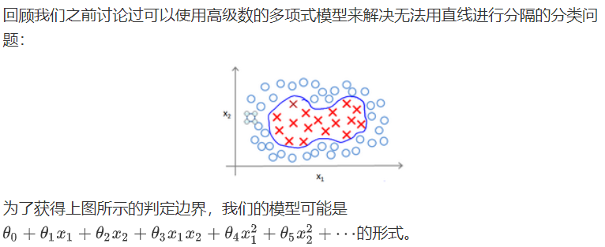
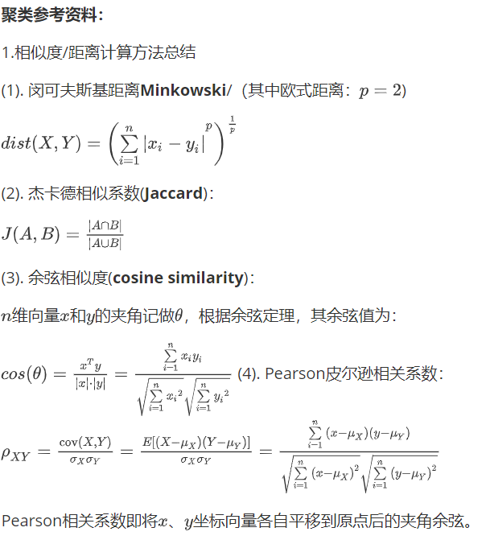
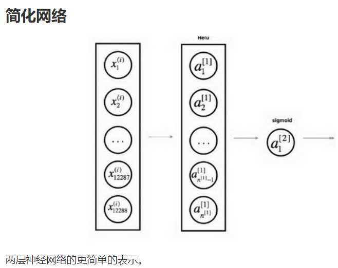
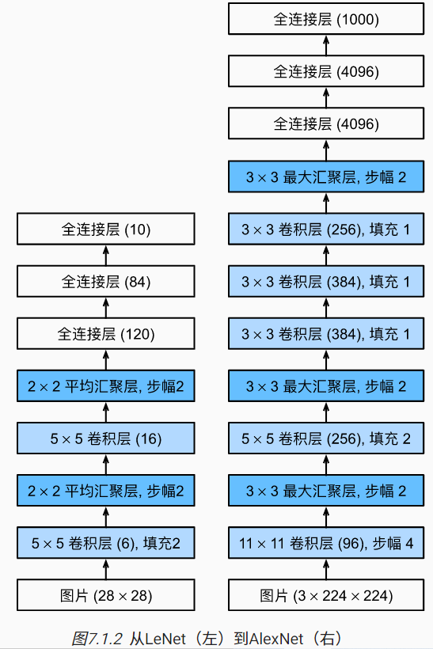

# 理论

## 概述

### 机器学习

#### 历史

概率建模(probabilistic modeling)是最早的机器学习形式之一，最出名的是朴素贝叶斯算法，是分类器(假设输入数据的特征独立)。

logistic回归(logreg, logistic regression)，分类算法(不是回归算法)。

#### 简述

$人工智能\supset机器学习\supset深度学习$

符号主义人工智能(symbolic AI)，只要编写足够多的明确规则处理知识，就可以实现与人类水平相当的人工智能。如专家系统。很难解决复杂、模糊的问题。


> 机器学习是，人们输入数据和从这些数据中预期得到的答案，系统输出规则。随后规则应用与新的数据并自主生成答案。

**机器学习**是在预先定义好的可能性空间中，利用反馈信号的指引来寻找输入数据的有用表示。

机器学习需要更快的硬件、更大的数据集，需要有用的数据表示。机器学习模型都是为输入数据寻找合适的表示：对数据进行变换，使其适合手头的任务。


机器学习中的学习就是指1寻找更好数据表示的自动搜索过程。所有机器学习算法都包括自动寻找这种变换，可以根据任务将数据转化为更加有用的表示，这些操作可以是坐标变换线性投影、平移、非线性操作（如取$x>0$的点）。机器学习寻找这些变换时仅仅遍历一组预先定义好的操作，即**假设空间**（hypothesis space）。

#### 模型

模型表示 Model Representation

##### 线性回归

特征feature$(x_1,\dots,x_n)$，特征数为n，$x^{(i)}$是第$i$个训练实例，是特征矩阵的第$i$行，是向量。例如：
$$
\left[\matrix{1\\2\\3\\4}\right]
$$
若该向量为第二个实例，则$x^{(2)}_1=1$。

多变量的假设$h_{\theta}(x)$为：
$$
h_\theta(x)=\theta_0+\sum_{i=1}^n\theta_ix_i
$$
可以假设$x_0=1$进而进一步化简该公式。显然，特征矩阵$X$的维度是$m\times(n+1)$，公式简化为：
$$
h_{\theta}(x)=\theta^TX
$$
可以得出，此时梯度下降的算式为：
$$
\theta_j=\theta_j-\alpha\frac1m\sum_{i=1}^m(h_\theta(x^{(i)})-y^{(i)})x^{(i)}_j
$$

代码为：

```python
def computeCost(X, y, theta):
    inner = np.power(((X * theta.T) - y), 2)
    return np.sum(inner) / (2 * len(X))
```

如果模型非线性，那么可以通过换元，把所有非线性元换成线性元，如：
$$
x_1=\sqrt{x_1},x_2=x_2^2,x_3=\log x_3
$$

##### 正规方程

normal equation

对于某些线性回归问题，正规方程是更好的解决方案。

设训练集特征矩阵为$X$，其中增设特征$x_0=1$，训练集结果为向量$y$，则解出向量$\theta=(X^TX)^{-1}X^Ty$

> 对于那些不可逆的矩阵（通常是因为特征之间不独立，如同时包含英尺为单位的尺寸和米为单位的尺寸两个特征，也有可能是特征数量大于训练集的数量），正规方程方法是不能用的。

正规方程无需学习率，无需多次迭代，计算时间复杂度是$\Omicron(n^3)$，只适用于线性模型，不适合逻辑回归等其他模型。一般而言特征数量$n\le10^4$可以接受。

```python
import numpy as np
def normalEqn(X, y):
   theta = np.linalg.inv(X.T@X)@X.T@y #X.T@X等价于X.T.dot(X)
   return theta
```

上述公式的推导过程如下：


#### 梯度下降

 gradient descent

##### 基本

公式：
$$
\theta_i=\theta_i-\alpha\frac{\partial J(\theta)}{\partial\theta_i} for\ \ i\ \ in\ \ all(p)
$$
$\alpha$是学习率(learning rate)。J是代价函数。过小需要很多步才能到达最低点，可能卡在局部最低点；过大可能越过最低点，无法收敛或发散。$\alpha$无需随着次数增加而减小，因为次数增加导数变小了，自然步幅小了。

通常可以考虑如下的学习率：
$$
\alpha=0.01,0.03,0.1,0.3,1,3,10
$$
通常在每迭代若干次之后计算一次代价函数，并观察，发现代价函数趋于收敛时，一般就停止学习。


若$h(x)=\theta_0+\theta_1x$，设$\theta_0,\theta_1$为唯一变量，其余为常量时，显然有：
$$
\begin{align}
\frac{\partial}{\partial\theta_i}J(\theta_0,\theta_1)&=\frac{\partial}{\partial\theta_i}\frac1{2m}\sum_{i=1}^m(h_{\theta}(x_i)-y_i)^2\\
\frac{\partial}{\partial\theta_0}J(\theta_0,\theta_1)&=\frac1m\sum_{i=1}^m(h_{\theta}(x_i)-y_i)^2\\
\frac{\partial}{\partial\theta_1}J(\theta_0,\theta_1)&=\frac1m\sum_{i=1}^m((h_{\theta}(x_i)-y_i)x_i)^2\\
\end{align}
$$
批量梯度下降：梯度下降每一步都用到了所有的训练样本。

在线性代数中，有一种计算最小值数值解法的正规方程(normal equations)法，但数据量较大时，梯度下降法更加适用。

##### 标准化

如果数据范围非常大，或者维度之间不成正比(扁平状多维空间)，那么梯度下降需要许多次迭代才会收敛，为了优化迭代次数，将所有特征的尺度都缩放到$[-1,1]$，即$x_n=\frac{x_n-\mu_n}{s_n},\mu_n是平均值，s_n是标准差$。

即缩放Scaling

##### 随机梯度下降法

如果我们一定需要一个大规模的训练集，我们可以尝试使用随机梯度下降法来代替批量梯度下降法。

在随机梯度下降法中，我们定义代价函数为一个单一训练实例的代价。

随机梯度下降算法在每一次计算之后便更新参数$\theta$ ，而不需要首先将所有的训练集求和，在梯度下降算法还没有完成一次迭代时，随机梯度下降算法便已经走出了很远。但是这样的算法存在的问题是，不是每一步都是朝着”正确”的方向迈出的。因此算法虽然会逐渐走向全局最小值的位置，但是可能无法站到那个最小值的那一点，而是在最小值点附近徘徊。


##### 小批量梯度下降

小批量梯度下降算法是介于批量梯度下降算法和随机梯度下降算法之间的算法，每计算常数$b$次训练实例，便更新一次参数

通常我们会令$b$在 2-100 之间。这样做的好处在于，我们可以用向量化的方式来循环$b$个训练实例，如果我们用的线性代数函数库比较好，能够支持平行处理，那么算法的总体表现将不受影响（与随机梯度下降相同）。

##### 收敛调试

在批量梯度下降中，我们可以令代价函数$J$为迭代次数的函数，绘制图表，根据图表来判断梯度下降是否收敛。但是，在大规模的训练集的情况下，这是不现实的，因为计算代价太大了。

在随机梯度下降中，我们在每一次更新$\theta$之前都计算一次代价，然后每$x$次迭代后，求出这$x$次对训练实例计算代价的平均值，然后绘制这些平均值与$x$次迭代的次数之间的函数图表。


当我们绘制这样的图表时，可能会得到一个颠簸不平但是不会明显减少的函数图像（如上面左下图中蓝线所示）。我们可以增加$\alpha$来使得函数更加平缓，也许便能看出下降的趋势了（如上面左下图中红线所示）；或者可能函数图表仍然是颠簸不平且不下降的（如洋红色线所示），那么我们的模型本身可能存在一些错误。

如果我们得到的曲线如上面右下方所示，不断地上升，那么我们可能会需要选择一个较小的学习率$\alpha$。

我们也可以令学习率随着迭代次数的增加而减小，例如令：


随着我们不断地靠近全局最小值，通过减小学习率，我们迫使算法收敛而非在最小值附近徘徊。 但是通常我们不需要这样做便能有非常好的效果了，对$\alpha$进行调整所耗费的计算通常不值得

##### 在线学习

一个算法来从中学习的时候来模型化问题在线学习算法指的是对数据流而非离线的静态数据集的学习。许多在线网站都有持续不断的用户流，对于每一个用户，网站希望能在不将数据存储到数据库中便顺利地进行算法学习。

在线学习的算法与随机梯度下降算法有些类似，我们对单一的实例进行学习，而非对一个提前定义的训练集进行循环。

一旦对一个数据的学习完成了，我们便可以丢弃该数据，不需要再存储它了。这种方式的好处在于，我们的算法可以很好的适应用户的倾向性，算法可以针对用户的当前行为不断地更新模型以适应该用户。

我们所使用的这个算法与随机梯度下降算法非常类似，唯一的区别的是，我们不会使用一个固定的数据集，我们会做的是获取一个用户样本，从那个样本中学习，然后丢弃那个样本并继续下去，而且如果你对某一种应用有一个连续的数据流，这样的算法可能会非常值得考虑。当然，在线学习的一个优点就是，如果你有一个变化的用户群，又或者你在尝试预测的事情，在缓慢变化，就像你的用户的品味在缓慢变化，这个在线学习算法，可以慢慢地调试你所学习到的假设，将其调节更新到最新的用户行为。

#### 逻辑回归

logistic regression 与线性回归不同(预测连续的值)，逻辑回归预测离散的值

**逻辑回归算法是分类算法，不是回归算法。**

##### 分类

Classification 

在二分类问题中，因变量(dependent variable)可能属于的两个类分别称为负向类（negative class）和正向类（positive class），因变量$y\in0,1$，0是负向量，1是正向量。

可以用线性回归的方法预测逻辑回归，并最后使用一个激活层即可，即对线性预测(输出值$\in[0,1]$取四舍五入)，这样的线性回归就是逻辑回归。

逻辑回归的假设是$h_\theta(x)=g(\theta^TX)$，g是逻辑函数，如sigmoid函数

一般使用sigmoid函数将值域调整到$[0,1]$，这个函数又称S形函数，公式为：
$$
g(x)=\frac1{1+e^{-x}}
$$
函数图像如下：


假设函数的作用是，对于给定的特征，根据参数计算得到结果是正向类的可能性有多大（该可能性estimated probablity是返回值）。

决策边界 decision boundary，是模型对分类结果的边界线，如：


如果直接用线性方程的代价函数表达式代入sigmoid函数，将会得到有许多局部最小值的非凸函数（non-convex function），因此，我们将重定义代价函数：
$$
J(\theta)=\frac1m\sum_{i=1}^mCost(h_\theta(x^{(i)}),y^{(i)})\\
Cost(h_\theta(x^{(i)}),y^{(i)})=\begin{cases}
-\log(h_\theta(x)&,y=1\\-\log(1-h_\theta(x))&,y=0
\end{cases}
$$
Cost函数图像如下图：


显而易见，这样的代价函数十分符合我们期望的定义。

可以进一步简化该函数的表达式：
$$
Cost(h_\theta(x^{(i)}),y^{(i)})=-y\times\log(h_\theta(x))-(1-y)\times\log(1-h_\theta(x))
$$
因此可以得到代价函数：
$$
J(\theta)=-\frac1m\sum_{i=1}^m[y^{(i)}\log(h_\theta(x^{(i)}))+(1-y^{(i)})\log(1-h_\theta(x^{(i)}))]
$$
代码如下：

```python
import numpy as np
def cost(theta, X, y):
  theta = np.matrix(theta)
  X = np.matrix(X)
  y = np.matrix(y)
  first = np.multiply(-y, np.log(sigmoid(X* theta.T)))
  second = np.multiply((1 - y), np.log(1 - sigmoid(X* theta.T)))
  return np.sum(first - second) / (len(X))
```

所以对代价函数的偏导数如下：
$$
\frac{\partial}{\partial\theta_j}J(\theta)=\frac1m\sum_{i=1}^m[h_\theta(x^{(i)})-y^{(i)}]x_j^{(i)}
$$

> 推导过程：
>
> 

> 一些梯度下降算法之外的选择： 除了梯度下降算法以外，还有一些常被用来令代价函数最小的算法，这些算法更加复杂和优越，而且通常不需要人工选择学习率，通常比梯度下降算法要更加快速。这些算法有：共轭梯度（Conjugate Gradient），局部优化法(Broyden fletcher goldfarb shann,BFGS)和有限内存局部优化法(LBFGS)。这三种算法通常不需要手动选择学习率，内部智能循环即线性搜索算法，会自动尝试不同学习率。

学习率更新的式子：
$$
\theta_j=\theta_j-\alpha\frac1m\sum_{i=1}^m[h_\theta(x^{(i)})-y^{(i)}]x_j^{(i)}
$$

##### 多分类

one-vs-all 一对多/余

可以做多个子假设函数$h_\theta^{(i)}(x)$，子伪训练集，将目标设为1，其余都设为0

#### 正则化

regularization

##### 概述

常见的模型问题有欠拟合under-fitting和过拟合over-fitting


如上图，左图欠拟合，右图过拟合。分类问题同理：


可以用多种方法解决过拟合问题：

1. 丢弃一些不能帮助我们正确预测的特征。可以是手工选择保留哪些特征，或者使用一些模型选择的算法来帮忙（例如**PCA**）
2. 正则化。 保留所有的特征，但是减少参数的大小（magnitude）。

特征的次数越高，越容易过拟合。尽可能让高次项系数接近0。可以修改代价函数，提高高次项参数在代价函数的权重，这样迫使经由高次项产生的误差减小，叫做惩罚。如果不知道需要惩罚什么参数和惩罚程度，得到如下代价函数：
$$
J(\theta)=\frac1{2m}\left[\sum_{i=1}^m(h_\theta(x^{(i)})-y^{(i)})^2+\lambda\sum_{j=1}^n\theta_j^2\right]
$$
$\lambda$是正则化参数regularization parameter，一般不对$\theta_0$惩罚。如果正则化参数过大，参数都会最小化，即$h_\theta(x)\approx\theta_0$，造成欠拟合，如图：


那么$\theta_0$的梯度下降不变，而其他下降的函数将变化如下：
$$
\theta_j=\theta_j-\alpha\left[\frac1m\sum_{i=1}^m(h_\theta(x^{(i)})-y^{(i)})x_j^{(i)}+\frac\lambda m\theta_j\right]
$$
变化在于每次让$\theta$减少了一个额外的值。

> 也可以用正规方程求解正则化线性回归模型：
>
> 

逻辑回归的代价方程表达式：


```python
import numpy as np
def costReg(theta, X, y, learningRate):
    theta = np.matrix(theta)
    X = np.matrix(X)
    y = np.matrix(y)
    first = np.multiply(-y, np.log(sigmoid(X*theta.T)))
    second = np.multiply((1 - y), np.log(1 - sigmoid(X*theta.T)))
    reg = (learningRate / (2 * len(X))* np.sum(np.power(theta[:,1:theta.shape[1]],2))
    return np.sum(first - second) / (len(X)) + reg
```

##### 程度

正则化程度过大或过小均不好。正则化的$\lambda$值，通常是0~10之间的二倍关系值，如：
$$
0,0.01,0.02,0.04,0.08,0.15,0.32,0.64,1.28,2.56,5.12,10
$$
同样地(见机器学习-应用-测试集)，可以划分训练集、交叉验证集、测试集。训练出12个正则化不同的模型，分别求交叉验证误差，选最小的继续训练。可以得到图像如下：


原因显而易见，正则化小时更容易过拟合，过大时更容易欠拟合。

#### 神经网络

Neuron Networks

##### 基本概念

如果使用非线性回归，即便只是两两组合参数一次方，也有$C_n^2$个项，计算非常庞大。假设识别图片，那么每个像素点就是一个特征，普通的逻辑回归难以处理如此多的特征。

神经网络是计算量偏大的算法。神经网络有多个层，每个特征输入作为输入单元Input units，整体组成了输入层input layer，最后一层是输出层output layer，中间的层都是隐藏层hidden layer，并且每个层都有一个偏置单位bias unit。


其中，$a_i^{(j)}$表示第$j$层第$i$个激活单元，$\theta^{(j)}$代表从第$j$到$j+1$层时的权重矩阵，尺寸为$j\times(j+1)$。

如果隐藏层数大于1，确保每个隐藏层的单元个数相同，通常情况下隐藏层单元的个数越多越好。

##### 前向传播

对于上图，有：注：$\Theta=\theta$


显然：$a=\theta\cdot X$，且$h^{(i+1)}=\theta^{(i)}X^T$，$X$是上一层的特征。

这样从左到右的算法称为前向传播算法( FORWARD PROPAGATION )

神经网络的特点在于每一层都利用之前的特征创造新的特征，不局限于输入的特征。

通过调整参数，倒数第二层到输出层可以实现一个(取值连续的)或门、与门等逻辑门。注意，异或门的实现比较复杂：
$$
XOR=NOT\ \ XNOR\\
XNOR=(x_1ANDx_2)OR((NOTx_1)AND(NOTx_2))
$$
对于多分类，在最后一层的结果应化为一个近似的只有一个峰值的向量。

设训练样本有$m$个，每个包含一组输入$x$和输出$y$，$L$表示层数，$S_I$表示每层的神经元个数，$S_l$表示输出层神经元个数，$S_L$表示最后一层中处理单元个数。则：

二类分类：$S_L=0,y=0\ or\ 1$

K类分类：$S_L=k,y_i=1$表示分到第$i$类。

逻辑回归的代价函数返回值是标量，而神经网络要更为复杂：


对于每一行特征，都给出K个预测，并选择可能性最高的一个。

##### 反向传播

Backpropagation Algorithm

为了计算代价函数的偏导数，需要首先计算最后一层的误差，然后一层层反向求出各层误差，直到倒数第二层。


最后的上式中，$l$是目前所计算的第几层，$j$是目前计算层中激活单元的下标，即下一层第$j$个输入变量的下标，$i$是下一层中误差单元的下标，即受权重矩阵第$i$行影响的下一层的误差单元的下标。

如果我们考虑正则化处理，并且我们的训练集是一个特征矩阵而非向量。在上面的特殊情况中，我们需要计算每一层的误差单元来计算代价函数的偏导数。在更为一般的情况中，我们同样需要计算每一层的误差单元，但是我们需要为整个训练集计算误差单元，此时的误差单元也是一个矩阵，我们用$\Delta_{ij}^{(l)}$表示这个误差矩阵，第$l$层的第$i$个激活单元受到第$j$个参数影响而导致的误差。

即首先用正向传播方法计算出每一层的激活单元，利用训练集的结果与神经网络预测的结果求出最后一层的误差，然后利用该误差运用反向传播法计算出直至第二层的所有误差。

求出误差矩阵后，可以计算代价函数的偏导数：


**梯度检验**

当我们对一个较为复杂的模型（例如神经网络）使用梯度下降算法时，可能会存在一些不容易察觉的错误，意味着，虽然代价看上去在不断减小，但最终的结果可能并不是最优解。

为了避免这样的问题，我们采取一种叫做梯度的数值检验（Numerical Gradient Checking）方法。这种方法的思想是通过估计梯度值来检验我们计算的导数值是否真的是我们要求的。

对梯度的估计采用的方法是在代价函数上沿着切线的方向选择离两个非常近的点然后计算两个点的平均值用以估计梯度。


对一般的逻辑回归，参数可以设置为初始0，但神经网络不可以，必须设置随机值通常取值范围是$[-\varepsilon,\varepsilon]$

##### 使用技巧

###### 维度检验

w的维度是（下一层的维数，前一层的维数）：
$$
w^{[l]}:(n^{[l]},n^{[l-1]})
$$
b的维度是（下一层的维数，1）：
$$
b^{[l]}:(n^{[l]},1)
$$

$$
z^{[l]},a^{[l]}:(n^{[l]},1)
$$

$$
dw^{[l]}=w^{[l]},db^{[l]}=b^{[l]}
$$

> $$
> 而Z^{{l}}=(z^{[l][1]},z^{[l][2]},\dots,z^{[l][m]})
> $$

m为训练集大小，故Z的维度为：
$$
Z^{[l]}=(n^{[l]},m)
$$

$$
A^{[l]}=Z^{[l]},X=A^{[0]}=Z^{[l]}
$$


#### 应用

##### 概述

当发现较大误差的时候，可以采用以下几种方法：

高方差也许对应过拟合，高偏差也许对应欠拟合。

1. 获得更多的训练样本——通常是有效的，但代价较大，下面的方法也可能有效，可考虑先采用下面的几种方法。解决高方差。
2. 尝试减少特征的数量，解决高方差
3. 尝试获得更多的特征，解决高偏差
4. 尝试增加多项式特征，如$x^2,x_1x_2$，解决高偏差
5. 尝试减少正则化程度$\lambda$，解决高偏差
6. 尝试增加正则化程度$\lambda$，解决高方差

机器学习诊断法：这是一种测试法，你通过执行这种测试，能够深入了解某种算法到底是否有用。这通常也能够告诉你，要想改进一种算法的效果，什么样的尝试，才是有意义的。

若使用较小的神经网络，类似于参数较少的情况，容易导致高偏差和欠拟合，但计算代价较小使用较大的神经网络，类似于参数较多的情况，容易导致高方差和过拟合，虽然计算代价比较大，但是可以通过正则化手段来调整而更加适应数据。 通常选择较大的神经网络并采用正则化处理会比采用较小的神经网络效果要好。 对于神经网络中的隐藏层的层数的选择，通常从一层开始逐渐增加层数。

##### 测试集

评估假设函数。首先，假设函数算出误差小，并不代表真的小，可能只是过拟合了。为验证过拟合，可以仅将数据的一部分用作数据集，剩下一部分用作测试集，它们均要有各种不同类型的数据(如多分类问题)。这个划分比例可以是：七三、五五等。

那么，每次使用训练集学习，并使用测试集计算误差：


除此之外，还有**交叉验证集**。也要参与划分如训练集、交叉验证集、测试集六二二开。交叉验证集一般用于验证不同的模型。首先用训练集训练若干个模型(如10个)，然后用这些模型分别对交叉验证集计算得到代价函数值，即交叉验证误差cross validation error，之后选取出代价函数最小的模型，然后对测试集计算得到代价函数值，即推广误差。

它们的关系可能大致如图：


图中$J_{train}$大致指训练集的误差，而不是测试集的误差。显然图中$J_{cv}$转折点代表过拟合的开始。

欠拟合underfit时，显然两者相近，时为偏差bias(?)，过拟合overfit时，显然交叉验证误差远大于训练集误差，时为方差variance(?)。

##### 学习曲线

learning curves

学习曲线是随着已训练集数目的增大，代价函数的图像。

使用学习曲线来判断某一个学习算法是否处于偏差、方差问题。学习曲线是学习算法的一个很好的合理检验（sanity check）

(图像没看懂为什么J的变化趋势是这样的单调性)


利用学习曲线识别高方差/过拟合：假设我们使用一个非常高次的多项式模型，并且正则化非常小，可以看出，当交叉验证集误差远大于训练集误差时，往训练集增加更多数据可以提高模型的效果。在高方差/过拟合的情况下，增加更多数据到训练集可能可以提高算法效果。

##### 误差度量

预测有四种情况：

1. 正确肯定（True Positive,TP）：  预测为真，实际为真
2. 正确否定（True Negative,TN）：预测为假，实际为假
3. 错误肯定（False Positive,FP）：  预测为真，实际为假
4. 错误否定（False Negative,FN）：预测为假，实际为真

有查准率P(precision)和查全率(召回率)R(recall)
$$
P=\frac{TP}{TP+FP}\\
R=\frac{TP}{TP+FN}
$$
对于预测值$0\sim1$，显然一般情况用0.5作预测，如果大于等于是真，否则是假，而希望更高的P时，可以提高为0.5以上，如$0.7,0.9$，如果希望R高，可以降低到0.5以下，如0.3


计算F1值(F1 score)可以帮我们选择阈值。
$$
F_1=2\frac{PR}{P+R}
$$

##### 数据可视化

略？

#### 支持向量机

##### 一般概念

SVM，support vector machine，又称大间距分类器，可以在分割两个数据集时采用更大间距的线：


假设函数：


当不是非常非常大的时候，它可以忽略掉一些异常点的影响，得到更好的决策界。甚至当你的数据不是线性可分的时候，支持向量机也可以给出好的结果。


##### 核函数

kernels



当我们使用换元法时，可以新建特征来代替多项式，从而继续得到线性的东西。


若训练样本和地标距离远，f近似于0，否则1。

一般样本数跟地标数相同。好处在于：得到的新特征是建立在原有特征与训练集中所有其他特征之间距离的基础之上的。

另外，支持向量机也可以不使用核函数，不使用核函数又称为线性核函数(linear kernel)，当我们不采用非常复杂的函数，或者我们的训练集特征非常多而样本非常少的时候，可以采用这种不带核函数的支持向量机。

在高斯核函数之外我们还有其他一些选择，如：

多项式核函数（**Polynomial Kerne**l）

字符串核函数（**String kernel**）

卡方核函数（ **chi-square kernel**）

直方图交集核函数（**histogram intersection kernel**）

等等...

这些核函数的目标也都是根据训练集和地标之间的距离来构建新特征，这些核函数需要满足Mercer's定理，才能被支持向量机的优化软件正确处理。

##### 应用


值得一提的是，神经网络在以上三种情况下都可能会有较好的表现，但是训练神经网络可能非常慢，选择支持向量机的原因主要在于它的代价函数是凸函数，不存在局部最小值。

#### 无监督学习

聚类 clustering，是将无标签的数据分类。


图上的数据看起来可以分成两个分开的点集（称为簇），一个能够找到我圈出的这些点集的算法，就被称为聚类算法。

##### K-均值算法

**K-均值**是最普及的聚类算法，算法接受一个未标记的数据集，然后将数据聚类成不同的组。

**K-均值**是一个迭代算法，假设我们想要将数据聚类成n个组，其方法为:

首先选择个随机的点，称为**聚类中心**（**cluster centroids**）；

对于数据集中的每一个数据，按照距离个中心点的距离，将其与距离最近的中心点关联起来，与同一个中心点关联的所有点聚成一类。

计算每一个组的平均值，将该组所关联的中心点移动到平均值的位置。

重复步骤2-4直至中心点不再变化。


这个拐点就是目标聚类个数。

我们的 T-恤制造例子中，我们要将用户按照身材聚类，我们可以分成3个尺寸:，也可以分成5个尺寸，这样的选择是建立在回答“聚类后我们制造的T-恤是否能较好地适合我们的客户”这个问题的基础上作出的。



2.聚类的衡量指标

(1). 均一性p：

类似于精确率，一个簇中只包含一个类别的样本，则满足均一性。其实也可以认为就是正确率(每个 聚簇中正确分类的样本数占该聚簇总样本数的比例和)

(2). 完整性r：

类似于召回率，同类别样本被归类到相同簇中，则满足完整性;每个聚簇中正确分类的样本数占该 类型的总样本数比例的和


##### 异常检测

anomaly detectcion

异常检测算法是一个非监督学习算法，意味着我们无法根据结果变量 y的值来告诉我们数据是否真的是异常的。我们需要另一种方法来帮助检验算法是否有效。当我们开发一个异常检测系统时，我们从带标记（异常或正常）的数据着手，我们从其中选择一部分正常数据用于构建训练集，然后用剩下的正常数据和异常数据混合的数据构成交叉检验集和测试集。

例如：我们有10000台正常引擎的数据，有20台异常引擎的数据。 我们这样分配数据：

6000台正常引擎的数据作为训练集

2000台正常引擎和10台异常引擎的数据作为交叉检验集

2000台正常引擎和10台异常引擎的数据作为测试集


异常检测与监督学习的异同：

| 异常检测                                                     | 监督学习                                                     |
| :----------------------------------------------------------- | :----------------------------------------------------------- |
| 非常少量的正向类（异常数据 ）, 大量的负向类（）              | 同时有大量的正向类和负向类                                   |
| 许多不同种类的异常，非常难。根据非常 少量的正向类数据来训练算法。 | 有足够多的正向类实例，足够用于训练 算法，未来遇到的正向类实例可能与训练集中的非常近似。 |
| 未来遇到的异常可能与已掌握的异常、非常的不同。               |                                                              |
| 例如： 欺诈行为检测 生产（例如飞机引擎）检测数据中心的计算机运行状况 | 例如：邮件过滤器 天气预报 肿瘤分类                           |


上图中，在蓝色圈内的数据属于该组数据的可能性较高，而越是偏远的数据，其属于该组数据的可能性就越低。

这种方法称为密度估计，表达如下：


异常检测主要用来识别欺骗。例如在线采集而来的有关用户的数据，一个特征向量中可能会包含如：用户多久登录一次，访问过的页面，在论坛发布的帖子数量，甚至是打字速度等。尝试根据这些特征构建一个模型，可以用这个模型来识别那些不符合该模式的用户。

再一个例子是检测一个数据中心，特征可能包含：内存使用情况，被访问的磁盘数量，CPU的负载，网络的通信量等。根据这些特征可以构建一个模型，用来判断某些计算机是不是有可能出错了。

高斯分布，即正态分布，可用于检验异常。


特征选择：


一个常见的问题是一些异常的数据可能也会有较高的$p(x)$值，因而被算法认为是正常的。这种情况下误差分析能够帮助我们，我们可以分析那些被算法错误预测为正常的数据，观察能否找出一些问题。我们可能能从问题中发现我们需要增加一些新的特征，增加这些新特征后获得的新算法能够帮助我们更好地进行异常检测。

多元高斯分布 Multivariate Gaussian Distribution

假使我们有两个相关的特征，而且这两个特征的值域范围比较宽，这种情况下，一般的高斯分布模型可能不能很好地识别异常数据。其原因在于，一般的高斯分布模型尝试的是去同时抓住两个特征的偏差，因此创造出一个比较大的判定边界。


在一般的高斯分布模型中，我们计算$p(x)$的方法是： 通过分别计算每个特征对应的几率然后将其累乘起来，在多元高斯分布模型中，我们将构建特征的协方差矩阵，用所有的特征一起来计算$p(x)$。

首先计算所有特征的平均值，然后再计算协方差矩阵：


上图是5个不同的模型，从左往右依次分析：

1. 是一个一般的高斯分布模型
2. 通过协方差矩阵，令特征1拥有较小的偏差，同时保持特征2的偏差
3. 通过协方差矩阵，令特征2拥有较大的偏差，同时保持特征1的偏差
4. 通过协方差矩阵，在不改变两个特征的原有偏差的基础上，增加两者之间的正相关性
5. 通过协方差矩阵，在不改变两个特征的原有偏差的基础上，增加两者之间的负相关性

原本的高斯分布模型是多元高斯分布模型的一个子集，即像上图中的第1、2、3，3个例子所示，如果协方差矩阵只在对角线的单位上有非零的值时，即为原本的高斯分布模型了。

| 原高斯分布模型                                               | 多元高斯分布模型                                             |
| :----------------------------------------------------------- | :----------------------------------------------------------- |
| 不能捕捉特征之间的相关性 但可以通过将特征进行组合的方法来解决 | 自动捕捉特征之间的相关性                                     |
| 计算代价低，能适应大规模的特征                               | 计算代价较高 训练集较小时也同样适用                          |
|                                                              | 必须要有$m>n$，不然的话协方差矩阵不可逆的，通常需要$m>10n$ ，另外特征冗余也会导致协方差矩阵不可逆 |

原高斯分布模型被广泛使用着，如果特征之间在某种程度上存在相互关联的情况，我们可以通过构造新新特征的方法来捕捉这些相关性。

如果训练集不是太大，并且没有太多的特征，我们可以使用多元高斯分布模型。

#### 优化

##### 降维

将数据从二维降至一维： 假使我们要采用两种不同的仪器来测量一些东西的尺寸，其中一个仪器测量结果的单位是英寸，另一个仪器测量的结果是厘米，我们希望将测量的结果作为我们机器学习的特征。现在的问题的是，两种仪器对同一个东西测量的结果不完全相等（由于误差、精度等），而将两者都作为特征有些重复，因而，我们希望将这个二维的数据降至一维。

从这件事情我看到的东西发生在工业上的事。如果你有几百个或成千上万的特征，它是它这往往容易失去你需要的特征。有时可能有几个不同的工程团队，也许一个工程队给你二百个特征，第二工程队给你另外三百个的特征，第三工程队给你五百个特征，一千多个特征都在一起，它实际上会变得非常困难，去跟踪你知道的那些特征，你从那些工程队得到的。其实不想有高度冗余的特征一样。


降维的算法只负责减少维数，新产生的特征的意义就必须由我们自己去发现了。


主成分分析(PCA, Principal Component Analysis)是最常见的降维算法。


主成分分析与线性回归是两种不同的算法。主成分分析最小化的是投射误差（Projected Error），而线性回归尝试的是最小化预测误差。线性回归的目的是预测结果，而主成分分析不作任何预测。


**PCA**将个n特征降维到k个，可以用来进行数据压缩，如果100维的向量最后可以用10维来表示，那么压缩率为90%。同样图像处理领域的**KL变换**使用**PCA**做图像压缩。但**PCA** 要保证降维后，还要保证数据的特性损失最小。

**PCA**技术的一大好处是对数据进行降维的处理。我们可以对新求出的“主元”向量的重要性进行排序，根据需要取前面最重要的部分，将后面的维数省去，可以达到降维从而简化模型或是对数据进行压缩的效果。同时最大程度的保持了原有数据的信息。

**PCA**技术的一个很大的优点是，它是完全无参数限制的。在**PCA**的计算过程中完全不需要人为的设定参数或是根据任何经验模型对计算进行干预，最后的结果只与数据相关，与用户是独立的。

但是，这一点同时也可以看作是缺点。如果用户对观测对象有一定的先验知识，掌握了数据的一些特征，却无法通过参数化等方法对处理过程进行干预，可能会得不到预期的效果，效率也不高。


错误的主要成分分析情况：一个常见错误使用主要成分分析的情况是，将其用于减少过拟合（减少了特征的数量）。这样做非常不好，不如尝试正则化处理。原因在于主要成分分析只是近似地丢弃掉一些特征，它并不考虑任何与结果变量有关的信息，因此可能会丢失非常重要的特征。然而当我们进行正则化处理时，会考虑到结果变量，不会丢掉重要的数据。

另一个常见的错误是，默认地将主要成分分析作为学习过程中的一部分，这虽然很多时候有效果，最好还是从所有原始特征开始，只在有必要的时候（算法运行太慢或者占用太多内存）才考虑采用主要成分分析。

###### 并行

映射化简和数据并行对于大规模机器学习问题而言是非常重要的概念。之前提到，如果我们用批量梯度下降算法来求解大规模数据集的最优解，我们需要对整个训练集进行循环，计算偏导数和代价，再求和，计算代价非常大。如果我们能够将我们的数据集分配给不多台计算机，让每一台计算机处理数据集的一个子集，然后我们将计所的结果汇总在求和。这样的方法叫做映射简化。

具体而言，如果任何学习算法能够表达为，对训练集的函数的求和，那么便能将这个任务分配给多台计算机（或者同一台计算机的不同CPU 核心），以达到加速处理的目的。

例如，我们有400个训练实例，我们可以将批量梯度下降的求和任务分配给4台计算机进行处理。

##### 激活函数

> Activation functions

除了回归问题，输出层的激活都要用非线性激活函数。所有问题的隐藏层都要用非线性激活函数。

###### sigmoid

$$
f(x)=\frac1{1+e^{-x}}
$$

$$
f'(x)=f(x)\times\left(1-f(x)\right)
$$

###### tanh

$$
\tanh x=\frac{e^x-e^{-x}}{e^x+e^{-x}}
$$

$$
\tanh'x=1-\tanh^2x
$$

###### ReLu

$$
f(x)=\max(0,x)
$$

$$
f'(x)=\begin{cases}0&x<0\\1&x>0\\无定义&x=0
\end{cases}
$$

###### Leaky ReLu

$$
f(x)=\max(0.01x,x)
$$

$$
f'(x)=\begin{cases}0.01&x<0\\1&x>0\\无定义&x=0
\end{cases}
$$

使用经验：

1. 二分类问题，可以对隐藏层使用tanh，对输出层使用sigmoid。两者共同的缺点是，在x特别大或者特别小的情况下，导数的梯度或者函数的斜率会变得特别小，最后就会接近于0，导致降低梯度下降的速度。
2. 二分类问题，输出层外都可以使用relu或leaky relu，后者效果略优。优点在于：在x的区间变动很大的情况下，激活函数的导数或者激活函数的斜率都会远大于0，并且计算量小。
3. sigmoid和tanh函数的导数在正负饱和区的梯度都会接近于0，这会造成梯度弥散，而(leaky)relu函数大于0部分都为常数，不会产生梯度弥散现象。同时应该注意到的是，Relu进入负半区的时候，梯度为0，神经元此时不会训练，产生所谓的稀疏性，而Leaky ReLu不会有这问题)
4. x在ReLu的梯度一半都是0，但是，有足够的隐藏层使得z值大于0，所以对大多数的训练数据来说学习过程仍然可以很快。
5. 尽管在反向传播中relu和leaky relu存在无导数点，但是该情况在连续输入值里出现概率很低，所以可以不用过于考虑。

总结：

- sigmoid：除了输出层是一个二分类问题基本不会用它。
- tanh：几乎适合所有场合。
- ReLu：如果不确定用哪个激活函数，就使用ReLu或者Leaky ReLu。

#### 其他术语

假设(hypothesis)，学习算法的解决方案/函数

向量机(SVM, support vector machine)。

决策边界(decision boundary)，分类问题区分两类数据的线(面...)。

特征工程：手动提取出对数据的有用的表示(层)

决策树(decision tree)，类似于流程图，对输入数据点分类或根据给定输入预测输出。

随机森林(random forest)，对于任何浅层机器学习任务，几乎总是第二好算法。

梯度提升机(gradient boosting machine)，将弱预测模型(如决策树)集成的机器学习技术，处理非感知数据最好。处理结构化数据问题。

top-5精度，如果模型预测的前5个标签包含正确标签，即为预测正确。

softmax：
$$
S_i=\frac{e^{V_i}}{\sum_i^Ce^{V_i}}
$$
Vi 是分类器前级输出单元的输出。i 表示类别索引，总的类别个数为 C。Si 表示的是当前元素的指数与所有元素指数和的比值。可以将多分类的输出数值转化为相对概率。

交叉熵，其用来衡量在给定的真实分布下，使用非真实分布所指定的策略消除系统的不确定性所需要付出的努力的大小。使用交叉熵做分类问题中的损失函数，可以在一定程度上减少梯度消散。

##### 常用符号




#### 其他概念

深度卷积神经网络(convnet)是所有计算机视觉任务的首选算法，对所有感知任务都有效。

### 深度学习

#### 简述

又名分层表示学习(layered representations learning)，层级表示学习(hierarchical representations learning)。与之相对的(只有一两层的数据表示)是浅层学习(shallow learning)

强调从连续的层(layer)学习，层对应越来越有意义的表示，深度指一系列连续的表示层。数据模型包含的层数称为深度(depth)。

神经网络中每层对输入数据做的操作保存在该层的权重(weight)中，每层实现的变换由其权重参数化(parameterize)，也称为该层的参数。此时学习即为神经网络的所有层找到一组权重值，使得该网络可以将每个示例输入与其目标正确地一一对应。

目标函数(objective function)/神经网络损失函数(loss function)是衡量输出与预期值之间的距离的函数，用于控制神经网络的输出。

优化器(optimizer)实现反向传播(backpropagation)，利用目标函数值对权重进行微调。

权重一开始随机赋值，在若干次训练循环(training loop)。

深度学习在许多问题上表现出更好的性能，将特征工程完全自动化。

深度学习模型在同一时间共同学习所有表示层，而不是依次连续学习(贪婪学习)。

训练10层以上模型时，深度学习优点更加突出。


#### 其他术语

神经层激活函数(activation function)

权重初始化方案(weight-initialization scheme)

优化方案(optimization scheme)，如RMSProp,Adam

有助于梯度传播的方法：批标准化、残差连接、深度可分离卷积等

0/1离散输出问题：顾名思义

建模误差 modeling error

局部/全局最小值 local/global minimum

平方误差函数/代价函数：Cost Function

多项式回归 Polynomial Regression

收敛 convergence
$$
J(x)=\frac1{2m}\sum_{i=1}^m(h(x)-y)^2,m是训练集实例数，h是假设函数
$$

聚类是无监督学习的一个例子。

#### 常用工具

Keras库等


## 数学基础

### 矩阵

#### 概念

下面是一个$4\times2$矩阵，4行2列，维度是$4\times2=8$
$$
\left[\matrix{1&2\\3&4\\5&6\\7&8}\right]
$$
$A_{ij}$是第i行，第j列的元素，如$A_{32}=6$，一般以1索引矩阵。

向量是特殊的矩阵，如图是一个三维列向量：
$$
\left[\matrix{1\\2\\3}\right]
$$

#### 运算

加法：
$$
\left[\matrix{1&0\\2&5\\3&1}\right]+
\left[\matrix{4&0.5\\2&5\\0&1}\right]=
\left[\matrix{5&0.5\\4&10\\3&2}\right]
$$
标量乘法(Scalar Multiplication)：
$$
3\times\left[\matrix{1&0\\2&5\\3&1}\right]=
\left[\matrix{1&0\\2&5\\3&1}\right]\times3=
\left[\matrix{3&0\\6&15\\9&3}\right]
$$
矩阵向量乘法：

$m\times n$矩阵乘$n\times1$向量得$m\times1$向量
$$
\begin{align}
\left[\matrix{1&3\\4&0\\2&1}\right]\left[\matrix{1\\5}\right]&=\left[\matrix{16\\4\\7}\right]\\
1\times1+3\times5&=16\\
4\times1+0\times5&=4\\
2\times1+1\times5&=7
\end{align}
$$
矩阵乘法：

$m\times n$矩阵乘$n\times o$矩阵得$m\times o$矩阵
$$
\begin{align}
\left[\matrix{a_1&a_2\\a_3&a_4}\right]\times\left[\matrix{b_1&b_2\\b_3&b_4}\right]&=\left[\matrix{c_1&c_2\\c_3&c_4}\right]\\
a_1\times b_1+a_2\times b_3&=c_1\\
a_1\times b_2+a_2\times b_4&=c_2\\
a_3\times b_1+a_4\times b_3&=c_3\\
a_3\times b_2+a_4\times b_4&=c_4
\end{align}
$$
矩阵乘法性质：
$$
A\times B\neq B\times A\\
A\times(B\times C)=(A\times B)\times C
$$
单位矩阵$I/E$：主对角线(左上到右下)全1，其余全0的矩阵，
$$
AI=IA=A
$$
逆(Inverse)矩阵$A^{-1}$：
$$
AA^{-1}=A^{-1}A=I
$$
不可逆矩阵为奇异或退化矩阵。

矩阵转置(Transpose)：$A_{ij}=A^T_{ji}$

性质 Properties ：
$$
A^T=A'=B
$$

$$
\left|\matrix{a&b\\c&d\\e&f}\right|^T=
\left|\matrix{a&c&e\\b&d&f}\right|
$$

$$
(A\pm B)^T=A^T\pm B^T(A\times B)^T\\=B^T\times A^T(A^T)^T
$$

### 统计

#### 指数加权平均数

设前$i$个指数加权平均数为$v_i$，数据为$a_i$，有：
$$
v_i=\beta v_{i-1}+(1-\beta)a_i
$$
例如：


展开，有：


其系数和加起来近似为1。称之为偏差修正。

每种不同的$\beta$都在一定次数后会达到$\frac1e$

指数加权平均数公式的好处之一在于，它占用极少内存，电脑内存中只占用一行数字而已，然后把最新数据代入公式，不断覆盖就可以了，正因为这个原因，其效率，它基本上只占用一行代码，计算指数加权平均数也只占用单行数字的存储和内存，当然它并不是最好的，也不是最精准的计算平均数的方法。如果你要计算移动窗，你直接算出过去10天的总和，过去50天的总和，除以10和50就好，如此往往会得到更好的估测。但缺点是，如果保存所有最近的温度数据，和过去10天的总和，必须占用更多的内存，执行更加复杂，计算成本也更加高昂。

##### 偏差修正

如果需要使用最开始的一些数据(深度学习中一般不会使用)，可以设：
$$
v'_t=\frac{v_t}{1-\beta^t}
$$
偏差修正可以帮助你更好预测温度，偏差修正可以帮助你使结果从紫线变成绿线：


## 深度学习

### 数据

#### 数据集

将数据集分为训练集、验证集(dev set)和(保留)交叉验证集(hold out cross validation set)。

- 当数据量为100~$10^4$时，按照70%训练集，30%测试集划分(原文验证-测试？)或60%训练，20%验证和20%测试。
- 数据量为$10^6$时，1%数据验证、1%数据测试即可。
- 数据量更大时，可以让验证和测试各占0.25%或验证0.4%，测试0.1%

测试集的目的是对最终所选定的神经网络系统做出无偏估计，如果不需要无偏估计，也可以不设置测试集。所以如果只有验证集，没有测试集，我们要做的就是，在训练集上训练，尝试不同的模型框架，在验证集上评估这些模型，然后迭代并选出适用的模型。因为验证集中已经涵盖测试集数据，其不再提供无偏性能评估。

数据集通常而言要保证划分的三个集分布（如地域、类别、准确率）是相同的。

测试集必须与应用场景尽可能一致。实际应用场景中传入不标准的样例的概率(模糊、有误、复杂等)会更高，需要考虑这些情况。

数据集分布要保证在要解决的问题里均匀分布，也就是不能只有一小部分样例(如汽车识别只给20种车型)，即使数据量特别多。否则过拟合可能非常严重。

#### 样本错误

数据集的标注可能会存在错误。但是小部分的随机均匀错误并不会显著影响结果。可以通过除法公式估计样本错误对误差率的贡献率。处理代价大时，如果过高才进行处理。

然而非随机均匀的错误会明显影响模型错误，需要修正。

#### 非平均分布

有时由于客观限制，不能够得到较多的真实情况下的样例。这时候可以把它们划分在测试和交叉验证集里，而不放在训练集，训练集用其他大量的样本。

可以设置一个新的训练-开发集。在这里每次训练时作一次评估(但不反向传播)。


在这种时候，对偏差和方差的分析需要改变策略。


也可以根据真实样本与训练集的差异对训练集作变换(增加确保是随机的噪音等)。

### 训练

#### 超参数

hyperparameter tuning 超参数调试

超参数取值，可以采用由粗糙到精细的策略。发现某个点效果较优，可以在其附近继续采点。

注意采点一般是对数轴而不是线性轴，如：
$$
[10^{-4},10^{-3},\dots,10^0]
$$
因为超参数在临近某些值(0或1)时可能会产生突变。

当可调用资源比较少，每次训练消耗成本高时，往往只能一次开一个模型(并一边往下训练不断调整超参数)。否则一般平行地测试多个参数。


#### 回归

##### softmax回归

Softmax regression
$$
\alpha^{[l]}=\frac{e^{z^{[l]}}}{\sum_{j=1}^me^{z^{[l]}}}
$$
一个双特征三分类的决策边界示例如下：


> 与之对比，hardmax会把最大可能性置1，其他置0

损失函数：
$$
L(\widehat y,y)=-\sum_{j=1}^my_j\log \widehat y_j
$$

$$
J(w^{[1]},b^{[1]},\dots)=\frac1m\sum_{i=1}^mL(\widehat y^{(i)},y^{(i)})
$$


#### 梯度

##### 梯度检验

用于查bug。


- 不要在训练中使用梯度检验，它只用于调试。计算量十分庞大。

- 算法的梯度检验失败，要检查所有项，检查每一项。

  

- 在实施梯度检验时，如果使用正则化，请注意正则项。计算梯度时需要考虑上。

- 梯度检验不能与dropout同时使用。

- 

##### 梯度下降

###### batch

即每次都训练全体样本

###### mini-batch

把训练集分割为小一点的子集训练，这些子集被取名为mini-batch。一般是顺次划分(注意全体数据提前打乱，每个batch需要包含所有类型的数据)。

以1000个样本为例，则：
$$
X^{\{1\}}=x^{(1)}\dots x^{(1000)}
$$
$Y$同理。而$X$维度为$(n_x,1000)$,$Y$为$(1,1000)$。

一次遍历了mini-batch，称为一代(1 epoch)

mini-batch的训练图与batch会有差异：


一般而言，样本数是2的n次方，如64或512比较常见。

最后需要注意的是在你的mini-batch中，要确保$X^{\{t\}}$和$Y^{\{t\}}$要符合CPU/GPU内存，取决于你的应用方向以及训练集的大小。如果你处理的mini-batch和CPU/GPU内存不相符，不管你用什么方法处理数据，你会注意到算法的表现急转直下变得惨不忍睹，所以我希望你对一般人们使用的mini-batch大小有一个直观了解。事实上mini-batch大小是另一个重要的变量，你需要做一个快速尝试，才能找到能够最有效地减少成本函数的那个，我一般会尝试几个不同的值，几个不同的2次方，然后看能否找到一个让梯度下降优化算法最高效的大小。希望这些能够指导你如何开始找到这一数值。

###### 随机梯度下降法

mini-batch的大小是1，即每次只训练一个样本，就是随机梯度下降法。

为随机梯度下降法永远不会收敛，而是会一直在最小值附近波动，但它并不会在达到最小值并停留在此。

一大缺点是，你会失去所有向量化带给你的加速，因为一次性只处理了一个训练样本，这样效率过于低下。

#### 参数

##### 随机化参数

权重矩阵：(高斯随机变量)
$$
w^{[l]}=np.random.randn(shape)\times np.sqrt(\frac1{n^{[l-1]}})
$$
$n^{[l-1]}$是第l-1层的神经单元数量。


###### 动量梯度下降法

Gradient descent with Momentum


例如，在上几个导数中，你会发现这些纵轴上的摆动平均值接近于零，所以在纵轴方向，你希望放慢一点，平均过程中，正负数相互抵消，所以平均值接近于零。但在横轴方向，所有的微分都指向横轴方向，因此横轴方向的平均值仍然较大，因此用算法几次迭代后，你发现动量梯度下降法，最终纵轴方向的摆动变小了，横轴方向运动更快，因此你的算法走了一条更加直接的路径，在抵达最小值的路上减少了摆动。

希望加快学习，你希望快速从左向右移，移向最小值，移向红点。所以使用动量梯度下降法。

它们能够最小化碗状函数，这些微分项，想象它们为你从山上往下滚的一个球，提供了加速度，Momentum项相当于速度。


###### RMSprop

root mean square prop算法


#### 迁移学习

将处理相似问题的神经网络的最后几层替换掉，然后直接拿来用的一种办法，一般是原模型数据量大，而现在需要处理的问题数据量极小(如100)时可以使用。当数据量偏差不大时，迁移的作用不大。

### 误差

#### 偏差、方差

偏差bias，是测试结果的准确率，偏差高代表欠拟合underfitting

方差variance，是训练集与测试集上的差异，方差高代表过拟合overfitting

否则是适度拟合。

在计算的时候，往往会考虑一个数据本身的准确性(因为有些数据人为标签也不能确保100%正确)。

#### 梯度消失/梯度爆炸

梯度消失vanishing/梯度爆炸exploding gradients

导数/坡度以指数级变化或变得非常大/小。

#### 局部最优

The problem of local optima

在高维空间，最值分为最小值和最小值(凸函数、凹函数)，所有维度均取到最小值而得到一个局部最优的概率为$0.5^k$，$k$为特征数，$k$通常成千上万。所以可以认为不存在局部最优问题(至少不需要考虑)。

#### 准确率

准确率需要考虑其他前置前提(比如时限、是否真的符合用户期望、是否有会造成损失的后果)，满足后才考虑高准确率。

而当机器学习准确率高于人的准确率时，将比较难以优化。

###### 贝叶斯最优错误率

Bayes optimal error

即理论上模型的最优错误率。因为样本和人的判定等在实际场合不一定是完全正确的(样本可能过于模糊等)。

在该错误率不为0的情况下，需要重新改进判定偏差和方差的方法。如果偏差跟错误率相差不大，那么更应该处理方差问题。

#### 代价函数

##### 指标

如果对于一个模型，需要同时度量多个指标(如查准率、查全率、用时等)，那么应当将他们用均值、权重、条件判断等方法结合。

###### 单一数字评估指标

Single number evaluation metric

如$F_1$值：
$$
F_1=\frac2{\frac1P+\frac1R}
$$

###### 满足和优化指标

Satisficing and optimizing metrics

满足指标是强制需要达到的指标，如时间限制。

优化指标是满足指标达成的前提下，需要尽可能优化的指标。

还有一种特殊情况，即有些时候一个模型会输出一些违规等内容误认为是正确数据，尽管该模型准确率较其他高，但也不应该使用，即满足指标未达到。

### 优化

#### 策略

> 选择更佳的策略以避免浪费大量的时间。


#### 正则化

正则化或准备更多的数据以解决高方差的问题。

正则化能够让边界曲线变得平缓，一般地会增加训练次数才能达到效果。

##### L1/L2正则化

设L2范数(欧几里得范数)的平方(即弗罗贝尼乌斯范数：矩阵中所有元素的平方和)为正则化参数的平方值和，在代价函数里增加一项，得到代价函数：
$$
J(w,b)=\frac 1m\sum_{i=1}^mg(y'^{(i)},y^{(i)})+\frac\lambda{2m}||w||_2^2
$$
而L1范数则是直接求和，即：$\sum_{j=1}^{n_x}|w|$，再乘以$\frac\lambda m$

L1正则化的w是稀疏的，有很多0,且占用内存比较小。而一般比较常用L2正则化。

L2正则化有时被称为“权重衰减”。

##### dropout

随机失活。在训练时随机关闭一些节点(神经网络)。

一种常用的实施方法是inverted dropout(反向随机失活)。设keep-prob是一个单元被保留的概率，如0.5，0.8。如果1，则不会dropout。

使用dropout会使得代价函数计算变难。

在计算机视觉领域使用较多。

##### 数据扩增

将原有数据通过平移、旋转、放缩、翻转等，以制造出假训练数据。

##### early stopping

在某个点提前结束训练。要做就是在中间点停止迭代过程，我们得到一个w值中等大小的弗罗贝尼乌斯范数，与L2正则化相似，选择参数w范数较小的神经网络，但愿你的神经网络过度拟合不严重。


缺点为停止了优化代价函数J，值可能不够小。

#### 正交化

Orthogonalization

尽可能让模型中的变化只改变单一的值的一种思维，类似于将多维坐标轴的单位向量变换使之与坐标轴单位向量的方向尽量一致。

#### 归一化

normalizing imputs

首先让每个数据减去平均值，以达到均值为0，然后归一化方差让每个特征的方差保持相似(扁平数据分布化为方形数据分布)


设向量：
$$
\sigma^2=\frac1m\sum_{i=1}^m(x^{(i)})^2
$$
让所有数据除以该向量。

归一化后代价函数更对称，高维空间上梯度下降也更顺利，代价函数优化起来更简单快速。特别适用于输入特征之间范围相差很大的情况。

##### 归一化网络的激活函数


t

#### Adam优化算法

Adam optimization algorithm

Adam优化算法基本上就是将Momentum和RMSprop结合在一起。


一般使用参数：
$$
\beta_1=0.9,\beta_2=0.999,\epsilon=10^{-8}
$$


#### 学习率衰减

Learning rate decay


# 框架


选择框架的标准：

一个重要的标准就是便于编程，这既包括神经网络的开发和迭代，还包括为产品进行配置，为了成千上百万，甚至上亿用户的实际使用，取决于你想要做什么。

第二个重要的标准是运行速度，特别是训练大数据集时，一些框架能让你更高效地运行和训练神经网络。

还有一个标准人们不常提到，但我觉得很重要，那就是这个框架是否真的开放，要是一个框架真的开放，它不仅需要开源，而且需要良好的管理。

## TensorFlow

### 举例


```python
#以下代码即使修改了仍有一处未知如何改的warning(版本为tf.__version__='1.15.0', np.__version__='1.20.1')
import numpy as np
import tensorflow as tf
#导入TensorFlow

w = tf.Variable(0,dtype = tf.float32)
#接下来，让我们定义参数w，在TensorFlow中，你要用tf.Variable()来定义参数

#然后我们定义损失函数：

cost = tf.add(tf.add(w**2,tf.multiply(- 10.,w)),25)
#然后我们定义损失函数J
#然后我们再写：

train = tf.train.GradientDescentOptimizer(0.01).minimize(cost)
#(让我们用0.01的学习率，目标是最小化损失)。

#最后下面的几行是惯用表达式:

#init = tf.global_variables_initializer()
init = tf.compat.v1.global_variables_initializer() #防warning

#session = tf.Session()#这样就开启了一个TensorFlow session。
session = tf.compat.v1.Session() #防warning

session.run(init)#来初始化全局变量。

#然后让TensorFlow评估一个变量，我们要用到:

session.run(w)

#上面的这一行将w初始化为0，并定义损失函数，我们定义train为学习算法，它用梯度下降法优化器使损失函数最小化，但实际上我们还没有运行学习算法，所以#上面的这一行将w初始化为0，并定义损失函数，我们定义train为学习算法，它用梯度下降法优化器使损失函数最小化，但实际上我们还没有运行学习算法，所以session.run(w)评估了w，让我：

print(session.run(w))

#现在让我们输入：

session.run(train)#，它所做的就是运行一步梯度下降法。
#接下来在运行了一步梯度下降法后，让我们评估一下w的值，再print：

print(session.run(w))
#在一步梯度下降法之后，w现在是0.1。
```

### d2l

[教程](https://d2l.ai/chapter_installation/index.html)。右击数学公式可以复制为 md 格式。

```
pip install d2l==1.0.0b0
```

`@save` 装饰器是 `d2l` 库允许讲函数、类或其他东西存到 `d2l` 里的功能。

#### 线性回归

##### 理论前置

###### 术语

一些术语：

- `traning set`/`training dataset` 训练集
- `example`/`data point`/`instance`/`sample`: 训练集的一行，样本
- `label`/`target` 要预测的内容
- `covariates`/`features` 预测基于的变量
- `offset`/`intercept`/`bias` $wx+b$ 的 $b$ 
- `fitness`/`equivalently` 真实与预测的偏差

$x^{(i)}_j$ 表示第 $i$ 个样本的第 $j$ 下标列

线性表示预测内容可以由变量的加权和组成。

仿射变换是指将一个二维平面中的点通过线性变换和平移变换的组合，映射到另一个二维平面中的点的变换

单样本：$\hat y=\mathbf w^T\mathbf x+b$，所有样例：$\hat{\mathbf y}=\mathbf{Xw}+b$。

均方差 square error $l^{(i)}(\mathbf w,b)=\dfrac12(\hat y^{(i)}-y^{(i)})^2$


对错误的数据很敏感。所以平均化：$L(\mathbf w,b)=\dfrac1n\sum_{i=1}^n\dfrac12(\mathbf w^T\mathbf x^{(i)}+b-y^{(i)})^2$

训练时找到取得 $L$ 最小值的参数即 $\mathbf w^*,b^*=\arg_{\mathbf w,b}\min L(\mathbf w,b)$

可以把 $b$ 视为是恒 $1$ 变量的权，进而约简上述目标为 $||\mathbf{y-Xw||^2}$，有偏导数：
$$
\partial_\mathbf w||\mathbf{y-Xw}||^2=2\mathbf X^T(\mathbf {Xw-y})=0\Rightarrow \mathbf X^T\mathbf y=\mathbf X^T\mathbf{Xw},\mathbf w^*=(\mathbf X^T\mathbf X)^{-1}\mathbf X^T\mathbf y
$$

> (~~因为懒不打 `\mathbf` 了，一个变量打一次人哪有不疯的)~~
>
> 向量内积 $<a,b>$ / $[a,b]$，且 $Tr(A)=\sum_i A_{ii}$，有 $a^Ta=Tr(aa^T)$
>
> 具体而言：
> $$
> \begin{align}
> (y-Xw)^2&=Tr((y-Xw)(y-Xw)^T)\\
> &=Tr((y-Xw)(y^T-w^TX^T))\\
> &=Tr((yy^T-Xwy^T-yw^TX^T+Xww^TX^T))
> \end{align}
> $$
> 求导得 $-X^Ty-X^Ty+2X^TXw=2X^T(-y+Xw)=2(y-Xw)^TX$
>
> 也就是说，求导法则为：(参考 matrix book 101,102)
> $$
> \dfrac{\partial}{\partial X}Tr(AXB)=A^TB^T,
> \dfrac{\partial}{\partial X}Tr(AX^TB)=BA
> $$
> 对 $Xww^TX^T$ 应用前导后不导前不导后导可得知。后者可由 $(y-Xw)^T(y-Xw)$ 得到

每次用全体样本训练是梯度下降，用随机一个样本训练一次是随机梯度下降 `stochastic gradient descent (SGD)`。但是随机取样本的内存读写慢。折中的方法每次随机拿一批样本去训练，即 `minibatch`。大小与内存、层、数据集大小等有关，建议是 $2^5,2^7$ 这样的幂。每次梯度下降乘以一个学习率 `learning rate` $\eta$，设样本是 $B_t$，大小是 $|B|$，则更新公式为
$$
(\mathbf w,b)\leftarrow (\mathbf w,b)-\dfrac{\eta}{|B|}\sum_{i\in B_t}\partial_{(\mathbf w,b)}l^{(i)}(\mathbf w,b)
$$
初始时给一个随机的 $(\mathbf w,b)$，然后不断梯度下降。定义超参数 `hyperparameters` 如 $|B|$。迭代一定次数或满足某些条件后停止，最后在验证集 `validation set` 做测试。可能陷入局部最优或几个最优之一，而且为了泛化也不保证真实数据就是最优的。

###### 代码

写一个正态分布并作图展示：

```python
def normal(x, mu, sigma):
    p = 1 / math.sqrt(2 * math.pi * sigma**2)
    return p * np.exp(-0.5 * (x - mu)**2 / sigma**2)
# Use NumPy again for visualization
x = np.arange(-7, 7, 0.01)
# Mean and standard deviation pairs
params = [(0, 1), (0, 2), (3, 1)]
d2l.plot(x, [normal(x, mu, sigma) for mu, sigma in params], xlabel='x',
         ylabel='p(x)', figsize=(4.5, 2.5),
         legend=[f'mean {mu}, std {sigma}' for mu, sigma in params])
```

假设干扰服从正态分布：$y=w^Tx+b+\epsilon,\epsilon\sim N(0,\sigma^2)$，则：
$$
P(y|x)=\dfrac1{\sqrt{2\pi\sigma^2}}\exp(-\dfrac1{2\sigma^2}(y-w^Tx-b)^2)
$$
根据最大似然原理：
$$
P(y|X)=\prod_{i=1}^np(y^{(i)}|x^{(i)})
$$
每组 $(y^{(i)}|x^{(i)})$ 相互独立，对数化，即只需要最小化如下目标：
$$
-\log P(y|X)=\sum_{i=1}^n\dfrac12\log(2\pi\sigma^2)+\dfrac1{2\sigma^2}(y^{(i)}-w^Tx^{(i)}-b)^2
$$
认为 $\sigma$ 是常数，所以后者发现就是均方差，所以最小化均方差就是最大化似然估计。

将线性回归看成是神经网络的话，输入层是 $x_1,\cdots, x_d$，输出层只有一个神经元 $o_1$，输入层各节点连向 $o_1$。其中 $d$ 是变量维度 `feature dimensionality`。可看成是单层全连接神经网络。

神奇类的子类，允许构造函数自动装填属性，并可以选择性忽略属性：

```python
#class HyperParameters: 
#    """The base class of hyperparameters."""
#    def save_hyperparameters(self, ignore=[]):
#        raise NotImplemented
# Call the fully implemented HyperParameters class saved in d2l
class B(d2l.HyperParameters):
    def __init__(self, a, b, c):
        self.save_hyperparameters(ignore=['c'])
        print('self.a =', self.a, 'self.b =', self.b)
        print('There is no self.c =', not hasattr(self, 'c'))

b = B(a=1, b=2, c=3)
```

动态绘图：

```python
class ProgressBoard(d2l.HyperParameters):  #@save
    """The board that plots data points in animation."""
    def __init__(self, xlabel=None, ylabel=None, xlim=None,
                 ylim=None, xscale='linear', yscale='linear',
                 ls=['-', '--', '-.', ':'], colors=['C0', 'C1', 'C2', 'C3'],
                 fig=None, axes=None, figsize=(3.5, 2.5), display=True):
        self.save_hyperparameters()

    def draw(self, x, y, label, every_n=1):
        raise NotImplemented
board = d2l.ProgressBoard('x')
for x in np.arange(0, 10, 0.1):
    board.draw(x, np.sin(x), 'sin', every_n=2)
    board.draw(x, np.cos(x), 'cos', every_n=10)
```

随机数据生成器及其使用：

```python
class SyntheticRegressionData(d2l.DataModule):  #@save
    """Synthetic data for linear regression."""
    def __init__(self, w, b, noise=0.01, num_train=1000, num_val=1000,
                 batch_size=32):
        super().__init__()
        self.save_hyperparameters()
        n = num_train + num_val
        self.X = torch.randn(n, len(w))
        noise = torch.randn(n, 1) * noise
        self.y = torch.matmul(self.X, w.reshape((-1, 1))) + b + noise #Xw+b+noise
data = SyntheticRegressionData(w=torch.tensor([2, -3.4]), b=4.2) #假定有二个参数
print(data.X, data.y)
```

> 写一个随机取 batch 的生成器：

> ```python
> @d2l.add_to_class(SyntheticRegressionData)
> def get_dataloader(self, train):
>     if train:
>         indices = list(range(0, self.num_train))
>         # The examples are read in random order
>         random.shuffle(indices)
>     else:
>         indices = list(range(self.num_train, self.num_train+self.num_val))
>     for i in range(0, len(indices), self.batch_size):
>         batch_indices = torch.tensor(indices[i: i+self.batch_size])
>         yield self.X[batch_indices], self.y[batch_indices]
> X, y = next(iter(data.train_dataloader()))
> print(X.shape, y.shape)
> ```

与上面等效的，内置的，更高效的：

```python
@d2l.add_to_class(d2l.DataModule)  #@save
def get_tensorloader(self, tensors, train, indices=slice(0, None)):
    tensors = tuple(a[indices] for a in tensors)
    dataset = torch.utils.data.TensorDataset(*tensors)
    return torch.utils.data.DataLoader(dataset, self.batch_size,
                                       shuffle=train)

@d2l.add_to_class(SyntheticRegressionData)  #@save
def get_dataloader(self, train):
    i = slice(0, self.num_train) if train else slice(self.num_train, None)
    return self.get_tensorloader((self.X, self.y), train, i)
X, y = next(iter(data.train_dataloader()))
print('X shape:', X.shape, '\ny shape:', y.shape)
print(len(data.train_dataloader()))
```

###### 泛化

数据集大小差异很大，如一些罕见病的数据数量级可能是百，而有标签 `ImageNet` 和无标签 `Flickr YFC100M` 的可能是百万级。

注意过拟合(overfitting)，使用正则化(regularization)对抗。

在标准有监督学习里，假设训练集和测试集是独立同分布的，称为 `IID` 假设。对测试集 $P(X,Y)$ 如何预测不同分布的训练集 $Q(X,Y)$ 需要知道 $P,Q$ 的相关性。

设训练误差为：
$$
R_{emp}[\mathbf X,\mathbf y,f]=\dfrac1n\sum_{i=1}^n
l(\mathbf x^{(i)},\mathbf y^{(i)},f(\mathbf x^{(i)}))
$$
泛化误差是训练误差的期望，积分为：
$$
R[p,f]=E_{(\mathbf x,y)\sim P}[
l(\mathbf x,\mathbf y,f(\mathbf x))
]
=\iint
l(\mathbf x,\mathbf y,f(\mathbf x))
p(\mathbf x,y)d\mathbf xdy
$$
无法准确计算 $R$，因为 $p(\mathbf x,y)$ 不可知。并且由于 $P$ 无限大，不能取遍所有数据。所以只能用 $R_{emp}$ 近似 $R$，故要保证 $(\mathbf x,y)$ 随机取样。

之后对测试集计算误差。使用固定分类器(fixed classifier)，不依赖测试集样本，即平均评估。但是对训练集是依赖样本的，所以误差会有偏差。

训练误差降低后，泛化效果可能变差。参数越多，可能效果越好，但不必然。

如果训练误差降不下来，可能模型太简单。如果泛化误差($R_{emp}-R$)又很小，可能是欠拟合(underfitting)。

训练误差比验证误差低很多，可能有过拟合(overfitting)。过拟合并不总是坏的。在训练集(holdout data)的表现比测试集更坏。


训练集越小，越容易过拟合。深度学习只在数据多时比线性模型好。模型复杂度不应该比数据量增长快，数据小时简单模型更好。

有结构、训练目标、选择变量、数据预处理、学习率等不同的很多模型，要选择一个。在确定好超参数前不要动测试集，如果利用测试集需选择超参数，有过拟合风险。不要依赖测试集选择模型。也不能只依赖训练集。测试集可以很少变更。

训练集少时，一种方法是 K 交叉验证集。把训练集分 K 不交子集，训练和验证 K 次，每次在 K-1 的子集训练，在剩下一个子集验证。训练 K 轮。


##### 实际例子

###### 原理级实现

初始状态生成：

```python
#%matplotlib inline
import torch
from d2l import torch as d2l
class LinearRegressionScratch(d2l.Module):  #@save
    """The linear regression model implemented from scratch."""
    def __init__(self, num_inputs, lr, sigma=0.01):
        super().__init__()
        self.save_hyperparameters()
        self.w = torch.normal(0, sigma, (num_inputs, 1), requires_grad=True)
        self.b = torch.zeros(1, requires_grad=True)
```

前向传播，显然是 $Xw+b$。

```python
@d2l.add_to_class(LinearRegressionScratch)  #@save
def forward(self, X):
    return torch.matmul(X, self.w) + self.b
```

损失函数是 $l^{(i)}(\mathbf w,b)=\dfrac12(\hat y^{(i)}-y^{(i)})^2$。

```python
@d2l.add_to_class(LinearRegressionScratch)  #@save
def loss(self, y_hat, y):
    l = (y_hat - y) ** 2 / 2
    return l.mean()
```

训练步骤：

1. 初始化参数 $(\mathbf w,b)$
2. 重复以下步骤
   1. 计算梯度 $\mathbf g\leftarrow \partial_{(\mathbf w,b)}\dfrac1{|\mathbf B|}\sum_{i\in\mathbf B}l(\mathbf x^{(i)},\mathbf y^{(i)},\mathbf w,b)$
   2. 更新参数 $(\mathbf w,b)\leftarrow (\mathbf w,b)-\eta\mathbf g$

```python
@d2l.add_to_class(d2l.Trainer)  #@save
def prepare_batch(self, batch):
    return batch

@d2l.add_to_class(d2l.Trainer)  #@save
def fit_epoch(self):
    self.model.train()
    for batch in self.train_dataloader:
        loss = self.model.training_step(self.prepare_batch(batch))
        self.optim.zero_grad()
        with torch.no_grad():
            loss.backward()
            if self.gradient_clip_val > 0:  # To be discussed later
                self.clip_gradients(self.gradient_clip_val, self.model)
            self.optim.step()
        self.train_batch_idx += 1
    if self.val_dataloader is None:
        return
    self.model.eval()
    for batch in self.val_dataloader:
        with torch.no_grad():
            self.model.validation_step(self.prepare_batch(batch))
        self.val_batch_idx += 1
```

随便刷点数据。训练-选择超参数-评估。

```python
model = LinearRegressionScratch(2, lr=0.03)
data = d2l.SyntheticRegressionData(w=torch.tensor([2, -3.4]), b=4.2)
trainer = d2l.Trainer(max_epochs=3)
trainer.fit(model, data)
```

看看结果：

```python
print(data.w, data.b) #上面填的[2,-3.4] 4.2
print(model.w, model.b) #形状w与data.w的不一样，要转置,训练出来的参数
print(f'error in estimating w: {data.w - model.w.reshape(data.w.shape)}')
print(f'error in estimating b: {data.b - model.b}')
```

###### PyTorch实现

全连接层：上一层的每一个点都与下一层每一个点相连，通过矩阵乘法。

`PyTorch` 里全连接层是 `Linear` 和 `LazyLinear`(`1.8.0` 后)。后者允许只自定义输出层，前者需要定义输入形状，很不便。所以推荐使用后者，即如：

```python
import numpy as np
import torch
from torch import nn
from d2l import torch as d2l
class LinearRegression(d2l.Module):  #@save
    """The linear regression model implemented with high-level APIs."""
    def __init__(self, lr):
        super().__init__()
        self.save_hyperparameters()
        self.net = nn.LazyLinear(1)
        self.net.weight.data.normal_(0, 0.01)
        self.net.bias.data.fill_(0)
```

那么前向传播为：

```python
@d2l.add_to_class(LinearRegression)  #@save
def forward(self, X):
    return self.net(X)
```

`MSELoss` 计算平均平方差(mean squared error，没有 $\dfrac12$)，比手写快。

```python
@d2l.add_to_class(LinearRegression)  #@save
def loss(self, y_hat, y):
    fn = nn.MSELoss()
    return fn(y_hat, y)
```

同理，调库实现参数的学习：

```python
@d2l.add_to_class(LinearRegression)  #@save
def configure_optimizers(self):
    return torch.optim.SGD(self.parameters(), self.lr)
```

训练：

```python
model = LinearRegression(lr=0.03)
data = d2l.SyntheticRegressionData(w=torch.tensor([2, -3.4]), b=4.2)
trainer = d2l.Trainer(max_epochs=3)
trainer.fit(model, data)
```

看结果：

```python
@d2l.add_to_class(LinearRegression)  #@save
def get_w_b(self):
    return (self.net.weight.data, self.net.bias.data)
w, b = model.get_w_b()

print(f'error in estimating w: {data.w - w.reshape(data.w.shape)}')
print(f'error in estimating b: {data.b - b}')
```

`PyTorch` 的 `data` 模块是数据处理，`nn` 模块是神经网络层和损失函数，可以初始化参数通过用 `_` 结尾的方法替换。

###### 权衰减

weight decay。第一个 regularization 技巧。

限制参数数是经典的缓和过拟合办法。考虑多参数的多项式，如 $x_1^2x_2$，最大度数 $d$ 越大，项数成组合数学地指数增长。

权衰减通过限制参数取值实现，称为 $l_2$ regularization。GHT decay 是最常用的，设 $f=0$(输入全置零)。

最常用方法保证小权重向量是添加 norm 作为惩罚。如果权向量增长太快，学习算法会集中于新增的 $||\mathbf w||^2$。之前的损失函数是：
$$
L(\mathbf w,b)=\dfrac1n\sum_{i=1}^n\dfrac12(\mathbf w^T\mathbf x^{(i)}+b-y^{(i)})^2
$$
添加常量 regularization constant $\lambda$ 非负数超参数，设损失函数为：
$$
L(\mathbf w,b)+\dfrac\lambda2||\mathbf w||^2
$$
若 $\lambda=0$，跟之前一样。$2$ 分母是为了二次函数求导时消除方便。平方差比标准差计算更方便，去除平方根，计算方便。

岭回归算法(ridge regression algorithm)常用 $l_2$-regularized。$l_1$ 是套索回归(lasso regression)。则，更新参数的方法修改为：
$$
\mathbf w\leftarrow(1-\eta\lambda)\mathbf w-
\dfrac{\eta}{|B|}\sum_{i\in B}\mathbf x^{(i)}(\mathbf w^T\mathbf x^{(i)}+b-y^{(i)})
$$
小 $\lambda$ 限制性弱些。相关偏差惩罚 $b^2$。

举例：

随机数据 $y=0.05+\sum_{i=1}^d0.01x_i+N(0,0.01^2)$

为了看到过拟合，设 $d=200$，训练集只有 $20$。

```python
import torch
from torch import nn
from d2l import torch as d2l
class Data(d2l.DataModule):
    def __init__(self, num_train, num_val, num_inputs, batch_size):
        self.save_hyperparameters()
        n = num_train + num_val
        self.X = torch.randn(n, num_inputs)
        noise = torch.randn(n, 1) * 0.01
        w, b = torch.ones((num_inputs, 1)) * 0.01, 0.05
        self.y = torch.matmul(self.X, w) + b + noise

    def get_dataloader(self, train):
        i = slice(0, self.num_train) if train else slice(self.num_train, None)
        return self.get_tensorloader([self.X, self.y], train, i)
```

定义 $l_2$：

```python
def l2_penalty(w):
    return (w ** 2).sum() / 2
```

定义模型：

```python
class WeightDecayScratch(d2l.LinearRegressionScratch):
    def __init__(self, num_inputs, lambd, lr, sigma=0.01):
        super().__init__(num_inputs, lr, sigma)
        self.save_hyperparameters()

    def loss(self, y_hat, y):
        return (super().loss(y_hat, y) +
                self.lambd * l2_penalty(self.w))
```

造数据，训练，输出结果：

```python
data = Data(num_train=20, num_val=100, num_inputs=200, batch_size=5)
trainer = d2l.Trainer(max_epochs=10)

def train_scratch(lambd):
    model = WeightDecayScratch(num_inputs=200, lambd=lambd, lr=0.01)
    model.board.yscale='log'
    trainer.fit(model, data)
    print('L2 norm of w:', float(l2_penalty(model.w)))
```

先看看没有 $l_2$ 的表现：

```python
train_scratch(0)
```

再看看用的结果：

```python
train_scratch(3)
```

原理懂了，下面看看集成调库怎么玩：`wd` 设 `net.weight`。偏差 `net.bias` 不衰减。

```python
class WeightDecay(d2l.LinearRegression):
    def __init__(self, wd, lr):
        super().__init__(lr)
        self.save_hyperparameters()
        self.wd = wd

    def configure_optimizers(self):
        return torch.optim.SGD([
            {'params': self.net.weight, 'weight_decay': self.wd},
            {'params': self.net.bias}], lr=self.lr)
```

```python
model = WeightDecay(wd=3, lr=0.01)
model.board.yscale='log'
trainer.fit(model, data)

print('L2 norm of w:', float(l2_penalty(model.get_w_b()[0])))
```

reproducing kernel Hilbert space (RKHS) 可以在非线性场景应用线性模型，但在高维大数据表现差。


#### 线性神经网络分类

[教材](https://d2l.ai/chapter_linear-classification/softmax-regression.html)

##### 概念

硬分类 hard assignment：只输出属于哪类；软分类 soft，属于某类的概率是多少

多标签分类 multi-label classification，一个样本可能同时属于多个类别

如下图，输出层可称为全连接层：


则可以表达为 $\mathbf o=\mathbf{Wx}+\mathbf b$，其中 $\mathbf b\in\R^3$，即：
$$
\begin{split}\begin{aligned} o_1 &= x_1 w_{11} + x_2 w_{12} + x_3 w_{13} + x_4 w_{14} + b_1,\\ o_2 &= x_1 w_{21} + x_2 w_{22} + x_3 w_{23} + x_4 w_{24} + b_2,\\ o_3 &= x_1 w_{31} + x_2 w_{32} + x_3 w_{33} + x_4 w_{34} + b_3. \end{aligned}\end{split}
$$
预命中模型 probit model，$\mathbf y=\mathbf o+\mathbf\epsilon,\epsilon_i\sim N(0,\sigma^2)$。

softmax 函数，一种使和为 1 的 normalization 归一化手段，具体而言：
$$
\hat{\mathbf y}=\text{softmax}(\mathbf o),\hat y_i=\dfrac{e^{o_i}}{\sum_j e^{o_j}}
$$
显然满足 $\arg\max_j\hat y_j=\arg\max_j\hat o_j$。思想源于热力学温度。具体而言：
$$
\mathbf O=\mathbf {XW}+\mathbf b,\hat{\mathbf Y}=\text{softmax}(\mathbf O)
$$
设有 $m$ 个类别，则某个样本的单标签分类可以用 one-hot 编码表示，即他所属的类别为 $1$，其他类别设为 $0$ 的长为 $m$ 的向量。那么 $n$ 个样本可以表示成 $Y\in R^{n\times m}$。

cross-entropy loss 交叉熵损失函数：
$$
l(\mathbf y,\hat{\mathbf y})=-\sum_{j=1}^qy_j\log \hat y_j
$$
将上文 $\hat y$ 代入，得：
$$
\begin{align}
l(\mathbf y,\hat{\mathbf y})&=-\sum_{j=1}^qy_j\log\dfrac
{e^{o_j}}{\sum_{k=1}^q e^{o_k}}\\
&=\sum_{j=1}^qy_j\log\sum_{k=1}^q e^{o_k}-\sum_{j=1}^qy_jo_j\\
&=\log\sum_{k=1}^q e^{o_k}-\sum_{j=1}^qy_jo_j
\end{align}
$$
这是因为 $\sum y=1$，系数相同。

对某个 $o_j$ 求偏导数，易求，得：
$$
\partial_{o_j}l(\mathbf y,\hat{\mathbf y})=\dfrac{e^{o_j}}{\sum_{k=1}^q e^{o_k}}-y_j=\text{softmax}(\mathbf o)_j-y_j
$$
得到的 $\hat y$ 是概率向量，如 $(0.1,0.2,0.7)$。

信息论Information theory研究编码解码、传输和处理信息(数据)。

对一个分布 $P$，它的熵是 $H[P]=\sum_j-P(j)\log P(j)$。如果数据从 $P$ 随机获取，至少需要 $H[P]$ nat 编码。nat 是等价于位，以 $e$ 为底数，即 $e^k$  个位。约等于 $1\div \ln2\approx 1.44\ bit$。

考虑数据流，所有数据相同，则非常好编码和处理。熵的含义是预期值究竟会有多大的偏差，即 the level of surprice。

从 $P$ 看 $Q$ 的偏差期望是交叉熵，定义为 $H(P,Q)=\sum_j-P(j)\log Q(j)$。若 $P=Q$，交叉熵最低，为 $H(P)$。

MNIST(Modified National Institute of Standards and Technology) 数据集，手写数据分类，6w 28x28 训练，1w 测试。

Fashion-MNIST 包含 10 类图像，每类 6k 张训练，1k 张测试。

##### 训练例子

加载数据：80MB左右

```python
%matplotlib inline
import time
import torch
import torchvision
from torchvision import transforms
from d2l import torch as d2l
d2l.use_svg_display()
class FashionMNIST(d2l.DataModule):  #@save
    """The Fashion-MNIST dataset."""
    def __init__(self, batch_size=64, resize=(28, 28)):
        super().__init__()
        self.save_hyperparameters()
        trans = transforms.Compose([transforms.Resize(resize),
                                    transforms.ToTensor()])
        self.train = torchvision.datasets.FashionMNIST(
            root=self.root, train=True, transform=trans, download=True)
        self.val = torchvision.datasets.FashionMNIST(
            root=self.root, train=False, transform=trans, download=True)
data = FashionMNIST(resize=(32, 32)) #可能需要下载
len(data.train), len(data.val)
```

设颜色数 $c$，高宽是 $h,w$。则输出数据的 $c,h,w$：

```python
data.train[0][0].shape
```

类别标注：

```python
@d2l.add_to_class(FashionMNIST)  #@save
def text_labels(self, indices):
    """Return text labels."""
    labels = ['t-shirt', 'trouser', 'pullover', 'dress', 'coat',
              'sandal', 'shirt', 'sneaker', 'bag', 'ankle boot']
    return [labels[int(i)] for i in indices]
```

取 minibatch：

```python
@d2l.add_to_class(FashionMNIST)  #@save
def get_dataloader(self, train):
    data = self.train if train else self.val
    return torch.utils.data.DataLoader(data, self.batch_size, shuffle=train, num_workers=self.num_workers)
X, y = next(iter(data.train_dataloader()))
print(X.shape, X.dtype, y.shape, y.dtype)
```

输出取完全部数据要多久：

```python
tic = time.time()
for X, y in data.train_dataloader():
    continue
f'{time.time() - tic:.2f} sec'
```

可视化绘图，并输出一些数据：

```python
import torch
from d2l import torch as d2l
class Classifier(d2l.Module):  #@save
    """The base class of classification models."""
    def validation_step(self, batch):
        Y_hat = self(*batch[:-1])
        self.plot('loss', self.loss(Y_hat, batch[-1]), train=False)
        self.plot('acc', self.accuracy(Y_hat, batch[-1]), train=False)
```

随机梯度下降：

```python
@d2l.add_to_class(d2l.Module)  #@save
def configure_optimizers(self):
    return torch.optim.SGD(self.parameters(), lr=self.lr)
```

对每个类别的估计得分，取最大的所在的下标即 $\arg\max$ 来获取 $\hat y$，然后与 $y$ 比较，得到准确率。如下：

```python
@d2l.add_to_class(Classifier)  #@save
def accuracy(self, Y_hat, Y, averaged=True):
    """Compute the number of correct predictions."""
    Y_hat = Y_hat.reshape((-1, Y_hat.shape[-1]))
    preds = Y_hat.argmax(axis=1).type(Y.dtype)
    compare = (preds == Y.reshape(-1)).type(torch.float32)
    return compare.mean() if averaged else compare
```

手撕 $\text{softmax}(\mathbf X)_{ij}=\dfrac{e^{\mathbf X_{ij}}}{\sum_{k}e^{\mathbf X_{ik}}}$。

```python
def softmax(X):
    X_exp = torch.exp(X)
    partition = X_exp.sum(1, keepdims=True) #即[1,n],否则会[n]
    return X_exp / partition  # The broadcasting mechanism is applied here
```

上述代码对很大和很小的值不适用。但是可以先看看上面的函数跑的怎样：

```python
X = torch.rand((2, 5))
X_prob = softmax(X)
X_prob, X_prob.sum(1)
```

随机造数据。定义前向传播，将 $28\times 28$ 图像压成一维 $28^2$。有 $10$ 个类，所以 $10$ 个结果输出，即 $28^2\times 10$。

```python
class SoftmaxRegressionScratch(d2l.Classifier):
    def __init__(self, num_inputs, num_outputs, lr, sigma=0.01):
        super().__init__()
        self.save_hyperparameters()
        self.W = torch.normal(0, sigma, size=(num_inputs, num_outputs),
                              requires_grad=True)
        self.b = torch.zeros(num_outputs, requires_grad=True)

    def parameters(self):
        return [self.W, self.b]
@d2l.add_to_class(SoftmaxRegressionScratch)
def forward(self, X):
    X = X.reshape((-1, self.W.shape[0]))
    return softmax(torch.matmul(X, self.W) + self.b)
```

手写交叉熵：

```python
def cross_entropy(y_hat, y):
    return -torch.log(y_hat[list(range(len(y_hat))), y]).mean()
cross_entropy(y_hat, y)
@d2l.add_to_class(SoftmaxRegressionScratch)
def loss(self, y_hat, y):
    return cross_entropy(y_hat, y)
```

比较久的训练，可能要两分钟：

```python
data = d2l.FashionMNIST(batch_size=256)
model = SoftmaxRegressionScratch(num_inputs=784, num_outputs=10, lr=0.1)
trainer = d2l.Trainer(max_epochs=10)
trainer.fit(model, data)
```

尝试预测一些图片：

```python
X, y = next(iter(data.val_dataloader()))
preds = model(X).argmax(axis=1)
preds.shape
```

输出一些错误的预测(第一行正确)：

```python
wrong = preds.type(y.dtype) != y
X, y, preds = X[wrong], y[wrong], preds[wrong]
labels = [a+'\n'+b for a, b in zip(
    data.text_labels(y), data.text_labels(preds))]
data.visualize([X, y], labels=labels)
```

现在来解决对太大和太小的数难以计算指数的问题。对单精度，最多表示 $10^{-38}$ 到 $10^{38}$，则指数的范围不能超过 $[-90,90]$。

定义 $\overline o=\max_ko_k$，根据 $a^{b}a^c=a^{b+c}$，有 $e^{o}=e^{o-\overline o+\overline o}=e^{o-\overline o}e^{\overline o}$，则：
$$
\hat y_j=\dfrac{e^{o_j}}{\sum_ke^{o_k}}=
\dfrac{e^{o_j-\overline o}e^{\overline o}}{\sum_ke^{o_k-\overline o}e^{\overline o}}=
\dfrac{e^{o_j-\overline o}}{\sum_ke^{o_k-\overline o}}
$$
显然 $o_i-\overline o\le 0$，则对 $q$ 分类问题，$o$ 取值是 $[1,q]$。

虽然上式可能会下溢，但是当用 softmax 时，是还会取对数的，即：
$$
\log\hat y_j=\log\dfrac{e^{o_j-\overline o}}{\sum_ke^{o_k-\overline o}}=o_j-\overline o-\log\sum_ke^{o_k-\overline o}
$$
根据数学结论，有：
$$
\max_{i=1}^nx_i\le\log\sum_{i=1}^ne^{x_i}\le\max_{i=1}^nx_i+\log n
$$
所以上式不会发生下溢。

##### 调库优化

```python
import torch
from torch import nn
from torch.nn import functional as F
from d2l import torch as d2l
```

将除了第一个维度的其他维度全压到第二维：

```python
class SoftmaxRegression(d2l.Classifier):  #@save
    """The softmax regression model."""
    def __init__(self, num_outputs, lr):
        super().__init__()
        self.save_hyperparameters()
        self.net = nn.Sequential(nn.Flatten(),
                                 nn.LazyLinear(num_outputs))

    def forward(self, X):
        return self.net(X)
@d2l.add_to_class(d2l.Classifier)  #@save
def loss(self, Y_hat, Y, averaged=True):
    Y_hat = Y_hat.reshape((-1, Y_hat.shape[-1]))
    Y = Y.reshape((-1,))
    return F.cross_entropy(
        Y_hat, Y, reduction='mean' if averaged else 'none')
```

训练：(时间还是接近上次的版本的)

```python
data = d2l.FashionMNIST(batch_size=256)
model = SoftmaxRegression(num_outputs=10, lr=0.1)
trainer = d2l.Trainer(max_epochs=10)
trainer.fit(model, data)
```


##### 其他理论

对一个训练好的分类器 $f$ 和数据样本 $\mathcal{D} = {(\mathbf{x}^{(i)},y^{(i)})}_{i=1}^n$，经验误差为：
$$
\epsilon_\mathcal{D}(f) = \frac{1}{n}\sum_{i=1}^n \mathbf{1}(f(\mathbf{x}^{(i)}) \neq y^{(i)}).
$$
总体误差：
$$
\epsilon(f) =  E_{(\mathbf{x}, y) \sim P} \mathbf{1}(f(\mathbf{x}) \neq y) =
\int\int \mathbf{1}(f(\mathbf{x}) \neq y) p(\mathbf{x}, y) \;d\mathbf{x} dy.
$$
将样本的经验误差认为是总体误差，用样本估测整体。

中心极限定理，任意分布 $\mu,\sigma$ 的 $n$ 个随机样本，样本分布近似$\dfrac{\sigma}{\sqrt n}$。$\epsilon_D(f)$ 以 $O(\dfrac 1{\sqrt n})$ 的速率接近 $\epsilon(f)$，也就是说提高一倍的准度需要四倍大的数据。

由于所求是伯努利分布，若期望为 $\epsilon$，显然方差为 $\epsilon(1-\epsilon)$。根据 $\epsilon\in [0,1]$ 可知，方差是二次函数且最大值是 $\epsilon=0.5$ 取得 $0.25$。所以标准差不会超过 $\sqrt{\dfrac{0.25}n}$。

如果想要标准差在 $0.01$ 内，解得 $n=2500$。根据四倍，可知需要样本 $10^4$ 个。

根据霍夫丁不等式：
$$
P(\epsilon_\mathcal{D}(f) - \epsilon(f) \geq t) < \exp\left( - 2n t^2 \right).
$$
要有 $95\%$ 把握差值不超过 $0.01$，代入得，需要 $15000$ 样本比较。

有 $k$ 个训练好的模型 $f_1,\cdots,f_k$，如果用同一个测试集 $D$，可能不行。多假设测试。因为有可能后续的 $f_i$ 的训练过程受到训练者在前面训练的 $f_j$ 的结论的影响。即 adaptive overfitting 自适应过拟合。考虑弄多几个测试集，旧的测试集当新模型的训练集，新的换个测试集。

测试集很可能已经被别人用来当训练集。且测试集只能后验得出结论，不能先验。

统计学习理论 statistical learning theory。目的是研究测试集和训练集一样时的误差。

矛盾是更灵活可变的模型，适应更多测试集但更大风险过拟合，要么就适应少一点数据，欠拟合。

VC 维度：(Vapnik-Chervonenkis (VC) )
$$
P\left(R[p, f] - R_\mathrm{emp}[\mathbf{X}, \mathbf{Y}, f] < \alpha\right) \geq 1-\delta
\ \text{ for }\ \alpha \geq c \sqrt{(\mathrm{VC} - \log \delta)/n}.
$$
$\delta > 0$ 是违背的概率。$\alpha$ 是泛化差距。$c$ 是常数，取决于损失的规模。

一条直线可以分类任意三点，但不能任意四点。$d$ 维输入的 VC 维度是 $d+1$。

模型还需要考虑数据的来源和用途。避免训练集和真实业务场景的差距过大。如，训练一个预测偿还的模型，发现申请人穿的鞋子与违约风险有关，即判断穿名鞋的偿还能力可能比穿运动鞋的好。如果真的这么干，则申请人都会穿名鞋。即模型会影响环境。

考虑训练集是 $p_S(\mathbf{x},y)$，测试集是 $p_T(\mathbf{x},y)$。假设是二分类问题，区分猫狗。最极端情况是完全错误，即 $p_S(y \mid \mathbf{x}) = 1 - p_T(y \mid \mathbf{x})$。

Distribution Shift：

协变位移covariate shift。考虑条件分布不变 $P(y \mid \mathbf{x})$。考虑训练集是真实世界猫狗的照片，二测试集是猫狗的卡通画。

标签位移label shift。$P(y)$ 变化，$P(\mathbf{x} \mid y)$ 不变。即相信 $y$ 引起 $\mathbf X$。如疾病引起症状，但诊断方法改变。

概念偏差concept shift。标签的定义发生变化。如对 soft drink 的定义。

如训练检测癌症的模型。收集数据时，主要是采血，二健康人的血样本比较难获取。样本在年龄、激素水平、生理状态、饮食、酒精摄入等与问题无关的变量不同。但，真实的病人可能差距较小，则协变位移大。

对自动驾驶汽车，检测器训练，真实带标记数据很难获取，如果使用游戏数据来额外训练，然后在游戏数据测试。但游戏数据的材质渲染过于简化，且路用同一种材质渲染，则真实效果很差。如检测森林里的坦克，用不带坦克的航空照片训练，坦克开进去再拍训练集。最后训练出了如何判断有阴影的树和没有的，因为一开始排的训练集是早上的，坦克开进去是中午拍的。

不稳定分布。分布缓慢的变化，但模型没有更新。如：①广告投放系统vs新手机系统；②垃圾邮件筛除vs新的套路；③时令性推荐过时了还在。

其他例子，如人脸识别系统，但是没有特写镜头(全是脸)的训练集。US 英语与 UK 英语搜索引擎。图片识别，训练集每个图片只有一类标签，但真实用途里一张图片可能多个标签。

对于最简单的损失函数：$\mathop{\mathrm{minimize}}_f \frac{1}{n} \sum_{i=1}^n l(f(\mathbf{x}_i), y_i)$，其中 $f$ 是经验误差 empirical risk。而全体样本的损失是 $E_{p(\mathbf{x}, y)} [l(f(\mathbf{x}), y)] = \int\int l(f(\mathbf{x}), y) p(\mathbf{x}, y) \;d\mathbf{x}dy$。


#### 多层感知机

##### 理论

线性模型是有局限的，即单调性，即某个参数增加必然导致结果单调增加或减少，不可能先增后减等，如最适温度(即便可以通过距离转成单调)。而且真实问题即便单调递增，也不必然速率是恒定的，即便可以对数化。

> 以猫狗二分类为例，如果用线性模型，做一次反色处理，可能会得到相反结果。

非线性的模型有决策树、核方法kernel methods。

隐藏层(介于输入层和输出层之间的层)，如中间加一个全连接层。


multilayer perceptron 多层感知机，MLP。上图感知机有 2 层，都是全连接层，即对前后都全连接。

设隐藏层有 $h$ 个单元，输入数据是 $\mathbf{X} \in \mathbb{R}^{n \times d}$，隐藏层是 $\mathbf{H} \in \mathbb{R}^{n \times h}$，且 $\mathbf{W}^{(1)} \in \mathbb{R}^{d \times h}$，$\mathbf{b}^{(1)} \in \mathbb{R}^{1 \times h}$，$\mathbf{W}^{(2)} \in \mathbb{R}^{h \times q}$，$\mathbf{b}^{(2)} \in \mathbb{R}^{1 \times q}$，有：
$$
\begin{split}\begin{aligned}
    \mathbf{H} & = \mathbf{X} \mathbf{W}^{(1)} + \mathbf{b}^{(1)}, \\
    \mathbf{O} & = \mathbf{H}\mathbf{W}^{(2)} + \mathbf{b}^{(2)}.
\end{aligned}\end{split}
$$
仍然是线性变换，因为令 $\mathbf{W} = \mathbf{W}^{(1)}\mathbf{W}^{(2)}$ 且 $\mathbf{b} = \mathbf{b}^{(1)} \mathbf{W}^{(2)} + \mathbf{b}^{(2)}$ 有： 
$$
\mathbf{O} = (\mathbf{X} \mathbf{W}^{(1)} + \mathbf{b}^{(1)})\mathbf{W}^{(2)} + \mathbf{b}^{(2)} = \mathbf{X} \mathbf{W}^{(1)}\mathbf{W}^{(2)} + \mathbf{b}^{(1)} \mathbf{W}^{(2)} + \mathbf{b}^{(2)} = \mathbf{X} \mathbf{W} + \mathbf{b}.
$$
为了打破线性化，使用一个非线性激活函数，如 ReLU(Rectified Linear Unit)，表达式为：$\sigma(x) = \mathrm{max}(0, x)$。当激活后，将不再是线性模型：
$$
\begin{split}\begin{aligned}
    \mathbf{H} & = \sigma(\mathbf{X} \mathbf{W}^{(1)} + \mathbf{b}^{(1)}), \\
    \mathbf{O} & = \mathbf{H}\mathbf{W}^{(2)} + \mathbf{b}^{(2)}.\\
\end{aligned}\end{split}
$$
多层的例子：$\mathbf{H}^{(1)} = \sigma_1(\mathbf{X} \mathbf{W}^{(1)} + \mathbf{b}^{(1)})$，$\mathbf{H}^{(2)} = \sigma_2(\mathbf{H}^{(1)} \mathbf{W}^{(2)} + \mathbf{b}^{(2)})$。

可以证明单隐藏层网络可以学习任意函数。但有时候核方法更有效，也可以用深层网络。

relu 函数示意图：

```python
x = torch.arange(-8.0, 8.0, 0.1, requires_grad=True)
y = torch.relu(x)
d2l.plot(x.detach(), y.detach(), 'x', 'relu(x)', figsize=(5, 2.5))
```

relu 在 $x=0$ 不可微，规定为左侧集导数为 $0$。绘制导数：

```python
y.backward(torch.ones_like(x), retain_graph=True)
d2l.plot(x.detach(), x.grad, 'x', 'grad of relu', figsize=(5, 2.5))
```

relu 解决了梯度消失的问题。还有其他 relu 变种，如 prelu(parameterized)：$\operatorname{pReLU}(x) = \max(0, x) + \alpha \min(0, x)$。

sigmoid 将值域转化为 $(0,1)$ 之间，即 $\operatorname{sigmoid}(x) = \frac{1}{1 + \exp(-x)}$。又名squashing function。增减性跟原本一样(即原本 $x$ 越大它越大)。

sigmoid 平滑，可微，常用于输出激活。二分类的 sigmoid 可以将其看成是 softmax 的特例。隐藏层 relu 比 sigmoid 更常用，因为更简单。sigmoid 容易梯度消失，对大正负参数。

> 阈值激活(thresholding activation)层：小于阈值设0，否则设1。

作图：

```python
y = torch.sigmoid(x)
d2l.plot(x.detach(), y.detach(), 'x', 'sigmoid(x)', figsize=(5, 2.5))
```

sigmoid 的导数为：
$$
\frac{d}{dx} \operatorname{sigmoid}(x) = \frac{\exp(-x)}{(1 + \exp(-x))^2} = \operatorname{sigmoid}(x)\left(1-\operatorname{sigmoid}(x)\right)
$$
看成二次函数即 $(sigmoid(x)-0.5)^2+0.25$，故当 $sigmoid(x)=0.5,x=0$ 时，最大值为 $0.25$。 

```python
# Clear out previous gradients
x.grad.data.zero_()
y.backward(torch.ones_like(x),retain_graph=True)
d2l.plot(x.detach(), x.grad, 'x', 'grad of sigmoid', figsize=(5, 2.5))
```

双曲正切 tanh 函数将值域压缩为 $(-1,1)$。$\operatorname{tanh}(x) = \frac{1 - \exp(-2x)}{1 + \exp(-2x)}$，单调性也跟 x 增。两侧极限，对负无穷，洛必达一下可知趋于 $-1$，正无穷易得 $1$。可求得，导数为：$\frac{d}{dx} \operatorname{tanh}(x) = 1 - \operatorname{tanh}^2(x)$。则导数最大值是 $1$，当 $tanh(x)=0$ 即 $x=0$ 取得。

```python
y = torch.tanh(x)
d2l.plot(x.detach(), y.detach(), 'x', 'tanh(x)', figsize=(5, 2.5))
```

```python
# Clear out previous gradients
x.grad.data.zero_()
y.backward(torch.ones_like(x),retain_graph=True)
d2l.plot(x.detach(), x.grad, 'x', 'grad of tanh', figsize=(5, 2.5))
```

##### 训练例子

隐藏层的层数和每层单元数是超参数。通常层宽是 $2^k$。

作两层：

```python
import torch
from torch import nn
from d2l import torch as d2l
class MLPScratch(d2l.Classifier):
    def __init__(self, num_inputs, num_outputs, num_hiddens, lr, sigma=0.01):
        super().__init__()
        self.save_hyperparameters()
        self.W1 = nn.Parameter(torch.randn(num_inputs, num_hiddens) * sigma)
        self.b1 = nn.Parameter(torch.zeros(num_hiddens))
        self.W2 = nn.Parameter(torch.randn(num_hiddens, num_outputs) * sigma)
        self.b2 = nn.Parameter(torch.zeros(num_outputs))
```

手写 relu：

```python
def relu(X):
    a = torch.zeros_like(X)
    return torch.max(X, a)
```

一次前向传播：

```python
@d2l.add_to_class(MLPScratch)
def forward(self, X):
    X = X.reshape((-1, self.num_inputs))
    H = relu(torch.matmul(X, self.W1) + self.b1)
    return torch.matmul(H, self.W2) + self.b2
```

训练：(大约两分钟)

```python
model = MLPScratch(num_inputs=784, num_outputs=10, num_hiddens=256, lr=0.1)
data = d2l.FashionMNIST(batch_size=256)
trainer = d2l.Trainer(max_epochs=10)
trainer.fit(model, data)
```

调库版本：(自动实现了前向传播)

```python
class MLP(d2l.Classifier):
    def __init__(self, num_outputs, num_hiddens, lr):
        super().__init__()
        self.save_hyperparameters()
        self.net = nn.Sequential(nn.Flatten(), nn.LazyLinear(num_hiddens),
                                 nn.ReLU(), nn.LazyLinear(num_outputs))
```

训练：(可能快一些)

```python
model = MLP(num_outputs=10, num_hiddens=256, lr=0.1)
trainer.fit(model, data)
```

##### 传播理论

对有一个隐藏层的网络，手动前向传播的过程如下：设输入是 $\mathbf{x}\in \mathbb{R}^d$，则中介变量：$\mathbf{z}= \mathbf{W}^{(1)} \mathbf{x}$，其中隐藏层权重是 $\mathbf{W}^{(1)} \in \mathbb{R}^{h \times d}$，然后走一个激活层：$\mathbf{h}= \phi (\mathbf{z})$。$\mathbf h$ 也是中间变量，输出层如果经过 $\mathbf{W}^{(2)} \in \mathbb{R}^{q \times h}$，则可以求出输出：$\mathbf{o}= \mathbf{W}^{(2)} \mathbf{h}$。损失：$L = l(\mathbf{o}, y)$。对 $l_2$ 正则化，给定超参数 $\lambda$，有：$s = \frac{\lambda}{2} \left(\|\mathbf{W}^{(1)}\|_F^2 + \|\mathbf{W}^{(2)}\|_F^2\right)$，则正则化损失(目标函数)是 $J = L + s$。

下图正方形是变量，圆形是操作，代表了计算损失函数的顺序。


反向传播是计算神经网络参数梯度的方法。逆序遍历上述计算图，根据微积分的链式法则。假设有 $\mathsf{Y}=f(\mathsf{X})$ 和 $\mathsf{Z}=g(\mathsf{Y})$，则 $Z$ 对 $X$ 的偏导为 $\frac{\partial \mathsf{Z}}{\partial \mathsf{X}} = \text{prod}\left(\frac{\partial \mathsf{Z}}{\partial \mathsf{Y}}, \frac{\partial \mathsf{Y}}{\partial \mathsf{X}}\right)$。prod 对向量和矩阵是乘法。

对应上图，所求为 $\partial J/\partial \mathbf{W}^{(1)}$ 和 $\partial J/\partial \mathbf{W}^{(2)}$。先一步步来，即首先计算：$\frac{\partial J}{\partial L} = 1 \; \text{and} \; \frac{\partial J}{\partial s} = 1$，很显然(求导易得)。则可以算出：
$$
\frac{\partial J}{\partial \mathbf{o}}
= \text{prod}\left(\frac{\partial J}{\partial L}, \frac{\partial L}{\partial \mathbf{o}}\right)
= \frac{\partial L}{\partial \mathbf{o}}
\in \mathbb{R}^q
$$
根据求导显然有：
$$
\frac{\partial s}{\partial \mathbf{W}^{(1)}} = \lambda \mathbf{W}^{(1)}
\; \text{and} \;
\frac{\partial s}{\partial \mathbf{W}^{(2)}} = \lambda \mathbf{W}^{(2)}
$$
则有：
$$
\frac{\partial J}{\partial \mathbf{W}^{(2)}}= \text{prod}\left(\frac{\partial J}{\partial \mathbf{o}}, \frac{\partial \mathbf{o}}{\partial \mathbf{W}^{(2)}}\right) + \text{prod}\left(\frac{\partial J}{\partial s}, \frac{\partial s}{\partial \mathbf{W}^{(2)}}\right)= \frac{\partial J}{\partial \mathbf{o}} \mathbf{h}^\top + \lambda \mathbf{W}^{(2)}
$$
继续算：
$$
\frac{\partial J}{\partial \mathbf{h}}
= \text{prod}\left(\frac{\partial J}{\partial \mathbf{o}}, \frac{\partial \mathbf{o}}{\partial \mathbf{h}}\right)
= {\mathbf{W}^{(2)}}^\top \frac{\partial J}{\partial \mathbf{o}}.
$$
继续倒回去：
$$
\frac{\partial J}{\partial \mathbf{z}}
= \text{prod}\left(\frac{\partial J}{\partial \mathbf{h}}, \frac{\partial \mathbf{h}}{\partial \mathbf{z}}\right)
= \frac{\partial J}{\partial \mathbf{h}} \odot \phi'\left(\mathbf{z}\right)
$$
最终有：
$$
\frac{\partial J}{\partial \mathbf{W}^{(1)}}
= \text{prod}\left(\frac{\partial J}{\partial \mathbf{z}}, \frac{\partial \mathbf{z}}{\partial \mathbf{W}^{(1)}}\right) + \text{prod}\left(\frac{\partial J}{\partial s}, \frac{\partial s}{\partial \mathbf{W}^{(1)}}\right)
= \frac{\partial J}{\partial \mathbf{z}} \mathbf{x}^\top + \lambda \mathbf{W}^{(1)}
$$
因为训练时遍历 DAG 反向传播，记忆化存储每个节点的偏导以降低复杂度，所以会增加空间开销。预测，不训练，不需要反向传播，所以内存大约少一倍开销。

##### 初始化

初始化的值如果不好，可能会导致梯度消失、训练更久等问题。

对 $L$ 层神经网络，每层转换为参数 $\mathbf{W}^{(l)}$ 和 $f_l$，隐藏层是 $\mathbf{h}^{(l)}$，其中 $\mathbf{h}^{(0)} = \mathbf{x}$。则神经网络可以表述为：
$$
\mathbf{h}^{(l)} = f_l (\mathbf{h}^{(l-1)}) \text{ and thus } \mathbf{o} = f_L \circ \ldots \circ f_1(\mathbf{x}).
$$
如果隐藏层输出都是向量，则梯度表示为：
$$
\partial_{\mathbf{W}^{(l)}} \mathbf{o} = \underbrace{\partial_{\mathbf{h}^{(L-1)}} \mathbf{h}^{(L)}}_{ \mathbf{M}^{(L)} \stackrel{\mathrm{def}}{=}} \cdot \ldots \cdot \underbrace{\partial_{\mathbf{h}^{(l)}} \mathbf{h}^{(l+1)}}_{ \mathbf{M}^{(l+1)} \stackrel{\mathrm{def}}{=}} \underbrace{\partial_{\mathbf{W}^{(l)}} \mathbf{h}^{(l)}}_{ \mathbf{v}^{(l)} \stackrel{\mathrm{def}}{=}}.
$$
亦即梯度是 $L-l$ 个矩阵的连乘积 $\mathbf{M}^{(L)} \cdot \ldots \cdot \mathbf{M}^{(l+1)}$ 乘上 $\mathbf{v}^{(l)}$。

既然这么多个连乘积，则可能会有下溢问题。一个技巧是对数化。参数可能：过大(梯度爆炸)、过小(梯度消失)。

梯度消失的一个典型原因是激活函数选的不好。如 sigmoid 函数及其梯度如图所示：

```python
x = torch.arange(-8.0, 8.0, 0.1, requires_grad=True)
y = torch.sigmoid(x)
y.backward(torch.ones_like(x))

d2l.plot(x.detach().numpy(), [y.detach().numpy(), x.grad.numpy()],
         legend=['sigmoid', 'gradient'], figsize=(4.5, 2.5))
```

如上文所示，已经知道导函数了。则层数过多就会导致梯度消失。因此使用 relu 比较能避开梯度消失。

梯度爆炸，即不断进行矩阵乘法，经过很多层后会非常大，即使一开始是也许标准正态分布，后面也指数级增长，例如：

```python
M = torch.normal(0, 1, size=(4, 4))
print('a single matrix \n',M)
for i in range(100):
    M = M @ torch.normal(0, 1, size=(4, 4))
print('after multiplying 100 matrices\n', M)
```

对称性：对只有一个隐藏层的MLP，可以 $\mathbf{W}^{(1)}$ 改变顺序，然后改变输出层顺序，得到同样的作用。设全设同一个初始值 $\mathbf{W}^{(1)} = c$，那么会得到相同的梯度变化。SGD 不能打破对称性，但 dropout 正则化可以。

默认是随机初始化。对没有非线性化的全连接层，有 $o_{i} = \sum_{j=1}^{n_\mathrm{in}} w_{ij} x_j$。若权重设均值 0，方差 $\sigma^2$。若输入层也是 0 均值，方差 $\gamma^2$，都独立。则输出的均值和方差可以计算，即：
$$
\begin{split}\begin{aligned}
    E[o_i] & = \sum_{j=1}^{n_\mathrm{in}} E[w_{ij} x_j] \\&= \sum_{j=1}^{n_\mathrm{in}} E[w_{ij}] E[x_j] \\&= 0, \\
    \mathrm{Var}[o_i] & = E[o_i^2] - (E[o_i])^2 \\
        & = \sum_{j=1}^{n_\mathrm{in}} E[w^2_{ij} x^2_j] - 0 \\
        & = \sum_{j=1}^{n_\mathrm{in}} E[w^2_{ij}] E[x^2_j] \\
        & = n_\mathrm{in} \sigma^2 \gamma^2.
\end{aligned}\end{split}
$$
让方差固定，可以令 $n_\mathrm{in} \sigma^2 = 1$。对于反向传播，方差会爆炸，除非这么固定下来即 $n_\mathrm{out} \sigma^2 = 1$。即两难了，不能同时满足。因此，折中而言可以选择：
$$
\begin{aligned}
\frac{1}{2} (n_\mathrm{in} + n_\mathrm{out}) \sigma^2 = 1 \text{ or equivalently }
\sigma = \sqrt{\frac{2}{n_\mathrm{in} + n_\mathrm{out}}}.
\end{aligned}
$$
即 Xavier initialization，显然即刷 0 均值和 $\sigma^2 = \frac{2}{n_\mathrm{in} + n_\mathrm{out}}$ 的随机分布。

均匀分布 $U(-a, a)$ 的方差是 $\frac{a^2}{3}$，如果用均匀分布实现上述要求，可设：
$$
U\left(-\sqrt{\frac{6}{n_\mathrm{in} + n_\mathrm{out}}}, \sqrt{\frac{6}{n_\mathrm{in} + n_\mathrm{out}}}\right).
$$
这么搞的假设是确实不存在非线性化。

现有的理论很难全面解释：①为什么能优化；②为什么梯度下降泛化如此好。但实际上，①很少是问题。下面综述当前的研究。

> “no free lunch” theorem：任何学习算法在某些分布的数据上更好，但其他的更差。

> 归纳性偏差，inductive biases 即人看待世界的思维方式，如MLE的构建。

训练的两阶段：与训练数据拟合，评估泛化误差。得出generalization gap即训练集测试集误差。对过拟合的经典观点是模型太复杂了。

一般降低过拟合就是减少模型复杂度，增加惩罚，限制取值。而很多深度学习模型，可以达到0训练误差，而generalization error还能更低，如果模型更复杂。而模型复杂度与generalization gap不是单调的，复杂度增加一开始降低准确随后又继续增加。

传统的理论对深度神经网络难以解释。基于 VC维度或Rademacher度咋读的假设无法解释深度神经网络泛化良好的结果。

当把深度学习想成参数模型，即确实有参数，每次更新模型就是更新参数。但神经网络的表现就跟无参数模型一样。无参数方法复杂度增长与数据量有关。

最简单的无参数模型如k近邻算法(k-nearest neighbor algorithm)，即学习器记住数据集，对每个新样本，求出离它最近的k个样本。实际上即暴力遍历求距离排序输出前k个。其他方法如核方法kernel methods。

如果训练集里有错误数据，那么一开始训练不会适应错误数据，随后才会适应。

早停止early stopping，如果一轮训练后错误率下降幅度没有达到一个标准，就停止训练，名为 patience criteria。但是如果没有标签噪声，数据集是可实现的(每个标签类之间区分明显，数据不假)，则没有什么优化。

权衰减根据哪个权范数被实现分类为ridge regularization($l_2$ penalty)或lasso regularization($l_1$ penalty)。然而前者提升不是很大，且有可能只在早停止有用。

平滑：不应该对小变化敏感。如图片的随机噪声不影响图片分类。

##### Dropout

每次训练丢掉一些神经元。初始是通过类比基因的选择提出的。增加高斯噪声，用来随机筛除，得到激活函数：
$$
\begin{split}\begin{aligned}
h' =
\begin{cases}
    0 & \text{ with probability } p \\
    \frac{h}{1-p} & \text{ otherwise}
\end{cases}
\end{aligned}\end{split}
$$
则期望不变，仍然为 $E[h'] = h$。删掉的点反向传播梯度也消失。具体而言：


只在训练时 dropout，训练好跑样本不做。如果做，就是用来测试预测的不确定性。如果每次不同 dropout 后跑出来效果差不多，网络效果更可信。

实现伯努利分布分布的一种办法是对一个随机分布 > 某个值的全部置 1。如：

```python
import torch
from torch import nn
from d2l import torch as d2l
def dropout_layer(X, dropout):
    assert 0 <= dropout <= 1
    if dropout == 1: return torch.zeros_like(X)
    mask = (torch.rand(X.shape) > dropout).float()
    return mask * X / (1.0 - dropout)
```

测试使用：(对第二个样例，剩下的值全部翻倍)

```python
X = torch.arange(16, dtype = torch.float32).reshape((2, 8))
print('dropout_p = 0:', dropout_layer(X, 0))
print('dropout_p = 0.5:', dropout_layer(X, 0.5))
print('dropout_p = 1:', dropout_layer(X, 1))
```

经验而言越靠近输入层的dropout率设的越低一些。

把激活层干掉，换成 dropout：

```python
class DropoutMLPScratch(d2l.Classifier):
    def __init__(self, num_outputs, num_hiddens_1, num_hiddens_2,
                 dropout_1, dropout_2, lr):
        super().__init__()
        self.save_hyperparameters()
        self.lin1 = nn.LazyLinear(num_hiddens_1)
        self.lin2 = nn.LazyLinear(num_hiddens_2)
        self.lin3 = nn.LazyLinear(num_outputs)
        self.relu = nn.ReLU()

    def forward(self, X):
        H1 = self.relu(self.lin1(X.reshape((X.shape[0], -1))))
        if self.training:
            H1 = dropout_layer(H1, self.dropout_1)
        H2 = self.relu(self.lin2(H1))
        if self.training:
            H2 = dropout_layer(H2, self.dropout_2)
        return self.lin3(H2)
```

训练：(2min)

```python
hparams = {'num_outputs':10, 'num_hiddens_1':256, 'num_hiddens_2':256,
           'dropout_1':0.5, 'dropout_2':0.5, 'lr':0.1}
model = DropoutMLPScratch(**hparams)
data = d2l.FashionMNIST(batch_size=256)
trainer = d2l.Trainer(max_epochs=10)
trainer.fit(model, data)
```

调库版本：

```python
class DropoutMLP(d2l.Classifier):
    def __init__(self, num_outputs, num_hiddens_1, num_hiddens_2,
                 dropout_1, dropout_2, lr):
        super().__init__()
        self.save_hyperparameters()
        self.net = nn.Sequential(
            nn.Flatten(), nn.LazyLinear(num_hiddens_1), nn.ReLU(),
            nn.Dropout(dropout_1), nn.LazyLinear(num_hiddens_2), nn.ReLU(),
            nn.Dropout(dropout_2), nn.LazyLinear(num_outputs))
```

```python
model = DropoutMLP(**hparams)
trainer.fit(model, data)
```

##### kaggle房价预测例子

kaggle:ML比赛平台。下载解压：

```python
%matplotlib inline
import pandas as pd
import torch
from torch import nn
from d2l import torch as d2l
def download(url, folder, sha1_hash=None):
    """Download a file to folder and return the local filepath."""

def extract(filename, folder):
    """Extract a zip/tar file into folder."""
```

因为不参赛，将给定的训练集划一部分出来测试：

```python
class KaggleHouse(d2l.DataModule):
    def __init__(self, batch_size, train=None, val=None):
        super().__init__()
        self.save_hyperparameters()
        if self.train is None:
            self.raw_train = pd.read_csv(d2l.download(
                d2l.DATA_URL + 'kaggle_house_pred_train.csv', self.root,
                sha1_hash='585e9cc93e70b39160e7921475f9bcd7d31219ce'))
            self.raw_val = pd.read_csv(d2l.download(
                d2l.DATA_URL + 'kaggle_house_pred_test.csv', self.root,
                sha1_hash='fa19780a7b011d9b009e8bff8e99922a8ee2eb90'))
data = KaggleHouse(batch_size=64)
print(data.raw_train.shape)
print(data.raw_val.shape)
```

看看数据集：

```python
print(data.raw_train.iloc[:4, [0, 1, 2, 3, -3, -2, -1]])
```

可以看到第一列是 ID，是无效信息，应该剔除。数据集可能含有缺失，即部分标签是无效值(如nan)。对这些值，用均值替代。然后去掉量纲，即：$x \leftarrow \frac{x - \mu}{\sigma}$。当这么做之后，有：
$$
E[\frac{x-\mu}{\sigma}] = \frac{\mu - \mu}{\sigma} = 0\\
E[(x-\mu)^2] = (\sigma^2 + \mu^2) - 2\mu^2+\mu^2 = \sigma^2
$$
对每个字符串离散取值，使用 one hot 转换，即设值域有 m 个不同的值，转换为 m 列 0/1 变量。这些预处理过程写下来为：

```python
@d2l.add_to_class(KaggleHouse)
def preprocess(self):
    # Remove the ID and label columns
    label = 'SalePrice'
    features = pd.concat(
        (self.raw_train.drop(columns=['Id', label]),
         self.raw_val.drop(columns=['Id'])))
    # Standardize numerical columns
    numeric_features = features.dtypes[features.dtypes!='object'].index
    features[numeric_features] = features[numeric_features].apply(
        lambda x: (x - x.mean()) / (x.std()))
    # Replace NAN numerical features by 0
    features[numeric_features] = features[numeric_features].fillna(0)
    # Replace discrete features by one-hot encoding
    features = pd.get_dummies(features, dummy_na=True)
    # Save preprocessed features
    self.train = features[:self.raw_train.shape[0]].copy()
    self.train[label] = self.raw_train[label]
    self.val = features[self.raw_train.shape[0]:].copy()
data.preprocess()
data.train.shape
```

先跑一个普通的线性模型，平方差误差，检查一下数据是不是有意义的。如果训练出来不如乱蒙，可能数据有问题。而跑出来后，也能当成一个基准测试，对比用。

对预测结果的评估，认为相对误差比绝对误差好，即使用 $\frac{y - \hat{y}}{y}$ 而不是 $y - \hat{y}$。也可以用对数空间作差，这也是 kaggle 该场的标准评估误差办法，因为 $|\log y - \log \hat{y}| \leq \delta$ 可以转换为 $e^{-\delta} \leq \frac{\hat{y}}{y} \leq e^\delta$。具体而言，平方根均方差为：
$$
\sqrt{\frac{1}{n}\sum_{i=1}^n\left(\log y_i -\log \hat{y}_i\right)^2}
$$

```python
@d2l.add_to_class(KaggleHouse)
def get_dataloader(self, train):
    label = 'SalePrice'
    data = self.train if train else self.val
    if label not in data: return
    get_tensor = lambda x: torch.tensor(x.values, dtype=torch.float32)
    # Logarithm of prices
    tensors = (get_tensor(data.drop(columns=[label])),  # X
               torch.log(get_tensor(data[label])).reshape((-1, 1)))  # Y
    return self.get_tensorloader(tensors, train)
```

做 K 折交叉验证，一种暴力办法取折是(注意到range上下溢没事)：

```python
def k_fold_data(data, k):
    rets = []
    fold_size = data.train.shape[0] // k
    for j in range(k):
        idx = range(j * fold_size, (j+1) * fold_size)
        rets.append(KaggleHouse(data.batch_size, data.train.drop(index=idx),
                                data.train.loc[idx]))
    return rets
```

```python
def k_fold(trainer, data, k, lr):
    val_loss, models = [], []
    for i, data_fold in enumerate(k_fold_data(data, k)):
        model = d2l.LinearRegression(lr)
        model.board.yscale='log'
        if i != 0: model.board.display = False
        trainer.fit(model, data_fold)
        val_loss.append(float(model.board.data['val_loss'][-1].y))
        models.append(model)
    print(f'average validation log mse = {sum(val_loss)/len(val_loss)}')
    return models
```

来点训练：

```python
trainer = d2l.Trainer(max_epochs=10)
models = k_fold(trainer, data, k=5, lr=0.01)
```

有时候训练误差很低，可能会过拟合。

现在把训练好的模型跑验证集：

```python
preds = [model(torch.tensor(data.val.values, dtype=torch.float32))
         for model in models]
# Taking exponentiation of predictions in the logarithm scale
ensemble_preds = torch.exp(torch.cat(preds, 1)).mean(1)
submission = pd.DataFrame({'Id':data.raw_val.Id,
                           'SalePrice':ensemble_preds.detach().numpy()})
submission.to_csv('submission.csv', index=False)
```

可以把训练结果 submit 上去，注册个号，去比赛上传文件即可。[交代码](https://www.kaggle.com/c/house-prices-advanced-regression-techniques)

#### 杂项

##### 模块

一个神经网络模块可以是一层网络、多层网络也可以是一整个模型。


具体到实现上，一个模块就是一个类。一个模块可能不需要参数。基于自动化的库实现，每个模块只需要关心参数、前向传播。

下面是一个 256 单元单层和 10 个输出的网络：

```python
import torch
from torch import nn
from torch.nn import functional as F
net = nn.Sequential(nn.LazyLinear(256), nn.ReLU(), nn.LazyLinear(10))
X = torch.rand(2, 20) #2个样本，每个样本20个参数
net(X).shape #2,10,即net.__call__(X)
```

模块必须做的事情：

1. 摄入输入数据作为参数到前向传播方法
2. 调用前向传播生成输出
3. 计算输出对输入的梯度，使用反向传播
4. 存储参数
5. 初始化参数

包装一下上面的代码：

```python
class MLP(nn.Module):
    def __init__(self):
        # Call the constructor of the parent class nn.Module to perform
        # the necessary initialization
        super().__init__()
        self.hidden = nn.LazyLinear(256)
        self.out = nn.LazyLinear(10)

    # Define the forward propagation of the model, that is, how to return the
    # required model output based on the input X
    def forward(self, X):
        return self.out(F.relu(self.hidden(X)))
```

```python
net = MLP()
net(X).shape
```

序列模块 Sequential Module，要完成：将多个模块装在一起，前向传播。

```python
class MySequential(nn.Module):
    def __init__(self, *args):
        super().__init__()
        for idx, module in enumerate(args):
            self.add_module(str(idx), module)

    def forward(self, X):
        for module in self.children():
            X = module(X)
        return X
```

```python
net = MySequential(nn.LazyLinear(256), nn.ReLU(), nn.LazyLinear(10))
net(X).shape
```

常参数constant parameters，即不随着传播改变的，不依赖参数的常量如 $f(\mathbf{x},\mathbf{w}) = c \cdot \mathbf{w}^\top \mathbf{x}$。

```python
class FixedHiddenMLP(nn.Module):
    def __init__(self):
        super().__init__()
        # Random weight parameters that will not compute gradients and
        # therefore keep constant during training
        self.rand_weight = torch.rand((20, 20))
        self.linear = nn.LazyLinear(20)

    def forward(self, X):
        X = self.linear(X)
        X = F.relu(X @ self.rand_weight + 1)
        # Reuse the fully connected layer. This is equivalent to sharing
        # parameters with two fully connected layers
        X = self.linear(X)
        # Control flow
        while X.abs().sum() > 1:#l1范数
            X /= 2
        return X.sum()
```

```python
net = FixedHiddenMLP()
net(X)
```

综合拼接的奇怪例子：

```python
class NestMLP(nn.Module):
    def __init__(self):
        super().__init__()
        self.net = nn.Sequential(nn.LazyLinear(64), nn.ReLU(),
                                 nn.LazyLinear(32), nn.ReLU())
        self.linear = nn.LazyLinear(16)

    def forward(self, X):
        return self.linear(self.net(X))

chimera = nn.Sequential(NestMLP(), nn.LazyLinear(20), FixedHiddenMLP())
chimera(X)
```

```python
class NestMLP(nn.Module):
    def __init__(self):
        super().__init__()
        self.net = nn.Sequential(nn.LazyLinear(64), nn.ReLU(),
                                 nn.LazyLinear(32), nn.ReLU())
        self.linear = nn.LazyLinear(16)

    def forward(self, X):
        return self.linear(self.net(X))

chimera = nn.Sequential(NestMLP(), nn.LazyLinear(20), FixedHiddenMLP())
chimera(X)
```

##### 参数

训练好的参数，可能需要存到磁盘，以备以后拿来用。

假设有神经网络如下所示：

```python
import torch
from torch import nn
net = nn.Sequential(nn.LazyLinear(8),
                    nn.ReLU(),
                    nn.LazyLinear(1))
X = torch.rand(size=(2, 4))
net(X).shape
```

输出各层的参数：

```python
for i in range(3):
    print(net[i].state_dict())
#依次为8x4,空,1x8
print(net[0].state_dict()['weight'].tolist())
print(net[0].state_dict()['bias'].tolist())
```

```python
print(type(net[2].bias))
print(type(net[2].weight))
print(net[2].bias.data)
print(net[2].bias.data.tolist())
```

bias, weight 的类型是 Parameter。包含值，梯度和其他信息。如：

```python
print(net[2].weight.grad == None)
```

这样遍历对树状结构等很不方便，一种方便的遍历办法为：

```python
[(name, param.shape) for name, param in net.named_parameters()]
```

多层共享参数设置：

```python
# We need to give the shared layer a name so that we can refer to its
# parameters
shared = nn.LazyLinear(8)
net = nn.Sequential(nn.LazyLinear(8), nn.ReLU(),
                    shared, nn.ReLU(),
                    shared, nn.ReLU(),
                    nn.LazyLinear(1))

net(X)
# Check whether the parameters are the same
print(net[2].weight.data[0] == net[4].weight.data[0])
net[2].weight.data[0, 0] = 100
# Make sure that they are actually the same object rather than just having the
# same value
print(net[2].weight.data[0] == net[4].weight.data[0])
```

如果这么设置了，那么反向传播时，梯度会加在一起。

##### 参数初始化

默认通过输入输出维度确定随机的幅度分配随机值。

```python
import torch
from torch import nn
```

标准分布和置零：

```python
def init_normal(module):
    if type(module) == nn.Linear:
        nn.init.normal_(module.weight, mean=0, std=0.01)
        nn.init.zeros_(module.bias)

net.apply(init_normal)
net[0].weight.data[0], net[0].bias.data[0]
```

置常量：

```python
def init_constant(module):
    if type(module) == nn.Linear:
        nn.init.constant_(module.weight, 1)
        nn.init.zeros_(module.bias)

net.apply(init_constant)
net[0].weight.data[0], net[0].bias.data[0]
```

不同层不同的初始化

```python
def init_xavier(module):
    if type(module) == nn.Linear:
        nn.init.xavier_uniform_(module.weight)

def init_42(module):
    if type(module) == nn.Linear:
        nn.init.constant_(module.weight, 42)

net[0].apply(init_xavier)
net[2].apply(init_42)
print(net[0].weight.data[0])
print(net[2].weight.data)
```

可以自定义一些奇怪的初始化，例如：
$$
\begin{split}\begin{aligned}
    w \sim \begin{cases}
        U(5, 10) & \text{ with probability } \frac{1}{4} \\
            0    & \text{ with probability } \frac{1}{2} \\
        U(-10, -5) & \text{ with probability } \frac{1}{4}
    \end{cases}
\end{aligned}\end{split}
$$
具体到实现上，因为 $[-5,5]$ 的区间长刚好占一半，所以先跑一个 $[-10,10]$ 的分布，然后看看绝对值是不是在 $[-5,5]$ 是的话置零即可。即：

```python
def my_init(module):
    if type(module) == nn.Linear:
        print("Init", *[(name, param.shape)
                        for name, param in module.named_parameters()][0])
        nn.init.uniform_(module.weight, -10, 10)
        module.weight.data *= module.weight.data.abs() >= 5

net.apply(my_init)
net[0].weight[:2]
```

还可以直接设置参数：

```python
net[0].weight.data[:] += 1
net[0].weight.data[0, 0] = 42
net[0].weight.data[0]
```

直到传入数据前，模型都不会初始化，所以模型的维度在传入数据前都是不确定的。这是因为参数数未知。

假设有网络如下：

```python
import torch
from torch import nn
from d2l import torch as d2l
net = nn.Sequential(nn.LazyLinear(256), nn.ReLU(), nn.LazyLinear(10))
```

如果输出参数，会发现是未定义的：

```python
net[0].weight
```

现在传入样本，定义变量数目。

```python
X = torch.rand(2, 20)
net(X)

net[0].weight.shape #256,20
```

上例只有第一层需要知道输入的维度(即20)其它层不需要知道。但是要顺序递推，所以其它层也算不出来。(都显示为止，除了 relu 无参数)

```python
@d2l.add_to_class(d2l.Module)  #@save
def apply_init(self, inputs, init=None):
    self.forward(*inputs)
    if init is not None:
        self.net.apply(init)
```

##### 自定义层

```python
import torch
from torch import nn
from torch.nn import functional as F
from d2l import torch as d2l
```

一个例子：

```python
class CenteredLayer(nn.Module):
    def __init__(self):
        super().__init__()

    def forward(self, X):
        return X - X.mean()
```

使用：

```python
layer = CenteredLayer()
layer(torch.tensor([1.0, 2, 3, 4, 5]))
```

检验一下：

```python
net = nn.Sequential(nn.LazyLinear(128), CenteredLayer())
Y = net(torch.rand(4, 8))
Y.mean()
```

一个手写全连接层例子：(参数是输入和输出数)

```python
class MyLinear(nn.Module):
    def __init__(self, in_units, units):
        super().__init__()
        self.weight = nn.Parameter(torch.randn(in_units, units))
        self.bias = nn.Parameter(torch.randn(units,))

    def forward(self, X):
        linear = torch.matmul(X, self.weight.data) + self.bias.data
        return F.relu(linear)
linear = MyLinear(5, 3)
print(linear.weight) #5x3
print(linear.bias) #3
```

将2个样本直接传入该全连接层，得到这两个样本的输出：

```python
linear(torch.rand(2, 5)) #2x3
```

用多个自己的全连接层：

```python
net = nn.Sequential(MyLinear(64, 8), MyLinear(8, 1))
net(torch.rand(2, 64)) #2x1
```

##### 文件读写

模型可能需要存储，而且对长时间的训练，定期备份也是一个好习惯。

torch 可以直接读写，如下所示：

```python
import torch
from torch import nn
from torch.nn import functional as F
```

```python
x = torch.arange(4)
torch.save(x, 'result') #无后缀名,当前运行目录,二进制文件
x2 = torch.load('result')
print(x2)
```

可以存多个 tensors：

```python
y = torch.zeros(4)
torch.save([x, y],'x-files')
x2, y2 = torch.load('x-files')
print(x2, y2)
```

还可以存任意其他想存的：

```python
mydict = {'x': x, 'y': y}
torch.save(mydict, 'mydict')
mydict2 = torch.load('mydict')
print(mydict2)
```

```python
ww = "白茶再见"
def f(s):
    return s+s
torch.save([ww,f],'tmp') #但是lambda不能保存
ww2,f2 = torch.load('tmp')
print(f2(ww2))
```

对网络的存取：

```python
class MLP(nn.Module):
    def __init__(self):
        super().__init__()
        self.hidden = nn.LazyLinear(256)
        self.output = nn.LazyLinear(10)

    def forward(self, x):
        return self.output(F.relu(self.hidden(x)))

net = MLP()
X = torch.randn(size=(2, 20))
Y = net(X)

torch.save(net.state_dict(), 'mlp.params')
clone = MLP()
clone.load_state_dict(torch.load('mlp.params'))
print(clone.eval())

Y_clone = clone(X)
print(Y_clone == Y)
```

##### GPU

jupyter 输出 GPU 信息：

```python
!nvidia-smi
```

输出基本信息：

```python
import torch
from torch import nn
from d2l import torch as d2l
def cpu():  #@save
    """Get the CPU device."""
    return torch.device('cpu')

def gpu(i=0):  #@save
    """Get a GPU device."""
    return torch.device(f'cuda:{i}')

print(cpu(), gpu(), gpu(1))

def num_gpus():  #@save
    """Get the number of available GPUs."""
    return torch.cuda.device_count()

print(num_gpus())

def try_gpu(i=0):  #@save
    """Return gpu(i) if exists, otherwise return cpu()."""
    if num_gpus() >= i + 1:
        return gpu(i)
    return cpu()

def try_all_gpus():  #@save
    """Return all available GPUs, or [cpu(),] if no GPU exists."""
    return [gpu(i) for i in range(num_gpus())]

print(try_gpu(), try_gpu(10), try_all_gpus())
```

查看运算用 CPU 还是用 GPU：

```python
x = torch.tensor([1, 2, 3])
x.device #cpu
```

要计算的张量要部署在同一个设备上。否则，先复制：

```python
X = torch.ones(2, 3, device=cpu())
Y = torch.rand(2, 3, device=try_gpu())
Z = X.cuda()
print(X,Z)
```

虽然 GPU 计算快，但设备转移数据慢。因此多个小操作比一个大操作要劣。而且需要考虑局部性原理。

使用 GPU 的网络：

```python
net = nn.Sequential(nn.LazyLinear(1))
net = net.to(device=try_gpu())
net(X)
```

```python
print(net[0].weight.data.device)
```

抽象而言：

```python
@d2l.add_to_class(d2l.Trainer)  #@save
def __init__(self, max_epochs, num_gpus=0, gradient_clip_val=0):
    self.save_hyperparameters()
    self.gpus = [d2l.gpu(i) for i in range(min(num_gpus, d2l.num_gpus()))]

@d2l.add_to_class(d2l.Trainer)  #@save
def prepare_batch(self, batch):
    if self.gpus:
        batch = [a.to(self.gpus[0]) for a in batch]
    return batch

@d2l.add_to_class(d2l.Trainer)  #@save
def prepare_model(self, model):
    model.trainer = self
    model.board.xlim = [0, self.max_epochs]
    if self.gpus:
        model.to(self.gpus[0])
    self.model = model
```

注意输出会调回 GPU，所以在 GPT 每次训练后调试输出会损耗性能。

#### 卷积神经网络

##### 概念

传统 MLP 对特征(feature)间的关联处理不太好。

如果图片太大，那么特征非常多，即 $3nm$ 个，然后如果是全连接层，设有 $t$ 个神经元，也需要 $3nmt$ 个参数。

对图像识别，可能不需要关心准确的位置。空间不变性(spatial invariance)

- 平移不变性（translation invariance） 检测对象出现在图像中的哪个位置都能有相似的反应
- 局部性 locality 神经网络的前面几层应该只探索输入图像中的局部区域，而不过度在意图像中相隔较远区域的关系

输入层到隐藏层的变换为：
$$
\begin{split}\begin{aligned} \left[\mathbf{H}\right]_{i, j} &= [\mathbf{U}]_{i, j} + \sum_k \sum_l[\mathsf{W}]_{i, j, k, l}  [\mathbf{X}]_{k, l}\\ &=  [\mathbf{U}]_{i, j} +
\sum_a \sum_b [\mathsf{V}]_{i, j, a, b}  [\mathbf{X}]_{i+a, j+b}.\end{aligned}\end{split}
$$
其中 $[\mathsf{V}]_{i, j, a, b} = [\mathsf{W}]_{i, j, i+a, j+b}$。

平移不变性：如果 $X$ 位移，$H$ 也只位移。即 $V,U$ 不依赖下标，有 $[\mathsf{V}]_{i, j, a, b} = [\mathbf{V}]_{a, b}$，且是一个常数，因此可以简化为：
$$
[\mathbf{H}]_{i, j} = u + \sum_a\sum_b [\mathbf{V}]_{a, b} [\mathbf{X}]_{i+a, j+b}
$$
上述即为卷积(convolution)运算，这将使得系数变少。

局部性，即对 $|a|>\Delta$ 或 $|b|>\Delta$，设 $[\mathbf{V}]_{a, b} = 0$，即：
$$
[\mathbf{H}]_{i, j} = u + \sum_{a = -\Delta}^{\Delta} \sum_{b = -\Delta}^{\Delta} [\mathbf{V}]_{a, b}  [\mathbf{X}]_{i+a, j+b}
$$
卷积神经网络是包含卷积层的一类特殊的神经网络。 在深度学习研究社区中，V被称为卷积核（convolution kernel）或者滤波器（filter），亦或简单地称之为该卷积层的权重

多层感知机可能需要数十亿个参数来表示网络中的一层，而现在卷积神经网络通常只需要几百个参数。代价是，我们的特征现在是平移不变的。且每一层只包含局部的信息。当且仅当要训练的内容确实符合平移不变性和局部性假设时，才能得到有效的模型，否则拟合可能不好。

数学而言，$f, g: \mathbb{R}^d \to \mathbb{R}$ 的卷积的定义是：
$$
(f * g)(\mathbf{x}) = \int f(\mathbf{z}) g(\mathbf{x}-\mathbf{z}) d\mathbf{z}
$$
也就是说，卷积是当把一个函数“翻转”并移位x时，测量f和g之间的重叠。 当为离散对象时，积分就变成求和。对离散对象为：
$$
(f * g)(i) = \sum_a f(a) g(i-a)
$$
二维：
$$
(f * g)(i, j) = \sum_a\sum_b f(a, b) g(i-a, j-b)
$$
图像一般包含三个通道，即红绿蓝。第三轴可看成每个像素的多维表示。所以隐藏层也用三维张量。采用一组而不是一个隐藏表示。这样一组隐藏表示可以想象成一些互相堆叠的二维网格。可以把隐藏表示想象为一系列具有二维张量的通道（channel）。 这些通道有时也被称为特征映射（feature maps），即：
$$
[\mathsf{H}]_{i,j,d} = \sum_{a = -\Delta}^{\Delta} \sum_{b = -\Delta}^{\Delta} \sum_c [\mathsf{V}]_{a, b, c, d} [\mathsf{X}]_{i+a, j+b, c}
$$
其中 d 表示输出通道，即将 c 映射到 d。

##### 卷积

严格来说，卷积层是个错误的叫法，因为它所表达的运算其实是互相关运算（cross-correlation）

一个卷积的例子：


$$
\begin{split}0\times0+1\times1+3\times2+4\times3=19,\\
1\times0+2\times1+4\times2+5\times3=25,\\
3\times0+4\times1+6\times2+7\times3=37,\\
4\times0+5\times1+7\times2+8\times3=43.\end{split}
$$
对输入大小 $n_h \times n_w$ 和卷积核大小 $k_h \times k_w$，输出大小为 $(n_h-k_h+1) \times (n_w-k_w+1)$

手写如下：

```python
import torch
from torch import nn
from d2l import torch as d2l

def corr2d(X, K):  #@save
    """计算二维互相关运算"""
    h, w = K.shape
    Y = torch.zeros((X.shape[0] - h + 1, X.shape[1] - w + 1))
    for i in range(Y.shape[0]):
        for j in range(Y.shape[1]):
            Y[i, j] = (X[i:i + h, j:j + w] * K).sum()
    return Y
```

```python
X = torch.tensor([[0.0, 1.0, 2.0], [3.0, 4.0, 5.0], [6.0, 7.0, 8.0]])
K = torch.tensor([[0.0, 1.0], [2.0, 3.0]])
corr2d(X, K)
```

因此可以写一个卷积层：

```python
class Conv2D(nn.Module):
    def __init__(self, kernel_size):
        super().__init__()
        self.weight = nn.Parameter(torch.rand(kernel_size))
        self.bias = nn.Parameter(torch.zeros(1))

    def forward(self, x):
        return corr2d(x, self.weight) + self.bias
```

数字图像处理的边缘检测例子，卷积核为 1代表从白色到黑色的边缘，-1代表从黑色到白色的边缘：

```python
K = torch.tensor([[1.0, -1.0]])
```

检测例子：

```python
X = torch.ones((6, 8))
X[:, 2:6] = 0 #中间四列0，其他1
print(corr2d(X, K))
print(corr2d(X.t(), K))
```

得到结果为，第二列是1，倒数第二列是-1，其他都是0。转置后结果全0

尝试训练一个上述的边缘检测函数：

```python
Y = corr2d(X, K)
# 构造一个二维卷积层，它具有1个输出通道和形状为（1，2）的卷积核
conv2d = nn.Conv2d(1,1, kernel_size=(1, 2), bias=False)

# 这个二维卷积层使用四维输入和输出格式（批量大小、通道、高度、宽度），
# 其中批量大小和通道数都为1
X = X.reshape((1, 1, 6, 8))
Y = Y.reshape((1, 1, 6, 7))
lr = 3e-2  # 学习率

for i in range(10):
    Y_hat = conv2d(X)
    l = (Y_hat - Y) ** 2
    conv2d.zero_grad()
    l.sum().backward()
    # 迭代卷积核
    conv2d.weight.data[:] -= lr * conv2d.weight.grad
    if (i + 1) % 2 == 0:
        print(f'epoch {i+1}, loss {l.sum():.3f}')
```

输出训练结果发现跟实际上述的卷积核比较接近：

```python
print(conv2d.weight.data.reshape((1, 2)))
```

只需水平和垂直翻转二维卷积核张量，然后对输入张量执行互相关运算，就是卷积运算。实际上效果是一样的。

输出的卷积层有时被称为特征映射（feature map），因为它可以被视为一个输入映射到下一层的空间维度的转换器。 在卷积神经网络中，对于某一层的任意元素x，其感受野（receptive field）是指在前向传播期间可能影响x计算的所有元素（来自所有先前层）。感受野可能大于输入的实际大小。

##### 填充和步幅

原始图像的边界丢失了许多有用信息。而填充是解决此问题最有效的方法。输入图像的边界填充元素（通常填充元素是0），如先 3x3 填到 5x5 再卷成 4x4


添加$p_h$行填充（大约一半在顶部，一半在底部）和$p_w$列填充（左侧大约一半，右侧一半），则输出形状将为 $(n_h-k_h+p_h+1)\times(n_w-k_w+p_w+1)$

多数情况设 $p_h=k_h-1$ 和 $p_w=k_w-1$ 使得输入输出维度不变。若 $k_h$ 是奇数，可以两侧填充 $p_h\div2$ 行，偶数就顶部 $\lceil p_h\div2\rceil$ 行，底部 $\lfloor p_h\div2\rfloor$ 行。宽度同理。

卷积神经网络中卷积核的高度和宽度通常为奇数，例如1、3、5或7。 选择奇数的好处是，保持空间维度的同时，我们可以在顶部和底部填充相同数量的行，在左侧和右侧填充相同数量的列。

> 若满足 1\. 卷积核的大小是奇数； 2\. 所有边的填充行数和列数相同； 3\. 输出与输入具有相同高度和宽度 则可以得出：输出`Y[i, j]`是通过以输入`X[i, j]`为中心，与卷积核进行互相关计算得到的。

一个卷积的例子：

```python
import torch
from torch import nn


# 为了方便起见，我们定义了一个计算卷积层的函数。
# 此函数初始化卷积层权重，并对输入和输出提高和缩减相应的维数
def comp_conv2d(conv2d, X):
    # 这里的（1，1）表示批量大小和通道数都是1
    X = X.reshape((1, 1) + X.shape)
    Y = conv2d(X)
    # 省略前两个维度：批量大小和通道
    return Y.reshape(Y.shape[2:])

# 请注意，这里每边都填充了1行或1列，因此总共添加了2行或2列
conv2d = nn.Conv2d(1, 1, kernel_size=3, padding=1)
X = torch.rand(size=(8, 8))
comp_conv2d(conv2d, X).shape
```

将每次滑动元素的数量称为步幅（stride），如垂直步幅为3，水平步幅为2的二维互相关运算：


每行算完两次后，当卷积窗口继续向右滑动两列时，没有输出，因为输入元素无法填充窗口（除非我们添加另一列填充）。

通常，当垂直步幅为 $s_h$、水平步幅为 $s_w$ 时，输出形状为
$$
\lfloor(n_h-k_h+p_h+s_h)/s_h\rfloor \times \lfloor(n_w-k_w+p_w+s_w)/s_w\rfloor
$$
如果设置了 $p_h=k_h-1$ 且 $p_w=k_w-1$ 则有 $\lfloor(n_h+s_h-1)/s_h\rfloor \times \lfloor(n_w+s_w-1)/s_w\rfloor$，如果再将输入高度宽度被步幅整除，则输出形状为 $(n_h/s_h) \times (n_w/s_w)$

一个高度宽度减半的例子：

```python
conv2d = nn.Conv2d(1, 1, kernel_size=3, padding=1, stride=2)
comp_conv2d(conv2d, X).shape
```

其他例子：

```python
conv2d = nn.Conv2d(1, 1, kernel_size=(3, 5), padding=(0, 1), stride=(3, 4))
comp_conv2d(conv2d, X).shape
```

##### 通道

添加通道时，我们的输入和隐藏的表示都变成了三维张量，如 $3\times h\times w$ 的是大小为 $3$ 的轴是通道 channel 维度。设通道数是 $c_i$。每个卷积核二位张量互相关运算，然后将每个通道求和，得到二位张量。


手写示例：

```python
import torch
from d2l import torch as d2l

def corr2d_multi_in(X, K):
    # 先遍历“X”和“K”的第0个维度（通道维度），再把它们加在一起
    return sum(d2l.corr2d(x, k) for x, k in zip(X, K))
```

```python
X = torch.tensor([[[0.0, 1.0, 2.0], [3.0, 4.0, 5.0], [6.0, 7.0, 8.0]],
               [[1.0, 2.0, 3.0], [4.0, 5.0, 6.0], [7.0, 8.0, 9.0]]])
K = torch.tensor([[[0.0, 1.0], [2.0, 3.0]], [[1.0, 2.0], [3.0, 4.0]]])

corr2d_multi_in(X, K)
```

每个通道不是独立学习的，而是为了共同使用而优化的。为了输出多个通道可以创造形状为 $c_o\times c_i\times k_h\times k_w$ 的卷积核。

```python
def corr2d_multi_in_out(X, K):
    # 迭代“K”的第0个维度，每次都对输入“X”执行互相关运算。
    # 最后将所有结果都叠加在一起
    return torch.stack([corr2d_multi_in(X, k) for k in K], 0)
```

stack 解释：

```python
# 假设是时间步T1的输出
T1 = torch.tensor([[1, 2, 3],
        		[4, 5, 6],
        		[7, 8, 9]])
# 假设是时间步T2的输出
T2 = torch.tensor([[10, 20, 30],
        		[40, 50, 60],
        		[70, 80, 90]])
print(torch.stack((T1,T2),dim=0))
print(torch.stack((T1,T2),dim=1))
print(torch.stack((T1,T2),dim=2))
'''第一个：
tensor([[[ 1,  2,  3],
         [10, 20, 30]],

        [[ 4,  5,  6],
         [40, 50, 60]],

        [[ 7,  8,  9],
         [70, 80, 90]]])'''
```

```python
print(torch.stack((T1,T1,T2),0)) #[T1,T1,T2] , 3x3x3
print(torch.stack((T1,T2,T2),0)) #[T1,T2,T2]
```

```python
K = torch.stack((K, K + 1, K + 2), 0)
print(K.shape)
print(K)
```

卷一下上述的 3x2x2x2，得到 3x2x2：

```python
corr2d_multi_in_out(X, K)
```

可以造 1x1 卷积层，用来调整通道数量，控制模型复杂度：


```python
def corr2d_multi_in_out_1x1(X, K):
    c_i, h, w = X.shape
    c_o = K.shape[0]
    X = X.reshape((c_i, h * w))
    K = K.reshape((c_o, c_i))
    # 全连接层中的矩阵乘法
    Y = torch.matmul(K, X)
    return Y.reshape((c_o, h, w))
X = torch.normal(0, 1, (3, 3, 3))
K = torch.normal(0, 1, (2, 3, 1, 1))

Y1 = corr2d_multi_in_out_1x1(X, K)
Y2 = corr2d_multi_in_out(X, K)
print(Y1) #3x3
print(Y2) #3x3
assert float(torch.abs(Y1 - Y2).sum()) < 1e-6
```

##### 汇聚层

希望逐渐降低隐藏表示的空间分辨率、聚集信息，这样随着我们在神经网络中层叠的上升，每个神经元对其敏感的感受野（输入）就越大，最后一层的神经元应该对整个输入的全局敏感

在现实中，随着拍摄角度的移动，任何物体几乎不可能发生在同一像素上。即使用三脚架拍摄一个静止的物体，由于快门的移动而引起的相机振动，可能会使所有物体左右移动一个像素

汇聚（pooling）层，它具有双重目的：降低卷积层对位置的敏感性，同时降低对空间降采样表示的敏感性

汇聚层运算符为固定形状窗口，有时称为汇聚窗口。不包含参数，池运算是确定性的，我们通常计算汇聚窗口中所有元素的最大值或平均值。这些操作分别称为最大汇聚层（maximum pooling）和平均汇聚层（average pooling）。

汇聚窗口形状为 pxq 的汇聚层称为 pxq 汇聚层，汇聚操作称 pxq 汇聚。如

```python
import torch
from torch import nn
from d2l import torch as d2l

def pool2d(X, pool_size, mode='max'):
    p_h, p_w = pool_size
    Y = torch.zeros((X.shape[0] - p_h + 1, X.shape[1] - p_w + 1))
    for i in range(Y.shape[0]):
        for j in range(Y.shape[1]):
            if mode == 'max':
                Y[i, j] = X[i: i + p_h, j: j + p_w].max()
            elif mode == 'avg':
                Y[i, j] = X[i: i + p_h, j: j + p_w].mean()
    return Y
```

```python
X = torch.tensor([[0.0, 1.0, 2.0], [3.0, 4.0, 5.0], [6.0, 7.0, 8.0]])
print(pool2d(X, (2, 2)))
print(pool2d(X, (2, 2), 'avg'))
```

显然可以调库：

```python
X = torch.arange(16, dtype=torch.float32).reshape((1, 1, 4, 4))
pool2d = nn.MaxPool2d(3)
print(pool2d(X)) #1x1x1x1
pool2d = nn.MaxPool2d(3, padding=1, stride=2)
print(pool2d(X)) #1x1x2x2
pool2d = nn.MaxPool2d((2, 3), stride=(2, 3), padding=(0, 1))
print(pool2d(X)) #==上
```

多通道：

```python
X = torch.arange(16, dtype=torch.float32).reshape((1, 1, 4, 4))
X = torch.cat((X, X + 1), 1)
print(X) #1x1x4x4
pool2d = nn.MaxPool2d(3, padding=1, stride=2)
print(pool2d(X))
```

##### LeNet

LeNet，它是最早发布的卷积神经网络之一。当时，LeNet取得了与支持向量机（support vector machines）性能相媲美的成果，成为监督学习的主流方法

在LeNet提出后，卷积神经网络在计算机视觉和机器学习领域中很有名气。但卷积神经网络并没有主导这些领域。这是因为虽然LeNet在小数据集上取得了很好的效果，但是在更大、更真实的数据集上训练卷积神经网络的性能和可行性还有待研究。事实上，在上世纪90年代初到2012年之间的大部分时间里，神经网络往往被其他机器学习方法超越，如支持向量机（support vector machines）

> 卷积神经网络的输入是由原始像素值或是经过简单预处理（例如居中、缩放）的像素值组成的。但在使用传统机器学习方法时，从业者永远不会将原始像素作为输入。在传统机器学习方法中，计算机视觉流水线是由经过人的手工精心设计的特征流水线组成的。对于这些传统方法，大部分的进展都来自于对特征有了更聪明的想法，并且学习到的算法往往归于事后的解释
>
> 卷积神经网络的输入是由原始像素值或是经过简单预处理（例如居中、缩放）的像素值组成的。但在使用传统机器学习方法时，从业者永远不会将原始像素作为输入。在传统机器学习方法中，计算机视觉流水线是由经过人的手工精心设计的特征流水线组成的。对于这些传统方法，大部分的进展都来自于对特征有了更聪明的想法
>
> 经典机器学习的流水线看起来更像下面这样：
>
> 1. 获取一个有趣的数据集。在早期，收集这些数据集需要昂贵的传感器（在当时最先进的图像也就100万像素）。
> 2. 根据光学、几何学、其他知识以及偶然的发现，手工对特征数据集进行预处理。
> 3. 通过标准的特征提取算法，如SIFT（尺度不变特征变换） ([Lowe, 2004](https://zh.d2l.ai/chapter_references/zreferences.html#id102))和SURF（加速鲁棒特征） ([Bay *et al.*, 2006](https://zh.d2l.ai/chapter_references/zreferences.html#id7))或其他手动调整的流水线来输入数据。
> 4. 将提取的特征送入最喜欢的分类器中（例如线性模型或其它核方法），以训练分类器
>
> 计算机视觉研究人员相信，从对最终模型精度的影响来说，更大或更干净的数据集、或是稍微改进的特征提取，比任何学习算法带来的进步要大得多。

（LeNet-5）由两个部分组成：

- 卷积编码器：由两个卷积层组成;
- 全连接层密集块：由三个全连接层组成。


每个卷积块中的基本单元是一个卷积层、一个sigmoid激活函数和平均汇聚层。relu 和最大汇聚层更有效。

每个卷积层使用5×5卷积核和一个sigmoid激活函数。第一卷积层有6个输出通道，而第二个卷积层有16个输出通道。每个2×2池操作（步幅2）通过空间下采样将维数减少4倍。卷积的输出形状由批量大小、通道数、高度、宽度决定。

具体实现：

```python
import torch
from torch import nn
from d2l import torch as d2l

net = nn.Sequential(
    nn.Conv2d(1, 6, kernel_size=5, padding=2), nn.Sigmoid(),
    nn.AvgPool2d(kernel_size=2, stride=2),
    nn.Conv2d(6, 16, kernel_size=5), nn.Sigmoid(),
    nn.AvgPool2d(kernel_size=2, stride=2),
    nn.Flatten(), #展平维度
    nn.Linear(16 * 5 * 5, 120), nn.Sigmoid(),
    nn.Linear(120, 84), nn.Sigmoid(),
    nn.Linear(84, 10))
```

去掉了原始模型最后一层的高斯激活。


输出一下各层及其形状：

```python
X = torch.rand(size=(1, 1, 28, 28), dtype=torch.float32)
for layer in net:
    X = layer(X)
    print(layer.__class__.__name__,'output shape: \t',X.shape)
```

用这个网络跑一下之前的衣服 Fashion-MNIST 数据集，使用 GPU 加速：

```python
batch_size = 256
train_iter, test_iter = d2l.load_data_fashion_mnist(batch_size=batch_size)
```

由于完整的数据集位于内存中，因此在模型使用GPU计算数据集之前，我们需要将其复制到显存中。在进行正向和反向传播之前，我们需要将每一小批量数据移动到我们指定的设备（例如GPU）上

```python
def evaluate_accuracy_gpu(net, data_iter, device=None): #@save
    """使用GPU计算模型在数据集上的精度"""
    if isinstance(net, nn.Module):
        net.eval()  # 设置为评估模式
        if not device:
            device = next(iter(net.parameters())).device
    # 正确预测的数量，总预测的数量
    metric = d2l.Accumulator(2)
    with torch.no_grad():
        for X, y in data_iter:
            if isinstance(X, list):
                # BERT微调所需的（之后将介绍）
                X = [x.to(device) for x in X]
            else:
                X = X.to(device)
            y = y.to(device)
            metric.add(d2l.accuracy(net(X), y), y.numel())
    return metric[0] / metric[1]
```

```python
#@save
def train_ch6(net, train_iter, test_iter, num_epochs, lr, device):
    """用GPU训练模型(在第六章定义)"""
    def init_weights(m):
        if type(m) == nn.Linear or type(m) == nn.Conv2d:
            nn.init.xavier_uniform_(m.weight)
    net.apply(init_weights)
    print('training on', device)
    net.to(device)
    optimizer = torch.optim.SGD(net.parameters(), lr=lr)
    loss = nn.CrossEntropyLoss()
    animator = d2l.Animator(xlabel='epoch', xlim=[1, num_epochs],
                            legend=['train loss', 'train acc', 'test acc'])
    timer, num_batches = d2l.Timer(), len(train_iter)
    for epoch in range(num_epochs):
        # 训练损失之和，训练准确率之和，样本数
        metric = d2l.Accumulator(3)
        net.train()
        for i, (X, y) in enumerate(train_iter):
            timer.start()
            optimizer.zero_grad()
            X, y = X.to(device), y.to(device)
            y_hat = net(X)
            l = loss(y_hat, y)
            l.backward()
            optimizer.step()
            with torch.no_grad():
                metric.add(l * X.shape[0], d2l.accuracy(y_hat, y), X.shape[0])
            timer.stop()
            train_l = metric[0] / metric[2]
            train_acc = metric[1] / metric[2]
            if (i + 1) % (num_batches // 5) == 0 or i == num_batches - 1:
                animator.add(epoch + (i + 1) / num_batches,
                             (train_l, train_acc, None))
        test_acc = evaluate_accuracy_gpu(net, test_iter)
        animator.add(epoch + 1, (None, None, test_acc))
    print(f'loss {train_l:.3f}, train acc {train_acc:.3f}, '
          f'test acc {test_acc:.3f}')
    print(f'{metric[2] * num_epochs / timer.sum():.1f} examples/sec '
          f'on {str(device)}')
```

进行训练，要一分钟多一点吧：

```python
lr, num_epochs = 0.9, 10
train_ch6(net, train_iter, test_iter, num_epochs, lr, d2l.try_gpu())
```

#### 现代神经网络

ImageNet竞赛自2010年以来，一直是计算机视觉中监督学习进展的指向标。

经典模型包括：

- AlexNet。第一个在大规模视觉竞赛中击败传统计算机视觉模型的大型神经网络；
- 使用重复块的网络（VGG）。它利用许多重复的神经网络块；
- 网络中的网络（NiN）。它重复使用由卷积层和1×1卷积层（用来代替全连接层）来构建深层网络;
- 含并行连结的网络（GoogLeNet）。它使用并行连结的网络，通过不同窗口大小的卷积层和最大汇聚层来并行抽取信息；
- 残差网络（ResNet）。它通过残差块构建跨层的数据通道，是计算机视觉中最流行的体系架构；
- 稠密连接网络（DenseNet）。它的计算成本很高，但给我们带来了更好的效果。

深度神经网络的概念非常简单——将神经网络堆叠在一起。但由于不同的网络架构和超参数选择，这些神经网络的性能会发生很大变化

##### AlexNet

AlexNet以Alex Krizhevsky的名字命名。首次证明了学习到的特征可以超越手工设计的特征

特征本身应该被学习。此外，他们还认为，在合理地复杂性前提下，特征应该由多个共同学习的神经网络层组成，每个层都有可学习的参数。在机器视觉中，最底层可能检测边缘、颜色和纹理

> 有一群执着的研究者不断钻研，试图学习视觉数据的逐级表征，然而很长一段时间里这些尝试都未有突破

包含许多特征的深度模型需要大量的有标签数据，才能显著优于基于凸优化的传统方法（如线性方法和核方法）。image net 提供了大量的数据集。

深度学习对计算资源要求很高，训练可能需要数百个迭代轮数，每次迭代都需要通过代价高昂的许多线性代数层传递数据。GPU 用来加速通用计算。

> CPU的每个核心都拥有高时钟频率的运行能力，和高达数MB的三级缓存（L3Cache）。 它们非常适合执行各种指令，具有分支预测器、深层流水线和其他使CPU能够运行各种程序的功能。 然而，这种明显的优势也是它的致命弱点：通用核心的制造成本非常高。 它们需要大量的芯片面积、复杂的支持结构（内存接口、内核之间的缓存逻辑、高速互连等等），而且它们在任何单个任务上的性能都相对较差。 现代笔记本电脑最多有4核，即使是高端服务器也很少超过64核，因为它们的性价比不高。
>
> GPU由100∼1000个小的处理单元组成。虽然每个GPU核心都相对较弱，有时甚至以低于1GHz的时钟频率运行，但庞大的核心数量使GPU比CPU快几个数量级。功耗往往会随时钟频率呈二次方增长。 对于一个CPU核心，假设它的运行速度比GPU快4倍，但可以使用16个GPU核代替，那么GPU的综合性能就是CPU的16×1/4=4倍。GPU内核要简单得多，这使得它们更节能。GPU拥有10倍于CPU的带宽。
>
> 卷积神经网络中的计算瓶颈：卷积和矩阵乘法，都是可以在硬件上并行化的操作。 

使用了8层卷积神经网络。



AlexNet和LeNet的设计理念非常相似，但也存在显著差异。

1. AlexNet比相对较小的LeNet5要深得多。AlexNet由八层组成：五个卷积层、两个全连接隐藏层和一个全连接输出层。
2. AlexNet使用ReLU而不是sigmoid作为其激活函数。

提供的是一个稍微精简版本的AlexNet，去除了当年需要两个小型GPU同时运算的设计特点。

在AlexNet的第一层，卷积窗口的形状是11×11。 由于ImageNet中大多数图像的宽和高比MNIST图像的多10倍以上，因此，需要一个更大的卷积窗口来捕获目标。 第二层中的卷积窗口形状被缩减为5×5，然后是3×3。 此外，在第一层、第二层和第五层卷积层之后，加入窗口形状为3×3、步幅为2的最大汇聚层。 而且，AlexNet的卷积通道数目是LeNet的10倍。

在最后一个卷积层后有两个全连接层，分别有4096个输出。 这两个巨大的全连接层拥有将近1GB的模型参数。

一方面，ReLU激活函数的计算更简单，它不需要如sigmoid激活函数那般复杂的求幂运算。 另一方面，当使用不同的参数初始化方法时，ReLU激活函数使训练模型更加容易。ReLU激活函数在正区间的梯度总是1。 当sigmoid激活函数的输出非常接近于0或1时，这些区域的梯度几乎为0，因此反向传播无法继续更新一些模型参数。如果模型参数没有正确初始化，sigmoid函数可能在正区间内得到几乎为0的梯度，从而使模型无法得到有效的训练。

AlexNet通过暂退法(dropout)控制全连接层的模型复杂度，而LeNet只使用了权重衰减。 为了进一步扩充数据，AlexNet在训练时增加了大量的图像增强数据，如翻转、裁切和变色。

```python
import torch
from torch import nn
from d2l import torch as d2l

net = nn.Sequential(
    # 这里使用一个11*11的更大窗口来捕捉对象。
    # 同时，步幅为4，以减少输出的高度和宽度。
    # 另外，输出通道的数目远大于LeNet
    nn.Conv2d(1, 96, kernel_size=11, stride=4, padding=1), nn.ReLU(),
    nn.MaxPool2d(kernel_size=3, stride=2),
    # 减小卷积窗口，使用填充为2来使得输入与输出的高和宽一致，且增大输出通道数
    nn.Conv2d(96, 256, kernel_size=5, padding=2), nn.ReLU(),
    nn.MaxPool2d(kernel_size=3, stride=2),
    # 使用三个连续的卷积层和较小的卷积窗口。
    # 除了最后的卷积层，输出通道的数量进一步增加。
    # 在前两个卷积层之后，汇聚层不用于减少输入的高度和宽度
    nn.Conv2d(256, 384, kernel_size=3, padding=1), nn.ReLU(),
    nn.Conv2d(384, 384, kernel_size=3, padding=1), nn.ReLU(),
    nn.Conv2d(384, 256, kernel_size=3, padding=1), nn.ReLU(),
    nn.MaxPool2d(kernel_size=3, stride=2),
    nn.Flatten(),
    # 这里，全连接层的输出数量是LeNet中的好几倍。使用dropout层来减轻过拟合
    nn.Linear(6400, 4096), nn.ReLU(),
    nn.Dropout(p=0.5),
    nn.Linear(4096, 4096), nn.ReLU(),
    nn.Dropout(p=0.5),
    # 最后是输出层。由于这里使用Fashion-MNIST，所以用类别数为10，而非论文中的1000
    nn.Linear(4096, 10))
```

用一个单通道图片观察形状：

```python
X = torch.randn(1, 1, 224, 224)
for layer in net:
    X=layer(X)
    print(layer.__class__.__name__,'output shape:\t',X.shape)
```

即使在现代GPU上，训练ImageNet模型，同时使其收敛可能需要数小时或数天的时间。 将AlexNet直接应用于Fashion-MNIST的一个问题是，Fashion-MNIST图像的分辨率（28×28像素）低于ImageNet图像。 为了解决这个问题，我们将它们增加到224×224（通常来讲这不是一个明智的做法，但在这里这样做是为了有效使用AlexNet架构）。 这里需要使用`d2l.load_data_fashion_mnist`函数中的`resize`参数执行此调整。

```python
batch_size = 128
train_iter, test_iter = d2l.load_data_fashion_mnist(batch_size, resize=224)
```

训练：(本机 15min)

```python
lr, num_epochs = 0.01, 10
d2l.train_ch6(net, train_iter, test_iter, num_epochs, lr, d2l.try_gpu())
```

##### VGG

从单个神经元的角度思考问题，发展到整个层，现在又转向块，重复层的模式。VGG 是牛津大学 visual geometry group

经典卷积神经网络的基本组成部分是下面的这个序列：

1. 带填充以保持分辨率的卷积层；
2. 非线性激活函数，如ReLU；
3. 汇聚层，如最大汇聚层。

而一个VGG块与之类似，由一系列卷积层组成，后面再加上用于空间下采样的最大汇聚层。

两个参数，分别对应于卷积层的数量`num_convs`和输出通道的数量`num_channels`

```python
import torch
from torch import nn
from d2l import torch as d2l


def vgg_block(num_convs, in_channels, out_channels):
    layers = []
    for _ in range(num_convs):
        layers.append(nn.Conv2d(in_channels, out_channels,
                                kernel_size=3, padding=1))
        layers.append(nn.ReLU())
        in_channels = out_channels
    layers.append(nn.MaxPool2d(kernel_size=2,stride=2))
    return nn.Sequential(*layers)
```

VGG网络可以分为两部分：第一部分主要由卷积层和汇聚层组成，第二部分由全连接层组成


超参数变量`conv_arch`。该变量指定了每个VGG块里卷积层个数和输出通道数。全连接模块则与AlexNet中的相同。

原始VGG网络有5个卷积块，其中前两个块各有一个卷积层，后三个块各包含两个卷积层。 第一个模块有64个输出通道，每个后续模块将输出通道数量翻倍，直到该数字达到512。由于该网络使用8个卷积层和3个全连接层，因此它通常被称为VGG-11。

```python
conv_arch = ((1, 64), (1, 128), (2, 256), (2, 512), (2, 512))
def vgg(conv_arch):
    conv_blks = []
    in_channels = 1
    # 卷积层部分
    for (num_convs, out_channels) in conv_arch:
        conv_blks.append(vgg_block(num_convs, in_channels, out_channels))
        in_channels = out_channels

    return nn.Sequential(
        *conv_blks, nn.Flatten(),
        # 全连接层部分
        nn.Linear(out_channels * 7 * 7, 4096), nn.ReLU(), nn.Dropout(0.5),
        nn.Linear(4096, 4096), nn.ReLU(), nn.Dropout(0.5),
        nn.Linear(4096, 10))

net = vgg(conv_arch)
```

观察形状：

```python
X = torch.randn(size=(1, 1, 224, 224))
for blk in net:
    X = blk(X)
    print(blk.__class__.__name__,'output shape:\t',X.shape)
```

由于VGG-11比AlexNet计算量更大，因此我们构建了一个通道数较少的网络，足够用于训练Fashion-MNIST数据集

```python
ratio = 4
small_conv_arch = [(pair[0], pair[1] // ratio) for pair in conv_arch]
net = vgg(small_conv_arch)
```

训练：(本机 24min)

```python
lr, num_epochs, batch_size = 0.05, 10, 128
train_iter, test_iter = d2l.load_data_fashion_mnist(batch_size, resize=224)
d2l.train_ch6(net, train_iter, test_iter, num_epochs, lr, d2l.try_gpu())
```

##### NiN

LeNet、AlexNet和VGG都有一个共同的设计模式：通过一系列的卷积层与汇聚层来提取空间结构特征；然后通过全连接层对特征的表征进行处理。 AlexNet和VGG对LeNet的改进主要在于如何扩大和加深这两个模块。 或者，可以想象在这个过程的早期使用全连接层。然而，如果使用了全连接层，可能会完全放弃表征的空间结构。 网络中的网络（NiN net in net）提供了一个非常简单的解决方案：在每个像素的通道上分别使用多层感知机

NiN的想法是在每个像素位置（针对每个高度和宽度）应用一个全连接层， 从另一个角度看，即将空间维度中的每个像素视为单个样本，将通道维度视为不同特征（feature）


```python
import torch
from torch import nn
from d2l import torch as d2l


def nin_block(in_channels, out_channels, kernel_size, strides, padding):
    return nn.Sequential(
        nn.Conv2d(in_channels, out_channels, kernel_size, strides, padding),
        nn.ReLU(),
        nn.Conv2d(out_channels, out_channels, kernel_size=1), nn.ReLU(),
        nn.Conv2d(out_channels, out_channels, kernel_size=1), nn.ReLU())
```

NiN和AlexNet之间的一个显著区别是NiN完全取消了全连接层。 相反，NiN使用一个NiN块，其输出通道数等于标签类别的数量。最后放一个*全局平均汇聚层*（global average pooling layer），生成一个对数几率 （logits）。NiN设计的一个优点是，它显著减少了模型所需参数的数量。然而，在实践中，这种设计有时会增加训练模型的时间

```python
net = nn.Sequential(
    nin_block(1, 96, kernel_size=11, strides=4, padding=0),
    nn.MaxPool2d(3, stride=2),
    nin_block(96, 256, kernel_size=5, strides=1, padding=2),
    nn.MaxPool2d(3, stride=2),
    nin_block(256, 384, kernel_size=3, strides=1, padding=1),
    nn.MaxPool2d(3, stride=2),
    nn.Dropout(0.5),
    # 标签类别数是10
    nin_block(384, 10, kernel_size=3, strides=1, padding=1),
    nn.AdaptiveAvgPool2d((1, 1)),
    # 将四维的输出转成二维的输出，其形状为(批量大小,10)
    nn.Flatten())
```

形状检查：

```python
X = torch.rand(size=(1, 1, 224, 224))
for layer in net:
    X = layer(X)
    print(layer.__class__.__name__,'output shape:\t', X.shape)
```

训练：(18min)

```python
lr, num_epochs, batch_size = 0.1, 10, 128
train_iter, test_iter = d2l.load_data_fashion_mnist(batch_size, resize=224)
d2l.train_ch6(net, train_iter, test_iter, num_epochs, lr, d2l.try_gpu())
```

##### GoogLeNet

GoogLeNet吸收了NiN中串联网络的思想，并在此基础上做了改进。 这篇论文的一个重点是解决了什么样大小的卷积核最合适的问题。有时使用不同大小的卷积核组合是有利的

省略了一些为稳定训练而添加的特殊特性，现在有了更好的训练方法，这些特性不是必要的

基本的卷积块被称为Inception块（Inception block）


Inception块由四条并行路径组成。 前三条路径使用窗口大小为1×1、3×3和5×5的卷积层，从不同空间大小中提取信息。 中间的两条路径在输入上执行1×1卷积，以减少通道数，从而降低模型的复杂性。 第四条路径使用3×3最大汇聚层，然后使用1×1卷积层来改变通道数。 这四条路径都使用合适的填充来使输入与输出的高和宽一致，最后我们将每条线路的输出在通道维度上连结，并构成Inception块的输出。在Inception块中，通常调整的超参数是每层输出通道数。

```python
import torch
from torch import nn
from torch.nn import functional as F
from d2l import torch as d2l


class Inception(nn.Module):
    # c1--c4是每条路径的输出通道数
    def __init__(self, in_channels, c1, c2, c3, c4, **kwargs):
        super(Inception, self).__init__(**kwargs)
        # 线路1，单1x1卷积层
        self.p1_1 = nn.Conv2d(in_channels, c1, kernel_size=1)
        # 线路2，1x1卷积层后接3x3卷积层
        self.p2_1 = nn.Conv2d(in_channels, c2[0], kernel_size=1)
        self.p2_2 = nn.Conv2d(c2[0], c2[1], kernel_size=3, padding=1)
        # 线路3，1x1卷积层后接5x5卷积层
        self.p3_1 = nn.Conv2d(in_channels, c3[0], kernel_size=1)
        self.p3_2 = nn.Conv2d(c3[0], c3[1], kernel_size=5, padding=2)
        # 线路4，3x3最大汇聚层后接1x1卷积层
        self.p4_1 = nn.MaxPool2d(kernel_size=3, stride=1, padding=1)
        self.p4_2 = nn.Conv2d(in_channels, c4, kernel_size=1)

    def forward(self, x):
        p1 = F.relu(self.p1_1(x))
        p2 = F.relu(self.p2_2(F.relu(self.p2_1(x))))
        p3 = F.relu(self.p3_2(F.relu(self.p3_1(x))))
        p4 = F.relu(self.p4_2(self.p4_1(x)))
        # 在通道维度上连结输出
        return torch.cat((p1, p2, p3, p4), dim=1)
```

考虑一下滤波器（filter）的组合，它们可以用各种滤波器尺寸探索图像，这意味着不同大小的滤波器可以有效地识别不同范围的图像细节。 同时，我们可以为不同的滤波器分配不同数量的参数。

GoogLeNet一共使用9个Inception块和全局平均汇聚层的堆叠来生成其估计值。Inception块之间的最大汇聚层可降低维度。 第一个模块类似于AlexNet和LeNet，Inception块的组合从VGG继承，全局平均汇聚层避免了在最后使用全连接层。


GoogLeNet模型的计算复杂，而且不如VGG那样便于修改通道数。 为了使Fashion-MNIST上的训练短小精悍，我们将输入的高和宽从224降到96，这简化了计算。下面演示各个模块输出的形状变化。

```python
b1 = nn.Sequential(nn.Conv2d(1, 64, kernel_size=7, stride=2, padding=3),
                   nn.ReLU(),
                   nn.MaxPool2d(kernel_size=3, stride=2, padding=1))

b2 = nn.Sequential(nn.Conv2d(64, 64, kernel_size=1),
                   nn.ReLU(),
                   nn.Conv2d(64, 192, kernel_size=3, padding=1),
                   nn.ReLU(),
                   nn.MaxPool2d(kernel_size=3, stride=2, padding=1))

b3 = nn.Sequential(Inception(192, 64, (96, 128), (16, 32), 32),
                   Inception(256, 128, (128, 192), (32, 96), 64),
                   nn.MaxPool2d(kernel_size=3, stride=2, padding=1))

b4 = nn.Sequential(Inception(480, 192, (96, 208), (16, 48), 64),
                   Inception(512, 160, (112, 224), (24, 64), 64),
                   Inception(512, 128, (128, 256), (24, 64), 64),
                   Inception(512, 112, (144, 288), (32, 64), 64),
                   Inception(528, 256, (160, 320), (32, 128), 128),
                   nn.MaxPool2d(kernel_size=3, stride=2, padding=1))

b5 = nn.Sequential(Inception(832, 256, (160, 320), (32, 128), 128),
                   Inception(832, 384, (192, 384), (48, 128), 128),
                   nn.AdaptiveAvgPool2d((1,1)),
                   nn.Flatten())

net = nn.Sequential(b1, b2, b3, b4, b5, nn.Linear(1024, 10))
```

形状检查：

```python
X = torch.rand(size=(1, 1, 96, 96))
for layer in net:
    X = layer(X)
    print(layer.__class__.__name__,'output shape:\t', X.shape)
```

训练：(16min)

```python
lr, num_epochs, batch_size = 0.1, 10, 128
train_iter, test_iter = d2l.load_data_fashion_mnist(batch_size, resize=96)
d2l.train_ch6(net, train_iter, test_iter, num_epochs, lr, d2l.try_gpu())
```


##### 批量规范化

训练深层神经网络是十分困难的，特别是在较短的时间内使他们收敛更加棘手

批量规范化（batch normalization）是一种流行且有效的技术，可持续加速深层网络的收敛速度。 再结合在残差块，批量规范化使得研究人员能够训练100层以上的网络。需要批量规范化的理由：

- 标准化输入特征，使其平均值为0，方差为1。 直观地说，这种标准化可以很好地与我们的优化器配合使用，因为它可以将参数的量级进行统一
- 中间层中的变量（例如，多层感知机中的仿射变换输出）可能具有更广的变化范围。假设这些变量分布中的这种偏移可能会阻碍网络的收敛。 直观地说，我们可能会猜想，如果一个层的可变值是另一层的100倍，这可能需要对学习率进行补偿调整
- 更深层的网络很复杂，容易过拟合。 这意味着正则化变得更加重要。

批量规范化应用于单个可选层（也可以应用到所有层），其原理如下：在每次训练迭代中，我们首先规范化输入，即通过减去其均值并除以其标准差，其中两者均基于当前小批量处理。 接下来，我们应用比例系数和比例偏移。 正是由于这个基于批量统计的标准化，才有了批量规范化的名称。

请注意，如果我们尝试使用大小为1的小批量应用批量规范化，我们将无法学到任何东西。 这是因为在减去均值之后，每个隐藏单元将为0。

从形式上来说，用 $\mathbf{x} \in \mathcal{B}$ 表示一个来自小批量 B 的输入，批量规范化BN根据以下表达式转换 x：
$$
\mathrm{BN}(\mathbf{x}) = \boldsymbol{\gamma} \odot \frac{\mathbf{x} - \hat{\boldsymbol{\mu}}_\mathcal{B}}{\hat{\boldsymbol{\sigma}}_\mathcal{B}} + \boldsymbol{\beta}
$$
生成的小批量的平均值为0和单位方差为1，拉伸参数 scale $\gamma$ 和偏移参数 shift $\beta$ 是与 $x$ 形状相同的，需要与其他模型参数一起学习的参数。

中间层的变化幅度不能过于剧烈，而批量规范化将每一层主动居中，并将它们重新调整为给定的平均值和大小（通过 $\hat{\boldsymbol{\mu}}_\mathcal{B}$ 和 ${\hat{\boldsymbol{\sigma}}_\mathcal{B}}$) 
$$
\begin{split}\begin{aligned} \hat{\boldsymbol{\mu}}_\mathcal{B} &= \frac{1}{|\mathcal{B}|} \sum_{\mathbf{x} \in \mathcal{B}} \mathbf{x}\\
\hat{\boldsymbol{\sigma}}_\mathcal{B}^2 &= \frac{1}{|\mathcal{B}|} \sum_{\mathbf{x} \in \mathcal{B}} (\mathbf{x} - \hat{\boldsymbol{\mu}}_{\mathcal{B}})^2 + \epsilon\end{aligned}\end{split}
$$
小常量 $\epsilon > 0$ 的添加以确保永远不会尝试除以零，即使在经验方差估计值可能消失的情况下也是如此。通过使用平均值和方差的噪声（noise）估计来抵消缩放问题。

由于尚未在理论上明确的原因，优化中的各种噪声源通常会导致更快的训练和较少的过拟合：这种变化似乎是正则化的一种形式。批量规范化最适应50∼100范围中的中等批量大小

批量规范化层在”训练模式“（通过小批量统计数据规范化）和“预测模式”（通过数据集统计规范化）中的功能不同。 在训练过程中，我们无法得知使用整个数据集来估计平均值和方差，所以只能根据每个小批次的平均值和方差不断训练模型。 而在预测模式下，可以根据整个数据集精确计算批量规范化所需的平均值和方差。

批量规范化和其他层之间的一个关键区别是，由于批量规范化在完整的小批量上运行，因此我们不能像以前在引入其他层时那样忽略批量大小。 我们在下面讨论这两种情况：全连接层和卷积层，他们的批量规范化实现略有不同。

全连接层，通常，我们将批量规范化层置于全连接层中的仿射变换和激活函数之间，设激活函数是 $\phi$，批量规范化运算符是 $BN$，则：
$$
\mathbf{h} = \phi(\mathrm{BN}(\mathbf{W}\mathbf{x} + \mathbf{b}) )
$$
卷积层，我们可以在卷积层之后和非线性激活函数之前应用批量规范化，每个通道都有自己的拉伸（scale）和偏移（shift）参数，这两个参数都是标量。给定通道内应用相同的均值和方差

预测模式，首先，将训练好的模型用于预测时，我们不再需要样本均值中的噪声以及在微批次上估计每个小批次产生的样本方差了。 其次，例如，我们可能需要使用我们的模型对逐个样本进行预测。 一种常用的方法是通过移动平均估算整个训练数据集的样本均值和方差，并在预测时使用它们得到确定的输出

手写：

```python
import torch
from torch import nn
from d2l import torch as d2l


def batch_norm(X, gamma, beta, moving_mean, moving_var, eps, momentum):
    # 通过is_grad_enabled来判断当前模式是训练模式还是预测模式
    if not torch.is_grad_enabled():
        # 如果是在预测模式下，直接使用传入的移动平均所得的均值和方差
        X_hat = (X - moving_mean) / torch.sqrt(moving_var + eps)
    else:
        assert len(X.shape) in (2, 4)
        if len(X.shape) == 2:
            # 使用全连接层的情况，计算特征维上的均值和方差
            mean = X.mean(dim=0)
            var = ((X - mean) ** 2).mean(dim=0)
        else:
            # 使用二维卷积层的情况，计算通道维上（axis=1）的均值和方差。
            # 这里我们需要保持X的形状以便后面可以做广播运算
            mean = X.mean(dim=(0, 2, 3), keepdim=True)
            var = ((X - mean) ** 2).mean(dim=(0, 2, 3), keepdim=True)
        # 训练模式下，用当前的均值和方差做标准化
        X_hat = (X - mean) / torch.sqrt(var + eps)
        # 更新移动平均的均值和方差
        moving_mean = momentum * moving_mean + (1.0 - momentum) * mean
        moving_var = momentum * moving_var + (1.0 - momentum) * var
    Y = gamma * X_hat + beta  # 缩放和移位
    return Y, moving_mean.data, moving_var.data
```

通常情况下，我们用一个单独的函数定义其数学原理，比如说`batch_norm`。 然后，我们将此功能集成到一个自定义层中，其代码主要处理数据移动到训练设备（如GPU）、分配和初始化任何必需的变量、跟踪移动平均线（此处为均值和方差）等问题。 为了方便起见，我们并不担心在这里自动推断输入形状，因此我们需要指定整个特征的数量。 

```python
class BatchNorm(nn.Module):
    # num_features：完全连接层的输出数量或卷积层的输出通道数。
    # num_dims：2表示完全连接层，4表示卷积层
    def __init__(self, num_features, num_dims):
        super().__init__()
        if num_dims == 2:
            shape = (1, num_features)
        else:
            shape = (1, num_features, 1, 1)
        # 参与求梯度和迭代的拉伸和偏移参数，分别初始化成1和0
        self.gamma = nn.Parameter(torch.ones(shape))
        self.beta = nn.Parameter(torch.zeros(shape))
        # 非模型参数的变量初始化为0和1
        self.moving_mean = torch.zeros(shape)
        self.moving_var = torch.ones(shape)

    def forward(self, X):
        # 如果X不在内存上，将moving_mean和moving_var
        # 复制到X所在显存上
        if self.moving_mean.device != X.device:
            self.moving_mean = self.moving_mean.to(X.device)
            self.moving_var = self.moving_var.to(X.device)
        # 保存更新过的moving_mean和moving_var
        Y, self.moving_mean, self.moving_var = batch_norm(
            X, self.gamma, self.beta, self.moving_mean,
            self.moving_var, eps=1e-5, momentum=0.9)
        return Y
```

将其应用于LeNet模型

```python
net = nn.Sequential(
    nn.Conv2d(1, 6, kernel_size=5), BatchNorm(6, num_dims=4), nn.Sigmoid(),
    nn.AvgPool2d(kernel_size=2, stride=2),
    nn.Conv2d(6, 16, kernel_size=5), BatchNorm(16, num_dims=4), nn.Sigmoid(),
    nn.AvgPool2d(kernel_size=2, stride=2), nn.Flatten(),
    nn.Linear(16*4*4, 120), BatchNorm(120, num_dims=2), nn.Sigmoid(),
    nn.Linear(120, 84), BatchNorm(84, num_dims=2), nn.Sigmoid(),
    nn.Linear(84, 10))
```

这个代码与我们第一次训练 LeNet 时几乎完全相同，主要区别在于学习率大得多，训练用时本机1.5min

```python
lr, num_epochs, batch_size = 1.0, 10, 256
train_iter, test_iter = d2l.load_data_fashion_mnist(batch_size)
d2l.train_ch6(net, train_iter, test_iter, num_epochs, lr, d2l.try_gpu())
```

看看从第一个批量规范化层中学到的拉伸参数gamma和偏移参数beta

```python
print(net[1].gamma.reshape((-1,)), net[1].beta.reshape((-1,)))
```

调库优化和重新训练，用时差不多：

```python
net = nn.Sequential(
    nn.Conv2d(1, 6, kernel_size=5), nn.BatchNorm2d(6), nn.Sigmoid(),
    nn.AvgPool2d(kernel_size=2, stride=2),
    nn.Conv2d(6, 16, kernel_size=5), nn.BatchNorm2d(16), nn.Sigmoid(),
    nn.AvgPool2d(kernel_size=2, stride=2), nn.Flatten(),
    nn.Linear(256, 120), nn.BatchNorm1d(120), nn.Sigmoid(),
    nn.Linear(120, 84), nn.BatchNorm1d(84), nn.Sigmoid(),
    nn.Linear(84, 10))
```

```python
d2l.train_ch6(net, train_iter, test_iter, num_epochs, lr, d2l.try_gpu())
```

##### ResNet

残差网络。

假设有一类特定的神经网络架构 F，它包括学习速率和其他超参数设置。 对于所有f∈F，存在一些参数集（例如权重和偏置），这些参数可以通过在合适的数据集上进行训练而获得。若f\*是真正想找的函数若f\*∈F可以训练得到，但一般不会这么幸运，而是只能找到 $f^*_\mathcal{F}$。
$$
f^*_\mathcal{F} := \mathop{\mathrm{argmin}}_f L(\mathbf{X}, \mathbf{y}, f) \text{ subject to } f \in \mathcal{F}.
$$
找到更近似 f\*，需要设计更强大的 F' 即更近似的 $f^*_{\mathcal{F}'}$。只有当较复杂的函数类包含较小的函数类时，我们才能确保提高它们的性能。如图所示：


嵌套：每次更新完全包含上一次的内容。对于深度神经网络，如果我们能将新添加的层训练成恒等映射（identity function）f(x)=x，新模型和原模型将同样有效。 同时，由于新模型可能得出更优的解来拟合训练数据集，因此添加层似乎更容易降低训练误差。

残差网络的核心思想是：每个附加层都应该更容易地包含原始函数作为其元素之一。 于是，残差块（residual blocks）便诞生了

右图虚线框内上方的加权运算（如仿射）的权重和偏置参数设成0，那么f(x)是恒等变换。极接近于恒等映射时，残差映射也易于捕捉恒等映射的细微波动。在残差块中，输入可通过跨层数据线路更快地向前传播


ResNet沿用了VGG完整的3×3卷积层设计。 残差块里首先有2个有相同输出通道数的3×3卷积层。 每个卷积层后接一个批量规范化层和ReLU激活函数。 然后我们通过跨层数据通路，跳过这2个卷积运算，将输入直接加在最后的ReLU激活函数前。 这样的设计要求2个卷积层的输出与输入形状一样，从而使它们可以相加。 如果想改变通道数，就需要引入一个额外的1×1卷积层来将输入变换成需要的形状后再做相加运算

```python
import torch
from torch import nn
from torch.nn import functional as F
from d2l import torch as d2l


class Residual(nn.Module):  #@save
    def __init__(self, input_channels, num_channels,
                 use_1x1conv=False, strides=1):
        super().__init__()
        self.conv1 = nn.Conv2d(input_channels, num_channels,
                               kernel_size=3, padding=1, stride=strides)
        self.conv2 = nn.Conv2d(num_channels, num_channels,
                               kernel_size=3, padding=1)
        if use_1x1conv:
            self.conv3 = nn.Conv2d(input_channels, num_channels,
                                   kernel_size=1, stride=strides)
        else:
            self.conv3 = None
        self.bn1 = nn.BatchNorm2d(num_channels)
        self.bn2 = nn.BatchNorm2d(num_channels)

    def forward(self, X):
        Y = F.relu(self.bn1(self.conv1(X)))
        Y = self.bn2(self.conv2(Y))
        if self.conv3:
            X = self.conv3(X)
        Y += X
        return F.relu(Y)
```


查看形状：

```python
blk = Residual(3,3)
X = torch.rand(4, 3, 6, 6)
Y = blk(X)
print(Y.shape)
blk = Residual(3,6, use_1x1conv=True, strides=2)
print(blk(X).shape)
```

搭一个 resnet：每个模块有4个卷积层（不包括恒等映射的1×1卷积层）。 加上第一个7×7卷积层和最后一个全连接层，共有18层。 因此，这种模型通常被称为ResNet-18。

```python
b1 = nn.Sequential(nn.Conv2d(1, 64, kernel_size=7, stride=2, padding=3),
                   nn.BatchNorm2d(64), nn.ReLU(),
                   nn.MaxPool2d(kernel_size=3, stride=2, padding=1))
def resnet_block(input_channels, num_channels, num_residuals,
                 first_block=False):
    blk = []
    for i in range(num_residuals):
        if i == 0 and not first_block:
            blk.append(Residual(input_channels, num_channels,
                                use_1x1conv=True, strides=2))
        else:
            blk.append(Residual(num_channels, num_channels))
    return blk
b2 = nn.Sequential(*resnet_block(64, 64, 2, first_block=True))
b3 = nn.Sequential(*resnet_block(64, 128, 2))
b4 = nn.Sequential(*resnet_block(128, 256, 2))
b5 = nn.Sequential(*resnet_block(256, 512, 2))
net = nn.Sequential(b1, b2, b3, b4, b5,
                    nn.AdaptiveAvgPool2d((1,1)),
                    nn.Flatten(), nn.Linear(512, 10))
```


观察形状：

```python
X = torch.rand(size=(1, 1, 224, 224))
for layer in net:
    X = layer(X)
    print(layer.__class__.__name__,'output shape:\t', X.shape)
```

训练(11min)：

```python
lr, num_epochs, batch_size = 0.05, 10, 256
train_iter, test_iter = d2l.load_data_fashion_mnist(batch_size, resize=96)
d2l.train_ch6(net, train_iter, test_iter, num_epochs, lr, d2l.try_gpu())
```


##### DenseNet

某种程度上是ResNet的逻辑扩展

联想泰勒展开式：
$$
f(x) = f(0) + f'(0) x + \frac{f''(0)}{2!}  x^2 + \frac{f'''(0)}{3!}  x^3 + \ldots.
$$
resset 将函数展开为 $f(\mathbf{x}) = \mathbf{x} + g(\mathbf{x})$，一个简单的线性项和一个复杂的非线性项

esNet和DenseNet的关键区别在于，DenseNet输出是*连接*（用图中的[,]表示）而不是如ResNet的简单相加。 因此，在应用越来越复杂的函数序列后，我们执行从到x其展开式的映射：
$$
\mathbf{x} \to \left[
\mathbf{x},
f_1(\mathbf{x}),
f_2([\mathbf{x}, f_1(\mathbf{x})]), f_3([\mathbf{x}, f_1(\mathbf{x}), f_2([\mathbf{x}, f_1(\mathbf{x})])]), \ldots\right]
$$


稠密网络主要由2部分构成：稠密块（dense block）和过渡层（transition layer）。 前者定义如何连接输入和输出，而后者则控制通道数量，使其不会太复杂


DenseNet使用了ResNet改良版的“批量规范化、激活和卷积”架构

```python
import torch
from torch import nn
from d2l import torch as d2l


def conv_block(input_channels, num_channels):
    return nn.Sequential(
        nn.BatchNorm2d(input_channels), nn.ReLU(),
        nn.Conv2d(input_channels, num_channels, kernel_size=3, padding=1))
```

一个稠密块由多个卷积块组成，每个卷积块使用相同数量的输出通道。 然而，在前向传播中，我们将每个卷积块的输入和输出在通道维上连结

```python
class DenseBlock(nn.Module):
    def __init__(self, num_convs, input_channels, num_channels):
        super(DenseBlock, self).__init__()
        layer = []
        for i in range(num_convs):
            layer.append(conv_block(
                num_channels * i + input_channels, num_channels))
        self.net = nn.Sequential(*layer)

    def forward(self, X):
        for blk in self.net:
            Y = blk(X)
            # 连接通道维度上每个块的输入和输出
            X = torch.cat((X, Y), dim=1)
        return X
```

在下面的例子中，我们定义一个有2个输出通道数为10的`DenseBlock`。 使用通道数为3的输入时，我们会得到通道数为3+2×10=23的输出。 卷积块的通道数控制了输出通道数相对于输入通道数的增长，因此也被称为增长率（growth rate）

```python
blk = DenseBlock(2, 3, 10)
X = torch.randn(4, 3, 8, 8)
Y = blk(X)
Y.shape
```

由于每个稠密块都会带来通道数的增加，使用过多则会过于复杂化模型。 而过渡层可以用来控制模型复杂度。 它通过1×1卷积层来减小通道数，并使用步幅为2的平均汇聚层减半高和宽，从而进一步降低模型复杂度。

```python
def transition_block(input_channels, num_channels):
    return nn.Sequential(
        nn.BatchNorm2d(input_channels), nn.ReLU(),
        nn.Conv2d(input_channels, num_channels, kernel_size=1),
        nn.AvgPool2d(kernel_size=2, stride=2))
```

对上一个例子中稠密块的输出使用通道数为10的过渡层。 此时输出的通道数减为10，高和宽均减半。

```python
blk = transition_block(23, 10)
print(blk(Y).shape)
```

DenseNet首先使用同ResNet一样的单卷积层和最大汇聚层。

```python
b1 = nn.Sequential(
    nn.Conv2d(1, 64, kernel_size=7, stride=2, padding=3),
    nn.BatchNorm2d(64), nn.ReLU(),
    nn.MaxPool2d(kernel_size=3, stride=2, padding=1))
```

设置每个稠密块使用多少个卷积层。 这里我们设成4，从而与 ResNet-18 保持一致。 稠密块里的卷积层通道数（即增长率）设为32，所以每个稠密块将增加128个通道。每个模块之间，ResNet通过步幅为2的残差块减小高和宽，DenseNet则使用过渡层来减半高和宽，并减半通道数。最后接上全局汇聚层和全连接层来输出结果。

```python
b1 = nn.Sequential(
    nn.Conv2d(1, 64, kernel_size=7, stride=2, padding=3),
    nn.BatchNorm2d(64), nn.ReLU(),
    nn.MaxPool2d(kernel_size=3, stride=2, padding=1))
# num_channels为当前的通道数
num_channels, growth_rate = 64, 32
num_convs_in_dense_blocks = [4, 4, 4, 4]
blks = []
for i, num_convs in enumerate(num_convs_in_dense_blocks):
    blks.append(DenseBlock(num_convs, num_channels, growth_rate))
    # 上一个稠密块的输出通道数
    num_channels += num_convs * growth_rate
    # 在稠密块之间添加一个转换层，使通道数量减半
    if i != len(num_convs_in_dense_blocks) - 1:
        blks.append(transition_block(num_channels, num_channels // 2))
        num_channels = num_channels // 2

net = nn.Sequential(
    b1, *blks,
    nn.BatchNorm2d(num_channels), nn.ReLU(),
    nn.AdaptiveAvgPool2d((1, 1)),
    nn.Flatten(),
    nn.Linear(num_channels, 10))
```

将输入高和宽从224降到96来简化计算。(9min)

```python
lr, num_epochs, batch_size = 0.1, 10, 256
train_iter, test_iter = d2l.load_data_fashion_mnist(batch_size, resize=96)
d2l.train_ch6(net, train_iter, test_iter, num_epochs, lr, d2l.try_gpu())
```

#### 循环神经网络

##### 概念

到目前为止我们默认数据都来自于某种分布， 并且所有样本都是独立同分布的 （independently and identically distributed，i.i.d.）。 然而，大多数的数据并非如此。 例如，文章中的单词是按顺序写的，如果顺序被随机地重排，就很难理解文章原始的意思。 同样，视频中的图像帧、对话中的音频信号以及网站上的浏览行为都是有顺序的。 因此，针对此类数据而设计特定模型，可能效果会更好

recurrent neural network，RNN 处理序列信息。 循环神经网络通过引入状态变量存储过去的信息和当前的输入，从而可以确定当前的输出

序列数据的常见特点：

- 在使用程序时，许多用户都有很强的特定习惯。 例如，在学生放学后社交媒体应用更受欢迎。在市场开放时股市交易软件更常用。
- 预测明天的股价要比过去的股价更困难。前者（对超出已知观测范围进行预测）称为外推法（extrapolation）， 而后者（在现有观测值之间进行估计）称为内插法（interpolation）。
- 音乐、语音、文本和视频都是连续的。 如果它们的序列被我们重排，那么就会失去原有的意义
- 地震是时空相关的，即余震通常发生在很短的时间跨度和很近的距离内
- 人类之间的互动也是连续的，这可以从微博上的争吵和辩论中看出

在时间步（time step）$t \in \mathbb{Z}^+$，则离散序列为 $x_t \sim P(x_t \mid x_{t-1}, \ldots, x_1)$

输入数据的数量这个数字将会随着我们遇到的数据量的增加而增加， 因此需要一个近似方法来使这个计算变得容易处理，策略为：

- 滑窗，只保留长为 $\tau$ 的观测序列 $x_{t-1}, \ldots, x_{t-\tau}$，当 $t > \tau$ 参数数量不变。这种模型被称为自回归模型（autoregressive models）， 因为它们是对自己执行回归
- 是保留一些对过去观测的总结 $h_t$，同时更新预测 $\hat{x}_t$ 和总结 $h_t$，即基于 $\hat{x}_t = P(x_t \mid h_{t})$ 估计 $x_t$，根据 $h_t = g(h_{t-1}, x_{t-1})$ 更新模型。$h_t$ 从未被观测到，故被称为 隐变量自回归模型（latent autoregressive models）

生成训练数据经典方法是使用历史观测来预测下一个未来观测。假设序列本身的动力学不会改变。不变的动力学为静止的（stationary）。 因此，整个序列的估计值都将通过以下的方式获得：$P(x_1, \ldots, x_T) = \prod_{t=1}^T P(x_t \mid x_{t-1}, \ldots, x_1)$

自回归近似法，只要这种是近似精确的，我们就说序列满足马尔可夫条件（Markov condition）。 特别是，如果r=1，得到一个 一阶马尔可夫模型（first-order Markov model）
$$
P(x_1, \ldots, x_T) = \prod_{t=1}^T P(x_t \mid x_{t-1}) \text{ 当 } P(x_1 \mid x_0) = P(x_1)
$$
$x_t$ 是离散值时，可以 DP 求精确值：
$$
\begin{split}\begin{aligned}
P(x_{t+1} \mid x_{t-1})
&= \frac{\sum_{x_t} P(x_{t+1}, x_t, x_{t-1})}{P(x_{t-1})}\\
&= \frac{\sum_{x_t} P(x_{t+1} \mid x_t, x_{t-1}) P(x_t, x_{t-1})}{P(x_{t-1})}\\
&= \sum_{x_t} P(x_{t+1} \mid x_t) P(x_t \mid x_{t-1})
\end{aligned}\end{split}
$$
利用这一事实，我们只需要考虑过去观察中的一个非常短的历史 $P(x_{t+1} \mid x_t, x_{t-1}) = P(x_{t+1} \mid x_t)$

基于条件概率可以倒序遍历公式：
$$
P(x_1, \ldots, x_T) = \prod_{t=T}^1 P(x_t \mid x_{t+1}, \ldots, x_T).
$$
对可加性噪声 $\epsilon$，可以找到 $x_{t+1} = f(x_t) + \epsilon$，而反之则不行

正弦函数+可加性噪声生成一个 1,2, ..., 1000 的序列：

```python
%matplotlib inline
import torch
from torch import nn
from d2l import torch as d2l

T = 1000  # 总共产生1000个点
time = torch.arange(1, T + 1, dtype=torch.float32)
x = torch.sin(0.01 * time) + torch.normal(0, 0.2, (T,))
d2l.plot(time, [x], 'time', 'x', xlim=[1, 1000], figsize=(6, 3))
```

将这个序列转换为模型的特征－标签（feature-label）对。对前 $\tau$ 个数据，要么丢掉或零填充。这里用了前者。

```python
tau = 4
features = torch.zeros((T - tau, tau))
for i in range(tau):
    features[:, i] = x[i: T - tau + i]
labels = x[tau:].reshape((-1, 1))
# print(x)
print(labels.size(),labels) #丢弃前4个数据，并重塑形状为 996x1
```

```python
batch_size, n_train = 16, 600
# 只有前n_train个样本用于训练
train_iter = d2l.load_array((features[:n_train], labels[:n_train]),
                            batch_size, is_train=True)
```

用多层感知机训练：

```python
# 初始化网络权重的函数
def init_weights(m):
    if type(m) == nn.Linear:
        nn.init.xavier_uniform_(m.weight)

# 一个简单的多层感知机
def get_net():
    net = nn.Sequential(nn.Linear(4, 10),
                        nn.ReLU(),
                        nn.Linear(10, 1))
    net.apply(init_weights)
    return net

# 平方损失。注意：MSELoss计算平方误差时不带系数1/2
loss = nn.MSELoss(reduction='none')
```

```python
def train(net, train_iter, loss, epochs, lr):
    trainer = torch.optim.Adam(net.parameters(), lr)
    for epoch in range(epochs):
        for X, y in train_iter:
            trainer.zero_grad()
            l = loss(net(X), y)
            l.sum().backward()
            trainer.step()
        print(f'epoch {epoch + 1}, '
              f'loss: {d2l.evaluate_loss(net, train_iter, loss):f}')

net = get_net()
train(net, train_iter, loss, 5, 0.01)
```

检测单步预测one-step-ahead prediction能力：

```python
onestep_preds = net(features)
print(onestep_preds.shape) #996x1
d2l.plot([time, time[tau:]],
         [x.detach().numpy(), onestep_preds.detach().numpy()], 'time',
         'x', legend=['data', '1-step preds'], xlim=[1, 1000],
         figsize=(6, 3))
```

检测继续往下的预测能力，即 k步预测。必须使用我们自己的预测（而不是原始数据）来进行多步预测。
$$
\begin{split}\hat{x}_{605} = f(x_{601}, x_{602}, x_{603}, x_{604}), \\
\hat{x}_{606} = f(x_{602}, x_{603}, x_{604}, \hat{x}_{605}), \\
\hat{x}_{607} = f(x_{603}, x_{604}, \hat{x}_{605}, \hat{x}_{606}),\\
\hat{x}_{608} = f(x_{604}, \hat{x}_{605}, \hat{x}_{606}, \hat{x}_{607}),\\
\hat{x}_{609} = f(\hat{x}_{605}, \hat{x}_{606}, \hat{x}_{607}, \hat{x}_{608}),\\
\ldots\end{split}
$$

```python
multistep_preds = torch.zeros(T)
multistep_preds[: n_train + tau] = x[: n_train + tau]
for i in range(n_train + tau, T):
    multistep_preds[i] = net(
        multistep_preds[i - tau:i].reshape((1, -1)))
print(multistep_preds.shape) #1000

d2l.plot([time, time[tau:], time[n_train + tau:]],
         [x.detach().numpy(), onestep_preds.detach().numpy(),
          multistep_preds[n_train + tau:].detach().numpy()], 'time',
         'x', legend=['data', '1-step preds', 'multistep preds'],
         xlim=[1, 1000], figsize=(6, 3))
```

可以看到，预测失败，预测结果序列降到了一个常数列不变。由于错误的累积： 假设在步骤1之后，我们积累了一些错误 $\epsilon_1 = \bar\epsilon$。 于是，步骤2的输入被扰动了$\epsilon_1$， 结果积累的误差是依照次序的$\epsilon_2 = \bar\epsilon + c \epsilon_1$， 其中c为某个常数，后面的预测误差依此类推。 因此误差可能会相当快地偏离真实的观测结果。 例如，未来24小时的天气预报往往相当准确， 但超过这一点，精度就会迅速下降。

修改预测步数，查看不同步数下的结果：

```python
max_steps = 64

features = np.zeros((T - tau - max_steps + 1, tau + max_steps))
# 列i（i<tau）是来自x的观测，其时间步从（i）到（i+T-tau-max_steps+1）
for i in range(tau):
    features[:, i] = x[i: i + T - tau - max_steps + 1]

# 列i（i>=tau）是来自（i-tau+1）步的预测，其时间步从（i）到（i+T-tau-max_steps+1）
for i in range(tau, tau + max_steps):
    features[:, i] = net(features[:, i - tau:i]).reshape(-1)
print(features.shape) #933,68

steps = (1, 4, 16, 64)
d2l.plot([time[tau + i - 1: T - max_steps + i] for i in steps],
         [features[:, tau + i - 1].asnumpy() for i in steps], 'time', 'x',
         legend=[f'{i}-step preds' for i in steps], xlim=[5, 1000],
         figsize=(6, 3))
```

##### 文本预处理

通常包括：

1. 将文本作为字符串加载到内存中。
2. 将字符串拆分为词元（如单词和字符）。
3. 建立一个词表，将拆分的词元映射到数字索引。
4. 将文本转换为数字索引序列，方便模型操作。

```python
import collections
import re
from d2l import torch as d2l
```

将一篇3w词小说当作语料库喂进去，查看数据：

```python
#@save
d2l.DATA_HUB['time_machine'] = (d2l.DATA_URL + 'timemachine.txt',
                                '090b5e7e70c295757f55df93cb0a180b9691891a')

def read_time_machine():  #@save
    """将时间机器数据集加载到文本行的列表中"""
    with open(d2l.download('time_machine'), 'r') as f:
        lines = f.readlines()
    return [re.sub('[^A-Za-z]+', ' ', line).strip().lower() for line in lines]

lines = read_time_machine()
print(f'# 文本总行数: {len(lines)}')
print(lines[0])
print(lines[10])
```

下面的`tokenize`函数将文本行列表（`lines`）作为输入， 列表中的每个元素是一个文本序列（如一条文本行）。 每个文本序列又被拆分成一个词元列表，*词元*（token）是文本的基本单位。 最后，返回一个由词元列表组成的列表，其中的每个词元都是一个字符串（string）。

```python
def tokenize(lines, token='word'):  #@save
    """将文本行拆分为单词或字符词元"""
    if token == 'word':
        return [line.split() for line in lines]
    elif token == 'char':
        return [list(line) for line in lines]
    else:
        print('错误：未知词元类型：' + token)

tokens = tokenize(lines)
for i in range(11):
    print(tokens[i])
```

词元的类型是字符串，而模型需要的输入是数字。构建一个字典，通常也叫做词表（vocabulary）， 用来将字符串类型的词元映射到从0开始的数字索引中。将训练集中的所有文档合并在一起，对它们的唯一词元进行统计， 得到的统计结果称之为语料（corpus）。 然后根据每个唯一词元的出现频率，为其分配一个数字索引。 很少出现的词元通常被移除，这可以降低复杂性。 另外，语料库中不存在或已删除的任何词元都将映射到一个特定的未知词元“<unk>”。我们可以选择增加一个列表，用于保存那些被保留的词元， 例如：填充词元（“<pad>”）； 序列开始词元（“<bos>”）； 序列结束词元（“<eos>”）。

```python
class Vocab:  #@save
    """文本词表"""
    def __init__(self, tokens=None, min_freq=0, reserved_tokens=None):
        if tokens is None:
            tokens = []
        if reserved_tokens is None:
            reserved_tokens = []
        # 按出现频率排序
        counter = count_corpus(tokens)
        self._token_freqs = sorted(counter.items(), key=lambda x: x[1],
                                   reverse=True)
        # 未知词元的索引为0
        self.idx_to_token = ['<unk>'] + reserved_tokens
        self.token_to_idx = {token: idx
                             for idx, token in enumerate(self.idx_to_token)}
        for token, freq in self._token_freqs:
            if freq < min_freq:
                break
            if token not in self.token_to_idx:
                self.idx_to_token.append(token)
                self.token_to_idx[token] = len(self.idx_to_token) - 1

    def __len__(self):
        return len(self.idx_to_token)

    def __getitem__(self, tokens):
        if not isinstance(tokens, (list, tuple)):
            return self.token_to_idx.get(tokens, self.unk)
        return [self.__getitem__(token) for token in tokens]

    def to_tokens(self, indices):
        if not isinstance(indices, (list, tuple)):
            return self.idx_to_token[indices]
        return [self.idx_to_token[index] for index in indices]

    @property
    def unk(self):  # 未知词元的索引为0
        return 0

    @property
    def token_freqs(self):
        return self._token_freqs

def count_corpus(tokens):  #@save
    """统计词元的频率"""
    # 这里的tokens是1D列表或2D列表
    if len(tokens) == 0 or isinstance(tokens[0], list):
        # 将词元列表展平成一个列表
        tokens = [token for line in tokens for token in line]
    return collections.Counter(tokens)
```

测试转换结果：

```python
for i in [0, 10]:
    print('文本:', tokens[i])
    print('索引:', vocab[tokens[i]])
```

在使用上述函数时，我们将所有功能打包到`load_corpus_time_machine`函数中， 该函数返回`corpus`（词元索引列表）和`vocab`（时光机器语料库的词表）。 我们在这里所做的改变是：

1. 为了简化后面章节中的训练，我们使用字符（而不是单词）实现文本词元化；
2. 时光机器数据集中的每个文本行不一定是一个句子或一个段落，还可能是一个单词，因此返回的`corpus`仅处理为单个列表，而不是使用多词元列表构成的一个列表。

```python
def load_corpus_time_machine(max_tokens=-1):  #@save
    """返回时光机器数据集的词元索引列表和词表"""
    lines = read_time_machine()
    tokens = tokenize(lines, 'char')
    vocab = Vocab(tokens)
    # 因为时光机器数据集中的每个文本行不一定是一个句子或一个段落，
    # 所以将所有文本行展平到一个列表中
    corpus = [vocab[token] for line in tokens for token in line]
    if max_tokens > 0:
        corpus = corpus[:max_tokens]
    return corpus, vocab

corpus, vocab = load_corpus_time_machine()
print(len(corpus), len(vocab))
print(corpus[:10])
```

##### 语言模型和数据集

假设长度为T的文本序列中的词元依次为 $x_1, x_2, \ldots, x_T$，其中 $1 \leq t \leq T$ 是文本序列在时间步 $t$ 的观测或标签。给定这样的文本序列时，语言模型（language model）的目标是估计序列的联合概率

例如，只需要一次抽取一个词元 $x_t \sim P(x_t \mid x_{t-1}, \ldots, x_1)$， 一个理想的语言模型就能够基于模型本身生成自然文本。

假设在单词级别对文本数据进行词元化：
$$
P(x_1, x_2, \ldots, x_T) = \prod_{t=1}^T P(x_t  \mid  x_1, \ldots, x_{t-1}).
$$
例如，包含了四个单词的一个文本序列的概率是：
$$
P(\text{deep}, \text{learning}, \text{is}, \text{fun}) =  P(\text{deep}) P(\text{learning}  \mid  \text{deep}) P(\text{is}  \mid  \text{deep}, \text{learning}) P(\text{fun}  \mid  \text{deep}, \text{learning}, \text{is})
$$
为了训练语言模型，我们需要计算单词的概率， 以及给定前面几个单词后出现某个单词的条件概率。

假设训练数据集是一个大型的文本语料库。 比如，维基百科的所有条目、 古登堡计划， 或者所有发布在网络上的文本。 训练数据集中词的概率可以根据给定词的相对词频来计算。 例如，可以将估计值 $\hat{P}(\text{deep})$ 计算为任何以单词 deep 开头的句子概率。一种（稍稍不太精确的）方法是统计单词“deep”在数据集中的出现次数， 然后将其除以整个语料库中的单词总数。 这种方法效果不错，特别是对于频繁出现的单词，接下来有：
$$
\hat{P}(\text{learning} \mid \text{deep}) = \frac{n(\text{deep, learning})}{n(\text{deep})}
$$
分子是连续单词对出现的次数。连续单词对“deep learning”的出现频率要低得多， 所以估计这类单词正确的概率要困难得多。 特别是对于一些不常见的单词组合，要想找到足够的出现次数来获得准确的估计可能都不容易。 而对于三个或者更多的单词组合，情况会变得更糟。 许多合理的三个单词组合可能是存在的，但是在数据集中却找不到。 除非我们提供某种解决方案，来将这些单词组合指定为非零计数， 否则将无法在语言模型中使用它们。 如果数据集很小，或者单词非常罕见，那么这类单词出现一次的机会可能都找不到。

一种常见的策略是执行某种形式的拉普拉斯平滑（Laplace smoothing）， 具体方法是在所有计数中添加一个小常量。用n表示训练集中的单词总数，用m表示唯一单词的数量
$$
\begin{split}\begin{aligned}
    \hat{P}(x) & = \frac{n(x) + \epsilon_1/m}{n + \epsilon_1}, \\
    \hat{P}(x' \mid x) & = \frac{n(x, x') + \epsilon_2 \hat{P}(x')}{n(x) + \epsilon_2}, \\
    \hat{P}(x'' \mid x,x') & = \frac{n(x, x',x'') + \epsilon_3 \hat{P}(x'')}{n(x, x') + \epsilon_3}
\end{aligned}\end{split}
$$
三个 $\epsilon$ 是超参数，若 $\epsilon_1=0$ 不平滑，$\epsilon_1\to\infty$，则 $\hat P$ 接近均匀分布 $\dfrac1m$。

然而，这样的模型很容易变得无效，原因如下： 首先，我们需要存储所有的计数； 其次，这完全忽略了单词的意思。 例如，“猫”（cat）和“猫科动物”（feline）可能出现在相关的上下文中， 但是想根据上下文调整这类模型其实是相当困难的。 最后，长单词序列大部分是没出现过的， 因此一个模型如果只是简单地统计先前“看到”的单词序列频率， 那么模型面对这种问题肯定是表现不佳的。

一阶马尔科夫是 $P(x_{t+1} \mid x_t, \ldots, x_1) = P(x_{t+1} \mid x_t)$，阶数高的话是近似序列建模公式：
$$
\begin{split}\begin{aligned}
P(x_1, x_2, x_3, x_4) &=  P(x_1) P(x_2) P(x_3) P(x_4),\\
P(x_1, x_2, x_3, x_4) &=  P(x_1) P(x_2  \mid  x_1) P(x_3  \mid  x_2) P(x_4  \mid  x_3),\\
P(x_1, x_2, x_3, x_4) &=  P(x_1) P(x_2  \mid  x_1) P(x_3  \mid  x_1, x_2) P(x_4  \mid  x_2, x_3).
\end{aligned}\end{split}
$$
通常，涉及一个、两个和三个变量的概率公式分别被称为 *一元语法*（unigram）、*二元语法*（bigram）和*三元语法*（trigram）模型。 

调库查看词频：

```python
import random
import torch
from d2l import torch as d2l

tokens = d2l.tokenize(d2l.read_time_machine())
# 因为每个文本行不一定是一个句子或一个段落，因此我们把所有文本行拼接到一起
corpus = [token for line in tokens for token in line]
vocab = d2l.Vocab(corpus)
vocab.token_freqs[:10]
```

最流行的词看起来很无聊， 这些词通常被称为*停用词*（stop words），因此可以被过滤掉。 尽管如此，它们本身仍然是有意义的，我们仍然会在模型中使用它们。 此外，还有个明显的问题是词频衰减的速度相当地快。 例如，最常用单词的词频对比，第10个还不到第1个的1/5。 为了更好地理解，我们可以画出的词频图：

```python
freqs = [freq for token, freq in vocab.token_freqs]
d2l.plot(freqs, xlabel='token: x', ylabel='frequency: n(x)',
         xscale='log', yscale='log')
```

单词大致遵循双对数坐标图上的一条直线。 这意味着单词的频率满足*齐普夫定律*（Zipf’s law）， 即第i个最常用单词的频率$n_i$为： $n_i \propto \frac{1}{i^\alpha}$ 即 $\log n_i = -\alpha \log i + c$

其中 $\alpha$ 是刻画分布的指数，$c$ 是常数。这告诉我们想要通过计数统计和平滑来建模单词是不可行的， 因为这样建模的结果会大大高估尾部单词的频率，也就是所谓的不常用单词。

1. 除了一元语法词，单词序列似乎也遵循齐普夫定律， 尽管公式中的指数a更小 （指数的大小受序列长度的影响）；
2. 词表中n元组的数量并没有那么大，这说明语言中存在相当多的结构， 这些结构给了我们应用模型的希望；
3. 很多n元组很少出现，这使得拉普拉斯平滑非常不适合语言建模。 作为代替，我们将使用基于深度学习的模型。

当序列变得太长而不能被模型一次性全部处理时， 我们可能希望拆分这样的序列方便模型读取。假设我们将使用神经网络来训练语言模型， 模型中的网络一次处理具有预定义长度 （例如n个时间步）的一个小批量序列。 现在的问题是如何随机生成一个小批量数据的特征和标签以供读取。可以选择任意偏移量来指示初始位置，所以我们有相当大的自由度。


如果我们只选择一个偏移量， 那么用于训练网络的、所有可能的子序列的覆盖范围将是有限的。 因此，我们可以从随机偏移量开始划分序列， 以同时获得*覆盖性*（coverage）和*随机性*（randomness）

在随机采样中，每个样本都是在原始的长序列上任意捕获的子序列。 在迭代过程中，来自两个相邻的、随机的、小批量中的子序列不一定在原始序列上相邻。 对于语言建模，目标是基于到目前为止我们看到的词元来预测下一个词元， 因此标签是移位了一个词元的原始序列

```python
def seq_data_iter_random(corpus, batch_size, num_steps):  #@save
    """使用随机抽样生成一个小批量子序列"""
    # 从随机偏移量开始对序列进行分区，随机范围包括num_steps-1
    corpus = corpus[random.randint(0, num_steps - 1):]
    # 减去1，是因为我们需要考虑标签
    num_subseqs = (len(corpus) - 1) // num_steps
    # 长度为num_steps的子序列的起始索引
    initial_indices = list(range(0, num_subseqs * num_steps, num_steps))
    # 在随机抽样的迭代过程中，
    # 来自两个相邻的、随机的、小批量中的子序列不一定在原始序列上相邻
    random.shuffle(initial_indices)

    def data(pos):
        # 返回从pos位置开始的长度为num_steps的序列
        return corpus[pos: pos + num_steps]

    num_batches = num_subseqs // batch_size
    for i in range(0, batch_size * num_batches, batch_size):
        # 在这里，initial_indices包含子序列的随机起始索引
        initial_indices_per_batch = initial_indices[i: i + batch_size]
        X = [data(j) for j in initial_indices_per_batch]
        Y = [data(j + 1) for j in initial_indices_per_batch]
        yield torch.tensor(X), torch.tensor(Y)
my_seq = list(range(35))
for X, Y in seq_data_iter_random(my_seq, batch_size=2, num_steps=5):
    print('X: ', X, '\nY:', Y)
```

在迭代过程中，除了对原始序列可以随机抽样外， 我们还可以保证两个相邻的小批量中的子序列在原始序列上也是相邻的。 这种策略在基于小批量的迭代过程中保留了拆分的子序列的顺序，因此称为顺序分区。

```python
def seq_data_iter_sequential(corpus, batch_size, num_steps):  #@save
    """使用顺序分区生成一个小批量子序列"""
    # 从随机偏移量开始划分序列
    offset = random.randint(0, num_steps)
    num_tokens = ((len(corpus) - offset - 1) // batch_size) * batch_size
    Xs = torch.tensor(corpus[offset: offset + num_tokens])
    Ys = torch.tensor(corpus[offset + 1: offset + 1 + num_tokens])
    Xs, Ys = Xs.reshape(batch_size, -1), Ys.reshape(batch_size, -1)
    num_batches = Xs.shape[1] // num_steps
    for i in range(0, num_steps * num_batches, num_steps):
        X = Xs[:, i: i + num_steps]
        Y = Ys[:, i: i + num_steps]
        yield X, Y
for X, Y in seq_data_iter_sequential(my_seq, batch_size=2, num_steps=5):
    print('X: ', X, '\nY:', Y)
```

包装：

```python
class SeqDataLoader:  #@save
    """加载序列数据的迭代器"""
    def __init__(self, batch_size, num_steps, use_random_iter, max_tokens):
        if use_random_iter:
            self.data_iter_fn = d2l.seq_data_iter_random
        else:
            self.data_iter_fn = d2l.seq_data_iter_sequential
        self.corpus, self.vocab = d2l.load_corpus_time_machine(max_tokens)
        self.batch_size, self.num_steps = batch_size, num_steps

    def __iter__(self):
        return self.data_iter_fn(self.corpus, self.batch_size, self.num_steps)
```

同时返回数据迭代器和词表

```python
def load_data_time_machine(batch_size, num_steps,  #@save
                           use_random_iter=False, max_tokens=10000):
    """返回时光机器数据集的迭代器和词表"""
    data_iter = SeqDataLoader(
        batch_size, num_steps, use_random_iter, max_tokens)
    return data_iter, data_iter.vocab
```

##### 循环神经网络

$n$ 元语法对词表 $V$ 要存储 $|V|^2$ 个数字所以使用隐变量模型：$P(x_t \mid x_{t-1}, \ldots, x_1) \approx P(x_t \mid h_{t-1})$ 其中 $h_{t-1}$ 是*隐状态*（hidden state）， 也称为*隐藏变量*（hidden variable）， 它存储了到时间步t−1的序列信息。 通常，我们可以基于当前输入$x_t$和先前隐状态$h_{t-1}$ 来计算时间步t处的任何时间的隐状态：$h_t = f(x_{t}, h_{t-1})$

对f函数，隐变量模型不是近似值。 $h_t$ 是可以仅仅储存到目前为止观察到的所有数据， 然而这样的操作可能会使计算和存储的代价都变得昂贵。

隐藏层是在从输入到输出的路径上（以观测角度来理解）的隐藏的层， 而隐状态则是在给定步骤所做的任何事情（以技术角度来定义）的*输入*， 并且这些状态只能通过先前时间步的数据来计算。

*循环神经网络*（recurrent neural networks，RNNs） 是具有隐状态的神经网络。

回顾隐藏层，激活函数是 $\phi$，样本批量 $\mathbf{X} \in \mathbb{R}^{n \times d}$ 大小 n 维度 d，隐藏层输出 $\mathbf{H} \in \mathbb{R}^{n \times h}$ 为 $\mathbf{H} = \phi(\mathbf{X} \mathbf{W}_{xh} + \mathbf{b}_h)$ ，输出层 $\mathbf{O} \in \mathbb{R}^{n \times q}$ 为 $\mathbf{O} = \mathbf{H} \mathbf{W}_{hq} + \mathbf{b}_q$

在时间步 $t$ 有输入 $\mathbf{X}_t \in \mathbb{R}^{n \times d}$，每一行是时间步 $t$ 的一个样本，隐藏变量为 $\mathbf{H}_t \in \mathbb{R}^{n \times h}$。保存了上一个时间步的隐藏变量 $\mathbf{H}_{t-1}$，添加了新权重参数 $\mathbf{W}_{hh} \in \mathbb{R}^{h \times h}$ 描述如何在当前时间步中使用前一个时间步的隐藏变量，具体而言为：
$$
\mathbf{H}_t = \phi(\mathbf{X}_t \mathbf{W}_{xh} + \mathbf{H}_{t-1} \mathbf{W}_{hh}  + \mathbf{b}_h)
$$
些变量捕获并保留了序列直到其当前时间步的历史信息。这样的隐藏变量被称为*隐状态*（hidden state）。 由于在当前时间步中， 隐状态使用的定义与前一个时间步中使用的定义相同， 因此上述计算是*循环的*（recurrent）。 于是基于循环计算的隐状态神经网络被命名为 *循环神经网络*（recurrent neural network）。 在循环神经网络中执行上述计算的层 称为*循环层*（recurrent layer）。

输出：$\mathbf{O}_t = \mathbf{H}_t \mathbf{W}_{hq} + \mathbf{b}_q$ 其中 $\mathbf{b}_h \in \mathbb{R}^{1 \times h}$，$\mathbf{W}_{xh} \in \mathbb{R}^{d \times h}, \mathbf{W}_{hh} \in \mathbb{R}^{h \times h}$，$\mathbf{W}_{xh} \in \mathbb{R}^{d \times h}, \mathbf{W}_{hh} \in \mathbb{R}^{h \times h},\mathbf{W}_{hq} \in \mathbb{R}^{h \times q},\mathbf{b}_q \in \mathbb{R}^{1 \times q}$。值得一提的是，即使在不同的时间步，循环神经网络也总是使用这些模型参数。 因此，循环神经网络的参数开销不会随着时间步的增加而增加。

在任意时间步t，隐状态的计算可以被视为：

1. 拼接当前时间步t的输入$X_t$和前一时间步t−1的隐状态$H_{t-1}$；
2. 将拼接的结果送入带有激活函数$phi$的全连接层。 全连接层的输出是当前时间步t的隐状态$H_t$。


下面两个函数乘法同形故可以：

```python
import torch
from d2l import torch as d2l

X, W_xh = torch.normal(0, 1, (3, 1)), torch.normal(0, 1, (1, 4))
H, W_hh = torch.normal(0, 1, (3, 4)), torch.normal(0, 1, (4, 4))
print(torch.matmul(X, W_xh) + torch.matmul(H, W_hh))
print(X, H,sep='\n')
print(torch.cat((X, H), 1)) #[X,H]
print(W_xh, W_hh,sep='\n')
print(torch.cat((W_xh, W_hh), 0)) #[Wxh, Whh]
print(torch.cat((X, H), 1).shape) #3,5
print(torch.cat((W_xh, W_hh), 0).shape) #5,4
```

等效于：

```python
torch.matmul(torch.cat((X, H), 1), torch.cat((W_xh, W_hh), 0))
```

即对矩阵 $A,B,C,D$，设 $E=[A,C],F=[\matrix{B\\D}]$，有(分块证?)：
$$
AB+CD=EF
$$

一个字符级的语言模型例子：将文本词元化为字符而不是单词。


> 由不同的语言模型给出的对“It is raining …”的续写：
>
> - “It is raining outside” 已经能够捕捉到跟在后面的是哪类单词
> - “It is raining banana tree” 产生了一个无意义的续写，至少该模型已经学会了如何拼写单词， 以及单词之间的某种程度的相关性
> - “It is raining piouw;kcj pwepoiut” 训练不足的模型是无法正确地拟合数据的

以通过一个序列中所有的n个词元的交叉熵损失的平均值来衡量：
$$
\frac{1}{n} \sum_{t=1}^n -\log P(x_t \mid x_{t-1}, \ldots, x_1)
$$
P由语言模型给出，$x_t$是在时间步t从该序列观察到的实际词元，这使得不同长度的文档的性能具有了可比性。定义困惑度为 Perplexity
$$
\exp\left(-\frac{1}{n} \sum_{t=1}^n \log P(x_t \mid x_{t-1}, \ldots, x_1)\right)
$$
最好的理解是“下一个词元的实际选择数的调和平均数”

- 在最好的情况下，模型总是完美地估计标签词元的概率为1。 在这种情况下，模型的困惑度为1。
- 在最坏的情况下，模型总是预测标签词元的概率为0。 在这种情况下，困惑度是正无穷大。
- 在基线上，该模型的预测是词表的所有可用词元上的均匀分布。 在这种情况下，困惑度等于词表中唯一词元的数量。 事实上，如果我们在没有任何压缩的情况下存储序列， 这将是我们能做的最好的编码方式。 因此，这种方式提供了一个重要的上限， 而任何实际模型都必须超越这个上限。


读取数据集：

```python
%matplotlib inline
import math
import torch
from torch import nn
from torch.nn import functional as F
from d2l import torch as d2l

batch_size, num_steps = 32, 35
train_iter, vocab = d2l.load_data_time_machine(batch_size, num_steps)
```

one-hot encoding 独热编码将值域在 w 的一个值转变成 w-1 列 0 和 1 列 1

```python
F.one_hot(torch.tensor([0, 2]), len(vocab))
```

每次采样的小批量数据形状是二维张量： （批量大小，时间步数）。 `one_hot`函数将这样一个小批量数据转换成三维张量， 张量的最后一个维度等于词表大小（`len(vocab)`）。 我们经常转换输入的维度，以便获得形状为 （时间步数，批量大小，词表大小）的输出。 这将使我们能够更方便地通过最外层的维度， 一步一步地更新小批量数据的隐状态

```python
X = torch.arange(10).reshape((2, 5))
F.one_hot(X.T, 28).shape
```

藏单元数`num_hiddens`是一个可调的超参数。 当训练语言模型时，输入和输出来自相同的词表。 因此，它们具有相同的维度，即词表的大小。

```python
def get_params(vocab_size, num_hiddens, device):
    num_inputs = num_outputs = vocab_size

    def normal(shape):
        return torch.randn(size=shape, device=device) * 0.01

    # 隐藏层参数
    W_xh = normal((num_inputs, num_hiddens))
    W_hh = normal((num_hiddens, num_hiddens))
    b_h = torch.zeros(num_hiddens, device=device)
    # 输出层参数
    W_hq = normal((num_hiddens, num_outputs))
    b_q = torch.zeros(num_outputs, device=device)
    # 附加梯度
    params = [W_xh, W_hh, b_h, W_hq, b_q]
    for param in params:
        param.requires_grad_(True)
    return params
```

```python
def init_rnn_state(batch_size, num_hiddens, device):
    return (torch.zeros((batch_size, num_hiddens), device=device), )
```

这里使用tanh函数作为激活函数，当元素在实数上满足均匀分布时，tanh函数的平均值为0。

```python
def rnn(inputs, state, params):
    # inputs的形状：(时间步数量，批量大小，词表大小)
    W_xh, W_hh, b_h, W_hq, b_q = params
    H, = state
    outputs = []
    # X的形状：(批量大小，词表大小)
    for X in inputs:
        H = torch.tanh(torch.mm(X, W_xh) + torch.mm(H, W_hh) + b_h)
        Y = torch.mm(H, W_hq) + b_q
        outputs.append(Y)
    return torch.cat(outputs, dim=0), (H,)
```

```python
class RNNModelScratch: #@save
    """从零开始实现的循环神经网络模型"""
    def __init__(self, vocab_size, num_hiddens, device,
                 get_params, init_state, forward_fn):
        self.vocab_size, self.num_hiddens = vocab_size, num_hiddens
        self.params = get_params(vocab_size, num_hiddens, device)
        self.init_state, self.forward_fn = init_state, forward_fn

    def __call__(self, X, state):
        X = F.one_hot(X.T, self.vocab_size).type(torch.float32)
        return self.forward_fn(X, state, self.params)

    def begin_state(self, batch_size, device):
        return self.init_state(batch_size, self.num_hiddens, device)
```

检查输出是否具有正确的形状。 例如，隐状态的维数是否保持不变。

```python
num_hiddens = 512
net = RNNModelScratch(len(vocab), num_hiddens, d2l.try_gpu(), get_params,
                      init_rnn_state, rnn)
state = net.begin_state(X.shape[0], d2l.try_gpu())
Y, new_state = net(X.to(d2l.try_gpu()), state)
Y.shape, len(new_state), new_state[0].shape
```

可以看到输出形状是（时间步数×批量大小，词表大小）， 而隐状态形状保持不变，即（批量大小，隐藏单元数）

首先定义预测函数来生成`prefix`之后的新字符， 其中的`prefix`是一个用户提供的包含多个字符的字符串。 在循环遍历`prefix`中的开始字符时， 我们不断地将隐状态传递到下一个时间步，但是不生成任何输出。 这被称为*预热*（warm-up）期， 因为在此期间模型会自我更新（例如，更新隐状态）， 但不会进行预测。 预热期结束后，隐状态的值通常比刚开始的初始值更适合预测， 从而预测字符并输出它们

```python
def predict_ch8(prefix, num_preds, net, vocab, device):  #@save
    """在prefix后面生成新字符"""
    state = net.begin_state(batch_size=1, device=device)
    outputs = [vocab[prefix[0]]]
    get_input = lambda: torch.tensor([outputs[-1]], device=device).reshape((1, 1))
    for y in prefix[1:]:  # 预热期
        _, state = net(get_input(), state)
        outputs.append(vocab[y])
    for _ in range(num_preds):  # 预测num_preds步
        y, state = net(get_input(), state)
        outputs.append(int(y.argmax(dim=1).reshape(1)))
    return ''.join([vocab.idx_to_token[i] for i in outputs])
```

测试该函数：(预计生成10个随机字符)

```python
predict_ch8('time traveller ', 10, net, vocab, d2l.try_gpu())
```

对于长度为T的序列，我们在迭代中计算这T个时间步上的梯度， 将会在反向传播过程中产生长度为O(T)的矩阵乘法链。当T较大时，它可能导致数值不稳定， 例如可能导致梯度爆炸或梯度消失。 因此，循环神经网络模型往往需要额外的方式来支持稳定训练。

有时梯度可能很大，从而优化算法可能无法收敛。 我们可以通过降低$\eta$的学习率来解决这个问题。如果我们很少得到大的梯度，一个流行的替代方案是通过将梯度g投影回给定半径 （例如$\theta$）的球来裁剪梯度。 如下式：
$$
\mathbf{g} \leftarrow \min\left(1, \frac{\theta}{\|\mathbf{g}\|}\right) \mathbf{g}
$$
通过这样做，我们知道梯度范数永远不会超过$\theta$， 并且更新后的梯度完全与g的原始方向对齐。 它还有一个值得拥有的副作用， 即限制任何给定的小批量数据（以及其中任何给定的样本）对参数向量的影响， 这赋予了模型一定程度的稳定性。 梯度裁剪提供了一个快速修复梯度爆炸的方法， 虽然它并不能完全解决问题，但它是众多有效的技术之一。

```python
def grad_clipping(net, theta):  #@save
    """裁剪梯度"""
    if isinstance(net, nn.Module):
        params = [p for p in net.parameters() if p.requires_grad]
    else:
        params = net.params
    norm = torch.sqrt(sum(torch.sum((p.grad ** 2)) for p in params))
    if norm > theta:
        for param in params:
            param.grad[:] *= theta / norm
```

有三个不同之处。

1. 序列数据的不同采样方法（随机采样和顺序分区）将导致隐状态初始化的差异。
2. 我们在更新模型参数之前裁剪梯度。 这样的操作的目的是，即使训练过程中某个点上发生了梯度爆炸，也能保证模型不会发散。
3. 我们用困惑度来评价模型。这样的度量确保了不同长度的序列具有可比性。

具体来说，当使用顺序分区时， 我们只在每个迭代周期的开始位置初始化隐状态。 由于下一个小批量数据中的第i个子序列样本 与当前第i个子序列样本相邻， 因此当前小批量数据最后一个样本的隐状态， 将用于初始化下一个小批量数据第一个样本的隐状态。 这样，存储在隐状态中的序列的历史信息 可以在一个迭代周期内流经相邻的子序列。 然而，在任何一点隐状态的计算， 都依赖于同一迭代周期中前面所有的小批量数据， 这使得梯度计算变得复杂。 为了降低计算量，在处理任何一个小批量数据之前， 我们先分离梯度，使得隐状态的梯度计算总是限制在一个小批量数据的时间步内。

当使用随机抽样时，因为每个样本都是在一个随机位置抽样的， 因此需要为每个迭代周期重新初始化隐状态。

`updater`是更新模型参数的常用函数。 它既可以是从头开始实现的`d2l.sgd`函数， 也可以是深度学习框架中内置的优化函数

```python
#@save
def train_epoch_ch8(net, train_iter, loss, updater, device, use_random_iter):
    """训练网络一个迭代周期（定义见第8章）"""
    state, timer = None, d2l.Timer()
    metric = d2l.Accumulator(2)  # 训练损失之和,词元数量
    for X, Y in train_iter:
        if state is None or use_random_iter:
            # 在第一次迭代或使用随机抽样时初始化state
            state = net.begin_state(batch_size=X.shape[0], device=device)
        else:
            if isinstance(net, nn.Module) and not isinstance(state, tuple):
                # state对于nn.GRU是个张量
                state.detach_()
            else:
                # state对于nn.LSTM或对于我们从零开始实现的模型是个张量
                for s in state:
                    s.detach_()
        y = Y.T.reshape(-1)
        X, y = X.to(device), y.to(device)
        y_hat, state = net(X, state)
        l = loss(y_hat, y.long()).mean()
        if isinstance(updater, torch.optim.Optimizer):
            updater.zero_grad()
            l.backward()
            grad_clipping(net, 1)
            updater.step()
        else:
            l.backward()
            grad_clipping(net, 1)
            # 因为已经调用了mean函数
            updater(batch_size=1)
        metric.add(l * y.numel(), y.numel())
    return math.exp(metric[0] / metric[1]), metric[1] / timer.stop()
```

循环神经网络模型的训练函数既支持从零开始实现， 也可以使用高级API来实现

```python
#@save
def train_ch8(net, train_iter, vocab, lr, num_epochs, device,
              use_random_iter=False):
    """训练模型（定义见第8章）"""
    loss = nn.CrossEntropyLoss()
    animator = d2l.Animator(xlabel='epoch', ylabel='perplexity',
                            legend=['train'], xlim=[10, num_epochs])
    # 初始化
    if isinstance(net, nn.Module):
        updater = torch.optim.SGD(net.parameters(), lr)
    else:
        updater = lambda batch_size: d2l.sgd(net.params, lr, batch_size)
    predict = lambda prefix: predict_ch8(prefix, 50, net, vocab, device)
    # 训练和预测
    for epoch in range(num_epochs):
        ppl, speed = train_epoch_ch8(
            net, train_iter, loss, updater, device, use_random_iter)
        if (epoch + 1) % 10 == 0:
            print(predict('time traveller'))
            animator.add(epoch + 1, [ppl])
    print(f'困惑度 {ppl:.1f}, {speed:.1f} 词元/秒 {str(device)}')
    print(predict('time traveller'))
    print(predict('traveller'))
```

只使用了10000个词元， 所以模型需要更多的迭代周期来更好地收敛。

```python
num_epochs, lr = 500, 1
train_ch8(net, train_iter, vocab, lr, num_epochs, d2l.try_gpu())
```

随机抽查结果，发现约等于在乱说话，大约是上述续写二三之间：

```python
net = RNNModelScratch(len(vocab), num_hiddens, d2l.try_gpu(), get_params,
                      init_rnn_state, rnn)
train_ch8(net, train_iter, vocab, lr, num_epochs, d2l.try_gpu(),
          use_random_iter=True)
```

实现方式具有指导意义，但并不方便

##### 简洁实现

构造一个具有256个隐藏单元的单隐藏层的循环神经网络层，现在仅需要将多层理解为一层循环神经网络的输出被用作下一层循环神经网络的输入就足够了

```python
import torch
from torch import nn
from torch.nn import functional as F
from d2l import torch as d2l

batch_size, num_steps = 32, 35
train_iter, vocab = d2l.load_data_time_machine(batch_size, num_steps)
```

```python
num_hiddens = 256
rnn_layer = nn.RNN(len(vocab), num_hiddens)
```

使用张量来初始化隐状态，它的形状是（隐藏层数，批量大小，隐藏单元数）

```python
state = torch.zeros((1, batch_size, num_hiddens))
```

通过一个隐状态和一个输入，我们就可以用更新后的隐状态计算输出。 需要强调的是，`rnn_layer`的“输出”（`Y`）不涉及输出层的计算： 它是指每个时间步的隐状态，这些隐状态可以用作后续输出层的输入。

```python
X = torch.rand(size=(num_steps, batch_size, len(vocab)))
Y, state_new = rnn_layer(X, state)
Y.shape, state_new.shape #(torch.Size([35, 32, 256]), torch.Size([1, 32, 256]))
```

为一个完整的循环神经网络模型定义了一个`RNNModel`类。 注意，`rnn_layer`只包含隐藏的循环层，我们还需要创建一个单独的输出层。

```python
#@save
class RNNModel(nn.Module):
    """循环神经网络模型"""
    def __init__(self, rnn_layer, vocab_size, **kwargs):
        super(RNNModel, self).__init__(**kwargs)
        self.rnn = rnn_layer
        self.vocab_size = vocab_size
        self.num_hiddens = self.rnn.hidden_size
        # 如果RNN是双向的（之后将介绍），num_directions应该是2，否则应该是1
        if not self.rnn.bidirectional:
            self.num_directions = 1
            self.linear = nn.Linear(self.num_hiddens, self.vocab_size)
        else:
            self.num_directions = 2
            self.linear = nn.Linear(self.num_hiddens * 2, self.vocab_size)

    def forward(self, inputs, state):
        X = F.one_hot(inputs.T.long(), self.vocab_size)
        X = X.to(torch.float32)
        Y, state = self.rnn(X, state)
        # 全连接层首先将Y的形状改为(时间步数*批量大小,隐藏单元数)
        # 它的输出形状是(时间步数*批量大小,词表大小)。
        output = self.linear(Y.reshape((-1, Y.shape[-1])))
        return output, state

    def begin_state(self, device, batch_size=1):
        if not isinstance(self.rnn, nn.LSTM):
            # nn.GRU以张量作为隐状态
            return  torch.zeros((self.num_directions * self.rnn.num_layers,
                                 batch_size, self.num_hiddens),
                                device=device)
        else:
            # nn.LSTM以元组作为隐状态
            return (torch.zeros((
                self.num_directions * self.rnn.num_layers,
                batch_size, self.num_hiddens), device=device),
                    torch.zeros((
                        self.num_directions * self.rnn.num_layers,
                        batch_size, self.num_hiddens), device=device))
```

训练模型之前，让我们基于一个具有随机权重的模型进行预测

```python
device = d2l.try_gpu()
net = RNNModel(rnn_layer, vocab_size=len(vocab))
net = net.to(device)
d2l.predict_ch8('time traveller', 10, net, vocab, device)
```

使用高级API训练模型

```python
num_epochs, lr = 500, 1
d2l.train_ch8(net, train_iter, vocab, lr, num_epochs, device)
```

效果还是不好

##### 时间反向传播

通过时间反向传播（backpropagation through time，BPTT）是循环神经网络中反向传播技术的一个特定应用。 它要求我们将循环神经网络的计算图一次展开一个时间步， 以获得模型变量和参数之间的依赖关系。 然后，基于链式法则，应用反向传播来计算和存储梯度。 由于序列可能相当长，因此依赖关系也可能相当长。 例如，某个1000个字符的序列， 其第一个词元可能会对最后位置的词元产生重大影响。 这在计算上是不可行的（它需要的时间和内存都太多了）， 并且还需要超过1000个矩阵的乘积才能得到非常难以捉摸的梯度。 这个过程充满了计算与统计的不确定性。

输入和隐状态可以拼接后与隐藏层中的一个权重变量相乘。 因此，我们分别使用 $w_h,w_o$ 表示隐藏层和输出层的权重。 每个时间步的隐状态和输出可以写为：
$$
\begin{split}\begin{aligned}h_t &= f(x_t, h_{t-1}, w_h),\\o_t &= g(h_t, w_o),\end{aligned}\end{split}
$$
f,g是隐藏层和输出层的变换。 因此，我们有一个链 $\{\ldots, (x_{t-1}, h_{t-1}, o_{t-1}), (x_{t}, h_{t}, o_t), \ldots\}$，
$$
L(x_1, \ldots, x_T, y_1, \ldots, y_T, w_h, w_o) = \frac{1}{T}\sum_{t=1}^T l(y_t, o_t).
$$
在反向传播，计算非常缓慢，并且可能会发生梯度爆炸， 因为初始条件的微小变化就可能会对结果产生巨大的影响。 也就是说，我们可以观察到类似于蝴蝶效应的现象， 即初始条件的很小变化就会导致结果发生不成比例的变化。 这对于我们想要估计的模型而言是非常不可取的。 

可以在$\tau$步后截断求和，即反向传播的：
$$
\frac{\partial h_t}{\partial w_h}=\frac{\partial f(x_{t},h_{t-1},w_h)}{\partial w_h}+\sum_{i=1}^{t-1}\left(\prod_{j=i+1}^{t} \frac{\partial f(x_{j},h_{j-1},w_h)}{\partial h_{j-1}} \right) \frac{\partial f(x_{i},h_{i-1},w_h)}{\partial w_h}
$$
可以用一个随机变量替换 $\partial h_t/\partial w_h$， 这个随机变量是通过使用序列 $\xi_t$ 实现的，预定义 $0 \leq \pi_t \leq 1$，其中 $P(\xi_t = 0) = 1-\pi_t$ 且 $P(\xi_t = \pi_t^{-1}) = \pi_t$，故 $E[\xi_t] = 1$，替换梯度得 
$$
z_t= \frac{\partial f(x_{t},h_{t-1},w_h)}{\partial w_h} +\xi_t \frac{\partial f(x_{t},h_{t-1},w_h)}{\partial h_{t-1}} \frac{\partial h_{t-1}}{\partial w_h}
$$


- 第一行采用随机截断，方法是将文本划分为不同长度的片断；
- 第二行采用常规截断，方法是将文本分解为相同长度的子序列。 这也是我们在循环神经网络实验中一直在做的；
- 第三行采用通过时间的完全反向传播，结果是产生了在计算上不可行的表达式。

虽然随机截断在理论上具有吸引力， 但很可能是由于多种因素在实践中并不比常规截断更好。 首先，在对过去若干个时间步经过反向传播后， 观测结果足以捕获实际的依赖关系。 其次，增加的方差抵消了时间步数越多梯度越精确的事实。 第三，我们真正想要的是只有短范围交互的模型。 因此，模型需要的正是截断的通过时间反向传播方法所具备的轻度正则化效果

> ##### 现代RNN

循环神经网络在实践中一个常见问题是数值不稳定性。 尽管我们已经应用了梯度裁剪等技巧来缓解这个问题， 但是仍需要通过设计更复杂的序列模型来进一步处理它

梯度异常在实践中的意义：

- 我们可能会遇到这样的情况：早期观测值对预测所有未来观测值具有非常重要的意义。 考虑一个极端情况，其中第一个观测值包含一个校验和， 目标是在序列的末尾辨别校验和是否正确。 在这种情况下，第一个词元的影响至关重要。 我们希望有某些机制能够在一个记忆元里存储重要的早期信息。 如果没有这样的机制，我们将不得不给这个观测值指定一个非常大的梯度， 因为它会影响所有后续的观测值。
- 我们可能会遇到这样的情况：一些词元没有相关的观测值。 例如，在对网页内容进行情感分析时， 可能有一些辅助HTML代码与网页传达的情绪无关。 我们希望有一些机制来*跳过*隐状态表示中的此类词元。
- 我们可能会遇到这样的情况：序列的各个部分之间存在逻辑中断。 例如，书的章节之间可能会有过渡存在， 或者证券的熊市和牛市之间可能会有过渡存在。 在这种情况下，最好有一种方法来*重置*我们的内部状态表示

##### 门控循环单元

门控循环单元（gated recurrent unit，GRU）是”长短期记忆”（long-short-term memory，LSTM）稍微简化的变体，通常能够提供同等的效果且速度明显更快

门控循环单元与普通的循环神经网络之间的关键区别在于： 前者支持隐状态的门控。 这意味着模型有专门的机制来确定应该何时更新隐状态， 以及应该何时重置隐状态。 这些机制是可学习的，并且能够解决了上面列出的问题。 例如，如果第一个词元非常重要， 模型将学会在第一次观测之后不更新隐状态。 同样，模型也可以学会跳过不相关的临时观测。 最后，模型还将学会在需要的时候重置隐状态。

重置门（reset gate）和更新门（update gate）。 我们把它们设计成$(0,1)$区间中的向量。重置门允许我们控制“可能还想记住”的过去状态的数量； 更新门将允许我们控制新状态中有多少个是旧状态的副本。

两个门的输出是由使用sigmoid激活函数的两个全连接层给出。


R,Z 与 H 形状相同，即隐藏单元数 h，样本数为 n 则为 nxh，b 都是 1xh
$$
\begin{split}\begin{aligned}
\mathbf{R}_t = \sigma(\mathbf{X}_t \mathbf{W}_{xr} + \mathbf{H}_{t-1} \mathbf{W}_{hr} + \mathbf{b}_r),\\
\mathbf{Z}_t = \sigma(\mathbf{X}_t \mathbf{W}_{xz} + \mathbf{H}_{t-1} \mathbf{W}_{hz} + \mathbf{b}_z),
\end{aligned}\end{split}
$$

> #### 注意力机制
>
> ##### 概念
>
> 人类的注意力被视为可以交换的、有限的、有价值的且稀缺的商品。注意力是稀缺的，而环境中的干扰注意力的信息却并不少。 比如人类的视觉神经系统大约每秒收到1e8位的信息。非自主性提示是基于环境中物体的突出性和易见性。 
>
> 考虑一个相对简单的状况， 即只使用非自主性提示。 要想将选择偏向于感官输入， 则可以简单地使用参数化的全连接层， 甚至是非参数化的最大汇聚层或平均汇聚层。
>
> “是否包含自主性提示”将注意力机制与全连接层或汇聚层区别开来。 在注意力机制的背景下，自主性提示被称为*查询*（query）。 给定任何查询，注意力机制通过*注意力汇聚*（attention pooling） 将选择引导至*感官输入*（sensory inputs，例如中间特征表示）。 在注意力机制中，这些感官输入被称为*值*（value）。 更通俗的解释，每个值都与一个*键*（key）配对， 这可以想象为感官输入的非自主提示。可以通过设计注意力汇聚的方式， 便于给定的查询（自主性提示）与键（非自主性提示）进行匹配， 这将引导得出最匹配的值（感官输入）。
>
> 
>
> 绘制热力图：
>
> ```python
> import torch
> from d2l import torch as d2l
> ```
>
> ```python
> #@save
> def show_heatmaps(matrices, xlabel, ylabel, titles=None, figsize=(2.5, 2.5),
>                   cmap='Reds'):
>     """显示矩阵热图"""
>     d2l.use_svg_display()
>     num_rows, num_cols = matrices.shape[0], matrices.shape[1]
>     fig, axes = d2l.plt.subplots(num_rows, num_cols, figsize=figsize,
>                                  sharex=True, sharey=True, squeeze=False)
>     for i, (row_axes, row_matrices) in enumerate(zip(axes, matrices)):
>         for j, (ax, matrix) in enumerate(zip(row_axes, row_matrices)):
>             pcm = ax.imshow(matrix.detach().numpy(), cmap=cmap)
>             if i == num_rows - 1:
>                 ax.set_xlabel(xlabel)
>             if j == 0:
>                 ax.set_ylabel(ylabel)
>             if titles:
>                 ax.set_title(titles[j])
>     fig.colorbar(pcm, ax=axes, shrink=0.6);
> ```
>
> 仅当查询和键相同时，注意力权重为1，否则为0。
>
> ```python
> attention_weights = torch.eye(10).reshape((1, 1, 10, 10))
> show_heatmaps(attention_weights, xlabel='Keys', ylabel='Queries')
> ```
>
> 仅当查询和键相同时，注意力权重为1，否则为0。
>
> ```python
> attention_weights = torch.eye(10).reshape((1, 1, 10, 10))
> show_heatmaps(attention_weights, xlabel='Keys', ylabel='Queries')
> ```

> #### 计算性能
>
> ##### 编译器和解释器
>
> 考虑如下代码：
>
> ```python
> def add(a, b):
>     return a + b
> 
> def fancy_func(a, b, c, d):
>     e = add(a, b)
>     f = add(c, d)
>     g = add(e, f)
>     return g
> 
> print(fancy_func(1, 2, 3, 4))
> ```
>
> *符号式编程*（symbolic programming），即代码通常只在完全定义了过程之后才执行计算。这个策略被多个深度学习框架使用，包括Theano和TensorFlow（后者已经获得了命令式编程的扩展）。一般包括以下步骤：
>
> 1. 定义计算流程；
> 2. 将流程编译成可执行的程序；
> 3. 给定输入，调用编译好的程序执行。
>
> 这将允许进行大量的优化。首先，在大多数情况下，我们可以跳过Python解释器。从而消除因为多个更快的GPU与单个CPU上的单个Python线程搭配使用时产生的性能瓶颈。其次，编译器可以将上述代码优化和重写为`print((1 + 2) + (3 + 4))`甚至`print(10)`。因为编译器在将其转换为机器指令之前可以看到完整的代码，所以这种优化是可以实现的。例如，只要某个变量不再需要，编译器就可以释放内存（或者从不分配内存），或者将代码转换为一个完全等价的片段。下面使用 `complie` 指令，生成与上述等价的代码：
>
> ```python
> def add_():
>     return '''
> def add(a, b):
>     return a + b
> '''
> 
> def fancy_func_():
>     return '''
> def fancy_func(a, b, c, d):
>     e = add(a, b)
>     f = add(c, d)
>     g = add(e, f)
>     return g
> '''
> 
> def evoke_():
>     return add_() + fancy_func_() + 'print(fancy_func(1, 2, 3, 4))'
> 
> prog = evoke_()
> print(prog)
> y = compile(prog, '', 'exec')
> exec(y)
> ```
>
> 命令式（解释型）编程和符号式编程的区别如下：
>
> - 命令式编程更容易使用。在Python中，命令式编程的大部分代码都是简单易懂的。命令式编程也更容易调试，这是因为无论是获取和打印所有的中间变量值，或者使用Python的内置调试工具都更加简单；
> - 符号式编程运行效率更高，更易于移植。符号式编程更容易在编译期间优化代码，同时还能够将程序移植到与Python无关的格式中，从而允许程序在非Python环境中运行，避免了任何潜在的与Python解释器相关的性能问题。
>
> torchscript允许用户使用纯命令式编程进行开发和调试，同时能够将大多数程序转换为符号式程序，以便在需要产品级计算性能和部署时使用。
>
> 加速例子：
>
> ```python
> import torch
> from torch import nn
> from d2l import torch as d2l
> 
> 
> # 生产网络的工厂模式
> def get_net():
>     net = nn.Sequential(nn.Linear(512, 256),
>             nn.ReLU(),
>             nn.Linear(256, 128),
>             nn.ReLU(),
>             nn.Linear(128, 2))
>     return net
> 
> x = torch.randn(size=(1, 512))
> net = get_net()
> net(x)
> net = torch.jit.script(net)
> net(x)
> ```
>
> 性能测试：
>
> ```python
> #@save
> class Benchmark:
>     """用于测量运行时间"""
>     def __init__(self, description='Done'):
>         self.description = description
> 
>     def __enter__(self):
>         self.timer = d2l.Timer()
>         return self
> 
>     def __exit__(self, *args):
>         print(f'{self.description}: {self.timer.stop():.4f} sec')
> net = get_net()
> with Benchmark('无torchscript'):
>     for i in range(1000): net(x)
> 
> net = torch.jit.script(net)
> with Benchmark('有torchscript'):
>     for i in range(1000): net(x)
> ```
>
> 可以看到 torch 明显比 numpy 快几个数量级：
>
> ```python
> # GPU计算热身
> device = d2l.try_gpu()
> a = torch.randn(size=(1000, 1000), device=device)
> b = torch.mm(a, a)
> 
> with d2l.Benchmark('numpy'):
>     for _ in range(10):
>         a = numpy.random.normal(size=(1000, 1000))
>         b = numpy.dot(a, a)
> 
> with d2l.Benchmark('torch'):
>     for _ in range(10):
>         a = torch.randn(size=(1000, 1000), device=device)
>         b = torch.mm(a, a)
> ```

#### 计算机视觉

##### 图像增广

图像增广在对训练图像进行一系列的随机变化之后，生成相似但不同的训练样本，从而扩大了训练集的规模。 此外，应用图像增广的原因是，随机改变训练样本可以减少模型对某些属性的依赖，从而提高模型的泛化能力。 例如，我们可以以不同的方式裁剪图像，使感兴趣的对象出现在不同的位置，减少模型对于对象出现位置的依赖。 我们还可以调整亮度、颜色等因素来降低模型对颜色的敏感度。 

```python
%matplotlib inline
import torch
import torchvision
from torch import nn
from d2l import torch as d2l
```

打开一张图片：

```python
d2l.set_figsize()
img = d2l.Image.open('/img/a.jpg')
d2l.plt.imshow(img);
```

随机 50% 概率水平翻转：

```python
def apply(img, aug, num_rows=2, num_cols=4, scale=1.5):
    Y = [aug(img) for _ in range(num_rows * num_cols)]
    d2l.show_images(Y, num_rows, num_cols, scale=scale)
apply(img, torchvision.transforms.RandomHorizontalFlip())
```

垂直翻转：

```python
apply(img, torchvision.transforms.RandomVerticalFlip())
```

随机裁剪一个面积为原始面积10%到100%的区域，该区域的宽高比从0.5～2之间随机取值。 然后，区域的宽度和高度都被缩放到200像素。 随机区间指均匀分布等概率取值：

```python
shape_aug = torchvision.transforms.RandomResizedCrop(
    (200, 200), scale=(0.1, 1), ratio=(0.5, 2))
apply(img, shape_aug)
```

以改变图像颜色的四个方面：亮度、对比度、饱和度和色调。 在下面的示例中，我们随机更改图像的亮度，随机值为原始图像的50%（1−0.5）到150%（1+0.5）之间。

```python
apply(img, torchvision.transforms.ColorJitter(
    brightness=0.5, contrast=0, saturation=0, hue=0))
```

色调：

```python
apply(img, torchvision.transforms.ColorJitter(
    brightness=0, contrast=0, saturation=0, hue=0.5))
```

同时改变：

```python
color_aug = torchvision.transforms.ColorJitter(
    brightness=0.5, contrast=0.5, saturation=0.5, hue=0.5)
apply(img, color_aug)
```

综合变换：

```python
augs = torchvision.transforms.Compose([
    torchvision.transforms.RandomHorizontalFlip(), color_aug, shape_aug])
apply(img, augs)
```

使用CIFAR-10数据集，对象的颜色和大小差异更明显。输出前几个图像：

```python
all_images = torchvision.datasets.CIFAR10(train=True, root="../data",
                                          download=True)
d2l.show_images([all_images[i][0] for i in range(32)], 4, 8, scale=0.8);
```

CIFAR-10 是由 Hinton 的学生 Alex Krizhevsky 和 Ilya Sutskever 整理的一个用于识别普适物体的小型数据集。一共包含 10 个类别的 RGB 彩色图 片：飞机（ plane ）、汽车（ automobile ）、鸟类（ bird ）、猫（ cat ）、鹿（ deer ）、狗（ dog ）、蛙类（ frog ）、马（ horse ）、船（ ship ）和卡车（ truck ）。图片的尺寸为 32×32 ，数据集中一共有 50000 张训练圄片和 10000 张测试图片。150MB左右。

##### 微调

*迁移学习*（transfer learning）将从*源数据集*学到的知识迁移到*目标数据集*。 例如，尽管ImageNet数据集中的大多数图像与椅子无关，但在此数据集上训练的模型可能会提取更通用的图像特征，这有助于识别边缘、纹理、形状和对象组合。 这些类似的特征也可能有效地识别椅子。

*微调* fine-tuning 步骤如下：

1. 在源数据集（例如ImageNet数据集）上预训练神经网络模型，即*源模型*。
2. 创建一个新的神经网络模型，即*目标模型*。这将复制源模型上的所有模型设计及其参数（输出层除外）。我们假定这些模型参数包含从源数据集中学到的知识，这些知识也将适用于目标数据集。我们还假设源模型的输出层与源数据集的标签密切相关；因此不在目标模型中使用该层。
3. 向目标模型添加输出层，其输出数是目标数据集中的类别数。然后随机初始化该层的模型参数。
4. 在目标数据集（如椅子数据集）上训练目标模型。输出层将从头开始进行训练，而所有其他层的参数将根据源模型的参数进行微调。


当目标数据集比源数据集小得多时，微调有助于提高模型的泛化能力。

在一个小型数据集上微调ResNet模型。该模型已在ImageNet数据集上进行了预训练。 这个小型数据集包含数千张包含热狗和不包含热狗的图像，我们将使用微调模型来识别图像中是否包含热狗。

```python
%matplotlib inline
import os
import torch
import torchvision
from torch import nn
from d2l import torch as d2l
```

数据：该数据集包含1400张热狗的“正类”图像，以及包含尽可能多的其他食物的“负类”图像。 含着两个类别的1000张图片用于训练，其余的则用于测试。250MB左右。

```python
#@save
d2l.DATA_HUB['hotdog'] = (d2l.DATA_URL + 'hotdog.zip',
                         'fba480ffa8aa7e0febbb511d181409f899b9baa5')

data_dir = d2l.download_extract('hotdog')
```

载入数据：

```python
train_imgs = torchvision.datasets.ImageFolder(os.path.join(data_dir, 'train'))
test_imgs = torchvision.datasets.ImageFolder(os.path.join(data_dir, 'test'))
```

看看数据集：

```python
hotdogs = [train_imgs[i][0] for i in range(8)]
not_hotdogs = [train_imgs[-i - 1][0] for i in range(8)]
d2l.show_images(hotdogs + not_hotdogs, 2, 8, scale=1.4);
```

在训练期间，我们首先从图像中裁切随机大小和随机长宽比的区域，然后将该区域缩放为224×224输入图像。 在测试过程中，我们将图像的高度和宽度都缩放到256像素，然后裁剪中央224×224区域作为输入。 此外，对于RGB（红、绿和蓝）颜色通道，我们分别*标准化*每个通道。 具体而言，该通道的每个值减去该通道的平均值，然后将结果除以该通道的标准差。

```python
# 使用RGB通道的均值和标准差，以标准化每个通道
normalize = torchvision.transforms.Normalize(
    [0.485, 0.456, 0.406], [0.229, 0.224, 0.225])

train_augs = torchvision.transforms.Compose([
    torchvision.transforms.RandomResizedCrop(224),
    torchvision.transforms.RandomHorizontalFlip(),
    torchvision.transforms.ToTensor(),
    normalize])

test_augs = torchvision.transforms.Compose([
    torchvision.transforms.Resize([256, 256]),
    torchvision.transforms.CenterCrop(224),
    torchvision.transforms.ToTensor(),
    normalize])
```

使用在ImageNet数据集上预训练的ResNet-18作为源模型。 在这里，我们指定`pretrained=True`以自动下载预训练的模型参数

```python
pretrained_net = torchvision.models.resnet18(pretrained=True)
```

预训练的源模型实例包含许多特征层和一个输出层`fc`。 此划分的主要目的是促进对除输出层以外所有层的模型参数进行微调

```python
pretrained_net.fc
```

可以看到ResNet的全局平均汇聚层后，全连接层转换为ImageNet数据集的1000个类输出。 之后，我们构建一个新的神经网络作为目标模型。 它的定义方式与预训练源模型的定义方式相同，只是最终层中的输出数量被设置为目标数据集中的类数。成员变量`output`的参数是随机初始化的，通常需要更高的学习率才能从头开始训练。 假设`Trainer`实例中的学习率为n，我们将成员变量`output`中参数的学习率设置为10n。

```python
finetune_net = torchvision.models.resnet18(pretrained=True)
finetune_net.fc = nn.Linear(finetune_net.fc.in_features, 2)
nn.init.xavier_uniform_(finetune_net.fc.weight)
```

```python
# 如果param_group=True，输出层中的模型参数将使用十倍的学习率
def train_fine_tuning(net, learning_rate, batch_size=128, num_epochs=5,
                      param_group=True):
    train_iter = torch.utils.data.DataLoader(torchvision.datasets.ImageFolder(
        os.path.join(data_dir, 'train'), transform=train_augs),
        batch_size=batch_size, shuffle=True)
    test_iter = torch.utils.data.DataLoader(torchvision.datasets.ImageFolder(
        os.path.join(data_dir, 'test'), transform=test_augs),
        batch_size=batch_size)
    devices = d2l.try_all_gpus()
    loss = nn.CrossEntropyLoss(reduction="none")
    if param_group:
        params_1x = [param for name, param in net.named_parameters()
             if name not in ["fc.weight", "fc.bias"]]
        trainer = torch.optim.SGD([{'params': params_1x},
                                   {'params': net.fc.parameters(),
                                    'lr': learning_rate * 10}],
                                lr=learning_rate, weight_decay=0.001)
    else:
        trainer = torch.optim.SGD(net.parameters(), lr=learning_rate,
                                  weight_decay=0.001)
    d2l.train_ch13(net, train_iter, test_iter, loss, trainer, num_epochs,
                   devices)
```

```python
train_fine_tuning(finetune_net, 5e-5)
```

作为不微调的对比：

```python
scratch_net = torchvision.models.resnet18()
scratch_net.fc = nn.Linear(scratch_net.fc.in_features, 2)
train_fine_tuning(scratch_net, 5e-4, param_group=False)
```

迁移学习的，训练准确率本机 0.886，测试准确率 0.932，训练了 2min

不迁移学习，训练准确率本机 0.820，测试准确率 0.829，同样训 2min

##### 目标检测和边界框

很多时候图像里有多个我们感兴趣的目标，我们不仅想知道它们的类别，还想得到它们在图像中的具体位置。 在计算机视觉里，我们将这类任务称为*目标检测*（object detection）或*目标识别*（object recognition）。

```python
%matplotlib inline
import torch
from d2l import torch as d2l
```

通常使用*边界框*（bounding box）来描述对象的空间位置。 边界框是矩形的，由矩形左上角的以及右下角的x和y坐标决定。 另一种常用的边界框表示方法是边界框中心的(x,y)轴坐标以及框的宽度和高度。

我们定义在这两种表示法之间进行转换的函数：`box_corner_to_center`从两角表示法转换为中心宽度表示法，而`box_center_to_corner`反之亦然。 输入参数`boxes`可以是长度为4的张量，也可以是形状为（n，4）的二维张量，其中n是边界框的数量。

```python
#@save
def box_corner_to_center(boxes):
    """从（左上，右下）转换到（中间，宽度，高度）"""
    x1, y1, x2, y2 = boxes[:, 0], boxes[:, 1], boxes[:, 2], boxes[:, 3]
    cx = (x1 + x2) / 2
    cy = (y1 + y2) / 2
    w = x2 - x1
    h = y2 - y1
    boxes = torch.stack((cx, cy, w, h), axis=-1)
    return boxes

#@save
def box_center_to_corner(boxes):
    """从（中间，宽度，高度）转换到（左上，右下）"""
    cx, cy, w, h = boxes[:, 0], boxes[:, 1], boxes[:, 2], boxes[:, 3]
    x1 = cx - 0.5 * w
    y1 = cy - 0.5 * h
    x2 = cx + 0.5 * w
    y2 = cy + 0.5 * h
    boxes = torch.stack((x1, y1, x2, y2), axis=-1)
    return boxes
```

画两个框，原点是左上角，右x，下y：

```python
# bbox是边界框的英文缩写
dog_bbox, cat_bbox = [60.0, 45.0, 378.0, 516.0], [400.0, 112.0, 655.0, 493.0]
```

一致性检验：

```python
boxes = torch.tensor((dog_bbox, cat_bbox))
box_center_to_corner(box_corner_to_center(boxes)) == boxes
```

绘制边框：

```python
#@save
def bbox_to_rect(bbox, color):
    # 将边界框(左上x,左上y,右下x,右下y)格式转换成matplotlib格式：
    # ((左上x,左上y),宽,高)
    return d2l.plt.Rectangle(
        xy=(bbox[0], bbox[1]), width=bbox[2]-bbox[0], height=bbox[3]-bbox[1],
        fill=False, edgecolor=color, linewidth=2)
```

绘制带边框的图像：

```python
fig = d2l.plt.imshow(img)
fig.axes.add_patch(bbox_to_rect(dog_bbox, 'blue'))
fig.axes.add_patch(bbox_to_rect(cat_bbox, 'red'))
```

##### 锚框

目标检测算法通常会在输入图像中采样大量的区域，然后判断这些区域中是否包含我们感兴趣的目标，并调整区域边界从而更准确地预测目标的*真实边界框*（ground-truth bounding box）

以每个像素为中心，生成多个缩放比和宽高比（aspect ratio）不同的边界框。 这些边界框被称为*锚框*（anchor box）

```python
%matplotlib inline
import torch
from d2l import torch as d2l

torch.set_printoptions(2)  # 精简输出精度
```

*缩放比*为 $s\in (0, 1]$，宽高比是 r > 0，则宽高是 $hs\sqrt{r}$，$hs/\sqrt{r}$，

要生成多个不同形状的锚框，设置n个缩放比（scale）取值s和m个宽高比r，如果完全遍历有 $whnm$ 个框，实践中，通常考虑下述 $wh(n+m-1)$ 个框：
$$
(s_1, r_1), (s_1, r_2), \ldots, (s_1, r_m), (s_2, r_1), (s_3, r_1), \ldots, (s_n, r_1)
$$
锚框：

```python
#@save
def multibox_prior(data, sizes, ratios):
    """生成以每个像素为中心具有不同形状的锚框"""
    in_height, in_width = data.shape[-2:]
    device, num_sizes, num_ratios = data.device, len(sizes), len(ratios)
    boxes_per_pixel = (num_sizes + num_ratios - 1)
    size_tensor = torch.tensor(sizes, device=device)
    ratio_tensor = torch.tensor(ratios, device=device)

    # 为了将锚点移动到像素的中心，需要设置偏移量。
    # 因为一个像素的高为1且宽为1，我们选择偏移我们的中心0.5
    offset_h, offset_w = 0.5, 0.5
    steps_h = 1.0 / in_height  # 在y轴上缩放步长
    steps_w = 1.0 / in_width  # 在x轴上缩放步长

    # 生成锚框的所有中心点
    center_h = (torch.arange(in_height, device=device) + offset_h) * steps_h
    center_w = (torch.arange(in_width, device=device) + offset_w) * steps_w
    shift_y, shift_x = torch.meshgrid(center_h, center_w, indexing='ij')
    shift_y, shift_x = shift_y.reshape(-1), shift_x.reshape(-1)

    # 生成“boxes_per_pixel”个高和宽，
    # 之后用于创建锚框的四角坐标(xmin,xmax,ymin,ymax)
    w = torch.cat((size_tensor * torch.sqrt(ratio_tensor[0]),
                   sizes[0] * torch.sqrt(ratio_tensor[1:])))\
                   * in_height / in_width  # 处理矩形输入
    h = torch.cat((size_tensor / torch.sqrt(ratio_tensor[0]),
                   sizes[0] / torch.sqrt(ratio_tensor[1:])))
    # 除以2来获得半高和半宽
    anchor_manipulations = torch.stack((-w, -h, w, h)).T.repeat(
                                        in_height * in_width, 1) / 2

    # 每个中心点都将有“boxes_per_pixel”个锚框，
    # 所以生成含所有锚框中心的网格，重复了“boxes_per_pixel”次
    out_grid = torch.stack([shift_x, shift_y, shift_x, shift_y],
                dim=1).repeat_interleave(boxes_per_pixel, dim=0)
    output = out_grid + anchor_manipulations
    return output.unsqueeze(0)
```

测试：

```python
img = d2l.plt.imread('../img/catdog.jpg')
h, w = img.shape[:2]

print(h, w)
X = torch.rand(size=(1, 3, h, w))
Y = multibox_prior(X, sizes=[0.75, 0.5, 0.25], ratios=[1, 2, 0.5])
Y.shape #[1,w*h,n+m-1]
```

在图像上绘制多个边界框。

```python
#@save
def show_bboxes(axes, bboxes, labels=None, colors=None):
    """显示所有边界框"""
    def _make_list(obj, default_values=None):
        if obj is None:
            obj = default_values
        elif not isinstance(obj, (list, tuple)):
            obj = [obj]
        return obj

    labels = _make_list(labels)
    colors = _make_list(colors, ['b', 'g', 'r', 'm', 'c'])
    for i, bbox in enumerate(bboxes):
        color = colors[i % len(colors)]
        rect = d2l.bbox_to_rect(bbox.detach().numpy(), color)
        axes.add_patch(rect)
        if labels and len(labels) > i:
            text_color = 'k' if color == 'w' else 'w'
            axes.text(rect.xy[0], rect.xy[1], labels[i],
                      va='center', ha='center', fontsize=9, color=text_color,
                      bbox=dict(facecolor=color, lw=0))
```

```python
d2l.set_figsize()
bbox_scale = torch.tensor((w, h, w, h))
fig = d2l.plt.imshow(img)
show_bboxes(fig.axes, boxes[250, 250, :, :] * bbox_scale,
            ['s=0.75, r=1', 's=0.5, r=1', 's=0.25, r=1', 's=0.75, r=2',
             's=0.75, r=0.5'])
```

已知目标的真实边界框，可以衡量锚框和真实边界框之间的相似性。 *杰卡德系数*（Jaccard）可以衡量两组之间的相似性。 给定集合A和B，他们的杰卡德系数是他们交集的大小除以他们并集的大小，通常称为*交并比*（intersection over union，IoU）

```python
#@save
def box_iou(boxes1, boxes2):
    """计算两个锚框或边界框列表中成对的交并比"""
    box_area = lambda boxes: ((boxes[:, 2] - boxes[:, 0]) *
                              (boxes[:, 3] - boxes[:, 1]))
    # boxes1,boxes2,areas1,areas2的形状:
    # boxes1：(boxes1的数量,4),
    # boxes2：(boxes2的数量,4),
    # areas1：(boxes1的数量,),
    # areas2：(boxes2的数量,)
    areas1 = box_area(boxes1)
    areas2 = box_area(boxes2)
    # inter_upperlefts,inter_lowerrights,inters的形状:
    # (boxes1的数量,boxes2的数量,2)
    inter_upperlefts = torch.max(boxes1[:, None, :2], boxes2[:, :2])
    inter_lowerrights = torch.min(boxes1[:, None, 2:], boxes2[:, 2:])
    inters = (inter_lowerrights1 - inter_upperlefts).clamp(min=0)
    # inter_areasandunion_areas的形状:(boxes1的数量,boxes2的数量)
    inter_areas = inters[:, :, 0] * inters[:, :, 1]
    union_areas = areas1[:, None] + areas2 - inter_areas
    return inter_areas / union_areas
```

训练集中，我们将每个锚框视为一个训练样本。 为了训练目标检测模型，我们需要每个锚框的*类别*（class）和*偏移量*（offset）标签

一种将锚框A匹配真实框B的算法：求出 IOU 矩阵，行列是锚框和真实边界框，不断选择最大元素匹配然后删行列，直到当前最大 IOU 值 < 阈值或选完。

定义常数 $\mu_x = \mu_y = \mu_w = \mu_h = 0, \sigma_x=\sigma_y=0.1$，设中心坐标，宽高分别为 $(x_a, y_a),(x_b, y_b),w_a,w_b,h_a,h_b$,定义 A 的偏移量：
$$
\left( \frac{ \frac{x_b - x_a}{w_a} - \mu_x }{\sigma_x},
\frac{ \frac{y_b - y_a}{h_a} - \mu_y }{\sigma_y},
\frac{ \log \frac{w_b}{w_a} - \mu_w }{\sigma_w},
\frac{ \log \frac{h_b}{h_a} - \mu_h }{\sigma_h}\right)
$$

```python
#@save
def offset_boxes(anchors, assigned_bb, eps=1e-6):
    """对锚框偏移量的转换"""
    c_anc = d2l.box_corner_to_center(anchors)
    c_assigned_bb = d2l.box_corner_to_center(assigned_bb)
    offset_xy = 10 * (c_assigned_bb[:, :2] - c_anc[:, :2]) / c_anc[:, 2:]
    offset_wh = 5 * torch.log(eps + c_assigned_bb[:, 2:] / c_anc[:, 2:])
    offset = torch.cat([offset_xy, offset_wh], axis=1)
    return offset
```

如果一个锚框没有被分配真实边界框，我们只需将锚框的类别标记为*背景*（background）。 背景类别的锚框通常被称为*负类*锚框，其余的被称为*正类*锚框。 我们使用真实边界框（`labels`参数）实现以下`multibox_target`函数，来标记锚框的类别和偏移量（`anchors`参数）。 此函数将背景类别的索引设置为零，然后将新类别的整数索引递增一。

```python
#@save
def multibox_target(anchors, labels):
    """使用真实边界框标记锚框"""
    batch_size, anchors = labels.shape[0], anchors.squeeze(0)
    batch_offset, batch_mask, batch_class_labels = [], [], []
    device, num_anchors = anchors.device, anchors.shape[0]
    for i in range(batch_size):
        label = labels[i, :, :]
        anchors_bbox_map = assign_anchor_to_bbox(
            label[:, 1:], anchors, device)
        bbox_mask = ((anchors_bbox_map >= 0).float().unsqueeze(-1)).repeat(
            1, 4)
        # 将类标签和分配的边界框坐标初始化为零
        class_labels = torch.zeros(num_anchors, dtype=torch.long,
                                   device=device)
        assigned_bb = torch.zeros((num_anchors, 4), dtype=torch.float32,
                                  device=device)
        # 使用真实边界框来标记锚框的类别。
        # 如果一个锚框没有被分配，标记其为背景（值为零）
        indices_true = torch.nonzero(anchors_bbox_map >= 0)
        bb_idx = anchors_bbox_map[indices_true]
        class_labels[indices_true] = label[bb_idx, 0].long() + 1
        assigned_bb[indices_true] = label[bb_idx, 1:]
        # 偏移量转换
        offset = offset_boxes(anchors, assigned_bb) * bbox_mask
        batch_offset.append(offset.reshape(-1))
        batch_mask.append(bbox_mask.reshape(-1))
        batch_class_labels.append(class_labels)
    bbox_offset = torch.stack(batch_offset)
    bbox_mask = torch.stack(batch_mask)
    class_labels = torch.stack(batch_class_labels)
    return (bbox_offset, bbox_mask, class_labels)
```

一个标记的例子：

```python
ground_truth = torch.tensor([[0, 0.1, 0.08, 0.52, 0.92],
                         [1, 0.55, 0.2, 0.9, 0.88]])
anchors = torch.tensor([[0, 0.1, 0.2, 0.3], [0.15, 0.2, 0.4, 0.4],
                    [0.63, 0.05, 0.88, 0.98], [0.66, 0.45, 0.8, 0.8],
                    [0.57, 0.3, 0.92, 0.9]])

fig = d2l.plt.imshow(img)
show_bboxes(fig.axes, ground_truth[:, 1:] * bbox_scale, ['dog', 'cat'], 'k')
show_bboxes(fig.axes, anchors * bbox_scale, ['0', '1', '2', '3', '4']);
```

实践中，在执行非极大值抑制前，我们甚至可以将置信度较低的预测边界框移除，从而减少此算法中的计算量。 我们也可以对非极大值抑制的输出结果进行后处理。例如，只保留置信度更高的结果作为最终输出。

##### 多尺度目标检测

如果为每个像素都生成的锚框，我们最终可能会得到太多需要计算的锚框。减少图像上的锚框数量并不困难。 比如，我们可以在输入图像中均匀采样一小部分像素，并以它们为中心生成锚框。 此外，在不同尺度下，我们可以生成不同数量和不同大小的锚框。 直观地说，比起较大的目标，较小的目标在图像上出现的可能性更多样。 因此，当使用较小的锚框检测较小的物体时，我们可以采样更多的区域，而对于较大的物体，我们可以采样较少的区域。

将卷积图层的二维数组输出称为特征图。 通过定义特征图的形状，我们可以确定任何图像上均匀采样锚框的中心。在特征图（`fmap`）上生成锚框（`anchors`），每个单位（像素）作为锚框的中心。 由于锚框中的(x,y)轴坐标值（`anchors`）已经被除以特征图（`fmap`）的宽度和高度，因此这些值介于0和1之间，表示特征图中锚框的相对位置。

由于锚框（`anchors`）的中心分布于特征图（`fmap`）上的所有单位，因此这些中心必须根据其相对空间位置在任何输入图像上*均匀*分布。 更具体地说，给定特征图的宽度和高度`fmap_w`和`fmap_h`，以下函数将*均匀地*对任何输入图像中`fmap_h`行和`fmap_w`列中的像素进行采样。 以这些均匀采样的像素为中心，将会生成大小为`s`（假设列表`s`的长度为1）且宽高比（`ratios`）不同的锚框。

查看选定的边框：

```python
def display_anchors(fmap_w, fmap_h, s):
    d2l.set_figsize()
    # 前两个维度上的值不影响输出
    fmap = torch.zeros((1, 10, fmap_h, fmap_w))
    anchors = d2l.multibox_prior(fmap, sizes=s, ratios=[1, 2, 0.5])
    bbox_scale = torch.tensor((w, h, w, h))
    d2l.show_bboxes(d2l.plt.imshow(img).axes,
                    anchors[0] * bbox_scale)
```

```python
display_anchors(fmap_w=4, fmap_h=4, s=[0.15])
```

将特征图的高度和宽度减小一半，然后使用较大的锚框来检测较大的目标。 当尺度设置为0.4时，一些锚框将彼此重叠。

```python
display_anchors(fmap_w=2, fmap_h=2, s=[0.4])
```

我们进一步将特征图的高度和宽度减小一半，然后将锚框的尺度增加到0.8。 此时，锚框的中心即是图像的中心。

在某种规模上，假设我们有c张hxw的特征图，生成hw组锚框，每组有a个中心相同的锚框，每个锚框都根据真实值边界框来标记了类和偏移量。 在当前尺度下，目标检测模型需要预测输入图像上hw组锚框类别和偏移量，其中不同组锚框具有不同的中心。既然每张特征图上都有hw个不同的空间位置，那么相同空间位置可以看作含有c个单元。特征图在相同空间位置的c个单元在输入图像上的感受野相同： 它们表征了同一感受野内的输入图像信息。 因此，我们可以将特征图在同一空间位置的c个单元变换为使用此空间位置生成的a个锚框类别和偏移量。 本质上，我们用输入图像在某个感受野区域内的信息，来预测输入图像上与该区域位置相近的锚框类别和偏移量。

当不同层的特征图在输入图像上分别拥有不同大小的感受野时，它们可以用于检测不同大小的目标。 例如，我们可以设计一个神经网络，其中靠近输出层的特征图单元具有更宽的感受野，这样它们就可以从输入图像中检测到较大的目标

##### 目标检测数据集

用1000张单个假香蕉P进任意图片的图像做目标检测：132MB

```python
%matplotlib inline
import os
import pandas as pd
import torch
import torchvision
from d2l import torch as d2l

#@save
d2l.DATA_HUB['banana-detection'] = (
    d2l.DATA_URL + 'banana-detection.zip',
    '5de26c8fce5ccdea9f91267273464dc968d20d72')
```

读取数据：

```python
#@save
def read_data_bananas(is_train=True):
    """读取香蕉检测数据集中的图像和标签"""
    data_dir = d2l.download_extract('banana-detection')
    csv_fname = os.path.join(data_dir, 'bananas_train' if is_train
                             else 'bananas_val', 'label.csv')
    csv_data = pd.read_csv(csv_fname)
    csv_data = csv_data.set_index('img_name')
    images, targets = [], []
    for img_name, target in csv_data.iterrows():
        images.append(torchvision.io.read_image(
            os.path.join(data_dir, 'bananas_train' if is_train else
                         'bananas_val', 'images', f'{img_name}')))
        # 这里的target包含（类别，左上角x，左上角y，右下角x，右下角y），
        # 其中所有图像都具有相同的香蕉类（索引为0）
        targets.append(list(target))
    return images, torch.tensor(targets).unsqueeze(1) / 256
```

读取图像和标签

```python
#@save
class BananasDataset(torch.utils.data.Dataset):
    """一个用于加载香蕉检测数据集的自定义数据集"""
    def __init__(self, is_train):
        self.features, self.labels = read_data_bananas(is_train)
        print('read ' + str(len(self.features)) + (f' training examples' if
              is_train else f' validation examples'))

    def __getitem__(self, idx):
        return (self.features[idx].float(), self.labels[idx])

    def __len__(self):
        return len(self.features)
```

为训练集和测试集返回两个数据加载器实例，测试集，无须按随机顺序读取它

```python
#@save
def load_data_bananas(batch_size):
    """加载香蕉检测数据集"""
    train_iter = torch.utils.data.DataLoader(BananasDataset(is_train=True),
                                             batch_size, shuffle=True)
    val_iter = torch.utils.data.DataLoader(BananasDataset(is_train=False),
                                           batch_size)
    return train_iter, val_iter
```

读取一个小批量，并打印其中的图像和标签的形状。 图像的小批量的形状为（批量大小、通道数、高度、宽度）,标签的小批量的形状为（批量大小，m，5），其中m是数据集的任何图像中边界框可能出现的最大数量。小批量计算虽然高效，但它要求每张图像含有相同数量的边界框，以便放在同一个批量中。 通常来说，图像可能拥有不同数量个边界框

因此，在达到m之前，边界框少于m的图像将被非法边界框填充。 这样，每个边界框的标签将被长度为5的数组表示。 数组中的第一个元素是边界框中对象的类别，其中-1表示用于填充的非法边界框。 数组的其余四个元素是边界框左上角和右下角的（x，y）坐标值（值域在0～1之间）。 对于香蕉数据集而言，由于每张图像上只有一个边界框，因此m=1。

```python
batch_size, edge_size = 32, 256
train_iter, _ = load_data_bananas(batch_size)
batch = next(iter(train_iter))
batch[0].shape, batch[1].shape
```

展示10幅带有真实边界框的图像。 我们可以看到在所有这些图像中香蕉的旋转角度、大小和位置都有所不同。 当然，这只是一个简单的人工数据集，实践中真实世界的数据集通常要复杂得多。

```python
imgs = (batch[0][0:10].permute(0, 2, 3, 1)) / 255
axes = d2l.show_images(imgs, 2, 5, scale=2)
for ax, label in zip(axes, batch[1][0:10]):
    d2l.show_bboxes(ax, [label[0][1:5] * edge_size], colors=['w'])
```

##### 单发多框检测

单发多框检测（SSD single shot multibox detection）模型简单、快速且被广泛使用。主要由基础网络组成，其后是几个多尺度特征块。 基本网络用于从输入图像中提取特征，因此它可以使用深度卷积神经网络。选用了在分类层之前截断的VGG，现在也常用ResNet替代。

可以设计基础网络，使它输出的高和宽较大。 这样一来，基于该特征图生成的锚框数量较多，可以用来检测尺寸较小的目标。 接下来的每个多尺度特征块将上一层提供的特征图的高和宽缩小（如减半），并使特征图中每个单元在输入图像上的感受野变得更广阔。

顶部的多尺度特征图较小，但具有较大的感受野，它们适合检测较少但较大的物体。 简而言之，通过多尺度特征块，单发多框检测生成不同大小的锚框，并通过预测边界框的类别和偏移量来检测大小不同的目标，因此这是一个多尺度目标检测模型。


设目标类别的数量为q。这样一来，锚框有q+1个类别，其中0类是背景。某个尺度下，设特征图的高和宽分别为h和w。 如果以其中每个单元为中心生成a个锚框，那么我们需要对hwa个锚框进行分类。 如果使用全连接层作为输出，很容易导致模型参数过多。

具体来说，类别预测层使用一个保持输入高和宽的卷积层。 这样一来，输出和输入在特征图宽和高上的空间坐标一一对应。 考虑输出和输入同一空间坐标（x、y）：输出特征图上（x、y）坐标的通道里包含了以输入特征图（x、y）坐标为中心生成的所有锚框的类别预测。 因此输出通道数为a(q+1)，其中索引为i(q+1)+j（0≤j≤q）的通道代表了索引为i的锚框有关类别索引为j的预测。

`num_anchors`和`num_classes`分别指定了a和q。 该图层使用填充为1的3×3的卷积层。此卷积层的输入和输出的宽度和高度保持不变。

```python
%matplotlib inline
import torch
import torchvision
from torch import nn
from torch.nn import functional as F
from d2l import torch as d2l


def cls_predictor(num_inputs, num_anchors, num_classes):
    return nn.Conv2d(num_inputs, num_anchors * (num_classes + 1),
                     kernel_size=3, padding=1)
```

边界框预测层：

```python
def bbox_predictor(num_inputs, num_anchors):
    return nn.Conv2d(num_inputs, num_anchors * 4, kernel_size=3, padding=1)
```

在不同的尺度下，特征图的形状或以同一单元为中心的锚框的数量可能会有所不同。 因此，不同尺度下预测输出的形状可能会有所不同。

为同一个小批量构建两个不同比例（`Y1`和`Y2`）的特征图，其中`Y2`的高度和宽度是`Y1`的一半。 以类别预测为例，假设`Y1`和`Y2`的每个单元分别生成了5个和3个锚框。 进一步假设目标类别的数量为10，对于特征图`Y1`和`Y2`，类别预测输出中的通道数分别为5×(10+1)=55和3×(10+1)=33，其中任一输出的形状是（批量大小，通道数，高度，宽度）。

```python
def forward(x, block):
    return block(x)

Y1 = forward(torch.zeros((2, 8, 20, 20)), cls_predictor(8, 5, 10))
Y2 = forward(torch.zeros((2, 16, 10, 10)), cls_predictor(16, 3, 10))
Y1.shape, Y2.shape
```

通道维包含中心相同的锚框的预测结果。我们首先将通道维移到最后一维。 因为不同尺度下批量大小仍保持不变，我们可以将预测结果转成二维的（批量大小，高×宽×通道数）的格式，以方便之后在维度1上的连结。

```python
def flatten_pred(pred):
    return torch.flatten(pred.permute(0, 2, 3, 1), start_dim=1)

def concat_preds(preds):
    return torch.cat([flatten_pred(p) for p in preds], dim=1)
```

这样一来，尽管`Y1`和`Y2`在通道数、高度和宽度方面具有不同的大小，我们仍然可以在同一个小批量的两个不同尺度上连接这两个预测输出。

```python
concat_preds([Y1, Y2]).shape
```

定义了高和宽减半块`down_sample_blk`，该模块将输入特征图的高度和宽度减半。 事实上，该块应用了在 `subsec_vgg-blocks`中的VGG模块设计。 更具体地说，每个高和宽减半块由两个填充为1的3×3的卷积层、以及步幅为2的2×2最大汇聚层组成。 我们知道，填充为1的3×3卷积层不改变特征图的形状。但是，其后的2×2的最大汇聚层将输入特征图的高度和宽度减少了一半。 对于此高和宽减半块的输入和输出特征图，因为1×2+(3−1)+(3−1)=6，所以输出中的每个单元在输入上都有一个6×6的感受野。因此，高和宽减半块会扩大每个单元在其输出特征图中的感受野。

```python
def down_sample_blk(in_channels, out_channels):
    blk = []
    for _ in range(2):
        blk.append(nn.Conv2d(in_channels, out_channels,
                             kernel_size=3, padding=1))
        blk.append(nn.BatchNorm2d(out_channels))
        blk.append(nn.ReLU())
        in_channels = out_channels
    blk.append(nn.MaxPool2d(2))
    return nn.Sequential(*blk)
```

我们构建的高和宽减半块会更改输入通道的数量，并将输入特征图的高度和宽度减半。

```python
forward(torch.zeros((2, 3, 20, 20)), down_sample_blk(3, 10)).shape
```

基本网络块用于从输入图像中抽取特征。 为了计算简洁，我们构造了一个小的基础网络，该网络串联3个高和宽减半块，并逐步将通道数翻倍。 给定输入图像的形状为256×256，此基本网络块输出的特征图形状为32×32（256/2\*\*3=32）。

```python
def base_net():
    blk = []
    num_filters = [3, 16, 32, 64]
    for i in range(len(num_filters) - 1):
        blk.append(down_sample_blk(num_filters[i], num_filters[i+1]))
    return nn.Sequential(*blk)

forward(torch.zeros((2, 3, 256, 256)), base_net()).shape
```

完整的单发多框检测模型由五个模块组成。每个块生成的特征图既用于生成锚框，又用于预测这些锚框的类别和偏移量。在这五个模块中，第一个是基本网络块，第二个到第四个是高和宽减半块，最后一个模块使用全局最大池将高度和宽度都降到1。从技术上讲，第二到第五个区块都是多尺度特征块。

```python
def get_blk(i):
    if i == 0:
        blk = base_net()
    elif i == 1:
        blk = down_sample_blk(64, 128)
    elif i == 4:
        blk = nn.AdaptiveMaxPool2d((1,1))
    else:
        blk = down_sample_blk(128, 128)
    return blk
```

为每个块定义前向传播。与图像分类任务不同，此处的输出包括：CNN特征图`Y`；在当前尺度下根据`Y`生成的锚框；预测的这些锚框的类别和偏移量（基于`Y`）。

```python
def blk_forward(X, blk, size, ratio, cls_predictor, bbox_predictor):
    Y = blk(X)
    anchors = d2l.multibox_prior(Y, sizes=size, ratios=ratio)
    cls_preds = cls_predictor(Y)
    bbox_preds = bbox_predictor(Y)
    return (Y, anchors, cls_preds, bbox_preds)
```

定义常量：

```python
sizes = [[0.2, 0.272], [0.37, 0.447], [0.54, 0.619], [0.71, 0.79],
         [0.88, 0.961]]
ratios = [[1, 2, 0.5]] * 5
num_anchors = len(sizes[0]) + len(ratios[0]) - 1
```

```python
class TinySSD(nn.Module):
    def __init__(self, num_classes, **kwargs):
        super(TinySSD, self).__init__(**kwargs)
        self.num_classes = num_classes
        idx_to_in_channels = [64, 128, 128, 128, 128]
        for i in range(5):
            # 即赋值语句self.blk_i=get_blk(i)
            setattr(self, f'blk_{i}', get_blk(i))
            setattr(self, f'cls_{i}', cls_predictor(idx_to_in_channels[i],
                                                    num_anchors, num_classes))
            setattr(self, f'bbox_{i}', bbox_predictor(idx_to_in_channels[i],
                                                      num_anchors))

    def forward(self, X):
        anchors, cls_preds, bbox_preds = [None] * 5, [None] * 5, [None] * 5
        for i in range(5):
            # getattr(self,'blk_%d'%i)即访问self.blk_i
            X, anchors[i], cls_preds[i], bbox_preds[i] = blk_forward(
                X, getattr(self, f'blk_{i}'), sizes[i], ratios[i],
                getattr(self, f'cls_{i}'), getattr(self, f'bbox_{i}'))
        anchors = torch.cat(anchors, dim=1)
        cls_preds = concat_preds(cls_preds)
        cls_preds = cls_preds.reshape(
            cls_preds.shape[0], -1, self.num_classes + 1)
        bbox_preds = concat_preds(bbox_preds)
        return anchors, cls_preds, bbox_preds
```

形状查看：

```python
net = TinySSD(num_classes=1)
X = torch.zeros((32, 3, 256, 256))
anchors, cls_preds, bbox_preds = net(X)

print('output anchors:', anchors.shape)
print('output class preds:', cls_preds.shape)
print('output bbox preds:', bbox_preds.shape)
```

数据读取和训练器：

```python
batch_size = 32
train_iter, _ = d2l.load_data_bananas(batch_size)
```

```python
device, net = d2l.try_gpu(), TinySSD(num_classes=1)
trainer = torch.optim.SGD(net.parameters(), lr=0.2, weight_decay=5e-4)
```

损失函数：

```python
cls_loss = nn.CrossEntropyLoss(reduction='none')
bbox_loss = nn.L1Loss(reduction='none')

def calc_loss(cls_preds, cls_labels, bbox_preds, bbox_labels, bbox_masks):
    batch_size, num_classes = cls_preds.shape[0], cls_preds.shape[2]
    cls = cls_loss(cls_preds.reshape(-1, num_classes),
                   cls_labels.reshape(-1)).reshape(batch_size, -1).mean(dim=1)
    bbox = bbox_loss(bbox_preds * bbox_masks,
                     bbox_labels * bbox_masks).mean(dim=1)
    return cls + bbox
```

```python
def cls_eval(cls_preds, cls_labels):
    # 由于类别预测结果放在最后一维，argmax需要指定最后一维。
    return float((cls_preds.argmax(dim=-1).type(
        cls_labels.dtype) == cls_labels).sum())

def bbox_eval(bbox_preds, bbox_labels, bbox_masks):
    return float((torch.abs((bbox_labels - bbox_preds) * bbox_masks)).sum())
```

尝试训练：

```python
num_epochs, timer = 20, d2l.Timer()
animator = d2l.Animator(xlabel='epoch', xlim=[1, num_epochs],
                        legend=['class error', 'bbox mae'])
net = net.to(device)
for epoch in range(num_epochs):
    # 训练精确度的和，训练精确度的和中的示例数
    # 绝对误差的和，绝对误差的和中的示例数
    metric = d2l.Accumulator(4)
    net.train()
    for features, target in train_iter:
        timer.start()
        trainer.zero_grad()
        X, Y = features.to(device), target.to(device)
        # 生成多尺度的锚框，为每个锚框预测类别和偏移量
        anchors, cls_preds, bbox_preds = net(X)
        # 为每个锚框标注类别和偏移量
        bbox_labels, bbox_masks, cls_labels = d2l.multibox_target(anchors, Y)
        # 根据类别和偏移量的预测和标注值计算损失函数
        l = calc_loss(cls_preds, cls_labels, bbox_preds, bbox_labels,
                      bbox_masks)
        l.mean().backward()
        trainer.step()
        metric.add(cls_eval(cls_preds, cls_labels), cls_labels.numel(),
                   bbox_eval(bbox_preds, bbox_labels, bbox_masks),
                   bbox_labels.numel())
    cls_err, bbox_mae = 1 - metric[0] / metric[1], metric[2] / metric[3]
    animator.add(epoch + 1, (cls_err, bbox_mae))
print(f'class err {cls_err:.2e}, bbox mae {bbox_mae:.2e}')
print(f'{len(train_iter.dataset) / timer.stop():.1f} examples/sec on '
      f'{str(device)}')
```

在预测阶段，我们希望能把图像里面所有我们感兴趣的目标检测出来。在下面，我们读取并调整测试图像的大小，然后将其转成卷积层需要的四维格式。一张多个香蕉的图片，注意训练集和测试集都只有一个香蕉。

```python
X = torchvision.io.read_image('../img/banana.jpg').unsqueeze(0).float()
img = X.squeeze(0).permute(1, 2, 0).long()
```

边界框：

```python
def predict(X):
    net.eval()
    anchors, cls_preds, bbox_preds = net(X.to(device))
    cls_probs = F.softmax(cls_preds, dim=2).permute(0, 2, 1)
    output = d2l.multibox_detection(cls_probs, bbox_preds, anchors)
    idx = [i for i, row in enumerate(output[0]) if row[0] != -1]
    return output[0, idx]

output = predict(X)
```

筛选并输出：

```python
def display(img, output, threshold):
    d2l.set_figsize((5, 5))
    fig = d2l.plt.imshow(img)
    for row in output:
        score = float(row[1])
        if score < threshold:
            continue
        h, w = img.shape[0:2]
        bbox = [row[2:6] * torch.tensor((w, h, w, h), device=row.device)]
        d2l.show_bboxes(fig.axes, bbox, '%.2f' % score, 'w')

display(img, output.cpu(), threshold=0.9)
```

##### R-CNN系列

 区域卷积神经网络（region-based CNN或regions with CNN features，R-CNN），快速的R-CNN（Fast R-CNN），更快的R-CNN（Faster R-CNN），掩码R-CNN（Mask R-CNN）

*R-CNN*首先从输入图像中选取若干（例如2000个）*提议区域*（*region proposals* 如锚框也是一种选取方法），并标注它们的类别和边界框（如偏移量）。然后，用卷积神经网络对每个提议区域进行前向传播以抽取其特征。 接下来，我们用每个提议区域的特征来预测类别和边界框。


1. 对输入图像使用*选择性搜索*来选取多个高质量的提议区域。这些提议区域通常是在多个尺度下选取的，并具有不同的形状和大小。每个提议区域都将被标注类别和真实边界框；
2. 选择一个预训练的卷积神经网络，并将其在输出层之前截断。将每个提议区域变形为网络需要的输入尺寸，并通过前向传播输出抽取的提议区域特征；
3. 将每个提议区域的特征连同其标注的类别作为一个样本。训练多个支持向量机对目标分类，其中每个支持向量机用来判断样本是否属于某一个类别；
4. 将每个提议区域的特征连同其标注的边界框作为一个样本，训练线性回归模型来预测真实边界框。

尽管R-CNN模型通过预训练的卷积神经网络有效地抽取了图像特征，但它的速度很慢。 想象一下，我们可能从一张图像中选出上千个提议区域，这需要上千次的卷积神经网络的前向传播来执行目标检测。 这种庞大的计算量使得R-CNN在现实世界中难以被广泛应用。

R-CNN的主要性能瓶颈在于，对每个提议区域，卷积神经网络的前向传播是独立的，而没有共享计算。 由于这些区域通常有重叠，独立的特征抽取会导致重复的计算。*Fast R-CNN* 对R-CNN的主要改进之一，是仅在整张图象上执行卷积神经网络的前向传播。


为了较精确地检测目标结果，Fast R-CNN模型通常需要在选择性搜索中生成大量的提议区域。 *Faster R-CNN* 提出将选择性搜索替换为*区域提议网络*（region proposal network），从而减少提议区域的生成数量，并保证目标检测的精度。


如果在训练集中还标注了每个目标在图像上的像素级位置，那么*Mask R-CNN* 能够有效地利用这些详尽的标注信息进一步提升目标检测的精度。


Mask R-CNN将兴趣区域汇聚层替换为了 *兴趣区域对齐*层，使用*双线性插值*（bilinear interpolation）来保留特征图上的空间信息，从而更适于像素级预测。 兴趣区域对齐层的输出包含了所有与兴趣区域的形状相同的特征图。 它们不仅被用于预测每个兴趣区域的类别和边界框，还通过额外的全卷积网络预测目标的像素级位置。

##### 语义分割和数据集

*语义分割*（semantic segmentation）问题，它重点关注于如何将图像分割成属于不同语义类别的区域。 与目标检测不同，语义分割可以识别并理解图像中每一个像素的内容：其语义区域的标注和预测是像素级的。与目标检测相比，语义分割标注的像素级的边框显然更加精细。


区分 *图像分割*（image segmentation）和*实例分割*（instance segmentation）

- *图像分割*将图像划分为若干组成区域，这类问题的方法通常利用图像中像素之间的相关性。它在训练时不需要有关图像像素的标签信息，在预测时也无法保证分割出的区域具有我们希望得到的语义。图像分割可能会将狗分为两个区域：一个覆盖以黑色为主的嘴和眼睛，另一个覆盖以黄色为主的其余部分身体。
- *实例分割*也叫*同时检测并分割*（simultaneous detection and segmentation），它研究如何识别图像中各个目标实例的像素级区域。与语义分割不同，实例分割不仅需要区分语义，还要区分不同的目标实例。例如，如果图像中有两条狗，则实例分割需要区分像素属于的两条狗中的哪一条。

最重要的语义分割数据集之一是[Pascal VOC2012](http://host.robots.ox.ac.uk/pascal/VOC/voc2012/)。1.9GB

```python
%matplotlib inline
import os
import torch
import torchvision
from d2l import torch as d2l
#@save
d2l.DATA_HUB['voc2012'] = (d2l.DATA_URL + 'VOCtrainval_11-May-2012.tar',
                           '4e443f8a2eca6b1dac8a6c57641b67dd40621a49')

voc_dir = d2l.download_extract('voc2012', 'VOCdevkit/VOC2012')
```

`ImageSets/Segmentation`路径包含用于训练和测试样本的文本文件，而`JPEGImages`和`SegmentationClass`路径分别存储着每个示例的输入图像和标签。 此处的标签也采用图像格式，其尺寸和它所标注的输入图像的尺寸相同。 此外，标签中颜色相同的像素属于同一个语义类别。 下面将`read_voc_images`函数定义为将所有输入的图像和标签读入内存。

```python
#@save
def read_voc_images(voc_dir, is_train=True):
    """读取所有VOC图像并标注"""
    txt_fname = os.path.join(voc_dir, 'ImageSets', 'Segmentation',
                             'train.txt' if is_train else 'val.txt')
    mode = torchvision.io.image.ImageReadMode.RGB
    with open(txt_fname, 'r') as f:
        images = f.read().split()
    features, labels = [], []
    for i, fname in enumerate(images):
        features.append(torchvision.io.read_image(os.path.join(
            voc_dir, 'JPEGImages', f'{fname}.jpg')))
        labels.append(torchvision.io.read_image(os.path.join(
            voc_dir, 'SegmentationClass' ,f'{fname}.png'), mode))
    return features, labels

train_features, train_labels = read_voc_images(voc_dir, True)
```

绘制前5个输入图像及其标签。 在标签图像中，白色和黑色分别表示边框和背景，而其他颜色则对应不同的类别。

```python
n = 5
imgs = train_features[0:n] + train_labels[0:n]
imgs = [img.permute(1,2,0) for img in imgs]
d2l.show_images(imgs, 2, n);
```

接下来，我们列举RGB颜色值和类名

```python
#@save
VOC_COLORMAP = [[0, 0, 0], [128, 0, 0], [0, 128, 0], [128, 128, 0],
                [0, 0, 128], [128, 0, 128], [0, 128, 128], [128, 128, 128],
                [64, 0, 0], [192, 0, 0], [64, 128, 0], [192, 128, 0],
                [64, 0, 128], [192, 0, 128], [64, 128, 128], [192, 128, 128],
                [0, 64, 0], [128, 64, 0], [0, 192, 0], [128, 192, 0],
                [0, 64, 128]]

#@save
VOC_CLASSES = ['background', 'aeroplane', 'bicycle', 'bird', 'boat',
               'bottle', 'bus', 'car', 'cat', 'chair', 'cow',
               'diningtable', 'dog', 'horse', 'motorbike', 'person',
               'potted plant', 'sheep', 'sofa', 'train', 'tv/monitor']
```

通过上面定义的两个常量，我们可以方便地查找标签中每个像素的类索引。 我们定义了`voc_colormap2label`函数来构建从上述RGB颜色值到类别索引的映射，而`voc_label_indices`函数将RGB值映射到在Pascal VOC2012数据集中的类别索引。

```python
#@save
def voc_colormap2label():
    """构建从RGB到VOC类别索引的映射"""
    colormap2label = torch.zeros(256 ** 3, dtype=torch.long)
    for i, colormap in enumerate(VOC_COLORMAP):
        colormap2label[
            (colormap[0] * 256 + colormap[1]) * 256 + colormap[2]] = i
    return colormap2label

#@save
def voc_label_indices(colormap, colormap2label):
    """将VOC标签中的RGB值映射到它们的类别索引"""
    colormap = colormap.permute(1, 2, 0).numpy().astype('int32')
    idx = ((colormap[:, :, 0] * 256 + colormap[:, :, 1]) * 256
           + colormap[:, :, 2])
    return colormap2label[idx]
```

使用示例：

```python
y = voc_label_indices(train_labels[0], voc_colormap2label())
y[105:115, 130:140], VOC_CLASSES[1]
```

将图像裁剪为固定尺寸，而不是再缩放。 具体来说，我们使用图像增广中的随机裁剪，裁剪输入图像和标签的相同区域。

```python
#@save
def voc_rand_crop(feature, label, height, width):
    """随机裁剪特征和标签图像"""
    rect = torchvision.transforms.RandomCrop.get_params(
        feature, (height, width))
    feature = torchvision.transforms.functional.crop(feature, *rect)
    label = torchvision.transforms.functional.crop(label, *rect)
    return feature, label

imgs = []
for _ in range(n):
    imgs += voc_rand_crop(train_features[0], train_labels[0], 200, 300)

imgs = [img.permute(1, 2, 0) for img in imgs]
d2l.show_images(imgs[::2] + imgs[1::2], 2, n);
```

通过实现`__getitem__`函数，我们可以任意访问数据集中索引为`idx`的输入图像及其每个像素的类别索引。 由于数据集中有些图像的尺寸可能小于随机裁剪所指定的输出尺寸，这些样本可以通过自定义的`filter`函数移除掉。 此外，我们还定义了`normalize_image`函数，从而对输入图像的RGB三个通道的值分别做标准化。

```python
#@save
class VOCSegDataset(torch.utils.data.Dataset):
    """一个用于加载VOC数据集的自定义数据集"""

    def __init__(self, is_train, crop_size, voc_dir):
        self.transform = torchvision.transforms.Normalize(
            mean=[0.485, 0.456, 0.406], std=[0.229, 0.224, 0.225])
        self.crop_size = crop_size
        features, labels = read_voc_images(voc_dir, is_train=is_train)
        self.features = [self.normalize_image(feature)
                         for feature in self.filter(features)]
        self.labels = self.filter(labels)
        self.colormap2label = voc_colormap2label()
        print('read ' + str(len(self.features)) + ' examples')

    def normalize_image(self, img):
        return self.transform(img.float() / 255)

    def filter(self, imgs):
        return [img for img in imgs if (
            img.shape[1] >= self.crop_size[0] and
            img.shape[2] >= self.crop_size[1])]

    def __getitem__(self, idx):
        feature, label = voc_rand_crop(self.features[idx], self.labels[idx],
                                       *self.crop_size)
        return (feature, voc_label_indices(label, self.colormap2label))

    def __len__(self):
        return len(self.features)
```

自定义的`VOCSegDataset`类来分别创建训练集和测试集的实例。 假设我们指定随机裁剪的输出图像的形状为320×480， 下面我们可以查看训练集和测试集所保留的样本个数。

```python
crop_size = (320, 480)
voc_train = VOCSegDataset(True, crop_size, voc_dir)
voc_test = VOCSegDataset(False, crop_size, voc_dir)
```

设批量大小为64，我们定义训练集的迭代器。 打印第一个小批量的形状会发现：与图像分类或目标检测不同，这里的标签是一个三维数组。

```python
batch_size = 64
train_iter = torch.utils.data.DataLoader(voc_train, batch_size, shuffle=True,
                                    drop_last=True,
                                    num_workers=d2l.get_dataloader_workers())
for X, Y in train_iter:
    print(X.shape)
    print(Y.shape)
    break
```

数据加载：

```python
#@save
def load_data_voc(batch_size, crop_size):
    """加载VOC语义分割数据集"""
    voc_dir = d2l.download_extract('voc2012', os.path.join(
        'VOCdevkit', 'VOC2012'))
    num_workers = d2l.get_dataloader_workers()
    train_iter = torch.utils.data.DataLoader(
        VOCSegDataset(True, crop_size, voc_dir), batch_size,
        shuffle=True, drop_last=True, num_workers=num_workers)
    test_iter = torch.utils.data.DataLoader(
        VOCSegDataset(False, crop_size, voc_dir), batch_size,
        drop_last=True, num_workers=num_workers)
    return train_iter, test_iter
```

##### 转置卷积

如果输入和输出图像的空间维度相同，在以像素级分类的语义分割中将会很方便。 例如，输出像素所处的通道维可以保有输入像素在同一位置上的分类结果。

为了实现这一点，尤其是在空间维度被卷积神经网络层缩小后，我们可以使用另一种类型的卷积神经网络层，它可以增加上采样中间层特征图的空间维度。  *转置卷积*（transposed convolution）， 用于逆转下采样导致的空间尺寸减小。

```python
import torch
from torch import nn
from d2l import torch as d2l
```

暂时忽略通道，从基本的转置卷积开始，设步幅为1且没有填充。设输入张量 $n_h \times n_w$ 和卷积核 $k_h \times k_w$，产生 $n_h n_w$ 个中间结果，都是一个 $(n_h + k_h - 1) \times (n_w + k_w - 1)$ 的张量。


即：

```python
def trans_conv(X, K):
    h, w = K.shape
    Y = torch.zeros((X.shape[0] + h - 1, X.shape[1] + w - 1))
    for i in range(X.shape[0]):
        for j in range(X.shape[1]):
            Y[i: i + h, j: j + w] += X[i, j] * K
    return Y
```

转置卷积通过卷积核“广播”输入元素，从而产生大于输入的输出。

```python
X = torch.tensor([[0.0, 1.0], [2.0, 3.0]])
K = torch.tensor([[0.0, 1.0], [2.0, 3.0]])
trans_conv(X, K)
```

或者，当输入`X`和卷积核`K`都是四维张量时，我们可以使用高级API获得相同的结果。

```python
X, K = X.reshape(1, 1, 2, 2), K.reshape(1, 1, 2, 2)
tconv = nn.ConvTranspose2d(1, 1, kernel_size=2, bias=False)
tconv.weight.data = K
tconv(X) #1x1x3x3
```

与常规卷积不同，在转置卷积中，填充被应用于的输出（常规卷积将填充应用于输入）。 例如，当将高和宽两侧的填充数指定为1时，转置卷积的输出中将删除第一和最后的行与列

```python
tconv = nn.ConvTranspose2d(1, 1, kernel_size=2, padding=1, bias=False)
tconv.weight.data = K
tconv(X) #1x1x1x1
```

在转置卷积中，步幅被指定为中间结果（输出），而不是输入。 将步幅从1更改为2会增加中间张量的高和权重。


验证：

```python
tconv = nn.ConvTranspose2d(1, 1, kernel_size=2, stride=2, bias=False)
tconv.weight.data = K
tconv(X)
```

多个输入和输出通道，转置卷积与常规卷积以相同方式运作。 假设输入有$c_i$个通道，且转置卷积为每个输入通道分配了一个$k_hk_w$的卷积核张量。 当指定多个输出通道时，每个输出通道将有一个$c_i\times k_h\times k_w$的卷积核。转置的含义：

```python
X = torch.rand(size=(1, 10, 16, 16))
conv = nn.Conv2d(10, 20, kernel_size=5, padding=2, stride=3)
tconv = nn.ConvTranspose2d(20, 10, kernel_size=5, padding=2, stride=3)
tconv(conv(X)).shape == X.shape
```

可以用矩阵乘法实现卷积和转置卷积，对卷积如：

```python
X = torch.arange(9.0).reshape(3, 3)
K = torch.tensor([[1.0, 2.0], [3.0, 4.0]])
Y = d2l.corr2d(X, K)
Y
```

```python
def kernel2matrix(K):
    k, W = torch.zeros(5), torch.zeros((4, 9))
    k[:2], k[3:5] = K[0, :], K[1, :]
    W[0, :5], W[1, 1:6], W[2, 3:8], W[3, 4:] = k, k, k, k
    return W

W = kernel2matrix(K)
W
```

```python
Y == torch.matmul(W, X.reshape(-1)).reshape(2, 2)
```

转置卷积如：

```python
Z = trans_conv(Y, K)
Z == torch.matmul(W.T, Y.reshape(-1)).reshape(3, 3)
```

##### 全卷积网络

*全卷积网络*（fully convolutional network，FCN）采用卷积神经网络实现了从图像像素到像素类别的变换，全卷积网络将中间层特征图的高和宽变换回输入图像的尺寸。 因此，输出的类别预测与输入图像在像素级别上具有一一对应关系：通道维的输出即该位置对应像素的类别预测。

```python
%matplotlib inline
import torch
import torchvision
from torch import nn
from torch.nn import functional as F
from d2l import torch as d2l
```

全卷积网络先使用卷积神经网络抽取图像特征，然后通过1×1卷积层将通道数变换为类别个数，通过转置卷积层将特征图的高和宽变换为输入图像的尺寸。 因此，模型输出与输入图像的高和宽相同，且最终输出通道包含了该空间位置像素的类别预测。


使用在ImageNet数据集上预训练的ResNet-18模型来提取图像特征，并将该网络记为`pretrained_net`。 ResNet-18模型的最后几层包括全局平均汇聚层和全连接层，然而全卷积网络中不需要它们。

```python
pretrained_net = torchvision.models.resnet18(pretrained=True)
list(pretrained_net.children())[-3:]
```

创建一个全卷积网络`net`。 它复制了ResNet-18中大部分的预训练层，除了最后的全局平均汇聚层和最接近输出的全连接层。

```python
net = nn.Sequential(*list(pretrained_net.children())[:-2])
```

给定高度为320和宽度为480的输入，`net`的前向传播将输入的高和宽减小至原来的1/32，即10和15。

```python
X = torch.rand(size=(1, 3, 320, 480))
net(X).shape
```

接下来使用1×1卷积层将输出通道数转换为Pascal VOC2012数据集的类数（21类）。 最后需要将特征图的高度和宽度增加32倍，从而将其变回输入图像的高和宽。

由于(320−64+16×2+32)/32=10且(480−64+16×2+32)/32=15，构造一个步幅为32的转置卷积层，并将卷积核的高和宽设为64，填充为16。 我们可以看到如果步幅为s，填充为s/2（假设s/2是整数）且卷积核的高和宽为2s，转置卷积核会将输入的高和宽分别放大s倍。

```python
num_classes = 21
net.add_module('final_conv', nn.Conv2d(512, num_classes, kernel_size=1))
net.add_module('transpose_conv', nn.ConvTranspose2d(num_classes, num_classes,
                                    kernel_size=64, padding=16, stride=32))
```

在图像处理中，我们有时需要将图像放大，即*上采样*（upsampling）。 *双线性插值*（bilinear interpolation） 是常用的上采样方法之一，它也经常用于初始化转置卷积层。

双线性插值，假设给定输入图像，我们想要计算上采样输出图像上的每个像素

1. 输出 x,y 映射到输入 x', y'， 例如，根据输入与输出的尺寸之比来映射。 请注意，映射后的 x', y' 是实数
2. 找到离 x', y' 最近的 4 个像素
3. 根据这 4 个像素及其与 x', y' 相对距离计算 x,y

```python
def bilinear_kernel(in_channels, out_channels, kernel_size):
    factor = (kernel_size + 1) // 2
    if kernel_size % 2 == 1:
        center = factor - 1
    else:
        center = factor - 0.5
    og = (torch.arange(kernel_size).reshape(-1, 1),
          torch.arange(kernel_size).reshape(1, -1))
    filt = (1 - torch.abs(og[0] - center) / factor) * \
           (1 - torch.abs(og[1] - center) / factor)
    weight = torch.zeros((in_channels, out_channels,
                          kernel_size, kernel_size))
    weight[range(in_channels), range(out_channels), :, :] = filt
    return weight
```

用双线性插值的上采样实验它由转置卷积层实现。 我们构造一个将输入的高和宽放大2倍的转置卷积层，并将其卷积核用`bilinear_kernel`函数初始化。

```python
conv_trans = nn.ConvTranspose2d(3, 3, kernel_size=4, padding=1, stride=2,
                                bias=False)
conv_trans.weight.data.copy_(bilinear_kernel(3, 3, 4));
```

读取图像`X`，将上采样的结果记作`Y`。为了打印图像，我们需要调整通道维的位置。

```python
img = torchvision.transforms.ToTensor()(d2l.Image.open('../img/catdog.jpg'))
X = img.unsqueeze(0)
Y = conv_trans(X)
out_img = Y[0].permute(1, 2, 0).detach()
```

可以看到，转置卷积层将图像的高和宽分别放大了2倍。 除了坐标刻度不同，双线性插值放大的图像和原图看上去没什么两样。

```python
d2l.set_figsize()
print('input image shape:', img.permute(1, 2, 0).shape)
d2l.plt.imshow(img.permute(1, 2, 0));
print('output image shape:', out_img.shape)
d2l.plt.imshow(out_img)
```

全卷积网络用双线性插值的上采样初始化转置卷积层。对于1×1卷积层，我们使用Xavier初始化参数

```python
W = bilinear_kernel(num_classes, num_classes, 64)
net.transpose_conv.weight.data.copy_(W);
```

语义分割读取数据集。 指定随机裁剪的输出图像的形状为320×480：高和宽都可以被32整除。

```python
batch_size, crop_size = 32, (320, 480)
train_iter, test_iter = d2l.load_data_voc(batch_size, crop_size)
```

使用转置卷积层的通道来预测像素的类别，所以需要在损失计算中指定通道维。 此外，模型基于每个像素的预测类别是否正确来计算准确率。

```python
def loss(inputs, targets):
    return F.cross_entropy(inputs, targets, reduction='none').mean(1).mean(1)

num_epochs, lr, wd, devices = 5, 0.001, 1e-3, d2l.try_all_gpus()
trainer = torch.optim.SGD(net.parameters(), lr=lr, weight_decay=wd)
d2l.train_ch13(net, train_iter, test_iter, loss, trainer, num_epochs, devices)
```

在预测时，我们需要将输入图像在各个通道做标准化，并转成卷积神经网络所需要的四维输入格式。

```python
def predict(img):
    X = test_iter.dataset.normalize_image(img).unsqueeze(0)
    pred = net(X.to(devices[0])).argmax(dim=1)
    return pred.reshape(pred.shape[1], pred.shape[2])
```

为了可视化预测的类别给每个像素，我们将预测类别映射回它们在数据集中的标注颜色。

```python
def label2image(pred):
    colormap = torch.tensor(d2l.VOC_COLORMAP, device=devices[0])
    X = pred.long()
    return colormap[X, :]
```

模型使用了步幅为32的转置卷积层，因此当输入图像的高或宽无法被32整除时，转置卷积层输出的高或宽会与输入图像的尺寸有偏差。 为了解决这个问题，我们可以在图像中截取多块高和宽为32的整数倍的矩形区域，并分别对这些区域中的像素做前向传播。 请注意，这些区域的并集需要完整覆盖输入图像。 当一个像素被多个区域所覆盖时，它在不同区域前向传播中转置卷积层输出的平均值可以作为`softmax`运算的输入，从而预测类别。

```python
voc_dir = d2l.download_extract('voc2012', 'VOCdevkit/VOC2012')
test_images, test_labels = d2l.read_voc_images(voc_dir, False)
n, imgs = 4, []
for i in range(n):
    crop_rect = (0, 0, 320, 480)
    X = torchvision.transforms.functional.crop(test_images[i], *crop_rect)
    pred = label2image(predict(X))
    imgs += [X.permute(1,2,0), pred.cpu(),
             torchvision.transforms.functional.crop(
                 test_labels[i], *crop_rect).permute(1,2,0)]
d2l.show_images(imgs[::3] + imgs[1::3] + imgs[2::3], 3, n, scale=2);
```

逐一打印它们截取的区域，再打印预测结果，最后打印标注的类别。

##### 风格迁移

使用卷积神经网络，自动将一个图像中的风格应用在另一图像之上，即*风格迁移*（style transfer）。需要两张输入图像：一张是*内容图像*，另一张是*风格图像*。 我们将使用神经网络修改内容图像，使其在风格上接近风格图像。


首先，我们初始化合成图像，例如将其初始化为内容图像。 该合成图像是风格迁移过程中唯一需要更新的变量，即风格迁移所需迭代的模型参数。 然后，我们选择一个预训练的卷积神经网络来抽取图像的特征，其中的模型参数在训练中无须更新。 这个深度卷积神经网络凭借多个层逐级抽取图像的特征，我们可以选择其中某些层的输出作为内容特征或风格特征。这里选取的预训练的神经网络含有3个卷积层，其中第二层输出内容特征，第一层和第三层输出风格特征。

下图实线箭头和虚线箭头分别表示前向传播和反向传播。


通过前向传播（实线箭头方向）计算风格迁移的损失函数，并通过反向传播（虚线箭头方向）迭代模型参数，即不断更新合成图像。 风格迁移常用的损失函数由3部分组成：

1. *内容损失*使合成图像与内容图像在内容特征上接近；
2. *风格损失*使合成图像与风格图像在风格特征上接近；
3. *全变分损失*则有助于减少合成图像中的噪点。

最后，当模型训练结束时，我们输出风格迁移的模型参数，即得到最终的合成图像。

读取内容和风格图像。 它们的尺寸并不一定一样。

```python
%matplotlib inline
import torch
import torchvision
from torch import nn
from d2l import torch as d2l

d2l.set_figsize()
content_img = d2l.Image.open('../img/rainier.jpg')
d2l.plt.imshow(content_img)
style_img = d2l.Image.open('../img/autumn-oak.jpg')
d2l.plt.imshow(style_img)
```

定义图像的预处理函数和后处理函数。 预处理函数`preprocess`对输入图像在RGB三个通道分别做标准化，并将结果变换成卷积神经网络接受的输入格式。 后处理函数`postprocess`则将输出图像中的像素值还原回标准化之前的值。 由于图像打印函数要求每个像素的浮点数值在0～1之间，我们对小于0和大于1的值分别取0和1。

```python
rgb_mean = torch.tensor([0.485, 0.456, 0.406])
rgb_std = torch.tensor([0.229, 0.224, 0.225])

def preprocess(img, image_shape):
    transforms = torchvision.transforms.Compose([
        torchvision.transforms.Resize(image_shape),
        torchvision.transforms.ToTensor(),
        torchvision.transforms.Normalize(mean=rgb_mean, std=rgb_std)])
    return transforms(img).unsqueeze(0)

def postprocess(img):
    img = img[0].to(rgb_std.device)
    img = torch.clamp(img.permute(1, 2, 0) * rgb_std + rgb_mean, 0, 1)
    return torchvision.transforms.ToPILImage()(img.permute(2, 0, 1))
```

使用基于ImageNet数据集预训练的VGG-19模型来抽取图像特征

```python
pretrained_net = torchvision.models.vgg19(pretrained=True)
```

为了抽取图像的内容特征和风格特征，我们可以选择VGG网络中某些层的输出。 一般来说，越靠近输入层，越容易抽取图像的细节信息；反之，则越容易抽取图像的全局信息。 为了避免合成图像过多保留内容图像的细节，我们选择VGG较靠近输出的层，即*内容层*，来输出图像的内容特征。 我们还从VGG中选择不同层的输出来匹配局部和全局的风格，这些图层也称为*风格层*。VGG网络使用了5个卷积块。 实验中，我们选择第四卷积块的最后一个卷积层作为内容层，选择每个卷积块的第一个卷积层作为风格层。 这些层的索引可以通过打印`pretrained_net`实例获取。

```python
style_layers, content_layers = [0, 5, 10, 19, 28], [25]
```

使用VGG层抽取特征时，我们只需要用到从输入层到最靠近输出层的内容层或风格层之间的所有层。 下面构建一个新的网络`net`，它只保留需要用到的VGG的所有层。

```python
net = nn.Sequential(*[pretrained_net.features[i] for i in
                      range(max(content_layers + style_layers) + 1)])
```

给定输入`X`，如果我们简单地调用前向传播`net(X)`，只能获得最后一层的输出。 由于我们还需要中间层的输出，因此这里我们逐层计算，并保留内容层和风格层的输出

```python
def extract_features(X, content_layers, style_layers):
    contents = []
    styles = []
    for i in range(len(net)):
        X = net[i](X)
        if i in style_layers:
            styles.append(X)
        if i in content_layers:
            contents.append(X)
    return contents, styles
```

下面定义两个函数：`get_contents`函数对内容图像抽取内容特征； `get_styles`函数对风格图像抽取风格特征。 因为在训练时无须改变预训练的VGG的模型参数，所以我们可以在训练开始之前就提取出内容特征和风格特征。 由于合成图像是风格迁移所需迭代的模型参数，我们只能在训练过程中通过调用`extract_features`函数来抽取合成图像的内容特征和风格特征。

```python
def get_contents(image_shape, device):
    content_X = preprocess(content_img, image_shape).to(device)
    contents_Y, _ = extract_features(content_X, content_layers, style_layers)
    return content_X, contents_Y

def get_styles(image_shape, device):
    style_X = preprocess(style_img, image_shape).to(device)
    _, styles_Y = extract_features(style_X, content_layers, style_layers)
    return style_X, styles_Y
```

内容损失通过平方误差函数衡量合成图像与内容图像在内容特征上的差异。 平方误差函数的两个输入均为`extract_features`函数计算所得到的内容层的输出。

```python
def content_loss(Y_hat, Y):
    # 我们从动态计算梯度的树中分离目标：
    # 这是一个规定的值，而不是一个变量。
    return torch.square(Y_hat - Y.detach()).mean()
```

风格损失与内容损失类似，也通过平方误差函数衡量合成图像与风格图像在风格上的差异。 为了表达风格层输出的风格，我们先通过`extract_features`函数计算风格层的输出。 样本数1，通道c，宽高wh，转换为矩阵X c行 hw列，xi向量是通道i上的风格特征

```python
def gram(X):
    num_channels, n = X.shape[1], X.numel() // X.shape[1]
    X = X.reshape((num_channels, n))
    return torch.matmul(X, X.T) / (num_channels * n)
```

风格损失的平方误差函数的两个格拉姆矩阵输入分别基于合成图像与风格图像的风格层输出。这里假设基于风格图像的格拉姆矩阵`gram_Y`已经预先计算好了。

```python
def style_loss(Y_hat, gram_Y):
    return torch.square(gram(Y_hat) - gram_Y.detach()).mean()
```

有时候，我们学到的合成图像里面有大量高频噪点，即有特别亮或者特别暗的颗粒像素。 一种常见的去噪方法是*全变分去噪*（total variation denoising）：设 $x_{i,j}$ 是坐标处像素值，降低全变分损失 
$$
\sum_{i, j} \left|x_{i, j} - x_{i+1, j}\right| + \left|x_{i, j} - x_{i, j+1}\right|
$$
能够尽可能使邻近的像素值相似。

```python
def tv_loss(Y_hat):
    return 0.5 * (torch.abs(Y_hat[:, :, 1:, :] - Y_hat[:, :, :-1, :]).mean() +
                  torch.abs(Y_hat[:, :, :, 1:] - Y_hat[:, :, :, :-1]).mean())
```

风格转移的损失函数是内容损失、风格损失和总变化损失的加权和。 通过调节这些权重超参数，我们可以权衡合成图像在保留内容、迁移风格以及去噪三方面的相对重要性。

```python
content_weight, style_weight, tv_weight = 1, 1e3, 10

def compute_loss(X, contents_Y_hat, styles_Y_hat, contents_Y, styles_Y_gram):
    # 分别计算内容损失、风格损失和全变分损失
    contents_l = [content_loss(Y_hat, Y) * content_weight for Y_hat, Y in zip(
        contents_Y_hat, contents_Y)]
    styles_l = [style_loss(Y_hat, Y) * style_weight for Y_hat, Y in zip(
        styles_Y_hat, styles_Y_gram)]
    tv_l = tv_loss(X) * tv_weight
    # 对所有损失求和
    l = sum(10 * styles_l + contents_l + [tv_l])
    return contents_l, styles_l, tv_l, l
```

合成的图像是训练期间唯一需要更新的变量。因此，我们可以定义一个简单的模型`SynthesizedImage`，并将合成的图像视为模型参数。模型的前向传播只需返回模型参数即可。

```python
class SynthesizedImage(nn.Module):
    def __init__(self, img_shape, **kwargs):
        super(SynthesizedImage, self).__init__(**kwargs)
        self.weight = nn.Parameter(torch.rand(*img_shape))

    def forward(self):
        return self.weight
```

定义`get_inits`函数。该函数创建了合成图像的模型实例，并将其初始化为图像`X`。风格图像在各个风格层的格拉姆矩阵`styles_Y_gram`将在训练前预先计算好。

```python
def get_inits(X, device, lr, styles_Y):
    gen_img = SynthesizedImage(X.shape).to(device)
    gen_img.weight.data.copy_(X.data)
    trainer = torch.optim.Adam(gen_img.parameters(), lr=lr)
    styles_Y_gram = [gram(Y) for Y in styles_Y]
    return gen_img(), styles_Y_gram, trainer
```

在训练模型进行风格迁移时，我们不断抽取合成图像的内容特征和风格特征，然后计算损失函数。下面定义了训练循环。

```python
def train(X, contents_Y, styles_Y, device, lr, num_epochs, lr_decay_epoch):
    X, styles_Y_gram, trainer = get_inits(X, device, lr, styles_Y)
    scheduler = torch.optim.lr_scheduler.StepLR(trainer, lr_decay_epoch, 0.8)
    animator = d2l.Animator(xlabel='epoch', ylabel='loss',
                            xlim=[10, num_epochs],
                            legend=['content', 'style', 'TV'],
                            ncols=2, figsize=(7, 2.5))
    for epoch in range(num_epochs):
        trainer.zero_grad()
        contents_Y_hat, styles_Y_hat = extract_features(
            X, content_layers, style_layers)
        contents_l, styles_l, tv_l, l = compute_loss(
            X, contents_Y_hat, styles_Y_hat, contents_Y, styles_Y_gram)
        l.backward()
        trainer.step()
        scheduler.step()
        if (epoch + 1) % 10 == 0:
            animator.axes[1].imshow(postprocess(X))
            animator.add(epoch + 1, [float(sum(contents_l)),
                                     float(sum(styles_l)), float(tv_l)])
    return X
```

首先将内容图像和风格图像的高和宽分别调整为300和450像素，用内容图像来初始化合成图像。

```python
device, image_shape = d2l.try_gpu(), (300, 450) #300x450根据输入来调
net = net.to(device)
content_X, contents_Y = get_contents(image_shape, device)
_, styles_Y = get_styles(image_shape, device)
output = train(content_X, contents_Y, styles_Y, device, 0.3, 500, 50)
```

保存图像

# 实例

## kaggle

##### kaggle-cifar10

[比赛网址](https://www.kaggle.com/c/cifar-10)

点 data 可以下载数据

```python
import collections
import math
import os
import shutil
import pandas as pd
import torch
import torchvision
from torch import nn
from d2l import torch as d2l
```

```python
#@save
d2l.DATA_HUB['cifar10_tiny'] = (d2l.DATA_URL + 'kaggle_cifar10_tiny.zip',
                                '2068874e4b9a9f0fb07ebe0ad2b29754449ccacd')

# 如果使用完整的Kaggle竞赛的数据集，设置demo为False
demo = True

if demo:
    data_dir = d2l.download_extract('cifar10_tiny')
else:
    data_dir = '../data/cifar-10/'
```

们用以下函数读取CSV文件中的标签，它返回一个字典，该字典将文件名中不带扩展名的部分映射到其标签。

```python
#@save
def read_csv_labels(fname):
    """读取fname来给标签字典返回一个文件名"""
    with open(fname, 'r') as f:
        # 跳过文件头行(列名)
        lines = f.readlines()[1:]
    tokens = [l.rstrip().split(',') for l in lines]
    return dict(((name, label) for name, label in tokens))

labels = read_csv_labels(os.path.join(data_dir, 'trainLabels.csv'))
print('# 训练样本 :', len(labels))
print('# 类别 :', len(set(labels.values())))
```

定义`reorg_train_valid`函数来将验证集从原始的训练集中拆分出来。 此函数中的参数`valid_ratio`是验证集中的样本数与原始训练集中的样本数之比。n是样本最少的类别里图像数，r是比率，每个类别拆 $\max(\lfloor nr\rfloor,1)$。以`valid_ratio=0.1`为例，由于原始的训练集有50000张图像，因此`train_valid_test/train`路径中将有45000张图像用于训练，而剩下5000张图像将作为路径`train_valid_test/valid`中的验证集。 组织数据集后，同类别的图像将被放置在同一文件夹下。

```python
#@save
def copyfile(filename, target_dir):
    """将文件复制到目标目录"""
    os.makedirs(target_dir, exist_ok=True)
    shutil.copy(filename, target_dir)

#@save
def reorg_train_valid(data_dir, labels, valid_ratio):
    """将验证集从原始的训练集中拆分出来"""
    # 训练数据集中样本最少的类别中的样本数
    n = collections.Counter(labels.values()).most_common()[-1][1]
    # 验证集中每个类别的样本数
    n_valid_per_label = max(1, math.floor(n * valid_ratio))
    label_count = {}
    for train_file in os.listdir(os.path.join(data_dir, 'train')):
        label = labels[train_file.split('.')[0]]
        fname = os.path.join(data_dir, 'train', train_file)
        copyfile(fname, os.path.join(data_dir, 'train_valid_test',
                                     'train_valid', label))
        if label not in label_count or label_count[label] < n_valid_per_label:
            copyfile(fname, os.path.join(data_dir, 'train_valid_test',
                                         'valid', label))
            label_count[label] = label_count.get(label, 0) + 1
        else:
            copyfile(fname, os.path.join(data_dir, 'train_valid_test',
                                         'train', label))
    return n_valid_per_label
```

下面的`reorg_test`函数用来在预测期间整理测试集，以方便读取。

```python
#@save
def reorg_test(data_dir):
    """在预测期间整理测试集，以方便读取"""
    for test_file in os.listdir(os.path.join(data_dir, 'test')):
        copyfile(os.path.join(data_dir, 'test', test_file),
                 os.path.join(data_dir, 'train_valid_test', 'test',
                              'unknown'))
```

使用一个函数来调用前面定义的函数`read_csv_labels`、`reorg_train_valid`和`reorg_test`。

```python
def reorg_cifar10_data(data_dir, valid_ratio):
    labels = read_csv_labels(os.path.join(data_dir, 'trainLabels.csv'))
    reorg_train_valid(data_dir, labels, valid_ratio)
    reorg_test(data_dir)
```

在这里，我们只将样本数据集的批量大小设置为32。 在实际训练和测试中，应该使用Kaggle竞赛的完整数据集，并将`batch_size`设置为更大的整数，例如128。 我们将10％的训练样本作为调整超参数的验证集。

```python
batch_size = 32 if demo else 128
valid_ratio = 0.1
reorg_cifar10_data(data_dir, valid_ratio)
```

图像增广来解决过拟合的问题。例如在训练中，我们可以随机水平翻转图像。 我们还可以对彩色图像的三个RGB通道执行标准化。 

```python
transform_train = torchvision.transforms.Compose([
    # 在高度和宽度上将图像放大到40像素的正方形
    torchvision.transforms.Resize(40),
    # 随机裁剪出一个高度和宽度均为40像素的正方形图像，
    # 生成一个面积为原始图像面积0.64～1倍的小正方形，
    # 然后将其缩放为高度和宽度均为32像素的正方形
    torchvision.transforms.RandomResizedCrop(32, scale=(0.64, 1.0),
                                                   ratio=(1.0, 1.0)),
    torchvision.transforms.RandomHorizontalFlip(),
    torchvision.transforms.ToTensor(),
    # 标准化图像的每个通道
    torchvision.transforms.Normalize([0.4914, 0.4822, 0.4465],
                                     [0.2023, 0.1994, 0.2010])])
```

在测试期间，我们只对图像执行标准化，以消除评估结果中的随机性。

```python
transform_test = torchvision.transforms.Compose([
    torchvision.transforms.ToTensor(),
    torchvision.transforms.Normalize([0.4914, 0.4822, 0.4465],
                                     [0.2023, 0.1994, 0.2010])])
```

读取由原始图像组成的数据集，每个样本都包括一张图片和一个标签。

```python
train_ds, train_valid_ds = [torchvision.datasets.ImageFolder(
    os.path.join(data_dir, 'train_valid_test', folder),
    transform=transform_train) for folder in ['train', 'train_valid']]

valid_ds, test_ds = [torchvision.datasets.ImageFolder(
    os.path.join(data_dir, 'train_valid_test', folder),
    transform=transform_test) for folder in ['valid', 'test']]
```

训练期间，我们需要指定上面定义的所有图像增广操作。 当验证集在超参数调整过程中用于模型评估时，不应引入图像增广的随机性。 在最终预测之前，我们根据训练集和验证集组合而成的训练模型进行训练，以充分利用所有标记的数据。

```python
train_iter, train_valid_iter = [torch.utils.data.DataLoader(
    dataset, batch_size, shuffle=True, drop_last=True)
    for dataset in (train_ds, train_valid_ds)]

valid_iter = torch.utils.data.DataLoader(valid_ds, batch_size, shuffle=False,
                                         drop_last=True)

test_iter = torch.utils.data.DataLoader(test_ds, batch_size, shuffle=False,
                                        drop_last=False)
```

使用 resnet-18

```python
def get_net():
    num_classes = 10
    net = d2l.resnet18(num_classes, 3)
    return net

loss = nn.CrossEntropyLoss(reduction="none")
```

根据模型在验证集上的表现来选择模型并调整超参数。 下面我们定义了模型训练函数train。

```python
def train(net, train_iter, valid_iter, num_epochs, lr, wd, devices, lr_period,
          lr_decay):
    trainer = torch.optim.SGD(net.parameters(), lr=lr, momentum=0.9,
                              weight_decay=wd)
    scheduler = torch.optim.lr_scheduler.StepLR(trainer, lr_period, lr_decay)
    num_batches, timer = len(train_iter), d2l.Timer()
    legend = ['train loss', 'train acc']
    if valid_iter is not None:
        legend.append('valid acc')
    animator = d2l.Animator(xlabel='epoch', xlim=[1, num_epochs],
                            legend=legend)
    net = nn.DataParallel(net, device_ids=devices).to(devices[0])
    for epoch in range(num_epochs):
        net.train()
        metric = d2l.Accumulator(3)
        for i, (features, labels) in enumerate(train_iter):
            timer.start()
            l, acc = d2l.train_batch_ch13(net, features, labels,
                                          loss, trainer, devices)
            metric.add(l, acc, labels.shape[0])
            timer.stop()
            if (i + 1) % (num_batches // 5) == 0 or i == num_batches - 1:
                animator.add(epoch + (i + 1) / num_batches,
                             (metric[0] / metric[2], metric[1] / metric[2],
                              None))
        if valid_iter is not None:
            valid_acc = d2l.evaluate_accuracy_gpu(net, valid_iter)
            animator.add(epoch + 1, (None, None, valid_acc))
        scheduler.step()
    measures = (f'train loss {metric[0] / metric[2]:.3f}, '
                f'train acc {metric[1] / metric[2]:.3f}')
    if valid_iter is not None:
        measures += f', valid acc {valid_acc:.3f}'
    print(measures + f'\n{metric[2] * num_epochs / timer.sum():.1f}'
          f' examples/sec on {str(devices)}')
```

可以训练和验证模型了，而以下所有超参数都可以调整。 例如，我们可以增加周期的数量。当`lr_period`和`lr_decay`分别设置为4和0.9时，优化算法的学习速率将在每4个周期乘以0.9。 为便于演示，我们在这里只训练20个周期。

```python
devices, num_epochs, lr, wd = d2l.try_all_gpus(), 20, 2e-4, 5e-4
lr_period, lr_decay, net = 4, 0.9, get_net()
train(net, train_iter, valid_iter, num_epochs, lr, wd, devices, lr_period,
      lr_decay)
```

获得具有超参数的满意的模型后，我们使用所有标记的数据（包括验证集）来重新训练模型并对测试集进行分类。

```python
net, preds = get_net(), []
train(net, train_valid_iter, None, num_epochs, lr, wd, devices, lr_period,
      lr_decay)

for X, _ in test_iter:
    y_hat = net(X.to(devices[0]))
    preds.extend(y_hat.argmax(dim=1).type(torch.int32).cpu().numpy())
sorted_ids = list(range(1, len(test_ds) + 1))
sorted_ids.sort(key=lambda x: str(x))
df = pd.DataFrame({'id': sorted_ids, 'label': preds})
df['label'] = df['label'].apply(lambda x: train_valid_ds.classes[x])
df.to_csv('submission.csv', index=False)
```


## 理论实例

### 垃圾邮件分类

可以选择一个由100个最常出现在垃圾邮件中的词所构成的列表，根据这些词是否有在邮件中出现，来获得我们的特征向量，尺寸是$100\times1$，

考虑以下事项：

1. 收集更多的数据，让我们有更多的垃圾邮件和非垃圾邮件的样本
2. 基于邮件的路由信息开发一系列复杂的特征
3. 基于邮件的正文信息开发一系列复杂的特征，包括考虑截词的处理
4. 为探测刻意的拼写错误（把watch 写成w4tch）开发复杂的算法

在上面这些选项中，非常难决定应该在哪一项上花费时间和精力，作出明智的选择，比随着感觉走要更好。提前知道你应该做什么，是非常难的，因为你缺少证据，缺少学习曲线。

我们必须用证据来领导我们的决策，怎样分配自己的时间来优化算法，而不是仅仅凭直觉，凭直觉得出的东西一般总是错误的。除了画出学习曲线之外，一件非常有用的事是误差分析

看一看交叉验证数据集，然后亲自看一看哪些邮件被算法错误地分类。因此，通过这些被算法错误分类的垃圾邮件与非垃圾邮件，你可以发现某些系统性的规律

学习算法的推荐方法为：

1. 从一个简单的能快速实现的算法开始，实现该算法并用交叉验证集数据测试这个算法
2. 绘制学习曲线，决定是增加更多数据，或者添加更多特征，还是其他选择
3. 进行误差分析：人工检查交叉验证集中我们算法中产生预测误差的样本，看看这些样本是否有某种系统化的趋势

### 图片文字识别

OCR

从一张给定的图片中识别文字。这比从一份扫描文档中识别文字要复杂的多。

为了完成这样的工作，需要采取如下步骤：

1. 文字侦测（Text detection）——将图片上的文字与其他环境对象分离开来
2. 字符切分（Character segmentation）——将文字分割成一个个单一的字符
3. 字符分类（Character classification）——确定每一个字符是什么

#### 滑动窗口

滑动窗口是一项用来从图像中抽取对象的技术。假使我们需要在一张图片中识别行人，首先要做的是用许多固定尺寸的图片来训练一个能够准确识别行人的模型。然后我们用之前训练识别行人的模型时所采用的图片尺寸在我们要进行行人识别的图片上进行剪裁，然后将剪裁得到的切片交给模型，让模型判断是否为行人，然后在图片上滑动剪裁区域重新进行剪裁，将新剪裁的切片也交给模型进行判断，如此循环直至将图片全部检测完。

运用滑动窗口技术识别字符，一旦完成了字符的识别，我们将识别得出的区域进行一些扩展，然后将重叠的区域进行合并。接着我们以宽高比作为过滤条件，过滤掉高度比宽度更大的区域（认为单词的长度通常比高度要大）。完成文字侦测任务。

下图中绿色的区域是经过这些步骤后被认为是文字的区域，而红色的区域是被忽略的。


#### 数据集

数据不总是可以直接获得的，我们有可能需要人工地创造一些数据。

以我们的文字识别应用为例，我们可以字体网站下载各种字体，然后利用这些不同的字体配上各种不同的随机背景图片创造出一些用于训练的实例，这让我们能够获得一个无限大的训练集。这是从零开始创造实例。

另一种方法是，利用已有的数据，然后对其进行修改，例如将已有的字符图片进行一些扭曲、旋转、模糊处理。只要我们认为实际数据有可能和经过这样处理后的数据类似，我们便可以用这样的方法来创造大量的数据。

有关获得更多数据的几种方法：

1. 人工数据合成
2. 手动收集、标记数据
3. 众包

#### 上限分析

上限分析中，我们选取一部分，手工提供100%正确的输出结果，然后看应用的整体效果提升了多少。

提升最多的地方应该最花精力进行优化。

## 教程代码

### 线性回归

加载库：

```python
import pandas as pd
import seaborn as sns
sns.set(context="notebook", style="whitegrid", palette="dark")
import matplotlib.pyplot as plt
import tensorflow as tf
import numpy as np
```

读取数据：

```python
df = pd.read_csv('ex1data1.txt', names=['population', 'profit'])
```

注：数据是纯浮点数，每行两个，以半角逗号分隔

查看数据的前五行(列表形式)：

```python
df.head()
```

查看数据的信息(不会打印全部数据)

```python
df.info()
```

绘图查看原始数据(点图)：

```python
sns.lmplot('population', 'profit', df, size=6, fit_reg=False)
plt.show()
```

注意上述代码在最新版的库会报warning，

> 把size换成height解决一个warning，剩下一个有待解决
>
> height(size)控制图大小（划分多少个线），不是值域上限。即越大缩放越大
>
> 前面两个参数必须与之前读到的names一一对应，否则会报错
>
> 事实上6已经占了半屏了，无需再更大了

$$
{{h}_{\theta }}\left( x \right)={{\theta }_{0}}+{{\theta }_{1}}{{x}_{1}}+{{\theta }_{2}}{{x}_{2}}+...+{{\theta }_{n}}{{x}_{n}}
$$

```python
def get_X(df):#读取特征
    ones=pd.DataFrame({'ones':np.ones(len(df))})
    data=pd.concat([ones,df],axis=1)
    #return data.iloc[:,:-1].as_matrix()#报错，无as_matrix()函数
    return np.array(data.iloc[:,:-1]) #个人修正
def get_Y(df):#取出最后一列
    return np.array(df.iloc[:,-1])
def normalize_feature(df):#标准化
    return df.apply(lambda c:(c-c.mean())/c.std())
```

线性回归代码：(不会调用，感觉结果有误，算到的值很诡异)

```python
def linear_regression(x_data,y_data,alpha,epoch
                      ,optimizer=tf.train.GradientDescentOptimizer):
    x=tf.placeholder(tf.float32,shape=x_data.shape)
    y=tf.placeholder(tf.float32,shape=y_data.shape)
    with tf.variable_scope('linear-regression'):
        w = tf.get_variable("weights",
            (x_data.shape[1], 1),initializer=tf.constant_initializer())  # n*1
        y_pred = tf.matmul(x, w)  # m*n @ n*1 -> m*1
        loss = 1 / (2 * len(x_data)) * tf.matmul((y_pred - y),
                    (y_pred - y), transpose_a=True)  # (m*1).T @ m*1 = 1*1

    opt = optimizer(learning_rate=alpha)
    opt_operation = opt.minimize(loss)
    with tf.Session() as sess:# run the session
        sess.run(tf.global_variables_initializer())
        loss_data = []
        for i in range(epoch):
            _, loss_val, w_val = sess.run([opt_operation, loss, w],
                                    feed_dict={x: x_data, y: y_data})
            loss_data.append(loss_val[0, 0])
            # because every loss_val is 1*1 ndarray
            if len(loss_data) > 1 and np.abs(loss_data[-1] - loss_data[-2]) < 10 ** -9:  # early break when it's converged
                # print('Converged at epoch {}'.format(i))
                break
    # clear the graph
    tf.reset_default_graph()
    return {'loss': loss_data, 'parameters': w_val}  # just want to return in row vector format

```

$$
J\left( \theta  \right)=\frac{1}{2m}\sum\limits_{i=1}^{m}{{{\left( {{h}_{\theta }}\left( {{x}^{(i)}} \right)-{{y}^{(i)}} \right)}^{2}}}
$$

建立$\theta$:

```python
theta = np.zeros(X.shape[1])
```

计算损失函数：

```python
def lr_cost(theta, X, y):
#     """
#     X: R(m*n), m 样本数, n 特征数
#     y: R(m)
#     theta : R(n), 线性回归的参数
#     """
    m = X.shape[0]#m为样本数

    inner = X @ theta - y  # R(m*1)，X @ theta等价于X.dot(theta)

    # 1*m @ m*1 = 1*1 in matrix multiplication
    # but you know numpy didn't do transpose in 1d array, so here is just a
    # vector inner product to itselves
    square_sum = inner.T @ inner
    cost = square_sum / (2 * m)

    return cost
```

梯度下降：
$$
{{\theta }_{j}}:={{\theta }_{j}}-\alpha \frac{\partial }{\partial {{\theta }_{j}}}J\left( \theta  \right)
$$

```python
def gradient(theta, X, y):
    m = X.shape[0]

    inner = X.T @ (X @ theta - y)  # (m,n).T @ (m, 1) -> (n, 1)，X @ theta等价于X.dot(theta)

    return inner / m

def batch_gradient_decent(theta, X, y, epoch, alpha=0.01):
#   拟合线性回归，返回参数和代价
#     epoch: 批处理的轮数
#     """
    cost_data = [lr_cost(theta, X, y)]
    _theta = theta.copy()  # 拷贝一份，不和原来的theta混淆

    for _ in range(epoch):
        _theta = _theta - alpha * gradient(_theta, X, y)
        cost_data.append(lr_cost(_theta, X, y))

    return _theta, cost_data
#批量梯度下降函数
```

模拟一次梯度下降：

```python
x=get_X(df)
y=get_Y(df)
theta=np.zeros(x.shape[1])
final_theta,cost_data=batch_gradient_decent(theta,x,y,500)
flr=lr_cost(final_theta,x,y)
```

数据可视化：

绘制代价函数：

```python
#ax=sns.tsplot(cost_data,time=np.array(501)) 这三行代码实际不能运行
#ax.set_xlabel('epoch') #因此使用matlabplot库代替
#ax.set_ylabel('cost')
plt.plot(cost_data)
plt.xlabel('epoch',fontsize=12)
plt.ylabel('cost',fontsize=12)
plt.title('cost_data',fontsize=20)
plt.show()
```

绘制回归曲线和散点图：

> 源代码不可行：

> ```python
> b = final_theta[0] # intercept，Y轴上的截距
> m = final_theta[1] # slope，斜率
> 
> plt.scatter(data.population, data.profit, label="Training data")
> plt.plot(data.population, data.population*m + b, label="Prediction")
> plt.legend(loc=2)
> plt.show()
> ```

使用如下改进：

```python
b=final_theta[0]
m=final_theta[1]
popu=np.array(df.iloc[:,0])
prof=np.array(df.iloc[:,1])
plt.scatter(popu,prof,label='Training data')
plt.plot(popu,popu*m+b,label='Prediction')
plt.legend(loc=2)
plt.show()
```


使用标准化的一个例子：

> ex1data2.txt是在之前数据集的基础上，增加了一个特征的一个训练集

```python
raw_data = pd.read_csv('ex1data2.txt', names=['square', 'bedrooms', 'price'])
#raw_data.head()
data=normalize_feature(raw_data)
x=get_X(data)
y=get_Y(data)
theta=np.zeros(x.shape[1])
final_theta,cost_data=batch_gradient_decent(theta,x,y,500)
#sns.tsplot(time=np.arange(len(cost_data)),data=cost_data)#源代码不可用
'''plt.plot(cost_data)
plt.xlabel('epoch',fontsize=14)
plt.ylabel('cost',fontsize=14)
plt.show()'''
base=np.logspace(-1,-5,num=4)
candidate=np.sort(np.concatenate((base,base*3)))
fig,ax=plt.subplots(figsize=(8,4.5))
for alpha in candidate:
    _,cost_data=batch_gradient_decent(theta,x,y,50,alpha)
    ax.plot(np.arange(51),cost_data,label='%.2e'%alpha)
ax.set_xlabel('epoch',fontsize=14)
ax.set_ylabel('cost',fontsize=14)
#ax.legend(bbox_to_anchor=(1.05,1),loc=2,borderaxespad=0.)
ax.legend(loc=4)
ax.set_title('learning rate',fontsize=18)
plt.show()
```


正规方程：

```python
def normalEqn(X, y):
    theta = np.linalg.inv(X.T@X)@X.T@y#X.T@X等价于X.T.dot(X)
    return theta
```

使用正规方程和不同的优化器实现机器学习的实例：(会报大量warning，但可以运行)

```python
X_data = get_X(data) #data见上
y_data = get_Y(data).reshape(len(X_data), 1)#列向量
epoch = 2000
alpha = 0.01
optimizer_dict={'GD': tf.train.GradientDescentOptimizer,
                'Adagrad': tf.train.AdagradOptimizer,
                'Adam': tf.train.AdamOptimizer,
                'Ftrl': tf.train.FtrlOptimizer,
                'RMS': tf.train.RMSPropOptimizer
               }
results = []
for name in optimizer_dict:
    res = linear_regression(X_data, y_data, alpha, epoch,
                            optimizer=optimizer_dict[name])
    res['name'] = name
    results.append(res)
fig, ax = plt.subplots(figsize=(8, 4.5))
for res in results: 
    loss_data = res['loss']
    ax.plot(np.arange(len(loss_data)), loss_data, label=res['name'])
ax.set_xlabel('epoch', fontsize=18)
ax.set_ylabel('cost', fontsize=18)
#ax.legend(bbox_to_anchor=(1.05, 1), loc=2, borderaxespad=0.)
ax.legend(loc=2)
ax.set_title('different optimizer', fontsize=18)
plt.show()
```

### 逻辑回归

加载：

```python
import pandas as pd
import numpy as np
import matplotlib.pyplot as plt
import seaborn as sns
plt.style.use('fivethirtyeight')
import matplotlib.pyplot as plt
# import tensorflow as tf
from sklearn.metrics import classification_report
```

绘图显示数据：

```python
data=pd.read_csv('ex2data1.txt',names=['exam1','exam2','admitted'])
#print(data.head())
#print(data.describe())#显示最值，均值，中值和四分值
sns.set(context='notebook',style='darkgrid',palette=sns.color_palette('RdBu',2))
sns.lmplot(x='exam1',y='exam2',hue='admitted',data=data,height=6,fit_reg=False,scatter_kws={'s':50})
plt.show()
```

定义Sigmoid函数：

```python
def sigmoid(z):
    return 1 / (1 + np.exp(-z))
```

代价函数：
$$
\begin{align}
  & J\left( \theta  \right)=-\frac{1}{m}\sum\limits_{i=1}^{m}{[{{y}^{(i)}}\log \left( {{h}_{\theta }}\left( {{x}^{(i)}} \right) \right)+\left( 1-{{y}^{(i)}} \right)\log \left( 1-{{h}_{\theta }}\left( {{x}^{(i)}} \right) \right)]} \\ 
 & =\frac{1}{m}\sum\limits_{i=1}^{m}{[-{{y}^{(i)}}\log \left( {{h}_{\theta }}\left( {{x}^{(i)}} \right) \right)-\left( 1-{{y}^{(i)}} \right)\log \left( 1-{{h}_{\theta }}\left( {{x}^{(i)}} \right) \right)]} \\ 
\end{align}
$$

```python
def cost(theta, X, y):
    return np.mean(-y * np.log(sigmoid(X @ theta)) - (1 - y) * np.log(1 - sigmoid(X @ theta)))
```

梯度下降：
$$
\frac{\partial J\left( \theta  \right)}{\partial {{\theta }_{j}}}=\frac{1}{m}\sum\limits_{i=1}^{m}{({{h}_{\theta }}\left( {{x}^{(i)}} \right)-{{y}^{(i)}})x_{_{j}}^{(i)}}
$$
其向量公式为：
$$
\frac{1}{m} X^T( Sigmoid(X\theta) - y )
$$

```python
def gradient(theta, X, y):
    return (1 / len(X)) * X.T @ (sigmoid(X @ theta) - y)
```

拟合参数：

```python
X = get_X(data)
y = get_y(data)
theta = theta=np.zeros(3)
import scipy.optimize as opt
res = opt.minimize(fun=cost, x0=theta, args=(X, y), method='Newton-CG', jac=gradient) 
```

在训练集上预测和验证：

```python
def predict(x, theta):
    prob = sigmoid(x @ theta)
    return (prob >= 0.5).astype(int)
final_theta = res.x
y_pred = predict(X, final_theta)
print(classification_report(y, y_pred))
```

寻找决策边界：

```python
coef = -(res.x / res.x[2])
x = np.arange(130, step=0.1)
y = coef[0] + coef[1]*x

sns.set(context='notebook',style='ticks',font_scale=1.5)
sns.lmplot(x='exam1',y='exam2',hue='admitted',data=data,height=6,
           fit_reg=False,scatter_kws={'s':25})
plt.plot(x,y,'grey')
plt.xlim(0,130)
plt.ylim(0,130)
plt.title('Decision Boundary')
plt.show()
```


展示正则化数据：

```python
df = pd.read_csv('ex2data2.txt', names=['test1', 'test2', 'accepted'])
sns.lmplot(x='test1',y='test2',hue='accepted',data=df,height=6,fit_reg=False,scatter_kws={'s':50})
plt.title('Regularized Logistic Regression')
plt.show()
```

特征映射：

```python
def feature_mapping(x, y, power, as_ndarray=False):
#     """return mapped features as ndarray or dataframe"""
    # data = {}
    # # inclusive
    # for i in np.arange(power + 1):
    #     for p in np.arange(i + 1):
    #         data["f{}{}".format(i - p, p)] = np.power(x, i - p) * np.power(y, p)

    data = {"f{}{}".format(i - p, p): np.power(x, i - p) * np.power(y, p)
                for i in np.arange(power + 1)
                for p in np.arange(i + 1)
            }

    if as_ndarray:
        #return pd.DataFrame(data).as_matrix()#源代码有误
        return np.array(pd.DataFrame(data))
    else:
        return pd.DataFrame(data)
```

使用：

```python
x1 = np.array(df.test1)
x2 = np.array(df.test2)
data = feature_mapping(x1, x2, power=6)
```


正则化代价函数：
$$
J\left( \theta  \right)=\frac{1}{m}\sum\limits_{i=1}^{m}{[-{{y}^{(i)}}\log \left( {{h}_{\theta }}\left( {{x}^{(i)}} \right) \right)-\left( 1-{{y}^{(i)}} \right)\log \left( 1-{{h}_{\theta }}\left( {{x}^{(i)}} \right) \right)]}+\frac{\lambda }{2m}\sum\limits_{j=1}^{n}{\theta _{j}^{2}}
$$

```python
def regularized_cost(theta, X, y, l=1):
#     '''you don't penalize theta_0'''
    theta_j1_to_n = theta[1:]
    regularized_term = (l / (2 * len(X))) * np.power(theta_j1_to_n, 2).sum()

    return cost(theta, X, y) + regularized_term
```

使用示例：

```python
theta = np.zeros(data.shape[1])
X = feature_mapping(x1, x2, power=6, as_ndarray=True)
y = get_y(df)
print(regularized_cost(theta,X,y))
#因为我们设置theta为0，所以这个正则化代价函数与代价函数的值相同
```

正则化梯度：
$$
\frac{\partial J\left( \theta  \right)}{\partial {{\theta }_{j}}}=\left( \frac{1}{m}\sum\limits_{i=1}^{m}{\left( {{h}_{\theta }}\left( {{x}^{\left( i \right)}} \right)-{{y}^{\left( i \right)}} \right)} \right)+\frac{\lambda }{m}{{\theta }_{j}}\text{ }\text{             for  j}\ge \text{1}
$$

```python
def regularized_gradient(theta, X, y, l=1):
#     '''still, leave theta_0 alone'''
    theta_j1_to_n = theta[1:]
    regularized_theta = (l / len(X)) * theta_j1_to_n

    # by doing this, no offset is on theta_0
    regularized_term = np.concatenate([np.array([0]), regularized_theta])

    return gradient(theta, X, y) + regularized_term
```

使用方法同上正则化代价函数


拟合参数：

```python
print('init cost = {}'.format(regularized_cost(theta, X, y)))
res = opt.minimize(fun=regularized_cost, x0=theta, args=(X, y), method='Newton-CG', jac=regularized_gradient)
print(res)
```


预测：

```python
final_theta = res.x
y_pred = predict(X, final_theta)
print(classification_report(y, y_pred))
```


绘制决策边界：(代码不能良好运行)

```python
def draw_boundary(power, l):
#     """
#     power: polynomial power for mapped feature
#     l: lambda constant
#     """
    density = 1000
    threshhold = 2 * 10**-3

    final_theta = feature_mapped_logistic_regression(power, l)
    x, y = find_decision_boundary(density, power, final_theta, threshhold)

    df = pd.read_csv('ex2data2.txt', names=['test1', 'test2', 'accepted'])
    sns.lmplot(x='test1', y='test2', hue='accepted', data=df, height=6, fit_reg=False, scatter_kws={"s": 100})

    plt.scatter(x, y, c='red', s=10)
    plt.title('Decision boundary')
    plt.show()
    
def feature_mapped_logistic_regression(power, l):
#     """for drawing purpose only.. not a well generealize logistic regression
#     power: int
#         raise x1, x2 to polynomial power
#     l: int
#         lambda constant for regularization term
#     """
    df = pd.read_csv('ex2data2.txt', names=['test1', 'test2', 'accepted'])
    x1 = np.array(df.test1)
    x2 = np.array(df.test2)
    y = get_y(df)

    X = feature_mapping(x1, x2, power, as_ndarray=True)
    theta = np.zeros(X.shape[1])

    res = opt.minimize(fun=regularized_cost,
                       x0=theta,
                       args=(X, y, l),
                       method='TNC',
                       jac=regularized_gradient)
    final_theta = res.x

    return final_theta

def find_decision_boundary(density, power, theta, threshhold):
    t1 = np.linspace(-1, 1.5, density)
    t2 = np.linspace(-1, 1.5, density)

    cordinates = [(x, y) for x in t1 for y in t2]
    x_cord, y_cord = zip(*cordinates)
    mapped_cord = feature_mapping(x_cord, y_cord, power)  # this is a dataframe

    #inner_product = mapped_cord.as_matrix() @ theta
    inner_product = np.array(mapped_cord)

    decision = mapped_cord[np.abs(inner_product) < threshhold]

    return decision.f10, decision.f01
```

```python
draw_boundary(6,1)
```

### 神经网络

库的载入：

```python
import matplotlib.pyplot as plt
import numpy as np
import scipy.io as sio
import matplotlib
import scipy.optimize as opt
from sklearn.metrics import classification_report#这个包是评价报告
```

数据读取：(教程数据集是.mat文件，是手写数字识别的数据集(0对应的标签是10))

```python
def load_data(path, transpose=True):
    data = sio.loadmat(path)
    y = data.get('y')  # (5000,1)
    y = y.reshape(y.shape[0])

    X = data.get('X')  # (5000,400)
    if transpose:
        # for this dataset, you need a transpose to get the orientation right
        X = np.array([im.reshape((20, 20)).T for im in X])
        # and I flat the image again to preserve the vector presentation
        X = np.array([im.reshape(400) for im in X])
    return X, y
X,y=load_data('ex3data1.mat')
```

随机输出一个数据集的样例：

```python
def plot_an_image(image):#     image : (400,)
    fig, ax = plt.subplots(figsize=(1, 1))
    ax.matshow(image.reshape((20, 20)), cmap=matplotlib.cm.binary)
    plt.xticks(np.array([]))  # just get rid of ticks
    plt.yticks(np.array([]))
pick_one = np.random.randint(0, 5000)
plot_an_image(X[pick_one, :])
plt.show()
print('this should be {}'.format(y[pick_one]))
```

随机输出$(10\times10)$个样例：

```python
def plot_100_image(X):
    size = int(np.sqrt(X.shape[1]))

    sample_idx = np.random.choice(np.arange(X.shape[0]), 100)  # 100*400
    sample_images = X[sample_idx, :]

    fig, ax_array = plt.subplots(nrows=10, ncols=10, sharey=True, sharex=True, figsize=(8, 8))

    for r in range(10):
        for c in range(10):
            ax_array[r, c].matshow(sample_images[10 * r + c].reshape((size, size)),cmap=matplotlib.cm.binary)
            plt.xticks(np.array([]))
            plt.yticks(np.array([]))
plot_100_image(X)
plt.show()
```

数据预处理：

```python
raw_X, raw_y = load_data('ex3data1.mat')
X = np.insert(raw_X, 0, values=np.ones(raw_X.shape[0]), axis=1)#插入了第一列（全部为1）//da k wy
y_matrix = [] #y是输出预期(10,5000)
for k in range(1, 11):
    y_matrix.append((raw_y == k).astype(int))
y_matrix = [y_matrix[-1]] + y_matrix[:-1] #最后一列k=10，都是0，把最后一列放到第一列
y = np.array(y_matrix)
```

训练模型：(对数字0的预测进行训练)

```python
def cost(theta, X, y):
    ''' cost fn is -l(theta) for you to minimize'''
    return np.mean(-y * np.log(sigmoid(X @ theta)) - (1 - y) * np.log(1 - sigmoid(X @ theta)))
def regularized_cost(theta, X, y, l=1):
    theta_j1_to_n = theta[1:]
    regularized_term = (l / (2 * len(X))) * np.power(theta_j1_to_n, 2).sum()
    return cost(theta, X, y) + regularized_term
def regularized_gradient(theta, X, y, l=1):
    theta_j1_to_n = theta[1:]
    regularized_theta = (l / len(X)) * theta_j1_to_n
    regularized_term = np.concatenate([np.array([0]), regularized_theta])
    return gradient(theta, X, y) + regularized_term
def sigmoid(z):
    return 1 / (1 + np.exp(-z))
def gradient(theta, X, y):
    '''just 1 batch gradient'''
    return (1 / len(X)) * X.T @ (sigmoid(X @ theta) - y)
def logistic_regression(X, y, l=1):
    """generalized logistic regression
    args:
        X: feature matrix, (m, n+1) # with incercept x0=1
        y: target vector, (m, )
        l: lambda constant for regularization
    return: trained parameters"""
    # init theta
    theta = np.zeros(X.shape[1])
    # train it
    res = opt.minimize(fun=regularized_cost,
                       x0=theta,
                       args=(X, y, l),
                       method='TNC',
                       jac=regularized_gradient,
                       options={'disp': True})
    # get trained parameters
    final_theta = res.x
    return final_theta
def predict(x, theta):
    prob = sigmoid(x @ theta)
    return (prob >= 0.5).astype(int)
t0 = logistic_regression(X, y[0])
print(t0.shape)
y_pred = predict(X, t0)
print('Accuracy={}'.format(np.mean(y[0] == y_pred)))
```

训练$0\sim9$的数字预测，该模型的训练需要若干秒：

```python
k_theta = np.array([logistic_regression(X, y[k]) for k in range(10)])
print(k_theta.shape)
```

输出数据：

```python
prob_matrix = sigmoid(X @ k_theta.T)
np.set_printoptions(suppress=True)
print(prob_matrix)
y_pred = np.argmax(prob_matrix, axis=1)#返回沿轴axis最大值的索引，axis=1代表行
print(y_pred)
y_answer = raw_y.copy()
y_answer[y_answer==10] = 0
print(classification_report(y_answer, y_pred))
```

前馈预测 feed forward//?

```python
np.set_printoptions(suppress=True)
def load_weight(path):
    data = sio.loadmat(path)
    return data['Theta1'], data['Theta2']
theta1, theta2 = load_weight('ex3weights.mat')
#print(theta1.shape, theta2.shape)
X, y = load_data('ex3data1.mat',transpose=False)
X = np.insert(X, 0, values=np.ones(X.shape[0]), axis=1)  # intercept

a1 = X
z2 = a1 @ theta1.T # (5000, 401) @ (25,401).T = (5000, 25)
#print(z2.shape)
z2 = np.insert(z2, 0, values=np.ones(z2.shape[0]), axis=1)
a2 = sigmoid(z2)
#print(a2.shape)
z3 = a2 @ theta2.T
#print(z3.shape)
a3 = sigmoid(z3)
#print(a3)
y_pred = np.argmax(a3, axis=1) + 1
# numpy is 0 base index, +1 for matlab convention，返回沿轴axis最大值的索引，axis=1代表行
#print(y_pred.shape)
print(classification_report(y, y_pred))
```

### 神经网络反向传播

```python
import matplotlib.pyplot as plt
import numpy as np
import scipy.io as sio
import matplotlib
import scipy.optimize as opt
from sklearn.metrics import classification_report
```

读取数据：

```python
X_raw, y_raw = load_data('ex4data1.mat', transpose=False)
X = np.insert(X_raw, 0, np.ones(X_raw.shape[0]), axis=1)#增加全部为1的一列
def expand_y(y):
#     """expand 5000*1 into 5000*10
#     where y=10 -> [0, 0, 0, 0, 0, 0, 0, 0, 0, 1]: ndarray
#     """
    res = []
    for i in y:
        y_array = np.zeros(10)
        y_array[i - 1] = 1
        res.append(y_array)
    return np.array(res)
y = expand_y(y_raw)
```

读取权重：

```python
def load_weight(path):
    data = sio.loadmat(path)
    return data['Theta1'], data['Theta2']
t1, t2 = load_weight('ex4weights.mat')
print(t1.shape, t2.shape)
def serialize(a, b):
    return np.concatenate((np.ravel(a), np.ravel(b)))
# 序列化2矩阵
# 在这个nn架构中，我们有theta1（25,401），theta2（10,26），它们的梯度是delta1，delta2 
theta = serialize(t1, t2)  # 扁平化参数，25*401+10*26=10285
print(theta.shape)
```

前向传播：

```python
def feed_forward(theta, X):
    """apply to architecture 400+1 * 25+1 *10
    X: 5000 * 401
    """
    t1, t2 = deserialize(theta)  # t1: (25,401) t2: (10,26)
    m = X.shape[0]
    a1 = X  # 5000 * 401

    z2 = a1 @ t1.T  # 5000 * 25
    a2 = np.insert(sigmoid(z2), 0, np.ones(m), axis=1)  # 5000*26

    z3 = a2 @ t2.T  # 5000 * 10
    h = sigmoid(z3)  # 5000*10, this is h_theta(X)

    return a1, z2, a2, z3, h  # you need all those for backprop
def sigmoid(z):
    return 1 / (1 + np.exp(-z))
def deserialize(seq):
#     """into ndarray of (25, 401), (10, 26)"""
    return seq[:25 * 401].reshape(25, 401), seq[25 * 401:].reshape(10, 26)
_, _, _, _, h = feed_forward(theta, X)
#print(h)
```

代价函数：

```python
def cost(theta, X, y):
#     """calculate cost
#     y: (m, k) ndarray
#     """
    m = X.shape[0]  # get the data size m

    _, _, _, _, h = feed_forward(theta, X)

    # np.multiply is pairwise operation
    pair_computation = -np.multiply(y, np.log(h)) - np.multiply((1 - y), np.log(1 - h))

    return pair_computation.sum() / m
print(cost(theta,X,y))
```

正则化代价函数：

```python
def regularized_cost(theta, X, y, l=1):
    """the first column of t1 and t2 is intercept theta, ignore them when you do regularization"""
    t1, t2 = deserialize(theta)  # t1: (25,401) t2: (10,26)
    m = X.shape[0]

    reg_t1 = (l / (2 * m)) * np.power(t1[:, 1:], 2).sum()  # this is how you ignore first col
    reg_t2 = (l / (2 * m)) * np.power(t2[:, 1:], 2).sum()

    return cost(theta, X, y) + reg_t1 + reg_t2
#print(regularized_cost(theta, X, y))
```

反向传播：

```python
def sigmoid_gradient(z):
    """
    pairwise op is key for this to work on both vector and matrix
    """
    return np.multiply(sigmoid(z), 1 - sigmoid(z))
print(sigmoid_gradient(0))
```

theta gradient

```python
def gradient(theta, X, y):
    # initialize
    t1, t2 = deserialize(theta)  # t1: (25,401) t2: (10,26)
    m = X.shape[0]

    delta1 = np.zeros(t1.shape)  # (25, 401)
    delta2 = np.zeros(t2.shape)  # (10, 26)

    a1, z2, a2, z3, h = feed_forward(theta, X)

    for i in range(m):
        a1i = a1[i, :]  # (1, 401)
        z2i = z2[i, :]  # (1, 25)
        a2i = a2[i, :]  # (1, 26)

        hi = h[i, :]    # (1, 10)
        yi = y[i, :]    # (1, 10)

        d3i = hi - yi  # (1, 10)

        z2i = np.insert(z2i, 0, np.ones(1))  # make it (1, 26) to compute d2i
        d2i = np.multiply(t2.T @ d3i, sigmoid_gradient(z2i))  # (1, 26)

        # careful with np vector transpose
        delta2 += np.matrix(d3i).T @ np.matrix(a2i)  # (1, 10).T @ (1, 26) -> (10, 26)
        delta1 += np.matrix(d2i[1:]).T @ np.matrix(a1i)  # (1, 25).T @ (1, 401) -> (25, 401)

    delta1 = delta1 / m
    delta2 = delta2 / m

    return serialize(delta1, delta2)
d1, d2 = deserialize(gradient(theta, X, y))
```

梯度检验：(较慢，需要几分钟)

```python
def gradient_checking(theta, X, y, epsilon, regularized=False):
    def a_numeric_grad(plus, minus, regularized=False):
        """calculate a partial gradient with respect to 1 theta"""
        if regularized:
            return (regularized_cost(plus, X, y) - regularized_cost(minus, X, y)) / (epsilon * 2)
        else:
            return (cost(plus, X, y) - cost(minus, X, y)) / (epsilon * 2)

    theta_matrix = expand_array(theta)  # expand to (10285, 10285)
    epsilon_matrix = np.identity(len(theta)) * epsilon

    plus_matrix = theta_matrix + epsilon_matrix
    minus_matrix = theta_matrix - epsilon_matrix

    # calculate numerical gradient with respect to all theta
    numeric_grad = np.array([a_numeric_grad(plus_matrix[i], minus_matrix[i], regularized)
                                    for i in range(len(theta))])

    # analytical grad will depend on if you want it to be regularized or not
    analytic_grad = regularized_gradient(theta, X, y) if regularized else gradient(theta, X, y)

    # If you have a correct implementation, and assuming you used EPSILON = 0.0001
    # the diff below should be less than 1e-9
    # this is how original matlab code do gradient checking
    diff = np.linalg.norm(numeric_grad - analytic_grad) / np.linalg.norm(numeric_grad + analytic_grad)

    print('If your backpropagation implementation is correct,\nthe relative difference will be smaller than 10e-9 (assume epsilon=0.0001).\nRelative Difference: {}\n'.format(diff))
def expand_array(arr):
    """replicate array into matrix
    [1, 2, 3]

    [[1, 2, 3],
     [1, 2, 3],
     [1, 2, 3]]
    """
    # turn matrix back to ndarray
    return np.array(np.matrix(np.ones(arr.shape[0])).T @ np.matrix(arr))
gradient_checking(theta, X, y, epsilon= 0.0001)#这个运行很慢，谨慎运行
```

> If your backpropagation implementation is correct,
> the relative difference will be smaller than 10e-9 (assume epsilon=0.0001).
> Relative Difference: 2.1466596303046753e-09

regularize gradient //da ro

```python
def regularized_gradient(theta, X, y, l=1):
    """don't regularize theta of bias terms"""
    m = X.shape[0]
    delta1, delta2 = deserialize(gradient(theta, X, y))
    t1, t2 = deserialize(theta)

    t1[:, 0] = 0
    reg_term_d1 = (l / m) * t1
    delta1 = delta1 + reg_term_d1

    t2[:, 0] = 0
    reg_term_d2 = (l / m) * t2
    delta2 = delta2 + reg_term_d2

    return serialize(delta1, delta2)
gradient_checking(theta, X, y, epsilon=0.0001, regularized=True)#这个运行很慢，谨慎运行
```

模型训练：//需要几分钟

```python
def random_init(size):
    return np.random.uniform(-0.12, 0.12, size)
def nn_training(X, y):
    """regularized version
    the architecture is hard coded here... won't generalize
    """
    init_theta = random_init(10285)  # 25*401 + 10*26

    res = opt.minimize(fun=regularized_cost,
                       x0=init_theta,
                       args=(X, y, 1),
                       method='TNC',
                       jac=regularized_gradient,
                       options={'maxiter': 400})
    return res
res = nn_training(X, y)
print(res)
_, y_answer = load_data('ex4data1.mat')
print(y_answer[:20]) #显示准确率
final_theta = res.x
def show_accuracy(theta, X, y):
    _, _, _, _, h = feed_forward(theta, X)
    y_pred = np.argmax(h, axis=1) + 1
    print(classification_report(y, y_pred))
```

显示隐藏层：

```python
def plot_hidden_layer(theta):
    """
    theta: (10285, )
    """
    final_theta1, _ = deserialize(theta)
    hidden_layer = final_theta1[:, 1:]  # ger rid of bias term theta

    fig, ax_array = plt.subplots(nrows=5, ncols=5, sharey=True, sharex=True, figsize=(5, 5))

    for r in range(5):
        for c in range(5):
            ax_array[r, c].matshow(hidden_layer[5 * r + c].reshape((20, 20)),
                                   cmap=matplotlib.cm.binary)
            plt.xticks(np.array([]))
            plt.yticks(np.array([]))


# nn functions starts here ---------------------------
# ps. all the y here is expanded version (5000,10)
plot_hidden_layer(final_theta)
plt.show()
```

>      fun: 0.3179456085457987
>      jac: array([ 5.05591984e-06, -3.20425732e-07,  2.10656030e-07, ...,
>        -3.22951925e-05, -5.95850240e-06,  7.95504799e-07])
>  message: 'Max. number of function evaluations reached'
>     nfev: 402
>      nit: 27
>   status: 3
>  success: False
>        x: array([-1.00178215e-01, -1.60212866e-03,  1.05328015e-03, ...,
>         3.17613110e+00, -9.23332491e-01, -9.86453424e-01])
> [10 10 10 10 10 10 10 10 10 10 10 10 10 10 10 10 10 10 10 10]

### 偏差与方差

载入库和数据，并绘制图像：

```python
import numpy as np
import scipy.io as sio
import scipy.optimize as opt
import pandas as pd
import matplotlib.pyplot as plt
import seaborn as sns
def load_data():
    """for ex5
    d['X'] shape = (12, 1)
    pandas has trouble taking this 2d ndarray to construct a dataframe, so I ravel
    the results
    """
    d = sio.loadmat('ex5data1.mat')
    return map(np.ravel, [d['X'], d['y'], d['Xval'], d['yval'], d['Xtest'], d['ytest']])
X, y, Xval, yval, Xtest, ytest = load_data()
df = pd.DataFrame({'water_level':X, 'flow':y})

sns.lmplot(x='water_level', y='flow', data=df, fit_reg=False, height=7)
plt.show()

X, Xval, Xtest = [np.insert(x.reshape(x.shape[0], 1),
  0, np.ones(x.shape[0]), axis=1) for x in (X, Xval, Xtest)]

```

代价函数：

```python
def cost(theta, X, y):
    """
    X: R(m*n), m records, n features
    y: R(m)
    theta : R(n), linear regression parameters
    """
    m = X.shape[0]

    inner = X @ theta - y  # R(m*1)

    # 1*m @ m*1 = 1*1 in matrix multiplication
    # but you know numpy didn't do transpose in 1d array, so here is just a
    # vector inner product to itselves
    square_sum = inner.T @ inner
    cost = square_sum / (2 * m)

    return cost
theta = np.ones(X.shape[1])
#print(cost(theta, X, y))
```

梯度：

```python
def gradient(theta, X, y):
    m = X.shape[0]
    inner = X.T @ (X @ theta - y)  # (m,n).T @ (m, 1) -> (n, 1)
    return inner / m
#print(gradient(theta, X, y))
```

正则化梯度：

```python
def regularized_gradient(theta, X, y, l=1):
    m = X.shape[0]

    regularized_term = theta.copy()  # same shape as theta
    regularized_term[0] = 0  # don't regularize intercept theta

    regularized_term = (l / m) * regularized_term

    return gradient(theta, X, y) + regularized_term
#print(regularized_gradient(theta, X, y))
#结果上与梯度的返回值几乎没有差别
```

拟合数据：

```python
def linear_regression_np(X, y, l=1):
    """linear regression
    args:
        X: feature matrix, (m, n+1) # with incercept x0=1
        y: target vector, (m, )
        l: lambda constant for regularization

    return: trained parameters
    """
    # init theta
    theta = np.ones(X.shape[1])

    # train it
    res = opt.minimize(fun=regularized_cost,
                       x0=theta,
                       args=(X, y, l),
                       method='TNC',
                       jac=regularized_gradient,
                       options={'disp': True})
    return res

def regularized_cost(theta, X, y, l=1):
    m = X.shape[0]

    regularized_term = (l / (2 * m)) * np.power(theta[1:], 2).sum()

    return cost(theta, X, y) + regularized_term

theta = np.ones(X.shape[0])

final_theta = linear_regression_np(X, y, l=0).get('x')

b = final_theta[0] # intercept
m = final_theta[1] # slope

'''plt.scatter(X[:,1], y, label="Training data")
plt.plot(X[:, 1], X[:, 1]*m + b, label="Prediction")
plt.legend(loc=2)
plt.show()'''
```


1.使用训练集的子集来拟合应模型

2.在计算训练代价和交叉验证代价时，没有用正则化

3.记住使用相同的训练集子集来计算训练代价

> 这个模型拟合不太好, **欠拟合了**

```python
training_cost, cv_cost = [], []
m = X.shape[0]
for i in range(1, m+1):
#     print('i={}'.format(i))
    res = linear_regression_np(X[:i, :], y[:i], l=0)
    
    tc = regularized_cost(res.x, X[:i, :], y[:i], l=0)
    cv = regularized_cost(res.x, Xval, yval, l=0)
#     print('tc={}, cv={}'.format(tc, cv))
    
    training_cost.append(tc)
    cv_cost.append(cv)
    
'''plt.plot(np.arange(1, m+1), training_cost, label='training cost')
plt.plot(np.arange(1, m+1), cv_cost, label='cv cost')
plt.legend(loc=1)
plt.show()'''
```


创建多项式特征：

```python
def prepare_poly_data(*args, power):
    """
    args: keep feeding in X, Xval, or Xtest
        will return in the same order
    """
    def prepare(x):
        # expand feature
        df = poly_features(x, power=power)

        # normalization
        ndarr = np.array(normalize_feature(df))

        # add intercept term
        return np.insert(ndarr, 0, np.ones(ndarr.shape[0]), axis=1)

    return [prepare(x) for x in args]

def poly_features(x, power, as_ndarray=False):
    data = {'f{}'.format(i): np.power(x, i) for i in range(1, power + 1)}
    df = pd.DataFrame(data)

    return df.as_matrix() if as_ndarray else df

X, y, Xval, yval, Xtest, ytest = load_data()
#print(poly_features(X, power=3))
```

准备多项式回归数据：

```python
def normalize_feature(df):
    """Applies function along input axis(default 0) of DataFrame."""
    return df.apply(lambda column: (column - column.mean()) / column.std())
X_poly, Xval_poly, Xtest_poly= prepare_poly_data(X, Xval, Xtest, power=8)
#print(X_poly[:3, :])
```

绘制学习曲线：

> 你可以看到训练的代价太低了，不真实. 这是 **过拟合**了

```python
def plot_learning_curve(X, y, Xval, yval, l=0):
    training_cost, cv_cost = [], []
    m = X.shape[0]

    for i in range(1, m + 1):
        # regularization applies here for fitting parameters
        res = linear_regression_np(X[:i, :], y[:i], l=l)

        # remember, when you compute the cost here, you are computing
        # non-regularized cost. Regularization is used to fit parameters only
        tc = cost(res.x, X[:i, :], y[:i])
        cv = cost(res.x, Xval, yval)

        training_cost.append(tc)
        cv_cost.append(cv)

    plt.plot(np.arange(1, m + 1), training_cost, label='training cost')
    plt.plot(np.arange(1, m + 1), cv_cost, label='cv cost')
    plt.legend(loc=1)
'''plot_learning_curve(X_poly, y, Xval_poly, yval, l=0)
plt.show()'''
```

寻找最佳的拟合：

```python
l_candidate = [0, 0.001, 0.003, 0.01, 0.03, 0.1, 0.3, 1, 3, 10]
training_cost, cv_cost = [], []
for l in l_candidate:
    res = linear_regression_np(X_poly, y, l)
    
    tc = cost(res.x, X_poly, y)
    cv = cost(res.x, Xval_poly, yval)
    
    training_cost.append(tc)
    cv_cost.append(cv)
'''plt.plot(l_candidate, training_cost, label='training')
plt.plot(l_candidate, cv_cost, label='cross validation')
plt.legend(loc=2)

plt.xlabel('lambda')

plt.ylabel('cost')
plt.show()'''
#print(l_candidate[np.argmin(cv_cost)])
for l in l_candidate:
    theta = linear_regression_np(X_poly, y, l).x
    #print('test cost(l={}) = {}'.format(l, cost(theta, Xtest_poly, ytest)))
#调参后， 是最优选择，这个时候测试代价最小
```

### 支持向量机

载入库和数据并绘图：

```python
import numpy as np
import pandas as pd
import matplotlib.pyplot as plt
import seaborn as sb
from scipy.io import loadmat

raw_data = loadmat('data/ex6data1.mat')
#print(raw_data)
data = pd.DataFrame(raw_data['X'], columns=['X1', 'X2'])
data['y'] = raw_data['y']

positive = data[data['y'].isin([1])]
negative = data[data['y'].isin([0])]

fig, ax = plt.subplots(figsize=(12,8))
ax.scatter(positive['X1'], positive['X2'], s=50, marker='x', label='Positive')
ax.scatter(negative['X1'], negative['X2'], s=50, marker='o', label='Negative')
ax.legend()
plt.show()
```

建立向量机：

```python
from sklearn import svm
svc = svm.LinearSVC(C=1, loss='hinge', max_iter=1000)
print(svc)
svc.fit(data[['X1', 'X2']], data['y'])
print(svc.score(data[['X1', 'X2']], data['y']))
```

若更改参数C=100，会过拟合。创建了一个不再适合数据的决策边界。 我们可以通过查看每个类别预测的置信水平来看出这一点，这是该点与超平面距离的函数。

绘图表示决策边界：

```python
data['SVM 1 Confidence'] = svc.decision_function(data[['X1', 'X2']])
fig, ax = plt.subplots(figsize=(12,8))
ax.scatter(data['X1'], data['X2'], s=50, c=data['SVM 1 Confidence'], cmap='seismic')
ax.set_title('SVM (C=1) Decision Confidence')
plt.show()
```


现在我们将从线性SVM转移到能够使用内核进行非线性分类的SVM。 我们首先负责实现一个高斯核函数。 虽然scikit-learn具有内置的高斯内核，但为了实现更清楚，我们将从头开始实现。

```python
def gaussian_kernel(x1, x2, sigma):
    return np.exp(-(np.sum((x1 - x2) ** 2) / (2 * (sigma ** 2))))
```

```python
x1 = np.array([1.0, 2.0, 1.0])
x2 = np.array([0.0, 4.0, -1.0])
sigma = 2
print(gaussian_kernel(x1, x2, sigma))
```


查看另一组非线性数据：


对于该数据集，我们将使用内置的RBF内核构建支持向量机分类器，并检查其对训练数据的准确性。 为了可视化决策边界，这一次我们将根据实例具有负类标签的预测概率来对点做阴影。 从结果可以看出，它们大部分是正确的。

```python
raw_data = loadmat('data/ex6data2.mat')

data = pd.DataFrame(raw_data['X'], columns=['X1', 'X2'])
data['y'] = raw_data['y']

positive = data[data['y'].isin([1])]
negative = data[data['y'].isin([0])]

'''fig, ax = plt.subplots(figsize=(12,8))
ax.scatter(positive['X1'], positive['X2'], s=30, marker='x', label='Positive')
ax.scatter(negative['X1'], negative['X2'], s=30, marker='o', label='Negative')
ax.legend()
plt.show()''''
```

拟合：

```python
svc = svm.SVC(C=100, gamma=10, probability=True)
svc.fit(data[['X1', 'X2']], data['y'])
#print(svc.score(data[['X1', 'X2']], data['y']))
'''data['Probability'] = svc.predict_proba(data[['X1', 'X2']])[:,0]
fig, ax = plt.subplots(figsize=(12,8))
ax.scatter(data['X1'], data['X2'], s=30, c=data['Probability'], cmap='Reds')
plt.show()'''
```

> C=1000的准确率更高，或gamma=40

对于第三个数据集，我们给出了训练和验证集，并且基于验证集性能为SVM模型找到最优超参数。 虽然我们可以使用scikit-learn的内置网格搜索来做到这一点，但是本着遵循练习的目的，我们将从头开始实现一个简单的网格搜索。


自动适应：(精度较高，约98+)

```python
raw_data = loadmat('data/ex6data3.mat')

X = raw_data['X']
Xval = raw_data['Xval']
y = raw_data['y'].ravel()
yval = raw_data['yval'].ravel()

C_values = [0.01, 0.03, 0.1, 0.3, 1, 3, 10, 30, 100]
gamma_values = [0.01, 0.03, 0.1, 0.3, 1, 3, 10, 30, 100]

best_score = 0
best_params = {'C': None, 'gamma': None}

for C in C_values:
    for gamma in gamma_values:
        svc = svm.SVC(C=C, gamma=gamma)
        svc.fit(X, y)
        score = svc.score(Xval, yval)
        
        if score > best_score:
            best_score = score
            best_params['C'] = C
            best_params['gamma'] = gamma

#print(best_score, best_params)
spam_train = loadmat('data/spamTrain.mat')
spam_test = loadmat('data/spamTest.mat')

#print(spam_train)

X = spam_train['X']
Xtest = spam_test['Xtest']
y = spam_train['y'].ravel()
ytest = spam_test['ytest'].ravel()

#print(X.shape, y.shape, Xtest.shape, ytest.shape)

svc = svm.SVC()
svc.fit(X, y)
print('Training accuracy = {0}%'.format(np.round(svc.score(X, y) * 100, 2)))
print('Test accuracy = {0}%'.format(np.round(svc.score(Xtest, ytest) * 100, 2)))
```

### 聚类和主成分分析

K-means & PCA

实现K-means聚类，并使用它来压缩图像。 我们将从一个简单的2D数据集开始，以了解K-means是如何工作的，然后我们将其应用于图像压缩。 我们还将对主成分分析进行实验，并了解如何使用它来找到面部图像的低维表示。

我们将实施和应用K-means到一个简单的二维数据集，以获得一些直观的工作原理。 K-means是一个迭代的，无监督的聚类算法，将类似的实例组合成簇。 该算法通过猜测每个簇的初始聚类中心开始，然后重复将实例分配给最近的簇，并重新计算该簇的聚类中心。 我们要实现的第一部分是找到数据中每个实例最接近的聚类中心的函数。


读取数据：

```python
import numpy as np
import pandas as pd
import matplotlib.pyplot as plt
import seaborn as sb
from scipy.io import loadmat
def find_closest_centroids(X, centroids):
    m = X.shape[0]
    k = centroids.shape[0]
    idx = np.zeros(m)
    
    for i in range(m):
        min_dist = 1000000
        for j in range(k):
            dist = np.sum((X[i,:] - centroids[j,:]) ** 2)
            if dist < min_dist:
                min_dist = dist
                idx[i] = j
    
    return idx
data = loadmat('data/ex7data2.mat')
X = data['X']
initial_centroids = initial_centroids = np.array([[3, 3], [6, 2], [8, 5]])

idx = find_closest_centroids(X, initial_centroids)
#print(idx[0:3])
data2 = pd.DataFrame(data.get('X'), columns=['X1', 'X2'])
#print(data2.head())
```

绘图：

```python
sb.set(context="notebook", style="white")
sb.lmplot(x='X1', y='X2', data=data2, fit_reg=False)
plt.show()
```

计算中心：

```python
def compute_centroids(X, idx, k):
    m, n = X.shape
    centroids = np.zeros((k, n))
    
    for i in range(k):
        indices = np.where(idx == i)
        centroids[i,:] = (np.sum(X[indices,:], axis=1) / len(indices[0])).ravel()
    
    return centroids
print(compute_centroids(X, idx, 3))
```

计算聚类：

```python
def run_k_means(X, initial_centroids, max_iters):
    m, n = X.shape
    k = initial_centroids.shape[0]
    idx = np.zeros(m)
    centroids = initial_centroids
    
    for i in range(max_iters):
        idx = find_closest_centroids(X, centroids)
        centroids = compute_centroids(X, idx, k)
    
    return idx, centroids
idx, centroids = run_k_means(X, initial_centroids, 10)
cluster1 = X[np.where(idx == 0)[0],:]
cluster2 = X[np.where(idx == 1)[0],:]
cluster3 = X[np.where(idx == 2)[0],:]

'''fig, ax = plt.subplots(figsize=(12,8))
ax.scatter(cluster1[:,0], cluster1[:,1], s=30, color='r', label='Cluster 1')
ax.scatter(cluster2[:,0], cluster2[:,1], s=30, color='g', label='Cluster 2')
ax.scatter(cluster3[:,0], cluster3[:,1], s=30, color='b', label='Cluster 3')
ax.legend()
plt.show()'''
```


我们跳过的一个步骤是初始化聚类中心的过程。 这可以影响算法的收敛。 我们的任务是创建一个选择随机样本并将其用作初始聚类中心的函数。

```python
def init_centroids(X, k):
    m, n = X.shape
    centroids = np.zeros((k, n))
    idx = np.random.randint(0, m, k)
    
    for i in range(k):
        centroids[i,:] = X[idx[i],:]
    
    return centroids
#print(init_centroids(X, 3))
```


我们的下一个任务是将K-means应用于图像压缩。 从下面的演示可以看到，我们可以使用聚类来找到最具代表性的少数颜色，并使用聚类分配将原始的24位颜色映射到较低维的颜色空间。

下面是我们要压缩的图像。


数据预处理：

```python
from IPython.display import Image
#Image(filename='data/bird_small.png') #无论如何也打印不出来图片
image_data = loadmat('data/bird_small.mat')
#print(image_data)

A = image_data['A']
#A.shape

A = A / 255.

# reshape the array
X = np.reshape(A, (A.shape[0] * A.shape[1], A.shape[2]))
#print(X.shape)
```


使用聚类算法：(需要一定运行时间)

```python
# randomly initialize the centroids
initial_centroids = init_centroids(X, 16)

# run the algorithm
idx, centroids = run_k_means(X, initial_centroids, 10)

# get the closest centroids one last time
idx = find_closest_centroids(X, centroids)

# map each pixel to the centroid value
X_recovered = centroids[idx.astype(int),:]
X_recovered.shape

# reshape to the original dimensions
X_recovered = np.reshape(X_recovered, (A.shape[0], A.shape[1], A.shape[2]))
#X_recovered.shape
```

绘图显示：

```python
'''plt.imshow(X_recovered)
plt.show()'''
```


我们对图像进行了压缩，但图像的主要特征仍然存在。 这就是K-means。 下面我们来用scikit-learn来实现K-means。

读取图片：

```python
from skimage import io

# cast to float, you need to do this otherwise the color would be weird after clustring
pic = io.imread('data/bird_small.png') / 255.
'''io.imshow(pic)
plt.show()'''

#print(pic.shape)
data = pic.reshape(128*128, 3)
#print(data.shape)
```

以下代码会产生warning：

```python
from sklearn.cluster import KMeans#导入kmeans库

model = KMeans(n_clusters=16, n_init=100, n_jobs=-1)
model.fit(data)#这行不能打注释


centroids = model.cluster_centers_
#print(centroids.shape)

C = model.predict(data)
print(C.shape)
print(centroids[C].shape)

compressed_pic = centroids[C].reshape((128,128,3))
fig, ax = plt.subplots(1, 2)
ax[0].imshow(pic)
ax[1].imshow(compressed_pic)
plt.show()
```


主成分分析：

读取数据并绘制：

```python
data = loadmat('data/ex7data1.mat')
#print(data)

X = data['X']

fig, ax = plt.subplots(figsize=(12,8))
ax.scatter(X[:, 0], X[:, 1])
plt.show()
```

PCA的算法相当简单。 在确保数据被归一化之后，输出仅仅是原始数据的协方差矩阵的奇异值分解。

```python
def pca(X):
    # normalize the features
    X = (X - X.mean()) / X.std()
    
    # compute the covariance matrix
    X = np.matrix(X)
    cov = (X.T * X) / X.shape[0]
    
    # perform SVD
    U, S, V = np.linalg.svd(cov)
    
    return U, S, V
U,S,V=pca(X)
#print(U,S,V)
def project_data(X, U, k):
    U_reduced = U[:,:k]
    return np.dot(X, U_reduced)
Z = project_data(X, U, 1)
#print(Z)

def recover_data(Z, U, k):
    U_reduced = U[:,:k]
    return np.dot(Z, U_reduced.T)
X_recovered = recover_data(Z, U, 1)
#print(X_recovered)

'''fig, ax = plt.subplots(figsize=(12,8))
ax.scatter(list(X_recovered[:, 0]), list(X_recovered[:, 1]))
plt.show()'''
```

> 输出值的范围跟教程代码有较大偏差


练习中的最后一个任务是将PCA应用于脸部图像。 通过使用相同的降维技术，我们可以使用比原始图像少得多的数据来捕获图像的“本质”。

```python
faces = loadmat('data/ex7faces.mat')
X = faces['X']
#print(X.shape)

def plot_n_image(X, n): #该函数不会调用
    """ plot first n images
    n has to be a square number
    """
    pic_size = int(np.sqrt(X.shape[1]))
    grid_size = int(np.sqrt(n))

    first_n_images = X[:n, :]

    fig, ax_array = plt.subplots(nrows=grid_size, ncols=grid_size,
                                    sharey=True, sharex=True, figsize=(8, 8))

    for r in range(grid_size):
        for c in range(grid_size):
            ax_array[r, c].imshow(first_n_images[grid_size * r + c].reshape((pic_size, pic_size)))
            plt.xticks(np.array([]))
            plt.yticks(np.array([]))
```

渲染一张图片：

```python
face = np.reshape(X[3,:], (32, 32))
plt.imshow(face)
plt.show()
```

使用PCA：

```python
U, S, V = pca(X)
Z = project_data(X, U, 100)

X_recovered = recover_data(Z, U, 100)
face = np.reshape(X_recovered[3,:], (32, 32))
plt.imshow(face)
plt.show()
```


### 异常检测和推荐系统

读取：

```python
import numpy as np
import pandas as pd
import matplotlib.pyplot as plt
import seaborn as sb
from scipy.io import loadmat
data = loadmat('data/ex8data1.mat')
X = data['X']
print(X.shape)
fig, ax = plt.subplots(figsize=(12,8))
ax.scatter(X[:,0], X[:,1])
plt.show()
```


输出均值和方差：

```python
def estimate_gaussian(X):
    mu = X.mean(axis=0)
    sigma = X.var(axis=0)
    
    return mu, sigma
mu, sigma = estimate_gaussian(X)
print(mu, sigma)
```


```python
Xval = data['Xval']
yval = data['yval']

print(Xval.shape, yval.shape)
from scipy import stats
dist = stats.norm(mu[0], sigma[0]) #一种计算数据点属于正态分布的概率的方法
print(dist.pdf(15))
```


```python
print(dist.pdf(X[:,0])[0:50])#将数组传递给概率密度函数，并获得数据集中每个点的概率密度。
```


```python
#计算并保存给定上述的高斯模型参数的数据集中每个值的概率密度。
p = np.zeros((X.shape[0], X.shape[1]))
p[:,0] = stats.norm(mu[0], sigma[0]).pdf(X[:,0])
p[:,1] = stats.norm(mu[1], sigma[1]).pdf(X[:,1])

#print(p.shape)

#为验证集（使用相同的模型参数）执行此操作。 我们将使用与真实标签组合的这些概率来确定将数据点分配为异常的最佳概率阈值。
pval = np.zeros((Xval.shape[0], Xval.shape[1]))
pval[:,0] = stats.norm(mu[0], sigma[0]).pdf(Xval[:,0])
pval[:,1] = stats.norm(mu[1], sigma[1]).pdf(Xval[:,1])

#print(pval.shape)
```


找到给定概率密度值和真实标签的最佳阈值。 为了做到这一点，我们将为不同的epsilon值计算F1分数。 F1是真阳性，假阳性和假阴性的数量的函数。 方程式在练习文本中。(有warning)

```python
def select_threshold(pval, yval):
    best_epsilon = 0
    best_f1 = 0
    f1 = 0
    
    step = (pval.max() - pval.min()) / 1000
    
    for epsilon in np.arange(pval.min(), pval.max(), step):
        preds = pval < epsilon
        
        tp = np.sum(np.logical_and(preds == 1, yval == 1)).astype(float)
        fp = np.sum(np.logical_and(preds == 1, yval == 0)).astype(float)
        fn = np.sum(np.logical_and(preds == 0, yval == 1)).astype(float)
        
        precision = tp / (tp + fp)
        recall = tp / (tp + fn)
        f1 = (2 * precision * recall) / (precision + recall)
        
        if f1 > best_f1:
            best_f1 = f1
            best_epsilon = epsilon
    
    return best_epsilon, best_f1
epsilon, f1 = select_threshold(pval, yval)
print(epsilon, f1)
```


将阈值应用于数据集，并可视化结果。

```python
outliers = np.where(p < epsilon)
print(outliers)
fig, ax = plt.subplots(figsize=(12,8))
ax.scatter(X[:,0], X[:,1])
ax.scatter(X[outliers[0],0], X[outliers[0],1], s=50, color='r', marker='o')
plt.show()
```


协同过滤

以推荐系统为例

```python
params_data = loadmat('data/ex8_movieParams.mat')
X = params_data['X']
Theta = params_data['Theta']
#print(X.shape, Theta.shape)

users = 4
movies = 5
features = 3

X_sub = X[:movies, :features]
Theta_sub = Theta[:users, :features]
Y_sub = Y[:movies, :users]
R_sub = R[:movies, :users]

params = np.concatenate((np.ravel(X_sub), np.ravel(Theta_sub)))

#print(cost(params, Y_sub, R_sub, features))

def cost_(params, Y, R, num_features):
    Y = np.matrix(Y)  # (1682, 943)
    R = np.matrix(R)  # (1682, 943)
    num_movies = Y.shape[0]
    num_users = Y.shape[1]
    
    # reshape the parameter array into parameter matrices
    X = np.matrix(np.reshape(params[:num_movies * num_features], (num_movies, num_features)))  # (1682, 10)
    Theta = np.matrix(np.reshape(params[num_movies * num_features:], (num_users, num_features)))  # (943, 10)
    
    # initializations
    J = 0
    X_grad = np.zeros(X.shape)  # (1682, 10)
    Theta_grad = np.zeros(Theta.shape)  # (943, 10)
    
    # compute the cost
    error = np.multiply((X * Theta.T) - Y, R)  # (1682, 943)
    squared_error = np.power(error, 2)  # (1682, 943)
    J = (1. / 2) * np.sum(squared_error)
    
    # calculate the gradients
    X_grad = error * Theta
    Theta_grad = error.T * X
    
    # unravel the gradient matrices into a single array
    grad = np.concatenate((np.ravel(X_grad), np.ravel(Theta_grad)))
    
    return J, grad
#J, grad = cost_(params, Y_sub, R_sub, features)
#print(J, grad)

def cost(params, Y, R, num_features, learning_rate):
    Y = np.matrix(Y)  # (1682, 943)
    R = np.matrix(R)  # (1682, 943)
    num_movies = Y.shape[0]
    num_users = Y.shape[1]
    
    # reshape the parameter array into parameter matrices
    X = np.matrix(np.reshape(params[:num_movies * num_features], (num_movies, num_features)))  # (1682, 10)
    Theta = np.matrix(np.reshape(params[num_movies * num_features:], (num_users, num_features)))  # (943, 10)
    
    # initializations
    J = 0
    X_grad = np.zeros(X.shape)  # (1682, 10)
    Theta_grad = np.zeros(Theta.shape)  # (943, 10)
    
    # compute the cost
    error = np.multiply((X * Theta.T) - Y, R)  # (1682, 943)
    squared_error = np.power(error, 2)  # (1682, 943)
    J = (1. / 2) * np.sum(squared_error)
    
    # add the cost regularization
    J = J + ((learning_rate / 2) * np.sum(np.power(Theta, 2)))
    J = J + ((learning_rate / 2) * np.sum(np.power(X, 2)))
    
    # calculate the gradients with regularization
    X_grad = (error * Theta) + (learning_rate * X)
    Theta_grad = (error.T * X) + (learning_rate * Theta)
    
    # unravel the gradient matrices into a single array
    grad = np.concatenate((np.ravel(X_grad), np.ravel(Theta_grad)))
    
    return J, grad
J, grad = cost(params, Y_sub, R_sub, features, 1.5)
#print(J, grad)

movie_idx = {}
f = open('data/movie_ids.txt',encoding= 'gbk')
for line in f:
    tokens = line.split(' ')
    tokens[-1] = tokens[-1][:-1]
    movie_idx[int(tokens[0]) - 1] = ' '.join(tokens[1:])
#print(movie_idx[0])

ratings = np.zeros((1682, 1))

ratings[0] = 4
ratings[6] = 3
ratings[11] = 5
ratings[53] = 4
ratings[63] = 5
ratings[65] = 3
ratings[68] = 5
ratings[97] = 2
ratings[182] = 4
ratings[225] = 5
ratings[354] = 5

'''print('Rated {0} with {1} stars.'.format(movie_idx[0], str(int(ratings[0]))))
print('Rated {0} with {1} stars.'.format(movie_idx[6], str(int(ratings[6]))))
print('Rated {0} with {1} stars.'.format(movie_idx[11], str(int(ratings[11]))))
print('Rated {0} with {1} stars.'.format(movie_idx[53], str(int(ratings[53]))))
print('Rated {0} with {1} stars.'.format(movie_idx[63], str(int(ratings[63]))))
print('Rated {0} with {1} stars.'.format(movie_idx[65], str(int(ratings[65]))))
print('Rated {0} with {1} stars.'.format(movie_idx[68], str(int(ratings[68]))))
print('Rated {0} with {1} stars.'.format(movie_idx[97], str(int(ratings[97]))))
print('Rated {0} with {1} stars.'.format(movie_idx[182], str(int(ratings[182]))))
print('Rated {0} with {1} stars.'.format(movie_idx[225], str(int(ratings[225]))))
print('Rated {0} with {1} stars.'.format(movie_idx[354], str(int(ratings[354]))))'''

R = data['R']
Y = data['Y']

Y = np.append(Y, ratings, axis=1)
R = np.append(R, ratings != 0, axis=1)

#print(Y.shape, R.shape, ratings.shape)

movies = Y.shape[0]  # 1682
users = Y.shape[1]  # 944
features = 10
learning_rate = 10.

X = np.random.random(size=(movies, features))
Theta = np.random.random(size=(users, features))
params = np.concatenate((np.ravel(X), np.ravel(Theta)))

#print(X.shape, Theta.shape, params.shape)

Ymean = np.zeros((movies, 1))
Ynorm = np.zeros((movies, users))

for i in range(movies):
    idx = np.where(R[i,:] == 1)[0]
    Ymean[i] = Y[i,idx].mean()
    Ynorm[i,idx] = Y[i,idx] - Ymean[i]

#print(Ynorm.mean())

from scipy.optimize import minimize

fmin = minimize(fun=cost, x0=params, args=(Ynorm, R, features, learning_rate), 
                method='CG', jac=True, options={'maxiter': 100})
#print(fmin)

X = np.matrix(np.reshape(fmin.x[:movies * features], (movies, features)))
Theta = np.matrix(np.reshape(fmin.x[movies * features:], (users, features)))

#print(X.shape, Theta.shape)

predictions = X * Theta.T 
my_preds = predictions[:, -1] + Ymean
#print(my_preds.shape)

idx = np.argsort(my_preds, axis=0)[::-1]
#print(idx)

print("Top 10 movie predictions:")
for i in range(10):
    j = int(idx[i])
    print('Predicted rating of {0} for movie {1}.'.format(str(float(my_preds[j])), movie_idx[j]))
```

> 该输出结果与教程基本不相同。