# 概率论知识

本科概率论与数据统计

## 随机事件及其概率

### 随机事件

> **现象**：确定性现象、随机现象

> 随机现象的**统计规律性**：随机现象在大量重复出现时所表现出的量的规律性

> **试验**：对随机现象进行重复观察
>
> **随机试验** $E$ ： 具有可重复性*(可以在相同条件下重复进行)*、可观察性*(每次实验的可能结果不止一个，并且能事先明确试验的所有可能结果)*、*不确定性(事先不能准确预知，但可以肯定会出现所有可能结果中的一个)*三个特征的试验

> **样本点**：随机试验的每一种可能的结果
>
> **样本空间** $S$ 或 $\Omega$ ：样本点的全体

> **事件**：具有某一可观察特征的随机试验的结果
>
> 事件分为**随机事件** ($A,B,C$ 等)、**必然事件** ($S$ 或 $\Omega$) 、**不可能事件** ($\empty$)
>
> **确定事件**：必然事件和不可能事件
>
> 随机事件简称事件

> 任何一个事件都可以用 $S$ 的某个子集来表示
>
> **基本事件**：仅含一个样本点的事件
>
> **复合事件**：含有两个或以上样本点的事件

> $A\subset B$ 事件B**包含**事件A ，事件A**包含于**事件B，A是B的子事件，含义：若事件A发生必然导致事件B发生
>
> $A=B$ 事件A与事件B**相等**，含义：若事件A发生必然导致事件B发生，若事件B发生必然导致事件A发生，等效于 $A\subset B$ 且 $B\subset A$
>
> $A\cup B=\{\omega|\omega\in A 或 \omega\in B\}$ 称为事件A与事件B的**和**(**并**) ，含义是当且仅当事件 $A,B$ 中至少一个发生时，事件 $A\cup B$ 发生，有时也记作 $A+B$
>
> $\cup_{i=1}^n A_i$ 是 $n$ 个事件的**和事件**，$\cup_{i=1}^\infty A_i$ 是可数个事件的和事件
>
> $A\cap B=\{\omega|\omega\in A 且 \omega\in B\}$ 是事件A与事件B的**积**(**交**)，当且仅当同时发生 ，有时也记作 $AB$
>
> $\cap_{i=1}^n A_i$ 是 $n$ 个事件的**积事件**，$\cap_{i=1}^\infty A_i$ 是可数个事件的积事件
>
> $A-B=\{\omega|\omega\in A 且 \omega\notin B\}$ 称为事件A与事件B的**差**
>
> 若 $A\cap B=\empty$ ，称 事件$A,B$是**互不相容**的，或称是**互斥**的，含义是不能同时发生
>
> 基本事件两两互不相容

> $A\cup B=S,A\cap B=\empty$ ，称事件 $A,B$ 互为**对立事件**，或互为**逆事件**，事件A的对立事件记作 $\overline A$ ，有  $\overline A=S-A$ 
>
> 互斥不一定对立；互斥适用于多个事件，对立只适用于两个事件

事件的基本关系：

1. $A\overline A=\empty,A\cup\overline A=S,\overline A=S-A$
2. 若 $A\subset B$ 则 $A\cup B=B,AB=A$
3. $A-B=A\overline B=A-AB,A\cup B=A\cup(B-A)$

> 若 $A_1,\cdots ,A_n,\cdots$ 是有限或可数个事件，若其满足：
>
> 1. $A_i\cap A_j=\empty, i\neq j, i,j=1,2,\cdots$
> 2. $U_i A_i=S$
>
> 则称它是一个完备事件组，也称是样本空间 S 的一个划分； $\overline A$ 与 $A$ 构成一个完备事件组

事件的运算规律：

1. 交换律 $A\cup B=B\cup A, A\cap B=B\cap A$

2. 结合律 $(A\cup B)\cup C=A\cup(B\cup C)$, $(A\cap B)\cap C=A\cap(B\cap C)$

3. 分配律 $(A\cup B)\cap C=(A\cap C)\cup(B\cap C)$

   $$(A\cap B)\cup C=(A\cap C)\cup(B\cup C)$$

4. 自反律 $\overline{\overline A}=A$

5. 对偶律 $\overline{A\cup B}=\overline A\cap \overline B$ , $\overline{A\cap B}=\overline A\cup \overline B$

> 例如：至少一人中靶 $A\cup B\cup C$ 或 $\overline{\overline A\overline B\overline C}$
>
> 至少两人中靶 $AB\cup AC\cup BC$
>
> 至多两人中靶 $\overline{ABC}$ 或 $\overline A \cup \overline B\cup\overline C$


### 随机事件的概率

> 在相同条件下进行 $n$ 次试验，其中事件 $A$ 发生的次数为 $r_n(A)$ ，则称 $f_n(A)=\dfrac{r_n(A)}n$ 为事件 $A$ 发生的**频率**

> $0\le f_n(A)\le 1,f_n(S)=1$

若 $A_1,\cdots, A_m$ 两两互不相容，则 $f_n(A_1\cup\cdots\cup A_m)=f_n(A_1)\cup\cdots\cup f_n(A_m)$

> **频率的稳定性**：试验次数增大时，事件 $A$ 发生的频率 $f_n(A)$ 总是稳定在一个确定的常数 $p$ 附近，并且偏差随着试验次数的增大而减小

> 相同条件下重复进行 $n$ 次试验，若频率随着试验次数 $n$ 的增大而稳定地在某个常数 $p$ 附近摆动，则称 $p$ 为事件 $A$ 的**概率**，记为 $P(A)$ 
>
> 设 $E$ 是随机试验， $S$ 是它的样本空间，对 $E$ 的每一个事件 $A$ 赋予一个实数记作 $P(A)$ ，当其满足三个条件是称它是事件 $A$ 的概率：
>
> 1. 非负性，对每一个事件 $A$ ，有$P(A)\ge 0$
>
> 2. 完备性：$P(S)=1$
>
> 3. 可列可加性：设 $A_1,\cdots$ 是两两互不相容的事件，则有：
>    $$
>    P(\cup_{i=1}^\infty A_i)=\sum_{i=1}^\infty P(A_i)
>    $$

> 不可能事件的概率是 $0$ ，但反之不然；例如，从实数里随机取一个，取到 $1$ 的概率是 $0$ ，但不是不可能事件

> $P(\overline A)=1-P(A)$

$P(A-B)=P(A)-P(AB)$ 

若 $B\subset A$ ，有：$P(A-B)=P(A)-P(B)$ , $P(A)\ge P(B)$

> $P(A) \le1$

$P(A\cup B)=P(A)+P(B)-P(AB)$ ，且可以由容斥原理推广到任意多事件

> 例：已知 $P(\overline A)=0.5, P(\overline AB)=0.2, P(B)=0.4$ ，求：$P(AB),P(A-B),P(A\cup B),P(\overline A\overline B)$
>
> 由于 $P(AB)+P(\overline AB)=P(B)$ ，可得 $P(AB)=0.5$ ，中间两个直接套公式即得 $0.3,0.7$ ，最后由徳摩根律 $P(\overline A\overline B)=P(\overline{A\cup B})=1-P(A\cup B)=0.3$


### 古典概型

> **古典概型**：具有以下两个特征的随机试验模型；又称**等可能概型**
>
> 1. 随机试验只有有限个可能的结果
> 2. 每一个结果发生的可能性大小相同
>
> 事件 $A$ 发生的概率为 $A$ 包含的基本事件数除以 $S$ 中基本事件总数，这个概率称为**古典概率**，这种确定概率的方法称为**古典方法**

> 基本计数原理：加法原理、乘法原理
>
> 排列组合，排列是 $P_n^k=\dfrac{n!}{(n-k)!}$ ，有全排列。组合 $C_n^k=\dfrac{P_n^k}{k!}$ ，记作 $\begin{pmatrix}n\\k\end{pmatrix}$ ，称为**组合系数**。

> 高中和算法的组合数学，这里略


### 条件概率

> 设 $A,B$ 是两个事件，且 $P(A) > 0$ ，称：
> $$
> P(B|A)=\dfrac{P(AB)}{P(A)}
> $$
> 是在事件 $A$ 发生的条件下，事件 $B$ 的**条件概率**， $P(B)$ 称为**无条件概率**
>
> 可以用 VENN 图形象理解本公式

$P(S|A)=1$  ($P(A) > 0$)

设 $A_1,\cdots, A_n$ 互不相容，则：
$$
P(A_1\cup\cdots\cup A_n|A)=P(A_1|A)+\cdots+P(A_n|A)
$$

**乘法公式**是指下面两条式子：
$$
P(AB)=P(A)P(B|A), (P(A) > 0)\\
P(AB)=P(B)P(A|B), (P(B) > 0)
$$
容易理解；推广可得： $P(ABC)=P(A)P(B|A)P(C|AB)$ 

> $P(C|AB)=\dfrac{P(ABC)}{P(AB)}=\dfrac{P(ABC)}{P(A)P(B|A)}$ 可得上述推广

$$
P(A_1\cdots A_n)=P(A_1)P(A_2|A_1)\cdots P(A_n|A_1\cdots A_{n-1})
$$

**全概率公式**：设 $A_1,\cdots ,A_n,\cdots $ 是完备事件组， $P(A_i) > 0, i=1,2,\cdots$ ，则对任一事件 $B$ ，有：
$$
P(B)=P(A_1)P(B|A_1)+\cdots+P(A_n)P(B|A_n)+\cdots
$$

> 即 $P(B)=\sum_iP(BA_i)$ ；其实类似于一些分类讨论，把 $B$ 拆分 


**贝叶斯公式**：设 $A_1,\cdots ,A_n,\cdots $ 是完备事件组，则对任一事件 $B, P(B) > 0$ ，有：
$$
P(A_i|B)=\dfrac{P(A_iB)}{P(B)}=\dfrac{P(A_i)P(B|A_i)}{\sum_jP(A_j)P(B|A_j)},i=1,2\cdots
$$

> 假设事件已经发生，考虑引发该时间的各原因可能性大小，分母是全概率公式，分子是乘法公式，分式是条件概率 Bayes' Theorem

$P(A_i)$ , $P(A_i|B)$ 分别叫做原因的**先验概率**和**后验概率**

先验概率：不知道事件B是否发生情况下各事件发生的概率

后验概率：知道B发生后发生各事件的概率

> 例：患病率是 $0.5$&permil; ，诊出率是 $99\%$  ，误诊率是 $0.2$ &permil; ，已知被诊出有病，求确有病概率
>
> 设 $A=\{这个人被诊断患有该疾病\}$ ， $B=\{这个人确实患有该疾病\}$ ，所求为 $P(B|A)$ ，题给分别是 $P(B),P(A|B),P(A|\overline B)$  
>
> 特别注意千分之$0.5$是百分之$0.05$即 $0.0005$ 而非 $0.005$，后同
>
> 代入公式有：
> $$
> P(B|A)=\dfrac{P(B)P(A|B)}{P(B)P(A|B)+P(\overline B)P(A|\overline B)}\approx0.7123
> $$
> 例2：已知三个桶红球数目和球数，已知任取一个球取到了红球，问来自第一个桶的概率：
>
> 设取到来自第 $i$ 个桶的球概率为 $P(B_i)$，取到红球为 $P(A)$。则显然已知 $P(B_i),P(A),P(A|B_i)$ 
> $$
> P(B_1|A)=\dfrac{P(A|B_1)P(B_1)}{P(A|B_1)P(B_1)+P(A|B_2)P(B_2)+P(A|B_3)P(B_3)}
> $$


### 事件的独立性

如两个事件 $A,B$ 满足：$P(AB)=P(A)P(B)$ ，那么称 $A,B$ **独立**，或称 $A,B$ **相互独立**

> 与互不相容区分；互不相容是不能同时发生，相互独立是一次随机试验中一事件是否发生跟另一事件是否发发生不影响
>
>  $P(A)>0,P(B)>0$ 时，相互独立和互不相容不能同时成立；如果又相互独立又互不相容，那么至少有一个是不可能事件

若 $A,B$ 相互独立，且 $P(B) > 0$ ，则 $P(A|B)=P(A)$ ，反之亦然；这个等式也可以判定是否相互独立

事件 $A,B$ 相互独立，则 $A,\overline B$  ，   $\overline A, B$ 以及 $\overline A, \overline B $也相互独立

> 可以通过现实常识判定是否独立，比如有放回相互独立，无放回不独立


三个事件相互独立需要满足：
$$
P(AB)=P(A)P(B)\\P(AC)=P(A)P(C)\\P(BC)=P(B)P(C)\\
P(ABC)=P(A)P(B)P(C)
$$
$n$ 个事件的独立性： $n>1,A_1,\cdots ,A_n$ , 对任意 $k(1 < k\le n)$ 个事件 $A_{i_1},\cdots ,A_{i_k},1\le i_1< \cdots < i_k\le n$ ，都有等式：
$$
P(A_{i_1}\cdots A_{i_k})=P(A_{i_1})\cdots P(A_{i_k})
$$
那么 $A_1,\cdots ,A_n$ 相互独立

> 等式数目为 $C_n^2+\cdots+C_n^n=2^n-C_n^1-C_n^0=2^n-n-1$

设 $A_1,\cdots ,A_n$ 中任意两个事件相互独立，称 $A_1,\cdots ,A_n$  两两独立

> 性质：
>
> 1. 若  $A_1,\cdots ,A_n$  $(n\ge 2)$ 相互独立，那么其中任意 $k(1 < k\le n)$ 个事件也相互独立
> 2. 若  $A_1,\cdots ,A_n$ $(n\ge 2)$ 相互独立，则将其中任意 $m(1\le m\le n)$ 个事件换成它们的对立事件，仍相互独立


> 例题中，并联电路的可靠性只需要任意一个可用即可


如果随机试验的结果只有两种可能的结果，发生或不发生，那么这样的试验称为**伯努利试验**： (Bernoulli) 记 $P(A)=p,P(\overline A)=1-p=q (0 < p <1,p+q=1)$

将伯努利试验在相同条件下独立地重复进行 $n$ 次，这一串重复的独立试验称为 **$n$ 重伯努利试验**，或**伯努利概型**。

伯努利定理：$n$ 重伯努利试验中，事件 $A$ 恰好发生 $k$ 次的概率为：
$$
b(k;n,p)=C_n^pp^k(1-p)^{n-k}(k=0,1,\cdots,n)
$$

> 推论：事件 $A$ 在第 $k$ 次才首次发生的概率为： $p(1-p)^{k-1}(k=1,2,.\cdots)$


> 例：炮命中率是 $0.6$ ，需要多少门炮齐射能以 $99\%$ 把握命中；如果只有 $3$ 门炮齐射，命中率需要是多少才能 $99\%$ 命中？
>
> 设 $A$ 是单炮击中， $P(A)=0.6$ ，$B$ 表示“敌方被击中”，则：
> $$
> P(B)=\sum_{k=1}^nC_n^k0.6^k0.4^{n-k}\ge0.99
> $$
> 简化为： $P(B)=1-P(\overline B)=1-0.4^n\ge 0.99$ ，解得 $n\ge\dfrac{\lg0.01}{\lg0.4}\approx 5.03$ ，所以至少 $6$ 门
>
> 第二问： $1-q^3\ge 0.99$ ，得 $q\le0.215$ 
>
> 特别注意是 $q$ ，不是 $p$ ，所以 $p\ge 0.785$


## 随机变量及其分布

### 随机变量

定义在样本空间 $S$ 上的实值单值函数 $X=X(\omega)$ 是**随机变量**，取值由样本点 $\omega$ 决定

> 使得 $X$ 取某一特定值 $a$ 的样本点的全体构成样本空间的一个子集：
> $$
> A=\{\omega|X(\omega)=a\}\subset S
> $$
> 是一个事件，当且仅当事件 $A$ 发生时才有 $\{X=a\}$ ；事件简记为 $\{X=a\}$

随机变量通常用大写字母 $X,Y,Z$ 或希腊字母 $\xi,\eta$ 等表示，表示随机变量的取值时，一般采用小写字母 $x,y,z$ 等

> 例如： $X=X(t)=t$ ；记每次试验出现正面的总次数为随机变量 $X$


### 离散型随机变量及其概率分布

#### 概率分布

$X$ 是随机变量，若它全部可能取值只有有限个0或可数无穷个，称 $X$ 是一个离散型随机变量

设离散型随机变量 $X$ 的所有可能的取值为 $x_i,i=1,2,\cdots$ ，则：
$$
P\{X=x_i\}=p_i,\quad i=1,2,\cdots
$$
是 $X$ 的**概率分布**或**分布律**，也称**概率函数**。

常用表格形式表示 $X$ 的概率分布，列表头为 $X,p_i$ 

> 已知概率分布，可以求得 $X$ 所生成的任何事件的概率


#### 两点分布

若随机变量只有两个可能的取值，分布为：
$$
P\{X=x_1\}=p,\quad P\{X=x_2\}=1-p\quad(0 < p < 1)
$$
称 $X$ 服从 $x_1,x_2$ 处参数为 $p$ 的**两点分布**。

若 $x_1=1,x_2=0$ ，服从参数为 $p$ 的 **$0-1$ 分布**，即 $X\sim b(1,p)$ 。

对 $0-1$ 分布：

分布律： $P(X=k)=p^k(1-p)^{1-k},k=0,1$ ，期望 $p$ ，方差 $p(1-p)$


#### 二项分布

$X$ 表示 $n$ 重伯努利试验中试验 $A$ 发生的次数，有：
$$
P\{X=k\}=C_n^kp^k(1-p)^{n-k},\quad k=0,1,\cdots, n
$$
则称 $X$ 服从参数 $n,p$ 的二项分布，记 $X\sim b(n,p)$ 或 $B(n,p)$

> $[x]$ 为不超过 $x$ 的最大整数，则：
>
> $(n+1)p$ 非整数时，二项概率 $P\{X=K\}$ 在 $k=[(n+1)p]$ 取最值，否则在 $(n+1)p$ 和 $(n+1)p-1$ 达到最值

> 区分：有放回取球：二项分布、无放回取球：排列组合

> 记 $X_i$ 为第 $i$ 次试验出现 $A$ 的次数，则 $X_i\sim b(1,p)$ ，那么：
> $$
> X=X_1+\cdots +X_n
> $$
> 且 $X_1,\cdots ,X_n$ 相互独立

期望 $np$ ，方差 $np(1-p)$


#### 泊松分布

$X$ 服从参数为 $\lambda$ 的泊松分布， $X\sim P(\lambda)$ 或 $X\sim\pi(\lambda)$ 当概率分布为：
$$
P\{X=k\}=e^{-\lambda}\dfrac{\lambda^k}{k!},k=0,1,2,\cdots
$$

> 有： $\sum_{k=0}^\infty P\{X=k\}=e^{-\lambda}e^\lambda=1$
>
> 期望和方差均为 $\lambda$ 

> 泊松分布产生的一般条件：在自然界和现实生活中，常遇到在随机时刻出现的某种事件。把在随机时刻相继出现的事件所形成的序列称为**随机事件流**。若随机事件流具有：
>
> - 平稳性：任意时间区间事件发生 $k(k > 0)$ 次的概率只依赖于区间长度，与区间端点无关
> - 无后效性：在不相重叠的时间段内，事件的发生相互独立
> - 普通性：如果时间区间充分小，时间出现两次或两次以上的概率可忽略不计
>
> 这样的称为**泊松事件流**(**泊松流**)。在任意时间间隔 $(0,t)$ 内，事件发生的次数服从参数为 $\lambda$ 的泊松分布， $\lambda $是泊松流强度


> 泊松定理： $n$ 重伯努利试验， $np_n\to \lambda$ ，$n\ge 100,np\le 10$ 时效果不错，且 $\lambda=np$ 。

> 可以查泊松分布表

> 每次试验中出现概率很小的事件称为**稀有事件**/**小概率事件**。 $n$ 重伯努利试验中稀有事件出现次数近似服从泊松分布。


### 随机变量的分布函数

$X$ 是随机变量，称 $F(x)=P\{X\le x\},(-\infty < x <+\infty)$ 为 $X$ 的**分布函数**，有时记作 $X\sim F(x)$ 或 $F_X(x)$ 。

> 性质：
>
> 1. 单调非减
> 2. 边界函数值分别是 $0,1$
> 3. 右连续性： $\lim_{x\to x_0^+}F(x)=F(x_0)$
>
> 反过来地，如果一个函数有这三点性质，那它一定是某个随机变量的分布函数


离散型随机变量 $X$ 的概率分布给出时， $X$ 的分布函数为：
$$
F(x)=P\{X\le x\}=\sum_{x_i\le x}P\{X=x_i\}=\sum_{x_i\le x}p_i
$$

> 若随机变量 $X$ 的分布函数为阶梯形函数，则一定是一个离散型随机变量


> 求分布函数或概率密度时，应当指出所有范围；例如分布里取 $0,1$ 的范围；概率密度为 $0$ 的范围
>
> 例： 设随机变量 $X$ 的分布函数为：
> $$
> F(x)=\begin{cases}
> 0,&x\le0\\
> x^2,&0<x<1\\
> 1,&x\ge1
> \end{cases}
> $$
> 求 $X$ 的密度函数。
> $$
> f(x)=F'(x)=\begin{cases}
> 0,&x\le0\\
> 2x,&0<x<1\\
> 0,&x\ge1
> \end{cases}=\begin{cases}
> 2x,&0<x<1\\
> 0,&其他
> \end{cases}
> $$


### 连续型随机变量及其概率分布

#### 概率密度函数

若对随机变量 $X$ 的分布函数，存在非负可积函数 $f(x)$ ，使得对任意实数 $x$ 有
$$
F(x)=P\{X\le x\}=\int_{-\infty}^xf(t)dt
$$
称 $X$ 为**连续型随机变量**，称 $f(x)$ 为 $X$ 的**概率密度函数**，简称为**概率密度**或**密度函数**。

> 概率密度的性质为 $f(x)\ge0,\int_{-\infty}^{+\infty}f(x)dx=1$ ，满足上面性质的函数一定可以作为某一连续型随机变量的概率密度函数。


> 连续型随机变量分布函数的性质：
> $$
> P\{a < X\le b\}=F(b)-F(a)=\int_a^bf(x)dx
> $$
>
> $$
> P\{X=a\}=0
> $$
>
> $$
> P\{a < X\le b\}=P\{a \le X < b\}\\=P\{a\le X\le b\}=P\{a < X< b\}
> $$
>
> 若 $f(x)$ 在点 $x$ 处连续，则：
> $$
> F'(x)=f(x)
> $$
> $X$ 落在小区间 $(x,x+\Delta x]$ 上的概率近似等于 $f(x)\Delta x$


#### 均匀分布

若连续型随机变量 $X$ 的概率密度为：
$$
f(x)=\begin{cases}
\dfrac1{b-a},&a < x < b\\
0,&其他
\end{cases}
$$
称 $X$ 在区间 $(a,b)$ 上服从**均匀分布**，记作 $X\sim U(a,b)$

> 显然有 $P\{c < X\le c+l\}=\dfrac l{b-a}$

> 分布函数为：
> $$
> F(x)=\begin{cases}
> 0,&x<a\\
> \dfrac{x-a}{b-a},&a\le x<b\\
> 1,&x\ge b
> \end{cases}
> $$

期望 $\dfrac{a+b}2$ ，方差 $\dfrac{(b-a)^2}{12}$


#### 指数分布

若随机变量 $X$ 的概率密度为：
$$
f(x)=\begin{cases}
\lambda e^{-\lambda x},&x>0\\
0,&其他
\end{cases}\ ,\quad\lambda>0
$$
则称 $X$ 服从参数为 $\lambda$ 的**指数分布**，简记为 $X\sim e(\lambda)$

> 可以发现是减函数，且 $x\to 0,f(x)\to\lambda$
>
> 期望 $\dfrac1\lambda$ ，方差 $\dfrac1{\lambda^2}$


#### 正态分布

若随机变量 $X$ 的概率密度为：
$$
f(x)=\dfrac1{\sqrt{2\pi}\sigma}e^{-\cfrac{(x-\mu)^2}{2\sigma^2}},\quad-\infty<x<\infty
$$
则称 $X$ 服从参数为 $\mu$ 和 $\sigma^2$ 的**正态分布**，记为 $X\sim N(\mu,\sigma^2)$ ，其中 $\mu,\sigma(\sigma>0)$ 是常数

> 利用泊松积分 $\int_{-\infty}^{+\infty}e^{t^2}dt=\sqrt\pi$ 可知 $\int_{-\infty}^{+\infty}f(x)dx=1$ 

> 图形特征：
>
> 1. 关于 $x=\mu$ 对称
> 2. $x=\mu$ 最值为 $\dfrac1{\sqrt{2\pi}\sigma}$
> 3. 在 $x=\mu\pm\sigma$ 处有拐点且以 $x$ 轴为渐近线
> 4. $\sigma$ 越小，越陡峭

> 分布函数：
> $$
> F(x)=\dfrac1{\sqrt{2\pi}\sigma}\int_{-\infty}^xe^{-\cfrac{(t-\mu)^2}{2\sigma^2}}dt,-\infty <x<+\infty
> $$

当 $\mu=0,\sigma=1$ 时称为**标准正态分布**，密度函数和分布函数分别为：
$$
\varphi(x)=\dfrac1{\sqrt{2\pi}}e^{-\cfrac{x^2}2},\quad\Phi(x)=\dfrac1{\sqrt{2\pi}}\int_{-\infty}^xe^{-\cfrac{t^2}2}dt
$$


定理：设 $X\sim N(\mu,\sigma^2)$ ，则 $Y=\dfrac{X-\mu}{\sigma}\sim N(0,1)$

> 证明： $P\{Y\le x\}=P\{X\le \mu+\sigma x\}$ ，然后积分换元易得

> 有附录标准正态分布表

> 对 $X\sim N(\mu,\sigma^2)$ ，有 $P\{a< X\le b\}=\Phi\left(\dfrac{b-\mu}\sigma\right)-\Phi\left(\dfrac{a-\mu}\sigma\right)$

> 善用对称性
>
> 例：设 $X\sim N(1,4)$ ，求 $F(5), P\{0< X\le1.6\},P\{|X-1|\le2\}$
>
> $F(5)=\Phi(\dfrac{5-1}2)$ , $P\{0<X\le1.6\}=\Phi(\dfrac{1.6-1}2)-\Phi(\dfrac{0-1}2)$ ,
>
> $P\{|X-1|\le 2\}=P\{-1\le\dfrac{X-1}2\le1\}=2\Phi(1)-1$


 设 $X\sim N(\mu,\sigma^2)$ ，则：
$$
P\{\mu-\sigma< X\le \mu+\sigma\}=\Phi(1)-\Phi(-1)=2\Phi(1)-1=0.6826\\
P\{\mu-2\sigma< X\le \mu+2\sigma\}=\Phi(2)-\Phi(-2)=2\Phi(2)-1=0.9544\\
P\{\mu-3\sigma< X\le \mu+3\sigma\}=\Phi(3)-\Phi(-3)=2\Phi(3)-1=0.9974
$$

> 这在统计学上称为 **$3\sigma$ 准则(三倍标准差原则)**
>
> 正态分布是概率论最重要的分布
>
> 显然期望是 $\mu$ ，方差是 $\sigma^2$ 


### 随机变量函数的分布

若存在一个函数 $g(x)$ ，使得随机变量 $X,Y$ 满足 $Y=g(X)$ ，则称**随机变量 $Y$ 是随机变量 $X$ 的函数**。

> 离散型随机变量的函数还是离散型随机变量，而连续型随机变量的函数不一定是连续型随机变量

> 例：设随机变量 $X$ 具有以下分布律，试求 $Y=(X-1)^2$ 的分布律
>
> | $X$   | -1   | 0    | 1    | 2    |
> | ----- | ---- | ---- | ---- | ---- |
> | $p_i$ | 0.2  | 0.3  | 0.1  | 0.4  |
>
> 得：
>
> | $Y$   | 0    | 1    | 4    |
> | ----- | ---- | ---- | ---- |
> | $p_i$ | 0.1  | 0.7  | 0.2  |

> 例：设 $X\sim N(0,1), Y=e^X$ ，求 $Y$ 的概率密度函数 
>
> 设 $F_Y(y),f_Y(y)$ 分别是随机变量 $Y$ 的分布函数和概率密度函数， $y\le0$ 时，$P\{e^X\le y\}=P\{\empty\}=0$, 
>
> $y>0$ 时，因为 $g(x)=e^x$ 是 $x$ 的严格单调递增函数，所以有：
> $$
> \{e^X\le Y\}=\{X\le\ln Y\}
> $$
> 所以有：
> $$
> F_Y(y)=\dfrac1{\sqrt{2\pi}}\int_{-\infty}^{\ln y}e^{-\cfrac{x^2}2}dx
> $$
> 由 $f_Y(y)=F'_Y(y)$ 得，根据变限积分求导公式即
> $$
> g(x)=\int_{-\infty}^{h(x)}f(t)dt\Rightarrow g'(x)=h'(x)f(h(x))
> $$
> 可知：
> $$
> f_Y(y)=\begin{cases}
> \dfrac1{\sqrt{2\pi}y}e^{-\dfrac{(\ln y)^2}2},&y>0\\
> 0,&y\le0
> \end{cases}
> $$
> 称上式 $Y$ 服从对数正态分布

> 例：设 $X\sim f_X(x)=\begin{cases}\dfrac x8,&0<x<4\\0,&其他\end{cases}$ ，求 $Y=2X+8$ 的概率密度
>
> 设 $Y$ 的分布函数为 $F_Y(y)=P\{2X+8\le y\}=P\{X\le\dfrac{y-8}2\}=F_X(\dfrac{y-8}2)$ 
>
> 于是 $Y$ 的密度函数为 $f_Y(y)=\dfrac{dF_Y(y)}{dy}=f_X(\dfrac{y-8}2)\cdot\dfrac12$ 
>
> 注意到 $0< x<4$ 即 $8<y<16$ 时， $f_X(\dfrac{y-8}2)\neq0$ ，此时：
> $$
> F_X(\dfrac{y-8}2)=\dfrac{y-8}{16}
> $$
> 故：
> $$
> f_Y(y)=\begin{cases}
> \dfrac{y-8}{32},&8<y<16\\
> 0,&其他
> \end{cases}
> $$


> 定理：设随机变量 $X$ 有概率密度函数 $f_X(x),x\in(-\infty,\infty)$ ，设 $y=g(x)$ 处处可导且 $g'(x)>0$ 恒成立(或 $g'(x)<0$) (即**严格**单调)，则 $Y=g(x)$ 是连续型随机变量，概率密度为：
> $$
> f_Y(y)=\begin{cases}
> f_X[h(y)]|h'(y)|,&\alpha<x<\beta\\
> 0,&其他
> \end{cases}
> $$
> 其中 $x=h(y)$ 是 $y=g(x)$ 的反函数，且 $\alpha=\min(g(-\infty),g(+\infty)),\beta=\max(g(-\infty),g(+\infty))$
>
> 若 $f(x)$ 在有限区间 $[a,b]$ 外恒为零，只需要假设 $[a,b]$ 上恒有 $g'(x)>0$ 或 $g'(x)<0$ ，此时：$\alpha=\min\{g(a),g(b)\},\beta=\max\{g(a),g(b)\}$
>
> 由此可证：若 $X\sim N(\mu,\sigma^2)$ 则  $Y=aX+b\sim N(a\mu +b,(a\mu)^2)$

> 例：设随机变量 $X$ 在 $(0,1)$ 服从均匀分布，求 $Y=-2\ln X$ 的概率密度：
>
> 在区间内， $\ln x<0$ ，所以 $y=-2\ln x>0,y'=-\dfrac2x<0$ ，单调递减，有反函数： $x=h(y)=e^{-\cfrac y2}$ ，根据定理：
> $$
> f_Y(y)=\begin{cases}
> f_X(e^{-\cfrac y2})\left|\dfrac{d(e^{-\cfrac y2})}{dy}\right|,&0<e^{-\cfrac y2}<1\\
> 0,&其他
> \end{cases}
> $$
> 已知 $X$ 在 $(0,1)$ 服从均匀分布：
> $$
> f_X(x)=\begin{cases}1,&0<x<1\\0,&其他\end{cases}
> $$
> 代入得：
> $$
> f_Y(y)=\begin{cases}\dfrac{e^{-\cfrac y2}}2,&y>0\\0,&其他
> \end{cases}
> $$
> 即 $Y$ 服从参数为 $\dfrac12$ 的指数分布


## 多维随机变量及其分布

### 二维随机变量及其分布

#### 分布函数

设随机试验的样本空间为 $S,\omega\in S$ 为样本点，而 $X=X(\omega),Y=Y(\omega)$ 是定义在 $S$ 上的两个随机变量，称 $(X,Y)$ 为定义在 $S$ 上的**二维随机变量**或**二维随机向量**。拓展开，有 $n$ 维。

设 $(X,Y)$ 是二维随机变量，对任意实数 $x,y$ ，二元函数：
$$
F(x,y)=P\{(X\le x)\cap(Y\le y)\}\overset{记为}{=} P\{X\le x,Y\le y\}
$$
称为二维随机变量 $(X,Y)$ 的**分布函数**或称为随机变量 $X$ 和 $Y$ 的**联合分布函数**

> 显然有：
> $$
> P\{x_1< x\le x_2, y_1<Y\le y_2\}\\=
> F(x_2,y_2)-F(x_2,y_1)-F(x_1,y_2)+F(x_1,y_1)
> $$

若已知 $(X,Y)$ 的分布函数 $F(x,y)$ ，则可以由其导出 $X,Y$ 各自的分布函数 $F_X(x)$ 和 $F_Y(y)$ ，为 $F(x,y)$ 关于 $X$ 和 $Y$ 的**边缘分布函数**
$$
F_X(x)=P\{X\le x\}=P\{X\le x,Y<+\infty\}=F(x,+\infty)\\
F_Y(y)=P\{Y\le y\}=P\{X<+\infty,y\le y\}=F(+\infty,y)
$$

> 联合分布的性质：
>
> 1. $0\le F(x,y)\le1$ 
>
>    对任意固定的 $y$ , $F(-\infty,y)=0$
>
>    对任意固定的 $x$ , $F(x,-\infty)=0$
>
>    $F(-\infty,-\infty)=0,F(+\infty,+\infty)=1$
>
> 2. $F(x,y)$ 关于 $x,y$ 都是单调非减函数
>
> 3. $F(x,y)$ 关于 $x,y$ 均为右连续即：
>
>    $F(x,y)=F(x+0,y)=F(x,y+0)$
>
> 4. 对任意四个实数 $x_1<x_2,y_1<y_2$ ，有：
>    $$
>    F(x_2,y_2)-F(x_2,y_1)-F(x_1,y_2)+F(x_1,y_1)\ge0
>    $$
>
> 根据性质可以确定未知常数，或验证二元函数是否是某二维随机变量的分布函数，性质4是二维分布函数特有的


#### 概率密度

若二维随机变量 $(X,Y)$ 只有有限个或可数个值，成为二维离散型随机变量

> 当且即当 $X,Y$ 均为离散型随机变量成立

若二维随机变量 $(X,Y)$ 所有可能的取值为 $(x_i,y_j),i,j=1,2,\cdots$ ，则称 $P\{X=x_i,Y=y_j\}=p_{ij}(i,j=1,2,\cdots)$ 为二维离散型随机变量 $(X,Y)$ 的**概率分布(分布律)**，或 $X$ 与 $Y$ 的**联合概率分布(分布律)**

常用二维表格形式表示，且可增设一行 $P\{X=x_i\}$ ，一列 $P\{Y=y_j\}$ ，可见表格有 $2$ 条竖线和 $4$ 条横线 ，称为**联合概率分布表**

对：
$$
p_{i\cdot}=P\{X=x_i\}=\sum_jp_{ij},\quad i=1,2,\cdots\\
p_{\cdot j}=P\{Y=y_j\}=\sum_ip_{ij},\quad j=1,2,\cdots
$$
分别为 $(X,Y)$ 关于 $X$, $Y$ 的**边缘概率分布** (分别是表的行和，列和)


设 $(X,Y)$ 为二维随机变量， $F(x,y)$ 为其分布函数，若存在非负可积二元函数 $f(x,y)$ ，对任意实数 $x,y$ ，有：
$$
F(x,y)=\int_{-\infty}^x\int_{-\infty}^yf(s,t)dsdt
$$
则称 $(X,Y)$ 为二维连续型随机变量，并称 $f(x,y)$ 为 $(X,Y)$ 的**概率密度**(**密度函数**)，或 $X,Y$ 的**联合概率密度**(**密度函数**)

> 性质： $f(x,y)\ge0,\int_{-\infty}^{+\infty}\int_{-\infty}^{+\infty}f(x,y)dxdy=1$ ，设 $D$ 是 $xOy$ 平面上区域，点 $(X,Y)$ 落在 $D$ 的概率为 $P\{(x,y)\in D\}=\iint_Df(x,y)dxdy$
>
> 边缘分布函数：
> $$
> F_X(x)=P\{X\le x\}=P\{X\le x,y<+\infty\}\\
> =\int_{-\infty}^x\int_{-\infty}^{+\infty}f(s,t)dsdt=\int_{-\infty}^x\left[\int_{-\infty}^{+\infty}f(s,t)dt\right]ds
> $$

所以 $X$ 是连续型随机变量，密度函数为 $f_X(x)=\int_{-\infty}^{+\infty}f(x,y)dy$ 

同理 $Y$ 是连续型随机变量，密度函数为 $f_Y(y)=\int_{-\infty}^{+\infty}f(x,y)dx$ 

分别称其为 $(X,Y)$ 关于 $X,Y$ 的**边缘密度函数**

> 若 $f(x,y)$ 在点 $(x,y)$ 处连续，则有：
> $$
> \dfrac{\partial^2F(x,y)}{\partial x\partial y}=f(x,y)
> $$
> 根据偏导数定义，当 $\Delta x,\Delta y$ 很小时， $(x,y)$ 落在 $(x,x+\Delta x]\times(y,y+\Delta y]$ 的概率近似于 $f(x,y)\Delta x\Delta y$

> 例：设二维随机变量 $(X,Y)$ 具有概率密度：
> $$
> f(x,y)=\begin{cases}
> 2e^{-(2x+y)},&x>0,y>0\\
> 0,&其他
> \end{cases}
> $$
> 求分布函数 $F(x,y)$ ，求概率 $P\{Y\le X\}$
> $$
> F(x,y)=\begin{cases}
> \int_0^y\int_0^x2e^{-(2s+t)}dsdt,&x>0,y>0\\
> 0,&其他
> \end{cases}
> $$
> 将 $e$ 拆分，各自积分，可得：
> $$
> F(x,y)=\begin{cases}
> (1-e^{-2x})(1-e^{-y}),&x>0,y>0\\
> 0,&其他
> \end{cases}
> $$
> 同理，求积分得，求 $y=x$ 下方部分积分：
> $$
> \int_0^{+\infty}\int_y^{+\infty}2e^{-(2x+y)}dxdy=\int_0^{+\infty}e^{-3y}dy=\dfrac13
> $$

> 注：也可以积 $\int_0^\infty\int_0^x2e^{-(2x+y)}dydx$ ，但是没那么好积

> 设 $(X,Y)$ 的概率密度是
> $$
> f(x,y)=\begin{cases}
> cy(2-x),&0\le x\le1,0\le y\le x\\
> 0,&其他
> \end{cases}
> $$
> 求 $c$ 的值和两个边缘密度
>
> 求解方程 $\int_0^1\int_0^xcy(2-x)dydx=1$ 可得 $c=\dfrac{24}5$
>
> 求 $f_X(x)=\int_0^x\dfrac{24}5y(2-x)dy(0\le x\le1)$
>
> 求 $f_Y(y)=\int_y^1\dfrac{24}5y(2-x)dx(0\le y\le1)$
>
> (注意后者范围不是 $\int_0^1$ ，你参数呢？定义域不等式应该归纳为$0\le y\le x\le1$)
>
> 于是：
> $$
> f_X(x)=\begin{cases}
> \dfrac{12}5x^2(2-x),&0\le x\le1\\
> 0,&其他
> \end{cases}
> \\
> f_Y(y)=\begin{cases}
> \dfrac{24}5y(\dfrac32-2y+\dfrac{y^2}2),&0\le y\le1\\
> 0,&其他
> \end{cases}
> $$

> 二维均匀分布、二维正态分布略


### 条件分布与随机变量的独立性

#### 条件分布

设 $X$ 是一个随机变量，其分布函数为 $F_X(x)=P\{X\le x\},-\infty<x<+\infty$ ，若另外有一事件 $A$ 已经发生，并且 $A$ 的发生可能会对事件 $\{X\le x\}$ 发生的概率产生影响，则对任一给定的实数 $x$ ，记：
$$
F(x|A)=P\{X\le x|A\},-\infty<x<+\infty
$$
称 $F(x|A)$ 为在 $A$ 发生的条件下， $X$ 的条件分布函数

> 设 $X$ 服从 $[0,1]$ 上的均匀分布，求在已知条件 $X>\dfrac12$ 下 $X$ 的条件分布函数：
> $$
> F(x|X>\dfrac12)=\dfrac{P\{X\le x,X>\dfrac12\}}{P\{X>\dfrac12\}}
> $$
> 分类讨论，得：
> $$
> F(x|X>\dfrac12)=\begin{cases}
> 0,&x\le\dfrac12\\
> 2x-1,&\dfrac12<x\le1\\
> 1,&x>1
> \end{cases}
> $$

> 注：$P\{X>\dfrac12\}=\dfrac12$, $X>\dfrac12$ 时，分子为 $F(x)-F(\dfrac12)$ 


#### 随机变量的独立性

> 设 $A$ 是随机变量 $Y$ 所生成的事件： $A=\{Y\le y\}$ ，且 $P\{Y\le y\}>0$ ，则有：
> $$
> F(x|Y\le y)=\dfrac{P\{X\le x,Y\le y\}}{P\{Y\le y\}}=\dfrac{F(x,y)}{F_Y(y)}
> $$

设随机变量 $(X,Y)$ 的联合分布函数为 $F(x,y)$ ，边缘分布函数为 $F_X(x),F_Y(y)$ ，若对任意实数 $x,y$ ，有：
$$
P\{X\le x,Y\le y\}=P\{X\le x\}P\{Y\le y\},\\
F(x,y)=F_X(x)F_Y(y)
$$
则称随机变量 $X$ 和 $Y$ **相互独立**

> 若相互独立，则联合分布可由边缘分布唯一确定

> 定理：随机变量 $X,Y$ 相互独立的充要条件是 $X$ 所生成的任何事件与 $Y$ 所生成的任何事件独立，即对任意实数集 $A,B$ ，有:
> $$
> P\{X\in A, Y\in B\}=P\{X\in A\}P\{Y\in B\}
> $$

如果随机变量 $X,Y$ 相互独立，则对任意函数 $g_1(x),g_2(y)$ 均有 $g_2(X),g_2(Y)$ 相互独立

> 由上述定理可证；可以推广到 $n$ 个随机变量独立性


#### 离散型随机变量

> 设 $(X,Y)$ 是二维离散型随机变量，由条件概率公式， $P\{Y=y_j>0\}$ 时，有：
> $$
> P\{X=x_i|Y=y_j\}=\dfrac{p_{ij}}{p_{\cdot j}}
> $$
> 称其为在 $Y=y_j$ 条件下随机变量 $X$ 的**条件概率分布** ， 类似定义另一维
>
> 条件概率是概率分布，具有概率分布的一切性质


若对离散型随机变量 $(X,Y)$ ，所有可能取值 $(x_i,y_j)$ ，有：
$$
P\{X=x_i,Y=y_j\}=P\{X=x_i\}P\{Y=y_j\}
$$
则称 $X$ 和 $Y$ **相互独立**

> 例：设 $X$ 与 $Y$ 的联合概率分布为
>
> | X\Y  | -1   | 0    | 2    |
> | ---- | ---- | ---- | ---- |
> | 0    | 0.1  | 0.2  | 0    |
> | 1    | 0.3  | 0.05 | 0.1  |
> | 2    | 0.15 | 0    | 0.1  |
>
> 求 $Y=0$ 时 $X$ 的条件概率分布，判断 $X$ 与 $Y$ 是否相互独立
>
> $P\{X=0|Y=0\}=0.8$ , $P\{X=1|Y=0\}=0.2$ , $P\{X=2|Y=0\}=0$
>
> 由于 $P\{X=0,Y=-1\}\neq P\{X=0\}P\{Y=-1\}$ 所以不独立

> 例：设随机变量 $X,Y$ 相互独立，已知部分联合分布律和边缘分布律，填表：
>
> | X\Y                      | $y_1$      | $y_2$      | $y_3$ | $P\{X=x_i\}=p_{i\cdot}$ |
> | ------------------------ | ---------- | ---------- | ----- | ----------------------- |
> | $x_1$                    |            | $\dfrac18$ |       |                         |
> | $x_2$                    | $\dfrac18$ |            |       |                         |
> | $P\{Y=y_j\}=p_{\cdot j}$ | $\dfrac16$ |            |       | $1$                     |
>
> 根据第一列作减法，可得 $P\{X=x_1,Y=y_1\}=\dfrac1{24}$ ，
>
> 根据 $P\{X=x_1,Y=y_1\}=p\{X=x_1\}P\{Y=y_1\}$ 解得 $P\{X=x_1\}=\dfrac14$ ，那么同理可填完整个表格，一种解法是具体为：
>
> 设未知量 $x,y,a,b$ ，得：
>
> | X\Y                      | $y_1$         | $y_2$      | $y_3$         | $P\{X=x_i\}=p_{i\cdot}$ |
> | ------------------------ | ------------- | ---------- | ------------- | ----------------------- |
> | $x_1$                    | $\dfrac1{24}$ | $\dfrac18$ | $\dfrac1{12}$ | $\dfrac14$              |
> | $x_2$                    | $\dfrac18$    | $x$        | $y$           | $\dfrac34$              |
> | $P\{Y=y_j\}=p_{\cdot j}$ | $\dfrac16$    | $a$        | $b$           | $1$                     |
>
> 根据相互独立，有 $x=\dfrac34a,y=\dfrac34b$ ，根据第二列和第三列可得等式：
>
> $\dfrac18+x=a,\dfrac1{12}+y=b$ ，解得： 
>
> | X\Y                      | $y_1$         | $y_2$      | $y_3$         | $P\{X=x_i\}=p_{i\cdot}$ |
> | ------------------------ | ------------- | ---------- | ------------- | ----------------------- |
> | $x_1$                    | $\dfrac1{24}$ | $\dfrac18$ | $\dfrac1{12}$ | $\dfrac14$              |
> | $x_2$                    | $\dfrac18$    | $\dfrac38$ | $\dfrac14$    | $\dfrac34$              |
> | $P\{Y=y_j\}=p_{\cdot j}$ | $\dfrac16$    | $\dfrac12$ | $\dfrac13$    | $1$                     |


#### 连续型随机变量

> 设二维连续型随机变量 $(X,Y)$ 的概率密度为 $f(x,y)$ ，边缘概率密度为 $f_X(x),f_Y(y)$ ，则对一切使 $f_X(x)>0$ 的 $x$ ，定义在 $X=x$ 的条件下 $Y$ 的条件概率函数为：
> $$
> f_{Y|X}(y|x)=\dfrac{f(x,y)}{f_X(x)}
> $$
> 同理定义：
> $$
> f_{X|Y}(x|y)=\dfrac{f(x,y)}{f_Y(y)}
> $$
>

> 即 $f_{X|Y}(x|y)dx=P\{x\le X<x+dx|y\le Y<y+dy\}$
>
> 用条件概率可以在已知某一随机变量值的条件下，定义与另一随机变量有关的事件的条件概率，即若 $(X,Y)$ 是连续型随机变量，则对任意集合 $A$ 
> $$
> P\{X\in A|Y=y\}=\int_Af_{X|Y}(x|y)dx
> $$
> 特别地取 $A=(-\infty,x)$ ，定义在已知 $Y=y$ 的条件下 $X$ 的条件分布函数为：
> $$
> F_{X|Y}(x|y)=P\{X\le x|Y=y\}=\int_{-\infty}^xf_{X|Y}(t|y)dt
> $$

对二维连续型随机变量 $(X,Y)$ ，其独立性的定义等价于：若对任意 $x,y$ ，有：$f(x,y)=f_X(x)f_Y(y)$ 几乎处处成立，则称 $X,Y$ 相互独立(在平面上除去面积为零的集合外，处处成立)

> 忽略了二维均匀分布的一道例题


> ### 二维随机变量函数的分布

> 设 $(X,Y)$ 是二维连续型随机变量，其概率密度函数为 $f(x,y)$ ，则 $Z=X+Y$ 的概率密度函数 $f_Z(z)$ ，分布函数为 $F_Z(z)$ ，则 
> $$
> F_Z(z)=P\{X+Y\le z\}=\iint_{x+y\le z}f(x,y)dxdy
> $$
> 得 $f_Z(z)=F'_Z(z)=\int_{-\infty}^{+\infty}f(z-y,y)dy=\int_{-\infty}^{+\infty}f(x,z-x)dx$
>
> 若 $X,Y$ 独立，可以继续拆分为两个边缘密度函数，称为卷积公式：
> $$
> f_Z(z)=\int_{-\infty}^{+\infty}f_X(z-y)f_Y(y)dy\\
> f_Z(z)=\int_{-\infty}^{+\infty}f_X(x)f_Y(z-x)dx
> $$

设 $X,Y$ 相互独立， $X\sim N(\mu_1,\sigma_1^2),Y\sim N(\mu_2,\sigma_2^2)$ ，则：
$$
Z=X+Y\sim N(\mu_1+\mu_2,\sigma_1^2+\sigma_2^2)
$$

> 由卷积公式和泊松积分可证

> 下略，好像不考，这一节作了无用笔记


## 随机变量的数字特征

### 数学期望

> 设离散型随机变量 $X$ 的概率分布为 $P\{X=x_i\}=p_i,i=1,2,\cdots$ ，如果级数 $\sum_{i=1}^\infty x_ip_i$ 绝对收敛，则定义 $X$ 的**数学期望**(又称**均值**)为：
> $$
> E(X)=\sum_{i=1}^\infty x_ip_i
> $$
> 有时候简写为 $EX$ ；数学期望是对随机变量取值水平的综合评价

设 $X$ 是连续型随机变量，密度函数为 $f(x)$ ，如果 $\int_{-\infty}^{+\infty}xf(x)dx$ 绝对收敛，则定义 $X$ 的数学期望为：
$$
E(X)=\int_{-\infty}^{+\infty}xf(x)dx
$$

> 并非所有随机变量都有数学期望


设 $X$ 是一个随机变量，$Y=g(X),E(Y)$ 存在：

1. 若 $X$ 为离散型随机变量，则 $Y$ 数学期望为：
   $$
   E(Y)=E(g(X))=\sum_{i=1}^\infty g(x_i)p_i
   $$

2. 若 $X$ 为连续型随机变量，则 $Y$ 数学期望为：
   $$
   E(Y)=\int_{-\infty}^{+\infty}g(x)f(x)dx
   $$

设 $(X,Y)$ 是二维随机变量， $Z=g(X,Y), E(Z)$ 存在：

1. 若 $(X,Y)$ 为离散型随机变量，则 $Z$ 数学期望为：
   $$
   E(Z)=E(g(X))=\sum_{i=1}^\infty\sum_{j=1}^\infty g(x_i, y_j)p_{ij}
   $$

2. 若 $(X,Y)$ 为连续型随机变量，则 $Z$ 数学期望为：
   $$
   E(Y)=\int_{-\infty}^{+\infty}\int_{-\infty}^{+\infty}g(x,y)f(x,y)dxdy
   $$

> $n$ 维类似推广

> 例： 设随机变量 $X\sim N(0,1),$ 求 $E(X^2)$
> $$
> \begin{align}
> E(X^2)&=\int_{-\infty}^{+\infty}x^2\dfrac1{\sqrt{2\pi}}e^{-\cfrac{x^2}2}dx\\
> &=\dfrac1{\sqrt{2\pi}}\int_{-\infty}^{+\infty}x^2e^{-\cfrac{x^2}2}dx\\
> &=\dfrac1{2\sqrt{2\pi}}\int_{-\infty}^{+\infty}xe^{-\cfrac{x^2}2}dx^2\\
> &=-\dfrac1{\sqrt{2\pi}}\int_{-\infty}^{+\infty}xe^{-\cfrac{x^2}2}d(-\dfrac{x^2}2)
> \end{align}
> $$
> 由分部积分公式：
> $$
> \int u(x)v'(x)dx=u(x)v(x)-\int u'(x)v(x)dx
> $$
> 原式：
> $$
> \begin{align}
> E(X^2)&=
> -\dfrac x{\sqrt{2\pi}}e^{-\cfrac{x^2}2}\huge\vert\large_{-\infty}^{+\infty}
> \normalsize+\dfrac1{\sqrt{2\pi}}\int_{-\infty}^{+\infty}e^{-\cfrac{x^2}2}dx\\
> \end{align}
> $$
> 对左边， $x\to+\infty$ 时， $e^{-\cfrac{x^2}2}\to0$ ，根据洛必达法则：
> $$
> \dfrac{x}{e^{\cfrac{x^2}2}}\to\dfrac{1}{xe^{\cfrac{x^2}2}}
> $$
> 此时分母是两个正无穷，分式得 $0$ ；
>
> 对 $x\to-\infty$ ，根据$-\infty\times+\infty=-\infty$，得也是 $0$
>
> 对右边，转化为泊松积分：
> $$
> \dfrac1{\sqrt2\pi}\int_{-\infty}^{+\infty}\sqrt 2e^{-\left(\cfrac{x}{\sqrt2}\right)^2}d\left(\dfrac x{\sqrt 2}\right)=\dfrac1{\sqrt2\pi}\sqrt 2\cdot\sqrt\pi=1
> $$
> 所以原式 $E(X^2)=0+1=1$ 


数学期望的性质：

若 $C$ 是常数，则 $E(C)=C,E(CX)=CE(X)$

$E(X_1+X_2)=E(X_1)+E(X_2)$ 

若 $X,Y$ 相互独立，则 $E(XY)=E(X)E(Y)$

> 例： 有 $20$ 人的公交车，有 $10$ 个站，如果到达一个站没人下车就不停车，人在各站下车等可能，停车次数为 $X$ ，求 $E(X)$
>
> 设随机变量 $X_i=\begin{cases}0,&在第i站没有人下车\\1,&在第i站有人下车\end{cases},i=1,2,\cdots,10$ 
>
> 则： $X=X_1+\cdots+X_{10}$
>
> 根据题意，每个人显然在第一次到站前就知道自己要不要下车，且选好了一个下车站；那么对任意一个站，不下车率为 $\dfrac9{10}$ ，那么停车率为 $1-(\dfrac9{10})^{20}$ ，那么 $E(X)=10[1-(\dfrac9{10})^{20}]\approx8.784$  


### 方差

> 衡量取值的稳定性，即在均值附近的平均偏离程度；有时简写为 $DX$

设 $X$ 是一个随机变量，若 $D(X)=E[X-E(X)]^2$ 存在，则为 $X$ 的**方差**

> 方差的算术平方根 $\sqrt{D(X)}$ 称为**标准差**或**均方差**。与 $X$ 具有相同度量单位；若 $D(X)=0$ ，则必然取常数， $X$ 不是随机变量

对离散型随机变量：
$$
D(X)=\sum_{i=1}^\infty[x_i-E(X)]^2p_i
$$
对连续型随机变量：
$$
D(X)=\int_{-\infty}^{+\infty}[x-E(X)]^2f(x)dx
$$
计算公式： $D(X)=E(X^2)-[E(X)]^2$

> 若随机变量 $X$ 期望为 $E(X)=\mu,D(X)=\sigma^2\neq0$ ，记 $X^*=\dfrac{X-\mu}{\sigma}$ 
>
> 则 $X^*$ 期望为 $0$ ，方差为 $1$ ，称为 $X$ 的**标准化随机变量**

> 例：求证指数分布的期望和方差($f(x)=\begin{cases}\dfrac1\theta e^{-\cfrac x\theta},&x>0\\0,&x\le 0\end{cases}$,$\theta>0$) 
>
> $E(X)$ 直接由积分定义，用分部积分可得：
> $$
> E(X)=\int_0^{+\infty}x\dfrac1\theta e^{-\cfrac x\theta}dx=\theta
> $$
> 根据分部积分口诀：
>
> 不动：反三角函数、对数函数、幂函数(幂不动性差些)
>
> 动：三角函数、常数函数、指数函数
>
> 对 $E(X^2)$ ,考虑动指数函数，不动幂($x^2$) ，如下所示：
> $$
> \begin{align}
> E(X^2)&=\int_0^{+\infty}x\dfrac1\theta e^{-\cfrac x\theta}dx\\
> &=-\int_0^{+\infty}x^2d\left(e^{-\cfrac x\theta}\right)\\
> &=-(0-\int_0^{+\theta} e^{-\cfrac x\theta}dx^2)\\
> &=2\int_0^{+\theta} e^{-\cfrac x\theta}xdx\\
> &=2\theta E(X)=2\theta^2
> \end{align}
> $$
> 那么有： $D(X)=E(X^2)-[E(X)]^2=\theta$


方差的性质：

设 $C$ 是常数，则 $D(C)=0$ ，$D(CX)=C^2D(X)$

若 $X,Y$ 相互独立，则 $D(X\pm Y)=D(X)+D(Y)$ (注意都是加)

> 上式可以拓展到 $n$ 个相互独立的变量

> 例：设 $f(x)=E(X-x)^2$ ，求证 $x=E(X)$ 时 $f(x)$ 达到最小值
>
> 展开，两边求导(常数归$0$) 得：$f'(x)=2x-2E(X)$ ， $f''(x)=2>0$ ，那么显然 $x=E(X)$ 取最小值，最小值为 $f(E(X))=D(X)$  

> 例：根据 $Z=\dfrac{X-\mu}\sigma$ ，设 $Z$ 是标准正态分布，根据上文求得 $E(Z^2)=1$ ，故可知 $E,D$ ，那么根据 $X=\mu+\sigma Z$ 可得 $X$ 的均值方差，显然 $E(Z)=0,E(\mu)=\mu,D(\mu)=0,D(Z)=1$ ，易得 $E(X)=\mu,D(X)=\sigma^2$


### 协方差与相关系数

#### 协方差

设 $(X,Y)$ 为二维随机变量，若存在，则称下面为**协方差**：
$$
cov(X,Y)=E\{[X-E(X)][Y-E(Y)]\}
$$

> 若为离散型随机变量，则
> $$
> cov(X,Y)=\sum_{i,j}[x_i-E(X)][y_i-E(Y)]p_{ij}
> $$
> 若为连续型随机变量，则：
> $$
> cov(X,Y)=\int_{-\infty}^{+\infty}\int_{-\infty}^{+\infty}[x-E(X)][y-E(Y)]f(x,y)dxdy
> $$

$cov(X,Y)=E(XY)-E(X)E(Y)$ 


基本性质：

1. $cov(X,X)=D(X)$
2. $cov(X,Y)=cov(Y,X)$
3. $cov(aX,bY)=abcov(X,Y)$
4. $cov(C,X)=0$ , $C$ 为任意常数
5. $cov(X_1+X_2,y)=cov(X_1,Y)+cov(X_2,Y)$
6. 若 $X,Y$ 独立，则 $cov(X,Y)=0$

> 第六点，反之不成立，例如 $Y=X^2,X\sim U(-1,1)$，可以积分算出 $Cov(X,Y)=E(X^3)-E(X)E(X^2)=0$。但 $Y$ 随着 $X$ 变化而变化显然不独立。

且有关系：
$$
D(X\pm Y)=D(X)+D(Y)\pm 2cov(X,Y)
$$

> 可以推广到 $n$ 个加起来，则加上 $2$ 倍两两协方差
>
> 若协方差存在，则：
> $$
> |cov(X,Y)|\le E|[X-E(X)][Y-E(Y)]|\le\sqrt{D(X)}\sqrt{D(Y)}
> $$


> 例：
>
> | X\Y  | -1   | 0    | 2    |
> | ---- | ---- | ---- | ---- |
> | 0    | 0.1  | 0.2  | 0    |
> | 1    | 0.3  | 0.05 | 0.1  |
> | 2    | 0.15 | 0    | 0.1  |
>
> 对上表给定的离散型随机变量 $(X,Y)$ ，求 $cov(X,Y)$
>
> 可得 $E(X)=0.95,E(Y)=-0.15,E(XY)=0,cov(X,Y)=0.1425$
>
> 其中 $E(XY)=\sum\sum xyp_{x,y}$

> 例：设连续型随机变量 $(X,Y)$ 密度函数如下，求 $cov(X,Y)$：
> $$
> f(x,y)=\begin{cases}
> 8xy,&0\le x\le y\le1\\
> 0,&其他
> \end{cases}
> $$
> 求得边缘密度函数
> $$
> f_X(x)=\begin{cases}4x(1-x^2),&0\le x\le1\\0,&其他\end{cases}\\
> f_Y(y)=\begin{cases}4y^3,&0\le y\le1\\0,&其他\end{cases}
> $$
> 然后求三个期望，知 $E(X)=\dfrac8{15},E(Y)=\dfrac45,E(XY)=\dfrac49$
>
>  $cov(X,Y)=\dfrac4{225}$


#### 相关系数

> 将随机变量标准化再求协方差的协方差值称为相关系数

设 $(X,Y)$ 为二维随机变量， $D(X)>0, D(Y)>0$ ,称：
$$
\rho_{XY}=\dfrac{cov(X,Y)}{\sqrt{D(X)D(Y)}}
$$
为随机变量 $X$ 和 $Y$ 的**相关系数** ，有时记为 $\rho$ ，若为 $0$ ，称 $X$ 与 $Y$ **不相关**

> 性质： $|\rho_{XY}|\le1 $ 
>
> 若 $D(X)>0,D(Y)>0$ ，当且仅当存在常数 $a,b(a\neq 0)$ ，使得 $P\{Y=aX+b\}=1$ 时， $|\rho_{XY}|=1$ ，且符号与 $a$ 一致
>
> 相关系数绝对值越大，相关程度越高，为零不是线性关系，不表明不存在其他函数关系，所以不能推出 $Y$ 与 $X$ 独立
>
> 例：设 $\theta$ 服从 $[-\pi,\pi]$ 上均匀分布， $X=\sin\theta,Y=\cos\theta$ ，判断它们是否不相关，是否独立
>
> 由定义求出不相关，但由于 $X^2+Y^2=1$ ，所以不独立

> 二维正态略


#### 矩

设 $X,Y$ 为随机变量， $k,l$ 为正整数，称：

> **$k$ 阶原点矩($k$ 阶矩)** 为 $E(X^k)$
>
> **$k$ 阶中心矩**为 $E\{[X-E(X)]^k\}$
>
> **$k$ 阶绝对原点矩，$k$阶绝对中心矩** 在上述上加绝对值
>
> $X$ 和 $Y$ 的 **$k+l$ 阶混合矩**为  $E(X^kY^l)$  ，
>
> 它们的 **$k+l$ 阶混合中心矩**为： $E\{[X-E(X)]^k[Y-e(Y)]^l\}$ 
>
> 显然数学期望是一阶原点矩，方差是二阶中心距，协方差是二阶混合中心距

> 协方差矩阵，$n$维正态分布概率密度等略


### 大数定律和中心极限定理

#### 切比雪夫不等式

> Chebyshev‘s Inequality。提供了一个界限，描述了一个随机变量偏离其期望值的概率。
>
> 最早的一个大数定律是当试验的次数无限增大时，事件发生的频率在某种收敛意义下逼近某一定数(时间发生的概率)；一般的大数定律讨论 $n$ 个随机变量的平均值的稳定性

**切比雪夫不等式** ，设随机变量 $X$ 的期望 $E(X)=\mu$ ，方差 $D(X)=\sigma^2$ ，对任意正数 $\epsilon$ ，有：
$$
P\{|X-\mu|\ge \epsilon\}\le \dfrac{\sigma^2}{\epsilon^2}
$$
也可以写成：
$$
P\{|X-\mu|< \epsilon\}\ge1- \dfrac{\sigma^2}{\epsilon^2}
$$

> 不等式表明， 随机变量 $X$ 的方差越小，则事件 $\{|X-\mu|<\epsilon\}$ 发生的概率越大，$X$ 取值基本集中在它的期望 $\mu$ 附近；
>
> 取 $\epsilon=3\sigma$，得偏差率为 $0.111$ (即$\dfrac1{3^2}=\dfrac19$)，所以对任意给定的分布，只要存在期望和方差，取值偏离三倍方差的概率小于 $0.111$ 


> 例：每次试验发生 $A$ 的概率为 $0.75$ ，求独立试验次数 $n$ 最小取何值时，事件 $A$ 出现的频率在 $0.74\sim 0.76$ 之间的概率至少为 $0.90$ 
>
> 设 $X$ 为 $n$ 次试验中出现 $A$ 的次数，则 $X\sim b(n,0.75)$ ，求得 $\mu=0.75n,\sigma=0.1875n$ ，即求最小 $n$ ，使得不等式满足：
> $$
> P\{0.74< \dfrac Xn<0.76\}\ge0.90
> $$
> 转化为 $P\{-0.01n< X-0.75n<0.01n\}=P\{|X-\mu|<0.01n\}$ ，在切比雪夫不等式取 $\epsilon=0.01n$ ，则：
> $$
> P\{|X-\mu|<0.01n\}\ge1-\dfrac{\sigma^2}{(0.01n)^2}=1-\dfrac{1875}{n}\ge0.90
> $$
> 解得 $n\ge18750$ 


#### 大数定律

> **大数定律 (Law of Large Numbers, LLN)**：在试验不变的条件下，重复试验多次，随机事件的频率近似于它的概率。
>
> 设随机变量 $X_1,\cdots ,X_n,\cdots$ 相互独立，且期望和方差相等，均为 $\mu,\sigma^2$
>
> 设 $Y_n=\dfrac1n\sum_{i=1}^nX_i$ ，则对任意 $\epsilon>0$ ，有：
> $$
> \lim_{n\to\infty}P\{|Y_n-\mu|<\epsilon\}=1
> $$
> 切比雪夫不等式可证之，这里略去；记作随机变量序列 $Y_1,\cdots,Y_n,\cdots$ **依概率收敛**于 $\mu$ ， $Y_n\overset{P}{\to}\mu$
>
> **伯努利原理**：$n_A$ 是发生数，则有：
> $$
> \lim_{n\to\infty} P\{|\dfrac{n_A}n-p|<\epsilon\}=1
> $$
> **小概率原理**：概率很小的随机事件在个别试验中几乎不会发生


#### 中心极限定理

> central limit theorem CLT
>
> 描述了给定大小的样本均值的分布趋近于正态分布的现象，这一现象在样本大小足够大时总是成立，无论原始数据的分布形态如何。
>
>  IID（独立同分布，Independent and Identically Distributed）

设随机变量 $X_1,X_2,\cdots, X_n,\cdots$ 相互独立，服从同一分布，且 $E(X_i)=\mu,D(X_i)=\sigma^2(i=1,2,\cdots)$ ，则：
$$
\lim_{n\to\infty} P\left\{
\dfrac{\sum_{i=1}^nX_i-n\mu}{\sigma\sqrt n}\le x
\right\}=
\int_{-\infty}^x
\dfrac1{\sqrt{2\pi}}e^{-\cfrac{t^2}2}dt
$$
即：
$$
\dfrac{\sum_{i=1}^nX_i-n\mu}{\sigma\sqrt n}
=\dfrac{\dfrac1n\sum_{i=1}^nX_i-\mu}{\dfrac{\sigma}{\sqrt n}}
\overset{近似}{\sim}N(0,1)
$$

$$
\overline X=\dfrac1n\sum_{i=1}^nX_i\overset{近似}{\sim}N(\mu,\dfrac{\sigma^2}n)
$$

> 例：一盒有 $100$ 个螺丝钉，种类是一个随机变量，期望值 $100$ g，标准差 $10$ g，求一盒重量超过 $10.2$ kg 的概率
>
> 设 $X_i$ 为第 $i$ 个螺丝钉的重量，$i=1,\cdots,100$ ，且它们之间独立同分布，一盒重量为 $X=\sum_{i=1}^{100}X_i$ 且 $\mu=E(X_i)=100,\sigma=\sqrt{D(X_i)}=10,n=100$
>
> 由中心极限定理，有：
> $$
> \begin{align}
> P\{X>10200\}&=P\left\{
> \dfrac{\sum_{i=1}^nX_i-n\mu}{\sigma\sqrt n} > 
> \dfrac{10200-n\mu}{\sigma\sqrt n}
> \right\}\\
> &=P\left\{
> \dfrac{X-10000}{100}>2
> \right\}\\
> &=1-P\left\{
> \dfrac{X-10000}{100}\le2
> \right\}\\
> &\approx1-\Phi(2)=0.0228
> \end{align}
> $$
> 舍入的误差服从 $[-0.5,0.5]$ 上的均匀分布，若计算中舍去了 $100$ 次，求平均误差落在区间 $\left[-\dfrac{\sqrt3}{20},\dfrac{\sqrt3}{20}\right]$ 概率
>
> 求出均匀分布均值方差，计算得 $Y_{100}=\dfrac{\sqrt3}5\sum_{i=1}^{100}X_i\sim N(0,1)$
>
> 转化不等式：
> $$
> P\left\{
> -\dfrac{\sqrt3}{20}\le\dfrac1{100}\sum_{i=1}^{100}X_i\le\dfrac{\sqrt3}{20}
> \right\}=P\left\{
> -3\le\dfrac{\sqrt3}5\sum_{i=1}^{100}X_i\le3
> \right\}
> \\\approx\Phi(3)-\Phi(-3)=0.9974
> $$


> **棣莫佛-拉普拉斯定理** (di4)：设随机变量 $X_1,\cdots, X_n,\cdots$ 相互独立，且服从参数为 $p$ 的两点分布，则对任意实数 $x$ ，有：
> $$
> \lim_{n\to\infty} P\left\{
> \dfrac{\sum_{i=1}^nX_i-np}{\sqrt{np(1-p)}}\le x
> \right\}=
> \int_{-\infty}^x
> \dfrac1{\sqrt{2\pi}}e^{-\cfrac{t^2}2}dt=\Phi(x)
> $$
> 其实就是上面那定理的特例化，是历史上最早的中心极限定理


## 数理统计的基础知识

### 数理统计的基本概念

> 数理统计中把研究的问题所涉及的对象的全体所组成的集合称为**总体**(或**母体**)，把构成总体的每一个成员(或元素)称为**个体**。总体中所包含的个体的数量称为**总体的容量**。容量为有限的称为**有限总体**；容量为无限的称为**无限总体**
>
> 统计学中称随机变量(或向量) $X$ 为**总体**，并把随机变量(或向量)的分布称为**总体分布**
>
> 按一定原则从总体中抽取若干个个体进行观测的过程是**抽样**，从总体 $X$ 中第 $i$ 次抽取的个体指标为 $X_i(i=1,\cdots,n)$，记 $x_i(i=1,2,\cdots,n)$ 为个体指标 $X_i$ 的具体观察值，称 $X_1,\cdots, X_n$ 为总体 $X$ 的**样本** ; $x_1,\cdots, x_n$ 为**样本值**，样本所含个体数目为**样本容量**/**样本大小**
>
> 最常用的抽样方法是**简单随机抽样**，满足两个条件：
>
> 1. 代表性： $X_1,\cdots ,X_n$ 与所考察的总体具有相同的分布
> 2. 独立性： $X_1,\cdots ,X_n$ 是相互独立的随机变量
>
> 由简单随机抽样得到的样本是**简单随机样本**。有限总体，有放回抽样能够得到简单随机样本；总体容量很大时，近似把无放回抽样得到的样本看成是简单随机样本。无限总体，无放回也可以得到简单随机样本。
>
> 下文简称简单随机样本为样本
>
> 没有给出每一个样本的具体观察值，给出了样本观察值所在的区间称为**分组样本的观察值**
>
> 简单随机样本 $X_1,\cdots, X_n$ 的联合分布函数为 $F(x_1,\cdots, x_n)=\prod_{i=1}^nF(x_i)$ ，称其为样本分布
>
> 总体为离散型随机变量，则样本概率分布为：$p(x_1,\cdots,x_n)=P\{X_1=x_1,\cdots X_n=x_n\}=\prod_{i=1}^nf(x_i)$
>
> $p(x_i)$为**离散总体概率分布**，$p(x_1,\cdots,x_n)$为**离散样本概率分布**
>
> 总体为连续型随机变量，则样本概率密度为：$f(x_1,\cdots,x_n)=\prod_{i=1}^nf(x_i)$ ，称 $f(x)$ 和 $f(x_1,\cdots,x_n)$ 为**连续总体概率密度**和**连续样本概率密度**
>
> 通过总体 $X$ 的一个样本 $X_1\cdots ,X_n$ 对总体 $X$ 的分布进行推断的问题为**统计推断问题**
>
> 分组数据统计表、频率直方图、经验分布函数略

> 设 $X_1,\cdots ,X_n$ 为总体 $X$ 的一个样本，则称样本的任一个不含总体分布未知参数的函数为该样本的**统计量**
>
> 样本未取具体样本值时，统计量用大写字母表示；否则小写字母

> **样本均值**： $\overline X =\dfrac1n\sum_{i=1}^nX_i$

**样本方差**：$S^2=\dfrac1{n-1}\sum_{i=1}^n(X_i-\overline X)^2$

> 特别注意分母是 $n-1$ 而不是 $n$ [理由](https://www.zhihu.com/tardis/bd/ans/312670291?source_id=1001) 
>
> $Q=(X_i-\overline X)^2$ 是偏差平方和，有 $Q=\sum_{i=1}^nX_i^2-n\overline X^2$

> **样本标准差**  $S$

> **样本 (k阶) 原点矩  样本 (k阶) 中心距** ，其中样本二阶中心距又称**未修正样本方差**
>
> 上面五种统计量统称**矩统计量**，简称**样本矩**，都是显函数，它们的观察值仍为自己

> 顺序统计量 (升序排序后的排位为第 $i$ 个顺序统计量，且有样本极小值，样本极大值，极差)

> 略：加权平均和权


### 常用统计分布

#### 分位数

设随机变量 $X$ 的分布函数为 $F(x)$ ，对给定实数 $\alpha(0<\alpha<1)$ ，若实数 $F_\alpha$ 满足 $P\{X>F_\alpha\}=\alpha$ ，则称 $F_\alpha$ 为随机变量 $X$ 分布的水平 $\alpha$ 的**上侧分位数**

若实数 $T_{\alpha/2}$ 满足 $P\{|X|>T_{\alpha/2}\}=\alpha$ ，则称 $T_{\alpha/2}$ 为随机变量 $X$ 分布的水平 $\alpha$ 的**双侧分位数**

 

#### $\chi^2$分布

记 $u_\alpha,u_{\alpha/2}$ 为标准正态分布的上侧分位数和双侧分位数

设 $X_1,\cdots, X_n$ 是来自总体 $N(0,1)$ 的样本，则统计量 $\chi^2=X_1^2+\cdots+X_n^2$ 是服从自由度为 $n$ 的 **$\chi^2$ 分布**，记作 $\chi^2\sim\chi^2(n)$ 

数学期望为 $n$ ，方差为 $2n$ ，上侧分位数记为 $\chi_\alpha^2(n)$ 

若相互独立，则 $\chi_1^2+\chi_2^2\sim\chi^2(m+n)$ 

> 主要适用于拟合优度检验和独立性检验，以及对总体方差的估计和检验
>
> 概率密度是 $f(x)=\begin{cases}\dfrac1{2^{\frac n2}\Gamma(\cfrac n2)}x^{\frac n2-1}e^{-\frac12x},&x>0\\0,&x\le0\end{cases}$
>
> 其中 $\Gamma(\alpha)=\int_0^{+\infty}x^{\alpha-1}e^{-x}dx$ ，即广义阶乘，且有 $\Gamma(\alpha+1)=\alpha\Gamma(\alpha)$ ，$\Gamma(0.5)=\sqrt\pi$ 

> $n$ 充分大时，近似有 $\chi_\alpha^2(n)\approx\dfrac12(u_\alpha+\sqrt{2n-1})^2$

> 例：设 $X_1,\cdots, X_n$ 是来自总体 $N(0,1)$ 的样本，设：
> $$
> Y=(X_1+X_2+X_3)^2+(X_4+X_5+X_6)^2
> $$
> 试求常数 $C$ ，使 $CY$ 服从 $\chi^2$ 分布
>
> 因为 $X_1+X_2+X_3\sim N(0,3),X_4+X_5+X_6\sim N(0,3)$ ，为使得 $Y$ 服从 $\chi^2$ 分布，只能自由度是 $2$ 。且根据统计量定义，不能是来自 $N(0,3)$ 的总体，所以转化，由正态分布的性质，有：
> $$
> \dfrac{X_1+X_2+X_3}{\sqrt3}\sim N(0,1),\quad
> \dfrac{X_4+X_5+X_6}{\sqrt3}\sim N(0,1)
> $$
> 即：$C=\dfrac13$
> $$
> \dfrac13Y=\left(\dfrac{X_1+X_2+X_3}{\sqrt3}\right)^2+\left(\dfrac{X_4+X_5+X_6}{\sqrt3}\right)^2\sim\chi^2(2)
> $$


#### $t$分布

设 $X\sim N(0,1),Y\sim\chi^2(n)$ ，且 $X,Y$ 相互独立，则 $T=\dfrac X{\sqrt{Y/n}}$ 服从自由度为 $n$ 的 **$t$ 分布**，记为 $T\sim t(n)$ ，$t_\alpha(n)$ 是上侧分位数

关于 $y$ 轴对称，所以：$t_{1-\alpha}(n)=-t_{\alpha}(n)$

> 此外根据双侧分位数定义：双侧分位数满足 $P\{|T|>t_\alpha(n)\}=2\alpha$

> 小样本分布，指 $n<30$ ，适用于总体标准差位置，用样本标准差代替总体标准差，由样本平均数推断总体平均数以及两个小样本之间差异的显著性检验等

> 概率密度函数：$f(x)=\dfrac{\Gamma[(n+1)/2]}{\sqrt{n\pi}\Gamma(n/2)}(1+\dfrac{x^2}n)^{-\frac{n+1}2},-\infty<x<+\infty$
>
> $n$ 充分大时($n>45$)，近似于标准正态分布，分位数同理
>
> 均值为 $0$ ，方差为 $\dfrac n{n-2}$

> 例：设随机变量 $X\sim N(2,1)$ ，随机变量 $Y_1,Y_2,Y_3,Y_4$ 均服从 $N(0,4)$ ，且 $X,Y_i(i=1,2,3,4)$ ，令：
> $$
> T=\dfrac{4(X-2)}{\sqrt{\sum_{i=1}^4Y_i^2}}
> $$
> 试求 $T$ 的分布，并确定 $t_0$ 的值，使 $P\{|T|>t_0\}=0.01$ 
>
> 根据定义不难构造出：
> $$
> T=\dfrac{X-2}{\sqrt{\sum_{i=1}^4(\cfrac{Y_i}2)^2/4}}\sim t(4)
> $$
> 查表得， $t_0=t_{\alpha/2}(4)=4.6041$


#### $F$分布

设 $X\sim\chi^2(m),Y\sim\chi^2(n)$ ，且 $X,Y$ 相互独立，则称 $F=\dfrac{X/m}{Y/n}=\dfrac{nX}{mY}$ 服从自由度为 $(m,n)$ 的 $F$ 分布，记为 $F\sim F(m,n)$ ，上侧分位数 $F_\alpha(n,m)$

若 $F\sim F(m,n)$ 有 $\dfrac1F\sim F(n,m)$ ，该性质可以用于上侧分位数

> 主要用于方差分析、协方差分析和回归分析等
>
> 概率密度函数为：
> $$
> f(x)=\begin{cases}
> \cfrac{\Gamma[(m+n)/2]}{\Gamma(m/2)\Gamma(n/2)}(\cfrac mn)(\cfrac mnx)^{\frac m2-1}(1+\cfrac mnx)^{-\frac12(m+n)},&x>0\\\\
> 0,&x\le0
> \end{cases}
> $$
> 若 $X\sim t(n)$ ，则 $X^2\sim F(1,n)$


### 抽样分布

> **参数统计推断**：总体分布类型已知而含未知参数，需对未知参数或总体的数字特征(如期望)进行统计推断
>
> 利用总体样本构造合适投机两，使其服从或渐进服从已知的分布，泛称统计量分布为**抽样分布**
>
> 讨论抽样分布的途径有两个：①精准求出样本分布并称相应的统计推断为**小样本统计推断**；②让样本容量趋于无穷，求出抽样分布的极限分布，进而对未知参数进行推断，该统计推断为**大样本统计推断**
>
> 下文讨论正态分布抽样分布，小样本统计

设总体 $X$ 的均值$E(X)=\mu$ ，方差 $D(X)=\sigma^2$ ， $X_1\cdots, X_n$ 取自 $X$ 的一个样本， $\overline X,S^2$ 是样本均值和样本方差，则：
$$
E(\overline X)=\mu,D(\overline X)=\dfrac{\sigma^2}n,E(S^2)=\sigma^2
$$

> 由： $E(X^2)=D(X)+[E(X)]^2=\sigma^2+\mu^2$ ，由期望加法，得：$\sum_{i=1}^nE(X_i^2)=n(\sigma^2+\mu^2)$ ，根据上面公式，更换 $X$ 为 $\overline X$ 得， $E(\overline X^2)=\sigma^2+n\mu^2$ ，代入 $Q$ 的第二个公式，可得 $E(S^2)=\sigma^2$


对总体 $X\sim N(\mu,\sigma^2)$ ，有以下定理：

已知 $\mu,\sigma^2,n$ ，问 $\overline X$ 在某个范围的概率：

1. $\overline X\sim N(\mu,\dfrac{\sigma^2}n)$
2. $U=\dfrac{\overline X-\mu}{\sigma/\sqrt n}\sim N(0,1)$ 


已知 $\sigma^2,n$ ，问 $S^2$ 在某个范围的概率：

1. $\chi^2=\dfrac{n-1}{\sigma^2}S^2=\dfrac1{\sigma^2}\sum_{i=1}^n(X_i-\overline X)^2\sim \chi^2(n-1)$
2. $\overline X$ 与 $S^2$ 相互独立


1. $\chi^2=\dfrac1{\sigma^2}\sum_{i=1}^n(X_i-\mu)^2\sim \chi^2(n)$
2. $T=\dfrac{\overline X-\mu}{S/\sqrt n}\sim t(n-1)$


> 例：
>
> 设 $X\sim N(21,4),X_1,\cdots ,X_{25}$ 为 $X$ 的一个样本，求 $P\{|\overline X-21|\le0.24\}$ 
>
> 套用第一个定理即可
>
> 实际重量为 $\mu$ ，称了 $n$ 次，方差为 $\sigma^2$ ，偏差不超过 $\dfrac{3\sigma}{\sqrt n}$ 的概率为 $99.7\%$ ，对于不同的 $n$ ，可以发现有 $99.7\%$ 的概率断言 $\overline X$ 与 $\mu$ 的偏差不超过 $\dfrac{3\sigma}{\sqrt n}$
>
> 弹道偏离方差服从正态分布 $N(\mu,\sigma^2)$ ，已知 $\sigma^2=100m^2$ ，进行 $25$ 次试验，设样本方差为 $S^2$ ，求超过 $50m^2$ 的概率
>
> 使用第二个定理，$P\{S^2>50\}=P\{\chi^2(24)>\dfrac{24\times50}{100}\} > 0.975$  (放缩到表格里最近的一个小于的)，记得超过 $97.5\%$ 的概率

> 双正态总体的抽样分布、一般总体抽样分布的极限分布略
>
> 后者简单来说就是 $U_n=\dfrac{\overline X-\mu}{\sigma/\sqrt n},T_n=\dfrac{\overline X-\mu}{S/\sqrt n}$ 收敛于 $\Phi(x)$ 


## 参数估计

### 点估计问题概述

> 设 $\theta$ 是总体分布中位置参数，构造适当统计量 $\hat\theta(X_1,\cdots,X_n)$ ，用其观测值 $\hat\theta(x_1,\cdots,x_n)$来估计 $\theta$ 值。前者称为**估计量**，后者称为**估计值**，统称**点估计**，简称**估计**，简记为 $\hat\theta$

> 评价估计量的标准：
>
> 1. 无偏性
>
>    若 $E(\hat\theta)=\theta$ ，称 $\hat\theta$ 为 $\theta$ 的**无偏估计量**(作差前减后称为系统误差)
>
>    样本均值是 $\mu$ 的无偏估计量，样本方差是 $\sigma^2$ 的无偏估计量，样本二阶中心距是 $\sigma^2$ 的有偏估计量
>
>    若 $\hat\theta$ 是 $\theta$ 的无偏估计量， $g(\theta)$ 是 $\theta$ 的函数，未必能推出 $g(\hat\theta)$ 是 $g(\theta)$ 的无偏估计量，如 $(\overline X)^2$ 不是 $\mu^2$ 的无偏估计量，方差公式可证
>
> 2. 有效性
>
>    对两个无偏估计量若 $D(\hat\theta_1)<D(\hat\theta_2)$ ，则称 $\hat\theta_1$ 较 $\hat\theta_2$ **有效**；且有概念**最小方差无偏估计**(**最佳无偏估计**)，是比所有相同无偏估计更有效的
>
> 3. 相合性(一致性)
>
>    样本容量无限增大时，更接近真实值
>
>    若 $\hat\theta$ 依概率收敛于 $\theta$ ，即对任意 $\epsilon>0$ ，有：
>    $$
>    \lim_{n\to\infty}P\{|\hat\theta-\theta|<\epsilon\}=1
>    \quad或\quad
>    \lim_{n\to\infty}P\{|\theta-\hat\theta|\ge\epsilon\}=0
>    $$
>    则称 $\hat\theta$ 为 $\theta$ 的(弱)**相合估计量**
>
>    样本均值是总体均值的相合估计量，样本方差是$\sigma^2$ 的相合估计量，
>
>    $\dfrac1n\sum_{i=1}^nX_i^k$是$E(X^k)$ 的相合估计量，证略

> 例：设总体 $X\sim N(0,\sigma^2)$ ， $X_1,\cdots ,X_n$ 是来自这一总体的样本
>
> 证明：$\hat\sigma^2=\dfrac1n\sum_{i=1}^nX_i^2$ 是 $\sigma^2$ 的无偏估计，求 $D(\hat\sigma^2)$
>
> 由于 $E(\hat\sigma^2)=\dfrac1n\sum_{i=1}^nE(X_i^2)=\dfrac1n\sum_{i=1}^nD(X_i)=\dfrac1nn\sigma^2=\sigma^2$ ，所以是无偏估计
> $$
> D(\hat\sigma^2)=D(\dfrac1n\sum_{i=1}^nX_i^2)=\dfrac1{n^2}D(\sum_{i=1}^nX_i^2)=\dfrac{\sigma^4}{n^2}D(\sum_{i=1}^n(\dfrac{X_i}{\sigma})^2)
> $$
> 由于 $(\dfrac{X_i}{\sigma})^2\sim N(0,1)$ ，
>
> 所以 $\sum_{i=1}^n(\dfrac{X_i}{\sigma})^2\sim \chi^2(n),D(\sum_{i=1}^n(\dfrac{X_i}{\sigma})^2)=2n$
>
> 所以原式$=\dfrac{\sigma^2}{n^2}2n=\dfrac{2\sigma^4}n$

> 例：比较 $\overline X,X_i$ 作为 $\mu$ 的无偏估计量哪个更有效
>
> $D(X_i)=\sigma^2$
>
> $D(\overline X)=D(\dfrac1n\sum_{i=1}^nX_i)=\dfrac1{n^2}\sum_{i=1}^nD(X_i)=\dfrac{\sigma^2}n$ 
>
> 所以 $\overline X$ 较 $X_i(i=1,\cdots,n)$ 更有效


### 点估计的常用方法

#### 矩估计法

> 用相应的样本矩去估计总体矩的方法是**矩估计法**，确定的估计量是**矩估计量**，相应的估计值是**矩估计值**，矩估计量和矩估计值统称**矩估计**

总体 $k$ 阶矩 $\mu_k=E(X^k)$

样本 $k$ 阶矩 $A_k=\dfrac1n\sum_{i=1}^nX_i^k$

> 总体 $k$ 阶中心矩 $v_k=E[X-E(X)]^k$

> 样本 $k$ 阶中心距 $B_k=\dfrac1n\sum_{i=1}^n(X_i-\overline X)^k$

> 求未知参数的矩估计，则计算出某个矩估计量，然后移项，得到该参数的表达式就是矩估计

> 例：设总体 $X$ 的概率密度为：
> $$
> f(x)=\begin{cases}
> (\alpha+1)x^\alpha,&0<x<1\\
> 0,&其他
> \end{cases}
> $$
> 其中 $\alpha(\alpha>-1)$ 是未知参数， $X_1,\cdots, X_n$ 是取自 $X$ 的样本，求参数 $\alpha$ 的矩估计
>
> 数学期望是一阶原点矩 $\mu_1=E(x)=\int_0^1x(\alpha+1)x^\alpha dx=\dfrac{\alpha+1}{\alpha+2}$ ，即样本矩为 $\overline X=\dfrac{\alpha+1}{\alpha+2}$ 得 $\hat\alpha=\dfrac{2\overline X-1}{1-\overline X}$ 是 $\alpha$ 的矩估计

> 例：总体 $X$ 的均值 $\mu$ ，方差 $\sigma^2$ 均存在，且有 $\sigma^2>0$ ，但均未知；设 $X_1,\cdots, X_n$ 是取自 $X$ 的样本，求 $\mu,\sigma^2$ 的矩估计量
>
> 由$\begin{cases} \mu_1=E(X)=\mu\\\mu_2=E(X^2)=\sigma^2+\mu^2\end{cases}$ 得 $\begin{cases}\mu=\mu_1,\sigma^2=\mu_2-\mu^2_1\end{cases}$
>
> 用样本矩代替总体矩，
>
> 得 $\hat\mu=A_1=\overline X$ ，$\hat\sigma^2=A_2-A_1^2=\dfrac1n\sum_{i=1}^nX_i^2-\overline X^2=\dfrac1n\sum_{i=1}^n(X_i-\overline X)^2$ 
>
> 可得结论：总体均值、方差的矩估计量的表达式不会因为总体分布的不同而不同

> 例：设总体 $X$ 的概率分布为
>
> | $X$   | 1          | 2                   | 3              |
> | ----- | ---------- | ------------------- | -------------- |
> | $p_i$ | $\theta^2$ | $2\theta(1-\theta)$ | $(1-\theta)^2$ |
>
> 其中 $\theta(0<\theta<1)$ ，抽得一个样本 $x_1=1,x_2=2,x_3=1$ ，求 $\theta$ 的矩估计量
>
> 总体一阶原点矩为 $E(X)=3-2\theta$ 
>
> 一阶样本矩为 $\overline x=\dfrac13(1+2+1)=\dfrac43$ 
>
> 由于 $E(X)=\overline x$ ，解得 $\hat\theta=\dfrac56$ ，即 $\theta$ 的矩估计量为 $\hat\theta=\dfrac56$ 


#### 最大似然估计法

> 在已经得到实验结果的情况下，寻找使得这个结果出现的可能性最大的 $\theta$ 值作为 $\theta$ 的估计 $\hat\theta $
>
> 离散型总体：设总体 $X$ 的概率分布为 $P\{X=x\}=p(x;\theta)$ , $\theta$ 为未知参数，样本联合分布律为 $P\{X_1=x_1,\cdots ,X_n=x_n\}=\prod_{i=1}^np(x_i;\theta)$ 
>
> 对确定的样本观察值，它是未知参数 $\theta$ 的函数，记为：
> $$
> L(\theta)=L(x_1,\cdots,x_n;\theta)=\prod_{i=1}^np(x_i;\theta)
> $$
> 称其为**似然函数**。而连续型总体，概率密度为 $f(x;\theta)$ ，那么似然函数为：
> $$
> L(\theta)=L(x_1,\cdots,x_n;\theta)=\prod_{i=1}^nf(x_i;\theta)
> $$
> $L(\theta)$ 的大小意味着该样本出现的可能性大小，已知样本的情况下，应该选择使得 $L(\theta)$ 似然函数值达到最大值的那个 $\theta$ 作为估计值 $\hat\theta$ ，这种求点估计的方法称为**最大似然估计法**

若对任意给定的样本值 $x_1,\cdots,x_n$ ，存在 $\hat\theta=\hat\theta(x_1,\cdots,x_n)$ ，使 $L(\hat\theta)=\max_\theta L(\theta)$ ，则称$\hat\theta=\hat\theta(x_1,\cdots,x_n)$为 $\theta$ 的**最大似然估计值**，相应的统计量 $\hat\theta(X_1,\cdots ,X_n)$ 为 $\theta$ 的**最大似然估计量**，统称**最大似然估计**(MLE)

> 求法：写出似然函数，令 $\dfrac{dL(\theta)}{d\theta}=0$ 或 $\dfrac{d\ln L(\theta)}{d\theta}=0$ 求出驻点(这是因为 $\ln L$是 $L$ 的单调递增函数，且二者具有相同的极值点)，判断并求出最大值点，将样本值代入得到最大似然估计值 (若不可微则求不出)

> 例：设 $X\sim b(1,p)$ ， $X_1,\cdots ,X_n$ 是取自总体的一个样本，试求参数 $p$ 的最大似然估计
>
> 设 $x_1,\cdots ,x_n$ 是相应于样本 $X_1,\cdots ,X_n$ 的一组样本观察值， $X$ 的分布律为 $P\{X=x\}p^x(1-p)^{1-x},x=0,1,\cdots$
>
> 故似然函数为 $L(p)=\prod_{i=1}^np^{x_i}(1-p)^{1-x_i}$
>
> 得 $\ln L(p)=(\sum_{i=1}^nx_i)\ln p+(n-\sum_{i=1}^nx_i)\ln(1-p)$
>
> 令 $\dfrac d{dp}\ln L(p)=\dfrac{\sum_{i=1}^nx_i}p-\dfrac{n-\sum_{i=1}^nx_i}{1-p}=0$ 
>
> 解得 $p$ 的最大似然估计值为  $\hat p=\sum_{i=1}^nx_i=\overline x$ 
>
> $p$ 的最大似然估计量为 $\hat p=\sum_{i=1}^nX_i=\overline X$

> 例：求指数分布参数 $\lambda$ 的最大似然估计，解：易得：$\dfrac1{\overline x}$
>
> (注意 $\ln(ab)=\ln a+\ln b$)
>
> 如果 $X$ 的分布有 $k$ 个未知参数，那么由方程组：
> $$
> \dfrac{\partial\ln L(x_1,\cdots,x_n;\theta_1,\cdots ,\theta_k)}{\partial\theta_i}=0(i=1,\cdots,k)
> $$
> 解得最大值点 $\hat\theta_1,\cdots,\hat\theta_k$ 分别是各个参数的最大似然估计值


### 置信区间

设 $\theta$ 为总体分布的未知参数， $X_1,\cdots ,X_n$ 是取自总体的一个样本，对给定的数 $1-\alpha(0<\alpha<1)$ ，若存在统计量：
$$
\underline\theta=\underline\theta(X_1,\cdots, X_n),\quad
\overline\theta=\overline\theta(X_1,\cdots, X_n)
$$
使得 $P\{\underline\theta<\theta<\overline\theta\}=1-\alpha$ ，则称随机区间 $（\underline\theta，\overline\theta)$ 为 $\theta$ 的 $1-\alpha$ **双侧置信区间**，称 $1-\alpha$ 为**置信度**或**置信水平**，两参数为 $\theta$ 的**双侧置信下限**和**双侧置信上限**

> 区间长度是误差，区间估计与点估计是互补的两种参数估计；一般准则是保证置信度的条件下尽可能提高估计精度

若有 $P\{\underline\theta<\theta\}=1-\alpha$ 或 $P\{\theta<\overline \theta\}=1-\alpha$  ，得到形如 $(\underline\theta,+\infty),(-\infty,\overline\theta)$ 的置信区间，叫这个区间是**单侧置信区间**，参数分别是**单侧置信下限**、**单侧置信上限**


> 一般步骤：选取未知参数 $\theta$ 的某个较优估计量 $\hat\theta$ ，以其构造一个依赖于样本和参数的函数 $U=U(X_1,\cdots, X_n,\theta)$ ，且该函数的分布已知且与 $\theta$ 无关，称有这种性质的随机变量为**枢纽变量**；然后对给定置信水平 $1-\alpha$ ，确定 $\lambda_1,\lambda_2$ ，使得 $P\{\lambda_1\le U\le\lambda_2\}=1-\alpha$ ，通常选取 $P\{U\le\lambda_1\}=P\{U\ge\lambda_2\}=\dfrac\alpha2$ 的参数，这是因为在常用分布下，这可以查分位数表直接确定参数；然后对不等式 $\lambda_1\le U\le\lambda_2$ 变形为 $\underline\theta\le\theta\le\overline\theta$ ，即得双侧置信区间


已知参数为 $p$ 的 $0-1$ 分布，设 $p$ 的置信度为 $1-\alpha$ 的置信区间为 $(p_1,p_2)$ ，则：
$$
a=n+(u_{\alpha/2})^2,b=-2n\overline X-(u_{\alpha/2})^2,c=n(\overline X)^2\\
p_1,p_2=\dfrac{-b\mp\sqrt{b^2-4ac}}{2a}
$$

> 根据中心极限定理可以推导，即由拉普拉斯定理的不等式变型：
> $$
> \dfrac{\overline X-p}{\sqrt{p(1-p)/n}}<u_{\alpha/2}
> $$

> 例：$100$ 个样品，一级品有 $60$ 个，求这批产品一级品率 $p$ 的置信度为 $0.95$ 的置信区间
>
> $\overline x=0.6,u_{\alpha/2}=u_{0.025}$ ，查表得 $\Phi(1.96)=0.975$ ，故 $u_{\alpha/2}=1.96$ 
>
> 代入得 $a\approx103.84,b\approx-123.84,c=36,p_1\approx0.50,p_2\approx0.69$


### 正态总体的置信区间

设总体 $X\sim N(\mu,\sigma^2)$ ， $\sigma^2$ 已知，$\mu$ 未知， $X_1,\cdots ,X_n$ 是取自总体的一个样本，对给定置信水平 $1-\alpha$ ，$\mu$ 的双侧置信区间为：
$$
\left(
\overline X-u_{\alpha/2}\dfrac\sigma{\sqrt n},
\overline X+u_{\alpha/2}\dfrac\sigma{\sqrt n}
\right)
$$
单侧置信上限下限分别为： $\overline X\pm u_\alpha\dfrac\sigma{\sqrt n}$

构造的枢纽变量是 $\dfrac{\overline X-\mu}{\sigma/\sqrt n}\sim N(0,1)$

> 根据抽样分布的定理可证；单侧证明思路大同双侧
>
> $\sigma^2$ 的双侧置信区间为：
> $$
> \left(
> \dfrac{\sum_{i=1}^n(X_i-\mu)^2}{\chi^2_{\alpha/2}(n)},
> \dfrac{\sum_{i=1}^n(X_i-\mu)^2}{\chi^2_{1-\alpha/2}(n)}
> \right)
> $$
> 单侧置信下上限分别为：$\dfrac{\sum_{i=1}^n(X_i-\mu)^2}{\chi^2_{\alpha}(n)},
> \dfrac{\sum_{i=1}^n(X_i-\mu)^2}{\chi^2_{1-\alpha}(n)}$
>
> 枢纽变量为： $\dfrac{\sum_{i=1}^n(X_i-\mu)^2}{\sigma^2}\sim\chi^2(n)$ 
>
> 
>
> 例：若已知 $n=16,\sigma=1,\overline x=5.2$ , 置信水平为 $0.95$ ，得 $(5.20\pm0.49)$ 
>
> 含义是若反复抽样多次，每次都取实际 $\overline x$ 确定区间 $(\overline x\pm0.49)$ ，那么所有区间中包含 $\mu$ 的约占 $95\%$ ；区间 $(4.71,5.69)$ 属于这些包含 $\mu$ 的区间的可信程度为 $95\%$ ，或说该区间包含 $\mu$ 这一陈述的可信程度为 $95\%$
>
> 由于标准正态分布具有对称性，利用双侧分位数计算未知参数的置信度 $1-\alpha$ 的置信区间是区间长度最短的，扩展开地，凡是满足：
> $$
> \left(
> \overline X-u_{\alpha_1}\dfrac\sigma{\sqrt n},
> \overline X+u_{1-\alpha_2}\dfrac\sigma{\sqrt n}
> \right),\alpha_1+\alpha_2=\alpha,\alpha_1,\alpha_2>0
> $$
> 的区间都是 $\mu$ 的置信区间


设总体 $X\sim N(\mu,\sigma^2)$ ， $\sigma^2$ ，$\mu$ 未知， $X_1,\cdots ,X_n$ 是取自总体的一个样本，对给定置信水平 $1-\alpha$ ，$\mu$ 的双侧置信区间为：
$$
\left(
\overline X-t_{\alpha/2}(n-1)\dfrac S{\sqrt n},
\overline X+t_{\alpha/2}(n-1)\dfrac S{\sqrt n}
\right)
$$
单侧置信上下限是： $\overline X\pm t_{\alpha}(n-1)\dfrac S{\sqrt n}$

构造的枢纽变量是 $T=\dfrac{\overline X-\mu}{S/\sqrt n}\sim t(n-1)$

> 例：$25$ 名旅游者平均消费额 $\overline x=80$元，样本标准差$s=12$元，已知旅游者消费额服从正态分布，求旅游者平均消费额$\mu$的$95\%$置信区间
>
> 查表得 $t_{0.025}(24)=2.0639$ ，代入得 $(75.05,84.95)$ 

> 例：一批灯泡抽 $5$ 只做寿命试验，寿命如下(单位:小时) $1050,1100,1120,1250,1280$ ，已知这批灯泡寿命 $X\sim N(\mu,\sigma^2)$ ，求平均寿命 $\mu$ 的置信度为 $95\%$ 的单侧置信下限
>
> 求得 $\overline x=1160,s\approx99.75,t_{0.05}(4)=2.1318$ ，故为 $1064.9$ 小时


设总体 $X\sim N(\mu,\sigma^2)$ ， $\sigma^2$ ，$\mu$ 未知， $X_1,\cdots ,X_n$ 是取自总体的一个样本，对给定置信水平 $1-\alpha$ ，$\sigma^2$ 的双侧置信区间为：
$$
\left(
\dfrac{(n-1)S^2}{\chi^2_{\alpha/2}(n-1)},
\dfrac{(n-1)S^2}{\chi^2_{1-\alpha/2}(n-1)}
\right)
$$
单侧置信下上限分别为：$\dfrac{(n-1)S^2}{\chi^2_{\alpha}(n-1)},
\dfrac{(n-1)S^2}{\chi^2_{1-\alpha}(n-1)}$

枢纽变量： $\dfrac{n-1}{\sigma^2}S^2\sim\chi^2(n-1)$ 

对标准差 $\sigma$ 的置信区间只需要上下限分别开个根即可

> 例：$25$ 个样本，样本均值 $\overline x=186$ ，标准差 $s=12$ ，服从正态分布，求出 $\sigma$ 的 $90\%$ 的置信区间
>
> 查表得 $\chi^2_{0.1/2}(24)=36.415,\chi^2_{1-0.1/2}(24)=13.848$ ，可得 $(9.74,15.80)$


> 双正态总体略


## 假设检验

### 假设检验的基本概念

> 在总体分布未知或虽知其类型但含有未知参数的时候，为推断总体的某些未知特性，提出某些关于总体的假设；**假设检验**分为参数假设检验和非参数假设检验。**参数假设检验**是针对总体分布函数中的未知参数提出的假设进行检验；**非参数假设检验**是针对总体分布函数的形式或类型提出的假设进行检验
>
> 记原假设 $H_0$ 与检验结果违背的概率值为 $\alpha(0<\alpha<1)$ ，称为**检验的显著性水平**，一般取较小的值如 $0.1,0.05,0.01$ 
>
> 假设 $H_0$ 正确，但拒绝了假设，称为**第一类错误**(弃真)，犯错率为 $P\{拒绝H_0|H_0为真\}=\alpha$
>
> 假设 $H_0$ 不正确，但一次抽样检验未发生不合理结果而接受 $H_0$ ，称为**第二类错误**(取伪)，犯错率为 $P\{接受H_0|H_0不为真\}=\beta$
>
> 样本容量 $n$ 固定时，这两种错误犯错率一个变小另一个必然变大；$n$ 增大才能使其同时变小，一般原则是控制犯第一类错误的概率，然后通过增大 $n$ 来减少 $\beta$ ；若注重经济效益， $\alpha$ 可以小一点如 $0.01$ ，注重社会效益可以大一点如 $0.1$ ，兼顾可以取 $0.05$
>
> 要检验的假设 $H_0$ 称为**原假设**(**零假设**或**基本假设**)，原假设 $H_0$ 的对立面称为**备择假设**(**对立假设**)，记为 $H_1$
>
> 形如 $H_1:\mu\neq\mu_0$ 的假设称为**双侧(边)备择假设**，这样的假设检验称为**双侧(边)假设检验**，(下面都可写为边)；若把不等号改为 $>,<$ ，称为**右侧检验**，**左侧检验**，统称**单侧检验**。
>
> 通常需要构造统计量，取总体的一组样本值，判断假设是否成立，当检测统计量位于某个区域 $W$ 中的值时，就拒绝原假设 $H_0$ ，则区域 $W$ 为**拒绝域**，拒绝域的边界点是**临界点**
>
> 一般步骤：提出原假设和备择假设；给定显著性水平和样本容量；确定统计量 $U$ ，并在原假设成立的前提下导出 $U$ 的概率分布，要求 $U$ 的分布不依赖于任何未知参数；确定拒绝域，先直观确定形式，再根据给定 $\alpha,U$ 的分布确定临界值，从而确定拒绝域；作一次具体的抽样，根据得到样本的观察值和所得拒绝域，对假设 $H_0$ 作出接受或拒绝的判断
>
> 非参数化为多参数；多参数找到不包含所有待检验参数的检验统计量使其服从已知的确定分布


### 单正态总体的假设检验

设总体 $X\sim N(\mu,\sigma^2)$ ， $\sigma^2$ 已知，$\mu$ 未知， $X_1,\cdots ,X_n$ 是取自总体的一个样本，对给定显著性水平 $\alpha$ ，对 $\mu$ 双侧检验：
$$
U=\dfrac{\overline X-\mu}{\sigma/\sqrt n}\sim N(0,1)
$$
选取 $U$ 为检验统计量，记其观察值为 $u$ ，相应的检测法称为 **$u$ 检测法**

拒绝域为 $W=(-\infty,-u_{\alpha/2})\cup(u_{\alpha/2},+\infty)$ ，即 $|u|>u_{\alpha/2}$

右侧检验($H_1$的符号是$>$)：$u>u_\alpha$

左侧检验($H_1$的符号是$<$)：$u<u_\alpha$

> 例：包装机正常工作时，装包量 $X\sim N(500,2^2)$(单位:g)，开工后任取 $9$ 袋，重量为 $505,499,502,506,498,498,497,510,503$ ，设总体标准差 $\sigma$ 不变即 $\sigma=2$ ，问是否工作正常 $\alpha=0.05$ 
>
> 提出假设检验： $H_0:\mu=500,H_1:\mu\neq500$
>
> 以 $H_0$ 成立为前提，确立检验 $H_0$ 的统计量及其分布：
> $$
> U=\dfrac{\overline X-\mu_0}{\sigma/\sqrt n}=\dfrac{\overline X-500}{2/3}\sim N(0,1)
> $$
> 对给定的显著性水平 $\alpha$ ，取临界点为 $u_{\alpha/2}=1.96$ ，使 $P\{|U|>u_{\alpha/2}\}=\alpha$ ，故 $H_0$ 的拒绝域为 $W=(-\infty,-1.96)\cup(1.96,+\infty)$ 
>
> 由于 $u=\dfrac{502-500}{2/3}=3$ ，$u\in W$，故应拒绝，即认为工作不正常

> 例：灯管寿命 $X$ 服从正态分布 $N(\mu,40000)$ ，根据经验已知平均寿命不超过 $1500$ 小时，使用新工艺，测试 $25$ 只灯管，平均值为 $1575$ 小时，对显著性水平 $0.05$ ，可否判定这是新工艺造成的结果
>
> $H_0:\mu\le1500,H_1:\mu>1500$ ，
>
> $\mu_0=1500,\sigma=200,n=25,\alpha=0.05,u_\alpha=1.645$ ， $u=\dfrac{\overline x-\mu_0}{\sigma/\sqrt n}=1.875>u_\alpha$ ，所以否定原假设 $H_0$ ，接受备择假设 $H_1$，认为新工艺提高了灯管平均寿命


设总体 $X\sim N(\mu,\sigma^2)$ ， $\sigma^2$ ，$\mu$ 未知， $X_1,\cdots ,X_n$ 是取自总体的一个样本，对给定显著性水平 $\alpha$ ，对 $\mu$ 双侧检验，检测法是 **$t$ 检测法**：
$$
T=\dfrac{\overline X-\mu_0}{S/\sqrt n}\sim t(n-1)
$$
拒绝形式为 $|t|>t_{\alpha/2}(n-1)$ , $W=(-\infty,-t_{\alpha/2}(n-1),t_{\alpha/2}(n-1),+\infty)$


设总体 $X\sim N(\mu,\sigma^2)$ ， $\sigma^2$ ，$\mu$ 未知， $X_1,\cdots ,X_n$ 是取自总体的一个样本，对给定显著性水平 $\alpha$ ，对 $\sigma^2$ 双侧检验，检测法是 **$\chi^2$ 检测法**：
$$
\chi^2=\dfrac{n-1}{\sigma^2_0}S^2\sim\chi^2(n-1)
$$
拒绝域为 $W=[0,\chi^2_{1-\alpha/2}(n-1))\cup(\chi^2_{\alpha/2}(n-1),+\infty)$


> 剩余书本知识大概不考，所以到此完结


## 附录

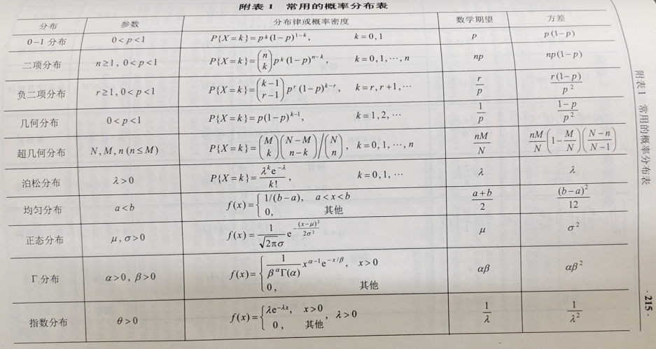

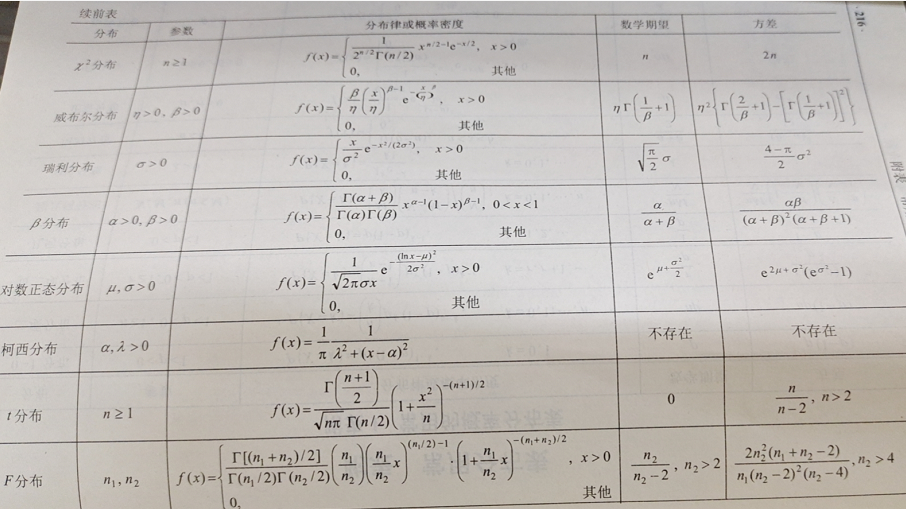

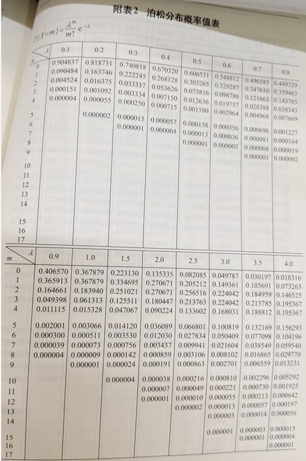

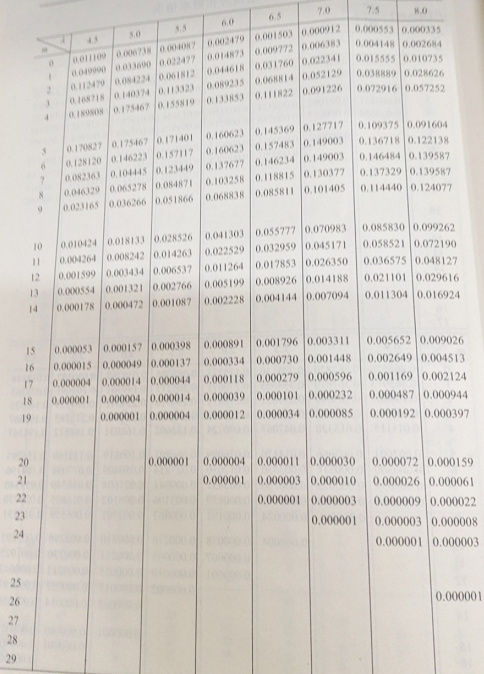

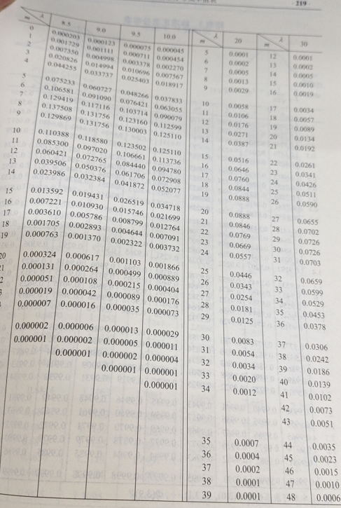

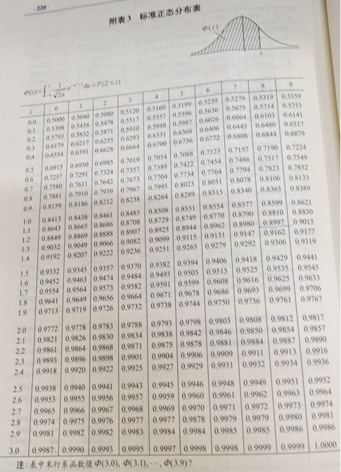

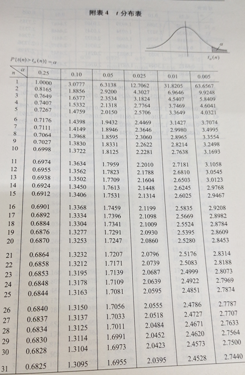

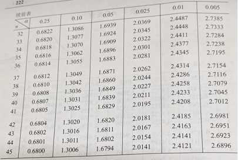

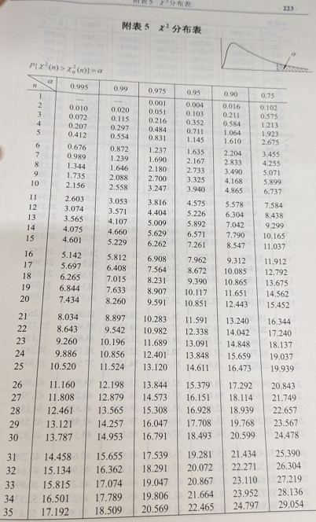

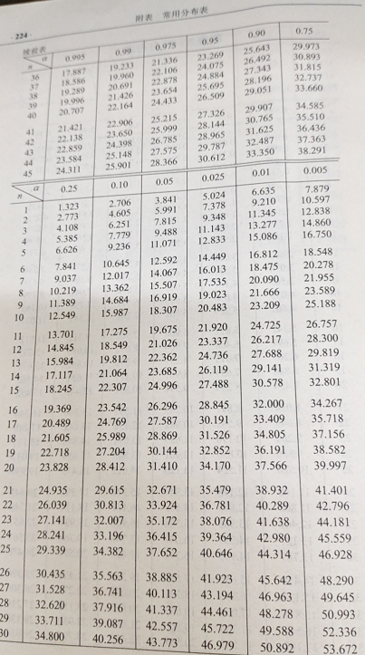

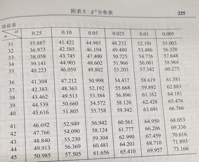

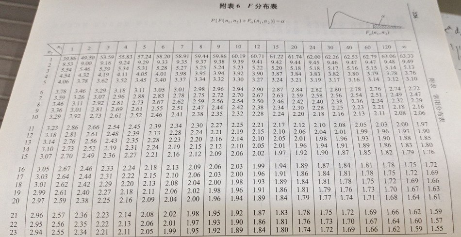

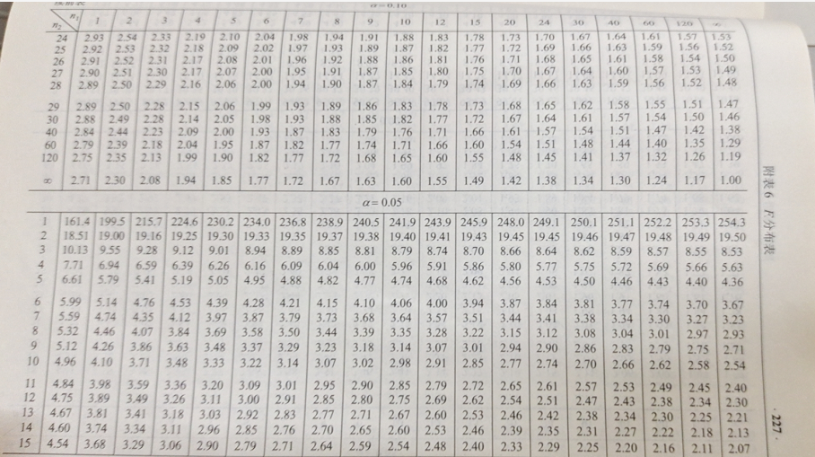

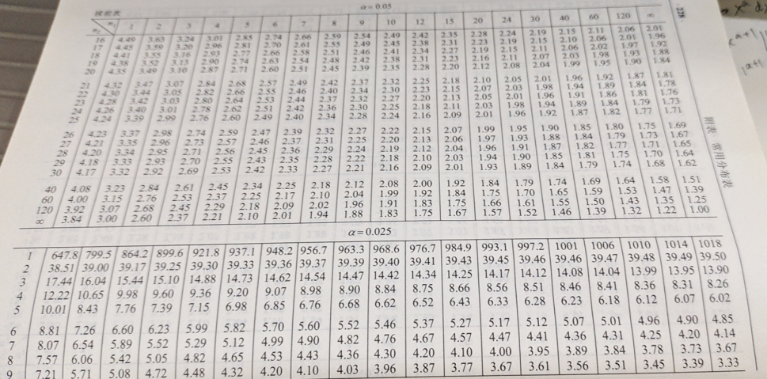

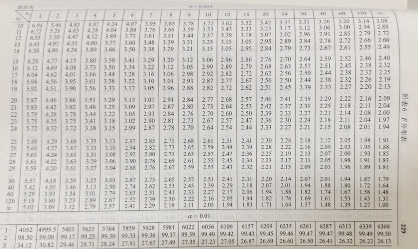

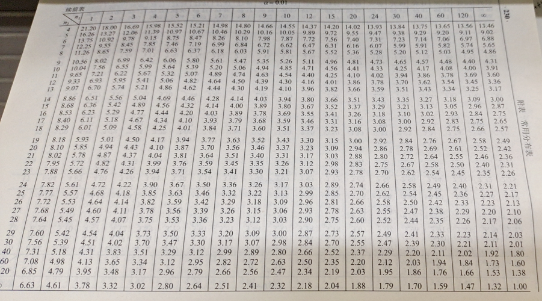

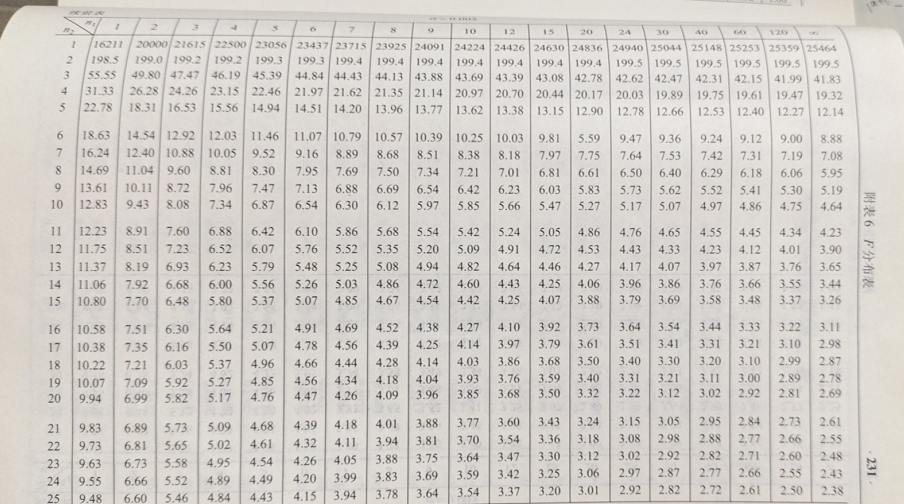

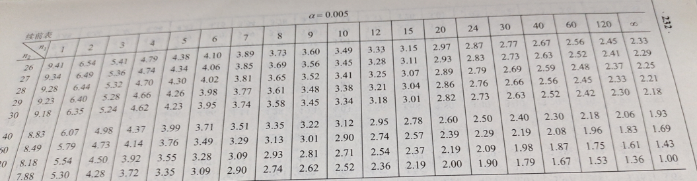

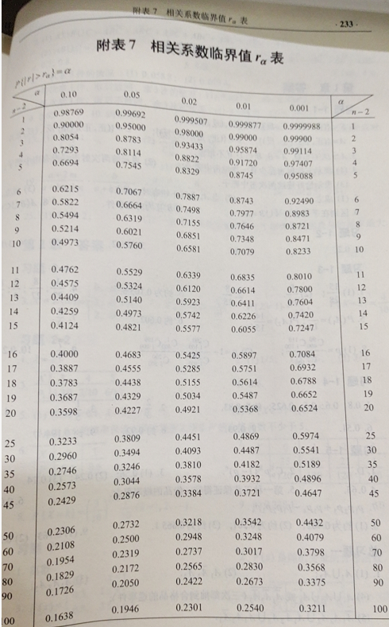

# 数理统计知识

研究生高等工程数学

## 6. 抽样分布与参数估计

### 6.1 样本与抽样分布

#### 基本概念

##### 数理统计

数理统计是以概率论为理论基础,，关于实验数据的收集、整理、分析、推断的一门数学学科。

研究：参数估计、区间估计、参数假设检验、非参数假设检验、回归分析、方差分析、正交试验设计、多元统计分析。

科学试验，或对某事物、现象进行观察获得的数据称为**实(试)验数据**(简称**数据**)

- 数据受随机因素的影响, 具有波动性。（不随机的数据不在这里研究之内）

处理实验数据的过程：收集、整理、分析、推断。本节将研究“收集”和“整理”数据的数学含义。

**总体**：研究对象的全体称为总体：$X\sim F(x)$

- $X$ 是研究对象的某特征指标, 是一个随机变量(r.v) `random variable`
- $F(X)$ 是 r.x $X$ 的分布函数

**个体**：总体中的一个具体对象称为个体：r.v $X$ 的某观察值

> 如：数理统计不是研究具体的对象：学生、灯泡，而是研究这些对象的某个特征指标：成绩、寿命等。（服从某种分布的随机变量）
>
> 例：
>
> - 例 考察某班级学生的英语课程学习成绩 $X$ , 因为每每个学生的成绩都在全班平均成绩 $\mu$ 的附近波动，所以总体可视为 $X\sim N(\mu,\sigma^2)$
> - 考察某工厂生产的某批灯泡的寿命 $X$，因为每个灯泡的寿命都在该批灯泡平均寿命 $\mu$ 的附近波动，所以总体可视为 $X\sim N(\mu,\sigma^2)$

##### 样本二重性

收集数据的数学含义：

设 r.v $X\sim F(X)$，若 r.v $X_1,\cdots, X_n$ 相互独立且与 $X$ 有相同的分布，则称 $X_1,\cdots, X_n$ 为从总体 $X$ 抽取的容量为 $n$ 的简单随机样本，简称为**样本**。

样本的二重性：

1. 试验前，$X_1,\cdots, X_n$ 是一组独立同分布随机变量
2. 试验后，$X_1,\cdots, X_n$ 是一组具体的数据 $x_1,\cdots, x_n$ 称为**样本观察值**

统计推断：由样本观察值推断总体的各种未知信息

> 例：为了考察某种器件的寿命, 从一批产品中随机抽取 9 件产品进行了寿命试验, 具体实验值为 $980,975,1050,1010,990,879,940,1050,1100$
>
> 总体：$X\sim N(\mu,\sigma^2)$ 器件的寿命
>
> 总体密度函数 $f(x)=\dfrac1{\sqrt{2\pi}\sigma}e^{-\frac{(x-\mu)^2}{2\sigma^2}}$
>
> 二重性：
>
> - 样本 $X_1,\cdots, X_9$ (独立同分布的正态 r.v)
> - 样本观察值 $980,975,1050,1010,990,879,940,1050,1100$
>
> 统计推断 从9个试验数据推断整批产品的平均寿命 (连续型总体)

> 例：考察某工厂生产的零件的次品率, 从该厂生产的一批产品中随机抽检了100个, 若合格则记为0, 若不合格则记为1, 100个产品的检查结果为 $x_1,\cdots,x_{100}$
>
> 分析：总体 $X\sim b(1,p)$ (零件合格或不合格)，总体分布律为 $P\{X=1\}=p,P\{X=0\}=1-p$，其中 $p$ 为零件的次品率
>
> 二重性：
>
> - 样本 $X_1,\cdots, X_{100}$ (独立同 (0-1) 分布 r.v)
> - 样本观察值 $x_1,\cdots,x_{100}$
>
> 统计推断 从100个检验数据推断整批产品的次品率 (离散型总体)

##### 分布函数

设总体 $X\sim F(x)$ 称为**理论分布(理论分布函数)**

设 $X_1,\cdots, X_n$ 是来自总体 $X$ 的样本 $x_1,\cdots, x_n$ 的样本观察值，将其从小到大排序后为 $x_{(1)}\le\cdots\le x_{(n)}$，令：
$$
F_n(x)=\begin{cases}
0&,x < x_{(1)}\\
\dfrac kn&,x_{(k)}\le x < x_{(k+1)},k=1,\cdots,n-1\\
1&,x\ge x_{(n)}
\end{cases}
$$
称 $F_n(x)$ 为总体的**经验分布(经验分布函数)**

归于固定的 $x\in R^1,F_n(x)$ 是事件 $\{X\le x\}$ 发生的频率。对固定的 $n,F_n(x)$ 是 $x_1,\cdots, x_n$ 的函数，即 $F_n(x)$ 是随机变量。

$F_n(x)$ 具有分布函数的特征，即：

1. $0\le F_n(x)\le 1$
2. $F_n(x)$ 是不减函数
3. $F_n(-\infty)=0,F_n(+\infty)=1$
4. $F_n(x)$ 在每个 $x_{(k)}$ 处右连续

因为 $F_n(x)$ 是 $\{X\le x\}$ 发生的频率，$F(x)$ 是 $\{X\le x\}$ 发生的概率。

> 故由大数定律，$\forall\epsilon>0$ 有：$\lim_{n\to\infty}P\{|F_n(x)-F(x)|<\epsilon\}=1$。

> 格列文科(Glivenko)在1933年进一步证明了：
> $$
> P\{\lim_{n\to\infty}\sup_{-\infty<x<+\infty}|F_n(x)-F(x)|=0\}=1
> $$
> 其中 $\sup$ 表示右边的表达式当 $-\infty<x<+\infty$ 的上确界。
>
> 当 $n\to\infty$ 时, $F_n(x)$ 以概率 $1$ 关于 $x$ 均匀收敛于 $F(x)$

##### 概率函数

概率函数 $f(x)$ 指：

1. 对于连续型 r.v 表示概率密度
2. 对于离散型 r.v 表示分布律

> 总体服从 (0-1) 分布，总体分布律为 $P\{X=1\}=p,P\{X=0\}=1-p$，则
> $$
> f(x)=P\{X=x\}=p^x(1-p)^{1-x}(x=0,1)
> $$

设 $X_1,\cdots, X_n$ 为来自总体 $X\sim F(x)$ 的样本，则样本是 $n$ 维随机向量，故样本的**联合概率分布函数**为：
$$
F^*(x_1,\cdots, x_n)=P\{X_1\le x_1,\cdots, X_n\le x_n\}
\\=P\{X_1\le x_1\}\cdots P\{X_n\le x_n\}=F(x_1)\cdots F(x_n)=\prod_{i=1}^nF(x_i)
$$

> 例：某厂生产了一大批灯泡,  现从中随机抽取5只进行检测,  测得其寿命(小时)分别为 $980,960,1030,1300,850$。
>
> 分析：总体为灯泡的寿命 $X\sim N(\mu,\sigma^2)$，样本容量为 5，样本为 $X_1,\cdots, X_5$，样本观察值为 $980,960,1030,1300,850$
>
> 样本联合密度为 (多维正态)
> $$
> f^*(x_1,\cdots, x_5)=\prod_{i=1}^5\dfrac1{\sqrt{2\pi}\sigma}e^{-\frac{(x_i-\mu)^2}{2\sigma^2}}=
> \dfrac1{(\sqrt{2\pi}\sigma)^5}e^{-\frac1{2\sigma^2}\sum_{i=1}^5(x_i-\mu)^2}
> $$

##### n维正态分布

> deepseek  一维正态分布 $N(0,1)$，有：$E(X^k)=\begin{cases}0&,k奇数\\(k-1)!!&,k偶数\end{cases}$，其中 $(k-1)!!=1\times3\times5\times\cdots\times(k-1)$。
>
> 例如 $E(X^2)=D(X)+E(X)^2=1+0$。$E(X^6)=15$。对任意 $N(\mu,\sigma^2)$，概率和期望乘法公式即可。
>
> 可以计算出 $E(|X|)=\sqrt{\dfrac2\pi}$，证明见习题 6-4。

设 $C$ 为 $n$ 阶正定对称阵，$\mu=(\mu_1,\cdots,\mu_n)^T$ 为 $n$ 维已知向量，设 $x=(x_1,\cdots,x_n)^T\in R^n$，若 $n$ 维随机向量 $X=(X_1,\cdots, X_n)^T$ 的密度函数为：
$$
f(x)=\dfrac1{(2\pi)^{\frac n2}|C|^{\frac12}}exp\{-\dfrac12(x-\mu)^TC^{-1}(x-\mu)\}
$$
则称 $X=(X_1,\cdots, X_n)^T$ 服从 $n$ 维正态分布，$f(x)$ 为它的密度函数，记作 $X\sim N(\mu,C)$

性质：$(i,j=1,\cdots, n)$

1. $\mu_i=E(X_i)$

2. $C=[c_{ij}]_{n\times n}$ 是 $(X_1,\cdots, X_n)^T$ 的协方差阵
   $$
   c_{ii}=D(X_i),c_{ij}=Cov(X_i,X_j)=E(X_iX_j)-E(X_i)E(X_j)
   $$

3. $X_i\sim N(\mu_i, c_{ii})$

4. $X_1,\cdots, X_n$ 相互独立 $\Leftrightarrow X_1,\cdots, X_n$ 两两不相关 $\Leftrightarrow C=diag\{c_{11},\cdots, c_{nn}\}$

5. 若 $X_1,\cdots, X_n$ 相互独立，且各 $X_i\sim N(\mu_i,\sigma^2_i)$ 则 $(X_1,\cdots, X_n)^T\sim N(\mu, C)$，其中 $\mu$ 定义如上，$C=diag\{\sigma^2_1,\cdots,\sigma_n^2\}$

定理：

1. $X_1,\cdots, X_n$ 任一非零线性组合 $l_1X_1+\cdots+l_nX_n$ 服从一维正态分布

2. 正态随机向量的线性变换不变性：
   $$
   \begin{cases}
   Y_1=a_{11}X_1+a_{12}X_2+\cdots+a_{1n}X_n\\
   \cdots\\
   Y_m=a_{m1}X_1+a_{m2}X_2+\cdots+a_{mn}X_n\\
   \end{cases}
   $$
   则 $(Y_1,\cdots, Y_m)^T$ 仍服从多维正态分布

> 例：设 $X=(X_1,\cdots, X_n)^T\sim N(0,I_n)$，$A$ 为 $n$ 阶正交阵，则：
>
> 1. $X_1,\cdots, X_n$ 独立同分布 $N(0,1)$
>
>    证：$X$ 的协方差阵 $Cov(X,X)=I_n$ 为对角阵，故 $X_1,\cdots, X_n$ 相互独立
>
>    又 $\mu_i=E(X_i)=0,D(X_i)=c_{ii}=1(i=1,\cdots,n)$ 证毕
>
> 2. $AX\sim N(0,I_n)$
>
>    证：由正态随机向量的线性变换不变性可知 $AX\sim N(\cdot, \cdot)$
>
>    又 $E(AX)=AE(X)=0$，$Cov(AX,AX)=A\cdot Cov(X,X)\cdot A^T=AI_nA^T=I_n$，证毕

推论：n个同分布的标准正态随机变量经正交变换后仍是n个独立同分布的标准正态随机变量

##### 统计量

设 $X_1,\cdots,X_n$ 为来自总体 $X\sim F(x)$ 的样本，设 $g(x_1,\cdots, x_n)$ 为 $n$ 元函数，若 r.v $g(x_1,\cdots, x_n)$ 不含任何未知参数，称为**统计量**。

样本包含了各种有用信息，统计量集中、提炼数据中包含的有用信息。

> 例：设 $X_1,\cdots,X_n$ 为来自总体 $X\sim N(\mu,\sigma^2)$ 的样本
>
> - 统计量 $\dfrac1n\sum_{i=1}^n X_i,\max_{1\le i\le n}\{X_i\}$
> - 不是统计量：$\dfrac1n\sum_{i=1}^n(X_i-\mu)^2,\dfrac1n\sum_{i=1}^n(\dfrac{X_i}\sigma)^2$

统计量的二重性：试验前是随机变量，试验后是具体数值

常用统计量：

1. 样本均值 $\overline X=\dfrac1n\sum_{i=1}^nX_i$
2. 样本方差 $S^2=\dfrac1n\sum_{i=1}^n(X_i-\overline X)^2$
3. 样本标准差 $S=\sqrt{S^2}$
4. 修正的样本方差 $\tilde S^2=\dfrac n{n-1}\sum_{i=1}^n(X_i-\overline X)^2=\dfrac n{n-1}S^2$
5. 样本k阶矩 $A_k=\dfrac1n\sum_{i=1}^n X^k_i(k=1,2,\cdots)$
6. 样本k阶中心矩 $A_k=\dfrac1n\sum_{i=1}^n(X_i-\overline X)^k(k=1,2,\cdots)$
7. 极小值 $X_{(1)}=\min\{X_1,\cdots, X_n\}$
8. 极大值 $X_{(n)}=\max\{X_1,\cdots, X_n\}$

统计量是随机变量，必须确定其分布，称为抽样分布。

重要任务是构造好的统计量，确认统计量的分布。

##### 分位点

设 $X\sim F(x)$，若 $\forall0<\alpha<1$ 存在常数 $F_\alpha$ 满足 $F(F_\alpha)=P\{X\le F_\alpha\}=\alpha$ 则称 $F_\alpha$ 为分布 $F(x)$ 的 $\alpha$分位点。

即若 $X$ 的密度为 $f(x)$，则$P\{X\le x_{\alpha}\}=\int_{-\infty}^{x_{\alpha}}f(x)dx=\alpha$，即面积为 $\alpha$。

对称的，如 $u,t$ 分布，有 $t_a=-t_{1-a},u_a=-u_{1-a}$。即 $t_{a}+t_{1-a}=0$。

> 例：若 $N(0,1)$ 分布的 $\alpha$ 分位点记作 $u_\alpha$，若查表得 $u_{0.95}=1.645$(找到 $1.6,1.7$ 行头之间的区间包含这个 $0.95$ 元素，取 $1.6,1.7$ 的均值估算；或更精确的，$1.64,1.65$ 具体看表)，则求 $u_{0.05}=-u_{0.95}=1.645$。即 $x\le a$ 的面积与 $x\ge-a$ 相等，因为对称，即有 $u_\alpha=-u_{1-\alpha}$ 

> 例：查表，如得 $\chi^2_{0.05}=5.226$，且根据公式$\chi^2_\alpha(n)\approx\dfrac12(u_\alpha+\sqrt{2n-1})^2$，估算 $\chi^2_{0.05}(50)\approx\dfrac12(u_{0.95}+\sqrt{99})\approx34.485$。
>
> 例：查表得 $t_{0.95}=1.9432,t_{0.10}(12)=-t_{0.90}(12)=-1.3562$ 且 $t_{0.95}(55)\approx u_{0.95}=1.645$
>
> 例：查表得 $F_{0.95}(5,12)=3.11,F_{0.90}(2,25)=2.53,F_{0.05}(6,10)=\dfrac1{F_{0.95}(10,6)}=\dfrac1{4.06}=0.246$

#### 抽样分布

##### $\chi^2$-分布

设 $X_1,\cdots, X_n$ 相互独立同分布 $N(0,1)$，令 $\chi^2=X^2_1+\cdots X^2_n$ 称 $\chi^2$ 服从的分布为自由度为 $n$ 的 $\chi^2$-分布，记为 $\chi^2\sim \chi^2(n)$。

自由度：

1. 直观解释：可独立变化的随机变量的个数
2. 严格解释：二次型的秩

> 例：$X_1,X_2,X_3,X_4$ 是来自总体 $N(\mu,1)$ 的样本，令：
> $$
> Z=\left(\dfrac{X_2-X_1}{\sqrt2}\right)^2
> +\left(\dfrac{X_4-X_3}{\sqrt2}\right)^2\sim\chi^2(2)
> $$
> 则 $Z$ 可独立变化的随机变量个数为4, 但自由度为2

> 概率密度是 $f(x)=\begin{cases}\dfrac1{2^{\frac n2}\Gamma(\cfrac n2)}x^{\frac n2-1}e^{-\frac12x},&x>0\\0,&x\le0\end{cases}$
>
> 其中 $\Gamma(\alpha)=\int_0^{+\infty}x^{\alpha-1}e^{-x}dx$ ，即广义阶乘，且有 $\Gamma(\alpha+1)=\alpha\Gamma(\alpha)$ ，$\Gamma(0.5)=\sqrt\pi$ 

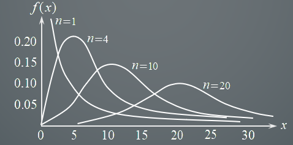

特点：随着自由度 *n* 的增加 f (x) 的重心逐渐向右移动

均值为 $n$，方差为 $2n$

> 证明：
> $$
> E(\chi^2)=E(X^2_1+\cdots+X^2_n)=nD(X_1)=n\\
> D(\chi^2)=D(X^2_1+\cdots+X^2_n)=nD(X^2_1)
> =n(E(X^4_1)-(E(X^2_1))^2)
> $$
> 其中 $E(X^2_1)=D(X_1)-(E(X_1))^2$，且 $E(X_1)=0,D(X_1)=1$，故 $=1$。
>
> 其中根据期望定义，有：$E(X)=\int_{-\infty}^{+\infty}xf(x)dx$，$f(x)=\dfrac1{\sqrt{2\pi}\sigma}e^{-\frac{(x-\mu)^2}{2\sigma^2}}$
> $$
> E(X^4_1)=\int_{-\infty}^{+\infty}\dfrac{x^4}{\sqrt{2\pi}}e^{-\frac{x^2}2}dx
> $$
> 令偶数 $E(X^{2n})=\int_{-\infty}^{+\infty}\dfrac{x^{2n}}{\sqrt{2\pi}}e^{-\frac{x^2}2}dx$，令 $t=\dfrac{x^2}2$，则 $x^{2n}=(x^2)^{n}=\dfrac{(\dfrac12)^n(x^2)^{n}}{(\dfrac12)^n}=2^n(\dfrac{x^2}2)^n$ ，代入广义阶乘公式，$\Gamma(\alpha)=\int_0^{+\infty}x^{\alpha-1}e^{-x}dx$：[参考](https://easylearn.baidu.com/edu-page/tiangong/questiondetail?id=1732503547202081130&fr=search)
>
> 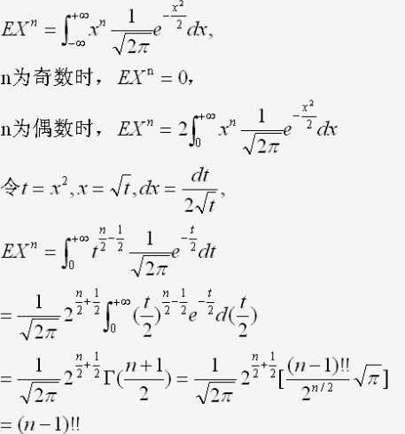
>
> 奇数，显然关于 $x$ 对称，故 $E=0$。
>
> 根据结论，标准正态分布 $E(X^k)=\begin{cases}0&,k奇数\\(k-1)!!&,k偶数\end{cases}$，故上式为 $E(X^4_1)=3!!=3\times 1=3$。故原式 $=n(3-1)=2n$。

设 $\chi^2_1\sim\chi^2(n_1),\chi^2_2\sim\chi^2(n_2)$ 且 $\chi^2_1,\chi^2_2$ 相互独立，则 $\chi^2_1+\chi^2_2\sim\chi^2(n_1+n_2)$

> 证明略，PPT 有，看不懂。

推论，若 $\chi^2_1,\cdots,\chi^2_k$ 相互独立且 $\chi^2_i\sim\chi^2(n_i)(i=1,\cdots,k)$ 则 $\chi_1^2+\cdots+\chi^2_k\sim\chi^2(n_1+\cdots+n_k)$。

> $n$ 充分大时，分位点 $\chi^2_\alpha(n)\approx\dfrac12(u_\alpha+\sqrt{2n-1})^2$

##### t-分布

设 $X\sim N(0,1),Y\sim\chi^2(n)$ 且 $X,Y$ 相互独立，令 $t=\dfrac{X}{\sqrt{Y/n}}$，称 $t$ 服从的分布为自由度为 $n$ 的 t-分布，记为 $t\sim t(n)$。

- $f(-x)=f(x)$
- $f'(x)=-(n+3)xf(x)$ 故 $x<0$ 增，$x>0$ 减。

> 概率密度函数：$f(x)=\dfrac{\Gamma[(n+1)/2]}{\sqrt{n\pi}\Gamma(n/2)}(1+\dfrac{x^2}n)^{-\frac{n+1}2},-\infty<x<+\infty$

> [ $n>1,E(X)=0;n>2,D(X)=\dfrac n{n-1}$

随着自由度 *n* 的增加 *f* (*x*) 的越来越趋近，$n$ 充分大时($n>45$)，近似于标准正态分布，因此大随机样本服从正态分布，小随机样本服从 t-分布。

> 证明思路：$\lim_{n\to+\infty}f(x)=\dfrac1{\sqrt{2\pi}}e^{-\frac{x^3}2}$

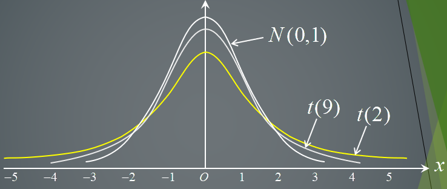

> 故 $n>45$ 时，$t_{\alpha}(n)\approx u_\alpha$

> 例：设 $X_1,\cdots, X_5$ 是来自总体 $N(0,\sigma^2)$ 的样本，求常数 $C$，使统计量 $\dfrac{C(X_1+X_2)}{\sqrt{X^2_3+X^2_4+X^2_5}}$ 服从 t-分布
> $$
> \because X_1+X_2\sim N(0,2\sigma^2),\dfrac{X^2_3+X^2_4+X^2_5}{\sigma^2}\sim\chi^2(3) 且二者相互独立\\
> \Rightarrow\dfrac{\pm(X_1+X_2)/\sqrt2\sigma}{\sqrt{(X^2_3+X^2_4+X^2_5)/3\sigma^2}}\sim t(3)\Rightarrow C=\pm\sqrt{\dfrac32}
> $$

> (2023模拟) 设 $(X_1,X_2,X_3,X_4,X_5),(Y_1,Y_2,Y_3,Y_4,Y_5)$ 是来自总体 $N(\mu,\sigma^2)$ 的两个独立样本，令 $\overline X=\dfrac15\sum_{i=1}^5X_i,\overline Y=\dfrac15\sum_{i=1}^5Y_i$，$S^2_1=\dfrac15(X_i-\overline X)^2,S^2_2=\dfrac15(Y_i-\overline Y)^2$，若统计量 $\dfrac{c(\overline X-\overline Y)}{\sqrt{S^2_1+S^2_2}}$ 服从 $t$ 分布，求常数 $c$ 和自由度。
>
> 1. 根据抽样分布定理一和均值方差性质，$\overline X-\overline Y\sim N(0,\dfrac25\sigma^2)$。
> 2. 根据抽样分布定理二，$\dfrac{5S^2}{\sigma^2}\sim\chi^2(4)$
> 3. 根据 $\chi^2$ 分布可加性质，$\dfrac{5(S^2_1+S^2_2)}{\sigma^2}\sim\chi^2(8)$，故自由度为 $8$。
> 4. 构造 $\sqrt{\dfrac52}\sigma(\overline X-\overline Y)\sim N(0,1)$ (注意有开方) 为分子
> 5. 构造 $\sqrt{\dfrac{5(S^2_1+S^2_2)}{\sigma^2}/8}$ 为分母，故：
>
> $$
> \dfrac{\sqrt{\dfrac52}\sigma(\overline X-\overline Y)}{\sqrt{\dfrac{5(S^2_1+S^2_2)}{8\sigma^2}}}=
> \dfrac{2(\overline X-\overline Y)}{\sqrt{S^2_1+S^2_2}}
> $$
>
> 第一步换成 $\overline Y-\overline X$ 同样成立，故 $c=\pm 2$。**一定要记得正负号**

##### F-分布

设 $X\sim\chi^2(n_1),Y\sim\chi^2(n_2)$ 且 $X,Y$ 相互独立，令 $F=\dfrac{X/n_1}{Y/n_2}$，称 $F$ 服从的分布为自由度为 $(n_1,n_2)$ 的 F分布，记为 $F\sim F(n_1,n_2)$

- 若 $F\sim F(n_1,n_2)$ 则 $\dfrac1F\sim F(n_2,n_1)$ (根据定义不难看出)

> 概率密度函数为：
> $$
> f(x)=\begin{cases}
> \cfrac{\Gamma[(m+n)/2]}{\Gamma(m/2)\Gamma(n/2)}(\cfrac mn)(\cfrac mnx)^{\frac m2-1}(1+\cfrac mnx)^{-\frac12(m+n)},&x>0\\\\
> 0,&x\le0
> \end{cases}
> $$
> 若 $X\sim t(n)$ ，则 $X^2\sim F(1,n)$

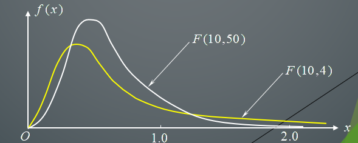

> $F_{\alpha}(n_1,n_2)=\dfrac{1}{F_{1-\alpha}(n_2,n_1)}$，三反公式。证明：[参考](https://zhuanlan.zhihu.com/p/587790563)
>
> 已知某分布 $F\sim F_\alpha(n_1,n_2)$ 则有 $\alpha$ 分位数的定义：
> $$
> \begin{align}
> \alpha=&P\{F\le F_\alpha(n_1,n_2)\}\\
> \Rightarrow1-\alpha=&P\{F> F_\alpha(n_1,n_2)\}\\
> \Rightarrow1-\alpha=&P\{\dfrac1F< \dfrac1{F_\alpha(n_1,n_2)}\}\quad①\\
> \end{align}
> $$
> 且 $\dfrac1F\sim F(n_2,n_1)$，代入分位数的定义：
> $$
> 1-\alpha=P\{\dfrac1F<F_{1-\alpha}(n_2,n_1)\}\quad②
> $$
> 联立 ①②，有：$\dfrac1{F_\alpha(n_1,n_2)}=F_{1-\alpha}(n_2,n_1)$。

> [$F(k_1,k_2),E(X)=\dfrac{k_2}{k_2 - 2}(k_2 > 2),D(X)=\dfrac{2k_2^2 (k_1 + k_2 - 2)}{k_1 (k_2 - 2)^2 (k_2 - 4)}(k_2 > 4)$

> 例：设 $X_1,X_2$ 是来自 $N(0,\sigma^2)$ 的样本：
>
> 1. 求 $\dfrac{(X_1-X_2)^2}{(X_1+X_2)^2}$ 的分布
> 2. 求常数 $k$，使 $P\left\{\dfrac{(X_1+X_2)^2}{(X_1+X_2)^2+(X_1-X_2)^2}>k\right\}=0.10$
>
> 解：（1）
> $$
> X_1-X_2\sim N(0,2\sigma^2),X_1+X_2\sim N(0,2\sigma^2)\\
> $$
>
> $$
> \because\dfrac{X_1+X_2}{\sqrt2\sigma}\sim N(0,1),
> \dfrac{X_1-X_2}{\sqrt2\sigma}\sim N(0,1)\\
> \therefore(\dfrac{X_1+X_2}{\sqrt2\sigma})^2\sim\chi^2(1),
> (\dfrac{X_1-X_2}{\sqrt2\sigma})^2\sim\chi^2(1)
> $$
>
> $$
> \because Cov(X_1+X_2,X_1-X_2)\\=E((X_1+X_2)(X_1-X_2))-E(X_1+X_2)E(X_1-X_2)\\
> =E(X_1^2-X^2_2)-0\cdot 0=E(X_1^2)-E(X^2_2)=0
> $$
>
> > 正态分布 $E(X^2)=D(X)+E(X)^2=\sigma^2+0$。
> >
> > 或者标准正态分布 $E(X^2)=1!!=1$ 则 $E(\sigma X^2)=\sigma^2E(X^2)=\sigma^2$
>
> 故 $X_1+X_2$ 与 $X_1-X_2$ 相互独立，故：
> $$
> \dfrac{(X_1-X_2)^2/2\sigma^2}{(X_1+X_2)^2/2\sigma^2}=\dfrac{(X_1-X_2)^2}{(X_1+X_2)^2}\sim F(1,1)
> $$
> （2）原式等价于：
> $$
> \begin{align}
> (X_1+X_2)^2&>k((X_1+X_2)^2+(X_1-X_2)^2)\\
> \dfrac1k&>\dfrac{(X_1+X_2)^2+(X_1-X_2)^2}{(X_1+X_2)^2}\\
> \dfrac1k&>1+\dfrac{(X_1-X_2)^2}{(X_1+X_2)^2}\\
> \dfrac{1-k}k&>\dfrac{(X_1-X_2)^2}{(X_1+X_2)^2}\\
> \dfrac{(X_1+X_2)^2}{(X_1-X_2)^2}&>\dfrac k{1-k}
> \end{align}
> $$
> 即 $\dfrac k{1-k}=F_{0.9}(1,1)=39.86$ 故解方程 $k=\dfrac{39.86}{1+39.86}=0.9755$
>
> 或者更简单一点，倒数第三行，直接 $\dfrac1k-1=F_{0.1}(1,1)=0.0250856$ 同样解得 $k$，感觉这个才是正解。

> 例：已知 $T\sim t(n)$，求证 $T^2\sim F(1,n)$
> $$
> T=\dfrac{X}{\sqrt{Y/n}},T^2=\dfrac{X^2}{Y/n},X^2\sim\chi^2(1),Y\sim\chi^2(n)，且X^2,Y相互独立
> \\\therefore T^2\sim F(1,n)
> $$

> 更详细的可以看习题 6-9。

#### 抽样分布定理

##### 定理一

设总体 $X$ 的数学期望 $E(X)=\mu$，方差 $D(X)=\sigma^2$ 都存在，$X_1,\cdots, X_n$ 是来自 $X$ 的样本，则：

1. $E(\overline X)=\mu,D(\overline X)=\dfrac{\sigma^2}{n}$
2. $E(S^2)=\dfrac{n-1}n\sigma^2$

> 证明：（1）
> $$
> E(\overline X)=E(\dfrac1n\sum_{i=1}^nX_i)=\dfrac1n\sum_{i=1}^n E(X_i)=\dfrac1n\sum_{i=1}^n E(X)=\dfrac1n\sum_{i=1}^n\mu=\mu
> $$
>
> $$
> D(\overline X)=D(\dfrac1n\sum_{i=1}^n X_i)=\dfrac1{n^2}\sum_{i=1}^nD(X_i)=\dfrac1{n^2}\sum_{i=1}^n\sigma^2=\dfrac{\sigma^2}n
> $$
>
> （2）
>
> 已知 $\overline X=\dfrac1n\sum_{i=1}^nX_i$ 故 $\sum_{i=1}^nX_i=n\overline X$
> $$
> nS^2=\sum_{i=1}^n(X_i-\overline X)^2=\sum_{i=1}^n X_i^2-2\overline X\sum_{i=1}^nX_i+\sum_{i=1}^n\overline X^2\\
> =\sum_{i=1}^nX^2_i-2n\overline X+n\overline X=\sum_{i=1}^n X^2_i-n\overline X^2
> $$
>
> $$
> \therefore nE(S^2)=\sum_{i=1}^n E(X^2_i)-nE(\overline X^2)\\
> =\sum_{i=1}^n(D(X)+E(X)^2)-n(D(\overline X)+E(\overline X)^2)\\
> =n(\sigma^2+\mu^2)-n(\dfrac{\sigma^2}n+\mu^2)=(n-1)\sigma^2\\
> \therefore E(S^2)=\dfrac{n-1}n\sigma^2
> $$
>
> 实验验证：
>
> ```python
> import numpy as np
> mu = 10          # 总体均值
> sigma = 5       # 总体标准差
> n = 30          # 每个样本的大小
> num_samples = 10000  # 模拟次数
> sample_means = []
> sample_variances = []
> 
> # 模拟实验
> for _ in range(num_samples):
> sample = np.random.normal(mu, sigma, n)  # 从正态分布中生成样本
> sample_means.append(np.mean(sample))
> sample_variances.append(np.var(sample)) 
> 
> mean_of_means = np.mean(sample_means)
> variance_of_means = np.var(sample_means)
> mean_of_variances = np.mean(sample_variances)
> print(f"样本均值的期望: {mean_of_means:.2f}, 理论值: {mu:.2f}")
> print(f"样本均值的方差: {variance_of_means:.5f}, 理论值: {sigma**2/n:.5f}")
> print(f"样本方差的期望: {mean_of_variances:.5f}, 理论值: {(n-1)/n * sigma**2:.5f}")
> '''样本均值的期望: 10.01, 理论值: 10.00
> 样本均值的方差: 0.84380, 理论值: 0.83333
> 样本方差的期望: 24.20168, 理论值: 24.16667'''
> ```
>
> 含义：
>
> 1. 随着实验次数增加，均值偏离值越来越低，因为 $n\to\infty$ 时 $D(\overline X)\to 0$。且均值不管怎么取离总体都比较接近。
> 2. 当实验次数比较小时，直接计算方差，它与总体方差在期望上会相差一个系数，当 $n\to\infty$ 时才无限接近于 $\sigma^2$ 这个真实方差

因此，$\tilde S^2=\dfrac n{n-1}S^2$ 则 $E(\tilde S^2)=\dfrac n{n-1}\cdot\dfrac{n-1}n\sigma^2=\sigma^2$。

> deepseek 对正态分布，$D(\tilde S^2)=\dfrac{2\sigma^4}{n-1}$，下文有证明。不修正或非正态计算复杂。

##### 定理二

设 $X_1,\cdots, X_n$ 是总体 $X\sim N(\mu,\sigma^2)$ 的样本，则：

1. $\overline X\sim N(\mu,\dfrac{\sigma^2}n)$
2. $\dfrac{nS^2}{\sigma^2}\sim\chi^2(n-1)$ (或 $\dfrac{(n-1)\tilde S^2}{\sigma^2}\sim\chi^2(n-1)$)
3. $\overline X,S^2$ 相互独立

这个定理是数理统计中最基本的定理

> 注意 $X_i\sim N(\mu,\sigma^2)$。

> 证明：（1）代入定理一显然。
>
> （2）
> $$
> nS^2=\sum_{i=1}^n(X_i-\overline X)^2=\sum_{i=1}^n((X_i-\mu)-(\overline X-\mu))^2\\
> =\sum_{i=1}^n(X_i-\mu)^2-2\sum_{i=1}^n(X_i-\mu)(\overline X-\mu)+n(\overline X-\mu)^2\\
> =\sum_{i=1}^n(X_i-\mu)^2-n(\overline X-\mu)^2\\
> \therefore\dfrac{nS^2}{\sigma^2}=\sum_{i=1}^n(\dfrac{X_i-\mu}\sigma)^2-(\dfrac{\overline X-\mu}{\sigma/\sqrt n})^2
> $$
> 显然 $\dfrac{X_i-\mu}\sigma\sim N(0,1)$，同理，根据上述（1），$\dfrac{\overline X-\mu}{\sigma/\sqrt n}\sim N(0,1)$
>
> 由于独立标准正态r.v经正交变换后仍是独立标准正态r.v，故 $X_i$ 变换为 $Z_i=\dfrac{X_i-\mu}\sigma$，则 $Z$ 向量组的每个向量都是独立标准正态r.v，~~之后没看懂~~
>
> [参考](https://blog.csdn.net/robert_chen1988/article/details/90640917)，构造正交矩阵 $A$，其中第一行的值是 $\dfrac1{\sqrt n}$，其他任意满足正交即可。设 $A_i$ 是 $A$ 的第 $i$ 个行向量，则有 $n\overline Z^2=\dfrac{(Z_1+\cdots+Z_n)^2}n=(A_1Z)$
>
> 设 $Y=AZ$，则 $(A_1Z)^2=Y_1^2$。且有：(正交阵必然满足 $A^TA=I_n$)
> $$
> \sum_{i=1}^nY_i^2=Y^TY=Z^TA^TAZ=Z^TZ=\sum_{i=1}^n Z^2_i
> $$
> 也就是说，经过某正交变换，原式：
> $$
> \sum_{i=1}^nZ_i^2-n\overline Z^2\to\sum_{i=1}^nY^2_i-Y^2_1=\sum_{i=2}^nY^2_i\sim\chi^2(n-1)
> $$
> ~~相互独立没看懂。第二问要证明独立也不知道要不要也不知道证了没。~~
>
> 显然 $(n-1)\tilde S^2=nS^2$。

##### 定理三

设 $X_1,\cdots, X_n$ 是总体 $X\sim N(\mu,\sigma^2)$ 的样本，则：
$$
\dfrac{\overline X-\mu}{S/\sqrt{n-1}}\sim t(n-1)\quad或\quad
\dfrac{\overline X-\mu}{\tilde S/\sqrt{n}}\sim t(n-1)
$$

> 证明：$\dfrac{\overline X-\mu}{\sigma/\sqrt n}\sim N(0,1)$，且根据（2） $\dfrac{nS^2}{\sigma^2}\sim\chi^2(n-1)$，且 $\overline X,S^2$ 相互独立，则：(另外一个易证，分母根号里的两个 $n-1$ 消掉了，分子的下去了
> $$
> \dfrac{ \dfrac{\overline X-\mu}{\sigma/\sqrt n} }
> {\sqrt{ \dfrac{nS^2}{\sigma^2} / (n-1) }} = 
> \dfrac{\overline X-\mu}{S/\sqrt{n-1}}\sim t(n-1)
> $$

> 注意：实际上 $\tilde S/\sqrt n=S/\sqrt{n-1}$ 成立。

##### 定理四

设 $X_1,\cdots, X_{n_1}$ 是总体 $X\sim N(\mu_1,\sigma^2)$ 的样本， $Y_1,\cdots, Y_{n_2}$ 是总体 $Y\sim N(\mu_2,\sigma^2)$ 的样本，两样本独立，期样本均值和样本方差分别为 $\overline X,\overline Y,S^2_1,S^2_2$，则：
$$
\dfrac{(\overline X-\overline Y)-(\mu_1-\mu_2)}{S_\omega\sqrt{\dfrac1{n_1}+\dfrac1{n_2}}}\sim t(n_1+n_2-2)\quad(S_\omega=\sqrt{\dfrac{n_1S_1^2+n_2S^2_2}{n_1+n_2-2}})
$$

> 证明：$\overline X\sim N(\mu_1,\dfrac{\sigma^2}{n_1}),\overline Y\sim N(\mu_2,\dfrac{\sigma^2}{n_2})$ 且相互独立(或者看后面双正态区间估计的证明)
> $$
> \therefore\overline X-\overline Y\sim N(\mu_1-\mu_2,\dfrac{\sigma^2}{n_1}+\dfrac{\sigma^2}{n_2})\\
> \therefore\dfrac{(\overline X-\overline Y)-(\mu_1-\mu_2)}{\sqrt{\dfrac{\sigma^2}{n_1}+\dfrac{\sigma^2}{n_2}}}\sim N(0,1)
> $$
> [换言之如果 $\sigma^2$ 已知到此为止，参见习题 6-2
>
> 又 $\dfrac{n_1S_1^2}{\sigma^2}\sim\chi^2(n_1-1),\dfrac{n_2S_2^2}{\sigma^2}\sim\chi^2(n_2-1)$ 且相互独立
> $$
> \therefore\dfrac{n_1S_1^2}{\sigma^2}+\dfrac{n_2S_2^2}{\sigma^2}\sim\chi^2(n_1+n_2-2)\\
> \therefore\dfrac{ \dfrac{(\overline X-\overline Y)-(\mu_1-\mu_2)}{\sqrt{{\sigma^2}(\dfrac1{n_1}+\dfrac1{n_2})}} }
> {\sqrt{(\dfrac{n_1S_1^2}{\sigma^2}+\dfrac{n_2S_2^2}{\sigma^2}) /(n_1+n_2-2) }}\sim t(n_1+n_2-2)
> $$

>  $\sigma^2$ 的估计应该是 $\tilde S^2_1,\tilde S^2_2$ 的加权平均：
>  $$
>  S^2_\omega=\dfrac{(n_1-1)\tilde S^2_1+(n_2-1)\tilde S^2_2}{n_1-1+n_2-1}=\dfrac{n_1S^2_1+n_2S^2_2}{n_1+n_2-2}
>  $$


##### 定理五

设 $X_1,\cdots, X_{n_1}$ 是总体 $X\sim N(\mu_1,\sigma^2_1)$ 的样本， $Y_1,\cdots, Y_{n_2}$ 是总体 $Y\sim N(\mu_2,\sigma^2_1)$ 的样本，两样本独立，期样本均值和样本方差分别为 $\overline X,\overline Y,S^2_1,S^2_2$，则：
$$
\dfrac{\dfrac{n_1S_1^2}{n_1-1}/\dfrac{n_2S_2^2}{n_2-1}}{\sigma^2_1/\sigma^2_2}\sim F(n_1-1,n_2-1)
$$

> 证明： $\dfrac{n_1S_1^2}{\sigma^2_1}\sim\chi^2(n_1-1),\dfrac{n_2S_2^2}{\sigma^2_2}\sim\chi^2(n_2-1)$ 且相互独立
> $$
> \therefore\dfrac{\dfrac{n_1S_1^2}{\sigma^2_1}/(n_1-1)}{\dfrac{n_2S_2^2}{\sigma^2_2}/(n_2-1)}\sim F(n_1-1,n_2-1)
> $$

$$
\tilde S_1^2=\dfrac{n_1S^2_1}{n_1-1},
\tilde S_2^2=\dfrac{n_2S^2_2}{n_2-1}\therefore\dfrac{\tilde S^2_1/\tilde S^2_2}{\sigma_1^2/\sigma^2_2}\sim F(n_1-1,n_2-1)
$$

若 $\sigma^2_1=\sigma^2_2$ 则 $\dfrac{\tilde S^2_1}{\tilde S^2_2}\sim F(n_1-1,n_2-1)$。

### 6.2 点估计

#### 基本概念

##### 背景

知识联系：

> 参数估计：
>
> 1. 点估计
> 2. 估计量的评选标准
> 3. 区间估计
>
> 两类统计推断问题：
>
> 1. 估计问题：点估计、区间估计。
> 2. 假设检验问题：下一章

某工厂生产了一大批产品, 从中随机抽检了 $n$ 件产品，发现有 $k$ 件次品，如何估计整批产品的次品率 $p$？

> 为什么不能直接 $p=\frac kn$，是因为实际上还有额外信息，如已知寿命服从指数分布 $X\sim EXP(\theta)$。
> $$
> f(x)=\begin{cases}
> \dfrac1\theta e^{-\frac x\theta}&,x>0\\
> x&,x<0
> \end{cases},(\theta>0)
> $$
> 那么应当利用这个信息。

##### 定义

设总体 $X\sim F(x,\theta)$，$F$ 的函数形式已知，$\theta$ 是未知参数。$X_1,\cdots, X_n$ 为来自总体 $X$ 的样本。

$\theta$ 的点估计：构造一个统计量 $\hat\theta(X_1,\cdots, X_n)$，用统计量观察值 $\hat\theta(x_1,\cdots, x_n)$ 作为未知参数 $\theta$ 的估计值。

> 二重性：
>
> 1. $\hat\theta(X_1,\cdots, X_n)$ 是 $\theta$ 的估计量
> 2. $\hat\theta(x_1,\cdots, x_n)$ 是 $\theta$ 的估计值

(辛钦)大数定律：随机事件的频率近似于它的概率。

> 例：估计次品率，设 $X\sim b(1,p)$ 抽取了容量为 $n$ 的样本，其中 $X=1$ 是次品，$X=0$ 是好品，则由辛钦大数定律：
> $$
> \overline X=\dfrac1n\sum_{i=1}^nX_i=\dfrac kn\xrightarrow Pp\quad(n\to\infty)
> $$
> (上式箭头：按概率收敛。)故当 $n$ 较大时，认为 $\overline X$ 与 $p$ 差不多。
>
> 故可用 $\hat p=\overline X$ 作为未知参数 $p$ 的点估计。

> 例：寿命服从 $X\sim EXP(\theta)$，抽取 $10$ 个样本测量寿命为 $X_1,\cdots, X_{10}$，求平均寿命？
>
> 由于指数分布有 $E(\overline X)=E(X)=\theta,D(\overline X)=\dfrac{D(x)}n=\dfrac{\theta^2}n$ (根据抽样分布定理一)
>
> 故 $\overline X$ 在 $\theta$ 附近波动，且当 $n$ 较大时，波动幅度较小(趋于 $0$)，故可以用样本均值 $\hat\theta=\overline X$ 作为总体均值 $\theta$ 的点估计。

常用的点估计方法：

1. 矩估计法
2. 最大似然估计法

估计好坏的衡量标准：

1. 估计的误差较小
2. 当 $n$ 较大时，估计的精度应该较高

#### 矩估计法

##### 定义

理论基础：依概率收敛及大数定律

##### 依概率收敛

设 $\{\xi_n\}$ 是一个随机变量列，若 $\forall\epsilon>0$ 有：
$$
\lim_{n\to\infty}P\{|\xi_n-\xi|\ge\epsilon\}=0
$$
则称 $\{\xi_n\}$ **依概率收敛于** $\xi$，记为 $\xi_n\xrightarrow P\xi$。

1. $$
   \lim_{n\to\infty}P\{|\xi_n-\xi|\ge\epsilon\}=0\Leftrightarrow
   \lim_{n\to\infty}P\{|\xi_n-\xi|<\epsilon\}=1
   $$

2. 直观含义：随着 $n$ 增加，绝对误差 $|\xi_n-\xi|$ 较大的可能性越来越小。

##### 辛钦大数定律

独立同分布(辛钦)大数定律：设 $\{X_n\}$ 是独立同分布随机变量列，$E(X_1)\triangleq\mu$ 存在，则 $\{X_n\}$ 服从大数定律，即 $\forall\epsilon>0$，有：
$$
\lim_{n\to\infty}P\{|\dfrac1n\sum_{k=1}^nX_k-\mu|<\epsilon\}=1
$$

即构造一个随机变量 $\xi_n$，定义如下：
$$
\xi_n\triangleq\dfrac1n\sum_{i=1}^nX_i\xrightarrow P\mu\quad(n\to+\infty)
$$
该随机变量依概率收敛于 $\mu$。

##### 矩估计量

推论：[由于 $\{X_n\}$ 是随机变量列的话，$\{X^k_i\}$ 也是随机变量列]。设总体为 $X\sim F(x,\theta_1,\cdots\theta_k)$，其中 $\theta_1,\cdots\theta_k$ 是 $k$ 个未知参数。设 $X_1,\cdots, X_n$ 为来自总体 $X$ 的样本，则设总体矩 $\mu_i\triangleq E(X^i)(i=1,2,\cdots,k)$ 都存在。

由辛钦大数定律有：
$$
A_i=\dfrac1n\sum_{j=1}^nX_j^i\xrightarrow P E(X^i)=\mu_i(n\to\infty,i=1,\cdots,k)
$$
当 $n$ 较大时，可认为 $A_i\approx E(X^i)$。

则 $\mu_i$ 可以表示为 $k$ 元函数：
$$
\mu_i=\int_{-\infty}^{\infty}x_i dF(x,\theta_1,\cdots,\theta_k)=\mu_i(\theta_1,\cdots,\theta_k)
$$
所以可以解 $\mu_i\approx A_i$ 的 $k$ 个方程组，得到各个参数 $\theta_i$。

通过解方程得到的 $(\hat\theta_1,\cdots,\hat\theta_k)$ 是 $(\theta_1,\cdots,\theta_k)$ 的**矩估计量(矩估计)**。

##### 评价

原理直观，是一种古老的参数估计方法。

只用到总体矩，用法简单，如果总体矩不存在，则无法求参数的点估计。

由于没有用到总体的分布形式，所以总体分布包含的参数信息没有加以利用。

由于矩估计基于大数定律，所以在大样本下矩估计才有较好的效果。

> 若积分计算发散，如Cauchy柯西分布，可能不存在期望和方差。即：
> $$
> f(x;\theta)=\dfrac1\pi\dfrac1{1+(x-\theta)^2}
> $$

> 例：从一大批产品中随机抽取50件，经检测的合格品48件，则该批产品合格率p的矩估计值为0.96

#### 常用分布及矩估计

##### Poisson分布

泊松分布

若 r.v $X$ 的分布律为
$$
P\{X=k\}=\dfrac{\lambda^k}{k!}e^{-\lambda}(\lambda>0,k=0,1,\cdots)
$$
则称 $X$ 服从参数为 $\lambda$ 的Poisson分布，记为 $X\sim P(\lambda)$

$E(X)=\lambda$，$D(\lambda)=\lambda$

> 证明：(其中 $k=0$ 的项为 $0$，故 $[0,\infty]=[1,\infty]$ 的和。
>
> $$
> \begin{align}
> E(x)&=\sum_{k=0}^{+\infty}k\cdot P\{X=k\}=\sum_{k=0}^{+\infty}k\cdot\dfrac{\lambda^k}{k!}e^{-\lambda}\\
> &=e^{-\lambda}\sum_{k=1}^{+\infty}k\dfrac{\lambda^k}{k!}=e^{-\lambda}\sum_{k=1}^{+\infty}\dfrac{\lambda^k}{(k-1)!}\\
> &=\lambda e^{-\lambda}\sum_{k=1}^{+\infty}\dfrac{\lambda^{k-1}}{(k-1)!}=\lambda e^{-\lambda}\sum_{k=0}^{+\infty}\dfrac{\lambda^k}{k!}\\
> &=\lambda e^{-\lambda}e^\lambda=\lambda
> \end{align}
> $$

> 例：设 $X_1,\cdots, X_n$ 为来自总体 $X\sim P(\lambda)(\lambda>0)$ 的样本，求未知参数 $\lambda$ 的矩估计。
>
> 解：总体一阶矩和样本一阶矩分别是 $E(X)=\lambda,\overline X=\dfrac1n\sum_{i=1}^nX_i$
>
> 令 $\lambda=\overline X$，求得 $\lambda$ 的矩估计为 $\hat\lambda=\overline X$

##### 指数分布

若 r.v $X$ 的分布密度为
$$
f(x)=\begin{cases}
\frac1\theta e^{-\frac x\theta}&,x>0\\
0&,x\le0
\end{cases}\quad(\theta>0)
$$
则称 $X$ 服从参数为 $\theta$ 的指数分布，记为 $X\sim EXP(\theta)$

> 指数分布又称为寿命分布, 在可靠性工程与排队论中有重要应用。

$E(X)=\theta,D(X)=\theta^2$

> 证明：根据 $x\le0$ 的分布定义可以很快消掉负的部分。
> $$
> \begin{align}
> E(X)&=\int_{-\infty}^{+\infty}x\cdot f(x)dx=\int_0^{+\infty}x\cdot\dfrac1\theta e^{-\frac x\theta}dx\\
> &=\theta\int_0^{+\infty}\dfrac x\theta e^{-\frac x\theta}d(\dfrac x\theta)=\theta\int_0^{+\infty}te^{-t}dt
> \end{align}
> $$
> 根据分部积分公式：$\int u\ dv=uv-\int v\ du$，(积分边界换元后可能不严谨
> $$
> \begin{align}
> \int_0^{+\infty}te^{-t}dt&=\int_0^{+\infty}td(-e^{-t})\\
> &=t(-e^{-t})|^{+\infty}_0-\int_0^{+\infty}-e^{-t}dt\\
> &=0+\int_0^{+\infty}e^{-t}dt=-\int_0^{+\infty}e^{-t}d(-t)\\
> &=-e^{-t}|^{\infty}_0=0-(-1)=1
> \end{align}
> $$
> 所以原式为 $=\theta\cdot1=\theta$。

> 例：设 $X_1,\cdots, X_n$ 为来自总体 $X\sim EXP(\theta)(\theta>0)$ 的样本，求未知参数 $\theta$ 的矩估计。
>
> 解：$\hat\theta=\overline X$。

##### 正态分布

（本科概率论笔记）若随机变量 $X$ 的概率密度为：
$$
f(x)=\dfrac1{\sqrt{2\pi}\sigma}e^{-\frac{(x-\mu)^2}{2\sigma^2}},\quad-\infty<x<\infty
$$
则称 $X$ 服从参数为 $\mu$ 和 $\sigma^2$ 的**正态分布**，记为 $X\sim N(\mu,\sigma^2)$ ，其中 $\mu,\sigma(\sigma>0)$ 是常数

> 例：设 $X_1,\cdots, X_n$ 为来自总体 $X\sim N(\mu,\sigma^2)$ 的样本，求未知参数 $\mu,\sigma^2$ 的矩估计。
>
> 解：$\mu=\overline X,\sigma^2= S^2$。

##### 均匀分布

（本科概率论笔记）若连续型随机变量 $X$ 的概率密度为：
$$
f(x)=\begin{cases}
\dfrac1{b-a},&a < x < b\\
0,&其他
\end{cases}
$$
称 $X$ 在区间 $(a,b)$ 上服从**均匀分布**，记作 $X\sim U(a,b)$

$E(X)=\dfrac{a+b}2,D(X)=\dfrac{(b-a)^2}{12}$

> 例：设 $X_1,\cdots, X_n$ 为来自总体 $X\sim U(a,b)(a<b)$ 的样本，求未知参数 $a,b$ 的矩估计。
>
> 解：暴力解方程得
> $$
> \begin{cases}
> \dfrac{a+b}2&=\overline X\\
> \dfrac{(a-b)^2}{12}&=S^2\\
> \end{cases}\Rightarrow
> \begin{cases}
> \hat a=\overline X-\sqrt3 S\\
> \hat b=\overline X+\sqrt3 S
> \end{cases}
> $$
> 然而，从直观上看，根据常识，$a\le X_i\le b$，更好的估计可能是：
> $$
> \hat a=\min_{1\le i\le n}X_i,
> \hat b=\max_{1\le i\le n}X_i,
> $$
> 例如，程序模拟取 $U(0,1)$ 的 40 个样本，假设有：
> $$
> \overline X=0.5059275,S=0.2573,\min X_i=0.119,\max X_i=0.9597
> $$
> 样本矩解得 $\hat a=0.0602,\hat b=0.9516$，其中 $\hat b$ 不如 $\max$ 好，$\hat a$ 比 $\min$ 好。 

##### 二项分布

（本科概率论笔记）$X$ 表示 $n$ 重伯努利试验中试验 $A$ 发生的次数，有：
$$
P\{X=k\}=C_n^kp^k(1-p)^{n-k},\quad k=0,1,\cdots, n
$$
则称 $X$ 服从参数 $n,p$ 的二项分布，记 $X\sim b(n,p)$ 或 $B(n,p)$

$E(X)=np,D(X)=np(1-p)$

> 例：设 $X_1,\cdots, X_n$ 为来自总体 $X\sim b(m,p)(0<p<1)$ 的样本，求未知参数 $m,p$ 的矩估计。
>
> 解：设 $\begin{cases}
> mp&=\overline X\\
> mp(1-p)&=S^2\\
> \end{cases}$
>
> 过程：① 代入 ②，解得 $\hat p=1-\dfrac{S^2}{\overline X}$ 故 $\hat m=\dfrac{\overline X^2}{\overline X-S^2}$

> （本科概率论笔记）若随机变量只有两个可能的取值，分布为：
> $$
> P\{X=x_1\}=p,\quad P\{X=x_2\}=1-p\quad(0 < p < 1)
> $$
> 称 $X$ 服从 $x_1,x_2$ 处参数为 $p$ 的**两点分布**。
>
> 若 $x_1=1,x_2=0$ ，服从参数为 $p$ 的 **$0-1$ 分布**，即 $X\sim b(1,p)$ 。

##### 伽马函数

> 主要是做题技巧

> （课本习题 6-15）设 $X_1,X_2,\cdots,X_n$ 为总体 $X$ 的样本，如果 $X$ 具有下列密度函数（其中参数未知），求这些参数的矩估计量：
> $$
> \varphi(x,\lambda)=\begin{cases}\lambda^2xe^{-\lambda x},&x>0,\\0,&x\le0,\end{cases}\quad\lambda>0
> $$
> $\int_0^\infty \lambda^2x^2e^{-\lambda x}dx$ 计算技巧：令 $u=\lambda x$，则 $du=\lambda dx$，即 $dx=\dfrac{du}\lambda$，上下限不变，原式：$\int_0^\infty\lambda^2(\dfrac u\lambda)^2e^{-u}\dfrac{du}\lambda=\dfrac1\lambda\int_0^\infty u^2e^{-u}du$。
>
> **伽马函数**：$\Gamma(n)=\int_0^\infty u^{n-1}e^{-u}du$，有 $\Gamma(n)=(n-1)!$，代入得：
> $$
> \dfrac1\lambda\int_0^\infty u^2e^{-u}du=\dfrac1\lambda\Gamma(3)=\dfrac1\lambda2!=\dfrac2\lambda
> $$
> 如果使用分部积分 $\int udv=uv-\int vdu$，令 $u=x^2,dv=\lambda^2e^{-\lambda x}dx$，有 $du=2xdx,v=\int\lambda^2e^{-\lambda x}dx=-\lambda e^{-\lambda x}$，仔细的：
> $$
> v=\lambda^2\int e^{-\lambda x}dx=\lambda^2(-\dfrac1\lambda e^{-\lambda x}+C)=-\lambda e^{-\lambda x}
> $$
> 或者更仔细的，$\int e^{-\lambda x}dx=-\dfrac1\lambda\int e^{-\lambda x}d(-\lambda x)=-\dfrac1\lambda e^{-\lambda}$。代入分部：
> $$
> uv-\int vdu=[x^2(-\lambda e^{-\lambda x})]_0^\infty-\int_0^\infty(-\lambda e^{-\lambda x})2xdx
> $$
> 左边，$\lim_{x\to\infty}x^2(-\lambda e^{-\lambda x})$ 洛必达得 $0$，即：
> $$
> \lim_{x\to\infty}\dfrac{x^2}{e^{\lambda x}}
> =\lim_{x\to\infty}\dfrac{2x}{\lambda e^{\lambda x}}
> =\lim_{x\to\infty}\dfrac{2}{\lambda^2e^{\lambda x}}=0
> $$
> $x=0$ 代入显然也 $0$。因此上式：
> $$
> =2\lambda\int_0^\infty xe^{-\lambda} dx
> $$
> 再算一次分部积分(或者同理代入伽马函数，略)，令 $u=x,dv=e^{-\lambda x}dx$，则 $v=\int e^{-\lambda x}dx=-\dfrac1\lambda e^{-\lambda x},du=dx$，代入得：
> $$
> uv-\int vdu=[-\dfrac x\lambda e^{-\lambda x}]^\infty_0+\dfrac1\lambda\int_0^\infty e^{-\lambda x}dx
> $$
> 左边同理洛必达，右边 $\int_0^\infty e^{-\lambda x}dx=[-\dfrac1\lambda e^{-\lambda x}]^\infty_0=\dfrac1\lambda$，故原式为：
> $$
> \overline X=E(x)=\int_0^\infty \lambda^2x^2e^{-\lambda x}dx=2\lambda\cdot\dfrac1\lambda\cdot\dfrac1\lambda=\dfrac2\lambda\Rightarrow\hat\lambda=\dfrac2{\overline X}
> $$

> 伽马函数的其他值：$\Gamma(n+1)=n\Gamma(n)$，且 $\Gamma(0.5)=\sqrt\pi$，故 $\Gamma(1.5)=\dfrac{\sqrt\pi}2,\Gamma(2.5)=\dfrac34\sqrt\pi,\cdots$

##### 其他

> (2023模拟) 设总体 $X$ 的概率密度为：
> $$
> f(x)=\begin{cases}
> \dfrac{6x}{\theta^3}(\theta-x)&,0<x<\theta,\\
> 0&,其他.
> \end{cases}
> $$
> $X_1,X_2,\cdots, X_n$ 是来自总体 $X$ 的样本，求未知参数 $\theta$ 的矩估计 $\hat\theta$。
> $$
> E(X)=\int_0^\theta\dfrac{6x^2(\theta-x)}{\theta^3}dx=\dfrac12\theta
> $$
> 设根据样本算出了 $\overline X=\dfrac12\theta$，解得 $\theta=2\overline X$，故 $\hat\theta=2\overline X$。

#### 极大似然估计法

> #### 定义

##### 背景

Fisher的极大似然思想：一个随机试验有很多可能结果(事件)，如果在一次试验中，某结果(事件)发生了，则认为该结果(事件)发生的可能性最大。

如：一老战士与一新同学一同进行射击训练，每人打了一枪，结果有一枪中靶。试问这一枪是谁打中的？通常认为老战士的射击技术比新同学好，如果两枪中只有一枪中靶，则是老战士击中的可能性较大。按照Fisher的极大似然思想，故推断这一枪是老战士打中的。

> 例：袋子有黑白球，比例是 1:3，不知道哪种颜色球多。现在有放回地拿了 3 球，问如何推断什么球多。
>
> 解：设白球占比 $p$，则任取 3 球的白球个数是 $X$，则 $X\sim b(3,p)$。若 $p=\dfrac14$ 或 $p=\dfrac34$，分别求得分布律：
>
> |         X          |   0   |   1   |   2   |   3   |
> | :----------------: | :---: | :---: | :---: | :---: |
> | $P_{p=1/4}\{X=x\}$ | 27/64 | 27/64 | 9/64  | 1/64  |
> | $P_{p=3/4}\{X=x\}$ | 1/64  | 9/64  | 27/64 | 27/64 |
>
> 按Fisher的极大似然思想，$p$ 的合理估计是：
> $$
> \hat p=\begin{cases}
> 1/4,x=0,1\\
> 3/4,x=2.3
> \end{cases}
> $$

##### 前置

邻域(不太看得懂)

> $R^n$ 中随机点 $(X_1,\cdots, X_n)$ 落在以 $(x_1,\cdots, x_n)$ 为中心的充分小邻域 $\delta(x_1,\cdots, x_n)$ 内。(定义参考高数上，避免空间内每个点概率严格为0)
> $$
> P\{(X_1,\cdots, X_n)\in\delta(x_1,\cdots, x_n)\}\approx\prod_{i=1}^n f(x_i;\theta)|\delta(x_1,\cdots, x_n)|
> $$
> 若有 $\hat\theta$ 使得 $\prod_{i=1}^n f(x_i;\hat\theta)=\max_\theta \prod_{i=1}^n f(x_i;\theta)$，则 $\hat\theta$ 可作为未知参数 $\theta$ 的一个点估计，称为极大似然估计。

联合概率分布

> 联合概率分布，如假设投两次骰子，值分布分别是 $P(X=x),P(Y=y)$，因为它们独立，所以联合概率分布是：
> $$
> P(X=x,Y=y)=P(X=x)P(Y=y)\\=\begin{cases}
> \dfrac1{36}&,if x,y\in\{1,2,3,4,5,6\}\\0&,otherwise
> \end{cases}
> $$

##### 定义

设 $X_1,\cdots, X_n$ 是总体 $X\sim f(x;\theta)$ 的样本，令
$$
L(\theta)=L(\theta;X_1,\cdots, X_n)=\prod_{i=1}^nf(X_i;\theta)
$$

> $X$ 连续，则 $f$ 是密度函数；$X$ 离散，则 $f$ 是分布律。

称 $L(\theta)$ 为**似然函数**，若存在统计量 $\hat\theta=\hat\theta(X_1,\cdots, X_n)$ 使得：
$$
L(\hat\theta)=\max_\theta L(\theta;X_1,\cdots,X_n)
$$
则称 $\hat\theta(X_1,\cdots, X_n)$ 为 $\theta$ 的**极大似然估计**，简记为 MLE，Maximun Likelihood Estimation。

MLE的直观意思：参数看上去最像什么值，就用这个值作为参数的估计。

> 简而言之，对 $n$ 个观测样本的联合分布函数，在上面取当前观测值的点的概率是 $L(\theta)$，求解参数，使得在这个参数下，最大化这个点的概率。

##### 求解

两边取对数不会影响单调性(即 $L(\theta),\ln L(\theta)$ 极值点相同)，所以一般会取对数计算。

有几个参数对似然函数求几个偏导，分别让偏导数=0，得到方程组求解。

#### 常用分布MLE

##### 指数分布

> 例：$X_1,\cdots, X_n$ 为来自总体 $X\sim EXP(\theta)$ 的样本，求 $\theta$ 的极大似然估计。
>
> 解：似然函数为
> $$
> L(\theta)=\prod_{i=1}^n\dfrac1\theta e^{-\frac{X_i}\theta}=\theta^{-n}e^{-\frac{n\overline X}\theta}
> $$
> 令对数似然方程：$\ln L(\theta)=-n\ln\theta-\dfrac{n\overline X}\theta$，解下面方程：
> $$
> \dfrac{d\ln L(\theta)}{d\theta}=-\dfrac n\theta+\dfrac{n\overline X}{\theta^2}=0
> $$
> 解得 $\hat\theta=\overline X$。

##### 正态分布

> 例：$X_1,\cdots, X_n$ 为来自总体 $X\sim N(\mu,\sigma^2)$ 的样本，求 $\mu,\sigma^2$ 的极大似然估计。
>
> 解：似然函数为
> $$
> L(\mu,\sigma^2)=\prod_{i=1}^n\dfrac1{\sqrt{2\pi}\sigma}e^{-\frac{(X_i-\mu)^2}{2\sigma^2}}=(\sqrt{2\pi})^{-n}(\sigma^2)^{-\frac n2}e^{-\frac1{2\sigma^2}\sum_{i=1}^n(X_i-\mu)^2}\\
> \ln L(\mu,\sigma^2)=-\dfrac n2(\ln 2\pi+\ln\sigma^2)-\dfrac1{2\sigma^2}\sum_{i=1}^n(X_i-\mu)^2
> $$
> 令：
> $$
> \begin{cases}
> \dfrac{\partial\ln L}{\partial\mu}=\dfrac1{\sigma^2}\sum_{i=1}^n(X_i-\mu)=0\\
> \dfrac{\partial\ln L}{\partial(\sigma^2)}=-\dfrac n{2\sigma^2}+\dfrac1{2(\sigma^2)^2}\sum_{i=1}^n(X_i-\mu)^2=0\\
> \end{cases}
> $$
> 解 ① 得 $\sum_{i=1}^nX_i=n\mu$ 即 $\hat\mu=\overline X$。代回 ② 恰有 $\sum_{i=1}^n(X_i-\mu)^2=nS^2$，故解得 $\hat\sigma^2=S^2$。

##### 均匀分布

> 例：$X_1,\cdots, X_n$ 为来自总体 $X\sim U(a,b)$ 的样本，求 $a,b(a<b)$ 的极大似然估计。
>
> 解：似然函数为 
> $$
> L(a,b)=\prod_{i=1}^n\dfrac1{b-a}=(b-a)^{-n},a<X_{(1)},X_{(n)}<b
> $$
> 令：
> $$
> \begin{cases}
> \dfrac{\partial L}{\partial a}=n(b-a)^{-(n+1)}=0\\
> \dfrac{\partial L}{\partial b}=-n(b-a)^{-(n+1)}=0\\
> \end{cases}
> $$
> 方程只能求出 $a=b$，显然从似然方程无法直接求得 MLE。
>
> 所以根据边界条件 $a<X_{(1)},X_{(n)}<b$，得出 $a=\min X,b=\max X$。
>
> > 逻辑：只有 $\theta\ge X_{(n)}$ 才会取得这个函数最大值，所以不能任取 $\theta\in[X_{(1)}, X_{(n)}]$ 因为但凡有一个 $X_i$ 不对，就会得到 $0$。

##### Poisson分布

> (自己练习，PPT无题)解得：($k_i=X_i$) (答案验证 poe)
> $$
> \begin{align}
> L(\lambda)&=e^{-\lambda n}\dfrac{\lambda^{\sum k_i}}{\prod k_i!}\\
> \ln L(\lambda)&=-\lambda n+\ln\lambda\sum k_i-(\sum\ln k_i!)\\
> \dfrac{d\ln L(\lambda)}{d\lambda}&=-n+\dfrac1\lambda\sum k_i
> \end{align}
> $$
> 令 $\frac{d\ln L(\lambda)}{d\lambda}=0$ 解得 $\lambda=\dfrac1n\sum k_i=\overline X$。

##### 二项分布

> (课件6-2-2 P31)设有 $m$ 个样本 $X_i$，有：(答案验证 [here](https://www.bilibili.com/video/BV1sG411C7Uf) / [here](https://www.bilibili.com/video/BV1NG4y1d79f/))
> $$
> \begin{align}
> L(p)&=p^{\sum X_i}(1-p)^{nm-\sum X_i}\prod C_n^{X_i}\\
> \ln L(p)&=\ln p\sum X_i+(nm-\sum X_i)\ln(1-p)+\sum\ln C_n^{X_i}\\
> \dfrac{\ln L(p)}{dp}&=\dfrac{\sum X_i}p-\dfrac{(nm-\sum X_i)}{1-p}
> \end{align}
> $$
> 令 $\frac{\ln L(p)}{dp}=0$，解得 $p=\frac1n\overline X$
>
> 如果 $n$ 也未知，目前没有找..到解答方法(对组合数求导数复杂，感觉不考)

#### Bayes估计

> 好像不考

##### 条件概率

> （本科笔记）设 $A,B$ 是两个事件，且 $P(A) > 0$ ，称 $P(B|A)=\dfrac{P(AB)}{P(A)}$ 是在事件 $A$ 发生的条件下，事件 $B$ 的**条件概率**。

##### 背景

> 背景动机：使用某些先验知识，以提供额外的信息。
>
> 经典学派(频率学派)：$\theta$ 是参数空间 $\Theta$ 中的一个参数，$\theta$ 的信息完全由样本携带。
>
> Bayes学派：$\theta$ 看成是一个随机变量 $\theta\sim h(\theta)$，称为先验分布，该分布提供了额外的信息。
>
> 如：测量重力加速度，得到样本 $9.80,9.70,9.78,6.81,6.80$，实验不理想，因为有先验信息，$g\approx9.8$。
>
> 例如：估计次品率，$p$，根据“同等无知”原则，可假设 $p$ 具有先验分布 $p\sim U(p_1,p_2)$。
>
> 主要求点估计。

##### 定义

总体 $X\sim f(x;\theta)$，总体分布 $f(x;\theta)$ 视为条件分布 $f(x|\theta)$，样本联合概率哈数视为条件概率函数：
$$
g(x|\theta)=g(x_1,\cdots, x_n|\theta)=\prod_{i=1}^nf(x_i|\theta)
$$

- 先验分布：$\theta\in h(\theta)$
- 二次损失函数：$L(\theta,\hat\theta)=(\theta-\hat\theta)^2$
- Bayes风险：$R(\hat\theta)=\int_\Theta\int_{R''}[\theta-\hat\theta(x)]^2g(x|\theta)\cdot h(\theta)dxd\theta$
- Bayes估计：$\hat\theta^*=\int_\Theta\theta h(\theta|x)d\theta=E(\theta|x)$ (条件数学期望)
- 后验概率函数：$h(\theta|x)=\dfrac{g(x|\theta)h(\theta)}{\int_\Theta g(x|\theta)h(\theta)d\theta}$

##### 求解

> 设总体 $X\sim N(\mu,\sigma^2),\mu\sim N(v,t^2)$，其中 $v,t^2,\sigma^2$ 已知，$X_1,\cdots,X_n$ 为样本，在二次损失函数下，求 $\mu$ 的Bayes估计。
>
> 解：样本关于 $\mu$ 的条件密度：
> $$
> g(x_1,\cdots,x_n|\mu)=\dfrac1{(2\pi)^{n/2}\sigma^2}\exp\{-\dfrac1{2\sigma^2}\sum_{i=1}^n(x-\mu)^2\}
> $$
> $\mu$ 的先验密度是：
> $$
> h(\mu)=\dfrac1{\sqrt{2\pi}t}e^{-\frac{(\mu-v)^2}{2t^2}}
> $$
> 后验概率函数是：
> $$
> \begin{align}
> h(\mu|x)&=\dfrac{g(x|\mu)h(\mu)}{\int_\Theta g(x|\mu)h(\mu)d\mu}\\
> &=C_1exp\{-\dfrac1{2\sigma^2}\sum_{i=1}^n(x-\mu)^2-\dfrac{(\mu-v)^2}{2t^2}\}
> \end{align}
> $$
> 其中 $C_1$ 是与 $\mu$ 无关的因子。整理得：
> $$
> h(\mu|x)=h(\mu|x_1,\cdots,x_n)=C\exp\{-\dfrac{(\mu-u)^2}{2\eta^2}\}
> $$
> 其中，$C$ 是与 $\mu$ 无关的因子，且：
> $$
> \mu=\dfrac{\dfrac{n\overline x}{\sigma^2}+\dfrac v{t^2}}{\dfrac n{\sigma^2}+\dfrac1{t^2}},\eta^2=\dfrac{1}{\dfrac n{\sigma^2}+\dfrac1{t^2}}=\dfrac{\sigma^2t^2}{nt^2+\sigma^2}
> $$
> 可见后验分布仍是正态分布，其均值即是 $\mu$ 的条件数学期望，故 $\mu$ 的贝叶斯估计为：
> $$
> \hat\mu^*=u=(\dfrac{n\overline x}{\sigma^2}+\dfrac v{t^2})/(\dfrac n{\sigma^2}+\dfrac1{t^2})
> $$

> ##### 含义
>
> 1. 以上例为例，$\hat\mu^*$ 是 $\overline X,v$ 的加权平均，权系数与方差 $\sigma^2,t^2$ 有关。
> 2. 方差越大，权重越小。方差越大表明样本或先验知识所含 $\mu$ 的信息少，不能过分重视样本或先验知识。
> 3. 容量越大，权重越大。样本越大信息越多，应该受到更多重视。

> 例：测量重力加速度 $g$，得到样本 $9.80,9.70,9.78,6.81,6.80$，设 $X\sim N(g,1)$，先验分布 $g\sim N(9.8,0.1^2)$，求 $g$ 的Bayes估计：
>
> 已知 $\sigma^2=1,n=5,\overline x=8.596,v=9.8,t=0.1$，代入上面结论有 $\hat g^*=9.743$。
>
> 在这个估计中先验信息的权系数是样本权系数的20倍，故 $g$ 的Bayes估计值主要依靠先验信息。

> 例：设总体 $X\sim b(m,p),p\sim U(0,1)$，$X_1,\cdots, X_n$ 为样本，在二次损失函数下，求 $p$ 的Bayes估计。
>
> 先验密度：$h(p)=\begin{cases}1&,0<p<1\\0&,其他\end{cases}$
>
> 给定 $p$，样本的概率函数为：
> $$
> g(x_1,\cdots,x_n|p)=\begin{cases}
> p^{n\overline x}(1-p)^{n-n\overline x}&,x_i=0或1\\
> 1&,其他
> \end{cases}
> $$
> 在二次损失函数下，求得 $p$ 的Bayes估计为：
> $$
> \hat p^*=\dfrac{\sum_{i=1}^nX_i+1}{n+2}
> $$
> 解释：设检查了 $10$ 个样本，没发现次品，则次品率：
>
> - 经典方法：$\hat p=\overline x=0$
> - Bayes 估计：$\hat p^*=\dfrac{0+1}{10+2}=\dfrac1{12}$
>
> 同理若都是次品，则次品率 $\dfrac{11}{12}$。

### 6.3 估计量的评选标准

#### 定义

##### 背景

对上一节，对均匀分布，求出了两个点估计：

- 矩估计法 $\hat a=\overline X-\sqrt 3 S,\hat b=\overline X+\sqrt 3S$
- MLE 法 $\hat a=\min_{1\le i\le n}\{X_i\},\hat b=\max_{1\le i\le n}\{X_i\}$

> 编程估计：实验结果表明，MLE 法更接近
>
> ```python
> import numpy as np
> np.random.seed(42)
> a = 10  # 均匀分布的下限
> b = 20  # 均匀分布的上限
> n = 100000  # 样本大小
> data = np.random.uniform(a, b, n)
> mean = np.mean(data)
> sample_std = np.std(data) 
> a1 = np.min(data)
> b1 = np.max(data)
> print(a1, b1) # 10.00005536675738 19.99992042302966
> a2 = mean - np.sqrt(3) * sample_std
> b2 = mean + np.sqrt(3) * sample_std
> print(a2, b2) # 10.000687110399843 19.9890778910709
> ```

例子二：对Poisson分布，因为 $E(X)=D(X)=\lambda$，所以可以用两种矩估计，分别是 $\hat\lambda_1=\overline X,\hat\lambda_2=S^2$。需要衡量哪一个估计更好。

##### 参数空间

设总体 $X\sim F(x;\theta),\theta\in\Theta$，其中 $\Theta$ 是未知参数 $\theta$ 的取值范围，称为**参数空间**。

> 例：
>
> - Poisson总体 $X\sim P(\lambda)$，参数空间 $\Theta=\{\lambda|\lambda>0\}$
> - 总体 $X\sim N(\mu,\sigma^2)$，$\Theta=\{(\mu,\sigma^2)|-\infty<\mu<\sigma,\sigma>0\}$
> - 设英语成绩 $X\sim N(\mu,\sigma^2)$，则 $\Theta=\{(\mu,\sigma^2)|0\le\mu\le100,0<\sigma<100\}$

##### 定义

标准有：

- 无偏性
- 有效性
- 相合性

#### 无偏性

##### 定义

设 $X_1,\cdots, X_n$ 为来自总体 $X\sim F(x;\theta),\theta\in\Theta$ 的样本，$\hat\theta=\hat\theta(X_1,\cdots, X_n)$ 为未知参数 $\theta$ 的点估计。

> 直观而言，这个估计的期望应该等于真实值，即在真实值为中心波动。

若 $E(\hat\theta)$ 存在，且 $\forall\theta\in\Theta$ 有 $E(\hat\theta)=\theta$。则称 $\hat\theta$ 为 $\theta$ 的**无偏估计**。

否则为**有偏估计**，$b(\hat\theta)\triangleq E(\hat\theta)-\theta$ 为估计量 $\hat\theta$ 的**偏差(偏)**。

##### 推论

无论总体 $X$ 服从什么分布，若 $\mu\triangleq E(X),\sigma^2\triangleq D(X)$ 都存在，则 $\hat\mu=\overline X,\hat\sigma^2=\tilde S^2$ 分别是 $\mu,\sigma^2$ 的无偏估计。

> 证：根据抽样分布定理一，$E(\hat\mu)=\mu,E(S^2)=\dfrac{n-1}n\sigma^2$，故：
> $$
> E(\hat\sigma^2)=E(\dfrac n{n-1}S^2)=\dfrac n{n-1}\dfrac{n-1}n\sigma^2=\sigma^2
> $$

$S^2$ 是 $\sigma^2$ 的有偏估计，因为 $E(S^2)=\dfrac{n-1}n\sigma^2\to\sigma^2(n\to\infty)$，故 $S^2$ 是 $\sigma^2$ 的**渐进无偏估计**。 

> 例：设 $X_1,\cdots, X_n$ 为来自总体 $X\sim N(\mu,\sigma^2)$ 的样本，根据上文可知，无论是矩估计还是最大似然估计，都有 $\hat\mu=\overline X,\hat\sigma^2=S^2$，故 $\hat\mu$ 是 $\mu$ 的无偏估计，$\hat\sigma^2$ 是 $\sigma^2$ 的有偏估计。且 $\sigma^2$ 的无偏估计是 $\tilde S^2=\dfrac1{n-1}\sum_{i=1}^n(X_u-\overline X)^2$。

##### 意义

- 工程技术里，$E(\hat\theta)-\theta$ 是系统误差。
- 经济活动里，无偏性反映了商业行为的公平性。
- 竞技评分里，无偏性反映了评分的公正性。

无偏性有意义的基础：因为无偏性是基于频率学派的观点，其基本原理是正负抵消，故只有在大量试验的情况下无偏性才有意义。

#### 有效性

##### 均方误差

一个好的估计，不仅是无偏的，它距离真实值的差距也应该较小。即**绝对误差** $|\hat\theta-\theta|$ 较小。但绝对值运算不便，取平方，定义**均方误差**：
$$
r(\hat\theta)\triangleq E(\hat\theta-\theta)^2
$$

> 显然，绝对误差、均方误差是随机变量。(随机变量的加减乘除运算结果仍然是随机变量)

若存在 $\theta$ 的估计量 $\hat\theta^*$，使得对 $\theta$ 的任意一个估计量 $r(\hat\theta^*)\le r(\hat\theta)$，则称 $\hat\theta^*$ 是 $\theta$ 的**最小均方误差估计**(MMSEE, Minimum Mean-Square Error Estimate)。

##### 与方差的关系

对已知的三个定义：

- 偏差 $b(\hat\theta)=E(\hat\theta)-\theta$
- 均方误差 $r(\hat\theta)=E(\hat\theta-\theta)^2$
- 方差 $D(\hat\theta)=E(\hat\theta-E(\hat\theta))^2$

满足 $r(\hat\theta)=D(\hat\theta)+b(\hat\theta)^2$。

> 证：
> $$
> \begin{align}
> r(\hat\theta)&=E(\hat \theta-\theta)^2=E(\hat\theta-E(\hat \theta)+E(\hat\theta)-\theta)^2\\
> &=E(\hat\theta-E(\hat\theta))^2+2E((\hat\theta-E(\hat\theta))(E(\hat\theta)-\theta))+E(\hat\theta-\theta)^2\\
> &=D(\hat\theta)+2E(E(\hat\theta)-\theta)E(\hat\theta-E(\hat\theta))+b(\hat\theta)^2\\
> &=D(\hat\theta)+2E(E(\hat\theta)-\theta)(E(\hat\theta)-E(\hat\theta))+b(\hat\theta)^2\\
> &=D(\hat\theta)+b(\hat\theta)^2
> \end{align}
> $$

因此，对无偏估计，$b(\hat\theta)=0$，有 $r(\hat\theta)=D(\hat\theta)$。因此，无偏估计的方差越小，均方误差越小。

##### 定义

若 $\hat\theta_1,\hat\theta_2$ 是 $\theta$ 的两个无偏估计，若 $D(\hat\theta_1)<D(\hat\theta_2)$，则称 $\hat\theta_1$ 较 $\hat\theta_2$ **有效**。

若 $\hat\theta^*$ 是 $\theta$ 的无偏估计，对任意 $\theta$ 的无偏估计 $\hat\theta$ 都有 $D(\hat\theta^*)\le D(\hat\theta)$，则称 $\hat\theta^*$ 是 $\theta$ 的**最小方差无偏估计**(MVUE, Minimum Variance Unbiased Estimate)。

如果是无偏估计，MVUE=MMSE。但如果不是的话：

- 目前对最小均方误差估计(MMSE)的存在性、求法，在理论上没有通解。
- 但对最小方差无偏估计(MVUE)，其存在性、求法可以给出。

##### 比较

两无偏估计有效性的比较：

> 例：设 $X_1,\cdots, X_n$ 是总体 $X\sim N(\mu,\sigma^2)$ 的样本，$a_1,\cdots,a_n$ 是常数且满足 $a_1+\cdots+a_n=1$。
>
> 1. 求证 $Z=\sum_{i=1}^na_iX_i$ 是 $\mu$ 的无偏估计。
> 2. 求 $Z$ 和 $\overline X$ 谁更有效。
>
> 证：
> $$
> E(Z)=E(\sum_{i=1}^na_iX_i)=\sum_{i=1}^na_iE(X_i)=\sum_{i=1}^na_i\mu=\mu
> $$
> 故 $Z$ 是未知参数 $\mu$ 的无偏估计。
>
> 又有：
> $$
> \begin{align}
> D(\overline X)&=D(\dfrac1{n}\sum_{i=1}^nX_i)=\dfrac1{n^2}\sum_{i=1}^nD(X_i)=\dfrac1{n^2}n\sigma^2=\dfrac{\sigma^2}n\\
> D(Z)&=D(\sum_{i=1}^na_iX_i)=\sum_{i=1}^na^2_i\sigma^2
> \end{align}
> $$
> 即需要比较 $\sum_{i=1}^n a_i^2$ 与 $\dfrac1n$ 的大小关系。
>
> 对 $n$ 元函数 $\sum_{i=1}^na_i^2$ (其中 $\sum_{i=1}^na_i=1$)求极值，使用拉格朗日乘数法。
>
> 作拉格朗日函数，令：(其中 $\sum_{i=1}^na_i=1\Rightarrow\sum_{i=1}^na_i-1=0$)
> $$
> \varphi(a_1,\cdots,a_n,\lambda)=\sum_{i=1}^na_i^2-\lambda(-1+\sum_{i=1}^na_i)
> $$
> 令：
> $$
> \begin{cases}
> \dfrac{\partial\varphi}{\partial a_i}=2a_i-\lambda=0(i=1,2,\cdots,n)\\
> \dfrac{\partial\varphi}{\partial\lambda}=\sum_{i=1}^na_i-1=0
> \end{cases}\Rightarrow\begin{cases}
> a_1=a_2=\cdots=a_n=\dfrac1n\\
> a_1+a_2+\cdots+a_n=1
> \end{cases}
> $$
> 故当 $a_1=\cdots=a_n=\frac1n$ 时，函数 $\sum_{i=1}^na_i^2$ 取条件极小值。
>
> > 由于二阶导数 $\dfrac{\partial^2 f}{\partial a^2_i}=2,\dfrac{\partial^2 f}{\partial a_i\partial a_j}=0$，故 Hessian 矩阵为 $H=2I_n$ 是正定的，故函数是凸函数。凸函数有局部极小值。
> >
> > 若 Hessian 所有特征值为负，则是负定的，那么是凹的。
> >
> > 正/负定判断两种方法：①所有特征值正/负；②主小矩阵法
> >
> > - 所有主小矩阵行列式正，正定；奇数阶都正偶数阶都负，负定。
>
> > 我的方法：轮换对称性，故 $a_i=\dfrac1n$ 取得最值函数值为 $\dfrac1n$，且任取其他情况，如 $a_1=1,a_2=\cdots=a_n=0$，函数值更大，故为最小值。
>
> 故：$\sum_{i=1}^na^2_i\ge\dfrac1n$，即 $D(Z)\ge D(\overline X)$。
>
> 实际上 $\overline X$ 是MVUE，下面证明。

##### C-R下界

> C-R下界（Cramér-Rao Lower Bound，CRLB）

**定理：**设总体 $X\sim f(x;\theta),\theta\in\Theta$，其中 $\Theta$ 是 $(-\infty,+\infty)$ 上的一个开区间，$g(\theta)$ 是未知参数 $\theta$ 的待估计函数，$X_1,\cdots,X_n$ 是总体 $X$ 的样本，$\hat g(X_1,\cdots, X_n)$ 是 $g(\theta)$ 的无偏估计。若：

1. **Fisher 信息量** $I(\theta)$ 定义为 $E((\dfrac{\partial}{\partial\theta}\ln f(X;\theta))^2)$，满足 $I(\theta)>0$

   也可以表达为：
   $$
   I(\theta)=E((\dfrac{\partial}{\partial\theta}\ln f(X;\theta))^2)=-E((\dfrac{\partial^2}{\partial\theta^2}\ln f(X;\theta)))
   $$

   > [理解为 $(\ln x)'=\dfrac1x,((\ln x)')^2=\dfrac1{x^2}=-(\ln x)''$

2. $\frac{\partial}{\partial\theta} f(X;\theta)$ 存在，且 $\frac{\partial}{\partial\theta}\int_{-\infty}^{+\infty}f(X;\theta)dx=\int_{-\infty}^{+\infty}\frac{\partial}{\partial\theta}f(X;\theta)dx=0$ 

3. $g'(\theta)$ 存在且：
   $$
   \begin{align}
   g'(\theta)&=(E_\theta(\hat g))'_\theta\\
   &=\int_{-\infty}^{+\infty}\cdots\int_{-\infty}^{+\infty}
   \hat g(x_1,\cdots,x_n)\dfrac{\partial}{\partial\theta}\prod_{i=1}^nf(x_i;\theta)dx_1\cdots dx_n
   \end{align}
   $$

这三个条件称为**正则性条件**。

> 在做题上，好像一般认为正则性条件一定满足。

则有**C-R 下界**如下：
$$
D(\hat g(X_1,\cdots,X_n))\ge\dfrac{(g'(\theta))^2}{nI(\theta)}
$$
根据上式显然当 $g(\theta)=\theta$ 时，有 $D(\hat g(X_1,\cdots, X_n))\ge\dfrac1{nI(\theta)}$。

具体而言，因为一般要估计的就是 $g(\theta)=\theta$，所以只需要判断 $D$ 能否取等于即可。

若 $\hat\theta$ 是 $\theta$ 的达C-R下界的无偏估计，则 $\hat\theta$ 是 $\theta$ 的**有效估计(最优估计)**。

#### 最小方差无偏估计

##### 正态分布

> 例：设 $X_1,\cdots, X_n$ 是总体 $X\sim N(\mu,\sigma^2)$ 的样本，求未知参数 $\mu,\sigma^2$ 的最小方差无偏估计。
>
> 解：$\mu,\sigma^2$ 的无偏估计分别是 $\hat\mu=\overline X,\hat\sigma^2=\tilde S^2$。
> $$
> \begin{align}
> \because&f(X;\mu,\sigma^2)=\dfrac1{\sqrt{2\pi}\sigma}e^{-\frac{(X-\mu)^2}{2\sigma^2}}\\
> \therefore&\ln f(X;\mu,\sigma^2)=-\ln\sqrt{2\pi}-\dfrac12\ln\sigma^2-\dfrac{(X-\mu)^2}{2\sigma^2}
> \end{align}
> $$
> $\mu$ 的Fisher信息量为：
> $$
> \begin{align}
> I(\mu)&=E((\dfrac{\partial}{\partial\mu}\ln f(X;\mu,\sigma^2))^2)=E((\dfrac{X-\mu}{\sigma^2})^2)\\
> &=\dfrac1{\sigma^4}E((X-\mu)^2)=\dfrac{D(X)}{\sigma^4}=\dfrac{\sigma^2}{\sigma^4}=\dfrac1{\sigma^2}
> \end{align}
> $$
>
> $$
> \therefore D(\hat\mu)=D(\overline X)=\dfrac{\sigma^2}{n}=\dfrac1{nI(\mu)}
> $$
>
> 故 $\hat\mu=\overline X$ 是 $\mu$ 的最小方差无偏估计。
>
> $\sigma^2$ 的Fisher信息量为：
> $$
> \begin{align}
> I(\sigma^2)&=-E(\dfrac{\partial^2}{\partial(\sigma^2)^2}\ln f(X;\mu,\sigma^2))=E(-\dfrac1{2\sigma^4}+\dfrac{(X-\mu)^2}{\sigma^6})\\
> &=\dfrac1{\sigma^6}D(X)-\dfrac1{2\sigma^4}=\dfrac1{2\sigma^4}
> \end{align}
> $$
> 根据抽样分布定理二：$\dfrac{(n-1)\tilde S^2}{\sigma^2}\sim\chi^2(n-1)$，因此有：
> $$
> \begin{align}
> D(\dfrac{(n-1)\tilde S^2}{\sigma^2})&=2(n-1)\\
> \dfrac{(n-1)^2}{\sigma^4}D(\tilde S^2)&=2(n-1)\\
> D(\hat\sigma^2)=D(\tilde S^2)&=\dfrac{2\sigma^4}{n-1}=\dfrac1{(n-1)I(\sigma^2)}>\dfrac1{nI(\sigma^2)}
> \end{align}
> $$
>
>
> (注：虽然可得 $D(S^2)=\dfrac{2(n-1)\sigma^4}{n^2}$，但 $S^2$ 不是无偏的。
>
> $\sigma^2$ 的无偏估计 $\tilde S^2$ 的方差达不到C-R下界，但可以证明是最小方差无偏估计。

##### 指数分布

> 例2：证明指数分布(这里用 $\lambda e^{-\lambda x}$)的MLE是最小方差无偏估计。(这里是一个 $g(\lambda)\neq\lambda$ 的例子)
>
> 估计为 $g(\lambda)=\lambda^{-1}=\overline X$。首先证明：无偏估计。
> $$
> E(\hat g)=E(\overline X)=E(X)=\lambda^{-1}=g(\lambda)
> $$
> 所以 $\hat\lambda^{-1}$ 是 $\lambda^{-1}$ 的无偏估计。Fisher信息量：
> $$
> I(\lambda)=E(\dfrac{\partial}{\partial\lambda}\ln f(X))^2=E(\dfrac1\lambda-X)^2=D(X)=\lambda^{-2}
> $$
> 又因为：
> $$
> \dfrac{g'(\lambda)^2}{nI(\lambda)}=\dfrac{\lambda^{-4}}{n\lambda^{-2}}=\dfrac{D(X)}{n}=D(\overline X)=D(\hat g)
> $$
> 因为 $\hat g=\overline X$ 达C-R下界，故 $\hat\lambda^{-1}=\overline X$ 是 $\lambda^{-1}$ 的MVUE。

##### 二项分布

> 例：设总体 $X\sim b(m,p)(0<p<1)$，其中 $m$ 已知。设 $X_1,\cdots, X_n$ 是来自总体 $X$ 的样本，求 $p$ 的 MLE $\hat p$，证 $\hat p$ 是 $p$ 的最小方差无偏估计和相合估计。
>
> 解：根据上文，求得 MLE 为 $\hat p=\dfrac1m\overline X$。又因为：
> $$
> E(\hat p)=\dfrac1mE(\overline X)=\dfrac1mE(X)=\dfrac1mmp=p
> $$
> 故 $\hat p=\dfrac1m\overline X$ 是 $p$ 的无偏估计。
>
> $p$ 的Fisher信息量为：
> $$
> \begin{align}
> I(p)&=E(\dfrac{\partial}{\partial p}\ln f(X;p)^2)=E((\dfrac Xp-\dfrac{m-X}{1-p})^2)\\
> &=\dfrac{E(X-mp)^2}{p^2(1-p)^2}=\dfrac{D(X)}{p^2(1-p)^2}
> =\dfrac{mp(1-p)}{p^2(1-p)^2}=\dfrac m{p(1-p)}
> \end{align}
> $$
>
> $$
> \therefore D(\hat p)=\dfrac1{m^2}D(\overline X)=\dfrac1{m^2n}D(X)=\dfrac{mp(1-p)}{m^2n}=\dfrac1{nI(p)}
> $$
>
> $\because D(\hat p)$ 达C-R下界，故 $\hat p$ 是 $p$ 是最小方差无偏估计。

##### 泊松分布

> (自己练习) 已知 $E(X^2)=D(X)+E(X)^2=\lambda+\lambda^2$
>
> 求Fisher信息量：
> $$
> \begin{align}
> I(\lambda)&=E(\dfrac{\partial}{\partial\lambda}\ln f(X;\lambda)^2)=E(-1+\dfrac X\lambda)^2=E(\dfrac{X^2}{\lambda^2}-2\dfrac X\lambda+1)\\
> &=\dfrac{\lambda+\lambda^2}{\lambda^2}-2\dfrac\lambda\lambda+1=\dfrac1\lambda
> \end{align}
> $$
> 或，用另一个好算很多：$I(\lambda)=-E(-\dfrac X{\lambda^2})=\dfrac{\lambda}{\lambda^2}=\dfrac1\lambda$
>
> 则构造 $\hat\lambda=\overline X$，有 $D(\hat\lambda)=\dfrac\lambda n=\dfrac1{nI(\lambda)}$，达到C-R下界。

~~均匀分布的不会算。~~

#### 相合性

##### 定义

> 当样本容量 $n$ 增大时，样本包含 $\theta$ 的信息增多，估计应该更加准确。

设 $\hat\theta_n=\hat\theta(X_1,\cdots,X_n)$ 为 $\theta$ 的估计量，若 $\forall\epsilon>0$，有：
$$
\lim_{n\to+\infty}P\{|\hat\theta-\theta|\le\epsilon\}=1
$$
则称 $\hat\theta_n$ 是 $\theta$ 的**相合估计(一致估计)**。

1. 等价于 $\hat\theta_n$ 依概率收敛于 $\theta$。

2. $$
   \lim_{n\to+\infty}P\{|\hat\theta-\theta|\le\epsilon\}=1\Leftrightarrow
   \lim_{n\to+\infty}P\{|\hat\theta-\theta|>\epsilon\}=0
   $$

3. 相合估计表明，随着样本容量的增加，估计量与参数真值的绝对偏差较大的可能性越来越小。

##### 推论

无论总体 $X$ 服从什么分布，若 $\mu\triangleq E(X),\sigma^2\triangleq D(X)$ 都存在，则 $\hat\mu=\overline X,\hat\sigma^2=S^2$ 分别是 $\mu,\sigma^2$ 的相合估计。且 $\tilde S^2$ 也是相合估计。

> 证明：根据辛钦大数定律，$\overline X\xrightarrow P\mu$，故第一个显然。第二个没看懂。

矩估计和MLE通常是相合估计。

##### 例题

> 例：设 $X_1,\cdots,X_n$ 是总体 $X$ 的样本，总体密度函数为：
> $$
> f(x;\lambda)=\begin{cases}
> \lambda e^{-\lambda x}&,x>0\\
> 0&,x\le0
> \end{cases}
> $$
>
> 1. 求未知参数 $\lambda$ 的极大似然估计 $\hat\lambda$
> 2. 证明 $\hat\lambda^{-1}$ 是 $\lambda^{-1}$ 的最小方差无偏估计及相合估计
>
> 解：第一问显然，这是指数分布，过程参考上文上一节。第二问第一小问参见上文。对相合估计：
>
> 求出是无偏估计(参照第一小文)。由大数定律，$\hat g=\overline X\xrightarrow PE(\overline X)=\lambda^{-1}$，故 $\hat\lambda^{-1}$ 是 $\lambda^{-1}$ 的相合估计。

> 例：总体 $X\sim b(m,p)(0<p<1)$，其中 $m$ 已知。证 $\hat p$ 的MLE是相合估计。
>
> 解：$\hat p=\dfrac1m\overline X\xrightarrow P\dfrac1mE(\overline X)=\dfrac1mmp=p$ 故 $\hat p$ 是 $p$ 的相合估计。

### 6.4 区间估计

#### 定义

##### 背景

点估计的准确率不好衡量，因为实际值是连续的，取任何一个定值的概率为0。但是如果是某个取值范围，可以计算出准确率。如：在保证准确率不低于多少的情况下，取一个尽可能大的区间。精度要求低，应用价值大。

形式化的说，设有两个统计量 $\hat\theta_1,\hat\theta_2(\hat\theta_1\le\hat\theta_2)$，若 $\hat\theta\in(\hat\theta_1,\hat\theta_2)$，则随机区间 $(\hat\theta_1,\hat\theta_2)$ 可以作为未知参数 $\theta$ 的估计。其中，$\hat\theta_2-\hat\theta_1$ 越小，估计精度越高，可信度越低；越大，可行度越高，精度越低。

##### 双侧定义

设总体 $X\in F(x;\theta)(\theta\in\Theta),\forall0<\alpha<1$，若存在两个统计量：
$$
\underline\theta=\underline\theta(X_1,\cdots,X_n),
\overline\theta=\overline\theta(X_1,\cdots,X_n)
$$
使得 $\forall\theta\in\Theta$ 有 $P\{\underline\theta\le\theta\le\overline\theta\}\ge1-\alpha$，则称随机区间 $(\underline\theta,\overline\theta)$ 为 $\theta$ 的**置信水平**为 $1-\alpha$ 的**双侧置信区间**，$\overline\theta$ 是**置信上限**，$\underline\theta$ 是**置信下限**。

1. 置信水平也称为**置信度**，通俗也就是准确率。则 $\alpha$ 通俗是误差率。

2. 对于连续型总体，取 $P\{\underline\theta\le\theta\le\overline\theta\}=1-\alpha$。

   对于离散型总体，取 $P\{\underline\theta\le\theta\le\overline\theta\}$ 尽可能接近 $1-\alpha$。

3. > 现今的区间估计理论是由原籍波兰的美国统计学家奈曼(J.Neyman)于20世纪30年代建立起来的

4. 求区间估计的方法：依据波动理论的枢轴变量法

   > 即：以求 $N(\mu,1)$ 的 $\mu$ 为例，由极大似然思想，$\overline X$ 最像 $\mu$；
   >
   > 由无偏估计理论，$\overline X$ 在 $\mu$ 附近波动，故，$\mu$ 的置信区间以 $\overline X$ 为中心，即求数 $c$，使得 $P\{\overline X-c<\mu<\overline X+c\}=1-a$，则 $\mu$ 的置信水平为 $1-\alpha$ 的置信区间是 $(\overline X-c,\overline X+c)$。
   >
   > 对给定的置信区间，区间内任取 $\mu$，则误差 $e=|\hat\mu-\mu|<2c$。

   在保证置信水平不变的条件下，尽可能缩短置信区间的长度，从而提高估计精度。通常采用“两边面积相等”原则确定分位点

5. > 置信区间并不一定包含参数的真值。置信区间是基于样本数据计算得出的区间估计，表示在多次重复抽样中，某个比例（如95%）的置信区间将包含参数的真值。这也是置信度的频率解释。

6. > 当根据数据求出确切值时，置信区间不是随机区间。
   >
   > poe: 此时，该区间包含参数的概率不是置信度，但可以说重复这个实验，置信度比例的区间会包含参数。理解置信度：认为这个区间的可靠性=置信度。这是量化这种不确定性的方法。

##### 一般过程

设 $\theta$ 是待估计未知参数，$\varphi$ 是其它未知参数：

1. 求 $\theta,\varphi$ 的较好的点估计 $\hat\theta,\hat\varphi$。

2. 运用抽样分布定理构造样本函数 $T=T(\theta,\hat\theta,\hat\varphi)\sim f(x)$，其中 $T$ 是枢纽变量，只包含未知参数 $\theta$，没有其他未知参数。且 $f$ 概率函数已知，且 $f$ 不含任何未知参数。

3. 对于给定置信水平 $1-\alpha$，由 $f(x)$ 确定两个分位点 $x_{\alpha/2},x_{1-\alpha/2}$ 使得
   $$
   P\{x_{\alpha/2}<T(\theta,\hat\theta,\hat\varphi)<x_{1-\alpha/2}\}=1-\alpha
   $$
   分位点确定原则：两边面积相等。解得：$P\{\underline\theta\le\theta\le\overline\theta\}=1-\alpha$，则 $\theta$ 的置信区间是 $(\underline\theta,\overline\theta)$。

> 理解推导，如：(双侧未知$\mu,\sigma^2$ 的例题)
>
> 1. $\dfrac{\tilde S^2}{\sigma^2}$ 在常数 $1$ 附近波动
> 2. 故 $\dfrac{(n-1)\tilde S^2}{\sigma^2}\sim\chi^2(n-1)$ 在常数 $n-1$ 附近波动
> 3. 故 $\dfrac{(n-1)\tilde S^2}{\chi^2(n-1)}\sim\sigma^2$ 在常数 $\sigma^2$ 附近波动，把 $\chi^2(n-1)$ 换成分位点，就得到了置信区间。

##### 双正态总体

双正态总体参数的区间估计问题。

设研究对象的某指标 $X\sim N(\cdot,\cdot)$。若外界发生变化(如工艺、设备、原料、人员)，研究外界变化对指标是否产生影响。设变化前指标为 $X\sim N(\mu_1,\sigma^2_1)$，变化后指标 $X\sim N(\mu_2,\sigma2_2)$。若外界条件的变化对指标产生影响,则应反映在下述参数的改变上：$\mu_1-\mu_2,\dfrac{\sigma^2_1}{\sigma^2_2}$。故研究这两个参数的区间估计。

若求得 $\mu_1-\mu_2$ 的置信区间包含 $0$，认为没有显著差异。

##### 单侧置信区间

指标的分类：

- Good指标：越大越好，关心下限，如寿命、收入、生产率、及格率
- Bad指标：越小越好，关心上限，如次品率、杂质含量、事故次数

设$X_1,\cdots, X_n$ 是来自总体 $X\sim N(\mu,\sigma^2)$ 的样本，设求 $\mu$，若 $X$ 是Good指标，求下限即：$(\hat\mu,+\infty)$ 的置信区间。若 $X$ 是Bad指标，求上限即：$(-\infty,\hat\mu)$ 的置信区间。

$\forall0<\alpha<1$：

- 若存在统计量 $\underline\theta=\underline\theta(X_1,\cdots,X_n)$，满足 $\forall\theta\in\Theta$ 有：
  $$
  P(\underline\theta<\theta)=1-\alpha
  $$
  则称 $(\underline\theta,+\infty)$ 为 $\theta$ 的置信水平为 $1-\alpha$ 的**单侧置信区间**，称 $\underline\theta$ 为**单侧置信下限**。

- 若存在统计量 $\overline\theta=\overline\theta(X_1,\cdots,X_n)$，满足 $\forall\theta\in\Theta$ 有：
  $$
  P(\theta<\overline\theta)=1-\alpha
  $$
  则称 $(-\infty,\overline\theta)$ 为 $\theta$ 的置信水平为 $1-\alpha$ 的**单侧置信区间**，称 $\overline\theta$ 为**单侧置信上限**。

#### 单正态解法

##### 未知$\mu$

> 例：设 $X_1,\cdots, X_n$ 为来自总体 $X\sim N(\mu,1)$ 的样本，求未知参数 $\mu$ 的置信水平为 $1-\alpha$ 的置信区间。其中 $n=16,\alpha=0.05$。
>
> 根据抽样分布定理二和MLE，$\mu$ 的MLE为 $\overline X$ 且 $\dfrac{\overline X-\mu}{\sigma_0/\sqrt n}\sim N(0,1)$ 其中 $\sigma_0=1$。
>
> (由于置信区间面积为 $1-\alpha$，故区间外面积为 $\alpha$，且正态函数关于 $x=\overline X$ 对称，故左右区间外面积相等，各自为 $\alpha/2$，故左外+区间内的面积为 $1-\alpha/2$，这一部分的右端点是置信区间右端点。因此，根据分位数的定义，右端点是 $u_{1-\alpha/2}$。即：
> $$
> P\{\dfrac{|\overline X-\mu|}{\sigma_0/\sqrt n}<u_{1-\alpha/2}\}=1-\alpha
> $$
> 绝对值分类讨论，等价于：
> $$
> P\{\overline X-\dfrac{\sigma_0}{\sqrt n}u_{1-\alpha/2}<\mu<\overline X+\dfrac{\sigma_0}{\sqrt n}u_{1-\alpha/2}\}=1-\alpha
> $$
> 故根据定义，$\mu$ 的置信水平为 $1-\alpha$ 的置信区间为：
> $$
> (\overline X-\dfrac{\sigma_0u_{1-\alpha/2}}{\sqrt n},\overline X+\dfrac{\sigma_0u_{1-\alpha/2}}{\sqrt n})\\=
> (\overline X-\dfrac{u_{1-\alpha/2}}{\sqrt n},\overline X+\dfrac{u_{1-\alpha/2}}{\sqrt n})
> $$
> 得 $u_{1-\alpha/2}=u_{0.975}=1.96$，代入得 $\mu$ 的置信水平为 $0.95$ 的一个置信区间为 $(\overline X-0.49,\overline X+0.49)$。

> 注：有别的取法，如两边面积不相等，左 $\dfrac{3\alpha}4$ 右 $\dfrac\alpha4$ 也可以，但是这样选出来的两个分位数，可以计算出分别是(用1-(左+内)和1-(右+内)计算) $u_{1-3\alpha/4},u_{1-\alpha/4}$，这两个分位数的距离比上面的区间距离大，所以估计精度更低。

##### 未知$\sigma^2$

$$
\dfrac1{\sigma^2}\sum_{i=1}^n(X_i-\mu)^2
=\sum_{i=1}^n\left(\dfrac{X_i-\mu}{\sigma}\right)^2\sim\chi^2(n)
$$

> 例：设 $X_1,\cdots, X_n$ 为来自总体 $X\sim N(\mu,\sigma^2)$ 的样本，其中 $\mu$ 已知，求 $\sigma^2$ 的置信水平为 $1-\alpha$ 的置信区间。
>
> 如果使用未知 $\mu,\sigma^2$ 的办法来算，精度会较低。不用 $S^2$ 的公式，改用下面公式：$S'^2=\dfrac1n\sum_{i=1}^n(X_i-\mu)^2$，则有 $n$ 个自由变量，所以 $\dfrac{nS'^2}{\sigma^2}\sim\chi^2(n)$。
>
> 具体证明：令 $Z_i=\dfrac{X_i-\mu}{\sigma}$，显然 $Z_i\sim N(0,1)$，则 $\sum_{i=1}^nZ_i^2=\dfrac1{\sigma^2}\sum_{i=1}^n(X_i-\mu)^2$。故 $\dfrac{n}{\sigma^2}S'^2=\sum_{i=1}^nZ_i^2$，根据 $\chi^2$ 定义可知，服从 $\chi^2(n)$。
>
> 因此，$\sigma^2$ 的 $1-\alpha$ 的置信区间为：
> $$
> (\dfrac{nS'^2}{\chi^2_{1-\alpha/2}(n)},\dfrac{nS'^2}{\chi^2_{\alpha/2}(n)})
> $$

##### 未知$\mu,\sigma^2$

> 例：设 $X_1,\cdots, X_n$ 为来自总体 $X\sim N(\mu,\sigma^2)$ 的样本，其中 $\mu,\sigma^2$ 未知，求 $\mu$ 的置信水平为 $1-\alpha$ 的置信区间。设 $n=5$，五个没有系统误差的样本是 $750,775,765,745,760$，求 $1-\alpha=95\%$ 的置信区间。
>
> $\overline X$ 是 $\mu$ 的MLE和无偏估计，且根据抽样分布定理三：
> $$
> \dfrac{\overline X-\mu}{S/\sqrt{n-1}}\sim t(n-1)
> $$
> ($t$ 分布关于x轴对称，故同理可得：
> $$
> P\{\dfrac{|\overline X-\mu|}{S/\sqrt{n-1}}<t_{1-\alpha/2}(n-1)\}=1-\alpha
> $$
> 故 $\mu$ 的置信水平为 $1-\alpha$ 的置信区间为：
> $$
> (\overline X-\dfrac{S}{\sqrt{n-1}}t_{1-\alpha/2}(n-1),\overline X+\dfrac{S}{\sqrt{n-1}}t_{1-\alpha/2}(n-1))
> $$
> 则 $n=5,\alpha=0.05,t_{1-\alpha/2}(n-1)=t_{0.975}(4)=2.7765$。且计算得 $\overline x=759,s=\sqrt{\dfrac15\sum_{i=1}^5(x_i-\overline x)^2}\approx10.68$，故 $\dfrac{s}{\sqrt{n-1}}t_{0.975}(4)\approx 14.83$，故 $\mu$ 的 $95\%$ 置信度的置信区间为：
> $$
> (\overline x-14.83,\overline x+14.83)=(744.17,773.83)
> $$


> 例：设$X_1,\cdots, X_n$ 是来自总体 $X\sim N(\mu,\sigma^2)$ 的样本，$\mu,\sigma^2$ 均未知，试求 $\mu$ 的置信水平为 $1-\alpha$ 的单侧置信下限。设样本 $1050,1100,1120,1250,1280$
>
> 解：$\mu,\sigma^2$ 的 MLE 分别是 $\overline X,S^2$，且根据抽样分布定理三：
> $$
> \dfrac{\overline X-\mu}{S/\sqrt{n-1}}\sim t(n-1)
> $$
> 单侧面积为 $1-\alpha$，根据对称性，两个分位点分别是 $\pm t_{1-\alpha}(n-1)$，根据取哪边的面积决定用哪个。
>
> 故 $\mu$ 的置信度为 $1-\alpha$ 的单侧置信下限为：
> $$
> \underline\mu=\overline X-\dfrac{S}{\sqrt{n-1}}t_{1-\alpha}(n-1)
> $$
> 而 $\mu$ 的置信度为 $1-\alpha$ 的单侧置信上限为：
> $$
> \overline\mu=\overline X+\dfrac{S}{\sqrt{n-1}}t_{1-\alpha}(n-1)
> $$

> 代入，$\overline x=1160,s^2=7960$(不知道课件怎么算的8899.55，我算不出来)，$n=5,t_{0.95}(4)=2.1318$，故代入得，$\underline\mu\approx1089.12$(跟课件不一样)


> 例：设 $X_1,\cdots, X_n$ 为来自总体 $X\sim N(\mu,\sigma^2)$ 的样本，其中 $\mu,\sigma^2$ 未知，求 $\sigma^2$ 的置信水平为 $1-\alpha$ 的置信区间。
>
> 由于 $\tilde S^2$ 是 $\sigma^2$ 的最小方差无偏估计，根据抽样分布定理二：
> $$
> \dfrac{(n-1)\tilde S^2}{\sigma^2}\sim\chi^2(n-1)
> $$
> ($\chi^2$ 分布没有对称性，必须把两个分位点都算出来。
>
> 故对于置信水平 $1-\alpha$ 求得 $\sigma^2$ 的置信区间为：
> $$
> (\dfrac{(n-1)\tilde S^2}{\chi^2_{1-\alpha/2}(n-1)},\dfrac{(n-1)\tilde S^2}{\chi^2_{\alpha/2}(n-1)})\\或
> (\dfrac{nS^2}{\chi^2_{1-\alpha/2}(n-1)},\dfrac{nS^2}{\chi^2_{\alpha/2}(n-1)})
> $$


> 例：设$X_1,\cdots, X_n$ 是来自总体 $X\sim N(\mu,\sigma^2)$ 的样本，$\mu,\sigma^2$ 均未知，试求 $\sigma^2$ 的置信水平为 $1-\alpha$ 的单侧置信上限。
>
> 解：$\mu,\sigma^2$ 的MLE分别是$\overline X,S^2$，且 $\dfrac{nS^2}{\sigma^2}\sim\chi^2(n-1)$
>
> 故 $\sigma^2$ 的置信度为 $1-\alpha$ 的单侧置信上限为 $\overline\sigma^2=\dfrac{nS^2}{\chi^2_\alpha(n-1)}$
>
> 而 $\sigma^2$ 的置信度为 $1-\alpha$ 的单侧置信下限为 $\underline\sigma^2=\dfrac{nS^2}{\chi^2_{1-\alpha}(n-1)}$


#### 双正态解法

##### 未知$\mu$

> 例：设 $X_1,\cdots, X_{n_1}$ 为来自总体 $X\sim N(\mu_1,\sigma^2_1)$ 的样本，$Y_1,\cdots, Y_{n_2}$ 为来自总体 $Y\sim N(\mu_2,\sigma^2_2)$ 的样本，两样本独立。$\sigma^2_1,\sigma^2_2$ 已知。求 $\mu_1-\mu_2$ 的置信水平为 $1-\alpha$ 的置信区间。

> $\overline X,\overline Y$ 分别是 $\mu_1,\mu_2$ 的MLE和无偏估计，由题设有：
> $$
> \overline X-\overline Y\sim N(\mu_1-\mu_2,\dfrac{\sigma^2_1}{n_1}+\dfrac{\sigma^2_2}{n_2})\\
> \therefore\dfrac{(\overline X-\overline Y)-(\mu_1-\mu_2)}{\sqrt{\dfrac{\sigma^2_1}{n_1}+\dfrac{\sigma^2_2}{n_2}}}\sim N(0,1)
> $$
> 分位数分别是 $\pm u_{1-\alpha/2}$。故 $\mu_1-\mu_2$ 的置信水平为 $1-\alpha$ 的置信区间为：
> $$
> ((\overline X-\overline Y)-u_{1-\frac\alpha2}\sqrt{\dfrac{\sigma^2_1}{n_1}+\dfrac{\sigma^2_2}{n_2}},(\overline X-\overline Y)+u_{1-\frac\alpha2}\sqrt{\dfrac{\sigma^2_1}{n_1}+\dfrac{\sigma^2_2}{n_2}})
> $$

> (2023模拟) 两种固体燃料火箭推进器的燃烧率服从正态分布，并已知它们的标准差均近似地为 $0.05$ cm/s，取样本容量为 $n_1=n_2=20$，得燃烧率的样本均值分别为 $\overline x=18$ cm/s，$\overline y=20$ cm/s，求两种燃烧率总体均值差 $\mu_1-\mu_2$ 的置信度为 $95\%$ 的置信区间。已知 $u_{0.95}=1.645,u_{0.975}=1.96$。
>
> 代入结论，$\sqrt{\dfrac{\sigma^2_1}{n_1}+\dfrac{\sigma^2_2}{n_2}}=\dfrac{0.05}{\sqrt{10}}$，注意使用 $u_{0.975}$ 而不是 $u_{0.95}$，故 $2\pm\dfrac{0.05\times 1.96}{\sqrt10}=(-2.03099,-1.969)$。

##### 未知$\mu,\sigma^2$

> 例：设 $X_1,\cdots, X_{n_1}$ 为来自总体 $X\sim N(\mu_1,\sigma^2)$ 的样本，$Y_1,\cdots, Y_{n_2}$ 为来自总体 $Y\sim N(\mu_2,\sigma^2)$ 的样本，两样本独立。$\sigma^2$ 未知。求 $\mu_1-\mu_2$ 的置信水平为 $1-\alpha$ 的置信区间。
>
> 设 $X$ 的样本 $0.143,0.142,0.143,0.137$；$Y$ 的样本 $0.140,0.142,0.136,0.138,0.140$，求 $\mu_1-\mu_2$ 的 95% 置信区间，问有无显著差异。
>
> 设 $\overline X,\overline Y,S^2_1,S^2_2$ 分别为两总体的样本均值及样本方差，则$\overline X,\overline Y$ 分别是 $\mu_1,\mu_2$ 的MLE和无偏估计。显然 $X,Y$ 的总体方差的无偏估计分别是 $\tilde S_1^2=\dfrac{n_1}{n_1-1}S^2_1,\tilde S_2^2=\dfrac{n_2}{n_2-1}S^2_2$，故 $\sigma^2$ 的无偏估计应该是 $\tilde S^2_1,\tilde S^2_2$ 的加权平均：
> $$
> S^2_\omega=\dfrac{(n_1-1)\tilde S^2_1+(n_2-1)\tilde S^2_2}{n_1-1+n_2-1}=\dfrac{n_1S^2_1+n_2S^2_2}{n_1+n_2-2}
> $$
> 根据抽样分布定理四，有：
> $$
> \dfrac{(\overline X-\overline Y)-(\mu_1-\mu_2)}{S_\omega\sqrt{\dfrac1{n_1}+\dfrac1{n_2}}}\sim t(n_1+n_2-2)
> $$
> 使用对称区间的简单表示法，$\mu_1-\mu_2$ 的置信水平为 $1-\alpha$ 的置信区间为：
> $$
> ((\overline X-\overline Y)\pm t_{1-\alpha/2}(n_1+n_2-2)S_\omega\sqrt{\dfrac1{n_1}+\dfrac1{n_2}})
> $$
> 代入数值，$\overline x=0.14125,\overline y=0.1392,t_{0.975}(7)\approx2.3646$ (我查表和参考程序，课件不对)，$s^2_1\approx6.18\times10^{-6}$, $s^2_2\approx4.16\times10^{-6}$, $s^2_w\approx6.51\times10^{-6}$：
>
> ```python
> import scipy.stats as stats
> import numpy as np
> a=np.array([0.143,0.142,0.143,0.137])
> b=np.array([0.140,0.142,0.136,0.138,0.140])
> n1, n2 = a.size, b.size
> sw2=(n1*a.var()+n2*b.var())/(n1+n2-2)
> t=stats.t.ppf(0.975, n1+n2-2) # 2.3646
> v1=a.mean()-b.mean()
> v2=t*sw2**0.5*(1/n1+1/n2)**0.5
> print(v1-v2,v1+v2) # -0.001996, 0.006096
> ```
>
> 因为该置信区间包含 0，故(两批导线电阻)没有显著差异。
>
> 若换成：
>
> ```python
> a=np.array([88,87,92,90,91])
> b=np.array([89,89,90,84,88])
> # 解得 -1.6284, 4.8284
> ```


> 例：设 $X_1,\cdots, X_{n_1}$ 为来自总体 $X\sim N(\mu_1,\sigma^2_1)$ 的样本，$Y_1,\cdots, Y_{n_2}$ 为来自总体 $Y\sim N(\mu_2,\sigma^2_2)$ 的样本，两样本独立，$\mu_1,\mu_2,\sigma_1^2,\sigma_2^2$ 未知，求 $\sigma^2_1/\sigma^2_2$ 的置信度为 $1-\alpha$ 的置信区间。
>
> $\mu_1,\mu_2,\sigma_1^2,\sigma_2^2$ 无偏估计分别是 $\overline X,\overline Y,\tilde S_1^2,\tilde S_2^2$，根据抽样分布定理五：
> $$
> \dfrac{\tilde S^2_1/\tilde S^2_2}{\sigma^2_1/\sigma_2^2}\sim F(n_1-1,n_2-1)
> $$
> 根据F分布的性质，$F_{1-\alpha}(n,m)=F^{-1}_\alpha(m,n)$，故 $\alpha^2_1/\sigma^2_2$ 的 $1-\alpha$ 的置信区间为：
> $$
> \begin{align}
> &(\dfrac{\tilde S^2_1}{\tilde S^2_2}F^{-1}_{1-\alpha/2}(n_1-1,n_2-1),\dfrac{\tilde S^2_1}{\tilde S^2_2}F^{-1}_{\alpha/2}(n_1-1,n_2-1))\\
> =&(\dfrac{\tilde S^2_1}{\tilde S^2_2}F^{-1}_{1-\alpha/2}(n_1-1,n_2-1),\dfrac{\tilde S^2_1}{\tilde S^2_2}F_{1-\alpha/2}(n_2-1,n_1-1))
> \end{align}
> $$

#### 非正态解法

大样本下非正态总体参数的区间估计：总体的分布未知，故这是非正态总体参数的区间估计问题，通常采用大样本理论求解。

##### 未知分布

> 例：设 $X_1,\cdots,X_n$ 为来自总体 $X$ 的样本，且 $E(X)=\mu,D(X)=\sigma^2$ 均存在，求 $\mu$ 的置信水平为 $1-\alpha$ 的置信区间。
>
> 由中心极限定理，当 $n$ 充分大时有：
> $$
> \dfrac{\overline X-\mu}{\sigma/\sqrt n}\overset{近似}{\sim}N(0,1)
> $$
> 若 $\sigma^2$ 未知，则用 $S$ 代替 $\sigma$，当 $n$ 充分大时有：
> $$
> \dfrac{\overline X-\mu}{S/\sqrt n}\overset{近似}{\sim}N(0,1)
> $$
> 故求得 $\mu$ 的置信水平为 $1-\alpha$ 的近似置信区间为：
> $$
> (\overline X-\dfrac{S}{\sqrt n}u_{1-\frac\alpha2},\overline X+\dfrac{S}{\sqrt n}u_{1-\frac\alpha2})
> $$
> 上述置信区间的近似程度不仅取决于n的大小，还取决于总体的分布

##### 已知分布

> 例：设 $X_1,\cdots,X_n$ 为来自总体 $X\sim b(1,p)$ 的样本，求未知参数 $p$ 的置信水平为 $1-\alpha$ 的置信区间。若 $n=100,\overline X=0.04,\alpha=0.05$，求具体值。
>
> $E(X)=p,\sigma^2=D(X)=p(1-p)$，故：
> $$
> \dfrac{\overline X-p}{\sqrt{p(1-p)/n}}\overset{近似}{\sim}N(0,1)
> $$
> 故 $n$ 充分大时，有：[不等式同时平方，不变
> $$
> \begin{align}
> &P\{\dfrac{|\overline X-p|^2}{\sqrt{p(1-p)/n}^2}<u^2_{1-\frac\alpha2}\}\approx1-\alpha\\
> \Rightarrow&P\{(n^2+u^2_{1-\frac\alpha2})p^2-(2n\overline X+u^2_{1-\frac\alpha2})p+n\overline X^2<0\}\approx1-a
> \end{align}
> $$
> 这是一元二次不等式，其中二次项$>0$，故解一元二次方程，解得：
> $$
> \hat p_1,\hat p_2=\dfrac{n}{n+u^2_{1-\frac\alpha2}}(\overline X+\dfrac{u^2_{1-\frac\alpha2}}{2n}\mp u_{1-\frac\alpha2}\sqrt{\dfrac{\overline X(1-\overline X)}n+\dfrac{u^2_{1-\frac\alpha2}}{4n^2}})
> $$
> 即：$P\{\hat p_1<p<\hat p_2\}\approx 1-\alpha$，故 $p$ 的 $1-\alpha$ 的近似置信区间为 $(\hat p_1,\hat p_2)$
>
> 由于 01 分布 $X_i^2=X_i$，故：(没懂为什么 $\frac1{n-1}$)
> $$
> \begin{align}
> S^2&=\dfrac1{n-1}(\sum_{i=1}^nX_i^2-n\overline X^2)=\dfrac1{n-1}(\sum_{i=1}^nX_i-n\overline X^2)\\
> &=\dfrac n{n-1}\overline X(1-\overline X)
> \end{align}
> $$
> $u_{0.975}=1.96,S^2=0.03879$，用未知分布，解得 $(0.0014,0.0786)$。
>
> 若已知分布的解法，解得 $(0.02012,0.09409)$。可以试验得知，已知分布的解法区间长度比未知分布的稍微更短。这证明提供额外信息增加了准确率。

## 7 假设检验

### 7.1 假设检验

#### 基本思想

> 本科笔记占比较多

##### 背景

分为：参数假设检验、非参数假设检验。

常见问题：

- 观察数据发现其可能服从正态分布，判断它是否服从正态分布 (非参数)
- 观察数据发现样本均值偏大，问是否偏大 (参数)

**参数假设检验**是针对总体分布函数中的未知参数提出的假设进行检验；**非参数假设检验**是针对总体分布函数的形式或类型提出的假设进行检验。

##### 假设

要检验的假设 $H_0$ 称为**原假设**(**零假设**或**基本假设**)，原假设 $H_0$ 的对立面称为**备择假设**(**对立假设**)，记为 $H_1$。

形如 $H_1:\mu\neq\mu_0$ 的假设称为**双侧(边)备择假设**，这样的假设检验称为**双侧(边)假设检验**，(下面都可写为边)；若把不等号改为 $>,<$ ，称为**右侧检验**，**左侧检验**，统称**单侧检验**。

**重要**：

- 做题时备择假设只包含 $\neq,>,<$ 三种，原假设只包含 $=,\le,\ge$ 三种。由此确定哪个是原假设、哪个是备择假设。
- 题目问能否显著提高，那就备择假设提高(大于)，反之相反。问是否不同(是否有显著影响)，就假设不同。
- 大于小于的区分：若题目没说，观察到比总体大，就把备择假设设置为大，反之相反。
- 规律：单侧拒绝域与 $H_1$ 符号方向总一样，单正态还取等，双正态不取等。

> 记忆办法：对单侧检验，拒绝域跟拒绝域不等式方向相同。

> 另一种思路：从假设意义出发，一般假设人是鉴定者，站在保守的立场，即如对是否有提升，一般不会相信有提升，故原假设是没有提升。但这种办法容易混淆，不推荐使用来做题。

记原假设 $H_0$ 与检验结果违背的概率值为 $\alpha(0<\alpha<1)$ ，称为**检验的显著性水平**，一般取较小的值如 $0.1,0.05,0.01$。

通常需要构造统计量，取总体的一组样本值，判断假设是否成立，当检测统计量位于某个区域 $W$ 中的值时，就拒绝原假设 $H_0$ ，则区域 $W$ 为**拒绝域**，拒绝域的边界点是**临界点**。

##### 错误类型

假设 $H_0$ 正确，但拒绝了假设，称为**第一类错误**(弃真)，犯错率为 $P\{拒绝H_0|H_0为真\}=\alpha$。

假设 $H_0$ 不正确，但一次抽样检验未发生不合理结果而接受 $H_0$ ，称为**第二类错误**(取伪)，犯错率为 $P\{接受H_0|H_0不为真\}=\beta$。

| 实际状态\预测状态 | 原假设成立     | 原假设不成立   |
| ----------------- | -------------- | -------------- |
| 原假设成立        | 正确决策       | 第一类错误 (α) |
| 原假设不成立      | 第二类错误 (β) | 正确决策       |

特别注意 $\alpha,\beta$ 不存在等式严格关系。

> 样本容量 $n$ 固定时，这两种错误犯错率一个变小另一个必然变大；$n$ 增大才能使其同时变小，一般原则是控制犯第一类错误的概率，然后通过增大 $n$ 来减少 $\beta$ ；若注重经济效益， $\alpha$ 可以小一点如 $0.01$ ，注重社会效益可以大一点如 $0.1$ ，兼顾可以取 $0.05$。

##### 一般步骤

奈曼、皮尔逊的数学理论：控制 I 类错误的概率不超过 $\alpha$ 的同时，使得 II 类错误的概率降到最小，称为最优检验。多数情况不存在最优检验，只控制 I 类错误的概率不超过 $\alpha$，这种方法是 Fisher 显著性检验理论。

显著性检验：在显著性水平 $\alpha$ 下对假设 $H_0$ 进行显著性检验。

一般步骤：

1. 提出原假设 $H_0$ 和备择假设 $H_1$；
2. 给定显著性水平和样本容量；确定统计量 $U$ ，并在原假设成立的前提下导出 $U$ 的概率分布，要求 $U$ 的分布不依赖于任何未知参数；
3. 确定拒绝域，先直观确定形式，再根据给定 $\alpha,U$ 的分布确定临界值，从而确定拒绝域；
4. 作一次具体的抽样，根据得到样本的观察值和所得拒绝域，对假设 $H_0$ 作出接受或拒绝的判断。

一般题要求给出理论分析过程及结果; 应用题可直接引用抽象题的结果，然后具体计算及给出答案。

##### 形式化表达

设总体 $X\sim F(x,\theta),\theta\in\Theta$ 为未知参数。由实际问题需要，可作参数空间 $\Theta$ 的划分 $\Theta=\Theta_0\cup(\Theta-\Theta_0)$，则参数检验的一般提法是：
$$
H_0:\theta\in\Theta_0,H_1:\theta\in\Theta-\Theta_0
$$
若存在 $W_0\sub R^n$，有决策
$$
(X1,\cdots,X_n)\in W_0\Rightarrow 拒绝 H_0\\
(X1,\cdots,X_n)\notin W_0\Rightarrow 接受 H_0\\
$$
则称 $W_0$ 为 $H_0$ 的**拒绝域**(/否定域)，或称为 $H_0$ 的一个检验。

- I类风险 $P\{(X_1,\cdots,X_n)\in W_0|\theta\in\Theta_0\}$
- II类风险 $P\{(X_1,\cdots,X_n)\notin W_0|\theta\in\Theta-\Theta_0\}$

显著性检验原则：控制I类风险，即给定显著性水平 $\alpha(0<\alpha<1)$ 使得
$$
P\{(X_1,\cdots,X_n)\in W_0|\theta\in\Theta_0\}\le\alpha
$$
即不管II类风险。若 $W_1,W_2$ 的I类风险都不超过 $\alpha$，则评价与选择的原则才是II类风险较小的检验较优。

- 决策一：$(X_1,\cdots,X_n)\in W_0\Rightarrow$ 拒绝 $H_0$
- 决策二：$(X_1,\cdots,X_n)\notin W_0\Rightarrow$ 接受 $H_0$

决策一的I类风险受到控制，其值不超过 $\alpha$，可信度高；决策二的II类风险有多大不清楚，可信度未知。

检验的原则：

- 对 $H_0$ 采取保护的态度 ($H_0,H_1$ 地位不对等)
- 控制I类风险

> 例：
>
> - 某人去看医生，医生应该提出 $H_0:$ 此人有病。
> - 鉴定某药品的疗效/新技术效果，应该提出假设 $H_0:$ 无效。

针对 $H_0$ 构造拒绝域 $W_0$ 的方法称为**检验法**，记为 $\phi$。

#### 原理解释

##### 双边

> 例：甲公司从乙工厂订购了一批元件，合同规定产品次品率不得超过 5%，否则甲方有权拒收。今从一大批元件中抽检 100 件，发现次品 6 件，问甲方是否应接收这批元件？
>
> 即：这个 6% 的次品率可能是抽样的随机性导致的，下一次再抽 100 件是否有可能低于 5%。
>
> 认为总体服从 $b(1,p)$，原假设次品率 $p=p_0=5\%$，令：
> $$
> U=\dfrac{\overline X-p_0}{\sqrt{p_0(1-p_0)/n}}\sim N(0,1)
> $$
> 则 $P\{|U|\le u_{1-\alpha/2}\}=1-\alpha\Rightarrow P\{|U|> u_{1-\alpha/2}\}=\alpha$。
>
> 个人理解：
>
> 若原假设正确，则统计量在 $|U|> u_{1-\alpha/2}$ 的概率只有 $\alpha$，也就是说，如果抽检落在了这个区间的概率只有 $\alpha$。现在的问题是假设是否正确。
>
> 根据MLE的思想，如果确实小概率事件发生了，有理由怀疑这个原假设不正确，因此这个时候，拒绝原假设。
>
> 量化的来看，只要原假设为真，根据分布性质，算到的 $|U|\le u_{1-\alpha/2}$ 的概率一定是 $1-\alpha$。不妨设显著性水平 $\alpha=5\%$，也就是说在这个水平下，$95\%$ 概率落在 $|U|\le u_{1-\alpha/2}$，只有 $5\%$ 概率落到 $|U|> u_{1-\alpha/2}$。换言之，就算原假设真的成立，犯第一类错误的概率就是 $5\%$。
>
> 但是如果原假设不成立，我不知道真实的 $p_0$，那就算不出 $U$，所以我没有办法类似地计算第二类错误的概率 $\beta$。因此这种办法只知道第一类错误率。
>
> 也就是说，假定原假设为真，那么它 $95\%$ 概率是真的(在统计学上显著)。
>
> 这也解释了为什么原假设只能是 $=$，因为如果是 $\neq$，没办法构造统计量。

##### 单边

> 例：某厂生产的固体燃料推进器燃烧率服从正态分布 $N(40,2^2)$ cm/s，现用新方法生产了一批推进器，从中随机取 $n=25$ 只，试验后算得 $\overline x=41.25$。设新方法的总体方差不变，问新方法燃烧率是否有显著提高？($\alpha=0.05$)
>
> 设新方法燃烧率 $X\sim N(\mu,\sigma^2)$，根据题意，要检验：
> $$
> H_0:\mu\le\mu_0=40,\quad H_1:\mu>\mu_0
> $$
> $\overline X$ 是 $\mu$ 的无偏估计，且 $D(\overline X)=\dfrac{\sigma^2}n$。
>
> $\mu$ 是未知的，$\overline X$ 在未知的中心附近波动，原假设成立时，有：
> $$
> \left\{\dfrac{\overline X-\mu_0}{\sigma_0/\sqrt n}>u_{1-\alpha}|\mu\le\mu_0\right\}
> =\left\{\dfrac{\overline X-\mu-(\mu_0-\mu)}{\sigma_0/\sqrt n}>u_{1-\alpha}|\mu\le\mu_0\right\}
> $$
> 这个不等式
>
> 其中 $(\mu_0-\mu)\ge0$，如果放缩掉这一项，即放缩前是 $A-B>C$，即 $A>B+C$，放缩后是 $A>C$，显然前者 $A$ 成立的区间是后者(放缩后) $A$ 成立的区间的子集。故 $A-B>C\subset A>C$，即：
> $$
> \left\{\dfrac{\overline X-\mu-(\mu_0-\mu)}{\sigma_0/\sqrt n}>u_{1-\alpha}|\mu\le\mu_0\right\}\subset
> \left\{\dfrac{\overline X-\mu}{\sigma_0/\sqrt n}>u_{1-\alpha}|\mu\le\mu_0\right\}
> $$
>
> > 换言之，放缩为 $\mu_0$ 是最宽松的条件，成立的可能性最大。自己画图也容易理解，把 $\mu$ 从 $\mu_0$ 开始不断向左移动，$X\le\mu_0$ 的面积越来越小。
>
> 故：
> $$
> P\left\{\dfrac{\overline X-\mu_0}{\sigma_0/\sqrt n}>u_{1-\alpha}|H_0真\right\}\le
> P\left\{\dfrac{\overline X-\mu}{\sigma_0/\sqrt n}>u_{1-\alpha}|H_0真\right\}
> $$
>  ~~(TODO 补充 via PPT，这里 PDF 挡住了) 懒得补了要考试复不完了~~
>
> 意思是，左边的统计量更加保守。
>
> 故构造统计量：$U=\dfrac{\overline X-\mu_0}{\sigma_0/\sqrt n}\sim N(0,1)$
>
> 则 $H_0$ 的拒绝域：$U\ge u_{1-\alpha}$。
>
> 简单的含义就是，只要 $\mu$ 没有偏离 $\mu_0$ 往大了超过 $u_{1-\alpha}$，都认为是正常的随机偏大，仍然认为 $\mu\le u_0$。

##### 矛盾案例

> 例：甲从乙厂定购了一批产品,双方约定产品次品率 $p$ 不能超过 $5\%$，否则甲方有权拒收。验收时随机抽检了 $100$ 件产品，发现次品 $6$ 件，问甲方能否接受该批产品？$(\alpha=0.05)$ ；若换为次品 $4$ 件，结果如何？
>
> 计算过程参见 7.2 的单总体-非正态例题。解得：
>
> 检验假设 $H_0:p<p_0=0.05,H_1:p>p_0$，$\because\overline x=0.06<0.086$
>
> $\therefore$ 不拒绝 $H_0$，即甲方可接收该批产品。
>
> 检验假设 $H_0:p\ge p_0=0.05,H_1:p<p_0$​，$\because\overline x=0.04>0.00141$
>
> $\therefore$ 不拒绝 $H_0$，即甲方有理由不接收该批产品。
>
> 矛盾的原因：这里是基于第二类风险做的判断接不接受，但是原假设只能搞出第一类风险，即只能判断出 $H_0$ 的概率，也就是说在这个显著水平下，可以认为确实 $H_0$ 成立，但是没有任何把握知道 $H_1$ 成立的概率，不一定是 $1-\alpha$。
>
> > 解决办法参见：《计数抽样检验程序》GB/T2828.1-2003/ISO2859-1:1999
> >
> > 二次抽样。重复抽样时，$n\uparrow$，拒收数 $\downarrow$，接收数 $\uparrow$。

### 7.2 参数假设检验

实际上用的都是上一章的结论，稍微变一下即可。

#### 单总体

##### $\sigma^2$ 未知求 $\mu$

设 $X_1,\cdots, X_n$ 为总体 $X\sim N(\mu,\sigma^2)$ 的样本，$\mu,\sigma^2$ 均未知。试在显著性水平 $\alpha$ 下，检验假设 $H_0:\mu=\mu_0,H_1:\mu\neq\mu_0$ ($\sigma$ 未知)

> $\because\overline X,\tilde S^2$ 分别是 $\mu,\sigma^2$ 的无偏估计，故当 $H_0$ 为真时，统计量 $\dfrac{|\overline X-\mu_0|}{\tilde S/\sqrt n}$ 的值应偏小，否则便要拒绝 $H_0$。
>
> 又当 $H_0$ 为真时 $T=\dfrac{\overline X-\mu_0}{\tilde S/\sqrt n}\sim t(n-1)$，故由：
> $$
> P\left\{\dfrac{|\overline X-\mu_0|}{\tilde S/\sqrt n}\ge t_{1-\alpha/2}(n-1)|\mu=\mu_0\right\}=\alpha
> $$

求得 $H_0$ 的拒绝域为 $|T|\ge t_{1-\alpha/2}(n-1)$。即双边 $t$ 检验法：[
$$
u_0-\dfrac{\tilde S}{\sqrt n}t_{1-\alpha/2}(n-1)\le\overline X
\le u_0+\dfrac{\tilde S}{\sqrt n}t_{1-\alpha/2}(n-1)
$$
检验假设 $H_0:\mu\le\mu_0,H_1:\mu>\mu_0$，则由：

> $$
> P\left\{\dfrac{\overline X-\mu_0}{\tilde S/\sqrt n}\ge t_{1-\alpha}(n-1)|\mu=\mu_0\right\}=\alpha
> $$

求得 $H_0$ 的拒绝域为：$\overline X\ge u_0+\dfrac{\tilde S}{\sqrt n}t_{1-\alpha}(n-1)$ 或 $T\ge t_{1-\alpha}(n-1)$。

检验假设 $H_0:\mu\ge\mu_0,H_1:\mu<\mu_0$，则由：

> $$
> P\left\{\dfrac{\overline X-\mu_0}{\tilde S/\sqrt n}\le-t_{1-\alpha}(n-1)|\mu=\mu_0\right\}=\alpha
> $$

求得 $H_0$ 的拒绝域为：$\overline X\le u_0-\dfrac{\tilde S}{\sqrt n}t_{1-\alpha}(n-1)$，或 $T\le-t_{1-\alpha}(n-1)$。

> 例：某种元件的寿命 $X\sim N(\mu,\sigma^2)$，$\mu,\sigma^2$ 均未知，现测得 $16$ 只元件的寿命(小时)如下：`159 280 101 212 224 379 179 264 222 362 168 250 149 260 485 170`，问能否认为元件的平均寿命大于 $225$？$(\alpha=0.05)$
>
> 根据题设，可以直接知道 $H_1:\mu>\mu_0$。如果从意义出发，观察到很多明显大于 $225$ 的，所以也应该提出这样的假设。
>
> 解得 $\overline x=241.5,\tilde s=98.7259,t_{0.95}(15)=1.7531$，故： (课件 $\overline x$ 感觉算错了)
> $$
> t=\dfrac{241.5-225}{98.7259\sqrt16}=0.6473<1.7531
> $$
> 所以不拒绝 $H_0$，即认为元件的平均寿命不大于 $225$ 小时。

> 例：某工厂生产一种电池，其寿命服从正态分布。该厂声称该种电池的寿命不低于 21.5 小时。今从超市货架上随机抽取该种同型号的电池 9 只，测得其平均寿命 $\overline x=19.5$ 小时，样本标准差 $\tilde s=2.4$ 小时。在显著水平 $\alpha=0.05$ 下，根据所给数据能否认为该厂的说法可信？
>
> 看到比声称(总体)低了，所以备择假设设低了。
>
> 提出假设： $H_0:\mu\ge\mu_0=21.5,H_1:\mu<\mu_0$。
>
> 构造检验统计量，在临界点 $\mu=\mu_0$ 处，$T=\dfrac{\overline X-\mu_0}{\tilde S/\sqrt n}\sim t(n-1)$
>
> $H_0$ 的拒绝域：$T\le-t_{1-\alpha}(n-1)$
>
> 代入样本值，并查表得 $t_{0.95}(8)=1.8595$
> $$
> \because t=\dfrac{19.5-21.5}{2.4/\sqrt 9}=-2.5<-1.8595
> $$
> $\therefore$ 故拒绝 $H_0$，即认为该厂的说法不可信。

> 例：正常人的脉搏平均为62次/分，今对某种疾病患者10人，测其脉搏为54 68 65 77 70 64 69 72 62 71 (次/分).设患者的脉搏次数$X$服从正态分布，试在显著性水平$\alpha=0.05$下，检验患者的脉搏与正常人的脉搏有无差异？
>
> 提出假设：$H_0:\mu=62,H_1:\mu\neq62$
>
> 检验统计量，$T=\dfrac{\overline X-62}{\tilde S/\sqrt n}\sim t(n-1)$
>
> [拒绝域 $|T|\ge t_{0.975}(9)\approx2.26$，$|T|\approx2.59$，故拒绝原假设，认为有差异

> 例：为校正试用的普通天平，把在该天平上称为100克的10个试样在计量标准天平上进行称量，得如下结果:
> 99.3, 98.7, 100.5, 101.2, 98.3, 99.7, 99.5, 102.1, 100.5, 99.2
> 假设在天平上称量的结果服从正态，问普通天平称量结果与标准天平称量结果有无显著差异$(\alpha=0.05)$？
>
> 提出假设：$H_0:\mu=100,H_1:\mu\neq100$
>
> 检验统计量，$T=\dfrac{\overline X-100}{\tilde S/\sqrt n}\sim t(n-1)$
>
> [拒绝域 $|T|\ge t_{0.975}(9)\approx2.26$，$|T|\approx0.27$，故接受原假设，认为无差异

> 例：某厂生产小型马达，说明书上写着：这种小型马达在正常负载下平均消耗电流不会超过0.8 安培。现随机抽取16台马达试验，求得平均消耗电流为0.92安培，消耗电流的标准差为0.32安培。假设马达所消耗的电流服从正态分布，取显著性水平为a = 0.05，问根据这个样本，能否认为厂方的断言是正确的？
>
> 提出假设：$H_0:\mu\le\mu_0=0.8,H_1:\mu>\mu_0$
>
> 构造检验统计量，在临界点 $\mu=\mu_0$ 处，$T=\dfrac{\overline X-\mu_0}{\tilde S/\sqrt n}\sim t(n-1)$
>
> $H_0$ 的拒绝域：$T\ge t_{1-\alpha}(n-1)$
>
> 代入样本值，查表得 $t_{0.95}(15)=1.7531$
>
> $\because t=\dfrac{0.92-0.8}{0.32/\sqrt{16}}=1.5<1.7531$
>
> $\therefore$ 故接受 $H_0$，即认为该厂的断言是正确的。

##### $\sigma^2$已知求$\mu$

> 例：某电器元件平均电阻值一直保持2.64Ω，今测得采用新工艺生产36个元件的平均阻值为2.61Ω，假定在正常条件下，电阻值服从正态分布，而且新工艺不改变电阻的标准差。已知改变工艺前的标准偏差为0.06Ω，问新工艺对产品的电阻值是否有显著性影响 $(\alpha=0.01)$？
>
> 提出假设 $H_0:\mu=2.64,H_1:\mu\neq2.64$
>
> 检验统计量 $U=\dfrac{\overline X-2.64}{\sigma_0/\sqrt n}\sim N(0,1)$
>
> [拒绝域 $|U|=3\ge u_{0.995}\approx2.58$，故拒绝原假设，有显著性影响。

> 例：一种元件，要求其使用寿命不得低于1000(小时)。现在从一批这种元件中随机抽取25件，测得其寿命平均值为950(小时)。已知该种元件寿命服从标准差$\sigma=100$(小时)的正态分布，试在显著性水平0.05下确定这批元件是否合格。
>
> 提出假设 $H_0:\mu\ge1000,H_1:\mu<1000$
>
> 检验统计量 $U=\dfrac{\overline X-1000}{\sigma_0/\sqrt n}\sim N(0,1)$
>
> [拒绝域 $U=-2.5<-u_{0.995}\approx1.645$，故拒绝原假设，认为不合格。

> 例：某厂生产的某种钢索的断裂强度服从正态 $N(\mu,\sigma^2)$，其中$\sigma=40(kg/cm^2)$，现在一批这种钢索的容量为9的一个样本测得断裂强度平均值为$\overline X$，与以往正常生产的$\mu$相比，$\overline X$较$\mu$大$20(kg/cm^2)$。设总体方差不变，问在$\alpha=0.01$能否认为这批钢索质量显著提高？
>
> 提出假设 $H_0:\mu_2\le\mu,H_1:\mu_2>\mu$
>
> 检验统计量 $U=\dfrac{\overline X-\mu}{\sigma/\sqrt n}\sim N(0,1)$
>
> [拒绝域 $U>u_{0.99}\approx2.33$，$U=1.5$，故接受原假设，不认为显著提高。

##### $\mu$ 未知求 $\sigma^2$

设 $X_1,\cdots, X_n$ 为总体 $X\sim N(\mu,\sigma^2)$ 的样本，$\mu,\sigma^2$ 均未知。试在显著性水平 $\alpha$ 下，检验假设 $H_0:\sigma^2=\sigma^2_0,H_1:\sigma^2\neq\sigma^2_0$ ($\mu$ 未知)

> $\tilde S^2$ 是 $\sigma^2$ 的无偏估计，且 $D(\tilde S^2)=\dfrac{2\sigma^4}{n-1}$，故当 $H_0$ 成立时统计量 $\tilde S^2$ 的值在 $\sigma^2$ 附近波动，幅度不应太大，否则有理由拒绝 $H_0$。
>
> [换言之，如果波动幅度比较大，则不服从这个分布，那么可能会落在分为点之外 ~~没能特别好的理解方差的构造意义~~
>
> 又当 $H_0$ 为真时，

$\chi^2=\dfrac{(n-1)\tilde S^2}{\sigma^2_0}\sim\chi^2(n-1)$，故在显著性水平 $\alpha$ 下：

$H_0$ 的拒绝域为 $\chi^2\le\chi^2_{\alpha/2}(n-1)$ 或 $\chi^2\ge\chi^2_{1-\alpha/2}(n-1)$。

假设 $H_0:\sigma^2\ge\sigma^2_0,H_1:\sigma^2<\sigma^2_0$ ，拒绝域为 $\chi^2\le\chi^2_{\alpha}(n-1)$

假设 $H_0:\sigma^2\le\sigma^2_0,H_1:\sigma^2>\sigma^2_0$ ，拒绝域为 $\chi^2\ge\chi^2_{1-\alpha}(n-1)$


> 例：一台自动装配磁带机器装配每盒磁带长度服从正态分布，如果磁带长度的标准差不超过 0.15 厘米，认为机器正常，否则就要调整机器。现抽取 10 盒磁带,经检测算得样本方差观察值 $\tilde s^2=0.028\ (cm^2)$，试问机器是否正常？($\alpha=0.05$)
>
> 因为 $0.15^2=0.0225<0.028$，故观察值偏大。
>
> 提出假设：$H_0:\sigma^2\le\sigma^2_0=0.0225,H_1:\sigma^2>\sigma^2_0$
>
> 构造检验统计量，在临界点 $\sigma^2=\sigma^2_0$ 处 $\chi^2=\dfrac{(n-1)\tilde S^2}{\sigma^2_0}\sim\chi^2(n-1)$
>
> $H_0$ 的拒绝域是 $\chi^2\ge\chi^2_{1-\alpha}(n-1)$，
>
> 代入样本值，并查表得 $\dfrac{(n-1)\tilde S^2}{\sigma^2_0}=\dfrac{9\times 0.028}{0.0225}=11.2<16.919$
>
> 故不拒绝 $H_0$，即可认为机器工作正常。

> 例：加工某一机器零件，根据其精度要求，标准差不得超过0.9，现从该产品中抽取19个样本，得样本标准差$S=1.2$，当$\alpha=0.05$时，可否认为标准差变大？(假定零件尽寸服从正态分布)
>
> 提出假设：$H_0:\sigma^2\le\sigma^2_0=0.9^2,H_1:\sigma^2>0.9^2$
>
> 检验统计量 $\chi^2=\dfrac{(n-1)\tilde S^2}{\sigma^2_0}\sim\chi^2(n-1)$
>
> [拒绝域 $\chi^2\ge\chi^2_{0.95}(18)\approx28.87$，且 $\chi^2=32$，故拒绝原假设，认为标准差显著变大

##### $\mu$ 已知求 $\sigma^2$

只需要更换为：
$$
\dfrac1{\sigma^2}\sum_{i=1}^n(X_i-\mu)^2
=\sum_{i=1}^n\left(\dfrac{X_i-\mu}{\sigma}\right)^2\sim\chi^2(n)
$$

##### 非正态

> 例：设 $X_1,\cdots,X_n$ 为来自总体 $X\sim b(1,p)$ 的样本，在显著性水平 $\alpha$ 下，检验假设 $H_0:p=p_0,H_1:p\neq p_0$ ($p_0$ 已知)
>
> 解：$E(X)=p,D(X)=p(1-p)$，故当 $H_0$ 成立时，统计量 $|\overline X-p_0|$ 的值应偏小，且对于充分大的 $n$ 有：
> $$
> \dfrac{\overline X-p_0}{\sqrt{\dfrac{p_0(1-p_0)}n}}
> \overset{近似}{\sim}N(0,1)
> $$
> 故 $H_0$ 的拒绝域为 $|\overline X-p_0|>u_{1-\alpha/2}\sqrt{\dfrac{p_0(1-p_0)}n}$

> 例：甲从乙厂定购了一批产品,双方约定产品次品率 $p$ 不能超过 $5\%$，否则甲方有权拒收。验收时随机抽检了 $100$ 件产品，发现次品 $6$ 件，问甲方能否接受该批产品？$(\alpha=0.05)$
>
> 解：总体 $X\sim b(1,p)$，按题意，要检验假设 $H_0:p<p_0=0.05,H_1:p>p_0$，采用大样本 $u$ 检验法，求得 $H_0$ 的拒绝域是 $\overline X>p_0+u_{1-\alpha}\sqrt{\dfrac{p_0(1-p_0)}n}=0.086$，其中 $n=100,p_0=0.05,u_{0.95}=1.645$。
>
> $\because\overline x=0.06<0.086$
>
> $\therefore$ 不拒绝 $H_0$，即甲方可接收该批产品。
>
> 例：题设同上，改为发现次品 $4$ 件，问甲方能否接受该批产品？$(\alpha=0.05)$
>
> 检验假设 $H_0:p\ge p_0=0.05,H_1:p<p_0$，大样本 $u$ 检验法，求得 $H_0$ 的拒绝域是 $\overline X<p_0-u_{\alpha}\sqrt{\dfrac{p_0(1-p_0)}n}=0.0141$，其中 $n=100,p_0=0.05,u_{0.95}=1.645$。
>
> $\because\overline x=0.04>0.00141$
>
> $\therefore$ 不拒绝 $H_0$，即甲方有理由不接收该批产品。
>
> 可以发现，假设不同，就算次品率更少了，仍然得出了不接收的结论。解释参见 7.1 节矛盾案例。

#### 双正态总体

##### $\sigma^2$未知求$\mu$

设 $X_1,\cdots, X_{n_1}$ 是来自总体 $X\sim N(\mu_1,\sigma^2)$ 的样本，$Y_1,\cdots, Y_{n_2}$ 是来自总体 $Y\sim N(\mu_2,\sigma^2)$ 的样本，两样本独立。$\mu_1,\mu_2,\sigma^2$ 均未知，试在显著性水平 $\alpha$ 下，检验假设 $H_0:\mu_1=\mu_2,H_1:\mu_1\neq\mu_2$。

> 解：$\mu_1,\mu_2,\sigma^2$ 的点估计分别为：
> $$
> \overline X=\dfrac1{n_1}\sum_{i=1}^{n_1}X_i,
> \overline Y=\dfrac1{n_2}\sum_{i=1}^{n_1}Y_i,
> S^2_\omega=\dfrac{n_1S^2_1+n_2S^2_2}{n_1+n_2-2}
> $$
>
> 当 $H_0$ 成立时，统计量 $|\overline X-\overline Y|$ 应在 $0$ 附近波动，若该统计量显著偏离 $0$，则可否定 $H_0$，有当 $H_0$ 成立时，$\mu_1-\mu_2=0$，则：
> $$
> \dfrac{\overline X-\overline Y}{S_\omega\sqrt{\dfrac1{n_1}+\dfrac1{n_2}}}\sim t(n_1+n_2-2)
> $$

故 $H_0$ 的拒绝域为：
$$
|\overline X-\overline Y|>S_\omega\sqrt{\dfrac1{n_1}+\dfrac1{n_2}}t_{1-\alpha/2}(n_1+n_2-2)
$$
检验假设 $H_0:\mu_1\ge\mu_2,H_1:\mu_1<\mu_2$。

> 思路：$\overline X\ge\overline Y\Rightarrow\overline X-\overline Y\ge0$，故当显著偏小于 $0$(即离 $0$ 往右再一段距离)，则可否定 $H_0$。

故 $H_0$ 的拒绝域为：$\overline X-\overline Y<-S_\omega\sqrt{\dfrac1{n_1}+\dfrac1{n_2}}t_{1-\alpha}(n_1+n_2-2)$

> 检验假设 $H_0:\mu_1\le\mu_2,H_1:\mu_1>\mu_2$。
>
> 故 $H_0$ 的拒绝域为：$\overline X-\overline Y>S_\omega\sqrt{\dfrac1{n_1}+\dfrac1{n_2}}t_{1-\alpha}(n_1+n_2-2)$


> 例：为了提高化学产品得率，采用了某新工艺。在对比试验中，分别用两种方法各独立进行了8次试验，计算出老工艺 $\overline x=91.73,\tilde s^2_1=3.89$，新工艺 $\overline y=93.75,\tilde s^2_2=4.02$。假定老、新工艺的得率分别为 $X\sim N(\mu_1,\sigma^2),Y\sim N(\mu_2,\sigma^2)$，试问新工艺是否能显著提高产品得率？($\alpha=0.05$)
>
> 依题意，需检验假设 $H_0:\mu_1\ge\mu_2,H_1:\mu_1<\mu_2$
>
> 由单侧 $t$ 检验法，$H_0$ 的拒绝域为
> $$
> \overline X-\overline Y<-S_\omega\sqrt{\dfrac1{n_1}+\dfrac1{n_2}}t_{1-\alpha}(n_1+n_2-2)
> $$
> 其中 $n_1=n_2=8,t_{0.95}(14)=1.7613,s_\omega=1.99$ (注意 $s_\omega$ 正确计算)
>
> $\because\overline x-\overline y=-2.02<-1.752,\therefore$ 拒绝 $H_0$，即新工艺比老工艺能显著地提高产品得率。

> 例：某进出口公司为了扩大某种出口货物的销路，改进了商品的包装. 据国外代理商所属零售商店的销售记录，在未改用新包装时，8天统计每日平均出售$\overline x=105$件，样本方差$s^2_1=36$；改用新包装后，6天统计每日平均出售$\overline y=109$件，样本方差$s^2_2=29$。假定包装改进前后商品日销售量服从正态分布，且方差相同，能否认为商品包装的改进扩大了商品的销路？（$\alpha=0.05$）
>
> 提出假设：$H_0:\mu_1\ge\mu_2,H_1:\mu_1<\mu_2$
>
> 构造检验统计量，在临界点 $\mu_1=\mu_2$ 处，$T=\dfrac{\overline X-\overline Y}{S_\omega\sqrt{\dfrac1{n_1}+\dfrac1{n_2}}}\sim t(n_1+n_2-2)$
>
> $H_0$ 的拒绝域是 $T\le-t_{1-\alpha}(n_1+n_2-2)$
>
> 代入样本值，并查表得 $t=-1.29>-1.7823$ (这里ppt把方差看成了无偏方差)
>
> $\therefore$ 接受 $H_0$，即不能认为商品包装的改进扩大了销路。

##### $\mu$未知求$\sigma^2$

设 $X_1,\cdots, X_{n_1}$ 是来自总体 $X\sim N(\mu_1,\sigma^2_1)$ 的样本，$Y_1,\cdots, Y_{n_2}$ 是来自总体 $Y\sim N(\mu_2,\sigma^2_2)$ 的样本，两样本独立。$\mu_1,\mu_2,\sigma^2$ 均未知，试在显著性水平 $\alpha$ 下，检验假设 $H_0:\sigma^2_1=\sigma^2_2,H_1:\sigma^2_1\neq\sigma^2_2$。

> 解：$\sigma^2_1,\sigma^2_2$ 的无偏估计分别是 $\tilde S^2_1,\tilde S^2_2$，当 $H_0$ 成立时，$\tilde S^2_1/\tilde S^2_2$ 应在 $1$ 附近波动，如果显著偏离这个常数，就应该拒绝 $H_0$。

当 $H_0$ 成立时：$\dfrac{\tilde S^2_1}{\tilde S^2_2}\sim F(n_1-1,n_2-1)$，

故 $H_0$ 的拒绝域为 $\dfrac{\tilde S^2_1}{\tilde S^2_2}<F_{\alpha/2}(n_1-1,n_2-1)$ 或 $\dfrac{\tilde S^2_1}{\tilde S^2_2}>F_{1-\alpha/2}(n_1-1,n_2-1)$

检验假设 $H_0:\sigma^2_1\le\sigma^2_2,H_1:\sigma^2_1>\sigma^2_2$，

$H_0$ 的拒绝域为 $\dfrac{\tilde S^2_1}{\tilde S^2_2}>F_{1-\alpha}(n_1-1,n_2-1)$。

> 检验假设 $H_0:\sigma^2_1\ge\sigma^2_2,H_1:\sigma^2_1<\sigma^2_2$，
>
> $H_0$ 的拒绝域为 $\dfrac{\tilde S^2_1}{\tilde S^2_2}<F_{\alpha}(n_1-1,n_2-1)$。


> 例：一台机床大修前曾加工 $n_1=10$ 件零件，大修后加工了 $n_2=12$ 件零件，加工尺寸的修正样本方差分别为大修前：$\tilde s_1^2=2500$，大修后：$\tilde s^2_2=400$。试问机床大修后的加工精度是否有显著提高？($\alpha=0.05$)
>
> 加工尺寸服从正态分布，依题意需检测 $H_0:\sigma^2_1\le\sigma^2_2,H_1:\sigma^2_1>\sigma^2_2$ (感觉课件写错了，这里改了)。
>
> 采用单侧F检测法，求得 $H_0$ 的拒绝域是 $\dfrac{\tilde S^2_1}{\tilde S^2_2}>F_{1-\alpha}(n_1-1,n_2-1)$，
>
> 查表得 $F_{0.95}(9,11)=2.90$，因为 $\dfrac{\tilde S^2_1}{\tilde S^2_2}=\dfrac{2500}{400}=6.25>2.90$，故拒绝 $H_0$，即认为大修后机床加工精度有显著提高。

#### 功效函数

##### 定义

在I类风险控制好的情况下，表示和计算II类风险。

针对总体 $X\sim f(x;\theta),(\theta\in\Theta)$，考虑假设 $H_0:\theta\in\Theta_0,H_1:\theta\in\Theta_1$，设检验 $\phi$ 对应的拒绝域为 $W_1$。

$\forall\theta\in\Theta$，记 $\beta(\theta)=P_\theta\{(X_1,\cdots, X_n)\in W_1\}$ 称 $\beta(\theta)$ 为检验 $\phi$ 的**功效函数**。

一个好的检验标准应满足：

1. 当 $\theta\in\Theta_0$ 时，对给定的显著性水平 $\alpha$ 有 $\beta(\theta)\le\alpha$。

2. 当 $\theta\in\Theta_1$ 时，功效 $\beta(\theta)$ 尽可能大。

   > 即：原假设不成立，尽可能落在拒绝域。注意 $\beta(\theta)\le\alpha$ 一般不成立。

II类风险是实际为假，预测为真，可以表示为 $1-\beta(\theta)$。

> poe: 因为当实际为假，预测为假，是 $\beta(\theta)$，取它的相反。

##### 最优检验

若存在显著性水平为 $\alpha$ 的检验 $\phi^*$，使得对于显著性水平为 $\alpha$ 的任何检验 $\phi$，有：
$$
\beta_{\phi^*}(\theta)\ge\beta_\phi(\theta),\forall\theta\in\Theta_1
$$
则称检验 $\phi^*$ 为**一致最大功效检验(最优检验)**。

1. $\phi^*,\phi$ 的I类风险都不大于 $\alpha$，即 $\forall\theta\in\Theta_0$ 有 $\beta_{\phi^*}(\theta)\le\alpha,\beta_{\phi}(\theta)\le\alpha$。
2. $\phi^*$ 的II类风险都不大于$\phi$ 的II类风险，即 $\forall\theta\in\Theta_1$ 有 $1-\phi_{\beta^*}(\theta)\le1-\beta_\phi(\theta)$。
3. 实际应用中存在一致最大功效检验的情况很少。

##### 计算

需要构造出被检测量 $\theta$，然后求出分位点。

注意计算时，$n$ 认为是未知的，而分布信息、分位数如果题目给了就是已知的。

> 例：设 $X_1,\cdots, X_n$ 为总体 $X\sim N(\mu,\sigma^2_0)$ 的样本，对假设 $H_0:\mu=\mu_0,H_1:\mu\neq\mu_0$。($\mu_0$ 已知)，采用 $u$ 检验，求功效函数。
>
> 解：对于 $0<\alpha<1,u$ 检验的拒绝域为
> $$
> W_1=\left\{(x_1,\cdots,x_n)|\dfrac{|\overline x-\mu_0|}{\sigma_0/\sqrt n}>u_{1-\alpha/2}\right\}
> $$
> 其功效函数为：
> $$
> \begin{align}
> \beta(\mu)&=P_\mu(W_1)=P_\mu\left\{\dfrac{|\overline x-\mu_0|}{\sigma_0/\sqrt n}>u_{1-\alpha/2}\right\}\\
> &=P_\mu\left\{\dfrac{\overline x-\mu_0}{\sigma_0/\sqrt n}<-u_{1-\alpha/2}\right\}+
> P_\mu\left\{\dfrac{\overline x-\mu_0}{\sigma_0/\sqrt n}>u_{1-\alpha/2}\right\}\\
> &=P_\mu\left\{\dfrac{\overline x-\mu}{\sigma_0/\sqrt n}<-u_{1-\alpha/2}-\dfrac{\mu-\mu_0}{\sigma_0/\sqrt n}\right\}+
> P_\mu\left\{\dfrac{\overline x-\mu}{\sigma_0/\sqrt n}>u_{1-\alpha/2}-\dfrac{\mu-\mu_0}{\sigma_0/\sqrt n}\right\}\\
> &=\Phi(-u_{1-\alpha/2}-\dfrac{\mu-\mu_0}{\sigma_0/\sqrt n})+(1-\Phi(u_{1-\alpha/2}-\dfrac{\mu-\mu_0}{\sigma_0/\sqrt n}))\\
> &=1-\Phi(\dfrac{\mu_0-\mu}{\sigma_0/\sqrt n}+u_{1-\alpha/2})+\Phi(\dfrac{\mu_0-\mu}{\sigma_0/\sqrt n}-u_{1-\alpha/2})
> \end{align}
> $$
> 分析：当 $\mu=\mu_0$ 成立时，显然 $\mu_0-\mu=0$，则：
> $$
> \begin{align}
> \beta(\mu_0)&=1-\Phi(u_{1-\alpha/2})+\Phi(-u_{1-\alpha/2})\\
> &=2(1-\Phi(u_{1-\alpha/2}))=2(1-(1-\alpha/2))=\alpha
> \end{align}
> $$
> 分析：$\mu_0<\mu$ 且越来越离得远时，两个分位数趋于 $0$，$\beta(\mu)\to1$；
>
> 同理：$\mu_0>\mu$ 且越来越离得远时，两个分位数趋于 $1$，$\beta(\mu)\to1$。
>
> 只有当 $\mu\to\mu_0$ 时，损失函数取得唯一最小值(U形单调性)为 $\alpha$。


> 例：设 $X_1,\cdots, X_n$ 为总体 $X\sim N(\mu,1)$ 的样本，对假设 $H_0:\mu\le0,H_1:\mu>0$。($\mu_0$ 已知)，采用 $u$ 检验，求功效函数。若希望当 $\mu\ge1$ 时，所求 $u$ 检测的II类风险不大于0.1，那么容量 $n$ 至少应该取多大？
>
> 解：[$\dfrac{\overline x-0}{1/\sqrt n}=\sqrt n\overline x$。
>
> 对于 $0<\alpha<1$，单侧 $u$ 检验的拒绝域为：
> $$
> W_1=\{(x_1,\cdots, x_n)|\sqrt n\overline x>u_{1-\alpha}\}
> $$
> 其功效函数为：
> $$
> \begin{align}
> \beta(\mu)&=P_\mu\{\sqrt n\overline X> u_{1-\alpha}\}\\
> &=P_\mu\{\sqrt n(\overline X-\mu)> u_{1-\alpha}-\sqrt n\mu\}\\
> &=1-\Phi(u_{1-\alpha}-\sqrt n\mu)
> \end{align}
> $$
>
> 当 $\mu\ge1$ 时，该检验的II类风险为：
> $$
> 1-\beta(\mu)=\Phi(u_{1-\alpha}-\sqrt n\mu)\le\Phi(u_{1-\alpha}-\sqrt n)\le0.1
> $$
> 即 $u_{0.95}-\sqrt n\le u_{0.10}$，
>
> [或者说 $u_{0.95}-\sqrt n\mu\le u_{0.1}\Rightarrow\sqrt n\ge\dfrac{u_{0.95}-u_{0.1}}\mu$，因为一定要成立，即对最严苛的成立，即分母 $\mu=1$ 成立，即 $\sqrt n\ge u_{0.95}-u_{0.1}$ 成立。
>
> $\therefore n\ge(u_{0.95}-u_{0.1})^2=(1.645+1.282)^2=8.57$
>
> 即样本容量 $n$ 至少取 $9$ 才能使II类风险不大于0.1。

### 7.3 非参数假设检验

> #### 概念

设 $X_1,\cdots, X_n$ 是总体 $X\sim f(x;\theta)$ 的样本，若 $f$ 的形式未知，对其推断的办法是非参数统计方法，包括：

- 总体分布函数的假设检验
- 两总体相等的假设检验
- 独立性检验
- ……

#### 分布拟合检验

##### 概念

设总体 $X\sim F(x)$，$F(x)$ 未知，要检验假设：
$$
H_0:F(x)=F_0(x),H_1:F(x)\neq F_0(x)
$$
其中 $F_0(x)$ 为某已知分布函数。

若 $F_0(x)$ 含未知参数，则全部用 MLE 代替，即：$F_0(x)=F_0(x;\hat\theta_1,\cdots,\hat\theta_k)$。

> 连续性总体：$X\sim f(x)$，($f(x)$ 未知)，要检验假设 $H_0:f(x)=f_0(x),H_1:f(x)\neq f_0(x)$，其中 $f_0(x)$ 为某已知的密度函数。

离散型总体 $X$($X$ 的分布律未知)，要检验假设：
$$
H_0:P\{X=a_i\}=p_iH_1:P\{X=a_i\}\neq p_i(i=1,\cdots,r)
$$
其中 $a_i,p_i(1,2,\cdots,r)$ 均已知，且 $\sum_{i=1}^rp_i=1$。

> 基于大数定律：
> $$
> \dfrac{n_i}{n}\sim p_i\Rightarrow n_i\approx np_i
> \Rightarrow|n_i-np_i|应偏小
> \Rightarrow\sum_{i=1}^r\dfrac{(n_i-np_i)^2}{np_i}应偏小
> $$

> [其中，$a$ 预测，$b$ 真实，则 $\dfrac{(a-b)^2}{b}$ 这种除以真实的相对误差，避免样本间大小不一样的影响。

称 $\chi^2=\sum_{i=1}^r\dfrac{(n_i-np_i)^2}{np_i}$ 为 **Pearson $\chi^2$ 统计量**。

其中，$n_i$ 是观察到的频数，$n_1+\cdots+n_r=n$。则该统计量应偏小，若 $\chi^2$ 显著偏大，则有理由拒绝 $H_0$。

方法称为 **Pearson $\chi^2$ 拟合优度检验**。

##### 定理

不管总体服从什么分布，Pearson $\chi^2$ 统计量 $\chi^2=\sum_{i=1}^r\dfrac{(n_i-np_i)^2}{np_i}$ 的极限分布是 $\chi^2(r-1-k)$，其中 $k$ 是被估计参数的个数。

> [由于 $\sum_{i=1}^rn_i=n$，故只需要知道 $r-1$ 个变量，也只有 $r-1$ 个变量自由，剩下一个必然跟这 $r-1$ 个线性相关。

1. 一般当 $n\ge50$ 就认为 $\chi^2\sim\chi^2(r-1-k)$。

2. $H_0$ 的拒绝域是 $\chi^2=\sum_{i=1}^r\dfrac{(n_i-np_i)^2}{np_i}>\chi^2_{1-\alpha}(r-1-k)$。

3. 计算上，$\chi^2=\sum_{i=1}^r\dfrac{n_i^2}{np_i}-n$。

   > 根据  $\sum_{i=1}^rn_i=n$, $\sum_{i=1}^rp_i=1$，有：
   >
   > $$
   > \begin{align}
   > &\sum_{i=1}^r\dfrac{(n_i-np_i)^2}{np_i}\\
   > =&\sum_{i=1}^r\dfrac{n^2_i}{np_i}-2n\sum_{i=1}^r\dfrac{n_ip_i}{np_i}+n^2\sum_{i=1}^r\dfrac{p^2_i}{np_i}\\
   > =&\sum_{i=1}^r\dfrac{n^2_i}{np_i}-2\sum_{i=1}^rn_i+n\sum_{i=1}^rp_i\\
   > =&\sum_{i=1}^r\dfrac{n^2_i}{np_i}-2n+n
   > =\sum_{i=1}^r\dfrac{n^2_i}{np_i}-n
   > \end{align}
   > $$

4. 对连续型总体可离散化处理。

##### 计算

> 例：一箱子中有10种球，分别标有号码1至10。从箱中有放回地摸球200次，得如下数据：
>
> | 种类$a_i$ | 1    | 2    | 3    | 4    | 5    | 6    | 7    | 8    | 9    | 10   |
> | --------- | ---- | ---- | ---- | ---- | ---- | ---- | ---- | ---- | ---- | ---- |
> | 频数$n_i$ | 35   | 16   | 15   | 17   | 17   | 19   | 11   | 16   | 30   | 24   |
>
> 问能否认为箱中各种球的个数相同？$(\alpha=0.05)$
>
> 分析：若箱中各种球的个数相同，那么每次摸出任何一种球是等可能的。
>
> 记$X$表示每次摸出的球的号码，则箱中各种球的个数相同等价于 $P\{X=i\}=\dfrac1{10}(i=1,\cdots,10)$。
>
> 解：设 $X$ 表示摸出球的种类，则 $X$ 的取值为 $1,2,\cdots,10$，依题意要检验假设
> $$
> H_0:P\{X=i\}=1/10\quad(i=1,2,\cdots,10)
> $$
> 现 $r=10,n=200,k=0,p_i=\dfrac1{10},np_i=20(1\le i\le10)$
>
> Pearson $\chi^2$ 统计量观察值为
> $$
> \begin{align}
> \chi^2&=\sum_{i=1}^r\dfrac{n_i^2}{np_i}-n=\dfrac1{20}\sum_{i=1}^{10}n^2_i-n\\
> &=224.9-200=24.9>16.919=\chi^2_{0.95}(9)
> \end{align}
> $$
> 故拒绝 $H_0$，即认为箱中各种球的个数不相同。

> 例：某城市交警部门根据某年1至6月份的交通事故记录统计了星期一至星期日发生的交通事故次数如下
>
> | 星期$a_i$ | 1    | 2    | 3    | 4    | 5    | 6    | 7    |
> | --------- | ---- | ---- | ---- | ---- | ---- | ---- | ---- |
> | 次数$n_i$ | 36   | 23   | 29   | 31   | 56   | 34   | 25   |
>
> 问发生交通事故是否与星期几有关？($\alpha=0.05$)
>
> 解：设 X 表示交通事故发生所在星期数, 则 X 的取值为 $1,2,\cdots,7$ (日)。依题意要检验假设 $H_0:P\{X=i\}=1/7\quad(i=1,2,\cdots,7)$
>
> 现 $r=7,n=238,k=0,p_i=\dfrac17,np_i=33.43(1\le i\le7)$ (我觉得PPT算错了)
>
> Pearson $\chi^2$ 统计量观察值为
> $$
> \begin{align}
> \chi^2&=\sum_{i=1}^r\dfrac{n_i^2}{np_i}-n\approx\dfrac1{33.43}\sum_{i=1}^{10}n^2_i-n\\
> &=255.59-234=21.59>12.59=\chi^2_{0.95}(6)
> \end{align}
> $$
> 故拒绝 $H_0$，即认为交通事故的发生与星期几有关。

> 例：在 $\pi$ 的前800位小数的数字中 $0,1,\cdots,9$ 出现的次数如下
>
> | 数字$a_i$ | 0    | 1    | 2    | 3    | 4    | 5    | 6    | 7    | 8    | 9    |
> | --------- | ---- | ---- | ---- | ---- | ---- | ---- | ---- | ---- | ---- | ---- |
> | 次数$n_i$ | 74   | 92   | 83   | 79   | 80   | 73   | 77   | 75   | 76   | 91   |
>
> 能否认为这10个数字是均匀出现的？$(\alpha=0.05)$
>
> 解：设 $X$ 表示从 $\pi$ 的前800位小数中任取一数字，依题意要检验
> $$
> H_0:P\{X=i\}=1/10\quad(i=0,1,\cdots,9)
> $$
> 现 $r=10,n=800,k=0,p_i=\dfrac1{10},np_i=80\quad(i=0,1,\cdots,9)$
>
> Pearson $\chi^2$ 统计量观察值为
> $$
> \begin{align}
> \chi^2&=\sum_{i=1}^r\dfrac{n_i^2}{np_i}-n\approx\dfrac1{80}\sum_{i=1}^{10}n^2_i-n\\
> &=805.125-800=5.125<16.919=\chi^2_{0.95}(9)
> \end{align}
> $$
> 故不拒绝 $H_0$，即可认为这10个数字是均匀出现的。

#### 独立性检验

##### 定义

设 $(X,Y)$ 为二维总体，通常要求检验假设
$$
H_0:X,Y\ 独立,H_1:X,Y\ 不独立
$$

> 特点：要求检验两个指标 *X*,*Y* 之间的独立性。

设二维总体 $(X,Y)\sim F(x,y)$，边缘分布分别为 $X\sim F_1(x),Y\sim F_2(y)$

> 回忆：边缘分布 $F_X(x)=P\{X\le x,Y<+\infty\}=F(x,+\infty)=\int f_{X,Y}(x,y)dy$

$\because X,Y$ 相互独立 $\Leftrightarrow F(x,y)=F_1(x)F_2(y)$，等价于检验假设：
$$
H_0:F(x,y)=F_1(x)F_2(y),H_1:F(x,y)\neq F_1(x)F_2(y)
$$
构造检验统计量：将分布函数离散化、利用大数定律。

记 $(X,Y)$ 落入小区域 $(i,j)$ 中的概率为 $p_{ij}$，再记 
$$
p_{\cdot j}=\sum_{i=1}^rp_{ij},p_{i\cdot}=\sum_{j=1}^sp_{ij}
\quad(1\le i\le r,1\le j\le s)
$$
则要检验：$H_0:p_{ij}=p_{i\cdot}\cdot p_{\cdot j},H_1:p_{ij}\neq p_{i\cdot}\cdot p_{\cdot j}$，

未知参数：$p_{i\cdot},p_{\cdot j}$ 的极大似然估计是 $\hat p_{i\cdot}=\dfrac{n_{i\cdot}}n,\hat p_{\cdot j}=\dfrac{n_{\cdot j}}n$

根据大数定律，$\dfrac{n_{ij}}{n}\sim p_{ij}\Rightarrow n_{ij}\approx n\hat p_{i\cdot}\hat p_{\cdot j}$，从而 Pearson $\chi^2$ 统计量 $\chi^2=\sum_{i=1}^r\sum_{j=1}^s\dfrac{(n_{ij}-n\hat p_{i\cdot}\hat p_{\cdot j})^2}{n\hat p_{i\cdot}\hat p_{\cdot j}}$，若 $\chi^2$ 的值显著偏大，则有理由拒绝 $H_0$。

> 实际背景问题：
>
> - 地下水位的变化是否与地震有关？
> - 城市的大气污染是否与汽车尾气排放有关？
> - 慢性气管炎是否与吸烟有关？
> - 高血压是否与食盐摄入过多有关？
> - 城市家庭养猫是否与灭鼠有关？

##### 定理

> 由于对 $r\times s$ 的表，根据各行之和/各列之和为 $1$ 即 $\sum_{j=1}^sp_{\cdot j}=1,\sum_{i=1}^rp_{i\cdot}=1$，所以对 $p_{\cdot j},p_{i\cdot}$ 这 $r+s$ 个变量，知道 $r+s-2$ 个就能全算出来，故估计的参数个数为 $r+s-2$。对比上一小节 $k=0$，这次 $k=r+s-2$，且 $r'=rs$，故 $r'-1-k=(r-1)(s-1)$，即：

$$
\chi^2=\sum_{i=1}^r\sum_{j=1}^s\dfrac{(n_{ij}-n\hat p_{i\cdot}\hat p_{\cdot j})^2}{n\hat p_{i\cdot}\hat p_{\cdot j}}\sim\chi^2((r-1)(s-1))
$$

从而 $H_0$ 的拒绝域为：$\chi^2=\sum_{i=1}^r\sum_{j=1}^s\dfrac{(n_{ij}-n\hat p_{i\cdot}\hat p_{\cdot j})^2}{n\hat p_{i\cdot}\hat p_{\cdot j}}>\chi^2_{1-\alpha}((r-1)(s-1))$。

计算：$\chi^2=n\left(\sum_{i=1}^r\sum_{j=1}^s\dfrac{n^2_{ij}}{n_{i\cdot}n_{\cdot j}}-1\right)$

> 化简依据：$\sum_{i=1}^r\sum_{j=1}^sn_{ij}=\sum_{i=1}^rn_{i\cdot}=\sum_{j=1}^sn_{\cdot j}=n$。
>
> $$
> \begin{align}
> \chi^2&=\sum_{i=1}^r\sum_{j=1}^s\dfrac{(n_{ij}-n\hat p_{i\cdot}\hat p_{\cdot j})^2}{n\hat p_{i\cdot}\hat p_{\cdot j}}\\
> &=\sum_{i=1}^r\sum_{j=1}^s\dfrac{(n_{ij}-n\cfrac{n_{i\cdot}}{n}\cfrac{n_{\cdot j}}{n})^2}{n\cfrac{n_{i\cdot}}{n}\cfrac{n_{\cdot j}}{n}}\\
> &=n\sum_{i=1}^r\sum_{j=1}^s\dfrac{(n_{ij}-\cfrac{n_{i\cdot}n_{\cdot j}}{n})^2}{n_{i\cdot}n_{\cdot j}}\\
> &=n\sum_{i=1}^r\sum_{j=1}^s
> \dfrac{n^2_{ij}-\cfrac2nn_{ij}n_{i\cdot}n_{\cdot j}+\dfrac{n_{i\cdot}^2n_{\cdot j}^2}{n^2}}
> {n_{i\cdot}n_{\cdot j}}\\
> &=n\sum_{i=1}^r\sum_{j=1}^s\dfrac{n^2_{ij}}{n_{i\cdot}n_{\cdot j}}
> -2\sum_{i=1}^r\sum_{j=1}^sn_{ij}
> +\dfrac1n\sum_{i=1}^rn_{i\cdot}\sum_{j=1}^sn_{\cdot j}\\
> &=n\sum_{i=1}^r\sum_{j=1}^s\dfrac{n^2_{ij}}{n_{i\cdot}n_{\cdot j}}-2n+\dfrac1nn\cdot n\\
> &=n(\sum_{i=1}^r\sum_{j=1}^s\dfrac{n^2_{ij}}{n_{i\cdot}n_{\cdot j}}-1)
> \end{align}
> $$

##### 计算

> 例：为了研究患慢性气管炎与吸烟有无关系，调查了339名50岁以上的人，统计数据如下表
>
> | Y\X             | 吸烟人数$x_1$ | 不吸烟人数$x_2$ | 合计 |
> | --------------- | ------------- | --------------- | ---- |
> | 患病人数$y_1$   | 43            | 13              | 56   |
> | 未患病人数$y_2$ | 162           | 121             | 283  |
> | 合计            | 205           | 134             | 339  |
>
> 问患慢性气管炎是否与吸烟有关？($\alpha=0.01$)
>
> 按吸烟与否(X)将人群分为两类:1.吸烟 2.不吸烟
>
> 按患病与否(Y)将人群分为两类:1.患病 2.不患病
>
> 则要检验 $X,Y$ 的独立性,即要检验假设 $H_0:$ 患病与吸烟无关，$H_1:$有关。
>
> 现 $n=339,r=s=2$，Pearson $\chi^2$ 统计量观察值：
> $$
> \begin{align}
> \chi^2&=n(\sum_{i=1}^r\sum_{j=1}^s\dfrac{n^2_{ij}}{n_{i\cdot}n_{\cdot j}}-1)\\
> &=339\times(1.022-1)=7.4688>6.635=\chi^2_{0.99}(1)
> \end{align}
> $$
> 故拒绝 $H_0$，即患慢性气管炎与吸烟有关。

## 8 线性统计推断

### 8.1 线性回归分析

#### 概念

##### 引入

回归分析研究变量之间随机相依的关系(即相关关系)，例如身高和父代身高的关系(回归一词的由来)。

> 如：设自变量 $x$ 温度为可人为控制改变的量，溶质溶解度 $y$ 随着 $x$ 的变化而变化，取值具有随机性，是 r.v，定义普通函数(表示 $y,x$ 的确定性关系) $f(x)$，则 $y=f(x)+\epsilon$，其中 $\epsilon$ 是不可控制的随机误差，$E(\epsilon)=0,D(\epsilon)=\sigma^2>0$。
>
> 如身高与父亲身高的回归定律 $y=0.516x+85.67cm$。
>
> 例：苯酚产率 $y$ 影响到五个因素温度 $x_1$，时间 $x_2$，压力 $x_3$，催化剂种类 $x_4$，碱液用量 $x_5$。如何描述 $y$ 与 $x_1,\cdots, x_5$ 之间的关系？
>
> 1. $x_1,\cdots,x_5$ 可人为改变(可控因素)
> 2. $y$ 随各 $x$ 的变化而变化，即 $y$ 是因变量
> 3. 即使生产条件一样，即各 $x$ 相同，$y$ 的值也不完全相同，即 $y$ 是随机变量
> 4. 故 $y$ 与诸 $x$ 之间存在相关关系 $y=f(x_1,x_2,x_3,x_4,x_5)+\epsilon$

回归分析：对未知函数 $f$ 进行推断。假设 $f$ 是一次多项式
$$
y=\beta_0+\beta_1x_1+\beta_2x_2+\beta_3x_3+\beta_4x_4+\beta_5x_5+\epsilon
$$
从而推断 $y$ 与诸 $x$ 的相关关系 $\Leftrightarrow$ 推断 $f\Leftrightarrow$ 推断 $\beta_0,\beta_1,\beta_4,\beta_3,\beta_4,\beta_5$。

##### 定义

指标：$y$ 因变量

因素：$x_1,\cdots,x_k$ 自变量，因子

目的：推断 $y$ 与 $x_1,\cdots,x_k$ 之间的相关关系 $y=f(x_1,\cdots,x_k)+\epsilon$。

假设 $f$ 是多项式，进一步假设 $y$ 是线性函数，即有 $y=\beta_0+\beta_1x_1+\cdots+\beta_kx_k+\epsilon$，其中 $\epsilon$ 是不可观察的随机误差，且 $E(\epsilon)=0,D(\epsilon)=\sigma^2>0$，称 $\beta_0,\cdots,\beta_k$ 为**回归系数**。

取因子 $n$ 组不同的值 $x_{i1},x_{i2},\cdots, x_{ik}\quad(i=1,2,\cdots,n)$，进行 $n$ 次独立试验，得 $y$ 的 $n$ 个独立(样本)观察值 $y_1,\cdots,y_n$。则有：
$$
\begin{cases}
y_1=\beta_0+\beta_1x_{11}+\cdots+\beta_kx_{1k}+\epsilon_1\\
y_2=\beta_0+\beta_1x_{21}+\cdots+\beta_kx_{2k}+\epsilon_2\\
\quad\quad\vdots\\
y_n=\beta_0+\beta_1x_{n1}+\cdots+\beta_kx_{nk}+\epsilon_n\\
\epsilon_1,\cdots,\epsilon_n 独立，各 E(\epsilon_i)=0,D(\epsilon_i)=\sigma^2
\end{cases}
$$
记 $Y=\begin{bmatrix}y_1\\\vdots\\y_n\end{bmatrix}$，$X=\begin{bmatrix}1&x_{11}&\cdots&x_{1k}\\\vdots&\vdots&&\vdots\\1&x_{n1}&\cdots&x_{nk}\end{bmatrix}$，$\beta=\begin{bmatrix}\beta_0\\\vdots\\\beta_k\end{bmatrix}$，$\epsilon=\begin{bmatrix}\epsilon_0\\\vdots\\\epsilon_k\end{bmatrix}$，则上式表示为：
$$
\begin{cases}
Y=X\beta+\epsilon\\
E(\epsilon)=0,D(\epsilon)=Cov(\epsilon,\epsilon)=\sigma^2I_n
\end{cases}
$$
称上面两个式子为**线性回归模型**，记为 $(Y,X\beta,\sigma^2I_n)$，也称**线性模型**。

其中 $Y$ 是 $n$ 维已知**观测向量**，$X$ 是已知 $n\times(k+1)$ 阶**设计矩阵**，$\beta$ 是 $k+1$ 维度未知参数向量(**回归系数**)，$\epsilon$ 是 $n$ 维不可观测误差向量，$D(\epsilon)$ 是 $n$ 阶观察误差向量的协方差阵。

##### 求解

由于 $\epsilon$ 是随机误差，故好的估计要满足 $\min||Y-X\beta||$。若 $\hat\beta=\hat\beta(y_1,\cdots,y_n)$ 满足 $||Y-X\hat\beta||^2_2=\min_{\beta\in R^{k+1}}||Y-X\beta||^2_2$，则称 $\hat\beta$ 是 $\beta$ 的**最小二乘估计**。

> 其中二乘指平方，如果改成 $k$ 幂，就是 $k$ 乘估计。

显然，$\hat\beta$ 是 $\beta$ 是最小二乘解，即 $\hat\beta$ 是 $X\beta=Y$ 的最小二乘解，故 $\beta$ 的全部最小二乘估计是：
$$
\hat\beta=X^+Y+(I_{k+1}-X^+X)t\quad(\forall t\in R^{k+1})
$$
根据 $X$ 的构造，即取因子 $n$ 组不同的值，一般认为是线性无关，故 $X$ 列满秩。则

1. $n\ge k+1$
2. $L\triangleq X^TX$ 非奇异
3. $\beta$ 有唯一最小二乘估计 $\hat\beta=X^+Y=X^{-1}_LY=(X^TX)^{-1}X^TY=L^{-1}X^TY$

记 $\hat\beta=[\hat\beta_0\quad\hat\beta_1\quad\cdots\quad\hat\beta_k]^T$，称上式为**经验回归方程**或**回归方程**。

实际意义：给定 $x_1,\cdots, x_k$ 时，给出了 $y$ 相应的**预报值**或**拟合值**，可用于实际问题的预测与控制。

记 $\hat Y=X\hat\beta$，表示当给定设计矩阵 $X$ 时，$Y$ 相应的预报值或拟合值。则拟合误差 $e=Y-\hat Y$ 为**残差向量**或**剩余向量**。

> 例：某化工厂研究硝化得率 $y$ 与硝化温度 $x_1$，硝酸浓度 $x_2$ 之间的相关关系。进行了10次试验，数据如下：
>
> | $x_{i1}(^\circ C)$ | 16.5  | 19.7  | 15.5  | 21.4  | 20.8  | 16.6  | 23.1  | 14.5  | 21.3  | 16.4  |
> | ------------------ | ----- | ----- | ----- | ----- | ----- | ----- | ----- | ----- | ----- | ----- |
> | $x_{i2}(\%)$       | 93.4  | 90.8  | 86.7  | 83.5  | 92.1  | 94.9  | 89.6  | 88.1  | 87.3  | 83.4  |
> | $y(\%)$            | 90.92 | 91.13 | 87.95 | 88.57 | 90.44 | 89.97 | 91.03 | 88.03 | 89.93 | 85.58 |
>
> 试求 $y$ 关于 $x_1,x_2$ 的回归方程。
>
> 解：设 $y$ 与 $x_1,x_2$ 满足线性模型
> $$
> y=\beta_0+\beta_1x_1+\beta_2x_2+\epsilon,E(\epsilon)=0,D(\epsilon)=\sigma^2>0
> $$
> 令：
>
> $$
> Y = \begin{bmatrix}
> 90.92 & 91.13 & 87.95 & 88.57 & 90.44 & 89.97 & 91.03 & 88.03 & 89.93 & 85.58
> \end{bmatrix}\\
> X = \begin{bmatrix}
> 1 & 1 & 1 & 1 & 1 & 1 & 1 & 1 & 1 & 1 \\
> 93.4 & 90.8 & 86.7 & 83.5 & 92.1 & 94.9 & 89.6 & 88.1 & 87.3 & 83.4 \\
> 90.92 & 91.13 & 87.95 & 88.57 & 90.44 & 89.97 & 91.03 & 88.03 & 89.93 & 85.58
> \end{bmatrix}^T
> $$
> 则 $\beta_0,beta_1,\beta_2$ 的最小二乘估计为：
> $$
> [\hat\beta_0\quad\hat\beta_1\quad\hat\beta_2]^T=(X^TX)^{-1}X^TY=[65.92\quad0.209\quad0.224]^T
> $$
> 求得回归方程为 $y=65.92+0.209x_1+0.224x_2$

#### 统计性质

##### 几何解释

若方阵 $P$ 满足 $P^T=P,P^2=P$，则称 $P$ 是**正交投影阵**。

记 $P=XL^{-1}X^T$，可以代入定义验证 $P,I_n-P$ 都是正交投影阵(正交投影变换)。

$\because Y\in R^n,X\in R^{n\times(k+1)},rank X=k+1\le n$，$\therefore\mathcal R(X)\sub R^n$，称 $X$ 我列空间 $\mathcal R(X)$ 的**估计空间**。

$\because P^2=P\therefore P$ 的特征值只能是 $0$ 或 $1$

> 解释：$Px=\lambda x=P^2x=\lambda^2x,\therefore\lambda^2=\lambda\Rightarrow\lambda=0/1$。

> ~~从这里开始完全看不懂下面的证明：~~ 
> $$
> \forall\xi=Xa\in\mathcal R(X)\quad(a\in R^{k+1})\\
> \therefore P\xi=PXa=XL^{-1}X^TXa=Xa=\xi
> $$
>
> 故 $\mathcal R(X)$ 是 $P$ 相应于特征值 $1$ 的特征子空间
>
> 又$\because P^T=P$，故$\mathcal R(X)^\bot$ 是 $P$ 相应于特征值 $0$ 的特征子空间
> $$
> \forall\xi\in R^n=\mathcal R(X)+\mathcal R(X)^\bot,令
> \xi=\xi_1+\xi_0,\xi_1\in\mathcal R(X),\xi_2\in\mathcal R(X)^\bot有\\
> P\xi_1=1\cdot\xi_1=1,P\xi_0=0\cdot\xi_0=0,P\xi=1+0=\xi_1
> $$
> 故 $P$ 是沿着 $\mathcal R(X)^\bot$ 向空间 $\mathcal R(X)$ 上的投影变换，而 $I_n-P$ 是沿着 $\mathcal R(X)$ 向空间 $\mathcal R(X)^\bot$ 上的投影变换。
>
> 拟合向量 $\hat Y=PY$，残差向量 $e=(I_n-P)Y$，$\langle\hat Y,e\rangle=Y^TP^T(I_n-P)Y=Y^T(P^T-P)Y=0\Rightarrow\hat Y\bot e$


##### 性质

性质1：$\hat\beta$ 是 $\beta$ 的线性无偏估计，且 $D(\hat\beta)=\sigma^2L^{-1}$

> 无偏性：$E(\hat\beta)=E((X^TX)^{-1}X^TY)=(X^TX)^{-1}X^TE(Y)$
>
> 可能的解释：对常数，有 $E(c)=c$，除了 $Y$ 都跟 $\beta$ 无关。
>
> 其中 $E(Y)=X\beta$，故 $E(\hat\beta)=\beta$。
>
> 利用 $Cov(AY,AZ)=ACov(Y,Z)A^T$：
>
> 又 $Y=X\beta+\epsilon$，$D(Y)=D(\epsilon)=\sigma^2I_n$，故：
> $$
> \begin{align}
> D(\hat\beta)&=Cov(L^{-1}X^TY,L^{-1}X^TY)=L^{-1}X^TCov(Y,Y)(L^{-1}X^T)^T\\
> &=L^{-1}X^TXL^{-1}\sigma^2I_n=\sigma^2L^{-1}
> \end{align}
> $$

性质2：对于残差向量 $e=Y-\hat Y$ 有 $E(e)=0,D(e)=\sigma^2(I_n-P),Cov(\hat\beta,e)=0$

> $E(e)=E(Y-\hat Y)=X\beta-X\beta=0$，且：$e=(I_n-P)Y$ 故
> $$
> Cov(e,e)=(I_n-P)Cov(Y,Y)(I_n-P)^T=\sigma^2(I_n-P)^2=\sigma^2(I_n-P)
> $$
>
> $$
> \begin{align}
> Cov(\hat\beta,e)&=Cov(L^{-1}X^TY,(I_n-P)Y)\\
> &=L^{-1}X^TCov(Y,Y)\cdot(I_n-P)\\
> &=\sigma^2L^{-1}X^T(I_n-XL^{-1}X^T)\\
> &=\sigma^2(L^{-1}X^T-L^{-1}X^TXL^{-1}X^T)=0
> \end{align}
> $$

性质3：记 $Q_e=||e||^2_2=||Y-\hat Y||^2_2$，则 $E(Q_e)=(n-k-1)\sigma^2$

- 其中 $Q_e$ 为**残差平方和**，其大小反映了拟合的效果，因此有：
- $\sigma^2$ 的无偏估计是 $\hat\sigma^2_e=\dfrac{Q_e}{n-k-1}$

> 证明略，PPT有。其中**迹**(tr)是矩阵对角元素和 $tr(A)=\sum_{i=1}^na_{ii}$。

性质4：设 $c=[c_0\ c_1\cdots c_k]^T$ 是任一已知常数向量，$c^T\beta$ 是 $\beta$ 的待估计函数，则 $c^T\hat\beta$ 是 $c^T\beta$ 的最小方差线性无偏估计。

> $E(c^T\hat\beta)=c^TE(\hat\beta)=c^T\beta$。另一个证明略，PPT有。

#### 正态线性模型

##### 定义

若 $\epsilon$ 服从正态分布，即 $\epsilon\sim N(0,\sigma^2I_n),Y\sim N(X\beta,\sigma^2I_n)$，则称线性模型 $(Y,X\beta,\sigma^2I_n)$ 为**正态线性模型**。

似然函数为：
$$
L(\beta,\sigma^2)=\dfrac1{(2\pi)^{n/2}(\sigma^2)^{n/2}}
exp\{-\dfrac1{2\sigma^2}(Y-X\beta)^T(Y-X\beta)\}
$$
显然 $\max_\beta L(\beta,\sigma^2)\Leftrightarrow\min_p\{(Y-X\beta)^T(Y-X\beta)\}$，故：

- $\beta$ 的最小二乘估计也是极大似然估计，即 $\hat\beta=L^{-1}X^TY\quad(L=X^TX)$。

- $\sigma^2$ 的极大似然估计为 $\hat\sigma^2=\dfrac{Q_e}n$。

  > 证明：解最大似然估计易得。注意 $\ln\dfrac1{\sigma^2}=-\ln\sigma^2$。

##### 性质

1. $\hat\beta\sim N(\beta,\sigma^2L^{-1})$
2. $e\sim N(0,\sigma^2(I_n-P))$，其中 $P=XL^{-1}X^T$
3. $\hat\beta,e$ 相互独立，从而 $\hat\beta,Q_e$ 相互独立
4. $\dfrac{Q_e}{\sigma^2}\sim\chi^2(n-k-1)$
5. $\sigma^2$ 的极大似然估计为 $\hat\sigma^2=\dfrac{Q_e}n$，无偏估计是 $\dfrac{Q_e}{n-k-1}$

> 1,2的证明：参见上文的统计性质。

##### 计算

> 例：设有线性模型
> $$
> \begin{cases}
> y_1=\beta_1+\beta_2+\beta_3-\beta_4+\epsilon_1\\
> y_2=\beta_1+\beta_2-\beta_3+\beta_4+\epsilon_2\\
> y_3=\beta_1-\beta_2+\beta_3+2\beta_4+\epsilon_3\\
> y_4=\beta_1-\beta_2-\beta_3-2\beta_4+\epsilon_4
> \end{cases}
> $$
> 其中 $y_1,y_2,y_3,y_4$ 是可观测的随机变量，$\epsilon_1,\epsilon_2,\epsilon_3,\epsilon_4\sim N(0,\sigma^2)$ 是独立的不可观测的随机误差($\sigma^2$ 未知)，求 $\beta_1,\beta_2,\beta_3,\beta_4$ 的MLE $\hat\beta_1,\hat\beta_2,\hat\beta_3,\hat\beta_4$，并讨论它们的独立性。
>
> 令 $Y=\begin{bmatrix}y_1\\y_2\\y_3\\y_4\end{bmatrix}$，$X=\begin{bmatrix}1&1&1&-1\\1&1&-1&1\\1&-1&1&2\\1&-1&-1&-2\end{bmatrix}$，$\beta=\begin{bmatrix}\beta_1\\\beta_2\\\beta_3\\\beta_4\end{bmatrix}$，$\epsilon=\begin{bmatrix}\epsilon_1\\\epsilon_2\\\epsilon_3\\\epsilon_4\end{bmatrix}$，则原模型写为：
> $$
> \begin{cases}
> Y=X\beta+\epsilon\\\epsilon\sim N(0,\sigma^2I_4)
> \end{cases}
> $$
> 则$\beta$的MLE是 $\hat\beta=[\hat\beta_1\ \hat\beta_2\ \hat\beta_3\ \hat\beta_4]^T=L^{-1}X^TY$，计算得：
> $$
> L=X^TX=\left[\begin{array}{cc:cc}
> 4\\&4\\\hdashline&&4&2\\&&2&10
> \end{array}\right],L^{-1}=diag\{\dfrac14,\dfrac14,\dfrac1{18}\begin{bmatrix}5&-1\\-1&2\end{bmatrix}\}
> $$
>
> > 注：如果 $L$ 第一行第一列变成 $2$，则 $L^{-1}=diag\{\dfrac14,\dfrac12,\dfrac1{18}\begin{bmatrix}5&-1\\-1&2\end{bmatrix}\}$
>
> $$
> X^TY=\begin{bmatrix}
> y_1+y_2+y_3+y_4\\
> y_1+y_2-y_3-y_4\\
> y_1-y_2+y_3-y_4\\
> -y_1+y_2+2y_3-2y_4
> \end{bmatrix},\\\hat\beta=L^{-1}X^TY=\begin{bmatrix}
> (y_1+y_2+y_3+y_4)/4\\
> (y_1+y_2-y_3-y_4)/4\\
> (2y_1-2y_2+y_3-y_4)/6\\
> (-y_1+y_2+y_3-y_4)/6
> \end{bmatrix}
> $$
>
> > 计算方法：还是分块矩阵，令 $X^TY=[R_1\ R_2\ R_3\ R_4]^T$，则第一部分是：
> > $$
> > \dfrac14I_2\begin{bmatrix}R_1\\R_2\end{bmatrix}=\begin{bmatrix}\dfrac14R_1\\\dfrac14R_2\end{bmatrix}
> > $$
> > 同理第二部分是：
> > $$
> > \begin{align}
> > &\dfrac1{18}\begin{bmatrix}5&-1\\-1&2\end{bmatrix}\begin{bmatrix}R_3\\R_4\end{bmatrix}=
> > \dfrac1{18}\begin{bmatrix}5R_3-R_4\\-R_3+2R_4\end{bmatrix}\\
> > &=\dfrac1{18}\begin{bmatrix}5(y_1-y_2+y_3-y_4)-(-y_1+y_2+2y_3-2y_4)\\-(y_1-y_2+y_3-y_4)+2(-y_1+y_2+2y_3-2y_4)\end{bmatrix}\\
> > &=\dfrac1{18}\begin{bmatrix}6y_1-6y_2+3y_3-3y_4\\-3y_1+3y_2+3y_3-3y_4\end{bmatrix}
> > \end{align}
> > $$
> > 合并和提取公因数即可。
>
> $\because\hat\beta\sim N(\beta,\sigma^2L^{-1})$，而 $\hat\beta$ 的协方差阵
> $$
> \sigma^2L^{-1}=\begin{bmatrix}\sigma^2/4&\\&\sigma^2/4\\&&\dfrac{\sigma^2}{18}\begin{bmatrix}5&-1\\-1&2\end{bmatrix}\end{bmatrix}
> $$
> 是分块对角阵，故 $\hat\beta_1,\hat\beta_2,(\hat\beta_3,\hat\beta_4)$ 相互独立。

#### 显著性检验

> PPT用了j下标而不是i，我不理解故换成了i

##### 概念

通常做线性假设 $y=\beta_0+\beta_1x_1+\cdots+\beta_kx_k+\epsilon$，需要检验这种线性假设是否合理，是否符合实际情况。

若 $y$ 与 $x_1,\cdots, x_k$ 之间没有线性关系，则 $|\beta_1|,\cdots|\beta_k|$ 均偏小，故要求检验假设 $H_0:\beta_1=\beta_2=\cdots\beta_k=0,H_1:\beta_1,\beta_2,\cdots\beta_k$ 不全为零。

拒绝 $H_0$ 意味着线性关系显著,即回归方程，即回归方程 $y=\hat\beta_0+\hat\beta_1x_1+\cdots+\hat\beta_kx_k$ 与实际拟合的效果较好，否则模型不可用。

##### 应用特点

样本 $y_1,\cdots,y_n$ 满足：
$$
\begin{cases}
y_i=\beta_0+\beta_1x_{i1}+\cdots+\beta_kx_{ik}+\epsilon_i\\
\epsilon_i\sim N(0,\sigma^2)\quad(i=1,\cdots,n)
\end{cases}
$$
故若 $H_0:\beta_1=\beta_2=\cdots\beta_k=0$ 成立，则 $y_i\sim N(\beta_0,\sigma^2)$。

则检验 $H_0$ 等价于检验样本 $y_1,\cdots,y_n$ 来自同一正态总体。

方差分析法：检验一大批数据是否来自同一正态总体的检验法。

##### 平方和

记 $Y=\begin{bmatrix}y_1\\\vdots\\y_n\end{bmatrix},\hat Y=\begin{bmatrix}\hat y_1\\\vdots\\\hat y_n\end{bmatrix}=X\hat\beta,\mathbf 1=\begin{bmatrix}1\\\vdots\\1\end{bmatrix},\overline y=\dfrac1n\sum_{i=1}^ny_i$。

记 $\overline y$ 样本均值为实验观测数据的中心。

考虑平方和：

1. $S_T$ 总离差平方和，反映了观测数据的分散程度。
   $$
   S_T=\sum_{i=1}^n(y_i-\overline y)^2=||Y-\overline y\mathbf1||^2_2
   $$

2. $Q_e$ 残差平方和，反映了用 $\hat Y$ 拟合 $Y$ 的效果。
   $$
   Q_e=\sum_{i=1}^n(y_i-\hat y_i)^2=||Y-\hat Y||^2_2
   $$

3. $U$ 回归平方和，反映了 $\hat y_1,\hat y_2,\cdots,\hat y_n$ 的分散程度。
   $$
   U=\sum_{i=1}^n(\hat y_i-\overline y)^2=||\hat Y-\overline y\mathbf1||^2_2
   $$

有 $S_T=Q_e+U$。

> 证明：
> $$
> \begin{align}
> S_T&=||Y-\overline Y\mathbf1||^2_2=(Y-\overline Y\mathbf1)(Y-\overline Y\mathbf1)\\
> &=((Y-\hat Y)(\hat Y-\overline Y\mathbf1))^T((Y-\hat Y)(\hat Y-\overline Y\mathbf1))\\
> &=(Y-\hat Y)^T(Y-\hat Y)+(\hat Y-\overline Y\mathbf1)^T(\hat Y-\overline Y\mathbf1)+2(\hat Y-\overline Y\mathbf1)^T(Y-\hat Y)\\
> &=Q_e+U+0
> \end{align}
> $$
>
> $$
> \begin{align}
> \because&\ Y-\hat Y=e\bot\mathcal R(X),\hat Y,\mathbf1\in\mathcal R(X)\quad(\because X=[1\ *])\\
> \therefore&\ (\hat Y-\overline y\mathbf1)\bot(Y-\hat Y)\\
> \therefore&\ (\hat Y-\overline Y\mathbf1)^T(Y-\hat Y)=\langle\hat Y-\overline Y\mathbf1,Y-\hat Y\rangle=0
> \end{align}
> $$

##### 统计特征

$Q_e$ 的统计特征：对正态线性模型 $(Y,X\beta,\sigma^2I_n)$ 有 $\dfrac{Q_e}{\sigma^2}\sim\chi^2(n-k-1)$。

无论 $H_0:\beta_1=\cdots\beta_k=0$ 是否成立，统计量 $\hat\sigma^2_e=\dfrac{Q_e}{n-k-1}$ 总是 $\sigma^2$ 的无偏估计。


$U$ 的统计特征：记 $R=P-\dfrac1n\mathbf{11}^T,\epsilon\sim N(0,\sigma^2I_n)$，有 $\dfrac{\epsilon^TR\epsilon}{\sigma^2}\sim\chi^2(k)$。
$$
\begin{align}
U&=\epsilon^TR\epsilon+(X\beta)^TRX\beta+2(X\beta)^TR\epsilon\\
E(U)&=k\sigma^2+\beta^TX^TRX\beta
\end{align}
$$
当 $H_0$ 成立有 $(X\beta)^TRX\beta=0,(X\beta)^TR\epsilon=0$ 故 $U=\epsilon^TR\epsilon,E(U)=k\sigma^2$。此时 $\dfrac{U}{\sigma^2}=\dfrac{\epsilon^TR\epsilon}{\sigma^2}\sim\chi^2(k)$ 是 $\sigma^2$ 的无偏估计。否则偏大于 $\sigma^2$。


$U,Q_e$ 相互独立，且 $\dfrac{U/k}{Q_e/(n-k-1)}\sim F(k,n-k-1)$。

##### 计算

根据上文分析，构造 $F$ 统计量 $\dfrac{U/k}{Q_e/(n-k-1)}\sim F(k,n-k-1)$。

当 $H_0$ 成立时，统计量 $F$ 的值应在常数 $1$ 附近波动。当统计量 $F$ 的值显著偏大于 $1$ 时则有理由拒绝 $H_0$，在显著性水平 $1-\alpha$ 下，$H_0$ 的拒绝域是
$$
F=\dfrac{U/k}{Q_e/(n-k-1)}>F_{1-\alpha}(k,n-k-1)
$$


#### 回归系数

##### 概念

回归系数的显著性检验。如果指标 $y$ 与因子 $x_1,\cdots, x_k$ 确有线性关系 $y=\beta_0+\beta_1x_1+\cdots+\beta_kx_k+\epsilon$，但有些因子对 $y$ 的影响大，有些影响小。需要判断判断因子的作用显著不显著。

因子 $x_i$ 对 $y$ 的作用是否显著依赖 $|\beta_i|$ 的大小，故提出假设：
$$
H_{0_i}:\beta_i=0\quad(i=1,2,\cdots,k)
$$

- 拒绝 $H_{0_i}$ 表明 $x_i$ 是 $y$ 的显著因子。
- 不拒绝 $H_{0_i}$ 表明 $x_i$ 可能是 $y$ 的不显著因子，应考虑是否将 $x_i$ 从回归方程中予以剔除。

##### 计算

> $\because\hat\beta=[\hat\beta_0\ \hat\beta_1\ \cdots\ \hat\beta_k]$ 是 $\beta$ 的无偏估计，$\therefore\hat\beta_i$ 是 $\beta_i$ 的无偏估计。
>
> $\because\hat\beta=L^{-1}X^TY\sim N(\beta,\sigma^2L^{-1})$，$\therefore\hat\beta_i\sim N(\hat\beta_i,\sigma^2d_{ii})$，其中 $d_{ii}$ 是 $L^{-1}=[d_{ij}]_{(k+1)\times(k+1)}$ 的第 $j+1$ 个主对角元。
>
> 又 $\hat\sigma^2_e=Q_e/(n-k-1)$ 是 $\sigma^2$ 的无偏估计，且 $Q_e/\sigma^2\sim\chi^2(n-k-1)$，故当 $H_{0_i}$ 成立时，有：

$$
F_i=\dfrac{\hat\beta^2_i/d_{ii}}{Q_e/(n-k-1)}\sim F(1,n-k-1),(i=1,\cdots,k)
$$

故 $H_{0_i}$ 的拒绝域是：
$$
F_i=\dfrac{\hat\beta^2_i/d_{ii}}{Q_e/(n-k-1)}>F_{1-\alpha}(1,n-k-1)
$$

### 8.2 方差分析

#### 概念

##### 背景

> 在实际中，影响事物某个指标的因素往往很多
>
> - 在化工生产中，影响产品质量的因素有原料成分、原料剂量、催化剂、反应温度、压力、溶液浓度、反应时间、机器设备及操作人员的水平等
> - 在农业生产中，影响农作物产量的因素有品种、土壤、施肥量、水、气候、耕作水平等
> - 影响火箭射程的因素有燃料、推进器等
>
> 问题：究竟哪些因素对产品质量、农作物产量或火箭射程的影响是显著的？

每一因素的改变都有可能对指标产生影响，不过有些因素影响较大，有些影响较小. 因此，有必要找出那些对指标有显著影响的因素。方差分析就是根据试验结果，分析各有关因素对试验结果的影响程度的有效方法。

##### 概念

指标：研究对象的数量指标 $X$

因子：影响指标的因素 $A,B,C,\cdots$

> 如A：农作物品种、B：土壤条件

水平：因子所处的状态 $A_1,A_2,\cdots, A_a;B_1,B_2,\cdots,B_b;\cdots$

> 如品种 $A_1,A_2$

> 例：某型火箭使用四种燃料、三种推进器作射程实验。
>
> - 指标：射程 $X$
> - 因子：燃料 $A$，推进器 $B$
> - 水平：$A_1,A_2,A_3,A_4,B_1,B_2,B_3$
>
> 单指标双因子多水平试验模型
>
> 研究问题：不同燃料搭配不同推进器对火箭射程是否有显著影响。

单因子试验：只考虑一个因子对指标影响的试验

单因子试验：两个以上的因子对指标影响的试验

##### 单因子计算

> 例：对六种燃料在相同水平下分别进行火箭射程试验
>
> 指标：火箭射程 $X$，因子：燃料 $A$，水平：燃料的不同种类 $A_1,A_2,A_3,A_4,A_5,A_6$
>
> 设燃料 $A_j$ 的射程 $X_j\sim N(\mu_j,\sigma^2)(j=1,2,\cdots,6)$，故在 $A_j$ 下的试验数据
>
> 提出假设：(不同燃料的火箭射程无差异)
> $$
> H_0:\mu_1=\mu_2=\cdots=\mu_6,H_1:\mu_1,\mu_2,\cdots,\mu_6不全相同
> $$
> 拒绝 $H_0$ 意味六种燃料的火箭射程有显著差异，否则无显著差异

#### 单因子分析模型

##### 定义

指标 $X$，因子 $A$，水平 $A_1,\cdots, A_r$。问因子的不同水平对指标是否有显著影响？

在水平 $A_j$ 下作 $n_j(n_j\ge2)$ 次独立试验，得数据：$X_{1j},X_{2j},\dots, X_{n_jj}(j=1,2,\cdots,r)$

假定：

1. 水平 $A_j$ 下的总体 $X^{(j)}\sim N(\mu_j,\sigma^2)(j=1,2,\cdots,r)$
2. 不同水平下的总体 $X^{(j)}$ 相互独立，$X_{1j},X_{2j},\cdots,X_{n_jj}$ 是来自总体 $X^{(j)}\sim N(\mu_j,\sigma^2)(j=1,2,\cdots,r)$ 的 $n_j$ 哥独立样本。(方差齐性)

要检验假设：$H_0:\mu_1=\mu_2=\cdots=\mu_r,H_1:\mu_1,\mu_2,\cdots,\mu_r$ 不全相同。

单因子方差分析就是对多个正态总体在假定它们的方差相等(方差齐性)的条件下，检验它们的均值是否相等的一种统计方法。这种方法是利用因子的方差同重复试验的误差项方差之比，建立 F 分布的检验统计量，因此称为方差分析。

##### 统计量

- 样本总容量 $n=\sum_{j=1}^rn_j$
- 总均值 $\mu=\dfrac1n\sum_{j=1}^rn_j\mu_j$
- 第 $j$ 组样本均值 $\overline X_j=\dfrac1{n_j}\sum_{i=1}^{n_j}X_{ij}$
- 样本总均值 $\overline X=\dfrac1n\sum_{j=1}^r\sum_{i=1}^{n_j}X_{ij}=\dfrac1n\sum_{j=1}^rn_j\overline X_j$
- 第 $j$ 组样本方差 $S^2_j=\dfrac1{n_j-1}\sum_{i=1}^{n_j}(X_{ij}-\overline X_j)^2$

易知：$\overline X_j$ 是 $\mu_j$ 的无偏估计，$\overline X$ 是 $\mu$ 的无偏估计，$\overline S^2_j$ 是 $\sigma^2$ 的无偏估计

##### 平方和

- $S_T$ 总偏差平方和，反映了全部实验数据的波动大小 T total (poe)
  $$
  S_T=\sum_{j=1}^r\sum_{i=1}^{n_j}(X_{ij}-\overline X)^2
  $$

- $S_e$ 误差平方和/组内平方和，主要反映由于各组数据随机误差的累积而引起的数据波动大小 E error
  $$
  S_e=\sum_{j=1}^r\sum_{i=1}^{n_j}(X_{ij}-\overline X_j)^2=\sum_{j=1}^r(n_j-1)S^2_j
  $$

- $S_A$ 因子效应平方和/组间平方和，主要反映了因子 $A$ 的不同水平而引起的数据波动大小 A Assessment or Treatment
  $$
  S_A=\sum_{j=1}^r\sum_{i=1}^{n_j}(\overline X_j-\overline X)^2=\sum_{j=1}^rn_j(\overline X_j-\overline X)^2
  $$

有：$S_T=S_e+S_A$

> 证明：
> $$
> \begin{align}
> S_T&=\sum_{j=1}^r\sum_{i=1}^{n_j}(\overline X_{ij}-\overline X)^2\\
> &=\sum_{j=1}^r\sum_{i=1}^{n_j}((\overline X_{ij}-\overline X_j)+(\overline X_j-\overline X))^2\\
> &=S_e+S_A+2\sum_{j=1}^r\sum_{i=1}^{n_j}(\overline X_{ij}-\overline X_j)(\overline X_j-\overline X)
> \end{align}
> $$
> 其中：
> $$
> \begin{align}
> &\sum_{j=1}^r\sum_{i=1}^{n_j}(\overline X_{ij}-\overline X_j)(\overline X_j-\overline X)\\
> =&\sum_{j=1}^r(\overline X_j-\overline X)\sum_{i=1}^{n_j}(\overline X_{ij}-\overline X_j)\\
> =&\sum_{j=1}^r(\overline X_j-\overline X)(n_j\overline X_j-n_j\overline X_j)=0
> \end{align}
> $$

当 $H_0$ 成立时，$E(\overline X_j)=E(\overline X)=\mu_j=\mu$，故 $S_A$ 的值应偏小。

##### 统计量

$\dfrac{(n_j-1)S^2_j}{\sigma^2}\sim\chi^2(n_j-1)$，且 $\sum_{j=1}^r(n_j-1)=n-r$，故：
$$
\dfrac{S_e}{\sigma^2}=\sum_{j=1}^r\dfrac{(n_j-1)S^2_j}{\sigma^2}\sim\chi^2(n-r),E(\dfrac{S_e}{n-r})=\sigma^2
$$

> $E$ 是根据  $\chi^2$ 的均值得到的。

无论 $H_0$ 是否成立，$\overline S_e=\dfrac{S_e}{n-r}$ 总是 $\sigma^2$ 的无偏估计且 $\dfrac{S_e}{\sigma^2}\sim\chi^2(n-r)$


当 $H_0$ 成立时，$\sum_{j=1}^r(\dfrac{\overline X_j-\mu}{\sigma/\sqrt{n_j}})^2\sim\chi^2(r)$。$\dfrac{S_A}{\sigma^2}\sim\chi^2(r-1)$。

> $$
> \begin{align}
> S_A&=\sum_{j=1}^rn_j(\overline X_j-\overline X)^2=\sum_{j=1}^rn_j((\overline X_j-\mu)+(\mu-\overline X))^2\\
> &=\sum_{j=1}^rn_j(\overline X_j-\mu)^2+\sum_{j=1}^rn_j(\mu-\overline X)^2+2\sum_{j=1}^rn_j((\overline X_j-\mu)(\mu-\overline X))\\
> &=\sum_{j=1}^rn_j(\overline X_j-\mu)^2+n(\overline X-\mu)^2-2n(\overline X-\mu)^2\\
> &=\sum_{j=1}^rn_j(\overline X_j-\mu)^2-(\dfrac{\overline X-\mu}{1/\sqrt n})^2
> \end{align}
> $$
>
> $\therefore\dfrac{S_A}{\sigma^2}+(\dfrac{\overline X-\mu}{\sigma/\sqrt n})^2=\sum_{j=1}^r(\dfrac{\overline X_j-\mu}{\sigma/\sqrt{n_j}})^2$
>
> 又 $\overline X_j\sim N(\mu_j,\dfrac{\sigma^2}{n_j}),\overline X=\dfrac1n\sum_{j=1}^rn_j\overline X_j\sim N(\mu,\dfrac{\sigma^2}n),\therefore(\dfrac{\overline X-\mu}{\sigma/\sqrt n})^2\sim\chi^2(1)$
>
> 且 $H_0$ 成立时 $\sum_{j=1}^r(\dfrac{\overline X_j-\mu}{\sigma/\sqrt{n_j}})^2\sim\chi^2(r)$，故相减得 $\dfrac{S_A}{\sigma^2}\sim\chi^2(r-1)$。

当 $H_0$ 成立时，$\dfrac{S_A}{r-1}$ 是 $\sigma^2$ 的无偏估计。否则偏大于 $\sigma^2$。

> 根据 $\chi^2$ 分布期望可知。

$S_e,S_A$ 相互独立。

对给定显著性水平 $\alpha$，$H_0$ 的拒绝域是：
$$
\dfrac{S_A/(r-1)}{S_e/(n-r)}\ge F_{1-\alpha}(r-1,n-r)
$$

##### 计算

> 例：对六种燃料在相同水平下分别进行火箭射程试验，试验结果(公里)如下：
>
> | 试验号\射程\燃料 | $A_1$ | $A_2$ | $A_3$ | $A_4$ | $A_5$ | $A_6$ |
> | ---------------- | ----- | ----- | ----- | ----- | ----- | ----- |
> | 1                | 87    | 90    | 56    | 55    | 92    | 75    |
> | 2                | 85    | 88    | 62    | 48    | 99    | 72    |
> | 3                | 80    | 87    |       |       | 95    | 81    |
> | 4                |       | 94    |       |       | 91    |       |
>
> 问不同燃料对火箭射程是否有显著影响 $(\alpha=0.01)$
>
> 设第 $j$ 种燃料的射程 $X^{(j)}\sim N(\mu_j,\sigma^2)(j=1,2,\cdots,6)$ 依题意要检验 $H_0:\mu_1=\mu_2=\cdots=\mu_6,H_1:\mu_1,\mu_2,\cdots,\mu_6$ 不全相同。
>
> 采用方差分析法，计算得：
> $$
> \begin{align}
> S_T&=\sum_{j=1}^6\sum_{i=1}^{n_j}(X_{ij}-\overline X)^2=3972.5\\
> S_A&=\sum_{j=1}^6\sum_{i=1}^{n_j}(\overline X_j-\overline X)^2=3794.5\\
> S_e&=S_T-S_A=178
> \end{align}
> $$
>
> > 验证：
> >
> > ```python
> > data = [
> >  [87, 85, 80],
> >  [90, 88, 87, 94],
> >  [56, 62],
> >  [55, 48],
> >  [92, 99, 95, 91],
> >  [75, 72, 81]]
> > row_averages = [sum(row) / len(row) for row in data]
> > all_values = [value for row in data for value in row]
> > overall_average = sum(all_values) / len(all_values)
> > sA = 0
> > for i in range(6):
> >  sA += len(data[i]) * (row_averages[i] - overall_average)**2 
> > print(sA)
> > sT = sum([(value - overall_average)**2 for value in all_values])
> > print(sT)
> > ```
>
> $F=\dfrac{S_A/5}{S_e/12}=51.16$。查表求得 $F_{0.99}(5,12)=5.06$ 因为 $F=51.16>5.06$，故拒绝 $H_0$，即不同燃料对火箭射程存在显著差异

### 8.3 正交试验设计

## 9 实用多元统计分析

### 9.1 判别分析

### 9.2 聚类分析

### 9.3 主成分分析

#### 定义

##### 背景

> 例：军服上衣标准制定中涉及到人的上体长、手臂长、胸围、颈围、总肩宽、后肩宽、腰围、臀围等14个指标。怎样设计和生产军上衣以适合大多数军人？
>
> 1. 这是一个多维指标问题，数据量大
> 2. 许多指标之间有相关性
> 3. 从具有相关性指标中综合出几个独立指标(降维)
> 4. 军人制服的指标：型、号
>
> 例：为了全面分析某地区企业的经济效益,选择如下8个不同的利润指标进行考察：净产值利润率、固定资产利润率、总产值利润率、销售收入利润率、产品成本利润率、物耗利润率、人均利润率(千元/人)、流动资金利润率。如何利用企业统计数据进行经济效益分析？

设系统含 $p$ 个指标 $x_1,\cdots, x_p$，则该系统可视为一个 $p$ 维总体 $X=[x_1\ x_2\ \cdots\ x_p]^T$， 从该系统获得的 $n$ 组观察数据可视为抽取的容量为 $n$ 的样本：$X_i=[x_{i1}\ x_{i2}\ \cdots\ x_{ip}]^T(i=1,\cdots,n)$，系统特点：指标多，关系复杂，分析难度大；许多指标之间具有相关性。

##### 定义

(**P**rincipal **C**omponent **A**nalysis,**PCA**) 主成分分析：利用原指标之间的相关性，用较少的综合指标代替原来的多指标，并使新指标包含原有的大部分信息。新的综合指标称为**主成分**。

> 几何解释：$X_i$ 是 $R^p$ 空间的 $n$ 个点，如果能把这些点“近似地”在较低维空间  中表示出来，则可获得 $k$ 个“综合指标”(主成分)

> 例：若二维数据长椭圆分布，沿着长直径投影(数据离差大反映信息多)，把二维数据降为一维。

##### 总体主成分

1. 第一主成分 $y_1$ 构造过程：

   构造单位向量 $l_1=[l_{11}\ l_{12}\ \cdots\ l_{1p}]^T$，使得 $X$ 在 $l_1$ 上的投影值：
   $$
   y_1=\langle X,l_1\rangle=l_{11}x_1+\cdots+l_{1p}x_p
   $$
   具有最大方差，即有：
   $$
   D(y_1)=D(l_{11}x_1+\cdots+l_{1p}x_p)=\max_{{a_1,a_2,\cdots,a_p}}D(a_1x_1+\cdots+a_px_p)
   $$

2. 第二主成分 $y_2$，构造在 $\max$ 下添加条件：$(a_1,\cdots,a_p)^T\bot l_1$，且要求 $y_1,y_2$ 不相关即有 $Cov(y_1,y_2)=0$。

3. 第三主成分 $y_3$，在 $\max$ 下再添加条件：$(a_1,\cdots,a_p)^T\bot l_2$(即该向量同时垂直 $l_1,l_2$)，且 $y_1,y_2,y_3$ 不相关，即有 $Cov(y_1,y_j)=0(i\neq j)$

4. 第 $p$ 主成分 $y_p$，$\bot l_i(i=1,2,\cdots,p-1)$。且 $y_i,\cdots,y_p$ 不相关，即有 $Cov(y_1,y_j)=0(i\neq j)$

即有： $Y=[y_1,y_2,\cdots,y_p]^T=LX$，其中 $L$ 是正交阵，且：
$$
Cov(Y,Y)=Cov(LX,LX)=L\cdot Cov(X,X)\cdot L^T=diag(\lambda_1,\cdots,\lambda_p)
$$
且 $D(y_i)=\lambda_i$ 是总体 $X$ 的协方差阵的特征值。$L$ 的每一行是总体 $X$ 的协方差阵的单位特征向量。

##### 载荷

设总体 $X=[x_1\ x_2\ \cdots\ x_p]^T$ 的协方差阵为 $V$，且 $rank V=k$，设 $V$ 的 $k$ 个正特征值满足 $\lambda_1\ge\lambda_2\ge\cdots\ge\lambda_k>\lambda_{k+1}=\cdots=\lambda_p=0$，设 $V$ 相应于 $\lambda_1,\cdots,\lambda_k$ 的相互正交单位特征向量分别为 $l_i=[l_{i1},l_{i2},\cdots,l_{ik}]^T(i=1,2,\cdots,k)$，则总体 $X$ 的第 $1,2,\cdots,k$ 主成分分别为 $y_i=l_i^TX=l_{i1}x_1+\cdots+l_{ip}x_p$，且 $D(y_i)=\lambda_i(i=1,\cdots,k)$，因子 $x_j$ 的系数 $l_{ij}$ 称为因子 $x_j$ 的**载荷**。

##### 贡献率

称 $\dfrac{\lambda_i}{\lambda_1+\cdots+\lambda_k}$ 为第 $i$ 主成分 $y_i$ 的**贡献率**($i=1,2,\cdots,k$)，称 $\dfrac{\lambda_i+\cdots+\lambda_m}{\lambda_1+\cdots+\lambda_k}$ 为前 $m$ 个主成分的**累计贡献率**($m=1,\cdots,k$)。累计贡献率的大小反映了前 $m$ 个主成分对原始数据所含信息量保留的多少。

经验表明，通常取 $m$ 使得前 $m$ 个主成分的累计贡献率达到 $80\%$ 以上即可。

##### 标准化变量

影响主成分的因素 $X$ 各分量不同意义、不同量纲，有时候希望消除这种不利影响。构造标准化变量的主成分，设总体 $X=[x_1\ x_2\ \cdots\ x_p]^T$，令 $x_i^*=\dfrac{x_i-E(x_i)}{\sqrt{D(x_i)}}$，则新总体 $X^*=[x_1^*\ x_2^*\ \cdots\ x_p^*]^T$ 的协方差阵 $R=Cov(X^*,X^*)$ 即是 $X$ 的相关阵。

由相关阵出发求得的主成分称为 $X$ 的**标准化变量的主成分**。

##### 样本主成分

实际中，总体协方差阵或相关阵可能未知。设总体 $X=[x_1\ x_2\ \cdots\ x_p]^T$ 的样本观察值为：$X_i=[x_{i1}\ x_{i2}\ \cdots\ x_{ip}]^T(i=1,2,\cdots,n)$，构造样本的主成分，令：
$$
\begin{align}
\overline x_i&=\dfrac1n\sum_{k=1}^nx_{ki}&(i=1,\cdots,p)\\
\tilde s^2_{ij}&=\dfrac1{n-1}\sum_{k=1}^n(x_{ki}-\overline x_i)(x_{kj}-\overline x_j)&(i,j=1,\cdots,p)\\
r_{ij}&=\dfrac{\tilde s^2_{ij}}{\sqrt{\tilde s^2_{ii}}\sqrt{\tilde s^2_{jj}}}&(i,j=1,\cdots,p)\\
\end{align}
$$
则样本协方差阵和样本相关阵分别为：
$$
\tilde V=[\tilde s^2_{ij}]_{p\times p},
\tilde R=[\tilde r_{ij}]_{p\times p}
$$
由样本协方差阵或者样本相关阵出发求得的主成分称为 $X$ 的**样本主成分**。

选定原则为若：指标意义不相同、指标量纲不统一、观察数据悬殊大、样本方差差异大，选样本相关阵，否则选样本协方差阵。

对 $\tilde V$ 直接算，对 $\tilde R$ 算标准化变量的。

#### 计算

##### 协方差已知

> 例：设总体 $X=[x_1\ x_2\ x_3]^T$ 的协方差阵为
> $$
> V=\begin{bmatrix}
> 5&3&-5\\3&2&-2\\-5&-2&10
> \end{bmatrix}
> $$
> 试求 $X$ 的主成分及贡献率。
>
> 解：$\because f_V(\lambda)=|V-\lambda I_3|=\lambda(\lambda-3)(\lambda-14)$，$\therefore V$ 的特征值为 $\lambda_1=14,\lambda_2=3,\lambda_3=0$。对于非零特征值  $\lambda_1,\lambda_2$ 求得相应的单位特征向量为
> $$
> l_1=[2/\sqrt{14}\quad1\sqrt{14}\quad-3\sqrt{14}]^T,l_2=[1/\sqrt3\quad1/\sqrt3\quad1/\sqrt3]^T
> $$
> 则 $X$ 的第一、第二主成分分别为：
> $$
> y_1=l_1^TX=\dfrac1{\sqrt{14}}(2x_1+x_2-3x_3),\\
> y_2=l_2^TX=\dfrac2{\sqrt{3}}(x_1+x_2+3x_3)
> $$
> 第一主成分 $y_1$ 的贡献率为 $\dfrac{\lambda_1}{\lambda_1+\lambda_2}=\dfrac{14}{14+3}=82.35\%$
>
> 第二主成分 $y_2$ 的贡献率为 $\dfrac{\lambda_2}{\lambda_1+\lambda_2}=\dfrac{3}{14+3}=17.65\%$

##### 协方差未知

> 例：设 $8$ 名学生两门课程的成绩如下
>
> | 学号 | 1    | 2    | 3    | 4    | 5    | 6    | 7    | 8    |
> | ---- | ---- | ---- | ---- | ---- | ---- | ---- | ---- | ---- |
> | 数学 | 100  | 90   | 70   | 70   | 85   | 55   | 55   | 45   |
> | 英语 | 65   | 85   | 70   | 90   | 65   | 45   | 55   | 65   |
>
> 试作主成分分析，并对这 $8$ 名学生按综合指标排名。
>
> 解：这是一个二维总体 $X=[x_1\ x_2]^T$，由于总体量纲相同且观察数据差异不大，故采用样本协方差阵进行分析。
>
> 计算得 $\overline x_1=71.25,\overline x_2=67.5,\tilde s^2_1=369.6391,\tilde s^2_2=214.2857,\tilde s^2_{12}=\tilde s^2_{21}=117.857$。
>
> 从而求得样本协方差阵：
> $$
> \tilde V=\begin{bmatrix}
> 369.6391&117.857\\117.857&214.2857
> \end{bmatrix}
> $$
> $\tilde V$ 的特征多项式为 $f(\lambda)=\lambda^2-583.9248\lambda+65318.1008$，其特征值为 $\lambda_1=433.1146,\lambda_2=150.8102$，对应的单位特征向量分别为：
> $$
> l_1=\begin{bmatrix}0.880\\0.474\end{bmatrix},
> l_2=\begin{bmatrix}0.474\\-0.880\end{bmatrix}
> $$
> 故第一主成分和第二主成分分别为：
> $$
> y_1=l^T_1X=0.88x_1+0.474x_2\quad(贡献率74.17\%)\\
> y_2=l^T_2X=0.474x_1-0.88x_2\quad(贡献率25.83\%)
> $$
> 第一主成分 $y_1$ 是对学生学习成绩的综合评定指标，且数学课程成绩的权重较大,对工科学生而言是合理的。
>
> 第二主成分的意义：反映学生文、理偏科情况。但并非所有主成分都有实际意义解释。
>
> $8$ 名学生按第一主成分综合排名如下：
>
> | 排名              | 1      | 2      | 3      | 4      | 5     | 6     | 7     | 8     |
> | ----------------- | ------ | ------ | ------ | ------ | ----- | ----- | ----- | ----- |
> | 学号              | 2      | 1      | 5      | 4      | 3     | 7     | 8     | 6     |
> | 第一主<br/>成分值 | 119.49 | 118.81 | 105.61 | 104.26 | 94.78 | 74.47 | 70.41 | 69.73 |
>
> 例：某市为了分析机械行业的经济效益，选择了8个不同的利润率指标，统计了14家相关企业的8个利润率指标的数据如下表：(列：企业编号、净产值、固定资产、总产值、销售收入、产品成本、物耗、人均、流动资金)，试进行主成分分析。
>
> | 序号 | 𝑥₁   | 𝑥₂   | 𝑥₃   | 𝑥₄   | 𝑥₅   | 𝑥₆   | 𝑥₇    | 𝑥₈   |
> | ---- | ---- | ---- | ---- | ---- | ---- | ---- | ----- | ---- |
> | 1    | 40.4 | 24.7 | 7.2  | 6.1  | 8.3  | 8.7  | 2.442 | 20.0 |
> | 2    | 25.0 | 12.7 | 11.2 | 11.0 | 12.9 | 20.2 | 3.542 | 9.1  |
> | 3    | 13.2 | 3.3  | 3.9  | 4.3  | 4.4  | 5.5  | 0.578 | 3.6  |
> | 4    | 22.3 | 6.7  | 5.6  | 3.7  | 6.0  | 7.4  | 0.176 | 7.3  |
> | 5    | 34.3 | 11.8 | 7.1  | 7.1  | 8.0  | 8.9  | 1.726 | 27.5 |
> | 6    | 35.6 | 12.5 | 16.4 | 16.7 | 22.8 | 29.3 | 3.017 | 26.6 |
> | 7    | 22.0 | 7.8  | 9.9  | 10.2 | 12.6 | 17.6 | 0.847 | 10.6 |
> | 8    | 48.4 | 13.4 | 10.9 | 9.9  | 10.9 | 13.9 | 1.772 | 17.8 |
> | 9    | 40.6 | 19.1 | 19.8 | 19.0 | 29.7 | 39.6 | 2.449 | 35.8 |
> | 10   | 24.8 | 8.0  | 9.8  | 8.9  | 11.9 | 16.2 | 0.789 | 13.7 |
> | 11   | 12.5 | 9.7  | 4.2  | 4.2  | 4.6  | 6.5  | 0.874 | 3.9  |
> | 12   | 1.8  | 0.6  | 0.7  | 0.7  | 0.8  | 1.1  | 0.056 | 1.0  |
> | 13   | 32.3 | 13.9 | 9.4  | 8.3  | 9.8  | 13.3 | 2.126 | 17.1 |
> | 14   | 38.5 | 9.1  | 11.3 | 9.5  | 12.2 | 16.4 | 1.327 | 11.6 |
>
> 设总体为 $X=[x_1\ x_2\ \cdots\ x_8]^T$，由统计数据算得样本均值向量和样本协方差分别为：
> $$
> \bar{x} = \begin{bmatrix} 27.979 & 10.950 & 9.100 & 8.543 & 11.064 & 14.614 & 1.552 & 14.686 \end{bmatrix}^T\\
> \tilde{V} = \begin{bmatrix}
> 168.333 & 60.357 & 45.757 & 41.215 & 57.906 & 71.672 & 8.602 & 101.620 \\
> & 37.207 & 16.825 & 15.505 & 23.535 & 29.029 & 4.785 & 44.023 \\
> && 24.843 & 24.335 & 36.478 & 49.278 & 2.629 & 39.410 \\
> &&& 24.423 & 36.283 & 49.146 & 3.675 & 38.718 \\
> &&&& 56.046 & 75.404 & 5.002 & 59.823 \\
> &&&&& 103.018 & 6.821 & 74.523 \\
> &&&&&& 1.137 & 6.722 \\
> &&&&&&& 102.707
> \end{bmatrix}\\
> \tilde{R} = \begin{bmatrix}
> 1 & 0.76266 & 0.70758 & 0.64281 & 0.59617 & 0.54426 & 0.62178 & 0.77285 \\
> & 1 & 0.55341 & 0.51538 & 0.51538 & 0.46888 & 0.73562 & 0.77285 \\
> && 1 & 0.98793 & 0.97760 & 0.97409 & 0.68282 & 0.78019 \\
> &&& 1 & 0.98071 & 0.97980 & 0.69735 & 0.77306 \\
> &&&& 1 & 0.99235 & 0.62663 & 0.78718 \\
> &&&&& 1 & 0.63030 & 0.72449 \\
> &&&&&& 1 & 0.62202 \\
> &&&&&&& 1
> \end{bmatrix}
> $$
> 求得样本相关阵 $\tilde R$ 的特征值及相应的标准特征向量如下
>
> | 特征值    | 特征向量（列向量）                                           |
> | --------- | ------------------------------------------------------------ |
> | 6.13660   | \([0.32113, 0.29516, 0.38912, 0.38472, 0.37955, 0.37087, 0.31996, 0.35546]^T\) |
> | 1.04210   | \([-0.41510, -0.59766, 0.22974, 0.27869, 0.31632, 0.37151, -0.27814, -0.15684]^T\) |
> | 0.43595   | \([-0.45123, 0.10303, -0.03990, 0.05387, -0.03729, 0.07519, 0.77059, -0.42478]^T\) |
> | 0.22037   | \([-0.66817, 0.36336, -0.22596, -0.11081, 0.14874, 0.06935, -0.13495, 0.55949]^T\) |
> | 0.15191   | \([-0.03822, 0.62435, 0.12273, -0.03691, 0.15928, 0.21062, -0.43006, -0.58105]^T\) |
> | 0.0088274 | \([-0.10167, 0.13584, -0.15811, 0.86226, -0.25204, -0.34506, -0.13934, -0.02656]^T\) |
> | 0.0029624 | \([0.15960, -0.06113, -0.53966, 0.04661, 0.76090, -0.27809, 0.06203, -0.13126]^T\) |
> | 0.0012238 | \([0.19295, -0.03199, -0.64176, 0.11002, -0.25397, 0.68791, -0.00605, -0.00540]^T\) |
>
> $\tilde R$ 的特征值、贡献率及累积贡献率
>
> | 特征值   | 贡献率   | 累积贡献率 |
> | -------- | -------- | ---------- |
> | 6.13660  | 0.76708  | 0.76708    |
> | 1.04210  | 0.13027  | 0.89734    |
> | 0.43595  | 0.05449  | 0.95184    |
> | 0.22037  | 0.02755  | 0.97938    |
> | 0.15191  | 0.01899  | 0.99937    |
> | 0.00883  | 0.00110  | 0.99948    |
> | 0.00296  | 0.00037  | 0.99985    |
> | 0.001224 | 0.000153 | 1.000000   |
>
> 前3个标准化样本主成分累积贡献率已达到95.184%,故只需取前三个主成分即可
>
> 求得第1、2、3标准化主成分如下
> $$
> \begin{aligned}
> y_1 &= 0.32113x_1^* + 0.29516x_2^* + 0.38912x_3^* + 0.38472x_4^* + 0.37955x_5^* + 0.37087x_6^* + 0.31996x_7^* + 0.35546x_8^* \\
> y_2 &= -0.41510x_1^* - 0.59766x_2^* + 0.22974x_3^* + 0.27869x_4^* + 0.31632x_5^* + 0.37151x_6^* - 0.27814x_7^* - 0.15684x_8^* \\
> y_3 &= -0.45123x_1^* + 0.10303x_2^* - 0.03990x_3^* + 0.05387x_4^* - 0.03729x_5^* + 0.07519x_6^* + 0.77059x_7^* - 0.42478x_8^*
> \end{aligned}
> $$
> 其中 $x^*_i=\dfrac{x_i-\overline x_i}{\tilde s_{ii}}(i=1,2,\cdots,8)$ 为标准化变量。

# 例题

### 随机事件及其概率

#### 课堂例题

##### 1

> 未来五天，有$i$天下雨的概率为$p_i$，且已知$p_i=i\cdot p_0,1\le i\le n$。求：
>
> ①每天下雨概率；②至少一天不下雨概率；③至多三天不下雨概率

使用概率和，有$(1+1+2+3+4+5)p_0=1$，得$p_0=\dfrac1{16}$

则显然答案为$\dfrac1{16},\dfrac{15}{16},\dfrac7{16}$


##### 2

> 有四个球排成一行，求$1$号球在$2$号球右边的概率。

在左边和在右边等概率，所以答案为$0.5$。

> 注：暴力求解时忽略了$3\ 4\ 2\ 1$和$4\ 3\ 2\ 1$是两种情况而误算成了$\dfrac{6+4+1}{24}$
>
> 实际即：$2$在最左边$1$任意有$A_3^3$，$2$在第二格则 $C_2^1A_2^2$，第三格则 $A_2^2$


##### 3

> $3$球放$4$杯，杯子里球最多是$1,2,3$个的概率：

$$
\dfrac{C_4^3A_3^3}{4^3},1-\dfrac{C_4^3A_3^3}{4^3}-\dfrac{4}{4^3},1
$$

> 只$2$个的正向解法是选两个杯是$C_4^2$，杯子内部是


##### 4

> 15个新生(其中3个优秀生)随机分到三个班，各有4,5,6人，求：
>
> ①每一个班级各分配到一名优秀生的概率;②3名优秀生分到一个班的概率

总事件：15个选4人到一班，剩下11个选5个到二班，然后6个选6个到三班

分事件：12个普通生分3个到一班，3个优秀生分1个到一班；剩下9个普通分4个到二班……以此类推
$$
\dfrac{C_{12}^3C_3^1C_9^4C_2^1C_5^5C_1^1}{C_{15}^4C_{11}^5C_6^6}
$$
显然第二问：
$$
\dfrac{C_3^3C_{12}^1C_{11}^5C_6^6+C_3^3C_{12}^2C_{10}^4C_6^6+C_3^3C_{12}^3C_9^4C_5^5}{C_{15}^4C_{11}^5C_6^6}
$$

> 或者按参考答案，选的顺序不依次是一二三，二一三，三一二；而都是一二三，表达式会不同


##### 5

> 有3黑球7白球，不放回拿两球，已知第二次取出黑球(B)，求第一次取出也是黑球(A)概率

特别注意$P(B)=\dfrac{A_7^1A_3^1+A_3^2}{A_{10}^2}=\dfrac3{10}$ (或者干脆直接的只看一球显然 $\dfrac3{10}$)
$$
\therefore P(A|B)=\dfrac{P(AB)}{P(B)}=\dfrac{\dfrac{A_3^2}{A_{10}^2}}{\dfrac3{10}}=\dfrac29
$$

> 如果使用$C$来算而不是$A$来算，$P(B)$会是错误的。


##### 6

> 次品率为$4\%$，每次不放回取$1$件，取到第二个次品时，之前取到了$8$件正品的概率：

第二个取到次品概率为$4\%$。之前一定取到了$1$次品$8$正品概率为$C_8^14\%(96\%)^8$。它们是独立事件，所以相乘(而不是不管第一个概率)，答案为：$C_8^1(4\%)^2(96\%)^8$


##### 7

> 车有$25$人，$9$站。每人等可能在其中一个站下车且人与人之间相互独立。经过站时，只有有人下车才会停。求第$i$站停车的概率和第$i$站不停车条件下第$j$站停车概率，并判断第$i$站停车与第$j$站停车两事件是否独立。

一个人在一个站不下车的概率是$\dfrac89$，不停车概率是$\left(\dfrac89\right)^{25}$。第$i$站停车的概率为$1-\left(\dfrac89\right)^{25}$。第$i$站不停车条件下，一个人在一个站不下车的概率为$\dfrac78$。此时，第$j$站停车概率为$1-\left(\dfrac78\right)^{25}$。因为$P(C|\overline B)\neq P(C)$，所以$\overline B,C$不独立，所以$B,C$不独立。


##### 8

> 设随机变量 $X$ 的密度函数为：
> $$
> f(x)=\begin{cases}
> \dfrac2\pi\sqrt{1-x^2},&-1\le x\le1\\
> 0,&其他
> \end{cases}
> $$
> 求其分布函数 $F(X)$

$x\le -1$ 时， $F(X)=0$

$-1\le x\le 1$ 时， 
$$
\begin{align}
F(X)&=\int_{-1}^x\dfrac2\pi\sqrt{1-t^2}dt\\
&=\dfrac2\pi(\dfrac t2\sqrt{1-t^2}+\dfrac12\arcsin t)|_{-1}^x
\end{align}
$$
$x\ge 1$ 时， $F(X)=1$


> 附：推导：
>
> 设 $t=\sin x$ ，则显然 $x=\arcsin t, \sqrt{1-t^2}=\cos x,dt=\cos xdx$
> $$
> \begin{align}
> \int\sqrt{1-x^2}dx
> &=\int\cos^2 tdt\\
> &=\dfrac12\int1+\cos2tdt\\
> &=\dfrac t2+\dfrac{\cos2t}4\\
> &=\dfrac t2+\dfrac{\sin t\cos t}2\\
> &=\dfrac12\arcsin x+\dfrac12{x\sqrt{1-x^2}}
> \end{align}
> $$


##### 9

> 设随机变量 $X\sim N(0,1), Y=X^2$ ，求 $Y$ 的概率密度函数

$F_Y(y)=P\{Y\le y\}=P\{X^2\le Y\}=P\{-\sqrt y\le x\le\sqrt y\}$
$$
\begin{align}
&=\left(\dfrac1{\sqrt{2\pi}}\int_{-\sqrt y}^{\sqrt y}e^{-\frac{x^2}2}dx\right)'\\
&=\dfrac1{\sqrt{2\pi}2\sqrt y}e^{-\frac y2}-(-\dfrac1{\sqrt{2\pi}2\sqrt y}e^{-\frac y2})\\
&=\dfrac1{\sqrt{2\pi y}}e^{-\frac y2}
\end{align}
$$


##### 10

> 设 $(X,Y)$ 的联合概率分布
>
> | X\Y  | 0    | 1    | 2    | 3    |
> | ---- | ---- | ---- | ---- | ---- |
> | 1    | 0    | 3/8  | 3/8  | 0    |
> | 3    | 1/8  | 0    | 0    | 1/8  |
>
> 求 $E(X),E(Y),E(X\cdot Y)$

求边缘分布：

| X    | 1    | 3    |
| ---- | ---- | ---- |
| P    | 3/4  | 1/4  |

| Y    | 0    | 1    | 2    | 3    |
| ---- | ---- | ---- | ---- | ---- |
| P    | 1/8  | 3/8  | 3/8  | 1/8  |

对边缘密度求 $E$ ，显然有 $E(X)=E(Y)=\dfrac32$

> 尚未证明独立性前， $E(X\cdot Y)=E(X)\cdot E(Y)=\dfrac94$ 是错误的，一个很显然的事实是它们不独立(随便拿一个作特判可知)

$E(X\cdot Y)=\sum_{i=1}^2\sum_{j=1}^4X_i\cdot Y_j\cdot P(X_i,Y_j)$


##### 11

> 设 $X\sim N(1,3),Y\sim N(2,2)$ ，相互独立，设 $Z=2X-3Y$ ，求 $E(Z),D(Z)$

显然 $E(Z)=-4$

而 $D(Z)=4\times3+27\times2$ ，注意是加不是减，且注意系数平方，本来的 $N(,\sigma^2)$ 有平方了


##### 12

> 有 $200$ 人考试，通过率 $0.8$ ，求至少 $150$ 人通过的概率

两点分布，$\dfrac{\sum_{i=1}^{200}X_i-200\times0.8}{\sqrt{200\times0.2\times0.8}}\overset{近似}\sim N(0,1)$，拉普拉斯定理：
$$
\begin{align}
&P\left\{\dfrac{\sum_{i=1}^{200}X_i-200\times0.8}{\sqrt{200\times0.2\times0.8}}\ge\dfrac{150-200\times0.8}{\sqrt{200\times0.2\times0.8}}\right\}\\
=&P\left\{\dfrac{\sum_{i=1}^{200}X_i-160}{\sqrt{32}}\ge-1.77\right\}\\
=&1-\Phi(-1.77)\\
=&1-(1-\Phi(1.77))\\
=&0.96
\end{align}
$$


##### 13

> 从正态总体 $X\sim N(\mu,\sigma^2)$ 中抽取容量为 $16$ 的一个样本， $\overline{X},S^2$ 分别是样本的均值和样本方差。若 $\mu,\sigma^2$ 均未知，求 $S^2$ 的方差 $D(S^2)$

$\chi^2$ 分布的方差为 $2n$ ，所以 $D(\dfrac{n-1}{\sigma^2}S^2)=30$ ，即：
$$
\dfrac{15^2}{\sigma^4}D(S^2)=30\Rightarrow D(S^2)=\dfrac{2}{15}\sigma^4
$$


##### 14

> 设总体 $X$ 在 $[a,b]$ 上服从均匀分布， $a,b$ 未知， $X_1,X_2,\cdots, X_n$ 是来自 $X$ 的样本，试求 $a,b$ 的矩估计量

$$
\mu_1=E(x)=\dfrac{b+a}{2}
$$

$$
\mu_2=E(X^2)=D(X)+E^2(X)=\dfrac{(b-a)^2}{12}+\left(\dfrac{b+a}2\right)^2
$$

联立解出 $a,b$ ，把 $\mu_1,\mu_2$ 用字母 $A_1,A_2$ 代替即可。
$$
\overset{\wedge}{a}=A_1-\sqrt{3(A_2-A_1^2)},\overset{\wedge}{b}=A_1+\sqrt{3(A_2-A_1^2)}
$$


##### 15

> 平均寿命为 $21.5$ ，样本为 $19, 18, 22, 20, 16, 25$ ，问显著性水平 $\alpha=0.05$ 下寿命不少过 $21.5$ 是否成立

$H_0:\mu\ge21.5, H_1:\mu < 21.5$ ，使用 $\dfrac{X-\mu_0}{s/\sqrt n}$ ，查表得 $t_{0.05}(5)=2.306$ ，故拒绝域 $W=(-\infty, -2.306)$ ，求得 $t=-1.162$ ，不在拒绝域，所以成立

 


#### 作业错题

##### 1

> $A,B,C$两两不相容，$P(A)=0.2,P(B)=0.3,P(C)=0.4$，求$P[(A\cup B)-C]$

所用公式：$P(A-B)=P(A)-P(AB)$

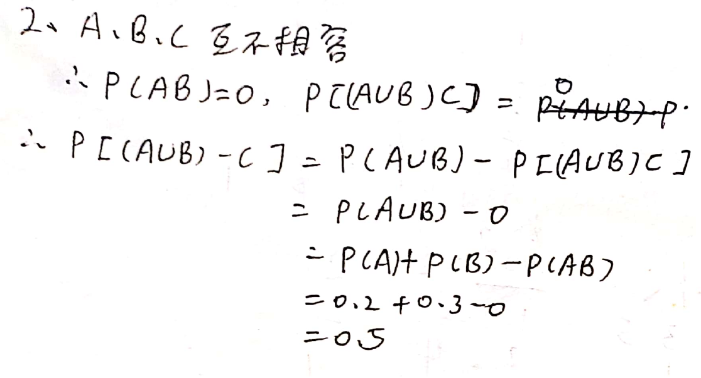

> 注意是两两不相容


##### 2

> $P(A)=\dfrac13,P(B)=\dfrac14,P(A\cup B)=\dfrac12$，求$P(\overline A\cup\overline B)$

$Venn$易证：$P(\overline A\cup\overline B)=P(\overline{A\cap B})$

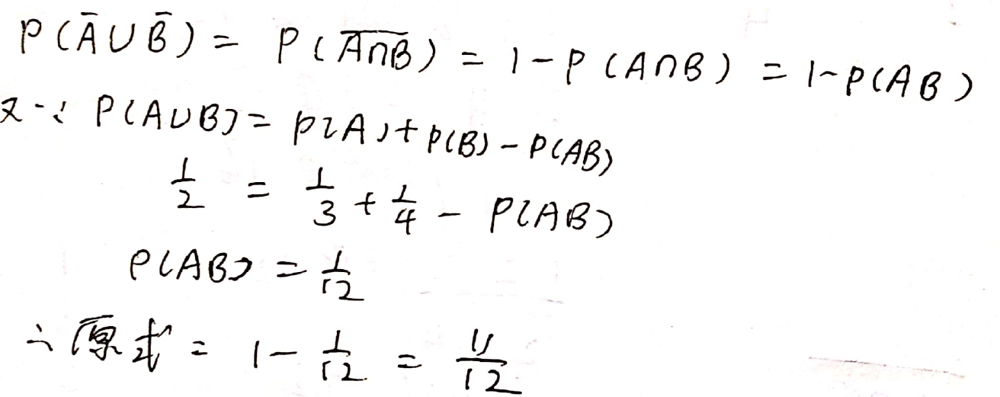


##### 3

> 扑克牌$52$张，不放回抽样，每次一张，连续抽$4$张，求花色各异概率：

等于在四个组各拿一个

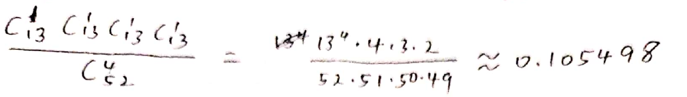


##### 4

> $10$产品有$4$不合格。任取$2$，已知有$1$不合格，求另外一个也是不合格概率。

注意不是已知第一件不合格，所以是已知第一或第二件不合格或都不合格(注意有三个，不要漏了最后一个)

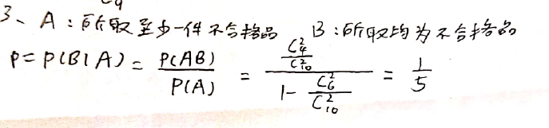


##### 5

> $P(A)=\dfrac14,P(B|A)=\dfrac13,P(A|B)=\dfrac12$，求$P(A\cup B)$

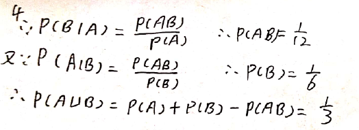


##### 6

> 甲乙丙三部机床独立工作，一个人照管，某段时间这三个机床不需要照管的概率依次是$0.9,0.8,0.85$，求这段时间因无人照管而停工的概率。

即求这段时间同时有两个机床需要人照管的概率(不要加什么诸如这个人不知道哪个机床需要照管，这个人等概率出现在甲乙丙这样的假设；应该假设需要照管时，这个人知道哪个机床需要照管)

解法一(个人解法)：$2+2+2+3$型
$$
P=0.9(1-0.8)(1-0.85)+(1-0.9)0.8(1-0.85)\\+(1-0.9)(1-0.8)0.85+(1-0.9)(1-0.85)(1-0.8)
$$
解法二：对甲乙合起来分三类讨论(做到不重不漏比较困难)

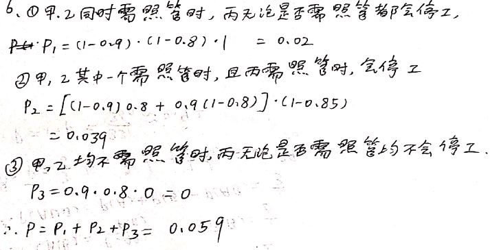


##### 7

> 设二维随机变量 $(X,Y)$ 的概率密度为：
> $$
> f(x,y)=\begin{cases}
> 4.8y(1-x),&0\le x\le1,0\le y\le1\\0,&其他
> \end{cases}
> $$
> 求边缘概率密度 $f_Y(y)$

注意只有 $y\in[0,1]$ 时才有，否则都是 $0$ 注意没有 $1$ ，(联合概率密度则有 $0,1$ 等之分)所以答案为：
$$
f_Y(y)=\begin{cases}
2.4y^2(2-y),&0\le y\le1\\0,&其他
\end{cases}
$$

> 要用到边缘概率密度的条件概率密度同理


##### 8

> 设总体 $X\sim N(0,1)$ ， $X_1,X_2,\cdots,X_n$ 为简单随机样本，问下列统计量服从什么分布？
> $$
> \dfrac{X_1-X_2}{\sqrt{X_3^2+X_4^2}}
> $$

知识盲区是正态分布的加减法性质。

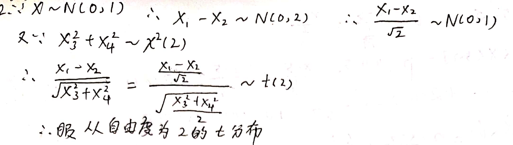

> 可以合情想像的是，既然对称的，那么正的和负的其实是一样的


##### 9

> 已知离散型均匀总体 $X$ ，其分布律为：
>
> | $X$   | $2$        | $4$        | $6$        |
> | ----- | ---------- | ---------- | ---------- |
> | $P_i$ | $\dfrac13$ | $\dfrac13$ | $\dfrac13$ |
>
> 取容量为 $n=54$ 的样本，求样本均值 $\overline X$ 落于 $4.1$ 到 $4.4$ 之间的概率和样本均值 $\overline X$ 超过 $4.5$ 的概率。

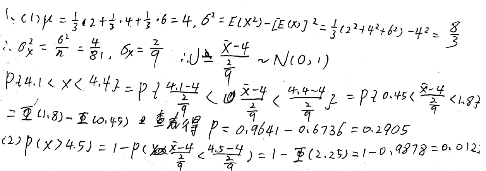


##### 10

> 设总体 $X$ 有分布律
>
> | $X$   | $1$         | $2$                  | $3$            |
> | ----- | ----------- | -------------------- | -------------- |
> | $P_i$ | $\theta^2 $ | $2\theta(1-\theta) $ | $(1-\theta)^2$ |
>
> 其中 $\theta(0 < \theta < 1)$ 为未知参数，已知取得了样本值 $x_1=1,x_2=2,x_3=1$ ，试求 $\theta$ 的最大似然估计值

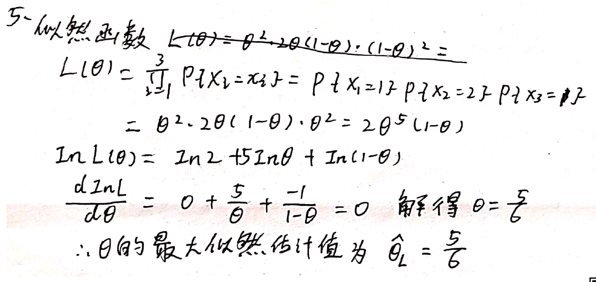

### 面经

#### 组合数学

> 牛客 房间里有8人，分别佩戴着从1号到8号的纪念章，任选3人记录其纪念章号码，最大的号码为6的概率
>
> 解：一定要选到 6 号，故分子 $C_5^2$，分母 $C_8^3$，答案为 $\dfrac5{28}$。

#### 常见分布

##### 正态分布

> 牛客 人工批量种植盆景虎皮兰，已知它们植株高度平均70cm，标准差5cm。现在从中随机输出100盆景到市场销售，则下面说法错误的是
>
> A估计100盆中至少有75盆高度在60到80cm之间
> B有较高把握估测这100盆的平均高度在69到72cm之间
> C估计100盘中至少有70盆高度在65到75cm之间
>
> 选 C，注意是错误的是
>
> 正态分布曲线性质中有 ：P（μ-σ<X≤μ+σ）=68.3%P（μ-2σ<X≤μ+2σ）=95.4%P（μ-3σ<X≤μ+3σ）=99.7%；依照题意，落在 [65,75]之间 平均有 有68盆，落在[60,80]之间 平均 有95盆

#### 数理统计理论

> 牛客：样本方差 = 是母体方差DX的无偏估计 判断题：对，这里看成带修正的

#### 假设检验

> 牛客：假设检验基本思想的依据是小概率事件原理 判断题：对
