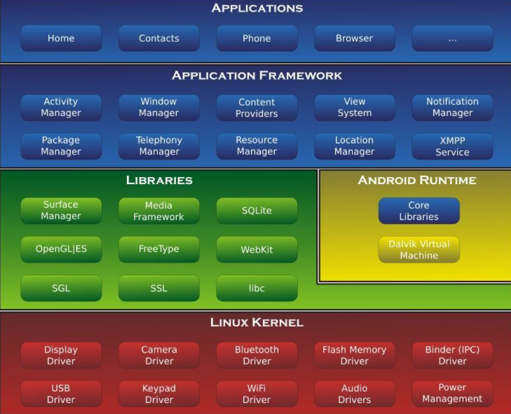
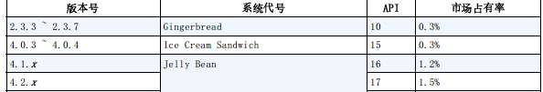
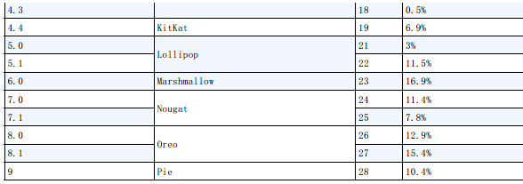
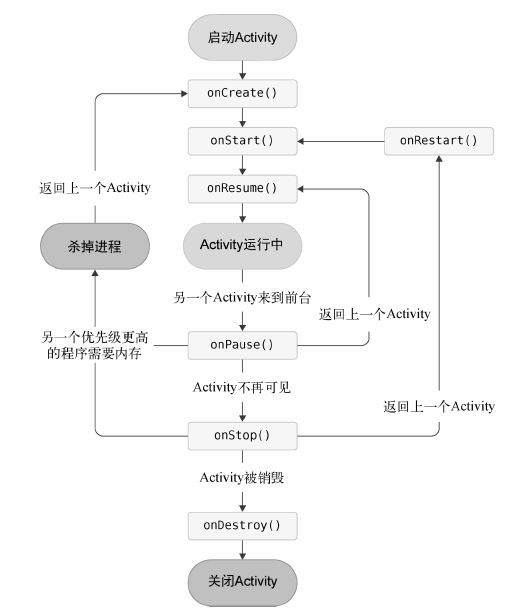
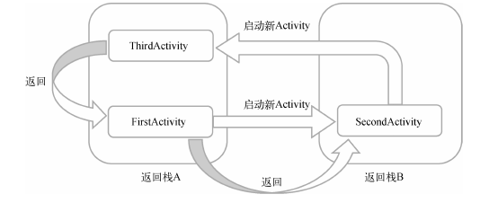
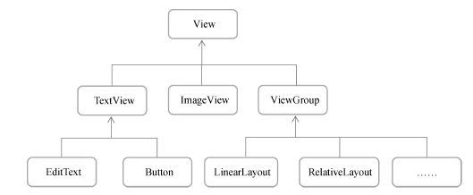

# Android

## 基本概念

### 常识

创建于2003-10，现被 Google 收购。首个版本开始于 2008 。基于 Linux 内核。开源。

#### 系统架构

四层：

1. Linux 内核层，为硬件提供底层驱动，如显示、音频、蓝牙、电源等
2. 系统运行库层，通过 C/C++ 库提供特性支持。(早期 Dalvik 虚拟机，后期 ART运行环境)
3. 应用框架层。提供 API 。
4. 应用层。安装在手机上的应用程序。




#### 版本号

[官方介绍](http://developer.android.google.cn/about/dashboards)






#### 特点

四大组件：

- Activity 门面
- Service 后台
- BroadcastReceiver 广播
- ContentProvider 程序间共享数据

系统控件

SQLite 数据库

多媒体支持


### 开发环境

#### 安装

- JDK 即Java软件开发工具包
- Android SDK 开发工具包
- Android Studio 官方 IDE 

三者的集成： [下载地址](https://developer.android.google.cn/studio)

弹出无法访问 `add-on list` 就 cancel ，这是 Google 服务。

> 疑似 vscode 无法胜任


#### 使用

新建项目，选 empty activity ，语言选 Kotlin (或 Java) 。Minimum API level 是项目最低兼容版本，一般为 API 21。不支持 instance apps ，启用 AndroidX 。

一个安卓+手机的图标是启动Android模拟器。点击创建新的，例如Pixel。可以选择Android 10.0系统。

锤子图标按钮编译。播放图标按钮运行。

ctrl + alt + L 自动格式化

关闭项目 file-close project

按住 ctrl 单击可以查看方法源码


#### 疑难

##### new project

解决右击new无project：

在根目录 `build.gradle` 下添加代码：

```groovy
repositories {
    //google()
    //jcenter()
    maven { url 'https://maven.aliyun.com/repository/google' }
    maven { url 'https://maven.aliyun.com/repository/jcenter' }
    maven { url 'http://maven.aliyun.com/nexus/content/groups/public' }
}

allprojects {
    repositories {
        //google()
        //jcenter()
        maven { url 'https://maven.aliyun.com/repository/google' }
        maven { url 'https://maven.aliyun.com/repository/jcenter' }
        maven { url 'http://maven.aliyun.com/nexus/content/groups/public' }
    }
}
```

然后看到有之后，如果出现什么报错，再删掉这个就好了


##### kotlin android extension

安装：

在全局 `build.gradle` 最前面插入：

```groovy
buildscript {
    ext.kotlin_version = "1.3.72"
//    repositories {
//        google()
//        jcenter()
//    }
    dependencies {
        classpath "com.android.tools.build:gradle:4.1.0"
        classpath "org.jetbrains.kotlin:kotlin-gradle-plugin:$kotlin_version"
        classpath "org.jetbrains.kotlin:kotlin-android-extensions:$kotlin_version"
    }
}
```

在 `app/build.gradle` plugins 内插入：

```kotlin
plugins {
    id 'kotlin-android'
    id 'kotlin-android-extensions'
}
```

然后就可以了

关于警告：[看这里](https://guolin.blog.csdn.net/article/details/113089706?spm=1001.2101.3001.6650.1&utm_medium=distribute.pc_relevant.none-task-blog-2%7Edefault%7ECTRLIST%7ERate-1-113089706-blog-119386481.pc_relevant_paycolumn_v3&depth_1-utm_source=distribute.pc_relevant.none-task-blog-2%7Edefault%7ECTRLIST%7ERate-1-113089706-blog-119386481.pc_relevant_paycolumn_v3&utm_relevant_index=2) 可以暂时不理。


##### waiting for target devices to come online

打开设备管理器，即右边栏那个device manager，想办法关机(即左边emulator点右上角叉)，然后点击下三角符号，点击 wipe data 和 cold boot now，还不行的话在build-clean project 一下。


### 项目结构

#### 文件结构

点击文件栏最上方的选择框把Android切换项目结构模式为Project。

`.gradle` 和 `.idea` 是 studio 自动生成。

`app` 内是项目代码和资源。

- `build` 编译自动生成

- `libs` 第三方库

- `androidTest` 测试用例，自动化测试

- `java` Java 或 Kotlin 代码放置的地方

- `res` 图片等

  - `drawable` 图片
  - `layout` 布局
  - `values` 字符串
  - `mipmap` 应用图标，有很多是为了兼容性

- `AndroidManifest.xml` 项目配置文件

  定义所有四大组件的注册地方，添加权限声明等

- `test` Unit Test 测试用例

- `app.iml` 自动生成

- `build.gradle` 项目构建相关的配置

- `proguard-rules.pro` 指定项目代码的混淆规则，使得破解者难以阅读代码

`build` 是编译自动生成的文件

`gradle` 是 gradle wrapper 配置文件，默认启动，根据缓存决定是否联网下载 gradle 。如果改为离线模式 file-settings-build,exectuion,delpoyment-gradle

`build.gradle` 全局构建脚本

`gradle.properties` 配置文件

`gradlew` , `gradlew.bat` 执行命令，前者 linux/mac 后者 windows

`.iml` 是自动生成文件，意思是 IntelliJ IDEA

`local.properties` 指定本机 Android SDK 路径

`settings.gradle` 基本不用改


#### 代码结构

##### AndroidManifest.xml

在 `app\src\main\AndroidManifest.xml` 看到：

```xml
<?xml version="1.0" encoding="utf-8"?>
<manifest xmlns:android="http://schemas.android.com/apk/res/android"
    xmlns:tools="http://schemas.android.com/tools"
    package="com.example.helloworld">

    <application
		<activity
            android:name=".MainActivity"
            android:exported="true">
            <intent-filter>
                <action android:name="android.intent.action.MAIN" />

                <category android:name="android.intent.category.LAUNCHER" />
            </intent-filter>
        </activity>
  </application>

</manifest>
```

其中 `<activity android:name=".MainActivity"` 表示注册了 `MainActivity` ，后面的 action 和 category 表示点击应用图标首先启动这个 Activity 。


##### MainActivity

看到 `app\src\main\java\com\example\helloworld\MainActivity.kt` ，代码如下所示：

```kotlin
package com.example.helloworld

import androidx.appcompat.app.AppCompatActivity
import android.os.Bundle

class MainActivity : AppCompatActivity() {
    override fun onCreate(savedInstanceState: Bundle?) {
        super.onCreate(savedInstanceState)
        setContentView(R.layout.activity_main)
    }
}
```

显然这是一个继承类。


##### activity_main.xml

布局文件。在 `app\src\main\res\layout\activity_main.xml` ，如下所示：

```xml
<?xml version="1.0" encoding="utf-8"?>
<androidx.constraintlayout.widget.ConstraintLayout xmlns:android="http://schemas.android.com/apk/res/android"
    xmlns:app="http://schemas.android.com/apk/res-auto"
    xmlns:tools="http://schemas.android.com/tools"
    android:layout_width="match_parent"
    android:layout_height="match_parent"
    tools:context=".MainActivity">

    <TextView
        android:layout_width="wrap_content"
        android:layout_height="wrap_content"
        android:text="Hello World!"
        app:layout_constraintBottom_toBottomOf="parent"
        app:layout_constraintEnd_toEndOf="parent"
        app:layout_constraintStart_toStartOf="parent"
        app:layout_constraintTop_toTopOf="parent" />

</androidx.constraintlayout.widget.ConstraintLayout>
```

有一个文本框 TextView 看到了 `Hello World!`


##### string.xml

`res/values/strings.xml` 应用程序名

```xml
<resources>
    <string name="app_name">helloworld</string>
</resources>
```

引用方法：

- 代码 `R.string.app_name` 
- XML `@string/app_name`


#### Gradle

项目构建工具，基于 Groovy 的领域特定语言 GDL 。

暂时不看，有需要看书。

> ##### app/build.gradle


#### 日志工具

日志类 `android.util.Log`

优先级从低到高是：

- `Log.v()` verbose
- `.d` debug
- `.i` info
- `.w` warn
- `.e` error

调用，如在 `.kt` 里：`Log.d(tag, msg)` ，tag是字符串，一般是当前类名，第二个是信息。

查看：shift+f10运行，底部工具栏 android monitor 看到打印信息

Log 可以用过滤器。可以编辑一个。


## 基本框架

### Activity

#### 初始activity

创建新项目，选择 empty(或 add no) activity

找到包 `app/src/main/com/example/项目名/` ，右击 new-activity-empty activity，不要勾选 generate layout file, launcher activity

然后就会得到一个 `.kt` 文件，有调用 `onCreate` 。

然后去到 `app/src/main/res` ，然后 new-directory ，创建一个 layout 名字目录，然后再在里面创建 new-layout resource file，自己命一个名字。根元素选择LinearLayout。

> 看到布局，中间是预览，窗口左下角左边是design，右边是test切换卡。design是当前可视化布局，text是通过xml编辑布局。  找不到

点击 code 编码。点击其他展览。右上角。

在 XML 已用一个 id：语法 `@id/id_name` ，定义则 `@+id/id_name`

添加一个按钮，高度是刚好包含里面的内容，如：

```xml
<?xml version="1.0" encoding="utf-8"?>
<LinearLayout xmlns:android="http://schemas.android.com/apk/res/android"
    android:layout_width="match_parent"
    android:layout_height="match_parent"
    android:orientation="vertical">

    <Button
        android:id="@+id/button0"
        android:layout_width="match_parent"
        android:layout_height="wrap_content"
        android:text="QwQ Don't Click Me!" />

</LinearLayout>
```

回到 activity 加载这个布局：

```kotlin
package com.example.gizact

import androidx.appcompat.app.AppCompatActivity
import android.os.Bundle

class act0 : AppCompatActivity() {
    override fun onCreate(savedInstanceState: Bundle?) {
        super.onCreate(savedInstanceState)
        setContentView(R.layout.layout0)//刚刚新建的名字
    }
}
```

在 `setContentView` 传入布局文件 id 。添加资源都会在 R 文件生成对应资源 id 。

然后需要把 activity 放到 `app/src/main/AndroidManifest.xml` 注册生效，放在了 application 标签。一般而言是自动注册的，不用我们自己操作。

activity 标签里， `android:name` 指定具体注册的 activity 。因为 mainfest 标签的 package 属性指定了包名前缀，所以简写了这个 name 路径。

然后，配置主 activity ，在 activity 标签改为：

```xml
<activity
          android:name=".act0"
          android:exported="true"
          android:label="应用程序名"><!--exported改成true-->
    <intent-filter>
        <action android:name="android.intent.action.MAIN" />
        <category android:name="android.intent.category.LAUNCHER" />
    </intent-filter>
</activity>
```


使用代码关闭 activity ：使用 `finish()` 方法。例如可以放在监听器里。


#### Toast

将短小信息通知给用户，一段时间后自动消失。如在之前的 kotlin 上写代码：

```kotlin
import android.widget.Button
import android.widget.Toast
//...
val but0: Button = findViewById(R.id.button0)
but0.setOnClickListener {
    Toast.makeText(this, "No >_< leave me alone!", Toast.LENGTH_SHORT).show()
}
```

解释：`findViewById` 获取在布局文件定义的元素，返回继承 View 的泛型，所以要声明类型，否则无法推断。然后注册监听器，执行 `onClick` 方法。用静态方法 `makeText` 创建一个对象，调用 show 。第一个参数是上下文，因为 Activity 就是 Context 对象，所以传进去就行，第二个参数是文本，第三个是显示时长，有 `Toast.LENGTH_SHORT` 或 `LONG` 。发现在屏幕下方弹出了文字。

在 `app/build.gradle` 头部引用了插件 `kotlin-android-extensions` ，根据布局文件定义的控件 id 自动生成具有相同名称的变量，因此可以在 activity 里直接用，而不是再调用 `findViewById` ，上文简化为：

```kotlin
import kotlinx.android.synthetic.main.layout0.*
//...
button0.setOnClickListener {
    Toast.makeText(this, "No >_< leave me alone!", Toast.LENGTH_SHORT).show()
}
```


#### Menu

`res` 下新建 `menu` 文件夹，然后 new-menu resource file。编辑：

```xml
<?xml version="1.0" encoding="utf-8"?>
<menu xmlns:android="http://schemas.android.com/apk/res/android">
    <item
        android:id="@+id/item_add"
        android:title="添加" />
    <item
        android:id="@+id/item_remove"
        android:title="移除" />
</menu>
```

在 activity 里重写(ctrl+O)方法，输入 `onCreateOptionsMenu` 回车：

```kotlin
override fun onCreateOptionsMenu(menu: Menu?): Boolean {
    menuInflater.inflate(R.menu.manumain, menu)
    return true
}
```

Java Bean语法糖根据类中字段自动生成相应的Getter和Setter方法，如有私有成员名为 `abc` ，就有 `public 成员属性类型 getAbc(){return abc;}` 和 `public void setAbc(类型 abc){this.abc=abc;}` 。而 kotlin 用：

```kotlin
val book = Book()
book.pages = 500
val bookPages = book.pages
```

的本质，就是用到了上文的语法糖。

回到上文，那一个类调用的实际上是父类的 `getMenuInflater` 方法，得到 `MenuInflater` 对象再调用 `inflate` 方法，创建菜单。第一个参数是资源文件，第二个是将它添加到那个菜单对象里，这里添加到了传入的参数里。 true 表示允许创建的菜单显示出来。 false 无法显示。

响应事件，重写方法 `onOptionsItemSelected` ：

```kotlin
override fun onOptionsItemSelected(item: MenuItem): Boolean {
    when (item.itemId) {
        R.id.item_add -> Toast.makeText(this, "Nope, add is invalid.", Toast.LENGTH_SHORT)
        .show()
        R.id.item_remove -> Toast.makeText(this, "NAY, nothing to remove", Toast.LENGTH_SHORT)
        .show()
    }
    return true
}
```

再次运行，发现右上角有一个单击弹出的三点图标菜单按钮


#### Intent

##### 基本

Intent 的作用是 activity 之间跳转，各组件进行交互，指明当前组件想要执行的动作，并在不同组件之间传递数据，一般可用于启动 activity, service , 发送广播等。

Intent 分为显式和隐式。显式可以用构造函数构造，第一个参数是启动 activity 上下文，第二个参数是想要启动的目标 activity 。activity 类提供 `startActivity()` 方法，接收 Intent 参数。

再创建一个 activity。可以勾选 layout ，想要改再自己去调。如放到监听器里：

```kotlin
import android.content.Intent
//...
startActivity(Intent(this, act1::class.java))
```

摁下返回键回到之前的 activity 。在这里 `::class.java` 就是 java 里的 `.class` 。

隐式：不指明启动哪一个 activity ，指定抽象的 action, category 等信息。打开 `AndroidManifest.xml` 在 activity 标签配置 `intent-filter` 标签，添加：

```xml
<activity
          android:name=".act1"
          android:exported="false">
    <intent-filter>
        <action android:name="com.example.gizact.ACTION_START" />
        <category android:name="android.intent.category.DEFAULT"/>
    </intent-filter>
</activity>
```

然后修改刚刚的代码：

```kotlin
startActivity(Intent("com.example.gizact.ACTION_START"))
```

默认的 category 就是刚刚填的那一个，是缺省值。一个 intent 只能指定一个 action ，但是可以指定多个 category ，在刚刚的 xml 里再塞一行 category ：

```xml
<category android:name="com.example.gizact.MY_CATEGORY" />
```

刚刚的 kotlin 改成：

```kotlin
val jumpto = Intent("com.example.gizact.ACTION_START")
jumpto.addCategory("com.example.gizact.MY_CATEGORY")
startActivity(jumpto)
```

##### 第三方

隐式 intent 还可以启动其他程序的 activity ，使得多个应用程序功能共享。例如，用系统浏览器打开一个网页：

```kotlin
import android.net.Uri
//...
val jmp = Intent(Intent.ACTION_VIEW)
jmp.data = Uri.parse("https://www.luogu.com.cn")
startActivity(jmp)
```

也可以在标签里配置 data 标签，指定 activity 能够响应的数据，有属性：

- `android:scheme` 协议，如 `https` 
- `android:host` 主机名
- `android:port`
- `android:path` 网站根目录下地址
- `android:mimeType` 可以处理的数据类型

当且仅当 Intent 携带的内容与 data 一致，才响应。

可以配置一个新的 activity 响应如上的 intent ，但是响应了后啥也不做，反正就是跳转到新的 activity 。源代码不变，就改一改 xml ：

```xml
<activity
    android:name=".act2"
    android:exported="true"><!--VIEW一定要-->
    <intent-filter tools:ignore="AppLinkUrlError">
        <action android:name="android.intent.action.VIEW" />
        <category android:name="android.intent.category.DEFAULT" />
        <data android:scheme="https" />
    </intent-filter>
</activity>
```

其中 ignore 是取消警告，因为 studio 认为所有能响应 view 的都应该为 BROWABLE 类型，实现 deep link 功能。

其他协议： geo 显示地理位置、 tel 拨打电话。例如下面跳转到拨号应用并帮你输入好号码：

```kotlin
val jmp = Intent(Intent.ACTION_DIAL)
jmp.data = Uri.parse("tel:100861437581")
startActivity(jmp)
```


##### 数据传递

使用 intent 对象的 putExtra 方法，第一个参数是键，第二个是数据值。

那么在被调类里使用 `.intent` 语法糖获得 intent 然后用 `getStringExtra` 方法得到字符串类型数据。

例如在调用方监听器内写：

```kotlin
val jmp = Intent(this, act1::class.java)
jmp.putExtra("chat", "不要回答！不要回答！不要回答！！")
startActivity(jmp)
```

下面是被调方的 `onCreate` 尾部添加：

```kotlin
val msg = intent.getStringExtra("chat")
Toast.makeText(this, msg, Toast.LENGTH_SHORT).show()
```


要返回的话，用 `startActivityForResult()` 方法调用 intent ，第二个参数是请求码，用于在回调中判断数据来源。要返回数据的被调方创建无参数 intent 对象，除了 `putExtra` 外还 activity 自己 `setResult(RESULT_OK, intent对象)` 专门用于向上一个 activity 返回处理结果，然后把自己销毁(比如写在监听器里)：

```kotlin
val bk = Intent()
bk.putExtra("msg", "测试")
setResult(RESULT_OK, bk)
finish()
```

注意对调用方，调用时：

```kotlin
val jmp = Intent(this, act1::class.java)
startActivityForResult(jmp, 1)//跟下面的1对应
```

然后重写一个方法：

```kotlin
override fun onActivityResult(requestCode: Int, resultCode: Int, data: Intent?) {
    super.onActivityResult(requestCode, resultCode, data)
    when (requestCode) {
        1 -> if (resultCode == RESULT_OK) {
            val v = data?.getStringExtra("msg");
            Toast.makeText(this, v, Toast.LENGTH_SHORT).show()
        }
    }
}
```

如果没效果，在 `xml` 配置那里，对返回方 activity 添加属性：

```kotlin
android:launchMode="standard"
```

解释：重写方法的第一个参数就是刚刚调用时传进去的数值，用于区分开多个intent返回的信息；第二个参数就是设置的那个setResult，第三个参数就是携带数据的intent。

如果不是按钮返回，而是返回键返回，那就在被调方重载 `onBackPressed` 方法。


#### 生命周期

##### 返回栈

每启动一个 activity 就会放在栈最上方运行。每次 back 键会销毁栈顶的 activity。

> 好像这段是废话。android使用task管理activity。一个任务是一组存在栈里的activity集合，称为返回栈back stack。 


##### 状态

- 运行状态

  返回栈栈顶是运行状态。不会被回收。

- 暂停状态

  不在栈顶，但是可能可见的activity（如对话框）。内存低可能会被回收。

- 停止状态

  完全不可见，不在栈顶。可能会被系统回收。

- 销毁状态

  被弹栈。会回收。


##### 生存期

7个回调方法：

- `onCreate()` 第一次创建时，通常加载布局、绑定事件
- `onStart()` 由不可见变可见调用
- `onResume()` 准备好与用户交互时调用，此时一定在栈顶，处于运行状态
- `onPause()` 准备启动/恢复另一个 activity 时调用，通常保存数据、释放一些资源，但这个方法一般执行要快，不然影响其他 activity 
- `onStop()` 完全不可见时调用。如对话框不会调用。
- `onDestroy()` 销毁前
- `onRestart()` 停止变运行调用。

3种生存期：

- 完整生存期：从 `onCreate` 到 `onDestroy` 。
- 可见生存期：从 `onStart` 到 `onStop` 。
- 前台生存期：从 `onResume` 到 `onPause` 。




手机屏幕旋转时，会重新创建，会丢失数据。

特别地，有方法 `onSaveInstanceState()` 回调方法可以在 activity 回收前一定被调用，携带一个 Bundle 类型参数，可以用 put数据类型 保存特定类型，参数是键。那么在 `onCreate` 参数里，把那个参数拿来对应 get 一下。如：

```kotlin
override fun onSaveInstanceState(outState: Bundle) {
    super.onSaveInstanceState(outState)
    outState.putString("school", "假设是刚刚输入的内容")
}
```

```kotlin
//onCreate
savedInstanceState?.let {
    Toast.makeText(this, savedInstanceState.getString("school"), Toast.LENGTH_SHORT).show()
}
```


##### 启动模式

四个模式，通过 `xml` 的 activity 标签的 `android:launchMode` 属性：

- standard

  默认都是这个。每次启动新的，不在意其是否已经在返回栈存在，创建一个新的 activity 实例。可以尝试自己用 intent 启动自己来验证

- singleTop

  如果已经在栈顶，就不再创建。未在就创建

- singleTask

  只要有就不会创建，如果不在栈顶，那就弹栈直到它处于栈顶。未在就创建。

- singleInstance

  启动新的返回栈管理这个 activity 。(singleTask不同taskAffinity也会)。若有可以让其他程序调用的activity，多个程序共享一个实例可以实现。如：

  


#### 对话框

可以新建一个项目来测试一下

先给一个布局：

```xml
<?xml version="1.0" encoding="utf-8"?>
<LinearLayout xmlns:android="http://schemas.android.com/apk/res/android"
    android:orientation="vertical"
    android:layout_width="match_parent"
    android:layout_height="match_parent">
    <TextView
        android:layout_width="match_parent"
        android:layout_height="wrap_content"
        android:text="lorem ipsum dolor sit amet 他一定很痛苦"/>
</LinearLayout>
```

设置对话框式 activity ，在 activity 标签加上属性：

```xml
android:theme="@style/Theme.AppCompat.Dialog"
```

把主 activity 改为：

```xml
<?xml version="1.0" encoding="utf-8"?>
<LinearLayout xmlns:android="http://schemas.android.com/apk/res/android"
    android:layout_width="match_parent"
    android:layout_height="match_parent"
    android:orientation="vertical">

    <Button
        android:id="@+id/button01"
        android:layout_width="match_parent"
        android:layout_height="wrap_content"
        android:text="打开普通页面" />

    <Button
        android:id="@+id/button02"
        android:layout_width="match_parent"
        android:layout_height="wrap_content"
        android:text="打开对话框" />
</LinearLayout>
```


#### 管理

关闭标题： `supportActionBar?.hide()` 

使用 `taskId` 成员属性(语法糖)，可以看当前实例的ID。

使用 `javaClass.simpleName` 先获取当前实例 Class 对象(即 JAVA 的 `getClass`)，再打印基类名和类名。

用 `isFinishing` 属性看是否 finish 了。

可以专门定义一个单例类管理所有 activity 。设一个 `ArrayList<Activity>` 。然后用 `add, remove` 方法维护。用遍历并把所有没 finish 的给 finish 掉，然后把这个列表给 `clear` 掉。

在同包里，直接调用这个单例类成员方法即可实现用一个 activity 挂掉全部 activity ，可以放在 `onDestroy` 最后一行记得维护 `remove` 一下那么显然 `onCreate` 也需要操作一下。按钮监听器来搞全部关闭(退出程序)等。

用 `android.os.Process.killProcess(android.os.Process.myPid())` 方法杀死当前进程。在销毁全部其他 activity 后执行。

将一个成员函数用 `companion object { }` 包起来，那么可以使用类似 java 静态方法来调用。那么给每个 activity 都加一个类似的启动方法，即启动自己的方法，然后在其他类里直接调就好了。


### UI

使用 `xml` 编写。

#### 属性

```xml
android:id="@+id/调用的ID"
android:layout_width=""
android:layout_height=""
android:text=""
```

宽高可选：`match_parent` (跟父一样) , `wrap_content` (刚好包含住内容) , 固定值(单位dp，如屏幕密度无关的尺寸单位，如 `50 dp` )

可以有 `android:background` ，可以放颜色或图片。

可以有 `android:layout_margin` 指定四方向间距，也可以 `android:layout_marginLeft/Top` 等单独指定。


#### 控件

##### TextView

普通文本框，文字默认居左上角对齐

修改文字对齐方式： `android:gravity` 为 `center,top,bottom,start,end` ，可以用 `|` 指定多个值。其中 `center` 等于 `center_vertical|center_horizontal` 

文字颜色 `android:textColor` ，然后 `#ffffff` 即十六进制颜色。

文字大小 `android:textSize` ，单位是 sp ，如 `24sp` 

```xml
<TextView
        android:id="@+id/textview1"
        android:layout_width="match_parent"
        android:layout_height="wrap_content"
        android:gravity="center"
        android:text="你好小笼包再见"
        android:textColor="#00ff00"
        android:textSize="24sp" />
```


##### Button

按钮的英文会默认全部转为大写，如果要撤销，可以：

```xml
android:textAllCaps="false"
```

除了用事件监听器的 lambda ，也可以像 java 那样，窗口类实现，然后扔一个 this 进去，记得再继承一下接口 `View.OnClickListener`

```kotlin
//import android.view.View
class act0 : AppCompatActivity(), View.OnClickListener {
    override fun onClick(v: View?) {
        when (v?.id) {
            R.id.button0 -> {
                Toast.makeText(this, "QwQ", Toast.LENGTH_SHORT).show()
            }
        }
    }
    
    //在onCreate
    button0.setOnClickListener(this)
}
```


##### EditText

输入框。

有 `android:hint` 属性。

有 `android:maxLines` 属性，使得输入内容有最大行，超过后向上滚动，而不是单行拉伸

在 kotlin 获取文本：`控件id.text.toString()` ，或 `getText()` 语法糖。如：

```xml
<EditText
        android:id="@+id/editText1"
        android:layout_width="match_parent"
        android:layout_height="wrap_content"
        android:hint="Don't write on me &gt;_&lt;"
        android:maxLines="2" /><!--不转义会炸-->
```

```kotlin
val tx = editText1.text.toString()
Toast.makeText(this, tx, Toast.LENGTH_SHORT).show()
```


##### ImageView

事先准备图片，放到 `drawable-xxhdpi` (注意拖拽到项目左栏文件夹，这样studio会帮自动注册，不然会找不到)，即主流分辨率为 `xxhdpi` 。用

```xml
android:src="@drawable/不带后缀的名字"
```

引用，也可以动态：

```kotlin
控件id.setImageResource(R.drawable.名字)
```

如：

```xml
<ImageView
        android:layout_width="wrap_content"
        android:layout_height="wrap_content"
        android:id="@+id/imageView1"
        android:src="@drawable/c" />
```

```kotlin
imageView1.setImageResource(R.drawable.a)
```

注：gif不会动，具体大小随着图片大小而变


##### ProgressBar

进度条，没有精度值，就一个圆形在旋转。(具体在哪看布局)

使用可见性：`android:visibility` ，选 `visible` 默认， `invisible` 是不可见但占据大小和位置， `gone` 是完全不可见。代码动态设置：

```kotlin
.setVisibility(View.GONE) //或其他两个值 
```

显然在代码可以有属性 `visibility` 查看状态。

通过 `style` (注意没有前缀 `android:`) 执行，可以改为水平进度条。加上 `android:max="100"` 表示最大值，值可以自己改：

```xml
style="?android:attr/progressBarStyleHorizontal"
android:max="100"
```

用 progress 控制进度条。如：

```kotlin
Thread {
    while (true) {
        val v = progressBar1.progress
        if (v == progressBar1.max) {
            //                    Toast.makeText(this, "Finish >_<", Toast.LENGTH_SHORT).show()
            //                    progressBar1.visibility = View.GONE
            //不知道为什么会崩溃，上面两行
            break
        } else {
            progressBar1.progress = v + 1
        }
        Thread.sleep(10)
    }
}.start()
```


##### AlertDialog

置于所有界面元素之上，屏蔽其他控件交互能力的对话框。只需要 kotlin 代码：

```kotlin
AlertDialog.Builder(this).apply {
    setTitle("对话框标题")
    setMessage("大家目光向我看齐，我宣布件事，我叫白茶")
    setCancelable(false)//back键关闭
    setPositiveButton("你好") { dialog, which -> }
    setNegativeButton("忽视") { dialog, which -> }
    show()
}
```


##### ListView

允许用户手指上下滑动进行屏幕滚动。

将数据渲染到上面：

```kotlin
val adapter = ArrayAdapter<类型>(this, 子项布局id, 数据list)
控件id.adapter = adapter //语法糖
```

子项布局id可以用内置的，如 TextView 的 `android.R.layout.simple_list_item_1` 。是一个普通的列表。如：

```xml
<ListView
        android:id="@+id/listView1"
        android:layout_width="match_parent"
        android:layout_height="match_parent" />
```

占据固定大小，内部有滚动条（如果项目太多）

```kotlin
val data = listOf("白茶", "果冻", "锦乐", "桑泽", "禾枫", "弥明", "白金", "平漠", "云烟")
val adapter = ArrayAdapter<String>(this, android.R.layout.simple_list_item_1, data)
listView1.adapter = adapter
```

> 可以自己配置，如每个列表项都是一张图+一个文字，那先自定义一个布局：
>
> ```xml
> <?xml version="1.0" encoding="utf-8"?>
> <LinearLayout xmlns:android="http://schemas.android.com/apk/res/android"
>     android:layout_width="match_parent"
>     android:layout_height="60dp">
> 
>     <ImageView
>         android:id="@+id/imageView"
>         android:layout_width="40dp"
>         android:layout_height="40dp"
>         android:layout_gravity="center_vertical"
>         android:layout_marginLeft="10dp" />
> 
>     <TextView
>         android:id="@+id/textView"
>         android:layout_width="wrap_content"
>         android:layout_height="wrap_content"
>         android:layout_gravity="center_vertical"
>         android:layout_marginLeft="10dp" />
> </LinearLayout>
> ```
>
> 接着找个包，自定义一个类：
>
> ```kotlin
> package com.example.gizact
> 
> class Item2(val name: String, val imageId: Int)
> ```
>
> 自定义一个控件：
>
> ```kotlin
> package com.example.gizact
> 
> import android.app.Activity
> import android.view.LayoutInflater
> import android.view.View
> import android.view.ViewGroup
> import android.widget.ArrayAdapter
> import android.widget.ImageView
> import android.widget.TextView
> 
> class bar2(activity: Activity, val resourceId: Int, data: List<Item2>) :
>     ArrayAdapter<Item2>(activity, resourceId, data) {
>     override fun getView(position: Int, convertView: View?, parent: ViewGroup): View {
>         val view = LayoutInflater.from(context).inflate(resourceId, parent, false)
>         val imageview: ImageView = view.findViewById(R.id.imageView)
>         val nameview: TextView = view.findViewById(R.id.textView)
>         val item = getItem(position)
>         if (item != null) {
>             imageview.setImageResource(item.imageId)
>             nameview.text = item.name
>         }
>         return view
>     }
> }
> ```
>
> 跟上文一样建立一个 `ListView` 控件，在 `xml` 里，然后在 `kotlin`：
>
> ```kotlin
> val listitem = ArrayList<Item2>()
> listitem.add(Item2("项目1", R.drawable.d))
> listitem.add(Item2("项目2", R.drawable.e))
> listitem.add(Item2("项目3", R.drawable.f))
> val adapter2 = bar2(this, R.layout.layout02, listitem)
> listView1.adapter = adapter2
> ```
>
> 原理解析：`inflate` 第三个参数指定为 false，表明只让我们在父布局中声明的 layout 属性生效，而不会为这个 view 添加父布局。因为如果 view 有了父布局，就不能添加到 `ListView` 了。然后用 `findViewById` 找到自定义组件的两个组件实例，调用设置属性的方法。也可以换成 `view.imageView` 和 `view.textView` ，即插件可用。
>
> `getView` 方法每次会重载布局。参数 `convertView` 缓存之前加载好的布局，可以用于性能优化。同理，不要反复获取控件实例，定义一个缓存变量来优化：
>
> ```kotlin
> package com.example.gizact
> 
> import android.app.Activity
> import android.view.LayoutInflater
> import android.view.View
> import android.view.ViewGroup
> import android.widget.ArrayAdapter
> import android.widget.ImageView
> import android.widget.TextView
> 
> class bar2(activity: Activity, val resourceId: Int, data: List<Item2>) :
>     ArrayAdapter<Item2>(activity, resourceId, data) {
>     inner class ViewHolder(val imageview: ImageView, val nameview: TextView)//缓存变量
> 
>     override fun getView(position: Int, convertView: View?, parent: ViewGroup): View {
>         val view: View
>         val viewHolder : ViewHolder
>         if (convertView == null) {
>             view = LayoutInflater.from(context).inflate(resourceId, parent, false)
>             val imageview: ImageView = view.findViewById(R.id.imageView)
>             val nameview: TextView = view.findViewById(R.id.textView)
>             viewHolder = ViewHolder(imageview, nameview)
>             view.tag = viewHolder
>         } else {
>             view = convertView
>             viewHolder = view.tag as ViewHolder
>         }
> 
>         val item = getItem(position)
>         if (item != null) {
>             viewHolder.imageview.setImageResource(item.imageId)
>             viewHolder.nameview.text = item.name
>         }
>         return view
>     }
> }
> ```
>

点击事件：

```kotlin
listView1.setOnItemClickListener { parent, view, position, id ->
   val item = listitem[position]
   Toast.makeText(this, item.name, Toast.LENGTH_SHORT).show()
} //第三个参数外都可以在这里写成 _
```

按住 ctrl 可以查看方法源码，可以知道每个方法需要什么参数。


##### RecyclerView

增强版 `ListView`。需要添加依赖，在 `app/build.gradle` 添加：

```groovy
dependencies {
    implementation 'androidx.recyclerview:recyclerview:1.2.1'
}
```

具体版本可以自动补全。然后点击上方的 `sync now`。

然后 xml：

```xml
<androidx.recyclerview.widget.RecyclerView
   android:id="@+id/recyclerView"
   android:layout_width="match_parent"
   android:layout_height="match_parent" />
```

然后在上文基础上，添加适配器：

```kotlin
package com.example.gizact

import android.view.LayoutInflater
import android.view.View
import android.view.ViewGroup
import android.widget.ImageView
import android.widget.TextView
import androidx.recyclerview.widget.RecyclerView

class bar3(val itemlist: List<Item2>) : RecyclerView.Adapter<bar3.ViewHolder>() {
    inner class ViewHolder(view: View) : RecyclerView.ViewHolder(view) {
        val image: ImageView = view.findViewById(R.id.imageView)
        val name: TextView = view.findViewById(R.id.textView)
    }

    override fun onCreateViewHolder(parent: ViewGroup, viewType: Int): ViewHolder {
        val view = LayoutInflater.from(parent.context).inflate(R.layout.layout02, parent, false)
        return ViewHolder(view)
    }

    override fun onBindViewHolder(holder: ViewHolder, position: Int) {
        val item = itemlist[position]
        holder.image.setImageResource(item.imageId)
        holder.name.text = item.name
    }

    override fun getItemCount(): Int = itemlist.size
}
```

在 activity 里用：

```kotlin
val itemlist = ArrayList<Item2>()
itemlist.add(Item2("项目A", R.drawable.d))
itemlist.add(Item2("项目B", R.drawable.e))
itemlist.add(Item2("项目C", R.drawable.f))
recyclerView.layoutManager = LinearLayoutManager(this)
recyclerView.adapter = bar3(itemlist)
```

代码解释：`ViewHolder` 传入的参数是 `RecyclerView` 子项最外层布局。必须重写三个抽象方法。`onBindViewHolder`对子项数据赋值，会在每个子项被滚动到屏幕内时执行。


> 横向滚动：先改自定义子布局，两个控件都改成：
>
> ```xml
> android:layout_gravity="center_horizontal"
> android:layout_marginTop="10dp"
> ```
>
> 布局属性改成：
>
> ```xml
> android:layout_width="80dp"
> android:layout_height="wrap_content"
> android:orientation="vertical"
> ```
>
> 再改 `activity`：
>
> ```kotlin
> val layoutManager = LinearLayoutManager(this)
> layoutManager.orientation = LinearLayoutManager.HORIZONTAL
> recyclerView.layoutManager = layoutManager
> ```
>
> 还可以用 `GridLayoutManager, StaggeredGridLayoutManager`，后者是瀑布流。将文本 `layout_gravity` 改 `left` ，布局加 `layout_margin="5dp"`，宽度`match_parent`。然后改瀑布流，参数是 `3` 和该类 `VERTICAL` 常数。

点击事件，如对适配器更改抽象函数：

```kotlin
override fun onCreateViewHolder(parent: ViewGroup, viewType: Int): ViewHolder {
    val view = LayoutInflater.from(parent.context).inflate(R.layout.layout022, parent, false)
    val viewHolder = ViewHolder(view)
    val f = { param: View ->
             val pos = viewHolder.adapterPosition
             val item = itemlist[pos]
             Toast.makeText(parent.context, ">_< ${item.name}", Toast.LENGTH_SHORT).show()
            }
    viewHolder.image.setOnClickListener(f)
    viewHolder.name.setOnClickListener(f)
    return viewHolder
}
```


#### 布局

布局可以套若干个布局和控件。是套在控件外一层的 xml 标签。



##### LinearLayout

垂直方向从上放下，对应属性：(也可以改成 `horizontal` ，即默认值)

```xml
android:orientation="vertical"
```

有属性： `android:layout_width` , `android:layout_height` 。一般都 `match_parent`

有 `xmlns:android="https://schemas.android.com/apk/res/android"` 

注意到 vertical 控件高度不 `match_parent` 。同理 horizontal 时宽度不 match 。

对 `android:layout_gravity` 属性，控制控件在布局的对齐方式。同 `gravity` 有的选项。扔到控件那里。如顶部、底部等。

对 `android:layout_weight` 属性，设置为 `1` ，使得即使如宽度为 `0dp` ，那么就由 `weight` 决定宽度。 `1` 表示水平方向平分宽度。即加权的权值。换成不同数字，那就加不同的权，最后按总权评分。若只有一个这样的，那就其他固定的算完之后，让他占满。


##### RelativeLayout

相对布局。有 `android:alignParentLeft/Right/Top/Bottom` 属性，可以设置为 `"true"` 。还有 `android:layout_centerInParent` ，同理。那么可以分别设置边角。

也可以用 `android:layout_above/below/toRightOf/toLeftOf` 然后 `@id/控件id` ，来搞相对位置。注意先后顺序，不能被引用的写在代码的后面。

还有 `android:layout_alignLeft/Right/Top/Bottom` 让某边边缘跟另一个对齐。


##### FrameLayout

帧布局。所有默认在左上角。会重叠。可以用控件 `layout_gravity` 搞搞对齐。


##### 自定义

引用：在 layout 新建一个布局，然后在别处需要引用时，当成一个控件的地位：

```xml
<include layout="@layout/布局名" />
```

创建一个继承的布局，如：

```kotlin
class 布局类名(contest: Context, attrs: AttributeSet) : LinearLayout(context, attrs) {
    init {
        LayoutInflater.from(context).inflate(R.layout.布局名, this)
    }
}
```

通过 from 发方法构造出一个对象，调用 inflate 动态加载布局，第一个参数是布局文件 id ，第二个是父布局。修改 init 方法，可以赋予这个布局里控件一些代码效果，做到复用的效果。

添加自定义布局：

```xml
<com.example.包名.布局类名 android:属性(宽高等)=... />
```

> 例如，在 `layout` 新建一个布局：
>
> ```xml
> <?xml version="1.0" encoding="utf-8"?>
> <LinearLayout xmlns:android="http://schemas.android.com/apk/res/android"
>     android:layout_width="match_parent"
>     android:layout_height="match_parent">
> 
>     <Button
>         android:id="@+id/titleBack"
>         android:layout_width="wrap_content"
>         android:layout_height="wrap_content"
>         android:text="退出" />
> 
>     <TextView
>         android:id="@+id/titleText"
>         android:layout_width="0dp"
>         android:layout_height="wrap_content"
>         android:layout_weight="1"
>         android:gravity="center"
>         android:text="这是一个标题"
>         android:textColor="#fff"
>         android:background="#00f"
>         android:textSize="24sp" />
> 
>     <Button
>         android:id="@+id/titleEdit"
>         android:layout_width="wrap_content"
>         android:layout_height="wrap_content"
>         android:text="点我" />
> </LinearLayout>
> ```
>
> 随便找一个页面的布局引用一下它，在一个恰当地方放入：
>
> ```xml
> <include layout="@layout/layout01" />
> ```
>
> 那么就引入成功了。
>
> 再给控件添加代码逻辑，找一个包新建一个类：(也就是把这个布局包装成一个控件，并给它逻辑)
>
> ```kotlin
> package com.example.gizact
> 
> import android.app.Activity
> import android.content.Context
> import android.util.AttributeSet
> import android.view.LayoutInflater
> import android.widget.LinearLayout
> import android.widget.Toast
> import kotlinx.android.synthetic.main.layout01.view.*
> 
> class bar0(context: Context, attrs: AttributeSet) : LinearLayout(context, attrs) {
>     init {
>         LayoutInflater.from(context).inflate(R.layout.layout01, this);
>         titleBack.setOnClickListener {
>             val activity = context as Activity
>             activity.finish()
>         }
>         titleEdit.setOnClickListener {
>             Toast.makeText(context, "为森么要点击我 QwQ", Toast.LENGTH_SHORT).show()
>         }
>     }
> }
> ```
>
> 把上面的 include 换掉：
>
> ```xml
>  <com.example.gizact.bar0
>         android:layout_width="match_parent"
>         android:layout_height="wrap_content" />
> ```


#### 资源

##### 9-patch

就是将图片化为3x3网格，然后可以部分拉伸，如聊天气泡框。

对一张png图片，右击选择`create 9-patch file`。在边框处绘制小黑点表示拉伸区域，shift擦除。

> 不会操作。


# Kotlin

## 基本概念

Kotlin 代码可以编译成 `.class` ，然后在 JVM 上跑，所以是解释型语言。代码较简洁，带新语法特性，100%兼容 Java ，可以直接调用 java 代码和第三方库。

运行：用[在线](https://try.kotlinlang.org/)或 IntelliJ IDEA。也可以在 Android Studio 独立写 main 来跑。如在 `app/src/main/java/com/example/helloworld` 下新建一个，即在左侧文件栏右击弹出菜单 new-kotlin file/class。

写一个 main 函数，会发现该函数左边有一个运行按钮，点击即可运行代码片段。如：

```kotlin
package com.example.helloworld

fun main() {
    println("QwQ 中文捏!")
}
```

基本规范：代码结尾不需要分号


## 基本语法

### 变量

#### 声明

##### 常规

声明的关键字：val (value)是 final 变量， var (variable)是非 final 变量，弱类型。规范建议优先用 val ，除非确实要修改。

可以手动定义变量类型，格式： `关键字 变量名: 类型 = 值` 。类型的首字母大写。基本数据类型名字同 Java 。基本运算同。如：

```kotlin
fun main(){
    val x = 3
    var y : Int = 4
    y += x
    println(y)
}
```

类型转换：变量的方法，如 `varname.toInt()` 。

其中有 Number 类。

可以定义全局变量，即不需要在类或main内。

字符串可以直接用 [] 取单个字符。并且可以内嵌表达式，如果表达式内只有一个变量就直接 `$变量名` ，否则 `${变量名的表达式}` 。如：

```kotlin
val a = listOf("baicha", "jinle")
val c = "sangze"
val b = "${a.get(0)} and ${a[1]} but $c.length no length"
println(b)//baicha and jinle but sangze.length no length
```

用 as 可以起到类型转换作用，如 `val act = context as Activity` ，如

```kotlin
val any: a = "abc"
a as String //使得可以调用下面的.length
println(a.length.toString())
```


##### null

kotlin 默认所有参数和变量不可以为 null ，即比如传参数不可以传 null 。如果非要允许参数为空，需要在参数类型后加一个 `?` 。

判非空再执行成员函数操作符是 `?.` ，不为空就执行，为空跳过。

```kotlin
class tmp1(val name: String = "jinle") {
    fun gis() = println("QwQ, I am " + name)
}

fun f(a: tmp1?) {
    println("QwQ!")
    a?.gis()
}

fun main() {
    f(null)
    f(tmp1())
}
```

操作符 `a ?: b` ，若左边不为空返回左边，否则返回右边。如：

```kotlin
fun len(a: String?) = a?.length ?: 0
```

非空断言表达式： `!!.` ，断言对象不为空并跳过空指针检查，然后执行成员操作。

```kotlin
var k: String? = null
if (Math.random() <= 0.5) k = "baicha"
println(k!!.length)//有一半概率能跑
```


#### 集合

##### 基本语法

可以用 `listOf(一堆值)` 创建一个不可变的，能 for 的列表。

要可变的话，用 `mutableListOf` ，可以用 `add` 等方法。

集合就把上述的 `list` 改为 `set` 。

然而 `HashMap` 需要 `HashMap<keytype, valtype>()` 来构建。插入用 `put` 。也可以用类似 Python 的直接操作。即 `变量名[键名] = 值名` ，读取同理。初始化可以用 `mapOf(键 to 值, 键 to 值)` 

如：

```kotlin
val a = listOf(1, '2', 3.14)
for (i in a) {
    println(i)
}
println("---------")
val b = mutableListOf("w", 1)//val就行了
b.add("QwQ")
b.add(0, "GG")//插入后在0
for (i in b) {
    println(i)
}//也可以直接println(b)
println("---------")
val c = mutableSetOf(1, 1, 4, 5, 1, 4)
c.addAll(setOf(9, 9, 8, 2, 4, 4, 3, 5, 3))
println(c)//按照插入顺序排序
val d = HashMap<String, Int>()
d["lr580"] = 580
d["lr580"] = 581//覆盖
println(d)
```

```kotlin
val e = mapOf("baicha" to 1, "miming" to 666, "guodong" to 233)
for ((k, v) in e) {
    println(k + "'s favorite number is " + v)
}
```


##### 常用API

用 maxByOrNull(lambda) 求按规定的最值 ，如：

```kotlin
val a = listOf("baicha", "yunyan", "hefeng", "jinle")
println(a.maxByOrNull { it.length }) //baicha
```

```kotlin
val b = listOf(1, 4, 5, 1)
println(b.maxByOrNull { it.toInt() })
```

用 map 做映射得到新集合，如 `it.toUpperCase()` 

用 filter 做过滤得到新集合，可以配合其他来使用。

用 any 找是否存在满足，用 all 找是否都满足

```kotlin
println(a.filter { it.length > 5 }.map { it.uppercase() })
println("" + a.any { it[0] == 'b' } + " " + a.all { it[0] == 'b' })
```


### 逻辑控制

#### 条件判断

##### if

跟 Java 一样。但是可以用在赋值，如：

```kotlin
val x = if (1 > 0) 1 else if (2 > 0) 2 else 0
```

当然用大括号也行。显然也可以用在 return ，直接写成一个单行函数。


##### when

类似于 switch ，格式：

```kotlin
when (变量名) {
    值 -> 表达式
    值 -> 表达式
}
```

那么那个变量是哪个值就执行表达式。只有一行代码时大括号可以省略。

可以类型匹配：用 `is 类型名` ，可以 `else` 。

也可以：

```kotlin
when {
    表达式 -> 表达式
    表达式 -> 表达式
    else -> 表达式
}
```

如：

```kotlin
fun gis(a: Int) = when (a) {
    0 -> println("sudo rm -rf /")
    1 -> println("sudo reboot")
    else -> println("QwQ")
}
fun boring(a: Number) = when (a) {
    is Int -> "integer"
    is Double -> "double"
    else -> "unknown"
}
fun gettype(a: Char) = when {
    a >= 'A' && a <= 'Z' -> "Uppercase"
    a >= 'a' && a <= 'z' -> "Lowercase"
    a >= '0' && a <= '9' -> "Number"
    else -> "Unkouwn"
}
fun isLeap(a: Int) = when {
    (a % 4 == 0 && a % 100 != 0) || a % 400 == 0 -> true
    else -> false
}
```


#### 循环

##### while

略

##### for

删除了 for-i ，只有 for-in 了，类似 Python。for 的那个变量不需要声明 var 。

range 范围： `起始值x..终止值y` 表示两端闭区间 $[x,y]$ 的所有整数。

`x until y [step 1]` 表示 $[x,y)$ 。

可以降序，用 `x downTo y` ，那么是 $[y,x]$ 。

可以多值 `for` ，用 `for((var1, var2) in 可迭代变量)` 。

如：

```kotlin
fun f(a: Int) = print("" + a + " ")
for (i in 0..10) f(i)
println()
for (i in 0..10 step 2) f(i)
println()
for (i in 0 until 10 step 2) f(i)
println()
for (i in 580 downTo -220 step 100) f(i)
println()
```

##### repeat

```kotlin
repeat(n) {
    //代码块执行n次
}
```


### 函数

函数是顶层方法，即不在任何类里的函数，如 main 函数。顶层方法都是静态方法。但是在 java 里调用，就需要用 `文件名Kt` 如 `MyfileKt` 类的静态方法作为该顶层方法调用，如  `MyfileKt.f()` 

#### 常规

格式：

```kotlin
fun 函数名(参数名: 类型) [: 返回值] {
    return 值
}
```

可以按照变量语法整默认参数。参数一定是 val 。类型是不可省略的。

可以搞默认参数，可以用键值对传入参数，像 python 那样，即 key=val 。

函数里可以再定义函数。

如写一个快速幂：

```kotlin
val mod: Int = 1000000007

fun qpow(a: Int, b: Int = mod - 2, p: Int = mod): Int {
    var r: Long = 1
    var i: Long = b.toLong()
    var x: Long = a.toLong()
    while (i > 0) {
        if (i % 2 == 1L) {
            r = r * x % mod
        }
        x = x * x % mod
        i /= 2
    }
    return r.toInt()
}

fun main() {
    println(qpow(2))
}
```


单行函数：

```kotlin
fun 函数名() = 表达式
```

如：

```kotlin
fun inv(a: Int) = qpow(a)
fun gcd(a: Int, b: Int): Int = if (b > 0) gcd(b, a % b) else a
// 注意后者要类型，不然判断不出来
```


```kotlin
fun fff4(k: Int = 3, v: String) = println("kkksc $k awesome $v")
fun main() {
    fff4(v = "QwQ")
}
```


#### 内建

##### with

第一个参数是任意对象，第二个是 lambda 表达式，根据第一个参数对象运行代码，用最后一行代码作为返回值返回。如：

```kotlin
val fr = listOf("baicha", "hefeng", "miming", "guodong")
val res = with(StringBuilder()) {
    append("Here're my friends: ")
    for (name in fr) append(name).append(", ")
    append("thank you all.")
    toString()
}
println(res)
```


##### run

用途和 with 差不多，但是第一个参数不用传了，而是用第一个参数调用成员函数 `run` ，即如上面可以写为：

```kotlin
val res = StringBuilder().run { ...
```


##### apply

跟 run 差不多，区别在于不指定返回值，而是返回调用对象本身，即如上面把 `.run` 改为 `.apply` ，删掉 `toString` ，然后输出时 `.toString()` 一下。

这样的三个函数语法可以应用于 Intent 等里边去。


##### 随机

###### random

如 `[1,20]` 随机数可以是 `(1..20).random()`。


### 对象

可以直接 new-kotlin file/class 自己出来

#### 基本

```kotlin
[open] class 类名 [: 父类()] {
}
```

默认权限是公有。可以设属性默认值。默认是不允许继承。允许的话要 open 。继承带个括号是因为 Java 规定子类构造函数必须调用父类构造函数。单继承。能被子类改的函数也要 open 。

创建： `变量名 = 类名()` ，不需要 `new` 。

主构造函数，不带参数(也可以带)，没有函数体。

```kotlin
class 类名(val 或 var 属性名: 类型) {
}
```

可以用下面方法搞构造函数逻辑：

```kotlin
class 类名(val 或 var 属性名: 类型) {
    init {
    	函数逻辑
    }
}
```

对于父类里有的属性，就不要加 `val` 或 `var` 了

次构造函数存在时，若存在主构造，必须调用主构造。次构造的关键字是 `constructor` 。

```kotlin
class 类名(val 或 var 属性名: 类型) {
    constructor(属性名: 类型) : this(构造函数参数) {
    }
    constructor() : this(构造函数参数) {
    }
}
```

不存在时，就把 this 改成 super 即可。那么因为没有显示定义主构造函数，所以继承时不用加括号。

```kotlin
[open] class 类名(val 或 var 属性名: 类型) : 父类 {
    constructor(属性名: 类型) : super(构造函数参数) {
    }
}
```

可见性默认 public 。

- public 所有类可见
- private 当前类可见
- protected 当前类、子类可见，不管同包
- internal 同一模块内类可见

内部类关键字 `inner class`。在单例类，companion object或顶层方法可以使用 `const` 关键字，如 `const val TYPE = 1`。


#### 接口

可以右击创建，选择 Interfafce 。

手写把关键字写成 `interface` 。继承接口就是在本来继承类的时候的冒号后加接口名即可，多个要继承的东西用逗号隔开。

接口内的函数可以实现可以不实现，实现即类似 Java 的 default 。

其抽象方法用 `override` 关键字复写。如：

```kotlin
interface chara {
    fun gis()
}

open class people(val name: String) {
    open fun att() = println(name + " will punch you via fist.")
}

class soldier(name: String, val weapon: String) : people(name), chara {
    override fun gis() = println("Hey, I am " + name)
    override fun att() = println(name + "'d smash you with my " + weapon + "!")
}

fun main() {
    val npc = people("villager")
    val bc = soldier("baicha", "diamond sword")
    val mm = soldier("miming", "enchanted bow")
    bc.gis()
    bc.att()
    mm.gis()
    mm.att()
    npc.att()
}
```


#### data类

类前加入关键字 data ，会自动编写 `equals, hashCode, toString` 方法。相等逻辑是成员变量全等。

如果类没有任何代码，可以删掉大括号。如：

```kotlin
data class MNode(val v1: Double, val v2: Double)
```


#### 单例类

即只拥有一个实例的类。在 Java 可通过构造函数私有化实现。在 Kotlin 将 `class` 改成 `object` 即可。右击创建对应点也行。调用它的方法就 `类名.方法名()` 即可，类似静态方法调用。

要实现静态方法，通常要用单例程。

如：

```kotlin
object mcserver : chara {
    val name = "贝壳"
    var cnt = 0
    override fun gis() = println(name + "一切正常。")
    fun refresh() = println(name + "刷新了" + (++cnt) + "次了喔！")
}

fun main() {
    mcserver.gis()
    mcserver.refresh()
    mcserver.refresh()
}
```


#### companion

如果只希望一个方法是静态方法，其他是非静态的，对普通类使用 companion object ，在里面塞一个到多个方法或属性：

```kotlin
companion object {
    fun 方法 ...
}
```

实现上，会内部出现一个伴生类来执行它。如：

```kotlin
class ts1{
    companion object{
        fun giz() = println("QwQ, I am baicha >_<")
    }
}
ts1.giz()
```

如果要让它成为真正的静态方法，需要在定义函数前加上：

```kotlin
@JvmStatic
```

那么 java 也可以用了。


### Lambda

#### 基本

定义：一段可以作为参数传递的代码。语法：

```kotlin
{参数1: 类型, 参数2: 类型 -> 函数体}
```

最后一行代码作为该表达式的返回值。可以定义一个 lambda 变量，也可以不定义直接用。

若 lambda 表达式是函数的最后一个参数，可以移动到括号外。如果只有一个参数，可以不写括号，并且，如果只有一个参数，也不用声明，可以用 it 来代替，如下面这些全部等效：

```kotlin
val a = listOf("baicha", "yunyan", "hefeng", "jinle")
val f = { x: String -> x.length }
println(a.maxByOrNull(f))
println(a.maxByOrNull({ x: String -> x.length }))
println(a.maxByOrNull() { x: String -> x.length })
println(a.maxByOrNull { x: String -> x.length })
println(a.maxByOrNull { it.length })
```

例如，可以简写线程：

```kotlin
//简写前
Thread(object : Runnable {
    override fun run() {
        println("thr is running")
    }
}).start()
//简写后
Thread { println("QwQ") }.start()
```

简写依据：参数肯定是Runnable所以不用说出来；Runnable只有一个抽象方法所以也不用说出来。同理，对 Java 那一堆什么 action listener 都可以这么狂压压到只有一行。


#### let

函数。使得被调对象自身作为参数传递到该函数内，作为参数执行。一个常见的用途是 `?.let {...}` 来批量把 `?.` 全部改成 `.` ，节省特判。

```kotlin
for (i in 0..10) {
    var k: String? = null
    if (Math.random() <= 0.5)
    k = "baicha"
    k?.let {
        println("Yep So Lucky And " + k.length)
    } ?: println("Bad Luck")
}
```

