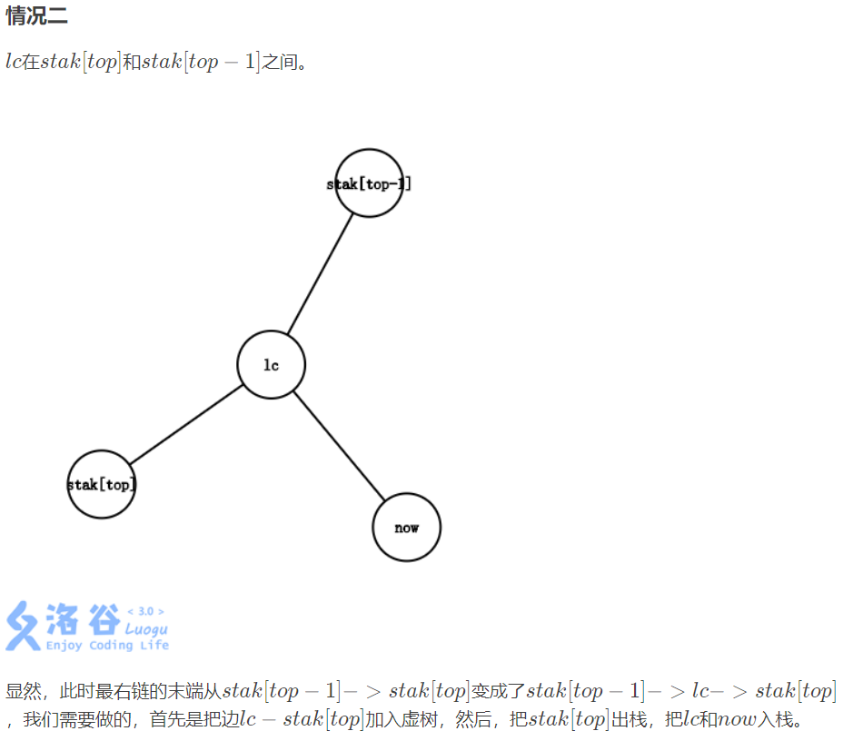

<div align="right">--by lr580</div>

# 前言

## 备注

由于原笔记篇幅过长，无法继续维护(加载和修改都太卡了)，所以打算大规模精简原笔记内容，只保留重要知识点，并删去绝大部分例题代码。所有笔记内代码只给板子代码或尽可能只给关键部分代码。

新版目录为：C/C++ ，算法，例题。合并数据结构和算法一级目录，合并C语言和C++。例题为新增的，只有索引功能，具体例题和代码见出处题库和其他地方笔记。例题目录按出处整理，内部按时间等排序，不按知识点分类。

由于时间有限，新版笔记的更新将会比较随缘，每次需要用到什么知识点就会顺手更新。

不会照抄旧笔记，会进行二次整理。

对格式上，大致修改要点如下：

- 添加图片，不局限于纯文本
- 术语尽量双英，为英文题面作准备
- 增加超链接 (特别是题目) ，方便跳转，省去搜索

部分修改细节：

- 为了兼容性和简便性，将复杂度符号直接写大写字母 O 而不是希腊字母 Omicron


## 更新日记

### 旧版本

原笔记不再更新

- 20/9/18,开始编写本笔记，从《算法竞赛入门经典》的第二章开始记笔记，其他有待补充
- 20/10/8 完成C的知识网络(主要来源:《C语言程序设计》)，为12627词
- 20/10/26整合部分内容，添加C++部分，重新改版部分笔记。此时约2.2万词(误差向上不超过3千词)
- 20/11/4 完成C++知识网络，现49576词
- 20/11/17 修改了部分编排，将数据结构独立成了一级标题。现51950词
- 20/12/12 修改了数据结构编排。增加了一些内容。现58145词
- 21/1/17 大量增加了算法/数据结构的内容和例题，现100664词
- 21/2/1 将动态规划章在算法中独立为二级标题，现123642词
- 21/3/11 大量增加了算法/数据结构的内容和例题，现170648词
- 21/3/21 修改了较多二/三/四级标题的编排，增加了算法内容，现185592词
- 21/5/31 增加了较多的算法/数据结构内容和例题，现239079词
- 21/10/28 增加了较多的算法/数据结构内容和例题，现281816词

### 新版本

- 21/10/30 开始随缘重制算法笔记；

  补充二分查找STL

  新增计数排序、后缀树组、例题三题

- 21/10/31

  补充位运算、树链剖分、搜索、常规运算

  新增平衡树

- 21/11/1

  新增对红黑树和跳表的简述、桶排序


# 程序语言

以 C/C++ 为主，可能还有算法相关的 Python 和 Java。

个人常用开头：

```c++
#include <bits/stdc++.h>
#define re
using namespace std;
typedef long long ll;
#define il inline
typedef double db;
il ll read()
{
    re char p = 0;
    re ll r = 0, o = 0;
    for (; p < '0' || p > '9'; o |= p == '-', p = getchar())
        ;
    for (; p >= '0' && p <= '9'; r = (r << 1) + (r << 3) + (p ^ 48), p = getchar())
        ;
    return o ? (~r) + 1 : r;
}
#define sc(x) x = read()

signed main()
{
    
    return 0;
}
```


## 运算

#### 常规运算

注意：

- 浮点数除，被除数为 $0$ ，被除数和除数存在一个负数，结果为负零
- 取模只可以是整型之间的；负数运算结果等于取绝对值计算，最后正负号与被除数一致，如 $(-5)\bmod 3=-2,5\bmod (-3)=2$

整数上取整公式：
$$
\lceil\dfrac ab\rceil=\dfrac{a+b-1}b=\dfrac{a-1}b+1
$$


### 位运算

#### 基本知识

异或的性质：

- 交换律、结合律、消去律，有单位元$0$，自己与自己运算得单位元

- $a\oplus b\le a+b=(a|b)+(a\&b)$ 

  前半句：因异或是不进位的加法；后半句：因 $a\&b$ 是进位部分


注意要点：

- 优先级： `~; +, -; <<, >>; ==, !=; &; ^; |; &&; ||; ?:`
- 移位结果为 ll 时应该是 `1LL << k`
- 右移位，等同于round(x/2.0)，负数的移位结果不会大于-1


常见应用：

- 取正数 `x` 的从左往右(从零数)第 `i` 位：`(x>>i)&1`

- 对某个正数 `x` 从左往右(从零数)第 `k` 位修改取反： `x^=(1<<k)`

- `c&15`  或 `c^'0'` 优化 数字字符转数值

- > `~` 运算仅对 $-1$ 得 $0$ ，可以用于递减到 0 的循环枚举常数优化

- > `^` 用于汉明码


#### 内建函数

- 注：对 `unsigned long long` 每个函数名后面加上 `ll`

**1.__builtin_popcount(unsigned int n)**

该函数时判断n的二进制中有多少个1

```c
int n = 15; //二进制为1111
cout<<__builtin_popcount(n)<<endl;//输出4
```

**2.__builtin_parity(unsigned int n)**
该函数是判断n的二进制中1的个数的奇偶性

```c
int n = 15;//二进制为1111
int m = 7;//111
cout<<__builtin_parity(n)<<endl;//偶数个，输出0
cout<<__builtin_parity(m)<<endl;//奇数个，输出1
```

**3.__builtin_ffs(unsigned int n)**
该函数判断n的二进制末尾最后一个1的位置，从一开始

```c
int n = 1;//1
int m = 8;//1000
cout<<__builtin_ffs(n)<<endl;//输出1
cout<<__builtin_ffs(m)<<endl;//输出4
```

**4.__builtin_ctz(unsigned int n)**
该函数判断n的二进制末尾后面0的个数，当n为0时，和n的类型有关

```c
int n = 1;//1
int m = 8;//1000
cout<<__builtin_ctzll(n)<<endl;//输出0
cout<<__builtin_ctz(m)<<endl;//输出3
```

**5. __builtin_clz (unsigned int x)**
返回前导的0的个数。

```c++
int n = 1;	//1
int m = 8;	//1000
cout<< 32 - __builtin_clz(n) <<endl;	//输出1
cout<< 64 - __builtin_clzll(m) <<endl;	//输出4
```


## STL

### 模板

### 函数

#### 二分

bound函数，参数`起始迭代器,终止迭代器,值` ，二分查找`[起,止)`

**upper_bound** 大于 x 的第一个位置

**lower_bound** 大于等于 x 的第一个位置


对升序序列：

`lower_bound(begin, end, v)`  在 $[begin,end)$ 找第一个大于等于 $v$ 的值，返回该值的迭代器

`upper_bound(begin, end, v)`  在 $[begin,end)$ 找第一个大于 $v$ 的值，返回该值的迭代器

若找不到返回 $end$


对降序序列：

`lower_bound(begin, end, v, greater<type>())`  在 $[begin,end)$ 找第一个小于等于 $v$ 的值，返回该值的迭代器

`upper_bound(begin, end, v, greater<type>())`  在 $[begin,end)$ 找第一个小于 $v$ 的值，返回该值的迭代器

若找不到返回 $end$


以二分搜索向左第一个数为例：

```c++
int d = lower_bound(a,a+n,f)-a;
if(f!=a[d]) printf("-1");
else printf("%d", d+1);
```

默认对非降序列使用，如果要对下降序列使用，需要加greater如下(指针写法)：

```c++
*upper_bound(d1+1,d1+1+len1,a[i],greater<int>())=a[i];
```


应用举例：

1. 二分查找值区间 $[a,b]$ 长：`u(,,b)-l(,,a)`


#### 数组

##### 归并排序

`inplace_merge(lf, cf, rf[, cmp])` ，将排好序的 $[lf,cf),[cf,rf)$ 合并成一个数组，排序依据是 `cmp` 。显然传入的是迭代器或指针

`merge(lf1, rf1, lf2, rf2[, cmp])` 同理


### 数据类型

#### tuple

直接用 `{}` 构造

取出(如 `map` 迭代器里的可能要先 `second` 一下)，然后用 `tie(a,b,c)=tuple变量` 的方法获得每个元素


### 其他库

#### 随机

##### mt19937

设随机数种子和随机数：

```c++
#include <iostream>
#include <chrono>
#include <random>
using namespace std;
int main()
{
    // 随机数种子
	unsigned seed = std::chrono::system_clock::now().time_since_epoch().count();
    mt19937 rand_num(seed);	 // 大随机数
	cout << rand_num() << endl;
	return 0;
}
```

添加随机数的值域范围：

```c++
#include <iostream>
#include <chrono>
#include <random>
using namespace std;
int main()
{
	// 随机数种子
	unsigned seed = std::chrono::system_clock::now().time_since_epoch().count();
	mt19937 rand_num(seed);  // 大随机数
	uniform_int_distribution<long long> dist(0, 1000000000);  // 给定范围
	cout << dist(rand_num) << endl;
	return 0;
}
```

##### 手写随机

###### 版本1

缺点：周期很短，周期大概是20多。

```c++
#include <bits/stdc++.h>
namespace GenHelper
{
    int z1, z2, z3, z4, z5, u, res;
    int get()
    {
        z5 = ((z1 << 6) ^ z1) >> 13;
        z1 = ((int)(z1 & 4294967) << 18) ^ z5;
        z5 = ((z2 << 2) ^ z2) >> 27;
        z2 = ((z2 & 4294968) << 2) ^ z5;
        z5 = ((z3 << 13) ^ z3) >> 21;
        z3 = ((z3 & 4294967) << 7) ^ z5;
        z5 = ((z4 << 3) ^ z4) >> 12;
        z4 = ((z4 & 4294967) << 13) ^ z5;
        return (z1 ^ z2 ^ z3 ^ z4);
    }
    int read(int m)
    {
        u = get();
        u >>= 1;
        if (m == 0)
            res = u;
        else
            res = (u / 2345 + 1000054321) % m;
        return res;
    }
    void srand(int x)
    {
        z1 = x;
        z2 = (~x) ^ (0x23333333);
        z3 = x ^ (0x12345798);
        z4 = (~x) + 51;
        u = 0;
    }
}
using namespace GenHelper;
int n, a[10000010], seed, m;
signed main()
{
    scanf("%d%d%d", &n, &m, &seed);
    srand(seed);
    for (int i = 1; i <= n; ++i)
    {
        a[i] = read(m);
        printf("%d ", a[i]);
    }
    return 0;
}
```


#### 正则表达式

[参考网址](https://www.cnblogs.com/coolcpp/p/cpp-regex.html) 

##### 示例

###### 替换全部

```c++
char data[] = "he...ll..o, worl..d!";
std::regex reg("\\.");
std::cout << std::regex_replace(data, reg, "");
```

###### 匹配全部单词

```c++
#include <bits/stdc++.h>
using namespace std;
typedef long long ll;
ll n;
string s, t;
signed main()
{
    scanf("%lld%*c", &n);
    while (n--)
    {
        getline(cin, s);
        cin >> t;
        cin.ignore();
        regex reg("\\b" + t + "\\b");
        smatch m;
        auto lf = s.cbegin(); // begin(),end()参数不匹配
        auto rf = s.cend();
        ll ans = 0;
        for (; regex_search(lf, rf, m, reg); lf = m.suffix().first)
            ++ans;
        cout << ans << '\n' ;
    }
    return 0;
}
```


## 快读快写

### C/C++

略

### Python

读：(优化非常明显)

```python
import sys
input = sys.stdin.readline
```

写：(只能输出字符串，优化不明显)

```python
import sys
print = sys.stdout.write
```


# 算法

## 基础

### 复杂度

### 排序


#### 计数排序

设 $w$ 是值域大小，时间复杂度为 $\Omicron(n+w)$ 。

**写法一**步骤为：

- 求每个数出现了几次，存 $cnt$ 数组里
- 遍历 $cnt$ 数组，对每个 $cnt[i]$ 循环 $cnt[i]$ 次插入 $i$ 

写法一图解：


写法一代码略。

**写法二**步骤为：(模拟一次易懂)(该写法优点为简洁，且不用遍历空，缺点是多了一个 $\Omicron(m)$ 的前缀和，可能性能更低)

- 求每个数出现了几次，存 $cnt$ 数组里
- 对 $cnt$ 求前缀和
- 从右至左求排序好每个数

代码：

```c++
for (int i = 1; i <= n; ++i) ++cnt[a[i]];
for (int i = 1; i <= w; ++i) cnt[i] += cnt[i - 1];
for (int i = n; i >= 1; --i) b[cnt[a[i]]--] = a[i];
```

> 注意不要写成`b[cnt[a[i]--]]`


#### 基数排序

Radix Sort

动图有待补充

将待排序元素分为 $k$ 个关键字 (如对 $k$ 位整数分为 $k$ 个个位数，对结构体按元素直接分)，倒着以每个关键字为依据排序。


复杂度为 $k\times$ $f(n)$， $f$ 是内层排序算法复杂度。空间复杂度 da

排序稳定与否取决于关键字排序稳定与否。技巧：

- 关键字值域小时用计数排序，大的时候可以用快排


参考代码：

```c++
#define mn 8000010
ll n, a[mn], q, x, t[mn];
void radixsort(ll n)
{
    ll *b = new ll[n];
    ll *cnt = new ll[1 << 8];
    ll mask = (1 << 8) - 1;
    ll *x = a, *y = b;
    for (ll i = 0; i < 32; i += 8)
    {
        for (ll j = 0; j != (1 << 8); ++j)
        {
            cnt[j] = 0;
        }
        for (ll j = 0; j != n; ++j)
        {
            ++cnt[x[j] >> i & mask];
        }
        for (ll sum = 0, j = 0; j != (1 << 8); ++j)
        {
            sum += cnt[j], cnt[j] = sum - cnt[j];
        }
        for (ll j = 0; j != n; ++j)
        {
            y[cnt[x[j] >> i & mask]++] = x[j];
        }
        swap(x, y);
    }
    delete[] cnt;
    delete[] b;
}
signed main()
{
    sc(n);
    for (ll i = 0; i < n; ++i)
    {
        sc(a[i]);
    }
    radixsort(n);
    sc(q);
    while (q--)
    {
        sc(x);
        printf("%d\n", a[x - 1]);
    }
    return 0;
}
```


#### 桶排序

Bucket Sort

分块的思维，将值域为 $w$ 的数据分成 $k$ 块，对 $k$ 块数据单独排序，排序后再合并。时间复杂度为分块时间复杂度 $+$ $k\times $ 块内排序时间复杂度 $+$ 合并复杂度。前后为线性，总复杂度主要看中间。若 $k\approx n$ ，假设用插入排序，时间复杂度为 $\Omicron(n+\dfrac{n^2}k+n)=\Omicron(n)$ 。最坏时间复杂度为 $\Omicron(n^2)$ 。空间复杂度为 $\Omicron(n)$ （用vector）

排序稳定与否取决于对块的排序稳定与否。

思路很简单。细节：

- 可以设块数目为 `k=w/n+1` ，那么 `a[i]` 在块 `a[i]/k` 里。或者干脆对最值开根号。
- 若分布不均，可能会有空块出现

参考代码：

```c++
ll n, a[8000010], mx, span, bl;
vector<ll> b[65536];
signed main()
{
    sc(n);
    for (ll i = 1; i <= n; ++i)
    {
        sc(a[i]);
        mx = max(mx, a[i]);
    }
    span = sqrt(mx) + 1; //块长
    bl = mx / span;
    for (ll i = 1; i <= n; ++i)
    {
        b[a[i] / span].emplace_back(a[i]);
    }
    for (ll i = 0, k = 0; i < 65536; ++i)
    {
        sort(b[i].begin(), b[i].end());
        for (ll j = 0, je = b[i].size(); j < je; ++j)
        {
            a[++k] = b[i][j];
        }
    }
    return 0;
}
```


#### 其他


### 二分

#### 序列问题

##### 最长单调序列

LIS (longest increase sequence)

单调栈上二分 复杂度 $O(n\log n)$

Dilworth定理：偏序集的最少反链划分数等于最长链的长度

即：求一个序列最少能分成多少个最长不上升序列，可以求最长上升序列的长度即为答案。其他情况类推。

```c++
#include <bits/stdc++.h>
#define MAXN 100002
#define y1 dy
using namespace std;
int n,a[MAXN],uf[MAXN],df[MAXN],ufl,dfl,x[MAXN],y[MAXN],x1,y1;
int main()
{
    while(EOF!=scanf("%d",&a[++n]));//这样的n比真实+1
    uf[++ufl]=df[++dfl]=a[1];
    x[++x1]=y[++y1]=a[1];
    for(int i=2;i<n;i++)
    {
        if(uf[ufl]>=a[i])uf[++ufl]=a[i];//最长不上升
        else *upper_bound(uf+1,uf+1+ufl,a[i],greater<int>())=a[i];
        
        if(df[dfl]<a[i])df[++dfl]=a[i];//最长上升,与上面互为定律
        else *lower_bound(df+1,df+1+dfl,a[i])=a[i];
        
        if(x[x1]>a[i])x[++x1]=a[i];//最长下降
        else *upper_bound(x+1,x+1+x1,a[i],greater<int>())=a[i];
        
        if(y[y1]<=a[i])y[++y1]=a[i];//最长不下降,与上面互为定律
        else *lower_bound(y+1,y+1+y1,a[i])=a[i];
    }
    printf("\n%d\n%d\n%d\n%d",ufl,dfl,x1,y1);
    return 0;
}
```

规律：

- 对降的(严格降、非严格降(即不升))，一律用 `upper_bound` + `greater<>()` 求第一个小于它的，将这个位置改成更大，得更优解
- 对升的，一律用 `lower_bound` 求第一个大于它的，将这个位置改成更小，得更优解

模板题 P1020 导弹拦截 

例题 P2782 友好城市


##### 最长公共排列

LCS(longest common sequence)

假设元素互不重复，将一个序列重定义为它的每个元素在另一个序列里出现的位置，即设 $h[a[i]]=i$ ，令 $b[i]=h[b[i]]$ 。那么，只需要求该序列的最长上升子序列即可。

模板题 P1439 最长公共子序列

对最长公共序列，$O(n^2)$ 的 DP 见 P2543 ，拓展到不等长：UVA 10635 Prince and Princess


#### 整体二分

主体思路：把多个查询一起解决。(离线算法)

需要满足以下性质：

1. 询问的答案可以二分
2. 修改对判定答案的贡献相互独立，修改之间不影响效果
3. 修改若对判定答案有贡献，则贡献为一个确定的与判定标准无关的值
4. 贡献满足交换律、结合律、具有可加性
5. 题目允许离线算法

时间复杂度 $O(T\log n)$ 。当使用别的结构(如树状数组)时，叠加复杂度

例题 P3834 , P2617, P1527


## 数据结构

### 线性结构

> #### 链表
>

> ##### 跳表
>

> 跳表是对有序链表的改进，具有有序链表所有性质，在保持与链表一样的空间性能(即线性复杂度)的情况下，把查询、插入和删除的平均时间复杂度从线性复杂度优化为了对数复杂度。
> 跳表的基本思路是分层和分治、倍增，每一层都是一个有序链表，第一层是原式的有序链表，高层链表是低层有序链表的子集。在跳表里查询某个节点，从最高层开始水平移动，直到下一个节点不符合条件就往下一层，直到到达第一层且找到节点结束。由于高层链表短，所以跳过了很多不必要的比较，所以查询快于普通有序链表。由于采用了分治思想，所以复杂度是对数级的。在查询到节点后，便可以用常数复杂度进行插入和删除操作，因此，它们的总复杂度也是对数级的。
> 应用：所有需要用到有序链表的场景都可以用跳表进行优化。


#### 哈希表

##### 手写

不同哈希策略的比较(仅供参考)：

设哈希函数为 $H(x)=x\bmod len$ ，即除留余数法

使用开放定址法，并使用线性探测法 $key=key+d_i\bmod m$ ，设 $d_i=2333$ 。

一：实践检验  $len$ 的影响

设 $len$ 为 $10^7$ ，冲突率过高， TLE

设 $len$ 为 $2\times 10^7$ 或其附近的素数，或更大的数字，用时均为 $4.2s$ 

二：实践检验  $d_i$ 的影响

$len$ 固定为 $2\times10^7+3$ ，已知 $d_i=2333$ ( $2333$ 是质数)时表现为 $4.2s$

更改 $d_i$ 为 $1$ ， TLE 

更改 $d_i$ 为 $2332$ ，用时为 $4.1s$ 

更改 $d_i$ 为 $1,2,3,\cdots$ ， TLE

更改线性探测法为幂次方探测法：

更改 $d_i$ 为 $1^2,2^2,3^2,\cdots$ ，用时为 $2.8s$ 

更改 $d_i$ 为 $1^3,2^3,3^3,\dots$ ，用时为 $1.3s$

更改 $d_i$ 为 $1^4,2^4,3^4,\dots$ ，用时为 $0.985s$

继续提升 $d_i$ 为 $1^5,2^5,3^5,\cdots$ 等继续升幂，没有明显改进，甚至可能变慢。

更改 $d_i$ 为 $1^2,-1^2,2^2,-2^2,\cdots$ ，用时为 $0.76s$ (二次探测法)

更改 $d_i$ 为 $1^3,-1^3,2^3,-2^3,\cdots$ ，用时没有改善

三：实践检验拉链法

使用 vector 拉链，用时为 $2.5s$ ，空间开销自带几倍常数 (约 $450MB$ )

使用 set 拉链，用时为 $3.3s$ ，空间开销是十多倍常数(接近 $1GB$)

使用 unordered\_set  拉链，用时同上，但直接 MLE

使用 deque 拉链，直接 RE 和几乎 MLE ，实践表明约 $7.5\times 10^5$ 个 deque 就直接 $500MB$ 了

使用 `pb_ds` 的红黑树，用时约 $2.7s$ ， MLE

使用 `pb_ds` 的splay树，用时约 $2.7s$ ， MLE

使用 `pb_ds` 的有序向量树，用时约 $3.5s$ ，约 $900MB$


综上所述，实践表明：对随机数据和一倍空间冗余的除留余数法哈希函数，开放定址最优，最优冲突处理策略是二次探测法。

参考代码：(一倍空间冗余的除留余数法+开放定址法+二次探测法)

```c++
#include <bits/stdc++.h>
using namespace std;
#define mn 20000003
int n, a[mn], seed, m, ans;
signed main()
{
    scanf("%d%d%d", &n, &m, &seed);
    mt19937 mt(seed);
    uniform_int_distribution<int> dist(0, m);
    for (int i = 1; i <= n; ++i)
    {
        int v = dist(mt) + 1; //防止哈希值为0跟空重复，使其值域为[1,m+1]
        int hi = v % mn;
        bool repeat = a[hi] == v;
        int dt = 1, dv = 1;
        while (a[hi] != 0)
        {
            hi = (hi + dv * dt * dt) % mn;
            dv = -1 * dv;
            if (dv == 1)
            {
                ++dt;
            }
            if (a[hi] == v)
            {
                repeat = true;
                break;
            }
        }
        if (!repeat)
        {
            ++ans;
            a[hi] = v;
        }
    }
    printf("%d", ans);
    return 0;
}
```

参考代码：(除留余数法+vector拉链法)

```c++
#include <bits/stdc++.h>
using namespace std;
#define mn 10000010
int n, seed, m, ans;
vector<int> a[mn];
signed main()
{
    scanf("%d%d%d", &n, &m, &seed);
    mt19937 mt(seed);
    uniform_int_distribution<int> dist(0, m);
    for (int i = 1; i <= n; ++i)
    {
        int v = dist(mt);
        int hi = v % mn;
        bool repeat = false;
        for (auto &j : a[hi])
        {
            if (j == v)
            {
                repeat = true;
                break;
            }
        }
        if (!repeat)
        {
            ++ans;
            a[hi].emplace_back(v);
        }
    }
    printf("%d", ans);
    return 0;
}
```


> 附：从理论而言，散列表的装填因子load factor，设 $\alpha=\dfrac nm$ ，平均查找长度是 $a$ 的函数，且有：

> | 处理冲突的方法\平均查找长度 |                 查找成功时                 |                   查找失败时                   |
> | :-------------------------: | :----------------------------------------: | :--------------------------------------------: |
> |         线性探测法          | $\dfrac12\left(1+\dfrac1{1-\alpha}\right)$ | $\dfrac12\left(1+\dfrac1{(1-\alpha)^2}\right)$ |
> |         二次探测法          |       $-\dfrac1\alpha\ln(1+\alpha)$        |              $\dfrac1{1-\alpha}$               |
> |           拉链法            |             $1+\dfrac\alpha2$              |              $\alpha+e^{-\alpha}$              |

> 为获得空间效率，建议保持 $\alpha > 0.5$ ，至少是半满的，一般上限设为 $0.9$ 


### 树

#### 树

##### 重心

以重心为根的有根树里所有子树中最大子树节点数最小

性质：

- 重心为根时，所有子树大小不超过树节点数(大小)的一半
- 树的所有点到单点的距离和中，重心距离和最小
- 重心可能有一个或两个
- 把两棵树通过一条边相连得到一棵新的树，那么新的树的重心在连接原来两棵树的重心的路径上
- 在一棵树上添加或删除一个叶子，那么它的重心最多只移动一条边的距离

求法：DFS

```c++
// 这份代码默认节点编号从 1 开始，即 i ∈ [1,n]
int size[MAXN],  // 这个节点的“大小”（所有子树上节点数 + 该节点）
    weight[MAXN],  // 这个节点的“重量”
    centroid[2];   // 用于记录树的重心（存的是节点编号）
void GetCentroid(int cur, int fa) {  // cur 表示当前节点 (current)
  size[cur] = 1;
  weight[cur] = 0;
  for (int i = head[cur]; i != -1; i = e[i].nxt) {
    if (e[i].to != fa) {  // e[i].to 表示这条有向边所通向的节点。
      GetCentroid(e[i].to, cur);
      size[cur] += size[e[i].to];
      weight[cur] = max(weight[cur], size[e[i].to]);
    }
  }
  weight[cur] = max(weight[cur], n - size[cur]);
  if (weight[cur] <= n / 2) {  // 依照树的重心的定义统计
    centroid[centroid[0] != 0] = cur;
  }
}
```


例题：

- poj 1655 Balancing Act
- 洛谷 p1364 医院设置


##### 树链剖分

###### 概念

通常指重链剖分。

定义：

**重子节点** 表示其直接子节点中子树最大(即树节点最多)的子结点。如果有多个子树最大的子结点，取其一。如果没有子节点，就无重子节点。

**轻子节点** 表示剩余的所有子结点。

从根结点到重子节点的边为 **重边**。到其他轻子节点的边为 **轻边**。若干条首尾衔接的重边构成 **重链**。把落单的结点也当作重链，那么整棵树就被剖分成若干条重链。

要求：有根树，[编号从 $1$ 开始]

性质：

- 以重边优先的 DFS 序为新编号的重建树满足子树 $x$ 的节点范围是 $[x,x+siz_x-1]$ ，其中 $siz_x$ 是包含自身在内的子树节点数。

  因此支持用线段树、主席树维护树上任意子树信息

- 将树上任意一条路径划分为不超过 $\Omicron(\log n)$ 连续的重链或重链的一部分

  因此支持用线段树、主席树维护树上任意链的信息

初始化的时间复杂度是$\Omicron(n)$，使用线段树维护时，单路径查询的时间复杂度是$\Omicron(\log^2n)$，单子树查询的时间复杂度是$\Omicron(\log n)$。


###### 实现

> [模板题](https://www.luogu.com.cn/problem/P3384)
>
> 给定n点树，1 x y z将x到y的最短路所有节点加z，2 x y输出x到y最短路所有节点和，3 x z将x为根节点的子树内所有节点值加z，4 x查询x为根节点的子树内所有节点值和。根节点为r。结果对mod取模。

注：如果RE可以尝试线段树长度开二倍长

> 树剖的实现分两个 DFS 的过程。第一个 DFS 记录每个结点的父节点（fa）、深度（dep）、子树大小（siz）、重子节点（hvson）。第二个 DFS 记录所在链的链顶（top，应初始化为结点本身）、重边优先遍历时的 DFS 序（dfn）、DFS 序对应的节点编号（rank）。

```c++
#include <bits/stdc++.h>
using namespace std;
typedef long long ll;
typedef double db;
#define sc(x) scanf("%lld", &x)
#define il inline
#define mn 100010
ll n, m, r, mod, ui, vi, k, x, y, z;
#define mkcf ll cf = (lf + rf) >> 1
#define lfs p << 1
#define rfs p << 1 | 1
ll hd[mn], cnt, w[mn], wt[mn];
struct edge
{
    ll to, nx;
} e[mn];
il void adde(ll u, ll v)
{
    e[++cnt] = {v, hd[u]};
    hd[u] = cnt;
}
ll a[mn << 2], laz[mn << 2], lc, rc, res, updv;
ll hvson[mn], id[mn], fa[mn], dfn, dep[mn], siz[mn], top[mn];

il void pushdown(ll lf, ll rf, ll p)
{
    mkcf;
    laz[lfs] += laz[p], laz[rfs] += laz[p];
    (a[lfs] += laz[p] * (cf - lf + 1)) %= mod;
    (a[rfs] += laz[p] * (rf - cf)) %= mod;
    laz[p] = 0;
}
il void build(ll lf = 1, ll rf = n, ll p = 1)
{
    if (lf == rf)
    {
        a[p] = wt[lf] % mod;
        return;
    }
    mkcf;
    build(lf, cf, lfs), build(cf + 1, rf, rfs);
    a[p] = (a[lfs] + a[rfs]) % mod;
}
il void query(ll lf = 1, ll rf = n, ll p = 1)
{
    if (lc <= lf && rf <= rc)
    {
        (res += a[p]) %= mod;
        return;
    }
    pushdown(lf, rf, p);
    mkcf;
    if (lc <= cf)
    {
        query(lf, cf, lfs);
    }
    if (rc > cf)
    {
        query(cf + 1, rf, rfs);
    }
}
il void update(ll lf = 1, ll rf = n, ll p = 1)
{
    if (lc <= lf && rf <= rc)
    {
        laz[p] += updv;
        a[p] += updv * (rf - lf + 1) % mod;
        return;
    }
    pushdown(lf, rf, p);
    mkcf;
    if (lc <= cf)
    {
        update(lf, cf, lfs);
    }
    if (rc > cf)
    {
        update(cf + 1, rf, rfs);
    }
    a[p] = (a[lfs] + a[rfs]) % mod;
}

il ll qrange(ll x, ll y)
{
    ll ans = 0;
    while (top[x] != top[y])
    {
        if (dep[top[x]] < dep[top[y]])
        {
            swap(x, y);
        }
        res = 0, lc = id[top[x]], rc = id[x], query();
        (ans += res) %= mod;
        x = fa[top[x]];
    }
    if (dep[x] > dep[y])
    {
        swap(x, y);
    }
    res = 0, lc = id[x], rc = id[y], query();
    return (ans + res) % mod;
}

il void frange(ll x, ll y, ll k)
{
    updv = k % mod;
    while (top[x] != top[y])
    {
        if (dep[top[x]] < dep[top[y]])
        {
            swap(x, y);
        }
        lc = id[top[x]], rc = id[x], update();
        x = fa[top[x]];
    }
    if (dep[x] > dep[y])
    {
        swap(x, y);
    }
    lc = id[x], rc = id[y], update();
}

il ll qson(ll x)
{
    res = 0, lc = id[x], rc = id[x] + siz[x] - 1, query();
    return res;
}

il void fson(ll x, ll k)
{
    updv = k % mod, lc = id[x], rc = id[x] + siz[x] - 1, update();
}

void dfs(ll x, ll f, ll deep)
{
    dep[x] = deep, fa[x] = f, siz[x] = 1;
    ll hvsonv = -1, y;
    for (ll i = hd[x]; i; i = e[i].nx)
    {
        y = e[i].to;
        if (y == f)
        {
            continue;
        }
        dfs(y, x, deep + 1);
        siz[x] += siz[y];
        if (siz[y] > hvsonv)
        {
            hvson[x] = y, hvsonv = siz[y];
        }
    }
}

void dfs(ll x, ll topi)
{
    id[x] = ++dfn, wt[dfn] = w[x], top[x] = topi;
    if (!hvson[x])
    {
        return;
    }
    dfs(hvson[x], topi);
    for (ll i = hd[x]; i; i = e[i].nx)
    {
        ll y = e[i].to;
        if (y == fa[x] || y == hvson[x])
        {
            continue;
        }
        dfs(y, y);
    }
}

signed main()
{
    sc(n), sc(m), sc(r), sc(mod);
    for (ll i = 1; i <= n; ++i)
    {
        sc(w[i]);
    }
    for (ll i = 1; i < n; ++i)
    {
        sc(ui), sc(vi), adde(ui, vi), adde(vi, ui);
    }
    dfs(r, 0, 1), dfs(r, r), build();
    while (m--)
    {
        sc(k), sc(x);
        if (k == 1)
        {
            sc(y), sc(z), frange(x, y, z);
        }
        else if (k == 2)
        {
            sc(y), printf("%lld\n", qrange(x, y));
        }
        else if (k == 3)
        {
            sc(y), fson(x, y);
        }
        else
        {
            printf("%lld\n", qson(x));
        }
    }
    return 0;
}
```


##### 点分治


#### 二叉搜索树

二叉搜索树性质：左小于根，右大于根。(右大于等于)

插入：设插入节点为 $v$ ，二分查找直到判空，将此时的空节点设为新节点。

删除：先找到这个节点 $p$ ，然后：

- 叶子节点直接删

- 若只有一个子，直接删，用子代替自己

- 若有二子，可以在右子树一直找左子(直到深度最高)设为 $s$ ，则 $s$ 必然无左子，可能有右子 $s_r$，将其替代为原本的这个点(具体为：若 $s$ 的父亲 $s_p \neq p$ ，将 $s_p$ 的左子设为 $s_r$ ；否则 $s_p=p$ ，将 $s_p$ 的右子设为 $s_r$ ，然后将 $p$ 数据替换为 $s$ ，然后删掉 $s$ )

  也可以在左子树找右子，同理

最优时间复杂度均为 $\Omicron(\log n)$ ，最坏为 $\Omicron(n)$ (退化成链)

 

#### 平衡树

Balance Tree, BT

平衡树的性质为：任意节点子树的高度差小于等于 $1$ 。

平衡树维护常规的操作的复杂度为 $\Omicron(\log n)$：

1. 插入点
2. 删除点
3. 查询某个值的**排名**(排名定义为比它小的数的数目 $+1$)
4. 查询某排名的值
5. 求某个点的前驱(最大的小于它的点)
6. 求某个点的后继(最小的大于它的点)

> 常见平衡树： B树(多路平衡)、 AVL树(二叉平衡搜索树)、Treap、WBLT、红黑树


平衡二叉树的节点数证明：深度为 $h$ 的树最少有 $N_h$ 个节点，则显然 $N_0=0,N_1=1$ ，对 $h > 1$ ，根节点占一个节点，设左子树为 $N_{h-1}$ ，右子树为 $N_{h-2}$ 是一种最小构造法，所以有 $N_h=1+N_{h-1}+N_{h-2}$ ，得 $n$ 节点树的深度为 $1.44\log_2(n+2)-1.328$ 。直观上根据类斐波那契数列，可知深度是对数级的，所以查找的复杂度为 $\Omicron(\log n)$ 


> 以下模板以 [这题](https://www.luogu.com.cn/problem/P6136) 为例


##### AVL

Adelson-Velskii 和 Landis ，二叉平衡搜索树

平衡因子：左子树高减去右子树高。

旋转操作的本质是在满足搜索树性质的同时调整高度差。

最小不平衡子树(minimal unbalance subtree) 是离目标点最近的平衡因子绝对值大于 $1$ 的点为根的子树(首个不平衡子树)，根称为最小不平衡点。每次旋转以该子树操作。

定义右旋：(顺时针旋转)


设旋转节点为 $x$ ，$x$ 的左子为 $x_l$ ，将 $x_l$ 的右子 $x_{lr}$ 设为 $x$ 的新左子，将 $x_l$ 的右子设为 $x$ ， $x$ 的父亲的对应子设为 $x_l$ 。

设调整前 $x_{ll}$ 高 $h+1$ ，$x_{lr},x_r$ 高 $h$ 。则原平衡因子为 $2$ ，调整后为 $0$ 。

相似定义左旋：(逆时针旋转)

$x_{rl}$ 设为 $x$ 的新右子， $x_r$ 的左子设为 $x$ ， $x$ 的父亲的对应子设为 $x_l$ 。

设调整前 $x_{rr}$ 高 $h+1$ ， $x_{rl},x_l$ 高 $h$ 。原平衡因子为 $-2$ ，调整后为 $0$


那么若 $x_{lr}=h+1,x_{ll}=x_r=h$ ，平衡因子为 $2$ ，先左旋 $x_l$ ，再右旋 $x$ 。

若 $x_{rl}=h+1,x_{rr}=x_l=h$ ，平衡因子为 $-2$ ，先右旋 $x_r$ ，再左旋 $x$ 。


那么维护平衡的伪代码如下：

```
Maintain-Balanced(p)
    if h[ls[p]] - h[rs[p]] == 2
        if h[ls[ls[p]]] >= h[rs[ls[p]]]
            Right-Rotate(p)
        else
            Left-Rotate(ls[p])
            Right-Rotate(p)
    else if h[ls[p]] - h[rs[p]] == -2
        if h[ls[rs[p]]] <= h[rs[rs[p]]]
            Left-Rotate(p)
        else
            Right-Rotate(rs[p])
            Left-Rotate(p)
```


查找排名的数可能不存在，所以如果找不到需要找后继；且预设一个极大值。

实现 `p6136` 的模板代码为：

```c++
#include<cstdio>
#include<algorithm>
#define int long long
using namespace std;
FILE *fin, *fout;
inline int read(int &x) {//快读，这题常数优化很重要
	char c = 0; int f = x = 0;
	while (c < 48 || c > 57) {
		if (c == -1) return 0;
		if (c == '-') f = 1; c = fgetc(fin);
	}
	while (c > 47 && c < 58) x = (x << 3) + (x << 1) + (c & 15), c = fgetc(fin);
	if (f) x = -x; return 1;
}
template<class T, class... Args> inline int read(T &x, Args&... args) {
	return read(x) + read(args...);
}
inline int write(int x) {
	if (x < 0) return fputc(45, fout), write(-x);
	if (x > 9) write(x / 10);
	return fputc((x % 10) | 48, fout), 1;
}
struct AVLnode;
typedef AVLnode* AVLtree;
struct AVLnode {//这个部分在之前P3369中的题解已经详细讲述了，这里我就不写注释了。
	int data, high;
	int freq, size;
	AVLtree ls, rs;
	AVLnode(): data(0), high(1), freq(1), size(1), ls(NULL), rs(NULL){}
	AVLnode(int a): data(a), high(1), freq(1), size(1), ls(NULL), rs(NULL){}
};
inline int GetSize(AVLtree p) {
	if (p == NULL) return 0;
	return p->size;
}
inline int GetHigh(AVLtree p) {
	if (p == NULL) return 0;
	return p->high;
}
struct AVL {
	AVLtree root;
	inline void update(AVLtree& p) {
		p->size = GetSize(p->ls) + GetSize(p->rs) + p->freq;
		p->high = max(GetHigh(p->ls), GetHigh(p->rs)) + 1;
	}
	inline void LeftPlus(AVLtree& p) {
		AVLtree q;
		q = p->ls;
		p->ls = q->rs;
		q->rs = p;
		update(p);
		update(q);
		p = q;
	}
	inline void RightPlus(AVLtree& p) {
		AVLtree q;
		q = p->rs;
		p->rs = q->ls;
		q->ls = p;
		update(p);
		update(q);
		p = q;
	}
	inline void LeftRight(AVLtree& p) {
		RightPlus(p->ls);
		LeftPlus(p);
	}
	inline void RightLeft(AVLtree& p) {
		LeftPlus(p->rs);
		RightPlus(p);
	}
	inline void Insert(AVLtree &p, int x) {
		if (p == NULL) {
			p = new AVLnode(x);
			return;
		}
		if (p->data == x) {
			++(p->freq);
			update(p);
			return;
		}
		if (p->data > x) {
			Insert(p->ls, x), update(p);
			if (GetHigh(p->ls) - GetHigh(p->rs) == 2) {
				if (x < p->ls->data)
					LeftPlus(p);
				else
					LeftRight(p);
			}
		}
		else {
			Insert(p->rs, x), update(p);
			if (GetHigh(p->rs) - GetHigh(p->ls) == 2) {
				if (x > p->rs->data)
					RightPlus(p);
				else
					RightLeft(p);
			}
		}
		update(p);
	}
	inline void insert(int x) {
		Insert(root, x);
	}
	inline AVLtree Find(AVLtree& p, int x) {//只不过多了一个查找操作
		if (!p) return NULL;
		if (p->data == x) return p;
		if (p->data > x) return Find(p->ls, x);
		return Find(p->rs, x);
	}
	inline AVLtree find(int x) {
		return Find(root, x);
	}
	inline void Erase(AVLtree& p, int x) {
		if (p == NULL) return;
		if (p->data > x) {
			Erase(p->ls, x), update(p);
			if (GetHigh(p->rs) - GetHigh(p->ls) == 2) {
				if (GetHigh(p->rs->rs) >= GetHigh(p->rs->ls))
					RightPlus(p);
				else
					RightLeft(p);
			}
		}
		else if(p->data < x) {
			Erase(p->rs, x), update(p);
			if (GetHigh(p->ls) - GetHigh(p->rs) == 2) {
				if (GetHigh(p->ls->ls) >= GetHigh(p->ls->rs))
					LeftPlus(p);
				else
					LeftRight(p);
			}
		}
		else {
			if (p->freq > 1) {
				--(p->freq);
				update(p);
				return;
			}
			if (p->ls && p->rs) {
				AVLtree q = p->rs;
				while (q->ls) q = q->ls;
				p->freq = q->freq;
				p->data = q->data, q->freq = 1;
				Erase(p->rs, q->data);
				update(p);
				if (GetHigh(p->ls) - GetHigh(p->rs) == 2) {
					if (GetHigh(p->ls->ls) >= GetHigh(p->ls->rs))
						LeftPlus(p);
					else
						LeftRight(p);
				}
			}
			else {
				AVLtree q = p;
				if (p->ls) p = p->ls;
				else if (p->rs) p = p->rs;
				else p = NULL;
				delete q;
				q = NULL;
			}
		}
		if (p == NULL) return;
		update(p);
	}
	inline void erase(int x) {
		Erase(root, x);
	}
	inline int get_val(AVLtree p, int rank) {
		if (GetSize(p->ls) >= rank) return get_val(p->ls, rank);
		if (GetSize(p->ls) + p->freq >= rank) return p->data;
		return get_val(p->rs, rank - GetSize(p->ls) - p->freq);
	}
	inline int GetVal(int rank) {
		return get_val(root, rank);
	}
	inline int get_rank(AVLtree p, int val) {
		if (p->data == val) return GetSize(p->ls) + 1;
		if (p->data > val) return get_rank(p->ls, val);
		return get_rank(p->rs, val) + GetSize(p->ls) + p->freq;
	}
	inline int GetRank(int val) {
		return get_rank(root, val);
	}
	inline int GetPrev(int val) {
		AVLtree ans = new AVLnode(-1LL << 42), p = root;
		while (p) {
			if (p->data == val) {
				if (p->ls) {
					p = p->ls;
					while (p->rs)
						p = p->rs;
					ans = p;
				}
				break;
			}
			if (p->data < val && p->data > ans->data) ans = p;
			p = p->data < val ? p->rs : p->ls;
		}
		return ans->data;
	}
	inline int GetNext(int val) {
		AVLtree ans = new AVLnode(1LL << 42), p = root;
		while (p) {
			if (p->data == val) {
				if (p->rs) {
					p = p->rs;
					while (p->ls)
						p = p->ls;
					ans = p;
				}
				break;
			}
			if (p->data > val && p->data < ans->data) ans = p;
			p = p->data < val ? p->rs : p->ls;
		}
		return ans->data;
	}
};
AVL a;
int n, m, x, opt, last, ans;
signed main() {
	#ifdef ONLINE_JUDGE
	fin = stdin;
	fout = stdout;
	#else
	fin = fopen("P6136.in", "rb");
	fout = fopen("P6136.out", "wb");
	#endif
	read(n, m), a.insert(1LL << 42);//极大值先插入
	for (int i = 1; i <= n; ++i) read(x), a.insert(x);//边读入边插入
	for (int i = 1; i <= m; ++i) {
		read(opt, x), x ^= last;//输入经过加密，要先解密
		switch(opt) {
			case 1: a.insert(x); break;
			case 2: a.erase(x); break;
			case 3:
				if (!a.find(x)) x = a.GetNext(x);//如果找不到，就改为后继
				last = a.GetRank(x), ans ^= last; break;
			case 4: last = a.GetVal(x), ans ^= last; break;
			case 5: last = a.GetPrev(x), ans ^= last; break;
			case 6: last = a.GetNext(x), ans ^= last; break;
		}
	}
	write(ans);
	return 0;
}
```


##### B树

Balanced-tree 平衡多路查找树

$m $ 阶 B树满足下面性质：

- 某非叶子节点的子树数目不超过 $m$
- 非叶子节点、非根节点的子树数目不低于 $\lceil\dfrac m2\rceil$
- 若某非叶子节点有 $n$ 个关键码(值)，那么有 $n+1$ 个子树，且第 $i$ 个子树的所有关键码值小于第 $i$ 个关键码；第 $i+1$ 个子树所有关键码大于第 $i+1$ 个关键码
- 根节点至少有两棵子树

作用：用于查找。

插入关键码 $k$ 的步骤：

- 找到 $k$ 应该插入到哪个叶子节点 $p$， 若 $n_p < m-1$ ，直接插入到此处
- 否则，找到 $p$ 的中位数，将其上溢到父节点，则 $p$ 分裂为两个叶子节点，分别在中位数的两边
- 对父节点递归判断是否需要上溢分裂(根节点也可能上溢分裂)

> 如果根节点没有两棵子树，那么根节点分裂后可能退化为斜树

> 如：
>
> 
>
> 
>
> 

删除关键码 $k$ 的步骤：不会

> - 找到 $p$ ，若是叶子节点直接删
> - 否则，删掉 $i$ 位置对应 $k$ 并用第 $i+1$ 个子树的最小关键码(最左)上移代替被删节点，递归执行该操作直到到达叶子节点
> - 当叶子节点关键码个数大于 $\lceil\dfrac m2\rceil-1$ 直接删除；否则发生下溢，则
> - 若两兄弟节点个数有大于 $\lceil\dfrac m2\rceil$ 时，向兄弟节点借一个关键码(右兄弟最小或左兄弟最大关键码)上移到父亲，父亲对应(小|大于)该上移关键码的码下移到被删除关键字节点中
> - 若两兄弟节点都不满足节点个数有大于 $\lceil\dfrac m2\rceil$ ，
>
> > 删除非叶子节点必然会导致不满足B树性质。


##### 伸展树

Splay Tree ，分裂树

##### 树堆

Treap ，是弱平衡二叉搜索树。

是同时满足堆和二叉搜索树性质的结构：每个节点有随机的 `priority` 值，该值满足大根堆；有 `key` 值，满足二叉搜索树性质，即左小于根，右大于根。

> 实现上有旋转式和无旋式(FHQ-Treap)。

实现如下：

```c++
#include <bits/stdc++.h>
#define re
using namespace std;
typedef long long ll;
#define il inline
typedef double db;
il ll read()
{
    re char p = 0;
    re ll r = 0, o = 0;
    for (; p < '0' || p > '9'; o |= p == '-', p = getchar())
        ;
    for (; p >= '0' && p <= '9'; r = (r << 1) + (r << 3) + (p ^ 48), p = getchar())
        ;
    return o ? (~r) + 1 : r;
}
#define sc(x) x = read()
#define mn 1100010 //这是因为可能插入m个点所以1e6(插入)+1e5(本来)
typedef pair<ll, ll> pr;
ll key[mn], w[mn], siz[mn], son[mn][2], root, seed = 1;
ll n, m, cnt, ans, last, c, x;
il ll rand1() { return seed *= 19260817; } //手写随机
il void pushup(ll u) { siz[u] = siz[son[u][0]] + siz[son[u][1]] + 1; }
pr split(ll u, ll k)
{
    if (!u)
    {
        return {0, 0};
    }
    if (key[u] < k)
    {
        pr t = split(son[u][1], k);
        son[u][1] = t.first;
        pushup(u);
        return {u, t.second};
    }
    else
    {
        pr t = split(son[u][0], k);
        son[u][0] = t.second;
        pushup(u);
        return {t.first, u};
    }
}
ll merge(ll u, ll v)
{
    if (!u || !v)
    {
        return u + v;
    }
    if (w[u] < w[v])
    {
        son[u][1] = merge(son[u][1], v);
        pushup(u);
        return u;
    }
    else
    {
        son[v][0] = merge(u, son[v][0]);
        pushup(v);
        return v;
    }
}
void insert(ll k)
{
    key[++cnt] = k, w[cnt] = rand1(), siz[cnt] = 1;
    pr t = split(root, k);
    root = merge(merge(t.first, cnt), t.second);
}
void del(ll k)
{
    pr x = split(root, k), y = split(x.second, k + 1);
    y.first = merge(son[y.first][0], son[y.first][1]);
    root = merge(x.first, merge(y.first, y.second));
}
ll find1(ll k)
{
    pr t = split(root, k);
    ll v = siz[t.first] + 1;
    root = merge(t.first, t.second);
    return v;
}
ll find2(ll k)
{
    ll pos = root;
    while (pos)
    {
        if (k == siz[son[pos][0]] + 1)
        {
            return key[pos];
        }
        if (k <= siz[son[pos][0]])
        {
            pos = son[pos][0];
        }
        else
        {
            k -= siz[son[pos][0]] + 1, pos = son[pos][1];
        }
    }
    return -1; //to erase warning; in fact non-reachable
}
ll lst(ll k) { return find2(find1(k) - 1); }
ll nxt(ll k) { return find2(find1(k + 1)); }
signed main()
{
    sc(n), sc(m);
    for (ll i = 1; i <= n; ++i)
    {
        sc(x), insert(x);
    }
    for (ll i = 1; i <= m; ++i)
    {
        sc(c), sc(x);
        if (c == 1)
        {
            insert(x ^ last);
        }
        else if (c == 2)
        {
            del(x ^ last);
        }
        else if (c == 3)
        {
            last = find1(x ^ last), ans ^= last;
        }
        else if (c == 4)
        {
            last = find2(x ^ last), ans ^= last;
        }
        else if (c == 5)
        {
            last = lst(x ^ last), ans ^= last;
        }
        else if (c == 6)
        {
            last = nxt(x ^ last), ans ^= last;
        }
    }
    printf("%d\n", ans);
    return 0;
}
```


##### 红黑树

> 红黑树是平衡二叉搜索树的一种，同时具有二者的性质，即：①满足弱平衡性。平衡性指所有子树的高度差不会超过1，弱平衡型意味着高度差有小概率会大于1；②满足搜索树性质，即所有左子树节点小于它的根节点，所有右子树节点大于它的根节点；③满足二叉树的所有性质。
> 红黑树特有的性质为：①节点必然是红色或黑色的；②根节点和叶子节点都是黑色的；③红节点的两个子节点都是黑色的，即叶到根的路径不可能出现两个连续红节点；④黑高平衡性：从任一节点到它子树的叶节点的所有简单路径有同样数目的黑节点。这些性质保证了最长路径(红黑交替)不会超过最短路径(全黑)的两倍，进而实现了弱平衡型。
> 根据以上性质，红黑树可以在对数时间复杂度内实现查找、插入和删除节点。
> 为了在插入、删除节点时仍保持红黑树性质，这些过程一定会对若干相关节点进行调整，使得插入后和删除后仍然满足上面的性质。


#### 01-trie

##### 应用

可以用来实现平衡树。对于值域 $w$ ，空间复杂度是 $\Omicron(n\log w)$ 。

> 以实现洛谷p3369为例，其函数含义比较好理解，不作注释，模板如下：

```c++
#include <cstdio>
#include <algorithm>
const int maxlog = 25;
const int MAXN = 100010;
using namespace std;

namespace trie{
    int id = 2;//此时id = 2 
    int ch[MAXN * maxlog][2];
    int sz[MAXN * maxlog];
    //int nval[MAXN * maxlog];
    int newnode(){
        ch[id][0] = ch[id][1] = sz[id] = 0;
        return id++;
    }               
    void ins(int x,int d){          
        int u = 1;          
        for(int i = maxlog - 1;i >= 0;i--){         
            int v = (x >> i) & 1;//必须是左移x           
            if(!ch[u][v]) ch[u][v] = newnode();         
            u = ch[u][v];       
            sz[u] += d;//sz[1] = 0;     
        }               
        //nval[u] += d;             
    }                                       
    int kth(int k){
        int u = 1;
        int x = 0;
        for(int i = maxlog - 1;i >= 0;i--){
            if(sz[ch[u][0]] >= k){  ///////////////////////////> >=                     
                u = ch[u][0]; 
            }
            else{
                x |= (1 << i);
                k -= sz[ch[u][0]];
                u = ch[u][1];
            }
        }
        return x;
    }
    int nlt(int x){
        int ans = 0;
        int u = 1;
        for(int i = maxlog - 1;i >= 0;i--){
            if((x >> i) & 1){
                ans += sz[ch[u][0]];
                u = ch[u][1];
            }
            else{
                u = ch[u][0];
            }
            if(!u) break;//不必有的 
        }             
        return ans;
    }   
    void clear(){
        ch[1][0] = ch[1][1] = 0;
        id = 2;
    } 
    int pre(int x){
        int ans;
        //ins(x,1);
        ans = kth(nlt(x));
        //ins(x,-1);
        return ans;
    }
    int next(int x){
        int ans;
        //ins(x,1);
        ans = kth(nlt(x+1)+1);
        //ins(x,-1);
        return ans;
    }
} 

const int num = 10000000; 
int main(){
     int n;
     scanf("%d",&n);
     for(int i = 0;i < n;i++){
        int ord,t;
        scanf("%d%d",&ord,&t);
        switch(ord){
            case 1:trie::ins(t + num,1);break;
            case 2:trie::ins(t + num,-1);break;
            case 3:printf("%d\n",trie::nlt(t + num) + 1);break;
            case 4:printf("%d\n",trie::kth(t) - num);break;
            case 5:printf("%d\n",trie::pre(t + num) - num);break;
            case 6:printf("%d\n",trie::next(t + num) - num);break;
        }
    }
    return 0;
} 
```

> 浮点数直接指针强制转long long，按位比较double/single内存是可以的

> $n$ 个叶节点的虚树大小只有 $\Omicron(n)$ 。实现则匹配时遇到失配就分裂当前节点，使得空间复杂度为 $\Omicron(n)$ 


### 线段树

> 单点修改和区间查询：略

区间修改和区间查询：见P3372

常数优化技巧：

- 递归参数尽可能少，区间左右端点可以直接记录而不是作递归参数
- 结构体存树，内存访问连续，速度更快
- 建树时读入，而不是读入后建树
- 少用 `long long`


#### 区间(历史)最值

> 吉老师线段树

##### 区间最值

维护操作：① 区间每个数与 $t$ 取 $\min$ ② 输出区间和 ③ 输出区间最大值

对每个节点区间：维护该区间最大值 $mx$、最大值出现次数 $se$ 、严格次大值 $cnt$ 

对操作 $1$ ：

- 若 $mx\le t$ ，整个区间都没 $t$ 大，不操作 (相等也等于没操作)
- 若 $se < t < mx$  ，那么所有最大值都变成 $t$ ，次大值和更小的值都不变，所以 $cnt$ 个 $mx$ 被删掉，再加上 $cnt$ 个 $t$ ，即区间更新 $cnt(t-mx)$ ，并记录懒标记
- 若 $t\le se$ ，递归往下处理子区间

对操作 $2,3$ ，有手就行

处理 `pushup` ：

- 若左右子区间最值一样， $cnt$ 翻倍， $se$ 取左右 $se$ 较大者， $mx$ 任取左右(都一样)
- 否则， $mx,cnt$ 取大者， $se$ 让小区间 $mx$ 和大区间 $se$ 取最值

处理 `pushdown` ：

- 懒标记是 $t$ 的懒标记，根据题意可以取一些诸如无穷小代表无懒标记

处理建树：

- 初始次大值建无穷小

势能分析法知，对 $m$ 次询问，复杂度为 $O(m\log n)$ 

模板题：hdu5306 gorgeous sequence


##### 历史最值

历史最大/最小/版本和(最小版本和是每次操作后将整个数组计数起来)


#### zkw线段树

> zkw:张昆玮

一种复杂度常数接近树状数组的非递归写法线段树

##### 单点修改

将线段树填充为满二叉树，然后按堆的方式实现父子关系，满足叶子节点下标与原数组下标的差值为常数 $N=2^{\lceil\log_2(n+1)\rceil}$ ，为了方便查找，可以将原数组在线段树对应的位置整体后平移 $1$ 位

建树：

```c++
for (N = 1; N <= n + 1; N <<= 1)
        ;
for (ll i = N + 1; i <= N + n; ++i)
{
    sc(t[i]);
}
for (ll i = N - 1; i >= 1; --i)
{
    t[i] = t[i << 1] + t[i << 1 | 1];
}
```

单点修改：(下标 $x$ 的值增加 $y$ )

```c++
for (ll i = x + N; i; i >>= 1)
{
    t[i] += y;
}
```

单点查询：$t[N+x]$

区间查询：分别在查询区间下界上界( $lc-1,rc+1$ )放指针 $s,t$ ，不断向父亲移动，直到 $s,t$ 的父亲相同(表现为 $s\oplus r=1\to s\oplus r\oplus 1=0$)，如果 $s$ 指向左儿子(最小位是 $0$ ，按位取反为 $1$ )，加上右儿子的值(即右子树，按位取反最小位即可)；如果 $r$ 指向右儿子(最小位是 $1$ )，加上左子树(同理)

```c++
ll ans = 0;
for (ll s = N + x - 1, r = N + y + 1; s ^ r ^ 1; s >>= 1, r >>= 1)
{
    if (~s & 1)
    {
        ans += t[s ^ 1];
    }
    if (r & 1)
    {
        ans += t[r ^ 1];
    }
}
```


对照代码，发现第一轮循环记上了节点 $8,14$ ；第二轮循环记上了 $5,6$ ，第三轮跳出了。(即不是：第三轮记下了 $5,6$ ，第二轮单走一个 $14$ )，根据代码可知。因此也能明白之前的平移使得本来只能查询 $[1,n-1]$ 变成了可以查询 $[0,n]$ (即建树是 $[N+1,N+n]$ 而不是 $[N,N+n)$ 的原因；也因此，把 $N$ 扩大了一倍，使得可以查询 $N$ 为右区间)

完整代码见 P3374

##### 区间修改

区间修改代码：

```c++
ll lf = 0, rf = 0, layer = 1, s = dt + x - 1, t = dt + y + 1;
for (; s ^ t ^ 1; s >>= 1, t >>= 1, layer <<= 1)
{
    a[s] += k * lf, a[t] += k * rf;
    if (~s & 1)
    {
        laz[s ^ 1] += k, a[s ^ 1] += k * layer, lf += layer;
    }
    if (t & 1)
    {
        laz[t ^ 1] += k, a[t ^ 1] += k * layer, rf += layer;
    }
}
for (; s; s >>= 1, t >>= 1)
{
    a[s] += k * lf, a[t] += k * rf;
}
```

其中 $lf,rf$ 是当前 $s,t$ 节点维护的子树的大小， $layer$ 是当前层区间的长度

懒标记表示当前点累计被修改的值(而不是当前子树)，当其兄弟节点被修改后，往后的父亲节点恒要更新，所以在 if 外有需要恒修改 $s,t$ ；懒标签的本质是下推的，当这个地方有懒标签，证明它的子树都需要更新(而未真实更新)

最后，需要将修改一路上推，推到根节点，而不是 $s,t$ 交汇即可，因此复杂度恒为 $O(\log n)$ 


区间查询：

```c++
ll lf = 0, rf = 0, layer = 1, s = dt + x - 1, t = dt + y + 1;
ll ans = 0;
for (; s ^ t ^ 1; s >>= 1, t >>= 1, layer <<= 1)
{
    ans += laz[s] * lf + laz[t] * rf;
    if (~s & 1)
    {
        ans += a[s ^ 1], lf += layer;
    }
    if (t & 1)
    {
        ans += a[t ^ 1], rf += layer;
    }
}
for (; s; s >>= 1, t >>= 1)
{
    ans += laz[s] * lf + laz[t] * rf;
}
```

如果发现有懒标签，那证明这个子树是已经被修改过而没有赋值到 $a$ ，具体原理如图所示；注意懒标签永远不下推，形成永久懒标签


完整代码见 P3372

对区间最值查询，还可以继续优化，不用存懒标签，具体见洛谷日报46


#### 权值线段树

节点维护的区间代表位置范围，节点值代表出现频次。通常配合离散化，那么节点 $p$ 维护区间 $[l,r]$ 代表权值排名在 $[l,r]$ 的出现了多少次。

> 例如：插入数字 $3,5$ ：
>
> 

权值线段树可以实现例题-普通平衡树的所有功能：插入，删除单个，查询排名(不去重)，根据排名查数字，查前驱和后继

例题：p4556 [Vani有约会]雨天的尾巴 /【模板】线段树合并

例题标签：树链剖分+权值线段树+前缀和差分+链表/前向星空间优化


#### 可持久化线段树

仅涉及单点修改的话，每次修改增加一个历史版本增加一条链，有 $m$ 次操作时，空间复杂度为 $4n+n\log m$ 。需要保存每个版本的根节点，并且使用动态开点的线段树。

例题：可持久化线段树模板 1,2 (其中 2 也可以用线段树合并来做)


#### 线段树合并


### 树状数组

优化技巧： $O(n)$ 建树

每一个节点的值是由所有与自己直接相连的儿子的值求和得到的。因此可以倒着考虑贡献，即每次确定完儿子的值后，用自己的值更新自己的直接父亲

```c++
// C++ Version
// O(n)建树
void init() {
  for (int i = 1; i <= n; ++i) {
    t[i] += a[i];
    int j = i + lowbit(i);
    if (j <= n) t[j] += t[i];
  }
}
```

树状数组套主席树维护动态区间第 $k$ 小：洛谷P2617


### 嵌套结构

#### 二维树状数组

维护的是矩阵。

区间求和模板：

```c++
for (int x = i; x < A.length; x += lowbit(x))
    for (int y = j; y < A[i].length; y += lowbit(y))
        C[x][y] += delta;
```

区间查询模板：

```c++
int result = 0;
for (int x = i; x > 0; x -= lowbit(x))
    for (int y = j; y > 0; y -= lowbit(y))
        result += C[x][y];
return result;
```

特别注意空间复杂度是 $O(n^2)$ ，所以不要用在诸如 $10^5\times 10^5$ 上

时间复杂度显然每次是 $O(\log^2n)$


### 其他

#### ODT

老司机树，ODT(Old Driver Tree)，又名珂朵莉树（Chtholly Tree)

核心：将值相同的区间合并成一个节点存在 `set` 里

作用：骗分。只要是有区间赋值操作的数据结构题都可以用来骗分。在数据随机的情况下一般效率较高，但在不保证数据随机的场合下，会被精心构造的特殊数据卡到超时。如果要保证复杂度正确，必须保证数据随机。对于 add，assign 和 sum 操作，用 set 实现的珂朵莉树的复杂度为 $O(n\log\log n)$，而用链表实现的复杂度为 $O(n\log n)$。

节点：

```c++
struct Node_t {
  int l, r;
  mutable int v; //自己附加的数据

  Node_t(const int &il, const int &ir, const int &iv) : l(il), r(ir), v(iv) {}

  inline bool operator<(const Node_t &o) const { return l < o.l; }
};
```

> `mutable` 的意思是“可变的”，让我们可以在后面的操作中修改 `v` 的值。在 C++ 中，mutable 是为了突破 const 的限制而设置的。被 mutable 修饰的变量（mutable 只能用于修饰类中的非静态数据成员），将永远处于可变的状态，即使在一个 const 函数中。
>
> 这意味着，我们可以直接修改已经插入 `set` 的元素的 `v` 值，而不用将该元素取出后重新加入 `set`。

##### split

将包含 $x$ 点的区间 $[l,r]$ 分为 $[l,x)$ , $[x,r]$ ，返回后者迭代器

```c++
auto split(int x) {
  if (x > n) return odt.end();
  auto it = --odt.upper_bound((Node_t){x, 0, 0});
  if (it->l == x) return it;
  int l = it->l, r = it->r, v = it->v;
  odt.erase(it);
  odt.insert(Node_t(l, x - 1, v));
  return odt.insert(Node_t(x, r, v)).first;
}
```

对区间 $[l,r]$ 的操作，可以转化为 `set` 上 $[split(l),split(r+1))$


##### assign

区间赋值

```c++
void assign(int l, int r, int v) {
  auto itr = split(r + 1), itl = split(l);
  odt.erase(itl, itr);
  odt.insert(Node_t(l, r, v));
}
```


##### iter

```c++
void performance(int l, int r) {
  auto itr = split(r + 1), itl = split(l);
  for (; itl != itr; ++itl) {
    // Perform Operations here 区间遍历
  }
}
```

注：**珂朵莉树在进行求取区间左右端点操作时，必须先 split 右端点，再 split 左端点**。若先 split 左端点，返回的迭代器可能在 split 右端点的时候失效，可能会导致 RE。


例题 P1276校门外的树，牛客小D的飞机跑道


## 搜索

线性搜索略。

### DFS

常见技巧/注意点：

- 搜索时每层递归不一样的局部变量不能放在全局

剪枝技巧：

- 待补充

特别地，用DFS模拟BFS的搜索称为**迭代加深搜索**(Iterative deepening)，用循环每次限定 DFS 的深度递增，优点是空间开销低。

### BFS

### 双向BFS

对 BFS 而言，将规模 $a^n$ 缩减为 $2a^{\frac n2}$

技巧：

- 从起点的搜索和从终点的搜索标注 $1$ 和 $2$ ，map 存一下，如果当前状态 + 存储状态 = $3$ ，得到答案 (可以在当前状态递推新状态时判，减轻内存消耗)
- while 条件是队列非空，起点和终点队列可以是一个就够了

### 折半DFS

meet in the middle

将 DFS 折半，第一次搜索前半部分，第二次搜索后半部分，最后再组合两部分，将搜索的复杂度指数降低一半(同双向BFS理)，并将空间复杂度提升到时间复杂度等同。

### 启发式搜索

启发式的定义是基于人类的经验和直观感觉，对一些算法的优化。因此，启发式搜索不保证绝对准确性。


### 二分搜索


## 图论

### 树上算法

#### 重心

以树的重心为根时，所有子树的大小都不超过整棵树大小的一半。

树中所有点到某个点的距离和中，到重心的距离和是最小的；如果有两个重心，那么到它们的距离和一样。

把两棵树通过一条边相连得到一棵新的树，那么新的树的重心在连接原来两棵树的重心的路径上。

在一棵树上添加或删除一个叶子，那么它的重心最多只移动一条边的距离。

模板：POJ 1655-Balancing Act


#### 启发式合并

dsu on tree

预处理过程：DFS 一次，得到轻重儿子关系和 DFN 序(后者可选)

核心 DFS 合并过程：

1. DFS 轻儿子，合并所有轻子树上答案值
2. DFS 重儿子，合并重子树上的答案并保存当前总合并答案
3. 遍历当前节点的轻子树和当前节点，累加子树各点的答案值，保存答案
4. 遍历当前节点的轻子树，删掉轻子树合并值

简单理解就是，先 DFS 轻的部分，然后直接计算并保存其答案；然后因为其兄弟节点子树也有轻的，而当前子树不会给兄弟节点子树贡献，所以要把当前的答案全部丢弃，然后再计算兄弟节点子树。当轻子树都计算完后，计算重子树，但是不进行丢弃，此时回到当前的根，再次遍历全部轻子树永久加上轻子树的贡献。

在树上启发式合并里，整个板子是基本不用动的，唯一需要更改的地方是合并函数的增删处理。

用途：求出静态有根树的每个子树(显然共 $n$ 个子树)的某个要求的值，这个过程是 $O(n\log n)$ 的

根据轻重链剖分的性质可知，经过一条轻边时，子树的大小至少会除以二，所以树上任意一条路径最多包含 $\log n$ 条轻边。如果某点到根节点经过了 $x$ 条轻边，那么它的大小 $y$ 满足： $y <\dfrac n{2^x}$ 

一个节点被遍历的次数等于它到根节点上轻边的数目+1(重节点只被遍历一次)，根据上述性质，即一个节点最多被遍历 $\log n+1$ 次，所以时间复杂度为 $O(n\log n)$

例题：洛谷U41492, 洛谷CF600E


#### 虚树

virtual tree

对于原树上的 $k$ 个关键点，它们及其两两LCA所组成的树是虚树。


实现方法是把关键点按 DFS 序排序，对两两相邻的关键点求 LCA，哈希表判重。根据原树的祖先后代关系建树。

在虚树里，只要保证祖先后代的关系没有改变，就可以随意添加原树的非关键点。

使用单调栈建立虚树。先把根节点 $1$ 加入栈。按 DFS 序遍历节点，若当前节点与栈顶节点的 LCA 是栈顶，直接入栈；否则，把 LCA 连栈顶建虚树，栈顶弹栈。根据栈顶节点 DFS 序和次大节点(栈顶下方节点) DFS 序与 LCA 作比较，判断 LCA 是否入栈过，如果 LCA 未入栈，则 LCA 入栈。然后才新节点入栈。遍历结束后，栈内形成链，两两相连即可。


细节优化是可以把清空邻接表改成有一个从未入栈的元素入栈的时候清空该元素对应的邻接表。

栈维护的四种情况图解：





具体实现参见代码 `p2493 消耗战` 。


#### 树分治

##### 点分治

求解问题：枚举所有路径，计算相关的信息

树上路径可以分为两种：一种是经过根的，一种是不经过的；对前者，一种根作为端点，一种不作为端点，其中后者等效于两条前者。

预处理：求重心，然后求以重心为根各子树的大小。然后从重心开始点分治。

在每次点分治过程：当前重心为根，DFS计算所有以该点为端点的路径所要求的值，然后删掉该点，对该点的每个子树，再次求重心，然后求新重心为根各子树大小，然后以新重心为根继续递归执行上述过程。

经过点分治，可以求出满足可加的每一条路径的值。

每次点分治时，需要遍历当前子树，子树的节点数最多是当前树的一半，所以递归点分治的深度最多是 $\log n$ ，而第 $i$ 层递归的子树大小最大是 $\dfrac n{2^{i-1}}$ ，这样的子树最多两个，即同递归层加起来遍历的点不会超过 $\dfrac n{2^{i-2}}=\dfrac{4n}{2^i}$ ，根据等比数列：
$$
\sum_{i=1}^{\log n}\dfrac {4n}{2^i}=4n\log n\left(1-\left(\dfrac12\right)^{\log n}\right)\approx4n\log n
$$
所以点分治的复杂度是 $O(n\log n)$

模板题：洛谷p3806 洛谷p4178


##### 边分治

与上面的点分治类似，我们选取一条边，把树尽量均匀地分成两部分（使边连接的两个子树的 $size$ 尽量接近）。然后递归处理左右子树，统计信息

对非二叉树(如菊花图)，难以分治；可以考虑将普通树转化为二叉树(类似于线段树建树)，需要加不超过 $n$ 个点，新加的边按照题目意义赋予空的边权(如 $0$ )，复杂度 $O(n\log n)$

几乎所有点分治的题边分都能做（常数上有差距，但是不卡）


##### 点分树

利用上面的思路(不断找重心)，重建树，树的根节点是整树重心，它的儿子是各个它本来子树的重心，不断递归，直到建完整棵树。

重构后的树深度不超过 $\log n$ 层，使得暴力修改的复杂度降低

常用于解决与树原形态无关的带修改问题

参考代码：

```c++
#include <bits/stdc++.h>

using namespace std;

typedef vector<int>::iterator IT;

struct Edge
{
    int to, nxt, val;

    Edge() {}

    Edge(int to, int nxt, int val) : to(to), nxt(nxt), val(val) {}
} e[300010];

int head[150010], cnt;

void addedge(int u, int v, int val)
{
    e[++cnt] = Edge(v, head[u], val);
    head[u] = cnt;
}

int siz[150010], son[150010];
bool vis[150010];

int tot, lasttot;
int maxp, root;

void getG(int now, int fa)
{
    siz[now] = 1;
    son[now] = 0;
    for (int i = head[now]; i; i = e[i].nxt)
    {
        int vs = e[i].to;
        if (vs == fa || vis[vs])
            continue;
        getG(vs, now);
        siz[now] += siz[vs];
        son[now] = max(son[now], siz[vs]);
    }
    son[now] = max(son[now], tot - siz[now]);
    if (son[now] < maxp)
    {
        maxp = son[now];
        root = now;
    }
}

struct Node
{
    int fa;
    vector<int> anc;
    vector<int> child;
} nd[150010];

int build(int now, int ntot)
{
    tot = ntot;
    maxp = 0x7f7f7f7f;
    getG(now, 0);
    int g = root;
    vis[g] = 1;
    for (int i = head[g]; i; i = e[i].nxt)
    {
        int vs = e[i].to;
        if (vis[vs])
            continue;
        int tmp = build(vs, ntot - son[vs]);
        nd[tmp].fa = now;
        nd[now].child.push_back(tmp);
    }
    return g;
}

int virtroot;

int main()
{
    int n;
    cin >> n;
    for (int i = 1; i < n; i++)
    {
        int u, v, val;
        cin >> u >> v >> val;
        addedge(u, v, val);
        addedge(v, u, val);
    }
    virtroot = build(1, n);
}
```


#### Prufer序列

常用于解决与度数相关的树上计数问题

将无根代表号树与整数序列一一对应的方法

树转 Prufer 序列：每次选择一个编号最小的叶结点并删掉它，然后在序列中记录下它连接到的那个结点。重复 $n-2$ 次后就只剩下两个结点

Prufer 序列转树：每次选择度为 $1$ 的节点与当前点连接

Prufer 序列性质：剩下的 $2$ 个节点其中一个是编号最大节点；每个节点在序列出现的次数是度数减一

Cayley 公式：完全图 $K_n$ 有 $n^{n-2}$ 棵生成树

> $n$ 点 $m$ 边带标号无向图有 $k$ 个连通块，添加 $k-1$ 条边使得图连通，方案数为 $n^{k-2}\prod_{i=1}^k s_i$ ， $s_i$ 是每个连通块数量，有 $\sum_{i=1}^ns_i=n$ 

$O(n)$ 互转模板：P6086 Prufer 序列

组合数学应用例题：P2290树的计数，P2624 明明的烦恼


### 其他模板

#### 欧拉路

欧拉路径：经过每条边一次且仅一次的路径(起点不为终点)

欧拉回路：经过每条边一次且仅一次的回路

有向图欧拉路径：恰好存在一个点出度比入度多一(起点)，一个点入度比出度多一(终点)，其他点入度与出度相同

有向图欧拉回路：所有点入度=出度，起点和终点任选

无向图欧拉路径：恰好存在 $2$ 点度数是奇数(分别是起点终点)，其他点度数是偶数

无向图欧拉回路：所有点度数是偶数(起点终点任选)

若存在欧拉回路也一定存在欧拉路径

此外，还应该判定图是否是连通图(满足上面条件也有非连通图)显然可以用并查集来做。

具有欧拉回路的无向或有向图是欧拉图；具有欧拉通路而不具有回路的是半欧拉图。(直观理解回路即任意点开始可以一笔画完图；通路只有特定点开始可以)

> 拓展：Fluery 算法和 Hierholzer 算法，见 oi-wiki

##### 欧拉路径

> 洛谷 P7771 输出 $n,m$ 有向图的最小字典序欧拉路径，若不存在输出 `No` $1\le n\le10^5,1\le m\le2\times10^5$ 

> 下面代码模板没有判定联通，要判也不难，并查集/tarjan即可，这里略

```c++
#include <bits/stdc++.h>
using namespace std;
#define mn 100010
typedef long long ll;
ll n, m, ru[mn], cu[mn], s = 1, fail, vis[mn], bgs, eds;
vector<ll> e[mn];
stack<ll> ans;
void dfs(ll u)
{
    for (ll i = vis[u]; i < e[u].size(); i = vis[u])
    { //不i++是可能被后续dfs更新过
        vis[u] = i + 1;
        dfs(e[u][i]);
    }
    ans.push(u);
}
signed main()
{
    scanf("%lld%lld", &n, &m);
    for (ll i = 0, u, v; i < m; ++i)
    {
        scanf("%lld%lld", &u, &v);
        ++cu[u], ++ru[v];
        e[u].emplace_back(v);
    }
    for (ll i = 1; i <= n; ++i)
    {
        if (cu[i] == ru[i] + 1)
        {
            s = i;
            ++bgs;
        }
        else if (ru[i] == cu[i] + 1)
        {
            ++eds;
        }
        if (ru[i] != cu[i])
        {
            ++fail;
        }
        sort(e[i].begin(), e[i].end());
    }
    if (!(fail == 0 || (fail == 2 && bgs == 1 && eds == 1)))
    {
        printf("No");
        return 0;
    }
    dfs(s);
    while (!ans.empty())
    {
        printf("%lld ", ans.top());
        ans.pop();
    }
    return 0;
}
```

##### 例题

- P1341 无序字母对

  无向图欧拉路径模板

- p2731 骑马修栅栏

  无向图欧拉路径模板


## 字符串

### 基本概念

**子串**(substring)：连续子区间，如 `lr` 是 `lr580` 的子串， `50` 不是。

### 自动机

#### AC自动机

Aho-Corasick Automaton，用于在一个字符串内找若干个模式串是否出现及出现次数。AC 自动机就是 Trie 上的自动机

建自动机：

1. 建一个 trie
2. BFS 建失配指针和字典图

失配指针：状态 $u$ 的失配指针 $fail$ 指向另一个状态 $v$ ，满足 $v$ 是 $u$ 的最长后缀

> 1. 黄色结点：当前的结点 $u$。
> 2. 绿色结点：表示已经 BFS 遍历完毕的结点，
> 3. 橙色的边：fail 指针。
> 4. 红色的边：当前求出的 fail 指针。


BFS队列初始节点是字典树根连向的节点。之后对队列每一点，枚举每个字符，若能够连向这个字符(得到新状态)，新状态入队，且新状态的 fail 指针是当前节点走向该字符得到的状态；若不能连向这个字符，就把连向这个字符的状态指向当前 fail 状态下的指向该字符的状态。由此优化了朴素的暴力循环找 fail 。复杂度是 $O(26n)$ (26 是字母数)。由于新加了边，所以变成了字典图(下图黑色的边)。

> 1. 蓝色结点：BFS 遍历到的结点 u
> 2. 蓝色的边：当前结点下，AC 自动机修改字典树结构连出的边。
> 3. 黑色的边：AC 自动机修改字典树结构连出的边。
> 4. 红色的边：当前结点求出的 fail 指针
> 5. 黄色的边：fail 指针
> 6. 灰色的边：字典树的边


多模式匹配：遍历字符串，对当前状态，当状态非根且未匹配，加上当前节点有效信息(匹配信息)，标记当前模式已匹配，然后不断指向 fail 指针，直到已匹配或为根。

> 1. 红色结点： $p$  结点
> 2. 粉色箭头： $p$  在自动机上的跳转，
> 3. 蓝色的边：成功匹配的模式串
> 4. 蓝色结点：示跳 fail 指针时的结点（状态）。


需要注意：可能字典图太大会 TLE 。

模板代码：P3808(统计出现的模式串数目),P3796(统计出现最多的模式串)


#### 后缀自动机

##### 后缀数组

###### 定义

suffix array

规定下标从 $1$ 开始，**后缀 $\mathbf i$** 表示以第 $i$ 个字符开头的后缀。后缀间大小比较依据是字典序。

数组 `sa[i]` 表示将所有后缀排序后第 $i$ 小后缀的编号

数组 `rk[i]` 表示后缀 $i$ 的排名

满足性质： `sa[rk[i]] == rk[sa[i]] == i`

通俗地说，将下标-后缀结构体排序后得到的结构体成员的下标组成的数组就是 `sa` 。然后根据性质遍历 `i` 赋值 `rk[sa[i]] = i` 就得到 `rk` 数组。

> 如：
>
> 

###### 实现

倍增：设长为 $w$ 、起始下标为 $p$ 的子串在所有长为 $w$ 的子串里排名为 $rk_w[p]$ ，以 $rk_w[p],rk_w[p+w]$ 为第一、第二关键字排序(若 $p+w > n$ 越界，设为无穷小)，可得 $rk_{2w}$ 数组。要倍增 $\log n$ 次，每次排序使用基数排序，复杂度为 $\Omicron(n)$ ，总复杂度为 $\Omicron(n\log n)$ 。

排序过程图：


基数排序时，第二关键字、第一关键字子排序都是用计数排序。可以达到总 $\Omicron(n\log n)$ 复杂度。而不是快排的 $\Omicron(n\log^2 n)$ 复杂度。

优化常数：

- 第二关键字不需要计数排序，先一个循环把无限小关键字放在前面，然后看不懂
- 每次循环的计数排序值域在不断减少，可以更新
- 用空间换时间，存好一些映射，减少下标嵌套

实现代码：

```c++
#include <bits/stdc++.h>
#define re
using namespace std;
typedef long long ll;
#define il inline
#define mn 1000010
char s[mn];
ll n, sa[mn], rk[mn], oldrk[mn << 1], id[mn], px[mn], cnt[mn];
bool cmp(ll x, ll y, ll w)
{
    return oldrk[x] == oldrk[y] && oldrk[x + w] == oldrk[y + w];
}
ll m = 300, i, p, w; //ASCII范围<300为计数排序值域,p是新值域
signed main()
{
    scanf("%s", s + 1), n = strlen(s + 1);
    for (ll i = 1; i <= n; ++i)
    { //暂时以第一关键字为排序值，有很多同名并列
        ++cnt[rk[i] = s[i]];
    }
    for (ll i = 1; i <= m; ++i)
    {
        cnt[i] += cnt[i - 1];
    }
    for (ll i = n; i >= 1; --i)
    {
        sa[cnt[rk[i]]--] = i;
    }
    for (w = 1;; w <<= 1, m = p)
    {
        for (p = 0, i = n; i > n - w; --i)
        { //第二关键字排序；无穷小区域
            id[++p] = i;
        }
        for (ll i = 1; i <= n; ++i)
        {
            if (sa[i] > w)
            {
                id[++p] = sa[i] - w;
            }
        }
        memset(cnt, 0, sizeof cnt);
        for (ll i = 1; i <= n; ++i) //第一关键字排序
        {
            ++cnt[px[i] = rk[id[i]]];
        }
        for (ll i = 1; i <= m; ++i)
        {
            cnt[i] += cnt[i - 1];
        }
        for (ll i = n; i >= 1; --i)
        {
            sa[cnt[px[i]]--] = id[i];
        }
        memcpy(oldrk, rk, sizeof rk);
        for (p = 0, i = 1; i <= n; ++i)
        {
            rk[sa[i]] = cmp(sa[i], sa[i - 1], w) ? p : ++p;
        }
        if (p == n)
        {
            for (ll i = 1; i <= n; ++i)
            {
                sa[rk[i]] = i;
            }
            break;
        }
    }
    for (ll i = 1; i <= n; ++i)
    {
        printf("%lld ", sa[i]);
    }
    return 0;
}
```


> 复杂度为 $\Omicron(n)$ 的做法有：
>
> - SA-IS [诱导排序与 SA-IS 算法](https://riteme.site/blog/2016-6-19/sais.html)
> - DC3 [[2009\]后缀数组——处理字符串的有力工具 by. 罗穗骞](https://wenku.baidu.com/view/5b886b1ea76e58fafab00374.html)


##### 最长公共前缀

###### 定义

LCP  

下面重定义 $LCP(x,y)$ 为后缀 $x,y$ 的最长公共前缀。

> 性质：（好像没用）这里性质 $1,2$ 指 $sa[i],sa[j]$
>
> 1. $LCP(i,j)=LCP(j,i)$
>
> 2. $LCP(i,i)=len(sa[i])=n-sa[i]+1$ 
>
>    $sa[i]$ 是本来的开始位置， $sa[i]-1$ 是它之前的长，所以 $n-sa[i]+1$
>
> 3. $$
>    \forall 1\le i < j < k \le n,LCP(i,k)=\min\{LCP(i,j),LCP(j,k)\}
>    $$
>
> 4. $$
>    \forall i\le j < k ,LCP(j,k)\ge LCP(i,k)
>    $$


定义 `height[i]` ： 为 $LCP(sa[i],sa[i-1])$ ，规定 $height[1]=0$

定义：`H[i]` : 为 $height[rk[i]]$

性质： $H[i]\ge H[i-1]-1$  证明略


###### 实现

先在`sa`基础上求`rk`，然后用下面板子平推：(原理不懂，反正能用)

```c++
void getHeight(int n)
{
    int i, j, k = 0;
    for (i = 1; i <= n; i++)
        rk[sa[i]] = i;
    for (i = 0; i < n; height[rk[i++]] = k)
        for (k ? k-- : 0, j = sa[rk[i] - 1]; str[i + k] == str[j + k]; k++)
            ;
    for (i = n; i; i--)
        rk[i] = rk[i - 1], sa[i]++;
}
```


##### 应用

一个字符串的所有后缀的所有前缀是字符串的子串集合。


##### 例题

###### 字符加密

SA  / 字符串哈希+二分


## 计算几何

### 未分类

#### 多边形面积

按**逆时针顺序**排列多边形每个点 $A_1,\cdots A_n$ 。设 $A_{n+1}=A_1$ ，多边形面积为：
$$
S=\dfrac12\sum_{i=1}^n\vec{OA_i}\times \vec{OA_{i+1}}
$$


在这个过程会自动起到去重作用，例如：


发现最后计算时，多边形内的地方每个地方都被向量逆时针着扫了一边，而多边形外的一定会被顺着和逆着都扫过一遍。


如果并不知道题目是顺时针还是逆时针，但是知道一定是按其中一个顺序的，那么求个绝对值就行。(显然顺时针求出来是刚好负的)

模板 p1183


#### 平面最近点对

复杂度 $O(n\log^2n)$

先按照坐标点 $x$ 大小从小到大排序，然后等分为两个区间进行分治。分治过程把该区间的点按 $y$ 大小归并排序(那么每次分治时， $x$ 是范围内乱序， $y$ 是升序的)。设当前已知的最小距离是 $ans$ ，那么先把当前分治区间内离 $x$ 排序中间那个点横坐标距离小于等于 $ans$ 的点筛选出来(如果大于，那么不可能比 $ans$ 更优，因为一个坐标的距离就超过了最优了)，然后在这点里边，进行两个分治子区间合并操作，得到当前区间的最短对。从下往上，每个点找距离它向上纵坐标不超过 $ans$ 的所有点，这个点暴力跟所有点求一下距离，找到最短的距离更新 $ans$ 。可以证明这样的点数目不超过 $5$ 个。自此完成了区间内的最短对寻找。


因为 $ans$ 的限制，即每次找到更小的就会缩范围，所以最坏情况会这么分布。

时间复杂度：内层归并排序的话 $O(n\log n)$ ，因为根据主定理： $T(n)=2T(\dfrac n2)+cn$ 。如果内层快排的话，有：
$$
\begin{align}
T(n)&=2T(\dfrac n2)+n\log n\\
&=4T(\dfrac n4)+n\log n+2\dfrac n2\log\dfrac n2\\
&=4T(\dfrac n4)+n\log n+n(\log n-\log 2)\\
&=4T(\dfrac n4)+2n\log n\\
&=4T(\dfrac n8)+3n\log n\\
&=\cdots\\
&=\log n\cdot n\log n\\
&=n\log^2n
\end{align}
$$
参考代码：P7883


#### Pick定理

顶点为整点的简单多边形，面积 $A$ ，内部格点数目 $i$ ，边上格点数目 $b$ 满足：$A=i+\dfrac b2-1$ ，其中 $1$ 是多边形的欧拉特征数。

边上格点数目，对于每一条边，其贡献量为：$\gcd(\Delta x,\Delta y)$ (闭环之后刚好每个顶点都被算了一次，所以不需要额外 $+1$ ，单边时就需要)，于是可以根据公式求出 $i$ 

> 如果是平行四边形格点，同上；如果是三角形格点， $A=2i+b-2$ ；高维推广 Ehrhart 多项式

欧拉公式：$V-E+F=2$ ，$V,E,F$ 是简单几何体顶点数、边数、面数

模板 POJ 1265


#### 随机增量法

增量法 (Incremental Algorithm)，类似 DP ，将原问题看作子问题，不断处理子问题直到最终处理完毕。
$$
T(n)=T(n-1)+g(n)
$$
使用随机化的增量法就是随机增量法。

##### 最小圆覆盖

若点 $p$ 不在集合 $S$ 的最小覆盖圆内，那么一定在 $\complement_US$ 的最小圆覆盖内。

求法：已知前 $i-1$ 个点的最小覆盖圆 $O$ ，若第 $i$ 个点在 $O$ 外，那么以第 $i$ 个点为新临时圆心 $O$ (仅覆盖一个点 $i$ )，遍历前 $i-1$ 个点，寻找一个在当前圆外的点 $j$ ，以 $i,j$ 中点为新的圆心 $O$ (覆盖至少两个点 $i,j$ )，继续遍历前 $j-1$ 个点，找到在当前圆外的点 $k$ ，以 $i,j,k$ 三点求圆 $O$ (至少覆盖三个点)。当遍历到最后时，发现每个点都在最后确定的圆 $O$ 内。

对最内层循环 ( $k$ )，有 $n$ 个点，比较显然复杂度是 $T_3(n)=O(n)$ ，当点是随机分布时，有至少 $3$ 个点是在最小覆盖圆上的，那么当选取一个点时，找到最优解的概率不小于 $\dfrac{3}{n}$ 。如果前 $i$ 个点的最小覆盖圆和前 $i-1$ 个点的最小覆盖圆不一样，那么第 $i$ 个点必然是前 $i-1$ 个点的最小覆盖圆的边界，边界通常有 $3$ 个(事实上大概构造不出来递推时都大于 $3$ 个的)，那么选到边界，进入下一层循环的概率就是 $\dfrac 3i$ 。

那么对第二层 ( $j$ )：
$$
\begin{align}
T_2(n)&=O(n)+\sum_{i=1}^n\dfrac3i T_3(i)\\
&=O(n)+\sum_{i=1}^n\dfrac3i O(i)\\
&=O(n)+\sum_{i=1}^n\dfrac3i i\\
&=O(n)
\end{align}
$$
同理，对第一层 ( $i$ )：
$$
T_1(n)=O(n)+\sum_{i=1}^n\dfrac3i T_2(i)=O(n)
$$

> 可以比较直观地发现，随机打乱后，每确定一个圆，每个点有大概一半以上的概率在园内，那么需要进入下一层的概率会指数级缩减

> 实践表明随机打乱后能够比较明显地减少用时；在不打乱的前提下，有可能会被 hack 成 $O(n^3)$ 


> 这里和往下暂时不更新了
>

# 例题

## 洛谷

##### 数列排序

贪心 快排 


## 集训

## SCNUOJ

## 其他

### 其他比赛

### HDU

##### 口算训练

唯一分解定理 二分


