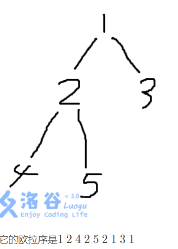
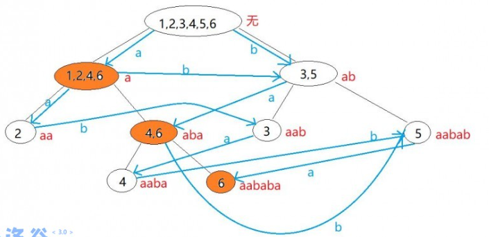

<div align="right">--by lr580</div>

# 前言

## 备注

由于原笔记篇幅过长，无法继续维护(加载和修改都太卡了)，所以打算大规模精简原笔记内容，只保留重要知识点，并删去绝大部分例题代码。所有笔记内代码只给板子代码或尽可能只给关键部分代码。

新版目录为：C/C++ ，算法，例题。合并数据结构和算法一级目录，合并C语言和C++。例题为新增的，只有索引功能，具体例题和代码见出处题库和其他地方笔记。例题目录按出处整理，内部按时间等排序，不按知识点分类。

由于时间有限，新版笔记的更新将会比较随缘，每次需要用到什么知识点就会顺手更新。

不会照抄旧笔记，会进行二次整理。

对格式上，大致修改要点如下：

- 添加图片，不局限于纯文本
- 术语尽量双英，为英文题面作准备
- 增加超链接 (特别是题目) ，方便跳转，省去搜索

部分修改细节：

- 为了兼容性和简便性，将复杂度符号直接写大写字母 O 而不是希腊字母 Omicron


## 更新日记

### 旧版本

原笔记不再更新

- 20/9/18,开始编写本笔记，从《算法竞赛入门经典》的第二章开始记笔记，其他有待补充
- 20/10/8 完成C的知识网络(主要来源:《C语言程序设计》)，为12627词
- 20/10/26整合部分内容，添加C++部分，重新改版部分笔记。此时约2.2万词(误差向上不超过3千词)
- 20/11/4 完成C++知识网络，现49576词
- 20/11/17 修改了部分编排，将数据结构独立成了一级标题。现51950词
- 20/12/12 修改了数据结构编排。增加了一些内容。现58145词
- 21/1/17 大量增加了算法/数据结构的内容和例题，现100664词
- 21/2/1 将动态规划章在算法中独立为二级标题，现123642词
- 21/3/11 大量增加了算法/数据结构的内容和例题，现170648词
- 21/3/21 修改了较多二/三/四级标题的编排，增加了算法内容，现185592词
- 21/5/31 增加了较多的算法/数据结构内容和例题，现239079词
- 21/10/28 增加了较多的算法/数据结构内容和例题，现281816词

### 新版本

- 21/10/30 开始随缘重制算法笔记；

  补充二分查找STL

  新增计数排序、后缀树组、例题三题

- 21/10/31

  补充位运算、树链剖分、搜索、常规运算

  新增平衡树

- 21/11/1

  新增对红黑树和跳表的简述、桶排序


# 程序语言

以 C/C++ 为主，可能还有算法相关的 Python 和 Java。

个人常用开头：

```c++
#include <bits/stdc++.h>
#define re
using namespace std;
typedef long long ll;
#define il inline
typedef double db;
il ll read()
{
    re char p = 0;
    re ll r = 0, o = 0;
    for (; p < '0' || p > '9'; o |= p == '-', p = getchar())
        ;
    for (; p >= '0' && p <= '9'; r = (r << 1) + (r << 3) + (p ^ 48), p = getchar())
        ;
    return o ? (~r) + 1 : r;
}
#define sc(x) x = read()

signed main()
{
    
    return 0;
}
```


## 运算

#### 常规运算

注意：

- 浮点数除，被除数为 $0$ ，被除数和除数存在一个负数，结果为负零
- 取模只可以是整型之间的；负数运算结果等于取绝对值计算，最后正负号与被除数一致，如 $(-5)\bmod 3=-2,5\bmod (-3)=2$

整数上取整公式：
$$
\lceil\dfrac ab\rceil=\dfrac{a+b-1}b=\dfrac{a-1}b+1
$$


### 位运算

#### 基本知识

异或的性质：

- 交换律、结合律、消去律，有单位元$0$，自己与自己运算得单位元

- $a\oplus b\le a+b=(a|b)+(a\&b)$ 

  前半句：因异或是不进位的加法；后半句：因 $a\&b$ 是进位部分


注意要点：

- 优先级： `~; +, -; <<, >>; ==, !=; &; ^; |; &&; ||; ?:`
- 移位结果为 ll 时应该是 `1LL << k`
- 右移位，等同于round(x/2.0)，负数的移位结果不会大于-1


常见应用：

- 取正数 `x` 的从左往右(从零数)第 `i` 位：`(x>>i)&1`

- 对某个正数 `x` 从左往右(从零数)第 `k` 位修改取反： `x^=(1<<k)`

- `c&15`  或 `c^'0'` 优化 数字字符转数值

- > `~` 运算仅对 $-1$ 得 $0$ ，可以用于递减到 0 的循环枚举常数优化

- > `^` 用于汉明码


#### 内建函数

- 注：对 `unsigned long long` 每个函数名后面加上 `ll` (传入的是什么类型不影响结果, 影响的是函数名)

**1.__builtin_popcount(unsigned int n)**

该函数时判断n的二进制中有多少个1

```c
int n = 15; //二进制为1111
cout<<__builtin_popcount(n)<<endl;//输出4
```

**2.__builtin_parity(unsigned int n)**
该函数是判断n的二进制中1的个数的奇偶性

```c
int n = 15;//二进制为1111
int m = 7;//111
cout<<__builtin_parity(n)<<endl;//偶数个，输出0
cout<<__builtin_parity(m)<<endl;//奇数个，输出1
```

**3.__builtin_ffs(unsigned int n)**
该函数判断n的二进制末尾最后一个1的位置，从一开始

```c
int n = 1;//1
int m = 8;//1000
cout<<__builtin_ffs(n)<<endl;//输出1
cout<<__builtin_ffs(m)<<endl;//输出4
```

**4.__builtin_ctz(unsigned int n)**
该函数判断n的二进制末尾后面0的个数，当n为0时，和n的类型有关

```c
int n = 1;//1
int m = 8;//1000
cout<<__builtin_ctzll(n)<<endl;//输出0
cout<<__builtin_ctz(m)<<endl;//输出3
```

**5. __builtin_clz (unsigned int x)**
返回前导的0的个数。

```c++
int n = 1;	//1
int m = 8;	//1000
cout<< 32 - __builtin_clz(n) <<endl;	//输出1
cout<< 64 - __builtin_clzll(m) <<endl;	//输出4
```

应用：`31 - __builtin_clz(n)` 等效于 $\lfloor\log_2n\rfloor$ 


## STL

### 模板

### 函数

#### 二分

bound函数，参数`起始迭代器,终止迭代器,值` ，二分查找`[起,止)`

**upper_bound** 大于 x 的第一个位置

**lower_bound** 大于等于 x 的第一个位置


对升序序列：

`lower_bound(begin, end, v)`  在 $[begin,end)$ 找第一个大于等于 $v$ 的值，返回该值的迭代器

`upper_bound(begin, end, v)`  在 $[begin,end)$ 找第一个大于 $v$ 的值，返回该值的迭代器

若找不到返回 $end$


对降序序列：

`lower_bound(begin, end, v, greater<type>())`  在 $[begin,end)$ 找第一个小于等于 $v$ 的值，返回该值的迭代器

`upper_bound(begin, end, v, greater<type>())`  在 $[begin,end)$ 找第一个小于 $v$ 的值，返回该值的迭代器

若找不到返回 $end$


以二分搜索向左第一个数为例：

```c++
int d = lower_bound(a,a+n,f)-a;
if(f!=a[d]) printf("-1");
else printf("%d", d+1);
```

默认对非降序列使用，如果要对下降序列使用，需要加greater如下(指针写法)：

```c++
*upper_bound(d1+1,d1+1+len1,a[i],greater<int>())=a[i];
```


应用举例：

1. 二分查找值区间 $[a,b]$ 长：`u(,,b)-l(,,a)`


#### 数组

##### 归并排序

`inplace_merge(lf, cf, rf[, cmp])` ，将排好序的 $[lf,cf),[cf,rf)$ 合并成一个数组，排序依据是 `cmp` 。显然传入的是迭代器或指针

`merge(lf1, rf1, lf2, rf2[, cmp])` 同理


### 数据类型

#### tuple

直接用 `{}` 构造

取出(如 `map` 迭代器里的可能要先 `second` 一下)，然后用 `tie(a,b,c)=tuple变量` 的方法获得每个元素


### 其他库

#### 随机

##### mt19937

设随机数种子和随机数：

```c++
#include <iostream>
#include <chrono>
#include <random>
using namespace std;
int main()
{
    // 随机数种子
	unsigned seed = std::chrono::system_clock::now().time_since_epoch().count();
    mt19937 rand_num(seed);	 // 大随机数
	cout << rand_num() << endl;
	return 0;
}
```

添加随机数的值域范围：

```c++
#include <iostream>
#include <chrono>
#include <random>
using namespace std;
int main()
{
	// 随机数种子
	unsigned seed = std::chrono::system_clock::now().time_since_epoch().count();
	mt19937 rand_num(seed);  // 大随机数
	uniform_int_distribution<long long> dist(0, 1000000000);  // 给定范围
	cout << dist(rand_num) << endl;
	return 0;
}
```

##### 手写随机

###### 版本1

缺点：周期很短，周期大概是20多。

```c++
#include <bits/stdc++.h>
namespace GenHelper
{
    int z1, z2, z3, z4, z5, u, res;
    int get()
    {
        z5 = ((z1 << 6) ^ z1) >> 13;
        z1 = ((int)(z1 & 4294967) << 18) ^ z5;
        z5 = ((z2 << 2) ^ z2) >> 27;
        z2 = ((z2 & 4294968) << 2) ^ z5;
        z5 = ((z3 << 13) ^ z3) >> 21;
        z3 = ((z3 & 4294967) << 7) ^ z5;
        z5 = ((z4 << 3) ^ z4) >> 12;
        z4 = ((z4 & 4294967) << 13) ^ z5;
        return (z1 ^ z2 ^ z3 ^ z4);
    }
    int read(int m)
    {
        u = get();
        u >>= 1;
        if (m == 0)
            res = u;
        else
            res = (u / 2345 + 1000054321) % m;
        return res;
    }
    void srand(int x)
    {
        z1 = x;
        z2 = (~x) ^ (0x23333333);
        z3 = x ^ (0x12345798);
        z4 = (~x) + 51;
        u = 0;
    }
}
using namespace GenHelper;
int n, a[10000010], seed, m;
signed main()
{
    scanf("%d%d%d", &n, &m, &seed);
    srand(seed);
    for (int i = 1; i <= n; ++i)
    {
        a[i] = read(m);
        printf("%d ", a[i]);
    }
    return 0;
}
```


#### 正则表达式

[参考网址](https://www.cnblogs.com/coolcpp/p/cpp-regex.html) 

##### 示例

###### 替换全部

```c++
char data[] = "he...ll..o, worl..d!";
std::regex reg("\\.");
std::cout << std::regex_replace(data, reg, "");
```

###### 匹配全部单词

```c++
#include <bits/stdc++.h>
using namespace std;
typedef long long ll;
ll n;
string s, t;
signed main()
{
    scanf("%lld%*c", &n);
    while (n--)
    {
        getline(cin, s);
        cin >> t;
        cin.ignore();
        regex reg("\\b" + t + "\\b");
        smatch m;
        auto lf = s.cbegin(); // begin(),end()参数不匹配
        auto rf = s.cend();
        ll ans = 0;
        for (; regex_search(lf, rf, m, reg); lf = m.suffix().first)
            ++ans;
        cout << ans << '\n' ;
    }
    return 0;
}
```


## 快读快写

### C/C++

略

(2021CCPC广州C题：)


### Python

读：(优化非常明显)

```python
import sys
input = sys.stdin.readline
```

写：(只能输出字符串，优化不明显)

```python
import sys
print = sys.stdout.write
```


### Java

```java
import java.io.*;

static StreamTokenizer scanner = new StreamTokenizer(new BufferedReader(new InputStreamReader(System.in)));
static PrintWriter out = new PrintWriter(new BufferedWriter(new OutputStreamWriter(System.out)));
public static int nextInt() throws IOException {
    scanner.nextToken();
    return (int) scanner.nval;
}
public static long nextLong() throws IOException {
    scanner.nextToken();
    return (long) scanner.nval;
}
static String next() throws IOException {
    scanner.nextToken();
    return scanner.sval;
}
out.println(...);
out.close();
```


# 算法

## 基础

### 复杂度

#### 计算理论

复杂度的类型：多项式，如 $O(1),O(\log n),O(n^a)$ ；非多项式如 $O(a^n),O(n!)$ 

约化(Reducibility)，A可约化为B的意思是可以用B的解法解决A。如求解一元一次方程可以约化为求一元二次方程。约化具有传递性。

P problem：对于任意的输入规模 n，问题都可以在 n 的多项式时间内得到**解决**

NP(Non-deterministic Polynomial) problem：可以在多项式的时间里**验证**一个解的问题

NPC(Non-deterministic Polynomial Complete) Problem: 是NP问题且所有NP问题都可以约化到它

> 一些经典的 NPC 问题：旅行商问题的判定版本、最大独立集问题的判定版本、最小点覆盖问题的判定版本、最长路问题的判定版本、0-1 整数规划问题的判定版本、集合覆盖问题、图着色问题、背包问题、三维匹配问题、最大割问题的判定版本

NP-hard Problem: 有NP问题都可以约化到它，但不是NP问题(不存在多项式复杂度的解法的)

经典问题：是否NP类问题=P类问题 (是否所有能在多项式时间内验证得出正确解的问题，都是具有多项式时间算法的问题)


### 排序


#### 计数排序

设 $w$ 是值域大小，时间复杂度为 $\Omicron(n+w)$ 。

**写法一**步骤为：

- 求每个数出现了几次，存 $cnt$ 数组里
- 遍历 $cnt$ 数组，对每个 $cnt[i]$ 循环 $cnt[i]$ 次插入 $i$ 

写法一图解：


写法一代码略。

**写法二**步骤为：(模拟一次易懂)(该写法优点为简洁，且不用遍历空，缺点是多了一个 $\Omicron(m)$ 的前缀和，可能性能更低)

- 求每个数出现了几次，存 $cnt$ 数组里
- 对 $cnt$ 求前缀和
- 从右至左求排序好每个数

代码：

```c++
for (int i = 1; i <= n; ++i) ++cnt[a[i]];
for (int i = 1; i <= w; ++i) cnt[i] += cnt[i - 1];
for (int i = n; i >= 1; --i) b[cnt[a[i]]--] = a[i];
```

> 注意不要写成`b[cnt[a[i]--]]`


#### 基数排序

Radix Sort

动图有待补充

将待排序元素分为 $k$ 个关键字 (如对 $k$ 位整数分为 $k$ 个个位数，对结构体按元素直接分)，倒着以每个关键字为依据排序。


复杂度为 $k\times$ $f(n)$， $f$ 是内层排序算法复杂度。空间复杂度 da

排序稳定与否取决于关键字排序稳定与否。技巧：

- 关键字值域小时用计数排序，大的时候可以用快排


参考代码：

```c++
#define mn 8000010
ll n, a[mn], q, x, t[mn];
void radixsort(ll n)
{
    ll *b = new ll[n];
    ll *cnt = new ll[1 << 8];
    ll mask = (1 << 8) - 1;
    ll *x = a, *y = b;
    for (ll i = 0; i < 32; i += 8)
    {
        for (ll j = 0; j != (1 << 8); ++j)
        {
            cnt[j] = 0;
        }
        for (ll j = 0; j != n; ++j)
        {
            ++cnt[x[j] >> i & mask];
        }
        for (ll sum = 0, j = 0; j != (1 << 8); ++j)
        {
            sum += cnt[j], cnt[j] = sum - cnt[j];
        }
        for (ll j = 0; j != n; ++j)
        {
            y[cnt[x[j] >> i & mask]++] = x[j];
        }
        swap(x, y);
    }
    delete[] cnt;
    delete[] b;
}
signed main()
{
    sc(n);
    for (ll i = 0; i < n; ++i)
    {
        sc(a[i]);
    }
    radixsort(n);
    sc(q);
    while (q--)
    {
        sc(x);
        printf("%d\n", a[x - 1]);
    }
    return 0;
}
```


#### 桶排序

Bucket Sort

分块的思维，将值域为 $w$ 的数据分成 $k$ 块，对 $k$ 块数据单独排序，排序后再合并。时间复杂度为分块时间复杂度 $+$ $k\times $ 块内排序时间复杂度 $+$ 合并复杂度。前后为线性，总复杂度主要看中间。若 $k\approx n$ ，假设用插入排序，时间复杂度为 $\Omicron(n+\dfrac{n^2}k+n)=\Omicron(n)$ 。最坏时间复杂度为 $\Omicron(n^2)$ 。空间复杂度为 $\Omicron(n)$ （用vector）

排序稳定与否取决于对块的排序稳定与否。

思路很简单。细节：

- 可以设块数目为 `k=w/n+1` ，那么 `a[i]` 在块 `a[i]/k` 里。或者干脆对最值开根号。
- 若分布不均，可能会有空块出现

参考代码：

```c++
ll n, a[8000010], mx, span, bl;
vector<ll> b[65536];
signed main()
{
    sc(n);
    for (ll i = 1; i <= n; ++i)
    {
        sc(a[i]);
        mx = max(mx, a[i]);
    }
    span = sqrt(mx) + 1; //块长
    bl = mx / span;
    for (ll i = 1; i <= n; ++i)
    {
        b[a[i] / span].emplace_back(a[i]);
    }
    for (ll i = 0, k = 0; i < 65536; ++i)
    {
        sort(b[i].begin(), b[i].end());
        for (ll j = 0, je = b[i].size(); j < je; ++j)
        {
            a[++k] = b[i][j];
        }
    }
    return 0;
}
```


#### 其他


### 二分

#### 序列问题

##### 最长单调序列

LIS (longest increase sequence)

单调栈上二分 复杂度 $O(n\log n)$

Dilworth定理：偏序集的最少反链划分数等于最长链的长度

即：求一个序列最少能分成多少个最长不上升序列，可以求最长上升序列的长度即为答案。其他情况类推。

```c++
#include <bits/stdc++.h>
#define MAXN 100002
#define y1 dy
using namespace std;
int n,a[MAXN],uf[MAXN],df[MAXN],ufl,dfl,x[MAXN],y[MAXN],x1,y1;
int main()
{
    while(EOF!=scanf("%d",&a[++n]));//这样的n比真实+1
    uf[++ufl]=df[++dfl]=a[1];
    x[++x1]=y[++y1]=a[1];
    for(int i=2;i<n;i++)
    {
        if(uf[ufl]>=a[i])uf[++ufl]=a[i];//最长不上升
        else *upper_bound(uf+1,uf+1+ufl,a[i],greater<int>())=a[i];
        
        if(df[dfl]<a[i])df[++dfl]=a[i];//最长上升,与上面互为定律
        else *lower_bound(df+1,df+1+dfl,a[i])=a[i];
        
        if(x[x1]>a[i])x[++x1]=a[i];//最长下降
        else *upper_bound(x+1,x+1+x1,a[i],greater<int>())=a[i];
        
        if(y[y1]<=a[i])y[++y1]=a[i];//最长不下降,与上面互为定律
        else *lower_bound(y+1,y+1+y1,a[i])=a[i];
    }
    printf("\n%d\n%d\n%d\n%d",ufl,dfl,x1,y1);
    return 0;
}
```

规律：

- 对降的(严格降、非严格降(即不升))，一律用 `upper_bound` + `greater<>()` 求第一个小于它的，将这个位置改成更大，得更优解
- 对升的，一律用 `lower_bound` 求第一个大于它的，将这个位置改成更小，得更优解

模板题 P1020 导弹拦截 

例题 P2782 友好城市


##### 最长公共排列

LCS(longest common sequence)

假设元素互不重复，将一个序列重定义为它的每个元素在另一个序列里出现的位置，即设 $h[a[i]]=i$ ，令 $b[i]=h[b[i]]$ 。那么，只需要求该序列的最长上升子序列即可。

模板题 P1439 最长公共子序列

对最长公共序列，$O(n^2)$ 的 DP 见 P2543 ，拓展到不等长：UVA 10635 Prince and Princess


#### 整体二分

主体思路：把多个查询一起解决。(离线算法)

需要满足以下性质：

1. 询问的答案可以二分
2. 修改对判定答案的贡献相互独立，修改之间不影响效果
3. 修改若对判定答案有贡献，则贡献为一个确定的与判定标准无关的值
4. 贡献满足交换律、结合律、具有可加性
5. 题目允许离线算法

时间复杂度 $O(T\log n)$ 。当使用别的结构(如树状数组)时，叠加复杂度

例题 P3834 , P2617, P1527


## 数据结构

### 线性结构

> #### 链表
>

> ##### 跳表
>

> 跳表是对有序链表的改进，具有有序链表所有性质，在保持与链表一样的空间性能(即线性复杂度)的情况下，把查询、插入和删除的平均时间复杂度从线性复杂度优化为了对数复杂度。
> 跳表的基本思路是分层和分治、倍增，每一层都是一个有序链表，第一层是原式的有序链表，高层链表是低层有序链表的子集。在跳表里查询某个节点，从最高层开始水平移动，直到下一个节点不符合条件就往下一层，直到到达第一层且找到节点结束。由于高层链表短，所以跳过了很多不必要的比较，所以查询快于普通有序链表。由于采用了分治思想，所以复杂度是对数级的。在查询到节点后，便可以用常数复杂度进行插入和删除操作，因此，它们的总复杂度也是对数级的。
> 应用：所有需要用到有序链表的场景都可以用跳表进行优化。


#### 哈希表

##### 手写

不同哈希策略的比较(仅供参考)：

设哈希函数为 $H(x)=x\bmod len$ ，即除留余数法

使用开放定址法，并使用线性探测法 $key=key+d_i\bmod m$ ，设 $d_i=2333$ 。

一：实践检验  $len$ 的影响

设 $len$ 为 $10^7$ ，冲突率过高， TLE

设 $len$ 为 $2\times 10^7$ 或其附近的素数，或更大的数字，用时均为 $4.2s$ 

二：实践检验  $d_i$ 的影响

$len$ 固定为 $2\times10^7+3$ ，已知 $d_i=2333$ ( $2333$ 是质数)时表现为 $4.2s$

更改 $d_i$ 为 $1$ ， TLE 

更改 $d_i$ 为 $2332$ ，用时为 $4.1s$ 

更改 $d_i$ 为 $1,2,3,\cdots$ ， TLE

更改线性探测法为幂次方探测法：

更改 $d_i$ 为 $1^2,2^2,3^2,\cdots$ ，用时为 $2.8s$ 

更改 $d_i$ 为 $1^3,2^3,3^3,\dots$ ，用时为 $1.3s$

更改 $d_i$ 为 $1^4,2^4,3^4,\dots$ ，用时为 $0.985s$

继续提升 $d_i$ 为 $1^5,2^5,3^5,\cdots$ 等继续升幂，没有明显改进，甚至可能变慢。

更改 $d_i$ 为 $1^2,-1^2,2^2,-2^2,\cdots$ ，用时为 $0.76s$ (二次探测法)

更改 $d_i$ 为 $1^3,-1^3,2^3,-2^3,\cdots$ ，用时没有改善

三：实践检验拉链法

使用 vector 拉链，用时为 $2.5s$ ，空间开销自带几倍常数 (约 $450MB$ )

使用 set 拉链，用时为 $3.3s$ ，空间开销是十多倍常数(接近 $1GB$)

使用 unordered\_set  拉链，用时同上，但直接 MLE

使用 deque 拉链，直接 RE 和几乎 MLE ，实践表明约 $7.5\times 10^5$ 个 deque 就直接 $500MB$ 了

使用 `pb_ds` 的红黑树，用时约 $2.7s$ ， MLE

使用 `pb_ds` 的splay树，用时约 $2.7s$ ， MLE

使用 `pb_ds` 的有序向量树，用时约 $3.5s$ ，约 $900MB$


综上所述，实践表明：对随机数据和一倍空间冗余的除留余数法哈希函数，开放定址最优，最优冲突处理策略是二次探测法。

参考代码：(一倍空间冗余的除留余数法+开放定址法+二次探测法)

```c++
#include <bits/stdc++.h>
using namespace std;
#define mn 20000003
int n, a[mn], seed, m, ans;
signed main()
{
    scanf("%d%d%d", &n, &m, &seed);
    mt19937 mt(seed);
    uniform_int_distribution<int> dist(0, m);
    for (int i = 1; i <= n; ++i)
    {
        int v = dist(mt) + 1; //防止哈希值为0跟空重复，使其值域为[1,m+1]
        int hi = v % mn;
        bool repeat = a[hi] == v;
        int dt = 1, dv = 1;
        while (a[hi] != 0)
        {
            hi = (hi + dv * dt * dt) % mn;
            dv = -1 * dv;
            if (dv == 1)
            {
                ++dt;
            }
            if (a[hi] == v)
            {
                repeat = true;
                break;
            }
        }
        if (!repeat)
        {
            ++ans;
            a[hi] = v;
        }
    }
    printf("%d", ans);
    return 0;
}
```

参考代码：(除留余数法+vector拉链法)

```c++
#include <bits/stdc++.h>
using namespace std;
#define mn 10000010
int n, seed, m, ans;
vector<int> a[mn];
signed main()
{
    scanf("%d%d%d", &n, &m, &seed);
    mt19937 mt(seed);
    uniform_int_distribution<int> dist(0, m);
    for (int i = 1; i <= n; ++i)
    {
        int v = dist(mt);
        int hi = v % mn;
        bool repeat = false;
        for (auto &j : a[hi])
        {
            if (j == v)
            {
                repeat = true;
                break;
            }
        }
        if (!repeat)
        {
            ++ans;
            a[hi].emplace_back(v);
        }
    }
    printf("%d", ans);
    return 0;
}
```


> 附：从理论而言，散列表的装填因子load factor，设 $\alpha=\dfrac nm$ ，平均查找长度是 $a$ 的函数，且有：

> | 处理冲突的方法\平均查找长度 |                 查找成功时                 |                   查找失败时                   |
> | :-------------------------: | :----------------------------------------: | :--------------------------------------------: |
> |         线性探测法          | $\dfrac12\left(1+\dfrac1{1-\alpha}\right)$ | $\dfrac12\left(1+\dfrac1{(1-\alpha)^2}\right)$ |
> |         二次探测法          |       $-\dfrac1\alpha\ln(1+\alpha)$        |              $\dfrac1{1-\alpha}$               |
> |           拉链法            |             $1+\dfrac\alpha2$              |              $\alpha+e^{-\alpha}$              |

> 为获得空间效率，建议保持 $\alpha > 0.5$ ，至少是半满的，一般上限设为 $0.9$ 


### 树

#### 树

##### 重心

以重心为根的有根树里所有子树中最大子树节点数最小

性质：

- 重心为根时，所有子树大小不超过树节点数(大小)的一半
- 树的所有点到单点的距离和中，重心距离和最小
- 重心可能有一个或两个
- 把两棵树通过一条边相连得到一棵新的树，那么新的树的重心在连接原来两棵树的重心的路径上
- 在一棵树上添加或删除一个叶子，那么它的重心最多只移动一条边的距离

求法：DFS

```c++
// 这份代码默认节点编号从 1 开始，即 i ∈ [1,n]
int size[MAXN],  // 这个节点的“大小”（所有子树上节点数 + 该节点）
    weight[MAXN],  // 这个节点的“重量”
    centroid[2];   // 用于记录树的重心（存的是节点编号）
void GetCentroid(int cur, int fa) {  // cur 表示当前节点 (current)
  size[cur] = 1;
  weight[cur] = 0;
  for (int i = head[cur]; i != -1; i = e[i].nxt) {
    if (e[i].to != fa) {  // e[i].to 表示这条有向边所通向的节点。
      GetCentroid(e[i].to, cur);
      size[cur] += size[e[i].to];
      weight[cur] = max(weight[cur], size[e[i].to]);
    }
  }
  weight[cur] = max(weight[cur], n - size[cur]);
  if (weight[cur] <= n / 2) {  // 依照树的重心的定义统计
    centroid[centroid[0] != 0] = cur;
  }
}
```


例题：

- poj 1655 Balancing Act
- 洛谷 p1364 医院设置


##### LCA

性质：

- 若 $u,v$ 不存在一个为另一个祖先的关系，那么 $u,v$ 在 $LCA(u,v)$ 的不同子树
- 先序遍历 LCA 先于 $u,v$ 出现；后序遍历后于
- 两点集并的 $LCA$ 为各自的 $LCA$ 的 $LCA$ ： $LCA(A\cup B)=LCA(LCA(A),LCA(B))$ 
- $LCA$ 必然在 $u,v$ 最短路上

求法：

- 倍增 $O(n\log n)$
- 树剖(跳到同一条链就显然可以得出深度小的是 LCA 了，那么显然 $O(n\log n)$ )
- 欧拉序 + RMQ $O(n\log n)-\sim O(1)$
- Tarjan 离线 $O(n+m)$ 常数比较大


以 Tarjan 为例(因为其他的都会了)：

1. 首先接受输入（邻接链表）、查询（存储在另一个邻接链表内）。查询边其实是虚拟加上去的边，为了方便，每次输入查询边的时候，将这个边及其反向边都加入到 `queryEdge` 数组里。
2. 然后对其进行一次 DFS 遍历，同时使用 `visited` 数组进行记录某个结点是否被访问过、`parent` 记录当前结点的父亲结点。
3. 其中涉及到了 `回溯思想`，我们每次遍历到某个结点的时候，认为这个结点的根结点就是它本身。让以这个结点为根节点的 DFS 全部遍历完毕了以后，再将 `这个结点的根节点` 设置为 `这个结点的父一级结点`。
4. 回溯的时候，如果以该节点为起点，`queryEdge` 查询边的另一个结点也恰好访问过了，则直接更新查询边的 LCA 结果。
5. 最后输出结果。


##### 树链剖分

###### 概念

通常指重链剖分。

定义：

**重子节点** 表示其直接子节点中子树最大(即树节点最多)的子结点。如果有多个子树最大的子结点，取其一。如果没有子节点，就无重子节点。

**轻子节点** 表示剩余的所有子结点。

从根结点到重子节点的边为 **重边**。到其他轻子节点的边为 **轻边**。若干条首尾衔接的重边构成 **重链**。把落单的结点也当作重链，那么整棵树就被剖分成若干条重链。

要求：有根树，[编号从 $1$ 开始]

性质：

- 以重边优先的 DFS 序为新编号的重建树满足子树 $x$ 的节点范围是 $[x,x+siz_x-1]$ ，其中 $siz_x$ 是包含自身在内的子树节点数。

  因此支持用线段树、主席树维护树上任意子树信息

- 将树上任意一条路径划分为不超过 $\Omicron(\log n)$ 连续的重链或重链的一部分

  因此支持用线段树、主席树维护树上任意链的信息

初始化的时间复杂度是$\Omicron(n)$，使用线段树维护时，单路径查询的时间复杂度是$\Omicron(\log^2n)$，单子树查询的时间复杂度是$\Omicron(\log n)$。


###### 实现

> [模板题](https://www.luogu.com.cn/problem/P3384)
>
> 给定n点树，1 x y z将x到y的最短路所有节点加z，2 x y输出x到y最短路所有节点和，3 x z将x为根节点的子树内所有节点值加z，4 x查询x为根节点的子树内所有节点值和。根节点为r。结果对mod取模。

注：如果RE可以尝试线段树长度开二倍长

> 树剖的实现分两个 DFS 的过程。第一个 DFS 记录每个结点的父节点（fa）、深度（dep）、子树大小（siz）、重子节点（hvson）。第二个 DFS 记录所在链的链顶（top，应初始化为结点本身）、重边优先遍历时的 DFS 序（dfn）、DFS 序对应的节点编号（rank）。

```c++
#include <bits/stdc++.h>
using namespace std;
typedef long long ll;
typedef double db;
#define sc(x) scanf("%lld", &x)
#define il inline
#define mn 100010
ll n, m, r, mod, ui, vi, k, x, y, z;
#define mkcf ll cf = (lf + rf) >> 1
#define lfs p << 1
#define rfs p << 1 | 1
ll hd[mn], cnt, w[mn], wt[mn];
struct edge
{
    ll to, nx;
} e[mn];
il void adde(ll u, ll v)
{
    e[++cnt] = {v, hd[u]};
    hd[u] = cnt;
}
ll a[mn << 2], laz[mn << 2], lc, rc, res, updv;
ll hvson[mn], id[mn], fa[mn], dfn, dep[mn], siz[mn], top[mn];

il void pushdown(ll lf, ll rf, ll p)
{
    mkcf;
    laz[lfs] += laz[p], laz[rfs] += laz[p];
    (a[lfs] += laz[p] * (cf - lf + 1)) %= mod;
    (a[rfs] += laz[p] * (rf - cf)) %= mod;
    laz[p] = 0;
}
il void build(ll lf = 1, ll rf = n, ll p = 1)
{
    if (lf == rf)
    {
        a[p] = wt[lf] % mod;
        return;
    }
    mkcf;
    build(lf, cf, lfs), build(cf + 1, rf, rfs);
    a[p] = (a[lfs] + a[rfs]) % mod;
}
il void query(ll lf = 1, ll rf = n, ll p = 1)
{
    if (lc <= lf && rf <= rc)
    {
        (res += a[p]) %= mod;
        return;
    }
    pushdown(lf, rf, p);
    mkcf;
    if (lc <= cf)
    {
        query(lf, cf, lfs);
    }
    if (rc > cf)
    {
        query(cf + 1, rf, rfs);
    }
}
il void update(ll lf = 1, ll rf = n, ll p = 1)
{
    if (lc <= lf && rf <= rc)
    {
        laz[p] += updv;
        a[p] += updv * (rf - lf + 1) % mod;
        return;
    }
    pushdown(lf, rf, p);
    mkcf;
    if (lc <= cf)
    {
        update(lf, cf, lfs);
    }
    if (rc > cf)
    {
        update(cf + 1, rf, rfs);
    }
    a[p] = (a[lfs] + a[rfs]) % mod;
}

il ll qrange(ll x, ll y)
{
    ll ans = 0;
    while (top[x] != top[y])
    {
        if (dep[top[x]] < dep[top[y]])
        {
            swap(x, y);
        }
        res = 0, lc = id[top[x]], rc = id[x], query();
        (ans += res) %= mod;
        x = fa[top[x]];
    }
    if (dep[x] > dep[y])
    {
        swap(x, y);
    }
    res = 0, lc = id[x], rc = id[y], query();
    return (ans + res) % mod;
}

il void frange(ll x, ll y, ll k)
{
    updv = k % mod;
    while (top[x] != top[y])
    {
        if (dep[top[x]] < dep[top[y]])
        {
            swap(x, y);
        }
        lc = id[top[x]], rc = id[x], update();
        x = fa[top[x]];
    }
    if (dep[x] > dep[y])
    {
        swap(x, y);
    }
    lc = id[x], rc = id[y], update();
}

il ll qson(ll x)
{
    res = 0, lc = id[x], rc = id[x] + siz[x] - 1, query();
    return res;
}

il void fson(ll x, ll k)
{
    updv = k % mod, lc = id[x], rc = id[x] + siz[x] - 1, update();
}

void dfs(ll x, ll f, ll deep)
{
    dep[x] = deep, fa[x] = f, siz[x] = 1;
    ll hvsonv = -1, y;
    for (ll i = hd[x]; i; i = e[i].nx)
    {
        y = e[i].to;
        if (y == f)
        {
            continue;
        }
        dfs(y, x, deep + 1);
        siz[x] += siz[y];
        if (siz[y] > hvsonv)
        {
            hvson[x] = y, hvsonv = siz[y];
        }
    }
}

void dfs(ll x, ll topi)
{
    id[x] = ++dfn, wt[dfn] = w[x], top[x] = topi;
    if (!hvson[x])
    {
        return;
    }
    dfs(hvson[x], topi);
    for (ll i = hd[x]; i; i = e[i].nx)
    {
        ll y = e[i].to;
        if (y == fa[x] || y == hvson[x])
        {
            continue;
        }
        dfs(y, y);
    }
}

signed main()
{
    sc(n), sc(m), sc(r), sc(mod);
    for (ll i = 1; i <= n; ++i)
    {
        sc(w[i]);
    }
    for (ll i = 1; i < n; ++i)
    {
        sc(ui), sc(vi), adde(ui, vi), adde(vi, ui);
    }
    dfs(r, 0, 1), dfs(r, r), build();
    while (m--)
    {
        sc(k), sc(x);
        if (k == 1)
        {
            sc(y), sc(z), frange(x, y, z);
        }
        else if (k == 2)
        {
            sc(y), printf("%lld\n", qrange(x, y));
        }
        else if (k == 3)
        {
            sc(y), fson(x, y);
        }
        else
        {
            printf("%lld\n", qson(x));
        }
    }
    return 0;
}
```


##### 点分治


#### 二叉搜索树

二叉搜索树性质：左小于根，右大于根。(右大于等于)

插入：设插入节点为 $v$ ，二分查找直到判空，将此时的空节点设为新节点。

删除：先找到这个节点 $p$ ，然后：

- 叶子节点直接删

- 若只有一个子，直接删，用子代替自己

- 若有二子，可以在右子树一直找左子(直到深度最高)设为 $s$ ，则 $s$ 必然无左子，可能有右子 $s_r$，将其替代为原本的这个点(具体为：若 $s$ 的父亲 $s_p \neq p$ ，将 $s_p$ 的左子设为 $s_r$ ；否则 $s_p=p$ ，将 $s_p$ 的右子设为 $s_r$ ，然后将 $p$ 数据替换为 $s$ ，然后删掉 $s$ )

  也可以在左子树找右子，同理

最优时间复杂度均为 $\Omicron(\log n)$ ，最坏为 $\Omicron(n)$ (退化成链)

 

#### 笛卡尔树

以下标作为节点建立的二叉搜索树，同时权值满足堆的性质(例如大根堆)，对一个序列，可以 $O(1)$ 建笛卡尔树

使用单调栈维护最右边一条链上的点，容易知道这条链是从上到下递减的，每次在最右边加入一个元素w[i]，如果它比栈顶大就弹栈，这样就可以找到它应该插入的位置.记录最后一次弹栈的元素last，令栈顶的右儿子是w[i], w[i] 的左儿子是last即可

```c++
void build_tree()
{
	int top=1;stack[1]=1;//为了方便，单调栈只记录下标
	for(int i=2;i<=n;i++)
	{
		int lst=0;
		while(top&&w[i]>w[stack[top]])lst=stack[top--];//弹栈
		fa[lst]=i;if(top)fa[i]=stack[top];
		stack[++top]=i;
	}
	for(int i=1;i<=n;i++)if(fa[i])ade(fa[i],i);else S=i;
    //S是根
}
```

易知一段区间 $[l,r]$ 的最值就是笛卡尔树上 $LCA(l,r)$ (大根堆就最大值)

笛卡尔树是不平衡的(构造单调数列，可以退化成链)

应用： 

线性复杂度求 RMQ 问题。先把序列建一棵大根堆笛卡尔树，然后用 tarjan 求 LCA 或用欧拉序遍历求 LCA ，例如：



欧拉序长度为 $n+\sum son[i]=2n-1$ (其实也就是点数+边数)

欧拉序性质：两点 $l,r$ 的 LCA 是这一段里深度最小的点(根据欧拉序的定义易证)，所以根据 RMQ 可以求 LCA 

性质2：欧拉序上相邻点的深度绝对值差为 $1$


#### 平衡树

Balance Tree, BT

平衡树的性质为：任意节点子树的高度差小于等于 $1$ 。

平衡树维护常规的操作的复杂度为 $\Omicron(\log n)$：

1. 插入点
2. 删除点
3. 查询某个值的**排名**(排名定义为比它小的数的数目 $+1$)
4. 查询某排名的值
5. 求某个点的前驱(最大的小于它的点)
6. 求某个点的后继(最小的大于它的点)

> 常见平衡树： B树(多路平衡)、 AVL树(二叉平衡搜索树)、Treap、WBLT、红黑树


平衡二叉树的节点数证明：深度为 $h$ 的树最少有 $N_h$ 个节点，则显然 $N_0=0,N_1=1$ ，对 $h > 1$ ，根节点占一个节点，设左子树为 $N_{h-1}$ ，右子树为 $N_{h-2}$ 是一种最小构造法，所以有 $N_h=1+N_{h-1}+N_{h-2}$ ，得 $n$ 节点树的深度为 $1.44\log_2(n+2)-1.328$ 。直观上根据类斐波那契数列，可知深度是对数级的，所以查找的复杂度为 $\Omicron(\log n)$ 


> 以下模板以 [这题](https://www.luogu.com.cn/problem/P6136) 为例


##### AVL

Adelson-Velskii 和 Landis ，二叉平衡搜索树

平衡因子：左子树高减去右子树高。

旋转操作的本质是在满足搜索树性质的同时调整高度差。

最小不平衡子树(minimal unbalance subtree) 是离目标点最近的平衡因子绝对值大于 $1$ 的点为根的子树(首个不平衡子树)，根称为最小不平衡点。每次旋转以该子树操作。

定义右旋：(顺时针旋转)


设旋转节点为 $x$ ，$x$ 的左子为 $x_l$ ，将 $x_l$ 的右子 $x_{lr}$ 设为 $x$ 的新左子，将 $x_l$ 的右子设为 $x$ ， $x$ 的父亲的对应子设为 $x_l$ 。

设调整前 $x_{ll}$ 高 $h+1$ ，$x_{lr},x_r$ 高 $h$ 。则原平衡因子为 $2$ ，调整后为 $0$ 。

相似定义左旋：(逆时针旋转)

$x_{rl}$ 设为 $x$ 的新右子， $x_r$ 的左子设为 $x$ ， $x$ 的父亲的对应子设为 $x_l$ 。

设调整前 $x_{rr}$ 高 $h+1$ ， $x_{rl},x_l$ 高 $h$ 。原平衡因子为 $-2$ ，调整后为 $0$


那么若 $x_{lr}=h+1,x_{ll}=x_r=h$ ，平衡因子为 $2$ ，先左旋 $x_l$ ，再右旋 $x$ 。

若 $x_{rl}=h+1,x_{rr}=x_l=h$ ，平衡因子为 $-2$ ，先右旋 $x_r$ ，再左旋 $x$ 。


那么维护平衡的伪代码如下：

```
Maintain-Balanced(p)
    if h[ls[p]] - h[rs[p]] == 2
        if h[ls[ls[p]]] >= h[rs[ls[p]]]
            Right-Rotate(p)
        else
            Left-Rotate(ls[p])
            Right-Rotate(p)
    else if h[ls[p]] - h[rs[p]] == -2
        if h[ls[rs[p]]] <= h[rs[rs[p]]]
            Left-Rotate(p)
        else
            Right-Rotate(rs[p])
            Left-Rotate(p)
```


查找排名的数可能不存在，所以如果找不到需要找后继；且预设一个极大值。

实现 `p6136` 的模板代码为：

```c++
#include<cstdio>
#include<algorithm>
#define int long long
using namespace std;
FILE *fin, *fout;
inline int read(int &x) {//快读，这题常数优化很重要
	char c = 0; int f = x = 0;
	while (c < 48 || c > 57) {
		if (c == -1) return 0;
		if (c == '-') f = 1; c = fgetc(fin);
	}
	while (c > 47 && c < 58) x = (x << 3) + (x << 1) + (c & 15), c = fgetc(fin);
	if (f) x = -x; return 1;
}
template<class T, class... Args> inline int read(T &x, Args&... args) {
	return read(x) + read(args...);
}
inline int write(int x) {
	if (x < 0) return fputc(45, fout), write(-x);
	if (x > 9) write(x / 10);
	return fputc((x % 10) | 48, fout), 1;
}
struct AVLnode;
typedef AVLnode* AVLtree;
struct AVLnode {//这个部分在之前P3369中的题解已经详细讲述了，这里我就不写注释了。
	int data, high;
	int freq, size;
	AVLtree ls, rs;
	AVLnode(): data(0), high(1), freq(1), size(1), ls(NULL), rs(NULL){}
	AVLnode(int a): data(a), high(1), freq(1), size(1), ls(NULL), rs(NULL){}
};
inline int GetSize(AVLtree p) {
	if (p == NULL) return 0;
	return p->size;
}
inline int GetHigh(AVLtree p) {
	if (p == NULL) return 0;
	return p->high;
}
struct AVL {
	AVLtree root;
	inline void update(AVLtree& p) {
		p->size = GetSize(p->ls) + GetSize(p->rs) + p->freq;
		p->high = max(GetHigh(p->ls), GetHigh(p->rs)) + 1;
	}
	inline void LeftPlus(AVLtree& p) {
		AVLtree q;
		q = p->ls;
		p->ls = q->rs;
		q->rs = p;
		update(p);
		update(q);
		p = q;
	}
	inline void RightPlus(AVLtree& p) {
		AVLtree q;
		q = p->rs;
		p->rs = q->ls;
		q->ls = p;
		update(p);
		update(q);
		p = q;
	}
	inline void LeftRight(AVLtree& p) {
		RightPlus(p->ls);
		LeftPlus(p);
	}
	inline void RightLeft(AVLtree& p) {
		LeftPlus(p->rs);
		RightPlus(p);
	}
	inline void Insert(AVLtree &p, int x) {
		if (p == NULL) {
			p = new AVLnode(x);
			return;
		}
		if (p->data == x) {
			++(p->freq);
			update(p);
			return;
		}
		if (p->data > x) {
			Insert(p->ls, x), update(p);
			if (GetHigh(p->ls) - GetHigh(p->rs) == 2) {
				if (x < p->ls->data)
					LeftPlus(p);
				else
					LeftRight(p);
			}
		}
		else {
			Insert(p->rs, x), update(p);
			if (GetHigh(p->rs) - GetHigh(p->ls) == 2) {
				if (x > p->rs->data)
					RightPlus(p);
				else
					RightLeft(p);
			}
		}
		update(p);
	}
	inline void insert(int x) {
		Insert(root, x);
	}
	inline AVLtree Find(AVLtree& p, int x) {//只不过多了一个查找操作
		if (!p) return NULL;
		if (p->data == x) return p;
		if (p->data > x) return Find(p->ls, x);
		return Find(p->rs, x);
	}
	inline AVLtree find(int x) {
		return Find(root, x);
	}
	inline void Erase(AVLtree& p, int x) {
		if (p == NULL) return;
		if (p->data > x) {
			Erase(p->ls, x), update(p);
			if (GetHigh(p->rs) - GetHigh(p->ls) == 2) {
				if (GetHigh(p->rs->rs) >= GetHigh(p->rs->ls))
					RightPlus(p);
				else
					RightLeft(p);
			}
		}
		else if(p->data < x) {
			Erase(p->rs, x), update(p);
			if (GetHigh(p->ls) - GetHigh(p->rs) == 2) {
				if (GetHigh(p->ls->ls) >= GetHigh(p->ls->rs))
					LeftPlus(p);
				else
					LeftRight(p);
			}
		}
		else {
			if (p->freq > 1) {
				--(p->freq);
				update(p);
				return;
			}
			if (p->ls && p->rs) {
				AVLtree q = p->rs;
				while (q->ls) q = q->ls;
				p->freq = q->freq;
				p->data = q->data, q->freq = 1;
				Erase(p->rs, q->data);
				update(p);
				if (GetHigh(p->ls) - GetHigh(p->rs) == 2) {
					if (GetHigh(p->ls->ls) >= GetHigh(p->ls->rs))
						LeftPlus(p);
					else
						LeftRight(p);
				}
			}
			else {
				AVLtree q = p;
				if (p->ls) p = p->ls;
				else if (p->rs) p = p->rs;
				else p = NULL;
				delete q;
				q = NULL;
			}
		}
		if (p == NULL) return;
		update(p);
	}
	inline void erase(int x) {
		Erase(root, x);
	}
	inline int get_val(AVLtree p, int rank) {
		if (GetSize(p->ls) >= rank) return get_val(p->ls, rank);
		if (GetSize(p->ls) + p->freq >= rank) return p->data;
		return get_val(p->rs, rank - GetSize(p->ls) - p->freq);
	}
	inline int GetVal(int rank) {
		return get_val(root, rank);
	}
	inline int get_rank(AVLtree p, int val) {
		if (p->data == val) return GetSize(p->ls) + 1;
		if (p->data > val) return get_rank(p->ls, val);
		return get_rank(p->rs, val) + GetSize(p->ls) + p->freq;
	}
	inline int GetRank(int val) {
		return get_rank(root, val);
	}
	inline int GetPrev(int val) {
		AVLtree ans = new AVLnode(-1LL << 42), p = root;
		while (p) {
			if (p->data == val) {
				if (p->ls) {
					p = p->ls;
					while (p->rs)
						p = p->rs;
					ans = p;
				}
				break;
			}
			if (p->data < val && p->data > ans->data) ans = p;
			p = p->data < val ? p->rs : p->ls;
		}
		return ans->data;
	}
	inline int GetNext(int val) {
		AVLtree ans = new AVLnode(1LL << 42), p = root;
		while (p) {
			if (p->data == val) {
				if (p->rs) {
					p = p->rs;
					while (p->ls)
						p = p->ls;
					ans = p;
				}
				break;
			}
			if (p->data > val && p->data < ans->data) ans = p;
			p = p->data < val ? p->rs : p->ls;
		}
		return ans->data;
	}
};
AVL a;
int n, m, x, opt, last, ans;
signed main() {
	#ifdef ONLINE_JUDGE
	fin = stdin;
	fout = stdout;
	#else
	fin = fopen("P6136.in", "rb");
	fout = fopen("P6136.out", "wb");
	#endif
	read(n, m), a.insert(1LL << 42);//极大值先插入
	for (int i = 1; i <= n; ++i) read(x), a.insert(x);//边读入边插入
	for (int i = 1; i <= m; ++i) {
		read(opt, x), x ^= last;//输入经过加密，要先解密
		switch(opt) {
			case 1: a.insert(x); break;
			case 2: a.erase(x); break;
			case 3:
				if (!a.find(x)) x = a.GetNext(x);//如果找不到，就改为后继
				last = a.GetRank(x), ans ^= last; break;
			case 4: last = a.GetVal(x), ans ^= last; break;
			case 5: last = a.GetPrev(x), ans ^= last; break;
			case 6: last = a.GetNext(x), ans ^= last; break;
		}
	}
	write(ans);
	return 0;
}
```


##### B树

Balanced-tree 平衡多路查找树

$m $ 阶 B树满足下面性质：

- 某非叶子节点的子树数目不超过 $m$
- 非叶子节点、非根节点的子树数目不低于 $\lceil\dfrac m2\rceil$
- 若某非叶子节点有 $n$ 个关键码(值)，那么有 $n+1$ 个子树，且第 $i$ 个子树的所有关键码值小于第 $i$ 个关键码；第 $i+1$ 个子树所有关键码大于第 $i+1$ 个关键码
- 根节点至少有两棵子树

作用：用于查找。

插入关键码 $k$ 的步骤：

- 找到 $k$ 应该插入到哪个叶子节点 $p$， 若 $n_p < m-1$ ，直接插入到此处
- 否则，找到 $p$ 的中位数，将其上溢到父节点，则 $p$ 分裂为两个叶子节点，分别在中位数的两边
- 对父节点递归判断是否需要上溢分裂(根节点也可能上溢分裂)

> 如果根节点没有两棵子树，那么根节点分裂后可能退化为斜树

> 如：
>
> 
>
> 
>
> 

删除关键码 $k$ 的步骤：不会

> - 找到 $p$ ，若是叶子节点直接删
> - 否则，删掉 $i$ 位置对应 $k$ 并用第 $i+1$ 个子树的最小关键码(最左)上移代替被删节点，递归执行该操作直到到达叶子节点
> - 当叶子节点关键码个数大于 $\lceil\dfrac m2\rceil-1$ 直接删除；否则发生下溢，则
> - 若两兄弟节点个数有大于 $\lceil\dfrac m2\rceil$ 时，向兄弟节点借一个关键码(右兄弟最小或左兄弟最大关键码)上移到父亲，父亲对应(小|大于)该上移关键码的码下移到被删除关键字节点中
> - 若两兄弟节点都不满足节点个数有大于 $\lceil\dfrac m2\rceil$ ，
>
> > 删除非叶子节点必然会导致不满足B树性质。


##### 伸展树

Splay Tree ，分裂树

##### 树堆

Treap ，是弱平衡二叉搜索树。

是同时满足堆和二叉搜索树性质的结构：每个节点有随机的 `priority` 值，该值满足大根堆；有 `key` 值，满足二叉搜索树性质，即左小于根，右大于根。

> 实现上有旋转式和无旋式(FHQ-Treap)。

实现如下：

```c++
#include <bits/stdc++.h>
#define re
using namespace std;
typedef long long ll;
#define il inline
typedef double db;
il ll read()
{
    re char p = 0;
    re ll r = 0, o = 0;
    for (; p < '0' || p > '9'; o |= p == '-', p = getchar())
        ;
    for (; p >= '0' && p <= '9'; r = (r << 1) + (r << 3) + (p ^ 48), p = getchar())
        ;
    return o ? (~r) + 1 : r;
}
#define sc(x) x = read()
#define mn 1100010 //这是因为可能插入m个点所以1e6(插入)+1e5(本来)
typedef pair<ll, ll> pr;
ll key[mn], w[mn], siz[mn], son[mn][2], root, seed = 1;
ll n, m, cnt, ans, last, c, x;
il ll rand1() { return seed *= 19260817; } //手写随机
il void pushup(ll u) { siz[u] = siz[son[u][0]] + siz[son[u][1]] + 1; }
pr split(ll u, ll k)
{
    if (!u)
    {
        return {0, 0};
    }
    if (key[u] < k)
    {
        pr t = split(son[u][1], k);
        son[u][1] = t.first;
        pushup(u);
        return {u, t.second};
    }
    else
    {
        pr t = split(son[u][0], k);
        son[u][0] = t.second;
        pushup(u);
        return {t.first, u};
    }
}
ll merge(ll u, ll v)
{
    if (!u || !v)
    {
        return u + v;
    }
    if (w[u] < w[v])
    {
        son[u][1] = merge(son[u][1], v);
        pushup(u);
        return u;
    }
    else
    {
        son[v][0] = merge(u, son[v][0]);
        pushup(v);
        return v;
    }
}
void insert(ll k)
{
    key[++cnt] = k, w[cnt] = rand1(), siz[cnt] = 1;
    pr t = split(root, k);
    root = merge(merge(t.first, cnt), t.second);
}
void del(ll k)
{
    pr x = split(root, k), y = split(x.second, k + 1);
    y.first = merge(son[y.first][0], son[y.first][1]);
    root = merge(x.first, merge(y.first, y.second));
}
ll find1(ll k)
{
    pr t = split(root, k);
    ll v = siz[t.first] + 1;
    root = merge(t.first, t.second);
    return v;
}
ll find2(ll k)
{
    ll pos = root;
    while (pos)
    {
        if (k == siz[son[pos][0]] + 1)
        {
            return key[pos];
        }
        if (k <= siz[son[pos][0]])
        {
            pos = son[pos][0];
        }
        else
        {
            k -= siz[son[pos][0]] + 1, pos = son[pos][1];
        }
    }
    return -1; //to erase warning; in fact non-reachable
}
ll lst(ll k) { return find2(find1(k) - 1); }
ll nxt(ll k) { return find2(find1(k + 1)); }
signed main()
{
    sc(n), sc(m);
    for (ll i = 1; i <= n; ++i)
    {
        sc(x), insert(x);
    }
    for (ll i = 1; i <= m; ++i)
    {
        sc(c), sc(x);
        if (c == 1)
        {
            insert(x ^ last);
        }
        else if (c == 2)
        {
            del(x ^ last);
        }
        else if (c == 3)
        {
            last = find1(x ^ last), ans ^= last;
        }
        else if (c == 4)
        {
            last = find2(x ^ last), ans ^= last;
        }
        else if (c == 5)
        {
            last = lst(x ^ last), ans ^= last;
        }
        else if (c == 6)
        {
            last = nxt(x ^ last), ans ^= last;
        }
    }
    printf("%d\n", ans);
    return 0;
}
```


##### 红黑树

> 红黑树是平衡二叉搜索树的一种，同时具有二者的性质，即：①满足弱平衡性。平衡性指所有子树的高度差不会超过1，弱平衡型意味着高度差有小概率会大于1；②满足搜索树性质，即所有左子树节点小于它的根节点，所有右子树节点大于它的根节点；③满足二叉树的所有性质。
> 红黑树特有的性质为：①节点必然是红色或黑色的；②根节点和叶子节点都是黑色的；③红节点的两个子节点都是黑色的，即叶到根的路径不可能出现两个连续红节点；④黑高平衡性：从任一节点到它子树的叶节点的所有简单路径有同样数目的黑节点。这些性质保证了最长路径(红黑交替)不会超过最短路径(全黑)的两倍，进而实现了弱平衡型。
> 根据以上性质，红黑树可以在对数时间复杂度内实现查找、插入和删除节点。
> 为了在插入、删除节点时仍保持红黑树性质，这些过程一定会对若干相关节点进行调整，使得插入后和删除后仍然满足上面的性质。


#### 01-trie

##### 应用

可以用来实现平衡树。对于值域 $w$ ，空间复杂度是 $\Omicron(n\log w)$ 。

> 以实现洛谷p3369为例，其函数含义比较好理解，不作注释，模板如下：

```c++
#include <cstdio>
#include <algorithm>
const int maxlog = 25;
const int MAXN = 100010;
using namespace std;

namespace trie{
    int id = 2;//此时id = 2 
    int ch[MAXN * maxlog][2];
    int sz[MAXN * maxlog];
    //int nval[MAXN * maxlog];
    int newnode(){
        ch[id][0] = ch[id][1] = sz[id] = 0;
        return id++;
    }               
    void ins(int x,int d){          
        int u = 1;          
        for(int i = maxlog - 1;i >= 0;i--){         
            int v = (x >> i) & 1;//必须是左移x           
            if(!ch[u][v]) ch[u][v] = newnode();         
            u = ch[u][v];       
            sz[u] += d;//sz[1] = 0;     
        }               
        //nval[u] += d;             
    }                                       
    int kth(int k){
        int u = 1;
        int x = 0;
        for(int i = maxlog - 1;i >= 0;i--){
            if(sz[ch[u][0]] >= k){  ///////////////////////////> >=                     
                u = ch[u][0]; 
            }
            else{
                x |= (1 << i);
                k -= sz[ch[u][0]];
                u = ch[u][1];
            }
        }
        return x;
    }
    int nlt(int x){
        int ans = 0;
        int u = 1;
        for(int i = maxlog - 1;i >= 0;i--){
            if((x >> i) & 1){
                ans += sz[ch[u][0]];
                u = ch[u][1];
            }
            else{
                u = ch[u][0];
            }
            if(!u) break;//不必有的 
        }             
        return ans;
    }   
    void clear(){
        ch[1][0] = ch[1][1] = 0;
        id = 2;
    } 
    int pre(int x){
        int ans;
        //ins(x,1);
        ans = kth(nlt(x));
        //ins(x,-1);
        return ans;
    }
    int next(int x){
        int ans;
        //ins(x,1);
        ans = kth(nlt(x+1)+1);
        //ins(x,-1);
        return ans;
    }
} 

const int num = 10000000; 
int main(){
     int n;
     scanf("%d",&n);
     for(int i = 0;i < n;i++){
        int ord,t;
        scanf("%d%d",&ord,&t);
        switch(ord){
            case 1:trie::ins(t + num,1);break;
            case 2:trie::ins(t + num,-1);break;
            case 3:printf("%d\n",trie::nlt(t + num) + 1);break;
            case 4:printf("%d\n",trie::kth(t) - num);break;
            case 5:printf("%d\n",trie::pre(t + num) - num);break;
            case 6:printf("%d\n",trie::next(t + num) - num);break;
        }
    }
    return 0;
} 
```

> 浮点数直接指针强制转long long，按位比较double/single内存是可以的

> $n$ 个叶节点的虚树大小只有 $\Omicron(n)$ 。实现则匹配时遇到失配就分裂当前节点，使得空间复杂度为 $\Omicron(n)$ 


#### K-D Tree

一般 $k=2$ 且 $n$ 远大于 $2^k$ 。具有二叉搜索树的结构。每个点对应 $k$ 维空间点

1. 若当前超长方体中只有一个点，返回这个点。
2. 选择一个维度，将当前超长方体按照这个维度分成两个超长方体。
3. 选择切割点：在选择的维度上选择一个点，这一维度上的值小于这个点的归入一个超长方体（左子树），其余的归入另一个超长方体（右子树）。
4. 将选择的点作为这棵子树的根节点，递归对分出的两个超长方体构建左右子树，维护子树的信息。

以 $k=2$ 为例：


可以构建出：


优化步骤：

1. 每次选择的维度是方差最大的维度
2. 每次选择切割点是该维度的中位数

使用优化 $2$ 等效于二分，使得树高最大为 $O(\log n)$ 。使用快排 (`nth_element` 可以 $O(n)$ 找到中位数并将其进行对应排序)，总复杂度 $O(n\log n)$ 。优化 $1$ 可以在 $O(n)$ 暴力求出。

若涉及插入/删除，引入重构常数 $\alpha$ ，若节点 $x$ 有一个子树节点数在 $x$ 为根子树节点数的占比大于 $\alpha$ ，认为该子树 $x$ 是不平衡的，进行重构，先遍历子树得到子树序列，然后对子树重建树。

插入就根据记录的分割维度和分割点判断应该继续插入到左子树还是右子树，如果到达了空结点，新建一个结点代替这个空结点。成功插入结点后回溯插入的过程，维护结点的信息，如果发现当前的子树不平衡，则重构当前子树。

如果还有删除操作，则使用 惰性删除，即删除一个结点时打上删除标记，而保留其在 k-D Tree 上的位置。如果这样写，当未删除的结点数在以 为根的子树中的占比小于 时，同样认为这个子树是不平衡的，需要重构。

类似于替罪羊树，带重构的 k-D Tree 的树高仍然是 $O(\log n)$ 的。

通常需要维护每个子树的长方形的坐标范围 (左右上下边界)，以进行更好的搜索。

例题 (骗分)平面最近点对P7883 ；P4148(初始空的大矩阵单点修改和区间查询) ;P4475(静态二维离散增函数查询) ; P2093(距离某点第k近)等


#### Link Cut Tree

解决动态树问题的数据结构，前置知识为~~我暂时还没学的~~Splay

在线解决下面问题：

- 查询/修改路径上的所有点权 (树链剖分模板题)
- 断开并连接一些边，保证仍然是一棵树

动态树问题：维护一个 **森林**，支持删除某条边，加入某条边，并保证加边，删边之后仍是森林。我们要维护这个森林的一些信息。一般的操作有两点连通性，两点路径权值和，连接两点和切断某条边、修改信息等

实链剖分：对于一个点连向它所有儿子的边，我们自己选择一条边进行剖分，我们称被选择的边为实边，其他边则为虚边。对于实边，我们称它所连接的儿子为实儿子。对于一条由实边组成的链，我们同样称之为实链。请记住我们选择实链剖分的最重要的原因：它是我们选择的，灵活且可变。正是它的这种灵活可变性，我们采用 Splay Tree 来维护这些实链。

我们可以简单的把 LCT 理解成用一些 Splay 来维护动态的树链剖分，以期实现动态树上的区间操作。对于每条实链，我们建一个 Splay 来维护整个链区间的信息

我们先来看一看辅助树的一些性质，再通过一张图实际了解一下辅助树的具体结构。

在本文里，你可以认为一些 Splay 构成了一个辅助树，每棵辅助树维护的是一棵树，一些辅助树构成了 LCT，其维护的是整个森林。

1. 辅助树由多棵 Splay 组成，每棵 Splay 维护原树中的一条路径，且中序遍历这棵 Splay 得到的点序列，从前到后对应原树“从上到下”的一条路径。
2. 原树每个节点与辅助树的 Splay 节点一一对应。
3. 辅助树的各棵 Splay 之间并不是独立的。每棵 Splay 的根节点的父亲节点本应是空，但在 LCT 中每棵 Splay 的根节点的父亲节点指向原树中 **这条链** 的父亲节点（即链最顶端的点的父亲节点）。这类父亲链接与通常 Splay 的父亲链接区别在于儿子认父亲，而父亲不认儿子，对应原树的一条 **虚边**。因此，每个连通块恰好有一个点的父亲节点为空。
4. 由于辅助树的以上性质，我们维护任何操作都不需要维护原树，辅助树可以在任何情况下拿出一个唯一的原树，我们只需要维护辅助树即可

- 原树中的实链 : 在辅助树中节点都在一棵 Splay 中。
- 原树中的虚链 : 在辅助树中，子节点所在 Splay 的 Father 指向父节点，但是父节点的两个儿子都不指向子节点。
- 注意：原树的根不等于辅助树的根。
- 原树的 Father 指向不等于辅助树的 Father 指向。
- 辅助树是可以在满足辅助树、Splay 的性质下任意换根的。
- 虚实链变换可以轻松在辅助树上完成，这也就是实现了动态维护树链剖分。


#### 全局平衡二叉树

全局平衡二叉树是一种可以处理树上链修改/查询的数据结构，可以做到：

- *O*(log*n*) 一条链整体修改
- *O*(log*n*) 一条链整体查询

还可以 O*(log*n) 求最近公共祖先，子树修改，子树查询等，这些复杂度和重链剖分是一样的。

全局平衡二叉树的主要性质如下：

1. 它由很多棵二叉树通过轻边连起来组成，每一棵二叉树维护了原树的一条重链，其中序遍历的顺序就是这条重链深度单调递增的顺序。每个节点都仅出现在一棵二叉树中。
2. 边分为重边和轻边，重边是包含在二叉树中的边，维护的时候就像正常维护二叉树一样，记录左右儿子和父节点。轻边从一颗二叉树的根节点指向它所对应的重链顶端节点的父节点。轻边维护的时候“认父不认子”，即只能从子节点访问到父节点，不能反过来。注意，全局平衡二叉树中的边和原树中的边没有对应关系。

这几条性质和 LCT 非常相似，区别是用二叉树替代了 splay，用重边和轻边替代了实边和虚边。全局平衡二叉树就是静态化的 LCT

第一张图是原树，以节点 11 为根节点。第二张图是建出来的全局平衡二叉树，其中虚线是轻边，实线是重边，一棵二叉树用红圈表示


### 线段树

> 单点修改和区间查询：略

区间修改和区间查询：见P3372

常数优化技巧：

- 递归参数尽可能少，区间左右端点可以直接记录而不是作递归参数
- 结构体存树，内存访问连续，速度更快
- 建树时读入，而不是读入后建树
- 少用 `long long`


#### 猫树

维护静态线段树，使得普通查询复杂度为 $O(1)$ 

对查询的叶子节点 $l,r$ ，求出 LCA ，那么 $l,r$ 一定分别是它的左儿子和右儿子。如果对每个节点维护 $mid$ 为起点的右子前缀和、左子后缀和，那么就可以在 LCA 上 $O(1)$ 计算答案。空间复杂度升为 $O(n\log n)$ (主定理可知)

若线段树是满二叉树，那么二进制最长公共前缀 $LCP(x,y)=x>>\log(x\oplus y)$ ，而 LCA 就是 LCP，预处理 $log$ 即可 $O(1)$ 求 LCA 。

实现：建树可以不建叶子节点(那么查询叶子节点要特判)。建树时先求出 $mid$ 信息，然后暴力向左向右拓展后缀/前缀和(因为深度为 $\log n$ ，所以开 $n\times \log n$ 空间即可)。建树时对每个下标求出线段树叶子节点编号，记作 `pos[i]` ，那么 LCA 的深度(假设从 $1$ 开始)可以表示为 $\log(pos[r])-\log(pos[l]\oplus pos[r])$ 。查询时对这个深度的前缀和、后缀和合并即可。

参考代码 P3865 ;可以拓展到求区间 gcd , 复杂度相同

> 此外还有利用分块，把每层分根号的块，可以做到 $O(n\log\log n)$ ；或者分 $\alpha(n)$ 层，每层 $\log, \log^*,\log^{**}\cdots$ ，复杂度 $O(n\alpha(n))$ 


#### 区间(历史)最值

> 吉老师线段树

##### 区间最值

维护操作：① 区间每个数与 $t$ 取 $\min$ ② 输出区间和 ③ 输出区间最大值

对每个节点区间：维护该区间最大值 $mx$、最大值出现次数 $se$ 、严格次大值 $cnt$ 

对操作 $1$ ：

- 若 $mx\le t$ ，整个区间都没 $t$ 大，不操作 (相等也等于没操作)
- 若 $se < t < mx$  ，那么所有最大值都变成 $t$ ，次大值和更小的值都不变，所以 $cnt$ 个 $mx$ 被删掉，再加上 $cnt$ 个 $t$ ，即区间更新 $cnt(t-mx)$ ，并记录懒标记
- 若 $t\le se$ ，递归往下处理子区间

对操作 $2,3$ ，有手就行

处理 `pushup` ：

- 若左右子区间最值一样， $cnt$ 翻倍， $se$ 取左右 $se$ 较大者， $mx$ 任取左右(都一样)
- 否则， $mx,cnt$ 取大者， $se$ 让小区间 $mx$ 和大区间 $se$ 取最值

处理 `pushdown` ：

- 懒标记是 $t$ 的懒标记，根据题意可以取一些诸如无穷小代表无懒标记

处理建树：

- 初始次大值建无穷小

势能分析法知，对 $m$ 次询问，复杂度为 $O(m\log n)$ 

模板题：hdu5306 gorgeous sequence


##### 历史最值

历史最大/最小/版本和(最小版本和是每次操作后将整个数组计数起来)


#### zkw线段树

> zkw:张昆玮

一种复杂度常数接近树状数组的非递归写法线段树

##### 单点修改

将线段树填充为满二叉树，然后按堆的方式实现父子关系，满足叶子节点下标与原数组下标的差值为常数 $N=2^{\lceil\log_2(n+1)\rceil}$ ，为了方便查找，可以将原数组在线段树对应的位置整体后平移 $1$ 位

建树：

```c++
for (N = 1; N <= n + 1; N <<= 1)
        ;
for (ll i = N + 1; i <= N + n; ++i)
{
    sc(t[i]);
}
for (ll i = N - 1; i >= 1; --i)
{
    t[i] = t[i << 1] + t[i << 1 | 1];
}
```

单点修改：(下标 $x$ 的值增加 $y$ )

```c++
for (ll i = x + N; i; i >>= 1)
{
    t[i] += y;
}
```

单点查询：$t[N+x]$

区间查询：分别在查询区间下界上界( $lc-1,rc+1$ )放指针 $s,t$ ，不断向父亲移动，直到 $s,t$ 的父亲相同(表现为 $s\oplus r=1\to s\oplus r\oplus 1=0$)，如果 $s$ 指向左儿子(最小位是 $0$ ，按位取反为 $1$ )，加上右儿子的值(即右子树，按位取反最小位即可)；如果 $r$ 指向右儿子(最小位是 $1$ )，加上左子树(同理)

```c++
ll ans = 0;
for (ll s = N + x - 1, r = N + y + 1; s ^ r ^ 1; s >>= 1, r >>= 1)
{
    if (~s & 1)
    {
        ans += t[s ^ 1];
    }
    if (r & 1)
    {
        ans += t[r ^ 1];
    }
}
```


对照代码，发现第一轮循环记上了节点 $8,14$ ；第二轮循环记上了 $5,6$ ，第三轮跳出了。(即不是：第三轮记下了 $5,6$ ，第二轮单走一个 $14$ )，根据代码可知。因此也能明白之前的平移使得本来只能查询 $[1,n-1]$ 变成了可以查询 $[0,n]$ (即建树是 $[N+1,N+n]$ 而不是 $[N,N+n)$ 的原因；也因此，把 $N$ 扩大了一倍，使得可以查询 $N$ 为右区间)

完整代码见 P3374

##### 区间修改

区间修改代码：

```c++
ll lf = 0, rf = 0, layer = 1, s = dt + x - 1, t = dt + y + 1;
for (; s ^ t ^ 1; s >>= 1, t >>= 1, layer <<= 1)
{
    a[s] += k * lf, a[t] += k * rf;
    if (~s & 1)
    {
        laz[s ^ 1] += k, a[s ^ 1] += k * layer, lf += layer;
    }
    if (t & 1)
    {
        laz[t ^ 1] += k, a[t ^ 1] += k * layer, rf += layer;
    }
}
for (; s; s >>= 1, t >>= 1)
{
    a[s] += k * lf, a[t] += k * rf;
}
```

其中 $lf,rf$ 是当前 $s,t$ 节点维护的子树的大小， $layer$ 是当前层区间的长度

懒标记表示当前点累计被修改的值(而不是当前子树)，当其兄弟节点被修改后，往后的父亲节点恒要更新，所以在 if 外有需要恒修改 $s,t$ ；懒标签的本质是下推的，当这个地方有懒标签，证明它的子树都需要更新(而未真实更新)

最后，需要将修改一路上推，推到根节点，而不是 $s,t$ 交汇即可，因此复杂度恒为 $O(\log n)$ 


区间查询：

```c++
ll lf = 0, rf = 0, layer = 1, s = dt + x - 1, t = dt + y + 1;
ll ans = 0;
for (; s ^ t ^ 1; s >>= 1, t >>= 1, layer <<= 1)
{
    ans += laz[s] * lf + laz[t] * rf;
    if (~s & 1)
    {
        ans += a[s ^ 1], lf += layer;
    }
    if (t & 1)
    {
        ans += a[t ^ 1], rf += layer;
    }
}
for (; s; s >>= 1, t >>= 1)
{
    ans += laz[s] * lf + laz[t] * rf;
}
```

如果发现有懒标签，那证明这个子树是已经被修改过而没有赋值到 $a$ ，具体原理如图所示；注意懒标签永远不下推，形成永久懒标签


完整代码见 P3372

对区间最值查询，还可以继续优化，不用存懒标签，具体见洛谷日报46


#### 权值线段树

节点维护的区间代表位置范围，节点值代表出现频次。通常配合离散化，那么节点 $p$ 维护区间 $[l,r]$ 代表权值排名在 $[l,r]$ 的出现了多少次。

> 例如：插入数字 $3,5$ ：
>
> 

权值线段树可以实现例题-普通平衡树的所有功能：插入，删除单个，查询排名(不去重)，根据排名查数字，查前驱和后继

例题：p4556 [Vani有约会]雨天的尾巴 /【模板】线段树合并

例题标签：树链剖分+权值线段树+前缀和差分+链表/前向星空间优化


#### 可持久化线段树

仅涉及单点修改的话，每次修改增加一个历史版本增加一条链，有 $m$ 次操作时，空间复杂度为 $4n+n\log m$ 。需要保存每个版本的根节点，并且使用动态开点的线段树。

例题：可持久化线段树模板 1,2 (其中 2 也可以用线段树合并来做)


#### 线段树分治

例 P5787 CF813F


#### 线段树合并


### 树状数组

优化技巧： $O(n)$ 建树

每一个节点的值是由所有与自己直接相连的儿子的值求和得到的。因此可以倒着考虑贡献，即每次确定完儿子的值后，用自己的值更新自己的直接父亲

```c++
// C++ Version
// O(n)建树
void init() {
  for (int i = 1; i <= n; ++i) {
    t[i] += a[i];
    int j = i + lowbit(i);
    if (j <= n) t[j] += t[i];
  }
}
```

树状数组套主席树维护动态区间第 $k$ 小：洛谷P2617


### 嵌套结构

#### 二维树状数组

维护的是矩阵。

区间求和模板：

```c++
for (int x = i; x < A.length; x += lowbit(x))
    for (int y = j; y < A[i].length; y += lowbit(y))
        C[x][y] += delta;
```

区间查询模板：

```c++
int result = 0;
for (int x = i; x > 0; x -= lowbit(x))
    for (int y = j; y > 0; y -= lowbit(y))
        result += C[x][y];
return result;
```

特别注意空间复杂度是 $O(n^2)$ ，所以不要用在诸如 $10^5\times 10^5$ 上

时间复杂度显然每次是 $O(\log^2n)$


> #### 树套树


### 其他

#### 链上分块

维护：任意位置插入/删除一个值；询问任意位置的单点值

思路：首先维护一个常数 $c=\sqrt{\max n}$，然后开一个动态链表，每个节点是一个长为 $2c$ 的静态数组及其当前长度。对于一次修改，需要 $O(\sqrt n)$ 找到它所在的链表节点，然后再 $O(2\sqrt{n})$ 地在节点上暴力修改。对于查询则 $O(\sqrt n)$ 找到所在并 $O(1)$ 输出。特别地，为了防止节点数组越界，当数组满的时候，将链表节点一分为二，元素均摊。因此，最多分裂 $O(\sqrt n)$ 次，即链表最长是 $O(2\sqrt{n})$ 的。

例题 POJ 2887


#### ODT

老司机树，ODT(Old Driver Tree)，又名珂朵莉树（Chtholly Tree)

核心：将值相同的区间合并成一个节点存在 `set` 里

作用：骗分。只要是有区间赋值操作的数据结构题都可以用来骗分。在数据随机的情况下一般效率较高，但在不保证数据随机的场合下，会被精心构造的特殊数据卡到超时。如果要保证复杂度正确，必须保证数据随机。对于 add，assign 和 sum 操作，用 set 实现的珂朵莉树的复杂度为 $O(n\log\log n)$，而用链表实现的复杂度为 $O(n\log n)$。

节点：

```c++
struct Node_t {
  int l, r;
  mutable int v; //自己附加的数据

  Node_t(const int &il, const int &ir, const int &iv) : l(il), r(ir), v(iv) {}

  inline bool operator<(const Node_t &o) const { return l < o.l; }
};
```

> `mutable` 的意思是“可变的”，让我们可以在后面的操作中修改 `v` 的值。在 C++ 中，mutable 是为了突破 const 的限制而设置的。被 mutable 修饰的变量（mutable 只能用于修饰类中的非静态数据成员），将永远处于可变的状态，即使在一个 const 函数中。
>
> 这意味着，我们可以直接修改已经插入 `set` 的元素的 `v` 值，而不用将该元素取出后重新加入 `set`。

##### split

将包含 $x$ 点的区间 $[l,r]$ 分为 $[l,x)$ , $[x,r]$ ，返回后者迭代器

```c++
auto split(int x) {
  if (x > n) return odt.end();
  auto it = --odt.upper_bound((Node_t){x, 0, 0});
  if (it->l == x) return it;
  int l = it->l, r = it->r, v = it->v;
  odt.erase(it);
  odt.insert(Node_t(l, x - 1, v));
  return odt.insert(Node_t(x, r, v)).first;
}
```

对区间 $[l,r]$ 的操作，可以转化为 `set` 上 $[split(l),split(r+1))$


##### assign

区间赋值

```c++
void assign(int l, int r, int v) {
  auto itr = split(r + 1), itl = split(l);
  odt.erase(itl, itr);
  odt.insert(Node_t(l, r, v));
}
```


##### iter

```c++
void performance(int l, int r) {
  auto itr = split(r + 1), itl = split(l);
  for (; itl != itr; ++itl) {
    // Perform Operations here 区间遍历
  }
}
```

注：**珂朵莉树在进行求取区间左右端点操作时，必须先 split 右端点，再 split 左端点**。若先 split 左端点，返回的迭代器可能在 split 右端点的时候失效，可能会导致 RE。


例题 P1276校门外的树，牛客小D的飞机跑道


## 搜索

线性搜索略。

### DFS

常见技巧/注意点：

- 搜索时每层递归不一样的局部变量不能放在全局

剪枝技巧：

- 待补充

特别地，用DFS模拟BFS的搜索称为**迭代加深搜索**(Iterative deepening)，用循环每次限定 DFS 的深度递增，优点是空间开销低。

### BFS

### 双向BFS

对 BFS 而言，将规模 $a^n$ 缩减为 $2a^{\frac n2}$

技巧：

- 从起点的搜索和从终点的搜索标注 $1$ 和 $2$ ，map 存一下，如果当前状态 + 存储状态 = $3$ ，得到答案 (可以在当前状态递推新状态时判，减轻内存消耗)
- while 条件是队列非空，起点和终点队列可以是一个就够了

### 折半DFS

meet in the middle

将 DFS 折半，第一次搜索前半部分，第二次搜索后半部分，最后再组合两部分，将搜索的复杂度指数降低一半(同双向BFS理)，并将空间复杂度提升到时间复杂度等同。

### 启发式搜索

启发式的定义是基于人类的经验和直观感觉，对一些算法的优化。因此，启发式搜索不保证绝对准确性。

### DLX

舞蹈链。解决精准覆盖问题。定义为：给定一个矩阵每一行代表一种方案，每一列代表这个方案里选择了什么元素。你需要找到一种方案的集合，使得这些方案加起来每个元素恰好被选择一次。最坏复杂度是指数级(与这个矩阵里 $1$ 即选择的个数相关)，复杂度约为 $c^k$，其中 $c$ 接近 $1$，$n$ 是矩阵里 $1$ 个数。大约能过 $500\times 500$ 矩阵含 $5000$ 个 $1$。

例题P4929


## 图论

### 树上算法

#### 重心

以树的重心为根时，所有子树的大小都不超过整棵树大小的一半。

树中所有点到某个点的距离和中，到重心的距离和是最小的；如果有两个重心，那么到它们的距离和一样。

把两棵树通过一条边相连得到一棵新的树，那么新的树的重心在连接原来两棵树的重心的路径上。

在一棵树上添加或删除一个叶子，那么它的重心最多只移动一条边的距离。

模板：POJ 1655-Balancing Act


#### 启发式合并

dsu on tree

预处理过程：DFS 一次，得到轻重儿子关系和 DFN 序(后者可选)

核心 DFS 合并过程：

1. DFS 轻儿子，合并所有轻子树上答案值
2. DFS 重儿子，合并重子树上的答案并保存当前总合并答案
3. 遍历当前节点的轻子树和当前节点，累加子树各点的答案值，保存答案
4. 遍历当前节点的轻子树，删掉轻子树合并值

简单理解就是，先 DFS 轻的部分，然后直接计算并保存其答案；然后因为其兄弟节点子树也有轻的，而当前子树不会给兄弟节点子树贡献，所以要把当前的答案全部丢弃，然后再计算兄弟节点子树。当轻子树都计算完后，计算重子树，但是不进行丢弃，此时回到当前的根，再次遍历全部轻子树永久加上轻子树的贡献。

在树上启发式合并里，整个板子是基本不用动的，唯一需要更改的地方是合并函数的增删处理。

用途：求出静态有根树的每个子树(显然共 $n$ 个子树)的某个要求的值，这个过程是 $O(n\log n)$ 的

根据轻重链剖分的性质可知，经过一条轻边时，子树的大小至少会除以二，所以树上任意一条路径最多包含 $\log n$ 条轻边。如果某点到根节点经过了 $x$ 条轻边，那么它的大小 $y$ 满足： $y <\dfrac n{2^x}$ 

一个节点被遍历的次数等于它到根节点上轻边的数目+1(重节点只被遍历一次)，根据上述性质，即一个节点最多被遍历 $\log n+1$ 次，所以时间复杂度为 $O(n\log n)$

例题：洛谷U41492, 洛谷CF600E


#### 虚树

virtual tree

对于原树上的 $k$ 个关键点，它们及其两两LCA所组成的树是虚树。


实现方法是把关键点按 DFS 序排序，对两两相邻的关键点求 LCA，哈希表判重。根据原树的祖先后代关系建树。

在虚树里，只要保证祖先后代的关系没有改变，就可以随意添加原树的非关键点。

使用单调栈建立虚树。先把根节点 $1$ 加入栈。按 DFS 序遍历节点，若当前节点与栈顶节点的 LCA 是栈顶，直接入栈；否则，把 LCA 连栈顶建虚树，栈顶弹栈。根据栈顶节点 DFS 序和次大节点(栈顶下方节点) DFS 序与 LCA 作比较，判断 LCA 是否入栈过，如果 LCA 未入栈，则 LCA 入栈。然后才新节点入栈。遍历结束后，栈内形成链，两两相连即可。


细节优化是可以把清空邻接表改成有一个从未入栈的元素入栈的时候清空该元素对应的邻接表。

栈维护的四种情况图解：


具体实现参见代码 `p2493 消耗战` 。


#### 树分治

##### 点分治

求解问题：枚举所有路径，计算相关的信息

树上路径可以分为两种：一种是经过根的，一种是不经过的；对前者，一种根作为端点，一种不作为端点，其中后者等效于两条前者。

预处理：求重心，然后求以重心为根各子树的大小。然后从重心开始点分治。

在每次点分治过程：当前重心为根，DFS计算所有以该点为端点的路径所要求的值，然后删掉该点，对该点的每个子树，再次求重心，然后求新重心为根各子树大小，然后以新重心为根继续递归执行上述过程。

经过点分治，可以求出满足可加的每一条路径的值。

每次点分治时，需要遍历当前子树，子树的节点数最多是当前树的一半，所以递归点分治的深度最多是 $\log n$ ，而第 $i$ 层递归的子树大小最大是 $\dfrac n{2^{i-1}}$ ，这样的子树最多两个，即同递归层加起来遍历的点不会超过 $\dfrac n{2^{i-2}}=\dfrac{4n}{2^i}$ ，根据等比数列：
$$
\sum_{i=1}^{\log n}\dfrac {4n}{2^i}=4n\log n\left(1-\left(\dfrac12\right)^{\log n}\right)\approx4n\log n
$$
所以点分治的复杂度是 $O(n\log n)$

模板题：洛谷p3806 洛谷p4178 p2634


##### 边分治

与上面的点分治类似，我们选取一条边，把树尽量均匀地分成两部分（使边连接的两个子树的 $size$ 尽量接近）。然后递归处理左右子树，统计信息

对非二叉树(如菊花图)，难以分治；可以考虑将普通树转化为二叉树(类似于线段树建树)，需要加不超过 $n$ 个点，新加的边按照题目意义赋予空的边权(如 $0$ )，复杂度 $O(n\log n)$

几乎所有点分治的题边分都能做（常数上有差距，但是不卡）


##### 点分树

利用上面的思路(不断找重心)，重建树，树的根节点是整树重心，它的儿子是各个它本来子树的重心，不断递归，直到建完整棵树。

重构后的树深度不超过 $\log n$ 层，使得暴力修改的复杂度降低

常用于解决与树原形态无关的带修改问题

例题P6329-点分树 p2056 p3345

[参考](https://www.luogu.com.cn/blog/ChenXingLing/post-xue-xi-bi-ji-shu-lun-dian-fen-shu-dong-tai-dian-fen-zhi-post#) [参考二](https://www.cnblogs.com/Khada-Jhin/p/9184417.html) [关于重心](https://liu-cheng-ao.blog.uoj.ac/blog/2969)


#### Prufer序列

常用于解决与度数相关的树上计数问题

将无根代表号树与整数序列一一对应的方法

树转 Prufer 序列：每次选择一个编号最小的叶结点并删掉它，然后在序列中记录下它连接到的那个结点。重复 $n-2$ 次后就只剩下两个结点

Prufer 序列转树：每次选择度为 $1$ 的节点与当前点连接

Prufer 序列性质：剩下的 $2$ 个节点其中一个是编号最大节点；每个节点在序列出现的次数是度数减一

Cayley 公式：完全图 $K_n$ 有 $n^{n-2}$ 棵生成树

> $n$ 点 $m$ 边带标号无向图有 $k$ 个连通块，添加 $k-1$ 条边使得图连通，方案数为 $n^{k-2}\prod_{i=1}^k s_i$ ， $s_i$ 是每个连通块数量，有 $\sum_{i=1}^ns_i=n$ 

$O(n)$ 互转模板：P6086 Prufer 序列

组合数学应用例题：P2290树的计数，P2624 明明的烦恼


#### 树上随机游走

给定一棵树，树的某个结点上有一个硬币，在某一时刻硬币会等概率地移动到邻接结点上，问硬币移动到邻接结点上的期望距离。

设 $d$ 是度数，$w$ 是边权，$p$ 是父节点，$son$ 是子节点，$sibling$ 是兄弟节点。

设 $f(u)$ 为 $u$ 节点走到父节点 $p_u$ 的期望距离，有：
$$
f(u)=\dfrac{w(u,p_u)+\sum_{v\in son_u}(w(u,v)+f(v)+f(u))}{d(u)}
$$
其中 $\sum_{v\in son_u}f(u)=(d(u)-1)f(u)$，移项解得 $f(u)=w(u,p_u)+\sum_{v\in son_u}(w(u,v)+f(v))$$=\sum_{(u,t)\in E}w(u,t)+\sum_{v\in son_u}f(v)$。若 $w=1$，可以化简为 $f(u)=d(u)+\sum_{v\in son_u}f(v)$。

即 $u$ 子树所有节点的度数和，即 $u$ 子树大小的二倍减一(每个节点连向父亲有且只有一条，即 $u,p_u$ 间的边只有一点贡献外，其他边都贡献 $2$ 点。

设 $g(u)$ 代表 $p_u$ 走向子节点 $u$ 的期望距离，有：
$$
g(u)=\dfrac{w(p_u,u)+(w(p_u,p_{p_u})+g(p_u)+g(u))}{d_{p_u}}\\+\dfrac{\sum_{s\in sibling_u}(w(p_u,s)+f(s)+g(u))}{d_{p_u}}
$$
其中 $\sum_{s\in sibling_u}g(u)=(d(p_u)-2)g(u)$，同理化简得：
$$
g(u)=w(p_u,u)+w(p_u,p_{p_u})+g(p_u)+\sum_{s\in sibling_u}(w(p_u,s)+f(s))
$$
即：
$$
g(u)=\sum_{(p_u,t)\in E}w(p_u,t)+g(p_u)+\sum_{s\in sibling_u}f(s)
$$
代入上式 $f$ 得，
$$
g(u)=\sum_{(p_u,t)\in E}w(p_u,t)+g(p_u)+(f(p_u)-\sum_{(p_u,t)\in E}w(p_u,t)-f(u))
$$
故：
$$
g(u)=g(p_u)+f(p_u)-f(u)
$$
显然初始值是 $f_{leaf}=1,g_{root}=0$。

```c++
vector<int> G[maxn];

void dfs1(int u, int p) {
  f[u] = G[u].size();
  for (auto v : G[u]) {
    if (v == p) continue;
    dfs1(v, u);
    f[u] += f[v];
  }
}

void dfs2(int u, int p) {
  if (u != 1) g[u] = g[p] + f[p] - f[u];
  for (auto v : G[u]) {
    if (v == p) continue;
    dfs2(v, u);
  }
}
```


### 最短路

#### floyd

第 $k$ 次循环时，表示只经过前 $k$ 个节点时，最短路的大小

例题：hdu1599(最小环)   poj3660(传递闭包求确定排名数)


#### Bellman-Ford

不断尝试对图上每一条边进行松弛。我们每进行一轮循环，就对图上所有的边都尝试进行一次松弛操作，当一次循环中没有成功的松弛操作时，算法停止。复杂度 $O(nm)$ 

可以求出有负权的图的最短路，并可以对最短路不存在的情况进行判断。需要注意的是，以 S 点为源点跑 Bellman-Ford 算法时，如果没有给出存在负环的结果，只能说明从 S 点出发不能抵达一个负环，而不能说明图上不存在负环。

因此如果需要判断整个图上是否存在负环，最严谨的做法是建立一个超级源点，向图上每个节点连一条权值为 0 的边，然后以超级源点为起点执行 Bellman-Ford 算法。若第 n 轮迭代仍有结点的最短路能被更新，则图中有负环

```C++
// C++ Version
struct edge {
  int v, w;
};

vector<edge> e[maxn];
int dis[maxn];
const int inf = 0x3f3f3f3f;

bool bellmanford(int n, int s) {
  memset(dis, 63, sizeof(dis));
  dis[s] = 0;
  bool flag;  // 判断一轮循环过程中是否发生松弛操作
  for (int i = 1; i <= n; i++) {
    flag = false;
    for (int u = 1; u <= n; u++) {
      if (dis[u] == inf) continue;
      // 无穷大与常数加减仍然为无穷大
      // 因此最短路长度为 inf 的点引出的边不可能发生松弛操作
      for (auto ed : e[u]) {
        int v = ed.v, w = ed.w;
        if (dis[v] > dis[u] + w) {
          dis[v] = dis[u] + w;
          flag = true;
        }
      }
    }
    // 没有可以松弛的边时就停止算法
    if (!flag) break;
  }
  // 第 n 轮循环仍然可以松弛时说明 s 点可以抵达一个负环
  return flag;
}
```

队列优化的 SPFA： Shortest Path Faster Algorithm ，最坏情况仍然是 $O(nm)$

很显然，只有上一次被松弛的结点，所连接的边，才有可能引起下一次的松弛操作。

那么我们用队列来维护“哪些结点可能会引起松弛操作”，就能只访问必要的边了。

SPFA 也可以用于判断 s 点是否能抵达一个负环，只需记录最短路经过了多少条边，当经过了至少 n 条边时，说明 s 点可以抵达一个负环。在没有负权边时最好使用 Dijkstra 算法

```c++
// C++ Version
struct edge {
  int v, w;
};

vector<edge> e[maxn];
int dis[maxn], cnt[maxn], vis[maxn];
queue<int> q;

bool spfa(int n, int s) {
  memset(dis, 63, sizeof(dis));
  dis[s] = 0, vis[s] = 1;
  q.push(s);
  while (!q.empty()) {
    int u = q.front();
    q.pop(), vis[u] = 0;
    for (auto ed : e[u]) {
      int v = ed.v, w = ed.w;
      if (dis[v] > dis[u] + w) {
        dis[v] = dis[u] + w;
        cnt[v] = cnt[u] + 1;  // 记录最短路经过的边数
        if (cnt[v] >= n) return false;
        // 在不经过负环的情况下，最短路至多经过 n - 1 条边
        // 因此如果经过了多于 n 条边，一定说明经过了负环
        if (!vis[v]) q.push(v), vis[v] = 1;
      }
    }
  }
  return true;
}
```

除了队列优化（SPFA）之外，Bellman-Ford 还有其他形式的优化，这些优化在部分图上效果明显，但在某些特殊图上，最坏复杂度可能达到指数级。

- 堆优化：将队列换成堆，与 Dijkstra 的区别是允许一个点多次入队。在有负权边的图可能被卡成指数级复杂度。
- 栈优化：将队列换成栈（即将原来的 BFS 过程变成 DFS），在寻找负环时可能具有更高效率，但最坏时间复杂度仍然为指数级。
- LLL 优化：将普通队列换成双端队列，每次将入队结点距离和队内距离平均值比较，如果更大则插入至队尾，否则插入队首。
- SLF 优化：将普通队列换成双端队列，每次将入队结点距离和队首比较，如果更大则插入至队尾，否则插入队首。
- D´Esopo-Pape 算法：将普通队列换成双端队列，如果一个节点之前没有入队，则将其插入队尾，否则插入队首。

更多优化以及针对这些优化的 Hack 方法，可以看 [fstqwq 在知乎上的回答](https://www.zhihu.com/question/292283275/answer/484871888)。


#### Dijkstra

非负权图适用。从未确定最短路点集 $T$ 里选最短路最小节点移到已知点集 $S$ 里，把已知点集节点出边松弛。稀疏图二叉堆更优，稠密图暴力做法更优。

操作：

1. 从 $T$ 集合中，选取一个最短路长度最小的结点，移到 $S$ 集合中。
2. 对那些刚刚被加入 $S$ 集合的结点的所有出边执行松弛操作。

暴力：(洛谷P3371)

二叉堆优化：(洛谷P4771)

- 暴力：不使用任何数据结构进行维护，每次 2 操作执行完毕后，直接在 集合中暴力寻找最短路长度最小的结点。2 操作总时间复杂度为 $O(m)$，1 操作总时间复杂度为 $O(n^2)$ ，全过程的时间复杂度为 $O(n^2+m)$ 。
- 二叉堆：每成功松弛一条边 $(u,v)$ ，就将 $v$ 插入二叉堆中（如果 $v$ 已经在二叉堆中，直接修改相应元素的权值即可），1 操作直接取堆顶结点即可。共计 $O(m)$ 次二叉堆上的插入（修改）操作，$O(n)$  次删除堆顶操作，而插入（修改）和删除的时间复杂度均为 $O(\log n)$ ，时间复杂度为 $O((n+m)\log n)=O(m\log n)$ 。
- 优先队列：和二叉堆类似，但使用优先队列时，如果同一个点的最短路被更新多次，因为先前更新时插入的元素不能被删除，也不能被修改，只能留在优先队列中，故优先队列内的元素个数是 $O(m)$ 的，时间复杂度为 $O(m\log m)$ 。
- Fibonacci 堆：和前面二者类似，但 Fibonacci 堆插入的时间复杂度为 $O(1)$ ，故时间复杂度为 $O(n\log n+m)=O(n\log n)$，时间复杂度最优。但因为 Fibonacci 堆较二叉堆不易实现，效率优势也不够大[1](https://oi-wiki.org/graph/shortest-path/#fn:1)，算法竞赛中较少使用。
- 线段树：和二叉堆原理类似，不过将每次成功松弛后插入二叉堆的操作改为在线段树上执行单点修改，而 1 操作则是线段树上的全局查询最小值。时间复杂度为 $O(m\log n)$ 。


可以修改松弛条件，来求别的最短路，如路径最大边权最小最短路：(也可以最小生成树上DFS)
$$
dis[j]=\min(dis[j],\max(dis[mink],ma[mink][j]))
$$


#### Johnson

无论边权正负都可用。建立超级源点，连所有点一条零边权的边。用超级原点用 Bellman-Ford 求一次最短路$h$ 。此时对一条边 $u\to v$ ，边权 $w$ ，更改为 $w+h_u-h_v$ 使其非负，然后跑 $n$ 次 Dijkstra 算法求全源最短路。复杂度是 $O(nm\log m)$ 。

更改的边权使得新的路径满足性质： $w'(u_1,u_2)+\cdots +w'(u_{k-1},u_k)=w(u_1,u_2)+\cdots +w(u_{k-1},u_k)+h_{u_1}-h_{u_n}$ 

模板P5905


#### 差分约束

对 $n$ 个变量 $x_i$ 和 $m$ 个不等式 $x_i-x_j\le c_k,c_k\in R$，求一组解 $x$ 使得每个不等式都满足，或者判断无解。

将其变为 $x_i\le x_j+c_k$，联想单源最短路三角不等式，所以对每个约束条件构造 $j\to i$ 的权为 $c_k$ 的有向边，且建立超级源点 $x_0$ 向每个点连权为 $0$ 的边。若负环无解，否则最短路数组 $-d$ 是一组解。注意到若 $x$ 是合法解，则 $x+C$ 也是合法解。用 Bellman-Ford / SPFA 即可，都是 $O(nm)$。

构造技巧：

1. 如果有约束条件 $x_i=y_i$，等价于两个约束条件 $x_i\le y_i+0,y_i\le x_i+0$
2. 如果有约束条件 $\dfrac{x_i}{x_j}\le c_k$，等价于 $\log x_i-\log x_j\le\log c_k$

p1993(需要O2加速) p1260(输出方案) p5960(模板题)


### 最小生成树

考虑最小生成树的唯一性。如果一条边 **不在最小生成树的边集中**，并且可以替换与其 **权值相同、并且在最小生成树边集** 的另一条边。那么，这个最小生成树就是不唯一的

对于 Kruskal 算法，只要计算为当前权值的边可以放几条，实际放了几条，如果这两个值不一样，那么就说明这几条边与之前的边产生了一个环（这个环中至少有两条当前权值的边，否则根据并查集，这条边是不能放的），即最小生成树不唯一

寻找权值与当前边相同的边，我们只需要记录头尾指针，用单调队列即可在 $O(\alpha (m))$（m 为边数）的时间复杂度里优秀解决这个问题（基本与原算法时间相同

#### 次小生成树

在无向图中，边权和最小的满足边权和大于等于最小生成树边权和的生成树

先求最小生成树 $T$ 及其权值和 $M$ ，然后遍历每条未选中的边 $e=(u,v,w)$ ，找到 $T$ 中 $u,v$ 路径上边权最大的边 $e'=(u',v',w')$ ，用 $e$ 替换 $e'$ 可以得到一棵新的 $M'=M+w-w'$ ，取最小记得次小生成树

使用倍增维护 $u,v$ 路径上边权最大值，预处理 $2^i$ 祖先路最大值

若次小生成树与最小生成树权值不一样，证明最小生成树唯一


#### 瓶颈生成树

最大边权在所有生成树中最小的生成树。**最小生成树是瓶颈生成树的充分不必要条件。** 即最小生成树一定是瓶颈生成树，而瓶颈生成树不一定是最小生成树。

最小瓶颈路是无向图点 $x,y$​​ 间边权最小的简单路径。每种最小生成树上的 x 到 y 的路径均为最小瓶颈路。但是，并不是所有最小瓶颈路都存在一棵最小生成树满足其为树上 x 到 y 的简单路径。如下图：1 到 4 的最小瓶颈路显然有以下两条：1-2-3-4。1-3-4。但是，1-2 不会出现在任意一种最小生成树上。


#### Kruskal 重构树

在跑 Kruskal 的过程中我们会从小到大加入若干条边。现在我们仍然按照这个顺序。

首先新建 n 个集合，每个集合恰有一个节点，点权为 0 。

每一次加边会合并两个集合，我们可以新建一个点，点权为加入边的边权，同时将两个集合的根节点分别设为新建点的左儿子和右儿子。然后我们将两个集合和新建点合并成一个集合。将新建点设为根。

不难发现，在进行 n-1 轮之后我们得到了一棵恰有 n 个叶子的二叉树，同时每个非叶子节点恰好有两个儿子。这棵树就叫 Kruskal 重构树。

如上图生成的重构树如下：


原图中两个点之间的所有简单路径上最大边权的最小值 = 最小生成树上两个点之间的简单路径上的最大值 = Kruskal 重构树上两点之间的 LCA 的权值。

如果需要求原图中两个点之间的所有简单路径上最小边权的最大值，则在跑 Kruskal 的过程中按边权大到小的顺序加边


### 连通性

#### 强联通


如果结点 u 是某个强连通分量在搜索树中遇到的第一个结点，那么这个强连通分量的其余结点肯定是在搜索树中以 u 为根的子树中。结点 u 被称为这个强连通分量的根。

$dfn$ 是被搜索的顺序(时间戳)， $low$ 是当前节点能回溯到的最早已在栈的节点，即以它为根的子树的节点或子树节点通过不在搜索树的边能到达的节点里最早的节点。

性质：$dfn$ 单调递增， $low$ 单调不下降

1. v 未被访问：继续对 v 进行深度搜索。在回溯过程中，用 $low_v$ 更新 $low_u$  。因为存在从 u 到 v 的直接路径，所以 v 能够回溯到的已经在栈中的结点， u 也一定能够回溯到。
2. v 被访问过，已经在栈中：根据 low 值的定义，用 $dfn_v$ 更新 $low_u$ 。
3. v 被访问过，已不在栈中：说明 v 已搜索完毕，其所在连通分量已被处理，所以不用对其做操作

对于一个连通分量图，我们很容易想到，在该连通图中有且仅有一个 u 使得 $dfn_u=low_u$ 。该结点一定是在深度遍历的过程中，该连通分量中第一个被访问过的结点，因为它的 dfn 和 low 值最小，不会被该连通分量中的其他结点所影响。

因此，在回溯的过程中，判定  $dfn_u=low_u$  是否成立，如果成立，则栈中 u 及其上方的结点构成一个 SCC。

复杂度 $O(n+m)$ 

```c++
// C++ Version
int dfn[N], low[N], dfncnt, s[N], in_stack[N], tp;
int scc[N], sc;  // 结点 i 所在 SCC 的编号
int sz[N];       // 强连通 i 的大小

void tarjan(int u) {
  low[u] = dfn[u] = ++dfncnt, s[++tp] = u, in_stack[u] = 1;
  for (int i = h[u]; i; i = e[i].nex) {
    const int &v = e[i].t;
    if (!dfn[v]) {
      tarjan(v);
      low[u] = min(low[u], low[v]);
    } else if (in_stack[v]) {
      low[u] = min(low[u], dfn[v]);
    }
  }
  if (dfn[u] == low[u]) {
    ++sc;
    while (s[tp] != u) {
      scc[s[tp]] = sc;
      sz[sc]++;
      in_stack[s[tp]] = 0;
      --tp;
    }
    scc[s[tp]] = sc;
    sz[sc]++;
    in_stack[s[tp]] = 0;
    --tp;
  }
}
```

> Kosaraju 算法依靠两次简单的 DFS 实现：
>
> 第一次 DFS，选取任意顶点作为起点，遍历所有未访问过的顶点，并在回溯之前给顶点编号，也就是后序遍历。
>
> 第二次 DFS，对于反向后的图，以标号最大的顶点作为起点开始 DFS。这样遍历到的顶点集合就是一个强连通分量。对于所有未访问过的结点，选取标号最大的，重复上述过程。
>
> 两次 DFS 结束后，强连通分量就找出来了

我们可以将一张图的每个强连通分量都缩成一个点。

然后这张图会变成一个 DAG，可以进行拓扑排序以及更多其他操作。

举个简单的例子，求一条路径，可以经过重复结点，要求经过的不同结点数量最多


判断某个点是否是割点的根据是：对于某个顶点 u ，如果存在至少一个顶点 v （ u 的儿子），使得 $low_v\ge dfn_u$ ，即不能回到祖先，那么点u 为割点。对于根节点，它如果有两个以上子节点，那么它就是割点（显然删除根节点后这两个分支将会互不相连）


修改一下 low 的定义：我们限定经过的那条**非树边**不能是从**子节点**直接到**父节点**的反向边。对于修改后的 low ，我们可以断言：如果 p 是 q 的父节点，并且  $low_q\ge dfn_p$ ，那么 $p\leftrightarrow q$ 是桥。


#### 双连通

在一张连通的**无向图**中，对于两个点 u 和 v ，如果无论删去哪条边（只能删去一条）都不能使它们不连通，我们就说 u 和 v **边双连通**。

在一张连通的无向图中，对于两个点 u 和 v ，如果无论删去哪个点（只能删去一个，且不能删 u 和 v 自己）都不能使它们不连通，我们就说 u 和 v **点双连通**。

边双连通具有传递性，即，若 x,y 边双连通，y,z 边双连通，则 x,z 边双连通。

点双连通 **不** 具有传递性，反例如下图，A,B 点双连通，B,C 点双连通，而 A,C **不** 点双连通。一个点可能属于多个点双连通分量，但是一条边属于恰好一个点双连通分量。


对于一张连通的无向图，我们可以从任意一点开始 DFS，得到原图的一棵生成树（以开始 DFS 的那个点为根），这棵生成树上的边称作 **树边**，不在生成树上的边称作 **非树边**。

由于 DFS 的性质，我们可以保证所有非树边连接的两个点在生成树上都满足其中一个是另一个的祖先


非树边和绿色的树边一定不是桥，黑色的树边一定是桥。

差分优化求桥：对于每一条非树边，在其树上深度较小的点处打上 `-1` 标记，在其树上深度较大的点处打上 `+1` 标记，然后 $O(n)$ 求出每个点的子树内部的标记之和。对于一个点 u ，其子树内部的标记之和等于覆盖了 u 和 u 的父亲之间的树边的非树边数量。若这个值非 0 ，则 u 和 u  的父亲之间的树边不是桥，否则是桥。复杂度 $O(n+m)$ 。两个点是边双连通的，当且仅当它们的树上路径中 **不** 包含桥。


考虑一张新图，新图中的每一个点对应原图中的每一条树边（在上图中用蓝色点表示）。对于原图中的每一条非树边，将这条非树边对应的树上简单路径中的所有边在新图中对应的蓝点连成一个连通块（这在上图中也用蓝色的边体现出来了）。

这样，一个点不是割点，当且仅当与其相连的所有边在新图中对应的蓝点都属于同一个连通块。两个点点双连通，当且仅当它们在原图的树上路径中的所有边在新图中对应的蓝点都属于同一个连通块。

蓝点间的连通关系可以用与求边双连通时用到的差分类似的方法维护，时间复杂度 $O(n+m)$ 


#### 圆方树

圆方树（Block forest 或 Round-square tree）是一种将图变成树的方法从而把一般图上的某些问题转化到树上考虑

在圆方树中，原来的每个点对应一个 **圆点**，每一个点双对应一个 **方点**。
所以共有 $n+c$ 个点，其中 $n$ 是原图点数， $c$ 是原图点双连通分量的个数。

而对于每一个点双连通分量，它对应的方点向这个点双连通分量中的每个点连边。
每个点双形成一个“菊花图”，多个“菊花图”通过原图中的割点连接在一起（因为点双的分隔点是割点）。

显然，圆方树中每条边连接一个圆点和一个方点。


其实，如果原图连通，则“圆方树”才是一棵树，如果原图有 $k$ 个连通分量，则它的圆方树也会形成 $k$ 棵树形成的森林。如果原图中某个连通分量只有一个点，则需要具体情况具体分析，我们在后续讨论中不考虑孤立点。

点双是不存在割点的分量，一个点可能属于多个点双。使用 tarjan 算法求点双及每个点双包含的点。那么每个点双上的点都是圆点，连向一个新增的方点

```c++
ll dfn[mn], low[mn], st, stk[mn], stop, cn;
vector<ll> c[mn]; //点双
void tarjan(ll u)
{
    dfn[u] = low[u] = ++st;
    stk[++stop] = u;
    for (ll i = hd[u]; i; i = e[i].nx)
    {
        ll v = e[i].to;
        if (!dfn[v])
        {
            tarjan(v);
            low[u] = min(low[u], low[v]);
            if (low[v] >= dfn[u])
            { //找出新的点双上的所有点
                c[++cn].push_back(u);
                for (ll w = 0; w != v;)
                {
                    w = stk[stop--];
                    c[cn].push_back(w);
                }
            }
        }
        else
        {
            low[u] = min(low[u], dfn[v]);
        }
    }
}
```


#### 2-SAT

> SAT 是适定性（Satisfiability）问题的简称。一般形式为 k - 适定性问题，简称 k-SAT。而当 $k > 2$ 时该问题为 NPC 。所以我们只研究 $k=2$ 的情况。

2-SAT，简单的说就是给出 $n$ 个集合，每个集合有两个元素，已知若干个 $ < a,b > $ ，表示 $a$ 与 $b$ 矛盾（其中 $a$ 与 $b$ 属于不同的集合）。然后从每个集合选择一个元素，判断能否一共选 $n$ 个两两不矛盾的元素。显然可能有多种选择方案，一般题中只需要求出一种即可。

对每个变量 $x$ ，存两个点 $x,\lnot x$ 分别表示 $x$ 取 $1/0$ ，编号为 $i,i+n$ 。转换方式：

| 原式                 | 建图                             |
| -------------------- | -------------------------------- |
| $\lnot a\vee b$      | $a\to b\wedge\lnot b\to\lnot a$  |
| $a\vee b$            | $\lnot a\to b\wedge\lnot b\to a$ |
| $\lnot a\vee\lnot b$ | $a\to\lnot b\wedge b\to\lnot a$  |

如对第二列，意思为若 $a$ 假则 $b$ 一定真，若 $b$ 假则 $a$ 一定真，这是因为原式必须要满足其中一个。一条有向边 $u\to v$ 的含义是，只要选了 $u$ ，一定要选 $v$ 。

在建图后，同一强连通分量内变量值一定相等。若 $x,\lnot x$ 在同一 SCC ，那么一定无解。

当 $x$ 所在 SCC 的拓扑序在 $\lnot x$ 所在 SCC 拓扑序之后的话令 $x$ 为真。在 tarjan 里标记 SCC 的顺序是逆拓扑。

复杂度为 $O(n+m)$ 。

模板题 P4782 例题 P5782


### 二分图

判定：无奇环。

一种实际操作：种类并查集 + 染色法。

对节点 $i$，拆分为两个节点分属 $S,T$。若存在一个点，使得拆分的两点并在一起了，那么就不是二分图。


### 其他模板

#### 欧拉图

欧拉路径：经过每条边一次且仅一次的路径(起点不为终点)

欧拉回路：经过每条边一次且仅一次的回路

有向图欧拉路径：恰好存在一个点出度比入度多一(起点)，一个点入度比出度多一(终点)，其他点入度与出度相同

有向图欧拉回路：所有点入度=出度，起点和终点任选

无向图欧拉路径：恰好存在 $2$ 点度数是奇数(分别是起点终点)，其他点度数是偶数

无向图欧拉回路：所有点度数是偶数(起点终点任选)

若存在欧拉回路也一定存在欧拉路径

此外，还应该判定图是否是连通图(满足上面条件也有非连通图)显然可以用并查集来做。

具有欧拉回路的无向或有向图是欧拉图；具有欧拉通路而不具有回路的是半欧拉图。(直观理解回路即任意点开始可以一笔画完图；通路只有特定点开始可以)

> 拓展：Fluery 算法和 Hierholzer 算法，见 oi-wiki

##### 欧拉路径

> 洛谷 P7771 输出 $n,m$ 有向图的最小字典序欧拉路径，若不存在输出 `No` $1\le n\le10^5,1\le m\le2\times10^5$ 

> 下面代码模板没有判定联通，要判也不难，并查集/tarjan即可，这里略

```c++
#include <bits/stdc++.h>
using namespace std;
#define mn 100010
typedef long long ll;
ll n, m, ru[mn], cu[mn], s = 1, fail, vis[mn], bgs, eds;
vector<ll> e[mn];
stack<ll> ans;
void dfs(ll u)
{
    for (ll i = vis[u]; i < e[u].size(); i = vis[u])
    { //不i++是可能被后续dfs更新过
        vis[u] = i + 1;
        dfs(e[u][i]);
    }
    ans.push(u);
}
signed main()
{
    scanf("%lld%lld", &n, &m);
    for (ll i = 0, u, v; i < m; ++i)
    {
        scanf("%lld%lld", &u, &v);
        ++cu[u], ++ru[v];
        e[u].emplace_back(v);
    }
    for (ll i = 1; i <= n; ++i)
    {
        if (cu[i] == ru[i] + 1)
        {
            s = i;
            ++bgs;
        }
        else if (ru[i] == cu[i] + 1)
        {
            ++eds;
        }
        if (ru[i] != cu[i])
        {
            ++fail;
        }
        sort(e[i].begin(), e[i].end());
    }
    if (!(fail == 0 || (fail == 2 && bgs == 1 && eds == 1)))
    {
        printf("No");
        return 0;
    }
    dfs(s);
    while (!ans.empty())
    {
        printf("%lld ", ans.top());
        ans.pop();
    }
    return 0;
}
```

##### 例题

- P1341 无序字母对

  无向图欧拉路径模板

- p2731 骑马修栅栏

  无向图欧拉路径模板


#### 哈密顿图

哈密顿通路：经过图中所有顶点一次且仅一次的通路

哈密顿回路：经过图中所有顶点一次且仅一次的回路

具有哈密顿回路的图为哈密顿图

具有哈密顿通路，不具有哈密顿回路的图为半哈密顿图

设 $p(x)$ 是图 $x$ 的连通分支数，对哈密顿图任意非空子集 $V_1$，均有 $p(G-V_1)\le |V_1|$。对半哈密顿图有 $p(G-V_1)\le |V_1|+1$

完全图 $K_{2m+1}(m\ge1)$ 含 $m$ 条边不重的哈密顿回路，且加起来含完全图中所有边。完全图 $K_{2m}(m\ge 2)$ 含 $m-1$ 条边不重的哈密顿回路，删掉全部回路后所得图含 $m$ 条互不相邻边。

充分条件：对无向简单图 $G(|V|\ge 2)$，若任意不相邻顶点 $v_i,v_j$ 度数满足 $d(v_i)+d(v_j)\ge n-1$ 则存在哈密顿通路。若 $|V|\ge $3 且满足 $d(v_i)+d(v_j)\ge n$ 则存在哈密顿回路。若任意顶点均有 $d(v_i)\ge\dfrac n2$ 则存在哈密顿回路。

$n\ge 2$ 阶竞赛图具有哈密顿通路，含竞赛图子图也具有哈密顿通路。强联通竞赛图有哈密顿回路。含强联通竞赛图作为子图具有哈密顿回路。

已经证明“判断一个图存不存在哈密顿回路”是NPC。


#### 竞赛图

兰道定理：判定竞赛图。设比分序列是竞赛图出度排序后的序列 $s$，是竞赛图当且仅当
$$
\forall1\le k\le n,\sum_{i=1}^ks_i\ge\dbinom k2
$$
且 $k=n$ 时必须取等。

竞赛图如果存在环，至少是三元环。


## 数论

### 数论基础

因数的性质：

- $b\neq 0$ 时，若集合 $d$ 是 $b$ 的全体约数，则 $\dfrac bd$ 也是全体约数
- $b > 0 $ 时，若集合 $d$ 是 $b$ 的全体正约数，则 $\dfrac bd$ 也是全体正约数


### 组合数学

#### 分拆数

若 $n,r\in\Z^+$，正整数 $n_1,\cdots,n_r$ 满足 $n=\sum_{i=1}^rn_i$ 则为 $n$ 的一个 $r$ 拆分，$n_k$ 是拆分的第 $k$ 部分。即：
$$
n=r_1+\cdots+r_k,r_1\ge\cdots\ge r_k\ge 1
$$
分拆数 $p_n$ 是自然数 $n$ 的分拆方法数，有 $p_0=p_1=1,p_2=2,p_3=3,p_4=5,p_5=7,p_6=11,p_7=15,p_8=22$。

> 设 $n\in \Z^+,\pi(n)=n_1,\cdots\in \prod(n)$，对满足 $1\le m < n$ 的所有 $m$，拆分数 $\pi(n)$ 中恰有一个子集是 $m$ 的拆分即 $\pi(m)\in\prod(m)$，则 $\pi(n)$ 是 $n$ 的完备拆分，记作 $\pi<n>$。其长度为部分数。

将 $n$ 拆分为恰有 $k$ 部分的分拆称为 $k$ 部分分拆，记作 $p(n,k)$。$k$ 部分拆数是下面方程的解数：(即把 $\ge1$ 搞成 $\ge0$ 的代价是$-l$)。
$$
n-k=y_1+\cdots+y_k,y_1\ge\cdots\ge y_k\ge 0
$$
若恰有 $j$ 个部分非 $0$，即有 $p(n-k,j)$ 个解。有：
$$
p(n,k)=\sum_{j=1}^kp(n-k,j)
$$
相邻和式作差作差，得：
$$
p(n,k)=p(n-1,k-1)+p(n-k,k)
$$
初始值为 $p(0,0)=1$。当且仅当 $n\ge k$ 有解。显然。可以 $O(nk)$ 计算上式。

$k$ 部分拆数的生成函数为：
$$
\sum_{n,k=0}^\infty p(n,k)x^ny^k=\dfrac1{1-xy}\dfrac1{1-x^2y}\dfrac1{1-x^3y}\cdots
$$
Ferrers 图：分拆的每个部分用点组成的行表示，每行点个数为该部分大小。行点数递减。其沿着对角线翻转的图是共轭。如 $12=5+4+2+1$ 的共轭是 $4+3+2+2+1$。如图所示：

```c++
*****
****
**
*
```

最大 $k$ 分拆数：$n$ 的最大部分为 $k$ 的分拆数，根据共轭，知为 $p(n,k)$。

互异分拆数 $pd_n$，自然数 $n$ 各部分不相同的分拆数。如 $pd_0=pd_1=pd_2=1,pd_3=pd_4=2,pd_5=3,pd_6=4,pd_7=5,pd_8=6$

同理可得：
$$
pd(n,k)=pd(n-k,k-1)+pd(n-k,k)
$$
计算可以压缩第二维，使得时间复杂度 $O(nk)$ 空间复杂度 $O(n)$。

奇分拆数 $po_n$，拆分出各部分都是奇数的拆分方法数。有：$po_n=pd_n$。

根据：
$$
\prod_{i=1}^\infty(1+x^i)=\dfrac{\prod_{i=1}^\infty(1-x^{2i})}{\prod_{i=1}^\infty(1-x^{i})}=\prod_{i=1}^\infty\dfrac1{1-x^{2i-1}}
$$
最左边是互异拆分的生成函数，最右边是奇分拆数的生成函数。

互异偶分拆数 $pde_n$ 与互异奇分拆数 $pdo_n$ 满足 $pd_n=pde_n+pdo_n$。

五边形数定理：

原理：$\prod_{i=1}^\infty(1-x^i)=\sum_{i=0}^\infty(pde_n-pdo_n)x^n$

五边形数为 $a_{2i}=\dfrac{i(3i-1)}2$，$a_{2i+1}=\dfrac{i(3i+1)}2$。(第 $2i$ 个是狭义五边形数)

递推式：$p_n=p_{n-1}+p_{n-2}-p_{n-5}-p_{n-7}+\cdots$。即下标是五边形数，且两正两负交替。

那么可以简化为：
$$
p_i=\sum_{j=1}^{a_j\le i}(-1)^{\lfloor\frac{j+1}{2}\rfloor+1}p_{i-a_{j}}
$$
可以计算到 $n=5\times10^4$ 的 $O(n^2)$。


### pollard-rho

质因数分解的朴素复杂度是 $O(\sqrt n)$，在预处理素数表的情况下质因数分解复杂度为 $O(\sqrt{\dfrac n{\ln n}})$。注意不能只预处理 $\sqrt n$，以防大质数乘小质数情况(此时对大质数可以除法求出，然后做素性测试)和本身是大质数。

若 $x|n,1 < x < n$(即 $1$ 和自身外的因子)，则 $x$ 是非平凡因子。能以 $O(n^{0.25})$ 分解非平凡因数。

生日悖论：一年有 $n$ 天，有 $k$ 人，生日均匀分布且相互独立。问两人生日相同的概率达到 $p_0$ 至少要多少个人。

设生日互不相同，显然概率为 $p=\dfrac{n}n\times\dfrac{n-1}n\times\cdots\times\dfrac{n-k+1}n$，则有 $1-p\ge p_0,p\le 1-p_0$。根据 $1+x\le e^x$ 有 $p\le e^{-\frac1n}\times e^{-\frac2n}\times\cdots\times e^{-\frac{k-1}n}=e^{-\frac{k(k-1)}{2n}}\le 1-p_0$，若 $n=365,k=23$，解得 $p_0\approx 0.5$。且 $k > 56$ 有 $p_0\approx 0.99$。

> 应用：在区间 $[1,n]$ 任取数，取到特定数 $x$ 的概率为 $\dfrac 1n$，但任取两个数 $i,j$ 时，$|i-j|=x$ 的概率将大于提升一倍。

函数作用：求出一个随机非平凡因子。


### 多项式

#### NTT

快速数论变换，FNTT，简称为NTT number theory transform

FFT 在模意义下的一种实现，功能上与 FFT 类似。FFT 的计算量大且存在浮点误差。

欧拉定理：$a\in Z,m\in N^*$，若 $(a,m)=1$，则 $a^{\varphi(m)}\equiv 1\bmod m$

阶：满足 $a^n\equiv1\bmod m$ 的最小正整数 $n$，记作 $\delta_m(a)$

> 性质：(不加证明)
>
> 1. $a,a^2,\cdots,a^{\delta_m(a)}$ 模 $m$ 两两不同余
> 2. 若 $a^n\equiv 1\bmod m$，则 $\delta_m(a)|n$
> 3. 若 $m\in N^*,a,b\in Z,(a,m)=(b,m)=1$ 则 $\delta_m(ab)=\delta_m(a)\delta_m(b)$ 的充要条件是 $(\delta_m(a),\delta_m(b))=1$
> 4. 设 $k\in N,m\in N^*,a\in Z,(a,m)=1$ 则 $\delta_m(a^k)=\dfrac{\delta_m(a)}{(\delta_m(a),k)}$

原根：$m\in N_+,a\in Z$，若 $(a,m)=1,\delta_m(a)=\varphi(m)$，则 $a$ 是模 $m$ 的原根

> $m\ge 3,(a,m)=1$ 则 $a$ 是 $m$ 的原根的充要条件是对 $\varphi(m)$ 每个质因数 $p$ 都满足 $a^{\frac{\varphi(m)}p}\not\equiv1\pmod m$ 
>
> 若一个数有原根，原根个数为 $\varphi(\varphi(m))$
>
> 一个数存在原根当且仅当 $m=2,4,p^\alpha,2p^\alpha$ 其中 $p$ 为奇素数 $,\alpha\in N^*$
>
> 最小原根的数量级约为 $m^{0.25}$
>
> $998244353$ 的原根是 $3$，$10^9+7$ 的原根是 $5$

因为原根满足单位根的四条性质：

1. $w_n^t(0\le t\le n-1)$ 各不相同
2. $w_{2n}^{2k}=w_n^k$
3. $w_n^{k+\frac n2}=-w_n^k$
4. $1+w_n^k+(w_n^k)^2+\cdots+(w_n^k)^{n-1}=0$

所以 FFT 的 $w_n$ 可以全部用原根替换，且 $w_n=g^{\frac{p-1}n}\bmod p$，取 $p=998244353$ 

> 对质数 $p$，质因子分解 $p-1$，若 $g^{\frac{p-1}{p_i}}\neq 1\pmod p$ 恒成立，$g$ 为原根

模板题 P3803


> ### min_25筛
>
> 复杂度为 $O(\dfrac{n^{\frac34}}{\log n})$ 或 $\Theta)n^{1-\epsilon}$，空间复杂度可是 $O(\sqrt n)$，解决积性函数前缀和问题
>
> 要求：$f(p)$ 是关于 $p$ 的项数较少的多项式或可以快速求值，$f(p^c)$ 可以快速求值


### 置换群

#### 群论

群论 Group Theory

群 group 是由一种集合以及一个二元运算所组成的，符合群公理的代数结构

群是一个集合 $G$ 加上对 $G$ 的二元运算 $\cdot$，结合了任意两个元素 $a,b$ 形成了属于 $G$ 的元素 $a\cdot b$。

群公理：(有时略去封闭性)，若集合 $G\neq\varnothing$ 和 $\cdot$ 构成的代数结构 $(G,\cdot)$ 满足以下性质就是群

1. 封闭性。$\forall a,b\in G,a\cdot b\in G$
2. 结合律 associativity。$(a\cdot b)\cdot c=a\cdot(b\cdot c)$
3. 单位元(幺元) identity element。$\exists e\in G,\forall a\in G,e\cdot a=a\cdot e=a$。且 $e$ 独一无二
4. 逆元 inverse element。$\forall a\in G,\exists b\ s.t. a\cdot b=b\cdot a=e$，记 $b=a^{-1}$

例如 $(\Z,+)$ 是群，单位元是 $0$，逆元是相反数。

若只满足封闭性、结合律，称为半群 semigroup。有单位元的半群是幺半群 monoid。

若群满足交换律 commutativity，即 $\forall a,b\in G,a\cdot b=b\cdot a$，则为交换群 commutative group/阿贝尔群Abelian group

环 ring 是 $R$ 和两个二元运算 $+,\cdot$ 组成的，且 $(R,+)$ 为交换群，单位元为 $0$，加法逆元为 $-a$；$(R,\cdot)$ 为半群，满足分配律 distributivity，即 $\forall a,b,c\in G,a\cdot(b+c)=a\cdot b+a\cdot c,(a+b)\cdot c=a\cdot c+b\cdot c$。环论。

 $\cdot $ 满足交换律是交换环commutative ring；存在 $\cdot$ 单位元是幺环ring with identity，存在乘法逆元 $a^{-1}$ 是除环division ring

域field是交换除环。域论。

集合的子集、函数、等价关系商 quotient by an equivalence relation 在群里用子群subgroup、同态homomorphism、商群quotient group表示。

群同态是保持群结构的函数，从群 $(G,\cdot)$ 到群 $(H,*)$ 的同态是函数 $\varphi:G\to H$ 使得 $\forall a,b\in G$，$\varphi(a\cdot b)=\varphi(a)*\varphi(b)$

群 $(G,\cdot)$, $(H,\cdot)$ 满足 $H\subseteq G$，则 $(H,\cdot)$ 是 $(G,\cdot)$ 的子群。子群验证法subgroup test：充要条件是 $\forall g,h\in H,g^{-1}\cdot h\in H$。

陪集coset是群的子集，左右陪集为 $gH=\{g\cdot h|h\in H\},Hg=\{h\cdot g|h\in H\}$

每个陪集要么不相交要么相等，所有陪集的并是集合

生成子群，$a\in S$ 的生成子群是 $<a>=\{a^{(k)},k \ge 1\}$，$a$ 是生成元。

商群 $G/N=\{gN|g\in G\}$


#### 置换群

##### 概念

常用于解决涉及本质不同的计数问题。如用三种颜色给立方体染色，求本质不同方案数。

一个有限集合 $S=\{a_i\}$ 到自身的双射(一一对应)是 $S$ 的一个置换，记作
$$
f=\pmatrix{a_1,a_2,\cdots,a_n\\a_{p_1},a_{p_2},\cdots,a_{p_n}}
$$
$S$ 上所有置换的数目为 $n!$。

集合 $S$ 上所有置换运算满足群公理(单位元是恒等置换、逆元是交换 $f$ 的上下行)，构成群，该群的任意子群是置换群。

循环置换：
$$
(a_1,a_2,\cdots,a_m)=\pmatrix{a_1,a_2,\cdots,a_{m-1},a_m\\a_2,a_3,\cdots,a_m,a_1}
$$
若两个循环置换不含相同元素，则它们是不相交的。

任意一个置换可以分解为若干不相交的循环置换乘积，如：
$$
\pmatrix{a_1,a_2,a_3,a_4,a_5\\a_3,a_1,a_2,a_5,a_4}=(a_1,a_3,a_2)\circ(a_4,a_5)
$$
即将置换表示成有向图后，图上全部的环就是不交的循环置换。

根据图性质可知，求置换群的循环节：可以拿子序列而不是必须拿子串。如：
$$
\pmatrix{1,2,3,4,5\\4,1,5,2,3}=(1,4,2)\circ(3,5)
$$


##### Burnside 引理

Burnside 引理：若 $A,B$ 是有限集合，$X$ 是 $A$ 到 $B$ 的映射组成的集合。$G$ 是 $A$ 上置换群，$X$ 的映射在 $G$ 的置换作用下封闭。$X/G$ 是 $G$ 作用在 $X$ 上产生的所有等价类集合(若两个映射经过 $G$ 置换作用相等，在同一等价类)，有
$$
|X/G|=\dfrac1{|G|}\sum_{g\in G}|X^g|
$$
如设 $A$ 是立方体六个面的集合，$B$ 是三种颜色的集合，$X$ 是给每个面染色(不考虑本质不同)的映射，共 $3^6$ 种，$G$ 是立方体翻转操作，则 $X/G$ 是本质不同的染色方案数，$X^g$ 是对一种翻转操作，所有直接染色方案经过这种翻转后保持不变的染色方案集合。

翻转 $G$ 有且仅有：

1. 不翻转(恒等变换)。只有一种置换。置换操作后不变的方案数是全体即 $|X^g|=3^6$。
2. 以两个相对面中心连线为轴 $90^\circ$ 旋转，相对面有三种选择(前后、左右、上下)，可以选择两种旋转方向，所以总置换数为 $6$。对每种置换，无论如何置换后都不变的情况有且仅有要旋转的四个面全部一个颜色，不用旋转的任意，有 $3$ 个面可自由染色，即有 $3^3$ 钟情况。
3. 以两个相对面中心连线为轴 $180^\circ$ 旋转，同理有 $3$ 种置换(旋转方向只有一种)，且有两对面颜色要保持一致，故可自由染色 $4$ 个面，故 $3^4$ 种情况。
4. 以两条相对棱(即一条边及其中心对称后的另一条边)中心连线为轴 $180^\circ$ 旋转共 $12$ 条棱即 $6$ 种置换。若选择前上面棱与下后面棱，则前上面相等、下后面相等、左右面相等，共自由染色 $3$ 种故 $3^3$。
5. 以两个相对顶点连线为轴 $120^\circ$ 旋转。有 $4$ 对顶点，两种方向选择，故 $8$ 种置换。其中顶点相关联的三个面需要颜色一致，故只有 $2$ 两种自由染色，即 $3^2$。

则方案数为：$\dfrac{1}{1+6+3+6+8}(3^6+6\cdot3^3+3\cdot3^4+6\cdot3^3+8\cdot3^2)=57$。

例2：对 $2\times 2$ 方格染色两种颜色，则共 $2^4$ 种染色，问本质不同染色情况：


1. 第一种置换为不旋转，$2^4$ 种染色。
2. 第二种为转 $90^\circ$，只有 $1,2$ 两种情况保持不变，共 $2$ 种染色。且有两种旋转方向。
3. 第三种为 $180^\circ$，只有 $1,2,11,12$ 四种情况。

故 $\dfrac{2^4+2\times2+4}{1+2+1}=6$ 种本质不同染色。


例：蓝桥第十届2019国赛C/C++ C题 骰子制造 [题面](https://www.lanqiao.cn/problems/1035/learning/)

> 制造骰子使得旋转后任意两个本质不同，求方案数。($2,3,6$ 旋转 $180$ 度后形状不变，$1,4,5$ 旋转任意 $90$ 度后形状不变)

先不考虑 $2,3,6$ 自身旋转的变化，设每个点数自身旋转不变，则 (骰子, 旋转) 置换群的所有置换操作有：

1. 不翻转。此时可以得到全体染色方案 $6!=720$ 都与自身相等。
2. 否则只要进行了翻转，就不可能找到任何一种染色方案，使得进行任意多次同一翻转后都与翻转前一致，故没有合法染色方案。

共有 $1+6+3+6+8=24$ 种不同的翻转，代入 burnside 引理有 $\dfrac{1\cdot6!+6\cdot0+3\cdot0+6\cdot0+8\cdot0}{1+6+3+6+8}=30$ 种方案。

现在考虑 $2,3,6$ 自身旋转，共有 $3$ 个点数，每个点数有两种情况，故原本的每一个方案可以对应现在的 $2^3$ 个方案，答案为 $30\times 2^3=240$。


[题面](https://www.lanqiao.cn/problems/643/learning/) 蓝桥第七届D  

> 给定二阶魔方，前下面橙色，左右面绿色，上后面黄色，问任意打乱后本质不同状态数是多少


> 先不考虑对一个已有魔方的任意操作，只考虑八个不同的魔方块能够成多少种不同的魔方状态。
>
> 注意下文的旋转是不对魔方进行扭动(不改变状态)，而是改变观看视图的转
>
> 所有置换有：
>
> - 不旋转。二阶魔方的本质是八个角块，总状态数为这八个角块的排列，即 $8!$，并且，每个块有三种朝向，共有 $3^8$ 种朝向。不旋转时进行任意多次置换都与自身相等，故都合法。
> - $90^\circ$ 面转。只要进行旋转，不可能有四个面还与旋转前保持一致，故无方案。
> - $180^\circ$ 面转。共有 $3$ 种置换。保证要旋转的那个朝向的两对面两两相同，那么一共有 $4$ 个可染色面，每个面可以染三种颜色，染成 $3^4$ 种。


##### Pólya 定理

Pólya 定理：与 Burnside 引理前置条件相同，若 $X$ 为所有 $A$ 到 $B$ 映射，则
$$
|X/G|=\dfrac1{|G|}\sum_{g\in G}|B|^{c(g)}
$$
其中 $c(g)$ 表示 $c$能拆分为的不相交的循环置换数。

对上述问题，将前后上下左右编号为 $1$ 到 $6$，以相对棱翻转为例，可以表示为：
$$
\pmatrix{1,3,2,4,5,6\\3,1,4,2,6,5}=(1,3)\circ(2,4)\circ(5,6)
$$
则 $c(g)=3,|B|^{c(g)}=3^3$。


轨道-稳定子定理
$$
|G^x|\times|G(x)|=|G|
$$


例题：P4980

> 有 $n$ 点 $n$ 边的环和 $n$ 种颜色，给每个点染色，求有多少种本质不同的染色方案。对 $10^9+7$ 取模。方案不同当且仅当旋转后与其他方案不一样。

本质不同的环是在旋转 $0,1,\cdots,n-1$ 个后得到的等价类数量，即共有 $n$ 个不同的置换群。

旋转 $0$ 个的方案数为全体 $n^n$。换言之，可以拆为 $n$ 个循环节。

旋转 $k$ 个的话，有 $\pmatrix{1&2&\cdots&k&\cdots&n\\k+1&k+2&\cdots&2k&\cdots&k}$。

如 $n=6,k=2,\pmatrix{1,2,3,4,5,6\\3,4,5,6,1,2}$，设 $c=\gcd(n,k)$，我们发现可以用 gcd 环的方式把置换群分为 $c$ 个循环节，如上面等价于 $(1,3,5)\circ(2,4,6)$。

因为颜色数为 $|B|=n$，代入定理得，第 $i$ 个置换群有 $n^{\gcd(i,n)}$。故所求：
$$
\dfrac1n\sum_{i=1}^nn^{\gcd(1,n)}
$$
观察可知，能够进行分块，即对幂 $n^j$，所有 $\gcd(i,n)=j$ 的 $i$ 都算在内，权重为 $\sum_{i=1}^n[\gcd(i,d)=j]$。即原式等于 $\dfrac1n\sum_{j|n}n^j\sum_{i=1}^n[\gcd(i,n)=j]$

能够取到 $\gcd$ 是 $d$ 当且仅当 $i$ 是 $d$ 的倍数，即：
$$
\sum_{i=1}^n[(i,n)=d]=
\sum_{i=1}^{\lfloor\frac nd\rfloor}[(i\cdot d,n)=j]=
\sum_{i=1}^{\lfloor\frac nd\rfloor}[(i,\dfrac nd)=1]=
\varphi(\dfrac nd)
$$
故所求原式为 $\dfrac1n\sum_{d|n}n^d\varphi(\dfrac nd)$。

具体到计算上，对每个 $n$，先 $O(\sqrt n)$ 枚举出每个因数 $d$，以 $O(\log n)$ 求 $n^d$，而欧拉函数是积性函数，可以先预处理一个范围如 $\sqrt{\max n}$ 内的全部质数欧拉函数，之后就可以 $O(1)$ 求每个欧拉函数了。可以用各种数论办法加速。

 在本题不需要这么严格，考虑到 $\dfrac nd$ 指数下降，例如 $n=24$ 有所有 $\dfrac nd=24,12,8,6,4,3,2,1$，那么计算欧拉函数的复杂度实际上是 $\sqrt{24}+\sqrt{12}+\cdots$。更具体地说，$n$ 的因数个数是指数级的，即共有 $\log n$ 个因数，故复杂度可以认为是 $O(t\sqrt n\log n)$，实际运算时达不到这么大的量级。


## 字符串

### 基本概念

**子串**(substring)：连续子区间，如 `lr` 是 `lr580` 的子串， `50` 不是。

### 自动机

#### AC自动机

Aho-Corasick Automaton，用于在一个字符串内找若干个模式串是否出现及出现次数。AC 自动机就是 Trie 上的自动机

建自动机：

1. 建一个 trie
2. BFS 建失配指针和字典图

失配指针：状态 $u$ 的失配指针 $fail$ 指向另一个状态 $v$ ，满足 $v$ 是 $u$ 的最长后缀

> 1. 黄色结点：当前的结点 $u$。
> 2. 绿色结点：表示已经 BFS 遍历完毕的结点，
> 3. 橙色的边：fail 指针。
> 4. 红色的边：当前求出的 fail 指针。


BFS队列初始节点是字典树根连向的节点。之后对队列每一点，枚举每个字符，若能够连向这个字符(得到新状态)，新状态入队，且新状态的 fail 指针是当前节点走向该字符得到的状态；若不能连向这个字符，就把连向这个字符的状态指向当前 fail 状态下的指向该字符的状态。由此优化了朴素的暴力循环找 fail 。复杂度是 $O(26n)$ (26 是字母数)。由于新加了边，所以变成了字典图(下图黑色的边)。

> 1. 蓝色结点：BFS 遍历到的结点 u
> 2. 蓝色的边：当前结点下，AC 自动机修改字典树结构连出的边。
> 3. 黑色的边：AC 自动机修改字典树结构连出的边。
> 4. 红色的边：当前结点求出的 fail 指针
> 5. 黄色的边：fail 指针
> 6. 灰色的边：字典树的边


多模式匹配：遍历字符串，对当前状态，当状态非根且未匹配，加上当前节点有效信息(匹配信息)，标记当前模式已匹配，然后不断指向 fail 指针，直到已匹配或为根。

> 1. 红色结点： $p$  结点
> 2. 粉色箭头： $p$  在自动机上的跳转，
> 3. 蓝色的边：成功匹配的模式串
> 4. 蓝色结点：示跳 fail 指针时的结点（状态）。


需要注意：可能字典图太大会 TLE 。

模板代码：P3808(统计出现的模式串数目),P3796(统计出现最多的模式串),P5357(求每个模式串的出现次数) p1470(无限背包组成前缀DP)


#### 后缀数组

##### 后缀数组

###### 定义

suffix array

规定下标从 $1$ 开始，**后缀 $\mathbf i$** 表示以第 $i$ 个字符开头的后缀。后缀间大小比较依据是字典序。

数组 `sa[i]` 表示将所有后缀排序后第 $i$ 小后缀的编号

数组 `rk[i]` 表示后缀 $i$ 的排名

满足性质： `sa[rk[i]] == rk[sa[i]] == i`

通俗地说，将下标-后缀结构体排序后得到的结构体成员的下标组成的数组就是 `sa` 。然后根据性质遍历 `i` 赋值 `rk[sa[i]] = i` 就得到 `rk` 数组。

> 如：
>
> 

###### 实现

倍增：设长为 $w$ 、起始下标为 $p$ 的子串在所有长为 $w$ 的子串里排名为 $rk_w[p]$ ，以 $rk_w[p],rk_w[p+w]$ 为第一、第二关键字排序(若 $p+w > n$ 越界，设为无穷小)，可得 $rk_{2w}$ 数组。要倍增 $\log n$ 次，每次排序使用基数排序，复杂度为 $\Omicron(n)$ ，总复杂度为 $\Omicron(n\log n)$ 。

排序过程图：


基数排序时，第二关键字、第一关键字子排序都是用计数排序。可以达到总 $\Omicron(n\log n)$ 复杂度。而不是快排的 $\Omicron(n\log^2 n)$ 复杂度。

优化常数：

- 第二关键字不需要计数排序，先一个循环把无限小关键字放在前面，然后看不懂
- 每次循环的计数排序值域在不断减少，可以更新
- 用空间换时间，存好一些映射，减少下标嵌套

实现代码：

```c++
#include <bits/stdc++.h>
#define re
using namespace std;
typedef long long ll;
#define il inline
#define mn 1000010
char s[mn];
ll n, sa[mn], rk[mn], oldrk[mn << 1], id[mn], px[mn], cnt[mn];
bool cmp(ll x, ll y, ll w)
{
    return oldrk[x] == oldrk[y] && oldrk[x + w] == oldrk[y + w];
}
ll m = 300, i, p, w; //ASCII范围<300为计数排序值域,p是新值域
signed main()
{
    scanf("%s", s + 1), n = strlen(s + 1);
    for (ll i = 1; i <= n; ++i)
    { //暂时以第一关键字为排序值，有很多同名并列
        ++cnt[rk[i] = s[i]];
    }
    for (ll i = 1; i <= m; ++i)
    {
        cnt[i] += cnt[i - 1];
    }
    for (ll i = n; i >= 1; --i)
    {
        sa[cnt[rk[i]]--] = i;
    }
    for (w = 1;; w <<= 1, m = p)
    {
        for (p = 0, i = n; i > n - w; --i)
        { //第二关键字排序；无穷小区域
            id[++p] = i;
        }
        for (ll i = 1; i <= n; ++i)
        {
            if (sa[i] > w)
            {
                id[++p] = sa[i] - w;
            }
        }
        memset(cnt, 0, sizeof cnt);
        for (ll i = 1; i <= n; ++i) //第一关键字排序
        {
            ++cnt[px[i] = rk[id[i]]];
        }
        for (ll i = 1; i <= m; ++i)
        {
            cnt[i] += cnt[i - 1];
        }
        for (ll i = n; i >= 1; --i)
        {
            sa[cnt[px[i]]--] = id[i];
        }
        memcpy(oldrk, rk, sizeof rk);
        for (p = 0, i = 1; i <= n; ++i)
        {
            rk[sa[i]] = cmp(sa[i], sa[i - 1], w) ? p : ++p;
        }
        if (p == n)
        {
            for (ll i = 1; i <= n; ++i)
            {
                sa[rk[i]] = i;
            }
            break;
        }
    }
    for (ll i = 1; i <= n; ++i)
    {
        printf("%lld ", sa[i]);
    }
    return 0;
}
```


> 复杂度为 $\Omicron(n)$ 的做法有：
>
> - SA-IS [诱导排序与 SA-IS 算法](https://riteme.site/blog/2016-6-19/sais.html)
> - DC3 [[2009\]后缀数组——处理字符串的有力工具 by. 罗穗骞](https://wenku.baidu.com/view/5b886b1ea76e58fafab00374.html)


##### 最长公共前缀

###### 定义

LCP  

下面重定义 $LCP(x,y)$ 为后缀 $x,y$ 的最长公共前缀。

> 性质：（好像没用）这里性质 $1,2$ 指 $sa[i],sa[j]$
>
> 1. $LCP(i,j)=LCP(j,i)$
>
> 2. $LCP(i,i)=len(sa[i])=n-sa[i]+1$ 
>
>    $sa[i]$ 是本来的开始位置， $sa[i]-1$ 是它之前的长，所以 $n-sa[i]+1$
>
> 3. $$
>    \forall 1\le i < j < k \le n,LCP(i,k)=\min\{LCP(i,j),LCP(j,k)\}
>    $$
>
> 4. $$
>    \forall i\le j < k ,LCP(j,k)\ge LCP(i,k)
>    $$


定义 `height[i]` ： 为 $LCP(sa[i],sa[i-1])$ ，规定 $height[1]=0$

定义：`H[i]` : 为 $height[rk[i]]$

性质： $H[i]\ge H[i-1]-1$  证明略


###### 实现

先在`sa`基础上求`rk`，然后用下面板子平推：(原理不懂，反正能用)

```c++
void getHeight(int n)
{
    int i, j, k = 0;
    for (i = 1; i <= n; i++)
        rk[sa[i]] = i;
    for (i = 0; i < n; height[rk[i++]] = k)
        for (k ? k-- : 0, j = sa[rk[i] - 1]; str[i + k] == str[j + k]; k++)
            ;
    for (i = n; i; i--)
        rk[i] = rk[i - 1], sa[i]++;
}
```


##### 例题

一个字符串的所有后缀的所有前缀是字符串的子串集合。

###### 字符加密

SA  / 字符串哈希+二分


#### 后缀自动机

##### 引入

后缀自动机(suffix automaton, SAM)，2012 年被提出

SAM 是一个字符串所有子串的压缩形式，最多有 $2n-1$ 个节点和 $3n-4$ 条边。是在线算法，可以逐个加入字符串的每个字符维护。

要表示一个字符串的所有子串，朴素做法是建立 trie，把每个后缀都添加到其上，如对 `aabab` 为：


性质有：

1. 一个源点，若干终点。
2. 源点出发任意路径形成一个子串(子串是后缀的前缀)；不能形成的字符串都不是子串(可以且仅可以表示所有子串)
3. 源点到终点的路径都是后缀
4. 源点出发任两条不同路径形成的字符串不相同

根据这些性质，一般可以解决的问题有：判断一个串是否是原串子串、不同字串个数(DAG DP)等。

朴素的缺点是节点数为 $O(n^2)$。合并一些节点，使得其仍然满足上述性质，使得节点数最少的自动机是 SAM。


记下标从 $1$ 算

##### endpos

子串 $p$ 在原串出现的所有右端点下标集合称为 $endpos$，如对 `abcab`，有 $endpos(ab)=\{2,5\}$。

性质：

1. 若两个子串 $endpos$ 相同，其中一个一定是另一个的后缀

2. 任意两个子串 $a,b(|a|\le |b|)$，要么 $endpos(a)\in endpos(b)$ 要么 $endpos(a)\cap endpos(b)=\varnothing$

   这是上面性质的逆命题

3. 对 $endpos$ 相同的子串等价类，按子串长度逆序排序，则长度连续且每一个子串是上一个子串的后缀

4. $endpos$ 等价类个数级别为 $O(n)$

5. 等价类最长子串长度为 $mx$，最短长度为 $mi$；对存在包含关系的两个类，设 $fa(a)$ 是 $a$ 的父类，则 $mx(fa(a))+1=mi(a)$


##### parent tree

所有等价类根据包含关系形成的父子关系可以建成一棵树，称为 parent tree，如 `aababa` 的 parent tree 为：


> 即根节点是空，其儿子是 `a,b`；分别儿子(只举其一，下同)又是 `aa,ba;aab,aabab`,最深一层是 `aaba` 和 `aababa`

每个类的最长子串为：


parent tree 与 SAM 的节点是一样的，边不一样。空串是 SAM 源点，终止节点是原串所在等价类所属节点。

SAM 边的性质：从源点出发到达点 $i$ 的任意一条路径形成的字符串都属于 $i$ 等价类。如：(纠正:`aba` 不向 `aabab` 连边，而是 `aaba->aabab`)



显然，这样构造出来的 SAM 满足后缀 trie 的前三个性质。而两个等价类不包含同一子串，所以第四个性质也满足。

又如，`abcd` 的后缀自动机为：


##### 构造

(参考程序 p3804 食用)

自动机中所有前缀所属节点必然连成一行(如上图所示)，且任何一个前缀在所属类长度最长(不能前面再加字符)，相邻前缀必然有连边(不相邻可能有)。

每次加入一个字符 $c$。设加入前为旧串，加了后是新串，新串的最长前缀(新串本身)所在类的节点不然原图，所以记 $p$ 为旧串(新串次长前缀)所在类，$np$ 是新串(新串最长前缀)所在类，加入新节点 $np$。

加入 $c$ 后，只有新串的后缀 $endpos$ 会发生变化，在新串出现次数比旧串加一。遍历旧串的所有终止节点(所有后缀)，查看加 $c$ 后 $endpos$ 有无变化，将其连新边。

如果 $c$ 不是旧串的子串，就把 $fa(np)$ 设为根即空等价类。(case 1)

否则， 设第一个有 $c$ 边的边连向 $q$，若 $len(q)=len(p)+1$，将 $np$ 的 parent tree 父节点设为 $q$。(case 2)

否则，$len(q) > len(p)+1$，即至少有一个比 $p$ 等价类最长串 `+c` 更长的串属于 `q`，且不是新串的后缀。新建节点 $nq$，让 $endpos$ 多出了 $n$ 的字符串转移过来。让 $fa(q),fa(np)$ 都指向 $np$，其 $len(nq)=len(p)+1$，因为是 $p$ 加 `c` 得到的 $nq$，把 parent tree 上连续有连向 $q$ 的 `c` 边都连向 $nq$，且 $nq$ 拥有原 $q$ 的 $fa$ 和边关系。

以 `aababa` 为例，加入 `a` 后的 SAM 为：(蓝色是 parent tree,红字是 len，黑色是 SAM 的边)


因为初始是单点无边图，所以没有边。则进入 case 1，所以它的parent tree父节点是 0。而空后缀连向了新边。

再加入 `a`，点 $2$ 无 `a` 边所以连，然后跳到 $p=1$，有边 `a`，所以不连且不符合 case 1，发现 $q=2,len(q)=len(p)+1$，所以是 case 2，所以 $fa(np)=q$。


加入 `b`，都没有边 `b`，所以一路连边一路跳，case 1，得：


加入 `a`，$p=4$ 跳 $fa(p)=1$，所以 $q=2$，满足 case 2，所以 $fa(np)=q$


加入 `b`，跳到 $p=2$，有 $q=4$，属于 case 3，于是新建节点 $7$，根据 case 3 的操作可得：


加入 `a`，跳到 $p=7,q=5$，case 3，所以：(7连向的点改为编号9)


可以证明，跳 fa 的均摊复杂度是 $O(n)$。


##### 应用

1. 判断一个串是否是子串

   SA：从最小的后缀开始，一个个往后枚举，记录下当前匹配到的位置，如果匹配不上就下一个后缀，否则位置向后移一位。如果枚举完了后缀还没有完全匹配则不是原串子串

   SAM：遍历自动机，跑完还没到 NULL 就是子串

2. 本质不同子串个数

   SA：每个后缀长度减去其 height 之和

   SAM：$f_i$ 是 $i$ 点出发的子串数(不含空)，则 $f_i=\sum(f_j+1)$，求起点值即可。$+1$ 即加上自己这条边作为首字符的一个子串

3. 原串所有本质不同子串中，字典序第 $i$ 大的是 (P3975)

   设 $f_i$ 代表 $i$ 的大小，对不包含任一个前缀的节点，$f_i=\sum f_j$；对包含前缀的节点，$f_i=(\sum f_j)+1$，第一位信息加字符时丢失了；设 $g_i$ 表示 $i$ 出发子串个数，则 $g_i=\sum(g_j+f_j)$；然后在后缀自动机上 DFS，按字典序遍历边，排名还够就减去该边所有子串，不够就走这条边到下个节点递归，排名为非正时输出走过的边形成的串

4. 判断两串的最长公共子串

   SAM：加特殊字符分割拼接起来，跑出一个子串在拼起来的串前半部分出现的次数和后半部分出现的次数，遍历节点，求 $mx$ 最大的前后出现次数不为 $0$ 的节点；以上思路还可以处理多个字符串的最长公共子串

   SA：拼起来，对每个后缀，找到它之后首个属于另一半部分的后缀(可以 $O(n)$)，求 $lcp$，最后取最大值

模板题 P3804


## 计算几何

### 未分类

#### PIP

点在三角形：P1355


#### 多边形面积

按**逆时针顺序**排列多边形每个点 $A_1,\cdots A_n$ 。设 $A_{n+1}=A_1$ ，多边形面积为：
$$
S=\dfrac12\sum_{i=1}^n\vec{OA_i}\times \vec{OA_{i+1}}
$$


在这个过程会自动起到去重作用，例如：


发现最后计算时，多边形内的地方每个地方都被向量逆时针着扫了一边，而多边形外的一定会被顺着和逆着都扫过一遍。


如果并不知道题目是顺时针还是逆时针，但是知道一定是按其中一个顺序的，那么求个绝对值就行。(显然顺时针求出来是刚好负的)

模板 p1183


#### 平面最近点对

复杂度 $O(n\log^2n)$

先按照坐标点 $x$ 大小从小到大排序，然后等分为两个区间进行分治。分治过程把该区间的点按 $y$ 大小归并排序(那么每次分治时， $x$ 是范围内乱序， $y$ 是升序的)。设当前已知的最小距离是 $ans$ ，那么先把当前分治区间内离 $x$ 排序中间那个点横坐标距离小于等于 $ans$ 的点筛选出来(如果大于，那么不可能比 $ans$ 更优，因为一个坐标的距离就超过了最优了)，然后在这点里边，进行两个分治子区间合并操作，得到当前区间的最短对。从下往上，每个点找距离它向上纵坐标不超过 $ans$ 的所有点，这个点暴力跟所有点求一下距离，找到最短的距离更新 $ans$ 。可以证明这样的点数目不超过 $5$ 个。自此完成了区间内的最短对寻找。


因为 $ans$ 的限制，即每次找到更小的就会缩范围，所以最坏情况会这么分布。

时间复杂度：内层归并排序的话 $O(n\log n)$ ，因为根据主定理： $T(n)=2T(\dfrac n2)+cn$ 。如果内层快排的话，有：
$$
\begin{align}
T(n)&=2T(\dfrac n2)+n\log n\\
&=4T(\dfrac n4)+n\log n+2\dfrac n2\log\dfrac n2\\
&=4T(\dfrac n4)+n\log n+n(\log n-\log 2)\\
&=4T(\dfrac n4)+2n\log n\\
&=4T(\dfrac n8)+3n\log n\\
&=\cdots\\
&=\log n\cdot n\log n\\
&=n\log^2n
\end{align}
$$
参考代码：P7883


#### Pick定理

顶点为整点的简单多边形，面积 $A$ ，内部格点数目 $i$ ，边上格点数目 $b$ 满足：$A=i+\dfrac b2-1$ ，其中 $1$ 是多边形的欧拉特征数。

边上格点数目，对于每一条边，其贡献量为：$\gcd(\Delta x,\Delta y)$ (闭环之后刚好每个顶点都被算了一次，所以不需要额外 $+1$ ，单边时就需要)，于是可以根据公式求出 $i$ 

> 如果是平行四边形格点，同上；如果是三角形格点， $A=2i+b-2$ ；高维推广 Ehrhart 多项式

欧拉公式：$V-E+F=2$ ，$V,E,F$ 是简单几何体顶点数、边数、面数

模板 POJ 1265


#### 随机增量法

增量法 (Incremental Algorithm)，类似 DP ，将原问题看作子问题，不断处理子问题直到最终处理完毕。
$$
T(n)=T(n-1)+g(n)
$$
使用随机化的增量法就是随机增量法。

例：最小圆覆盖

若点 $p$ 不在集合 $S$ 的最小覆盖圆内，那么一定在 $\complement_US$ 的最小圆覆盖内。

求法：已知前 $i-1$ 个点的最小覆盖圆 $O$ ，若第 $i$ 个点在 $O$ 外，那么以第 $i$ 个点为新临时圆心 $O$ (仅覆盖一个点 $i$ )，遍历前 $i-1$ 个点，寻找一个在当前圆外的点 $j$ ，以 $i,j$ 中点为新的圆心 $O$ (覆盖至少两个点 $i,j$ )，继续遍历前 $j-1$ 个点，找到在当前圆外的点 $k$ ，以 $i,j,k$ 三点求圆 $O$ (至少覆盖三个点)。当遍历到最后时，发现每个点都在最后确定的圆 $O$ 内。

对最内层循环 ( $k$ )，有 $n$ 个点，比较显然复杂度是 $T_3(n)=O(n)$ ，当点是随机分布时，有至少 $3$ 个点是在最小覆盖圆上的，那么当选取一个点时，找到最优解的概率不小于 $\dfrac{3}{n}$ 。如果前 $i$ 个点的最小覆盖圆和前 $i-1$ 个点的最小覆盖圆不一样，那么第 $i$ 个点必然是前 $i-1$ 个点的最小覆盖圆的边界，边界通常有 $3$ 个(事实上大概构造不出来递推时都大于 $3$ 个的)，那么选到边界，进入下一层循环的概率就是 $\dfrac 3i$ 。

那么对第二层 ( $j$ )：
$$
\begin{align}
T_2(n)&=O(n)+\sum_{i=1}^n\dfrac3i T_3(i)\\
&=O(n)+\sum_{i=1}^n\dfrac3i O(i)\\
&=O(n)+\sum_{i=1}^n\dfrac3i i\\
&=O(n)
\end{align}
$$
同理，对第一层 ( $i$ )：
$$
T_1(n)=O(n)+\sum_{i=1}^n\dfrac3i T_2(i)=O(n)
$$

> 可以比较直观地发现，随机打乱后，每确定一个圆，每个点有大概一半以上的概率在园内，那么需要进入下一层的概率会指数级缩减

> 实践表明随机打乱后能够比较明显地减少用时；在不打乱的前提下，有可能会被 hack 成 $O(n^3)$ 


一份参考模板(未检验)：

```c++
#include <bits/stdc++.h>
using namespace std;
using ll = long long;
using ld = long double;

constexpr auto eps = 1e-8;
const auto PI = acos(-1);
int sgn(ld x) { return (abs(x) <= eps) ? 0 : (x < 0 ? -1 : 1); }

struct Point {
  ld x = 0, y = 0;
  Point() = default;
  Point(ld _x, ld _y) : x(_x), y(_y) {}
  bool operator<(const Point &p) const { return !sgn(p.x - x) ? sgn(y - p.y) < 0 : x < p.x; }
  bool operator==(const Point &p) const { return !sgn(p.x - x) && !sgn(p.y - y); }
  Point operator+(const Point &p) const { return {x + p.x, y + p.y}; }
  Point operator-(const Point &p) const { return {x - p.x, y - p.y}; }
  Point operator*(ld a) const { return {x * a, y * a}; }
  Point operator/(ld a) const { return {x / a, y / a}; }
  auto operator*(const Point &p) const { return x * p.x + y * p.y; }  // dot
  auto operator^(const Point &p) const { return x * p.y - y * p.x; }  // cross
  friend auto &operator>>(istream &i, Point &p) { return i >> p.x >> p.y; }
};

struct Line {
  Point s = {0, 0}, e = {0, 0};
  Line() = default;
  Line(Point _s, Point _e) : s(_s), e(_e) {}
};

struct Segment : Line {
  using Line::Line;
};

struct Circle {
  Point o = {0, 0};
  ld r = 0;
  Circle() = default;
  Circle(Point _o, ld _r) : o(_o), r(_r) {}
};

auto dist2(const Point &a) { return a * a; }
auto dist2(const Point &a, const Point &b) { return dist2(a - b); }
auto dist(const Point &a) { return sqrt(dist2(a)); }
auto dist(const Point &a, const Point &b) { return sqrt(dist2(a - b)); }
auto dist(const Point &a, const Line &l) { return abs((a - l.s) ^ (l.e - l.s)) / dist(l.s, l.e); }
auto dist(const Point &p, const Segment &l) {
  if (l.s == l.e) return dist(p, l.s);
  auto d = dist2(l.s, l.e), t = min(d, max((ld)0, (p - l.s) * (l.e - l.s)));
  return dist((p - l.s) * d, (l.e - l.s) * t) / d;
}

Point perp(const Point &p) { return Point(-p.y, p.x); }

auto rad(const Point &p) { return atan2(p.y, p.x); }

Point project(const Point &p, const Line &l) {
  return l.s + ((l.e - l.s) * ((l.e - l.s) * (p - l.s))) / dist2(l.e - l.s);
}

Point reflect(const Point &p, const Line &l) { return project(p, l) * 2 - p; }

Point dilate(const Point &p, ld scale_x = 1, ld scale_y = 1) {
  return Point(p.x * scale_x, p.y * scale_y);
}
Line dilate(const Line &l, ld scale_x = 1, ld scale_y = 1) {
  return Line(dilate(l.s, scale_x, scale_y), dilate(l.e, scale_x, scale_y));
}
Segment dilate(const Segment &l, ld scale_x = 1, ld scale_y = 1) {
  return Segment(dilate(l.s, scale_x, scale_y), dilate(l.e, scale_x, scale_y));
}
vector<Point> dilate(const vector<Point> &p, ld scale_x = 1, ld scale_y = 1) {
  int n = p.size();
  vector<Point> res(n);
  for (int i = 0; i < n; i++) res[i] = dilate(p[i], scale_x, scale_y);
  return res;
}

Point rotate(const Point &p, ld a) {
  return Point(p.x * cos(a) - p.y * sin(a), p.x * sin(a) + p.y * cos(a));
}
Line rotate(const Line &l, ld a) { return Line(rotate(l.s, a), rotate(l.e, a)); }
Segment rotate(const Segment &l, ld a) { return Segment(rotate(l.s, a), rotate(l.e, a)); }
Circle rotate(const Circle &c, ld a) { return Circle(rotate(c.o, a), c.r); }
vector<Point> rotate(const vector<Point> &p, ld a) {
  int n = p.size();
  vector<Point> res(n);
  for (int i = 0; i < n; i++) res[i] = rotate(p[i], a);
  return res;
}

Point translate(const Point &p, ld dx = 0, ld dy = 0) { return Point(p.x + dx, p.y + dy); }
Line translate(const Line &l, ld dx = 0, ld dy = 0) {
  return Line(translate(l.s, dx, dy), translate(l.e, dx, dy));
}
Segment translate(const Segment &l, ld dx = 0, ld dy = 0) {
  return Segment(translate(l.s, dx, dy), translate(l.e, dx, dy));
}
Circle translate(const Circle &c, ld dx = 0, ld dy = 0) {
  return Circle(translate(c.o, dx, dy), c.r);
}
vector<Point> translate(const vector<Point> &p, ld dx = 0, ld dy = 0) {
  int n = p.size();
  vector<Point> res(n);
  for (int i = 0; i < n; i++) res[i] = translate(p[i], dx, dy);
  return res;
}

enum class Relation { SEPARATE, EX_TOUCH, OVERLAP, IN_TOUCH, INSIDE };
Relation get_relation(const Circle &a, const Circle &b) {
  auto c1c2 = dist(a.o, b.o);
  auto r1r2 = a.r + b.r, diff = abs(a.r - b.r);
  if (sgn(c1c2 - r1r2) > 0) return Relation::SEPARATE;
  if (sgn(c1c2 - r1r2) == 0) return Relation::EX_TOUCH;
  if (sgn(c1c2 - diff) > 0) return Relation::OVERLAP;
  if (sgn(c1c2 - diff) == 0) return Relation::IN_TOUCH;
  return Relation::INSIDE;
}

auto get_cos_from_triangle(ld a, ld b, ld c) { return (a * a + b * b - c * c) / (2.0 * a * b); }

bool on_line(const Line &l, const Point &p) { return !sgn((l.s - p) ^ (l.e - p)); }

bool on_segment(const Segment &l, const Point &p) {
  return !sgn((l.s - p) ^ (l.e - p)) && sgn((l.s - p) * (l.e - p)) <= 0;
}

bool on_segment2(const Segment &l, const Point &p) {  // assume p on Line l
  if (l.s == p || l.e == p) return true;
  if (min(l.s, l.e) < p && p < max(l.s, l.e)) return true;
  return false;
}

bool is_parallel(const Line &a, const Line &b) { return !sgn((a.s - a.e) ^ (b.s - b.e)); }

int is_intersect(const Segment &a, const Segment &b) {
  auto d1 = sgn((a.e - a.s) ^ (b.s - a.s)), d2 = sgn((a.e - a.s) ^ (b.e - a.s));
  auto d3 = sgn((b.e - b.s) ^ (a.s - b.s)), d4 = sgn((b.e - b.s) ^ (a.e - b.s));
  if (d1 * d2 < 0 && d3 * d4 < 0) return 2;  // intersect at non-end point
  return (d1 == 0 && sgn((b.s - a.s) * (b.s - a.e)) <= 0) ||
         (d2 == 0 && sgn((b.e - a.s) * (b.e - a.e)) <= 0) ||
         (d3 == 0 && sgn((a.s - b.s) * (a.s - b.e)) <= 0) ||
         (d4 == 0 && sgn((a.e - b.s) * (a.e - b.e)) <= 0);
}

int is_intersect(const Line &a, const Segment &b) {
  auto d1 = sgn((a.e - a.s) ^ (b.s - a.s)), d2 = sgn((a.e - a.s) ^ (b.e - a.s));
  if (d1 * d2 < 0) return 2;  // intersect at non-end point
  return d1 == 0 || d2 == 0;
}

Point intersect(const Line &a, const Line &b) {
  auto u = a.e - a.s, v = b.e - b.s;
  auto t = ((b.s - a.s) ^ v) / (u ^ v);
  return a.s + u * t;
}

int is_intersect(const Circle &c, const Line &l) {
  auto d = dist(c.o, l);
  return sgn(d - c.r) < 0 ? 2 : !sgn(d - c.r);
}

vector<Point> intersect(const Circle &a, const Circle &b) {
  auto relation = get_relation(a, b);
  if (relation == Relation::INSIDE || relation == Relation::SEPARATE) return {};
  auto vec = b.o - a.o;
  auto d2 = dist2(vec);
  auto p = (d2 + a.r * a.r - b.r * b.r) / ((long double)2 * d2), h2 = a.r * a.r - p * p * d2;
  auto mid = a.o + vec * p, per = perp(vec) * sqrt(max((long double)0, h2) / d2);
  if (relation == Relation::OVERLAP)
    return {mid + per, mid - per};
  else
    return {mid};
}

vector<Point> intersect(const Circle &c, const Line &l) {
  if (!is_intersect(c, l)) return {};
  auto v = l.e - l.s, t = v / dist(v);
  Point a = l.s + t * ((c.o - l.s) * t);
  auto d = sqrt(max((ld)0, c.r * c.r - dist2(c.o, a)));
  if (!sgn(d)) return {a};
  return {a - t * d, a + t * d};
}

int in_poly(const vector<Point> &p, const Point &a) {
  int cnt = 0, n = (int)p.size();
  for (int i = 0; i < n; i++) {
    auto q = p[(i + 1) % n];
    if (on_segment(Segment(p[i], q), a)) return 1;  // on the edge of the polygon
    cnt ^= ((a.y < p[i].y) - (a.y < q.y)) * ((p[i] - a) ^ (q - a)) > 0;
  }
  return cnt ? 2 : 0;
}

int is_intersect(const vector<Point> &p, const Line &a) {
  // 1: touching, >=2: intersect count
  int cnt = 0, edge_cnt = 0, n = (int)p.size();
  for (int i = 0; i < n; i++) {
    auto q = p[(i + 1) % n];
    if (on_line(a, p[i]) && on_line(a, q)) return -1;  // infinity
    auto t = is_intersect(a, Segment(p[i], q));
    (t == 1) && edge_cnt++, (t == 2) && cnt++;
  }
  return cnt + edge_cnt / 2;
}

vector<Point> tangent(const Circle &c, const Point &p) {
  auto d = dist(c.o, p), l = c.r * c.r / d, h = sqrt(c.r * c.r - l * l);
  auto v = (p - c.o) / d;
  return {c.o + v * l + perp(v) * h, c.o + v * l - perp(v) * h};
}

Circle get_circumscribed(const Point &a, const Point &b, const Point &c) {
  Line u((a + b) / 2, ((a + b) / 2) + perp(b - a));
  Line v((b + c) / 2, ((b + c) / 2) + perp(c - b));
  auto o = intersect(u, v);
  return Circle(o, dist(o, a));
}

Circle get_inscribed(const Point &a, const Point &b, const Point &c) {
  auto l1 = dist(b - c), l2 = dist(c - a), l3 = dist(a - b);
  Point o = (a * l1 + b * l2 + c * l3) / (l1 + l2 + l3);
  return Circle(o, dist(o, Line(a, b)));
}

pair<ld, ld> get_centroid(const vector<Point> &p) {
  int n = (int)p.size();
  ld x = 0, y = 0, sum = 0;
  auto a = p[0], b = p[1];
  for (int i = 2; i < n; i++) {
    auto c = p[i];
    auto s = area({a, b, c});
    sum += s;
    x += s * (a.x + b.x + c.x);
    y += s * (a.y + b.y + c.y);
    swap(b, c);
  }
  return {x / (3 * sum), y / (3 * sum)};
}

vector<Point> get_convex(vector<Point> &points) {  // strict, two pass, can collinear
  sort(points.begin(), points.end());
  points.erase(unique(points.begin(), points.end()), points.end());
  vector<Point> L, U;
  for (auto &t : points) {
    for (ll sz = L.size(); sz > 1 && (sgn((t - L[sz - 2]) ^ (L[sz - 1] - L[sz - 2])) >= 0);
         L.pop_back(), sz = L.size()) {
    }
    L.push_back(t);
  }
  for (auto &t : points) {
    for (ll sz = U.size(); sz > 1 && (sgn((t - U[sz - 2]) ^ (U[sz - 1] - U[sz - 2])) <= 0);
         U.pop_back(), sz = U.size()) {
    }
    U.push_back(t);
  }
  for (int i = (int)U.size() - 1; i >= 1; i--) L.push_back(U[i]);
  return L;  // contain repeats if all collinear, use a set to remove repeats
}

vector<Point> get_convex2(vector<Point> &points) {  // strict, no repeat, one pass
  nth_element(points.begin(), points.begin(), points.end());
  sort(points.begin() + 1, points.end(), [&](const Point &a, const Point &b) {
    int rad_diff = sgn((a - points[0]) ^ (b - points[0]));
    return !rad_diff ? (rad_diff * dist2(a - points[0]) > dist2(b - points[0])) : (rad_diff > 0);
  });
  vector<Point> hull;
  for (auto &t : points) {
    for (ll sz = hull.size();
         sz > 1 && (sgn((t - hull[sz - 2]) ^ (hull[sz - 1] - hull[sz - 2])) >= 0);
         hull.pop_back(), sz = hull.size()) {
    }
    hull.push_back(t);
  }
  return hull;
}

vector<Point> get_convex_safe(const vector<Point> &points) {
  auto t = points;
  return get_convex(t);
}

vector<Point> get_convex2_safe(const vector<Point> &points) {
  auto t = points;
  return get_convex2(t);
}

auto area(const vector<Point> &p) {
  int n = (int)p.size();
  long double area = 0;
  for (int i = 0; i < n; i++) area += p[i] ^ p[(i + 1) % n];
  return area / 2.0;
}

auto area(const Point &a, const Point &b, const Point &c) {
  return ((long double)((b - a) ^ (c - a))) / 2.0;
}

auto area2(const Point &a, const Point &b, const Point &c) { return (b - a) ^ (c - a); }

auto area_intersect(const Circle &c, const vector<Point> &ps) {
  int n = (int)ps.size();
  auto arg = [&](const Point &p, const Point &q) { return atan2(p ^ q, p * q); };
  auto tri = [&](const Point &p, const Point &q) {
    auto r2 = c.r * c.r / (long double)2;
    auto d = q - p;
    auto a = d * p / dist2(d), b = (dist2(p) - c.r * c.r) / dist2(d);
    long double det = a * a - b;
    if (sgn(det) <= 0) return arg(p, q) * r2;
    auto s = max((long double)0, -a - sqrt(det)), t = min((long double)1, -a + sqrt(det));
    if (sgn(t) < 0 || sgn(1 - s) <= 0) return arg(p, q) * r2;
    auto u = p + d * s, v = p + d * t;
    return arg(p, u) * r2 + (u ^ v) / 2 + arg(v, q) * r2;
  };
  long double sum = 0;
  for (int i = 0; i < n; i++) sum += tri(ps[i] - c.o, ps[(i + 1) % n] - c.o);
  return sum;
}

auto adaptive_simpson(ld _l, ld _r, function<ld(ld)> f) {
  auto simpson = [&](ld l, ld r) { return (r - l) * (f(l) + 4 * f((l + r) / 2) + f(r)) / 6; };
  function<ld(ld, ld, ld)> asr = [&](ld l, ld r, ld s) {
    auto mid = (l + r) / 2;
    auto left = simpson(l, mid), right = simpson(mid, r);
    if (!sgn(left + right - s)) return left + right;
    return asr(l, mid, left) + asr(mid, r, right);
  };
  return asr(_l, _r, simpson(_l, _r));
}

vector<Point> half_plane_intersect(vector<Line> &L) {
  int n = (int)L.size(), l = 0, r = 0;  // [left, right]
  sort(L.begin(), L.end(),
       [](const Line &a, const Line &b) { return rad(a.s - a.e) < rad(b.s - b.e); });
  vector<Point> p(n), res;
  vector<Line> q(n);
  q[0] = L[0];
  for (int i = 1; i < n; i++) {
    while (l < r && sgn((L[i].e - L[i].s) ^ (p[r - 1] - L[i].s)) <= 0) r--;
    while (l < r && sgn((L[i].e - L[i].s) ^ (p[l] - L[i].s)) <= 0) l++;
    q[++r] = L[i];
    if (sgn((q[r].e - q[r].s) ^ (q[r - 1].e - q[r - 1].s)) == 0) {
      r--;
      if (sgn((q[r].e - q[r].s) ^ (L[i].s - q[r].s)) > 0) q[r] = L[i];
    }
    if (l < r) p[r - 1] = intersect(q[r - 1], q[r]);
  }
  while (l < r && sgn((q[l].e - q[l].s) ^ (p[r - 1] - q[l].s)) <= 0) r--;
  if (r - l <= 1) return {};
  p[r] = intersect(q[r], q[l]);
  return vector<Point>(p.begin() + l, p.begin() + r + 1);
}

auto rotating_calipers(const vector<Point> &hull) {
  int n = (int)hull.size();  // return the square of longest dist
  assert(n > 1);
  if (n <= 2) return dist2(hull[0], hull[1]);
  ld res = 0;
  for (int i = 0, j = 2; i < n; i++) {
    auto d = hull[i], e = hull[(i + 1) % n];
    while (area2(d, e, hull[j]) < area2(d, e, hull[(j + 1) % n])) j = (j + 1) % n;
    res = max(res, max(dist2(d, hull[j]), dist2(e, hull[j])));
  }
  return res;
}
```

```c++
tuple<int, int, ld> closest_pair(vector<Point> &p) {
  using Pt = pair<Point, int>;
  int n = p.size();
  assert(n > 1);
  vector<Pt> pts(n), buf;
  for (int i = 0; i < n; i++) pts[i] = {p[i], i};
  sort(pts.begin(), pts.end());
  buf.reserve(n);
  auto cmp_y = [](const Pt &p1, const Pt &p2) { return p1.first.y < p2.first.y; };
  function<tuple<int, int, ld>(int, int)> recurse = [&](int l, int r) {
    int i = pts[l].second, j = pts[l + 1].second;
    ld d = dist(pts[l].first, pts[l + 1].first);
    if (r - l < 5) {
      for (int a = l; a < r; a++)
        for (int b = a + 1; b < r; b++) {
          ld cur = dist(pts[a].first, pts[b].first);
          if (cur < d) i = pts[a].second, j = pts[b].second, d = cur;
        }
      sort(pts.begin() + l, pts.begin() + r, cmp_y);
    } else {
      int mid = (l + r) / 2;
      ld x = pts[mid].first.x;
      auto [li, lj, ldist] = recurse(l, mid);
      auto [ri, rj, rdist] = recurse(mid, r);
      if (ldist < rdist) {
        i = li, j = lj, d = ldist;
      } else {
        i = ri, j = rj, d = rdist;
      }
      inplace_merge(pts.begin() + l, pts.begin() + mid, pts.begin() + r, cmp_y);
      buf.clear();
      for (int a = l; a < r; a++) {
        if (abs(x - pts[a].first.x) >= d) continue;
        for (int b = buf.size() - 1; b >= 0; b--) {
          if (pts[a].first.y - buf[b].first.y >= d) break;
          ld cur = dist(pts[a].first, buf[b].first);
          if (cur < d) i = pts[a].second, j = buf[b].second, d = cur;
        }
        buf.push_back(pts[a]);
      }
    }
    return tuple{i, j, d};
  };
  return recurse(0, n);
}

Line abc_to_line(ld a, ld b, ld c) {
  assert(!sgn(a) || !sgn(b));
  if (a == 0) return Line(Point(0, -c / b), Point(1, -c / b));
  if (b == 0) return Line(Point(-c / a, 0), Point(-c / a, 1));
  Point s(0, -c / b), e(1, (-c - a) / b), diff = e - s;
  return Line(s, s + diff / dist(diff));
}

tuple<ld, ld, ld> line_to_abc(const Line &l) {
  Point diff = l.e - l.s;
  return {-diff.y, diff.x, -(diff ^ l.s)};
}
```


## 杂项

### 莫队

#### 普通莫队

[知识](https://zhuanlan.zhihu.com/p/115243708) 莫涛队长发明的解决区间查询等问题的离线算法，故称莫队算法

分块思想，复杂度为 $O(n\sqrt n)$ 。若可以 $O(1)$ 从 $[l,r]$ 的答案转移到 $[l-1,r],[l+1,r],[l,r-1],[l,r+1]$ 这四个区间，就可以考虑使用莫队。

询问排序依据：设下标 $i$ 在块 $bel_i$ ，那么以 $bel_l$ 为第一关键字， $bel_r$ 为第二关键字，可以达到 $O(n\sqrt n)$  [复杂度证明](https://www.cnblogs.com/WAMonster/p/10118934.html) 。还可以常数优化：奇偶化排序，若 $bel_l$ 是奇数，就将 $r$ 升序排序、否则将其逆序排序。可以快 30% 左右。

> 一说按 $bel_l$ 为第一关键字， $r$ 为第二关键字。
>
> 特别注意不能出现 `a<b,b<a` 同时为真，否则会 RE 。

> 排序的复杂度证明：设每一块里 $L$ 的最大值为 $\max_i,i\in[1,\lceil\sqrt n\rceil]$ ，那么第一次排序后按照 $\max$ 升序。对于每一块，暴力求出第一个询问复杂度为 $O(n)$ 。 而每一块的 $R$ 最大值都是 $n$ ，因为 $R$ 是有序的，所以走到 $R$ 的复杂度也是 $O(n)$ ，即每次改变的复杂度都是 $\max_i-\max_{i-1}$ ，同块复杂度是 $O(\sqrt n(\max_i-\max_{i-1}))$ 。裂项求和，得复杂度。

块长是 $S$ ，则复杂度是 $O(\dfrac{n^2}S+mS)$ ，则 $S=\dfrac n{\sqrt m}$ 最优，复杂度为 $O(n\sqrt m)$ 。若 $m < n$ 不同阶，块长设 $\sqrt n$ ，那么可以构造出数据使得复杂度为 $O(n\sqrt n)$ 。莫队 $n$ 不变若 $m$ 越大，平均转移代价越小。

四个循环位置，只有下面正确：

- `l--,r--,r++,l++` 
- `l--,r++,r--,l++`
- `l--,r++,l++,r--` 

> 或这三个的对称版(不知道是什么， l、r对换？)

共同特点：前两步先扩大区间(`l--,r++`)，后两步缩小区间(`l++,r--`)，最后使得 $l\le l'\le r'\le r$ ，缩小到目标 $[l',r']$ 。


模板(参考一)：

```c++
#include <bits/stdc++.h>
using namespace std;
#define sc(x) scanf("%lld", &x)
typedef long long ll;
#define mn 1000010
#define mm 1000010
ll n, a[mn], bel[mn + 500], m, ans[mm];
void add(ll i) //将下标为i的值纳入区间
{
    ;
}
void del(ll i) //将下标为i的值移出区间
{
    ;
}
struct node
{
    ll l, r, i;
    bool operator<(const node &x)
    {
        return bel[l] == bel[x.l] ? r < x.r : bel[l] < bel[x.l];
    }
} q[mm];
signed main()
{
    sc(n);//区间输入
    ll mx = 0;
    for (ll i = 1, ie = ceil(1. * n / sqrt(n)); i <= ie; ++i)
    {
        for (ll j = (i - 1) * sqrt(n) + 1; j <= i * sqrt(n); ++j)
        {
            bel[j] = i; //分块,max j略大于n
            mx = max(mx, j);
        }
    }
    for (ll i = 1; i <= n; ++i)//区间值
    {
        sc(a[i]);
    }
    sc(m);//询问输入
    for (ll i = 1; i <= m; ++i)
    {
        sc(q[i].l), sc(q[i].r), q[i].i = i;
    }
    sort(q + 1, q + 1 + m);
    for (ll i = 1, l = 1, r = 0; i <= m; ++i)
    { //莫队区间拓展模板
        while (l < q[i].l)
            del(l++);
        while (l > q[i].l)
            add(--l);
        while (r < q[i].r)
            add(++r);
        while (r > q[i].r)
            del(r--);
        ans[q[i].i] = ;//当前区间答案
    }
    for (ll i = 1; i <= m; ++i)
    {
        printf("%lld\n", ans[i]);
    }
    return 0;
}
```

模板二：(参考)

```c++
const int MAXN = 30005, MAXQ = 200005, MAXM = 1000005;
int sq;
struct query // 把询问以结构体方式保存
{
    int l, r, id;
    bool operator<(const query &o) const // 重载<运算符，奇偶化排序
    {
        // 这里只需要知道每个元素归属哪个块，而块的大小都是sqrt(n)，所以可以直接用l/sq
        if (l / sq != o.l / sq) 
            return l < o.l;
        if (l / sq & 1)
            return r < o.r;
        return r > o.r;
    }
} Q[MAXQ];
int A[MAXN], ans[MAXQ], Cnt[MAXM], cur, l = 1, r = 0;
inline void add(int p)
{
    if (Cnt[A[p]] == 0)
        cur++;
    Cnt[A[p]]++;
}
inline void del(int p)
{
    Cnt[A[p]]--;
    if (Cnt[A[p]] == 0)
        cur--;
}
int main()
{
    int n = read();
    sq = sqrt(n);
    for (int i = 1; i <= n; ++i)
        A[i] = read();
    int q = read();
    for (int i = 0; i < q; ++i)
        Q[i].l = read(), Q[i].r = read(), Q[i].id = i; // 把询问离线下来
    sort(Q, Q + q); // 排序
    for (int i = 0; i < q; ++i)
    {
        while (l > Q[i].l)
            add(--l);
        while (r < Q[i].r)
            add(++r);
        while (l < Q[i].l)
            del(l++);
        while (r > Q[i].r)
            del(r--);
        ans[Q[i].id] = cur; // 储存答案
    }
    for (int i = 0; i < q; ++i)
        printf("%d\n", ans[i]); // 按编号顺序输出
    return 0;
}
```

例题 [DQUERY](https://www.spoj.com/problems/DQUERY/) (模板题) [P1494](https://www.luogu.com.cn/problem/P1494) 蓝桥2022省赛CA-选数异或 P3901 [题单](https://www.luogu.com.cn/training/2914)


#### 带修莫队

加上一维时间，把询问变成 $[l,r,time]$ 。那么除去上文的四种移动方法，还多了 $[l,r,time\pm 1]$ ，共六种移动。

以 $n^{\frac23}$ 为一块，分成 $n^{\frac13}$ 块，第一关键字是左端点所在块，第二关键字是右端点所在块，第三关键字是时间。复杂度为 $n^{\frac53}$ 。

> 我的感觉就是把本来 $n$ 均分为 $\sqrt n\times \sqrt n$ 变成了现在的 $n^\frac13\times n^\frac13\times n^\frac13$ 三分天下

> - 左右端点所在块不变，时间在排序后单调向右移，这样的复杂度是 $O(n)$ ；
> - 若左右端点所在块改变，时间一次最多会移动 个格子，时间复杂度 $O(n)$ ；
> - 左端点所在块一共有 $n^{\frac13}$ 中，右端点也是 $n^{\frac13}$ 种，一共  $n^{\frac23}$ 种，每种乘上移动的复杂度 $O(n)$ ，总复杂度 $O(n^{\frac53})$ 。

模板题 P1903


#### 回滚莫队

会出现增加或者删除无法实现的问题。在只有增加不可实现或者只有删除不可实现的时候，就可以使用回滚莫队在 $O(n\sqrt m)$ 内解决。回滚莫队分为只使用增加操作的回滚莫队和只使用删除操作的回滚莫队。只使用删除操作的回滚莫队和只使用增加操作的回滚莫队只在算法实现上有一点区别。

- 对原序列进行分块，对询问按以左端点所属块编号升序为第一关键字，右端点升序为第二关键字的方式排序。
- 按顺序处理询问：
  - 如果询问左端点所属块 b 和上一个询问左端点所属块的不同，那么将莫队区间的左端点初始化为 b 的右端点加 1 , 将莫队区间的右端点初始化为 b 的右端点；
  - 如果询问的左右端点所属的块相同，那么直接扫描区间回答询问；
  - 如果询问的左右端点所属的块不同：
    - 如果询问的右端点大于莫队区间的右端点，那么不断扩展右端点直至莫队区间的右端点等于询问的右端点；
    - 不断扩展莫队区间的左端点直至莫队区间的左端点等于询问的左端点；
    - 回答询问；
    - 撤销莫队区间左端点的改动，使莫队区间的左端点回滚到 b 的右端点加 1。

> 复杂度证明：
>
> 

例题 LOJ2874 P5906 AT1219 P4137

有两种不同的模板写法，一种是按块双循环滑窗，一种是按询问直接来


#### 树上莫队

[参考](https://www.cnblogs.com/WAMonster/p/10118934.html)

思路是将树转化为序列来搞。

可以直接上DFS序，那么子树内连续，所以子树内都可以直接搞。

> 一种思路是强行将树做成括号序列，将其分块跑莫队。进入一层 push 一下这个点，退出就 push 一下负的这个点。那么挪动指针新加入正和新删除负都是 add ，否则是 del 。该思路可以实现路径查询。

如果是查询路径，可以求欧拉序，对路径两端点 $x,y$ ，设欧拉序首次出现 $first_x\le first_y$，若 $lca(x,y)=x$，查询 $[first_x,first_y]$ 的区间欧拉序，对出现两次的点，代表一进一出，所以不在路径上；只出现一次的点都在路径上。否则，用 $[last_x,first_y]$，即第二次出现到第一次出现，且此时需要在统计时额外加上 $lca$，统计完再删掉它（容易理解，到 LCA 路上每个点都出现了两次，但 LCA 自己只出现了一次）。

例题 SP10707


#### 二次离线莫队

扫描线+莫队


#### 其他

疑似可以实现在线，复杂度同带修。[参考](https://www.luogu.com.cn/blog/asadashino/moqueue)

二维矩阵莫队 [参考](https://www.cnblogs.com/ouuan/p/2DMoDui.html)


### 随机化

#### 数据生成

造题可用，如：

```c++
#include <bits/stdc++.h>
using namespace std;
long long seed, p, n, a;
long long nextRand()
{
    static long long x = seed;
    x ^= x << 31;
    x ^= x >> 45;
    x ^= x << 11;
    return (x % p + p) % p;
}
signed main()
{
    cin.tie(0)->ios::sync_with_stdio(false);
    cin >> n >> a >> seed >> p;
    for (int i = 1; i <= n; ++i)
    {
        long long b = nextRand();
        
    }
    return 0;
}
```

