算法笔记的一部分。按平台分类。建议在目录搜索( Typora 下鼠标在大纲除上滚轮即可看到)。为了防止目录过长，暂时将考虑按时间或专题分一个子目录。不会记录所有做过的题的全部代码，只会记录比较有意义的题的代码和解题思路，曾经做过已会或太简单或太难或太怪的题都不收录。

## XCPC

### ICPC

> 2020-45届 2021-46届

#### 2020沈阳

> 这场比赛也就是我正式名额铁首的首次出征 [终榜](https://codeforces.com/gym/103202/standings) (show unofficial不勾选)
>
> 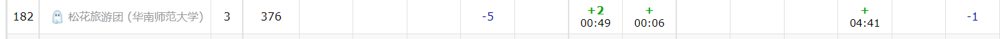

- G 签到(赛时AC)
- F 排序(赛时AC)
- K 模拟 滑动窗口(赛时AC)
- D 构造 差分 DFS
- I 数论
- H DP 滑动窗口

##### F Kobolds and Catacombs

> 有长为 $n(1\le n\le10^6)$ 的数组 $a(1\le a_i\le10^9)$ ，选择其中若干个子段，对每个子段重排序，使得 $a$ 单调不降，求最多能选的子段数目

赛时不知道用了什么单调队列还是什么比较复杂的做法，还实现细节错了

补题思路：设 $p[i]$ 表示原数组 $i$ 排序后的位置为 $p[i]$ ，用 $set+lower\_bound$ 可以做到(找到第一个出现的位置然后用 $set$ 统计之前出现过多少次)，复杂度是 $O(n\log n)$ 

然后贪心扫描每个 $p[i]$ ，对已扫描的求最大值 $rf$ ，若发现 $rf=i$ ，证明当前扫到的可以全部分在一组，然后置零 $rf$ 继续扫，这里 $O(n)$ 即可

补题 AC 代码：(牛客用 map 会 TLE ， 在 CF 不会)

```c++
#include <bits/stdc++.h>
using namespace std;
#define sc(x) scanf("%d", &x)
typedef int ll;
#define mn 1000010
ll n, a[mn], b[mn], p[mn], ans, rf;
unordered_map<ll, ll> ex;
signed main()
{
    sc(n);
    for (ll i = 1; i <= n; ++i)
    {
        sc(a[i]);
        b[i] = a[i];
    }
    sort(b + 1, b + 1 + n);
    for (ll i = 1; i <= n; ++i)
    {
        ll j = lower_bound(b + 1, b + 1 + n, a[i]) - b;
        p[i] = j + ex[a[i]];
        ++ex[a[i]];
        // printf("%lld ", p[i]);
    }
    for (ll i = 1; i <= n; ++i)
    {
        rf = max(rf, p[i]);
        if (rf == i)
        {
            rf = 0;
            ++ans;
        }
    }
    printf("%d", ans);
    return 0;
}
/*
5  5 4 3 2 1
6  1 6 2 7 2 5
11  4 2 1 3 6 5 7 8 9 11 10
1 1
*/
```


##### K Scholomance Academy

> 在机器学习二分类中，对值 $x$ 和参数 $\theta$ ，设估值函数 $S(x)\ge\theta$ 表示分类为 `+` ，否则为 `-` 。给定评判表：
>
> | 真实结果\估值结果 | +    | -    |
> | ----------------- | ---- | ---- |
> | +                 | TP   | FN   |
> | -                 | FP   | TN   |
>
> 设 $TPR=\dfrac{TP}{TP+FN},FPR=\dfrac{FP}{TN+FP}$ 显然它们是 $\theta$ 的函数
>
> 定义 $AUC=\int_0^1\max_{\theta\in R}\{TPR(\theta)|FPR(\theta)\le r\}dr$ 即在满足 $FPR(\theta)\le r$ 的条件下最大的 $TPR(\theta)$ 的值是积分表达式，请计算 $AUC$ ，答案为对当且仅当绝对误差不超过 $10^{-9}$ 
>
> 输入 $n(2\le n\le10^6)$ 表示有 $n$ 个 $x$ ，输入第 $i$ 行字符 `+` , `-` 表示真实结果，再输入 $x_i(1\le x_i\le10^9)$ 

赛时写得巨复杂无比。

化简一下题意：

| 输入值\计算 | $x_i\ge\theta$ | $x_i< \theta$ |
| ----------- | -------------- | ------------- |
| +           | TP             | FN            |
| -           | FP             | TN            |

 $TP+FN$ 是常数，代表输入的 `+` 数目； $FP+TN$ 是输入的 `-` 数目

即 $TPR,FPR$ 的值只取决于 $TP,FP$ 。随着 $\theta$ 的增加，满足 $x_i\ge\theta$ 的会越来越少，所以 $TPR,FPR$ 随 $\theta$ 单调递减

当满足 $r=0$ 时，$\theta > \max x$ ，当 $r=1$ 时， $\theta\le \min x$ 。因为要让 $TPR$ 尽可能大，所以 $\theta$ 应尽可能取小的。因为 $r$ 随 $\theta$ 增大而减少，所以可以从 $1+\max x$ 开始枚举，每次降序枚举取 `-` 的 $1+x_i$ 作为 $\theta$ ，该枚举代表横坐标区间 $($ 上个枚举值计算出的 $r$ $,$ 这次枚举值计算出的 $r$  $]$ ，此时一定是 $TPR$ 最大的(因为 $\theta$ 最小)，那么一共有 `-` 数目段横坐标，使得纵坐标不同(是分段函数)。用滑动窗口在枚举时维护 $TP$ 即可

复杂度是 $O(n\log n+n)$

```c++
#include <bits/stdc++.h>
using namespace std;
#define sc(x) scanf("%d", &x)
typedef long long ll;
typedef double db;
#define mn 1000010
ll n, npos, nneg, pos[mn], neg[mn];
// ll fptn, tpfn; // npos nneg
char c[3];
ll cmp(ll x, ll y) { return x > y; }
db ans;
signed main()
{
    sc(n);
    for (ll i = 1, v; i <= n; ++i)
    {
        scanf("%s%d", c, &v);
        if (c[0] == '+')
        {
            npos++;
            pos[npos] = v;
        }
        else
        {
            nneg++;
            neg[nneg] = v;
        }
    }
    sort(pos + 1, pos + 1 + npos, cmp);
    sort(neg + 1, neg + 1 + nneg, cmp);
    ll ipos = 1, tp = 0;
    for (ll i = 1; i <= nneg; ++i) // ineg
    {
        ll v = neg[i] + 1;
        while (ipos <= npos && pos[ipos] >= v)
        {
            ++ipos, ++tp;
        }
        ans += 1.0 * tp / npos / nneg;
    }
    printf("%.12lf", ans);
    return 0;
}
```


##### D Journey to Un'Goro

> 有长为 $n(1\le n\le10^5)$ 的 `rb` 两字符组成的字符串，求使得含奇数个 `r` 的子序列最多的子序列数，并输出字典序前 $100$ 小的构造方案

> 直观地判，假设全 `r` ，根据等差数列可以推出， $n$ 为奇数表达式是 $(\dfrac{n+1}2)^2$ ，为偶数是 $\dfrac n2\cdot\dfrac{2+n}2$ 。

严格地说，如果用差分表示，设 $p_i$ 表示长为 $i$ 的前缀有几个 `r` ，那么答案为 $\sum_{i=1}^n\sum_{j=i}^n[p_j-p_{i-1}\equiv 1\bmod 2]$ ，所以 $p_{i-1},p_j$ 奇偶不同贡献一次答案。所以要构造尽可能多互异的奇偶。显然每个 $p_i(i\ge 1)$ 都可以选择不同的奇偶。记共有 $x$ 个奇数， $y$ 个偶数，那么答案为 $xy$ ，这是因为每个奇数自己往后和往前加起来一定有 $y$ 个偶数，有 $x$ 个奇数，乘法原理可知 。显然 $p_0$ 是偶数，共有 $n+1$ 个数，需要构造 $x+y=n+1(x\ge 0,y\ge 1)$ ，根据矩形面积原理(也可以通过求导等方法严格证明，证略)，可知 $x,y$ 尽可能接近，所以把 $n+1$ 这个整数均分为 $n+1=\lfloor\dfrac{n+1}2\rfloor+\lceil\dfrac{n+1}2\rceil$ 故答案为 $\lfloor\dfrac{n+1}2\rfloor\times\lceil\dfrac{n+1}2\rceil$ 

$p$ 序列(根据组合数学知数目至少为 $C_{n+1}^{\lfloor\frac{n+1}2\rfloor}$ )转字符串的方法是，如果与前一位奇偶性不同这一位是 `r` ，否则是 `b` 。因为 `b` 字典序小，所以尽可能构造相同的。这个构造过程直接跑 DFS 即可，注意判一下重(会搜索到重复方案)

虽然本地会爆递归深度( $10^5$ 层递归深度)，但是实践表明牛客和CF都不爆，只要前 $100$ 个答案，那么复杂度大约是 $O(n)$ 

下面代码给出 DFS 和栈模拟 DFS：

```c++
#include <bits/stdc++.h>
using namespace std;
#define sc(x) scanf("%lld", &x)
typedef long long ll;
#define mn 100010
ll n, p[mn], suc;
char s[mn];
set<string> m;
void dfs(ll len, ll x, ll y) //当前p序列搜索下标是i,有x个奇数,y个偶数
{
    if (x > (n + 2) / 2 || y > (n + 2) / 2)
    {
        return;
    }
    if (len > n)
    {
        for (ll i = 1; i <= n; ++i)
        {
            if (p[i] == p[i - 1])
            {
                s[i] = 'b';
            }
            else
            {
                s[i] = 'r';
            }
        }
        if (m.find(s + 1) != m.end())
        {
            return;
        }
        ++suc;
        m.insert(s + 1);
        printf("%s\n", s + 1);
        if (suc == 100)
        {
            exit(0);
        }
        return;
    }
    p[len] = p[len - 1];
    dfs(len + 1, x + (p[len] % 2 == 1), y + (p[len] % 2 == 0));
    p[len] = 1 - p[len - 1];
    dfs(len + 1, x + (p[len] % 2 == 1), y + (p[len] % 2 == 0));
}
signed main()
{
    sc(n);
    printf("%lld\n", ((n + 1) / 2) * ((n + 1 + 2 - 1) / 2));
    dfs(1, 0, 1);
    return 0;
}
```

```c++
#include <bits/stdc++.h>
using namespace std;
#define sc(x) scanf("%lld", &x)
typedef long long ll;
#define mn 100010
ll n, p[mn], suc;
char s[mn];
set<string> m;
struct node
{ //当前p序列搜索下标是i,有x个奇数,y个偶数,v是递归进来的赋值
    ll len, x, y, v;
};
stack<node> q; //防止超过递归深度
signed main()
{
    sc(n);
    printf("%lld\n", ((n + 1) / 2) * ((n + 1 + 2 - 1) / 2));
    q.push({1, 0, 1, 0});
    while (!q.empty())
    {
        auto tmp = q.top();
        q.pop();
        ll len = tmp.len, x = tmp.x, y = tmp.y;
        p[len - 1] = tmp.v;
        if (x > (n + 2) / 2 || y > (n + 2) / 2)
        {
            continue;
        }
        if (len > n)
        {
            for (ll i = 1; i <= n; ++i)
            {
                if (p[i] == p[i - 1])
                {
                    s[i] = 'b';
                }
                else
                {
                    s[i] = 'r';
                }
            }
            if (m.find(s + 1) != m.end())
            {
                continue;
            }
            ++suc;
            m.insert(s + 1);
            printf("%s\n", s + 1);
            if (suc == 100)
            {
                return 0;
            }
            continue;
        }
        p[len] = 1 - p[len - 1];
        q.push({len + 1, x + (p[len] % 2 == 1), y + (p[len] % 2 == 0), p[len]});
        p[len] = p[len - 1];
        q.push({len + 1, x + (p[len] % 2 == 1), y + (p[len] % 2 == 0), p[len]});
    }
    return 0;
}
```


##### I Rise of Shadows

> 一天有 $H$ 小时，一小时有 $M$ 分钟，问在一天的所有整数分钟里，满足时针和分针夹角不超过 $\cfrac{2\pi A}{HM}$ 的有多少个 $2\le H,M\le10^9,0\le A\le\cfrac{HM}2$ 

比较显然，设 $t\in[0,HM)$ 可以把原式化为 $|t(1-(H\bmod HM))|\le A$ ，把模外提，得：
$$
t(H-1)\bmod HM\le|A|
$$
剩余系定理三：$a,b,c$ 为整数， $m$ 为正整数且 $(m,c)=1$ ，则 $ac\equiv bc(\bmod m)$ 时，可知 $a\equiv b(\bmod m)$ 。为了构造互质，可以让不等式两边同除 $g=(H-1,HM)$ ，得：
$$
-\cfrac Ag\le t\cfrac{H-1}g\bmod\cfrac{HM}g\le\cfrac Ag
$$
并让 $t\in[0,\cfrac{HM}g)$ 

求出正半轴的值，再乘以二，加上 $0$ 就是解，即求：
$$
0 < t\dfrac{H-1}g\bmod\dfrac{HM}g\le\dfrac Ag
$$
当 $t$ 是这个取值时， $t\dfrac{H-1}g$ 一定是互不相同的值，因为毫无疑问 $(\dfrac{H-1}g,\dfrac{HM}g)=1$ ，根据数论知识显然可得

也就是说一定会取遍 $[0,\dfrac{HM}g)$ 的值，因为 $A\le \dfrac{HM}2$ 所以会取遍 $\dfrac Ag$ ，那么在 $t\in[0,\dfrac {HM}g)$ 内有 $2\lfloor\dfrac Ag\rfloor+1$ 个整数解。显然 $H-1$ 可以整除 $g$ ，那么可以扩大 $g$ 倍，扩大后仍然满足这么多个整数解，所以答案为 $g(2\lfloor\dfrac Ag\rfloor+1)$ 

特判 $a=\dfrac{HM}2$ ，这个时候必定恒满足。

```c++
#include <bits/stdc++.h>
using namespace std;
#define sc(x) scanf("%lld", &x)
typedef long long ll;
ll h, m, a, g;
signed main()
{
    sc(h), sc(m), sc(a);
    g = __gcd(h - 1, h * m);
    if (a == h * m / 2)
    {
        printf("%lld", h * m);
    }
    else
    {
        printf("%lld", g * (2 * (a / g) + 1));
    }
    return 0;
}
```


##### H The Boomsday Project

> 有 $n(1\le n\le500)$ 种优惠卡，有 $m(1\le m\le10^5)$ 条消费，单次消费花费 $r(1\le r\le10^9)$ 。对优惠卡，从使用日起持续 $d_i$ 天，可以在这些天里免费消费 $k_i$ 次，卡的价格是 $c_i(1\le d_i,k_i,c_i\le10^9)$ 。使用一张新卡会让之前的旧卡作废。 $m$ 次消费分别在第 $p_i(0\le p_i\le10^9)$ 天消费了 $q_i(0\le q_i,\sum_{i=1}^mq_i\le3\times10^5)$ 次，优惠卡可以无限买和使用，求最小支出

> 因为队内我不主攻 DP ，这题看看就行了，不打算亲自动手写

按日期排序拆开 $\sum_{i=1}^mq_i$ 次消费。设第 $i$ 次消费在第 $g_i$ 天。设 $f(r)$ 是完成了前 $r$ 次消费后的最小消费。一个 TLE 版本代码：(含我的代码集注)

```c++
#include <bits/stdc++.h>
using namespace std;
using ll = long long;
int n, m, tot, to[510][300010], g[300010];
struct nodea
{
    int d, k, c;
} a[510];
ll f[300010], R;
struct nodeb
{
    int p, q;
    bool operator<(const nodeb &o) const { return p < o.p; }
} b[300010];
signed main()
{
    scanf("%d%d%lld", &n, &m, &R);
    for (int i = 1; i <= n; i++) //天数,次数,钱
        scanf("%d%d%d", &a[i].d, &a[i].k, &a[i].c);
    for (int i = 1; i <= m; i++)
        scanf("%d%d", &b[i].p, &b[i].q);
    sort(b + 1, b + 1 + m);
    for (int i = 1; i <= m; i++)
        for (int j = 1; j <= b[i].q; ++j) //第tot次骑车在第b[i].p天
            g[++tot] = b[i].p;
    // to[j][i]是在第i次消费买第j种方案后可以到第几次消费(只考虑天)
    for (int j = 1; j <= n; j++)
        for (int i = 1, k = 1; i <= tot; i++) // k是当前首个不可达
        {
            while (k <= tot && g[k] - g[i] + 1 <= a[j].d)
                k++; //天数跨度小于d一直加
            to[j][i] = k - 1;
        }
    memset(f, 0x3f, sizeof f); //前i次骑车最小花费是f[i]
    f[0] = 0;
    for (int i = 1; i <= tot; i++)
    {
        f[i] = min(f[i], f[i - 1] + R); //直接花钱
        for (int j = 1; j <= n; j++)
        { //买第j种方案,买了之后可以到第r次消费都不用钱了
            //只考虑天和只考虑次数里二者综合起来
            int r = min(i - 1 + a[j].k, to[j][i]);
            //需要多少钱
            f[r] = min(f[r], f[i - 1] + a[j].c);
        }
    }
    printf("%lld\n", f[tot]);
    return 0;
}

```

一个能过题的版本：

```c++
#include <bits/stdc++.h>
using namespace std;

const int N = 500 + 5;
const int M = 3e5 + 5;
const long long INF = 1e18;
int n, m, r;

struct Card {
	int d, k, c;
}ca[N];

struct Record {
	int p, q;
}re[M];

int a[M], b[M], tot;
long long dp[M];

int main(void) {
//	freopen("in.txt", "r", stdin);
	scanf("%d%d%d", &n, &m, &r);
	for (int i = 1; i <= n; i++) {
		scanf("%d%d%d", &ca[i].d, &ca[i].k, &ca[i].c); 
	}
	for (int i = 1; i <= m; i++) {
		scanf("%d%d", &re[i].p, &re[i].q);
		dp[i] = INF;
		for (int j = 1; j <= re[i].q; j++)
			a[++tot] = re[i].p;
	}
	sort(a + 1, a + 1 + tot);
	for (int i = 1; i <= tot; i++) dp[i] = INF;
	for (int i = 1; i <= n; i++) b[i] = 1;
	for (int i = 1; i <= tot; i++) {
		dp[i] = dp[i - 1] + r;
		for (int j = 1; j <= n; j++) {
			// 找到第j种卡能影响到的左边界 
			while (a[b[j]] + ca[j].d <= a[i] || b[j] + ca[j].k <= i) b[j]++;
			dp[i] = min(dp[i], dp[b[j] - 1] + ca[j].c);
		}
	}
	printf("%lld\n", dp[tot]);
	return 0;
}

```


#### 2021济南

> 首铜，功德圆满赛。赛时我贡献了K题较快切题，队友贡献了C题

- K Search For Mafuyu DFS 博弈论 (赛时AC)
- C Optimal Strategy 组合数学 前缀和 DP 博弈论 (赛时AC)
- J Determinant 高斯消元 行列式
- D Arithmetic Sequence 三分 数学

##### K Search For Mafuyu

> 有 $t(1\le t\le10^3)$ 个询问，每次有 $n(2\le n\le100)$ 点以 $1$ 为根节点的树，除根节点外任取一点作目标点，从根节点开始搜索目标点，问期望走过多少条边(使用最优策略)

赛时可以想到，最优策略是每次都选最小子树去搜素

事实上，只要是欧拉遍历，那么怎么走都是最优的。对一个节点的两个子树，从一个出来再去另一个，另一个每个都会多上前一个的二倍边数。对子树有多少个点就有多少条边，左边有 $x$ 个点，右边子树有 $y$ 个点，那么先走左给右 $y$ 个节点增加 $2x$ ，共计 $2xy$ ，右到左同理。将这个结论不断推广，可以得到上述结论

```c++
#include <bits/stdc++.h>
using namespace std;
#define sc(x) scanf("%lld", &x)
typedef long long ll;
#define mn 110
struct edge
{
    ll to, nx;
} e[mn * 2];
ll t, n, hd[mn], cnt, siz[mn], ans, s;
void adde(ll u, ll v)
{
    e[++cnt] = {v, hd[u]}, hd[u] = cnt;
}
void dfs1(ll u, ll fa)
{
    siz[u] = 1; // siz
    for (ll i = hd[u], v; i; i = e[i].nx)
    {
        v = e[i].to;
        if (v != fa)
        {
            dfs1(v, u);
        }
    }
}
void dfs2(ll u, ll fa)
{
    // printf("<%lld %lld\n", u, s);
    ans += s;
    vector<ll> p;
    for (ll i = hd[u], v; i; i = e[i].nx)
    {
        v = e[i].to;
        if (v != fa)
        {
            p.emplace_back(v);
        }
    }
    sort(p.begin(), p.end(), [&](ll x, ll y)
         { return siz[x] < siz[y]; });
    for (auto &v : p)
    {
        ++s;
        dfs2(v, u);
        ++s;
    }
}
signed main()
{
    sc(t);
    while (t--)
    {
        sc(n);
        memset(hd, 0, sizeof hd), cnt = 0;
        memset(siz, 0, sizeof siz), ans = 0, s = 0;
        for (ll i = 1, u, v; i < n; ++i)
        {
            sc(u), sc(v), adde(u, v), adde(v, u);
        }
        dfs1(1, 0);
        dfs2(1, 0);
        printf("%.10lf\n", 1.0 * ans / (n - 1));
    }
    return 0;
}
/*4
2  1 2
5  1 2  2 3  3 4  1 5
7  1 2  1 3  2 4  2 5  3 6  3 7
10 1 2  2 3  3 4  1 5  5 6  6 7  1 8  8 9  9 10
*/
```


##### C Optimal Strategy

> 有 $n(1\le n\le10^6)$ 个带权物品 $a(1\le a_i\le n)$ ，每人轮流拿一个物品，双方目标都是拿的东西权总和最大，在双方都采取最优策略情况下求有多少种情况对 $998244353$ 取模

> ~~现在我还是不懂这道题~~

考虑最大值如果是偶数个，那么会每次被两个两个的取；如果是奇数个，那么会被先手立刻取走一个，变成偶数的情况(剩下对半取)。离散化设 $c_i$ 是 $i$ 物品个数

阶乘是显然的(排列转组合)。那么对每个 $c_i$ ，只要不让对方逆转就可以随便取，不一定要从大到小取。对出现次数为奇数的又是最大的数，如果不先发制人，一定会被抢走，所以一开始双方的任务应当是抢奇数。之后每个数都是偶数了，只要一方拿了一个偶数，对方一定要拿相同的这个偶数，不然就更亏，没有别的方案。具体而言：

- 若当前最大有奇数个，一定要拿
- 若上一回合对方拿了最大的那个数，且本来有偶数个，那么自己一定要随
- 否则随便拿

所以对 $c_i$ 有且仅有 $\lfloor\dfrac{c_i}2\rfloor$ 种情况。设 $f_i$ 为只用 $\le i$ 的元素的方案数，

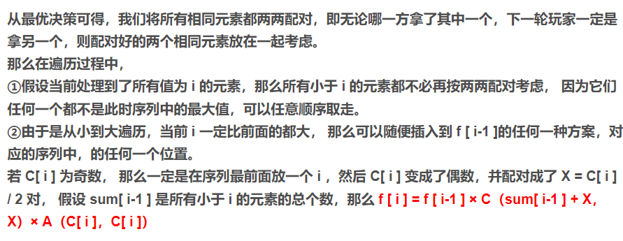

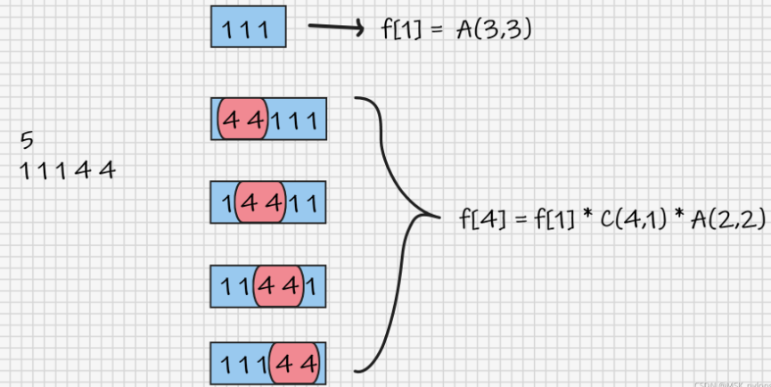

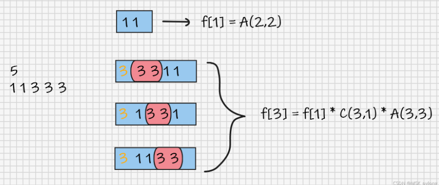

答案：
$$
\sum_{i=1}^nc_i!C_{\sum_{j=1}^{i-1}c_i+\lfloor\frac{c_i}2\rfloor}^{\lfloor\frac{c_i}2\rfloor}
$$
别人的参考代码：

```c++
#include <bits/stdc++.h>
using namespace std;
#define inf 0x3f3f3f3f
#define llinf 0x3f3f3f3f3f3f3f3f
#define int long long
#define ull unsigned long long
#define PII pair<int,int>
#define endl '\n'
const int N = 1e6 + 10;
const int mod = 998244353;
const double pi = acos(-1.0);
typedef long long ll;
using namespace std;
int t, n;
int fact[N];
int invfact[N];
int presum[N];
int a[N];
int cnt[N];
int quickpow(int a, int b) {//快速幂
	int res = 1;
	while (b > 0) {
		if (b & 1) res = res * a % mod;
		b >>= 1;
		a = a * a % mod;
	}
	return res;
}
int getinv(int a) { return quickpow(a, mod - 2); }//费马小定理求逆元
void init() {//预处理阶乘和阶乘的逆元
	fact[0] = 1;
	for (int i = 1; i < N; i++) {
		fact[i] = fact[i - 1] * i % mod;
	}
	invfact[0] = 1;
	invfact[N - 1] = quickpow(fact[N - 1], mod - 2);
	for (int i = N - 2; i > 0; --i) {
		invfact[i] = invfact[i + 1] * (i + 1) % mod;
	}
	return;
}
int C(int n, int m) {//组合数
	return fact[n] * invfact[m] % mod * invfact[n - m] % mod; 
}
void solve() {
	for (int i = 0; i <= n; i++) {//初始化
		a[i] = 0;
		cnt[i] = 0;
	}
	for (int i = 1; i <= n; i++) {//输入
		cin >> a[i];
		cnt[a[i]] ++;
	}
	presum[1] = cnt[1];
	for (int i = 2; i <= n; i++) {//cnt[i]的前缀和
		presum[i] = presum[i - 1] + cnt[i];
	}
	int sum = 1;
	for (int i = 1; i <= n; i++) {//按公式求和
		sum = sum * fact[cnt[i]] % mod * C(presum[i - 1] - presum[0] + cnt[i] / 2, cnt[i] / 2) % mod;
	}
	cout << (sum) % mod << endl;//输出
	return;
}
signed main()
{
	ios::sync_with_stdio(false);
	cin.tie(0); cout.tie(0);
	init();
	while (cin >> n) {
		solve();
	}
	return 0;
}
```


##### J Determinant

> 有 $t(1\le t\le100)$ 次询问，给定 $n(1\le n\le100)$ 阶方阵 $A$ (绝对值 $\le10^9)$ 和 $|A|$ (不超过 $10^4$ 位)，问去掉绝对值后它是正还是负

不能朴素去做，不然炸 double 或高精 TLE

用一个大素数取模做高斯消元，得到行列式值 $A\bmod p$ ，如果 $A\bmod p=|A|\bmod p$ ，那么是正的，不然一定有 $(p-A)\bmod p=|A|\bmod p$ 

需要注意的是, 使用高斯消元交换行列式的两行时, 行列式的正负会改变

别人的参考代码：

```c++
#include <bits/stdc++.h>
#define endl "\n"
#define rep(i, m, n) for (int i = (m); i <= (n); ++i)
#define rrep(i, m, n) for (int i = (m); i >= (n); --i)
#define IOS ios::sync_with_stdio(0); cin.tie(0);
using namespace std;
typedef long long ll;
typedef pair<int, int> PII;
const int N = 110, mod = 1e9 + 7;
ll n, p[N][N], det;
string s;
ll fact() { // 将 字符串s 转化成 整形det
	ll m = 0, l = s.length();
	rep(i, 0, l - 1) {
		m = m * 10 + s[i] - '0';
		m %= mod;
	}
	return m;
}
ll qpow(int a, int b) {
	ll res = 1; a %= mod;
	while (b) {
		if (b & 1) res = (ll)res * a % mod;
		a = (ll)a * a % mod; b >>= 1;
	}
	return res;
}
ll inv(ll x) { return qpow(x, mod - 2); } // 逆元
ll guess() { // 高斯消元 求 行列式
	ll ans = 1;
	rep(i, 1, n) {
		rep(j, i, n)
			if (p[j][i]) { // 不能让 p[i][i] = 0, 即对角线的部分不能为0
				rep(k, i, n) swap(p[i][k], p[j][k]);
				if (i != j) ans = -ans;//交换两行,行列式正负改变
				break;
			}

		// 用第 i 行去修改第 j 行
		// p[j][k] = p[j][k] - p[i][k] * p[j][i] / p[i][i];
		for (int j = i + 1, invf = inv(p[i][i]); j <= n; ++j) {
			ll t = p[j][i] * invf % mod;
			rrep(k, n, i) p[j][k] = ((p[j][k] - p[i][k] * t % mod) % mod + mod) % mod;
		}

		// 行列式的值就是化成上三角后主对角线的积乘上已经提取出来的数字
		ans = (ans * p[i][i] % mod + mod) % mod;
	}

	return ans;
}
void solve() {
	scanf("%lld", &n);
	cin >> s; det = fact();
	rep(i, 1, n) rep(j, 1, n)
		scanf("%lld", &p[i][j]);

	ll res = guess();
	if (res == det) puts("+");
	else puts("-");
}
int main() {
	int t; cin >> t;
	while (t--) solve();
	return 0;
}

```


##### D Arithmetic Sequence

> 给定一个长为 $n(1\le n\le2\times10^5)$ 的数列 $a(0\le |a_i|\le10^{13})$ ，每次可以对一个数加一或减一，将其变成等差序列，问最少要操作多少次

对给定公差 $d$ ，设最小代价是 $f(d)$ ，即要让 $a_i-id$ 是常数列，这个问题比较经典，参见 `SCNUOJ` 未公开题 `完美数组`

设需要操作 $f(x)$ 次后满足要求，则根据定义，有：
$$
f(x)=|x_1-x|+|x_2-x|+\cdots+|x_n-x|
$$
几何意义为求数轴一个点 $x$ ，使得其到这 $n$ 个点的距离和最小。

题目要求即对每组 $g'$ ，需要选取一个 $x$ ，使得 $f(x)$ 最小化。

1. 若 $n=1$ ，显然取 $x=x_1, $ 有 $f(x) = 0$， $f(x)$ 最小。

2. 若 $n=2$ ，若 $x_1=x_2$ ，显然取 $x=x_1$ 即可使最小 $f(x)=0$ 。若 $x_1\neq x_2$， 假设 $x < x_1$ 或 $x > x_2$ ，作图数形结合可知，$x$ 越往两端走， $f(x)$ 越大。结合函数图像不难发现，选取 $x\in [x_1, x_2]$ 的结果必然优于选取 $x$ 在其他区间的值。 而 $x\in [x_1,x_2]$ 时， 有：
   $$
   f(x)=|x_1-x|+|x_2-x|=x-x_1+x_2-x=x_2-x_1
   $$
   因此对 $n=2$ 时， 任取 $x\in [x_1, x_2]$ ，均可获得最小值 $f(x)=x_2-x_1$

3. 若 $n=3$ ，类似分析可得， $x\in [x_1, x_3]$ 必然优于 $x$ 取其他值的情况，因为在两端时距 $x_2$ 的距离也必然加大。在这个区间时，有：
   $$
   f(x)=|x_1-x|+|x_2-x|+|x_3-x|=x_3-x_1+|x_2-x|
   $$
   为使得 $f(x)$ 最小，可以令 $x=x_2$， 得 $f(x)=x_3-x_1$

4. 若 $n=4$ ，同理， $x\in[x_1,x_4]$，有：
   $$
   f(x)=x_4-x_1+|x_2-x|+|x_3-x|
   $$
   其中 $|x_2-x|+|x_3-x|$ 的最小值可以看做忽略点 $x_1, x_4$ 后， $n'=2$ 的一个子问题，根据上面第二点可知， $x\in [x_2,x_3]$ 时，该子问题的最优解是 $x_3-x_2$ ，而 $[x_2,x_3]\subset [x_1,x_4]$ ，故答案为 $f(x)=x_4-x_1+x_3-x_2$ 。

5. 若 $n=5$ ，同理用子问题的思想，得 $x=x_3$ 时， $f(x)=x_5-x_1+x_4-x_2$ 。 若 $n\ge 6$ ，可以每次用子问题的思想分析 $n' = n-2$ 时的子问题，得到答案。综上所述，$x\in[x_{\lfloor\frac n2\rfloor}, x_{\lfloor\frac {n+1}2\rfloor}]$ 时， $f(x)= x_{n-1} - x_1 + x_{n-2} - x_2 + \cdots$ 。( $n$ 为偶数是 $x$ 取值区间有长度，$n$ 为奇数时，取值区间是一个点)

最后求 $f(x_{\lfloor\frac x2\rfloor})$ 即可。

根据这个函数的定义，不难发现这是一个凹函数，要求其最小值，考虑使用三分法

可以用差分优化一下常数，记得开 int128 ，可以卡一下常，复杂度 $O(n\log n\log W)$ ，记得可以取负的公差

```c++
#include <bits/stdc++.h>
using namespace std;
#define sc(x) scanf("%lld", &x)
typedef long long ll;
typedef __int128 ln;
#define mn 200010
ll n, a[mn], b[mn], c[mn], lf, lc, rc, rf;
ln ans = 1e23;
ln check(ll d)
{
    for (ll i = 1; i < n; ++i)
    {
        b[i] = b[i - 1] + d - c[i + 1];
    }
    sort(b, b + n);
    ll v = b[n / 2];
    ln res = 0;
    for (ll i = 0; i < n; ++i)
    {
        res += abs(b[i] - v);
    }
    return res;
}
void print(ln x)
{
    if (x / 10)
    {
        print(x / 10);
    }
    putchar(x % 10 + '0');
}
signed main()
{
    sc(n);
    for (ll i = 1; i <= n; ++i)
    {
        sc(a[i]);
        c[i] = a[i] - a[i - 1];
    }
    lf = -1e13, rf = 1e13;
    while (lf <= rf)
    {
        ll dt = (rf - lf) / 3;
        lc = lf + dt, rc = rf - dt;
        ln lv = check(lc), rv = check(rc);
        ans = min(ans, min(lv, rv));
        if (lv > rv)
        {
            lf = lc + 1;
        }
        else
        {
            rf = rc - 1;
        }
    }
    print(ans);
    return 0;
}
```


#### 2021澳门

> 因为队友补题了，我就不那么用力补了

- A 思维 构造
- K 连通图
- F 思维 数学 / 优先级队列
- C 极角排序 单调栈(旋转卡壳)
- E FFT 图论

##### A So I'll Max Out My Constructive Algorithm Skills

> 有 $T(1\le T\le100)$ 次询问，给定 $n(2\le n\le64)$ 阶方阵，数值是 $n^2$ 的一个排列，请构造出一条遍历 $n^2$ 格子的路径，使得下降次数不少于上升次数

对于任意一条路径，要么下降次数不少于，要么大于；如果大于的话，反着走就小于了

代码略


##### K Link-Cut Tree

> 有 $T$ 组询问，每次给定 $n(3\le n\le10^5)$ 点和 $m(1\le m\le10^5)$ 边无向图，第 $i$ 条边边长为 $2^i$ ，问最小环上每条边编号是多少或无环 输出 `-1` ($\sum n,\sum m\le10^6$)

显然 $\sum_{i=1}^n2^i < 2^{n+1}$ ，所以越前面的边越好。无向图找连通，开并查集就好了，发现同根就直接 DFS 找环

代码略


##### F Sandpile on Clique

> 多组样例(EOF)，给定 $n(2\le n\le5\times10^5)$ 点完全图和每个点点权 $a_i(0\le a_i\le10^9)$ ，可以进行操作将某个点点权减少 $n-1$ ，其他点点权都增加 $1$ 。问能否无限操作下去(输出 `Recurrent` )，否则输出最终状态

根据抽屉原理， 若 $\sum_{i=1}^na_i > n(n-2)$ 一定会循环

队友有一种优先级队列的不断模拟做法(快超时就 `Recurrent` )

有一种 $O(n)$ 的题解，但是看不懂：

```c++
#include<iostream>
#include<cstring>
#include<algorithm>
#include<cmath>
#include<vector>
using namespace std;
#define int long long
const int N = 500010;
int a[N],b[N],cnt[N];
int n,ps=0,s=0;
signed main()
{
	cin>>n;
    for(int i=0;i<n;i++)
    {
        cin>>a[i];
        ps+=a[i];
        a[i]%=n;
        s+=a[i];
    }
    for(int i=0;i<n;i++)cnt[a[i]]++;
    for(int i=n;i>=0;i--)cnt[i]+=cnt[i+1];
    vector<int>res;
    for(int i=0;i<n;i++)
    {
        int qs=s+i*n-(cnt[max(n-i-1,0ll)]*n);
        if(qs==ps)
        {
            res.push_back(i);
        }
    }
    if(res.size()!=1)cout<<"Recurrent"<<'\n';
    else 
    {
        for(int i=0;i<n;i++)
            cout<<(a[i]+res[0])%n<<' ';
        cout<<'\n';
    }
}

```


##### C Laser Trap

> 有 $T$ 组询问，每次给定 $n(1\le n,\sum n\le10^6)$ 个点，这些点两两相连形成不经过原点的直线。问从原点出发，删掉多少个点后，可以不碰直线(含端点)到达 $(10^{10^{10^{10}}},10^{10^{10^{10}}})$ 

进行极角排序，从一个点出发，绕 $180°$ (不含 $180°$ )的所有点里，它们无论怎么连线都不会影响原点走出去。另外一部分点同理。

在给定条件下，不存在两个点的极角差为 $\pi$ 。对于每个刚好大于 $\pi$ 的点对 $i,j$ ，它们之间有 $j-i-1$ 个点，可以全都删了。或者把反方向删到 $j$ (含 $j$ )，所以：

```c++
#include <bits/stdc++.h>
using namespace std;
#define sc(x) scanf("%lld", &x)
typedef long long ll;
#define mn 1000010
ll n, t;
#define cp const point &
struct point
{
    ll x, y;
    ll quadrant() const
    {
        if (x == 0 && y == 0)
            return 0;
        if (x > 0 && y >= 0)
            return 1;
        if (x <= 0 && y > 0)
            return 2;
        if (x < 0 && y <= 0)
            return 3;
        return 4;
    }
    ll norm() const { return x * x + y * y; }
} p[mn * 2];
ll cross(cp a, cp b) { return a.x * b.y - a.y * b.x; }
bool operator<(cp a, cp b)
{
    if (a.quadrant() != b.quadrant())
        return a.quadrant() < b.quadrant();
    if (cross(a, b) != 0)
        return cross(a, b) > 0;
    return a.norm() < b.norm();
}
signed main()
{
    for (sc(t); t--;)
    {
        sc(n);
        for (ll i = 1; i <= n; ++i)
        {
            sc(p[i].x), sc(p[i].y);
        }
        sort(p + 1, p + 1 + n);
        for (ll i = 1; i <= n; ++i)
        {
            p[i + n] = p[i];
        }
        ll ans = n;
        for (ll i = 1, j = 2; i <= n; ++i)
        {//j=1也行
            while (j - i < n && cross(p[i], p[j]) >= 0)
            {//其他写法不行
                ++j;
            }
            ans = min(ans, min(n - (j - i), j - i - 1));
        }
        printf("%lld\n", n <= 2 ? 0 : ans);
    }
    return 0;
}
```


#### 2021南京

- A 签 构造
- M 思维
- C 前缀和 双指针
- H 树上DP
- D 思维 排序
- J 数论 构造
- I 思维 数学

##### A Oops, It's Yesterday Twice More

> 给定 $n(2\le n\le500)$ 阶方阵，一开始每个格有一个人，每次可以执行 $U,D,L,R$ 对每个人进行一次移动(撞边界不动)，一格可以有无限多人，在 $3(n-1)$ 步内将所有人移动到 $(a,b)$ ，求移动方案

签

```c++
#include <bits/stdc++.h>
using namespace std;
#define sc(x) scanf("%lld", &x)
typedef long long ll;
#define repe(i, a, b) for (ll i = a; i <= b; ++i)
ll n, a, b;
signed main()
{
    sc(n), sc(a), sc(b);
    if (a <= n / 2)
    {
        repe(i, 1, n - 1) putchar('U');
        repe(i, 1, a - 1) putchar('D');
    }
    else
    {
        repe(i, 1, n - 1) putchar('D');
        repe(i, 1, n - a) putchar('U');
    }
    if (b <= n / 2)
    {
        repe(i, 1, n - 1) putchar('L');
        repe(i, 1, b - 1) putchar('R');
    }
    else
    {
        repe(i, 1, n - 1) putchar('R');
        repe(i, 1, n - b) putchar('L');
    }
    return 0;
}
```


##### C Klee in Solitary Confinement

> 给定 $n(1\le n\le10^6),k(-10^6\le k\le10^6)$ ，输入序列 $a(-10^6\le a_i\le10^6)$ ，可以将一个子区间每个数加上 $k$ (或不操作)，求众数频次最大值

~~想了一下没想出来，看题解去了~~

思路：偏移一下然后按顺序按值存一下vector，第 $i$ 个按原序列相对顺序存本来是 $i$ 还是 $i-k$ 的这个值。然后对每个 vector 进行遍历，因为这个 vector 只有两种值：一个是本来是 $i$ ，一个是加了后是 $i$ 。所以枚举中间段，然后加一下双指针优化，实现下面的式子：

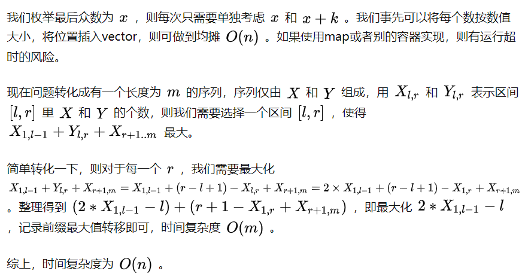

别人参考代码：

```c++
const int N = 4e6 + 6;
int X = 2e6;
int a[N/4], b[N/4];
vector<int> v[N];
int main()
{
	IOS;
	int n, k; cin >> n >> k;

	int maxn = 0;
	int minn = 0;//所有离散化后的数据的最大值
	for (int i = 0; i < n; i++)
	{
		int x; cin >> x;
		x += X;
		minn = max(minn, x + k);
		v[x].push_back(x);
		v[x + k].push_back(x);
		maxn = max({ maxn, (int)sz(v[x]), (int)sz(v[x + k]) });
	}
	
	if (!k)
	{
		cout << maxn / 2 << endl;
		return 0;
	}

	int ans = 0;
	for (int i = 0; i <= minn; i++)
	{
		if (v[i].size() == 0) continue;
		int m = sz(v[i]);

		for (int j = 1; j <= m; j++)
			a[j] = a[j - 1] + (v[i][j - 1] == i);//前缀和

		int L = -1;//注意
		for (int j = 1; j <= m; j++)
		{
			L = max(L, a[j - 1] * 2 - j);//最大前缀
			ans = max(ans, L + j + 1 - a[j] + a[m] - a[j]);
		}
	}
	cout << ans << endl;

	return 0;
}
```


##### M Windblume Festival

> 有 $n(1\le n\le10^6)$ 个点的环，每次选择第 $x$ 个点，当前环长是 $k$ ，将第 $x$ 个点点权减去第 $x\bmod k+1$ 个点的点权然后删掉后者，直到只剩下一个点，求最后的最大权。多组询问 $\sum n\le10^6$

显然最后每个数(要么正要么负)加起来是答案。起码有一个点是不被删掉的(即权重 $1$ )，最后 $k=2$ 合并时一定要减掉一个点(即权重 $-1$ )。要删掉的点其实就是它的下一个点加到它那里。每次选择的过程将一个点置 $-1$ 。

①存在一种选择方案，即一直选 $x$ 不动，选 $n-2$ 次，那么当前 $x$ 是正的，它后面的点都是负的， 然后最后选 $x-1$ ，那么 $x$ 是负的，其他所有点都是正的。用这种选择方案，可以在全正时令 $x$ 是最小值。②类似地，全负时，令 $x$ 是最大值选 $n-1$ 次，那么只有 $x$ 是还负的。③有正有负时，把负之后的所有正数全部叠到负数那里去，剩下一个正数，然后把全部负数叠过去。

综上：

1. 全正是 $sum-2\min$ 注： $2$ 是因为 $sum$ 里少它，下同
2. 全负是 $|sum|-2\max$
3. 否则是 $\sum_{i=1}^n|a_i|$ 

上述解法假了。正解：[这里](https://blog.csdn.net/weixin_54991287/article/details/122642464)

```c++
#include <iostream>
#include <algorithm>
using namespace std;
const int N = 1e6 + 7;
long long ans = 0;
int n = 0, times = 0;
int arr[N];					// 存放玩家对应的值

void fig(){					// 计算绝对值之和
	for(int i=1;i<=n;i++)
		ans+=abs(arr[i]);
}

void poss();
void negg(){				// 全负变为全正来做
    for (int i = 1; i<=n; i++){
        arr[i] = -arr[i];
    }
    poss();
}

void poss(){
	int temp=2e9+7;
	for(int i=1;i<n;i++)
		if(arr[i]-arr[i+1]<=0)	// 遍历求最小损失
			temp=min(temp,arr[i]+arr[i+1]-abs(arr[i]-arr[i+1]));
	if(arr[n]-arr[1]<=0) temp=min(temp,arr[n]+arr[1]-abs(arr[n]-arr[1]));
	fig();
	ans-=temp;
}

void wtf(){
        cin >> n;
        int pos = 0, neg = 0;
        for (int i = 1; i <= n; i++){
            cin >> arr[i];
            if(arr[i]<=0)		// 是否有负数
                neg = 1;
            if(arr[i] >= 0)		// 是否有正数
                pos = 1;
        }
        if(n==1){
            cout << arr[1] << "\n";
            return;
        }
        ans = 0;
        if(pos && neg)
            fig();
        else if(neg)
            negg();
        else
            poss();
        cout << ans << "\n";
}

int main(){
	ios_base::sync_with_stdio(false); cin.tie(0); cout.tie(0);
    cin >> times;
    while(times--){
        wtf();
    }
    return 0;
}

```


另一解法：

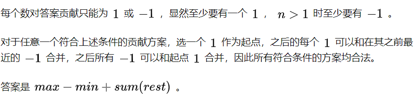


##### H Crystalfly

> 有多组询问，给定 $n(1\le n\le10^5)$ 点带点权树 $a_i(1\le a_i\le10^9)$ ，当某秒初遍历某个点时，所有相邻点的点权将会在隔了 $t_i(1\le t_i\le3)$ 秒后在该秒末消失。每秒可以走一条边的距离，问在 $10^{10^{10^{10}}}$ 秒内能够得到的最大点权和是多少

显然树上 DP ，但是实现不好写

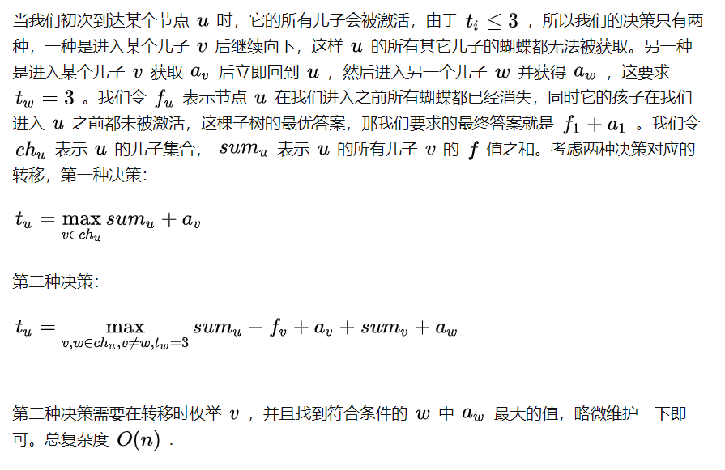

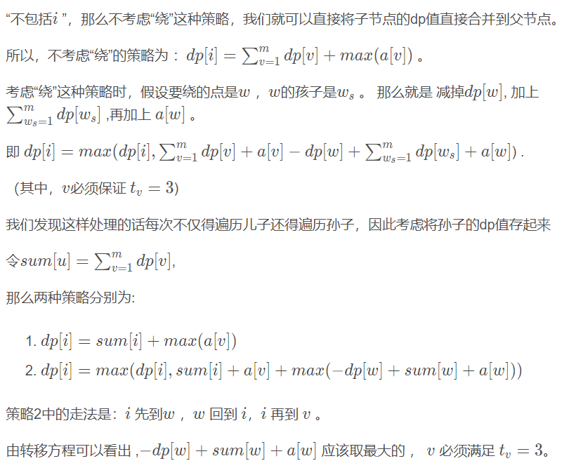

别人的参考代码(未检验)：

```c++
#include<bits/stdc++.h>
using namespace std;
#define rep(i,x,y) for(int i=x;i<=y;i++)
#define int long long
const int N = 1e6+100;
vector<int> edge[N];
int a[N],ti[N];
int n;
int dp[N],sum[N];
void dfs(int u,int f){
    int max_av = 0;
    for(auto v:edge[u]){
        if(v==f) continue;
        dfs(v,u);
        sum[u] += dp[v];
        max_av = max(max_av,a[v]);
    }
    dp[u] = sum[u] + max_av;
    if(edge[u].size()<=1) return;
    
    // 预处理出-dp[w]+sum[w]+a[w] 最大的两项 , 因为w和v可能重复
    // mx[0] 最大的 -dp[w]+sum[w]+a[w]
    // mx[1] 第二大的 -dp[w]+sum[w]+a[w]
    pair<int,int> mx[2];
    for(auto w:edge[u]){
        if(w==f) continue;
        int now = -dp[w]+sum[w]+a[w];
        if(now>mx[0].first){
            swap(mx[0],mx[1]);
            mx[0] = make_pair(now,w);
        }
        else if(now>mx[1].first){
            mx[1] = make_pair(now,w);
        }
    }
    for(auto v:edge[u]){
        if(v==f) continue;
        if(ti[v]==3){
            if(v!=mx[0].second)
                dp[u]= max(dp[u],sum[u]+a[v]+mx[0].first);
            else
                dp[u] = max(dp[u],sum[u]+a[v]+mx[1].first);
        }
    }
}
signed main(){
    ios::sync_with_stdio(false);
    int t;
    cin>>t;
    while(t--){
        cin>>n;
        rep(i,1,n) cin>>a[i],edge[i].clear();
        rep(i,1,n) cin>>ti[i];
        rep(i,1,n-1){
            int x,y;
            cin>>x>>y;
            edge[x].push_back(y);
            edge[y].push_back(x);
        }
        rep(i,1,n){
            dp[i] = sum[i] = 0;
        }
        dfs(1,0);
        cout<<dp[1]+a[1]<<endl;
    }
}
```


##### J Xingqiu's Joke

> 有 $t(1\le t\le300)$ 次询问，每次给定 $a,b(1\le a,b\le10^9,a\neq b)$ ，可以对 $a,b$ 同时执行下面三种操作之一，直到任一方为 $1$ 为止：
>
> - 同时加 $1$
> - 同时减 $1$
> - 同时除以一个公共质因数
>
> 求最少操作数。

记忆化搜索剪枝。对每个状态，让它走到上取整或下取整能整除状态。特判一些边界，如 $b=a+1$ 必然永远无公共质因数

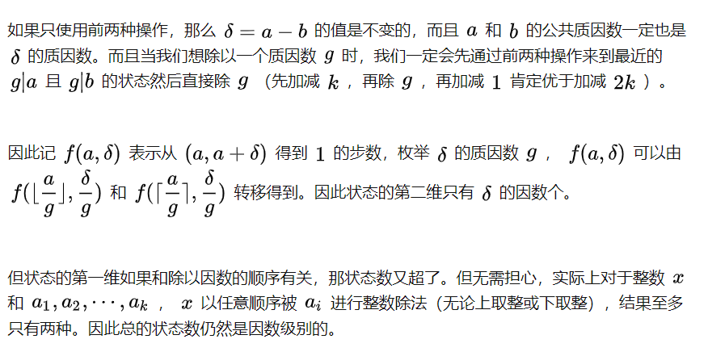

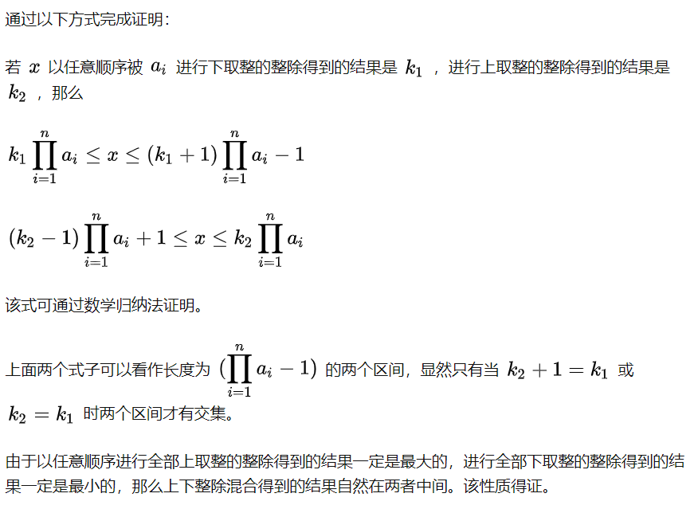

别人的参考代码(未经检验)：

```c++
int c[1001], m;
int ans = inf;
unordered_map<ll, int>mp;


ll h(int a, int b)//哈希函数
{
	return a * 1e9 + b;
}

//本题不能单单将a或b当作map的第一维，
//因为可能会出现a相同但b不相同的情况。
//所以可能返回错误的答案，
//因此需要将（a， b）或者（a， b - a）作为哈希map的第一维
int dfs(int a, int b)
{
	//记忆化搜索
	if (mp[h(a, b)]) return mp[h(a, b)];

	//剪枝
	if (b - a == 1) return a - 1;
	if (a == 1) return 0;

	int ans = a - 1;//最差的情况是直接把a减到1
	for (int i = 0; i < m; i++)
		if ((b - a) % c[i] == 0)//此处要注意判断条件
		{
			int res = a % c[i];
			ans = min({ ans, 
				res + 1 + dfs(a / c[i], b / c[i]),
				c[i] - res + 1 + dfs(a / c[i] + 1, b / c[i] + 1) });
		}

	return mp[h(a, b)] = ans;
}

int main()
{
	IOS;
	int T; cin >> T;
	while (T--)
	{
		mp.clear();//可删可不删。本以为不删会速度快，没想到删掉速度快，且memory小了100倍。。可能是hash的数据多了，查找的慢了吧
		int a, b; cin >> a >> b;
		if (a > b) swap(a, b);

		int d = b - a;
		m = 0;
		for (int i = 2; i <= sqrt(d); i++)
		{
			if (d % i == 0)
			{
				c[m++] = i;
				while (d % i == 0) d /= i;
			}
		}
		if (d > 1) c[m++] = d;

		cout << dfs(a, b) << endl;
	}

	return 0;
}
```


##### D Paimon Sorting

> 给定 $t$ 组询问，每次给定长为 $n(1\le n\le10^5,\sum n\le10^6)$ 的序列 $1\le a_i\le n$ ，按给定代码排序，问排序子序列 $a[1..i]$ 需要交换多少次
>
> 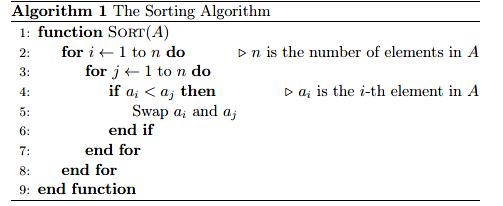

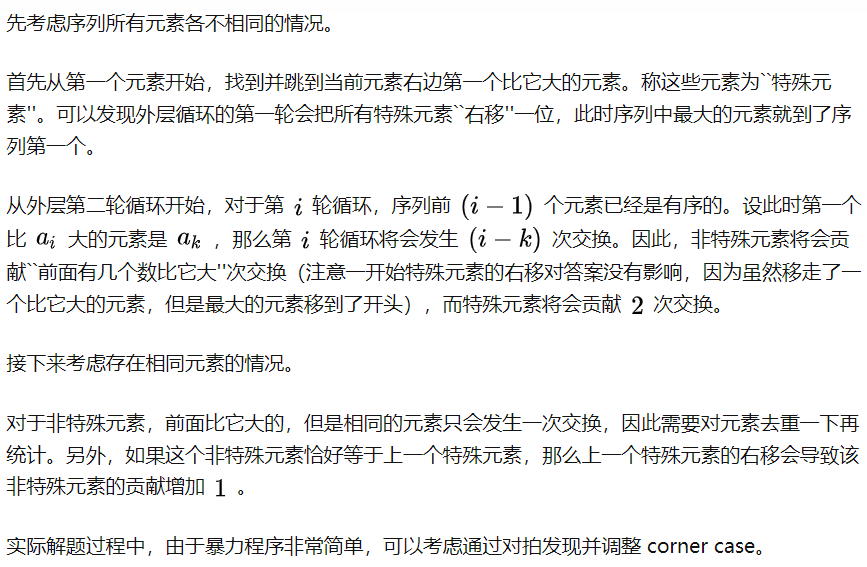

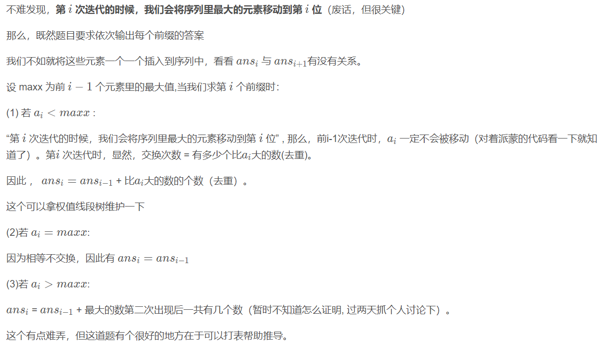

别人的代码(未经检验)：

```c++
#include<bits/stdc++.h>
using namespace std;
#define int long long
const int N = 2e6+100;
int tr[N];
void insert(int now,int l,int r,int loc,int val){
    if(l==r){
        tr[now] += val;
        tr[now] = min(1ll,tr[now]);
        tr[now] = max(tr[now],0ll);
        return;
    }
    int mid = (l+r)>>1;
    if(loc<=mid)
        insert(now<<1,l,mid,loc,val);
    else
        insert(now<<1|1,mid+1,r,loc,val);
    tr[now] = tr[now<<1]+tr[now<<1|1];
}
int query(int now,int l,int r,int ql,int qr){
    if(l>=ql&&r<=qr){
        return tr[now];
    }
    int sum = 0;
    int mid = (l+r)>>1;
    if(ql<=mid)
        sum += query(now<<1,l,mid,ql,qr);
    if(qr>=mid+1)
        sum += query(now<<1|1,mid+1,r,ql,qr);
    return sum;
}
int a[N];
vector<int> ans;
signed main(){
    ios::sync_with_stdio(false);
    int t;
    cin>>t;
    while(t--){
        int n;
        cin>>n;
        int maxx = -1;
        int last = 0;
        int tmp = 0,cnt = 0;
        for(int i=1;i<=n;i++){
            cin>>a[i];
            if(i==1){
                ans.push_back(last);
                maxx = a[i],cnt = 1;
            }
            else{
                if(a[i]==maxx){
                    ans.push_back(last);
                    cnt++;
                    if(cnt>=2) tmp++;
                }
                else if(a[i]<maxx){
                    last = last+ query(1,1,n,a[i]+1,n);
                    ans.push_back(last);
                    if(cnt>=2) tmp++;
                }
                else{
                    last = last+2+tmp;
                    ans.push_back(last);
                    maxx = a[i];
                    tmp = 0;
                    cnt = 1;
                }
            }
            insert(1,1,n,a[i],1);
        }
        for(int i=1;i<=n;i++){
            insert(1,1,n,a[i],-1);
            cout<<ans[i-1]<<" \n"[i==n];
        }
        ans.clear();
    }
}
```


#### 2021上海

> 时间比较赶，就补两签好了，其他粗略看了看，没有敲代码了(开摆！)

- D 数论
- E 贪心 排序
- G 树上DP
- H Kruskal重构树
- I DP

##### D Strange Fractions

> 有 $t(1\le t\le10^5)$ 次询问，给定 $1\le p,q\le10^7$ ，问能否找到 $a,b(1\le a,b\le10^9)$ 满足 $\dfrac pq=\dfrac ab+\dfrac ba$ 

注意不代表 $p=a^2+b^2,q=ab$ ，因为可以： $kp=a^2+b^2,kq=ab$ (分子分母同乘)

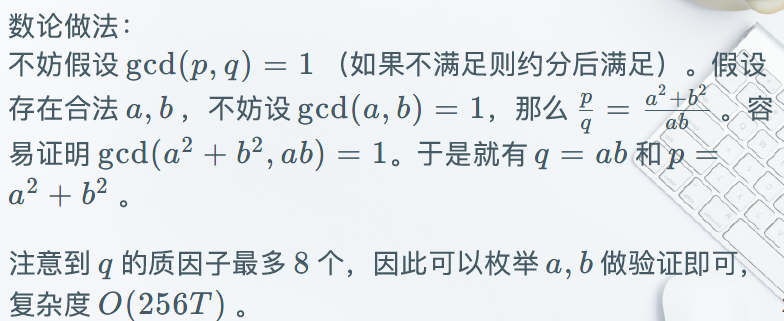

证明真的是易证，因为 $a^2+b^2$ 显然不含 $a$ 或 $b$ ( $a+b\neq ka\neq kb$ )

8 个质因子即 $2,3,5,7,11,13,17,19$ ，因为连乘九个超 $10^7$ 

这个解法不会做，做不出来。目前 WA 在下面测试的第八个：( $q=21\times23$ )，前面的可以通过二进制枚举来实现诸如 $a=2\times 3^2,b=5\times 7$ 的划分

```c++
8
4105 192
4177 576
61 30
1549 630
5 2
1088 256
1234 777
970 483
```


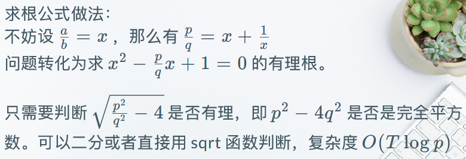

```c++
#include <bits/stdc++.h>
using namespace std;
#define sc(x) scanf("%lld", &x)
typedef long long ll;
ll t, p, q;
signed main()
{
    sc(t);
    while (t--)
    {
        sc(p), sc(q);
        ll dt = p * p - 4 * q * q, rdt = sqrt(max(0LL, dt));
        if (dt < 0 || rdt * rdt != dt)
        {
            printf("0 0\n");
        }
        else
        {
            printf("%lld %lld\n", p + rdt, 2 * q);
        }
    }
    return 0;
}
```


##### E Strange Integers

> 给定 $n(1\le n\le10^5)$ 长的序列，求长为 $m$ 的子序列，使得子序列每个值与它之前的所有值的绝对值之差不小于 $k(1\le k\le10^9)$ ，输出最大的 $m$

显然 $|x-y|=|y-x|$ ，所以等效于序列每个值与该序列里其他值的绝对值之差不小于 $k$ (把组合枚举转排列枚举)，那么排序后贪心即可，可以证明能选就选一定比能选不选更优

```c++
#include <bits/stdc++.h>
using namespace std;
#define sc(x) scanf("%lld", &x)
typedef long long ll;
#define mn 100010
ll n, k, a[mn], m, pre;
signed main()
{
    sc(n), sc(k);
    for (ll i = 1; i <= n; ++i)
    {
        sc(a[i]);
    }
    sort(a + 1, a + 1 + n);
    m = 1, pre = a[1];
    for (ll i = 2; i <= n; ++i)
    {
        if (a[i] - pre >= k)
        {
            ++m;
            pre = a[i];
        }
    }
    printf("%lld", m);
    return 0;
}
```


#### 2020银川

##### Browser Games

> 题意核心内容翻译：有 $n$ 个字符串，对每个 $i$ ，求最少的前缀数量，使得通过这些前缀只能找到前 $i$ 个字符串，不能找到剩余的字符串。保证字符串间互不为前缀。$(n\le 5\times 10^4,|S|\le50,S $ 小写字母和 `.` 和 `\` $)$ ，空间限制 $1024\ MB$

建树时可以先对每个节点加 $1$ ，那么点权代表从根节点到当前节点形成的前缀可以匹配到多少个字符串。初始时每个字符串都要求不能被匹配到，所以点权实质代表当前前缀不应匹配到的字符串有多少个。

然后顺次遍历 $i$ 个字符串，每次遍历时：对第 $i$ 个字符串的每个字符，在树上将其点权减一，代表第 $i$ 个字符串移除出不应匹配的字符串，如果减 一后点权为 $0$ ，代表当前前缀已经不能再匹配到任何不应匹配的字符串了，那么可以将当前前缀作为题目要求的 `confirmation prefix` ，答案加一。

特别注意的是，当前前缀 $p$ 加入后，以 $p$ 为前缀的所有本来被加入过的前缀都应该被删除，以达到“最少”的目的，因为它们已经冗余了。

以 `abc`,  `abd` , `abef` , `abeg` , `ba` 为例。 $i=1$ 时找到的当前前缀是 `abc` ，而 `i=2` 找到的是 `abd` ， `i=3` 时找到的是 `abef` ，但 `i=4` 时找的是 `a` ，这意味着前三个找到前缀都应该被删掉，因为 `a` 就能符合题意了，不需要多余的前缀。

为了实现这样的功能，我们可以在每次加入一个当前前缀 $p$ 时，把字典树上 $p$ 的所有前缀 (也就是 $p$ 的所有祖先)都额外标记一个数值 $dels$，代表它成为前缀时，要额外删掉之前已经存在的 `confirmation prefix` 的数目。然后每次新增一个当前前缀 $p$ 时，先加 $1$ 代表选中这个前缀加入答案，然后再删掉标记的数目 $dels$，代表删掉多少个已经存在的  `confirmation prefix` 。

这个额外标记的数值具体而言，就是当前前缀 $p$ 对答案的贡献值 $1-dels$ ，而并不是简单地标记加一。这是因为如果当前前缀 $p$ 加入后删掉了其子树上的全部前缀(即之前已经存在的 `confirmation prefix` )，那么这个删除对 $p$ 的所有祖先都是生效的，即对这些祖先的子树也删掉了。所以也要减去 $dels$ 。

时间复杂度是 $O(n|S|)$ ，空间复杂度是 $O(28n|S|)$ 

> 本题还有强化版本，限制空间为 $32\ MB$ ，见2021牛客多校第十场

参考代码：

```c++
#include <bits/stdc++.h>
using namespace std;
typedef int ll;    // not long long
#define mn 2500010 // 5e4*50
ll n, dels[mn], t[mn][28], cnt = 1, w[mn], p, ns, si, stak[55], ans;
char s[50010][55];
ll f(char c)
{
    return c == '.' ? 26 : (c == '/' ? 27 : c - 'a');
}
signed main()
{
    scanf("%d", &n);
    for (ll i = 1; i <= n; ++i)
    {
        scanf("%s", s[i] + 1);
        p = 1;
        ns = strlen(s[i] + 1);
        for (ll j = 1; j <= ns; ++j)
        {
            si = f(s[i][j]);
            if (t[p][si] == 0)
            {
                t[p][si] = ++cnt;
            }
            p = t[p][si];
            ++w[p];
        }
    }
    for (ll i = 1; i <= n; ++i)
    {
        p = 1;
        ns = strlen(s[i] + 1);
        for (ll j = 1; j <= ns; ++j)
        {
            si = f(s[i][j]);
            p = t[p][si];
            if (--w[p] == 0)
            {
                ll dt = 1 - dels[p];
                ans += dt;
                for (ll k = 1; k < j; ++k)
                {
                    dels[stak[k]] += dt;
                }
                break;
            }
            stak[j] = p;
        }
        printf("%d\n", ans);
    }
    return 0;
}
```

强化版解题思路：只存关键节点，即叶子节点的 LCA ，有点像虚树的思维，可以得知加上叶子节点最多有 $O(2n)$ 个点。这些多出来的非叶子节点就是叶子的 LCA 及 LCA 的 LCA 。

因为我们不可能先建出树(不能真的建树然后建虚树)，会 MLE ，所以可以用别的方法。可以用一种基数排序的思想，从第一个字符开始作关键字，进行排序。设当前以第 $d$ 个字符作关键字，排序后，可以 $O(n)$ 比较每个字符串第 $d$ 个字符是否一样，如果第 $d$ 位存在不重复的字符(即所有字符串只有一个字符串第 $d$ 位取这个字符)，一个长为 $d$ 的前缀可以作为增加的节点，并把它作为叶子节点(而不是这个字符串作叶子节点)。否则，就是存在重复的，设有 $m$ 个第 $d$ 位为同一个值的字符串，说明当前一定可以继续划分。那么所有第 $d$ 位是该字符的字符串全部合在一个非叶子节点里，然后找到下一个使得这些选中字符串存在差异的第 $d'$ 位，以这些选中的字符串为整体，长为 $d'$ 的前缀(长为 $[d,d'] $ 的都符合题意)作为一个新节点，其能匹配到 $m$ 的字符串，并以第 $d'$ 位为关键字，继续向下递归，执行上述过程。本质上就是分治的思维。(具体实现参见代码)

最坏情况下需要走 $|S|$ 层，每层不断二分范围是最坏情况，如果用快排实现基数排序的内层排序，那么一次排序复杂度为 $O(n\log n)$ ，可以把 $\log n$ 看成是常数 $c\approx 16$ (事实上除了第一层递归，后面的层远不会这么大)，那么可以套用主定理： $T(n)=2T(\dfrac n2)+cn$ ，所以最坏复杂度为 $O(n\log n)$ 。事实上本题下面的过题代码用时在 SCNUOJ 的数据快了十倍，在牛客的过题情况如下 [所示](https://ac.nowcoder.com/acm/contest/view-submission?submissionId=51220261&returnHomeType=1&uid=955759784)

参考代码：

```c++
#include <bits/stdc++.h>
using namespace std;
typedef int ll;
#define mn 100010
#define mt 200010
#define ms 102 //注意这道题|S|=100
ll n, cnt, id[mt], fa[mt], w[mt], dp[mt], ans;
char s[mn][ms];
void build(ll lf, ll rf, ll dep, ll rot)
{
    sort(id + lf, id + rf + 1, [&](ll x, ll y)
         { return s[x][dep] < s[y][dep]; }); //[&]的&支持外部变量
    for (ll l = lf, r = lf; r <= rf;)
    {
        if (r == rf || s[id[r]][dep] != s[id[r + 1]][dep])
        {
            if (l == r)
            {
                fa[id[r]] = rot;
                w[id[r]] = 1;
                ++l, ++r;
                continue;
            }
            ll skip = 1;
            while (true)
            {
                bool allsame = true;
                for (ll i = l; i < r; ++i)
                {
                    if (s[id[i]][dep + skip] != s[id[i + 1]][dep + skip])
                    {
                        allsame = false;
                        break;
                    }
                }
                if (allsame)
                {
                    ++skip;
                }
                if (!allsame)
                {
                    ++cnt;
                    fa[cnt] = rot;
                    w[cnt] = r - l + 1;
                    build(l, r, dep + skip, cnt);
                    l = r + 1;
                    break;
                }
            }
        }
        ++r;
    }
}
signed main()
{
    scanf("%d", &n), cnt = n;
    for (ll i = 1; i <= n; ++i)
    {
        scanf("%s", s[i] + 1);
        id[i] = i;
    }
    build(1, n, 1, 0);
    for (ll i = 1; i <= n; ++i)
    {
        ll no = i, p = -1;
        while (no)
        {
            if (--w[no] == 0)
            {
                p = no;
                ans -= dp[no];
            }
            no = fa[no];
        }
        assert(p != -1);
        ++dp[fa[p]];
        ++ans;
        printf("%d\n", ans);
    }
    return 0;
}
```


### CCPC

#### 2021桂林

> 铁牌出征，差一点获奖，非常遗憾 [赛榜](https://codeforces.com/gym/103409/standings)

- A 签 (赛时AC)
- I 贪心 (赛时AC)
- G DP/二分答案 (赛时AC)
- D 贪心 单调栈 构造 (赛时AC)
- E 博弈论 图论 最短路
- B set 模拟
- F 旋转卡壳 计算几何
- J 后缀数组 / 后缀树
- K DFS 最短路

##### A A Hero Named Magnus

> 有 $t$ 组询问，给定 $n(1\le n\le2\times10^9)$ ，从第 $n$ 局开始，每局胜率 $100\%$ ，否则 $50\%$ ，在最坏情况下，需要打多少局能区分胜负(奇数局 $x$ 局获胜 $\dfrac{x+1}2$ 区分胜负)

前面 $n-1$ 局都输了，再赢 $n$ 局就能赢，所以 $2n-1$


##### I PTSD

> 有 $t$ 组询问，给定 $n(1\le n,\sum n\le10^6)$ 人，为 $1$ 有 PTSD。第 $i$ 个人的值是 $i$ 。将它们分组，若 $PTSD$ 在组内值第二大将会病发，求病发的最大值和。

倒序贪心，对 `1` ，如果当前有比他更大的人，跟他组队；不然加一个待组队的人。(赛时队友做出来的，赛时思路我忘了)

```c++
#include <bits/stdc++.h>
using namespace std;
#define sc(x) scanf("%lld", &x)
typedef long long ll;
#define mn 1000010
ll t, n;
char s[mn];
signed main()
{
    for (sc(t); t--;)
    {
        sc(n);
        scanf("%s", s + 1);
        ll pr = 0, ans = 0;
        for (ll i = n; i >= 1; --i)
        {
            if (s[i] == '1' && pr)
            {
                ans += i;
                pr--;
            }
            else
            {
                pr++;
            }
        }
        printf("%lld\n", ans);
    }
    return 0;
}
```


##### G Occupy the Cities

> 多组询问，给定 $n(1\le n,\sum n\le10^6)$ 长 `01` 序列(至少有一个 `1` )，每单位时间每个 `1` 可以向左或右拓展一次将 `0` 改为 `1` ，问得到全 `1` 序列最少要多久

赛时队友打了个 $dp[n][2]$ 枚举每个点向左/右过掉了

来一份二分答案+贪心的参考题解：

```c++
#include <bits/stdc++.h>
using namespace std;
#define ll long long
#define N 1000005
int T;
int n;
char s[N];
int a[N];
int ans;
int pos[N];
int b[N], cnt;
int check(int x)
{
    if (pos[1] - 1 > x) // fail
        return 0;
    if (pos[1] - 1 == x) //该点向左刚好得到答案
        b[1] = 1;
    for (int i = 2; i <= cnt; i++)
    {
        //如果上一个点向右，这个点向左需要ceil(n/2)回合
        int now = pos[i] - pos[i - 1] - 1;
        if (now == 0)
            continue;
        if (b[i - 1]) //上一个点向左,整体左移1(ctn了now==0所以可以)
            now++;
        if ((now + 1) / 2 > x) // ceil(n/2)
        {
            return 0;
        }
        if (now / 2 == x && now % 2 == 0) //就是需要这么多步，没有余量
        {
            b[i] = 1;
        }
    }
    if (b[cnt]) //向左
    {
        if (n - pos[cnt] + 1 > x)
            return 0;
    }
    else
    {
        if (n - pos[cnt] > x)
            return 0;
    }
    return 1;
}
int main()
{
    cin >> T;
    while (T--)
    {
        scanf("%d", &n);
        scanf("%s", s + 1);
        cnt = 0;
        for (int i = 1; i <= n; i++)
        {
            a[i] = s[i] - '0';
            if (a[i])
                pos[++cnt] = i;
            b[i] = 0;
        }
        int l = 1, r = n;
        ans = 0;
        if (cnt != n)
            while (l <= r)
            {
                int mid = (l + r) >> 1;
                for (int i = 1; i <= cnt; i++)
                    b[i] = 0;
                if (check(mid))
                {
                    ans = mid;
                    r = mid - 1;
                }
                else
                    l = mid + 1;
            }

        printf("%d\n", ans);
    }
}
/*
1
7
0100101
*/
```


##### D Assumption is All You Need

> 给定 $T$ 组询问，每组询问一个 $n(\le n,\sum n\le2021)$ ，给定两个长为 $n$ 的 $n$ 的一个排列 $a,b$ ，问能否只两两交换 $a$ 的逆序对移动到 $b$ ，若能给出方案，否则给出 `-1`

赛时队友过了，我想不出来。一个思路是(不知道是不是赛时的)从小到大枚举 $a$ 的元素，然后将它移动到目标位置的过程，每次让它跟当前区间最小值互换。找最小值用单调栈，用线段树会T。

> 官方题解有证明：(证明略，不想看)
>
> 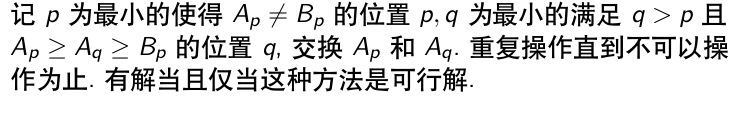
>
> (例如 `4 3 2 1` 和 `1 4 3 2` ，那么 $p=1$ ，$q = 2$ ，交换一次 `3 4 2 1` ，然后 $p=1,q=3$ ，因为 $q=2$ 时不满足 $A_p\ge A_q$ ，交换，然后再交换 $p=1,q=4$ )
>
> 该解法是字典序最小的 

```c++
#include <bits/stdc++.h>
using namespace std;
#define sc(x) scanf("%lld", &x)
typedef long long ll;
#define mn 2048
ll t, n, a[mn], b[mn], posa[mn], posb[mn];
signed main()
{
    for (sc(t); t--;)
    {
        sc(n);
        for (ll i = 1; i <= n; ++i)
        {
            sc(a[i]);
            posa[a[i]] = i;
        }
        for (ll i = 1; i <= n; ++i)
        {
            sc(b[i]);
            posb[b[i]] = i;
        }
        bool ok = true;
        vector<pair<ll, ll>> ans;
        for (ll i = 1; i <= n; ++i)
        {
            ll pai = posa[i];
            ll pbi = posb[i];
            if (pbi > pai)
            {
                ok = false;
                break;
            }
            vector<pair<ll, ll>> s; //(v,i)
            for (ll j = pai - 1; j >= pbi; --j)
            {
                if (a[j] < i)
                {
                    continue;
                }
                while (!s.empty() && a[j] < s.back().first)
                {
                    s.pop_back();
                }
                s.emplace_back(a[j], j);
            }
            for (auto &j : s)
            {
                posa[i] = j.second;
                posa[j.first] = pai;
                a[j.second] = i;
                a[pai] = j.first;
                ans.emplace_back(j.second, pai);
                pai = j.second;
            }
        }
        if (!ok)
        {
            printf("-1\n");
        }
        else
        {
            printf("%lld\n", (ll)ans.size());
            for (auto i : ans)
            {
                printf("%lld %lld\n", i.first, i.second);
            }
        }
    }
    return 0;
}
/*
3
2
1 2
2 1
4
4 1 2 3
1 3 2 4
8
8 7 6 5 4 3 2 1
1 8 7 6 5 4 3 2
*/
```


##### E Buy and Delete

> $n$ 点有向图，一开始无边。$A$ 可以加零到任意多条边，有 $m$ 条可加边，边权是 $p$ ，加边总权不超 $c$ 。然后 $B$ 每次操作可以删掉若干边集，满足被删边集无环。 $A$ 会使得 $B$ 操作数尽可能多， $B$ 则会使自己操作数尽可能少。求操作数。 $2\le n\le2000,1\le m\le5000,1\le c\le10^9,1\le p\le10^5$ 

可以发现，对于所有的环可以两次分删完(一定存在方案一次拆掉所有的环)，所有的非环可以一次删完。所以问题转化为：

- $c<\min w$ 输出 $0$
- $c\le\min w\wedge c < \min cycle$ 输出 $1$
- 否则输出 $2$ 

找最小环，可以跑全源最短路径，对以 $u$ 的单源最短路，设边是 $(u,v,w)$ ，最短路是 $d_v$ ，那么环长为 $d_v+w$ 

复杂度为 $O(nm\log m)$ 

```c++
#include <bits/stdc++.h>
using namespace std;
#define sc(x) scanf("%lld", &x)
typedef long long ll;
#define me 5050
#define mn 2020
ll n, m, c, minw, mincy;
struct edge
{
    ll v, w;
};
vector<edge> e[mn], e2[mn];
#define big 0x7fffffff
bool vis[mn];
struct node
{
    ll i, d;
    bool operator<(const node &x) const { return d > x.d; }
};
ll d[mn];
void dijkstra(ll s)
{
    fill(d, d + 1 + n, big);
    memset(vis, 0, sizeof vis);
    d[s] = 0;
    priority_queue<node> q;
    q.push({s, 0});
    while (!q.empty())
    {
        node p = q.top();
        ll u = p.i;
        q.pop();
        if (vis[u])
        {
            continue;
        }
        vis[u] = true;
        for (auto &i : e[u])
        {
            ll v = i.v, w = i.w;
            if (d[v] > d[u] + w)
            {
                d[v] = d[u] + w;
                q.push({v, d[v]});
            }
        }
    }
}
signed main()
{
    sc(n), sc(m), sc(c);
    minw = mincy = big;
    for (ll i = 1, u, v, w; i <= m; ++i)
    {
        sc(u), sc(v), sc(w), e[u].push_back({v, w});
        e2[v].push_back({u, w});
        minw = min(minw, w);
    }
    if (minw > c)
    {
        printf("0");
        return 0;
    }
    for (ll i = 1; i <= n; ++i)
    {
        dijkstra(i);
        for (auto &j : e2[i])
        {
            ll v = j.v, w = j.w;
            mincy = min(mincy, d[v] + w);
        }
    }
    if (c >= mincy)
    {
        printf("2");
    }
    else
    {
        printf("1");
    }
    return 0;
}
/*
3 2 4
1 2 5
2 3 6

3 3 3
1 2 1
2 3 1
1 3 1

3 3 3
1 2 1
2 3 1
3 1 1
*/
```


##### B A Plus B Problem

> 有 $n(1\le n\le10^6)$ 位加法(输入 $A,B$ ，从高位到低位)，有 $q(1\le q\le10^6)$ 次操作，每次操作第 $r(1\le r\le2)$ 个运算数的从左往右第 $1\le c\le n$ 位，改为 $d(0\le d\le9)$ ，问第 $c$ 位结果以及整三行( $A,B,A+B$ )有多少位发生了变化

[题解](https://blog.csdn.net/qq_51268115/article/details/121438942) 

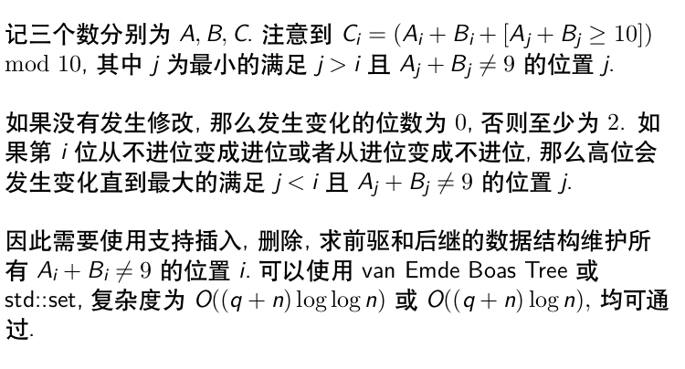

(代码未经检验，是别人的)

```c++
#include <iostream>
#include <cstdio>
#include <fstream>
#include <algorithm>
#include <cmath>
#include <deque>
#include <vector>
#include <queue>
#include <string>
#include <cstring>
#include <map>
#include <stack>
#include <set>
#include <iomanip>//io控制头文件 cout<<fixed<<setprecision(3)<<ans<<"\n";     
#define ms(x,n) memset(x,n,sizeof x)
#define endl '\n'
#define pii pair<int,int> 
#define M(a,b) make_pair(a,b)
using namespace std;
typedef long long ll;
const int inf = 0x3f3f3f3f;
const int mod = 998244353;
const int N = 1e6 + 10;
int n, m, t;
int a[4][N], b[N];
char s[N];
set<int> v;
int _gcd(int a, int b) {
    return b > 0 ? _gcd(b, a % b) : a;
}
int main()
{
    ios::sync_with_stdio(false);
    cin.tie(0);cout.tie(0);
    cin >> n >> m;
    cin >> (s + 1);
    for (int i = 1;i <= n;i++) {
        a[1][i] = s[i] - '0';
    }
    cin >> (s + 1);
    for (int i = 1;i <= n;i++) {
        a[2][i] = s[i] - '0';
    }
    int fg = 0;
    for (int i = n;i;i--) {
        if (a[1][i] + a[2][i] != 9) {
            v.insert(i);
        }
        if (a[1][i] + a[2][i] + fg >= 10) {
            b[i] = 1;
            a[3][i] = (a[1][i] + a[2][i] + fg) % 10;
            fg = 1;
        }
        else {
            a[3][i] = (a[1][i] + a[2][i] + fg);
            fg = 0;
        }
    }
    v.insert(0);
    int r, c, d;
    int ans;
    while (m--) {
        cin >> r >> c >> d;
        auto itp = v.upper_bound(c);
        bool f = false;
        if (itp == v.end());
        else {
            if (a[1][*itp] + a[2][*itp] > 9) f = true;
        }
        if (a[r][c] == d) { cout << (a[1][c] + a[2][c] + f)%10 << " " << 0 << endl; continue; }    //相等
        if (a[1][c]+a[2][c]+f<=9) {
            if (a[(r == 1) ? 2 : 1][c] + d + f< 10) {           //0 0
                a[3][c] = a[(r == 1) ? 2 : 1][c] + d + f;
                a[r][c] = d;
                if (a[1][c] + a[2][c] == 9) v.erase(c);                   //要统一更新！
                else v.insert(c);
                cout << a[3][c] << " " << 2 << endl;
                continue;
            }
            else {                                                       //0 1
                ans =2;
                a[3][c] = (a[(r == 1) ? 2 : 1][c] + d + f) % 10;
                a[r][c] = d;
                if (a[1][c] + a[2][c] == 9) v.erase(c);
                else v.insert(c);
                auto it = v.lower_bound(c);
                it--;
                if (*it)              //0不能算上
                    ans += c - *it;
                else ans += c - *it - 1;
                cout << a[3][c] << " " << ans << endl;
            }
        }
        else {
            if (a[(r == 1) ? 2 : 1][c] + d + f< 10) {    //之前溢现在不溢了   //1 0
                ans = 2;
                a[3][c] = (a[(r == 1) ? 2 : 1][c] + d + f) % 10;
                a[r][c] = d;
                if (a[1][c] + a[2][c] == 9) v.erase(c);
                else v.insert(c);
                auto it = v.lower_bound(c);
                it--;
                if(*it)
                  ans += c - *it;
                else ans += c - *it-1;
                cout << a[3][c] << " " << ans << endl;
                continue;
            }
            else {    //之前溢现在溢                                    //1 1
                ans = 2;
                a[3][c] = (a[(r == 1) ? 2 : 1][c] + d + f) % 10;
                a[r][c] = d;
                if (a[1][c] + a[2][c] == 9) v.erase(c);
                else v.insert(c);
                cout << a[3][c] << " " << ans << endl;
            }
        }
    }
    return 0;
}
```


##### F Illuminations II

> 给定 $n,m(3\le n,m\le2\times10^5)$ 代表外、内凸多边形点数(保证内的必然全部在外的里边)，接下来依次输入这两个多边形，保证三点不共线且按逆时针方向，输出浮点数，代表以外凸多边形任一点为光源，投影能照到的内凸多边形的边长期望值

不难将问题转化为对内的每条边延长切外的凸多边形成一部分，求所有这样的部分的和除以外周长。(代码未经检验，是别人的)

```c++
#include <iostream>
#include <algorithm>
#include <cstring>
#include <cstdio>
#include <set>
#include <queue>
#include <vector>
#include <map>
#include <bitset>
#include <unordered_map>
#include <cmath> 
#include <stack>
#include <iomanip>
#include <deque> 
#include <sstream>
#define x first
#define y second
#define debug(x) cout<<#x<<":"<<x<<endl;
using namespace std;
typedef long double ld;
typedef long long LL;
typedef pair<int, int> PII;
typedef pair<double, double> PDD;
typedef unsigned long long ULL;
const int N = 2e5 + 10, M = 2 * N, INF = 0x3f3f3f3f, mod = 1e9 + 7;
const double eps = 1e-8, pi = acos(-1), inf = 1e20;
#define tpyeinput int
inline char nc() {static char buf[1000000],*p1=buf,*p2=buf;return p1==p2&&(p2=(p1=buf)+fread(buf,1,1000000,stdin),p1==p2)?EOF:*p1++;}
inline void read(tpyeinput &sum) {char ch=nc();sum=0;while(!(ch>='0'&&ch<='9')) ch=nc();while(ch>='0'&&ch<='9') sum=(sum<<3)+(sum<<1)+(ch-48),ch=nc();}
int dx[] = {-1, 0, 1, 0}, dy[] = {0, 1, 0, -1};
int h[N], e[M], ne[M], w[M], idx;
void add(int a, int b, int v = 0) {
    e[idx] = b, w[idx] = v, ne[idx] = h[a], h[a] = idx ++;
}
int n, m, k;
int sgn(double x) {
    if (fabs(x) < eps) return 0;
    if (x < 0) return -1;
    return 1;
}
struct Point {
double x, y;
Point() {}
Point (double _x, double _y) {
x = _x, y = _y;
}
void input() {
scanf("%lf%lf", &x, &y);
}
void output() {
printf("%.2lf %.2lf", x, y);
}
bool operator ==(Point b) const{
return sgn(x - b.x) == 0 && sgn(y - b.y) == 0;
}
bool operator <(Point b) const{
return sgn(x - b.x) == 0 ? sgn(y - b.y) < 0 : x < b.x;
}
Point operator -(const Point &b) const{
return Point(x - b.x, y - b.y);
}
Point operator +(const Point &b) const{
return Point(x + b.x, y + b.y);
}
Point operator *(const double &t) const{
return Point(x * t, y * t);
}
Point operator /(const double &t) const{
return Point(x / t, y / t);
}
//cross
double operator ^(const Point &b) const{
return x * b.y - y * b.x;
}
// dot
double operator *(const Point &b) const{
return x * b.x + y * b.y;
}
double len() {
return hypot(x, y);
}
double len2() {
return x * x + y * y;
}
double distance(Point p) {
return hypot(x - p.x, y - p.y);
}
// pa pa 夹角 
double rad(Point a, Point b) {
Point p = *this;
return fabs(atan2(fabs((a - p) ^ (b - p)), (a - p) * (b - p)));
}
// 转化为长度为r的向量
Point trunc(double r) {
double l = len();
if (!sgn(l)) return *this;
r /= l;
return Point(x * r, y * r);
}
//逆时针旋转90度
Point rotleft() {
return Point(-y, x);
}
//顺时针旋转90度
Point rotright() {
return Point(y, -x);
}
// 绕着p点逆时针旋转 rad度
Point rotate(Point p, double rad) {
Point v = (*this) - p;
double c = cos(rad), s = sin(rad);
return Point(p.x + v.x * c - v.y * s, p.y + v.x * s + v.y * c);
}
};
typedef Point Vector;
struct Line {
   Point s, e;
   Line() {}
   Line(Point _s, Point _e) {
        s = _s, e = _e;
   }
      // 根据一个点和倾斜角 angle 确定直线, 0<=angle< pis
   Line(Point p, double angle) {
      s = p;
     if (sgn(angle - pi / 2) == 0)    e = (s + Point(0, 1));
     else e = (s + Point(1, tan(angle))); // 往上平移
}
//ax + by + c = 0;
Line(double a, double b, double c) {
if (!sgn(a)) {
s = Point(0, -c / b);
e = Point(1, -c / b);
}
else if (!sgn(b)) {
s = Point(-c / a, 0);
e = Point(-c / a, 1);
}
else {
s = Point(0, -c / b);
e = Point(1, (-c - a) / b);
}
}
bool operator ==(Line v) {
return (s == v.s) && (e == v.e);
}
void input() {
s.input(), e.input();
}
void adjust() {
if (e < s) swap(s, e);
}
// 线段长度
double length() {
return s.distance(e);
}
// 直线倾斜角 0<=angle<pi
double angle() {
double k = atan2(e.y - s.y, e.x - s.x);
if (sgn(k) < 0) k += pi;
if (sgn(k - pi) == 0) k -= pi;
return k;
}
// 点和线的关系 1.左边 2.右边 3.线上
int relation(Point p) {
int c = sgn((p - s) ^ (e - s));
if (c < 0) return 1;
else if (c > 0) return 2;
return 3;
}
//点在线段上
bool pointonseg(Point p) {
return sgn((p-s)^(e-s)) == 0 && sgn((s-p)*(e-p)) <= 0;
}
// 两直线平行
bool parallel(Line v) {
return sgn((e - s) ^ (v.e - v.s)) == 0;
}
// 两线段相交判断  2 规范相交 1 不规范相交 0 不相交
int segcrossseg(Line v) {
int d1 = sgn((e-s)^(v.s-s)), d2 = sgn((e-s)^(v.e-s));
int d3 = sgn((v.e-v.s)^(s-v.s)), d4 = sgn((v.e-v.s)^(e-v.s));
if ((d1^d2) == -2 && (d3^d4) == -2) return 2;
return (d1==0 && sgn((v.s-s)*(v.s-e))<=0) ||
 (d2==0 && sgn((v.e-s)*(v.e-e))<=0) ||
 (d3==0 && sgn((s-v.s)*(s-v.e))<=0) ||
 (d4==0 && sgn((e-v.s)*(e-v.e))<=0);
}
// 直线和线段相交判断 2 规范相交 1 不规范相交 0 不相交 this line v seg
int linecorssseg(Line v) {
int d1 = sgn((e-s)^(v.s-s)), d2 = sgn((e-s)^(v.e-s));
if ((d1^d2) == -2) return 2;
return (!d1 || !d2); 
}
// 两直线关系 0 平行 1 重合 2 相交
int linecrossline(Line v) {
if ((*this).parallel(v)) return v.relation(s) == 3;
return 2; 
}
// 求两直线的交点，保证不平行和重合
Point crossPoint(Line v) {
double a1 = (v.e-v.s)^(s-v.s), a2 = (v.e-v.s)^(e-v.s);
return Point((s.x*a2-e.x*a1)/(a2-a1),(s.y*a2-e.y*a1)/(a2-a1));
}
double dispointtoline(Point p) {
return fabs((e-s)^(p-s)) / length();
}
double dispointtoseg(Point p) {
if (sgn((e-s)*(p-s)) < 0 || sgn((e-s)*(p-e)) < 0) return min(p.distance(s), p.distance(e));
return dispointtoline(p);
}
// 返回线段和线段的距离，保证不能相交
double dissegtoseg(Line v) {
return min(min(dispointtoseg(v.s), dispointtoseg(v.e)), 
min(v.dispointtoseg(s), v.dispointtoseg(e)));
}
// 返回点p在直线上的投影
Point lineprog(Point p) {
return s + (((e-s)*((e-s)*(p-s))/(e-s).len2()));
}
};
double sum[N];
int main() {
    scanf("%d %d", &n, &m);
    vector<Point> sp(m + 1), bp(n + 1);
    for (int i = 0; i < n; i ++ ) {
        double x, y; scanf("%lf %lf", &x, &y);
        bp[i] = Point(x, y);
    }   
    for (int i = 0; i < m; i ++ ) {
        double x, y; scanf("%lf %lf", &x, &y);
        sp[i] = Point(x, y);
    }
  //  for (int i = 0; i < n; i ++ ) cout << bp[i].x << ' ' << bp[i].y << endl;
    vector<Line> sl(m + 1), bl(n + 1);
    for (int i = 0; i < n; i ++ ) {
        bl[i] = Line(bp[i], bp[(i + 1) % n]);
        if (i) sum[i] += sum[i - 1];
        sum[i] += bl[i].length();
    }
   // cout << sum[n - 1] << endl;
    for (int i = 0; i < m; i ++ ) sl[i] = Line(sp[i], sp[(i + 1) % m]);
    double res = 0;
    int a = 0, b = 0;
    double len = 0;
    for (int i = 0; i < m; i ++ ) {
        Line t = sl[i]; len = 0;
        while (!t.linecorssseg(bl[a]) || sgn((t.e- t.s) ^ (bl[a].e - bl[a].s)) < 0) a = (a + 1) % n;
        while (!t.linecorssseg(bl[b]) || sgn((t.e- t.s) ^ (bl[b].e - bl[b].s)) > 0) b = (b + 1) % n;
        Point pa = t.crossPoint(bl[a]), pb = t.crossPoint(bl[b]);
        //cout << a << ' ' << b << endl;
        len = pa.distance(bp[a]) + pb.distance(bp[(b + 1) % n]);
        if (a < b) { 
            if (a) len += sum[a - 1];
            len += sum[n - 1] - sum[b];
        }
        else {
            len += sum[a - 1] - sum[b];
        } 
        res += len * t.length();
    }
    printf("%.15lf\n", res / sum[n - 1]);
    return 0;
}

```


#### 2021威海

> 打星打铁 [赛榜](https://codeforces.com/gym/103428/standings)

- A 签 图论 (赛时AC)
- J 数论 (赛时AC)
- D KMP 字符串 (赛时AC)
- G 组合数学 分块 (赛时AC)
- H 网络流 / 树上DP
- E 概率DP
- M 容斥
- F 博弈论 思维

##### A Goodbye, Ziyin!

> 给定 $n(1\le n\le10^6)$ 点无根树，问有多少种选根方案使得其成为一棵二叉树

签，不解释

```c++
#include <bits/stdc++.h>
using namespace std;
#define sc(x) scanf("%lld", &x)
typedef long long ll;
#define mn 1000010
ll n, d[mn], res;
signed main()
{
    sc(n);
    for (ll i = 1, u, v; i < n; ++i)
    {
        sc(u), sc(v);
        ++d[u], ++d[v];
    }
    for (ll i = 1; i <= n; ++i)
    {
        if (d[i] > 3)
        {
            printf("0");
            return 0;
        }
        if (d[i] < 3)
        {
            ++res;
        }
    }
    printf("%lld", res);
    return 0;
}
```


##### J Circular Billiard Table

> 有 $t(1\le t\le10^4)$ 组询问，给定与 $y$ 轴负半轴夹角 $\dfrac ab(0 < a,b < 10^9,0 < \dfrac ab < 90)$ ，从圆的最左侧射入一个球，问弹性碰撞多少次之后回到出发点，或者输出 `-1`

不知道赛时推的什么式子爆 long long。但是现在重推一遍并不会。

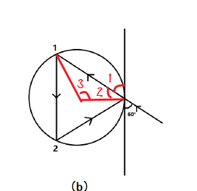

$\ang 1$ 是入射角的内错角，那么 $\ang2=90°-\ang 1$ ，根据等腰三角形， $\ang3=180°-\ang2=2\ang1$ ，对应弧长也是这么多。一周弧长是 $360°$ ，那么等价于：
$$
\begin{align}
2\dfrac ba(n+1)&\equiv0\bmod 360\\
\dfrac ba(n+1)&\equiv0\bmod180\\
a(n+1)&\equiv0\bmod 180b
\end{align}
$$
那么 $\dfrac{lcm(180b,a)}a=n+1$ ，即 $n+1=\dfrac{a\cdot 180b}{(180b,a)a}$ 即 $n=\dfrac{180b}{(180b,a)}-1$

```c++
#include <bits/stdc++.h>
using namespace std;
#define sc(x) scanf("%lld", &x)
typedef long long ll;
ll t, a, b;
signed main()
{
    for (sc(t); t--;)
    {
        sc(a), sc(b);
        ll g = __gcd(180 * b, a);
        printf("%lld\n", (180 * b / g) - 1);
    }
    return 0;
}
```


##### D Period

> 给定小写字母字符串 $s(1\le |s|\le10^6)$ 和 $q(1\le q\le10^6)$ 次独立询问，问修改第 $i(1\le i\le |s|)$ 个字符为 `#` 后，该字符串有多少个周期。定义周期 $T$ 为满足 $1\le T < |s|,\forall i\in(T,|s|],s[i]=s[i-T]$ 的整数

可以用 KMP 求出字符串的全部周期长度 $T$ 。修改一个字符 $s[i]$ 为 `#` 后，本来长度为 $[1,i)$ 的周期(即前缀)一定都不再符合因为第二循环节出现了 `#` 而 $[1,i)$ 没有 `#` ，所以要求满足 $T > i-1$ 即 $T\ge i$ 。本来第一循环节有 `#` 而第二循环节对应位置没有 `#` (即下标 $i+T$ )也不符合，即必须满足 $i+T > n\to T > n-i$ 即 $T\ge n-i+1$ 。即周期长度一定要不少于 $\min(i,n-i+1)$ ，二分查找即可

参考代码：

```c++
#include <bits/stdc++.h>
using namespace std;
#define sc(x) scanf("%lld", &x)
typedef long long ll;
#define mn 1000010
char s[mn];
ll n, q, x, t[mn], m, kmp[mn];
signed main()
{
    scanf("%s", s + 1);
    n = strlen(s + 1);
    for (ll i = 2, j = 0; i <= n; ++i)
    {
        while (j > 0 && s[j + 1] != s[i])
        {
            j = kmp[j];
        }
        if (s[j + 1] == s[i])
        {
            ++j;
        }
        kmp[i] = j;
    }
    for (ll i = n; kmp[i]; i = kmp[i])
    {
        t[m++] = n - kmp[i];
    }
    for (sc(q); q--;)
    {
        sc(x);
        printf("%lld\n", m - (lower_bound(t, t + m, max(x, n - x + 1)) - t));
    }
    return 0;
}
```


##### G Desserts

> 有至多 $m(1\le m\le5\times10^4)$ 支队伍，有 $n(1\le n\le5\times10^4)$ 种糖果，第 $i$ 种有 $a_i(0\le a_i,\sum a_i\le10^5)$ 个。将糖果全部分出去，每支队伍每种糖果最多获得一个，问方案数对 $998244353$ 取模。求对 $[1,m]$ 支队伍的方案数

显然式子为： $\prod_{i=1}^nC_{m}^{a_i}=(m!)^n\prod_{i=1}^n(a_i!)^{-1}((m-a_i)!)^{-1}$ 

根据 $0\le a_i,\sum a_i\le10^5$ ，发现不同的 $a_i$ 数目最多有 $\sqrt{\sum a_i}$ ，即最坏情况为 $\sum_{i=1}^ni=\sum a_i\to \dfrac{x(x+1)}2\sim y\to x\sim\sqrt y$ ，那么可以合并同类项，将上述式子的 $\prod$ 枚举项化为不多于 $\sqrt{\sum a_i}$ 项，复杂度为 $O(m\sqrt{\sum a_i}\log n)\approx 2.5\times10^8$ 

注意使用式子的左半部分来计算，可以实现预处理逆元，因此复杂度是正确的，倘若拆开来算(每次要算阶乘的幂的逆元，那么复杂度会多一个 $\log 998244353$ 就会挂了)，也不要用所谓记忆化快速幂，没有优化作用

```c++
#include <bits/stdc++.h>
using namespace std;
#define sc(x) scanf("%lld", &x)
typedef long long ll;
#define mn 100010
#define mod 998244353
ll n, m, bin[mn];       //(a_i,times)
vector<pair<ll, ll>> v; //(a_i,times)
ll fact[mn], maxa, ap = 1, inv[mn];
ll qpow(ll a, ll b = mod - 2)
{
    ll r = 1;
    for (; b; b >>= 1)
    {
        if (b & 1)
        {
            r = r * a % mod;
        }
        a = a * a % mod;
    }
    return r;
}
ll c(ll df, ll uf)
{
    if (uf > df)
        return 0;
    return fact[df] * inv[uf] % mod * inv[df - uf] % mod;
}
signed main()
{
    sc(n), sc(m);
    for (ll i = 1, a; i <= n; ++i)
    {
        sc(a);
        ++bin[a];
        maxa = max(maxa, a);
    }
    for (ll i = 1; i < mn; ++i)
    {
        if (bin[i])
        {
            v.emplace_back(i, bin[i]);
        }
    }
    fact[0] = 1, inv[0] = 1;
    for (ll i = 1; i < mn; ++i)
    {
        fact[i] = fact[i - 1] * i % mod;
        inv[i] = qpow(fact[i]);
    }
    for (ll i = 1; i <= m; ++i)
    {
        ll ans = 1;
        for (auto &j : v)
        {
            ans = ans * qpow(c(i, j.first), j.second) % mod;
        }
        printf("%lld\n", ans);
    }
    return 0;
}
```


#### 2021广州

> 我校是主办方，所以没法参赛。

- I 快速幂 组合数学 / 打表
- H 构造 数学 余数
- C 二分答案 贪心 思维
- F 数学 组合数学 拉格朗日插值


##### I Pudding Store

> 有 $t(1\le t\le10)$ 次询问，求 $n(1\le n\le10^9)$ 排列 $a$ 里，满足对每个长为 $i$ 的前缀 $a[1..i]$ 都有 $2\sum_{j=1}^i a_j\bmod i=0$ 的有多少个

建议暴力打表，很快发现特判 $n=1,2$ 外，对 $n\ge 3$ 时 $n$ 增加一答案就增加一倍，所以是 $6\times 2^{n-3}$ 。不要给 $t\le10$ 误导以为是什么高复杂度解法如 $n!\bmod p$ 。有严格证明，如下：

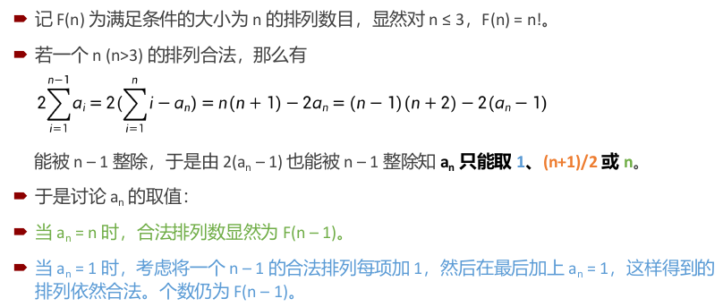

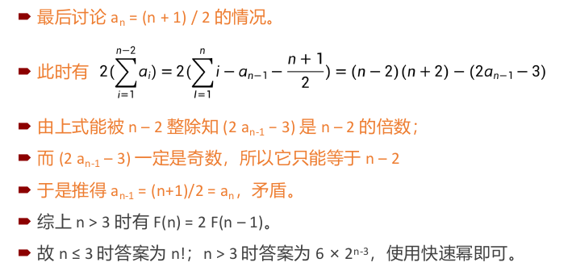

```c++
#include <bits/stdc++.h>
using namespace std;
#define sc(x) scanf("%lld", &x)
typedef long long ll;
ll t, n, mod = 998244353;
ll qpow(ll a, ll b)
{
    ll r = 1;
    for (; b; b >>= 1)
    {
        if (b & 1)
        {
            r = r * a % mod;
        }
        a = a * a % mod;
    }
    return r;
}
signed main()
{
    sc(t);
    while (t--)
    {
        sc(n);
        if (n <= 2)
        {
            printf("%lld\n", n);
        }
        else
        {
            printf("%lld\n", 6 * qpow(2, n - 3) % mod);
        }
    }
    return 0;
}
```


##### H Three Integers

> 给定 $t(1\le t\le10^5)$ ，给定三个整数 $a,b,c(0\le a,b,c\le10^9)$ ，请构造三个整数 $x,y,z(1\le x,y,z\le10^{18})$ 使得 $x\bmod y=a,y\bmod z=b,z\bmod x=c$ ，如果构造不成功就 `NO` ，成功 `YES` 并输出答案

即存在非负整数 $u,v,w$ 使得 $z=ux+c,y=vz+b,x=wy+a$

题解看不懂，不知道为什么构造要满足 $x > a,y > b, z > c$ 这些条件，于是进行暴力猜测，假设 $u=0$ 然后随机造 $v,w$ ；同理假设 $v=0,w=0$ ，然后骗分 AC 了这道题

依据：假设随便找一个解是可行解的概率是 $p$ ，找 $x$ 次，那么程序正确的期望是 $1-(1-p)^x$ (需要连续正确 $t$ 次)

```c++
#include <bits/stdc++.h>
using namespace std;
#define sc(x) scanf("%lld", &x)
typedef long long ll;
ll t, a, b, c, rt = 8, u, v, w, x, y, z, suc, lim = 1e18;
bool check()
{
    if (x > lim || y > lim || z > lim || x <= 0 || y <= 0 || z <= 0)
        return false;
    return (x % y == a) && (y % z == b) && (z % x == c);
}
void solve()
{
    w = 0, x = a;
    for (ll i = 0; i < rt; ++i)
    {
        u = rand();
        z = u * x + c;
        for (ll j = 0; j < rt; ++j)
        {
            v = rand();
            y = v * z + b;
            if (check())
            {
                suc = 1;
                return;
            }
        }
    }

    v = 0, y = b;
    for (ll i = 0; i < rt; ++i)
    {
        w = rand();
        x = w * y + a;
        for (ll j = 0; j < rt; ++j)
        {
            u = rand();
            z = u * x + c;
            if (check())
            {
                suc = 1;
                return;
            }
        }
    }

    u = 0, z = c;
    for (ll i = 0; i < rt; ++i)
    {
        v = rand();
        y = v * z + b;
        for (ll j = 0; j < rt; ++j)
        {
            w = rand();
            x = w * y + a;
            if (check())
            {
                suc = 1;
                return;
            }
        }
    }
}
signed main()
{
    sc(t);
    while (t--)
    {
        sc(a), sc(b), sc(c);
        if (a == b && b == c)
        {
            printf(a == 0 ? "YES\n1 1 1\n" : "NO\n");
            continue;
        }
        suc = 0;
        solve();
        if (suc)
        {
            printf("YES\n%lld %lld %lld\n", x, y, z);
        }
        else
        {
            printf("NO\n");
        }
    }
    return 0;
}
```

官方题解：

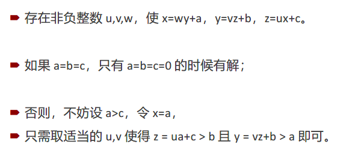

我的思路：

> 由于 $x\bmod y=a,y\bmod z=b,z\bmod x=c$
>
> 我们知道 $z=ux+c,y=vz+b,x=wy+a$ 
>
> 由于不可能模一个小于余数的数得到余数，即除数必须大于余数，例如 $x\bmod 7=8$ 是不可能发生的，
>
> 也就是说：
> $$
> \begin{cases}
> y=vz+b > a\quad①\\
> z=ux+c > b\quad②\\
> x=wy+a > c\quad③\\
> \end{cases}
> $$
> 设 $x=a$ ，即 $w=0$ ，则必须满足 $a > c$ ③ (即已知条件必须 $a > c$ 才能这么设)，此时回代 ② 得：
> $$
> u >\dfrac{b-c}{a}\Rightarrow u > \lceil\dfrac{b-c}a\rceil
> $$
> 所以可以设 $u=\lceil\dfrac{b-c}a\rceil+1$ ，并求出 $z$ ，回代 ① 得：
> $$
> v > \dfrac{a-b}{z}\Rightarrow v > \lceil\dfrac{a-b}z\rceil
> $$
> 可以设 $v=\lceil\dfrac{a-b}z\rceil+1$ ，并求出 $y$ ，自此全部值算出来了。
>
> 如果 $a > c$ 不满足，寻求 $c > b$ 构造 $z=c$ 或 $b > a$ 构造 $y=b$ 。枚举可知，$3!$ 种排列必然满足其一关系。都不满足的只有 $a=b=c$ 这种情况，显然若都是 $0$ ，直接输出 $1,1,1$ 。否则，构造不出，因为循环依赖且余数等于除数，是不可能的。这也表明除非 $a=b=c$ ，否则恒有解(可以显然推断出不会超过 $10^{18}$ )
>
> 复杂度 $O(t)$ ，参考程序：
>
> ```c++
> #include <bits/stdc++.h>
> using namespace std;
> #define sc(x) scanf("%lld", &x)
> typedef long long ll;
> ll t, a, b, c, u, v, w, x, y, z;
> ll ceil(ll a, ll b) { return (a + b - 1) / b; }
> signed main()
> {
>     sc(t);
>     while (t--)
>     {
>         sc(a), sc(b), sc(c);
>         if (a == b && b == c)
>         {
>             printf(a == 0 ? "YES\n1 1 1\n" : "NO\n");
>             continue;
>         }
>         if (a > c)
>         {
>             w = 0;
>             x = w * y + a;
>             u = ceil(b - c, x) + 1;
>             z = u * x + c;
>             v = ceil(a - b, z) + 1;
>             y = v * z + b;
>         }
>         else if (c > b)
>         {
>             u = 0;
>             z = u * x + c;
>             v = ceil(a - b, z) + 1;
>             y = v * z + b;
>             w = ceil(c - a, y) + 1;
>             x = w * y + a;
>         }
>         else if (b > a)
>         {
>             v = 0;
>             y = v * z + b;
>             w = ceil(c - a, y) + 1;
>             x = w * y + a;
>             u = ceil(b - c, x) + 1;
>             z = u * x + c;
>         }
>         else //不可能进else
>         {
>             assert(1 == 0);
>         }
>         printf("YES\n%lld %lld %lld\n", x, y, z);
>     }
>     return 0;
> }
> ```


##### C Necklace

> 给定长为 $n(n < 10^{18})$ 的环形项链，珍珠编号从 $1$ 到 $n$ ，上面有 $m(m\le 10^6)$ 颗特殊珍珠。要求把项链拆分为 $n$ 条链，使得每条链恰含一个特殊珍珠，尽可能让最长链的长度最短，求最短值是多少

看到最大值最小问题应该不假思索想到二分答案。之后用贪心来解决这个划分问题，具体思路来自 [这篇博客](https://www.cnblogs.com/lipoicyclic/p/15582690.html) 

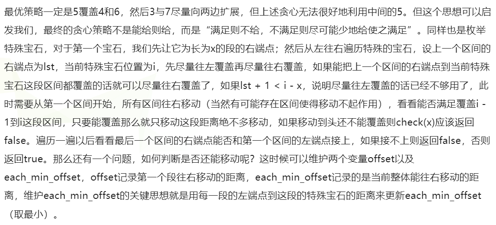

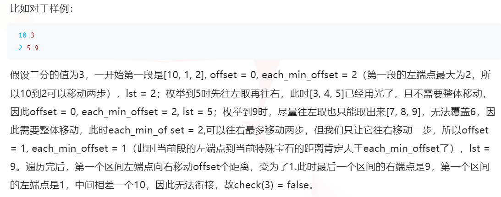

```c++
#include <bits/stdc++.h>
#define gc() (is == it ? it = (is = in) + fread(in, 1, Q, stdin), (is == it ? EOF : *is++) : *is++)
const int Q = (1 << 24) + 1;
char in[Q], *is = in, *it = in, c;
void read(long long &n)
{
    for (n = 0; (c = gc()) < '0' || c > '9';)
        ;
    for (; c <= '9' && c >= '0'; c = gc())
        n = n * 10 + c - 48;
}
#define int long long
#define ll long long
#define pb push_back
using namespace std;
int n, m, M[1000005];
bool check(ll mid)
{
    ll offset = 0, lst = M[1];
    int each_min_offset = mid - 1;
    int len = mid;
    int res = 0;
    bool yuejie1 = 0, yuejie2 = 0; //判断第一个区间的左端点和最后一个区间的右端点是否跨越了n到1
    //第一个特殊的一开始作为第一段的最后一个
    for (int i = 2; i <= m; i++)
    {
        if (len >= M[i] - lst)
        {
            res = len - (M[i] - lst); //能够往右扩展的
            lst = M[i] + res;
            if (i == m)
            {
                if (lst > n)
                {
                    lst %= n;
                    lst = min(lst, M[1] - 1); //同理不能把特殊宝石也包含进去
                    yuejie1 = 1;
                }
            }
            else
            {
                lst = min(lst, M[i + 1] - 1); //不能把下个特殊宝石也包含进去
            }
            each_min_offset = min(each_min_offset, M[i] - lst - 1); //这里要给each_min_offset取min进行更新
        }
        else
        {
            if (M[i] - M[i - 1] + 1 > 2 * len)
                return false;            //凑不出来
            int need = M[i] - lst - len; //需要整体移动的距离
            if (need > each_min_offset)
                return false;        //无法满足
            each_min_offset -= need; //最多能往右移动的距离需要减小
            offset += need;
            lst = M[i];
        }
    }
    int lmst = lst, rmst; //这里的lmst是最后一个区间右端点的位置，rmst是第一个区间左端点的位置
    if (M[1] - len + 1 + offset >= 1)
        rmst = M[1] - len + 1 + offset;
    else
    {
        yuejie2 = 1;
        rmst = n + M[1] - len + 1 + offset;
    }
    //判断能否接上，写丑了QoQ
    if (yuejie1 && yuejie2)
    {
        return 1;
    }
    if (yuejie1 || yuejie2)
    {
        return lmst >= rmst - 1;
    }
    return lmst == n && rmst == 1;
}
signed main()
{
    read(n), read(m);
    for (int i = 1; i <= m; i++)
    {
        read(M[i]);
    }
    if (m == 1)
    {
        cout << n;
        return 0;
    }
    ll l = 1, r = n, mid, res;
    while (l <= r)
    {
        mid = (l + r) >> 1;
        if (check(mid))
        {
            r = mid - 1;
            res = mid;
        }
        else
        {
            l = mid + 1;
        }
    }
    cout << res;
    return 0;
}
```


##### F Cactus

> 设点数为 $n$ 的所有仙人掌图数目为 $f_n$ ，求分式 $\sum_{i=1}^n\prod_{j\neq i}\dfrac{1-f_i-f_if_j}{f_i-f_j}$ 对 $998244353$ 取模的结果( $1\le n\le3\times10^5$ )

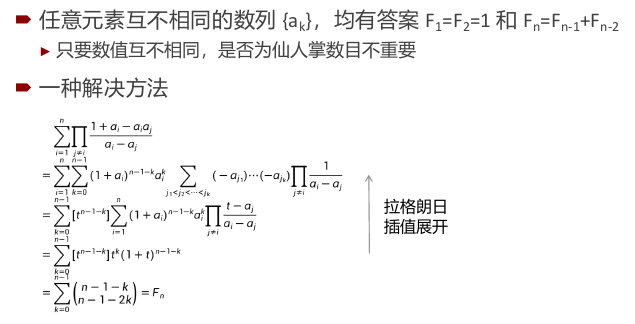

```c++
#include <bits/stdc++.h>
using namespace std;
#define sc(x) scanf("%lld", &x)
typedef long long ll;
ll n, f[300010], mod = 998244353;
signed main()
{
    sc(n);
    f[1] = f[2] = 1;
    for (ll i = 3; i <= n; ++i)
    {
        f[i] = (f[i - 1] + f[i - 2]) % mod;
    }
    printf("%lld", f[n]);
    return 0;
}
```


## 洛谷

`https://www.luogu.com.cn/problem/` 加上题号就是题目URL

#### 未分类

#####  p1327-数列排序

> 长不超过 $10^5$ 不重复数列 ，每次只允许交换任意一对数，求最少交换多少次使数列升序

解法一：贪心 快排 

原数组和快排后新数组一一对比，发现不同就把原数组当前位置和新数组数在原数组的位置交换。

证明：(题解区 [LuffyLuo](https://blog.csdn.net/yunxiaoqinghe/article/details/113153795?ops_request_misc=&request_id=&biz_id=102&utm_term=%E6%9C%80%E5%B0%91%E4%BB%BB%E6%84%8F%E4%BA%A4%E6%8D%A2%E6%8E%92%E5%BA%8F%E8%AF%81%E6%98%8E%E7%94%A8%E7%BD%AE%E6%8D%A2&utm_medium=distribute.pc_search_result.none-task-blog-2~all~sobaiduweb~default-0-.pc_search_download_positive&spm=1018.2226.3001.4187))

对一个错位数，它要回到原位，它跟原位连有向边；然后对原位本来的数继续为错位数同上递推……最后可以画出带环图(正位是自环)。每个环交换次数为环长 $-1$ 。

因此，本题解法二可以用求环数的图论解法(DFS即可)来解。


##### p4051 字符加密

> 对一个长 $n$ 的字符串排成一圈，将其从第 $i$ 项开始取 $n$ 个字符组成共 $n$ 个长 $n$ 的字符串，将它们排序，然后输出它们的最后一个字符 $n\le 10^5$

不能直接取后缀数组。由于 `bnabn` 有 `bn<bnabn` ，而题意 `bnbna>bnabn` ，所以矛盾。可以按题意破圈为二倍长，然后取 `sa[i]` 在原长里的 $n$ 项。扩充后多余的部分不影响原题意的字典序排序，因为在跑到多余部分前，已经可以唯一区分开顺序。

```c++
#include <bits/stdc++.h>
#define re
using namespace std;
typedef long long ll;
#define il inline
#define mn 1000010
char s[mn];
ll n, sa[mn], rk[mn], oldrk[mn << 1], id[mn], px[mn], cnt[mn], n0;
bool cmp(ll x, ll y, ll w)
{
    return oldrk[x] == oldrk[y] && oldrk[x + w] == oldrk[y + w];
}
ll m = 300, i, p, w; //ASCII范围<300为计数排序值域,p是新值域
signed main()
{
    scanf("%s", s + 1), n0 = strlen(s + 1), n = n0 * 2;
    for (ll i = 1; i <= n0; ++i)
    {
        s[i + n0] = s[i];
    }
    for (ll i = 1; i <= n; ++i)
    { //暂时以第一关键字为排序值，有很多同名并列
        ++cnt[rk[i] = s[i]];
    }
    for (ll i = 1; i <= m; ++i)
    {
        cnt[i] += cnt[i - 1];
    }
    for (ll i = n; i >= 1; --i)
    {
        sa[cnt[rk[i]]--] = i;
    }
    for (w = 1;; w <<= 1, m = p)
    {
        for (p = 0, i = n; i > n - w; --i)
        { //第二关键字排序；无穷小区域
            id[++p] = i;
        }
        for (ll i = 1; i <= n; ++i)
        {
            if (sa[i] > w)
            {
                id[++p] = sa[i] - w;
            }
        }
        memset(cnt, 0, sizeof cnt);
        for (ll i = 1; i <= n; ++i) //第一关键字排序
        {
            ++cnt[px[i] = rk[id[i]]]; //px是常数优化
        }
        for (ll i = 1; i <= m; ++i)
        {
            cnt[i] += cnt[i - 1];
        }
        for (ll i = n; i >= 1; --i)
        {
            sa[cnt[px[i]]--] = id[i];
        }
        memcpy(oldrk, rk, sizeof rk);
        for (p = 0, i = 1; i <= n; ++i) //重名并列
        {
            rk[sa[i]] = cmp(sa[i], sa[i - 1], w) ? p : ++p;
        }
        if (p == n)
        {
            for (ll i = 1; i <= n; ++i)
            {
                sa[rk[i]] = i;
            }
            break;
        }
    }
    for (ll i = 1; i <= n; ++i)
    {
        if (sa[i] <= n0)
        {
            printf("%c", s[sa[i] + n0 - 1]);
        }
    }
    return 0;
}
```


##### p3629-巡逻

> 边长均 $1$ ，从根节点出发遍历每一条边然后回到根节点，现在可以加 $k(1\le k\le2)$ 条边，求加了边后遍历每一条边总路程最少为多少

树的直径好题。不加边总路程恒为 $2(n-1)$ 。$k=1$ 时直接在直径两边加边，可以使得直径少走一次，但多走了加的边，节省了 $d-1$ 的路程。

若 $k=2$ ，可以在原本基础上再找直径，已经是本来直径的边权改为 $-1$ (如果有环重合，那么重合部分还是要走两次)，跑 $DP$ 找直径，同理操作，又节省了 $d_2-1$ 的路程。

详细参考题解区 [Wow_Goodjob](https://www.luogu.com.cn/problem/solution/P3629)

代码如下：

```c++
#include <bits/stdc++.h>
#define re
using namespace std;
typedef long long ll;
#define il inline
typedef double db;
il ll read()
{
    re char p = 0;
    re ll r = 0, o = 0;
    for (; p < '0' || p > '9'; o |= p == '-', p = getchar())
        ;
    for (; p >= '0' && p <= '9'; r = (r << 1) + (r << 3) + (p ^ 48), p = getchar())
        ;
    return o ? (~r) + 1 : r;
}
#define sc(x) x = read()
#define mn 100010
ll n, k;
struct edge
{
    ll to, nx, w;
} e[mn << 1];
ll hd[mn], cnt, mx, id, dbf, daf, bg, ed, fr[mn], dis[mn];
bool fid;
map<ll, bool> m;
void adde(ll &u, ll &v)
{
    e[++cnt] = {v, hd[u], 1};
    hd[u] = cnt;
}
void dfs(ll u, ll fa, ll w)
{
    if (w >= mx)
    {
        mx = w, id = u;
    }
    for (ll i = hd[u]; i; i = e[i].nx)
    {
        if (e[i].to != fa)
        {
            dfs(e[i].to, u, w + e[i].w);
        }
    }
}

void dfs2(ll u, ll fa, ll t) //找直径上的全部点，形成链表
{
    if (fid)
    {
        return;
    }
    for (ll i = hd[u]; i; i = e[i].nx)
    {
        ll v = e[i].to;
        if (fid)
        {
            return;
        }
        if (v == fa)
        {
            continue;
        }
        if (v == t)
        {
            fr[u] = v, fid = true;
            return;
        }
        fr[u] = v;
        dfs2(v, u, t);
        if (fid)
        {
            return;
        }
    }
}

void dfs3(ll u, ll fa) //求带负权的树的直径的方法
{
    for (ll i = hd[u]; i; i = e[i].nx)
    {
        ll v = e[i].to;
        if (v == fa)
        {
            continue;
        }
        dfs3(v, u);
        daf = max(daf, dis[u] + dis[v] + e[i].w);
        dis[u] = max(dis[u], dis[v] + e[i].w);
    }
}

signed main()
{
    sc(n), sc(k);
    for (ll i = 1, u, v; i < n; ++i)
    {
        sc(u), sc(v), adde(u, v), adde(v, u);
    }
    dfs(1, 0, 0);
    bg = id, mx = 0;
    dfs(bg, 0, 0);
    ed = id, dbf = mx;
    if (k == 1)
    {
        printf("%lld", 2 * (n - 1) - dbf + 1); //原是2(n-1),优化掉了(直径-1)
        return 0;
    }
    dfs2(bg, 0, ed);
    m[ed] = 1, m[bg] = 1;
    for (ll i = bg; i != ed; i = fr[i])
    {
        m[i] = 1;
    }
    for (ll u = 1; u <= n; ++u)
    {
        if (m.count(u) == 1)
        {
            for (ll i = hd[u]; i; i = e[i].nx)
            {
                if (m.count(e[i].to) == 1)
                {
                    e[i].w = -1; //有重叠，还要再走回去，取消节省
                }
            }
        }
    }
    dfs3(1, 0);
    printf("%d", 2 * n - dbf - daf); //即2(n-1)-(dbf-1)-(daf-1)
    return 0;
}
```


##### p5666-树的重心

> 若删掉某节点后，所得所有子树大小(节点数)均不超过原树大小 $\lfloor\dfrac n2\rfloor$ ，那么该节点是树的重心。树的重心只可能有 $1$ 或 $2$ 个。依次删掉树的每一个单边得两子树，求两子树的重心编号和(每次可能有 $2\sim 4$ 个重心)之和。 $1\le t\le 5,1\le n\le3\times10^5$

树上倍增法。题解区 [soar_ing](https://www.luogu.com.cn/problem/solution/P5666)

重要结论：对于一个点,若 $x$ 不是重心,重心要么在重儿子子树里,要么在父亲节点上

先 DFS 求重儿子和次重儿子(删边后新的重儿子只可能是重、次重、父、自己四种，不可能是其他)

然后 DFS ，模拟删边，用树上倍增法，二分找到树的一个重心，然后求出可能的另一个重心(显然是相邻的，所以找父、重子即可)。每次对两个子树都这么做。

细节是注意回溯。

代码如下：

```c++
#include <bits/stdc++.h>
#define re
using namespace std;
typedef long long ll;
#define il inline
typedef double db;
il ll read()
{
    re char p = 0;
    re ll r = 0, o = 0;
    for (; p < '0' || p > '9'; o |= p == '-', p = getchar())
        ;
    for (; p >= '0' && p <= '9'; r = (r << 1) + (r << 3) + (p ^ 48), p = getchar())
        ;
    return o ? (~r) + 1 : r;
}
#define sc(x) x = read()
#define mn 300010
#define ml 18
struct node
{
    ll to, nx;
} e[mn << 1];
ll n, t, sn[mn], s[mn], pr[mn], sn2[mn], p[mn][ml], sn3[mn], f[mn], hd[mn], cnt, s2[mn], ans;
void adde(ll &u, ll &v)
{
    e[++cnt] = {v, hd[u]};
    hd[u] = cnt;
}
void dfs(ll u, ll fa)
{
    s[u] = 1, pr[u] = fa; //前向为pr
    for (ll i = hd[u], v; i; i = e[i].nx)
    {
        v = e[i].to;
        if (v == fa)
        {
            continue;
        }
        dfs(v, u);
        s[u] += s[v];        //节点数：判定轻重的依据
        if (s[v] > s[sn[u]]) //sn重儿子，sn2轻儿子
        {
            sn2[u] = sn[u], sn[u] = v;
        }
        else if (s[v] > s[sn2[u]])
        {
            sn2[u] = v;
        }
    }
    p[u][0] = sn[u]; //树上k级儿子
    for (ll i = 1; i < ml; ++i)
    {
        p[u][i] = p[p[u][i - 1]][i - 1];
    }
}
ll judge(ll x, ll sum) //树所有点数为sum
{
    //对于一个点,若x不是重心,重心要么在重儿子子树里,要么在父亲节点上
    return x * (max(s2[sn3[x]], sum - s2[x]) <= sum / 2);
}
void dfs2(ll u, ll fa)
{
    for (ll i = hd[u], v, b; i; i = e[i].nx)
    {
        v = e[i].to;
        if (v == fa)
        {
            continue;
        }
        s2[u] = s[1] - s[v]; //除这条边的子树外的节点数(按题删边)
        f[v] = f[u] = 0;     //前向
        //对于一个点u,若u不是重心,重心要么在重儿子子树里,要么在父亲节点上
        if (sn[u] == v) //找剪掉重儿子之后的重儿子
        {
            sn3[u] = sn2[u];
        }
        else
        {
            sn3[u] = sn[u];
        }
        if (s2[fa] > s2[sn3[u]])
        {
            sn3[u] = fa;
        }
        p[u][0] = sn3[u]; //树上k级重儿子
        for (ll j = 1; j < ml; ++j)
        {
            p[u][j] = p[p[u][j - 1]][j - 1];
        }

        //删边后的一棵子树
        b = u;
        //跳到重心为止
        for (ll j = ml - 1; j >= 0; --j)
        {
            if (s2[u] - s2[p[b][j]] <= s2[u] / 2)
            {
                b = p[b][j];
            }
        }
        //这个位置，它的父亲或它的重儿子之一可能是重心
        ans += judge(sn3[b], s2[u]) + judge(b, s2[u]) + judge(f[b], s2[u]);

        //另一个子树
        b = v;
        for (ll j = ml - 1; j >= 0; --j)
        {
            if (s2[v] - s2[p[b][j]] <= s2[v] / 2)
            {
                b = p[b][j];
            }
        }
        ans += judge(sn3[b], s2[v]) + judge(b, s2[v]) + judge(f[b], s2[v]);
        f[u] = v;
        dfs2(v, u);
    }
    //回溯
    sn3[u] = p[u][0] = sn[u], f[u] = pr[u];
    for (ll j = 1; j < ml; ++j)
    {
        p[u][j] = p[p[u][j - 1]][j - 1];
    }
    s2[u] = s[u];
}
signed main()
{
    sc(t);
    while (t--)
    {
        memset(hd, 0, sizeof hd), cnt = ans = 0;
        memset(sn, 0, sizeof sn);
        memset(pr, 0, sizeof pr);
        memset(f, 0, sizeof f);
        sc(n);
        for (ll i = 1, u, v; i < n; ++i)
        {
            sc(u), sc(v), adde(u, v), adde(v, u);
        }
        dfs(1, 0);
        memcpy(s2, s, sizeof s2);    //s2是s的副本
        memcpy(sn3, sn, sizeof sn3); //sn3->s
        memcpy(f, pr, sizeof f);     //f->pr
        dfs2(1, 0);
        printf("%lld\n", ans);
    }
    return 0;
}
```


##### p1081-开车旅行

> $A,B$ 轮流开车前行，城市间距离为海拔差绝对值，海拔互异；$A$ 每次前进到次小距离值(同距离就海拔低的)， $B$ 每次前进到最小值，当不可行或总路程大于 $x$ 时停止。给定 $x_0$ ，求从哪个城市出发 $A$ 路程和与 $B$ 路程和比值最小；然后解决 $m$ 个询问，从 $s$ 出发给定 $x$ ，求 $A,B$ 各自走的路程。

用 `multiset` +二分模拟平衡树，倒序插点，可以用较快的复杂度(内部原理是红黑树)找到最小和次小。

设 `i` 是行驶了 $2^i$ 天， `j` 是从城市 $j$ 出发， $k$ 是谁开车($0A,1B$) ，设三个三维 DP：

- `f` 是最终到达的城市
- `ca` 是 $A$ 行驶的总路程
- `cb` 是 $B$ 行驶的总路程

设不存在的城市是 $0$ ，无限开大整数，初始值显而易见

转移方程是前半部分 $i-1$ ，后半部分先用 `f` 将 `j` 位移到前半部分结束，再 `i-1`

$i=1$ 时，转移方程的 $k$ 两半部分不一样，否则都一样，由 $2^{i-1}$ 奇偶可知

计算距离用倍增法从大到小不断地跳即可。注意除了满足 `x` 外还需要满足 `f` 存在

代码如下：

```c++
#include <bits/stdc++.h>
#define re
using namespace std;
typedef long long ll;
#define il inline
typedef double db;
il ll read()
{
    re char p = 0;
    re ll r = 0, o = 0;
    for (; p < '0' || p > '9'; o |= p == '-', p = getchar())
        ;
    for (; p >= '0' && p <= '9'; r = (r << 1) + (r << 3) + (p ^ 48), p = getchar())
        ;
    return o ? (~r) + 1 : r;
}
#define sc(x) x = read()
#define ml 19
#define mn 100010
struct city
{
    ll i, h;
    bool operator<(const city &x) const { return h < x.h; }
} bg, ga, gb, nei[5];
bool cmp(const city &x, const city &y)
{
    return abs(x.h - bg.h) < abs(y.h - bg.h);
}
ll n, m, x0, ansi, as, bs, h[mn], big = 1e18, s, x;
ll f[ml][mn][2], ca[ml][mn][2], cb[ml][mn][2];
db ans = big, no;
multiset<city> q;
void ro(ll s, ll x)
{
    as = bs = 0;
    for (ll i = ml - 1, p = s; i >= 0; --i)
    {
        if (f[i][p][0] && as + bs + ca[i][p][0] + cb[i][p][0] <= x)
        {
            as += ca[i][p][0], bs += cb[i][p][0];
            p = f[i][p][0];
        }
    }
}
signed main()
{
    sc(n);
    for (ll i = 1; i <= n; ++i)
    {
        sc(h[i]);
    }
    sc(x0), sc(m);

    h[0] = big, h[n + 1] = -big;
    q.insert({0, big}), q.insert({0, big});
    q.insert({n + 1, -big}), q.insert({n + 1, -big});
    for (ll i = n; i; --i)
    {
        bg = {i, h[i]};
        q.insert(bg);
        auto p = q.lower_bound(bg);
        --p, --p;
        for (ll j = 0, k = 0; j < 5; ++j, ++p)
        {
            if (j != 2)
            {
                nei[k++] = {p->i, p->h};
            }
        }
        sort(nei, nei + 4, cmp);
        gb = nei[0], ga = nei[1];
        // printf("<%lld %lld\n", ga.i, gb.i);
        f[0][i][0] = ga.i, f[0][i][1] = gb.i;
        ca[0][i][0] = abs(bg.h - ga.h);
        cb[0][i][1] = abs(bg.h - gb.h);
    }
    for (ll i = 1; i < ml; ++i)
    {
        for (ll j = 1; j <= n; ++j)
        {
            for (ll k = 0; k < 2; ++k)
            {
                if (i == 1)
                {
                    f[i][j][k] = f[0][f[0][j][k]][1 - k];
                    ca[i][j][k] = ca[0][j][k] + ca[0][f[0][j][k]][1 - k];
                    cb[i][j][k] = cb[0][j][k] + cb[0][f[0][j][k]][1 - k];
                }
                else
                {
                    f[i][j][k] = f[i - 1][f[i - 1][j][k]][k];
                    ca[i][j][k] = ca[i - 1][j][k] + ca[i - 1][f[i - 1][j][k]][k];
                    cb[i][j][k] = cb[i - 1][j][k] + cb[i - 1][f[i - 1][j][k]][k];
                }
            }
        }
    }

    for (ll i = 1; i <= n; ++i)
    {
        ro(i, x0);
        no = 1.0 * as / bs;
        if (ans > no || (ans == no && h[ansi] < h[i]))
        {
            ans = no, ansi = i;
        }
    }
    printf("%lld\n", ansi);

    while (m--)
    {
        sc(s), sc(x), ro(s, x);
        printf("%lld %lld\n", as, bs);
    }
    return 0;
}
```


##### p4550-收集邮票

> 有 $n$ 种邮票，每次购买等概率获得随机一张，第 $k$ 次购买价格为 $k$ ，求得到全部种类所需花费期望。

设 $f_i$ 表示已经取到 $i$ 张邮票，需取完剩下邮票的期望次数

初始值为 $f_n=0$ ，递推式为：
$$
f_i=\dfrac inf_i+\left(1-\dfrac in\right)f_{i+1}+1
$$
移项：
$$
f_i=f_{i+1}\dfrac n{n-i}
$$
设 $f_i$ 表示已经取到 $i$ 张邮票，需取完剩下邮票的期望价格

初始值为 $g_n=0$ ，递推式为：
$$
g_i=\dfrac in(g_i+f_i+1)+\left(1-\dfrac in\right)(g_{i+1}+f_{i+1}+1)
$$
移项：
$$
g_i=\dfrac i{n-i}f_i+g_{i+1}+f_{i+1}+\dfrac n{n-i}
$$
参见题解：[league](https://www.luogu.com.cn/problem/solution/P4550)

```c++
#define mn 10010
ll n;
db f[mn], g[mn];
signed main()
{
    sc(n);
    for (ll i = n - 1; i >= 0; --i)
    {
        f[i] = f[i + 1] + (1. * n) / (1. * (n - i));
        g[i] = (1. * i) / (1. * (n - i)) * (f[i] + 1) + g[i + 1] + f[i + 1] + 1;
    }
    printf("%.2lf", g[0]);
    return 0;
}
```


##### p1502-窗口的星星

> 有 $n$ 个星星，星星坐标为 $x,y$，亮度为 $l$，有不计边框的窗口 $w,h$  ，求窗口能显示的最大总亮度 $1\le t\le10,1\le n\le10^4$

将星星拓展为 $w,h$ 矩形，其权为 $l$ ，转化为用扫描线找平面坐标，使得矩形覆盖权最大

上板子即可。要注意不少细节。

```c++
#include <bits/stdc++.h>
#define re
using namespace std;
typedef long long ll;
#define il inline
typedef double db;
il ll read()
{
    re char p = 0;
    re ll r = 0, o = 0;
    for (; p < '0' || p > '9'; o |= p == '-', p = getchar())
        ;
    for (; p >= '0' && p <= '9'; r = (r << 1) + (r << 3) + (p ^ 48), p = getchar())
        ;
    return o ? (~r) + 1 : r;
}
#define sc(x) x = read()
#define mn 100010
ll t, n, w, h, c[mn], cnt, ans;
struct seg
{
    ll l, r, h, v;
    bool operator<(const seg &x) const
    {
        return (h != x.h) ? h < x.h : v > x.v;
    }
} s[mn << 2];
struct segtr
{
    ll l, r, mx, cnt;
} tr[mn << 2];
#define lfs p << 1
#define rfs p << 1 | 1
#define mkcf ll cf = (lf + rf) >> 1
void build(ll p, ll lf, ll rf)
{
    tr[p].l = lf, tr[p].r = rf;
    if (lf == rf)
    {
        return;
    }
    mkcf;
    build(lfs, lf, cf);
    build(rfs, cf + 1, rf);
}
void pushdf(ll p)
{
    tr[lfs].mx += tr[p].cnt; //区间最值
    tr[rfs].mx += tr[p].cnt;
    tr[lfs].cnt += tr[p].cnt; //懒标记
    tr[rfs].cnt += tr[p].cnt;
    tr[p].cnt = 0;
}
void update(ll p, ll &lc, ll &rc, ll &d)
{
    ll lf = tr[p].l, rf = tr[p].r;
    if (lc <= lf && rf <= rc)
    {
        tr[p].mx += d;
        tr[p].cnt += d;
        return;
    }
    pushdf(p);
    mkcf;
    if (lc <= cf)
    {
        update(lfs, lc, rc, d);
    }
    if (rc > cf)
    {
        update(rfs, lc, rc, d);
    }
    tr[p].mx = max(tr[lfs].mx, tr[rfs].mx);
}
signed main()
{
    sc(t);
    while (t--)
    {
        sc(n), sc(w), sc(h);
        memset(s, 0, sizeof s);
        memset(tr, 0, sizeof tr);
        for (ll i = 1, x, y, l; i <= n; ++i)
        {
            sc(x), sc(y), sc(l);
            c[(i << 1) - 1] = y; //显然坐标是2i-1和2i，而不是2^i
            c[i << 1] = y + h - 1;
            s[(i << 1) - 1] = {y, y + h - 1, x, l};
            s[i << 1] = {y, y + h - 1, x + w - 1, -l};
        }
        n <<= 1;
        sort(c + 1, c + 1 + n);
        sort(s + 1, s + 1 + n);
        cnt = unique(c + 1, c + 1 + n) - c - 1;
        for (ll i = 1, p1, p2; i <= n; ++i) //离散化后的新坐标值是p1,p2
        {
            p1 = lower_bound(c + 1, c + 1 + cnt, s[i].l) - c;
            p2 = lower_bound(c + 1, c + 1 + cnt, s[i].r) - c;
            s[i].l = p1, s[i].r = p2; //这个新坐标区间是线段树所维护的区间
        }
        build(1, 1, cnt);
        ans = 0;
        for (ll i = 1; i <= n; ++i)
        {
            update(1, s[i].l, s[i].r, s[i].v);
            ans = max(ans, tr[1].mx);
        }
        printf("%lld\n", ans);
    }
    return 0;
}
```


##### p4198-楼房重建

> 初始 $n$ 栋楼房，高度为 $0$ ，有 $m$ 次修改，每次将 $x$ 处楼房高度改为 $y$ (即线段 $x'=x,0\le y'\le y$)。问改完之后从 $(0,0)$ 能看到多少楼房 (刚好挡住也看不到)。
>
> $1\le n,m\le10^5$

题解 [Nemlit](https://www.luogu.com.cn/problem/solution/P4198) 作最高点和 $(0,0)$ 连线，易知能看到的充要条件是它前面所有楼房斜率小于它。所以问题转化为斜率问题。

设线段树维护信息：只有所维护区间的全部楼房，能够看到多少栋楼房为 `ans` ，区间斜率最值为 `mx` 。 每次单点修改 $(x,y)$ ，显然 $[1,x-1]$ 的区间都不会被修改。对剩余部分区间，作区间更改，设更改区间 $[l,r]$ ，其前面最大斜率为 $mxv=mx([1,l-1])$ ，拆为区间 $[l,c]$ , $[c+1,r]$ ，若左区间最值小于 $mxv$ ，那么左区间全部被挡住，且左区间不影响右区间，用 $mxv$ 继续更新处理右区间。若最值大于 $mxv$ ，那么 $mxv$ 不影响右区间，而是左区间影响右区间。所以右区间答案可以直接输出为从 $l$ 看 $[c+1,r]$ ，即 $ans[l,r]-ans[l,c]$ ，注意不是 $ans[c+1,r]$ ，因为代表从 $c+1$ 看。然后对左区间递归处理。

如果这个过程不懂，可以自己动手操作一下，很快可以明白原理。

由于找到修改点需要 $\Omicron(\log n)$ ，这些 $\Omicron(\log n)$ 个线段树点都需要做区间更改，每次更改都用到了上述的二分，所以时间复杂度是 $\Omicron(m\log^2n)$ ，可以过题。

参考代码：

```c++
#include <bits/stdc++.h>
#define re
using namespace std;
typedef long long ll;
#define il inline
typedef double db;
il ll read()
{
    re char p = 0;
    re ll r = 0, o = 0;
    for (; p < '0' || p > '9'; o |= p == '-', p = getchar())
        ;
    for (; p >= '0' && p <= '9'; r = (r << 1) + (r << 3) + (p ^ 48), p = getchar())
        ;
    return o ? (~r) + 1 : r;
}
#define sc(x) x = read()
#define mn 100010
#define big 0x7fffffff
ll n, m, ans[mn << 2], x, y;
db mx[mn << 2];
#define lfs p << 1
#define rfs p << 1 | 1
#define mkcf ll cf = (lf + rf) >> 1
ll query(ll p, ll lf, ll rf, db mxv)
{ //查询比mxv斜率大的楼房数
    if (mx[p] <= mxv)
    { //区间最大斜率比查询mxv要小，不影响答案
        return 0;
    }
    if (lf == rf)
    {
        return mx[p] > mxv;
    }
    mkcf;
    if (mx[lfs] <= mxv)
    { //左区间全部被mxv挡住了，只看右
        return query(rfs, cf + 1, rf, mxv);
    } //否则，mx[lfs]>mxv
    return query(lfs, lf, cf, mxv) + ans[p] - ans[lfs];
    //ans[p]-ans[lfs]意思是从p看，统计右区间能看到多少
    //这是因为mxv影响不及mx[lfs]，所以右区间的影响不变
    //但左区间变了，所以继续递归处理
}
void update(ll p, ll lf, ll rf, ll k, db v)
{ //将楼房k的斜率修改为v
    if (lf == k && lf == rf)
    {
        ans[p] = 1, mx[p] = v;
        return;
    }
    mkcf;
    if (k <= cf)
    {
        update(lfs, lf, cf, k, v);
    }
    else
    {
        update(rfs, cf + 1, rf, k, v);
    }
    mx[p] = max(mx[lfs], mx[rfs]);
    ans[p] = ans[lfs] + query(rfs, cf + 1, rf, mx[lfs]);
    //该区间的答案是左区间的答案加上右区间的斜率大于左区间最大值的所有楼房
    //ans[lfs]答案不受更改影响；rfs有影响，所以改变了
}
signed main()
{
    sc(n), sc(m);
    while (m--)
    {
        sc(x), sc(y);
        update(1, 1, n, x, 1.0 * y / x);
        printf("%lld\n", ans[1]);
    }
    return 0;
}
```


##### p1196-银河英雄传说

> 有 $30000$ 战舰，每次 `M i j` 将 $i$ 所在编队连在 $j$ 所在编队尾部成链。每次 `C i j` 查询 $i,j$ 链之间有多少个战舰。若 $i,j$ 不同编队输出 `-1` 。 $t\le 5\times10^5$

题解 [假装思考](https://www.luogu.com.cn/problem/solution/P1196) ，设前缀和 `cnt` 为离队首的距离，则所求为 $|cnt_i-cnt_j|+1-2$ 

每次合并并查集时， `fa[find(i)]=find(j)` ，在这之前，更新 $cnt_x$ ，距离增加 $num_y$ ，即舰队数。且 $num_y$ 增加 $num_x$ ，并且清零 $num_x$ (否则反复合并会出锅)。`find` 用递归式，每次 `find` 时更新 $cnt_x=cnt_{fa_x}$ ，注意在更新 $fa$ 之前做，不然等于我赋值我自己。

参考代码：

```c++
#include <bits/stdc++.h>
#define re
using namespace std;
typedef long long ll;
#define il inline
typedef double db;
il ll read()
{
    re char p = 0;
    re ll r = 0, o = 0;
    for (; p < '0' || p > '9'; o |= p == '-', p = getchar())
        ;
    for (; p >= '0' && p <= '9'; r = (r << 1) + (r << 3) + (p ^ 48), p = getchar())
        ;
    return o ? (~r) + 1 : r;
}
#define sc(x) x = read()
#define mn 30010
ll t, fa[mn], cnt[mn], num[mn], i, j;
char cmd[10];
ll find(ll x)
{
    if (x == fa[x])
    {
        return x;
    }
    ll res = find(fa[x]);
    cnt[x] += cnt[fa[x]];
    return fa[x] = res;
}
signed main()
{
    for (ll i = 1; i <= 30000; ++i)
    {
        fa[i] = i, num[i] = 1;
    }
    sc(t);
    while (t--)
    {
        scanf("%s%lld%lld", cmd, &i, &j);
        ll x = find(i), y = find(j);
        if (cmd[0] == 'M')
        {
            cnt[x] += num[y];
            fa[x] = y;
            num[y] += num[x];
            num[x] = 0;
        }
        else if (cmd[0] == 'C')
        {
            if (x != y)
            {
                printf("-1\n");
            }
            else
            {
                printf("%lld\n", abs(cnt[i] - cnt[j]) - 1);
            }
        }
    }
    return 0;
}
```


##### p2024-食物链

> 存在食物环A->B->C->A，有n种动物，m条判断。判断类型为1 i j表示i,j同属A/B/C大类,2 i j表示i->j。先出现的判断在不产生矛盾的情况下变成真理。求m条判断中谬论数。(输入n,m,依次输入判断) $1\le n\le5\times10^5,1\le k\le10^5$

解法一：种类并查集

解法二：加权并查集

构造关系 $u\to v$ ，设为 $ty[u]$ 表示 $u$ 与根 $v$ 的关系，设 $0$ 表示同类， $1$ 表示捕食， $2$ 表示被捕食，显然构造出来的关系模 $3$ 结果符合传递性，即满足性质 $\because u\to v\to w\therefore ty[u\to w]=(ty[u\to v]+ty[v\to w])\bmod 3$ 

那么可以构造加权并查集，使得压缩路径后，若 $u,v$ 同根，则根据向量加法， $u,v$ 见关系可以表示为 $(ty[u]-ty[v])\bmod 3$ 。并且如果要新建 $u,v$ 之间的关系，那么新建的 $fa_u,fa_v$ 之间，若设 $fa[fa_u]=fa_v$ ，则 $ty[fa_u]=(-ty[u]+new+ty[v])\bmod 3$ 

```c++
#include <bits/stdc++.h>
using namespace std;
#define sc(x) scanf("%lld", &x)
typedef long long ll;
#define mn 50010
ll n, k, fa[mn], ty[mn], fake;
ll findf(ll x)
{
    if (x == fa[x])
    {
        return x;
    }
    ll res = findf(fa[x]);
    ty[x] = (ty[x] + ty[fa[x]]) % 3;
    return fa[x] = res;
}
signed main()
{
    sc(n), sc(k);
    for (ll i = 1; i <= n; ++i)
    {
        fa[i] = i;
    }
    while (k--)
    {
        ll cmd, u, v, fu, fv;
        sc(cmd), sc(u), sc(v), fu = findf(u), fv = findf(v);
        if (u > n || v > n || (u == v && cmd == 2))
        {
            ++fake;
            continue;
        }
        if (cmd == 1)
        {
            if (fu == fv && ty[u] != ty[v])
            {
                ++fake;
            }
            else
            {
                ty[fu] = (3 - ty[u] + ty[v]) % 3;
                fa[fu] = fv;
            }
        }
        else
        {
            if (fu == fv && (ty[u] - ty[v] + 3) % 3 != 1)
            {
                ++fake;
            }
            else
            {
                ty[fu] = (3 - ty[u] + ty[v] + 1) % 3;
                fa[fu] = fv;
            }
        }
    }
    printf("%lld", fake);
    return 0;
}
```


##### uva11987-Almost Union-Find

> 多组询问，每次 $n(1\le n\le10^5)$ 个初始并查集和 $m(1\le m\le10^5)$ 个询问。维护三种操作：
>
> 1. `1 p q` 进行并查集合并
> 2. `2 p q` 将元素 `p` 移动到 `p` 所在并查集
> 3. `3 p` 查询 `p` 所在并查集的元素数目和元素下标和

操作 $1,3$ 都能直接用加权并查集板子实现。操作 $2$ 为了不移动走根，可以初始规定每个节点一个虚拟根节点，那么就永远不可能在操作 $2$ 存在 $p$ 为根节点，就可以很方便地移动了。

具体细节参见代码：

```c++
#include <bits/stdc++.h>
using namespace std;
#define sc(x) scanf("%lld", &x)
typedef long long ll;
#define mn 200010
ll n, m, num[mn], sum[mn], fa[mn], cmd, u, v, fu, fv;
ll findf(ll x)
{
    if (x == fa[x])
    {
        return x;
    }
    ll res = findf(fa[x]);
    num[x] += num[fa[x]];
    sum[x] += sum[fa[x]];
    return fa[x] = res;
}
signed main()
{
    while (EOF != scanf("%lld%lld", &n, &m))
    {
        for (ll i = 1; i <= n; ++i)
        {
            fa[i] = i + n, num[i + n] = 1, sum[i + n] = i;
        }
        for (ll i = n + 1; i <= 2 * n; ++i)
        {
            fa[i] = i;
        }
        while (m--)
        {
            sc(cmd), sc(u), fu = findf(u);
            if (cmd != 3)
            {
                sc(v), fv = findf(v);
            }
            if (cmd == 1 && fu != fv)
            {
                fa[fu] = fv;
                sum[fv] += sum[fu], num[fv] += num[fu];
                sum[fu] = num[fu] = 0;
            }
            if (cmd == 2 && fu != fv)
            {
                fa[u] = fv;
                sum[fu] -= u, num[fu] -= 1;
                sum[fv] += u, num[fv] += 1;
            }
            if (cmd == 3)
            {
                printf("%lld %lld\n", num[fu], sum[fu]);
            }
        }
    }
    return 0;
}
```


##### p1341-无序字母对

> $n$ 个区分大小写无序字母对，构造一个 $n+1$ 个字母的字符串使得每个字母对都出现，或输出 `No Solution`

无向图欧拉路径板子题

```c++
#include <bits/stdc++.h>
using namespace std;
typedef long long ll;
#define mn 130
ll m, du[mn], vis[mn][mn], s = 'z', t = 'z', fa[mn], ucon;
vector<ll> e[mn], odd;
stack<ll> ans;
char c[10];
void dfs(ll u)
{
    for (ll i = 0, v; i < (ll)e[u].size(); ++i)
    {
        v = e[u][i];
        if (vis[u][v])
        {
            continue;
        }
        vis[u][v] = vis[v][u] = true;
        dfs(v);
    }
    ans.push(u);
}
ll findf(ll x)
{
    while (x != fa[x])
    {
        x = fa[x] = fa[fa[x]];
    }
    return x;
}
signed main()
{
    scanf("%lld", &m);
    for (ll i = 'A'; i <= (ll)'z'; ++i)
    {
        fa[i] = i;
    }
    for (ll i = 0, u, v; i < m; ++i)
    {
        scanf("%s", c);
        u = c[0], v = c[1], ++du[u], ++du[v];
        e[u].emplace_back(v), e[v].emplace_back(u);
        s = min(s, min(u, v));
        fa[findf(u)] = findf(v);
    }
    for (ll i = 'A'; i <= (ll)'z'; ++i)
    {
        ucon += (du[i] > 0) * (fa[i] == i);
        // printf("%c %lld %lld\n", (char)i, du[i], ucon);
        if (du[i] & 1)
        {
            odd.emplace_back(i);
            t = min(t, i);
        }
        sort(e[i].begin(), e[i].end());
    }
    if (!(odd.size() == 0 || (odd.size() == 2)) || ucon > 1)
    {
        printf("No Solution");
        return 0;
    }
    if (odd.size())
    {
        s = t;
    }
    dfs(s);
    while (!ans.empty())
    {
        printf("%c", (char)ans.top());
        ans.pop();
    }
    return 0;
}
/*6 ab bc ca AB BC CA*/
```


##### p2731-骑马修栅栏

> 给定无向图边数 $m$ ，点在 $[1,500]$ 编号，必然有解且联通，输出字典序最小欧拉路

```c++
#include <bits/stdc++.h>
using namespace std;
typedef long long ll;
#define mn 512
ll m, s = 1, g[mn][mn], du[mn], n;
stack<ll> ans;
void dfs(ll u)
{
    for (ll v = 1; v <= n; ++v)
    {
        if (g[u][v] > 0)
        {
            --g[u][v], --g[v][u];
            dfs(v);
        }
    }
    ans.push(u);
}
signed main()
{
    scanf("%lld", &m);
    for (ll i = 0, u, v; i < m; ++i)
    {
        scanf("%lld%lld", &u, &v);
        ++du[u], ++du[v], ++g[u][v], ++g[v][u];
        n = max(n, max(u, v));
    }
    for (ll i = 1; i <= n; ++i)
    {
        if (du[i] & 1)
        {
            s = i;
            break;
        }
    }
    dfs(s);
    while (!ans.empty())
    {
        printf("%lld\n", ans.top());
        ans.pop();
    }
    return 0;
}
```


##### p2495-消耗战

> 有 $n(2\le n\le2.5\times10^5)$ 节点的树，边带权，有 $m(1\le m\le5\times10^5)$ 次询问，每次询问有 $k(1\le k\le n,\sum k\le5\times10^5)$ 个点，对每次询问，删掉树上若干边，使得删的边权和最小，满足删后根节点 $1$ 不能到达任一个给定询问点

```c++
#include <bits/stdc++.h>
using namespace std;
typedef long long ll;
#define mn 500010
#define mm 10000
#define big 0x3ffffffffffffffa
#define mlg 20
struct edge
{
    ll to, nx, w;
} e[mn << 1], e2[mn << 1];
ll hd[mn], hd2[mn], cnt, cnt2, n, q, k;
void adde(const ll &u, const ll &v, const ll &w, ll *hd, ll &cnt, edge *e)
{
    e[++cnt] = {v, hd[u], w};
    hd[u] = cnt;
}
ll dfn[mn], dep[mn], fa[mn][mlg], mi[mn], m[mn], lst[mn];
bool vis[mn];
ll num, top, dfscnt, stk[mn];

void dfs1(ll u)
{
    ll k = 0;
    for (; fa[u][k]; ++k)
    {
        fa[u][k + 1] = fa[fa[u][k]][k];
    }
    m[u] = k;
    dfn[u] = ++dfscnt;
    for (ll i = hd[u], v; i; i = e[i].nx)
    {
        v = e[i].to;
        if (!dfn[v])
        {
            dep[v] = dep[u] + 1;
            mi[v] = min(mi[u], e[i].w);
            fa[v][0] = u;
            dfs1(v);
        }
    }
}

ll lca(ll x, ll y)
{
    if (dep[x] < dep[y])
    {
        swap(x, y);
    }
    for (ll i = m[x]; i >= 0; --i)
    {
        if (dep[fa[x][i]] >= dep[y])
        {
            x = fa[x][i];
        }
    }
    if (x == y)
    {
        return x;
    }
    for (ll i = m[x]; i >= 0; --i)
    {
        if (fa[x][i] != fa[y][i])
        {
            x = fa[x][i], y = fa[y][i];
        }
    }
    return fa[x][0];
}

ll dfs2(ll u) //dp
{
    ll sum = 0;
    for (ll i = hd2[u], v; i; i = e2[i].nx)
    {
        v = e2[i].to;
        sum += dfs2(v);
    }
    ll res = vis[u] ? mi[u] : min(mi[u], sum); //vis[u] hd.d af
    hd2[u] = 0, vis[u] = false;                //clear
    return res;
}

#define sc(x) scanf("%lld", &x)
signed main()
{
    sc(n);
    for (ll i = 1, u, v, w; i < n; ++i)
    {
        sc(u), sc(v), sc(w);
        adde(u, v, w, hd, cnt, e), adde(v, u, w, hd, cnt, e);
    }
    mi[1] = big;
    dfs1(1);
    for (sc(q); q; --q)
    {
        sc(k);
        for (ll i = 1; i <= k; ++i)
        {
            sc(lst[i]), vis[lst[i]] = true;
        }
        sort(lst + 1, lst + 1 + k, [](const ll &x, const ll &y)
             { return dfn[x] < dfn[y]; });
        stk[top = 1] = lst[1];
        for (ll i = 2; i <= k; ++i)
        {
            ll now = lst[i], lc = lca(now, stk[top]);
            while (true)
            {
                if (dep[lc] >= dep[stk[top - 1]])
                {
                    if (lc != stk[top])
                    {
                        adde(lc, stk[top], 0, hd2, cnt2, e2);
                        if (lc != stk[top - 1])
                        {
                            stk[top] = lc;
                        }
                        else
                        {
                            --top;
                        }
                    }
                    break;
                }
                else
                {
                    adde(stk[top - 1], stk[top], 0, hd2, cnt2, e2);
                    --top;
                }
            }
            stk[++top] = now;
        }
        while (--top)
        {
            adde(stk[top], stk[top + 1], 0, hd2, cnt2, e2);
        }
        printf("%lld\n", dfs2(stk[1])), cnt2 = 0;
    }
    return 0;
}
```


##### p2634-聪聪可可

> 有 $n(n\le 2\times10^4)$ 点的树，任选两点为端点，求有多大概率选到路径长度是 $3$ 的倍数。

解法一：树上 DP

记 $dp[i][j]$ 表示以 $i$ 为根的子树里距离 $i$ 模 $3$ 余 $j$ 的点的个数。

因为自己到自己是 $0$ ，所以初始值是 $dp[i][0]=1$ 。

每次 DFS 更新，设当前遍历直接儿子为 $s$ ，边权为 $w$ ，令答案增加如下值：
$$
2\times dp[i][j]\times dp[s][3-j-w]
$$
$2$ 是一个有序对对应两个无序对。 $j\equiv3-j-w(\bmod 3)$ 是加起来为 $0$ 

计算结束后，进行更新，将当前儿子的点加到父亲上：
$$
dp[i][j+w]=dp[s][j]
$$
特别地，不是 $2\times dp[i][j]\times(3-j-w\equiv 0)$ ，因为如果这样的话，就不能够计算出子树之间的路径。 只有 $dp[s][3-j-w]$ 才是当前已遍历部分跟未遍历部分的路径 DP 。

注意两个 for 要分开。特别注意最后额外加上 $n$ ，因为所有点到自己也需要积累贡献，注意该贡献在 DP 时没有计算入内。

代码：

```c++
#include <bits/stdc++.h>
using namespace std;
typedef long long ll;
#define mn 20010
#define sc(x) scanf("%lld", &x)
struct edge
{
    ll to, nx, w;
} e[mn << 1];
ll hd[mn], cnt, dp[mn][3], n, fz, fm, c;
void adde(ll u, ll v, ll w)
{
    e[++cnt] = {v, hd[u], w};
    hd[u] = cnt;
}
void dfs(ll u, ll fa)
{
    dp[u][0] = 1;
    for (ll i = hd[u], v; i; i = e[i].nx)
    {
        v = e[i].to;
        if (v == fa)
        {
            continue;
        }
        dfs(v, u);
        for (ll j = 0; j < 3; ++j)
        {
            fz += 2 * dp[v][j] * dp[u][(6 - j - e[i].w % 3) % 3];
        }
        for (ll j = 0; j < 3; ++j)
        {
            dp[u][(j + e[i].w) % 3] += dp[v][j];
        }
    }
}
signed main()
{
    sc(n);
    for (ll i = 1, u, v, w; i < n; ++i)
    {
        sc(u), sc(v), sc(w);
        adde(u, v, w), adde(v, u, w);
    }
    dfs(1, 0);
    fz += n, fm = n * n, c = __gcd(fz, fm), fz /= c, fm /= c;
    printf("%lld/%lld", fz, fm);
    return 0;
}
```


解法二：点分治

树上路径要么经过根，要么不经过。求出所有子树的答案，再求出经过根的所有路径即得答案。

1. 以重心为根统计经过重心的所有路径的贡献

   统计贡献的方法为：DFS，桶记录距离模 $3$ 余 $i$ 的点有多少个

   所有距离余 $1$ 和余 $2$ 的点可以组成余 $0$ ，无序，即 $2xy$；

   所有距离余 $0$ 的点之间也可以组成余 $0$ ，具体为：自己跟自己、两两之间，即自己和包括自己的所有点，即 $x^2$ 

2. 删掉重心，剩下的各个子树同上操作

特别地，发现有一个事实：假设 $x$ 是原重心， $y$ 是新子树重心，在计算 $x$ 的时候发现有若干余 $0$ 点，会被重复计数…具体没搞懂。总之就是会重复。以后再细想，我没想明白想了非常久。

```c++
#include <bits/stdc++.h>
using namespace std;
typedef long long ll;
#define mn 20010
struct edge
{
    ll to, nx, w;
} e[mn << 1];
ll t, n, hd[mn], cnt, siz[mn], w[mn], bin[4], m, dp[mn], root, dis[mn];
ll fz, fm, c;
bool vis[mn];
void adde(ll u, ll v, ll w)
{
    e[++cnt] = {v, hd[u], w};
    hd[u] = cnt;
}
void fi_root(ll u, ll fa)
{
    siz[u] = 1, dp[u] = 0;
    for (ll i = hd[u], v; i; i = e[i].nx)
    {
        v = e[i].to;
        if (v == fa || vis[v])
        {
            continue;
        }
        fi_root(v, u);
        siz[u] += siz[v];
        dp[u] = max(dp[u], siz[v]);
    }
    dp[u] = max(dp[u], m - siz[u]);
    if (dp[u] < dp[root])
    {
        root = u;
    }
}
void dfs(ll u, ll fa)
{
    ++bin[dis[u]];
    for (ll i = hd[u], v; i; i = e[i].nx)
    {
        v = e[i].to;
        if (v == fa || vis[v])
        {
            continue;
        }
        dis[v] = (dis[u] + e[i].w) % 3;
        dfs(v, u);
    }
}
ll cal(ll u, ll v) //以u为根的剩余子树的贡献(v=0)
{
    memset(bin, 0, sizeof bin), dis[u] = v;
    dfs(u, 0);
    return bin[1] * bin[2] * 2 + bin[0] * bin[0]; //模3余0
    //经由u的路径，一端是x一端是y,满足距离x=1,y=2或x=y=0
}
void solve(ll u)
{
    fz += cal(u, 0), vis[u] = true; //删除点u
    for (ll i = hd[u], v; i; i = e[i].nx)
    {
        v = e[i].to;
        if (vis[v])
        {
            continue;
        }
        fz -= cal(v, e[i].w);
        root = 0, m = siz[v];
        fi_root(v, 0);
        solve(root);
    }
}
#define sc(x) scanf("%lld", &x)
signed main()
{
    sc(n);
    for (ll i = 1, ui, vi, wi; i < n; ++i)
    {
        sc(ui), sc(vi), sc(wi), adde(ui, vi, wi % 3), adde(vi, ui, wi % 3);
    }
    m = dp[0] = n;
    fi_root(1, 0);
    solve(root);
    fm = n * n, c = __gcd(fz, fm), fz /= c, fm /= c;
    printf("%lld/%lld", fz, fm);
    return 0;
}
```


##### p1364-医院设置

> 有二叉树，节点数为 $n(n\le 100)$ ，输入每个节点的点权和左右儿子 ($0$ 代表空)，求最小距离和

解法一：树上 DP 题 / 树的重心模板题

先预处理节点数。由于有点权，可以认为等于若干个重合点，所以初始 size 是点权。然后一次 DFS 求出 size 数组和 $dp[1]$ 代表以 $1$ 为根的距离和。

状态转移方程为：
$$
dp[v]=dp[u]+(size[1]-size[v])-size[v]
$$
这是因为子树上节点都少走一步，其他节点都多走一步。答案是 DP 内最小值。

参考代码：

```c++
#include <bits/stdc++.h>
using namespace std;
typedef long long ll;
#define mn 105
#define sc(x) scanf("%lld", &x)
struct edge
{
    ll to, nx;
} e[mn << 1];
ll hd[mn], cnt, siz[mn], w[mn], dp[mn], n, ans = 0x7fffffff;
void adde(ll u, ll v)
{
    e[++cnt] = {v, hd[u]};
    hd[u] = cnt;
}
void dfs1(ll u, ll fa, ll d)
{
    siz[u] = w[u];
    for (ll i = hd[u], v; i; i = e[i].nx)
    {
        v = e[i].to;
        if (v == fa)
        {
            continue;
        }
        dfs1(v, u, d + 1);
        siz[u] += siz[v];
    }
    dp[1] += d * w[u];
}
void dfs2(ll u, ll fa)
{
    for (ll i = hd[u], v; i; i = e[i].nx)
    {
        v = e[i].to;
        if (v == fa)
        {
            continue;
        }
        dp[v] = dp[u] + (siz[1] - siz[v]) - siz[v];
        dfs2(v, u);
    }
    ans = min(ans, dp[u]);
}
signed main()
{
    scanf("%lld", &n);
    for (ll i = 1, x, y; i <= n; ++i)
    {
        sc(w[i]), sc(x), sc(y);
        if (x)
        {
            adde(i, x), adde(x, i);
        }
        if (y)
        {
            adde(i, y), adde(y, i);
        }
    }
    dfs1(1, 0, 0);
    dfs2(1, 0);
    printf("%lld", ans);
    return 0;
}
```


解法二：也可以跑 Floyd 求解。然后暴力遍历每个点验证即可。略。


##### p1521-求逆序对

> 求 $n$ 的全排列中逆序数为 $k$ 的方案数模 $10^4$ 后的结果

设 $dp[i][j]$ 表示全排列 $1\to i$ 内，逆序数模 $10^4$ 余 $j$ 的方案数

初始值为 $dp[0\sim 2][0]=dp[2][1]=1$ 

递推时，可以把 $i+1$ 插入到原方案的 $i+1$ 个位置里。其中显然尾部不贡献新的逆序对，头部贡献 $i$ 个。进一步地，由于 $i+1$ 大于任意 $[1,i]$ ，所以可以发现有多少个新的贡献，取决于它后面还有多少个值。显然插入到第 $h$ 个位置贡献 $i-h$ 个值

时间复杂度 $O(n^2k)$

```c++
#include <bits/stdc++.h>
using namespace std;
typedef long long ll;
#define sc(x) scanf("%lld", &x)
ll n, k, dp[105][10005];
signed main()
{
    sc(n), sc(k), dp[0][0] = dp[1][0] = dp[2][0] = dp[2][1] = 1;
    for (ll i = 3; i <= n; ++i)
    {
        for (ll j = 0; j <= k; ++j)
        {
            for (ll h = 0; h <= i - 1 && j - h >= 0; ++h)
            {
                dp[i][j] = (dp[i][j] + dp[i - 1][j - h]) % 10000;
            }
        }
    }
    printf("%lld", dp[n][k]);
    return 0;
}
```


##### p5514-永夜的报应

> 将 $n$ 个自然数分成若干组，求组内异或和后各组和的最小值

由于 $x\oplus y\le x+y$ ，这意味着把两个数合在一起一定会比拆开更优；推广开来的结论就是直接全部合在一组即可

```c++
sc(n);
for (ll i = 1; i <= n; ++i) sc(a), x ^= a;
printf("%lld", x);
```


##### U41492-树上数颜色

> $n(n\le 10^5)$ 个节点的树，每个节点有不同的颜色( $10^5$ 种)，问每个节点为根的子树中，所有节点有多少种不同的颜色；$m(m\le 10^5)$ 次询问，每次问一棵子树 

树上启发式合并模板，有两种写的方法。

不需要用 set 来维护异色，只需要用桶计数即可。

写法一 (带 DFN 序子树，效率更优)：

```c++
#include <bits/stdc++.h>
using namespace std;
typedef long long ll;
typedef double db;
#define sc(x) scanf("%lld", &x)
#define mn 100010
ll n, m, cnt, dfn[mn], big[mn], siz[mn], tot, c[mn], ecnt, hd[mn];
ll lf[mn], rf[mn], s[mn], ans[mn], x;
struct edge
{
    ll to, nx;
} e[mn * 2];
void adde(ll u, ll v)
{
    e[++ecnt] = {v, hd[u]};
    hd[u] = ecnt;
}
void dfs1(ll u, ll fa)
{
    lf[u] = ++cnt, dfn[cnt] = u, siz[u] = 1;
    for (ll i = hd[u], v; i; i = e[i].nx)
    {
        v = e[i].to;
        if (v == fa)
        {
            continue;
        }
        dfs1(v, u);
        siz[u] += siz[v];
        if (siz[big[u]] < siz[v])
        {
            big[u] = v;
        }
    }
    rf[u] = cnt;
}
void add(ll u)
{
    tot += (s[c[u]]++ == 0);
}
void remove(ll u)
{
    tot -= (--s[c[u]] == 0);
}
void dfs2(ll u, ll fa, bool save)
{
    for (ll i = hd[u], v; i; i = e[i].nx)
    {
        v = e[i].to;
        if (v != fa && v != big[u])
        {
            dfs2(v, u, false);
        }
    }
    if (big[u])
    {
        dfs2(big[u], u, true);
    }
    for (ll i = hd[u], v; i; i = e[i].nx)
    {
        v = e[i].to;
        if (v != fa && v != big[u])
        {
            for (ll j = lf[v]; j <= rf[v]; ++j)
            {
                add(dfn[j]);
            }
        }
    }
    add(u);
    ans[u] = tot;
    if (!save)
    {
        for (ll j = lf[u]; j <= rf[u]; ++j)
        {
            remove(dfn[j]);
        }
    }
}
signed main()
{
    sc(n);
    for (ll i = 1, u, v; i < n; ++i)
    {
        sc(u), sc(v), adde(u, v), adde(v, u);
    }
    for (ll i = 1; i <= n; ++i)
    {
        sc(c[i]);
    }
    dfs1(1, 0), dfs2(1, 0, false);
    for (sc(m); m; --m)
    {
        sc(x);
        printf("%lld\n", ans[x]);
    }
    return 0;
}
```

写法二：不带 DFN 序，更多的递归

```c++
#include <cstdio>
#include <cstring>
#define maxn 100010

int n,m,col[maxn];
struct edge{int y,next;};
edge e[maxn*2];
int first[maxn];
void buildroad(int x,int y)
{
	static int len=0;
	e[++len]=(edge){y,first[x]};
	first[x]=len;
}
int size[maxn],mson[maxn];
void dfs1(int x,int fa)//求重儿子
{
	size[x]=1;
	for(int i=first[x];i;i=e[i].next)
	{
		int y=e[i].y;
		if(y==fa)continue;
		dfs1(y,x);
		if(size[y]>size[mson[x]])mson[x]=y;
		size[x]+=size[y];
	}
}
int tong[maxn],ans[maxn],now_ans=0;
void go(int x,int fa,int type)
{
	tong[col[x]]+=type;
	if(type==1&&tong[col[x]]==1)now_ans++;
	if(type==-1&&tong[col[x]]==0)now_ans--;
	for(int i=first[x];i;i=e[i].next)
	if(e[i].y!=fa)go(e[i].y,x,type);
}
void dfs2(int x,int fa,bool del)
//求解，del表示求完x的子树的答案后需不需要清空x的子树的信息
{
	for(int i=first[x];i;i=e[i].next)//先统计轻儿子的答案
	if(e[i].y!=fa&&e[i].y!=mson[x])dfs2(e[i].y,x,true);
	if(mson[x]!=0)dfs2(mson[x],x,false);//最后统计重儿子的答案
	
	tong[col[x]]++;if(tong[col[x]]==1)now_ans++;//统计自己以及轻子树的信息
	for(int i=first[x];i;i=e[i].next)
	if(e[i].y!=fa&&e[i].y!=mson[x])go(e[i].y,x,1);
	ans[x]=now_ans;//得到自己的答案
	
	if(del)go(x,fa,-1);//假如要删掉自己的信息，就暴力地删掉
}

int main()
{
	scanf("%d",&n);
	for(int i=1,x,y;i<n;i++)
	scanf("%d %d",&x,&y),buildroad(x,y),buildroad(y,x);
	for(int i=1;i<=n;i++)
	scanf("%d",&col[i]);
	dfs1(1,0);
	dfs2(1,0,false);
	scanf("%d",&m);
	for(int i=1,x;i<=m;i++)
	scanf("%d",&x),printf("%d\n",ans[x]);
}

```


##### CF600E-Lomsat gelral

> $1$ 为根的 $n(\le10^5)$ 点的树，节点有颜色；若子树里某种颜色出现次数最多，称其为主导颜色；一个子树可能有多个主导颜色；求每个子树的主导颜色的颜色编号和。颜色编号满足 $\le n$ 

只需要改写合并函数即可。记录最大频次是哪个频次，如果当前累增的桶积累值大于最值，那么清零当前答案，然后改成当前出现的颜色编号；如果等于，那么累加当前答案；否则什么也不做，这样可以保证合并函数是 $O(1)$ 的

根据树上启发式合并的过程，每次删除的时候一定是全部删完的，所以删除的时候直接清零初始化即可，置零最大频次和答案。

写法一：

```c++
#include <bits/stdc++.h>
using namespace std;
typedef long long ll;
typedef double db;
#define sc(x) scanf("%lld", &x)
#define mn 100010
ll n, cnt, dfn[mn], big[mn], siz[mn], tot, c[mn], ecnt, hd[mn];
ll lf[mn], rf[mn], s[mn], ans[mn], mx;
struct edge
{
    ll to, nx;
} e[mn * 2];
void adde(ll u, ll v)
{
    e[++ecnt] = {v, hd[u]};
    hd[u] = ecnt;
}
void dfs1(ll u, ll fa)
{
    lf[u] = ++cnt, dfn[cnt] = u, siz[u] = 1;
    for (ll i = hd[u], v; i; i = e[i].nx)
    {
        v = e[i].to;
        if (v == fa)
        {
            continue;
        }
        dfs1(v, u);
        siz[u] += siz[v];
        if (siz[big[u]] < siz[v])
        {
            big[u] = v;
        }
    }
    rf[u] = cnt;
}
void modify(ll u, ll isadd = 1)
{
    s[c[u]] += isadd;
    ll no = s[c[u]];
    // printf("- %lld %lld %lld %lld %lld\n", u, no, mx, tot, isadd);
    if (isadd == 1)
    {
        if (no > mx)
        {
            mx = no, tot = c[u];
        }
        else if (no == mx)
        {
            tot += c[u];
        }
    }
}
void dfs2(ll u, ll fa, bool save)
{
    for (ll i = hd[u], v; i; i = e[i].nx)
    {
        v = e[i].to;
        if (v != fa && v != big[u])
        {
            dfs2(v, u, false);
        }
    }
    if (big[u])
    {
        dfs2(big[u], u, true);
    }
    for (ll i = hd[u], v; i; i = e[i].nx)
    {
        v = e[i].to;
        if (v != fa && v != big[u])
        {
            for (ll j = lf[v]; j <= rf[v]; ++j)
            {
                modify(dfn[j]);
            }
        }
    }
    modify(u);
    ans[u] = tot;
    // printf("<%lld %lld\n", u, ans[u]);
    if (!save)
    {
        for (ll j = lf[u]; j <= rf[u]; ++j)
        {
            modify(dfn[j], -1);
        }
        mx = tot = 0;
    }
}
signed main()
{
    sc(n);
    for (ll i = 1; i <= n; ++i)
    {
        sc(c[i]);
    }
    for (ll i = 1, u, v; i < n; ++i)
    {
        sc(u), sc(v), adde(u, v), adde(v, u);
    }
    dfs1(1, 0), dfs2(1, 0, false);
    for (ll i = 1; i <= n; ++i)
    {
        printf("%lld ", ans[i]);
    }
    return 0;
}
```

写法二：

```c++
#include <cstdio>
#include <cstring>
#define maxn 100010

int n,col[maxn];
struct edge{int y,next;};
edge e[maxn*2];
int first[maxn];
void buildroad(int x,int y)
{
	static int len=0;
	e[++len]=(edge){y,first[x]};
	first[x]=len;
}
int size[maxn],mson[maxn];
void dfs_getmson(int x,int fa)
{
	size[x]=1;
	for(int i=first[x];i;i=e[i].next)
	{
		int y=e[i].y;
		if(y==fa)continue;
		dfs_getmson(y,x);
		if(size[y]>size[mson[x]])mson[x]=y;
		size[x]+=size[y];
	}
}
long long ans[maxn],now_ans=0;
int tong[maxn],max_col=0;
void go(int x,int fa,int type)
{
	tong[col[x]]+=type;
	if(type==1)
	{
		if(tong[col[x]]>max_col)max_col=tong[col[x]],now_ans=col[x];
		else if(tong[col[x]]==max_col)now_ans+=col[x];
	}
	for(int i=first[x];i;i=e[i].next)
	if(e[i].y!=fa)go(e[i].y,x,type);
}
void dfs_getans(int x,int fa,bool del)
{
	for(int i=first[x];i;i=e[i].next)
	if(e[i].y!=fa&&e[i].y!=mson[x])dfs_getans(e[i].y,x,true);
	
	if(mson[x]!=0)dfs_getans(mson[x],x,false);
	for(int i=first[x];i;i=e[i].next)
	if(e[i].y!=fa&&e[i].y!=mson[x])go(e[i].y,x,1);
	
	tong[col[x]]++;
	if(tong[col[x]]>max_col)max_col=tong[col[x]],now_ans=col[x];
	else if(tong[col[x]]==max_col)now_ans+=col[x];
	
	ans[x]=now_ans;if(del)go(x,fa,-1),max_col=0,now_ans=0;
}

int main()
{
	scanf("%d",&n);
	for(int i=1;i<=n;i++)
	scanf("%d",&col[i]);
	for(int i=1,x,y;i<n;i++)
	scanf("%d %d",&x,&y),buildroad(x,y),buildroad(y,x);
	dfs_getmson(1,0);
	dfs_getans(1,0,false);
	for(int i=1;i<=n;i++)
	printf("%lld ",ans[i]);
}

```


##### p3806-[模板]点分治1

> $n(1\le n\le10^4)$ 点带权树，$m(1\le m\le100)$ 次询问，每次询问求树上是否有距离为 $k$ 个点对，有就输出 `AYE` 

无注释版个人代码：

```c++
#include <bits/stdc++.h>
using namespace std;
typedef long long ll;
#define sc(x) scanf("%lld", &x)
#define mn 10010
#define mm 105
#define mb 10000010
struct edge
{
    ll to, nx, w;
} e[mn << 2];
ll hd[mn], ecnt;
void adde(ll &u, ll &v, ll &w)
{
    e[++ecnt] = {v, hd[u], w};
    hd[u] = ecnt;
}
bool died[mn], bin[mb], suc[mm];
ll n, m, q[mn];
ll p, sz[mn], n2, smx[mn];
void dfs(ll u, ll fa)
{
    sz[u] = 1, smx[u] = 0;
    for (ll i = hd[u], v; i; i = e[i].nx)
    {
        v = e[i].to;
        if (v == fa || died[v])
        {
            continue;
        }
        dfs(v, u);
        sz[u] += sz[v];
        smx[u] = max(smx[u], sz[v]);
    }
    smx[u] = max(smx[u], n2 - smx[u]);
    if (smx[u] < smx[p])
    {
        p = u;
    }
}
ll ds[mn], dcnt, d[mn];
void dfs2(ll u, ll fa)
{
    ds[++dcnt] = d[u];
    for (ll i = hd[u], v; i; i = e[i].nx)
    {
        v = e[i].to;
        if (v == fa || died[v])
        {
            continue;
        }
        d[v] = d[u] + e[i].w;
        dfs2(v, u);
    }
}
stack<ll> qd;
void dfz(ll u, ll fa)
{
    bin[0] = true;
    qd.push(0);
    died[u] = true;
    for (ll i = hd[u], v; i; i = e[i].nx)
    {
        v = e[i].to;
        if (v == fa || died[v])
        {
            continue;
        }
        d[v] = e[i].w;
        dfs2(v, u);
        for (ll j = 1; j <= dcnt; ++j)
        {
            for (ll k = 1; k <= m; ++k)
            {
                if (q[k] >= ds[j])
                {
                    suc[k] |= bin[q[k] - ds[j]];
                }
            }
        }
        for (ll j = 1; j <= dcnt; ++j)
        {
            if (ds[j] < mb)
            {
                bin[ds[j]] = true;
                qd.push(ds[j]);
            }
        }
        dcnt = 0;
    }
    while (!qd.empty())
    {
        bin[qd.top()] = false;
        qd.pop();
    }
    for (ll i = hd[u], v; i; i = e[i].nx)
    {
        v = e[i].to;
        if (v == fa || died[v])
        {
            continue;
        }
        n2 = sz[v], p = 0;
        dfs(v, u), dfs(p, 0);
        dfz(p, u);
    }
}
signed main()
{
    sc(n), sc(m), n2 = n, smx[0] = 0x7fffffff;
    for (ll i = 1, u, v, w; i < n; ++i)
    {
        sc(u), sc(v), sc(w), adde(u, v, w), adde(v, u, w);
    }
    for (ll i = 1; i <= m; ++i)
    {
        sc(q[i]);
    }
    dfs(1, 0), dfs(p, 0);
    dfz(p, 0);
    for (ll i = 1; i <= m; ++i)
    {
        printf(suc[i] ? "AYE\n" : "NAY\n");
    }
    return 0;
}
```

OI-wiki 代码集注：

```c++
#include <algorithm>
#include <cstdio>
#include <cstring>
#include <queue>
using namespace std;
const int maxn = 20010;
const int inf = 2e9;
int n, m, a, b, c, q[maxn], rt, siz[maxn], maxx[maxn], dist[maxn];
int cur, h[maxn], nxt[maxn], p[maxn], w[maxn];
bool tf[10000010], ret[maxn], vis[maxn];

void add_edge(int x, int y, int z)
{ // 建图
    cur++;
    nxt[cur] = h[x];
    h[x] = cur;
    p[cur] = y;
    w[cur] = z;
}

int sum;

void calcsiz(int x, int fa)
{ // 这里是两个计算答案的
    siz[x] = 1;
    maxx[x] = 0;
    for (int j = h[x]; j; j = nxt[j])
        if (p[j] != fa && !vis[p[j]])
        {
            calcsiz(p[j], x);
            maxx[x] = max(maxx[x], siz[p[j]]);
            siz[x] += siz[p[j]];
        }
    maxx[x] = max(maxx[x], sum - siz[x]);
    if (maxx[x] < maxx[rt])
        rt = x;
}

int dd[maxn], cnt;

void calcdist(int x, int fa)
{
    dd[++cnt] = dist[x]; //记录各点的距离
    for (int j = h[x]; j; j = nxt[j])
        if (p[j] != fa && !vis[p[j]])
            dist[p[j]] = dist[x] + w[j], calcdist(p[j], x);
    //根为起点，到p[j]的距离
}

queue<int> tag;

void dfz(int x, int fa)
{ // 点分治具体
    tf[0] = true;
    tag.push(0);   // 0距离恒已有
    vis[x] = true; //这个点被点分支过；树上把该点永久删除
    for (int j = h[x]; j; j = nxt[j])
        if (p[j] != fa && !vis[p[j]])
        {
            dist[p[j]] = w[j]; //根为起点，到点p[j]的距离是w[j]
            calcdist(p[j], x); //求根为起点到各点的距离

            for (int k = 1; k <= cnt; k++)   //对每个已知距离
                for (int i = 1; i <= m; i++) //对每一个询问
                    if (q[i] >= dd[k])       //询问的距离比这个距离大
                        ret[i] |= tf[q[i] - dd[k]];
            //如果已有q[i]-dd[k]这段距离，可以两链相加，求出答案

            for (int k = 1; k <= cnt; k++) //现在记录tf
                if (dd[k] < 10000010)
                    tag.push(dd[k]), tf[dd[k]] = true;
            cnt = 0; //当前子树已知距离清零
        }
    //到此为止，以x为根的子树里所有经过x的链都统计完毕

    //删掉已知的全部tf
    while (!tag.empty())
        tf[tag.front()] = false, tag.pop(); // 底下递归处理
    for (int j = h[x]; j; j = nxt[j])
        if (p[j] != fa && !vis[p[j]])
        {
            sum = siz[p[j]]; //现在只看这一个子树
            rt = 0;
            maxx[rt] = inf;
            calcsiz(p[j], x); //找子树重心
            calcsiz(rt, -1);  //计算子树siz
            dfz(rt, x);       //点分治
        }
}

int main()
{
    scanf("%d%d", &n, &m);
    for (int i = 1; i < n; i++)
        scanf("%d%d%d", &a, &b, &c), add_edge(a, b, c), add_edge(b, a, c);
    for (int i = 1; i <= m; i++)
        scanf("%d", q + i);
    rt = 0;
    maxx[rt] = inf;
    sum = n;
    calcsiz(1, -1);  //求重心
    calcsiz(rt, -1); //以重心为根求siz (重心在这个过程不会改变)
    dfz(rt, -1);
    for (int i = 1; i <= m; i++)
        if (ret[i])
            printf("AYE\n");
        else
            printf("NAY\n");
    return 0;
}
```


##### p4178-Tree

点分治模板题，在原来基础上作出改变，改成单点修改和区间查询，即线段树模板即可。

常规动态树写法：

```c++
#include <bits/stdc++.h>
using namespace std;
typedef long long ll;
#define sc(x) scanf("%lld", &x)
#define mn 40010
#define mt 160010 // mn<<2
#define tp 20010
struct edge
{
    ll to, nx, w;
} e[mn << 2];
ll hd[mn], ecnt;
void adde(ll &u, ll &v, ll &w)
{
    e[++ecnt] = {v, hd[u], w};
    hd[u] = ecnt;
}
bool died[mn];
ll n, q, ans;
ll p, sz[mn], n2, smx[mn];
void dfs(ll u, ll fa)
{
    sz[u] = 1, smx[u] = 0;
    for (ll i = hd[u], v; i; i = e[i].nx)
    {
        v = e[i].to;
        if (v == fa || died[v])
        {
            continue;
        }
        dfs(v, u);
        sz[u] += sz[v];
        smx[u] = max(smx[u], sz[v]);
    }
    smx[u] = max(smx[u], n2 - smx[u]);
    if (smx[u] < smx[p])
    {
        p = u;
    }
}
ll ds[mn], dcnt, d[mn];
void dfs2(ll u, ll fa)
{
    ds[++dcnt] = d[u];
    for (ll i = hd[u], v; i; i = e[i].nx)
    {
        v = e[i].to;
        if (v == fa || died[v])
        {
            continue;
        }
        d[v] = d[u] + e[i].w;
        dfs2(v, u);
    }
}
stack<ll> qd;
#define lfs r << 1
#define rfs r << 1 | 1
#define mkcf ll cf = (lf + rf) >> 1
ll t[mt]; //一种动态的线段树，空时删点
void update(ll r, ll lf, ll rf, const ll &pos, const ll &dt)
{
    if (lf == rf)
    {
        t[r] += dt;
        return;
    }
    mkcf;
    if (pos <= cf)
    {
        update(lfs, lf, cf, pos, dt);
    }
    else
    {
        update(rfs, cf + 1, rf, pos, dt);
    }
    t[r] = t[lfs] + t[rfs];
}
void cls()
{
    while (!qd.empty()) //清空线段树，因为加减守恒，绝对清得空
    {
        update(1, 1, tp, qd.top(), -1);
        qd.pop();
    }
}
ll query(ll r, ll lf, ll rf, const ll &lc, const ll &rc)
{
    if (lf >= lc && rf <= rc)
    {
        return t[r];
    }
    if (rf < lc || lf > rc)
    {
        return 0;
    }
    mkcf;
    return query(lfs, lf, cf, lc, rc) + query(rfs, cf + 1, rf, lc, rc);
}

void dfz(ll u, ll fa)
{
    update(1, 1, tp, 1, 1); //线段树l,r从1开始，所以偏移+1
    //这是因为有0时cf=(lf+rf)>>1会挂掉
    qd.push(1);
    died[u] = true;
    for (ll i = hd[u], v; i; i = e[i].nx)
    {
        v = e[i].to;
        if (v == fa || died[v])
        {
            continue;
        }
        d[v] = e[i].w;
        dfs2(v, u);
        for (ll j = 1; j <= dcnt; ++j)
        {
            if (q >= ds[j]) //现在还缺(0,q]-ds[j]
            {
                ans += query(1, 1, tp, 1 + max(0LL, 1 - ds[j]), 1 + max(0LL, q - ds[j])); //有的都加起来
            }
        }
        for (ll j = 1; j <= dcnt; ++j) //加上新有的
        {
            update(1, 1, tp, ds[j] + 1, 1);
            qd.push(ds[j] + 1);
        }
        dcnt = 0;
    }
    cls();
    for (ll i = hd[u], v; i; i = e[i].nx)
    {
        v = e[i].to;
        if (v == fa || died[v])
        {
            continue;
        }
        n2 = sz[v], p = 0;
        dfs(v, u), dfs(p, 0);
        dfz(p, u);
    }
}
signed main()
{
    sc(n), n2 = n, smx[0] = 0x7fffffff;
    for (ll i = 1, u, v, w; i < n; ++i)
    {
        sc(u), sc(v), sc(w), adde(u, v, w), adde(v, u, w);
    }
    sc(q);
    dfs(1, 0), dfs(p, 0);
    dfz(p, 0);
    printf("%lld", ans);
    return 0;
}
```

动态线段树写法：(事实上效率和内存占用几乎跟上面的常规线段树写法一样)

```c++
#include <bits/stdc++.h>
using namespace std;
typedef long long ll;
#define sc(x) scanf("%lld", &x)
#define mn 40010
#define mt 160010 // mn<<2
#define tp 20010
struct edge
{
    ll to, nx, w;
} e[mn << 2];
ll hd[mn], ecnt;
void adde(ll &u, ll &v, ll &w)
{
    e[++ecnt] = {v, hd[u], w};
    hd[u] = ecnt;
}
bool died[mn];
ll n, q, ans;
ll p, sz[mn], n2, smx[mn];
void dfs(ll u, ll fa)
{
    sz[u] = 1, smx[u] = 0;
    for (ll i = hd[u], v; i; i = e[i].nx)
    {
        v = e[i].to;
        if (v == fa || died[v])
        {
            continue;
        }
        dfs(v, u);
        sz[u] += sz[v];
        smx[u] = max(smx[u], sz[v]);
    }
    smx[u] = max(smx[u], n2 - smx[u]);
    if (smx[u] < smx[p])
    {
        p = u;
    }
}
ll ds[mn], dcnt, d[mn];
void dfs2(ll u, ll fa)
{
    ds[++dcnt] = d[u];
    for (ll i = hd[u], v; i; i = e[i].nx)
    {
        v = e[i].to;
        if (v == fa || died[v])
        {
            continue;
        }
        d[v] = d[u] + e[i].w;
        dfs2(v, u);
    }
}
stack<ll> qd;
#define mkcf ll cf = (lf + rf) >> 1
ll ls[mt], rs[mt], t[mt], tcnt, tr; //一种动态的线段树，空时删点
void update(ll &r, ll lf, ll rf, const ll &pos, const ll &dt)
{
    if (!r) //动态加点
    {
        r = ++tcnt;
    }
    if (lf == rf)
    {
        t[r] += dt;
        if (t[r] == 0) //动态删点
        {
            r = 0;
        }
        return;
    }
    mkcf;
    if (pos <= cf)
    {
        update(ls[r], lf, cf, pos, dt);
    }
    else
    {
        update(rs[r], cf + 1, rf, pos, dt);
    }
    t[r] = t[ls[r]] + t[rs[r]];
    if (t[r] == 0)
    {
        r = 0;
    }
}
void cls()
{
    while (!qd.empty()) //清空线段树，因为加减守恒，绝对清得空
    {
        update(tr, 1, tp, qd.top(), -1);
        qd.pop();
    }
    tcnt = 0;
}
ll query(ll &r, ll lf, ll rf, const ll &lc, const ll &rc)
{
    if (!r)
    {
        return 0;
    }
    if (lf >= lc && rf <= rc)
    {
        return t[r];
    }
    if (rf < lc || lf > rc)
    {
        return 0;
    }
    mkcf;
    return query(ls[r], lf, cf, lc, rc) + query(rs[r], cf + 1, rf, lc, rc);
}

void dfz(ll u, ll fa)
{
    update(tr, 1, tp, 1, 1); //线段树l,r从1开始，所以偏移+1
    //这是因为有0时cf=(lf+rf)>>1会挂掉
    qd.push(1);
    died[u] = true;
    for (ll i = hd[u], v; i; i = e[i].nx)
    {
        v = e[i].to;
        if (v == fa || died[v])
        {
            continue;
        }
        d[v] = e[i].w;
        dfs2(v, u);
        for (ll j = 1; j <= dcnt; ++j)
        {
            if (q >= ds[j]) //现在还缺(0,q]-ds[j]
            {
                ans += query(tr, 1, tp, 1 + max(0LL, 1 - ds[j]), 1 + max(0LL, q - ds[j])); //有的都加起来
            }
        }
        for (ll j = 1; j <= dcnt; ++j) //加上新有的
        {
            update(tr, 1, tp, ds[j] + 1, 1);
            qd.push(ds[j] + 1);
        }
        dcnt = 0;
    }
    cls();
    for (ll i = hd[u], v; i; i = e[i].nx)
    {
        v = e[i].to;
        if (v == fa || died[v])
        {
            continue;
        }
        n2 = sz[v], p = 0;
        dfs(v, u), dfs(p, 0);
        dfz(p, u);
    }
}
signed main()
{
    // freopen("a.out", "w", stdout);
    sc(n), n2 = n, smx[0] = 0x7fffffff;
    for (ll i = 1, u, v, w; i < n; ++i)
    {
        sc(u), sc(v), sc(w), adde(u, v, w), adde(v, u, w);
    }
    sc(q);
    dfs(1, 0), dfs(p, 0);
    dfz(p, 0);
    printf("%lld", ans);
    return 0;
}
```


##### P1276 校门外的树(增强版)

暴力即可，此处展示珂朵莉树代码：

```c++
#include <bits/stdc++.h>
#define re
#define repe(i, l, r) for (re int i = l; i <= r; ++i)
#define IT set<node>::iterator
using namespace std;
#define int long long
int n, m, x, y, c, res2;

struct node
{
    int l, r;
    mutable int v;
    node(int L, int R = -1, int V = 0) : l(L), r(R), v(V) {}
    bool operator<(const node &o) const
    {
        return l < o.l;
    }
};

set<node> s;

inline IT split(re int pos)
{
    IT it = s.lower_bound(node(pos));
    if (it != s.end() && it->l == pos)
        return it;
    --it;
    int L = it->l;
    int R = it->r;
    int V = it->v;
    s.erase(it);
    s.insert(node(L, pos - 1, V));
    return s.insert(node(pos, R, V)).first;
}

inline void assign_val(re int l, re int r, re int val = 0)
{
    IT itr = split(r + 1), itl = split(l);
    for (; itl != itr; ++itl)
        res2 += (itl->r - itl->l + 1) * (itl->v == 2);
    itr = split(r + 1), itl = split(l);
    s.erase(itl, itr);
    s.insert(node(l, r, val));
}

inline void assign_val2(re int l, re int r, re int val = 0)
{
    IT itr = split(r + 1), itl = split(l);
    for (; itl != itr; ++itl)
        if (itl->v == 0)
            itl->v = 2;
}

inline int query(re int l, re int r)
{
    int res = 0;
    IT itr = split(r + 1), itl = split(l);
    for (; itl != itr; ++itl)
        res += (itl->r - itl->l + 1) * (itl->v == 2);
    return res;
}

signed main()
{
    scanf("%lld%lld", &n, &m);
    s.insert(node(0, n, 1));
    // assign_val(0, 0, 0);
    repe(i, 1, m)
    {
        scanf("%lld%lld%lld", &c, &x, &y);
        if (c == 0)
        {
            assign_val(x, y);
        }
        else
        {
            assign_val2(x, y);
        }
    }
    printf("%lld\n%lld", query(0, n), res2);
    return 0;
}

```


##### p2782 友好城市

> 南北岸有 $n$ 个不同城市，在不同坐标，北岸每个城市与南岸一个城市相连，连线不能相交，求最多能留多少条连线 $1\le n\le2\times10^5,0\le x\le10^6$ 

以一个岸为基准结构体排序，然后求另一个岸的最长单调上升子序列长度即可

这是因为，如果出现了不单调上升的话，就会形成 $<x_1,y_1>,<x_2,y_2>$ ，根据排序结果有 $x_1\le x_2$ ，而不升则 $y_2\ge y_2$ ，画图易知冲突。如果单调上升，同理一直不会交叉

```c++
#include <bits/stdc++.h>
using namespace std;
typedef long long ll;
#define sc(x) scanf("%lld", &x)
#define mn 200010
ll n, dp[mn], m;
struct node
{
    ll a, b;
    bool operator<(const node &x) const
    {
        return a < x.a;
    }
} p[mn];
signed main()
{
    sc(n);
    for (ll i = 1, x, y; i <= n; ++i)
    {
        sc(x), sc(y);
        p[i].a = x;
        p[i].b = y;
    }
    sort(p + 1, p + 1 + n);
    dp[++m] = p[1].b;
    for (ll i = 2; i <= n; ++i)
    {
        if (p[i].b > dp[m])
        {
            dp[++m] = p[i].b;
        }
        else if (p[i].b < dp[m])
        {
            *lower_bound(dp + 1, dp + 1 + m, p[i].b) = p[i].b;
        }
    }
    printf("%lld", m);
    return 0;
}
```


##### p4551 最长异或路径

> 给定 $n$ 点带权树，下标 $1$ 开始，求最大异或路径 ($n\le 10^5$ ，点权在 int 内)

路径异或可以划分为经过根节点的和不经过的。经过的可以以根为一端划分为两段。不经过的，可以虚补上相同的经过根的路径，即 $AB=AC+CB=AC+CP+PC+CB$ ，其中异或和 $CP,PC$ 抵消掉了。所以可以预处理每点到根的异或和得到一条路径，然后枚举每个这样的路径，对这些路径建01-trie，从高位开始贪心地找可以异或的位，相当于贪心地找到另一半路径。

```c++
#include <bits/stdc++.h>
using namespace std;
typedef int ll;
#define sc(x) scanf("%d", &x)
#define mn 1000010
struct edge
{
    ll to, nx, w;
} e[mn << 1];
ll hd[mn], cnt, tot, n, u, v, w, sum[mn << 1], ans;
void adde(ll &u, ll &v, ll &w)
{
    e[++cnt] = {v, hd[u], w};
    hd[u] = cnt;
}
void dfs(ll u, ll fa)
{
    for (ll i = hd[u]; i; i = e[i].nx)
    {
        ll v = e[i].to, w = e[i].w;
        if (v != fa)
        {
            sum[v] = w ^ sum[u]; //子树边权前缀异或和
            dfs(v, u);
        }
    }
}
struct trie
{
    ll c[2];
} t[mn << 1];
void build(ll v, ll x)
{
    for (ll i = (1 << 30); i; i >>= 1)
    {
        bool b = v & i; //v&i暴毙 不用bool暴毙
        if (!t[x].c[b])
        {
            t[x].c[b] = ++tot;
        }
        x = t[x].c[b];
    }
}
ll query(ll v, ll x)
{
    ll res = 0;
    for (ll i = (1 << 30); i; i >>= 1)
    {
        bool b = v & i;
        if (t[x].c[!b])
        {
            res += i;
            x = t[x].c[!b];
        }
        else
        {
            x = t[x].c[b];
        }
    }
    return res;
}

signed main()
{
    sc(n);
    for (ll i = 1; i < n; ++i)
    {
        sc(u), sc(v), sc(w);
        adde(u, v, w), adde(v, u, w);
    }
    dfs(1, 0);
    for (ll i = 1; i <= n; ++i)
    {
        build(sum[i], 0);
    }
    for (ll i = 1; i <= n; ++i)
    {
        ans = max(ans, query(sum[i], 0));
    }
    printf("%d", ans);
    return 0;
}
```


##### SP4033 PHONELST - Phone List

> 给定n个长度不超过10的数字串，问其中是否存在两个数字串S，T，使得S是T的前缀。有多组数据，数据组数不超过40。n<=10000。
>
> 第一行，一个整数T，表示数据组数。
> 对于每组数据，第一行一个数n，接下去n行，输入n个数字串。
>
> 对于每组数据，若存在两个数字串S，T，使得S是T的前缀，则输出“NO”，否则输出“YES”。

字典树板子题，实现方法多样

```c++
#include <bits/stdc++.h>
using namespace std;
typedef long long ll;
#define sc(x) scanf("%lld", &x)
#define mn 100010
ll tc, n, t[mn][10], v[mn], cnt, p, m, suc;
char s[15];
void dfs(ll u)
{
    bool isLeaf = true;
    for (ll i = 0; i <= 9; ++i)
    {
        if (t[u][i] != 0)
        {
            isLeaf = false;
            dfs(t[u][i]);
        }
    }
    if (v[u] && !isLeaf)
    {
        suc = 1;
    }
}
signed main()
{
    for (sc(tc); tc--;)
    {
        sc(n);
        cnt = 1, suc = 0;
        memset(v, 0, sizeof v);
        memset(t, 0, sizeof t);
        for (ll i = 1; i <= n; ++i)
        {
            scanf("%s", s + 1);
            m = strlen(s + 1);
            p = 1;
            for (ll j = 1; j <= m; ++j)
            {
                ll si = s[j] - '0';
                if (t[p][si] == 0)
                {
                    t[p][si] = ++cnt;
                }
                p = t[p][si];
            }
            v[p] = 1;
        }
        dfs(1);
        if (!suc)
        {
            printf("YES\n");
        }
        else
        {
            printf("NO\n");
        }
    }
    return 0;
}
```


##### P7469 积木小赛

> 给定长为 $n(\le3000)$ 的小写字母字符串 $s,t$ ，从 $s$ 取非空子序列，从 $t$ 取非空子串，问子序列和子串有多少相同的

枚举 $t$ 子串的每一个左端点，然后延伸右端点，寻找 $s$ 是否有相同的子序列跟它匹配(类似 SCNUOJ [子序列](http://10.191.65.243:5000/p/1070)) ，这个过程找到有多少个 $t$ 子串与 $s$ 子序列相等，然后把 $t$ 子串存哈希判重，看看有多少个不同的 $t$ 子串，就是答案数。手写哈希能够实现 $O(n^2)$ 。

参考代码：

```c++
#include <bits/stdc++.h>
using namespace std;
typedef long long ll;
typedef unsigned long long ull;
#define mn 3010
ull a[mn * mn], p = 131, h;
char s[mn], t[mn];
ll n, cnt, k, ans, mm = mn * mn;
signed main()
{
    scanf("%lld%s%s", &n, s + 1, t + 1);
    for (ll i = 1; i <= n; ++i)
    {
        k = 1, h = 0;
        for (ll j = i; j <= n; ++j)
        {
            while (k <= n && s[k] != t[j])
            {
                ++k;
            }
            if (k > n)
            {
                break;
            }
            ++k;
            h = h * p + t[j]; //存在相同
            assert(h != 0);
            ll hi = h % mm;
            bool rep = (a[hi] == h);
            while (a[hi] != 0)
            {
                hi = (hi + 2333) % mm; //不能rand，不然判重会炸
                if (a[hi] == h)
                {
                    rep = true;
                    break;
                }
            }
            if (!rep)
            {
                a[hi] = h;
            }
        }
    }
    for (ll i = 0; i < mn * mn; ++i)
    {
        if (a[i] != 0)
        {
            ++ans;
        }
    }
    printf("%lld", ans);
    return 0;
}
```


##### p4423-最小三角形

跟平面最近点对差不多。要改几个地方：

- 把筛选条件换成坐标值绝对值差值小于最优解的一半。因为三角形最长边的边长不会超过周长的一半
- 暴力枚举时单层枚举改成双层暴力枚举

如果用了特判：跳过掉了 $n\le 3$ 的区间，而是特判这些区间的话，那么归并需要归一下，不然归并会炸，只能用快排。如果不特判，就可以归并。

```c++
#include <bits/stdc++.h>
using namespace std;
typedef long long ll;
typedef double db;
#define sc(x) scanf("%lld", &x)
#define mn 200010
ll n;
db ans = 1e21;
struct node
{
    ll x, y;
    bool operator<(const node &r) const { return x < r.x; }
} p[mn];
db dis(const node &a, const node &b)
{
    return sqrt((a.x - b.x) * (a.x - b.x) + (a.y - b.y) * (a.y - b.y));
}
db tri(const node &a, const node &b, const node &c)
{
    return dis(a, b) + dis(b, c) + dis(c, a);
}
void solve(ll lc, ll rc)
{
    if (lc == rc)
    {
        return;
    }
    ll cc = (lc + rc) >> 1;
    ll cx = p[cc].x; //修改前的
    solve(lc, cc), solve(cc + 1, rc);
    inplace_merge(p + lc, p + cc + 1, p + rc + 1, [](const node &x, const node &y)
                  { return x.y < y.y; });
    vector<node> v;
    for (ll i = lc; i <= rc; ++i)
    {
        if (abs(cx - p[i].x) < ans / 2)
        {
            v.emplace_back(p[i]);
        }
    }
    for (auto lf = v.begin(), rf = lf; lf != v.end(); lf++)
    {
        while (rf != v.end() && abs(rf->y - lf->y) < ans / 2)
        {
            ++rf;
        }
        for (auto i = lf + 1; i != rf; ++i)
        {
            for (auto j = lf + 1; j != i; ++j)
            {
                ans = min(ans, tri(*lf, *i, *j));
            }
        }
    }
}
signed main()
{
    sc(n);
    for (ll i = 1; i <= n; ++i)
    {
        sc(p[i].x), sc(p[i].y);
    }
    sort(p + 1, p + 1 + n);
    solve(1, n);
    printf("%lf", ans);
    return 0;
}
```


##### p1742 最小圆覆盖

> 输入 $n(\le 10^5)$ ，输入 $n$ 个实数坐标点(绝对值 $\le10^4$ )，求覆盖这 $n$ 点的最小覆盖圆的半径和圆心坐标

```c++
#include <bits/stdc++.h>
using namespace std;
typedef long long ll;
typedef double db;
#define mn 100010
#define cp const point &
ll n;
struct point
{
    db x = 0, y = 0;
    point(db a = 0, db b = 0) : x(a), y(b) {}
    point operator+(cp r) const { return point(x + r.x, y + r.y); }
    point operator-(cp r) const { return point(x - r.x, y - r.y); }
    point operator*(const db r) const { return point(x * r, y * r); }
    point operator/(const db r) const { return point(x / r, y / r); }
    db norm() const { return x * x + y * y; }
    point rotate() const { return point(y, -x); } //顺90
} p[mn], o;
db r2; // r*r
db cross(cp a, cp b) { return a.x * b.y - a.y * b.x; }
point intersect(cp p0, cp v0, cp p1, cp v1)
{
    return p0 + v0 * (cross(p1 - p0, v1) / cross(v0, v1));
}
void solve(cp a, cp b, cp c)
{
    o = intersect((a + b) / 2, (a - b).rotate(), (a + c) / 2, (a - c).rotate());
    r2 = (a - o).norm();
}
signed main()
{
    scanf("%lld", &n);
    for (ll i = 1; i <= n; ++i)
    {
        scanf("%lf%lf", &p[i].x, &p[i].y);
    }
    random_shuffle(p + 1, p + 1 + n);
    for (ll i = 1; i <= n; ++i)
    {
        if ((p[i] - o).norm() > r2)
        {
            o = p[i], r2 = 0;
            for (ll j = 1; j < i; ++j)
            {
                if ((p[j] - o).norm() > r2)
                {
                    o = (p[i] + p[j]) / 2, r2 = ((p[i] - p[j]) / 2).norm();
                    for (ll k = 1; k < j; ++k)
                    {
                        if ((p[k] - o).norm() > r2)
                        {
                            solve(p[i], p[j], p[k]);
                        }
                    }
                }
            }
        }
    }
    printf("%.12lf\n%.12lf %.12lf", sqrt(r2), o.x, o.y);
    return 0;
}
```


##### P2992 Triangle Counting G

[题目链接](https://www.luogu.com.cn/problem/P2992)

题目大意：已知 $n(1\le n\le10^5)$ 个点，坐标绝对值范围为 $\le10^5$ ，没有任何点在原点，任两点连向不经过原点。问这些点组成的三角形中，有多少个包含原点。

> 这其实是一道组合数学题。答案数 $=$ 三角形总数(即 $C_n^3$ ) $-$ 不经过原点的三角形。对于每个点与原点形成的直线 $OP_i$ ，极角是 `atan2(y, x)` ，我们发现该 $OP_i$ 左边的所有点两两组合，再与该点形成第三边，都必然不经过原点。且右边同理。根据题意可知，$P_i$  斜率大小各不同，所以 $OP_i$ 上没有任何其他点。
>
> 按极角排序后，在极角范围 $(P_i,\pi+P_i)$ 内的所有点都在同一侧，其余点在另一侧。考虑到极角大于 $\pi$ 的点 $P_i$ ，其 $\pi+P_i$ 会超过 $2\pi$ 的范围(类似于对 $2\pi$ 取模)，所以为了处理方便，可以把每个点复制多一个角度为 $2\pi +P_i$ 的点 (有点类似于化环为直线是思想)。对每个点，我们每次总是计算在 $(P_i,\pi+P_i)$ 一侧的点的数量 $m_i$ ，在另一侧的点可以不予理会 (必然会被其他点 $P_j$ 作 $OP_j$ 直线时考虑到)。

```c++
#include <bits/stdc++.h>
using namespace std;
typedef long long ll;
typedef double db;
#define sc(x) scanf("%lld", &x)
#define mn 100010
#define cp const point &
struct point
{
    ll x, y;
    db a;
    point(ll a = 0, ll b = 0) : x(a), y(b) {}
    bool operator<(cp r) const { return a < r.a; }
} p[mn * 2];
ll n, ans;
db pi = acos(-1);
signed main()
{
    sc(n);
    for (ll i = 1; i <= n; ++i)
    {
        sc(p[i].x), sc(p[i].y);
        p[i].a = atan2(p[i].y, p[i].x);
    }
    sort(p + 1, p + 1 + n);
    for (ll i = 1; i <= n; ++i)
    {
        p[i + n] = p[i], p[i + n].a += 2 * pi;
    }
    ans = n * (n - 1) * (n - 2) / 6; // C(n,3)
    for (ll i = 1, lf, rf = 0, m; i <= n; ++i)
    {
        lf = i + 1;
        while (rf + 1 <= 2 * n && p[lf - 1].a + pi > p[rf + 1].a)
        {
            ++rf;
        }
        m = rf - lf + 1;
        ans -= m * (m - 1) / 2; // C(m,2)
    }
    printf("%lld", ans);
    return 0;
}
```


##### P3476 TRO-Triangles

[题目链接](https://www.luogu.com.cn/problem/P3476)

题目翻译：给定 $n(3\le n\le3000)$ 个坐标值在 $[0,10^4]$ 的点，精确地求所有这些点形成的三角形的面积和

> 所求即：
> $$
> \dfrac12\sum_{i=1}^n\sum_{j=i+1}^n\sum_{k=j+1}^n|\vec{P_iP_j}\times\vec{P_iP_k}|
> $$
> 为了表达上的方便，以 $i$ 为坐标原点，变换后可得表达式为：
> $$
> \dfrac12\sum_{i=1}^n\sum_{j=i+1}^n\sum_{k=j+1}^n|\vec{OP_j}\times\vec{OP_k}|
> =
> \dfrac12\sum_{i=1}^n\sum_{j=i+1}^n\sum_{k=j+1}^n|x_jy_k-x_ky_j|
> $$
> 如果先按照 $x,y$ 为第一、第二关键字排序，然后枚举 $i$ ，那么必然满足 $P_j,P_k$ 都在直线 $x=x_i$ 的右方，也就是说剩下的点极角逆时针跨度不会超过 $\pi$ ，且不会在 $y\le y_i$ 这条射线上。因为要求没有精度误差，所以不能用 `atan2` ，只能用叉乘。 那么对剩下的点可以进行极角排序，使得排序后顺着 $j < k$ 枚举必然是逆时针方向的，那么差积大于 $0$ ，可以去掉绝对值。原式化简为：
> $$
> \dfrac12\sum_{i=1}^n\sum_{j=i+1}^n\sum_{k=j+1}^n(x_jy_k-x_ky_j)
> =
> \dfrac12\sum_{i=1}^n\sum_{j=i+1}^n(x_j\sum_{k=j+1}^ny_k-\sum_{k=j+1}^nx_ky_j)
> $$
> 这表明可以使用前缀和思想，去掉一层求和，当固定 $i,j$ 时，可以设后缀和 $s_x(k)=\sum_{i=k}^nx,s_y(k)=\sum_{i=k}^ny$ ，由此节省掉一层循环的时间。
>
> 因为都是整数运算，在除二之前不会出现小数。最后进行零精度的除二运算，可得整数 $\dfrac x2$ 的整数和小数点后数值依次为 $\lfloor\dfrac x2\rfloor,5(x\bmod 2)$  
>
> 那么只需要枚举 $i,j$ 两层循环，并且进行 $n$ 次极角排序即可，复杂度为 $O(n^2\log n)$ 。
>
> 考点：极角排序+组合数学+前缀和
>
> 参考代码：
>
> ```c++
> #include <bits/stdc++.h>
> using namespace std;
> typedef long long ll;
> #define sc(x) scanf("%lld", &x)
> #define mn 3010
> #define cp const point &
> struct point
> {
>     ll x, y;
>     point(ll a = 0, ll b = 0) : x(a), y(b) {}
>     point operator-(cp r) const { return point(x - r.x, y - r.y); }
> } p[mn], q[mn], p0;
> ll cross(cp a, cp b) { return a.x * b.y - a.y * b.x; }
> ll n, ans, sumx, sumy;
> signed main()
> {
>     sc(n);
>     for (ll i = 1; i <= n; ++i)
>     {
>         sc(p[i].x), sc(p[i].y);
>     }
>     sort(p + 1, p + 1 + n, [](cp a, cp b)
>          { return a.x != b.x ? a.x < b.x : a.y < b.y; });
>     for (ll i = 1; i <= n; ++i)
>     {
>         for (ll j = i + 1; j <= n; ++j)
>         {
>             q[j] = p[j] - p[i];
>         }
>         p0 = p[i], sumx = sumy = 0;
>         sort(q + 1 + i, q + 1 + n, [](cp a, cp b)
>              { return cross(a, b) > 0; });
>         for (ll j = n; j > i; --j)
>         {
>             ans += q[j].x * sumy - q[j].y * sumx;
>             sumx += q[j].x, sumy += q[j].y;
>         }
>     }
>     printf("%lld.%lld\n", ans / 2, ans % 2 * 5);
>     return 0;
> }
> ```


##### p2870 Best Cow Line G

> 有 $n(1\le n\le5\times10^5)$ 长小写字母串，每次可以从队首或队尾拿出一个字符，问能拿出的字典序最小的字符是什么。每 80 个字符换一行。

不难推测，如果当前队尾、队首的 ASCII 不同，那么直接取更小的，没有更优的情况。否则，例如： `BBACBB` ，那么最优的解一定是 `BBABBC` 。也就是说在这种情况下，队首向后连续字符的字典序比队尾向前连续字符字典序小时，选队首，否则选队尾。相等时任意选。

可以把原串 $S$ 拓展为： $S+$ `#` $+\overline S$ ，即原串+反串+无关字符。(保险起见加无关字符肯定是最好的)，然后做一个后缀数组，队首串直接取 `rk[lf]` ，队尾串取关于 `#` 对称后位置的 `rk` 。作比较即可。

参考代码：

```c++
#include <bits/stdc++.h>
using namespace std;
typedef long long ll;
#define il inline
#define mn 1000010
char s[mn], tmp[3];
ll n, sa[mn], rk[mn], oldrk[mn << 1], id[mn], px[mn], cnt[mn];
bool cmp(ll x, ll y, ll w)
{
    return oldrk[x] == oldrk[y] && oldrk[x + w] == oldrk[y + w];
}
ll m = 300, i, p, w; // ASCII范围<300为计数排序值域,p是新值域
ll n0;
signed main()
{
    scanf("%d", &n0);
    n = n0 * 2 + 1;
    for (ll i = 1; i <= n0; ++i)
    {
        scanf("%s", tmp);
        s[i] = s[2 * n0 + 2 - i] = tmp[0];
    }
    s[n0 + 1] = '_';
    for (ll i = 1; i <= n; ++i)
    { //暂时以第一关键字为排序值，有很多同名并列
        ++cnt[rk[i] = s[i]];
    }
    for (ll i = 1; i <= m; ++i)
    {
        cnt[i] += cnt[i - 1];
    }
    for (ll i = n; i >= 1; --i)
    {
        sa[cnt[rk[i]]--] = i;
    }
    for (w = 1;; w <<= 1, m = p)
    {
        for (p = 0, i = n; i > n - w; --i)
        { //第二关键字排序；无穷小区域
            id[++p] = i;
        }
        for (ll i = 1; i <= n; ++i)
        {
            if (sa[i] > w)
            {
                id[++p] = sa[i] - w;
            }
        }
        memset(cnt, 0, sizeof cnt);
        for (ll i = 1; i <= n; ++i) //第一关键字排序
        {
            ++cnt[px[i] = rk[id[i]]];
        }
        for (ll i = 1; i <= m; ++i)
        {
            cnt[i] += cnt[i - 1];
        }
        for (ll i = n; i >= 1; --i)
        {
            sa[cnt[px[i]]--] = id[i];
        }
        memcpy(oldrk, rk, sizeof rk);
        for (p = 0, i = 1; i <= n; ++i)
        {
            rk[sa[i]] = cmp(sa[i], sa[i - 1], w) ? p : ++p;
        }
        if (p == n)
        {
            for (ll i = 1; i <= n; ++i)
            {
                sa[rk[i]] = i;
            }
            break;
        }
    }
    for (ll lf = 1, rf = n0, ln = 0; lf <= rf;)
    {
        if (s[lf] < s[rf])
        {
            putchar(s[lf++]);
        }
        else if (s[lf] > s[rf])
        {
            putchar(s[rf--]);
        }
        else if (rk[lf] < rk[n - rf + 1])
        {
            putchar(s[lf++]);
        }
        else
        {
            putchar(s[rf--]);
        }
        if ((++ln % 80) == 0)
        {
            putchar('\n');
        }
    }
    return 0;
}
```


##### p5648 Mivik的神力

> 有值域在 $[1,10^9]$ 的长为 $n\le 5\times10^5$ 数列，有 $t(1\le t\le5\times10^5)$ 次询问，每次询问，求 $\sum_{i=l}^{l+q-1}\max_{l\le j\le i}a_j$ ，其中输入 $u,v$ ，则得 
> $$
> l=1+(u\oplus lastans)\bmod n\\r=1+(v\oplus(lastans+1))\bmod(n-l+1)
> $$

单调栈+ST表+前缀和。

设 $s[i]$ 为从 $i$ 走到底的答案。设 $[l,r]$ 区间最值为 $mx$ ，取得最值下标为 $j$ ，那么不难发现，答案为 $s[i]-s[mx]+(r-j+1)\times mx$ 

其中 $mx$ 可以用 ST 表维护。

初始化 $s$ ，设对 $i$ 位置，下一个比它大的位置是 $j$ (可以设右边界为正无穷)，那么有 $s[i]=s[j]+(j-i)\times a[i]$ 。

其中，对每个位置 $i$ ，以 $O(n)$ 找下一个比它大的位置，是单调栈的模板

于是这成了一道板子拼接题

```c++
#include <bits/stdc++.h>
using namespace std;
typedef long long ll;
#define sc(x) scanf("%lld", &x)
#define mn 500010
#define lg 20
ll n, t, lastans, lg2[mn], st[mn][lg], s[mn], a[mn], fa[mn];
stack<ll> p;
signed main()
{
    sc(n), sc(t);
    for (ll i = 2; i <= n; ++i)
    {
        lg2[i] = lg2[i / 2] + 1;
    }
    for (ll i = 1; i <= n; ++i)
    {
        sc(a[i]);
        st[i][0] = i;
        while (!p.empty() && a[i] > a[p.top()])
        {
            fa[p.top()] = i;
            p.pop();
        }
        p.push(i);
    }
    while (!p.empty())
    {
        fa[p.top()] = n + 1;
        p.pop();
    }
    for (ll i = n; i; --i)
    {
        s[i] = s[fa[i]] + (fa[i] - i) * a[i];
    }
    for (ll j = 1; j < lg; ++j)
    {
        for (ll i = 1; i + (1 << j) - 1 <= n; ++i)
        {
            if (a[st[i][j - 1]] > a[st[i + (1 << (j - 1))][j - 1]])
            {
                st[i][j] = st[i][j - 1];
            }
            else
            {
                st[i][j] = st[i + (1 << (j - 1))][j - 1];
            }
        }
    }
    for (ll u, v, lf, rf, ss; t--;)
    {
        sc(u), sc(v);
        lf = 1 + (u ^ lastans) % n;
        ss = 1 + (v ^ (lastans + 1)) % (n - lf + 1);
        rf = lf + ss - 1;
        ll j = lg2[ss], mx;
        if (a[st[lf][j]] > a[st[rf - (1 << j) + 1][j]])
        {
            mx = st[lf][j];
        }
        else
        {
            mx = st[rf - (1 << j) + 1][j];
        }
        lastans = s[lf] - s[mx] + (rf - mx + 1) * a[mx];
        printf("%lld\n", lastans);
    }
    return 0;
}
```

解法二：单调栈+主席树


##### p3801 红色的幻想乡

> 在 $n\times m$ 矩阵维护两种操作：
>
> 1. 将 $(x,y)$ 所在行列都01转置一次 (而 $(x,y)$ 这个位置被转置两次)
> 2. 查询 $(x1,y1),(x2,y2)$ 为矩阵左上角、右下角的求和
>
> $1\le n,m,q\le10^5$ ，坐标都在矩阵内

不能用树套树，会MLE。

开两个线段树，维护查询 $[x1,x2]$ 与 $x$ 轴平行的直线数和 $y$ 类似。每次查询就找这个区间内有多少条直线，乘上区间长宽，减去直线交点即可。

注意细节(如谁跟谁乘等)

```c++
#include <bits/stdc++.h>
using namespace std;
typedef long long ll;
#define sc(x) scanf("%lld", &x)
#define mn 100010
#define lfs p << 1
#define rfs p << 1 | 1
#define mkcf ll cf = (lf + rf) >> 1
struct segtr
{
    ll v[mn << 2];
    void update(ll p, ll lf, ll rf, ll pos)
    {
        if (lf == rf)
        {
            v[p] ^= 1;
            return;
        }
        mkcf;
        if (pos <= cf)
        {
            update(lfs, lf, cf, pos);
        }
        else
        {
            update(rfs, cf + 1, rf, pos);
        }
        v[p] = v[lfs] + v[rfs];
        // printf("<%lld %lld %lld %lld\n", p, lf, rf, v[p]);
    }
    ll query(ll p, ll lf, ll rf, ll lc, ll rc)
    {
        // printf("(%lld %lld %lld %lld %lld\n", p, lf, rf, lc, rc);
        if (lf >= lc && rf <= rc)
        {
            return v[p];
        }
        mkcf;
        ll res = 0;
        if (cf >= lc)
        {
            res += query(lfs, lf, cf, lc, rc);
        }
        if (cf + 1 <= rc)
        {
            res += query(rfs, cf + 1, rf, lc, rc);
        }
        return res;
    }
} tx, ty;
ll n, m, q, cmd, ax, ay, bx, by;
signed main()
{
    sc(n), sc(m), sc(q);
    while (q--)
    {
        sc(cmd), sc(ax), sc(ay);
        if (cmd == 1)
        {
            tx.update(1, 1, n, ax);
            ty.update(1, 1, m, ay);
        }
        else
        {
            sc(bx), sc(by);
            ll cx = tx.query(1, 1, n, ax, bx);
            ll cy = ty.query(1, 1, m, ay, by);
            ll rx = bx - ax + 1, ry = by - ay + 1;
            printf("%lld\n", ry * cx + rx * cy - 2 * cx * cy);
        }
    }
    return 0;
}
```


##### p2290 树的计数

> 给定 $n$ 节点树及其度数列 $(1\le n\le150)$ ，求可以构造不同的这样的树多少棵(保证答案不超过 $10^{17}$)

Prufer 序列模板题。需要高精，或者用质因数分解，或者用 Python 。

需要特判不合理的度数列：① 求和不为 $2(n-1)$  ② $n\neq 1$ 时出现孤立点 $d_i=0$

```python
def fact(x):
    r = 1
    for i in range(2, x + 1):
        r *= i
    return r
n = int(input())
d = [int(i) for i in input().strip().split()]
if sum(d) != 2 * (n - 1) or (n > 1 and min(d) <= 0):
    print(0)
else:
    ans = fact(n - 2)
    for i in d:
        ans //= fact(i - 1)
    print(ans)
```


##### p2624 明明的烦恼

> $n(0\le n\le10^3)$ 点树，给定度数，为 $-1$ 代表任意。输出可以构造不同的这样的树多少棵

对已知点，设 Prufer 和为 $\sum({d_i}-1)=s$ ，那么在序列里已知部分的方案数为 $\dfrac{s!}{\prod (d_i-1)!}$ ，序列里已知点 $s$ 个，且未知点在序列里可能的排列方案为 $C_{n-2}^s$ ，设树上已知点 $k$ 个，则未知点 $n-k$ 个，每个这样的点都可以选择 Prufer 序列的一个未选位置 $n-2-s$ ，所以乘上 $(n-k)^{n-2-s}$ ，方案数为：
$$
C_{n-2}^s\dfrac{s!}{\prod_{i=1}^k(d_i-1)!}(n-k)^{n-2-s}
$$

```python
f = [1, 1]
for i in range(2, 2048):
    f.append(i * f[i - 1])
n = int(input())
a = []
s = k = 0
for i in range(n):
    a.append(int(input()))
    if n != 1 and a[-1] == 0:
        print(0)
        exit()
    if a[-1] != -1:
        k += 1
        s += a[-1] - 1
if s > n - 2:
    print(0)
    exit()
ans = f[s] * (f[n - 2] // f[s] // f[n - 2 - s])
for i in a:
    if i != -1:
        ans //= f[i - 1]
ans *= (n - k)**(n - 2 - s)
print(ans)

```


##### P2617 Dynamic Rankings

> 给定长为 $n$ 的数列 $a$ ，支持 $m$ 次两种操作：$1\le n,m\le10^5,0\le a_i,y\le10^9$
>
> - `Q l r k` 查询区间第 $k$ 小
> - `C x y` 将 $a_x$ 改为 $y$

标签：离散化+前缀和+权值线段树+主席树+树状数组 (树状数组套可持久化权值线段树)

在静态区间第 $k$ 小的基础上，需要支持单点修改。此外本题值域扩大到了 $10^9$ ，所以先做一个离散化。我们知道静态区间第 $k$ 小的本质是主席树(可持久化权值线段树)维护前缀和。单点修改时，要将权值 $k$ 这个位置点进行修改。如果暴力修改，需要对所有 $n$ 个版本都进行修改。所以考虑使用树状数组优化，用树状数组方法叠前缀和，记第 $i$ 个版本维护树状数组意义下的一段版本，那么需要修改 $\log n$ 个版本。并且，因为叠过树状数组，所以查询的时候，需要用树状数组查询公式，把本来的单次查询变成 $\log n$ 次查询，才能把叠的一层和消掉。

时间复杂度明显是 $O(n\log^2n)$ ，因为把本来的单次修改增加一条主席树链变成了现在的增加 $\log n$ 条主席树链，所以每次修改会增加 $\log^2n$ 个节点，空间复杂度为 $O(n\log^2 n)$ 。

```c++
#include <bits/stdc++.h>
using namespace std;
#define sc(x) scanf("%lld", &x)
typedef long long ll;
#define mn 100010
#define lg 310
ll v[mn * lg], l[mn * lg], r[mn * lg], cnt, rot[mn];
ll n, m, a[mn], h[mn * 2], hs;
#define mkcf ll cf = (lf + rf) >> 1
#define lowbit(x) (x & -x)
void update(ll &p, ll lf, ll rf, const ll &pos, const ll &x)
{
    if (!p)
    {
        p = ++cnt;
    }
    v[p] += x;
    if (lf != rf)
    {
        mkcf;
        if (pos <= cf)
        {
            update(l[p], lf, cf, pos, x);
        }
        else
        {
            update(r[p], cf + 1, rf, pos, x);
        }
    }
}
void updates(ll pos, ll x)
{
    ll k = lower_bound(h + 1, h + 1 + hs, a[pos]) - h;
    for (ll i = pos; i <= n; i += lowbit(i))
    {
        update(rot[i], 1, hs, k, x);
    }
}
ll addcnt, addid[lg], subcnt, subid[lg];
ll query(ll lf, ll rf, ll k)
{
    if (lf == rf)
    {
        return lf;
    }
    mkcf;
    ll res = 0;
    for (ll i = 1; i <= addcnt; ++i)
    {
        res += v[l[addid[i]]];
    }
    for (ll i = 1; i <= subcnt; ++i)
    {
        res -= v[l[subid[i]]];
    }
    if (k <= res)
    {
        for (ll i = 1; i <= addcnt; ++i)
        {
            addid[i] = l[addid[i]];
        }
        for (ll i = 1; i <= subcnt; ++i)
        {
            subid[i] = l[subid[i]];
        }
        return query(lf, cf, k);
    }
    else
    {
        for (ll i = 1; i <= addcnt; ++i)
        {
            addid[i] = r[addid[i]];
        }
        for (ll i = 1; i <= subcnt; ++i)
        {
            subid[i] = r[subid[i]];
        }
        return query(cf + 1, rf, k - res);
    }
}
ll querys(ll lf, ll rf, ll k)
{
    addcnt = subcnt = 0;
    for (ll i = rf; i; i -= lowbit(i))
    {
        addid[++addcnt] = rot[i];
    }
    for (ll i = lf - 1; i; i -= lowbit(i))
    {
        subid[++subcnt] = rot[i];
    }
    return query(1, hs, k);
}
struct queries
{
    ll cmd, l, r, k;
} q[mn * 2];
char c[10];
signed main()
{
    sc(n), sc(m), hs = n;
    for (ll i = 1; i <= n; ++i)
    {
        sc(a[i]), h[i] = a[i];
    }
    for (ll i = 1; i <= m; ++i)
    {
        scanf("%s", c), sc(q[i].l), sc(q[i].r);
        if (c[0] == 'Q')
        {
            sc(q[i].k);
        }
        else
        {
            q[i].cmd = 1, h[++hs] = q[i].r;
        }
    }
    sort(h + 1, h + 1 + hs);
    hs = unique(h + 1, h + 1 + hs) - (h + 1);
    for (ll i = 1; i <= n; ++i)
    {
        updates(i, 1);
    }
    for (ll i = 1; i <= m; ++i)
    {
        if (q[i].cmd == 0)
        {
            printf("%lld\n", h[querys(q[i].l, q[i].r, q[i].k)]);
        }
        else
        {
            updates(q[i].l, -1);
            a[q[i].l] = q[i].r;
            updates(q[i].l, 1);
        }
    }
    return 0;
}
```

整体二分：

因为涉及修改，所以不要重排序操作。那么在修改前的询问是不受后续修改的影响的。初始修改放在操作的最前面。下面代码没有使用到离散化。

还有一个小要点，就是对于脏数据的处理。脏数据也就是会对计算结果产生影响的数据。对于本题而言，值大于等于mb的操作在[lb,mb)中是没有影响的，但是在[mb,ub)的操作中，值小于mb的操作会产生影响，但是显然如果减去一个k，那么就可以消除这个影响。

```c++
#include <iostream>
#include <cstdio>
#include <vector>

using namespace std;

struct op
{
    int type;
    // type==0 Change i means position; j means ispositive; k means the number after change
    // type==1 Query i means left; r means right; k means kth-number
    int i, j, k;
    int id;
};

int n, m, a[10050], ans[10050], f[50050];

vector<op> q;

int lowbit(int x)
{
    return x & -x;
}

void add(int x, int k)
{
    while (x <= n)
    {
        f[x] += k;
        x += lowbit(x);
    }
}

int query(int k)
{
    int ans = 0;
    while (k > 0)
    {
        ans += f[k];
        k -= lowbit(k);
    }
    return ans;
}

void solve(int lb, int ub, vector<op> &q)
{
    vector<op> Left;
    vector<op> Right;
    int mb = (lb + ub) >> 1;
    // cout << lb << " " << mb << " " << ub << endl;
    if (ub - lb == 1)
    {
        for (int i = 0; i < q.size(); i++)
        {
            if (q[i].type == 1)
                ans[q[i].id] = lb;
        }
        return;
    }
    else if (q.empty())
        return;
    for (int i = 0; i < q.size(); i++)
    {
        op tmp = q[i];
        if (tmp.type == 0)
        {
            if (tmp.k < mb)
            {
                add(tmp.i, tmp.j); // i:pos j:num
                Left.push_back(tmp);
            }
            else
                Right.push_back(tmp);
        }
        else
        {
            int kth = query(tmp.j) - query(tmp.i - 1);
            if (kth >= tmp.k)
                Left.push_back(tmp);
            else
            {
                tmp.k -= kth;
                Right.push_back(tmp);
            }
        }
    }
    for (int x = 0; x < Left.size(); x++)
        if (Left[x].type == 0)
            add(Left[x].i, -Left[x].j);
    solve(lb, mb, Left);
    solve(mb, ub, Right);
}

int main()
{
    scanf("%d%d", &n, &m);
    for (int i = 1; i <= n; i++)
    {
        scanf("%d", &a[i]);
        op tmp = {0, i, 1, a[i]};
        q.push_back(tmp);
    }
    for (int x = 0; x < m; x++)
    {
        char cmd;
        int i;
        scanf("%s%d", &cmd, &i);
        if (cmd == 'C')
        {
            int t;
            scanf("%d", &t);
            op tmp = {0, i, -1, a[i], 0};
            q.push_back(tmp);
            a[i] = t;
            tmp = {0, i, 1, t, 0};
            q.push_back(tmp);
        }
        else
        {
            int j, k;
            scanf("%d%d", &j, &k);
            op tmp = {1, i, j, k, x};
            q.push_back(tmp);
        }
    }
    for (int i = 0; i < m; i++)
        ans[i] = -1;
    solve(0, 1e9, q);
    for (int i = 0; i < m; i++)
        if (ans[i] != -1)
            printf("%d\n", ans[i]);
    return 0;
}
```


##### P1527-[国家集训队]矩阵乘法

> 给定 $n\times n(1\le n\le500)$ 矩阵，有 $q(1\le q\le6\times10^4)$ 次询问，每次求矩阵左上角 $(x_1,y_1)$ 和右下角 $(x_2,y_2)$ 的子矩阵的第 $k$ 小数(不去重)( $1\le a_{i,j}\le10^9$ )

整体二分+离散化+二维树状数组。复杂度为 $O((n^2+q)\log^3n)$ 

```c++
#include <bits/stdc++.h>
using namespace std;
#define sc(x) scanf("%lld", &x)
typedef long long ll;
#define mn 510
#define mm 60010
ll n, t, n2, b[mn][mn];
struct matrix
{ //结构体排序方便
    ll i, j, v;
    bool operator<(const matrix &r) const { return v < r.v; }
} a[mn * mn];
struct queries
{
    ll ax, ay, bx, by, k;
} q[mm];
ll qid[mm], tmp1[mm], tmp2[mm], ans[mm], now[mm];
ll lowbit(ll x) { return x & -x; }
void add(ll x, ll y, ll v)
{
    for (ll i = x; i <= n; i += lowbit(i))
        for (ll j = y; j <= n; j += lowbit(j))
            b[i][j] += v;
}
ll get(ll x, ll y)
{
    ll res = 0;
    for (ll i = x; i; i -= lowbit(i))
        for (ll j = y; j; j -= lowbit(j))
            res += b[i][j];
    return res;
}
ll gets(queries p)
{
    return get(p.bx, p.by) - get(p.ax - 1, p.by) - get(p.bx, p.ay - 1) + get(p.ax - 1, p.ay - 1);
}
void solve(ll lf, ll rf, ll lc, ll rc)
{
    if (lc > rc)
        return;
    if (lf == rf)
    {
        for (ll i = lc; i <= rc; ++i)
            ans[qid[i]] = a[lf].v;
        return;
    }
    ll cf = (lf + rf) >> 1;
    for (ll i = lf; i <= cf; ++i)
        add(a[i].i, a[i].j, 1);
    ll cnt1 = 0, cnt2 = 0;
    for (ll i = lc, u; i <= rc; ++i)
    {
        u = qid[i];
        ll s = now[u] + gets(q[u]);
        if (s >= q[u].k)
            tmp1[++cnt1] = u;
        else
            tmp2[++cnt2] = u, now[u] = s; // 本质为u-s
    }
    ll j = lc - 1;
    for (ll i = 1; i <= cnt1; ++i)
        qid[++j] = tmp1[i];
    for (ll i = 1; i <= cnt2; ++i)
        qid[++j] = tmp2[i];
    for (ll i = lf; i <= cf; ++i)
        add(a[i].i, a[i].j, -1);
    solve(lf, cf, lc, lc + cnt1 - 1);
    solve(cf + 1, rf, lc + cnt1, rc);
}
signed main()
{
    sc(n), sc(t);
    for (ll i = 1; i <= n; ++i)
    {
        for (ll j = 1, v; j <= n; ++j)
        {
            sc(v);
            a[++n2] = {i, j, v};
        }
    }
    sort(a + 1, a + 1 + n2);
    for (ll i = 1; i <= t; ++i)
    {
        sc(q[i].ax), sc(q[i].ay), sc(q[i].bx), sc(q[i].by), sc(q[i].k);
        qid[i] = i;
    }
    solve(1, n2, 1, t);
    for (ll i = 1; i <= t; ++i)
        printf("%lld\n", ans[i]);
    return 0;
}
```


##### p4475-巧克力王国

> 有 $n$ 人和 $m$ 巧克力，每个人有参数 $a,b,c$ ，巧克力有参数 $x,y,h$ ，每人只要对他自己 $ax+by\le c$ 的巧克力，求每人这样的巧克力的 $h$ 值之和 $1\le n,m\le5\times10^4,-10^9\le$ 参数 $\le10^9$ 

对二元函数 $f(x,y)=ax+by$ ，满足 $x,y$ 上单调性，所以节点维护的超长方体若边界都在肯定全部点都在，所以可以进行二分下去。

```c++
#include<cstdio>
#include<algorithm>
#define ll long long
using namespace std;
const int N=5e5+50;
int n,now,m,rt;
ll a,b,c;
struct data
{
	int d[2],mx[2],mn[2],lc,rc,val;
	ll sum;
	friend bool operator < (data a,data b)
		{return a.d[now]<b.d[now];}
}dat[N],t[N];
void getmax(int&a,int b){if(a<b)a=b;}
void getmin(int&a,int b){if(a>b)a=b;}
void pushup(int x)
{
	int lc=t[x].lc,rc=t[x].rc;
	for(int i=0;i<2;i++)
	{
		t[x].mn[i]=t[x].mx[i]=t[x].d[i];
		if(lc)  getmin(t[x].mn[i],t[lc].mn[i]),
			getmax(t[x].mx[i],t[lc].mx[i]);
		if(rc)  getmin(t[x].mn[i],t[rc].mn[i]),
			getmax(t[x].mx[i],t[rc].mx[i]);
	}
	t[x].sum=t[lc].sum+t[rc].sum+t[x].val;
}

int build(int l,int r,int pl)
{
	now=pl; int mid=(l+r)>>1;
	nth_element(dat+l,dat+mid,dat+r+1);
	t[mid]=dat[mid];
	if(l<mid) t[mid].lc=build(l,mid-1,!pl);
	if(r>mid) t[mid].rc=build(mid+1,r,!pl);
	pushup(mid); return mid;
}
bool check(ll x,ll y) {return x*a+y*b<c;}
ll query(int x)
{
	int tot=0;
	tot+=check(t[x].mx[0],t[x].mx[1]);
	tot+=check(t[x].mn[0],t[x].mx[1]);
	tot+=check(t[x].mx[0],t[x].mn[1]);
	tot+=check(t[x].mn[0],t[x].mn[1]);
	if(tot==4) return t[x].sum; // 都满足
	if(tot==0) return 0; // 都不满足
	ll res=0;
	if(check(t[x].d[0],t[x].d[1])) res+=t[x].val;
	if(t[x].lc) res+=query(t[x].lc);
	if(t[x].rc) res+=query(t[x].rc);
	return res;
}
int main()
{
	scanf("%d%d",&n,&m);
	for(int i=1;i<=n;i++) 
		scanf("%d%d%d",&dat[i].d[0],&dat[i].d[1],&dat[i].val);
	rt=build(1,n,0); while(m--)
	{
		scanf("%lld%lld%lld",&a,&b,&c);
		printf("%lld\n",query(rt));
	}
	return 0;
}
```


##### p4148-简单题

> 对 $n\times n(n\le5\times 10^5)$ 矩阵进行强制在线维护(每个值异或 $lastans$ )：
>
> 1. `1 x y A` 单点加 $A$ (下标值在 $[1,n]$)
> 2. `2 x1 y1 x2 y2` 区间求和
> 3. `3` EOF (操作数不大于 $2\times10^5$)

```c++
#include <algorithm>
#include <cstdio>
#include <cstring>
using namespace std;
const int maxn = 200010;
int n, op, xl, xr, yl, yr, lstans;

struct node {
  int x, y, v;
} s[maxn];

bool cmp1(int a, int b) { return s[a].x < s[b].x; }

bool cmp2(int a, int b) { return s[a].y < s[b].y; }

double a = 0.725;
int rt, cur, d[maxn], lc[maxn], rc[maxn], L[maxn], R[maxn], D[maxn], U[maxn],
    siz[maxn], sum[maxn];
int g[maxn], t;

void print(int x) {
  if (!x) return;
  print(lc[x]);
  g[++t] = x;
  print(rc[x]);
}

void maintain(int x) {
  siz[x] = siz[lc[x]] + siz[rc[x]] + 1;
  sum[x] = sum[lc[x]] + sum[rc[x]] + s[x].v;
  L[x] = R[x] = s[x].x;
  D[x] = U[x] = s[x].y;
  if (lc[x])
    L[x] = min(L[x], L[lc[x]]), R[x] = max(R[x], R[lc[x]]),
    D[x] = min(D[x], D[lc[x]]), U[x] = max(U[x], U[lc[x]]);
  if (rc[x])
    L[x] = min(L[x], L[rc[x]]), R[x] = max(R[x], R[rc[x]]),
    D[x] = min(D[x], D[rc[x]]), U[x] = max(U[x], U[rc[x]]);
}

int build(int l, int r) {
  if (l > r) return 0;
  int mid = (l + r) >> 1;
  double av1 = 0, av2 = 0, va1 = 0, va2 = 0;
  for (int i = l; i <= r; i++) av1 += s[g[i]].x, av2 += s[g[i]].y;
  av1 /= (r - l + 1);
  av2 /= (r - l + 1);
  for (int i = l; i <= r; i++)
    va1 += (av1 - s[g[i]].x) * (av1 - s[g[i]].x),
        va2 += (av2 - s[g[i]].y) * (av2 - s[g[i]].y);
  if (va1 > va2)
    nth_element(g + l, g + mid, g + r + 1, cmp1), d[g[mid]] = 1;
  else
    nth_element(g + l, g + mid, g + r + 1, cmp2), d[g[mid]] = 2;
  lc[g[mid]] = build(l, mid - 1);
  rc[g[mid]] = build(mid + 1, r);
  maintain(g[mid]);
  return g[mid];
}

void rebuild(int& x) {
  t = 0;
  print(x);
  x = build(1, t);
}

bool bad(int x) { return a * siz[x] <= (double)max(siz[lc[x]], siz[rc[x]]); }

void insert(int& x, int v) {
  if (!x) {
    x = v;
    maintain(x);
    return;
  }
  if (d[x] == 1) {
    if (s[v].x <= s[x].x)
      insert(lc[x], v);
    else
      insert(rc[x], v);
  } else {
    if (s[v].y <= s[x].y)
      insert(lc[x], v);
    else
      insert(rc[x], v);
  }
  maintain(x);
  if (bad(x)) rebuild(x);
}

int query(int x) {
  if (!x || xr < L[x] || xl > R[x] || yr < D[x] || yl > U[x]) return 0;
  if (xl <= L[x] && R[x] <= xr && yl <= D[x] && U[x] <= yr) return sum[x];
  int ret = 0;
  if (xl <= s[x].x && s[x].x <= xr && yl <= s[x].y && s[x].y <= yr)
    ret += s[x].v;
  return query(lc[x]) + query(rc[x]) + ret;
}

int main() {
  scanf("%d", &n);
  while (~scanf("%d", &op)) {
    if (op == 1) {
      cur++, scanf("%d%d%d", &s[cur].x, &s[cur].y, &s[cur].v);
      s[cur].x ^= lstans;
      s[cur].y ^= lstans;
      s[cur].v ^= lstans;
      insert(rt, cur);
    }
    if (op == 2) {
      scanf("%d%d%d%d", &xl, &yl, &xr, &yr);
      xl ^= lstans;
      yl ^= lstans;
      xr ^= lstans;
      yr ^= lstans;
      printf("%d\n", lstans = query(rt));
    }
    if (op == 3) return 0;
  }
}
```


##### U208135 可持久化并查集 加强版

> 给定 $n(1\le n\le10^5)$ 个集合，第 $i$ 个集合初始只有数 $i$ ，维护 $m(1\le m\le2\times10^5)$ 次操作：
>
> - `1 a b` 合并 $a,b$ 所在集合
> - `2 k` 回到第 $k$ 次操作之后的状态
> - `3 a b` 问 $a,b$ 是否在同一集合(是输出 $1$ 否则 $0$ )

```c++
#include <bits/stdc++.h>
using namespace std;
#define sc(x) scanf("%d", &x)
typedef pair<int, int> pii;
const int maxn = 1e5 + 5;
const int maxm = 2e5 + 5;
const int maxt = 4e6;//4n+mlogn
#define fi first
#define se second
struct Node
{
    int ls, rs, val, rnk;
};
#define mid ((l + r) / 2)
int n, m;
int rt[maxm];
struct SegTree
{
    Node s[maxt];
    int tot;
    int build(int l, int r)
    {
        int k = ++tot;
        if (l == r)
            s[k] = {0, 0, l, 1};
        else
            s[k] = {build(l, mid), build(mid + 1, r), 0, 0};
        return k;
    }
    pii new_node(int l, int r, int u, int p)
    {
        int k = ++tot;
        s[k] = s[u];
        if (l == r)
            return {k, k};
        int res;
        if (p <= mid)
        {
            pii pos = new_node(l, mid, s[u].ls, p);
            s[k].ls = pos.fi, res = pos.se;
        }
        else
        {
            pii pos = new_node(mid + 1, r, s[u].rs, p);
            s[k].rs = pos.fi, res = pos.se;
        }
        return {k, res};
    }
    int qry(int l, int r, int k, int p)
    { // node
        if (l == r)
            return k;
        if (p <= mid)
            return qry(l, mid, s[k].ls, p);
        else
            return qry(mid + 1, r, s[k].rs, p);
    }
    int merge(int k, int u, int v)
    { // node
        pii p1 = new_node(1, n, k, s[u].val);
        s[p1.se].val = s[v].val;
        pii p2 = new_node(1, n, p1.fi, s[v].val);
        s[p2.se].rnk = max(s[p2.se].rnk, s[p1.se].rnk + 1);
        return p2.fi;
    }
} sgt;

struct DSU
{
    Node *s;
    void init()
    {
        rt[0] = sgt.build(1, n);
        s = sgt.s;
    }
    int fd(int k, int u)
    { // node
        int fa = sgt.qry(1, n, k, u);
        if (s[fa].val == u)
            return fa;
        int res = fd(k, s[fa].val);
        s[fa].rnk = s[res].rnk + 1;
        return res;
    }
    int mg(int k, int u, int v)
    {
        u = fd(k, u), v = fd(k, v);
        if (s[u].val == s[v].val)
            return k;
        if (s[u].rnk < s[v].rnk)
            return sgt.merge(k, u, v);
        else
            return sgt.merge(k, v, u);
    }
} dsu;

int main()
{
    sc(n), sc(m);
    dsu.init();
    for (int i = 1, o, x, y; i <= m; ++i)
    {
        sc(o);
        if (o == 1)
            sc(x), sc(y), rt[i] = dsu.mg(rt[i - 1], x, y);
        if (o == 2)
            sc(x), rt[i] = rt[x];
        if (o == 3)
        {
            sc(x), sc(y);
            rt[i] = rt[i - 1];
            int u = dsu.fd(rt[i], x), v = dsu.fd(rt[i], y);
            printf("%d\n", u == v);
        }
    }
    return 0;
}
```

其他写法：

```c++
#include<stdio.h>
const int N=1e5+5;
int L[N<<6],R[N<<6],rt[N<<6],fa[N<<6],sz[N<<6],cnt;
#define mid (l+r>>1)
#define ls L[k],l,mid
#define rs R[k],mid+1,r
int n,m;
void swap(int &x,int &y){
	int z=x;x=y;y=z;
}
void build(int &k,int l,int r){
	k=++cnt;
	if(l==r)return fa[k]=l,sz[k]=1,void();
	build(ls),build(rs);
}
void modify(int &k,int l,int r,int x,int y,int z){
	++cnt;L[cnt]=L[k],R[cnt]=R[k],fa[cnt]=fa[k],sz[cnt]=sz[k];k=cnt;
	if(l==r)return fa[k]=y,sz[k]=z,void();
	if(x<=mid)modify(ls,x,y,z);
	else modify(rs,x,y,z);
}
int query(int k,int l,int r,int x){
	if(l==r)return k;
	if(x<=mid)return query(ls,x);
	else return query(rs,x);
}
int find(int k,int x){
	int F=query(k,1,n,x);
	if(fa[F]==x)return F;
	return find(k,fa[F]);
}
int main(){
	scanf("%d%d",&n,&m);
	build(rt[0],1,n);
	for(int i=1,opt,x,y;i<=m;i++){
		scanf("%d%d",&opt,&x);rt[i]=rt[i-1];
		if(opt!=2)scanf("%d",&y);
		if(opt==1){
			int fx=find(rt[i],x),fy=find(rt[i],y);
			if(fa[fx]!=fa[fy]){
				if(sz[fx]>sz[fy])swap(fx,fy);
				modify(rt[i],1,n,fa[fx],fa[fy],sz[fx]);
				modify(rt[i],1,n,fa[fy],fa[fy],sz[fx]+sz[fy]);
			}
		}
		else if(opt==2)rt[i]=rt[x];
		else{
			int fx=find(rt[i],x),fy=find(rt[i],y);
			printf("%d\n",fa[fx]==fa[fy]);
		}
	}
	return 0;
}
```


##### P2634 [国家集训队]聪聪可可

> 给定 $n(1\le n\le2\times10^4)$ 点边权树，求任选两点构成的路径长度模 $3$ 余 $0$ 的概率是多少

解法一：点分治

每次分治的过程记录当前分治部分所有点(包括根自己)到根的距离 $\bmod 3$ ，得到距离为 $0,1,2$ 的分别有 $n_0,n_1,n_2$ 个点，那么当前部分经过根节点的模 $3$ 余 $0$ 的路径数为 $2n_1n_2+n_0^2$ (注意后者没有系数 $2$ )。根据容斥原理，在 $n_0$ 部分会产生重复，所以需要去除重复部分。以下图为例(只标注离根节点模 $3$ 余 $0$ 的点(也就是说边权都假设为 $3$ ))：

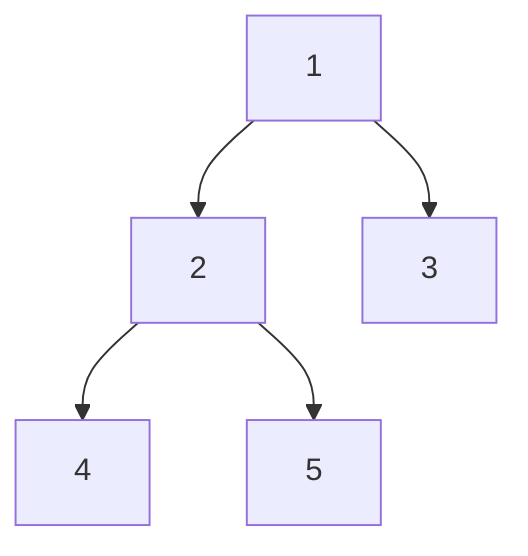
```mermaid
graph TD;
	1-->2
	1-->3
	2-->4
	2-->5
```

在统计根节点时，$n_0=5$ ，答案数本来就是 $25$ 。在统计各子树时，从 $2\sim 5$ 依次 $n_0=3,1,1,1$ 。需要在根节点时减去这些部分。对 $2$ 子树，减去它的 $n_0=3$ ，对 $3$ 减去 $n_0=1$ 。在下一次分治以 $2$ 为根时，减去 $4,5$ 子树的 $1,1$ ，总答案为：
$$
(5^2-3^2-1^2)+(3^2-1^2-1^2)+(1^2-0)+(1^2-0)+(1^2-0)=5^2=25
$$
 也有不容斥的写法。(见下)

参考代码：

```c++
#include <bits/stdc++.h>
using namespace std;
#define sc(x) scanf("%lld", &x)
typedef long long ll;
#define mn 20010
ll n, hd[mn], cnt;
struct edge
{
    ll to, nx, w;
} e[mn * 2];
void adde(ll u, ll v, ll w)
{
    e[++cnt] = {v, hd[u], w};
    hd[u] = cnt;
}
ll died[mn], n2, sz[mn], smx[mn], rot;
void dfs(ll u, ll fa)
{
    sz[u] = 1, smx[u] = 0;
    for (ll i = hd[u], v; i; i = e[i].nx)
    {
        v = e[i].to;
        if (v != fa && !died[v])
        {
            dfs(v, u);
            sz[u] += sz[v];
            smx[u] = max(smx[u], sz[v]);
        }
    }
    smx[u] = max(smx[u], n2 - smx[u]);
    if (smx[u] < smx[rot])
    {
        rot = u;
    }
}
stack<ll> qd;
ll num[mn], d[mn], dcnt, ds[mn], ans;
void dfs2(ll u, ll fa)
{
    num[d[u]]++;
    for (ll i = hd[u], v; i; i = e[i].nx)
    {
        v = e[i].to;
        if (!died[v] && v != fa) //当前还没died的子树可以回溯
        {
            d[v] = (d[u] + e[i].w) % 3;
            dfs2(v, u);
        }
    }
}
ll calc(ll u, ll w)
{
    num[0] = num[1] = num[2] = 0;
    d[u] = w;
    dfs2(u, 0);
    return num[1] * num[2] * 2 + num[0] * num[0];
}
void dfz(ll u)
{
    ans += calc(u, 0);
    died[u] = true;
    for (ll i = hd[u], v; i; i = e[i].nx)
    {
        v = e[i].to;
        if (!died[v])
        {
            ans -= calc(v, e[i].w);
            n2 = sz[v], rot = 0, dfs(v, u), dfs(rot, 0), dfz(rot);
        }
    }
}
signed main()
{
    sc(n), n2 = n, smx[0] = n;
    for (ll i = 1, u, v, w; i < n; ++i)
    {
        sc(u), sc(v), sc(w), w %= 3, adde(u, v, w), adde(v, u, w);
    }
    dfs(1, 0), dfs(rot, 0);
    dfz(rot);
    printf("%lld/%lld\n", ans / __gcd(ans, n * n), n * n / __gcd(ans, n * n));
    return 0;
}
```

参考代码：(不容斥)

```c++
#include<cstdio>
#include<cstring>
#include<iostream>
#include<algorithm>
using namespace std;
const int N=100000,INF=2147483647;
static char buf[100000],*pa,*pd;
#define gc pa==pd&&(pd=(pa=buf)+fread(buf,1,100000,stdin),pa==pd)?EOF:*pa++
inline int read(){
	register int x(0);register char c(gc);
	while(c>'9'||c<'0')c=gc;
	while(c>='0'&&c<='9')x=x*10+(c^48),c=gc;
	return x;
}
struct edge{
	int to,next,w;
}e[N];
int head[N],tot;
inline void add(int x,int y,int z){
	e[++tot].to=y;e[tot].next=head[x];e[tot].w=z;head[x]=tot;
}
int n,tong[3],now[3],ans,root,sum,siz[N],maxp[N],vis[N],dis[N];
void getroot(int u,int fa){
	siz[u]=1;
	maxp[u]=0;
	register int i;
	for(i=head[u];i;i=e[i].next)
		if(e[i].to!=fa&&!vis[e[i].to]){
			getroot(e[i].to,u);
			siz[u]+=siz[e[i].to];
			maxp[u]=max(maxp[u],siz[e[i].to]);		
		}
	maxp[u]=max(maxp[u],sum-siz[u]);
	if(maxp[root]>maxp[u])root=u;
}
void getdis(int u,int fa){
	now[dis[u]%3]++;
	register int i;
	for(i=head[u];i;i=e[i].next)
		if(!vis[e[i].to]&&e[i].to!=fa)
			{
			dis[e[i].to]=dis[u]+e[i].w;
			getdis(e[i].to,u);
		}
}
inline void calc(int u){
	register int i,j;
	for(i=head[u];i;i=e[i].next)
		if(!vis[e[i].to]){
			for(j=0;j<3;j++)now[j]=0;
			dis[e[i].to]=e[i].w;
			getdis(e[i].to,u);
			ans+=tong[0]*now[0]*2+tong[1]*now[2]*2+tong[2]*now[1]*2+now[0]*2;
			for(j=0;j<3;j++)
				tong[j]+=now[j];
		}
}
void solve(int u){
	vis[u]=1;
	calc(u);
	register int i;
	for(i=0;i<3;i++)tong[i]=0;
	for(i=head[u];i;i=e[i].next)
		if(!vis[e[i].to]){
			sum=siz[e[i].to];
			maxp[root=0]=INF;
			getroot(e[i].to,0);
			solve(root);
		}
}
int main(){
	n=read();
	register int i,x,y,z;
	for(i=1;i<n;i++){
		x=read();y=read();z=read();
		add(x,y,z);add(y,x,z);
	}
	maxp[root]=sum=n;
	getroot(1,0);
	solve(root);
	int a=ans+n,b=n*n;
	int c=__gcd(a,b);
	cout<<a/c<<'/'<<b/c;
	return 0;
} 
```


解法二：树上 DP

不需要考虑容斥

每次统计当前节点时，对已遍历全部子树(含自己)跟下一棵未遍历子树做乘法即可

```c++
#include <bits/stdc++.h>
using namespace std;
#define sc(x) scanf("%lld", &x)
typedef long long ll;
#define mn 20010
ll n, num[mn][3], hd[mn], cnt, ans;
struct edge
{
    ll to, nx, w;
} e[mn << 1];
void adde(ll u, ll v, ll w)
{
    e[++cnt] = {v, hd[u], w};
    hd[u] = cnt;
}
void dfs(ll u, ll fa)
{
    num[u][0] = 1;
    for (ll i = hd[u], v; i; i = e[i].nx)
    {
        v = e[i].to;
        if (v != fa)
        {
            dfs(v, u);
            for (ll j = 0; j < 3; ++j)
            {
                ans += num[v][j] * num[u][(6 - j - e[i].w) % 3] * 2;
            }
            for (ll j = 0; j < 3; ++j)
            {
                num[u][(j + e[i].w) % 3] += num[v][j];
            }
        }
    }
}
signed main()
{
    sc(n);
    for (ll i = 1, u, v, w; i < n; ++i)
    {
        sc(u), sc(v), sc(w), w %= 3, adde(u, v, w), adde(v, u, w);
    }
    dfs(1, 0);
    ans += n;
    printf("%lld/%lld\n", ans / __gcd(ans, n * n), n * n / __gcd(ans, n * n));
    return 0;
}
```


##### p2056-捉迷藏

> 给定 $n(1\le n\le10^5)$ 点树，一开始每个点都是灭的。有 $m(1\le m\le5\times10^5)$ 次操作：
>
> - `C i` 将 $i$ 号点的亮灭状态置换
> - `G` 查询最远的两个灭点的距离(如果只有一个点输出 `0` ，一个点也没有输出 `-1`)

这题的 LCA 建议用 $O(1)$ 的，但是倍增法自测差不多(毕竟最后一个是 $O(n\log^2n)$ 一个 $O(n\log n)$ ，都不在代码核心部分消耗复杂度，做预处理的话)

程序思路：先把该处理的都处理了(预处理LCA、找重心、点分树建树)，我们令 $dist$ 是点分树上子树的到灭点的距离(同理可删堆)， $ch$ 是点分树上所有子树最远灭点距离和自己到自己(如果自己是灭点)的距离(可以用可删大根堆维护)，有 $k$ 个子树就有 $k+1$ 个值，然后在建点分树的过程中，记录好当前节点的 $dist$ ，把最远的距离加入到 $ch$ 里，然后给当前节点 $u$ 加上一个 $0$ (自己)，如果 $ch$ 有两个或以上节点，最远的和次远的可以组成一次答案，把它插入到答案可删堆 $ans$ 里

在点分治结束后，预处理每个点离它父亲在原树上的距离大小，可以降低一层 $\log n$ 复杂度

$x$ 点从灭转亮，把灭点数减一(灭点数可以直接判断 `G` 的分类讨论输出)，如果这时候 $ch$ 贡献过答案(插入过)，那么把它插入过的全部里最大的那个答案给删掉，然后减少一个 $0$ (自己灭了)，然后再看看减少后能不能贡献答案，能的话再贡献一次。然后暴力跳父亲，如果父亲贡献过答案掐了。设当前处理的是 $i$ (从 $x$ 开始)，其父亲是 $f$ ，因为当自己是灭点时，对所有祖先 $i$ ，都得到过一段 $dist$ ，且有可能存过到 $f$ 的 $ch$ 里。先把存到 $ch$ 的给掐了，然后把 $dist$ 里距离刚好是 $d(x,f)$ 的这一段给掐了，然后如果 $dist$ 还有值，把它补回去。这么做时：①假设掐掉的 $ch$ 就是最值，那么正好删掉了，次大去顶替；②假设错掐了，本来没奉献的，那再补回去。注意到掐 $dist$ 时 $d(x,f)$ 一定存在，所以不会虚空删除。在这之后，同理对 $ans$ 这么做一次

$x$ 点从亮转灭， 灭点数加一，把答案掐掉，插入一个 $ch$ 为 $0$ ，然后再补回答案。然后对每个 $i,f$ ，同理先掐答案，然后掐 $dist$ ，然后放一个 $d(x,f)$ ，然后补 $dist$ 然后补答案

合理性证明：跳 $i,f$ 时，每个 $i$ 都是当前子树，直到跳到根时统计完全部被修改的部分(类似主席树的思路，改了哪条链只更新哪条链)。之所以搞 $dist,ch,ans$ 三层级的可删堆，是为了时空优化， $dist$ 只对自己节点负责，筛出最优上传给 $\log n$ 个祖先的 $ch$ ，然后 $ch$ 对答案负责，筛出最优上传给 $ans$ ，从而把 $n^2$ 的空间复杂度拆分为全体 $dist$ 的 $O(n+2\dfrac n2+4\dfrac n4+\cdots)=O(n\log n)$  和全体 $ch$ 的 $O(1\cdot n+2\cdot\dfrac n2+4\cdot \dfrac n4+\cdots)=O(n\log n)$ 和 $ans$ 的 $O(n)$ 

倍增LCA：

```c++
#include <bits/stdc++.h>
using namespace std;
#define sc(x) scanf("%lld", &x)
typedef long long ll;
#define mn 100010
struct edge
{
    ll to, nx;
} e[mn * 2];
ll n, hd[mn], cnt;
void adde(ll u, ll v)
{
    e[++cnt] = {v, hd[u]}, hd[u] = cnt;
}
struct heap //可删堆(大根堆)
{
    priority_queue<ll> a, b;
    void insert(ll x) { a.push(x); }
    void erase(ll x) { b.push(x); }
    ll top()
    {
        while (!b.empty() && a.top() == b.top())
        {
            a.pop(), b.pop();
        }
        return a.top();
    }
    ll pop()
    {
        ll t = top();
        a.pop();
        return t;
    }
    ll size() { return a.size() - b.size(); }
    ll top2() //求次大值
    {
        ll mx = pop();
        ll nd = top();
        insert(mx);
        return nd;
    }
} dist[mn], ch[mn], ans;
#define mlg 18
ll dep[mn], fa[mn][mlg];
void dfs(ll u, ll f)
{
    for (ll i = hd[u], v; i; i = e[i].nx)
    {
        v = e[i].to;
        if (v != f)
        {
            dep[v] = dep[u] + 1;
            fa[v][0] = u;
            dfs(v, u);
        }
    }
}
void lcainit()
{
    dep[1] = 1, dfs(1, 0);
    for (ll j = 1; j < mlg; ++j)
    {
        for (ll i = 1; i <= n; ++i)
        {
            fa[i][j] = fa[fa[i][j - 1]][j - 1];
        }
    }
}
ll lca(ll x, ll y)
{
    if (dep[x] > dep[y])
    {
        swap(x, y);
    }
    for (ll i = mlg - 1; i >= 0; --i)
    {
        if (dep[fa[y][i]] >= dep[x])
        {
            y = fa[y][i];
        }
    }
    if (x == y)
    {
        return x;
    }
    for (ll i = mlg - 1; i >= 0; --i)
    {
        if (fa[x][i] != fa[y][i])
        {
            x = fa[x][i], y = fa[y][i];
        }
    }
    return fa[x][0];
}
ll getdis(ll x, ll y)
{
    return dep[x] + dep[y] - 2 * dep[lca(x, y)];
}
ll died[mn], siz[mn], mxsiz[mn], rot, n2;
void getroot(ll u, ll f)
{
    siz[u] = 1, mxsiz[u] = 0;
    for (ll i = hd[u], v; i; i = e[i].nx)
    {
        v = e[i].to;
        if (v != f && !died[v])
        {
            getroot(v, u);
            siz[u] += siz[v];
            mxsiz[u] = max(mxsiz[u], siz[v]);
        }
    }
    mxsiz[u] = max(mxsiz[u], n2 - siz[u]);
    if (mxsiz[u] < mxsiz[rot])
    {
        rot = u;
    }
}
void calcdis(ll u, ll f, ll dis, heap &q)
{
    q.insert(dis);
    for (ll i = hd[u], v; i; i = e[i].nx)
    {
        v = e[i].to;
        if (v != f && !died[v])
        {
            calcdis(v, u, dis + 1, q);
        }
    }
}
ll dep2[mn], fa2[mn]; //点分树
void dfz(ll u)
{
    died[u] = true;
    for (ll i = hd[u], v; i; i = e[i].nx)
    {
        v = e[i].to;
        if (!died[v])
        {
            n2 = siz[v], rot = 0;
            getroot(v, rot);
            calcdis(v, u, 1, dist[rot]);
            dep2[rot] = dep2[u] + 1;
            fa2[rot] = u;
            ch[u].insert(dist[rot].top());
            dfz(rot);
        }
    }
    ch[u].insert(0);
    if (ch[u].size() >= 2)
    {
        ans.insert(ch[u].top() + ch[u].top2());
    }
}
ll d[mn][mlg], shutdowns, m, turnon[mn];
signed main()
{
    sc(n);
    for (ll i = 1, u, v; i < n; ++i)
    {
        sc(u), sc(v), adde(u, v), adde(v, u);
    }
    lcainit();
    n2 = n, mxsiz[0] = n, getroot(1, 0);
    dfz(rot);
    for (ll i = 1; i <= n; ++i)
    {
        for (ll j = fa2[i]; j; j = fa2[j])
        {
            d[i][dep2[i] - dep2[j]] = getdis(i, j);
        }
    }

    shutdowns = n;
    sc(m);
    char cmd[3];
    for (ll x; m--;)
    {
        scanf("%s", cmd);
        if (cmd[0] == 'G')
        {
            printf("%lld\n", shutdowns == 0 ? -1 : (shutdowns == 1 ? 0 : ans.top()));
            continue;
        }
        sc(x);
        if (turnon[x] == 0)
        {
            shutdowns--;
            if (ch[x].size() >= 2)
            {
                ans.erase(ch[x].top() + ch[x].top2());
            }
            ch[x].erase(0);
            if (ch[x].size() >= 2)
            {
                ans.insert(ch[x].top() + ch[x].top2());
            }
            for (ll i = x; fa2[i]; i = fa2[i])
            {
                if (ch[fa2[i]].size() >= 2)
                {
                    ans.erase(ch[fa2[i]].top() + ch[fa2[i]].top2());
                }
                ch[fa2[i]].erase(dist[i].top());
                dist[i].erase(d[x][dep2[x] - dep2[fa2[i]]]);
                if (dist[i].size())
                {
                    ch[fa2[i]].insert(dist[i].top());
                }
                if (ch[fa2[i]].size() >= 2)
                {
                    ans.insert(ch[fa2[i]].top() + ch[fa2[i]].top2());
                }
            }
        }
        else
        {
            shutdowns++;
            if (ch[x].size() >= 2)
            {
                ans.erase(ch[x].top() + ch[x].top2());
            }
            ch[x].insert(0);
            if (ch[x].size() >= 2)
            {
                ans.insert(ch[x].top() + ch[x].top2());
            }
            for (ll i = x; fa2[i]; i = fa2[i])
            {
                if (ch[fa2[i]].size() >= 2)
                {
                    ans.erase(ch[fa2[i]].top() + ch[fa2[i]].top2());
                }
                if (dist[i].size())
                {
                    ch[fa2[i]].erase(dist[i].top());
                }
                dist[i].insert(d[x][dep2[x] - dep2[fa2[i]]]);
                ch[fa2[i]].insert(dist[i].top());
                if (ch[fa2[i]].size() >= 2)
                {
                    ans.insert(ch[fa2[i]].top() + ch[fa2[i]].top2());
                }
            }
        }
        turnon[x] ^= 1;
    }
    return 0;
}
```

欧拉序RMQ： 

```c++
#include <bits/stdc++.h>
using namespace std;
#define sc(x) scanf("%d", &x)
typedef int ll;
#define mn 200010
struct edge
{
    ll to, nx;
} e[mn * 2];
ll n, hd[mn], cnt;
void adde(ll u, ll v)
{
    e[++cnt] = {v, hd[u]}, hd[u] = cnt;
}
struct heap //可删堆(大根堆)
{
    priority_queue<ll> a, b;
    void insert(ll x) { a.push(x); }
    void erase(ll x) { b.push(x); }
    ll top()
    {
        while (!b.empty() && a.top() == b.top())
        {
            a.pop(), b.pop();
        }
        return a.top();
    }
    ll pop()
    {
        ll t = top();
        a.pop();
        return t;
    }
    ll size() { return a.size() - b.size(); }
    ll top2() //求次大值
    {
        ll mx = pop();
        ll nd = top();
        insert(mx);
        return nd;
    }
} dist[mn], ch[mn], ans;
#define mlg 19
ll dep[mn], fa[mn][mlg], lg[mn], order[mn], dfn;
void dfs(ll u, ll f)
{
    fa[++dfn][0] = u, order[u] = dfn;
    for (ll i = hd[u], v; i; i = e[i].nx)
    {
        v = e[i].to;
        if (v != f)
        {
            dep[v] = dep[u] + 1; //要放在先序遍历
            dfs(v, u);
            fa[++dfn][0] = u; //欧拉序出子树再建一次
        }
    }
}
ll mindep(ll x, ll y) { return dep[x] < dep[y] ? x : y; }
void lcainit()
{
    dfs(1, 0);
    for (ll i = 2; i <= dfn; ++i)
    {
        lg[i] = lg[i / 2] + 1;
    }
    for (ll i = 1; i < mlg; ++i)
    {
        for (ll j = 1; j + (1 << i) - 1 <= dfn; ++j)
        {
            fa[j][i] = mindep(fa[j][i - 1], fa[j + (1 << (i - 1))][i - 1]);
        }
    }
}
ll getdis(ll u, ll v)
{
    if (order[u] > order[v]) // let u<=v
    {
        swap(u, v);
    }
    ll dfnu = order[u], dfnv = order[v], j = lg[dfnv - dfnu + 1];
    ll lca = mindep(fa[dfnu][j], fa[dfnv - (1 << j) + 1][j]);
    return dep[u] + dep[v] - 2 * dep[lca];
}
ll died[mn], siz[mn], mxsiz, rot, n2;
void getroot(ll u, ll f)
{
    siz[u] = 1;
    ll res = 0;
    for (ll i = hd[u], v; i; i = e[i].nx)
    {
        v = e[i].to;
        if (v != f && !died[v])
        {
            getroot(v, u);
            siz[u] += siz[v];
            res = max(res, siz[v]);
        }
    }
    res = max(res, n2 - siz[u]);
    if (res < mxsiz)
    {
        rot = u, mxsiz = res;
    }
}
void calcdis(ll u, ll f, ll dis, heap &q)
{
    q.insert(dis);
    for (ll i = hd[u], v; i; i = e[i].nx)
    {
        v = e[i].to;
        if (v != f && !died[v])
        {
            calcdis(v, u, dis + 1, q);
        }
    }
}
ll dep2[mn], fa2[mn]; //点分树
void dfz(ll u)
{
    died[u] = true;
    for (ll i = hd[u], v; i; i = e[i].nx)
    {
        v = e[i].to;
        if (!died[v])
        {
            n2 = siz[v], rot = 0, mxsiz = n2;
            getroot(v, rot);
            calcdis(v, u, 1, dist[rot]);
            dep2[rot] = dep2[u] + 1;
            fa2[rot] = u;
            ch[u].insert(dist[rot].top());
            dfz(rot);
        }
    }
    ch[u].insert(0);
    if (ch[u].size() >= 2)
    {
        ans.insert(ch[u].top() + ch[u].top2());
    }
}
ll d[mn][mlg], shutdowns, m, turnon[mn];
signed main()
{
    sc(n);
    for (ll i = 1, u, v; i < n; ++i)
    {
        sc(u), sc(v), adde(u, v), adde(v, u);
    }
    lcainit();
    n2 = n, mxsiz = n, getroot(1, 0);
    dfz(rot);
    for (ll i = 1; i <= n; ++i)
    {
        for (ll j = fa2[i]; j; j = fa2[j])
        {
            d[i][dep2[i] - dep2[j]] = getdis(i, j);
        }
    }

    shutdowns = n;
    sc(m);
    char cmd[3];
    for (ll x; m--;)
    {
        scanf("%s", cmd);
        if (cmd[0] == 'G')
        {
            printf("%d\n", shutdowns == 0 ? -1 : (shutdowns == 1 ? 0 : ans.top()));
            continue;
        }
        sc(x);
        if (turnon[x] == 0)
        {
            shutdowns--;
            if (ch[x].size() >= 2)
            {
                ans.erase(ch[x].top() + ch[x].top2());
            }
            ch[x].erase(0);
            if (ch[x].size() >= 2)
            {
                ans.insert(ch[x].top() + ch[x].top2());
            }
            for (ll i = x; fa2[i]; i = fa2[i])
            {
                if (ch[fa2[i]].size() >= 2)
                {
                    ans.erase(ch[fa2[i]].top() + ch[fa2[i]].top2());
                }
                ch[fa2[i]].erase(dist[i].top());
                dist[i].erase(d[x][dep2[x] - dep2[fa2[i]]]);
                if (dist[i].size())
                {
                    ch[fa2[i]].insert(dist[i].top());
                }
                if (ch[fa2[i]].size() >= 2)
                {
                    ans.insert(ch[fa2[i]].top() + ch[fa2[i]].top2());
                }
            }
        }
        else
        {
            shutdowns++;
            if (ch[x].size() >= 2)
            {
                ans.erase(ch[x].top() + ch[x].top2());
            }
            ch[x].insert(0);
            if (ch[x].size() >= 2)
            {
                ans.insert(ch[x].top() + ch[x].top2());
            }
            for (ll i = x; fa2[i]; i = fa2[i])
            {
                if (ch[fa2[i]].size() >= 2)
                {
                    ans.erase(ch[fa2[i]].top() + ch[fa2[i]].top2());
                }
                if (dist[i].size())
                {
                    ch[fa2[i]].erase(dist[i].top());
                }
                dist[i].insert(d[x][dep2[x] - dep2[fa2[i]]]);
                ch[fa2[i]].insert(dist[i].top());
                if (ch[fa2[i]].size() >= 2)
                {
                    ans.insert(ch[fa2[i]].top() + ch[fa2[i]].top2());
                }
            }
        }
        turnon[x] ^= 1;
    }
    return 0;
}
```


##### p1470 最长前缀

> 给定不超过 $200$ 个长为 $10$ 的字符串集 $P$ ，字符集是大写字母(输入 $P$ 以 `.` 结束)，多行输入字符串 $S(1\le |S|\le2\times10^5)$ ，问由 $P$ (可重复使用)可以组成 $S$ 的最长前缀多长

解法一：AC自动机

显然以 $P$ 建自动机，然后放 $S$ 进去扫。设 $ok[i]$ 表示可以组成长为 $i$ 的前缀，显然 $ok[0]=1$ 。建自动机时对每个结束点存当前串长度 $e$ 。对于每个遍历的节点 $u$，暴力跳 fail ，设当前跳的点是 $j$ ，如果 $j$ 是某个结束点，即 $e$ 不为零，那么如果长为 $i-e[j]$ 的前缀已有，就可以有 $i$ 的前缀。

复杂度为 $O(10S)$ 

```c++
#include <bits/stdc++.h>
using namespace std;
#define sc(x) scanf("%lld", &x)
typedef long long ll;
#define ms 200010
#define mn 2022
#define alp 26
ll tr[mn][alp], cnt, e[mn], fail[mn], len, ok[ms];
char s[ms];
signed main()
{
    while (true)
    {
        scanf("%s", s + 1);
        if (s[1] == '.')
        {
            break;
        }
        ll u = 0;
        for (ll i = 1; s[i]; ++i)
        {
            ll a = s[i] - 'A';
            if (!tr[u][a])
            {
                tr[u][a] = ++cnt;
            }
            u = tr[u][a];
        }
        e[u] = strlen(s + 1);
    }
    queue<ll> q;
    for (ll i = 0; i < alp; ++i)
    {
        if (tr[0][i])
        {
            q.push(tr[0][i]);
        }
    }
    while (!q.empty())
    {
        ll u = q.front();
        q.pop();
        for (ll i = 0; i < alp; ++i)
        {
            if (tr[u][i])
            {
                fail[tr[u][i]] = tr[fail[u]][i];
                q.push(tr[u][i]);
            }
            else
            {
                tr[u][i] = tr[fail[u]][i];
            }
        }
    }
    while (EOF != scanf("%s", s + 1 + len))
    {
        ll t = strlen(s + 1 + len);
        len += t;
    }
    ll u = 0;
    ok[0] = 1;
    for (ll i = 1; s[i]; ++i)
    {
        ll a = s[i] - 'A';
        u = tr[u][a];
        for (ll j = u; j && !ok[i]; j = fail[j])
        {
            if (e[j])
            {
                ok[i] |= ok[i - e[j]];
            }
        }
    }
    for (ll i = len; ~i; --i)
    {
        if (ok[i])
        {
            printf("%lld", i);
            return 0;
        }
    }
    return 0;
}
```


解法二：暴力DP

按照长度不同将 $P$ 划分为 $10$ 个 $set$ ，顺着枚举 $S$ 的每个位置 $i$ ，然后枚举 $i$ 开头的长为 $j$ 的子串，如果在第 $j$ 个 $set$ 里有这个子串，说明可以匹配一次，记录一下，复杂度 $O(10\cdot n\cdot \log(200)\cdot 10)$ 

```c++
#define mn 200020
bool dp[mn];
ll ans,ss,sp;
string s,t;
set<string> p;
signed main()
{
    while(1)
    {
        cin>>t;
        if(t==".") break;
        p.insert(t);
        sp=max(sp,(ll)t.size());
    }
    while(cin>>t) s+=t; ss=s.size();
    dp[0]=true;
    repe(i,1,ss)
    {
        rede(j,min(i,sp),1)
        {
            if(!dp[i-j]) continue;
            t=s.substr(i-j,j);
            if(p.count(t)) {dp[i]=true; ans=max(ans,i); break;}
        }
    }
    return cout<<ans,0;
}
```

解法三：据说可以Trie上DFS(每次匹配到就再从根开始搜一下)


##### p3345-幻想乡战略游戏

> $n(1\le n\le10^5)$ 点带边权 $c(1\le c\le10^3)$ 树，度数均不超过 $20$ ，一开始点权 $d$ 为 $0$ 。有 $m(1\le m\le10^5)$ 次操作，每次将点 $x$ 点权增加 $y(-10^3\le y\le10^3)$ ，选择一个点 $u$ ，对所有点 $v$ ，费用为 $\sum d_v\times dist(u,v)$ ，求一种选择方案使得费用最小，输出最小方案(保证所有时刻 $d$ 非负)

联想 `医院设置` 一题，可知设 $u$ 距离和为 $f_u$ ，邻点 $v$ 的距离和可以表示为：
$$
f_v=f_u-sum_v\times dist(u,v)+(sum_u-sum_v)\times dist(u,v)
$$
那么 $f_v < f_u$ 即儿子比父亲更优当且仅当 $2sum_v > sum_u$ ，也就是说起码要是一半以上那么多，显然不可能有两个子树都有一半以上，所以这样的点至多有一个

先按套路处理重心、LCA、点分树建树(注意建树的时候加一个标记，表示当前根到新子树重心连边时，原本的子树边是 $w$ (也就是原本 $u$ 到这个子树直接连 $v$ 点，重心是 $rot$ ，那么建树连边 $(u,rot)$ 且标记这条边信息为 $v$ ))

对于每次修改增加 $w$，从 $u$ 开始在点分树上不断跳祖先 $v$ ( $v$ 是根时跳出循环)，设当前 $v$ 的父亲是 $f$ ，设点分树上当前点的子树权值和(含自己)是 $sumd$ ，以当前点为中心时贡献是 $dis1$ ，当前点对祖先的贡献是 $dis2$ 。 设当前距离是 $d=dist(f,u)$ ，那么显然对祖先的贡献增加 $d\times w$ ，所以 $dis1[f]$ ， $dis2[v]$ 均增加这个值，且 $sumd[f]$ 增加 $w$ ，显然复杂度是 $O(\log n)$

每次计算某个点为中心的贡献时，如果是根就直接求 $dis1$ ，如果不是根，还要对同样循环的 $v,f$ ，求出 $dis1[f]-dis2[v]$ 也就是祖先子树的全体贡献减去这棵子树对它的贡献，还要加上 $dist(v,u)\times(sumd[f]-sumd[v])$ 也就是祖先子树减去这棵子树上所有点权走多一段距离，本来是到 $f$ 就结束的，现在要前往 $v$ 为中心，要多走一段 $dist(v,u)$ ，其实质就是上面 $f_v$ 这条式子的后半部分(其实做的事情就是计算子树外的点对它的贡献)，显然复杂度是 $O(\log n)$

那么每次查询时，先假设中心是点分树的根，然后暴力遍历它的所有直接儿子(根据题意，重构点分树不改变度数，所以最多遍历 $20$ 个)，如果有比它更优的一个子树，那么直接选(根据上文结论，显然其他子树不可能更优了)这个子树为根继续递归，如果没有比它更优的子树，就以当前为中心输出答案。这个过程的复杂度是 $O(20\log^2n)$ ( $\log n$ 层，每层 $20\log n$ )

因此总复杂度是 $O(n\log n+q\log^2n)$ 

写法一(带边权的距离求法)：

```c++
#include <bits/stdc++.h>
using namespace std;
#define sc(x) scanf("%lld", &x)
typedef long long ll;
#define mn 200010
ll n, hd[mn], cnt, hd2[mn], cnt2;
struct edge
{
    ll to, nx, w;
} e[mn * 2], e2[mn * 2];
void adde(ll u, ll v, ll w, edge *e = e, ll *hd = hd, ll &cnt = cnt)
{
    e[++cnt] = {v, hd[u], w}, hd[u] = cnt;
}
#define mlg 19
ll dep[mn], fa2[mn][mlg], lg[mn], dfn, order[mn], euler[mn], dis[mn];
void dfs(ll u, ll fa)
{
    dep[u] = dep[fa] + 1;
    fa2[++dfn][0] = u;
    order[u] = dfn;
    for (ll i = hd[u], v; i; i = e[i].nx)
    {
        v = e[i].to;
        if (v != fa)
        {
            dis[v] = dis[u] + e[i].w;
            dfs(v, u);
            fa2[++dfn][0] = u;
        }
    }
}
void initlca()
{
    dfs(1, 0);
    for (ll i = 2; i <= dfn; ++i)
    {
        lg[i] = lg[i / 2] + 1;
    }
    for (ll j = 1; j < mlg; ++j)
    {
        for (ll i = 1; i + (1 << j) - 1 <= dfn; ++i)
        {
            ll x = fa2[i][j - 1], y = fa2[i + (1 << (j - 1))][j - 1];
            fa2[i][j] = dep[x] < dep[y] ? x : y;
        }
    }
}
ll getdis(ll u, ll v)
{
    if (order[u] > order[v])
    {
        swap(u, v);
    }
    ll ou = order[u], ov = order[v];
    ll j = lg[ov - ou + 1], x = fa2[ou][j], y = fa2[ov - (1 << j) + 1][j];
    ll lca = dep[x] < dep[y] ? x : y;
    return dis[u] + dis[v] - 2 * dis[lca];
}
ll mxsiz, n2, siz[mn], rot, died[mn];
void getroot(ll u, ll fa)
{
    ll res = 0;
    siz[u] = 1;
    for (ll i = hd[u], v; i; i = e[i].nx)
    {
        v = e[i].to;
        if (v != fa && !died[v])
        {
            getroot(v, u);
            siz[u] += siz[v];
            res = max(res, siz[v]);
        }
    }
    res = max(res, n2 - siz[u]);
    if (res < mxsiz)
    {
        mxsiz = res, rot = u;
    }
}
ll fa[mn];
vector<ll> son[mn], ori[mn];
void dfz(ll u)
{
    died[u] = true;
    for (ll i = hd[u], v; i; i = e[i].nx)
    {
        v = e[i].to;
        if (!died[v])
        {
            n2 = siz[v], mxsiz = n2, rot = 0, getroot(v, 0);
            fa[rot] = u;
            adde(u, rot, v, e2, hd2, cnt2);
            dfz(rot);
        }
    }
}
ll sumd[mn], dis1[mn], dis2[mn];
void update(ll u, ll w)
{
    sumd[u] += w;
    for (ll v = u; fa[v]; v = fa[v])
    {
        ll d = getdis(fa[v], u);
        dis1[fa[v]] += d * w;
        dis2[v] += d * w;
        sumd[fa[v]] += w;
    }
}
ll calc(ll u)
{
    ll ans = dis1[u];
    for (ll v = u; fa[v]; v = fa[v])
    {
        ll d = getdis(fa[v], u);
        ans += dis1[fa[v]] - dis2[v];
        ans += d * (sumd[fa[v]] - sumd[v]);
    }
    return ans;
}
ll query(ll u)
{
    ll ans = calc(u);
    for (ll i = hd2[u]; i; i = e2[i].nx)
    {
        ll nw = calc(e2[i].w);
        if (nw < ans)
        {
            return query(e2[i].to);
        }
    }
    return ans;
}
ll q, tmp;
signed main()
{
    sc(n), sc(q);
    for (ll i = 1, u, v, w; i < n; ++i)
    {
        sc(u), sc(v), sc(w), adde(u, v, w), adde(v, u, w);
    }
    initlca();
    n2 = n, mxsiz = n, getroot(1, 0), tmp = rot;
    dfz(rot), rot = tmp; //之后还要用根
    for (ll x, y; q--;)
    {
        sc(x), sc(y);
        update(x, y);
        printf("%lld\n", query(rot));
    }
    return 0;
}
```

写法二：

```c++
#include <bits/stdc++.h>
using namespace std;
#define sc(x) scanf("%lld", &x)
typedef long long ll;
#define mn 200010
ll n, hd[mn], cnt, hd2[mn], cnt2;
struct edge
{
    ll to, nx, w;
} e[mn * 2], e2[mn * 2];
void adde(ll u, ll v, ll w, edge *e = e, ll *hd = hd, ll &cnt = cnt)
{
    e[++cnt] = {v, hd[u], w}, hd[u] = cnt;
}
#define mlg 19
ll dep[mn], fa2[mn][mlg], lg[mn], dfn, order[mn], dis[mn];
void dfs(ll u, ll fa)
{
    dep[u] = dep[fa] + 1;
    fa2[++dfn][0] = dis[u];
    order[u] = dfn;
    for (ll i = hd[u], v; i; i = e[i].nx)
    {
        v = e[i].to;
        if (v != fa)
        {
            dis[v] = dis[u] + e[i].w;
            dfs(v, u);
            fa2[++dfn][0] = dis[u];
        }
    }
}
void initlca()
{
    dfs(1, 0);
    for (ll i = 2; i <= dfn; ++i)
    {
        lg[i] = lg[i / 2] + 1;
    }
    for (ll j = 1; j < mlg; ++j)
    {
        for (ll i = 1; i + (1 << j) - 1 <= dfn; ++i)
        {
            fa2[i][j] = min(fa2[i][j - 1], fa2[i + (1 << (j - 1))][j - 1]);
        }
    }
}
ll getdis(ll u, ll v)
{
    if (order[u] > order[v])
    {
        swap(u, v);
    }
    ll ou = order[u], ov = order[v];
    ll j = lg[ov - ou + 1];
    return dis[u] + dis[v] - 2 * min(fa2[ou][j], fa2[ov - (1 << j) + 1][j]);
}
ll mxsiz, n2, siz[mn], rot, died[mn];
void getroot(ll u, ll fa)
{
    ll res = 0;
    siz[u] = 1;
    for (ll i = hd[u], v; i; i = e[i].nx)
    {
        v = e[i].to;
        if (v != fa && !died[v])
        {
            getroot(v, u);
            siz[u] += siz[v];
            res = max(res, siz[v]);
        }
    }
    res = max(res, n2 - siz[u]);
    if (res < mxsiz)
    {
        mxsiz = res, rot = u;
    }
}
ll fa[mn];
vector<ll> son[mn], ori[mn];
void dfz(ll u)
{
    died[u] = true;
    for (ll i = hd[u], v; i; i = e[i].nx)
    {
        v = e[i].to;
        if (!died[v])
        {
            
            n2 = siz[v], mxsiz = n2, rot = 0, getroot(v, 0);
            fa[rot] = u;
            adde(u, rot, v, e2, hd2, cnt2);
            dfz(rot);
        }
    }
}
ll sumd[mn], dis1[mn], dis2[mn];
void update(ll u, ll w)
{
    sumd[u] += w;
    for (ll v = u; fa[v]; v = fa[v])
    {
        ll d = getdis(fa[v], u);
        dis1[fa[v]] += d * w;
        dis2[v] += d * w;
        sumd[fa[v]] += w;
    }
}
ll calc(ll u)
{
    ll ans = dis1[u];
    for (ll v = u; fa[v]; v = fa[v])
    {
        ll d = getdis(fa[v], u);
        ans += dis1[fa[v]] - dis2[v];
        ans += d * (sumd[fa[v]] - sumd[v]);
    }
    return ans;
}
ll query(ll u)
{
    ll ans = calc(u);
    for (ll i = hd2[u]; i; i = e2[i].nx)
    {
        ll nw = calc(e2[i].w);
        if (nw < ans)
        {
            return query(e2[i].to);
        }
    }
    return ans;
}
ll q,tmp;
signed main()
{
    sc(n), sc(q);
    for (ll i = 1, u, v, w; i < n; ++i)
    {
        sc(u), sc(v), sc(w), adde(u, v, w), adde(v, u, w);
    }
    initlca();
    n2 = n, mxsiz = n, getroot(1, 0),tmp=rot;
    dfz(rot),rot=tmp;
    for (ll x, y; q--;)
    {
        sc(x), sc(y);
        update(x, y);
        printf("%lld\n", query(rot));
    }
    return 0;
}
```


##### p3676 小清新数据结构题

> 有 $n(1\le n\le2\times10^5)$ 点带点权树，有 $m(1\le m\le2\times10^5)$ 次操作：
>
> 1. `1 x y` 修改 $x$ 点点权为 $y$
> 2. `2 x` 查询以 $x$ 为根时，令 $s_i$ 为 $i$ 点子树点权和，求 $\sum_{i=1}^ns_i^2$ 

首先明白一个点：重构点分树时原图结构不是不变的。因此重构点分树时，父子关系会变，本来的 $s_i$ 会挂掉(即查询的 $s_i$ 与点分树的 $s_i$ 不是同一个点权和) (这也是自己不看题解时屙了半天代码喜提0分的好成绩的原因)

在求 $\sum_{i=1}^n s_i^2$ 之前，先来看一些性质：(设点权为 $p$ ，令 $s=\sum_{i=1}^n p_i$ )

- 若本来的根是 $r$ ，将新的根更改为 $r$ 的一个直接儿子 $r'$ ，那么除了 $r,r'$ 外， $s_i$ 都不会改变；且新的 $s_r$ 是本来的 $s-s_{r'}$ ，新的 $s_{r'}$ 是 $s$ (原本的 $s_r,s_{r'}$ 分别是 $s,s-s_r$)

- 根据上一点，可以推导出无论如何换根， $t=\sum_{i=1}^ns_i(s-s_i)$ 都是常数 (代码不会用到这一点,且发现代码这么做不行)，这是因为每次换根只会改变其中的 $r,r'$ ，将它们的变化把上述代入易得

  $t=s\sum_{i=1}^ns_i-\sum_{i=1}^ns_i^2$ 即 $\sum_{i=1}^ns_i^2=s\sum_{i=1}^ns_i-t$ 

- 将 $t$ 分开为每一对点对的贡献，可以得出： $t=\sum_{i=1}^n\sum_{j=i+1}^np_ip_jdist(i,j)=\dfrac12\sum_{i=1}^n\sum_{j=1}^np_ip_jdist(i,j)$ 

- 在上一题 `幻想乡战略游戏` 里，用动态点分树维护了单点修改下的 $f(u)=\sum_{v=1}^nd_v\cdot dist(v,u)$

  提取第一项，得 $t=\dfrac12\sum_{i=1}^np_if(i)$ (代码不会用到这一点)

- 要计算 $s'=\sum_{i=1}^ns_i$ ，不难发现每个点的贡献为 $dep+1$ ，即 $s'=\sum_{i=1}^n(1+dep_i)p_i=s+\sum_{i=1}^ndep_i\cdot p_i$ ，深度等效于与根节点 $r$ 的距离，故 $s'=s+\sum_{i=1}^np_idist(i,r)=s+f(r)$

- 因此，询问的根为 $x$ 时，所求为 $\sum_{i=1}^ns_i^2=s(s+f(x))-t$ 

- 当每次执行单点修改时 $p_x=y$，在 $t$ 的表达式里， $dist$ 不变，所有 $i < x$ 都会在 $\sum_{j=i+1}^n$ 的 $p_j$ 产生一个变化 $(-p_x+y)$ ，且 $i=x$ 时，所有 $\sum_{j=i+1}^n$ 的 $p_i$ 都产生一个变化 $(-p_x+y)$ ，即总变化量为 $(-p_x+y)\sum_{i=1}^np_idist(i,x)=(-p_x+y)f(x)$ ，因此在初始化时可以把 $t$ 通过该方法算出来

那么按套路上动态点分治，之后维护这些东西即可，复杂度是 $O(n\log n)$

```c++
#include <bits/stdc++.h>
using namespace std;
#define sc(x) scanf("%lld", &x)
typedef long long ll;
#define mn 400010
ll n, hd[mn], cnt;
struct edge
{
    ll to, nx;
} e[mn * 2];
void adde(ll u, ll v)
{
    e[++cnt] = {v, hd[u]};
    hd[u] = cnt;
}
#define mlg 19
ll dep[mn], fa2[mn][mlg], lg[mn], order[mn], dfn;
void dfs(ll u, ll f)
{
    fa2[++dfn][0] = u, order[u] = dfn;
    for (ll i = hd[u], v; i; i = e[i].nx)
    {
        v = e[i].to;
        if (v != f)
        {
            dep[v] = dep[u] + 1;
            dfs(v, u);
            fa2[++dfn][0] = u;
        }
    }
}
ll mindep(ll x, ll y) { return dep[x] < dep[y] ? x : y; }
void lcainit()
{
    dfs(1, 0);
    for (ll i = 2; i <= dfn; ++i)
    {
        lg[i] = lg[i / 2] + 1;
    }
    for (ll i = 1; i < mlg; ++i)
    {
        for (ll j = 1; j + (1 << i) - 1 <= dfn; ++j)
        {
            fa2[j][i] = mindep(fa2[j][i - 1], fa2[j + (1 << (i - 1))][i - 1]);
        }
    }
}
ll getdis(ll u, ll v)
{
    if (order[u] > order[v])
    {
        swap(u, v);
    }
    ll dfnu = order[u], dfnv = order[v], j = lg[dfnv - dfnu + 1];
    ll lca = mindep(fa2[dfnu][j], fa2[dfnv - (1 << j) + 1][j]);
    return dep[u] + dep[v] - 2 * dep[lca];
}
ll mxsiz, rot, siz[mn], died[mn], n2;
void getroot(ll u, ll fa)
{
    siz[u] = 1;
    ll res = 0;
    for (ll i = hd[u], v; i; i = e[i].nx)
    {
        v = e[i].to;
        if (!died[v] && v != fa)
        {
            getroot(v, u);
            siz[u] += siz[v];
            res = max(res, siz[v]);
        }
    }
    res = max(res, n2 - siz[u]);
    if (res < mxsiz)
    {
        mxsiz = res, rot = u;
    }
}
ll fa[mn];
void dfz(ll u)
{
    died[u] = true;
    for (ll i = hd[u], v; i; i = e[i].nx)
    {
        v = e[i].to;
        if (!died[v])
        {
            n2 = siz[v], mxsiz = n2, rot = 0, getroot(v, 0);
            fa[rot] = u;
            dfz(rot);
        }
    }
}
ll p[mn], w[mn], f[mn], g[mn], t, s;
ll query(ll u) //求u为根的f(u)
{
    ll ans = f[u];
    for (ll v = u; v != rot; v = fa[v])
    {
        ans += (f[fa[v]] - g[v]) + (w[fa[v]] - w[v]) * getdis(u, fa[v]);
    }
    return ans;
}
void update(ll u, ll dt)
{
    ll prevv = dt;
    dt = p[u] - dt;
    p[u] = prevv;
    for (ll v = u; v != rot; v = fa[v])
    {
        w[v] += dt;                    //点权和
        f[v] += dt * getdis(u, v);     //该子树的f(u)值
        g[v] += dt * getdis(u, fa[v]); //该子树对父亲的贡献
    }
    w[rot] += dt;
    f[rot] += dt * getdis(u, rot);
    t += query(u) * dt;
    s += dt;
}
ll m, tmp;
signed main()
{
    sc(n), sc(m);
    for (ll i = 1, u, v; i < n; ++i)
    {
        sc(u), sc(v), adde(u, v), adde(v, u);
    }
    lcainit();
    n2 = n, mxsiz = n, getroot(1, 0);
    tmp = rot, dfz(rot), rot = tmp;
    for (ll i = 1, x; i <= n; ++i)
    {
        sc(x);
        update(i, x);
    }
    for (ll cmd, x, y; m--;)
    {
        sc(cmd), sc(x);
        if (cmd == 1)
        {
            sc(y);
            update(x, y);
        }
        else
        {
            printf("%lld\n", (s + query(x)) * s - t);
        }
    }
    return 0;
}
```


##### p4211 LCA

> 给定 $n(1\le n\le5\times10^4)$ 点编号为 $[0,n-1]$ 根节点为 $0$ 的树，输入每个点的父亲；有 $m(1\le m\le5\times10^4)$ 次询问，每次询问编号在 $[l,r]$ 的节点和节点 $z$ ，求 $\sum_{i=l}^rdep[LCA(i,z)]$ ，其中 $dep$ 是离根节点的距离 $+1$ ，答案对 $201314$ 取模

解法一：树剖

对每个点 $i$ ，将 $i$ 到根的路径的每个点都点权 $+1$ ，然后计算 $z$ 到根的路径上的点权和，就是 $dep[LCA(i,z)]$ 。这是因为 $LCA$ 的取值范围一定在 $z$ 到根的路径上，跟另一边取一个并集即可，这实质上是暴力求 LCA 的思路。这种单链更新和单链查询可以用树剖实现，满足单次复杂度为 $O(\log^2 n)$ 

将询问离线，然后做差分，即设 $q(x,z)=\sum_{i=1}^xdep[LCA(x,z)]$ 那么每次询问可等效于 $q(r,z)-q(l-1,z)$ 。将差分后的 $2m$ 次询问按 $q(x,z)$ 的 $x$ 排序，每次查询前执行 $[1,x]$ 的单链更新(即做前缀和)，然后再执行查询即可。总复杂度为 $O(n\log^2n+q\log q)$ 

```c++
#include <bits/stdc++.h>
using namespace std;
#define sc(x) scanf("%lld", &x)
typedef long long ll;
#define mn 50010
#define mod 201314
struct edge
{
    ll to, nx;
} e[mn * 2];
ll n, hd[mn], cnt;
void adde(ll u, ll v)
{
    e[++cnt] = {v, hd[u]}, hd[u] = cnt;
}
ll m, qi;
struct cmd
{
    ll isrf, cmdi, n, z;
    bool operator<(const cmd &r) const { return n < r.n; }
} q[mn * 2];

ll dep[mn], siz[mn], hvson[mn], fa[mn];
void dfs1(ll u, ll f, ll d)
{
    dep[u] = d, siz[u] = 1, fa[u] = f;
    ll hv = -1;
    for (ll i = hd[u], v; i; i = e[i].nx)
    {
        v = e[i].to;
        if (v != f)
        {
            dfs1(v, u, d + 1);
            siz[u] += siz[v];
            if (siz[v] > hv)
            {
                hv = siz[v], hvson[u] = v;
            }
        }
    }
}
ll id[mn], top[mn], dfn;
void dfs2(ll u, ll topu)
{
    id[u] = ++dfn, top[u] = topu;
    if (!hvson[u])
    {
        return;
    }
    dfs2(hvson[u], topu);
    for (ll i = hd[u], v; i; i = e[i].nx)
    {
        v = e[i].to;
        if (v != fa[u] && v != hvson[u])
        {
            dfs2(v, v);
        }
    }
}
#define lfs p << 1
#define rfs p << 1 | 1
#define mkcf ll cf = (lf + rf) >> 1
ll laz[mn << 2], a[mn << 2];
void pushdown(ll p, ll lf, ll rf)
{
    mkcf;
    laz[lfs] += laz[p], laz[rfs] += laz[p];
    a[lfs] += laz[p] * (cf - lf + 1);
    a[rfs] += laz[p] * (rf - cf);
    laz[p] = 0;
}
ll query(ll p, ll lf, ll rf, ll lc, ll rc)
{
    if (lc <= lf && rf <= rc)
    {
        return a[p];
    }
    pushdown(p, lf, rf);
    mkcf;
    ll r = 0;
    if (lc <= cf)
    {
        r += query(lfs, lf, cf, lc, rc);
    }
    if (rc > cf)
    {
        r += query(rfs, cf + 1, rf, lc, rc);
    }
    return r;
}
void update(ll p, ll lf, ll rf, ll lc, ll rc)
{
    if (lc <= lf && rf <= rc)
    {
        laz[p]++;
        a[p] += (rf - lf + 1);
        return;
    }
    pushdown(p, lf, rf);
    mkcf;
    if (lc <= cf)
    {
        update(lfs, lf, cf, lc, rc);
    }
    if (rc > cf)
    {
        update(rfs, cf + 1, rf, lc, rc);
    }
    a[p] = a[lfs] + a[rfs];
}
ll qrange(ll u, ll v)
{
    ll ans = 0;
    while (top[u] != top[v])
    {
        if (dep[top[u]] < dep[top[v]])
        {
            swap(u, v);
        }
        ans += query(1, 1, n, id[top[u]], id[u]);
        u = fa[top[u]];
    }
    if (dep[u] > dep[v])
    {
        swap(u, v);
    }
    ans += query(1, 1, n, id[u], id[v]);
    return ans;
}
void frange(ll u, ll v)
{
    while (top[u] != top[v])
    {
        if (dep[top[u]] < dep[top[v]])
        {
            swap(u, v);
        }
        update(1, 1, n, id[top[u]], id[u]);
        u = fa[top[u]];
    }
    if (dep[u] > dep[v])
    {
        swap(u, v);
    }
    update(1, 1, n, id[u], id[v]);
}
ll ansl[mn], ansr[mn];
signed main()
{
    sc(n), sc(m);
    for (ll u = 2, v; u <= n; ++u)
    {
        sc(v), ++v, adde(u, v), adde(v, u);
    }
    dfs1(1, 0, 1), dfs2(1, 1);
    for (ll i = 1, l, r, z; i <= m; ++i)
    {
        sc(l), sc(r), sc(z), ++r, ++z;
        q[++qi] = {0, i, l, z};
        q[++qi] = {1, i, r, z};
    }
    sort(q + 1, q + 1 + 2 * m);
    for (ll i = 1, u = 0; i <= 2 * m; ++i)
    {
        while (u < q[i].n)
        {
            frange(1, ++u);
        }
        if (q[i].isrf == 0)
        {
            ansl[q[i].cmdi] = qrange(1, q[i].z);
        }
        else
        {
            ansr[q[i].cmdi] = qrange(1, q[i].z);
        }
    }
    for (ll i = 1; i <= m; ++i)
    {
        printf("%lld\n", (ansr[i] - ansl[i] + mod) % mod);
    }
    return 0;
}
```

解法二：全局平衡二叉树

复杂度 $O(n\log n)$

```c++
#include <cstdio>
#include <vector>
#define N 50001
std::vector<int> G[N];
int n, fa[N], son[N], sz[N];
void dfsS(int u) {
	sz[u] = 1;
	for (int v : G[u]) {
		dfsS(v);
		sz[u] += sz[v];
		if (sz[v] > sz[son[u]]) son[u] = v;
	}
}
int b[N], bs[N], l[N], r[N], f[N], ss[N];
int cbuild(int bl, int br) {
	int x = bl, y = br;
	while (y-x > 1) {
		int mid = (x+y) >> 1;
		if (2*(bs[mid]-bs[bl]) <= bs[br]-bs[bl]) x = mid;
		else y = mid;
	}
	y = b[x];
	ss[y] = br-bl;
	if (bl < x) {l[y] = cbuild(bl, x); f[l[y]] = y; }
	if (x+1 < br) {r[y] = cbuild(x+1, br); f[r[y]] = y; }
	return y;
}
int build(int x) {
	int y = x;
	do for (int v : G[y])
		if (v != son[y])
			f[build(v)] = y;
	while (y = son[y]);
	y = 0;
	do {
		b[y++] = x; 
		bs[y] = bs[y-1] + sz[x] - sz[son[x]];
	} while (x = son[x]);
	return cbuild(0, y);
}
int a[N], s[N];
void add(int x) {
	bool t = true; int z = 0;
	while (x) {
		s[x] += z;
		if (t) {
			a[x]++; if (r[x]) a[r[x]]--;
			z += 1 + ss[l[x]];
			s[x] -= ss[r[x]];
		}
		t = (x != l[f[x]]);
		if (t && x != r[f[x]]) z = 0;
		x = f[x];
	}
}
int query(int x) {
	int ret = 0;
	bool t = true; int z = 0;
	while (x) {
		if (t) {
			ret += s[x] - s[r[x]];
			ret -= 1ll * ss[r[x]] * a[r[x]];
			z += 1 + ss[l[x]];
		}
		ret += 1ll * z * a[x];
		t = (x != l[f[x]]);
		if (t && x != r[f[x]]) z = 0;
		x = f[x];
	}
	return ret;
}
int q, p[N], ans[N];
std::vector<int> n1[N], n2[N];
int main() {
	scanf("%d%d", &n, &q);
	for (int i = 2; i <= n; i++) {
		scanf("%d", fa+i); fa[i]++;
		G[fa[i]].push_back(i);
	}
	dfsS(1);
	build(1);
	for (int i = 0, x, y; i < q; i++) {
		scanf("%d%d%d", &x, &y, p+i); y++; p[i]++;
		if (x) n1[x].push_back(i);
		n2[y].push_back(i);
	}
	for (int i = 1; i <= n; i++) {
		add(i);
		for (int v : n1[i])
			ans[v] -= query(p[v]);
		for (int v : n2[i])
			ans[v] += query(p[v]);
	}
	for (int i = 0; i < q; i++)
		printf("%d\n", ans[i] % 201314);
}
```


##### p3194 水平可见直线

> 给定 $n(1\le n < 50000)$ 条直线 $y=ax+b(|a|,|b|\le5\times10^5)$ ，问从 $y$ 值正无穷往下看，能看到多少条直线(至少看到子线段而不是点)，按编号顺序输出这些直线

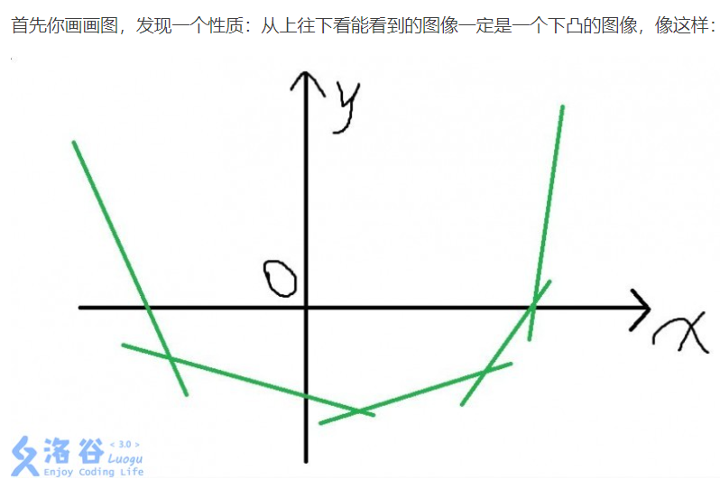

例如：


最后一定只留下两条(蓝色和灰色)，其他一定会被遮盖(那么换言之不被遮盖的直线一定能够被看到大于一个点，不存在多个单点能被看到)，于是化简成图 1 的模样。找一下规律不难发现对于同斜率的，截距最大的保留

那么按 $a$ 从小到大排序，然后按 $b$ 从大到小排序(或干脆去个重)，然后跑单调栈，把这样的情况给干掉(蓝色直线)：

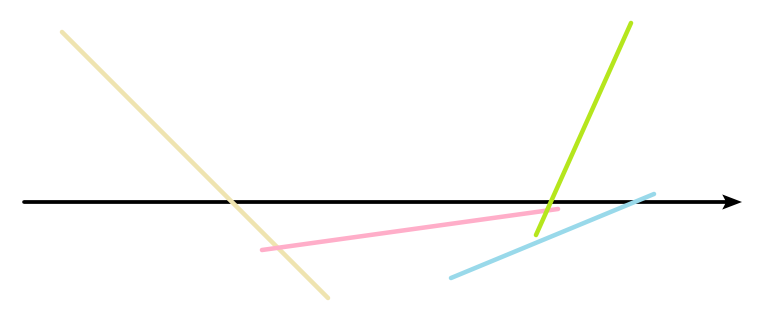

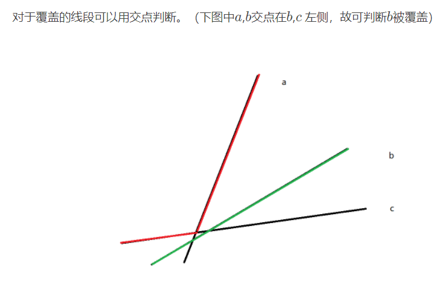

(上图 $c$ 是次栈顶， $b$ 是栈顶，若新交点在原交点的近原点端(在 $b$ 栈顶直线来算)，那么应当弹栈……还是没搞懂，咕咕咕了)

```c++
#include <bits/stdc++.h>
using namespace std;
#define sc(x) scanf("%lld", &x)
typedef long long ll;
#define mn 50010
ll n, top, ans[mn];
struct line
{
    ll a, b, i;
    line(ll x = 0, ll y = 0) : a(x), b(y), i(0) {}
    line operator-(line r) { return line(a - r.a, b - r.b); }
} p[mn], s[mn];
bool operator<(line x, line y)
{
    return x.a != y.a ? x.a < y.a : x.b > y.b;
}
ll kcmp(line x, line y)
{ // x.b/x.a - y.b/y.a
    return x.b * y.a - x.a * y.b;
}
signed main()
{
    sc(n);
    for (ll i = 1; i <= n; ++i)
    {
        sc(p[i].a), sc(p[i].b), p[i].i = i;
    }
    sort(p + 1, p + 1 + n);
    s[top = 1] = p[1], ans[top] = p[1].i;
    for (ll i = 2; i <= n; ++i)
    {
        if (p[i].a == p[i - 1].a)
        {
            continue;
        }
        while (top > 1 && kcmp(p[i] - s[top], s[top - 1] - s[top]) <= 0)
        {
            --top;
        }
        s[++top] = p[i];
        ans[top] = p[i].i;
    }
    sort(ans + 1, ans + 1 + top);
    for (ll i = 1; i <= top; ++i)
    {
        printf("%lld ", ans[i]);
    }
    return 0;
}
```


##### p1494 小z的袜子

> 给定 $n$ 长序列 $a$ ，取值范围是 $[1,n]$ ，给定 $m(n,m\le5\times10^4)$ 个询问，问在区间 $[l,r]$ 内随机挑两个数，它们值相同的概率是多少，输出最简分数

显然，设区间长为 $s$ ，区间内值 $x$ 出现次数是 $b_x$ ：
$$
P=\dfrac{\sum_{i=1}^nC_{b_i}^2}{C_s^2}=\dfrac{\sum_{i=1}^n(b_i(b_i-1))}{n(n-1)}=\dfrac{\sum_{i=1}^nb_i^2-n}{n(n-1)}
$$
那么只需要维护区间平方和即可，这一点在点分治里自己已掌握了，所以剩下就是莫队裸题了。

暂时不知道主席树、树状数组能不能做，能的话就可以在线了，复杂度还优。

```c++
#include <bits/stdc++.h>
using namespace std;
#define sc(x) scanf("%lld", &x)
typedef long long ll;
#define mn 50010
ll n, m, bin[mn], sum, ans1[mn], ans2[mn], sq, a[mn];
struct query
{
    ll l, r, i;
    bool operator<(const query &x) const
    {
        if (l / sq != x.l / sq)
            return l < x.l;
        return l / sq & 1 ? r < x.r : r > x.r;
    }
} q[mn];
void add(ll i)
{
    sum -= bin[a[i]] * bin[a[i]];
    ++bin[a[i]];
    sum += bin[a[i]] * bin[a[i]];
}
void del(ll i)
{
    sum -= bin[a[i]] * bin[a[i]];
    --bin[a[i]];
    sum += bin[a[i]] * bin[a[i]];
}
void save(ll l, ll r, ll i)
{
    if (l == r)
    {
        ans1[i] = 0, ans2[i] = 1;
        return;
    }
    ll num = r - l + 1;
    ll fm = num * (num - 1);
    ll fz = sum - num;
    ll c = __gcd(fm, fz);
    ans1[i] = fz / c, ans2[i] = fm / c;
}
signed main()
{
    sc(n), sc(m), sq = sqrt(n);
    for (ll i = 1; i <= n; ++i)
    {
        sc(a[i]);
    }
    for (ll i = 1; i <= m; ++i)
    {
        sc(q[i].l), sc(q[i].r), q[i].i = i;
    }
    sort(q + 1, q + 1 + m);
    for (ll l = 1, r = 0, i = 1; i <= m; ++i)
    {
        while (l > q[i].l)
            add(--l);
        while (r < q[i].r)
            add(++r);
        while (l < q[i].l)
            del(l++);
        while (r > q[i].r)
            del(r--);
        save(l, r, q[i].i);
    }
    for (ll i = 1; i <= m; ++i)
    {
        printf("%lld/%lld\n", ans1[i], ans2[i]);
    }
    return 0;
}
```


##### p3901 数列找不同

> 静态 $n$ 长数列 $a(1\le n,a_i\le10^5)$ ，有 $m(1\le m\le10^5)$ 次询问，问区间内是否每个数互不相同

可以莫队莽。也可以 $O(n)$ 做。

记 $left_i$ 是 $a_i$ 的上一个相等位置。做前缀 $\max$ 。对每个询问，查询 $maxleft_r$ 是不是 $< l$ ，如果是就证明是唯一的。

```c++
#include <bits/stdc++.h>
#define For(i, l, r) for(int i = (l), _end_ = (int)(r); i <= _end_; ++i)
#define Fordown(i, r, l) for(int i = (r), _end_ = (int)(l); i >= _end_; --i)
#define Set(a, v) memset(a, v, sizeof(a))
using namespace std;

bool chkmin(int &a, int b) {return b < a ? a = b, 1 : 0;}
bool chkmax(int &a, int b) {return b > a ? a = b, 1 : 0;}

inline int read() {
    int x = 0, fh = 1; char ch = getchar();
    for (; !isdigit(ch); ch = getchar() ) if (ch == '-') fh = -1;
    for (; isdigit(ch); ch = getchar() ) x = (x<<1) + (x<<3) + (ch ^ '0');
    return x * fh;
}

const int N = 1e5 + 1e2;
int n, q;
int a[N], Left[N];
int last[N], Max_Left[N];
void input() {
    n = read(); q = read();
    For (i, 1, n)
        a[i] = read();

    For (i, 1, n) {
        Left[i] = last[a[i]];
        last[a[i]] = i;
        chkmax(Max_Left[i], Left[i]);
        chkmax(Max_Left[i], Max_Left[i-1]);
    }
}

void solve() {
    while (q--) {
        int l = read(), r = read();
        puts(Max_Left[r] >= l ? "No" : "Yes");
    }
}

int main () {
    input();
    solve();
    return 0;
}
```

莫队：

```c++
#include <bits/stdc++.h>
using namespace std;
#define sc(x) scanf("%lld", &x)
typedef long long ll;
#define mn 100010
ll n, m, x, bin[mn], ans[mn], sq, a[mn], sum;
struct query
{
    ll l, r, i;
    bool operator<(const query &x) const
    {
        if (l / sq != x.l / sq)
            return l < x.l;
        if (l / sq & 1)
            return r < x.r;
        return r > x.r;
    }
} q[mn];
void add(ll i)
{
    sum += bin[a[i]]++ == 0;
}
void del(ll i)
{
    sum -= --bin[a[i]] == 0;
}
signed main()
{
    sc(n), sc(m), sq = sqrt(n);
    for (ll i = 1; i <= n; ++i)
    {
        sc(a[i]);
    }
    for (ll i = 1; i <= m; ++i)
    {
        sc(q[i].l), sc(q[i].r), q[i].i = i;
    }
    sort(q + 1, q + 1 + m);
    for (ll i = 1, l = 1, r = 0; i <= m; ++i)
    {
        while (l > q[i].l)
            add(--l);
        while (r < q[i].r)
            add(++r);
        while (l < q[i].l)
            del(l++);
        while (r > q[i].r)
            del(r--);
        ans[q[i].i] = sum == (q[i].r - q[i].l + 1);
    }
    for (ll i = 1; i <= m; ++i)
    {
        printf("%s\n", ans[i] ? "Yes" : "No");
    }
    return 0;
}
```


##### p5782 和平委员会

> 有 $n$ 个团队，第 $i$ 个团队有编号为 $2i,2i-1$ 的两人，至少一人要出席会议。有 $m$ 对厌恶关系，其中 $u,v$ 不能同时出席。求一个出席方案或输出 `NIE` 。 $1\le n\le8000,0\le m\le2\times 10^4$ 

对每对关系，构造 2-SAT 关系： $\lnot u\to v,\lnot v\to u$ 。这样就能满足题目条件。

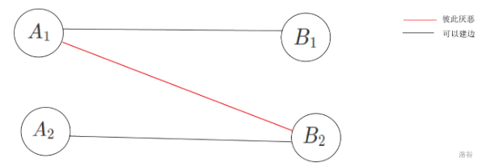

```c++
#include <bits/stdc++.h>
using namespace std;
#define sc(x) scanf("%lld", &x)
typedef long long ll;
#define mn 20010
ll n, m, hd[mn], cnt, st, low[mn], dfn[mn], ins[mn], scc, c[mn];
stack<ll> s;
struct edge
{
    ll to, nx;
} e[mn * 8];
void tarjan(ll u)
{
    low[u] = dfn[u] = ++st, ins[u] = true;
    s.push(u);
    for (ll i = hd[u], v; i; i = e[i].nx)
    {
        v = e[i].to;
        if (!dfn[v])
        {
            tarjan(v);
            low[u] = min(low[u], low[v]);
        }
        else if (ins[v])
        {
            low[u] = min(low[u], dfn[v]);
        }
    }
    if (low[u] == dfn[u])
    {
        ++scc;
        do
        {
            c[u] = scc;
            u = s.top();
            s.pop();
            ins[u] = false;
        } while (low[u] != dfn[u]);
    }
}
signed main()
{
    sc(n), sc(m);
    auto adde = [&](ll u, ll v)
    { e[++cnt] = {v, hd[u]}, hd[u] = cnt; }; // printf("<%lld %lld\n",u,v);
    auto anti = [](ll x)
    { return x & 1 ? x + 1 : x - 1; };
    for (ll i = 1, a, b; i <= m; ++i)
    {
        sc(a), sc(b);
        // adde(anti(a), b), adde(anti(b), a); WA
        adde(a, anti(b)), adde(b, anti(a));
    }
    // for yi(ll i = 1; i <= n; ++i)
    // {
    // adde(2 * i, 2 * i - 1), adde(2 * i - 1, 2 * i);
    // }
    for (ll i = 1; i <= 2 * n; ++i)
    {
        if (!dfn[i])
        {
            tarjan(i);
        }
    }
    for (ll i = 1; i <= 2 * n; i += 2)
    {
        if (c[i] == c[anti(i)])
        {
            printf("NIE");
            return 0;
        }
    }
    for (ll i = 1; i <= 2 * n; i += 2)
    { // tarjan逆拓扑序
        if (c[i] < c[i + 1])
        {
            printf("%d\n", i);
        }
        else
        {
            printf("%d\n", i + 1);
        }
    }
    return 0;
}
```


##### p4171 满汉全席

> 有 $k(1\le k\le50)$ 组询问，每次有 $n(\le100)$ 种材料和 $m(\le10^3)$ 个限制。每种材料可以选择 `m` , `h` 两状态之一。每个限制必须至少满足二者之一：状态+材料, 状态+材料。问有无解，输出 `GOOD` / `BAD` 。

与 2-SAT 模板完全等效。

```c++
#include <bits/stdc++.h>
using namespace std;
#define sc(x) scanf("%lld", &x)
typedef long long ll;
#define mn 20010
ll n, m, hd[mn], cnt, st, low[mn], dfn[mn], ins[mn], scc, c[mn];
stack<ll> s;
char t1[10], t2[10];
struct edge
{
    ll to, nx;
} e[mn * 8];
void tarjan(ll u)
{
    low[u] = dfn[u] = ++st, ins[u] = true;
    s.push(u);
    for (ll i = hd[u], v; i; i = e[i].nx)
    {
        v = e[i].to;
        if (!dfn[v])
        {
            tarjan(v);
            low[u] = min(low[u], low[v]);
        }
        else if (ins[v])
        {
            low[u] = min(low[u], dfn[v]);
        }
    }
    if (low[u] == dfn[u])
    {
        ++scc;
        do
        {
            c[u] = scc;
            u = s.top();
            s.pop();
            ins[u] = false;
        } while (low[u] != dfn[u]);
    }
}
void solve()
{
    sc(n), sc(m), cnt = 0, scc = 0, st = 0;
    for (ll i = 1; i <= 2 * n; ++i)
    {
        hd[i] = low[i] = dfn[i] = 0;
    }
    auto adde = [&](ll u, ll v)
    { e[++cnt] = {v, hd[u]}, hd[u] = cnt; };
    for (ll i = 1, a, b, va, vb; i <= m; ++i)
    {
        scanf("%s%s", t1, t2);
        sscanf(t1 + 1, "%lld", &a);
        sscanf(t2 + 1, "%lld", &b);
        va = t1[0] == 'm', vb = t2[0] == 'm';
        adde(a + n * va, b + n * (vb ^ 1));
        adde(b + n * vb, a + n * (va ^ 1));
    }
    for (ll i = 1; i <= 2 * n; ++i)
    {
        if (!dfn[i])
        {
            tarjan(i);
        }
    }
    for (ll i = 1; i <= n; ++i)
    {
        if (c[i] == c[i + n])
        {
            printf("BAD\n");
            return;
        }
    }
    printf("GOOD\n");
}
signed main()
{
    ll t;
    for (sc(t); t--;)
        solve();
    return 0;
}
```


#### 网络流24题

##### p2761-软件补丁问题

> 有 $n$ 个 bugs ， $m$ 个补丁，补丁能启用当且仅当满足特定的若干个 bugs 存在 (+)，若干个 bugs 不存在 (-) ，能修复若干个 bugs (-) ，带来若干个 bugs (+)，耗费时间 $t$ ，一开始有 $n$ 个全部 bugs ，求修复完全部 bugs 最小用时。若修不好，输出 `-1` $1\le n\le20,1\le m\le100$

参考题解 [FCBM71](https://www.luogu.com.cn/problem/solution/P2761)

这道题类似于完全图，有 $2^n$ 个点，确定好连边状态之后暴力跑最短路即可。点编号为状态数位压缩值，满足存在条件即当前状态按位与为目标状态，满足不存在条件即按位与为 $0$ ，带来即按位或，修复即按位或然后按位异或。然后随便跑一个最短路即可(如SPFA,dijkstra)，

由于边太多，会MLE，所以不存边，每次直接判断即可。代码如下：

 ```C++
 #include <bits/stdc++.h>
 #define re
 using namespace std;
 typedef long long ll;
 #define il inline
 typedef double db;
 il ll read()
 {
     re char p = 0;
     re ll r = 0, o = 0;
     for (; p < '0' || p > '9'; o |= p == '-', p = getchar())
         ;
     for (; p >= '0' && p <= '9'; r = (r << 1) + (r << 3) + (p ^ 48), p = getchar())
         ;
     return o ? (~r) + 1 : r;
 }
 #define sc(x) x = read()
 #define me 105
 #define mn (1 << 20) + 10
 struct pack
 {
     ll b1, b2, f1, f2, t;
 } a[me];
 struct node
 {
     ll v, i;
     bool operator<(const node &x) const { return v > x.v; }
 };
 ll d[mn], vis[mn], no, n, m;
 priority_queue<node> q;
 char b[me], f[me];
 void dijkstra()
 {
     d[no] = 0, q.push({0, no});
     while (!q.empty())
     {
         ll u = q.top().i;
         q.pop();
         if (vis[u])
         {
             continue;
         }
         vis[u] = true;
         for (ll i = 1; i <= m; ++i)
         {
             if ((u & a[i].b1) == a[i].b1 && (u & a[i].b2) == 0)
             {
                 ll v = ((u | a[i].f1) ^ a[i].f1) | a[i].f2;
                 if (d[v] > d[u] + a[i].t)
                 {
                     d[v] = d[u] + a[i].t;
                     q.push({d[v], v});
                 }
             }
         }
     }
 }
 signed main()
 {
     sc(n), sc(m), no = (1 << n) - 1;
     memset(d, 0x3f, sizeof d);
     for (ll i = 1; i <= m; ++i)
     {
         scanf("%lld%s%s", &a[i].t, b, f);
         for (ll j = 0; j < n; ++j)
         {
             if (b[j] == '+')
             {
                 a[i].b1 |= (1 << j);
             }
             else if (b[j] == '-')
             {
                 a[i].b2 |= (1 << j);
             }
             if (f[j] == '-')
             {
                 a[i].f1 |= (1 << j);
             }
             else if (f[j] == '+')
             {
                 a[i].f2 |= (1 << j);
             }
         }
     }
     dijkstra();
     if (d[0] == d[mn - 1])
     {
         printf("0");
     }
     else
     {
         printf("%lld", d[0]);
     }
     return 0;
 }
 ```


##### p2756-飞行员配对方案问题

> 求二分图最大匹配的边数和匹配情况，左右点数为n,m，边数为e。

解法一：二分图匈牙利算法

复杂度 $\Omicron(ne+m)$

```c++
#include <bits/stdc++.h>
#define re
using namespace std;
typedef long long ll;
#define il inline
typedef double db;
il ll read()
{
    re char p = 0;
    re ll r = 0, o = 0;
    for (; p < '0' || p > '9'; o |= p == '-', p = getchar())
        ;
    for (; p >= '0' && p <= '9'; r = (r << 1) + (r << 3) + (p ^ 48), p = getchar())
        ;
    return o ? (~r) + 1 : r;
}
#define sc(x) x = read()
#define mn 105
vector<ll> e[mn];
ll m, n, ui, vi, t, mch[mn], vis[mn], r;
bool dfs(ll u, ll st)
{
    if (vis[u] == st)
    {
        return false;
    }
    vis[u] = st;
    for (auto &v : e[u])
    {
        if (!mch[v] || dfs(mch[v], st))
        {
            mch[v] = u;
            return true;
        }
    }
    return false;
}
signed main()
{
    sc(m), sc(n);
    while (true)
    {
        sc(ui), sc(vi);
        if (ui == -1 && vi == -1)
        {
            break;
        }
        e[ui].emplace_back(vi);
    }
    for (ll i = 1; i <= m; ++i)
    {
        if (dfs(i, i))
        {
            ++r;
        }
    }
    printf("%lld\n", r);
    for (ll i = m + 1; i <= n; ++i)
    {
        if (mch[i])
        {
            printf("%lld %lld\n", mch[i], i);
        }
    }
    return 0;
}
```

解法二：dinic算法

复杂度 $\Omicron(e\sqrt n)$

源点、汇点、题目边都建权为 $1$ 的边，跑最大流即可。输出最大流和残量网络里剩余流量为 $0$ 的边(不含源点汇点)。

代码如下：

```c++
#include <bits/stdc++.h>
#define re
using namespace std;
typedef long long ll;
#define il inline
typedef double db;
il ll read()
{
    re char p = 0;
    re ll r = 0, o = 0;
    for (; p < '0' || p > '9'; o |= p == '-', p = getchar())
        ;
    for (; p >= '0' && p <= '9'; r = (r << 1) + (r << 3) + (p ^ 48), p = getchar())
        ;
    return o ? (~r) + 1 : r;
}
#define sc(x) x = read()
#define big 0x7fffffff
#define me 10010
#define mn 110
struct edge
{
    ll to, w, nx;
} e[me];
ll n, m, s, t, hd[mn], cnt = 1, h[mn], ans1[mn], ans2[mn], u, v, res, c0;
void adde(ll &u, ll &v, ll w = 1)
{
    e[++cnt] = {v, w, hd[u]};
    hd[u] = cnt;
    e[++cnt] = {u, 0LL, hd[v]};
    hd[v] = cnt;
}
bool bfs()
{
    queue<ll> q;
    q.push(s);
    memset(h, -1, sizeof h);
    h[s] = 0;
    while (!q.empty())
    {
        ll u = q.front();
        q.pop();
        for (ll i = hd[u], v; i; i = e[i].nx)
        {
            v = e[i].to;
            if (h[v] == -1 && e[i].w)
            {
                h[v] = h[u] + 1;
                q.push(v);
            }
        }
    }
    return h[t] != -1;
}
ll dfs(ll u, ll f)
{
    if (u == t)
    {
        return f;
    }
    ll w, used = 0;
    for (ll i = hd[u], v; i; i = e[i].nx)
    {
        v = e[i].to;
        if (h[v] == h[u] + 1 && e[i].w)
        {
            w = dfs(v, min(f - used, e[i].w));
            e[i].w -= w, e[i ^ 1].w += w;
            used += w;
            if (used == f)
            {
                return f;
            }
        }
    }
    if (!used)
    {
        h[u] = -1;
    }
    return used;
}
signed main()
{
    sc(m), sc(n), s = 0, t = n + 1;
    while (true)
    {
        sc(u), sc(v);
        if (u == -1 && v == -1)
        {
            break;
        }
        adde(u, v);
    }
    c0 = cnt;
    for (ll i = 1; i <= m; ++i)
    {
        adde(s, i);
    }
    for (ll i = m + 1; i <= n; ++i)
    {
        adde(i, t);
    }
    while (bfs())
    {
        res += dfs(s, big);
    }
    printf("%lld\n", res);
    for (ll i = 2; i <= c0; i += 2)
    {
        if (e[i ^ 1].w != 0)
        {
            printf("%lld %lld\n", e[i ^ 1].to, e[i].to);
        }
    }
    return 0;
}
```


##### p4016-负载平衡问题

> $n$ 个仓库成环，每个仓库现存货量为 $a$ ，求最少搬运量，使 $n$ 仓库存货量相同 $1\le n\le100$

解法一： $DP$ + 中位数性质


解法二：最小费用最大流    EK 算法 / dinic 算法

以 $a-\overline{a}$ 为点权建边(注意平均数下取整)，对点权大于 $0$ 的点跟源点连流量为无限，费用为 $1$ 的边，小于 $0$ 的跟汇点连流量为无限，费用为 $1$ 的边。环内连流量为点权，费用为 $0$ 的边。跑最小费用最大流，得到答案。

代码如下：

```c++

```


##### p4011-孤岛营救问题

> 有 $n\times m$ 网格，从 $(1,1)$ 开始，要到达 $(n,m)$ ，在 $p$ 个两格边沿有墙或门，墙为 $0$ ，门为 $g$ 。在 $s$ 个格有钥匙 $g$ 。当且仅当有钥匙才能开门，且不会消耗钥匙。求到达终点需要最小步数，若无解输出 `-1` 。 $1\le n,m,p\le10,k < 150,s\le 14$

是一个非常普通的分层图 BFS。设当前状态为所有已拥有钥匙的数位压缩。如果到某个位置的该状态没走过就走。门能否打开的判定是当前状态按位或门的状态是否是门的状态本身，是的话可以通过，不然不能通过。

时间复杂度为 $\Omicron(nm2^p)$ ，可以过题。代码如下：

```c++
#include <bits/stdc++.h>
#define re
using namespace std;
typedef long long ll;
#define il inline
typedef double db;
il ll read()
{
    re char p = 0;
    re ll r = 0, o = 0;
    for (; p < '0' || p > '9'; o |= p == '-', p = getchar())
        ;
    for (; p >= '0' && p <= '9'; r = (r << 1) + (r << 3) + (p ^ 48), p = getchar())
        ;
    return o ? (~r) + 1 : r;
}
#define sc(x) x = read()
#define mn 12
#define ms 16
ll n, m, p, k, ax, ay, bx, by, g, s;
ll key[mn][mn][ms], keyn[mn][mn];
ll door[mn][mn][mn][mn]; //door[ax][ay][bx][by]
ll dx[] = {-1, 0, 1, 0}, dy[] = {0, -1, 0, 1};
struct node
{
    ll x, y, k;
    bool operator<(const node &p) const
    {
        return x * 10000LL + y * 100 + k < p.x * 10000LL + p.y * 100 + p.k;
    }
};
struct node2
{
    ll x, y, k, s;
};
set<node> vis;
ll getk(ll x, ll y)
{
    ll r = 0;
    for (ll i = 1, ie = keyn[x][y]; i <= ie; ++i)
    {
        r |= key[x][y][i];
    }
    return r;
}
ll bfs()
{
    queue<node2> q;
    q.push({1, 1, 0, 0});
    while (!q.empty())
    {
        node2 t = q.front();
        q.pop();
        if (vis.find({t.x, t.y, t.k}) != vis.end())
        {
            continue;
        }

        vis.insert({t.x, t.y, t.k});
        if (t.x == n && t.y == m)
        {
            return t.s;
        }
        for (ll i = 0; i < 4; ++i)
        {
            ll ax = t.x + dx[i], ay = t.y + dy[i];
            ll adr = door[t.x][t.y][ax][ay];
            if (ax <= 0 || ay <= 0 || ax > n || ay > m || adr == -1)
            {
                continue;
            }
            ll ak = getk(ax, ay) | t.k;
            if (vis.find({ax, ay, ak}) != vis.end())
            {
                continue;
            }
            if (adr > 0 && (ak & adr) != adr)
            {
                continue;
            }
            q.push({ax, ay, ak, t.s + 1});
        }
    }
    return -1;
}
signed main()
{
    sc(n), sc(m), sc(p), sc(k);
    for (ll i = 1; i <= k; ++i)
    {
        sc(ax), sc(ay), sc(bx), sc(by), sc(g);
        if (g)
        {
            door[ax][ay][bx][by] = 1 << g;
            door[bx][by][ax][ay] = 1 << g;
        }
        else
        {
            door[ax][ay][bx][by] = -1;
            door[bx][by][ax][ay] = -1;
        }
    }
    sc(s);
    for (ll i = 1; i <= s; ++i)
    {
        sc(ax), sc(ay), sc(g);
        key[ax][ay][++keyn[ax][ay]] = 1 << g;
    }
    printf("%lld", bfs());
    return 0;
}
```


#### THUPC 2021 初赛/正赛

##### p7140 区间矩阵乘法

前缀和题目，估计难度不超过绿题，可能是黄题 具体看题解 [Cirno\_9](https://www.luogu.com.cn/problem/solution/P7140)

```c++
#include <bits/stdc++.h>
#define re
using namespace std;
typedef unsigned int ll;
#define il inline
typedef double db;
il ll read()
{
    re char p = 0;
    re ll r = 0, o = 0;
    for (; p < '0' || p > '9'; o |= p == '-', p = getchar())
        ;
    for (; p >= '0' && p <= '9'; r = (r << 1) + (r << 3) + (p ^ 48), p = getchar())
        ;
    return o ? (~r) + 1 : r;
}
#define sc(x) x = read()
#define mn 200010
ll n, m, p1, p2, d, a[mn], sk[450][mn], s[mn], ans; //450=2e5**.5
signed main()
{
    sc(n);
    for (ll i = 1; i <= n; ++i)
    {
        sc(a[i]);
        s[i] = s[i - 1] + a[i];
    }
    for (ll i = 1, ie = sqrt(n); i <= ie; ++i) //d枚举
    {
        for (ll j = 1; j <= i; ++j)
        {
            sk[i][j] = a[j];
        }
        for (ll j = i + 1; j <= n; ++j)
        {
            sk[i][j] = sk[i][j - i] + a[j];
        }
    }
    sc(m);
    while (m--)
    {
        sc(d), sc(p1), sc(p2), ans = 0;
        for (ll j = 0; j < d; ++j)
        {
            ans += (sk[d][p1 + (d - 1) * d + j] - sk[d][p1 + j] + a[p1 + j]) * (s[p2 + d * (j + 1) - 1] - s[p2 + d * j - 1]);
        }
        printf("%u\n", ans);
    }
    return 0;
}
```


#### 部分模板

##### P1020 导弹拦截

> 输入至多 $10^5$ 个数，求最长不下降序列的长度和可以划分为多少个最长不下降序列(不是不下降子串)

```c++
#include <bits/stdc++.h>
using namespace std;
typedef long long ll;
#define sc(x) scanf("%lld", &x)
#define mn 100010
ll n, a[mn], dpnd[mn], dpu[mn], ans, x, nnd, nu;
signed main()
{
    while (EOF != scanf("%lld", &x))
    {
        if (x <= 0)
        {
            break;
        } // for test
        a[++n] = x;
    }
    dpnd[++nnd] = dpu[++nu] = a[1];
    for (ll i = 2; i <= n; ++i)
    {
        if (a[i] <= dpnd[nnd])
        {
            dpnd[++nnd] = a[i];
        }
        else
        {
            *upper_bound(dpnd + 1, dpnd + 1 + nnd, a[i], greater<ll>()) = a[i];
        }
        if (a[i] > dpu[nu])
        {
            dpu[++nu] = a[i];
        }
        else
        {
            *lower_bound(dpu + 1, dpu + 1 + nu, a[i]) = a[i];
        }
    }
    printf("%lld\n%lld", nnd, nu);
    return 0;
}
```


##### P2543 奇怪的字符串

> 给定 $n$ 给定两个长为 $n$ 的排列，求其最长公共子序列 $n\le10^5 $

```c++
#include <bits/stdc++.h>
using namespace std;
typedef long long ll;
#define sc(x) scanf("%lld", &x)
#define mn 10010
ll dp[2][mn], nx, ny; // dp[i][j]:LCS(x[1..i],LCS(y[1..y]))
char x[mn], y[mn];
signed main()
{
    scanf("%s%s", x + 1, y + 1);
    nx = strlen(x + 1), ny = strlen(y + 1);
    for (ll i = 1, now = 1, pre = 0; i <= nx; ++i, now ^= 1, pre ^= 1)
    {
        for (ll j = 1; j <= ny; ++j)
        {
            if (x[i] == y[j])
            {
                dp[now][j] = dp[pre][j - 1] + 1;
            }
            else
            {
                dp[now][j] = max(dp[pre][j], dp[now][j - 1]);
            }
        }
    }
    printf("%lld", dp[nx & 1][ny]);
    return 0;
}
```


##### P1439 最长公共子序列

> 给定两个 $n(\le10^5)$ 排列，求最长公共子序列

```c++
#include <bits/stdc++.h>
using namespace std;
typedef long long ll;
#define sc(x) scanf("%lld", &x)
#define mn 100010
ll a[mn], b[mn], n, dp[mn], m, h[mn];
signed main()
{
    sc(n);
    for (ll i = 1; i <= n; ++i)
    {
        sc(a[i]);
        h[a[i]] = i;
    }
    for (ll i = 1; i <= n; ++i)
    {
        sc(b[i]);
        b[i] = h[b[i]];
    }
    dp[++m] = b[1];
    for (ll i = 2; i <= n; ++i)
    {
        if (b[i] > dp[m])
        {
            dp[++m] = b[i];
        }
        else
        {
            *lower_bound(dp + 1, dp + 1 + m, b[i]) = b[i];
        }
    }
    printf("%lld", m);
    return 0;
}
/*
5
3 2 4 5 1
1 4 2 3 5
=>
5 3 2 1 4 (ans2)
*/
```


##### P3808 AC自动机(简单版)

> 求有多少个模式串在主串出现过，输入模式串数 $n$ ，可能重复的模式串，主串。模式串数目、模式串长度、模式串长度和和主串长度不超过 $10^6$ ，只含小写字母

```c++
#include <bits/stdc++.h>
using namespace std;
typedef long long ll;
#define sc(x) scanf("%lld", &x)
#define mn 1000010
int tr[mn][26], cnt, e[mn], fail[mn];
ll n, ans;
char s[mn];
queue<int> q;
signed main()
{
    sc(n);
    for (ll i = 1; i <= n; ++i)
    {
        scanf("%s", s + 1);
        int u = 0;
        for (int i = 1; s[i]; ++i)
        {
            int a = s[i] - 'a';
            if (!tr[u][a])
            {
                tr[u][a] = ++cnt;
            }
            u = tr[u][a];
        }
        ++e[u];
    }
    for (ll i = 0; i < 26; ++i)
    {
        if (tr[0][i])
        {
            q.push(tr[0][i]);
        }
    }
    while (!q.empty())
    {
        int u = q.front();
        q.pop();
        for (int i = 0; i < 26; ++i)
        {
            if (tr[u][i])
            {
                fail[tr[u][i]] = tr[fail[u]][i];
                q.push(tr[u][i]);
            }
            else
            {
                tr[u][i] = tr[fail[u]][i];
            }
        }
    }
    scanf("%s", s + 1);
    int u = 0;
    for (int i = 1; s[i]; ++i)
    {
        int a = s[i] - 'a';
        u = tr[u][a];
        for (int j = u; j && e[j] != -1; j = fail[j])
        {
            ans += e[j], e[j] = -1;
        }
    }
    printf("%lld", ans);
    return 0;
}
```


##### p3796 AC自动机(加强版)

> 若干询问。输出出现次数最多的所有模式串。输入同上题。模式串不超过 $150$ 个，长度不超过 $70$ 。测试样例不超过 $50$ 组

```c++
#include <bits/stdc++.h>
using namespace std;
typedef int ll;
#define sc(x) scanf("%d", &x)
#define mn 152
#define ms 72
#define alp 26
#define mt ((mn) * (ms))
#define cls(x) memset(x, 0, sizeof x)
ll cnt, tr[mt][alp], fail[mt], idx[mt], v[mt], sum[mt], n, mx;
char s[mn][ms], t[1000010];
void insert(char *s, ll id)
{
    int u = 0;
    for (ll i = 1, a; s[i]; ++i)
    {
        a = s[i] - 'a';
        if (!tr[u][a])
        {
            tr[u][a] = ++cnt;
        }
        u = tr[u][a];
    }
    idx[u] = id;
}
void build()
{
    queue<ll> q;
    for (ll i = 0; i < alp; ++i)
    {
        if (tr[0][i])
        {
            q.push(tr[0][i]);
        }
    }
    while (!q.empty())
    {
        ll u = q.front();
        q.pop();
        for (ll i = 0; i < alp; ++i)
        {
            if (tr[u][i])
            {
                fail[tr[u][i]] = tr[fail[u]][i];
                q.push(tr[u][i]);
            }
            else
            {
                tr[u][i] = tr[fail[u]][i];
            }
        }
    }
}
void query()
{
    ll u = 0;
    for (ll i = 1, a; t[i]; ++i)
    {
        a = t[i] - 'a';
        u = tr[u][a];
        for (ll j = u; j; j = fail[j])
        {
            ++v[j];
        }
    }
    for (ll i = 0; i <= cnt; ++i)
    {
        if (idx[i])
        {
            mx = max(mx, v[i]);
            sum[idx[i]] = v[i];
        }
    }
}
signed main()
{
    while (~sc(n))
    {
        if (n == 0)
        {
            break;
        }
        for (ll i = 1; i <= n; ++i)
        {
            scanf("%s", s[i] + 1);
            insert(s[i], i);
        }
        build();
        scanf("%s", t + 1);
        query();
        printf("%lld\n", mx);
        for (ll i = 1; i <= n; ++i)
        {
            if (mx == sum[i])
            {
                printf("%s\n", s[i] + 1);
            }
        }
        cls(fail), cls(tr), cls(v), cls(idx), cls(sum), cnt = mx = 0;
    }
    return 0;
}
```


##### p5357 AC自动机(二次加强版)

> 给定文本串 $S$ 和 $n$ 个模式串 $T_{1\sim n}$ ，求出每个模式串的出现次数 ( $1\le n\le 2\times10^5, \sum |T|\le2\times10^5,|S|\le2\times10^6$ )

比较显然的是要去重，即如果有多个重复模式串，那么把它们都映射到同一个字典树上节点。(建字典树时去重操作)

建自动机时，把每个真实连接的 fail 指针(而不是失配 fail) 指向的节点增加一个入度。

然后输入文本串，以它跑一次自动机，跑到的每个点都积累一个值。如果这个点刚好是模式串终点，那么显然就答案数加一了。

注意诸如 `a` , `aa` , `aaa` ……这样的模式串，假设文本串 `aaaa` ，那么实际上只累积了两个 `a` 和一个 `aa` , `aaa` 。这时候，要对每个点，沿着 `fail` 不断跳，让 `fail` 节点也积累，这样才能获得答案。为了优化这个积累过程，需要使用拓扑排序。最终使得复杂度仍然是 $O(|S|+26|T|)$ 。(否则复杂度是 $O(|S|\times |T|)$) 

```c++
#include <bits/stdc++.h>
using namespace std;
typedef long long ll;
#define sc(x) scanf("%lld", &x)
#define mn 200010
#define alp 26
ll n, cnt, ss;
ll tr[mn][alp], idx[mn], nti[mn], fail[mn], in[mn], ans[mn], vis[mn];
char t[mn], s[mn * 10];
signed main()
{
    sc(n);
    for (ll i = 1, ts; i <= n; ++i)
    {
        scanf("%s", t + 1);
        ts = strlen(t + 1);
        ll p = 0;
        for (ll j = 1, ti; j <= ts; ++j)
        {
            ti = t[j] - 'a';
            if (tr[p][ti] == 0)
            {
                tr[p][ti] = ++cnt;
            }
            p = tr[p][ti];
        }
        if (idx[p] == 0)
        {
            idx[p] = i;
        }
        nti[i] = idx[p];
    }
    queue<ll> q;
    for (ll i = 0; i < alp; ++i)
    {
        if (tr[0][i])
        {
            q.push(tr[0][i]);
        }
    }
    while (!q.empty())
    {
        ll u = q.front();
        q.pop();
        for (ll i = 0; i < alp; ++i)
        {
            if (tr[u][i])
            {
                fail[tr[u][i]] = tr[fail[u]][i];
                ++in[fail[tr[u][i]]];
                q.push(tr[u][i]);
            }
            else
            {
                tr[u][i] = tr[fail[u]][i];
            }
        }
    }
    scanf("%s", s + 1);
    ss = strlen(s + 1);
    for (ll i = 1, p = 0; i <= ss; ++i)
    {
        p = tr[p][s[i] - 'a'];
        ++ans[p];
    }
    for (ll i = 0; i <= cnt; ++i)
    {
        if (in[i] == 0)
        {
            q.push(i);
        }
    }
    while (!q.empty())
    {
        ll u = q.front();
        q.pop();
        vis[idx[u]] = ans[u];
        ll v = fail[u];
        ans[v] += ans[u];
        if (--in[v] == 0)
        {
            q.push(v);
        }
    }
    for (ll i = 1; i <= n; ++i)
    {
        printf("%lld\n", vis[nti[i]]);
    }
    return 0;
}
```


##### p1183 多边形的面积

> 逆时针顺序给定 $n(\le 100)$ 整点，绝对值不超过 $200$ ，保证答案是整数，求多边形面积

```c++
#include <bits/stdc++.h>
using namespace std;
typedef long long ll;
#define sc(x) scanf("%lld", &x)
#define mn 105
ll n, x[mn], y[mn], s;
signed main()
{
    sc(n);
    for (ll i = 1; i <= n; ++i)
    {
        sc(x[i]), sc(y[i]);
    }
    x[n + 1] = x[1], y[n + 1] = y[1];
    for (ll i = 1; i <= n; ++i)
    {
        s += x[i] * y[i + 1] - x[i + 1] * y[i];
    }
    printf("%lld", s / 2);
    return 0;
}
```


##### p7883 平面最近点对

> 给定 $n$ 对点 (绝对值不超过 $10^7$) ，求最近点对的距离平方。$2\le n\le4\times10^5$

```c++
#include <bits/stdc++.h>
using namespace std;
typedef long long ll;
#define sc(x) scanf("%lld", &x)
#define mn 400010
ll n, ans = 1e18;
struct node
{
    ll x, y;
    bool operator<(const node &r) const { return x < r.x; }
} p[mn];
void solve(ll lc, ll rc)
{
    if (lc == rc)
    {
        return;
    }
    ll cc = (lc + rc) >> 1;
    ll cx = p[cc].x; //修改前的
    solve(lc, cc), solve(cc + 1, rc);
    inplace_merge(p + lc, p + cc + 1, p + rc + 1, [](const node &x, const node &y)
                  { return x.y < y.y; });
    vector<node> v;
    for (ll i = lc; i <= rc; ++i)
    {
        if ((cx - p[i].x) * (cx - p[i].x) <= ans)
        {
            v.emplace_back(p[i]);
        }
    }
    for (auto lf = v.begin(), rf = lf; lf != v.end(); lf++)
    {
        double sans = sqrt(ans);
        while (rf != v.end() && rf->y <= lf->y + sans)
        {
            ++rf;
        }
        for (auto i = lf + 1; i != rf; ++i)
        {
            ans = min(ans, (lf->x - i->x) * (lf->x - i->x) + (lf->y - i->y) * (lf->y - i->y));
        }
    }
}
signed main()
{
    sc(n);
    for (ll i = 1; i <= n; ++i)
    {
        sc(p[i].x), sc(p[i].y);
    }
    sort(p + 1, p + 1 + n);
    solve(1, n);
    printf("%lld", ans);
    return 0;
}
```

KD-Tree骗分法：

枚举每个结点，对于每个结点找到不等于该结点且距离最小的点，即可求出答案。每次暴力遍历 2-D Tree 上的每个结点的时间复杂度是 $O(n)$ 的，需要剪枝。我们可以维护一个子树中的所有结点在每一维上的坐标的最小值和最大值。假设当前已经找到的最近点对的距离是 $ans$ ，如果查询点到子树内所有点都包含在内的长方形的 **最近** 距离大于等于 $ans$ ，则在这个子树内一定没有答案，搜索时不进入这个子树。

此外，还可以使用一种启发式搜索的方法，即若一个结点的两个子树都有可能包含答案，先在与查询点距离最近的一个子树中搜索答案。可以认为，**查询点到子树对应的长方形的最近距离就是此题的估价函数**。

```c++
#include <algorithm>
#include <cmath>
#include <cstdio>
#include <cstdlib>
#include <cstring>
using namespace std;
const int maxn = 200010;
int n, d[maxn], lc[maxn], rc[maxn];
double ans = 2e18;

struct node {
  double x, y;
} s[maxn];

double L[maxn], R[maxn], D[maxn], U[maxn];

double dist(int a, int b) {
  return (s[a].x - s[b].x) * (s[a].x - s[b].x) +
         (s[a].y - s[b].y) * (s[a].y - s[b].y);
}

bool cmp1(node a, node b) { return a.x < b.x; }

bool cmp2(node a, node b) { return a.y < b.y; }

void maintain(int x) {
  L[x] = R[x] = s[x].x;
  D[x] = U[x] = s[x].y;
  if (lc[x])
    L[x] = min(L[x], L[lc[x]]), R[x] = max(R[x], R[lc[x]]),
    D[x] = min(D[x], D[lc[x]]), U[x] = max(U[x], U[lc[x]]);
  if (rc[x])
    L[x] = min(L[x], L[rc[x]]), R[x] = max(R[x], R[rc[x]]),
    D[x] = min(D[x], D[rc[x]]), U[x] = max(U[x], U[rc[x]]);
}

int build(int l, int r) {
  if (l >= r) return 0;
  int mid = (l + r) >> 1;
  double avx = 0, avy = 0, vax = 0, vay = 0;  // average variance
  for (int i = l; i <= r; i++) avx += s[i].x, avy += s[i].y;
  avx /= (double)(r - l + 1);
  avy /= (double)(r - l + 1);
  for (int i = l; i <= r; i++)
    vax += (s[i].x - avx) * (s[i].x - avx),
        vay += (s[i].y - avy) * (s[i].y - avy);
  if (vax >= vay)
    d[mid] = 1, nth_element(s + l, s + mid, s + r + 1, cmp1);
  else
    d[mid] = 2, nth_element(s + l, s + mid, s + r + 1, cmp2);
  lc[mid] = build(l, mid - 1), rc[mid] = build(mid + 1, r);
  maintain(mid);
  return mid;
}

double f(int a, int b) {
  double ret = 0;
  if (L[b] > s[a].x) ret += (L[b] - s[a].x) * (L[b] - s[a].x);
  if (R[b] < s[a].x) ret += (s[a].x - R[b]) * (s[a].x - R[b]);
  if (D[b] > s[a].y) ret += (D[b] - s[a].y) * (D[b] - s[a].y);
  if (U[b] < s[a].y) ret += (s[a].y - U[b]) * (s[a].y - U[b]);
  return ret;
}

void query(int l, int r, int x) {
  if (l > r) return;
  int mid = (l + r) >> 1;
  if (mid != x) ans = min(ans, dist(x, mid));
  if (l == r) return;
  double distl = f(x, lc[mid]), distr = f(x, rc[mid]);
  if (distl < ans && distr < ans) {
    if (distl < distr) {
      query(l, mid - 1, x);
      if (distr < ans) query(mid + 1, r, x);//query后ans可能会更小
    } else {
      query(mid + 1, r, x);
      if (distl < ans) query(l, mid - 1, x);
    }
  } else {
    if (distl < ans) query(l, mid - 1, x);
    if (distr < ans) query(mid + 1, r, x);
  }
}

int main() {
  scanf("%d", &n);
  for (int i = 1; i <= n; i++) scanf("%lf%lf", &s[i].x, &s[i].y);
  build(1, n);
  for (int i = 1; i <= n; i++) query(1, n, i);
  printf("%.4lf\n", sqrt(ans));
  return 0;
}
```

第k远就把 ans 换成一个堆即可。


##### p4525 自适应辛普森法1

> 求 $\int_L^R\dfrac{cx+d}{ax+b}dx$ 保留小数点后六位，保证分母不为零，积分收敛

```c++
#include <bits/stdc++.h>
using namespace std;
typedef double db;
#define sc(x) scanf("%lf", &x)
db a, b, c, d, l, r, eps = 1e-8; // eps可以比题目要求的细一两位
db f(db x)                       //这里根据题目不同输写不同的f
{
    return (c * x + d) / (a * x + b);
}
db simpson(db lf, db rf)
{
    return (rf - lf) * (f(lf) + f(rf) + 4 * f((lf + rf) / 2)) / 6;
}
db solve(db lf, db rf, db now) //当前区间估计值为now
{
    db cf = (lf + rf) / 2;
    db lfans = simpson(lf, cf), rfans = simpson(cf, rf);
    if (abs(lfans + rfans - now) <= eps) //二分后也是now
    {                                    //那就不需要细分了
        return lfans + rfans;
    }
    return solve(lf, cf, lfans) + solve(cf, rf, rfans);
}
signed main()
{
    sc(a), sc(b), sc(c), sc(d), sc(l), sc(r);
    printf("%lf", solve(l, r, 0)); //估计值随便填一个值
    return 0;
}
```


##### p4526 自适应辛普森法2

> 求 $\int_0^\infty x^{\frac ax-x}dx$ ，保留小数点后五位，若发散输出 `orz`

```c++
#include <bits/stdc++.h>
using namespace std;
typedef double db;
#define sc(x) scanf("%lf", &x)
db a, b, c, d, l, r, eps = 1e-8; // eps可以比题目要求的细一两位
db f(db x)                       //这里根据题目不同输写不同的f
{
    return pow(x, a / x - x);
}
db simpson(db lf, db rf)
{
    return (rf - lf) * (f(lf) + f(rf) + 4 * f((lf + rf) / 2)) / 6;
}
db solve(db lf, db rf, db now) //当前区间估计值为now
{
    db cf = (lf + rf) / 2;
    db lfans = simpson(lf, cf), rfans = simpson(cf, rf);
    if (abs(lfans + rfans - now) <= eps) //二分后也是now
    {                                    //那就不需要细分了
        return lfans + rfans;
    }
    return solve(lf, cf, lfans) + solve(cf, rf, rfans);
}
signed main()
{
    sc(a);
    if (a < 0)
    {
        printf("orz");
        return 0;
    }
    printf("%.5lf", solve(eps, 30, 0)); //估计值随便填一个值
    return 0;
}
```


##### p1452 Beauty Contest G /【模板】旋转卡壳

> 给定 $n(2\le n\le5\times10^4)$ 个坐标范围在 $10^4$ 的整点，求凸包直径

```c++
#include <bits/stdc++.h>
using namespace std;
typedef long long ll;
#define sc(x) scanf("%lld", &x)
#define mn 50010
#define cp const point &
struct point
{
    ll x, y;
    point(ll a = 0, ll b = 0) : x(a), y(b) {}
    point operator-(cp r) const { return point(x - r.x, y - r.y); }
    ll norm() const { return x * x + y * y; }
} p[mn], s[mn];
ll cross(cp a, cp b) { return a.x * b.y - a.y * b.x; }
bool operator<(cp a, cp b)
{
    ll v = cross(a - p[1], b - p[1]);
    return v > 0 || (v == 0 && (a - p[1]).norm() < (b - p[1]).norm());
}
ll area(cp a, cp b, cp c) { return cross(b - a, c - a); }
ll n, ss, ans;
signed main()
{
    sc(n);
    for (ll i = 1; i <= n; ++i)
    {
        sc(p[i].x), sc(p[i].y);
        if (p[i].x < p[1].x || (p[i].x == p[1].x && p[i].y < p[1].y))
        {
            swap(p[i], p[1]);
        }
    }
    sort(p + 2, p + 1 + n);
    for (ll i = 1; i <= n; ++i)
    {
        while (ss > 1 && cross(s[ss] - s[ss - 1], p[i] - s[ss]) <= 0)
        {
            --ss;
        }
        s[++ss] = p[i];
    }
    s[ss + 1] = s[1];
    if (ss == 2) // not n==2
    {
        printf("%lld", (s[2] - s[1]).norm());
        return 0;
    }
    for (ll i = 1, j = 3; i <= ss; ++i)
    {
        while (area(s[i], s[i + 1], s[j]) <= area(s[i], s[i + 1], s[j % ss + 1]))
        {
            j = j % ss + 1;
        }
        ans = max(ans, max((s[j] - s[i]).norm(), (s[j] - s[i + 1]).norm()));
    }
    printf("%lld", ans);
    return 0;
}
```


##### p3919 【模板】可持久化线段树 1（可持久化数组）

> 给定长为 $n(1\le n\le10^6)$ 值域在 $[-10^9,10^9]$ 初始版本号为 $0$ 的数组，有 $m(1\le m\le 10^6)$ 次操作：
>
> 1. 修改版本号为 $ver$ 的数组下标为 $loc$ 位置值为 $x$
> 2. 查询版本为 $ver$ 的数组下标为 $loc$ 位置值
>
> 每次操作结束后，将当前版本号数组复制为 $ver$ 数组。

显然必须备份(而不是单点upper\_bound)，因为当前版本后进行大量的修改，只要以当前版本再次修改得到新版本，新版本里这些修改全部作废

使用主席树，注意实现细节即可。

```c++
#include <bits/stdc++.h>
using namespace std;
typedef int ll;
#define sc(x) scanf("%d", &x)
#define mn 1000010
#define lg 24 // log(mn)+4mn
struct node
{
    ll l, r, v;
} t[mn * lg];
ll n, m, rot[mn], a[mn], cnt, cmd, loc, ver, x;
#define mkcf ll cf = (lf + rf) >> 1
ll build(ll lf, ll rf)
{
    ll p = ++cnt;
    if (lf == rf)
    {
        t[p].v = a[lf];
    }
    else
    {
        mkcf;
        t[p].l = build(lf, cf);
        t[p].r = build(cf + 1, rf);
    }
    return p;
}
ll update(ll r, ll lf, ll rf)
{
    ll p = ++cnt;
    if (lf == rf)
    {
        t[p].v = x;
    }
    else
    {
        mkcf;
        if (loc <= cf)
        {
            t[p].l = update(t[r].l, lf, cf);
            t[p].r = t[r].r;
        }
        else
        {
            t[p].l = t[r].l;
            t[p].r = update(t[r].r, cf + 1, rf);
        }
    }
    return p;
}
void query(ll r, ll lf, ll rf)
{
    if (lf == rf)
    {
        x = t[r].v;
        return;
    }
    mkcf;
    if (loc <= cf)
    {
        query(t[r].l, lf, cf);
    }
    else
    {
        query(t[r].r, cf + 1, rf);
    }
}
signed main()
{
    sc(n), sc(m);
    for (ll i = 1; i <= n; ++i)
    {
        sc(a[i]);
    }
    rot[0] = build(1, n);
    for (ll i = 1; i <= m; ++i)
    {
        sc(ver), sc(cmd), sc(loc);
        if (cmd == 1)
        {
            sc(x);
            rot[i] = update(rot[ver], 1, n);
        }
        else
        {
            query(rot[ver], 1, n);
            rot[i] = rot[ver];
            printf("%d\n", x);
        }
    }
    return 0;
}
```


##### p3834 【模板】可持久化线段树 2

> 长为 $n(1\le n\le2\times 10^5)$ 值域的序列，有 $m(1\le m\le2\times 10^5)$ 次询问，问区间 $[l,r]$ 内严格第 $k$ 小(不去重)的值是什么

设去重后长度为 $n'$ ，设主席树，版本为 $i(0\le i\le n)$ 的主席树代表前 $i$ 个数，当前节点维护排名(从小到大)区间 $[l,r]$ ，其值代表在该区间内有多少个数。对叶子节点，表示特定排名数字数目。

可以通过前缀和思想来建树，每次继承上一个根节点主席树。通过二分查找找到第 $i$ 个数的排名。

对于查询，对前缀和求差分，对查询的 $[l,r]$ 区间，取版本为 $r$ 的主席树节点与版本为 $l-1$ 的同一区间主席树节点作差，即得 $[1,r]$ 出现个数减去 $[1,l-1]$ 出现个数即 $[l,r]$ 出现个数。如果左子区间出现个数 $s$ 大于等于 $k$ ，也就是说左子区间里有当前子区间的第 $1$ 到第 $s$ 小，包含了第 $k$ 小，所以需要在左子区间里继续找。否则，证明第 $k$ 小在右子区间，因为左子区间有前 $s$ 小，所以分配到右子时，要减去 $s$ 。

```c++
#include <bits/stdc++.h>
using namespace std;
typedef long long ll;
#define sc(x) scanf("%lld", &x)
#define lg 22
#define mn 200010
ll m, n, q, a[mn], l[mn * lg], r[mn * lg], v[mn * lg], rot[mn], lc, rc, k, cnt, a0[mn];
#define mkcf ll cf = (lf + rf) >> 1
ll build(ll lf, ll rf)
{
    ll p = ++cnt;
    if (lf != rf)
    {
        mkcf;
        l[p] = build(lf, cf);
        r[p] = build(cf + 1, rf);
    }
    return p;
}
ll update(ll q, ll lf, ll rf)
{
    ll p = ++cnt;
    l[p] = l[q], r[p] = r[q], v[p] = v[q] + 1;
    if (lf != rf)
    {
        mkcf;
        if (k <= cf)
        {
            l[p] = update(l[q], lf, cf);
        }
        else
        {
            r[p] = update(r[q], cf + 1, rf);
        }
    }
    return p;
}
ll query(ll p, ll q, ll lf, ll rf, ll i)
{
    if (lf == rf)
    {
        return lf;
    }
    mkcf;
    ll j = v[l[q]] - v[l[p]];
    if (j >= i)
    {
        return query(l[p], l[q], lf, cf, i);
    }
    else
    {
        return query(r[p], r[q], cf + 1, rf, i - j);
    }
}
signed main()
{
    sc(m), sc(q);
    for (ll i = 1; i <= m; ++i)
    {
        sc(a[i]);
        a0[i] = a[i];
    }
    sort(a + 1, a + 1 + m);
    n = unique(a + 1, a + 1 + m) - (a + 1);
    rot[0] = build(1, n);
    for (ll i = 1; i <= m; ++i)
    {
        k = lower_bound(a + 1, a + 1 + n, a0[i]) - a;
        rot[i] = update(rot[i - 1], 1, n);
    }
    while (q--)
    {
        sc(lc), sc(rc), sc(k);
        ll i = query(rot[lc - 1], rot[rc], 1, n, k);
        printf("%lld\n", a[i]);
    }
    return 0;
}
```

线段树合并版本：

```c++
#include<cstdio>
#include<iostream>
#include<cstring>
#include<algorithm>
#define reg register
#define ll long long
#define N 200003
#define M 7000003
#define mid ((l+r)>>1)
using namespace std;

int rt[N],a[N],b[N];
int ls[M],rs[M],sum[M];
int n,m,q,cnt;

void insert(int &u,int l,int r,int pos){
    if(!u) u = ++cnt;
    sum[u]++;
    if(l==r) return;
    if(pos<=mid) insert(ls[u],l,mid,pos);
    else insert(rs[u],mid+1,r,pos);
}

int merge(int u,int v){
    if(!u||!v) return u|v;
    int x = ++cnt;
    sum[x] = sum[u]+sum[v];
    ls[x] = merge(ls[u],ls[v]);
    rs[x] = merge(rs[u],rs[v]);
    return x;
}

int query(int u,int v,int l,int r,int k){
    if(l==r) return l;
    int s = sum[ls[v]]-sum[ls[u]];
    if(k<=s) return query(ls[u],ls[v],l,mid,k);
    return query(rs[u],rs[v],mid+1,r,k-s);
}

int main(){
    int l,r,k,x;
    scanf("%d%d",&n,&q);
    for(reg int i=1;i<=n;++i){
        scanf("%d",&a[i]);
        b[i] = a[i];
    }
    sort(b+1,b+1+n);
    m = unique(b+1,b+1+n)-b-1;
    for(reg int i=1;i<=n;++i) insert(rt[i],1,m,lower_bound(b+1,b+1+m,a[i])-b);
    for(reg int i=2;i<=n;++i) rt[i] = merge(rt[i],rt[i-1]);
    while(q--){
        scanf("%d%d%d",&l,&r,&k);
        x = query(rt[l-1],rt[r],1,m,k);
        printf("%d\n",b[x]);
    }
    return 0;
}
```

整体二分：

```c++
#include <bits/stdc++.h>
using namespace std;
const int N = 200020;
const int INF = 1e9;
int n, m;
int ans[N];
// BIT begin
int t[N];
int a[N];

int sum(int p)
{
    int ans = 0;
    while (p)
    {
        ans += t[p];
        p -= p & (-p);
    }
    return ans;
}

void add(int p, int x)
{
    while (p <= n)
    {
        t[p] += x;
        p += p & (-p);
    }
}

// BIT end
int tot = 0;

struct Query
{
    int l, r, k, id, type; // set values to -1 when they are not used!
} q[N * 2], q1[N * 2], q2[N * 2];

void solve(int l, int r, int ql, int qr)
{
    if (ql > qr)
        return;
    if (l == r)
    {
        for (int i = ql; i <= qr; i++)
            if (q[i].type == 2)
                ans[q[i].id] = l;
        return;
    }
    int mid = (l + r) / 2, cnt1 = 0, cnt2 = 0;
    for (int i = ql; i <= qr; i++)
    {
        if (q[i].type == 1)
        {
            if (q[i].l <= mid)
            {
                add(q[i].id, 1); //处理当前[l,r]区间所有值
                q1[++cnt1] = q[i];
            }
            else
                q2[++cnt2] = q[i];
        }
        else
        {
            int x = sum(q[i].r) - sum(q[i].l - 1); //当前[l,r]区间有多少个数(离散化后)
            if (q[i].k <= x)
                q1[++cnt1] = q[i];
            else //把不在范围内的询问作一个减法(类似主席树)
            {
                q[i].k -= x;
                q2[++cnt2] = q[i];
            }
        }
    }
    // rollback changes
    for (int i = 1; i <= cnt1; i++)
        if (q1[i].type == 1)
            add(q1[i].id, -1);
    // move them to the main array
    for (int i = 1; i <= cnt1; i++)
        q[i + ql - 1] = q1[i];
    for (int i = 1; i <= cnt2; i++)
        q[i + cnt1 + ql - 1] = q2[i];
    solve(l, mid, ql, cnt1 + ql - 1);
    solve(mid + 1, r, cnt1 + ql, qr);
}

pair<int, int> b[N];
int toRaw[N];

int main()
{
    scanf("%d%d", &n, &m);
    // read and discrete input data
    for (int i = 1; i <= n; i++)
    {
        int x;
        scanf("%d", &x);
        b[i].first = x;
        b[i].second = i;
    }
    sort(b + 1, b + n + 1);
    int cnt = 0;
    for (int i = 1; i <= n; i++)
    {
        if (b[i].first != b[i - 1].first)
            cnt++;
        a[b[i].second] = cnt;
        toRaw[cnt] = b[i].first;
    }
    for (int i = 1; i <= n; i++)
    {
        q[++tot] = {a[i], -1, -1, i, 1}; //全区间更新操作
    }
    for (int i = 1; i <= m; i++)
    {
        int l, r, k;
        scanf("%d%d%d", &l, &r, &k);
        q[++tot] = {l, r, k, i, 2};
    }
    solve(0, cnt + 1, 1, tot);
    for (int i = 1; i <= m; i++)
        printf("%d\n", toRaw[ans[i]]);
}
```

整体二分-个人写法：

```c++
#include <bits/stdc++.h>
using namespace std;
#define sc(x) scanf("%lld", &x)
typedef long long ll;
#define mn 200010
ll n, t, b[mn];
struct node
{
    ll i, v;
    bool operator<(const node &r) const { return v < r.v; }
} a[mn];
struct query
{
    ll l, r, k;
} q[mn];
ll qid[mn], tmp1[mn], tmp2[mn], ans[mn], now[mn];
ll lowbit(ll x) { return x & -x; }
void add(ll x, ll v)
{
    for (ll i = x; i <= n; i += lowbit(i))
        b[i] += v;
}
ll get(ll x)
{
    ll res = 0;
    for (ll i = x; i; i -= lowbit(i))
        res += b[i];
    return res;
}
void solve(ll lf, ll rf, ll lc, ll rc)
{
    if (lc > rc)
        return;
    if (lf == rf)
    {
        for (ll i = lc; i <= rc; ++i)
            ans[qid[i]] = a[lf].v;
        return;
    }
    ll cf = (lf + rf) >> 1;
    ll cnt1 = 0, cnt2 = 0;
    for (ll i = lf; i <= cf; ++i)
        add(a[i].i, 1);
    for (ll i = lc, u; i <= rc; ++i)
    {
        u = qid[i];
        ll s = now[u] + get(q[u].r) - get(q[u].l - 1);
        if (s >= q[u].k)
            tmp1[++cnt1] = u;
        else
            tmp2[++cnt2] = u, now[u] = s;
    }
    for (ll i = lf; i <= cf; ++i)
        add(a[i].i, -1);
    ll j = lc - 1;
    for (ll i = 1; i <= cnt1; ++i)
        qid[++j] = tmp1[i];
    for (ll i = 1; i <= cnt2; ++i)
        qid[++j] = tmp2[i];
    solve(lf, cf, lc, lc + cnt1 - 1);
    solve(cf + 1, rf, lc + cnt1, rc);
}
signed main()
{
    sc(n), sc(t);
    for (ll i = 1, v; i <= n; ++i)
        sc(v), a[i] = {i, v};
    sort(a + 1, a + 1 + n);
    for (ll i = 1; i <= t; ++i)
        sc(q[i].l), sc(q[i].r), sc(q[i].k), qid[i] = i;
    solve(1, n, 1, t);
    for (ll i = 1; i <= t; ++i)
        printf("%lld\n", ans[i]);
    return 0;
}
```


##### p4556 [Vani有约会]雨天的尾巴 /【模板】线段树合并

> 有 $n(1\le n\le 10^5)$ 节点的树和 $m(1\le m\le10^5)$ 次修改。每次修改对树链 $(x,y)$ 每个点增加一个种类为 $z(1\le z\le10^5)$ 的值。求每个节点拥有数目的最多的种类编号，若有多个最多，输出编号最小的，若没有任何一个值，输出 $0$ 。

先对原题上树链剖分，把树转化为普通的序列处理，复杂度叠一层 $O(\log n)$ 。

对每个节点维护一个链表/前向星，代表添加的值。为了减少开销，使用差分优化，在连续段的首表示添加，尾表示减少。

建立权值线段树，表示当前状态下每个权值出现的频次，记录两个值，一个是区间最值，一个是取得最值所属的节点是左还是右(同大取左)。然后遍历每个节点，把差分叠前缀和变成普通状态。然后遍历当前节点的链表/前向星，然后对每个值，来一次线段树单点修改，并push\_up更新最值。最后得到的根节点信息，就是当前节点的答案。

时间复杂度是树链剖分的时间复杂度。

```c++
#include<bits/stdc++.h>
using namespace std; 

const int maxN=1000005;

int N,M;

int lnk[maxN];
int pre[maxN<<1],tgt[maxN<<1],cnt;
void add_E(int u,int v){pre[++cnt]=lnk[u],tgt[cnt]=v,lnk[u]=cnt;}

//非常模板的树剖初始化
int fa[maxN],A[maxN],siz[maxN],son[maxN],dep[maxN],
    top[maxN],seg[maxN],rev[maxN],idx;
void DFS1(int u,int f){
    fa[u]=f;siz[u]=1;dep[u]=dep[f]+1;
    for(int e=lnk[u];e;e=pre[e])if(tgt[e]!=f){
        DFS1(tgt[e],u);
        siz[u]+=siz[tgt[e]];
        if(siz[tgt[e]]>siz[son[u]]||!son[u]) son[u]=tgt[e];
    }
}
void DFS2(int u,int f){
    seg[u]=++idx;rev[idx]=u;
    if(son[u]) top[son[u]]=top[u],DFS2(son[u],u);
    for(int e=lnk[u];e;e=pre[e])if(tgt[e]!=f&&tgt[e]!=son[u]){
        top[tgt[e]]=tgt[e];
        DFS2(tgt[e],u);
    }
}

int Lnk[maxN];
int Pre[maxN*20],Val[maxN*20],Cnt;
void add_O(int x,int val){    //这里采用类似前向星的方式存储修改
    Pre[++Cnt]=Lnk[x],Val[Cnt]=val,Lnk[x]=Cnt;
}

void CHAI(int u,int v,int c){  //拆！
    int fu=top[u],fv=top[v];
    while(fu!=fv){
        if(dep[fu]<dep[fv]) swap(u,v),swap(fu,fv);
        add_O(seg[fu],c);add_O(seg[u]+1,-c);  //-c表示减少c位置救济粮
        u=fa[fu],fu=top[u];
    }
    if(dep[u]<dep[v]) swap(u,v);
    add_O(seg[v],c);add_O(seg[u]+1,-c);
}

//线段树部分
int Max_cnt[maxN<<2],Max_pos[maxN<<2];
void push_up(int x){
    if(Max_cnt[x*2]>=Max_cnt[x*2+1]) Max_cnt[x]=Max_cnt[x*2],Max_pos[x]=Max_pos[x*2];
    //小于等于很关键，把小于等于改成小于你样例都过不了
    else Max_cnt[x]=Max_cnt[x*2+1],Max_pos[x]=Max_pos[x*2+1];
}
void Build(int x,int l,int r){
    if(l==r){Max_cnt[x]=0;Max_pos[x]=l;return;}
    int mid=(l+r)>>1;
    Build(x*2,l,mid);Build(x*2+1,mid+1,r);
    push_up(x);
}
void Update(int x,int l,int r,int pos,int K){
    if(l==r){Max_cnt[x]+=K;return;}
    int mid=(l+r)>>1;
    if(pos<=mid) Update(x*2,l,mid,pos,K);
    else Update(x*2+1,mid+1,r,pos,K);
    push_up(x);
}

int ans[maxN];

int main(){
    scanf("%d%d",&N,&M);
    for(int i=1;i<N;i++){
        int u,v;scanf("%d%d",&u,&v);
        add_E(u,v);add_E(v,u);
    }
    DFS1(1,0);top[1]=1;DFS2(1,0);  //树剖初始化
    while(M--){
        int x,y,z;scanf("%d%d%d",&x,&y,&z);
        CHAI(x,y,z);  //拆掉！
    }
    Build(1,1,100000);  //权值线段树初始化
    for(int i=1;i<=N;i++){
        for(int e=Lnk[i];e;e=Pre[e]){  //“前缀和”的“累加”
            if(Val[e]>0) Update(1,1,100000,Val[e],1);
            else Update(1,1,100000,-Val[e],-1);
        }
        ans[rev[i]]=Max_cnt[1]?Max_pos[1]:0;  //题目强调过了
    }
    for(int i=1;i<=N;i++) cout<<ans[i]<<endl;
}
```

另一种解法是直接树上前缀和差分，不使用树剖，可以用线段树合并。


##### P6086 【模板】Prufer 序列

> 输入 $n,m(2\le n\le5\times10^6,1\le m\le2)$ ，设根为 $n$ ，$m=1$ 时输入 $[1,n-1]$ 的父亲序列，$m=2$ 输入 Prufer 序列，将其转为另一方。设一个序列的值为 $\oplus_{i=1}^{len}i\times a_i$ ，求转换后序列权值

```c++
#include <bits/stdc++.h>
using namespace std;
typedef int ll;
#define MAXN 5000002
ll n, m, f[MAXN], p[MAXN], d[MAXN];
long long ans;
signed main()
{
    scanf("%d%d", &n, &m);
    if (m == 1) //树转Prufer
    {
        for (ll i = 1; i < n; ++i)
            scanf("%d", f + i), ++d[f[i]];
        for (ll i = 1, j = 1; i <= n - 1; ++i, ++j)
        {
            while (d[j])
                ++j;
            p[i] = f[j];
            while (i <= n - 2 && !--d[p[i]] && p[i] < j)
                p[i + 1] = f[p[i]], ++i;
        }
        for (ll i = 1; i <= n - 2; ++i)
            ans ^= 1LL * i * p[i];
    }
    else // Prufer转树
    {
        for (ll i = 1; i <= n - 2; ++i)
            scanf("%d", p + i), ++d[p[i]];
        p[n - 1] = n;
        for (ll i = 1, j = 1; i < n; ++i, ++j)
        {
            while (d[j])
                ++j;
            f[j] = p[i];
            while (i < n && !--d[p[i]] && p[i] < j)
                f[p[i]] = p[i + 1], ++i;
        }
        for (ll i = 1; i < n; ++i)
            ans ^= 1LL * i * f[i];
    }
    printf("%lld", ans);
    return 0;
}
```


##### p3385【模板】负环

> 多组样例，输入 $w$ 为正是无向边，负是有向边 ( $u\to v$ )，问是否存在从顶点 $1$ 出发可达的负环 $T\le10,1\le n\le2\times10^3,1\le m\le3\times10^3$ 

SPFA

```c++
#include <bits/stdc++.h>
using namespace std;
#define MAXN 2002
#define MAXM 6002
#define BIG (1 << 31) - 1
#define inita(a, n, v) for (int i = 0; i <= n; i++) a[i] = v
int n, m, hd[MAXN], cnt, d[MAXN], cnts[MAXN], ui, vi, wi, ttn;
bool vis[MAXN];
queue<int> q;
struct edege
{
    int to, d, nx;
} e[MAXM];
inline void adde(int u, int v, int w)
{
    e[++cnt].d = w;
    e[cnt].to = v;
    e[cnt].nx = hd[u];
    hd[u] = cnt;
}
void spfa()
{
    inita(d, n, BIG);
    inita(cnts, n, 0);
    inita(vis, n, false);
    while (!q.empty())
        q.pop();
    d[1] = 0;
    vis[1] = true;
    q.push(1);
    int u;
    while (!q.empty())
    {
        u = q.front();
        vis[u] = false;
        q.pop();
        for (int i = hd[u]; i != -1; i = e[i].nx)
        {
            if (d[u] + e[i].d < d[e[i].to])
            {
                d[e[i].to] = d[u] + e[i].d;
                if (!vis[e[i].to])
                {
                    if (++cnts[e[i].to] >= n)
                    {
                        printf("YES\n");
                        return;
                    }
                    vis[e[i].to] = true;
                    q.push(e[i].to);
                }
            }
        }
    }
    printf("NO\n");
    return;
}
int main()
{
    scanf("%d", &ttn);
    while (ttn--)
    {
        scanf("%d%d", &n, &m);
        cnt = -1;
        inita(hd, n, -1);
        while (m--)
        {
            scanf("%d%d%d", &ui, &vi, &wi);
            adde(ui, vi, wi);
            if (wi >= 0)
                adde(vi, ui, wi);
        }
        spfa();
    }
    return 0;
}
```

Bellman-Ford

```c++
#include <bits/stdc++.h>
using namespace std;
const int N = 10010, big = 0x7fffffff;
int cnt = 0;
struct node
{
    int x, y, v;
} e[N];
void add(int x, int y, int v) { e[++cnt] = {x, y, v}; }
int n;
bool bellman()
{
    static int d[N];
    d[1] = 0;
    for (int i = 2; i <= n; i++)
        d[i] = big;
    for (int i = 1; i <= n - 1; i++)
        for (int j = 1; j <= cnt; j++)
        {
            if (d[e[j].x] != big &&
                d[e[j].x] + e[j].v < d[e[j].y])
                d[e[j].y] = d[e[j].x] + e[j].v;
        }
    for (int i = 1; i <= cnt; i++)
    {
        if (d[e[i].x] == big || d[e[i].y] == big)
            continue;
        if (d[e[i].x] + e[i].v < d[e[i].y])
            return true; // 负权回路
    }
    return false;
}
signed main()
{
    int t;
    scanf("%d", &t);
    while (t--)
    {
        memset(e, 0, sizeof(e));
        cnt = 0;
        int m;
        scanf("%d%d", &n, &m);
        for (int i = 1; i <= m; i++)
        {
            int x, y, v;
            scanf("%d%d%d", &x, &y, &v);
            if (v < 0)
                add(x, y, v);
            if (v >= 0)
                add(x, y, v), add(y, x, v);
        }
        if (bellman())
            printf("YES\n");
        else
            printf("NO\n");
    }
    return 0;
}
```


##### p5905 【模板】Johnson全源最短路

> 有向，可能负边权、自环重边、卡SPFA $n(1\le n\le3\times10^3),m(1\le n\le6\times10^3,|w|\le3\times10^5)$ ，若负环输出 $-1$ ，否则输出 $n$ 行，设最短路为 $dis_{i,j}$ ，输出 $\sum_{j=1}^nj\times dis_{i,j}$ 。不存在路径设 $dis_{i,j}=10^9$  ，$dis_{i,i}=0$ 

```c++
#include <bits/stdc++.h>
using namespace std;
typedef long long ll;
#define repe(i,a,b) for(ll i=a;i<=b;++i)
#define MAXN 5006
#define BIG 1000000000
struct edge { ll to, nx, w; } e[MAXN<<1];
struct node
{
	ll d, i;
	bool operator<(const node& x)const { return d > x.d; }
	node(ll x, ll y) { d = x, i = y; }
};
ll hd[MAXN], t[MAXN], cnt, n, m, h[MAXN], dis[MAXN], ui, vi, wi, ans;
bool vis[MAXN];
inline void adde(ll& u, ll& v, ll& w)
{
	e[++cnt] = { v,hd[u],w };
	hd[u] = cnt;
}
inline bool spfa(ll x)
{
	queue<ll> q;
	memset(h, 63, sizeof h);
	h[x] = 0, vis[x] = true; q.push(x);
	while (!q.empty())
	{
		ll y = q.front(); q.pop();
		vis[y] = false;
		for (ll i = hd[y]; i; i = e[i].nx)
		{
			ll z = e[i].to;
			if (h[z] > h[y] + e[i].w)
			{
				h[z] = h[y] + e[i].w;
				if (!vis[z])
				{
					vis[z] = true, ++t[z];
					q.push(z);
					if (t[z] > n) return false;
				}
			}
		}
	}
	return true;
}
inline void dijkstra(ll x)
{
	priority_queue<node> q;
	repe(i, 1, n) dis[i] = BIG;
	memset(vis, 0, sizeof vis);
	dis[x] = 0;
	q.push(node(0, x));
	while (!q.empty())
	{
		ll u = q.top().i; q.pop();
		if (vis[u]) continue;
		vis[u] = true;
		for (ll i = hd[u]; i; i = e[i].nx)
		{
			ll v = e[i].to;
			if (dis[v] > dis[u] + e[i].w)
			{
				dis[v] = dis[u] + e[i].w;
				if (!vis[v]) q.push(node(dis[v], v));
			}
		}
	}
}
signed main()
{
	scanf("%lld%lld", &n, &m);
	repe(i, 1, m) scanf("%lld%lld%lld", &ui, &vi, &wi), adde(ui, vi, wi);
	repe(i, 1, n) adde(ans, i, ans);
	if (!spfa(0)) return !printf("-1");
	repe(u, 1, n) for (ll i = hd[u]; i; i = e[i].nx)
		e[i].w += h[u] - h[e[i].to];
	repe(i,1,n)
	{
		dijkstra(i);
		ans = 0;
		repe(j, 1, n)
		{
			if (dis[j] == BIG) ans += j * BIG;
			else ans += j * (dis[j] + h[j] - h[i]);
		}
		printf("%lld\n", ans);
	}
	return 0;
}
```


##### p6329 【模板】点分树|震波

> 有 $n(1\le n\le10^5)$ 个点带点权的树 ($1\le v\le10^4$ )，有 $m(1\le m\le10^5)$ 次操作：
>
> - `0 x k` 查询所有离 $x$ 节点距离不超过 $k$ 的点权和
> - `1 x y` 将 $x$ 节点点权修改为 $y$ 
>
> 强制在线，每次操作将 $x,y,k$ 与 $lastans$ 异或

将原树重构成以每次点分治重心为根的递归建树，在其上面进行暴力操作，树高不超过 $\log n$ ，可以使得每次操作次数不多于 $\log n$

在重建树时会打乱原本的距离。用欧拉序+RMQ求LCA进而求两点距离可以用 $O(1)$ 实现。然后进行 $n$ 次初始修改，显然距离的最值不超过树的直径，所以可以以距离来建树状数组。在点分树每个节点都开一个权值树状数组(动态开点，空间复杂度为 $O(n+2\cdot\dfrac n2+4\cdot\dfrac n4+\cdots)=O(n\log n)$ )，权值大小为直径。那么每次查询就是区间查询 $y$ 范围内的值。

具体而言，每个节点开两个树状数组，一个表示当前子树内节点对它自己的贡献(记作 $a_0$ )，一个表示对它直接父亲的贡献(记作 $a_1$ )。当需要查询 $x$ 节点距离为 $y$ 的点权和时，先求 $x$ 树状数组 $a_0$ 内所有距离为 $y$ 的节点和。然后对 $x$ 的每个祖先 $f$ ，所有 $f$ 树状数组 $a_0$ 内所有距离为 $y-d(u,f)$ 的点不难发现也应当统计在内，但是，这个过程会算重，也就是说不应该把 $f$ 的子树 $u$ 内的权值再算一遍，为此，再减去 $f$ 的树状数组 $a_1$ 内所有距离为 $y-d(u,f)$ 的节点和，也就是说每次统计一个祖先时都不统计它的含 $u$ 的直接子树(而不是 $u$ 为根的子树) 

如果要对点分树上点 $u$ 赋予点权 $w$ ，那么对 $u$ 的点分树上全体祖先 $i$ ，都在权值树状数组 $a_0$ 上 $d(u,i)$ 这个点增加 $w$ ，也就是说 $i$ 节点的后代 $u$ 对 $i$ 产生了贡献。然后对每个 $i$ (含 $u$ )子树， $u$ 直接父亲 $f$ 的贡献是距离为 $d(u,f)$ 

在上述查询和修改过程中，从 $u$ 跳到根的过程需要 $\log n$ 次，每次需要操作一个树状数组，复杂度也是 $\log n$ ，因此单次操作的复杂度是 $O(\log^2 n)$ ，因此总复杂度是 $O(n\log n+m\log^2n)$ 

```c++
#include <bits/stdc++.h>
using namespace std;
#define sc(x) scanf("%d", &x)
typedef int ll;
#define mn 200010 //欧拉序建图，两倍长
ll n, m, val[mn];
struct edge
{
    ll to, nx;
} e[mn * 2];
ll hd[mn], cnt;
void adde(ll u, ll v)
{
    e[++cnt] = {v, hd[u]};
    hd[u] = cnt;
}
#define mlg 19
ll dfn, fa[mn][mlg], order[mn], dep[mn], lg[mn];
void dfs(ll u, ll f) //求欧拉序
{
    fa[++dfn][0] = u, order[u] = dfn;
    for (ll i = hd[u], v; i; i = e[i].nx)
    {
        v = e[i].to;
        if (v != f)
        {
            dep[v] = dep[u] + 1; //要放在先序遍历
            dfs(v, u);
            fa[++dfn][0] = u; //欧拉序出子树再建一次
        }
    }
}
ll mindep(ll x, ll y) { return dep[x] < dep[y] ? x : y; }
ll getdis(ll u, ll v)
{
    if (order[u] > order[v]) // let u<=v
    {
        swap(u, v);
    }
    ll dfnu = order[u], dfnv = order[v], j = lg[dfnv - dfnu + 1];
    ll lca = mindep(fa[dfnu][j], fa[dfnv - (1 << j) + 1][j]);
    return dep[u] + dep[v] - 2 * dep[lca];
}
ll n2, rot, minsiz, siz[mn], died[mn];
void getroot(ll u, ll f)
{
    siz[u] = 1;
    ll res = 0;
    for (ll i = hd[u], v; i; i = e[i].nx)
    {
        v = e[i].to;
        if (v != f && !died[v])
        {
            getroot(v, u);
            siz[u] += siz[v]; //要放在后序遍历
            res = max(res, siz[v]);
        }
    }
    res = max(res, n2 - siz[u]);
    if (res < minsiz)
    {
        minsiz = res, rot = u;
    }
}

#define lowbit(x) (x & -x)
vector<ll> a[2][mn]; // 2*mn个动态树状数组
// a[0][i]表示i子树内节点对i的贡献,a[1][i]表示对i父亲的贡献
ll fa2[mn]; //点分树内父子关系
void update(ll d1, ll d2, ll pos, ll v)
{
    for (++pos; pos <= siz[d2]; pos += lowbit(pos))
    {
        a[d1][d2][pos] += v;
    }
}
void updates(ll u, ll w)
{
    for (ll i = u; i; i = fa2[i])
    {
        update(0, i, getdis(u, i), w);
    }
    for (ll i = u; fa2[i]; i = fa2[i])
    {
        update(1, i, getdis(u, fa2[i]), w);
    }
}
ll query(ll d1, ll d2, ll pos)
{
    ll res = 0, i = min(pos + 1, siz[d2]);
    for (; i; i -= lowbit(i))
    {
        res += a[d1][d2][i];
    }
    return res;
}
void dfz(ll u)
{
    died[u] = true, siz[u] = n2 + 1; // not n
    a[0][u].resize(siz[u] + 1), a[1][u].resize(siz[u] + 1);
    for (ll i = hd[u], v; i; i = e[i].nx)
    {
        v = e[i].to;
        if (!died[v])
        {
            n2 = siz[v], rot = 0, minsiz = n2;
            getroot(v, 0), fa2[rot] = u, dfz(rot);
        }
    }
}

signed main()
{
    sc(n), sc(m);
    for (ll i = 1; i <= n; ++i)
    {
        sc(val[i]);
    }
    for (ll i = 1, u, v; i < n; ++i)
    {
        sc(u), sc(v), adde(u, v), adde(v, u);
    }

    dfs(1, 0);
    for (ll i = 2; i <= dfn; ++i)
    {
        lg[i] = lg[i / 2] + 1;
    }
    for (ll i = 1; i < mlg; ++i)
    {
        for (ll j = 1; j + (1 << i) - 1 <= dfn; ++j)
        {
            fa[j][i] = mindep(fa[j][i - 1], fa[j + (1 << (i - 1))][i - 1]);
        }
    }

    n2 = n, minsiz = n, getroot(1, 0);
    dfz(rot);
    for (ll i = 1; i <= n; ++i)
    {
        updates(i, val[i]);
    }

    for (ll cmd, x, y, lastans = 0; m--;)
    {
        sc(cmd), sc(x), sc(y), x ^= lastans, y ^= lastans;
        if (cmd == 0)
        {
            lastans = query(0, x, y);
            for (ll i = x; fa2[i]; i = fa2[i])
            {
                ll dis = getdis(x, fa2[i]);
                if (y >= dis)
                {
                    lastans += query(0, fa2[i], y - dis) - query(1, i, y - dis);
                }
            }
            printf("%d\n", lastans);
        }
        else
        {
            updates(x, -val[x] + y), val[x] = y;
        }
    }
    return 0;
}
```


##### P1355 神秘大三角

> 给定四个整点，问最后一个点与三角形的关系 (在内输出1，在外输出2，在边界输出3，在顶点输出4)

这题读入很阴间，建议快读。注意这种情况不要判成3：

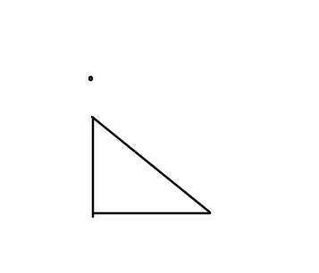

向量法：

```c++
#include <bits/stdc++.h>
using namespace std;
#define sc(x) scanf("%lld", &x)
typedef long long ll;
typedef double db;
#define cp const point &
ll read()
{
    ll num = 0;
    char c = getchar(), up = c;
    while (c < '0' || c > '9')
        up = c, c = getchar();
    while (c >= '0' && c <= '9')
        num = (num << 1) + (num << 3) + (c ^ '0'), c = getchar();
    return up == '-' ? -num : num;
}
struct point
{
    ll x, y;
    point(ll a = 0, ll b = 0) : x(a), y(b) {}
    point operator-(cp r) const { return point(x - r.x, y - r.y); }
    bool operator==(cp r) const { return x == r.x && y == r.y; }
    void input() { x = read(), y = read(); }
    db norm() const { return x * x + y * y; }
    db abs() const { return sqrt(norm()); }
} a, b, c, p;
db cross(cp a, cp b)
{
    return a.x * b.y - a.y * b.x;
}
double dot(cp a, cp b)
{
    return a.x * b.x + a.y * b.y;
}
#define eps 1e-10
ll f(cp a, cp b)
{
    if (cross(a, b) > eps)
    {
        return 1; //逆时针
    }
    if (cross(a, b) < -eps)
    {
        return -1; //顺时针
    }
    if (dot(a, b) < -eps)
    {
        return 2; // P在AB左方
    }
    if (a.abs() < b.abs())
    {
        return -2; // P在AB右方
    }
    return 0; // P在AB内部
}
bool isIntersect(cp a, cp b, cp c, cp d)
{
    return f(c - a, d - a) * f(c - b, d - b) <= 0 && f(a - c, b - c) * f(a - d, b - d) <= 0;
}
signed main()
{
    a.input();
    b.input();
    c.input();
    p.input();
    if (a == p || b == p || c == p)
    {
        printf("4");
        return 0;
    }
    if (f(b - a, p - a) == 0 || f(c - b, p - b) == 0 || f(a - c, p - c) == 0)
    {
        printf("3");
        return 0;
    }
    point q = point(p.x + 0.5, 1024);
    ll x = isIntersect(a, b, p, q) + isIntersect(b, c, p, q) + isIntersect(c, a, p, q);
    printf("%d", x % 2 == 0 ? 2 : 1);
    return 0;
}
```

面积法：

```c++
#include <bits/stdc++.h>
using namespace std;
#define sc(x) scanf("%lld", &x)
typedef long long ll;
#define cp const point &
ll read()
{
    ll num = 0;
    char c = getchar(), up = c;
    while (c < '0' || c > '9')
        up = c, c = getchar();
    while (c >= '0' && c <= '9')
        num = (num << 1) + (num << 3) + (c ^ '0'), c = getchar();
    return up == '-' ? -num : num;
}
struct point
{
    ll x, y;
    point(ll a = 0, ll b = 0) : x(a), y(b) {}
    point operator-(cp r) const { return point(x - r.x, y - r.y); }
    bool operator==(cp r) const { return x == r.x && y == r.y; }
    void input() { x = read(), y = read(); }
} a, b, c, p;
ll cross(cp a, cp b)
{
    return a.x * b.y - a.y * b.x;
}
ll s(cp a, cp b, cp c)
{
    return abs(cross(b - a, c - a));
}
signed main()
{
    a.input();
    b.input();
    c.input();
    p.input();
    if (a == p || b == p || c == p)
    {
        printf("4");
        return 0;
    }

    if (s(a, b, p) + s(a, c, p) + s(b, c, p) > s(a, b, c))
    {
        printf("2");
    }
    else
    {
        if (s(a, b, p) * s(a, c, p) * s(b, c, p) == 0)
        {
            printf("3");
        }
        else
        {
            printf("1");
        }
    }
    return 0;
}
```


##### p1903 数颜色/维护队列

> 有 $n$ 长序列 $a(a_i\le10^6)$ ，有 $m(n,m\le 133333)$ 次操作：`Q l r` 表示询问区间 $[l,r]$ 内不同数值数； `R p c` 表示将 $a_p$ 修改为 $c$ 。

带修莫队模板。在本来操作的前提下，维护初始序列 $a_0$ 和更新序列 $a$ 。用 $a$ 来处理读入时的每个修改，记录修改前后的数。对每个 $time+1$ 操作，若当前操作下标在 $[l,r]$ 内，就删掉原有，增加新改的，并且永久更改 $a_0$ 。对每个 $time-1$ 操作，若在 $[l,r]$ ，就删掉新改，增加原有的，并且永久更改 $a_0$ 。

据说这题可以树状数组套平衡树、树状数组套主席树、乃至树状数组套 unmap 优化空间的树状数组。

```c++
#include <bits/stdc++.h>
using namespace std;
#define sc(x) scanf("%lld", &x)
typedef long long ll;
#define mn 133340
ll n, m, sq, a[mn], a0[mn], ans[mn], m1, m2, sum, bin[1000010];
struct query1
{
    ll l, r, i, c;
    bool operator<(const query1 &x) const
    {
        if (l / sq == x.l / sq)
        {
            return r / sq == x.r / sq ? i < x.i : r < x.r;
        }
        return l < x.l;
    }
} q1[mn];
struct query2
{
    ll i, f, t;
} q2[mn];
void add(ll i)
{
    sum += bin[i]++ == 0;
}
void del(ll i)
{
    sum -= --bin[i] == 0;
}
ll l = 1, r;
void addt(ll t)
{
    if (l <= q2[t].i && q2[t].i <= r)
        del(q2[t].f), add(q2[t].t);
    a0[q2[t].i] = q2[t].t;
}
void delt(ll t)
{
    if (l <= q2[t].i && q2[t].i <= r)
        del(q2[t].t), add(q2[t].f);
    a0[q2[t].i] = q2[t].f;
}
signed main()
{
    sc(n), sc(m), sq = pow(n, 2. / 3);
    for (ll i = 1; i <= n; ++i)
    {
        sc(a[i]), a0[i] = a[i];
    }
    char ch[5] = {};
    for (ll i = 1, x, y; i <= m; ++i)
    {
        scanf("%s%lld%lld", ch, &x, &y);
        if (ch[0] == 'Q')
        {
            ++m1, q1[m1] = {x, y, m1, m2 + 1};
        }
        else
        {
            ++m2, q2[m2] = {x, a[x], y}, a[x] = y;
        }
    }
    sort(q1 + 1, q1 + 1 + m1);
    for (ll i = 1, t = 1; i <= m1; ++i)
    {
        while (t < q1[i].c)
            addt(t++);
        while (t > q1[i].c)
            delt(--t);
        while (l > q1[i].l)
            add(a0[--l]);
        while (r < q1[i].r)
            add(a0[++r]);
        while (l < q1[i].l)
            del(a0[l++]);
        while (r > q1[i].r)
            del(a0[r--]);
        ans[q1[i].i] = sum;
    }
    for (ll i = 1; i <= m1; ++i)
    {
        printf("%lld\n", ans[i]);
    }
    return 0;
}
```


##### AT1219 歴史の研究

> 给定长为 $n$ 的数组 $a(1\le a_i\le10^9)$ 和 $q(1\le n,q\le10^5)$ 次询问，每次问 $[l,r]$ 内最大重要度。数字 $x$ 重要度等于 $x$ 乘以它的出现次数。

一定要严格分块(定义好块长、左右端点)，然后按照初始莫队排序(第一关键字是所在块，第二关键字是右端点)。

对同块内直接暴力增加答案，单独处理，不与其他交集。对跨块的，维护桶，在跨块一开始清零答案(桶要保留)，并缩减 l,r 范围。然后永久化拓展右端点并更新答案，然后临时化往左拓展左端点，然后得到新答案后，删掉临时化的记录。

```c++
#include <bits/stdc++.h>
using namespace std;
#define sc(x) scanf("%lld", &x)
typedef long long ll;
#define mn 100010
ll n, x[mn], t[mn], m, k, ans[mn], bin[mn], cnt[mn];
ll sq, bn, bel[mn], lf[mn], rf[mn];
struct query
{
    ll l, r, i;
    bool operator<(const query &x) const
    { //一定要这么排序
        return bel[l] == bel[x.l] ? r < x.r : bel[l] < bel[x.l];
    }
} q[mn];
void del(ll v) { --bin[v]; }
void add(ll v, ll &tmp) { tmp = max(tmp, (++bin[v]) * t[v]); }
signed main()
{
    sc(n), sc(m), sq = sqrt(n), bn = n / sq;
    for (ll i = 1; i <= n; ++i)
    {
        sc(x[i]), t[i] = x[i];
    }
    for (ll i = 1; i <= m; ++i)
    {
        sc(q[i].l), sc(q[i].r), q[i].i = i;
    }
    for (ll i = 1; i <= bn; ++i) //一定要这么分块，不能/sq，不然会炸
        lf[i] = (i - 1) * sq + 1, rf[i] = i * sq;
    if (rf[bn] < n)
        ++bn, lf[bn] = rf[bn - 1] + 1, rf[bn] = n;
    for (ll i = 1; i <= bn; ++i)
        for (ll j = lf[i]; j <= rf[i]; ++j)
            bel[j] = i;
    sort(q + 1, q + 1 + m);
    sort(t + 1, t + 1 + n);
    k = unique(t + 1, t + 1 + n) - (t + 1);
    for (ll i = 1; i <= n; ++i)
    { // x[i]是输入的a[i]排在第x[i]位,离散化压[1,1e9]到[1,1e5]
        x[i] = lower_bound(t + 1, t + 1 + k, x[i]) - t;
    }
    ll l = 1, r = 0, la = 0, sum = 0, l2 = 0, sum2 = 0;
    for (ll i = 1; i <= m; ++i)
    {
        if (bel[q[i].l] == bel[q[i].r])
        { // 询问的左右端点同属于一个块则暴力扫描回答
            for (ll j = q[i].l; j <= q[i].r; ++j)
            {
                ++cnt[x[j]]; //入桶
            }
            for (ll j = q[i].l; j <= q[i].r; ++j)
            { //按题意计算
                ans[q[i].i] = max(ans[q[i].i], t[x[j]] * cnt[x[j]]);
            }
            for (ll j = q[i].l; j <= q[i].r; ++j)
            {
                --cnt[x[j]]; //清理记忆
            }
            continue;
        }
        if (bel[q[i].l] != la) // 访问到了新的块则重新初始化莫队区间
        {
            while (r > rf[bel[q[i].l]])
                del(x[r--]);
            while (l < rf[bel[q[i].l]] + 1)
                del(x[l++]);
            sum = 0, la = bel[q[i].l];
        }
        while (r < q[i].r) // 扩展右端点
            add(x[++r], sum);
        l2 = l, sum2 = sum;
        while (l2 > q[i].l) // 扩展左端点
            add(x[--l2], sum2);
        ans[q[i].i] = sum2;
        while (l2 < l) // 回滚
            del(x[l2++]);
    }
    for (ll i = 1; i <= m; ++i)
    {
        printf("%lld\n", ans[i]);
    }
    return 0;
}
```


##### P5906 【模板】 回滚莫队&不删除莫队

> 给定长为 $n$ 的序列 $a(1\le a_i\le2\times10^9)$ 和 $q(1\le n,q\le2\times10^5)$ 个询问，每次问 $[l,r]$ 内相同数的最远间隔距离，特别的如果没有相同数输出 $0$ 

不能用普通莫队+set等维护最值，复杂度 $O(n\sqrt n\log n)$ 

在要求 $O(1)$ 的情况下，可以采用如下方法维护：记 $lc,rc$ 表示当前某数(离散化后)最左和最右的下标。如果顺着拓展（同块），那么只需要维护 $lc$ ，每次计算 $i-lc_i$ 即可。否则，如果往右扩展，那么永久化更新 $rc$ (如果第一次出现还要更新 $lc$ ，并记录一下以后要删除这个值)，并更新答案；如果往左扩展，那么不更新但计算(除非第一次出现就更新 $rc$ )，然后往右回滚，把第一次出现的更新抹掉。

这里使用另一种格式来写：

```c++
#include <bits/stdc++.h>
using namespace std;
#define sc(x) scanf("%lld", &x)
typedef long long ll;
#define mn 200010
ll n, x[mn], t[mn], m, k, ans[mn];
ll lc[mn], rc[mn], cnt[mn], cls[mn], cln;
ll sq, bn, bel[mn], lf[mn], rf[mn];
struct query
{
    ll l, r, i;
    bool operator<(const query &x) const
    { //一定要这么排序
        return bel[l] == bel[x.l] ? r < x.r : bel[l] < bel[x.l];
    }
} q[mn];
signed main()
{
    sc(n), sq = sqrt(n), bn = n / sq;
    for (ll i = 1; i <= n; ++i)
    {
        sc(x[i]), t[i] = x[i];
    }
    sc(m);
    for (ll i = 1; i <= m; ++i)
    {
        sc(q[i].l), sc(q[i].r), q[i].i = i;
    }
    for (ll i = 1; i <= bn; ++i) //一定要这么分块，不能/sq，不然会炸
        lf[i] = (i - 1) * sq + 1, rf[i] = i * sq;
    if (rf[bn] < n)
        ++bn, lf[bn] = rf[bn - 1] + 1, rf[bn] = n;
    for (ll i = 1; i <= bn; ++i)
        for (ll j = lf[i]; j <= rf[i]; ++j)
            bel[j] = i;
    sort(q + 1, q + 1 + m);
    sort(t + 1, t + 1 + n);
    k = unique(t + 1, t + 1 + n) - (t + 1);
    for (ll i = 1; i <= n; ++i)
    { // x[i]是输入的a[i]排在第x[i]位,离散化压[1,1e9]到[1,1e5]
        x[i] = lower_bound(t + 1, t + 1 + k, x[i]) - t;
    }
    for (ll i = 1, j = 1; j <= bn; ++j)
    {
        ll br = rf[j], l = br + 1, r = l - 1, sum = 0, sum2 = 0, l2 = 0;
        cln = 0;
        for (; bel[q[i].l] == j; ++i)
        {
            if (bel[q[i].l] == bel[q[i].r])
            { // 询问的左右端点同属于一个块则暴力扫描回答
                for (ll j = q[i].l; j <= q[i].r; ++j)
                {
                    cnt[x[j]] = 0;
                }
                for (ll j = q[i].l; j <= q[i].r; ++j)
                { //按题意计算
                    if (!cnt[x[j]])
                    {
                        cnt[x[j]] = j;
                    }
                    else
                    {
                        ans[q[i].i] = max(ans[q[i].i], j - cnt[x[j]]);
                    }
                }
                continue;
            }
            while (r < q[i].r) // 扩展右端点
            {
                ++r;
                rc[x[r]] = r;
                if (!lc[x[r]])
                {
                    lc[x[r]] = r;
                    cls[++cln] = x[r];
                }
                sum = max(sum, r - lc[x[r]]);
            }
            l2 = l, sum2 = sum;
            while (l2 > q[i].l) // 扩展左端点
            {
                --l2;
                if (rc[x[l2]])
                {
                    sum2 = max(sum2, rc[x[l2]] - l2);
                }
                else
                {
                    rc[x[l2]] = l2;
                }
            }
            ans[q[i].i] = sum2;
            while (l2 < l) // 回滚
            {
                if (rc[x[l2]] == l2)
                {
                    rc[x[l2]] = 0;
                }
                ++l2;
            }
        }
        for (ll k = 1; k <= cln; ++k)
        {
            lc[cls[k]] = rc[cls[k]] = 0;
        }
    }
    for (ll i = 1; i <= m; ++i)
    {
        printf("%lld\n", ans[i]);
    }
    return 0;
}
```


##### P4782 【模板】 2-SAT问题

> 有 $n$ 个布尔值变量 $x$ 和 $m$ 个要满足的条件 $x_i$ 为 $a$ 或 $x_j$ 为 $b$ ，构造一组解或报告无解 $1\le n,m\le10^6$ 

```c++
#include <bits/stdc++.h>
using namespace std;
#define sc(x) scanf("%lld", &x)
typedef long long ll;
#define mn 2000010
ll n, m, hd[mn], cnt, st, low[mn], dfn[mn], ins[mn], scc, c[mn];
stack<ll> s;
struct edge
{
    ll to, nx;
} e[mn * 2];
void tarjan(ll u)
{
    low[u] = dfn[u] = ++st, ins[u] = true;
    s.push(u);
    for (ll i = hd[u], v; i; i = e[i].nx)
    {
        v = e[i].to;
        if (!dfn[v])
        {
            tarjan(v);
            low[u] = min(low[u], low[v]);
        }
        else if (ins[v])
        {
            low[u] = min(low[u], dfn[v]);
        }
    }
    if (low[u] == dfn[u])
    {
        ++scc;
        do
        {
            c[u] = scc;
            u = s.top();
            s.pop();
            ins[u] = false;
        } while (low[u] != dfn[u]);
    }
}
signed main()
{
    sc(n), sc(m);
    auto adde = [&](ll u, ll v)
    { e[++cnt] = {v, hd[u]}, hd[u] = cnt; };
    for (ll i = 1, a, va, b, vb; i <= m; ++i)
    {
        sc(a), sc(va), sc(b), sc(vb);
        if (va && vb)
        {
            adde(a + n, b), adde(b + n, a);
        }
        else if (!va && vb)
        {
            adde(a, b), adde(b + n, a + n);
        }
        else if (va && !vb)
        {
            adde(a + n, b + n), adde(b, a);
        }
        else if (!va && !vb)
        {
            adde(a, b + n), adde(b, a + n);
        }
        // i.e. adde(a+n*va,b+n*(vb^1)),adde(b+n*vb,a+n*(va^1))
    }
    for (ll i = 1; i <= 2 * n; ++i)
    {
        if (!dfn[i])
        {
            tarjan(i);
        }
    }
    for (ll i = 1; i <= n; ++i)
    {
        if (c[i] == c[i + n])
        {
            printf("IMPOSSIBLE");
            return 0;
        }
    }
    printf("POSSIBLE\n");
    for (ll i = 1; i <= n; ++i)
    { // tarjan逆拓扑序
        printf("%d ", c[i] < c[i + n]);
    }
    return 0;
}
```


#### UVA

##### UVA10635 Prince and Princess

> 多组测试，求最长公共序列，每条路径各点不相同，两序列长度不同

把 $b$ 里没在 $a$ 出现过的部分扔掉即可

```c++
#include <bits/stdc++.h>
using namespace std;
typedef long long ll;
#define sc(x) scanf("%lld", &x)
#define mn 100010
ll a[mn], b[mn], n, nb, nc, dp[mn], m, h[mn], k, t, x;
void solve()
{
    memset(h, 0, sizeof 0);
    nc = m = 0;
    sc(x), sc(n), sc(nb), ++n, ++nb;
    for (ll i = 1; i <= n; ++i)
    {
        sc(a[i]);
        h[a[i]] = i;
    }
    for (ll i = 1; i <= nb; ++i)
    {
        sc(b[i]);
        b[i] = h[b[i]];
        if (b[i] != 0 && b[i] <= n)
        {
            b[++nc] = b[i];
        }
    }
    dp[++m] = b[1];
    for (ll i = 2; i <= nc; ++i)
    {
        if (b[i] > dp[m])
        {
            dp[++m] = b[i];
        }
        else
        {
            *lower_bound(dp + 1, dp + 1 + m, b[i]) = b[i];
        }
    }
    printf("Case %lld: %lld", k, m);
    if (k <= t)
    {
        putchar('\n');
    }
}
signed main()
{
    sc(t);
    for (k = 1; k <= t; ++k)
    {
        solve();
    }
    return 0;
}
```


##### UVA1401 Remember the Word

> 给定字符串 $|S|\le3\times10^5$ ，然后给定 $s\le 4000$ 个长度不超过 $100$ 的小写互补重复单词，问有多少种由这些字符串拼接成 $S$ 的方案

先建立一棵字典树，标记每个单词结尾，设 $dp[i]$ 代表 $S[i..|S|]$ 能够有多少种方案，并初始化空串 $dp[|S|+1]=1$ 。然后倒序遍历 $S[i..|S|]$ ，以这个后缀走一次字典树，如果在 $S[j]$ 访问到了标记的结尾，那么说明 $S[i..j]+S[j+1..|S|]$ 能够拼接，前者是字典树里遍历到的，后者有 $dp[j+1]$ 种情况。那么就对 $S[i..|S|]$ 加上这么多种方案。

虽然这个遍历过程看似是 $O(|S|^2)$ 的，但是如果加上走到字典树空就跳出循环，那么在题给限制下，因为字典树是树深是 $100$ ，所以实际上内层循环最多走 $100$ 下，即实际复杂度为 $O(100|S|)$ 。

参考代码：

```c++
#include <bits/stdc++.h>
using namespace std;
typedef long long ll;
#define mn 4010
#define ms 400010
ll kase, dp[ms], ns, tr[ms][26], vis[ms], n, nt, cnt, p, mod = 20071027;
char s[ms], t[105];
signed main()
{
    while (EOF != scanf("%s", s + 1))
    {
        scanf("%lld", &n), ns = strlen(s + 1);
        memset(tr, 0, sizeof tr); // ns跟trie长度无关
        memset(vis, 0, sizeof vis);
        memset(dp, 0, sizeof dp);
        cnt = 1;
        while (n--)
        {
            scanf("%s", t + 1), nt = strlen(t + 1);
            p = 1;
            for (ll i = 1, si; i <= nt; ++i)
            {
                si = t[i] - 'a';
                if (tr[p][si] == 0)
                {
                    tr[p][si] = ++cnt;
                }
                p = tr[p][si];
            }
            vis[p] += 1; //互不相同，不可能叠加，值域[0,1]
            assert(vis[p] <= 1);
        }
        dp[ns + 1] = 1;
        for (ll i = ns; i; --i)
        {
            p = 1;
            for (ll j = i, si; j <= ns; ++j)
            {
                si = s[j] - 'a';
                if (tr[p][si] <= 1)
                {
                    break;
                }
                p = tr[p][si];
                if (vis[p])
                {
                    dp[i] = (dp[i] + dp[j + 1]) % mod;
                }
            }
        }
        printf("Case %lld: %lld\n", ++kase, dp[1]);
    }
    return 0;
}
```


##### UVA11626 Convex Hull

> 给定 $n(3\le n\le10^5)$ 个范围在 $10^9$ 的整点，并告知你哪些点在凸包上(`Y`) ，从最左下角开始逆时针输出这些点

Andrew 模板题。注意事项细节：多个询问的初始化

```c++
#include <bits/stdc++.h>
using namespace std;
typedef long long ll;
#define sc(x) scanf("%lld", &x)
#define mn 100010
#define cp const point &
struct point
{
    ll x, y;
    point(ll a = 0, ll b = 0) : x(a), y(b) {}
    point operator-(cp r) const { return point(x - r.x, y - r.y); }
    bool operator<(cp r) const { return x != r.x ? x < r.x : y < r.y; }
} p[mn], p0, s[mn * 2];
ll cross(cp a, cp b) { return a.x * b.y - a.y * b.x; }
ll n, m, ss, top = 1, T;
char t[5];
void f(ll i)
{
    while (ss > top && cross(s[ss] - s[ss - 1], p[i] - s[ss]) < 0)
    {
        --ss;
    }
    s[++ss] = p[i];
}
signed main()
{
    for (sc(T); T--;)
    {
        sc(m), n = 0;
        for (ll i = 1; i <= m; ++i)
        {
            scanf("%lld%lld%s", &p0.x, &p0.y, t);
            if (t[0] == 'Y')
            {
                p[++n] = p0;
            }
        }
        sort(p + 1, p + 1 + n);
        s[ss = 1] = p[1], top = 1;
        for (ll i = 2; i <= n; ++i)
        {
            f(i);
        }
        top = ss;
        for (ll i = n - 1; i >= 1; --i)
        {
            f(i);
        }
        printf("%lld\n", n);
        for (ll i = 1; i <= n; ++i)
        {
            printf("%lld %lld\n", s[i].x, s[i].y);
        }
    }
    return 0;
}
```


#### 多解板子

在这里多用别的算法来做不是该算法的模板

##### P3374  [模板] 树状数组 1

###### zkw线段树

```c++
#include <bits/stdc++.h>
using namespace std;
typedef long long ll;
#define sc(x) scanf("%lld", &x)
#define mn 500010
ll t[mn << 2], n, N, m, c, x, y;
signed main()
{
    sc(n), sc(m);
    for (N = 1; N <= n + 1; N <<= 1)
        ;
    for (ll i = N + 1; i <= N + n; ++i)
    {
        sc(t[i]);
    }
    for (ll i = N - 1; i >= 1; --i)
    {
        t[i] = t[i << 1] + t[i << 1 | 1];
    }
    while (m--)
    {
        sc(c), sc(x), sc(y);
        if (c == 1)
        {
            for (ll i = x + N; i; i >>= 1)
            {
                t[i] += y;
            }
        }
        else
        {
            ll ans = 0;
            for (ll s = N + x - 1, r = N + y + 1; s ^ r ^ 1; s >>= 1, r >>= 1)
            {
                if (~s & 1)
                {
                    ans += t[s ^ 1];
                }
                if (r & 1)
                {
                    ans += t[r ^ 1];
                }
            }
            printf("%lld\n", ans);
        }
    }
    return 0;
}
```


##### P3372 [模板] 线段树 1

###### 线段树

```c++
#include <bits/stdc++.h>
using namespace std;
typedef long long ll;
#define sc(x) scanf("%lld", &x)
#define mn 100010
ll t[mn << 2], laz[mn << 2], n, m, c, lc, rc, v, a[mn], ans;
#define lfs p << 1
#define rfs p << 1 | 1
#define mkcf ll cf = (lf + rf) >> 1
void build(ll p, ll lf, ll rf)
{
    if (lf == rf)
    {
        t[p] = a[lf];
        return;
    }
    mkcf;
    build(lfs, lf, cf);
    build(rfs, cf + 1, rf);
    t[p] = t[lfs] + t[rfs];
}
void pushdown(ll p, ll lf, ll rf)
{
    mkcf;
    t[lfs] += (cf - lf + 1) * laz[p];
    t[rfs] += (rf - cf) * laz[p];
    laz[lfs] += laz[p];
    laz[rfs] += laz[p];
    laz[p] = 0;
}
void update(ll p, ll lf, ll rf)
{
    if (lf >= lc && rf <= rc)
    {
        t[p] += v * (rf - lf + 1);
        laz[p] += v;
        return;
    }
    pushdown(p, lf, rf);
    mkcf;
    if (cf >= lc)
    {
        update(lfs, lf, cf);
    }
    if (cf < rc)
    {
        update(rfs, cf + 1, rf);
    }
    t[p] = t[lfs] + t[rfs];
}
void query(ll p, ll lf, ll rf)
{
    if (lf >= lc && rf <= rc)
    {
        ans += t[p];
        return;
    }
    pushdown(p, lf, rf);
    mkcf;
    if (cf >= lc)
    {
        query(lfs, lf, cf);
    }
    if (cf < rc)
    {
        query(rfs, cf + 1, rf);
    }
    t[p] = t[lfs] + t[rfs];
}
signed main()
{
    sc(n), sc(m);
    for (ll i = 1; i <= n; ++i)
    {
        sc(a[i]);
    }
    build(1, 1, n);
    while (m--)
    {
        sc(c), sc(lc), sc(rc);
        if (c == 1)
        {
            sc(v);
            update(1, 1, n);
        }
        else
        {
            ans = 0;
            query(1, 1, n);
            printf("%lld\n", ans);
        }
    }
    return 0;
}
```


###### zkw 线段树

```c++
#include <bits/stdc++.h>
using namespace std;
typedef long long ll;
#define mn 400010
#define sc(x) scanf("%lld", &x)
ll n, m, a[mn], dt, laz[mn], c, x, y, k;
signed main()
{
    sc(n), sc(m);
    for (dt = 1; dt <= n + 1; dt <<= 1)
        ;
    for (ll i = dt + 1; i <= dt + n; ++i)
    {
        sc(a[i]);
    }
    for (ll i = dt - 1; i >= 1; --i)
    {
        a[i] = a[i << 1] + a[i << 1 | 1];
    }
    while (m--)
    {
        sc(c), sc(x), sc(y);
        if (c == 1)
        {
            sc(k);
            ll lf = 0, rf = 0, layer = 1, s = dt + x - 1, t = dt + y + 1;
            for (; s ^ t ^ 1; s >>= 1, t >>= 1, layer <<= 1)
            {
                a[s] += k * lf, a[t] += k * rf;
                if (~s & 1)
                {
                    laz[s ^ 1] += k, a[s ^ 1] += k * layer, lf += layer;
                }
                if (t & 1)
                {
                    laz[t ^ 1] += k, a[t ^ 1] += k * layer, rf += layer;
                }
            }
            for (; s; s >>= 1, t >>= 1)
            {
                a[s] += k * lf, a[t] += k * rf;
            }
            // printf("%lld\n", a[1] + laz[1]);
        }
        else
        {
            ll lf = 0, rf = 0, layer = 1, s = dt + x - 1, t = dt + y + 1;
            ll ans = 0;
            for (; s ^ t ^ 1; s >>= 1, t >>= 1, layer <<= 1)
            {
                if (laz[s])
                {
                    ans += laz[s] * lf;
                }
                if (laz[t])
                {
                    ans += laz[t] * rf;
                }
                if (~s & 1)
                {
                    ans += a[s ^ 1], lf += layer;
                }
                if (t & 1)
                {
                    ans += a[t ^ 1], rf += layer;
                }
            }
            for (; s; s >>= 1, t >>= 1)
            {
                ans += laz[s] * lf + laz[t] * rf;
            }
            printf("%lld\n", ans);
        }
    }
    return 0;
}
```


##### p3369 [模板]普通平衡树

> 1. 插入 x 数
> 2. 删除 x 数(若有多个相同的数，因只删除一个)
> 3. 查询 x 数的排名(排名定义为比当前数小的数的个数 +1 )
> 4. 查询排名为 x 的数
> 5. 求 x 的前驱(前驱定义为小于 x，且最大的数)
> 6. 求 x 的后继(后继定义为大于 x，且最小的数)
>
> 输入 $n(1\le n\le10^5)$ ，然后紧接着 $n$ 次询问，每次执行上面的操作，值域为 $[-10^7,10^7]$ 


###### 线段树合并

```c++
#include <bits/stdc++.h>
#define x first
#define y second
#define pb push_back
#define sz(x) (int)x.size()
#define all(x) x.begin(), x.end()
using namespace std;
typedef long long ll;
typedef pair<ll, ll> PLL;
typedef pair<int, int> PII;
const double eps = 1e-8;
const double PI  = acos(-1.0);
const int INF = 0x3f3f3f3f;
const ll LNF  = 0x3f3f3f3f3f3f;
inline int gcd(int a, int b) { return b ? gcd(b, a % b) : a; }
inline ll  gcd(ll  a, ll  b) { return b ? gcd(b, a % b) : a; }
inline int lcm(int a, int b) { return a * b / gcd(a, b); }

const int N = 1e5 + 10;

int n;

// 存储操作
struct Num{
    int op, val;
}num[N];

struct Node{
    int l, r; // l, r 代表值域 [l, r]
    int cnt;  // 代表值域 [l, r] 里数的个数
}t[N << 2];

vector<int> vec; // 用来离散化

int findX(int x){ // 计算离散化后的值
    // 如果在之前你没有插入 -1e8, 但你的线段树又是从 1 开始的，那么这里返回值 + 1
    return lower_bound(all(vec), x) - vec.begin();
}

void build(int u, int l, int r){  // 建树
    t[u].l = l, t[u].r = r;
    if(l == r){
        t[u].cnt = 0;
        return;
    }
    int mid = l + r >> 1;
    build(u << 1, l, mid);
    build(u << 1 | 1, mid + 1, r);
    t[u].cnt = t[u << 1].cnt + t[u << 1 | 1].cnt;
}

// 插入和删除，插入时 op = 1, 删除时 op = -1
void update(int u, int x, int op){ 
    if(t[u].l == t[u].r){ // 到叶子结点
        t[u].cnt += op;
        return;
    } else{
        int mid = t[u].l + t[u].r >> 1;
        if(mid >= x) update(u << 1, x, op);
        else update(u << 1 | 1, x, op);
    }
    t[u].cnt = t[u << 1].cnt + t[u << 1 | 1].cnt; // 记得更新
}

// 查询 x 的排名，这里实则是计算区间 [1, x - 1] 里的数的个数
int Rank(int u, int x){ 
    // x > r 代表 x 在区间的右边，返回该区间里数的个数
    if(t[u].r < x) return t[u].cnt;
    int mid = t[u].l + t[u].r >> 1;
    int res = Rank(u << 1, x); // 无论 x 与 mid 的大小，都有计算左边的区间
    if(x > mid + 1) res += Rank(u << 1 | 1, x);
    return res;
}

// 查询排名为 x 的数
int kth(int u, int x){
    if(t[u].l == t[u].r) return t[u].l;
    if(t[u << 1].cnt >= x) return kth(u << 1, x);
    else return kth(u << 1 | 1, x - t[u << 1].cnt);
}

// 查询 u为根 所在树的最大的数
int findRight(int u){
    if(t[u].l == t[u].r) return t[u].l;
    if(t[u << 1 | 1].cnt) return findRight(u << 1 | 1);
    else return findRight(u << 1);
} 

// 查询 x 的前驱
int findPre(int u, int x){
    if(t[u].r < x){
        if(t[u].cnt) return findRight(u);
        return 0;
    }
    int mid = t[u].l + t[u].r >> 1;
    if(x > mid + 1 && t[u << 1 | 1].cnt){
        int res = findPre(u << 1 | 1, x);
        if(res) return res;
    }
    return findPre(u << 1, x);
}

// 查询以 u 为根的树里最小的数
int findLeft(int u){
    if(t[u].l == t[u].r) return t[u].l;
    if(t[u << 1].cnt) return findLeft(u << 1);
    else return findLeft(u << 1 | 1);
}
 

// 查询 x 的后继
int findNxt(int u, int x){
    if(x < t[u].l){
        if(t[u].cnt) return findLeft(u);
        return 0;
    }
    int mid = t[u].l + t[u].r >> 1;
    if(x < mid && t[u << 1].cnt){
        int res = findNxt(u << 1, x);
        if(res) return res;
    }
    return findNxt(u << 1 | 1, x);
}

int main(){

    cin >> n;
    vec.pb(-1e8); // 防止越界，并且方便计算离散化的下标和根据下标映射原值
    for(int i = 1; i <= n; i ++){
        scanf("%d%d", &num[i].op, &num[i].val);
        if(num[i].op != 4) vec.pb(num[i].val); // 操作 4 是排名
    }

    sort(all(vec));
    vec.erase(unique(all(vec)), vec.end());
    int m = sz(vec);

    build(1, 1, m);

    for(int i = 1; i <= n; i ++){

        if(num[i].op == 1) 
            update(1, findX(num[i].val), 1);
        else if(num[i].op == 2) 
            update(1, findX(num[i].val), -1);
        else if(num[i].op == 3)
            printf("%d\n", Rank(1, findX(num[i].val)) + 1);
        else if(num[i].op == 4)
            printf("%d\n", vec[kth(1, num[i].val)]);
        else if(num[i].op == 5) 
            printf("%d\n", vec[findPre(1, findX(num[i].val))]);
        else printf("%d\n", vec[findNxt(1, findX(num[i].val))]);
    }

    return 0;
}
```


##### p3865 [模板]ST表

> 求区间 max , $1\le n\le10^5,1\le m\le2\times10^6,a)i\in[0,10^9 ]$

###### 猫树

```c++
#include <bits/stdc++.h>
using namespace std;
#define sc(x) scanf("%lld", &x)
typedef long long ll;
#define mn 131082 // 1<<log(1e5,2)+10
#define ml 20
ll n, m, a[mn], n2, lg[mn * 2], l, r;
ll pos[mn], gcd[mn][ml];
#define lfs p << 1
#define rfs p << 1 | 1
#define mkcf ll cf = (lf + rf) >> 1
void build(ll p, ll lf, ll rf, ll dep)
{
    if (lf == rf)
    {
        pos[lf] = p;
        return;
    }
    mkcf;
    build(lfs, lf, cf, dep + 1);
    build(rfs, cf + 1, rf, dep + 1);
    gcd[cf][dep] = a[cf];
    for (ll i = cf - 1; i >= lf; --i)
    {
        gcd[i][dep] = max(gcd[i + 1][dep], a[i]);
    }
    for (ll i = cf + 1; i <= rf; ++i)
    {
        gcd[i][dep] = max(gcd[i - 1][dep], a[i]);
    }
}
signed main()
{
    sc(n), sc(m);
    for (ll i = 1; i <= n; ++i)
    {
        sc(a[i]);
    }
    for (n2 = 1; n2 < n; n2 <<= 1) //满二叉树下节点有n2个
        ;
    for (ll i = 2; i <= n2 * 2; ++i)
    {
        lg[i] = lg[i / 2] + 1;
    }
    build(1, 1, n2, 1);
    while (m--)
    {
        sc(l), sc(r);
        if (l == r) //猫树不存叶子节点
        {
            printf("%lld\n", a[l]);
            continue;
        }
        ll k = lg[pos[r]] - lg[pos[l] ^ pos[r]];
        printf("%lld\n", max(gcd[l][k], gcd[r][k]));
    }
    return 0;
}
```

###### 笛卡尔树

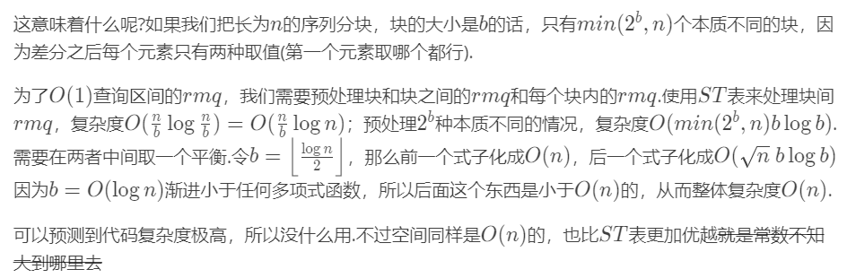

```c++
#include<iostream>
#include<cstdio>
#include<cstring>
using namespace std;
const int inf=1e9;
int n,m,w[2000000],lg2[1500000];
int pos[1500000],lst[1500000],dep[1500000],id,mm,S,ch[1500000][2],stack[1500000];
struct LIM_RMQ
{
	int w[1500000],bl[1500000],blo,L[150000],R[150000],pos[10000],val[150000],minn[150000],minpos[150000],t[1000],n_st;
	struct ST_node{int f,id;bool operator <(const ST_node &tmp)const{return f<tmp.f;}};
	struct STable
	{
		ST_node a[4][12];//n=1e6的话logn/2只有9...所以放心开
		void make(int w[],int n)
		{
			for(int i=1;i<=n;i++)a[0][i]=(ST_node){w[i],i};
			for(int i=1;(1<<i)<=n;i++)//st表，不过要同时处理出最小值所在的位置
				for(int j=1;j+(1<<i)-1<=n;j++)
					a[i][j]=min(a[i-1][j],a[i-1][j+(1<<(i-1))]);
		}
		ST_node query(int l,int r)
		{
			int len=lg2[r-l+1];
			return min(a[len][l],a[len][r-(1<<len)+1]);
		}
	}st[10000];//这里只有sqrt(n)个，也不用开这么大
	struct STable_block
	{
		ST_node a[20][150000];//这个占空间最大了吧...不过也只是O(n)的
		void make(int w[],int n)
		{
			for(int i=1;i<=n;i++)a[0][i]=(ST_node){w[i],i};
			for(int i=1;(1<<i)<=n;i++)
				for(int j=1;j+(1<<i)-1<=n;j++)
					a[i][j]=min(a[i-1][j],a[i-1][j+(1<<(i-1))]);
		}
		ST_node query(int l,int r)
		{
			int len=lg2[r-l+1];//细节，math库的log2函数不能看做O(1)的，要提前处理
			return min(a[len][l],a[len][r-(1<<len)+1]);
		}
	}st_block;
	void make(int a[],int n)
	{
		for(int i=1;i<=n;i++)w[i]=a[i];
		lg2[1]=0;for(int i=2;i<=n;i++)lg2[i]=lg2[i>>1]+1;//处理log2
		blo=max(lg2[n]>>1,1);//分块
		for(int i=1;i<=n;i++)bl[i]=(i-1)/blo+1;
		for(int i=1;i<=bl[n];i++)L[i]=(i-1)*blo+1,R[i]=min(i*blo,n),minn[i]=inf;
		w[0]=w[1]-1;
		for(int i=1;i<=bl[n];i++)
		{
			int tmp=0,nn=0;
			for(int j=L[i];j<=R[i];j++)
			{
				t[++nn]=w[j],tmp=tmp<<1|(w[j]-w[j-1]==1?1:0);
				if(w[j]<minn[i])minn[i]=w[j],minpos[i]=j;
                //可以用一个状压来表示本质
			}
			if(!pos[tmp])st[pos[tmp]=++n_st].make(t,nn);
			val[i]=pos[tmp];//记下每个块属于哪一个本质
		}
		st_block.make(minn,bl[n]);//块间rmq
	}
	ST_node query_block(int id,int l,int r){ST_node t=st[val[id]].query(l-L[id]+1,r-L[id]+1);return (ST_node){t.f,t.id+L[id]-1};}
    //实际位置=块左端点+块内查询位置-1，如果你把块内查询从0开始写就可以省略-1
	int query(int l,int r)
	{
		int bll=bl[l],blr=bl[r];
		if(bll==blr)return query_block(bll,l,r).id;//一个块
		int ml=query_block(bll,l,R[bll]).id,mr=query_block(blr,L[blr],r).id,mm;
		if(w[ml]<w[mr])mm=ml;else mm=mr;//两端零散块
		if(bll+1<=blr-1)//整块
		{
			int mmid=minpos[st_block.query(bll+1,blr-1).id];
			if(w[mmid]<w[mm])mm=mmid;
		}
		return mm;
	}
}a;
void dfs(int u,int depth)
{
	lst[u]=++id,pos[id]=u;dep[id]=depth;//处理欧拉序列
	for(int i=0;i<=1;i++)
		if(ch[u][i])
		{
			dfs(ch[u][i],depth+1);
			pos[++id]=u,dep[id]=depth;
		}
}
int getin()
{
	int x=0;char ch=getchar();
	while(ch<'0'||ch>'9')ch=getchar();
	while(ch>='0'&&ch<='9')x=x*10+ch-48,ch=getchar();
	return x;
}
int wt[30];
void putout(int x)
{
	if(!x){putchar('0');return;}
	int l=0;
	while(x)wt[++l]=x%10,x/=10;
	while(l)putchar(wt[l--]+48);
	puts("");
}
void build_tree()//笛卡尔树
{
	int top=1;stack[1]=S=1;//开始根为1
	for(int i=2;i<=n;i++)
	{
		int lst=0;
		while(top&&w[i]>w[stack[top]])lst=stack[top--];
		if(lst)ch[i][0]=lst;
		if(top)ch[stack[top]][1]=i;else S=i;
		stack[++top]=i;
	}
	dfs(S,1);
}
int main()
{
	n=getin(),m=getin();
	for(int i=1;i<=n;i++)w[i]=getin();
	build_tree();
	a.make(dep,id);
	for(int i=1;i<=m;i++)
	{
		int l=lst[getin()],r=lst[getin()];
		if(l>r)swap(l,r);//可能第一次出现的位置是反过来的
		putout(w[pos[a.query(l,r)]]);
	}
} 
```


##### p1908 逆序对

> 给定 $n(1\le n\le5\times10^5)$ 和整数序列 $a$ ，求逆序对

###### 树状数组

先离散化。然后开权值树状数组。每次对排名 $rk$ ，找所有大于它的有多少个，即区间查询 $[rk+1,m]$ 。

```c++
#include <bits/stdc++.h>
using namespace std;
#define sc(x) scanf("%lld", &x)
typedef long long ll;
#define mn 500010
ll n, t[mn], a[mn], b[mn], m, ans;
ll lowbit(ll x) { return x & -x; }
void add(ll i)
{
    for (; i <= m; i += lowbit(i))
    {
        ++t[i];
    }
}
ll query(ll r)
{
    ll res = 0;
    for (; r; r -= lowbit(r))
    {
        res += t[r];
    }
    return res;
}
signed main()
{
    sc(n);
    for (ll i = 1, v; i <= n; ++i)
    {
        sc(v), a[i] = v, b[i] = v;
    }
    sort(b + 1, b + 1 + n);
    m = unique(b + 1, b + 1 + n) - (b + 1);
    for (ll i = 1; i <= n; ++i)
    {
        ll rk = lower_bound(b + 1, b + 1 + m, a[i]) - b;
        ans += query(m) - query(rk); //注意不是rk-1
        add(rk);
    }
    printf("%lld", ans);
    return 0;
}
```


##### sp3267 DQUERY

> 给定长为 $n(1\le n\le3\times10^4)$ 的序列 $a(1 < a_i < 10^6)$ ，有 $q(1\le q\le2\times10^5)$ 次询问，问区间 $[l,r]$ 内不同元素的个数

解法一：首先，显然块状数组暴力分块可以做。略。

###### 主席树

在线。显然空间复杂度是 $O(n\log n)$ ，因为种类数最多是 $n$ 。具体而言，初始建树需要 $4n$ ，之后还需要 $n\log n$ 。时间复杂度可以发现也是 $O(n\log n)$ 。

我们直接让主席树每个节点维护种类数。显然叶子节点值一定是 $1$ (有重复种类出现也不在同一个叶子，会在不同版本的同一个位置)。那么这么维护一定当前版本可以实现任意区间查询种类数。

用线段树维护 last 数组，也就是每个值 $a_i$ 上一次出现的下标。那么求区间 $[l,r]$ 内 $last\le l-1$ （如果为了防止越界，下标全部 $+1$ ，使得 $last\in[1,n]$ ，就是求 $last \le l$ ），这是因为， 如果一个值上一次出现还是在 $[l,r]$ 内，证明有重复，那么就不计在内，起到了去重作用。如果出现在 $[1,l-1]$ 内，就证明是唯一的，就可以计在内。

```c++
#include <bits/stdc++.h>
using namespace std;
#define sc(x) scanf("%lld", &x)
typedef long long ll;
#define mn 30010
#define mm 1000010
ll n, a[mn], pr[mm], last[mn];
ll rot[mn], s[mn * 26], l[mn * 26], r[mn * 26], cnt;
#define mkcf ll cf = (lf + rf) >> 1
void build(ll &rt, ll lf, ll rf)
{
    rt = ++cnt, s[rt] = 0;
    if (lf == rf)
    {
        return;
    }
    mkcf;
    build(l[rt], lf, cf);
    build(r[rt], cf + 1, rf);
}
void update(ll pre, ll &rt, ll lf, ll rf, ll pos)
{
    rt = ++cnt, s[rt] = s[pre] + 1;
    if (lf == rf)
    {
        return;
    }
    mkcf;
    if (pos <= cf)
    {
        update(l[pre], l[rt], lf, cf, pos);
        r[rt] = r[pre];
    }
    else
    {
        l[rt] = l[pre];
        update(r[pre], r[rt], cf + 1, rf, pos);
    }
}
ll query(ll rt1, ll rt2, ll lf, ll rf, ll lc, ll rc)
{
    if (lc <= lf && rf <= rc)
    {
        return s[rt2] - s[rt1];
    }
    mkcf;
    ll ans = 0;
    if (lc <= cf)
    {
        ans += query(l[rt1], l[rt2], lf, cf, lc, rc);
    }
    if (cf + 1 <= rc)
    {
        ans += query(r[rt1], r[rt2], cf + 1, rf, lc, rc);
    }
    return ans;
}
signed main()
{
    sc(n);
    build(rot[0], 1, n);
    for (ll i = 1; i <= n; ++i)
    {
        sc(a[i]);
        last[i] = pr[a[i]] + 1; //上一次a[i]出现的位置(+1防止0越界)
        pr[a[i]] = i;           //上一个a[i]的下标是i
        update(rot[i - 1], rot[i], 1, n, last[i]);
    }
    ll q, ql, qr;
    for (sc(q); q--;)
    {
        sc(ql), sc(qr);
        printf("%lld\n", query(rot[ql - 1], rot[qr], 1, n, 1, ql));
    }
    return 0;
}
```


###### 树状数组

将询问按 $r$ 升序排序。

对排序后的每个询问，遍历 $j=(r_{i-1},r_i]$ 这一段询问区间，看看 $a_j$ 是否出现过，如果出现过，那么把上一次出现的痕迹清理掉，即在树状数组为 $pre_{a_j}$ 的位置减掉。然后对 $j$ 这个位置做树状数组加法。然后这次询问的答案就直接在树状数组上做查询，查 $[l_i,r_i]$ 的结果就是答案了。

思路较简单，但是离线，不能在线。所以实质上就是普通的一维权值树状数组。复杂度是 $O(n\log n+m\log m)$ 。

跟自己一开始的思路差不多，但是自己不会排序询问，也不会去重。这里刚好解决了自己的这两个问题。这个去重的原理，之所以多个下标只留最右边是对的，是因为询问是拉到当前最右的，最右的那个势必能覆盖最多的左，即全部的左。

```c++
#include <bits/stdc++.h> //P1972
using namespace std;
#define sc(x) scanf("%lld", &x)
typedef long long ll;
#define mn 1000010
#define mm 1000010
struct querys
{
    ll l, r, i;
    bool operator<(const querys &x) { return r < x.r; }
} q[mm];
ll ans[mm], n, a[mn], t[mn], m, vis[mm];
ll lowbit(ll x) { return x & -x; }
void add(ll i, ll v)
{
    for (; i <= n; i += lowbit(i))
    {
        t[i] += v;
    }
}
ll query(ll i)
{
    ll r = 0;
    for (; i; i -= lowbit(i))
    {
        r += t[i];
    }
    return r;
}
signed main()
{
    sc(n);
    for (ll i = 1; i <= n; ++i)
    {
        sc(a[i]);
    }
    sc(m);
    for (ll i = 1; i <= m; ++i)
    {
        sc(q[i].l), sc(q[i].r), q[i].i = i;
    }
    sort(q + 1, q + 1 + m);
    for (ll i = 1, pr = 1; i <= m; pr = q[i].r + 1, ++i) //++i在后
    {
        for (ll j = pr; j <= q[i].r; ++j)
        {
            if (vis[a[j]])
            {
                add(vis[a[j]], -1);
            }
            vis[a[j]] = j;
            add(j, 1);
        }
        ans[q[i].i] = query(q[i].r) - query(q[i].l - 1);
    }
    for (ll i = 1; i <= m; ++i)
    {
        printf("%lld\n", ans[i]);
    }
    return 0;
}
```


###### 莫队

这题就是莫队的纯模板题了。我们需要在模板的基础上，定义好增加、删除就行了。用一个桶装一下，就可以 $O(1)$ 维护了。

```c++
#include <bits/stdc++.h>
using namespace std;
#define sc(x) scanf("%lld", &x)
typedef long long ll;
#define mn 1000010
#define mm 1000010
ll n, a[mn], bin[mm], sum, bel[mn + 500], m, ans[mm];
void add(ll i) //将下标为i的值纳入区间
{
    sum += bin[a[i]]++ == 0;
}
void del(ll i) //将下标为i的值移出区间
{
    sum -= --bin[a[i]] == 0;
}
struct node
{
    ll l, r, i;
    bool operator<(const node &x)
    {
        return bel[l] == bel[x.l] ? r < x.r : bel[l] < bel[x.l];
    }
} q[mm];
signed main()
{
    sc(n);
    ll mx = 0;
    for (ll i = 1, ie = ceil(1. * n / sqrt(n)); i <= ie; ++i)
    {
        for (ll j = (i - 1) * sqrt(n) + 1; j <= i * sqrt(n); ++j)
        {
            bel[j] = i; //分块
            mx = max(mx, j);
        }
    }
    for (ll i = 1; i <= n; ++i)
    {
        sc(a[i]);
    }
    sc(m);
    for (ll i = 1; i <= m; ++i)
    {
        sc(q[i].l), sc(q[i].r), q[i].i = i;
    }
    sort(q + 1, q + 1 + m);
    for (ll i = 1, l = 1, r = 0; i <= m; ++i)
    { //莫队区间拓展模板
        while (l < q[i].l)
            del(l++);
        while (l > q[i].l)
            add(--l);
        while (r < q[i].r)
            add(++r);
        while (r > q[i].r)
            del(r--);
        ans[q[i].i] = sum; //当前区间答案
    }
    for (ll i = 1; i <= m; ++i)
    {
        printf("%lld\n", ans[i]);
    }
    return 0;
}
```


#### 构造

##### P5595 歌唱比赛

> 对 $n(1\le n\le10^6)$ 位数的 $x,y$ 得分，每次取长度为 $n-i+1$ 的后缀，若这个后缀得分 $x$ 更大输出 `X` ， $y$ 更大输出 `Y` ，平局输出 `Z` ，给定输出，请你构造 $x,y$ 或输出无解 $-1$ 

个人构造方法：显然 `ZX` 或 `ZY` 无解，否则必有解，倒序遍历，对首个 `X/Y` ，输出 `1/0` ，否则都输出 `0/0` ，不要求最高位非零，所以不需要特判

```c++
#include <bits/stdc++.h>
using namespace std;
#define sc(x) scanf("%lld", &x)
typedef long long ll;
#define mn 1000010
char s[mn], x[mn], y[mn];
ll n;
signed main()
{
    scanf("%s", s + 1);
    n = strlen(s + 1);
    for (ll i = 1; i < n; ++i)
    {
        if (s[i] == 'Z' && s[i + 1] != 'Z')
        {
            printf("-1\n");
            return 0;
        }
    }
    for (ll i = n, prx = 0, pry = 0; i >= 1; --i)
    {
        if (s[i] == 'Z')
        {
        }
        else if (s[i] == 'X')
        {
            if (s[i + 1] == 'X')
            {
                prx = pry = 0;
            }
            else
            {
                prx = 1, pry = 0;
            }
        }
        else
        {
            if (s[i + 1] == 'Y')
            {
                prx = pry = 0;
            }
            else
            {
                prx = 0, pry = 1;
            }
        }
        x[i] = '0' + prx, y[i] = '0' + pry;
    }
    // x[1]++, y[1]++;
    printf("%s\n%s", x + 1, y + 1);
    return 0;
}
```

其它构造方法：

```c++
for(int i=0;i<s.size();i++)
    if(s[i]=='X') a[i]=1,b[i]=0;
	else if(s[i]=='Y') a[i]=,0,b[i]=1;
	else if(s[i]=='Z') a[i]=1,b[i]=1;
```


##### P5441 伤痕

> 给定 $n$ 个点( $n$ 是奇数且 $1\le n\le99$ )的图，连 $\dfrac{n(n-1)}2$ 条边，其中至多 $n$ 条双向边，要求选出四个点，使得这四个点可以不通过其他点双向直达，构造一个图，最多有多少种选点方案，输出其中一种使得方案最多的图的邻接矩阵

参考题解区 `lsoer` 的讲解，比较清晰，这里不再赘述

```c++
#include <bits/stdc++.h>
using namespace std;
#define sc(x) scanf("%lld", &x)
typedef long long ll;
ll n, c[103][103];
signed main()
{
    sc(n);
    if (n == 1)
    {
        printf("0\n0");
        return 0;
    }
    ll m = (n - 3) / 2;
    printf("%lld\n", n * (n - 1) * (n - 2) * (n - 3) / 24 - n * m * (m - 1) * (m - 2) / 6);
    for (ll i = 1; i <= n; ++i)
    {
        for (ll j = i + 1; j <= i + (n + 1) / 2; ++j)
        {
            c[i][(j - 1) % n + 1] = 1;
        }
    }
    for (ll i = 1; i <= n; ++i)
    {
        for (ll j = 1; j < n; ++j)
        {
            printf("%lld ", c[i][j]);
        }
        printf("%lld\n", c[i][n]);
    }
    return 0;
}
```


##### AT5759 ThREE

> 给定一棵树 $2\le n\le2\times10^5$ ，用 $n$ 的排列构造树的点权 $p$ ，使得任意距离为 $3$ 的点对 $u,v$ 都满足 $p_u+p_v$ , $p_up_v$ 至少一个是三的倍数

能发现一个结论：不是三的倍数有且仅有两种情况： $p_u,p_v$ 同模 $3$ 余 $1$ 或同模 $3$ 余 $2$ 。

将原树隔点染色(即深度为奇数和偶数的分别染成黑白)，可以发现，同色的点距离一定不为 $3$ ，异色的点距离可能为 $3$ 。设黑色点、白色点分别有 $n_1,n_2$ 个，显然 $n_1+n_2=n$ ，令 $m=\lfloor\dfrac n3\rfloor$ ，显然模 $3$ 等价类的数目要么是 $m$ 要么是 $m+1$ 。假设最坏是 $m+1$ 。 可以发现有且仅有三种情况：

1. $n_1 > m,n_2 > m$ (其实是 $n_1\ge m+1,n_2\ge m+1$ )
2. $n_1 \le m, n_2 > m$ (其实是 $n_1 < m+1,n_2\ge m+1$ )
3. $n_1 > m, n_2\le m$ (其实是 $n_1 \ge m+1,n_2 < m+1$ )

对情况 $1$ ，可以把所有余 $1$ 的数都给黑点，余 $2$ 的数都给白点；然后剩下的数剩下的点任意分配。情况 $2$ 可以把余 $0$ 的点给黑点(显然不一定给完)，剩下的数全部给白点；情况 $3$ 就余 $0$ 给白点，剩下给黑点

代码实现有点像小模拟，但是不难写

```c++
#include <bits/stdc++.h>
using namespace std;
#define sc(x) scanf("%lld", &x)
typedef long long ll;
#define mn 200010
ll n, hd[mn], cnt, a[mn], used[mn];
struct edge
{
    ll to, nx;
} e[mn * 2];
vector<ll> c[2];
void dfs(ll u, ll fa, ll layer)
{
    c[layer].emplace_back(u);
    for (ll i = hd[u], v; i; i = e[i].nx)
    {
        v = e[i].to;
        if (v != fa)
        {
            dfs(v, u, 1 - layer);
        }
    }
}
signed main()
{
    sc(n);
    auto adde = [&](ll u, ll v)
    {
        e[++cnt] = {v, hd[u]};
        hd[u] = cnt;
    };
    for (ll i = 1, u, v; i < n; ++i)
    {
        sc(u), sc(v), adde(u, v), adde(v, u);
    }
    dfs(1, 0, 0);
    if (c[0].size() > n / 3 && c[1].size() > n / 3)
    {
        vector<ll> s;
        for (ll i = 0; i < c[0].size(); ++i)
        {
            if (i * 3 + 1 <= n)
            {
                a[c[0][i]] = i * 3 + 1;
            }
            else
            {
                s.emplace_back(c[0][i]);
            }
        }
        for (ll i = 0; i < c[1].size(); ++i)
        {
            if (i * 3 + 2 <= n)
            {
                a[c[1][i]] = i * 3 + 2;
            }
            else
            {
                s.emplace_back(c[1][i]);
            }
        }
        for (ll i = 0; i < s.size(); ++i)
        {
            assert((i + 1) * 3 <= n);
            a[s[i]] = (i + 1) * 3;
        }
    }
    else
    {
        ll assoc3 = c[0].size() <= n / 3 ? 0 : 1;
        for (ll i = 0; i < c[assoc3].size(); ++i)
        {
            a[c[assoc3][i]] = (i + 1) * 3;
            used[(i + 1) * 3] = 1;
        }
        for (ll i = 1, j = 1; i <= n; ++i, ++j)
        {
            while (a[i])
            {
                ++i;
            }
            while (used[j])
            {
                ++j;
            }
            a[i] = j;
        }
    }

    for (ll i = 1; i <= n; ++i)
    {
        printf("%lld ", a[i]);
    }
    return 0;
}
```


##### CF1283F DIY Garland

> 有 $n(1\le n\le2\times10^5)$ 个节点，编号为 $i$ 的点权值为 $2^i$ ，选定一个节点作为根节点，对每条边，离根远的子树点权和是边权值，现在按照边权逆序排序，给定排序后每条边对应的深度浅的那个点的编号，请构造出原树

显然对给定值，编号出现次数就是这个点的儿子数。没出现过的是叶子节点。可以考虑构造哈夫曼树，倒序遍历序列，把当前父亲拼接到当前堆上连边。如果当前父亲没有度了（拓扑排序），就把当前父亲也放到堆里作新子树的根。直接比较根权值大小即可，因为有更大的也被用掉了(比较子树大小也行)。因为这个过程是哈夫曼建树，度数是正确的情况下，所以一定有解

```c++
#include <bits/stdc++.h>
using namespace std;
#define sc(x) scanf("%lld", &x)
typedef long long ll;
#define mn 200010
ll n, task[mn], vis[mn]; //, fa[mn], rot;
struct node
{
    ll rot, v; //, vis;
    bool operator<(node r) const { return v > r.v; }
    // {
    //     return vis != r.vis ? vis > r.vis : v > r.v;
    // }
};
priority_queue<node> q;
// priority_queue<ll, vector<ll>, greater<ll>> q;
signed main()
{
    sc(n);
    for (ll i = 1; i < n; ++i)
    {
        sc(task[i]);
        vis[task[i]]++; //直接儿子数,否则都是叶子节点
    }
    for (ll i = 1; i <= n; ++i)
    {
        if (vis[i] == 0)
        {
            q.push({i, i}); // q.push({i, i});
        }
    }
    printf("%lld\n", task[1]);
    for (ll i = n - 1; i >= 1; --i)
    {
        auto pr = q.top();
        ll u = pr.rot;
        q.pop();
        printf("%lld %lld\n", task[i], u);
        if (--vis[task[i]] == 0)
        {
            q.push({task[i], max(task[i], pr.v)});
        }
    }
    return 0;
}
/*
5
2 2 2 2
8
3 4 3 3 1 2 4
*/
```


##### P3514 LIZ-Lollipop

> 令 `T`=2 , `W`=1 ，给定长为 $n$ 的 `TW` 串和 $m(1\le n,m\le10^6)$ 次询问，每次问有没有值为 $k(1\le k\le2\times10^6)$ 的子串，有则输出两端点(下标从 $1$ 开始)，否则输出 `NIE` 

结论：假设存在值为 $k$ 的子串，则一定存在值为 $k-2$ 的子串

- 设该子串的两端点值为 $x,y$ ，那么若 $x$ 或 $y$ 为 $2$ ，删掉为 $2$ 的即得；否则必然 $x=y=1$ ，都删了即得

那么若 $\sum_{i=1}^n a_i$ 是奇数，那么最大奇数子串记为 $s_1=\sum_{i=1}^n a_i$ ，那么找到最左边的 $1$ 和最右边的 $1$ ，分类讨论，贪心取值最大的，得到最大偶数子串 $s_0$ 。若一开始是偶数同理求奇数。

那么不大于 $s_1$ 的奇数都有解，不大于 $s_0$ 的偶数都有解。按照上述结论递归求解即可

```c++
#include <bits/stdc++.h>
using namespace std;
#define sc(x) scanf("%lld", &x)
typedef long long ll;
#define mn 2000010
ll n, a[mn], s[mn], mx[2], lf[mn], rf[mn];
char loli[mn];
signed main()
{
    ll m, lf1 = 0, rf1 = 0, sp, lf2, rf2;
    sc(n), sc(m), scanf("%s", loli + 1);
    for (ll i = 1; i <= n; ++i)
    {
        a[i] = 1 + (loli[i] == 'T');
        s[i] = s[i - 1] + a[i];
    }
    sp = s[n] & 1;
    mx[sp] = s[n], lf[s[n]] = 1, rf[s[n]] = n;
    for (ll i = 1; i <= n && !lf1; ++i)
    {
        lf1 = (a[i] == 1) ? i : 0;
    }
    for (ll i = n; i >= 1 && !rf1; --i)
    {
        rf1 = (a[i] == 1) ? i : 0;
    }
    if (lf1)
    {
        mx[sp ^ 1] = s[n] - s[lf1], lf2 = lf1 + 1, rf2 = n;
    }
    if (rf1 && s[rf1 - 1] > mx[sp ^ 1])
    {
        mx[sp ^ 1] = s[rf1 - 1], lf2 = 1, rf2 = rf1 - 1;
    }
    lf[mx[sp ^ 1]] = lf2, rf[mx[sp ^ 1]] = rf2;
    auto f = [&](ll v)
    {
        for (ll i = v; i >= 2; i -= 2)
        {
            if (a[lf[i]] == 2) // 2 .. 1 or 2 .. 2
            {
                lf[i - 2] = lf[i] + 1, rf[i - 2] = rf[i];
            }
            else if (a[rf[i]] == 2) // 1 .. 2
            {
                lf[i - 2] = lf[i], rf[i - 2] = rf[i] - 1;
            }
            else // 1 .. 1
            {
                lf[i - 2] = lf[i] + 1, rf[i - 2] = rf[i] - 1;
            }
        }
    };
    f(mx[0]), f(mx[1]);
    for (ll k; m--;)
    {
        sc(k);
        if (lf[k] && rf[k])
        {
            printf("%lld %lld\n", lf[k], rf[k]);
        }
        else
        {
            printf("NIE\n");
        }
    }
    return 0;
}
```


##### P3599 Koishi Loves Construction

> 给定类型 $X$ 和长度 $n$ ，构造长为 $n$ 的排列，若 $X=1$ 满足排列的 $n$ 个前缀和在模 $n$ 意义下互不相同；否则前缀积。有 $T$ 组询问(每次给 $n(1\le T\le10,1\le n\le10^5)$ )，若无解输出 `0` ，有解输出 `2` 接该排列

少见的能够自己独立做出来的紫题。

暴力打表，特判 $1$ 外，发现偶数前缀和必然有解，构造：$n,1,n-2,3,n-4,5,\cdots$ 能使得余数在两边逼近。 对前缀积，特判 $4$ 是 `1 3 2 4` 外，只有质数有解，解是余数从 $1$ 开始递增到 $n-1$ ，最后乘 $n$ 得余数 $0$ 。可以用逆元，那么第 $i$ 格余数是 $i$ ，发现有 $(i-1)\times x\bmod n=i$ 得第 $i$ 格要放 $i\times (i-1)^{-1}\bmod n$ ，$i-1$ 是因为前缀积模余 $i-1$ ，显然。

所以根据暴力打表的规律，可以写出答案：

```c++
#include <bits/stdc++.h>
using namespace std;
#define sc(x) scanf("%lld", &x)
typedef long long ll;
ll t, n, x;
signed main()
{
    for (sc(x), sc(t); t--;)
    {
        sc(n);
        if (n == 1)
        {
            printf("2 1\n"); //不是1!
            continue;
        }
        if (x == 1)
        {
            if (n % 2 == 0)
            {
                printf("2");
                for (ll top = n, down = 1; top; top -= 2, down += 2)
                {
                    printf(" %lld %lld", top, down);
                }
                printf("\n");
            }
            else
            {
                printf("0\n");
            }
        }
        else if (x == 2)
        {
            bool isprime = true;
            for (ll i = 2; i * i <= n; ++i)
            {
                if (n % i == 0)
                {
                    isprime = false;
                    break;
                }
            }
            if (isprime)
            {
                auto qpow = [&](ll a, ll b = n - 2)
                {
                    ll r = 1;
                    for (; b; b >>= 1)
                    {
                        if (b & 1)
                        {
                            r = r * a % n;
                        }
                        a = a * a % n;
                    }
                    return r;
                };
                printf("2 1");
                for (ll i = 2; i < n; ++i)
                {
                    printf(" %lld", qpow(i - 1) * i % n);
                }
                printf(" %lld\n", n);
            }
            else if (n == 4)
            {
                printf("2 1 3 2 4\n");
            }
            else
            {
                printf("0\n");
            }
        }
    }
    return 0;
}
```

题解区的严格证明：

对前缀和，显然 $n$ 只能放在第一位，否则 $\bmod n$ 不变。那么当是奇数时，前缀和是 $n$ 的倍数(即等差数列得 $n\times\dfrac{n-1}2$ )，无论如何都会重复。

对前缀积， $n$ 只能放最后一位，否则恒余 $0$ 。且最后结果 $(n-1)!$ 不能是 $n$ 的倍数。

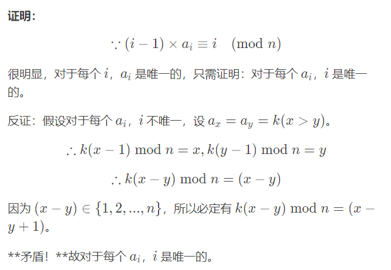


##### AT4380 Grafting

> 有 $t(1\le t\le20)$ 组样例，每次给定两棵编号 $n(3\le n\le50)$ 点树 $A,B$ 。初始 $A$ 每个点是白色。对每个叶子白点，可以断掉它的边，然后连一条新边，并染成黑色。问最少多少次操作后使得不考虑颜色下 $A,B$ 相同。求最少操作数或无解 `-1` 

> 一遇到树的、图的构造自己就完全不会做了，发现是弱项

题意简化为能对每个点操作至多一次，每次可将叶子节点断掉父亲然后变成新的叶子节点(易父)

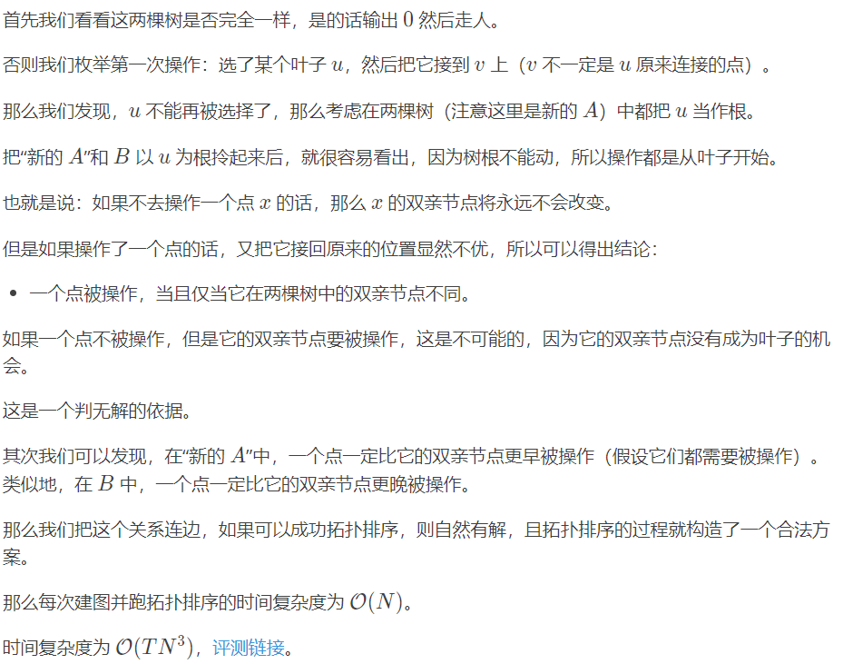

判断树是否一样，在使用同一个根时，可以判断父亲数组是否完全一致。两次 DFS 再一次循环，需要 $O(n)$ 

枚举叶子节点 $i$ 和任意另一节点 $j$ ，并把 $i$ 断掉连到 $j$ 上面去(不管本来父亲是不是 $j$ )(永久连接，以后的枚举也生效)，在断之前，先以 $B$ 的 $i$ 为根，以 $A$ 的 $j$ 为根进行找父亲，如果某个点两树父亲不一致，证明这个点需要断掉。如果叶子节点不需要断且父亲节点要断，就寄了，证明这样不可行。否则继续往下判，对每个要断的点，如果它的 $B$ 父亲和 $A$ 父亲也要断，那么在最终树上，一定是 $B$ 父亲先断，到自己断，然后 $A$ 父亲才能断。若干个这样的关系形成一张拓扑图，判断这样的图能不能拓扑成功即可。

补充：对确定的 $B$ 树(很显然自始至终都没改过 $B$ 树，只是修改了谁是根而已，然后很显然根节点是不用断的(即至多操作 $n-1$ 次))，如果已知 $B$ 上点 $x$ 及其父亲 $f$ 都是断掉得到的，那么一定是先合 $f$ 再合 $x$ 。因为如果反过来的话， $f$ 永远都是非叶子节点(因为有儿子 $x$ ，而它已经断了再合过了，不能再断)。

> 说实话没懂：
>
> 1. 为什么永久连接，以后的枚举也生效
> 2. 为什么不能以 $A$ 的 $i$ 为根
> 3. 为什么一定是 $B$ 父亲先断，到自己断，然后 $A$ 父亲才能断
>
> 太菜了，这题没搞懂，寄了，菜爆

```c++
#include <bits/stdc++.h>
using namespace std;
#define sc(x) scanf("%lld", &x)
typedef long long ll;
#define mn 52
void dfs(ll u, ll f, vector<ll> *e, ll *fa)
{
    fa[u] = f;
    for (auto &v : e[u])
    {
        if (f != v)
        {
            dfs(v, u, e, fa);
        }
    }
}
void solve()
{
    ll n, ans, dua[mn] = {}, fa[mn], fb[mn];
    sc(n);
    vector<ll> ea[mn], eb[mn];
    for (ll i = 1, u, v; i < n; ++i)
    {
        sc(u), sc(v), ea[u].push_back(v), ea[v].push_back(u);
        ++dua[u], ++dua[v];
    }
    for (ll i = 1, u, v; i < n; ++i)
    {
        sc(u), sc(v), eb[u].push_back(v), eb[v].push_back(u);
    }
    dfs(1, 0, ea, fa), dfs(1, 0, eb, fb);
    bool suc = true;
    for (ll i = 1; i <= n; ++i)
    {
        if (fa[i] != fb[i])
        {
            suc = false;
            break;
        }
    }
    if (suc)
    {
        printf("0\n");
        return;
    }
    ans = 114514;
    auto topo = [&]()
    {
        ll alters = 0;
        ll dif[mn] = {}, ind[mn] = {};
        vector<ll> e[mn];
        for (ll i = 1; i <= n; ++i)
        {
            dif[i] = fa[i] != fb[i];
            alters += dif[i];
        }
        for (ll i = 1; i <= n; ++i)
        {
            if (dif[i] == 0 && dif[fa[i]] != 0)
            {
                return 1919810LL;
            }
        }
        for (ll i = 1; i <= n; ++i)
        {
            if (dif[i])
            {
                if (dif[fa[i]])
                {
                    e[i].push_back(fa[i]), ++ind[fa[i]];
                }
                if (dif[fb[i]])
                {
                    e[fb[i]].push_back(i), ++ind[i];
                }
            }
        }
        ll qcnt = 0;
        queue<ll> q;
        for (ll i = 1; i <= n; ++i)
        {
            if (dif[i] && ind[i] == 0)
            {
                q.push(i);
                ++qcnt;
            }
        }
        while (!q.empty())
        {
            ll u = q.front();
            q.pop();
            for (auto &v : e[u])
            {
                if (--ind[v] == 0)
                {
                    q.push(v);
                    ++qcnt;
                }
            }
        }
        return qcnt != alters ? 998244353LL : alters;
    };
    for (ll i = 1; i <= n; ++i)
    {
        if (dua[i] == 1) // leaf
        {
            dfs(i, 0, eb, fb);
            for (ll j = 1; j <= n; ++j)
            {
                if (j != i)
                {
                    dfs(j, 0, ea, fa), fa[j] = i, fa[i] = 0;
                    ll res = topo();
                    ans = min(ans, res + 1);
                }
            }
        }
    }
    printf("%lld\n", ans > n ? -1LL : ans);
}
signed main()
{
    ll t;
    for (sc(t); t--;)
        solve();
    return 0;
}
```


##### AT4432 Robot Arms

> 有 $n(1\le n\le10^3)$ 组坐标(范围在 $10^9$ 内)，构造不超过 $m(\le40)$ 个增量($\le10^{12}$ ，对每个坐标必须使用全部这些增量，每个增量进行 `LRUD` 四方向移动四选一，问能否每个坐标都走到，能的话输出 $m$ ，这些增量以及每个坐标的方案

对每个坐标，若 $x+y$ 奇偶性不都相同，那么必然无解。这是因为能走到某个坐标的话，想要走到奇偶相反的坐标，一定会离开那个坐标。但是相同的话，可以构造出对某个坐标原地踏步，另一个是双增来达到。

不难想到倍增。而具体的操作步骤是，若都是偶数，那么构造出增量为 $1,1,2,\cdots, 2^{30}$ ，否则构造出 $1,2,\cdots,2^{30}$ 。从大到小枚举增量，每次对离原点当前绝对值最大的一轴增上这个增量(往坐标轴逼近方向走)。

如果只有一个坐标轴(即 `0 ?` 这种)，若只用且用完 $1,2$ 可以得到 $\pm 1,\pm 3$ ；只用且用完 $1,2,4$ 可以得到 $\pm1,\pm3,\pm5,\pm7$ ；同理，只用 $1,\cdots,2^{30}$ 可以得到 $2^{31}-1$ 内的所有奇数。(构造方法：进制上递增加 $2$ ，如全负最小，把一个最小位改正加二，进位加四减二又加二，以此类推……所以要求值为 $x$ 的奇数，只需要求 $\dfrac{x-1+2^{m+1}}{2}$ 的二进制位即可，为 $0$ 负数，为 $1$ 正数(位数从小到大指数增大))

那么既然能得到全体奇数，只要加多一个 $1$ 或减一个 $1$ 就能得到全体偶数。

现在拓展到二维平面，需要证明把 $v$ 拆分为 $x+y$ ，如果 $v$ 能用不超过 $m$ 个数表示，那么 $x,y$ 分别都能。可以用几何法证明，假设只有 $1$ ，平面内染色点集为：

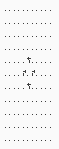

如果有 $1,2$ ，那么染色点集是 `#` ，为：

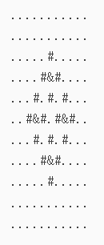

观察，发现，这是一个分形，等于在 `&` 四个位置(即 $2$ 的位置)分别加上 $1$ 的图形。那么继续分形，我们可以发现，一定存在解法，对全体奇数拆分集成立，都在菱形内。也就是说 $1,2,\cdots 2^m$ 的分形覆盖了菱形 $|x|+|y|\le2^{m+1}-1$ 内的全部坐标点。那么对全体偶数，只需要某一个坐标轴偏移 $1$ ，就能得到对应的全部坐标点。

> 证明了可行性，具体到方案实现，当然可以用分形直接递归来做了(分形从大到小递减)，就像代码思路一样。但是注意数是不能复用的(不能用一个增量两次)，假设拆分为了诸如 $x=y$ 这样的情况，即拓展到 $x,y$ 在二进制位存在某一位相等的，如果复用一维解法必然会重复使用，例如 `0b11101=0b1111+0b1110` ，我们把它看成是 $x$ 和 $2^{m}-1-x$ ，我们发现这两个数恰好 `01` 是相反的(二进制减法显然可知)。那么构造出了 $x$ ，然后剩下的位就可以构造 $2^{m}-1-x$ 。
>
> ……然后思路卡住了，以后有空再补充。我感觉是可以直接根据进制推的

```c++
#include <bits/stdc++.h>
using namespace std;
#define sc(x) scanf("%lld", &x)
typedef long long ll;
#define mn 1024
#define ms 42
ll n, x[mn], y[mn], m, t[ms];
char ans[ms];
signed main()
{
    sc(n);
    for (ll i = 1; i <= n; ++i)
    {
        sc(x[i]), sc(y[i]);
        if (abs(x[i] + y[i]) % 2 != abs(x[1] + y[1]) % 2)
        {
            printf("-1");
            return 0;
        }
    }
    t[++m] = 1;
    for (ll i = abs(x[1] + y[1]) % 2; i <= 30; ++i)
    {
        t[++m] = 1 << i;
    }
    printf("%lld\n", m);
    for (ll i = 1; i <= m; ++i)
    {
        printf("%lld ", t[i]);
    }
    printf("\n");
    for (ll i = 1; i <= n; ++i)
    {
        for (ll sx = 0, sy = 0, j = m; j; --j)
        {
            ll dx = x[i] - sx, dy = y[i] - sy, c[] = {-1, 1};
            if (abs(dx) > abs(dy))
            {
                sx += c[dx > 0] * t[j];
                ans[j] = "LR"[dx > 0];
            }
            else
            {
                sy += c[dy > 0] * t[j];
                ans[j] = "DU"[dy > 0];
            }
        }
        printf("%s\n", ans + 1);
    }
    return 0;
}
```


##### AT4434 Distance Sums

> 给定 $n$ 个互不相同的数 $d_i$ ，请构造一棵树，使得编号为 $i$ 的节点的距离和是 $d_i$ 。输出建树方案( $n-1$ 条边)或 `-1` $1\le n\le10^5,1\le d_i\le10^{12}$

若知道子树大小 $siz$ ，距离和是 $d$ ，对相邻点对 $u,v$ 有 $d_v-d_u=siz_u-siz_v=2siz_u-n$ 。

显然叶子节点距离和最大，重心最小。证略。

那么可以从叶子开始构造，先结构体排序 $d_i$ ，对其降序排序，然后遍历 $n-1$ 次排序后 $d$ 数组，当前遍历时一定是把它当作最远节点(叶子的话 $siz=1$ )，求出 $\Delta d$ ，二分找到第一个小于(等于) $\Delta d$ 的上一个就是第一个大于 $\Delta d$ 的 $d_j$ ，将这两个点连起来，更新被连的 $siz_j$ ，找不到就无解。最后以最小 $d$ 点为重心/根节点 DFS 一次，若计算出它的 $d$ 符合题意，那么有解，否则无解。

依据：从 $i$ 找 $j$ ，找到使得 $\Delta d+d_i=-n+2siz_i+d_i = d_j$ 的 $j$ ，假设已知 $d_i$ ，就可以计算出 $d_j$ 。那么最后算剩一个未知数(也就是说最后只要知道任意一个 $d$ 就能得到全体 $d$ )，这时我们去算一下根的，如果它对了，那就整棵树都对了。

这是因为，对于节点 $i$ ，它花费 $\Delta d$ 能转移到相邻点 $j$ ，如果已知 $d_i$ ，那么 $d_j$ 必然是 $d_i+\Delta d$ ，既然我肯定知道 $d_i$ ，我知道了 $siz_i$ 就可以确定出 $j$ 了。

二分找 $j$ ：

```c++
#include <bits/stdc++.h>
using namespace std;
#define sc(x) scanf("%lld", &x)
typedef long long ll;
#define mn 100010
ll n, siz[mn], hd[mn], cnt, dis[mn];
pair<ll, ll> d[mn];
struct edge
{
    ll to, nx;
} e[mn * 2];
void adde(ll u, ll v)
{
    e[++cnt] = {v, hd[u]}, hd[u] = cnt;
}
vector<pair<ll, ll>> ans;
signed main()
{
    sc(n);
    for (ll i = 1; i <= n; ++i)
    {
        sc(d[i].first), d[i].second = i, siz[i] = 1;
    }
    sort(d + 1, d + 1 + n), reverse(d + 1, d + 1 + n);
    for (ll i = 1; i < n; ++i)
    {
        ll dt = d[i].first - n + 2 * siz[i];
        ll pos = upper_bound(d + 1, d + 1 + n, make_pair(dt, 0LL), greater<pair<ll, ll>>()) - d - 1;
        if (d[pos].first != dt)
        {
            printf("-1");
            return 0;
        }
        ll u = d[i].second, v = d[pos].second;
        adde(u, v), adde(v, u), ans.emplace_back(u, v);
        siz[pos] += siz[i];
    }
    auto dfs = [&](auto self, ll u, ll fa) -> void { // no return void CE
        for (ll i = hd[u], v; i; i = e[i].nx)
        {
            v = e[i].to;
            if (v != fa)
            {
                dis[v] = dis[u] + 1;
                self(self, v, u);
            }
        }
    };
    dfs(dfs, d[n].second, 0);
    ll res = 0;
    for (ll i = 1; i <= n; ++i)
    {
        res += dis[i];
    }
    if (res == d[n].first)
    {
        for (auto &i : ans)
        {
            printf("%lld %lld\n", i.first, i.second);
        }
    }
    else
    {
        printf("-1");
    }
    return 0;
}
```

unmap 找 j ：

```c++
#include <bits/stdc++.h>
using namespace std;
#define sc(x) scanf("%lld", &x)
typedef long long ll;
#define mn 100010
ll n, siz[mn], hd[mn], cnt, dis[mn];
unordered_map<ll, ll> dti;
pair<ll, ll> d[mn];
struct edge
{
    ll to, nx;
} e[mn * 2];
void adde(ll u, ll v)
{
    e[++cnt] = {v, hd[u]}, hd[u] = cnt;
}
vector<pair<ll, ll>> ans;
signed main()
{
    sc(n);
    for (ll i = 1; i <= n; ++i)
    {
        sc(d[i].first), d[i].second = i, siz[i] = 1;
    }
    sort(d + 1, d + 1 + n), reverse(d + 1, d + 1 + n);
    for (ll i = 1; i <= n; ++i)
    {
        dti[d[i].first] = i;
    }
    for (ll i = 1; i < n; ++i)
    {
        ll dt = d[i].first - n + 2 * siz[i];
        ll pos = dti[dt];
        if (!pos)
        {
            printf("-1");
            return 0;
        }
        ll u = d[i].second, v = d[pos].second;
        adde(u, v), adde(v, u), ans.emplace_back(u, v);
        siz[pos] += siz[i];
    }
    auto dfs = [&](auto self, ll u, ll fa) -> void { // no return void CE
        for (ll i = hd[u], v; i; i = e[i].nx)
        {
            v = e[i].to;
            if (v != fa)
            {
                dis[v] = dis[u] + 1;
                self(self, v, u);
            }
        }
    };
    dfs(dfs, d[n].second, 0);
    ll res = 0;
    for (ll i = 1; i <= n; ++i)
    {
        res += dis[i];
    }
    if (res == d[n].first)
    {
        for (auto &i : ans)
        {
            printf("%lld %lld\n", i.first, i.second);
        }
    }
    else
    {
        printf("-1");
    }
    return 0;
}
```


##### AT4502 Lexicographic constraints

> 给定 $n(\le2\times10^5)$ 个字符串的长度 $a_i(\le10^9)$ ，请构造出这些字符串，使得字典序排序按输入顺序，输出能够造出这样的字符串的最小字符集长度

可以容易想到二分答案和进制。

若相邻两个串 $x,y$ 满足 $|x| < |y|$ ，那么一定是满足的显然。因为只需要一直补最小字符到 $|y|$ 长度即可。否则，一定要先截断长度为 $|y|$ ，然后最末尾字符进行加一，如果进位了，那么继续递归执行上述操作。

因为 $a_i$ 太大了，考虑用单调不降栈维护所有不是最小字符的位置。比较显然（真的比较显然）最多有 $O(n)$ 个这样的位置。且进位均摊总数不超过 $n$ 次。所以复杂度正确。最后判断首位是否进位（溢出），是的话就不合法。可以特判严格单调序列答案 $n=1$ (不然 RE，原因未知)

从第二个字符串开始遍历 $a$ ，若出现逆序(长度小于上一个)，那么在 $a_i$ 出出现非最小字符。如果首次出现直接入栈，如果这个位置已经在栈里了就加一。如果发生了进位就再以上一位递归这个过程。

思路比较简单，这题的难点在于实现。

```c++
#include <bits/stdc++.h>
using namespace std;
#define sc(x) scanf("%lld", &x)
typedef long long ll;
#define mn 200010
ll n, a[mn], lf = 2, cf, rf, inc = 1, ans = 1;
stack<pair<ll, ll>> s;
void add(ll v)
{
    while (s.top().first > v)
    {
        s.pop();
    }
    if (s.top().first == v)
    {
        auto t = s.top();
        t.second++;
        s.pop();
        s.push(t);
    }
    else
    {
        s.push({v, 1});
    }
    if (s.size() > 1 && s.top().second == cf)
    {
        s.pop();
        add(v - 1);
    }
}
bool check()
{
    s.push({0, 0});
    pair<ll, ll> pr = s.top();
    for (ll i = 2; i <= n; ++i)
    {
        if (a[i] <= a[i - 1])
        {
            add(a[i]);
        }
    }
    while (!s.empty())
    {
        pr = s.top();
        s.pop();
    }
    return pr.second == 0;
}
signed main()
{
    sc(n), rf = n;
    for (ll i = 1; i <= n; ++i)
    {
        sc(a[i]);
        if (a[i] <= a[i - 1])
        {
            inc = 0;
        }
    }
    if (inc)
    {
        printf("1");
        return 0;
    }
    while (lf <= rf)
    {
        cf = (lf + rf) >> 1;
        if (check())
        {
            ans = cf, rf = cf - 1;
        }
        else
        {
            lf = cf + 1;
        }
    }
    printf("%lld", ans);
    return 0;
}
```


##### AT4515 Coloring Torus

> 输入 $k(1\le k\le10^3)$ 代表颜色数量，输出一个 $n(1\le n\le500)$ 阶方阵，使得元素满足下面要求：
>
> - 每个元素 $a_{i,j}\in [1,k]$ 
> - 每种颜色都被用到至少一次
> - 对每种颜色的每个格子 $i,j$ ，它的四方向（边界就走到另一边的头）的颜色类型出现次数严格相等。即同种颜色的所有格子的四方向格子的颜色集合相等。

显然 $k\le500$ 时每行一种颜色一定是对的。 $k > 500$ 时想了很多构造，都不对。一看答案发现是对角线构造。

由于 $n$ 阶矩阵有 $2n-1$ 条对角线，可以让第 $i\bmod n$ 条对角线染上颜色 $i+1$ ，这样一定是可以染 $n$ 种颜色的。把颜色相等的对角线合并为一条，发现可以对每条对角线间隔地染两种颜色，而不影响答案。所以一共可以染色 $2n$ 种。(要在偶数方阵用)

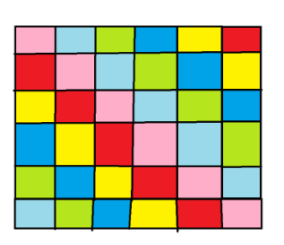

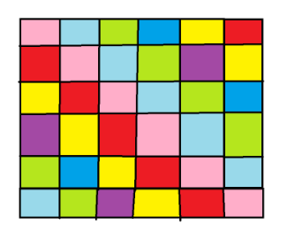

```c++
#include <bits/stdc++.h>
using namespace std;
#define sc(x) scanf("%lld", &x)
#define repe(i, a, b) for (ll i = a; i <= b; ++i)
typedef long long ll;
ll k, b[512][512], t[1024];
signed main()
{
    sc(k);
    if (k <= 500)
    {
        printf("%lld\n", k);
        repe(i, 1, k)
        {
            repe(j, 1, k) printf("%lld ", i);
            printf("\n");
        }
    }
    else
    {
        printf("500\n");
        repe(i, 1, 500)
        {
            repe(j, 1, 500)
            {
                ll x = (i + j - 2) % 500 + 1;
                b[i][j] = x + (t[x] == 1 && x + 500 <= k ? 500 : 0);
                t[x] ^= 1;
                printf("%lld ", b[i][j]);
            }
            printf("\n");
        }
    }
    return 0;
}
```


##### AT5140 Skolem XOR Tree

> 给定 $n(1\le n\le10^5)$ ，构造一棵 $2n$ 点树，使得 $\forall i\in[1,n],v_i=v_{i+n}=i$ ，且端点为 $i,i+n$ 的路径异或和为 $i$  

不难发现，若 $n$ 二进制位只有一个 $1$ (即lowbit是自身)，那么端点用掉了两次 $n$ ，剩下的点不可能凑出最高位，无解。

否则，可以造数据观察得，总是可以构造出 $3-2-1-3-2,5-4-1-5-4$ 这样的路径，拓展开来，对所有偶数 $x$ ，总是能构造出 $(x+1)-x-1-(x+1)-x$ 这样的路径，且容易发现证明正确性。最后，把另一个 $1$ 搭在任意一个叶子节点上都可以。

若 $n$ 是奇数，上面就构造完了，否则还没够造完，偶数 $n$ 没有能够配对的。此时可以把 $n$ 拆分为 $lowbit(n)$ 和 $n-lowbit(n)$ 两部分(怎么拆都行，解法很多)，它们一定都在 $1$ 的直接儿子上( $1$ 可以看成是菊花点)，因为有 $1$ 的存在所以要抵消掉 $1$ ，把拆出的任意一部分加上 $1$ 即可

```c++
#include <bits/stdc++.h>
using namespace std;
#define sc(x) scanf("%lld", &x)
typedef long long ll;
#define lowbit(x) (x & (-x))
signed main()
{
    ll n;
    sc(n);
    if (__builtin_popcount(n) == 1)
    {
        printf("No");
        return 0;
    }
    printf("Yes\n");
    for (ll i = 2; i < n; i += 2)
    {
        printf("1 %lld\n", i);
        printf("1 %lld\n", i + 1);
        printf("%lld %lld\n", i, i + 1 + n);
        printf("%lld %lld\n", i + 1, i + n);
    }
    printf("%lld %lld\n", 2 + n, 1 + n);
    if (n % 2 == 0)
    {
        printf("%lld %lld\n", n - lowbit(n) + 1, n);
        printf("%lld %lld\n", lowbit(n), n + n);
    }
    return 0;
}
```


##### AT5696 Balancing Network

> 有 $n(2\le n\le5\times10^4)$ 条直线和 $m(1\le m\le10^5)$ 条转换线。每条转换线跨在第 $x,y(x < y)$ 条直线之间，从左到右排布。直线上从最左流向最优。如果转换线设置为 `^` ，那么则第 $x$ 条直线的流将切换到第 $y$ 条直线；否则从 $y$ 切 $x$ 。问是否存在一种转换线设置方法，使得满足下面二者之一：
>
> 1. 从任意直线出发的流总是到达同一条终点直线 $(T=1)$
> 2. 不满足上述条件 $(T=2)$ 
>
> 输出方案或输出无解 `-1` 。

若 $T=1$ ，开 bitset 二维数组 $b[i][j]$ 代表从第 $j$ 条直线出发最终是否可能到达直线 $i$  。初始值是 $b[i][i]=1$ 。每次输入一条转换线，将 $x,y$ 两个数组合并，即 bitset 或运算。最后如果有 $b$ 全能到达，那就将它设为终点。如果一个也没有，就无解。有点像并查集，但是规定了终点的限制，而并查集是谁都能做终点。然后倒序遍历 $m$ ，设终点已经被访问，其他点未被访问。若 $x,y$ 都被访问，证明它们已经切换走了，那么这条转换线两端 $x,y$ 不可达，随便设。否则，未访问的一端连向有访问的一段。一定不可能两个都不可以访问。

复杂度为 $O(\dfrac{nm}w+m)$ 

若 $T=2$ ，显然 $n=2$ 无解。而除此之外，可以证明必然有解。用链表和并查集的思想来做。设 $cnt$ 表示一开始终点为 $i$ 的条数，初始都是 $1$ 。设 $ed$ 表示从 $i$ 当前这么走最终能到达哪里。一开始都是 $i$ 。还是倒序遍历，如果 $cnt[ed[x]]$ 是 $n-1$ ，还再来 $y\to x$ 的话，如果本来 $y\to x$ 就可达，那么不影响，但是本来不连通的话就 GG 了。所以为了害怕后者，这时进行操作 $x\to y$ 。这是因为不可能同时有两个 $=n-1$ 的。进行操作时，断掉本来的终点，即若 $u\to v$ 则 $cnt[ed[u]]$ 自减，因为本来的终点不走了，然后把 $ed[u]$ 连向 $ed[v]$ ，然后 $cnt[ed[v]]$ 自增，新的终点多了一条路。(显然 $u=v$ 的话一减一加结果不变)。

复杂度为 $O(m)$ 

```c++
#include <bits/stdc++.h>
using namespace std;
#define sc(x) scanf("%lld", &x)
typedef long long ll;
#define mm 100010
#define mn 50010
ll n, m, cmd, x[mm], y[mm], cnt[mn], ed[mn];
bitset<mn> b[mn], tmp;
bool used[mm];
char ans[mm];
signed main()
{
    sc(n), sc(m), sc(cmd);
    for (ll i = 1; i <= m; ++i)
    {
        sc(x[i]), sc(y[i]);
    }
    if (cmd == 1)
    {
        for (ll i = 1; i <= n; ++i)
        {
            b[i][i] = 1; //第i条线出发能到达第i条线
        }
        for (ll i = 1; i <= m; ++i)
        { //合并两个vis
            b[x[i]] = b[y[i]] = b[x[i]] | b[y[i]];
        }
        ll des = 0;
        for (ll i = 1; i <= n; ++i)
        { //跟并查集有所不同，画图可知(如n=4;m=3;1 4, 4 3, 3 2)
            if (b[i].count() == n)
            {
                des = i;
                break;
            }
        }
        if (des == 0)
        {
            printf("-1");
            return 0;
        }
        used[des] = true; //这条路是否已经转向
        for (ll i = m; i >= 1; --i)
        {
            if (used[x[i]] == used[y[i]]) //两条路此时都走不到了
            {
                ans[i] = '^'; //任意
            }
            else if (used[x[i]]) //要从y[i]到x[i]
            {
                used[y[i]] = true;
                ans[i] = '^';
            }
            else //从x[i]到y[i]
            {
                used[x[i]] = true;
                ans[i] = 'v';
            }
        }
        printf("%s", ans + 1);
    }
    else
    {
        if (n == 2)
        {
            printf("-1");
            return 0;
        }
        for (ll i = 1; i <= n; ++i)
        {
            cnt[i] = 1; //一开始终点为i的路有1条
            ed[i] = i;  //从i出发到达i
        }
        for (ll i = m; i >= 1; --i)
        {
            if (cnt[ed[x[i]]] == n - 1) //连到现在差一条就balance
            {
                ans[i] = 'v';
                cnt[ed[x[i]]]--;     //选择了转向，以它为终点少了一条
                ed[x[i]] = ed[y[i]]; //并查集思想
                cnt[ed[y[i]]]++;
            }
            else
            {
                ans[i] = '^';
                cnt[ed[y[i]]]--;
                ed[y[i]] = ed[x[i]];
                cnt[ed[x[i]]]++;
            }
            //例子：5 7; 1 5, 1 4, 1 3, 3 4, 1 2, 1 2, 2 3
        }
        printf("%s", ans + 1);
    }
    return 0;
}
```


##### AT5761 Odd Sum Rectangles

我竟然没看题解独立写出来了

> 给定 $n,m(1\le n,m\le10)$ ，构造 $(2^n-1)\times(2^m-1)$ 的  $01$ 矩阵，使得所有连续子矩阵里，求和为奇数的最多，输出构造方案

给出两种构造方法。~~然而本蒟蒻不会证明该解法的正确性。~~ 

###### 方法一

通过写暴力验证程序，然后在小数据范围内任意<s>胡乱</s>进行输入测试，发现测试能找到的最大的解满足如下规律：偶数行的部分偶数列是 $0$，其他位置为 $1$。

继续进行更多针对性的暴力验证，进一步发现：第 $2,6,10,\cdots$ 行每隔两个填一个 $0$；第 $4,12,20,28,\cdots$ 行每隔四个填一个 $0$。依次类推，总结下来是：记当前偶数行是第 $i$ 行，那么第 $lowbit(i)$ 行每隔 $lowbit(i)$ 列填一个 $0$。如下所示。

```c++
1111111
1010101
1111111
1110111
1111111
1010101
1111111
```

```c++
111111111111111
101010101010101
111111111111111
111011101110111
111111111111111
101010101010101
111111111111111
111111101111111
111111111111111
101010101010101
111111111111111
111011101110111
111111111111111
101010101010101
111111111111111
```

于是写出程序，如下所示。

```c++
#include <bits/stdc++.h>
using namespace std;
#define sc(x) scanf("%lld", &x)
typedef long long ll;
#define mn 1030
ll n, m, a[mn][mn];
signed main()
{
    sc(n), sc(m);
    for (ll i = 1, ie = (1 << n) - 1; i <= ie; ++i)
    {
        for (ll j = 1, je = (1 << m) - 1; j <= je; ++j)
        {
            a[i][j] = 1;
        }
    }
    for (ll i = 2; i <= (1 << n) - 1; i += 2)
    {
        ll k = i & (-i); //lowbit
        for (ll j = k; j <= (1 << m) - 1; j += k)
        {
            a[i][j] = 0;
        }
    }
    for (ll i = 1, ie = (1 << n) - 1; i <= ie; ++i)
    {
        for (ll j = 1, je = (1 << m) - 1; j <= je; ++j)
        {
            printf("%lld", a[i][j]);
        }
        putchar('\n');
    }
    return 0;
}
```


###### 方法二

事实上，我一开始找出的规律并不是上面那样的。而是像下面例子展示这样的规律。不难发现，该规律的与方法一区别在于第 $lowbit(i)$ 行每隔 $ 2\times lowbit(i)$ 列填一个 $0$。直观上看，这是递归可以轻松构造出的分形，即先在图形中心设一个 $0$ 然后一分为四地递归往下处理。所以这样的规律比较便于递归输出。

```c++
1111111
1011101
1111111
1110111
1111111
1011101
1111111
```

```c++
111111111111111
101110111011101
111111111111111
111011111110111
111111111111111
101110111011101
111111111111111
111111101111111
111111111111111
101110111011101
111111111111111
111011111110111
111111111111111
101110111011101
111111111111111
```

这样的规律对 $n\neq m$ 我不会构造，所以当 $n\neq m$ 的时候，我强行将矩阵拓展到了 $n=m$ 然后构造。

参考代码如下。

```c++
#include <bits/stdc++.h>
using namespace std;
#define sc(x) scanf("%lld", &x)
typedef long long ll;
#define mn 1030
ll n, m, a[mn][mn], top;
void f(ll ax, ll bx, ll ay, ll by)
{
    if (bx - ax >= 2 && by - ay >= 2)
    {
        ll cx = (ax + bx) >> 1, cy = (ay + by) >> 1;
        a[cx][cy] = 0;
        f(ax, cx - 1, ay, cy - 1);
        f(cx + 1, bx, ay, cy - 1);
        f(ax, cx - 1, cy + 1, by);
        f(cx + 1, bx, cy + 1, by);
    }
}
signed main()
{
    sc(n), sc(m), top = max(n, m); //强行拓展到n=m进行递归
    for (ll i = 1, ie = (1 << top) - 1; i <= ie; ++i)
    {
        for (ll j = 1, je = (1 << top) - 1; j <= je; ++j)
        {
            a[i][j] = 1;
        }
    }
    f(1, (1 << top) - 1, 1, (1 << top) - 1);
    for (ll i = 1, ie = (1 << n) - 1; i <= ie; ++i)
    {
        for (ll j = 1, je = (1 << m) - 1; j <= je; ++j)
        {
            printf("%lld", a[i][j]);
        }
        putchar('\n');
    }
    return 0;
}
```


##### CF1270E Divide Points

> 给定 $n(2\le n\le10^3)$ 个点，将它们分为两组，同组间两两连线为黄色，不同组间两两连线为蓝色。使得没有黄色线的距离等于蓝色线的距离

即使得所有长度相同的边颜色相同。

按点的奇偶性(注意负数)将横纵坐标分组，将模 $2$ 余数等价类划分为四个集合 $S_{i,j}$ 。

- 计算得，$S_{0,0},S_{1,1}$ 间距离平方模 $2$ 余 $0$ ， $S_{0,1},S_{1,0}$ 同理。而 $S_{0,0},S_{1,1}$ 和 $S_{0,1},S_{1,0}$ 间距离平方模 $2$ 余 $1$ 。所以两两必然不相等。那么只要 $S_{0,0},S_{1,1}$ 和 $S_{0,1},S_{1,0}$ 里都不全为空，就可以暴力划分为这两类。
- 否则，要么全部都在 $S_{0,0},S_{1,1}$ ，要么全部都在 $S_{0,1},S_{1,0}$ 。此时剩余两个集合间的距离平方模 $2$ 余 $0$ 。那么原地划分即可。
- 否则，全部的点都在一个集合里。将它们往高位拓展，继续判断下一个二进制位的奇偶性。不断循环，可以证明必然能在 $\log_210^6$ 下存在奇偶差异。

考虑样例 $5$ ，我们发现点为 $(-x,-x),(x,x)$ 。在**二进制位上** ，它们总是能够出现差异(因为按位取反加一)。但是如果不断除二，它们永远不可能出现差异。所以需要用位运算。

```c++
#include <bits/stdc++.h>
using namespace std;
#define sc(x) scanf("%lld", &x)
typedef long long ll;
#define mn 1024
ll n, x[mn], y[mn];
signed main()
{
    sc(n);
    for (ll i = 1; i <= n; ++i)
    {
        sc(x[i]), sc(y[i]);
    }
    while (true)
    {
        vector<ll> v[2][2];
        for (ll i = 1; i <= n; ++i)
        {
            v[x[i] & 1][y[i] & 1].emplace_back(i);
        }
        if (v[0][0].size() + v[1][1].size() > 0 && v[0][1].size() + v[1][0].size() > 0) // 00+11, 01+10里都非空
        {
            printf("%lld\n", (ll)v[0][0].size() + v[1][1].size());
            for (auto &i : v[0][0])
            {
                printf("%lld ", i);
            }
            for (auto &i : v[1][1])
            {
                printf("%lld ", i);
            }
            return 0;
        } //否则，至少有一部分全是空的，只有两个集合是非空的
        else if (v[0][0].size() > 0 && v[1][1].size() > 0)
        {
            printf("%lld\n", (ll)v[0][0].size());
            for (auto &i : v[0][0])
            {
                printf("%lld ", i);
            }
            return 0;
        }
        else if (v[0][1].size() > 0 && v[1][0].size() > 0)
        {
            printf("%lld\n", (ll)v[0][1].size());
            for (auto &i : v[0][1])
            {
                printf("%lld ", i);
            }
            return 0;
        }
        else //否则，只有一个集合是非空的，其他三个都是空的
        {
            for (ll i = 1; i <= n; ++i)
            {
                x[i] >>= 1, y[i] >>= 1; //未知缘故，>>=1可，/=2不可
            }
        }
    }
    return 0;
}
```


##### CF1311E Construct the Binary Tree

> 有 $t(1\le t\le10^3)$ 次询问，每次给定 $n,d(2\le n,d,\sum n,\sum d\le5000)$ ，构造以 $1$ 为根的二叉树，使得点深度和为 $d$ (记深度是离根节点的路径长)。构造不出输出 `NO` ，能够造出输出 `YES` 并输出第 $2$ 到 $n$ 个点的父亲节点编号

又一道独立没看题解做出来的紫题构造题。

可以想出，最小是完全二叉树，最大是斜树成链。考虑到数据范围，可以从完全二叉树开始，每次取当前最深的有 $2$ 个点的层的最右点往深移动一层，使得深度和加一。这样的移动在到达左偏树之前恒能操作，所以最大和最小间的每个距离和都能取到。可以在 $O(1)$ 实现这样的移动。

所以复杂度是 $O(T\sum d)$ 。

```c++
#include <bits/stdc++.h>
using namespace std;
#define sc(x) scanf("%lld", &x)
typedef long long ll;
#define mn 5050
ll t, n, d, dn[mn], dmin[mn], dmax[mn], a[mn];
vector<ll> v[mn];
signed main()
{
    dn[1] = 2;
    for (ll i = 2; i < mn; ++i)
    {
        dn[i] = min(dn[i - 1] * 2, 5050LL);
    }
    for (ll i = 2, j = 1; i < mn; ++j)
    {
        for (ll k = 1, ke = dn[j]; k <= ke && i < mn; ++k, ++i)
        { // i<mn!!!
            dmin[i] = dmin[i - 1] + j;
        }
    }
    for (ll i = 1; i < mn; ++i)
    {
        dmax[i] = i * (i - 1) / 2;
    }
    for (sc(t); t--;)
    {
        sc(n), sc(d);
        if (d < dmin[n] || d > dmax[n])
        {
            printf("NO\n");
            continue;
        }
        printf("YES\n");
        memset(a, 0, sizeof a);
        ll idx = 1;
        for (ll m = n - 1; m;)
        {
            ll give = min(m, dn[idx]);
            a[idx] = give;
            m -= give;
            if (m == 0)
            {
                break;
            }
            ++idx;
        }
        ll top = idx;
        idx = a[idx] > 1 ? idx : idx - 1;
        ll nowi = idx; // a[idx] > 1 ? idx : idx - 1;
        for (ll nowd = dmin[n]; nowd != d; ++nowd)
        {
            --a[nowi];
            ++nowi;
            ++a[nowi];
            top = max(top, nowi);
            if (a[nowi] == 1)
            {
                idx = a[idx] > 1 ? idx : idx - 1;
                nowi = idx;
            }
        }
        ll h = 1;
        v[0].clear(), v[0].push_back(1LL);
        for (ll i = 1; i <= top; ++i)
        {
            v[i].clear();
            for (ll j = 0; j < a[i]; ++j)
            {
                ++h;
                v[i].push_back(h);
                printf("%lld ", v[i - 1][j / 2]);
            }
        }
        printf("\n");
    }
    return 0;
}
```


##### CF1267H Help BerLine

> 有 $t(1\le t\le50)$ 组询问，每次输入 $n(1\le n\le8500)$ 和 $n$ 的一个排列。有 $n$ 个位置，一开始全部关闭。每次按照排列顺序开启位置，即第 $i$ 次开启第 $p_i$ 个位置。给每个位置赋予 $[1,24]$ 间唯一的值。使得无论任何时刻，对开启位置的任何子段，至少有一个位置的值是唯一的。输出这样的赋值。

设当前值是 $cnt=1$ 。一开始设当前所有位置可以放 $cnt$ 。倒序遍历排列。对每个 $p_i$ ，如果当前位置可以放就放，并把与它相邻的两个位置标记不可以放。一轮循环后删掉排列里所有放了的位置。然后 $cnt$ 自增，重新设置所有没删的位置可以放，不断进行循环。用 $set$ 维护每轮复杂度为 $O(n\log n)$ 

逆序遍历是常用的将后效性问题转化为无后效性问题的方法。

由于题目说明有解，只要该解法正确，可以推测必然能够在 $O(24tn\log n)$ 内完成任务。

正确性比较直观，但严格证明从略。

考虑最差情况，每一轮循环一定可以选中 $\lceil\dfrac n3\rceil$ 个点，所以复杂度为 $\log_{\frac32}n$ 。计算得，$\log_{\frac32}8500\approx 22.3 < 24$ 。

```c++
#include <bits/stdc++.h>
using namespace std;
#define sc(x) scanf("%lld", &x)
typedef long long ll;
#define mn 8520
ll t, n, vis[mn], p[mn], ans[mn];
signed main()
{
    for (sc(t); t--;)
    {
        sc(n);
        for (ll i = 1; i <= n; ++i)
        {
            sc(p[i]);
        }
        vector<ll> a[2];
        for (ll i = n; i >= 1; --i)
        {
            a[0].emplace_back(p[i]);
        }
        for (ll h = 0, cnt = 1; a[h].size(); h ^= 1, ++cnt)
        {
            set<ll> s;
            for (auto &i : a[h])
            {
                vis[i] = false;
                s.insert(i);
            }
            for (auto &i : a[h])
            {
                auto it = s.find(i);
                if (vis[i] == false)
                {
                    ans[i] = cnt;
                    if (it != s.begin())
                    {
                        --it, vis[*it] = true, ++it;
                    }
                    ++it;
                    if (it != s.end()) //先移动才知道在不在上界
                    {
                        vis[*it] = true;
                    }
                    --it;
                }
                s.erase(it);
            }
            a[h ^ 1].clear();
            for (auto &i : a[h])
            {
                if (vis[i] == true)
                {
                    a[h ^ 1].emplace_back(i);
                }
            }
        }
        for (ll i = 1; i <= n; ++i)
        {
            printf("%lld ", ans[i]);
        }
        printf("\n");
    }
    return 0;
}
```


##### P3640 出题人

> 构造并提交八份数据 `i.txt` ，压缩包提交。每份数据内点数不得超过 $T$ ，应当让下表 $A$ 的执行次数不超过 $10^6$ ，让 $B$ 超过 $10^6$
>
> 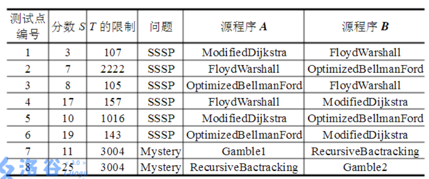
>
> 其中 Dijkstra 用堆优化，朴素 BellmanFord 当没有松弛时退出循环。Gamble1 是恒 AC 不用管， Gamble2 是恒 TLE 不用管。RecursiveBacktracking 如下：
>
> ```pseudocode
> This algorithm tries X from 2 to V one by one and stops at the first valid X.  
> For each X, the backtracking routine label vertex 0 with 0, then for each vertex u that has been assigned a label, the backtracking routine tries to assign 
> the smallest possible label up to label X-1 to its neighbor v, and backtracks if necessary.  
> // Please check RecursiveBacktracking.cpp/pas to see 
> // the exact lines where the iteration counter is increased by 1
> ```
>
> 其他表格里的程序也有源码提供，在这里 [下载](https://www.luogu.com.cn/fe/api/problem/downloadAttachment/96f5xa7r)
>
> 对 SSSP (单源最短路径)问题，输入和输出格式为：
>
> 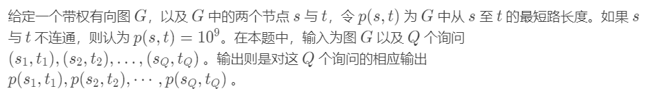
>
> 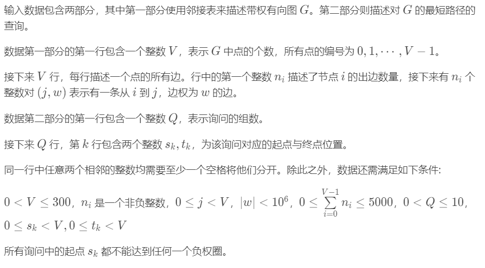
>
> 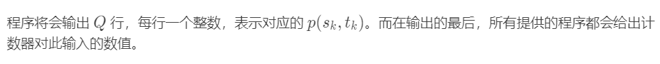
>
> 对 Mystery 问题，输入和输出格式为：
>
> 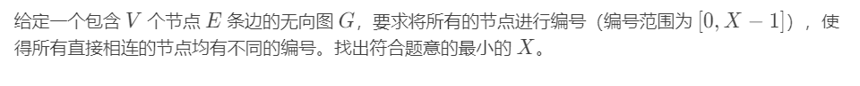
>
> 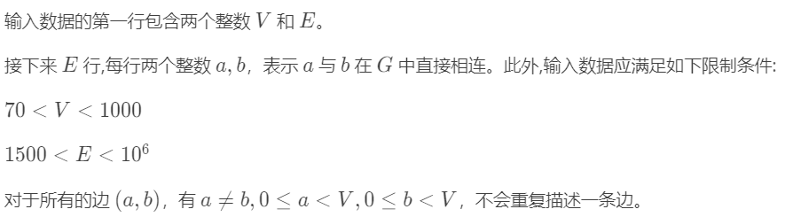
>
> 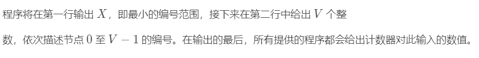

Hack Floyd 自不用多说，直接构造有多大算多大的空图即可。

Hack Bellman Ford ，要知道复杂度是 $O(QVE)$ ，让每一轮遍历全图都能松弛就行了，因为要让 Floyd 能过，所以不能太多点，可以构造一条很长的链，从链的一段开始，另一端填多一点边好让 $V$ 够大，那么就使得 $Q$ 逼近 $V$ 。

Hack Dijkstra ，可以造负环，它在负环下复杂度是指数的。例如：


而第五个测试点 $T$ 很小，所以需要不断调参，可以手动二分。

对染色问题，让他挂可以上完全图，让他不挂可以上二分图。

```c++
#include <bits/stdc++.h>
using namespace std;
#define sc(x) scanf("%lld", &x)
typedef long long ll;
#define pt printf
void hackFloyd()
{
    pt("101\n");
    for (ll i = 1; i <= 101; ++i)
        pt("0\n");
    pt("1\n0 1\n");
}
void hackBellmanFord(ll n = 100, ll e = 950) // but Floyd will pass
{
    pt("%lld\n", n);
    ll lf = e; // let Floyd pass, 950**3<1e6
    for (ll i = 0; i < n; ++i)
    {
        ll ne = min(lf, 15LL), ne2 = ne;
        lf -= ne;
        if (i)
        {
            ++ne;
        }
        pt("%lld", ne);
        if (i)
        {
            pt(" %lld 1", i - 1);
        }
        for (ll j = 0; j < ne2; ++j)
        {
            pt(" %lld 1", i);
        }
        pt("\n");
    }
    pt("10\n");
    for (ll i = 1; i <= 10; ++i)
    {
        pt("%lld 0\n", n - 1);
    }
}
void hackDijkstra()
{
    pt("33\n");
    ll d = (1 << 16) + (1 << 15);
    for (ll i = 0; i < 33; ++i)
    {
        if (i == 32)
        {
            pt("0\n");
            break;
        }
        if (i & 1)
        {
            pt("1 %lld %lld\n", i + 1, -d);
            d >>= 1;
        }
        else
        {
            pt("2 %lld -1 %lld -2\n", i + 1, i + 2);
        }
    }
    pt("6\n");
    for (ll i = 1; i <= 6; ++i)
    {
        pt("0 32\n");
    }
}
void hackDFS()
{
    pt("71 %lld\n", (3004 - 2) / 2);
    for (ll i = 0, cnt = 2; i < 71; ++i)
    {
        for (ll j = i + 1; j < 71; ++j)
        {
            pt("%lld %lld\n", i, j);
            cnt += 2;
            if (cnt >= 3004)
            {
                return;
            }
        }
    }
}
void passDFS()
{
    ll t = 2;
    pt("80 %lld\n", (3004 - 2) / 2);
    for (ll i = 0; i < 40; ++i)
    {
        for (ll j = 40; j < 80; ++j)
        {
            pt("%lld %lld\n", i, j);
            t += 2;
            if (t >= 3004)
            {
                return;
            }
        }
    }
}
signed main()
{
    freopen("1.txt", "w", stdout);
    hackFloyd();
    freopen("2.txt", "w", stdout);
    hackBellmanFord();
    freopen("3.txt", "w", stdout);
    hackFloyd();
    freopen("4.txt", "w", stdout);
    hackDijkstra();
    freopen("5.txt", "w", stdout);
    hackBellmanFord(300, 45);
    freopen("6.txt", "w", stdout);
    hackDijkstra();
    freopen("7.txt", "w", stdout);
    hackDFS();
    freopen("8.txt", "w", stdout);
    passDFS();
    return 0;
}
```


#### 贪心

##### P1650 田忌赛马

> 有 $n(1\le n\le2000)$ 对马，田忌马速度值为 $a_i$ ，齐王为 $b_i$ (速度 $\in[0,100]$ )，每匹马只能比一次，田忌选择比赛顺序，赢一场得 200 钱，平局得 0 ，输一场负 200 钱，问最多得多少钱

解法一：贪心策略：

1. 若田忌最快马快于齐王最快马，它们打一场，田忌赢

   > 因为这是最难打的马，齐王没有更难的了，所以田忌留着最强的也没用，无论如何不如用了

2. 否则若田忌最快马慢于齐王最快马，用田忌最慢马耗掉齐王最快马，田忌输

   > 打不过就直接用最小代价把它耗掉，所以用最次的马

3. 否则若田忌最快马等于齐王最快马

   > 这时如果直接打一场会产生平局，也可以选择故意输掉这场比赛，把最强马留着以后用

   1. 如果田忌最慢马快于齐王最慢马，最慢马之间比一场，田忌胜

      > 这时暂时搁置最快之间的考虑；最慢马跟齐王最快打一定会输，之后最快马可以赢一场的话，一胜一负得钱为 0；但是如果最慢马赢，最快马平，得钱为 200

   2. 否则，用田忌最慢马耗掉齐王最快马，田忌输

      > 最慢的马留着谁也赢不了，反正跟最慢的打平局或输，不如跟最快的打，那么输一场，但是接下来最快的马能赢一场，一胜一负得钱为 0

```c++
#include <bits/stdc++.h>
using namespace std;
#define sc(x) scanf("%lld", &x)
typedef long long ll;
ll n, ans;
vector<ll> a, b;
signed main()
{
    sc(n);
    for (ll i = 1, v; i <= n; ++i)
    {
        sc(v), a.emplace_back(v);
    }
    for (ll i = 1, v; i <= n; ++i)
    {
        sc(v), b.emplace_back(v);
    }
    sort(a.begin(), a.end());
    sort(b.begin(), b.end());
    for (ll i = 1; i <= n; ++i)
    {
        if (a.back() > b.back())
        {
            ans += 200, a.pop_back(), b.pop_back();
        }
        else if (a.back() < b.back())
        {
            ans -= 200, a.erase(a.begin()), b.pop_back();
        }
        else if (a.front() > b.front())
        {
            ans += 200, a.erase(a.begin()), b.erase(b.begin());
        }
        else
        {
            ans -= (a.front() < b.back()) * 200, a.erase(a.begin()), b.pop_back();
        }
    }
    printf("%lld", ans);
    return 0;
}
```

解法二：DP

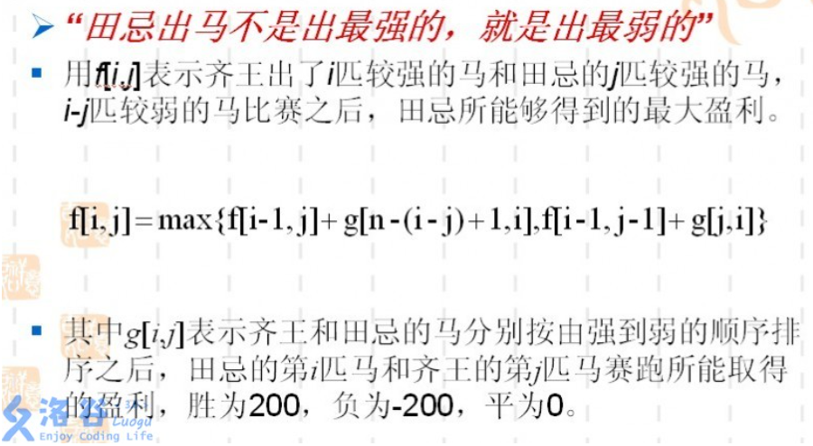

```c++
#include <iostream>
#include <cstdio>
#include <algorithm>
using namespace std;

const int N=2001,INF=-2e+8;
int a[N],b[N],g[N][N],f[N][N];

bool Cmp(int n1,int n2) {return n1>n2;}

int main()
{
	int n,Ans,i,j; scanf("%d",&n);
	for (i=1;i<=n;++i) scanf("%d",&a[i]);
	for (i=1;i<=n;++i) scanf("%d",&b[i]);
	sort(a+1,a+n+1,Cmp),sort(b+1,b+n+1,Cmp);
	for (i=1;i<=n;++i)
		for (j=1;j<=n;++j)
		{
			if (a[i]>b[j]) g[i][j]=200;
			else if (a[i]==b[j]) g[i][j]=0;
				 else g[i][j]=-200;
			f[i][j]=INF;
		}
	for (i=1;i<=n;++i)
	{
		f[i][0]=f[i-1][0]+g[n-i+1][i];
		f[i][i]=f[i-1][i-1]+g[i][i];
		for (j=1;j<i;++j)
			f[i][j]=max(f[i-1][j]+g[n-i+j+1][i],f[i-1][j-1]+g[j][i]);
	}
	Ans=f[n][1];
	for (i=2;i<=n;++i) Ans=max(Ans,f[n][i]);
	printf("%d\n",Ans);
	return 0;
}
```

内存优化后：

```c++
#include <iostream>
#include <cstdio>
#include <algorithm>
using namespace std;

const int N=2001,INF=-2e+8;
int a[N],b[N],g[N][N],f[N];

bool Cmp(int n1,int n2) {return n1>n2;}

int main()
{
    int n,Ans,i,j; scanf("%d",&n);
    for (i=1;i<=n;++i) scanf("%d",&a[i]);
    for (i=1;i<=n;++i) scanf("%d",&b[i]);
    sort(a+1,a+n+1,Cmp),sort(b+1,b+n+1,Cmp);
    for (i=1;i<=n;++i)
        for (j=1;j<=n;++j)
        {
            if (a[i]>b[j]) g[i][j]=200;
            else if (a[i]==b[j]) g[i][j]=0;
                 else g[i][j]=-200;
        }
    for (i=1;i<=n;++i) f[i]=INF;
    for (i=1;i<=n;++i)
    {
        f[i]=f[i-1]+g[i][i];
        for (j=i-1;j>0;--j)
            f[j]=max(f[j]+g[n-i+j+1][i],f[j-1]+g[j][i]);
        f[0]=f[0]+g[n-i+1][i];
    }
    Ans=f[1];
    for (i=2;i<=n;++i) Ans=max(Ans,f[i]);
    printf("%d\n",Ans);
    return 0;
}
```


##### P4823 拯救小矮人

> 有 $n(\le 2000)$ 个人掉洞，身高 $a$ ，臂长 $b$ ，洞高为 $H(a,b,H\le10^5)$ ，人可以搭人梯，高度为 $\sum a$ ，最上面的人伸臂后若 $\ge H$ 可以逃出洞，问最多多少人逃出洞

解法一：优先级队列

可以想到排序依据是 $h=H-a-b$ ，显然这个值越高，人越难出洞，就要在人梯越上面。之后的关键是排序从高到低遍历每个人(初始人梯方案)，记当前所有不可能出洞的人高度和为 $fail$ ，排序后第 $i$ 个人之后的 $\sum a$ 为 $s_i$ 。若 $fail+s_i\ge h_i$ ，那么当前方案下他可以出洞，将它入队，队列排序依据是 $a$ 。若 $< h_i$ ，那么当前方案下不能出洞。若队首比 $a_i$ 高，那么把队首牺牲掉拿去垫底；否则把当前人牺牲掉拿去垫底。复杂度 $O(n\log n)$ 。

贪心换人策略的正确性证明简要思路：反正当前阶段一定有一个人出不去了，那么使得出去的人数不变，就应该把最能给剩下的人贡献的留下，结果一定不比原方案更差。

貌似桶排可以 $O(n)$ 。

```c++
#include <bits/stdc++.h>
using namespace std;
#define sc(x) scanf("%lld", &x)
typedef long long ll;
#define mn 2010
struct people
{
    ll a, b, h;
    bool operator<(const people &r) const { return h > r.h; }
} a[mn];
priority_queue<ll> q;
ll n, H, fail, s[mn];
signed main()
{
    sc(n);
    for (ll i = 1; i <= n; ++i)
    {
        sc(a[i].a), sc(a[i].b);
    }
    sc(H);
    for (ll i = 1; i <= n; ++i)
    {
        a[i].h = H - a[i].a - a[i].b;
    }
    sort(a + 1, a + 1 + n);
    for (ll i = n; i >= 1; --i)
    {
        s[i] = s[i + 1] + a[i + 1].a;
    }
    for (ll i = 1; i <= n; ++i)
    {
        if (fail + s[i] >= a[i].h)
        {
            q.push(a[i].a);
        }
        else if (!q.empty() && q.top() > a[i].a)
        {
            fail += q.top();
            q.pop();
            q.push(a[i].a);
        }
        else
        {
            fail += a[i].a;
        }
    }
    printf("%lld", (ll)q.size());
    return 0;
}
```

解法二：背包DP

设 $f_{i,j}$ 表示前 $i$ 个人(按 $a$ 排序，相同按 $a+b$ 排序)，出洞 $j$ 个时，剩余人梯最大高度。按照背包压缩可以砍掉 $i$ 。那么 $f_0=\sum a$ 即一个都不逃走，初始值 $f_j=-\infty$ 。要求的就是到最后 DP 完时 $f_i\ge 0$ 的最大的 $i$ 。

转移方程： $f_j=\max(f_j,f_{j-1}-a_i)$ 

```c++
int n, h;

struct node {
	int a, b;
}t[2010];

int f[100010];

bool cmp(node x, node y) {
	if(x.a + x.b == y.a + y.b) return x.a < y.a;
	return x.a + x.b < y.a + y.b;
}

int main() {
	n = read();
	for(int i = 1; i <= n; i++) t[i].a = read(), t[i].b = read();
	h = read();
	
	sort(t + 1, t + n + 1, cmp);
	
	memset(f, -1, sizeof(f));
	f[0] = 0;
	for(int i = 1; i <= n; i++) f[0] += t[i].a;
	
	for(int i = 1; i <= n; i++) {
		for(int j = i; j >= 1; j--) {
			if(f[j - 1] + t[i].b >= h) {
				f[j] = max(f[j], f[j - 1] - t[i].a);
			}
		}
	}
	
	for(int i = n; i >= 0; i--) {
		if(f[i] >= 0) {
			printf("%d\n", i);
			break;
		}
	}
	return 0;
}
```


##### p5749 排列鞋子

> 给定 $n(1\le n\le10^5)$ 双鞋，每只鞋子长度为 $|s_i|\le n$ ，正是右，负是左。排列为一行。将它们排序，使得左在奇数位，右在偶数位，且顺位两两长度分别相等。每次只能交换相邻鞋子，求最少交换次数。

每次排好一双鞋子后，其他位置之间的相对距离是不变的。可以设数组 $p$ 表示下标 $p_i$ 是否排好。那么从 $i$ 到 $j$ 的交换次数就是 $\sum_{k=i+1}^j p_k$ 。初始全 $1$ ，每次排好一双鞋子就把 $i,j$ 设为 $0$ 。这可以用树状数组维护，思路是权值树状数组。

记长度为 $s_i$ 的鞋子下标序列为 $v_{s_i}$ ，按下标排序。贪心策略为下标倒序查找，对每个还没匹配的下标 $i$ ，找到下标最大的一只同长异边鞋子 $j$ ，求出 $i,j$ 间的交换次数，并且根据左右看看 $i,j$ 本身需不需要交换。然后标记它们排好了。

从左向右配对而每次找最左边的一定是最优解。如下图：显然绿色长度之和小于蓝色长度之和。也就是说，上文所述的策略实际上是避免了两个相距很远的鞋子互相配对。

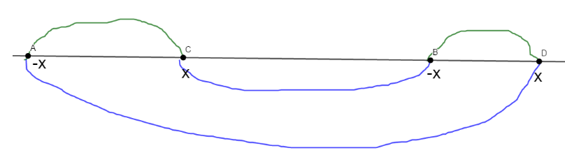

复杂度为 $O(n\log n)$ 。

```c++
#include <bits/stdc++.h>
using namespace std;
#define sc(x) scanf("%lld", &x)
typedef long long ll;
#define mn 200010
vector<ll> v[mn];
ll vis[mn], p[mn], n, a[mn], ans, n0;
ll lowbit(ll x) { return x & -x; }
void add(ll i, ll x)
{
    for (; i <= n; i += lowbit(i))
    {
        p[i] += x;
    }
}
ll query(ll r)
{
    ll ans = 0;
    for (ll i = r; i; i -= lowbit(i))
    {
        ans += p[i];
    }
    return ans;
}
signed main()
{
    sc(n), n0 = n, n *= 2;
    for (ll i = 1, x; i <= n; ++i)
    {
        sc(x), a[i] = x;
        v[x + n0].emplace_back(i);
        add(i, 1);
    }
    for (ll i = n; i >= 1; --i)
    {
        if (vis[i])
        {
            continue;
        }
        v[a[i] + n0].pop_back();
        ll j = v[-a[i] + n0].back();
        v[-a[i] + n0].pop_back();
        vis[i] = vis[j] = true;
        ans += query(i - 1) - query(j);
        ans += a[i] < 0;
        add(i, -1);
        add(j, -1);
    }
    printf("%lld", ans);
    return 0;
}
```


##### p4409 皇帝的烦恼

> 有 $n(1\le n\le2\times10^4)$ 人成环，给每人 $a_i(1\le a_i\le10^5)$ 个不同颜色的勋章，要求每个人跟他左右相邻的人勋章颜色不同，求最少需要多少种颜色

解法一：二分+DP

看到这题的本能反应确实是二分答案，设二分答案值是 $x$ 。

不加环就只有考虑 $a_i$ 与 $a_i-1$ ，加了个环，实际上我们要多处理的是 $a_n$ 与 $a_1$ 冲不冲突。根据 DP 的思路，我们层层考虑，就变成了考虑 $a_{i}$ 与 $a_1$ 冲不冲突来递推出 $a_n$ 与 $a_1$ 冲不冲突。

记 $minn_i$ 表示在不跟 $a_{i-1}$ 冲突时， $a_i\cap a_1$ 的最小大小。为了使得它最小，对于不属于 $a_{i-1}\cup a_1$ 的部分，能选多少选多少，所以让 $a_{i-1}\cup a_1$ 越小，不冲突的元素越多，那么可选择方案越大。由于 $a_{i-1}\cup a_1=a_{i-1}+a_1-a_{i-1}\cap a_1$ ，所以让 $a_{i-1}\cap a_1$ 越大越好。

因为越大越好，所以增设 $maxx_i$ 表示在不与 $a_{i-1}$ 冲突时， $a_i\cap a_1$ 的最大值。不与 $a_{i-1}$ 冲突所以并集都不能选，剩下都是可以选的，那就把 $a_1$ 内的不冲的全选了，当然不能超过自身最大限制，所以：
$$
maxx_i=\min(a_i,a_1-minn_{i-1})\\
$$
同理，最小不是空集(题意使然)，而 $minn$ 根据上文的定义是 $a_i-(\complement_x(a_{i-1}+a_1-\max(a_{i-1}\cap a_1)))$ ，所以：
$$
minn_i=\max(0,a_i-(x-(a_{i-1}+a_1-maxx_{i-1})))
$$
如果 $minn_n=0$ ，证明颜色不够用。否则颜色够用。


解法二：数学

不成环时答案就是 $\max(a_i+a_{i+1})$ 。成环时答案再考虑上 $\lceil\dfrac{\sum_{i=1}^n a_i}{\lfloor\cfrac n2\rfloor}\rceil$ 

必要性：因为相邻不等，相邻和的最值是显然的。而每种颜色最多分给 $\lfloor\dfrac n2\rfloor$ 个人，那么抽屉原理除一下可以知道满足上式

充分性：

$n$ 偶数时，设 $a_i+a_{i+1}$ 是最大相邻，那么 $\dfrac n2(a_i+a_{i+1})\ge \sum_{j=1}^na_j$ ，所以两边同除即得， $ans\ge a_{i}+a_{i+1}\ge \lceil\dfrac{\sum_{i=1}^n a_i}{\cfrac n2}\rceil$ 

之所以上取整满足，可以抽象为 $xy\ge z$ ，那么 $z$ 最大是 $z=xy$ ，那就无所谓取整不取整。否则，得到小数，且一定小于一方，即 $x > \dfrac zy$ ，而上取整后能够相等。

换句话说， $n$ 偶数时，其实压根取不到这个玩意。那么不管他也可以。

重点是 $n$ 为奇数时，例如 $a_1=a_2=a_3$ ，显然答案为 $3a_1$ 。

> 但是奇数证明我看不懂……
>
> 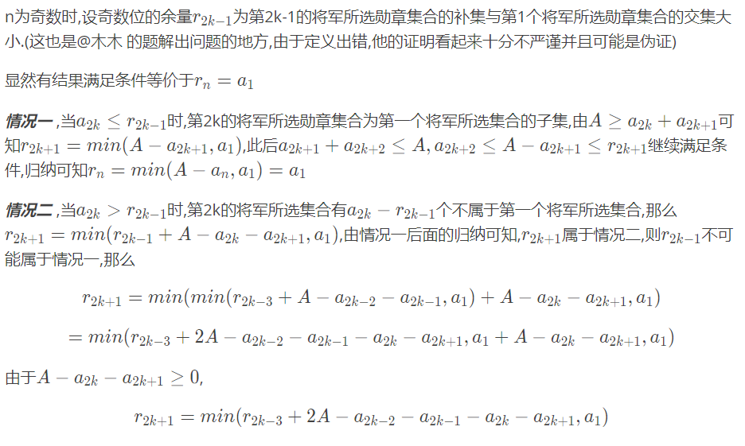
>
> 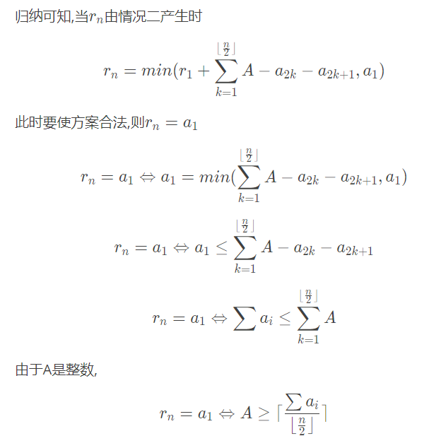


```c++
#include <bits/stdc++.h>
using namespace std;
#define sc(x) scanf("%lld", &x)
typedef long long ll;
#define mn 20010
ll n, a[mn], ans, s;
signed main()
{
    sc(n);
    for (ll i = 1; i <= n; ++i)
    {
        sc(a[i]), s += a[i];
    }
    a[n + 1] = a[1];
    ans = (s + n / 2 - 1) / (n / 2);
    for (ll i = 1; i <= n; ++i)
    {
        ans = max(ans, a[i] + a[i + 1]);
    }
    printf("%lld", ans);
    return 0;
}
```


##### p1080 国王游戏

> 给定 $n(1\le n\le10^3)$ 个大臣和一个国王。国王排在最前面。每人有两个整数 $a,b(0 < a,b < 10^4) $ ，每个大臣获得的奖赏是他前面所有人 $a$ 的乘积除以 $b$ 下取整。使得大臣奖赏最大值最小，求这个最大值。

设有两个人的下标是 $i,j$ ，那么不交换他们，他们获得的奖赏分别是：
$$
\begin{cases}
c_i=\left\lfloor\dfrac{\prod_{k=0}^{i-1}a_k}{b_i}\right\rfloor\\
c_j=\left\lfloor\dfrac{\prod_{k=0}^{i-1}a_k\cdot a_i\cdot\prod_{k=i+1}^{j-1}a_k}{b_j}\right\rfloor
\end{cases}
$$
交换后：
$$
\begin{cases}
c_j'=\left\lfloor\dfrac{\prod_{k=0}^{i-1}a_k}{b_j}\right\rfloor\\
c_i'=\left\lfloor\dfrac{\prod_{k=0}^{i-1}a_k\cdot a_i\cdot\prod_{k=i+1}^{j-1}a_k}{b_i}\right\rfloor
\end{cases}
$$
使得交换前更优，即 $\max(c_i,c_j) < \max(c_i',c_j')$ 

因为显然 $c_i < c_i', c_j' < c_j$ ，所以化简为即 $c_j < c_i'$ 即 $a_ib_i < a_jb_j$ 

因为连乘太烦了，建议用 Python 高精度。

```python
class peo(object):
    def __init__(self,l,r):
        self.l=l
        self.r=r
    def __lt__(self,x):
        return self.l*self.r<x.l*x.r
p=[]
n=int(input())
gl,gr=[int(i) for i in input().strip().split()]
for i in range(n):
    p.append(peo(*[int(i) for i in input().strip().split()]))
p.sort()#(key=lambda i:i.l*l.r)
a=0
for i in range(n):
    a=max(a,gl//p[i].r)
    gl*=p[i].l
print(a)
```

这题给下一题 皇后游戏 打铺垫。


##### p2123 皇后游戏

> 有 $T(\le 10)$ 次询问，每次有 $n(1\le n\le2\times10^4)$ 名大臣，每人有 $a,b(1\le a,b\le10^9)$ ，排好后每个大臣获得的奖赏 $c$ 为：
> $$
> c_i=
> \begin{cases}
> a_1+b_1&,i=1\\
> \max(c_{i-1},\sum_{j=1}^ia_j)+b_i&,2\le i\le n
> \end{cases}
> $$
> 使得奖赏最大值最小，求这个最大值。

设 $i$ 的后一位是 $j$ ， $i$ 前 $a$ 值和为 $x$ ，$i$ 前 $c$ 值为 $y$ ，不换时，$c_j$ 一定比 $c_i$ 大，所以
$$
\begin{align}
c_j&=\max(\max(y,x+a_i)+b_i,x+a_i+a_j)+b_j\\
&=\max(y+b_i+b_j,x+a_i+b_i+b_j,x+a_i+a_j+b_j)
\end{align}
$$
假设交换，则有：
$$
c_j'=\max(y+b_i+b_j,x+a_j+b_i+b_j,x+a_i+a_j+b_i)
$$
若不交换更优，那么 $c_j < c_j'$ 。

考虑不等式： $\max(A,C)\le \max(B,C)$ ，若 $a\le b$ ，无论如何不等式等价于 $a\le b$ 。否则，交换 $A,B$ ，交换后满足 $a\le b$ ，即 $C$ 可以消掉，在本题等效于 $A\le B$ 。(不懂)

两边消掉 $y+b_i+b_j$ ，消掉 $x$ 并化简，得：
$$
\max(b_i,a_j)+a_i+b_j\le \max(b_j,a_i)+a_j+b_i
$$
分类讨论得，实际上等效于 $\min(a_i,b_j)\le\min(a_j,b_i)$

但是该式子只能用于冒泡排序等临值交换的排序，对快排不能用，因为该不等式不满足传递性(类比极角排序)。

并且一个细节是，不能用 $\le$ 运算符重载，否则快排 RE 。

继续化简上述式子：

1. 若 $a_i < b_i,a_j < b_j$ 那么实际上不会考虑 $b$ ，此时等于只看 $a$ 升序排序
2. 若 $a_i=b_i,a_j=b_j$ ，无所谓，反正等效
3. 若 $a_i > b_i, a_j > b_j$ ，实际上不会考虑 $a$ ，等效于只看 $b$ 降序

对于其他情况，这三个划分组之间，宜按 $1,2,3$ 分组组间排序。也就是说所有第一组都不劣于第二组，第二组都不劣于第三组。

所以排序第一关键字是组号，第二关键字是组内排序依据。这样可以满足传递性。

```c++
#include <bits/stdc++.h>
using namespace std;
#define sc(x) scanf("%lld", &x)
typedef long long ll;
#define mn 20010
struct people
{
    ll x, y, d;
    bool operator<(const people &r) const
    {
        return d != r.d ? d < r.d : (d <= 0 ? x < r.x : y > r.y);
    }
} a[mn];
ll t, c[mn], n, s;
signed main()
{
    for (sc(t); t--;)
    {
        sc(n);
        for (ll i = 1, x, y; i <= n; ++i)
        {
            sc(x), sc(y), a[i].x = x, a[i].y = y;
            a[i].d = x > y ? 1 : (x < y ? -1 : 0);
        }
        sort(a + 1, a + 1 + n), s = 0;
        for (ll i = 1; i <= n; ++i)
        {
            s += a[i].x;
            c[i] = max(c[i - 1], s) + a[i].y;
        }
        printf("%lld\n", c[n]);
    }
    return 0;
}
```


##### p1561 Mountain Climbing S

> 有 $n(n\le2.5\times10^4)$ 头牛，上山用 $u$ 时间，下山用 $d(1\le u,d\le5\times10^4)$ 时间，每次只能同时一头牛上山和一头牛下山，问最短总用时

双线程调度模板题。

显然，$u < d$ 的牛全部先上， $u > d$ 的牛全部先下一定不会更差。这是因为前者有多出的时间，如果多出的后上，那更有可能浪费掉这个多出的时间。 $u=d$ 随便，因为可以等效抹掉，反正没得选。

对 $u < d$ 的，全部上山之后反正一共确实可以获得总 $\sum d-u$ 的提前量，但是考虑到提前量可能是被自己用掉的，即不一定都是被 $u > d$ 用掉的，可以让 $u$ 小的先上山，以最快获得提前量。这里贪的是贪快而不是贪多。

对 $u > d$ 的，让 $d$ 大的先下，在之前贪快的前提下，现在贪心地把提前量用光。

事实上，不妨联想上一题皇后游戏。设 $c_i$ 是第 $i$ 头牛下山的最小的总花费，即最小的全部牛最大 $c$ 值。那么本质上，皇后游戏的公式就是 $c$ 的公式。如有：
$$
c_2=\max(u_1+d_1,u_1+u_2)+d_2
$$
所以套用的就是皇后游戏的排序。

```c++
#include <bits/stdc++.h>
using namespace std;
#define sc(x) scanf("%lld", &x)
typedef long long ll;
#define mn 25025
ll n, uf[mn], df[mn];
struct cow
{
    ll u, d, lt;
    bool operator<(const cow &r)
    {
        if (u < d)
        {
            if (r.u < r.d) //同类
            {
                return u < r.u;
            }
            else
            {
                return true;
            }
        }
        else
        {
            if (r.u < r.d)
            {
                return false;
            }
            else //同类
            {
                return d > r.d;
            }
        }
    }
} a[mn];
signed main()
{
    sc(n);
    for (ll i = 1; i <= n; ++i)
    {
        sc(a[i].u), sc(a[i].d);
    }
    sort(a + 1, a + 1 + n);
    for (ll i = 1; i <= n; ++i) //前缀和
    {
        uf[i] = uf[i - 1] + a[i].u;
    }
    for (ll i = 1; i <= n; ++i)
    {
        df[i] = max(df[i - 1], uf[i]) + a[i].d;
    }
    printf("%lld", df[n]);
    return 0;
}
```

排序条件可以简写：

```c++
if ((a < b) ^ (r.a < r.b))
    return (a < b) > (r.a < r.b);
return a < b ? a < r.a : b > r.b;
```


##### p1633 二进制

> 有 $t(1\le t\le10)$ 组询问，每次给定 $a,b,c(1\le a,b,c\le2^{30})$ ，构造二进制位长度不超过 $\max(a,b,c)$ 的 $x,y,z$ 且 $1$ 数目分别于 $a,b,c$ 相等，满足 $x+y=z$ ，求最小的 $z$ 

解法一：贪心

设 $1$ 的数目为 $n$ 。那么若 $n_a+n_b < n_c$ 因为无法凭空多出 $1$ 所以无解。若 $=$ ，那么直接或起来得 $2^{n_c}-1$ 为答案。否则，显然构造进位。

考虑 $1+(2^x-1)=2^x$ ，即用一排 $x$ 个 $1$ (这些 $1$ 可以在 $a,b$ 的任意一方给)，然后再在任意一个位重复一下。如： $(1011)_2+(0101)_2$ ，这里 $x=4$ 。然后在这个基础上，非重复位有 $x-1$ 个，所有这些位都可以再填上 $1$ ，以让 $c$ 多一点 $1$ 。这整个过程里，设重复位共有 $k$ 个，最低那位进位后搞到了 $x+1$ 位的一个 $1$ ，剩下的 $k-1$ 个原地贡献 $1$ ，因此这里边 $1$ 的总数是 $k$ 。那么长度允许时可以共享 $n_a+n_b-k$ 个 $1$ 。不妨设 $k=n_c$ ，那么就可以构造出 $z$ 。

为了让 $z$ 最小，应当让重复位都往小的摆。考虑到可能产生溢出，即 $n_a+n_b-n_c > \max(n_a,n_b)$ ，所以在这个情况下，还缺 $n_c-(n_a+n_b-n_c)=2n_c-n_a-n_b$ 个 $1$ 需要在这里之外额外补，考虑到最小，可以在这个一排前放这么多个连续的 $1$ ，至于是 $a,b$ 谁给 $1$ 无所谓。

可以发现，无论如何，需要的总长度不会小于 $\max(n_a,n_b)+1$ ，这是因为最贪的把 $a,b$ 的 $1$ 都往小的地方去叠，也会进位一次。然后根据上文结果，一排的长度(含进位)是 $n_a+n_b-n_c+1$ ，补足的长度是 $2n_c-n_a-n_b$ 。所以这三者的最大值如果 $l$ 不够凑就无解。

那么就可以构造了。

```c++
#include <bits/stdc++.h>
using namespace std;
#define sc(x) scanf("%lld", &x)
typedef long long ll;
ll t, a, b, c, na, nb, nc, l;
signed main()
{
    for (sc(t); t--;)
    {
        sc(a), sc(b), sc(c);
        na = __builtin_popcount(a);
        nb = __builtin_popcount(b);
        nc = __builtin_popcount(c);
        auto len = [](ll x)
        { return 32 - __builtin_clz(x); };
        l = max(max(len(a), len(b)), len(c));
        if (na + nb < nc)
        {
            printf("-1\n");
            continue;
        }
        if (na + nb == nc)
        {
            printf("%lld\n", (1 << nc) - 1);
            continue;
        }
        auto totlen = [&]()
        {
            return max(max(na, nb), na + nb - nc + max(0LL, 2 * nc - na - nb)) + 1;
        };
        ll s = totlen();
        if (s > l)
        {
            printf("-1\n");
            continue;
        }
        ll d = na + nb - nc;
        ll ans = (1 << (s - 1)) + (1 << (s - d - 1)) - 1;
        for (ll i = s; i < na + nb; ++i)
        {
            ans |= 1 << (i - d);
        }
        printf("%lld\n", ans);
    }
    return 0;
}
```


解法二：数位DP

设 $dp[i,a,b,c,0/1]$ 表示前 $i-1$ 位，在 $x,y,z$ 中分别已经用了 $a,b,c$ 个 $1$ ，且第 $i-1$ 位有没有进位时， $z$ 的最小值是 $dp$ 。答案即求 $dp[l,n_a,n_b,n_c,0]$ ，因为不可能再进位了。

那么可以推出：

```c++
long long v=d[i][a][b][c][0];
            d[i+1][a  ][b  ][c  ][0]=min(d[i+1][a  ][b  ][c  ][0],v         );
            d[i+1][a+1][b+1][c+1][1]=min(d[i+1][a+1][b+1][c+1][1],v+(1<<i)  );
            d[i+1][a+1][b  ][c+1][0]=min(d[i+1][a+1][b  ][c+1][0],v+(1<<i-1));
            d[i+1][a  ][b+1][c+1][0]=min(f[i+1][a  ][b+1][c+1][0],v+(1<<i-1));
            v=d[i][a][b][c][1];
            d[i+1][a  ][b  ][c  ][0]=min(d[i+1][a  ][b  ][c  ][0],v         );
            d[i+1][a+1][b+1][c+1][1]=min(d[i+1][a+1][b+1][c+1][1],v+(1<<i  ));
            d[i+1][a+1][b  ][c  ][1]=min(d[i+1][a+1][b  ][c  ][1],v+(1<<i-1));
            d[i+1][a  ][b+1][c  ][1]=min(d[i+1][a  ][b+1][c  ][1],v+(1<<i-1));
```

事实上第一维可以滚动优化。当然也可以记忆化搜索实现。复杂度为 $O(T\log a\log b\log c\log\max(a,b,c))$ 。

参考：

```c++
#include<cstdio>
#include<algorithm>
#include<cstring>
#define re register
#define REP(i,a,b) for (re int i=(a);i<=(b);i++)
using namespace std;
template<class T>inline void ChkMin(T &a,T b){if (b<a)a=b;}
const int N=33;
int dp[2][N][N][N][2],oo;
int A,B,C,l;
inline int Two(int k){
    re int s=0,tl=0;
    for (;k;k>>=1,++tl)s+=k&1;
    if (tl>l)l=tl;
    return s;
}
int main(){
    int T;
    scanf("%d",&T);
    while (T--){
        re int A,B,C,cur=1,pre=0,t=0;l=0;
        scanf("%d%d%d",&A,&B,&C);
        A=Two(A),B=Two(B),C=Two(C);
        memset(dp,0x7f,sizeof(dp));
        oo=dp[1][0][0][0][0];
        dp[1][0][0][0][0]=0;
        REP(i,1,l){
            pre^=1;cur^=1;
            memset(dp[cur],0x7f,sizeof(dp[cur]));//如果赋0x3f那么dp的最大值就是106.....，而有两个数据的答案达到了107......
            REP(a,0,A)REP(b,0,B)REP(c,0,C){
                t=dp[pre][a][b][c][0];
                if (t<oo){
                    ChkMin(dp[cur][a][b][c][0],t);//当前位都选0
                    ChkMin(dp[cur][a+1][b+1][c][1],t+(1<<i));//x和y当前位都选1，那么z当前位就是0，同时有一个进位。
                    ChkMin(dp[cur][a+1][b][c+1][0],t+(1<<(i-1)));//x当前位选1，y的当前位选0，那么z的当前位就是1，由于t记录的是i-1位不进位的最小结果，所以当前位也就不进位。
                    ChkMin(dp[cur][a][b+1][c+1][0],t+(1<<(i-1)));//和上面是对称的。
                }
                t=dp[pre][a][b][c][1];
                if (t<oo){
                    ChkMin(dp[cur][a][b][c+1][0],t);//x和y的当前位都选0，当时由于t记录的是i-1位进位的状态，所以z的当前位要选1
                    ChkMin(dp[cur][a+1][b+1][c+1][1],t+(1<<i));//x和y都选1，z在进位的情况下还是选1同时还要向前进位。
                    ChkMin(dp[cur][a+1][b][c][1],t+(1<<(i-1)));//x选1，y选0，z在进位的1+x的1=0，所以当前位是0,，同时向前进位。
                    ChkMin(dp[cur][a][b+1][c][1],t+(1<<(i-1)));//对称的。
                }
              }
        }
        if (dp[cur][A][B][C][0]<oo)printf("%d\n",dp[cur][A][B][C][0]);//如果不是无解，就输出dp
            else printf("-1\n");
    }
    return 0;
}
```


#### 其他


## HDU

#### 杂题

##### hdu-6287 口算练习

> CCPC18女生赛真题

唯一分解定理+二分。设vector数组,`vector[x]`:质数`x`出现`a_i`的`i`，不去重，重复则占多个位。对`d`的每个因子`i`，对`vector[i]`二分找区间$[l,r]$，若区间长度大于因子幂，则符合条件，不大于则条件不符合。

时间复杂度$\Omicron(tn\log n)$。空间复杂度为$\Omicron(n\log n)$。

```c++
#include <bits/stdc++.h>
#define re
using namespace std;
typedef long long ll;
#define il inline
typedef double db;
il ll read()
{
    re char p = 0;
    re ll r = 0, o = 0;
    for (; p < '0' || p > '9'; o |= p == '-', p = getchar())
        ;
    for (; p >= '0' && p <= '9'; r = (r << 1) + (r << 3) + (p ^ 48), p = getchar())
        ;
    return o ? (~r) + 1 : r;
}
#define sc(x) x = read()
#define mn 100010
ll t, n, m, a[mn], l, r, d;
vector<ll> p[mn];
void upd(ll &v, const ll pi, const ll &pv)
{
    p[pi].emplace_back(pv);
    v /= pi;
}
bool chk(const ll &i, const ll &req)
{
    auto hs = upper_bound(p[i].begin(), p[i].end(), r) - lower_bound(p[i].begin(), p[i].end(), l);
    return hs >= req;
}
signed main()
{
    sc(t);
    while (t--)
    {
        sc(n), sc(m);
        for (ll i = 0; i <= 100000; ++i)
        {
            p[i].clear();
        }
        for (ll i = 1; i <= n; ++i)
        {
            sc(a[i]);
            for (ll j = 2; j * j <= a[i]; ++j)
            {
                while (a[i] % j == 0)
                {
                    // upd(a[i], j, i);
                    p[j].emplace_back(i);
                    a[i] /= j;
                }
            }
            if (a[i] > 1)
            {
                // upd(a[i], a[i], i);
                p[a[i]].emplace_back(i);
            }
        }
        while (m--)
        {
            sc(l), sc(r), sc(d);
            bool suc = true;
            for (ll i = 2, req; i * i <= d; ++i)
            {
                req = 0;
                if (d % i == 0)
                {
                    while (d % i == 0)
                    {
                        d /= i, ++req;
                    }
                    auto hs = upper_bound(p[i].begin(), p[i].end(), r) - lower_bound(p[i].begin(), p[i].end(), l);
                    if (hs < req)
                    {
                        suc = 0;
                        break;
                    }
                }
            }
            if (d > 1)
            {
                auto hs = upper_bound(p[d].begin(), p[d].end(), r) - lower_bound(p[d].begin(), p[d].end(), l);
                if (hs < 1)
                {
                    suc = 0;
                }
            }
            printf(suc ? "Yes\n" : "No\n");
        }
    }
    return 0;
}
```


##### hdu-1003 Max Sum

> 求最大连续子序列和及其边界 $1\le n\le10^5$

个人代码：(试了很多次)

```c++
#include <bits/stdc++.h>
#define re
using namespace std;
typedef long long ll;
#define il inline
typedef double db;
il ll read()
{
    re char p = 0;
    re ll r = 0, o = 0;
    for (; p < '0' || p > '9'; o |= p == '-', p = getchar())
        ;
    for (; p >= '0' && p <= '9'; r = (r << 1) + (r << 3) + (p ^ 48), p = getchar())
        ;
    return o ? (~r) + 1 : r;
}
#define sc(x) x = read()
#define mn 100010
ll t, n, s[mn], v, lf, rf, ans, mins, minlf, maxv, maxi;
signed main()
{
    sc(t);
    for (ll h = 1; h <= t; ++h)
    {
        sc(n);
        mins = rf = ans = minlf = 0, maxv = -9999;
        for (ll i = 1; i <= n; ++i)
        {
            sc(v);
            s[i] = s[i - 1] + v; //s[i]是区间[1,i]和
            if (v > maxv)        //全负特判
            {
                maxv = v;
                maxi = i;
            }
            if (s[i] < mins)
            {
                mins = s[i]; //mins已知1为左端的最小区间和
                minlf = i;   //mins区间为[1,minlf]
            }
            //[1,i] 减去 [1,minlf] 是 [minlf+1,i]
            if (s[i] - mins > ans)
            {
                ans = s[i] - mins;
                lf = minlf + 1;
                rf = i;
            }
        }
        if (maxv <= 0)
        {
            ans = maxv, lf = rf = maxi;
        }
        if (h > 1)//乐，竟然会PE
        {
            printf("\n");
        }
        printf("Case %lld:\n%lld %lld %lld\n", h, ans, lf, rf);
    }
    return 0;
}
```

更优解法：[这里](https://blog.csdn.net/weixin_40894017/article/details/79134244)

```c++
#include<bits/stdc++.h>
using namespace std;//由于本题从前往后更新，所以不用另开数组
int dp[100005];//dp[i]记录的是以dp[i]为结尾的最大值；
int main()
{
	int n;cin>>n;
	for(int kk=1;kk<=n;kk++){
		int t;cin>>t;
		memset(dp,0,sizeof(dp));
		for(int i=1;i<=t;i++)
		{
			scanf("%d",&dp[i]);
		}
		int l=1,r=1;//记录区间
		int temp=1;//记录起点
		int MAx=dp[1];
		for(int i=2;i<=t;i++)
		{
            if(dp[i-1]>=0)//dp[i-1]大于0，则对dp[i]有贡献
            {
                dp[i]=dp[i-1]+dp[i];
            }else{temp=i;}
            if(dp[i]>MAx)
            {
            	MAx=dp[i];
            	l=temp;
         	    r=i;
            }
		}
		if(kk>=2){printf("\n");}
		printf("Case %d:\n",kk);
		printf("%d %d %d\n",MAx,l,r);
	}
}
```


#### 模板

##### hdu5306 gorgeous sequence

> 有 $t=100$ 组询问， $\sum n,m\le10^6$ ，维护：
>
> - `0 x y t` 区间操作 $a_i=\min(a_i,t)$
> - `1 x y` 求区间最值
> - `2 x y` 求区间和

```c++
#include <bits/stdc++.h>
using namespace std;
typedef long long ll;
#define sc(x) scanf("%lld", &x)
#define mn 1000010
#define lfs p << 1
#define rfs p << 1 | 1
#define mkcf ll cf = (lf + rf) >> 1
#define neg -1
ll n, m, c, lc, rc, v, a[mn], s[mn], mx[mn], se[mn], cnt[mn], laz[mn], ans;
void pushup(ll p)
{
    s[p] = s[lfs] + s[rfs];
    if (mx[lfs] == mx[rfs])
    {
        mx[p] = mx[lfs];
        cnt[p] = cnt[lfs] + cnt[rfs];
        se[p] = max(se[lfs], se[rfs]);
    }
    else if (mx[lfs] > mx[rfs])
    {
        mx[p] = mx[lfs];
        cnt[p] = cnt[lfs];
        se[p] = max(se[lfs], mx[rfs]);
    }
    else if (mx[lfs] < mx[rfs])
    {
        mx[p] = mx[rfs];
        cnt[p] = cnt[rfs];
        se[p] = max(se[rfs], mx[lfs]);
    }
}
void build(ll p, ll lf, ll rf)
{
    laz[p] = -1;
    if (lf == rf)
    {
        s[p] = mx[p] = a[lf];
        cnt[p] = 1;
        se[p] = -1;
        return;
    }
    mkcf;
    build(lfs, lf, cf);
    build(rfs, cf + 1, rf);
    pushup(p);
}
void pushd(ll p, ll nw)
{
    if (mx[p] <= nw)
    {
        return;
    }
    s[p] += cnt[p] * (nw - mx[p]);
    mx[p] = laz[p] = nw;
}
void pushdown(ll p)
{
    if (laz[p] == -1)
    {
        return;
    }
    pushd(lfs, laz[p]);
    pushd(rfs, laz[p]);
    laz[p] = -1;
}
void update(ll p, ll lf, ll rf)
{
    if (mx[p] <= v)
    {
        return;
    }
    if (lf >= lc && rf <= rc && se[p] < v)
    {
        return pushd(p, v);
    }
    pushdown(p);
    mkcf;
    if (cf >= lc)
    {
        update(lfs, lf, cf);
    }
    if (cf < rc)
    {
        update(rfs, cf + 1, rf);
    }
    pushup(p);
}
void query_mx(ll p, ll lf, ll rf)
{
    if (lf >= lc && rf <= rc)
    {
        ans = max(ans, mx[p]);
        return;
    }
    pushdown(p);
    mkcf;
    if (cf >= lc)
    {
        query_mx(lfs, lf, cf);
    }
    if (cf < rc)
    {
        query_mx(rfs, cf + 1, rf);
    }
}
void query_sum(ll p, ll lf, ll rf)
{
    if (lf >= lc && rf <= rc)
    {
        ans += s[p];
        return;
    }
    pushdown(p);
    mkcf;
    if (cf >= lc)
    {
        query_sum(lfs, lf, cf);
    }
    if (cf < rc)
    {
        query_sum(rfs, cf + 1, rf);
    }
}
void solve()
{
#define cls(x) for(ll i=0;i<=n;++i) x[i]=0
    sc(n), sc(m);
    cls(s); cls(mx); cls(se); cls(cnt); cls(laz);
    for (ll i = 1; i <= n; ++i)
    {
        sc(a[i]);
    }
    build(1, 1, n);
    while (m--)
    {
        sc(c), sc(lc), sc(rc);
        if (c == 0)
        {
            sc(v);
            update(1, 1, n);
        }
        else if (c == 1)
        {
            ans = -1;
            query_mx(1, 1, n);
            printf("%lld\n", ans);
        }
        else
        {
            ans = 0;
            query_sum(1, 1, n);
            printf("%lld\n", ans);
        }
    }
}
signed main()
{
    ll t;
    for (sc(t); t--;)
        solve();
    return 0;
}
```

附上题解：

```c++
#include <algorithm>
#include <cctype>
#include <cstdio>
using namespace std;
const int N = 1e6 + 6;

char nc() {
  static char buf[1000000], *p = buf, *q = buf;
  return p == q && (q = (p = buf) + fread(buf, 1, 1000000, stdin), p == q)
             ? EOF
             : *p++;
}

int rd() {
  int res = 0;
  char c = nc();
  while (!isdigit(c)) c = nc();
  while (isdigit(c)) res = res * 10 + c - '0', c = nc();
  return res;
}

int t, n, m;
int a[N];
int mx[N << 2], se[N << 2], cn[N << 2], tag[N << 2];
long long sum[N << 2];

inline void pushup(int u) {  // 向上更新标记
  const int ls = u << 1, rs = u << 1 | 1;
  sum[u] = sum[ls] + sum[rs];
  if (mx[ls] == mx[rs]) {
    mx[u] = mx[rs];
    se[u] = max(se[ls], se[rs]);
    cn[u] = cn[ls] + cn[rs];
  } else if (mx[ls] > mx[rs]) {
    mx[u] = mx[ls];
    se[u] = max(se[ls], mx[rs]);
    cn[u] = cn[ls];
  } else {
    mx[u] = mx[rs];
    se[u] = max(mx[ls], se[rs]);
    cn[u] = cn[rs];
  }
}

inline void pushtag(int u, int tg) {  // 单纯地打标记，不暴搜
  if (mx[u] <= tg) return;
  sum[u] += (1ll * tg - mx[u]) * cn[u];
  mx[u] = tag[u] = tg;
}

inline void pushdown(int u) {  // 下传标记
  if (tag[u] == -1) return;
  pushtag(u << 1, tag[u]), pushtag(u << 1 | 1, tag[u]);
  tag[u] = -1;
}

void build(int u = 1, int l = 1, int r = n) {  // 建树
  tag[u] = -1;
  if (l == r) {
    sum[u] = mx[u] = a[l], se[u] = -1, cn[u] = 1;
    return;
  }
  int mid = (l + r) >> 1;
  build(u << 1, l, mid), build(u << 1 | 1, mid + 1, r);
  pushup(u);
}

void modify_min(int L, int R, int v, int u = 1, int l = 1, int r = n) {
  if (mx[u] <= v) return;
  if (L <= l && r <= R && se[u] < v) return pushtag(u, v);
  int mid = (l + r) >> 1;
  pushdown(u);
  if (L <= mid) modify_min(L, R, v, u << 1, l, mid);
  if (mid < R) modify_min(L, R, v, u << 1 | 1, mid + 1, r);
  pushup(u);
}

int query_max(int L, int R, int u = 1, int l = 1, int r = n) {  // 查询最值
  if (L <= l && r <= R) return mx[u];
  int mid = (l + r) >> 1, r1 = -1, r2 = -1;
  pushdown(u);
  if (L <= mid) r1 = query_max(L, R, u << 1, l, mid);
  if (mid < R) r2 = query_max(L, R, u << 1 | 1, mid + 1, r);
  return max(r1, r2);
}

long long query_sum(int L, int R, int u = 1, int l = 1, int r = n) {  // 数值
  if (L <= l && r <= R) return sum[u];
  int mid = (l + r) >> 1;
  long long res = 0;
  pushdown(u);
  if (L <= mid) res += query_sum(L, R, u << 1, l, mid);
  if (mid < R) res += query_sum(L, R, u << 1 | 1, mid + 1, r);
  return res;
}

void go() {  // 根据题意
  n = rd(), m = rd();
  for (int i = 1; i <= n; i++) a[i] = rd();
  build();
  for (int i = 1; i <= m; i++) {
    int op, x, y, z;
    op = rd(), x = rd(), y = rd();
    if (op == 0)
      z = rd(), modify_min(x, y, z);
    else if (op == 1)
      printf("%d\n", query_max(x, y));
    else
      printf("%lld\n", query_sum(x, y));
  }
}

signed main() {
  t = rd();
  while (t--) go();
  return 0;
}
```


##### hdu1599 find the mincost route

> 给定 $n(\le100)$ 点和 $m(\le10^3)$ 双向带权路，从任一点出发经过共至少 $3$ 个不同点然后回到该点成一个环，求最小带权环，无环输出 `It's impossible.`

环长等于 $d(a,b)+e(b,c)+e(c,a)$ ，枚举起点 $k$ ，跑 floyd 最短路。

```c++
#include <bits/stdc++.h>
using namespace std;
#define sc(x) scanf("%lld", &x)
typedef long long ll;
#define mn 101
ll n, m, f[mn][mn], e[mn][mn], ans, big = 1e9, u, v, w;
signed main()
{
    while (EOF != scanf("%lld%lld", &n, &m))
    {
        for (ll i = 1; i <= n; ++i)
            for (ll j = 1; j <= n; ++j)
                f[i][j] = e[i][j] = big;
        while (m--)
        {
            sc(u), sc(v), sc(w); //防重边
            e[u][v] = e[v][u] = f[u][v] = f[v][u] = min(e[u][v], w);
        }
        ans = big;
        for (ll k = 1; k <= n; ++k)
        {
            for (ll i = 1; i < k; ++i)
                for (ll j = i + 1; j < k; ++j)
                    ans = min(ans, f[i][j] + e[j][k] + e[k][i]);
            for (ll i = 1; i <= n; ++i)
                for (ll j = 1; j <= n; ++j)
                    f[i][j] = min(f[i][j], f[i][k] + f[k][j]);
        }
        ans == big ? printf("It's impossible.\n") : printf("%lld\n", ans);
    }
    return 0;
}
```


## CCF

> 补题链接：http://118.190.20.162/home.page

### 标签

#### 23CCF

1. 数组推导

   签到 思维

2. 非零段划分

   签到 思维

3. 脉冲神经网络

   大模拟 图论

4. 收集卡牌

   状压DP / 记忆化搜索

5. 箱根山岳险天下

   LCT


#### 22CCF

1. 灰度直方图

   签到 计数(排序)

2. 领域均值

   签到 滑动窗口

3. DHCP服务器

   大模拟

4. 校门外的树

   DP 因数筛

5. 疫苗运输

   Dijkstra最短路 exgcd解二元方程


### 题目

#### 23CCF

##### 数组推导

从补题时自己的水平来看，自然是签到题就是了。

一开始WA了一发，以为非固定值要放第一个元素，后来猛然一想放 0 不就好了。这样例坑了我一把

```c++
#include <bits/stdc++.h>
using namespace std;
typedef long long ll;
#define mn 110
ll n, b[mn], mi, mx, miv;
signed main()
{
    scanf("%lld", &n);
    for (ll i = 1; i <= n; ++i)
    {
        scanf("%lld", &b[i]);
    }
    miv = mi = mx = b[1];
    for (ll i = 2; i <= n; ++i)
    {
        if (b[i] == b[i - 1])
        {
            mi += 0;
        }
        else
        {
            mi += b[i];
        }
        mx += b[i];
    }
    printf("%lld\n%lld \n", mx, mi);
    return 0;
}
```


##### 非零段划分

一开始题目没读完就想着是不是二分答案(二分p)，然后写到一半猛然想到好像不满足单调性啊；然后想着是不是链表+并查集。然后刚把并查集板子敲完，然后发现好像找段并没有这么简单。(属于是被自己出题出魔怔了，刚好蓝桥热身自己出过一道二分+并查集+链表的题目)

然后思索了几分钟，发现好像直接枚举然后删就可以了。删的时候会 $-1$ ，两边有的话各 $+1$ 。就这么简单。不管连不连续都是这样的。

所以一发过了

```c++
#include <bits/stdc++.h>
using namespace std;
typedef long long ll;
#define mn 500010
ll a[mn], n, fa[mn], ans, now;
vector<ll> bin[10010];
signed main()
{
    scanf("%lld", &n);
    for (ll i = 1; i <= n; ++i)
    {
        scanf("%lld", a + i);
    }
    for (ll i = 1, cnt = 0; i <= n + 1; ++i)
    {
        bin[a[i]].emplace_back(i);
        if (a[i])
        {
            ++cnt;
        }
        else
        {
            now += (cnt != 0);
            cnt = 0;
        }
    }
    ans = now;
    for (ll v = 1; v <= 10000; ++v)
    {
        for (auto i : bin[v])
        {
            --now;
            a[i] = 0;
            now += (a[i - 1] != 0) + (a[i + 1] != 0);
        }
        ans = max(ans, now);
    }
    printf("%lld", ans);
    return 0;
}
```


##### 脉冲神经网络

花了很久才读懂题目。读懂之后就可以上大模拟了。逐秒模拟即可。完全理解题意之后感觉也题意不是特别复杂……虽然光是把输入读懂就花了不少时间。一开始写好显然就炸了，然后debug了一会发现竟然是输入炸了，读多个同神经元的时候的内层循环条件有问题。

然后喜提66分RE，发现看少了一个0大概，然后喜提66分TLE。然后进行了多次常数优化，均以失败告终。包括把前向星改了，结构体拆了很多，之类的。一开始没有冲量二维的，而是按vector来记录每一次脉冲事件的，然后喜提TLE+MLE。然后就觉得是不行了。考虑到 $T$ 的范围，想到了可以压缩数组压二维事件。

后来看了题解，发现可以压缩二维冲量。但是我把自己的代码调整到跟题解几乎一样了，还是不能过题。不过据别人说这题卡常也确实很阴间。所以放弃继续往下深思或重写一次了。目前的思路就算是正确的了。

不过显然复杂度都到 $10^8$ 了，这常数拿头来压。挂一个最后的 $66$ 分TLE代码吧

```c++
#include <bits/stdc++.h>
using namespace std;
#define re register
#define il inline
typedef int ll;
typedef double db;
#define big 1e9
ll n, s, p, t;
#define mn 1005
db v[mn], u[mn], a[mn], b[mn], c[mn], d[mn], dt, ik[mn][mn];
ll r[mn * 2], num[mn];
struct edge
{
    ll to;
    db w;
    ll d;
};
vector<edge> g[mn * 2];

static unsigned long nex = 1;
/* RAND_MAX assumed to be 32767 */
int myrand(void)
{
    nex = nex * 1103515245 + 12345;
    return ((unsigned)(nex / 65536) % 32768);
}

void f()
{
    for (re ll i = 1; i <= t; ++i)
    {
        for (re ll j = n, je = 0, nownx; je < p; ++je, ++j)
        {
            nownx = myrand();
            if (r[j] > nownx)
            {
                for (ll h = 0, he = g[j].size(); h < he; ++h)
                {
                    edge &e = g[j][h];
                    ik[(i + e.d) % mn][e.to] += e.w;
                }
            }
        }
        for (re ll j = 0; j < n; ++j)
        {
            db pv = v[j], pu = u[j];
            v[j] = pv + dt * ((0.04 * pv + 5) * pv + 140 - pu) + ik[i % mn][j];
            u[j] = pu + dt * a[j] * (b[j] * pv - pu);
            if (v[j] >= 30)
            {
                v[j] = c[j];
                u[j] += d[j];
                ++num[j];
                for (ll h = 0, he = g[j].size(); h < he; ++h)
                {
                    edge &e = g[j][h];
                    ik[(i + e.d) % mn][e.to] += e.w;
                }
            }
            ik[i % mn][j] = 0;
        }
    }
    db mi = big, mx = -big;
    ll nmi = big, nmx = -big;
    for (re ll i = 0; i < n; ++i)
    {
        mi = min(mi, v[i]);
        mx = max(mx, v[i]);
        nmi = min(nmi, num[i]);
        nmx = max(nmx, num[i]);
    }
    printf("%.3lf %.3lf\n%d %d", mi, mx, nmi, nmx);
}

db vi, ui, ai, bi, ci, di, wi;
ll ri;
signed main()
{
    scanf("%d%d%d%d%lf", &n, &s, &p, &t, &dt);
    for (ll rn = 0, i = 0; rn < n;)
    {
        scanf("%d%lf%lf%lf%lf%lf%lf", &ri, &vi, &ui, &ai, &bi, &ci, &di);
        for (ll j = 0; j < ri; ++j, ++i)
        {
            v[i] = vi, u[i] = ui, a[i] = ai, b[i] = bi, c[i] = ci, d[i] = di;
        }
        rn += ri;
    }
    for (ll i = n, j = 0; j < p; ++j, ++i)
    {
        scanf("%d", &r[i]);
    }
    for (ll i = 0, si, ti, di; i < s; ++i)
    {
        scanf("%d%d%lf%d", &si, &ti, &wi, &di);
        g[si].push_back({ti, wi, di});
    }
    f();
    return 0;
}
```


##### 收集卡牌

爆搜很容易想。花了一小时推导 $p$ 相等的情况，觉得是 DP，方程也推得差不多了，但是最后发现实现不出来，即概率阻断后怎么防止不干扰，怎么都没搞对。我设的是 $dp[i][j]$ 代表当前抽了 $i$ 个不同邮票，有 $j-1$ 个硬币(防止 $0$ 的越界)的概率。初始值是 $dp[1][1]=1$ 。递推是用记忆化搜索来，方程不是特别难。然后答案累积的时候把概率叠上步骤。

一开始用小 $k$ 递推。发现是可以倒道来，即 $i=n$ 有 $k$ 个，往下有 $n-1$ 有更高的 $k$ 个……以此类推，到 $n=1$ 时只有一个，因为阻断了。然后阻断就设 $dp$ 值为 $0$ 。然后写完代码了一交一个零蛋。重新思考发现 $k$ 大了好像完全不同了，阻断的情况太复杂了，根本推不出来。

全错代码如下：

```c++
#include <bits/stdc++.h>
using namespace std;
typedef long long ll;
typedef double db;
#define mn 105
db dp[mn][mn], p[mn];
ll n, k, sa = 1;
bool vis[mn][mn];

db dfs(ll x, ll y)
{
    if (vis[x][y] || x == 0 || y == 0)
    {
        return dp[x][y];
    }
    vis[x][y] = true;
    dp[x][y] = dfs(x, y - 1) * x * p[1] + dfs(x - 1, y) * (n - x + 1) * p[1];
    return dp[x][y];
}

void fs()
{
    dp[1][1] = 1;
    vis[1][1] = true;
    db ans = 0;
    for (ll x = n, y = 1; x >= 2; --x)
    {
        for (ll j = 0; j < k; ++j, ++y)
        {
            ans += dfs(x, y) * (x + y - 1);
            printf("%lld %lld %lf\n", x, y, dp[x][y]);
            dp[x][y] = 0;
        }
    }
    ans += dfs(1, k * (n - 1) + 1) * (k * (n - 1) + 1);
    printf("%lld %lld %lf\n", 1LL, k * (n - 1) + 1, dp[1][k * (n - 1) + 1]);
    printf("%.12lf\n", ans);
}

signed main()
{
    scanf("%lld%lld", &n, &k);
    for (ll i = 1; i <= n; ++i)
    {
        scanf("%lf", p + i);
    }
    for (ll i = 2; i <= n; ++i)
    {
        if (p[i] != p[i - 1])
        {
            sa = 0;
        }
    }
    if (sa)
    {
        fs();
    }
    return 0;
}
```

然后写了一个爆搜代码，骗了20分跑人了：

```c++
#include <bits/stdc++.h>
using namespace std;
typedef int ll;
typedef long double db;
#define mn 105
db p[mn];
ll n, k;
ll cnt[mn];
db dfs(ll suc, ll fai, db pos)
{
    db ans = 0;
    if (suc + fai / k >= n)
    {
        return (suc + fai) * pos;
    }
    for (ll i = 1; i <= n; ++i)
    {
        db nwpos = pos * p[i];
        ll nwsuc = suc, nwfai = fai;
        if (cnt[i])
        {
            nwfai++;
        }
        else
        {
            nwsuc++;
        }
        ++cnt[i];
        ans += dfs(nwsuc, nwfai, nwpos);
        --cnt[i];
    }
    return ans;
}
signed main()
{
    scanf("%d%d", &n, &k);
    for (ll i = 1; i <= n; ++i)
    {
        scanf("%Lf", p + i);
    }
    printf("%.10Lf", dfs(0, 0, 1.0));
    return 0;
}
```

然后看题解，可以用状压记忆化搜索，设状态代表当前有多少有的邮票，第二维状态是当前的硬币数，然后暴力记忆化搜索即可，整体思路不难：

```c++
#include <bits/stdc++.h>
using namespace std;
typedef long long ll;
typedef double db;
#define mn 17
#define mk 6
db p[mn], dp[1 << mn][mn * mk];
ll n, k;
bool vis[1 << mn][mn * mk];
db dfs(ll state, ll coins, ll ngot)
{ //当前状态还要额外用多少期望才能得到结果
    if (vis[state][coins])
    {
        return dp[state][coins];
    }
    if (state == (1 << n) - 1 || coins / k >= ngot)
    { //结束态无需额外花费
        return 0;
    }
    db res = 0;
    for (ll i = 0; i < n; ++i)
    {
        ll si = (state >> i) & 1;
        if (!si) //未得到第i张牌
        {        //那么以p[i]概率得到这张牌，花费1
            db nw = dfs(state | (1 << i), coins, ngot - 1);
            res += (nw + 1) * p[i];
        }
        else //得到了，硬币+1
        {
            db nw = dfs(state, coins + 1, ngot);
            res += (nw + 1) * p[i];
        }
    }
    vis[state][coins] = true;
    dp[state][coins] = res;
    return res;
}
signed main()
{
    scanf("%lld%lld", &n, &k);
    for (ll i = 0; i < n; ++i)
    {
        scanf("%lf", p + i);
    }
    printf("%.10lf", dfs(0, 0, n));
    return 0;
}
```


##### 箱根山岳险天下

本来想骗点分的，然后发现在强制在线下我完全区分不开数据点，而且维护乘法+取模还要比大小这个操作我真不会。所以到头来我连一个点都没办法入手。遗憾0分离场，代码都没交，就试了一下`pb_ds`能不能用，发现可以。

标解是LCT。没学过，以后补。见[这里](https://blog.csdn.net/qq_51557417/article/details/120927426?spm=1001.2014.3001.5506)


#### 22CCF

##### 灰度直方图

究极签到题不解释，一发过

```c++
#include <bits/stdc++.h>
using namespace std;
typedef long long ll;
ll n, m, l, a, bin[300];
signed main()
{
    scanf("%lld%lld%lld", &n, &m, &l);
    for (ll i = 0; i < n; ++i)
    {
        for (ll j = 0; j < m; ++j)
        {
            scanf("%lld", &a);
            ++bin[a];
        }
    }
    for (ll i = 0; i < l; ++i)
    {
        printf("%lld ", bin[i]);
    }
    return 0;
}
```


##### 邻域均值

一开始我读错题目了，然后以为区域是菱形的，写了个比较复杂的滑窗，样例显然没过；然后输出了一下发现最初值就是个正方形区域啊……反正思路就是每行初始跑一次，之后每次往右滑，删一行加一行。复杂度是 $\Omicron(nr^2+n^2r)$ 

代码：

```c++
#include <bits/stdc++.h>
using namespace std;
typedef long long ll;
#define mn 606
ll n, l, r, t, a[mn][mn], ans, cnt, sums;
inline bool nin(const ll &x, const ll &y, const ll &i, const ll &j)
{
    return x < 0 || y < 0 || x >= n || y >= n || abs(x - i) > r || abs(y - j) > r;
}
inline void acc()
{
    ans += (1.0 * sums / cnt) <= t;
}
signed main()
{
    scanf("%lld%lld%lld%lld", &n, &l, &r, &t);
    for (ll i = 0; i < n; ++i)
    {
        for (ll j = 0; j < n; ++j)
        {
            scanf("%lld", &a[i][j]);
        }
    }
    for (ll i = 0; i < n; ++i)
    {
        cnt = 0, sums = 0;
        for (ll dx = -r, j = 0; dx <= r; ++dx)
        {
            for (ll dy = -r; dy <= r; ++dy)
            {
                ll x = i + dx, y = j + dy;
                if (nin(x, y, i, j))
                {
                    continue;
                }
                ++cnt;
                sums += a[x][y];
            }
        }
        acc();
        for (ll j = 1; j < n; ++j)
        {
            for (ll x = i - r, y1 = j - r - 1, y2 = j + r; x <= i + r; ++x)
            {
                if (!nin(x, y1, i, j - 1))
                {
                    --cnt, sums -= a[x][y1];
                }
                if (!nin(x, y2, i, j))
                {
                    ++cnt, sums += a[x][y2];
                }
            }
            acc();
        }
    }
    printf("%lld", ans);
    return 0;
}
```


##### DHCP服务器

天知道我写了多久……读懂题目花了很久，然后调各种bugs改了很久，比如时间调整运算有误，各种重复和去重运算有误，过期被延期取消我还是让它过期之类的，反正就是到处出错。因为我一开始读错题目了以为是 $10^5$ 个点，所以全部找最小值之类的遍历查询操作全部被我用 $set$ 来写了，然后自然开了一大堆 $set$ ，然后究竟重复与否，计次什么的反正就是一堆问题。然后写了个巨长的代码，样例终于是能过了，然后一交一个WA60分。时间倒是只有几十ms。然后改了点什么，好像是修了点bugs，然后再交一个66分，之后一直卡在66分没有再进展了，最终代码巨长无比，是这样的：

```c++
#include <bits/stdc++.h>
using namespace std;
typedef long long ll;
#define il inline
#define mn 100010
ll n, tdef, tmax, tmin, num, gi;
string h;
struct baowen
{
    string from, to, type;
    ll ip, expire, t;
} bw[mn];

#define sunalloc 1
#define swaitalloc 2
#define soccupy 3
#define sexpire 4
struct pool
{
    ll state, owner, expire;
} p[mn];

struct task
{
    ll ty, i, t, state; //ty0报文,1过期
    bool operator<(const task &r) const
    {
        return t != r.t ? t > r.t : ty < r.ty;
    }
};
set<ll> uid[mn * 2];
string iton[mn * 2];
map<string, ll> ntoi;
ll ntois;
il void addname(string &name)
{
    if (!ntoi[name])
    {
        ntoi[name] = ++ntois;
        iton[ntois] = name;
    }
}

set<ll> munalloc, mexpire;
priority_queue<task> q;

void adjust_expiretime(ll &bwexpire, ll ot)
{
    if (!bwexpire)
    {
        bwexpire = ot + tdef;
    }
    else if (bwexpire - ot < tmin)
    {
        bwexpire = ot + tmin;
    }
    else if (bwexpire - ot > tmax)
    {
        bwexpire = ot + tmax;
    }
}

signed main()
{
    ios::sync_with_stdio(false);
    cin.tie(nullptr), cout.tie(nullptr);
    cin >> num >> tdef >> tmax >> tmin >> h >> n;
    for (ll g = 0; g < n; ++g)
    {
        cin >> bw[g].t >> bw[g].from >> bw[g].to >> bw[g].type >> bw[g].ip >> bw[g].expire;
        addname(bw[g].from), addname(bw[g].to);
        q.push({0, g, bw[g].t, 0});
    }
    gi = n;

    for (ll i = 1; i <= num; ++i)
    {
        munalloc.insert(i);
    }

    while (!q.empty())
    {
        task qi = q.top();
        q.pop();
        ll oi = qi.i;
        ll ot = qi.t;
        if (qi.ty == 0)
        {
            --gi;
            string &ty = bw[oi].type;
            string &to = bw[oi].to;
            bool ndeal = false;
            if (!(to == h || to == "*") && ty != "REQ")
            {
                ndeal = true;
            }
            if (!(ty == "DIS" || ty == "REQ"))
            {
                ndeal = true;
            }
            if ((to == "*" && ty != "DIS") || (to == h && ty == "DIS"))
            {
                ndeal = true;
            }
            string &from = bw[oi].from;
            ll fromid = ntoi[from];

            if (!ndeal)
            {
                if (ty == "DIS")
                {
                    ll seleid = 0;
                    if (uid[fromid].size())
                    {
                        seleid = *uid[fromid].begin();
                    }
                    else if (munalloc.size())
                    {
                        seleid = *munalloc.begin();
                        // munalloc.erase(seleid);
                    }
                    else if (mexpire.size())
                    {
                        seleid = *mexpire.begin();
                        // mexpire.erase(seleid);
                    }
                    else
                    {
                        ndeal = true;
                    }

                    if (!ndeal)
                    {
                        p[seleid].state = swaitalloc;
                        p[seleid].owner = fromid;
                        uid[fromid].insert(seleid);
                        ll bwexpire = bw[oi].expire;
                        adjust_expiretime(bwexpire, ot);
                        p[seleid].expire = bwexpire;

                        // mexpire.erase(seleid);
                        munalloc.erase(seleid);
                        cout << h << ' ' << from << " OFR " << seleid << ' ' << bwexpire << "\n";
                        q.push({1, seleid, bwexpire, swaitalloc});
                    }
                }
                else if (ty == "REQ")
                {
                    if (to != h)
                    {
                        stack<ll> derase;
                        for (ll i : uid[fromid])
                        {
                            if (p[i].state == swaitalloc && p[i].owner == fromid)
                            {
                                p[i].state = sunalloc;
                                p[i].owner = 0;
                                p[i].expire = 0;
                                munalloc.insert(i);
                                derase.push(i);
                            }
                        }
                        while (derase.size())
                        {
                            uid[fromid].erase(derase.top());
                            derase.pop();
                        }
                    }
                    else
                    {
                        ll bwip = bw[oi].ip;
                        ll seleid = bw[oi].ip;
                        if (bwip < 1 || bwip > n || p[seleid].owner != fromid)
                        {
                            cout << h << ' ' << from << " NAK " << bw[oi].ip << " 0\n";
                        }
                        else
                        {
                            uid[fromid].insert(seleid);
                            p[seleid].state = soccupy;
                            p[seleid].owner = fromid;
                            ll bwexpire = bw[oi].expire;
                            adjust_expiretime(bwexpire, ot);
                            p[seleid].expire = bwexpire;

                            mexpire.erase(seleid);
                            munalloc.erase(seleid);
                            cout << h << ' ' << from << " ACK " << seleid << ' ' << bwexpire << "\n";
                            q.push({1, seleid, bwexpire, soccupy});
                        }
                    }
                }
            }
            if (!gi)
            {
                break;
            }
        }
        else
        {
            if (qi.state != p[oi].state || p[oi].expire > ot)
            {
                continue;
            }
            if (p[oi].state == swaitalloc)
            {
                p[oi].state = sunalloc;
                munalloc.insert(oi);
            }
            else if (p[oi].state == soccupy)
            {
                p[oi].state = sexpire;
                mexpire.insert(oi);
            }
            if (p[oi].owner)
            {
                uid[p[oi].owner].erase(oi);
            }
        }
    }
    return 0;
}
```

然后看题解，猛然发现这 $10^4$ 的复杂度，什么找最小直接遍历就行了，时间也不需要穿插的，每次报文前暴力更新一次就好了，然后重写了一次，debug了一会儿，出了一个满分补题代码：

```c++
#include <bits/stdc++.h>
using namespace std;
typedef long long ll;
#define mn 10010
struct pool
{
    ll state, owner, expire;
} p[mn];
map<string, ll> ntoi;
string iton[mn * 2], h, from, to, req = "REQ", dis = "DIS", ty;
ll ntois, n, tc, tdef, tmax, tmin;
ll t, fromid, id, expire;
#define sunalloc 0
#define swaitalloc 2
#define soccupy 3
#define sexpire 4
void addname(string &v)
{
    if (!ntoi[v])
    {
        ntoi[v] = ++ntois;
        iton[ntois] = v;
    }
}
ll fixdate(ll v)
{
    if (!v)
    {
        return tdef + t;
    }
    if (v - t < tmin)
    {
        return tmin + t;
    }
    if (v - t > tmax)
    {
        return tmax + t;
    }
    return v;
}
signed main()
{
    ios::sync_with_stdio(false);
    cin.tie(nullptr), cout.tie(nullptr);
    cin >> n >> tdef >> tmax >> tmin >> h >> tc;
    while (tc--)
    {
        cin >> t >> from >> to >> ty >> id >> expire;
        addname(from), addname(to);
        fromid = ntoi[from];
        if (!(to == h || to == "*") && ty != req)
        {
            continue;
        }
        if (!(ty == req || ty == dis))
        {
            continue;
        }
        if ((to == "*" && ty != dis) || (to == h && ty == dis))
        {
            continue;
        }
        for (ll i = 1; i <= n; ++i)
        {
            if (p[i].expire && p[i].expire <= t)
            {
                if (p[i].state == swaitalloc)
                {
                    p[i].state = sunalloc;
                    p[i].expire = p[i].owner = 0;
                }
                else if (p[i].state == soccupy)
                {
                    p[i].state = sexpire;
                    p[i].expire = 0;
                }
            }
        }
        if (ty == dis)
        {
            ll seleid = 0;
            for (ll i = 1; i <= n; ++i)
            {
                if (p[i].owner == fromid)
                {
                    seleid = i;
                    break;
                }
            }
            if (!seleid)
            {
                for (ll i = 1; i <= n; ++i)
                {
                    if (p[i].state == sunalloc)
                    {
                        seleid = i;
                        break;
                    }
                }
            }
            if (!seleid)
            {
                for (ll i = 1; i <= n; ++i)
                {
                    if (p[i].state == sexpire)
                    {
                        seleid = i;
                        break;
                    }
                }
            }
            if (!seleid)
            {
                continue;
            }
            p[seleid].state = swaitalloc;
            p[seleid].owner = fromid;
            expire = fixdate(expire);
            p[seleid].expire = expire;
            cout << h << ' ' << from << " OFR " << seleid << ' ' << expire << '\n';
        }
        else if (ty == req)
        {
            if (to != h)
            {
                for (ll i = 1; i <= n; ++i)
                {
                    if (p[i].owner == fromid && p[i].state == swaitalloc)
                    {
                        p[i].state = sunalloc;
                        p[i].owner = p[i].expire = 0;
                    }
                }
                continue;
            }
            if (id > n || id < 1 || p[id].owner != fromid)
            {
                cout << h << ' ' << from << " NAK " << id << " 0\n";
                continue;
            }
            p[id].state = soccupy;
            expire = fixdate(expire);
            p[id].expire = expire;
            cout << h << ' ' << from << " ACK " << id << ' ' << expire << "\n";
        }
    }
    return 0;
}
```


##### 校门外的树

这道题就……耗费了久了。尝试了很久。

发现了一个猜想结论，即不可能出现子段加起来刚好等于父段的情况，如果是的话一定会被障碍物卡住。

我设的区间 DP，是 $dp[i][j]$ 一开始表示两树 $[i,j]$ 为边界的答案是多少我以为直接子段累乘即可，即：
$$
dp[i][j]=\sum_{k=i+1}^{j-1}dp[i][k]\times dp[k][j]+cnt[i][j]
$$
然后按区间长度顺序遍历即可。区间 DP 板子。内层计算时枚举因数作为公差，然后枚举每个区间内障碍，判断离左边界的差是否能被整除，能的话就是挡住了。这个做法时间复杂度是 $\Omicron(n^3\sqrt a)$ 。

然后一交一个 WA，得了10分。

```c++
#include <bits/stdc++.h>
using namespace std;
typedef long long ll;
#define mn 1010
ll n, a[mn], dp[mn][mn], mod = 1e9 + 7;
bool check(ll p, ll i, ll j)
{
    for (ll k = i + 1; k < j; ++k)
    {
        if ((a[k] - a[i]) % p == 0)
        {
            return false;
        }
    }
    // printf("- %lld %lld %lld\n", i, j, p);
    return true;
}
signed main()
{
    scanf("%lld", &n);
    for (ll i = 1; i <= n; ++i)
    {
        scanf("%lld", a + i);
    }
    for (ll d = 1; d < n; ++d)
    {
        for (ll i = 1, j = i + d; j <= n; ++i, ++j)
        {
            ll v = a[j] - a[i], cnt = 0;
            // printf("<%lld %lld %lld\n", i, j, v);
            for (ll p = 1; p * p <= v; ++p)
            {
                if (v % p == 0)
                {
                    cnt += check(p, i, j);
                    cnt += v / p != p && v / p != v && check(v / p, i, j);
                }
            }
            for (ll k = i + 1; k < j; ++k)
            {
                dp[i][j] = (dp[i][j] + dp[i][k] * dp[k][j]) % mod;
            }
            dp[i][j] = (dp[i][j] + cnt) % mod;
            // printf("%lld %lld %lld %lld\n", i, j, cnt, dp[i][j]);
        }
    }
    printf("%lld", dp[1][n]);
    return 0;
}
```

然后思考可能是累乘重复了。想了很久，然后重新推导定义 $dp[i][j]$ 代表单独自己的第一个条件下成立的个数。然后用爆搜推导另一个答案 $ans[i]$ 代表长为 $i$ 的头这么多的答案是多少。爆搜即对于当前 $i$ ，前面的已经算好了，然后当前可以走 $j$ 区间长，走的时候加上区间 $dp$ 值即这个区间单独的计数，乘上选了它之后剩下的子问题。 一交一个意料之中的TLE：

```c++
#include <bits/stdc++.h>
using namespace std;
typedef long long ll;
#define mn 1010
ll n, a[mn], dp[mn][mn], mod = 1e9 + 7, me[mn];
bool vis[mn];
bool check(ll p, ll i, ll j)
{
    for (ll k = i + 1; k < j; ++k)
    {
        if ((a[k] - a[i]) % p == 0)
        {
            return false;
        }
    }
    return true;
}
ll dfs(ll now)
{
    if (vis[now])
    {
        return me[now];
    }
    if (now == n)
    {
        return 1;
    }
    ll nw = 0;
    for (ll step = 1; now + step <= n; ++step)
    {
        nw = (nw + dp[now][now + step] * dfs(now + step) % mod) % mod;
    }
    me[now] = nw;
    vis[now] = true;
    return nw;
}
signed main()
{
    scanf("%lld", &n);
    for (ll i = 1; i <= n; ++i)
    {
        scanf("%lld", a + i);
    }
    for (ll d = 1; d < n; ++d)
    {
        for (ll i = 1, j = i + d; j <= n; ++i, ++j)
        {
            ll v = a[j] - a[i], cnt = 0;
            for (ll p = 1; p * p <= v; ++p)
            {
                if (v % p == 0)
                {
                    cnt += check(p, i, j);
                    cnt += v / p != p && v / p != v && check(v / p, i, j);
                }
            }
            dp[i][j] = cnt;
        }
    }
    printf("%lld", dfs(1));
    return 0;
}
```

然后思索了一会儿，发现这个东西往下的 DFS 就是一样的子问题(之前以为是不一样的)，那为什么不可以记忆化呢？然后改了改，得到 WA 50分。

测试了一下第三个样例，发现真正用时间的是 DP。然后发现质数可以预处理，然后优化成了 DP 部分的复杂度(你优化了个屁)是 $\Omicron(a\sqrt a+n^3\sqrt a)$。然后又不知道怎么地改了改喜提 TLE 60分：

```c++
#include <bits/stdc++.h>
using namespace std;
typedef long long ll;
#define mn 1010
ll n, a[mn], dp[mn][mn], mod = 1e9 + 7, me[mn], mxa;
bool vis[mn];
bool check(ll p, ll i, ll j)
{
    for (ll k = i + 1; k < j; ++k)
    {
        if ((a[k] - a[i]) % p == 0)
        {
            return false;
        }
    }
    return true;
}
ll dfs(ll now)
{
    if (vis[now])
    {
        return me[now];
    }
    if (now == n)
    {
        return 1;
    }
    ll nw = 0;
    for (ll step = 1; now + step <= n; ++step)
    {
        nw = (nw + dp[now][now + step] * dfs(now + step)) % mod;
    }
    me[now] = nw;
    vis[now] = true;
    return nw;
}
vector<ll> f[100010];
signed main()
{
    scanf("%lld", &n);
    for (ll i = 1; i <= n; ++i)
    {
        scanf("%lld", a + i);
        mxa = max(mxa, a[i]);
    }
    for (ll i = 2; i <= mxa; ++i)
    {
        for (ll j = 1; j * j <= i; ++j)
        {
            if (i % j == 0)
            {
                f[i].emplace_back(j);
                if (i / j != j && i / j != i)
                {
                    f[i].emplace_back(i / j);
                }
            }
        }
    }
    for (ll d = 1; d < n; ++d)
    {
        for (ll i = 1, j = i + d; j <= n; ++i, ++j)
        {
            ll v = a[j] - a[i], cnt = 0;
            for (ll k = 0, ke = f[v].size(); k < ke; ++k)
            {
                cnt += check(f[v][k], i, j);
            }
            dp[i][j] = cnt;
        }
    }
    // printf("done\n");
    printf("%lld", dfs(1));
    return 0;
}
```

然后又改了改，想了很久，想把枚举的也砍了，于是对每个枚举，判断其因子数，即取 gcd 然后看因子数，对其因子和自己，全部在桶里标记失败。最后只积累没有标记失败的因数。但是复杂度其实没怎么变，而且还加一个 gcd 是对数的，可能还会更差……但是不大好说，因子数肯定是小了，但是次数又变多了……所以还是 TLE60分：

```c++
#include <bits/stdc++.h>
using namespace std;
typedef long long ll;
#define mn 1010
#define mp 100010
ll n, a[mn], dp[mn][mn], mod = 1e9 + 7, me[mn], mxa;
ll fre[mp];
bool vis[mn];
bool check(ll p, ll i, ll j)
{
    for (ll k = i + 1; k < j; ++k)
    {
        if ((a[k] - a[i]) % p == 0)
        {
            return false;
        }
    }
    return true;
}
ll dfs(ll now)
{
    if (vis[now])
    {
        return me[now];
    }
    if (now == n)
    {
        return 1;
    }
    ll nw = 0;
    for (ll step = 1; now + step <= n; ++step)
    {
        nw = (nw + dp[now][now + step] * dfs(now + step)) % mod;
    }
    me[now] = nw;
    vis[now] = true;
    return nw;
}
vector<ll> f[mp];
signed main()
{
    scanf("%lld", &n);
    for (ll i = 1; i <= n; ++i)
    {
        scanf("%lld", a + i);
        mxa = max(mxa, a[i]);
    }
    for (ll i = 2; i <= mxa; ++i)
    {
        for (ll j = 1; j * j <= i; ++j)
        {
            if (i % j == 0)
            {
                f[i].emplace_back(j);
                if (i / j != j && i / j != i)
                {
                    f[i].emplace_back(i / j);
                }
            }
        }
    }
    for (ll d = 1; d < n; ++d)
    {
        for (ll i = 1, j = i + d; j <= n; ++i, ++j)
        {
            ll v = a[j] - a[i], cnt = 0;
            for (ll k = 0, ke = f[v].size(); k < ke; ++k)
            {
                fre[f[v][k]] = 1;
            }
            for (ll k = i + 1; k < j; ++k)
            {
                ll gcd = __gcd(a[k] - a[i], v);
                for (ll g = 0, ge = f[gcd].size(); g < ge; ++g)
                {
                    fre[f[gcd][g]]--;
                }
                fre[gcd]--;
            }
            for (ll k = 0, ke = f[v].size(); k < ke; ++k)
            {
                cnt += fre[f[v][k]] > 0;
            }
            dp[i][j] = cnt;
        }
    }
    printf("%lld", dfs(1));
    return 0;
}
```

然后终于妥协了，看了题解……妙啊。解法思路是：

先用筛法预处理因数，根据调和级数，可知预处理复杂度是 $\Omicron(a\log a)$ 。

设 $dp[i]$ 代表当前区间答案，那么有初始值 $dp[1]=1$ ，递推方程：
$$
dp[i]=\sum_{j=1}^{i-1}dp[j]\times cnt[j][i]
$$
这个可以理解，但是我自己做的时候没想出来。

然后关键是 $cnt$ 的计算。对右边界 $i$ ，倒序枚举 $j$ 。第一个 $j$ 所有因数都可以。到下一个的时候，上一个的所有因数都会在上一个的左边界作为障碍，所以这些因数都不可以。那么对下一个的因数，用 $set$ 维护曾经因数，如果不在就计数且放进曾经因数，在就忽略。注意区间长本身也要，因为刚好第一棵树就碰到了左边界，而这是因素筛和计数没有枚举到的。

时间复杂度为 $\Omicron(a\log a+n^2\log a\log n)$ 。

代码：

```c++
#include <bits/stdc++.h>
using namespace std;
typedef long long ll;
#define mn 1010
#define ma 100010
ll n, mod = 1e9 + 7, a[mn], dp[mn];
vector<ll> v[ma];
set<ll> s;
signed main()
{
    scanf("%lld", &n);
    for (ll i = 1; i <= n; ++i)
    {
        scanf("%lld", a + i);
    }
    for (ll i = 1; i <= a[n] / 2; ++i)
    {
        for (ll j = 2 * i; j <= a[n]; j += i)
        {
            v[j].emplace_back(i);
        }
    }
    dp[1] = 1;
    for (ll i = 2; i <= n; ++i)
    {
        s.clear();
        for (ll j = i - 1; j >= 1; --j)
        {
            ll d = a[i] - a[j], cnt = 0;
            s.insert(d);
            for (ll k = 0; k < (ll)v[d].size(); ++k)
            {
                ll vi = v[d][k];
                if (s.find(vi) == s.end())
                {
                    ++cnt;
                    s.insert(vi);
                }
            }
            dp[i] = (dp[i] + cnt * dp[j]) % mod;
        }
    }
    printf("%lld", dp[n]);
    return 0;
}
```


##### 疫苗运输

发现可以骗分，于是只考虑不相交的情况打了个暴力。一开始因为细节问题WA了只有5分。然后改了之后竟然有35分，大赚一笔。代码：

```c++
#include <bits/stdc++.h>
using namespace std;
typedef long long ll;
#define mn 505
#define big 0x7ffffffa
ll n, m, no[mn][mn], arr[mn][mn], num[mn], dar[mn][mn], ans[mn];
vector<ll> its[mn];
signed main()
{
    scanf("%lld%lld", &n, &m);
    for (ll i = 1; i <= n; ++i)
    {
        ans[i] = big;
    }
    for (ll i = 1; i <= m; ++i)
    {
        scanf("%lld", num + i);
        ll ever = 0;
        for (ll j = 1; j <= num[i]; ++j)
        {
            scanf("%lld%lld", &no[i][j], &dar[i][j]);
            its[no[i][j]].emplace_back(i);
            arr[i][j + 1] = arr[i][j] + dar[i][j];
            ever = no[i][j] == 1 ? j : ever;
        }
        arr[i][1] = arr[i][num[i] + 1];
        for (ll j = 1; j < ever; ++j)
        {
            arr[i][j + 1] = arr[i][j] + dar[i][j];
        }
    }
    if (its[1].size())
    {
        for (ll j = 0, je = its[1].size(); j < je; ++j)
        {
            for (ll k = 1, ke = num[its[1][j]]; k <= ke; ++k)
            {
                ll u = no[its[1][j]][k];
                ans[u] = min(ans[u], arr[its[1][j]][k]);
            }
        }
    }
    for (ll i = 2; i <= n; ++i)
    {
        if (ans[i] != big)
        {
            printf("%lld\n", ans[i]);
        }
        else
        {
            printf("inf\n");
        }
    }
    return 0;
}
```

标解看懂了，最短路还好，关键是求方程用exgcd，没想到。不过就算都知道，实现起来也很不简单。

最后题解见：[这里](https://blog.csdn.net/qq_45734984/article/details/119650624?spm=1001.2101.3001.6650.5&utm_medium=distribute.pc_relevant.none-task-blog-2%7Edefault%7EBlogCommendFromBaidu%7Edefault-5.essearch_pc_relevant&depth_1-utm_source=distribute.pc_relevant.none-task-blog-2%7Edefault%7EBlogCommendFromBaidu%7Edefault-5.essearch_pc_relevant)


## POJ

[链接](http://poj.org/)

#### 杂题

##### 1655-Balancing Act

> 给定 $t(\le 20)$ 询问，每次节点为 $n(n\le2\times10^4)$ 的树，求最小编号重心及其最大子树节点数
>

直接跑板子。

```c++
#include <cstdio>
#include <algorithm>
#include <cstring>
using namespace std;
typedef long long ll;
#define mn 20010
struct edge
{
    ll to, nx;
} e[mn << 1];
ll t, n, hd[mn], cnt, cf, cfv, siz[mn], w[mn];
void adde(ll u, ll v)
{
    e[++cnt] = {v, hd[u]};
    hd[u] = cnt;
}
#define sc(x) scanf("%lld", &x)
void dfs(ll u, ll fa)
{
    siz[u] = 1, w[u] = 0;
    for (ll i = hd[u], v; i; i = e[i].nx)
    {
        v = e[i].to;
        if (v == fa)
        {
            continue;
        }
        dfs(v, u);
        siz[u] += siz[v];
        w[u] = max(w[u], siz[v]);
    }
    w[u] = max(w[u], n - siz[u]);
    if (w[u] <= n / 2 && u < cf)
    {
        cf = u, cfv = w[u];
    }
}
signed main()
{
    for (sc(t); t; --t)
    {
        sc(n), cnt = 0, memset(hd, 0, sizeof hd), cf = n + 1;
        for (ll i = 1, u, v; i < n; ++i)
        {
            sc(u), sc(v), adde(u, v), adde(v, u);
        }
        dfs(1, 0);
        printf("%lld %lld\n", cf, cfv);
    }
    return 0;
}
```


##### 1265-Area

> 有多组测试，每组测试 $n(3\le n\le100)$ 个点，接下来输入若干坐标偏量，代表当前点离上一个点的坐标位移。求这个多边形的内部包含格点整点数、边上包含的格点整点数和多边形面积。

```c++
#include <cstdio>
using namespace std;
typedef long long ll;
#define sc(x) scanf("%lld", &x)
#define mn 200
ll t, n, x[mn], y[mn], s, edge, kase;
ll gcd(ll a, ll b)
{
    return b ? gcd(b, a % b) : a;
}
ll abs(ll x)
{
    return x < 0 ? -x : x;
}
signed main()
{
    for (sc(t); t--;)
    {
        sc(n);
        s = edge = 0;
        for (ll i = 1, dx, dy; i <= n; ++i)
        {
            sc(dx), sc(dy);
            x[i] = x[i - 1] + dx, y[i] = y[i - 1] + dy;
            edge += gcd(abs(dx), abs(dy));
        }
        x[n + 1] = x[1], y[n + 1] = y[1];
        for (ll i = 1, dx, dy; i <= n; ++i)
        {
            s += x[i] * y[i + 1] - x[i + 1] * y[i];
        }
        s = abs(s);
        printf("Scenario #%lld:\n%lld %lld %.1f\n\n", ++kase, (s - edge + 2) / 2, edge, s * 0.5f); // POJ卡魔幻精度
    }
    return 0;
}
```


##### 2007-Scrambled Polygon

> $\le50$ 个整数点组成凸多边形，坐标轴上只有原点且是第一个输入。求从原点开始逆时针遍历这些点

直接以原点极角排序即可。特别注意题目说了一个性质：凸多边形必不可能经过第二象限。

也可以按照下一题的做法(找最左下点，然后进行 $n$ 次极角排序)，也可以用 Garman 法求凸包。直接以原点即可，不需要找最左下角点。

原点极角排序：

```c++
#include <cstdio>
#include <algorithm>
using namespace std;
typedef long long ll;
#define sc(x) scanf("%lld", &x)
#define cp const point &
struct point
{
    ll x, y;
    point(ll a = 0, ll b = 0) : x(a), y(b) {}
    point operator-(cp r) const { return point(x - r.x, y - r.y); }
    ll norm() const { return x * x + y * y; }
} p[55], p0;
ll cross(cp a, cp b) { return a.x * b.y - a.y * b.x; }
bool operator<(cp a, cp b)
{
    ll v = cross(a - p0, b - p0);
    return v > 0 || (v == 0 && (a - p0).norm() < (b - p0).norm());
}
ll n, b;
signed main()
{
    while (EOF != scanf("%lld%lld", &p0.x, &p0.y))
    {
        p[++n] = p0;
    }
    p0 = p[1];
    sort(p + 2, p + 1 + n);
    for (ll i = 1; i <= n; ++i)
    {
        printf("(%lld,%lld)\n", p[i].x, p[i].y);
    }
    return 0;
}
```

最左下多次极角排序：

```c++
#include <cstdio>
#include <algorithm>
using namespace std;
typedef long long ll;
#define sc(x) scanf("%lld", &x)
#define cp const point &
struct point
{
    ll x, y;
    point(ll a = 0, ll b = 0) : x(a), y(b) {}
    point operator-(cp r) const { return point(x - r.x, y - r.y); }
    ll norm() const { return x * x + y * y; }
} p[55], p0;
ll cross(cp a, cp b) { return a.x * b.y - a.y * b.x; }
bool operator<(cp a, cp b)
{
    ll v = cross(a - p0, b - p0);
    return v > 0 || (v == 0 && (a - p0).norm() < (b - p0).norm());
}
ll t, n, b;
signed main()
{
    for (t = 1; t--;)
    {
        while (EOF != scanf("%lld%lld", &p0.x, &p0.y))
        {
            p[++n] = p0;
            if (p[n].y < p[1].y || (p[n].y == p[1].y && p[n].x < p[1].x))
            {
                swap(p[n], p[1]);
            }
        }
        for (ll i = 1; i <= n; ++i)
        {
            p0 = p[i];
            sort(p + 1 + i, p + 1 + n);
        }
        for (ll i = 1; i <= n; ++i)
        {
            if (p[i].x == 0 && p[i].y == 0)
            {
                b = i;
                break;
            }
        }
        for (ll i = 1, j = b; i <= n; ++i, j = j % n + 1)
        {
            printf("(%lld,%lld)\n", p[j].x, p[j].y);
        }
    }
    return 0;
}
```

凸包：

```c++
#include <cstdio>
#include <algorithm>
using namespace std;
typedef long long ll;
typedef double db;
#define sc(x) scanf("%lld", &x)
#define mn 100010
#define cp const point &
ll n, ss, b;
struct point
{
    ll x, y;
    point(db a = 0, db b = 0) : x(a), y(b) {}
    point operator+(cp r) const { return point(x + r.x, y + r.y); }
    point operator-(cp r) const { return point(x - r.x, y - r.y); }
    db norm() const { return x * x + y * y; }
} p[mn], s[mn], p0;
db cross(cp a, cp b) { return a.x * b.y - a.y * b.x; }
bool operator<(cp a, cp b)
{
    db v = cross(a - p[1], b - p[1]);
    return v > 0 || (v == 0 && (a - p[1]).norm() < (b - p[1]).norm());
}
signed main()
{
    while (EOF != scanf("%lld%lld", &p0.x, &p0.y))
    {
        p[++n] = p0;
    }
    sort(p + 2, p + 1 + n);
    s[++ss] = p[1];
    for (ll i = 2; i <= n; ++i)
    {
        while (ss > 1 && cross(s[ss] - s[ss - 1], p[i] - s[ss]) <= 0)
        {
            --ss;
        }
        s[++ss] = p[i];
    }
    for (ll i = 1; i <= ss; ++i)
    {
        printf("(%lld,%lld)\n", p[i].x, p[i].y);
    }
    return 0;
}
```


##### 1696-Space Ant

> $\le10$ 组询问，给定 $n(\le 50)$ 个正整数点，只能选择任意点投影点 $(0,y_.)$ 开始走，然后不能往右，不能与已经走过的路线交叉，只能直走或左走，问最多经过多少个点，并给出一个方案

极角排序模板题。先找到最左下的点，然后每次走角度最小的点，一定可以走完全部的点。

如果以 $A$ 为原点，$B,C$ 对 $A$ 的极角大小 $B < C$ ，那么 $A$ 一定可以走到 $B,C$ ，而 $B$ 可以走到 $C$ 。既然可以选择 $A\to B\to C$ 和 $A\to C$ ，就应该选择前者。贪心。

```c++
#include <cstdio>
#include <algorithm>
using namespace std;
typedef long long ll;
#define sc(x) scanf("%lld", &x)
#define cp const point &
struct point
{
    ll x, y, i;
    point(ll a = 0, ll b = 0) : x(a), y(b) {}
    point operator-(cp r) const { return point(x - r.x, y - r.y); }
    ll norm() const { return x * x + y * y; }
} p[55], p0;
ll cross(cp a, cp b) { return a.x * b.y - a.y * b.x; }
bool operator<(cp a, cp b)
{
    ll v = cross(a - p0, b - p0);
    return v > 0 || (v == 0 && (a - p0).norm() < (b - p0).norm());
}
ll t, n;
signed main()
{
    for (sc(t); t--;)
    {
        sc(n);
        for (ll i = 1; i <= n; ++i)
        {
            sc(p[i].i), sc(p[i].x), sc(p[i].y);
            if (p[i].y < p[1].y || (p[i].y == p[1].y && p[i].x < p[1].x))
            {
                swap(p[i], p[1]);
            }
        }
        for (ll i = 1; i < n; ++i)
        {
            p0 = p[i];
            sort(p + 1 + i, p + 1 + n);
        }
        printf("%lld", n);
        for (ll i = 1; i <= n; ++i)
        {
            printf(" %lld", p[i].i);
        }
        printf("\n");
    }
    return 0;
}
```


##### poj3660-cow contest

> 给定 $n(1\le n\le100)$ 点和 $m(1\le m\le4500)$ 关系，每个关系表示点 $u$ 优于点 $v$ ，问根据这些关系能确定多少个点的排名(保证无自环和环，无矛盾)

floyd跑传递闭包，得到可达矩阵。如果一个点同时被 $n-1$ 个点可达(无论是自己大于这些点还是这些点小于它)，就表明它的位置唯一确定

```c++
#include <cstdio>
using namespace std;
#define sc(x) scanf("%lld", &x)
typedef long long ll;
#define mn 105
ll n, m, f[mn][mn], ans, u, v;
signed main()
{
    sc(n), sc(m);
    while (m--)
        sc(u), sc(v), f[v][u] = 1;
    for (ll k = 1; k <= n; ++k)
        for (ll i = 1; i <= n; ++i)
            for (ll j = 1; j <= n; ++j)
                f[i][j] |= (f[i][k] & f[k][j]);
    for (ll i = 1; i <= n; ++i)
    {
        ll cnt = 0;
        for (ll j = 1; j <= n; ++j)
            cnt += (f[i][j] | f[j][i]);
        ans += cnt == n - 1;
    }
    printf("%lld", ans);
    return 0;
}
```

如果用 bitset 优化，复杂度还可以达到 $O(\dfrac{n^3}w)$ ：

```c++
#include <cstdio>
#include <bitset>
using namespace std;
#define sc(x) scanf("%lld", &x)
typedef long long ll;
#define mn 105
ll n, m, ans, u, v;
bitset<mn> f[mn];
signed main()
{
    sc(n), sc(m);
    while (m--)
        sc(u), sc(v), f[v][u] = 1;
    for (ll k = 1; k <= n; ++k)
        for (ll i = 1; i <= n; ++i)
            if (f[i][k])
                f[i] |= f[k];
    for (ll i = 1; i <= n; ++i)
    {
        ll cnt = 0;
        for (ll j = 1; j <= n; ++j)
            cnt += (f[i][j] | f[j][i]);
        ans += cnt == n - 1;
    }
    printf("%lld", ans);
    return 0;
}
```


> #### 模板
>


## SPOJ

> #### 模板
>
> ##### DQUERY
>
> [原题链接](https://www.spoj.com/problems/DQUERY/) [洛谷链接](https://www.luogu.com.cn/problem/SP3267)
>
> > 给定长为 $n(1\le n\le3\times10^4)$ 的序列 $a(1 < a_i < 10^6)$ ，有 $q(1\le q\le2\times10^5)$ 次询问，问区间 $[l,r]$ 内不同元素的个数
>
> 首先，显然权值树状数组或块状数组暴力分快可以做。


## 牛客

#### 喜迎寒假

#####  F 小D的飞机跑道

正解线段树。附上珂朵莉树代码：

```c++
#include<bits/stdc++.h>
#define re
#define repe(i,l,r) for(re int i=l;i<=r;++i)
#define IT set<node>::iterator
using namespace std;

int n,m,x,y;

struct node{
    int l,r;
    mutable int v;
    node(int L,int R=-1,int V=0):l(L),r(R),v(V) {}
    bool operator <(const node &o)const{
        return l<o.l;
    }
};

set<node> s;

inline IT split(re int pos){
    IT it=s.lower_bound(node(pos));
    if(it!=s.end()&&it->l==pos)
      return it;
    --it;
    int L=it->l;
    int R=it->r;
    int V=it->v;
    s.erase(it);
    s.insert(node(L,pos-1,V));
    return s.insert(node(pos,R,V)).first;
}

inline void assign_val(re int l,re int r,re int val=0){
    IT itr=split(r+1),itl=split(l);
    s.erase(itl,itr);
    s.insert(node(l,r,val));
}

inline int query(re int l,re int r){
    int res=0;
    IT itr=split(r+1),itl=split(l);
    for(;itl!=itr;++itl)
      res+=(itl->r-itl->l+1)*(itl->v);
    return res;
}

signed main(){
    scanf("%d%d",&n,&m);
    s.insert(node(0,n,1));
    assign_val(0,0,0);
    repe(i,1,m){
        scanf("%d%d",&x,&y);
        assign_val(x,y,0);
    }
    printf("%d\n",query(0,n));
    return 0;
}

```


## 赛氪

http://vj.saikr.com/

### 比赛

#### 第三届冬季赛

##### Star

> 给定 $n(n\le50)$ 个平面整点(横纵坐标范围在 $10^5$ 以内)和出现概率 $p_i(0.001\le p_i\le1)$ ，问这些点形成的凸包的面积期望值是多少

对每一个凸包，面积计算公式为 $S=\sum_{i=1}^m\dfrac12\vec{OP_i}\times\vec{OP_{i+1}}$ ，总期望值是所有凸包面积期望值之和，而所有面积都是由凸包上线段贡献的，换言之每段线段可以为若干个凸包贡献面积，所以可以枚举每段线段

根据凸多边形的性质，凸包上每条边的右边(即在逆时针排列凸包点时，该边对应的向量顺时针旋转 $180°$ 扫过的部分)都必然不在凸包上，也就是说这条边贡献面积当且仅当所有位于扫过的地方的点都不出现，且这条边出现(特别注意，如果共线，那么在边内部的也不能出现，其他地方随意)

那么我们可以 $O(n^2)$ 枚举每条线段，然后 $O(n)$ 枚举每个点，判断其在不在右边，在的话限定它不出现，即乘以 $1-p$ ；然后乘以线段端点出现的概率即可

如果每次以某个端点为原点进行极角排序，再枚举线段第二端点，配合单调栈，可以用 $O(n^2\log n)$ 实现枚举(但是处理概率连乘积乘除特别是 $1$ (对应概率为 $0$ )比较麻烦)，暂时没有什么好的实现方法

注意不要把叉乘加绝对值，因为不加时才能够去掉求多边形面积时重合部分的面积

因此可以 $O(n^3)$ 解出本题

```c++
#include <bits/stdc++.h>
using namespace std;
#define sc(x) scanf("%lld", &x)
typedef long long ll;
typedef double db;
#define mn 55
#define cp const point &
struct point
{
    ll x, y;
    point(ll a = 0, ll b = 0) : x(a), y(b) {}
    point operator-(cp r) const { return point(x - r.x, y - r.y); }
    ll norm() const { return x * x + y * y; }
} p[mn];
ll cross(cp a, cp b) { return a.x * b.y - a.y * b.x; }
ll dot(cp a, cp b) { return a.x * b.x + a.y * b.y; }
ll ccw(cp a, cp b)
{
    if (cross(a, b) > 0)
    {
        return 1;
    }
    if (cross(a, b) < 0)
    {
        return -1;
    }
    if (dot(a, b) < 0)
    {
        return 2;
    }
    if (a.norm() < b.norm())
    {
        return -2;
    }
    return 0;
}
ll n;
db pos[mn], ans;
signed main()
{
    sc(n);
    for (ll i = 1; i <= n; ++i)
    {
        sc(p[i].x), sc(p[i].y), scanf("%lf", &pos[i]);
    }
    for (ll i = 1; i <= n; ++i)
    {
        for (ll j = 1; j <= n; ++j)
        {
            if (j == i)
            {
                continue;
            }
            db s = (cross(p[i], p[j])) * 0.5;
            db q = pos[i] * pos[j];
            for (ll k = 1; k <= n; ++k)
            {
                if (k == i || k == j)
                {
                    continue;
                }
                point ab = p[j] - p[i], ac = p[k] - p[i];
                ll res = ccw(ab, ac);
                // if (cross(ab, ac) < 0 || (cross(ab, ac) == 0 && ac.norm() < ab.norm())) //跟下一行等价
                if (res == -1 || res == 0)
                {
                    q *= 1 - pos[k]; //不能出现
                }
            }
            ans += s * q;
        }
    }
    printf("%lf", ans);
    return 0;
}
```

可以用极角排序优化为 $O(n^2\log n)$ 


> ## 天梯
>


## 蓝桥

#### 2022省赛 CA

1. A 裁纸刀 (签)
2. B 灭鼠先锋 (博弈论 DFS)
3. C 求和 (前缀和)
4. D 选数异或 (线段树/树状数组/ST表/莫队)
5. E 爬树的甲壳虫 (DP)
6. F 青蛙过河 (二分答案+DP+单调队列优化)
7. G 最长不下降子序列 (权值线段树/权值树状数组 + 最长单调序列)
8. H 扫描游戏 (线段树 + 极角排序 + set)
9. I 数的拆分 (pollard-rho)
10. J 推导部分和 (加权并查集)

> 注：暂无官方补题链接，所以以下全部代码正确性未知
>
> 参考题解：[洛谷无代码版](https://www.luogu.com.cn/paste/mudkmvq6) [有代码版](https://real-king-ph.github.io/misc/2022/04/09/2022%E8%93%9D%E6%A1%A5%E6%9D%AFA%E7%BB%84%E9%83%A8%E5%88%86%E9%A2%98%E8%A7%A3.html#2i---%E6%95%B0%E7%9A%84%E6%8B%86%E5%88%86)

##### D 选数异或

> 长为 $n(1\le n\le10^5)$ 的数列 $a(0\le a_i\le2^{20})$ 和 $x(0\le x < 2^{20})$ ，有 $m(1\le m\le10^5)$ 次询问，问 $[l,r]$ 区间内能否选出两个数使得异或得 $x$ 

解法一：RMQ

开 $O(2^{20})$ 的桶存每个数的 $a_i\oplus x$ 最后出现的下标，由此可以 $O(n)$ 预处理出每个数 $a_i$ 与它异或得 $x$ 的最前一个数的下标 $p$ 。得到这个下标数组 $p$ 之后：对查询的区间 $[l,r]$ 求 $p$ 的区间最大值，若最大值 $\ge l$ ，说明存在这样的数

既可以用 ST 表也可以用线段树/树状数组

个人补题代码(ST表)：

```c++
#include <bits/stdc++.h>
using namespace std;
#define sc(x) scanf("%lld", &x)
typedef long long ll;
#define mn 100010
#define mlg 18
ll n, m, x, bin[(1 << 20) + 5], st[mn][mlg], a[mn], lg[mn];
signed main()
{
    sc(n), sc(m), sc(x);
    for (ll i = 1; i <= n; ++i)
    {
        sc(a[i]);
        st[i][0] = bin[a[i]];
        bin[a[i] ^ x] = i;
    }
    for (ll i = 2; i <= n; ++i)
    {
        lg[i] = lg[i / 2] + 1;
    }
    for (ll j = 1; j < mlg; ++j)
    {
        for (ll i = 1; i + (1 << j) - 1 <= n; ++i)
        {
            st[i][j] = max(st[i][j - 1], st[i + (1 << (j - 1))][j - 1]);
        }
    }
    for (ll l, r, j; m--;)
    {
        sc(l), sc(r);
        j = lg[r - l + 1];
        ll res = max(st[l][j], st[r - (1 << j) + 1][j]);
        if (res >= l)
        {
            printf("yes\n");
        }
        else
        {
            printf("no\n");
        }
    }
    return 0;
}
/*4 4 1  1 2 3 4  1 4  1 2  2 3  3 3*/
```

解法二：莫队

一个裸的[莫队](https://real-king-ph.github.io/algorithm/2022/03/29/D-querrys.html)。

开一个长为 $2^{20}$ 的桶，每次 add 操作查询 $v$ 在桶里的个数并统计为答案数，即有多少个异或为 $x$ ，然后把 $x\oplus v$ 存进去。每次 del 操作先查询并减少，然后再减一个 $x\oplus v$ 。

```c++
#include <bits/stdc++.h>
using namespace std;
#define sc(x) scanf("%lld", &x)
typedef long long ll;
#define mn 100010
ll n, m, x, bin[1048580], ans[mn], sq, a[mn], sum;
struct query
{
    ll l, r, i;
    bool operator<(const query &x) const
    {
        if (l / sq != x.l / sq)
            return l < x.l;
        if (l / sq & 1)
            return r < x.r;
        return r > x.r;
    }
} q[mn];
void add(ll i)
{
    sum += bin[a[i]];
    bin[x ^ a[i]]++;
}
void del(ll i)
{
    sum -= bin[a[i]];
    bin[x ^ a[i]]--;
}
signed main()
{
    sc(n), sc(m), sc(x), sq = sqrt(n);
    for (ll i = 1; i <= n; ++i)
    {
        sc(a[i]);
    }
    for (ll i = 1; i <= m; ++i)
    {
        sc(q[i].l), sc(q[i].r), q[i].i = i;
    }
    sort(q + 1, q + 1 + m);
    for (ll i = 1, l = 1, r = 0; i <= m; ++i)
    {
        while (l > q[i].l)
            add(--l);
        while (r < q[i].r)
            add(++r);
        while (l < q[i].l)
            del(l++);
        while (r > q[i].r)
            del(r--);
        ans[q[i].i] = sum;
    }
    for (ll i = 1; i <= m; ++i)
    {
        printf("%s\n", ans[i] ? "yes" : "no");
    }
    return 0;
}
```


##### F 青蛙过河

> 长为 $n(1\le n\le10^5)$ 的河，起点和终点坐标是 $0,n$ ，在 $1,\cdots ,n-1$ 有石子，第 $i$ 个石子可以用 $h_i(1\le h_i\le10^4)$ 次，青蛙需要来回 $x(1\le x\le10^9)$ 次，问青蛙单次移动的最短距离是多少 

二分答案+单调队列+贪心(DP)

来回是一样的，可以等效于 $2x$ 次从左到右。可以看成有 $h_i$ 个分开的石头，有 $2x$ 只青蛙需要从左往右跳到对岸一次。二分跳跃距离 $k$ ，贪心地让每只青蛙跳尽可能远的距离

设 $now[i]$ 表示坐标 $i$ 能有多少只青蛙跳到，显然 $now[0]=2x$ 。枚举第 $i$ 个石子，用队列存起来，若队首石子离当前距离大于 $k$ 就表示跳不过；否则是跳的过，把当前石子放到队尾。队首坐标小于队尾时，不断判断，如果队首 $now$ 加上队尾 $now$ 不超过队尾的 $h$ ，那么所有当前队首的青蛙都可以跳到队尾，使得队尾 $now$ 加上这么多，且队首出队。否则，只有一部分可以跳到，能跳到的全部跳过去，不能跳到的留在这里，并结束循环。若 $now[n]$ 能达到 $2x$ 就成功了

```c++
#include <cstring>
#include <iostream>
using namespace std;

long long h[100010];
long long now[100010];
int q[100010];

int n, x;
bool check(int k) {
   for (int i = 1; i <= n; i++) now[i] = 0;
   q[0] = 0;
   now[0] = 2 * x;
   for (int head = 0, tail = 0, i = 1; i <= n; i++) {
      if (h[i] == 0) continue;
      if (q[head] < i - k) return false;
      q[++tail] = i;
      while (q[head] < q[tail]) {
         if (now[q[head]] + now[q[tail]] <= h[q[tail]]) {
            now[q[tail]] += now[q[head]];
            head++;
         } else {
            now[q[head]] -= h[q[tail]] - now[q[tail]];
            now[q[tail]] = h[q[tail]];
            break;
         }
      }
   }
   return now[n] >= 2 * x;
}

int main() {
   cin >> n >> x;
   for (int i = 1; i < n; i++) scanf("%lld", &h[i]);
   h[0] = h[n] = 100000000000ll;
   int l = 1, r = n;
   int res = r;

   while (l <= r) {
      int mid = (l + r) >> 1;
      if (check(mid)) {
         r = mid - 1;
         res = mid;
      } else {
         l = mid + 1;
      }
   }

   cout << res << '\n';

   return 0;
}
```

跟这个是一样的意思：

$f_i$ 表示从 $0$ 到 $i$ 的成功跳跃次数，则：
$$
f_i=\min(\sum_{max(1,j-k)\le j\le i-1}f_j,h_i)
$$


##### G 最长不下降子序列

> 有长为 $n(1\le n\le10^5)$ 的整数序列 $a(1\le a_i\le10^6)$ ，可以将其中连续的 $k(1\le k\le10^5)$ 个数修改为任意一个相同值，求修改后能获得的最长的最长不下降子序列的长度

可以顺着和倒着求 LIS ，设 $pre[i],suf[i]$ 表示以 $a[i]$ 结尾/开始的最长不下降子序列的长度(注意不是子段 $a[1..i]$ 或 $a[i..n]$ 的长度，不然是错的)，那么实际上可以把原序列拆成三段， $pre$ ，连续 $k$ 个相同的值和 $suf$ 。具体而言，对 $pre[i]$ ， 直接设 $a[i+1..i+k]$ 的值都改成了 $a[i]$ ，然后求在 $a[i+k+1]$ 开头大于等于 $a[i]$ 的所有不降子序列里最长的

也就是说，对每个 $i$ ，要求的是区间 $[i+k+1]$ 里 $suf$ 的最大值，要求满足 $a \ge a[i]$ 。可以建一棵权值线段树(或权值树状数组)，节点代表 $a[i]$ 值(那么显然要开 $10^6$ )的长度，然后查询线段树里 $[a[i],10^6]$ 区间的最大值即可。为了避免历史影响，可以倒序枚举 $i$ ，这样来更新权值线段树。显然答案至少有 $k$ (考虑单调下降的 $a$ )，然后将每次查到的答案取一个最大值即可，每次查到的值是 $pre[i]+k+seg.query(a[i],10^6)$ 

```c++
#include <algorithm>
#include <iostream>
#include <vector>

using namespace std;

const int N = 1e5 + 10;
const int M = 1e6 + 10;
int suf[N];
int pre[N];
int a[N];

vector<int> sufstk;
vector<int> prestk;

struct SEG_Tree {
   vector<int> mx;
   vector<pair<int, int>> Range;
   SEG_Tree() {
      int sz = 1;
      while (sz < M) sz *= 2;
      sz *= 2;
      mx.assign(sz, 0);
      Range.assign(sz, make_pair(0, 0));
      build(1, M);
   }

   int Lson(int x) { return x * 2 + 1; }
   int Rson(int x) { return x * 2 + 2; }

   void build(int l, int r, int p = 0) {
      Range[p].first = l, Range[p].second = r;
      if (l == r) return;
      int m = (l + r) / 2;
      build(l, m, Lson(p));
      build(m + 1, r, Rson(p));
   }

   void set(int x, int val, int p = 0) {
      int l = Range[p].first, r = Range[p].second;
      if (l == x && r == x) {
         mx[p] = val;
         return;
      }
      int m = (l + r) >> 1;
      if (m <= l) set(x, val, Lson(p));
      if (m > r) set(x, val, Rson(p));
      mx[p] = max(mx[Lson(p)], mx[Rson(p)]);
   }

   int querry(int x, int p = 0) {
      int l = Range[p].first, r = Range[p].second;
      if (x <= l || (l == r)) {
         return mx[p];
      }
      int m = (l + r) >> 1;
      int res = querry(x, Rson(p));
      if (x <= m) res = max(res, querry(x, Lson(p)));
      return res;
   }
};

int main() {
   int n, k;
   scanf("%d%d", &n, &k);
   for (int i = 1; i <= n; i++) scanf("%d", &a[i]);
   for (int i = 1; i <= n; i++) {
      auto pos = upper_bound(prestk.begin(), prestk.end(), a[i]);
      if (pos == prestk.end()) {
         prestk.push_back(a[i]);
         pre[i] = prestk.size();
      } else {
         *pos = a[i];
         pre[i] = pos - prestk.begin() + 1;
      }
   }

   for (int i = n; i >= 1; i--) {
      auto pos = upper_bound(sufstk.begin(), sufstk.end(), a[i], less<int>());
      if (pos == sufstk.end()) {
         sufstk.push_back(a[i]);
         suf[i] = sufstk.size();
      } else {
         *pos = a[i];
         suf[i] = pos - sufstk.begin() + 1;
      }
   }

   int ans = k;

   SEG_Tree st;

   for (int i = n - k; i >= 0; i--) {
      ans = max(ans, pre[i] + k + st.querry(a[i]));
      st.set(a[i + k], suf[i + k]);
   }

   cout << ans << '\n';

   return 0;
}
```


##### H 扫描游戏

> 有在 $Y$ 轴正向的初始长为 $L(1\le L\le10^9)$ 的顺时针围绕原点旋转棒子 $OA$ ，有 $n(1\le n\le2\times10^5)$ 个加权坐标点 $(x,y,z)(-10^9\le x,y\le10^9,1\le z\le10^9)$ ，当棒子扫到某个点(共线同时扫到)时，瞬间长度增加 $z$ 。问每个点被扫到的先后顺序，如果永远扫不到输出 `-1` 

按照三个关键字排序：象限、叉积、$z$ 。然后得到排序后的数组，将其化为二倍长的链。维护一个 $set$ ，关键字是 $z$ 。可以在 $a[0]$ 开一个点 $(0,L),z=0$ 代表初始。维护一个线段树。特判原点的点后，进行如下步骤：

1. 将 $set$ 里所有小于当前高度 $L$ 的点加入到线段树里，即设置节点 $i,i+n$ 的值分别为 $i,i+n$ 

   ```c++
   while(s.size() && *set.begin().z <= h) {
      auto [pos , z] = *set.begin();
      st.set(pos , pos) , st.set(pos + n , pos + n);
      s.erase(s.begin());
   }
   ```

2. 当前扫到物品 $i$ ，那么在线段树查询 $[i,i+n]$ 的最小值，如果找到了，把这个点删了(即将线段树这个位置的值设置为正无穷)

   ```c++
   int nxt = st.min(now , now + n);
   if(nxt > 2 * n) break;
   now = nxt % n;
   if(now == 0) now = n;
   st.set(now , +INF) , st.set(now + n , +INF);
   ```

   ```c++
   auto [xx , yy] = a[now];
   int g = __gcd(abs(x) , abs(y));
   xx /= g , yy /= g;
   if(xx == x && yy == y) ans[now] = now_value;
   else ans[now] = ++now_value;
   ```

   因为插入的值就是本身，所以找到的一定是首个满足条件的值(满足小于当前长度 $L$ 的最近的下一个点)


> ##### I 数的拆分

> 有 $t(1\le t\le10^5)$ 次询问，每次问数 $a(1\le a\le10^{18})$ 能否拆分为 $x_1^{y_1}x_2^{y_2}$ ，其中 $x$ 是正整数， $y$ 是大于等于 $2$ 的正整数

超纲，跳


##### J 推导部分和

> 有长为 $n(1\le n\le10^5)$ 的整数序列 $a$ ，有 $m(1\le m\le10^9)$ 个已知部分和 $\sum_{i=l}^ra_i=s(-10^{12}\le s\le10^{12})$ ，有 $q(1\le q\le10^5)$ 个询问，求部分和 $\sum_{i=l}^r$ 的值，未知输出 `UNKNOWN`

建立带权并查集，对每个已知条件，将 $l-1$ 和 $r$ 所在的并查集按秩合并，依据是当前父亲编号的大小，把编号大的合到小的那里去。路径压缩时进行点权的压缩。点权的含义是从这个点到根节点这一段的部分和的值是多少，即 $p_x=\sum_{i=f_x}^xv_i$。规定根节点取小的，好处是作差方便，使得同根时查询时就直接右点权减(左减一)的点权即可。不同根时不可以求出结果。

那么合并的话，如果发现 $l-1$ 的根和 $r$ 一样，证明就算没有这个已知条件，本来就能求出来，所以可以忽略。否则若 $l-1$ 的根比较小的话，已知 $\sum_{i=fa_{l-1}}^{l-1}v_i=p_{l-1}$ (已知点权)，新知道了 $\sum_{i=l}^rv_i=s$ ，那么可以知道 $f_{l-1} < f_r$ ， $l-1 < r$ ，且 $\sum_{i=fa_{r}}^rv_i=p_r$ (如果本来没有已知的那就是 $0$ )，无论 $l-1,r$ 在什么位置，作图可知，只有两种情况：

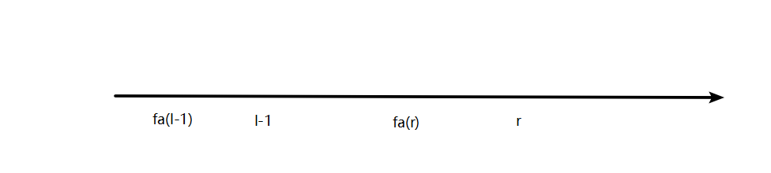

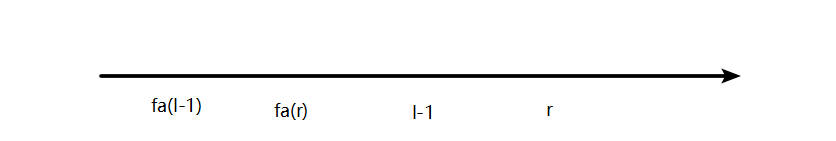

那么可知，合并之后，以 $l-1$ 为根，那么 $\sum_{i=l-1}^{f_r}v_i=\sum_{i=l}^rv_i-\sum_{i=f_r}^r$

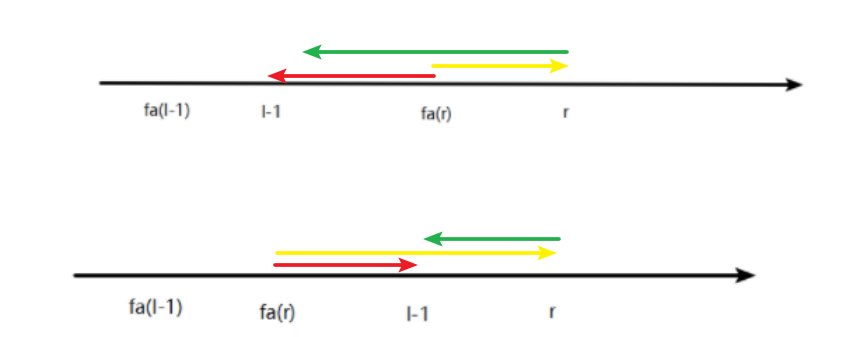

实质上做的就是这么一个向量加法(得到红色)

同理，如果发现是这样的情况，可以这么做向量加法：


因此代码如下：

```c++
#include <cassert>
#include <iostream>

using namespace std;

const int N = 1e5 + 10;

int fa[N];
long long vue[N];

int find(int x) {
   if (fa[x] == x) return x;
   int f = find(fa[x]);
   vue[x] += vue[fa[x]];
   return fa[x] = f;
}

void merge(int l, int r, long long v) {
   l--;
   if (find(l) == find(r)) return;
   if (find(l) < find(r)) {
      vue[find(r)] = v - vue[r];
      fa[find(r)] = l;
   } else {
      v = -v;
      vue[find(l)] = v - vue[l];
      fa[find(l)] = r;
   }
}

int main() {
   int n, m, q;
   scanf("%d%d%d", &n, &m, &q);
   for (int i = 0; i <= n; i++) fa[i] = i;
   for (int i = 0; i < m; i++) {
      int l, r;
      long long v;
      scanf("%d%d%lld", &l, &r, &v);
      merge(l, r, v);
   }
   while (q--) {
      int l, r;
      scanf("%d%d", &l, &r);
      if (find(l - 1) == find(r)) {
         printf("%lld\n", vue[r] - vue[l - 1]);
      } else
         puts("UNKNOW");
   }
}
```


## csoj

SCNU 计院 OJ

#### 2022GDCPC选拔

##### H 节日快乐

> 给定 $n(2\le n\le2\times10^5)$ 个整点 (坐标绝对值范围 $10^5$ )，保证有 $\dfrac n2$ 的点共线，且该线不与坐标轴平行，求出这条线的 $k,b$ 。

因为有至少 $\dfrac12$ 概率能选到，所以任取两点都在线上概率为 $\dfrac14$ 。那么随机化后暴力判即可。

注意题目可能有重合点，这意味着可能算出错误答案

复杂度为 $O(kn)$ ，估算 $k\approx 50$ 。

```c++
#include <bits/stdc++.h>
using namespace std;
#define sc(x) scanf("%lld", &x)
typedef long long ll;
#define mn 200010
ll n, x[mn], y[mn], mx; //, pk, pb;
double pk, pb;
mt19937 mt(580);
signed main()
{
    sc(n);
    for (ll i = 1; i <= n; ++i)
    {
        sc(x[i]), sc(y[i]);
    }
    uniform_int_distribution<ll> dist(1, n);
    while (true)
    {
        ll a, b, cnt = 0;
        do
        {
            a = dist(mt), b = dist(mt);
        } while (a == b || x[a] == x[b] || y[a] == y[b]);
        auto cross = [&](ll ax, ll ay, ll bx, ll by)
        { return ax * by - ay * bx; };
        for (ll i = 1; i <= n; ++i)
        {
            if (x[i] != x[a] && y[i] != y[a] && x[i] != x[b] && y[i] != y[b])
            {
                cnt += cross(x[i] - x[a], y[i] - y[a], x[i] - x[b], y[i] - y[b]) == 0;
            }
        }
        if (cnt >= 1. * n / 2)
        {
            mx = cnt;
            pk = 1. * (y[a] - y[b]) / (x[a] - x[b]);
            pb = y[a] - pk * x[a];
            cout << pk << ' ' << pb;
            return 0;
        }
    }
    return 0;
}
```


##### B-k代子孙

> 以 $1$ 为根的 $n$ 点树，有 $m$ 次询问，每次问点 $x$ 往下第 $k$ 级子孙有多少个 $n,m\le5\times10^5$ 

我的解法：开 $n$ 个 vector ，按 dfn 序和深度摊到 vector 存点。一次 DFS 求出每个点子树的最大 dfn 和自己的 dfn ，每次查询在对应 vector 上二分找这个区间多长。

```c++
#include <bits/stdc++.h>
using namespace std;
#define sc(x) scanf("%lld", &x)
typedef long long ll;
#define mn 500010
ll n, m, dfn, id[mn],  hd[mn], ecnt, rf[mn], de[mn];
vector<ll> d[mn];
struct edge
{
    ll to, nx;
} e[mn * 2];
ll dfs(ll u, ll fa, ll dep)
{
    id[u] = ++dfn, rf[u] = dfn; //子树最大dfn是rf[u]
    d[dep].emplace_back(dfn), de[u] = dep;
    for (ll i = hd[u], v; i; i = e[i].nx)
    {
        if ((v = e[i].to) != fa)
        {
            rf[u] = max(rf[u], dfs(v, u, dep + 1));
        }
    }
    return rf[u];
}
signed main()
{
    sc(n), sc(m);
    auto adde = [&](ll u, ll v)
    { e[++ecnt] = {v, hd[u]}, hd[u] = ecnt; };
    for (ll i = 1, u, v; i < n; ++i)
    {
        sc(u), sc(v), adde(u, v), adde(v, u);
    }
    dfs(1, 0, 0);
    for (ll x, k; m--;)
    {
        sc(x), sc(k);
        ll dep = de[x] + k;
        if (dep >= mn || dep < 0)
        {
            printf("0\n");
            continue;
        }
        ll sumr = upper_bound(d[dep].begin(), d[dep].end(), rf[x]) - d[dep].begin();
        ll suml = lower_bound(d[dep].begin(), d[dep].end(), id[x]) - d[dep].begin();
        printf("%lld\n", sumr - suml);
    }
    return 0;
}
```

标程：离线算法，把询问vector拉到每个点上。然后dfs一次，在dfs过程中动态记录当前各深度总点数。对每个点，一开始先减去当前记录的所有深度，DFS完再加上，那么就用前缀和差分的思路消掉了。不放出来了，可以去 csoj 群看标程。

其他解法：线段树合并(以后学了回头试试)、树上启发式合并(?不知道能不能)


## vjudge
