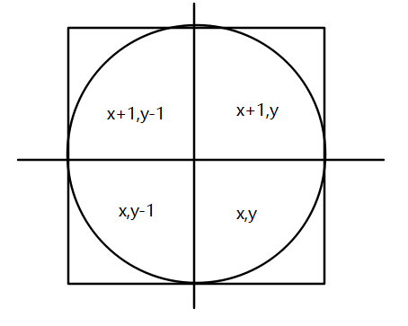
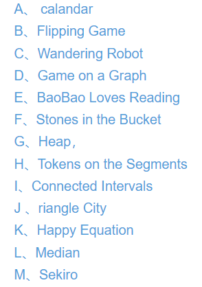
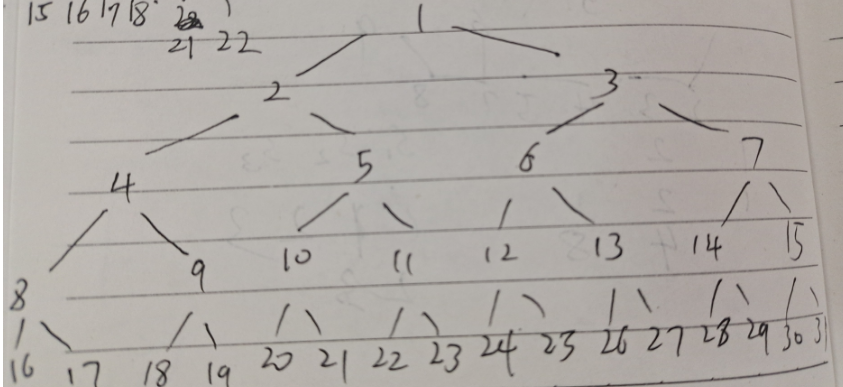
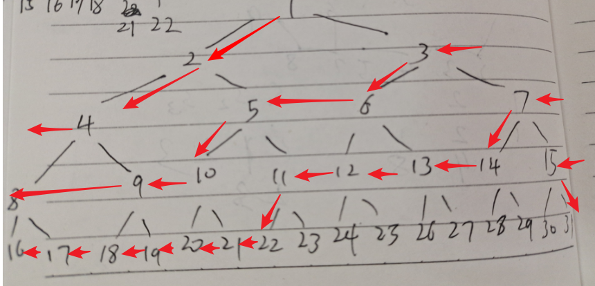
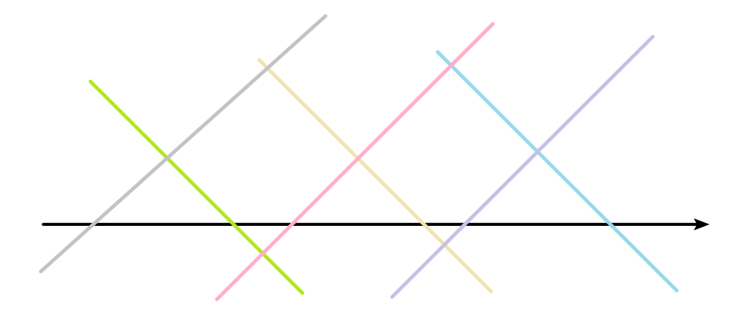
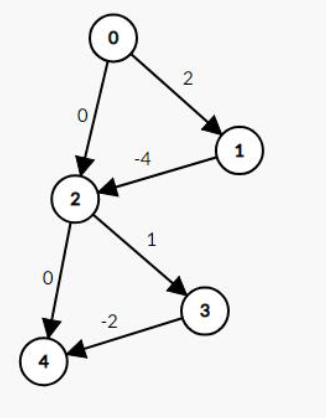
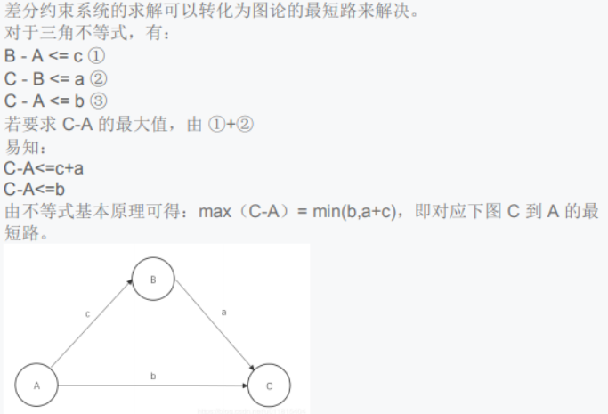
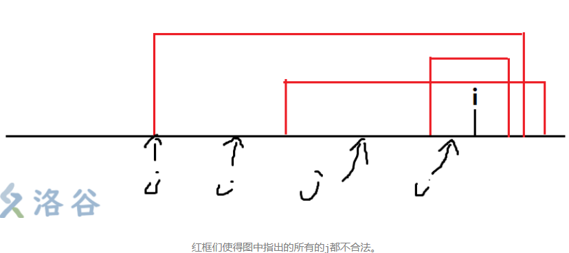
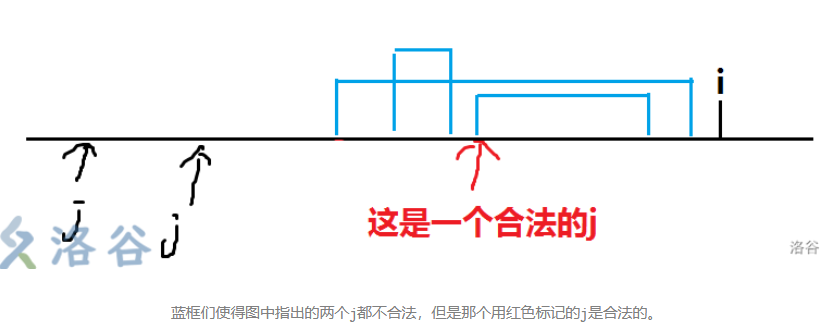

算法笔记的一部分。按平台分类。建议在目录搜索( Typora 下鼠标在大纲除上滚轮即可看到)。为了防止目录过长，暂时将考虑按时间或专题分一个子目录。不会记录所有做过的题的全部代码，只会记录比较有意义的题的代码和解题思路，曾经做过已会或太简单或太难或太怪的题都不收录。

## XCPC

### ICPC

> 2020-45届 2021-46届

#### 2020沈阳

> 这场比赛也就是我正式名额铁首的首次出征 [终榜](https://codeforces.com/gym/103202/standings) (show unofficial不勾选)
>
> 

- G 签到(赛时AC)
- F 排序(赛时AC)
- K 模拟 滑动窗口(赛时AC)
- D 构造 差分 DFS
- I 数论
- H DP 滑动窗口

##### F Kobolds and Catacombs

> 有长为 $n(1\le n\le10^6)$ 的数组 $a(1\le a_i\le10^9)$ ，选择其中若干个子段，对每个子段重排序，使得 $a$ 单调不降，求最多能选的子段数目

赛时不知道用了什么单调队列还是什么比较复杂的做法，还实现细节错了

补题思路：设 $p[i]$ 表示原数组 $i$ 排序后的位置为 $p[i]$ ，用 $set+lower\_bound$ 可以做到(找到第一个出现的位置然后用 $set$ 统计之前出现过多少次)，复杂度是 $O(n\log n)$ 

然后贪心扫描每个 $p[i]$ ，对已扫描的求最大值 $rf$ ，若发现 $rf=i$ ，证明当前扫到的可以全部分在一组，然后置零 $rf$ 继续扫，这里 $O(n)$ 即可

补题 AC 代码：(牛客用 map 会 TLE ， 在 CF 不会)

```c++
#include <bits/stdc++.h>
using namespace std;
#define sc(x) scanf("%d", &x)
typedef int ll;
#define mn 1000010
ll n, a[mn], b[mn], p[mn], ans, rf;
unordered_map<ll, ll> ex;
signed main()
{
    sc(n);
    for (ll i = 1; i <= n; ++i)
    {
        sc(a[i]);
        b[i] = a[i];
    }
    sort(b + 1, b + 1 + n);
    for (ll i = 1; i <= n; ++i)
    {
        ll j = lower_bound(b + 1, b + 1 + n, a[i]) - b;
        p[i] = j + ex[a[i]];
        ++ex[a[i]];
        // printf("%lld ", p[i]);
    }
    for (ll i = 1; i <= n; ++i)
    {
        rf = max(rf, p[i]);
        if (rf == i)
        {
            rf = 0;
            ++ans;
        }
    }
    printf("%d", ans);
    return 0;
}
/*
5  5 4 3 2 1
6  1 6 2 7 2 5
11  4 2 1 3 6 5 7 8 9 11 10
1 1
*/
```


##### K Scholomance Academy

> 在机器学习二分类中，对值 $x$ 和参数 $\theta$ ，设估值函数 $S(x)\ge\theta$ 表示分类为 `+` ，否则为 `-` 。给定评判表：
>
> | 真实结果\估值结果 | +    | -    |
> | ----------------- | ---- | ---- |
> | +                 | TP   | FN   |
> | -                 | FP   | TN   |
>
> 设 $TPR=\dfrac{TP}{TP+FN},FPR=\dfrac{FP}{TN+FP}$ 显然它们是 $\theta$ 的函数
>
> 定义 $AUC=\int_0^1\max_{\theta\in R}\{TPR(\theta)|FPR(\theta)\le r\}dr$ 即在满足 $FPR(\theta)\le r$ 的条件下最大的 $TPR(\theta)$ 的值是积分表达式，请计算 $AUC$ ，答案为对当且仅当绝对误差不超过 $10^{-9}$ 
>
> 输入 $n(2\le n\le10^6)$ 表示有 $n$ 个 $x$ ，输入第 $i$ 行字符 `+` , `-` 表示真实结果，再输入 $x_i(1\le x_i\le10^9)$ 

赛时写得巨复杂无比。

化简一下题意：

| 输入值\计算 | $x_i\ge\theta$ | $x_i< \theta$ |
| ----------- | -------------- | ------------- |
| +           | TP             | FN            |
| -           | FP             | TN            |

 $TP+FN$ 是常数，代表输入的 `+` 数目； $FP+TN$ 是输入的 `-` 数目

即 $TPR,FPR$ 的值只取决于 $TP,FP$ 。随着 $\theta$ 的增加，满足 $x_i\ge\theta$ 的会越来越少，所以 $TPR,FPR$ 随 $\theta$ 单调递减

当满足 $r=0$ 时，$\theta > \max x$ ，当 $r=1$ 时， $\theta\le \min x$ 。因为要让 $TPR$ 尽可能大，所以 $\theta$ 应尽可能取小的。因为 $r$ 随 $\theta$ 增大而减少，所以可以从 $1+\max x$ 开始枚举，每次降序枚举取 `-` 的 $1+x_i$ 作为 $\theta$ ，该枚举代表横坐标区间 $($ 上个枚举值计算出的 $r$ $,$ 这次枚举值计算出的 $r$  $]$ ，此时一定是 $TPR$ 最大的(因为 $\theta$ 最小)，那么一共有 `-` 数目段横坐标，使得纵坐标不同(是分段函数)。用滑动窗口在枚举时维护 $TP$ 即可

复杂度是 $O(n\log n+n)$

```c++
#include <bits/stdc++.h>
using namespace std;
#define sc(x) scanf("%d", &x)
typedef long long ll;
typedef double db;
#define mn 1000010
ll n, npos, nneg, pos[mn], neg[mn];
// ll fptn, tpfn; // npos nneg
char c[3];
ll cmp(ll x, ll y) { return x > y; }
db ans;
signed main()
{
    sc(n);
    for (ll i = 1, v; i <= n; ++i)
    {
        scanf("%s%d", c, &v);
        if (c[0] == '+')
        {
            npos++;
            pos[npos] = v;
        }
        else
        {
            nneg++;
            neg[nneg] = v;
        }
    }
    sort(pos + 1, pos + 1 + npos, cmp);
    sort(neg + 1, neg + 1 + nneg, cmp);
    ll ipos = 1, tp = 0;
    for (ll i = 1; i <= nneg; ++i) // ineg
    {
        ll v = neg[i] + 1;
        while (ipos <= npos && pos[ipos] >= v)
        {
            ++ipos, ++tp;
        }
        ans += 1.0 * tp / npos / nneg;
    }
    printf("%.12lf", ans);
    return 0;
}
```


##### D Journey to Un'Goro

> 有长为 $n(1\le n\le10^5)$ 的 `rb` 两字符组成的字符串，求使得含奇数个 `r` 的子序列最多的子序列数，并输出字典序前 $100$ 小的构造方案

> 直观地判，假设全 `r` ，根据等差数列可以推出， $n$ 为奇数表达式是 $(\dfrac{n+1}2)^2$ ，为偶数是 $\dfrac n2\cdot\dfrac{2+n}2$ 。

严格地说，如果用差分表示，设 $p_i$ 表示长为 $i$ 的前缀有几个 `r` ，那么答案为 $\sum_{i=1}^n\sum_{j=i}^n[p_j-p_{i-1}\equiv 1\bmod 2]$ ，所以 $p_{i-1},p_j$ 奇偶不同贡献一次答案。所以要构造尽可能多互异的奇偶。显然每个 $p_i(i\ge 1)$ 都可以选择不同的奇偶。记共有 $x$ 个奇数， $y$ 个偶数，那么答案为 $xy$ ，这是因为每个奇数自己往后和往前加起来一定有 $y$ 个偶数，有 $x$ 个奇数，乘法原理可知 。显然 $p_0$ 是偶数，共有 $n+1$ 个数，需要构造 $x+y=n+1(x\ge 0,y\ge 1)$ ，根据矩形面积原理(也可以通过求导等方法严格证明，证略)，可知 $x,y$ 尽可能接近，所以把 $n+1$ 这个整数均分为 $n+1=\lfloor\dfrac{n+1}2\rfloor+\lceil\dfrac{n+1}2\rceil$ 故答案为 $\lfloor\dfrac{n+1}2\rfloor\times\lceil\dfrac{n+1}2\rceil$ 

$p$ 序列(根据组合数学知数目至少为 $C_{n+1}^{\lfloor\frac{n+1}2\rfloor}$ )转字符串的方法是，如果与前一位奇偶性不同这一位是 `r` ，否则是 `b` 。因为 `b` 字典序小，所以尽可能构造相同的。这个构造过程直接跑 DFS 即可，注意判一下重(会搜索到重复方案)

虽然本地会爆递归深度( $10^5$ 层递归深度)，但是实践表明牛客和CF都不爆，只要前 $100$ 个答案，那么复杂度大约是 $O(n)$ 

下面代码给出 DFS 和栈模拟 DFS：

```c++
#include <bits/stdc++.h>
using namespace std;
#define sc(x) scanf("%lld", &x)
typedef long long ll;
#define mn 100010
ll n, p[mn], suc;
char s[mn];
set<string> m;
void dfs(ll len, ll x, ll y) //当前p序列搜索下标是i,有x个奇数,y个偶数
{
    if (x > (n + 2) / 2 || y > (n + 2) / 2)
    {
        return;
    }
    if (len > n)
    {
        for (ll i = 1; i <= n; ++i)
        {
            if (p[i] == p[i - 1])
            {
                s[i] = 'b';
            }
            else
            {
                s[i] = 'r';
            }
        }
        if (m.find(s + 1) != m.end())
        {
            return;
        }
        ++suc;
        m.insert(s + 1);
        printf("%s\n", s + 1);
        if (suc == 100)
        {
            exit(0);
        }
        return;
    }
    p[len] = p[len - 1];
    dfs(len + 1, x + (p[len] % 2 == 1), y + (p[len] % 2 == 0));
    p[len] = 1 - p[len - 1];
    dfs(len + 1, x + (p[len] % 2 == 1), y + (p[len] % 2 == 0));
}
signed main()
{
    sc(n);
    printf("%lld\n", ((n + 1) / 2) * ((n + 1 + 2 - 1) / 2));
    dfs(1, 0, 1);
    return 0;
}
```

```c++
#include <bits/stdc++.h>
using namespace std;
#define sc(x) scanf("%lld", &x)
typedef long long ll;
#define mn 100010
ll n, p[mn], suc;
char s[mn];
set<string> m;
struct node
{ //当前p序列搜索下标是i,有x个奇数,y个偶数,v是递归进来的赋值
    ll len, x, y, v;
};
stack<node> q; //防止超过递归深度
signed main()
{
    sc(n);
    printf("%lld\n", ((n + 1) / 2) * ((n + 1 + 2 - 1) / 2));
    q.push({1, 0, 1, 0});
    while (!q.empty())
    {
        auto tmp = q.top();
        q.pop();
        ll len = tmp.len, x = tmp.x, y = tmp.y;
        p[len - 1] = tmp.v;
        if (x > (n + 2) / 2 || y > (n + 2) / 2)
        {
            continue;
        }
        if (len > n)
        {
            for (ll i = 1; i <= n; ++i)
            {
                if (p[i] == p[i - 1])
                {
                    s[i] = 'b';
                }
                else
                {
                    s[i] = 'r';
                }
            }
            if (m.find(s + 1) != m.end())
            {
                continue;
            }
            ++suc;
            m.insert(s + 1);
            printf("%s\n", s + 1);
            if (suc == 100)
            {
                return 0;
            }
            continue;
        }
        p[len] = 1 - p[len - 1];
        q.push({len + 1, x + (p[len] % 2 == 1), y + (p[len] % 2 == 0), p[len]});
        p[len] = p[len - 1];
        q.push({len + 1, x + (p[len] % 2 == 1), y + (p[len] % 2 == 0), p[len]});
    }
    return 0;
}
```


##### I Rise of Shadows

> 一天有 $H$ 小时，一小时有 $M$ 分钟，问在一天的所有整数分钟里，满足时针和分针夹角不超过 $\cfrac{2\pi A}{HM}$ 的有多少个 $2\le H,M\le10^9,0\le A\le\cfrac{HM}2$ 

比较显然，设 $t\in[0,HM)$ 可以把原式化为 $|t(1-(H\bmod HM))|\le A$ ，把模外提，得：
$$
t(H-1)\bmod HM\le|A|
$$
剩余系定理三：$a,b,c$ 为整数， $m$ 为正整数且 $(m,c)=1$ ，则 $ac\equiv bc(\bmod m)$ 时，可知 $a\equiv b(\bmod m)$ 。为了构造互质，可以让不等式两边同除 $g=(H-1,HM)$ ，得：
$$
-\cfrac Ag\le t\cfrac{H-1}g\bmod\cfrac{HM}g\le\cfrac Ag
$$
并让 $t\in[0,\cfrac{HM}g)$ 

求出正半轴的值，再乘以二，加上 $0$ 就是解，即求：
$$
0 < t\dfrac{H-1}g\bmod\dfrac{HM}g\le\dfrac Ag
$$
当 $t$ 是这个取值时， $t\dfrac{H-1}g$ 一定是互不相同的值，因为毫无疑问 $(\dfrac{H-1}g,\dfrac{HM}g)=1$ ，根据数论知识显然可得

也就是说一定会取遍 $[0,\dfrac{HM}g)$ 的值，因为 $A\le \dfrac{HM}2$ 所以会取遍 $\dfrac Ag$ ，那么在 $t\in[0,\dfrac {HM}g)$ 内有 $2\lfloor\dfrac Ag\rfloor+1$ 个整数解。显然 $H-1$ 可以整除 $g$ ，那么可以扩大 $g$ 倍，扩大后仍然满足这么多个整数解，所以答案为 $g(2\lfloor\dfrac Ag\rfloor+1)$ 

特判 $a=\dfrac{HM}2$ ，这个时候必定恒满足。

```c++
#include <bits/stdc++.h>
using namespace std;
#define sc(x) scanf("%lld", &x)
typedef long long ll;
ll h, m, a, g;
signed main()
{
    sc(h), sc(m), sc(a);
    g = __gcd(h - 1, h * m);
    if (a == h * m / 2)
    {
        printf("%lld", h * m);
    }
    else
    {
        printf("%lld", g * (2 * (a / g) + 1));
    }
    return 0;
}
```


##### H The Boomsday Project

> 有 $n(1\le n\le500)$ 种优惠卡，有 $m(1\le m\le10^5)$ 条消费，单次消费花费 $r(1\le r\le10^9)$ 。对优惠卡，从使用日起持续 $d_i$ 天，可以在这些天里免费消费 $k_i$ 次，卡的价格是 $c_i(1\le d_i,k_i,c_i\le10^9)$ 。使用一张新卡会让之前的旧卡作废。 $m$ 次消费分别在第 $p_i(0\le p_i\le10^9)$ 天消费了 $q_i(0\le q_i,\sum_{i=1}^mq_i\le3\times10^5)$ 次，优惠卡可以无限买和使用，求最小支出

> 因为队内我不主攻 DP ，这题看看就行了，不打算亲自动手写

按日期排序拆开 $\sum_{i=1}^mq_i$ 次消费。设第 $i$ 次消费在第 $g_i$ 天。设 $f(r)$ 是完成了前 $r$ 次消费后的最小消费。一个 TLE 版本代码：(含我的代码集注)

```c++
#include <bits/stdc++.h>
using namespace std;
using ll = long long;
int n, m, tot, to[510][300010], g[300010];
struct nodea
{
    int d, k, c;
} a[510];
ll f[300010], R;
struct nodeb
{
    int p, q;
    bool operator<(const nodeb &o) const { return p < o.p; }
} b[300010];
signed main()
{
    scanf("%d%d%lld", &n, &m, &R);
    for (int i = 1; i <= n; i++) //天数,次数,钱
        scanf("%d%d%d", &a[i].d, &a[i].k, &a[i].c);
    for (int i = 1; i <= m; i++)
        scanf("%d%d", &b[i].p, &b[i].q);
    sort(b + 1, b + 1 + m);
    for (int i = 1; i <= m; i++)
        for (int j = 1; j <= b[i].q; ++j) //第tot次骑车在第b[i].p天
            g[++tot] = b[i].p;
    // to[j][i]是在第i次消费买第j种方案后可以到第几次消费(只考虑天)
    for (int j = 1; j <= n; j++)
        for (int i = 1, k = 1; i <= tot; i++) // k是当前首个不可达
        {
            while (k <= tot && g[k] - g[i] + 1 <= a[j].d)
                k++; //天数跨度小于d一直加
            to[j][i] = k - 1;
        }
    memset(f, 0x3f, sizeof f); //前i次骑车最小花费是f[i]
    f[0] = 0;
    for (int i = 1; i <= tot; i++)
    {
        f[i] = min(f[i], f[i - 1] + R); //直接花钱
        for (int j = 1; j <= n; j++)
        { //买第j种方案,买了之后可以到第r次消费都不用钱了
            //只考虑天和只考虑次数里二者综合起来
            int r = min(i - 1 + a[j].k, to[j][i]);
            //需要多少钱
            f[r] = min(f[r], f[i - 1] + a[j].c);
        }
    }
    printf("%lld\n", f[tot]);
    return 0;
}

```

一个能过题的版本：

```c++
#include <bits/stdc++.h>
using namespace std;

const int N = 500 + 5;
const int M = 3e5 + 5;
const long long INF = 1e18;
int n, m, r;

struct Card {
	int d, k, c;
}ca[N];

struct Record {
	int p, q;
}re[M];

int a[M], b[M], tot;
long long dp[M];

int main(void) {
//	freopen("in.txt", "r", stdin);
	scanf("%d%d%d", &n, &m, &r);
	for (int i = 1; i <= n; i++) {
		scanf("%d%d%d", &ca[i].d, &ca[i].k, &ca[i].c); 
	}
	for (int i = 1; i <= m; i++) {
		scanf("%d%d", &re[i].p, &re[i].q);
		dp[i] = INF;
		for (int j = 1; j <= re[i].q; j++)
			a[++tot] = re[i].p;
	}
	sort(a + 1, a + 1 + tot);
	for (int i = 1; i <= tot; i++) dp[i] = INF;
	for (int i = 1; i <= n; i++) b[i] = 1;
	for (int i = 1; i <= tot; i++) {
		dp[i] = dp[i - 1] + r;
		for (int j = 1; j <= n; j++) {
			// 找到第j种卡能影响到的左边界 
			while (a[b[j]] + ca[j].d <= a[i] || b[j] + ca[j].k <= i) b[j]++;
			dp[i] = min(dp[i], dp[b[j] - 1] + ca[j].c);
		}
	}
	printf("%lld\n", dp[tot]);
	return 0;
}

```


#### 2021济南

> 首铜，功德圆满赛。赛时我贡献了K题较快切题，队友贡献了C题

- K Search For Mafuyu DFS 博弈论 (赛时AC)
- C Optimal Strategy 组合数学 前缀和 DP 博弈论 (赛时AC)
- J Determinant 高斯消元 行列式
- D Arithmetic Sequence 三分 数学

##### K Search For Mafuyu

> 有 $t(1\le t\le10^3)$ 个询问，每次有 $n(2\le n\le100)$ 点以 $1$ 为根节点的树，除根节点外任取一点作目标点，从根节点开始搜索目标点，问期望走过多少条边(使用最优策略)

赛时可以想到，最优策略是每次都选最小子树去搜素

事实上，只要是欧拉遍历，那么怎么走都是最优的。对一个节点的两个子树，从一个出来再去另一个，另一个每个都会多上前一个的二倍边数。对子树有多少个点就有多少条边，左边有 $x$ 个点，右边子树有 $y$ 个点，那么先走左给右 $y$ 个节点增加 $2x$ ，共计 $2xy$ ，右到左同理。将这个结论不断推广，可以得到上述结论

```c++
#include <bits/stdc++.h>
using namespace std;
#define sc(x) scanf("%lld", &x)
typedef long long ll;
#define mn 110
struct edge
{
    ll to, nx;
} e[mn * 2];
ll t, n, hd[mn], cnt, siz[mn], ans, s;
void adde(ll u, ll v)
{
    e[++cnt] = {v, hd[u]}, hd[u] = cnt;
}
void dfs1(ll u, ll fa)
{
    siz[u] = 1; // siz
    for (ll i = hd[u], v; i; i = e[i].nx)
    {
        v = e[i].to;
        if (v != fa)
        {
            dfs1(v, u);
        }
    }
}
void dfs2(ll u, ll fa)
{
    // printf("<%lld %lld\n", u, s);
    ans += s;
    vector<ll> p;
    for (ll i = hd[u], v; i; i = e[i].nx)
    {
        v = e[i].to;
        if (v != fa)
        {
            p.emplace_back(v);
        }
    }
    sort(p.begin(), p.end(), [&](ll x, ll y)
         { return siz[x] < siz[y]; });
    for (auto &v : p)
    {
        ++s;
        dfs2(v, u);
        ++s;
    }
}
signed main()
{
    sc(t);
    while (t--)
    {
        sc(n);
        memset(hd, 0, sizeof hd), cnt = 0;
        memset(siz, 0, sizeof siz), ans = 0, s = 0;
        for (ll i = 1, u, v; i < n; ++i)
        {
            sc(u), sc(v), adde(u, v), adde(v, u);
        }
        dfs1(1, 0);
        dfs2(1, 0);
        printf("%.10lf\n", 1.0 * ans / (n - 1));
    }
    return 0;
}
/*4
2  1 2
5  1 2  2 3  3 4  1 5
7  1 2  1 3  2 4  2 5  3 6  3 7
10 1 2  2 3  3 4  1 5  5 6  6 7  1 8  8 9  9 10
*/
```


##### C Optimal Strategy

> 有 $n(1\le n\le10^6)$ 个带权物品 $a(1\le a_i\le n)$ ，每人轮流拿一个物品，双方目标都是拿的东西权总和最大，在双方都采取最优策略情况下求有多少种情况对 $998244353$ 取模

> ~~现在我还是不懂这道题~~

考虑最大值如果是偶数个，那么会每次被两个两个的取；如果是奇数个，那么会被先手立刻取走一个，变成偶数的情况(剩下对半取)。离散化设 $c_i$ 是 $i$ 物品个数

阶乘是显然的(排列转组合)。那么对每个 $c_i$ ，只要不让对方逆转就可以随便取，不一定要从大到小取。对出现次数为奇数的又是最大的数，如果不先发制人，一定会被抢走，所以一开始双方的任务应当是抢奇数。之后每个数都是偶数了，只要一方拿了一个偶数，对方一定要拿相同的这个偶数，不然就更亏，没有别的方案。具体而言：

- 若当前最大有奇数个，一定要拿
- 若上一回合对方拿了最大的那个数，且本来有偶数个，那么自己一定要随
- 否则随便拿

所以对 $c_i$ 有且仅有 $\lfloor\dfrac{c_i}2\rfloor$ 种情况。设 $f_i$ 为只用 $\le i$ 的元素的方案数，


答案：
$$
\sum_{i=1}^nc_i!C_{\sum_{j=1}^{i-1}c_i+\lfloor\frac{c_i}2\rfloor}^{\lfloor\frac{c_i}2\rfloor}
$$
别人的参考代码：

```c++
#include <bits/stdc++.h>
using namespace std;
#define inf 0x3f3f3f3f
#define llinf 0x3f3f3f3f3f3f3f3f
#define int long long
#define ull unsigned long long
#define PII pair<int,int>
#define endl '\n'
const int N = 1e6 + 10;
const int mod = 998244353;
const double pi = acos(-1.0);
typedef long long ll;
using namespace std;
int t, n;
int fact[N];
int invfact[N];
int presum[N];
int a[N];
int cnt[N];
int quickpow(int a, int b) {//快速幂
	int res = 1;
	while (b > 0) {
		if (b & 1) res = res * a % mod;
		b >>= 1;
		a = a * a % mod;
	}
	return res;
}
int getinv(int a) { return quickpow(a, mod - 2); }//费马小定理求逆元
void init() {//预处理阶乘和阶乘的逆元
	fact[0] = 1;
	for (int i = 1; i < N; i++) {
		fact[i] = fact[i - 1] * i % mod;
	}
	invfact[0] = 1;
	invfact[N - 1] = quickpow(fact[N - 1], mod - 2);
	for (int i = N - 2; i > 0; --i) {
		invfact[i] = invfact[i + 1] * (i + 1) % mod;
	}
	return;
}
int C(int n, int m) {//组合数
	return fact[n] * invfact[m] % mod * invfact[n - m] % mod; 
}
void solve() {
	for (int i = 0; i <= n; i++) {//初始化
		a[i] = 0;
		cnt[i] = 0;
	}
	for (int i = 1; i <= n; i++) {//输入
		cin >> a[i];
		cnt[a[i]] ++;
	}
	presum[1] = cnt[1];
	for (int i = 2; i <= n; i++) {//cnt[i]的前缀和
		presum[i] = presum[i - 1] + cnt[i];
	}
	int sum = 1;
	for (int i = 1; i <= n; i++) {//按公式求和
		sum = sum * fact[cnt[i]] % mod * C(presum[i - 1] - presum[0] + cnt[i] / 2, cnt[i] / 2) % mod;
	}
	cout << (sum) % mod << endl;//输出
	return;
}
signed main()
{
	ios::sync_with_stdio(false);
	cin.tie(0); cout.tie(0);
	init();
	while (cin >> n) {
		solve();
	}
	return 0;
}
```


##### J Determinant

> 有 $t(1\le t\le100)$ 次询问，给定 $n(1\le n\le100)$ 阶方阵 $A$ (绝对值 $\le10^9)$ 和 $|A|$ (不超过 $10^4$ 位)，问去掉绝对值后它是正还是负

不能朴素去做，不然炸 double 或高精 TLE

用一个大素数取模做高斯消元，得到行列式值 $A\bmod p$ ，如果 $A\bmod p=|A|\bmod p$ ，那么是正的，不然一定有 $(p-A)\bmod p=|A|\bmod p$ 

需要注意的是, 使用高斯消元交换行列式的两行时, 行列式的正负会改变

别人的参考代码：

```c++
#include <bits/stdc++.h>
#define endl "\n"
#define rep(i, m, n) for (int i = (m); i <= (n); ++i)
#define rrep(i, m, n) for (int i = (m); i >= (n); --i)
#define IOS ios::sync_with_stdio(0); cin.tie(0);
using namespace std;
typedef long long ll;
typedef pair<int, int> PII;
const int N = 110, mod = 1e9 + 7;
ll n, p[N][N], det;
string s;
ll fact() { // 将 字符串s 转化成 整形det
	ll m = 0, l = s.length();
	rep(i, 0, l - 1) {
		m = m * 10 + s[i] - '0';
		m %= mod;
	}
	return m;
}
ll qpow(int a, int b) {
	ll res = 1; a %= mod;
	while (b) {
		if (b & 1) res = (ll)res * a % mod;
		a = (ll)a * a % mod; b >>= 1;
	}
	return res;
}
ll inv(ll x) { return qpow(x, mod - 2); } // 逆元
ll guess() { // 高斯消元 求 行列式
	ll ans = 1;
	rep(i, 1, n) {
		rep(j, i, n)
			if (p[j][i]) { // 不能让 p[i][i] = 0, 即对角线的部分不能为0
				rep(k, i, n) swap(p[i][k], p[j][k]);
				if (i != j) ans = -ans;//交换两行,行列式正负改变
				break;
			}

		// 用第 i 行去修改第 j 行
		// p[j][k] = p[j][k] - p[i][k] * p[j][i] / p[i][i];
		for (int j = i + 1, invf = inv(p[i][i]); j <= n; ++j) {
			ll t = p[j][i] * invf % mod;
			rrep(k, n, i) p[j][k] = ((p[j][k] - p[i][k] * t % mod) % mod + mod) % mod;
		}

		// 行列式的值就是化成上三角后主对角线的积乘上已经提取出来的数字
		ans = (ans * p[i][i] % mod + mod) % mod;
	}

	return ans;
}
void solve() {
	scanf("%lld", &n);
	cin >> s; det = fact();
	rep(i, 1, n) rep(j, 1, n)
		scanf("%lld", &p[i][j]);

	ll res = guess();
	if (res == det) puts("+");
	else puts("-");
}
int main() {
	int t; cin >> t;
	while (t--) solve();
	return 0;
}

```


##### D Arithmetic Sequence

> 给定一个长为 $n(1\le n\le2\times10^5)$ 的数列 $a(0\le |a_i|\le10^{13})$ ，每次可以对一个数加一或减一，将其变成等差序列，问最少要操作多少次

对给定公差 $d$ ，设最小代价是 $f(d)$ ，即要让 $a_i-id$ 是常数列，这个问题比较经典，参见 `SCNUOJ` 未公开题 `完美数组`

设需要操作 $f(x)$ 次后满足要求，则根据定义，有：
$$
f(x)=|x_1-x|+|x_2-x|+\cdots+|x_n-x|
$$
几何意义为求数轴一个点 $x$ ，使得其到这 $n$ 个点的距离和最小。

题目要求即对每组 $g'$ ，需要选取一个 $x$ ，使得 $f(x)$ 最小化。

1. 若 $n=1$ ，显然取 $x=x_1, $ 有 $f(x) = 0$， $f(x)$ 最小。

2. 若 $n=2$ ，若 $x_1=x_2$ ，显然取 $x=x_1$ 即可使最小 $f(x)=0$ 。若 $x_1\neq x_2$， 假设 $x < x_1$ 或 $x > x_2$ ，作图数形结合可知，$x$ 越往两端走， $f(x)$ 越大。结合函数图像不难发现，选取 $x\in [x_1, x_2]$ 的结果必然优于选取 $x$ 在其他区间的值。 而 $x\in [x_1,x_2]$ 时， 有：
   $$
   f(x)=|x_1-x|+|x_2-x|=x-x_1+x_2-x=x_2-x_1
   $$
   因此对 $n=2$ 时， 任取 $x\in [x_1, x_2]$ ，均可获得最小值 $f(x)=x_2-x_1$

3. 若 $n=3$ ，类似分析可得， $x\in [x_1, x_3]$ 必然优于 $x$ 取其他值的情况，因为在两端时距 $x_2$ 的距离也必然加大。在这个区间时，有：
   $$
   f(x)=|x_1-x|+|x_2-x|+|x_3-x|=x_3-x_1+|x_2-x|
   $$
   为使得 $f(x)$ 最小，可以令 $x=x_2$， 得 $f(x)=x_3-x_1$

4. 若 $n=4$ ，同理， $x\in[x_1,x_4]$，有：
   $$
   f(x)=x_4-x_1+|x_2-x|+|x_3-x|
   $$
   其中 $|x_2-x|+|x_3-x|$ 的最小值可以看做忽略点 $x_1, x_4$ 后， $n'=2$ 的一个子问题，根据上面第二点可知， $x\in [x_2,x_3]$ 时，该子问题的最优解是 $x_3-x_2$ ，而 $[x_2,x_3]\subset [x_1,x_4]$ ，故答案为 $f(x)=x_4-x_1+x_3-x_2$ 。

5. 若 $n=5$ ，同理用子问题的思想，得 $x=x_3$ 时， $f(x)=x_5-x_1+x_4-x_2$ 。 若 $n\ge 6$ ，可以每次用子问题的思想分析 $n' = n-2$ 时的子问题，得到答案。综上所述，$x\in[x_{\lfloor\frac n2\rfloor}, x_{\lfloor\frac {n+1}2\rfloor}]$ 时， $f(x)= x_{n-1} - x_1 + x_{n-2} - x_2 + \cdots$ 。( $n$ 为偶数是 $x$ 取值区间有长度，$n$ 为奇数时，取值区间是一个点)

最后求 $f(x_{\lfloor\frac x2\rfloor})$ 即可。

根据这个函数的定义，不难发现这是一个凹函数，要求其最小值，考虑使用三分法

可以用差分优化一下常数，记得开 int128 ，可以卡一下常，复杂度 $O(n\log n\log W)$ ，记得可以取负的公差

```c++
#include <bits/stdc++.h>
using namespace std;
#define sc(x) scanf("%lld", &x)
typedef long long ll;
typedef __int128 ln;
#define mn 200010
ll n, a[mn], b[mn], c[mn], lf, lc, rc, rf;
ln ans = 1e23;
ln check(ll d)
{
    for (ll i = 1; i < n; ++i)
    {
        b[i] = b[i - 1] + d - c[i + 1];
    }
    sort(b, b + n);
    ll v = b[n / 2];
    ln res = 0;
    for (ll i = 0; i < n; ++i)
    {
        res += abs(b[i] - v);
    }
    return res;
}
void print(ln x)
{
    if (x / 10)
    {
        print(x / 10);
    }
    putchar(x % 10 + '0');
}
signed main()
{
    sc(n);
    for (ll i = 1; i <= n; ++i)
    {
        sc(a[i]);
        c[i] = a[i] - a[i - 1];
    }
    lf = -1e13, rf = 1e13;
    while (lf <= rf)
    {
        ll dt = (rf - lf) / 3;
        lc = lf + dt, rc = rf - dt;
        ln lv = check(lc), rv = check(rc);
        ans = min(ans, min(lv, rv));
        if (lv > rv)
        {
            lf = lc + 1;
        }
        else
        {
            rf = rc - 1;
        }
    }
    print(ans);
    return 0;
}
```


#### 2021澳门

> 因为队友补题了，我就不那么用力补了

- A 思维 构造
- K 连通图
- F 思维 数学 / 优先级队列
- C 极角排序 单调栈(旋转卡壳)
- E FFT 图论

##### A So I'll Max Out My Constructive Algorithm Skills

> 有 $T(1\le T\le100)$ 次询问，给定 $n(2\le n\le64)$ 阶方阵，数值是 $n^2$ 的一个排列，请构造出一条遍历 $n^2$ 格子的路径，使得下降次数不少于上升次数

对于任意一条路径，要么下降次数不少于，要么大于；如果大于的话，反着走就小于了

代码略


##### K Link-Cut Tree

> 有 $T$ 组询问，每次给定 $n(3\le n\le10^5)$ 点和 $m(1\le m\le10^5)$ 边无向图，第 $i$ 条边边长为 $2^i$ ，问最小环上每条边编号是多少或无环 输出 `-1` ($\sum n,\sum m\le10^6$)

显然 $\sum_{i=1}^n2^i < 2^{n+1}$ ，所以越前面的边越好。无向图找连通，开并查集就好了，发现同根就直接 DFS 找环

代码略


##### F Sandpile on Clique

> 多组样例(EOF)，给定 $n(2\le n\le5\times10^5)$ 点完全图和每个点点权 $a_i(0\le a_i\le10^9)$ ，可以进行操作将某个点点权减少 $n-1$ ，其他点点权都增加 $1$ 。问能否无限操作下去(输出 `Recurrent` )，否则输出最终状态

根据抽屉原理， 若 $\sum_{i=1}^na_i > n(n-2)$ 一定会循环

队友有一种优先级队列的不断模拟做法(快超时就 `Recurrent` )

有一种 $O(n)$ 的题解，但是看不懂：

```c++
#include<iostream>
#include<cstring>
#include<algorithm>
#include<cmath>
#include<vector>
using namespace std;
#define int long long
const int N = 500010;
int a[N],b[N],cnt[N];
int n,ps=0,s=0;
signed main()
{
	cin>>n;
    for(int i=0;i<n;i++)
    {
        cin>>a[i];
        ps+=a[i];
        a[i]%=n;
        s+=a[i];
    }
    for(int i=0;i<n;i++)cnt[a[i]]++;
    for(int i=n;i>=0;i--)cnt[i]+=cnt[i+1];
    vector<int>res;
    for(int i=0;i<n;i++)
    {
        int qs=s+i*n-(cnt[max(n-i-1,0ll)]*n);
        if(qs==ps)
        {
            res.push_back(i);
        }
    }
    if(res.size()!=1)cout<<"Recurrent"<<'\n';
    else 
    {
        for(int i=0;i<n;i++)
            cout<<(a[i]+res[0])%n<<' ';
        cout<<'\n';
    }
}

```


##### C Laser Trap

> 有 $T$ 组询问，每次给定 $n(1\le n,\sum n\le10^6)$ 个点，这些点两两相连形成不经过原点的直线。问从原点出发，删掉多少个点后，可以不碰直线(含端点)到达 $(10^{10^{10^{10}}},10^{10^{10^{10}}})$ 

进行极角排序，从一个点出发，绕 $180°$ (不含 $180°$ )的所有点里，它们无论怎么连线都不会影响原点走出去。另外一部分点同理。

在给定条件下，不存在两个点的极角差为 $\pi$ 。对于每个刚好大于 $\pi$ 的点对 $i,j$ ，它们之间有 $j-i-1$ 个点，可以全都删了。或者把反方向删到 $j$ (含 $j$ )，所以：

```c++
#include <bits/stdc++.h>
using namespace std;
#define sc(x) scanf("%lld", &x)
typedef long long ll;
#define mn 1000010
ll n, t;
#define cp const point &
struct point
{
    ll x, y;
    ll quadrant() const
    {
        if (x == 0 && y == 0)
            return 0;
        if (x > 0 && y >= 0)
            return 1;
        if (x <= 0 && y > 0)
            return 2;
        if (x < 0 && y <= 0)
            return 3;
        return 4;
    }
    ll norm() const { return x * x + y * y; }
} p[mn * 2];
ll cross(cp a, cp b) { return a.x * b.y - a.y * b.x; }
bool operator<(cp a, cp b)
{
    if (a.quadrant() != b.quadrant())
        return a.quadrant() < b.quadrant();
    if (cross(a, b) != 0)
        return cross(a, b) > 0;
    return a.norm() < b.norm();
}
signed main()
{
    for (sc(t); t--;)
    {
        sc(n);
        for (ll i = 1; i <= n; ++i)
        {
            sc(p[i].x), sc(p[i].y);
        }
        sort(p + 1, p + 1 + n);
        for (ll i = 1; i <= n; ++i)
        {
            p[i + n] = p[i];
        }
        ll ans = n;
        for (ll i = 1, j = 2; i <= n; ++i)
        {//j=1也行
            while (j - i < n && cross(p[i], p[j]) >= 0)
            {//其他写法不行
                ++j;
            }
            ans = min(ans, min(n - (j - i), j - i - 1));
        }
        printf("%lld\n", n <= 2 ? 0 : ans);
    }
    return 0;
}
```


#### 2021南京

- A 签到 构造
- M 思维
- C 前缀和 双指针
- H 树上DP
- D 思维 排序
- J 数论 构造
- I 思维 数学

##### A Oops, It's Yesterday Twice More

> 给定 $n(2\le n\le500)$ 阶方阵，一开始每个格有一个人，每次可以执行 $U,D,L,R$ 对每个人进行一次移动(撞边界不动)，一格可以有无限多人，在 $3(n-1)$ 步内将所有人移动到 $(a,b)$ ，求移动方案

签

```c++
#include <bits/stdc++.h>
using namespace std;
#define sc(x) scanf("%lld", &x)
typedef long long ll;
#define repe(i, a, b) for (ll i = a; i <= b; ++i)
ll n, a, b;
signed main()
{
    sc(n), sc(a), sc(b);
    if (a <= n / 2)
    {
        repe(i, 1, n - 1) putchar('U');
        repe(i, 1, a - 1) putchar('D');
    }
    else
    {
        repe(i, 1, n - 1) putchar('D');
        repe(i, 1, n - a) putchar('U');
    }
    if (b <= n / 2)
    {
        repe(i, 1, n - 1) putchar('L');
        repe(i, 1, b - 1) putchar('R');
    }
    else
    {
        repe(i, 1, n - 1) putchar('R');
        repe(i, 1, n - b) putchar('L');
    }
    return 0;
}
```


##### C Klee in Solitary Confinement

> 给定 $n(1\le n\le10^6),k(-10^6\le k\le10^6)$ ，输入序列 $a(-10^6\le a_i\le10^6)$ ，可以将一个子区间每个数加上 $k$ (或不操作)，求众数频次最大值

~~想了一下没想出来，看题解去了~~

思路：偏移一下然后按顺序按值存一下vector，第 $i$ 个按原序列相对顺序存本来是 $i$ 还是 $i-k$ 的这个值。然后对每个 vector 进行遍历，因为这个 vector 只有两种值：一个是本来是 $i$ ，一个是加了后是 $i$ 。所以枚举中间段，然后加一下双指针优化，实现下面的式子：


别人参考代码：

```c++
const int N = 4e6 + 6;
int X = 2e6;
int a[N/4], b[N/4];
vector<int> v[N];
int main()
{
	IOS;
	int n, k; cin >> n >> k;

	int maxn = 0;
	int minn = 0;//所有离散化后的数据的最大值
	for (int i = 0; i < n; i++)
	{
		int x; cin >> x;
		x += X;
		minn = max(minn, x + k);
		v[x].push_back(x);
		v[x + k].push_back(x);
		maxn = max({ maxn, (int)sz(v[x]), (int)sz(v[x + k]) });
	}
	
	if (!k)
	{
		cout << maxn / 2 << endl;
		return 0;
	}

	int ans = 0;
	for (int i = 0; i <= minn; i++)
	{
		if (v[i].size() == 0) continue;
		int m = sz(v[i]);

		for (int j = 1; j <= m; j++)
			a[j] = a[j - 1] + (v[i][j - 1] == i);//前缀和

		int L = -1;//注意
		for (int j = 1; j <= m; j++)
		{
			L = max(L, a[j - 1] * 2 - j);//最大前缀
			ans = max(ans, L + j + 1 - a[j] + a[m] - a[j]);
		}
	}
	cout << ans << endl;

	return 0;
}
```

```c++
#include <bits/stdc++.h>
using namespace std;

using ll = long long;
const ll mn = 1e6 + 10, dt = 2e6 + 1;
ll k, n, s[mn], ans;
vector<ll> v[mn * 4];
signed main()
{
    ios::sync_with_stdio(false), cin.tie(0);
    cin >> n >> k;
    for (ll i = 1, x; i <= n; ++i)
    {
        cin >> x;
        x += dt;
        v[x].push_back(x);
        v[x + k].push_back(x);
    }
    if (k == 0)
    {
        for (ll i = 0; i < mn * 4; ++i)
        {
            ans = max(ans, (ll)v[i].size() / 2);
        }
        cout << ans;
        return 0;
    }
    for (ll i = 0; i < mn * 4; ++i)
    {
        if (v[i].empty())
        {
            continue;
        }
        ll m = v[i].size();
        for (ll j = 0; j < m; ++j)
        {
            s[j + 1] = s[j] + (v[i][j] == i);
        }
        ll mx = -1e9;
        for (ll j = 1; j <= m; ++j)
        {
            mx = max(mx, s[j - 1] * 2 - j);
            ans = max(ans, mx + j + 1 - s[j] + (s[m] - s[j]));
        }
    }
    cout << ans;
    return 0;
}
```


##### M Windblume Festival

> 有 $n(1\le n\le10^6)$ 个点的环，每次选择第 $x$ 个点，当前环长是 $k$ ，将第 $x$ 个点点权减去第 $x\bmod k+1$ 个点的点权然后删掉后者，直到只剩下一个点，求最后的最大权。多组询问 $\sum n\le10^6$

显然最后每个数(要么正要么负)加起来是答案。起码有一个点是不被删掉的(即权重 $1$ )，最后 $k=2$ 合并时一定要减掉一个点(即权重 $-1$ )。要删掉的点其实就是它的下一个点加到它那里。每次选择的过程将一个点置 $-1$ 。

①存在一种选择方案，即一直选 $x$ 不动，选 $n-2$ 次，那么当前 $x$ 是正的，它后面的点都是负的， 然后最后选 $x-1$ ，那么 $x$ 是负的，其他所有点都是正的。用这种选择方案，可以在全正时令 $x$ 是最小值。②类似地，全负时，令 $x$ 是最大值选 $n-1$ 次，那么只有 $x$ 是还负的。③有正有负时，把负之后的所有正数全部叠到负数那里去，剩下一个正数，然后把全部负数叠过去。

综上：

1. 全正是 $sum-2\min$ 注： $2$ 是因为 $sum$ 里少它，下同
2. 全负是 $|sum|-2\max$
3. 否则是 $\sum_{i=1}^n|a_i|$ 

上述解法假了。正解：[这里](https://blog.csdn.net/weixin_54991287/article/details/122642464)

```c++
#include <iostream>
#include <algorithm>
using namespace std;
const int N = 1e6 + 7;
long long ans = 0;
int n = 0, times = 0;
int arr[N];					// 存放玩家对应的值

void fig(){					// 计算绝对值之和
	for(int i=1;i<=n;i++)
		ans+=abs(arr[i]);
}

void poss();
void negg(){				// 全负变为全正来做
    for (int i = 1; i<=n; i++){
        arr[i] = -arr[i];
    }
    poss();
}

void poss(){
	int temp=2e9+7;
	for(int i=1;i<n;i++)
		if(arr[i]-arr[i+1]<=0)	// 遍历求最小损失
			temp=min(temp,arr[i]+arr[i+1]-abs(arr[i]-arr[i+1]));
	if(arr[n]-arr[1]<=0) temp=min(temp,arr[n]+arr[1]-abs(arr[n]-arr[1]));
	fig();
	ans-=temp;
}

void wtf(){
        cin >> n;
        int pos = 0, neg = 0;
        for (int i = 1; i <= n; i++){
            cin >> arr[i];
            if(arr[i]<=0)		// 是否有负数
                neg = 1;
            if(arr[i] >= 0)		// 是否有正数
                pos = 1;
        }
        if(n==1){
            cout << arr[1] << "\n";
            return;
        }
        ans = 0;
        if(pos && neg)
            fig();
        else if(neg)
            negg();
        else
            poss();
        cout << ans << "\n";
}

int main(){
	ios_base::sync_with_stdio(false); cin.tie(0); cout.tie(0);
    cin >> times;
    while(times--){
        wtf();
    }
    return 0;
}

```

```c++
#include <bits/stdc++.h>
using namespace std;
using ll = long long;
const ll mn = 1e6 + 10;
ll t, n, a[mn];
signed main()
{
    ios::sync_with_stdio(false), cin.tie(0);
    cin >> t;
    while (t--)
    {
        cin >> n;
        bool pos = false, neg = false;
        ll abssum = 0, lost = 5e9;
        for (ll i = 1; i <= n; ++i)
        {
            cin >> a[i];
            pos |= a[i] > 0;
            neg |= a[i] <= 0;
            abssum += abs(a[i]);
        }
        if (n == 1)
        {
            cout << a[1] << '\n';
        }
        else if (pos && neg)
        {
            cout << abssum << '\n';
        }
        else
        {
            for (ll i = 1, j = i % n + 1; i <= n; ++i, j = i % n + 1)
            {
                lost = min(lost, abs(a[i]) + abs(a[j]) - abs(a[i] - a[j]));
            }
            cout << (abssum - lost) << '\n';
        }
    }
    return 0;
}
```


另一解法：


##### H Crystalfly

> 有多组询问，给定 $n(1\le n\le10^5)$ 点带点权树 $a_i(1\le a_i\le10^9)$ ，当某秒初遍历某个点时，所有相邻点的点权将会在隔了 $t_i(1\le t_i\le3)$ 秒后在该秒末消失。每秒可以走一条边的距离，问在 $10^{10^{10^{10}}}$ 秒内能够得到的最大点权和是多少

显然树上 DP ，但是实现不好写


别人的参考代码(未检验)：

```c++
#include<bits/stdc++.h>
using namespace std;
#define rep(i,x,y) for(int i=x;i<=y;i++)
#define int long long
const int N = 1e6+100;
vector<int> edge[N];
int a[N],ti[N];
int n;
int dp[N],sum[N];
void dfs(int u,int f){
    int max_av = 0;
    for(auto v:edge[u]){
        if(v==f) continue;
        dfs(v,u);
        sum[u] += dp[v];
        max_av = max(max_av,a[v]);
    }
    dp[u] = sum[u] + max_av;
    if(edge[u].size()<=1) return;
    
    // 预处理出-dp[w]+sum[w]+a[w] 最大的两项 , 因为w和v可能重复
    // mx[0] 最大的 -dp[w]+sum[w]+a[w]
    // mx[1] 第二大的 -dp[w]+sum[w]+a[w]
    pair<int,int> mx[2];
    for(auto w:edge[u]){
        if(w==f) continue;
        int now = -dp[w]+sum[w]+a[w];
        if(now>mx[0].first){
            swap(mx[0],mx[1]);
            mx[0] = make_pair(now,w);
        }
        else if(now>mx[1].first){
            mx[1] = make_pair(now,w);
        }
    }
    for(auto v:edge[u]){
        if(v==f) continue;
        if(ti[v]==3){
            if(v!=mx[0].second)
                dp[u]= max(dp[u],sum[u]+a[v]+mx[0].first);
            else
                dp[u] = max(dp[u],sum[u]+a[v]+mx[1].first);
        }
    }
}
signed main(){
    ios::sync_with_stdio(false);
    int t;
    cin>>t;
    while(t--){
        cin>>n;
        rep(i,1,n) cin>>a[i],edge[i].clear();
        rep(i,1,n) cin>>ti[i];
        rep(i,1,n-1){
            int x,y;
            cin>>x>>y;
            edge[x].push_back(y);
            edge[y].push_back(x);
        }
        rep(i,1,n){
            dp[i] = sum[i] = 0;
        }
        dfs(1,0);
        cout<<dp[1]+a[1]<<endl;
    }
}
```

```c++
#include <bits/stdc++.h>
using namespace std;
using ll = long long;
const ll mn = 1e5 + 10;
vector<ll> g[mn];
ll T, n, a[mn], t[mn], dp[mn], s[mn];
void dfs(ll u, ll fa)
{
    ll mxa = 0;
    for (auto v : g[u])
    {
        if (v != fa)
        {
            dfs(v, u);
            s[u] += dp[v];
            mxa = max(mxa, a[v]);
        }
    }
    dp[u] = s[u] + mxa;
    if (g[u].size() <= 1)
    {
        return;
    }
    pair<ll, ll> mx, nd;
    for (auto v : g[u]) //走v然后折返
    {
        if (v != fa)
        {
            ll dt = -dp[v] + s[v] + a[v];
            if (dt > mx.first)
            {
                nd = mx, mx = {dt, v};
            }
            else if (dt > nd.first)
            {
                nd = {dt, v};
            }
        }
    }
    for (auto v : g[u]) //先折返然后再走v
    {
        if (v != fa)
        {
            if (t[v] == 3)
            {
                if (v != mx.second)
                {
                    dp[u] = max(dp[u], s[u] + a[v] + mx.first);
                }
                else
                {
                    dp[u] = max(dp[u], s[u] + a[v] + nd.first);
                }
            }
        }
    }
}
signed main()
{
    ios::sync_with_stdio(false), cin.tie(0);
    cin >> T;
    while (T--)
    {
        cin >> n;
        for (ll i = 1; i <= n; ++i)
        {
            g[i].clear();
            dp[i] = s[i] = 0;
        }
        for (ll i = 1; i <= n; ++i)
        {
            cin >> a[i];
        }
        for (ll i = 1; i <= n; ++i)
        {
            cin >> t[i];
        }
        for (ll i = 1, u, v; i < n; ++i)
        {
            cin >> u >> v;
            g[u].push_back(v), g[v].push_back(u);
        }
        dfs(1, 0);
        cout << dp[1] + a[1] << '\n';
    }
    return 0;
}

```


##### J Xingqiu's Joke

> 有 $t(1\le t\le300)$ 次询问，每次给定 $a,b(1\le a,b\le10^9,a\neq b)$ ，可以对 $a,b$ 同时执行下面三种操作之一，直到任一方为 $1$ 为止：
>
> - 同时加 $1$
> - 同时减 $1$
> - 同时除以一个公共质因数
>
> 求最少操作数。

记忆化搜索剪枝。对每个状态，让它走到上取整或下取整能整除状态。特判一些边界，如 $b=a+1$ 必然永远无公共质因数


别人的参考代码(未经检验)：

```c++
int c[1001], m;
int ans = inf;
unordered_map<ll, int>mp;


ll h(int a, int b)//哈希函数
{
	return a * 1e9 + b;
}

//本题不能单单将a或b当作map的第一维，
//因为可能会出现a相同但b不相同的情况。
//所以可能返回错误的答案，
//因此需要将（a， b）或者（a， b - a）作为哈希map的第一维
int dfs(int a, int b)
{
	//记忆化搜索
	if (mp[h(a, b)]) return mp[h(a, b)];

	//剪枝
	if (b - a == 1) return a - 1;
	if (a == 1) return 0;

	int ans = a - 1;//最差的情况是直接把a减到1
	for (int i = 0; i < m; i++)
		if ((b - a) % c[i] == 0)//此处要注意判断条件
		{
			int res = a % c[i];
			ans = min({ ans, 
				res + 1 + dfs(a / c[i], b / c[i]),
				c[i] - res + 1 + dfs(a / c[i] + 1, b / c[i] + 1) });
		}

	return mp[h(a, b)] = ans;
}

int main()
{
	IOS;
	int T; cin >> T;
	while (T--)
	{
		mp.clear();//可删可不删。本以为不删会速度快，没想到删掉速度快，且memory小了100倍。。可能是hash的数据多了，查找的慢了吧
		int a, b; cin >> a >> b;
		if (a > b) swap(a, b);

		int d = b - a;
		m = 0;
		for (int i = 2; i <= sqrt(d); i++)
		{
			if (d % i == 0)
			{
				c[m++] = i;
				while (d % i == 0) d /= i;
			}
		}
		if (d > 1) c[m++] = d;

		cout << dfs(a, b) << endl;
	}

	return 0;
}
```

```c++
#include <bits/stdc++.h>
using namespace std;
using ll = long long;
ll T, a, b, c[80], cs;
map<pair<ll, ll>, ll> h;
ll dfs(ll a, ll b)
{
    if (h[{a, b}])
    {
        return h[{a, b}];
    }
    if (b - a == 1)
    {
        return a - 1;
    }
    if (a == 1)
    {
        return 0;
    }
    ll ans = a - 1;
    for (ll i = 1; i <= cs; ++i)
    {
        if ((b - a) % c[i] == 0)
        {
            ll res = a % c[i];
            ll v1 = res + 1 + dfs(a / c[i], b / c[i]);
            ll v2 = c[i] - res + 1 + dfs(a / c[i] + 1, b / c[i] + 1);
            ans = min({ans, v1, v2});
        }
    }
    return h[{a, b}] = ans;
}
signed main()
{
    ios::sync_with_stdio(false), cin.tie(0);
    cin >> T;
    while (T--)
    {
        cin >> a >> b;
        if (a > b)
        {
            swap(a, b);
        }
        ll d = b - a;
        cs = 0;
        for (ll i = 2; i * i <= d; ++i)
        {
            if (d % i == 0)
            {
                c[++cs] = i;
                while (d % i == 0)
                {
                    d /= i;
                }
            }
        }
        if (d > 1)
        {
            c[++cs] = d;
        }
        h.clear();
        cout << dfs(a, b) << '\n';
    }
    return 0;
}
```


##### D Paimon Sorting

> 给定 $t$ 组询问，每次给定长为 $n(1\le n\le10^5,\sum n\le10^6)$ 的序列 $1\le a_i\le n$ ，按给定代码排序，问排序子序列 $a[1..i]$ 需要交换多少次
>
> 


别人的代码(未经检验)：

```c++
#include<bits/stdc++.h>
using namespace std;
#define int long long
const int N = 2e6+100;
int tr[N];
void insert(int now,int l,int r,int loc,int val){
    if(l==r){
        tr[now] += val;
        tr[now] = min(1ll,tr[now]);
        tr[now] = max(tr[now],0ll);
        return;
    }
    int mid = (l+r)>>1;
    if(loc<=mid)
        insert(now<<1,l,mid,loc,val);
    else
        insert(now<<1|1,mid+1,r,loc,val);
    tr[now] = tr[now<<1]+tr[now<<1|1];
}
int query(int now,int l,int r,int ql,int qr){
    if(l>=ql&&r<=qr){
        return tr[now];
    }
    int sum = 0;
    int mid = (l+r)>>1;
    if(ql<=mid)
        sum += query(now<<1,l,mid,ql,qr);
    if(qr>=mid+1)
        sum += query(now<<1|1,mid+1,r,ql,qr);
    return sum;
}
int a[N];
vector<int> ans;
signed main(){
    ios::sync_with_stdio(false);
    int t;
    cin>>t;
    while(t--){
        int n;
        cin>>n;
        int maxx = -1;
        int last = 0;
        int tmp = 0,cnt = 0;
        for(int i=1;i<=n;i++){
            cin>>a[i];
            if(i==1){
                ans.push_back(last);
                maxx = a[i],cnt = 1;
            }
            else{
                if(a[i]==maxx){
                    ans.push_back(last);
                    cnt++;
                    if(cnt>=2) tmp++;
                }
                else if(a[i]<maxx){
                    last = last+ query(1,1,n,a[i]+1,n);
                    ans.push_back(last);
                    if(cnt>=2) tmp++;
                }
                else{
                    last = last+2+tmp;
                    ans.push_back(last);
                    maxx = a[i];
                    tmp = 0;
                    cnt = 1;
                }
            }
            insert(1,1,n,a[i],1);
        }
        for(int i=1;i<=n;i++){
            insert(1,1,n,a[i],-1);
            cout<<ans[i-1]<<" \n"[i==n];
        }
        ans.clear();
    }
}
```

```c++
#include <bits/stdc++.h>
using namespace std;
using ll = long long;
const ll mn = 1e5 + 10, mm = 1e6 + 10;
ll T, n, a[mn], t[mm << 2];
#define mkcf ll cf = (lf + rf) >> 1
#define lfs p << 1
#define rfs p << 1 | 1
void insert(ll p, ll lf, ll rf, ll pos, ll v)
{
    if (lf == rf)
    {
        t[p] = min(1LL, max(0LL, t[p] + v));
        return;
    }
    mkcf;
    if (pos <= cf)
    {
        insert(lfs, lf, cf, pos, v);
    }
    else
    {
        insert(rfs, cf + 1, rf, pos, v);
    }
    t[p] = t[lfs] + t[rfs];
}
ll query(ll p, ll lf, ll rf, ll lc, ll rc)
{
    if (lc <= lf && rf <= rc)
    {
        return t[p];
    }
    mkcf;
    ll res = 0;
    if (lc <= cf)
    {
        res += query(lfs, lf, cf, lc, rc);
    }
    if (cf + 1 <= rc)
    {
        res += query(rfs, cf + 1, rf, lc, rc);
    }
    return res;
}
signed main()
{
    ios::sync_with_stdio(false), cin.tie(0);
    cin >> T;
    while (T--)
    {
        cin >> n;
        ll prv = 0, mx = 0, cnt = 0, tmp = 0;
        for (ll i = 1; i <= n; ++i)
        {
            cin >> a[i];
            if (i == 1)
            {
                mx = a[i], cnt = 1;
            }
            else if (a[i] == mx)
            {
                tmp += ++cnt >= 2;
            }
            else if (a[i] < mx)
            {
                prv += query(1, 1, n, a[i] + 1, n);
                tmp += cnt >= 2;
            }
            else // if (a[i]>mx)
            {
                prv += 2 + tmp;
                mx = a[i], tmp = 0, cnt = 1;
            }
            cout << prv << " \n"[i == n]; //卡PE
            insert(1, 1, n, a[i], 1);
        }
        for (ll i = 1; i <= n; ++i) // clear multi queries
        {
            insert(1, 1, n, a[i], -1);
        }
    }
    return 0;
}
/*
3
5
2 3 2 1 5
3
1 2 3
1
1
*/
```


#### 2021上海

> 时间比较赶，就补两签好了，其他粗略看了看，没有敲代码了(开摆！)

- D 数论
- E 贪心 排序
- G 树上DP
- H Kruskal重构树
- I DP

##### D Strange Fractions

> 有 $t(1\le t\le10^5)$ 次询问，给定 $1\le p,q\le10^7$ ，问能否找到 $a,b(1\le a,b\le10^9)$ 满足 $\dfrac pq=\dfrac ab+\dfrac ba$ 

注意不代表 $p=a^2+b^2,q=ab$ ，因为可以： $kp=a^2+b^2,kq=ab$ (分子分母同乘)


证明真的是易证，因为 $a^2+b^2$ 显然不含 $a$ 或 $b$ ( $a+b\neq ka\neq kb$ )

8 个质因子即 $2,3,5,7,11,13,17,19$ ，因为连乘九个超 $10^7$ 

这个解法不会做，做不出来。目前 WA 在下面测试的第八个：( $q=21\times23$ )，前面的可以通过二进制枚举来实现诸如 $a=2\times 3^2,b=5\times 7$ 的划分

```c++
8
4105 192
4177 576
61 30
1549 630
5 2
1088 256
1234 777
970 483
```


```c++
#include <bits/stdc++.h>
using namespace std;
#define sc(x) scanf("%lld", &x)
typedef long long ll;
ll t, p, q;
signed main()
{
    sc(t);
    while (t--)
    {
        sc(p), sc(q);
        ll dt = p * p - 4 * q * q, rdt = sqrt(max(0LL, dt));
        if (dt < 0 || rdt * rdt != dt)
        {
            printf("0 0\n");
        }
        else
        {
            printf("%lld %lld\n", p + rdt, 2 * q);
        }
    }
    return 0;
}
```


##### E Strange Integers

> 给定 $n(1\le n\le10^5)$ 长的序列，求长为 $m$ 的子序列，使得子序列每个值与它之前的所有值的绝对值之差不小于 $k(1\le k\le10^9)$ ，输出最大的 $m$

显然 $|x-y|=|y-x|$ ，所以等效于序列每个值与该序列里其他值的绝对值之差不小于 $k$ (把组合枚举转排列枚举)，那么排序后贪心即可，可以证明能选就选一定比能选不选更优

```c++
#include <bits/stdc++.h>
using namespace std;
#define sc(x) scanf("%lld", &x)
typedef long long ll;
#define mn 100010
ll n, k, a[mn], m, pre;
signed main()
{
    sc(n), sc(k);
    for (ll i = 1; i <= n; ++i)
    {
        sc(a[i]);
    }
    sort(a + 1, a + 1 + n);
    m = 1, pre = a[1];
    for (ll i = 2; i <= n; ++i)
    {
        if (a[i] - pre >= k)
        {
            ++m;
            pre = a[i];
        }
    }
    printf("%lld", m);
    return 0;
}
```


#### 2022昆明

参赛打铁场，赛时过2题，慢了一分钟(准确为37秒)，导致排名为212，与铜绝缘

[补题链接](https://ac.nowcoder.com/acm/contest/32708)

- K 打表找规律 / 数学
- D 构造 LIS
- F 思维 图论
- G 概率 数学
- C 数学 积分 / 组合数学
- B 概率DP 矩形覆盖和 二维前缀和/bitset/二维线段树
- A 大模拟字符串 DFS

##### K King of Gamers

无限多次游戏后，设胜利数 $m$，则 $\dfrac mn\approx \dfrac ab$ 即 $m\approx\dfrac{an}b$。

显然第一局必胜(并且除非 $a=b$ 第二局必败)，其他局胜不胜没这么明显，所以可以猜测为 $m\approx\dfrac{(n-1)a}b+1$，根据大量打表可知为正确的

难以也不必证明，就当打表题罢

```c++
printf("%lld\n", (n - 1) * a / b + 1);
```


##### D Divisions

写暴力不断尝试构造，找出一种规律为：

每添加连续的 $x$ 个相同的数如 `2`，则方案数增加 $2^x$；将它们以 `1` 分割，就能够构造出 $2^x$之和，从而得到所有偶数。若在最前面在增添一个 `1`，方案数再增加 $1$。

样例给了 $k=1$，而可以构造出 $k=0$ 有 `1 4 5 2 3` 序列，故 $k < 2$ 有解

由于 $\log_210^8\approx27$，故 $\sum_{i=i}^{26}(i+1)=350$，所以可以构造出范围内全部解，该构造下不存在无解

```c++
#include <bits/stdc++.h>
using namespace std;
#define sc(x) scanf("%lld", &x)
typedef long long ll;
ll k;
signed main()
{
    sc(k);
    if (k == 0)
    {
        printf("5\n1 4 5 2 3");
    }
    else if (k == 1)
    {
        printf("6\n1 1 4 5 1 4");
    }
    else
    {
        vector<ll> v;
        ll odd = k & 1;
        if (odd)
        {
            --k;
        }
        while (k)
        {
            ll i;
            for (i = 1; (1 << (i + 1)) <= k; ++i)
                ;
            k -= (1 << i);
            v.push_back(1);
            while (i--)
            {
                v.push_back(2);
            }
        }
        if (!odd)
        {
            v.erase(v.begin());
        }
        if (v.size() <= 365)
        {
            printf("%lld\n", v.size());
            for (auto i : v)
            {
                printf("%lld ", i);
            }
        }
        else //不可能分支
        {
            printf("-1");
        }
    }
    return 0;
}
```

> 题解的构造方法为 $x_1,\cdots,x_1,x_2,\cdots,x_2,x_m\cdots,x_m$ 即不严格单调升，其答案为 $\sum(2^{a_i}-1)+1$。


##### F Find the Maximum

要算的式子化简为 $-x^2+\dfrac{\sum_{u\in V}b_u}{|V|} x$，二次函数最大值为 $\dfrac14(\dfrac{\sum_{u\in V}b_u}{|V|})^2$

证明：所有路径里，均值平方最大的路径点数不超过 $3$

设有一条路径超过 $3$ 个点，如 $4$ 点，均值平方为 $\dfrac{(b_1+b_2+b_3+b_4)^2}{16}①$

设 $b_1+b_2 \ge b_3+b_4$，则前两点的均值平方是 $\dfrac{(b_1+b_2)^2}4②$

$②-①$ 得 
$$
\dfrac{3(b_1+b_2)^2-((b_3+b_4)^2+2(b_1+b_2)(b_3+b_4))}{16}
$$
题设两边平方可知 $(b_1+b_2)^2 \ge (b_3+b_4)^2$；两边乘 $(b_1+b_2)$ 可知 $(b_1+b_2)^2\ge (b_1+b_2)(b_3+b_4)$，所以 $②-①\ge 0$

对更多点，同理拆分为大小部分，可以同理证之。因此得证。故枚举所有点数为 $2,3$ 的路径即可

枚举点数为 $3$ 的路径，即枚举中点，将邻边按点权排序，取最大的两个点；注意到点权是可以负的，所以和最小平方也可能最大，也要再取最小的两个点。

```c++
#include <bits/stdc++.h>
using namespace std;
#define sc(x) scanf("%lld", &x)
typedef long long ll;
typedef long double db;
const ll mn = 1e5 + 10;
db ans;
ll n, b[mn];
vector<ll> e[mn];
signed main()
{
    sc(n);
    for (ll i = 1; i <= n; ++i)
    {
        sc(b[i]);
    }
    for (ll i = 1, v, u; i < n; ++i)
    {
        sc(u), sc(v);
        ans = max(ans, (b[u] + b[v]) * (b[u] + b[v]) / 16.L);
        e[u].push_back(v), e[v].push_back(u);
    }
    auto cmp = [&](ll u, ll v)
    { return b[u] > b[v]; };
    for (ll i = 1; i <= n; ++i)
    {
        if (e[i].size() >= 2)
        {
            sort(e[i].begin(), e[i].end(), cmp);
            db v = b[e[i][0]] + b[e[i][1]] + b[i];
            ans = max(ans, v * v / 36.L);
            v = b[e[i][e[i].size() - 1]] + b[e[i][e[i].size() - 2]] + b[i];
            ans = max(ans, v * v / 36.L);
        }
    }
    printf("%Lf", ans);
    return 0;
}
```


##### G Glass Bead Game

把移动拆分为多个耗费 $1$ 的领位交换。若 $i$ 在 $j$ 后，需要交换一次。对每个 $i$，有 $p_i$ 概率会移动它，而对每个 $j$，设 $i$ 在 $j$ 后的概率为 $p$，则因为只需要考虑相对关系，那么总条件概率为 $p_i+p_j$，每次落在 $p_i+p_j$ 区域内时(即移动 $i,j$ 其一时)，有 $p_j$ 概率移动 $j$ 使得 $j$ 在 $i$ 前。那么经过无穷次移动后，$i$ 在 $j$ 后的概率期望是 $p=\dfrac{p_j}{p_i+p_j}$，故所求为 $\sum_{i=1}^n\sum_{j=1,j\neq i}^n\dfrac{p_ip_j}{p_i+p_j}$

```c++
#include <bits/stdc++.h>
using namespace std;
typedef long long ll;
typedef long double db;
const ll mn = 110;
db p[mn], ans;
ll n;
signed main()
{
    scanf("%lld", &n);
    for (ll i = 1; i <= n; ++i)
    {
        scanf("%Lf", &p[i]);
    }
    for (ll i = 1; i <= n; ++i)
    {
        for (ll j = 1; j <= n; ++j)
        {
            ans += (p[i] * p[j]) / (p[i] + p[j]) * (i != j);
        }
    }
    printf("%.12Lf", ans);
    return 0;
}
```


##### C Cup of Water

为了能够预处理，将题意转化为在 $[0,1]$ 内取随机数，灌满 $\dfrac1V$ 升水的期望次数

设当前还差 $x$ 升水时灌满 $1$ 升水的期望步数为 $f(x)$，则：
$$
f(x)=1+\int_{\max(0,x-1)}^xf(x-t)dt
$$
因为每次取 $[0,1]$ 内随机数，故 $x-1$ 是下限。我们知道积分的定义是黎曼和的极限，所以积分在这里的意义是均值

微分法，将其分为若干个小段，直接求前缀和。不过注意黎曼和的分母是固定的就是 $1$，如果积分没取，可以认为是 $f(x)=0,x<0$，即原式为 $f(x)=1+\int_{x-1}^xf(x-t)dt$

不妨将 $1$ 长度等分为 $n$ 段。则因为 $\dfrac1V\in[10^{-9},20]$，所以至少要求 $20$ 段。而下限则可以在不 TLE 的情况下尽可能拉高，即扩大 $n$。因为 $10^7\div20=5\times10^5$，可设 $n=5\times10^5$

```c++
#include <bits/stdc++.h>
using namespace std;
typedef long long ll;
typedef double db;
const ll n = 5e5, mn = 20 * n + 2;
ll t;
db dp[mn], s[mn], v;
signed main()
{
    for (ll i = 1; i < mn; ++i)
    {
        dp[i] = 1 + (s[i - 1] - s[max(0LL, i - n)]) / n;
        s[i] = s[i - 1] + dp[i];
    }
    for (scanf("%lld", &t); t; --t)
    {
        scanf("%lf", &v);
        printf("%.12lf\n", dp[1 + ll(n / v)]);
    }
    return 0;
}
```

严谨证明的做法：[这里](https://www.cnblogs.com/zx0710/p/16176805.html)


##### B Blocks

把线转化为格子，对一个矩形 $(a_x,a_y),(b_x,b_y)$，其 $[a_x,b_x),[a_y,b_y)$ 的矩形范围格子都被涂色。

记二进制状态 $b$ 表示当前多少个矩形被染色了，则所有能覆盖 $[0,w),[0,h)$ 的状态都是终态。设 $dp_i$ 表示状态 $i$ 期望要涂色多少次才能填满。则所有上述状态满足 $dp_i=0$。对其他状态，递推方程为：
$$
dp_i=1+\dfrac1n\sum_{j=0}^{n-1} dp_{i|2^j}
$$
设 $i$ 有 $cnt$ 个 $1$，则 $\sum$ 里有 $cnt$ 个或后不变，则上述表达式可以化简为：
$$
\begin{align}
dp_i&=1+\dfrac{cnt}ndp_i+\dfrac1n\sum_{j=0,i|2^j\neq i}^{n-1}dp_{i|2^j}\\
dp_i&=\dfrac{n-cnt}n(1+\dfrac1n\sum_{j=0,i|2^j\neq i}^{n-1}dp_{i|2^j})
\end{align}
$$
若从 $2^n-1$ 逆序枚举所有状态，可以知道，能够每次枚举时其 $dp_{i|2^j}$ 全部已知，故可以逆推。最终所求即 $dp_0$，DP 的复杂度为 $O(n2^n)$

固然可以离散化，然后用二维前缀和差分来处理每个状态是否覆盖 $[0,w),[0,h)$，但对每个状态，都需要进行 $O(n)$ 次差分和 $1$ 次 $O((2n)^2)$ 的前缀和，复杂度是 $O(4n^22^n)$，且有 $t$ 次询问，常数高达 $2\times10^8$，很危险

> 其他方法：用二维线段树维护矩阵加法，然后用 DFS 在枚举状态时不断增删矩形，复杂度为 $O(2^n\log^2(2n))$，但码量很恐怖

不妨用 bitset 优化，对每个状态，用一个 $(2n)^2$ 位的 bitset 维护其染色的格子，设一行为 $2^{b_y-a_y}-1$ 的高位移动，那么每列再高位移动即可。预处理复杂度是 $O(\dfrac {n^4}{w})$ 的，而 DFS 时直接 bitset 运算，其复杂度是 $O(\dfrac{n^2}w2^n)$ 的，事实上因为 $n$ 小比二维线段树常数更优

```c++
#include <bits/stdc++.h>
using namespace std;
#define sc(x) scanf("%lld", &x)
typedef long long ll;
const ll mn = 11, mb = 1030, mm = 503, mod = 998244353;
ll t, n, w, h, xs, ys, x[mn][2], y[mn][2], xh[mn * 2], yh[mn * 2], s;
bitset<mm> cv[mn], stt;
ll dp[mb], inv[mn * 2];//注意2^n不是1e3时是1024,开1e3会wa
signed main()
{
    auto qpow = [&](ll a, ll b)
    {
        ll r = 1;
        for (; b; b >>= 1)
        {
            if (b & 1)
            {
                r = r * a % mod;
            }
            a = a * a % mod;
        }
        return r;
    };
    inv[0] = 1;
    for (ll i = 1; i < mn * 2; ++i)
    {
        inv[i] = qpow(i, mod - 2);
    }
    for (sc(t); t; --t)
    {
        sc(n), sc(w), sc(h);
        xs = ys = 0;
        for (ll i = 0, ax, ay, bx, by; i < n; ++i)
        {
            sc(ax), sc(ay), sc(bx), sc(by);
            ax = min(ax, w), bx = min(bx, w);
            ay = min(ay, h), by = min(by, h);
            xh[++xs] = ax, xh[++xs] = bx;
            yh[++ys] = ay, yh[++ys] = by;
            x[i][0] = ax, x[i][1] = bx, y[i][0] = ay, y[i][1] = by;
        }
        // xh[++xs]=w,yh[++ys]=h;
        sort(xh + 1, xh + xs + 1), sort(yh + 1, yh + ys + 1);
        xs = unique(xh + 1, xh + xs + 1) - (xh + 1); // xs个不同x
        ys = unique(yh + 1, yh + ys + 1) - (yh + 1);
        s = (xs - 1) * (ys - 1); //线数目-1=格子数目
        for (ll i = 0; i < n; ++i)
        {
            x[i][0] = lower_bound(xh + 1, xh + xs + 1, x[i][0]) - xh;
            x[i][1] = lower_bound(xh + 1, xh + xs + 1, x[i][1]) - xh;
            y[i][0] = lower_bound(yh + 1, yh + ys + 1, y[i][0]) - yh;
            y[i][1] = lower_bound(yh + 1, yh + ys + 1, y[i][1]) - yh;
            cv[i].reset();
            // ln表示第[ay,by)个格子都标记为1
            bitset<mm> ln = ((1 << (y[i][1] - y[i][0])) - 1) << (y[i][0] - 1);
            for (ll j = x[i][0] - 1; j < x[i][1] - 1; ++j)
            {
                cv[i] |= (ln << (j * (ys - 1))); //每行涂色,一行ys-1格
            }
        }
        //当前第i个矩形,已选矩形二进制状态为b,矩形覆盖为stt
        auto dfs = [&](auto self, ll i, ll b) -> void
        {
            if (i == n)
            {
                dp[b] = stt.count() == s ? 0 : -1;
                // printf("%lld %lld\n", b, dp[b]);
                return;
            }
            bitset<mm> tmp = stt;
            self(self, i + 1, b);
            stt = tmp | cv[i];
            self(self, i + 1, b | (1 << i));
            stt = tmp;
        };
        dfs(dfs, 0, 0);
        if (dp[(1 << n) - 1] == -1)
        {
            printf("-1\n");
            continue;
        }
        //可以知道逆序遍历顺序是对的，不会引起递归循环引用
        for (ll i = (1 << n) - 1; i >= 0; --i)
        {
            if (dp[i] != -1)
            {
                continue;
            }
            ll cnt = 0, res = 0;
            for (ll j = 0; j < n; ++j)
            {
                if (i >> j & 1)
                {
                    ++cnt;
                }
                else
                {
                    res = (res + inv[n] * dp[i | (1 << j)]) % mod;
                }
                dp[i] = (1 + res) * n % mod * inv[n - cnt] % mod;
            }
        }
        printf("%lld\n", dp[0]);
    }
    return 0;
}
```


##### A Amino Acids

字符串爆搜大模拟，没啥好说的，就是多加注意，语法问题不要犯低级错误

当然有更好的实现，这里只给出我自己的实现

```c++
#include <bits/stdc++.h>
using namespace std;
typedef long long ll;
const ll mn = 13, h20 = 18;
ll n, m, c[mn], a[mn], h[mn], w[mn];
map<string, ll> nam{{"Ala", 0}, {"Asn", 1}, {"Asp", 2}, {"Cys", 3}, {"Gln", 4}, {"Glu", 5}, {"Gly", 6}, {"Met", 7}, {"Ser", 8}, {"Thr", 9}};
ll ma[] = {89, 132, 133, 121, 146, 147, 75, 149, 105, 119};
vector<vector<ll>> ans;
typedef vector<string> amino;
amino str[mn];
void build(ll x, amino v)
{
    h[x] = v.size();
    for (auto ln : v)
    {
        w[x] = max(w[x], ll(ln.size()));
    }
    while (v.size() < 15)
    {
        v.push_back("");
    }
    for (ll i = 0; i < 15; ++i)
    {
        v[i].resize(8, ' ');
    }
    str[x].resize(16);
    for (ll i = 0; i < 15; ++i)
    {
        str[x][i] = v[i];
    }
}
void init()
{
    ios::sync_with_stdio(false), cin.tie(0), cout.tie(0);
    amino ala{" H H O", " | | ||", "-N-C-C--", "   |", " H-C-H", "   |", "   H"};
    build(nam["Ala"], ala);

    amino asp{" H H O", " | | ||", "-N-C-C--", "   |", " H-C-H", "   |", " O=C-O-H"};
    build(nam["Asp"], asp);

    amino asn{" H H O", " | | ||", "-N-C-C--", "   |", " H-C-H", "   |", " O=C-N-H", "     |", "     H"};
    build(nam["Asn"], asn);

    amino cys{" H H O", " | | ||", "-N-C-C--", "   |", " H-C-S-H", "   |", "   H"};
    build(nam["Cys"], cys);

    amino gly{" H H O", " | | ||", "-N-C-C--", "   |", "   H"};
    build(nam["Gly"], gly);

    amino ser{" H H O", " | | ||", "-N-C-C--", "   |", " H-C-O-H", "   |", "   H"};
    build(nam["Ser"], ser);

    amino met{" H H O", " | | ||", "-N-C-C--", "   |", " H-C-H", "   |", " H-C-H", "   |", "   S", "   |", " H-C-H", "   |", "   H"};
    build(nam["Met"], met);

    amino thr{" H H O", " | | ||", "-N-C-C--", "   |", " H-C-O-H", "   |", " H-C-H", "   |", "   H"};
    build(nam["Thr"], thr);

    amino gln{" H H O", " | | ||", "-N-C-C--", "   |", " H-C-H", "   |", " H-C-H", "   |", " O=C-N-H", "     |", "     H"};
    build(nam["Gln"], gln);

    amino glu{" H H O", " | | ||", "-N-C-C--", "   |", " H-C-H", "   |", " H-C-H", "   |", " O=C-O-H"};
    build(nam["Glu"], glu);
}
void dfs(ll p, ll s)
{
    if (p >= 2)
    {
        vector<ll> t;
        for (ll i = 0; i < p; ++i)
        {
            t.emplace_back(a[i]);
        }
        ans.push_back(t);
    }
    for (ll i = 0; i < m; ++i)
    {
        ll nw = s + ma[c[i]] - h20;
        if (nw <= n)
        {
            a[p] = i;
            dfs(p + 1, nw);
        }
    }
}
void print(vector<ll> &r)
{
    ll hei = 0;
    for (auto i : r)
    {
        hei = max(hei, h[c[i]]);
    }
    amino t(hei);
    for (ll i = 0; i < hei; ++i)
    {
        t[i] += i == 2 ? "H" : " ";
    }
    for (ll i = 0, ie = r.size(); i < ie; ++i)
    {
        ll id = c[r[i]];
        for (ll j = 0; j < hei; ++j)
        {
            t[j] += str[id][j];
        }
    }
    t[2].back() = 'O';
    string tail = "-H";
    for (ll j = 0; j < 2; ++j)
    {
        for (ll i = 0; i < hei; ++i)
        {
            t[i] += i == 2 ? tail[j] : ' ';
        }
    }
    for (auto &i : t)
    {
        if (i.size())
        {
            cout << i << '\n';
        }
    }
    cout << '\n';
}
signed main()
{
    init();
    cin >> m >> n;
    amino tys;
    for (ll i = 0; i < m; ++i)
    {
        string tmp;
        cin >> tmp;
        tys.push_back(tmp);
    }
    sort(tys.begin(), tys.end());
    for (ll i = 0; i < m; ++i)
    {
        c[i] = nam[tys[i]];
    }
    dfs(0, h20);
    //sort(ans.begin(), ans.end());
    cout << ans.size() << '\n';
    for (auto i : ans)
    {
        print(i);
    }
    return 0;
}
```


#### 2020银川

##### A Browser Games

> 题意核心内容翻译：有 $n$ 个字符串，对每个 $i$ ，求最少的前缀数量，使得通过这些前缀只能找到前 $i$ 个字符串，不能找到剩余的字符串。保证字符串间互不为前缀。$(n\le 5\times 10^4,|S|\le50,S $ 小写字母和 `.` 和 `\` $)$ ，空间限制 $1024\ MB$

建树时可以先对每个节点加 $1$ ，那么点权代表从根节点到当前节点形成的前缀可以匹配到多少个字符串。初始时每个字符串都要求不能被匹配到，所以点权实质代表当前前缀不应匹配到的字符串有多少个。

然后顺次遍历 $i$ 个字符串，每次遍历时：对第 $i$ 个字符串的每个字符，在树上将其点权减一，代表第 $i$ 个字符串移除出不应匹配的字符串，如果减 一后点权为 $0$ ，代表当前前缀已经不能再匹配到任何不应匹配的字符串了，那么可以将当前前缀作为题目要求的 `confirmation prefix` ，答案加一。

特别注意的是，当前前缀 $p$ 加入后，以 $p$ 为前缀的所有本来被加入过的前缀都应该被删除，以达到“最少”的目的，因为它们已经冗余了。

以 `abc`,  `abd` , `abef` , `abeg` , `ba` 为例。 $i=1$ 时找到的当前前缀是 `abc` ，而 `i=2` 找到的是 `abd` ， `i=3` 时找到的是 `abef` ，但 `i=4` 时找的是 `a` ，这意味着前三个找到前缀都应该被删掉，因为 `a` 就能符合题意了，不需要多余的前缀。

为了实现这样的功能，我们可以在每次加入一个当前前缀 $p$ 时，把字典树上 $p$ 的所有前缀 (也就是 $p$ 的所有祖先)都额外标记一个数值 $dels$，代表它成为前缀时，要额外删掉之前已经存在的 `confirmation prefix` 的数目。然后每次新增一个当前前缀 $p$ 时，先加 $1$ 代表选中这个前缀加入答案，然后再删掉标记的数目 $dels$，代表删掉多少个已经存在的  `confirmation prefix` 。

这个额外标记的数值具体而言，就是当前前缀 $p$ 对答案的贡献值 $1-dels$ ，而并不是简单地标记加一。这是因为如果当前前缀 $p$ 加入后删掉了其子树上的全部前缀(即之前已经存在的 `confirmation prefix` )，那么这个删除对 $p$ 的所有祖先都是生效的，即对这些祖先的子树也删掉了。所以也要减去 $dels$ 。

时间复杂度是 $O(n|S|)$ ，空间复杂度是 $O(28n|S|)$ 

> 本题还有强化版本，限制空间为 $32\ MB$ ，见2021牛客多校第十场

参考代码：

```c++
#include <bits/stdc++.h>
using namespace std;
typedef int ll;    // not long long
#define mn 2500010 // 5e4*50
ll n, dels[mn], t[mn][28], cnt = 1, w[mn], p, ns, si, stak[55], ans;
char s[50010][55];
ll f(char c)
{
    return c == '.' ? 26 : (c == '/' ? 27 : c - 'a');
}
signed main()
{
    scanf("%d", &n);
    for (ll i = 1; i <= n; ++i)
    {
        scanf("%s", s[i] + 1);
        p = 1;
        ns = strlen(s[i] + 1);
        for (ll j = 1; j <= ns; ++j)
        {
            si = f(s[i][j]);
            if (t[p][si] == 0)
            {
                t[p][si] = ++cnt;
            }
            p = t[p][si];
            ++w[p];
        }
    }
    for (ll i = 1; i <= n; ++i)
    {
        p = 1;
        ns = strlen(s[i] + 1);
        for (ll j = 1; j <= ns; ++j)
        {
            si = f(s[i][j]);
            p = t[p][si];
            if (--w[p] == 0)
            {
                ll dt = 1 - dels[p];
                ans += dt;
                for (ll k = 1; k < j; ++k)
                {
                    dels[stak[k]] += dt;
                }
                break;
            }
            stak[j] = p;
        }
        printf("%d\n", ans);
    }
    return 0;
}
```

强化版解题思路：只存关键节点，即叶子节点的 LCA ，有点像虚树的思维，可以得知加上叶子节点最多有 $O(2n)$ 个点。这些多出来的非叶子节点就是叶子的 LCA 及 LCA 的 LCA 。

因为我们不可能先建出树(不能真的建树然后建虚树)，会 MLE ，所以可以用别的方法。可以用一种基数排序的思想，从第一个字符开始作关键字，进行排序。设当前以第 $d$ 个字符作关键字，排序后，可以 $O(n)$ 比较每个字符串第 $d$ 个字符是否一样，如果第 $d$ 位存在不重复的字符(即所有字符串只有一个字符串第 $d$ 位取这个字符)，一个长为 $d$ 的前缀可以作为增加的节点，并把它作为叶子节点(而不是这个字符串作叶子节点)。否则，就是存在重复的，设有 $m$ 个第 $d$ 位为同一个值的字符串，说明当前一定可以继续划分。那么所有第 $d$ 位是该字符的字符串全部合在一个非叶子节点里，然后找到下一个使得这些选中字符串存在差异的第 $d'$ 位，以这些选中的字符串为整体，长为 $d'$ 的前缀(长为 $[d,d'] $ 的都符合题意)作为一个新节点，其能匹配到 $m$ 的字符串，并以第 $d'$ 位为关键字，继续向下递归，执行上述过程。本质上就是分治的思维。(具体实现参见代码)

最坏情况下需要走 $|S|$ 层，每层不断二分范围是最坏情况，如果用快排实现基数排序的内层排序，那么一次排序复杂度为 $O(n\log n)$ ，可以把 $\log n$ 看成是常数 $c\approx 16$ (事实上除了第一层递归，后面的层远不会这么大)，那么可以套用主定理： $T(n)=2T(\dfrac n2)+cn$ ，所以最坏复杂度为 $O(n\log n)$ 。事实上本题下面的过题代码用时在 SCNUOJ 的数据快了十倍，在牛客的过题情况如下 [所示](https://ac.nowcoder.com/acm/contest/view-submission?submissionId=51220261&returnHomeType=1&uid=955759784)

参考代码：

```c++
#include <bits/stdc++.h>
using namespace std;
typedef int ll;
#define mn 100010
#define mt 200010
#define ms 102 //注意这道题|S|=100
ll n, cnt, id[mt], fa[mt], w[mt], dp[mt], ans;
char s[mn][ms];
void build(ll lf, ll rf, ll dep, ll rot)
{
    sort(id + lf, id + rf + 1, [&](ll x, ll y)
         { return s[x][dep] < s[y][dep]; }); //[&]的&支持外部变量
    for (ll l = lf, r = lf; r <= rf;)
    {
        if (r == rf || s[id[r]][dep] != s[id[r + 1]][dep])
        {
            if (l == r)
            {
                fa[id[r]] = rot;
                w[id[r]] = 1;
                ++l, ++r;
                continue;
            }
            ll skip = 1;
            while (true)
            {
                bool allsame = true;
                for (ll i = l; i < r; ++i)
                {
                    if (s[id[i]][dep + skip] != s[id[i + 1]][dep + skip])
                    {
                        allsame = false;
                        break;
                    }
                }
                if (allsame)
                {
                    ++skip;
                }
                if (!allsame)
                {
                    ++cnt;
                    fa[cnt] = rot;
                    w[cnt] = r - l + 1;
                    build(l, r, dep + skip, cnt);
                    l = r + 1;
                    break;
                }
            }
        }
        ++r;
    }
}
signed main()
{
    scanf("%d", &n), cnt = n;
    for (ll i = 1; i <= n; ++i)
    {
        scanf("%s", s[i] + 1);
        id[i] = i;
    }
    build(1, n, 1, 0);
    for (ll i = 1; i <= n; ++i)
    {
        ll no = i, p = -1;
        while (no)
        {
            if (--w[no] == 0)
            {
                p = no;
                ans -= dp[no];
            }
            no = fa[no];
        }
        assert(p != -1);
        ++dp[fa[p]];
        ++ans;
        printf("%d\n", ans);
    }
    return 0;
}
```


#### 2022网络赛1

比赛日志：

> 开局，第一题C签，我猜测认为是直接统计树的叶子节点数即可，然后两个队友好像都读错了题导致耽搁了点时间统一答案，然后队友提示下统计度数就行了。策略就是对非叶子节点从外层逐渐缩即可，20分钟。然后第二题H，属于是好开题和模拟题，队友切掉了，31分钟。然后是D题，队友在做，我没有去主要思考，是数位构造题，就是实现起来比较麻烦。113分钟过了但是写炸了TLE了一发。然后A题，我在队友启发下找到了贪心下的揭露，我提出了前缀和，然后队友优化一下，发现可行，我写的代码炸了一发，然后队友重写了一下逻辑，但是过了很久才敢交，所以203分才过。之后有J和L两题。我J题属于感觉推了一半，但剩下的推不出来。L我没啥思路。

[榜单](https://board.xcpcio.com/icpc/47th/online-qualification-1) [补题链接](https://pintia.cn/market/item/1571156622976593920)

- C Delete the Tree

  思维/图论

- H Step Debugging

  小模拟/取模

- D Find the Number

  位操作/构造/贪心 /(枚举+二分)

- A 01 Sequence

  前缀和/贪心

- J Gachapon

  构造/概率论(期望)

- L LCS-like Problem

  字符串子序列 DP

- G Read the Documentation

  DP

##### C Delete the Tree

对一棵无根树，非叶子节点(度 $> 1$ )都可以缩，叶子节点只能删。如果非叶子当前不能缩，就等到可以缩为止(可以先删一些叶子节点)。

记得特判 $n=1$。

```c++
#include <bits/stdc++.h>
using namespace std;
using ll = long long;
const ll mn = 1e6 + 10;
ll t, n, d[mn];
signed main()
{
    cin.tie(0)->ios::sync_with_stdio(false);
    cin >> t;
    while (t--)
    {
        cin >> n;
        if (n == 1)
        {
            cout << "1\n";
            continue;
        }
        for (ll i = 1; i <= n; ++i)
        {
            d[i] = 0;
        }
        for (ll i = 1, u, v; i < n; ++i)
        {
            cin >> u >> v;
            ++d[u], ++d[v];
        }
        ll cnt = 0;
        for (ll i = 1; i <= n; ++i)
        {
            cnt += d[i] == 1;
        }
        cout << cnt << '\n';
    }
    return 0;
}
```


##### H Step Debugging

小模拟，没啥好说的。

```c++
#include <bits/stdc++.h>
using namespace std;
using ll = long long;
ll sum, mod = 20220911;
ll dfs()
{
    string s;
    ll cnt = 0;
    while (true)
    {
        cin >> s;
        if (s[0] == 'l')
        {
            cnt = (cnt + 1) % mod;
        }
        if (s[0] == 'r')
        {
            cnt = (cnt + dfs()) % mod; //不取模wa
        }
        if (s == "for")
        {
            ll n;
            cin >> n >> s;
            return cnt * n % mod;
        }
        if (s == "fin")
        {
            return cnt;
        }
    }
}
signed main()
{
    cin.tie(0)->ios::sync_with_stdio(false);
    cout << dfs();
    return 0;
}
```


##### D Find the Number

即构造一个数在 $[l,r]$ 内且低位连续 $0$ 数目等于总 $1$ 数目。可以枚举 $0$ 的数目，共 $\log n$ 种，然后对每种高位到低位贪心放 $1$ 构造出最大 $\le r$ 的数，判断其是否 $\ge l$ 即可。

一种 $O(t\log^2r)$ 的实现：(据说可以 $O(t\log r)$ 但我不会)

```c++
#include <bits/stdc++.h>
using namespace std;
using ll = long long;
ll t, l, r;
signed main()
{
    cin.tie(0)->ios::sync_with_stdio(false);
    cin >> t;
    while (t--)
    {
        cin >> l >> r;
        ll ans = -1;
        for (ll i = 1, bc = 2; bc < r; ++i, bc *= 2)
        {                            // 10..0(i个0)
            ll mx = bc, sti = i - 1; //要放sti个1
            for (ll j = 31; j > i; --j)
            {
                if (mx + (1LL << j) <= r)
                {
                    mx += 1LL << j;
                    sti--;
                }
                if (!sti)
                {
                    break;
                }
            }
            if (!sti && mx >= l)
            {
                ans = mx;
                break;
            }
        }
        cout << ans << '\n';
    }
    return 0;
}
```

也可以暴力枚举所有合法的数(共大约 $5\times10^5$ 个)，然后二分查找，[参考](https://zhuanlan.zhihu.com/p/565654501)


##### A 01 Sequence

对每个连续的 $x$ 个 $1$ 的段，能够消掉 $\lceil\dfrac x2\rceil$ 个 $0$。因为 $1$ 合并可能会吃亏，但其他情况不会带来变数，故贪心策略是：每次选择当前不会引起 $1$ 合并的任意段消，总是能做到。剩下的 $0$ 需要通过额外增 $1$ 来消除。

可以用前后缀和实现 $O(1)$ 询问一共有多少个 $1$ 段，注意特判边界(把首尾强行连在一起，可以避免分类讨论)。

补题代码(比赛代码巨长，四个分类讨论，且用了静双链)

```c++
#include <bits/stdc++.h>
using namespace std;
using ll = long long;
const ll mn = 1e6 + 10;
ll n, q, s1[mn], s2[mn], s[mn], l, r;
char a[mn];
signed main()
{
    cin.tie(0)->ios::sync_with_stdio(false);
    cin >> n >> q >> (a + 1);
    auto ce = [](ll x)
    { return (x + 1) / 2; }; //上取整
    for (ll i = 1, cnt = 0; i <= n; ++i)
    {
        cnt = (cnt + 1) * (a[i] == '1');
        s1[i] = cnt;                     //从i往前有多少个连续1
        s[i] = s[i - cnt - 1] + ce(cnt); //前缀和:能消除多少个
    }
    for (ll i = n, cnt = 0; i >= 1; --i)
    {
        s2[i] = cnt = (cnt + 1) * (a[i] == '1'); //从i往后有多少个连续1
    }
    while (q--)
    {
        cin >> l >> r;
        ll t = ce(s1[r] + s2[l]) + s[r - s1[r]] - s[l + s2[l] - 1]; //能消几个
        cout << max(0LL, (r - l + 1) / 3 - t) << '\n';
    }
    return 0;
}
```


##### J Gachapon

赛时推导出递推公式：如果已知一个概率序列 $p$ 的期望为 $E(p)$，即：
$$
E(p)=p_1+2(1-p_1)p_2+3(1-p_1)(1-p_2)p_3+\\\cdots+n(1-p_1)\cdots(1-p_{n-1})(p_n)\quad,p_n=1
$$
则加一个概率 $p'$ 到首部的新序列 $p'+p$ 的期望是：
$$
\begin{align}
E(p'+p)&=p'+2(1-p')p_1+3(1-p')(1-p_1)p_2+\cdots\\
&=p'+(1-p')(2p_1+3(1-p_1)p_2+\cdots)\\
&=p'+(1-p')(p_1+2(1-p_1)p_2+\cdots)\\
&\quad+(1-p')(p_1+\cdots+(1-p_1)\cdots(1-p_{n-1})p_n)\\
&=p'+(1-p')(p_1+2(1-p_1)p_2+\cdots)+(1-p')\cdot1\\
&=p'+(1-p')(E(p)+1)
\end{align}
$$
设 $q_i$ 表示恰好 $i$ 次出的概率，即满足 $\sum q_i=1,\sum iq_i=Y,|q|=X$。即：
$$
q_n=(1-p_1)(1-p_2)\cdots p_n
$$
设 $q_i=\dfrac{a_i}{b_i}$，设分母 $n=\gcd(b_1,\cdots, b_x)$，即未化简时，若 $b_i=n$ 恒成立，则 $\sum a_i=n,\sum ia_i=nY$。

显然有 $p_1=\dfrac{a_1}{n}$，且 $(1-p_1)\cdots(1-p_{i-1})p_i=\dfrac{a_i}n$，则得 $p_2=\dfrac{a_2}{n-a_1},p_3=\dfrac{a_3}{n-a_1-a_2}$，则 $p_i=\dfrac{a_i}{n-\sum_{j=1}^{i-1}a_j}$。也就是说已知合法 $q_i$ 可以快速唯一求出 $p_i$。且值域满足分子分母都在 $[1,n]$ 内，因为 $\sum a=n$，易知。

对已知 $a_i$，维持 $\sum a_i$ 不变时，可以诸如进行操作 $a_{i-1}-1,a_i+1$ 的邻值变化，则对 $\sum ia_i$ 来说，其变化量为 $-(i-1)+i=1$。显然对 $\sum a_i$ 不变时，最小的 $\sum ia_i$ 是 $a_i(2\le i\le x)=1,a_i=n-(x-1)$。之后，不断做上述操作，直到满足 $\sum ia_i=nY$ 即可。对于本题，若设 $n=10^4$(这都无解就不可能再有解了)，然后暴力增加即可，复杂度为 $O(Y)$。

```c++
#include <bits/stdc++.h>
using namespace std;
using ll = long long;
ll x, y, n = 1e4, a[110], s;
signed main()
{
    cin.tie(0)->ios::sync_with_stdio(false);
    cin >> x >> y;
    s = a[1] = n - x + 1;
    for (ll i = 2; i <= x; ++i)
    {
        a[i] = 1, s += i;
    }
    for (ll i = 1; i < x && s < n * y; ++i)
    {
        ll dt = min(n * y - s, a[i] - 1);
        s += dt, a[i] -= dt, a[i + 1] += dt;
    }
    for (ll i = 1, fm = n; i <= x; ++i)
    {
        ll g = __gcd(a[i], fm);
        cout << a[i] / g << ' ' << fm / g << '\n';
        fm -= a[i];
    }
    return 0;
}
```


##### L LCS-like Problem

对 $t$ 的反串里所有出现的长为 $2$ 的子序列(可以 $O(26|t|)$ 记忆化枚举)，都不能在选取的 $s$ 子串出现。注意到假设 `s=aaaa,t=a`，实际上 s 原串可以作为答案，但 `s=aaaa,t=aa` 则不可以，所以不管长 $2$ 子序列是不是两字母一样都一样考虑。

设 $dp_{i,j}$ 为选择 $s[1\cdots i]$ 子串构成子序列，最后一个字符为 $j$ 的答案。若 $s[i]$ 没有在 $t$ 出现过，直接加即 $dp_{i,j}=dp_{i-1,j}+1$。否则，枚举将 $s_i$ 放到 $j$ 后面，看看 $(j,s_i)$ 是不是不能选取的，如果不是就 $+1$。

下面证明不会出现传递性问题，即若 $(a,c)$ 被ban，经由合法 $(a,b),(b,c)$ 转移出不合法的情况。因为 $(a,c)$ 是禁止的，故 `t=.*a.*c.*`。而 $(a,b),(b,c)$ 合法，则 $b$ 一定不会在 $t$ 出现。若出现，有且仅有三种情况，分别是 `.*b.*a.*c.*`,`.*a.*b.*c.*`,`.*a.*c.*b.*`，分别出现 $(b,c);(a,b),(b,c);(a,b)$ 被 ban。所以不可能出现传递性问题。

复杂度 $O(26(|s|+|t|))$。

```c++
#include <bits/stdc++.h>
using namespace std;
using ll = long long;
const ll mn = 5e5 + 10, mc = 27;
ll n, m, ban[mc][mc], dp[mn][mc], vis[mc], ans;
char s[mn], t[mn];
signed main()
{
    cin.tie(0)->ios::sync_with_stdio(false);
    cin >> s + 1 >> t + 1;
    n = strlen(s + 1), m = strlen(t + 1);
    for (ll i = 1; i <= max(n, m); ++i)
    {
        s[i] -= 'a', t[i] -= 'a';
    }
    for (ll i = m; i >= 1; --i)
    {
        for (ll j = 0; j < 26; ++j)
        {
            ban[t[i]][j] |= vis[j];
        }
        vis[t[i]] = true;
    }
    for (ll i = 1; i <= n; ++i)
    {
        if (!vis[s[i]])
        {
            for (ll j = 0; j < 26; ++j)
            {
                dp[i][j] = dp[i - 1][j] + 1;
            }
        }
        else
        {
            for (ll j = 0; j < 26; ++j)
            {
                dp[i][j] = dp[i - 1][j];
            }
            for (ll j = 0; j < 26; ++j)
            {
                if (!ban[j][s[i]])
                {
                    dp[i][s[i]] = max(dp[i][s[i]], dp[i - 1][j] + 1);
                }
            }
        }
    }
    for (ll i = 0; i < 26; ++i)
    {
        ans = max(ans, dp[n][i]);
    }
    cout << ans;
    return 0;
}
```


> ##### G Read the Documentation


#### 2022网络赛2

比赛日志：

> 开局，我浏览短题发现了签E，把思路说了下，然后队友14分钟切了。之后我很快看中了K题，虽然没啥人过，但我觉得可写的计算几何模拟讨论题。期间能看的题我大抵都没啥思路，然后第一发思路是全部挤到格子里分四个象限方位讨论，一发炸了，1时36。队友接着搞J的博弈论DFS记忆化搜索，MLE了，然后他们调了调，就过了，140分钟，WA了两发。之后他们做F的数列题，TLE还是WA了一发，然后又过了，180分钟。然后他们继续挣扎，我也继续挣扎，重新分类讨论，测了两页纸样例，K终于还是没过，3小时16分了，于是我放弃了K题。队友212分钟DP过了B。然后A队友觉得是二项式反演容斥什么的，然后说了个n=3直接加起来，这启发了我，然后我发现了10^i周期性，但是调了很久，WA了四发，终于发现了正确的周期、逆序和开始下标不一样(特判不整除)等问题，然后过掉了，286分钟。队友也抢救最后五分钟第三发过了G题，大约是分治组合数学。

[榜单](https://board.xcpcio.com/icpc/47th/online-qualification-2) [补题链接](https://pintia.cn/market/item/1574061957311737856)


- E An Interesting Sequence

  签到 数论GCD

- J A Game about Increasing Sequences

  博弈论 记忆化DFS

- F Infinity Tree

  数学/等差数列

- B Non-decreasing Array

  DP

- A Yet Another Remainder

  同余/费马小定理

- G Good Permutation

  分治 DFS 组合数学

- K Black and White Painting

  模拟/讨论 计算几何

- L Quadruple

  DP 子序列计数 容斥原理


##### E An Interesting Sequence

可以暴力枚举，找第一个互质数理论上是很快的，之后填 232323 即可。

```c++
#include <bits/stdc++.h>
using namespace std;
using ll = long long;
ll n, k, b, s;
signed main()
{
    cin.tie(0)->ios::sync_with_stdio(false);
    cin >> n >> k;
    for (ll i = 2; i <= k + 3; ++i)
    {
        if (__gcd(i, k) == 1)
        {
            s = k + i;
            s += 5 * ((n - 2) / 2);
            s += (n % 2) * (i == 2 ? 3 : 2) * (n >= 3);
            cout << s;
            return 0;
        }
    }
    return 0;
}
```


##### J A Game about Increasing Sequences

按理说可以记忆化搜索，我们假设首尾元素 $x,y$ 有 $x < y$，则如果当前选了 $y$，则下一个子问题至少会缩小 $2$；否则至少会缩小 $1$。之后得到的状态大约是 $O(2n)$ 数目的。

我们先把最长连续严格递增前缀和最长连续递减后缀求出来，在这个范围外的数是不满足的(如果发现了减，那么这一边再也不能选了)，得 $L,R$ 序列($R$ 从右到左排序)，$L,R$ 可以重叠。

若只剩 $L/R$，则显然，为奇数时当前胜。

如果 $L_i$ 值大于等于 $R_i$，则只要选择了 $L_i$，永远不可能再选 $R_i$；如果 $L_i=R_i$，那么若 $L$ 是奇数长，选了 $L$ 就不能再选 $R$，所以胜；同理 $R$ 奇数也胜。否则，都是偶数，对面选了就变奇数所以对面赢。

从 $L,R$ 长度考虑，每次 DFS 后长度至少减一，所以即证状态数为 $O(n)$。且如果枚举出所有情况，会发现不存在一分为二的情况(已经讨论过了)。

实际上复杂度是 $O(n)$ 的，不断缩减子问题即可。

```c++
#include <bits/stdc++.h>
using namespace std;
using ll = long long;
const ll mn = 1e5 + 10, win = 1, lose = 0;
ll n, a[mn];
using lt = deque<ll>;
lt l, r;
ll dfs()
{
    if (l.size() == 0)
    {
        return r.size() % 2;
    }
    if (r.size() == 0)
    {
        return l.size() % 2;
    }
    if (l.front() > r.front())
    {
        if (l.size() % 2)
        {
            return win;
        }
        r.pop_front();
        return dfs() ^ 1;
    }
    else if (l.front() < r.front())
    {
        if (r.size() % 2)
        {
            return win;
        }
        l.pop_front();
        return dfs() ^ 1;
    }
    else
    {
        return l.size() % 2 || r.size() % 2;
    }
}
signed main()
{
    cin.tie(0)->ios::sync_with_stdio(false);
    cin >> n;
    for (ll i = 1; i <= n; ++i)
    {
        cin >> a[i];
    }
    for (ll i = 1; i <= n; ++i)
    {
        if (a[i] > a[i - 1])
        {
            l.push_back(a[i]);
        }
        else
        {
            break;
        }
    }
    for (ll i = n; i >= 1; --i)
    {
        if (a[i] > a[i + 1])
        {
            r.push_back(a[i]);
        }
        else
        {
            break;
        }
    }
    cout << (dfs() ? "Alice" : "Bob");
    return 0;
}
```

 

##### F Infinity Tree

若当前有 $p$ 个节点，则第 $y$ 个节点的子节点的编号是 $[p+(y-1)k+1,p+yk]$，下一刻有 $p+pk$ 个节点。预处理出每个 $p$，直到超过 $u$。即已知 $u\in [p+(y-1)k+1,p+yk]$，求 $y$，找到最大满足区间的 $p$，求 $c=\dfrac{u-p_i}k$，若能除尽，即 $x-p_i\bmod k= 0$ 则 $y=c$，即推回去发现是右端点，否则，在右端点以外，要 $+1$。直到相等就是答案了。复杂度理论上是 $O(t\log n)$。

```c++
#include <bits/stdc++.h>
using namespace std;
using ll = long long;
const ll inf = 1e18 + 100;
ll t, k, u, v;
vector<ll> p;
void findfa(vector<ll> &fa, ll u, ll n)
{
    fa.push_back(u);
    if (u == 1)
    {
        return;
    }
    ll n1 = 0;
    for (ll i = n; i >= 0; --i) //均摊O(n)
    {
        n1 = i;
        if (p[i] < u)
        {
            break;
        }
    }
    ll y = (u - p[n1]) / k;
    y += ((u - p[n1]) % k != 0);
    findfa(fa, y, n1);
}
signed main()
{
    cin.tie(0)->ios::sync_with_stdio(false);
    cin >> t;
    while (t--)
    {
        cin >> k >> u >> v;
        p.clear(), p.push_back(0), p.push_back(1);
        for (ll i = 1; i <= 64; ++i)
        {
            ll nw = p.back() * (k + 1);
            p.push_back(nw);
            if (nw > inf / (k + 1)) //即下一次nw*(k+1)>inf
            {
                break;
            }
        }
        p.push_back(inf);
        vector<ll> ufa, vfa;
        findfa(ufa, u, p.size() - 1), findfa(vfa, v, p.size() - 1);
        ll lca = 1;
        while (ufa.size() && vfa.size()) //从根逆序遍历
        {
            if (ufa.back() == vfa.back())
            {
                lca = ufa.back();
            }
            else
            {
                break;
            }
            ufa.pop_back(), vfa.pop_back();
        }
        cout << lca << '\n';
    }
    return 0;
}
```


##### B Non-decreasing Array

设 $x < y < z$，则 $(x-z)^2-((x-y)^2+(y-z)^2)=2(xy+yz-y^2-xz)=-2(x+y)(y-z)$，因为 $y-z <0$，故整个式子 $>0$，即 $(x-z)^2 > (x-y)^2+(y-z)^2$ 恒成立。所以删到只剩下极值是最赚的。

修改与删除是一致的，即可以将与极值相邻的一个数改到跟某个极值一样，使得 $(x-x)^2+(x-z)^2=(x-z)^2$，等效删除。即每次可以删两个数。

定义 $dp_{i,k}$ 为前 $i$ 个数删了 $k$ 个，且 $a_i$ 没有被删除。由于题给是非降序列，所以最后一个一定是不被删除的，所以可以记忆化 DP，且有：

枚举当前要留下的数是 $j$，则要删去 $cnt=(i-2)-j+1$ 个数，即：
$$
dp_{i,k}=\max(dp_{j,k-cnt}+(a_i-a_j)^2)
$$
意思是当前区间值可以分裂为两个区间考虑，且假设右区间一个不留，左区间未知，继续递归处理。复杂度是 $O(n^3)$。

```c++
#include <bits/stdc++.h>
using namespace std;
using ll = long long;
const ll mn = 1e2 + 10;
ll n, a[mn], dp[mn][mn];
ll dfs(ll i, ll k)
{
    if (dp[i][k] != -1)
    {
        return dp[i][k];
    }
    ll res = 0;
    for (ll j = 1; j < i; ++j)
    {
        ll cnt = (i - 2) - j + 1;
        if (k - cnt < 0)
        {
            continue;
        }
        res = max(res, dfs(j, k - cnt) + (a[i] - a[j]) * (a[i] - a[j]));
    }
    return dp[i][k] = res;
}
signed main()
{
    cin.tie(0)->ios::sync_with_stdio(false);
    cin >> n;
    for (ll i = 0; i < mn; ++i)
    {
        for (ll j = 0; j < mn; ++j)
        {
            dp[i][j] = -1;
        }
    }
    for (ll i = 1; i <= n; ++i)
    {
        cin >> a[i];
    }
    for (ll i = 1; i <= n; ++i)
    {
        cout << dfs(n, min(2 * i, n - 2)) << '\n';
    }
    return 0;
}

```


##### A Yet Another Remainder

注意到 $10^i\bmod p(i\ge 0)$ 是有周期性的，且周期值 $m< p$。即 $10^i=10^{i+m}$，对应到输入的第 $m$ 行，有
$$
(a_1 10^{i-1}+\cdots a_n10^0)\bmod p
$$
有 $a_1+a_{1+m}+a_{1+2m}+\cdots=b_{m,x}$，$a_2+a_{2+m}+\cdots=b_{m,x-1}$且最小幂是  $a_n$ 所在是 $10^i$ 对应 $x-?=0$。即首项对应 $x=(n-1)\bmod m$ 值。
$$
(b_{m,1}10^{x}+\cdots+b_{m,m}10^{x-m})\bmod p
$$

证明：由费马小定理 $10^{p-1}\equiv 1\pmod p$，且 $10^0\equiv1\pmod p$，故 $10^{k}\equiv10^{k-p-1}\pmod p$ 恒成立，即周期最长为 $p-1$，且最短周期是 $p-1$ 的因数。

```c++
#include <bits/stdc++.h>
using namespace std;
using ll = long long;
const ll mn = 2e2 + 10;
ll t, n, b[mn][mn], p, q, c[mn], m;
signed main()
{
    cin.tie(0)->ios::sync_with_stdio(false);
    cin >> t;
    while (t--)
    {
        cin >> n;
        for (ll i = 1; i <= min(100LL, n); ++i)
        {
            for (ll j = 1; j <= i; ++j)
            {
                cin >> b[i][j];
            }
        }
        cin >> q;
        while (q--)
        {
            cin >> p;
            m = 0;
            set<ll> s;
            ll x = 1;
            while (s.find(x) == s.end())
            {
                s.insert(x);
                c[m++] = x; // 10^m%p=x
                x = x * 10 % p;
            }
            if (p >= n)
            {
                ll ans = 0;
                for (ll i = 1; i <= n; ++i)
                {
                    ans = (ans * 10 + b[n][i]) % p;
                }
                cout << ans << "\n";
                continue;
            }
            x = (n - 1) % m;
            assert((p-1)%m==0);//费马小定理验证
            ll ans = 0;
            for (ll i = 1; i <= m; ++i, x = (x - 1 + m) % m)
            {
                ans = (ans + b[m][i] * c[x]) % p;
            }
            cout << ans << '\n';
        }
    }
    return 0;
}
```


##### G Good Permutation

good interval 能满足当且仅当这个子区间刚好是从 $mn$ 到 $mx$ 的排列。问题转化为若干个只有包含或完全不包含关系的区间组成树状关系，每个节点维护的区间都要满足上述限制，即叶子节点有 $(r-l+1)!$ 种方案，设某个节点有 $x$ 个叶子节点，除此之外区间里还有 $y$ 格空隙，区间长是 $n=r-l+1$，则这个非叶子节点也要连续，即最多有 $(r-l+1)!$，但是子区间要满足条件，即先乘以每个子节点的方案数，再乘以 $y!$ 是剩余没分配任意分配，然后给子节点可以任意组合即 $k!$，其中 $k$ 是段数。

先去重，然后看成括号序列，直接用栈，之后再 DFS 即可。

```c++
#include <bits/stdc++.h>
using namespace std;
using ll = long long;
const ll mn = 1e6 + 10, mod = 1e9 + 7;
ll n, m, len[mn], fac[mn];
vector<ll> bg[mn], ed[mn], g[mn];
vector<pair<ll, ll>> sg;
ll dfs(ll u)
{
    ll res = 1, s = 0;
    for (ll v : g[u])
    {
        res = res * dfs(v) % mod;
        s += len[v];
    }
    res = res * fac[len[u] - s + g[u].size()] % mod;
    return res;
}
signed main()
{
    cin.tie(0)->ios::sync_with_stdio(false);
    cin >> n >> m;
    sg.push_back({0, 0});
    for (ll i = 1, l, r; i <= m; ++i)
    {
        cin >> l >> r;
        sg.push_back({l, r});
    }
    sort(sg.begin(), sg.end());
    for (ll i = 1; i <= m; ++i)
    {
        if (sg[i] != sg[i - 1])
        {
            ll l = sg[i].first, r = sg[i].second;
            len[i] = r - l + 1; // sort后len会变
            bg[l].push_back(i);
            ed[r].push_back(i);
        }
    }
    for (ll i = 1; i <= n; ++i)
    {
        sort(bg[i].begin(), bg[i].end(), [](ll a, ll b)
             { return len[a] > len[b]; });
        sort(ed[i].begin(), ed[i].end(), [](ll a, ll b)
             { return len[a] < len[b]; });
    }
    stack<ll> s;
    s.push(0);
    for (ll i = 1; i <= n; ++i)
    {
        for (auto x : bg[i])
        {
            s.push(x);
        }
        for (auto x : ed[i])
        {
            if (x == s.top())
            {
                s.pop();
                g[s.top()].push_back(x);
            }
        }
    }
    len[0] = n; //根节点

    fac[0] = 1;
    for (ll i = 1; i <= n; ++i)
    {
        fac[i] = fac[i - 1] * i % mod;
    }
    cout << dfs(0);
    return 0;
}

```


##### K Black and White Painting

模拟讨论题。设 $x$ 是从下到上，$y$ 是从左到右。每个交点 $(x,y)$ 对应方格是以 $(x,y)$ 为左上角的格子。

对每个正方形 $(x,y)$，将格子 $(x,y),(x+1,y),(x,y+1),(x+1,y+1)$ 填满。对圆，定义格子 $(i,j)$ 是否有第 $k$ 种圆弧，其中 $k=0$ 是左上角为圆心的 $90°$ 圆弧，$k=1$ 是左下角，$k=2$ 是右下角，$k=3$ 是右上角。则每个 $(x,y)$，填充 $(x,y,0),(x+1,y,1),(x+1,y-1,2),(x,y-1,3)$。



如果一个格子同时有圆的 $0,2$ 或同时有 $1,3$，或者有正方形覆盖，那么这个格子不会有任何圆弧产生贡献。

对一个格子 $(u,v)$，若其左边能贡献 $1$ 的正方形边，当且仅当左边格子 $(u,v-1)$ 没有被正方形覆盖，也没有被右边圆弧覆盖即没有 $2,3$ 类圆弧。对其他三边同理。

否则，如果格子里有相邻类型圆弧，即 $0,1;1,2;2,3;3,0$ 四种，容易解析几何知贡献 $\dfrac\pi3$。并且这四种情况分别会减少一条正方形边可能的贡献。

否则，如果格子里只有一种圆弧，则贡献是 $\dfrac\pi2$。且正方形边只有两边。

```c++
#include <bits/stdc++.h>
using namespace std;
using ll = long long;
const ll mod = 998244353, inv6 = (mod + 1) / 6, mn = 233, dt = 105;
ll a[mn][mn], b[mn][mn][4], n;
signed main()
{
    cin.tie(0)->ios::sync_with_stdio(false);
    cin >> n;
    for (ll i = 1, x, y, op; i <= n; ++i)
    {
        cin >> op >> x >> y;
        x += dt, y += dt;
        if (op == 1)
        {
            a[x][y] = a[x + 1][y] = a[x + 1][y - 1] = a[x][y - 1] = 1;
        }
        else
        {
            b[x][y][0] = b[x + 1][y][1] = b[x + 1][y - 1][2] = b[x][y - 1][3] = 1;
        }
    }
    auto lf = [&](ll x, ll y)
    {
        return !(a[x][y - 1] || b[x][y - 1][2] || b[x][y - 1][3]);
    };
    auto rf = [&](ll x, ll y)
    {
        return !(a[x][y + 1] || b[x][y + 1][0] || b[x][y + 1][1]);
    };
    auto uf = [&](ll x, ll y)
    {
        return !(a[x + 1][y] || b[x + 1][y][1] || b[x + 1][y][2]);
    };
    auto df = [&](ll x, ll y)
    {
        return !(a[x - 1][y] || b[x - 1][y][0] || b[x - 1][y][3]);
    };
    ll s1 = 0, s2 = 0;
    for (ll i = 1; i < mn - 1; ++i)
    {
        for (ll j = 1; j < mn - 1; ++j)
        {
            if ((b[i][j][0] && b[i][j][2]) || (b[i][j][1] && b[i][j][3]) || a[i][j])
            {
                s1 += uf(i, j) + df(i, j) + lf(i, j) + rf(i, j);
            }
            else if (b[i][j][0] && b[i][j][1])
            {
                s1 += uf(i, j) + df(i, j) + lf(i, j);
                s2 += 2;
            }
            else if (b[i][j][1] && b[i][j][2])
            {
                s1 += df(i, j) + lf(i, j) + rf(i, j);
                s2 += 2;
            }
            else if (b[i][j][2] && b[i][j][3])
            {
                s1 += uf(i, j) + df(i, j) + rf(i, j);
                s2 += 2;
            }
            else if (b[i][j][3] && b[i][j][0])
            {
                s1 += uf(i, j) + lf(i, j) + rf(i, j);
                s2 += 2;
            }
            else if (b[i][j][0])
            {
                s1 += uf(i, j) + lf(i, j);
                s2 += 3;
            }
            else if (b[i][j][1])
            {
                s1 += df(i, j) + lf(i, j);
                s2 += 3;
            }
            else if (b[i][j][2])
            {
                s1 += rf(i, j) + df(i, j);
                s2 += 3;
            }
            else if (b[i][j][3])
            {
                s1 += rf(i, j) + uf(i, j);
                s2 += 3;
            }
        }
    }
    s2 = s2 * inv6 % mod;
    cout << s1 << ' ' << s2;
    return 0;
}

```


##### L Quadruple

首先，如果是全场询问，那么可以直接 DP。以两个字母 `IC` 的数目为例，叠前缀和即可，有 $ic_i=ic_{i-1}+i_{i-1}(s_i='c')$。意思是前面所有出现的孤立的 `i` 都可以与新的 `c` 拼接，然后叠上前缀和的结果表示所有 $i$ 结尾的。同理可以叠出任意 `cp,pc,icp,cpc,icpc`。

考虑区间询问。显然单个字母就是前缀和板子。对两个字母 `IC` 为例，首先有 $ic_r-ic_{l-1}$ 表示所有的。然后要减去所有 $[1,l)$ 里的 `i` 与 $[l,r]$ 组成的 `c`。可以发现这样就能容斥地不重不漏计算出结果。那么，同理扩展到三个字母 `ICP`，就要减去组合 `i`x`cp` 和 `ic`x`p`。而 `ICPC` 有 `i`x`CPC`，`ic`x`pc`，`icp`x`c`。

复杂度是 $O(n+q)$。

```c++
#include <bits/stdc++.h>
using namespace std;
using ll = long long;
const ll mn = 2e6 + 10, mod = 998244353;
struct mll
{
    ll x;
    mll(ll v = 0) : x(v) {}
    mll operator+(const mll &r) { return (x + r.x) % mod; }
    mll operator-(const mll &r) { return (x - r.x + mod) % mod; }
    mll operator*(const mll &r) { return (x * r.x) % mod; }
    void operator+=(const mll &r) { x = (x + r.x) % mod; }
    void operator-=(const mll &r) { x = (x - r.x + mod) % mod; }
    void operator*=(const mll &r) { x = (x * r.x) % mod; }
} i[mn], c[mn], p[mn], ic[mn], cp[mn], pc[mn], icp[mn], cpc[mn], icpc[mn];
mll one(1), ans;
#define pr(x) x[u] = x[u - 1]
ll n, q, x, a, b, pp, u[mn], v[mn];
char s[mn];
signed main()
{
    // cin.tie(0)->ios::sync_with_stdio(false);
    cin >> n >> q >> (s + 1);
    for (ll u = 1, v = 0; u <= n; ++u, ++v)
    {
        pr(i), pr(c), pr(p), pr(ic), pr(cp), pr(pc), pr(icp), pr(cpc), pr(icpc);
        if (s[u] == 'I')
        {
            i[u] += one;
        }
        else if (s[u] == 'C')
        {
            c[u] += one;
            ic[u] += i[v]; // ic[u-1] + (i+c),即[1,u]内子串 ic 总数
            pc[u] += p[v];
            cpc[u] += cp[v];
            icpc[u] += icp[v];
        }
        else
        {
            p[u] += one;
            cp[u] += c[v];
            icp[u] += ic[v];
        }
    }
    auto qr = [](mll *ar, ll l, ll r)
    {
        if (l > r)
        {
            return mll(0);
        }
        return ar[r] - ar[l - 1];
    };
    auto get = [&](ll l, ll r)
    {
        mll spc = qr(pc, l, r) - qr(p, 1, l - 1) * qr(c, l, r);
        mll scpc = qr(cpc, l, r) - qr(cp, 1, l - 1) * qr(c, l, r) - qr(c, 1, l - 1) * spc;
        mll sicpc = qr(icpc, l, r) - qr(i, 1, l - 1) * scpc - qr(ic, 1, l - 1) * spc - qr(icp, 1, l - 1) * qr(c, l, r);
        return sicpc;
    };
    cin >> x >> a >> b >> pp;
    for (ll j = 1; j <= q; ++j)
    {
        x = (a * x + b) % pp;
        u[j] = x % n + 1;
    }
    for (ll j = 1; j <= q; ++j)
    {
        x = (a * x + b) % pp;
        v[j] = x % n + 1;
    }
    for (ll j = 1; j <= q; ++j)
    {
        ans += get(min(u[j], v[j]), max(u[j], v[j]));
    }
    cout << ans.x;
    return 0;
}
```


#### 2020南京

题面见 CF gym

- K 签到 构造
- L 滑动窗口 思维/构造
- E 思维 构造
- F 数列 期望 三分
- H 思维 DFS
- M 树上DP
- A 构造

##### K K Co-prime Permutation

容易发现 $\gcd(i,i-1)=1$ 和 $\gcd(i,i)=i$。

```c++
#include <bits/stdc++.h>
using namespace std;
using ll = long long;
ll n, k;
signed main()
{
    ios::sync_with_stdio(false), cin.tie(0);
    cin >> n >> k;
    if (k == 0)
    {
        cout << -1;
        return 0;
    }
    cout << k << ' ';
    for (ll i = 2; i <= k; ++i)
    {
        cout << i - 1 << ' ';
    }
    for (ll i = k + 1; i <= n; ++i)
    {
        cout << i << ' ';
    }
    return 0;
}
```


##### L Let's Play Curling

滑动窗口维护赢的红球区间，这个区间内任意放 c 都赢

```c++
#include <bits/stdc++.h>
using namespace std;
using ll = long long;
const ll mn = 1e5 + 10;
ll T, n, m, a[mn], b[mn];
pair<ll, ll> e[mn * 2];
signed main()
{
    ios::sync_with_stdio(false), cin.tie(0);
    cin >> T;
    while (T--)
    {
        cin >> n >> m;
        set<ll> h;
        for (ll i = 1; i <= n; ++i)
        {
            cin >> a[i];
        }
        for (ll i = 1; i <= m; ++i)
        {
            cin >> b[i];
            h.insert(b[i]);
        }
        ll num = 0;
        for (ll i = 1; i <= n; ++i)
        {
            if (!h.count(a[i]))
            {
                e[++num] = {a[i], 0};
            }
        }
        for (ll i = 1; i <= m; ++i)
        {
            e[++num] = {b[i], 1};
        }
        sort(e + 1, e + 1 + num);
        ll ans = 0, cnt[2] = {}, lf = 1;
        for (ll i = 1; i <= num; ++i) //维护区间[lf,i]里的红点都赢
        {
            cnt[e[i].second]++;
            while (cnt[1])
            {
                cnt[e[lf++].second]--;
            }
            ans = max(ans, i - lf + 1);
        }
        if (ans == 0)
        {
            cout << "Impossible\n";
        }
        else
        {
            cout << ans << '\n';
        }
    }
    return 0;
}
```


##### E Evil Coordinate

因为只有一个雷，所以如果雷不在起点终点且本来是碰雷的，那么肯定存在移动方案，甚至只需要任意枚举 $4!$ 种连续方向移动都能找出答案。比较签。

> 随机打乱也是能过题的，因为随机打乱后无解的概率很低，多次随机打乱后概率趋于零。但是当心被 hack：如 `R....RU` 雷在 `1 0`，则能 shuffle 到 `U` 在首位是唯一解的概率极低。暂时没有找到能 AC 的随机化解法。

```c++
#include <bits/stdc++.h>
using namespace std;
const int maxm = 1e6 + 5;
int dx[] = {-1, 1, 0, 0};
int dy[] = {0, 0, 1, -1};
string dir = "LRUD";
char s[maxm];
int mx, my;
int cnt[4];
int a[4];
int n;
bool check()
{
    int x = 0, y = 0;
    for (int i = 0; i < 4; i++)
    {
        for (int j = 1; j <= cnt[a[i]]; j++)
        {
            x += dx[a[i]];
            y += dy[a[i]];
            if (x == mx && y == my)
                return 0;
        }
    }
    return 1;
}
signed main()
{
    int T;
    cin >> T;
    while (T--)
    {
        scanf("%d%d", &mx, &my);
        scanf("%s", s + 1);
        if (mx == 0 && my == 0)
        {
            puts("Impossible");
            continue;
        }
        n = strlen(s + 1);
        for (int i = 0; i < 4; i++)
            cnt[i] = 0;
        for (int i = 1; i <= n; i++)
        {
            if (s[i] == 'L')
                cnt[0]++; // l
            else if (s[i] == 'R')
                cnt[1]++; // r
            else if (s[i] == 'U')
                cnt[2]++; // u
            else if (s[i] == 'D')
                cnt[3]++; // d
        }
        for (int i = 0; i < 4; i++)
            a[i] = i;
        int ok = 0;
        do
        {
            if (check())
            {
                ok = 1;
                break;
            }
        } while (next_permutation(a, a + 4));
        if (ok)
        {
            for (int i = 0; i < 4; i++)
            {
                for (int j = 1; j <= cnt[a[i]]; j++)
                {
                    printf("%c", dir[a[i]]);
                }
            }
            puts("");
        }
        else
        {
            puts("Impossible");
        }
    }
    return 0;
}
```

```c++
#include <bits/stdc++.h>
using namespace std;
using ll = long long;
const ll mn = 1e5 + 10;
ll t, mx, my, n;
char s[mn], pos[] = "LRUD";
mt19937 mt(time(0));
// uniform_int_distribution<ll> dist(0, 3);
map<char, pair<ll, ll>> dt = {{'U', {0, 1}}, {'D', {0, -1}}, {'L', {-1, 0}}, {'R', {1, 0}}};
signed main()
{
    ios::sync_with_stdio(false), cin.tie(0);
    cin >> t;
    while (t--)
    {
        cin >> mx >> my >> (s + 1);
        n = strlen(s + 1);
        ll sx = 0, sy = 0, cnt[127] = {};
        for (ll i = 1; i <= n; ++i)
        {
            auto pr = dt[s[i]];
            sx += pr.first, sy += pr.second;
            cnt[(ll)s[i]]++;
        }
        if ((sx == mx && sy == my) || (mx == 0 && my == 0))
        {
            cout << "Impossible\n";
            continue;
        }
        bool ok = false;
        ll ord[] = {0, 1, 2, 3};
        do
        {
            ll nx = 0, ny = 0, suc = true;
            for (ll h = 0, j = 0; h < 4 && suc; ++h)
            {
                for (ll i = 0, ie = cnt[pos[ord[h]]]; i < ie; ++i)
                {
                    s[++j] = pos[ord[h]];
                    auto pr = dt[pos[ord[h]]];
                    nx += pr.first, ny += pr.second;
                    if (nx == mx && ny == my)
                    {
                        suc = false;
                        break;
                    }
                }
            }
            if (suc)
            {
                ok = true;
                break;
            }
        } while (next_permutation(ord, ord + 4));
        if (ok)
        {
            cout << (s + 1) << '\n';
        }
        else
        {
            cout << "Impossible\n";
        }
    }
    return 0;
}
```


##### F Fireworks

设策略为每次造 $x$ 个烟花然后放一次，不断如此操作，直到达成为止，设 $q=1-p10^{-4}$，则期望值为：
$$
\begin{align}
E&=\sum_{i=1}^\infty i(xn+m)(q^x)^{i-1}(1-q^x)
\end{align}
$$
提取变量，即设 $w=q^x$，即求 $S_i=\sum_{j=1}^i jw^{j-1}$ ，代入错位相减法公式解得 $A=\dfrac1{w-1},B=-\dfrac1{(w-1)^2}$，即 $S_i=(Ai+B)q^i-B$ 故 $\lim_{i\to\infty }S_i=\dfrac{1}{(w-1)^2}$，即：
$$
E=\dfrac{(xn+m)(1-q^x)}{(q^x-1)^2}=\dfrac{xn+m}{1-q^x}
$$
即求一个正整数 $x$，使一元函数 $E(x)$ 最小并输出最值。

求导得：
$$
E'(x)=\dfrac{n(1-q^x)+(xn+m)(-q^x\ln q)}{(1-q^x)^2}
$$
显然 $n,m,q > 0$，注意到 $q < 1$，有 $\ln q <0$。观察可知函数如果不单调，一定是 U 型的，不妨直接三分求解。

```c++
#include <bits/stdc++.h>
using namespace std;
using ll = long long;
using db = double;
ll t, n, m, p;
db q;
db f(ll x)
{
    return (x * n + m) / (1 - pow(q, x));
}
signed main()
{
    scanf("%lld", &t);
    while (t--)
    {
        scanf("%lld%lld%lld", &n, &m, &p);
        q = 1 - 1e-4 * p;
        ll lf = 1, rf = 1e9;
        db ans = 1e21;
        while (lf < rf)
        {
            ll lc = (2 * lf + rf) / 3, rc = (2 * rf + lf + 2) / 3;
            db lv = f(lc), rv = f(rc);
            ans = min({ans, lv, rv});
            if (lv < rv)
            {
                rf = rc - 1;
            }
            else
            {
                lf = lc + 1;
            }
        }
        printf("%.12lf\n", ans);
    }
    return 0;
}
/*
3
1 1 5000
1 1 1
1 2 10000
*/
```


##### H. Harmonious Rectangle

根据鸽巢原理，发现只要 $n,m$ 够大，无论如何都找得到解，即 $3^{nm}$ 就是足够大时的答案。

如果固定只有两列，则一直无解的行可以构造到七行，之后无论如何都会产生重复：

```c++
0011220 //1/2 =>0; x=>x
1202010 //1/2 =>0; y=>y
```

列同理。如果更多的行列同理也会很快产生重复。所以在最大是 $n\le 7,m\le 7$ 的范围内尝试暴力找到所有不重复的方案即可。

```c++
#include <bits/stdc++.h>
using namespace std;
using ll = long long;
const ll mn = 12, mod = 1e9 + 7;
ll n, m, b[mn][mn], cnt, ans[mn][mn], t;
void dfs(ll x, ll y, ll c);
void checknext(ll x, ll y)
{
    for (ll c = 0; c < 3; ++c)
    {
        bool samec = false;
        b[x][y] = c;
        for (ll u = 1; u < x && !samec; ++u)
        {
            for (ll v = 1; v < y; ++v)
            {
                if ((b[u][v] == b[u][y] && b[x][v] == b[x][y]) ||
                    (b[u][v] == b[x][v] && b[u][y] == b[x][y]))
                {
                    samec = true;
                    break;
                }
            }
        }
        if (!samec)
        {
            dfs(x, y, c);
        }
    }
}
void dfs(ll x, ll y, ll c)
{
    b[x][y] = c;
    if (x < n)
    {
        checknext(x + 1, y);
    }
    else if (x == n && y < m)
    {
        checknext(1, y + 1);
    }
    else if (x == n && y == m)
    {
        ++cnt;
    }
}
void brute_init() //反正很快，好像2s内
{
    // cout << "{{},";
    for (n = 1; n <= 7; ++n)
    {
        cout << "{0,";
        for (m = 1; m <= 7; ++m)
        {
            cnt = 0;
            for (ll c = 0; c < 3; ++c)
            {
                dfs(1, 1, c);
            }
            ans[n][m] = cnt;
            cout << ans[n][m] << ", "[m == 7];
        }
        cout << "},\n";
    }
}
ll a[mn][mn] = {{}, {0, 3, 9, 27, 81, 243, 729, 2187}, {0, 9, 66, 390, 1800, 6120, 13680, 15120}, {0, 27, 390, 3198, 13176, 27000, 13680, 15120}, {0, 81, 1800, 13176, 24336, 4320, 0, 0}, {0, 243, 6120, 27000, 4320, 4320, 0, 0}, {0, 729, 13680, 13680, 0, 0, 0, 0}, {0, 2187, 15120, 15120, 0, 0, 0, 0}};
ll qpow(ll a, ll b)
{
    ll r = 1;
    for (; b; b >>= 1)
    {
        if (b & 1)
        {
            r = r * a % mod;
        }
        a = a * a % mod;
    }
    return r;
}
signed main()
{
    ios::sync_with_stdio(false), cin.tie(0);
    // brute_init();
    cin >> t;
    while (t--)
    {
        cin >> n >> m;
        if (n == 1 || m == 1) // be aware 1,1 etc
        {
            cout << "0\n";
        }
        else if (n > 7 || m > 7)
        {
            cout << qpow(3, n * m) << '\n';
        }
        else
        {
            cout << (qpow(3, n * m) - a[n][m] + mod) % mod << '\n';
        }
    }
    return 0;
}
```


##### M. Monster Hunter

令 $f_{i,j,k,l}$ 表示第 $i$ 个节点的子树，已经考虑了前 $j$ 个分支，已经用了 $k$ 次魔法，自己有没有被消除下的状态。考虑状压压掉 $j$，则空间复杂度可行。初始值：$f_{i,0,0,0}=hp_i,f_{i,0,1,1}=0$。

考虑转移：
$$
f_{u,i,a+b,1}=\min f_{u,i-1,a,1}+f_{v,|g_v|,b,0/1}
$$
即合并前 $i-1$ 棵子树和新子树的情况，且每次合并有 $|u|\cdot|v|$ 种状态枚举。同理，有：
$$
f_{u,i,a+b,0}=\min( f_{u,i-1,a,0}+\min(f_{v,|g_v|,b,0}+hp_v,f_{v,|g_v|,b,1}))
$$
设每个子树大小是 $s_i$，则分治式子的复杂度是 $O(\sum_{i=1}^{|g_u|}s_i\sum_{j=0}^{i-1}s_j)=O(\dfrac n2s_u)=O(n^2)$，根据主定理，总复杂度约为 $O(n^2)$。

```c++
#include <bits/stdc++.h>
using namespace std;
using ll = long long;
const ll mn = 2e3 + 10, inf = 1e18;
ll n, t, hp[mn], f[mn][2][mn][2], cnt[mn], sz[mn];
vector<ll> g[mn];
void dfs(ll a)
{
    f[a][0][0][0] = hp[a], f[a][0][1][1] = 0, sz[a] = 1, cnt[a] = 0;
    for (auto b : g[a])
    {
        dfs(b);
        ++cnt[a];
        ll now = cnt[a] & 1, prv = now ^ 1, son = cnt[b] & 1;
        for (ll j = 0; j <= sz[a]; ++j)
        {
            f[a][now][j][0] = f[a][now][j][1] = inf;
        }
        auto mins = [](ll &x, ll y)
        {
            x = min(x, y);
        };
        for (ll j = 0; j <= sz[a]; ++j)
        {
            for (ll k = 0; k <= sz[b]; ++k)
            {
                mins(f[a][now][j + k][1], f[a][prv][j][1] + f[b][son][k][1]);
                mins(f[a][now][j + k][1], f[a][prv][j][1] + f[b][son][k][0]);
                mins(f[a][now][j + k][0], f[a][prv][j][0] + f[b][son][k][1]);
                mins(f[a][now][j + k][0], f[a][prv][j][0] + f[b][son][k][0] + hp[b]);
            }
        }
        sz[a] += sz[b];
    }
}
signed main()
{
    ios::sync_with_stdio(false), cin.tie(0);
    cin >> t;
    while (t--)
    {
        cin >> n;
        for (ll i = 0; i <= n; ++i)
        {
            g[i].clear();
            for (ll j = 0; j < 2; ++j)
            {
                for (ll k = 0; k <= n; ++k)
                {
                    for (ll l = 0; l < 2; ++l)
                    {
                        f[i][j][k][l] = inf;
                    }
                }
            }
        }
        for (ll i = 2, f; i <= n; ++i)
        {
            cin >> f;
            g[f].push_back(i);
        }
        for (ll i = 1; i <= n; ++i)
        {
            cin >> hp[i];
        }
        dfs(1);
        for (ll i = 0, j = cnt[1] & 1; i <= n; ++i)
        {
            cout << min(f[1][j][i][0], f[1][j][i][1]) << ' ';
        }
        cout << '\n';
    }
    return 0;
}
```


##### A Ah, It’s Yesterday Once More

构造斜的，不对称的，尽可能长的通路。注意不要有多余空行

```python
print('''20 20
11011100011100011111
10110100110100110101
11101101101101101101
10011011011011011010
00110110110110110111
01101101101101101101
11011011011011011011
10110110110110110110
11101101101101101101
10011011011011011001
10110110110110110111
01101101101101101101
11011011011011011011
10110110110110110110
11101101101101101101
10011011011011011001
00110110110110110111
11101101101101101101
10011001011001011011
11110111110111110110''')
```

基本推荐的子结构：

```
0110
1011
1001
1110
```

理由：蛇形路径空间利用率低，阶梯型利用率高，前者大约 1/2，后者大约 2/3。


#### 2018南京

懒所以就补了两题。

##### J Prime Game

反着来枚举。对每个质数，枚举不能取到它的区间，计数即可。

```c++
#include <bits/stdc++.h>
using namespace std;
using ll = long long;
const ll mn = 1e6 + 10;
ll a[mn], n;
vector<vector<ll>> p(mn, vector<ll>(1, 0));
signed main()
{
    ios::sync_with_stdio(false), cin.tie(0);
    cin >> n;
    for (ll i = 1; i <= n; ++i)
    {
        cin >> a[i];
        for (ll j = 2; j * j <= a[i]; ++j)
        {
            if (a[i] % j == 0)
            {
                p[j].push_back(i);
                while (a[i] % j == 0)
                {
                    a[i] /= j;
                }
            }
        }
        if (a[i] > 1)
        {
            p[a[i]].push_back(i);
        }
    }
    ll ans = 0;
    for (ll i = 0; i < mn; ++i)
    {
        if (p[i].size() <= 1)
        {
            continue;
        }
        p[i].push_back(n + 1);
        ll res = n * (n + 1) / 2;
        for (ll j = 1; j < (ll)p[i].size(); ++j)
        {
            ll len = p[i][j] - p[i][j - 1] - 1;
            res -= len * (len + 1) / 2;
        }
        ans += res;
    }
    cout << ans;
    return 0;
}
/*
10
99 62 10 47 53 9 83 33 15 24
10
6 7 5 5 4 9 9 1 8 12
*/
```


##### K Kangaroo puzzle

2020年A题题干描述的代码是真的能过 2018 的题。

```c++
#include <bits/stdc++.h>
using namespace std;
using ll = long long;

signed main()
{
    ios::sync_with_stdio(false), cin.tie(0);
    for (ll i = 0; i < 49999; ++i)
    {
        putchar("UDLR"[rand() % 4]);
    }
    return 0;
}
```

没找到正解，原题的乱搞解法是每次找到两个没合并的点，让一个点 BFS 走到另一个点，然后这个过程大概率会让这两个点真的碰到一起，如果不行那就再来直到可以为止。即：

> ```c++
> #include "bits/stdc++.h"
> using namespace std;
> 
> int n, m;
> char a[30][30];
> char b[30][30];
> int ok[30][30];
> int X[23], Y[32];
> string ans;
> struct node
> {
>  int x, y;
>  string s;
> };
> int vis[21][21];
> int safe(int x, int y)
> {
>  return x >= 1 && x <= n && y >= 1 && y <= m && ok[x][y] == 1;
> }
> void work(int i, int j, string s)
> {
>  int len = s.length();
>  //  cout<<i<<" "<<j<<endl;
>  for (int k = 0; k < len; k++)
>  {
>      if (s[k] == '1')
>      {
>          if (safe(i - 1, j))
>              i--;
>      }
>      if (s[k] == '2')
>      {
>          if (safe(i + 1, j))
>              i++;
>      }
>      if (s[k] == '3')
>      {
>          if (safe(i, j - 1))
>              j--;
>      }
>      if (s[k] == '4')
>      {
>          if (safe(i, j + 1))
>              j++;
>      }
>  }
>  // cout<<"!!!"<<i<<" "<<j<<endl;
>  b[i][j] = '1';
> }
> string tmp;
> inline void Move()
> {
>  queue<node> q;
>  q.push({X[1], Y[1], ""});
>  memset(vis, 0, sizeof vis);
> 
>  while (!q.empty())
>  {
>      node t = q.front();
>      q.pop();
>      if (vis[t.x][t.y])
>          continue;
>      vis[t.x][t.y] = 1;
>      if (t.x == X[2] && t.y == Y[2])
>      {
>          X[1] = X[2];
>          Y[1] = Y[2];
>          tmp = tmp + t.s;
>          int len = t.s.length();
>          for (int i = 0; i < len; i++)
>          {
>              if (t.s[i] == '1')
>              {
>                  if (safe(X[2] - 1, Y[2]))
>                      X[2]--;
>              }
>              if (t.s[i] == '2')
>              {
>                  if (safe(X[2] + 1, Y[2]))
>                      X[2]++;
>              }
>              if (t.s[i] == '3')
>              {
>                  if (safe(X[2], Y[2] - 1))
>                      Y[2]--;
>              }
>              if (t.s[i] == '4')
>              {
>                  if (safe(X[2], Y[2] + 1))
>                      Y[2]++;
>              }
>          }
>          break;
>      }
>      if (safe(t.x - 1, t.y))
>          q.push({t.x - 1, t.y, (string)(t.s + "1")});
>      if (safe(t.x + 1, t.y))
>          q.push({t.x + 1, t.y, (string)(t.s + "2")});
>      if (safe(t.x, t.y - 1))
>          q.push({t.x, t.y - 1, (string)(t.s + "3")});
>      if (safe(t.x, t.y + 1))
>          q.push({t.x, t.y + 1, (string)(t.s + "4")});
>  }
> }
> int main()
> {
>  cin >> n >> m;
>  for (int i = 1; i <= n; i++)
>      for (int j = 1; j <= m; j++)
>          cin >> a[i][j], ok[i][j] = (a[i][j] == '1');
>  for (int i = 1; i <= n; i++)
>  {
>      for (int j = 1; j <= m; j++)
>          ; // cout<<ok[i][j]; cout<<endl;
>  }
>  // cout<<safe(2,2)<<endl;
>  while (1)
>  {
>      int cnt = 0;
>      for (int i = 1; i <= n && cnt < 2; i++)
>      {
>          for (int j = 1; j <= m && cnt < 2; j++)
>          {
>              if (a[i][j] == '1')
>              {
>                  X[++cnt] = i;
>                  Y[cnt] = j;
>              }
>          }
>      }
>      if (cnt < 2)
>          break;
>      // cout<<X[1]<<Y[1]<<X[2]<<Y[2]<<endl;
>      while (X[1] != X[2] || Y[1] != Y[2])
>          Move();
> 
>      for (int i = 1; i <= n; i++)
>          for (int j = 1; j <= m; j++)
>              b[i][j] = '0';
>      for (int i = 1; i <= n; i++)
>      {
>          for (int j = 1; j <= m; j++)
>          {
>              if (a[i][j] == '1')
>              {
>                  work(i, j, tmp);
>              }
>          }
>      }
>      for (int i = 1; i <= n; i++)
>      {
>          for (int j = 1; j <= m; j++)
>          {
>              a[i][j] = b[i][j];
>          }
>      }
> 
>      // cout<<tmp<<endl;
>      ans += tmp;
>      tmp = "";
>  }
>  map<char, char> mp;
>  mp['1'] = 'U';
>  mp['2'] = 'D';
>  mp['3'] = 'L';
>  mp['4'] = 'R';
>  int len = ans.length();
>  for (int i = 0; i < len; i++)
>  {
>      printf("%c", mp[ans[i]]);
>  }
> }
> ```


#### 2018青岛网络

[榜单](https://sua.ac/problems.html) [补题链接](https://zoj.pintia.cn/problem-sets/91827364500/problems?page=30)

- A Live Love

  签到 枚举/二分/数学

- K XOR Clique

  位运算 思维

- C Halting Problem

  模拟 记忆化搜索

- H Traveling on the Axis

  数学 思维 计数

- J Press the Button

  数学

- B Red Black Tree

  LCA 贪心

- G Couleur

  主席树 逆序对 启发式合并 平衡树/STL

- F Chaleur

  最大团 最大独立集 图论 思维

- D Pixel Art

  模拟 并查集 STL

- I Kuririn MIRACLE

  计算几何 自适应辛普森积分 二分

- E Infinite Parenthesis Sequence

##### A Live Love

可以直接很暴力地二分答案乃至枚举答案：

```c++
#include <bits/stdc++.h>
using namespace std;
using ll = long long;
ll T, n, m, a[1010];
signed main()
{
    ios::sync_with_stdio(false), cin.tie(0);
    cin >> T;
    while (T--)
    {
        cin >> n >> m;
        ll lf = 0, rf = m, ans;
        while (lf <= rf)
        {
            ll cf = (lf + rf) >> 1;
            ll cnt = 0, np = 0;
            for (ll i = 1; i <= n; ++i)
            {
                if (cnt + 1 <= cf)
                {
                    ++cnt;
                }
                else
                {
                    cnt = 0;
                    ++np;
                }
            }
            // cout << n << ' ' << cf << ' ' << np << "!\n";
            if (np <= n - m)
            {
                ans = cf, rf = cf - 1;
            }
            else
            {
                lf = cf + 1;
            }
        }
        cout << m << ' ' << ans << '\n';
    }
    return 0;
}
```

也可以适当优化：

```c++
if (n / (cf + 1) <= n - m)
```

一种直接结论法：特判掉 $m=0$，之后输出 $\lceil \dfrac m{n-m+1}\rceil$。即有 $n-m$ 个 NP 作为隔板均分成了 $n-m+1$ 段，最长的段长就是 $\lceil \dfrac m{n-m+1}\rceil$。

```c++
#include <bits/stdc++.h>
using namespace std;
using ll = long long;
ll T, n, m, a[1010];
signed main()
{
    ios::sync_with_stdio(false), cin.tie(0);
    cin >> T;
    while (T--)
    {
        cin >> n >> m;
        if (m == 0)
        {
            cout << 0 << " " << 0 << "\n";
            continue;
        }
        cout << m << ' ' << (m - 1) / (n - m + 1) + 1 << '\n';
    }
    return 0;
}

```

原题抽象成已知 $a=n,b=n-m$，求最小 $x$ 满足 $\lfloor\dfrac ax\rfloor\le b$ 并输出 $x-1$

根据公式：$\lceil\dfrac ax\rceil\le b\Leftrightarrow \lceil\dfrac ab\rceil\le x$ 和公式 $\lfloor\dfrac ab\rfloor=\lceil\dfrac{a+1}b\rceil-1$ 

可知 $\lfloor\dfrac ax\rfloor=\lceil\dfrac{a+1}x\rceil\le b+1\Leftrightarrow \lceil\dfrac{a+1}{b+1}\rceil\le x$。故输出 $\lceil\dfrac{a+1}{b+1}\rceil-1=\lceil\dfrac{a+1}{b+1}\rceil-\lceil\dfrac{b+1}{b+1}\rceil=\lceil\dfrac{b}{b+1}\rceil=\lceil\dfrac{m}{n-m+1}\rceil$ 即可。

```c++
#include <bits/stdc++.h>
using namespace std;
using ll = long long;
ll T, n, m, a[1010];
signed main()
{
    ios::sync_with_stdio(false), cin.tie(0);
    cin >> T;
    while (T--)
    {
        cin >> n >> m;
        if (m == 0)
        {
            cout << 0 << " " << 0 << "\n";
            continue;
        }
        cout << m << ' ' << n / (n - m + 1) << '\n';
    }
    return 0;
}
```


##### K XOR Clique

可以发现只有最高位相同的能归在一组。

```c++
#include <bits/stdc++.h>
using namespace std;
using ll = long long;
const ll mn = 1e5 + 10;
ll T, n, cnt[70];
signed main()
{
    ios::sync_with_stdio(false), cin.tie(0);
    cin >> T;
    while (T--)
    {
        cin >> n;
        fill_n(cnt, 34, 0);
        for (ll i = 1, a; i <= n; ++i)
        {
            cin >> a;
            for (ll j = 32; j >= 0; --j)
            {
                if ((a >> j) & 1)
                {
                    cnt[j]++;
                    break;
                }
            }
        }
        cout << *max_element(cnt, cnt + 33) << '\n';
    }
    return 0;
}
/*
x x ... x => ok
0? 1? => fail
1? 1? => ok
*/
/*2 1 1 2 4 12*/
```


##### C Halting Problem

对于每个判定语句如果以当前值走过该语句且再以同一个值走过，那么一定重蹈覆辙从而死循环。

```c++
#include <bits/stdc++.h>
using namespace std;
using ll = int;
const ll mn = 1e4 + 10;
map<string, ll> h{{"add", 0}, {"beq", 1}, {"bne", 2}, {"blt", 3}, {"bgt", 4}};
ll n, cmd[mn], v[mn], k[mn], T;
bool vis[mn][256];
string s;
signed main()
{
    ios::sync_with_stdio(false), cin.tie(0);
    cin >> T;
    while (T--)
    {
        cin >> n;
        for (ll i = 1; i <= n; ++i)
        {
            cin >> s >> v[i];
            cmd[i] = h[s];
            if (cmd[i])
            {
                cin >> k[i];
            }
            fill_n(vis[i], 256, 0);
        }
        bool ok = true;
        for (ll i = 1, r = 0; i <= n;)
        {
            if (vis[i][r])
            {
                ok = false;
                break;
            }
            vis[i][r] = true;
            if (cmd[i] == 0)
            {
                r = (r + v[i]) % 256;
                ++i;
            }
            else if (cmd[i] == 1)
            {
                i = r == v[i] ? k[i] : i + 1;
            }
            else if (cmd[i] == 2)
            {
                i = r != v[i] ? k[i] : i + 1;
            }
            else if (cmd[i] == 3)
            {
                i = r < v[i] ? k[i] : i + 1;
            }
            else if (cmd[i] == 4)
            {
                i = r > v[i] ? k[i] : i + 1;
            }
        }
        cout << (ok ? "Yes\n" : "No\n");
    }
    return 0;
}
/*
1
3
add 1 beq 1 3 beq 1 2
*/
```


##### H Traveling on the Axis

先把不用等红灯的时间剪掉，即 $t=\sum_{i=1}^ni(n-i+1)=\dfrac{n(n+1)^2}2-\dfrac{n(n+1)(2n+1)}6$。

之后对每个信号灯，统计其贡献的等待总次数。如果灯是 `0`，那么从它出发的所有路径都要等一下才能再走，贡献 $n-i+1$ 条路径。并且如果该灯与前面的灯颜色一样，那么来到这里时一定要等，能来到这里的起点有 $i-1$ 种，往后都有 $n-i+1$ 种选择，乘法原理得 $(i-1)(n-i+1)$。

```c++
#include <bits/stdc++.h>
using namespace std;
using ll = long long;
const ll mn = 1e5 + 10;
ll T, n;
char s[mn];
signed main()
{
    ios::sync_with_stdio(false), cin.tie(0);
    cin >> T;
    while (T--)
    {
        cin >> (s + 1);
        n = strlen(s + 1);
        ll t = n * (n + 1) * (n + 1) / 2 - n * (n + 1) * (2 * n + 1) / 6;
        for (ll i = 1; i <= n; ++i)
        {
            t += (s[i] == '0') * (n - i + 1);
            t += (s[i] == s[i - 1]) * (i - 1) * (n - i + 1);
        }
        cout << t << '\n';
    }
    return 0;
}
/*4 0000 0 1111 111
1 10011011100001101010110101010010110*/
// ll t2 = 0;
// for (ll i = 1; i <= n; ++i)
// {
//     for (ll j = i; j <= n; ++j)
//     {
//         ll f = 0;
//         for (ll k = i; k <= j; ++k)
//         {
//             ll c = ((s[k] - '0') + f) % 2;
//             f += (c != 1) + 1;
//         }
//         t2 += f;
//     }
// }
// t2 -= n * (n + 1) * (n + 1) / 2 - n * (n + 1) * (2 * n + 1) / 6;
// cout << t2 << '\n';
```


##### J Press the Button

不要妄图 $O(a+c)$ 枚举 $a-i,c-i$，然后每个解方程 $bx\equiv a-i\pmod a$ 求解数，显然复杂度是 $O(T(a+c)\log\max(a,c))$。而且细节复杂。

可以发现，对按灯序列，在 $lcm(a,c)$ 内一定是周期性的。不妨将其拆分为 $t=k\cdot lcm(a,c)+t'$ 进行考虑。

复杂度是 $O((a+c)\log(a+c))$。

```c++
#include <bits/stdc++.h>
using namespace std;
using ll = long long;
ll T, a, b, c, d, v, t;
signed main()
{
    ios::sync_with_stdio(false), cin.tie(0);
    cin >> T;
    while (T--)
    {
        cin >> a >> b >> c >> d >> v >> t;
        ll lcm = a * c / __gcd(a, c);
        ll ans = 0, res = t % lcm, tmp = 0;
        vector<ll> p;
        for (ll i = 0; i * a < lcm; ++i) //周期内是[i,lcm)
        {
            ans += b * (i * a <= res); //残差是[k*lcm,t]%p => [0,t%lcm]
            tmp += b;                  //每个周期
            p.push_back(a * i);
        }
        for (ll i = 0; i * c < lcm; ++i)
        {
            ans += d * (i * c <= res);
            tmp += d;
            p.push_back(c * i);
        }
        sort(p.begin(), p.end());
        for (ll i = 1, ie = p.size(); i < ie; ++i)
        {
            if (p[i] - p[i - 1] > v)
            {
                --tmp;
                ans -= (p[i] <= res);
            }
        }
        ans += tmp * (t / lcm);
        if (lcm - p[p.size() - 1] > v) //周期尾与下周期首特判
        {
            ans -= t / lcm;
        }
        --ans; //第一次按总是灭的
        cout << ans << '\n';
    }
    return 0;
}
```


##### B Red Black Tree

看上去很虚树。但是并不是。考虑贪心，对每个询问，先将点按代价排序然后将代价最大的前 $i$ 个点的 LCA 都枚举作为红点染色，每次更新前 $i-1$ 个点到之前的 LCA 的最远距离拉到新的 LCA 的最远与当前点哪个更远，不断动态维护即可。

```c++
#include <bits/stdc++.h>
using namespace std;
using ll = long long;
const ll mn = 1e5 + 10, mlg = 22;
ll T, n, m, q, red[mn], d[mn], w[mn], st[mn][mlg], dis[mn], lg2[mn];
vector<pair<ll, ll>> g[mn];
void dfs1(ll u, ll dep, ll fa, ll sum)
{
    sum *= red[u] == 0;
    w[u] = sum, d[u] = dep, st[u][0] = fa;
    for (auto [v, ww] : g[u])
    {
        if (v != fa)
        {
            dis[v] = dis[u] + ww;
            dfs1(v, dep + 1, u, sum + ww);
        }
    }
}
ll lca(ll u, ll v)
{
    if (d[u] < d[v])
    {
        swap(u, v);
    }
    while (d[u] > d[v])
    {
        u = st[u][lg2[d[u] - d[v]] - 1];
    }
    if (u == v)
    {
        return u;
    }
    for (ll k = lg2[d[u]] - 1; k >= 0; --k)
    {
        if (st[u][k] != st[v][k])
        {
            u = st[u][k], v = st[v][k];
        }
    }
    return st[u][0];
}
signed main()
{
    ios::sync_with_stdio(false), cin.tie(0);
    for (ll i = 1; i < mn; ++i)
    {
        lg2[i] = lg2[i / 2] + 1;
    }
    cin >> T;
    while (T--)
    {
        cin >> n >> m >> q;
        fill_n(red, n + 1, false);
        for (ll i = 1, u; i <= m; ++i)
        {
            cin >> u, red[u] = true;
        }
        for (ll i = 1; i <= n; ++i)
        {
            g[i].clear();
        }
        for (ll i = 1, u, v, w; i < n; ++i)
        {
            cin >> u >> v >> w;
            g[u].push_back({v, w});
            g[v].push_back({u, w});
        }
        dfs1(1, 0, 0, 0);
        for (ll j = 1; j < mlg; ++j)
        {
            for (ll i = 1; i <= n; ++i)
            {
                st[i][j] = st[st[i][j - 1]][j - 1];
            }
        }
        for (ll k; q--;)
        {
            cin >> k;
            vector<ll> nd(k);
            for (ll i = 0; i < k; ++i)
            {
                cin >> nd[i];
            }
            sort(nd.begin(), nd.end(), [&](const ll &u, const ll &v)
                 { return w[u] > w[v]; });
            ll ans = w[nd[0]], lastcnt = 0, lastlca = nd[0];
            for (ll i = 0; i < k; ++i)
            {
                ll v = lca(lastlca, nd[i]); //染色v
                ll res1 = lastcnt + dis[lastlca] - dis[v];
                // if (i && res1 >= w[nd[i - 1]])break;剪枝(疑似useless
                //本来离自己的红点更近就不理会这个染色v方案
                ll res2 = min(w[nd[i]], dis[nd[i]] - dis[v]);
                ll cnt = max(res1, res2); //新方案上一个点和自己谁更大
                // if (cnt >= ans)break;剪枝
                if (i + 1 < k)
                { //当前方案cnt和未来的全部点谁更大
                    ans = min(ans, max(cnt, w[nd[i + 1]]));
                }
                else
                {
                    ans = min(ans, cnt);
                }
                lastlca = v, lastcnt = cnt;
            }
            cout << ans << '\n';
        }
    }
    return 0;
}

```


##### G Couleur

[题解](https://blog.csdn.net/weixin_30827565/article/details/95946301)


```c++
#include <iostream>
#include <algorithm>
#include <cstdio>
#include <cstring>
#include <set>
#include <ctime>
#define rep(i, j, k) for (register int i = j; i <= k; i++)
#define rrep(i, j, k) for (register int i = j; i >= k; i--)
#define erep(i, u) for (register int i = head[u]; ~i; i = nxt[i])
#define fastIO               \
    ios::sync_with_stdio(0); \
    cin.tie(0);              \
    cout.tie(0)
#define println(x) printf("%lld\n", (ll)(x))
using namespace std;
typedef long long ll;
typedef pair<ll, ll> pr;
const int MAXN = 1e5 + 11;
const int MAXM = 4e6 + 11;
const int MOD = 142857;
const int INF = 1 << 30;
int T[MAXN];
int a[MAXN], p[MAXN];
struct FST
{
    int cnt[MAXM];
    int lc[MAXM], rc[MAXM];
    int tot;
    void init()
    {
        tot = 0;
        lc[tot] = rc[tot] = cnt[tot] = 0;
    }
    int build(int l, int r)
    {
        int cur = ++tot;
        lc[cur] = rc[cur] = cnt[cur] = 0;
        if (l == r)
            return cur;
        int mid = l + r >> 1;
        lc[cur] = build(l, mid);
        rc[cur] = build(mid + 1, r);
        return cur;
    }
    int update(int old, int l, int r, int k, int v)
    {
        int cur = ++tot;
        lc[cur] = lc[old];
        rc[cur] = rc[old];
        cnt[cur] = cnt[old] + v;
        if (l == r)
            return cur;
        int mid = l + r >> 1;
        if (k <= mid)
            lc[cur] = update(lc[old], l, mid, k, v);
        else
            rc[cur] = update(rc[old], mid + 1, r, k, v);
        return cur;
    }
    ll query(int cur1, int cur2, int l, int r, int L, int R)
    { // l r
        if ((cur2 | cur1) == 0)
            return 0;
        if (L <= l && r <= R)
            return cnt[cur2] - cnt[cur1];
        ll ans = 0;
        int mid = l + r >> 1;
        if (L <= mid)
            ans += query(lc[cur1], lc[cur2], l, mid, L, R);
        if (R > mid)
            ans += query(rc[cur1], rc[cur2], mid + 1, r, L, R);
        return ans;
    }
} fst;
multiset<int> st;
// multiset<pr> inv[MAXN];
ll inv[MAXN], invans[MAXN];
multiset<ll> ans;
int main()
{
#ifndef ONLINE_JUDGE
    freopen("stdin.txt", "r", stdin);
#endif
    int Test;
    scanf("%d", &Test);
    while (Test--)
    {
        int n;
        scanf("%d", &n);
        for (int i = 1; i <= n; i++)
            scanf("%d", &a[i]);
        for (int i = 1; i <= n; i++)
            scanf("%d", &p[i]);
        if (n == 1)
        {
            printf("0\n");
            continue;
        }
        fst.init();
        T[0] = fst.build(1, n);
        for (int i = 1; i <= n; i++)
        { //版本为i的线段树:[1,i]原数组前缀的逆序对情况
            T[i] = fst.update(T[i - 1], 1, n, a[i], 1);
        }
        st.clear();
        ans.clear();
        st.insert(0), st.insert(n + 1);
        for (int i = 0; i <= n + 1; i++)
            inv[i] = 0;
        ll lastans = 0;
        for (int i = 1; i <= n; i++)
        {
            if (a[i] != 1)
            { //查询[i+1,n]区间有多少个<a[i]的数,转化为主席树上前缀和差分问题
                lastans += fst.query(T[i], T[n], 1, n, 1, a[i] - 1);
            }
        }
        //以1为左端点的区间的右端点是n,答案是lastans
        inv[1] = n, invans[1] = lastans;
        ans.insert(lastans);
        printf("%lld ", lastans);
        ll mx = lastans;
        for (int i = 1; i < n; i++)
        {
            int k = lastans ^ p[i];
            st.insert(k);
            multiset<int>::iterator it, lo, hi;
            lo = hi = it = st.find(k);
            --lo, hi++; //被砍的位置
            int l = *lo, r = *hi;
            l++, --r; //实际操作的位置
            ll oldans = invans[l];
            ans.erase(ans.find(invans[l])); //这个答案必然无效
            if (l == k && r == k)
            {
                ans.insert(0), ans.insert(0);
                printf("%lld%c", lastans, i == n - 1 ? '\n' : ' ');
                continue;
            }
            if (l == k) //删掉的是区间最左数
            {
                ll tmp = 0;
                if (a[k] > 1) //维护单点答案变化
                    tmp = fst.query(T[k], T[r], 1, n, 1, a[k] - 1);
                inv[k + 1] = r;
                invans[k + 1] = oldans - tmp; //答案变化
                ans.insert(0);
                ans.insert(oldans - tmp);
                lastans = *--ans.end(); //多个散子区间的逆序对个数
                printf("%lld%c", lastans, i == n - 1 ? '\n' : ' ');
                continue;
            }
            if (r == k)
            {
                inv[l] = 0;
                ll tmp = 0;
                if (a[k] < n)
                    tmp = fst.query(T[l - 1], T[k - 1], 1, n, a[k] + 1, n);
                inv[l] = k - 1;
                invans[l] = oldans - tmp;
                ans.insert(0);
                ans.insert(oldans - tmp);
                lastans = *--ans.end();
                printf("%lld%c", lastans, i == n - 1 ? '\n' : ' ');
                continue;
            }
            int len1 = k - l + 1, len2 = r - k + 1;
            ll ans1 = 0, ans2 = 0;
            if (len1 < len2) //启发式合并
            {
                for (int j = l; j < k; j++) //暴力计算左区间逆序对
                {
                    if (a[j] > 1)
                    {
                        ans1 += fst.query(T[j], T[k - 1], 1, n, 1, a[j] - 1);
                    }
                }

                ll tmp = 0;
                if (a[k] < n)
                    tmp += fst.query(T[l - 1], T[k - 1], 1, n, a[k] + 1, n);
                //  multiset<pr>::iterator t=inv[l].begin();
                ans2 = invans[l];

                ans2 -= (ans1 + tmp); //此时包括a[k]的逆序对贡献
                for (int j = l; j <= k; j++)
                { //左区间对右区间的贡献
                    if (a[j] > 1)
                    {
                        ans2 -= fst.query(T[k], T[r], 1, n, 1, a[j] - 1); //[k+1,r]
                    }
                }
                inv[l] = k - 1;
                invans[l] = ans1;
                inv[k + 1] = r;
                invans[k + 1] = ans2;
            }
            else
            {
                for (int j = k + 1; j <= r; j++)
                {
                    if (a[j] > 1)
                    {
                        ans1 += fst.query(T[j], T[r], 1, n, 1, a[j] - 1); //[k+1,r]
                    }
                }

                ll tmp = 0;
                if (a[k] > 1)
                    tmp += fst.query(T[k], T[r], 1, n, 1, a[k] - 1); //[k+1,r]

                // multiset<pr>::iterator t=inv[l].begin();
                ans2 = invans[l];

                ans2 -= (ans1 + tmp);
                for (int j = k; j <= r; j++)
                {
                    if (a[j] < n)
                    {
                        ans2 -= fst.query(T[l - 1], T[k - 1], 1, n, a[j] + 1, n); //[l,k-1]
                    }
                }
                inv[l] = k - 1;
                invans[l] = ans2;
                inv[k + 1] = r;
                invans[k + 1] = ans1; //.insert(pr(k-1,ans2));
                // inv[k+1].insert(pr(r,ans1));
            }
            ans.insert(ans1);
            ans.insert(ans2);//最值维护
            printf("%lld%c", *--ans.end(), i == n - 1 ? '\n' : ' ');
            lastans = *--ans.end();
        }
    }
    return 0;
}
```


##### F Chaleur

注意一开始给定的图是满足题给规则，即可以分为两个子图并满足一个子图是团一个是独立集的，否则该问题NP hard。

[题解](https://acm.ecnu.edu.cn/wiki/index.php?title=ACM-ICPC_2018_Qingdao_Online_Contest#ECNU_Foreigners) [代码](https://github.com/F0RE1GNERS/ACMSteps/tree/master/pintia/qingdao2018online)

首先要把 split graph 的团和独立集分出来。思路如下，把点按度数从大到小排序，然后把度数相等的点一批一批加进来。如果有一批不能完全加入，则至多只能加入一个点，而且后面的批次都不能加入了。证明如下：假设团的大小为 $k$，则团内点的度数 $\ge k-1$，团外点的度数 $\le k-1$。如果出现了第一批点（度数为 $d$）不能完全加进来，则至多只能加进来一个：因为 $d \ge k-1, d \le k-1$，所以 $d=k-1$，一旦加入一个 $k$ 就固定下来了。

分完以后就比较直观了。最大团计数初始有一个，然后枚举外面的点，一旦发现该点与团内 $n-1$ 个点相连，它就可以跟团内剩下的那个点换，计数加 1。最大独立集计数枚举团内的点，要看存不存在有一个点跟外面没有点相连，如果有独立集大小就是 $n-clique+1$，计数是团内不跟外面相连的点的个数；否则独立集大小是 $n-clique$，计数是团内跟外面只有一个点相连的点的个数 + 1。

实现的时候绝不要搞出 $n \sqrt {n}$，但有 log 是可以接受的。

```c++
#include <bits/stdc++.h>
using namespace std;
using LL = long long;
#define FOR(i, x, y) for (decay<decltype(y)>::type i = (x), _##i = (y); i < _##i; ++i)
#define FORD(i, x, y) for (decay<decltype(x)>::type i = (x), _##i = (y); i > _##i; --i)
#ifdef zerol
#define dbg(args...) do { cout << "\033[32;1m" << #args << " -> "; err(args); } while (0)
#else
#define dbg(...)
#endif
void err() { cout << "\033[39;0m" << endl; }
template<template<typename...> class T, typename t, typename... Args>
void err(T<t> a, Args... args) { for (auto x: a) cout << x << ' '; err(args...); }
template<typename T, typename... Args>
void err(T a, Args... args) { cout << a << ' '; err(args...); }
// -----------------------------------------------------------------------------

const int N = 1E5 + 100;
vector<int> g[N];
int deg[N];
vector<pair<int, int>> es;
vector<int> d[N];
bool clique[N];
int n, m, inside[N], outside[N];


int gr[20][20];
LL count_clique() {
    int cnt = 0, maxcliq = 0;
    FOR (i, 0, 1 << n) {
        bool ok = true;
        FOR (j, 0, n) if ((1 << j) & i) {
            FOR (k, j + 1, n) if ((1 << k) & i) {
                if (!gr[j][k]) ok = false;
            }
        }
        if (ok) {
            int sz = __builtin_popcount(i);
            if (sz > maxcliq) { maxcliq = sz; cnt = 0; }
            if (sz == maxcliq) cnt++;
        }
    }
    return cnt;
}

void check(LL ans1, LL ans2) {
    memset(gr, 0, sizeof gr);
    for (auto& e: es) {
        int u = e.first, v = e.second;
        gr[u - 1][v - 1] = gr[v - 1][u - 1] = 1;
    }
    // dbg(count_clique());
    assert (count_clique() == ans1);
    FOR (i, 0, n) FOR (j, 0, n) gr[i][j] = 1 - gr[i][j];
    // dbg(count_clique());
    assert (count_clique() == ans2);
}

int main() {
    int T; cin >> T;
    while (T--) {
        cin >> n >> m;
        fill(deg, deg + n + 1, 0);
        fill(inside, inside + n + 1, 0);
        fill(outside, outside + n + 1, 0);
        fill(clique, clique + n + 1, 0);

        int clique_size = 0;
        FOR (i, 1, n + 1) g[i].clear();
        FOR (i, 0, n + 1) d[i].clear();
        es.clear();
        FOR (i, 0, m) {
            int u, v; scanf("%d%d", &u, &v);
            g[u].push_back(v); g[v].push_back(u);
            es.push_back({u, v}); es.push_back({v, u});
            deg[u]++; deg[v]++;
        }

        FOR (i, 1, n + 1)
            d[deg[i]].push_back(i);
        FORD (dd, n, -1) {
            bool fail = false;
            for (int& v: d[dd]) {
                int cnt = 0;
                for (int &x: g[v]) {
                    if (clique[x]) cnt++;
                }
                if (cnt == clique_size) { clique[v] = 1; clique_size++; }
                else fail = true;
            }
            //v if (fail) break;
        }
        // dbg(clique);
        // FOR (i, 1, n + 1) dbg(i, clique[i]);

        LL ans1 = 1, ans2 = 1;

        for (auto& e: es) {
            int u = e.first, v = e.second;
            if (clique[u] && !clique[v]) {
                outside[v]++;
                inside[u]++;
            }
        }

        FOR (v, 1, n + 1) {
            if (clique[v]) continue;
            if (outside[v] == clique_size - 1)
                ans1++;
        }

        LL c0 = 0, c1 = 0;
        FOR (v, 1, n + 1) {
            if (!clique[v]) continue;
            // if (inside[v] == 0) get_avail = 1;
            c0 += inside[v] == 0;
            c1 += inside[v] == 1;
        }
        if (c0) ans2 = c0;//c0里任选一个与外部可选全体组成
        else ans2 = c1 + 1;//1:全是团外+任选一个外点换成内点

        printf("%lld %lld\n", ans1, ans2);

        // check(ans1, ans2);
    }
    return 0;
}
```


##### D Pixel Art

将每条线记在左上角处，每对交点会在 “较低” 的线计算，可以证明这样交点数量是 $O(N)$ 的。这样就只需要记录上一行的横线和能影响到这两行的竖线，然后大力讨论接上的情况。讨论有点烦，不是特别好写，贡献不少罚时，浪费不少机时。

```c++
#include <bits/stdc++.h>
using namespace std;
using LL = long long;
#define FOR(i, x, y) for (decay<decltype(y)>::type i = (x), _##i = (y); i < _##i; ++i)
#define FORD(i, x, y) for (decay<decltype(x)>::type i = (x), _##i = (y); i > _##i; --i)
#ifdef zerol
#define dbg(args...) do { cout << "Debug: " << #args << " -> "; err(args); } while (0)
#else
#define dbg(...)
#endif
void err() { cout << endl; }
template<template<typename...> class T, typename t, typename... Args>
void err(T<t> a, Args... args) { for (auto x: a) cout << x << ' '; err(args...); }
template<typename T, typename... Args>
void err(T a, Args... args) { cout << a << ' '; err(args...); }
// -----------------------------------------------------------------------------

#define y1 klfjlsdjfklsdjk

const int N = 1e5+10;

typedef pair<int, int> P;

struct Line {
    int x, y, len, id;
};

bool cmp(const Line &p, const Line &q) {
    return p.x==q.x?p.y<q.y:p.x<q.x;
}

int x1[N], y1[N], x2[N], y2[N];

Line ver[N], hor[N];

set<P> H[2], V[2];

vector<int> Remove[N];

int fa[N], cc;
LL ss;

int Fa(int x) { return fa[x]==x?x:(fa[x] = Fa(fa[x])); }

void Union(int x, int y) {
    dbg("union", x, y);
    x = Fa(x); y = Fa(y);
    if(x!=y) {
        fa[y] = x; --cc;
    }
}

int main() {
    int T; scanf("%d", &T);
    while(T--) {
        int n, m, k; scanf("%d%d%d", &n, &m, &k); cc = 0; ss = 0;
        int nn = 0, mm = 0;
        H[0].clear(); H[1].clear();
        V[0].clear(); V[1].clear();
        FOR(i, 0, k) {
            scanf("%d%d%d%d", x1+i, y1+i, x2+i, y2+i);
            if(x1[i]==x2[i]) {
                hor[nn++] = (Line){x1[i], y1[i], y2[i]-y1[i]+1, i};
            } else {
                ver[mm++] = (Line){x1[i], y1[i], x2[i]-x1[i]+1, i};
            }
            fa[i] = i;
        }
        sort(hor, hor+nn, cmp);
        sort(ver, ver+mm, cmp);
        int now = 0, nxt = 1;
        int cur = 0;
        int p = 0, q = 0;
        for(int i = 1; i<=n; ++i) {
            //dbg(i);
            int pp = p, qq = q;
            while(p<nn && hor[p].x==i) {
                ++cc;
                ss+=hor[p].len;
                auto it = V[now].lower_bound({hor[p].y, -1}); int yy = hor[p].y+hor[p].len-1;
                while(it!=V[now].end() && it->first<=yy) {
                    Union(hor[p].id, it->second); ++it;
                }
                it = H[now].lower_bound({hor[p].y, -1}); if(it!=H[now].begin()) --it;
                while(it!=H[now].end() && y2[it->second]<hor[p].y) ++it;
                while(it!=H[now].end() && y1[it->second]<=yy) {
                    Union(hor[p].id, it->second); ++it;
                }
                H[nxt].insert(P(hor[p].y, hor[p].id));
                ++p;
            }
            while(q<mm && ver[q].x==i) {
                ++cc;
                auto it = V[now].lower_bound({ver[q].y, -1});
                if(it!=V[now].end() && it->first==ver[q].y) {
                    Union(ver[q].id, it->second);
                }
                it = H[now].lower_bound({ver[q].y+1, -1}); if(it!=H[now].begin()) --it;
                if(it!=H[now].end() && y1[it->second]<=ver[q].y && y2[it->second]>=ver[q].y) {
                    Union(ver[q].id, it->second);
                }
                V[nxt].insert({ver[q].y, ver[q].id});
                Remove[ver[q].x+ver[q].len].push_back(ver[q].id);
                ++q;
            }
            H[now].clear();
            H[now].swap(H[nxt]);
            for(auto id: Remove[i]) {
                V[now].erase({y1[id], id}); --cur;
            }
            for(auto x: V[nxt]) {
                V[now].insert(x); ++cur;
            }
            dbg(i, cur);
            V[nxt].clear();
            ss+=cur;
            while(pp<p) {
                auto it = V[now].lower_bound({y2[hor[pp].id]+1, -1});
                if(it!=V[now].end() && it->first==y2[hor[pp].id]+1) {
                    Union(hor[pp].id, it->second);
                }
                if(it!=V[now].begin()) --it;
                if(it!=V[now].end() && it->first==y1[hor[pp].id]-1) {
                    Union(hor[pp].id, it->second);
                }
                it = H[now].lower_bound({y2[hor[pp].id]+1, -1});
                dbg(i, pp, it->first, y2[hor[pp].id]);
                if(it!=H[now].end() && it->first==y2[hor[pp].id]+1) {
                    Union(hor[pp].id, it->second);
                }
                ++pp;
            }
            while(qq<q) {
                auto it = V[now].lower_bound({ver[qq].y+1, -1});
                if(it!=V[now].end() && it->first==ver[qq].y+1) {
                    Union(ver[qq].id, it->second);
                }
                it = V[now].lower_bound({ver[qq].y-1, -1});
                if(it!=V[now].end() && it->first==ver[qq].y-1) {
                    Union(ver[qq].id, it->second);
                }
                ++qq;
            }
            printf("%lld %d\n", ss, cc);
        }
        FOR(i, 1, n+2) Remove[i].clear();
    }
    return 0;
}
```


##### I Kuririn MIRACLE

将运动的圆的半径放到 $2r$，这样变成自己的圆的点不进另一个圆中。最快的方式肯定是切着过去，切着过去的方程是 $2r\frac{d\theta}{dt} = v(\sqrt{3+\sin^2\theta}-\sin\theta)$，移项得 $\frac{2rd\theta}{v(\sqrt{3+\sin^2\theta}-\sin\theta)} = dt$，两边积分并移项可得 $\displaystyle \frac{2r}{v}\int_0^\phi{\frac{d\theta}{\sqrt{3+\sin^2\theta}-\sin\theta}} = t$，这样就可以通过切着走的角度 $\phi$ 计算时间了，这破玩意儿积不动的，只能自适应辛普森。接下来分两种情况，如果切着走完以后目标点已经被覆盖了，那么干脆以 $v$ 的速度跟着走会更快；否则需要切着走到 $\phi$ 然后直达目的地，这个溜走位置显然可以二分，算一通三角函数就好了。

```c++
#include <bits/stdc++.h>

//#undef zerol

using namespace std;
using LL = long long;
using ULL = unsigned long long;
#define FOR(i, x, y) for (decay<decltype(y)>::type i = (x), _##i = (y); i < _##i; ++i)
#ifdef zerol
#define dbg(args...) do { cerr << "Debug: " << #args << " -> "; err(args); } while (0)
#define fuck(x) do { printf("fuck@%d\n", x); } while(0)
#else
#define dbg(...)
#define fuck(...)
#endif // zerol
void err() { cerr << endl; }
template<typename T, typename... Args>
void err(T a, Args... args) { cerr << a << ' '; err(args...); }
// ----------------------------------------------------------------

typedef double ld;
const ld pi = acos(-1);
const ld eps = 1e-9;
const ld eps2 = 1e-9;

ld f(ld theta)
{
	ld s = sin(theta);
	return 1 / (sqrt(s * s + 3) - s);
}

ld simpson(ld l, ld r)
{
	ld c = (l + r) / 2;
	return (f(l) + 4 * f(c) + f(r)) * (r - l) / 6;
}

ld asr(ld l, ld r, ld eps, ld S)
{
	ld m = (l + r) / 2;
	ld L = simpson(l, m), R = simpson(m, r);
	if (fabs(L + R - S) < 15 * eps) return L + R + (L + R - S) / 15;
	return asr(l, m, eps / 2, L) + asr(m, r, eps / 2, R);
}

ld asr(ld l, ld r, ld eps) { return asr(l, r, eps, simpson(l, r)); }

int main() {
	int T; cin >> T;
	ld full = asr(0, pi, eps)+2;
	while(T--) {

		ld V, R, D;
		cin >> V >> R >> D;
		if(2*R*full>=D)
		{
			printf("%.12f\n", (double)(D/V));
			continue;
		}
		ld l = pi / 2, r = pi, ans = 1e9;
		while (l + eps2 < r)
		{
			ld phi = (l + r) / 2;
			ld t = 2*R/V*asr(0, phi, eps);
			ld x = D - (2 * R * (1 - cos(phi)) + V * t), y = 2 * R * sin(phi);
			ld d = sqrt(x * x + y * y);
			ld alpha = atan2(2 * y / d, 2 * x / d - 1);
			if (phi-alpha > pi/2)
			{
				ans = min(ans, t + d / V / 2);
				r = phi;
			}
			else
			{
				l = phi;
			}
		}
		printf("%.12f\n", (double)ans);
	}
}
```


### CCPC

#### 2021桂林

> 铁牌出征，差一点获奖，非常遗憾 [赛榜](https://codeforces.com/gym/103409/standings)

- A 签 (赛时AC)
- I 贪心 (赛时AC)
- G DP/二分答案 (赛时AC)
- D 贪心 单调栈 构造 (赛时AC)
- E 博弈论 图论 最短路
- B set 模拟
- F 旋转卡壳 计算几何
- J 后缀数组 / 后缀树
- K DFS 最短路

##### A A Hero Named Magnus

> 有 $t$ 组询问，给定 $n(1\le n\le2\times10^9)$ ，从第 $n$ 局开始，每局胜率 $100\%$ ，否则 $50\%$ ，在最坏情况下，需要打多少局能区分胜负(奇数局 $x$ 局获胜 $\dfrac{x+1}2$ 区分胜负)

前面 $n-1$ 局都输了，再赢 $n$ 局就能赢，所以 $2n-1$


##### I PTSD

> 有 $t$ 组询问，给定 $n(1\le n,\sum n\le10^6)$ 人，为 $1$ 有 PTSD。第 $i$ 个人的值是 $i$ 。将它们分组，若 $PTSD$ 在组内值第二大将会病发，求病发的最大值和。

倒序贪心，对 `1` ，如果当前有比他更大的人，跟他组队；不然加一个待组队的人。(赛时队友做出来的，赛时思路我忘了)

```c++
#include <bits/stdc++.h>
using namespace std;
#define sc(x) scanf("%lld", &x)
typedef long long ll;
#define mn 1000010
ll t, n;
char s[mn];
signed main()
{
    for (sc(t); t--;)
    {
        sc(n);
        scanf("%s", s + 1);
        ll pr = 0, ans = 0;
        for (ll i = n; i >= 1; --i)
        {
            if (s[i] == '1' && pr)
            {
                ans += i;
                pr--;
            }
            else
            {
                pr++;
            }
        }
        printf("%lld\n", ans);
    }
    return 0;
}
```


##### G Occupy the Cities

> 多组询问，给定 $n(1\le n,\sum n\le10^6)$ 长 `01` 序列(至少有一个 `1` )，每单位时间每个 `1` 可以向左或右拓展一次将 `0` 改为 `1` ，问得到全 `1` 序列最少要多久

赛时队友打了个 $dp[n][2]$ 枚举每个点向左/右过掉了

来一份二分答案+贪心的参考题解：

```c++
#include <bits/stdc++.h>
using namespace std;
#define ll long long
#define N 1000005
int T;
int n;
char s[N];
int a[N];
int ans;
int pos[N];
int b[N], cnt;
int check(int x)
{
    if (pos[1] - 1 > x) // fail
        return 0;
    if (pos[1] - 1 == x) //该点向左刚好得到答案
        b[1] = 1;
    for (int i = 2; i <= cnt; i++)
    {
        //如果上一个点向右，这个点向左需要ceil(n/2)回合
        int now = pos[i] - pos[i - 1] - 1;
        if (now == 0)
            continue;
        if (b[i - 1]) //上一个点向左,整体左移1(ctn了now==0所以可以)
            now++;
        if ((now + 1) / 2 > x) // ceil(n/2)
        {
            return 0;
        }
        if (now / 2 == x && now % 2 == 0) //就是需要这么多步，没有余量
        {
            b[i] = 1;
        }
    }
    if (b[cnt]) //向左
    {
        if (n - pos[cnt] + 1 > x)
            return 0;
    }
    else
    {
        if (n - pos[cnt] > x)
            return 0;
    }
    return 1;
}
int main()
{
    cin >> T;
    while (T--)
    {
        scanf("%d", &n);
        scanf("%s", s + 1);
        cnt = 0;
        for (int i = 1; i <= n; i++)
        {
            a[i] = s[i] - '0';
            if (a[i])
                pos[++cnt] = i;
            b[i] = 0;
        }
        int l = 1, r = n;
        ans = 0;
        if (cnt != n)
            while (l <= r)
            {
                int mid = (l + r) >> 1;
                for (int i = 1; i <= cnt; i++)
                    b[i] = 0;
                if (check(mid))
                {
                    ans = mid;
                    r = mid - 1;
                }
                else
                    l = mid + 1;
            }

        printf("%d\n", ans);
    }
}
/*
1
7
0100101
*/
```


##### D Assumption is All You Need

> 给定 $T$ 组询问，每组询问一个 $n(\le n,\sum n\le2021)$ ，给定两个长为 $n$ 的 $n$ 的一个排列 $a,b$ ，问能否只两两交换 $a$ 的逆序对移动到 $b$ ，若能给出方案，否则给出 `-1`

赛时队友过了，我想不出来。一个思路是(不知道是不是赛时的)从小到大枚举 $a$ 的元素，然后将它移动到目标位置的过程，每次让它跟当前区间最小值互换。找最小值用单调栈，用线段树会T。

> 官方题解有证明：(证明略，不想看)
>
> 
>
> (例如 `4 3 2 1` 和 `1 4 3 2` ，那么 $p=1$ ，$q = 2$ ，交换一次 `3 4 2 1` ，然后 $p=1,q=3$ ，因为 $q=2$ 时不满足 $A_p\ge A_q$ ，交换，然后再交换 $p=1,q=4$ )
>
> 该解法是字典序最小的 

```c++
#include <bits/stdc++.h>
using namespace std;
#define sc(x) scanf("%lld", &x)
typedef long long ll;
#define mn 2048
ll t, n, a[mn], b[mn], posa[mn], posb[mn];
signed main()
{
    for (sc(t); t--;)
    {
        sc(n);
        for (ll i = 1; i <= n; ++i)
        {
            sc(a[i]);
            posa[a[i]] = i;
        }
        for (ll i = 1; i <= n; ++i)
        {
            sc(b[i]);
            posb[b[i]] = i;
        }
        bool ok = true;
        vector<pair<ll, ll>> ans;
        for (ll i = 1; i <= n; ++i)
        {
            ll pai = posa[i];
            ll pbi = posb[i];
            if (pbi > pai)
            {
                ok = false;
                break;
            }
            vector<pair<ll, ll>> s; //(v,i)
            for (ll j = pai - 1; j >= pbi; --j)
            {
                if (a[j] < i)
                {
                    continue;
                }
                while (!s.empty() && a[j] < s.back().first)
                {
                    s.pop_back();
                }
                s.emplace_back(a[j], j);
            }
            for (auto &j : s)
            {
                posa[i] = j.second;
                posa[j.first] = pai;
                a[j.second] = i;
                a[pai] = j.first;
                ans.emplace_back(j.second, pai);
                pai = j.second;
            }
        }
        if (!ok)
        {
            printf("-1\n");
        }
        else
        {
            printf("%lld\n", (ll)ans.size());
            for (auto i : ans)
            {
                printf("%lld %lld\n", i.first, i.second);
            }
        }
    }
    return 0;
}
/*
3
2
1 2
2 1
4
4 1 2 3
1 3 2 4
8
8 7 6 5 4 3 2 1
1 8 7 6 5 4 3 2
*/
```


##### E Buy and Delete

> $n$ 点有向图，一开始无边。$A$ 可以加零到任意多条边，有 $m$ 条可加边，边权是 $p$ ，加边总权不超 $c$ 。然后 $B$ 每次操作可以删掉若干边集，满足被删边集无环。 $A$ 会使得 $B$ 操作数尽可能多， $B$ 则会使自己操作数尽可能少。求操作数。 $2\le n\le2000,1\le m\le5000,1\le c\le10^9,1\le p\le10^5$ 

可以发现，对于所有的环可以两次分删完(一定存在方案一次拆掉所有的环)，所有的非环可以一次删完。所以问题转化为：

- $c<\min w$ 输出 $0$
- $c\le\min w\wedge c < \min cycle$ 输出 $1$
- 否则输出 $2$ 

找最小环，可以跑全源最短路径，对以 $u$ 的单源最短路，设边是 $(u,v,w)$ ，最短路是 $d_v$ ，那么环长为 $d_v+w$ 

复杂度为 $O(nm\log m)$ 

```c++
#include <bits/stdc++.h>
using namespace std;
#define sc(x) scanf("%lld", &x)
typedef long long ll;
#define me 5050
#define mn 2020
ll n, m, c, minw, mincy;
struct edge
{
    ll v, w;
};
vector<edge> e[mn], e2[mn];
#define big 0x7fffffff
bool vis[mn];
struct node
{
    ll i, d;
    bool operator<(const node &x) const { return d > x.d; }
};
ll d[mn];
void dijkstra(ll s)
{
    fill(d, d + 1 + n, big);
    memset(vis, 0, sizeof vis);
    d[s] = 0;
    priority_queue<node> q;
    q.push({s, 0});
    while (!q.empty())
    {
        node p = q.top();
        ll u = p.i;
        q.pop();
        if (vis[u])
        {
            continue;
        }
        vis[u] = true;
        for (auto &i : e[u])
        {
            ll v = i.v, w = i.w;
            if (d[v] > d[u] + w)
            {
                d[v] = d[u] + w;
                q.push({v, d[v]});
            }
        }
    }
}
signed main()
{
    sc(n), sc(m), sc(c);
    minw = mincy = big;
    for (ll i = 1, u, v, w; i <= m; ++i)
    {
        sc(u), sc(v), sc(w), e[u].push_back({v, w});
        e2[v].push_back({u, w});
        minw = min(minw, w);
    }
    if (minw > c)
    {
        printf("0");
        return 0;
    }
    for (ll i = 1; i <= n; ++i)
    {
        dijkstra(i);
        for (auto &j : e2[i])
        {
            ll v = j.v, w = j.w;
            mincy = min(mincy, d[v] + w);
        }
    }
    if (c >= mincy)
    {
        printf("2");
    }
    else
    {
        printf("1");
    }
    return 0;
}
/*
3 2 4
1 2 5
2 3 6

3 3 3
1 2 1
2 3 1
1 3 1

3 3 3
1 2 1
2 3 1
3 1 1
*/
```


##### B A Plus B Problem

> 有 $n(1\le n\le10^6)$ 位加法(输入 $A,B$ ，从高位到低位)，有 $q(1\le q\le10^6)$ 次操作，每次操作第 $r(1\le r\le2)$ 个运算数的从左往右第 $1\le c\le n$ 位，改为 $d(0\le d\le9)$ ，问第 $c$ 位结果以及整三行( $A,B,A+B$ )有多少位发生了变化

[题解](https://blog.csdn.net/qq_51268115/article/details/121438942) 


(代码未经检验，是别人的)

```c++
#include <iostream>
#include <cstdio>
#include <fstream>
#include <algorithm>
#include <cmath>
#include <deque>
#include <vector>
#include <queue>
#include <string>
#include <cstring>
#include <map>
#include <stack>
#include <set>
#include <iomanip>//io控制头文件 cout<<fixed<<setprecision(3)<<ans<<"\n";     
#define ms(x,n) memset(x,n,sizeof x)
#define endl '\n'
#define pii pair<int,int> 
#define M(a,b) make_pair(a,b)
using namespace std;
typedef long long ll;
const int inf = 0x3f3f3f3f;
const int mod = 998244353;
const int N = 1e6 + 10;
int n, m, t;
int a[4][N], b[N];
char s[N];
set<int> v;
int _gcd(int a, int b) {
    return b > 0 ? _gcd(b, a % b) : a;
}
int main()
{
    ios::sync_with_stdio(false);
    cin.tie(0);cout.tie(0);
    cin >> n >> m;
    cin >> (s + 1);
    for (int i = 1;i <= n;i++) {
        a[1][i] = s[i] - '0';
    }
    cin >> (s + 1);
    for (int i = 1;i <= n;i++) {
        a[2][i] = s[i] - '0';
    }
    int fg = 0;
    for (int i = n;i;i--) {
        if (a[1][i] + a[2][i] != 9) {
            v.insert(i);
        }
        if (a[1][i] + a[2][i] + fg >= 10) {
            b[i] = 1;
            a[3][i] = (a[1][i] + a[2][i] + fg) % 10;
            fg = 1;
        }
        else {
            a[3][i] = (a[1][i] + a[2][i] + fg);
            fg = 0;
        }
    }
    v.insert(0);
    int r, c, d;
    int ans;
    while (m--) {
        cin >> r >> c >> d;
        auto itp = v.upper_bound(c);
        bool f = false;
        if (itp == v.end());
        else {
            if (a[1][*itp] + a[2][*itp] > 9) f = true;
        }
        if (a[r][c] == d) { cout << (a[1][c] + a[2][c] + f)%10 << " " << 0 << endl; continue; }    //相等
        if (a[1][c]+a[2][c]+f<=9) {
            if (a[(r == 1) ? 2 : 1][c] + d + f< 10) {           //0 0
                a[3][c] = a[(r == 1) ? 2 : 1][c] + d + f;
                a[r][c] = d;
                if (a[1][c] + a[2][c] == 9) v.erase(c);                   //要统一更新！
                else v.insert(c);
                cout << a[3][c] << " " << 2 << endl;
                continue;
            }
            else {                                                       //0 1
                ans =2;
                a[3][c] = (a[(r == 1) ? 2 : 1][c] + d + f) % 10;
                a[r][c] = d;
                if (a[1][c] + a[2][c] == 9) v.erase(c);
                else v.insert(c);
                auto it = v.lower_bound(c);
                it--;
                if (*it)              //0不能算上
                    ans += c - *it;
                else ans += c - *it - 1;
                cout << a[3][c] << " " << ans << endl;
            }
        }
        else {
            if (a[(r == 1) ? 2 : 1][c] + d + f< 10) {    //之前溢现在不溢了   //1 0
                ans = 2;
                a[3][c] = (a[(r == 1) ? 2 : 1][c] + d + f) % 10;
                a[r][c] = d;
                if (a[1][c] + a[2][c] == 9) v.erase(c);
                else v.insert(c);
                auto it = v.lower_bound(c);
                it--;
                if(*it)
                  ans += c - *it;
                else ans += c - *it-1;
                cout << a[3][c] << " " << ans << endl;
                continue;
            }
            else {    //之前溢现在溢                                    //1 1
                ans = 2;
                a[3][c] = (a[(r == 1) ? 2 : 1][c] + d + f) % 10;
                a[r][c] = d;
                if (a[1][c] + a[2][c] == 9) v.erase(c);
                else v.insert(c);
                cout << a[3][c] << " " << ans << endl;
            }
        }
    }
    return 0;
}
```


##### F Illuminations II

> 给定 $n,m(3\le n,m\le2\times10^5)$ 代表外、内凸多边形点数(保证内的必然全部在外的里边)，接下来依次输入这两个多边形，保证三点不共线且按逆时针方向，输出浮点数，代表以外凸多边形任一点为光源，投影能照到的内凸多边形的边长期望值

不难将问题转化为对内的每条边延长切外的凸多边形成一部分，求所有这样的部分的和除以外周长。(代码未经检验，是别人的)

```c++
#include <iostream>
#include <algorithm>
#include <cstring>
#include <cstdio>
#include <set>
#include <queue>
#include <vector>
#include <map>
#include <bitset>
#include <unordered_map>
#include <cmath> 
#include <stack>
#include <iomanip>
#include <deque> 
#include <sstream>
#define x first
#define y second
#define debug(x) cout<<#x<<":"<<x<<endl;
using namespace std;
typedef long double ld;
typedef long long LL;
typedef pair<int, int> PII;
typedef pair<double, double> PDD;
typedef unsigned long long ULL;
const int N = 2e5 + 10, M = 2 * N, INF = 0x3f3f3f3f, mod = 1e9 + 7;
const double eps = 1e-8, pi = acos(-1), inf = 1e20;
#define tpyeinput int
inline char nc() {static char buf[1000000],*p1=buf,*p2=buf;return p1==p2&&(p2=(p1=buf)+fread(buf,1,1000000,stdin),p1==p2)?EOF:*p1++;}
inline void read(tpyeinput &sum) {char ch=nc();sum=0;while(!(ch>='0'&&ch<='9')) ch=nc();while(ch>='0'&&ch<='9') sum=(sum<<3)+(sum<<1)+(ch-48),ch=nc();}
int dx[] = {-1, 0, 1, 0}, dy[] = {0, 1, 0, -1};
int h[N], e[M], ne[M], w[M], idx;
void add(int a, int b, int v = 0) {
    e[idx] = b, w[idx] = v, ne[idx] = h[a], h[a] = idx ++;
}
int n, m, k;
int sgn(double x) {
    if (fabs(x) < eps) return 0;
    if (x < 0) return -1;
    return 1;
}
struct Point {
double x, y;
Point() {}
Point (double _x, double _y) {
x = _x, y = _y;
}
void input() {
scanf("%lf%lf", &x, &y);
}
void output() {
printf("%.2lf %.2lf", x, y);
}
bool operator ==(Point b) const{
return sgn(x - b.x) == 0 && sgn(y - b.y) == 0;
}
bool operator <(Point b) const{
return sgn(x - b.x) == 0 ? sgn(y - b.y) < 0 : x < b.x;
}
Point operator -(const Point &b) const{
return Point(x - b.x, y - b.y);
}
Point operator +(const Point &b) const{
return Point(x + b.x, y + b.y);
}
Point operator *(const double &t) const{
return Point(x * t, y * t);
}
Point operator /(const double &t) const{
return Point(x / t, y / t);
}
//cross
double operator ^(const Point &b) const{
return x * b.y - y * b.x;
}
// dot
double operator *(const Point &b) const{
return x * b.x + y * b.y;
}
double len() {
return hypot(x, y);
}
double len2() {
return x * x + y * y;
}
double distance(Point p) {
return hypot(x - p.x, y - p.y);
}
// pa pa 夹角 
double rad(Point a, Point b) {
Point p = *this;
return fabs(atan2(fabs((a - p) ^ (b - p)), (a - p) * (b - p)));
}
// 转化为长度为r的向量
Point trunc(double r) {
double l = len();
if (!sgn(l)) return *this;
r /= l;
return Point(x * r, y * r);
}
//逆时针旋转90度
Point rotleft() {
return Point(-y, x);
}
//顺时针旋转90度
Point rotright() {
return Point(y, -x);
}
// 绕着p点逆时针旋转 rad度
Point rotate(Point p, double rad) {
Point v = (*this) - p;
double c = cos(rad), s = sin(rad);
return Point(p.x + v.x * c - v.y * s, p.y + v.x * s + v.y * c);
}
};
typedef Point Vector;
struct Line {
   Point s, e;
   Line() {}
   Line(Point _s, Point _e) {
        s = _s, e = _e;
   }
      // 根据一个点和倾斜角 angle 确定直线, 0<=angle< pis
   Line(Point p, double angle) {
      s = p;
     if (sgn(angle - pi / 2) == 0)    e = (s + Point(0, 1));
     else e = (s + Point(1, tan(angle))); // 往上平移
}
//ax + by + c = 0;
Line(double a, double b, double c) {
if (!sgn(a)) {
s = Point(0, -c / b);
e = Point(1, -c / b);
}
else if (!sgn(b)) {
s = Point(-c / a, 0);
e = Point(-c / a, 1);
}
else {
s = Point(0, -c / b);
e = Point(1, (-c - a) / b);
}
}
bool operator ==(Line v) {
return (s == v.s) && (e == v.e);
}
void input() {
s.input(), e.input();
}
void adjust() {
if (e < s) swap(s, e);
}
// 线段长度
double length() {
return s.distance(e);
}
// 直线倾斜角 0<=angle<pi
double angle() {
double k = atan2(e.y - s.y, e.x - s.x);
if (sgn(k) < 0) k += pi;
if (sgn(k - pi) == 0) k -= pi;
return k;
}
// 点和线的关系 1.左边 2.右边 3.线上
int relation(Point p) {
int c = sgn((p - s) ^ (e - s));
if (c < 0) return 1;
else if (c > 0) return 2;
return 3;
}
//点在线段上
bool pointonseg(Point p) {
return sgn((p-s)^(e-s)) == 0 && sgn((s-p)*(e-p)) <= 0;
}
// 两直线平行
bool parallel(Line v) {
return sgn((e - s) ^ (v.e - v.s)) == 0;
}
// 两线段相交判断  2 规范相交 1 不规范相交 0 不相交
int segcrossseg(Line v) {
int d1 = sgn((e-s)^(v.s-s)), d2 = sgn((e-s)^(v.e-s));
int d3 = sgn((v.e-v.s)^(s-v.s)), d4 = sgn((v.e-v.s)^(e-v.s));
if ((d1^d2) == -2 && (d3^d4) == -2) return 2;
return (d1==0 && sgn((v.s-s)*(v.s-e))<=0) ||
 (d2==0 && sgn((v.e-s)*(v.e-e))<=0) ||
 (d3==0 && sgn((s-v.s)*(s-v.e))<=0) ||
 (d4==0 && sgn((e-v.s)*(e-v.e))<=0);
}
// 直线和线段相交判断 2 规范相交 1 不规范相交 0 不相交 this line v seg
int linecorssseg(Line v) {
int d1 = sgn((e-s)^(v.s-s)), d2 = sgn((e-s)^(v.e-s));
if ((d1^d2) == -2) return 2;
return (!d1 || !d2); 
}
// 两直线关系 0 平行 1 重合 2 相交
int linecrossline(Line v) {
if ((*this).parallel(v)) return v.relation(s) == 3;
return 2; 
}
// 求两直线的交点，保证不平行和重合
Point crossPoint(Line v) {
double a1 = (v.e-v.s)^(s-v.s), a2 = (v.e-v.s)^(e-v.s);
return Point((s.x*a2-e.x*a1)/(a2-a1),(s.y*a2-e.y*a1)/(a2-a1));
}
double dispointtoline(Point p) {
return fabs((e-s)^(p-s)) / length();
}
double dispointtoseg(Point p) {
if (sgn((e-s)*(p-s)) < 0 || sgn((e-s)*(p-e)) < 0) return min(p.distance(s), p.distance(e));
return dispointtoline(p);
}
// 返回线段和线段的距离，保证不能相交
double dissegtoseg(Line v) {
return min(min(dispointtoseg(v.s), dispointtoseg(v.e)), 
min(v.dispointtoseg(s), v.dispointtoseg(e)));
}
// 返回点p在直线上的投影
Point lineprog(Point p) {
return s + (((e-s)*((e-s)*(p-s))/(e-s).len2()));
}
};
double sum[N];
int main() {
    scanf("%d %d", &n, &m);
    vector<Point> sp(m + 1), bp(n + 1);
    for (int i = 0; i < n; i ++ ) {
        double x, y; scanf("%lf %lf", &x, &y);
        bp[i] = Point(x, y);
    }   
    for (int i = 0; i < m; i ++ ) {
        double x, y; scanf("%lf %lf", &x, &y);
        sp[i] = Point(x, y);
    }
  //  for (int i = 0; i < n; i ++ ) cout << bp[i].x << ' ' << bp[i].y << endl;
    vector<Line> sl(m + 1), bl(n + 1);
    for (int i = 0; i < n; i ++ ) {
        bl[i] = Line(bp[i], bp[(i + 1) % n]);
        if (i) sum[i] += sum[i - 1];
        sum[i] += bl[i].length();
    }
   // cout << sum[n - 1] << endl;
    for (int i = 0; i < m; i ++ ) sl[i] = Line(sp[i], sp[(i + 1) % m]);
    double res = 0;
    int a = 0, b = 0;
    double len = 0;
    for (int i = 0; i < m; i ++ ) {
        Line t = sl[i]; len = 0;
        while (!t.linecorssseg(bl[a]) || sgn((t.e- t.s) ^ (bl[a].e - bl[a].s)) < 0) a = (a + 1) % n;
        while (!t.linecorssseg(bl[b]) || sgn((t.e- t.s) ^ (bl[b].e - bl[b].s)) > 0) b = (b + 1) % n;
        Point pa = t.crossPoint(bl[a]), pb = t.crossPoint(bl[b]);
        //cout << a << ' ' << b << endl;
        len = pa.distance(bp[a]) + pb.distance(bp[(b + 1) % n]);
        if (a < b) { 
            if (a) len += sum[a - 1];
            len += sum[n - 1] - sum[b];
        }
        else {
            len += sum[a - 1] - sum[b];
        } 
        res += len * t.length();
    }
    printf("%.15lf\n", res / sum[n - 1]);
    return 0;
}

```


#### 2021威海

> 打星打铁 [赛榜](https://codeforces.com/gym/103428/standings)

- A 签 图论 (赛时AC)
- J 数论 (赛时AC)
- D KMP 字符串 (赛时AC)
- G 组合数学 分块 (赛时AC)
- H 网络流 / 树上DP
- E 概率DP
- M 容斥
- F 博弈论 思维

##### A Goodbye, Ziyin!

> 给定 $n(1\le n\le10^6)$ 点无根树，问有多少种选根方案使得其成为一棵二叉树

签，不解释

```c++
#include <bits/stdc++.h>
using namespace std;
#define sc(x) scanf("%lld", &x)
typedef long long ll;
#define mn 1000010
ll n, d[mn], res;
signed main()
{
    sc(n);
    for (ll i = 1, u, v; i < n; ++i)
    {
        sc(u), sc(v);
        ++d[u], ++d[v];
    }
    for (ll i = 1; i <= n; ++i)
    {
        if (d[i] > 3)
        {
            printf("0");
            return 0;
        }
        if (d[i] < 3)
        {
            ++res;
        }
    }
    printf("%lld", res);
    return 0;
}
```


##### J Circular Billiard Table

> 有 $t(1\le t\le10^4)$ 组询问，给定与 $y$ 轴负半轴夹角 $\dfrac ab(0 < a,b < 10^9,0 < \dfrac ab < 90)$ ，从圆的最左侧射入一个球，问弹性碰撞多少次之后回到出发点，或者输出 `-1`

不知道赛时推的什么式子爆 long long。但是现在重推一遍并不会。


$\ang 1$ 是入射角的内错角，那么 $\ang2=90°-\ang 1$ ，根据等腰三角形， $\ang3=180°-\ang2=2\ang1$ ，对应弧长也是这么多。一周弧长是 $360°$ ，那么等价于：
$$
\begin{align}
2\dfrac ba(n+1)&\equiv0\bmod 360\\
\dfrac ba(n+1)&\equiv0\bmod180\\
a(n+1)&\equiv0\bmod 180b
\end{align}
$$
那么 $\dfrac{lcm(180b,a)}a=n+1$ ，即 $n+1=\dfrac{a\cdot 180b}{(180b,a)a}$ 即 $n=\dfrac{180b}{(180b,a)}-1$

```c++
#include <bits/stdc++.h>
using namespace std;
#define sc(x) scanf("%lld", &x)
typedef long long ll;
ll t, a, b;
signed main()
{
    for (sc(t); t--;)
    {
        sc(a), sc(b);
        ll g = __gcd(180 * b, a);
        printf("%lld\n", (180 * b / g) - 1);
    }
    return 0;
}
```


##### D Period

> 给定小写字母字符串 $s(1\le |s|\le10^6)$ 和 $q(1\le q\le10^6)$ 次独立询问，问修改第 $i(1\le i\le |s|)$ 个字符为 `#` 后，该字符串有多少个周期。定义周期 $T$ 为满足 $1\le T < |s|,\forall i\in(T,|s|],s[i]=s[i-T]$ 的整数

可以用 KMP 求出字符串的全部周期长度 $T$ 。修改一个字符 $s[i]$ 为 `#` 后，本来长度为 $[1,i)$ 的周期(即前缀)一定都不再符合因为第二循环节出现了 `#` 而 $[1,i)$ 没有 `#` ，所以要求满足 $T > i-1$ 即 $T\ge i$ 。本来第一循环节有 `#` 而第二循环节对应位置没有 `#` (即下标 $i+T$ )也不符合，即必须满足 $i+T > n\to T > n-i$ 即 $T\ge n-i+1$ 。即周期长度一定要不少于 $\min(i,n-i+1)$ ，二分查找即可

参考代码：

```c++
#include <bits/stdc++.h>
using namespace std;
#define sc(x) scanf("%lld", &x)
typedef long long ll;
#define mn 1000010
char s[mn];
ll n, q, x, t[mn], m, kmp[mn];
signed main()
{
    scanf("%s", s + 1);
    n = strlen(s + 1);
    for (ll i = 2, j = 0; i <= n; ++i)
    {
        while (j > 0 && s[j + 1] != s[i])
        {
            j = kmp[j];
        }
        if (s[j + 1] == s[i])
        {
            ++j;
        }
        kmp[i] = j;
    }
    for (ll i = n; kmp[i]; i = kmp[i])
    {
        t[m++] = n - kmp[i];
    }
    for (sc(q); q--;)
    {
        sc(x);
        printf("%lld\n", m - (lower_bound(t, t + m, max(x, n - x + 1)) - t));
    }
    return 0;
}
```


##### G Desserts

> 有至多 $m(1\le m\le5\times10^4)$ 支队伍，有 $n(1\le n\le5\times10^4)$ 种糖果，第 $i$ 种有 $a_i(0\le a_i,\sum a_i\le10^5)$ 个。将糖果全部分出去，每支队伍每种糖果最多获得一个，问方案数对 $998244353$ 取模。求对 $[1,m]$ 支队伍的方案数

显然式子为： $\prod_{i=1}^nC_{m}^{a_i}=(m!)^n\prod_{i=1}^n(a_i!)^{-1}((m-a_i)!)^{-1}$ 

根据 $0\le a_i,\sum a_i\le10^5$ ，发现不同的 $a_i$ 数目最多有 $\sqrt{\sum a_i}$ ，即最坏情况为 $\sum_{i=1}^ni=\sum a_i\to \dfrac{x(x+1)}2\sim y\to x\sim\sqrt y$ ，那么可以合并同类项，将上述式子的 $\prod$ 枚举项化为不多于 $\sqrt{\sum a_i}$ 项，复杂度为 $O(m\sqrt{\sum a_i}\log n)\approx 2.5\times10^8$ 

注意使用式子的左半部分来计算，可以实现预处理逆元，因此复杂度是正确的，倘若拆开来算(每次要算阶乘的幂的逆元，那么复杂度会多一个 $\log 998244353$ 就会挂了)，也不要用所谓记忆化快速幂，没有优化作用

```c++
#include <bits/stdc++.h>
using namespace std;
#define sc(x) scanf("%lld", &x)
typedef long long ll;
#define mn 100010
#define mod 998244353
ll n, m, bin[mn];       //(a_i,times)
vector<pair<ll, ll>> v; //(a_i,times)
ll fact[mn], maxa, ap = 1, inv[mn];
ll qpow(ll a, ll b = mod - 2)
{
    ll r = 1;
    for (; b; b >>= 1)
    {
        if (b & 1)
        {
            r = r * a % mod;
        }
        a = a * a % mod;
    }
    return r;
}
ll c(ll df, ll uf)
{
    if (uf > df)
        return 0;
    return fact[df] * inv[uf] % mod * inv[df - uf] % mod;
}
signed main()
{
    sc(n), sc(m);
    for (ll i = 1, a; i <= n; ++i)
    {
        sc(a);
        ++bin[a];
        maxa = max(maxa, a);
    }
    for (ll i = 1; i < mn; ++i)
    {
        if (bin[i])
        {
            v.emplace_back(i, bin[i]);
        }
    }
    fact[0] = 1, inv[0] = 1;
    for (ll i = 1; i < mn; ++i)
    {
        fact[i] = fact[i - 1] * i % mod;
        inv[i] = qpow(fact[i]);
    }
    for (ll i = 1; i <= m; ++i)
    {
        ll ans = 1;
        for (auto &j : v)
        {
            ans = ans * qpow(c(i, j.first), j.second) % mod;
        }
        printf("%lld\n", ans);
    }
    return 0;
}
```


#### 2021广州

> 我校是主办方，所以没法参赛。

- I 快速幂 组合数学 / 打表
- H 构造 数学 余数
- C 二分答案 贪心 思维
- F 数学 组合数学 拉格朗日插值


##### I Pudding Store

> 有 $t(1\le t\le10)$ 次询问，求 $n(1\le n\le10^9)$ 排列 $a$ 里，满足对每个长为 $i$ 的前缀 $a[1..i]$ 都有 $2\sum_{j=1}^i a_j\bmod i=0$ 的有多少个

建议暴力打表，很快发现特判 $n=1,2$ 外，对 $n\ge 3$ 时 $n$ 增加一答案就增加一倍，所以是 $6\times 2^{n-3}$ 。不要给 $t\le10$ 误导以为是什么高复杂度解法如 $n!\bmod p$ 。有严格证明，如下：


```c++
#include <bits/stdc++.h>
using namespace std;
#define sc(x) scanf("%lld", &x)
typedef long long ll;
ll t, n, mod = 998244353;
ll qpow(ll a, ll b)
{
    ll r = 1;
    for (; b; b >>= 1)
    {
        if (b & 1)
        {
            r = r * a % mod;
        }
        a = a * a % mod;
    }
    return r;
}
signed main()
{
    sc(t);
    while (t--)
    {
        sc(n);
        if (n <= 2)
        {
            printf("%lld\n", n);
        }
        else
        {
            printf("%lld\n", 6 * qpow(2, n - 3) % mod);
        }
    }
    return 0;
}
```


##### H Three Integers

> 给定 $t(1\le t\le10^5)$ ，给定三个整数 $a,b,c(0\le a,b,c\le10^9)$ ，请构造三个整数 $x,y,z(1\le x,y,z\le10^{18})$ 使得 $x\bmod y=a,y\bmod z=b,z\bmod x=c$ ，如果构造不成功就 `NO` ，成功 `YES` 并输出答案

即存在非负整数 $u,v,w$ 使得 $z=ux+c,y=vz+b,x=wy+a$

题解看不懂，不知道为什么构造要满足 $x > a,y > b, z > c$ 这些条件，于是进行暴力猜测，假设 $u=0$ 然后随机造 $v,w$ ；同理假设 $v=0,w=0$ ，然后骗分 AC 了这道题

依据：假设随便找一个解是可行解的概率是 $p$ ，找 $x$ 次，那么程序正确的期望是 $1-(1-p)^x$ (需要连续正确 $t$ 次)

```c++
#include <bits/stdc++.h>
using namespace std;
#define sc(x) scanf("%lld", &x)
typedef long long ll;
ll t, a, b, c, rt = 8, u, v, w, x, y, z, suc, lim = 1e18;
bool check()
{
    if (x > lim || y > lim || z > lim || x <= 0 || y <= 0 || z <= 0)
        return false;
    return (x % y == a) && (y % z == b) && (z % x == c);
}
void solve()
{
    w = 0, x = a;
    for (ll i = 0; i < rt; ++i)
    {
        u = rand();
        z = u * x + c;
        for (ll j = 0; j < rt; ++j)
        {
            v = rand();
            y = v * z + b;
            if (check())
            {
                suc = 1;
                return;
            }
        }
    }

    v = 0, y = b;
    for (ll i = 0; i < rt; ++i)
    {
        w = rand();
        x = w * y + a;
        for (ll j = 0; j < rt; ++j)
        {
            u = rand();
            z = u * x + c;
            if (check())
            {
                suc = 1;
                return;
            }
        }
    }

    u = 0, z = c;
    for (ll i = 0; i < rt; ++i)
    {
        v = rand();
        y = v * z + b;
        for (ll j = 0; j < rt; ++j)
        {
            w = rand();
            x = w * y + a;
            if (check())
            {
                suc = 1;
                return;
            }
        }
    }
}
signed main()
{
    sc(t);
    while (t--)
    {
        sc(a), sc(b), sc(c);
        if (a == b && b == c)
        {
            printf(a == 0 ? "YES\n1 1 1\n" : "NO\n");
            continue;
        }
        suc = 0;
        solve();
        if (suc)
        {
            printf("YES\n%lld %lld %lld\n", x, y, z);
        }
        else
        {
            printf("NO\n");
        }
    }
    return 0;
}
```

官方题解：


我的思路：

> 由于 $x\bmod y=a,y\bmod z=b,z\bmod x=c$
>
> 我们知道 $z=ux+c,y=vz+b,x=wy+a$ 
>
> 由于不可能模一个小于余数的数得到余数，即除数必须大于余数，例如 $x\bmod 7=8$ 是不可能发生的，
>
> 也就是说：
> $$
> \begin{cases}
> y=vz+b > a\quad①\\
> z=ux+c > b\quad②\\
> x=wy+a > c\quad③\\
> \end{cases}
> $$
> 设 $x=a$ ，即 $w=0$ ，则必须满足 $a > c$ ③ (即已知条件必须 $a > c$ 才能这么设)，此时回代 ② 得：
> $$
> u >\dfrac{b-c}{a}\Rightarrow u > \lceil\dfrac{b-c}a\rceil
> $$
> 所以可以设 $u=\lceil\dfrac{b-c}a\rceil+1$ ，并求出 $z$ ，回代 ① 得：
> $$
> v > \dfrac{a-b}{z}\Rightarrow v > \lceil\dfrac{a-b}z\rceil
> $$
> 可以设 $v=\lceil\dfrac{a-b}z\rceil+1$ ，并求出 $y$ ，自此全部值算出来了。
>
> 如果 $a > c$ 不满足，寻求 $c > b$ 构造 $z=c$ 或 $b > a$ 构造 $y=b$ 。枚举可知，$3!$ 种排列必然满足其一关系。都不满足的只有 $a=b=c$ 这种情况，显然若都是 $0$ ，直接输出 $1,1,1$ 。否则，构造不出，因为循环依赖且余数等于除数，是不可能的。这也表明除非 $a=b=c$ ，否则恒有解(可以显然推断出不会超过 $10^{18}$ )
>
> 复杂度 $O(t)$ ，参考程序：
>
> ```c++
> #include <bits/stdc++.h>
> using namespace std;
> #define sc(x) scanf("%lld", &x)
> typedef long long ll;
> ll t, a, b, c, u, v, w, x, y, z;
> ll ceil(ll a, ll b) { return (a + b - 1) / b; }
> signed main()
> {
>     sc(t);
>     while (t--)
>     {
>         sc(a), sc(b), sc(c);
>         if (a == b && b == c)
>         {
>             printf(a == 0 ? "YES\n1 1 1\n" : "NO\n");
>             continue;
>         }
>         if (a > c)
>         {
>             w = 0;
>             x = w * y + a;
>             u = ceil(b - c, x) + 1;
>             z = u * x + c;
>             v = ceil(a - b, z) + 1;
>             y = v * z + b;
>         }
>         else if (c > b)
>         {
>             u = 0;
>             z = u * x + c;
>             v = ceil(a - b, z) + 1;
>             y = v * z + b;
>             w = ceil(c - a, y) + 1;
>             x = w * y + a;
>         }
>         else if (b > a)
>         {
>             v = 0;
>             y = v * z + b;
>             w = ceil(c - a, y) + 1;
>             x = w * y + a;
>             u = ceil(b - c, x) + 1;
>             z = u * x + c;
>         }
>         else //不可能进else
>         {
>             assert(1 == 0);
>         }
>         printf("YES\n%lld %lld %lld\n", x, y, z);
>     }
>     return 0;
> }
> ```


##### C Necklace

> 给定长为 $n(n < 10^{18})$ 的环形项链，珍珠编号从 $1$ 到 $n$ ，上面有 $m(m\le 10^6)$ 颗特殊珍珠。要求把项链拆分为 $n$ 条链，使得每条链恰含一个特殊珍珠，尽可能让最长链的长度最短，求最短值是多少

看到最大值最小问题应该不假思索想到二分答案。之后用贪心来解决这个划分问题，具体思路来自 [这篇博客](https://www.cnblogs.com/lipoicyclic/p/15582690.html) 


```c++
#include <bits/stdc++.h>
#define gc() (is == it ? it = (is = in) + fread(in, 1, Q, stdin), (is == it ? EOF : *is++) : *is++)
const int Q = (1 << 24) + 1;
char in[Q], *is = in, *it = in, c;
void read(long long &n)
{
    for (n = 0; (c = gc()) < '0' || c > '9';)
        ;
    for (; c <= '9' && c >= '0'; c = gc())
        n = n * 10 + c - 48;
}
#define int long long
#define ll long long
#define pb push_back
using namespace std;
int n, m, M[1000005];
bool check(ll mid)
{
    ll offset = 0, lst = M[1];
    int each_min_offset = mid - 1;
    int len = mid;
    int res = 0;
    bool yuejie1 = 0, yuejie2 = 0; //判断第一个区间的左端点和最后一个区间的右端点是否跨越了n到1
    //第一个特殊的一开始作为第一段的最后一个
    for (int i = 2; i <= m; i++)
    {
        if (len >= M[i] - lst)
        {
            res = len - (M[i] - lst); //能够往右扩展的
            lst = M[i] + res;
            if (i == m)
            {
                if (lst > n)
                {
                    lst %= n;
                    lst = min(lst, M[1] - 1); //同理不能把特殊宝石也包含进去
                    yuejie1 = 1;
                }
            }
            else
            {
                lst = min(lst, M[i + 1] - 1); //不能把下个特殊宝石也包含进去
            }
            each_min_offset = min(each_min_offset, M[i] - lst - 1); //这里要给each_min_offset取min进行更新
        }
        else
        {
            if (M[i] - M[i - 1] + 1 > 2 * len)
                return false;            //凑不出来
            int need = M[i] - lst - len; //需要整体移动的距离
            if (need > each_min_offset)
                return false;        //无法满足
            each_min_offset -= need; //最多能往右移动的距离需要减小
            offset += need;
            lst = M[i];
        }
    }
    int lmst = lst, rmst; //这里的lmst是最后一个区间右端点的位置，rmst是第一个区间左端点的位置
    if (M[1] - len + 1 + offset >= 1)
        rmst = M[1] - len + 1 + offset;
    else
    {
        yuejie2 = 1;
        rmst = n + M[1] - len + 1 + offset;
    }
    //判断能否接上，写丑了QoQ
    if (yuejie1 && yuejie2)
    {
        return 1;
    }
    if (yuejie1 || yuejie2)
    {
        return lmst >= rmst - 1;
    }
    return lmst == n && rmst == 1;
}
signed main()
{
    read(n), read(m);
    for (int i = 1; i <= m; i++)
    {
        read(M[i]);
    }
    if (m == 1)
    {
        cout << n;
        return 0;
    }
    ll l = 1, r = n, mid, res;
    while (l <= r)
    {
        mid = (l + r) >> 1;
        if (check(mid))
        {
            r = mid - 1;
            res = mid;
        }
        else
        {
            l = mid + 1;
        }
    }
    cout << res;
    return 0;
}
```


##### F Cactus

> 设点数为 $n$ 的所有仙人掌图数目为 $f_n$ ，求分式 $\sum_{i=1}^n\prod_{j\neq i}\dfrac{1-f_i-f_if_j}{f_i-f_j}$ 对 $998244353$ 取模的结果( $1\le n\le3\times10^5$ )


```c++
#include <bits/stdc++.h>
using namespace std;
#define sc(x) scanf("%lld", &x)
typedef long long ll;
ll n, f[300010], mod = 998244353;
signed main()
{
    sc(n);
    f[1] = f[2] = 1;
    for (ll i = 3; i <= n; ++i)
    {
        f[i] = (f[i - 1] + f[i - 2]) % mod;
    }
    printf("%lld", f[n]);
    return 0;
}
```


#### 2022网络赛

比赛日志：

> 开局，我先写了个快速幂和标准头，然后队友开局9分钟把M题签了，之后很快发现A是小模拟，第36分钟队友也签掉了。之后看C，主要是我在推结论，我一开始推出一个猜想结论，但是没有往下去推广验证，太急了，于是WA了一发。之后我重推，发现在WA结论未验证部分全错。然后重新用归纳法推导，推出来了，于是第82分钟切掉了这道题。队友在做K题交互题，然后想了感觉很复杂的什么条件概率。然后我觉得可能有乱搞做法，就猜想能不能一开始赌y，然后输了就翻倍，一直这样搞，然后队友发现如果这么搞则赢了第一把之后累积就是赢y，然后证明了概率是对的，于是让我写了个python第123分钟过掉了。之后，H题，队友弄了一个O(1)从x推K的公式，然后我认为可以枚举，然后得知是枚举k的所有因数，我就想枚举所有素数，然后做质因数分解算法，然后对质因数用dfs合成出所有的因数，然后逐个判断行不行。debug搞了很久，终于在第220分钟过掉了这道题。之后E是字符串，队友都认为是SAM，我不懂，然后没帮上什么忙，也没想出其他的思路，于是剩下时间坐牢到结束。

[榜单](https://board.xcpcio.com/ccpc/8th/online-qualification)

因为没有补题链接，就不放代码了。

##### M Count Permutation 2

将区间划分为 $x$ 段，每段长至多为 $k$ 且每段与左右段分别有 $1$ 个相邻，如 $[1,k],[k,2k-1],\cdots$。先找到 $n$ 在哪个区间，将该区间操作一次，接下来将与已操作区间相邻的区间不断操作。因此总操作次数为 $x$。即求 $x$，则：
$$
x=\dfrac kk+\lceil\dfrac{n-k}{k-1}\rceil=\lceil\dfrac{k-1}{k-1}+\dfrac{n-k}{k-1}\rceil=\lceil\dfrac{n-1}{k-1}\rceil
$$


##### A Double VS Lie

模拟题，略。(就是样例3没看懂)


##### C Guess

先从最简单的情况讨论，设初始为 $(2,1)$ (即样例第一个询问)，则先手自己知道故输出 $1,0$。设初始为 $(1,2)$，先手认为自己可能是 $1$ 或 $4$ 故不知道，后手显然知道则输出 $1,1$。接下来讨论 $(4,2)$。则首先先手认为对局只可能是 $(4,2)$ 或 $(1,2)$，则输出不知道。此时后手认为对局只可能是 $(4,2)$ 或 $(4,8)$，后手同样暂时无法判断是哪种。之后轮到先手，如果对局是 $(1,2)$，则必然在 $1,1$ 结束掉，但是没结束，所以对局是 $2,0$。同理，可以继续倍增推导，则可以推导出全部可能的情况。

显然所有 $a,b$ 与 $ka,kb$ 等价。故将 $a,b$ 同除 $\gcd(a,b)$ 得 $x,y$。找到 $(x,y)$ 满足上述推导的哪一项并直接输出即可。


##### K Roulette

采取如下策略：一开始赌 $y$ 元，之后每次赌上一次的两倍，直到赢一把为止。那么设连输了 $k$ 把，输掉了 $(2^0+2^1+\cdots+2^k)y=(2^{k+1}-1)y$ 元，如果下一把赢了，能赚 $2^{k+1}y$ 元，相减刚好得 $y$ 元。

最低胜率是 $p=0.01$，设最多能输 $k$ 把会亏光本金，有 $(2^{k+1}-1)1.15\times10^{14}\le 10^{700}$，两边取对数约有 $\lg(2^{k+1}-1)\le 685$ 得 $2^{k+1}\approx 10^{685}$ 再两边取对数得 $(k+1)\ln2\approx685\ln10$ 得 $k\approx2274$。连输这么多次的概率为 $(1-0.01)^k\approx10^{-10}$。所以可以认为一定有解。

另一种策略是不断乘 $10$ 而不是乘 $2$，这样可以不用高精度，是一样的。计算得概率为 $(1-0.01)^{685}\approx0.001$，故也是有解的。


##### H Multiple Set

易知对整数 $k$，区间 $[l,r]$ 内首个 $k$ 的倍数为 $l_k=k(\lfloor\dfrac{l-1}k\rfloor+1)$，最后一个 $k$ 的倍数为 $r_k=k\lfloor\dfrac rk\rfloor$。有倍数当且仅当 $l_k\ge r_k$。且倍数的数目可以用 $n=\dfrac{r_k-l_k}{k}+1$ 表示。这些倍数的和为：$l_k+\cdots+r_k=\dfrac{n(l_k+r_k)}{2}$

根据乘法原理，集合 $s$ 的所有子集里 $x$ 元素出现次数为包含 $x$ 的子集数目，除了 $x$ 本身所有元素可选可不算，故出现次数为 $t=2^{|s|-1}$。

综上，有 $S_{[L,R]}(x)=2^{n-1}\dfrac n2(l_k+r_k)$。

根据表达式，可知 $K$ 是 $x$ 的倍数。如果朴素枚举 $x$ 显然会超时，即有 $O(\sqrt K)$ 的复杂度，考虑优化。

我们知道，素数数 $\pi(x)\approx\dfrac x{\ln x}$，故 $10^7$ 内约有 $10^6$ 个素数。可以对每个 $K$ 质因数分解，得到质数列表 $p$，然后对其做 DFS，所有质数进行组合，就能得到所有因数。注意到不同质数连乘的话，最多 $11$ 个质数就超过了 $K$ 的范围，故得到所有因数的最差复杂度为 $O(\dfrac{\sqrt k}{\ln\sqrt k}2^{11})$。总复杂度为 $O(\sqrt k+t\dfrac{\sqrt k}{\ln\sqrt k}2^{11})$，能够过题。


#### 2022桂林

比赛日志：

> 队友8分钟签了A题，然后62分钟把M题也签了。自己一开始在看E，黄提出了直线中点附近的点最优的思路，我感觉无法反驳，虽然觉得不太对劲，所以就自己提供一个无误差的实现，扩大两倍，然后56分炸了一发，然后他换了种写法，把我可能爆long long的也发现了也修了，然后68分又交又wa。然后队友来看题，终于发现了问题所在，算法大约是假的，然后我提出了我最开始的一个想法，是不是数论，然后感觉就是exgcd之类的，然后提出了一种解法，找最近的存在整数解的直线，然后代码都写出来了，照着板子写，然后一交还是有问题，然后发现可能炸了。然后到很后期，一开始的C我觉得不太可做，没啥思路，然后队友提出能不能直接暴力枚举，和回文串后1、2一样后，我就大概有思路了，然后我们都推出了一个操作1的递推式，然后队友想矩阵快速幂，我直接找到了通项，然后并且小范围推出了一个规律，即事实上只有全1或者操作一次2的情况，然后就能很快实现出代码，都推出来了，但是样例没过，不是很明白为什么。然后已经封榜了此时，感觉其实很早就感觉这次要打铁了。然后之后，他们一边在不断重写E，然后我先后找出了模数错误，取模公式错误，和最关键的，把2^m写成了n^m，然后改了之后对了，最后15分钟。但是没什么用，无力回天。于是这场完蛋了。

榜单与补题链接 [这里](https://codeforces.com/gym/104008)

- A Lily

  签到 模拟

- M Youth Finale

  逆序对(归并/树状数组) deque

- C Array Concatenation

  数学 前缀和

- E Draw a triangle

  计算几何 exgcd

##### A. Lily

签。

```c++
#include <bits/stdc++.h>
using namespace std;
using ll = long long;
ll n;
char s[1024];
signed main()
{
    cin.tie(0)->ios::sync_with_stdio(false);
    cin >> n >> s + 1;
    for (ll i = 1; i <= n; ++i)
    {
        if (s[i] == '.' && s[i - 1] != 'L' && s[i + 1] != 'L')
        {
            s[i] = 'C';
        }
    }
    cout << s + 1;
    return 0;
}
```


##### M. Youth Finale

比较简单的数据结构题。先用树状数组/归并排序求逆序对。对于每次翻转，显然改为顺序对(即 $C_n^2-ans$)。对每次删除首部 $v$，所有小于 $v$ 的与它形成逆序对共 $v-1$ 个删掉，然后放到尾部，所有大于 $v$ 的与它形成 $n-v$ 个逆序对添加上去。删尾同理，所以询问可以 $O(1)$ deque 实现。

```c++
#include <bits/stdc++.h>
using namespace std;
using ll = long long;
const ll mn = 3e5 + 10;
ll n, m, t[mn], rev, s;
char c[mn * 2]; //怎么这里*2还能WA你一下
deque<ll> p;
#define lowbit(x) (x & (-x))
void add(ll x, ll v)
{
    for (; x <= n; x += lowbit(x))
    {
        t[x] += v;
    }
}
ll query(ll rf)
{
    ll ans = 0;
    for (; rf > 0; rf -= lowbit(rf))
    {
        ans += t[rf];
    }
    return ans;
}
ll query(ll lf, ll rf) { return query(rf) - query(lf - 1); }
signed main()
{
    cin.tie(0)->ios::sync_with_stdio(false);
    cin >> n >> m;
    for (ll i = 1, v; i <= n; ++i)
    {
        cin >> v;
        s += query(v + 1, n);
        add(v, 1);
        p.push_front(v);
    }
    cout << s << '\n'; //不输出这个WA了一次
    cin >> c + 1;
    for (ll i = 1; i <= m; ++i)
    {
        if (c[i] == 'S')
        {
            if (!rev)
            {
                ll v = p.back();
                s -= v - 1; // query(1, v - 1);
                s += n - v; // query(v + 1, n);
                p.pop_back();
                p.push_front(v);
            }
            else
            {
                ll v = p.front();
                s -= n - v; // query(v + 1, n);
                s += v - 1; // query(1, v - 1);
                p.pop_front();
                p.push_back(v);
            }
        }
        else
        {
            rev ^= 1;
        }
        if (!rev)
        {
            cout << (s % 10);
        }
        else
        {
            cout << ((n * (n - 1) / 2 - s) % 10);
        }
    }
    return 0;
}
```


##### C. Array Concatenation

对初始数组 $a$ 进行连续 $i$ 次变换 $1$，那么将前缀和数组 $p$ 变为：
$$
p_1,\cdots,p_n,p_1+p_n,\cdots,p_n+p_n,\\\cdots,p_1+(2^i-1)p_n,\cdots,p_n+(2^i-1)p_n
$$
也就是说有 $2^i$ 个 $k_1=\sum_{i=1}^n p_i$，且有 $0n,1n,2n,\cdots,(2^i-1)n$ 个 $p_n$ 即 $\dfrac{2^i(2^i-1)}2np_n$。

设此时有 $2^{x-1}$ 个 $k_1$，即进行了 $x-1$ 次变换 $1$，然后进行一次变换 $2$，那么进行后共操作了 $x$ 次，那么仍然有 $\dfrac{2^x(2^x-1)}2np_n$。且此时前面变成了后缀和 $q_n,\cdots,q_1$，即新增了 $2^{x-1}$ 个 $k_2=\sum_{i=1}^nq_i$。

可以发现只要进行过操作 $2$，不管进行操作 $1,2$ 都等效于继续进行操作 $1$，那么答案有且仅有两种情况，要么不进行操作 $2$，要么进行操作 $2$，分别是：
$$
\begin{cases}
2^mk_1+\dfrac{2^m(2^m-1)}2np_n\\
2^{m-1}(k_1+k_2)+\dfrac{2^m(2^m-1)}2np_n
\end{cases}
$$
前缀和+快速幂求最大值即可。

```c++
#include <bits/stdc++.h>
using namespace std;
using ll = long long;
const ll mn = 1e5 + 10, mod = 1e9 + 7;
ll n, m, a[mn], s1[mn], s2[mn], k1, k2, sn;
ll qpow(ll a, ll b = mod - 2)
{
    ll r = 1;
    for (; b; b >>= 1)
    {
        if (b & 1)
        {
            r = r * a % mod;
        }
        a = a * a % mod;
    }
    return r;
}
signed main()
{
    cin.tie(0)->ios::sync_with_stdio(false);
    cin >> n >> m;
    for (ll i = 1; i <= n; ++i)
    {
        cin >> a[i];
        s1[i] = (s1[i - 1] + a[i]) % mod;
        k1 = (k1 + s1[i]) % mod;
    }
    for (ll i = n; i >= 1; --i)
    {
        s2[i] = (s2[i + 1] + a[i]) % mod;
        k2 = (k2 + s2[i]) % mod;
    }
    sn = s1[n];
    ll m2 = qpow(2, m);
    ll v2 = m2 * (m2 - 1 + mod) % mod * qpow(2) % mod * n % mod * sn % mod;
    ll v11 = m2 * k1 % mod;
    ll v12 = qpow(2, m - 1) * (k1 + k2) % mod;
    cout << max((v11 + v2) % mod, (v12 + v2) % mod);
    return 0;
}
```


##### E. Draw a triangle

设 $\vec{AB}=(u,v),\vec{AC}=(x,y)$。则面积为 $\dfrac12|uy-xv|$。根据数论可知，二元一次方程 $ax+by,x,y\in Z$ 所能取得的绝对值最小的值是 $\gcd(a,b)$。所以直接套裸的 exgcd 即可。

设 $u,-v$ 都是正的话，则直接套用 exgcd 求出 $y,x$，然后要输出的 $c_x=x+a_x,c_y=y+a_y$。都是负的话同乘负一。否则一正一负，设 $u > 0,-v < 0$，那么重设变量 $z=-x$，则有 $uy+zv$，所求为 $c_x=-z+a_x,c_y=y+a_y$。

甚至可以不用特判也不用 if-else ，直接搞即可。

> 注意到虽然可以通过已知点求出 $ax+by=c$，然后求距离最小的直线 $ax_c+by_c=c_2$，即求距离最小值 $\dfrac{|ax_c+by_c-c|}{\sqrt{a^2+b^2}}$ 从而求出 $x_c,y_c$，但是无误差求出 $a,b,c$ 的范围为 $10^{18}$。而对于 exgcd 问题，若本来参数的范围是 $t$，则解的范围可能是 $t^2$ 范围的，所以会炸范围，不符合题意。

```c++
#include <bits/stdc++.h>
using namespace std;
using ll = long long;
ll t, ax, ay, bx, by, ux, uy, cx, cy;
ll exgcd(ll a, ll b, ll &x, ll &y)
{
    if (!b)
    {
        x = 1, y = 0;
        return a;
    }
    ll d = exgcd(b, a % b, y, x);
    y -= a / b * x;
    return d;
}
signed main()
{
    cin.tie(0)->ios::sync_with_stdio(false);
    cin >> t;
    while (t--)
    {
        cin >> ax >> ay >> bx >> by;
        ll ux = bx - ax, uy = by - ay;
        exgcd(ux, -uy, cy, cx);
        cout << cx + ax << ' ' << cy + ay << '\n';
    }
    return 0;
}
```

考虑特判的版本：

```c++
#include <bits/stdc++.h>
using namespace std;
using ll = long long;
ll t, ax, ay, bx, by, ux, uy, cx, cy;
ll exgcd(ll a, ll b, ll &x, ll &y)
{
    if (!b)
    {
        x = 1, y = 0;
        return a;
    }
    ll d = exgcd(b, a % b, y, x);
    y -= a / b * x;
    return d;
}
signed main()
{
    cin.tie(0)->ios::sync_with_stdio(false);
    cin >> t;
    while (t--)
    {
        cin >> ax >> ay >> bx >> by;
        if (ax == bx)
        {
            cout << ax + 1 << ' ' << ay << '\n';
            continue;
        }
        if (ay == by)
        {
            cout << ax << ' ' << ay + 1 << '\n';
            continue;
        }
        ll ux = bx - ax, uy = by - ay;
        if (ux < 0)
        {
            ux *= -1, uy *= -1;
        }
        if (uy < 0)
        {
            exgcd(ux, -uy, cy, cx);
            cout << cx + ax << ' ' << cy + ay << '\n';
        }
        else
        {
            exgcd(ux, uy, cy, cx);
            cout << cx + ax << ' ' << -cy + ay << '\n';
        }
    }
    return 0;
}
/*
1
998244353 998244353 998244354 998244352

4
0 0 2 3
0 0 2 -3
0 0 -2 3
0 0 -2 -3

3
0 0 2 5
0 0 -2 5
0 0 3 11
*/
```


### 省赛

#### 2021四川

- A Chuanpai

  签到

- K K-skip Permutation

  签到 构造

- B Hotpot

  小模拟 思维

- D Rock Paper Scissors

  思维 博弈论

- H Nihongo wa Muzukashii Desu

  小模拟 字符串

- M True Story

  思维

- L Spicy Restaurant

  BFS 最短路 DP

- J Ants

  思维

- F Direction Setting

  网络流

- E Don't Really Like How The Story Ends

  贪心

- I Monster Hunter

  二分 贪心 模拟

- G Hourly Coding Problem

  二分 树状数组 DP 前缀和值域线段树

- C 

##### A Chuanpai

签，没啥好说。

```c++
#include <bits/stdc++.h>
using namespace std;
using ll = long long;
ll t, k;
signed main()
{
    ios::sync_with_stdio(false), cin.tie(0);
    cin >> t;
    while (t--)
    {
        cin >> k;
        ll cnt = 0;
        for (ll a = 1; a <= 6; ++a)
        {
            for (ll b = a; b <= 6; ++b)
            {
                if (a + b == k)
                {
                    ++cnt;
                }
            }
        }
        cout << cnt << '\n';
    }
    return 0;
}
/*4 4 5 8 100*/
```


##### K K-skip Permutation

每隔 $k$ 个地输出。

```c++
#include <bits/stdc++.h>
using namespace std;
using ll = long long;
const ll mn = 1e6 + 10;
ll n, k, vis[mn];
vector<ll> ans;
signed main()
{
    ios::sync_with_stdio(false), cin.tie(0);
    cin >> n >> k;
    for (ll i = 1; i <= n; ++i)
    {
        for (ll j = i; j <= n && !vis[j]; j += k)//&&先后顺序……
        {
            ans.push_back(j);
            vis[j] = true;
        }
    }
    for (ll i = 0; i < n; ++i)
    {
        cout << ans[i] << " \n"[i == n - 1];
    }
    return 0;
}
```


##### B Hotpot

不难发现周期是 $2n$，那么周期内模拟一遍，残差模拟一遍即可。

```c++
#include <bits/stdc++.h>
using namespace std;
using ll = long long;
const ll mn = 1e5 + 10;
ll t, n, k, m, h[mn], a[mn], c[mn];
signed main()
{
    ios::sync_with_stdio(false), cin.tie(0);
    cin >> t;
    while (t--)
    {
        cin >> n >> k >> m;
        for (ll i = 0; i < n; ++i)
        {
            cin >> a[i];
            h[i] = 0;
        }
        for (ll i = 0; i <= k; ++i)
        {
            c[i] = 0;
        }
        ll w = m / (2 * n);
        for (ll i = 0, it = 0; it < 2 * n; ++it, i = (i + 1) % n)
        {
            if (!c[a[i]])
            {
                c[a[i]] = w;
            }
            else
            {
                h[i] += w;
                c[a[i]] = 0;
            }
        }
        m %= 2 * n;
        for (ll i = 0, it = 0; it < m; ++it, i = (i + 1) % n)
        {
            if (!c[a[i]])
            {
                c[a[i]] = 1;
            }
            else
            {
                h[i] += 1;
                c[a[i]] = 0;
            }
        }
        for (ll i = 0; i < n; ++i)
        {
            cout << h[i] << " \n"[i == n - 1];
        }
    }
    return 0;
}
```

> (按食材分类模拟的复杂化思路写炸了)


##### D Rock Paper Scissors

鉴于明牌，先手的出牌顺序对答案无关。所以后手只需要对先手的牌逐个击破即可。显然能赢就赢，不然打平。

```c++
#include <bits/stdc++.h>
using namespace std;
using ll = long long;
ll t, br, bp, bs, dr, dp, ds;
signed main()
{
    ios::sync_with_stdio(false), cin.tie(0);
    cin >> t;
    while (t--)
    {
        cin >> br >> bp >> bs >> dr >> dp >> ds;
        ll ans = 0;
        ll winr = min(dr, bs);
        ans += winr, dr -= winr, bs -= winr;
        ll winp = min(dp, br);
        ans += winp, dp -= winp, br -= winp;
        ll wins = min(ds, bp);
        ans += wins, ds -= wins, bp -= wins;
        ll tier = min(dr, br);
        dr -= tier, br -= tier;
        ll tiep = min(dp, bp);
        dp -= tiep, bp -= tiep;
        ll ties = min(ds, bs);
        ds -= ties, bs -= ties;
        ans -= br + bp + bs;
        cout << ans << '\n';
    }
    return 0;
}
```


##### H Nihongo wa Muzukashii Desu

小模拟。

```python
for _ in range(int(input())):
    s = input()
    if s == 'ikimasu':
        print('itte')
        continue

    def f(tar, des):
        global s
        if s.rfind(tar) != -1:
            s = s.replace(tar, des)
            return True
        return False

    f('chimasu', 'tte') or f('rimasu', 'tte') or f('mimasu', 'nde') or f(
        'bimasu', 'nde') or f('nimasu', 'nde') or f('kimasu', 'ite') or f(
            'gimasu', 'ide') or f('shimasu', 'shite')
    print(s)
```

```python
'''
10
machimasu
kaerimasu
nomimasu
yobimasu
shinimasu
kakimasu
ikimasu
kikimasu
isogimasu
kashimasu
'''
```


##### M True Story

显然不会有人走到一半停下来的。如果听到延期后能到达目的地就一定出发。所以求出最大的允许时间 $\max(p_0,p_i-t_i)$，所有用时 $\lceil\dfrac{s_i}x\rceil$ 在这之内的人都可以到达机场。

```c++
#include <bits/stdc++.h>
using namespace std;
using ll = long long;
const ll mn = 1e5 + 10;
ll n, k, x, p0, s[mn], d[mn], t[mn], p[mn], ans;
signed main()
{
    ios::sync_with_stdio(false), cin.tie(0);
    cin >> n >> k >> x >> p0;
    for (ll i = 1; i <= n; ++i)
    {
        cin >> s[i];
        d[i] = (x - 1) / s[i] + 1;
    }
    for (ll i = 1; i <= k; ++i)
    {
        cin >> t[i];
    }
    for (ll i = 1; i <= k; ++i)
    {
        cin >> p[i];
        p0 = max(p0, p[i] - t[i]);
    }
    for (ll i = 1; i <= n; ++i)
    {
        ans += d[i] <= p0;
    }
    cout << ans;
    return 0;
}
/*
4 3 10 4
1 5 2 1
3 4 5
7 9 10

1 3 10 3
1
2 3 4
5 8 10
*/
```


##### L Spicy Restaurant

鉴于每边的边权都是 $1$，可以用 BFS 多点扩散求最短路大小。从辣度升序开始对每个辣度为起点 BFS 扩散，做最短路 DP 即可，即 $dp_{i,j}$ 表示 $i$ 点的辣度不超过 $j$ 的询问答案。然后初始值有 $dp_{i,j}=dp_{i,j-1}$，且每个餐馆自己有 $dp_{i,w_i}=0$，且 DP 时不断更新 $dp_{u,i}=\min(dp_{u,i},dp_{v,i}+1)$ 即可。时空复杂度是 $O(wn+wm+q)$。

这份代码有点极限，刚好卡时间过去了。(1800-1950ms)

```c++
#include <bits/stdc++.h>
using namespace std;
using ll = int;
const ll mn = 1e5 + 2, ma = 1e2 + 2;
ll n, m, q, w[mn], dp[mn][ma], vis[mn];
vector<ll> g[mn], wn[ma];
signed main()
{
    ios::sync_with_stdio(false), cin.tie(0);
    cin >> n >> m >> q;
    for (ll i = 1; i <= n; ++i)
    {
        cin >> w[i];
        wn[w[i]].push_back(i);
    }
    for (ll i = 1, u, v; i <= m; ++i)
    {
        cin >> u >> v;
        g[u].push_back(v), g[v].push_back(u);
    }
    memset(dp, 0x3f, sizeof dp);
    for (ll j = 1; j <= 100; ++j)
    {
        queue<ll> q;
        for (ll i = 1; i <= n; ++i)
        {
            dp[i][j] = dp[i][j - 1];
        }
        for (auto u : wn[j])
        {
            q.push(u);
            dp[u][j] = 0;
        }
        while (!q.empty())
        {
            ll u = q.front();
            q.pop();
            if (vis[u] == j)
            {
                continue;
            }
            vis[u] = j;
            for (auto v : g[u])
            {
                dp[v][j] = min(dp[v][j], dp[u][j] + 1);
                q.push(v);
            }
        }
    }
    for (ll p, a; q--;)
    {
        cin >> p >> a;
        if (dp[p][a] > 1e8)
        {
            cout << "-1\n";
            continue;
        }
        cout << dp[p][a] << '\n';
    }
    return 0;
}
/*
4 4 5
5 4 2 3
1 2
2 3
3 4
4 1
4 1 4 2 4 3 4 4 4 5
*/
```

为了卡常可以用用前向星。(实测快500ms)

```c++
#include <bits/stdc++.h>
using namespace std;
using ll = int;
const ll mn = 1e5 + 2, ma = 1e2 + 2;
ll n, m, q, w[mn], dp[mn][ma], vis[mn];
vector<ll> wn[ma];
ll hd[mn], cnt;
struct edge
{
    ll to, nx;
} e[mn * 2];
void adde(ll u, ll v)
{
    e[++cnt] = {v, hd[u]};
    hd[u] = cnt;
}
signed main()
{
    ios::sync_with_stdio(false), cin.tie(0);
    cin >> n >> m >> q;
    for (ll i = 1; i <= n; ++i)
    {
        cin >> w[i];
        wn[w[i]].push_back(i);
    }
    for (ll i = 1, u, v; i <= m; ++i)
    {
        cin >> u >> v;
        adde(u, v), adde(v, u);
    }
    memset(dp, 0x3f, sizeof dp);
    for (ll j = 1; j <= 100; ++j)
    {
        queue<ll> q;
        for (ll i = 1; i <= n; ++i)
        {
            dp[i][j] = dp[i][j - 1];
        }
        for (auto u : wn[j])
        {
            q.push(u);
            dp[u][j] = 0;
        }
        while (!q.empty())
        {
            ll u = q.front();
            q.pop();
            if (vis[u] == j)
            {
                continue;
            }
            vis[u] = j;
            for (ll i = hd[u]; i; i = e[i].nx)
            {
                ll v = e[i].to;
                dp[v][j] = min(dp[v][j], dp[u][j] + 1);
                q.push(v);
            }
        }
    }
    for (ll p, a; q--;)
    {
        cin >> p >> a;
        if (dp[p][a] > 1e8)
        {
            cout << "-1\n";
            continue;
        }
        cout << dp[p][a] << '\n';
    }
    return 0;
}
```


##### J. Ants

感觉跟B题很像，也是一个周期性题目。蚂蚁相撞完全可以等效于蚂蚁横穿。周期是 $2(10^9+1)$，一个周期内每个蚂蚁都会回到原地，且保证两边都被撞恰好 $n$ 次，也是处理周期+残差，小模拟即可。

```c++
#include <bits/stdc++.h>
using namespace std;
using ll = long long;
const ll mn = 1e6 + 10, dis = 1e9 + 1;
ll n, a, b, p[mn], d[mn], ls, rs, ans, die[mn], dies;
tuple<ll, ll, ll> ev[mn * 2];
signed main()
{
    ios::sync_with_stdio(false), cin.tie(0);
    cin >> n >> a >> b;
    for (ll i = 1; i <= n; ++i)
    {
        cin >> p[i];
    }
    for (ll i = 1; i <= n; ++i)
    {
        cin >> d[i];
        ls += d[i] == 0, rs += d[i] == 1;
        if (d[i] == 0)
        {
            ev[2 * i - 1] = {p[i], 0, i};
            ev[2 * i] = {p[i] + dis, 1, i};
        }
        else
        {
            ev[2 * i - 1] = {dis - p[i], 1, i};
            ev[2 * i] = {2 * dis - p[i], 0, i};
        }
    }
    ll tt = min(a, b);
    ll tc = tt / n;
    ans += 2 * tc * dis, a -= tc * n, b -= tc * n;
    sort(ev + 1, ev + 1 + 2 * n);
    for (ll j = 1; j <= 2; ++j)
    {
        for (ll i = 1, t, drt, id; i <= 2 * n; ++i)
        {
            tie(t, drt, id) = ev[i];
            if (die[id])
            {
                continue;
            }
            if ((drt == 0 && a == 0) || (drt == 1 && b == 0))
            {
                die[id] = true;
                if (++dies == n)
                {
                    cout << ans + t;
                    return 0;
                }
            }
            else if (drt == 0)
            {
                --a;
            }
            else
            {
                --b;
            }
        }
        ans += 2 * dis;
    }
    return 0;
}
/*
2 2 4
2 3
0 1

1 998244353 1000000007
4 0

5 5 1
1 2 3 4 5
1 0 1 0 1
*/
```


##### F Direction Setting

问题转化为有 $m$ 次二选一 $u,v$；记每个点 $i$ 被选择 $d_i$ 次，且每个点可以最多 miss 选择 $a_i$ 次，求最少总和选择多少次。

数据范围一眼网络流。不妨设每个原来的点向终点连流量为 $a_i$。每条原图边设为一个新的点，原点到该点连流量为 $1$ 的边，该点向 $u,v$ 分别连流量是 $1$ 的边。跑 Dinic，设跑出来最大流是 $x$，这这些边都可以 miss，即所求为 $m-x$，并输出方案，即这些边二选一里流量被吃掉的那条边即可。 

```c++
#include <bits/stdc++.h>
using namespace std;
using ll = long long;
const ll mn = 6e2 + 10;
const ll mm = 1e5 + 10;
ll n, m, s, t;
struct edge
{
    ll to, w, nx;
} e[mm];
ll cnt = 1, hd[mn];
void adde(ll u, ll v, ll w)
{
    e[++cnt] = {v, w, hd[u]};
    hd[u] = cnt;
}
ll dep[mn], q[mn], lf, rf, n2;
bool bfs()
{
    fill_n(dep, n2 + 2, 0);
    lf = rf = 1, q[1] = s, dep[s] = 1;
    while (lf <= rf)
    {
        ll u = q[lf++];
        for (ll i = hd[u]; i; i = e[i].nx)
        {
            ll v = e[i].to;
            if (e[i].w && !dep[v])
            {
                dep[v] = dep[u] + 1, q[++rf] = v;
            }
        }
    }
    return dep[t];
}
ll dfs(ll u, ll flow)
{
    if (u == t)
    {
        return flow;
    }
    ll out = 0;
    for (ll i = hd[u]; i; i = e[i].nx)
    {
        ll v = e[i].to;
        if (e[i].w && dep[v] == dep[u] + 1)
        {
            ll res = dfs(v, min(e[i].w, flow));
            e[i].w -= res, e[i ^ 1].w += res;
            out += res, flow -= res;
        }
    }
    return !out ? (dep[u] = 0) : out;
}
ll dinic()
{
    ll tot = 0;
    while (bfs())
    {
        tot += dfs(s, 1e18);
    }
    return tot;
}
ll a[mn];
signed main()
{
    ios::sync_with_stdio(false), cin.tie(0);
    ll T;
    cin >> T;
    while (T--)
    {
        cin >> n >> m, n2 = n + m + 2;
        for (ll i = 1; i <= n2; ++i)
        {
            hd[i] = 0;
        }
        cnt = 1;
        s = 1, t = n2;
        for (ll i = 1; i <= n; ++i)
        {
            cin >> a[i];
        }
        for (ll i = 1, u, v; i <= m; ++i)
        {
            adde(s, 1 + i, 1), adde(1 + i, s, 0);
            cin >> u >> v;
            adde(1 + i, 1 + m + u, 1), adde(1 + m + u, 1 + i, 0);
            adde(1 + i, 1 + m + v, 1), adde(1 + m + v, 1 + i, 0);
        }
        for (ll i = 1; i <= n; ++i)
        {
            adde(1 + m + i, t, a[i]), adde(t, 1 + m + i, 0);
        }
        ll ans = dinic();
        cout << m - ans << '\n';
        for (ll u = 1; u <= m; ++u)
        {
            for (ll i = hd[u + 1]; i; i = e[i].nx)
            {
                ll v = e[i].to;
                if (v != s)
                {
                    cout << e[i].w;
                    break;
                }
            }
        }
        cout << '\n';
    }
    return 0;
}
/*
2
4 5
0 1 1 5
1 2 1 3 2 3 3 2 4 4
3 2
0 0 2
1 3 3 2

1
5 4
0 0 0 0 10
1 5
2 5
5 3
5 4
=>0011
*/
```


##### E Don't Really Like How The Story Ends

采用贪心策略：从点 1 开始按边权升序遍历，如果下一个要遍历的点(有可能是DFS回溯的下一个点)不是顺序的目标点就连边。

递归维护复杂，容易写炸。直接写成遍历顺序栈。考虑握手定理，对每个点每次添加未遍历过的邻点，则最多添加 $2m$ 次。

```c++
#include <bits/stdc++.h>
using namespace std;
using ll = long long;
const ll mn = 1e5 + 10;
ll n, m, T;
vector<ll> g[mn];
signed main()
{
    ios::sync_with_stdio(false), cin.tie(0);
    cin >> T;
    while (T--)
    {
        cin >> n >> m;
        for (ll i = 1; i <= n; ++i)
        {
            g[i].clear();
        }
        for (ll i = 1, u, v; i <= m; ++i)
        {
            cin >> u >> v;
            g[u].push_back(v), g[v].push_back(u);
        }
        for (ll i = 1; i <= n; ++i)
        {
            sort(g[i].begin(), g[i].end());
            reverse(g[i].begin(), g[i].end());
        }
        ll ans = 0;
        stack<ll> s;
        s.push(1);
        for (ll i = 1; i <= n; ++i)
        {
            if (!(s.size() && s.top() == i))
            {
                ++ans;
            }
            for (auto v : g[i])
            {
                if (v <= i)
                {
                    break;
                }
                s.push(v);
            }
            while (s.size() && s.top() <= i)
            {
                s.pop();
            }
        }
        cout << ans << '\n';
    }
    return 0;
}
/*
3
2 3
1 1 1 2 2 1
4 1
1 4
4 2
1 2 3 4

5
7 5
1 3 1 5 1 6 2 4 2 7
7 6
1 3 1 5 1 6 2 4 2 7 3 5
7 1
1 7
7 2
1 4 2 3
7 3
1 4 2 3 2 5
*/
```


##### I Monster Hunter

显然攻击次数与能否打死全部敌人之间满足单调性，考虑二分次数。

之后考虑贪心分配。对所有 3，先塞给一个不小于 3 的奇数，不会更差，因为可以让之后的 2 如果要用不会浪费。之后，再两个 3 组合地塞给不小于 6 的数，不会浪费。之后，如果有剩，如果还有大于 6 的话最多只剩一个，找到最大的塞了；否则，剩下的数都小于 6，从大到小塞。

对 2 的分配比较简单，有偶数优先偶数，大于 2 的奇数也行，砍成 1 为止。然后剩下的再处理一次。

对 1任意 分配方案不影响答案。

那么写出这个模拟过程即可。复杂度理论上可以做到 $O(n+m\log \sum h)$。其中 $O(n)$ 前缀和预处理。

```c++
#include <bits/stdc++.h>
using namespace std;
using ll = long long;
const ll mn = 1e5 + 10;
ll t, n, m, a[mn], h[mn], b[mn];
void print() // debugging
{
    for (ll i = 0; i < m; ++i)
    {
        cout << b[i] << ' ';
    }
    cout << '\n';
}
bool check(ll cf)
{
    // cout << cf << '\n';
    ll n3 = 0, n2 = 0, n1 = 0;
    //前缀和优化也行，我懒
    for (ll i = 0; i < n; ++i)
    {
        n3 += a[i] == 3, n2 += a[i] == 2, n1 += a[i] == 1;
    }
    n3 *= cf / n, n2 *= cf / n, n1 *= cf / n;
    cf %= n;
    for (ll i = 0; i < cf; ++i)
    {
        n3 += a[i] == 3, n2 += a[i] == 2, n1 += a[i] == 1;
    }
    // cout << n1 << ' ' << n2 << ' ' << n3 << '\n';
    memcpy(b, h, m * sizeof(ll));
    // print();
    for (ll i = 0; i < m && n3; ++i)
    {
        if (b[i] >= 3 && b[i] % 2 == 1)
        {
            b[i] -= 3, --n3;
        }
    }
    // cout << n3 << ' ', print();
    for (ll i = 0; i < m && n3 > 1; ++i)
    {
        if (b[i] >= 6)
        {
            // ll cnt = min(b[i] / 6, n3 / 2);
            // b[i] -= 6 * cnt, n3 -= 2 * cnt;
            ll cnt = b[i] / 6;
            if (2 * cnt <= n3)
            {
                b[i] -= 6 * cnt, n3 -= 2 * cnt;
            }
            else
            {
                b[i] -= 3 * (n3 - (n3 % 2)), n3 %= 2;
            }
        }
    }
    if (n3 == 1)
    {
        auto p = max_element(b, b + m);
        b[p - b] = max(0LL, b[p - b] - 3), n3 = 0;
    }
    else if (n3 > 1)
    { //此时还有n3的话必然满足b[i]<6,计数排序(考虑到check巨大常数其实快排差不多了)
        ll bin[8] = {};
        for (ll i = 0; i < m; ++i)
        {
            bin[b[i]]++;
        }
        for (ll i = 5; i >= 1 && n3; --i)
        {
            ll cnt = min(bin[i], n3);
            bin[i] -= cnt, n3 -= cnt;
            bin[max(0LL, i - 3)] += cnt;
        }
        ll i = 0;
        for (ll j = 5; j >= 0; --j)
        {
            for (ll k = 0; k < bin[j]; ++k)
            {
                b[i++] = j;
            }
        }
        for (; i < m; ++i)
        {
            b[i++] = 0;
        }
    }
    // cout << n3 << ' ', print();
    for (ll i = 0; i < m && n2; ++i)
    {
        if (b[i] >= 2)
        {
            ll cnt = min(b[i] / 2, n2);
            b[i] -= 2 * cnt, n2 -= cnt;
        }
    }
    for (ll i = 0; i < m && n2; ++i)
    { // 还有n2则b[i]必然满足b[i]为0/1
        if (b[i])
        {
            b[i] = 0, --n2;
        }
    }
    for (ll i = 0; i < m && n1; ++i)
    {
        if (b[i])
        {
            ll cnt = min(b[i], n1);
            b[i] -= cnt, n1 -= cnt;
        }
    }
    for (ll i = 0; i < m; ++i)
    {
        if (b[i])
        {
            return false;
        }
    }
    return true;
}
signed main()
{
    ios::sync_with_stdio(false), cin.tie(0);
    cin >> t;
    while (t--)
    {
        cin >> n;
        for (ll i = 0; i < n; ++i)
        {
            cin >> a[i];
        }
        cin >> m;
        ll lf = 1, rf = 0, ans = 1e18;
        for (ll i = 0; i < m; ++i)
        {
            cin >> h[i];
            rf += h[i];
        }
        while (lf <= rf)
        {
            ll cf = (lf + rf) >> 1;
            if (check(cf))
            {
                ans = cf, rf = cf - 1;
            }
            else
            {
                lf = cf + 1;
            }
        }
        cout << ans << '\n';
    }
    return 0;
}
/*
2
2 3 2  3 2 4 2
5 1 2 3 2 1  2 3 3

2
3 1 2 3
5 1 2 3 4 5
3 1 2 3
6 100000 100001 100002 100003 100004 100005

*/
```


> ##### G Hourly Coding Problem

假设输入无负数，则二分最大值的最小值，每次贪心找最长区间断掉即可

有负数，二分答案，二分值确定合法的 $k$ 。树状数组优化 DP 维护 $[1,n]$ 最多、最少能分成多少块。树状数组优化。输出答案时前缀和值域线段树维护目前能够分成的块数合法的下标 $mini\le k\le maxi$，每次是前缀查询最大值 + 新增/删除合法下标($k-1$ 后维护合法下标)，时间复杂度 $O(n\log n\log\sum a)$


#### 2019陕西

[榜单](https://acm.xidian.edu.cn/board-2019/) [题册顺序](https://vjudge.net/contest/458333) [补题链接](https://zoj.pintia.cn/problem-sets/91827364500/problems?page=31)

- L Digit Product

  签到 思维

- F K-hour Clock

  数学 构造 同余

- E Turn It Off

  二分 贪心

- B Grid with Arrows

  欧拉路 并查集 / (tarjan缩点+拓扑DP)

- C 0689

  前缀和 计数

- H To the Park

  素数筛 构造 贪心

- I Unrooted Trie

  树上前缀和 / (树链剖分+线段树)

- K Escape Plan

  单源最短路

- D Pick Up

  数学

- J Coolbits

  位运算 贪心

- A Digit Mode

  数位DP

##### L Digit Product

显然最多枚举 $9$ 个，然后肯定会有数位 $0$。

```c++
#include <bits/stdc++.h>
using namespace std;
using ll = long long;
const ll mod = 1e9 + 7;
ll t, l, r;
ll prod(ll x)
{
    if (x > 9)
    {
        return (x % 10) * prod(x / 10) % mod;
    }
    return x % 10;
}
signed main()
{
    ios::sync_with_stdio(false), cin.tie(0);
    cin >> t;
    while (t--)
    {
        cin >> l >> r;
        ll res = 1;
        for (ll i = l; i <= r; ++i)
        {
            res = res * prod(i) % mod;
            if (res == 0)
            {
                break;
            }
        }
        cout << res << '\n';
    }
    return 0;
}
```


##### F K-hour Clock

即构造 $k >x$ 且 $k > z$，满足 $(x+y)\bmod k=z$。如果 $x+y < z$，那么不用取模，为了满足不超，直接取 $x+y+1\le z+1 \le 2\times 10^9$ 即可。 否则，构造 $k=x+y-z$，易知满足正确性。

```c++
#include <bits/stdc++.h>
using namespace std;
using ll = long long;
ll t, x, y, z;
signed main()
{
    ios::sync_with_stdio(false), cin.tie(0);
    cin >> t;
    while (t--)
    {
        cin >> x >> y >> z;
        ll v = x + y - z;
        if (v > z && v > x) //注意这个v>x
        {
            cout << v << '\n';
        }
        else if (v == 0)
        {
            cout << (x + y + 1) << '\n';
        }
        else
        {
            cout << "-1\n";
        }
    }
    return 0;
}
/*
4
11 18 5
3 49 4
1 9 1
1 3 10

4
5 10 5
2 3 5
2 3 6
1000000000 1000000000 0

4
0 1 0
2 3 0
0 2 2
1 2 7
*/
```


##### E Turn It Off

只要没读错题，就知道二分+贪心瞎折腾即可的板子题。

```c++
#include <bits/stdc++.h>
using namespace std;
using ll = long long;
const ll mn = 2e5 + 10;
ll T, n, k, a[mn];
char s[mn];
signed main()
{
    ios::sync_with_stdio(false), cin.tie(0);
    cin >> T;
    while (T--)
    {
        cin >> n >> k >> (s + 1);
        ll lf = 1, rf = n, ans;
        while (lf <= rf)
        {
            ll cf = (lf + rf) >> 1;
            for (ll i = 1; i <= n; ++i)
            {
                a[i] = s[i] - '0';
            }
            for (ll i = 1, cnt = k; i <= n && cnt; ++i)
            {
                if (a[i])
                {
                    --cnt;
                    for (ll j = i; j <= min(n, i + cf - 1); ++j)
                    { //均摊on
                        a[j] = 0;
                    }
                }
            }
            bool ok = true;
            for (ll i = 1; i <= n; ++i)
            {
                ok &= a[i] == 0;
            }
            if (ok)
            {
                rf = cf - 1, ans = cf;
            }
            else
            {
                lf = cf + 1;
            }
        }
        cout << ans << '\n';
    }
    return 0;
}
```


##### B Grid with Arrows

直接并查集不行，因为是有向的。考虑反例：菊花树。

不妨对原图缩点，之后能形成 DAG。对缩点后的反图，拓扑排序跑 DP，看看最后是否有一个点能叠到 $nm$ 的贡献。

细节有点多，小心写炸。

```c++
#include <bits/stdc++.h>
using namespace std;
using ll = long long;
const ll mn = 1e5 + 10;
ll t, n, m, d[mn], w[mn], nx[mn];
ll dx[] = {-1, 1, 0, 0}, dy[] = {0, 0, -1, 1};
ll toi(ll i, ll j) { return (i - 1) * m + j; }
map<char, ll> sh{{'u', 0}, {'d', 1}, {'l', 2}, {'r', 3}};
ll dfn[mn], low[mn], st, vis[mn], conum, co[mn], num[mn];
stack<ll> s;
void dfs(ll i1)
{
    dfn[i1] = low[i1] = ++st;
    vis[i1] = true;
    s.push(i1);
    ll i2 = nx[i1];
    if (i2)
    {
        if (!dfn[i2])
        {
            dfs(i2);
            low[i1] = min(low[i1], low[i2]);
        }
        else if (vis[i2])
        {
            low[i1] = min(low[i1], dfn[i2]);
        }
    }
    auto paint = [&](ll x)
    {
        s.pop();
        co[x] = conum;
        ++num[conum];
        vis[x] = false;
    };
    if (low[i1] == dfn[i1])
    {
        ++conum;
        while (s.top() != i1)
        {
            paint(s.top());
        }
        paint(i1);
    }
}
ll ru[mn], vi[mn];
vector<ll> g[mn];
char s0[mn];
signed main()
{
    ios::sync_with_stdio(false), cin.tie(0);
    cin >> t;
    while (t--)
    {
        cin >> n >> m;
        for (ll i = 1; i <= n; ++i)
        {
            cin >> (s0 + 1);
            for (ll j = 1; j <= m; ++j)
            {
                d[toi(i, j)] = sh[s0[j]];
            }
        }
        for (ll i = 1; i <= n; ++i)
        {
            for (ll j = 1; j <= m; ++j)
            {
                ll idx = toi(i, j);
                cin >> w[idx];
                ll ni = i + dx[d[idx]] * w[idx];
                ll nj = j + dy[d[idx]] * w[idx];
                if (ni >= 1 && nj >= 1 && ni <= n && nj <= m)
                {
                    nx[idx] = toi(ni, nj);
                }
                else
                {
                    nx[idx] = 0;
                }
                dfn[idx] = low[idx] = vis[idx] = co[idx] = num[idx] = 0;
            }
        }
        conum = st = 0;
        while (s.size())
        {
            s.pop();
        }
        for (ll i = 1; i <= n * m; ++i)
        {
            if (!dfn[i])
            {
                dfs(i);
            }
        }
        for (ll i = 1; i <= conum; ++i)
        {
            g[i].clear();
            ru[i] = vi[i] = 0;
            // cout << num[i] << ' ';
        }
        // cout << '\n';
        for (ll i = 1; i <= n * m; ++i)
        {
            ll j = nx[i];
            if (j && co[i] != co[j])
            { //反图
                ru[co[i]]++;
                g[co[j]].push_back(co[i]);
            }
        }
        queue<ll> q;
        for (ll i = 1; i <= conum; ++i)
        {
            if (ru[i] == 0)
            {
                q.push(i);
            }
        }
        bool ok = false;
        while (!q.empty())
        {
            ll u = q.front();
            if (num[u] == n * m)
            {
                ok = true;
                break;
            }
            q.pop();
            if (vi[u])
            {
                continue;
            }
            vi[u] = true;
            for (auto v : g[u])
            {
                num[v] += num[u];
                if (--ru[v] == 0)
                {
                    q.push(v);
                }
            }
        }
        cout << (ok ? "Yes\n" : "No\n");
    }
    return 0;
}
/*
2
2 3 rdd url 2 1 1 1 1 2
2 2 rr rr 1 1 1 1

3
2 4 rdrd ulul 1 1 1 1 1 1 1 1
1 1 u 1
4 2 dl dd du ru 1 1 1 1 1 2 1 2

4
2 2 dd rr 1 1 1 1
1 2 rl 1 1
3 3 dll dru ruu 1 1 1 1 1 1 1 1 1
1 3 rrl 1 1000000000 2
*/
```

更优解：有解当且仅当是连通图且只存在不超过一个点入度为零。并查集判连通性即可。


##### C 0689

区间统计，枚举每个区间左端点，然后统计有多少个以该左端点为起点的有效旋转。具体见代码。记得用后缀和优化。

```c++
#include <bits/stdc++.h>
using namespace std;
using ll = long long;
const ll mn = 1e6 + 10;
ll t, n, s[mn][4];
char ss[mn];
map<char, ll> h{{'0', 0}, {'8', 1}, {'6', 2}, {'9', 3}};
signed main()
{
    ios::sync_with_stdio(false), cin.tie(0);
    cin >> t;
    while (t--)
    {
        cin >> (ss + 1);
        n = strlen(ss + 1);
        s[n + 1][0] = s[n + 1][1] = s[n + 1][2] = s[n + 1][3] = 0;
        for (ll i = n; i >= 1; --i)
        {
            for (ll j = 0, k = h[ss[i]]; j < 4; ++j)
            {
                s[i][j] = s[i + 1][j] + (k == j);
            }
        }
        ll ans = 1;
        for (ll i = 1; i <= n; ++i)
        { // rotate [i, j] (j>i)
            if (ss[i] == '0')
            {
                ans += s[i + 1][1] + s[i + 1][2] + s[i + 1][3];
            }
            if (ss[i] == '8')
            {
                ans += s[i + 1][0] + s[i + 1][2] + s[i + 1][3];
            }
            if (ss[i] == '6')
            { // 69对称，则中间段的变化应该由以后的i计数,且自己可以折自己
                ans += s[i + 1][0] + s[i + 1][1] + s[i][2];
            }
            if (ss[i] == '9')
            {
                ans += s[i + 1][0] + s[i + 1][1] + s[i][3];
            }
        }
        if (s[1][2] == n || s[1][3] == n)
        { //SPJ去掉init ans=1;
            ans--;
        }
        cout << ans << '\n';
    }
    return 0;
}
/*
2
666
9
*/
```


##### H To the Park

> 一开始想歪了，想搞二分图/一般图匹配/网络流，发现做不下去。

按 $i$ 逆序枚举倍数集合 $i,2i,3i,\cdots$，如果有偶数个元素，内部消化即可。否则，将 $2i$ 拿走，剩下的成偶数消化掉。那么最后剩下若干个偶数在 $2$ 的倍数集合处理。这样贪是最优的。

```c++
#include <bits/stdc++.h>
using namespace std;
using ll = long long;
const ll mn = 1e5 + 10;
ll t, n, vis[mn], pr[mn], k;
void euler(ll n = 1e5)
{
    for (ll i = 2; i <= n; ++i)
    {
        if (!vis[i])
        {
            pr[++k] = i;
        }
        for (ll j = 1; j <= k; ++j)
        {
            if (pr[j] * i > n)
            {
                break;
            }
            vis[pr[j] * i] = true;
            if (i % pr[j] == 0)
            {
                break;
            }
        }
    }
}
vector<ll> ans[mn];
ll v[mn];
signed main()
{
    ios::sync_with_stdio(false), cin.tie(0);
    euler();
    cin >> t;
    while (t--)
    {
        cin >> n;
        ll res = 0; //组数
        for (ll i = 1; i <= n; ++i)
        {
            ans[i].clear();
            v[i] = false; //已组队
        }
        for (ll i = n; i >= 2; --i)
        {
            if (vis[i])
            {
                continue;
            }
            ll cnt = 0; //未组队数
            for (ll j = i; j <= n; j += i)
            {
                cnt += v[j] == 0;
            }
            v[i] = true;
            if (cnt <= 1)
            {
                continue;
            }
            res++;
            ans[i].push_back(i);
            for (ll j = 2 * i + i * (cnt % 2); j <= n; j += i)
            {
                if (!v[j])
                {
                    v[j] = true;
                    ans[i].push_back(j);
                    res++;
                }
            }
        }
        cout << (res / 2);
        for (ll i = 2; i <= n; ++i)
        {
            for (auto j : ans[i])
            {
                cout << ' ' << j;
            }
        }
        cout << '\n';
    }
    return 0;
}

```


##### I Unrooted Trie

问题转化为对无根树定根，使得每一层的边权各不相同。

显然如果一个点连了三个同样的边，无论如何都做不到。否则，设点 $i$ 连了两个点 $u,v$。那么最终如果有解，根必然只能在 $u$ 子树或 $v$ 子树里二选一。 我们令这两棵子树的每个点都点权加一，且总选择次数 $tot$ 也加一。最后所有点权为 $tot$ 的点都是可行解。

要维护子树 $+1$ 和最终一次询问。考虑前缀和(注意不要分别叠前缀、后缀和然后取max)。对有根树，如果 $i$ 深度小于 $u,v$，则直接让 $u,v$ 节点叠前缀和。否则，设深度满足 $u < i < v$，则在根节点叠前缀和且在 $i$ 消除一次，然后在 $v$ 再叠前缀和即可。当然也可以用树剖+线段树维护。

一个细节是不要开 `vector<ll> g[mn][mlg]`，因为空 vector 的空间实际上很大，会导致 MLE。建议开 `vector<pair<ll,ll>> g[mn]`，然后开多一个计数数组 `cnt[mn][mlg]`。

```c++
#include <bits/stdc++.h>
using namespace std;
using ll = int;
const ll mn = 1e5 + 10, mlg = 26;
ll T, n, d[mn], s[mn], tot, ans, c[mn][mlg];
vector<pair<ll, ll>> g[mn];
void dfs(ll u)
{
    for (auto [v, w] : g[u])
    {
        if (!d[v])
        {
            d[v] = d[u] + 1;
            dfs(v);
        }
    }
}
void dfs2(ll u)
{
    for (auto [v, w] : g[u])
    {
        if (d[v] == d[u] + 1)
        {
            s[v] += s[u];
            dfs2(v);
        }
    }
}
signed main()
{
    ios::sync_with_stdio(false), cin.tie(0);
    cin >> T;
    while (T--)
    {
        cin >> n;
        ans = tot = 0;
        for (ll i = 1; i <= n; ++i)
        {
            g[i].clear();
            d[i] = 0, s[i] = 0;
            memset(c[i], 0, mlg * sizeof(ll));
        }
        for (ll i = 1, u, v; i < n; ++i)
        {
            char w;
            cin >> u >> v >> w;
            w -= 'a';
            g[u].push_back({v, w});
            g[v].push_back({u, w});
            ++c[u][(ll)w], ++c[v][(ll)w];
        }
        d[1] = 1, dfs(1);
        ll ok = true;
        for (ll i = 1; i <= n && ok; ++i)
        {
            for (ll j = 0; j < mlg && ok; ++j)
            {
                ll m = c[i][j];
                ok &= m <= 2;
                if (m == 2)
                {
                    ll u = 0, v = 0;
                    for (auto [t, w] : g[i])
                    {
                        if (w == j)
                        {
                            if (!u)
                            {
                                u = t;
                            }
                            else
                            {
                                v = t;
                            }
                        }
                    }
                    ++tot;
                    if (d[i] < d[u] && d[i] < d[v])
                    {
                        ++s[u], ++s[v];
                    }
                    else if (d[u] < d[i] && d[i] < d[v])
                    {
                        ++s[1], --s[i], ++s[v];
                    }
                    else if (d[v] < d[i] && d[i] < d[u])
                    {
                        ++s[1], --s[i], ++s[u];
                    }
                }
            }
        }
        dfs2(1);
        for (ll i = 1; i <= n; ++i)
        {
            ans += s[i] == tot;
        }
        ans *= ok;
        cout << ans << '\n';
    }
    return 0;
}
/*
2
6
3 1 a
3 2 a
3 4 b
4 5 c
4 6 d
6
3 1 a
3 2 a
3 4 b
5 4 c
6 4 c

2
5
1 2 a
2 3 a
3 4 a
4 5 a
1

2
6
1 2 a
2 3 a
3 4 a
4 5 a
4 6 a
5
1 2 a
2 3 b
2 4 c
3 5 e
*/
```


##### K Escape Plan

考虑多个源点，从终点走到起点(可以抽象成一个超级源点，连向每一个终点且边权为 0)。修改最短路过程，对每个点(终点除外)，前 $d$ 次访问到它都跳过。当第 $d$ 次访问时，从它继续出发走到别的点去。输出到起点的最短路值即可。

```c++
#include <bits/stdc++.h>
using namespace std;
using ll = long long;
const ll mn = 1e5 + 10;
ll T, n, m, k, e[mn], d[mn], dis[mn], vis[mn];
vector<pair<ll, ll>> g[mn];
struct node
{
    ll i, v;
    bool operator<(const node &r) const { return v > r.v; }
};
signed main()
{
    ios::sync_with_stdio(false), cin.tie(0);
    cin >> T;
    while (T--)
    {
        cin >> n >> m >> k;
        for (ll i = 1; i <= k; ++i)
        {
            cin >> e[i];
        }
        for (ll i = 1; i <= n; ++i)
        {
            cin >> d[i];
            g[i].clear(), vis[i] = 0, dis[i] = 1e18;
        }
        for (ll i = 1, u, v, w; i <= m; ++i)
        {
            cin >> u >> v >> w;
            g[u].push_back({v, w});
            g[v].push_back({u, w});
        }
        priority_queue<node> q;
        for (ll i = 1; i <= k; ++i) //超级源点向终点连边
        {
            d[e[i]] = dis[e[i]] = 0;
            q.push({e[i], 0});
        }
        while (!q.empty())
        {
            auto pr = q.top();
            q.pop();
            ll u = pr.i, w0 = pr.v;
            if (d[u])
            {
                d[u]--;
                continue;
            }
            if (vis[u])
            {
                continue;
            }
            vis[u] = true;
            dis[u] = w0;
            for (auto [v, w] : g[u])
            {
                if (dis[v] > dis[u] + w)
                {
                    q.push({v, dis[u] + w});
                }
            }
        }
        if (dis[1] >= 1e18)
        {
            cout << "-1\n";
            continue;
        }
        cout << dis[1] << '\n';
    }
    return 0;
}
```


##### D Pick Up

一开始先让 AB 分别连 C，得到最多四条线段，然后将线段进行平移(动图，自行下载)


```c++
#include <bits/stdc++.h>
using namespace std;
using ll = long long;
using db = double;
signed main()
{
    ios::sync_with_stdio(false), cin.tie(0);
    ll t, a, b, ax, ay, bx, by, cx, cy;
    cin >> t;
    while (t--)
    {
        cin >> a >> b >> ax >> ay >> bx >> by >> cx >> cy;
        db res1 = 1. * (abs(cx - ax) + abs(cy - ay)) / a; //不用接
        ll dx, dy;
        if (cx > min(ax, bx) && cx < max(ax, bx))
        {
            dx = cx;
        }
        else
        {
            dx = abs(cx - ax) < abs(cx - bx) ? ax : bx;
        }
        if (cy > min(ay, by) && cy < max(ay, by))
        {
            dy = cy;
        }
        else
        {
            dy = abs(cy - ay) < abs(cy - by) ? ay : by;
        }
        db d1 = abs(dx - ax) + abs(dy - ay);
        db d2 = abs(dx - bx) + abs(dy - by);
        // a比b早到d点,a到了后等b,b直接b->c
        db res2 = 1. * (abs(cx - bx) + abs(cy - by)) / b;
        if (d1 / a > d2 / b) // a晚到d,b到d然后去路上追及问题接a
        {
            // d2/b是b到d时间,乘va得a走了多远
            res2 += 2 * (d1 - (d2 / b * a)) / (a + b);
        }
        cout << setprecision(12) << min(res1, res2) << '\n';
    }
    return 0;
}
```

对 if 下的子问题：设 $a,b$ 距离为 $d$，先分别以 $v_a,v_b$ 速度相向移动，碰面后一起以 $v_b$ 速度返回 $b$ 最开始的地方，求总用时。 

设相遇时，用时为 $t_1$，有 $t_1=\dfrac{d}{v_a+v_b}$。

则 $a,b$ 分别走过的路程为 $s_a=v_at_1,s_b=d-s_a$。

接下来走回 $b$ 处，有 $t_2=\dfrac{s_b}{v_b}$。总用时为 $t=t_1+t_2$。

联立得，$s_a=\dfrac{dv_a}{v_a+v_b},s_b=\dfrac{dv_b}{v_a+v_b},t_2=\dfrac{d}{v_a+v_b},t=\dfrac{2d}{v_a+v_b}$。


##### J Coolbits

> 看不懂。不知道 calc 在干嘛。

```c++
#include <bits/stdc++.h>
using namespace std;
using ll = long long;
const ll mn = 1e5 + 10;
ll t, n, l[mn], r[mn], vis[mn], v[mn];
ll calc(ll up, ll x, ll id)
{ 
    assert(x <= up);
    if ((up & x) == x)
    { //剪枝
        return up;
    }
    ll x0=0;
    for (ll i = 30; i >= 0; --i)
    {
        ll u = (up >> i) & 1, v = (x >> i) & 1;
        if(v&&!x0){
            x0=(1LL<<(i+1))-1;
        }
        if (u == v) //这一位up和x都有
        {
            continue;
        }
        //否则, u1v0(up>x) or u0v1(
        if ((x | (1LL << i)) > up)
        {
            ::v[id] = true;
            assert((x | ((1LL << i) - 1))<=up);
            return x | ((1LL << i) - 1);
        }
        x |= (1LL << i);
    }
    //最差情况就是构造出x=up
    return x;
}
signed main()
{
    ios::sync_with_stdio(false), cin.tie(0);
    cin >> t;
    while (t--)
    {
        cin >> n;
        for (ll i = 1; i <= n; ++i)
        {
            cin >> l[i] >> r[i];
            vis[i] = false;
        }
        ll ans = 0;
        for (ll i = 30; i >= 0; --i)
        { // i这一位能不能作为答案
            ll mask = ans | (1LL << i);
            bool ok = true;
            for (ll j = 1; j <= n && ok; ++j)
            {
                if (vis[j]) //不加也能过，就是剪枝
                {
                    continue;
                }
                if (mask > r[j])
                {
                    ok = false;
                    continue;
                }
                v[j] = false;
                ll mx = calc(r[j], mask, j);
                if (mx < l[j])
                {
                    ok = false;
                }
            }
            if (ok)
            {
                ans = mask;
                for (ll j = 1; j <= n; ++j)
                {
                    if (v[j])
                    {
                        vis[j] = true;
                    }
                }
            }
        }
        cout << ans << '\n';
    }
    return 0;
}
```


##### A Digit Mode

不懂。

```c++
#include <bits/stdc++.h>
#define debug(x) cerr << #x << " = " << (x) << endl
using namespace std;
typedef long long ll;
const int MAXN = (int)1e5 + 5;
const int MOD = (int)1e9 + 7;
string s;
int a[55], n;
ll comb[55][55];
int dp[55], tmp[55];
int ti[10];
ll ans;
int tbl[] = {0, 45, 615, 6570, 63657, 597600, 5689830, 56017680, 564676515, 706253855, 53001921, 116607642, 807754616, 555253686, 93648429, 358785453, 214810078, 642432049, 158594480, 599067452, 311948107, 103373398, 86116420, 524897403, 907977314, 138576683, 44283636, 241998094, 583822532, 537947530, 636674358, 585550280, 414900917, 756538572, 442412153, 703712200, 837470764, 311869987, 733194120, 596841112, 387537647, 769854984, 977490984, 112225690, 117109110, 439421821, 374895741, 471922812, 10030060, 835556902, 25251932};
void dfs(int pos, int flag)
{
    if (pos == 0)
    {
        int x = 0;
        for (int i = 1; i <= 9; i++)
            if (ti[i] >= ti[x])
                x = i;
        ans += x;
        return;
    }
    if (!flag)
    {
        // cout<<pos<<' '<<flag<<'\n';
        int ma = 0, N = pos;
        for (int i = 0; i <= 9; i++)
            ma = max(ma, ti[i]), N += ti[i];
        for (int x = 1; x <= 9; x++)
        {
            for (int y = 0; y <= pos; y++)
            {
                if (ti[x] + y < ma)
                    continue;
                if ((ti[x] + y) * (x + 1) + (ti[x] + y - 1) * (9 - x) < N)
                    continue;
                fill(dp, dp + 1 + pos, 0);
                dp[y] = comb[pos][y];
                for (int i = 0; i <= 9; i++)
                {
                    if (i == x)
                        continue;
                    fill(tmp, tmp + 1 + pos, 0);
                    for (int j = 0; j + y <= pos; j++)
                    {
                        int de = j + ti[i] - (y + ti[x]);
                        if (de > 0 || (x < i && de == 0))
                            break;
                        for (int k = j; k <= pos; k++)
                        {
                            tmp[k] = (tmp[k] + dp[k - j] * comb[pos - k + j][j]) % MOD;
                        }
                    }
                    swap(tmp, dp);
                }
                ans += (ll)x * dp[pos];
            }
        }
        ans %= MOD;
        return;
    }
    int ed = flag ? a[pos] : 9;
    for (int i = 0; i <= ed; i++)
    {
        ti[i]++;
        dfs(pos - 1, flag && i == ed);
        ti[i]--;
    }
}
void solve()
{
    ans = 0;
    cin >> s;
    n = s.size();
    ans = tbl[n - 1];
    for (int i = 1; i <= n; i++)
        a[i] = s[n - i] - '0';
    for (int i = 1; i <= a[n]; i++)
    {
        ti[i]++;
        dfs(n - 1, i == a[n]);
        ti[i]--;
    }
    cout << ans << "\n";
}
int main()
{
    for (int i = 0; i <= 50; i++)
    {
        comb[i][0] = 1;
        for (int j = 1; j <= i; j++)
        {
            comb[i][j] = (comb[i - 1][j - 1] + comb[i - 1][j]) % MOD;
        }
    }
    ios_base::sync_with_stdio(false);
    cin.tie(0);
    cout.tie(0);
    int T;
    cin >> T;
    while (T--)
    {
        solve();
    }
    return 0;
}
```


#### 2019山西

题目顺序：[题号参见](https://blog.csdn.net/qq_37868325/article/details/90171073) [过题数](https://sua.ac/problems.html) [补题](https://zoj.pintia.cn/problem-sets/91827364500/problems?page=31)



- A Calandar

  签到 模拟

- M Sekiro

  签到 

- F Stones in the Bucket

  贪心 模拟

- D Game on a Graph

  博弈 连通性 图论

- C Wandering Robot

  思维

- L Median

  拓扑排序 图论

- K Happy Equation

  数论

- H Tokens on the Segments

  贪心 STL

- B flipping Game

  DP 组合数学

- E BaoBao Loves Reading

  树状数组/线段树 前缀和+差分

- J Triangle City

  欧拉路 最短路


##### A Calandar

小模拟。

```c++
#include <bits/stdc++.h>
using namespace std;
using ll = long long;
string s[] = {"Monday", "Tuesday", "Wednesday", "Thursday", "Friday"}, t;
map<string, ll> h{{s[0], 0}, {s[1], 1}, {s[2], 2}, {s[3], 3}, {s[4], 4}};
ll T, y, m, d;
signed main()
{
    ios::sync_with_stdio(false), cin.tie(0);
    cin >> T;
    while (T--)
    {
        cin >> y >> m >> d >> t;
        ll n = d + m * 30 + y * 30 * 12;
        ll w = h[t];
        cin >> y >> m >> d;
        ll n2 = d + m * 30 + y * 30 * 12;
        ll w2 = (w + (n2 - n) % 5 + 5) % 5;
        cout << s[w2] << '\n';
    }
    return 0;
}
```


##### M Seriko

显然对数复杂度后不再变化。

```c++
#include <bits/stdc++.h>
using namespace std;
using ll = long long;
ll t, n, k;
signed main()
{
    ios::sync_with_stdio(false), cin.tie(0);
    cin >> t;
    while (t--)
    {
        cin >> n >> k;
        for (ll i = 1; n > 1 && i <= k; ++i)
        {
            n = (n - 1) / 2 + 1;
        }
        cout << n << '\n';
    }
    return 0;
}
```


##### F Stones in the Bucket

终态为均值最优。然后能移动就移动，多出删除。

```c++
#include <bits/stdc++.h>
using namespace std;
using ll = long long;
const ll mn = 1e5 + 10;
ll T, n, a[mn];
signed main()
{
    ios::sync_with_stdio(false), cin.tie(0);
    cin >> T;
    while (T--)
    {
        cin >> n;
        ll s = 0, cnt = 0;
        for (ll i = 1; i <= n; ++i)
        {
            cin >> a[i], s += a[i];
        }
        sort(a + 1, a + 1 + n);
        s /= n;
        for (ll lf = 1, rf = n; lf <= rf;)
        {
            if (a[lf] == s)
            {
                ++lf;
            }
            else if (a[lf] < s)
            {
                while (rf > lf && a[rf] > s && a[lf] < s)
                {
                    ll nw = min(a[rf] - s, s - a[lf]);
                    a[lf] += nw, a[rf] -= nw, cnt += nw;
                    if (a[rf] == s)
                    {
                        rf--;
                    }
                }
                if (a[lf] != s)
                {
                    cnt += s - a[lf], a[lf] = s;
                }
                ++lf;
            }
            else
            {
                cnt += a[lf] - s, a[lf] = s, ++lf;
            }
        }
        cout << cnt << '\n';
    }
    return 0;
}
/*
4
6 1 1 4 5 1 4
7 1 9 1 9 8 1 0
4 1 3 1 4
2 0 1000000000
=>
7 17 3
*/
```


##### D Game on a Graph

由于 $n-1\le m$ 且简单图，故一定是连通的。根据博弈条件可知，每个人一定会删掉一条边使得图仍然连通，即只能自顾自不会干扰对方。所以当删掉第 $m-(n-1)+1$ 条边后，图将不再连通，这个人会输掉。注意 $k$ 循环，取一下模(而不是直接 $\max(k, ans)$)。

```c++
#include <bits/stdc++.h>
using namespace std;
using ll = long long;
const ll mn = 1e5 + 10;
ll T, n, m, k;
string s;
signed main()
{
    ios::sync_with_stdio(false), cin.tie(0);
    cin >> T;
    while (T--)
    {
        cin >> k >> s >> n >> m;
        for (ll i = 1, u, v; i <= m; ++i)
        {
            cin >> u >> v;
        }
        ll ci = max(0LL, m - (n - 1)) % k;
        cout << (s[ci] == '1' ? "2\n" : "1\n");
    }
    return 0;
}
/*
1
3 112
4 6
0 1
0 2
0 3
1 2
1 3
2 3
 */
```


##### C Wandering Robot

最值一定是单调变化的，所以对第一轮和最后一轮暴力一次即可。

```c++
#include <bits/stdc++.h>
using namespace std;
using ll = long long;
ll T, n, k;
map<char, pair<ll, ll>> h = {{'U', {0, 1}}, {'D', {0, -1}}, {'L', {-1, 0}}, {'R', {1, 0}}};
string a;
signed main()
{
    ios::sync_with_stdio(false), cin.tie(0);
    cin >> T;
    while (T--)
    {
        cin >> n >> k >> a;
        ll dx = 0, dy = 0, mx1 = 0;
        for (auto c : a)
        {
            auto pr = h[c];
            dx += pr.first, dy += pr.second;
            mx1 = max(mx1, abs(dx) + abs(dy));
        }
        dx = dx * (k - 1), dy = dy * (k - 1);
        for (auto c : a)
        {
            auto pr = h[c];
            dx += pr.first, dy += pr.second;
            mx1 = max(mx1, abs(dx) + abs(dy));
        }
        cout << mx1 << '\n';
    }
    return 0;
}
/*
1
10 114514
LLLRRRRLLL
*/
```


##### L Median

先判一下有没有环有就直接打死。

否则，以每个点作为原点，分别在正图反图遍历一次，看看能遍历到多少个点如果都不大于 $\lfloor\dfrac n2\rfloor$，就代表存在这样的合法拓扑序。

```c++
#include <bits/stdc++.h>
using namespace std;
using ll = long long;
const ll mn = 1e2 + 2;
ll T, n, m, ru[mn], vis[mn], v1[mn], v2[mn];
vector<ll> g[mn], g2[mn];
void dfs(ll u, vector<ll> *g, ll *vi)
{
    vi[u] = true;
    for (auto v : g[u])
    {
        if (!vi[v])
        {
            dfs(v, g, vi);
        }
    }
}
signed main()
{
    ios::sync_with_stdio(false), cin.tie(0);
    cin >> T;
    while (T--)
    {
        cin >> n >> m;
        for (ll i = 1; i <= n; ++i)
        {
            g[i].clear(), ru[i] = 0, vis[i] = 0;
            g2[i].clear();
        }
        for (ll i = 1, u, v; i <= m; ++i)
        {
            cin >> u >> v;
            g[u].push_back(v), ++ru[v];
            g2[v].push_back(u);
        }
        queue<ll> q;
        for (ll i = 1; i <= n; ++i)
        {
            if (!ru[i])
            {
                q.push(i);
            }
        }
        while (!q.empty())
        {
            auto u = q.front();
            q.pop();
            vis[u] = true;
            for (auto v : g[u])
            {
                if (--ru[v] == 0)
                {
                    q.push(v);
                }
            }
        }
        ll visn = 0;
        for (ll i = 1; i <= n; ++i)
        {
            visn += vis[i];
        }
        if (visn != n)
        {
            for (ll i = 1; i <= n; ++i)
            {
                cout << '0';
            }
            cout << '\n';
            continue;
        }
        for (ll i = 1; i <= n; ++i)
        {
            fill_n(v1, n + 1, 0), fill_n(v2, n + 1, 0);
            dfs(i, g, v1), dfs(i, g2, v2);
            ll cnt1 = 0, cnt2 = 0;
            for (ll j = 1; j <= n; ++j)
            {
                cnt1 += v1[j], cnt2 += v2[j];
            }
            if (cnt1 - 1 <= n / 2 && cnt2 - 1 <= n / 2)
            {
                cout << "1";
            }
            else
            {
                cout << "0";
            }
        }
        cout << '\n';
    }
    return 0;
}
/*
8
5 4
1 2 3 2 2 4 2 5
3 2
1 1 2 3
3 1
1 2
100 1
1 2
100 2
1 2 2 1
5 3
1 2 2 3 4 5
7 6
1 3 2 3 4 6 5 6 3 7 6 7
5 3
1 2 2 3 3 4
*/
```


##### H Tokens on the Segments

贪心。按 pair 序排序，每次贪心选择首项。如果不能选，就折成 $[l+1,r]$ 再扔回去下次再选。所以开优先级队列。

```c++
#include <bits/stdc++.h>
using namespace std;
using ll = long long;
const ll mn = 1e5 + 10;
ll T, n;
using pll = pair<ll, ll>;
priority_queue<pll, vector<pll>, greater<pll>> q; // pr小根堆
set<ll> h;
signed main()
{
    ios::sync_with_stdio(false), cin.tie(0);
    cin >> T;
    while (T--)
    {
        cin >> n;
        h.clear();
        for (ll i = 1, l, r; i <= n; ++i)
        {
            cin >> l >> r;
            q.push({l, r});
        }
        while (!q.empty())
        {
            auto pr = q.top();
            ll lf = pr.first, rf = pr.second;
            q.pop();
            if (h.find(lf) == h.end())
            {
                h.insert(lf);
            }
            else
            {
                ++lf;
                if (rf >= lf)
                {
                    q.push({lf, rf});
                }
            }
        }
        cout << h.size() << '\n';
    }
    return 0;
}
/*
7
3
1 2 1 1 2 3
3
1 2 1 1 2 2
5
1 2 2 3 3 4 4 5 1 4
5
1 1 2 2 3 3 4 4 1 5
4
1 1 3 3 1 2 2 3
3
1 3 1 1 2 3
5
1 1 2 2 3 3 4 4 0 4
*/
```


##### B flipping Game

```c++
#include <bits/stdc++.h>
using namespace std;
using ll = long long;
const ll mn = 1e2 + 5, mod = 998244353;
ll T, c[mn][mn], dp[mn][mn], n, k, m;
char s1[mn], s2[mn];
signed main()
{
    for (ll i = 0; i < mn; ++i)
    {
        c[i][0] = 1;
        for (ll j = 1; j <= i; ++j)
        {
            c[i][j] = (c[i - 1][j - 1] + c[i - 1][j]) % mod;
        }
    }
    ios::sync_with_stdio(false), cin.tie(0);
    cin >> T;
    while (T--)
    {
        cin >> n >> k >> m >> (s1 + 1) >> (s2 + 1);
        ll sa = 0; // same
        for (ll i = 1; i <= n; ++i)
        {
            sa += s1[i] == s2[i];
        }
        for (ll j = 0; j <= k; ++j)
        {
            for (ll i = 0; i <= n; ++i)
            {
                dp[j][i] = 0;
            }
        }
        dp[0][sa] = 1; //用了0轮有sa个s1==s2的方案数
        for (ll j = 1; j <= k; ++j)
        { // round
            for (ll i = 0; i <= n; ++i)
            { // num of same
                for (ll l = 0; l <= i; ++l)
                { // change l bits into different
                    if (n - i >= m - l)
                    {
                        //有i位对的,弄错l位;每次要改m位那还会弄对m-l位
                        ll v = i - l + m - l;
                        //对的i个选l个,错的n-i个选m-l个
                        ll x = dp[j - 1][i] * c[i][l] % mod * c[n - i][m - l] % mod;
                        dp[j][v] = (dp[j][v] + x) % mod;
                    }
                }
            }
        }
        cout << dp[k][n] << '\n';
    }
    return 0;
}
/*
1 3 3 2
001
100*/
```


##### K Happy Equation

找规律，可以发现若 $\gcd(a,2^p)=1$ 只有 $1$ 有解，否则在 $[p,2^p]$ 内一定有周期性解，周期为 $2^{\lceil\frac pa\rceil}$，然后特判掉 $[1,p)$ 内逐个枚举即可。

```c++
#include <bits/stdc++.h>
using namespace std;
using ll = long long;
ll T, a, p;
ll qpow(ll a, ll b, ll p)
{
    ll r = 1;
    for (; b; b >>= 1)
    {
        if (b & 1)
        {
            r = r * a % p;
        }
        a = a * a % p;
    }
    return r;
}
signed main()
{
    ios::sync_with_stdio(false), cin.tie(0);
    cin >> T;
    while (T--)
    {
        cin >> a >> p;
        ll pw = 1LL << p;
        if (__gcd(pw, a) == 1)
        {
            cout << "1\n";
            continue;
        }
        ll cnt = 0;
        for (ll i = 1; i < p; ++i)
        {
            if (qpow(a, i, pw) == qpow(i, a, pw))
            {
                ++cnt;
            }
        }
        ll t = 1 << ((p - 1) / a + 1);
        cnt += pw / t - (p - 1) / t;
        cout << cnt << '\n';
    }
    return 0;
}
/*
5
11 18
12 18
8 18
2 18
1 18

2 6 12 8 16

5
12 4 12 2 12 6 12 1 12 12
*/
```

证明：

如果 $a$是奇数(即事实上等价 $\gcd(a,2^p)=1$)，则 $a^x\bmod p$ 恒为奇数，且为了等式取等，则右边也要是奇数即 $x^a\bmod p$ 也是奇数。则 $x$ 只能是奇数。令 $x=a\bmod p$，必然是一个合法解。根据取模公式展开，显然 $a^k\bmod p=(a\bmod p)^k\bmod p$。

根据积性函数，可知 $\varphi(2^p)=2^{p-1}$。因此根据欧拉定理，满足 $a^k\bmod p=a^{k\ \bmod \lfloor\frac p2\rfloor}\bmod p$。可知必然满足 $a^k\bmod p=a^{k\ \bmod\  p}\bmod p$。由此可以证明：若 $a$ 是奇数，必然满足 $x=a\bmod p$ 是一个合法解。

下面证明除了 $x=a\bmod p$ 之外，其他任意 $x$ 都无解。根据欧拉定理，$a^x$ 的取值最多只有 $1\le x\le 2^{p-1}$ 下的 $2^{p-1}$ 种。所以只要证明这些取值下奇数 $x$ 都恒有 $a^x\not\equiv x^a\pmod p$ 即可。

原式可以表示为 $2^p|\ |a^x-x^a|$。那么显然 $a^x-x^a$ 至少是 $2^p$ 的倍数。令 $a=a_02^i,x=x_02^j$，分解后 $a_0,x_0$ 是奇数。代入得：
$$
2^p|\ |(a_02^i)^{x_02^j}-(x_02^j)^{a_02^i}|
$$
则 $|a^x-x^a|=2^{\min(ix_02^j,ja_02^i)}p=2^{\min(ix,ja)}$，其中 $p$ 是奇数。

那么有 $p\le \min(ix,ja)$，即 $ix\ge p,ja\ge p$，即：

因为 $x$ 是奇数，即 $i=0$，故怎么样都不能满足 $ix\ge p$，故无解。

对于偶数，只需要证明：$x=k2^{\lceil\frac pa\rceil}$ 是解集。其中设 $a=2b$。即：$a^x\equiv 2^xb^x$。因为 $2^p\equiv 0\pmod {2^p}$，故 $x\ge p$ 时，只需要满足 $x^a\equiv 0\pmod{2^p}$ 即可。根据上文分析可知 $x$ 是偶数，不妨设 $x=2^kw$，则 $x^a\equiv 2^{ak}w^a\equiv 0\pmod{2^p}$。取特解令 $w=1$，有 $2^{ak}\equiv 0\bmod{2^p}$。则为了达到目的，最小要满足 $ak=p$，即 $k\ge \lceil\dfrac pa\rceil$。因此，即 $x=2^{k}=2^{\lceil\frac pa\rceil}$ 是一个特解。且 $2^kw=k2{\lceil\frac pa\rceil}$，即通解也随之成立。证毕。


##### E BaoBao Loves Reading

单次询问显然滑窗。但是多次询问。考虑对每本书，看看上一次出现离现在多久即这一段共有多少本不同的书，如果 $k$ 不小于这个数目就不用去书架找。树状数组+差分维护。

```c++
#include <bits/stdc++.h>
using namespace std;
using ll = long long;
const ll mn = 1e5 + 10;
ll n, t[mn], pr[mn], ans[mn], T;
ll lowbit(ll x) { return x & -x; }
void add(ll i, ll v)
{
    for (; i <= n; i += lowbit(i))
    {
        t[i] += v;
    }
}
ll query(ll rf)
{
    ll res = 0;
    for (; rf; rf -= lowbit(rf))
    {
        res += t[rf];
    }
    return res;
}
ll query(ll lf, ll rf) { return query(rf) - query(lf - 1); }
signed main()
{
    ios::sync_with_stdio(false), cin.tie(0);
    cin >> T;
    while (T--)
    {
        cin >> n;
        for (ll i = 0; i <= n; ++i)
        {
            ans[i] = t[i] = pr[i] = 0;
        }
        ans[1] = n; //一开始默认全部答案是n
        for (ll i = 1, x; i <= n; ++i)
        {
            cin >> x;
            add(i, 1);
            if (pr[x])
            {
                add(pr[x], -1);
                //上一个距离num,即k>=num时可以不去书架找第i本书
                ll num = query(pr[x], i);
                ans[num]--; //差分
            }
            pr[x] = i;
        }
        for (ll i = 1; i <= n; ++i)
        {
            ans[i] += ans[i - 1];
            printf("%lld%c", ans[i], " \n"[i == n]);
        }
    }
    return 0;
}
```


##### J Triangle City

如果从原图删掉一条起点到终点的最短路，可以让最短路上每个点的度数奇偶性不变，而起点终点度数减一。在这之后，仍能满足欧拉路的条件，根据该图的特殊性，可以输出任意一条该图的欧拉路即可，可以知道容易到达终点。

> 代码段错误，理由未知。给上一个能 AC 但是过不了我的样例(拉满全1)的代码：

```c++
#include <cstdio>
#include <iostream>
#include <cstring>
#include <queue>
#include <stack>
#include <algorithm>
#define __                   \
    ios::sync_with_stdio(0); \
    cin.tie(0);              \
    cout.tie(0)
#define rep(i, a, b) for (int i = a; i <= b; i++)
#define LOG1(x1, x2) cout << x1 << ": " << x2 << endl;
#define LOG2(x1, x2, y1, y2) cout << x1 << ": " << x2 << " , " << y1 << ": " << y2 << endl;
#define LOG3(x1, x2, y1, y2, z1, z2) cout << x1 << ": " << x2 << " , " << y1 << ": " << y2 << " , " << z1 << ": " << z2 << endl;
typedef long long ll;
typedef double db;
const int N = 300 * 300 + 100;
const int M = 300 * 300 * 6 + 100;
const ll inf = 5 * 1e16;
const db EPS = 1e-9;
using namespace std;

int n, tot, head[N], vis[N], pre[N][2], base[N][2];
ll dis[N], ans;
struct Edge
{
    int to, next, vis;
    ll w;
} e[M];

priority_queue<pair<ll, int>> q;
stack<int> stk;

void init()
{
    tot = 1;
    ans = 0;
    rep(i, 0, n * n) head[i] = 0;
    while (stk.size())
        stk.pop();
}

void add(int x, int y, ll w)
{
    e[++tot].to = y, e[tot].next = head[x], head[x] = tot, e[tot].w = w, e[tot].vis = 1;
}

void dijkstra(int s)
{
    while (q.size())
        q.pop();
    rep(i, 0, n * n) vis[i] = 0, dis[i] = inf, pre[i][0] = 0;
    dis[s] = 0;
    q.push(make_pair(0ll, s));
    while (q.size())
    {
        int x = q.top().second;
        q.pop();
        if (vis[x])
            continue;
        vis[x] = 1;
        for (int i = head[x]; i; i = e[i].next)
        {
            int y = e[i].to;
            ll z = e[i].w;
            if (dis[y] > (ll)(dis[x] + z))
            {
                pre[y][0] = x;
                pre[y][1] = i;
                dis[y] = dis[x] + z;
                q.push(make_pair(-dis[y], y));
            }
        }
    }
    int t = (1 + n) * n / 2;
    // printf("w%lld\n",dis[t]);
    while (pre[t][0])
    {
        int tp = pre[t][1];
        e[tp].vis = 0;
        e[tp ^ 1].vis = 0;
        t = pre[t][0];
    }
}

void dfs(int x)
{
    for (int i = head[x]; i; i = e[i].next)
    {
        if (e[i].vis == 0)
            continue;
        ans += e[i].w;
        e[i].vis = 0;
        e[i ^ 1].vis = 0;
        dfs(e[i].to);
    }
    stk.push(x);
}

void solve()
{
    printf("%lld\n", ans);
    printf("%d\n", (int)stk.size());
    while (stk.size())
    {
        int y = stk.top();
        stk.pop();
        printf("%d %d", base[y][0], base[y][1]);
        if (stk.size())
            printf(" ");
        else
            printf("\n");
    }
}

int main()
{
    // freopen("j2.in", "r", stdin);
    int _;
    scanf("%d", &_);
    rep(i, 1, 300)
        rep(j, 1, i)
    {
        int x = (i * (i - 1) / 2) + j;
        base[x][0] = i;
        base[x][1] = j;
    }
    while (_--)
    {
        scanf("%d", &n);
        init();
        rep(i, 1, n - 1)
        {
            rep(j, 1, i)
            {
                ll w;
                scanf("%lld", &w);
                int x = (i * (i - 1) / 2) + j;
                int y = ((1 + i) * i / 2) + j;
                add(x, y, w);
                add(y, x, w);
            }
        }
        rep(i, 1, n - 1)
        {
            rep(j, 1, i)
            {
                ll w;
                scanf("%lld", &w);
                int x = (i * (i - 1) / 2) + j;
                int y = ((1 + i) * i / 2) + j + 1;
                add(x, y, w);
                add(y, x, w);
            }
        }
        rep(i, 1, n - 1)
        {
            rep(j, 1, i)
            {
                ll w;
                scanf("%lld", &w);
                int x = ((1 + i) * i / 2) + j;
                int y = ((1 + i) * i / 2) + j + 1;
                add(x, y, w);
                add(y, x, w);
            }
        }
        dijkstra(1);
        dfs(1);
        solve();
    }
    return 0;
}

```

段错误代码：

```c++
#include <bits/stdc++.h>
using namespace std;
using ll = long long;
const ll mn = 310 * 310 + 5;
ll T, n0, n, d[mn], pr[mn], vis[mn], ans, h[mn][2];
vector<pair<ll, ll>> g[mn];
set<ll> ban[mn];
struct node
{
    ll i, d;
    bool operator<(const node &x) const { return d > x.d; }
};
void dijkstra(ll s)
{
    for (ll i = 1; i <= n; ++i)
    {
        d[i] = 1e18, vis[i] = false;
    }
    d[s] = 0;
    priority_queue<node> q;
    q.push({s, 0});
    while (!q.empty())
    {
        node pp = q.top();
        q.pop();
        ll u = pp.i;
        if (vis[u])
        {
            continue;
        }
        vis[u] = true;
        for (auto [v, w] : g[u])
        {
            if (d[v] > d[u] + w)
            {
                d[v] = d[u] + w;
                pr[v] = u;
                q.push({v, d[v]});
            }
        }
    }
    ll t = n;
    // cout << "m" << d[t] << ' ' << pr[t] << '\n';
    for (ll i = 1; i <= n; ++i)
    {
        ban[i].clear();
    }
    while (pr[t])
    {
        ll r = pr[t];
        ban[r].insert(t), ban[t].insert(r);
        t = r;
    }
}
stack<ll> s;
void dfs(ll u)
{
    cout << u << '\n';
    for (auto [v, w] : g[u])
    {
        if (ban[u].find(v) != ban[u].end())
        {
            continue;
        }
        ans += w;
        ban[u].insert(v), ban[v].insert(u);
        // cout << "go" << v << '\n';
        dfs(v);
    }
    s.push(u);
}
signed main()
{
    // freopen("j2.in", "r", stdin);
    // ios::sync_with_stdio(false), cin.tie(0);
    for (ll i = 1; i <= 300; ++i)
    {
        for (ll j = 1; j <= i; ++j)
        {
            ll k = i * (i - 1) / 2 + j;
            h[k][0] = i, h[k][1] = j;
        }
    }
    cin >> T;
    while (T--)
    {
        cin >> n0;
        n = n0 * (n0 + 1) / 2;
        for (ll i = 1; i <= n; ++i)
        {
            g[i].clear();
        }
        for (ll i = 1; i < n0; ++i)
        {
            for (ll j = 1, w; j <= i; ++j)
            {
                cin >> w;
                ll u = i * (i - 1) / 2 + j;
                ll v = i * (i + 1) / 2 + j;
                g[u].push_back({v, w}), g[v].push_back({u, w});
            }
        }
        for (ll i = 1; i < n0; ++i)
        {
            for (ll j = 1, w; j <= i; ++j)
            {
                cin >> w;
                ll u = i * (i - 1) / 2 + j;
                ll v = i * (i + 1) / 2 + j + 1;
                g[u].push_back({v, w}), g[v].push_back({u, w});
            }
        }
        for (ll i = 1; i < n0; ++i)
        {
            for (ll j = 1, w; j <= i; ++j)
            {
                cin >> w;
                ll u = i * (i + 1) / 2 + j;
                ll v = i * (i + 1) / 2 + j + 1;
                g[u].push_back({v, w}), g[v].push_back({u, w});
            }
        }
        dijkstra(1);
        ans = 0, dfs(1);
        cout << ans << '\n';
        cout << (ll)s.size() << '\n';
        while (s.size())
        {
            ll u = s.top();
            s.pop();
            cout << h[u][0] << ' ' << h[u][1] << " \n"[(ll)s.empty()];
        }
    }
    return 0;
}
```


#### 2019浙江

[榜单](https://sua.ac/problems.html) [题目](https://zoj.pintia.cn/problem-sets/91827364500/problems?page=31) (估计题目以4100为A题顺序)

- G Lucky 7 in the Pocket

  签到

- F Abbreviation

  签到

- I Fibonacci in the Pocket

  签到 数学/思维

- H Singing Everywhere

  前缀和

- J Welcome Party

  DFS/BFS STL

- E Sequence in the Pocket

  离散化 ST表/线段树/树状数组

- B Element Swapping

  数学 STL枚举优化

- K Strings in the Pocket

  字符串 manacher

- C Array in the Pocket

  反悔贪心

- D Traveler

  构造

- A Vertices in the Pocket

  并查集 权值线段树 二分 贪心 线段树分治

- M Trees in the Pocket

  图论

- L Square on the Plane

  计算几何 解析几何 高数


##### G Lucky 7 in the Pocket

签

```c++
#include <bits/stdc++.h>
using namespace std;
using ll = long long;
ll t, n;
signed main()
{
    ios::sync_with_stdio(false), cin.tie(0);
    cin >> t;
    while (t--)
    {
        cin >> n;
        for (;; n++)
        {
            if (n % 7 == 0 && n % 4 != 0)
            {
                cout << n << '\n';
                break;
            }
        }
    }
    return 0;
}
```


##### F Abbreviation

签。

```c++
#include <bits/stdc++.h>
using namespace std;
using ll = long long;
ll T, n;
char s[1024];
set<char> h{'a', 'e', 'i', 'y', 'o', 'u'};
signed main()
{
    ios::sync_with_stdio(false), cin.tie(0);
    cin >> T;
    while (T--)
    {
        cin >> (s + 1);
        n = strlen(s + 1);
        cout << s[1];
        for (ll i = 2; i <= n; ++i)
        {
            if (h.find(s[i]) == h.end())
            {
                cout << s[i];
            }
        }
        cout << '\n';
    }
    return 0;
}
```


##### I Fibonacci in the Pocket

在模二意义下，fib 恒满足周期性 $1,1,0$，故前 $n$ 项和恒满足 $1,0,0$。那么按前缀和公式来搞即可。

```python
h = [0, 1, 0]
for _ in range(int(input())):
    a, b = [int(i) for i in input().split()]
    sa, sb = h[(a + 2) % 3], h[b % 3]
    print((sb - sa + 2) % 2)
```


##### H Singing Everywhere

枚举每个要删的位置，显然删掉只会影响附近三格的值。前后缀和预处理即可。

```c++
#include <bits/stdc++.h>
using namespace std;
using ll = long long;
const ll mn = 1e5 + 10;
ll T, n, a[mn], c[mn], s1[mn], s2[mn];
signed main()
{
    ios::sync_with_stdio(false), cin.tie(0);
    cin >> T;
    while (T--)
    {
        cin >> n;
        for (ll i = 1; i <= n; ++i)
        {
            cin >> a[i];
        }
        c[1] = c[n] = 0, s1[1] = 0, s2[n] = 0;
        for (ll i = 2; i < n; ++i)
        {
            c[i] = (a[i] > a[i - 1]) && (a[i] > a[i + 1]);
            s1[i] = c[i] + s1[i - 1];
        }
        for (ll i = n - 1; i >= 1; --i)
        {
            s2[i] = c[i] + s2[i + 1];
        }
        ll ans = s2[1];
        for (ll i = 1; i <= n; ++i)
        {
            ll nw = (i + 2 <= n) * s2[i + 2];
            nw += (i - 2 >= 1 ? s1[i - 2] : 0);
            nw += i - 1 > 1 && i + 1 <= n && a[i - 1] > a[i - 2] && a[i - 1] > a[i + 1];
            nw += i + 1 < n && i - 1 >= 1 && a[i + 1] > a[i - 1] && a[i + 1] > a[i + 2];
            ans = min(ans, nw);
        }
        cout << ans << '\n';
    }
    return 0;
}
/*
3
1 1
2 1 2
3 1 4 1
*/
```


##### J Welcome Party

显然连通块的个数就是不开心值。然后可以按照一个字典序最小拓扑序，对每个连通块(如果顺序找连通块标记出来的编号也是该块里最小的点)优先级队列判一下即可。

注意 ZOJ DFS 爆递归栈，栈大小是 8MB。考虑用 BFS 找连通块。

```c++
#include <bits/stdc++.h>
using namespace std;
using ll = long long;
const ll mn = 1e6 + 10;
ll T, n, m, vis[mn];
vector<ll> g[mn];
void dfs(ll u)
{
    vis[u] = 1;
    for (auto v : g[u])
    {
        if (!vis[v])
        {
            dfs(v);
        }
    }
}
signed main()
{
    ios::sync_with_stdio(false), cin.tie(0);
    cin >> T;
    while (T--)
    {
        cin >> n >> m;
        for (ll i = 1; i <= n; ++i)
        {
            g[i].clear(), vis[i] = 0;
        }
        for (ll i = 1, u, v; i <= m; ++i)
        {
            cin >> u >> v;
            g[u].push_back(v), g[v].push_back(u);
        }
        ll ans = 0, cnt = 0;
        priority_queue<ll, vector<ll>, greater<ll>> q;
        for (ll i = 1; i <= n; ++i)
        {
            if (!vis[i])
            {
                ++ans;
                q.push(i);
                dfs(i);
            }
        }
        cout << ans << '\n';
        while (!q.empty())
        {
            ll u = q.top();
            q.pop();
            if (vis[u] == 2)
            {
                continue;
            }
            vis[u] = 2;
            cout << u << " \n"[++cnt == n];
            for (auto v : g[u])
            {
                if (vis[v] != 2)
                {
                    q.push(v);
                }
            }
        }
    }
    return 0;
}
/*
1
4 2  1 4 4 3
*/
```


##### E Sequence in the Pocket

按照先从大到小，再从左到右的顺序遍历每个数，如果在该数之前存在比它大的数，则它要移动一次，并且因为它的移动，使得之后遍历的每个数都要顺次移动。移动次数就是它和它之后的数的个数。

遍历可以离散化实现，判断它之前是否有比它大的数可以开 ST 表。

```c++
#include <bits/stdc++.h>
using namespace std;
using ll = long long;
const ll mn = 1e5 + 10, mlg = 22;
ll T, n, a[mn], st[mn][mlg], lg2[mn];
pair<ll, ll> b[mn];
signed main()
{
    ios::sync_with_stdio(false), cin.tie(0);
    for (ll i = 2; i < mn; ++i)
    {
        lg2[i] = lg2[i / 2] + 1;
    }
    cin >> T;
    while (T--)
    {
        cin >> n;
        for (ll i = 1; i <= n; ++i)
        {
            cin >> a[i];
            st[i][0] = a[i];
            b[i] = {a[i], -i};
        }
        for (ll j = 1; j < mlg; ++j)
        {
            for (ll i = 1; i + (1 << j) - 1 <= n; ++i)
            {
                st[i][j] = max(st[i][j - 1], st[i + (1 << (j - 1))][j - 1]);
            }
        }
        sort(b + 1, b + 1 + n);
        ll cnt = 0;
        for (ll i = n; i >= 1; --i)
        {
            ll id = -b[i].second, v = b[i].first;
            ll lf = 1, rf = id - 1, p = lg2[rf - lf + 1];
            if (lf <= rf)
            {
                ll mx = max(st[lf][p], st[rf - (1 << p) + 1][p]);
                // cout << lf << ' ' << rf << ' ' << p << ' ' << mx << '\n';
                // cout << st[lf][p] << ' ' << st[rf - (1 << p) + 1][p] << '\n';
                if (mx > v)
                {
                    cnt = i;
                    break;
                }
            }
        }
        cout << cnt << '\n';
    }
    return 0;
}
/*
2
4
1 3 2 4
5
2 3 3 5 5

6
7  1 4 3 7 5 8 1
6  1 1 4 5 1 4
7  1 9 1 9 8 1 0
1  1
2  8 7
5  1 1 1 1 1

1 9
4 5 4 5 4 5 4 5 4
*/
```


##### B Element Swapping

令 $x'=\sum_{i=1}^nib_i,y'=\sum_{i=1}^nib_i^2$，假设我们交换了 $i,j$，则有：
$$
\begin{cases}
x-x'&=(i-j)a_i+(j-i)a_j&=(i-j)(a_i-a_j)\quad①\\
y-y'&=(i-j)a_i^2+(j-i)a_j^2&=(i-j)(a_i^2-a_j^2)\quad②
\end{cases}
$$
作商得：$\dfrac{y-y'}{x-x'}=a_i+a_j$。

对每个 $b_i$，在 $set$ 下枚举所有满足 $b_i+b_j=a_i+a_j$  的 $j$，然后代回 ① 式判断其是否满足。可以证明，满足的个数是 $O(n)$ 的。在 $set$ 套 $vector$ 下可以用 $O(n\log n)$ 的均摊复杂度实现。

特别地，若 $x-x'$，则只能在 $a_i=a_j$ 下满足。设每个 $b_i$ 出现了 $k$ 次，累加 $C_k^2$ 即可。

```c++
#include <bits/stdc++.h>
using namespace std;
using ll = long long;
const ll mn = 1e5 + 10;
ll T, n, xa, ya, b[mn], xb, yb, ans;
signed main()
{
    ios::sync_with_stdio(false), cin.tie(0);
    cin >> T;
    while (T--)
    {
        cin >> n >> xa >> ya;
        ans = xb = yb = 0;
        map<ll, vector<ll>> h;
        for (ll i = 1; i <= n; ++i)
        {
            cin >> b[i];
            xb += i * b[i], yb += i * b[i] * b[i];
            h[b[i]].push_back(i);
        }
        if (xa == xb || ya == yb)
        {
            for (auto pr : h)
            {
                ll n = pr.second.size();
                ans += n * (n - 1) / 2;
            }
            cout << ans * (xa == xb && ya == yb) << '\n';
            continue;
        }
        if ((ya - yb) % (xa - xb))
        {
            cout << "0\n";
            continue;
        }
        ll pl = (ya - yb) / (xa - xb);
        for (auto pr : h)
        {
            ll v1 = pr.first;
            auto pr2 = h.find(pl - v1);
            if (pr2 == h.end() || pr2->first <= v1)
            {
                continue;
            }
            ll v2 = pr2->first;
            ll dt = (xa - xb) / (v1 - v2);
            set<ll> s(pr.second.begin(), pr.second.end());
            for (auto i : pr2->second)
            {
                if (s.find(i - dt) != s.end())
                {
                    ++ans;
                }
            }
        }
        cout << ans << '\n';
    }
    return 0;
}
/*
3
7 28 28
1 1 1 1 1 1 1
5 21 33
1 2 1 2 1
7 28 29
1 1 1 1 1 1 1
*/
```


##### K Strings in the Pocket

找到不相等的最长区间 $[l,r]$，暴力判断是否满足 $s[l..r]=t'[l..r]$，如果满足继续暴力拓展，如果拓展出的每个新边界 $lc,rc$ 都满足 $s[lc]=s[rc]=t[lc]=t[rc]$ 则可以算作新贡献。否则无解。

如果本来 $s,t$ 就相等，则 $s$ 内的每个回文子串都可以翻转，统计回文子串数目，即 $\sum\lfloor\dfrac{p_i}2\rfloor$，manacher 即可。

```c++
#include <bits/stdc++.h>
using namespace std;
using ll = long long;
const ll mn = 2e6 + 10;
ll T, n, p[mn * 2];
char s[mn], t[mn], a[mn * 2];
signed main()
{
    ios::sync_with_stdio(false), cin.tie(0);
    cin >> T;
    while (T--)
    {
        cin >> (s + 1) >> (t + 1);
        n = strlen(s + 1);
        ll dl = 1e9, dr = 0;
        for (ll i = 1; i <= n; ++i)
        {
            if (s[i] != t[i])
            {
                dl = min(dl, i), dr = max(dr, i);
            }
        }
        if (dr)
        {
            bool same = true;
            for (ll i = dl, j = dr; i <= dr; ++i, --j)
            {
                same &= s[i] == t[j];
            }
            if (!same)
            {
                cout << "0\n";
                continue;
            }
            ll cnt = 1;
            for (ll lf = dl - 1, rf = dr + 1; lf >= 1 && rf <= n; --lf, ++rf)
            {
                if (s[lf] == t[lf] && s[rf] == t[rf] && s[lf] == s[rf])
                {
                    ++cnt;
                }
                else
                {
                    break;
                }
            }
            cout << cnt << '\n';
            continue;
        }
        ll n0 = n, n = 0;
        a[0] = '^', a[++n] = '#';
        for (ll i = 1; i <= n0; ++i)
        {
            a[++n] = s[i], a[++n] = '#';
        }
        a[n + 1] = '?';
        ll r = 0, c = 0;
        fill_n(p, n + 2, 0);
        ll cnt = 0;
        for (ll i = 1; i <= n; ++i)
        {
            if (i <= r)
            {
                p[i] = min(p[c * 2 - i], r - i + 1);
            }
            while (a[i + p[i]] == a[i - p[i]])
            {
                ++p[i];
            }
            if (i + p[i] > r)
            {
                r = p[i] + i - 1, c = i;
            }
        }
        // for (ll i = n; i >= 1; --i)
        // {
        //     p[i] = max(i + p[i] - 1, p[i + p[i] - 1]);
        // }
        // for (ll i = 1; i <= n; ++i)
        // {
        //     if (a[i] != '#')
        //     {
        //         cnt += (p[i] - 1) / 2 - i / 2 + 1;
        //     }
        // }
        // cout << cnt << '\n';
        for (ll i = 1; i <= n; ++i)
        {
            cnt += p[i] / 2;
        }
        cout << cnt << '\n';
    }
    return 0;
}
/*
7
t w
abc abd
acacac acacac
aaaaaa aaaaaa
acaca acaca
acacac accaca
ehehefeng ehehefeng
*/
```


##### C Array in the Pocket

每个位置贪心放最小的，如果出现矛盾了就进行反悔。可以发现只需要反悔一次。

```c++
#include <bits/stdc++.h>
using namespace std;
using ll = long long;
const ll mn = 1e5 + 10;
ll T, n, a[mn], cnt[mn], ans[mn];
vector<ll> pos[mn], res[mn];
set<ll> s;
signed main()
{
    ios::sync_with_stdio(false), cin.tie(0);
    cin >> T;
    while (T--)
    {
        cin >> n;
        for (ll i = 1; i <= n; ++i)
        {
            cin >> a[i];
            cnt[i] = 0, ans[i] = 0;
            pos[i].clear(), res[i].clear();
        }
        s.clear();
        bool fail = false;
        for (ll i = 1; i <= n; ++i)
        {
            if (++cnt[a[i]] >= n / 2 + 1)
            {
                fail = true;
            }
            s.insert(a[i]);
        }
        if (fail)
        { //容易构造出，否则一定有解(往不是自己的位置瞎放)
            cout << "Impossible\n";
            continue;
        }
        for (ll i = 1; i <= n; ++i)
        {
            ll v = *s.begin();
            if (!(s.size() == 1 && v == a[i]))
            { //找到最小的能放的值放在a[i]
                auto it = s.begin();
                if (v == a[i])
                {
                    ++it;
                }
                v = *it, ans[i] = v;
                if (--cnt[v] == 0)
                {
                    s.erase(v);
                }
                continue;
            }
            //贪心反悔(当前位置只能填自己了时)
            vector<ll> pos2, tmp;
            for (ll j = i + 1; j <= n; ++j)
            { //把自己往后扔
                if (a[j] != v)
                {
                    ans[j] = v;
                    --cnt[v];
                }
            }
            for (ll j = i; j <= n; ++j)
            { //不能填的自己的位置
                if (!ans[j] && a[i] == a[j])
                {
                    pos2.push_back(j);
                }
            }
            for (ll j = i - 1; j >= 1; --j)
            {
                if (ans[j] != v && a[j] != v)//把别人换下来给它
                {
                    tmp.push_back(ans[j]);
                    ans[j] = v;
                    if (--cnt[v] == 0) //解决了自己的问题
                    {
                        break;
                    }
                }
            }
            for (ll j = 0, je = pos2.size(); j < je; ++j)
            {
                ans[pos2[j]] = tmp[j];
            }
            s.erase(v);
            break; //显然只能出现一次这样的情况
        }
        for (ll i = 1; i <= n; ++i)//对每个v内部重排
        {
            pos[a[i]].push_back(i);
            res[a[i]].push_back(ans[i]);
        }
        for (ll i = 1; i <= n; ++i)
        {
            if (pos[i].size() == 0)
            {
                continue;
            }
            sort(pos[i].begin(), pos[i].end());
            sort(res[i].begin(), res[i].end());
            for (ll j = 0, je = pos[i].size(); j < je; ++j)
            {
                ans[pos[i][j]] = res[i][j];
            }
        }
        for (ll i = 1; i <= n; ++i)
        {
            cout << ans[i] << " \n"[i == n];
        }
    }
    return 0;
}
/*
1 9
3 2 1 5 4 4 4 4 7
*/
```


##### D Traveler



可走循环路：



循环的倍增拐点为 $2\to 4,3\to 6,5\to 10,7\to 14,11\to 22,\cdots$。考虑找倍增后的点 $2,4,6,10,14,20$，有第 $i$ 个箭头右边的点是第 $i+2$ 的箭头的左边点，即满足右边点序列为 $a_{i+2}\div 2=a_i+1$。

但是并不总是按照这个来走的，如 $n=9$ 一定要走 $1\to3\to 2$ 不然永远不可能遍历到 $3$。可以按照 $n\to \lfloor\dfrac n2\rfloor-1$ 的递推发不断得到前两个 $a_i$，作为一定要经过的点，当遍历到儿子时一定要走到这里。可以证明这样的序列砍掉一半后仍然能复原，所以隔两个地刷该序列是可行的。

```c++
#include <bits/stdc++.h>
using namespace std;
using ll = long long;
const ll mn = 1e5 + 10;
ll T, n, vis[mn] = {1}, n0;
signed main()
{
    ios::sync_with_stdio(false), cin.tie(0);
    cin >> T;
    while (T--)
    {
        cin >> n, n0 = n;
        for (ll i = 1; i <= n; ++i)
        {
            vis[i] = false;
        }
        stack<ll> s;
        for (; n > 1; n = n / 2 - 1)
        {
            s.push(n);
        }
        ll now = 1, cnt = 0;
        for (;;)
        {
            cout << now << " \n"[++cnt == n0];
            vis[now] = true;
            if (!vis[now - 1])
            {
                --now;
                continue;
            }
            if (s.empty())
            {
                break;
            }
            if (now * 2 == s.top() || now * 2 + 1 == s.top())
            {
                now = s.top();
                s.pop();
            }
            else if (!vis[now * 2]) //走2i还是2i+1顺序无关
            {
                now = now * 2;
            }
            else
            {
                now = now * 2 + 1;
            }
        }
    }
    return 0;
}
```


##### A Vertices in the Pocket

最小值策略显然是每次把孤立点(分量)与已知分量连一连。

最大值策略，首先对每个连通块内部，贪心连边，即设连通块有 $num$ 个点和 $edg$ 条边，则这个连通块还能连 $ret=C_{num}^2-edg$ 条边而不改变连通性。用加权并查集可以预处理出每个分量的值，叠到根即可。在连完后，即可以均摊 $O(1)$ 动态维护 $rem=\sum ret$ 从而还多出 $k'=k-rem$ 条边。

设点数为 $i$ 的连通块有 $cnt_i$ 个，点数和为 $sum_i=i\cdot cnt_i$，点数平方和为 $sum2_{i}=i^2\cdot cnt_i$。实现区间查询，则叶子节点可以瞬算 $sum,sum2$，但非叶子节点不能，所以开线段树维护三个值。

如果无限加边总和一定时能将图连成完全图。但是更改顺序只会影响中间过程联通块的大小。考虑贪心，即总是先把大的连通块用掉，能证正确性。

一开始设还需要加 $k$ 条边，当前可帮其他新点加边的点数为 $s$。从线段树根节点判断，对每个非叶子节点，设其右子维护的区间是 $rfs$，其两两连通块都连接一下，不考虑跟自己重复时贡献值是 $sum^2_{rfs}$ 条边，把自己去掉，就是 $sum2_{rfs}$ 个重复的。考虑排列转组合所以除以二。然后如果之前有 $s$ 个点可以用，它们可以与这些点再一一连边，贡献为 $s\cdot sum_{rfs}$，故如果右儿子都用上的话，贡献为：
$$
v=\dfrac{sum^2_{rfs}-sum2_{rfs}}2+s\cdot sum_{rfs}
$$
如果右边的值加起来都不够 $t$ 的，那么右边的都要用上，更新 $k,s$，然后再递归考虑左边。否则，左边的都不需要用，只考虑使用右边的一小部分。由此进行线段树分治。

当这么分治到叶子节点时，设有 $c$ 个大小为 $p$ 的连通块用上，则点数为 $cp$，这些点可以被之前的 $s$ 所贡献。而这些连通块内部而言，显然有 $sum=cp$，$sum2=cp^2$，故 $sum^2-sum2=c(c-1)p^2$，即：
$$
v=\dfrac{c(c-1)p^2}2+scp
$$
考虑二分 $c$，找到最小适合数目 $c$，返回即可。

```c++
#include <bits/stdc++.h>
using namespace std;
using ll = long long;
const ll mn = 1e5 + 10;
ll n, q, tcnt, fa[mn], rem, T, num[mn], ret[mn];
ll findf(ll x)
{
    while (x != fa[x])
    {
        x = fa[x] = fa[fa[x]];
    }
    return x;
}
#define lfs (p << 1)
#define rfs p << 1 | 1
#define mkcf ll cf = (lf + rf) >> 1
//点数是lf的连通块数目,点数和,点数平方和
ll cnt[mn * 4], sum[mn * 4], sum2[mn * 4];
void pushup(ll p)
{
    cnt[p] = cnt[lfs] + cnt[rfs];
    sum[p] = sum[lfs] + sum[rfs];
    sum2[p] = sum2[lfs] + sum2[rfs];
}
void build(ll p, ll lf, ll rf)
{
    if (lf == rf)
    {
        cnt[p] = sum[p] = sum2[p] = (lf == 1 ? n : 0);
        return;
    }
    mkcf;
    build(lfs, lf, cf), build(rfs, cf + 1, rf), pushup(p);
}
void update(ll p, ll lf, ll rf, ll pos, ll v)
{
    if (lf == rf)
    {
        cnt[p] += v;
        sum[p] += v * pos;
        sum2[p] += v * pos * pos;
        return;
    }
    mkcf;
    if (pos <= cf)
    {
        update(lfs, lf, cf, pos, v);
    }
    else
    {
        update(rfs, cf + 1, rf, pos, v);
    }
    pushup(p); //别忘了……
}
ll query(ll p, ll lf, ll rf, ll k, ll s)
{
    if (lf == rf)
    {
        ll lc = 1, rc = cnt[p], ans = rc;
        while (lc <= rc)
        {
            ll cc = (lc + rc) >> 1;
            ll v = cc * (cc - 1) / 2 * lf * lf + cc * lf * s;
            if (v >= k) //够用
            {
                ans = cc;
                rc = cc - 1;
            }
            else
            {
                lc = cc + 1;
            }
        }
        return ans;
    }
    mkcf;
    ll v = (sum[rfs] * sum[rfs] - sum2[rfs]) / 2 + sum[rfs] * s;
    if (v < k)
    {
        return query(lfs, lf, cf, k - v, s + sum[rfs]) + cnt[rfs];
    }
    else
    {
        return query(rfs, cf + 1, rf, k, s);
    }
}
ll cal(ll k)
{
    if (k <= rem)
    {
        return tcnt;
    }
    return tcnt - query(1, 1, n, k - rem, 0) + 1;
}
signed main()
{
    ios::sync_with_stdio(false), cin.tie(0);
    cin >> T;
    while (T--)
    {
        cin >> n >> q;
        for (ll i = 1; i <= n; ++i)
        {
            fa[i] = i, num[i] = 1, ret[i] = 0;
        }
        tcnt = n, rem = 0; //连通块数,余裕删边数
        build(1, 1, n);
        for (ll p, u, v, k; q--;)
        {
            cin >> p;
            if (p == 1)
            {
                cin >> u >> v;
                u = findf(u), v = findf(v);
                if (u == v)
                {
                    ret[u]--; //余裕
                    rem--;
                    continue;
                }
                // if (num[u] > num[v])
                // { // let num[u]<=num[v],按秩合并好像会快些
                // swap(u, v);
                // }
                update(1, 1, n, num[u], -1);
                update(1, 1, n, num[v], -1);
                fa[u] = v;
                rem += num[u] * num[v] - 1; //加边1,连通块乘法原理连边
                tcnt--;
                ret[v] = ret[u] + ret[v] + num[u] * num[v] - 1;
                num[v] += num[u];
                ret[u] = num[u] = 0;
                update(1, 1, n, num[v], 1);
            }
            else
            {
                cin >> k;
                ll mi = max(1LL, tcnt - k), mx = cal(k);
                cout << mi << ' ' << mx << '\n';
            }
        }
    }
    return 0;
}
```


## 洛谷

`https://www.luogu.com.cn/problem/` 加上题号就是题目URL

#### 未分类

#####  p1327-数列排序

> 长不超过 $10^5$ 不重复数列 ，每次只允许交换任意一对数，求最少交换多少次使数列升序

解法一：贪心 快排 

原数组和快排后新数组一一对比，发现不同就把原数组当前位置和新数组数在原数组的位置交换。

证明：(题解区 [LuffyLuo](https://blog.csdn.net/yunxiaoqinghe/article/details/113153795?ops_request_misc=&request_id=&biz_id=102&utm_term=%E6%9C%80%E5%B0%91%E4%BB%BB%E6%84%8F%E4%BA%A4%E6%8D%A2%E6%8E%92%E5%BA%8F%E8%AF%81%E6%98%8E%E7%94%A8%E7%BD%AE%E6%8D%A2&utm_medium=distribute.pc_search_result.none-task-blog-2~all~sobaiduweb~default-0-.pc_search_download_positive&spm=1018.2226.3001.4187))

对一个错位数，它要回到原位，它跟原位连有向边；然后对原位本来的数继续为错位数同上递推……最后可以画出带环图(正位是自环)。每个环交换次数为环长 $-1$ 。

因此，本题解法二可以用求环数的图论解法(DFS即可)来解。


##### p4051 字符加密

> 对一个长 $n$ 的字符串排成一圈，将其从第 $i$ 项开始取 $n$ 个字符组成共 $n$ 个长 $n$ 的字符串，将它们排序，然后输出它们的最后一个字符 $n\le 10^5$

不能直接取后缀数组。由于 `bnabn` 有 `bn<bnabn` ，而题意 `bnbna>bnabn` ，所以矛盾。可以按题意破圈为二倍长，然后取 `sa[i]` 在原长里的 $n$ 项。扩充后多余的部分不影响原题意的字典序排序，因为在跑到多余部分前，已经可以唯一区分开顺序。

```c++
#include <bits/stdc++.h>
#define re
using namespace std;
typedef long long ll;
#define il inline
#define mn 1000010
char s[mn];
ll n, sa[mn], rk[mn], oldrk[mn << 1], id[mn], px[mn], cnt[mn], n0;
bool cmp(ll x, ll y, ll w)
{
    return oldrk[x] == oldrk[y] && oldrk[x + w] == oldrk[y + w];
}
ll m = 300, i, p, w; //ASCII范围<300为计数排序值域,p是新值域
signed main()
{
    scanf("%s", s + 1), n0 = strlen(s + 1), n = n0 * 2;
    for (ll i = 1; i <= n0; ++i)
    {
        s[i + n0] = s[i];
    }
    for (ll i = 1; i <= n; ++i)
    { //暂时以第一关键字为排序值，有很多同名并列
        ++cnt[rk[i] = s[i]];
    }
    for (ll i = 1; i <= m; ++i)
    {
        cnt[i] += cnt[i - 1];
    }
    for (ll i = n; i >= 1; --i)
    {
        sa[cnt[rk[i]]--] = i;
    }
    for (w = 1;; w <<= 1, m = p)
    {
        for (p = 0, i = n; i > n - w; --i)
        { //第二关键字排序；无穷小区域
            id[++p] = i;
        }
        for (ll i = 1; i <= n; ++i)
        {
            if (sa[i] > w)
            {
                id[++p] = sa[i] - w;
            }
        }
        memset(cnt, 0, sizeof cnt);
        for (ll i = 1; i <= n; ++i) //第一关键字排序
        {
            ++cnt[px[i] = rk[id[i]]]; //px是常数优化
        }
        for (ll i = 1; i <= m; ++i)
        {
            cnt[i] += cnt[i - 1];
        }
        for (ll i = n; i >= 1; --i)
        {
            sa[cnt[px[i]]--] = id[i];
        }
        memcpy(oldrk, rk, sizeof rk);
        for (p = 0, i = 1; i <= n; ++i) //重名并列
        {
            rk[sa[i]] = cmp(sa[i], sa[i - 1], w) ? p : ++p;
        }
        if (p == n)
        {
            for (ll i = 1; i <= n; ++i)
            {
                sa[rk[i]] = i;
            }
            break;
        }
    }
    for (ll i = 1; i <= n; ++i)
    {
        if (sa[i] <= n0)
        {
            printf("%c", s[sa[i] + n0 - 1]);
        }
    }
    return 0;
}
```


##### p3629-巡逻

> 边长均 $1$ ，从根节点出发遍历每一条边然后回到根节点，现在可以加 $k(1\le k\le2)$ 条边，求加了边后遍历每一条边总路程最少为多少

树的直径好题。不加边总路程恒为 $2(n-1)$ 。$k=1$ 时直接在直径两边加边，可以使得直径少走一次，但多走了加的边，节省了 $d-1$ 的路程。

若 $k=2$ ，可以在原本基础上再找直径，已经是本来直径的边权改为 $-1$ (如果有环重合，那么重合部分还是要走两次)，跑 $DP$ 找直径，同理操作，又节省了 $d_2-1$ 的路程。

详细参考题解区 [Wow_Goodjob](https://www.luogu.com.cn/problem/solution/P3629)

代码如下：

```c++
#include <bits/stdc++.h>
#define re
using namespace std;
typedef long long ll;
#define il inline
typedef double db;
il ll read()
{
    re char p = 0;
    re ll r = 0, o = 0;
    for (; p < '0' || p > '9'; o |= p == '-', p = getchar())
        ;
    for (; p >= '0' && p <= '9'; r = (r << 1) + (r << 3) + (p ^ 48), p = getchar())
        ;
    return o ? (~r) + 1 : r;
}
#define sc(x) x = read()
#define mn 100010
ll n, k;
struct edge
{
    ll to, nx, w;
} e[mn << 1];
ll hd[mn], cnt, mx, id, dbf, daf, bg, ed, fr[mn], dis[mn];
bool fid;
map<ll, bool> m;
void adde(ll &u, ll &v)
{
    e[++cnt] = {v, hd[u], 1};
    hd[u] = cnt;
}
void dfs(ll u, ll fa, ll w)
{
    if (w >= mx)
    {
        mx = w, id = u;
    }
    for (ll i = hd[u]; i; i = e[i].nx)
    {
        if (e[i].to != fa)
        {
            dfs(e[i].to, u, w + e[i].w);
        }
    }
}

void dfs2(ll u, ll fa, ll t) //找直径上的全部点，形成链表
{
    if (fid)
    {
        return;
    }
    for (ll i = hd[u]; i; i = e[i].nx)
    {
        ll v = e[i].to;
        if (fid)
        {
            return;
        }
        if (v == fa)
        {
            continue;
        }
        if (v == t)
        {
            fr[u] = v, fid = true;
            return;
        }
        fr[u] = v;
        dfs2(v, u, t);
        if (fid)
        {
            return;
        }
    }
}

void dfs3(ll u, ll fa) //求带负权的树的直径的方法
{
    for (ll i = hd[u]; i; i = e[i].nx)
    {
        ll v = e[i].to;
        if (v == fa)
        {
            continue;
        }
        dfs3(v, u);
        daf = max(daf, dis[u] + dis[v] + e[i].w);
        dis[u] = max(dis[u], dis[v] + e[i].w);
    }
}

signed main()
{
    sc(n), sc(k);
    for (ll i = 1, u, v; i < n; ++i)
    {
        sc(u), sc(v), adde(u, v), adde(v, u);
    }
    dfs(1, 0, 0);
    bg = id, mx = 0;
    dfs(bg, 0, 0);
    ed = id, dbf = mx;
    if (k == 1)
    {
        printf("%lld", 2 * (n - 1) - dbf + 1); //原是2(n-1),优化掉了(直径-1)
        return 0;
    }
    dfs2(bg, 0, ed);
    m[ed] = 1, m[bg] = 1;
    for (ll i = bg; i != ed; i = fr[i])
    {
        m[i] = 1;
    }
    for (ll u = 1; u <= n; ++u)
    {
        if (m.count(u) == 1)
        {
            for (ll i = hd[u]; i; i = e[i].nx)
            {
                if (m.count(e[i].to) == 1)
                {
                    e[i].w = -1; //有重叠，还要再走回去，取消节省
                }
            }
        }
    }
    dfs3(1, 0);
    printf("%d", 2 * n - dbf - daf); //即2(n-1)-(dbf-1)-(daf-1)
    return 0;
}
```


##### p5666-树的重心

> 若删掉某节点后，所得所有子树大小(节点数)均不超过原树大小 $\lfloor\dfrac n2\rfloor$ ，那么该节点是树的重心。树的重心只可能有 $1$ 或 $2$ 个。依次删掉树的每一个单边得两子树，求两子树的重心编号和(每次可能有 $2\sim 4$ 个重心)之和。 $1\le t\le 5,1\le n\le3\times10^5$

树上倍增法。题解区 [soar_ing](https://www.luogu.com.cn/problem/solution/P5666)

重要结论：对于一个点,若 $x$ 不是重心,重心要么在重儿子子树里,要么在父亲节点上

先 DFS 求重儿子和次重儿子(删边后新的重儿子只可能是重、次重、父、自己四种，不可能是其他)

然后 DFS ，模拟删边，用树上倍增法，二分找到树的一个重心，然后求出可能的另一个重心(显然是相邻的，所以找父、重子即可)。每次对两个子树都这么做。

细节是注意回溯。

代码如下：

```c++
#include <bits/stdc++.h>
#define re
using namespace std;
typedef long long ll;
#define il inline
typedef double db;
il ll read()
{
    re char p = 0;
    re ll r = 0, o = 0;
    for (; p < '0' || p > '9'; o |= p == '-', p = getchar())
        ;
    for (; p >= '0' && p <= '9'; r = (r << 1) + (r << 3) + (p ^ 48), p = getchar())
        ;
    return o ? (~r) + 1 : r;
}
#define sc(x) x = read()
#define mn 300010
#define ml 18
struct node
{
    ll to, nx;
} e[mn << 1];
ll n, t, sn[mn], s[mn], pr[mn], sn2[mn], p[mn][ml], sn3[mn], f[mn], hd[mn], cnt, s2[mn], ans;
void adde(ll &u, ll &v)
{
    e[++cnt] = {v, hd[u]};
    hd[u] = cnt;
}
void dfs(ll u, ll fa)
{
    s[u] = 1, pr[u] = fa; //前向为pr
    for (ll i = hd[u], v; i; i = e[i].nx)
    {
        v = e[i].to;
        if (v == fa)
        {
            continue;
        }
        dfs(v, u);
        s[u] += s[v];        //节点数：判定轻重的依据
        if (s[v] > s[sn[u]]) //sn重儿子，sn2轻儿子
        {
            sn2[u] = sn[u], sn[u] = v;
        }
        else if (s[v] > s[sn2[u]])
        {
            sn2[u] = v;
        }
    }
    p[u][0] = sn[u]; //树上k级儿子
    for (ll i = 1; i < ml; ++i)
    {
        p[u][i] = p[p[u][i - 1]][i - 1];
    }
}
ll judge(ll x, ll sum) //树所有点数为sum
{
    //对于一个点,若x不是重心,重心要么在重儿子子树里,要么在父亲节点上
    return x * (max(s2[sn3[x]], sum - s2[x]) <= sum / 2);
}
void dfs2(ll u, ll fa)
{
    for (ll i = hd[u], v, b; i; i = e[i].nx)
    {
        v = e[i].to;
        if (v == fa)
        {
            continue;
        }
        s2[u] = s[1] - s[v]; //除这条边的子树外的节点数(按题删边)
        f[v] = f[u] = 0;     //前向
        //对于一个点u,若u不是重心,重心要么在重儿子子树里,要么在父亲节点上
        if (sn[u] == v) //找剪掉重儿子之后的重儿子
        {
            sn3[u] = sn2[u];
        }
        else
        {
            sn3[u] = sn[u];
        }
        if (s2[fa] > s2[sn3[u]])
        {
            sn3[u] = fa;
        }
        p[u][0] = sn3[u]; //树上k级重儿子
        for (ll j = 1; j < ml; ++j)
        {
            p[u][j] = p[p[u][j - 1]][j - 1];
        }

        //删边后的一棵子树
        b = u;
        //跳到重心为止
        for (ll j = ml - 1; j >= 0; --j)
        {
            if (s2[u] - s2[p[b][j]] <= s2[u] / 2)
            {
                b = p[b][j];
            }
        }
        //这个位置，它的父亲或它的重儿子之一可能是重心
        ans += judge(sn3[b], s2[u]) + judge(b, s2[u]) + judge(f[b], s2[u]);

        //另一个子树
        b = v;
        for (ll j = ml - 1; j >= 0; --j)
        {
            if (s2[v] - s2[p[b][j]] <= s2[v] / 2)
            {
                b = p[b][j];
            }
        }
        ans += judge(sn3[b], s2[v]) + judge(b, s2[v]) + judge(f[b], s2[v]);
        f[u] = v;
        dfs2(v, u);
    }
    //回溯
    sn3[u] = p[u][0] = sn[u], f[u] = pr[u];
    for (ll j = 1; j < ml; ++j)
    {
        p[u][j] = p[p[u][j - 1]][j - 1];
    }
    s2[u] = s[u];
}
signed main()
{
    sc(t);
    while (t--)
    {
        memset(hd, 0, sizeof hd), cnt = ans = 0;
        memset(sn, 0, sizeof sn);
        memset(pr, 0, sizeof pr);
        memset(f, 0, sizeof f);
        sc(n);
        for (ll i = 1, u, v; i < n; ++i)
        {
            sc(u), sc(v), adde(u, v), adde(v, u);
        }
        dfs(1, 0);
        memcpy(s2, s, sizeof s2);    //s2是s的副本
        memcpy(sn3, sn, sizeof sn3); //sn3->s
        memcpy(f, pr, sizeof f);     //f->pr
        dfs2(1, 0);
        printf("%lld\n", ans);
    }
    return 0;
}
```


##### p1081-开车旅行

> $A,B$ 轮流开车前行，城市间距离为海拔差绝对值，海拔互异；$A$ 每次前进到次小距离值(同距离就海拔低的)， $B$ 每次前进到最小值，当不可行或总路程大于 $x$ 时停止。给定 $x_0$ ，求从哪个城市出发 $A$ 路程和与 $B$ 路程和比值最小；然后解决 $m$ 个询问，从 $s$ 出发给定 $x$ ，求 $A,B$ 各自走的路程。

用 `multiset` +二分模拟平衡树，倒序插点，可以用较快的复杂度(内部原理是红黑树)找到最小和次小。

设 `i` 是行驶了 $2^i$ 天， `j` 是从城市 $j$ 出发， $k$ 是谁开车($0A,1B$) ，设三个三维 DP：

- `f` 是最终到达的城市
- `ca` 是 $A$ 行驶的总路程
- `cb` 是 $B$ 行驶的总路程

设不存在的城市是 $0$ ，无限开大整数，初始值显而易见

转移方程是前半部分 $i-1$ ，后半部分先用 `f` 将 `j` 位移到前半部分结束，再 `i-1`

$i=1$ 时，转移方程的 $k$ 两半部分不一样，否则都一样，由 $2^{i-1}$ 奇偶可知

计算距离用倍增法从大到小不断地跳即可。注意除了满足 `x` 外还需要满足 `f` 存在

代码如下：

```c++
#include <bits/stdc++.h>
#define re
using namespace std;
typedef long long ll;
#define il inline
typedef double db;
il ll read()
{
    re char p = 0;
    re ll r = 0, o = 0;
    for (; p < '0' || p > '9'; o |= p == '-', p = getchar())
        ;
    for (; p >= '0' && p <= '9'; r = (r << 1) + (r << 3) + (p ^ 48), p = getchar())
        ;
    return o ? (~r) + 1 : r;
}
#define sc(x) x = read()
#define ml 19
#define mn 100010
struct city
{
    ll i, h;
    bool operator<(const city &x) const { return h < x.h; }
} bg, ga, gb, nei[5];
bool cmp(const city &x, const city &y)
{
    return abs(x.h - bg.h) < abs(y.h - bg.h);
}
ll n, m, x0, ansi, as, bs, h[mn], big = 1e18, s, x;
ll f[ml][mn][2], ca[ml][mn][2], cb[ml][mn][2];
db ans = big, no;
multiset<city> q;
void ro(ll s, ll x)
{
    as = bs = 0;
    for (ll i = ml - 1, p = s; i >= 0; --i)
    {
        if (f[i][p][0] && as + bs + ca[i][p][0] + cb[i][p][0] <= x)
        {
            as += ca[i][p][0], bs += cb[i][p][0];
            p = f[i][p][0];
        }
    }
}
signed main()
{
    sc(n);
    for (ll i = 1; i <= n; ++i)
    {
        sc(h[i]);
    }
    sc(x0), sc(m);

    h[0] = big, h[n + 1] = -big;
    q.insert({0, big}), q.insert({0, big});
    q.insert({n + 1, -big}), q.insert({n + 1, -big});
    for (ll i = n; i; --i)
    {
        bg = {i, h[i]};
        q.insert(bg);
        auto p = q.lower_bound(bg);
        --p, --p;
        for (ll j = 0, k = 0; j < 5; ++j, ++p)
        {
            if (j != 2)
            {
                nei[k++] = {p->i, p->h};
            }
        }
        sort(nei, nei + 4, cmp);
        gb = nei[0], ga = nei[1];
        // printf("<%lld %lld\n", ga.i, gb.i);
        f[0][i][0] = ga.i, f[0][i][1] = gb.i;
        ca[0][i][0] = abs(bg.h - ga.h);
        cb[0][i][1] = abs(bg.h - gb.h);
    }
    for (ll i = 1; i < ml; ++i)
    {
        for (ll j = 1; j <= n; ++j)
        {
            for (ll k = 0; k < 2; ++k)
            {
                if (i == 1)
                {
                    f[i][j][k] = f[0][f[0][j][k]][1 - k];
                    ca[i][j][k] = ca[0][j][k] + ca[0][f[0][j][k]][1 - k];
                    cb[i][j][k] = cb[0][j][k] + cb[0][f[0][j][k]][1 - k];
                }
                else
                {
                    f[i][j][k] = f[i - 1][f[i - 1][j][k]][k];
                    ca[i][j][k] = ca[i - 1][j][k] + ca[i - 1][f[i - 1][j][k]][k];
                    cb[i][j][k] = cb[i - 1][j][k] + cb[i - 1][f[i - 1][j][k]][k];
                }
            }
        }
    }

    for (ll i = 1; i <= n; ++i)
    {
        ro(i, x0);
        no = 1.0 * as / bs;
        if (ans > no || (ans == no && h[ansi] < h[i]))
        {
            ans = no, ansi = i;
        }
    }
    printf("%lld\n", ansi);

    while (m--)
    {
        sc(s), sc(x), ro(s, x);
        printf("%lld %lld\n", as, bs);
    }
    return 0;
}
```


##### p4550-收集邮票

> 有 $n$ 种邮票，每次购买等概率获得随机一张，第 $k$ 次购买价格为 $k$ ，求得到全部种类所需花费期望。

设 $f_i$ 表示已经取到 $i$ 张邮票，需取完剩下邮票的期望次数

初始值为 $f_n=0$ ，递推式为：
$$
f_i=\dfrac inf_i+\left(1-\dfrac in\right)f_{i+1}+1
$$
移项：
$$
f_i=f_{i+1}\dfrac n{n-i}
$$
设 $f_i$ 表示已经取到 $i$ 张邮票，需取完剩下邮票的期望价格

初始值为 $g_n=0$ ，递推式为：
$$
g_i=\dfrac in(g_i+f_i+1)+\left(1-\dfrac in\right)(g_{i+1}+f_{i+1}+1)
$$
移项：
$$
g_i=\dfrac i{n-i}f_i+g_{i+1}+f_{i+1}+\dfrac n{n-i}
$$
参见题解：[league](https://www.luogu.com.cn/problem/solution/P4550)

```c++
#define mn 10010
ll n;
db f[mn], g[mn];
signed main()
{
    sc(n);
    for (ll i = n - 1; i >= 0; --i)
    {
        f[i] = f[i + 1] + (1. * n) / (1. * (n - i));
        g[i] = (1. * i) / (1. * (n - i)) * (f[i] + 1) + g[i + 1] + f[i + 1] + 1;
    }
    printf("%.2lf", g[0]);
    return 0;
}
```


##### p1502-窗口的星星

> 有 $n$ 个星星，星星坐标为 $x,y$，亮度为 $l$，有不计边框的窗口 $w,h$  ，求窗口能显示的最大总亮度 $1\le t\le10,1\le n\le10^4$

将星星拓展为 $w,h$ 矩形，其权为 $l$ ，转化为用扫描线找平面坐标，使得矩形覆盖权最大

上板子即可。要注意不少细节。

```c++
#include <bits/stdc++.h>
#define re
using namespace std;
typedef long long ll;
#define il inline
typedef double db;
il ll read()
{
    re char p = 0;
    re ll r = 0, o = 0;
    for (; p < '0' || p > '9'; o |= p == '-', p = getchar())
        ;
    for (; p >= '0' && p <= '9'; r = (r << 1) + (r << 3) + (p ^ 48), p = getchar())
        ;
    return o ? (~r) + 1 : r;
}
#define sc(x) x = read()
#define mn 100010
ll t, n, w, h, c[mn], cnt, ans;
struct seg
{
    ll l, r, h, v;
    bool operator<(const seg &x) const
    {
        return (h != x.h) ? h < x.h : v > x.v;
    }
} s[mn << 2];
struct segtr
{
    ll l, r, mx, cnt;
} tr[mn << 2];
#define lfs p << 1
#define rfs p << 1 | 1
#define mkcf ll cf = (lf + rf) >> 1
void build(ll p, ll lf, ll rf)
{
    tr[p].l = lf, tr[p].r = rf;
    if (lf == rf)
    {
        return;
    }
    mkcf;
    build(lfs, lf, cf);
    build(rfs, cf + 1, rf);
}
void pushdf(ll p)
{
    tr[lfs].mx += tr[p].cnt; //区间最值
    tr[rfs].mx += tr[p].cnt;
    tr[lfs].cnt += tr[p].cnt; //懒标记
    tr[rfs].cnt += tr[p].cnt;
    tr[p].cnt = 0;
}
void update(ll p, ll &lc, ll &rc, ll &d)
{
    ll lf = tr[p].l, rf = tr[p].r;
    if (lc <= lf && rf <= rc)
    {
        tr[p].mx += d;
        tr[p].cnt += d;
        return;
    }
    pushdf(p);
    mkcf;
    if (lc <= cf)
    {
        update(lfs, lc, rc, d);
    }
    if (rc > cf)
    {
        update(rfs, lc, rc, d);
    }
    tr[p].mx = max(tr[lfs].mx, tr[rfs].mx);
}
signed main()
{
    sc(t);
    while (t--)
    {
        sc(n), sc(w), sc(h);
        memset(s, 0, sizeof s);
        memset(tr, 0, sizeof tr);
        for (ll i = 1, x, y, l; i <= n; ++i)
        {
            sc(x), sc(y), sc(l);
            c[(i << 1) - 1] = y; //显然坐标是2i-1和2i，而不是2^i
            c[i << 1] = y + h - 1;
            s[(i << 1) - 1] = {y, y + h - 1, x, l};
            s[i << 1] = {y, y + h - 1, x + w - 1, -l};
        }
        n <<= 1;
        sort(c + 1, c + 1 + n);
        sort(s + 1, s + 1 + n);
        cnt = unique(c + 1, c + 1 + n) - c - 1;
        for (ll i = 1, p1, p2; i <= n; ++i) //离散化后的新坐标值是p1,p2
        {
            p1 = lower_bound(c + 1, c + 1 + cnt, s[i].l) - c;
            p2 = lower_bound(c + 1, c + 1 + cnt, s[i].r) - c;
            s[i].l = p1, s[i].r = p2; //这个新坐标区间是线段树所维护的区间
        }
        build(1, 1, cnt);
        ans = 0;
        for (ll i = 1; i <= n; ++i)
        {
            update(1, s[i].l, s[i].r, s[i].v);
            ans = max(ans, tr[1].mx);
        }
        printf("%lld\n", ans);
    }
    return 0;
}
```


##### p4198-楼房重建

> 初始 $n$ 栋楼房，高度为 $0$ ，有 $m$ 次修改，每次将 $x$ 处楼房高度改为 $y$ (即线段 $x'=x,0\le y'\le y$)。问改完之后从 $(0,0)$ 能看到多少楼房 (刚好挡住也看不到)。
>
> $1\le n,m\le10^5$

题解 [Nemlit](https://www.luogu.com.cn/problem/solution/P4198) 作最高点和 $(0,0)$ 连线，易知能看到的充要条件是它前面所有楼房斜率小于它。所以问题转化为斜率问题。

设线段树维护信息：只有所维护区间的全部楼房，能够看到多少栋楼房为 `ans` ，区间斜率最值为 `mx` 。 每次单点修改 $(x,y)$ ，显然 $[1,x-1]$ 的区间都不会被修改。对剩余部分区间，作区间更改，设更改区间 $[l,r]$ ，其前面最大斜率为 $mxv=mx([1,l-1])$ ，拆为区间 $[l,c]$ , $[c+1,r]$ ，若左区间最值小于 $mxv$ ，那么左区间全部被挡住，且左区间不影响右区间，用 $mxv$ 继续更新处理右区间。若最值大于 $mxv$ ，那么 $mxv$ 不影响右区间，而是左区间影响右区间。所以右区间答案可以直接输出为从 $l$ 看 $[c+1,r]$ ，即 $ans[l,r]-ans[l,c]$ ，注意不是 $ans[c+1,r]$ ，因为代表从 $c+1$ 看。然后对左区间递归处理。

如果这个过程不懂，可以自己动手操作一下，很快可以明白原理。

由于找到修改点需要 $\Omicron(\log n)$ ，这些 $\Omicron(\log n)$ 个线段树点都需要做区间更改，每次更改都用到了上述的二分，所以时间复杂度是 $\Omicron(m\log^2n)$ ，可以过题。

参考代码：

```c++
#include <bits/stdc++.h>
#define re
using namespace std;
typedef long long ll;
#define il inline
typedef double db;
il ll read()
{
    re char p = 0;
    re ll r = 0, o = 0;
    for (; p < '0' || p > '9'; o |= p == '-', p = getchar())
        ;
    for (; p >= '0' && p <= '9'; r = (r << 1) + (r << 3) + (p ^ 48), p = getchar())
        ;
    return o ? (~r) + 1 : r;
}
#define sc(x) x = read()
#define mn 100010
#define big 0x7fffffff
ll n, m, ans[mn << 2], x, y;
db mx[mn << 2];
#define lfs p << 1
#define rfs p << 1 | 1
#define mkcf ll cf = (lf + rf) >> 1
ll query(ll p, ll lf, ll rf, db mxv)
{ //查询比mxv斜率大的楼房数
    if (mx[p] <= mxv)
    { //区间最大斜率比查询mxv要小，不影响答案
        return 0;
    }
    if (lf == rf)
    {
        return mx[p] > mxv;
    }
    mkcf;
    if (mx[lfs] <= mxv)
    { //左区间全部被mxv挡住了，只看右
        return query(rfs, cf + 1, rf, mxv);
    } //否则，mx[lfs]>mxv
    return query(lfs, lf, cf, mxv) + ans[p] - ans[lfs];
    //ans[p]-ans[lfs]意思是从p看，统计右区间能看到多少
    //这是因为mxv影响不及mx[lfs]，所以右区间的影响不变
    //但左区间变了，所以继续递归处理
}
void update(ll p, ll lf, ll rf, ll k, db v)
{ //将楼房k的斜率修改为v
    if (lf == k && lf == rf)
    {
        ans[p] = 1, mx[p] = v;
        return;
    }
    mkcf;
    if (k <= cf)
    {
        update(lfs, lf, cf, k, v);
    }
    else
    {
        update(rfs, cf + 1, rf, k, v);
    }
    mx[p] = max(mx[lfs], mx[rfs]);
    ans[p] = ans[lfs] + query(rfs, cf + 1, rf, mx[lfs]);
    //该区间的答案是左区间的答案加上右区间的斜率大于左区间最大值的所有楼房
    //ans[lfs]答案不受更改影响；rfs有影响，所以改变了
}
signed main()
{
    sc(n), sc(m);
    while (m--)
    {
        sc(x), sc(y);
        update(1, 1, n, x, 1.0 * y / x);
        printf("%lld\n", ans[1]);
    }
    return 0;
}
```


##### p1196-银河英雄传说

> 有 $30000$ 战舰，每次 `M i j` 将 $i$ 所在编队连在 $j$ 所在编队尾部成链。每次 `C i j` 查询 $i,j$ 链之间有多少个战舰。若 $i,j$ 不同编队输出 `-1` 。 $t\le 5\times10^5$

题解 [假装思考](https://www.luogu.com.cn/problem/solution/P1196) ，设前缀和 `cnt` 为离队首的距离，则所求为 $|cnt_i-cnt_j|+1-2$ 

每次合并并查集时， `fa[find(i)]=find(j)` ，在这之前，更新 $cnt_x$ ，距离增加 $num_y$ ，即舰队数。且 $num_y$ 增加 $num_x$ ，并且清零 $num_x$ (否则反复合并会出锅)。`find` 用递归式，每次 `find` 时更新 $cnt_x=cnt_{fa_x}$ ，注意在更新 $fa$ 之前做，不然等于我赋值我自己。

参考代码：

```c++
#include <bits/stdc++.h>
#define re
using namespace std;
typedef long long ll;
#define il inline
typedef double db;
il ll read()
{
    re char p = 0;
    re ll r = 0, o = 0;
    for (; p < '0' || p > '9'; o |= p == '-', p = getchar())
        ;
    for (; p >= '0' && p <= '9'; r = (r << 1) + (r << 3) + (p ^ 48), p = getchar())
        ;
    return o ? (~r) + 1 : r;
}
#define sc(x) x = read()
#define mn 30010
ll t, fa[mn], cnt[mn], num[mn], i, j;
char cmd[10];
ll find(ll x)
{
    if (x == fa[x])
    {
        return x;
    }
    ll res = find(fa[x]);
    cnt[x] += cnt[fa[x]];
    return fa[x] = res;
}
signed main()
{
    for (ll i = 1; i <= 30000; ++i)
    {
        fa[i] = i, num[i] = 1;
    }
    sc(t);
    while (t--)
    {
        scanf("%s%lld%lld", cmd, &i, &j);
        ll x = find(i), y = find(j);
        if (cmd[0] == 'M')
        {
            cnt[x] += num[y];
            fa[x] = y;
            num[y] += num[x];
            num[x] = 0;
        }
        else if (cmd[0] == 'C')
        {
            if (x != y)
            {
                printf("-1\n");
            }
            else
            {
                printf("%lld\n", abs(cnt[i] - cnt[j]) - 1);
            }
        }
    }
    return 0;
}
```


##### p2024-食物链

> 存在食物环A->B->C->A，有n种动物，m条判断。判断类型为1 i j表示i,j同属A/B/C大类,2 i j表示i->j。先出现的判断在不产生矛盾的情况下变成真理。求m条判断中谬论数。(输入n,m,依次输入判断) $1\le n\le5\times10^5,1\le k\le10^5$

解法一：种类并查集

解法二：加权并查集

构造关系 $u\to v$ ，设为 $ty[u]$ 表示 $u$ 与根 $v$ 的关系，设 $0$ 表示同类， $1$ 表示捕食， $2$ 表示被捕食，显然构造出来的关系模 $3$ 结果符合传递性，即满足性质 $\because u\to v\to w\therefore ty[u\to w]=(ty[u\to v]+ty[v\to w])\bmod 3$ 

那么可以构造加权并查集，使得压缩路径后，若 $u,v$ 同根，则根据向量加法， $u,v$ 见关系可以表示为 $(ty[u]-ty[v])\bmod 3$ 。并且如果要新建 $u,v$ 之间的关系，那么新建的 $fa_u,fa_v$ 之间，若设 $fa[fa_u]=fa_v$ ，则 $ty[fa_u]=(-ty[u]+new+ty[v])\bmod 3$ 

```c++
#include <bits/stdc++.h>
using namespace std;
#define sc(x) scanf("%lld", &x)
typedef long long ll;
#define mn 50010
ll n, k, fa[mn], ty[mn], fake;
ll findf(ll x)
{
    if (x == fa[x])
    {
        return x;
    }
    ll res = findf(fa[x]);
    ty[x] = (ty[x] + ty[fa[x]]) % 3;
    return fa[x] = res;
}
signed main()
{
    sc(n), sc(k);
    for (ll i = 1; i <= n; ++i)
    {
        fa[i] = i;
    }
    while (k--)
    {
        ll cmd, u, v, fu, fv;
        sc(cmd), sc(u), sc(v), fu = findf(u), fv = findf(v);
        if (u > n || v > n || (u == v && cmd == 2))
        {
            ++fake;
            continue;
        }
        if (cmd == 1)
        {
            if (fu == fv && ty[u] != ty[v])
            {
                ++fake;
            }
            else
            {
                ty[fu] = (3 - ty[u] + ty[v]) % 3;
                fa[fu] = fv;
            }
        }
        else
        {
            if (fu == fv && (ty[u] - ty[v] + 3) % 3 != 1)
            {
                ++fake;
            }
            else
            {
                ty[fu] = (3 - ty[u] + ty[v] + 1) % 3;
                fa[fu] = fv;
            }
        }
    }
    printf("%lld", fake);
    return 0;
}
```


##### uva11987-Almost Union-Find

> 多组询问，每次 $n(1\le n\le10^5)$ 个初始并查集和 $m(1\le m\le10^5)$ 个询问。维护三种操作：
>
> 1. `1 p q` 进行并查集合并
> 2. `2 p q` 将元素 `p` 移动到 `p` 所在并查集
> 3. `3 p` 查询 `p` 所在并查集的元素数目和元素下标和

操作 $1,3$ 都能直接用加权并查集板子实现。操作 $2$ 为了不移动走根，可以初始规定每个节点一个虚拟根节点，那么就永远不可能在操作 $2$ 存在 $p$ 为根节点，就可以很方便地移动了。

具体细节参见代码：

```c++
#include <bits/stdc++.h>
using namespace std;
#define sc(x) scanf("%lld", &x)
typedef long long ll;
#define mn 200010
ll n, m, num[mn], sum[mn], fa[mn], cmd, u, v, fu, fv;
ll findf(ll x)
{
    if (x == fa[x])
    {
        return x;
    }
    ll res = findf(fa[x]);
    num[x] += num[fa[x]];
    sum[x] += sum[fa[x]];
    return fa[x] = res;
}
signed main()
{
    while (EOF != scanf("%lld%lld", &n, &m))
    {
        for (ll i = 1; i <= n; ++i)
        {
            fa[i] = i + n, num[i + n] = 1, sum[i + n] = i;
        }
        for (ll i = n + 1; i <= 2 * n; ++i)
        {
            fa[i] = i;
        }
        while (m--)
        {
            sc(cmd), sc(u), fu = findf(u);
            if (cmd != 3)
            {
                sc(v), fv = findf(v);
            }
            if (cmd == 1 && fu != fv)
            {
                fa[fu] = fv;
                sum[fv] += sum[fu], num[fv] += num[fu];
                sum[fu] = num[fu] = 0;
            }
            if (cmd == 2 && fu != fv)
            {
                fa[u] = fv;
                sum[fu] -= u, num[fu] -= 1;
                sum[fv] += u, num[fv] += 1;
            }
            if (cmd == 3)
            {
                printf("%lld %lld\n", num[fu], sum[fu]);
            }
        }
    }
    return 0;
}
```


##### p1341-无序字母对

> $n$ 个区分大小写无序字母对，构造一个 $n+1$ 个字母的字符串使得每个字母对都出现，或输出 `No Solution`

无向图欧拉路径板子题

```c++
#include <bits/stdc++.h>
using namespace std;
typedef long long ll;
#define mn 130
ll m, du[mn], vis[mn][mn], s = 'z', t = 'z', fa[mn], ucon;
vector<ll> e[mn], odd;
stack<ll> ans;
char c[10];
void dfs(ll u)
{
    for (ll i = 0, v; i < (ll)e[u].size(); ++i)
    {
        v = e[u][i];
        if (vis[u][v])
        {
            continue;
        }
        vis[u][v] = vis[v][u] = true;
        dfs(v);
    }
    ans.push(u);
}
ll findf(ll x)
{
    while (x != fa[x])
    {
        x = fa[x] = fa[fa[x]];
    }
    return x;
}
signed main()
{
    scanf("%lld", &m);
    for (ll i = 'A'; i <= (ll)'z'; ++i)
    {
        fa[i] = i;
    }
    for (ll i = 0, u, v; i < m; ++i)
    {
        scanf("%s", c);
        u = c[0], v = c[1], ++du[u], ++du[v];
        e[u].emplace_back(v), e[v].emplace_back(u);
        s = min(s, min(u, v));
        fa[findf(u)] = findf(v);
    }
    for (ll i = 'A'; i <= (ll)'z'; ++i)
    {
        ucon += (du[i] > 0) * (fa[i] == i);
        // printf("%c %lld %lld\n", (char)i, du[i], ucon);
        if (du[i] & 1)
        {
            odd.emplace_back(i);
            t = min(t, i);
        }
        sort(e[i].begin(), e[i].end());
    }
    if (!(odd.size() == 0 || (odd.size() == 2)) || ucon > 1)
    {
        printf("No Solution");
        return 0;
    }
    if (odd.size())
    {
        s = t;
    }
    dfs(s);
    while (!ans.empty())
    {
        printf("%c", (char)ans.top());
        ans.pop();
    }
    return 0;
}
/*6 ab bc ca AB BC CA*/
```


##### p2731-骑马修栅栏

> 给定无向图边数 $m$ ，点在 $[1,500]$ 编号，必然有解且联通，输出字典序最小欧拉路

```c++
#include <bits/stdc++.h>
using namespace std;
typedef long long ll;
#define mn 512
ll m, s = 1, g[mn][mn], du[mn], n;
stack<ll> ans;
void dfs(ll u)
{
    for (ll v = 1; v <= n; ++v)
    {
        if (g[u][v] > 0)
        {
            --g[u][v], --g[v][u];
            dfs(v);
        }
    }
    ans.push(u);
}
signed main()
{
    scanf("%lld", &m);
    for (ll i = 0, u, v; i < m; ++i)
    {
        scanf("%lld%lld", &u, &v);
        ++du[u], ++du[v], ++g[u][v], ++g[v][u];
        n = max(n, max(u, v));
    }
    for (ll i = 1; i <= n; ++i)
    {
        if (du[i] & 1)
        {
            s = i;
            break;
        }
    }
    dfs(s);
    while (!ans.empty())
    {
        printf("%lld\n", ans.top());
        ans.pop();
    }
    return 0;
}
```


##### p2495-消耗战

> 有 $n(2\le n\le2.5\times10^5)$ 节点的树，边带权，有 $m(1\le m\le5\times10^5)$ 次询问，每次询问有 $k(1\le k\le n,\sum k\le5\times10^5)$ 个点，对每次询问，删掉树上若干边，使得删的边权和最小，满足删后根节点 $1$ 不能到达任一个给定询问点

```c++
#include <bits/stdc++.h>
using namespace std;
typedef long long ll;
#define mn 500010
#define mm 10000
#define big 0x3ffffffffffffffa
#define mlg 20
struct edge
{
    ll to, nx, w;
} e[mn << 1], e2[mn << 1];
ll hd[mn], hd2[mn], cnt, cnt2, n, q, k;
void adde(const ll &u, const ll &v, const ll &w, ll *hd, ll &cnt, edge *e)
{
    e[++cnt] = {v, hd[u], w};
    hd[u] = cnt;
}
ll dfn[mn], dep[mn], fa[mn][mlg], mi[mn], m[mn], lst[mn];
bool vis[mn];
ll num, top, dfscnt, stk[mn];

void dfs1(ll u)
{
    ll k = 0;
    for (; fa[u][k]; ++k)
    {
        fa[u][k + 1] = fa[fa[u][k]][k];
    }
    m[u] = k;
    dfn[u] = ++dfscnt;
    for (ll i = hd[u], v; i; i = e[i].nx)
    {
        v = e[i].to;
        if (!dfn[v])
        {
            dep[v] = dep[u] + 1;
            mi[v] = min(mi[u], e[i].w);
            fa[v][0] = u;
            dfs1(v);
        }
    }
}

ll lca(ll x, ll y)
{
    if (dep[x] < dep[y])
    {
        swap(x, y);
    }
    for (ll i = m[x]; i >= 0; --i)
    {
        if (dep[fa[x][i]] >= dep[y])
        {
            x = fa[x][i];
        }
    }
    if (x == y)
    {
        return x;
    }
    for (ll i = m[x]; i >= 0; --i)
    {
        if (fa[x][i] != fa[y][i])
        {
            x = fa[x][i], y = fa[y][i];
        }
    }
    return fa[x][0];
}

ll dfs2(ll u) //dp
{
    ll sum = 0;
    for (ll i = hd2[u], v; i; i = e2[i].nx)
    {
        v = e2[i].to;
        sum += dfs2(v);
    }
    ll res = vis[u] ? mi[u] : min(mi[u], sum); //vis[u] hd.d af
    hd2[u] = 0, vis[u] = false;                //clear
    return res;
}

#define sc(x) scanf("%lld", &x)
signed main()
{
    sc(n);
    for (ll i = 1, u, v, w; i < n; ++i)
    {
        sc(u), sc(v), sc(w);
        adde(u, v, w, hd, cnt, e), adde(v, u, w, hd, cnt, e);
    }
    mi[1] = big;
    dfs1(1);
    for (sc(q); q; --q)
    {
        sc(k);
        for (ll i = 1; i <= k; ++i)
        {
            sc(lst[i]), vis[lst[i]] = true;
        }
        sort(lst + 1, lst + 1 + k, [](const ll &x, const ll &y)
             { return dfn[x] < dfn[y]; });
        stk[top = 1] = lst[1];
        for (ll i = 2; i <= k; ++i)
        {
            ll now = lst[i], lc = lca(now, stk[top]);
            while (true)
            {
                if (dep[lc] >= dep[stk[top - 1]])
                {
                    if (lc != stk[top])
                    {
                        adde(lc, stk[top], 0, hd2, cnt2, e2);
                        if (lc != stk[top - 1])
                        {
                            stk[top] = lc;
                        }
                        else
                        {
                            --top;
                        }
                    }
                    break;
                }
                else
                {
                    adde(stk[top - 1], stk[top], 0, hd2, cnt2, e2);
                    --top;
                }
            }
            stk[++top] = now;
        }
        while (--top)
        {
            adde(stk[top], stk[top + 1], 0, hd2, cnt2, e2);
        }
        printf("%lld\n", dfs2(stk[1])), cnt2 = 0;
    }
    return 0;
}
```


##### p2634-聪聪可可

> 有 $n(n\le 2\times10^4)$ 点的树，任选两点为端点，求有多大概率选到路径长度是 $3$ 的倍数。

解法一：树上 DP

记 $dp[i][j]$ 表示以 $i$ 为根的子树里距离 $i$ 模 $3$ 余 $j$ 的点的个数。

因为自己到自己是 $0$ ，所以初始值是 $dp[i][0]=1$ 。

每次 DFS 更新，设当前遍历直接儿子为 $s$ ，边权为 $w$ ，令答案增加如下值：
$$
2\times dp[i][j]\times dp[s][3-j-w]
$$
$2$ 是一个有序对对应两个无序对。 $j\equiv3-j-w(\bmod 3)$ 是加起来为 $0$ 

计算结束后，进行更新，将当前儿子的点加到父亲上：
$$
dp[i][j+w]=dp[s][j]
$$
特别地，不是 $2\times dp[i][j]\times(3-j-w\equiv 0)$ ，因为如果这样的话，就不能够计算出子树之间的路径。 只有 $dp[s][3-j-w]$ 才是当前已遍历部分跟未遍历部分的路径 DP 。

注意两个 for 要分开。特别注意最后额外加上 $n$ ，因为所有点到自己也需要积累贡献，注意该贡献在 DP 时没有计算入内。

代码：

```c++
#include <bits/stdc++.h>
using namespace std;
typedef long long ll;
#define mn 20010
#define sc(x) scanf("%lld", &x)
struct edge
{
    ll to, nx, w;
} e[mn << 1];
ll hd[mn], cnt, dp[mn][3], n, fz, fm, c;
void adde(ll u, ll v, ll w)
{
    e[++cnt] = {v, hd[u], w};
    hd[u] = cnt;
}
void dfs(ll u, ll fa)
{
    dp[u][0] = 1;
    for (ll i = hd[u], v; i; i = e[i].nx)
    {
        v = e[i].to;
        if (v == fa)
        {
            continue;
        }
        dfs(v, u);
        for (ll j = 0; j < 3; ++j)
        {
            fz += 2 * dp[v][j] * dp[u][(6 - j - e[i].w % 3) % 3];
        }
        for (ll j = 0; j < 3; ++j)
        {
            dp[u][(j + e[i].w) % 3] += dp[v][j];
        }
    }
}
signed main()
{
    sc(n);
    for (ll i = 1, u, v, w; i < n; ++i)
    {
        sc(u), sc(v), sc(w);
        adde(u, v, w), adde(v, u, w);
    }
    dfs(1, 0);
    fz += n, fm = n * n, c = __gcd(fz, fm), fz /= c, fm /= c;
    printf("%lld/%lld", fz, fm);
    return 0;
}
```


解法二：点分治

树上路径要么经过根，要么不经过。求出所有子树的答案，再求出经过根的所有路径即得答案。

1. 以重心为根统计经过重心的所有路径的贡献

   统计贡献的方法为：DFS，桶记录距离模 $3$ 余 $i$ 的点有多少个

   所有距离余 $1$ 和余 $2$ 的点可以组成余 $0$ ，无序，即 $2xy$；

   所有距离余 $0$ 的点之间也可以组成余 $0$ ，具体为：自己跟自己、两两之间，即自己和包括自己的所有点，即 $x^2$ 

2. 删掉重心，剩下的各个子树同上操作

特别地，发现有一个事实：假设 $x$ 是原重心， $y$ 是新子树重心，在计算 $x$ 的时候发现有若干余 $0$ 点，会被重复计数…具体没搞懂。总之就是会重复。以后再细想，我没想明白想了非常久。

```c++
#include <bits/stdc++.h>
using namespace std;
typedef long long ll;
#define mn 20010
struct edge
{
    ll to, nx, w;
} e[mn << 1];
ll t, n, hd[mn], cnt, siz[mn], w[mn], bin[4], m, dp[mn], root, dis[mn];
ll fz, fm, c;
bool vis[mn];
void adde(ll u, ll v, ll w)
{
    e[++cnt] = {v, hd[u], w};
    hd[u] = cnt;
}
void fi_root(ll u, ll fa)
{
    siz[u] = 1, dp[u] = 0;
    for (ll i = hd[u], v; i; i = e[i].nx)
    {
        v = e[i].to;
        if (v == fa || vis[v])
        {
            continue;
        }
        fi_root(v, u);
        siz[u] += siz[v];
        dp[u] = max(dp[u], siz[v]);
    }
    dp[u] = max(dp[u], m - siz[u]);
    if (dp[u] < dp[root])
    {
        root = u;
    }
}
void dfs(ll u, ll fa)
{
    ++bin[dis[u]];
    for (ll i = hd[u], v; i; i = e[i].nx)
    {
        v = e[i].to;
        if (v == fa || vis[v])
        {
            continue;
        }
        dis[v] = (dis[u] + e[i].w) % 3;
        dfs(v, u);
    }
}
ll cal(ll u, ll v) //以u为根的剩余子树的贡献(v=0)
{
    memset(bin, 0, sizeof bin), dis[u] = v;
    dfs(u, 0);
    return bin[1] * bin[2] * 2 + bin[0] * bin[0]; //模3余0
    //经由u的路径，一端是x一端是y,满足距离x=1,y=2或x=y=0
}
void solve(ll u)
{
    fz += cal(u, 0), vis[u] = true; //删除点u
    for (ll i = hd[u], v; i; i = e[i].nx)
    {
        v = e[i].to;
        if (vis[v])
        {
            continue;
        }
        fz -= cal(v, e[i].w);
        root = 0, m = siz[v];
        fi_root(v, 0);
        solve(root);
    }
}
#define sc(x) scanf("%lld", &x)
signed main()
{
    sc(n);
    for (ll i = 1, ui, vi, wi; i < n; ++i)
    {
        sc(ui), sc(vi), sc(wi), adde(ui, vi, wi % 3), adde(vi, ui, wi % 3);
    }
    m = dp[0] = n;
    fi_root(1, 0);
    solve(root);
    fm = n * n, c = __gcd(fz, fm), fz /= c, fm /= c;
    printf("%lld/%lld", fz, fm);
    return 0;
}
```


##### p1364-医院设置

> 有二叉树，节点数为 $n(n\le 100)$ ，输入每个节点的点权和左右儿子 ($0$ 代表空)，求最小距离和

解法一：树上 DP 题 / 树的重心模板题

先预处理节点数。由于有点权，可以认为等于若干个重合点，所以初始 size 是点权。然后一次 DFS 求出 size 数组和 $dp[1]$ 代表以 $1$ 为根的距离和。

状态转移方程为：
$$
dp[v]=dp[u]+(size[1]-size[v])-size[v]
$$
这是因为子树上节点都少走一步，其他节点都多走一步。答案是 DP 内最小值。

参考代码：

```c++
#include <bits/stdc++.h>
using namespace std;
typedef long long ll;
#define mn 105
#define sc(x) scanf("%lld", &x)
struct edge
{
    ll to, nx;
} e[mn << 1];
ll hd[mn], cnt, siz[mn], w[mn], dp[mn], n, ans = 0x7fffffff;
void adde(ll u, ll v)
{
    e[++cnt] = {v, hd[u]};
    hd[u] = cnt;
}
void dfs1(ll u, ll fa, ll d)
{
    siz[u] = w[u];
    for (ll i = hd[u], v; i; i = e[i].nx)
    {
        v = e[i].to;
        if (v == fa)
        {
            continue;
        }
        dfs1(v, u, d + 1);
        siz[u] += siz[v];
    }
    dp[1] += d * w[u];
}
void dfs2(ll u, ll fa)
{
    for (ll i = hd[u], v; i; i = e[i].nx)
    {
        v = e[i].to;
        if (v == fa)
        {
            continue;
        }
        dp[v] = dp[u] + (siz[1] - siz[v]) - siz[v];
        dfs2(v, u);
    }
    ans = min(ans, dp[u]);
}
signed main()
{
    scanf("%lld", &n);
    for (ll i = 1, x, y; i <= n; ++i)
    {
        sc(w[i]), sc(x), sc(y);
        if (x)
        {
            adde(i, x), adde(x, i);
        }
        if (y)
        {
            adde(i, y), adde(y, i);
        }
    }
    dfs1(1, 0, 0);
    dfs2(1, 0);
    printf("%lld", ans);
    return 0;
}
```


解法二：也可以跑 Floyd 求解。然后暴力遍历每个点验证即可。略。


##### p1521-求逆序对

> 求 $n$ 的全排列中逆序数为 $k$ 的方案数模 $10^4$ 后的结果

设 $dp[i][j]$ 表示全排列 $1\to i$ 内，逆序数模 $10^4$ 余 $j$ 的方案数

初始值为 $dp[0\sim 2][0]=dp[2][1]=1$ 

递推时，可以把 $i+1$ 插入到原方案的 $i+1$ 个位置里。其中显然尾部不贡献新的逆序对，头部贡献 $i$ 个。进一步地，由于 $i+1$ 大于任意 $[1,i]$ ，所以可以发现有多少个新的贡献，取决于它后面还有多少个值。显然插入到第 $h$ 个位置贡献 $i-h$ 个值

时间复杂度 $O(n^2k)$

```c++
#include <bits/stdc++.h>
using namespace std;
typedef long long ll;
#define sc(x) scanf("%lld", &x)
ll n, k, dp[105][10005];
signed main()
{
    sc(n), sc(k), dp[0][0] = dp[1][0] = dp[2][0] = dp[2][1] = 1;
    for (ll i = 3; i <= n; ++i)
    {
        for (ll j = 0; j <= k; ++j)
        {
            for (ll h = 0; h <= i - 1 && j - h >= 0; ++h)
            {
                dp[i][j] = (dp[i][j] + dp[i - 1][j - h]) % 10000;
            }
        }
    }
    printf("%lld", dp[n][k]);
    return 0;
}
```


##### p5514-永夜的报应

> 将 $n$ 个自然数分成若干组，求组内异或和后各组和的最小值

由于 $x\oplus y\le x+y$ ，这意味着把两个数合在一起一定会比拆开更优；推广开来的结论就是直接全部合在一组即可

```c++
sc(n);
for (ll i = 1; i <= n; ++i) sc(a), x ^= a;
printf("%lld", x);
```


##### U41492-树上数颜色

> $n(n\le 10^5)$ 个节点的树，每个节点有不同的颜色( $10^5$ 种)，问每个节点为根的子树中，所有节点有多少种不同的颜色；$m(m\le 10^5)$ 次询问，每次问一棵子树 

树上启发式合并模板，有两种写的方法。

不需要用 set 来维护异色，只需要用桶计数即可。

写法一 (带 DFN 序子树，效率更优)：

```c++
#include <bits/stdc++.h>
using namespace std;
typedef long long ll;
typedef double db;
#define sc(x) scanf("%lld", &x)
#define mn 100010
ll n, m, cnt, dfn[mn], big[mn], siz[mn], tot, c[mn], ecnt, hd[mn];
ll lf[mn], rf[mn], s[mn], ans[mn], x;
struct edge
{
    ll to, nx;
} e[mn * 2];
void adde(ll u, ll v)
{
    e[++ecnt] = {v, hd[u]};
    hd[u] = ecnt;
}
void dfs1(ll u, ll fa)
{
    lf[u] = ++cnt, dfn[cnt] = u, siz[u] = 1;
    for (ll i = hd[u], v; i; i = e[i].nx)
    {
        v = e[i].to;
        if (v == fa)
        {
            continue;
        }
        dfs1(v, u);
        siz[u] += siz[v];
        if (siz[big[u]] < siz[v])
        {
            big[u] = v;
        }
    }
    rf[u] = cnt;
}
void add(ll u)
{
    tot += (s[c[u]]++ == 0);
}
void remove(ll u)
{
    tot -= (--s[c[u]] == 0);
}
void dfs2(ll u, ll fa, bool save)
{
    for (ll i = hd[u], v; i; i = e[i].nx)
    {
        v = e[i].to;
        if (v != fa && v != big[u])
        {
            dfs2(v, u, false);
        }
    }
    if (big[u])
    {
        dfs2(big[u], u, true);
    }
    for (ll i = hd[u], v; i; i = e[i].nx)
    {
        v = e[i].to;
        if (v != fa && v != big[u])
        {
            for (ll j = lf[v]; j <= rf[v]; ++j)
            {
                add(dfn[j]);
            }
        }
    }
    add(u);
    ans[u] = tot;
    if (!save)
    {
        for (ll j = lf[u]; j <= rf[u]; ++j)
        {
            remove(dfn[j]);
        }
    }
}
signed main()
{
    sc(n);
    for (ll i = 1, u, v; i < n; ++i)
    {
        sc(u), sc(v), adde(u, v), adde(v, u);
    }
    for (ll i = 1; i <= n; ++i)
    {
        sc(c[i]);
    }
    dfs1(1, 0), dfs2(1, 0, false);
    for (sc(m); m; --m)
    {
        sc(x);
        printf("%lld\n", ans[x]);
    }
    return 0;
}
```

写法二：不带 DFN 序，更多的递归

```c++
#include <cstdio>
#include <cstring>
#define maxn 100010

int n,m,col[maxn];
struct edge{int y,next;};
edge e[maxn*2];
int first[maxn];
void buildroad(int x,int y)
{
	static int len=0;
	e[++len]=(edge){y,first[x]};
	first[x]=len;
}
int size[maxn],mson[maxn];
void dfs1(int x,int fa)//求重儿子
{
	size[x]=1;
	for(int i=first[x];i;i=e[i].next)
	{
		int y=e[i].y;
		if(y==fa)continue;
		dfs1(y,x);
		if(size[y]>size[mson[x]])mson[x]=y;
		size[x]+=size[y];
	}
}
int tong[maxn],ans[maxn],now_ans=0;
void go(int x,int fa,int type)
{
	tong[col[x]]+=type;
	if(type==1&&tong[col[x]]==1)now_ans++;
	if(type==-1&&tong[col[x]]==0)now_ans--;
	for(int i=first[x];i;i=e[i].next)
	if(e[i].y!=fa)go(e[i].y,x,type);
}
void dfs2(int x,int fa,bool del)
//求解，del表示求完x的子树的答案后需不需要清空x的子树的信息
{
	for(int i=first[x];i;i=e[i].next)//先统计轻儿子的答案
	if(e[i].y!=fa&&e[i].y!=mson[x])dfs2(e[i].y,x,true);
	if(mson[x]!=0)dfs2(mson[x],x,false);//最后统计重儿子的答案
	
	tong[col[x]]++;if(tong[col[x]]==1)now_ans++;//统计自己以及轻子树的信息
	for(int i=first[x];i;i=e[i].next)
	if(e[i].y!=fa&&e[i].y!=mson[x])go(e[i].y,x,1);
	ans[x]=now_ans;//得到自己的答案
	
	if(del)go(x,fa,-1);//假如要删掉自己的信息，就暴力地删掉
}

int main()
{
	scanf("%d",&n);
	for(int i=1,x,y;i<n;i++)
	scanf("%d %d",&x,&y),buildroad(x,y),buildroad(y,x);
	for(int i=1;i<=n;i++)
	scanf("%d",&col[i]);
	dfs1(1,0);
	dfs2(1,0,false);
	scanf("%d",&m);
	for(int i=1,x;i<=m;i++)
	scanf("%d",&x),printf("%d\n",ans[x]);
}

```


##### CF600E-Lomsat gelral

> $1$ 为根的 $n(\le10^5)$ 点的树，节点有颜色；若子树里某种颜色出现次数最多，称其为主导颜色；一个子树可能有多个主导颜色；求每个子树的主导颜色的颜色编号和。颜色编号满足 $\le n$ 

只需要改写合并函数即可。记录最大频次是哪个频次，如果当前累增的桶积累值大于最值，那么清零当前答案，然后改成当前出现的颜色编号；如果等于，那么累加当前答案；否则什么也不做，这样可以保证合并函数是 $O(1)$ 的

根据树上启发式合并的过程，每次删除的时候一定是全部删完的，所以删除的时候直接清零初始化即可，置零最大频次和答案。

写法一：

```c++
#include <bits/stdc++.h>
using namespace std;
typedef long long ll;
typedef double db;
#define sc(x) scanf("%lld", &x)
#define mn 100010
ll n, cnt, dfn[mn], big[mn], siz[mn], tot, c[mn], ecnt, hd[mn];
ll lf[mn], rf[mn], s[mn], ans[mn], mx;
struct edge
{
    ll to, nx;
} e[mn * 2];
void adde(ll u, ll v)
{
    e[++ecnt] = {v, hd[u]};
    hd[u] = ecnt;
}
void dfs1(ll u, ll fa)
{
    lf[u] = ++cnt, dfn[cnt] = u, siz[u] = 1;
    for (ll i = hd[u], v; i; i = e[i].nx)
    {
        v = e[i].to;
        if (v == fa)
        {
            continue;
        }
        dfs1(v, u);
        siz[u] += siz[v];
        if (siz[big[u]] < siz[v])
        {
            big[u] = v;
        }
    }
    rf[u] = cnt;
}
void modify(ll u, ll isadd = 1)
{
    s[c[u]] += isadd;
    ll no = s[c[u]];
    // printf("- %lld %lld %lld %lld %lld\n", u, no, mx, tot, isadd);
    if (isadd == 1)
    {
        if (no > mx)
        {
            mx = no, tot = c[u];
        }
        else if (no == mx)
        {
            tot += c[u];
        }
    }
}
void dfs2(ll u, ll fa, bool save)
{
    for (ll i = hd[u], v; i; i = e[i].nx)
    {
        v = e[i].to;
        if (v != fa && v != big[u])
        {
            dfs2(v, u, false);
        }
    }
    if (big[u])
    {
        dfs2(big[u], u, true);
    }
    for (ll i = hd[u], v; i; i = e[i].nx)
    {
        v = e[i].to;
        if (v != fa && v != big[u])
        {
            for (ll j = lf[v]; j <= rf[v]; ++j)
            {
                modify(dfn[j]);
            }
        }
    }
    modify(u);
    ans[u] = tot;
    // printf("<%lld %lld\n", u, ans[u]);
    if (!save)
    {
        for (ll j = lf[u]; j <= rf[u]; ++j)
        {
            modify(dfn[j], -1);
        }
        mx = tot = 0;
    }
}
signed main()
{
    sc(n);
    for (ll i = 1; i <= n; ++i)
    {
        sc(c[i]);
    }
    for (ll i = 1, u, v; i < n; ++i)
    {
        sc(u), sc(v), adde(u, v), adde(v, u);
    }
    dfs1(1, 0), dfs2(1, 0, false);
    for (ll i = 1; i <= n; ++i)
    {
        printf("%lld ", ans[i]);
    }
    return 0;
}
```

写法二：

```c++
#include <cstdio>
#include <cstring>
#define maxn 100010

int n,col[maxn];
struct edge{int y,next;};
edge e[maxn*2];
int first[maxn];
void buildroad(int x,int y)
{
	static int len=0;
	e[++len]=(edge){y,first[x]};
	first[x]=len;
}
int size[maxn],mson[maxn];
void dfs_getmson(int x,int fa)
{
	size[x]=1;
	for(int i=first[x];i;i=e[i].next)
	{
		int y=e[i].y;
		if(y==fa)continue;
		dfs_getmson(y,x);
		if(size[y]>size[mson[x]])mson[x]=y;
		size[x]+=size[y];
	}
}
long long ans[maxn],now_ans=0;
int tong[maxn],max_col=0;
void go(int x,int fa,int type)
{
	tong[col[x]]+=type;
	if(type==1)
	{
		if(tong[col[x]]>max_col)max_col=tong[col[x]],now_ans=col[x];
		else if(tong[col[x]]==max_col)now_ans+=col[x];
	}
	for(int i=first[x];i;i=e[i].next)
	if(e[i].y!=fa)go(e[i].y,x,type);
}
void dfs_getans(int x,int fa,bool del)
{
	for(int i=first[x];i;i=e[i].next)
	if(e[i].y!=fa&&e[i].y!=mson[x])dfs_getans(e[i].y,x,true);
	
	if(mson[x]!=0)dfs_getans(mson[x],x,false);
	for(int i=first[x];i;i=e[i].next)
	if(e[i].y!=fa&&e[i].y!=mson[x])go(e[i].y,x,1);
	
	tong[col[x]]++;
	if(tong[col[x]]>max_col)max_col=tong[col[x]],now_ans=col[x];
	else if(tong[col[x]]==max_col)now_ans+=col[x];
	
	ans[x]=now_ans;if(del)go(x,fa,-1),max_col=0,now_ans=0;
}

int main()
{
	scanf("%d",&n);
	for(int i=1;i<=n;i++)
	scanf("%d",&col[i]);
	for(int i=1,x,y;i<n;i++)
	scanf("%d %d",&x,&y),buildroad(x,y),buildroad(y,x);
	dfs_getmson(1,0);
	dfs_getans(1,0,false);
	for(int i=1;i<=n;i++)
	printf("%lld ",ans[i]);
}

```


##### p3806-[模板]点分治1

> $n(1\le n\le10^4)$ 点带权树，$m(1\le m\le100)$ 次询问，每次询问求树上是否有距离为 $k$ 个点对，有就输出 `AYE` 

无注释版个人代码：

```c++
#include <bits/stdc++.h>
using namespace std;
typedef long long ll;
#define sc(x) scanf("%lld", &x)
#define mn 10010
#define mm 105
#define mb 10000010
struct edge
{
    ll to, nx, w;
} e[mn << 2];
ll hd[mn], ecnt;
void adde(ll &u, ll &v, ll &w)
{
    e[++ecnt] = {v, hd[u], w};
    hd[u] = ecnt;
}
bool died[mn], bin[mb], suc[mm];
ll n, m, q[mn];
ll p, sz[mn], n2, smx[mn];
void dfs(ll u, ll fa)
{
    sz[u] = 1, smx[u] = 0;
    for (ll i = hd[u], v; i; i = e[i].nx)
    {
        v = e[i].to;
        if (v == fa || died[v])
        {
            continue;
        }
        dfs(v, u);
        sz[u] += sz[v];
        smx[u] = max(smx[u], sz[v]);
    }
    smx[u] = max(smx[u], n2 - smx[u]);
    if (smx[u] < smx[p])
    {
        p = u;
    }
}
ll ds[mn], dcnt, d[mn];
void dfs2(ll u, ll fa)
{
    ds[++dcnt] = d[u];
    for (ll i = hd[u], v; i; i = e[i].nx)
    {
        v = e[i].to;
        if (v == fa || died[v])
        {
            continue;
        }
        d[v] = d[u] + e[i].w;
        dfs2(v, u);
    }
}
stack<ll> qd;
void dfz(ll u, ll fa)
{
    bin[0] = true;
    qd.push(0);
    died[u] = true;
    for (ll i = hd[u], v; i; i = e[i].nx)
    {
        v = e[i].to;
        if (v == fa || died[v])
        {
            continue;
        }
        d[v] = e[i].w;
        dfs2(v, u);
        for (ll j = 1; j <= dcnt; ++j)
        {
            for (ll k = 1; k <= m; ++k)
            {
                if (q[k] >= ds[j])
                {
                    suc[k] |= bin[q[k] - ds[j]];
                }
            }
        }
        for (ll j = 1; j <= dcnt; ++j)
        {
            if (ds[j] < mb)
            {
                bin[ds[j]] = true;
                qd.push(ds[j]);
            }
        }
        dcnt = 0;
    }
    while (!qd.empty())
    {
        bin[qd.top()] = false;
        qd.pop();
    }
    for (ll i = hd[u], v; i; i = e[i].nx)
    {
        v = e[i].to;
        if (v == fa || died[v])
        {
            continue;
        }
        n2 = sz[v], p = 0;
        dfs(v, u), dfs(p, 0);
        dfz(p, u);
    }
}
signed main()
{
    sc(n), sc(m), n2 = n, smx[0] = 0x7fffffff;
    for (ll i = 1, u, v, w; i < n; ++i)
    {
        sc(u), sc(v), sc(w), adde(u, v, w), adde(v, u, w);
    }
    for (ll i = 1; i <= m; ++i)
    {
        sc(q[i]);
    }
    dfs(1, 0), dfs(p, 0);
    dfz(p, 0);
    for (ll i = 1; i <= m; ++i)
    {
        printf(suc[i] ? "AYE\n" : "NAY\n");
    }
    return 0;
}
```

OI-wiki 代码集注：

```c++
#include <algorithm>
#include <cstdio>
#include <cstring>
#include <queue>
using namespace std;
const int maxn = 20010;
const int inf = 2e9;
int n, m, a, b, c, q[maxn], rt, siz[maxn], maxx[maxn], dist[maxn];
int cur, h[maxn], nxt[maxn], p[maxn], w[maxn];
bool tf[10000010], ret[maxn], vis[maxn];

void add_edge(int x, int y, int z)
{ // 建图
    cur++;
    nxt[cur] = h[x];
    h[x] = cur;
    p[cur] = y;
    w[cur] = z;
}

int sum;

void calcsiz(int x, int fa)
{ // 这里是两个计算答案的
    siz[x] = 1;
    maxx[x] = 0;
    for (int j = h[x]; j; j = nxt[j])
        if (p[j] != fa && !vis[p[j]])
        {
            calcsiz(p[j], x);
            maxx[x] = max(maxx[x], siz[p[j]]);
            siz[x] += siz[p[j]];
        }
    maxx[x] = max(maxx[x], sum - siz[x]);
    if (maxx[x] < maxx[rt])
        rt = x;
}

int dd[maxn], cnt;

void calcdist(int x, int fa)
{
    dd[++cnt] = dist[x]; //记录各点的距离
    for (int j = h[x]; j; j = nxt[j])
        if (p[j] != fa && !vis[p[j]])
            dist[p[j]] = dist[x] + w[j], calcdist(p[j], x);
    //根为起点，到p[j]的距离
}

queue<int> tag;

void dfz(int x, int fa)
{ // 点分治具体
    tf[0] = true;
    tag.push(0);   // 0距离恒已有
    vis[x] = true; //这个点被点分支过；树上把该点永久删除
    for (int j = h[x]; j; j = nxt[j])
        if (p[j] != fa && !vis[p[j]])
        {
            dist[p[j]] = w[j]; //根为起点，到点p[j]的距离是w[j]
            calcdist(p[j], x); //求根为起点到各点的距离

            for (int k = 1; k <= cnt; k++)   //对每个已知距离
                for (int i = 1; i <= m; i++) //对每一个询问
                    if (q[i] >= dd[k])       //询问的距离比这个距离大
                        ret[i] |= tf[q[i] - dd[k]];
            //如果已有q[i]-dd[k]这段距离，可以两链相加，求出答案

            for (int k = 1; k <= cnt; k++) //现在记录tf
                if (dd[k] < 10000010)
                    tag.push(dd[k]), tf[dd[k]] = true;
            cnt = 0; //当前子树已知距离清零
        }
    //到此为止，以x为根的子树里所有经过x的链都统计完毕

    //删掉已知的全部tf
    while (!tag.empty())
        tf[tag.front()] = false, tag.pop(); // 底下递归处理
    for (int j = h[x]; j; j = nxt[j])
        if (p[j] != fa && !vis[p[j]])
        {
            sum = siz[p[j]]; //现在只看这一个子树
            rt = 0;
            maxx[rt] = inf;
            calcsiz(p[j], x); //找子树重心
            calcsiz(rt, -1);  //计算子树siz
            dfz(rt, x);       //点分治
        }
}

int main()
{
    scanf("%d%d", &n, &m);
    for (int i = 1; i < n; i++)
        scanf("%d%d%d", &a, &b, &c), add_edge(a, b, c), add_edge(b, a, c);
    for (int i = 1; i <= m; i++)
        scanf("%d", q + i);
    rt = 0;
    maxx[rt] = inf;
    sum = n;
    calcsiz(1, -1);  //求重心
    calcsiz(rt, -1); //以重心为根求siz (重心在这个过程不会改变)
    dfz(rt, -1);
    for (int i = 1; i <= m; i++)
        if (ret[i])
            printf("AYE\n");
        else
            printf("NAY\n");
    return 0;
}
```


##### p4178-Tree

点分治模板题，在原来基础上作出改变，改成单点修改和区间查询，即线段树模板即可。

常规动态树写法：

```c++
#include <bits/stdc++.h>
using namespace std;
typedef long long ll;
#define sc(x) scanf("%lld", &x)
#define mn 40010
#define mt 160010 // mn<<2
#define tp 20010
struct edge
{
    ll to, nx, w;
} e[mn << 2];
ll hd[mn], ecnt;
void adde(ll &u, ll &v, ll &w)
{
    e[++ecnt] = {v, hd[u], w};
    hd[u] = ecnt;
}
bool died[mn];
ll n, q, ans;
ll p, sz[mn], n2, smx[mn];
void dfs(ll u, ll fa)
{
    sz[u] = 1, smx[u] = 0;
    for (ll i = hd[u], v; i; i = e[i].nx)
    {
        v = e[i].to;
        if (v == fa || died[v])
        {
            continue;
        }
        dfs(v, u);
        sz[u] += sz[v];
        smx[u] = max(smx[u], sz[v]);
    }
    smx[u] = max(smx[u], n2 - smx[u]);
    if (smx[u] < smx[p])
    {
        p = u;
    }
}
ll ds[mn], dcnt, d[mn];
void dfs2(ll u, ll fa)
{
    ds[++dcnt] = d[u];
    for (ll i = hd[u], v; i; i = e[i].nx)
    {
        v = e[i].to;
        if (v == fa || died[v])
        {
            continue;
        }
        d[v] = d[u] + e[i].w;
        dfs2(v, u);
    }
}
stack<ll> qd;
#define lfs r << 1
#define rfs r << 1 | 1
#define mkcf ll cf = (lf + rf) >> 1
ll t[mt]; //一种动态的线段树，空时删点
void update(ll r, ll lf, ll rf, const ll &pos, const ll &dt)
{
    if (lf == rf)
    {
        t[r] += dt;
        return;
    }
    mkcf;
    if (pos <= cf)
    {
        update(lfs, lf, cf, pos, dt);
    }
    else
    {
        update(rfs, cf + 1, rf, pos, dt);
    }
    t[r] = t[lfs] + t[rfs];
}
void cls()
{
    while (!qd.empty()) //清空线段树，因为加减守恒，绝对清得空
    {
        update(1, 1, tp, qd.top(), -1);
        qd.pop();
    }
}
ll query(ll r, ll lf, ll rf, const ll &lc, const ll &rc)
{
    if (lf >= lc && rf <= rc)
    {
        return t[r];
    }
    if (rf < lc || lf > rc)
    {
        return 0;
    }
    mkcf;
    return query(lfs, lf, cf, lc, rc) + query(rfs, cf + 1, rf, lc, rc);
}

void dfz(ll u, ll fa)
{
    update(1, 1, tp, 1, 1); //线段树l,r从1开始，所以偏移+1
    //这是因为有0时cf=(lf+rf)>>1会挂掉
    qd.push(1);
    died[u] = true;
    for (ll i = hd[u], v; i; i = e[i].nx)
    {
        v = e[i].to;
        if (v == fa || died[v])
        {
            continue;
        }
        d[v] = e[i].w;
        dfs2(v, u);
        for (ll j = 1; j <= dcnt; ++j)
        {
            if (q >= ds[j]) //现在还缺(0,q]-ds[j]
            {
                ans += query(1, 1, tp, 1 + max(0LL, 1 - ds[j]), 1 + max(0LL, q - ds[j])); //有的都加起来
            }
        }
        for (ll j = 1; j <= dcnt; ++j) //加上新有的
        {
            update(1, 1, tp, ds[j] + 1, 1);
            qd.push(ds[j] + 1);
        }
        dcnt = 0;
    }
    cls();
    for (ll i = hd[u], v; i; i = e[i].nx)
    {
        v = e[i].to;
        if (v == fa || died[v])
        {
            continue;
        }
        n2 = sz[v], p = 0;
        dfs(v, u), dfs(p, 0);
        dfz(p, u);
    }
}
signed main()
{
    sc(n), n2 = n, smx[0] = 0x7fffffff;
    for (ll i = 1, u, v, w; i < n; ++i)
    {
        sc(u), sc(v), sc(w), adde(u, v, w), adde(v, u, w);
    }
    sc(q);
    dfs(1, 0), dfs(p, 0);
    dfz(p, 0);
    printf("%lld", ans);
    return 0;
}
```

动态线段树写法：(事实上效率和内存占用几乎跟上面的常规线段树写法一样)

```c++
#include <bits/stdc++.h>
using namespace std;
typedef long long ll;
#define sc(x) scanf("%lld", &x)
#define mn 40010
#define mt 160010 // mn<<2
#define tp 20010
struct edge
{
    ll to, nx, w;
} e[mn << 2];
ll hd[mn], ecnt;
void adde(ll &u, ll &v, ll &w)
{
    e[++ecnt] = {v, hd[u], w};
    hd[u] = ecnt;
}
bool died[mn];
ll n, q, ans;
ll p, sz[mn], n2, smx[mn];
void dfs(ll u, ll fa)
{
    sz[u] = 1, smx[u] = 0;
    for (ll i = hd[u], v; i; i = e[i].nx)
    {
        v = e[i].to;
        if (v == fa || died[v])
        {
            continue;
        }
        dfs(v, u);
        sz[u] += sz[v];
        smx[u] = max(smx[u], sz[v]);
    }
    smx[u] = max(smx[u], n2 - smx[u]);
    if (smx[u] < smx[p])
    {
        p = u;
    }
}
ll ds[mn], dcnt, d[mn];
void dfs2(ll u, ll fa)
{
    ds[++dcnt] = d[u];
    for (ll i = hd[u], v; i; i = e[i].nx)
    {
        v = e[i].to;
        if (v == fa || died[v])
        {
            continue;
        }
        d[v] = d[u] + e[i].w;
        dfs2(v, u);
    }
}
stack<ll> qd;
#define mkcf ll cf = (lf + rf) >> 1
ll ls[mt], rs[mt], t[mt], tcnt, tr; //一种动态的线段树，空时删点
void update(ll &r, ll lf, ll rf, const ll &pos, const ll &dt)
{
    if (!r) //动态加点
    {
        r = ++tcnt;
    }
    if (lf == rf)
    {
        t[r] += dt;
        if (t[r] == 0) //动态删点
        {
            r = 0;
        }
        return;
    }
    mkcf;
    if (pos <= cf)
    {
        update(ls[r], lf, cf, pos, dt);
    }
    else
    {
        update(rs[r], cf + 1, rf, pos, dt);
    }
    t[r] = t[ls[r]] + t[rs[r]];
    if (t[r] == 0)
    {
        r = 0;
    }
}
void cls()
{
    while (!qd.empty()) //清空线段树，因为加减守恒，绝对清得空
    {
        update(tr, 1, tp, qd.top(), -1);
        qd.pop();
    }
    tcnt = 0;
}
ll query(ll &r, ll lf, ll rf, const ll &lc, const ll &rc)
{
    if (!r)
    {
        return 0;
    }
    if (lf >= lc && rf <= rc)
    {
        return t[r];
    }
    if (rf < lc || lf > rc)
    {
        return 0;
    }
    mkcf;
    return query(ls[r], lf, cf, lc, rc) + query(rs[r], cf + 1, rf, lc, rc);
}

void dfz(ll u, ll fa)
{
    update(tr, 1, tp, 1, 1); //线段树l,r从1开始，所以偏移+1
    //这是因为有0时cf=(lf+rf)>>1会挂掉
    qd.push(1);
    died[u] = true;
    for (ll i = hd[u], v; i; i = e[i].nx)
    {
        v = e[i].to;
        if (v == fa || died[v])
        {
            continue;
        }
        d[v] = e[i].w;
        dfs2(v, u);
        for (ll j = 1; j <= dcnt; ++j)
        {
            if (q >= ds[j]) //现在还缺(0,q]-ds[j]
            {
                ans += query(tr, 1, tp, 1 + max(0LL, 1 - ds[j]), 1 + max(0LL, q - ds[j])); //有的都加起来
            }
        }
        for (ll j = 1; j <= dcnt; ++j) //加上新有的
        {
            update(tr, 1, tp, ds[j] + 1, 1);
            qd.push(ds[j] + 1);
        }
        dcnt = 0;
    }
    cls();
    for (ll i = hd[u], v; i; i = e[i].nx)
    {
        v = e[i].to;
        if (v == fa || died[v])
        {
            continue;
        }
        n2 = sz[v], p = 0;
        dfs(v, u), dfs(p, 0);
        dfz(p, u);
    }
}
signed main()
{
    // freopen("a.out", "w", stdout);
    sc(n), n2 = n, smx[0] = 0x7fffffff;
    for (ll i = 1, u, v, w; i < n; ++i)
    {
        sc(u), sc(v), sc(w), adde(u, v, w), adde(v, u, w);
    }
    sc(q);
    dfs(1, 0), dfs(p, 0);
    dfz(p, 0);
    printf("%lld", ans);
    return 0;
}
```


##### P1276 校门外的树(增强版)

暴力即可，此处展示珂朵莉树代码：

```c++
#include <bits/stdc++.h>
#define re
#define repe(i, l, r) for (re int i = l; i <= r; ++i)
#define IT set<node>::iterator
using namespace std;
#define int long long
int n, m, x, y, c, res2;

struct node
{
    int l, r;
    mutable int v;
    node(int L, int R = -1, int V = 0) : l(L), r(R), v(V) {}
    bool operator<(const node &o) const
    {
        return l < o.l;
    }
};

set<node> s;

inline IT split(re int pos)
{
    IT it = s.lower_bound(node(pos));
    if (it != s.end() && it->l == pos)
        return it;
    --it;
    int L = it->l;
    int R = it->r;
    int V = it->v;
    s.erase(it);
    s.insert(node(L, pos - 1, V));
    return s.insert(node(pos, R, V)).first;
}

inline void assign_val(re int l, re int r, re int val = 0)
{
    IT itr = split(r + 1), itl = split(l);
    for (; itl != itr; ++itl)
        res2 += (itl->r - itl->l + 1) * (itl->v == 2);
    itr = split(r + 1), itl = split(l);
    s.erase(itl, itr);
    s.insert(node(l, r, val));
}

inline void assign_val2(re int l, re int r, re int val = 0)
{
    IT itr = split(r + 1), itl = split(l);
    for (; itl != itr; ++itl)
        if (itl->v == 0)
            itl->v = 2;
}

inline int query(re int l, re int r)
{
    int res = 0;
    IT itr = split(r + 1), itl = split(l);
    for (; itl != itr; ++itl)
        res += (itl->r - itl->l + 1) * (itl->v == 2);
    return res;
}

signed main()
{
    scanf("%lld%lld", &n, &m);
    s.insert(node(0, n, 1));
    // assign_val(0, 0, 0);
    repe(i, 1, m)
    {
        scanf("%lld%lld%lld", &c, &x, &y);
        if (c == 0)
        {
            assign_val(x, y);
        }
        else
        {
            assign_val2(x, y);
        }
    }
    printf("%lld\n%lld", query(0, n), res2);
    return 0;
}

```


##### p2782 友好城市

> 南北岸有 $n$ 个不同城市，在不同坐标，北岸每个城市与南岸一个城市相连，连线不能相交，求最多能留多少条连线 $1\le n\le2\times10^5,0\le x\le10^6$ 

以一个岸为基准结构体排序，然后求另一个岸的最长单调上升子序列长度即可

这是因为，如果出现了不单调上升的话，就会形成 $<x_1,y_1>,<x_2,y_2>$ ，根据排序结果有 $x_1\le x_2$ ，而不升则 $y_2\ge y_2$ ，画图易知冲突。如果单调上升，同理一直不会交叉

```c++
#include <bits/stdc++.h>
using namespace std;
typedef long long ll;
#define sc(x) scanf("%lld", &x)
#define mn 200010
ll n, dp[mn], m;
struct node
{
    ll a, b;
    bool operator<(const node &x) const
    {
        return a < x.a;
    }
} p[mn];
signed main()
{
    sc(n);
    for (ll i = 1, x, y; i <= n; ++i)
    {
        sc(x), sc(y);
        p[i].a = x;
        p[i].b = y;
    }
    sort(p + 1, p + 1 + n);
    dp[++m] = p[1].b;
    for (ll i = 2; i <= n; ++i)
    {
        if (p[i].b > dp[m])
        {
            dp[++m] = p[i].b;
        }
        else if (p[i].b < dp[m])
        {
            *lower_bound(dp + 1, dp + 1 + m, p[i].b) = p[i].b;
        }
    }
    printf("%lld", m);
    return 0;
}
```


##### p4551 最长异或路径

> 给定 $n$ 点带权树，下标 $1$ 开始，求最大异或路径 ($n\le 10^5$ ，点权在 int 内)

路径异或可以划分为经过根节点的和不经过的。经过的可以以根为一端划分为两段。不经过的，可以虚补上相同的经过根的路径，即 $AB=AC+CB=AC+CP+PC+CB$ ，其中异或和 $CP,PC$ 抵消掉了。所以可以预处理每点到根的异或和得到一条路径，然后枚举每个这样的路径，对这些路径建01-trie，从高位开始贪心地找可以异或的位，相当于贪心地找到另一半路径。

```c++
#include <bits/stdc++.h>
using namespace std;
typedef int ll;
#define sc(x) scanf("%d", &x)
#define mn 1000010
struct edge
{
    ll to, nx, w;
} e[mn << 1];
ll hd[mn], cnt, tot, n, u, v, w, sum[mn << 1], ans;
void adde(ll &u, ll &v, ll &w)
{
    e[++cnt] = {v, hd[u], w};
    hd[u] = cnt;
}
void dfs(ll u, ll fa)
{
    for (ll i = hd[u]; i; i = e[i].nx)
    {
        ll v = e[i].to, w = e[i].w;
        if (v != fa)
        {
            sum[v] = w ^ sum[u]; //子树边权前缀异或和
            dfs(v, u);
        }
    }
}
struct trie
{
    ll c[2];
} t[mn << 1];
void build(ll v, ll x)
{
    for (ll i = (1 << 30); i; i >>= 1)
    {
        bool b = v & i; //v&i暴毙 不用bool暴毙
        if (!t[x].c[b])
        {
            t[x].c[b] = ++tot;
        }
        x = t[x].c[b];
    }
}
ll query(ll v, ll x)
{
    ll res = 0;
    for (ll i = (1 << 30); i; i >>= 1)
    {
        bool b = v & i;
        if (t[x].c[!b])
        {
            res += i;
            x = t[x].c[!b];
        }
        else
        {
            x = t[x].c[b];
        }
    }
    return res;
}

signed main()
{
    sc(n);
    for (ll i = 1; i < n; ++i)
    {
        sc(u), sc(v), sc(w);
        adde(u, v, w), adde(v, u, w);
    }
    dfs(1, 0);
    for (ll i = 1; i <= n; ++i)
    {
        build(sum[i], 0);
    }
    for (ll i = 1; i <= n; ++i)
    {
        ans = max(ans, query(sum[i], 0));
    }
    printf("%d", ans);
    return 0;
}
```


##### SP4033 PHONELST - Phone List

> 给定n个长度不超过10的数字串，问其中是否存在两个数字串S，T，使得S是T的前缀。有多组数据，数据组数不超过40。n<=10000。
>
> 第一行，一个整数T，表示数据组数。
> 对于每组数据，第一行一个数n，接下去n行，输入n个数字串。
>
> 对于每组数据，若存在两个数字串S，T，使得S是T的前缀，则输出“NO”，否则输出“YES”。

字典树板子题，实现方法多样

```c++
#include <bits/stdc++.h>
using namespace std;
typedef long long ll;
#define sc(x) scanf("%lld", &x)
#define mn 100010
ll tc, n, t[mn][10], v[mn], cnt, p, m, suc;
char s[15];
void dfs(ll u)
{
    bool isLeaf = true;
    for (ll i = 0; i <= 9; ++i)
    {
        if (t[u][i] != 0)
        {
            isLeaf = false;
            dfs(t[u][i]);
        }
    }
    if (v[u] && !isLeaf)
    {
        suc = 1;
    }
}
signed main()
{
    for (sc(tc); tc--;)
    {
        sc(n);
        cnt = 1, suc = 0;
        memset(v, 0, sizeof v);
        memset(t, 0, sizeof t);
        for (ll i = 1; i <= n; ++i)
        {
            scanf("%s", s + 1);
            m = strlen(s + 1);
            p = 1;
            for (ll j = 1; j <= m; ++j)
            {
                ll si = s[j] - '0';
                if (t[p][si] == 0)
                {
                    t[p][si] = ++cnt;
                }
                p = t[p][si];
            }
            v[p] = 1;
        }
        dfs(1);
        if (!suc)
        {
            printf("YES\n");
        }
        else
        {
            printf("NO\n");
        }
    }
    return 0;
}
```


##### P7469 积木小赛

> 给定长为 $n(\le3000)$ 的小写字母字符串 $s,t$ ，从 $s$ 取非空子序列，从 $t$ 取非空子串，问子序列和子串有多少相同的

枚举 $t$ 子串的每一个左端点，然后延伸右端点，寻找 $s$ 是否有相同的子序列跟它匹配(类似 SCNUOJ [子序列](http://10.191.65.243:5000/p/1070)) ，这个过程找到有多少个 $t$ 子串与 $s$ 子序列相等，然后把 $t$ 子串存哈希判重，看看有多少个不同的 $t$ 子串，就是答案数。手写哈希能够实现 $O(n^2)$ 。

参考代码：

```c++
#include <bits/stdc++.h>
using namespace std;
typedef long long ll;
typedef unsigned long long ull;
#define mn 3010
ull a[mn * mn], p = 131, h;
char s[mn], t[mn];
ll n, cnt, k, ans, mm = mn * mn;
signed main()
{
    scanf("%lld%s%s", &n, s + 1, t + 1);
    for (ll i = 1; i <= n; ++i)
    {
        k = 1, h = 0;
        for (ll j = i; j <= n; ++j)
        {
            while (k <= n && s[k] != t[j])
            {
                ++k;
            }
            if (k > n)
            {
                break;
            }
            ++k;
            h = h * p + t[j]; //存在相同
            assert(h != 0);
            ll hi = h % mm;
            bool rep = (a[hi] == h);
            while (a[hi] != 0)
            {
                hi = (hi + 2333) % mm; //不能rand，不然判重会炸
                if (a[hi] == h)
                {
                    rep = true;
                    break;
                }
            }
            if (!rep)
            {
                a[hi] = h;
            }
        }
    }
    for (ll i = 0; i < mn * mn; ++i)
    {
        if (a[i] != 0)
        {
            ++ans;
        }
    }
    printf("%lld", ans);
    return 0;
}
```


##### p4423-最小三角形

跟平面最近点对差不多。要改几个地方：

- 把筛选条件换成坐标值绝对值差值小于最优解的一半。因为三角形最长边的边长不会超过周长的一半
- 暴力枚举时单层枚举改成双层暴力枚举

如果用了特判：跳过掉了 $n\le 3$ 的区间，而是特判这些区间的话，那么归并需要归一下，不然归并会炸，只能用快排。如果不特判，就可以归并。

```c++
#include <bits/stdc++.h>
using namespace std;
typedef long long ll;
typedef double db;
#define sc(x) scanf("%lld", &x)
#define mn 200010
ll n;
db ans = 1e21;
struct node
{
    ll x, y;
    bool operator<(const node &r) const { return x < r.x; }
} p[mn];
db dis(const node &a, const node &b)
{
    return sqrt((a.x - b.x) * (a.x - b.x) + (a.y - b.y) * (a.y - b.y));
}
db tri(const node &a, const node &b, const node &c)
{
    return dis(a, b) + dis(b, c) + dis(c, a);
}
void solve(ll lc, ll rc)
{
    if (lc == rc)
    {
        return;
    }
    ll cc = (lc + rc) >> 1;
    ll cx = p[cc].x; //修改前的
    solve(lc, cc), solve(cc + 1, rc);
    inplace_merge(p + lc, p + cc + 1, p + rc + 1, [](const node &x, const node &y)
                  { return x.y < y.y; });
    vector<node> v;
    for (ll i = lc; i <= rc; ++i)
    {
        if (abs(cx - p[i].x) < ans / 2)
        {
            v.emplace_back(p[i]);
        }
    }
    for (auto lf = v.begin(), rf = lf; lf != v.end(); lf++)
    {
        while (rf != v.end() && abs(rf->y - lf->y) < ans / 2)
        {
            ++rf;
        }
        for (auto i = lf + 1; i != rf; ++i)
        {
            for (auto j = lf + 1; j != i; ++j)
            {
                ans = min(ans, tri(*lf, *i, *j));
            }
        }
    }
}
signed main()
{
    sc(n);
    for (ll i = 1; i <= n; ++i)
    {
        sc(p[i].x), sc(p[i].y);
    }
    sort(p + 1, p + 1 + n);
    solve(1, n);
    printf("%lf", ans);
    return 0;
}
```


##### p1742 最小圆覆盖

> 输入 $n(\le 10^5)$ ，输入 $n$ 个实数坐标点(绝对值 $\le10^4$ )，求覆盖这 $n$ 点的最小覆盖圆的半径和圆心坐标

```c++
#include <bits/stdc++.h>
using namespace std;
typedef long long ll;
typedef double db;
#define mn 100010
#define cp const point &
ll n;
struct point
{
    db x = 0, y = 0;
    point(db a = 0, db b = 0) : x(a), y(b) {}
    point operator+(cp r) const { return point(x + r.x, y + r.y); }
    point operator-(cp r) const { return point(x - r.x, y - r.y); }
    point operator*(const db r) const { return point(x * r, y * r); }
    point operator/(const db r) const { return point(x / r, y / r); }
    db norm() const { return x * x + y * y; }
    point rotate() const { return point(y, -x); } //顺90
} p[mn], o;
db r2; // r*r
db cross(cp a, cp b) { return a.x * b.y - a.y * b.x; }
point intersect(cp p0, cp v0, cp p1, cp v1)
{
    return p0 + v0 * (cross(p1 - p0, v1) / cross(v0, v1));
}
void solve(cp a, cp b, cp c)
{
    o = intersect((a + b) / 2, (a - b).rotate(), (a + c) / 2, (a - c).rotate());
    r2 = (a - o).norm();
}
signed main()
{
    scanf("%lld", &n);
    for (ll i = 1; i <= n; ++i)
    {
        scanf("%lf%lf", &p[i].x, &p[i].y);
    }
    random_shuffle(p + 1, p + 1 + n);
    for (ll i = 1; i <= n; ++i)
    {
        if ((p[i] - o).norm() > r2)
        {
            o = p[i], r2 = 0;
            for (ll j = 1; j < i; ++j)
            {
                if ((p[j] - o).norm() > r2)
                {
                    o = (p[i] + p[j]) / 2, r2 = ((p[i] - p[j]) / 2).norm();
                    for (ll k = 1; k < j; ++k)
                    {
                        if ((p[k] - o).norm() > r2)
                        {
                            solve(p[i], p[j], p[k]);
                        }
                    }
                }
            }
        }
    }
    printf("%.12lf\n%.12lf %.12lf", sqrt(r2), o.x, o.y);
    return 0;
}
```


##### P2992 Triangle Counting G

[题目链接](https://www.luogu.com.cn/problem/P2992)

题目大意：已知 $n(1\le n\le10^5)$ 个点，坐标绝对值范围为 $\le10^5$ ，没有任何点在原点，任两点连向不经过原点。问这些点组成的三角形中，有多少个包含原点。

> 这其实是一道组合数学题。答案数 $=$ 三角形总数(即 $C_n^3$ ) $-$ 不经过原点的三角形。对于每个点与原点形成的直线 $OP_i$ ，极角是 `atan2(y, x)` ，我们发现该 $OP_i$ 左边的所有点两两组合，再与该点形成第三边，都必然不经过原点。且右边同理。根据题意可知，$P_i$  斜率大小各不同，所以 $OP_i$ 上没有任何其他点。
>
> 按极角排序后，在极角范围 $(P_i,\pi+P_i)$ 内的所有点都在同一侧，其余点在另一侧。考虑到极角大于 $\pi$ 的点 $P_i$ ，其 $\pi+P_i$ 会超过 $2\pi$ 的范围(类似于对 $2\pi$ 取模)，所以为了处理方便，可以把每个点复制多一个角度为 $2\pi +P_i$ 的点 (有点类似于化环为直线是思想)。对每个点，我们每次总是计算在 $(P_i,\pi+P_i)$ 一侧的点的数量 $m_i$ ，在另一侧的点可以不予理会 (必然会被其他点 $P_j$ 作 $OP_j$ 直线时考虑到)。

```c++
#include <bits/stdc++.h>
using namespace std;
typedef long long ll;
typedef double db;
#define sc(x) scanf("%lld", &x)
#define mn 100010
#define cp const point &
struct point
{
    ll x, y;
    db a;
    point(ll a = 0, ll b = 0) : x(a), y(b) {}
    bool operator<(cp r) const { return a < r.a; }
} p[mn * 2];
ll n, ans;
db pi = acos(-1);
signed main()
{
    sc(n);
    for (ll i = 1; i <= n; ++i)
    {
        sc(p[i].x), sc(p[i].y);
        p[i].a = atan2(p[i].y, p[i].x);
    }
    sort(p + 1, p + 1 + n);
    for (ll i = 1; i <= n; ++i)
    {
        p[i + n] = p[i], p[i + n].a += 2 * pi;
    }
    ans = n * (n - 1) * (n - 2) / 6; // C(n,3)
    for (ll i = 1, lf, rf = 0, m; i <= n; ++i)
    {
        lf = i + 1;
        while (rf + 1 <= 2 * n && p[lf - 1].a + pi > p[rf + 1].a)
        {
            ++rf;
        }
        m = rf - lf + 1;
        ans -= m * (m - 1) / 2; // C(m,2)
    }
    printf("%lld", ans);
    return 0;
}
```


##### P3476 TRO-Triangles

[题目链接](https://www.luogu.com.cn/problem/P3476)

题目翻译：给定 $n(3\le n\le3000)$ 个坐标值在 $[0,10^4]$ 的点，精确地求所有这些点形成的三角形的面积和

> 所求即：
> $$
> \dfrac12\sum_{i=1}^n\sum_{j=i+1}^n\sum_{k=j+1}^n|\vec{P_iP_j}\times\vec{P_iP_k}|
> $$
> 为了表达上的方便，以 $i$ 为坐标原点，变换后可得表达式为：
> $$
> \dfrac12\sum_{i=1}^n\sum_{j=i+1}^n\sum_{k=j+1}^n|\vec{OP_j}\times\vec{OP_k}|
> =
> \dfrac12\sum_{i=1}^n\sum_{j=i+1}^n\sum_{k=j+1}^n|x_jy_k-x_ky_j|
> $$
> 如果先按照 $x,y$ 为第一、第二关键字排序，然后枚举 $i$ ，那么必然满足 $P_j,P_k$ 都在直线 $x=x_i$ 的右方，也就是说剩下的点极角逆时针跨度不会超过 $\pi$ ，且不会在 $y\le y_i$ 这条射线上。因为要求没有精度误差，所以不能用 `atan2` ，只能用叉乘。 那么对剩下的点可以进行极角排序，使得排序后顺着 $j < k$ 枚举必然是逆时针方向的，那么差积大于 $0$ ，可以去掉绝对值。原式化简为：
> $$
> \dfrac12\sum_{i=1}^n\sum_{j=i+1}^n\sum_{k=j+1}^n(x_jy_k-x_ky_j)
> =
> \dfrac12\sum_{i=1}^n\sum_{j=i+1}^n(x_j\sum_{k=j+1}^ny_k-\sum_{k=j+1}^nx_ky_j)
> $$
> 这表明可以使用前缀和思想，去掉一层求和，当固定 $i,j$ 时，可以设后缀和 $s_x(k)=\sum_{i=k}^nx,s_y(k)=\sum_{i=k}^ny$ ，由此节省掉一层循环的时间。
>
> 因为都是整数运算，在除二之前不会出现小数。最后进行零精度的除二运算，可得整数 $\dfrac x2$ 的整数和小数点后数值依次为 $\lfloor\dfrac x2\rfloor,5(x\bmod 2)$  
>
> 那么只需要枚举 $i,j$ 两层循环，并且进行 $n$ 次极角排序即可，复杂度为 $O(n^2\log n)$ 。
>
> 考点：极角排序+组合数学+前缀和
>
> 参考代码：
>
> ```c++
> #include <bits/stdc++.h>
> using namespace std;
> typedef long long ll;
> #define sc(x) scanf("%lld", &x)
> #define mn 3010
> #define cp const point &
> struct point
> {
>     ll x, y;
>     point(ll a = 0, ll b = 0) : x(a), y(b) {}
>     point operator-(cp r) const { return point(x - r.x, y - r.y); }
> } p[mn], q[mn], p0;
> ll cross(cp a, cp b) { return a.x * b.y - a.y * b.x; }
> ll n, ans, sumx, sumy;
> signed main()
> {
>     sc(n);
>     for (ll i = 1; i <= n; ++i)
>     {
>         sc(p[i].x), sc(p[i].y);
>     }
>     sort(p + 1, p + 1 + n, [](cp a, cp b)
>          { return a.x != b.x ? a.x < b.x : a.y < b.y; });
>     for (ll i = 1; i <= n; ++i)
>     {
>         for (ll j = i + 1; j <= n; ++j)
>         {
>             q[j] = p[j] - p[i];
>         }
>         p0 = p[i], sumx = sumy = 0;
>         sort(q + 1 + i, q + 1 + n, [](cp a, cp b)
>              { return cross(a, b) > 0; });
>         for (ll j = n; j > i; --j)
>         {
>             ans += q[j].x * sumy - q[j].y * sumx;
>             sumx += q[j].x, sumy += q[j].y;
>         }
>     }
>     printf("%lld.%lld\n", ans / 2, ans % 2 * 5);
>     return 0;
> }
> ```


##### p2870 Best Cow Line G

> 有 $n(1\le n\le5\times10^5)$ 长小写字母串，每次可以从队首或队尾拿出一个字符，问能拿出的字典序最小的字符是什么。每 80 个字符换一行。

不难推测，如果当前队尾、队首的 ASCII 不同，那么直接取更小的，没有更优的情况。否则，例如： `BBACBB` ，那么最优的解一定是 `BBABBC` 。也就是说在这种情况下，队首向后连续字符的字典序比队尾向前连续字符字典序小时，选队首，否则选队尾。相等时任意选。

可以把原串 $S$ 拓展为： $S+$ `#` $+\overline S$ ，即原串+反串+无关字符。(保险起见加无关字符肯定是最好的)，然后做一个后缀数组，队首串直接取 `rk[lf]` ，队尾串取关于 `#` 对称后位置的 `rk` 。作比较即可。

参考代码：

```c++
#include <bits/stdc++.h>
using namespace std;
typedef long long ll;
#define il inline
#define mn 1000010
char s[mn], tmp[3];
ll n, sa[mn], rk[mn], oldrk[mn << 1], id[mn], px[mn], cnt[mn];
bool cmp(ll x, ll y, ll w)
{
    return oldrk[x] == oldrk[y] && oldrk[x + w] == oldrk[y + w];
}
ll m = 300, i, p, w; // ASCII范围<300为计数排序值域,p是新值域
ll n0;
signed main()
{
    scanf("%d", &n0);
    n = n0 * 2 + 1;
    for (ll i = 1; i <= n0; ++i)
    {
        scanf("%s", tmp);
        s[i] = s[2 * n0 + 2 - i] = tmp[0];
    }
    s[n0 + 1] = '_';
    for (ll i = 1; i <= n; ++i)
    { //暂时以第一关键字为排序值，有很多同名并列
        ++cnt[rk[i] = s[i]];
    }
    for (ll i = 1; i <= m; ++i)
    {
        cnt[i] += cnt[i - 1];
    }
    for (ll i = n; i >= 1; --i)
    {
        sa[cnt[rk[i]]--] = i;
    }
    for (w = 1;; w <<= 1, m = p)
    {
        for (p = 0, i = n; i > n - w; --i)
        { //第二关键字排序；无穷小区域
            id[++p] = i;
        }
        for (ll i = 1; i <= n; ++i)
        {
            if (sa[i] > w)
            {
                id[++p] = sa[i] - w;
            }
        }
        memset(cnt, 0, sizeof cnt);
        for (ll i = 1; i <= n; ++i) //第一关键字排序
        {
            ++cnt[px[i] = rk[id[i]]];
        }
        for (ll i = 1; i <= m; ++i)
        {
            cnt[i] += cnt[i - 1];
        }
        for (ll i = n; i >= 1; --i)
        {
            sa[cnt[px[i]]--] = id[i];
        }
        memcpy(oldrk, rk, sizeof rk);
        for (p = 0, i = 1; i <= n; ++i)
        {
            rk[sa[i]] = cmp(sa[i], sa[i - 1], w) ? p : ++p;
        }
        if (p == n)
        {
            for (ll i = 1; i <= n; ++i)
            {
                sa[rk[i]] = i;
            }
            break;
        }
    }
    for (ll lf = 1, rf = n0, ln = 0; lf <= rf;)
    {
        if (s[lf] < s[rf])
        {
            putchar(s[lf++]);
        }
        else if (s[lf] > s[rf])
        {
            putchar(s[rf--]);
        }
        else if (rk[lf] < rk[n - rf + 1])
        {
            putchar(s[lf++]);
        }
        else
        {
            putchar(s[rf--]);
        }
        if ((++ln % 80) == 0)
        {
            putchar('\n');
        }
    }
    return 0;
}
```


##### p5648 Mivik的神力

> 有值域在 $[1,10^9]$ 的长为 $n\le 5\times10^5$ 数列，有 $t(1\le t\le5\times10^5)$ 次询问，每次询问，求 $\sum_{i=l}^{l+q-1}\max_{l\le j\le i}a_j$ ，其中输入 $u,v$ ，则得 
> $$
> l=1+(u\oplus lastans)\bmod n\\r=1+(v\oplus(lastans+1))\bmod(n-l+1)
> $$

单调栈+ST表+前缀和。

设 $s[i]$ 为从 $i$ 走到底的答案。设 $[l,r]$ 区间最值为 $mx$ ，取得最值下标为 $j$ ，那么不难发现，答案为 $s[i]-s[mx]+(r-j+1)\times mx$ 

其中 $mx$ 可以用 ST 表维护。

初始化 $s$ ，设对 $i$ 位置，下一个比它大的位置是 $j$ (可以设右边界为正无穷)，那么有 $s[i]=s[j]+(j-i)\times a[i]$ 。

其中，对每个位置 $i$ ，以 $O(n)$ 找下一个比它大的位置，是单调栈的模板

于是这成了一道板子拼接题

```c++
#include <bits/stdc++.h>
using namespace std;
typedef long long ll;
#define sc(x) scanf("%lld", &x)
#define mn 500010
#define lg 20
ll n, t, lastans, lg2[mn], st[mn][lg], s[mn], a[mn], fa[mn];
stack<ll> p;
signed main()
{
    sc(n), sc(t);
    for (ll i = 2; i <= n; ++i)
    {
        lg2[i] = lg2[i / 2] + 1;
    }
    for (ll i = 1; i <= n; ++i)
    {
        sc(a[i]);
        st[i][0] = i;
        while (!p.empty() && a[i] > a[p.top()])
        {
            fa[p.top()] = i;
            p.pop();
        }
        p.push(i);
    }
    while (!p.empty())
    {
        fa[p.top()] = n + 1;
        p.pop();
    }
    for (ll i = n; i; --i)
    {
        s[i] = s[fa[i]] + (fa[i] - i) * a[i];
    }
    for (ll j = 1; j < lg; ++j)
    {
        for (ll i = 1; i + (1 << j) - 1 <= n; ++i)
        {
            if (a[st[i][j - 1]] > a[st[i + (1 << (j - 1))][j - 1]])
            {
                st[i][j] = st[i][j - 1];
            }
            else
            {
                st[i][j] = st[i + (1 << (j - 1))][j - 1];
            }
        }
    }
    for (ll u, v, lf, rf, ss; t--;)
    {
        sc(u), sc(v);
        lf = 1 + (u ^ lastans) % n;
        ss = 1 + (v ^ (lastans + 1)) % (n - lf + 1);
        rf = lf + ss - 1;
        ll j = lg2[ss], mx;
        if (a[st[lf][j]] > a[st[rf - (1 << j) + 1][j]])
        {
            mx = st[lf][j];
        }
        else
        {
            mx = st[rf - (1 << j) + 1][j];
        }
        lastans = s[lf] - s[mx] + (rf - mx + 1) * a[mx];
        printf("%lld\n", lastans);
    }
    return 0;
}
```

解法二：单调栈+主席树


##### p3801 红色的幻想乡

> 在 $n\times m$ 矩阵维护两种操作：
>
> 1. 将 $(x,y)$ 所在行列都01转置一次 (而 $(x,y)$ 这个位置被转置两次)
> 2. 查询 $(x1,y1),(x2,y2)$ 为矩阵左上角、右下角的求和
>
> $1\le n,m,q\le10^5$ ，坐标都在矩阵内

不能用树套树，会MLE。

开两个线段树，维护查询 $[x1,x2]$ 与 $x$ 轴平行的直线数和 $y$ 类似。每次查询就找这个区间内有多少条直线，乘上区间长宽，减去直线交点即可。

注意细节(如谁跟谁乘等)

```c++
#include <bits/stdc++.h>
using namespace std;
typedef long long ll;
#define sc(x) scanf("%lld", &x)
#define mn 100010
#define lfs p << 1
#define rfs p << 1 | 1
#define mkcf ll cf = (lf + rf) >> 1
struct segtr
{
    ll v[mn << 2];
    void update(ll p, ll lf, ll rf, ll pos)
    {
        if (lf == rf)
        {
            v[p] ^= 1;
            return;
        }
        mkcf;
        if (pos <= cf)
        {
            update(lfs, lf, cf, pos);
        }
        else
        {
            update(rfs, cf + 1, rf, pos);
        }
        v[p] = v[lfs] + v[rfs];
        // printf("<%lld %lld %lld %lld\n", p, lf, rf, v[p]);
    }
    ll query(ll p, ll lf, ll rf, ll lc, ll rc)
    {
        // printf("(%lld %lld %lld %lld %lld\n", p, lf, rf, lc, rc);
        if (lf >= lc && rf <= rc)
        {
            return v[p];
        }
        mkcf;
        ll res = 0;
        if (cf >= lc)
        {
            res += query(lfs, lf, cf, lc, rc);
        }
        if (cf + 1 <= rc)
        {
            res += query(rfs, cf + 1, rf, lc, rc);
        }
        return res;
    }
} tx, ty;
ll n, m, q, cmd, ax, ay, bx, by;
signed main()
{
    sc(n), sc(m), sc(q);
    while (q--)
    {
        sc(cmd), sc(ax), sc(ay);
        if (cmd == 1)
        {
            tx.update(1, 1, n, ax);
            ty.update(1, 1, m, ay);
        }
        else
        {
            sc(bx), sc(by);
            ll cx = tx.query(1, 1, n, ax, bx);
            ll cy = ty.query(1, 1, m, ay, by);
            ll rx = bx - ax + 1, ry = by - ay + 1;
            printf("%lld\n", ry * cx + rx * cy - 2 * cx * cy);
        }
    }
    return 0;
}
```


##### p2290 树的计数

> 给定 $n$ 节点树及其度数列 $(1\le n\le150)$ ，求可以构造不同的这样的树多少棵(保证答案不超过 $10^{17}$)

Prufer 序列模板题。需要高精，或者用质因数分解，或者用 Python 。

需要特判不合理的度数列：① 求和不为 $2(n-1)$  ② $n\neq 1$ 时出现孤立点 $d_i=0$

```python
def fact(x):
    r = 1
    for i in range(2, x + 1):
        r *= i
    return r
n = int(input())
d = [int(i) for i in input().strip().split()]
if sum(d) != 2 * (n - 1) or (n > 1 and min(d) <= 0):
    print(0)
else:
    ans = fact(n - 2)
    for i in d:
        ans //= fact(i - 1)
    print(ans)
```


##### p2624 明明的烦恼

> $n(0\le n\le10^3)$ 点树，给定度数，为 $-1$ 代表任意。输出可以构造不同的这样的树多少棵

对已知点，设 Prufer 和为 $\sum({d_i}-1)=s$ ，那么在序列里已知部分的方案数为 $\dfrac{s!}{\prod (d_i-1)!}$ ，序列里已知点 $s$ 个，且未知点在序列里可能的排列方案为 $C_{n-2}^s$ ，设树上已知点 $k$ 个，则未知点 $n-k$ 个，每个这样的点都可以选择 Prufer 序列的一个未选位置 $n-2-s$ ，所以乘上 $(n-k)^{n-2-s}$ ，方案数为：
$$
C_{n-2}^s\dfrac{s!}{\prod_{i=1}^k(d_i-1)!}(n-k)^{n-2-s}
$$

```python
f = [1, 1]
for i in range(2, 2048):
    f.append(i * f[i - 1])
n = int(input())
a = []
s = k = 0
for i in range(n):
    a.append(int(input()))
    if n != 1 and a[-1] == 0:
        print(0)
        exit()
    if a[-1] != -1:
        k += 1
        s += a[-1] - 1
if s > n - 2:
    print(0)
    exit()
ans = f[s] * (f[n - 2] // f[s] // f[n - 2 - s])
for i in a:
    if i != -1:
        ans //= f[i - 1]
ans *= (n - k)**(n - 2 - s)
print(ans)

```


##### P2617 Dynamic Rankings

> 给定长为 $n$ 的数列 $a$ ，支持 $m$ 次两种操作：$1\le n,m\le10^5,0\le a_i,y\le10^9$
>
> - `Q l r k` 查询区间第 $k$ 小
> - `C x y` 将 $a_x$ 改为 $y$

标签：离散化+前缀和+权值线段树+主席树+树状数组 (树状数组套可持久化权值线段树)

在静态区间第 $k$ 小的基础上，需要支持单点修改。此外本题值域扩大到了 $10^9$ ，所以先做一个离散化。我们知道静态区间第 $k$ 小的本质是主席树(可持久化权值线段树)维护前缀和。单点修改时，要将权值 $k$ 这个位置点进行修改。如果暴力修改，需要对所有 $n$ 个版本都进行修改。所以考虑使用树状数组优化，用树状数组方法叠前缀和，记第 $i$ 个版本维护树状数组意义下的一段版本，那么需要修改 $\log n$ 个版本。并且，因为叠过树状数组，所以查询的时候，需要用树状数组查询公式，把本来的单次查询变成 $\log n$ 次查询，才能把叠的一层和消掉。

时间复杂度明显是 $O(n\log^2n)$ ，因为把本来的单次修改增加一条主席树链变成了现在的增加 $\log n$ 条主席树链，所以每次修改会增加 $\log^2n$ 个节点，空间复杂度为 $O(n\log^2 n)$ 。

```c++
#include <bits/stdc++.h>
using namespace std;
#define sc(x) scanf("%lld", &x)
typedef long long ll;
#define mn 100010
#define lg 310
ll v[mn * lg], l[mn * lg], r[mn * lg], cnt, rot[mn];
ll n, m, a[mn], h[mn * 2], hs;
#define mkcf ll cf = (lf + rf) >> 1
#define lowbit(x) (x & -x)
void update(ll &p, ll lf, ll rf, const ll &pos, const ll &x)
{
    if (!p)
    {
        p = ++cnt;
    }
    v[p] += x;
    if (lf != rf)
    {
        mkcf;
        if (pos <= cf)
        {
            update(l[p], lf, cf, pos, x);
        }
        else
        {
            update(r[p], cf + 1, rf, pos, x);
        }
    }
}
void updates(ll pos, ll x)
{
    ll k = lower_bound(h + 1, h + 1 + hs, a[pos]) - h;
    for (ll i = pos; i <= n; i += lowbit(i))
    {
        update(rot[i], 1, hs, k, x);
    }
}
ll addcnt, addid[lg], subcnt, subid[lg];
ll query(ll lf, ll rf, ll k)
{
    if (lf == rf)
    {
        return lf;
    }
    mkcf;
    ll res = 0;
    for (ll i = 1; i <= addcnt; ++i)
    {
        res += v[l[addid[i]]];
    }
    for (ll i = 1; i <= subcnt; ++i)
    {
        res -= v[l[subid[i]]];
    }
    if (k <= res)
    {
        for (ll i = 1; i <= addcnt; ++i)
        {
            addid[i] = l[addid[i]];
        }
        for (ll i = 1; i <= subcnt; ++i)
        {
            subid[i] = l[subid[i]];
        }
        return query(lf, cf, k);
    }
    else
    {
        for (ll i = 1; i <= addcnt; ++i)
        {
            addid[i] = r[addid[i]];
        }
        for (ll i = 1; i <= subcnt; ++i)
        {
            subid[i] = r[subid[i]];
        }
        return query(cf + 1, rf, k - res);
    }
}
ll querys(ll lf, ll rf, ll k)
{
    addcnt = subcnt = 0;
    for (ll i = rf; i; i -= lowbit(i))
    {
        addid[++addcnt] = rot[i];
    }
    for (ll i = lf - 1; i; i -= lowbit(i))
    {
        subid[++subcnt] = rot[i];
    }
    return query(1, hs, k);
}
struct queries
{
    ll cmd, l, r, k;
} q[mn * 2];
char c[10];
signed main()
{
    sc(n), sc(m), hs = n;
    for (ll i = 1; i <= n; ++i)
    {
        sc(a[i]), h[i] = a[i];
    }
    for (ll i = 1; i <= m; ++i)
    {
        scanf("%s", c), sc(q[i].l), sc(q[i].r);
        if (c[0] == 'Q')
        {
            sc(q[i].k);
        }
        else
        {
            q[i].cmd = 1, h[++hs] = q[i].r;
        }
    }
    sort(h + 1, h + 1 + hs);
    hs = unique(h + 1, h + 1 + hs) - (h + 1);
    for (ll i = 1; i <= n; ++i)
    {
        updates(i, 1);
    }
    for (ll i = 1; i <= m; ++i)
    {
        if (q[i].cmd == 0)
        {
            printf("%lld\n", h[querys(q[i].l, q[i].r, q[i].k)]);
        }
        else
        {
            updates(q[i].l, -1);
            a[q[i].l] = q[i].r;
            updates(q[i].l, 1);
        }
    }
    return 0;
}
```

整体二分：

因为涉及修改，所以不要重排序操作。那么在修改前的询问是不受后续修改的影响的。初始修改放在操作的最前面。下面代码没有使用到离散化。

还有一个小要点，就是对于脏数据的处理。脏数据也就是会对计算结果产生影响的数据。对于本题而言，值大于等于mb的操作在[lb,mb)中是没有影响的，但是在[mb,ub)的操作中，值小于mb的操作会产生影响，但是显然如果减去一个k，那么就可以消除这个影响。

```c++
#include <iostream>
#include <cstdio>
#include <vector>

using namespace std;

struct op
{
    int type;
    // type==0 Change i means position; j means ispositive; k means the number after change
    // type==1 Query i means left; r means right; k means kth-number
    int i, j, k;
    int id;
};

int n, m, a[10050], ans[10050], f[50050];

vector<op> q;

int lowbit(int x)
{
    return x & -x;
}

void add(int x, int k)
{
    while (x <= n)
    {
        f[x] += k;
        x += lowbit(x);
    }
}

int query(int k)
{
    int ans = 0;
    while (k > 0)
    {
        ans += f[k];
        k -= lowbit(k);
    }
    return ans;
}

void solve(int lb, int ub, vector<op> &q)
{
    vector<op> Left;
    vector<op> Right;
    int mb = (lb + ub) >> 1;
    // cout << lb << " " << mb << " " << ub << endl;
    if (ub - lb == 1)
    {
        for (int i = 0; i < q.size(); i++)
        {
            if (q[i].type == 1)
                ans[q[i].id] = lb;
        }
        return;
    }
    else if (q.empty())
        return;
    for (int i = 0; i < q.size(); i++)
    {
        op tmp = q[i];
        if (tmp.type == 0)
        {
            if (tmp.k < mb)
            {
                add(tmp.i, tmp.j); // i:pos j:num
                Left.push_back(tmp);
            }
            else
                Right.push_back(tmp);
        }
        else
        {
            int kth = query(tmp.j) - query(tmp.i - 1);
            if (kth >= tmp.k)
                Left.push_back(tmp);
            else
            {
                tmp.k -= kth;
                Right.push_back(tmp);
            }
        }
    }
    for (int x = 0; x < Left.size(); x++)
        if (Left[x].type == 0)
            add(Left[x].i, -Left[x].j);
    solve(lb, mb, Left);
    solve(mb, ub, Right);
}

int main()
{
    scanf("%d%d", &n, &m);
    for (int i = 1; i <= n; i++)
    {
        scanf("%d", &a[i]);
        op tmp = {0, i, 1, a[i]};
        q.push_back(tmp);
    }
    for (int x = 0; x < m; x++)
    {
        char cmd;
        int i;
        scanf("%s%d", &cmd, &i);
        if (cmd == 'C')
        {
            int t;
            scanf("%d", &t);
            op tmp = {0, i, -1, a[i], 0};
            q.push_back(tmp);
            a[i] = t;
            tmp = {0, i, 1, t, 0};
            q.push_back(tmp);
        }
        else
        {
            int j, k;
            scanf("%d%d", &j, &k);
            op tmp = {1, i, j, k, x};
            q.push_back(tmp);
        }
    }
    for (int i = 0; i < m; i++)
        ans[i] = -1;
    solve(0, 1e9, q);
    for (int i = 0; i < m; i++)
        if (ans[i] != -1)
            printf("%d\n", ans[i]);
    return 0;
}
```


##### P1527-[国家集训队]矩阵乘法

> 给定 $n\times n(1\le n\le500)$ 矩阵，有 $q(1\le q\le6\times10^4)$ 次询问，每次求矩阵左上角 $(x_1,y_1)$ 和右下角 $(x_2,y_2)$ 的子矩阵的第 $k$ 小数(不去重)( $1\le a_{i,j}\le10^9$ )

整体二分+离散化+二维树状数组。复杂度为 $O((n^2+q)\log^3n)$ 

```c++
#include <bits/stdc++.h>
using namespace std;
#define sc(x) scanf("%lld", &x)
typedef long long ll;
#define mn 510
#define mm 60010
ll n, t, n2, b[mn][mn];
struct matrix
{ //结构体排序方便
    ll i, j, v;
    bool operator<(const matrix &r) const { return v < r.v; }
} a[mn * mn];
struct queries
{
    ll ax, ay, bx, by, k;
} q[mm];
ll qid[mm], tmp1[mm], tmp2[mm], ans[mm], now[mm];
ll lowbit(ll x) { return x & -x; }
void add(ll x, ll y, ll v)
{
    for (ll i = x; i <= n; i += lowbit(i))
        for (ll j = y; j <= n; j += lowbit(j))
            b[i][j] += v;
}
ll get(ll x, ll y)
{
    ll res = 0;
    for (ll i = x; i; i -= lowbit(i))
        for (ll j = y; j; j -= lowbit(j))
            res += b[i][j];
    return res;
}
ll gets(queries p)
{
    return get(p.bx, p.by) - get(p.ax - 1, p.by) - get(p.bx, p.ay - 1) + get(p.ax - 1, p.ay - 1);
}
void solve(ll lf, ll rf, ll lc, ll rc)
{
    if (lc > rc)
        return;
    if (lf == rf)
    {
        for (ll i = lc; i <= rc; ++i)
            ans[qid[i]] = a[lf].v;
        return;
    }
    ll cf = (lf + rf) >> 1;
    for (ll i = lf; i <= cf; ++i)
        add(a[i].i, a[i].j, 1);
    ll cnt1 = 0, cnt2 = 0;
    for (ll i = lc, u; i <= rc; ++i)
    {
        u = qid[i];
        ll s = now[u] + gets(q[u]);
        if (s >= q[u].k)
            tmp1[++cnt1] = u;
        else
            tmp2[++cnt2] = u, now[u] = s; // 本质为u-s
    }
    ll j = lc - 1;
    for (ll i = 1; i <= cnt1; ++i)
        qid[++j] = tmp1[i];
    for (ll i = 1; i <= cnt2; ++i)
        qid[++j] = tmp2[i];
    for (ll i = lf; i <= cf; ++i)
        add(a[i].i, a[i].j, -1);
    solve(lf, cf, lc, lc + cnt1 - 1);
    solve(cf + 1, rf, lc + cnt1, rc);
}
signed main()
{
    sc(n), sc(t);
    for (ll i = 1; i <= n; ++i)
    {
        for (ll j = 1, v; j <= n; ++j)
        {
            sc(v);
            a[++n2] = {i, j, v};
        }
    }
    sort(a + 1, a + 1 + n2);
    for (ll i = 1; i <= t; ++i)
    {
        sc(q[i].ax), sc(q[i].ay), sc(q[i].bx), sc(q[i].by), sc(q[i].k);
        qid[i] = i;
    }
    solve(1, n2, 1, t);
    for (ll i = 1; i <= t; ++i)
        printf("%lld\n", ans[i]);
    return 0;
}
```


##### p4475-巧克力王国

> 有 $n$ 人和 $m$ 巧克力，每个人有参数 $a,b,c$ ，巧克力有参数 $x,y,h$ ，每人只要对他自己 $ax+by\le c$ 的巧克力，求每人这样的巧克力的 $h$ 值之和 $1\le n,m\le5\times10^4,-10^9\le$ 参数 $\le10^9$ 

对二元函数 $f(x,y)=ax+by$ ，满足 $x,y$ 上单调性，所以节点维护的超长方体若边界都在肯定全部点都在，所以可以进行二分下去。

```c++
#include<cstdio>
#include<algorithm>
#define ll long long
using namespace std;
const int N=5e5+50;
int n,now,m,rt;
ll a,b,c;
struct data
{
	int d[2],mx[2],mn[2],lc,rc,val;
	ll sum;
	friend bool operator < (data a,data b)
		{return a.d[now]<b.d[now];}
}dat[N],t[N];
void getmax(int&a,int b){if(a<b)a=b;}
void getmin(int&a,int b){if(a>b)a=b;}
void pushup(int x)
{
	int lc=t[x].lc,rc=t[x].rc;
	for(int i=0;i<2;i++)
	{
		t[x].mn[i]=t[x].mx[i]=t[x].d[i];
		if(lc)  getmin(t[x].mn[i],t[lc].mn[i]),
			getmax(t[x].mx[i],t[lc].mx[i]);
		if(rc)  getmin(t[x].mn[i],t[rc].mn[i]),
			getmax(t[x].mx[i],t[rc].mx[i]);
	}
	t[x].sum=t[lc].sum+t[rc].sum+t[x].val;
}

int build(int l,int r,int pl)
{
	now=pl; int mid=(l+r)>>1;
	nth_element(dat+l,dat+mid,dat+r+1);
	t[mid]=dat[mid];
	if(l<mid) t[mid].lc=build(l,mid-1,!pl);
	if(r>mid) t[mid].rc=build(mid+1,r,!pl);
	pushup(mid); return mid;
}
bool check(ll x,ll y) {return x*a+y*b<c;}
ll query(int x)
{
	int tot=0;
	tot+=check(t[x].mx[0],t[x].mx[1]);
	tot+=check(t[x].mn[0],t[x].mx[1]);
	tot+=check(t[x].mx[0],t[x].mn[1]);
	tot+=check(t[x].mn[0],t[x].mn[1]);
	if(tot==4) return t[x].sum; // 都满足
	if(tot==0) return 0; // 都不满足
	ll res=0;
	if(check(t[x].d[0],t[x].d[1])) res+=t[x].val;
	if(t[x].lc) res+=query(t[x].lc);
	if(t[x].rc) res+=query(t[x].rc);
	return res;
}
int main()
{
	scanf("%d%d",&n,&m);
	for(int i=1;i<=n;i++) 
		scanf("%d%d%d",&dat[i].d[0],&dat[i].d[1],&dat[i].val);
	rt=build(1,n,0); while(m--)
	{
		scanf("%lld%lld%lld",&a,&b,&c);
		printf("%lld\n",query(rt));
	}
	return 0;
}
```


##### p4148-简单题

> 对 $n\times n(n\le5\times 10^5)$ 矩阵进行强制在线维护(每个值异或 $lastans$ )：
>
> 1. `1 x y A` 单点加 $A$ (下标值在 $[1,n]$)
> 2. `2 x1 y1 x2 y2` 区间求和
> 3. `3` EOF (操作数不大于 $2\times10^5$)

```c++
#include <algorithm>
#include <cstdio>
#include <cstring>
using namespace std;
const int maxn = 200010;
int n, op, xl, xr, yl, yr, lstans;

struct node {
  int x, y, v;
} s[maxn];

bool cmp1(int a, int b) { return s[a].x < s[b].x; }

bool cmp2(int a, int b) { return s[a].y < s[b].y; }

double a = 0.725;
int rt, cur, d[maxn], lc[maxn], rc[maxn], L[maxn], R[maxn], D[maxn], U[maxn],
    siz[maxn], sum[maxn];
int g[maxn], t;

void print(int x) {
  if (!x) return;
  print(lc[x]);
  g[++t] = x;
  print(rc[x]);
}

void maintain(int x) {
  siz[x] = siz[lc[x]] + siz[rc[x]] + 1;
  sum[x] = sum[lc[x]] + sum[rc[x]] + s[x].v;
  L[x] = R[x] = s[x].x;
  D[x] = U[x] = s[x].y;
  if (lc[x])
    L[x] = min(L[x], L[lc[x]]), R[x] = max(R[x], R[lc[x]]),
    D[x] = min(D[x], D[lc[x]]), U[x] = max(U[x], U[lc[x]]);
  if (rc[x])
    L[x] = min(L[x], L[rc[x]]), R[x] = max(R[x], R[rc[x]]),
    D[x] = min(D[x], D[rc[x]]), U[x] = max(U[x], U[rc[x]]);
}

int build(int l, int r) {
  if (l > r) return 0;
  int mid = (l + r) >> 1;
  double av1 = 0, av2 = 0, va1 = 0, va2 = 0;
  for (int i = l; i <= r; i++) av1 += s[g[i]].x, av2 += s[g[i]].y;
  av1 /= (r - l + 1);
  av2 /= (r - l + 1);
  for (int i = l; i <= r; i++)
    va1 += (av1 - s[g[i]].x) * (av1 - s[g[i]].x),
        va2 += (av2 - s[g[i]].y) * (av2 - s[g[i]].y);
  if (va1 > va2)
    nth_element(g + l, g + mid, g + r + 1, cmp1), d[g[mid]] = 1;
  else
    nth_element(g + l, g + mid, g + r + 1, cmp2), d[g[mid]] = 2;
  lc[g[mid]] = build(l, mid - 1);
  rc[g[mid]] = build(mid + 1, r);
  maintain(g[mid]);
  return g[mid];
}

void rebuild(int& x) {
  t = 0;
  print(x);
  x = build(1, t);
}

bool bad(int x) { return a * siz[x] <= (double)max(siz[lc[x]], siz[rc[x]]); }

void insert(int& x, int v) {
  if (!x) {
    x = v;
    maintain(x);
    return;
  }
  if (d[x] == 1) {
    if (s[v].x <= s[x].x)
      insert(lc[x], v);
    else
      insert(rc[x], v);
  } else {
    if (s[v].y <= s[x].y)
      insert(lc[x], v);
    else
      insert(rc[x], v);
  }
  maintain(x);
  if (bad(x)) rebuild(x);
}

int query(int x) {
  if (!x || xr < L[x] || xl > R[x] || yr < D[x] || yl > U[x]) return 0;
  if (xl <= L[x] && R[x] <= xr && yl <= D[x] && U[x] <= yr) return sum[x];
  int ret = 0;
  if (xl <= s[x].x && s[x].x <= xr && yl <= s[x].y && s[x].y <= yr)
    ret += s[x].v;
  return query(lc[x]) + query(rc[x]) + ret;
}

int main() {
  scanf("%d", &n);
  while (~scanf("%d", &op)) {
    if (op == 1) {
      cur++, scanf("%d%d%d", &s[cur].x, &s[cur].y, &s[cur].v);
      s[cur].x ^= lstans;
      s[cur].y ^= lstans;
      s[cur].v ^= lstans;
      insert(rt, cur);
    }
    if (op == 2) {
      scanf("%d%d%d%d", &xl, &yl, &xr, &yr);
      xl ^= lstans;
      yl ^= lstans;
      xr ^= lstans;
      yr ^= lstans;
      printf("%d\n", lstans = query(rt));
    }
    if (op == 3) return 0;
  }
}
```


##### U208135 可持久化并查集 加强版

> 给定 $n(1\le n\le10^5)$ 个集合，第 $i$ 个集合初始只有数 $i$ ，维护 $m(1\le m\le2\times10^5)$ 次操作：
>
> - `1 a b` 合并 $a,b$ 所在集合
> - `2 k` 回到第 $k$ 次操作之后的状态
> - `3 a b` 问 $a,b$ 是否在同一集合(是输出 $1$ 否则 $0$ )

```c++
#include <bits/stdc++.h>
using namespace std;
#define sc(x) scanf("%d", &x)
typedef pair<int, int> pii;
const int maxn = 1e5 + 5;
const int maxm = 2e5 + 5;
const int maxt = 4e6;//4n+mlogn
#define fi first
#define se second
struct Node
{
    int ls, rs, val, rnk;
};
#define mid ((l + r) / 2)
int n, m;
int rt[maxm];
struct SegTree
{
    Node s[maxt];
    int tot;
    int build(int l, int r)
    {
        int k = ++tot;
        if (l == r)
            s[k] = {0, 0, l, 1};
        else
            s[k] = {build(l, mid), build(mid + 1, r), 0, 0};
        return k;
    }
    pii new_node(int l, int r, int u, int p)
    {
        int k = ++tot;
        s[k] = s[u];
        if (l == r)
            return {k, k};
        int res;
        if (p <= mid)
        {
            pii pos = new_node(l, mid, s[u].ls, p);
            s[k].ls = pos.fi, res = pos.se;
        }
        else
        {
            pii pos = new_node(mid + 1, r, s[u].rs, p);
            s[k].rs = pos.fi, res = pos.se;
        }
        return {k, res};
    }
    int qry(int l, int r, int k, int p)
    { // node
        if (l == r)
            return k;
        if (p <= mid)
            return qry(l, mid, s[k].ls, p);
        else
            return qry(mid + 1, r, s[k].rs, p);
    }
    int merge(int k, int u, int v)
    { // node
        pii p1 = new_node(1, n, k, s[u].val);
        s[p1.se].val = s[v].val;
        pii p2 = new_node(1, n, p1.fi, s[v].val);
        s[p2.se].rnk = max(s[p2.se].rnk, s[p1.se].rnk + 1);
        return p2.fi;
    }
} sgt;

struct DSU
{
    Node *s;
    void init()
    {
        rt[0] = sgt.build(1, n);
        s = sgt.s;
    }
    int fd(int k, int u)
    { // node
        int fa = sgt.qry(1, n, k, u);
        if (s[fa].val == u)
            return fa;
        int res = fd(k, s[fa].val);
        s[fa].rnk = s[res].rnk + 1;
        return res;
    }
    int mg(int k, int u, int v)
    {
        u = fd(k, u), v = fd(k, v);
        if (s[u].val == s[v].val)
            return k;
        if (s[u].rnk < s[v].rnk)
            return sgt.merge(k, u, v);
        else
            return sgt.merge(k, v, u);
    }
} dsu;

int main()
{
    sc(n), sc(m);
    dsu.init();
    for (int i = 1, o, x, y; i <= m; ++i)
    {
        sc(o);
        if (o == 1)
            sc(x), sc(y), rt[i] = dsu.mg(rt[i - 1], x, y);
        if (o == 2)
            sc(x), rt[i] = rt[x];
        if (o == 3)
        {
            sc(x), sc(y);
            rt[i] = rt[i - 1];
            int u = dsu.fd(rt[i], x), v = dsu.fd(rt[i], y);
            printf("%d\n", u == v);
        }
    }
    return 0;
}
```

其他写法：

```c++
#include<stdio.h>
const int N=1e5+5;
int L[N<<6],R[N<<6],rt[N<<6],fa[N<<6],sz[N<<6],cnt;
#define mid (l+r>>1)
#define ls L[k],l,mid
#define rs R[k],mid+1,r
int n,m;
void swap(int &x,int &y){
	int z=x;x=y;y=z;
}
void build(int &k,int l,int r){
	k=++cnt;
	if(l==r)return fa[k]=l,sz[k]=1,void();
	build(ls),build(rs);
}
void modify(int &k,int l,int r,int x,int y,int z){
	++cnt;L[cnt]=L[k],R[cnt]=R[k],fa[cnt]=fa[k],sz[cnt]=sz[k];k=cnt;
	if(l==r)return fa[k]=y,sz[k]=z,void();
	if(x<=mid)modify(ls,x,y,z);
	else modify(rs,x,y,z);
}
int query(int k,int l,int r,int x){
	if(l==r)return k;
	if(x<=mid)return query(ls,x);
	else return query(rs,x);
}
int find(int k,int x){
	int F=query(k,1,n,x);
	if(fa[F]==x)return F;
	return find(k,fa[F]);
}
int main(){
	scanf("%d%d",&n,&m);
	build(rt[0],1,n);
	for(int i=1,opt,x,y;i<=m;i++){
		scanf("%d%d",&opt,&x);rt[i]=rt[i-1];
		if(opt!=2)scanf("%d",&y);
		if(opt==1){
			int fx=find(rt[i],x),fy=find(rt[i],y);
			if(fa[fx]!=fa[fy]){
				if(sz[fx]>sz[fy])swap(fx,fy);
				modify(rt[i],1,n,fa[fx],fa[fy],sz[fx]);
				modify(rt[i],1,n,fa[fy],fa[fy],sz[fx]+sz[fy]);
			}
		}
		else if(opt==2)rt[i]=rt[x];
		else{
			int fx=find(rt[i],x),fy=find(rt[i],y);
			printf("%d\n",fa[fx]==fa[fy]);
		}
	}
	return 0;
}
```


##### P2634 [国家集训队]聪聪可可

> 给定 $n(1\le n\le2\times10^4)$ 点边权树，求任选两点构成的路径长度模 $3$ 余 $0$ 的概率是多少

解法一：点分治

每次分治的过程记录当前分治部分所有点(包括根自己)到根的距离 $\bmod 3$ ，得到距离为 $0,1,2$ 的分别有 $n_0,n_1,n_2$ 个点，那么当前部分经过根节点的模 $3$ 余 $0$ 的路径数为 $2n_1n_2+n_0^2$ (注意后者没有系数 $2$ )。根据容斥原理，在 $n_0$ 部分会产生重复，所以需要去除重复部分。以下图为例(只标注离根节点模 $3$ 余 $0$ 的点(也就是说边权都假设为 $3$ ))：


在统计根节点时，$n_0=5$ ，答案数本来就是 $25$ 。在统计各子树时，从 $2\sim 5$ 依次 $n_0=3,1,1,1$ 。需要在根节点时减去这些部分。对 $2$ 子树，减去它的 $n_0=3$ ，对 $3$ 减去 $n_0=1$ 。在下一次分治以 $2$ 为根时，减去 $4,5$ 子树的 $1,1$ ，总答案为：
$$
(5^2-3^2-1^2)+(3^2-1^2-1^2)+(1^2-0)+(1^2-0)+(1^2-0)=5^2=25
$$
 也有不容斥的写法。(见下)

参考代码：

```c++
#include <bits/stdc++.h>
using namespace std;
#define sc(x) scanf("%lld", &x)
typedef long long ll;
#define mn 20010
ll n, hd[mn], cnt;
struct edge
{
    ll to, nx, w;
} e[mn * 2];
void adde(ll u, ll v, ll w)
{
    e[++cnt] = {v, hd[u], w};
    hd[u] = cnt;
}
ll died[mn], n2, sz[mn], smx[mn], rot;
void dfs(ll u, ll fa)
{
    sz[u] = 1, smx[u] = 0;
    for (ll i = hd[u], v; i; i = e[i].nx)
    {
        v = e[i].to;
        if (v != fa && !died[v])
        {
            dfs(v, u);
            sz[u] += sz[v];
            smx[u] = max(smx[u], sz[v]);
        }
    }
    smx[u] = max(smx[u], n2 - smx[u]);
    if (smx[u] < smx[rot])
    {
        rot = u;
    }
}
stack<ll> qd;
ll num[mn], d[mn], dcnt, ds[mn], ans;
void dfs2(ll u, ll fa)
{
    num[d[u]]++;
    for (ll i = hd[u], v; i; i = e[i].nx)
    {
        v = e[i].to;
        if (!died[v] && v != fa) //当前还没died的子树可以回溯
        {
            d[v] = (d[u] + e[i].w) % 3;
            dfs2(v, u);
        }
    }
}
ll calc(ll u, ll w)
{
    num[0] = num[1] = num[2] = 0;
    d[u] = w;
    dfs2(u, 0);
    return num[1] * num[2] * 2 + num[0] * num[0];
}
void dfz(ll u)
{
    ans += calc(u, 0);
    died[u] = true;
    for (ll i = hd[u], v; i; i = e[i].nx)
    {
        v = e[i].to;
        if (!died[v])
        {
            ans -= calc(v, e[i].w);
            n2 = sz[v], rot = 0, dfs(v, u), dfs(rot, 0), dfz(rot);
        }
    }
}
signed main()
{
    sc(n), n2 = n, smx[0] = n;
    for (ll i = 1, u, v, w; i < n; ++i)
    {
        sc(u), sc(v), sc(w), w %= 3, adde(u, v, w), adde(v, u, w);
    }
    dfs(1, 0), dfs(rot, 0);
    dfz(rot);
    printf("%lld/%lld\n", ans / __gcd(ans, n * n), n * n / __gcd(ans, n * n));
    return 0;
}
```

参考代码：(不容斥)

```c++
#include<cstdio>
#include<cstring>
#include<iostream>
#include<algorithm>
using namespace std;
const int N=100000,INF=2147483647;
static char buf[100000],*pa,*pd;
#define gc pa==pd&&(pd=(pa=buf)+fread(buf,1,100000,stdin),pa==pd)?EOF:*pa++
inline int read(){
	register int x(0);register char c(gc);
	while(c>'9'||c<'0')c=gc;
	while(c>='0'&&c<='9')x=x*10+(c^48),c=gc;
	return x;
}
struct edge{
	int to,next,w;
}e[N];
int head[N],tot;
inline void add(int x,int y,int z){
	e[++tot].to=y;e[tot].next=head[x];e[tot].w=z;head[x]=tot;
}
int n,tong[3],now[3],ans,root,sum,siz[N],maxp[N],vis[N],dis[N];
void getroot(int u,int fa){
	siz[u]=1;
	maxp[u]=0;
	register int i;
	for(i=head[u];i;i=e[i].next)
		if(e[i].to!=fa&&!vis[e[i].to]){
			getroot(e[i].to,u);
			siz[u]+=siz[e[i].to];
			maxp[u]=max(maxp[u],siz[e[i].to]);		
		}
	maxp[u]=max(maxp[u],sum-siz[u]);
	if(maxp[root]>maxp[u])root=u;
}
void getdis(int u,int fa){
	now[dis[u]%3]++;
	register int i;
	for(i=head[u];i;i=e[i].next)
		if(!vis[e[i].to]&&e[i].to!=fa)
			{
			dis[e[i].to]=dis[u]+e[i].w;
			getdis(e[i].to,u);
		}
}
inline void calc(int u){
	register int i,j;
	for(i=head[u];i;i=e[i].next)
		if(!vis[e[i].to]){
			for(j=0;j<3;j++)now[j]=0;
			dis[e[i].to]=e[i].w;
			getdis(e[i].to,u);
			ans+=tong[0]*now[0]*2+tong[1]*now[2]*2+tong[2]*now[1]*2+now[0]*2;
			for(j=0;j<3;j++)
				tong[j]+=now[j];
		}
}
void solve(int u){
	vis[u]=1;
	calc(u);
	register int i;
	for(i=0;i<3;i++)tong[i]=0;
	for(i=head[u];i;i=e[i].next)
		if(!vis[e[i].to]){
			sum=siz[e[i].to];
			maxp[root=0]=INF;
			getroot(e[i].to,0);
			solve(root);
		}
}
int main(){
	n=read();
	register int i,x,y,z;
	for(i=1;i<n;i++){
		x=read();y=read();z=read();
		add(x,y,z);add(y,x,z);
	}
	maxp[root]=sum=n;
	getroot(1,0);
	solve(root);
	int a=ans+n,b=n*n;
	int c=__gcd(a,b);
	cout<<a/c<<'/'<<b/c;
	return 0;
} 
```


解法二：树上 DP

不需要考虑容斥

每次统计当前节点时，对已遍历全部子树(含自己)跟下一棵未遍历子树做乘法即可

```c++
#include <bits/stdc++.h>
using namespace std;
#define sc(x) scanf("%lld", &x)
typedef long long ll;
#define mn 20010
ll n, num[mn][3], hd[mn], cnt, ans;
struct edge
{
    ll to, nx, w;
} e[mn << 1];
void adde(ll u, ll v, ll w)
{
    e[++cnt] = {v, hd[u], w};
    hd[u] = cnt;
}
void dfs(ll u, ll fa)
{
    num[u][0] = 1;
    for (ll i = hd[u], v; i; i = e[i].nx)
    {
        v = e[i].to;
        if (v != fa)
        {
            dfs(v, u);
            for (ll j = 0; j < 3; ++j)
            {
                ans += num[v][j] * num[u][(6 - j - e[i].w) % 3] * 2;
            }
            for (ll j = 0; j < 3; ++j)
            {
                num[u][(j + e[i].w) % 3] += num[v][j];
            }
        }
    }
}
signed main()
{
    sc(n);
    for (ll i = 1, u, v, w; i < n; ++i)
    {
        sc(u), sc(v), sc(w), w %= 3, adde(u, v, w), adde(v, u, w);
    }
    dfs(1, 0);
    ans += n;
    printf("%lld/%lld\n", ans / __gcd(ans, n * n), n * n / __gcd(ans, n * n));
    return 0;
}
```


##### p2056-捉迷藏

> 给定 $n(1\le n\le10^5)$ 点树，一开始每个点都是灭的。有 $m(1\le m\le5\times10^5)$ 次操作：
>
> - `C i` 将 $i$ 号点的亮灭状态置换
> - `G` 查询最远的两个灭点的距离(如果只有一个点输出 `0` ，一个点也没有输出 `-1`)

这题的 LCA 建议用 $O(1)$ 的，但是倍增法自测差不多(毕竟最后一个是 $O(n\log^2n)$ 一个 $O(n\log n)$ ，都不在代码核心部分消耗复杂度，做预处理的话)

程序思路：先把该处理的都处理了(预处理LCA、找重心、点分树建树)，我们令 $dist$ 是点分树上子树的到灭点的距离(同理可删堆)， $ch$ 是点分树上所有子树最远灭点距离和自己到自己(如果自己是灭点)的距离(可以用可删大根堆维护)，有 $k$ 个子树就有 $k+1$ 个值，然后在建点分树的过程中，记录好当前节点的 $dist$ ，把最远的距离加入到 $ch$ 里，然后给当前节点 $u$ 加上一个 $0$ (自己)，如果 $ch$ 有两个或以上节点，最远的和次远的可以组成一次答案，把它插入到答案可删堆 $ans$ 里

在点分治结束后，预处理每个点离它父亲在原树上的距离大小，可以降低一层 $\log n$ 复杂度

$x$ 点从灭转亮，把灭点数减一(灭点数可以直接判断 `G` 的分类讨论输出)，如果这时候 $ch$ 贡献过答案(插入过)，那么把它插入过的全部里最大的那个答案给删掉，然后减少一个 $0$ (自己灭了)，然后再看看减少后能不能贡献答案，能的话再贡献一次。然后暴力跳父亲，如果父亲贡献过答案掐了。设当前处理的是 $i$ (从 $x$ 开始)，其父亲是 $f$ ，因为当自己是灭点时，对所有祖先 $i$ ，都得到过一段 $dist$ ，且有可能存过到 $f$ 的 $ch$ 里。先把存到 $ch$ 的给掐了，然后把 $dist$ 里距离刚好是 $d(x,f)$ 的这一段给掐了，然后如果 $dist$ 还有值，把它补回去。这么做时：①假设掐掉的 $ch$ 就是最值，那么正好删掉了，次大去顶替；②假设错掐了，本来没奉献的，那再补回去。注意到掐 $dist$ 时 $d(x,f)$ 一定存在，所以不会虚空删除。在这之后，同理对 $ans$ 这么做一次

$x$ 点从亮转灭， 灭点数加一，把答案掐掉，插入一个 $ch$ 为 $0$ ，然后再补回答案。然后对每个 $i,f$ ，同理先掐答案，然后掐 $dist$ ，然后放一个 $d(x,f)$ ，然后补 $dist$ 然后补答案

合理性证明：跳 $i,f$ 时，每个 $i$ 都是当前子树，直到跳到根时统计完全部被修改的部分(类似主席树的思路，改了哪条链只更新哪条链)。之所以搞 $dist,ch,ans$ 三层级的可删堆，是为了时空优化， $dist$ 只对自己节点负责，筛出最优上传给 $\log n$ 个祖先的 $ch$ ，然后 $ch$ 对答案负责，筛出最优上传给 $ans$ ，从而把 $n^2$ 的空间复杂度拆分为全体 $dist$ 的 $O(n+2\dfrac n2+4\dfrac n4+\cdots)=O(n\log n)$  和全体 $ch$ 的 $O(1\cdot n+2\cdot\dfrac n2+4\cdot \dfrac n4+\cdots)=O(n\log n)$ 和 $ans$ 的 $O(n)$ 

倍增LCA：

```c++
#include <bits/stdc++.h>
using namespace std;
#define sc(x) scanf("%lld", &x)
typedef long long ll;
#define mn 100010
struct edge
{
    ll to, nx;
} e[mn * 2];
ll n, hd[mn], cnt;
void adde(ll u, ll v)
{
    e[++cnt] = {v, hd[u]}, hd[u] = cnt;
}
struct heap //可删堆(大根堆)
{
    priority_queue<ll> a, b;
    void insert(ll x) { a.push(x); }
    void erase(ll x) { b.push(x); }
    ll top()
    {
        while (!b.empty() && a.top() == b.top())
        {
            a.pop(), b.pop();
        }
        return a.top();
    }
    ll pop()
    {
        ll t = top();
        a.pop();
        return t;
    }
    ll size() { return a.size() - b.size(); }
    ll top2() //求次大值
    {
        ll mx = pop();
        ll nd = top();
        insert(mx);
        return nd;
    }
} dist[mn], ch[mn], ans;
#define mlg 18
ll dep[mn], fa[mn][mlg];
void dfs(ll u, ll f)
{
    for (ll i = hd[u], v; i; i = e[i].nx)
    {
        v = e[i].to;
        if (v != f)
        {
            dep[v] = dep[u] + 1;
            fa[v][0] = u;
            dfs(v, u);
        }
    }
}
void lcainit()
{
    dep[1] = 1, dfs(1, 0);
    for (ll j = 1; j < mlg; ++j)
    {
        for (ll i = 1; i <= n; ++i)
        {
            fa[i][j] = fa[fa[i][j - 1]][j - 1];
        }
    }
}
ll lca(ll x, ll y)
{
    if (dep[x] > dep[y])
    {
        swap(x, y);
    }
    for (ll i = mlg - 1; i >= 0; --i)
    {
        if (dep[fa[y][i]] >= dep[x])
        {
            y = fa[y][i];
        }
    }
    if (x == y)
    {
        return x;
    }
    for (ll i = mlg - 1; i >= 0; --i)
    {
        if (fa[x][i] != fa[y][i])
        {
            x = fa[x][i], y = fa[y][i];
        }
    }
    return fa[x][0];
}
ll getdis(ll x, ll y)
{
    return dep[x] + dep[y] - 2 * dep[lca(x, y)];
}
ll died[mn], siz[mn], mxsiz[mn], rot, n2;
void getroot(ll u, ll f)
{
    siz[u] = 1, mxsiz[u] = 0;
    for (ll i = hd[u], v; i; i = e[i].nx)
    {
        v = e[i].to;
        if (v != f && !died[v])
        {
            getroot(v, u);
            siz[u] += siz[v];
            mxsiz[u] = max(mxsiz[u], siz[v]);
        }
    }
    mxsiz[u] = max(mxsiz[u], n2 - siz[u]);
    if (mxsiz[u] < mxsiz[rot])
    {
        rot = u;
    }
}
void calcdis(ll u, ll f, ll dis, heap &q)
{
    q.insert(dis);
    for (ll i = hd[u], v; i; i = e[i].nx)
    {
        v = e[i].to;
        if (v != f && !died[v])
        {
            calcdis(v, u, dis + 1, q);
        }
    }
}
ll dep2[mn], fa2[mn]; //点分树
void dfz(ll u)
{
    died[u] = true;
    for (ll i = hd[u], v; i; i = e[i].nx)
    {
        v = e[i].to;
        if (!died[v])
        {
            n2 = siz[v], rot = 0;
            getroot(v, rot);
            calcdis(v, u, 1, dist[rot]);
            dep2[rot] = dep2[u] + 1;
            fa2[rot] = u;
            ch[u].insert(dist[rot].top());
            dfz(rot);
        }
    }
    ch[u].insert(0);
    if (ch[u].size() >= 2)
    {
        ans.insert(ch[u].top() + ch[u].top2());
    }
}
ll d[mn][mlg], shutdowns, m, turnon[mn];
signed main()
{
    sc(n);
    for (ll i = 1, u, v; i < n; ++i)
    {
        sc(u), sc(v), adde(u, v), adde(v, u);
    }
    lcainit();
    n2 = n, mxsiz[0] = n, getroot(1, 0);
    dfz(rot);
    for (ll i = 1; i <= n; ++i)
    {
        for (ll j = fa2[i]; j; j = fa2[j])
        {
            d[i][dep2[i] - dep2[j]] = getdis(i, j);
        }
    }

    shutdowns = n;
    sc(m);
    char cmd[3];
    for (ll x; m--;)
    {
        scanf("%s", cmd);
        if (cmd[0] == 'G')
        {
            printf("%lld\n", shutdowns == 0 ? -1 : (shutdowns == 1 ? 0 : ans.top()));
            continue;
        }
        sc(x);
        if (turnon[x] == 0)
        {
            shutdowns--;
            if (ch[x].size() >= 2)
            {
                ans.erase(ch[x].top() + ch[x].top2());
            }
            ch[x].erase(0);
            if (ch[x].size() >= 2)
            {
                ans.insert(ch[x].top() + ch[x].top2());
            }
            for (ll i = x; fa2[i]; i = fa2[i])
            {
                if (ch[fa2[i]].size() >= 2)
                {
                    ans.erase(ch[fa2[i]].top() + ch[fa2[i]].top2());
                }
                ch[fa2[i]].erase(dist[i].top());
                dist[i].erase(d[x][dep2[x] - dep2[fa2[i]]]);
                if (dist[i].size())
                {
                    ch[fa2[i]].insert(dist[i].top());
                }
                if (ch[fa2[i]].size() >= 2)
                {
                    ans.insert(ch[fa2[i]].top() + ch[fa2[i]].top2());
                }
            }
        }
        else
        {
            shutdowns++;
            if (ch[x].size() >= 2)
            {
                ans.erase(ch[x].top() + ch[x].top2());
            }
            ch[x].insert(0);
            if (ch[x].size() >= 2)
            {
                ans.insert(ch[x].top() + ch[x].top2());
            }
            for (ll i = x; fa2[i]; i = fa2[i])
            {
                if (ch[fa2[i]].size() >= 2)
                {
                    ans.erase(ch[fa2[i]].top() + ch[fa2[i]].top2());
                }
                if (dist[i].size())
                {
                    ch[fa2[i]].erase(dist[i].top());
                }
                dist[i].insert(d[x][dep2[x] - dep2[fa2[i]]]);
                ch[fa2[i]].insert(dist[i].top());
                if (ch[fa2[i]].size() >= 2)
                {
                    ans.insert(ch[fa2[i]].top() + ch[fa2[i]].top2());
                }
            }
        }
        turnon[x] ^= 1;
    }
    return 0;
}
```

欧拉序RMQ： 

```c++
#include <bits/stdc++.h>
using namespace std;
#define sc(x) scanf("%d", &x)
typedef int ll;
#define mn 200010
struct edge
{
    ll to, nx;
} e[mn * 2];
ll n, hd[mn], cnt;
void adde(ll u, ll v)
{
    e[++cnt] = {v, hd[u]}, hd[u] = cnt;
}
struct heap //可删堆(大根堆)
{
    priority_queue<ll> a, b;
    void insert(ll x) { a.push(x); }
    void erase(ll x) { b.push(x); }
    ll top()
    {
        while (!b.empty() && a.top() == b.top())
        {
            a.pop(), b.pop();
        }
        return a.top();
    }
    ll pop()
    {
        ll t = top();
        a.pop();
        return t;
    }
    ll size() { return a.size() - b.size(); }
    ll top2() //求次大值
    {
        ll mx = pop();
        ll nd = top();
        insert(mx);
        return nd;
    }
} dist[mn], ch[mn], ans;
#define mlg 19
ll dep[mn], fa[mn][mlg], lg[mn], order[mn], dfn;
void dfs(ll u, ll f)
{
    fa[++dfn][0] = u, order[u] = dfn;
    for (ll i = hd[u], v; i; i = e[i].nx)
    {
        v = e[i].to;
        if (v != f)
        {
            dep[v] = dep[u] + 1; //要放在先序遍历
            dfs(v, u);
            fa[++dfn][0] = u; //欧拉序出子树再建一次
        }
    }
}
ll mindep(ll x, ll y) { return dep[x] < dep[y] ? x : y; }
void lcainit()
{
    dfs(1, 0);
    for (ll i = 2; i <= dfn; ++i)
    {
        lg[i] = lg[i / 2] + 1;
    }
    for (ll i = 1; i < mlg; ++i)
    {
        for (ll j = 1; j + (1 << i) - 1 <= dfn; ++j)
        {
            fa[j][i] = mindep(fa[j][i - 1], fa[j + (1 << (i - 1))][i - 1]);
        }
    }
}
ll getdis(ll u, ll v)
{
    if (order[u] > order[v]) // let u<=v
    {
        swap(u, v);
    }
    ll dfnu = order[u], dfnv = order[v], j = lg[dfnv - dfnu + 1];
    ll lca = mindep(fa[dfnu][j], fa[dfnv - (1 << j) + 1][j]);
    return dep[u] + dep[v] - 2 * dep[lca];
}
ll died[mn], siz[mn], mxsiz, rot, n2;
void getroot(ll u, ll f)
{
    siz[u] = 1;
    ll res = 0;
    for (ll i = hd[u], v; i; i = e[i].nx)
    {
        v = e[i].to;
        if (v != f && !died[v])
        {
            getroot(v, u);
            siz[u] += siz[v];
            res = max(res, siz[v]);
        }
    }
    res = max(res, n2 - siz[u]);
    if (res < mxsiz)
    {
        rot = u, mxsiz = res;
    }
}
void calcdis(ll u, ll f, ll dis, heap &q)
{
    q.insert(dis);
    for (ll i = hd[u], v; i; i = e[i].nx)
    {
        v = e[i].to;
        if (v != f && !died[v])
        {
            calcdis(v, u, dis + 1, q);
        }
    }
}
ll dep2[mn], fa2[mn]; //点分树
void dfz(ll u)
{
    died[u] = true;
    for (ll i = hd[u], v; i; i = e[i].nx)
    {
        v = e[i].to;
        if (!died[v])
        {
            n2 = siz[v], rot = 0, mxsiz = n2;
            getroot(v, rot);
            calcdis(v, u, 1, dist[rot]);
            dep2[rot] = dep2[u] + 1;
            fa2[rot] = u;
            ch[u].insert(dist[rot].top());
            dfz(rot);
        }
    }
    ch[u].insert(0);
    if (ch[u].size() >= 2)
    {
        ans.insert(ch[u].top() + ch[u].top2());
    }
}
ll d[mn][mlg], shutdowns, m, turnon[mn];
signed main()
{
    sc(n);
    for (ll i = 1, u, v; i < n; ++i)
    {
        sc(u), sc(v), adde(u, v), adde(v, u);
    }
    lcainit();
    n2 = n, mxsiz = n, getroot(1, 0);
    dfz(rot);
    for (ll i = 1; i <= n; ++i)
    {
        for (ll j = fa2[i]; j; j = fa2[j])
        {
            d[i][dep2[i] - dep2[j]] = getdis(i, j);
        }
    }

    shutdowns = n;
    sc(m);
    char cmd[3];
    for (ll x; m--;)
    {
        scanf("%s", cmd);
        if (cmd[0] == 'G')
        {
            printf("%d\n", shutdowns == 0 ? -1 : (shutdowns == 1 ? 0 : ans.top()));
            continue;
        }
        sc(x);
        if (turnon[x] == 0)
        {
            shutdowns--;
            if (ch[x].size() >= 2)
            {
                ans.erase(ch[x].top() + ch[x].top2());
            }
            ch[x].erase(0);
            if (ch[x].size() >= 2)
            {
                ans.insert(ch[x].top() + ch[x].top2());
            }
            for (ll i = x; fa2[i]; i = fa2[i])
            {
                if (ch[fa2[i]].size() >= 2)
                {
                    ans.erase(ch[fa2[i]].top() + ch[fa2[i]].top2());
                }
                ch[fa2[i]].erase(dist[i].top());
                dist[i].erase(d[x][dep2[x] - dep2[fa2[i]]]);
                if (dist[i].size())
                {
                    ch[fa2[i]].insert(dist[i].top());
                }
                if (ch[fa2[i]].size() >= 2)
                {
                    ans.insert(ch[fa2[i]].top() + ch[fa2[i]].top2());
                }
            }
        }
        else
        {
            shutdowns++;
            if (ch[x].size() >= 2)
            {
                ans.erase(ch[x].top() + ch[x].top2());
            }
            ch[x].insert(0);
            if (ch[x].size() >= 2)
            {
                ans.insert(ch[x].top() + ch[x].top2());
            }
            for (ll i = x; fa2[i]; i = fa2[i])
            {
                if (ch[fa2[i]].size() >= 2)
                {
                    ans.erase(ch[fa2[i]].top() + ch[fa2[i]].top2());
                }
                if (dist[i].size())
                {
                    ch[fa2[i]].erase(dist[i].top());
                }
                dist[i].insert(d[x][dep2[x] - dep2[fa2[i]]]);
                ch[fa2[i]].insert(dist[i].top());
                if (ch[fa2[i]].size() >= 2)
                {
                    ans.insert(ch[fa2[i]].top() + ch[fa2[i]].top2());
                }
            }
        }
        turnon[x] ^= 1;
    }
    return 0;
}
```


##### p1470 最长前缀

> 给定不超过 $200$ 个长为 $10$ 的字符串集 $P$ ，字符集是大写字母(输入 $P$ 以 `.` 结束)，多行输入字符串 $S(1\le |S|\le2\times10^5)$ ，问由 $P$ (可重复使用)可以组成 $S$ 的最长前缀多长

解法一：AC自动机

显然以 $P$ 建自动机，然后放 $S$ 进去扫。设 $ok[i]$ 表示可以组成长为 $i$ 的前缀，显然 $ok[0]=1$ 。建自动机时对每个结束点存当前串长度 $e$ 。对于每个遍历的节点 $u$，暴力跳 fail ，设当前跳的点是 $j$ ，如果 $j$ 是某个结束点，即 $e$ 不为零，那么如果长为 $i-e[j]$ 的前缀已有，就可以有 $i$ 的前缀。

复杂度为 $O(10S)$ 

```c++
#include <bits/stdc++.h>
using namespace std;
#define sc(x) scanf("%lld", &x)
typedef long long ll;
#define ms 200010
#define mn 2022
#define alp 26
ll tr[mn][alp], cnt, e[mn], fail[mn], len, ok[ms];
char s[ms];
signed main()
{
    while (true)
    {
        scanf("%s", s + 1);
        if (s[1] == '.')
        {
            break;
        }
        ll u = 0;
        for (ll i = 1; s[i]; ++i)
        {
            ll a = s[i] - 'A';
            if (!tr[u][a])
            {
                tr[u][a] = ++cnt;
            }
            u = tr[u][a];
        }
        e[u] = strlen(s + 1);
    }
    queue<ll> q;
    for (ll i = 0; i < alp; ++i)
    {
        if (tr[0][i])
        {
            q.push(tr[0][i]);
        }
    }
    while (!q.empty())
    {
        ll u = q.front();
        q.pop();
        for (ll i = 0; i < alp; ++i)
        {
            if (tr[u][i])
            {
                fail[tr[u][i]] = tr[fail[u]][i];
                q.push(tr[u][i]);
            }
            else
            {
                tr[u][i] = tr[fail[u]][i];
            }
        }
    }
    while (EOF != scanf("%s", s + 1 + len))
    {
        ll t = strlen(s + 1 + len);
        len += t;
    }
    ll u = 0;
    ok[0] = 1;
    for (ll i = 1; s[i]; ++i)
    {
        ll a = s[i] - 'A';
        u = tr[u][a];
        for (ll j = u; j && !ok[i]; j = fail[j])
        {
            if (e[j])
            {
                ok[i] |= ok[i - e[j]];
            }
        }
    }
    for (ll i = len; ~i; --i)
    {
        if (ok[i])
        {
            printf("%lld", i);
            return 0;
        }
    }
    return 0;
}
```


解法二：暴力DP

按照长度不同将 $P$ 划分为 $10$ 个 $set$ ，顺着枚举 $S$ 的每个位置 $i$ ，然后枚举 $i$ 开头的长为 $j$ 的子串，如果在第 $j$ 个 $set$ 里有这个子串，说明可以匹配一次，记录一下，复杂度 $O(10\cdot n\cdot \log(200)\cdot 10)$ 

```c++
#define mn 200020
bool dp[mn];
ll ans,ss,sp;
string s,t;
set<string> p;
signed main()
{
    while(1)
    {
        cin>>t;
        if(t==".") break;
        p.insert(t);
        sp=max(sp,(ll)t.size());
    }
    while(cin>>t) s+=t; ss=s.size();
    dp[0]=true;
    repe(i,1,ss)
    {
        rede(j,min(i,sp),1)
        {
            if(!dp[i-j]) continue;
            t=s.substr(i-j,j);
            if(p.count(t)) {dp[i]=true; ans=max(ans,i); break;}
        }
    }
    return cout<<ans,0;
}
```

解法三：据说可以Trie上DFS(每次匹配到就再从根开始搜一下)


##### p3345-幻想乡战略游戏

> $n(1\le n\le10^5)$ 点带边权 $c(1\le c\le10^3)$ 树，度数均不超过 $20$ ，一开始点权 $d$ 为 $0$ 。有 $m(1\le m\le10^5)$ 次操作，每次将点 $x$ 点权增加 $y(-10^3\le y\le10^3)$ ，选择一个点 $u$ ，对所有点 $v$ ，费用为 $\sum d_v\times dist(u,v)$ ，求一种选择方案使得费用最小，输出最小方案(保证所有时刻 $d$ 非负)

联想 `医院设置` 一题，可知设 $u$ 距离和为 $f_u$ ，邻点 $v$ 的距离和可以表示为：
$$
f_v=f_u-sum_v\times dist(u,v)+(sum_u-sum_v)\times dist(u,v)
$$
那么 $f_v < f_u$ 即儿子比父亲更优当且仅当 $2sum_v > sum_u$ ，也就是说起码要是一半以上那么多，显然不可能有两个子树都有一半以上，所以这样的点至多有一个

先按套路处理重心、LCA、点分树建树(注意建树的时候加一个标记，表示当前根到新子树重心连边时，原本的子树边是 $w$ (也就是原本 $u$ 到这个子树直接连 $v$ 点，重心是 $rot$ ，那么建树连边 $(u,rot)$ 且标记这条边信息为 $v$ ))

对于每次修改增加 $w$，从 $u$ 开始在点分树上不断跳祖先 $v$ ( $v$ 是根时跳出循环)，设当前 $v$ 的父亲是 $f$ ，设点分树上当前点的子树权值和(含自己)是 $sumd$ ，以当前点为中心时贡献是 $dis1$ ，当前点对祖先的贡献是 $dis2$ 。 设当前距离是 $d=dist(f,u)$ ，那么显然对祖先的贡献增加 $d\times w$ ，所以 $dis1[f]$ ， $dis2[v]$ 均增加这个值，且 $sumd[f]$ 增加 $w$ ，显然复杂度是 $O(\log n)$

每次计算某个点为中心的贡献时，如果是根就直接求 $dis1$ ，如果不是根，还要对同样循环的 $v,f$ ，求出 $dis1[f]-dis2[v]$ 也就是祖先子树的全体贡献减去这棵子树对它的贡献，还要加上 $dist(v,u)\times(sumd[f]-sumd[v])$ 也就是祖先子树减去这棵子树上所有点权走多一段距离，本来是到 $f$ 就结束的，现在要前往 $v$ 为中心，要多走一段 $dist(v,u)$ ，其实质就是上面 $f_v$ 这条式子的后半部分(其实做的事情就是计算子树外的点对它的贡献)，显然复杂度是 $O(\log n)$

那么每次查询时，先假设中心是点分树的根，然后暴力遍历它的所有直接儿子(根据题意，重构点分树不改变度数，所以最多遍历 $20$ 个)，如果有比它更优的一个子树，那么直接选(根据上文结论，显然其他子树不可能更优了)这个子树为根继续递归，如果没有比它更优的子树，就以当前为中心输出答案。这个过程的复杂度是 $O(20\log^2n)$ ( $\log n$ 层，每层 $20\log n$ )

因此总复杂度是 $O(n\log n+q\log^2n)$ 

写法一(带边权的距离求法)：

```c++
#include <bits/stdc++.h>
using namespace std;
#define sc(x) scanf("%lld", &x)
typedef long long ll;
#define mn 200010
ll n, hd[mn], cnt, hd2[mn], cnt2;
struct edge
{
    ll to, nx, w;
} e[mn * 2], e2[mn * 2];
void adde(ll u, ll v, ll w, edge *e = e, ll *hd = hd, ll &cnt = cnt)
{
    e[++cnt] = {v, hd[u], w}, hd[u] = cnt;
}
#define mlg 19
ll dep[mn], fa2[mn][mlg], lg[mn], dfn, order[mn], euler[mn], dis[mn];
void dfs(ll u, ll fa)
{
    dep[u] = dep[fa] + 1;
    fa2[++dfn][0] = u;
    order[u] = dfn;
    for (ll i = hd[u], v; i; i = e[i].nx)
    {
        v = e[i].to;
        if (v != fa)
        {
            dis[v] = dis[u] + e[i].w;
            dfs(v, u);
            fa2[++dfn][0] = u;
        }
    }
}
void initlca()
{
    dfs(1, 0);
    for (ll i = 2; i <= dfn; ++i)
    {
        lg[i] = lg[i / 2] + 1;
    }
    for (ll j = 1; j < mlg; ++j)
    {
        for (ll i = 1; i + (1 << j) - 1 <= dfn; ++i)
        {
            ll x = fa2[i][j - 1], y = fa2[i + (1 << (j - 1))][j - 1];
            fa2[i][j] = dep[x] < dep[y] ? x : y;
        }
    }
}
ll getdis(ll u, ll v)
{
    if (order[u] > order[v])
    {
        swap(u, v);
    }
    ll ou = order[u], ov = order[v];
    ll j = lg[ov - ou + 1], x = fa2[ou][j], y = fa2[ov - (1 << j) + 1][j];
    ll lca = dep[x] < dep[y] ? x : y;
    return dis[u] + dis[v] - 2 * dis[lca];
}
ll mxsiz, n2, siz[mn], rot, died[mn];
void getroot(ll u, ll fa)
{
    ll res = 0;
    siz[u] = 1;
    for (ll i = hd[u], v; i; i = e[i].nx)
    {
        v = e[i].to;
        if (v != fa && !died[v])
        {
            getroot(v, u);
            siz[u] += siz[v];
            res = max(res, siz[v]);
        }
    }
    res = max(res, n2 - siz[u]);
    if (res < mxsiz)
    {
        mxsiz = res, rot = u;
    }
}
ll fa[mn];
vector<ll> son[mn], ori[mn];
void dfz(ll u)
{
    died[u] = true;
    for (ll i = hd[u], v; i; i = e[i].nx)
    {
        v = e[i].to;
        if (!died[v])
        {
            n2 = siz[v], mxsiz = n2, rot = 0, getroot(v, 0);
            fa[rot] = u;
            adde(u, rot, v, e2, hd2, cnt2);
            dfz(rot);
        }
    }
}
ll sumd[mn], dis1[mn], dis2[mn];
void update(ll u, ll w)
{
    sumd[u] += w;
    for (ll v = u; fa[v]; v = fa[v])
    {
        ll d = getdis(fa[v], u);
        dis1[fa[v]] += d * w;
        dis2[v] += d * w;
        sumd[fa[v]] += w;
    }
}
ll calc(ll u)
{
    ll ans = dis1[u];
    for (ll v = u; fa[v]; v = fa[v])
    {
        ll d = getdis(fa[v], u);
        ans += dis1[fa[v]] - dis2[v];
        ans += d * (sumd[fa[v]] - sumd[v]);
    }
    return ans;
}
ll query(ll u)
{
    ll ans = calc(u);
    for (ll i = hd2[u]; i; i = e2[i].nx)
    {
        ll nw = calc(e2[i].w);
        if (nw < ans)
        {
            return query(e2[i].to);
        }
    }
    return ans;
}
ll q, tmp;
signed main()
{
    sc(n), sc(q);
    for (ll i = 1, u, v, w; i < n; ++i)
    {
        sc(u), sc(v), sc(w), adde(u, v, w), adde(v, u, w);
    }
    initlca();
    n2 = n, mxsiz = n, getroot(1, 0), tmp = rot;
    dfz(rot), rot = tmp; //之后还要用根
    for (ll x, y; q--;)
    {
        sc(x), sc(y);
        update(x, y);
        printf("%lld\n", query(rot));
    }
    return 0;
}
```

写法二：

```c++
#include <bits/stdc++.h>
using namespace std;
#define sc(x) scanf("%lld", &x)
typedef long long ll;
#define mn 200010
ll n, hd[mn], cnt, hd2[mn], cnt2;
struct edge
{
    ll to, nx, w;
} e[mn * 2], e2[mn * 2];
void adde(ll u, ll v, ll w, edge *e = e, ll *hd = hd, ll &cnt = cnt)
{
    e[++cnt] = {v, hd[u], w}, hd[u] = cnt;
}
#define mlg 19
ll dep[mn], fa2[mn][mlg], lg[mn], dfn, order[mn], dis[mn];
void dfs(ll u, ll fa)
{
    dep[u] = dep[fa] + 1;
    fa2[++dfn][0] = dis[u];
    order[u] = dfn;
    for (ll i = hd[u], v; i; i = e[i].nx)
    {
        v = e[i].to;
        if (v != fa)
        {
            dis[v] = dis[u] + e[i].w;
            dfs(v, u);
            fa2[++dfn][0] = dis[u];
        }
    }
}
void initlca()
{
    dfs(1, 0);
    for (ll i = 2; i <= dfn; ++i)
    {
        lg[i] = lg[i / 2] + 1;
    }
    for (ll j = 1; j < mlg; ++j)
    {
        for (ll i = 1; i + (1 << j) - 1 <= dfn; ++i)
        {
            fa2[i][j] = min(fa2[i][j - 1], fa2[i + (1 << (j - 1))][j - 1]);
        }
    }
}
ll getdis(ll u, ll v)
{
    if (order[u] > order[v])
    {
        swap(u, v);
    }
    ll ou = order[u], ov = order[v];
    ll j = lg[ov - ou + 1];
    return dis[u] + dis[v] - 2 * min(fa2[ou][j], fa2[ov - (1 << j) + 1][j]);
}
ll mxsiz, n2, siz[mn], rot, died[mn];
void getroot(ll u, ll fa)
{
    ll res = 0;
    siz[u] = 1;
    for (ll i = hd[u], v; i; i = e[i].nx)
    {
        v = e[i].to;
        if (v != fa && !died[v])
        {
            getroot(v, u);
            siz[u] += siz[v];
            res = max(res, siz[v]);
        }
    }
    res = max(res, n2 - siz[u]);
    if (res < mxsiz)
    {
        mxsiz = res, rot = u;
    }
}
ll fa[mn];
vector<ll> son[mn], ori[mn];
void dfz(ll u)
{
    died[u] = true;
    for (ll i = hd[u], v; i; i = e[i].nx)
    {
        v = e[i].to;
        if (!died[v])
        {
            
            n2 = siz[v], mxsiz = n2, rot = 0, getroot(v, 0);
            fa[rot] = u;
            adde(u, rot, v, e2, hd2, cnt2);
            dfz(rot);
        }
    }
}
ll sumd[mn], dis1[mn], dis2[mn];
void update(ll u, ll w)
{
    sumd[u] += w;
    for (ll v = u; fa[v]; v = fa[v])
    {
        ll d = getdis(fa[v], u);
        dis1[fa[v]] += d * w;
        dis2[v] += d * w;
        sumd[fa[v]] += w;
    }
}
ll calc(ll u)
{
    ll ans = dis1[u];
    for (ll v = u; fa[v]; v = fa[v])
    {
        ll d = getdis(fa[v], u);
        ans += dis1[fa[v]] - dis2[v];
        ans += d * (sumd[fa[v]] - sumd[v]);
    }
    return ans;
}
ll query(ll u)
{
    ll ans = calc(u);
    for (ll i = hd2[u]; i; i = e2[i].nx)
    {
        ll nw = calc(e2[i].w);
        if (nw < ans)
        {
            return query(e2[i].to);
        }
    }
    return ans;
}
ll q,tmp;
signed main()
{
    sc(n), sc(q);
    for (ll i = 1, u, v, w; i < n; ++i)
    {
        sc(u), sc(v), sc(w), adde(u, v, w), adde(v, u, w);
    }
    initlca();
    n2 = n, mxsiz = n, getroot(1, 0),tmp=rot;
    dfz(rot),rot=tmp;
    for (ll x, y; q--;)
    {
        sc(x), sc(y);
        update(x, y);
        printf("%lld\n", query(rot));
    }
    return 0;
}
```


##### p3676 小清新数据结构题

> 有 $n(1\le n\le2\times10^5)$ 点带点权树，有 $m(1\le m\le2\times10^5)$ 次操作：
>
> 1. `1 x y` 修改 $x$ 点点权为 $y$
> 2. `2 x` 查询以 $x$ 为根时，令 $s_i$ 为 $i$ 点子树点权和，求 $\sum_{i=1}^ns_i^2$ 

首先明白一个点：重构点分树时原图结构不是不变的。因此重构点分树时，父子关系会变，本来的 $s_i$ 会挂掉(即查询的 $s_i$ 与点分树的 $s_i$ 不是同一个点权和) (这也是自己不看题解时屙了半天代码喜提0分的好成绩的原因)

在求 $\sum_{i=1}^n s_i^2$ 之前，先来看一些性质：(设点权为 $p$ ，令 $s=\sum_{i=1}^n p_i$ )

- 若本来的根是 $r$ ，将新的根更改为 $r$ 的一个直接儿子 $r'$ ，那么除了 $r,r'$ 外， $s_i$ 都不会改变；且新的 $s_r$ 是本来的 $s-s_{r'}$ ，新的 $s_{r'}$ 是 $s$ (原本的 $s_r,s_{r'}$ 分别是 $s,s-s_r$)

- 根据上一点，可以推导出无论如何换根， $t=\sum_{i=1}^ns_i(s-s_i)$ 都是常数 (代码不会用到这一点,且发现代码这么做不行)，这是因为每次换根只会改变其中的 $r,r'$ ，将它们的变化把上述代入易得

  $t=s\sum_{i=1}^ns_i-\sum_{i=1}^ns_i^2$ 即 $\sum_{i=1}^ns_i^2=s\sum_{i=1}^ns_i-t$ 

- 将 $t$ 分开为每一对点对的贡献，可以得出： $t=\sum_{i=1}^n\sum_{j=i+1}^np_ip_jdist(i,j)=\dfrac12\sum_{i=1}^n\sum_{j=1}^np_ip_jdist(i,j)$ 

- 在上一题 `幻想乡战略游戏` 里，用动态点分树维护了单点修改下的 $f(u)=\sum_{v=1}^nd_v\cdot dist(v,u)$

  提取第一项，得 $t=\dfrac12\sum_{i=1}^np_if(i)$ (代码不会用到这一点)

- 要计算 $s'=\sum_{i=1}^ns_i$ ，不难发现每个点的贡献为 $dep+1$ ，即 $s'=\sum_{i=1}^n(1+dep_i)p_i=s+\sum_{i=1}^ndep_i\cdot p_i$ ，深度等效于与根节点 $r$ 的距离，故 $s'=s+\sum_{i=1}^np_idist(i,r)=s+f(r)$

- 因此，询问的根为 $x$ 时，所求为 $\sum_{i=1}^ns_i^2=s(s+f(x))-t$ 

- 当每次执行单点修改时 $p_x=y$，在 $t$ 的表达式里， $dist$ 不变，所有 $i < x$ 都会在 $\sum_{j=i+1}^n$ 的 $p_j$ 产生一个变化 $(-p_x+y)$ ，且 $i=x$ 时，所有 $\sum_{j=i+1}^n$ 的 $p_i$ 都产生一个变化 $(-p_x+y)$ ，即总变化量为 $(-p_x+y)\sum_{i=1}^np_idist(i,x)=(-p_x+y)f(x)$ ，因此在初始化时可以把 $t$ 通过该方法算出来

那么按套路上动态点分治，之后维护这些东西即可，复杂度是 $O(n\log n)$

```c++
#include <bits/stdc++.h>
using namespace std;
#define sc(x) scanf("%lld", &x)
typedef long long ll;
#define mn 400010
ll n, hd[mn], cnt;
struct edge
{
    ll to, nx;
} e[mn * 2];
void adde(ll u, ll v)
{
    e[++cnt] = {v, hd[u]};
    hd[u] = cnt;
}
#define mlg 19
ll dep[mn], fa2[mn][mlg], lg[mn], order[mn], dfn;
void dfs(ll u, ll f)
{
    fa2[++dfn][0] = u, order[u] = dfn;
    for (ll i = hd[u], v; i; i = e[i].nx)
    {
        v = e[i].to;
        if (v != f)
        {
            dep[v] = dep[u] + 1;
            dfs(v, u);
            fa2[++dfn][0] = u;
        }
    }
}
ll mindep(ll x, ll y) { return dep[x] < dep[y] ? x : y; }
void lcainit()
{
    dfs(1, 0);
    for (ll i = 2; i <= dfn; ++i)
    {
        lg[i] = lg[i / 2] + 1;
    }
    for (ll i = 1; i < mlg; ++i)
    {
        for (ll j = 1; j + (1 << i) - 1 <= dfn; ++j)
        {
            fa2[j][i] = mindep(fa2[j][i - 1], fa2[j + (1 << (i - 1))][i - 1]);
        }
    }
}
ll getdis(ll u, ll v)
{
    if (order[u] > order[v])
    {
        swap(u, v);
    }
    ll dfnu = order[u], dfnv = order[v], j = lg[dfnv - dfnu + 1];
    ll lca = mindep(fa2[dfnu][j], fa2[dfnv - (1 << j) + 1][j]);
    return dep[u] + dep[v] - 2 * dep[lca];
}
ll mxsiz, rot, siz[mn], died[mn], n2;
void getroot(ll u, ll fa)
{
    siz[u] = 1;
    ll res = 0;
    for (ll i = hd[u], v; i; i = e[i].nx)
    {
        v = e[i].to;
        if (!died[v] && v != fa)
        {
            getroot(v, u);
            siz[u] += siz[v];
            res = max(res, siz[v]);
        }
    }
    res = max(res, n2 - siz[u]);
    if (res < mxsiz)
    {
        mxsiz = res, rot = u;
    }
}
ll fa[mn];
void dfz(ll u)
{
    died[u] = true;
    for (ll i = hd[u], v; i; i = e[i].nx)
    {
        v = e[i].to;
        if (!died[v])
        {
            n2 = siz[v], mxsiz = n2, rot = 0, getroot(v, 0);
            fa[rot] = u;
            dfz(rot);
        }
    }
}
ll p[mn], w[mn], f[mn], g[mn], t, s;
ll query(ll u) //求u为根的f(u)
{
    ll ans = f[u];
    for (ll v = u; v != rot; v = fa[v])
    {
        ans += (f[fa[v]] - g[v]) + (w[fa[v]] - w[v]) * getdis(u, fa[v]);
    }
    return ans;
}
void update(ll u, ll dt)
{
    ll prevv = dt;
    dt = p[u] - dt;
    p[u] = prevv;
    for (ll v = u; v != rot; v = fa[v])
    {
        w[v] += dt;                    //点权和
        f[v] += dt * getdis(u, v);     //该子树的f(u)值
        g[v] += dt * getdis(u, fa[v]); //该子树对父亲的贡献
    }
    w[rot] += dt;
    f[rot] += dt * getdis(u, rot);
    t += query(u) * dt;
    s += dt;
}
ll m, tmp;
signed main()
{
    sc(n), sc(m);
    for (ll i = 1, u, v; i < n; ++i)
    {
        sc(u), sc(v), adde(u, v), adde(v, u);
    }
    lcainit();
    n2 = n, mxsiz = n, getroot(1, 0);
    tmp = rot, dfz(rot), rot = tmp;
    for (ll i = 1, x; i <= n; ++i)
    {
        sc(x);
        update(i, x);
    }
    for (ll cmd, x, y; m--;)
    {
        sc(cmd), sc(x);
        if (cmd == 1)
        {
            sc(y);
            update(x, y);
        }
        else
        {
            printf("%lld\n", (s + query(x)) * s - t);
        }
    }
    return 0;
}
```


##### p4211 LCA

> 给定 $n(1\le n\le5\times10^4)$ 点编号为 $[0,n-1]$ 根节点为 $0$ 的树，输入每个点的父亲；有 $m(1\le m\le5\times10^4)$ 次询问，每次询问编号在 $[l,r]$ 的节点和节点 $z$ ，求 $\sum_{i=l}^rdep[LCA(i,z)]$ ，其中 $dep$ 是离根节点的距离 $+1$ ，答案对 $201314$ 取模

解法一：树剖

对每个点 $i$ ，将 $i$ 到根的路径的每个点都点权 $+1$ ，然后计算 $z$ 到根的路径上的点权和，就是 $dep[LCA(i,z)]$ 。这是因为 $LCA$ 的取值范围一定在 $z$ 到根的路径上，跟另一边取一个并集即可，这实质上是暴力求 LCA 的思路。这种单链更新和单链查询可以用树剖实现，满足单次复杂度为 $O(\log^2 n)$ 

将询问离线，然后做差分，即设 $q(x,z)=\sum_{i=1}^xdep[LCA(x,z)]$ 那么每次询问可等效于 $q(r,z)-q(l-1,z)$ 。将差分后的 $2m$ 次询问按 $q(x,z)$ 的 $x$ 排序，每次查询前执行 $[1,x]$ 的单链更新(即做前缀和)，然后再执行查询即可。总复杂度为 $O(n\log^2n+q\log q)$ 

```c++
#include <bits/stdc++.h>
using namespace std;
#define sc(x) scanf("%lld", &x)
typedef long long ll;
#define mn 50010
#define mod 201314
struct edge
{
    ll to, nx;
} e[mn * 2];
ll n, hd[mn], cnt;
void adde(ll u, ll v)
{
    e[++cnt] = {v, hd[u]}, hd[u] = cnt;
}
ll m, qi;
struct cmd
{
    ll isrf, cmdi, n, z;
    bool operator<(const cmd &r) const { return n < r.n; }
} q[mn * 2];

ll dep[mn], siz[mn], hvson[mn], fa[mn];
void dfs1(ll u, ll f, ll d)
{
    dep[u] = d, siz[u] = 1, fa[u] = f;
    ll hv = -1;
    for (ll i = hd[u], v; i; i = e[i].nx)
    {
        v = e[i].to;
        if (v != f)
        {
            dfs1(v, u, d + 1);
            siz[u] += siz[v];
            if (siz[v] > hv)
            {
                hv = siz[v], hvson[u] = v;
            }
        }
    }
}
ll id[mn], top[mn], dfn;
void dfs2(ll u, ll topu)
{
    id[u] = ++dfn, top[u] = topu;
    if (!hvson[u])
    {
        return;
    }
    dfs2(hvson[u], topu);
    for (ll i = hd[u], v; i; i = e[i].nx)
    {
        v = e[i].to;
        if (v != fa[u] && v != hvson[u])
        {
            dfs2(v, v);
        }
    }
}
#define lfs p << 1
#define rfs p << 1 | 1
#define mkcf ll cf = (lf + rf) >> 1
ll laz[mn << 2], a[mn << 2];
void pushdown(ll p, ll lf, ll rf)
{
    mkcf;
    laz[lfs] += laz[p], laz[rfs] += laz[p];
    a[lfs] += laz[p] * (cf - lf + 1);
    a[rfs] += laz[p] * (rf - cf);
    laz[p] = 0;
}
ll query(ll p, ll lf, ll rf, ll lc, ll rc)
{
    if (lc <= lf && rf <= rc)
    {
        return a[p];
    }
    pushdown(p, lf, rf);
    mkcf;
    ll r = 0;
    if (lc <= cf)
    {
        r += query(lfs, lf, cf, lc, rc);
    }
    if (rc > cf)
    {
        r += query(rfs, cf + 1, rf, lc, rc);
    }
    return r;
}
void update(ll p, ll lf, ll rf, ll lc, ll rc)
{
    if (lc <= lf && rf <= rc)
    {
        laz[p]++;
        a[p] += (rf - lf + 1);
        return;
    }
    pushdown(p, lf, rf);
    mkcf;
    if (lc <= cf)
    {
        update(lfs, lf, cf, lc, rc);
    }
    if (rc > cf)
    {
        update(rfs, cf + 1, rf, lc, rc);
    }
    a[p] = a[lfs] + a[rfs];
}
ll qrange(ll u, ll v)
{
    ll ans = 0;
    while (top[u] != top[v])
    {
        if (dep[top[u]] < dep[top[v]])
        {
            swap(u, v);
        }
        ans += query(1, 1, n, id[top[u]], id[u]);
        u = fa[top[u]];
    }
    if (dep[u] > dep[v])
    {
        swap(u, v);
    }
    ans += query(1, 1, n, id[u], id[v]);
    return ans;
}
void frange(ll u, ll v)
{
    while (top[u] != top[v])
    {
        if (dep[top[u]] < dep[top[v]])
        {
            swap(u, v);
        }
        update(1, 1, n, id[top[u]], id[u]);
        u = fa[top[u]];
    }
    if (dep[u] > dep[v])
    {
        swap(u, v);
    }
    update(1, 1, n, id[u], id[v]);
}
ll ansl[mn], ansr[mn];
signed main()
{
    sc(n), sc(m);
    for (ll u = 2, v; u <= n; ++u)
    {
        sc(v), ++v, adde(u, v), adde(v, u);
    }
    dfs1(1, 0, 1), dfs2(1, 1);
    for (ll i = 1, l, r, z; i <= m; ++i)
    {
        sc(l), sc(r), sc(z), ++r, ++z;
        q[++qi] = {0, i, l, z};
        q[++qi] = {1, i, r, z};
    }
    sort(q + 1, q + 1 + 2 * m);
    for (ll i = 1, u = 0; i <= 2 * m; ++i)
    {
        while (u < q[i].n)
        {
            frange(1, ++u);
        }
        if (q[i].isrf == 0)
        {
            ansl[q[i].cmdi] = qrange(1, q[i].z);
        }
        else
        {
            ansr[q[i].cmdi] = qrange(1, q[i].z);
        }
    }
    for (ll i = 1; i <= m; ++i)
    {
        printf("%lld\n", (ansr[i] - ansl[i] + mod) % mod);
    }
    return 0;
}
```

解法二：全局平衡二叉树

复杂度 $O(n\log n)$

```c++
#include <cstdio>
#include <vector>
#define N 50001
std::vector<int> G[N];
int n, fa[N], son[N], sz[N];
void dfsS(int u) {
	sz[u] = 1;
	for (int v : G[u]) {
		dfsS(v);
		sz[u] += sz[v];
		if (sz[v] > sz[son[u]]) son[u] = v;
	}
}
int b[N], bs[N], l[N], r[N], f[N], ss[N];
int cbuild(int bl, int br) {
	int x = bl, y = br;
	while (y-x > 1) {
		int mid = (x+y) >> 1;
		if (2*(bs[mid]-bs[bl]) <= bs[br]-bs[bl]) x = mid;
		else y = mid;
	}
	y = b[x];
	ss[y] = br-bl;
	if (bl < x) {l[y] = cbuild(bl, x); f[l[y]] = y; }
	if (x+1 < br) {r[y] = cbuild(x+1, br); f[r[y]] = y; }
	return y;
}
int build(int x) {
	int y = x;
	do for (int v : G[y])
		if (v != son[y])
			f[build(v)] = y;
	while (y = son[y]);
	y = 0;
	do {
		b[y++] = x; 
		bs[y] = bs[y-1] + sz[x] - sz[son[x]];
	} while (x = son[x]);
	return cbuild(0, y);
}
int a[N], s[N];
void add(int x) {
	bool t = true; int z = 0;
	while (x) {
		s[x] += z;
		if (t) {
			a[x]++; if (r[x]) a[r[x]]--;
			z += 1 + ss[l[x]];
			s[x] -= ss[r[x]];
		}
		t = (x != l[f[x]]);
		if (t && x != r[f[x]]) z = 0;
		x = f[x];
	}
}
int query(int x) {
	int ret = 0;
	bool t = true; int z = 0;
	while (x) {
		if (t) {
			ret += s[x] - s[r[x]];
			ret -= 1ll * ss[r[x]] * a[r[x]];
			z += 1 + ss[l[x]];
		}
		ret += 1ll * z * a[x];
		t = (x != l[f[x]]);
		if (t && x != r[f[x]]) z = 0;
		x = f[x];
	}
	return ret;
}
int q, p[N], ans[N];
std::vector<int> n1[N], n2[N];
int main() {
	scanf("%d%d", &n, &q);
	for (int i = 2; i <= n; i++) {
		scanf("%d", fa+i); fa[i]++;
		G[fa[i]].push_back(i);
	}
	dfsS(1);
	build(1);
	for (int i = 0, x, y; i < q; i++) {
		scanf("%d%d%d", &x, &y, p+i); y++; p[i]++;
		if (x) n1[x].push_back(i);
		n2[y].push_back(i);
	}
	for (int i = 1; i <= n; i++) {
		add(i);
		for (int v : n1[i])
			ans[v] -= query(p[v]);
		for (int v : n2[i])
			ans[v] += query(p[v]);
	}
	for (int i = 0; i < q; i++)
		printf("%d\n", ans[i] % 201314);
}
```


##### p3194 水平可见直线

> 给定 $n(1\le n < 50000)$ 条直线 $y=ax+b(|a|,|b|\le5\times10^5)$ ，问从 $y$ 值正无穷往下看，能看到多少条直线(至少看到子线段而不是点)，按编号顺序输出这些直线


例如：



最后一定只留下两条(蓝色和灰色)，其他一定会被遮盖(那么换言之不被遮盖的直线一定能够被看到大于一个点，不存在多个单点能被看到)，于是化简成图 1 的模样。找一下规律不难发现对于同斜率的，截距最大的保留

那么按 $a$ 从小到大排序，然后按 $b$ 从大到小排序(或干脆去个重)，然后跑单调栈，把这样的情况给干掉(蓝色直线)：


(上图 $c$ 是次栈顶， $b$ 是栈顶，若新交点在原交点的近原点端(在 $b$ 栈顶直线来算)，那么应当弹栈……还是没搞懂，咕咕咕了)

```c++
#include <bits/stdc++.h>
using namespace std;
#define sc(x) scanf("%lld", &x)
typedef long long ll;
#define mn 50010
ll n, top, ans[mn];
struct line
{
    ll a, b, i;
    line(ll x = 0, ll y = 0) : a(x), b(y), i(0) {}
    line operator-(line r) { return line(a - r.a, b - r.b); }
} p[mn], s[mn];
bool operator<(line x, line y)
{
    return x.a != y.a ? x.a < y.a : x.b > y.b;
}
ll kcmp(line x, line y)
{ // x.b/x.a - y.b/y.a
    return x.b * y.a - x.a * y.b;
}
signed main()
{
    sc(n);
    for (ll i = 1; i <= n; ++i)
    {
        sc(p[i].a), sc(p[i].b), p[i].i = i;
    }
    sort(p + 1, p + 1 + n);
    s[top = 1] = p[1], ans[top] = p[1].i;
    for (ll i = 2; i <= n; ++i)
    {
        if (p[i].a == p[i - 1].a)
        {
            continue;
        }
        while (top > 1 && kcmp(p[i] - s[top], s[top - 1] - s[top]) <= 0)
        {
            --top;
        }
        s[++top] = p[i];
        ans[top] = p[i].i;
    }
    sort(ans + 1, ans + 1 + top);
    for (ll i = 1; i <= top; ++i)
    {
        printf("%lld ", ans[i]);
    }
    return 0;
}
```


##### p1494 小z的袜子

> 给定 $n$ 长序列 $a$ ，取值范围是 $[1,n]$ ，给定 $m(n,m\le5\times10^4)$ 个询问，问在区间 $[l,r]$ 内随机挑两个数，它们值相同的概率是多少，输出最简分数

显然，设区间长为 $s$ ，区间内值 $x$ 出现次数是 $b_x$ ：
$$
P=\dfrac{\sum_{i=1}^nC_{b_i}^2}{C_s^2}=\dfrac{\sum_{i=1}^n(b_i(b_i-1))}{n(n-1)}=\dfrac{\sum_{i=1}^nb_i^2-n}{n(n-1)}
$$
那么只需要维护区间平方和即可，这一点在点分治里自己已掌握了，所以剩下就是莫队裸题了。

暂时不知道主席树、树状数组能不能做，能的话就可以在线了，复杂度还优。

```c++
#include <bits/stdc++.h>
using namespace std;
#define sc(x) scanf("%lld", &x)
typedef long long ll;
#define mn 50010
ll n, m, bin[mn], sum, ans1[mn], ans2[mn], sq, a[mn];
struct query
{
    ll l, r, i;
    bool operator<(const query &x) const
    {
        if (l / sq != x.l / sq)
            return l < x.l;
        return l / sq & 1 ? r < x.r : r > x.r;
    }
} q[mn];
void add(ll i)
{
    sum -= bin[a[i]] * bin[a[i]];
    ++bin[a[i]];
    sum += bin[a[i]] * bin[a[i]];
}
void del(ll i)
{
    sum -= bin[a[i]] * bin[a[i]];
    --bin[a[i]];
    sum += bin[a[i]] * bin[a[i]];
}
void save(ll l, ll r, ll i)
{
    if (l == r)
    {
        ans1[i] = 0, ans2[i] = 1;
        return;
    }
    ll num = r - l + 1;
    ll fm = num * (num - 1);
    ll fz = sum - num;
    ll c = __gcd(fm, fz);
    ans1[i] = fz / c, ans2[i] = fm / c;
}
signed main()
{
    sc(n), sc(m), sq = sqrt(n);
    for (ll i = 1; i <= n; ++i)
    {
        sc(a[i]);
    }
    for (ll i = 1; i <= m; ++i)
    {
        sc(q[i].l), sc(q[i].r), q[i].i = i;
    }
    sort(q + 1, q + 1 + m);
    for (ll l = 1, r = 0, i = 1; i <= m; ++i)
    {
        while (l > q[i].l)
            add(--l);
        while (r < q[i].r)
            add(++r);
        while (l < q[i].l)
            del(l++);
        while (r > q[i].r)
            del(r--);
        save(l, r, q[i].i);
    }
    for (ll i = 1; i <= m; ++i)
    {
        printf("%lld/%lld\n", ans1[i], ans2[i]);
    }
    return 0;
}
```


##### p3901 数列找不同

> 静态 $n$ 长数列 $a(1\le n,a_i\le10^5)$ ，有 $m(1\le m\le10^5)$ 次询问，问区间内是否每个数互不相同

可以莫队莽。也可以 $O(n)$ 做。

记 $left_i$ 是 $a_i$ 的上一个相等位置。做前缀 $\max$ 。对每个询问，查询 $maxleft_r$ 是不是 $< l$ ，如果是就证明是唯一的。

```c++
#include <bits/stdc++.h>
#define For(i, l, r) for(int i = (l), _end_ = (int)(r); i <= _end_; ++i)
#define Fordown(i, r, l) for(int i = (r), _end_ = (int)(l); i >= _end_; --i)
#define Set(a, v) memset(a, v, sizeof(a))
using namespace std;

bool chkmin(int &a, int b) {return b < a ? a = b, 1 : 0;}
bool chkmax(int &a, int b) {return b > a ? a = b, 1 : 0;}

inline int read() {
    int x = 0, fh = 1; char ch = getchar();
    for (; !isdigit(ch); ch = getchar() ) if (ch == '-') fh = -1;
    for (; isdigit(ch); ch = getchar() ) x = (x<<1) + (x<<3) + (ch ^ '0');
    return x * fh;
}

const int N = 1e5 + 1e2;
int n, q;
int a[N], Left[N];
int last[N], Max_Left[N];
void input() {
    n = read(); q = read();
    For (i, 1, n)
        a[i] = read();

    For (i, 1, n) {
        Left[i] = last[a[i]];
        last[a[i]] = i;
        chkmax(Max_Left[i], Left[i]);
        chkmax(Max_Left[i], Max_Left[i-1]);
    }
}

void solve() {
    while (q--) {
        int l = read(), r = read();
        puts(Max_Left[r] >= l ? "No" : "Yes");
    }
}

int main () {
    input();
    solve();
    return 0;
}
```

莫队：

```c++
#include <bits/stdc++.h>
using namespace std;
#define sc(x) scanf("%lld", &x)
typedef long long ll;
#define mn 100010
ll n, m, x, bin[mn], ans[mn], sq, a[mn], sum;
struct query
{
    ll l, r, i;
    bool operator<(const query &x) const
    {
        if (l / sq != x.l / sq)
            return l < x.l;
        if (l / sq & 1)
            return r < x.r;
        return r > x.r;
    }
} q[mn];
void add(ll i)
{
    sum += bin[a[i]]++ == 0;
}
void del(ll i)
{
    sum -= --bin[a[i]] == 0;
}
signed main()
{
    sc(n), sc(m), sq = sqrt(n);
    for (ll i = 1; i <= n; ++i)
    {
        sc(a[i]);
    }
    for (ll i = 1; i <= m; ++i)
    {
        sc(q[i].l), sc(q[i].r), q[i].i = i;
    }
    sort(q + 1, q + 1 + m);
    for (ll i = 1, l = 1, r = 0; i <= m; ++i)
    {
        while (l > q[i].l)
            add(--l);
        while (r < q[i].r)
            add(++r);
        while (l < q[i].l)
            del(l++);
        while (r > q[i].r)
            del(r--);
        ans[q[i].i] = sum == (q[i].r - q[i].l + 1);
    }
    for (ll i = 1; i <= m; ++i)
    {
        printf("%s\n", ans[i] ? "Yes" : "No");
    }
    return 0;
}
```


##### p5782 和平委员会

> 有 $n$ 个团队，第 $i$ 个团队有编号为 $2i,2i-1$ 的两人，至少一人要出席会议。有 $m$ 对厌恶关系，其中 $u,v$ 不能同时出席。求一个出席方案或输出 `NIE` 。 $1\le n\le8000,0\le m\le2\times 10^4$ 

对每对关系，构造 2-SAT 关系： $\lnot u\to v,\lnot v\to u$ 。这样就能满足题目条件。


```c++
#include <bits/stdc++.h>
using namespace std;
#define sc(x) scanf("%lld", &x)
typedef long long ll;
#define mn 20010
ll n, m, hd[mn], cnt, st, low[mn], dfn[mn], ins[mn], scc, c[mn];
stack<ll> s;
struct edge
{
    ll to, nx;
} e[mn * 8];
void tarjan(ll u)
{
    low[u] = dfn[u] = ++st, ins[u] = true;
    s.push(u);
    for (ll i = hd[u], v; i; i = e[i].nx)
    {
        v = e[i].to;
        if (!dfn[v])
        {
            tarjan(v);
            low[u] = min(low[u], low[v]);
        }
        else if (ins[v])
        {
            low[u] = min(low[u], dfn[v]);
        }
    }
    if (low[u] == dfn[u])
    {
        ++scc;
        do
        {
            c[u] = scc;
            u = s.top();
            s.pop();
            ins[u] = false;
        } while (low[u] != dfn[u]);
    }
}
signed main()
{
    sc(n), sc(m);
    auto adde = [&](ll u, ll v)
    { e[++cnt] = {v, hd[u]}, hd[u] = cnt; }; // printf("<%lld %lld\n",u,v);
    auto anti = [](ll x)
    { return x & 1 ? x + 1 : x - 1; };
    for (ll i = 1, a, b; i <= m; ++i)
    {
        sc(a), sc(b);
        // adde(anti(a), b), adde(anti(b), a); WA
        adde(a, anti(b)), adde(b, anti(a));
    }
    // for yi(ll i = 1; i <= n; ++i)
    // {
    // adde(2 * i, 2 * i - 1), adde(2 * i - 1, 2 * i);
    // }
    for (ll i = 1; i <= 2 * n; ++i)
    {
        if (!dfn[i])
        {
            tarjan(i);
        }
    }
    for (ll i = 1; i <= 2 * n; i += 2)
    {
        if (c[i] == c[anti(i)])
        {
            printf("NIE");
            return 0;
        }
    }
    for (ll i = 1; i <= 2 * n; i += 2)
    { // tarjan逆拓扑序
        if (c[i] < c[i + 1])
        {
            printf("%d\n", i);
        }
        else
        {
            printf("%d\n", i + 1);
        }
    }
    return 0;
}
```


##### p4171 满汉全席

> 有 $k(1\le k\le50)$ 组询问，每次有 $n(\le100)$ 种材料和 $m(\le10^3)$ 个限制。每种材料可以选择 `m` , `h` 两状态之一。每个限制必须至少满足二者之一：状态+材料, 状态+材料。问有无解，输出 `GOOD` / `BAD` 。

与 2-SAT 模板完全等效。

```c++
#include <bits/stdc++.h>
using namespace std;
#define sc(x) scanf("%lld", &x)
typedef long long ll;
#define mn 20010
ll n, m, hd[mn], cnt, st, low[mn], dfn[mn], ins[mn], scc, c[mn];
stack<ll> s;
char t1[10], t2[10];
struct edge
{
    ll to, nx;
} e[mn * 8];
void tarjan(ll u)
{
    low[u] = dfn[u] = ++st, ins[u] = true;
    s.push(u);
    for (ll i = hd[u], v; i; i = e[i].nx)
    {
        v = e[i].to;
        if (!dfn[v])
        {
            tarjan(v);
            low[u] = min(low[u], low[v]);
        }
        else if (ins[v])
        {
            low[u] = min(low[u], dfn[v]);
        }
    }
    if (low[u] == dfn[u])
    {
        ++scc;
        do
        {
            c[u] = scc;
            u = s.top();
            s.pop();
            ins[u] = false;
        } while (low[u] != dfn[u]);
    }
}
void solve()
{
    sc(n), sc(m), cnt = 0, scc = 0, st = 0;
    for (ll i = 1; i <= 2 * n; ++i)
    {
        hd[i] = low[i] = dfn[i] = 0;
    }
    auto adde = [&](ll u, ll v)
    { e[++cnt] = {v, hd[u]}, hd[u] = cnt; };
    for (ll i = 1, a, b, va, vb; i <= m; ++i)
    {
        scanf("%s%s", t1, t2);
        sscanf(t1 + 1, "%lld", &a);
        sscanf(t2 + 1, "%lld", &b);
        va = t1[0] == 'm', vb = t2[0] == 'm';
        adde(a + n * va, b + n * (vb ^ 1));
        adde(b + n * vb, a + n * (va ^ 1));
    }
    for (ll i = 1; i <= 2 * n; ++i)
    {
        if (!dfn[i])
        {
            tarjan(i);
        }
    }
    for (ll i = 1; i <= n; ++i)
    {
        if (c[i] == c[i + n])
        {
            printf("BAD\n");
            return;
        }
    }
    printf("GOOD\n");
}
signed main()
{
    ll t;
    for (sc(t); t--;)
        solve();
    return 0;
}
```


##### P4000 斐波那契数列

> 求 $fib_n\bmod p(n\le10^{3\times10^7},p <2^{31})$

前置知识：

1. $O(\sqrt p)-O(1)$ 快速幂
2. 生日悖论
3. 模数为 $p$ 的斐波那契循环节长度为 $\pi(p)\le 6p$

同底数和模数，即对变化的 $x$ 求 $a^x\bmod p$，可以时空 $O(\sqrt p)$ 预处理并 $O(1)$ 计算快速幂。

对 $a^b\bmod p$，令 $s=\sqrt p$ 或 $2^k$(如 $k=16$)，可以将 $b$ 拆成 $\lfloor\dfrac bs\rfloor s+(b\bmod s)$，线性预处理出 $a^i,a^{is},0\le i\le s$。即计算 $(a^{\lfloor\frac bs\rfloor s}\times a^{b\ \bmod \ s})\bmod s$。

如：

```c++
#include <bits/stdc++.h> //LOJ 162
using namespace std;
using ll = long long;
const ll mn = 65536, mod = 998244352;
ll x, n, a, pw[mn + 10], pw2[mn + 10];
signed main()
{
    cin.tie(0)->ios::sync_with_stdio(false);
    cin >> x >> n;
    pw[0] = pw2[0] = 1;
    for (ll i = 1; i <= mn; ++i) pw[i] = pw[i - 1] * x % mod;
    for (ll i = 1; i <= mn; ++i) pw2[i] = pw2[i - 1] * pw[mn] % mod;
    for (ll i = 1; i <= n; ++i)
    {
        cin >> a;
        cout << (pw2[a / mn] * pw[a % mn] % mod) << ' ';
    }
    return 0;
}
```

用哈希记录 $(fib_i,fib_{i+1},i)$，每次随机找 $j$，若存在 $fib_i=fib_j$ 且 $fib_{i+1},fib_{j+1}$，则可以找到循环节的倍数。根据生日悖论，能够很快找到循环。

```c++
#include <bits/stdc++.h>
using namespace std;
using ll = long long;
using ull = unsigned long long;
const ll mn = 1 << 18;
char s[30000010];
ll mod;
struct matrix
{
    ll a[2][2];
    matrix() { memset(a, 0, sizeof a); }
    ll *operator[](ll x) { return a[x]; }
    friend matrix operator*(matrix &l, matrix &r)
    {
        matrix x;
        for (ll i = 0; i < 2; ++i)
        {
            for (ll j = 0; j < 2; ++j)
            {
                for (ll k = 0; k < 2; ++k)
                {
                    x[i][j] = (x[i][j] + l[i][k] * r[k][j]) % mod;
                }
            }
        }
        return x;
    }
} t[2][mn + 10];
unordered_map<ull, ll> h;
signed main()
{
    scanf("%s%lld", s + 1, &mod);
    t[0][0][0][0] = t[0][0][1][1] = t[1][0][0][0] = t[1][0][1][1] = 1; //单位矩阵
    t[0][1][0][1] = t[0][1][1][0] = t[0][1][1][1] = 1;                 // 1
    //(f_{i-2}, f_{i-1}) * matrix = (f_{i-1}, f_i)
    for (ll i = 2; i <= mn; ++i)
    {
        t[0][i] = t[0][i - 1] * t[0][1];
    }
    t[1][1] = t[0][mn]; //线性幂
    for (ll i = 2; i <= mn; ++i)
    {
        t[1][i] = t[1][i - 1] * t[1][1];
    }
    mt19937_64 rnd(131);
    uniform_int_distribution<ll> dist(1, mn * mn - 1);
    ll len = 0;
    for (;;)
    {
        ll x = dist(rnd); // ll x = rnd() << 28 >> 28;
        matrix c = t[0][x & (mn - 1)] * t[1][x >> 18];
        ull hv = ((1ull * c[0][0]) << 32) | c[0][1];
        if (h.find(hv) != h.end())
        {
            len = abs(h[hv] - x);
            break;
        }
        h[hv] = x;
    }
    ll n = 0;
    for (ll i = 1; s[i]; ++i)
    {
        n = (n * 10 + s[i] - '0') % len;
    }
    ll f = (t[0][n & (mn - 1)] * t[1][n >> 18])[0][1];
    printf("%lld", f);
    return 0;
}
```


#### 网络流24题

##### p2761-软件补丁问题

> 有 $n$ 个 bugs ， $m$ 个补丁，补丁能启用当且仅当满足特定的若干个 bugs 存在 (+)，若干个 bugs 不存在 (-) ，能修复若干个 bugs (-) ，带来若干个 bugs (+)，耗费时间 $t$ ，一开始有 $n$ 个全部 bugs ，求修复完全部 bugs 最小用时。若修不好，输出 `-1` $1\le n\le20,1\le m\le100$

参考题解 [FCBM71](https://www.luogu.com.cn/problem/solution/P2761)

这道题类似于完全图，有 $2^n$ 个点，确定好连边状态之后暴力跑最短路即可。点编号为状态数位压缩值，满足存在条件即当前状态按位与为目标状态，满足不存在条件即按位与为 $0$ ，带来即按位或，修复即按位或然后按位异或。然后随便跑一个最短路即可(如SPFA,dijkstra)，

由于边太多，会MLE，所以不存边，每次直接判断即可。代码如下：

 ```C++
 #include <bits/stdc++.h>
 #define re
 using namespace std;
 typedef long long ll;
 #define il inline
 typedef double db;
 il ll read()
 {
     re char p = 0;
     re ll r = 0, o = 0;
     for (; p < '0' || p > '9'; o |= p == '-', p = getchar())
         ;
     for (; p >= '0' && p <= '9'; r = (r << 1) + (r << 3) + (p ^ 48), p = getchar())
         ;
     return o ? (~r) + 1 : r;
 }
 #define sc(x) x = read()
 #define me 105
 #define mn (1 << 20) + 10
 struct pack
 {
     ll b1, b2, f1, f2, t;
 } a[me];
 struct node
 {
     ll v, i;
     bool operator<(const node &x) const { return v > x.v; }
 };
 ll d[mn], vis[mn], no, n, m;
 priority_queue<node> q;
 char b[me], f[me];
 void dijkstra()
 {
     d[no] = 0, q.push({0, no});
     while (!q.empty())
     {
         ll u = q.top().i;
         q.pop();
         if (vis[u])
         {
             continue;
         }
         vis[u] = true;
         for (ll i = 1; i <= m; ++i)
         {
             if ((u & a[i].b1) == a[i].b1 && (u & a[i].b2) == 0)
             {
                 ll v = ((u | a[i].f1) ^ a[i].f1) | a[i].f2;
                 if (d[v] > d[u] + a[i].t)
                 {
                     d[v] = d[u] + a[i].t;
                     q.push({d[v], v});
                 }
             }
         }
     }
 }
 signed main()
 {
     sc(n), sc(m), no = (1 << n) - 1;
     memset(d, 0x3f, sizeof d);
     for (ll i = 1; i <= m; ++i)
     {
         scanf("%lld%s%s", &a[i].t, b, f);
         for (ll j = 0; j < n; ++j)
         {
             if (b[j] == '+')
             {
                 a[i].b1 |= (1 << j);
             }
             else if (b[j] == '-')
             {
                 a[i].b2 |= (1 << j);
             }
             if (f[j] == '-')
             {
                 a[i].f1 |= (1 << j);
             }
             else if (f[j] == '+')
             {
                 a[i].f2 |= (1 << j);
             }
         }
     }
     dijkstra();
     if (d[0] == d[mn - 1])
     {
         printf("0");
     }
     else
     {
         printf("%lld", d[0]);
     }
     return 0;
 }
 ```


##### p2756-飞行员配对方案问题

> 求二分图最大匹配的边数和匹配情况，左右点数为n,m，边数为e。

解法一：二分图匈牙利算法

复杂度 $\Omicron(ne+m)$

```c++
#include <bits/stdc++.h>
#define re
using namespace std;
typedef long long ll;
#define il inline
typedef double db;
il ll read()
{
    re char p = 0;
    re ll r = 0, o = 0;
    for (; p < '0' || p > '9'; o |= p == '-', p = getchar())
        ;
    for (; p >= '0' && p <= '9'; r = (r << 1) + (r << 3) + (p ^ 48), p = getchar())
        ;
    return o ? (~r) + 1 : r;
}
#define sc(x) x = read()
#define mn 105
vector<ll> e[mn];
ll m, n, ui, vi, t, mch[mn], vis[mn], r;
bool dfs(ll u, ll st)
{
    if (vis[u] == st)
    {
        return false;
    }
    vis[u] = st;
    for (auto &v : e[u])
    {
        if (!mch[v] || dfs(mch[v], st))
        {
            mch[v] = u;
            return true;
        }
    }
    return false;
}
signed main()
{
    sc(m), sc(n);
    while (true)
    {
        sc(ui), sc(vi);
        if (ui == -1 && vi == -1)
        {
            break;
        }
        e[ui].emplace_back(vi);
    }
    for (ll i = 1; i <= m; ++i)
    {
        if (dfs(i, i))
        {
            ++r;
        }
    }
    printf("%lld\n", r);
    for (ll i = m + 1; i <= n; ++i)
    {
        if (mch[i])
        {
            printf("%lld %lld\n", mch[i], i);
        }
    }
    return 0;
}
```

解法二：dinic算法

复杂度 $\Omicron(e\sqrt n)$

源点、汇点、题目边都建权为 $1$ 的边，跑最大流即可。输出最大流和残量网络里剩余流量为 $0$ 的边(不含源点汇点)。

代码如下：

```c++
#include <bits/stdc++.h>
#define re
using namespace std;
typedef long long ll;
#define il inline
typedef double db;
il ll read()
{
    re char p = 0;
    re ll r = 0, o = 0;
    for (; p < '0' || p > '9'; o |= p == '-', p = getchar())
        ;
    for (; p >= '0' && p <= '9'; r = (r << 1) + (r << 3) + (p ^ 48), p = getchar())
        ;
    return o ? (~r) + 1 : r;
}
#define sc(x) x = read()
#define big 0x7fffffff
#define me 10010
#define mn 110
struct edge
{
    ll to, w, nx;
} e[me];
ll n, m, s, t, hd[mn], cnt = 1, h[mn], ans1[mn], ans2[mn], u, v, res, c0;
void adde(ll &u, ll &v, ll w = 1)
{
    e[++cnt] = {v, w, hd[u]};
    hd[u] = cnt;
    e[++cnt] = {u, 0LL, hd[v]};
    hd[v] = cnt;
}
bool bfs()
{
    queue<ll> q;
    q.push(s);
    memset(h, -1, sizeof h);
    h[s] = 0;
    while (!q.empty())
    {
        ll u = q.front();
        q.pop();
        for (ll i = hd[u], v; i; i = e[i].nx)
        {
            v = e[i].to;
            if (h[v] == -1 && e[i].w)
            {
                h[v] = h[u] + 1;
                q.push(v);
            }
        }
    }
    return h[t] != -1;
}
ll dfs(ll u, ll f)
{
    if (u == t)
    {
        return f;
    }
    ll w, used = 0;
    for (ll i = hd[u], v; i; i = e[i].nx)
    {
        v = e[i].to;
        if (h[v] == h[u] + 1 && e[i].w)
        {
            w = dfs(v, min(f - used, e[i].w));
            e[i].w -= w, e[i ^ 1].w += w;
            used += w;
            if (used == f)
            {
                return f;
            }
        }
    }
    if (!used)
    {
        h[u] = -1;
    }
    return used;
}
signed main()
{
    sc(m), sc(n), s = 0, t = n + 1;
    while (true)
    {
        sc(u), sc(v);
        if (u == -1 && v == -1)
        {
            break;
        }
        adde(u, v);
    }
    c0 = cnt;
    for (ll i = 1; i <= m; ++i)
    {
        adde(s, i);
    }
    for (ll i = m + 1; i <= n; ++i)
    {
        adde(i, t);
    }
    while (bfs())
    {
        res += dfs(s, big);
    }
    printf("%lld\n", res);
    for (ll i = 2; i <= c0; i += 2)
    {
        if (e[i ^ 1].w != 0)
        {
            printf("%lld %lld\n", e[i ^ 1].to, e[i].to);
        }
    }
    return 0;
}
```


##### p4016-负载平衡问题

> $n$ 个仓库成环，每个仓库现存货量为 $a$ ，求最少搬运量，使 $n$ 仓库存货量相同 $1\le n\le100$

解法一： $DP$ + 中位数性质


解法二：最小费用最大流    EK 算法 / dinic 算法

以 $a-\overline{a}$ 为点权建边(注意平均数下取整)，对点权大于 $0$ 的点跟源点连流量为无限，费用为 $1$ 的边，小于 $0$ 的跟汇点连流量为无限，费用为 $1$ 的边。环内连流量为点权，费用为 $0$ 的边。跑最小费用最大流，得到答案。

代码如下：

```c++

```


##### p4011-孤岛营救问题

> 有 $n\times m$ 网格，从 $(1,1)$ 开始，要到达 $(n,m)$ ，在 $p$ 个两格边沿有墙或门，墙为 $0$ ，门为 $g$ 。在 $s$ 个格有钥匙 $g$ 。当且仅当有钥匙才能开门，且不会消耗钥匙。求到达终点需要最小步数，若无解输出 `-1` 。 $1\le n,m,p\le10,k < 150,s\le 14$

是一个非常普通的分层图 BFS。设当前状态为所有已拥有钥匙的数位压缩。如果到某个位置的该状态没走过就走。门能否打开的判定是当前状态按位或门的状态是否是门的状态本身，是的话可以通过，不然不能通过。

时间复杂度为 $\Omicron(nm2^p)$ ，可以过题。代码如下：

```c++
#include <bits/stdc++.h>
#define re
using namespace std;
typedef long long ll;
#define il inline
typedef double db;
il ll read()
{
    re char p = 0;
    re ll r = 0, o = 0;
    for (; p < '0' || p > '9'; o |= p == '-', p = getchar())
        ;
    for (; p >= '0' && p <= '9'; r = (r << 1) + (r << 3) + (p ^ 48), p = getchar())
        ;
    return o ? (~r) + 1 : r;
}
#define sc(x) x = read()
#define mn 12
#define ms 16
ll n, m, p, k, ax, ay, bx, by, g, s;
ll key[mn][mn][ms], keyn[mn][mn];
ll door[mn][mn][mn][mn]; //door[ax][ay][bx][by]
ll dx[] = {-1, 0, 1, 0}, dy[] = {0, -1, 0, 1};
struct node
{
    ll x, y, k;
    bool operator<(const node &p) const
    {
        return x * 10000LL + y * 100 + k < p.x * 10000LL + p.y * 100 + p.k;
    }
};
struct node2
{
    ll x, y, k, s;
};
set<node> vis;
ll getk(ll x, ll y)
{
    ll r = 0;
    for (ll i = 1, ie = keyn[x][y]; i <= ie; ++i)
    {
        r |= key[x][y][i];
    }
    return r;
}
ll bfs()
{
    queue<node2> q;
    q.push({1, 1, 0, 0});
    while (!q.empty())
    {
        node2 t = q.front();
        q.pop();
        if (vis.find({t.x, t.y, t.k}) != vis.end())
        {
            continue;
        }

        vis.insert({t.x, t.y, t.k});
        if (t.x == n && t.y == m)
        {
            return t.s;
        }
        for (ll i = 0; i < 4; ++i)
        {
            ll ax = t.x + dx[i], ay = t.y + dy[i];
            ll adr = door[t.x][t.y][ax][ay];
            if (ax <= 0 || ay <= 0 || ax > n || ay > m || adr == -1)
            {
                continue;
            }
            ll ak = getk(ax, ay) | t.k;
            if (vis.find({ax, ay, ak}) != vis.end())
            {
                continue;
            }
            if (adr > 0 && (ak & adr) != adr)
            {
                continue;
            }
            q.push({ax, ay, ak, t.s + 1});
        }
    }
    return -1;
}
signed main()
{
    sc(n), sc(m), sc(p), sc(k);
    for (ll i = 1; i <= k; ++i)
    {
        sc(ax), sc(ay), sc(bx), sc(by), sc(g);
        if (g)
        {
            door[ax][ay][bx][by] = 1 << g;
            door[bx][by][ax][ay] = 1 << g;
        }
        else
        {
            door[ax][ay][bx][by] = -1;
            door[bx][by][ax][ay] = -1;
        }
    }
    sc(s);
    for (ll i = 1; i <= s; ++i)
    {
        sc(ax), sc(ay), sc(g);
        key[ax][ay][++keyn[ax][ay]] = 1 << g;
    }
    printf("%lld", bfs());
    return 0;
}
```


#### THUPC 2021 初赛/正赛

##### p7140 区间矩阵乘法

前缀和题目，估计难度不超过绿题，可能是黄题 具体看题解 [Cirno\_9](https://www.luogu.com.cn/problem/solution/P7140)

```c++
#include <bits/stdc++.h>
#define re
using namespace std;
typedef unsigned int ll;
#define il inline
typedef double db;
il ll read()
{
    re char p = 0;
    re ll r = 0, o = 0;
    for (; p < '0' || p > '9'; o |= p == '-', p = getchar())
        ;
    for (; p >= '0' && p <= '9'; r = (r << 1) + (r << 3) + (p ^ 48), p = getchar())
        ;
    return o ? (~r) + 1 : r;
}
#define sc(x) x = read()
#define mn 200010
ll n, m, p1, p2, d, a[mn], sk[450][mn], s[mn], ans; //450=2e5**.5
signed main()
{
    sc(n);
    for (ll i = 1; i <= n; ++i)
    {
        sc(a[i]);
        s[i] = s[i - 1] + a[i];
    }
    for (ll i = 1, ie = sqrt(n); i <= ie; ++i) //d枚举
    {
        for (ll j = 1; j <= i; ++j)
        {
            sk[i][j] = a[j];
        }
        for (ll j = i + 1; j <= n; ++j)
        {
            sk[i][j] = sk[i][j - i] + a[j];
        }
    }
    sc(m);
    while (m--)
    {
        sc(d), sc(p1), sc(p2), ans = 0;
        for (ll j = 0; j < d; ++j)
        {
            ans += (sk[d][p1 + (d - 1) * d + j] - sk[d][p1 + j] + a[p1 + j]) * (s[p2 + d * (j + 1) - 1] - s[p2 + d * j - 1]);
        }
        printf("%u\n", ans);
    }
    return 0;
}
```


#### 部分模板

##### P1020 导弹拦截

> 输入至多 $10^5$ 个数，求最长不下降序列的长度和可以划分为多少个最长不下降序列(不是不下降子串)

```c++
#include <bits/stdc++.h>
using namespace std;
typedef long long ll;
#define sc(x) scanf("%lld", &x)
#define mn 100010
ll n, a[mn], dpnd[mn], dpu[mn], ans, x, nnd, nu;
signed main()
{
    while (EOF != scanf("%lld", &x))
    {
        if (x <= 0)
        {
            break;
        } // for test
        a[++n] = x;
    }
    dpnd[++nnd] = dpu[++nu] = a[1];
    for (ll i = 2; i <= n; ++i)
    {
        if (a[i] <= dpnd[nnd])
        {
            dpnd[++nnd] = a[i];
        }
        else
        {
            *upper_bound(dpnd + 1, dpnd + 1 + nnd, a[i], greater<ll>()) = a[i];
        }
        if (a[i] > dpu[nu])
        {
            dpu[++nu] = a[i];
        }
        else
        {
            *lower_bound(dpu + 1, dpu + 1 + nu, a[i]) = a[i];
        }
    }
    printf("%lld\n%lld", nnd, nu);
    return 0;
}
```


##### P2543 奇怪的字符串

> 给定 $n$ 给定两个长为 $n$ 的排列，求其最长公共子序列 $n\le10^5 $

```c++
#include <bits/stdc++.h>
using namespace std;
typedef long long ll;
#define sc(x) scanf("%lld", &x)
#define mn 10010
ll dp[2][mn], nx, ny; // dp[i][j]:LCS(x[1..i],LCS(y[1..y]))
char x[mn], y[mn];
signed main()
{
    scanf("%s%s", x + 1, y + 1);
    nx = strlen(x + 1), ny = strlen(y + 1);
    for (ll i = 1, now = 1, pre = 0; i <= nx; ++i, now ^= 1, pre ^= 1)
    {
        for (ll j = 1; j <= ny; ++j)
        {
            if (x[i] == y[j])
            {
                dp[now][j] = dp[pre][j - 1] + 1;
            }
            else
            {
                dp[now][j] = max(dp[pre][j], dp[now][j - 1]);
            }
        }
    }
    printf("%lld", dp[nx & 1][ny]);
    return 0;
}
```


##### P1439 最长公共子序列

> 给定两个 $n(\le10^5)$ 排列，求最长公共子序列

```c++
#include <bits/stdc++.h>
using namespace std;
typedef long long ll;
#define sc(x) scanf("%lld", &x)
#define mn 100010
ll a[mn], b[mn], n, dp[mn], m, h[mn];
signed main()
{
    sc(n);
    for (ll i = 1; i <= n; ++i)
    {
        sc(a[i]);
        h[a[i]] = i;
    }
    for (ll i = 1; i <= n; ++i)
    {
        sc(b[i]);
        b[i] = h[b[i]];
    }
    dp[++m] = b[1];
    for (ll i = 2; i <= n; ++i)
    {
        if (b[i] > dp[m])
        {
            dp[++m] = b[i];
        }
        else
        {
            *lower_bound(dp + 1, dp + 1 + m, b[i]) = b[i];
        }
    }
    printf("%lld", m);
    return 0;
}
/*
5
3 2 4 5 1
1 4 2 3 5
=>
5 3 2 1 4 (ans2)
*/
```


##### P3808 AC自动机(简单版)

> 求有多少个模式串在主串出现过，输入模式串数 $n$ ，可能重复的模式串，主串。模式串数目、模式串长度、模式串长度和和主串长度不超过 $10^6$ ，只含小写字母

```c++
#include <bits/stdc++.h>
using namespace std;
typedef long long ll;
#define sc(x) scanf("%lld", &x)
#define mn 1000010
int tr[mn][26], cnt, e[mn], fail[mn];
ll n, ans;
char s[mn];
queue<int> q;
signed main()
{
    sc(n);
    for (ll i = 1; i <= n; ++i)
    {
        scanf("%s", s + 1);
        int u = 0;
        for (int i = 1; s[i]; ++i)
        {
            int a = s[i] - 'a';
            if (!tr[u][a])
            {
                tr[u][a] = ++cnt;
            }
            u = tr[u][a];
        }
        ++e[u];
    }
    for (ll i = 0; i < 26; ++i)
    {
        if (tr[0][i])
        {
            q.push(tr[0][i]);
        }
    }
    while (!q.empty())
    {
        int u = q.front();
        q.pop();
        for (int i = 0; i < 26; ++i)
        {
            if (tr[u][i])
            {
                fail[tr[u][i]] = tr[fail[u]][i];
                q.push(tr[u][i]);
            }
            else
            {
                tr[u][i] = tr[fail[u]][i];
            }
        }
    }
    scanf("%s", s + 1);
    int u = 0;
    for (int i = 1; s[i]; ++i)
    {
        int a = s[i] - 'a';
        u = tr[u][a];
        for (int j = u; j && e[j] != -1; j = fail[j])
        {
            ans += e[j], e[j] = -1;
        }
    }
    printf("%lld", ans);
    return 0;
}
```


##### p3796 AC自动机(加强版)

> 若干询问。输出出现次数最多的所有模式串。输入同上题。模式串不超过 $150$ 个，长度不超过 $70$ 。测试样例不超过 $50$ 组

```c++
#include <bits/stdc++.h>
using namespace std;
typedef int ll;
#define sc(x) scanf("%d", &x)
#define mn 152
#define ms 72
#define alp 26
#define mt ((mn) * (ms))
#define cls(x) memset(x, 0, sizeof x)
ll cnt, tr[mt][alp], fail[mt], idx[mt], v[mt], sum[mt], n, mx;
char s[mn][ms], t[1000010];
void insert(char *s, ll id)
{
    int u = 0;
    for (ll i = 1, a; s[i]; ++i)
    {
        a = s[i] - 'a';
        if (!tr[u][a])
        {
            tr[u][a] = ++cnt;
        }
        u = tr[u][a];
    }
    idx[u] = id;
}
void build()
{
    queue<ll> q;
    for (ll i = 0; i < alp; ++i)
    {
        if (tr[0][i])
        {
            q.push(tr[0][i]);
        }
    }
    while (!q.empty())
    {
        ll u = q.front();
        q.pop();
        for (ll i = 0; i < alp; ++i)
        {
            if (tr[u][i])
            {
                fail[tr[u][i]] = tr[fail[u]][i];
                q.push(tr[u][i]);
            }
            else
            {
                tr[u][i] = tr[fail[u]][i];
            }
        }
    }
}
void query()
{
    ll u = 0;
    for (ll i = 1, a; t[i]; ++i)
    {
        a = t[i] - 'a';
        u = tr[u][a];
        for (ll j = u; j; j = fail[j])
        {
            ++v[j];
        }
    }
    for (ll i = 0; i <= cnt; ++i)
    {
        if (idx[i])
        {
            mx = max(mx, v[i]);
            sum[idx[i]] = v[i];
        }
    }
}
signed main()
{
    while (~sc(n))
    {
        if (n == 0)
        {
            break;
        }
        for (ll i = 1; i <= n; ++i)
        {
            scanf("%s", s[i] + 1);
            insert(s[i], i);
        }
        build();
        scanf("%s", t + 1);
        query();
        printf("%lld\n", mx);
        for (ll i = 1; i <= n; ++i)
        {
            if (mx == sum[i])
            {
                printf("%s\n", s[i] + 1);
            }
        }
        cls(fail), cls(tr), cls(v), cls(idx), cls(sum), cnt = mx = 0;
    }
    return 0;
}
```


##### p5357 AC自动机(二次加强版)

> 给定文本串 $S$ 和 $n$ 个模式串 $T_{1\sim n}$ ，求出每个模式串的出现次数 ( $1\le n\le 2\times10^5, \sum |T|\le2\times10^5,|S|\le2\times10^6$ )

比较显然的是要去重，即如果有多个重复模式串，那么把它们都映射到同一个字典树上节点。(建字典树时去重操作)

建自动机时，把每个真实连接的 fail 指针(而不是失配 fail) 指向的节点增加一个入度。

然后输入文本串，以它跑一次自动机，跑到的每个点都积累一个值。如果这个点刚好是模式串终点，那么显然就答案数加一了。

注意诸如 `a` , `aa` , `aaa` ……这样的模式串，假设文本串 `aaaa` ，那么实际上只累积了两个 `a` 和一个 `aa` , `aaa` 。这时候，要对每个点，沿着 `fail` 不断跳，让 `fail` 节点也积累，这样才能获得答案。为了优化这个积累过程，需要使用拓扑排序。最终使得复杂度仍然是 $O(|S|+26|T|)$ 。(否则复杂度是 $O(|S|\times |T|)$) 

```c++
#include <bits/stdc++.h>
using namespace std;
typedef long long ll;
#define sc(x) scanf("%lld", &x)
#define mn 200010
#define alp 26
ll n, cnt, ss;
ll tr[mn][alp], idx[mn], nti[mn], fail[mn], in[mn], ans[mn], vis[mn];
char t[mn], s[mn * 10];
signed main()
{
    sc(n);
    for (ll i = 1, ts; i <= n; ++i)
    {
        scanf("%s", t + 1);
        ts = strlen(t + 1);
        ll p = 0;
        for (ll j = 1, ti; j <= ts; ++j)
        {
            ti = t[j] - 'a';
            if (tr[p][ti] == 0)
            {
                tr[p][ti] = ++cnt;
            }
            p = tr[p][ti];
        }
        if (idx[p] == 0)
        {
            idx[p] = i;
        }
        nti[i] = idx[p];
    }
    queue<ll> q;
    for (ll i = 0; i < alp; ++i)
    {
        if (tr[0][i])
        {
            q.push(tr[0][i]);
        }
    }
    while (!q.empty())
    {
        ll u = q.front();
        q.pop();
        for (ll i = 0; i < alp; ++i)
        {
            if (tr[u][i])
            {
                fail[tr[u][i]] = tr[fail[u]][i];
                ++in[fail[tr[u][i]]];
                q.push(tr[u][i]);
            }
            else
            {
                tr[u][i] = tr[fail[u]][i];
            }
        }
    }
    scanf("%s", s + 1);
    ss = strlen(s + 1);
    for (ll i = 1, p = 0; i <= ss; ++i)
    {
        p = tr[p][s[i] - 'a'];
        ++ans[p];
    }
    for (ll i = 0; i <= cnt; ++i)
    {
        if (in[i] == 0)
        {
            q.push(i);
        }
    }
    while (!q.empty())
    {
        ll u = q.front();
        q.pop();
        vis[idx[u]] = ans[u];
        ll v = fail[u];
        ans[v] += ans[u];
        if (--in[v] == 0)
        {
            q.push(v);
        }
    }
    for (ll i = 1; i <= n; ++i)
    {
        printf("%lld\n", vis[nti[i]]);
    }
    return 0;
}
```


##### p1183 多边形的面积

> 逆时针顺序给定 $n(\le 100)$ 整点，绝对值不超过 $200$ ，保证答案是整数，求多边形面积

```c++
#include <bits/stdc++.h>
using namespace std;
typedef long long ll;
#define sc(x) scanf("%lld", &x)
#define mn 105
ll n, x[mn], y[mn], s;
signed main()
{
    sc(n);
    for (ll i = 1; i <= n; ++i)
    {
        sc(x[i]), sc(y[i]);
    }
    x[n + 1] = x[1], y[n + 1] = y[1];
    for (ll i = 1; i <= n; ++i)
    {
        s += x[i] * y[i + 1] - x[i + 1] * y[i];
    }
    printf("%lld", s / 2);
    return 0;
}
```


##### p7883 平面最近点对

> 给定 $n$ 对点 (绝对值不超过 $10^7$) ，求最近点对的距离平方。$2\le n\le4\times10^5$

```c++
#include <bits/stdc++.h>
using namespace std;
typedef long long ll;
#define sc(x) scanf("%lld", &x)
#define mn 400010
ll n, ans = 1e18;
struct node
{
    ll x, y;
    bool operator<(const node &r) const { return x < r.x; }
} p[mn];
void solve(ll lc, ll rc)
{
    if (lc == rc)
    {
        return;
    }
    ll cc = (lc + rc) >> 1;
    ll cx = p[cc].x; //修改前的
    solve(lc, cc), solve(cc + 1, rc);
    inplace_merge(p + lc, p + cc + 1, p + rc + 1, [](const node &x, const node &y)
                  { return x.y < y.y; });
    vector<node> v;
    for (ll i = lc; i <= rc; ++i)
    {
        if ((cx - p[i].x) * (cx - p[i].x) <= ans)
        {
            v.emplace_back(p[i]);
        }
    }
    for (auto lf = v.begin(), rf = lf; lf != v.end(); lf++)
    {
        double sans = sqrt(ans);
        while (rf != v.end() && rf->y <= lf->y + sans)
        {
            ++rf;
        }
        for (auto i = lf + 1; i != rf; ++i)
        {
            ans = min(ans, (lf->x - i->x) * (lf->x - i->x) + (lf->y - i->y) * (lf->y - i->y));
        }
    }
}
signed main()
{
    sc(n);
    for (ll i = 1; i <= n; ++i)
    {
        sc(p[i].x), sc(p[i].y);
    }
    sort(p + 1, p + 1 + n);
    solve(1, n);
    printf("%lld", ans);
    return 0;
}
```

KD-Tree骗分法：

枚举每个结点，对于每个结点找到不等于该结点且距离最小的点，即可求出答案。每次暴力遍历 2-D Tree 上的每个结点的时间复杂度是 $O(n)$ 的，需要剪枝。我们可以维护一个子树中的所有结点在每一维上的坐标的最小值和最大值。假设当前已经找到的最近点对的距离是 $ans$ ，如果查询点到子树内所有点都包含在内的长方形的 **最近** 距离大于等于 $ans$ ，则在这个子树内一定没有答案，搜索时不进入这个子树。

此外，还可以使用一种启发式搜索的方法，即若一个结点的两个子树都有可能包含答案，先在与查询点距离最近的一个子树中搜索答案。可以认为，**查询点到子树对应的长方形的最近距离就是此题的估价函数**。

```c++
#include <algorithm>
#include <cmath>
#include <cstdio>
#include <cstdlib>
#include <cstring>
using namespace std;
const int maxn = 200010;
int n, d[maxn], lc[maxn], rc[maxn];
double ans = 2e18;

struct node {
  double x, y;
} s[maxn];

double L[maxn], R[maxn], D[maxn], U[maxn];

double dist(int a, int b) {
  return (s[a].x - s[b].x) * (s[a].x - s[b].x) +
         (s[a].y - s[b].y) * (s[a].y - s[b].y);
}

bool cmp1(node a, node b) { return a.x < b.x; }

bool cmp2(node a, node b) { return a.y < b.y; }

void maintain(int x) {
  L[x] = R[x] = s[x].x;
  D[x] = U[x] = s[x].y;
  if (lc[x])
    L[x] = min(L[x], L[lc[x]]), R[x] = max(R[x], R[lc[x]]),
    D[x] = min(D[x], D[lc[x]]), U[x] = max(U[x], U[lc[x]]);
  if (rc[x])
    L[x] = min(L[x], L[rc[x]]), R[x] = max(R[x], R[rc[x]]),
    D[x] = min(D[x], D[rc[x]]), U[x] = max(U[x], U[rc[x]]);
}

int build(int l, int r) {
  if (l >= r) return 0;
  int mid = (l + r) >> 1;
  double avx = 0, avy = 0, vax = 0, vay = 0;  // average variance
  for (int i = l; i <= r; i++) avx += s[i].x, avy += s[i].y;
  avx /= (double)(r - l + 1);
  avy /= (double)(r - l + 1);
  for (int i = l; i <= r; i++)
    vax += (s[i].x - avx) * (s[i].x - avx),
        vay += (s[i].y - avy) * (s[i].y - avy);
  if (vax >= vay)
    d[mid] = 1, nth_element(s + l, s + mid, s + r + 1, cmp1);
  else
    d[mid] = 2, nth_element(s + l, s + mid, s + r + 1, cmp2);
  lc[mid] = build(l, mid - 1), rc[mid] = build(mid + 1, r);
  maintain(mid);
  return mid;
}

double f(int a, int b) {
  double ret = 0;
  if (L[b] > s[a].x) ret += (L[b] - s[a].x) * (L[b] - s[a].x);
  if (R[b] < s[a].x) ret += (s[a].x - R[b]) * (s[a].x - R[b]);
  if (D[b] > s[a].y) ret += (D[b] - s[a].y) * (D[b] - s[a].y);
  if (U[b] < s[a].y) ret += (s[a].y - U[b]) * (s[a].y - U[b]);
  return ret;
}

void query(int l, int r, int x) {
  if (l > r) return;
  int mid = (l + r) >> 1;
  if (mid != x) ans = min(ans, dist(x, mid));
  if (l == r) return;
  double distl = f(x, lc[mid]), distr = f(x, rc[mid]);
  if (distl < ans && distr < ans) {
    if (distl < distr) {
      query(l, mid - 1, x);
      if (distr < ans) query(mid + 1, r, x);//query后ans可能会更小
    } else {
      query(mid + 1, r, x);
      if (distl < ans) query(l, mid - 1, x);
    }
  } else {
    if (distl < ans) query(l, mid - 1, x);
    if (distr < ans) query(mid + 1, r, x);
  }
}

int main() {
  scanf("%d", &n);
  for (int i = 1; i <= n; i++) scanf("%lf%lf", &s[i].x, &s[i].y);
  build(1, n);
  for (int i = 1; i <= n; i++) query(1, n, i);
  printf("%.4lf\n", sqrt(ans));
  return 0;
}
```

第k远就把 ans 换成一个堆即可。


##### p4525 自适应辛普森法1

> 求 $\int_L^R\dfrac{cx+d}{ax+b}dx$ 保留小数点后六位，保证分母不为零，积分收敛

```c++
#include <bits/stdc++.h>
using namespace std;
typedef double db;
#define sc(x) scanf("%lf", &x)
db a, b, c, d, l, r, eps = 1e-8; // eps可以比题目要求的细一两位
db f(db x)                       //这里根据题目不同输写不同的f
{
    return (c * x + d) / (a * x + b);
}
db simpson(db lf, db rf)
{
    return (rf - lf) * (f(lf) + f(rf) + 4 * f((lf + rf) / 2)) / 6;
}
db solve(db lf, db rf, db now) //当前区间估计值为now
{
    db cf = (lf + rf) / 2;
    db lfans = simpson(lf, cf), rfans = simpson(cf, rf);
    if (abs(lfans + rfans - now) <= eps) //二分后也是now
    {                                    //那就不需要细分了
        return lfans + rfans;
    }
    return solve(lf, cf, lfans) + solve(cf, rf, rfans);
}
signed main()
{
    sc(a), sc(b), sc(c), sc(d), sc(l), sc(r);
    printf("%lf", solve(l, r, 0)); //估计值随便填一个值
    return 0;
}
```


##### p4526 自适应辛普森法2

> 求 $\int_0^\infty x^{\frac ax-x}dx$ ，保留小数点后五位，若发散输出 `orz`

```c++
#include <bits/stdc++.h>
using namespace std;
typedef double db;
#define sc(x) scanf("%lf", &x)
db a, b, c, d, l, r, eps = 1e-8; // eps可以比题目要求的细一两位
db f(db x)                       //这里根据题目不同输写不同的f
{
    return pow(x, a / x - x);
}
db simpson(db lf, db rf)
{
    return (rf - lf) * (f(lf) + f(rf) + 4 * f((lf + rf) / 2)) / 6;
}
db solve(db lf, db rf, db now) //当前区间估计值为now
{
    db cf = (lf + rf) / 2;
    db lfans = simpson(lf, cf), rfans = simpson(cf, rf);
    if (abs(lfans + rfans - now) <= eps) //二分后也是now
    {                                    //那就不需要细分了
        return lfans + rfans;
    }
    return solve(lf, cf, lfans) + solve(cf, rf, rfans);
}
signed main()
{
    sc(a);
    if (a < 0)
    {
        printf("orz");
        return 0;
    }
    printf("%.5lf", solve(eps, 30, 0)); //估计值随便填一个值
    return 0;
}
```


##### p1452 Beauty Contest G /【模板】旋转卡壳

> 给定 $n(2\le n\le5\times10^4)$ 个坐标范围在 $10^4$ 的整点，求凸包直径

```c++
#include <bits/stdc++.h>
using namespace std;
typedef long long ll;
#define sc(x) scanf("%lld", &x)
#define mn 50010
#define cp const point &
struct point
{
    ll x, y;
    point(ll a = 0, ll b = 0) : x(a), y(b) {}
    point operator-(cp r) const { return point(x - r.x, y - r.y); }
    ll norm() const { return x * x + y * y; }
} p[mn], s[mn];
ll cross(cp a, cp b) { return a.x * b.y - a.y * b.x; }
bool operator<(cp a, cp b)
{
    ll v = cross(a - p[1], b - p[1]);
    return v > 0 || (v == 0 && (a - p[1]).norm() < (b - p[1]).norm());
}
ll area(cp a, cp b, cp c) { return cross(b - a, c - a); }
ll n, ss, ans;
signed main()
{
    sc(n);
    for (ll i = 1; i <= n; ++i)
    {
        sc(p[i].x), sc(p[i].y);
        if (p[i].x < p[1].x || (p[i].x == p[1].x && p[i].y < p[1].y))
        {
            swap(p[i], p[1]);
        }
    }
    sort(p + 2, p + 1 + n);
    for (ll i = 1; i <= n; ++i)
    {
        while (ss > 1 && cross(s[ss] - s[ss - 1], p[i] - s[ss]) <= 0)
        {
            --ss;
        }
        s[++ss] = p[i];
    }
    s[ss + 1] = s[1];
    if (ss == 2) // not n==2
    {
        printf("%lld", (s[2] - s[1]).norm());
        return 0;
    }
    for (ll i = 1, j = 3; i <= ss; ++i)
    {
        while (area(s[i], s[i + 1], s[j]) <= area(s[i], s[i + 1], s[j % ss + 1]))
        {
            j = j % ss + 1;
        }
        ans = max(ans, max((s[j] - s[i]).norm(), (s[j] - s[i + 1]).norm()));
    }
    printf("%lld", ans);
    return 0;
}
```


##### p3919 【模板】可持久化线段树 1（可持久化数组）

> 给定长为 $n(1\le n\le10^6)$ 值域在 $[-10^9,10^9]$ 初始版本号为 $0$ 的数组，有 $m(1\le m\le 10^6)$ 次操作：
>
> 1. 修改版本号为 $ver$ 的数组下标为 $loc$ 位置值为 $x$
> 2. 查询版本为 $ver$ 的数组下标为 $loc$ 位置值
>
> 每次操作结束后，将当前版本号数组复制为 $ver$ 数组。

显然必须备份(而不是单点upper\_bound)，因为当前版本后进行大量的修改，只要以当前版本再次修改得到新版本，新版本里这些修改全部作废

使用主席树，注意实现细节即可。

```c++
#include <bits/stdc++.h>
using namespace std;
typedef int ll;
#define sc(x) scanf("%d", &x)
#define mn 1000010
#define lg 24 // log(mn)+4mn
struct node
{
    ll l, r, v;
} t[mn * lg];
ll n, m, rot[mn], a[mn], cnt, cmd, loc, ver, x;
#define mkcf ll cf = (lf + rf) >> 1
ll build(ll lf, ll rf)
{
    ll p = ++cnt;
    if (lf == rf)
    {
        t[p].v = a[lf];
    }
    else
    {
        mkcf;
        t[p].l = build(lf, cf);
        t[p].r = build(cf + 1, rf);
    }
    return p;
}
ll update(ll r, ll lf, ll rf)
{
    ll p = ++cnt;
    if (lf == rf)
    {
        t[p].v = x;
    }
    else
    {
        mkcf;
        if (loc <= cf)
        {
            t[p].l = update(t[r].l, lf, cf);
            t[p].r = t[r].r;
        }
        else
        {
            t[p].l = t[r].l;
            t[p].r = update(t[r].r, cf + 1, rf);
        }
    }
    return p;
}
void query(ll r, ll lf, ll rf)
{
    if (lf == rf)
    {
        x = t[r].v;
        return;
    }
    mkcf;
    if (loc <= cf)
    {
        query(t[r].l, lf, cf);
    }
    else
    {
        query(t[r].r, cf + 1, rf);
    }
}
signed main()
{
    sc(n), sc(m);
    for (ll i = 1; i <= n; ++i)
    {
        sc(a[i]);
    }
    rot[0] = build(1, n);
    for (ll i = 1; i <= m; ++i)
    {
        sc(ver), sc(cmd), sc(loc);
        if (cmd == 1)
        {
            sc(x);
            rot[i] = update(rot[ver], 1, n);
        }
        else
        {
            query(rot[ver], 1, n);
            rot[i] = rot[ver];
            printf("%d\n", x);
        }
    }
    return 0;
}
```


##### p3834 【模板】可持久化线段树 2

> 长为 $n(1\le n\le2\times 10^5)$ 值域的序列，有 $m(1\le m\le2\times 10^5)$ 次询问，问区间 $[l,r]$ 内严格第 $k$ 小(不去重)的值是什么

设去重后长度为 $n'$ ，设主席树，版本为 $i(0\le i\le n)$ 的主席树代表前 $i$ 个数，当前节点维护排名(从小到大)区间 $[l,r]$ ，其值代表在该区间内有多少个数。对叶子节点，表示特定排名数字数目。

可以通过前缀和思想来建树，每次继承上一个根节点主席树。通过二分查找找到第 $i$ 个数的排名。

对于查询，对前缀和求差分，对查询的 $[l,r]$ 区间，取版本为 $r$ 的主席树节点与版本为 $l-1$ 的同一区间主席树节点作差，即得 $[1,r]$ 出现个数减去 $[1,l-1]$ 出现个数即 $[l,r]$ 出现个数。如果左子区间出现个数 $s$ 大于等于 $k$ ，也就是说左子区间里有当前子区间的第 $1$ 到第 $s$ 小，包含了第 $k$ 小，所以需要在左子区间里继续找。否则，证明第 $k$ 小在右子区间，因为左子区间有前 $s$ 小，所以分配到右子时，要减去 $s$ 。

```c++
#include <bits/stdc++.h>
using namespace std;
typedef long long ll;
#define sc(x) scanf("%lld", &x)
#define lg 22
#define mn 200010
ll m, n, q, a[mn], l[mn * lg], r[mn * lg], v[mn * lg], rot[mn], lc, rc, k, cnt, a0[mn];
#define mkcf ll cf = (lf + rf) >> 1
ll build(ll lf, ll rf)
{
    ll p = ++cnt;
    if (lf != rf)
    {
        mkcf;
        l[p] = build(lf, cf);
        r[p] = build(cf + 1, rf);
    }
    return p;
}
ll update(ll q, ll lf, ll rf)
{
    ll p = ++cnt;
    l[p] = l[q], r[p] = r[q], v[p] = v[q] + 1;
    if (lf != rf)
    {
        mkcf;
        if (k <= cf)
        {
            l[p] = update(l[q], lf, cf);
        }
        else
        {
            r[p] = update(r[q], cf + 1, rf);
        }
    }
    return p;
}
ll query(ll p, ll q, ll lf, ll rf, ll i)
{
    if (lf == rf)
    {
        return lf;
    }
    mkcf;
    ll j = v[l[q]] - v[l[p]];
    if (j >= i)
    {
        return query(l[p], l[q], lf, cf, i);
    }
    else
    {
        return query(r[p], r[q], cf + 1, rf, i - j);
    }
}
signed main()
{
    sc(m), sc(q);
    for (ll i = 1; i <= m; ++i)
    {
        sc(a[i]);
        a0[i] = a[i];
    }
    sort(a + 1, a + 1 + m);
    n = unique(a + 1, a + 1 + m) - (a + 1);
    rot[0] = build(1, n);
    for (ll i = 1; i <= m; ++i)
    {
        k = lower_bound(a + 1, a + 1 + n, a0[i]) - a;
        rot[i] = update(rot[i - 1], 1, n);
    }
    while (q--)
    {
        sc(lc), sc(rc), sc(k);
        ll i = query(rot[lc - 1], rot[rc], 1, n, k);
        printf("%lld\n", a[i]);
    }
    return 0;
}
```

线段树合并版本：

```c++
#include<cstdio>
#include<iostream>
#include<cstring>
#include<algorithm>
#define reg register
#define ll long long
#define N 200003
#define M 7000003
#define mid ((l+r)>>1)
using namespace std;

int rt[N],a[N],b[N];
int ls[M],rs[M],sum[M];
int n,m,q,cnt;

void insert(int &u,int l,int r,int pos){
    if(!u) u = ++cnt;
    sum[u]++;
    if(l==r) return;
    if(pos<=mid) insert(ls[u],l,mid,pos);
    else insert(rs[u],mid+1,r,pos);
}

int merge(int u,int v){
    if(!u||!v) return u|v;
    int x = ++cnt;
    sum[x] = sum[u]+sum[v];
    ls[x] = merge(ls[u],ls[v]);
    rs[x] = merge(rs[u],rs[v]);
    return x;
}

int query(int u,int v,int l,int r,int k){
    if(l==r) return l;
    int s = sum[ls[v]]-sum[ls[u]];
    if(k<=s) return query(ls[u],ls[v],l,mid,k);
    return query(rs[u],rs[v],mid+1,r,k-s);
}

int main(){
    int l,r,k,x;
    scanf("%d%d",&n,&q);
    for(reg int i=1;i<=n;++i){
        scanf("%d",&a[i]);
        b[i] = a[i];
    }
    sort(b+1,b+1+n);
    m = unique(b+1,b+1+n)-b-1;
    for(reg int i=1;i<=n;++i) insert(rt[i],1,m,lower_bound(b+1,b+1+m,a[i])-b);
    for(reg int i=2;i<=n;++i) rt[i] = merge(rt[i],rt[i-1]);
    while(q--){
        scanf("%d%d%d",&l,&r,&k);
        x = query(rt[l-1],rt[r],1,m,k);
        printf("%d\n",b[x]);
    }
    return 0;
}
```

整体二分：

```c++
#include <bits/stdc++.h>
using namespace std;
const int N = 200020;
const int INF = 1e9;
int n, m;
int ans[N];
// BIT begin
int t[N];
int a[N];

int sum(int p)
{
    int ans = 0;
    while (p)
    {
        ans += t[p];
        p -= p & (-p);
    }
    return ans;
}

void add(int p, int x)
{
    while (p <= n)
    {
        t[p] += x;
        p += p & (-p);
    }
}

// BIT end
int tot = 0;

struct Query
{
    int l, r, k, id, type; // set values to -1 when they are not used!
} q[N * 2], q1[N * 2], q2[N * 2];

void solve(int l, int r, int ql, int qr)
{
    if (ql > qr)
        return;
    if (l == r)
    {
        for (int i = ql; i <= qr; i++)
            if (q[i].type == 2)
                ans[q[i].id] = l;
        return;
    }
    int mid = (l + r) / 2, cnt1 = 0, cnt2 = 0;
    for (int i = ql; i <= qr; i++)
    {
        if (q[i].type == 1)
        {
            if (q[i].l <= mid)
            {
                add(q[i].id, 1); //处理当前[l,r]区间所有值
                q1[++cnt1] = q[i];
            }
            else
                q2[++cnt2] = q[i];
        }
        else
        {
            int x = sum(q[i].r) - sum(q[i].l - 1); //当前[l,r]区间有多少个数(离散化后)
            if (q[i].k <= x)
                q1[++cnt1] = q[i];
            else //把不在范围内的询问作一个减法(类似主席树)
            {
                q[i].k -= x;
                q2[++cnt2] = q[i];
            }
        }
    }
    // rollback changes
    for (int i = 1; i <= cnt1; i++)
        if (q1[i].type == 1)
            add(q1[i].id, -1);
    // move them to the main array
    for (int i = 1; i <= cnt1; i++)
        q[i + ql - 1] = q1[i];
    for (int i = 1; i <= cnt2; i++)
        q[i + cnt1 + ql - 1] = q2[i];
    solve(l, mid, ql, cnt1 + ql - 1);
    solve(mid + 1, r, cnt1 + ql, qr);
}

pair<int, int> b[N];
int toRaw[N];

int main()
{
    scanf("%d%d", &n, &m);
    // read and discrete input data
    for (int i = 1; i <= n; i++)
    {
        int x;
        scanf("%d", &x);
        b[i].first = x;
        b[i].second = i;
    }
    sort(b + 1, b + n + 1);
    int cnt = 0;
    for (int i = 1; i <= n; i++)
    {
        if (b[i].first != b[i - 1].first)
            cnt++;
        a[b[i].second] = cnt;
        toRaw[cnt] = b[i].first;
    }
    for (int i = 1; i <= n; i++)
    {
        q[++tot] = {a[i], -1, -1, i, 1}; //全区间更新操作
    }
    for (int i = 1; i <= m; i++)
    {
        int l, r, k;
        scanf("%d%d%d", &l, &r, &k);
        q[++tot] = {l, r, k, i, 2};
    }
    solve(0, cnt + 1, 1, tot);
    for (int i = 1; i <= m; i++)
        printf("%d\n", toRaw[ans[i]]);
}
```

整体二分-个人写法：

```c++
#include <bits/stdc++.h>
using namespace std;
#define sc(x) scanf("%lld", &x)
typedef long long ll;
#define mn 200010
ll n, t, b[mn];
struct node
{
    ll i, v;
    bool operator<(const node &r) const { return v < r.v; }
} a[mn];
struct query
{
    ll l, r, k;
} q[mn];
ll qid[mn], tmp1[mn], tmp2[mn], ans[mn], now[mn];
ll lowbit(ll x) { return x & -x; }
void add(ll x, ll v)
{
    for (ll i = x; i <= n; i += lowbit(i))
        b[i] += v;
}
ll get(ll x)
{
    ll res = 0;
    for (ll i = x; i; i -= lowbit(i))
        res += b[i];
    return res;
}
void solve(ll lf, ll rf, ll lc, ll rc)
{
    if (lc > rc)
        return;
    if (lf == rf)
    {
        for (ll i = lc; i <= rc; ++i)
            ans[qid[i]] = a[lf].v;
        return;
    }
    ll cf = (lf + rf) >> 1;
    ll cnt1 = 0, cnt2 = 0;
    for (ll i = lf; i <= cf; ++i)
        add(a[i].i, 1);
    for (ll i = lc, u; i <= rc; ++i)
    {
        u = qid[i];
        ll s = now[u] + get(q[u].r) - get(q[u].l - 1);
        if (s >= q[u].k)
            tmp1[++cnt1] = u;
        else
            tmp2[++cnt2] = u, now[u] = s;
    }
    for (ll i = lf; i <= cf; ++i)
        add(a[i].i, -1);
    ll j = lc - 1;
    for (ll i = 1; i <= cnt1; ++i)
        qid[++j] = tmp1[i];
    for (ll i = 1; i <= cnt2; ++i)
        qid[++j] = tmp2[i];
    solve(lf, cf, lc, lc + cnt1 - 1);
    solve(cf + 1, rf, lc + cnt1, rc);
}
signed main()
{
    sc(n), sc(t);
    for (ll i = 1, v; i <= n; ++i)
        sc(v), a[i] = {i, v};
    sort(a + 1, a + 1 + n);
    for (ll i = 1; i <= t; ++i)
        sc(q[i].l), sc(q[i].r), sc(q[i].k), qid[i] = i;
    solve(1, n, 1, t);
    for (ll i = 1; i <= t; ++i)
        printf("%lld\n", ans[i]);
    return 0;
}
```


##### p4556 [Vani有约会]雨天的尾巴 /【模板】线段树合并

> 有 $n(1\le n\le 10^5)$ 节点的树和 $m(1\le m\le10^5)$ 次修改。每次修改对树链 $(x,y)$ 每个点增加一个种类为 $z(1\le z\le10^5)$ 的值。求每个节点拥有数目的最多的种类编号，若有多个最多，输出编号最小的，若没有任何一个值，输出 $0$ 。

先对原题上树链剖分，把树转化为普通的序列处理，复杂度叠一层 $O(\log n)$ 。

对每个节点维护一个链表/前向星，代表添加的值。为了减少开销，使用差分优化，在连续段的首表示添加，尾表示减少。

建立权值线段树，表示当前状态下每个权值出现的频次，记录两个值，一个是区间最值，一个是取得最值所属的节点是左还是右(同大取左)。然后遍历每个节点，把差分叠前缀和变成普通状态。然后遍历当前节点的链表/前向星，然后对每个值，来一次线段树单点修改，并push\_up更新最值。最后得到的根节点信息，就是当前节点的答案。

时间复杂度是树链剖分的时间复杂度。

```c++
#include<bits/stdc++.h>
using namespace std; 

const int maxN=1000005;

int N,M;

int lnk[maxN];
int pre[maxN<<1],tgt[maxN<<1],cnt;
void add_E(int u,int v){pre[++cnt]=lnk[u],tgt[cnt]=v,lnk[u]=cnt;}

//非常模板的树剖初始化
int fa[maxN],A[maxN],siz[maxN],son[maxN],dep[maxN],
    top[maxN],seg[maxN],rev[maxN],idx;
void DFS1(int u,int f){
    fa[u]=f;siz[u]=1;dep[u]=dep[f]+1;
    for(int e=lnk[u];e;e=pre[e])if(tgt[e]!=f){
        DFS1(tgt[e],u);
        siz[u]+=siz[tgt[e]];
        if(siz[tgt[e]]>siz[son[u]]||!son[u]) son[u]=tgt[e];
    }
}
void DFS2(int u,int f){
    seg[u]=++idx;rev[idx]=u;
    if(son[u]) top[son[u]]=top[u],DFS2(son[u],u);
    for(int e=lnk[u];e;e=pre[e])if(tgt[e]!=f&&tgt[e]!=son[u]){
        top[tgt[e]]=tgt[e];
        DFS2(tgt[e],u);
    }
}

int Lnk[maxN];
int Pre[maxN*20],Val[maxN*20],Cnt;
void add_O(int x,int val){    //这里采用类似前向星的方式存储修改
    Pre[++Cnt]=Lnk[x],Val[Cnt]=val,Lnk[x]=Cnt;
}

void CHAI(int u,int v,int c){  //拆！
    int fu=top[u],fv=top[v];
    while(fu!=fv){
        if(dep[fu]<dep[fv]) swap(u,v),swap(fu,fv);
        add_O(seg[fu],c);add_O(seg[u]+1,-c);  //-c表示减少c位置救济粮
        u=fa[fu],fu=top[u];
    }
    if(dep[u]<dep[v]) swap(u,v);
    add_O(seg[v],c);add_O(seg[u]+1,-c);
}

//线段树部分
int Max_cnt[maxN<<2],Max_pos[maxN<<2];
void push_up(int x){
    if(Max_cnt[x*2]>=Max_cnt[x*2+1]) Max_cnt[x]=Max_cnt[x*2],Max_pos[x]=Max_pos[x*2];
    //小于等于很关键，把小于等于改成小于你样例都过不了
    else Max_cnt[x]=Max_cnt[x*2+1],Max_pos[x]=Max_pos[x*2+1];
}
void Build(int x,int l,int r){
    if(l==r){Max_cnt[x]=0;Max_pos[x]=l;return;}
    int mid=(l+r)>>1;
    Build(x*2,l,mid);Build(x*2+1,mid+1,r);
    push_up(x);
}
void Update(int x,int l,int r,int pos,int K){
    if(l==r){Max_cnt[x]+=K;return;}
    int mid=(l+r)>>1;
    if(pos<=mid) Update(x*2,l,mid,pos,K);
    else Update(x*2+1,mid+1,r,pos,K);
    push_up(x);
}

int ans[maxN];

int main(){
    scanf("%d%d",&N,&M);
    for(int i=1;i<N;i++){
        int u,v;scanf("%d%d",&u,&v);
        add_E(u,v);add_E(v,u);
    }
    DFS1(1,0);top[1]=1;DFS2(1,0);  //树剖初始化
    while(M--){
        int x,y,z;scanf("%d%d%d",&x,&y,&z);
        CHAI(x,y,z);  //拆掉！
    }
    Build(1,1,100000);  //权值线段树初始化
    for(int i=1;i<=N;i++){
        for(int e=Lnk[i];e;e=Pre[e]){  //“前缀和”的“累加”
            if(Val[e]>0) Update(1,1,100000,Val[e],1);
            else Update(1,1,100000,-Val[e],-1);
        }
        ans[rev[i]]=Max_cnt[1]?Max_pos[1]:0;  //题目强调过了
    }
    for(int i=1;i<=N;i++) cout<<ans[i]<<endl;
}
```

另一种解法是直接树上前缀和差分，不使用树剖，可以用线段树合并。


##### P6086 【模板】Prufer 序列

> 输入 $n,m(2\le n\le5\times10^6,1\le m\le2)$ ，设根为 $n$ ，$m=1$ 时输入 $[1,n-1]$ 的父亲序列，$m=2$ 输入 Prufer 序列，将其转为另一方。设一个序列的值为 $\oplus_{i=1}^{len}i\times a_i$ ，求转换后序列权值

```c++
#include <bits/stdc++.h>
using namespace std;
typedef int ll;
#define MAXN 5000002
ll n, m, f[MAXN], p[MAXN], d[MAXN];
long long ans;
signed main()
{
    scanf("%d%d", &n, &m);
    if (m == 1) //树转Prufer
    {
        for (ll i = 1; i < n; ++i)
            scanf("%d", f + i), ++d[f[i]];
        for (ll i = 1, j = 1; i <= n - 1; ++i, ++j)
        {
            while (d[j])
                ++j;
            p[i] = f[j];
            while (i <= n - 2 && !--d[p[i]] && p[i] < j)
                p[i + 1] = f[p[i]], ++i;
        }
        for (ll i = 1; i <= n - 2; ++i)
            ans ^= 1LL * i * p[i];
    }
    else // Prufer转树
    {
        for (ll i = 1; i <= n - 2; ++i)
            scanf("%d", p + i), ++d[p[i]];
        p[n - 1] = n;
        for (ll i = 1, j = 1; i < n; ++i, ++j)
        {
            while (d[j])
                ++j;
            f[j] = p[i];
            while (i < n && !--d[p[i]] && p[i] < j)
                f[p[i]] = p[i + 1], ++i;
        }
        for (ll i = 1; i < n; ++i)
            ans ^= 1LL * i * f[i];
    }
    printf("%lld", ans);
    return 0;
}
```


##### p3385【模板】负环

> 多组样例，输入 $w$ 为正是无向边，负是有向边 ( $u\to v$ )，问是否存在从顶点 $1$ 出发可达的负环 $T\le10,1\le n\le2\times10^3,1\le m\le3\times10^3$ 

SPFA

```c++
#include <bits/stdc++.h>
using namespace std;
#define MAXN 2002
#define MAXM 6002
#define BIG (1 << 31) - 1
#define inita(a, n, v) for (int i = 0; i <= n; i++) a[i] = v
int n, m, hd[MAXN], cnt, d[MAXN], cnts[MAXN], ui, vi, wi, ttn;
bool vis[MAXN];
queue<int> q;
struct edege
{
    int to, d, nx;
} e[MAXM];
inline void adde(int u, int v, int w)
{
    e[++cnt].d = w;
    e[cnt].to = v;
    e[cnt].nx = hd[u];
    hd[u] = cnt;
}
void spfa()
{
    inita(d, n, BIG);
    inita(cnts, n, 0);
    inita(vis, n, false);
    while (!q.empty())
        q.pop();
    d[1] = 0;
    vis[1] = true;
    q.push(1);
    int u;
    while (!q.empty())
    {
        u = q.front();
        vis[u] = false;
        q.pop();
        for (int i = hd[u]; i != -1; i = e[i].nx)
        {
            if (d[u] + e[i].d < d[e[i].to])
            {
                d[e[i].to] = d[u] + e[i].d;
                if (!vis[e[i].to])
                {
                    if (++cnts[e[i].to] >= n)
                    {
                        printf("YES\n");
                        return;
                    }
                    vis[e[i].to] = true;
                    q.push(e[i].to);
                }
            }
        }
    }
    printf("NO\n");
    return;
}
int main()
{
    scanf("%d", &ttn);
    while (ttn--)
    {
        scanf("%d%d", &n, &m);
        cnt = -1;
        inita(hd, n, -1);
        while (m--)
        {
            scanf("%d%d%d", &ui, &vi, &wi);
            adde(ui, vi, wi);
            if (wi >= 0)
                adde(vi, ui, wi);
        }
        spfa();
    }
    return 0;
}
```

Bellman-Ford

```c++
#include <bits/stdc++.h>
using namespace std;
const int N = 10010, big = 0x7fffffff;
int cnt = 0;
struct node
{
    int x, y, v;
} e[N];
void add(int x, int y, int v) { e[++cnt] = {x, y, v}; }
int n;
bool bellman()
{
    static int d[N];
    d[1] = 0;
    for (int i = 2; i <= n; i++)
        d[i] = big;
    for (int i = 1; i <= n - 1; i++)
        for (int j = 1; j <= cnt; j++)
        {
            if (d[e[j].x] != big &&
                d[e[j].x] + e[j].v < d[e[j].y])
                d[e[j].y] = d[e[j].x] + e[j].v;
        }
    for (int i = 1; i <= cnt; i++)
    {
        if (d[e[i].x] == big || d[e[i].y] == big)
            continue;
        if (d[e[i].x] + e[i].v < d[e[i].y])
            return true; // 负权回路
    }
    return false;
}
signed main()
{
    int t;
    scanf("%d", &t);
    while (t--)
    {
        memset(e, 0, sizeof(e));
        cnt = 0;
        int m;
        scanf("%d%d", &n, &m);
        for (int i = 1; i <= m; i++)
        {
            int x, y, v;
            scanf("%d%d%d", &x, &y, &v);
            if (v < 0)
                add(x, y, v);
            if (v >= 0)
                add(x, y, v), add(y, x, v);
        }
        if (bellman())
            printf("YES\n");
        else
            printf("NO\n");
    }
    return 0;
}
```


##### p5905 【模板】Johnson全源最短路

> 有向，可能负边权、自环重边、卡SPFA $n(1\le n\le3\times10^3),m(1\le n\le6\times10^3,|w|\le3\times10^5)$ ，若负环输出 $-1$ ，否则输出 $n$ 行，设最短路为 $dis_{i,j}$ ，输出 $\sum_{j=1}^nj\times dis_{i,j}$ 。不存在路径设 $dis_{i,j}=10^9$  ，$dis_{i,i}=0$ 

```c++
#include <bits/stdc++.h>
using namespace std;
typedef long long ll;
#define repe(i,a,b) for(ll i=a;i<=b;++i)
#define MAXN 5006
#define BIG 1000000000
struct edge { ll to, nx, w; } e[MAXN<<1];
struct node
{
	ll d, i;
	bool operator<(const node& x)const { return d > x.d; }
	node(ll x, ll y) { d = x, i = y; }
};
ll hd[MAXN], t[MAXN], cnt, n, m, h[MAXN], dis[MAXN], ui, vi, wi, ans;
bool vis[MAXN];
inline void adde(ll& u, ll& v, ll& w)
{
	e[++cnt] = { v,hd[u],w };
	hd[u] = cnt;
}
inline bool spfa(ll x)
{
	queue<ll> q;
	memset(h, 63, sizeof h);
	h[x] = 0, vis[x] = true; q.push(x);
	while (!q.empty())
	{
		ll y = q.front(); q.pop();
		vis[y] = false;
		for (ll i = hd[y]; i; i = e[i].nx)
		{
			ll z = e[i].to;
			if (h[z] > h[y] + e[i].w)
			{
				h[z] = h[y] + e[i].w;
				if (!vis[z])
				{
					vis[z] = true, ++t[z];
					q.push(z);
					if (t[z] > n) return false;
				}
			}
		}
	}
	return true;
}
inline void dijkstra(ll x)
{
	priority_queue<node> q;
	repe(i, 1, n) dis[i] = BIG;
	memset(vis, 0, sizeof vis);
	dis[x] = 0;
	q.push(node(0, x));
	while (!q.empty())
	{
		ll u = q.top().i; q.pop();
		if (vis[u]) continue;
		vis[u] = true;
		for (ll i = hd[u]; i; i = e[i].nx)
		{
			ll v = e[i].to;
			if (dis[v] > dis[u] + e[i].w)
			{
				dis[v] = dis[u] + e[i].w;
				if (!vis[v]) q.push(node(dis[v], v));
			}
		}
	}
}
signed main()
{
	scanf("%lld%lld", &n, &m);
	repe(i, 1, m) scanf("%lld%lld%lld", &ui, &vi, &wi), adde(ui, vi, wi);
	repe(i, 1, n) adde(ans, i, ans);
	if (!spfa(0)) return !printf("-1");
	repe(u, 1, n) for (ll i = hd[u]; i; i = e[i].nx)
		e[i].w += h[u] - h[e[i].to];
	repe(i,1,n)
	{
		dijkstra(i);
		ans = 0;
		repe(j, 1, n)
		{
			if (dis[j] == BIG) ans += j * BIG;
			else ans += j * (dis[j] + h[j] - h[i]);
		}
		printf("%lld\n", ans);
	}
	return 0;
}
```


##### p6329 【模板】点分树|震波

> 有 $n(1\le n\le10^5)$ 个点带点权的树 ($1\le v\le10^4$ )，有 $m(1\le m\le10^5)$ 次操作：
>
> - `0 x k` 查询所有离 $x$ 节点距离不超过 $k$ 的点权和
> - `1 x y` 将 $x$ 节点点权修改为 $y$ 
>
> 强制在线，每次操作将 $x,y,k$ 与 $lastans$ 异或

将原树重构成以每次点分治重心为根的递归建树，在其上面进行暴力操作，树高不超过 $\log n$ ，可以使得每次操作次数不多于 $\log n$

在重建树时会打乱原本的距离。用欧拉序+RMQ求LCA进而求两点距离可以用 $O(1)$ 实现。然后进行 $n$ 次初始修改，显然距离的最值不超过树的直径，所以可以以距离来建树状数组。在点分树每个节点都开一个权值树状数组(动态开点，空间复杂度为 $O(n+2\cdot\dfrac n2+4\cdot\dfrac n4+\cdots)=O(n\log n)$ )，权值大小为直径。那么每次查询就是区间查询 $y$ 范围内的值。

具体而言，每个节点开两个树状数组，一个表示当前子树内节点对它自己的贡献(记作 $a_0$ )，一个表示对它直接父亲的贡献(记作 $a_1$ )。当需要查询 $x$ 节点距离为 $y$ 的点权和时，先求 $x$ 树状数组 $a_0$ 内所有距离为 $y$ 的节点和。然后对 $x$ 的每个祖先 $f$ ，所有 $f$ 树状数组 $a_0$ 内所有距离为 $y-d(u,f)$ 的点不难发现也应当统计在内，但是，这个过程会算重，也就是说不应该把 $f$ 的子树 $u$ 内的权值再算一遍，为此，再减去 $f$ 的树状数组 $a_1$ 内所有距离为 $y-d(u,f)$ 的节点和，也就是说每次统计一个祖先时都不统计它的含 $u$ 的直接子树(而不是 $u$ 为根的子树) 

如果要对点分树上点 $u$ 赋予点权 $w$ ，那么对 $u$ 的点分树上全体祖先 $i$ ，都在权值树状数组 $a_0$ 上 $d(u,i)$ 这个点增加 $w$ ，也就是说 $i$ 节点的后代 $u$ 对 $i$ 产生了贡献。然后对每个 $i$ (含 $u$ )子树， $u$ 直接父亲 $f$ 的贡献是距离为 $d(u,f)$ 

在上述查询和修改过程中，从 $u$ 跳到根的过程需要 $\log n$ 次，每次需要操作一个树状数组，复杂度也是 $\log n$ ，因此单次操作的复杂度是 $O(\log^2 n)$ ，因此总复杂度是 $O(n\log n+m\log^2n)$ 

```c++
#include <bits/stdc++.h>
using namespace std;
#define sc(x) scanf("%d", &x)
typedef int ll;
#define mn 200010 //欧拉序建图，两倍长
ll n, m, val[mn];
struct edge
{
    ll to, nx;
} e[mn * 2];
ll hd[mn], cnt;
void adde(ll u, ll v)
{
    e[++cnt] = {v, hd[u]};
    hd[u] = cnt;
}
#define mlg 19
ll dfn, fa[mn][mlg], order[mn], dep[mn], lg[mn];
void dfs(ll u, ll f) //求欧拉序
{
    fa[++dfn][0] = u, order[u] = dfn;
    for (ll i = hd[u], v; i; i = e[i].nx)
    {
        v = e[i].to;
        if (v != f)
        {
            dep[v] = dep[u] + 1; //要放在先序遍历
            dfs(v, u);
            fa[++dfn][0] = u; //欧拉序出子树再建一次
        }
    }
}
ll mindep(ll x, ll y) { return dep[x] < dep[y] ? x : y; }
ll getdis(ll u, ll v)
{
    if (order[u] > order[v]) // let u<=v
    {
        swap(u, v);
    }
    ll dfnu = order[u], dfnv = order[v], j = lg[dfnv - dfnu + 1];
    ll lca = mindep(fa[dfnu][j], fa[dfnv - (1 << j) + 1][j]);
    return dep[u] + dep[v] - 2 * dep[lca];
}
ll n2, rot, minsiz, siz[mn], died[mn];
void getroot(ll u, ll f)
{
    siz[u] = 1;
    ll res = 0;
    for (ll i = hd[u], v; i; i = e[i].nx)
    {
        v = e[i].to;
        if (v != f && !died[v])
        {
            getroot(v, u);
            siz[u] += siz[v]; //要放在后序遍历
            res = max(res, siz[v]);
        }
    }
    res = max(res, n2 - siz[u]);
    if (res < minsiz)
    {
        minsiz = res, rot = u;
    }
}

#define lowbit(x) (x & -x)
vector<ll> a[2][mn]; // 2*mn个动态树状数组
// a[0][i]表示i子树内节点对i的贡献,a[1][i]表示对i父亲的贡献
ll fa2[mn]; //点分树内父子关系
void update(ll d1, ll d2, ll pos, ll v)
{
    for (++pos; pos <= siz[d2]; pos += lowbit(pos))
    {
        a[d1][d2][pos] += v;
    }
}
void updates(ll u, ll w)
{
    for (ll i = u; i; i = fa2[i])
    {
        update(0, i, getdis(u, i), w);
    }
    for (ll i = u; fa2[i]; i = fa2[i])
    {
        update(1, i, getdis(u, fa2[i]), w);
    }
}
ll query(ll d1, ll d2, ll pos)
{
    ll res = 0, i = min(pos + 1, siz[d2]);
    for (; i; i -= lowbit(i))
    {
        res += a[d1][d2][i];
    }
    return res;
}
void dfz(ll u)
{
    died[u] = true, siz[u] = n2 + 1; // not n
    a[0][u].resize(siz[u] + 1), a[1][u].resize(siz[u] + 1);
    for (ll i = hd[u], v; i; i = e[i].nx)
    {
        v = e[i].to;
        if (!died[v])
        {
            n2 = siz[v], rot = 0, minsiz = n2;
            getroot(v, 0), fa2[rot] = u, dfz(rot);
        }
    }
}

signed main()
{
    sc(n), sc(m);
    for (ll i = 1; i <= n; ++i)
    {
        sc(val[i]);
    }
    for (ll i = 1, u, v; i < n; ++i)
    {
        sc(u), sc(v), adde(u, v), adde(v, u);
    }

    dfs(1, 0);
    for (ll i = 2; i <= dfn; ++i)
    {
        lg[i] = lg[i / 2] + 1;
    }
    for (ll i = 1; i < mlg; ++i)
    {
        for (ll j = 1; j + (1 << i) - 1 <= dfn; ++j)
        {
            fa[j][i] = mindep(fa[j][i - 1], fa[j + (1 << (i - 1))][i - 1]);
        }
    }

    n2 = n, minsiz = n, getroot(1, 0);
    dfz(rot);
    for (ll i = 1; i <= n; ++i)
    {
        updates(i, val[i]);
    }

    for (ll cmd, x, y, lastans = 0; m--;)
    {
        sc(cmd), sc(x), sc(y), x ^= lastans, y ^= lastans;
        if (cmd == 0)
        {
            lastans = query(0, x, y);
            for (ll i = x; fa2[i]; i = fa2[i])
            {
                ll dis = getdis(x, fa2[i]);
                if (y >= dis)
                {
                    lastans += query(0, fa2[i], y - dis) - query(1, i, y - dis);
                }
            }
            printf("%d\n", lastans);
        }
        else
        {
            updates(x, -val[x] + y), val[x] = y;
        }
    }
    return 0;
}
```


##### P1355 神秘大三角

> 给定四个整点，问最后一个点与三角形的关系 (在内输出1，在外输出2，在边界输出3，在顶点输出4)

这题读入很阴间，建议快读。注意这种情况不要判成3：


向量法：

```c++
#include <bits/stdc++.h>
using namespace std;
#define sc(x) scanf("%lld", &x)
typedef long long ll;
typedef double db;
#define cp const point &
ll read()
{
    ll num = 0;
    char c = getchar(), up = c;
    while (c < '0' || c > '9')
        up = c, c = getchar();
    while (c >= '0' && c <= '9')
        num = (num << 1) + (num << 3) + (c ^ '0'), c = getchar();
    return up == '-' ? -num : num;
}
struct point
{
    ll x, y;
    point(ll a = 0, ll b = 0) : x(a), y(b) {}
    point operator-(cp r) const { return point(x - r.x, y - r.y); }
    bool operator==(cp r) const { return x == r.x && y == r.y; }
    void input() { x = read(), y = read(); }
    db norm() const { return x * x + y * y; }
    db abs() const { return sqrt(norm()); }
} a, b, c, p;
db cross(cp a, cp b)
{
    return a.x * b.y - a.y * b.x;
}
double dot(cp a, cp b)
{
    return a.x * b.x + a.y * b.y;
}
#define eps 1e-10
ll f(cp a, cp b)
{
    if (cross(a, b) > eps)
    {
        return 1; //逆时针
    }
    if (cross(a, b) < -eps)
    {
        return -1; //顺时针
    }
    if (dot(a, b) < -eps)
    {
        return 2; // P在AB左方
    }
    if (a.abs() < b.abs())
    {
        return -2; // P在AB右方
    }
    return 0; // P在AB内部
}
bool isIntersect(cp a, cp b, cp c, cp d)
{
    return f(c - a, d - a) * f(c - b, d - b) <= 0 && f(a - c, b - c) * f(a - d, b - d) <= 0;
}
signed main()
{
    a.input();
    b.input();
    c.input();
    p.input();
    if (a == p || b == p || c == p)
    {
        printf("4");
        return 0;
    }
    if (f(b - a, p - a) == 0 || f(c - b, p - b) == 0 || f(a - c, p - c) == 0)
    {
        printf("3");
        return 0;
    }
    point q = point(p.x + 0.5, 1024);
    ll x = isIntersect(a, b, p, q) + isIntersect(b, c, p, q) + isIntersect(c, a, p, q);
    printf("%d", x % 2 == 0 ? 2 : 1);
    return 0;
}
```

面积法：

```c++
#include <bits/stdc++.h>
using namespace std;
#define sc(x) scanf("%lld", &x)
typedef long long ll;
#define cp const point &
ll read()
{
    ll num = 0;
    char c = getchar(), up = c;
    while (c < '0' || c > '9')
        up = c, c = getchar();
    while (c >= '0' && c <= '9')
        num = (num << 1) + (num << 3) + (c ^ '0'), c = getchar();
    return up == '-' ? -num : num;
}
struct point
{
    ll x, y;
    point(ll a = 0, ll b = 0) : x(a), y(b) {}
    point operator-(cp r) const { return point(x - r.x, y - r.y); }
    bool operator==(cp r) const { return x == r.x && y == r.y; }
    void input() { x = read(), y = read(); }
} a, b, c, p;
ll cross(cp a, cp b)
{
    return a.x * b.y - a.y * b.x;
}
ll s(cp a, cp b, cp c)
{
    return abs(cross(b - a, c - a));
}
signed main()
{
    a.input();
    b.input();
    c.input();
    p.input();
    if (a == p || b == p || c == p)
    {
        printf("4");
        return 0;
    }

    if (s(a, b, p) + s(a, c, p) + s(b, c, p) > s(a, b, c))
    {
        printf("2");
    }
    else
    {
        if (s(a, b, p) * s(a, c, p) * s(b, c, p) == 0)
        {
            printf("3");
        }
        else
        {
            printf("1");
        }
    }
    return 0;
}
```


##### p1903 数颜色/维护队列

> 有 $n$ 长序列 $a(a_i\le10^6)$ ，有 $m(n,m\le 133333)$ 次操作：`Q l r` 表示询问区间 $[l,r]$ 内不同数值数； `R p c` 表示将 $a_p$ 修改为 $c$ 。

带修莫队模板。在本来操作的前提下，维护初始序列 $a_0$ 和更新序列 $a$ 。用 $a$ 来处理读入时的每个修改，记录修改前后的数。对每个 $time+1$ 操作，若当前操作下标在 $[l,r]$ 内，就删掉原有，增加新改的，并且永久更改 $a_0$ 。对每个 $time-1$ 操作，若在 $[l,r]$ ，就删掉新改，增加原有的，并且永久更改 $a_0$ 。

据说这题可以树状数组套平衡树、树状数组套主席树、乃至树状数组套 unmap 优化空间的树状数组。

```c++
#include <bits/stdc++.h>
using namespace std;
#define sc(x) scanf("%lld", &x)
typedef long long ll;
#define mn 133340
ll n, m, sq, a[mn], a0[mn], ans[mn], m1, m2, sum, bin[1000010];
struct query1
{
    ll l, r, i, c;
    bool operator<(const query1 &x) const
    {
        if (l / sq == x.l / sq)
        {
            return r / sq == x.r / sq ? i < x.i : r < x.r;
        }
        return l < x.l;
    }
} q1[mn];
struct query2
{
    ll i, f, t;
} q2[mn];
void add(ll i)
{
    sum += bin[i]++ == 0;
}
void del(ll i)
{
    sum -= --bin[i] == 0;
}
ll l = 1, r;
void addt(ll t)
{
    if (l <= q2[t].i && q2[t].i <= r)
        del(q2[t].f), add(q2[t].t);
    a0[q2[t].i] = q2[t].t;
}
void delt(ll t)
{
    if (l <= q2[t].i && q2[t].i <= r)
        del(q2[t].t), add(q2[t].f);
    a0[q2[t].i] = q2[t].f;
}
signed main()
{
    sc(n), sc(m), sq = pow(n, 2. / 3);
    for (ll i = 1; i <= n; ++i)
    {
        sc(a[i]), a0[i] = a[i];
    }
    char ch[5] = {};
    for (ll i = 1, x, y; i <= m; ++i)
    {
        scanf("%s%lld%lld", ch, &x, &y);
        if (ch[0] == 'Q')
        {
            ++m1, q1[m1] = {x, y, m1, m2 + 1};
        }
        else
        {
            ++m2, q2[m2] = {x, a[x], y}, a[x] = y;
        }
    }
    sort(q1 + 1, q1 + 1 + m1);
    for (ll i = 1, t = 1; i <= m1; ++i)
    {
        while (t < q1[i].c)
            addt(t++);
        while (t > q1[i].c)
            delt(--t);
        while (l > q1[i].l)
            add(a0[--l]);
        while (r < q1[i].r)
            add(a0[++r]);
        while (l < q1[i].l)
            del(a0[l++]);
        while (r > q1[i].r)
            del(a0[r--]);
        ans[q1[i].i] = sum;
    }
    for (ll i = 1; i <= m1; ++i)
    {
        printf("%lld\n", ans[i]);
    }
    return 0;
}
```


##### AT1219 歴史の研究

> 给定长为 $n$ 的数组 $a(1\le a_i\le10^9)$ 和 $q(1\le n,q\le10^5)$ 次询问，每次问 $[l,r]$ 内最大重要度。数字 $x$ 重要度等于 $x$ 乘以它的出现次数。

一定要严格分块(定义好块长、左右端点)，然后按照初始莫队排序(第一关键字是所在块，第二关键字是右端点)。

对同块内直接暴力增加答案，单独处理，不与其他交集。对跨块的，维护桶，在跨块一开始清零答案(桶要保留)，并缩减 l,r 范围。然后永久化拓展右端点并更新答案，然后临时化往左拓展左端点，然后得到新答案后，删掉临时化的记录。

```c++
#include <bits/stdc++.h>
using namespace std;
#define sc(x) scanf("%lld", &x)
typedef long long ll;
#define mn 100010
ll n, x[mn], t[mn], m, k, ans[mn], bin[mn], cnt[mn];
ll sq, bn, bel[mn], lf[mn], rf[mn];
struct query
{
    ll l, r, i;
    bool operator<(const query &x) const
    { //一定要这么排序
        return bel[l] == bel[x.l] ? r < x.r : bel[l] < bel[x.l];
    }
} q[mn];
void del(ll v) { --bin[v]; }
void add(ll v, ll &tmp) { tmp = max(tmp, (++bin[v]) * t[v]); }
signed main()
{
    sc(n), sc(m), sq = sqrt(n), bn = n / sq;
    for (ll i = 1; i <= n; ++i)
    {
        sc(x[i]), t[i] = x[i];
    }
    for (ll i = 1; i <= m; ++i)
    {
        sc(q[i].l), sc(q[i].r), q[i].i = i;
    }
    for (ll i = 1; i <= bn; ++i) //一定要这么分块，不能/sq，不然会炸
        lf[i] = (i - 1) * sq + 1, rf[i] = i * sq;
    if (rf[bn] < n)
        ++bn, lf[bn] = rf[bn - 1] + 1, rf[bn] = n;
    for (ll i = 1; i <= bn; ++i)
        for (ll j = lf[i]; j <= rf[i]; ++j)
            bel[j] = i;
    sort(q + 1, q + 1 + m);
    sort(t + 1, t + 1 + n);
    k = unique(t + 1, t + 1 + n) - (t + 1);
    for (ll i = 1; i <= n; ++i)
    { // x[i]是输入的a[i]排在第x[i]位,离散化压[1,1e9]到[1,1e5]
        x[i] = lower_bound(t + 1, t + 1 + k, x[i]) - t;
    }
    ll l = 1, r = 0, la = 0, sum = 0, l2 = 0, sum2 = 0;
    for (ll i = 1; i <= m; ++i)
    {
        if (bel[q[i].l] == bel[q[i].r])
        { // 询问的左右端点同属于一个块则暴力扫描回答
            for (ll j = q[i].l; j <= q[i].r; ++j)
            {
                ++cnt[x[j]]; //入桶
            }
            for (ll j = q[i].l; j <= q[i].r; ++j)
            { //按题意计算
                ans[q[i].i] = max(ans[q[i].i], t[x[j]] * cnt[x[j]]);
            }
            for (ll j = q[i].l; j <= q[i].r; ++j)
            {
                --cnt[x[j]]; //清理记忆
            }
            continue;
        }
        if (bel[q[i].l] != la) // 访问到了新的块则重新初始化莫队区间
        {
            while (r > rf[bel[q[i].l]])
                del(x[r--]);
            while (l < rf[bel[q[i].l]] + 1)
                del(x[l++]);
            sum = 0, la = bel[q[i].l];
        }
        while (r < q[i].r) // 扩展右端点
            add(x[++r], sum);
        l2 = l, sum2 = sum;
        while (l2 > q[i].l) // 扩展左端点
            add(x[--l2], sum2);
        ans[q[i].i] = sum2;
        while (l2 < l) // 回滚
            del(x[l2++]);
    }
    for (ll i = 1; i <= m; ++i)
    {
        printf("%lld\n", ans[i]);
    }
    return 0;
}
```


##### P5906 【模板】 回滚莫队&不删除莫队

> 给定长为 $n$ 的序列 $a(1\le a_i\le2\times10^9)$ 和 $q(1\le n,q\le2\times10^5)$ 个询问，每次问 $[l,r]$ 内相同数的最远间隔距离，特别的如果没有相同数输出 $0$ 

不能用普通莫队+set等维护最值，复杂度 $O(n\sqrt n\log n)$ 

在要求 $O(1)$ 的情况下，可以采用如下方法维护：记 $lc,rc$ 表示当前某数(离散化后)最左和最右的下标。如果顺着拓展（同块），那么只需要维护 $lc$ ，每次计算 $i-lc_i$ 即可。否则，如果往右扩展，那么永久化更新 $rc$ (如果第一次出现还要更新 $lc$ ，并记录一下以后要删除这个值)，并更新答案；如果往左扩展，那么不更新但计算(除非第一次出现就更新 $rc$ )，然后往右回滚，把第一次出现的更新抹掉。

这里使用另一种格式来写：

```c++
#include <bits/stdc++.h>
using namespace std;
#define sc(x) scanf("%lld", &x)
typedef long long ll;
#define mn 200010
ll n, x[mn], t[mn], m, k, ans[mn];
ll lc[mn], rc[mn], cnt[mn], cls[mn], cln;
ll sq, bn, bel[mn], lf[mn], rf[mn];
struct query
{
    ll l, r, i;
    bool operator<(const query &x) const
    { //一定要这么排序
        return bel[l] == bel[x.l] ? r < x.r : bel[l] < bel[x.l];
    }
} q[mn];
signed main()
{
    sc(n), sq = sqrt(n), bn = n / sq;
    for (ll i = 1; i <= n; ++i)
    {
        sc(x[i]), t[i] = x[i];
    }
    sc(m);
    for (ll i = 1; i <= m; ++i)
    {
        sc(q[i].l), sc(q[i].r), q[i].i = i;
    }
    for (ll i = 1; i <= bn; ++i) //一定要这么分块，不能/sq，不然会炸
        lf[i] = (i - 1) * sq + 1, rf[i] = i * sq;
    if (rf[bn] < n)
        ++bn, lf[bn] = rf[bn - 1] + 1, rf[bn] = n;
    for (ll i = 1; i <= bn; ++i)
        for (ll j = lf[i]; j <= rf[i]; ++j)
            bel[j] = i;
    sort(q + 1, q + 1 + m);
    sort(t + 1, t + 1 + n);
    k = unique(t + 1, t + 1 + n) - (t + 1);
    for (ll i = 1; i <= n; ++i)
    { // x[i]是输入的a[i]排在第x[i]位,离散化压[1,1e9]到[1,1e5]
        x[i] = lower_bound(t + 1, t + 1 + k, x[i]) - t;
    }
    for (ll i = 1, j = 1; j <= bn; ++j)
    {
        ll br = rf[j], l = br + 1, r = l - 1, sum = 0, sum2 = 0, l2 = 0;
        cln = 0;
        for (; bel[q[i].l] == j; ++i)
        {
            if (bel[q[i].l] == bel[q[i].r])
            { // 询问的左右端点同属于一个块则暴力扫描回答
                for (ll j = q[i].l; j <= q[i].r; ++j)
                {
                    cnt[x[j]] = 0;
                }
                for (ll j = q[i].l; j <= q[i].r; ++j)
                { //按题意计算
                    if (!cnt[x[j]])
                    {
                        cnt[x[j]] = j;
                    }
                    else
                    {
                        ans[q[i].i] = max(ans[q[i].i], j - cnt[x[j]]);
                    }
                }
                continue;
            }
            while (r < q[i].r) // 扩展右端点
            {
                ++r;
                rc[x[r]] = r;
                if (!lc[x[r]])
                {
                    lc[x[r]] = r;
                    cls[++cln] = x[r];
                }
                sum = max(sum, r - lc[x[r]]);
            }
            l2 = l, sum2 = sum;
            while (l2 > q[i].l) // 扩展左端点
            {
                --l2;
                if (rc[x[l2]])
                {
                    sum2 = max(sum2, rc[x[l2]] - l2);
                }
                else
                {
                    rc[x[l2]] = l2;
                }
            }
            ans[q[i].i] = sum2;
            while (l2 < l) // 回滚
            {
                if (rc[x[l2]] == l2)
                {
                    rc[x[l2]] = 0;
                }
                ++l2;
            }
        }
        for (ll k = 1; k <= cln; ++k)
        {
            lc[cls[k]] = rc[cls[k]] = 0;
        }
    }
    for (ll i = 1; i <= m; ++i)
    {
        printf("%lld\n", ans[i]);
    }
    return 0;
}
```


##### P4782 【模板】 2-SAT问题

> 有 $n$ 个布尔值变量 $x$ 和 $m$ 个要满足的条件 $x_i$ 为 $a$ 或 $x_j$ 为 $b$ ，构造一组解或报告无解 $1\le n,m\le10^6$ 

```c++
#include <bits/stdc++.h>
using namespace std;
#define sc(x) scanf("%lld", &x)
typedef long long ll;
#define mn 2000010
ll n, m, hd[mn], cnt, st, low[mn], dfn[mn], ins[mn], scc, c[mn];
stack<ll> s;
struct edge
{
    ll to, nx;
} e[mn * 2];
void tarjan(ll u)
{
    low[u] = dfn[u] = ++st, ins[u] = true;
    s.push(u);
    for (ll i = hd[u], v; i; i = e[i].nx)
    {
        v = e[i].to;
        if (!dfn[v])
        {
            tarjan(v);
            low[u] = min(low[u], low[v]);
        }
        else if (ins[v])
        {
            low[u] = min(low[u], dfn[v]);
        }
    }
    if (low[u] == dfn[u])
    {
        ++scc;
        do
        {
            c[u] = scc;
            u = s.top();
            s.pop();
            ins[u] = false;
        } while (low[u] != dfn[u]);
    }
}
signed main()
{
    sc(n), sc(m);
    auto adde = [&](ll u, ll v)
    { e[++cnt] = {v, hd[u]}, hd[u] = cnt; };
    for (ll i = 1, a, va, b, vb; i <= m; ++i)
    {
        sc(a), sc(va), sc(b), sc(vb);
        if (va && vb)
        {
            adde(a + n, b), adde(b + n, a);
        }
        else if (!va && vb)
        {
            adde(a, b), adde(b + n, a + n);
        }
        else if (va && !vb)
        {
            adde(a + n, b + n), adde(b, a);
        }
        else if (!va && !vb)
        {
            adde(a, b + n), adde(b, a + n);
        }
        // i.e. adde(a+n*va,b+n*(vb^1)),adde(b+n*vb,a+n*(va^1))
    }
    for (ll i = 1; i <= 2 * n; ++i)
    {
        if (!dfn[i])
        {
            tarjan(i);
        }
    }
    for (ll i = 1; i <= n; ++i)
    {
        if (c[i] == c[i + n])
        {
            printf("IMPOSSIBLE");
            return 0;
        }
    }
    printf("POSSIBLE\n");
    for (ll i = 1; i <= n; ++i)
    { // tarjan逆拓扑序
        printf("%d ", c[i] < c[i + n]);
    }
    return 0;
}
```


##### SP10707 Count on a tree II

> 有 $n\le4\times10^4$ 节点树，每个点一种颜色 $\le2\times10^9$，有 $m\le10^5$ 次询问，问 $u,v$ 路径上不同颜色数

先对颜色离散化，然后预处理LCA，预处理欧拉序，然后再套模板即可。码农题

```c++
#include <bits/stdc++.h>
using namespace std;
#define sc(x) scanf("%lld", &x)
typedef long long ll;
#define mn 40010
#define mm 100010
#define mlg 17
ll n, m, sq;
ll a[mn], b[mn], bs;
ll hd[mn], cnt;
struct edge
{
    ll to, nx;
} e[mn * 2];
ll ocnt, ord[mn * 2], st[mn], nd[mn], fa[mn][mlg], dep[mn], lg[mn];
struct query
{
    ll l, r, i, c;
    bool operator<(const query &x) const
    {
        if (l / sq != x.l / sq)
            return l < x.l;
        return l / sq & 1 ? r < x.r : r > x.r;
    }
} q[mm];
ll bin[mn * 2], sum, vis[mn], ans[mm];
signed main()
{
    sc(n), sc(m), sq = sqrt(n);

    for (ll i = 1; i <= n; ++i)
    {
        sc(a[i]), b[i] = a[i];
    }
    sort(b + 1, b + 1 + n);
    bs = unique(b + 1, b + 1 + n) - (b + 1);
    for (ll i = 1; i <= n; ++i)
    {
        a[i] = lower_bound(b + 1, b + 1 + bs, a[i]) - b;
    }

    auto adde = [&](ll u, ll v)
    {e[++cnt]={v,hd[u]};hd[u]=cnt; };
    for (ll i = 1, u, v; i < n; ++i)
    {
        sc(u), sc(v), adde(u, v), adde(v, u);
    }
    for (ll i = 1; i <= n; ++i)
    {
        lg[i] = lg[i / 2] + 1;
    }
    auto dfs = [&](auto self, ll u) -> void
    {
        ord[++ocnt] = u;
        st[u] = ocnt;
        for (ll i = hd[u], v; i; i = e[i].nx)
        {
            if ((v = e[i].to) != fa[u][0])
            {
                dep[v] = dep[u] + 1;
                fa[v][0] = u;
                for (ll i = 1; i <= lg[dep[v]]; ++i)
                {
                    fa[v][i] = fa[fa[v][i - 1]][i - 1];
                }
                self(self, v);
            }
        }
        ord[++ocnt] = u;
        nd[u] = ocnt;
    };
    dfs(dfs, 1);

    auto lca = [&](ll u, ll v)
    {
        if (dep[u] < dep[v])
        {
            swap(u, v);
        }
        while (dep[u] > dep[v])
        {
            u = fa[u][lg[dep[u] - dep[v]] - 1];
        }
        if (u == v)
        {
            return u;
        }
        for (ll i = lg[dep[u]] - 1; i >= 0; --i)
        {
            if (fa[u][i] != fa[v][i])
            {
                u = fa[u][i], v = fa[v][i];
            }
        }
        return fa[u][0];
    };

    for (ll i = 1, l, r, c; i <= m; ++i)
    {
        sc(l), sc(r), c = lca(l, r), q[i].i = i;
        if (st[l] > st[r])
        {
            swap(l, r);
        }
        if (l == c)
        {
            q[i].l = st[l], q[i].r = st[r];
        }
        else
        {
            q[i].l = nd[l], q[i].r = st[r], q[i].c = c;
        }
    }

    sort(q + 1, q + 1 + m);
    auto work = [&](ll i)
    {
        if (vis[i])
        {
            sum -= --bin[a[i]] == 0;
        }
        else
        {
            sum += bin[a[i]]++ == 0;
        }
        vis[i] ^= 1;
    };
    for (ll i = 1, l = 1, r = 0; i <= m; ++i)
    {
        while (l < q[i].l)
            work(ord[l++]);
        while (l > q[i].l)
            work(ord[--l]);
        while (r < q[i].r)
            work(ord[++r]);
        while (r > q[i].r)
            work(ord[r--]);
        if (q[i].c)
            work(q[i].c);
        ans[q[i].i] = sum;
        if (q[i].c)
            work(q[i].c);
    }
    for (ll i = 1; i <= m; ++i)
    {
        printf("%lld\n", ans[i]);
    }
    return 0;
}
```


##### p6091 【模板】 原根

> $t(1\le t\le10)$ 组询问，给定 $n(2\le n\le10^6,1\le d\le200)$，输出原根个数并从小到大输出第 $id$ 个原根

复杂度为 $O(tn^{0.25}\log n)$

```c++
#include <bits/stdc++.h>
using namespace std;
typedef int ll;
#define rep(i,a,b)  for(ll i=a;i<b; ++i)
#define repe(i,a,b) for(ll i=a;i<=b;++i)
#define red(i,a,b)  for(ll i=a;i>b; --i)
#define rede(i,a,b) for(ll i=a;i>=b;--i)
#define MAXN 1000002
ll t, p, cnt, tot, ctans, fc[MAXN], ans[MAXN], pri[MAXN], rt[MAXN];
ll q[MAXN], phi[MAXN], v, mn;
inline ll gcd(ll a, ll b)
{
	return b == 0 ? a : gcd(b, a % b);
}
inline ll qpow(ll a, ll b, ll p)
{
	ll res = 1;
	for (; b; a = (1LL * a * a) % p, b >>= 1) if (b & 1)
		res = (1LL * res * a) % p;
	return res;
}
inline void proc(ll p)
{
	for (ll i = 2; i * i <= p; ++i) if (p % i == 0)
	{
		fc[++cnt] = i;
		while (p % i == 0) p /= i;
	}
	if (p > 1) fc[++cnt] = p;
}
inline bool ck(ll x, ll p)
{
	if (qpow(x, phi[p], p) != 1) return false;
	repe(i, 1, cnt) if (qpow(x, phi[p] / fc[i], p) == 1) return false;
	return true;
}
inline ll findrt(ll p)
{
	rep(i, 1, p) if (ck(i, p)) return i;
	return 0;
}
inline void getrt(ll p, ll x)
{
	ll prod = 1;
	repe(i, 1, phi[p])
	{
		prod = (1LL * prod * x) % p;
		if (gcd(i, phi[p]) == 1) ans[++ctans] = prod;
	}
}
signed main()
{
	phi[1] = 1;
	repe(i, 2, MAXN - 2)
	{
		if (!q[i]) pri[++tot] = i, phi[i] = i - 1;
		for (ll j = 1; j <= tot && pri[j] * i <= MAXN - 2; ++j)
		{
			q[i * pri[j]] = 1;
			if (i % pri[j] == 0)
			{
				phi[i * pri[j]] = phi[i] * pri[j];
				break;
			}
			phi[i * pri[j]] = phi[i] * (pri[j] - 1);
		}
	}
	rt[2] = rt[4] = 1;
	repe(i, 2, tot)
	{
		for (ll j = 1; 1LL * j * pri[i] <= MAXN - 2; j *= pri[i])
			rt[j * pri[i]] = 1;
		for (ll j = 2; 1LL * j * pri[i] <= MAXN - 2; j *= pri[i])
			rt[j * pri[i]] = 1;
	}
	for (scanf("%d", &t); t; --t)
	{
		scanf("%d%d", &p, &v);
		if (rt[p])
		{
			ctans = cnt = 0;
			proc(phi[p]);
			mn = findrt(p);
			getrt(p, mn);
			sort(ans + 1, ans + ctans + 1);
			printf("%d\n", ctans);
			repe(i, 1, ctans / v) printf("%d ", ans[i * v]);
			printf("\n");
		}
		else printf("0\n\n");
	}
	return 0;
}
```


##### p3803 多项式乘法(FFT)

> 给定 $n$ 次多项式 $F(x)$ 和 $m$ 次多项式 $G(x)$，输出 $n+m+1$ 个数字表示 $F(x)\cdot G(x)$ 的从小到大各次系数($1\le n,m\le10^6,0\le a_i\le 9$)

###### FFT

```c++
#include <bits/stdc++.h>
using namespace std;
typedef long long ll;
typedef double db;
#define mn ((1 << 21) + 1)
ll n1, n2, rev[mn], ans[mn], k, s = 1, len, n;
db pi = acos(-1), v;
typedef complex<db> cp;
cp a[mn], b[mn];
void fft(cp *a, ll n, ll flag)
{
    for (ll i = 0; i < n; ++i)
    {
        if (i < rev[i])
        {
            swap(a[i], a[rev[i]]);
        }
    }
    for (ll h = 1; h < n; h <<= 1)
    {
        cp wn = exp(cp(0, flag * pi / h));
        for (ll j = 0; j < n; j += h << 1)
        {
            cp w(1, 0);
            for (ll k = j; k < j + h; ++k)
            {
                cp x = a[k], y = w * a[k + h];
                a[k] = x + y;
                a[k + h] = x - y;
                w *= wn;
            }
        }
    }
    if (flag == -1)
    {
        for (ll i = 0; i < n; ++i)
        {
            a[i] /= n;
        }
    }
}
#pragma GCC diagnostic ignored "-Wformat" //忽略db转complex警告
signed main()
{
    scanf("%lld%lld", &n1, &n2), n = n1 + n2;
    for (ll i = 0; i <= n1; ++i)
    {
        scanf("%lf", a + i);
    }
    for (ll i = 0; i <= n2; ++i)
    {
        scanf("%lf", b + i);
    }
    while (s <= n)
    {
        s <<= 1, ++k;
    }
    for (ll i = 0; i < s; ++i)
    {
        rev[i] = (rev[i >> 1] >> 1) | ((i & 1) << (k - 1));
    }
    fft(a, s, 1), fft(b, s, 1);
    for (ll i = 0; i <= s; ++i)
    {
        a[i] *= b[i];
    }
    fft(a, s, -1);
    for (ll i = 0; i <= n; ++i)
    {
        printf("%lld ", (ll)(a[i].real() + 0.5));
    }
    return 0;
}
```


###### NTT

```c++
#include <bits/stdc++.h>
using namespace std;
#define sc(x) scanf("%lld", &x)
typedef long long ll;
const ll mn = 3e6 + 10, p = 998244353, g = 3, gi = 332748118;
ll n, m, lim = 1, l, r[mn], a[mn], b[mn]; // 2^l=lim
ll qpow(ll a, ll b)
{
    ll r = 1;
    for (; b; b >>= 1)
    {
        if (b & 1)
        {
            r = r * a % p;
        }
        a = a * a % p;
    }
    return r;
}
void ntt(ll *a, ll type)
{
    for (ll i = 0; i < lim; ++i)
    {
        if (i < r[i])
        {
            swap(a[i], a[r[i]]);
        }
    }
    for (ll mid = 1; mid < lim; mid <<= 1)
    {
        ll wn = qpow(type == 1 ? g : gi, (p - 1) / (mid << 1));
        for (ll j = 0; j < lim; j += (mid << 1))
        {
            ll w = 1;
            for (ll k = 0; k < mid; ++k, w = w * wn % p)
            {
                ll x = a[j + k], y = w * a[j + k + mid] % p;
                a[j + k] = (x + y) % p;
                a[j + k + mid] = (x - y + p) % p;
            }
        }
    }
}
signed main()
{
    sc(n), sc(m);
    for (ll i = 0; i <= n; ++i)
    {
        sc(a[i]);
    }
    for (ll i = 0; i <= m; ++i)
    {
        sc(b[i]);
    }
    while (lim <= n + m)
    {
        ++l, lim <<= 1;
    }
    for (ll i = 0; i < lim; ++i)
    {
        r[i] = (r[i >> 1] >> 1 | ((i & 1) << (l - 1)));
    }
    ntt(a, 1), ntt(b, 1);
    for (ll i = 0; i < lim; ++i)
    {
        a[i] = a[i] * b[i] % p;
    }
    ntt(a, -1);
    ll inv = qpow(lim, p - 2);
    for (ll i = 0; i <= n + m; ++i)
    {
        printf("%lld ", a[i] * inv % p);
    }
    return 0;
}
```


##### p3804 【模板】后缀自动机

> 给定只包含小写字母的串 $S(1\le |S|\le10^6)$求所有出现次数不为 $1$ 的子串里出现次数乘子串长度的最大值

令所有前缀所在的节点 $siz=1$，然后在 parent 树上进行累加 DP，可求得每个节点的出现次数，再乘以每个节点的最大长度即可

```c++
#include <bits/stdc++.h>
using namespace std;
#define sc(x) scanf("%lld", &x)
typedef long long ll;
const ll mn = 2e6 + 10;
ll dp[mn], ans, n;
struct node //后缀自动机节点,ch为边
{           // len是等价类最长长度,fa是parent tree父节点
    ll ch[26], len, fa;
} nd[mn];
ll las = 1, tot = 1;
void sam_add(ll c)
{
    ll p = las, np = las = ++tot; // p是最大真前缀,np是当前串
    dp[tot] = 1;
    nd[np].len = nd[p].len + 1;
    for (; p && !nd[p].ch[c]; p = nd[p].fa)
    { //枚举所有后缀(终止节点)
        nd[p].ch[c] = np;
    }
    if (!p)
    {
        nd[np].fa = 1;
    }
    else
    {
        ll q = nd[p].ch[c];
        if (nd[q].len == nd[p].len + 1)
        {
            nd[np].fa = q;
        }
        else
        {
            ll nq = ++tot;
            nd[nq] = nd[q];
            nd[nq].len = nd[p].len + 1;
            nd[q].fa = nd[np].fa = nq;
            for (; p && nd[p].ch[c] == q; p = nd[p].fa)
            {
                nd[p].ch[c] = nq;
            }
        }
    }
}
char s[mn];
struct edge
{
    ll to, nx;
} e[mn];
ll hd[mn], cnt;
void adde(ll u, ll v)
{
    e[++cnt] = {v, hd[u]};
    hd[u] = cnt;
}
signed main()
{
    scanf("%s", s), n = strlen(s);
    for (ll i = 0; i < n; ++i)
    {
        sam_add(s[i] - 'a');
    }
    for (ll i = 2; i <= tot; ++i)
    {
        adde(nd[i].fa, i);
    }
    auto dfs = [&](auto self, ll u) -> void
    {
        for (ll i = hd[u]; i; i = e[i].nx)
        {
            ll v = e[i].to;
            self(self, v);
            dp[u] += dp[v];
        }
        if (dp[u] > 1)
        {
            ans = max(ans, dp[u] * nd[u].len);
        }
    };
    dfs(dfs, 1);
    printf("%lld", ans);
    return 0;
}
```


##### p5787 二分图 / 【模板】线段树分治

> $n(1\le n\le10^5)$ 点 $m(1\le m\le2\times10^5)$ 边无向图，每条边生存周期是 $[l,r)(1\le l < r\le10^5)$，问每个时刻图是不是二分图。

二分图判断：可撤销种类并查集 + 染色法。

对节点 $i$，拆分为两个节点分属 $S,T$。若存在一个点，使得拆分的两点并在一起了，那么就不是二分图。

按时间轴建立线段树，第 $i$ 个线段树节点维护时间区间内存在的所有边(从 $1$ 编号)，那么每次加一条边，会向最多 $\log k$ 个节点加边。

然后按线段树顺序遍历节点，先序时把线段树节点的所有边在并查集上合并，即对边 $(u,v)$ 入图的话，将 $(u,v+n)$ 与 $(u+n,v)$ 在并查集合并，然后每次合并时，按秩合并，树高小的合到大的，并记录进行合并的操作顺序，然后记录这个节点一开始是在哪个操作记号，在再次回到该节点时(后序)，逐个撤销掉并查集操作，进行复原。

设最大生存时间是 $k$，空间复杂度是 $O(m\log k)$，时间复杂度是 $O(k\log k+4k+m\log k+2n)=O(m\log k)$

```c++
#include <bits/stdc++.h>
using namespace std;
#define sc(x) scanf("%d", &x)
using ll = int;
using trip = tuple<ll, ll, ll>; //感觉pair就行
struct stk
{
    vector<trip> a;
    ll top;
    void push(trip v) { a[++top] = v; }
    trip pop() { return a[top--]; }
} s;
signed main()
{
    ll n, m, k;
    sc(n), sc(m), sc(k);
    using edge = pair<ll, ll>;
    vector<vector<edge>> e(4 * k + 10, vector<edge>());
#define lfs p << 1
#define rfs p << 1 | 1
#define mkcf ll cf = (lf + rf) >> 1
    auto insert = [&](auto self, ll p, ll lf, ll rf, ll lc, ll rc, edge v) -> void
    {
        if (lf >= lc && rf <= rc)
        {
            e[p].push_back(v);
            return;
        }
        mkcf;
        if (lc <= cf)
        {
            self(self, lfs, lf, cf, lc, rc, v);
        }
        if (rc >= cf + 1)
        {
            self(self, rfs, cf + 1, rf, lc, rc, v);
        }
    };
    for (ll i = 1, x, y, l, r; i <= m; ++i)
    {
        sc(x), sc(y), sc(l), sc(r), ++l;
        insert(insert, 1, 1, k, l, r, {x, y});
    }
    vector<ll> fa(2 * n + 10), h(2 * n + 10, 1);
    for (ll i = 1; i <= 2 * n; ++i)
    {
        fa[i] = i;
    }
    auto findf = [&](ll x)
    {
        while (x != fa[x])
        {
            x = fa[x] = fa[fa[x]];
        }
        return x;
    };
    ll cnt = 0;
    for (ll i = 1; i <= 4 * k; ++i)
    {
        cnt += e[i].size();
    }
    s.a.resize(cnt * 2 + 10); //我也不知道怎么定的,cnt都行
    auto merge = [&](ll x, ll y)
    {
        ll fx = findf(x), fy = findf(y);
        if (h[fx] > h[fy])
        {
            swap(fx, fy);
        }
        s.push({fx, fy, h[fx] == h[fy]});
        fa[fx] = fy, h[fy] += h[fx] == h[fy];
    };
    auto solve = [&](auto self, ll p, ll lf, ll rf) -> void
    {
        bool ok = true;
        ll lastTop = s.top;
        for (edge x : e[p])
        {
            ll u = x.first, v = x.second;
            if (findf(u) == findf(v))
            {
                ok = false;
                for (ll i = lf; i <= rf; ++i)
                {
                    printf("No\n");
                }
                break;
            }
            merge(u, v + n), merge(u + n, v);
        }
        if (ok)
        {
            if (lf == rf)
            {
                printf("Yes\n");
                return;
            }
            mkcf;
            self(self, lfs, lf, cf), self(self, rfs, cf + 1, rf);
        }
        while (s.top > lastTop)
        {
            trip nd = s.pop();
            ll x, y, dt;
            tie(x, y, dt) = nd;
            h[fa[x]] -= dt;
            fa[x] = x;
        }
    };
    solve(solve, 1, 1, k);
    return 0;
}
```


##### P4718 【模板】Pollard-Rho算法

> P4718 给定 $t(\le 350)$ 个 $n(1 < n\le10^{18})$，判断 $n$ 为质数或输出它的最大质因子

```c++
#include <bits/stdc++.h>
using namespace std;
#define sc(x) scanf("%lld", &x)
typedef long long ll;
ll qpow(ll a, ll b, ll p)
{
    ll r = 1;
    for (; b; b >>= 1)
    {
        if (b & 1)
            r = (__int128)r * a % p;
        a = (__int128)a * a % p;
    }
    return r;
}
bool millerRabin(ll p)
{ // 判断素数
    if (p < 2)
        return 0;
    if (p == 2)
        return 1;
    if (p == 3)
        return 1;
    ll d = p - 1, r = 0;
    while (!(d & 1))
        ++r, d >>= 1; // 将d处理为奇数
    for (ll k = 0; k < 10; ++k)
    {
        ll a = rand() % (p - 2) + 2;
        ll x = qpow(a, d, p);
        if (x == 1 || x == p - 1)
            continue;
        for (int i = 0; i < r - 1; ++i)
        {
            x = (__int128)x * x % p;
            if (x == p - 1)
                break;
        }
        if (x != p - 1)
            return 0;
    }
    return 1;
}
ll pollard_rho(ll x)
{
    ll s = 0, t = 0, c = (ll)rand() % (x - 1) + 1;
    ll step = 0, goal = 1, val = 1;
    for (goal = 1;; goal <<= 1, s = t, val = 1)
    {
        for (step = 1; step <= goal; ++step)
        {
            t = ((__int128)t * t + c) % x; //随机数生成器
            val = ((__int128)val * abs(t - s)) % x;
            if (step % 127 == 0)
            {
                ll d = __gcd(val, x);
                if (d > 1)
                    return d;
            }
        }
        ll d = __gcd(val, x);
        if (d > 1)
            return d;
    }
}
ll mx;
void fac(ll x)
{
    if (x <= mx || x < 2)
        return;
    if (millerRabin(x))
    {
        mx = max(mx, x); //最大质因子
        return;
    }
    ll p = x;
    while (p >= x) //直到找到平凡
    {
        p = pollard_rho(x);
    }
    while (x % p == 0)
    {
        x /= p;
    }
    fac(x), fac(p); // x*p=raw x
}
signed main()
{
    ll t, n;
    cin.tie(0)->ios::sync_with_stdio(false);
    cin >> t;
    while (t--)
    {
        srand(time(0));
        cin >> n;
        mx = 0;
        fac(n);
        if (mx == n)
        {
            cout << "Prime\n";
        }
        else
        {
            cout << mx << '\n';
        }
    }
    return 0;
}
```


#### UVA

##### UVA10635 Prince and Princess

> 多组测试，求最长公共序列，每条路径各点不相同，两序列长度不同

把 $b$ 里没在 $a$ 出现过的部分扔掉即可

```c++
#include <bits/stdc++.h>
using namespace std;
typedef long long ll;
#define sc(x) scanf("%lld", &x)
#define mn 100010
ll a[mn], b[mn], n, nb, nc, dp[mn], m, h[mn], k, t, x;
void solve()
{
    memset(h, 0, sizeof 0);
    nc = m = 0;
    sc(x), sc(n), sc(nb), ++n, ++nb;
    for (ll i = 1; i <= n; ++i)
    {
        sc(a[i]);
        h[a[i]] = i;
    }
    for (ll i = 1; i <= nb; ++i)
    {
        sc(b[i]);
        b[i] = h[b[i]];
        if (b[i] != 0 && b[i] <= n)
        {
            b[++nc] = b[i];
        }
    }
    dp[++m] = b[1];
    for (ll i = 2; i <= nc; ++i)
    {
        if (b[i] > dp[m])
        {
            dp[++m] = b[i];
        }
        else
        {
            *lower_bound(dp + 1, dp + 1 + m, b[i]) = b[i];
        }
    }
    printf("Case %lld: %lld", k, m);
    if (k <= t)
    {
        putchar('\n');
    }
}
signed main()
{
    sc(t);
    for (k = 1; k <= t; ++k)
    {
        solve();
    }
    return 0;
}
```


##### UVA1401 Remember the Word

> 给定字符串 $|S|\le3\times10^5$ ，然后给定 $s\le 4000$ 个长度不超过 $100$ 的小写互补重复单词，问有多少种由这些字符串拼接成 $S$ 的方案

先建立一棵字典树，标记每个单词结尾，设 $dp[i]$ 代表 $S[i..|S|]$ 能够有多少种方案，并初始化空串 $dp[|S|+1]=1$ 。然后倒序遍历 $S[i..|S|]$ ，以这个后缀走一次字典树，如果在 $S[j]$ 访问到了标记的结尾，那么说明 $S[i..j]+S[j+1..|S|]$ 能够拼接，前者是字典树里遍历到的，后者有 $dp[j+1]$ 种情况。那么就对 $S[i..|S|]$ 加上这么多种方案。

虽然这个遍历过程看似是 $O(|S|^2)$ 的，但是如果加上走到字典树空就跳出循环，那么在题给限制下，因为字典树是树深是 $100$ ，所以实际上内层循环最多走 $100$ 下，即实际复杂度为 $O(100|S|)$ 。

参考代码：

```c++
#include <bits/stdc++.h>
using namespace std;
typedef long long ll;
#define mn 4010
#define ms 400010
ll kase, dp[ms], ns, tr[ms][26], vis[ms], n, nt, cnt, p, mod = 20071027;
char s[ms], t[105];
signed main()
{
    while (EOF != scanf("%s", s + 1))
    {
        scanf("%lld", &n), ns = strlen(s + 1);
        memset(tr, 0, sizeof tr); // ns跟trie长度无关
        memset(vis, 0, sizeof vis);
        memset(dp, 0, sizeof dp);
        cnt = 1;
        while (n--)
        {
            scanf("%s", t + 1), nt = strlen(t + 1);
            p = 1;
            for (ll i = 1, si; i <= nt; ++i)
            {
                si = t[i] - 'a';
                if (tr[p][si] == 0)
                {
                    tr[p][si] = ++cnt;
                }
                p = tr[p][si];
            }
            vis[p] += 1; //互不相同，不可能叠加，值域[0,1]
            assert(vis[p] <= 1);
        }
        dp[ns + 1] = 1;
        for (ll i = ns; i; --i)
        {
            p = 1;
            for (ll j = i, si; j <= ns; ++j)
            {
                si = s[j] - 'a';
                if (tr[p][si] <= 1)
                {
                    break;
                }
                p = tr[p][si];
                if (vis[p])
                {
                    dp[i] = (dp[i] + dp[j + 1]) % mod;
                }
            }
        }
        printf("Case %lld: %lld\n", ++kase, dp[1]);
    }
    return 0;
}
```


##### UVA11626 Convex Hull

> 给定 $n(3\le n\le10^5)$ 个范围在 $10^9$ 的整点，并告知你哪些点在凸包上(`Y`) ，从最左下角开始逆时针输出这些点

Andrew 模板题。注意事项细节：多个询问的初始化

```c++
#include <bits/stdc++.h>
using namespace std;
typedef long long ll;
#define sc(x) scanf("%lld", &x)
#define mn 100010
#define cp const point &
struct point
{
    ll x, y;
    point(ll a = 0, ll b = 0) : x(a), y(b) {}
    point operator-(cp r) const { return point(x - r.x, y - r.y); }
    bool operator<(cp r) const { return x != r.x ? x < r.x : y < r.y; }
} p[mn], p0, s[mn * 2];
ll cross(cp a, cp b) { return a.x * b.y - a.y * b.x; }
ll n, m, ss, top = 1, T;
char t[5];
void f(ll i)
{
    while (ss > top && cross(s[ss] - s[ss - 1], p[i] - s[ss]) < 0)
    {
        --ss;
    }
    s[++ss] = p[i];
}
signed main()
{
    for (sc(T); T--;)
    {
        sc(m), n = 0;
        for (ll i = 1; i <= m; ++i)
        {
            scanf("%lld%lld%s", &p0.x, &p0.y, t);
            if (t[0] == 'Y')
            {
                p[++n] = p0;
            }
        }
        sort(p + 1, p + 1 + n);
        s[ss = 1] = p[1], top = 1;
        for (ll i = 2; i <= n; ++i)
        {
            f(i);
        }
        top = ss;
        for (ll i = n - 1; i >= 1; --i)
        {
            f(i);
        }
        printf("%lld\n", n);
        for (ll i = 1; i <= n; ++i)
        {
            printf("%lld %lld\n", s[i].x, s[i].y);
        }
    }
    return 0;
}
```


#### 多解板子

在这里多用别的算法来做不是该算法的模板

##### P3374  [模板] 树状数组 1

###### zkw线段树

```c++
#include <bits/stdc++.h>
using namespace std;
typedef long long ll;
#define sc(x) scanf("%lld", &x)
#define mn 500010
ll t[mn << 2], n, N, m, c, x, y;
signed main()
{
    sc(n), sc(m);
    for (N = 1; N <= n + 1; N <<= 1)
        ;
    for (ll i = N + 1; i <= N + n; ++i)
    {
        sc(t[i]);
    }
    for (ll i = N - 1; i >= 1; --i)
    {
        t[i] = t[i << 1] + t[i << 1 | 1];
    }
    while (m--)
    {
        sc(c), sc(x), sc(y);
        if (c == 1)
        {
            for (ll i = x + N; i; i >>= 1)
            {
                t[i] += y;
            }
        }
        else
        {
            ll ans = 0;
            for (ll s = N + x - 1, r = N + y + 1; s ^ r ^ 1; s >>= 1, r >>= 1)
            {
                if (~s & 1)
                {
                    ans += t[s ^ 1];
                }
                if (r & 1)
                {
                    ans += t[r ^ 1];
                }
            }
            printf("%lld\n", ans);
        }
    }
    return 0;
}
```


##### P3372 [模板] 线段树 1

###### 线段树

```c++
#include <bits/stdc++.h>
using namespace std;
typedef long long ll;
#define sc(x) scanf("%lld", &x)
#define mn 100010
ll t[mn << 2], laz[mn << 2], n, m, c, lc, rc, v, a[mn], ans;
#define lfs p << 1
#define rfs p << 1 | 1
#define mkcf ll cf = (lf + rf) >> 1
void build(ll p, ll lf, ll rf)
{
    if (lf == rf)
    {
        t[p] = a[lf];
        return;
    }
    mkcf;
    build(lfs, lf, cf);
    build(rfs, cf + 1, rf);
    t[p] = t[lfs] + t[rfs];
}
void pushdown(ll p, ll lf, ll rf)
{
    mkcf;
    t[lfs] += (cf - lf + 1) * laz[p];
    t[rfs] += (rf - cf) * laz[p];
    laz[lfs] += laz[p];
    laz[rfs] += laz[p];
    laz[p] = 0;
}
void update(ll p, ll lf, ll rf)
{
    if (lf >= lc && rf <= rc)
    {
        t[p] += v * (rf - lf + 1);
        laz[p] += v;
        return;
    }
    pushdown(p, lf, rf);
    mkcf;
    if (cf >= lc)
    {
        update(lfs, lf, cf);
    }
    if (cf < rc)
    {
        update(rfs, cf + 1, rf);
    }
    t[p] = t[lfs] + t[rfs];
}
void query(ll p, ll lf, ll rf)
{
    if (lf >= lc && rf <= rc)
    {
        ans += t[p];
        return;
    }
    pushdown(p, lf, rf);
    mkcf;
    if (cf >= lc)
    {
        query(lfs, lf, cf);
    }
    if (cf < rc)
    {
        query(rfs, cf + 1, rf);
    }
    t[p] = t[lfs] + t[rfs];
}
signed main()
{
    sc(n), sc(m);
    for (ll i = 1; i <= n; ++i)
    {
        sc(a[i]);
    }
    build(1, 1, n);
    while (m--)
    {
        sc(c), sc(lc), sc(rc);
        if (c == 1)
        {
            sc(v);
            update(1, 1, n);
        }
        else
        {
            ans = 0;
            query(1, 1, n);
            printf("%lld\n", ans);
        }
    }
    return 0;
}
```


###### zkw 线段树

```c++
#include <bits/stdc++.h>
using namespace std;
typedef long long ll;
#define mn 400010
#define sc(x) scanf("%lld", &x)
ll n, m, a[mn], dt, laz[mn], c, x, y, k;
signed main()
{
    sc(n), sc(m);
    for (dt = 1; dt <= n + 1; dt <<= 1)
        ;
    for (ll i = dt + 1; i <= dt + n; ++i)
    {
        sc(a[i]);
    }
    for (ll i = dt - 1; i >= 1; --i)
    {
        a[i] = a[i << 1] + a[i << 1 | 1];
    }
    while (m--)
    {
        sc(c), sc(x), sc(y);
        if (c == 1)
        {
            sc(k);
            ll lf = 0, rf = 0, layer = 1, s = dt + x - 1, t = dt + y + 1;
            for (; s ^ t ^ 1; s >>= 1, t >>= 1, layer <<= 1)
            {
                a[s] += k * lf, a[t] += k * rf;
                if (~s & 1)
                {
                    laz[s ^ 1] += k, a[s ^ 1] += k * layer, lf += layer;
                }
                if (t & 1)
                {
                    laz[t ^ 1] += k, a[t ^ 1] += k * layer, rf += layer;
                }
            }
            for (; s; s >>= 1, t >>= 1)
            {
                a[s] += k * lf, a[t] += k * rf;
            }
            // printf("%lld\n", a[1] + laz[1]);
        }
        else
        {
            ll lf = 0, rf = 0, layer = 1, s = dt + x - 1, t = dt + y + 1;
            ll ans = 0;
            for (; s ^ t ^ 1; s >>= 1, t >>= 1, layer <<= 1)
            {
                if (laz[s])
                {
                    ans += laz[s] * lf;
                }
                if (laz[t])
                {
                    ans += laz[t] * rf;
                }
                if (~s & 1)
                {
                    ans += a[s ^ 1], lf += layer;
                }
                if (t & 1)
                {
                    ans += a[t ^ 1], rf += layer;
                }
            }
            for (; s; s >>= 1, t >>= 1)
            {
                ans += laz[s] * lf + laz[t] * rf;
            }
            printf("%lld\n", ans);
        }
    }
    return 0;
}
```


##### p3369 [模板]普通平衡树

> 1. 插入 x 数
> 2. 删除 x 数(若有多个相同的数，因只删除一个)
> 3. 查询 x 数的排名(排名定义为比当前数小的数的个数 +1 )
> 4. 查询排名为 x 的数
> 5. 求 x 的前驱(前驱定义为小于 x，且最大的数)
> 6. 求 x 的后继(后继定义为大于 x，且最小的数)
>
> 输入 $n(1\le n\le10^5)$ ，然后紧接着 $n$ 次询问，每次执行上面的操作，值域为 $[-10^7,10^7]$ 


###### 线段树合并

```c++
#include <bits/stdc++.h>
#define x first
#define y second
#define pb push_back
#define sz(x) (int)x.size()
#define all(x) x.begin(), x.end()
using namespace std;
typedef long long ll;
typedef pair<ll, ll> PLL;
typedef pair<int, int> PII;
const double eps = 1e-8;
const double PI  = acos(-1.0);
const int INF = 0x3f3f3f3f;
const ll LNF  = 0x3f3f3f3f3f3f;
inline int gcd(int a, int b) { return b ? gcd(b, a % b) : a; }
inline ll  gcd(ll  a, ll  b) { return b ? gcd(b, a % b) : a; }
inline int lcm(int a, int b) { return a * b / gcd(a, b); }

const int N = 1e5 + 10;

int n;

// 存储操作
struct Num{
    int op, val;
}num[N];

struct Node{
    int l, r; // l, r 代表值域 [l, r]
    int cnt;  // 代表值域 [l, r] 里数的个数
}t[N << 2];

vector<int> vec; // 用来离散化

int findX(int x){ // 计算离散化后的值
    // 如果在之前你没有插入 -1e8, 但你的线段树又是从 1 开始的，那么这里返回值 + 1
    return lower_bound(all(vec), x) - vec.begin();
}

void build(int u, int l, int r){  // 建树
    t[u].l = l, t[u].r = r;
    if(l == r){
        t[u].cnt = 0;
        return;
    }
    int mid = l + r >> 1;
    build(u << 1, l, mid);
    build(u << 1 | 1, mid + 1, r);
    t[u].cnt = t[u << 1].cnt + t[u << 1 | 1].cnt;
}

// 插入和删除，插入时 op = 1, 删除时 op = -1
void update(int u, int x, int op){ 
    if(t[u].l == t[u].r){ // 到叶子结点
        t[u].cnt += op;
        return;
    } else{
        int mid = t[u].l + t[u].r >> 1;
        if(mid >= x) update(u << 1, x, op);
        else update(u << 1 | 1, x, op);
    }
    t[u].cnt = t[u << 1].cnt + t[u << 1 | 1].cnt; // 记得更新
}

// 查询 x 的排名，这里实则是计算区间 [1, x - 1] 里的数的个数
int Rank(int u, int x){ 
    // x > r 代表 x 在区间的右边，返回该区间里数的个数
    if(t[u].r < x) return t[u].cnt;
    int mid = t[u].l + t[u].r >> 1;
    int res = Rank(u << 1, x); // 无论 x 与 mid 的大小，都有计算左边的区间
    if(x > mid + 1) res += Rank(u << 1 | 1, x);
    return res;
}

// 查询排名为 x 的数
int kth(int u, int x){
    if(t[u].l == t[u].r) return t[u].l;
    if(t[u << 1].cnt >= x) return kth(u << 1, x);
    else return kth(u << 1 | 1, x - t[u << 1].cnt);
}

// 查询 u为根 所在树的最大的数
int findRight(int u){
    if(t[u].l == t[u].r) return t[u].l;
    if(t[u << 1 | 1].cnt) return findRight(u << 1 | 1);
    else return findRight(u << 1);
} 

// 查询 x 的前驱
int findPre(int u, int x){
    if(t[u].r < x){
        if(t[u].cnt) return findRight(u);
        return 0;
    }
    int mid = t[u].l + t[u].r >> 1;
    if(x > mid + 1 && t[u << 1 | 1].cnt){
        int res = findPre(u << 1 | 1, x);
        if(res) return res;
    }
    return findPre(u << 1, x);
}

// 查询以 u 为根的树里最小的数
int findLeft(int u){
    if(t[u].l == t[u].r) return t[u].l;
    if(t[u << 1].cnt) return findLeft(u << 1);
    else return findLeft(u << 1 | 1);
}
 

// 查询 x 的后继
int findNxt(int u, int x){
    if(x < t[u].l){
        if(t[u].cnt) return findLeft(u);
        return 0;
    }
    int mid = t[u].l + t[u].r >> 1;
    if(x < mid && t[u << 1].cnt){
        int res = findNxt(u << 1, x);
        if(res) return res;
    }
    return findNxt(u << 1 | 1, x);
}

int main(){

    cin >> n;
    vec.pb(-1e8); // 防止越界，并且方便计算离散化的下标和根据下标映射原值
    for(int i = 1; i <= n; i ++){
        scanf("%d%d", &num[i].op, &num[i].val);
        if(num[i].op != 4) vec.pb(num[i].val); // 操作 4 是排名
    }

    sort(all(vec));
    vec.erase(unique(all(vec)), vec.end());
    int m = sz(vec);

    build(1, 1, m);

    for(int i = 1; i <= n; i ++){

        if(num[i].op == 1) 
            update(1, findX(num[i].val), 1);
        else if(num[i].op == 2) 
            update(1, findX(num[i].val), -1);
        else if(num[i].op == 3)
            printf("%d\n", Rank(1, findX(num[i].val)) + 1);
        else if(num[i].op == 4)
            printf("%d\n", vec[kth(1, num[i].val)]);
        else if(num[i].op == 5) 
            printf("%d\n", vec[findPre(1, findX(num[i].val))]);
        else printf("%d\n", vec[findNxt(1, findX(num[i].val))]);
    }

    return 0;
}
```


##### p3865 [模板]ST表

> 求区间 max , $1\le n\le10^5,1\le m\le2\times10^6,a)i\in[0,10^9 ]$

###### 猫树

```c++
#include <bits/stdc++.h>
using namespace std;
#define sc(x) scanf("%lld", &x)
typedef long long ll;
#define mn 131082 // 1<<log(1e5,2)+10
#define ml 20
ll n, m, a[mn], n2, lg[mn * 2], l, r;
ll pos[mn], gcd[mn][ml];
#define lfs p << 1
#define rfs p << 1 | 1
#define mkcf ll cf = (lf + rf) >> 1
void build(ll p, ll lf, ll rf, ll dep)
{
    if (lf == rf)
    {
        pos[lf] = p;
        return;
    }
    mkcf;
    build(lfs, lf, cf, dep + 1);
    build(rfs, cf + 1, rf, dep + 1);
    gcd[cf][dep] = a[cf];
    for (ll i = cf - 1; i >= lf; --i)
    {
        gcd[i][dep] = max(gcd[i + 1][dep], a[i]);
    }
    for (ll i = cf + 1; i <= rf; ++i)
    {
        gcd[i][dep] = max(gcd[i - 1][dep], a[i]);
    }
}
signed main()
{
    sc(n), sc(m);
    for (ll i = 1; i <= n; ++i)
    {
        sc(a[i]);
    }
    for (n2 = 1; n2 < n; n2 <<= 1) //满二叉树下节点有n2个
        ;
    for (ll i = 2; i <= n2 * 2; ++i)
    {
        lg[i] = lg[i / 2] + 1;
    }
    build(1, 1, n2, 1);
    while (m--)
    {
        sc(l), sc(r);
        if (l == r) //猫树不存叶子节点
        {
            printf("%lld\n", a[l]);
            continue;
        }
        ll k = lg[pos[r]] - lg[pos[l] ^ pos[r]];
        printf("%lld\n", max(gcd[l][k], gcd[r][k]));
    }
    return 0;
}
```

###### 笛卡尔树


```c++
#include<iostream>
#include<cstdio>
#include<cstring>
using namespace std;
const int inf=1e9;
int n,m,w[2000000],lg2[1500000];
int pos[1500000],lst[1500000],dep[1500000],id,mm,S,ch[1500000][2],stack[1500000];
struct LIM_RMQ
{
	int w[1500000],bl[1500000],blo,L[150000],R[150000],pos[10000],val[150000],minn[150000],minpos[150000],t[1000],n_st;
	struct ST_node{int f,id;bool operator <(const ST_node &tmp)const{return f<tmp.f;}};
	struct STable
	{
		ST_node a[4][12];//n=1e6的话logn/2只有9...所以放心开
		void make(int w[],int n)
		{
			for(int i=1;i<=n;i++)a[0][i]=(ST_node){w[i],i};
			for(int i=1;(1<<i)<=n;i++)//st表，不过要同时处理出最小值所在的位置
				for(int j=1;j+(1<<i)-1<=n;j++)
					a[i][j]=min(a[i-1][j],a[i-1][j+(1<<(i-1))]);
		}
		ST_node query(int l,int r)
		{
			int len=lg2[r-l+1];
			return min(a[len][l],a[len][r-(1<<len)+1]);
		}
	}st[10000];//这里只有sqrt(n)个，也不用开这么大
	struct STable_block
	{
		ST_node a[20][150000];//这个占空间最大了吧...不过也只是O(n)的
		void make(int w[],int n)
		{
			for(int i=1;i<=n;i++)a[0][i]=(ST_node){w[i],i};
			for(int i=1;(1<<i)<=n;i++)
				for(int j=1;j+(1<<i)-1<=n;j++)
					a[i][j]=min(a[i-1][j],a[i-1][j+(1<<(i-1))]);
		}
		ST_node query(int l,int r)
		{
			int len=lg2[r-l+1];//细节，math库的log2函数不能看做O(1)的，要提前处理
			return min(a[len][l],a[len][r-(1<<len)+1]);
		}
	}st_block;
	void make(int a[],int n)
	{
		for(int i=1;i<=n;i++)w[i]=a[i];
		lg2[1]=0;for(int i=2;i<=n;i++)lg2[i]=lg2[i>>1]+1;//处理log2
		blo=max(lg2[n]>>1,1);//分块
		for(int i=1;i<=n;i++)bl[i]=(i-1)/blo+1;
		for(int i=1;i<=bl[n];i++)L[i]=(i-1)*blo+1,R[i]=min(i*blo,n),minn[i]=inf;
		w[0]=w[1]-1;
		for(int i=1;i<=bl[n];i++)
		{
			int tmp=0,nn=0;
			for(int j=L[i];j<=R[i];j++)
			{
				t[++nn]=w[j],tmp=tmp<<1|(w[j]-w[j-1]==1?1:0);
				if(w[j]<minn[i])minn[i]=w[j],minpos[i]=j;
                //可以用一个状压来表示本质
			}
			if(!pos[tmp])st[pos[tmp]=++n_st].make(t,nn);
			val[i]=pos[tmp];//记下每个块属于哪一个本质
		}
		st_block.make(minn,bl[n]);//块间rmq
	}
	ST_node query_block(int id,int l,int r){ST_node t=st[val[id]].query(l-L[id]+1,r-L[id]+1);return (ST_node){t.f,t.id+L[id]-1};}
    //实际位置=块左端点+块内查询位置-1，如果你把块内查询从0开始写就可以省略-1
	int query(int l,int r)
	{
		int bll=bl[l],blr=bl[r];
		if(bll==blr)return query_block(bll,l,r).id;//一个块
		int ml=query_block(bll,l,R[bll]).id,mr=query_block(blr,L[blr],r).id,mm;
		if(w[ml]<w[mr])mm=ml;else mm=mr;//两端零散块
		if(bll+1<=blr-1)//整块
		{
			int mmid=minpos[st_block.query(bll+1,blr-1).id];
			if(w[mmid]<w[mm])mm=mmid;
		}
		return mm;
	}
}a;
void dfs(int u,int depth)
{
	lst[u]=++id,pos[id]=u;dep[id]=depth;//处理欧拉序列
	for(int i=0;i<=1;i++)
		if(ch[u][i])
		{
			dfs(ch[u][i],depth+1);
			pos[++id]=u,dep[id]=depth;
		}
}
int getin()
{
	int x=0;char ch=getchar();
	while(ch<'0'||ch>'9')ch=getchar();
	while(ch>='0'&&ch<='9')x=x*10+ch-48,ch=getchar();
	return x;
}
int wt[30];
void putout(int x)
{
	if(!x){putchar('0');return;}
	int l=0;
	while(x)wt[++l]=x%10,x/=10;
	while(l)putchar(wt[l--]+48);
	puts("");
}
void build_tree()//笛卡尔树
{
	int top=1;stack[1]=S=1;//开始根为1
	for(int i=2;i<=n;i++)
	{
		int lst=0;
		while(top&&w[i]>w[stack[top]])lst=stack[top--];
		if(lst)ch[i][0]=lst;
		if(top)ch[stack[top]][1]=i;else S=i;
		stack[++top]=i;
	}
	dfs(S,1);
}
int main()
{
	n=getin(),m=getin();
	for(int i=1;i<=n;i++)w[i]=getin();
	build_tree();
	a.make(dep,id);
	for(int i=1;i<=m;i++)
	{
		int l=lst[getin()],r=lst[getin()];
		if(l>r)swap(l,r);//可能第一次出现的位置是反过来的
		putout(w[pos[a.query(l,r)]]);
	}
} 
```


##### p1908 逆序对

> 给定 $n(1\le n\le5\times10^5)$ 和整数序列 $a$ ，求逆序对

###### 树状数组

先离散化。然后开权值树状数组。每次对排名 $rk$ ，找所有大于它的有多少个，即区间查询 $[rk+1,m]$ 。

```c++
#include <bits/stdc++.h>
using namespace std;
#define sc(x) scanf("%lld", &x)
typedef long long ll;
#define mn 500010
ll n, t[mn], a[mn], b[mn], m, ans;
ll lowbit(ll x) { return x & -x; }
void add(ll i)
{
    for (; i <= m; i += lowbit(i))
    {
        ++t[i];
    }
}
ll query(ll r)
{
    ll res = 0;
    for (; r; r -= lowbit(r))
    {
        res += t[r];
    }
    return res;
}
signed main()
{
    sc(n);
    for (ll i = 1, v; i <= n; ++i)
    {
        sc(v), a[i] = v, b[i] = v;
    }
    sort(b + 1, b + 1 + n);
    m = unique(b + 1, b + 1 + n) - (b + 1);
    for (ll i = 1; i <= n; ++i)
    {
        ll rk = lower_bound(b + 1, b + 1 + m, a[i]) - b;
        ans += query(m) - query(rk); //注意不是rk-1
        add(rk);
    }
    printf("%lld", ans);
    return 0;
}
```


##### sp3267 DQUERY

> 给定长为 $n(1\le n\le3\times10^4)$ 的序列 $a(1 < a_i < 10^6)$ ，有 $q(1\le q\le2\times10^5)$ 次询问，问区间 $[l,r]$ 内不同元素的个数

解法一：首先，显然块状数组暴力分块可以做。略。

###### 主席树

在线。显然空间复杂度是 $O(n\log n)$ ，因为种类数最多是 $n$ 。具体而言，初始建树需要 $4n$ ，之后还需要 $n\log n$ 。时间复杂度可以发现也是 $O(n\log n)$ 。

我们直接让主席树每个节点维护种类数。显然叶子节点值一定是 $1$ (有重复种类出现也不在同一个叶子，会在不同版本的同一个位置)。那么这么维护一定当前版本可以实现任意区间查询种类数。

用线段树维护 last 数组，也就是每个值 $a_i$ 上一次出现的下标。那么求区间 $[l,r]$ 内 $last\le l-1$ （如果为了防止越界，下标全部 $+1$ ，使得 $last\in[1,n]$ ，就是求 $last \le l$ ），这是因为， 如果一个值上一次出现还是在 $[l,r]$ 内，证明有重复，那么就不计在内，起到了去重作用。如果出现在 $[1,l-1]$ 内，就证明是唯一的，就可以计在内。

```c++
#include <bits/stdc++.h>
using namespace std;
#define sc(x) scanf("%lld", &x)
typedef long long ll;
#define mn 30010
#define mm 1000010
ll n, a[mn], pr[mm], last[mn];
ll rot[mn], s[mn * 26], l[mn * 26], r[mn * 26], cnt;
#define mkcf ll cf = (lf + rf) >> 1
void build(ll &rt, ll lf, ll rf)
{
    rt = ++cnt, s[rt] = 0;
    if (lf == rf)
    {
        return;
    }
    mkcf;
    build(l[rt], lf, cf);
    build(r[rt], cf + 1, rf);
}
void update(ll pre, ll &rt, ll lf, ll rf, ll pos)
{
    rt = ++cnt, s[rt] = s[pre] + 1;
    if (lf == rf)
    {
        return;
    }
    mkcf;
    if (pos <= cf)
    {
        update(l[pre], l[rt], lf, cf, pos);
        r[rt] = r[pre];
    }
    else
    {
        l[rt] = l[pre];
        update(r[pre], r[rt], cf + 1, rf, pos);
    }
}
ll query(ll rt1, ll rt2, ll lf, ll rf, ll lc, ll rc)
{
    if (lc <= lf && rf <= rc)
    {
        return s[rt2] - s[rt1];
    }
    mkcf;
    ll ans = 0;
    if (lc <= cf)
    {
        ans += query(l[rt1], l[rt2], lf, cf, lc, rc);
    }
    if (cf + 1 <= rc)
    {
        ans += query(r[rt1], r[rt2], cf + 1, rf, lc, rc);
    }
    return ans;
}
signed main()
{
    sc(n);
    build(rot[0], 1, n);
    for (ll i = 1; i <= n; ++i)
    {
        sc(a[i]);
        last[i] = pr[a[i]] + 1; //上一次a[i]出现的位置(+1防止0越界)
        pr[a[i]] = i;           //上一个a[i]的下标是i
        update(rot[i - 1], rot[i], 1, n, last[i]);
    }
    ll q, ql, qr;
    for (sc(q); q--;)
    {
        sc(ql), sc(qr);
        printf("%lld\n", query(rot[ql - 1], rot[qr], 1, n, 1, ql));
    }
    return 0;
}
```


###### 树状数组

将询问按 $r$ 升序排序。

对排序后的每个询问，遍历 $j=(r_{i-1},r_i]$ 这一段询问区间，看看 $a_j$ 是否出现过，如果出现过，那么把上一次出现的痕迹清理掉，即在树状数组为 $pre_{a_j}$ 的位置减掉。然后对 $j$ 这个位置做树状数组加法。然后这次询问的答案就直接在树状数组上做查询，查 $[l_i,r_i]$ 的结果就是答案了。

思路较简单，但是离线，不能在线。所以实质上就是普通的一维权值树状数组。复杂度是 $O(n\log n+m\log m)$ 。

跟自己一开始的思路差不多，但是自己不会排序询问，也不会去重。这里刚好解决了自己的这两个问题。这个去重的原理，之所以多个下标只留最右边是对的，是因为询问是拉到当前最右的，最右的那个势必能覆盖最多的左，即全部的左。

```c++
#include <bits/stdc++.h> //P1972
using namespace std;
#define sc(x) scanf("%lld", &x)
typedef long long ll;
#define mn 1000010
#define mm 1000010
struct querys
{
    ll l, r, i;
    bool operator<(const querys &x) { return r < x.r; }
} q[mm];
ll ans[mm], n, a[mn], t[mn], m, vis[mm];
ll lowbit(ll x) { return x & -x; }
void add(ll i, ll v)
{
    for (; i <= n; i += lowbit(i))
    {
        t[i] += v;
    }
}
ll query(ll i)
{
    ll r = 0;
    for (; i; i -= lowbit(i))
    {
        r += t[i];
    }
    return r;
}
signed main()
{
    sc(n);
    for (ll i = 1; i <= n; ++i)
    {
        sc(a[i]);
    }
    sc(m);
    for (ll i = 1; i <= m; ++i)
    {
        sc(q[i].l), sc(q[i].r), q[i].i = i;
    }
    sort(q + 1, q + 1 + m);
    for (ll i = 1, pr = 1; i <= m; pr = q[i].r + 1, ++i) //++i在后
    {
        for (ll j = pr; j <= q[i].r; ++j)
        {
            if (vis[a[j]])
            {
                add(vis[a[j]], -1);
            }
            vis[a[j]] = j;
            add(j, 1);
        }
        ans[q[i].i] = query(q[i].r) - query(q[i].l - 1);
    }
    for (ll i = 1; i <= m; ++i)
    {
        printf("%lld\n", ans[i]);
    }
    return 0;
}
```


###### 莫队

这题就是莫队的纯模板题了。我们需要在模板的基础上，定义好增加、删除就行了。用一个桶装一下，就可以 $O(1)$ 维护了。

```c++
#include <bits/stdc++.h>
using namespace std;
#define sc(x) scanf("%lld", &x)
typedef long long ll;
#define mn 1000010
#define mm 1000010
ll n, a[mn], bin[mm], sum, bel[mn + 500], m, ans[mm];
void add(ll i) //将下标为i的值纳入区间
{
    sum += bin[a[i]]++ == 0;
}
void del(ll i) //将下标为i的值移出区间
{
    sum -= --bin[a[i]] == 0;
}
struct node
{
    ll l, r, i;
    bool operator<(const node &x)
    {
        return bel[l] == bel[x.l] ? r < x.r : bel[l] < bel[x.l];
    }
} q[mm];
signed main()
{
    sc(n);
    ll mx = 0;
    for (ll i = 1, ie = ceil(1. * n / sqrt(n)); i <= ie; ++i)
    {
        for (ll j = (i - 1) * sqrt(n) + 1; j <= i * sqrt(n); ++j)
        {
            bel[j] = i; //分块
            mx = max(mx, j);
        }
    }
    for (ll i = 1; i <= n; ++i)
    {
        sc(a[i]);
    }
    sc(m);
    for (ll i = 1; i <= m; ++i)
    {
        sc(q[i].l), sc(q[i].r), q[i].i = i;
    }
    sort(q + 1, q + 1 + m);
    for (ll i = 1, l = 1, r = 0; i <= m; ++i)
    { //莫队区间拓展模板
        while (l < q[i].l)
            del(l++);
        while (l > q[i].l)
            add(--l);
        while (r < q[i].r)
            add(++r);
        while (r > q[i].r)
            del(r--);
        ans[q[i].i] = sum; //当前区间答案
    }
    for (ll i = 1; i <= m; ++i)
    {
        printf("%lld\n", ans[i]);
    }
    return 0;
}
```


##### p4137 Rmq Problem / mex

> 给定长为 $n$ 的数组 $a$，求 $m$ 次 $mex(a_{l\cdots r})$。$1\le n,m,a_i-1,a_i\le2\times10^5$。

###### 主席树

支持在线。（不在线就查询排序，不开可持久化权值线段树，开一般权值线段树）

显然 $mex$ 值只可能是 $0\cup a\cup (a+1)$。令 $b$ 为去重后的 $0\cup a\cup (a+1)$，显然 $b_1=0$。

设 $n$ 个可持久化线段树版本，每个节点下标代表去重后的排名值，值代表该排名值的对应原数组的下标。则非叶子节点表示排名范围内最早出现的下标，即线段树维护区间最小值。那么对 $a$ 每个值，在排名位置插入值为 $i$，注意线段树长度为  $card(b)$。

由此，对版本为 $v$ 的该权值线段树一次区间查询表示只考虑前 $v$ 的 $a$ 数组元素，排名范围为 $[l,r]$ 的所有值里，最早出现的下标是多少。查无为 $0$。

那么对于每次询问，查询版本为 $r$ 的可持久化权值线段树，全长查询，找值为 $l$。若查询时发现当前根节点左子树的值小于 $l$，也就是说左子树的全部排名的最早出现下标比 $l$ 小，就查询左子树；否则查询右子树。查到叶子节点时，返回叶子值的 $b$ 值。当左子树值小于 $l$ 时，意味着存在超出查询范围的，所以往这边去逼近。否则就往另一边逼近。显然，如果最左某个排名缺省，会出现 $0$，那么一定会在查询时整到这个位置，并最终返回正确答案 $0$。如果排名段连续，且存在越界，即小于 $l$，那么视为缺省，同理。因为 $card(b)$ 一定大于 $n$，所以查询过程必然出现缺省，那么首个缺省值就是定义的 $mex$。

时空复杂度 $O(n\log n)$，注意 $b$ 要开二倍长。

```c++
#include <bits/stdc++.h>
using namespace std;
#define sc(x) scanf("%d", &x)
typedef int ll;
#define mn 200010
#define mt 36
ll n, m, l[mn * mt], r[mn * mt], v[mn * mt], a[mn], b[mn * 2], k, rot[mn], cnt;
#define mkcf ll cf = (lf + rf) >> 1
void update(ll p0, ll &p1, ll lf, ll rf, const ll &pos, const ll &x)
{
    p1 = ++cnt;
    l[p1] = l[p0], r[p1] = r[p0];
    if (lf == rf)
    {
        v[p1] = x;
        return;
    }
    mkcf;
    if (pos <= cf)
    {
        update(l[p0], l[p1], lf, cf, pos, x);
    }
    else
    {
        update(r[p0], r[p1], cf + 1, rf, pos, x);
    }
    v[p1] = min(v[l[p1]], v[r[p1]]);
}
ll query(ll p, ll lf, ll rf, const ll &x)
{
    if (lf == rf)
    {
        return lf - 1;
    }
    mkcf;
    if (v[l[p]] < x)
    {
        return query(l[p], lf, cf, x);
    }
    else
    {
        return query(r[p], cf + 1, rf, x);
    }
}
signed main()
{
    sc(n), sc(m);
    for (ll i = 1; i <= n; ++i)
    {
        sc(a[i]), b[++k] = a[i], b[++k] = a[i] + 1;
    }
    b[++k] = 0;
    sort(b + 1, b + 1 + k);
    k = unique(b + 1, b + 1 + k) - (b + 1);
    for (ll i = 1; i <= n; ++i)
    {
        a[i] = lower_bound(b + 1, b + 1 + k, a[i]) - b;
        update(rot[i - 1], rot[i], 1, k, a[i], i);
    }
    for (ll l, r; m--;)
    {
        sc(l), sc(r);
        printf("%d\n", query(rot[r], 1, k, l));
    }
    return 0;
}
```


###### 线段树二分

建立权值线段树维护区间最大值。对所有 $\le n$(即有可能贡献 $mex\neq 0$ 的值)，如果已经出现过，那么更新出现链表，如果首次出现那么在该值位置(注意为了线段树对应，整体向右偏移 $1$)处标记 $1$。维护出现链表。

把询问按 $l$ 排序，然后遍历每个询问，对 $\le n$ 的增量，每个位置，如果仍出现过，那么设为下一个出现的下标，如果当前是最后一个它了，那么设为极大值。之后查询时，区间查询 $[l,r]$，显然初始在根节点。若 $[l,r]$ 长度不小于当前节点子树长度且左子树和当前历史最值的更大者不大于 $r$，那么走右子树，并把历史最值更新为左子树最值和原本的更大者，即二分右逼近，否则走左区间。最后返回当前节点位置 $-1$。

依据是，如果存在缺省，那么 $\max$ 是初始正无穷，则会一直向第一个缺省逼近，因为怎样都是不满足右逼近的，必然会找到第一个缺省的地方。同理可以知道，缺省必然存在(或二分突破上限)，整体思路与上文解法类似。

其实这里本质的区别就是离线的而已，那么空间更少，不用持久化。

```c++
#include<bits/stdc++.h>
#define For(i,a,b) for(i=(a),i##end=(b);i<=i##end;++i)
#define Forward(i,a,b) for(i=(a),i##end=(b);i>=i##end;--i)
#define Rep(i,a,b) for(register uint32 i=(a),i##end=(b);i<=i##end;++i)
#define Repe(i,a,b) for(register uint32 i=(a),i##end=(b);i>=i##end;--i)
#define Chkmax(a,b) a=a>b?a:b
#define Chkmin(a,b) a=a<b?a:b
#define pb push_back
using uint32=unsigned int;
using uint64=unsigned long long;
using namespace std;
template<typename T>inline void read(T &x){
    T s=0,f=1;char k=getchar();
    while(!isdigit(k)&&k^'-')k=getchar();
    if(!isdigit(k)){f=-1;k=getchar();}
    while(isdigit(k)){s=s*10+(k^48);k=getchar();}
    x=s*f;
}

template<typename T>inline void write(T x,char ed='\n')
{
    static int sta[111],tp;
    if(!x){putchar('0'),putchar(ed);return;}
    for(tp=0;x;x/=10)sta[++tp]=x%10;
    for(;tp;putchar(sta[tp--]^48));
    putchar(ed);
}

void file(void){
    #ifndef ONLINE_JUDGE
    freopen("water.in","r",stdin);
    freopen("water.out","w",stdout);
    #endif
}
const uint32 MAXN=2e5+7;

static uint32 n,m,w[MAXN];

static uint32 fp[MAXN],nxt[MAXN];

namespace Segment_Tree
{
	static uint32 p[MAXN<<2];

	void modif(uint32 h,uint32 l,uint32 r,uint32 x,uint32 z)
	{
		if(l==r)
		{
			p[h]=z;
			return;
		}
		static uint32 mid;mid=(l+r)>>1;
		x<=mid?modif(h<<1,l,mid,x,z):modif(h<<1|1,mid+1,r,x,z);
		p[h]=max(p[h<<1],p[h<<1|1]);
	}

	inline uint32 query(int x,int y)
	{
		static uint32 h,l,r,mid,mx;mx=0;h=l=1;r=n;
		while(l<r)
		{
			mid=(l+r)>>1;
			if(y-x+1>=mid && max(p[h<<1],mx)<=y)
				Chkmax(mx,p[h<<1]),h=h<<1|1,l=mid+1;
			else h<<=1,r=mid;
		}
		return l-1;
	}
}
using namespace Segment_Tree;

static struct quer
{
	int l,r,id;
	friend bool operator<(quer a,quer b){return a.l<b.l;}
}q[MAXN];

inline void init()
{
	read(n);read(m);
	memset(p,0x3f,sizeof p);
	Rep(i,1,n)
	{
		read(w[i]);++w[i];
		if(w[i]<=n)
		{
			if(fp[w[i]])nxt[fp[w[i]]]=i;
			else modif(1,1,n,w[i],i);
			fp[w[i]]=i;
		}
	}
	Rep(i,1,m)read(q[i].l),read(q[i].r),q[i].id=i;
}

static uint32 ans[MAXN];

inline void solve()
{
	sort(q+1,q+m+1);
	static uint32 ps=0;
	w[0]=1e9;
	Rep(i,1,m)
	{
		for(;ps<q[i].l;++ps)if(w[ps]<=n)
			modif(1,1,n,w[ps],nxt[ps]?nxt[ps]:p[0]);
		ans[q[i].id]=query(q[i].l,q[i].r);
	}
	Rep(i,1,m)printf("%u\n",ans[i]);
}

int main(void)
{
    file();
    init();
    solve();
    return 0;
}
```


###### 回滚莫队

删除简单，但添加无法 $O(1)$。所以开只减不加的回滚莫队。以左端点块编号从小到大为第一关键字，右端点从大到小为第二关键字。每个不同的块，右指针从末尾不断向左删，左端点不断回滚到块左端点。每次先暴力遍历到最右。

```c++
#include <bits/stdc++.h>
#define ri register int
#define getchar() (p1 == p2) && (p2 = (p1 = buf) + fread(buf, 1, 1 << 21, stdin), p1 == p2) ? EOF : *p1++
#define N 200005
#define B 448
using namespace std;
char ou[1 << 22], buf[1 << 22], *p1 = buf, *p2 = buf;
int n, m, s, a[N], bel[N], cnt[N], tmp[N], ans[N], L[N / B + 5], R[N / B + 5], p3 = -1;
struct query
{
	int l, r, id;
	inline bool operator<(const query &x) const
	{
		return bel[l] ^ bel[x.l] ? bel[l] < bel[x.l] : r > x.r;
	}
} q[N];
template <typename T>
inline void read(T &x)
{
	register T c = getchar();
	for (; c < 48 || 57 < c;)
		c = getchar();
	for (; 48 <= c && c <= 57; c = getchar())
		x = (x << 3) + (x << 1) + (c ^ 48);
}
template <typename T>
inline void print(const T x)
{
	if (x > 9)
		print(x / 10);
	ou[++p3] = x % 10 | 48;
	if (p3 > (1 << 21))
		fwrite(ou, 1, p3 + 1, stdout), p3 = -1;
}
inline int mnn(const int a, const int b)
{
	return a < b ? a : b;
}
signed main()
{
	read(n), read(m);
	for (ri i = 1; i <= n; ++i)
	{
		read(a[i]), bel[i] = (i - 1) / B + 1;
		if (a[i] <= n + 1)
			++cnt[a[i]];
	}
	while (cnt[s])
		++s;
	for (ri i = 1; i <= m; ++i)
		read(q[i].l), read(q[i].r), q[i].id = i;
	for (ri i = 1; i < bel[n]; ++i)
		L[i] = R[i - 1] + 1, R[i] = i * B;
	L[bel[n]] = R[bel[n] - 1] + 1, R[bel[n]] = n, sort(q + 1, q + 1 + m);
	for (ri k = 1, i = 1, l, r, p; k <= bel[n]; ++k)
	{
		l = L[k], r = n, p = s;
		for (ri t; bel[q[i].l] == k; ++i)
		{
			if (bel[q[i].r] == k)
			{
				ri t = 0;
				for (ri j = q[i].l; j <= q[i].r; ++j)
					if (a[j] <= n + 1)
						++tmp[a[j]];
				while (tmp[t])
					++t;
				ans[q[i].id] = t;
				for (ri j = q[i].l; j <= q[i].r; ++j)
					if (a[j] <= n + 1)
						--tmp[a[j]];
				continue;
			}
			for (; r > q[i].r; --r)
				if (a[r] <= n + 1 && !--cnt[a[r]])
					p = mnn(p, a[r]);
			t = p;
			for (; l < q[i].l; ++l)
				if (a[l] <= n + 1 && !--cnt[a[l]])
					t = mnn(t, a[l]);
			ans[q[i].id] = t;
			while (l > L[k])
			{
				--l;
				if (a[l] <= n + 1)
					++cnt[a[l]];
			}
		}
		while (r < n)
		{
			++r;
			if (a[r] <= n + 1)
				++cnt[a[r]];
		}
		for (; l < L[k + 1]; ++l)
			if (a[l] <= n + 1 && !--cnt[a[l]])
				s = mnn(s, a[l]);
	}
	for (ri i = 1; i <= m; ++i)
		print(ans[i]), ou[++p3] = '\n';
	fwrite(ou, 1, p3 + 1, stdout);
	return 0;
}
```


#### 构造

##### P5595 歌唱比赛

> 对 $n(1\le n\le10^6)$ 位数的 $x,y$ 得分，每次取长度为 $n-i+1$ 的后缀，若这个后缀得分 $x$ 更大输出 `X` ， $y$ 更大输出 `Y` ，平局输出 `Z` ，给定输出，请你构造 $x,y$ 或输出无解 $-1$ 

个人构造方法：显然 `ZX` 或 `ZY` 无解，否则必有解，倒序遍历，对首个 `X/Y` ，输出 `1/0` ，否则都输出 `0/0` ，不要求最高位非零，所以不需要特判

```c++
#include <bits/stdc++.h>
using namespace std;
#define sc(x) scanf("%lld", &x)
typedef long long ll;
#define mn 1000010
char s[mn], x[mn], y[mn];
ll n;
signed main()
{
    scanf("%s", s + 1);
    n = strlen(s + 1);
    for (ll i = 1; i < n; ++i)
    {
        if (s[i] == 'Z' && s[i + 1] != 'Z')
        {
            printf("-1\n");
            return 0;
        }
    }
    for (ll i = n, prx = 0, pry = 0; i >= 1; --i)
    {
        if (s[i] == 'Z')
        {
        }
        else if (s[i] == 'X')
        {
            if (s[i + 1] == 'X')
            {
                prx = pry = 0;
            }
            else
            {
                prx = 1, pry = 0;
            }
        }
        else
        {
            if (s[i + 1] == 'Y')
            {
                prx = pry = 0;
            }
            else
            {
                prx = 0, pry = 1;
            }
        }
        x[i] = '0' + prx, y[i] = '0' + pry;
    }
    // x[1]++, y[1]++;
    printf("%s\n%s", x + 1, y + 1);
    return 0;
}
```

其它构造方法：

```c++
for(int i=0;i<s.size();i++)
    if(s[i]=='X') a[i]=1,b[i]=0;
	else if(s[i]=='Y') a[i]=,0,b[i]=1;
	else if(s[i]=='Z') a[i]=1,b[i]=1;
```


##### P5441 伤痕

> 给定 $n$ 个点( $n$ 是奇数且 $1\le n\le99$ )的图，连 $\dfrac{n(n-1)}2$ 条边，其中至多 $n$ 条双向边，要求选出四个点，使得这四个点可以不通过其他点双向直达，构造一个图，最多有多少种选点方案，输出其中一种使得方案最多的图的邻接矩阵

参考题解区 `lsoer` 的讲解，比较清晰，这里不再赘述

```c++
#include <bits/stdc++.h>
using namespace std;
#define sc(x) scanf("%lld", &x)
typedef long long ll;
ll n, c[103][103];
signed main()
{
    sc(n);
    if (n == 1)
    {
        printf("0\n0");
        return 0;
    }
    ll m = (n - 3) / 2;
    printf("%lld\n", n * (n - 1) * (n - 2) * (n - 3) / 24 - n * m * (m - 1) * (m - 2) / 6);
    for (ll i = 1; i <= n; ++i)
    {
        for (ll j = i + 1; j <= i + (n + 1) / 2; ++j)
        {
            c[i][(j - 1) % n + 1] = 1;
        }
    }
    for (ll i = 1; i <= n; ++i)
    {
        for (ll j = 1; j < n; ++j)
        {
            printf("%lld ", c[i][j]);
        }
        printf("%lld\n", c[i][n]);
    }
    return 0;
}
```


##### AT5759 ThREE

> 给定一棵树 $2\le n\le2\times10^5$ ，用 $n$ 的排列构造树的点权 $p$ ，使得任意距离为 $3$ 的点对 $u,v$ 都满足 $p_u+p_v$ , $p_up_v$ 至少一个是三的倍数

能发现一个结论：不是三的倍数有且仅有两种情况： $p_u,p_v$ 同模 $3$ 余 $1$ 或同模 $3$ 余 $2$ 。

将原树隔点染色(即深度为奇数和偶数的分别染成黑白)，可以发现，同色的点距离一定不为 $3$ ，异色的点距离可能为 $3$ 。设黑色点、白色点分别有 $n_1,n_2$ 个，显然 $n_1+n_2=n$ ，令 $m=\lfloor\dfrac n3\rfloor$ ，显然模 $3$ 等价类的数目要么是 $m$ 要么是 $m+1$ 。假设最坏是 $m+1$ 。 可以发现有且仅有三种情况：

1. $n_1 > m,n_2 > m$ (其实是 $n_1\ge m+1,n_2\ge m+1$ )
2. $n_1 \le m, n_2 > m$ (其实是 $n_1 < m+1,n_2\ge m+1$ )
3. $n_1 > m, n_2\le m$ (其实是 $n_1 \ge m+1,n_2 < m+1$ )

对情况 $1$ ，可以把所有余 $1$ 的数都给黑点，余 $2$ 的数都给白点；然后剩下的数剩下的点任意分配。情况 $2$ 可以把余 $0$ 的点给黑点(显然不一定给完)，剩下的数全部给白点；情况 $3$ 就余 $0$ 给白点，剩下给黑点

代码实现有点像小模拟，但是不难写

```c++
#include <bits/stdc++.h>
using namespace std;
#define sc(x) scanf("%lld", &x)
typedef long long ll;
#define mn 200010
ll n, hd[mn], cnt, a[mn], used[mn];
struct edge
{
    ll to, nx;
} e[mn * 2];
vector<ll> c[2];
void dfs(ll u, ll fa, ll layer)
{
    c[layer].emplace_back(u);
    for (ll i = hd[u], v; i; i = e[i].nx)
    {
        v = e[i].to;
        if (v != fa)
        {
            dfs(v, u, 1 - layer);
        }
    }
}
signed main()
{
    sc(n);
    auto adde = [&](ll u, ll v)
    {
        e[++cnt] = {v, hd[u]};
        hd[u] = cnt;
    };
    for (ll i = 1, u, v; i < n; ++i)
    {
        sc(u), sc(v), adde(u, v), adde(v, u);
    }
    dfs(1, 0, 0);
    if (c[0].size() > n / 3 && c[1].size() > n / 3)
    {
        vector<ll> s;
        for (ll i = 0; i < c[0].size(); ++i)
        {
            if (i * 3 + 1 <= n)
            {
                a[c[0][i]] = i * 3 + 1;
            }
            else
            {
                s.emplace_back(c[0][i]);
            }
        }
        for (ll i = 0; i < c[1].size(); ++i)
        {
            if (i * 3 + 2 <= n)
            {
                a[c[1][i]] = i * 3 + 2;
            }
            else
            {
                s.emplace_back(c[1][i]);
            }
        }
        for (ll i = 0; i < s.size(); ++i)
        {
            assert((i + 1) * 3 <= n);
            a[s[i]] = (i + 1) * 3;
        }
    }
    else
    {
        ll assoc3 = c[0].size() <= n / 3 ? 0 : 1;
        for (ll i = 0; i < c[assoc3].size(); ++i)
        {
            a[c[assoc3][i]] = (i + 1) * 3;
            used[(i + 1) * 3] = 1;
        }
        for (ll i = 1, j = 1; i <= n; ++i, ++j)
        {
            while (a[i])
            {
                ++i;
            }
            while (used[j])
            {
                ++j;
            }
            a[i] = j;
        }
    }

    for (ll i = 1; i <= n; ++i)
    {
        printf("%lld ", a[i]);
    }
    return 0;
}
```


##### CF1283F DIY Garland

> 有 $n(1\le n\le2\times10^5)$ 个节点，编号为 $i$ 的点权值为 $2^i$ ，选定一个节点作为根节点，对每条边，离根远的子树点权和是边权值，现在按照边权逆序排序，给定排序后每条边对应的深度浅的那个点的编号，请构造出原树

显然对给定值，编号出现次数就是这个点的儿子数。没出现过的是叶子节点。可以考虑构造哈夫曼树，倒序遍历序列，把当前父亲拼接到当前堆上连边。如果当前父亲没有度了（拓扑排序），就把当前父亲也放到堆里作新子树的根。直接比较根权值大小即可，因为有更大的也被用掉了(比较子树大小也行)。因为这个过程是哈夫曼建树，度数是正确的情况下，所以一定有解

```c++
#include <bits/stdc++.h>
using namespace std;
#define sc(x) scanf("%lld", &x)
typedef long long ll;
#define mn 200010
ll n, task[mn], vis[mn]; //, fa[mn], rot;
struct node
{
    ll rot, v; //, vis;
    bool operator<(node r) const { return v > r.v; }
    // {
    //     return vis != r.vis ? vis > r.vis : v > r.v;
    // }
};
priority_queue<node> q;
// priority_queue<ll, vector<ll>, greater<ll>> q;
signed main()
{
    sc(n);
    for (ll i = 1; i < n; ++i)
    {
        sc(task[i]);
        vis[task[i]]++; //直接儿子数,否则都是叶子节点
    }
    for (ll i = 1; i <= n; ++i)
    {
        if (vis[i] == 0)
        {
            q.push({i, i}); // q.push({i, i});
        }
    }
    printf("%lld\n", task[1]);
    for (ll i = n - 1; i >= 1; --i)
    {
        auto pr = q.top();
        ll u = pr.rot;
        q.pop();
        printf("%lld %lld\n", task[i], u);
        if (--vis[task[i]] == 0)
        {
            q.push({task[i], max(task[i], pr.v)});
        }
    }
    return 0;
}
/*
5
2 2 2 2
8
3 4 3 3 1 2 4
*/
```


##### P3514 LIZ-Lollipop

> 令 `T`=2 , `W`=1 ，给定长为 $n$ 的 `TW` 串和 $m(1\le n,m\le10^6)$ 次询问，每次问有没有值为 $k(1\le k\le2\times10^6)$ 的子串，有则输出两端点(下标从 $1$ 开始)，否则输出 `NIE` 

结论：假设存在值为 $k$ 的子串，则一定存在值为 $k-2$ 的子串

- 设该子串的两端点值为 $x,y$ ，那么若 $x$ 或 $y$ 为 $2$ ，删掉为 $2$ 的即得；否则必然 $x=y=1$ ，都删了即得

那么若 $\sum_{i=1}^n a_i$ 是奇数，那么最大奇数子串记为 $s_1=\sum_{i=1}^n a_i$ ，那么找到最左边的 $1$ 和最右边的 $1$ ，分类讨论，贪心取值最大的，得到最大偶数子串 $s_0$ 。若一开始是偶数同理求奇数。

那么不大于 $s_1$ 的奇数都有解，不大于 $s_0$ 的偶数都有解。按照上述结论递归求解即可

```c++
#include <bits/stdc++.h>
using namespace std;
#define sc(x) scanf("%lld", &x)
typedef long long ll;
#define mn 2000010
ll n, a[mn], s[mn], mx[2], lf[mn], rf[mn];
char loli[mn];
signed main()
{
    ll m, lf1 = 0, rf1 = 0, sp, lf2, rf2;
    sc(n), sc(m), scanf("%s", loli + 1);
    for (ll i = 1; i <= n; ++i)
    {
        a[i] = 1 + (loli[i] == 'T');
        s[i] = s[i - 1] + a[i];
    }
    sp = s[n] & 1;
    mx[sp] = s[n], lf[s[n]] = 1, rf[s[n]] = n;
    for (ll i = 1; i <= n && !lf1; ++i)
    {
        lf1 = (a[i] == 1) ? i : 0;
    }
    for (ll i = n; i >= 1 && !rf1; --i)
    {
        rf1 = (a[i] == 1) ? i : 0;
    }
    if (lf1)
    {
        mx[sp ^ 1] = s[n] - s[lf1], lf2 = lf1 + 1, rf2 = n;
    }
    if (rf1 && s[rf1 - 1] > mx[sp ^ 1])
    {
        mx[sp ^ 1] = s[rf1 - 1], lf2 = 1, rf2 = rf1 - 1;
    }
    lf[mx[sp ^ 1]] = lf2, rf[mx[sp ^ 1]] = rf2;
    auto f = [&](ll v)
    {
        for (ll i = v; i >= 2; i -= 2)
        {
            if (a[lf[i]] == 2) // 2 .. 1 or 2 .. 2
            {
                lf[i - 2] = lf[i] + 1, rf[i - 2] = rf[i];
            }
            else if (a[rf[i]] == 2) // 1 .. 2
            {
                lf[i - 2] = lf[i], rf[i - 2] = rf[i] - 1;
            }
            else // 1 .. 1
            {
                lf[i - 2] = lf[i] + 1, rf[i - 2] = rf[i] - 1;
            }
        }
    };
    f(mx[0]), f(mx[1]);
    for (ll k; m--;)
    {
        sc(k);
        if (lf[k] && rf[k])
        {
            printf("%lld %lld\n", lf[k], rf[k]);
        }
        else
        {
            printf("NIE\n");
        }
    }
    return 0;
}
```


##### P3599 Koishi Loves Construction

> 给定类型 $X$ 和长度 $n$ ，构造长为 $n$ 的排列，若 $X=1$ 满足排列的 $n$ 个前缀和在模 $n$ 意义下互不相同；否则前缀积。有 $T$ 组询问(每次给 $n(1\le T\le10,1\le n\le10^5)$ )，若无解输出 `0` ，有解输出 `2` 接该排列

少见的能够自己独立做出来的紫题。

暴力打表，特判 $1$ 外，发现偶数前缀和必然有解，构造：$n,1,n-2,3,n-4,5,\cdots$ 能使得余数在两边逼近。 对前缀积，特判 $4$ 是 `1 3 2 4` 外，只有质数有解，解是余数从 $1$ 开始递增到 $n-1$ ，最后乘 $n$ 得余数 $0$ 。可以用逆元，那么第 $i$ 格余数是 $i$ ，发现有 $(i-1)\times x\bmod n=i$ 得第 $i$ 格要放 $i\times (i-1)^{-1}\bmod n$ ，$i-1$ 是因为前缀积模余 $i-1$ ，显然。

所以根据暴力打表的规律，可以写出答案：

```c++
#include <bits/stdc++.h>
using namespace std;
#define sc(x) scanf("%lld", &x)
typedef long long ll;
ll t, n, x;
signed main()
{
    for (sc(x), sc(t); t--;)
    {
        sc(n);
        if (n == 1)
        {
            printf("2 1\n"); //不是1!
            continue;
        }
        if (x == 1)
        {
            if (n % 2 == 0)
            {
                printf("2");
                for (ll top = n, down = 1; top; top -= 2, down += 2)
                {
                    printf(" %lld %lld", top, down);
                }
                printf("\n");
            }
            else
            {
                printf("0\n");
            }
        }
        else if (x == 2)
        {
            bool isprime = true;
            for (ll i = 2; i * i <= n; ++i)
            {
                if (n % i == 0)
                {
                    isprime = false;
                    break;
                }
            }
            if (isprime)
            {
                auto qpow = [&](ll a, ll b = n - 2)
                {
                    ll r = 1;
                    for (; b; b >>= 1)
                    {
                        if (b & 1)
                        {
                            r = r * a % n;
                        }
                        a = a * a % n;
                    }
                    return r;
                };
                printf("2 1");
                for (ll i = 2; i < n; ++i)
                {
                    printf(" %lld", qpow(i - 1) * i % n);
                }
                printf(" %lld\n", n);
            }
            else if (n == 4)
            {
                printf("2 1 3 2 4\n");
            }
            else
            {
                printf("0\n");
            }
        }
    }
    return 0;
}
```

题解区的严格证明：

对前缀和，显然 $n$ 只能放在第一位，否则 $\bmod n$ 不变。那么当是奇数时，前缀和是 $n$ 的倍数(即等差数列得 $n\times\dfrac{n-1}2$ )，无论如何都会重复。

对前缀积， $n$ 只能放最后一位，否则恒余 $0$ 。且最后结果 $(n-1)!$ 不能是 $n$ 的倍数。


##### AT4380 Grafting

> 有 $t(1\le t\le20)$ 组样例，每次给定两棵编号 $n(3\le n\le50)$ 点树 $A,B$ 。初始 $A$ 每个点是白色。对每个叶子白点，可以断掉它的边，然后连一条新边，并染成黑色。问最少多少次操作后使得不考虑颜色下 $A,B$ 相同。求最少操作数或无解 `-1` 

> 一遇到树的、图的构造自己就完全不会做了，发现是弱项

题意简化为能对每个点操作至多一次，每次可将叶子节点断掉父亲然后变成新的叶子节点(易父)


判断树是否一样，在使用同一个根时，可以判断父亲数组是否完全一致。两次 DFS 再一次循环，需要 $O(n)$ 

枚举叶子节点 $i$ 和任意另一节点 $j$ ，并把 $i$ 断掉连到 $j$ 上面去(不管本来父亲是不是 $j$ )(永久连接，以后的枚举也生效)，在断之前，先以 $B$ 的 $i$ 为根，以 $A$ 的 $j$ 为根进行找父亲，如果某个点两树父亲不一致，证明这个点需要断掉。如果叶子节点不需要断且父亲节点要断，就寄了，证明这样不可行。否则继续往下判，对每个要断的点，如果它的 $B$ 父亲和 $A$ 父亲也要断，那么在最终树上，一定是 $B$ 父亲先断，到自己断，然后 $A$ 父亲才能断。若干个这样的关系形成一张拓扑图，判断这样的图能不能拓扑成功即可。

补充：对确定的 $B$ 树(很显然自始至终都没改过 $B$ 树，只是修改了谁是根而已，然后很显然根节点是不用断的(即至多操作 $n-1$ 次))，如果已知 $B$ 上点 $x$ 及其父亲 $f$ 都是断掉得到的，那么一定是先合 $f$ 再合 $x$ 。因为如果反过来的话， $f$ 永远都是非叶子节点(因为有儿子 $x$ ，而它已经断了再合过了，不能再断)。

> 说实话没懂：
>
> 1. 为什么永久连接，以后的枚举也生效
> 2. 为什么不能以 $A$ 的 $i$ 为根
> 3. 为什么一定是 $B$ 父亲先断，到自己断，然后 $A$ 父亲才能断
>
> 太菜了，这题没搞懂，寄了，菜爆

```c++
#include <bits/stdc++.h>
using namespace std;
#define sc(x) scanf("%lld", &x)
typedef long long ll;
#define mn 52
void dfs(ll u, ll f, vector<ll> *e, ll *fa)
{
    fa[u] = f;
    for (auto &v : e[u])
    {
        if (f != v)
        {
            dfs(v, u, e, fa);
        }
    }
}
void solve()
{
    ll n, ans, dua[mn] = {}, fa[mn], fb[mn];
    sc(n);
    vector<ll> ea[mn], eb[mn];
    for (ll i = 1, u, v; i < n; ++i)
    {
        sc(u), sc(v), ea[u].push_back(v), ea[v].push_back(u);
        ++dua[u], ++dua[v];
    }
    for (ll i = 1, u, v; i < n; ++i)
    {
        sc(u), sc(v), eb[u].push_back(v), eb[v].push_back(u);
    }
    dfs(1, 0, ea, fa), dfs(1, 0, eb, fb);
    bool suc = true;
    for (ll i = 1; i <= n; ++i)
    {
        if (fa[i] != fb[i])
        {
            suc = false;
            break;
        }
    }
    if (suc)
    {
        printf("0\n");
        return;
    }
    ans = 114514;
    auto topo = [&]()
    {
        ll alters = 0;
        ll dif[mn] = {}, ind[mn] = {};
        vector<ll> e[mn];
        for (ll i = 1; i <= n; ++i)
        {
            dif[i] = fa[i] != fb[i];
            alters += dif[i];
        }
        for (ll i = 1; i <= n; ++i)
        {
            if (dif[i] == 0 && dif[fa[i]] != 0)
            {
                return 1919810LL;
            }
        }
        for (ll i = 1; i <= n; ++i)
        {
            if (dif[i])
            {
                if (dif[fa[i]])
                {
                    e[i].push_back(fa[i]), ++ind[fa[i]];
                }
                if (dif[fb[i]])
                {
                    e[fb[i]].push_back(i), ++ind[i];
                }
            }
        }
        ll qcnt = 0;
        queue<ll> q;
        for (ll i = 1; i <= n; ++i)
        {
            if (dif[i] && ind[i] == 0)
            {
                q.push(i);
                ++qcnt;
            }
        }
        while (!q.empty())
        {
            ll u = q.front();
            q.pop();
            for (auto &v : e[u])
            {
                if (--ind[v] == 0)
                {
                    q.push(v);
                    ++qcnt;
                }
            }
        }
        return qcnt != alters ? 998244353LL : alters;
    };
    for (ll i = 1; i <= n; ++i)
    {
        if (dua[i] == 1) // leaf
        {
            dfs(i, 0, eb, fb);
            for (ll j = 1; j <= n; ++j)
            {
                if (j != i)
                {
                    dfs(j, 0, ea, fa), fa[j] = i, fa[i] = 0;
                    ll res = topo();
                    ans = min(ans, res + 1);
                }
            }
        }
    }
    printf("%lld\n", ans > n ? -1LL : ans);
}
signed main()
{
    ll t;
    for (sc(t); t--;)
        solve();
    return 0;
}
```


##### AT4432 Robot Arms

> 有 $n(1\le n\le10^3)$ 组坐标(范围在 $10^9$ 内)，构造不超过 $m(\le40)$ 个增量($\le10^{12}$ ，对每个坐标必须使用全部这些增量，每个增量进行 `LRUD` 四方向移动四选一，问能否每个坐标都走到，能的话输出 $m$ ，这些增量以及每个坐标的方案

对每个坐标，若 $x+y$ 奇偶性不都相同，那么必然无解。这是因为能走到某个坐标的话，想要走到奇偶相反的坐标，一定会离开那个坐标。但是相同的话，可以构造出对某个坐标原地踏步，另一个是双增来达到。

不难想到倍增。而具体的操作步骤是，若都是偶数，那么构造出增量为 $1,1,2,\cdots, 2^{30}$ ，否则构造出 $1,2,\cdots,2^{30}$ 。从大到小枚举增量，每次对离原点当前绝对值最大的一轴增上这个增量(往坐标轴逼近方向走)。

如果只有一个坐标轴(即 `0 ?` 这种)，若只用且用完 $1,2$ 可以得到 $\pm 1,\pm 3$ ；只用且用完 $1,2,4$ 可以得到 $\pm1,\pm3,\pm5,\pm7$ ；同理，只用 $1,\cdots,2^{30}$ 可以得到 $2^{31}-1$ 内的所有奇数。(构造方法：进制上递增加 $2$ ，如全负最小，把一个最小位改正加二，进位加四减二又加二，以此类推……所以要求值为 $x$ 的奇数，只需要求 $\dfrac{x-1+2^{m+1}}{2}$ 的二进制位即可，为 $0$ 负数，为 $1$ 正数(位数从小到大指数增大))

那么既然能得到全体奇数，只要加多一个 $1$ 或减一个 $1$ 就能得到全体偶数。

现在拓展到二维平面，需要证明把 $v$ 拆分为 $x+y$ ，如果 $v$ 能用不超过 $m$ 个数表示，那么 $x,y$ 分别都能。可以用几何法证明，假设只有 $1$ ，平面内染色点集为：


如果有 $1,2$ ，那么染色点集是 `#` ，为：


观察，发现，这是一个分形，等于在 `&` 四个位置(即 $2$ 的位置)分别加上 $1$ 的图形。那么继续分形，我们可以发现，一定存在解法，对全体奇数拆分集成立，都在菱形内。也就是说 $1,2,\cdots 2^m$ 的分形覆盖了菱形 $|x|+|y|\le2^{m+1}-1$ 内的全部坐标点。那么对全体偶数，只需要某一个坐标轴偏移 $1$ ，就能得到对应的全部坐标点。

> 证明了可行性，具体到方案实现，当然可以用分形直接递归来做了(分形从大到小递减)，就像代码思路一样。但是注意数是不能复用的(不能用一个增量两次)，假设拆分为了诸如 $x=y$ 这样的情况，即拓展到 $x,y$ 在二进制位存在某一位相等的，如果复用一维解法必然会重复使用，例如 `0b11101=0b1111+0b1110` ，我们把它看成是 $x$ 和 $2^{m}-1-x$ ，我们发现这两个数恰好 `01` 是相反的(二进制减法显然可知)。那么构造出了 $x$ ，然后剩下的位就可以构造 $2^{m}-1-x$ 。
>
> ……然后思路卡住了，以后有空再补充。我感觉是可以直接根据进制推的

```c++
#include <bits/stdc++.h>
using namespace std;
#define sc(x) scanf("%lld", &x)
typedef long long ll;
#define mn 1024
#define ms 42
ll n, x[mn], y[mn], m, t[ms];
char ans[ms];
signed main()
{
    sc(n);
    for (ll i = 1; i <= n; ++i)
    {
        sc(x[i]), sc(y[i]);
        if (abs(x[i] + y[i]) % 2 != abs(x[1] + y[1]) % 2)
        {
            printf("-1");
            return 0;
        }
    }
    t[++m] = 1;
    for (ll i = abs(x[1] + y[1]) % 2; i <= 30; ++i)
    {
        t[++m] = 1 << i;
    }
    printf("%lld\n", m);
    for (ll i = 1; i <= m; ++i)
    {
        printf("%lld ", t[i]);
    }
    printf("\n");
    for (ll i = 1; i <= n; ++i)
    {
        for (ll sx = 0, sy = 0, j = m; j; --j)
        {
            ll dx = x[i] - sx, dy = y[i] - sy, c[] = {-1, 1};
            if (abs(dx) > abs(dy))
            {
                sx += c[dx > 0] * t[j];
                ans[j] = "LR"[dx > 0];
            }
            else
            {
                sy += c[dy > 0] * t[j];
                ans[j] = "DU"[dy > 0];
            }
        }
        printf("%s\n", ans + 1);
    }
    return 0;
}
```


##### AT4434 Distance Sums

> 给定 $n$ 个互不相同的数 $d_i$ ，请构造一棵树，使得编号为 $i$ 的节点的距离和是 $d_i$ 。输出建树方案( $n-1$ 条边)或 `-1` $1\le n\le10^5,1\le d_i\le10^{12}$

若知道子树大小 $siz$ ，距离和是 $d$ ，对相邻点对 $u,v$ 有 $d_v-d_u=siz_u-siz_v=2siz_u-n$ 。

显然叶子节点距离和最大，重心最小。证略。

那么可以从叶子开始构造，先结构体排序 $d_i$ ，对其降序排序，然后遍历 $n-1$ 次排序后 $d$ 数组，当前遍历时一定是把它当作最远节点(叶子的话 $siz=1$ )，求出 $\Delta d$ ，二分找到第一个小于(等于) $\Delta d$ 的上一个就是第一个大于 $\Delta d$ 的 $d_j$ ，将这两个点连起来，更新被连的 $siz_j$ ，找不到就无解。最后以最小 $d$ 点为重心/根节点 DFS 一次，若计算出它的 $d$ 符合题意，那么有解，否则无解。

依据：从 $i$ 找 $j$ ，找到使得 $\Delta d+d_i=-n+2siz_i+d_i = d_j$ 的 $j$ ，假设已知 $d_i$ ，就可以计算出 $d_j$ 。那么最后算剩一个未知数(也就是说最后只要知道任意一个 $d$ 就能得到全体 $d$ )，这时我们去算一下根的，如果它对了，那就整棵树都对了。

这是因为，对于节点 $i$ ，它花费 $\Delta d$ 能转移到相邻点 $j$ ，如果已知 $d_i$ ，那么 $d_j$ 必然是 $d_i+\Delta d$ ，既然我肯定知道 $d_i$ ，我知道了 $siz_i$ 就可以确定出 $j$ 了。

二分找 $j$ ：

```c++
#include <bits/stdc++.h>
using namespace std;
#define sc(x) scanf("%lld", &x)
typedef long long ll;
#define mn 100010
ll n, siz[mn], hd[mn], cnt, dis[mn];
pair<ll, ll> d[mn];
struct edge
{
    ll to, nx;
} e[mn * 2];
void adde(ll u, ll v)
{
    e[++cnt] = {v, hd[u]}, hd[u] = cnt;
}
vector<pair<ll, ll>> ans;
signed main()
{
    sc(n);
    for (ll i = 1; i <= n; ++i)
    {
        sc(d[i].first), d[i].second = i, siz[i] = 1;
    }
    sort(d + 1, d + 1 + n), reverse(d + 1, d + 1 + n);
    for (ll i = 1; i < n; ++i)
    {
        ll dt = d[i].first - n + 2 * siz[i];
        ll pos = upper_bound(d + 1, d + 1 + n, make_pair(dt, 0LL), greater<pair<ll, ll>>()) - d - 1;
        if (d[pos].first != dt)
        {
            printf("-1");
            return 0;
        }
        ll u = d[i].second, v = d[pos].second;
        adde(u, v), adde(v, u), ans.emplace_back(u, v);
        siz[pos] += siz[i];
    }
    auto dfs = [&](auto self, ll u, ll fa) -> void { // no return void CE
        for (ll i = hd[u], v; i; i = e[i].nx)
        {
            v = e[i].to;
            if (v != fa)
            {
                dis[v] = dis[u] + 1;
                self(self, v, u);
            }
        }
    };
    dfs(dfs, d[n].second, 0);
    ll res = 0;
    for (ll i = 1; i <= n; ++i)
    {
        res += dis[i];
    }
    if (res == d[n].first)
    {
        for (auto &i : ans)
        {
            printf("%lld %lld\n", i.first, i.second);
        }
    }
    else
    {
        printf("-1");
    }
    return 0;
}
```

unmap 找 j ：

```c++
#include <bits/stdc++.h>
using namespace std;
#define sc(x) scanf("%lld", &x)
typedef long long ll;
#define mn 100010
ll n, siz[mn], hd[mn], cnt, dis[mn];
unordered_map<ll, ll> dti;
pair<ll, ll> d[mn];
struct edge
{
    ll to, nx;
} e[mn * 2];
void adde(ll u, ll v)
{
    e[++cnt] = {v, hd[u]}, hd[u] = cnt;
}
vector<pair<ll, ll>> ans;
signed main()
{
    sc(n);
    for (ll i = 1; i <= n; ++i)
    {
        sc(d[i].first), d[i].second = i, siz[i] = 1;
    }
    sort(d + 1, d + 1 + n), reverse(d + 1, d + 1 + n);
    for (ll i = 1; i <= n; ++i)
    {
        dti[d[i].first] = i;
    }
    for (ll i = 1; i < n; ++i)
    {
        ll dt = d[i].first - n + 2 * siz[i];
        ll pos = dti[dt];
        if (!pos)
        {
            printf("-1");
            return 0;
        }
        ll u = d[i].second, v = d[pos].second;
        adde(u, v), adde(v, u), ans.emplace_back(u, v);
        siz[pos] += siz[i];
    }
    auto dfs = [&](auto self, ll u, ll fa) -> void { // no return void CE
        for (ll i = hd[u], v; i; i = e[i].nx)
        {
            v = e[i].to;
            if (v != fa)
            {
                dis[v] = dis[u] + 1;
                self(self, v, u);
            }
        }
    };
    dfs(dfs, d[n].second, 0);
    ll res = 0;
    for (ll i = 1; i <= n; ++i)
    {
        res += dis[i];
    }
    if (res == d[n].first)
    {
        for (auto &i : ans)
        {
            printf("%lld %lld\n", i.first, i.second);
        }
    }
    else
    {
        printf("-1");
    }
    return 0;
}
```


##### AT4502 Lexicographic constraints

> 给定 $n(\le2\times10^5)$ 个字符串的长度 $a_i(\le10^9)$ ，请构造出这些字符串，使得字典序排序按输入顺序，输出能够造出这样的字符串的最小字符集长度

可以容易想到二分答案和进制。

若相邻两个串 $x,y$ 满足 $|x| < |y|$ ，那么一定是满足的显然。因为只需要一直补最小字符到 $|y|$ 长度即可。否则，一定要先截断长度为 $|y|$ ，然后最末尾字符进行加一，如果进位了，那么继续递归执行上述操作。

因为 $a_i$ 太大了，考虑用单调不降栈维护所有不是最小字符的位置。比较显然（真的比较显然）最多有 $O(n)$ 个这样的位置。且进位均摊总数不超过 $n$ 次。所以复杂度正确。最后判断首位是否进位（溢出），是的话就不合法。可以特判严格单调序列答案 $n=1$ (不然 RE，原因未知)

从第二个字符串开始遍历 $a$ ，若出现逆序(长度小于上一个)，那么在 $a_i$ 出出现非最小字符。如果首次出现直接入栈，如果这个位置已经在栈里了就加一。如果发生了进位就再以上一位递归这个过程。

思路比较简单，这题的难点在于实现。

```c++
#include <bits/stdc++.h>
using namespace std;
#define sc(x) scanf("%lld", &x)
typedef long long ll;
#define mn 200010
ll n, a[mn], lf = 2, cf, rf, inc = 1, ans = 1;
stack<pair<ll, ll>> s;
void add(ll v)
{
    while (s.top().first > v)
    {
        s.pop();
    }
    if (s.top().first == v)
    {
        auto t = s.top();
        t.second++;
        s.pop();
        s.push(t);
    }
    else
    {
        s.push({v, 1});
    }
    if (s.size() > 1 && s.top().second == cf)
    {
        s.pop();
        add(v - 1);
    }
}
bool check()
{
    s.push({0, 0});
    pair<ll, ll> pr = s.top();
    for (ll i = 2; i <= n; ++i)
    {
        if (a[i] <= a[i - 1])
        {
            add(a[i]);
        }
    }
    while (!s.empty())
    {
        pr = s.top();
        s.pop();
    }
    return pr.second == 0;
}
signed main()
{
    sc(n), rf = n;
    for (ll i = 1; i <= n; ++i)
    {
        sc(a[i]);
        if (a[i] <= a[i - 1])
        {
            inc = 0;
        }
    }
    if (inc)
    {
        printf("1");
        return 0;
    }
    while (lf <= rf)
    {
        cf = (lf + rf) >> 1;
        if (check())
        {
            ans = cf, rf = cf - 1;
        }
        else
        {
            lf = cf + 1;
        }
    }
    printf("%lld", ans);
    return 0;
}
```


##### AT4515 Coloring Torus

> 输入 $k(1\le k\le10^3)$ 代表颜色数量，输出一个 $n(1\le n\le500)$ 阶方阵，使得元素满足下面要求：
>
> - 每个元素 $a_{i,j}\in [1,k]$ 
> - 每种颜色都被用到至少一次
> - 对每种颜色的每个格子 $i,j$ ，它的四方向（边界就走到另一边的头）的颜色类型出现次数严格相等。即同种颜色的所有格子的四方向格子的颜色集合相等。

显然 $k\le500$ 时每行一种颜色一定是对的。 $k > 500$ 时想了很多构造，都不对。一看答案发现是对角线构造。

由于 $n$ 阶矩阵有 $2n-1$ 条对角线，可以让第 $i\bmod n$ 条对角线染上颜色 $i+1$ ，这样一定是可以染 $n$ 种颜色的。把颜色相等的对角线合并为一条，发现可以对每条对角线间隔地染两种颜色，而不影响答案。所以一共可以染色 $2n$ 种。(要在偶数方阵用)


```c++
#include <bits/stdc++.h>
using namespace std;
#define sc(x) scanf("%lld", &x)
#define repe(i, a, b) for (ll i = a; i <= b; ++i)
typedef long long ll;
ll k, b[512][512], t[1024];
signed main()
{
    sc(k);
    if (k <= 500)
    {
        printf("%lld\n", k);
        repe(i, 1, k)
        {
            repe(j, 1, k) printf("%lld ", i);
            printf("\n");
        }
    }
    else
    {
        printf("500\n");
        repe(i, 1, 500)
        {
            repe(j, 1, 500)
            {
                ll x = (i + j - 2) % 500 + 1;
                b[i][j] = x + (t[x] == 1 && x + 500 <= k ? 500 : 0);
                t[x] ^= 1;
                printf("%lld ", b[i][j]);
            }
            printf("\n");
        }
    }
    return 0;
}
```


##### AT5140 Skolem XOR Tree

> 给定 $n(1\le n\le10^5)$ ，构造一棵 $2n$ 点树，使得 $\forall i\in[1,n],v_i=v_{i+n}=i$ ，且端点为 $i,i+n$ 的路径异或和为 $i$  

不难发现，若 $n$ 二进制位只有一个 $1$ (即lowbit是自身)，那么端点用掉了两次 $n$ ，剩下的点不可能凑出最高位，无解。

否则，可以造数据观察得，总是可以构造出 $3-2-1-3-2,5-4-1-5-4$ 这样的路径，拓展开来，对所有偶数 $x$ ，总是能构造出 $(x+1)-x-1-(x+1)-x$ 这样的路径，且容易发现证明正确性。最后，把另一个 $1$ 搭在任意一个叶子节点上都可以。

若 $n$ 是奇数，上面就构造完了，否则还没够造完，偶数 $n$ 没有能够配对的。此时可以把 $n$ 拆分为 $lowbit(n)$ 和 $n-lowbit(n)$ 两部分(怎么拆都行，解法很多)，它们一定都在 $1$ 的直接儿子上( $1$ 可以看成是菊花点)，因为有 $1$ 的存在所以要抵消掉 $1$ ，把拆出的任意一部分加上 $1$ 即可

```c++
#include <bits/stdc++.h>
using namespace std;
#define sc(x) scanf("%lld", &x)
typedef long long ll;
#define lowbit(x) (x & (-x))
signed main()
{
    ll n;
    sc(n);
    if (__builtin_popcount(n) == 1)
    {
        printf("No");
        return 0;
    }
    printf("Yes\n");
    for (ll i = 2; i < n; i += 2)
    {
        printf("1 %lld\n", i);
        printf("1 %lld\n", i + 1);
        printf("%lld %lld\n", i, i + 1 + n);
        printf("%lld %lld\n", i + 1, i + n);
    }
    printf("%lld %lld\n", 2 + n, 1 + n);
    if (n % 2 == 0)
    {
        printf("%lld %lld\n", n - lowbit(n) + 1, n);
        printf("%lld %lld\n", lowbit(n), n + n);
    }
    return 0;
}
```


##### AT5696 Balancing Network

> 有 $n(2\le n\le5\times10^4)$ 条直线和 $m(1\le m\le10^5)$ 条转换线。每条转换线跨在第 $x,y(x < y)$ 条直线之间，从左到右排布。直线上从最左流向最优。如果转换线设置为 `^` ，那么则第 $x$ 条直线的流将切换到第 $y$ 条直线；否则从 $y$ 切 $x$ 。问是否存在一种转换线设置方法，使得满足下面二者之一：
>
> 1. 从任意直线出发的流总是到达同一条终点直线 $(T=1)$
> 2. 不满足上述条件 $(T=2)$ 
>
> 输出方案或输出无解 `-1` 。

若 $T=1$ ，开 bitset 二维数组 $b[i][j]$ 代表从第 $j$ 条直线出发最终是否可能到达直线 $i$  。初始值是 $b[i][i]=1$ 。每次输入一条转换线，将 $x,y$ 两个数组合并，即 bitset 或运算。最后如果有 $b$ 全能到达，那就将它设为终点。如果一个也没有，就无解。有点像并查集，但是规定了终点的限制，而并查集是谁都能做终点。然后倒序遍历 $m$ ，设终点已经被访问，其他点未被访问。若 $x,y$ 都被访问，证明它们已经切换走了，那么这条转换线两端 $x,y$ 不可达，随便设。否则，未访问的一端连向有访问的一段。一定不可能两个都不可以访问。

复杂度为 $O(\dfrac{nm}w+m)$ 

若 $T=2$ ，显然 $n=2$ 无解。而除此之外，可以证明必然有解。用链表和并查集的思想来做。设 $cnt$ 表示一开始终点为 $i$ 的条数，初始都是 $1$ 。设 $ed$ 表示从 $i$ 当前这么走最终能到达哪里。一开始都是 $i$ 。还是倒序遍历，如果 $cnt[ed[x]]$ 是 $n-1$ ，还再来 $y\to x$ 的话，如果本来 $y\to x$ 就可达，那么不影响，但是本来不连通的话就 GG 了。所以为了害怕后者，这时进行操作 $x\to y$ 。这是因为不可能同时有两个 $=n-1$ 的。进行操作时，断掉本来的终点，即若 $u\to v$ 则 $cnt[ed[u]]$ 自减，因为本来的终点不走了，然后把 $ed[u]$ 连向 $ed[v]$ ，然后 $cnt[ed[v]]$ 自增，新的终点多了一条路。(显然 $u=v$ 的话一减一加结果不变)。

复杂度为 $O(m)$ 

```c++
#include <bits/stdc++.h>
using namespace std;
#define sc(x) scanf("%lld", &x)
typedef long long ll;
#define mm 100010
#define mn 50010
ll n, m, cmd, x[mm], y[mm], cnt[mn], ed[mn];
bitset<mn> b[mn], tmp;
bool used[mm];
char ans[mm];
signed main()
{
    sc(n), sc(m), sc(cmd);
    for (ll i = 1; i <= m; ++i)
    {
        sc(x[i]), sc(y[i]);
    }
    if (cmd == 1)
    {
        for (ll i = 1; i <= n; ++i)
        {
            b[i][i] = 1; //第i条线出发能到达第i条线
        }
        for (ll i = 1; i <= m; ++i)
        { //合并两个vis
            b[x[i]] = b[y[i]] = b[x[i]] | b[y[i]];
        }
        ll des = 0;
        for (ll i = 1; i <= n; ++i)
        { //跟并查集有所不同，画图可知(如n=4;m=3;1 4, 4 3, 3 2)
            if (b[i].count() == n)
            {
                des = i;
                break;
            }
        }
        if (des == 0)
        {
            printf("-1");
            return 0;
        }
        used[des] = true; //这条路是否已经转向
        for (ll i = m; i >= 1; --i)
        {
            if (used[x[i]] == used[y[i]]) //两条路此时都走不到了
            {
                ans[i] = '^'; //任意
            }
            else if (used[x[i]]) //要从y[i]到x[i]
            {
                used[y[i]] = true;
                ans[i] = '^';
            }
            else //从x[i]到y[i]
            {
                used[x[i]] = true;
                ans[i] = 'v';
            }
        }
        printf("%s", ans + 1);
    }
    else
    {
        if (n == 2)
        {
            printf("-1");
            return 0;
        }
        for (ll i = 1; i <= n; ++i)
        {
            cnt[i] = 1; //一开始终点为i的路有1条
            ed[i] = i;  //从i出发到达i
        }
        for (ll i = m; i >= 1; --i)
        {
            if (cnt[ed[x[i]]] == n - 1) //连到现在差一条就balance
            {
                ans[i] = 'v';
                cnt[ed[x[i]]]--;     //选择了转向，以它为终点少了一条
                ed[x[i]] = ed[y[i]]; //并查集思想
                cnt[ed[y[i]]]++;
            }
            else
            {
                ans[i] = '^';
                cnt[ed[y[i]]]--;
                ed[y[i]] = ed[x[i]];
                cnt[ed[x[i]]]++;
            }
            //例子：5 7; 1 5, 1 4, 1 3, 3 4, 1 2, 1 2, 2 3
        }
        printf("%s", ans + 1);
    }
    return 0;
}
```


##### AT5761 Odd Sum Rectangles

我竟然没看题解独立写出来了

> 给定 $n,m(1\le n,m\le10)$ ，构造 $(2^n-1)\times(2^m-1)$ 的  $01$ 矩阵，使得所有连续子矩阵里，求和为奇数的最多，输出构造方案

给出两种构造方法。~~然而本蒟蒻不会证明该解法的正确性。~~ 

###### 方法一

通过写暴力验证程序，然后在小数据范围内任意<s>胡乱</s>进行输入测试，发现测试能找到的最大的解满足如下规律：偶数行的部分偶数列是 $0$，其他位置为 $1$。

继续进行更多针对性的暴力验证，进一步发现：第 $2,6,10,\cdots$ 行每隔两个填一个 $0$；第 $4,12,20,28,\cdots$ 行每隔四个填一个 $0$。依次类推，总结下来是：记当前偶数行是第 $i$ 行，那么第 $lowbit(i)$ 行每隔 $lowbit(i)$ 列填一个 $0$。如下所示。

```c++
1111111
1010101
1111111
1110111
1111111
1010101
1111111
```

```c++
111111111111111
101010101010101
111111111111111
111011101110111
111111111111111
101010101010101
111111111111111
111111101111111
111111111111111
101010101010101
111111111111111
111011101110111
111111111111111
101010101010101
111111111111111
```

于是写出程序，如下所示。

```c++
#include <bits/stdc++.h>
using namespace std;
#define sc(x) scanf("%lld", &x)
typedef long long ll;
#define mn 1030
ll n, m, a[mn][mn];
signed main()
{
    sc(n), sc(m);
    for (ll i = 1, ie = (1 << n) - 1; i <= ie; ++i)
    {
        for (ll j = 1, je = (1 << m) - 1; j <= je; ++j)
        {
            a[i][j] = 1;
        }
    }
    for (ll i = 2; i <= (1 << n) - 1; i += 2)
    {
        ll k = i & (-i); //lowbit
        for (ll j = k; j <= (1 << m) - 1; j += k)
        {
            a[i][j] = 0;
        }
    }
    for (ll i = 1, ie = (1 << n) - 1; i <= ie; ++i)
    {
        for (ll j = 1, je = (1 << m) - 1; j <= je; ++j)
        {
            printf("%lld", a[i][j]);
        }
        putchar('\n');
    }
    return 0;
}
```


###### 方法二

事实上，我一开始找出的规律并不是上面那样的。而是像下面例子展示这样的规律。不难发现，该规律的与方法一区别在于第 $lowbit(i)$ 行每隔 $ 2\times lowbit(i)$ 列填一个 $0$。直观上看，这是递归可以轻松构造出的分形，即先在图形中心设一个 $0$ 然后一分为四地递归往下处理。所以这样的规律比较便于递归输出。

```c++
1111111
1011101
1111111
1110111
1111111
1011101
1111111
```

```c++
111111111111111
101110111011101
111111111111111
111011111110111
111111111111111
101110111011101
111111111111111
111111101111111
111111111111111
101110111011101
111111111111111
111011111110111
111111111111111
101110111011101
111111111111111
```

这样的规律对 $n\neq m$ 我不会构造，所以当 $n\neq m$ 的时候，我强行将矩阵拓展到了 $n=m$ 然后构造。

参考代码如下。

```c++
#include <bits/stdc++.h>
using namespace std;
#define sc(x) scanf("%lld", &x)
typedef long long ll;
#define mn 1030
ll n, m, a[mn][mn], top;
void f(ll ax, ll bx, ll ay, ll by)
{
    if (bx - ax >= 2 && by - ay >= 2)
    {
        ll cx = (ax + bx) >> 1, cy = (ay + by) >> 1;
        a[cx][cy] = 0;
        f(ax, cx - 1, ay, cy - 1);
        f(cx + 1, bx, ay, cy - 1);
        f(ax, cx - 1, cy + 1, by);
        f(cx + 1, bx, cy + 1, by);
    }
}
signed main()
{
    sc(n), sc(m), top = max(n, m); //强行拓展到n=m进行递归
    for (ll i = 1, ie = (1 << top) - 1; i <= ie; ++i)
    {
        for (ll j = 1, je = (1 << top) - 1; j <= je; ++j)
        {
            a[i][j] = 1;
        }
    }
    f(1, (1 << top) - 1, 1, (1 << top) - 1);
    for (ll i = 1, ie = (1 << n) - 1; i <= ie; ++i)
    {
        for (ll j = 1, je = (1 << m) - 1; j <= je; ++j)
        {
            printf("%lld", a[i][j]);
        }
        putchar('\n');
    }
    return 0;
}
```


##### CF1270E Divide Points

> 给定 $n(2\le n\le10^3)$ 个点，将它们分为两组，同组间两两连线为黄色，不同组间两两连线为蓝色。使得没有黄色线的距离等于蓝色线的距离

即使得所有长度相同的边颜色相同。

按点的奇偶性(注意负数)将横纵坐标分组，将模 $2$ 余数等价类划分为四个集合 $S_{i,j}$ 。

- 计算得，$S_{0,0},S_{1,1}$ 间距离平方模 $2$ 余 $0$ ， $S_{0,1},S_{1,0}$ 同理。而 $S_{0,0},S_{1,1}$ 和 $S_{0,1},S_{1,0}$ 间距离平方模 $2$ 余 $1$ 。所以两两必然不相等。那么只要 $S_{0,0},S_{1,1}$ 和 $S_{0,1},S_{1,0}$ 里都不全为空，就可以暴力划分为这两类。
- 否则，要么全部都在 $S_{0,0},S_{1,1}$ ，要么全部都在 $S_{0,1},S_{1,0}$ 。此时剩余两个集合间的距离平方模 $2$ 余 $0$ 。那么原地划分即可。
- 否则，全部的点都在一个集合里。将它们往高位拓展，继续判断下一个二进制位的奇偶性。不断循环，可以证明必然能在 $\log_210^6$ 下存在奇偶差异。

考虑样例 $5$ ，我们发现点为 $(-x,-x),(x,x)$ 。在**二进制位上** ，它们总是能够出现差异(因为按位取反加一)。但是如果不断除二，它们永远不可能出现差异。所以需要用位运算。

```c++
#include <bits/stdc++.h>
using namespace std;
#define sc(x) scanf("%lld", &x)
typedef long long ll;
#define mn 1024
ll n, x[mn], y[mn];
signed main()
{
    sc(n);
    for (ll i = 1; i <= n; ++i)
    {
        sc(x[i]), sc(y[i]);
    }
    while (true)
    {
        vector<ll> v[2][2];
        for (ll i = 1; i <= n; ++i)
        {
            v[x[i] & 1][y[i] & 1].emplace_back(i);
        }
        if (v[0][0].size() + v[1][1].size() > 0 && v[0][1].size() + v[1][0].size() > 0) // 00+11, 01+10里都非空
        {
            printf("%lld\n", (ll)v[0][0].size() + v[1][1].size());
            for (auto &i : v[0][0])
            {
                printf("%lld ", i);
            }
            for (auto &i : v[1][1])
            {
                printf("%lld ", i);
            }
            return 0;
        } //否则，至少有一部分全是空的，只有两个集合是非空的
        else if (v[0][0].size() > 0 && v[1][1].size() > 0)
        {
            printf("%lld\n", (ll)v[0][0].size());
            for (auto &i : v[0][0])
            {
                printf("%lld ", i);
            }
            return 0;
        }
        else if (v[0][1].size() > 0 && v[1][0].size() > 0)
        {
            printf("%lld\n", (ll)v[0][1].size());
            for (auto &i : v[0][1])
            {
                printf("%lld ", i);
            }
            return 0;
        }
        else //否则，只有一个集合是非空的，其他三个都是空的
        {
            for (ll i = 1; i <= n; ++i)
            {
                x[i] >>= 1, y[i] >>= 1; //未知缘故，>>=1可，/=2不可
            }
        }
    }
    return 0;
}
```


##### CF1311E Construct the Binary Tree

> 有 $t(1\le t\le10^3)$ 次询问，每次给定 $n,d(2\le n,d,\sum n,\sum d\le5000)$ ，构造以 $1$ 为根的二叉树，使得点深度和为 $d$ (记深度是离根节点的路径长)。构造不出输出 `NO` ，能够造出输出 `YES` 并输出第 $2$ 到 $n$ 个点的父亲节点编号

又一道独立没看题解做出来的紫题构造题。

可以想出，最小是完全二叉树，最大是斜树成链。考虑到数据范围，可以从完全二叉树开始，每次取当前最深的有 $2$ 个点的层的最右点往深移动一层，使得深度和加一。这样的移动在到达左偏树之前恒能操作，所以最大和最小间的每个距离和都能取到。可以在 $O(1)$ 实现这样的移动。

所以复杂度是 $O(T\sum d)$ 。

```c++
#include <bits/stdc++.h>
using namespace std;
#define sc(x) scanf("%lld", &x)
typedef long long ll;
#define mn 5050
ll t, n, d, dn[mn], dmin[mn], dmax[mn], a[mn];
vector<ll> v[mn];
signed main()
{
    dn[1] = 2;
    for (ll i = 2; i < mn; ++i)
    {
        dn[i] = min(dn[i - 1] * 2, 5050LL);
    }
    for (ll i = 2, j = 1; i < mn; ++j)
    {
        for (ll k = 1, ke = dn[j]; k <= ke && i < mn; ++k, ++i)
        { // i<mn!!!
            dmin[i] = dmin[i - 1] + j;
        }
    }
    for (ll i = 1; i < mn; ++i)
    {
        dmax[i] = i * (i - 1) / 2;
    }
    for (sc(t); t--;)
    {
        sc(n), sc(d);
        if (d < dmin[n] || d > dmax[n])
        {
            printf("NO\n");
            continue;
        }
        printf("YES\n");
        memset(a, 0, sizeof a);
        ll idx = 1;
        for (ll m = n - 1; m;)
        {
            ll give = min(m, dn[idx]);
            a[idx] = give;
            m -= give;
            if (m == 0)
            {
                break;
            }
            ++idx;
        }
        ll top = idx;
        idx = a[idx] > 1 ? idx : idx - 1;
        ll nowi = idx; // a[idx] > 1 ? idx : idx - 1;
        for (ll nowd = dmin[n]; nowd != d; ++nowd)
        {
            --a[nowi];
            ++nowi;
            ++a[nowi];
            top = max(top, nowi);
            if (a[nowi] == 1)
            {
                idx = a[idx] > 1 ? idx : idx - 1;
                nowi = idx;
            }
        }
        ll h = 1;
        v[0].clear(), v[0].push_back(1LL);
        for (ll i = 1; i <= top; ++i)
        {
            v[i].clear();
            for (ll j = 0; j < a[i]; ++j)
            {
                ++h;
                v[i].push_back(h);
                printf("%lld ", v[i - 1][j / 2]);
            }
        }
        printf("\n");
    }
    return 0;
}
```


##### CF1267H Help BerLine

> 有 $t(1\le t\le50)$ 组询问，每次输入 $n(1\le n\le8500)$ 和 $n$ 的一个排列。有 $n$ 个位置，一开始全部关闭。每次按照排列顺序开启位置，即第 $i$ 次开启第 $p_i$ 个位置。给每个位置赋予 $[1,24]$ 间唯一的值。使得无论任何时刻，对开启位置的任何子段，至少有一个位置的值是唯一的。输出这样的赋值。

设当前值是 $cnt=1$ 。一开始设当前所有位置可以放 $cnt$ 。倒序遍历排列。对每个 $p_i$ ，如果当前位置可以放就放，并把与它相邻的两个位置标记不可以放。一轮循环后删掉排列里所有放了的位置。然后 $cnt$ 自增，重新设置所有没删的位置可以放，不断进行循环。用 $set$ 维护每轮复杂度为 $O(n\log n)$ 

逆序遍历是常用的将后效性问题转化为无后效性问题的方法。

由于题目说明有解，只要该解法正确，可以推测必然能够在 $O(24tn\log n)$ 内完成任务。

正确性比较直观，但严格证明从略。

考虑最差情况，每一轮循环一定可以选中 $\lceil\dfrac n3\rceil$ 个点，所以复杂度为 $\log_{\frac32}n$ 。计算得，$\log_{\frac32}8500\approx 22.3 < 24$ 。

```c++
#include <bits/stdc++.h>
using namespace std;
#define sc(x) scanf("%lld", &x)
typedef long long ll;
#define mn 8520
ll t, n, vis[mn], p[mn], ans[mn];
signed main()
{
    for (sc(t); t--;)
    {
        sc(n);
        for (ll i = 1; i <= n; ++i)
        {
            sc(p[i]);
        }
        vector<ll> a[2];
        for (ll i = n; i >= 1; --i)
        {
            a[0].emplace_back(p[i]);
        }
        for (ll h = 0, cnt = 1; a[h].size(); h ^= 1, ++cnt)
        {
            set<ll> s;
            for (auto &i : a[h])
            {
                vis[i] = false;
                s.insert(i);
            }
            for (auto &i : a[h])
            {
                auto it = s.find(i);
                if (vis[i] == false)
                {
                    ans[i] = cnt;
                    if (it != s.begin())
                    {
                        --it, vis[*it] = true, ++it;
                    }
                    ++it;
                    if (it != s.end()) //先移动才知道在不在上界
                    {
                        vis[*it] = true;
                    }
                    --it;
                }
                s.erase(it);
            }
            a[h ^ 1].clear();
            for (auto &i : a[h])
            {
                if (vis[i] == true)
                {
                    a[h ^ 1].emplace_back(i);
                }
            }
        }
        for (ll i = 1; i <= n; ++i)
        {
            printf("%lld ", ans[i]);
        }
        printf("\n");
    }
    return 0;
}
```


##### P3640 出题人

> 构造并提交八份数据 `i.txt` ，压缩包提交。每份数据内点数不得超过 $T$ ，应当让下表 $A$ 的执行次数不超过 $10^6$ ，让 $B$ 超过 $10^6$
>
> 
>
> 其中 Dijkstra 用堆优化，朴素 BellmanFord 当没有松弛时退出循环。Gamble1 是恒 AC 不用管， Gamble2 是恒 TLE 不用管。RecursiveBacktracking 如下：
>
> ```pseudocode
> This algorithm tries X from 2 to V one by one and stops at the first valid X.  
> For each X, the backtracking routine label vertex 0 with 0, then for each vertex u that has been assigned a label, the backtracking routine tries to assign 
> the smallest possible label up to label X-1 to its neighbor v, and backtracks if necessary.  
> // Please check RecursiveBacktracking.cpp/pas to see 
> // the exact lines where the iteration counter is increased by 1
> ```
>
> 其他表格里的程序也有源码提供，在这里 [下载](https://www.luogu.com.cn/fe/api/problem/downloadAttachment/96f5xa7r)
>
> 对 SSSP (单源最短路径)问题，输入和输出格式为：
>
> 
>
> 
>
> 
>
> 对 Mystery 问题，输入和输出格式为：
>
> 
>
> 
>
> 

Hack Floyd 自不用多说，直接构造有多大算多大的空图即可。

Hack Bellman Ford ，要知道复杂度是 $O(QVE)$ ，让每一轮遍历全图都能松弛就行了，因为要让 Floyd 能过，所以不能太多点，可以构造一条很长的链，从链的一段开始，另一端填多一点边好让 $V$ 够大，那么就使得 $Q$ 逼近 $V$ 。

Hack Dijkstra ，可以造负环，它在负环下复杂度是指数的。例如：



而第五个测试点 $T$ 很小，所以需要不断调参，可以手动二分。

对染色问题，让他挂可以上完全图，让他不挂可以上二分图。

```c++
#include <bits/stdc++.h>
using namespace std;
#define sc(x) scanf("%lld", &x)
typedef long long ll;
#define pt printf
void hackFloyd()
{
    pt("101\n");
    for (ll i = 1; i <= 101; ++i)
        pt("0\n");
    pt("1\n0 1\n");
}
void hackBellmanFord(ll n = 100, ll e = 950) // but Floyd will pass
{
    pt("%lld\n", n);
    ll lf = e; // let Floyd pass, 950**3<1e6
    for (ll i = 0; i < n; ++i)
    {
        ll ne = min(lf, 15LL), ne2 = ne;
        lf -= ne;
        if (i)
        {
            ++ne;
        }
        pt("%lld", ne);
        if (i)
        {
            pt(" %lld 1", i - 1);
        }
        for (ll j = 0; j < ne2; ++j)
        {
            pt(" %lld 1", i);
        }
        pt("\n");
    }
    pt("10\n");
    for (ll i = 1; i <= 10; ++i)
    {
        pt("%lld 0\n", n - 1);
    }
}
void hackDijkstra()
{
    pt("33\n");
    ll d = (1 << 16) + (1 << 15);
    for (ll i = 0; i < 33; ++i)
    {
        if (i == 32)
        {
            pt("0\n");
            break;
        }
        if (i & 1)
        {
            pt("1 %lld %lld\n", i + 1, -d);
            d >>= 1;
        }
        else
        {
            pt("2 %lld -1 %lld -2\n", i + 1, i + 2);
        }
    }
    pt("6\n");
    for (ll i = 1; i <= 6; ++i)
    {
        pt("0 32\n");
    }
}
void hackDFS()
{
    pt("71 %lld\n", (3004 - 2) / 2);
    for (ll i = 0, cnt = 2; i < 71; ++i)
    {
        for (ll j = i + 1; j < 71; ++j)
        {
            pt("%lld %lld\n", i, j);
            cnt += 2;
            if (cnt >= 3004)
            {
                return;
            }
        }
    }
}
void passDFS()
{
    ll t = 2;
    pt("80 %lld\n", (3004 - 2) / 2);
    for (ll i = 0; i < 40; ++i)
    {
        for (ll j = 40; j < 80; ++j)
        {
            pt("%lld %lld\n", i, j);
            t += 2;
            if (t >= 3004)
            {
                return;
            }
        }
    }
}
signed main()
{
    freopen("1.txt", "w", stdout);
    hackFloyd();
    freopen("2.txt", "w", stdout);
    hackBellmanFord();
    freopen("3.txt", "w", stdout);
    hackFloyd();
    freopen("4.txt", "w", stdout);
    hackDijkstra();
    freopen("5.txt", "w", stdout);
    hackBellmanFord(300, 45);
    freopen("6.txt", "w", stdout);
    hackDijkstra();
    freopen("7.txt", "w", stdout);
    hackDFS();
    freopen("8.txt", "w", stdout);
    passDFS();
    return 0;
}
```


#### 贪心

##### P1650 田忌赛马

> 有 $n(1\le n\le2000)$ 对马，田忌马速度值为 $a_i$ ，齐王为 $b_i$ (速度 $\in[0,100]$ )，每匹马只能比一次，田忌选择比赛顺序，赢一场得 200 钱，平局得 0 ，输一场负 200 钱，问最多得多少钱

解法一：贪心策略：

1. 若田忌最快马快于齐王最快马，它们打一场，田忌赢

   > 因为这是最难打的马，齐王没有更难的了，所以田忌留着最强的也没用，无论如何不如用了

2. 否则若田忌最快马慢于齐王最快马，用田忌最慢马耗掉齐王最快马，田忌输

   > 打不过就直接用最小代价把它耗掉，所以用最次的马

3. 否则若田忌最快马等于齐王最快马

   > 这时如果直接打一场会产生平局，也可以选择故意输掉这场比赛，把最强马留着以后用

   1. 如果田忌最慢马快于齐王最慢马，最慢马之间比一场，田忌胜

      > 这时暂时搁置最快之间的考虑；最慢马跟齐王最快打一定会输，之后最快马可以赢一场的话，一胜一负得钱为 0；但是如果最慢马赢，最快马平，得钱为 200

   2. 否则，用田忌最慢马耗掉齐王最快马，田忌输

      > 最慢的马留着谁也赢不了，反正跟最慢的打平局或输，不如跟最快的打，那么输一场，但是接下来最快的马能赢一场，一胜一负得钱为 0

```c++
#include <bits/stdc++.h>
using namespace std;
#define sc(x) scanf("%lld", &x)
typedef long long ll;
ll n, ans;
vector<ll> a, b;
signed main()
{
    sc(n);
    for (ll i = 1, v; i <= n; ++i)
    {
        sc(v), a.emplace_back(v);
    }
    for (ll i = 1, v; i <= n; ++i)
    {
        sc(v), b.emplace_back(v);
    }
    sort(a.begin(), a.end());
    sort(b.begin(), b.end());
    for (ll i = 1; i <= n; ++i)
    {
        if (a.back() > b.back())
        {
            ans += 200, a.pop_back(), b.pop_back();
        }
        else if (a.back() < b.back())
        {
            ans -= 200, a.erase(a.begin()), b.pop_back();
        }
        else if (a.front() > b.front())
        {
            ans += 200, a.erase(a.begin()), b.erase(b.begin());
        }
        else
        {
            ans -= (a.front() < b.back()) * 200, a.erase(a.begin()), b.pop_back();
        }
    }
    printf("%lld", ans);
    return 0;
}
```

解法二：DP


```c++
#include <iostream>
#include <cstdio>
#include <algorithm>
using namespace std;

const int N=2001,INF=-2e+8;
int a[N],b[N],g[N][N],f[N][N];

bool Cmp(int n1,int n2) {return n1>n2;}

int main()
{
	int n,Ans,i,j; scanf("%d",&n);
	for (i=1;i<=n;++i) scanf("%d",&a[i]);
	for (i=1;i<=n;++i) scanf("%d",&b[i]);
	sort(a+1,a+n+1,Cmp),sort(b+1,b+n+1,Cmp);
	for (i=1;i<=n;++i)
		for (j=1;j<=n;++j)
		{
			if (a[i]>b[j]) g[i][j]=200;
			else if (a[i]==b[j]) g[i][j]=0;
				 else g[i][j]=-200;
			f[i][j]=INF;
		}
	for (i=1;i<=n;++i)
	{
		f[i][0]=f[i-1][0]+g[n-i+1][i];
		f[i][i]=f[i-1][i-1]+g[i][i];
		for (j=1;j<i;++j)
			f[i][j]=max(f[i-1][j]+g[n-i+j+1][i],f[i-1][j-1]+g[j][i]);
	}
	Ans=f[n][1];
	for (i=2;i<=n;++i) Ans=max(Ans,f[n][i]);
	printf("%d\n",Ans);
	return 0;
}
```

内存优化后：

```c++
#include <iostream>
#include <cstdio>
#include <algorithm>
using namespace std;

const int N=2001,INF=-2e+8;
int a[N],b[N],g[N][N],f[N];

bool Cmp(int n1,int n2) {return n1>n2;}

int main()
{
    int n,Ans,i,j; scanf("%d",&n);
    for (i=1;i<=n;++i) scanf("%d",&a[i]);
    for (i=1;i<=n;++i) scanf("%d",&b[i]);
    sort(a+1,a+n+1,Cmp),sort(b+1,b+n+1,Cmp);
    for (i=1;i<=n;++i)
        for (j=1;j<=n;++j)
        {
            if (a[i]>b[j]) g[i][j]=200;
            else if (a[i]==b[j]) g[i][j]=0;
                 else g[i][j]=-200;
        }
    for (i=1;i<=n;++i) f[i]=INF;
    for (i=1;i<=n;++i)
    {
        f[i]=f[i-1]+g[i][i];
        for (j=i-1;j>0;--j)
            f[j]=max(f[j]+g[n-i+j+1][i],f[j-1]+g[j][i]);
        f[0]=f[0]+g[n-i+1][i];
    }
    Ans=f[1];
    for (i=2;i<=n;++i) Ans=max(Ans,f[i]);
    printf("%d\n",Ans);
    return 0;
}
```


##### P4823 拯救小矮人

> 有 $n(\le 2000)$ 个人掉洞，身高 $a$ ，臂长 $b$ ，洞高为 $H(a,b,H\le10^5)$ ，人可以搭人梯，高度为 $\sum a$ ，最上面的人伸臂后若 $\ge H$ 可以逃出洞，问最多多少人逃出洞

解法一：优先级队列

可以想到排序依据是 $h=H-a-b$ ，显然这个值越高，人越难出洞，就要在人梯越上面。之后的关键是排序从高到低遍历每个人(初始人梯方案)，记当前所有不可能出洞的人高度和为 $fail$ ，排序后第 $i$ 个人之后的 $\sum a$ 为 $s_i$ 。若 $fail+s_i\ge h_i$ ，那么当前方案下他可以出洞，将它入队，队列排序依据是 $a$ 。若 $< h_i$ ，那么当前方案下不能出洞。若队首比 $a_i$ 高，那么把队首牺牲掉拿去垫底；否则把当前人牺牲掉拿去垫底。复杂度 $O(n\log n)$ 。

贪心换人策略的正确性证明简要思路：反正当前阶段一定有一个人出不去了，那么使得出去的人数不变，就应该把最能给剩下的人贡献的留下，结果一定不比原方案更差。

貌似桶排可以 $O(n)$ 。

```c++
#include <bits/stdc++.h>
using namespace std;
#define sc(x) scanf("%lld", &x)
typedef long long ll;
#define mn 2010
struct people
{
    ll a, b, h;
    bool operator<(const people &r) const { return h > r.h; }
} a[mn];
priority_queue<ll> q;
ll n, H, fail, s[mn];
signed main()
{
    sc(n);
    for (ll i = 1; i <= n; ++i)
    {
        sc(a[i].a), sc(a[i].b);
    }
    sc(H);
    for (ll i = 1; i <= n; ++i)
    {
        a[i].h = H - a[i].a - a[i].b;
    }
    sort(a + 1, a + 1 + n);
    for (ll i = n; i >= 1; --i)
    {
        s[i] = s[i + 1] + a[i + 1].a;
    }
    for (ll i = 1; i <= n; ++i)
    {
        if (fail + s[i] >= a[i].h)
        {
            q.push(a[i].a);
        }
        else if (!q.empty() && q.top() > a[i].a)
        {
            fail += q.top();
            q.pop();
            q.push(a[i].a);
        }
        else
        {
            fail += a[i].a;
        }
    }
    printf("%lld", (ll)q.size());
    return 0;
}
```

解法二：背包DP

设 $f_{i,j}$ 表示前 $i$ 个人(按 $a$ 排序，相同按 $a+b$ 排序)，出洞 $j$ 个时，剩余人梯最大高度。按照背包压缩可以砍掉 $i$ 。那么 $f_0=\sum a$ 即一个都不逃走，初始值 $f_j=-\infty$ 。要求的就是到最后 DP 完时 $f_i\ge 0$ 的最大的 $i$ 。

转移方程： $f_j=\max(f_j,f_{j-1}-a_i)$ 

```c++
int n, h;

struct node {
	int a, b;
}t[2010];

int f[100010];

bool cmp(node x, node y) {
	if(x.a + x.b == y.a + y.b) return x.a < y.a;
	return x.a + x.b < y.a + y.b;
}

int main() {
	n = read();
	for(int i = 1; i <= n; i++) t[i].a = read(), t[i].b = read();
	h = read();
	
	sort(t + 1, t + n + 1, cmp);
	
	memset(f, -1, sizeof(f));
	f[0] = 0;
	for(int i = 1; i <= n; i++) f[0] += t[i].a;
	
	for(int i = 1; i <= n; i++) {
		for(int j = i; j >= 1; j--) {
			if(f[j - 1] + t[i].b >= h) {
				f[j] = max(f[j], f[j - 1] - t[i].a);
			}
		}
	}
	
	for(int i = n; i >= 0; i--) {
		if(f[i] >= 0) {
			printf("%d\n", i);
			break;
		}
	}
	return 0;
}
```


##### p5749 排列鞋子

> 给定 $n(1\le n\le10^5)$ 双鞋，每只鞋子长度为 $|s_i|\le n$ ，正是右，负是左。排列为一行。将它们排序，使得左在奇数位，右在偶数位，且顺位两两长度分别相等。每次只能交换相邻鞋子，求最少交换次数。

每次排好一双鞋子后，其他位置之间的相对距离是不变的。可以设数组 $p$ 表示下标 $p_i$ 是否排好。那么从 $i$ 到 $j$ 的交换次数就是 $\sum_{k=i+1}^j p_k$ 。初始全 $1$ ，每次排好一双鞋子就把 $i,j$ 设为 $0$ 。这可以用树状数组维护，思路是权值树状数组。

记长度为 $s_i$ 的鞋子下标序列为 $v_{s_i}$ ，按下标排序。贪心策略为下标倒序查找，对每个还没匹配的下标 $i$ ，找到下标最大的一只同长异边鞋子 $j$ ，求出 $i,j$ 间的交换次数，并且根据左右看看 $i,j$ 本身需不需要交换。然后标记它们排好了。

从左向右配对而每次找最左边的一定是最优解。如下图：显然绿色长度之和小于蓝色长度之和。也就是说，上文所述的策略实际上是避免了两个相距很远的鞋子互相配对。


复杂度为 $O(n\log n)$ 。

```c++
#include <bits/stdc++.h>
using namespace std;
#define sc(x) scanf("%lld", &x)
typedef long long ll;
#define mn 200010
vector<ll> v[mn];
ll vis[mn], p[mn], n, a[mn], ans, n0;
ll lowbit(ll x) { return x & -x; }
void add(ll i, ll x)
{
    for (; i <= n; i += lowbit(i))
    {
        p[i] += x;
    }
}
ll query(ll r)
{
    ll ans = 0;
    for (ll i = r; i; i -= lowbit(i))
    {
        ans += p[i];
    }
    return ans;
}
signed main()
{
    sc(n), n0 = n, n *= 2;
    for (ll i = 1, x; i <= n; ++i)
    {
        sc(x), a[i] = x;
        v[x + n0].emplace_back(i);
        add(i, 1);
    }
    for (ll i = n; i >= 1; --i)
    {
        if (vis[i])
        {
            continue;
        }
        v[a[i] + n0].pop_back();
        ll j = v[-a[i] + n0].back();
        v[-a[i] + n0].pop_back();
        vis[i] = vis[j] = true;
        ans += query(i - 1) - query(j);
        ans += a[i] < 0;
        add(i, -1);
        add(j, -1);
    }
    printf("%lld", ans);
    return 0;
}
```


##### p4409 皇帝的烦恼

> 有 $n(1\le n\le2\times10^4)$ 人成环，给每人 $a_i(1\le a_i\le10^5)$ 个不同颜色的勋章，要求每个人跟他左右相邻的人勋章颜色不同，求最少需要多少种颜色

解法一：二分+DP

看到这题的本能反应确实是二分答案，设二分答案值是 $x$ 。

不加环就只有考虑 $a_i$ 与 $a_i-1$ ，加了个环，实际上我们要多处理的是 $a_n$ 与 $a_1$ 冲不冲突。根据 DP 的思路，我们层层考虑，就变成了考虑 $a_{i}$ 与 $a_1$ 冲不冲突来递推出 $a_n$ 与 $a_1$ 冲不冲突。

记 $minn_i$ 表示在不跟 $a_{i-1}$ 冲突时， $a_i\cap a_1$ 的最小大小。为了使得它最小，对于不属于 $a_{i-1}\cup a_1$ 的部分，能选多少选多少，所以让 $a_{i-1}\cup a_1$ 越小，不冲突的元素越多，那么可选择方案越大。由于 $a_{i-1}\cup a_1=a_{i-1}+a_1-a_{i-1}\cap a_1$ ，所以让 $a_{i-1}\cap a_1$ 越大越好。

因为越大越好，所以增设 $maxx_i$ 表示在不与 $a_{i-1}$ 冲突时， $a_i\cap a_1$ 的最大值。不与 $a_{i-1}$ 冲突所以并集都不能选，剩下都是可以选的，那就把 $a_1$ 内的不冲的全选了，当然不能超过自身最大限制，所以：
$$
maxx_i=\min(a_i,a_1-minn_{i-1})\\
$$
同理，最小不是空集(题意使然)，而 $minn$ 根据上文的定义是 $a_i-(\complement_x(a_{i-1}+a_1-\max(a_{i-1}\cap a_1)))$ ，所以：
$$
minn_i=\max(0,a_i-(x-(a_{i-1}+a_1-maxx_{i-1})))
$$
如果 $minn_n=0$ ，证明颜色不够用。否则颜色够用。


解法二：数学

不成环时答案就是 $\max(a_i+a_{i+1})$ 。成环时答案再考虑上 $\lceil\dfrac{\sum_{i=1}^n a_i}{\lfloor\cfrac n2\rfloor}\rceil$ 

必要性：因为相邻不等，相邻和的最值是显然的。而每种颜色最多分给 $\lfloor\dfrac n2\rfloor$ 个人，那么抽屉原理除一下可以知道满足上式

充分性：

$n$ 偶数时，设 $a_i+a_{i+1}$ 是最大相邻，那么 $\dfrac n2(a_i+a_{i+1})\ge \sum_{j=1}^na_j$ ，所以两边同除即得， $ans\ge a_{i}+a_{i+1}\ge \lceil\dfrac{\sum_{i=1}^n a_i}{\cfrac n2}\rceil$ 

之所以上取整满足，可以抽象为 $xy\ge z$ ，那么 $z$ 最大是 $z=xy$ ，那就无所谓取整不取整。否则，得到小数，且一定小于一方，即 $x > \dfrac zy$ ，而上取整后能够相等。

换句话说， $n$ 偶数时，其实压根取不到这个玩意。那么不管他也可以。

重点是 $n$ 为奇数时，例如 $a_1=a_2=a_3$ ，显然答案为 $3a_1$ 。

> 但是奇数证明我看不懂……
>
> 
>
> 


```c++
#include <bits/stdc++.h>
using namespace std;
#define sc(x) scanf("%lld", &x)
typedef long long ll;
#define mn 20010
ll n, a[mn], ans, s;
signed main()
{
    sc(n);
    for (ll i = 1; i <= n; ++i)
    {
        sc(a[i]), s += a[i];
    }
    a[n + 1] = a[1];
    ans = (s + n / 2 - 1) / (n / 2);
    for (ll i = 1; i <= n; ++i)
    {
        ans = max(ans, a[i] + a[i + 1]);
    }
    printf("%lld", ans);
    return 0;
}
```


##### p1080 国王游戏

> 给定 $n(1\le n\le10^3)$ 个大臣和一个国王。国王排在最前面。每人有两个整数 $a,b(0 < a,b < 10^4) $ ，每个大臣获得的奖赏是他前面所有人 $a$ 的乘积除以 $b$ 下取整。使得大臣奖赏最大值最小，求这个最大值。

设有两个人的下标是 $i,j$ ，那么不交换他们，他们获得的奖赏分别是：
$$
\begin{cases}
c_i=\left\lfloor\dfrac{\prod_{k=0}^{i-1}a_k}{b_i}\right\rfloor\\
c_j=\left\lfloor\dfrac{\prod_{k=0}^{i-1}a_k\cdot a_i\cdot\prod_{k=i+1}^{j-1}a_k}{b_j}\right\rfloor
\end{cases}
$$
交换后：
$$
\begin{cases}
c_j'=\left\lfloor\dfrac{\prod_{k=0}^{i-1}a_k}{b_j}\right\rfloor\\
c_i'=\left\lfloor\dfrac{\prod_{k=0}^{i-1}a_k\cdot a_i\cdot\prod_{k=i+1}^{j-1}a_k}{b_i}\right\rfloor
\end{cases}
$$
使得交换前更优，即 $\max(c_i,c_j) < \max(c_i',c_j')$ 

因为显然 $c_i < c_i', c_j' < c_j$ ，所以化简为即 $c_j < c_i'$ 即 $a_ib_i < a_jb_j$ 

因为连乘太烦了，建议用 Python 高精度。

```python
class peo(object):
    def __init__(self,l,r):
        self.l=l
        self.r=r
    def __lt__(self,x):
        return self.l*self.r<x.l*x.r
p=[]
n=int(input())
gl,gr=[int(i) for i in input().strip().split()]
for i in range(n):
    p.append(peo(*[int(i) for i in input().strip().split()]))
p.sort()#(key=lambda i:i.l*l.r)
a=0
for i in range(n):
    a=max(a,gl//p[i].r)
    gl*=p[i].l
print(a)
```

这题给下一题 皇后游戏 打铺垫。


##### p2123 皇后游戏

> 有 $T(\le 10)$ 次询问，每次有 $n(1\le n\le2\times10^4)$ 名大臣，每人有 $a,b(1\le a,b\le10^9)$ ，排好后每个大臣获得的奖赏 $c$ 为：
> $$
> c_i=
> \begin{cases}
> a_1+b_1&,i=1\\
> \max(c_{i-1},\sum_{j=1}^ia_j)+b_i&,2\le i\le n
> \end{cases}
> $$
> 使得奖赏最大值最小，求这个最大值。

设 $i$ 的后一位是 $j$ ， $i$ 前 $a$ 值和为 $x$ ，$i$ 前 $c$ 值为 $y$ ，不换时，$c_j$ 一定比 $c_i$ 大，所以
$$
\begin{align}
c_j&=\max(\max(y,x+a_i)+b_i,x+a_i+a_j)+b_j\\
&=\max(y+b_i+b_j,x+a_i+b_i+b_j,x+a_i+a_j+b_j)
\end{align}
$$
假设交换，则有：
$$
c_j'=\max(y+b_i+b_j,x+a_j+b_i+b_j,x+a_i+a_j+b_i)
$$
若不交换更优，那么 $c_j < c_j'$ 。

考虑不等式： $\max(A,C)\le \max(B,C)$ ，若 $a\le b$ ，无论如何不等式等价于 $a\le b$ 。否则，交换 $A,B$ ，交换后满足 $a\le b$ ，即 $C$ 可以消掉，在本题等效于 $A\le B$ 。(不懂)

两边消掉 $y+b_i+b_j$ ，消掉 $x$ 并化简，得：
$$
\max(b_i,a_j)+a_i+b_j\le \max(b_j,a_i)+a_j+b_i
$$
分类讨论得，实际上等效于 $\min(a_i,b_j)\le\min(a_j,b_i)$

但是该式子只能用于冒泡排序等临值交换的排序，对快排不能用，因为该不等式不满足传递性(类比极角排序)。

并且一个细节是，不能用 $\le$ 运算符重载，否则快排 RE 。

继续化简上述式子：

1. 若 $a_i < b_i,a_j < b_j$ 那么实际上不会考虑 $b$ ，此时等于只看 $a$ 升序排序
2. 若 $a_i=b_i,a_j=b_j$ ，无所谓，反正等效
3. 若 $a_i > b_i, a_j > b_j$ ，实际上不会考虑 $a$ ，等效于只看 $b$ 降序

对于其他情况，这三个划分组之间，宜按 $1,2,3$ 分组组间排序。也就是说所有第一组都不劣于第二组，第二组都不劣于第三组。

所以排序第一关键字是组号，第二关键字是组内排序依据。这样可以满足传递性。

```c++
#include <bits/stdc++.h>
using namespace std;
#define sc(x) scanf("%lld", &x)
typedef long long ll;
#define mn 20010
struct people
{
    ll x, y, d;
    bool operator<(const people &r) const
    {
        return d != r.d ? d < r.d : (d <= 0 ? x < r.x : y > r.y);
    }
} a[mn];
ll t, c[mn], n, s;
signed main()
{
    for (sc(t); t--;)
    {
        sc(n);
        for (ll i = 1, x, y; i <= n; ++i)
        {
            sc(x), sc(y), a[i].x = x, a[i].y = y;
            a[i].d = x > y ? 1 : (x < y ? -1 : 0);
        }
        sort(a + 1, a + 1 + n), s = 0;
        for (ll i = 1; i <= n; ++i)
        {
            s += a[i].x;
            c[i] = max(c[i - 1], s) + a[i].y;
        }
        printf("%lld\n", c[n]);
    }
    return 0;
}
```


##### p1561 Mountain Climbing S

> 有 $n(n\le2.5\times10^4)$ 头牛，上山用 $u$ 时间，下山用 $d(1\le u,d\le5\times10^4)$ 时间，每次只能同时一头牛上山和一头牛下山，问最短总用时

双线程调度模板题。

显然，$u < d$ 的牛全部先上， $u > d$ 的牛全部先下一定不会更差。这是因为前者有多出的时间，如果多出的后上，那更有可能浪费掉这个多出的时间。 $u=d$ 随便，因为可以等效抹掉，反正没得选。

对 $u < d$ 的，全部上山之后反正一共确实可以获得总 $\sum d-u$ 的提前量，但是考虑到提前量可能是被自己用掉的，即不一定都是被 $u > d$ 用掉的，可以让 $u$ 小的先上山，以最快获得提前量。这里贪的是贪快而不是贪多。

对 $u > d$ 的，让 $d$ 大的先下，在之前贪快的前提下，现在贪心地把提前量用光。

事实上，不妨联想上一题皇后游戏。设 $c_i$ 是第 $i$ 头牛下山的最小的总花费，即最小的全部牛最大 $c$ 值。那么本质上，皇后游戏的公式就是 $c$ 的公式。如有：
$$
c_2=\max(u_1+d_1,u_1+u_2)+d_2
$$
所以套用的就是皇后游戏的排序。

```c++
#include <bits/stdc++.h>
using namespace std;
#define sc(x) scanf("%lld", &x)
typedef long long ll;
#define mn 25025
ll n, uf[mn], df[mn];
struct cow
{
    ll u, d, lt;
    bool operator<(const cow &r)
    {
        if (u < d)
        {
            if (r.u < r.d) //同类
            {
                return u < r.u;
            }
            else
            {
                return true;
            }
        }
        else
        {
            if (r.u < r.d)
            {
                return false;
            }
            else //同类
            {
                return d > r.d;
            }
        }
    }
} a[mn];
signed main()
{
    sc(n);
    for (ll i = 1; i <= n; ++i)
    {
        sc(a[i].u), sc(a[i].d);
    }
    sort(a + 1, a + 1 + n);
    for (ll i = 1; i <= n; ++i) //前缀和
    {
        uf[i] = uf[i - 1] + a[i].u;
    }
    for (ll i = 1; i <= n; ++i)
    {
        df[i] = max(df[i - 1], uf[i]) + a[i].d;
    }
    printf("%lld", df[n]);
    return 0;
}
```

排序条件可以简写：

```c++
if ((a < b) ^ (r.a < r.b))
    return (a < b) > (r.a < r.b);
return a < b ? a < r.a : b > r.b;
```


##### p1633 二进制

> 有 $t(1\le t\le10)$ 组询问，每次给定 $a,b,c(1\le a,b,c\le2^{30})$ ，构造二进制位长度不超过 $\max(a,b,c)$ 的 $x,y,z$ 且 $1$ 数目分别于 $a,b,c$ 相等，满足 $x+y=z$ ，求最小的 $z$ 

解法一：贪心

设 $1$ 的数目为 $n$ 。那么若 $n_a+n_b < n_c$ 因为无法凭空多出 $1$ 所以无解。若 $=$ ，那么直接或起来得 $2^{n_c}-1$ 为答案。否则，显然构造进位。

考虑 $1+(2^x-1)=2^x$ ，即用一排 $x$ 个 $1$ (这些 $1$ 可以在 $a,b$ 的任意一方给)，然后再在任意一个位重复一下。如： $(1011)_2+(0101)_2$ ，这里 $x=4$ 。然后在这个基础上，非重复位有 $x-1$ 个，所有这些位都可以再填上 $1$ ，以让 $c$ 多一点 $1$ 。这整个过程里，设重复位共有 $k$ 个，最低那位进位后搞到了 $x+1$ 位的一个 $1$ ，剩下的 $k-1$ 个原地贡献 $1$ ，因此这里边 $1$ 的总数是 $k$ 。那么长度允许时可以共享 $n_a+n_b-k$ 个 $1$ 。不妨设 $k=n_c$ ，那么就可以构造出 $z$ 。

为了让 $z$ 最小，应当让重复位都往小的摆。考虑到可能产生溢出，即 $n_a+n_b-n_c > \max(n_a,n_b)$ ，所以在这个情况下，还缺 $n_c-(n_a+n_b-n_c)=2n_c-n_a-n_b$ 个 $1$ 需要在这里之外额外补，考虑到最小，可以在这个一排前放这么多个连续的 $1$ ，至于是 $a,b$ 谁给 $1$ 无所谓。

可以发现，无论如何，需要的总长度不会小于 $\max(n_a,n_b)+1$ ，这是因为最贪的把 $a,b$ 的 $1$ 都往小的地方去叠，也会进位一次。然后根据上文结果，一排的长度(含进位)是 $n_a+n_b-n_c+1$ ，补足的长度是 $2n_c-n_a-n_b$ 。所以这三者的最大值如果 $l$ 不够凑就无解。

那么就可以构造了。

```c++
#include <bits/stdc++.h>
using namespace std;
#define sc(x) scanf("%lld", &x)
typedef long long ll;
ll t, a, b, c, na, nb, nc, l;
signed main()
{
    for (sc(t); t--;)
    {
        sc(a), sc(b), sc(c);
        na = __builtin_popcount(a);
        nb = __builtin_popcount(b);
        nc = __builtin_popcount(c);
        auto len = [](ll x)
        { return 32 - __builtin_clz(x); };
        l = max(max(len(a), len(b)), len(c));
        if (na + nb < nc)
        {
            printf("-1\n");
            continue;
        }
        if (na + nb == nc)
        {
            printf("%lld\n", (1 << nc) - 1);
            continue;
        }
        auto totlen = [&]()
        {
            return max(max(na, nb), na + nb - nc + max(0LL, 2 * nc - na - nb)) + 1;
        };
        ll s = totlen();
        if (s > l)
        {
            printf("-1\n");
            continue;
        }
        ll d = na + nb - nc;
        ll ans = (1 << (s - 1)) + (1 << (s - d - 1)) - 1;
        for (ll i = s; i < na + nb; ++i)
        {
            ans |= 1 << (i - d);
        }
        printf("%lld\n", ans);
    }
    return 0;
}
```


解法二：数位DP

设 $dp[i,a,b,c,0/1]$ 表示前 $i-1$ 位，在 $x,y,z$ 中分别已经用了 $a,b,c$ 个 $1$ ，且第 $i-1$ 位有没有进位时， $z$ 的最小值是 $dp$ 。答案即求 $dp[l,n_a,n_b,n_c,0]$ ，因为不可能再进位了。

那么可以推出：

```c++
long long v=d[i][a][b][c][0];
            d[i+1][a  ][b  ][c  ][0]=min(d[i+1][a  ][b  ][c  ][0],v         );
            d[i+1][a+1][b+1][c+1][1]=min(d[i+1][a+1][b+1][c+1][1],v+(1<<i)  );
            d[i+1][a+1][b  ][c+1][0]=min(d[i+1][a+1][b  ][c+1][0],v+(1<<i-1));
            d[i+1][a  ][b+1][c+1][0]=min(f[i+1][a  ][b+1][c+1][0],v+(1<<i-1));
            v=d[i][a][b][c][1];
            d[i+1][a  ][b  ][c  ][0]=min(d[i+1][a  ][b  ][c  ][0],v         );
            d[i+1][a+1][b+1][c+1][1]=min(d[i+1][a+1][b+1][c+1][1],v+(1<<i  ));
            d[i+1][a+1][b  ][c  ][1]=min(d[i+1][a+1][b  ][c  ][1],v+(1<<i-1));
            d[i+1][a  ][b+1][c  ][1]=min(d[i+1][a  ][b+1][c  ][1],v+(1<<i-1));
```

事实上第一维可以滚动优化。当然也可以记忆化搜索实现。复杂度为 $O(T\log a\log b\log c\log\max(a,b,c))$ 。

参考：

```c++
#include<cstdio>
#include<algorithm>
#include<cstring>
#define re register
#define REP(i,a,b) for (re int i=(a);i<=(b);i++)
using namespace std;
template<class T>inline void ChkMin(T &a,T b){if (b<a)a=b;}
const int N=33;
int dp[2][N][N][N][2],oo;
int A,B,C,l;
inline int Two(int k){
    re int s=0,tl=0;
    for (;k;k>>=1,++tl)s+=k&1;
    if (tl>l)l=tl;
    return s;
}
int main(){
    int T;
    scanf("%d",&T);
    while (T--){
        re int A,B,C,cur=1,pre=0,t=0;l=0;
        scanf("%d%d%d",&A,&B,&C);
        A=Two(A),B=Two(B),C=Two(C);
        memset(dp,0x7f,sizeof(dp));
        oo=dp[1][0][0][0][0];
        dp[1][0][0][0][0]=0;
        REP(i,1,l){
            pre^=1;cur^=1;
            memset(dp[cur],0x7f,sizeof(dp[cur]));//如果赋0x3f那么dp的最大值就是106.....，而有两个数据的答案达到了107......
            REP(a,0,A)REP(b,0,B)REP(c,0,C){
                t=dp[pre][a][b][c][0];
                if (t<oo){
                    ChkMin(dp[cur][a][b][c][0],t);//当前位都选0
                    ChkMin(dp[cur][a+1][b+1][c][1],t+(1<<i));//x和y当前位都选1，那么z当前位就是0，同时有一个进位。
                    ChkMin(dp[cur][a+1][b][c+1][0],t+(1<<(i-1)));//x当前位选1，y的当前位选0，那么z的当前位就是1，由于t记录的是i-1位不进位的最小结果，所以当前位也就不进位。
                    ChkMin(dp[cur][a][b+1][c+1][0],t+(1<<(i-1)));//和上面是对称的。
                }
                t=dp[pre][a][b][c][1];
                if (t<oo){
                    ChkMin(dp[cur][a][b][c+1][0],t);//x和y的当前位都选0，当时由于t记录的是i-1位进位的状态，所以z的当前位要选1
                    ChkMin(dp[cur][a+1][b+1][c+1][1],t+(1<<i));//x和y都选1，z在进位的情况下还是选1同时还要向前进位。
                    ChkMin(dp[cur][a+1][b][c][1],t+(1<<(i-1)));//x选1，y选0，z在进位的1+x的1=0，所以当前位是0,，同时向前进位。
                    ChkMin(dp[cur][a][b+1][c][1],t+(1<<(i-1)));//对称的。
                }
              }
        }
        if (dp[cur][A][B][C][0]<oo)printf("%d\n",dp[cur][A][B][C][0]);//如果不是无解，就输出dp
            else printf("-1\n");
    }
    return 0;
}
```


#### 字符串

##### SP694 DISUBSTR - Distinct Substrings

> 给定 $T(\le 20)$ 个询问，每次问串 $S(|S|\le10^3)$ 的本质不同字符串数

暴力版本是 trie / 二分+字符串哈希。

直接套 SA 公式。(我 SA-IS 写炸了，改天在研究一下)

```c++
#include <bits/stdc++.h>
using namespace std;
using ll = long long;
const ll mn = 1e6 + 10;
struct suffixArray
{
    ll n, m; // m是字符集(char)大小
    ll sa[mn], rk[mn * 2], hei[mn], ct[mn], s2[mn], r1[mn];
    char *s;
    void calcSA()
    {
        for (ll i = 0; i <= m; ++i)
        {
            ct[i] = 0;
        }
        for (ll i = n + 1; i <= n * 2; ++i)
        {
            rk[i] = 0;
        }
        for (ll i = 1; i <= n; ++i)
        {
            rk[i] = s[i];
            ct[rk[i]]++;
        }
        for (ll i = 1; i <= m; ++i)
        {
            ct[i] += ct[i - 1];
        }
        for (ll i = n; i >= 1; --i)
        {
            sa[ct[rk[i]]--] = i;
        }
        ll mx = m;
        for (ll j = 1, k = 0; k < n; j *= 2, mx = k)
        {
            ll p = 0;
            for (ll i = n - j + 1; i <= n; ++i)
            {
                s2[++p] = i;
            }
            for (ll i = 1; i <= n; ++i)
            {
                if (sa[i] > j)
                {
                    s2[++p] = sa[i] - j;
                }
            }
            for (ll i = 0; i <= mx; ++i)
            {
                ct[i] = 0;
            }
            for (ll i = 1; i <= n; ++i)
            {
                ct[rk[s2[i]]]++;
            }
            for (ll i = 1; i <= mx; ++i)
            {
                ct[i] += ct[i - 1];
            }
            for (ll i = n; i >= 1; --i)
            {
                sa[ct[rk[s2[i]]]--] = s2[i];
            }
            r1[sa[1]] = k = 1;
            for (ll i = 2; i <= n; ++i)
            {
                if (rk[sa[i - 1]] == rk[sa[i]] && rk[sa[i - 1] + j] == rk[sa[i] + j])
                {
                    r1[sa[i]] = k;
                }
                else
                {
                    r1[sa[i]] = ++k;
                }
            }
            for (ll i = 1; i <= n; ++i)
            {
                rk[i] = r1[i];
            }
        }
    }
    void calcHeight()
    {
        hei[1] = 0;
        for (ll i = 1, j; i <= n; ++i)
        {
            if (rk[i] == 1)
            {
                continue;
            }
            j = max(hei[rk[i - 1]] - 1, 0LL);
            while (s[i + j] == s[sa[rk[i] - 1] + j])
            {
                ++j;
            }
            hei[rk[i]] = j;
        }
    }
    void build(char *t)
    {
        s = t, n = strlen(s + 1), m = 'z';
        calcSA();
        calcHeight();
    }
} s1;
char s[mn];
ll n, t;
signed main()
{
    cin.tie(0)->ios::sync_with_stdio(false);
    cin >> t;
    while (t--)
    {
        cin >> s + 1;
        n = strlen(s + 1);
        s1.build(s);
        ll ans = n * (n + 1) / 2;
        for (ll i = 2; i <= n; ++i)
            ans -= s1.hei[i];
        cout << ans << '\n';
    }
    return 0;
}
```


##### P2852 [USACO06DEC]Milk Patterns G

暴力版本：二分+字符串哈希(小心卡模数,比如 $p=998244353$ 冲突,而 $p=10^9+7$ 不冲突)。理论复杂度是 $O(n\log^2n)$

```c++
#include <bits/stdc++.h>
using namespace std;
using ll = long long;
using ull = unsigned long long; // no unsigned ll
const ll mn = 2e5 + 10;
ull pw = 1e9 + 7, p[mn], h[mn];
ll n, k, s[mn], ans;
signed main()
{
    cin >> n >> k;
    p[0] = 1;
    for (ll i = 1; i <= n; ++i)
    {
        p[i] = p[i - 1] * pw;
    }
    for (ll i = 1; i <= n; ++i)
    {
        cin >> s[i];
        h[i] = h[i - 1] * pw + s[i];
    }
    ll lf = 1, rf = n;
    while (lf <= rf)
    {
        ll cf = (lf + rf) >> 1;
        unordered_map<ull, ll> hs;
        for (ll l = 1, r = cf; r <= n; ++l, ++r)
        {
            ull v = h[r] - h[l - 1] * p[r - l + 1];
            hs[v]++;
        }
        bool ok = false;
        for (auto &pr : hs)
        {
            if (pr.second >= k)
            {
                ok = true;
                break;
            }
        }
        if (ok)
        {
            lf = cf + 1, ans = cf;
        }
        else
        {
            rf = cf - 1;
        }
    }
    cout << ans;
    return 0;
}
```


后缀数组解法：

题意简化为：求至少出现 $K$ 次的子串的最长长度。即只需要它出现了不小于 $K$ 次就行了，不需要管它究竟出现了多少次。

求出 height 数组。可知，如果某个子串出现了两次的话，必然是某两个后缀的 LCP。如果出现了 $k$ 次就必然是 $k$ 个后缀的 LCP。不难发现在 height 数组里是连续的。例如有子串(假设不重叠，重叠一样的) $s$ 和原串 $ussr$，则必然是 $sa$ 数组为 $ssr,sr,r,ussr$，满足 LCP 为 $|s|$ 的是 $height_2=LCP(1,2)$。同理，对任意 $k$，只需要询问 $LCP(i,\cdots,i+k)=\min(height_{i+1},height_{i+2}\cdots,height_{i+k})$ 即可。。

问题转化为求 $\max_{i=k}^n\min_{j=i-k+1}^iheight_j$。可以用单调队列优化，从而以 $O(n)$ 的复杂度实现。我们知道，对一个数列求滑窗区间最小值，那么只要存在 $a_i \le a_{i-1}$，则无论如何 $a_{i-1}$ 不可能再为区间 $\forall j\ge i$ 贡献答案，因为 $a_i$ 不会差于 $a_{i-1}$，所以此时可以剔除所有 $a_j\ge a_i(j < i)$ 的点，从而维护单调递增的队列。而如果区间越界，把队列往前走(队首出队)即可。这样每次只需要询问队首即可。

使用倍增法求后缀数组本题复杂度为 $O(n\log n)$，使用 SA-IS 或 DC3 本题复杂度为 $O(n)$

```c++
#include <bits/stdc++.h>
using namespace std;
using ll = long long;
const ll mn = 1e6 + 10;
struct suffixArray
{
    ll n, m; // m是字符集(char)大小
    ll sa[mn], rk[mn * 2], hei[mn], ct[mn], s2[mn], r1[mn];
    ll *s;
    void calcSA()
    {
        for (ll i = 0; i <= m; ++i)
        {
            ct[i] = 0;
        }
        for (ll i = n + 1; i <= n * 2; ++i)
        {
            rk[i] = 0;
        }
        for (ll i = 1; i <= n; ++i)
        {
            rk[i] = s[i];
            ct[rk[i]]++;
        }
        for (ll i = 1; i <= m; ++i)
        {
            ct[i] += ct[i - 1];
        }
        for (ll i = n; i >= 1; --i)
        {
            sa[ct[rk[i]]--] = i;
        }
        ll mx = m;
        for (ll j = 1, k = 0; k < n; j *= 2, mx = k)
        {
            ll p = 0;
            for (ll i = n - j + 1; i <= n; ++i)
            {
                s2[++p] = i;
            }
            for (ll i = 1; i <= n; ++i)
            {
                if (sa[i] > j)
                {
                    s2[++p] = sa[i] - j;
                }
            }
            for (ll i = 0; i <= mx; ++i)
            {
                ct[i] = 0;
            }
            for (ll i = 1; i <= n; ++i)
            {
                ct[rk[s2[i]]]++;
            }
            for (ll i = 1; i <= mx; ++i)
            {
                ct[i] += ct[i - 1];
            }
            for (ll i = n; i >= 1; --i)
            {
                sa[ct[rk[s2[i]]]--] = s2[i];
            }
            r1[sa[1]] = k = 1;
            for (ll i = 2; i <= n; ++i)
            {
                if (rk[sa[i - 1]] == rk[sa[i]] && rk[sa[i - 1] + j] == rk[sa[i] + j])
                {
                    r1[sa[i]] = k;
                }
                else
                {
                    r1[sa[i]] = ++k;
                }
            }
            for (ll i = 1; i <= n; ++i)
            {
                rk[i] = r1[i];
            }
        }
    }
    void calcHeight()
    {
        hei[1] = 0;
        for (ll i = 1, j; i <= n; ++i)
        {
            if (rk[i] == 1)
            {
                continue;
            }
            j = max(hei[rk[i - 1]] - 1, 0LL);
            while (s[i + j] == s[sa[rk[i] - 1] + j])
            {
                ++j;
            }
            hei[rk[i]] = j;
        }
    }
    void build(ll *t, ll &nn)
    {
        s = t, n = nn, m = 1e6;
        calcSA();
        calcHeight();
    }
} s1;
ll s[mn];
ll n, ans, k;
deque<ll> q;
signed main()
{
    cin.tie(0)->ios::sync_with_stdio(false);
    cin >> n >> k;
    for (ll i = 1; i <= n; ++i)
    {
        cin >> s[i];
    }
    s1.build(s, n);
    for (ll i = 1; i <= n; ++i)
    {
        while (!q.empty() && q.front() <= i - k + 1)
        {
            q.pop_front();
        }
        while (!q.empty() && s1.hei[q.back()] >= s1.hei[i])
        {
            q.pop_back();
        }
        q.push_back(i);
        if (i >= k)
        {
            ans = max(ans, s1.hei[q.front()]);
        }
    }
    cout << ans;
    return 0;
}
```


##### P4248 [AHOI2013]差异

> 给定小写字母串 $s(2\le |s|\le5\times10^5)$，设 $t_i$ 表示从第 $i$ 个字符开始的后缀，求 $\sum_{1\le i < j\le n}|t_i|+|t_j|-2|lcp(t_i,t_j)|$

独立完成本题。设 $n=|s|$，由于对每个 $i$ 共有 $n-1$ 个 $j$ 个求和项，串长为 $i$，故：
$$
\sum_{1\le i < j\le n}|t_i|+|t_j|=(n-1)\sum_{i=1}^ni=\dfrac{n(n-1)(n+1)}{2}
$$
那么问题转化为求 $\sum_{1\le i < j\le n}|lcp(t_i,t_j)|$。我们知道 $lcp(t_i,t_j)=\min_{i=l+1}^rheight_i$。将其转化为贡献问题，即对每个 $height_i$，求它贡献了多少次答案。可以用单调栈解决，设每个 $h_i$ 向右最后一个连续大于它的下标为 $j$，向左最后一个连续大于等于(一个大于，一个大于等于是为了不重复计算相等段)的下标是 $k$，或者记左边区间长度为 $lc$，右边长度为 $rc$(长度均包含自身)，那么所有左端点在 $lc$，右端点在 $rc$ 的段都符合要求，即乘法原理得 $lc\times rc$ 段符合要求，贡献为 $height_i\times lc_i\times rc_i$。

> 如对字符串：`nqmgdvjgshajmgdwqkjdgsbvagshdfawudk`
>
> 有 height 数组：
>
> ```c
> 0 1 1 0 0 1 1 1 1 0 0 2 1 2 3 0 1 0 1 1 0 1 0 3 0 0 1 0 1 2 0 0 1 0 1
> ```
>
> 其 $lc\times rc$ 数组为：(特别注意那个 $6$，其他都很容易理解）
>
> ```c++
> 0 2 1 0 0 4 3 2 1 0 0 1 6 2 1 0 1 0 2 1 0 1 0 1 0 0 1 0 2 1 0 0 1 0 1
> ```

SA 复杂度为 $O(n\log n)$ 或 $O(n)$，单调栈复杂度为 $O(n)$。

```c++
#include <bits/stdc++.h>
using namespace std;
using ll = long long;
const ll mn = 5e5 + 10;
struct suffixArray
{
    ll n, m; // m是字符集(char)大小
    ll sa[mn], rk[mn * 2], hei[mn], ct[mn], s2[mn], r1[mn];
    char *s;
    void calcSA()
    {
        for (ll i = 0; i <= m; ++i)
        {
            ct[i] = 0;
        }
        for (ll i = n + 1; i <= n * 2; ++i)
        {
            rk[i] = 0;
        }
        for (ll i = 1; i <= n; ++i)
        {
            rk[i] = s[i];
            ct[rk[i]]++;
        }
        for (ll i = 1; i <= m; ++i)
        {
            ct[i] += ct[i - 1];
        }
        for (ll i = n; i >= 1; --i)
        {
            sa[ct[rk[i]]--] = i;
        }
        ll mx = m;
        for (ll j = 1, k = 0; k < n; j *= 2, mx = k)
        {
            ll p = 0;
            for (ll i = n - j + 1; i <= n; ++i)
            {
                s2[++p] = i;
            }
            for (ll i = 1; i <= n; ++i)
            {
                if (sa[i] > j)
                {
                    s2[++p] = sa[i] - j;
                }
            }
            for (ll i = 0; i <= mx; ++i)
            {
                ct[i] = 0;
            }
            for (ll i = 1; i <= n; ++i)
            {
                ct[rk[s2[i]]]++;
            }
            for (ll i = 1; i <= mx; ++i)
            {
                ct[i] += ct[i - 1];
            }
            for (ll i = n; i >= 1; --i)
            {
                sa[ct[rk[s2[i]]]--] = s2[i];
            }
            r1[sa[1]] = k = 1;
            for (ll i = 2; i <= n; ++i)
            {
                if (rk[sa[i - 1]] == rk[sa[i]] && rk[sa[i - 1] + j] == rk[sa[i] + j])
                {
                    r1[sa[i]] = k;
                }
                else
                {
                    r1[sa[i]] = ++k;
                }
            }
            for (ll i = 1; i <= n; ++i)
            {
                rk[i] = r1[i];
            }
        }
    }
    void calcHeight()
    {
        hei[1] = 0;
        for (ll i = 1, j; i <= n; ++i)
        {
            if (rk[i] == 1)
            {
                continue;
            }
            j = max(hei[rk[i - 1]] - 1, 0LL);
            while (s[i + j] == s[sa[rk[i] - 1] + j])
            {
                ++j;
            }
            hei[rk[i]] = j;
        }
    }
    ll t1[mn][20], lg2[mn];
    void initLCP()
    {
        for (ll i = 2; i <= n; ++i)
        {
            lg2[i] = lg2[i / 2] + 1;
        }
        for (ll i = 1; i <= n; ++i)
        {
            t1[i][0] = hei[i];
        }
        for (ll j = 1; j <= 20; ++j)
        {
            for (ll i = 1; i + (1 << j) - 1 <= n; ++i)
            {
                t1[i][j] = min(t1[i][j - 1], t1[i + (1 << (j - 1))][j - 1]);
            }
        }
    }
    void build(char *t)
    {
        s = t, n = strlen(s + 1), m = 'z';
        calcSA();
        calcHeight();
        initLCP();
    }
    ll lcp(ll x, ll y)
    {
        ll l = rk[x], r = rk[y];
        if (l > r)
        {
            swap(l, r);
        }
        ++l;
        ll k = lg2[r - l + 1]; // or __lg(r-l+1);
        return min(t1[l][k], t1[r - (1 << k) + 1][k]);
    }
} s1;
char s[mn];
ll n, ans, lc[mn], rc[mn];
signed main()
{
    cin.tie(0)->ios::sync_with_stdio(false);
    cin >> s + 1;
    n = strlen(s + 1);
    s1.build(s);
    // for (ll i = 1; i <= n; ++i)
    // {
    //     cout << s1.hei[i] << ' ';
    // }
    // cout << '\n';
    // for (ll i = 1; i <= n; ++i)
    // {
    //     for (ll j = i + 1; j <= n; ++j)
    //     {
    //         ll v = s1.lcp(i, j);
    //         ans += (n - i + 1) + (n - j + 1) - 2 * v;
    //     }
    // }
    // ll v1 = n * (n + 1) * (n - 1) / 2;
    // cout << v1 << ' ' << (v1 - ans) / 2 << '\n';
    // cout << ans << '\n';

    stack<ll> a;
    ll sum = 0;
    for (ll i = 1; i <= n + 1; ++i)
    {
        while (!a.empty() && s1.hei[a.top()] > s1.hei[i])
        {
            ll j = a.top();
            a.pop();
            rc[j] = i - j;
            // cout << s1.hei[j] << '*' << (i - j) << '\n';
        }
        a.push(i);
    }
    // cout << sum << '\n';
    stack<ll> b;
    // b.push(n + 1);
    for (ll i = n; i >= 0; --i)
    {
        while (!b.empty() && s1.hei[b.top()] >= s1.hei[i])
        {
            ll j = b.top();
            b.pop();
            lc[j] = j - i;
            // cout << s1.hei[j] << '*' << (j - i) << '\n';
        }
        b.push(i);
    }
    for (ll i = 1; i <= n; ++i)
    {
        sum += s1.hei[i] * lc[i] * rc[i];
        // cout << lc[i] << ' ';
    }
    // cout << '\n';
    for (ll i = 1; i <= n; ++i)
    {
        // cout << rc[i] << ' ';
    }
    // cout << '\n';
    // cout << sum << '\n';
    cout << (n * (n + 1) * (n - 1) / 2 - 2 * sum);
    return 0;
}
```


##### P3181 [HAOI2016]找相同字符

> 给定小写字母串 $s_1,s_2(1\le |s_1|,|s_2|\le2\times10^5)$，问在两串各取一个子串使这两相等的方案数

如果从同一个串里取两个不同子串使其相等，等于所有不同的 $LCP$ 和，即求：$\sum_{1\le i<j\le n}lcp(i,j)$。

拓展到求两个串，可以等效于把这两个串拼起来求和，然后减去这两个串自身的和即可。具体求和思路是单调栈，参考上题。

```c++
#include <bits/stdc++.h>
using namespace std;
using ll = long long;
const ll mn = 1e6 + 10;
struct suffixArray
{
    ll n, m; // m是字符集(char)大小
    ll sa[mn], rk[mn * 2], hei[mn], ct[mn], s2[mn], r1[mn];
    char *s;
    void calcSA()
    {
        for (ll i = 0; i <= m; ++i)
        {
            ct[i] = 0;
        }
        for (ll i = n + 1; i <= n * 2; ++i)
        {
            rk[i] = 0;
        }
        for (ll i = 1; i <= n; ++i)
        {
            rk[i] = s[i];
            ct[rk[i]]++;
        }
        for (ll i = 1; i <= m; ++i)
        {
            ct[i] += ct[i - 1];
        }
        for (ll i = n; i >= 1; --i)
        {
            sa[ct[rk[i]]--] = i;
        }
        ll mx = m;
        for (ll j = 1, k = 0; k < n; j *= 2, mx = k)
        {
            ll p = 0;
            for (ll i = n - j + 1; i <= n; ++i)
            {
                s2[++p] = i;
            }
            for (ll i = 1; i <= n; ++i)
            {
                if (sa[i] > j)
                {
                    s2[++p] = sa[i] - j;
                }
            }
            for (ll i = 0; i <= mx; ++i)
            {
                ct[i] = 0;
            }
            for (ll i = 1; i <= n; ++i)
            {
                ct[rk[s2[i]]]++;
            }
            for (ll i = 1; i <= mx; ++i)
            {
                ct[i] += ct[i - 1];
            }
            for (ll i = n; i >= 1; --i)
            {
                sa[ct[rk[s2[i]]]--] = s2[i];
            }
            r1[sa[1]] = k = 1;
            for (ll i = 2; i <= n; ++i)
            {
                if (rk[sa[i - 1]] == rk[sa[i]] && rk[sa[i - 1] + j] == rk[sa[i] + j])
                {
                    r1[sa[i]] = k;
                }
                else
                {
                    r1[sa[i]] = ++k;
                }
            }
            for (ll i = 1; i <= n; ++i)
            {
                rk[i] = r1[i];
            }
        }
    }
    void calcHeight()
    {
        hei[1] = 0;
        for (ll i = 1, j; i <= n; ++i)
        {
            if (rk[i] == 1)
            {
                continue;
            }
            j = max(hei[rk[i - 1]] - 1, 0LL);
            while (s[i + j] == s[sa[rk[i] - 1] + j])
            {
                ++j;
            }
            hei[rk[i]] = j;
        }
    }
    void build(char *t)
    {
        s = t, n = strlen(s + 1), m = 'z';
        calcSA();
        calcHeight();
    }
    ll lc[mn], rc[mn];
    ll calcLCPsum()
    {
        stack<ll> a;
        ll sum = 0;
        for (ll i = 1; i <= n + 1; ++i)
        {
            while (!a.empty() && hei[a.top()] > hei[i])
            {
                ll j = a.top();
                a.pop();
                rc[j] = i - j;
            }
            a.push(i);
        }
        stack<ll> b;
        for (ll i = n; i >= 0; --i)
        {
            while (!b.empty() && hei[b.top()] >= hei[i])
            {
                ll j = b.top();
                b.pop();
                lc[j] = j - i;
            }
            b.push(i);
        }
        for (ll i = 1; i <= n; ++i)
        {
            sum += hei[i] * lc[i] * rc[i];
        }
        return sum;
    }
} s1, s2, s3;
char sa[mn], sb[mn], st[mn];
ll n1, n2, ans;
signed main()
{
    cin.tie(0)->ios::sync_with_stdio(false);
    cin >> sa + 1;
    n1 = strlen(sa + 1);
    s1.build(sa);
    cin >> sb + 1;
    n2 = strlen(sb + 1);
    s2.build(sb);
    ll idx = 1;
    for (ll i = 1; i <= n1; ++i)
    {
        st[idx++] = sa[i];
    }
    st[idx++] = '#';
    for (ll i = 1; i <= n2; ++i)
    {
        st[idx++] = sb[i];
    }
    s3.build(st);
    ll ans = s3.calcLCPsum() - s1.calcLCPsum() - s2.calcLCPsum();
    cout << ans;
    return 0;
}
```


##### P4070 [SDOI2016]生成魔咒

比较显然，如果倒置字符串，本质不同子串数不变。但倒置后有一个好处，即每次往前插入一个字符，那么因为后缀全部不变，所以只会改变新 height 数组的最前一项。

考虑维护增量。倒序遍历逆序SA得正序，新增SA的第 $i$ 个后缀，等于字符串长度增加 $n-i+1$，之后在这些里面(即以 $i$ 开头的每个前缀)，找出出现了多少个重复的，减掉即可。设出现了 $k$ 个。

我们知道本来要减去的总值是 $\sum_{i=2}^nlcp(sa_i,sa_{i-1})$。每次往前增加一个新的串之后，最多会在 height 数组上插入一项。如：`bccaa`$\to$`bbccaa`$\to$`bbbccaa`得 height 数组是 `1,0,0,1`, `1,0,1,0,1`, `1,0,2,1,0,1`。其排名是 `a,aa,bbbccaa,bbccaa,bccaa,caa,ccaa`。即显然，每次插入一个字符，就是在 height 数组里新插入一项，只需要把这一项的值求出来即可，其他项是不变的。

设当前第 $i$ 小的后缀是 $y$，跟它排名往前往后直接相邻的后缀是 $x,z$。那么显然新的 LCP 值要么是 $lcp(x,y)$ 要么是 $lcp(y,z)$，且必然是更大的一项。用 set 动态维护排名然后求 LCP 即可。

```c++
#include <bits/stdc++.h>
using namespace std;
using ll = long long;
const ll mn = 1e5 + 10;
struct suffixArray
{
    ll n, m; // m是字符集(char)大小
    ll sa[mn], rk[mn * 2], hei[mn], ct[mn], s2[mn], r1[mn];
    ll *s;
    void calcSA()
    {
        for (ll i = 0; i <= m; ++i)
        {
            ct[i] = 0;
        }
        for (ll i = n + 1; i <= n * 2; ++i)
        {
            rk[i] = 0;
        }
        for (ll i = 1; i <= n; ++i)
        {
            rk[i] = s[i];
            ct[rk[i]]++;
        }
        for (ll i = 1; i <= m; ++i)
        {
            ct[i] += ct[i - 1];
        }
        for (ll i = n; i >= 1; --i)
        {
            sa[ct[rk[i]]--] = i;
        }
        ll mx = m;
        for (ll j = 1, k = 0; k < n; j *= 2, mx = k)
        {
            ll p = 0;
            for (ll i = n - j + 1; i <= n; ++i)
            {
                s2[++p] = i;
            }
            for (ll i = 1; i <= n; ++i)
            {
                if (sa[i] > j)
                {
                    s2[++p] = sa[i] - j;
                }
            }
            for (ll i = 0; i <= mx; ++i)
            {
                ct[i] = 0;
            }
            for (ll i = 1; i <= n; ++i)
            {
                ct[rk[s2[i]]]++;
            }
            for (ll i = 1; i <= mx; ++i)
            {
                ct[i] += ct[i - 1];
            }
            for (ll i = n; i >= 1; --i)
            {
                sa[ct[rk[s2[i]]]--] = s2[i];
            }
            r1[sa[1]] = k = 1;
            for (ll i = 2; i <= n; ++i)
            {
                if (rk[sa[i - 1]] == rk[sa[i]] && rk[sa[i - 1] + j] == rk[sa[i] + j])
                {
                    r1[sa[i]] = k;
                }
                else
                {
                    r1[sa[i]] = ++k;
                }
            }
            for (ll i = 1; i <= n; ++i)
            {
                rk[i] = r1[i];
            }
        }
    }
    void calcHeight()
    {
        hei[1] = 0;
        for (ll i = 1, j; i <= n; ++i)
        {
            if (rk[i] == 1)
            {
                continue;
            }
            j = max(hei[rk[i - 1]] - 1, 0LL);
            while (s[i + j] == s[sa[rk[i] - 1] + j])
            {
                ++j;
            }
            hei[rk[i]] = j;
        }
    }
    ll t1[mn][20], lg2[mn];
    void initLCP()
    {
        for (ll i = 2; i <= n; ++i)
        {
            lg2[i] = lg2[i / 2] + 1;
        }
        for (ll i = 1; i <= n; ++i)
        {
            t1[i][0] = hei[i];
        }
        for (ll j = 1; j <= 20; ++j)
        {
            for (ll i = 1; i + (1 << j) - 1 <= n; ++i)
            {
                t1[i][j] = min(t1[i][j - 1], t1[i + (1 << (j - 1))][j - 1]);
            }
        }
    }
    void build(ll *t, ll nn)
    {
        s = t, n = nn, m = nn;
        calcSA();
        calcHeight();
        initLCP();
    }
    ll lcp(ll l, ll r)
    {
        ll k = lg2[r - l + 1]; // or __lg(r-l+1);
        return min(t1[l][k], t1[r - (1 << k) + 1][k]);
    }
} s1;
ll n, s[mn], s0[mn], n0, ans;
set<ll> h;
signed main()
{
    cin.tie(0)->ios::sync_with_stdio(false);
    cin >> n;
    for (ll i = 1; i <= n; ++i)
    {
        cin >> s[i], s0[i] = s[i];
    }
    sort(s0 + 1, s0 + 1 + n);
    n0 = unique(s0 + 1, s0 + 1 + n) - (s0 + 1);
    for (ll i = 1; i <= n; ++i)
    {
        s[i] = lower_bound(s0 + 1, s0 + 1 + n0, s[i]) - s0;
    }
    reverse(s + 1, s + 1 + n);
    s1.build(s, n);
    for (ll i = n; i >= 1; --i)
    {
        h.insert(s1.rk[i]);
        auto pr = h.find(s1.rk[i]);
        ll k = 0;
        if (pr != h.begin())
        {
            ll v = *(--pr);
            k = s1.lcp(v + 1, s1.rk[i]);
            ++pr;
        }
        ++pr;
        if (pr != h.end())
        {
            ll v = *pr;
            k = max(k, s1.lcp(s1.rk[i] + 1, v));
        }
        ans += n - i + 1 - k;
        cout << ans << '\n';
    }
    return 0;
}
```


##### SP1811 LCS - Longest Common Substring

> 给定两个长不超过 $2.5\times10^5$ 的小写字母串，求它们的最长公共子串长度。

两字符串拼接起来，求任意两个后缀（注意这两个后缀不能同在拼接前的同一字符串里）的最长公共前缀即可，即求 LCP，朴素暴力为：$\max_{1\le i\le |s_1|,|s_1|+1 < j\le |s_1|+|s_2|}lcp(i,j)$。

考虑优化上述暴力。注意到最大的 LCP 一定在 rank 上是相邻的，即必然在 height 数组上取得该最大值。求 height 时记录一下当前值是哪个后缀，然后遍历 height 数组，若求得当前 height 值的两个后缀不在拼接前同一个串，就是有效的。

倍增法求 SA 复杂度为 $O(n\log n)$，如果用 DC3 或 SA-IS 可以 $O(n)$。

下面提供一种封装为类的 SA 写法。

```c++
#include <bits/stdc++.h>
using namespace std;
using ll = long long;
const ll mn = 5e5 + 10;
struct suffixArray
{
    ll n, m; // m是字符集(char)大小
    ll sa[mn], rk[mn * 2], ct[mn], s2[mn], r1[mn];
    char *s;
    void calcSA()
    {
        for (ll i = 0; i <= m; ++i)
            
        {
            ct[i] = 0;
        }
        for (ll i = n + 1; i <= n * 2; ++i)
        {
            rk[i] = 0;
        }
        for (ll i = 1; i <= n; ++i)
        {
            rk[i] = s[i];
            ct[rk[i]]++;
        }
        for (ll i = 1; i <= m; ++i)
        {
            ct[i] += ct[i - 1];
        }
        for (ll i = n; i >= 1; --i)
        {
            sa[ct[rk[i]]--] = i;
        }
        ll mx = m;
        for (ll j = 1, k = 0; k < n; j *= 2, mx = k)
        {
            ll p = 0;
            for (ll i = n - j + 1; i <= n; ++i)
            {
                s2[++p] = i;
            }
            for (ll i = 1; i <= n; ++i)
            {
                if (sa[i] > j)
                {
                    s2[++p] = sa[i] - j;
                }
            }
            for (ll i = 0; i <= mx; ++i)
            {
                ct[i] = 0;
            }
            for (ll i = 1; i <= n; ++i)
            {
                ct[rk[s2[i]]]++;
            }
            for (ll i = 1; i <= mx; ++i)
            {
                ct[i] += ct[i - 1];
            }
            for (ll i = n; i >= 1; --i)
            {
                sa[ct[rk[s2[i]]]--] = s2[i];
            }
            r1[sa[1]] = k = 1;
            for (ll i = 2; i <= n; ++i)
            {
                if (rk[sa[i - 1]] == rk[sa[i]] && rk[sa[i - 1] + j] == rk[sa[i] + j])
                {
                    r1[sa[i]] = k;
                }
                else
                {
                    r1[sa[i]] = ++k;
                }
            }
            for (ll i = 1; i <= n; ++i)
            {
                rk[i] = r1[i];
            }
        }
    }
    ll hi[mn], hei[mn];
    void calcHeight()
    {
        hei[1] = 0;
        for (ll i = 1, j; i <= n; ++i)
        {
            if (rk[i] == 1)
            {
                continue;
            }
            j = max(hei[rk[i - 1]] - 1, 0LL);
            while (s[i + j] == s[sa[rk[i] - 1] + j])
            {
                ++j;
            }
            hi[rk[i]] = i;
            hei[rk[i]] = j;
        }
    }
    void build(char *t)
    {
        s = t, n = strlen(s + 1), m = 'z';
        calcSA();
        calcHeight();
    }
} s1;
char s[mn];
ll n1, n2, ans;
signed main()
{
    cin.tie(0)->ios::sync_with_stdio(false);
    cin >> s + 1;
    n1 = strlen(s + 1);
    s[++n1] = '#';
    cin >> s + 1 + n1;
    n2 = strlen(s + 1);
    s1.build(s);
    for (ll i = 2; i <= n2; ++i)
    {
        if (s1.hi[i] <= n1 && s1.hi[i - 1] <= n1 || s1.hi[i] >= n1 && s1.hi[i - 1] >= n1)
        {
            continue;
        }
        ans = max(ans, s1.hei[i]);
    }
    cout << ans;
    return 0;
}
```


##### P5341 [TJOI2019]甲苯先生和大中锋的字符串

> 给定 $t(1\le t\le100)$ 个询问，每次给定小写字母串 $s(1\le |s|\le10^5,\sum |s|\le3\times10^6)$ 和 $k$，问所有 $s$ 出现了 $k$ 次(能重叠)子串里，按长度分组后，组内元素数最大的子串最长组长度是多少，不存在组输出 $-1$

以 `ababaab` 为例，有 `rk=a,aba,ababa,abababa,ba,baba,bababa`，其 `height` 为 $(1,3,5,0,2,4)$。考虑 $lcp[2,4]=3$，表示最多有可能的长度是 $3$，即 `aba`。但是因为出现了重复，所以 `aba` 是不可行的。即真实答案最多为 `aba`。如有 $lcp[1,2]=1$，刚好就取到了这个最值。

而其中又必然有一个能取到最大值的最小范围，为 $y=\max(h_{i},h_{i+k})+1$。如 $[2,4]$ 区间，有 $\max(1,0)+1=2$。若 $\max(h_{i},h_{i+k}) \ge lcp[i,i+k-1]$，当区间扩大一格后，有更大的 $lcp$，换言之有更大的 $k$，故当前的不符。那么整个区间 $[y,lcp]$ 的前缀都出现了 $k$ 次，都叠一次贡献。

特判 $k=1$，因为此时右端点 $lcp$ 的计算需要特殊。

接下来就是滑窗问题了。

```c++
#include <bits/stdc++.h>
using namespace std;
using ll = long long;
const ll mn = 1e5 + 10;
struct suffixArray
{
    ll n, m; // m是字符集(char)大小
    ll sa[mn], rk[mn * 2], hei[mn], ct[mn], s2[mn], r1[mn];
    char *s;
    void calcSA()
    {
        for (ll i = 0; i <= m; ++i)
        {
            ct[i] = 0;
        }
        for (ll i = n + 1; i <= n * 2; ++i)
        {
            rk[i] = 0;
        }
        for (ll i = 1; i <= n; ++i)
        {
            rk[i] = s[i];
            ct[rk[i]]++;
        }
        for (ll i = 1; i <= m; ++i)
        {
            ct[i] += ct[i - 1];
        }
        for (ll i = n; i >= 1; --i)
        {
            sa[ct[rk[i]]--] = i;
        }
        ll mx = m;
        for (ll j = 1, k = 0; k < n; j *= 2, mx = k)
        {
            ll p = 0;
            for (ll i = n - j + 1; i <= n; ++i)
            {
                s2[++p] = i;
            }
            for (ll i = 1; i <= n; ++i)
            {
                if (sa[i] > j)
                {
                    s2[++p] = sa[i] - j;
                }
            }
            for (ll i = 0; i <= mx; ++i)
            {
                ct[i] = 0;
            }
            for (ll i = 1; i <= n; ++i)
            {
                ct[rk[s2[i]]]++;
            }
            for (ll i = 1; i <= mx; ++i)
            {
                ct[i] += ct[i - 1];
            }
            for (ll i = n; i >= 1; --i)
            {
                sa[ct[rk[s2[i]]]--] = s2[i];
            }
            r1[sa[1]] = k = 1;
            for (ll i = 2; i <= n; ++i)
            {
                if (rk[sa[i - 1]] == rk[sa[i]] && rk[sa[i - 1] + j] == rk[sa[i] + j])
                {
                    r1[sa[i]] = k;
                }
                else
                {
                    r1[sa[i]] = ++k;
                }
            }
            for (ll i = 1; i <= n; ++i)
            {
                rk[i] = r1[i];
            }
        }
    }
    void calcHeight()
    {
        memset(hei, 0, sizeof hei);
        for (ll i = 1, j; i <= n; ++i)
        {
            if (rk[i] == 1)
            {
                continue;
            }
            j = max(hei[rk[i - 1]] - 1, 0LL);
            while (s[i + j] == s[sa[rk[i] - 1] + j])
            {
                ++j;
            }
            hei[rk[i]] = j;
        }
    }
    void build(char *t)
    {
        s = t, n = strlen(s + 1), m = 'z';
        calcSA();
        calcHeight();
    }
} s1;
char s[mn];
ll t, n, k, cnt[mn];
signed main()
{
    cin.tie(0)->ios::sync_with_stdio(false);
    for (cin >> t; t; --t)
    {
        cin >> (s + 1) >> k;
        n = strlen(s + 1);
        s1.build(s);
        fill_n(cnt, n + 1, 0);
        deque<ll> q;
        for (ll rf = 1, lf = 1 - (k - 1) + 1; rf <= n; ++rf, ++lf)
        {
            while (q.size() && q.front() < lf)
            {
                q.pop_front();
            }
            while (q.size() && s1.hei[rf] <= s1.hei[q.back()])
            {
                q.pop_back();
            }
            q.push_back(rf);
            if (lf - 1 >= 1)
            {
                ll rc = s1.hei[q.front()];
                ll lc = max(s1.hei[lf - 1], s1.hei[rf + 1]) + 1;
                // printf("[%lld, %lld] %lld %lld(%lld)\n", lf - 1, rf, lc, rc, q.front());
                if (lc <= rc)
                {
                    ++cnt[lc], --cnt[rc + 1];
                }
                if (k == 1)
                {
                    rc = n - s1.sa[rf] + 1; //也就是这个后缀的长度
                    ++cnt[lc], --cnt[rc + 1];
                }
            }
        }
        ll mxv = 1, mxl = -1;
        for (ll i = 1; i <= n; ++i)
        {
            cnt[i] += cnt[i - 1];
            if (cnt[i] >= mxv)
            {
                mxv = cnt[i], mxl = i;
            }
        }
        cout << mxl << '\n';
    }
    return 0;
}
```


##### P2463 [SDOI2008] Sandy 的卡片

> 给定 $n(40\le n\le10^3)$ 个串，长度为 $m_i(2\le m_i\le101)$，串 $m$ 值域为 $[0,1864]$。定义两串相等为一个串整体加某个值后能等于另一个串。问从 $n$ 个串里都取出长为 $k$ 的子串，它们都相等的最长 $k$ 是多少

 显然求出每个 $m$ 差分数组。因此，把每个串转化为 $|m|-1$ 的差分数组加上一个分割标识符，得到 SA 串。

设排序后的各后缀为 $sa$。需要枚举时保证枚举区间段包含每个子串，即对每个后缀所属子串做标记，然后桶记录一下，必须保证查询的区间包含每个串一次且仅一次，可以用滑窗保证。就不用滑窗来维护 height 了，因为同时滑两个信息难度太大，因此，每次对区间做 LCP，只需要用 ST 表倍增即可。根据定义可知是正确的计算方式。

参考程序：(自己写炸了调了半天不对懒得再写了)

```c++
// luogu-judger-enable-o2
#include <cstdio>
#include <cstdlib>
#include <cstring>
#include <iostream>
#include <algorithm>
#include <queue>
using namespace std;
inline void read(int &x)
{
    x = 0;
    int f = 1;
    char ch = getchar();
    while (!isdigit(ch))
    {
        if (ch == '-')
            f = -1;
        ch = getchar();
    }
    while (isdigit(ch))
    {
        x = (x << 1) + (x << 3) + (ch ^ 48);
        ch = getchar();
    }
    x *= f;
}
#define min_(a, b) (a < b ? a : b)
#define max_(a, b) (a > b ? a : b)
const int N = 1010, M = N * 105;
int n, m, c, cl, a[M], num[N], col[M], cnt;
struct my_SA
{
    int tax[M], rank[M], sa[M], tp[M], he[M], bit[M], s[20];
    int to[M][20];
    inline void qsort()
    {
        for (int i = 1; i <= m; ++i)
            tax[i] = 0;
        for (int i = 1; i <= c; ++i)
            tax[rank[i]]++;
        for (int i = 1; i <= m; ++i)
            tax[i] += tax[i - 1];
        for (int i = c; i >= 1; --i)
            sa[tax[rank[tp[i]]]--] = tp[i];
    }
    inline void suffix_sort()
    {
        m = 5000;
        for (int i = 1; i <= c; ++i)
        {
            rank[i] = a[i];
            tp[i] = i;
        }
        qsort();
        for (int i = 1, p = 0; p < c; m = p, i <<= 1)
        {
            p = 0;
            for (int j = 1; j <= i; ++j)
                tp[++p] = c - i + j;
            for (int j = 1; j <= c; ++j)
                if (sa[j] > i)
                    tp[++p] = sa[j] - i;
            qsort();
            swap(rank, tp);
            rank[sa[1]] = p = 1;
            for (int j = 2; j <= c; ++j)
                rank[sa[j]] = (tp[sa[j]] == tp[sa[j - 1]] && tp[sa[j] + i] == tp[sa[j - 1] + i] ? p : ++p);
        }
    }
    inline void get_pre()
    {
        int last = 2;
        int x = 0;
        for (int i = 1; i <= c; ++i)
        {
            bit[i] = x;
            if (i == last)
            {
                x++;
                last <<= 1;
            }
        }
        int maxn = bit[c];
        s[0] = 1;
        for (int i = 1; i <= maxn; ++i)
            s[i] = s[i - 1] << 1;
    }
    inline void get_he()
    {
        int j, k = 0;
        for (int i = 1; i <= c; ++i)
        {
            if (k)
                k--;
            j = sa[rank[i] - 1];
            while (a[i + k] == a[j + k] && i + k <= c && j + k <= c)
                k++;
            he[rank[i]] = k;
        }
    }
    inline void pre_rmq()
    {
        for (int i = 1; i <= c; ++i)
            to[i][0] = he[i];
        for (int i = 1; i <= bit[c]; ++i)
        {
            int p = s[i], q = s[i - 1];
            for (int j = 1; j <= c; ++j)
            {
                if (j + p - 1 <= c)
                    to[j][i] = min_(to[j][i - 1], to[j + q][i - 1]);
                else
                    break;
            }
        }
    }
    inline void init()
    {
        get_pre();
        suffix_sort();
        get_he();
        pre_rmq();
    }
    inline int rmq(int L, int R)
    {
        if (L == R)
            return c - sa[L] + 1;
        L++;
        int len = R - L + 1, p = bit[len], q = s[p];
        return min_(to[L][p], to[R - q + 1][p]);
    }
    inline void slove()
    {
        int L = 1, R = 1, ans = 0;
        for (; R <= c; ++R)
        {
            // cout << sa[R] << ' ';
            if (col[sa[R]] > 0)
            {
                cnt += ++num[col[sa[R]]] == 1;
            }
            while (num[col[sa[L]]] > 1)
            {
                cnt -= num[col[sa[L]]]-- == 1;
                L++;
            }
            if (cnt >= n)
                ans = max_(ans, rmq(L, R) + 1);
        }
        printf("%d\n", ans);
    }
} T;
int x;
const int mod = 93;
int b[1024];
inline int get_rand()
{
    x = x * x + 7;
    return x % mod;
}
int main()
{
    read(n);
    cl = 1864;
    int p;
    x = 7;
    for (int i = 1; i <= n; ++i)
    {
        read(m);
        p = get_rand();
        for (int j = 1; j <= m; ++j)
        {
            read(b[j]);
            // read(a[++c]);
            // a[c] += p;
            // col[c] = i;
        }
        for (int j = 2; j <= m; ++j)
        {

            // a[c - m + j] -= a[c - m + j + 1];
            a[++c] = b[j] - b[j - 1];
            col[c] = i;
        }
        a[++c] = ++cl;
        col[c] = -1;
    }
    int minn = 1 << 30;
    for (int i = 1; i <= c; ++i)
        minn = min_(minn, a[i]);
    minn--;
    for (int i = 1; i <= c; ++i)
        a[i] -= minn;
    T.init();
    T.slove();
    return 0;
}

```


#### 图论

##### P1993 小 K 的农场

> 有 $n$ 个农场，作物数 $w$ 满足下面 $m$ 个条件：①$w_a$ 比 $w_b$ 至少多 $c$；②$w_a$ 比 $w_b$ 至多多 $c$；③$w_a=w_b$。所有数据 $\le5\times10^3$。问能否构造出合法的 $w$。

Bellman-ford O2

```c++
#include <bits/stdc++.h>
using namespace std;
using ll = long long;
const ll mn = 5e3 + 10, inf = 1e9;
ll n, d[mn], q;
vector<pair<ll, ll>> e[mn];
signed main()
{
    cin.tie(0)->ios::sync_with_stdio(false);
    cin >> n >> q;
    for (ll i = 1, op, a, b, c; i <= q; ++i)
    {
        cin >> op >> a >> b;
        if (op == 1) // a-b>=c -> b<=a-c
        {
            cin >> c;
            e[b].push_back({a, -c});
        }
        else if (op == 2) // a-b<=c -> a<=b+c
        {
            cin >> c;
            e[a].push_back({b, c});
        }
        else
        {
            e[a].push_back({b, 0});
            e[b].push_back({a, 0});
        }
    }
    for (ll i = 1; i <= n; ++i)
    {
        e[0].push_back({i, 0});
    }
    fill_n(d, n + 3, inf);
    d[0] = 0;
    for (ll h = 1; h <= n; ++h)
    {
        for (ll u = 0; u <= n; ++u)
        {
            for (auto pr : e[u])
            {
                ll v = pr.first, w = pr.second;
                if (d[u] != inf && d[u] + w < d[v])
                {
                    d[v] = d[u] + w;
                }
            }
        }
    }
    for (ll u = 0; u <= n; ++u)
    {
        for (auto pr : e[u])
        {
            ll v = pr.first, w = pr.second;
            if (d[u] != inf && d[v] != inf && d[u] + w < d[v])
            {
                cout << "No\n";
                return 0;
            }
        }
    }
    cout << "Yes\n";
    return 0;
}
```

SPFA O2

```c++
#include <bits/stdc++.h>
using namespace std;
using ll = long long;
const ll mn = 5e3 + 10, inf = 1e9;
ll n, d[mn], q, vis[mn], cnt[mn];
vector<pair<ll, ll>> e[mn];
signed main()
{
    cin.tie(0)->ios::sync_with_stdio(false);
    cin >> n >> q;
    for (ll i = 1, op, a, b, c; i <= q; ++i)
    {
        cin >> op >> a >> b;
        if (op == 1) // a-b>=c -> b<=a-c
        {
            cin >> c;
            e[b].push_back({a, -c});
        }
        else if (op == 2) // a-b<=c -> a<=b+c
        {
            cin >> c;
            e[a].push_back({b, c});
        }
        else
        {
            e[a].push_back({b, 0});
            e[b].push_back({a, 0});
        }
    }
    for (ll i = 1; i <= n; ++i)
    {
        e[0].push_back({i, 0});
    }
    fill_n(d, n + 3, inf);
    d[0] = 0, vis[0] = true;
    queue<ll> q;
    q.push(0);
    while (!q.empty())
    {
        ll u = q.front();
        vis[u] = false;
        q.pop();
        for (auto pr : e[u])
        {
            ll v = pr.first, w = pr.second;
            if (d[u] + w < d[v])
            {
                d[v] = d[u] + w;
                if (!vis[v])
                {
                    if (++cnt[v] >= n + 1)
                    {
                        printf("No\n");
                        return 0;
                    }
                    vis[v] = true;
                    q.push(v);
                }
            }
        }
    }
    cout << "Yes\n";
    for (ll i = 1; i <= n; ++i)
    {
        cout << d[i] << ' ';
    }
    return 0;
}
```


##### P1260 工程规划

> 给定 $n$ 个变量 $t$ 和 $m$ 个不等式 $t_i-t_j\le b$。问能否构造出 $t$ 或输出无解。输出构造非负解且至少一个 $0$。$n\le 10^3,m\le 5\times10^3,b\in(-100,100)$。

```c++
#include <bits/stdc++.h>
using namespace std;
using ll = long long;
const ll mn = 5e3 + 10, inf = 1e9;
ll n, d[mn], m, vis[mn], cnt[mn];
vector<pair<ll, ll>> e[mn];
signed main()
{
    cin.tie(0)->ios::sync_with_stdio(false);
    cin >> n >> m;
    for (ll i = 1, a, b, c; i <= m; ++i)
    {
        cin >> a >> b >> c;
        e[a].push_back({b, c});
    }
    for (ll i = 1; i <= n; ++i)
    {
        e[0].push_back({i, 0});
    }
    fill_n(d, n + 3, inf);
    d[0] = 0, vis[0] = true;
    queue<ll> q;
    q.push(0);
    while (!q.empty())
    {
        ll u = q.front();
        vis[u] = false;
        q.pop();
        for (auto pr : e[u])
        {
            ll v = pr.first, w = pr.second;
            if (d[u] + w < d[v])
            {
                d[v] = d[u] + w;
                if (!vis[v])
                {
                    if (++cnt[v] >= n + 1)
                    {
                        printf("NO SOLUTION\n");
                        return 0;
                    }
                    vis[v] = true;
                    q.push(v);
                }
            }
        }
    }
    for (ll u = 1; u <= n; ++u)
    {
        cout << -d[u] << '\n';
        for (auto pr : e[u])
        {
            ll v = pr.first, w = pr.second;
            assert(-d[u] - (-d[v]) <= w);
        }
    }
    return 0;
}
```

> 附：差分约束 P5960 模板题代码 (输入输出与本题类似，但任意解即可)
>
> ```c++
> struct edge { ll u, v, w; } e[MAXN];
> ll d[MAXN], n, m, c0, c1, y;
> signed main()
> {
> 	scanf("%d%d", &n, &m);
> 	repe(i, 1, m) scanf("%d%d%d", &c0, &c1, &y), e[i] = { c1,c0,y };
> 	repe(i, 1, n) d[i] = (i == 1 ? 0 : 0x3f3f3f3f);
> 	rep(i, 1, n) repe(j, 1, m) 
> 		d[e[j].v] = min(d[e[j].u] + e[j].w, d[e[j].v]);
> 	repe(i, 1, m) if (d[e[i].v] > d[e[i].u] + e[i].w)
> 		return !printf("NO");
> 	repe(i, 1, n) printf("%d ", d[i]);
> 	return 0;
> }
> ```


##### P1250 种树

> 给定 $n(1\le n\le 3\times10^4)$ 个位置，每个位置最多能种一棵树，有 $h(1\le h\le5\times10^3)$ 个要求，在 $[b,e]$ 区间有不少于 $t$ 棵树。求最少要种多少棵树。

设 $s_i$ 表示前 $i$ 个位置要种多少棵树，则根据每个位置只能种一棵树，有 $0\le s_i-s_{i-1}\le 1$。根据条件有 $s_e-s_{b-1}\ge t$。将这些条件建立差分约束，跑 SPFA(注意不能跑 Dijkstra)，输出 $s_n$，勉强能过题。复杂度 $O(n^2)$。

```c++
#include <bits/stdc++.h>
using namespace std;
using ll = long long;
const ll mn = 3e4 + 10, inf = 1e9;
ll n, d[mn], m, vis[mn], cnt[mn];
vector<pair<ll, ll>> e[mn];
signed main()
{
    cin.tie(0)->ios::sync_with_stdio(false);
    cin >> n >> m;
    for (ll i = 1, b, ee, t; i <= m; ++i)
    {
        cin >> b >> ee >> t;
        e[b - 1].push_back({ee, -t});
    }
    for (ll i = 1; i <= n; ++i)
    {
        e[i - 1].push_back({i, 0});
        e[i].push_back({i - 1, 1});
    }
    fill_n(d, n + 3, inf);
    d[0] = 0, vis[0] = true;
    queue<ll> q;
    q.push(0);
    while (!q.empty())
    {
        ll u = q.front();
        vis[u] = false;
        q.pop();
        for (auto pr : e[u])
        {
            ll v = pr.first, w = pr.second;
            if (d[u] + w < d[v])
            {
                d[v] = d[u] + w;
                if (!vis[v])
                {
                    if (++cnt[v] >= n + 1)
                    { //不可能分支
                        printf("NO SOLUTION\n");
                        return 0;
                    }
                    vis[v] = true;
                    q.push(v);
                }
            }
        }
    }
    cout << -d[n];
    return 0;
}
```

解法二：贪心。可以想到尽可能往重叠多的地方种。而且可以发现，产生重叠的区间至少是一个重叠区间的尾部。

按所有区间的结束位置从小到大排序，若结束位置相同，则按开始位置从大到小排序。之后依次处理每个区间，先在第一个区间尾部种满足要求的树，对下一个区间，看差多少棵就在该区间尾部种多少。

实际处理时，感觉排序后可以 for 一次每个遍历的区间，然后统计种了多少树，然后再逆序 for 一次，把还要种多少棵一个个种了。代码简单故略。复杂度 $O(nh)$。

解法三：暴力分块 $O(n\sqrt h)$


##### P6145 [USACO20FEB]Timeline G

解法一：拓扑排序。显然按拓扑序 DP，使得 $s_v=\max(s_v,s_u+w)$ 即可。复杂度 $O(n+c)$

```c++
#include <bits/stdc++.h>
using namespace std;
using ll = long long;
const ll mn = 1e5 + 10;
ll n, m, c, ru[mn], s[mn];
vector<pair<ll, ll>> 
    g[mn];
signed main()
{
    cin.tie(0)->ios::sync_with_stdio(false);
    cin >> n >> m >> c;
    for (ll i = 1; i <= n; ++i)
    {
        cin >> s[i];
    }
    for (ll i = 1, u, v, w; i <= c; ++i)
    {
        cin >> u >> v >> w;
        g[u].push_back({v, w});
        ru[v]++;
    }
    queue<ll> q;
    for (ll i = 1; i <= n; ++i)
    {
        if (!ru[i])
        {
            q.push(i);
        }
    }
    while (!q.empty())
    {
        ll u = q.front();
        q.pop();
        for (auto pr : g[u])
        {
            ll v = pr.first, w = pr.second;
            s[v] = max(s[v], s[u] + w);
            if (--ru[v] == 0)
            {
                q.push(v);
            }
        }
    }
    for (ll i = 1; i <= n; ++i)
    {
        cout << s[i] << '\n';
    }
    return 0;
}
```

解法二：差分约束。对 $c$ 个不等式，可以写为 $t_b\ge t_a+x$。对每个左边 $b$，要满足 $t_b$ 小于每个不等式，可得 $t_b=\max(t_b,t_a+x)$，然后超级源点对每个点连长为 $s_i$ 的边，类比 SPFA 递推式，不跑最短路跑最长路即可得解。即修改松弛条件和初始最值。理论上会 TLE 但这题数据没卡故能过。

设第 $0$ 次挤奶的时间为 $t_0=0$，则初始条件等价于 $t_i-t_0\ge s_i$。考虑到这样的图是没有源点的，将所有不等式反向，反跑最短路为最长路。 

```c++
#include <bits/stdc++.h>
using namespace std;
using ll = long long;
const ll mn = 1e5 + 10, inf = 1e9;
ll n, d[mn], m, vis[mn], cnt[mn], s[mn], cc;
vector<pair<ll, ll>> e[mn];
signed main()
{
    cin.tie(0)->ios::sync_with_stdio(false);
    cin >> n >> m >> cc;
    for (ll i = 1; i <= n; ++i)
    {
        cin >> s[i];
        e[0].push_back({i, s[i]});
    }
    for (ll i = 1, a, b, c; i <= cc; ++i)
    {
        cin >> a >> b >> c;
        e[a].push_back({b, c});
    }
    fill_n(d, n + 3, -inf);
    d[0] = 0, vis[0] = true;
    queue<ll> q;
    q.push(0);
    while (!q.empty())
    {
        ll u = q.front();
        vis[u] = false;
        q.pop();
        for (auto pr : e[u])
        {
            ll v = pr.first, w = pr.second;
            if (d[v] < d[u] + w)
            {
                d[v] = d[u] + w;
                if (!vis[v])
                {
                    if (++cnt[v] >= n + 1)
                    {
                        printf("NO SOLUTION\n");
                        return 0;
                    }
                    vis[v] = true;
                    q.push(v);
                }
            }
        }
    }
    for (ll u = 1; u <= n; ++u)
    {
        cout << d[u] << '\n';
    }
    return 0;
}
```


##### P4878 [USACO05DEC]Layout G

> 给定 $n$ 个升序排序的点 $x$ 和 $m_l$ 个不等式 $x_b-x_a \le d$ 和 $m_r$ 个不等式 $x_b-x_a\ge d$，若无解输出 `-1`，若允许 $x_1,x_n$ 相隔无限远输出 `-2`，否则输出最大的 $x_n-x_1$。$2\le n\le10^3,1\le m\le10^4,1\le d\le 10^6$

即 $x_b\le x_a+d$(连边 $a\to b$)和 $x_a\le x_b-d$(连边 $b\to a$)。由于点要升序排序，所以 $x_{i}\le x_{i+1}$。不失一般地，可以构造出超级源点 $x_0=\infty$(即代表图上最大的点)，显然因为 $x_i\le x_0$，额外加点后不影响原题条件。那么无解显然是存在负环。

对样例：

```c++
4 2 1
1 3 10
2 4 20
2 3 3
```

如果直接跑最远的点得到的 $d$，手玩发现可以构造出 $x=-3,-3,0,0$。是符合要求的一组解，但是不满足 $x_1,x_n$ 最大。



所以推广这个三角形不等式，要求 $\max(x_v-x_u)$，等价于求 $u$ 到 $v$ 的最短路。

要求 $\min(x_v-x_u)$，推广即要找到 $x_v-x_u$ 至少要大于什么，类比得 $A-C\ge -b,A-C\ge -(a+c)$，每个都要满足，即大于最大值，即走最长路。

回到题目，即所求为 $1$ 到 $n$ 的最短路，再跑一次即可。

```c++
#include <bits/stdc++.h>
using namespace std;
using ll = long long;
const ll mn = 1e5 + 10, inf = 1e9;
ll n, d[mn], m, vis[mn], cnt[mn], s[mn], cc;
vector<pair<ll, ll>> e[mn];
signed main()
{
    cin.tie(0)->ios::sync_with_stdio(false);
    cin >> n >> m >> cc;
    for (ll i = 1; i <= n; ++i)
    {
        cin >> s[i];
        e[0].push_back({i, s[i]});
    }
    for (ll i = 1, a, b, c; i <= cc; ++i)
    {
        cin >> a >> b >> c;
        e[a].push_back({b, c});
    }
    fill_n(d, n + 3, -inf);
    d[0] = 0, vis[0] = true;
    queue<ll> q;
    q.push(0);
    while (!q.empty())
    {
        ll u = q.front();
        vis[u] = false;
        q.pop();
        for (auto pr : e[u])
        {
            ll v = pr.first, w = pr.second;
            if (d[v] < d[u] + w)
            {
                d[v] = d[u] + w;
                if (!vis[v])
                {
                    if (++cnt[v] >= n + 1)
                    {
                        printf("NO SOLUTION\n");
                        return 0;
                    }
                    vis[v] = true;
                    q.push(v);
                }
            }
        }
    }
    for (ll u = 1; u <= n; ++u)
    {
        cout << d[u] << '\n';
    }
    return 0;
}
```


##### P2294 [HNOI2005]狡猾的商人

> 有 $t(< 100)$ 组询问，每次给定 $n(< 100)$ 个月和 $m(< 10^3)$ 条账本，账本表示 $[u,v]$ 月份收入和为 $w$。问账本是否矛盾。

解法一：差分约束。

设前 $i$ 个月收入之和为 $s_i$，则每条账本为：$s_v-s_{u-1}=w$，即：
$$
\begin{cases}
s_{u-1}&\le s_v-w\\
s_v&\le s_{u-1}+w
\end{cases}
$$
直接建图，建出来的图不一定是连通的，则可以对每个非连通子图都跑一次 SPFA，如果存在一个子图有负环就 false，否则 true。不管跑最短路还是最长路都能过(分别设不同的无穷初始值)，记得初始化全(不要漏了 `cnt` 等数组)。

```c++
#include <bits/stdc++.h>
using namespace std;
using ll = long long;
const ll mn = 1e2 + 10, inf = 1e9;
ll n, d[mn], m, vis[mn], cnt[mn];
vector<pair<ll, ll>> e[mn];
void solve()
{
    cin >> n >> m;
    for (ll i = 0; i <= n; ++i)
    {
        e[i].clear();
    }
    for (ll i = 1, a, b, c; i <= m; ++i)
    {
        cin >> a >> b >> c;
        e[b].push_back({a - 1, -c});
        e[a - 1].push_back({b, c});
    }
    fill_n(d, n + 3, -inf), fill_n(vis, n + 3, 0), fill_n(cnt, n + 3, 0);
    auto spfa = [&](ll s)
    {
        d[s] = 0, vis[s] = true;
        queue<ll> q;
        q.push(s);
        while (!q.empty())
        {
            ll u = q.front();
            vis[u] = false;
            q.pop();
            for (auto pr : e[u])
            {
                ll v = pr.first, w = pr.second;
                if (d[v] < d[u] + w)
                {
                    d[v] = d[u] + w;
                    if (!vis[v])
                    {
                        if (++cnt[v] >= n + 1)
                        {
                            return false;
                        }
                        vis[v] = true;
                        q.push(v);
                    }
                }
            }
        }
        return true;
    };
    bool fail = false;
    for (ll i = 0; i <= n; ++i)
    {
        if (!cnt[i])
        {
            fail |= spfa(i) == false;
        }
    }
    cout << (fail ? "false\n" : "true\n");
}
signed main()
{
    cin.tie(0)->ios::sync_with_stdio(false);
    ll t;
    cin >> t;
    while (t--)
    {
        solve();
    }
    return 0;
}
```

解法二：并查集。

若已知 $s_a-s_b,s_b-s_c$，且发现新的 $s_a-s_c$，需要判断新的是否符合原有的。维护带权并查集，设 $c_u=s_{fa}-s_u$。当我们发现输入的 $a,b$ 在同一个并查集时，有 $c_a-c_b=s_{fa}-s_a-s_{fa}+s_b$，故判断原有的 $c_u-c_v$ 是否与 $w$ 相等即可。

初始设 $c=0$，合并两并查集 $u,v$ 时，设 $fa_v$ 并到 $fa_u$ 去，因为已知 $s_v-s_u=w$，且原有 $c_u=s_{fa_u}-s_u,c_v=s_{fa_v}-s_v$。要求出新的 $s_{fa_u}-s_{fa_v}=(c_u+s_u)-(c_v+s_v)$ $=c_u-c_v-(s_v-s_u)$ $=c_u-c_v-w$。(类比向量加减法)

对于路径压缩，设已知 $c_u=s_r-s_u,c_v=s_u-s_v$，需要更新 $s_r-s_v$，等于 $c_u+c_v$，即直接求边权和即可。

```c++
#include<bits/stdc++.h>
int fa[105],cha[105];  
int find(int x)
{  
    if(x!=fa[x])
    {
        int t=find(fa[x]);
        cha[x]+=cha[fa[x]];
        fa[x]=t;  
    }  
    return fa[x];  
}  
int main()  
{  
    int T,n,m,i,x,y,z,flag;  
    scanf("%d",&T);  
    while (T--) 
    {  
        flag=0;  
        scanf("%d%d",&n,&m);  
        for(i=0;i<=n;i++)
        {  
            fa[i]=i;  
            cha[i]=0;  
        }  
        for(i=1;i<=m;i++)  
        {  
            scanf("%d%d%d",&x,&y,&z);  
            x--;  
            if(find(x)!=find(y))  
            {  
                cha[fa[y]]=cha[x]-cha[y]-z;  
                fa[fa[y]]=fa[x];
            }  
            else  
            if(cha[x]-cha[y]!=z) flag=1;  
        }  
        if(flag==0) printf("true\n"); else printf("false\n");  
    }  
    return 0;  
}
```

解法三：贪心

先按左端点为第一排序关键字，再排右端点，作为比较依据动态维护一个堆。之后就开始两两比较，如果左端点相等，就比较右端点，如果相等，就比较值，如果值不同，就直接输出false，否则输出true，如果右端点不等，就把相同的部分抵消掉，把新的区间再压入优先队列。直到不能操作，就输出true。

```c++
tmp=q.top();//取出第一个
q.pop();
while(!q.empty())
{    
    node tmp1;
    tmp1=q.top();
    q.pop();
    if(tmp.l==tmp1.l)
    {
        if(tmp.r==tmp1.r)
        {
            if(tmp.s!=tmp1.s)
            {printf("false\n");goto end;}//退出多重循环的小操作
        }
        else 
            if(tmp.r<tmp1.r)
                q.push((node) {tmp.r+1, tmp1.r, tmp1.s - tmp.s});//将抵消后的部分放入队列
    }
    tmp = tmp1;//继续比
}
```


##### P3275 [SCOI2011]糖果

> 给 $n$ 人分配 $s_i\ge 1$ 和 $k$ 个约束条件：① $s_a=s_b$；② $s_a < s_b$；③ $s_a\ge s_b$；④ $s_a > s_b$；⑤ $s_a\le s_b$。若无解输出 `-1`，否则输出 $\min s$。$n,k\le10^5$。

当然可以直接按题意跑最长路，但是 $O(n^2)$ 会 TLE。考虑用更快的方法判断是否存在负环，且用更优的方法跑最长路。

最长路的无解是正环。那么可以考虑用 tarjan 将每个环缩点，如果环的权值是正的，就是无解的。然后跑一个拓扑序最长路即可。

```c++
#include <bits/stdc++.h>
using namespace std;
using ll = long long;
const ll mn = 1e5 + 10;
ll n, m, ans, ru[mn], dp[mn];
vector<pair<ll, ll>> e[mn], e2[mn];
ll vis[mn], dfn[mn], low[mn], co[mn], conum, st, num[mn];
stack<ll> s;
void tarjan(ll u)
{
    dfn[u] = low[u] = ++st;
    s.push(u);
    vis[u] = true;
    for (auto pr : e[u])
    {
        ll v = pr.first;
        if (!dfn[v])
        {
            tarjan(v);
            low[u] = min(low[u], low[v]);
        }
        else if (vis[v])
        {
            low[u] = min(low[u], dfn[v]);
        }
    }
    if (low[u] == dfn[u])
    {
        ++conum;
        auto paint = [&](ll u)
        {
            s.pop();
            co[u] = conum;
            vis[u] = false;
            ++num[conum];
        };
        while (s.top() != u)
        {
            paint(s.top());
        }
        paint(u);
    }
}
signed main()
{
    cin.tie(0)->ios::sync_with_stdio(false);
    cin >> n >> m;
    for (ll i = 1, a, b, c; i <= m; ++i)
    {
        cin >> c >> a >> b;
        if (c == 1)
        {
            e[a].push_back({b, 0});
            e[b].push_back({a, 0});
        }
        else if (c == 2)
        {
            e[a].push_back({b, 1});
        }
        else if (c == 5)
        {
            e[a].push_back({b, 0});
        }
        else if (c == 4)
        {
            e[b].push_back({a, 1});
        }
        else
        {
            e[b].push_back({a, 0});
        }
    }
    for (ll i = 1; i <= n; ++i)
    {
        e[0].push_back({i, 1});
    }
    tarjan(0);
    for (ll u = 0; u <= n; ++u)
    {
        for (auto pr : e[u])
        {
            ll v = pr.first, w = pr.second;
            if (co[u] == co[v] && w == 1)
            {
                cout << -1;
                return 0;
            }
            if (co[u] != co[v])
            {
                e2[co[u]].push_back({co[v], w});
                ++ru[co[v]];
            }
        }
    }
    queue<ll> q;
    for (ll i = 1; i <= conum; ++i)
    {
        if (!ru[i])
        {
            q.push(i);
        }
    }
    // fill_n(dp, conum + 3, 1); 不用了，因为一开始的连 0->i 1
    while (!q.empty())
    {
        ll u = q.front();
        q.pop();
        for (auto pr : e2[u])
        {
            ll v = pr.first, w = pr.second;
            dp[v] = max(dp[v], dp[u] + w);
            if (--ru[v] == 0)
            {
                q.push(v);
            }
        }
    }
    for (ll i = 1; i <= conum; ++i)
    {
        ans += num[i] * dp[i];
    }
    cout << ans;
    return 0;
}
```


##### P7624 [AHOI2021初中组] 地铁

> 给定 $n$ 点环和 $m$ 个约束条件。对 $type=1$，环上顺时针 $s\to t$ 总长度不小于 $l$；否则不大于 $l$。问是否无穷解，如果不是，输出解的数量(保证至少一个解)。$3\le n\le500,1\le m\le500,1\le l\le10^9,s\neq t$。

设 $d_i$ 表示顺时针 $1\to i$ 的距离，则 $d_1=0$ 且 $d_{i+1}\ge d_i+1$。另设变量 $c$ 表示总环长，则有 $c\ge d_n+1$。

不用开二倍长链，直接单倍处理。对第一类信息，若 $s < t$，则直接 $d_s-d_t\le -l$，否则，有 $d_s-d_t\le c-l$。同理，第二类信息 $d_t-d_s\le l$ 或 $d_t-d_s\le l-c$。

因为是题目保证合法的，所以不存在负环。也就是说建图后每个环都是正环。对每个环用不等式写下来，然后拼接起来移项，可以发现是一个关于 $c$ 的 $?\le c\le ?$ 的不等式。即 $c$ 取值连续，所以只需要找到最大最小值即可。考虑二分 $x$。

考虑对 $u\le v+w$ 建边 $(u,v),w$，且如果 $u\to v$ 跨过了链即 $u > t$ 则 $k=1$；如果 $v\to u$ 即 $(v,u),v\ge v$ 则 $k=-1$，否则 $k=0$。对一个给定的图，如果顺着跨了环，那么 $v$ 要比 $u$ 多走了一个总环长，即对松弛条件，有 $d_v > d_u + c+ w$。否则，则不等式反向(第二类信息)，所以变号后等于少走了一个总环长。所以合并为 $d_v > d_u+ck+w$。

当我们找到一个 SPFA 环时，任意找到一个环，遍历环上的每一条边。具体实现为，SPFA 跑完后如果还能发现可以松弛的边 $(u,v)$，把 $u$ 往回走 $n$ 步，然后再开始往回走并记录，此时往回走的每一条边都是环上的，直到走重复为止。

对环上每条边的 $k$ 值累加一下，题目保证本来是有解的，所以出现 SPFA 环时，只能是由环长条件引起的，也就是说产生矛盾的地方一定包含跨环。当没有环时，有解，且认为 $k=0$。如果 $k > 0$，则是因为顺着跨环产生了矛盾，链长不够长，需要增大链长；否则，$k < 0$，证明太长了，要减少链长。$k$ 一定不可能为 $0$。

因此，不难发现整个 $c$ 与 $k$ 累加取值，一定是连续的 $1\cup0\cup-1$。因此，通过二分找到最大的 $1$ 和最小的 $-1$ 即可。并且，如果发现找到的 $-1$ 很大，认为无穷多个解。

```c++
#include <bits/stdc++.h>
using namespace std;
using ll = long long;
const ll mn = 5e2 + 10, inf = 1e12;
ll n, m, m0, d[mn], pr[mn];
struct edge
{
    ll u, v, k, w; // u<=v+w,k=1该边顺跨环,-1逆跨环,0不跨环
} e[mn * 2];
signed main()
{
    cin.tie(0)->ios::sync_with_stdio(false);
    cin >> n >> m0;
    for (ll i = 1; i < n; ++i)
    {
        e[++m] = {i, i + 1, 0, -1};
    }
    e[++m] = {n, 1, 1, -1};
    for (ll ty, s, t, l; m0; --m0)
    {
        cin >> ty >> s >> t >> l;
        if (ty == 1)
        {
            e[++m] = {s, t, s < t ? 0 : 1, -l};
        }
        else
        {
            e[++m] = {t, s, s < t ? 0 : -1, l};
        }
    }
    auto check = [&](ll x)
    {
        fill_n(d, n + 3, 1e18);
        d[1] = 0;
        for (ll i = 1; i <= n; ++i)
        {
            for (ll j = 1; j <= m; ++j)
            {
                ll u = e[j].u, v = e[j].v, w = e[j].w, k = e[j].k;
                if (d[v] > d[u] + k * x + w)
                {
                    d[v] = d[u] + k * x + w;
                    pr[v] = j;
                }
            }
        }
        for (ll j = 1; j <= m; ++j)
        {
            ll u = e[j].u, v = e[j].v, w = e[j].w, k = e[j].k;
            if (d[v] > d[u] + k * x + w)
            {
                ll a = u;
                for (ll i = 1; i <= n; ++i)
                {
                    a = e[pr[a]].u;
                }
                ll coef = e[pr[a]].k;
                for (ll b = e[pr[a]].u; b != a; b = e[pr[b]].u)
                {
                    coef += e[pr[b]].k;
                }
                assert(coef != 0);
                return coef > 0 ? 1 : -1;
            }
        }
        return 0;
    };
    ll lf = 0, rf = inf, lans, rans;
    while (lf <= rf)
    {
        ll cf = (lf + rf) >> 1;
        ll res = check(cf);
        if (res == 1)
        {
            lf = cf + 1;
            lans = cf + 1;
        }
        else
        {
            rf = cf - 1;
        }
    }
    lf = 0, rf = inf;
    while (lf <= rf)
    {
        ll cf = (lf + rf) >> 1;
        ll res = check(cf);
        if (res == -1)
        {
            rf = cf - 1;
            rans = cf - 1;
        }
        else
        {
            lf = cf + 1;
        }
    }
    if (lf == inf || rf == inf)
    {
        cout << -1;
        return 0;
    }
    cout << rans - lans + 1;
    return 0;
}
```

##### P4926 [1007]倍杀测量者

> 给定 $n$ 个选手，$s$ 个条件和 $t$ 个已知分数 $x$。条件①若 $a$ 没 $k-t$ 倍大于 $b$ 就女装；②若 $b$ $k+t$ 倍大于 $a$ 就女装。输出最大的正常数 $t$ 使得至少有一个人女装，无解输出 $-1$。$n,s\le 10^3,t\le n,1\le k\le 10,1\le x\le10^9$

要无人女装，即不等式组 $x_a\ge (k-t)x_b$ 和 $(k+t)x_a \ge x_b$ 全部成立。如果有人女装，则至少一个矛盾，即负环。找到最大的 $t$ 使得产生负环。

对于前一种不等式，如果本来满足条件，当 $t$ 充分小时，$k-t$ 可能会变成小于一，则可能会使得本来满足的不满足。同理，当 $t$ 充分小时，$k+t$ 会比较小从而使得第二种不满足。换言之，可以直观判定，如果 $t$ 越大，满足的可能性会越高，即 $t$ 更高时总是更能让无人女装。

因此，如果最小的 $t=0$ 都有解，就是 $-1$。否则，可以二分找到最大使得无解的 $t$，输出即可。

两边取对数，得 $\lg x_a\ge \lg x_b+\lg(k-t)$ 和 $\lg x_a\ge \lg x_b-\lg(k+t)$。对于已知信息，设零号学生分数为 $1$，有 $x_i=x_0\times c$，即有 $\lg x_i\ge\lg x_0+\lg c,\lg x_0\ge\lg x_i-\lg c$。为了让图连通，令 $x_0$ 是最低分，即 $x_i\ge x_0$ 即 $\lg x_i\ge \lg x_0+\lg 1$。

最长最短路均可，跑最长路的话设 $x_{n+1}$ 最大点。

最长路：

```c++
#include <bits/stdc++.h>
using namespace std;
using ll = long long;
using db = double;
const ll mn = 1e3 + 10, inf = 1e9;
ll n, vis[mn], cnt[mn];
struct edge
{
    ll v;
    db k;
    ll o;
};
vector<edge> g[mn];
db d[mn];
bool spfa(db t)
{
    // cout << t << '\n';
    fill_n(d, n + 5, -inf), fill_n(vis, n + 5, 0), fill_n(cnt, n + 5, 0);
    d[n + 1] = 0, vis[n + 1] = true;
    queue<ll> q;
    q.push(n + 1);
    while (!q.empty())
    {
        ll u = q.front();
        q.pop();
        vis[u] = false;
        for (auto ed : g[u])
        {
            ll v = ed.v, o = ed.o;
            db w, k = ed.k;
            if (o == 1)
            {
                w = log2(k - t);
            }
            else if (o == 2)
            {
                w = -log2(k + t);
            }
            else
            {
                w = k;
            }
            cout << u << ' ' << v << ' ' << w << '\n';
            if (d[v] < d[u] + w)
            {
                d[v] = d[u] + w;
                if (!vis[v])
                {
                    if (++cnt[v] >= n + 2)
                    {
                        return false;
                    }
                    vis[v] = true;
                    q.push(v);
                }
            }
        }
    }
    return true;
}
signed main()
{
    cin.tie(0)->ios::sync_with_stdio(false);
    ll s, t;
    cin >> n >> s >> t;
    for (ll i = 1, a, b, o, k; i <= s; ++i)
    {
        cin >> o >> a >> b >> k;
        g[b].push_back({a, 1. * k, o});
    }
    for (ll i = 1, c, x; i <= t; ++i)
    {
        cin >> c >> x;
        g[0].push_back({c, log2(x), 0});
        g[c].push_back({0, -log2(x), 0});
    }
    for (ll i = 0; i <= n; ++i)
    {
        g[n + 1].push_back({i, 0, 0});
    }
    if (spfa(0))
    {
        cout << -1;
        return 0;
    }
    db lf = 0, rf = 10, ans;
    while (rf - lf > 1e-6)
    {
        db cf = (lf + rf) / 2;
        if (!spfa(cf))
        {
            lf = cf;
            ans = cf;
        }
        else
        {
            rf = cf;
        }
    }
    printf("%.6lf", ans);
    return 0;
}
```

最短路：

```c++
#include <bits/stdc++.h>
using namespace std;
using ll = long long;
using db = double;
const ll mn = 1e3 + 10, inf = 1e9;
ll n, vis[mn], cnt[mn];
struct edge
{
    ll v;
    db k;
    ll o;
};
vector<edge> g[mn];
db d[mn];
bool spfa(db t)
{
    // cout << t << '\n';
    fill_n(d, n + 5, inf), fill_n(vis, n + 5, 0), fill_n(cnt, n + 5, 0);
    d[0] = 0, vis[0] = true;
    queue<ll> q;
    q.push(0);
    while (!q.empty())
    {
        ll u = q.front();
        q.pop();
        vis[u] = false;
        for (auto ed : g[u])
        {
            ll v = ed.v, o = ed.o;
            db w = ed.k, k = ed.k;
            if (o == 1)
            {
                w = -log(k - t);
            }
            else if (o == 2)
            {
                w = log(k + t);
            }
            // cout << u << ' ' << v << ' ' << w << '\n';
            if (d[v] > d[u] + w)
            {
                d[v] = d[u] + w;
                if (!vis[v])
                {
                    if (++cnt[v] >= n + 1)
                    {
                        return false;
                    }
                    vis[v] = true;
                    q.push(v);
                }
            }
        }
    }
    return true;
}
signed main()
{
    cin.tie(0)->ios::sync_with_stdio(false);
    ll s, t;
    db lf = 0, rf = 10, ans;
    cin >> n >> s >> t;
    for (ll i = 1, a, b, o, k; i <= s; ++i)
    {
        cin >> o >> a >> b >> k;
        g[b].push_back({a, 1. * k, o});
    }
    for (ll i = 1, c, x; i <= t; ++i)
    {
        cin >> c >> x;
        g[0].push_back({c, -log(x), 0}); //不能log(-x)
        g[c].push_back({0, log(x), 0});
    }
    for (ll i = 1; i <= n; ++i)
    {
        g[0].push_back({i, 0, 0});
    }
    if (spfa(0))
    {
        cout << -1;
        return 0;
    }
    while (rf - lf > 1e-6)
    {
        db cf = (lf + rf) / 2;
        if (!spfa(cf))
        {
            lf = cf;
            ans = cf;
        }
        else
        {
            rf = cf;
        }
    }
    printf("%.6lf", ans);
    return 0;
}
```


##### [ABC087D] People on a Line

> 给定 $n$ 人和 $m$ 个关系 $x_r-x_l=d$，每个人 $x$ 可以相同且 $x\in [0,10^9]$，问能否构造出解。$n\le10^5,m\le2\times10^5,d\le10^4$

直接暴力构造，记得连反边，且需要 DFS 序，不用遍历顺序会炸。

```c++
#include <bits/stdc++.h>
using namespace std;
using ll = long long;
const ll mn = 1e5 + 10, inf = -1e18;
ll n, m, x[mn], vis[mn];
vector<pair<ll, ll>> g[mn];
void dfs(ll u)
{
    vis[u] = true;
    for (auto pr : g[u])
    {
        ll v = pr.first, w = pr.second;
        if (!vis[v])
        {
            x[v] = x[u] + w;
            dfs(v);
        }
    }
}
signed main()
{
    cin.tie(0)->ios::sync_with_stdio(false);
    cin >> n >> m;
    for (ll i = 1, u, v, w; i <= m; ++i)
    {
        cin >> u >> v >> w;
        g[u].push_back({v, w});
        g[v].push_back({u, -w});
    }
    for (ll i = 1; i <= n; ++i)
    {
        if (!vis[i])
        {
            dfs(i);
        }
    }
    for (ll u = 1; u <= n; ++u)
    {
        for (auto pr : g[u])
        {
            ll v = pr.first, w = pr.second;
            if (x[v] != x[u] + w)
            {
                cout << "No";
                return 0;
            }
        }
    }
    cout << "Yes";
    return 0;
}
```

也可以上差分约束，判负环。

也可以用加权并查集。设距离并查集根的距离是 $dis_i=x_{fa_i}-x_i$，那么路径压缩就是直接相加即 $dis_i+dis_{fa_i}$。若本来两个点不在一个并查集里。如果本来在一个并查集里了，那么求 $d=x_r-x_l=dis_l-dis_r$ 看看是否跟 $d$ 一样即可。然后要合并两个并查集的话，比如把 $fa_l$ 合到 $fa_r$ 去，则有：
$$
dis_{l}=x_{fa_l}-x_l,dis_r=x_{fa_r}-x_r,x_r-x_l=d
$$
要求：$dis_{fa_l}=x_{fa_r}-x_{fa_l}=x_r+dis_r-x_l-dis_l=d+dis_r-dis_l$。

```c++
#include <cstdio>
const int mn = 1e5 + 10;
int n, m, fa[mn], dis[mn];
bool ok = 1;
int find(int x)
{
    if (fa[x] != x)
    {
        int nf = fa[x];
        fa[x] = find(fa[x]);
        dis[x] += dis[nf];
    }
    return fa[x];
}
int main()
{
    scanf("%d%d", &n, &m);
    for (int i = 1; i <= n; i++)
        fa[i] = i;
    for (int i = 1; i <= m; i++)
    {
        int l, r, d;
        scanf("%d%d%d", &l, &r, &d);
        int rl = find(l), rr = find(r);
        if (rl == rr && dis[l] - dis[r] != d)
            ok = 0;
        if (rl != rr)
        {
            fa[rl] = rr;
            dis[rl] = d + dis[r] - dis[l];
        }
    }
    if (ok)
        printf("Yes");
    else
        printf("No");
    return 0;
}
```


##### SP116 Intervals

> 给定 $n$ 个区间限制，要在 $[a,b]$ 内取 $c$ 个不同整数，求最少取多少个数以满足条件。$n,a,b\le5\times10^4,c\le b-a+1$。数据范围不懂。

没啥好说的，建模摁搞即可。显然跑最长路输出最小值，然后有：
$$
s_{b}-s_{a-1}\ge c,s_i\ge s_{i-1}
$$
特别注意，不要忘记了 $0\le s_i-s_{i-1}\le 1$，即还要多一个条件，不然可以一个数反复选。

```c++
#include <bits/stdc++.h>
using namespace std;
using ll = long long;
const ll mn = 5e4 + 10, inf = 1e9;
ll n, d[mn], m, vis[mn];
vector<pair<ll, ll>> e[mn];
ll solve()
{
    n = 0;
    cin >> m;
    for (ll i = 0; i <= 50000; ++i)
    {
        e[i].clear();
    }
    for (ll i = 1, a, b, c; i <= m; ++i)
    {
        cin >> a >> b >> c;
        ++a, ++b;
        e[a - 1].push_back({b, c});
        n = max({n, a, b});
    }
    for (ll i = 1; i <= n; ++i)
    {
        e[i - 1].push_back({i, 0});
        e[i].push_back({i - 1, -1});
    }
    fill_n(d, n + 3, -inf), fill_n(vis, n + 3, 0);
    d[0] = 0, vis[0] = true;
    queue<ll> q;
    q.push(0);
    while (!q.empty())
    {
        ll u = q.front();
        vis[u] = false;
        q.pop();
        for (auto pr : e[u])
        {
            ll v = pr.first, w = pr.second;
            if (d[v] < d[u] + w)
            {
                d[v] = d[u] + w;
                if (!vis[v])
                {
                    vis[v] = true;
                    q.push(v);
                }
            }
        }
    }
    return d[n];
}
signed main()
{
    cin.tie(0)->ios::sync_with_stdio(false);
    ll t;
    cin >> t;
    for (ll i = 1; i <= t; ++i)
    {
        cout << solve() << (i == t ? "\n" : "\n\n");
    }
    return 0;
}
```


##### P2474 [SCOI2008]天平

> 有 $n$ 个砝码，为 $1,2,3$ 克的其中一种。给定邻接矩阵，表示砝码 $i,j$ 的大小关系，有 `+-=?` 分别表示大小等于/未知。选两个不同砝码 $a,b$ 放左，问另选两个砝码放右，有多少选法使得左边重、一样重、右边重。只有结果保证惟一的选法才统计在内。$n\le 50$。

对 $a+b > c+d$ 变式为 $a-c > d-b$。这启发我们用 $mx_{i,j}$ 表示 $i-j$ 最大值，用 $mi_{i,j}$ 表示最小值。也就是说 $i-j$ 这对关系在题给条件下能取到多少种不同的取值。等于就是 $0\le i-j\le 0$，大于就有两种情况，有 $1\le i-j\le 2$，小于就是 $-2\le i-j\le -1$，等于所有都能取即 $-2\le i-j\le 2$，根据图的对称可以自己根据输出搞出另一半。

对上面的不等式移成一般单源最长最短路的形式，然后扩展为全源最长最短路，直接上 Floyd 即可。

求出来之后，不妨枚举 $c,d$。如果满足左边重，有：
$$
a+b < c+d\Rightarrow
a-c< d-b 或 a-d < c-b
$$
同理，右边重：
$$
c+d<a+b\Rightarrow c-a<b-d或c-b<a-d
$$
同理，如果相等，满足：
$$
a+b=c+d\Rightarrow a-d=c-b或a-c=d-b
$$
如果要满足不等式 $x < y$，其中 $x,y$ 都是差分约束下的变量，有自己的取值范围 $mi,mx$，那么显然最大的 $x$ 都要小于最小的 $y$，才是满足结果保证惟一，即所有的 $x < y$ 化为 $mx_x < mi_y$。

特别地，如果要取等，那么 $x,y$ 必须取值都是唯一的，否则不能保证惟一，即需要满足 $mi_x=mx_x,mi_y=mx_y,mi_x=mi_y$。

```c++
#include <bits/stdc++.h>
using namespace std;
using ll = long long;
const ll mn = 53;
ll n, a, b, mx[mn][mn], mi[mn][mn], c1, c2, c3;
char g[mn];
signed main()
{
    cin.tie(0)->ios::sync_with_stdio(false);
    cin >> n >> a >> b;
    for (ll i = 1; i <= n; ++i)
    {
        cin >> g + 1;
        for (ll j = 1; j <= n; ++j)
        {
            if (g[j] == '=' || i == j)
            {
                mx[i][j] = 0, mi[i][j] = 0;
            }
            else if (g[j] == '+')
            { // 1<=i-j<=2, 即 i<=j+2 (最短路求最大) 和 i>=j+1 (长求小)
                mx[i][j] = 2, mi[i][j] = 1;
            }
            else if (g[j] == '-')
            { // -2<=i-j<=-1
                mx[i][j] = -1, mi[i][j] = -2;
            }
            else
            { // -2<=i-j<=2
                mx[i][j] = 2, mi[i][j] = -2;
            }
        }
    }
    for (ll k = 1; k <= n; ++k)
    {
        for (ll i = 1; i <= n; ++i)
        {
            for (ll j = 1; j <= n; ++j)
            {
                if (i == j || i == k || j == k)
                {
                    continue;
                } //差分约束
                mx[i][j] = min(mx[i][j], mx[i][k] + mx[k][j]);
                mi[i][j] = max(mi[i][j], mi[i][k] + mi[k][j]);
            }
        }
    }
    for (ll c = 1; c <= n; ++c)
    {
        for (ll d = 1; d < c; ++d)
        {
            if (c == a || c == b || d == a || d == b)
            {
                continue;
            }
            if (mi[a][c] > mx[d][b] || mi[b][c] > mx[d][a])
            {
                ++c1;
            }
            if (mi[c][a] > mx[b][d] || mi[c][b] > mx[a][d])
            {
                ++c3;
            }
            if ((mi[a][c] == mx[a][c] && mi[d][b] == mx[d][b] && mi[a][c] == mx[d][b]) || (mi[a][d] == mx[a][d] && mi[c][b] == mx[c][b] && mi[a][d] == mx[c][b]))
            {
                ++c2;
            }
        }
    }
    cout << c1 << ' ' << c2 << ' ' << c3;
    return 0;
}
```


##### P1330 封锁阳光大学

> 给定无向图 $n\le 10^4,m\le 10^5$，问能否给定一种删点方案，使得要删的点两两不联通，且删后图上无边，输出最少要删的点

图染色问题。直接暴力 DFS 判定即可。注意图不连通，对每个子图分别取最小值，不能取整体最小值(不一定都是同一种颜色的最小值)。

```c++
#include <bits/stdc++.h>
using namespace std;
using ll = long long;
const ll mn = 1e4 + 10;
ll n, m, s[mn], fail, cnt1, cnt2, ans;
vector<ll> g[mn];
void dfs(ll a, ll fa, ll c)
{
    s[a] = c;
    cnt1 += c == 1, cnt2 += c == 2;
    for (auto b : g[a])
    {
        if (b == fa)
        {
            continue;
        }
        if (!s[b])
        {
            dfs(b, a, 3 - c);
        }
        else if (s[b] == s[a])
        {
            fail = true;
            return;
        }
    }
}
signed main()
{
    ios::sync_with_stdio(false), cin.tie(0);
    cin >> n >> m;
    for (ll i = 1, u, v; i <= m; ++i)
    {
        cin >> u >> v;
        g[u].push_back(v), g[v].push_back(u);
    }
    for (ll i = 1; i <= n; ++i)
    {
        if (!s[i])
        {
            cnt1 = cnt2 = 0;
            dfs(i, 0, 1);
            ans += min(cnt1, cnt2);
        }
    }
    if (fail)
    {
        cout << "Impossible";
        return 0;
    }
    cout << ans;
    return 0;
}
/*
4 6
1 2 1 3 1 4 2 3 2 4 3 4
4 4
1 2 2 3 3 4 4 1
5 5
1 2 2 3 3 4 4 5 5 1
5 5
1 2 2 3 3 1 2 4 3 5
2 1
1 2
1 0
4 2
1 2 3 4
5 4
1 2 3 4 4 5 5 3
*/
```


##### P1265 公路修建

> 给定 $n(\le 5\times 10^3)$ 个点的坐标 $-10^6\le x,y\le 10^6$，一开始每个点为一组，每次执行如下操作：对每组，找到与其距离最近的一个组，申请连边，如果若干点连同一条边，成功；如果连边成环，则去掉最短的直到不成环。之后连边的点并为一组。求边权和。

根据题意描述，可以知道每次向最近连边，肯定不可能成环，即求得就是最小生成树。变太多了，所以只能允许 $O(n^2)$ 的算法。考虑纯暴力 prim。

```c++
#include <bits/stdc++.h>
using namespace std;
using ll = long long;
using db = double;
using prr = pair<double, long long>;
const ll mn = 5e3 + 10;
ll n, x[mn], y[mn], suc, vis[mn];
db d[mn], ans;
signed main()
{
    cin >> n;
    for (ll i = 1; i <= n; ++i)
    {
        cin >> x[i] >> y[i];
        d[i] = 1e21;
    }
    d[1] = 0;
    for (ll t = 1; t <= n - 1; ++t)
    {
        ll a = 0;
        for (ll j = 1; j <= n; ++j)
        {
            if (!vis[j] && (!a || d[j] < d[a]))
            {
                a = j;
            }
        }
        vis[a] = true;
        for (ll b = 1; b <= n; ++b)
        {
            if (!vis[b])
            {
                db dis = sqrt((x[a] - x[b]) * (x[a] - x[b]) + (y[a] - y[b]) * (y[a] - y[b]));
                d[b] = min(d[b], dis);
            }
        }
    }
    for (ll i = 1; i <= n; ++i)
    {
        ans += d[i];
    }
    printf("%.2lf", ans);
    return 0;
}
```


##### P2921 [USACO08DEC]Trick or Treat on the Farm G

> 给定 $n(1\le n\le 10^5)$ 点和边 $i\to p_i$。问每个点出发的最长路径长度是多少

缩点+拓扑排序板子题。

```c++
#include <bits/stdc++.h>
using namespace std;
using ll = long long;
const ll mn = 1e5 + 10;
ll n, dfn[mn], low[mn], co[mn], num[mn], st, vis[mn], cnum;
vector<ll> g[mn], g2[mn];
stack<ll> s;
void tarjan(ll u)
{
    dfn[u] = low[u] = ++st, vis[u] = true;
    s.push(u);
    for (auto v : g[u])
    {
        if (!dfn[v])
        {
            tarjan(v);
            low[u] = min(low[u], low[v]);
        }
        else if (vis[v])
        {
            low[u] = min(low[u], dfn[v]);
        }
    }
    auto paint = [](ll u)
    {
        s.pop();
        co[u] = cnum;
        ++num[cnum];
        vis[u] = false;
    };
    if (low[u] == dfn[u])
    {
        ++cnum;
        while (s.top() != u)
        {
            paint(s.top());
        }
        paint(u);
    }
}
ll dp[mn], ru[mn];
signed main()
{
    ios::sync_with_stdio(false), cin.tie(0);
    cin >> n;
    for (ll i = 1, j; i <= n; ++i)
    {
        cin >> j;
        g[i].push_back(j);
    }
    for (ll i = 1; i <= n; ++i)
    {
        if (!dfn[i])
        {
            tarjan(i);
        }
    }
    for (ll i = 1; i <= n; ++i)
    {
        for (auto j : g[i])
        {
            ll u = co[i], v = co[j];
            if (u != v)
            {
                g2[v].push_back(u); //反图
                ++ru[u];
            }
        }
    }
    queue<ll> q;
    for (ll i = 1; i <= cnum; ++i)
    {
        dp[i] = num[i];
        if (!ru[i])
        {
            q.push(i);
        }
    }
    while (!q.empty())
    {
        ll u = q.front();
        q.pop();
        for (auto v : g2[u])
        {
            dp[v] += dp[u];
            if (--ru[v] == 0)
            {
                q.push(v);
            }
        }
    }
    for (ll i = 1; i <= n; ++i)
    {
        cout << dp[co[i]] << '\n';
    }
    return 0;
}
/*
4 1 3 2 3
1 1
3 2 3 1
*/
```


##### C. Rencontre

> 2020 威海C / 2022绵阳热身 C [链接](https://codeforces.com/gym/102798/problem/C)
>
> 给定带权树 $n\le 2\times 10^5,1\le w\le 10^3$ 和 三个点集。等概率从每个点集独立选三点 $u,v,w$，记 $f(u,v,w)=\min_x(d(u,x)+d(v,x)+d(w,x))$，求 $f$ 的期望值。

可以发现，可以消去 $x$ 乃至 LCA，即恒满足：
$$
d(u,x)+d(v,x)+d(w,x)=\dfrac12(d(u,v),d(u,w),d(v,w))
$$
期望值内移，即求：
$$
\begin{align}
&\dfrac12(E(d(u,v))+E(d(u,w))+E(d(v,w)))
\\=&\dfrac12(
\dfrac{\sum_{u}\sum_vd(i,j)}{|u|\cdot|v|}+
\dfrac{\sum_{u}\sum_wd(i,j)}{|u|\cdot|w|}+
\dfrac{\sum_{v}\sum_wd(i,j)}{|v|\cdot|w|}
)
\end{align}
$$
即快速求出两点集分别任选两点的距离之和，转化为边的贡献次数问题树上 DP。

```c++
#include <bits/stdc++.h>
using namespace std;
using ll = long long;
const ll mn = 2e5 + 10;
ll n, s[mn][3], a0, a1, a2, l[3];
vector<pair<ll, ll>> g[mn];
void dfs(ll u, ll fa)
{
    for (auto [v, w] : g[u])
    {
        if (v != fa)
        {
            dfs(v, u);
            for (ll i = 0; i < 3; ++i)
            {
                s[u][i] += s[v][i];
            }
        }
    }
}
void dfs2(ll u, ll fa)
{
    for (auto [v, w] : g[u])
    {
        if (v != fa)
        {
            ll t0 = s[v][0] * (l[1] - s[v][1]) + s[v][1] * (l[0] - s[v][0]);
            ll t1 = s[v][0] * (l[2] - s[v][2]) + s[v][2] * (l[0] - s[v][0]);
            ll t2 = s[v][1] * (l[2] - s[v][2]) + s[v][2] * (l[1] - s[v][1]);
            a0 += t0 * w, a1 += t1 * w, a2 += t2 * w;
            dfs2(v, u);
        }
    }
}
signed main()
{
    ios::sync_with_stdio(false), cin.tie(0);
    cin >> n;
    for (ll i = 1, u, v, w; i < n; ++i)
    {
        cin >> u >> v >> w;
        g[u].push_back({v, w}), g[v].push_back({u, w});
    }
    for (ll i = 0, u; i < 3; ++i)
    {
        cin >> l[i]; // len
        for (ll j = 1; j <= l[i]; ++j)
        {
            cin >> u;
            s[u][i] = 1; //以u为根的子树有i类点多少个
        }
    }
    dfs(1, 0);
    dfs2(1, 0);
    double ans = 1. * a0 / l[0] / l[1] + 1. * a1 / l[0] / l[2] + 1. * a2 / l[1] / l[2];
    cout << setprecision(12) << (ans / 2);
    return 0;
}
```


##### P1268 树的重量

> 给定 $n(\le 30)$ 点的最短路矩阵 $d(\le 100)$，请反构一棵树求出边权和

对 $n > 2$，假设已经构造出了前 $i-1$ 个点，则对第 $i$ 个点，枚举所有可能的插入的地方，计算插入后的值，取最小值(最短路)即可。

```c++
#include <bits/stdc++.h>
using namespace std;
using ll = long long;
const ll mn = 33;
ll n, d[mn][mn];
signed main()
{
    ios::sync_with_stdio(false), cin.tie(0);
    while (true)
    {
        cin >> n;
        if (!n)
        {
            break;
        }
        for (ll i = 1; i < n; ++i)
        {
            for (ll j = i + 1; j <= n; ++j)
            {
                cin >> d[i][j];
            }
        }
        ll ans = d[1][2];
        for (ll i = 3; i <= n; ++i)
        {
            ll r = 1e18;
            for (ll j = 2; j < i; ++j)
            {
                r = min(r, (d[1][i] - d[1][j] + d[j][i]) / 2);
            }
            ans += r;
        }
        cout << ans << '\n';
    }
    return 0;
}
```


##### P6268 [SHOI2002]舞会

> 给定 $n(\le 10^3)$ 点 $m(\le 2\times 10^3)$ 边，点编号 $[0,n)$，边代表跳舞过的两人(一男一女)，请邀请最多的人，这些人不能相互跳过舞。求人数。

显然没跳舞过都可以参加。跳舞学生建图能连成二分图。二分图的最大匹配就是答案。在最大匹配里的人不能选，其他人都可以选。

先对原二分图染色，然后直接匹配即可。

```c++
#include <bits/stdc++.h>
using namespace std;
using ll = long long;
const ll mn = 1e3 + 10;
ll n, m, co[mn], mch[mn], vis[mn], ans;
vector<ll> g[mn];
void dfs(ll u, ll fa, ll c) //二分图染色
{
    co[u] = c;
    for (auto v : g[u])
    {
        if (!co[v])
        {
            dfs(v, u, 3 - c);
        }
    }
}
bool match(ll u, ll st)
{
    if (vis[u] == st)
    {
        return false;
    }
    vis[u] = st;
    for (auto v : g[u])
    {
        if (!mch[v] || match(mch[v], st))
        {
            mch[v] = u;
            return true;
        }
    }
    return false;
}
signed main()
{
    ios::sync_with_stdio(false), cin.tie(0);
    cin >> n >> m;
    for (ll i = 1, u, v; i <= m; ++i)
    {
        cin >> u >> v, ++u, ++v;
        g[u].push_back(v), g[v].push_back(u);
    }
    for (ll i = 1; i <= n; ++i)
    {
        if (!co[i])
        {
            dfs(i, 0, 1);
        }
    }
    for (ll i = 1; i <= n; ++i)
    {
        if (co[i] == 1)
        {
            if (match(i, i))
            {
                ++ans;
            }
        }
    }
    cout << n - ans;
    return 0;
}
```


#### 数论

##### P4980 【模板】Pólya 定理

> 有 $n$ 点 $n$ 边的环和 $n$ 种颜色，给每个点染色，求有多少种本质不同的染色方案。对 $10^9+7$ 取模。方案不同当且仅当旋转后与其他方案不一样。

本质不同的环是在旋转 $0,1,\cdots,n-1$ 个后得到的等价类数量，即共有 $n$ 个不同的置换群。

旋转 $0$ 个的方案数为全体 $n^n$。换言之，可以拆为 $n$ 个循环节。

旋转 $k$ 个的话，有 $\pmatrix{1&2&\cdots&k&\cdots&n\\k+1&k+2&\cdots&2k&\cdots&k}$。

如 $n=6,k=2,\pmatrix{1,2,3,4,5,6\\3,4,5,6,1,2}$，设 $c=\gcd(n,k)$，我们发现可以用 gcd 环的方式把置换群分为 $c$ 个循环节，如上面等价于 $(1,3,5)\circ(2,4,6)$。

因为颜色数为 $|B|=n$，代入定理得，第 $i$ 个置换群有 $n^{\gcd(i,n)}$。故所求：
$$
\dfrac1n\sum_{i=1}^nn^{\gcd(1,n)}
$$
观察可知，能够进行分块，即对幂 $n^j$，所有 $\gcd(i,n)=j$ 的 $i$ 都算在内，权重为 $\sum_{i=1}^n[\gcd(i,d)=j]$。即原式等于 $\dfrac1n\sum_{j|n}n^j\sum_{i=1}^n[\gcd(i,n)=j]$

能够取到 $\gcd$ 是 $d$ 当且仅当 $i$ 是 $d$ 的倍数，即：
$$
\sum_{i=1}^n[(i,n)=d]=
\sum_{i=1}^{\lfloor\frac nd\rfloor}[(i\cdot d,n)=j]=
\sum_{i=1}^{\lfloor\frac nd\rfloor}[(i,\dfrac nd)=1]=
\varphi(\dfrac nd)
$$
故所求原式为 $\dfrac1n\sum_{d|n}n^d\varphi(\dfrac nd)$。

具体到计算上，对每个 $n$，先 $O(\sqrt n)$ 枚举出每个因数 $d$，以 $O(\log n)$ 求 $n^d$，而欧拉函数是积性函数，可以先预处理一个范围如 $\sqrt{\max n}$ 内的全部质数欧拉函数，之后就可以 $O(1)$ 求每个欧拉函数了。可以用各种数论办法加速。

 在本题不需要这么严格，考虑到 $\dfrac nd$ 指数下降，例如 $n=24$ 有所有 $\dfrac nd=24,12,8,6,4,3,2,1$，那么计算欧拉函数的复杂度实际上是 $\sqrt{24}+\sqrt{12}+\cdots$。更具体地说，$n$ 的因数个数是指数级的，即共有 $\log n$ 个因数，故复杂度可以认为是 $O(t\sqrt n\log n)$，实际运算时达不到这么大的量级。

```c++
#include <bits/stdc++.h>
using namespace std;
using ll = long long;
ll t, n, ans, mod = 1e9 + 7;
ll qpow(ll a, ll b = mod - 2)
{
    ll r = 1;
    for (; b; b >>= 1)
    {
        if (b & 1)
        {
            r = r * a % mod;
        }
        a = a * a % mod;
    }
    return r;
}
ll phi(ll m)
{
    ll t = m, r = m;
    for (ll i = 2; i * i <= m; ++i)
    {
        if (t % i == 0)
        {
            r -= r / i;
            while (t % i == 0)
            {
                t /= i;
            }
        }
    }
    if (t > 1)
    {
        r -= r / t;
    }
    return r;
}
signed main()
{
    cin.tie(0)->ios::sync_with_stdio(false);
    cin >> t;
    while (t--)
    {
        cin >> n;
        ans = 0;
        auto calc = [&](ll x)
        {
            return qpow(n, x) * phi(n / x) % mod;
        };
        for (ll i = 1; i * i <= n; ++i)
        {
            if (i * i == n)
            {
                ans = (ans + calc(i)) % mod;
            }
            else if (n % i == 0)
            {
                ans = (ans + calc(i) + calc(n / i)) % mod;
            }
        }
        ans = ans * qpow(n) % mod;
        cout << ans << '\n';
    }
    return 0;
}
```


##### p3306 [SDOI2013] 随机数生成器

> 给定 $T(1\le T\le 50)$ 次询问，每次给定 $0\le a,b,x_1,t < p,2\le p\le10^9$ 且 $p$ 是质数。给定生成器 $x_{i+1}\equiv ax_i+b\pmod p$，求 $x_i=t$ 的最小 $i$ 或输出无解

等比数列求通项：构造 $x_{i+1}+c=a(x_i+c)\Rightarrow x_{i+1}=x_i+ac-c$ 即 $ac-c=b$ 即 $c=\dfrac b{a-1}$，故：$x_n=a^{n-1}(x_1+\dfrac b{a-1})-\dfrac b{a-1}$，即：
$$
\begin{align}
t&\equiv a^{n-1}(x_1+\dfrac b{a-1})-\dfrac b{a-1}&\pmod p\\
a^{n-1}&\equiv\dfrac{t+\dfrac b{a-1}}{x_1+\dfrac b{a-1}}&\pmod p
\end{align}
$$
套 BSGS 即可，记得特判 $a=0,a=1$。

```c++
#include <bits/stdc++.h>
using namespace std;
using ll = long long;
ll T, p, a, b, x, t;
ll qpow(ll a, ll b, ll p)
{
    ll r = 1;
    for (; b; b >>= 1)
    {
        if (b & 1)
        {
            r = r * a % p;
        }
        a = a * a % p;
    }
    return r;
}
namespace bsgs
{
    const ll mn = 1000700, mod = 1000007;
    struct hasht
    {
        ll mp[mn], hsh[mn];
        ll find(ll x)
        {
            ll t = x % mod;
            for (; mp[t] != x && mp[t] != -1; (t += 107) %= mod)
                ;
            return t;
        }
        void insert(ll x, ll i)
        {
            ll f = find(x);
            mp[f] = x, hsh[f] = i;
        }
        bool in(ll x)
        {
            return mp[find(x)] == x;
        }
        ll get_hash(ll x)
        {
            return hsh[find(x)];
        }
        void init()
        {
            memset(hsh, -1, sizeof hsh), memset(mp, -1, sizeof mp);
        }
    } h;
    ll solve(ll a, ll b, ll p)
    { // get min x of a^x=b %p or no sol(-1)4
        h.init();
        if (b == 1)
        {
            return 0;
        }
        ll m = ceil(sqrt((double)p)) + 1, s = 1;
        for (ll i = 1; i <= m; ++i)
        {
            h.insert(b, i);
            s = (1LL * s * a) % p, b = (1LL * a * b) % p;
        }
        a = s;
        for (ll i = 1; i <= m; ++i)
        {
            if (h.in(a))
            {
                return i * m - h.get_hash(a) + 1;
            }
            a = (1LL * a * s) % p;
        }
        return -1;
    }
}
signed main()
{
    cin.tie(0)->ios::sync_with_stdio(false);
    cin >> T;
    while (T--)
    {
        cin >> p >> a >> b >> x >> t;
        if (x == t)
        {
            cout << "1\n";
        }
        else if (a == 0)
        {
            if (b == t)
            {
                cout << "2\n";
            }
            else
            {
                cout << "-1\n";
            }
        }
        else if (a == 1) // x+kb=t => k = (t-x)/b
        {
            ll k = (t - x + p) * qpow(b, p - 2, p) % p;
            cout << (b == 0 ? -1 : k + 1) << '\n';
        }
        else
        {
            ll c1 = b * qpow(a - 1, p - 2, p) % p;
            ll c2 = (t + c1) * qpow(x + c1, p - 2, p) % p;
            ll n = bsgs::solve(a, c2, p);
            cout << (n == -1 ? -1 : n + 1) << '\n';
        }
    }
    return 0;
}
/*
3
233 0 3 3 3
233 0 3 2 3
233 0 4 2 3

5
1000000007 1 1 1 1
1000000007 1 1 2 1
1000000007 1 5 1 31
1000000007 1 5 31 1
1000000007 1 1000000006 31 1

4
7 2 2 2 0
7 2 2 2 1
233 3 6 5 213
233 3 6 5 179

4
59 1 0 17 17
79 1 0 76 76
59 1 0 11 56
37 1 0 4 20
*/
```


##### P2421 [NOI2002] 荒岛野人

> 有 $n(1\le n\le15)$ 个野人，第 $0$ 年在 $c_i$ 个洞穴，下一年会顺时针走 $p_i$ 个洞穴，在大于第 $l_i$ 年死亡。洞穴环形分布，问最少多少个洞穴能保证野人不会共一个洞穴。保证答案 $\le 10^6,1\le c,p\le 100,0\le l\le10^6$。

直接从小到大枚举每个洞穴数目 $m$，考虑到初始在第 $p$ 个洞穴，所以至少有 $\max p$ 个洞穴。然后要保证不冲突，即对于任意 $x$ 天，任意 $C_n^2$ 个方程无解：
$$
c_i+xp_i\equiv c_j+xp_j\pmod m
$$
 或者如果有解，解一定不能同时满足 $x\le l_i,x\le l_j$。

将其转化为求 exgcd：
$$
(p_i-p_j)x-my\equiv c_j-c_i
$$
如果有解，求出 $x$ 的最小非负整数解

复杂度 $O(10^6n^2\log c)$。

```c++
#include <bits/stdc++.h>
using namespace std;
using ll = long long;
const ll mn = 20;
ll exgcd(ll a, ll b, ll &x, ll &y)
{
    if (!b)
    {
        x = 1, y = 0;
        return a;
    }
    ll d = exgcd(b, a % b, y, x);
    y -= a / b * x;
    return d;
}
ll n, c[mn], p[mn], l[mn], mx;
bool check(ll m)
{
    for (ll i = 1; i <= n; ++i)
    {
        for (ll j = i + 1; j <= n; ++j)
        {
            ll a = p[i] - p[j], b = m, C = c[j] - c[i], x, y;
            ll d = exgcd(a, b, x, y);
            if (C % d)
            { // no sol
                continue;
            }
            a /= d, b /= d, C /= d;
            if (b < 0)
            {
                b *= -1;
            }
            x = (x * C % b + b) % b;
            if (x <= l[i] && x <= l[j])
            {
                return false;
            }
        }
    }
    return true;
}
signed main()
{
    cin.tie(0)->ios::sync_with_stdio(false);
    cin >> n;
    for (ll i = 1; i <= n; ++i)
    {
        cin >> c[i] >> p[i] >> l[i];
        mx = max(mx, c[i]);
    }
    for (ll i = mx;; ++i)
    {
        if (check(i))
        {
            cout << i;
            return 0;
        }
    }
    return 0;
}
```


##### UVA756 Biorhythms

> 给定若干个 $p,e,i,d$，求 $x\equiv p\pmod{23},x\equiv e\pmod{28},x\equiv i\pmod{33}$ 的大于 $d$ 的最小 $x$ 并输出 $x-d$。

中国剩余定理求通解即可。设通解为 $x$，则相差天数为 $(x-d)\bmod(23\cdot28\cdot 33)$。

```c++
#include <bits/stdc++.h>
using namespace std;
typedef long long ll;
const ll mn = 5;
ll n = 3, a[mn] = {0, 23, 28, 33}, b[mn], cc[mn], c, ci, z, ans, pd = 1;
void exgcd(ll a, ll b, ll &x, ll &y)
{
    if (!b)
        x = 1, y = 0;
    else
        exgcd(b, a % b, y, x), y -= a / b * x;
}
void crt()
{
    for (ll i = 1; i <= n; ++i)
    {
        pd *= a[i];
    }
    for (ll i = 1; i <= n; ++i)
    {
        c = pd / a[i], z = 0, ci = 0;
        exgcd(c, a[i], ci, z);
        cc[i] = c * ((ci + a[i]) % a[i]);
    }
}
ll d, cs;
signed main()
{
    ios::sync_with_stdio(false), cin.tie(0);
    crt();
    while (cin >> b[1] >> b[2] >> b[3] >> d)
    {
        if (b[1] == -1 && b[2] == -1 && b[3] == -1 && d == -1)
        {
            break;
        }
        ans = (b[1] * cc[1] + b[2] * cc[2] + b[3] * cc[3] - d + pd) % pd;
        ans = ans == 0 ? pd : ans;
        cout << "Case " << ++cs << ": the next triple peak occurs in " << ans << " days.\n";
    }
    return 0;
}
```


##### P2485 [SDOI2011]计算器

> 给定 $t(1\le t\le10)$ 组询问和询问类型 $k$，给定 $1\le y,z,p\le 10^9,p$ 是质数。求① $y^z\bmod p$；② $xy\equiv z\pmod p$ 最小非负 $x$；③ $y^x\equiv z\pmod p$ 最小非负 $x$。

模板题，注意第三类需要加 $y\bmod p,z\bmod p$ 传进去即可。

```c++
#include <bits/stdc++.h>
using namespace std;
using ll = long long;
ll t, x, y, z, p, k, w;
ll qpow(ll a, ll b, ll p)
{
    ll r = 1;
    for (; b; b >>= 1)
    {
        if (b & 1)
        {
            r = r * a % p;
        }
        a = a * a % p;
    }
    return r;
}
ll exgcd(ll a, ll b, ll &x, ll &y)
{
    if (!b)
    {
        x = 1, y = 0;
        return a;
    }
    ll d = exgcd(b, a % b, y, x);
    y -= a / b * x;
    return d;
}
namespace bsgs
{
    map<ll, ll> h;
    ll solve(ll a, ll b, ll p)
    { // get min x of a^x=b %p or no sol(-1)4
        h.clear();
        if (a % p == 0 && b)
        {
            return -1;
        }
        if (b == 1)
        {
            return 0;
        }
        ll m = ceil(sqrt((double)p)) + 1, s = 1;
        for (ll i = 1; i <= m; ++i)
        {
            h[b] = i;
            s = (1LL * s * a) % p, b = (1LL * a * b) % p;
        }
        a = s;
        for (ll i = 1; i <= m; ++i)
        {
            if (h.find(a) != h.end())
            {
                return i * m - h[a] + 1;
            }
            a = (1LL * a * s) % p;
        }
        return -1;
    }
}
signed main()
{
    cin.tie(0)->ios::sync_with_stdio(false);
    cin >> t >> k;
    while (t--)
    {
        cin >> y >> z >> p;
        if (k == 1)
        {
            cout << qpow(y, z, p) << '\n';
        }
        else if (k == 2) // xy-pw=z
        {
            ll g = exgcd(y, p, x, w);
            if (z % g)
            {
                cout << "Orz, I cannot find x!\n";
                continue;
            }
            y /= g, p /= g, z /= g;
            x *= z, w *= z;
            x = (x % p + p) % p;
            cout << x << '\n';
        }
        else if (k == 3)
        {
            x = bsgs::solve(y % p, z % p, p);
            if (x == -1)
            {
                cout << "Orz, I cannot find x!\n";
            }
            else
            {
                cout << x << '\n';
            }
        }
    }
    return 0;
}
```


##### P2480 [SDOI2010]古代猪文

> 求 $g^{\sum_{k|n}C_n^k}\bmod p,p=999911659,1\le n,g\le 10^9$

根据 ex lucas 可以求出每个 $C_n^k\bmod p$，根据 ex 欧拉定理可以求出幂。

具体而言，将 $\varphi(p)=p-1$ 分解为 $p-1=2\cdot3\cdot4679\cdot35617$，分别用 $lucas$ 求出这四个 $C_n^k\bmod p_i$，然后用 CRT 求出最小的 $x$ 即所求的 $x=C_n^k\bmod p$。 即求 $p^{\sum x}\bmod p$，拓展欧拉求一下即可。

```c++
#include <bits/stdc++.h>
using namespace std;
using ll = long long;
const ll mod = 999911659, mn = 15, mf = 1e5 + 10;
ll m, a[mn], c[mn], b[mn], pd = 1, n, g, t = mod - 1, f[mf], w;
void exgcd(ll a, ll b, ll &x, ll &y)
{
    if (!b)
        x = 1, y = 0;
    else
        exgcd(b, a % b, y, x), y -= a / b * x;
}
ll qpow(ll a, ll b, ll p)
{
    ll r = 1;
    for (; b; b >>= 1)
    {
        if (b & 1)
        {
            r = r * a % p;
        }
        a = a * a % p;
    }
    return r;
}
signed main()
{
    for (ll i = 2; i * i <= t; ++i)
    {
        if (t % i == 0)
        {
            b[++m] = i, pd *= i;
            t /= i;
        }
    }
    if (t > 1)
    {
        b[++m] = t, pd *= t;
    }
    for (ll i = 1, z, ci; i <= m; ++i)
    {
        ll cc = pd / b[i];
        exgcd(cc, b[i], ci, z);
        c[i] = cc * ((ci + b[i]) % b[i]);
    }
    cin.tie(0)->ios::sync_with_stdio(false);
    cin >> n >> g;
    if (g % mod == 0)
    {
        cout << 0;
        return 0;
    }
    for (ll i = 1; i <= 4; ++i)
    {
        f[0] = 1;
        for (ll j = 1; j <= b[i]; ++j)
        {
            f[j] = f[j - 1] * j % b[i];
        }
        auto inv = [&](ll x)
        {
            return qpow(x, b[i] - 2, b[i]);
        };
        auto c = [&](ll d, ll u, ll p)
        {
            if (u > d)
            {
                return 0LL;
            }
            return f[d] * inv(f[u]) % p * inv(f[d - u]) % p;
        };
        auto lucas0 = [&](auto self, ll d, ll u, ll p)
        {
            if (u > d)
            {
                return 0LL;
            }
            if (!d)
            {
                return 1LL;
            }
            return c(d % p, u % p, p) * self(self, d / p, u / p, p) % p;
        };
        auto lucas = [&](ll d, ll u, ll p)
        { return lucas0(lucas0, d, u, p); };
        for (ll v = 1; v * v <= n; ++v)
        {
            if (n % v == 0)
            {
                a[i] = (a[i] + lucas(n, v, b[i])) % b[i];
                if (n / v != v)
                {
                    a[i] = (a[i] + lucas(n, n / v, b[i])) % b[i];
                }
            }
        }
    }
    for (ll i = 1; i <= m; ++i)
    {
        w = (w + a[i] * c[i]) % (mod - 1);
    }
    w = qpow(g, w, mod);
    cout << w;
    return 0;
}
```


##### P4720 【模板】扩展卢卡斯定理/exLucas

> 求 $C_n^m\bmod p,1\le m\le n\le 10^{18},2\le p\le 10^6$。

```c++
#include <bits/stdc++.h>
using namespace std;
using ll = long long;
void exgcd(ll a, ll b, ll &x, ll &y)
{
    if (!b)
        x = 1, y = 0;
    else
        exgcd(b, a % b, y, x), y -= a / b * x;
}
ll inv(ll a, ll p)
{
    ll x, y;
    exgcd(a, p, x, y);
    return (x + p) % p;
}
ll qpow(ll a, ll b, ll p)
{
    ll r = 1;
    for (; b; b >>= 1, a = a * a % p)
        if (b & 1)
            r = r * a % p;
    return r;
}
ll CRT(int n, ll *a, ll *m)
{
    ll M = 1, p = 0;
    for (int i = 1; i <= n; i++)
        M = M * m[i];
    for (int i = 1; i <= n; i++)
    {
        ll w = M / m[i], x, y;
        exgcd(w, m[i], x, y);
        p = (p + a[i] * w * x % M) % M;
    }
    return (p % M + M) % M;
}
ll calc(ll n, ll x, ll P)
{
    if (!n)
        return 1;
    ll s = 1;
    for (ll i = 1; i <= P; i++)
        if (i % x)
            s = s * i % P;
    s = qpow(s, n / P, P);
    for (ll i = n / P * P + 1; i <= n; i++)
        if (i % x)
            s = i % P * s % P;
    return s * calc(n / x, x, P) % P;
}
ll multilucas(ll n, ll m, ll x, ll P)
{
    if (n < m)
        return 0;
    int cnt = 0;
    for (ll i = n; i; i /= x)
        cnt += i / x;
    for (ll i = m; i; i /= x)
        cnt -= i / x;
    for (ll i = n - m; i; i /= x)
        cnt -= i / x;
    return qpow(x, cnt, P) % P * calc(n, x, P) % P * inv(calc(m, x, P), P) %
           P * inv(calc(n - m, x, P), P) % P;
}
ll exlucas(ll n, ll m, ll P)
{
    int cnt = 0;
    ll p[20], a[20];
    for (ll i = 2; i * i <= P; i++)
    {
        if (P % i == 0)
        {
            p[++cnt] = 1;
            while (P % i == 0)
                p[cnt] = p[cnt] * i, P /= i;
            a[cnt] = multilucas(n, m, i, p[cnt]);
        }
    }
    if (P > 1)
        p[++cnt] = P, a[cnt] = multilucas(n, m, P, P);
    return CRT(cnt, a, p);
}
signed main()
{
    cin.tie(0)->ios::sync_with_stdio(false);
    ll n, m, p;
    cin >> n >> m >> p;
    cout << exlucas(n, m, p);
    return 0;
}
```


##### P4884 多少个 1？

> 给定 $0 < k < m$ 和质数 $6\le m\le 10^{11}$，求最小整数 $n$，满足 $\overset{n}{\overbrace{11\cdots 1}}\equiv k\pmod m$。

注意到左边可以表示为 $\dfrac19(10^n-1)$，故原式为裸题：求最小 $n$ 满足：$10^n\equiv 9k+1\pmod m$。注意 $m\le 10^{11}$，卡 long long，开 i128。且 sqrt 函数无重载版本，可以转 double 传进去。

```c++
#include <bits/stdc++.h>
using namespace std;
using ll = __int128_t;
using ln = long long;
ll bsgs(ll a, ll b, ll p)
{ // min x of a^x%p=b
    if (a % p == 0 && b)
    {
        return -1;
    }
    if (b == 1)
    {
        return 0;
    }
    map<ll, ll> h;
    ll m = sqrt(1.0 * p) + 1, s = 1;
    for (ll i = 1; i <= m; ++i)
    {
        h[b] = i;
        s = s * a % p, b = b * a % p;
    }
    a = s;
    for (ll i = 1; i <= m; ++i)
    {
        if (h.count(a))
        {
            return i * m - h[a] + 1;
        }
        a = a * s % p;
    }
    return -1;
}
ln k, m;
signed main()
{
    cin.tie(0)->ios::sync_with_stdio(false);
    cin >> k >> m;
    k = (k * 9 + 1) % m;
    cout << (ln)bsgs(10, k, m);
    return 0;
}
```

不想开 i128 可以开快速乘：

```c++
LL mul(LL a, LL b, LL P){
    LL L = a * (b >> 25LL) % P * (1LL << 25) % P;
    LL R = a * (b & ((1LL << 25) - 1)) % P;
    return (L + R) % P;
}
```


##### P4861 按钮

> 求 $k^x\equiv 1\pmod m$ 的最小正数解 $2\le m,k\le 2\times10^9$

BSGS: 如果 $\gcd(k,m) > 1$，可知不能取得 $1$，无解。否则，只要 $\gcd(k,m)=1$，那么幂可以取遍值域，则一定能取到 $1$。所以套普通的 BSGS 即可。(依据：$k^x\bmod m$ 一定是 $\gcd(k,m)$ 的倍数)

```c++
#include <bits/stdc++.h>
using namespace std;
using ll = long long;
ll bsgs(ll a, ll b, ll p)
{ // min x of a^x%p=b
    if (a % p == 0 && b)
    {
        return -1;
    }
    map<ll, ll> h;
    ll m = sqrt(p) + 1, s = 1;
    for (ll i = 1; i <= m; ++i)
    {
        h[b] = i;
        s = s * a % p, b = b * a % p;
    }
    a = s;
    for (ll i = 1; i <= m; ++i)
    {
        if (h.count(a))
        {
            return i * m - h[a] + 1;
        }
        a = a * s % p;
    }
    return -1;
}
signed main()
{
    ll a, b = 1, p;
    cin >> p >> a;
    ll ans = bsgs(a, b, p);
    cout << (__gcd(a, p) != 1 ? "Let's go Blue Jays!" : to_string(ans));
    return 0;
}
```

原式为 $k^{x-1}k+am=1(a\le 0)$，设 $k,a$ 为变量，要有解，根据裴蜀定理则 $\gcd(k^{x-1},m)=1$，则 $\gcd(k,m)=1$。互质时欧拉定理直接出答案，输出 $\varphi(m)$ 即可。不互质时如果有解，事实上 $k^{\varphi(m)}$ 总是能满足 $\equiv 1$。但是还存在更小的 $x|\varphi(m)$ 也满足。枚举因数即可。


##### P4774 [NOI2018] 屠龙勇士

> 有 $n(1\le n\le 10^5)$ 条龙，击杀后获得攻击力为 $rew_i$ 的剑。每次用一把剑打 $x$ 次龙，龙的生命为 $hp_i$，恢复能力为 $p_i$，必须使得恢复后严格为 $0$ 才能打死。初始有 $m(1\le m\le 10^5)$ 把剑，攻击力为 $att_i$。每次选择不大于龙血量的攻击力最高的剑攻击龙。求最小次数 $x$。$1\le hp_i\le 10^{12}$，且 $T\le 5$，攻击力 $\le 10^6$，$\gcd p_i\le 10^{12}$。

先用平衡树/set 求出每把剑，设攻击力为 $b_i$，龙血为 $a_i$，即求 exCRT 以求解：$b_ix\equiv a_i\pmod p_i$。

因为 $b_i$ 不一定有逆元，所以不能转化为 $x\equiv a_ib_i^{-1}$ 来做。

拓展一下 excrt 的同余，将：$ans+mx\equiv a_i\pmod{p_i}$ 改为 $b_i(ans+mx)\equiv a_i\pmod {p_i}$，再求解即可。

```c++
#include <bits/stdc++.h>
using namespace std;
using ll = long long;
using i128 = __int128_t;
const int maxn = 100005;
int T, n, m, b[maxn], t[maxn];
ll a[maxn], p[maxn], mx;
set<pair<ll, ll>> s;
void exgcd(ll A, ll B, ll &x, ll &y, ll &gcd)
{
    if (!B)
        x = 1, y = 0, gcd = A;
    else
        exgcd(B, A % B, y, x, gcd), y -= (A / B) * x;
}
ll ExCRT() //求bx=a(mod p)
{
    ll ans = 0, lcm = 1, x, y, gcd, A, B, C;
    for (int i = 1; i <= n; ++i)
    {
        A = (i128)b[i] * lcm % p[i];
        B = p[i];
        C = (a[i] - b[i] * ans % p[i] + p[i]) % p[i];
        exgcd(A, B, x, y, gcd), x = (x % B + B) % B;
        if (C % gcd)
            return -1;
        i128 tmp = (i128)(C / gcd) * x % (B / gcd) * lcm;
        lcm *= B / gcd;
        ans = (ans + tmp) % lcm;
    }
    if (ans < mx) //打不死就求下一个通解
        ans += ((mx - ans - 1) / lcm + 1) * lcm;
    return ans;
}
int main()
{
    scanf("%d", &T);
    while (T--)
    {
        s.clear(), mx = 0;
        scanf("%d %d", &n, &m);
        for (int i = 1; i <= n; ++i)
            scanf("%lld", &a[i]);
        for (int i = 1; i <= n; ++i)
            scanf("%lld", &p[i]);
        for (int i = 1; i <= n; ++i)
            scanf("%d", &t[i]);
        for (int i = 1, x; i <= m; ++i)
            scanf("%d", &x), s.insert({x, i});
        for (int i = 1; i <= n; ++i)
        {
            auto u = s.upper_bound({a[i], 1e9});
            if (u != s.begin())
                u--;
            b[i] = u->first, s.erase(u), s.insert({t[i], m + i});
            mx = max(mx, (a[i] - 1) / b[i] + 1); //至少要打死龙(hp<0)
        }
        printf("%lld\n", ExCRT());
    }
}
```

```c++
#include <bits/stdc++.h>
using namespace std;
using ll = long long;
const ll mn = 1e5 + 10;
ll t, n, m, hp[mn], heal[mn], rew[mn], sw[mn], att[mn];
ll ai[mn], bi[mn], pi[mn], mx;
ll exgcd(ll a, ll b, ll &x, ll &y)
{
    ll d = a;
    if (!b)
        x = 1, y = 0;
    else
        d = exgcd(b, a % b, y, x), y -= a / b * x;
    return d;
}
ll excrt()
{
    ll m = 1, ans = 0;
    for (ll i = 1; i <= n; ++i)
    {
        ll a = (__int128_t)m * bi[i], b = pi[i];
        ll c = (ai[i] - bi[i] * ans % b + b) % b, x, y;
        ll g = exgcd(a, b, x, y), bg = b / g;
        if (c % g)
        {
            return -1;
        }
        x = (__int128_t)x * (c / g) % bg;
        ans += x * m, m *= bg, ans = (ans % m + m) % m;
    }
    if (ans < mx)
    {
        ans += ((mx - ans - 1) / m + 1) * m;
    }
    return ans;
}
signed main()
{
    cin.tie(0)->ios::sync_with_stdio(false);
    cin >> t;
    while (t--)
    {
        cin >> n >> m;
        auto input = [&](ll *a, ll n)
        {
            for (ll i = 1; i <= n; ++i)
            {
                cin >> a[i];
            }
        };
        input(hp, n), input(heal, n), input(rew, n), input(sw, m);
        set<pair<ll, ll>> s;
        mx = 0;
        for (ll i = 1; i <= m; ++i)
        {
            s.insert({sw[i], i});
        }
        for (ll i = 1; i <= n; ++i)
        {
            auto pr = s.lower_bound({hp[i], 1e9});
            if (pr != s.begin())
            {
                --pr;
            }
            att[i] = pr->first;
            s.erase(pr);
            s.insert({rew[i], m + i});
            bi[i] = att[i];
            pi[i] = heal[i];
            ai[i] = hp[i];
            mx = max(mx, (ai[i] - 1) / bi[i] + 1);
        }
        cout << excrt() << '\n';
    }
    return 0;
}
```


##### P4454 [CQOI2018]破解D-H协议

> 给定 $g,p$ 和 $n$ 组 $A=g^a\bmod p,B=g^b\bmod p$，求 $g^{ab}\bmod p$。$1\le n\le 20,2\le A,B < p < 2^{31},2\le g < 20$

可以直接上 exBSGS，然后上快速幂(ex欧拉加速也行，不加其实更快因为省得算欧拉函数带根号的)。

```c++
#include <bits/stdc++.h>
using namespace std;
using ll = long long;
unordered_map<int, int> mp;
int gcd(int a, int b) { return b ? gcd(b, a % b) : a; }
int BSGS(int a, int n, int p, int ad)
{
    mp.clear();
    int m = ceil(sqrt(p));
    int s = 1;
    for (int i = 0; i < m; i++, s = 1ll * s * a % p)
        mp[1ll * s * n % p] = i;
    for (int i = 0, tmp = s, s = ad; i <= m; i++, s = 1ll * s * tmp % p)
        if (mp.find(s) != mp.end())
            if (1ll * i * m - mp[s] >= 0)
                return 1ll * i * m - mp[s];
    return -1;
}
int exBSGS(int a, int n, int p)
{
    a %= p;
    n %= p;
    if (n == 1 || p == 1)
        return 0;
    int cnt = 0;
    int d, ad = 1;
    while ((d = gcd(a, p)) ^ 1)
    {
        if (n % d)
            return -1;
        cnt++;
        n /= d;
        p /= d;
        ad = (1ll * ad * a / d) % p;
        if (ad == n)
            return cnt;
    }
    ll ans = BSGS(a, n, p, ad);
    if (ans == -1)
        return -1;
    return ans + cnt;
}
ll phi(ll m)
{
    ll t = m, p = m;
    for (ll i = 2; i * i <= m; ++i)
    {
        if (t % i == 0)
        {
            p = p - p / i;
            while (t % i == 0)
            {
                t /= i;
            }
        }
    }
    if (t > 1)
    {
        p = p - p / t;
    }
    return p;
}
ll qpow(ll a, ll b, ll p)
{
    ll m = phi(p), r = 1;
    if (gcd(a, p) == 1)
    {
        b = b % m;
    }
    else
    {
        b = b % m + m;
    }
    for (; b; b >>= 1)
    {
        if (b & 1)
        {
            r = r * a % p;
        }
        a = a * a % p;
    }
    return r;
}
ll g, p, A, B, a, b, t;
signed main()
{
    cin.tie(0)->ios::sync_with_stdio(false);
    cin >> g >> p >> t;
    while (t--)
    {
        cin >> A >> B;
        a = exBSGS(g, A, p);
        b = exBSGS(g, B, p);
        cout << qpow(g, a * b, p) << '\n';
    }
    return 0;
}
```

优化：事实上只要算出 $a$，那么直接求 $B^a$ 即可，即常数可以小一半。

令，注意到本题题意暗含一定有解。且虽然数据范围里没说，但题面意思里有 $p$ 是质数，所以也不必 ex，直接普通 bsgs 即可。


##### P5345 【XR-1】快乐肥宅

> 给定 $n(\le 10^3)$ 个 $1\le k,g,r\le 10^7$。求最小 $x\le1 0^9$ 满足 $k^x_i\equiv r_i\pmod{g_i}$ 或报告无解

对 $k^j\bmod g$ 建图，发现形成一条链加一个环的结构，如 $k=124,g=495616$。在环上无限个解，在链上唯一解，不在图上无解。

根据 exBSGS 的求解过程，可以证明，链长不超过 $\log_2 g$。设链长为 $o$，则环上首个数为 $c=k^o\bmod g$。设 $d=\gcd(c,g)$，则原方程为 $ck^{x-o}\equiv r\bmod g,x\ge o$。化简为 $k^{x-o}\equiv\dfrac rc(\dfrac cd)^{-1}\pmod{\dfrac gd}$，若 $d\nmid r$ 则无解。否则，环上数都是 $d$ 倍数，故同除可行。而显然 $\dfrac cd\bot \dfrac gd$，故逆元存在。可以 BSGS 求出 $x-o$，那么得到一个解。

如果每个方程都有解，就得到了每个方程在环上的解，设为 $a_i$，则接下来求解 $x\equiv a_i\pmod{q_i}$，其中 $q_i$ 是环长。且满足 $x\ge o_i$。

如果直接调 exCRT，则 $lcm$ 会炸。如果在计算过程中，发现中途计算大于 $10^9$，可以输出无解。

如果用 unmap/map 的 BSGS，复杂度为 $n\sqrt p\log \sqrt p\approx 3.7\times10^7$，不开氧气加速会挂。发现 $p\le 10^7$，直接开 $10^7$ 的数组代替 map，可以压一个复杂度可以过题。

可以用 BSGS 求环长的依据：有环必然存在 $a^p\equiv a\pmod p$ 即 $a^{p-1}\equiv 1\pmod p$，故环长为 $p-1$。

```c++
#include <bits/stdc++.h>
using namespace std;
using ll = long long;
ll exgcd(ll a, ll b, ll &x, ll &y)
{
    ll d = a;
    if (!b)
        x = 1, y = 0;
    else
        d = exgcd(b, a % b, y, x), y -= a / b * x;
    return d;
}
ll bsgs(ll a, ll b, ll p)
{ // 求环上走几步
    ll s = sqrt(p - 1) + 1;
    ll A = 1, f = -1, c = 1;
    map<ll, ll> h;
    for (ll i = 0; i < s; ++i)
    {
        h[b * A % p] = i;
        A = A * a % p;
    }
    for (ll i = 1; f == -1 && i <= s; ++i)
    {
        c = c * A % p;
        if (h.count(c))
        {
            f = i * s - h[c];
        }
    }
    return f;
}
pair<ll, ll> exbsgs(ll a, ll b, ll p)
{
    ll o = 0, A = 1 % p, d = 1, nd, x, y;
    while (true)
    {
        nd = __gcd(A * a % p, p);
        if (d == nd)
        {
            break;
        }
        if (A == b)
        {
            return {o, -1}; //链上走o步
        }
        ++o, A = A * a % p, d = nd;
    }
    if (b % d)
    {
        return {-1, -1};
    }
    p /= d, b /= d, A /= d;
    exgcd(A, p, x, y);
    b = b * (x + p) % p;
    x = bsgs(a, b, p);
    if (x == -1)
    {
        return {-1, -1};
    }
    y = bsgs(a, 1 % p, p);
    return {x % y + o, y}; //链o+环上几步,环长是y
}
bool exCRT(ll &a1, ll &m1, ll a2, ll m2)
{
    ll k1, k2, g = exgcd(m1, m2, k1, k2);
    if ((a2 - a1) % g)
    {
        return false;
    }
    a1 += (k1 * ((a2 - a1) / g) % m2 + m2) * m1 % (m1 / g * m2);
    m1 *= m2 / g;
    a1 %= m1;
    return true;
}
const ll mn = 1e3 + 10;
ll n, k[mn], r[mn], g[mn];
ll x[mn], q[mn], mxx, ansx = -1;
ll solve()
{
    for (ll i = 1; i <= n; ++i)
    {
        auto ans = exbsgs(k[i] % g[i], r[i] % g[i], g[i]);
        x[i] = ans.first, q[i] = ans.second; //步长,环长
        if (x[i] == -1)
        {
            return -1;
        }
        if (q[i] == -1) //在链上
        {
            ansx = x[i];
        }
        mxx = max(mxx, x[i]);
    }
    if (ansx != -1)
    {
        for (ll i = 1; i <= n; ++i)
        {
            if (q[i] != -1 && (ansx < x[i] || (ansx - x[i]) % q[i]))
            { //在环上走不到ansx:最早x[i]都大于或不在循环节
                return -1;
            }
            if (q[i] == -1 && ansx != x[i])
            { //在链上且不同位
                return -1;
            }
        }
        return ansx; //都不在环上且都在链同一位置
    }
    // exCRT
    ll P = 0, Q = 1, lim = 1e9; // Q:gcd
    for (ll i = 1; i <= n; ++i)
    {
        if (Q > lim && (P - x[i]) % q[i])
        { // Q>lim且上一个答案与这一个答案不一样的话下一次一定会炸
            return -1;
        }
        if (Q <= lim && !exCRT(P, Q, x[i] % q[i], q[i]))
        { // crt无解
            return -1;
        }
    }
    if (P < mxx)
    { // ceil((mxx-P)/Q)*Q
        P += ((mxx - P - 1) / Q + 1) * Q;
    }
    if (P > lim)
    {
        return -1;
    }
    return P;
}
signed main()
{
    cin >> n;
    for (ll i = 1; i <= n; ++i)
    {
        cin >> k[i] >> g[i] >> r[i];
    }
    ll res = solve();
    if (res == -1)
    {
        cout << "Impossible";
    }
    else
    {
        cout << res;
    }
    return 0;
}
```

常数优化版本：

```c++
#include <bits/stdc++.h>
using namespace std;
using ll = long long;
ll exgcd(ll a, ll b, ll &x, ll &y)
{
    ll d = a;
    if (!b)
        x = 1, y = 0;
    else
        d = exgcd(b, a % b, y, x), y -= a / b * x;
    return d;
}
ll h[10000003];
ll bsgs(ll a, ll b, ll p)
{ // 求环上走几步
    ll s = sqrt(p - 1) + 1;
    ll A = 1, f = -1, c = 1;
    stack<ll> stk;
    for (ll i = 0; i < s; ++i)
    {
        stk.push(b * A % p);
        h[stk.top()] = i;
        A = A * a % p;
    }
    for (ll i = 1; f == -1 && i <= s; ++i)
    {
        c = c * A % p;
        if (h[c] != -1)
        {
            f = i * s - h[c];
        }
    }
    while (stk.size())
    {
        h[stk.top()] = -1;
        stk.pop();
    }
    return f;
}
pair<ll, ll> exbsgs(ll a, ll b, ll p)
{
    ll o = 0, A = 1 % p, d = 1, nd, x, y;
    while (true)
    {
        nd = __gcd(A * a % p, p);
        if (d == nd)
        {
            break;
        }
        if (A == b)
        {
            return {o, -1}; //链上走o步
        }
        ++o, A = A * a % p, d = nd;
    }
    if (b % d)
    {
        return {-1, -1};
    }
    p /= d, b /= d, A /= d;
    exgcd(A, p, x, y);
    b = b * (x + p) % p;
    x = bsgs(a, b, p);
    if (x == -1)
    {
        return {-1, -1};
    }
    y = bsgs(a, 1 % p, p);
    return {x % y + o, y}; //链o+环上几步,环长是y
}
bool exCRT(ll &a1, ll &m1, ll a2, ll m2)
{
    ll k1, k2, g = exgcd(m1, m2, k1, k2);
    if ((a2 - a1) % g)
    {
        return false;
    }
    a1 += (k1 * ((a2 - a1) / g) % m2 + m2) * m1 % (m1 / g * m2);
    m1 *= m2 / g;
    a1 %= m1;
    return true;
}
const ll mn = 1e3 + 10;
ll n, k[mn], r[mn], g[mn];
ll x[mn], q[mn], mxx, ansx = -1;
ll solve()
{
    for (ll i = 1; i <= n; ++i)
    {
        auto ans = exbsgs(k[i] % g[i], r[i] % g[i], g[i]);
        x[i] = ans.first, q[i] = ans.second; //步长,环长
        if (x[i] == -1)
        {
            return -1;
        }
        if (q[i] == -1) //在链上
        {
            ansx = x[i];
        }
        mxx = max(mxx, x[i]);
    }
    if (ansx != -1)
    {
        for (ll i = 1; i <= n; ++i)
        {
            if (q[i] != -1 && (ansx < x[i] || (ansx - x[i]) % q[i]))
            { //在环上走不到ansx:最早x[i]都大于或不在循环节
                return -1;
            }
            if (q[i] == -1 && ansx != x[i])
            { //在链上且不同位
                return -1;
            }
        }
        return ansx; //都不在环上且都在链同一位置
    }
    // exCRT
    ll P = 0, Q = 1, lim = 1e9; // Q:gcd
    for (ll i = 1; i <= n; ++i)
    {
        if (Q > lim && (P - x[i]) % q[i])
        { // Q>lim的话下一次一定会炸
            return -1;
        }
        if (Q <= lim && !exCRT(P, Q, x[i] % q[i], q[i]))
        { // crt无解
            return -1;
        }
    }
    if (P < mxx)
    { // ceil((mxx-P)/Q)*Q
        P += ((mxx - P - 1) / Q + 1) * Q;
    }
    if (P > lim)
    {
        return -1;
    }
    return P;
}
signed main()
{
    memset(h, -1, sizeof h);
    cin >> n;
    for (ll i = 1; i <= n; ++i)
    {
        cin >> k[i] >> g[i] >> r[i];
    }
    ll res = solve();
    if (res == -1)
    {
        cout << "Impossible";
    }
    else
    {
        cout << res;
    }
    return 0;
}
```


#### DP

##### P3084 [USACO13OPEN]Photo G

> 有 $n$ 个点排成一列和 $m$ 个条件，每个条件为 $[a,b]$ 区间内只有一个红点。问最多能有多少红点，或输出无解。$n\le 2\times10^5,m\le 10^5$

设 $f_i$ 表示在第 $i$ 个位置为红点时前 $i$ 个位置最多放多少个。考虑：
$$
f_i=1+\max_{j\in 限制条件}f_j
$$
一：一个区间最多一个点，所以所有包含 $i$ 的区间都不能放，找到最左的左端点的左边一个位置，设为 $minl_i$ ，代表不可以放的最小位置。



则有：
$$
minl_i=\min(minl_{i+1},右端点为i的区间里最小的左端点,i)
$$
如果 $minl_i$ 比 $i$ 还大，就证明之前的某些区间结束了使命。所以后缀 $\min$ 是合理的。手玩易知。如 $[1,3]\cup[4,5]$ 若 $i=3$，则 $minl_4$ 对它没有影响。所以可以 $O(n)$ 完成这一步。


二：每个区间最少一个点，也就是说如果 $i$ 不在区间 $[l,r]$ 内，则 $[l,r]$ 内至少要有一个红点。即合法转移的 $j$ 一定要大于等于最近的区间 $[l,r]$ 的左端点 $l$，设为 $maxl_i$。



则有：
$$
maxl_i=\max(maxl_{i-1},右端点为i-1的区间里最大的l)
$$
同理手玩，易知正确性和 $O(n)$。因此递推方程为：
$$
f_i=1+\max_{maxl_i\le j\le minl_i}f_j
$$
都算到这一步了，其实直接上 ST 表/线段树也可以了。但是还可以追求优化。

注意到 $maxl$ 显然单调递增，而 $minl$ 逆序递减，即也是单调递增。也就是说每次的 $[maxl_i,maxr_i]$ 的范围是随着 $i$ 而递增的。也就是说我们需要维护一个窗口内的最大值，显然出现一个更大的值时，其前面的值都可以作废，所以开一个双端队列，维护单调递减的队列即可。

实现细节：维护队列时，如果当前队空，设 $f_i=-1$，如果发现 $f_x=-1$ 即前面无解，那么无解的 $j$ 点不能参与转移，所以要手动 continue 掉，不能让它入队，等效于处理在整个问题里删掉这个点的子问题。考虑到 $f_n$ 可能无解，不能直接输出 $\max f$。因为前面有解可能后面全部无解，即后半部分可能存在区间使得不论如何都无解。设一个新的 $n+1$ 点，然后看看有没有点可以转移到 $n+1$，即无解当且仅当 $maxl_{n+1} > minr_{n+1}$ 或所有能转移到 $j$ 的都是 $f_j=-1$。 那么前半个就不用判了，等效于加多一个 $n+1$ 且特殊处理最后一个转移为：
$$
f_{n+1}=\max_{maxl_n\le j\le minl_n}f_j
$$

```c++
#include <bits/stdc++.h>
using namespace std;
using ll = long long;
const ll mn = 2e5 + 10;
ll n, m, f[mn], mi[mn], mx[mn];
signed main()
{
    cin.tie(0)->ios::sync_with_stdio(false);
    cin >> n >> m;
    for (ll i = 1; i <= n + 1; ++i)
    {
        mi[i] = i;
    }
    for (ll i = 1, a, b; i <= m; ++i)
    {
        cin >> a >> b;
        mi[b] = min(mi[b], a);
        mx[b + 1] = max(mx[b + 1], a);
    }
    for (ll i = 1; i <= n + 1; ++i)
    {
        mx[i] = max(mx[i], mx[i - 1]); //左端
    }
    for (ll i = n; i >= 1; --i)
    {
        mi[i] = min(mi[i], mi[i + 1]); //右端
    }
    deque<ll> q;
    q.push_front(0);
    for (ll rf = 1, i = 1; i <= n + 1; ++i)
    { // lf->mx, rf->mi
        for (; rf < mi[i]; ++rf)
        {
            if (f[rf] == -1)
            {
                continue;
            }
            while (q.size() && f[q.front()] < f[rf])
            {
                q.pop_front();
            }
            q.push_front(rf);
        }
        while (q.size() && q.back() < mx[i])
        {
            q.pop_back();
        }
        if (!q.empty())
        {
            f[i] = f[q.back()] + (i != n + 1);
        }
        else
        {
            f[i] = -1;
        }
    }
    cout << f[n + 1];
    return 0;
}
/*
5 0

5 3
1 1
2 2
1 2

5 5
1 1
2 3
4 4
1 2
3 4
*/

```


#### 树上DP

##### P2016 战略游戏

> 给定一棵无根树 $n\le 1500$，求最少染色点数，使得每个点自身或邻点至少有一个被染色

设 $dp_{i,j}$ 表示 $i$ 点未染色/染色下的方案。特判单点。有：
$$
\begin{align}
dp_{i,0}&=\sum dp_{i,1}\\
dp_{i,1}&=\sum\min(dp_{i,0},dp_{i,1})
\end{align}
$$
初始值是 $dp_{i,0}=0,dp_{i,1}=1$。

```c++
#include <bits/stdc++.h>
using namespace std;
using ll = long long;
const ll mn = 1e5 + 10;
ll n, dp[mn][2]; //自己选不选
vector<ll> g[mn];
void dfs(ll a, ll fa)
{
    dp[a][0] = 0, dp[a][1] = 1;
    for (auto b : g[a])
    {
        if (b == fa)
        {
            continue;
        }
        dfs(b, a);
        dp[a][1] += min(dp[b][0], dp[b][1]);
        dp[a][0] += dp[b][1];
    }
}
signed main()
{
    ios::sync_with_stdio(false), cin.tie(0);
    cin >> n;
    for (ll i = 0, a, k, b; i < n; ++i)
    {
        cin >> a >> k;
        while (k--)
        {
            cin >> b;
            g[a].push_back(b), g[b].push_back(a);
        }
    }
    dfs(0, 0);
    if (dp[0][0] == 0)
    {
        dp[0][0] = 1;
    }
    cout << min(dp[0][0], dp[0][1]);
    return 0;
}
/*1 0 0
2 0 1 1 1 0
7
0 3 1 2 3
1 2 4 5
2 1 6
3 0
4 0
5 0
6 0
*/
```


##### P3478 [POI2008] STA-Station

> 给定无根树，设定一点为根，使得深度和最大 $n\le 10^6$。

换根 DP。比较模板的题。

```c++
#include <bits/stdc++.h>
using namespace std;
using ll = long long;
const ll mn = 1e6 + 10;
ll n, dp[mn], siz[mn], ans, ansi;
vector<ll> g[mn];
void dfs(ll a, ll fa)
{
    siz[a] = 1;
    for (auto b : g[a])
    {
        if (b == fa)
        {
            continue;
        }
        dfs(b, a);
        siz[a] += siz[b];
        dp[a] += dp[b] + siz[b];
    }
}
void dfs2(ll a, ll fa)
{
    for (auto b : g[a])
    {
        if (b == fa)
        {
            continue;
        }
        dp[b] = dp[b] - siz[b] + (dp[a] - dp[b] + n - siz[b]);
        // cout << b << ':' << dp[b] << '\n';
        if (dp[b] > ans)
        {
            ans = dp[b], ansi = b;
        }
        dfs2(b, a);
    }
}
signed main()
{
    ios::sync_with_stdio(false), cin.tie(0);
    cin >> n;
    for (ll i = 1, u, v; i < n; ++i)
    {
        cin >> u >> v;
        g[u].push_back(v), g[v].push_back(u);
    }
    dfs(1, 0);
    ansi = 1, ans = dp[1];
    for (auto b : g[1])
    {
        if (b != 1)
        {
            dfs2(b, 1);
        }
    }
    cout << ansi;
    return 0;
}
```

> 其他写法：

> ```c++
> #include<bits/stdc++.h>
> using namespace std;
> const int maxn=1000010;
> struct edge
> {
> 	int to,nxt;
> }e[maxn<<1];
> int n,cnt,id;
> int head[maxn];
> long long ans;
> long long f[maxn],dep[maxn],size[maxn];
> inline void add(int u,int v)
> {
> 	e[++cnt].nxt=head[u];
> 	head[u]=cnt;
> 	e[cnt].to=v;
> }
> void dfs1(int x,int fa)
> {
> 	size[x]=1;dep[x]=dep[fa]+1;
> 	for(int i=head[x];i;i=e[i].nxt)
> 	{
> 		int y=e[i].to;
> 		if(y==fa) continue;
> 		dfs1(y,x);
> 		size[x]+=size[y];
> 	}
> }
> void dfs2(int x,int fa)
> {
> 	for(int i=head[x];i;i=e[i].nxt)
> 	{
> 		int y=e[i].to;
> 		if(y==fa) continue;
> 		f[y]=f[x]+n-2*size[y];
> 		dfs2(y,x);
> 	}
> }
> int main()
> {
> 	scanf("%d",&n);
> 	for(int i=1;i<n;i++)
> 	{
> 		int u,v;scanf("%d%d",&u,&v);
> 		add(u,v),add(v,u);
> 	}
> 	dfs1(1,0);
> 	for(int i=1;i<=n;i++) f[1]+=dep[i];
> 	dfs2(1,0);
> 	for(int i=1;i<=n;i++) if(ans<f[i]) ans=f[i],id=i;
> 	printf("%d",id);
> 	return 0;
> }
> ```


##### Choosing Capital for Treeland

> 给定有向树 $n\le 2\times 10^5$，找到若干个点，使得以其为根，需要修改最少的边方向，使得有根有向树连通，输出最小修改次数和所有方案

记 $neg_i$ 表示当前子树的反向边数，$pos,ne2$ 分别表示从当前点到根的正反边数，则 $dp_i=neg_1-ne2_{i}+pos_i$，即从 $1$ 为根的答案加上变动的当前前缀链(从 $1$ 到 $i$)上所有边取反，即原本负的全部不要，正的全部要。

```c++
#include <bits/stdc++.h>
using namespace std;
using ll = long long;
const ll mn = 2e5 + 10;
vector<pair<ll, ll>> g[mn];
ll n, neg[mn], dp[mn], mi = 1e9, pos[mn], ne2[mn];
void dfs(ll a, ll fa)
{
    for (auto pr : g[a])
    {
        ll b = pr.first, w = pr.second;
        if (b == fa)
        {
            continue;
        }
        pos[b] = pos[a] + (1 - w);
        ne2[b] = ne2[a] + w;
        dfs(b, a);
        neg[a] += w + neg[b]; // neg edges of subtree
    }
}
void dfs2(ll a, ll fa)
{
    for (auto pr : g[a])
    {
        ll b = pr.first;
        if (b == fa)
        {
            continue;
        }
        dp[b] = neg[1] - ne2[b] + pos[b];
        dfs2(b, a);
    }
}
vector<ll> ans;
signed main()
{
    ios::sync_with_stdio(false), cin.tie(0);
    cin >> n;
    for (ll i = 1, u, v; i < n; ++i)
    {
        cin >> u >> v;
        g[u].push_back({v, 0}); // pos
        g[v].push_back({u, 1});
    }
    dfs(1, 0);
    dp[1] = neg[1];
    dfs2(1, 0);
    for (ll i = 1; i <= n; ++i)
    {
        if (dp[i] < mi)
        {
            mi = dp[i];
            ans.clear();
        }
        if (dp[i] == mi)
        {
            ans.push_back(i);
        }
    }
    cout << mi << '\n';
    for (auto v : ans)
    {
        cout << v << ' ';
    }
    return 0;
}
```


##### P4084 [USACO17DEC]Barn Painting G

> 给定 $n(1\le n\le 10^5)$ 点树，每个点可以染三种颜色之一，且 $k$ 点已经染色，要求相邻点颜色不相同，求染色方案数 $\bmod 10^9+7$。

设 $dp_{i,j}$ 表示 $i$ 点染颜色 $j$ 的方案。对任意已经染色点，满足 $dp_{i,c}=1$ 其他为 $0$。否则，对任意叶子节点满足 $dp_{i,j}=1$。 

每次递推时，如果当前子节点有已经染色 $j$ 或者自己有染色且颜色不为 $j$，则当前颜色 $dp_{i,j}=0$。否则，有：
$$
dp_{a,j}=\prod_{b\in son_a}\sum_{k\neq j}dp_{b,k}
$$
即颜色从两种里加法任选，然后乘法组合各子树。

```c++
#include <bits/stdc++.h>
using namespace std;
using ll = long long;
const ll mn = 1e5 + 10, mod = 1e9 + 7;
ll n, k, dp[mn][4], c[mn];
vector<ll> g[mn];
void dfs(ll a, ll fa)
{
    ll ban[4] = {};
    vector<ll> sn;
    for (auto b : g[a])
    {
        if (b != fa)
        {
            dfs(b, a);
            ban[c[b]]++;
            sn.push_back(b);
        }
    }
    if (!sn.size())
    {
        if (c[a])
        {
            dp[a][c[a]] = 1;
            return;
        }
        dp[a][1] = dp[a][2] = dp[a][3] = 1;
        return;
    }
    for (ll j = 1; j <= 3; ++j)
    {
        if (ban[j] || (c[a] && c[a] != j))
        {
            continue;
        }
        dp[a][j] = 1;
        for (auto i : sn)
        {
            ll t = 0;
            for (ll k = 1; k <= 3; ++k)
            {
                if (j != k)
                {
                    t = (t + dp[i][k]) % mod;
                }
            }
            dp[a][j] = dp[a][j] * t % mod;
        }
    }
}
signed main()
{
    ios::sync_with_stdio(false), cin.tie(0);
    cin >> n >> k;
    for (ll i = 1, a, b; i < n; ++i)
    {
        cin >> a >> b;
        g[a].push_back(b), g[b].push_back(a);
    }
    for (ll i = 1, a, b; i <= k; ++i)
    {
        cin >> a >> b;
        c[a] = b;
    }
    dfs(1, 0);
    cout << (dp[1][1] + dp[1][2] + dp[1][3]) % mod;
    return 0;
}
/*
1 0

1 1
1 2

2 0
1 2

2 1
1 2
1 3

2 2
1 2
2 1
1 1
*/
```

更简洁的写法：

```c++
#include<bits/stdc++.h>
#define maxn 200005
#define ll long long
using namespace std;
const int TT=1e9+7;
int n,x,y,lnk[maxn],nxt[maxn],son[maxn],tot,m;
ll f[maxn][3];
inline int read(){
	int ret=0,f=1;char ch=getchar();
	while (ch<'0'||ch>'9'){if (ch=='-') f=-f;ch=getchar();}
	while (ch<='9'&&ch>='0') ret=ret*10+ch-'0',ch=getchar();
	return ret*f;
}
inline void add(int x,int y){nxt[++tot]=lnk[x];lnk[x]=tot;son[tot]=y;}
inline void Dfs(int x,int fa){
	for (int i=0;i<3;i++){
		if (f[x][i]){for (int j=0;j<i;j++) f[x][j]=0;break;}
		f[x][i]=1;
	}
	for (int i=lnk[x];i;i=nxt[i])
	  if (son[i]!=fa){
	  	Dfs(son[i],x);
	  	f[x][0]=f[x][0]*((f[son[i]][1]+f[son[i]][2])%TT)%TT;
                f[x][1]=f[x][1]*((f[son[i]][0]+f[son[i]][2])%TT)%TT;
                f[x][2]=f[x][2]*((f[son[i]][1]+f[son[i]][0])%TT)%TT;
	  }
}
int main(){
	n=read(),m=read();
	for (int i=1;i<n;i++) x=read(),y=read(),add(x,y),add(y,x);
	for (int i=1;i<=m;i++) x=read(),y=read()-1,f[x][y]=1;
	Dfs(1,0);
	printf("%lld",(f[1][0]+f[1][1]+f[1][2])%TT);
	return 0;
}
```


##### Garland

> 给定 $n(3\le n\le 10^6)$ 点的边向根有向带权树，问能否删掉两条边(输出边的终点)使得形成三颗权重相同的子树，输出任意方案或报告无解

根据题意，直观理解，可以很玄学地从根开始知道暴力找子树，从叶子开始回溯，如果存在解，一定是可解的。因为解集一定含叶子。

```c++
#include <bits/stdc++.h>
using namespace std;
using ll = long long;
const ll mn = 1e6 + 10;
ll n, t[mn], s[mn], tot, rot;
vector<ll> g[mn], ans;
void dfs(ll a, ll fa)
{
    s[a] = t[a];
    for (auto b : g[a])
    {
        if (b != fa)
        {
            dfs(b, a);
            s[a] += s[b];
        }
    }
    if (s[a] == tot)
    {
        ans.push_back(a);
        s[a] = 0;
    }
}
signed main()
{
    ios::sync_with_stdio(false), cin.tie(0);
    cin >> n;
    for (ll i = 1, j, v; i <= n; ++i)
    {
        cin >> j >> v;
        t[i] = v;
        if (j)
        {
            g[j].push_back(i), g[i].push_back(j);
        }
        else
        {
            rot = i;
        }
        tot += v;
    }
    if (tot % 3)
    {
        cout << -1;
        return 0;
    }
    tot /= 3;
    dfs(rot, 0);
    if ((ll)ans.size() <= 2)
    {
        cout << -1;
        return 0;
    }
    cout << ans[0] << ' ' << ans[1];
    return 0;
}

```


##### P1270 “访问”美术馆

> 给定二叉树(按 DFS 序)，以及到下一个点的边长和点权(保证叶子节点 $\le 100$ 个)，从根出发，回到根，每拿一个点权耗费 $5$ 时间，问小于 $m(\le 600)$ 时间最多能拿多少点权。

对每个叶子节点，显然是背包。然后要走一条往回路径。对于非叶子节点，需要合并两个子背包，所以复杂度为 $O(m^2)$ 的合并。则复杂度为 $O(nm^2)$。

```c++
#include <bits/stdc++.h>
using namespace std;
using ll = long long;
const ll mn = 6e2 + 10;
ll m, n, lfs[mn], rfs[mn], w[mn], d[mn], dp[mn][mn];
ll input(ll fa) // a:fa, 参数 useless
{
    ll ww, dd, a = ++n;
    cin >> dd >> ww;
    d[a] = dd * 2, w[a] = ww;
    if (!ww)
    {
        lfs[a] = input(a);
        rfs[a] = input(a);
    }
    return a;
}
void maxs(ll &x, ll y) { x = max(x, y); }
void dfs(ll a, ll bg) // bg:前缀路径长
{
    if (w[a])
    {
        for (ll i = 1; i <= w[a]; ++i)
        {
            ll idx = bg + 5 * i;
            if (idx <= m)
            {
                dp[a][idx] = dp[a][idx - 5] + 1;
            }
        }
        return;
    }
    dfs(lfs[a], bg + d[lfs[a]]);
    dfs(rfs[a], bg + d[rfs[a]]);
    for (ll i = 0; i <= m - bg; ++i)
    {
        for (ll j = 0; i + j <= m - bg; ++j)
        {
            maxs(dp[a][bg + i + j], dp[lfs[a]][bg + i] + dp[rfs[a]][bg + j]);
        }
    }
}
signed main()
{
    ios::sync_with_stdio(false), cin.tie(0);
    cin >> m, --m;
    input(0);
    dfs(1, d[1]);
    cout << dp[1][m];
    return 0;
}
/*
60
7 0 8 0 3 1 14 2 10 0 12 4 6 2
120
11 0 4 0 8 4 6 0 11 5 16 5 7 0 19 0 10 5 3 1 4 4
*/
```


##### P3360 偷天换日

> 与P1270的区别在于每幅画有自己的价值和拿走所需时间。双倍经验。

```c++
#include <bits/stdc++.h>
using namespace std;
using ll = long long;
const ll mn = 6e2 + 10;
ll m, n, lfs[mn], rfs[mn], w[mn], d[mn], dp[mn][mn];
vector<pair<ll, ll>> p[mn];
ll input(ll fa) // a:fa, 参数 useless
{
    ll ww, dd, a = ++n;
    cin >> dd >> ww;
    d[a] = dd * 2, w[a] = ww;
    if (!ww)
    {
        lfs[a] = input(a);
        rfs[a] = input(a);
    }
    else
    {
        for (ll w2, c; ww--;)
        {
            cin >> w2 >> c;
            p[a].push_back({w2, c});
        }
    }
    return a;
}
void maxs(ll &x, ll y) { x = max(x, y); }
void dfs(ll a, ll bg) // bg:前缀路径长
{
    if (w[a])
    {
        for (auto pr : p[a])
        {
            ll v = pr.first, c = pr.second;
            for (ll i = m; i >= bg + c; --i)
            {
                maxs(dp[a][i], dp[a][i - c] + v);
            }
        }
        return;
    }
    dfs(lfs[a], bg + d[lfs[a]]);
    dfs(rfs[a], bg + d[rfs[a]]);
    for (ll i = 0; i <= m - bg; ++i)
    {
        for (ll j = 0; i + j <= m - bg; ++j)
        {
            maxs(dp[a][bg + i + j], dp[lfs[a]][bg + i] + dp[rfs[a]][bg + j]);
        }
    }
}
signed main()
{
    ios::sync_with_stdio(false), cin.tie(0);
    cin >> m, --m;
    input(0);
    dfs(1, d[1]);
    cout << dp[1][m];
    return 0;
}
/*
50 
5 0 10 1 10 1 5 0 10 2 500 1 1000 2 18 1 1000000 4 
*/
```


##### P3177 [HAOI2015] 树上染色

> 给定带边权树 $0 < n,k < 2000$，问将 $k$ 个点染黑色，其他染白色，求同色点两两距离的最大值(黑白分别加起来的和最大)。

一条边两侧每有一对同色点，这条边就会贡献一次。即两边同色点数乘起来就是贡献次数。设 $m$ 是需要的黑点数， $sz_v$ 是子树大小， $k$ 是当前子节点已选择的黑点数，有经过次数：
$$
tot=k(m-k)+(sz_v-k)((n-sz_v)-(m-k))
$$
即黑黑白白。容易理解。则 DP 方程为：
$$
f_{u,j}=\max f_{u,j-k}+f_{v,k}+tot\cdot w
$$

```c++
#include <bits/stdc++.h>
using namespace std;
using ll = long long;
const ll mn = 2e3 + 10;
ll n, m, sz[mn], dp[mn][mn];
vector<pair<ll, ll>> g[mn];
void dfs(ll a, ll fa)
{
    sz[a] = 1, dp[a][0] = dp[a][1] = 0; //当前点选择黑/白
    for (auto pr : g[a])
    {
        ll b = pr.first, w = pr.second;
        if (b == fa)
        {
            continue;
        }
        dfs(b, a);
        sz[a] += sz[b];
        //-1是因为黑点数目只能从子树借来，不能凭空产生
        for (ll j = min(m, sz[a]); j >= 0; --j)
        { //逆序，小心不要无限背包
            if (dp[a][j] != -1)
            { // b子树每个点都白色,剩下n-m-sz[b]白点
                //即k=0
                dp[a][j] += dp[b][0] + sz[b] * (n - m - sz[b]) * w;
            }
            //经过一轮之后，把b子树的所有有效黑点数都apply到j去了
            //正序TLE
            for (ll k = min(j, sz[b]); k > 0; --k)
            {
                if (dp[a][j - k] == -1)
                {
                    continue;
                }
                ll tot = k * (m - k) + (sz[b] - k) * (n - sz[b] - m + k);
                dp[a][j] = max(dp[a][j], dp[a][j - k] + dp[b][k] + tot * w);
            }
        }
    }
}
signed main()
{
    ios::sync_with_stdio(false), cin.tie(0);
    cin >> n >> m;
    m = min(m, n - m);
    for (ll i = 1, u, v, w; i < n; ++i)
    {
        cin >> u >> v >> w;
        g[u].push_back({v, w}), g[v].push_back({u, w});
    }
    memset(dp, -1, sizeof dp);
    dfs(1, 0);
    cout << dp[1][m];
    return 0;
}
```

其他写法：

```c++
using namespace std;
typedef long long ll;
const ll INFLL = 0x3f3f3f3f3f3f3f3f;
const int INF = 0x3f3f3f3f;
const int MAXN = 2010;
int n,k;
struct Tree {
    int head[MAXN], nxt[MAXN<<1], to[MAXN<<1], w[MAXN<<1], idx;
    Tree() { idx = 0; memset( head, -1, sizeof(head) ); }
    void addedge( int u, int v, int val ) {
        to[idx] = v; nxt[idx] = head[u]; w[idx] = val; head[u] = idx; ++idx;
        to[idx] = u; nxt[idx] = head[v]; w[idx] = val; head[v] = idx; ++idx;
    }
}tree;
ll dp[MAXN][MAXN]; int sz[MAXN];
void dfs( int u, int fa ) {
    sz[u] = 1; memset( dp[u], -1, sizeof(dp[u]) ); dp[u][0] = dp[u][1] = 0;
    for( int e = tree.head[u]; ~e; e = tree.nxt[e] ) {
        int v = tree.to[e]; if( v == fa ) continue; dfs(v,u); sz[u] += sz[v];
    }
    for( int e = tree.head[u]; ~e; e = tree.nxt[e] ) {
        int v = tree.to[e]; if( v == fa ) continue; int w = tree.w[e];
        for( int i = min(k,sz[u]); i >= 0; --i ) for( int j = 0; j <= min(i,sz[v]); ++j ) if( ~dp[u][i-j] ) {
            ll val = (ll)j*(k-j)*w + (ll)(sz[v]-j)*(n-k+j-sz[v])*w;
            dp[u][i] = max( dp[u][i], dp[u][i-j] + dp[v][j] + val );
        }
    }
}
int main() {
    scanf( "%d%d", &n, &k );
    for( int i = 0; i < n-1; ++i ) {
        int u,v,w; scanf( "%d%d%d", &u, &v, &w ); tree.addedge(u,v,w);
    } dfs(1,0); printf( "%lld\n", dp[1][k] );
    return 0;
}
```

按子树大小从小到大排序，这样就能保证时间复杂度


#### 其他


## CF

#### cf822 div2

第一次打 CF。过了三题，D 题思路对了但实现不对。水平为 cf1528，+554。

##### A. Select Three Sticks

排序后，对任意三个相邻数组成的三角形，易证一定比交换任意一个数更优。对 $x,y,z(x\le y\le z)$，换成 $x,y,z$ 的代价分别是 $y+z-2x,z-x,2z-x-y$。可以直接暴力取 $\min$，也可以证明出 $z-x$ 一定不会更差的，作差得 $y+x-2z-(x-z)=y-x\ge 0$，$2z-x-y-(z-x)=z-y\ge 0$，证毕。

赛时 AC 代码：

```c++
#include <bits/stdc++.h>
using namespace std;
using ll = long long;
const ll mn = 3e3 + 10;
ll t, n, a[mn];
signed main()
{
    cin.tie(0)->ios::sync_with_stdio(false);
    cin >> t;
    while (t--)
    {
        cin >> n;
        for (ll i = 1; i <= n; ++i)
        {
            cin >> a[i];
        }
        sort(a + 1, a + 1 + n);
        ll ans = 1e11;
        for (ll i = 2; i < n; ++i)
        {
            ll v1 = abs(a[i] - a[i - 1]) + abs(a[i] - a[i + 1]);
            ll v2 = abs(a[i] - a[i - 1]) + abs(a[i - 1] - a[i + 1]);
            ll v3 = abs(a[i] - a[i + 1]) + abs(a[i - 1] - a[i + 1]);
            ans = min({ans, v1, v2, v3});
        }
        cout << ans << '\n';
    }
    return 0;
}
```


##### B. Bright, Nice, Brilliant

由于第 $n$ 层第一个的亮度是 $n$，这就要求其他都是 $n$，可以根据样例不难得知只有 $a_{i,1}=a_{i,i}=1$ 时满足，因为每个 $(i,j)$ 统计的范围是上三角范围。

赛时 AC 代码：

```c++
#include <bits/stdc++.h>
using namespace std;
using ll = long long;
const ll mn = 5e2 + 10;
ll t, n, a[mn][mn];
signed main()
{
    cin.tie(0)->ios::sync_with_stdio(false);
    for (ll i = 1; i < mn; ++i)
    {
        a[i][1] = a[i][i] = 1;
    }
    cin >> t;
    while (t--)
    {
        cin >> n;
        for (ll i = 1; i <= n; ++i)
        {
            for (ll j = 1; j <= i; ++j)
            {
                cout << a[i][j] << ' ';
            }
            cout << '\n';
        }
    }
    return 0;
}
```


##### C. Removing Smallest Multiples

直接枚举每个 $k$，不断对这个 $k$ 进行删除直到发现是 $1$ 不能删。如果已经被更小的 $k$ 删过就 continue 掉。易证正确性。复杂度为 $O(n\log n)$。

赛时 AC 代码：

```c++
#include <bits/stdc++.h>
using namespace std;
using ll = long long;
const ll mn = 1e6 + 10;
ll T, n;
char t[mn];
bool del[mn];
signed main()
{
    cin.tie(0)->ios::sync_with_stdio(false);
    cin >> T;
    while (T--)
    {
        cin >> n >> (t + 1);
        for (ll i = 0; i <= n; ++i)
        {
            del[i] = t[i] == '1';
        }
        ll ans = 0;
        for (ll i = 1; i <= n; ++i)
        {
            // if (!del[i])
            // {
            for (ll j = i; j <= n; j += i)
            {
                if (t[j] == '1')
                {
                    break;
                }
                if (!del[j])
                {
                    ans += i;
                    del[j] = true;
                }
            }
            // }
        }
        cout << ans << '\n';
    }
    return 0;
}
/*
1 4 0110
expect 5
*/
```


##### D. Slime Escape

易证策略是从当前位置往左往右不断找下一个能够走到的能加血的史莱姆吃掉然后返回起始点，这样下去自己的血量不会更低。最后没有可加时看看能不能走出去，能就赢了。

对一个位置，可以到达当且仅当从当前位置到这个位置的前缀和数组的最小值(或前缀和相反数的最大值)的消耗不大于当前生命值。理论上可以用线段树维护前后缀和然后区间减法(赛时这么写了，但是炸了)，或者直接预处理出每个段即可。

补题 AC 代码：

```c++
#include <bits/stdc++.h>
using namespace std;
using ll = long long;
const ll mn = 2e5 + 10;
ll n, k, a[mn], T, s[mn];
signed main()
{
    cin.tie(0)->ios::sync_with_stdio(false);
    cin >> T;
    while (T--)
    {
        cin >> n >> k;
        for (ll i = 1; i <= n; ++i)
        {
            cin >> a[i];
        }
        ll now = a[k];
        a[k] = s[k] = a[n + 1] = 0;
        for (ll i = k + 1; i <= n + 1; ++i)
        {
            s[i] = s[i - 1] + a[i];
        }
        for (ll i = k - 1; i >= 0; --i)
        {
            s[i] = s[i + 1] + a[i];
        }
        queue<pair<ll, ll>> ql, qr;
        for (ll i = k - 1, pr = k; i >= 0; --i)
        {
            if (i == 0 || s[i] - s[pr] > 0)
            {
                ll cnt = 0, mi = 0;
                for (ll j = pr - 1; j >= i; --j)
                {
                    cnt += a[j];
                    mi = min(cnt, mi);
                }
                // cout << "QL" << i << ' ' << cnt << ' ' << mi << '\n';
                ql.push({cnt, -mi});
                pr = i;
            }
        }
        for (ll i = k + 1, pr = k; i <= n + 1; ++i)
        {
            if (i == n + 1 || s[i] - s[pr] > 0)
            {
                ll cnt = 0, mi = 0;
                for (ll j = pr + 1; j <= i; ++j)
                {
                    cnt += a[j];
                    mi = min(cnt, mi);
                }
                // cout << "QR" << i << ' ' << cnt << ' ' << mi << '\n';
                qr.push({cnt, -mi});
                pr = i;
            }
        }
        while (true)
        {
            bool avail = false;
            if (ql.size() && now >= ql.front().second)
            {
                now += ql.front().first;
                ql.pop();
                avail = true;
            }
            if (qr.size() && now >= qr.front().second)
            {
                now += qr.front().first;
                qr.pop();
                avail = true;
            }
            if (ql.empty() || qr.empty())
            {
                cout << "YES\n";
                break;
            }
            if (!avail)
            {
                cout << "NO\n";
                break;
            }
        }
    }
    return 0;
}
```


##### E. Rectangular Congruence

由于 $a+b\not\equiv c+d\pmod n$ 的话，必然有 $(a+b)+x\not\equiv (c+d)+x\pmod n$。所以对任意一行或任意一列同时增加一个值，必然不会影响原性质成立。而联想线代，只需要对每一行加上 $b_i$ 再减去原值 $a_{i,i}$，就能够造出符合主对角线的矩阵。那么问题转化为：构造任意一个矩阵，使其满足题意要求(对角线任意)。

证明：若构造 $a_{i,j}=bij\pmod n,b\not\equiv 0\pmod n$，则有：
$$
\begin{align}
&a_{r_1,c_1}-a_{r_2,c_1}-a_{r_1,c_2}+a_{r_2,c_2}\\
=&b(r_1c_1-r_2c_1-r_1c_2+r_2c_2)\\
=&b(r_1-r_2)(c_1-c_2)
\end{align}
$$
因为 $r_1\neq r_2,c_1\neq c_2$，故该式子恒不为零，即如此构造恒满足题给限制。

> 根据行可加和列可加，可以将构造推广至任意二次项 $ai^2+bij+cj^2+di+ej+f$。

补题代码：

```c++
#include <bits/stdc++.h>
using namespace std;
using ll = long long;
const ll mn = 355;
ll n, b[mn], a[mn][mn];
signed main()
{
    cin.tie(0)->ios::sync_with_stdio(false);
    cin >> n;
    for (ll i = 1; i <= n; ++i)
    {
        cin >> b[i];
    }
    for (ll i = 1; i <= n; ++i)
    {
        for (ll j = 1; j <= n; ++j)
        {
            a[i][j] = (i - 1) * (j - 1) % n;
        }
    }
    for (ll i = 1; i <= n; ++i)
    {
        for (ll j = 1, v = a[i][i]; j <= n; ++j)
        {
            a[i][j] = (a[i][j] - v + b[i] + n) % n;
        }
    }
    for (ll i = 1; i <= n; ++i)
    {
        for (ll j = 1; j <= n; ++j)
        {
            cout << a[i][j] << ' ';
        }
        cout << '\n';
    }
    return 0;
}
```


> ##### F. Zeros and Ones

> 看不懂题解，算了……


#### cf823 div2

##### 1730A - Planets

签到题不解释。

```c++
#include <bits/stdc++.h>
using namespace std;
using ll = long long;
const ll mn = 1e2 + 10;
ll t, n, c, b[mn];
signed main()
{
    cin.tie(0)->ios::sync_with_stdio(false);
    cin >> t;
    while (t--)
    {
        cin >> n >> c;
        for (ll i = 0; i <= 100; ++i)
        {
            b[i] = 0;
        }
        for (ll i = 1, a; i <= n; ++i)
        {
            cin >> a;
            b[a]++;
        }
        ll ans = 0;
        for (ll i = 0; i <= 100; ++i)
        {
            ans += min(b[i], c);
        }
        cout << ans << '\n';
    }
    return 0;
}
```


##### 1730B - Meeting on the Line

赛时瞎搞做法：容易想到不需要 $t$ 的话，直接就是两边极值平均值。当加上 $t$ 时，直观上可以将 $t$ 映射到走路上，那么要么是往左走要么是往右走，要么干脆不走，所以把一个点 $x$ 增设为三个点 $x,x\pm t$，然后再同上处理。赛时 AC 代码：

```c++
#include <bits/stdc++.h>
using namespace std;
using ll = long long;
using db = double;
const ll mn = 3e5 + 10;
ll T, n;
db x[mn], t[mn], p[mn];
signed main()
{
    cin.tie(0)->ios::sync_with_stdio(false);
    cin >> T;
    while (T--)
    {
        cin >> n;
        db borL = 1e9, borR = -1e9;
        for (ll i = 1; i <= n; ++i)
        {
            cin >> x[i];
            borL = min(borL, x[i]);
            borR = max(borR, x[i]);
        }
        for (ll i = 1; i <= n; ++i)
        {
            cin >> t[i];
        }
        for (ll i = 1, j = 1; i <= n; ++i)
        {
            p[j++] = x[i] - t[i];
            p[j++] = x[i] + t[i];
            p[j++] = x[i];
        }
        sort(p + 1, p + 3 * n + 1);
        db pos = (p[3 * n] + p[1]) / 2;
        pos = min(max(pos, borL), borR);
        cout << setprecision(12) << pos << '\n';
    }
    return 0;
}
```

官解：考虑二分搜索，对最大用时 $T$，若 $T\ge t_i$，他所能走到的地方是 $x_i\pm(T-t_i)$，当且仅当这些线段交于一点，也就是最小右边界大于等于最大左边界。二分答案的最小精度实际上只有 $0.5$，可以扩大两倍消除误差。[参考](https://codeforces.com/contest/1730/submission/173497901)

更优解：将 $(x,t)$ 映射为 $(x\pm t,0)$，同上处理。证明：设最终汇合点是 $y$，且 $x_i \le y$，则需要 $y-x_i+t_i$ 时间。当映射后， $(x-t,0)$ 与该用时一致。同理，$(x+t,0)$ 对应 $x_i\ge y$。可以做到 $O(n)$，[参考](https://codeforces.com/contest/1730/submission/173497940)。


##### 1730C - Minimum Notation

先找到最长不下降子序列，提取出来。剩下的字符全部删掉，然后找到合适的位置逐个插入到 LIS 里。

```c++
#include <bits/stdc++.h>
using namespace std;
using ll = long long;
const ll mn = 2e5 + 10;
ll T, n, bin[12], idx[12];
char s[mn];
vector<ll> ans;
signed main()
{
    cin.tie(0)->ios::sync_with_stdio(false);
    cin >> T;
    while (T--)
    {
        cin >> s + 1;
        n = strlen(s + 1);
        for (ll i = 0; i <= 9; ++i)
        {
            bin[i] = 0;
            idx[i] = 0;
        }
        for (ll i = 1; i <= n; ++i)
        {
            ll v = s[i] - '0';
            ++bin[v];
        }
        ans.clear();
        ll nowv = 0;
        for (ll i = 0; i <= 9; ++i)
        {
            if (bin[i])
            {
                nowv = i;
                break;
            }
        }
        for (ll i = 1; i <= n; ++i)
        {
            ll v = s[i] - '0';
            --bin[v];
            if (v == nowv)
            {
                ans.push_back(v);
                if (nowv != 9 && !bin[nowv])
                {
                    nowv++;
                    while (!bin[nowv] && nowv <= 9)
                    {
                        nowv++;
                    }
                }
            }
            else
            {
                ans.push_back(min(v + 1, 9LL));
            }
        }
        sort(ans.begin(), ans.end());
        for (auto v : ans)
        {
            cout << v;
        }
        cout << '\n';
    }
    return 0;
}
/*
4
04829
9
01
314752277691991


2
0123456789
0369

1
132435465
ex 
123445567

1
25439376989
ex 
23356688999

1
1145140
*/
```


> ##### 1730D - Prefixes and Suffixes


#### cf136edu div2

##### A. Immobile Knight

签，不解释。

```c++
#include <bits/stdc++.h>
using namespace std;
using ll = long long;
ll dx[] = {-2, -1, 1, 2, 2, 1, -1, -2}, dy[] = {-1, -2, -2, -1, 1, 2, 2, 1};
ll t, n, m;
signed main()
{
    cin.tie(0)->ios::sync_with_stdio(false);
    cin >> t;
    while (t--)
    {
        cin >> n >> m;
        bool anyfail = false;
        for (ll i = 1; i <= n; ++i)
        {
            for (ll j = 1; j <= m; ++j)
            {
                ll cnt = 0;
                for (ll k = 0; k < 8; ++k)
                {
                    ll x = i + dx[k], y = j + dy[k];
                    if (x < 1 || y < 1 || x > n || y > m)
                    {
                        continue;
                    }
                    cnt++;
                }
                if (cnt == 0)
                {
                    cout << i << ' ' << j << '\n';
                    anyfail = true;
                    break;
                }
            }
            if (anyfail)
            {
                break;
            }
        }
        if (!anyfail)
        {
            cout << "1 1\n";
        }
    }
    return 0;
}
```

有一种结论法，直接输出 $\lfloor\dfrac n2\rfloor+1,\lfloor\dfrac m2\rfloor+1$。存在无路可走的情况为 $n=1$ 或 $m=1$ 或 $(2,2),(2,3),(3,2),(3,3)$。对这些情况，都可以输出中心点。其他情况每个点都有解，所以任意输出一个点即可。


##### B. Array Recovery

直接贪心地往高开，如果任意时刻发现能往低开，就是多解。

```c++
#include <bits/stdc++.h>
using namespace std;
using ll = long long;
const ll mn = 1e2 + 10;
ll t, n, d[mn], a[mn];
signed main()
{
    cin.tie(0)->ios::sync_with_stdio(false);
    cin >> t;
    while (t--)
    {
        cin >> n;
        for (ll i = 1; i <= n; ++i)
        {
            cin >> d[i];
        }
        a[1] = d[1];
        bool ok = true;
        for (ll i = 2; i <= n; ++i)
        {
            if (d[i] == 0)
            {
                a[i] = a[i - 1];
            }
            else if (d[i] > 0)
            {
                if (a[i - 1] - d[i] >= 0)
                {
                    ok = false;
                    break;
                }
                a[i] = a[i - 1] + d[i];
            }
        }
        if (!ok)
        {
            cout << "-1\n";
        }
        else
        {
            for (ll i = 1; i <= n; ++i)
            {
                cout << a[i] << ' ';
            }
            cout << '\n';
        }
    }
    return 0;
}
```


##### C. Card Game

如果 Alice 把最强的卡 $n$ 拿到了，那么必胜，方案数是 $1\cdot C_{n-1}^{\frac n2-1}$。否则，如果 Alice 想赢，一定要把 Bob 最强的卡在第一回合打出(否则到了 Bob 的回合，Bob 必用最强卡)，即对方有的比 Alice 的最大卡大的只能是最强卡，那么次强卡 $n-1$ 一定在 Alice 这里，否则(Bob 有 $n,n-1$ Alice 必败)。所以第一回合 Alice 一定会打 $n-1$ 且 Bob 打 $n$，从而变成 $n-2$ 的子问题，对于这个子问题必须必败，则 Alice 必胜。即设 $i$ 张卡时必胜必败和平局数目分别为 $dp_{i,0},dp_{i,1},dp_{i,2}$，则必然有：$dp_{i,0}=C_{i-1}^{\frac i2-1}+dp_{i-2,0}$。

对于平局来说，因为开局不能赢，所以 Alice 没有 $n$，因为不能输，所以 Alice 有 $n-1$。一回合过后，Bob 不能赢所以对 $n-2$ 的子问题，同样类似分配，会发现这样的分配方案有且仅有 $1$ 种。即 $dp_{i,2}=0$ 恒成立。

总分配方案数为 $C_n^{\frac n2}$，故 $dp_{i,1}=C_n^{\frac n2}-dp_{i,0}-dp_{i,2}$。 

```c++
#include <bits/stdc++.h>
using namespace std;
using ll = long long;
const ll mod = 998244353, mn = 1e2 + 10;
ll fac[mn], inv[mn];
ll qpow(ll a, ll b = mod - 2)
{
    ll r = 1;
    for (; b; b >>= 1)
    {
        if (b & 1)
        {
            r = r * a % mod;
        }
        a = a * a % mod;
    }
    return r;
}
ll c(ll d, ll u)
{
    return fac[d] * inv[u] % mod * inv[d - u] % mod;
}
ll dp[mn][3], t, n;
signed main()
{
    cin.tie(0)->ios::sync_with_stdio(false);
    fac[0] = inv[0] = 1;
    for (ll i = 1; i < mn; ++i)
    {
        fac[i] = fac[i - 1] * i % mod;
        inv[i] = qpow(fac[i]);
    }
    dp[2][0] = dp[2][2] = 1;
    for (ll i = 4; i <= 60; i += 2)
    {
        ll tot = c(i, i / 2);
        dp[i][2] = 1;
        dp[i][0] = (c(i - 1, i / 2 - 1) + dp[i - 2][1]) % mod;
        dp[i][1] = (tot - dp[i][0] - dp[i][2] + 2 * mod) % mod;
    }
    cin >> t;
    while (t--)
    {
        cin >> n;
        cout << dp[n][0] << ' ' << dp[n][1] << ' ' << dp[n][2] << '\n';
    }
    return 0;
}
```


##### D. Reset K Edges

操作等于将 $fa$ 数组其中一个置 $1$。如果已经知道了一个最优答案，那么任意更改操作顺序，不会引起答案改变。证明：在操作组里，如果需要修改点 $u$，且需要修改 $u$ 的子节点 $v$，与反过来是等效的。

如果已知答案是 $h$，那么所有 $u$ 的子树必须离 $u$ 不超过 $h-1$(则 $u$ 连到根后新高度就不超过 $h-1+1=h$)。

对于一个固定的高度 $h$，所需的操作次数是 $f(h)$，则 $f$ 是单调的。所以可以二分 $h$，看看每个 $h$ 能否在 $k$ 次操作内完成。

若当前存在一个点深度大于 $h$，找到深度最大的点 $u$，然后往上跳 $h-1$ 次得到 $fa$，将 $fa$ 移到根那里。使用这样的贪心策略，直到无点深度再大于 $u$。

实现上，可以先将子节点按子树高度降序排序，然后 DFS 遍历，维护 DFS 栈，每次找到一个 $u$，就将栈里 $fa$ 子树直接删了。注意需要按照高度逆序遍历每个点，才能保证正确性。

```c++
#include <bits/stdc++.h>
using namespace std;
using ll = long long;
const ll mn = 2e5 + 10;
ll t, n, k, vis[mn], stk[mn], si, toph, cnt, f[mn], h[mn];
vector<ll> e[mn];
void init(ll u, ll d)
{
    stk[d] = u;
    if (d - toph + 1 >= 0)
    {
        f[u] = stk[d - toph + 1];
    }
    for (auto v : e[u])
    {
        init(v, d + 1);
    }
}
void cls(ll u)
{
    vis[u] = true;
    for (auto v : e[u])
    {
        if (!vis[v])
        {
            cls(v);
        }
    }
}
bool check(ll th)
{
    fill_n(vis, n + 2, false);
    toph = th, cnt = 0;
    init(1, 0);
    vector<ll> gd; //高度逆序的点
    queue<ll> q;
    q.push(1);
    while (!q.empty())
    {
        ll u = q.front();
        q.pop();
        gd.push_back(u);
        for (auto v : e[u])
        {
            q.push(v);
            h[v] = h[u] + 1;
        }
    }
    reverse(gd.begin(), gd.end());
    for (auto u : gd)
    {
        if (!vis[u] && h[u] > toph)
        {
            ++cnt;
            cls(f[u]);
        }
    }
    return cnt <= k;
}
signed main()
{
    cin.tie(0)->ios::sync_with_stdio(false);
    cin >> t;
    while (t--)
    {
        cin >> n >> k;
        for (ll i = 1; i <= n; ++i)
        {
            e[i].clear();
        }
        for (ll v = 2, u; v <= n; ++v)
        {
            cin >> u;
            e[u].push_back(v);
        }
        ll lf = 1, rf = n - 1, cf, ans = rf;
        while (lf <= rf)
        {
            cf = (lf + rf) >> 1;
            if (check(cf))
            {
                ans = cf, rf = cf - 1;
            }
            else
            {
                lf = cf + 1;
            }
        }
        cout << ans << '\n';
    }
    return 0;
}
```


#### cf22global

##### A. Glory Addicts

没啥好说的，一种做法是模拟 `010101` 或 `101010`，记得一开始先上个最小。

```c++
#include <bits/stdc++.h>
using namespace std;
using ll = long long;
const ll mn = 1e5 + 10;
ll t, n, a[mn], b[mn];
vector<ll> v[2];
ll solve(ll pr)
{
    ll pr0 = pr;
    ll ans = 0, j[3] = {0, 0, 0}, sg = -1;
    if (v[pr ^ 1].size())
    {
        sg = v[pr ^ 1].back();
        v[pr ^ 1].pop_back();
        ans = sg;
        pr ^= 1;
    }
    for (ll i = 2; i <= n; ++i)
    {
        ll no = pr ^ 1;
        if (j[no] < v[no].size())
        {
            ans += v[no][j[no]] * 2;
        }
        else
        {
            no ^= 1;
            ans += v[no][j[no]];
        }
        j[no]++;
        pr = no;
    }
    if (sg != -1)
    {
        v[pr0 ^ 1].push_back(sg);
    }
    return ans;
}
signed main()
{
    cin.tie(0)->ios::sync_with_stdio(false);
    cin >> t;
    while (t--)
    {
        cin >> n;
        v[0].clear(), v[1].clear();
        for (ll i = 1; i <= n; ++i)
        {
            cin >> a[i];
        }
        for (ll i = 1; i <= n; ++i)
        {
            cin >> b[i];
        }
        for (ll i = 1; i <= n; ++i)
        {
            v[a[i]].push_back(b[i]);
        }
        sort(v[0].begin(), v[0].end()), reverse(v[0].begin(), v[0].end());
        sort(v[1].begin(), v[1].end()), reverse(v[1].begin(), v[1].end());
        ll res = max(solve(0), solve(1));
        cout << res << '\n';
    }
    return 0;
}
/*
2
1
0
2
3
0 0 0
3 2 1

2
5
0 1 0 1 0
9 9 9 9 1
6
1 0 1 0 1 1
9 9 9 9 2 2
*/
```


##### B. Prefix Sum Addicts

先特判一些显然的情况，比如 $n=k$，然后把已知部分的都判一下。然后对未知的第一个 $a_{n-k+1}$，对应的是 $s_{n-k+1}$。

考虑 $k=1$，即自由发挥，没有 $a$ 的限制，只有 $s$ 的限制。则无论如何都可以拼出来，一种方法是 $0,\cdots,0,s(s\ge 0)$ 或 $s,0\cdots,0(s < 0)$。

现在考虑 $k > 1$，要满足 $a_{n-k+1}\le a_{n-k+2}$，那么满足下最贪的情况就是 $a_i=a_{n-k+2},1\le i\le n-k+1$。如果最贪时都凑不够 $s_{n-k+1}$，则无论如何都凑不够。否则，无论如何都凑得到，即可以考虑不断将 $a_1$ 减一，直到满足条件为止。

```c++
#include <bits/stdc++.h>
using namespace std;
using ll = long long;
const ll mn = 1e5 + 10;
ll t, n, k, s[mn], a[mn];
signed main()
{
    cin.tie(0)->ios::sync_with_stdio(false);
    cin >> t;
    while (t--)
    {
        cin >> n >> k;
        for (ll i = n - k + 1; i <= n; ++i)
        {
            cin >> s[i];
        }
        bool nksame = false;
        if (n == k)
        {
            ++k;
            nksame = true;
        }
        for (ll i = n - k + 2; i <= n; ++i)
        {
            a[i] = s[i] - s[i - 1];
            // cout << a[i] << ' ';
        }
        bool ok = true;
        for (ll i = n - k + 3; i <= n; ++i)
        {
            if (a[i - 1] > a[i])
            {
                ok = false;
                break;
            }
        }
        if (!nksame) //至少两个未知的a
        {
            if (k == 1)
            {
                // build 0 ... 0 s(s>=0) or s 0 0 0 0 0
                // ok &= true;
            }
            else //至少一个已知的a
            {
                ll maxsum = (n - k + 1) * a[n - k + 2];
                if (maxsum < s[n - k + 1])
                {
                    ok = false;
                }
            }
        }
        if (ok)
        {
            cout << "Yes\n";
        }
        else
        {
            cout << "No\n";
        }
    }
    return 0;
}
/*
9
1 1   -1
5 1   0
4 1   0
3 2   2 4
4 3   -100 -101 100
5 4   100 1000 1001 10000
100 2   100 -100
6 2   5 6
10 2  200 201
*/
/*
yes
yes
yes
yes (0 2 2)
yes
no
no
yes
no
*/
```


##### C. Even Number Addicts

设有 $a$ 个偶数和 $b$ 个奇数。

若 $b\equiv 2\pmod 4$，不管 Alice 选什么，Bob 都跟随选什么。因为选偶数不改变就行，所以不需要考虑有多少个偶数。而对奇数，Alice 一定会选走奇数个，所以必败。

若 $b\equiv3\pmod4$，则 Alice 先选一次 $1$，之后不管 Bob 怎么选，Alice 都可以跟随，则一定可以取完两个 $1$，所以必胜。

若 $b\equiv0\pmod4$，先选 $0$，然后不管 Bob 怎么选，依然跟随，也是必胜。

若 $b\equiv1\pmod4$，若 $a\equiv1\pmod2$，则 Alice 可以选 $0$ 然后跟随，否则，Bob 会选择跟随，且最后一定会让 Alice 输。

实现时需要注意一点：

```c++
#include <bits/stdc++.h>
using namespace std;
using ll = long long;
signed main()
{
    cin.tie(0)->ios::sync_with_stdio(false);
    ll t;
    cin >> t;
    while (t--)
    {
        ll n, b = 0, a = 0, x;
        cin >> n;
        for (ll i = 0; i < n; ++i)
        {
            cin >> x;
            a += x % 2 == 0;
            b += (x % 2 + 2) % 2 == 1; //还记得减法取模吗
        }
        if (b % 4 == 2 || (b % 4 == 1 && a % 2 == 0))
        {
            cout << "Bob\n";
        }
        else
        {
            cout << "Alice\n";
        }
    }
    return 0;
}
```

自然也可以暴力搜索模拟：(更建议设4个状态，即奇数数、偶数数、当前和、当前是谁；只设奇偶感觉不可做) [参考](http://www.yaotu.net/biancheng/2218.html)


#### cf824 div2

##### A. Working Week

注意到将 $l$ 排序后的 $x,y,z$，求最小值只可能在 $y-x,z-y$ 取得。对 $x,y,z$ 取差分得 $u,v$。则为了 $\max$ 化 $\min(u,v)$，则应该每次都平均给 $u,v$ 加一，即 $y+1,z+2$。所以答案每隔 $3$ 变化一次。初始 $x=y=z=1$，可得答案为 $\lfloor\dfrac{n-6}3\rfloor$。

```c++
#include <bits/stdc++.h>
using namespace std;
using ll = long long;
ll t, n;
signed main()
{
    cin.tie(0)->ios::sync_with_stdio(false);
    cin >> t;
    while (t--)
    {
        cin >> n;
        n -= 6;
        cout << (n / 3) << '\n';
    }
    return 0;
}
```


##### B. Tea with Tangerines

为了让分段尽可能小，应该让能分的段尽可能大。能分的最大段长是 $(2\min a)-1$。为了让段长最大化，故让 $\min a$ 最大化，即维持 $\min a$ 不变，不要制造更小的分段。

那么，所有 $a_i\ge 2\min a$ 需要拆分，其他都维持不变。对拆分者，先贪心地把它拆成若干个 $(2\min a)-1$ 段和一个余数段，这个余数段有可能会 $< \min a$，如果如此，便向上一个 $(2\min a)-1$ 段借给它一些，可以证明一定能借，因为最坏是余数为 $1$，且 $(2\min a)-1+1=\min a+\min a$。用上取整即可知道要分多少段。

```c++
#include <bits/stdc++.h>
using namespace std;
using ll = long long;
const ll mn = 1e3 + 10;
ll t, n, a[mn];
signed main()
{
    cin.tie(0)->ios::sync_with_stdio(false);
    cin >> t;
    while (t--)
    {
        cin >> n;
        for (ll i = 1; i <= n; ++i)
        {
            cin >> a[i];
        }
        if (n == 1)
        {
            cout << "0\n";
            continue;
        }
        sort(a + 1, a + 1 + n);
        ll cnt = 0;
        for (;;)
        {
            if (a[n] >= 2 * a[1])
            {
                ll fm = 2 * a[1] - 1;
                cnt += ((a[n] - 1 + fm) / fm) - 1; // ceil(a[n]/fm)
                --n;
            }
            else
            {
                break;
            }
        }
        cout << cnt << '\n';
    }
    return 0;
}
```


##### C. Phase Shift

按题意模拟即可。根据字典序可知，只需要贪心地让每个未有映射关系的都去构造一个目前可行的最小映射即可。即遍历字母，找到未有下一个的字母，让它的下一个指向当前字母。如果发现指向之后，成环(可以用双链检测)且环长不为 $26$，就不能，继续找下一个字母。

```c++
#include <bits/stdc++.h>
using namespace std;
using ll = long long;
const ll mn = 1e5 + 10;
ll T, n;
char nx[300], pr[300];
char t[mn];
signed main()
{
    cin.tie(0)->ios::sync_with_stdio(false);
    cin >> T;
    while (T--)
    {
        cin >> n >> (t + 1);
        memset(nx, 0, sizeof nx), memset(pr, 0, sizeof pr);
        for (ll i = 1; i <= n; ++i)
        {
            char v = t[i];
            if (pr[v]) // found
            {
                continue;
            }
            bool found = false;
            for (char j = 'a'; j <= 'z'; ++j) // new
            {
                if (j == v || nx[j])
                {
                    continue;
                }
                bool ok = true;
                // cout << "j:" << j;
                char jpr;
                ll k;
                nx[j] = v, pr[v] = j;
                for (k = 2, jpr = pr[j]; k <= 26; ++k, jpr = pr[jpr])
                {
                    // cout << (char)jpr;
                    if (jpr == j) // loop<26
                    {
                        ok = false;
                        break;
                    }
                }
                // cout << '\n';
                if (!ok)
                {
                    nx[j] = 0, pr[v] = 0;
                    continue;
                }
                // cout << "fifi\n";
                found = true;
                break;
            }
        }
        for (ll i = 1; i <= n; ++i)
        {
            cout << pr[t[i]];
        }
        cout << '\n';
    }
    return 0;
}
```


##### D. Meta-set

对一个 set，可以想到每一个 feature 都必须满足和是 $3$ 的倍数。不难枚举证明。

对任意一个五卡集合，最多只有两个 set。且 meta-set 一定只有两个 set，且两 set 有一个交点。证明：对任意两张卡 $x,y$，组成 set 的第三张卡 $z$ 是唯一的。因为每个 feature 值 $(3-x-y)\bmod 3$ 是唯一的。对于两个不同的卡组 $(c_1,c_2,c_3),(d_1,d_2,d_3)$，它们能是五元组，即必须有一个重合的，故组成 $(c_1,c_2,c_3),(c_1,c_4,c_5)$。根据上述唯一结论，$(c_2,c_3,c_4,c_5)$ 间的任意 $C_4^3$ 个组合都不可能有 set。

枚举所有的两卡集合 $(x,y)$，找到属于它的 $z$。对每个 $z$，设它有 $s$ 个两卡集合，则五元组数目为 $C_s^2$。

```c++
#include <bits/stdc++.h>
using namespace std;
using ll = long long;
const ll mn = 1e3 + 10, mk = 20 + 1;
ll n, k, c[mn][mk], ans;
map<vector<ll>, ll> s;
set<vector<ll>> r;
signed main()
{
    cin.tie(0)->ios::sync_with_stdio(false);
    cin >> n >> k;
    for (ll i = 1; i <= n; ++i)
    {
        vector<ll> v;
        for (ll j = 0; j < k; ++j)
        {
            cin >> c[i][j];
            v.push_back(c[i][j]);
        }
        r.insert(v);
    }
    for (ll i = 1; i <= n; ++i)
    {
        for (ll j = i + 1; j <= n; ++j)
        {
            vector<ll> v;
            for (ll h = 0; h < k; ++h)
            {
                v.push_back((6 - c[i][h] - c[j][h]) % 3);
            }
            s[v]++;
        }
    }
    for (auto pr : s)
    {
        if (r.find(pr.first) != r.end())
        {
            ans += pr.second * (pr.second - 1) / 2;
        }
    }
    cout << ans;
    return 0;
}
```


#### cf641 div2

出于做思维题和挑战 D 题的心，于是碰碰以前的 CF。[赛链](https://codeforces.com/contest/1350)

##### A. Orac and Factors

如果是奇数，找到最小非平凡因数，加一次后必然下一次 $f=2$；否则，$f$ 恒为 $2$

```c++
#include <bits/stdc++.h>
using namespace std;
using ll = long long;
ll t, n, k;
signed main()
{
    cin.tie(0)->ios::sync_with_stdio(false);
    cin >> t;
    while (t--)
    {
        cin >> n >> k;
        if (n % 2)
        {
            for (ll i = 2; i <= n; ++i)
            {
                if (n % i == 0)
                {
                    n += i;
                    --k;
                    break;
                }
            }
        }
        n += k * 2;
        cout << n << '\n';
    }
    return 0;
}
```


##### B. Orac and Models

可以暴力验证得知，进行 DFS 枚举的常数是 $2\times10^8$，故可以直接暴力：

```c++
#include <bits/stdc++.h>
using namespace std;
using ll = long long;
const ll mn = 1e5 + 10;
ll t, n, s[mn], cnt;
void dfs(ll v, ll num)
{
    cnt = max(cnt, num); //不要放if里
    if (v * 2 > n)
    {
        return;
    }
    for (ll i = v * 2; i <= n; i += v)
    {
        if (s[v] < s[i])
        {
            dfs(i, num + 1);
        }
    }
}
signed main()
{
    cin.tie(0)->ios::sync_with_stdio(false);
    cin >> t;
    while (t--)
    {
        cnt = 0;
        cin >> n;
        for (ll i = 1; i <= n; ++i)
        {
            cin >> s[i];
        }
        for (ll i = 1; i <= n; ++i) //不要只有dfs(1,1)
        {
            dfs(i, 1);
        }
        cout << cnt << '\n';
    }
    return 0;
}
```

也可以用 DP，复杂度是 $O(n\sqrt n)$：

```c++
#include <bits/stdc++.h>
using namespace std;
using ll = long long;
const ll mn = 1e5 + 10;
ll t, n, s[mn], dp[mn];
signed main()
{
    cin.tie(0)->ios::sync_with_stdio(false);
    cin >> t;
    while (t--)
    {
        cin >> n;
        ll ans = 0;
        for (ll i = 1; i <= n; ++i)
        {
            cin >> s[i];
            dp[i] = 1;
        }
        for (ll i = 2; i <= n; ++i)
        {
            for (ll j = 1; j * j <= i; ++j)
            {
                if (i % j == 0)
                {
                    if (s[j] < s[i])
                    {
                        dp[i] = max(dp[i], dp[j] + 1);
                    }
                    if (j != 1 && s[i / j] < s[i])
                    {
                        dp[i] = max(dp[i], dp[i / j] + 1);
                    }
                }
            }
        }
        for (ll i = 1; i <= n; ++i)
        {
            ans = max(ans, dp[i]);
        }
        cout << ans << '\n';
    }
    return 0;
}
```

也可以用调和级数枚举 properties of Harmonic Series：[见这里](https://www.luogu.com.cn/blog/Caro23333/codeforces-round-641-div2b-orac-and-models-zhong-wen-ti-xie)


##### C. Orac and LCM

若一个因子 $p^d$ 在 $a$ 里出现了只有 $n-2$ 次或更少，那么必然能选没出现的两次组成 $t$ 的一个元素，使得 $p^d$ 不存在。故如果答案含 $p^d$，则 $a$ 里至少要出现 $n-1$ 次 $p^d$ 或它的更高项。那么暴力求 $a$ 的每个 $p^d$ 出现次数，然后对同底 $p$ 的 $d$ 频次叠后缀和即可。$O(n\sqrt n)$。

```c++
#include <bits/stdc++.h>
using namespace std;
using ll = long long;
ll n, ans = 1;
map<ll, map<ll, ll>> p;
signed main()
{
    cin.tie(0)->ios::sync_with_stdio(false);
    cin >> n;
    for (ll i = 1, a; i <= n; ++i)
    {
        cin >> a;
        for (ll j = 2; j * j <= a; ++j)
        {
            if (a % j == 0)
            {
                ll cnt = 0;
                while (a % j == 0)
                {
                    ++cnt, a /= j;
                }
                p[j][cnt]++;
            }
        }
        if (a > 1)
        {
            p[a][1]++;
        }
    }
    for (auto b : p)
    {
        vector<pair<ll, ll>> v;
        for (auto x : b.second)
        {
            v.push_back(x);
        }
        reverse(v.begin(), v.end());
        ll t = 0;
        for (ll i = 1; i < (ll)v.size(); ++i)
        {
            v[i] = {v[i].first, v[i].second + v[i - 1].second};
        }
        for (ll i = 0; i < (ll)v.size(); ++i)
        {
            if (v[i].second >= n - 1)
            {
                t = v[i].first;
                break;
            }
        }
        for (ll i = 0; i < t; ++i)
        {
            ans *= b.first;
        }
    }
    cout << ans;
    return 0;
}
```


##### D. Orac and Medians

特判若 $a$ 没有 $k$ 是 no，若有且 $n=1$ 是 yes。在这之外，若发现存在 $a_i=a_{i+1}=k$，则可以以这两个数为基，区间长为 $3$ 向左或向右扩展使得全数列为 $k$。

若存在一个子区间 $(\ge k,\ge k)$ 或 $(\ge k,\forall,\ge k)$，可以先以此为基础，不断拓展，把除 $k$ 之外的位置都染成 $\min(\ge k,\ge k)$。然后再让 $k$ 染一次。例如：$k=3,a=(3,1,1,1,5,1,5)$ 先变成 $(3,1,1,1,5,5,5)$ 而后 $(3,5,5,5,5,5,5)$ 而后 $(3,3,5,5,5,5,5)$ 而后 $(3,3,3,3,3,3,3)$。

复杂度 $O(n)$。

```c++
#include <bits/stdc++.h>
using namespace std;
using ll = long long;
const ll mn = 1e5 + 10;
ll t, n, k, a[mn];
signed main()
{
    cin.tie(0)->ios::sync_with_stdio(false);
    cin >> t;
    while (t--)
    {
        cin >> n >> k;
        bool anyk = 0, ok = 0;
        for (ll i = 1; i <= n; ++i)
        {
            cin >> a[i];
            anyk |= a[i] == k;
        }
        for (ll i = 1; i <= n; ++i)
        {
            for (ll j = i + 1; j <= n && j - i <= 2; ++j)
            {
                if (a[i] >= k && a[j] >= k)
                {
                    ok = true;
                }
            }
        }
        if (anyk && (ok || n == 1))
        {
            cout << "yes\n";
        }
        else
        {
            cout << "no\n";
        }
    }
    return 0;
}
/*
3
5 3
3 1 1 5 5
10 3
1 3 1 1 3 1 1 3 1 1
8 3
1 3 1 3 1 1 1 8
*/
```


#### dytechlab cup 2022

##### A. Ela Sorting Books

先贪心地从第一个隔层开始，用从 `a` 递增的书填每个隔层，直到断字母连续就填下一个隔层。之后剩下的书随便乱填不用管怎么填(不要画蛇添足去自己尝试每次填满一个隔层)。

```c++
#include <bits/stdc++.h>
using namespace std;
using ll = long long;
const ll mn = 1e3 + 10;
ll t, n, k, bin[300];
char s[mn];
signed main()
{
    cin.tie(0)->ios::sync_with_stdio(false);
    cin >> t;
    while (t--)
    {
        memset(bin, 0, sizeof bin);
        cin >> n >> k >> (s + 1);
        for (ll i = 1; i <= n; ++i)
        {
            bin[(ll)s[i]]++;
        }
        ll m = n / k;
        for (ll i = 1; i <= k; ++i)
        {
            ll idx = 'a';
            ll suc = 0;
            for (ll j = 1; j <= m; ++j)
            {
                if (bin[idx] > 0)
                {
                    bin[idx]--;
                    idx++;
                    suc++;
                }
                else
                {
                    break;
                }
            }
            cout << (char)(idx);
        }
        cout << '\n';
    }
    return 0;
}
```


##### B. Ela's Fitness and the Luxury Number

对每个 $v$，其 $x=v^2$ 是最低满足的值，在整个值域 $[v^2,(v+1)^2-1]$ 内，跨度为 $(v+1)^2-1-v^2+1=2v$，选取首尾和正中间的 $v^2,v^2+v,v^2+v$ 作为 $x$，是唯三满足题意的(能被 $v$ 整除)。即每个 $v$ 有最多 $3$ 个贡献。

直接 $O(1)$ 开方找到最接近 $x$ 的 $v^2=x$，考虑到精度问题让其大一些，然后再特判调一下。(也可以二分，不用库函数)

复杂度为 $O(t)$。

```c++
#include <bits/stdc++.h>
using namespace std;
using ll = long long;
ll t, l, r;
ll calc(ll n)
{
    ll v = sqrt(n) + 2;
    while (v * (v + 2) >= n)
    {
        --v;
    }
    ll cnt = v * 3;
    ++v;
    cnt += v * v <= n;
    cnt += v * (v + 1) <= n;
    cnt += v * (v + 2) <= n;
    return cnt;
}
signed main()
{
    cin.tie(0)->ios::sync_with_stdio(false);
    cin >> t;
    while (t--)
    {
        cin >> l >> r;
        ll ans = calc(r) - calc(l - 1);
        cout << ans << '\n';
    }
    return 0;
}
```


##### C. Ela and Crickets

如果刚好在四个边角(即样例四)，那么对角不能走，只可能让横的和竖的无限走，即只能在当前边角行列所有值取到。

在 $n\ge 4$ 时，可以手玩发现，一定能通过一些操作，使得每个 $L$ 状态(任意朝向)往上下左右平移两格，即设当前 $L$ 心在 $r$ 行 $c$ 列，则显然本身可以无限橫走/竖走使得整个 $r$ 行或 $c$ 列被覆盖。而整个心可以在不改变形状时整体向上下/左右平移两格，即所有 $r+2k,c+2k$ 行列都可以被覆盖。

丑陋的代码：

```c++
#include <bits/stdc++.h>
using namespace std;
using ll = long long;
ll t, n, r1, r2, r3, c1, c2, c3, x, y, r, c;
using sad = vector<pair<ll, ll>>;
bool vsame(sad &x, sad &y)
{
    for (ll i = 0; i < 3; ++i)
    {
        if (x[i] != y[i])
        {
            return false;
        }
    }
    return true;
}
#define yes cout << "YES\n"
#define no cout << "NO\n"
signed main()
{
    cin.tie(0)->ios::sync_with_stdio(false);
    cin >> t;
    while (t--)
    {
        cin >> n >> r1 >> c1 >> r2 >> c2 >> r3 >> c3 >> x >> y;
        sad v = {{r1, c1}, {r2, c2}, {r3, c3}};
        sort(v.begin(), v.end());
        sad v1 = {{1, 1}, {1, 2}, {2, 1}};
        sort(v1.begin(), v1.end());
        if (vsame(v, v1))
        {
            if (x == 1 || y == 1)
            {
                yes;
            }
            else
            {
                no;
            }
            continue;
        }
        sad v2 = {{1, n - 1}, {1, n}, {2, n}};
        sort(v2.begin(), v2.end());
        if (vsame(v, v2))
        {
            if (x == 1 || y == n)
            {
                yes;
            }
            else
            {
                no;
            }
            continue;
        }
        sad v3 = {{n - 1, 1}, {n, 1}, {n, 2}};
        sort(v3.begin(), v3.end());
        if (vsame(v, v3))
        {
            if (x == n || y == 1)
            {
                yes;
            }
            else
            {
                no;
            }
            continue;
        }
        sad v4 = {{n - 1, n}, {n, n - 1}, {n, n}};
        sort(v4.begin(), v4.end());
        if (vsame(v, v4))
        {
            if (x == n || y == n)
            {
                yes;
            }
            else
            {
                no;
            }
            continue;
        }

        if (r1 == r2 || r1 == r3)
        {
            r = r1;
        }
        else
        {
            r = r2;
        }
        if (c1 == c2 || c1 == c3)
        {
            c = c1;
        }
        else
        {
            c = c2;
        }
        if ((r % 2 == x % 2) || (c % 2 == y % 2))
        {
            yes;
        }
        else
        {
            no;
        }
    }
    return 0;
}
```

优雅的代码：(题解)

```c++
int n;
int x[3], y[3];
int u, v;

pii centralSquare() {
  int a = (x[0] == x[1]) ? x[0] : x[2];
  int b = (y[0] == y[1]) ? y[0] : y[2];
  return {a, b};
}
// main solution goes here:
void execute(int test_number)
{
  cin>>n;
  for (int i=0; i<3; i++) cin>>x[i]>>y[i];
  cin>>u>>v;

  int cx = centralSquare().first, cy = centralSquare().second;

  if ((cx == 1 || cx == n) && (cy == 1 || cy == n)) { // "corner" case, literally
    // the crickets can only reach coordinates within the edges that already contains at least 2 crickets,
    // which contains the centralSquare of the L
    cout << ((u == cx || v == cy) ? "YES\n" : "NO\n");
  } else {
    if ((cx + cy) % 2 == (u + v) % 2) {
      cout << (cx % 2 == u % 2 ? "YES\n" : "NO\n"); 
    } else { // can be prove to always reach, since we have ways to align 2 crickets in the same diagonal as target
      cout << "YES\n"; 
    }
  }
}
```


##### D. Ela and the Wiring Wizard

证明：先连接 $1,n$ 再直接只跑一条边不会比原图直接跑更差。

设最短路上的权值排序后为 $w_1,\cdots, w_m$，则可以把 $w_1$ 扩展 $m-1$ 次，然后再走一次，总耗费是 $mw_1$，不会差于 $\sum w_i$。证毕。

所以按每条边边权是 $1$ 跑 floyd，然后得到点间距 $dis$。然后对每条边 $e$，有两种选择：

1. 在最短路上，尝试连 $1,u$；$v,n$，那么代价为 $w(dis_{1,u}+dis_{v,n}+1)$
2. 不在最短路上，先拉到最短路必经上点 $x$，形成自环，代价是 $w(dis_{u,x}+1)$，然后因为 $x$ 在最短路上，所以用这个自环再加上 $w(dis_{1,x}+dis_{x,n}+1)$

如果对某条边，它不在最短路上，那么计算的代价第二种情况一定会存在小于第一种的；同理，如果在最短路上，第一种一定小于第二种的，所以不需要判断是否在最短路上。

floyd 复杂度 $O(n^3)$，第一种选择枚举边复杂度是 $O(n^2)$，第二种选择枚举边和点复杂度是 $O(n^3)$，故能过题。

```c++
#include <bits/stdc++.h>
using namespace std;
using ll = long long;
const ll mn = 5e2 + 10, inf = 1e18;
ll t, n, m, dis[mn][mn];
signed main()
{
    cin.tie(0)->ios::sync_with_stdio(false);
    cin >> t;
    while (t--)
    {
        cin >> n >> m;
        fill(dis[0], dis[0] + mn * mn, inf);
        vector<tuple<ll, ll, ll>> e;
        for (ll i = 0, u, v, w; i < m; ++i)
        {
            cin >> u >> v >> w;
            e.push_back({u, v, w});
            dis[u][v] = dis[v][u] = 1;
        }
        for (ll i = 1; i <= n; ++i)
        {
            dis[i][i] = 0;
        }
        for (ll k = 1; k <= n; ++k)
        {
            for (ll i = 1; i <= n; ++i)
            {
                for (ll j = 1; j <= n; ++j)
                {
                    dis[i][j] = min(dis[i][j], dis[i][k] + dis[k][j]);
                }
            }
        }
        ll ans = 1e18, u, v, w;
        for (auto tu : e)
        {
            tie(u, v, w) = tu;
            ans = min({ans, w * (dis[1][u] + dis[v][n] + 1), w * (dis[1][v] + dis[u][n] + 1)});
            for (ll x = 1; x <= n; ++x)
            {
                ans = min({ans, w * (dis[1][x] + dis[x][n] + dis[x][u] + 2), w * (dis[1][x] + dis[x][n] + dis[x][v] + 2)});
            }
        }
        cout << ans << '\n';
    }
    return 0;
}
```


#### cf827 div4

##### A. Sum

签

```c++
#include <bits/stdc++.h>
using namespace std;
using ll = long long;
ll t, a[4];
signed main()
{
    cin.tie(0)->ios::sync_with_stdio(false);
    cin >> t;
    while (t--)
    {
        cin >> a[0] >> a[1] >> a[2];
        sort(a, a + 3);
        if (a[0] + a[1] == a[2])
        {
            cout << "yes\n";
        }
        else
        {
            cout << "no\n";
        }
    }
    return 0;
}
```

其实三次判断就行不用 sort。


##### B. Increasing

```c++
#include <bits/stdc++.h>
using namespace std;
using ll = long long;
ll t, n, a[200];
signed main()
{
    cin.tie(0)->ios::sync_with_stdio(false);
    cin >> t;
    while (t--)
    {
        cin >> n;
        for (ll i = 0; i < n; ++i)
        {
            cin >> a[i];
        }
        sort(a, a + n);
        ll m = unique(a, a + n) - a;
        if (m == n)
        {
            cout << "yes\n";
        }
        else
        {
            cout << "no\n";
        }
    }
    return 0;
}
```


##### C. Stripes

重要特性是竖线总是 B，横线总是 R。不然其实无解(判不出来，如涂满 `R` 加一个列 `B`)。

```c++
#include <bits/stdc++.h>
using namespace std;
using ll = long long;
ll t;
char s[12][12];
signed main()
{
    cin.tie(0)->ios::sync_with_stdio(false);
    cin >> t;
    while (t--)
    {
        for (ll i = 0; i < 8; ++i)
        {
            cin >> s[i];
        }
        char sol = '.';
        for (ll i = 0; i < 8; ++i)
        {
            ll cnt = 0;
            for (ll j = 0; j < 8; ++j)
            {
                if (s[i][j] == 'R')
                {
                    ++cnt;
                }
            }
            if (cnt == 8)
            {
                sol = 'R';
                break;
            }
        }
        for (ll i = 0; i < 8; ++i)
        {
            ll cnt = 0;
            for (ll j = 0; j < 8; ++j)
            {
                if (s[j][i] == 'B')
                {
                    ++cnt;
                }
            }
            if (cnt == 8)
            {
                sol = 'B';
                break;
            }
        }
        cout << sol << '\n';
    }
    return 0;
}
/*
2
RRRRRRRB
RRRRRRRB
RRRRRRRB
RRRRRRRB
RRRRRRRB
RRRRRRRB
RRRRRRRB
RRRRRRRR

RRRRRRRB
RRRRRRRB
RRRRRRRB
RRRRRRRB
RRRRRRRB
RRRRRRRB
RRRRRRRB
RRRRRRRB
*/
```


##### D. Coprime

注意到 $a$ 很小，可以直接桶一下然后直接暴力枚举

```c++
#include <bits/stdc++.h>
using namespace std;
using ll = long long;
const ll mn = 2e5 + 10, m = 1000;
ll t, n, a[mn], b[mn];
signed main()
{
    cin.tie(0)->ios::sync_with_stdio(false);
    cin >> t;
    while (t--)
    {
        cin >> n;
        for (ll i = 1; i <= m; ++i)
        {
            b[i] = 0;
        }
        for (ll i = 1; i <= n; ++i)
        {
            cin >> a[i];
            b[a[i]] = max(b[a[i]], i);
        }
        ll ans = -1;
        for (ll i = 1; i <= m; ++i)
        {
            for (ll j = 1; j <= m; ++j)
            {
                if (b[i] && b[j] && __gcd(i, j) == 1)
                {
                    ans = max({ans, b[i] + b[j]});
                }
            }
        }
        cout << ans << '\n';
    }
    return 0;
}
```


##### E. Scuza

模板叠叠乐。能快速实现区间最值查询和二分即可。这里用了 ST 表做区间最值，其实更好的办法是前缀 max。

```c++
#include <bits/stdc++.h>
using namespace std;
using ll = long long;
const ll mn = 2e5 + 10, mlg = 20;
ll t, n, q, a[mn], k, st[mn][mlg], lg2[mn], s[mn];
signed main()
{
    cin.tie(0)->ios::sync_with_stdio(false);
    cin >> t;
    for (ll i = 2; i < mn; ++i)
    {
        lg2[i] = lg2[i / 2] + 1;
    }
    while (t--)
    {
        cin >> n >> q;
        for (ll i = 1; i <= n; ++i)
        {
            cin >> a[i];
            st[i][0] = a[i];
        }
        for (ll j = 1; j < mlg; ++j)
        {
            for (ll i = 1; i + (1 << j) - 1 <= n; ++i)
            {
                st[i][j] = max(st[i][j - 1], st[i + (1 << (j - 1))][j - 1]);
            }
        }
        auto query = [&](ll l, ll r)
        {
            ll k = lg2[r - l + 1];
            return max(st[l][k], st[r - (1 << k) + 1][k]);
        };
        for (ll i = 1; i <= n; ++i)
        {
            s[i] = s[i - 1] + a[i];
        }
        while (q--)
        {
            cin >> k;
            ll ans = 0, lf = 1, rf = n;
            while (lf <= rf)
            {
                ll cf = (lf + rf) >> 1;
                if (query(1, cf) > k)
                {
                    rf = cf - 1;
                }
                else
                {
                    lf = cf + 1;
                    ans = cf;
                }
            }
            cout << s[ans] << ' ';
        }
        cout << '\n';
    }
    return 0;
}
```


##### F. Smaller

既然初始有 `a`，如果 $t$ 有其他字母，开头必然可以 $t=$`?a` 然后 $s=$`a`，达到效果。否则，当且仅当 $s$ 的 `a` 数目比 $t$ 的 `a` 数目小且 `s` 只有 `a` 时能做到小于。

```c++
#include <bits/stdc++.h>
using namespace std;
using ll = long long;
ll t;
signed main()
{
    cin.tie(0)->ios::sync_with_stdio(false);
    cin >> t;
    while (t--)
    {
        ll na = 1, ma = 1, mb = 0, nb = 0, d, k, q;
        string x;
        cin >> q;
        while (q--)
        {
            cin >> d >> k >> x;
            for (ll i = 0; i < (ll)x.size(); ++i)
            {
                if (x[i] == 'a')
                {
                    if (d == 1)
                    {
                        na += k;
                    }
                    else
                    {
                        ma += k;
                    }
                }
                else
                {
                    if (d == 1)
                    {
                        nb += k;
                    }
                    else
                    {
                        mb += k;
                    }
                }
            }
            // cout << na << ' ' << ma << ' ' << mb << ' ';
            if (mb || (na < ma && !nb))
            {
                cout << "YES\n";
            }
            else
            {
                cout << "NO\n";
            }
        }
    }
    return 0;
}

```


##### G. Orray

注意到每次选取一个数，都应该使得前缀或产生变化，当不能产生变化时任选即可。故最多只需要选 $O(\log a)$ 次有效次数。因此，每次选时，暴力遍历整个数组 $a$，找到选择后使得前缀或最大的值即可。复杂度为 $O(n\log a)$。

```c++
#include <bits/stdc++.h>
using namespace std;
using ll = long long;
const ll mn = 2e5 + 10;
ll t, n, a[mn], b[100], vis[mn], m;
signed main()
{
    cin.tie(0)->ios::sync_with_stdio(false);
    cin >> t;
    while (t--)
    {
        cin >> n;
        for (ll i = 1; i <= n; ++i)
        {
            vis[i] = 0;
            cin >> a[i];
        }
        vector<ll> ans;
        m = (1LL << 62) - 1;
        for (ll h = 0; h < 33; ++h)
        {
            ll mx = -1, mxi;
            for (ll i = 1; i <= n; ++i)
            {
                if (!vis[i] && (a[i] & m) > mx)
                {
                    mx = a[i] & m, mxi = i;
                }
            }
            if (mx >= 0)
            {
                vis[mxi] = 1;
                ans.push_back(a[mxi]);
                for (ll j = 0; j < 62; ++j)
                {
                    if (((m >> j) & 1) && ((a[mxi] >> j) & 1))
                    {
                        m &= ~(1LL << j);
                    }
                }
            }
        }
        for (ll i = 1; i <= n; ++i)
        {
            if (!vis[i])
            {
                ans.push_back(a[i]);
            }
        }
        for (auto x : ans)
        {
            cout << x << ' ';
        }
        cout << '\n';
    }
    return 0;
}
/*
5
4
1 2 4 8
7
5 1 2 3 4 5 5
2
1 101
6
2 3 4 2 3 4
8
1 4 2 3 4 5 7 1

3
6
12 10 4 9 9 3
2
12 9
9
8 8 10 5 6 3 6 6 2

-> 12 3
-> 10 5
*/
```

更优雅的代码实现参见题解。


#### cf global 23

##### A. Maxmina

因为 $k\ge 2$，所以只要有 $1$，就可以不断执行操作二直到全 $1$。即 $sum\ge 1$ 有解。

```c++
#include <bits/stdc++.h>
using namespace std;
using ll = long long;
ll t, n, k;
signed main()
{
    cin.tie(0)->ios::sync_with_stdio(false);
    cin >> t;
    while (t--)
    {
        cin >> n >> k;
        ll s1 = 0;
        for (ll i = 1, a; i <= n; ++i)
        {
            cin >> a;
            s1 += a == 1;
        }
        cout << (s1 ? "YES\n" : "NO\n");
    }
    return 0;
}

```


##### B. Rebellion

若将数组排序后，则一定是合法的。设排序后第一个 $1$ 的位置是 $x$，排序前在 $x$ 之前有 $a$ 个 $1$，且 $x$ 之后有 $b$ 个 $0$。那么对原数列进行 $\max(a,b)$ 次操作即可得到合法。每一次操作会使得至少一个数被删除，而每次可以选一个后 $0$ 和前 $1$ 合并到后 $0$ 去，如果缺乏合并，要么只是后 $0$ 可以直接和 $x$ 位置合并，要么是只有前 $1$，可以跟前 $0$ 原地合并。

```c++
#include <bits/stdc++.h>
using namespace std;
using ll = long long;
const ll mn = 1e5 + 10;
ll t, n, a[mn];
signed main()
{
    cin.tie(0)->ios::sync_with_stdio(false);
    cin >> t;
    while (t--)
    {
        cin >> n;
        deque<ll> v0, v1;
        for (ll i = 1; i <= n; ++i)
        {
            cin >> a[i];
            if (a[i] == 1)
            {
                v1.push_back(i);
            }
            if (a[i] == 0)
            {
                v0.push_back(i);
            }
        }
        ll cnt = 0;
        while (v0.size() && v1.size() && v0.back() > v1.front())
        {
            v0.pop_back();
            v1.pop_front();
            cnt++;
        }
        cout << cnt << '\n';
    }
    return 0;
}
/*
4
8
0 0 1 1 1 1 1 1
5
1 0 0 1 1
2
1 0
11
1 1 0 0 1 0 0 1 1 1 0

3
5
1 1 1 0 1
6
1 1 0 1 0 0
11
1 1 1 1 1 0 1 0 0 0 0
*/
```


##### C. Permutation Operations

总是可以使得 $a$ 非降。作差分 $d_i=a_i-a_{i-1}$，即 $d$ 数列是非负的。对 $j$ 进行第 $x$ 次操作，则只有 $d_j$ 会加 $x$，其他都不会变化。显然有 $d_i\ge -a_{i-1}$。那么只需要每次对最小的 $d$ 进行一次增加即可。或者更加省事的做法是，每次找到当前最大的元素所在下标，将它执行一次操作，下一次找次大的。因为无论如何，加了之后，$(n-x+1)+x=n+1\ge n$，一定会比减数要小。

```c++
#include <bits/stdc++.h>
using namespace std;
using ll = long long;
const ll mn = 1e5 + 10;
ll t, n, a[mn], b[mn];
signed main()
{
    cin.tie(0)->ios::sync_with_stdio(false);
    cin >> t;
    while (t--)
    {
        cin >> n;
        for (ll i = 1; i <= n; ++i)
        {
            cin >> a[i];
            b[a[i]] = i;
        }
        for (ll i = n; i >= 1; --i)
        {
            cout << b[i] << ' ';
        }
        cout << '\n';
    }
    return 0;
}
/*
4
4
1 2 3 4
5
1 3 2 4 5
3
2 3 1
1
1

2
5
5 1 4 2 3
8
8 1 7 2 6 3 5 4

1
4
4 3 2 1
*/
```


##### D. Paths on the Tree

设 $u$ 有 $num$ 个子节点，且 $u$ 本身分到了 $cnt$ 条路径，则它的儿子一定是均分的，即只能有 $\lfloor\dfrac{cnt}{num}\rfloor$ 和 $\lfloor\dfrac{cnt}{num}\rfloor+1$ 两种。且每个 $u$，$cnt$ 有且仅有两种取值，设为 $x,x+1$。所以它的子节点最多只有四种取值，且都是连续的。 

```c++
#include <bits/stdc++.h>
using namespace std;
using ll = long long;
const ll mn = 2e5 + 10;
ll t, n, k, s[mn], c[mn];
vector<ll> g[mn];
vector<pair<ll, ll>> ans[mn]; //记忆化搜索
ll dfs(ll u, ll k)
{
    for (auto pr : ans[u])
    {
        if (k == pr.first)
        {
            return pr.second;
        }
    }
    ll m = g[u].size(), res = k * s[u];
    if (!m)
    {
        return res;
    }
    if (k % m == 0)
    {
        for (auto v : g[u])
        {
            res += dfs(v, k / m);
        }
    }
    else
    {
        vector<ll> dp1(m + 3), dp2(m + 3), dif(m + 3);
        for (ll i = 0; i < m; ++i)
        {
            dp1[i] = dfs(g[u][i], k / m);
            dp2[i] = dfs(g[u][i], k / m + 1);
            dif[i] = dp2[i] - dp1[i];
        }
        sort(dif.begin(), dif.begin() + m, greater<ll>());
        for (ll i = 0; i < m; ++i)
        {
            res += dp1[i];
        }
        for (ll i = 0; i < k % m; ++i)
        {
            res += dif[i];
        }
    }
    ans[u].push_back({k, res});
    return res;
}
signed main()
{
    cin.tie(0)->ios::sync_with_stdio(false);
    cin >> t;
    while (t--)
    {
        cin >> n >> k;
        for (ll i = 1; i <= n; ++i)
        {
            g[i].clear();
            ans[i].clear();
        }
        for (ll u = 2, v; u <= n; ++u)
        {
            cin >> v;
            g[v].push_back(u);
        }
        for (ll i = 1; i <= n; ++i)
        {
            cin >> s[i];
        }
        cout << dfs(1, k) << '\n';
    }
    return 0;
}
/*
3
5 3
1 2 1 3
6 6 1 4 10
5 4
1 2 1 3
6 2 1 5 7
3 1000000000
1 2
100 10 1

3
6 7
1 1 2 3 3
0 2 3 3 1 2
7 5
1 1 2 2 2 3
0 3 2 2 1 0 2
10 13
1 1 2 2 2 3 6 6 6
0 3 2 2 1 0 2 2 1 0
*/
```


#### cf826 div3

##### A. Compare T-Shirt Sizes

签。题解更加优雅。略。

```c++
#include <bits/stdc++.h>
using namespace std;
using ll = long long;
signed main()
{
    cin.tie(0)->ios::sync_with_stdio(false);
    ll t;
    map<char, ll> h{{'S', 1}, {'M', 2}, {'L', 3}};
    cin >> t;
    while (t--)
    {
        string a, b;
        cin >> a >> b;
        reverse(a.begin(), a.end());
        reverse(b.begin(), b.end());
        if (a == b)
        {
            cout << "=\n";
        }
        else if (h[a[0]] < h[b[0]])
        {
            cout << "<\n";
        }
        else if (h[a[0]] > h[b[0]])
        {
            cout << ">\n";
        }
        else if (a[0] == 'S')
        {
            if (a.size() < b.size())
            {
                cout << ">\n";
            }
            else
            {
                cout << "<\n";
            }
        }
        else if (a[0] == 'L')
        {
            if (a.size() < b.size())
            {
                cout << "<\n";
            }
            else
            {
                cout << ">\n";
            }
        }
    }
    return 0;
}
```


##### B. Funny Permutation

不难构造。

```c++
#include <bits/stdc++.h>
using namespace std;
using ll = long long;
signed main()
{
    cin.tie(0)->ios::sync_with_stdio(false);
    ll t, n;
    cin >> t;
    while (t--)
    {
        cin >> n;
        if (n == 1 || n == 3)
        {
            cout << "-1\n";
        }
        else if (n == 5)
        {
            cout << "5 4 1 2 3\n";
        }
        else if (n % 2 == 0) // 2 1 4 3 ....
        {
            for (ll i = 1; i <= n; i += 2)
            {
                cout << (i + 1) << ' ' << i << ' ';
            }
            cout << '\n';
        }
        else
        {
            vector<ll> a(n + 10);
            for (ll i = 1; i <= n; ++i)
            {
                a[i] = n - i + 1;
            }
            swap(a[n / 2 + 1], a[n / 2 + 2]);
            for (ll i = 1; i <= n; ++i)
            {
                cout << a[i] << ' ';
            }
            cout << '\n';
        }
    }
    return 0;
}
/*10 1 2 3 4 5 6 7 8 9 10*/
```

题解一种优雅的构造：$3,4,\cdots,n-1,n,1,2$。特判 $n= 3$。


##### C. Minimize the Thickness

暴力枚举所有可能的段和。

```c++
#include <bits/stdc++.h>
using namespace std;
using ll = long long;
const ll mn = 2e3 + 10;
ll t, n, a[mn], s[mn];
signed main()
{
    cin.tie(0)->ios::sync_with_stdio(false);
    cin >> t;
    while (t--)
    {
        cin >> n;
        for (ll i = 1; i <= n; ++i)
        {
            cin >> a[i];
            s[i] = s[i - 1] + a[i];
        }
        ll ans = n;
        for (ll i = 1; i <= n; ++i) //[1..i]
        {
            bool ok = true;
            ll cnt = 0, len = 0, mxlen = 0;
            for (ll j = 1; j <= n; ++j)
            {
                cnt += a[j];
                ++len;
                if (cnt == s[i])
                {
                    cnt = 0;
                    mxlen = max(mxlen, len);
                    len = 0;
                }
                else if (cnt > s[i])
                {
                    ok = false;
                    break;
                }
            }
            if (ok && !cnt)
            {
                ans = min(ans, mxlen);
            }
        }
        cout << ans << '\n';
    }
    return 0;
}
```


##### D. Masha and a Beautiful Tree

有点像归并排序，先对最深一层看看是不是逆序连续，是的话调转；如果是正序连续不管，否则无解。然后层层往上，每层都这样判，期望复杂度是 $O(n\log n)$。

```c++
#include <bits/stdc++.h>
using namespace std;
using ll = long long;
const ll mn = 3e5 + 10;
ll t, m, p[mn], cnt, lg2[mn];
void dfs(ll lf, ll rf)
{
    if (lf == rf)
    {
        return;
    }
    ll k = (rf - lf + 1) / 2, cf = (lf + rf) >> 1;
    dfs(lf, cf), dfs(cf + 1, rf);
    if (p[cf + 1] + k == p[lf])
    {
        ++cnt;
        for (ll i = 0; i < k; ++i)
        {
            swap(p[lf + i], p[cf + 1 + i]);
        }
        return;
    }
    else if (p[lf] + k == p[cf + 1])
    {
        return;
    }
    cnt += 1e9;
}
signed main()
{
    for (ll i = 2; i < mn; ++i)
    {
        lg2[i] = lg2[i / 2] + 1;
    }
    cin.tie(0)->ios::sync_with_stdio(false);
    cin >> t;
    while (t--)
    {
        cin >> m;
        for (ll i = 1; i <= m; ++i)
        {
            cin >> p[i];
        }
        cnt = 0;
        dfs(1, m);
        cout << (cnt >= 1e8 ? -1 : cnt) << '\n';
    }
    return 0;
}
/*
4
2
1 2
4
3 1 2 4
8
1 2 3 4 5 6 7 8
8
8 7 6 5 4 3 2 1
*/
```


##### E. Sending a Sequence Over the Network

线性 DP(不然会炸)，每个 $b_i$ 假设作为左边和右边，然后继续看下一个子问题。每次考虑前 $lf-1$ 个已经排好，剩下的右边 $[lf,n]$ 区间是否有解。那么每次有两种选择，一是以 $b_{lf}$ 为长度向右拓展，而是找到所有向左扩展刚好为 $lf$ 的位置的下标，分别以它们继续往下 DFS。可以发现均摊向左的总和为 $O(n)$，故总复杂度为 $O(n)$。

```c++
#include <bits/stdc++.h>
using namespace std;
using ll = long long;
const ll mn = 2e5 + 10, ok = 1, fail = 2;
ll t, n, b[mn], dp[mn];
vector<ll> nx[mn];
ll dfs(ll lf) // unsolve:[lf,n] able to solve?
{
    if (dp[lf])
    {
        return dp[lf];
    }
    if (lf + b[lf] <= n && dfs(lf + b[lf] + 1) == ok)
    { // use as right
        return dp[lf] = ok;
    }
    for (auto i : nx[lf])
    { // use as left
        if (dfs(i + 1) == ok)
        {
            return dp[lf] = ok;
        }
    }
    return dp[lf] = fail;
}
signed main()
{
    cin.tie(0)->ios::sync_with_stdio(false);
    cin >> t;
    while (t--)
    {
        cin >> n;
        for (ll i = 1; i <= n; ++i)
        {
            cin >> b[i];
            dp[i] = 0;
            nx[i].clear();
        }
        for (ll i = 1; i <= n; ++i)
        {
            if (i - b[i] >= 1)
            {
                nx[i - b[i]].push_back(i);
            }
        }
        dp[n + 1] = ok;
        cout << (dfs(1) == ok ? "YES\n" : "NO\n");
    }
    return 0;
}
```

非 DFS 的写法见题解。


> ##### F. Multi-Colored Segments

~~队友会就行~~


## HDU

#### 杂题

##### hdu-6287 口算练习

> CCPC18女生赛真题

唯一分解定理+二分。设vector数组,`vector[x]`:质数`x`出现`a_i`的`i`，不去重，重复则占多个位。对`d`的每个因子`i`，对`vector[i]`二分找区间$[l,r]$，若区间长度大于因子幂，则符合条件，不大于则条件不符合。

时间复杂度$\Omicron(tn\log n)$。空间复杂度为$\Omicron(n\log n)$。

```c++
#include <bits/stdc++.h>
#define re
using namespace std;
typedef long long ll;
#define il inline
typedef double db;
il ll read()
{
    re char p = 0;
    re ll r = 0, o = 0;
    for (; p < '0' || p > '9'; o |= p == '-', p = getchar())
        ;
    for (; p >= '0' && p <= '9'; r = (r << 1) + (r << 3) + (p ^ 48), p = getchar())
        ;
    return o ? (~r) + 1 : r;
}
#define sc(x) x = read()
#define mn 100010
ll t, n, m, a[mn], l, r, d;
vector<ll> p[mn];
void upd(ll &v, const ll pi, const ll &pv)
{
    p[pi].emplace_back(pv);
    v /= pi;
}
bool chk(const ll &i, const ll &req)
{
    auto hs = upper_bound(p[i].begin(), p[i].end(), r) - lower_bound(p[i].begin(), p[i].end(), l);
    return hs >= req;
}
signed main()
{
    sc(t);
    while (t--)
    {
        sc(n), sc(m);
        for (ll i = 0; i <= 100000; ++i)
        {
            p[i].clear();
        }
        for (ll i = 1; i <= n; ++i)
        {
            sc(a[i]);
            for (ll j = 2; j * j <= a[i]; ++j)
            {
                while (a[i] % j == 0)
                {
                    // upd(a[i], j, i);
                    p[j].emplace_back(i);
                    a[i] /= j;
                }
            }
            if (a[i] > 1)
            {
                // upd(a[i], a[i], i);
                p[a[i]].emplace_back(i);
            }
        }
        while (m--)
        {
            sc(l), sc(r), sc(d);
            bool suc = true;
            for (ll i = 2, req; i * i <= d; ++i)
            {
                req = 0;
                if (d % i == 0)
                {
                    while (d % i == 0)
                    {
                        d /= i, ++req;
                    }
                    auto hs = upper_bound(p[i].begin(), p[i].end(), r) - lower_bound(p[i].begin(), p[i].end(), l);
                    if (hs < req)
                    {
                        suc = 0;
                        break;
                    }
                }
            }
            if (d > 1)
            {
                auto hs = upper_bound(p[d].begin(), p[d].end(), r) - lower_bound(p[d].begin(), p[d].end(), l);
                if (hs < 1)
                {
                    suc = 0;
                }
            }
            printf(suc ? "Yes\n" : "No\n");
        }
    }
    return 0;
}
```


##### hdu-1003 Max Sum

> 求最大连续子序列和及其边界 $1\le n\le10^5$

个人代码：(试了很多次)

```c++
#include <bits/stdc++.h>
#define re
using namespace std;
typedef long long ll;
#define il inline
typedef double db;
il ll read()
{
    re char p = 0;
    re ll r = 0, o = 0;
    for (; p < '0' || p > '9'; o |= p == '-', p = getchar())
        ;
    for (; p >= '0' && p <= '9'; r = (r << 1) + (r << 3) + (p ^ 48), p = getchar())
        ;
    return o ? (~r) + 1 : r;
}
#define sc(x) x = read()
#define mn 100010
ll t, n, s[mn], v, lf, rf, ans, mins, minlf, maxv, maxi;
signed main()
{
    sc(t);
    for (ll h = 1; h <= t; ++h)
    {
        sc(n);
        mins = rf = ans = minlf = 0, maxv = -9999;
        for (ll i = 1; i <= n; ++i)
        {
            sc(v);
            s[i] = s[i - 1] + v; //s[i]是区间[1,i]和
            if (v > maxv)        //全负特判
            {
                maxv = v;
                maxi = i;
            }
            if (s[i] < mins)
            {
                mins = s[i]; //mins已知1为左端的最小区间和
                minlf = i;   //mins区间为[1,minlf]
            }
            //[1,i] 减去 [1,minlf] 是 [minlf+1,i]
            if (s[i] - mins > ans)
            {
                ans = s[i] - mins;
                lf = minlf + 1;
                rf = i;
            }
        }
        if (maxv <= 0)
        {
            ans = maxv, lf = rf = maxi;
        }
        if (h > 1)//乐，竟然会PE
        {
            printf("\n");
        }
        printf("Case %lld:\n%lld %lld %lld\n", h, ans, lf, rf);
    }
    return 0;
}
```

更优解法：[这里](https://blog.csdn.net/weixin_40894017/article/details/79134244)

```c++
#include<bits/stdc++.h>
using namespace std;//由于本题从前往后更新，所以不用另开数组
int dp[100005];//dp[i]记录的是以dp[i]为结尾的最大值；
int main()
{
	int n;cin>>n;
	for(int kk=1;kk<=n;kk++){
		int t;cin>>t;
		memset(dp,0,sizeof(dp));
		for(int i=1;i<=t;i++)
		{
			scanf("%d",&dp[i]);
		}
		int l=1,r=1;//记录区间
		int temp=1;//记录起点
		int MAx=dp[1];
		for(int i=2;i<=t;i++)
		{
            if(dp[i-1]>=0)//dp[i-1]大于0，则对dp[i]有贡献
            {
                dp[i]=dp[i-1]+dp[i];
            }else{temp=i;}
            if(dp[i]>MAx)
            {
            	MAx=dp[i];
            	l=temp;
         	    r=i;
            }
		}
		if(kk>=2){printf("\n");}
		printf("Case %d:\n",kk);
		printf("%d %d %d\n",MAx,l,r);
	}
}
```


#### 模板

##### hdu5306 gorgeous sequence

> 有 $t=100$ 组询问， $\sum n,m\le10^6$ ，维护：
>
> - `0 x y t` 区间操作 $a_i=\min(a_i,t)$
> - `1 x y` 求区间最值
> - `2 x y` 求区间和

```c++
#include <bits/stdc++.h>
using namespace std;
typedef long long ll;
#define sc(x) scanf("%lld", &x)
#define mn 1000010
#define lfs p << 1
#define rfs p << 1 | 1
#define mkcf ll cf = (lf + rf) >> 1
#define neg -1
ll n, m, c, lc, rc, v, a[mn], s[mn], mx[mn], se[mn], cnt[mn], laz[mn], ans;
void pushup(ll p)
{
    s[p] = s[lfs] + s[rfs];
    if (mx[lfs] == mx[rfs])
    {
        mx[p] = mx[lfs];
        cnt[p] = cnt[lfs] + cnt[rfs];
        se[p] = max(se[lfs], se[rfs]);
    }
    else if (mx[lfs] > mx[rfs])
    {
        mx[p] = mx[lfs];
        cnt[p] = cnt[lfs];
        se[p] = max(se[lfs], mx[rfs]);
    }
    else if (mx[lfs] < mx[rfs])
    {
        mx[p] = mx[rfs];
        cnt[p] = cnt[rfs];
        se[p] = max(se[rfs], mx[lfs]);
    }
}
void build(ll p, ll lf, ll rf)
{
    laz[p] = -1;
    if (lf == rf)
    {
        s[p] = mx[p] = a[lf];
        cnt[p] = 1;
        se[p] = -1;
        return;
    }
    mkcf;
    build(lfs, lf, cf);
    build(rfs, cf + 1, rf);
    pushup(p);
}
void pushd(ll p, ll nw)
{
    if (mx[p] <= nw)
    {
        return;
    }
    s[p] += cnt[p] * (nw - mx[p]);
    mx[p] = laz[p] = nw;
}
void pushdown(ll p)
{
    if (laz[p] == -1)
    {
        return;
    }
    pushd(lfs, laz[p]);
    pushd(rfs, laz[p]);
    laz[p] = -1;
}
void update(ll p, ll lf, ll rf)
{
    if (mx[p] <= v)
    {
        return;
    }
    if (lf >= lc && rf <= rc && se[p] < v)
    {
        return pushd(p, v);
    }
    pushdown(p);
    mkcf;
    if (cf >= lc)
    {
        update(lfs, lf, cf);
    }
    if (cf < rc)
    {
        update(rfs, cf + 1, rf);
    }
    pushup(p);
}
void query_mx(ll p, ll lf, ll rf)
{
    if (lf >= lc && rf <= rc)
    {
        ans = max(ans, mx[p]);
        return;
    }
    pushdown(p);
    mkcf;
    if (cf >= lc)
    {
        query_mx(lfs, lf, cf);
    }
    if (cf < rc)
    {
        query_mx(rfs, cf + 1, rf);
    }
}
void query_sum(ll p, ll lf, ll rf)
{
    if (lf >= lc && rf <= rc)
    {
        ans += s[p];
        return;
    }
    pushdown(p);
    mkcf;
    if (cf >= lc)
    {
        query_sum(lfs, lf, cf);
    }
    if (cf < rc)
    {
        query_sum(rfs, cf + 1, rf);
    }
}
void solve()
{
#define cls(x) for(ll i=0;i<=n;++i) x[i]=0
    sc(n), sc(m);
    cls(s); cls(mx); cls(se); cls(cnt); cls(laz);
    for (ll i = 1; i <= n; ++i)
    {
        sc(a[i]);
    }
    build(1, 1, n);
    while (m--)
    {
        sc(c), sc(lc), sc(rc);
        if (c == 0)
        {
            sc(v);
            update(1, 1, n);
        }
        else if (c == 1)
        {
            ans = -1;
            query_mx(1, 1, n);
            printf("%lld\n", ans);
        }
        else
        {
            ans = 0;
            query_sum(1, 1, n);
            printf("%lld\n", ans);
        }
    }
}
signed main()
{
    ll t;
    for (sc(t); t--;)
        solve();
    return 0;
}
```

附上题解：

```c++
#include <algorithm>
#include <cctype>
#include <cstdio>
using namespace std;
const int N = 1e6 + 6;

char nc() {
  static char buf[1000000], *p = buf, *q = buf;
  return p == q && (q = (p = buf) + fread(buf, 1, 1000000, stdin), p == q)
             ? EOF
             : *p++;
}

int rd() {
  int res = 0;
  char c = nc();
  while (!isdigit(c)) c = nc();
  while (isdigit(c)) res = res * 10 + c - '0', c = nc();
  return res;
}

int t, n, m;
int a[N];
int mx[N << 2], se[N << 2], cn[N << 2], tag[N << 2];
long long sum[N << 2];

inline void pushup(int u) {  // 向上更新标记
  const int ls = u << 1, rs = u << 1 | 1;
  sum[u] = sum[ls] + sum[rs];
  if (mx[ls] == mx[rs]) {
    mx[u] = mx[rs];
    se[u] = max(se[ls], se[rs]);
    cn[u] = cn[ls] + cn[rs];
  } else if (mx[ls] > mx[rs]) {
    mx[u] = mx[ls];
    se[u] = max(se[ls], mx[rs]);
    cn[u] = cn[ls];
  } else {
    mx[u] = mx[rs];
    se[u] = max(mx[ls], se[rs]);
    cn[u] = cn[rs];
  }
}

inline void pushtag(int u, int tg) {  // 单纯地打标记，不暴搜
  if (mx[u] <= tg) return;
  sum[u] += (1ll * tg - mx[u]) * cn[u];
  mx[u] = tag[u] = tg;
}

inline void pushdown(int u) {  // 下传标记
  if (tag[u] == -1) return;
  pushtag(u << 1, tag[u]), pushtag(u << 1 | 1, tag[u]);
  tag[u] = -1;
}

void build(int u = 1, int l = 1, int r = n) {  // 建树
  tag[u] = -1;
  if (l == r) {
    sum[u] = mx[u] = a[l], se[u] = -1, cn[u] = 1;
    return;
  }
  int mid = (l + r) >> 1;
  build(u << 1, l, mid), build(u << 1 | 1, mid + 1, r);
  pushup(u);
}

void modify_min(int L, int R, int v, int u = 1, int l = 1, int r = n) {
  if (mx[u] <= v) return;
  if (L <= l && r <= R && se[u] < v) return pushtag(u, v);
  int mid = (l + r) >> 1;
  pushdown(u);
  if (L <= mid) modify_min(L, R, v, u << 1, l, mid);
  if (mid < R) modify_min(L, R, v, u << 1 | 1, mid + 1, r);
  pushup(u);
}

int query_max(int L, int R, int u = 1, int l = 1, int r = n) {  // 查询最值
  if (L <= l && r <= R) return mx[u];
  int mid = (l + r) >> 1, r1 = -1, r2 = -1;
  pushdown(u);
  if (L <= mid) r1 = query_max(L, R, u << 1, l, mid);
  if (mid < R) r2 = query_max(L, R, u << 1 | 1, mid + 1, r);
  return max(r1, r2);
}

long long query_sum(int L, int R, int u = 1, int l = 1, int r = n) {  // 数值
  if (L <= l && r <= R) return sum[u];
  int mid = (l + r) >> 1;
  long long res = 0;
  pushdown(u);
  if (L <= mid) res += query_sum(L, R, u << 1, l, mid);
  if (mid < R) res += query_sum(L, R, u << 1 | 1, mid + 1, r);
  return res;
}

void go() {  // 根据题意
  n = rd(), m = rd();
  for (int i = 1; i <= n; i++) a[i] = rd();
  build();
  for (int i = 1; i <= m; i++) {
    int op, x, y, z;
    op = rd(), x = rd(), y = rd();
    if (op == 0)
      z = rd(), modify_min(x, y, z);
    else if (op == 1)
      printf("%d\n", query_max(x, y));
    else
      printf("%lld\n", query_sum(x, y));
  }
}

signed main() {
  t = rd();
  while (t--) go();
  return 0;
}
```


##### hdu1599 find the mincost route

> 给定 $n(\le100)$ 点和 $m(\le10^3)$ 双向带权路，从任一点出发经过共至少 $3$ 个不同点然后回到该点成一个环，求最小带权环，无环输出 `It's impossible.`

环长等于 $d(a,b)+e(b,c)+e(c,a)$ ，枚举起点 $k$ ，跑 floyd 最短路。

```c++
#include <bits/stdc++.h>
using namespace std;
#define sc(x) scanf("%lld", &x)
typedef long long ll;
#define mn 101
ll n, m, f[mn][mn], e[mn][mn], ans, big = 1e9, u, v, w;
signed main()
{
    while (EOF != scanf("%lld%lld", &n, &m))
    {
        for (ll i = 1; i <= n; ++i)
            for (ll j = 1; j <= n; ++j)
                f[i][j] = e[i][j] = big;
        while (m--)
        {
            sc(u), sc(v), sc(w); //防重边
            e[u][v] = e[v][u] = f[u][v] = f[v][u] = min(e[u][v], w);
        }
        ans = big;
        for (ll k = 1; k <= n; ++k)
        {
            for (ll i = 1; i < k; ++i)
                for (ll j = i + 1; j < k; ++j)
                    ans = min(ans, f[i][j] + e[j][k] + e[k][i]);
            for (ll i = 1; i <= n; ++i)
                for (ll j = 1; j <= n; ++j)
                    f[i][j] = min(f[i][j], f[i][k] + f[k][j]);
        }
        ans == big ? printf("It's impossible.\n") : printf("%lld\n", ans);
    }
    return 0;
}
```


## CCF

> 补题链接：http://118.190.20.162/home.page

### 标签

#### 23CCF

1. 数组推导

   签到 思维

2. 非零段划分

   签到 思维

3. 脉冲神经网络

   大模拟 图论

4. 收集卡牌

   状压DP / 记忆化搜索

5. 箱根山岳险天下

   LCT


#### 22CCF

1. 灰度直方图

   签到 计数(排序)

2. 领域均值

   签到 滑动窗口

3. DHCP服务器

   大模拟

4. 校门外的树

   DP 因数筛

5. 疫苗运输

   Dijkstra最短路 exgcd解二元方程


### 题目

#### 23CCF

##### 数组推导

从补题时自己的水平来看，自然是签到题就是了。

一开始WA了一发，以为非固定值要放第一个元素，后来猛然一想放 0 不就好了。这样例坑了我一把

```c++
#include <bits/stdc++.h>
using namespace std;
typedef long long ll;
#define mn 110
ll n, b[mn], mi, mx, miv;
signed main()
{
    scanf("%lld", &n);
    for (ll i = 1; i <= n; ++i)
    {
        scanf("%lld", &b[i]);
    }
    miv = mi = mx = b[1];
    for (ll i = 2; i <= n; ++i)
    {
        if (b[i] == b[i - 1])
        {
            mi += 0;
        }
        else
        {
            mi += b[i];
        }
        mx += b[i];
    }
    printf("%lld\n%lld \n", mx, mi);
    return 0;
}
```


##### 非零段划分

一开始题目没读完就想着是不是二分答案(二分p)，然后写到一半猛然想到好像不满足单调性啊；然后想着是不是链表+并查集。然后刚把并查集板子敲完，然后发现好像找段并没有这么简单。(属于是被自己出题出魔怔了，刚好蓝桥热身自己出过一道二分+并查集+链表的题目)

然后思索了几分钟，发现好像直接枚举然后删就可以了。删的时候会 $-1$ ，两边有的话各 $+1$ 。就这么简单。不管连不连续都是这样的。

所以一发过了

```c++
#include <bits/stdc++.h>
using namespace std;
typedef long long ll;
#define mn 500010
ll a[mn], n, fa[mn], ans, now;
vector<ll> bin[10010];
signed main()
{
    scanf("%lld", &n);
    for (ll i = 1; i <= n; ++i)
    {
        scanf("%lld", a + i);
    }
    for (ll i = 1, cnt = 0; i <= n + 1; ++i)
    {
        bin[a[i]].emplace_back(i);
        if (a[i])
        {
            ++cnt;
        }
        else
        {
            now += (cnt != 0);
            cnt = 0;
        }
    }
    ans = now;
    for (ll v = 1; v <= 10000; ++v)
    {
        for (auto i : bin[v])
        {
            --now;
            a[i] = 0;
            now += (a[i - 1] != 0) + (a[i + 1] != 0);
        }
        ans = max(ans, now);
    }
    printf("%lld", ans);
    return 0;
}
```


##### 脉冲神经网络

花了很久才读懂题目。读懂之后就可以上大模拟了。逐秒模拟即可。完全理解题意之后感觉也题意不是特别复杂……虽然光是把输入读懂就花了不少时间。一开始写好显然就炸了，然后debug了一会发现竟然是输入炸了，读多个同神经元的时候的内层循环条件有问题。

然后喜提66分RE，发现看少了一个0大概，然后喜提66分TLE。然后进行了多次常数优化，均以失败告终。包括把前向星改了，结构体拆了很多，之类的。一开始没有冲量二维的，而是按vector来记录每一次脉冲事件的，然后喜提TLE+MLE。然后就觉得是不行了。考虑到 $T$ 的范围，想到了可以压缩数组压二维事件。

后来看了题解，发现可以压缩二维冲量。但是我把自己的代码调整到跟题解几乎一样了，还是不能过题。不过据别人说这题卡常也确实很阴间。所以放弃继续往下深思或重写一次了。目前的思路就算是正确的了。

不过显然复杂度都到 $10^8$ 了，这常数拿头来压。挂一个最后的 $66$ 分TLE代码吧

```c++
#include <bits/stdc++.h>
using namespace std;
#define re register
#define il inline
typedef int ll;
typedef double db;
#define big 1e9
ll n, s, p, t;
#define mn 1005
db v[mn], u[mn], a[mn], b[mn], c[mn], d[mn], dt, ik[mn][mn];
ll r[mn * 2], num[mn];
struct edge
{
    ll to;
    db w;
    ll d;
};
vector<edge> g[mn * 2];

static unsigned long nex = 1;
/* RAND_MAX assumed to be 32767 */
int myrand(void)
{
    nex = nex * 1103515245 + 12345;
    return ((unsigned)(nex / 65536) % 32768);
}

void f()
{
    for (re ll i = 1; i <= t; ++i)
    {
        for (re ll j = n, je = 0, nownx; je < p; ++je, ++j)
        {
            nownx = myrand();
            if (r[j] > nownx)
            {
                for (ll h = 0, he = g[j].size(); h < he; ++h)
                {
                    edge &e = g[j][h];
                    ik[(i + e.d) % mn][e.to] += e.w;
                }
            }
        }
        for (re ll j = 0; j < n; ++j)
        {
            db pv = v[j], pu = u[j];
            v[j] = pv + dt * ((0.04 * pv + 5) * pv + 140 - pu) + ik[i % mn][j];
            u[j] = pu + dt * a[j] * (b[j] * pv - pu);
            if (v[j] >= 30)
            {
                v[j] = c[j];
                u[j] += d[j];
                ++num[j];
                for (ll h = 0, he = g[j].size(); h < he; ++h)
                {
                    edge &e = g[j][h];
                    ik[(i + e.d) % mn][e.to] += e.w;
                }
            }
            ik[i % mn][j] = 0;
        }
    }
    db mi = big, mx = -big;
    ll nmi = big, nmx = -big;
    for (re ll i = 0; i < n; ++i)
    {
        mi = min(mi, v[i]);
        mx = max(mx, v[i]);
        nmi = min(nmi, num[i]);
        nmx = max(nmx, num[i]);
    }
    printf("%.3lf %.3lf\n%d %d", mi, mx, nmi, nmx);
}

db vi, ui, ai, bi, ci, di, wi;
ll ri;
signed main()
{
    scanf("%d%d%d%d%lf", &n, &s, &p, &t, &dt);
    for (ll rn = 0, i = 0; rn < n;)
    {
        scanf("%d%lf%lf%lf%lf%lf%lf", &ri, &vi, &ui, &ai, &bi, &ci, &di);
        for (ll j = 0; j < ri; ++j, ++i)
        {
            v[i] = vi, u[i] = ui, a[i] = ai, b[i] = bi, c[i] = ci, d[i] = di;
        }
        rn += ri;
    }
    for (ll i = n, j = 0; j < p; ++j, ++i)
    {
        scanf("%d", &r[i]);
    }
    for (ll i = 0, si, ti, di; i < s; ++i)
    {
        scanf("%d%d%lf%d", &si, &ti, &wi, &di);
        g[si].push_back({ti, wi, di});
    }
    f();
    return 0;
}
```


##### 收集卡牌

爆搜很容易想。花了一小时推导 $p$ 相等的情况，觉得是 DP，方程也推得差不多了，但是最后发现实现不出来，即概率阻断后怎么防止不干扰，怎么都没搞对。我设的是 $dp[i][j]$ 代表当前抽了 $i$ 个不同邮票，有 $j-1$ 个硬币(防止 $0$ 的越界)的概率。初始值是 $dp[1][1]=1$ 。递推是用记忆化搜索来，方程不是特别难。然后答案累积的时候把概率叠上步骤。

一开始用小 $k$ 递推。发现是可以倒道来，即 $i=n$ 有 $k$ 个，往下有 $n-1$ 有更高的 $k$ 个……以此类推，到 $n=1$ 时只有一个，因为阻断了。然后阻断就设 $dp$ 值为 $0$ 。然后写完代码了一交一个零蛋。重新思考发现 $k$ 大了好像完全不同了，阻断的情况太复杂了，根本推不出来。

全错代码如下：

```c++
#include <bits/stdc++.h>
using namespace std;
typedef long long ll;
typedef double db;
#define mn 105
db dp[mn][mn], p[mn];
ll n, k, sa = 1;
bool vis[mn][mn];

db dfs(ll x, ll y)
{
    if (vis[x][y] || x == 0 || y == 0)
    {
        return dp[x][y];
    }
    vis[x][y] = true;
    dp[x][y] = dfs(x, y - 1) * x * p[1] + dfs(x - 1, y) * (n - x + 1) * p[1];
    return dp[x][y];
}

void fs()
{
    dp[1][1] = 1;
    vis[1][1] = true;
    db ans = 0;
    for (ll x = n, y = 1; x >= 2; --x)
    {
        for (ll j = 0; j < k; ++j, ++y)
        {
            ans += dfs(x, y) * (x + y - 1);
            printf("%lld %lld %lf\n", x, y, dp[x][y]);
            dp[x][y] = 0;
        }
    }
    ans += dfs(1, k * (n - 1) + 1) * (k * (n - 1) + 1);
    printf("%lld %lld %lf\n", 1LL, k * (n - 1) + 1, dp[1][k * (n - 1) + 1]);
    printf("%.12lf\n", ans);
}

signed main()
{
    scanf("%lld%lld", &n, &k);
    for (ll i = 1; i <= n; ++i)
    {
        scanf("%lf", p + i);
    }
    for (ll i = 2; i <= n; ++i)
    {
        if (p[i] != p[i - 1])
        {
            sa = 0;
        }
    }
    if (sa)
    {
        fs();
    }
    return 0;
}
```

然后写了一个爆搜代码，骗了20分跑人了：

```c++
#include <bits/stdc++.h>
using namespace std;
typedef int ll;
typedef long double db;
#define mn 105
db p[mn];
ll n, k;
ll cnt[mn];
db dfs(ll suc, ll fai, db pos)
{
    db ans = 0;
    if (suc + fai / k >= n)
    {
        return (suc + fai) * pos;
    }
    for (ll i = 1; i <= n; ++i)
    {
        db nwpos = pos * p[i];
        ll nwsuc = suc, nwfai = fai;
        if (cnt[i])
        {
            nwfai++;
        }
        else
        {
            nwsuc++;
        }
        ++cnt[i];
        ans += dfs(nwsuc, nwfai, nwpos);
        --cnt[i];
    }
    return ans;
}
signed main()
{
    scanf("%d%d", &n, &k);
    for (ll i = 1; i <= n; ++i)
    {
        scanf("%Lf", p + i);
    }
    printf("%.10Lf", dfs(0, 0, 1.0));
    return 0;
}
```

然后看题解，可以用状压记忆化搜索，设状态代表当前有多少有的邮票，第二维状态是当前的硬币数，然后暴力记忆化搜索即可，整体思路不难：

```c++
#include <bits/stdc++.h>
using namespace std;
typedef long long ll;
typedef double db;
#define mn 17
#define mk 6
db p[mn], dp[1 << mn][mn * mk];
ll n, k;
bool vis[1 << mn][mn * mk];
db dfs(ll state, ll coins, ll ngot)
{ //当前状态还要额外用多少期望才能得到结果
    if (vis[state][coins])
    {
        return dp[state][coins];
    }
    if (state == (1 << n) - 1 || coins / k >= ngot)
    { //结束态无需额外花费
        return 0;
    }
    db res = 0;
    for (ll i = 0; i < n; ++i)
    {
        ll si = (state >> i) & 1;
        if (!si) //未得到第i张牌
        {        //那么以p[i]概率得到这张牌，花费1
            db nw = dfs(state | (1 << i), coins, ngot - 1);
            res += (nw + 1) * p[i];
        }
        else //得到了，硬币+1
        {
            db nw = dfs(state, coins + 1, ngot);
            res += (nw + 1) * p[i];
        }
    }
    vis[state][coins] = true;
    dp[state][coins] = res;
    return res;
}
signed main()
{
    scanf("%lld%lld", &n, &k);
    for (ll i = 0; i < n; ++i)
    {
        scanf("%lf", p + i);
    }
    printf("%.10lf", dfs(0, 0, n));
    return 0;
}
```


##### 箱根山岳险天下

本来想骗点分的，然后发现在强制在线下我完全区分不开数据点，而且维护乘法+取模还要比大小这个操作我真不会。所以到头来我连一个点都没办法入手。遗憾0分离场，代码都没交，就试了一下`pb_ds`能不能用，发现可以。

标解是LCT。没学过，以后补。见[这里](https://blog.csdn.net/qq_51557417/article/details/120927426?spm=1001.2014.3001.5506)


#### 22CCF

##### 灰度直方图

究极签到题不解释，一发过

```c++
#include <bits/stdc++.h>
using namespace std;
typedef long long ll;
ll n, m, l, a, bin[300];
signed main()
{
    scanf("%lld%lld%lld", &n, &m, &l);
    for (ll i = 0; i < n; ++i)
    {
        for (ll j = 0; j < m; ++j)
        {
            scanf("%lld", &a);
            ++bin[a];
        }
    }
    for (ll i = 0; i < l; ++i)
    {
        printf("%lld ", bin[i]);
    }
    return 0;
}
```


##### 邻域均值

一开始我读错题目了，然后以为区域是菱形的，写了个比较复杂的滑窗，样例显然没过；然后输出了一下发现最初值就是个正方形区域啊……反正思路就是每行初始跑一次，之后每次往右滑，删一行加一行。复杂度是 $\Omicron(nr^2+n^2r)$ 

代码：

```c++
#include <bits/stdc++.h>
using namespace std;
typedef long long ll;
#define mn 606
ll n, l, r, t, a[mn][mn], ans, cnt, sums;
inline bool nin(const ll &x, const ll &y, const ll &i, const ll &j)
{
    return x < 0 || y < 0 || x >= n || y >= n || abs(x - i) > r || abs(y - j) > r;
}
inline void acc()
{
    ans += (1.0 * sums / cnt) <= t;
}
signed main()
{
    scanf("%lld%lld%lld%lld", &n, &l, &r, &t);
    for (ll i = 0; i < n; ++i)
    {
        for (ll j = 0; j < n; ++j)
        {
            scanf("%lld", &a[i][j]);
        }
    }
    for (ll i = 0; i < n; ++i)
    {
        cnt = 0, sums = 0;
        for (ll dx = -r, j = 0; dx <= r; ++dx)
        {
            for (ll dy = -r; dy <= r; ++dy)
            {
                ll x = i + dx, y = j + dy;
                if (nin(x, y, i, j))
                {
                    continue;
                }
                ++cnt;
                sums += a[x][y];
            }
        }
        acc();
        for (ll j = 1; j < n; ++j)
        {
            for (ll x = i - r, y1 = j - r - 1, y2 = j + r; x <= i + r; ++x)
            {
                if (!nin(x, y1, i, j - 1))
                {
                    --cnt, sums -= a[x][y1];
                }
                if (!nin(x, y2, i, j))
                {
                    ++cnt, sums += a[x][y2];
                }
            }
            acc();
        }
    }
    printf("%lld", ans);
    return 0;
}
```


##### DHCP服务器

天知道我写了多久……读懂题目花了很久，然后调各种bugs改了很久，比如时间调整运算有误，各种重复和去重运算有误，过期被延期取消我还是让它过期之类的，反正就是到处出错。因为我一开始读错题目了以为是 $10^5$ 个点，所以全部找最小值之类的遍历查询操作全部被我用 $set$ 来写了，然后自然开了一大堆 $set$ ，然后究竟重复与否，计次什么的反正就是一堆问题。然后写了个巨长的代码，样例终于是能过了，然后一交一个WA60分。时间倒是只有几十ms。然后改了点什么，好像是修了点bugs，然后再交一个66分，之后一直卡在66分没有再进展了，最终代码巨长无比，是这样的：

```c++
#include <bits/stdc++.h>
using namespace std;
typedef long long ll;
#define il inline
#define mn 100010
ll n, tdef, tmax, tmin, num, gi;
string h;
struct baowen
{
    string from, to, type;
    ll ip, expire, t;
} bw[mn];

#define sunalloc 1
#define swaitalloc 2
#define soccupy 3
#define sexpire 4
struct pool
{
    ll state, owner, expire;
} p[mn];

struct task
{
    ll ty, i, t, state; //ty0报文,1过期
    bool operator<(const task &r) const
    {
        return t != r.t ? t > r.t : ty < r.ty;
    }
};
set<ll> uid[mn * 2];
string iton[mn * 2];
map<string, ll> ntoi;
ll ntois;
il void addname(string &name)
{
    if (!ntoi[name])
    {
        ntoi[name] = ++ntois;
        iton[ntois] = name;
    }
}

set<ll> munalloc, mexpire;
priority_queue<task> q;

void adjust_expiretime(ll &bwexpire, ll ot)
{
    if (!bwexpire)
    {
        bwexpire = ot + tdef;
    }
    else if (bwexpire - ot < tmin)
    {
        bwexpire = ot + tmin;
    }
    else if (bwexpire - ot > tmax)
    {
        bwexpire = ot + tmax;
    }
}

signed main()
{
    ios::sync_with_stdio(false);
    cin.tie(nullptr), cout.tie(nullptr);
    cin >> num >> tdef >> tmax >> tmin >> h >> n;
    for (ll g = 0; g < n; ++g)
    {
        cin >> bw[g].t >> bw[g].from >> bw[g].to >> bw[g].type >> bw[g].ip >> bw[g].expire;
        addname(bw[g].from), addname(bw[g].to);
        q.push({0, g, bw[g].t, 0});
    }
    gi = n;

    for (ll i = 1; i <= num; ++i)
    {
        munalloc.insert(i);
    }

    while (!q.empty())
    {
        task qi = q.top();
        q.pop();
        ll oi = qi.i;
        ll ot = qi.t;
        if (qi.ty == 0)
        {
            --gi;
            string &ty = bw[oi].type;
            string &to = bw[oi].to;
            bool ndeal = false;
            if (!(to == h || to == "*") && ty != "REQ")
            {
                ndeal = true;
            }
            if (!(ty == "DIS" || ty == "REQ"))
            {
                ndeal = true;
            }
            if ((to == "*" && ty != "DIS") || (to == h && ty == "DIS"))
            {
                ndeal = true;
            }
            string &from = bw[oi].from;
            ll fromid = ntoi[from];

            if (!ndeal)
            {
                if (ty == "DIS")
                {
                    ll seleid = 0;
                    if (uid[fromid].size())
                    {
                        seleid = *uid[fromid].begin();
                    }
                    else if (munalloc.size())
                    {
                        seleid = *munalloc.begin();
                        // munalloc.erase(seleid);
                    }
                    else if (mexpire.size())
                    {
                        seleid = *mexpire.begin();
                        // mexpire.erase(seleid);
                    }
                    else
                    {
                        ndeal = true;
                    }

                    if (!ndeal)
                    {
                        p[seleid].state = swaitalloc;
                        p[seleid].owner = fromid;
                        uid[fromid].insert(seleid);
                        ll bwexpire = bw[oi].expire;
                        adjust_expiretime(bwexpire, ot);
                        p[seleid].expire = bwexpire;

                        // mexpire.erase(seleid);
                        munalloc.erase(seleid);
                        cout << h << ' ' << from << " OFR " << seleid << ' ' << bwexpire << "\n";
                        q.push({1, seleid, bwexpire, swaitalloc});
                    }
                }
                else if (ty == "REQ")
                {
                    if (to != h)
                    {
                        stack<ll> derase;
                        for (ll i : uid[fromid])
                        {
                            if (p[i].state == swaitalloc && p[i].owner == fromid)
                            {
                                p[i].state = sunalloc;
                                p[i].owner = 0;
                                p[i].expire = 0;
                                munalloc.insert(i);
                                derase.push(i);
                            }
                        }
                        while (derase.size())
                        {
                            uid[fromid].erase(derase.top());
                            derase.pop();
                        }
                    }
                    else
                    {
                        ll bwip = bw[oi].ip;
                        ll seleid = bw[oi].ip;
                        if (bwip < 1 || bwip > n || p[seleid].owner != fromid)
                        {
                            cout << h << ' ' << from << " NAK " << bw[oi].ip << " 0\n";
                        }
                        else
                        {
                            uid[fromid].insert(seleid);
                            p[seleid].state = soccupy;
                            p[seleid].owner = fromid;
                            ll bwexpire = bw[oi].expire;
                            adjust_expiretime(bwexpire, ot);
                            p[seleid].expire = bwexpire;

                            mexpire.erase(seleid);
                            munalloc.erase(seleid);
                            cout << h << ' ' << from << " ACK " << seleid << ' ' << bwexpire << "\n";
                            q.push({1, seleid, bwexpire, soccupy});
                        }
                    }
                }
            }
            if (!gi)
            {
                break;
            }
        }
        else
        {
            if (qi.state != p[oi].state || p[oi].expire > ot)
            {
                continue;
            }
            if (p[oi].state == swaitalloc)
            {
                p[oi].state = sunalloc;
                munalloc.insert(oi);
            }
            else if (p[oi].state == soccupy)
            {
                p[oi].state = sexpire;
                mexpire.insert(oi);
            }
            if (p[oi].owner)
            {
                uid[p[oi].owner].erase(oi);
            }
        }
    }
    return 0;
}
```

然后看题解，猛然发现这 $10^4$ 的复杂度，什么找最小直接遍历就行了，时间也不需要穿插的，每次报文前暴力更新一次就好了，然后重写了一次，debug了一会儿，出了一个满分补题代码：

```c++
#include <bits/stdc++.h>
using namespace std;
typedef long long ll;
#define mn 10010
struct pool
{
    ll state, owner, expire;
} p[mn];
map<string, ll> ntoi;
string iton[mn * 2], h, from, to, req = "REQ", dis = "DIS", ty;
ll ntois, n, tc, tdef, tmax, tmin;
ll t, fromid, id, expire;
#define sunalloc 0
#define swaitalloc 2
#define soccupy 3
#define sexpire 4
void addname(string &v)
{
    if (!ntoi[v])
    {
        ntoi[v] = ++ntois;
        iton[ntois] = v;
    }
}
ll fixdate(ll v)
{
    if (!v)
    {
        return tdef + t;
    }
    if (v - t < tmin)
    {
        return tmin + t;
    }
    if (v - t > tmax)
    {
        return tmax + t;
    }
    return v;
}
signed main()
{
    ios::sync_with_stdio(false);
    cin.tie(nullptr), cout.tie(nullptr);
    cin >> n >> tdef >> tmax >> tmin >> h >> tc;
    while (tc--)
    {
        cin >> t >> from >> to >> ty >> id >> expire;
        addname(from), addname(to);
        fromid = ntoi[from];
        if (!(to == h || to == "*") && ty != req)
        {
            continue;
        }
        if (!(ty == req || ty == dis))
        {
            continue;
        }
        if ((to == "*" && ty != dis) || (to == h && ty == dis))
        {
            continue;
        }
        for (ll i = 1; i <= n; ++i)
        {
            if (p[i].expire && p[i].expire <= t)
            {
                if (p[i].state == swaitalloc)
                {
                    p[i].state = sunalloc;
                    p[i].expire = p[i].owner = 0;
                }
                else if (p[i].state == soccupy)
                {
                    p[i].state = sexpire;
                    p[i].expire = 0;
                }
            }
        }
        if (ty == dis)
        {
            ll seleid = 0;
            for (ll i = 1; i <= n; ++i)
            {
                if (p[i].owner == fromid)
                {
                    seleid = i;
                    break;
                }
            }
            if (!seleid)
            {
                for (ll i = 1; i <= n; ++i)
                {
                    if (p[i].state == sunalloc)
                    {
                        seleid = i;
                        break;
                    }
                }
            }
            if (!seleid)
            {
                for (ll i = 1; i <= n; ++i)
                {
                    if (p[i].state == sexpire)
                    {
                        seleid = i;
                        break;
                    }
                }
            }
            if (!seleid)
            {
                continue;
            }
            p[seleid].state = swaitalloc;
            p[seleid].owner = fromid;
            expire = fixdate(expire);
            p[seleid].expire = expire;
            cout << h << ' ' << from << " OFR " << seleid << ' ' << expire << '\n';
        }
        else if (ty == req)
        {
            if (to != h)
            {
                for (ll i = 1; i <= n; ++i)
                {
                    if (p[i].owner == fromid && p[i].state == swaitalloc)
                    {
                        p[i].state = sunalloc;
                        p[i].owner = p[i].expire = 0;
                    }
                }
                continue;
            }
            if (id > n || id < 1 || p[id].owner != fromid)
            {
                cout << h << ' ' << from << " NAK " << id << " 0\n";
                continue;
            }
            p[id].state = soccupy;
            expire = fixdate(expire);
            p[id].expire = expire;
            cout << h << ' ' << from << " ACK " << id << ' ' << expire << "\n";
        }
    }
    return 0;
}
```


##### 校门外的树

这道题就……耗费了久了。尝试了很久。

发现了一个猜想结论，即不可能出现子段加起来刚好等于父段的情况，如果是的话一定会被障碍物卡住。

我设的区间 DP，是 $dp[i][j]$ 一开始表示两树 $[i,j]$ 为边界的答案是多少我以为直接子段累乘即可，即：
$$
dp[i][j]=\sum_{k=i+1}^{j-1}dp[i][k]\times dp[k][j]+cnt[i][j]
$$
然后按区间长度顺序遍历即可。区间 DP 板子。内层计算时枚举因数作为公差，然后枚举每个区间内障碍，判断离左边界的差是否能被整除，能的话就是挡住了。这个做法时间复杂度是 $\Omicron(n^3\sqrt a)$ 。

然后一交一个 WA，得了10分。

```c++
#include <bits/stdc++.h>
using namespace std;
typedef long long ll;
#define mn 1010
ll n, a[mn], dp[mn][mn], mod = 1e9 + 7;
bool check(ll p, ll i, ll j)
{
    for (ll k = i + 1; k < j; ++k)
    {
        if ((a[k] - a[i]) % p == 0)
        {
            return false;
        }
    }
    // printf("- %lld %lld %lld\n", i, j, p);
    return true;
}
signed main()
{
    scanf("%lld", &n);
    for (ll i = 1; i <= n; ++i)
    {
        scanf("%lld", a + i);
    }
    for (ll d = 1; d < n; ++d)
    {
        for (ll i = 1, j = i + d; j <= n; ++i, ++j)
        {
            ll v = a[j] - a[i], cnt = 0;
            // printf("<%lld %lld %lld\n", i, j, v);
            for (ll p = 1; p * p <= v; ++p)
            {
                if (v % p == 0)
                {
                    cnt += check(p, i, j);
                    cnt += v / p != p && v / p != v && check(v / p, i, j);
                }
            }
            for (ll k = i + 1; k < j; ++k)
            {
                dp[i][j] = (dp[i][j] + dp[i][k] * dp[k][j]) % mod;
            }
            dp[i][j] = (dp[i][j] + cnt) % mod;
            // printf("%lld %lld %lld %lld\n", i, j, cnt, dp[i][j]);
        }
    }
    printf("%lld", dp[1][n]);
    return 0;
}
```

然后思考可能是累乘重复了。想了很久，然后重新推导定义 $dp[i][j]$ 代表单独自己的第一个条件下成立的个数。然后用爆搜推导另一个答案 $ans[i]$ 代表长为 $i$ 的头这么多的答案是多少。爆搜即对于当前 $i$ ，前面的已经算好了，然后当前可以走 $j$ 区间长，走的时候加上区间 $dp$ 值即这个区间单独的计数，乘上选了它之后剩下的子问题。 一交一个意料之中的TLE：

```c++
#include <bits/stdc++.h>
using namespace std;
typedef long long ll;
#define mn 1010
ll n, a[mn], dp[mn][mn], mod = 1e9 + 7, me[mn];
bool vis[mn];
bool check(ll p, ll i, ll j)
{
    for (ll k = i + 1; k < j; ++k)
    {
        if ((a[k] - a[i]) % p == 0)
        {
            return false;
        }
    }
    return true;
}
ll dfs(ll now)
{
    if (vis[now])
    {
        return me[now];
    }
    if (now == n)
    {
        return 1;
    }
    ll nw = 0;
    for (ll step = 1; now + step <= n; ++step)
    {
        nw = (nw + dp[now][now + step] * dfs(now + step) % mod) % mod;
    }
    me[now] = nw;
    vis[now] = true;
    return nw;
}
signed main()
{
    scanf("%lld", &n);
    for (ll i = 1; i <= n; ++i)
    {
        scanf("%lld", a + i);
    }
    for (ll d = 1; d < n; ++d)
    {
        for (ll i = 1, j = i + d; j <= n; ++i, ++j)
        {
            ll v = a[j] - a[i], cnt = 0;
            for (ll p = 1; p * p <= v; ++p)
            {
                if (v % p == 0)
                {
                    cnt += check(p, i, j);
                    cnt += v / p != p && v / p != v && check(v / p, i, j);
                }
            }
            dp[i][j] = cnt;
        }
    }
    printf("%lld", dfs(1));
    return 0;
}
```

然后思索了一会儿，发现这个东西往下的 DFS 就是一样的子问题(之前以为是不一样的)，那为什么不可以记忆化呢？然后改了改，得到 WA 50分。

测试了一下第三个样例，发现真正用时间的是 DP。然后发现质数可以预处理，然后优化成了 DP 部分的复杂度(你优化了个屁)是 $\Omicron(a\sqrt a+n^3\sqrt a)$。然后又不知道怎么地改了改喜提 TLE 60分：

```c++
#include <bits/stdc++.h>
using namespace std;
typedef long long ll;
#define mn 1010
ll n, a[mn], dp[mn][mn], mod = 1e9 + 7, me[mn], mxa;
bool vis[mn];
bool check(ll p, ll i, ll j)
{
    for (ll k = i + 1; k < j; ++k)
    {
        if ((a[k] - a[i]) % p == 0)
        {
            return false;
        }
    }
    return true;
}
ll dfs(ll now)
{
    if (vis[now])
    {
        return me[now];
    }
    if (now == n)
    {
        return 1;
    }
    ll nw = 0;
    for (ll step = 1; now + step <= n; ++step)
    {
        nw = (nw + dp[now][now + step] * dfs(now + step)) % mod;
    }
    me[now] = nw;
    vis[now] = true;
    return nw;
}
vector<ll> f[100010];
signed main()
{
    scanf("%lld", &n);
    for (ll i = 1; i <= n; ++i)
    {
        scanf("%lld", a + i);
        mxa = max(mxa, a[i]);
    }
    for (ll i = 2; i <= mxa; ++i)
    {
        for (ll j = 1; j * j <= i; ++j)
        {
            if (i % j == 0)
            {
                f[i].emplace_back(j);
                if (i / j != j && i / j != i)
                {
                    f[i].emplace_back(i / j);
                }
            }
        }
    }
    for (ll d = 1; d < n; ++d)
    {
        for (ll i = 1, j = i + d; j <= n; ++i, ++j)
        {
            ll v = a[j] - a[i], cnt = 0;
            for (ll k = 0, ke = f[v].size(); k < ke; ++k)
            {
                cnt += check(f[v][k], i, j);
            }
            dp[i][j] = cnt;
        }
    }
    // printf("done\n");
    printf("%lld", dfs(1));
    return 0;
}
```

然后又改了改，想了很久，想把枚举的也砍了，于是对每个枚举，判断其因子数，即取 gcd 然后看因子数，对其因子和自己，全部在桶里标记失败。最后只积累没有标记失败的因数。但是复杂度其实没怎么变，而且还加一个 gcd 是对数的，可能还会更差……但是不大好说，因子数肯定是小了，但是次数又变多了……所以还是 TLE60分：

```c++
#include <bits/stdc++.h>
using namespace std;
typedef long long ll;
#define mn 1010
#define mp 100010
ll n, a[mn], dp[mn][mn], mod = 1e9 + 7, me[mn], mxa;
ll fre[mp];
bool vis[mn];
bool check(ll p, ll i, ll j)
{
    for (ll k = i + 1; k < j; ++k)
    {
        if ((a[k] - a[i]) % p == 0)
        {
            return false;
        }
    }
    return true;
}
ll dfs(ll now)
{
    if (vis[now])
    {
        return me[now];
    }
    if (now == n)
    {
        return 1;
    }
    ll nw = 0;
    for (ll step = 1; now + step <= n; ++step)
    {
        nw = (nw + dp[now][now + step] * dfs(now + step)) % mod;
    }
    me[now] = nw;
    vis[now] = true;
    return nw;
}
vector<ll> f[mp];
signed main()
{
    scanf("%lld", &n);
    for (ll i = 1; i <= n; ++i)
    {
        scanf("%lld", a + i);
        mxa = max(mxa, a[i]);
    }
    for (ll i = 2; i <= mxa; ++i)
    {
        for (ll j = 1; j * j <= i; ++j)
        {
            if (i % j == 0)
            {
                f[i].emplace_back(j);
                if (i / j != j && i / j != i)
                {
                    f[i].emplace_back(i / j);
                }
            }
        }
    }
    for (ll d = 1; d < n; ++d)
    {
        for (ll i = 1, j = i + d; j <= n; ++i, ++j)
        {
            ll v = a[j] - a[i], cnt = 0;
            for (ll k = 0, ke = f[v].size(); k < ke; ++k)
            {
                fre[f[v][k]] = 1;
            }
            for (ll k = i + 1; k < j; ++k)
            {
                ll gcd = __gcd(a[k] - a[i], v);
                for (ll g = 0, ge = f[gcd].size(); g < ge; ++g)
                {
                    fre[f[gcd][g]]--;
                }
                fre[gcd]--;
            }
            for (ll k = 0, ke = f[v].size(); k < ke; ++k)
            {
                cnt += fre[f[v][k]] > 0;
            }
            dp[i][j] = cnt;
        }
    }
    printf("%lld", dfs(1));
    return 0;
}
```

然后终于妥协了，看了题解……妙啊。解法思路是：

先用筛法预处理因数，根据调和级数，可知预处理复杂度是 $\Omicron(a\log a)$ 。

设 $dp[i]$ 代表当前区间答案，那么有初始值 $dp[1]=1$ ，递推方程：
$$
dp[i]=\sum_{j=1}^{i-1}dp[j]\times cnt[j][i]
$$
这个可以理解，但是我自己做的时候没想出来。

然后关键是 $cnt$ 的计算。对右边界 $i$ ，倒序枚举 $j$ 。第一个 $j$ 所有因数都可以。到下一个的时候，上一个的所有因数都会在上一个的左边界作为障碍，所以这些因数都不可以。那么对下一个的因数，用 $set$ 维护曾经因数，如果不在就计数且放进曾经因数，在就忽略。注意区间长本身也要，因为刚好第一棵树就碰到了左边界，而这是因素筛和计数没有枚举到的。

时间复杂度为 $\Omicron(a\log a+n^2\log a\log n)$ 。

代码：

```c++
#include <bits/stdc++.h>
using namespace std;
typedef long long ll;
#define mn 1010
#define ma 100010
ll n, mod = 1e9 + 7, a[mn], dp[mn];
vector<ll> v[ma];
set<ll> s;
signed main()
{
    scanf("%lld", &n);
    for (ll i = 1; i <= n; ++i)
    {
        scanf("%lld", a + i);
    }
    for (ll i = 1; i <= a[n] / 2; ++i)
    {
        for (ll j = 2 * i; j <= a[n]; j += i)
        {
            v[j].emplace_back(i);
        }
    }
    dp[1] = 1;
    for (ll i = 2; i <= n; ++i)
    {
        s.clear();
        for (ll j = i - 1; j >= 1; --j)
        {
            ll d = a[i] - a[j], cnt = 0;
            s.insert(d);
            for (ll k = 0; k < (ll)v[d].size(); ++k)
            {
                ll vi = v[d][k];
                if (s.find(vi) == s.end())
                {
                    ++cnt;
                    s.insert(vi);
                }
            }
            dp[i] = (dp[i] + cnt * dp[j]) % mod;
        }
    }
    printf("%lld", dp[n]);
    return 0;
}
```


##### 疫苗运输

发现可以骗分，于是只考虑不相交的情况打了个暴力。一开始因为细节问题WA了只有5分。然后改了之后竟然有35分，大赚一笔。代码：

```c++
#include <bits/stdc++.h>
using namespace std;
typedef long long ll;
#define mn 505
#define big 0x7ffffffa
ll n, m, no[mn][mn], arr[mn][mn], num[mn], dar[mn][mn], ans[mn];
vector<ll> its[mn];
signed main()
{
    scanf("%lld%lld", &n, &m);
    for (ll i = 1; i <= n; ++i)
    {
        ans[i] = big;
    }
    for (ll i = 1; i <= m; ++i)
    {
        scanf("%lld", num + i);
        ll ever = 0;
        for (ll j = 1; j <= num[i]; ++j)
        {
            scanf("%lld%lld", &no[i][j], &dar[i][j]);
            its[no[i][j]].emplace_back(i);
            arr[i][j + 1] = arr[i][j] + dar[i][j];
            ever = no[i][j] == 1 ? j : ever;
        }
        arr[i][1] = arr[i][num[i] + 1];
        for (ll j = 1; j < ever; ++j)
        {
            arr[i][j + 1] = arr[i][j] + dar[i][j];
        }
    }
    if (its[1].size())
    {
        for (ll j = 0, je = its[1].size(); j < je; ++j)
        {
            for (ll k = 1, ke = num[its[1][j]]; k <= ke; ++k)
            {
                ll u = no[its[1][j]][k];
                ans[u] = min(ans[u], arr[its[1][j]][k]);
            }
        }
    }
    for (ll i = 2; i <= n; ++i)
    {
        if (ans[i] != big)
        {
            printf("%lld\n", ans[i]);
        }
        else
        {
            printf("inf\n");
        }
    }
    return 0;
}
```

标解看懂了，最短路还好，关键是求方程用exgcd，没想到。不过就算都知道，实现起来也很不简单。

最后题解见：[这里](https://blog.csdn.net/qq_45734984/article/details/119650624?spm=1001.2101.3001.6650.5&utm_medium=distribute.pc_relevant.none-task-blog-2%7Edefault%7EBlogCommendFromBaidu%7Edefault-5.essearch_pc_relevant&depth_1-utm_source=distribute.pc_relevant.none-task-blog-2%7Edefault%7EBlogCommendFromBaidu%7Edefault-5.essearch_pc_relevant)


## POJ

[链接](http://poj.org/)

#### 杂题

##### 1655-Balancing Act

> 给定 $t(\le 20)$ 询问，每次节点为 $n(n\le2\times10^4)$ 的树，求最小编号重心及其最大子树节点数
>

直接跑板子。

```c++
#include <cstdio>
#include <algorithm>
#include <cstring>
using namespace std;
typedef long long ll;
#define mn 20010
struct edge
{
    ll to, nx;
} e[mn << 1];
ll t, n, hd[mn], cnt, cf, cfv, siz[mn], w[mn];
void adde(ll u, ll v)
{
    e[++cnt] = {v, hd[u]};
    hd[u] = cnt;
}
#define sc(x) scanf("%lld", &x)
void dfs(ll u, ll fa)
{
    siz[u] = 1, w[u] = 0;
    for (ll i = hd[u], v; i; i = e[i].nx)
    {
        v = e[i].to;
        if (v == fa)
        {
            continue;
        }
        dfs(v, u);
        siz[u] += siz[v];
        w[u] = max(w[u], siz[v]);
    }
    w[u] = max(w[u], n - siz[u]);
    if (w[u] <= n / 2 && u < cf)
    {
        cf = u, cfv = w[u];
    }
}
signed main()
{
    for (sc(t); t; --t)
    {
        sc(n), cnt = 0, memset(hd, 0, sizeof hd), cf = n + 1;
        for (ll i = 1, u, v; i < n; ++i)
        {
            sc(u), sc(v), adde(u, v), adde(v, u);
        }
        dfs(1, 0);
        printf("%lld %lld\n", cf, cfv);
    }
    return 0;
}
```


##### 1265-Area

> 有多组测试，每组测试 $n(3\le n\le100)$ 个点，接下来输入若干坐标偏量，代表当前点离上一个点的坐标位移。求这个多边形的内部包含格点整点数、边上包含的格点整点数和多边形面积。

```c++
#include <cstdio>
using namespace std;
typedef long long ll;
#define sc(x) scanf("%lld", &x)
#define mn 200
ll t, n, x[mn], y[mn], s, edge, kase;
ll gcd(ll a, ll b)
{
    return b ? gcd(b, a % b) : a;
}
ll abs(ll x)
{
    return x < 0 ? -x : x;
}
signed main()
{
    for (sc(t); t--;)
    {
        sc(n);
        s = edge = 0;
        for (ll i = 1, dx, dy; i <= n; ++i)
        {
            sc(dx), sc(dy);
            x[i] = x[i - 1] + dx, y[i] = y[i - 1] + dy;
            edge += gcd(abs(dx), abs(dy));
        }
        x[n + 1] = x[1], y[n + 1] = y[1];
        for (ll i = 1, dx, dy; i <= n; ++i)
        {
            s += x[i] * y[i + 1] - x[i + 1] * y[i];
        }
        s = abs(s);
        printf("Scenario #%lld:\n%lld %lld %.1f\n\n", ++kase, (s - edge + 2) / 2, edge, s * 0.5f); // POJ卡魔幻精度
    }
    return 0;
}
```


##### 2007-Scrambled Polygon

> $\le50$ 个整数点组成凸多边形，坐标轴上只有原点且是第一个输入。求从原点开始逆时针遍历这些点

直接以原点极角排序即可。特别注意题目说了一个性质：凸多边形必不可能经过第二象限。

也可以按照下一题的做法(找最左下点，然后进行 $n$ 次极角排序)，也可以用 Garman 法求凸包。直接以原点即可，不需要找最左下角点。

原点极角排序：

```c++
#include <cstdio>
#include <algorithm>
using namespace std;
typedef long long ll;
#define sc(x) scanf("%lld", &x)
#define cp const point &
struct point
{
    ll x, y;
    point(ll a = 0, ll b = 0) : x(a), y(b) {}
    point operator-(cp r) const { return point(x - r.x, y - r.y); }
    ll norm() const { return x * x + y * y; }
} p[55], p0;
ll cross(cp a, cp b) { return a.x * b.y - a.y * b.x; }
bool operator<(cp a, cp b)
{
    ll v = cross(a - p0, b - p0);
    return v > 0 || (v == 0 && (a - p0).norm() < (b - p0).norm());
}
ll n, b;
signed main()
{
    while (EOF != scanf("%lld%lld", &p0.x, &p0.y))
    {
        p[++n] = p0;
    }
    p0 = p[1];
    sort(p + 2, p + 1 + n);
    for (ll i = 1; i <= n; ++i)
    {
        printf("(%lld,%lld)\n", p[i].x, p[i].y);
    }
    return 0;
}
```

最左下多次极角排序：

```c++
#include <cstdio>
#include <algorithm>
using namespace std;
typedef long long ll;
#define sc(x) scanf("%lld", &x)
#define cp const point &
struct point
{
    ll x, y;
    point(ll a = 0, ll b = 0) : x(a), y(b) {}
    point operator-(cp r) const { return point(x - r.x, y - r.y); }
    ll norm() const { return x * x + y * y; }
} p[55], p0;
ll cross(cp a, cp b) { return a.x * b.y - a.y * b.x; }
bool operator<(cp a, cp b)
{
    ll v = cross(a - p0, b - p0);
    return v > 0 || (v == 0 && (a - p0).norm() < (b - p0).norm());
}
ll t, n, b;
signed main()
{
    for (t = 1; t--;)
    {
        while (EOF != scanf("%lld%lld", &p0.x, &p0.y))
        {
            p[++n] = p0;
            if (p[n].y < p[1].y || (p[n].y == p[1].y && p[n].x < p[1].x))
            {
                swap(p[n], p[1]);
            }
        }
        for (ll i = 1; i <= n; ++i)
        {
            p0 = p[i];
            sort(p + 1 + i, p + 1 + n);
        }
        for (ll i = 1; i <= n; ++i)
        {
            if (p[i].x == 0 && p[i].y == 0)
            {
                b = i;
                break;
            }
        }
        for (ll i = 1, j = b; i <= n; ++i, j = j % n + 1)
        {
            printf("(%lld,%lld)\n", p[j].x, p[j].y);
        }
    }
    return 0;
}
```

凸包：

```c++
#include <cstdio>
#include <algorithm>
using namespace std;
typedef long long ll;
typedef double db;
#define sc(x) scanf("%lld", &x)
#define mn 100010
#define cp const point &
ll n, ss, b;
struct point
{
    ll x, y;
    point(db a = 0, db b = 0) : x(a), y(b) {}
    point operator+(cp r) const { return point(x + r.x, y + r.y); }
    point operator-(cp r) const { return point(x - r.x, y - r.y); }
    db norm() const { return x * x + y * y; }
} p[mn], s[mn], p0;
db cross(cp a, cp b) { return a.x * b.y - a.y * b.x; }
bool operator<(cp a, cp b)
{
    db v = cross(a - p[1], b - p[1]);
    return v > 0 || (v == 0 && (a - p[1]).norm() < (b - p[1]).norm());
}
signed main()
{
    while (EOF != scanf("%lld%lld", &p0.x, &p0.y))
    {
        p[++n] = p0;
    }
    sort(p + 2, p + 1 + n);
    s[++ss] = p[1];
    for (ll i = 2; i <= n; ++i)
    {
        while (ss > 1 && cross(s[ss] - s[ss - 1], p[i] - s[ss]) <= 0)
        {
            --ss;
        }
        s[++ss] = p[i];
    }
    for (ll i = 1; i <= ss; ++i)
    {
        printf("(%lld,%lld)\n", p[i].x, p[i].y);
    }
    return 0;
}
```


##### 1696-Space Ant

> $\le10$ 组询问，给定 $n(\le 50)$ 个正整数点，只能选择任意点投影点 $(0,y_.)$ 开始走，然后不能往右，不能与已经走过的路线交叉，只能直走或左走，问最多经过多少个点，并给出一个方案

极角排序模板题。先找到最左下的点，然后每次走角度最小的点，一定可以走完全部的点。

如果以 $A$ 为原点，$B,C$ 对 $A$ 的极角大小 $B < C$ ，那么 $A$ 一定可以走到 $B,C$ ，而 $B$ 可以走到 $C$ 。既然可以选择 $A\to B\to C$ 和 $A\to C$ ，就应该选择前者。贪心。

```c++
#include <cstdio>
#include <algorithm>
using namespace std;
typedef long long ll;
#define sc(x) scanf("%lld", &x)
#define cp const point &
struct point
{
    ll x, y, i;
    point(ll a = 0, ll b = 0) : x(a), y(b) {}
    point operator-(cp r) const { return point(x - r.x, y - r.y); }
    ll norm() const { return x * x + y * y; }
} p[55], p0;
ll cross(cp a, cp b) { return a.x * b.y - a.y * b.x; }
bool operator<(cp a, cp b)
{
    ll v = cross(a - p0, b - p0);
    return v > 0 || (v == 0 && (a - p0).norm() < (b - p0).norm());
}
ll t, n;
signed main()
{
    for (sc(t); t--;)
    {
        sc(n);
        for (ll i = 1; i <= n; ++i)
        {
            sc(p[i].i), sc(p[i].x), sc(p[i].y);
            if (p[i].y < p[1].y || (p[i].y == p[1].y && p[i].x < p[1].x))
            {
                swap(p[i], p[1]);
            }
        }
        for (ll i = 1; i < n; ++i)
        {
            p0 = p[i];
            sort(p + 1 + i, p + 1 + n);
        }
        printf("%lld", n);
        for (ll i = 1; i <= n; ++i)
        {
            printf(" %lld", p[i].i);
        }
        printf("\n");
    }
    return 0;
}
```


##### poj3660-cow contest

> 给定 $n(1\le n\le100)$ 点和 $m(1\le m\le4500)$ 关系，每个关系表示点 $u$ 优于点 $v$ ，问根据这些关系能确定多少个点的排名(保证无自环和环，无矛盾)

floyd跑传递闭包，得到可达矩阵。如果一个点同时被 $n-1$ 个点可达(无论是自己大于这些点还是这些点小于它)，就表明它的位置唯一确定

```c++
#include <cstdio>
using namespace std;
#define sc(x) scanf("%lld", &x)
typedef long long ll;
#define mn 105
ll n, m, f[mn][mn], ans, u, v;
signed main()
{
    sc(n), sc(m);
    while (m--)
        sc(u), sc(v), f[v][u] = 1;
    for (ll k = 1; k <= n; ++k)
        for (ll i = 1; i <= n; ++i)
            for (ll j = 1; j <= n; ++j)
                f[i][j] |= (f[i][k] & f[k][j]);
    for (ll i = 1; i <= n; ++i)
    {
        ll cnt = 0;
        for (ll j = 1; j <= n; ++j)
            cnt += (f[i][j] | f[j][i]);
        ans += cnt == n - 1;
    }
    printf("%lld", ans);
    return 0;
}
```

如果用 bitset 优化，复杂度还可以达到 $O(\dfrac{n^3}w)$ ：

```c++
#include <cstdio>
#include <bitset>
using namespace std;
#define sc(x) scanf("%lld", &x)
typedef long long ll;
#define mn 105
ll n, m, ans, u, v;
bitset<mn> f[mn];
signed main()
{
    sc(n), sc(m);
    while (m--)
        sc(u), sc(v), f[v][u] = 1;
    for (ll k = 1; k <= n; ++k)
        for (ll i = 1; i <= n; ++i)
            if (f[i][k])
                f[i] |= f[k];
    for (ll i = 1; i <= n; ++i)
    {
        ll cnt = 0;
        for (ll j = 1; j <= n; ++j)
            cnt += (f[i][j] | f[j][i]);
        ans += cnt == n - 1;
    }
    printf("%lld", ans);
    return 0;
}
```


> #### 模板
>


## SPOJ

> #### 模板
>
> ##### DQUERY
>
> [原题链接](https://www.spoj.com/problems/DQUERY/) [洛谷链接](https://www.luogu.com.cn/problem/SP3267)
>
> > 给定长为 $n(1\le n\le3\times10^4)$ 的序列 $a(1 < a_i < 10^6)$ ，有 $q(1\le q\le2\times10^5)$ 次询问，问区间 $[l,r]$ 内不同元素的个数
>
> 首先，显然权值树状数组或块状数组暴力分快可以做。


## 牛客

#### 喜迎寒假

#####  F 小D的飞机跑道

正解线段树。附上珂朵莉树代码：

```c++
#include<bits/stdc++.h>
#define re
#define repe(i,l,r) for(re int i=l;i<=r;++i)
#define IT set<node>::iterator
using namespace std;

int n,m,x,y;

struct node{
    int l,r;
    mutable int v;
    node(int L,int R=-1,int V=0):l(L),r(R),v(V) {}
    bool operator <(const node &o)const{
        return l<o.l;
    }
};

set<node> s;

inline IT split(re int pos){
    IT it=s.lower_bound(node(pos));
    if(it!=s.end()&&it->l==pos)
      return it;
    --it;
    int L=it->l;
    int R=it->r;
    int V=it->v;
    s.erase(it);
    s.insert(node(L,pos-1,V));
    return s.insert(node(pos,R,V)).first;
}

inline void assign_val(re int l,re int r,re int val=0){
    IT itr=split(r+1),itl=split(l);
    s.erase(itl,itr);
    s.insert(node(l,r,val));
}

inline int query(re int l,re int r){
    int res=0;
    IT itr=split(r+1),itl=split(l);
    for(;itl!=itr;++itl)
      res+=(itl->r-itl->l+1)*(itl->v);
    return res;
}

signed main(){
    scanf("%d%d",&n,&m);
    s.insert(node(0,n,1));
    assign_val(0,0,0);
    repe(i,1,m){
        scanf("%d%d",&x,&y);
        assign_val(x,y,0);
    }
    printf("%d\n",query(0,n));
    return 0;
}

```


## 赛氪

http://vj.saikr.com/

### 比赛

#### 第三届冬季赛

##### Star

> 给定 $n(n\le50)$ 个平面整点(横纵坐标范围在 $10^5$ 以内)和出现概率 $p_i(0.001\le p_i\le1)$ ，问这些点形成的凸包的面积期望值是多少

对每一个凸包，面积计算公式为 $S=\sum_{i=1}^m\dfrac12\vec{OP_i}\times\vec{OP_{i+1}}$ ，总期望值是所有凸包面积期望值之和，而所有面积都是由凸包上线段贡献的，换言之每段线段可以为若干个凸包贡献面积，所以可以枚举每段线段

根据凸多边形的性质，凸包上每条边的右边(即在逆时针排列凸包点时，该边对应的向量顺时针旋转 $180°$ 扫过的部分)都必然不在凸包上，也就是说这条边贡献面积当且仅当所有位于扫过的地方的点都不出现，且这条边出现(特别注意，如果共线，那么在边内部的也不能出现，其他地方随意)

那么我们可以 $O(n^2)$ 枚举每条线段，然后 $O(n)$ 枚举每个点，判断其在不在右边，在的话限定它不出现，即乘以 $1-p$ ；然后乘以线段端点出现的概率即可

如果每次以某个端点为原点进行极角排序，再枚举线段第二端点，配合单调栈，可以用 $O(n^2\log n)$ 实现枚举(但是处理概率连乘积乘除特别是 $1$ (对应概率为 $0$ )比较麻烦)，暂时没有什么好的实现方法

注意不要把叉乘加绝对值，因为不加时才能够去掉求多边形面积时重合部分的面积

因此可以 $O(n^3)$ 解出本题

```c++
#include <bits/stdc++.h>
using namespace std;
#define sc(x) scanf("%lld", &x)
typedef long long ll;
typedef double db;
#define mn 55
#define cp const point &
struct point
{
    ll x, y;
    point(ll a = 0, ll b = 0) : x(a), y(b) {}
    point operator-(cp r) const { return point(x - r.x, y - r.y); }
    ll norm() const { return x * x + y * y; }
} p[mn];
ll cross(cp a, cp b) { return a.x * b.y - a.y * b.x; }
ll dot(cp a, cp b) { return a.x * b.x + a.y * b.y; }
ll ccw(cp a, cp b)
{
    if (cross(a, b) > 0)
    {
        return 1;
    }
    if (cross(a, b) < 0)
    {
        return -1;
    }
    if (dot(a, b) < 0)
    {
        return 2;
    }
    if (a.norm() < b.norm())
    {
        return -2;
    }
    return 0;
}
ll n;
db pos[mn], ans;
signed main()
{
    sc(n);
    for (ll i = 1; i <= n; ++i)
    {
        sc(p[i].x), sc(p[i].y), scanf("%lf", &pos[i]);
    }
    for (ll i = 1; i <= n; ++i)
    {
        for (ll j = 1; j <= n; ++j)
        {
            if (j == i)
            {
                continue;
            }
            db s = (cross(p[i], p[j])) * 0.5;
            db q = pos[i] * pos[j];
            for (ll k = 1; k <= n; ++k)
            {
                if (k == i || k == j)
                {
                    continue;
                }
                point ab = p[j] - p[i], ac = p[k] - p[i];
                ll res = ccw(ab, ac);
                // if (cross(ab, ac) < 0 || (cross(ab, ac) == 0 && ac.norm() < ab.norm())) //跟下一行等价
                if (res == -1 || res == 0)
                {
                    q *= 1 - pos[k]; //不能出现
                }
            }
            ans += s * q;
        }
    }
    printf("%lf", ans);
    return 0;
}
```

可以用极角排序优化为 $O(n^2\log n)$ 


> ## 天梯
>


## 蓝桥

#### 2022省赛 CA

1. A 裁纸刀 (签)
2. B 灭鼠先锋 (博弈论 DFS)
3. C 求和 (前缀和)
4. D 选数异或 (线段树/树状数组/ST表/莫队)
5. E 爬树的甲壳虫 (DP)
6. F 青蛙过河 (二分答案+DP+单调队列优化)
7. G 最长不下降子序列 (权值线段树/权值树状数组 + 最长单调序列)
8. H 扫描游戏 (线段树 + 极角排序 + set)
9. I 数的拆分 (pollard-rho)
10. J 推导部分和 (加权并查集)

> 注：暂无官方补题链接，所以以下全部代码正确性未知 参考[补题](https://www.dotcpp.com/oj/train/1025/) [题册](https://blog.ohtoai.fun/assets/others/%E7%AC%AC%E5%8D%81%E4%B8%89%E5%B1%8A%E8%93%9D%E6%A1%A5%E6%9D%AF%E5%A4%A7%E8%B5%9B%E8%BD%AF%E4%BB%B6%E8%B5%9B%E7%9C%81%E8%B5%9B_CA.pdf)
>
> 参考题解：[洛谷无代码版](https://www.luogu.com.cn/paste/mudkmvq6) [有代码版](https://real-king-ph.github.io/misc/2022/04/09/2022%E8%93%9D%E6%A1%A5%E6%9D%AFA%E7%BB%84%E9%83%A8%E5%88%86%E9%A2%98%E8%A7%A3.html#2i---%E6%95%B0%E7%9A%84%E6%8B%86%E5%88%86)

##### D 选数异或

> 长为 $n(1\le n\le10^5)$ 的数列 $a(0\le a_i\le2^{20})$ 和 $x(0\le x < 2^{20})$ ，有 $m(1\le m\le10^5)$ 次询问，问 $[l,r]$ 区间内能否选出两个数使得异或得 $x$ 

解法一：RMQ

开 $O(2^{20})$ 的桶存每个数的 $a_i\oplus x$ 最后出现的下标，由此可以 $O(n)$ 预处理出每个数 $a_i$ 与它异或得 $x$ 的最前一个数的下标 $p$ 。得到这个下标数组 $p$ 之后：对查询的区间 $[l,r]$ 求 $p$ 的区间最大值，若最大值 $\ge l$ ，说明存在这样的数

既可以用 ST 表也可以用线段树/树状数组

个人补题代码(ST表)：

```c++
#include <bits/stdc++.h>
using namespace std;
#define sc(x) scanf("%lld", &x)
typedef long long ll;
#define mn 100010
#define mlg 18
ll n, m, x, bin[(1 << 20) + 5], st[mn][mlg], a[mn], lg[mn];
signed main()
{
    sc(n), sc(m), sc(x);
    for (ll i = 1; i <= n; ++i)
    {
        sc(a[i]);
        st[i][0] = bin[a[i]];
        bin[a[i] ^ x] = i;
    }
    for (ll i = 2; i <= n; ++i)
    {
        lg[i] = lg[i / 2] + 1;
    }
    for (ll j = 1; j < mlg; ++j)
    {
        for (ll i = 1; i + (1 << j) - 1 <= n; ++i)
        {
            st[i][j] = max(st[i][j - 1], st[i + (1 << (j - 1))][j - 1]);
        }
    }
    for (ll l, r, j; m--;)
    {
        sc(l), sc(r);
        j = lg[r - l + 1];
        ll res = max(st[l][j], st[r - (1 << j) + 1][j]);
        if (res >= l)
        {
            printf("yes\n");
        }
        else
        {
            printf("no\n");
        }
    }
    return 0;
}
/*4 4 1  1 2 3 4  1 4  1 2  2 3  3 3*/
```

解法二：莫队

一个裸的[莫队](https://real-king-ph.github.io/algorithm/2022/03/29/D-querrys.html)。

开一个长为 $2^{20}$ 的桶，每次 add 操作查询 $v$ 在桶里的个数并统计为答案数，即有多少个异或为 $x$ ，然后把 $x\oplus v$ 存进去。每次 del 操作先查询并减少，然后再减一个 $x\oplus v$ 。

```c++
#include <bits/stdc++.h>
using namespace std;
#define sc(x) scanf("%lld", &x)
typedef long long ll;
#define mn 100010
ll n, m, x, bin[1048580], ans[mn], sq, a[mn], sum;
struct query
{
    ll l, r, i;
    bool operator<(const query &x) const
    {
        if (l / sq != x.l / sq)
            return l < x.l;
        if (l / sq & 1)
            return r < x.r;
        return r > x.r;
    }
} q[mn];
void add(ll i)
{
    sum += bin[a[i]];
    bin[x ^ a[i]]++;
}
void del(ll i)
{
    sum -= bin[a[i]];
    bin[x ^ a[i]]--;
}
signed main()
{
    sc(n), sc(m), sc(x), sq = sqrt(n);
    for (ll i = 1; i <= n; ++i)
    {
        sc(a[i]);
    }
    for (ll i = 1; i <= m; ++i)
    {
        sc(q[i].l), sc(q[i].r), q[i].i = i;
    }
    sort(q + 1, q + 1 + m);
    for (ll i = 1, l = 1, r = 0; i <= m; ++i)
    {
        while (l > q[i].l)
            add(--l);
        while (r < q[i].r)
            add(++r);
        while (l < q[i].l)
            del(l++);
        while (r > q[i].r)
            del(r--);
        ans[q[i].i] = sum;
    }
    for (ll i = 1; i <= m; ++i)
    {
        printf("%s\n", ans[i] ? "yes" : "no");
    }
    return 0;
}
```


##### F 青蛙过河

> 长为 $n(1\le n\le10^5)$ 的河，起点和终点坐标是 $0,n$ ，在 $1,\cdots ,n-1$ 有石子，第 $i$ 个石子可以用 $h_i(1\le h_i\le10^4)$ 次，青蛙需要来回 $x(1\le x\le10^9)$ 次，问青蛙单次移动的最短距离是多少 

二分答案+单调队列+贪心(DP)

来回是一样的，可以等效于 $2x$ 次从左到右。可以看成有 $h_i$ 个分开的石头，有 $2x$ 只青蛙需要从左往右跳到对岸一次。二分跳跃距离 $k$ ，贪心地让每只青蛙跳尽可能远的距离

设 $now[i]$ 表示坐标 $i$ 能有多少只青蛙跳到，显然 $now[0]=2x$ 。枚举第 $i$ 个石子，用队列存起来，若队首石子离当前距离大于 $k$ 就表示跳不过；否则是跳的过，把当前石子放到队尾。队首坐标小于队尾时，不断判断，如果队首 $now$ 加上队尾 $now$ 不超过队尾的 $h$ ，那么所有当前队首的青蛙都可以跳到队尾，使得队尾 $now$ 加上这么多，且队首出队。否则，只有一部分可以跳到，能跳到的全部跳过去，不能跳到的留在这里，并结束循环。若 $now[n]$ 能达到 $2x$ 就成功了

```c++
#include <cstring>
#include <iostream>
using namespace std;

long long h[100010];
long long now[100010];
int q[100010];

int n, x;
bool check(int k) {
   for (int i = 1; i <= n; i++) now[i] = 0;
   q[0] = 0;
   now[0] = 2 * x;
   for (int head = 0, tail = 0, i = 1; i <= n; i++) {
      if (h[i] == 0) continue;
      if (q[head] < i - k) return false;
      q[++tail] = i;
      while (q[head] < q[tail]) {
         if (now[q[head]] + now[q[tail]] <= h[q[tail]]) {
            now[q[tail]] += now[q[head]];
            head++;
         } else {
            now[q[head]] -= h[q[tail]] - now[q[tail]];
            now[q[tail]] = h[q[tail]];
            break;
         }
      }
   }
   return now[n] >= 2 * x;
}

int main() {
   cin >> n >> x;
   for (int i = 1; i < n; i++) scanf("%lld", &h[i]);
   h[0] = h[n] = 100000000000ll;
   int l = 1, r = n;
   int res = r;

   while (l <= r) {
      int mid = (l + r) >> 1;
      if (check(mid)) {
         r = mid - 1;
         res = mid;
      } else {
         l = mid + 1;
      }
   }

   cout << res << '\n';

   return 0;
}
```

跟这个是一样的意思：

$f_i$ 表示从 $0$ 到 $i$ 的成功跳跃次数，则：
$$
f_i=\min(\sum_{max(1,j-k)\le j\le i-1}f_j,h_i)
$$


##### G 最长不下降子序列

> 有长为 $n(1\le n\le10^5)$ 的整数序列 $a(1\le a_i\le10^6)$ ，可以将其中连续的 $k(1\le k\le10^5)$ 个数修改为任意一个相同值，求修改后能获得的最长的最长不下降子序列的长度

可以顺着和倒着求 LIS ，设 $pre[i],suf[i]$ 表示以 $a[i]$ 结尾/开始的最长不下降子序列的长度(注意不是子段 $a[1..i]$ 或 $a[i..n]$ 的长度，不然是错的)，那么实际上可以把原序列拆成三段， $pre$ ，连续 $k$ 个相同的值和 $suf$ 。具体而言，对 $pre[i]$ ， 直接设 $a[i+1..i+k]$ 的值都改成了 $a[i]$ ，然后求在 $a[i+k+1]$ 开头大于等于 $a[i]$ 的所有不降子序列里最长的

也就是说，对每个 $i$ ，要求的是区间 $[i+k+1]$ 里 $suf$ 的最大值，要求满足 $a \ge a[i]$ 。可以建一棵权值线段树(或权值树状数组)，节点代表 $a[i]$ 值(那么显然要开 $10^6$ )的长度，然后查询线段树里 $[a[i],10^6]$ 区间的最大值即可。为了避免历史影响，可以倒序枚举 $i$ ，这样来更新权值线段树。显然答案至少有 $k$ (考虑单调下降的 $a$ )，然后将每次查到的答案取一个最大值即可，每次查到的值是 $pre[i]+k+seg.query(a[i],10^6)$ 

```c++
#include <algorithm>
#include <iostream>
#include <vector>

using namespace std;

const int N = 1e5 + 10;
const int M = 1e6 + 10;
int suf[N];
int pre[N];
int a[N];

vector<int> sufstk;
vector<int> prestk;

struct SEG_Tree {
   vector<int> mx;
   vector<pair<int, int>> Range;
   SEG_Tree() {
      int sz = 1;
      while (sz < M) sz *= 2;
      sz *= 2;
      mx.assign(sz, 0);
      Range.assign(sz, make_pair(0, 0));
      build(1, M);
   }

   int Lson(int x) { return x * 2 + 1; }
   int Rson(int x) { return x * 2 + 2; }

   void build(int l, int r, int p = 0) {
      Range[p].first = l, Range[p].second = r;
      if (l == r) return;
      int m = (l + r) / 2;
      build(l, m, Lson(p));
      build(m + 1, r, Rson(p));
   }

   void set(int x, int val, int p = 0) {
      int l = Range[p].first, r = Range[p].second;
      if (l == x && r == x) {
         mx[p] = val;
         return;
      }
      int m = (l + r) >> 1;
      if (m <= l) set(x, val, Lson(p));
      if (m > r) set(x, val, Rson(p));
      mx[p] = max(mx[Lson(p)], mx[Rson(p)]);
   }

   int querry(int x, int p = 0) {
      int l = Range[p].first, r = Range[p].second;
      if (x <= l || (l == r)) {
         return mx[p];
      }
      int m = (l + r) >> 1;
      int res = querry(x, Rson(p));
      if (x <= m) res = max(res, querry(x, Lson(p)));
      return res;
   }
};

int main() {
   int n, k;
   scanf("%d%d", &n, &k);
   for (int i = 1; i <= n; i++) scanf("%d", &a[i]);
   for (int i = 1; i <= n; i++) {
      auto pos = upper_bound(prestk.begin(), prestk.end(), a[i]);
      if (pos == prestk.end()) {
         prestk.push_back(a[i]);
         pre[i] = prestk.size();
      } else {
         *pos = a[i];
         pre[i] = pos - prestk.begin() + 1;
      }
   }

   for (int i = n; i >= 1; i--) {
      auto pos = upper_bound(sufstk.begin(), sufstk.end(), a[i], less<int>());
      if (pos == sufstk.end()) {
         sufstk.push_back(a[i]);
         suf[i] = sufstk.size();
      } else {
         *pos = a[i];
         suf[i] = pos - sufstk.begin() + 1;
      }
   }

   int ans = k;

   SEG_Tree st;

   for (int i = n - k; i >= 0; i--) {
      ans = max(ans, pre[i] + k + st.querry(a[i]));
      st.set(a[i + k], suf[i + k]);
   }

   cout << ans << '\n';

   return 0;
}
```


##### H 扫描游戏

> 有在 $Y$ 轴正向的初始长为 $L(1\le L\le10^9)$ 的顺时针围绕原点旋转棒子 $OA$ ，有 $n(1\le n\le2\times10^5)$ 个加权坐标点 $(x,y,z)(-10^9\le x,y\le10^9,1\le z\le10^9)$ ，当棒子扫到某个点(共线同时扫到)时，瞬间长度增加 $z$ 。问每个点被扫到的先后顺序，如果永远扫不到输出 `-1` 

按照三个关键字排序：象限、叉积、$z$ 。然后得到排序后的数组，将其化为二倍长的链。维护一个 $set$ ，关键字是 $z$ 。可以在 $a[0]$ 开一个点 $(0,L),z=0$ 代表初始。维护一个线段树。特判原点的点后，进行如下步骤：

1. 将 $set$ 里所有小于当前高度 $L$ 的点加入到线段树里，即设置节点 $i,i+n$ 的值分别为 $i,i+n$ 

   ```c++
   while(s.size() && *set.begin().z <= h) {
      auto [pos , z] = *set.begin();
      st.set(pos , pos) , st.set(pos + n , pos + n);
      s.erase(s.begin());
   }
   ```

2. 当前扫到物品 $i$ ，那么在线段树查询 $[i,i+n]$ 的最小值，如果找到了，把这个点删了(即将线段树这个位置的值设置为正无穷)

   ```c++
   int nxt = st.min(now , now + n);
   if(nxt > 2 * n) break;
   now = nxt % n;
   if(now == 0) now = n;
   st.set(now , +INF) , st.set(now + n , +INF);
   ```

   ```c++
   auto [xx , yy] = a[now];
   int g = __gcd(abs(x) , abs(y));
   xx /= g , yy /= g;
   if(xx == x && yy == y) ans[now] = now_value;
   else ans[now] = ++now_value;
   ```

   因为插入的值就是本身，所以找到的一定是首个满足条件的值(满足小于当前长度 $L$ 的最近的下一个点)


> ##### I 数的拆分

> 有 $t(1\le t\le10^5)$ 次询问，每次问数 $a(1\le a\le10^{18})$ 能否拆分为 $x_1^{y_1}x_2^{y_2}$ ，其中 $x$ 是正整数， $y$ 是大于等于 $2$ 的正整数

超纲，跳


##### J 推导部分和

> 有长为 $n(1\le n\le10^5)$ 的整数序列 $a$ ，有 $m(1\le m\le10^9)$ 个已知部分和 $\sum_{i=l}^ra_i=s(-10^{12}\le s\le10^{12})$ ，有 $q(1\le q\le10^5)$ 个询问，求部分和 $\sum_{i=l}^r$ 的值，未知输出 `UNKNOWN`

建立带权并查集，对每个已知条件，将 $l-1$ 和 $r$ 所在的并查集按秩合并，依据是当前父亲编号的大小，把编号大的合到小的那里去。路径压缩时进行点权的压缩。点权的含义是从这个点到根节点这一段的部分和的值是多少，即 $p_x=\sum_{i=f_x}^xv_i$。规定根节点取小的，好处是作差方便，使得同根时查询时就直接右点权减(左减一)的点权即可。不同根时不可以求出结果。

那么合并的话，如果发现 $l-1$ 的根和 $r$ 一样，证明就算没有这个已知条件，本来就能求出来，所以可以忽略。否则若 $l-1$ 的根比较小的话，已知 $\sum_{i=fa_{l-1}}^{l-1}v_i=p_{l-1}$ (已知点权)，新知道了 $\sum_{i=l}^rv_i=s$ ，那么可以知道 $f_{l-1} < f_r$ ， $l-1 < r$ ，且 $\sum_{i=fa_{r}}^rv_i=p_r$ (如果本来没有已知的那就是 $0$ )，无论 $l-1,r$ 在什么位置，作图可知，只有两种情况：


那么可知，合并之后，以 $l-1$ 为根，那么 $\sum_{i=l-1}^{f_r}v_i=\sum_{i=l}^rv_i-\sum_{i=f_r}^r$


实质上做的就是这么一个向量加法(得到红色)

同理，如果发现是这样的情况，可以这么做向量加法：


因此代码如下：

```c++
#include <cassert>
#include <iostream>

using namespace std;

const int N = 1e5 + 10;

int fa[N];
long long vue[N];

int find(int x)
{
    if (fa[x] == x)
        return x;
    int f = fa[x];
    int ff = find(fa[x]);
    vue[x] += vue[f];
    return fa[x] = ff;
}

void merge(int l, int r, long long v)
{
    l--;
    if (find(l) == find(r))
        return;
    if (find(l) < find(r))
    {
        int ff = find(r);
        vue[ff] = v - vue[r];
        fa[ff] = l;
    }
    else
    {
        v = -v;
        int ff = find(l);
        vue[ff] = v - vue[l];
        fa[ff] = r;
    }
}

int main()
{
    int n, m, q;
    scanf("%d%d%d", &n, &m, &q);
    for (int i = 0; i <= n; i++)
        fa[i] = i;
    for (int i = 0; i < m; i++)
    {
        int l, r;
        long long v;
        scanf("%d%d%lld", &l, &r, &v);
        merge(l, r, v);
    }
    while (q--)
    {
        int l, r;
        scanf("%d%d", &l, &r);
        if (find(l - 1) == find(r))
        {
            printf("%lld\n", vue[r] - vue[l - 1]);
        }
        else
            puts("UNKNOWN");
    }
}
```


## csoj

SCNU 计院 OJ

#### 2022GDCPC选拔

##### H 节日快乐

> 给定 $n(2\le n\le2\times10^5)$ 个整点 (坐标绝对值范围 $10^5$ )，保证有 $\dfrac n2$ 的点共线，且该线不与坐标轴平行，求出这条线的 $k,b$ 。

因为有至少 $\dfrac12$ 概率能选到，所以任取两点都在线上概率为 $\dfrac14$ 。那么随机化后暴力判即可。

注意题目可能有重合点，这意味着可能算出错误答案

复杂度为 $O(kn)$ ，估算 $k\approx 50$ 。

```c++
#include <bits/stdc++.h>
using namespace std;
#define sc(x) scanf("%lld", &x)
typedef long long ll;
#define mn 200010
ll n, x[mn], y[mn], mx; //, pk, pb;
double pk, pb;
mt19937 mt(580);
signed main()
{
    sc(n);
    for (ll i = 1; i <= n; ++i)
    {
        sc(x[i]), sc(y[i]);
    }
    uniform_int_distribution<ll> dist(1, n);
    while (true)
    {
        ll a, b, cnt = 0;
        do
        {
            a = dist(mt), b = dist(mt);
        } while (a == b || x[a] == x[b] || y[a] == y[b]);
        auto cross = [&](ll ax, ll ay, ll bx, ll by)
        { return ax * by - ay * bx; };
        for (ll i = 1; i <= n; ++i)
        {
            if (x[i] != x[a] && y[i] != y[a] && x[i] != x[b] && y[i] != y[b])
            {
                cnt += cross(x[i] - x[a], y[i] - y[a], x[i] - x[b], y[i] - y[b]) == 0;
            }
        }
        if (cnt >= 1. * n / 2)
        {
            mx = cnt;
            pk = 1. * (y[a] - y[b]) / (x[a] - x[b]);
            pb = y[a] - pk * x[a];
            cout << pk << ' ' << pb;
            return 0;
        }
    }
    return 0;
}
```


##### B-k代子孙

> 以 $1$ 为根的 $n$ 点树，有 $m$ 次询问，每次问点 $x$ 往下第 $k$ 级子孙有多少个 $n,m\le5\times10^5$ 

我的解法：开 $n$ 个 vector ，按 dfn 序和深度摊到 vector 存点。一次 DFS 求出每个点子树的最大 dfn 和自己的 dfn ，每次查询在对应 vector 上二分找这个区间多长。

```c++
#include <bits/stdc++.h>
using namespace std;
#define sc(x) scanf("%lld", &x)
typedef long long ll;
#define mn 500010
ll n, m, dfn, id[mn],  hd[mn], ecnt, rf[mn], de[mn];
vector<ll> d[mn];
struct edge
{
    ll to, nx;
} e[mn * 2];
ll dfs(ll u, ll fa, ll dep)
{
    id[u] = ++dfn, rf[u] = dfn; //子树最大dfn是rf[u]
    d[dep].emplace_back(dfn), de[u] = dep;
    for (ll i = hd[u], v; i; i = e[i].nx)
    {
        if ((v = e[i].to) != fa)
        {
            rf[u] = max(rf[u], dfs(v, u, dep + 1));
        }
    }
    return rf[u];
}
signed main()
{
    sc(n), sc(m);
    auto adde = [&](ll u, ll v)
    { e[++ecnt] = {v, hd[u]}, hd[u] = ecnt; };
    for (ll i = 1, u, v; i < n; ++i)
    {
        sc(u), sc(v), adde(u, v), adde(v, u);
    }
    dfs(1, 0, 0);
    for (ll x, k; m--;)
    {
        sc(x), sc(k);
        ll dep = de[x] + k;
        if (dep >= mn || dep < 0)
        {
            printf("0\n");
            continue;
        }
        ll sumr = upper_bound(d[dep].begin(), d[dep].end(), rf[x]) - d[dep].begin();
        ll suml = lower_bound(d[dep].begin(), d[dep].end(), id[x]) - d[dep].begin();
        printf("%lld\n", sumr - suml);
    }
    return 0;
}
```

标程：离线算法，把询问vector拉到每个点上。然后dfs一次，在dfs过程中动态记录当前各深度总点数。对每个点，一开始先减去当前记录的所有深度，DFS完再加上，那么就用前缀和差分的思路消掉了。不放出来了，可以去 csoj 群看标程。

其他解法：线段树合并(以后学了回头试试)、树上启发式合并(?不知道能不能)


#### 冬日暖心赛

22-11-10 晚上举办，我晚上没空，所以次日补题练手，没看题解，没有计时也没有连续做题，但是感觉应该是差不多 4h。

##### A 断章取义

签。

```c++
#include <bits/stdc++.h>
using namespace std;
using ll = long long;
ll n, l, r;
string s;
signed main()
{
    cin.tie(0)->ios::sync_with_stdio(false);
    cin >> n >> l >> r;
    for (ll i = 1; i <= n; ++i)
    {
        cin >> s;
        if (i >= l && i <= r)
        {
            cout << s << ' ';
        }
    }
    return 0;
}
```


##### B 法术

直接用初中知识硬解即可。

```c++
#include <bits/stdc++.h>
using namespace std;
using ll = long long;
using db = double;
db r, d, ans, pi = acos(-1);
signed main()
{
    scanf("%lf%lf", &r, &d);
    if (d >= 2 * r)
    {
        ans = 2 * pi * r * r;
    }
    else
    {
        db ang = acos(d / (2 * r)); //(r^2+d^2-r^2)/2rd
        db s_sector = r * r * ang; // 2ang/2pi * pi*r*r
        db s_tri = 0.5 * r * r * sin(2 * ang);
        db s_rep = (s_sector - s_tri) * 2;
        ans = 2 * pi * r * r - s_rep;
    }
    printf("%.12lf", ans);
    return 0;
}
```


##### C 错误的加法表

考虑作差，如果加法表是正确的，对每一行 $i$ 的同一个下标 $j$，其前后一个坐标(注意循环 $pr,nx$) 与它必然是相等的，即：
$$
\forall 1\le u < v\le n,\begin{cases}
a_{u,pr_j}-a_{u,j}\equiv a_{v,pr_j}-a_{u,j}\\
a_{u,j}-a_{u,nx_j}\equiv a_{v,j}-a_{u,nx_j}
\end{cases}
$$
如果某一个值错了，那么必然对它所在行列 $i,j$，不满足上面等式，即在且仅在 $i$ 处取得相异。那么根据恒等式纠正错误即可。

```c++
#include <bits/stdc++.h>
using namespace std;
using ll = long long;
const ll mn = 1e3 + 10;
ll n, m, a[mn][mn], wai, waj, ans;
signed main()
{
    cin.tie(0)->ios::sync_with_stdio(false);
    cin >> n >> m;
    for (ll i = 1; i <= n; ++i)
    {
        for (ll j = 1; j <= m; ++j)
        {
            cin >> a[i][j];
        }
    }
    for (ll j = 1; j <= m; ++j)
    {
        ll nxj = j % m + 1, prj = (j - 2 + m) % m + 1;
        map<ll, vector<ll>> pr, nx;
        for (ll i = 1; i <= n; ++i)
        {
            pr[a[i][prj] - a[i][j]].push_back(i);
            nx[a[i][j] - a[i][nxj]].push_back(i);
        }
        if (pr.size() == 2 && nx.size() == 2)
        {
            waj = j;
            auto v1 = pr.begin()->second;
            auto v2 = pr.rbegin()->second;
            ll dt = 0;
            if (v1.size() == 1)
            {
                wai = v1.front();
                dt = pr.rbegin()->first;
            }
            else
            {
                wai = v2.front();
                dt = pr.begin()->first;
            }
            ans = a[wai][prj] - dt;
            cout << wai << ' ' << waj << ' ' << ans;
        }
    }
    return 0;
}

```

 

##### D 外号

trie 模板题，不解释。可以证明如果前缀能取到无歧义，原串也能。

```c++
#include <bits/stdc++.h>
using namespace std;
using ll = long long;
const ll mn = 1e6 + 10;
ll n, cnt[mn], tot = 1;
int nx[mn][26];
string s[mn];
signed main()
{
    cin.tie(0)->ios::sync_with_stdio(false);
    cin >> n;
    for (ll i = 1; i <= n; ++i)
    {
        cin >> s[i];
        ll j = 1;
        for (auto v : s[i])
        {
            if (!nx[j][v])
            {
                nx[j][v] = ++tot;
            }
            j = nx[j][v];
            ++cnt[j];
        }
    }
    for (ll i = 1; i <= n; ++i)
    {
        ll j = 1;
        for (auto v : s[i])
        {
            j = nx[j][v];
        }
        cout << (cnt[j] == 1 ? "Yes\n" : "No\n");
    }
    return 0;
}
```


##### E 卖瓜

直接维护区间最小值，然后线段树分治，每次从当前为根区间查询左右区间的最小值，走更小的那边。感觉理论复杂度为 $O(m\log^2 n)$。

```c++
#include <bits/stdc++.h>
using namespace std;
using ll = long long;
const ll mn = 1e5 + 10;
ll n, m, a[mn], mi[mn << 2];
#define lfs p << 1
#define rfs p << 1 | 1
#define mkcf ll cf = (lf + rf) >> 1
void build(ll p, ll lf, ll rf)
{
    if (lf == rf)
    {
        mi[p] = a[lf];
        return;
    }
    mkcf;
    build(lfs, lf, cf);
    build(rfs, cf + 1, rf);
    mi[p] = min(mi[lfs], mi[rfs]);
}
ll query(ll p, ll lf, ll rf, ll lc, ll rc)
{
    if (lc <= lf && rf <= rc)
    {
        return mi[p];
    }
    mkcf;
    ll res = 1e10;
    if (cf >= lc)
    {
        res = min(res, query(lfs, lf, cf, lc, rc));
    }
    if (cf + 1 <= rc)
    {
        res = min(res, query(rfs, cf + 1, rf, lc, rc));
    }
    return res;
}
void modify(ll p, ll lf, ll rf, ll lc, ll rc, ll v)
{
    if (lf == rf)
    {
        cout << lf << ' ';
        mi[p] = v;
        return;
    }
    mkcf;
    if (cf < lc) // only right
    {
        modify(rfs, cf + 1, rf, lc, rc, v);
    }
    else if (cf + 1 > rc) // only left
    {
        modify(lfs, lf, cf, lc, rc, v);
    }
    else if (query(p, lf, rf, lc, cf) < query(p, lf, rf, cf + 1, rc))
    {
        modify(lfs, lf, cf, lc, rc, v);
    }
    else
    {
        modify(rfs, cf + 1, rf, lc, rc, v);
    }
    mi[p] = min(mi[lfs], mi[rfs]);
}
signed main()
{
    cin.tie(0)->ios::sync_with_stdio(false);
    cin >> n >> m;
    for (ll i = 1; i <= n; ++i)
    {
        cin >> a[i];
    }
    build(1, 1, n);
    for (ll l, r, v, i = 1; i <= m; ++i)
    {
        cin >> l >> r >> v;
        modify(1, 1, n, l, r, v);
    }
    return 0;
}
```

题解更优思路：维护最小值的同时维护多一个信息，即取得最小值的坐标。那么每次直接区间询问，然后再单点修改即可。


##### F 分糖果

对子矩阵 $p,q$，任意填涂 $k$ 个 $1$。将这样的子矩阵无限扩展即得到原矩阵。可以证明，这样任意截取 $p\times q$ 后，截取到的部分拆分为多个该子矩阵并重排，刚好是原本的子矩阵。所以是合法的。

```c++
#include <bits/stdc++.h>
using namespace std;
using ll = long long;
const ll mn = 1e3 + 10;
ll n, m, p, q, k, a[mn][mn], cnt;
signed main()
{
    cin.tie(0)->ios::sync_with_stdio(false);
    cin >> n >> m >> p >> q >> k;
    for (ll i = 0; i < p; ++i)
    {
        for (ll j = 0; j < q; ++j)
        {
            a[i][j] = ++cnt <= k;
        }
    }
    for (ll i = 0; i < n; ++i)
    {
        for (ll j = 0; j < m; ++j)
        {
            cout << a[i % p][j % q] << ' ';
        }
        cout << '\n';
    }
    return 0;
}
```


##### G 永眠镇

直接跑换根 DP 求重心的模板，把最小改成最大即可。

```c++
#include <bits/stdc++.h>
using namespace std;
using ll = long long;
const ll mn = 1e5 + 10;
ll n, siz[mn], s[mn]; // siz是子树大小,s是子树距离和
ll ans, ansi, dp[mn];
vector<ll> g[mn];
void dfs(ll u, ll fa)
{
    ll cnt = 1, dis = 0;
    for (auto v : g[u])
    {
        if (v != fa)
        {
            dfs(v, u);
            cnt += siz[v];
            dis += s[v] + siz[v];
        }
    }
    siz[u] = cnt;
    s[u] = dis;
}
void dfs2(ll u, ll fa)
{
    dp[u] = dp[fa] - siz[u] + (n - siz[u]);
    for (auto v : g[u])
    {
        if (v != fa)
        {
            dfs2(v, u);
        }
    }
}
signed main()
{
    cin.tie(0)->ios::sync_with_stdio(false);
    cin >> n;
    for (ll u, v, i = 1; i < n; ++i)
    {
        cin >> u >> v;
        g[u].push_back(v), g[v].push_back(u);
    }
    dfs(1, 0);
    dp[1] = s[1];
    for (auto u : g[1])
    {
        dfs2(u, 1);
    }
    for (ll i = 1; i <= n; ++i)
    {
        if (dp[i] > ans)
        {
            ans = dp[i], ansi = i;
        }
    }
    cout << ansi;
    return 0;
}
```


##### H 不同的GCD

除非 $n=1$，否则显然不能构造 $1$。考虑 $a_i=p_1\times p_2\times \cdots\times p_k$，则能够使得 GCD 互异的最大情况为剩下的 $a_i$ 取遍 $p_1,\cdots ,p_k$ 的子集，共 $2^k-1$ 个(含空集)。

设 $m$ 是最小不小于 $n$ 的 $2^p$，且设取两套最小的质数集 $pr_1=(2,3,5,7,\cdots ,pr_p),pr_2=(pr_{p+1},\cdots ,pr_{2p})$。那么对 $2^m$ 个数做二进制分解，如果 $i$ 的第 $j$ 位是 $0$ 取 $pr_{1j}$，否则取 $pr_{2j}$。那么可以发现，刚好有 $\Omega=p$，且每个数都由 $p$ 个质数组成。可以发现不会超过 $10^{18}$。

如果 $n=2^p$，直接输出，否则只取前 $m < 2^p$ 个，可以发现肯定也是满足的。

```c++
#include <bits/stdc++.h>
using namespace std;
using ll = long long;
const ll mn = 1036;
ll pr[] = {2, 3, 5, 7, 11, 13, 17, 19, 23, 29, 31, 37, 41, 43, 47, 53, 59, 61, 67, 71, 73, 79, 83, 89, 97};
ll n, m, p;
vector<ll> a(mn, 1);
signed main()
{
    cin.tie(0)->ios::sync_with_stdio(false);
    cin >> n;
    for (m = 1; m < n; m *= 2)
    { //求min maxOmega(a_i) = log2(m) = p
        ++p;
    }
    for (ll i = 0; i < m; ++i)
    {
        for (ll j = 0, v = i; j < p; ++j, v /= 2)
        {
            if (v & 1)
            {
                a[i] *= pr[j];
            }
            else
            {
                a[i] *= pr[p + j];
            }
        }
    }
    for (ll i = 0; i < n; ++i)
    {
        cout << a[i] << ' ';
    }
    return 0;
}
```


## vjudge