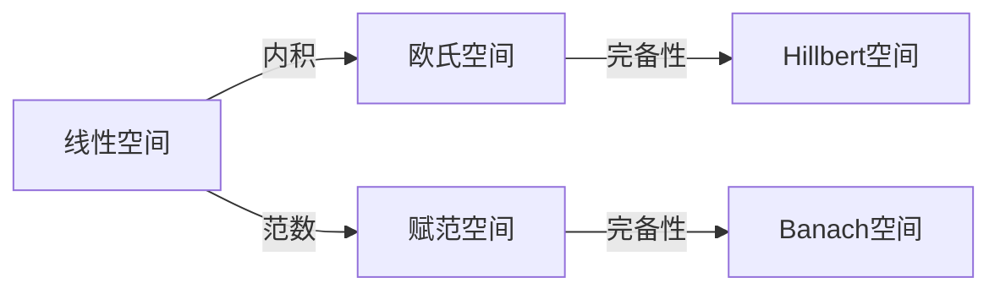

# 线性代数知识

本科线性代数

## 矩阵

### 基本概念

#### 矩阵

由$m\times n$个数$a_{ij}(1\le i\le m,1\le j\le n)$排成的$m$**行**$n$**列**（横排是行，竖排是列）的数表称为$m\times n$**矩阵**，$\mathbf{A}_{m\times n}$。其中，每个数称为**元素**，简称**元**。位于第$i$行第$j$列的元素为$(i,j)$元，即$a_{ij}$。元素的第一个和第二个下标$i,j$称为**行标**和**列标**。

> 以数$a_{ij}$为元的矩阵可以简记为$(a_{ij})$或$(a_{ij})_{m\times n}$
>
> 元素都是实数的矩阵是**实矩阵**，存在复数的是**复矩阵**。

> 矩阵一般用大写黑体字母表示。如：$\mathbf{A,B}$。

矩阵用小括号括住表示，对于不是只有一行的元素，每个元素之间不写逗号隔开（只有一行的话可逗号可不逗号）。

> 例如下面给出了一个矩阵：
> $$
> \mathbf{A}=\left(\matrix{1&2&3&4\\8&7&6&5}\right)
> $$
只有一行的矩阵叫**行矩阵**或**行向量**。只有一列的矩阵叫**列矩阵**或**列向量**。**实向量**，**复向量**的概念同实矩阵，复矩阵理。

两矩阵行数和列数相等，就是**同型矩阵**。

元素都是零的矩阵叫**零矩阵**。

$-\mathbf{A}=-(a_{ij})$称为矩阵$\mathbf{A}$的**负矩阵**。

若矩阵行数和列数相等为$n$，该矩阵称为$n$阶**方阵**，或$n$阶矩阵。

对于$n$阶方阵，从左上角到右下角的直线的元素$a_{ii}(1\le i\le n)$叫做**对角线**，或**主对角线**。从左上角到右下角的直线元素$a_{i,n-i+1}$叫做**副对角线**。

如果一个$n$阶方阵不为$0$的元素只在对角线上，那么称为**对角矩阵**，或**对角阵**。对角阵可以写成：
$$
\mathbf{\Lambda}=diag(\lambda_1,\lambda_2,\cdots,\lambda_n)=\left(\matrix{\lambda_1&0&\cdots&0\\0&\lambda_2&\cdots&0\\\vdots&\vdots&\ddots&\vdots\\0&0&\cdots&\lambda_n}\right)
$$
若$\lambda_i(1\le i\le n)=\lambda$，称为$n$阶**纯量阵**。

若$\lambda_i(1\le i\le n)=1$，称为$n$阶**单位矩阵**，或**单位阵**。

**对称矩阵**(symmetric matrix)是满足$a_{ij}=a_{ji}$的方阵。或写作$(a_{ij})=(a_{ji})$。

> **反对称矩阵**(antisymmetic matrix)是满足$a_{ij}=-a_{ji}$的矩阵。显然其对角线上元素均为0。

**转置矩阵**是将行换成同序数的列得到的新矩阵，$\mathbf{A}$的转置矩阵记作$\mathbf{A^T}$，转置矩阵的行列数与原矩阵相反。

> 为了占用篇幅较小起见，通常把一个列向量写成一个行向量的转置的表示形式，例如：$\mathbf{A}=(\matrix{1&3&2})^T$。


#### 方程组

若$n$个变量$x_i(1\le i\le n)$和$m$个变量$y_i(1\le i\le m)$之间存在关系式：
$$
\begin{cases}
a_{11}x_1+a_{12}x_2+\cdots+a_{1n}x_n&=y_1\\
a_{21}x_1+a_{22}x_2+\cdots+a_{2n}x_n&=y_2\\
&\vdots\\
a_{m1}x_1+a_{m2}x_2+\cdots+a_{mn}x_n&=y_m\\
\end{cases}
$$
那么这个关系式称从变量$x_i$到变量$y_i$的**线性变换**。

若有$n$个未知元$m$个方程组成的线性方程组/线性变换：
$$
\begin{cases}
a_{11}x_1+a_{12}x_2+\cdots+a_{1n}x_n&=b_1\\
a_{21}x_1+a_{22}x_2+\cdots+a_{2n}x_n&=b_2\\
&\vdots\\
a_{m1}x_1+a_{m2}x_2+\cdots+a_{mn}x_n&=b_m\\
\end{cases}
$$
若$b_i(1\le i\le m)$全为$0$，则方程是$n$元**齐次线性方程组**；否则是**非齐次线性方程组**。齐次线性方程组的解$x_i=0(1\le i\le n)$称为**零解**(null solution)，否则称为**非零解**。齐次线性方程组必有零解。

对于该线性方程组/线性变换，可以构造矩阵：
$$
\mathbf{A}=(a_{ij}),\mathbf{x}=\left(\matrix{x_1\\x_2\\\vdots\\x_n}\right),\mathbf{b}=\left(\matrix{b_1\\b_2\\\vdots\\b_m}\right)
$$

$$
\mathbf{B}=(\matrix{\mathbf{A},&\mathbf{b}})=\left(\matrix{
a_{11}&a_{12}&\cdots&a_{1n}&b_1\\
a_{21}&a_{22}&\cdots&a_{2n}&b_2\\
\vdots&\vdots&\ddots&\vdots&\vdots\\
a_{m1}&a_{m2}&\cdots&a_{mn}&b_m\\
}\right)
$$

其中，$\mathbf{A}$是**系数矩阵**，$\mathbf{x}$是**未知数矩阵**，$\mathbf{b}$是**常数项矩阵**，$\mathbf{B}$是**增广矩阵**。

> $\mathbf B=(\mathbf A,\mathbf b)$逗号运算是直接连接两个行数相同的矩阵合成一个新的矩阵

> 例如，矩阵：
> $$
> \left(\matrix{\cos\varphi&-\sin\varphi\\\sin\varphi&\cos\varphi}\right)
> $$
> 对应线性变换：
> $$
> \begin{cases}
> x'=x\cos\varphi-y\sin\varphi\\y'=x\sin\varphi+y\cos\varphi
> \end{cases}
> $$
> 代表将点$(x,y)$以原点为中心逆时针旋转$\varphi$角得到的新点的坐标为$(x',y')$
>
> 又如**恒等变换**$E_x$为$y_i=x_i$。恒等变换的系数矩阵是单位阵。


### 运算

#### 加减法

两个同型矩阵$\mathbf{A},\mathbf{B}$可以进行加法、减法，计算公式为：
$$
\mathbf{A}+\mathbf{B}=(a_{ij}+b_{ij})\\
\mathbf{A}-\mathbf{B}=(a_{ij}-b_{ij})
$$

> 加减法符合交换律和结合律。

> 例如：
> $$
> \left(\matrix{3&5\\7&9}\right)+\left(\matrix{3&-5\\1&0}\right)=\left(\matrix{6&0\\8&9}\right)
> $$


#### 数乘

一个矩阵$\mathbf{A}$与一个数$\lambda$可以相乘，即矩阵数乘，记为$\lambda\mathbf{A}$或$\mathbf{A}\lambda$：
$$
\lambda\mathbf{A}=(\lambda\cdot a_{ij})
$$

> 矩阵数乘符合交换律和结合律

> 例如：
> $$
> 2\left(\matrix{3&5\\7&9}\right)=\left(\matrix{6&10\\14&18}\right)
> $$


#### 乘法

一个$m\times s$矩阵$\mathbf{A}$和一个$s\times n$矩阵$\mathbf{B}$可以相乘，乘积一个$m\times n$矩阵，各元素结果为：
$$
\mathbf{A}\mathbf{B}=\mathbf{A}\times\mathbf{B}=(\sum_{k=1}^na_{ik}\cdot b_{kj})
$$
上面表达式叫做矩阵乘法，即$\mathbf{A}$**左乘**$\mathbf{B}$，或$\mathbf{B}$**右乘**$\mathbf{A}$。

> 例如：
> $$
> \left(\matrix{-1&-2&-3\\-4&-5&-6}\right)\left(\matrix{1&4\\2&5\\3&6}\right)\\=\left(\matrix{-1\cdot1-2\cdot2-3\cdot3&-1\cdot4-2\cdot5-3\cdot6\\-4\cdot1-5\cdot2-6\cdot3&-4\cdot4-5\cdot5-6\cdot6}\right)=\left(\matrix{-14&-32\\-32&-77}\right)
> $$

> 对于$m$个方程$n$元方程组的线性方程组，系数矩阵为$\mathbf A$，未知数矩阵为$\mathbf x$，常数项矩阵为$\mathbf b$，则可以把线性方程组表示为：$\mathbf A\mathbf x=\mathbf b$

当且仅当左矩阵列数等于右矩阵行数矩阵相乘才有定义。

矩阵相乘的线性变换意义可以看做是连续先后做了两个线性变换$B$和$A$的结果，也被称为是两个线性变换的乘积。

矩阵乘法符合结合律、分配律，不符合交换律。

- $\mathbf{(AB)C=A(BC)}$

- $\mathbf{\lambda(AB)=(\lambda A)B=A(\lambda B)}$

- $\mathbf{A(B+C)=AB+AC}$

  $\mathbf{(B+C)A=BA+CA}$

> 不符合交换律例如特别注意，若$\mathbf{A}$是行向量，$\mathbf{B}$是列向量，它们行列相同，则：
> $$
> \begin{align}
> \mathbf{AB}&=(\sum_{k=1}^na_{ik}\cdot b_{kj})\\
> \mathbf{BA}&=(a_{1i} b_{i1})
> \end{align}
> $$

若$n$阶方阵$\mathbf{A},\mathbf{B}$是**可交换**的，那么满足：
$$
\mathbf{AB=BA}
$$
对于可交换矩阵，满足：

- $(AB)^k=A^kB^k$
- 完全平方公式、平方差公式


对于单位矩阵，有：
$$
\mathbf{E_{m}A_{m\times n}=A_{m\times n}E_{n}=A_{m\times n}}
$$
或简写为：
$$
\mathbf{EA=AE=A}
$$


#### 幂

对于$n$阶方阵$\mathbf{A}$，有幂运算：
$$
A^0=E,A^1=A,A^k=A^{k-1}A^1,\quad k\in\Z
$$
满足幂运算法则：
$$
A^aA^b=A^{a+b},(A^a)^b=A^{ab}
$$

> 举例：
> $$
> \left(\matrix{\cos\theta&-\sin\theta\\\sin\theta&\cos\theta}\right)^n=
> \left(\matrix{\cos n\theta&-\sin n\theta\\\sin n\theta&\cos n\theta}\right)
> $$
> 该公式从几何意义上很容易证明。


对角矩阵$\mathbf\Lambda$满足：
$$
\mathbf{\Lambda}^k=diag(\lambda_1^k,\cdots,\lambda_n^k)\quad,k\in\Z
$$


#### 转置

> 一个转置矩阵举例如下：
> $$
> \left(\matrix{1&2&3\\4&5&6}\right)=\left(\matrix{1&4\\2&5\\3&6}\right)
> $$

运算可行的前提下，转置满足如下运算规律：

- $(A^T)^T=A$
- $(A+B)^T=A^T+B^T$
- $(\lambda A)^T=\lambda A^T$
- $(AB)^T=B^TA^T$

> 矩阵$\mathbf{A=O}$的充要条件是$\mathbf{AA^T=O}$。可写作 $A^T=A'$


#### 多项式

矩阵$\mathbf{A}$的$m$次多项式$\varphi(\mathbf{A})$为：
$$
a_0\mathbf{E}+a_1\mathbf{A}+\cdots+a_m\mathbf{A^m}
$$
由于矩阵$\mathbf{A}^k,\mathbf{E}$可交换，所以矩阵多项式可交换，即对于两个多项式$\varphi(\mathbf{A}),f(\mathbf{A})$，有：
$$
\varphi(\mathbf{A})f(\mathbf{A})=f(\mathbf{A})\varphi(\mathbf{A})
$$
对于对角矩阵多项式$\varphi(\mathbf{\Lambda})$，满足：
$$
\varphi(\mathbf{\Lambda})=diag(\varphi(\lambda_1),\cdots,\varphi(\lambda_n))
$$
若$\mathbf{A=P\Lambda P^{-1}}$，根据$\mathbf{PP^{-1}=E}$，有：
$$
\varphi(\mathbf{A})=\mathbf{P}\varphi(\mathbf{\Lambda})\mathbf{P}^{-1}
$$
综合这两条公式，若有$\mathbf{A,P}$的关系，可以很快求出$\varphi(\mathbf{A})$的值。


> 例：设$\mathbf{AP=P\Lambda}$，其中
> $$
> \mathbf P=\begin{pmatrix}1&1&1\\1&0&-2\\1&-1&1\end{pmatrix}
> ,A=\begin{pmatrix}-1\\&1\\&&5\end{pmatrix}
> $$
> 求$\varphi(\mathbf A)=\mathbf A^8(5\mathbf E-6\mathbf A+\mathbf A^2)$
>
> 记多项式：$\varphi(x)=x^8(5-6x+x^2)$，有$\varphi(\mathbf A)=\mathbf P\varphi(\mathbf A)\mathbf P^{-1}$
>
> 根据公式：$\varphi(\mathbf \Lambda)=diag(\varphi(-1),\varphi(1),\varphi(5))=diag(12,0,0)$
>
> 所以再计算$\mathbf P^{-1}$，进行矩阵相乘得原式=$4\begin{pmatrix}1&1&1\\1&1&1\\1&1&1\end{pmatrix}$。


#### 分块

可以将一个大矩阵中的若干不重合子阵看做若干个元，得到一个新的矩阵，叫做分块法。每一个小矩阵称为**子块**，以子块为元素的矩阵为**分块矩阵**。通过分块，一个矩阵可以化为一个更小的分块矩阵或行向量、列向量。注意分块后的矩阵不能称为一般的矩阵(如分块二阶矩阵不等于二阶矩阵)。

对分块矩阵进行运算，如乘法、逆、转置时，不仅每个元素需要做相应运算，元素内部也要做相应运算。例如：

分块对角矩阵满足如下性质：
$$
\mathbf{A}=\left(\matrix{\mathbf{A_1^{}}&&&\mathbf{O} \\
&\mathbf{A_2^{}}&&\\&&\ddots&\\\mathbf{O}&&&\mathbf{A_s^{}} }\right)
$$

$$
\mathbf{|A|=|A_1||A_2|\cdots|A_s|}
$$

$$
\mathbf{A^{-1}}=\left(\matrix{\mathbf{A_1^{-1}}&&&\mathbf{O} \\
&\mathbf{A_2^{-1}}&&\\&&\ddots&\\\mathbf{O}&&&\mathbf{A_s^{-1}} }\right)
$$

> 二阶分块矩阵求逆，所以内部逆之后外部还要对调，即若有分块矩阵：
> $$
> \mathbf A=\begin{pmatrix}\mathbf A&\mathbf O\\\mathbf O&\mathbf B\end{pmatrix},\mathbf A^{-1}=\begin{pmatrix}\mathbf A^{-1}&\mathbf O\\\mathbf O&\mathbf B^{-1}\end{pmatrix}
> $$
>
> $$
> \mathbf A=\begin{pmatrix}\mathbf O&\mathbf A\\\mathbf B&\mathbf O\end{pmatrix}A^{-1}=\begin{pmatrix}\mathbf O&\mathbf B^{-1}\\\mathbf A^{-1}&\mathbf O\end{pmatrix}
> $$
>
> 分的两块大小不必相同。


一般矩阵的转置运算满足如下性质：
$$
\left(\matrix{
\mathbf{A_{11}}&\cdots&\mathbf{A_{1r}}\\\vdots&&\vdots\\
\mathbf{A_{s1}}&\cdots&\mathbf{A_{sr}}
}\right)^T=
\left(\matrix{
\mathbf{A_{11}^T}&\cdots&\mathbf{A_{s1}^T}\\\vdots&&\vdots\\
\mathbf{A_{1r}^T}&\cdots&\mathbf{A_{sr}^T}
}\right)
$$


矩阵可以进行加法当且仅当行数、列数和分块方法相同，能进行乘法当且仅当分块后左矩阵列数等于右矩阵行数且分块方法相同


## 行列式

### 排列与逆序

$n$个不同元素排成一列，称为这$n$个元素的**全排列**，或简称**排列**。$n$个不同元素的所有排列种数记作$P_n$。

对于$n$个并于同的元素，规定各元素之间的一个标准次序，若对自然数而言，标准次序就是从小到大。在$n$元素的任意一个排列中，如果某一对元素先后次序跟标准次序不同，就构成了$1$个**逆序**，或**逆序对**。排列中所有逆序数的数目称为排列的**逆序数**$\tau$。

> 逆序数为奇数的排列是**奇排列**，否则是**偶排列**。

> 如：$32514$的逆序数，即排列$3,2,5,1,4$的逆序数，逆序对有：$(3,2),(3,1),(2,1),(5,1),(5,4)$，共$5$个，所以逆序数为$\tau(32514)=5$。

> 在排列中，任意两个元素对调的操作称为**对换**。如果对换的元素**相邻**，称为相邻对换。
>
> 定理：
>
> 1. 一个排列任意两个元素对换，改变排列奇偶性。
> 2. 奇排列对换成标准排列的对换次数是奇数，偶排列是偶数。


### 概念

**行列式**是一种对一个$n$阶矩阵的运算，其计算结果是一个数，这个数代表对于矩阵由标准排列组成的行标和所有$n$排列组成的列标确定的$n$个元素的乘积乘以负一的列标逆序数次方$(-1)^{\tau}$的和，即：
$$
\sum_{n!个排列p}(-1)^{\tau}\prod_{i=1}^na_{1p_i}
$$

> 以矩阵：
> $$
> \mathbf{A}=\left(\matrix{3&5\\7&9}\right)
> $$
> 为例，则有序排列为$P_2=\{\{1,2\},\{2,1\}\}$，逆序数分别是$0,1$。上式计算结果为：
> $$
> (-1)^{0}\cdot a_{11}\cdot a_{12}+(-1)^{1}\cdot a_{12}\cdot a_{21}=3\times9-5\times 7=-8
> $$

行列式的写法为矩阵的写法基础上将括号改成绝对值符号，也可以记作$\det \mathbf{A}$。但计算结果不保证为正数。

由公式化简可得，对于二阶矩阵和三阶矩阵分别有行列式公式：
$$
\left|\matrix{a_{11}&a_{12}\\a_{21}&a_{22}}\right|=a_{11}\cdot a_{22}-a_{12}\cdot a_{21}
$$

$$
\left|\matrix{a_{11}&a_{12}&a_{13}\\a_{21}&a_{22}&a_{23}\\a_{31}&a_{32}&a_{33}}\right|\\=a_{11}(a_{22}a_{33}-a_{23}a_{32})-a_{12}(a_{21}a_{33}-a_{23}a_{31})+a_{13}(a_{21}a_{32}-a_{22}a_{31})
$$

> 上述公式可以理解为三条主对角线乘积和减去三条副对角线乘积和。
>
> 一个行列式及其计算结果例子：
> $$
> \mathbf{A}=\left(\matrix{1&2&3\\8&9&4\\7&6&5}\right)
> $$
>
> $$
> \det A=|\mathbf{A}|=\left|\matrix{1&2&3\\8&9&4\\7&6&5}\right|=-48
> $$


主对角线以下元素都为$0$的行列式称为**上三角形行列式**，主对角线以上元素都为$0$的行列式的行列式称为**下三角形行列式**，主对角线以上和以下元素都为$0$的行列式**对角行列式**。

对于上(下)三角形行列式和对角行列式，计算式为主对角线所有元素的乘积：
$$
\prod_{i=1}^n a_{ii}
$$

> 下面从左到右给出一个上三角、一个下三角行列式和一个对角行列式及其计算结果：
> $$
> \left|\matrix{-1&0.1&10^5\\0&6&\frac12\\0&0&-3}\right|=18\quad \left|\matrix{1&0&0\\1&2&0\\-1&-2&3}\right|=6\quad\left|\matrix{1&0&0\\0&2&0\\0&0&1}\right|=2
> $$
> 若对于副对角线构成的类似的三角形行列式和对角线行列式，其计算式为：

$$
(-1)^{\frac{n(n-1)}2}\prod_{i=1}^n a_{ii}
$$

> 如：
> $$
> \left|\matrix{0&0&3\\0&2&99\\1&1&\pi}\right|=-6\quad \left|\matrix{1&2&3&-4\\4&5&7&0\\8&9&0&0\\10&0&0&0}\right|=-2520\quad\left|\matrix{0&0&1\\0&2&0\\0&0&0}\right|=0
> $$

**转置行列式**：对一个原行列式$\mathbf{D}$做变换$a_{ij}=a_{ji}$得到的行列式$\mathbf{D^T}$。例如上三角行列式和下三角行列式互为转置行列式。

行列式**相等**，意思是说行列式的计算结果是相同的，行列式为某个数值，也就是说行列式的计算结果是这个数值。如行列式为$0$代表计算结果是$0$。


### 性质

1. 行列式和它的转置行列式相等

   > 如：
   > $$
   > \left|\matrix{5&8&0\\13&0&3\\40&45&48}\right|=
   > \left|\matrix{5&13&40\\8&0&45\\0&3&48}\right|
   > $$

2. 对换行列式的相邻两行或两列，行列式变号

   $\to$如果行列式存在两行或两列完全相同，则行列式为$0$

   对换行$i$和行$j$记作$r_i\leftrightarrow r_j$，列记作$c_i\leftrightarrow c_j$，其中$r$代表行，$c$代表列。

   > 如：
   > $$
   > \left|\matrix{5&8&0\\13&0&3\\40&45&48}\right|\xlongequal{r_1\leftrightarrow r_2}
   > -\left|\matrix{13&0&3\\5&8&0\\40&45&48}\right|\quad;\quad
   > \left|\matrix{5&8&0\\5&8&0\\25&64&40}\right|=0
   > $$
   
3. 行列式某一行或某一列所有元素同时乘以同一个数$k$，等于用$k$乘以整个行列式

   $\to$行列式某一行或某一列所有公因子可以提取到行列式外面

   这两者分别记作$r_i\times k ,c_i\times k;\quad r_i\div k, c_i\div k$

   > 如：
   > $$
   > \left|\matrix{5&8&0\\13&0&3\\40&45&50}\right|\xlongequal{r_2\times2}
   > \frac12\left|\matrix{5&8&0\\26&0&6\\40&45&50}\right|\xlongequal{r_3\div5}
   > \frac52\left|\matrix{5&8&0\\26&0&6\\8&9&10}\right|
   > $$

4. 行列式如果有两行或两列元素成比例，则这个行列式为$0$

   > 如：
   > $$
   > \left|\matrix{5&8&0\\10&16&0\\40&45&50}\right|=0
   > $$

5. 若行列式某一行元素都是两数之和，那么可以将该行列式拆成两个行列式，这两个行列式除了这一行值分别是两数外，其他行不变；列同理

   > 如：
   > $$
   > \left|\matrix{5&8&0\\10+3&-1+1&1+2\\40&45&50}\right|=
   > \left|\matrix{5&8&0\\10&-1&1\\40&45&50}\right|+
   > \left|\matrix{5&8&0\\13&1&2\\40&45&50}\right|
   > $$

6. 行列式某一行或列各元素乘以同一个数加到另一行或列对应元素上，行列式不变

   记作$r_j+kr_i$或$c_j+kc_i$

   > 如：
   > $$
   > \left|\matrix{5&8&0\\10&0&3\\40&45&50}\right|\xlongequal{r_2-2r_i}\left|\matrix{5&8&0\\10+5\times(-2)&0+8\times(-2)&3+0\times(-2)\\40&45&50}\right|
   > $$

根据上面六条性质，必然可以将任意一个普通矩阵转换为上（下）三角形行列式或对角行列式，从而利用相应的公式求值。

多次变换在等号上的记号会有多个，需要按照从上往下的顺序执行这些变换，如果顺序反了得到的结果可能是错误的。如：

> $$
> \left|\matrix{5&8&0\\10&0&3\\40&45&50}\right|\xlongequal[r_3+3r_2]{r_2-2r_1}\left|\matrix{5&8&0\\0&-16&3\\40&-3&59}\right|
> $$

使用技巧：

- 行性质与列性质等效，为了避免分数计算的麻烦，通常使用能够避免分数的变换
- 在都可以避免分数情况下，优先选择行变换

> 性质使用举例：
> $$
> \left|\matrix{1&2&3\\8&9&4\\7&6&5}\right|\xlongequal{r_3-3r_1}
> \left|\matrix{1&2&3\\8&9&4\\4&0&-4}\right|\xlongequal{c_1+c_3}
> \left|\matrix{4&2&3\\12&9&4\\0&0&-4}\right|\xlongequal{r_2-3r_1}
> \left|\matrix{4&2&3\\0&3&-5\\0&0&-4}\right|=-48
> $$
> 注：更繁琐的解法二：
> $$
> c_1-2c_3,c_2-2c_3,r_3-r_1,c_3-4c_2,c_1-c_3
> $$
> 这也说明了同一个行列式可以用多种不同的变换方法得到答案。
>
> 本题事实上用三阶行列式公式计算最快；但对于三阶以上的行列式没有直接的推导公式，只能如此转化为三角/对角行列式然后再算


除此之外，行列式的运算，满足如下运算律：

- $|\lambda A|=\lambda^n|A|$
- $|AB|=|A||B|$


### 展开

在$n$阶行列式中，把$a_{ij}$所在行和列去掉后，留下的$n-1$阶行列式叫做$a_{ij}$的**余子式**$M_{ij}$。且有**代数余子式**$A_{ij}$定义如下：
$$
A_{ij}=(-1)^{i+j}M_{ij}
$$

> 例如对三阶行列式：
> $$
> \left|\matrix{a_{11}&a_{12}&a_{13}\\a_{21}&a_{22}&a_{23}\\a_{31}&a_{32}&a_{33}}\right|
> $$
>
> $$
> M_{12}=\left|\matrix{a_{21}&a_{23}\\a_{31}&a_{33}}\right|
> $$
>
> $$
> A_{12}=(-1)^{1+2}M_{12}=-M_{12}
> $$

若一个$n$阶行列式第$i$行或第$j$列除了$a_{ij}$外都是$0$，那么行列式的计算结果为：
$$
D=a_{ij}A_{ij}
$$

> 如：
> $$
> \left|\matrix{1&2&3\\0&0&4\\7&6&5}\right|=
> -4\left|\matrix{1&2\\7&6}\right|=32
> $$

行列式的按行（列）展开法则：行列式等于它的任一行（列）各元素与其对应的代数余子式乘积之和：
$$
D=\sum_{i=1}^na_{ij}A_{ij}=\sum_{j=1}^na_{ij}A_{ij}
$$

> 例如上文的三阶行列式公式也可以这么推导而来。

推论：行列式某一行（列）元素与另一行（列）对应元素的代数余子式乘积之和为$0$：
$$
\sum_{k=1}^na_{ki}A_{kj}=\sum_{k=1}^na_{ik}A_{jk}=\begin{cases}
D&,i=j\\0&,i\neq j
\end{cases}
$$
使用按行（列）展开，可以将高阶行列式降阶求解。

> 举例如下：
> $$
> \left|\matrix{1&2&3\\8&9&4\\7&6&5}\right|\xlongequal{r_3-3r_1}
> \left|\matrix{1&2&3\\8&9&4\\4&0&-4}\right|\xlongequal{c_1+c_3}
> \left|\matrix{4&2&3\\12&9&4\\0&0&-4}\right|=
> -4\left|\matrix{4&2\\12&9}\right|=-48
> $$

> 通常而言，综合使用展开和性质计算行列式比只使用性质计算行列式更为简便。


一个$n$阶矩阵$\mathbf{A}$各个元素的代数余子式$A_{ij}$的转置矩阵构成了矩阵$\mathbf{A}$的**伴随矩阵**$\mathbf{A^*}$，简称**伴随阵**：
$$
\mathbf{A^*}=(A_{ij})^T=(A_{ji})=\left(\matrix{A_{11}&A_{21}&\cdots&A_{n1}\\A_{12}&A_{22}&\cdots&A_{n2}\\\vdots&\vdots&\ddots&\vdots\\A_{1n}&A_{2n}&\cdots&A_{nn}}\right)
$$
伴随阵满足如下运算：
$$
\mathbf{AA^*=A^*A=|A|E}
$$

> 三阶矩阵的速算公式：[src](https://www.bilibili.com/video/BV1MV4y1A7cL/?vd_source=3f13edc74e77991f90a1b89b0e936066)
>
> 1. 把矩阵平铺成 $5\times 5$，然后去掉第一行第一列
> 2. 对每个 $2\times 2$ 子阵求行列式，得到 $3\times 3$ 矩阵
> 3. 将其转置
>
> 算完上面的伴随阵，再除行列式，就得到了矩阵逆。

## 逆矩阵

若对$n$阶矩阵$\mathbf{A}$，有$n$阶矩阵$\mathbf{B}$使得下面等式成立：
$$
\mathbf{AB=BA=E}
$$
则$\mathbf{A}$可逆，且$\mathbf{B}$为$\mathbf{A}$的**逆矩阵**，简称逆阵。$\mathbf{A^{-1}=B}$

> 根据定义可知，一阶逆矩阵直接求倒数即可。

若矩阵$\mathbf{A}$可逆，则$|\mathbf{A}|\neq0$，这是因为$\mathbf{|AA^{-1}|=|E|=1}$。若$|\mathbf{A}|\neq0$，则$\mathbf{A}$为**非奇异矩阵**，否则为**奇异矩阵**。且$\mathbf{A}$存在逆矩阵的充要条件是$\mathbf{A}$为非奇异矩阵。

一个矩阵的逆矩阵是唯一的。

> $$
> \mathbf{B=BE=B(AC)=(BA)C=EC=C\Rightarrow B=C}
> $$

由伴随矩阵性质，可得：
$$
\mathbf{A^{-1}=\frac1{|A|}A^*}
$$
由上式化简得，对于二阶矩阵，有：
$$
\left(\matrix{a&b\\c&d}\right)^{-1}=\frac1{ad-bc}\left(\matrix{d&-b\\-c&a}\right)
$$

逆矩阵运算规律：

- $\mathbf{(A^{-1})^{-1}=A}$
- $\lambda\neq0,(\lambda\mathbf{A})^{-1}=\frac1\lambda\mathbf{A^{-1}}$
- $\mathbf{(AB)^{-1}=B^{-1}A^{-1}}$

对于对角矩阵，有：
$$
\Lambda^{-1}=diag(\lambda_1^{-1},\cdots,\lambda_m^{-1})
$$

若$A^k,k<0$，那么先求逆矩阵，再求幂。

> 按上面速算可以算三阶矩阵，伴随阵，再除行列式，就得到了三阶矩阵逆。

四阶和以上一般用初等变换求，如对增广矩阵 $[A:I_n]$ <u>只做</u>行变换为 $[I_n:B]$，则 $A^{-1}=B$。一个具体例子及其代码过程求解见 [here](https://gist.github.com/lr580/09e8ce441e81857455cd5d21024b9e0d)。对一些简单的矩阵，如三角阵，初等变换求逆也很快。

## 初等变换

### 初等变换

定义矩阵的**初等行变换**为下面三种变换：

1. 对换$i,j$两行，记作$r_i\leftrightarrow r_j$
2. 以$k\neq0$乘第$i$行的所有元，记作$r_i\times k$
3. 将第$j$行所有元的$k$倍加到第$i$行，记作$r_i+kr_j$

> 初等行变换矩阵举例：$\mathbf A:$ 交换第一第二行，$\mathbf B:$ 第一行乘 $3$，$\mathbf C:$ 第一行乘 $3$ 加到第二行
> $$
> \mathbf A=\pmatrix{0&1&0\\1&0&0\\0&0&1},
> \mathbf B=\pmatrix{3&0&0\\0&1&0\\0&0&1},
> \mathbf C=\pmatrix{1&0&0\\3&1&0\\0&0&1}
> $$

> 对一个矩阵 $\mathbf X$ 先后执行这几个变换，如先交换一二行再第一行乘三，为 $\mathbf {BAX}$。

若将上述的行全部换成列(记号上$r\to c$)，即为**初等列变换**的定义。

初等行变换和初等列变换统称**初等变换**。

若矩阵$\mathbf{A}$经过有限次初等行变换得到矩阵$\mathbf{B}$，称为$\mathbf{A,B}$**行等价**，即$\mathbf{A\overset{r}{\sim}B}$；列变换称为**列等价**$\mathbf{A\overset{c}{\sim}B}$，初等变换称为**等价**$\mathbf{A\sim B}$。


等价关系的性质：

- 反身性：$\mathbf{A\sim A}$
- 对称性：若$\mathbf{A\sim B}$则$\mathbf{B\sim A}$
- 传递性：若$\mathbf{A\sim B}$，$\mathbf{B\sim C}$则$\mathbf{A\sim C}$


定义**行阶梯形矩阵**：非零行在零行上面、非零行首非零元所在列在上一行(若存在)的首非零元所在列右边的非零矩阵。

若行阶梯形矩阵的非零行首非零元均为$1$，且首非零元所在列其他元均为$0$，那么称为**行最简形矩阵**。(Reduced Row Echelon Form, RREF)，为 1 的首个元是主元leading entry

对行最简形矩阵实行初等列变换，使矩阵左上角变成一个单位矩阵，其余元全为$0$的矩阵称为**标准形**。

任何非零矩阵总可以经过有限次初等行变换得到行阶梯形矩阵和行最简形矩阵。任何矩阵总可以经过有限次初等变换化为标准形。

标准形$\mathbf{F}$的分块矩阵表示法如下：
$$
\mathbf{F}=\left(\matrix{\mathbf{E_r}&\mathbf{O}\\\mathbf{O}&\mathbf{O}}\right)_{m\times n}
$$

> 由单位矩阵经过一次初等变换得来的矩阵称为**初等矩阵**
>
> 对$m\times n$矩阵$\mathbf{A}$施行一次初等行变换，等效于一个$m$阶​初等矩阵右乘$\mathbf A$；初等列变换等效于一个$n$阶​初等矩阵左乘$\mathbf A$。


若$\mathbf{A,B}$为$m\times n$矩阵，则：

- $\mathbf{A\overset{r}{\sim}B}$的充要条件是存在$m$阶可逆矩阵$\mathbf{P}$使得$\mathbf{PA=B}$
- $\mathbf{A\overset{c}{\sim}B}$的充要条件是存在$n$阶可逆矩阵$\mathbf{Q}$使得$\mathbf{AQ=B}$
- $\mathbf{A\sim B}$的充要条件是存在$m$阶可逆矩阵$\mathbf{P}$、$n$阶可逆矩阵$\mathbf{Q}$使得$\mathbf{PAQ=B}$


> 方阵$\mathbf A$可逆的充要条件是存在有限个初等矩阵$\mathbf P$，使得$\mathbf{A=P_1P_2\cdots P_s}$

方阵$\mathbf A$可逆的充要条件是$\mathbf{A\overset{r}{\sim}B}$或$\mathbf{A\overset{c}{\sim}B}$或$\mathbf{A\sim B}$


### 秩

在$m\times n$矩阵$\mathbf A$中，任取$k$行$k$列$(k\le n,k\le m)$，在行列交叉处取得$k^2$个元素以本来的先后相对顺序组成$k$阶行列式，称为$\mathbf A$的$k$阶**子式**。

> 主子式：行列序号相同；顺序主子式：前 k 行前 k 列

若矩阵$\mathbf A$中有行列式不为$0$的$r$阶子式$D$，且所有$r+1$阶子式(若存在)均为$0$，则$D$称为$\mathbf A$的**最高阶非零子式**，且$r$称为$\mathbf A$的**秩**，记作$R(\mathbf A)$。规定零矩阵秩为$0$。

> 将矩阵化成行阶梯式，非全零行的数目就是秩

若$\mathbf{A\sim  B}$，则$\mathbf A$,$\mathbf B$中非零子式的最高阶数相等，即$\mathbf A,\mathbf B$的秩相等。

秩的运算规律：

- $0\le R(\mathbf A)\le \min\{m,n\}$ (取等是满秩) 

- $R(\mathbf A)=R(\mathbf A^T)$

- 若$\mathbf P,\mathbf Q$可逆，则$R(\mathbf{PAQ})=R(\mathbf A)$

- $\max\{R(\mathbf A),R(\mathbf B)\}\le R(\mathbf A,\mathbf B)\le R(\mathbf A)+R(\mathbf B)$

  若$\mathbf B$为非零列向量$\mathbf b$，则$R(\mathbf A)\le R(\mathbf A,\mathbf b)\le R(\mathbf A)+1$

- $R(\mathbf A+\mathbf B)\le R(\mathbf A)+R(\mathbf B)$

- $R(\mathbf A\mathbf B)\le R(\mathbf A)+R(\mathbf B)$

- 若$\mathbf A_{m\times n}\mathbf B_{n\times l}=\mathbf O$，则$R(\mathbf A)+R(\mathbf B)\le n$

- $R(\mathbf{A^{T}A})=R(\mathbf A)$

- > $R(AB)\le R(A),R(AB)\le R(B)$


可逆矩阵的秩等于矩阵阶数，不可逆矩阵的秩小于矩阵阶数。

> 可逆矩阵又称**满秩矩阵**，奇异矩阵又称**降秩矩阵**。


矩阵乘法的消去律：若$\mathbf A\mathbf B=\mathbf O$，若$\mathbf A$为列满秩矩阵，则$\mathbf B=\mathbf O$


## 向量组

### 概念

对于一个$\mathbf n$**维向量**，默认指的是$n$行$1$列的列向量，组成向量第$i$个数称为第$i$个**分量**。

> 下面依次给出了$n$维列向量和行向量的例子：
> $$
> \mathbf\alpha=\begin{pmatrix}
> a_1\\a_2\\\vdots\\a_n
> \end{pmatrix}=\begin{pmatrix}
> a_1&a_2&\cdots&a_n
> \end{pmatrix}^T,
> \mathbf\alpha^T=\begin{pmatrix}
> a_1&a_2&\cdots&a_n
> \end{pmatrix}\quad\quad
> $$

> $n$**维单位坐标向量**是$n$阶单位矩阵$\mathbf{E=(e_1,e_2,\cdots,e_n)}$的列向量。即某个 $e$ 为 $1$，剩余全 $0$ 的向量。

$n$维向量的全体组成的集合：
$$
\R^n=\{\mathbf x=\begin{pmatrix}
x_1&x_2&\cdots&x_n
\end{pmatrix}^T|x_1,x_2,\cdots,x_n\in\R\}
$$
称为$\mathbf n$**维空间**$\R^n$，是一个$n-1$维超平面。

若干维数相同的列向量或若干维数相同的行向量组成的集合称为**向量组**。

> 若向量组$A$是向量组$B$的一部分，则称向量组$A$是向量组$B$的**部分组**。


### 线性组合

给定向量组$A:\mathbf a_1,\mathbf a_2,\cdots,\mathbf a_m$和一组实数$k_1,k_2,\cdots,k_m$，则表达式：
$$
k_1\mathbf a_1+k_2\mathbf a_2+\cdots k_m\mathbf a_m
$$
称为向量组$A$的一个**线性组合**。

若存在向量$\mathbf b$，使得：
$$
\mathbf b=k_1\mathbf a_1+k_2\mathbf a_2+\cdots k_m\mathbf a_m
$$
则向量$\mathbf b$是向量组$A$的一个线性组合，向量$b$能由向量组$A$**线性表示**。

向量$\mathbf b$能由向量组$A$线性表示的充要条件是矩阵$\mathbf A=\begin{pmatrix}a_1,a_2,\cdots,a_n\end{pmatrix}$的秩等于矩阵$(\mathbf A, \mathbf b)$的秩。

有向量组$A,B$，若$B$的每个向量都能由向量组$A$线性表示，则说向量组$B$能由向量组$A$线性表示。若向量组$A,B$可相互线性表示，则这两个**向量组等价**。

向量组$B$能由向量组$A$线性表示的充要条件是矩阵$\mathbf A$的秩等于矩阵$(\mathbf A,\mathbf B)$的秩，即$R(\mathbf A)=R(\mathbf A,\mathbf B)$

向量组$A,B$等价的充要条件是$R(\mathbf A)=R(\mathbf B)=R(\mathbf A,\mathbf B)$

若向量组$B$能由向量组$A$线性表示，则$R(\mathbf B)\le R(\mathbf A)$

若向量组$B$能由向量组$A$线性表示，则存在矩阵$\mathbf K$使得$\mathbf{B=AK}$，即该关于$\mathbf K$的矩阵方程有解

> $n$维单位坐标向量组能由向量组$A$线性表示的充要条件是$R(\mathbf A)=n$

> 矩阵行初等变换不改变列向量之间的线性组合关系


### 线性相关

若对向量组$A$，存在不全为零的数$k_1,k_2,\cdots,k_m$，使得：
$$
k_1\mathbf a_1+k_2\mathbf a_2+\cdots k_m\mathbf a_m=0
$$
则称向量组$A$是**线性相关**的，否则成它是**线性无关**的。

向量组$A$线性相关的充要条件是它构成的矩阵的秩小于向量个数，即$R(\mathbf A)<m$

向量组$A$线性无关的充要条件是它构成的矩阵的秩等于向量个数，即$R(\mathbf A)=m$


设向量组$A:\mathbf a_1,\mathbf a_2,\cdots,\mathbf a_m$,$B:\mathbf a_1,\mathbf a_2,\cdots,\mathbf a_m,\mathbf a_{m+1}$

- 若向量组$A$线性相关，则向量组$B$也线性相关
- 若向量组$B$线性无关，则向量组$A$也线性无关
- 若向量组$A$线性无关，$B$线性相关，则$a_{m+1}$一定可以由$A$唯一线性表示


$m$个$n$维向量的向量组，若$n<m$，一定线性相关


> 求矩阵的最大线性无关列：将矩阵化成行最简式，主元所在列是线性无关列。
>
> $\mathbf {A=CR}$ 分解，将矩阵分解为 $\mathbf C$ 为线性无关列，$\mathbf R$ 为行阶梯形矩阵，其中 $\mathbf{C,R}$ 秩相等。如：
> $$
> \pmatrix{1&2&3\\2&3&5}=\pmatrix{1&2\\2&3}\pmatrix{1&0&1\\0&1&1}
> $$


> 两个向量线性相关：$v2=kv_1$，其中 $k$ 非零。

### 秩

若向量组$A$的部分组$A_0:\mathbf a_1,\mathbf a_2,\cdots,\mathbf a_r$，满足：

- $A_0$线性无关
- 如果$A$有至少$r+1$个向量，任意$r+1$个向量的部分组都线性相关

则$A_0$是$A$的**最大线性无关向量组**，简称**最大无关组**，$r$是$A$的秩，即$R_A=r$。

只有零向量的向量组无最大无关组，规定秩为$0$。

> 等价定义如下：
>
> 若向量组$A$的部分组$A_0:\mathbf a_1,\mathbf a_2,\cdots,\mathbf a_r$，满足：
>
> - $A_0$线性无关
> - $A$的任一向量都能由向量组$A_0$线性表示
>
> 则$A_0$是$A$的最大无关组

矩阵的秩等于它的列向量组秩和行向量组秩。

> 根据这个定理，在线性组合和线性相关里矩阵的秩都可以用向量组秩代换


### 向量空间

运算**封闭**是指在集合$V$内的任何元素进行这个运算得到的结果一定属于这个集合

> 例如整数集对加减乘法封闭(除法不封闭)，自然数集对加乘法封闭，由于零除零未定义，所以即便是复数集对除法也不封闭

设$V$是$n$维向量的集合，若$V$非空，且对向量加法和数乘封闭，则$V$是**向量空间**(vector space)

> 如$n$元齐次线性方程组的解集是向量空间(称为齐次线性方程组的**解空间**)(solution space)

向量组可以通过不断进行加法和数乘生成一个向量空间

若向量空间$V_1\subseteq V_2$，则称$V_1$是$V_2$的**子空间**

若向量空间$V$内$r$个向量满足：

- 它们线性无关
- $V$中任何向量都可由它们线性表示

那么这个向量组称为向量空间的一个**基**(base of a vector space)。向量组中向量的数目$r$称为$V$的维数，称$V$是$\mathbf r$**维向量空间**。

若取单位坐标向量组为基，那么称这个基是**自然基**。

对于$V$和基$\mathbf a_1,\mathbf a_2,\cdots,\mathbf a_r$，任一向量可表示为：
$$
\mathbf x=\lambda_1\mathbf x_1+\lambda_2\mathbf x_2+\cdots\lambda_r\mathbf x_r
$$
其中数组$\lambda_1,\lambda_2\cdots\lambda_r$称为向量$\mathbf x$在这个基中的**坐标**。

> 在向量空间中取基$A,B$，用$A$表示的$B$称为**基变换公式**，对应的坐标之间的关系式称为**坐标变换公式**。矩阵$\mathbf{P=A^{-1}B}$称为从旧基到新基的**过渡矩阵**
>
> 对向量$\mathbf c$，坐标变换公式为$\mathbf c'=\mathbf P^{-1}\mathbf c$


### 运算

#### 内积

设有两$n$维向量$\mathbf x=(x_1,x_2,\cdots,x_n)^T$,$\mathbf y=(y_1,y_2,\cdots,y_n)^T$，定义：
$$
[\mathbf x,\mathbf y]=\mathbf x^Ty=\prod_{i=1}^nx_iy_i
$$
称为向量$\mathbf{x,y}$的内积。

内积性质：($\mathbf{x,y,z}$是$n$维向量，$\lambda\in\R$)

- $[\mathbf x,\mathbf y]=[\mathbf y,\mathbf x]$
- $[\lambda\mathbf x,\mathbf y]=\lambda[\mathbf x,\mathbf y]$
- $[\mathbf x+\mathbf y,\mathbf z]=[\mathbf x,\mathbf z]+[\mathbf y,\mathbf z]$
- $\begin{cases}\mathbf x=\mathbf 0\Rightarrow[\mathbf x,\mathbf x]=0\\\mathbf x\neq\mathbf 0\Rightarrow[\mathbf x,\mathbf x]>0\end{cases}$
- $[\mathbf x,\mathbf y]^2\le[\mathbf x,\mathbf x][\mathbf y,\mathbf y]$(施瓦兹Schwarz不等式)


#### 范数

$$
\|\mathbf x\|=\sqrt{[\mathbf x,\mathbf x]}=\sqrt{\prod_{i=1}^nx_i^2}
$$

$\|\mathbf x\|$称为$n$维向量$x$的**范数**(欧几里得范数)或**长度**。(二阶范数)

> 一阶范数：绝对值之和

范数性质：

- $\begin{cases}\mathbf x=\mathbf 0\Rightarrow\|\mathbf x\|=0\\\mathbf x\neq\mathbf 0\Rightarrow\|\mathbf x\|>0\end{cases}$
- $\|\lambda\mathbf x\|=|\lambda|\cdot\|\mathbf x\|$
- $-1\le\mathbf{\frac{[x,y]}{\|x\|\cdot\|y\|}}\le1,$当$\|x\|\cdot\|y\|\neq0$(施瓦兹Schwarz不等式)

若$\|\mathbf x\|=1$，则$\mathbf x$是**单位向量**。 若$\mathbf a\neq0$，取$\mathbf{x=\frac a{\|a\|}}$，称为将$\mathbf a$**单位化**。


#### 夹角

$\mathbf{x\neq0,y\neq0}$，则：
$$
\theta=\mathbf{\frac{[x,y]}{\|x\|\cdot\|y\|}}
$$
是$n$维向量$\mathbf x,y$的**夹角**。


#### 正交

若$[\mathbf x,\mathbf y]=0$，则$\mathbf{x,y}$**正交**。显然零向量与任何向量正交。

若$r$个$n$维非零向量的向量组的向量两两正交，则这个向量组线性无关

在向量空间$V$中的两两正交的单位向量基是**标准正交基**。

将基转化为标准正交基的过程叫**标准正交化**。

常使用施密特(Schmidt)正交化公式进行标准正交化：

对基$\mathbf a_1,\cdots,\mathbf a_r$，生成正交基$\mathbf b_1,\cdots,\mathbf b_r$公式为：
$$
\mathbf{ b_i=a_i-\sum_{j=1}^{i-1}\frac{[b_j,a_i]}{[b_j,b_j]}b_j }
$$
之后再对$\mathbf b$单位化，即得。


若$n$阶矩阵$\mathbf A$有$\mathbf A^T\mathbf A=\mathbf E$，即$\mathbf A^{-1}=\mathbf A^T$，则它是**正交矩阵**，简称**正交阵**。

正交矩阵的性质：

- $|\mathbf A|=\pm 1$ ($|AA^T|=|E|,|A|=|A^T|$ 可知) 
- $\mathbf{A,B}$是正交阵，则$\mathbf{AB}$也是正交阵


对正交矩阵做的变换$\mathbf{y=Px}$叫做**正交变换**。

正交变换后，向量$\mathbf{y,x}$范数不变。

> 保持 $C(A)=C(Q)$，将 $A$ 转为正交矩阵 $Q$
>
> 先求出施密特正交化后的 $Q$，变化过程的系数为三角矩阵 $R$，具体而言：
> $$
> \begin{cases}
> \mathbf q_1=\mathbf a_1/||\mathbf a_1||\\
> \mathbf q_2=\mathbf a_2/-(\mathbf q_1^T\mathbf a_2)\mathbf q_1,\quad
> \mathbf q_2=\mathbf q_2/||\mathbf q_2||\\
> \mathbf q_2=\mathbf a_3/-(\mathbf q_1^T\mathbf a_3)\mathbf q_1-(\mathbf q_2^T\mathbf a_3)\mathbf q_2,\quad
> \mathbf q_3=\mathbf q_3/||\mathbf q_3||\\
> \end{cases}
> $$
> 然后得到系数：
> $$
> \begin{cases}
> \mathbf a_1=r_{11}\mathbf q_1\\
> \mathbf a_2=r_{12}\mathbf q_1+r_{22}\mathbf q_2\\
> \mathbf a_2=r_{13}\mathbf q_1+r_{23}\mathbf q_2+r_{33}\mathbf q_3\\
> \end{cases}
> $$
> 其中 $\pmatrix{\mathbf q_1,\mathbf q_2,\mathbf q_3}$ 是 $Q$，$R$ 是那些系数，可得 $A=QR$。

### 点变换

> 不是考试内容

将平面点 $(x,y)$ 平移为 $(x+a,y+b)$，等价于执行矩阵变换：
$$
\pmatrix{1&0&a\\0&1&b\\0&0&1}\pmatrix{x\\y\\1}=\pmatrix{x+a\\y+b\\1}
$$
[参考](https://blog.csdn.net/weixin_44350205/article/details/117625534)，可以类比矩阵快速幂题目的构造法，求出变换矩阵的系数。

或者：
$$
\pmatrix{x&y&1}\pmatrix{1&0&0\\0&1&0\\a&b&1}=\pmatrix{x+a&y+b&1}
$$
三维点类似。也可以做向量加法。

缩放：$\pmatrix{m_x&0\\0&m_y}\pmatrix{x\\y}$

平面点旋转：
$$
\pmatrix{cos\alpha&-\sin\alpha&0\\sin\alpha&\cos\alpha&0\\0&0&1}{}
$$
三维坐标旋转，围绕 $x,y,z$ 轴，
$$
R_x=\pmatrix{1&0&0&0\\0&\cos\theta&-\sin\theta&0\\0&\sin\theta&\cos\theta&0\\0&0&0&1}\\
R_y=\pmatrix{\cos\theta&0&\sin\theta&0\\0&1&0&0\\-\sin\theta&0&\cos\theta&0\\0&0&0&1}\\
R_z=\pmatrix{\cos\theta&-\sin\theta&0&0\\\sin\theta&\cos\theta&0&0\\0&0&1&0\\0&0&0&1}
$$
助记：围绕哪个哪个不变，$\sin,\cos$ 对角，总是先 $\cos$，$y$ 的负在左下，其他在左上

围绕单位向量轴 $(u,v,w)$ 旋转参考 [这里](https://blog.csdn.net/qq_33347809/article/details/118334865)

> 综合举例，对 $(1,0)$ 先逆时针旋转 $45^o$,再平移 $(10,-10)$：
> $$
> \pmatrix{1&0&10\\0&1&-10\\0&0&1}\pmatrix{cos45°&-\sin45°&0\\sin45°&\cos45°&0\\0&0&1}\pmatrix{1\\0\\1}=\pmatrix{10+\dfrac{\sqrt 2}2\\-10+\dfrac{\sqrt 2}2\\1}
> $$


## 线性方程组

### 克拉默法则

对于$n$个方程$n$元的线性方程组，有向量方程：
$$
\mathbf A\mathbf x=\mathbf b
$$
若系数矩阵$\mathbf A$的行列式不为$0$，设$\mathbf A_i$是将$\mathbf A$中第$i$列的元素用$\mathbf b$代替后的$n$阶矩阵，则方程组有唯一解：
$$
x_i=\frac{|\mathbf A_i|}{|\mathbf A|}
$$
在上面条件下，当方阵$\mathbf A$行列式不为$0$时，显然$\mathbf A$可逆，所以事实上可以直接使用逆矩阵法，求得未知数矩阵：
$$
\mathbf x=\mathbf A^{-1}\mathbf b
$$

### 线性方程组的解

对于$m$个方程$n$元的线性方程组，有向量方程：
$$
\mathbf A\mathbf x=\mathbf b
$$

> 如果该方程组有解，称其为**相容**(consistent)的，否则是**不相容**的(inconsisitent)。

上述线性方程组(无论是否齐次)：

- 无解的充要条件是$R(\mathbf A)<R(\mathbf A,\mathbf b)$
- 有唯一解的充要条件是$R(\mathbf A)=R(\mathbf A,\mathbf b)=n$
- 有无穷解的充要条件是$R(\mathbf A)=R(\mathbf A,\mathbf b)<n$

若$\mathbf b=\mathbf O$，上述方程组为齐次线性方程组$\mathbf A\mathbf x=\mathbf O$，显然$R(\mathbf A)=R(\mathbf A,\mathbf b)$

则对于该方程组：

- 一定有零解$x_i=0(1\le i\le n)$
- 有非零解的充要条件是$R(\mathbf A)<n$

> 拓展到矩阵方程：$\mathbf A\mathbf X=\mathbf B$，其$\mathbf X$有解的充要条件也是$R(\mathbf A)=R(\mathbf A,\mathbf B)$


当有唯一解时，直接求逆矩阵即可获得唯一解：
$$
\mathbf x=\mathbf A^{-1}\mathbf b
$$
当有无穷解时，可以求得通解，具体方法是：将$\mathbf B=(\mathbf A,\mathbf b)$化成行标准形矩阵，然后将其每一非零行转化回一个方程(显然该增广矩阵除了最后一列是常数，其他都是未知数的系数)，将第一个元放左边，其他元放右边；这些行形成的新方程组就是通解。

> 举例如下：
>
> (1)求解线性方程组：
> $$
> \begin{cases}
> x_1&-x_2&-x_3&=2\\
> 2x_1&-x_2&-3x_3&=1\\
> 3x_1&+2x_2&-5x_3&=0
> \end{cases}
> $$
> 解：增广矩阵为：
> $$
> \begin{pmatrix}
> 1&-1&-1&2\\
> 2&-1&-3&1\\
> 3&2&-5&0
> \end{pmatrix}
> $$
> 依次执行初等行变换，直到左边部分的系数矩阵化为行最简形矩阵：
>
> - $r_2-2r_1$
> - $r_3-3r_1$
> - $r_1+r_2$
> - $r_3-5r_2$
> - $r_3\times\frac13$
> - $r_1+2r_3$
> - $r_2+r_3$
>
> 得：
> $$
> \begin{pmatrix}
> 1&0&0&5\\
> 0&1&0&0\\
> 0&0&1&3
> \end{pmatrix}
> $$
> $R(\mathbf A)=R(\mathbf A,\mathbf b)=3=n$，所以唯一解为：$x_1=5,x_2=0,x_3=3$。
>
> 
>
> (2)求解线性方程组：
> $$
> \begin{cases}
> x_1&+x_2&-3x_3&-x_4&=1\\
> 3x_1&-x_2&-3x_3&+4x_4&=4\\
> x_1&+5x_2&-9x_3&-8x_4&=0
> \end{cases}
> $$
> 解：增广矩阵为：
> $$
> \begin{pmatrix}
> 1&1&-3&-1&1\\
> 0&1&-3&4&4\\
> 1&5&-9&-8&0
> \end{pmatrix}
> $$
> 依次执行初等行变换，直到左边部分的系数矩阵化为行最简形矩阵：
>
> - $r_2-3r_1$
> - $r_3-r_1$
> - $r_3+r_2$
> - $r_2\div(-4)$
> - $r_1-r_2$
>
> 得：
> $$
> \begin{pmatrix}
> 1&0&-\frac32&\frac34&\frac54\\
> 0&1&-\frac32&-\frac74&-\frac14\\
> 0&0&0&0&0
> \end{pmatrix}
> $$
> $R(\mathbf A)=R(\mathbf A,\mathbf b)=2<n=3$，所以有无穷解，将前两列转回等式：
> $$
> \begin{cases}
> x_1&+0\cdot x_2&-\frac32x_3&+\frac34x_4&=\frac54\\
> 0\cdot x_1&+x_2&-\frac32x_3&-\frac74x_4&=-\frac14
> \end{cases}
> $$
> 令$\begin{cases}x_3=c_1\\x_4=c_2\end{cases}$，即：
> $$
> \begin{cases}
> x_1&=\frac32c_1&-\frac34c_2&+\frac54\\
> x_2&=\frac32c_1&+\frac74c_2&-\frac14\\
> x_3&=c_1&+0\cdot c_2&+0\\
> x_4&=0\cdot c_1&+c_2&+0
> \end{cases}
> $$
> 即：
> $$
> \begin{pmatrix}
> x_1\\x_2\\x_3\\x_4
> \end{pmatrix}
> =c_1
> \begin{pmatrix}
> \frac32\\\frac32\\1\\0
> \end{pmatrix}
> +c_2
> \begin{pmatrix}
> -\frac34\\\frac74\\0\\1
> \end{pmatrix}
> +
> \begin{pmatrix}
> \frac54\\-\frac14\\0\\0
> \end{pmatrix}
> $$
> 此为上述线性方程组的通解，通解有两个自由元(自由未知数)，上例为 $x_3,x_4$。
>
> 
>
> (3)求解线性方程组：
> $$
> \begin{cases}
> x_1&-2x_2&+3x_3&-x_4&=1\\
> 3x_1&-x_2&+5x_3&-3x_4&=2\\
> 2x_1&+x_2&+2x_3&-2x_4&=3
> \end{cases}
> $$
> 解：增广矩阵为：
> $$
> \begin{pmatrix}
> 1&-2&3&-1&1\\
> 3&-1&5&-3&2\\
> 2&1&2&-2&3
> \end{pmatrix}
> $$
> 依次执行初等行变换，直到左边部分的系数矩阵化为行阶梯型矩阵：
>
> - $r_2-3r_1$
> - $r_3-2r_1$
> - $r_3-r_2$
>
> 得：
> $$
> \begin{pmatrix}
> 1&-2&3&-1&1\\
> 0&5&-4&0&-1\\
> 0&0&0&0&2
> \end{pmatrix}
> $$
> $R(\mathbf A)=2\neq R(\mathbf A,\mathbf b)=3$，所以方程无解
>
> (之所以只化到阶梯型，是因为化到阶梯型之后可以求秩，求了之后发现无解；最简形是用于求解的，既然无解，就没有必要再做一步了)
>
> 齐线性方程组求解步骤与非齐次线性方程组一模一样，故不作进一步举例


> 高斯消元解 $Ax=b$，设初等行变换矩阵为 $E$，经过初等行变换 $E$ 将 $A$ 变成上三角矩阵 $U$，即 $EA=U$，两边左乘逆元 $L=E^{-1}$，得 $A=LU$。则求 $x$，先求 $Lc=b$，再求 $Ux=c$。


### 解的结构

若两个列向量$\mathbf\xi_1,\mathbf\xi_2$都是齐次线性方程组的解，那么

- $\xi_1+\xi_2$
- $k\xi_1,k\in\R$

也是齐次线性方程组的解。

对于齐次线性方程组的解集$S$,其最大无关组$S_0$，称为该齐次线性方程组的**基础解系**(basic solution system)。$S_0$的任何线性组合都是齐次线性方程组的解。

若$m\times n$矩阵$\mathbf A$有$R(\mathbf A)=r$，则$n$元齐次线性方程组$\mathbf{Ax=O}$的解集的秩$R_s=n-r$。


若两个列向量$\eta_1,\eta_2$是非齐次线性方程组的解(称为**特解**)，则$\eta_1-\eta_2$是对应齐次线性方程组的解

若$\eta$是非齐次线性方程组的解，$\xi$是对应齐次线性方程组的解，则$\eta+\xi$是非齐次线性方程组的解

非齐次线性方程组的**通解**是对应齐次线性方程组的基础解系加上任意一个特解。


## 相似矩阵

### 特征

若$\mathbf A$是$n$阶矩阵，存在$n$维非零列向量$\mathbf x$和数$\lambda$，使得$\mathbf{Ax}=\lambda\mathbf x$，则$\lambda$是矩阵$\mathbf A$的**特征值**，$\mathbf x$是$\mathbf A$对应于$\lambda$的**特征向量**。

根据定义式整理得如下方程，称为$\mathbf A$的**特征方程**，其中$f(\lambda )$称为$\mathbf A$的**特征多项式**，特征值是特征方程的解：
$$
f(\lambda)=|\mathbf A-\lambda \mathbf E|=\mathbf 0
$$
特征方程在复数范围恒有解，解个数称为方程次数(重根按重数计算)，即$n$阶矩阵$\mathbf A$在复数范围恒有$n$个特征值。对于每个特征值$\lambda_i$，有：

- $\sum_{i=1}^n\lambda_i=\sum_{i=1}^na_{ii}$ (即特征值之和等于矩阵的迹) 
- $\prod_{i=1}^n\lambda_i=|\mathbf A|$

综合逆矩阵性质，可知$\mathbf A$有逆矩阵的充要条件是其$n$个特征值全不为$0$

根据一个特征值，一定可以求得一个特征向量，且向量是实数复数与否与特征值对应

> 例：
>
> (1)求$\mathbf A=\begin{pmatrix}3&-1\\-1&3\end{pmatrix}$的特征值和特征向量：
>
> 由特征多项式：
> $$
> 0=|\mathbf A-\lambda\mathbf E|=\left|\matrix{
> 3-\lambda&-1\\-1&3-\lambda
> }\right|=(4-\lambda)(2-\lambda)
> $$
> 得$\lambda_1=2,\lambda_2=4$，
>
> 解法二：利用性质 $\sum_{i=1}^n\lambda_i=\sum_{i=1}^na_{ii},\prod_{i=1}^n\lambda_i=|\mathbf A|$ 有 $\lambda_1+\lambda_2=6,\lambda_1\lambda_2=8$ 然后解即可
>
> 代入$\lambda_1$到特征方程，得线性方程组，解得$x_1=x_2$,可取$p_1=(1,1)^T$
>
> 同理，$\lambda_2$，得$x_1=-x_2$,取$p_2=(-1,1)^T$
>
> 
>
> (2)求$\mathbf A=\begin{pmatrix}-1&1&0\\-4&3&0\\1&0&2\end{pmatrix}$的特征值和特征向量：
>
> 由特征多项式化简，$(2-\lambda)(1-\lambda)^2=0$，得$\lambda_1=2,\lambda_2=\lambda_3=1$
>
> 若$\lambda_1=2$解线性方程组得$x_1=0,x_2=0$，故取$x_3=1$得$p_1=(0,0,1)^T$
>
> 若$\lambda_2=\lambda_3=1$得$\begin{cases}x_1=-x_3\\x_2=-2x_3\end{cases}$，基础解系为$p_2=(-1,-2,1)^T$
>
> 所以$k\mathbf p_2(k\neq0)$对应$\lambda_2=\lambda_3=1$的全部特征向量
>
> 
>
> (3)已知$3$阶矩阵$\mathbf A$的特征值是$1,2,-3$，求$|\mathbf{A^*+3A+2E}|$
>
> $\mathbf A^*=\mathbf{A^{-1}|A|}$，其中$|\mathbf A|=|\lambda_1\lambda_2\lambda_3|=-6$
>
> 设$\mathbf A^n(n>0)$的特征值为$\beta$，则根据定义式：
> $$
> \mathbf{\beta x=A^nx=A^{n-1}\cdot Ax=A^{n-1}\lambda x=\cdots=\lambda^nx}
> $$
> 即：$\beta=\lambda^n$
>
> 若$n=0$，则$\beta\mathbf{x=Ex}=x$，即$\beta=0$
>
> 若$n>0,-n<0$，则：
> $$
> \mathbf{\beta x=A^{-n}x\Rightarrow A^nx=\beta^{-1}x\Rightarrow\lambda^nx=\frac1\beta x}
> $$
> 即：$\beta=\lambda^{-n}$，综上所述，$n\in\Z,\beta=\lambda^n$
>
> 根据定义式$\mathbf{Ax}=\lambda\mathbf x$，设$\mathbf B=\mathbf{A^*+3A+2E}$，$\mathbf B$的特征值设为$\mu$，则同上理，有：
> $$
> \mu \mathbf x=\mathbf{(A^*+3A+2E)x= (-6A^{-1}+3A+2E)x}
> $$
>
> $$
> = (-6\frac1\lambda+3\lambda+2)\mathbf x
> $$
>
> 即：$\mu=-6\frac1\lambda+3\lambda+2$
>
> 所以：所求为$|\beta_1\beta_2\beta_3|$，即：
> $$
> (-6\frac1{\lambda_1}+3\lambda_1+2)(-6\frac1{\lambda_2}+3\lambda_2+2)(-6\frac1{\lambda_3}+3\lambda_3+2)=25
> $$


若特征值各不相等，则特征向量组线性无关

设$\lambda_1,\lambda_2$是方阵$\mathbf A$两个特征值，$\xi_1,\cdots,\xi_s$和$\eta_1,\cdots,\eta_t$是对应于这两个特征值的线性无关的特征向量，则$\xi_1,\cdots,x_s,\eta_1,\cdots,\eta_t$线性无关


对称矩阵的特征值一定是实数

设$\lambda_1,\lambda_2$是对称矩阵$\mathbf A$的两个不同特征值，$\mathbf{p_1,p_2}$是对应特征向量，则它们正交

> 对称阵的特征向量正交。


> 特征值和特征向量的意义：[参考](https://zhuanlan.zhihu.com/p/379206764)
>
> 矩阵乘法的作为变换能将一个向量进行方向长度变化，直观表现为旋转、伸缩等。如果矩阵对某个(/某些)向量只发生伸缩变换，不对这些向量产生旋转的效果，那么这些向量就称为这个矩阵的特征向量，伸缩的比例就是特征值；特征值\>0变长，0\<值\<1则缩小，负数反方向。这从表达式 $\mathbf{Ax}=\lambda\mathbf x$ 可以看出，其中 $\mathbf x$ 是直线。
>
> (GPT4) 在主成分分析（PCA）这类的降维技术中，数据矩阵的特征值代表了数据在对应特征向量方向上的方差。所以，大的特征值对应的特征向量就是数据变化最大（最重要）的方向。
>
> 特征向量可以作为基向量，能够作为变换后的最大值和最小值。最大化线性变换 $f$ (可表示为矩阵)对某个单位向量的值  $||f(x)||$，选择单位向量 $x$ 为最大特征值的最大向量；最小化就选最小特征值的单位向量。
>
> 利用最值性，可以朝着最大变换的方向迭代拟合，从而近似求最大/最小特征值。即 $\vec x^{(i+1)}=\dfrac{A\vec x^{(i)}}{||A\vec x^{(i)}||}$。
>
> 特征分解：向量用特征向量对称矩阵重写
>


> 对称矩阵 $S$ 的实特征值组成对角矩阵 $\Lambda$ 和正交特征向量 $Q$，其中 $Q=\pmatrix{q_1,q_2,q_3}$，故
> $$
> S=\sum q_iq_i^T\lambda _i
> $$
> 将 $S$ 分解为一阶投影矩阵 $P_i=q_iq_i^T$ 的组合就是谱分析。


> 奇异值分解 [参考](https://blog.csdn.net/cfan927/article/details/105699202)
>
> 将方阵推广到任意矩阵 $m\times n$，若存在 $A=U\Sigma V^T$，其中 $U\ m\times m,V\ n\times n$ 且都是单位正交矩阵，则该分解为奇异值分解 SVD Singular Value Decomposition，且 $U,V$是做奇异矩阵，对角矩阵 $\sigma_i$ 元素是奇异值


### 相似矩阵

若$\mathbf{A,B}$是$n$阶矩阵，有可逆矩阵$\mathbf P$使得$\mathbf{P^{-1}AP=B}$，则称$\mathbf B$是$\mathbf A$的**相似矩阵**，或称$\mathbf A$与$\mathbf B$**相似**。进行上述变换将$\mathbf A$变成$\mathbf B$称为对$\mathbf A$的**相似变换**。$\mathbf P$称为把$\mathbf A$变成$\mathbf B$的**相似变换矩阵**。

若$n$阶矩阵$\mathbf A$与$\mathbf B$相似，则$\mathbf A$与$\mathbf B$的特征多项式相同，特征值也相同

若$n$阶矩阵$\mathbf A$与对角矩阵$\Lambda=diag(\lambda_1,\cdots,\lambda_n)$相似，则$\lambda_i$是$\mathbf A$的特征值

将$\mathbf A$通过相似变换转化为对角矩阵的过程称为将$\mathbf A$**对角化**。

$n$阶矩阵$\mathbf A$能对角化的充要条件是$\mathbf A$有$n$个线性无关的特征向量

若$\mathbf A$有$n$个互不相等的特征值，则$\mathbf A$能对角化(与对角矩阵相似)


设$n$阶对称矩阵$\mathbf A$，以其特征值为值的对称矩阵$\mathbf\Lambda$，则必有正交矩阵$\mathbf P$，使得：
$$
\mathbf{P^{-1}\Lambda P=P^{T}\Lambda P=A}
$$
> 几何解释：先对一个向量乘 $P$，等效于进行坐标系变换，然后在变换后的坐标系里对坐标值进行拉伸(乘对角矩阵)，然后再还原坐标系。

设$\lambda$是$\mathbf A$的特征方程的$k$重根，则$R(\mathbf A-\lambda\mathbf E)=n-k$，所以$\lambda$对应$k$个线性无关的特征向量

> 若$\mathbf A$不对称且有重根，那么不一定有$n$个线性无关的特征向量，不一定可对角化


对角化一个对称矩阵$\mathbf A$得到$\mathbf\Lambda$(特征值分解 EVD Eigen Value Decomposition)的步骤如下：

1. 求$\mathbf A$全部互不相等的特征值$\lambda_1,\cdots,\lambda_s$，重数分别为$k_1,\cdots,k_s(\sum_{i=1}^sk_i=n)$
2.  对每个$k_i$重特征值$\lambda_i$
   1. 若$k_i=1$，求特征方程的唯一解然后单位化
   2. 若$k_i>1$，求特征方程的基础解系，得$k_i$个线性无关的特征向量，再使用施密特正交化，得两两正交的单位特征向量
3. 对经由第二步得到的共$n$个两两正交的单位特征向量，构成正交矩阵$\mathbf P$，则所求为$\mathbf\Lambda=\mathbf{P^{T}AP}$


> 举例：
> $$
> \mathbf A=\begin{pmatrix}0&-1&1\\-1&0&1\\1&1&0\end{pmatrix}
> $$
> 求正交矩阵$\mathbf P$，使$\mathbf{P^{-1}AP=\Lambda}$为对角矩阵。
>
> $\mathbf {|A-\lambda E|}=-(\lambda-1)^2(\lambda+2)$
>
> 所以特征值为$\lambda_1=-2,\lambda_2=\lambda_3=1$
>
> 对$\lambda_1=-2$，解方程$\mathbf{(A+2E)x=0}$，
>
> 得基础解系：$\xi_1=(-1,-1,1)^T$，单位化得$\mathbf\eta_1=\frac1{\sqrt3}(-1,-1,1)^T$
>
> 对$\lambda_2=\lambda_3=1$，解方程$\mathbf{(A-E)x=0}$，得$x_1+x_2=x_3$，
>
> 取两个解得基础解系$\xi_2=(-1,1,0)^T,\xi_3=(1,0,1)^T$
>
> 将它们正交化然后单位化，得$\mathbf\eta_2=\frac1{\sqrt2}(-1,1,0)^T,\eta_3=\frac1{\sqrt6}(1,1,2)^T$
>
> 得正交矩阵$\mathbf P=(\eta_1,\eta_2,\eta_3)=\begin{pmatrix}-\frac1{\sqrt3}&-\frac1{\sqrt2}&\frac1{\sqrt6}\\-\frac1{\sqrt3}&\frac1{\sqrt2}&\frac1{\sqrt6}\\\frac1{\sqrt3}&0&\frac2{\sqrt6}\end{pmatrix}$。
>
> 且$\mathbf\Lambda=\begin{pmatrix}-2&0&0\\0&1&0\\0&0&1\end{pmatrix}$


> 设 $f(x)=x^2-5x+3,\mathbf{A}=\pmatrix{2&-1\\-3&3},$ 求 $f(\mathbf{A})$
>
> 根据特征值性质，知 $\lambda_1+\lambda_2=5,\lambda_1\lambda_2=3$，根据韦达逆定理，任取 $\lambda_1,\lambda_2$ 其一代入表达式 $\lambda_2-5\lambda+3$ 恒有 $f(\lambda)=0$。 
>
> 根据对角矩阵多项式性质，$f(\mathbf{\Lambda})=\mathbf{O}$，故 $f^k(\mathbf{\Lambda})=\mathbf{O}$。
>
> $\mathbf{A}=\mathbf{P^{-1}\Lambda P},f(\mathbf{A})=\mathbf{P}^{-1}f(\mathbf{\Lambda})\mathbf{P}=\mathbf{O}$
>
> 可以暴力矩阵四则运算验证。


### 二次型

**二次型**是含有$n$个变量$x_i(1\le i\le n)$的二次齐次函数：
$$
f(x_1,\cdots,x_n)=
\sum_{i=1}^n\sum_{j=1}^na_{ij}x_ix_j(a_{ij}=a_{ji})
\\=a_{11}x_{11}^2+\cdots a_{nn}x_{n}^2+2a_{12}x_1x_2+2a_{13}x_1x_3+\cdots+2a_{n-1,n}x_{n-1}x_n
$$

> 若$a_{ij}$是复数，称为复二次型；否则是实二次型。

若二次型只含平方项，称为二次型的**标准形**或**法式**，即：
$$
f(x_1,\cdots,x_n)=
\sum_{i=1}^na_{ii}x_i^2
=a_{11}x_{11}^2+\cdots a_{nn}x_{nn}^2
$$
如果标准形的次数(即 $a$)取值范围是$\{-1,0,1\}$，那么是二次型的**规范形**。

二次型的标准形不是唯一的。

二次型可以表示成矩阵：$f=\mathbf{x^{T}Ax}$，其中：
$$
\mathbf A=(a_{ij})_{n\times n}=\begin{pmatrix}a_{11}&\cdots&a_{1n}\\\vdots&\ddots&\vdots\\a_{n1}&\cdots&a_{nn}\end{pmatrix},\quad x=\begin{pmatrix}x_1\\x_2\\\vdots\\x_n\end{pmatrix}
$$

> 如对于$n=3$的二次型$ax^2+by^2+cz^2+dxy+exz+fyz$，有：
> $$
> \mathbf A=(a_{ij})_{n\times n}=\begin{pmatrix}a&\frac d2&\frac e2\\\frac d2&b&\frac f2\\\frac e2&\frac f2&c\end{pmatrix},\quad x=\begin{pmatrix}x\\y\\\vdots\\z\end{pmatrix}
> $$

$\mathbf A$称为二次型$f$的矩阵，$f$称为对称矩阵$\mathbf A$的二次型，$R(\mathbf A)$的秩称为二次型$f$的秩。


对二次型$f(x)$施加$n$阶可逆线性变换$\mathbf C(x_i=\sum_{j=1}^nc_{ij}y_j)$可得$f(y)$。


设$n$阶矩阵$\mathbf A,\mathbf B$，若有可逆矩阵$\mathbf C$，使$\mathbf{B=C^{T}AC}$，则称$\mathbf A,\mathbf B$**合同**。

> 对称矩阵经过可逆变换，秩不变；若原来对称，仍然对称。

对于任意二次型，总有正交变换$\mathbf{x=Py}$，使$f$化为标准形。

对于任意二次型，总有可逆变换$\mathbf{x=Py}$，使$f(\mathbf{Py})$化为规范形。


拉格朗日配方法可以把二次型化成标准形：

> 例(1)：$f=x_1^2+2x_2^2+5x_3^2+2x_1x_2+2x_1x_3+6x_2x_3$
> $$
> \begin{align}=&(x_1+x_2+x_3)^2+x_2^2+4x_2x_3+4x_3^2
> \\=&(x_1+x_2+x_3)^2+(x_2+2x_3)^2
> \end{align}
> $$
> 令：
> $$
> \begin{cases}
> y_1=x_1+x_2+x_3\\y_2=x_2+2x_3\\y_3=x_3
> \end{cases}
> $$
> 即：
> $$
> \begin{cases}
> x_1=y_1-y_2+y_3\\x_2=y_2-2y_3\\x_3=y_3
> \end{cases}
> $$
> 变换矩阵为：
> $$
> \begin{pmatrix}1&-1&1\\0&1&-2\\0&0&1\end{pmatrix}
> $$
>
> 验算：对变换矩阵 $B$，有 $B^TAB=diag(1,1,0)$
>
> 
>
> 例(2)：$f=2x_1x_2+2x_1x_3-6x_2x_3$
>
> 通过平方差公式凑二次方项，令：
> $$
> \begin{cases}
> x_1=y_1+y_2\\
> x_2=y_1-y_2\\
> x_3=y_3
> \end{cases}
> $$
> 代入得：$f=2y_1^2-2y_2^2-4y_1y_3+8y_2y_3$
>
> 配方：$f=2(y_1-y_3)^2-2(y_2-2y_3)^2+6y_3^2$
>
> 令：
> $$
> \begin{cases}
> z_1=\sqrt2(y_1-y_3)\\
> z_2=\sqrt2(y_2-2y_3)\\
> z_3=\sqrt6y_3
> \end{cases}
> $$
> 即：
> $$
> \begin{cases}
> y_1=\frac1{\sqrt2}z_1+\frac1{\sqrt6}z_3\\
> y_2=\frac1{\sqrt2}z_2+\frac2{\sqrt6}z_3\\
> y_3=\frac1{\sqrt6}z_3
> \end{cases}
> $$
> 变换矩阵为：
> $$
> \begin{pmatrix}1&1&0\\1&-1&0\\0&0&1\end{pmatrix}
> \begin{pmatrix}\frac1{\sqrt2}&0&\frac1{\sqrt6}\\0&\frac1{\sqrt2}&\frac2{\sqrt6}\\0&0&\frac1{\sqrt6}\end{pmatrix}=
> \begin{pmatrix}\frac1{\sqrt2}&\frac1{\sqrt2}&\frac3{\sqrt6}\\\frac1{\sqrt2}&-\frac1{\sqrt2}&-\frac1{\sqrt6}\\0&0&\frac1{\sqrt6}\end{pmatrix}
> $$

> [方法二]：求出单位化了的特征向量特征值，求 y=P-x, 则标准型为 $\lambda_1y_{12}+\lambda_2y_{13}+\lambda_3y_{23}$


惯性定理：当限定变换为实变换时，标准形的正系数和负系数个数不变

二次型的标准形的正系数数量称为二次型的**正惯性指数**；负系数数称为**负惯性指数**。

若二次型任何$\mathbf x\neq\mathbf 0$都有$f(\mathbf x)>0$，则$f$是**正定二次型**，且对应对称矩阵$\mathbf A$是正定的；若$<0$，是**负定二次型**，对应矩阵是负定的。

$n$元二次型是正定的充要条件是正惯性指数为$n$，即标准形系数全正，规范形系数全1

赫尔维茨定理：对称矩形为正定的充要条件是特征值全为正，负定的充要条件是奇数阶主子式为负，偶数阶主子式为正，即：
$$
(-1)^r\left|\matrix{a_{11}&\cdots&a_{1r}\\\vdots&\ddots&\vdots\\a_{r1}&\cdots&a_{rr}}\right|>0,r=1,\cdots,n
$$


> 正定矩阵 $M$：$n$ 阶方阵 $M$ 对任意非零向量 $z$ 都有 $z^TMz > 0$ 
>
> 狭义：$M$ 必须是实对称矩阵，向量是实的
>
> 性质：
>
> 1. 行列式恒正
> 2. 主子式恒正(也是判定)
> 3. 特征值恒正 (也是判定)
> 4. 存在实可逆方阵 $C$ 使得 $A=C^TC$ (也是判定) 
> 5. 存在秩为 $n$ 的实矩阵 $m\times n$ 使得 $A=B^TB$ (也是判定) 
> 6. 正定矩阵的和也是正定
> 7. 正实数乘它还是正定
>
> 半正定：$z^TMz\ge 0$，性质：
>
> 1. 行列式非负
> 2. 主子式非负
> 3. 特征值非负
> 4. 存在实方阵 $C$ 使得 $A=C'C$
> 5. 存在秩为 $m$ 的实矩阵 $m\times n$ 使得 $A=B'B$
> 6. 半正定矩阵的和也是半正定
> 7. 非负实数乘它还是半正定
>
> 负定：特征值全负

## 线性空间

### 概念

若对非空集合$V$，定义了加法和数乘，且对$\alpha,\beta,\gamma\in V,\lambda,\mu\in\R$，有：

1. $\alpha+\beta=\beta+\alpha$
2. $(\alpha+\beta)+\gamma=\alpha+(\beta+\gamma)$
3. $V$存在$0$元素，$\forall\alpha\in V,\alpha+0=\alpha$
4. $\forall\alpha\in V,\exist\beta\in V,\alpha+\beta=0$
5. $1\alpha=\alpha$
6. $\lambda(\mu\alpha)=(\lambda\mu)\alpha$
7. $(\lambda+\mu)\alpha=\lambda\alpha+\mu\alpha$
8. $\lambda(\alpha+\beta)=\lambda\alpha+\lambda\beta$

则$V$称为实数域$\R$上的**线性空间**或**向量空间**。$V$中元素不论原本性质如何，统称为**(实)向量**。

满足上面八条规律的加法和数乘运算称为**线性运算**。即定义了线性运算的集合称为向量空间。

线性运算除了需要满足上面八条之外，还需要满足封闭性，即：

- $\forall a,b\in V,a+b\in V, ab\in V$


线性空间的性质：

1. 零向量唯一
2. 负向量唯一
3. $\lambda\alpha=0\Rightarrow\lambda=0/\alpha=0$


若$L\subseteq V,L\neq\empty$，且对加法和数乘也满足线性空间，称$L$为子空间

$L$是$V$的子空间的充要条件是$L$对$V$中的线性运算封闭


线性空间中若存在$n$个线性无关向量，$V$中任意向量都可由这些向量线性表示，那么它们是一个**基**，$n$是线性空间的**维数**。只含零向量的线性空间无基，维数为0。维度为$n$的线性空间记作$V_n$。向量在基中坐标的定义同理。

对于两个线性空间，如果它们的向量有一一对应关系，且对应关系保持线性组合的对应，那么这两个线性空间**同构**。


$V_n$中从基$\alpha_i$变换到基$\beta_i$的线性变换$\mathbf P$称为从$\alpha$到$\beta$的过渡矩阵，变换公式称为基变换公式。而坐标变换公式为：
$$
\mathbf{x_\beta=P^{-1}x_\alpha}
$$


### 线性变换

若对非空集合$A,B$，$\forall a\in A$，$\exist b\in B$与之在一个规则下一一对应，这个对应规则称为从$A$到$B$**的映射**，即$b=T(a)$或$\beta=Ta$。$b$是$a$在$T$下的**像**，$a$为$b$在$T$下的**原像**。$A$称为$T$的**定义域**。全体像构成的集合$T(A)$称为**像集**。$T(A)\subseteq B$。

若$T$是从$V_n$到$U_m$的映射，$T$是$V_n$上的线性运算，那么$T$是从$V_n$到$U_m$的**线性映射**，或称**线性变换**。若$V_n=U_m$，称$T$为线性空间$V_n$中的线性变换。

> 线性变换：变换是输入和输出同类型的函数，是线性的当满足
> $$
> \vec f(\alpha\vec x+\beta\vec y)=\alpha\vec f(\vec x)+\beta\vec f(\vec y)
> $$
> 线性变换可以用每个单位向量(基)的结果表示，故而可以表示为一个方阵。如有矩阵：
> $$
> \begin{cases}
> \vec f((1,0)^T)=(-1,3)^T\\
> \vec f((0,1)^T)=(3,0)^T\\
> \end{cases}\Rightarrow \vec f:A=\pmatrix{-1&2\\3&0}
> $$
> 因此，对一个列向量 $x$ 作用变换，可以表示为 $Ax$。这也是矩阵乘法的一种代数意义。


线性变换的性质：

1. $T0=0,T(-a)=-Ta$
2. $Tk_ia_i=k_iTa_i$
3. 若$a_i(1\le i\le m)$线性相关，则$Ta_i$线性相关
4. 线性变换的像集是线性空间，称为$T$的**像空间**
5. $Ta=0$成立的全体$a$是一个线性空间$N_T$，称为$T$的**核**


若$T(a_1,\cdots,a_n)=(a_1,\cdots,a_n)\mathbf A$，则$\mathbf A$是线性变换$T$在基$a_i$下的矩阵

若两个基$a,b$的过渡矩阵是$\mathbf P$，$V_n$中线性变换$T$在这两个基下的矩阵为$\mathbf A,\mathbf B$，则：
$$
\mathbf{B=P^{-1}AP}
$$
线性变换$T$的像空间的维数称为$T$的秩。

> 坐标系变换：如正交基是 $u^{(1)},\cdots,u^{(d)}$ 方阵 $U$(一行一个基)，则将一个向量 $x$ 从原本的基转换为新基是 $Ux$，根据正交阵性质，逆变换为 $U^T x$。

# 矩阵论知识

研究生高等工程数学

## 1 线性空间和线性变换

### 1.1 线性空间

#### 群论

**空间**：具有某种结构、满足某种关系和性质的非空集合



> 定义 $\Phi$ 是空集。

**群**：在集合 $V\neq\Phi$ 上定义运算 $+$，使得 $\forall a,b\in V$，有 $a+b\in V$，且满足如下运算规律：

1. 交换律 $\forall a,b\in V$ 有 $a+b=b+a$
2. 结合律 $\forall a,b,c\in V$ 有 $a+(b+c)=(a+b)+c$
3. 存在零元 $\forall a\in V,\exists 0\in V$ 有 $a+0=a$
4. 存在负元 $\forall a\in V,\forall -a\in V$ 有 $a+(-a)=0$

则称 $+$ 为加法，称 $V$ 为群（可交换群、Abel 群）。

**环**：在群 $V$ 上定义运算 $\times$，使得 $\forall a,b\in V$ 有 $a\times b\in V$，且满足如下运算规律：

1. 交换律 $\forall a,b\in V$ 有 $a\times b=b\times a$
2. 结合律 $\forall a,b,c\in V$ 有 $a\times(b\times c)=(a\times b)\times c$
3. 分配律 $\forall a,b,c\in V$ 有 $a\times(b+c)=a\times b+a\times c$

则称 $\times$ 为乘法，称 $V$ 为环（可交换环）。

**域**：如果环 $V$ 满足下述条件：

1. 存在单位元 $1\in V$ 使得 $\forall a\in V$ 有 $1\times a=a$
2. 存在逆元素 $\forall a\in V(a\neq 0),\exists a^{-1}\in V$ 有 $a^{-1}\times a=a\times a^{-1}=1$

则称 $V$ 为域。

简而言之：

- 群是有加法运算的非空集合
- 环是有加法乘法运算的非空集合
- 域是有加减乘除运算的非空集合

> 例：按通常四则运算，
>
> - 实数集 $R=(-\infty,+\infty)$
> - 复数集 $C=\{a+bi|a,b\in R,i=\sqrt{-1}\}$
> - 有理数集 $Q=\{\frac mn|m\in Z,n\in Z^*\}$
>
> 都是域，统称为数域。

> 例：$R_+=\{x|x>0,x\in R\}$ 不构成群。
>
> 但若定义 $\oplus:\forall a,b\in R_+,a\oplus b=a\cdot b$，则 $R_+$ 构成群，零元是 $1$，负元是倒数。

> 例：设 $V=\{0,1\}$，定义加法是异或运算，乘法是与运算，可以验证 $V$ 是域，零元是 0，单位元是 1，1 的负元和逆元是 1。

#### 线性空间

**线性空间**：设 $V\neq\Phi$ 为群，$F$ 为数域，定义**数乘运算** $\forall\alpha\in V,k\in F$ 有 $k\alpha\in V$

1. $\forall\alpha,\beta\in V,k\in F$ 有 $k(\alpha+\beta)=k\alpha+k\beta$
2. $\forall k,l\in F,\alpha\in V$ 有 $(k+l)\alpha=k\alpha+l\alpha$
3. $\forall k,l \in F,\alpha\in V$ 有 $k(l\alpha)=(kl)\alpha$
4. $\forall\alpha\in V,1\in F$ 有 $1\alpha=\alpha$

则称 $V$ 为数域 $F$ 上的线性空间，记为 $V(F)$。又称**向量空间**，其中元素称为**向量**。

$V(R)$ 是**实线性空间**，$V(C)$ 是**复线性空间**。

> 例：记 $P_n(t)$ 表示所有次数不超过 $n$ 的实系数多项式的全体，按通常多项式加法、数乘多项式，则 $P_n(t)$ 构成实线性空间。其中 $p(t)\equiv0$ 是任意次数多项式。
>
> 分析：$\forall p(t)\in P_n(t)$ 可表示为 $p(t)=a_0t^n+a_1t^{n-1}+\cdots+a_{n-1}t+a_n$，则 $\forall p_1(t),p_2(t)\in P_n(t),k\in R$ 有 $p_1(t)+p_2(t)\in P_n(t),$

> 例：$R_+$ 对乘法 $\oplus$ 为加法，幂 $\circ$ 为数乘，则构成实线性空间。
>
> 分析：对第一条验证，$\forall\alpha,\beta\in R_+,k\in F$ 有：
> $$
> k\circ(\alpha\oplus\beta)=(\alpha\beta)^k=\alpha^k\beta^k=\alpha^k\oplus\beta^k=k\circ\alpha\oplus k\circ\beta
> $$

线性空间的简单性质：

1. $V$ 的零元是唯一的

   > 证明：设 $0,0'$ 是两个零元，则 $0=0+0'=0'$

2. $\forall\alpha\in V$，$\alpha$ 负元 $-\alpha$ 唯一

3. $V$ 中可以定义减法，$\forall\alpha,\beta\in V$，有 $\alpha-\beta=\alpha+(-\beta)$

4. $\forall\alpha\in V$，$0\cdot\alpha=0$ [前面是数字，后面是向量]，$(-1)\cdot\alpha=-\alpha$

   $\forall k\in F$，[则 $k\cdot 0=k$]

#### 线性相关

##### 线性相关

设 $\{\alpha_1,\alpha_2,\cdots, \alpha_m\}$ 是线性空间 $V$ 中向量组，若存在一组不全为零的数 $k_1,k_2,\cdots, k_m\in F$，使得 $k_1\alpha_1+\cdots+k_m\alpha_m=0$，则向量组 $\{\alpha_1,\alpha_2,\cdots, \alpha_m\}$ **线性相关**。

若 $\sum_{i=1}^m k_i\alpha_i=0$ 当且仅当 $k_1=\cdots=k_m=0$，则**线性无关**。

若 $\{\alpha_1,\alpha_2,\cdots, \alpha_m\}(m\ge 2)$ 线性相关，则某 $\alpha_{i0}$ 是其余 $m-1$ 个向量的**线性组合**。

若 $\{\alpha_1,\alpha_2,\cdots, \alpha_m\}(m\ge 2)$ 线性无关，则它的部分向量组(子集)线性无关。反之不然。

若某向量组线性相关，则它的超集线性相关。

##### 基与维数

若 $\{\alpha_1,\alpha_2,\cdots, \alpha_n\}$ 是线性空间 $V(F)$ 的线性无关向量组，$\forall\beta\in V,$ $\exists k_1,k_2,\cdots,k_n\in F$，使得 $\beta=k_1\alpha_1+k_n\alpha_n$，则该向量组是 $V$ 的**基**。

记 $\dim V=n$，称为 $V$ 的**维数**，$n$ 维线性空间记作 $V^n$。

> 若存在无穷个线性无关向量，就是无穷维线性空间。

> 例：$V=\{c|c=a+ib,i=\sqrt{-1}\}$，
>
> - 若 $V$ 定义在实数域上，则 $V$ 的基是 $\{1,i\}$，$\dim V=2$
> - 若 $V$ 定义在复数域上，则 $V$ 的基是 $\{1\}$，$\dim V=1$

##### 线性表示

设 $\{\alpha_1,\alpha_2,\cdots, \alpha_n\}$ 是 $V^n$ 的基，则 $\forall\beta\in V^n$，有唯一的**线性表示**。

> 证明：设同时存在：
> $$
> \beta=x_1\alpha_1+\cdots+x_n\alpha_n=y_1\alpha_1+\cdots+y_n\alpha_n
> $$
> 二者作差，得：
> $$
> (x_1-y_1)\alpha_1+\cdots+(x_n-y_n)\alpha_n=0
> $$
> 因为基向量线性无关，故：$x_1=y_1,\cdots,x_n=y_n$

##### 同构

存在 $V^n\longleftrightarrow F^n$ 的 $1-1$ 映射，即：$\alpha\longleftrightarrow x$

若 $\alpha\longleftrightarrow x,\beta\longleftrightarrow y$，则：
$$
\alpha+\beta=\sum_{i=1}^n(x_i+y_i)\alpha_i\longleftrightarrow x+y\\
k\alpha=\sum_{i=1}^n(kx_i)\alpha\longleftrightarrow kx(k\in F)
$$
称 $V^n$ 与 $F^n$ **同构(代数同构)**，即：$V^n\simeq F^n$

#### 坐标变换

##### 坐标

记 $\mathcal{B}=\{\alpha_1,\alpha_2,\cdots, \alpha_n\}$，
$$
x=\left[\matrix{x_1\\x_2\\\vdots\\x_n}\right]\xlongequal{\triangle}[\matrix{x_1&x_2&\cdots&x_n}]^T\in F^n
$$
则 $\forall\beta\in V^n$，有 $\beta=x_1\alpha_1+\cdots+x_n\alpha_n=\mathcal Bx$

称 $x$ 为 $\beta$ 在基 $\mathcal B$ 下的**坐标**(向量)

> 例：取 $P_2(t)$ 的两个基 $\mathcal B_1=\{1,t,t^2\},\mathcal B_2=\{t+1,t+2,t^2\}$，求 $p(t)=2t^2-t+1\in P_2(t)$ 在基 $\mathcal B_1,\mathcal B_2$ 下的坐标
>
> $p(t)=2t^2-t+1=\{1,t,t^2\}\left[\matrix{1\\-1\\2}\right]$
>
> 显然，$\mathcal B_1$ 下坐标为 $[\matrix{1&-1&2}]^T$
>
> 令 $p(t)=2t^2-t+1=\{t+1,t+2,t^2\}\left[\matrix{x_1\\x_2\\x_3}\right]$
>
> 三个分量代入 $p(t)$ 即 $x_1(t+1)+x_2(t+2)+x_3t^2=2t^2-t+1$
>
> 比较同次项系数：
> $$
> \begin{cases}
> x_1+x_2&=-1\\x_1+2x_2&=1\\x_3&=2
> \end{cases}\to
> \begin{cases}
> x_1=-3\\x_2=2\\x_3=2
> \end{cases}
> $$
> 故在 $\mathcal B_1$ 下坐标为 $[\matrix{-3&2&2}]^T$

> GPT：求证 $\mathcal B_2$ 线性无关的思路是，设存在：
> $$
> x\left[\matrix{1\\1\\0}\right]+y\left[\matrix{2\\1\\0}\right]+z\left[\matrix{0\\0\\1}\right]=x\left[\matrix{0\\0\\0}\right]
> $$
> 即三个分量都是 $0$，即解方程组：
> $$
> \begin{cases}
> x+y&=0\\x+2y&=0\\z&=0
> \end{cases}\to
> \begin{cases}
> x=0\\y=0\\z=0
> \end{cases}
> $$
> 故线性无关。poe: 换言之列满秩就是线性无关。[ 因为列满秩可以让方程只有零解如上所示。

##### 变换矩阵

设 $V^n$ 有两个基 $\mathcal B_\alpha=\{\alpha_1,\cdots,\alpha_n\}$, $\mathcal B_\beta=\{\beta_1,\cdots,\beta_n\}$，则 $\forall\beta_j\in\mathcal B_\beta(j=1,\cdots,n)$，在 $\mathcal B_\alpha$ 下有唯一表示：
$$
\beta_j=\sum_{i=1}^np_{ij}\alpha_i=\{\alpha_1,\cdots,\alpha_n\}\left[\matrix{p_{1j}\\\vdots\\ p_{nj}}\right]
$$

$$
\therefore\{\beta_1,\cdots,\beta_n\}=
\{\alpha_1,\cdots,\alpha_n\}\left[\matrix{
p_{11}&\cdots&p_{1n}\\
\vdots&\ddots&\vdots\\
p_{n1}&\cdots&p_{nn}
}\right]
$$

记 $P=[p_{ij}]_{n\times n}$，则 $\mathcal B_\beta=\mathcal B_\alpha P$

称 $P$ 为基 $\mathcal B_\alpha$ 到 $\mathcal B_\beta$ 的**变换矩阵**（或**过渡矩阵**）

任意坐标 $\forall\xi\in V^n$，在两个基下有：
$$
\xi=\mathcal B_\alpha x=\mathcal B_\beta y=\mathcal B_\alpha Py
$$
故有**坐标变换公式** $x=Py$

> (2023模拟) 设 $P$ 是线性空间 $V^n$ 的基 $\mathcal B_1$ 到基 $\mathcal B_2$ 的过渡矩阵，即 $\mathcal B_2=\mathcal B_1 P$，若 $V$ 中向量 $\xi$ 在基 $\mathcal B_1$ 下的坐标向量为 $x$，则 $\xi$ 在基 $\mathcal B_2$ 下的坐标向量为：
>
> $\xi=\mathcal B_1x, \xi=\mathcal B_2y$，显然 $\mathcal B_1x=\mathcal B_2y=\mathcal B_1Py$，即 $x=Py$，故 $y=P^{-1}x$

> 例：$R^3$ 两个基是：
> $$
> \mathcal B_1=\left\{
> \left[\matrix{-1\\1\\1}\right],
> \left[\matrix{1\\0\\-1}\right],
> \left[\matrix{0\\1\\1}\right]
> \right\},
> \mathcal B_2=\left\{
> \left[\matrix{1\\0\\1}\right],
> \left[\matrix{0\\0\\1}\right],
> \left[\matrix{1\\1\\1}\right]
> \right\}
> $$
> 求 $\mathcal B_1\to\mathcal B_2$ 变换矩阵 $P$。
>
> 即 $\mathcal B_2=\mathcal B_1 P$ 即 $P=\mathcal B_1^{-1}\mathcal B_2$
>
> 设 $P\in R^{m\times k},A\in R^{k\times n},Q\in R^{n\times m}$，则 $P$ 左乘矩阵 $A$ 就是对 $A$ 行初等变换，$Q$ 右乘矩阵 $A$，就是对 $A$ 列初等变换
>
> 若 $A$ 是 $n$ 阶方阵，$\to$ 是一系列行初等变换，$[A\vdots I_n]\to\cdots\to[I_n\vdots P]$ 就是 $PA=I_n$ 即 $P=A^{-1}$，故：
> $$
> [\mathcal B_1\vdots I_3]=
> \left[\matrix{-1&1&0\vdots&1\\1&0&1\vdots&&1\\1&-1&1\vdots&&&1}\right]\to\\
> \left[\matrix{-1&1&0\vdots&1\\0&1&1\vdots&1&1\\0&0&1\vdots&1&0&1}\right]\to\\
> \left[\matrix{1&0&0\vdots&-1&1&-1\\0&1&0\vdots&0&1&-1\\0&0&1\vdots&1&0&1}\right]\triangleq[I_3\vdots\mathcal B_1^{-1}]
> $$
> $\therefore\mathcal B^{-1}=\begin{bmatrix}-1&1&-1\\0&1&-1\\1&0&1\end{bmatrix}$
>
> (注：课件运算有误，进行了更正)
>
> 则：
> $$
> P=\mathcal B_1^{-1}\mathcal B_2=\begin{bmatrix}-1&1&-1\\0&1&-1\\1&0&1\end{bmatrix}\begin{bmatrix}1&0&1\\0&0&1\\1&1&1\end{bmatrix}=\begin{bmatrix}-2&-1&-1\\-1&-1&0\\2&1&2\end{bmatrix}
> $$
> 验算：
>
> ```python
> import numpy as np
> x = np.linalg.inv([[-1,1,0],[1,0,1],[1,-1,1]])
> x @ np.array([[1,0,1],[0,0,1],[1,1,1]])
> ```

> 例：取 $P_2(t)$ 的两个基 $\mathcal B_1=\{1,t,t^2\},\mathcal B_2=\{t+1,t+2,t^2\}$，求 $\mathcal B_2\to\mathcal B_1$ 的变换矩阵 $P$ 及 $p(t)=2t^2-t+1$ 在 $\mathcal B_1,\mathcal B_2$ 下的坐标。
>
> 由于 $\mathcal B_2P=\mathcal B_1$，故视作对 $\mathcal B_2$ 做列初等变换
> $$
> \left[\begin{array}{c}\mathcal B_2\\\hdashline I_3\end{array}\right]
> =\begin{bmatrix}t+1&t+2&t^2\\\hdashline  1&0&0\\0&1&0\\0&0&1\end{bmatrix}\ce{->[(2)-(1)]}
> \begin{bmatrix}t+1&1&t^2\\\hdashline  1&-1&0\\0&1&0\\0&0&1\end{bmatrix}
> $$
>
> $$
> \ce{->[(1)-(2)]}
> \begin{bmatrix}t&1&t^2\\\hdashline 2&-1&0\\-1&1&0\\0&0&1\end{bmatrix}
> \ce{->[(1)<->(2)]}\begin{bmatrix}1&t&t^2\\\hdashline -1&2&0\\1&-1&0\\0&0&1\end{bmatrix}\triangleq
> \begin{bmatrix}\mathcal B_1\\\cdots\\P\end{bmatrix}
> $$
>
> $\therefore P=\begin{bmatrix}-1&2&0\\1&-1&0\\0&0&1\end{bmatrix}$ ($P=\mathcal B_2^{-1}\mathcal B_1=\mathcal B_2^{-1} I = \mathcal B_2^{-1}$)
>
> 又 $p(t)=2t^2-t+1=\mathcal B_1\begin{bmatrix}1\\-1\\2\end{bmatrix}$
>
> 故 $p(t)$ 在 $\mathcal B_1$ 下坐标是 $x=[\matrix{1&-1&2}]^T$
>
> 在 $\mathcal B_2$ 下坐标是 $y=Px=[\matrix{3&2&2}]^T$
>
> 我的解法二：初等行变换，即：(注：感觉更麻烦)
> $$
> \mathcal B_1=\left\{\beta_1,\beta_2,\beta_3\right\},
> =\left\{
> \left[\matrix{1\\1\\0}\right],
> \left[\matrix{2\\1\\0}\right],
> \left[\matrix{0\\0\\1}\right]
> \right\},
> $$


##### 定理

定理：基 $\mathcal B_\alpha\to\mathcal B_\beta$ 变换矩阵 $P$ 是满秩矩阵

> 证：设 $P$ 不满秩，则有如下结论：
>
> 1. $P$ 的列向量线性相关
> 2. 齐次线性方程组 $Px=0$ 有非零解
>
> 即存在 $x_0\neq 0$，使得 $Px_0=0$，
>
> 故 $\mathcal B_\beta x_0=\mathcal B_\alpha Px_0=0$，因为 $\mathcal B_\beta$ 是基，所以 $x_0=0$，矛盾，故满秩

推论：设基 $\mathcal B_\alpha\to\mathcal B_\beta$ 变换矩阵 $P$，则基 $\mathcal B_\beta\to\mathcal B_\alpha$ 变换矩阵 $P^{-1}$

#### 子空间

##### 子空间

设 $V$ 为线性空间，$W\neq\Phi$ 是 $V$ 的子集，若 $W$ 中元素按 $V$ 中的运算也构成线性空间，则称 $W$ 为 $V$ 的**线性子空间**（简称**子空间**） 记为 $W\subset V$

易知：

1. $W\subseteq V\Leftrightarrow\forall\alpha,\beta\in W,k\in F$ 有 $\alpha+\beta\in W,k\alpha\in W$
2. $\dim W\le\dim V$
3. $\{0\}\subset V,V\subset V$ 是**平凡子空间**

> 例：$\dim\{0\}=0$，因为单个零向量线性相关，不含线性无关向量

> 例：给定 $A\in C^{m\times n},rank A=r>0$，对
> $$
> \mathcal N(A)=\{x|Ax=0,x\in C^n\}\\
> \mathcal R(A)=\{y|Ax=y,x\in C^n\}
> $$

因为 $\mathcal N(A)$ 是齐次线性方程组 $Ax=0$ 解的全体，

> 且根据理论：
>
> - 齐次线性方程组的任意两个解的线性组合仍然是方程组的解

知 $\mathcal N(A)\subset C^n$，是 $A$ 的**零空间**

> $\dim\mathcal N(A)=(Ax=0)$ 的无关解个数 $=n-r$
>
> - 例如，单位阵是满秩的，只有一个唯一解，$n-r=0$
> - $x_1+2x_2+x_3=0,x_3=0$ 有一个自由变量，$n-r=1$

$\mathcal R(A)$ 是 $A$ 的列向量的线性组合的全体，故 $\mathcal R(A)\subset C^m$，是 $A$ 的**列空间**，且 $\dim\mathcal R(A)=rank A=r$

> (2023模拟) 设线性空间 $W=\{A=\begin{bmatrix}a_{11}&a_{12}\\a_{21}&a_{22}\end{bmatrix}\in R^{2\times2}|a_{11}+a_{12}=0,a_{21}+a_{22}=0\}$，求 $\dim W$。解：$=2$。
>
> 解：根据两个相反数条件，可以简化为：
> $$
> A=\begin{bmatrix}a_{11}&-a_{11}\\a_{21}&-a_{21}\end{bmatrix}=a_{11}\begin{bmatrix}1&-1\\0&0\end{bmatrix}+a_{21}\begin{bmatrix}0&0\\1&-1\end{bmatrix}
> $$
> 所以两个线性无关的基是 $B_1=\begin{bmatrix}1&-1\\0&0\end{bmatrix},B_2=\begin{bmatrix}0&0\\1&-1\end{bmatrix}$。
>
> (夸克变式) $a_{11}+a_{12}+a_{21}+a_{22}=0$。可以选择基础解系：
> $$
> (1,-1,0,0)^T,(1,0,-1,0)^T,(1,0,0,-1)^T
> $$
> 作为一组基。无法找到更多的向量使其不能被这组基表示。(书写的话基要写成矩阵的)
>
> (夸克变式) $a_{11}+a_{22}=0$，求一组基：
> $$
> \begin{bmatrix}1&0\\0&-1\end{bmatrix},\begin{bmatrix}0&1\\0&0\end{bmatrix},\begin{bmatrix}0&0\\1&0\end{bmatrix}
> $$


##### span

设 $\{\alpha_1,\cdots,\alpha_r\}(r\ge1)$ 是线性空间 $V(F)$ 的一个向量组，记
$$
span\{\alpha_1,\cdots,\alpha_r\}=\{\alpha=\sum_{i=1}^rk_i\alpha_r|k_1,\cdots,k_r\in F\}
$$
则 $span\{\alpha_1,\cdots,\alpha_r\}$ 是 $V(F)$ 的子空间，称为由 $\{\alpha_1,\cdots,\alpha_r\}$ 张成的空间

1. 设 $\{\alpha_1,\cdots,\alpha_r\}$ 是子空间 $W$ 的基，则 $W=span\{\alpha_1,\cdots,\alpha_r\}$

2. 设 $A=[\matrix{A_1&\cdots&A_n}]\in C^{m\times n},A_i\in C^m,i=1,2,\cdots,n$

   $\mathcal R(A)=span\{A_1,\cdots,A_n\}$

引理：基扩充定理。设 $\{\alpha_1,\cdots,\alpha_r\}$ 是 $V^n$ 中一组线性无关向量，则存在 $V^n$ 中 $n-r$ 个向量，使得 $\{\alpha_1,\cdots,\alpha_r,\cdots, \alpha_n\}$ 构成 $V^n$ 的基

> 证：若 $r=n$，显然成立。
>
> 若 $r<n$，则必然存在 $\alpha_{r+1}\in V^n$ 不能由 $\{\alpha_1,\cdots,\alpha_r\}$ 线性表示，即 $\{\alpha_1,\cdots,\alpha_r,\alpha_{r+1}\}$ 线性无关，则不断把线性无关变量加入进去，直到加入了 $n-r$ 个向量。

##### 空间运算

设 $W_1\subset V,W_2\subset V$，令

$W_1$ 与 $W_2$ 的**交**是 $W_1\cap W_2=\{\xi\in V|\xi\in W_1,\xi\in W_2\}$

$W_1$ 与 $W_2$ 的**和**是 $W_1+ W_2=\{\xi\in V|\xi=\xi_1+\xi_2,\xi_1\in W_1,\xi_2\in W_2\}$

- 交类似集合交；它们分别是 $V$ 的子空间，叫做**交空间**及**和空间**
- 设 $W_1=span\{\alpha_1,\cdots,\alpha_r\},W_2=span\{\beta_1,\cdots,\beta_s\}$，则：$W_1+W_2=span\{\alpha_1,\cdots,\alpha_r,\beta_1,\cdots,\beta_s\}$

> 例：$R^3$ 里有两个不平行平面 $W_1,W_2$ 交于直线 $L$，则：
>
> $W_1\cap W_2=L,W_1+W_2=R^3$，且：
> $$
> \dim(W_1\cap W_2)\!+\!\dim(W_1+W_2)=1+3=\dim(W_1)+\dim(W_2)
> $$

定理：维数公式，设线性空间 $V^n$ 有子空间 $W_1,W_2$，则：
$$
\dim(W_1\cap W_2)+\dim(W_1+W_2)=\dim(W_1)+\dim(W_2)
$$

> 一般的测度公式，设 $P$ 是测度，如长度、面积、体积、概率、积分等：
> $$
> P(W_1\cap W_2)+P(W_1+W_2)=P(W_1)+P(W_2)
> $$

> 例：设 $R^4$ 两个子空间：
> $$
> W_1=span\left\{
> \alpha_1=\begin{bmatrix}1\\1\\0\\0\end{bmatrix},
> \alpha_2=\begin{bmatrix}0\\1\\1\\0\end{bmatrix},
> \right\},\\
> W_2=span\left\{
> \alpha_1=\begin{bmatrix}0\\0\\1\\1\end{bmatrix},
> \alpha_2=\begin{bmatrix}1\\0\\0\\1\end{bmatrix},
> \right\}
> $$
> 求 $W_1+W_2$ 及 $W_1\cap W_2$ 的基和维数
>
> 解：$W_1+W_2=span\{\alpha_1,\alpha_2,\alpha_3,\alpha_4\}$
>
> 基即求它的极大线性无关组
>
> 对矩阵 $A$ 进行一系列行初等变换使得 $A\to B$，则存在可逆矩阵 $P$ 使得 $PA=B$。
>
> 若 $Ax=0$ 则 $PAx=0$ 则 $Bx=0$，即：矩阵行初等变换不改变列向量之间的线性组合关系。
>
> 对 $\{\alpha_1,\alpha_2,\alpha_3,\alpha_4\}$ 初等行变换：
> $$
> [\alpha_1,\alpha_2,\alpha_3,\alpha_4]=\begin{bmatrix}
> 1&0&0&1\\1&1&0&0\\0&1&1&0\\0&0&1&1
> \end{bmatrix}\to\begin{bmatrix}
> 1&0&0&1\\0&1&0&-1\\0&0&1&1\\0&0&0&0\end{bmatrix}
> $$
> 则右边矩阵的三列是极大线性无关组，$\alpha_1,\alpha_2,\alpha_3$ 线性无关，是基。
>
> $W_1+W_2=span\{\alpha_1,\alpha_2,\alpha_3\}$，$\dim(W_1+W_2)=3$
> $$
> W_1\cap W_2=\{\xi\in R^4|\xi=k_1\alpha_1+k_2\alpha_2=k_3\alpha_3+k_4\alpha_4,k_i\in R\}
> $$
> $\because a_4=a_1-a_2+a_3$(根据上面的行变换)
>
> $\therefore k_1\alpha_1+k_2\alpha_2=k_3\alpha_3+k_4(a_1-a_2+a_3)$，移项即：
>
> $(k_1-k_4)\alpha_1+(k_2+k_4)\alpha_2-(k_3+k_4)\alpha_3=0$
>
> 因为 $\alpha_1,\alpha_2,\alpha_3$ 线性无关，故：
> $$
> k_1-k_4=0,k_2+k_4=0,k_3+k_4=0
> $$
> 令 $k_4=t$ 则 $k_1=t,k_2=-t,k_3=-t$，故：
> $$
> W_1\cap W_2=\{\xi\in R^4|\xi=t(\alpha_1-\alpha_2),t\in R\}=span\{\alpha_1-\alpha_2\}
> $$
> $\dim(W_1\cap W_2)=1$

> 我的解法：解 $k_1a_1+k_2a_2+k_3(-a_3)+k_4(-a_4)=0$，故解方程 $(a_1,a_2,-a_3,-a_4)=0$，解得 $k_1=k_4,k_2=k_3,k_3+k_4=0$，即 $k_1=t,k_2=-t,k_3=-t,k_4=t$，故 $k_1a_1+k_2a_2=t(a_1-a_2)$

##### 直和

> 设：$W_1=span\left\{\begin{bmatrix}1\\0\\0\end{bmatrix},\begin{bmatrix}0\\1\\1\end{bmatrix}\right\}$, $W_1=span\left\{\begin{bmatrix}1\\1\\0\end{bmatrix},\begin{bmatrix}0\\0\\1\end{bmatrix}\right\}$
>
> 则 $0\in W_1+W_2$，且可以表示为 $0=0+0$(每个等号右边的 $0$ 分别来自一个 $W$)，也可以表示为：
> $$
> 0=\left(\begin{bmatrix}1\\0\\0\end{bmatrix}+\begin{bmatrix}0\\1\\1\end{bmatrix}\right)+\left(-\begin{bmatrix}1\\1\\0\end{bmatrix}-\begin{bmatrix}0\\0\\1\end{bmatrix}\right)
> $$

若 $\forall\xi\in W_1+W_2$ 只有唯一分解式 $\xi=\xi_1+\xi_2,\xi_i\in W_i,(i=1,2)$，则 $W_1+W_2$ 是 $W_1,W_2$ 的**直接和**（**直和**），记作 $W_1\oplus W_2$

定理：下面条件等价

1. $W_1+W_2=W_1\oplus W_2$
2. $W_1\cap W_2=\{0\}$
3. $\dim(W_1+W_2)=\dim W_1+\dim W_2$
4. 若 $0=\xi_1+\xi_2,\xi_i\in W_i(i=1,2)$ 则 $\xi_1=0,\xi_2=0$

> 证明思路：已知1证明2，已知2证明4，...，已知4证明1；如：2 证 1
>
> 设 $\xi=\xi_1+\xi_2=\eta_1+\eta_2\in W_1+W_2(\xi_i,\eta_i\in W_i,i=1,2)$
>
> 则 $(\xi_1-\eta_1)+(\xi_2-\eta_2)=0$，由于零向量分解唯一，故 $\xi_1=\eta_1$, $ \xi_2=\eta_2$，所以 $W_1+W_2=W_1\oplus W_2$

定理：设 $V_1$ 是 $V^n$ 的子空间，则必存在子空间 $V_2$ 使得 $V^n=V_1\oplus V_2$

> 证：设 $\dim V_1=r$，由基扩充定理，可以扩充为 $V_n$ 的基，令：
>
> $V_2=span\{\alpha_{r+1}+\cdots+\alpha_n\}$，则 $V^n=V_1+V_2$，又因为：
>
> $\dim V^n=n=r+(n-r)=\dim V_1+\dim V_2$，故 $V^n=V_1\oplus V_2$

可以推广到有限个子空间的交、和、直和。
$$
\sum_{i=1}^s W_i=\{\xi\in V|\xi=\sum_{i=1}^s\xi_i,i=1,2,\cdots,s\}\\
\bigcap_{i=1}^s W_i=\{\xi\in V|\xi=\in W_i,i=1,2,\cdots,s\}
$$
若 $\sum_{i=1}^s\xi_i$ 有唯一分解式，则 $\sum_{i=1}^s W_i$ 是直和，记作：
$$
W_1\oplus W_2\oplus\cdots\oplus W_s\triangleq\oplus_{i=1}^sW_i
$$

### 1.2 线性变换及其矩阵表示

#### 线性变换

**变换**：$\forall\xi\in V_1$ 按照法则 $f$ 存在唯一 $\eta\in V_2$ 与之对应，即有 $\eta=f(\xi)$

称空间 $V_1$ 到空间 $V_2$ 上的映射 $f$ 为 $V_1\to V_2$ 的变换。

$\xi$ 原像，$V_1$ 原像空间，$\eta$ 像，$V_2$ 像空间。

设 $V_1(F), V_2(F)$ 为线性空间，若 $V_1\to V_2$ 的映射 $T$ 满足 $\forall\alpha, \beta\in V_1,k\in F$ 有 $T(\alpha+\beta)=T\alpha+T\beta$, $T(k\alpha)=kT\alpha$ 则称 $T$ 为 $V_1\to V_2$ 的**线性变换**。

> poe 称呼为加法性和齐次性

> 例：$\forall p(t)\in P_n(t)$ 定义变换 $Tp(t)=\dfrac d{dt}p(t)$ 即微分变换，则 $T$ 是 $P_n(t)\to P_{n-1}(t)$ 的线性变换 (显然导数满足上面两条)
>
> 例：$\forall f(x)\in C_{[a,b]}$ 定义变换 $Tf(x)=\int_a^xf(t)dt(a\le x\le b)$ 即积分变换，则 $T$ 是 $C_{[a,b]}\to C_{[a,b]}$ 的线性变换 (显然积分满足上面两条)
>
> GPT：区间 $[a,b]$ 上的连续函数空间是 $C_{[a,b]}$，即所有闭区间 $[a,b]$ 上连续实值函数的集合，即在 $[a,b]$ 连续的函数的集合。
>
> 例：给定 $A\in C^{m\times n},\forall x\in C^n$，定义变换 $Tx=Ax$，
>
> $\forall x,y\in C^n,k\in C$, 则 $Ax\in C^m$，且
> $$
> T(x+y)=A(x+y)=Ax+Ay=Tx+Ty,\\T(kx)=A(kx)=kAx=kTx
> $$
> 故 $A$ 是 $C^n\to C^m$ 的线性变换(矩阵变换)

单位变换(恒等变换) $I\alpha=\alpha(\forall\alpha\in V)$

零变换 $\mathbf0\alpha=0(\forall\alpha\in V)$

$L(V^n,V^m)$ 表示从 $V^n\to V^m$ 的线性变换的全体。

线性变换的简单性质：

1. $T0=0,T(-\alpha)=-T\alpha$

2. $T(\sum_{i=1}^m k_i\alpha_i)=\sum_{i=1}^m k_i T\alpha_i$

   > 不断拆开第一项用两个定义性质可以证明

3. 若 $\{\alpha_1,\alpha_2,\cdots,\alpha_m\}$ 线性相关，则 $\{T\alpha_1,T\alpha_2,\cdots,T\alpha_m\}$ 线性相关

   > 但若 $\{\alpha_1,\alpha_2,\cdots,\alpha_m\}$ 线性无关，后者不一定线性无关，因为有零变换，多个零向量线性相关

#### 矩阵表示

设 $T$ 是 $V^n\to V^m$ 的线性变换，即 $T\in L(V^n,V^m)$

$\mathcal B_\alpha=\{\alpha_1,\cdots,\alpha_n\}$ 是 $V^n$ 的基，$\mathcal B_\beta=\{\beta_1,\cdots,\beta_m\}$ 是 $V^m$ 的基，则 $T\alpha_j\in V^m$ 可以由 $\mathcal B_\beta$ 唯一线性表示：
$$
T\alpha_j=\sum_{i=1}^m\alpha_{ij}\beta_i=
\begin{bmatrix}\beta_1&\cdots&\beta_m\end{bmatrix}
\begin{bmatrix}a_{1j}\\\vdots\\a_{mj}\end{bmatrix}(j=1,\cdots,n)
$$
故：
$$
T\mathcal B_\alpha=
\begin{bmatrix}T\alpha_1&\cdots&T\alpha_n\end{bmatrix}\\=
\begin{bmatrix}\beta_1&\cdots&\beta_m\end{bmatrix}
\begin{bmatrix}a_{11}&\cdots&a_{1n}\\\vdots&\ddots&\vdots\\a_{m1}&\cdots&a_{mn}\end{bmatrix}
\triangleq\mathcal B_\alpha A(A\in C^{m\times n})
$$
即存在矩阵 $A\in V^{m\times n}$，满足 $T\mathcal B_\alpha=\mathcal B_\alpha A$。称 $A$ 为 $T$ 在基偶 $\{\mathcal B_\alpha,\mathcal B_\beta\}$ 下的矩阵。

若 $T$ 是 $V^n\to V^n$ 的线性变换，奇偶可取 $\{\mathcal B_\alpha,\mathcal B_\alpha\}$，$A$ 为 $T$ 在基 $\mathcal B_\alpha$ 下的矩阵。

> 例：定义 $R^3$ 的线性变换：
> $$
> Tx=\begin{bmatrix}5x_1+4x_2+2x_3\\4x_1+5x_2+2x_3\\2x_1+2x_2+2x_3\end{bmatrix},
> x=\begin{bmatrix}x_1&x_2&x_3\end{bmatrix}^T\in R^3
> $$
> 求 $T$在基 $\mathcal B=\{\alpha_1=\begin{bmatrix}2\\2\\1\end{bmatrix},\alpha_2=\begin{bmatrix}-1\\1\\0\end{bmatrix},\alpha_3=\begin{bmatrix}-1\\0\\2\end{bmatrix}\}$ 下的矩阵
>
> 解：
> $$
> Tx=\begin{bmatrix}5x_1+4x_2+2x_3\\4x_1+5x_2+2x_3\\2x_1+2x_2+2x_3\end{bmatrix}
> =\begin{bmatrix}5&4&2\\4&5&2\\2&2&2\end{bmatrix}x\triangleq Px
> $$
> $\therefore T\mathcal B=\begin{bmatrix}T\alpha_1&T\alpha_2&T\alpha_3\end{bmatrix}=\begin{bmatrix}P\alpha_1&P\alpha_2&P\alpha_3\end{bmatrix}=P\mathcal B=\mathcal BA$
>
> 两边左乘矩阵 $\mathcal B^{-1}$，得 $A=\mathcal B^{-1}P\mathcal B$。
>
> 故 $T$ 在基 $\mathcal B$ 下矩阵为：
> $$
> A=\mathcal B^{-1}P\mathcal B=\\
> \begin{bmatrix}2&-1&-1\\2&1&0\\1&0&2\end{bmatrix}^{-1}
> \begin{bmatrix}5&4&2\\4&5&2\\2&2&2\end{bmatrix}
> \begin{bmatrix}2&-1&-1\\2&1&0\\1&0&2\end{bmatrix}=
> \begin{bmatrix}10\\&1\\&&1\end{bmatrix}
> $$
> 中间过程验证：
>
> ```python
> np.linalg.inv([[2,-1,-1],[2,1,0],[1,0,2]])
> array([[ 0.22222222,  0.22222222,  0.11111111],
>        [-0.44444444,  0.55555556, -0.22222222],
>        [-0.11111111, -0.11111111,  0.44444444]])
> ```
>
> 本题凑巧的一个做题思路是，求 $P$ 的特征值分解，恰好发现 $B$ 是特征向量，所以特征值就是 $A$。

结论：两组基 $B'=BP$，其中 $P$ 为过渡矩阵，若线性变换 $T$ 在基 $B$ 下矩阵为 $A$，在基 $B'$ 下矩阵为 $A'$，则 $A'=P^{-1}AP$。

#### 核与值域

设 $T$ 在基偶 $\{\mathcal B_\alpha,\mathcal B_\beta\}$ 下的矩阵为 $A$，即 $T\mathcal B_\alpha=\mathcal B_\beta A$，$A$ 的零空间、列空间分别为：
$$
\mathcal N(A)=\{x|Ax=0,x\in C^n\}\\
\mathcal R(A)=\{y|Ax=y,x\in C^n\}
$$
类似地定义：

- $T$ 的**零空间(核)**：$\mathcal N(T)=\{\xi\in V^n|T\xi=0\}$
- $T$ 的**值空间(值域)**：$\mathcal R(T)=\{\eta\in V^m|\eta=T\xi,\xi\in V^n\}$


则有：

- $T$ 的**零度** $\mathrm{null}T\triangleq\dim\mathcal N(T)=\dim\mathcal N(A)=n-\mathrm{rank}A$
- $T$ 的**秩** $\mathrm{rank}T\triangleq\dim\mathcal R(T)=\dim\mathcal R(A)=\mathrm{rank}A$

且 $nullT+rankT=n$

> 例如若解方程得 $T\xi=0$ 唯一解是 $\xi=0$(零向量)，则值域是 $R^n$，零度0，秩n

设 $\mathcal B_{\alpha},\mathcal B_{\tilde\alpha}$ 是 $V^n$ 两个基，$\mathcal B_{\beta},\mathcal B_{\tilde\beta}$ 是 $V^m$ 两个基，分别有：
$$
T\mathcal B_{\alpha}=\mathcal B_{\beta}A,
T\mathcal B_{\tilde\alpha}=\mathcal B_{\tilde\beta}B
$$
且设有过渡矩阵 $\mathcal B_{\tilde\alpha}=\mathcal B_{\alpha}P,\mathcal B_{\tilde\beta}=\mathcal B_{\beta}Q$，则：
$$
\mathcal B_{\beta}AP=T\mathcal B_{\alpha}P=T\mathcal B_{\tilde\alpha}=\mathcal B_{\tilde\beta}B=\mathcal B_{\beta}QB
$$
$\therefore AP=QB\to B=Q^{-1}AP$ (课件写的是 $P^{-1}AQ$，感觉错误)

这表明线性变换在不同基偶下的矩阵相互等价。

若 $Q=P$(即 $\mathcal B_\beta=\mathcal B_\alpha,\mathcal B_\tilde\beta=\mathcal B_\tilde\alpha$)，则 $B=P^{-1}AP$。(①)

这表明线性变换在不同基下的矩阵相似。($V^n$ 到自身的线性变换)

取 $\mathcal B_\alpha$ 的好坏，会让 $T\mathcal B_\alpha=\mathcal B_\alpha A$ 的 $A$ 变得复杂或简单。

将 $A$ 相似化简为 $B=P^{-1}AP$ (根据 ①)，则 $T$ 在基 $\mathcal B_\beta=\mathcal B_\alpha P$ 下矩阵为 $B$。

### 1.3 内积空间

#### 内积

##### 定义

空间的特性：

1. 代数特性：加法、数乘、线性
2. 几何特性：长度、夹角、距离
3. 结构特性
4. 变换特性

设 $V$ 为 $R$ 上的实线性空间，若 $\forall\alpha,\beta\in V$，存在唯一实数 $\langle\alpha,\beta\rangle\in R$ 与之对应，且满足：

1. 正定型 $\langle\alpha,\alpha\rangle\ge0$ 且 $\langle\alpha,\alpha\rangle=0\Leftrightarrow\alpha=0$
2. 对称性 $\langle\alpha,\beta\rangle=\langle\beta,\alpha\rangle$
3. 可加性 $\langle\alpha+\beta,\gamma\rangle=\langle\alpha,\gamma\rangle+\langle\beta,\gamma\rangle$
4. 齐次性 $\langle k\alpha,\beta\rangle=l\langle\alpha,\beta\rangle,\forall k\in R$

则称实数 $\langle \alpha,\beta\rangle$ 为 $\alpha$ 与 $\beta$ 的**内积**，$V$ 称为**(实)内积空间**。又称**欧氏空间(Euclid 空间)**。

> 例：解析几何向量的点积是内积。而 $\forall x,y\in R^n$，定义：
> $$
> \langle x,y\rangle=x^Ty=\sum_{i=1}^nx_iy_i
> $$
> 容易验证 $\langle x,y\rangle$ 是内积，即 $R^n$是欧氏空间。

> 例：给定正定矩阵 $A=[a_{ij}]_{n\times n}$，$\forall x,y\in R^n$，定义：
> $$
> \langle x,y\rangle=x^TAy=\sum_{i=1}^nx_ia_{ij}y_i
> $$
> 容易验证 $\langle x,y\rangle$ 是内积，即同一空间可以定义多个不同内积。

> 例：$\forall p(t),q(t)\in P_n(t)$，定义：
> $$
> \langle p,q\rangle=\int_a^bp(t)q(t)dt
> $$
> 容易验证 $\langle p,q\rangle$ 是内积，即 $P_n(t)$ 为内积空间。

> 例：$\forall f(x),g(g)\in C_{[a,b]}$，定义：
> $$
> \langle f,g\rangle=\int_a^bf(x)g(x)dt
> $$
> 容易验证 $\langle f,g\rangle$ 是内积，即 $C_{[a,b]}$ 为内积空间。

##### 简单性质

1. 内积空间的子空间仍是内积空间
2. $\langle\alpha,0\rangle=\langle0,\alpha\rangle=0$
3. $\langle\alpha,\beta+\gamma\rangle=\langle\alpha,\beta\rangle+\langle\alpha,\gamma\rangle$
4. $\langle\alpha,k\beta\rangle=k\langle\alpha,\beta\rangle,k\in R$
5. $\langle\sum_{i=1}^nx_i\alpha_i,\sum_{i=1}^my_i\beta_i\rangle=\sum_{i=1}^n\sum_{j=1}^mx_iy_j\langle\alpha_i,\beta_j\rangle$

##### Gram矩阵

记 $\mathcal B_\alpha=\{\alpha_1,\cdots,\alpha_n\},\mathcal B_\beta=\{\beta_1,\cdots,\beta_m\}$ 且 $x=\begin{bmatrix}x_1&\cdots&x_n\end{bmatrix}^T,y=\begin{bmatrix}y_1&\cdots&y_m\end{bmatrix}^T$，则：
$$
\langle\alpha,\beta\rangle=\langle\mathcal B_\alpha x,\mathcal B_\beta y\rangle=
\langle\sum_{i=1}^nx_i\alpha_i,\sum_{i=1}^my_i\beta_i\rangle=
\sum_{i=1}^n\sum_{j=1}^mx_iy_j\langle\alpha_i,\beta_j\rangle
\\=x^T\begin{bmatrix}\langle\alpha_1,\beta_1\rangle&\cdots&\langle\alpha_1,\beta_m\rangle\\\vdots&\ddots&\vdots\\\langle\alpha_n,\beta_1\rangle&\cdots&\langle\alpha_n,\beta_m\rangle\end{bmatrix}_{n\times m}y
\triangleq x^T G(\mathcal B_\alpha x,\mathcal B_\beta)y
$$

> 请回忆，GPT: $x$ 可以表示为 $\mathcal B_\alpha x=\sum_{i=1}^nx_i\alpha_i$。

称 $G(\mathcal B_\alpha x,\mathcal B_\beta)\triangleq\begin{bmatrix}\langle\alpha_1,\beta_1\rangle&\cdots&\langle\alpha_1,\beta_m\rangle\\\vdots&\ddots&\vdots\\\langle\alpha_n,\beta_1\rangle&\cdots&\langle\alpha_n,\beta_m\rangle\end{bmatrix}_{n\times m}$ 为 Gram 矩阵。

##### 长度

$\forall\alpha\in V,|\alpha|\triangleq\sqrt{\langle\alpha,\alpha\rangle}$，为向量 $\alpha$ 的长度，满足：

1. 非负性：$|\alpha|\ge0$ 且 $|\alpha|=0\Leftrightarrow\alpha=0$
2. 齐次性：$|k\alpha|=|k|\cdot|\alpha|,\forall k\in R$
3. 三角不等式 $|\alpha+\beta|\le|\alpha|+|\beta|$

$\forall\alpha\in V,\alpha\neq0$，$\alpha^0\triangleq\dfrac{\alpha}{|\alpha|}$ 为 $\alpha$ 的**单位化向量**。

显然 $|\alpha^0|=1(\alpha\neq0)$

##### 柯西不等式

定理：Cauchy-Schwartz 不等式，设 $V$ 为欧氏空间，则有：
$$
|\langle\alpha,\beta\rangle|\le|\alpha|\cdot|\beta|(\forall\alpha,\beta\in V)
$$
且 $|\langle\alpha,\beta\rangle|=|\alpha|\cdot|\beta|\Leftrightarrow\alpha,\beta$ 线性相关。

则 $\alpha\neq0,\beta\neq0$ 时，有 $\cos\theta=\dfrac{\langle\alpha,\beta\rangle}{|\alpha|\cdot|\beta|},|\cos\theta|\le1$ ($\theta$ 为 $\alpha,\beta$ 的夹角)

$\alpha$ 在 $\beta$ 上的投影为：
$$
\eta=|\alpha|\cos\theta\cdot\beta^0=|\alpha|\cdot\dfrac{\langle\alpha,\beta\rangle}{|\alpha|\cdot|\beta|}\cdot\dfrac{\beta}{|\beta|}=\dfrac{\langle\alpha,\beta\rangle}{|\beta|^2}\beta
$$
设 $\xi=\alpha-\eta$，则 $\eta\bot\eta\to\langle\xi,\eta\rangle=\langle\xi,\beta\rangle=0$。

证明：$\beta=0$ 显然成立，$\beta\neq0$ 时，有：
$$
\langle\xi,\beta\rangle=\langle\alpha-\dfrac{\langle\alpha,\beta\rangle}{|\beta|^2}\beta,\beta\rangle=\langle\alpha,\beta\rangle-\langle\dfrac{\langle\alpha,\beta\rangle}{|\beta|^2}\beta,\beta\rangle\\
=\langle\alpha,\beta\rangle-\dfrac{\langle\alpha,\beta\rangle}{|\beta|^2}\langle\beta,\beta\rangle=\langle\alpha,\beta\rangle-\dfrac{\langle\alpha,\beta\rangle}{|\beta|^2}|\beta|^2=0
$$

$$
0\le\langle\xi,\xi\rangle=\langle\xi,\alpha-\dfrac{\langle\alpha,\beta\rangle}{|\beta|^2}\beta\rangle
=\langle\xi,\alpha\rangle-\dfrac{\langle\alpha,\beta\rangle}{|\beta|^2}\langle\xi,\beta\rangle
\\=\langle\xi,\alpha\rangle-\dfrac{\langle\alpha,\beta\rangle}{|\beta|^2}0=\langle\xi,\alpha\rangle
=\langle\alpha-\dfrac{\langle\alpha,\beta\rangle}{|\beta|^2}\beta,\alpha\rangle
\\=|\alpha^2|-\dfrac{|\langle\alpha,\beta\rangle|^2}{|\beta|^2}
$$

即 $\dfrac{|\langle\alpha,\beta\rangle|^2}{|\beta|^2}\le|\alpha^2|$，$\therefore|\langle\alpha,\beta\rangle|\le|\alpha|\cdot|\beta|$。

取等时，上述过程有：$\langle\xi,\xi\rangle=|\alpha^2|-\dfrac{|\langle\alpha,\beta\rangle|^2}{|\beta|^2}=0$，根据定义 $\xi=\alpha-\dfrac{\langle\alpha,\beta\rangle}{|\beta|^2}\beta$，则必然有 $\xi=0$（向量内积性质），故 $\alpha=\dfrac{\langle\alpha,\beta\rangle}{|\beta|^2}\beta$，即线性相关。

#### 正交

##### 正交

$\forall\alpha,\beta\in V,\alpha\neq0,\beta\neq0$，记 $\cos\theta=\dfrac{\langle\alpha,\beta\rangle}{|\alpha|\cdot|\beta|}$，则 $\theta$ 是 $\alpha$ 与 $\beta$ 的**夹角**。

若 $\theta=\dfrac\pi2$ 即 $\langle\alpha,\beta\rangle=0$，称 $\alpha,\beta$ **相互正交**，记作 $\alpha\bot\beta$

勾股定理：$\alpha\bot\beta\Leftrightarrow|\alpha+\beta|^2=|\alpha|^2+|\beta|^2$。

证明：
$$
|\alpha+\beta|^2=\langle\alpha+\beta,\alpha+\beta\rangle=\langle\alpha,\alpha\rangle+2\langle\alpha,\beta\rangle+\langle\beta,\beta\rangle=|\alpha|^2+|\beta|^2
\\\Leftrightarrow\langle\alpha,\beta\rangle=0\Leftrightarrow\alpha\bot\beta
$$

> (2023模拟) 设欧式空间 $V$ 中向量 $\alpha$ 与 $\beta$ 正交，且 $|\alpha|=3$，$|\beta|=7$，求 $|\alpha+\beta|^2$。解：$3^2+7^2=58$。

##### 正交向量组

非零向量 $\alpha_1,\cdots,\alpha_m$ 两两正交，则 $\{\alpha_1,\cdots,\alpha_m\}$ 是**正交向量组**

定理：$\{\alpha_1,\cdots,\alpha_m\}$ 是正交向量组则 $\alpha_1,\cdots,\alpha_m$ 线性无关。

证明：设 $k_1\alpha_1+\cdots+k_m\alpha_m=0$，则 $\forall i=1,\cdots,m$ 有：
$$
0=\langle\alpha_i,0\rangle=\langle\alpha_i,\sum_{j=1}^mk_j\alpha_j\rangle=k_i\langle\alpha_i,\alpha_i\rangle
$$
$\because a_i\neq0,\therefore k_i=0,i=1,\cdots,m$，故线性无关。

在欧氏空间 $V^n$ 中，若 $\mathcal B_{\epsilon}=\{\epsilon_1,\cdots,\epsilon_n\}$ 是正交向量组，则 $\mathcal B_{\epsilon}$ 是**正交基**。若 $\epsilon_i$ 都为单位向量，则是**标准正交基**。

定理：欧氏空间 $V^n$ 必存在标准正交基。

#### 标准正交基

定义见上。

##### Schimidt标准正交化

任取 $V^n$ 的一个基 $\mathcal B_\alpha=\{\alpha_1,\cdots,\alpha_n\}$

设正交基是 $\beta_i$，标准正交基是 $\epsilon_i$。则：$\beta_1=\alpha_1,\epsilon_1=\dfrac{\beta_1}{|\beta_1|}$。

参见上文柯西证明，显然 $\alpha_2$ 在 $\beta_1$ 的投影为 $\langle\alpha_2,\epsilon_1\rangle\epsilon_1$，必然有 $\beta_2=\alpha_2-\langle\alpha_2,\epsilon_1\rangle\epsilon_1,\beta_2\bot\beta_1$。且 $\epsilon_2=\dfrac{\beta_2}{|\beta_2|}$。

[参考](https://www.bilibili.com/read/cv34718898/)，作 $\alpha_3$ 在 $span\{\epsilon_1,\epsilon_2\}$ 的投影 $\overline{\alpha_3}$，必定是 $\epsilon_1,\epsilon_2$ 的线性组合，即 $\overline{\alpha_3}=k_1\epsilon_1+k_2\epsilon_2$，设 $\beta_3=\alpha_3-\overline{\alpha_3}$，显然 $\beta_3\bot\beta_2,\beta_3\bot\beta_1$，即：
$$
\begin{cases}
\langle\beta_3,\epsilon_1\rangle=\langle\alpha_3-k_1\epsilon_1-k_2\epsilon_2,\epsilon_1\rangle=0\\
\langle\beta_3,\epsilon_2\rangle=\langle\alpha_3-k_1\epsilon_1-k_2\epsilon_2,\epsilon_2\rangle=0
\end{cases}
$$
取第一条式子，化简得 $\langle\alpha_3,\epsilon_1\rangle-k_1\langle\epsilon_1,\epsilon_1\rangle-k_2\langle\epsilon_2,\epsilon_1\rangle=0$，显然 $\langle\epsilon_2,\epsilon_1\rangle=0,\langle\epsilon_1,\epsilon_1\rangle=1$，故 $k_1=\langle\alpha_3,\epsilon_1\rangle$。

同理 $k_2=\langle\alpha_3,\epsilon_2\rangle$。故 $\beta_3=\alpha_3-\langle\alpha_3,\epsilon_1\rangle\epsilon_1-\langle\alpha_3,\epsilon_2\rangle\epsilon_2$。且 $\epsilon_3=\dfrac{\beta_3}{|\beta_3|}$

同理类推，得：$\beta_k=\alpha_k-\sum_{i=1}^{k-1}\langle\alpha_k,\epsilon_i\rangle\epsilon_i,\epsilon_k=\dfrac{\beta_k}{|\beta_k|}$。

根据上述过程，显然 $\mathcal B_\beta$ 是正交基，$\mathcal B_\epsilon$ 是标准正交基。

将右边求和项左移，把 $\epsilon$ 还原为 $\beta$ 代入内积，得到反演公式：$\alpha_k=\beta_k+\sum_{i=1}^{k-1}\dfrac{\langle\alpha_k,\epsilon_i\rangle}{|\beta_j|}\beta_j$。

> 原本课件是 $|\beta_k|$ 但我觉得不对，所以改了。

则得到基变换矩阵：$\mathcal B_\alpha=\mathcal B_\epsilon R$

> 注意到 $\mathcal B_\epsilon\mathcal B_\epsilon^T=I$ 则 $\mathcal B_\alpha\mathcal B_\epsilon^T=R$。

$$
\{\alpha_1,\cdots,\alpha_n\}=\{\epsilon_1,\cdots,\epsilon_n\}\begin{bmatrix}
|\beta_1|&\langle\alpha_2,\epsilon_1\rangle&\cdots&\langle\alpha_n,\epsilon_1\rangle\\
&\ddots&\ddots&\vdots\\
&&\ddots&\langle\alpha_n,\epsilon_{n-1}\rangle\\
&&&|\beta_n|
\end{bmatrix}
$$

> 注：$|\beta_i|=\langle\alpha_i,\epsilon_i\rangle$，证明见习题 2024模拟-四图。
>
> 例：求 $R^3$ 的基如下，求标准正交基：
> $$
> \mathcal B_\alpha=\{\alpha_1=\begin{bmatrix}0&0&2\end{bmatrix}^T,
> \alpha_2=\begin{bmatrix}4&3&1\end{bmatrix}^T,
> \alpha_3=\begin{bmatrix}2&1&-2\end{bmatrix}^T\}
> $$
> 可算得 $\beta_1=\begin{bmatrix}0&0&2\end{bmatrix}^T,\beta_2=\begin{bmatrix}4&3&0\end{bmatrix}^T,\beta_3=\begin{bmatrix}\dfrac6{25}&-\dfrac8{25}&0\end{bmatrix}^T$ 且 $\epsilon_1=\begin{bmatrix}0&0&1\end{bmatrix}^T,\epsilon_2=\begin{bmatrix}\dfrac45&\dfrac35&0\end{bmatrix}^T,\epsilon_3=\begin{bmatrix}\dfrac35&-\dfrac45&0\end{bmatrix}^T$
>
> 求得标准正交基为：
> $$
> \mathcal B_\epsilon=\{
> \epsilon_1=\begin{bmatrix}0\\0\\1\end{bmatrix},\epsilon_2=\begin{bmatrix}\dfrac45\\\dfrac35\\0\end{bmatrix},\epsilon_3=\begin{bmatrix}\dfrac35\\-\dfrac45\\0\end{bmatrix}
> \}
> $$

> poe 给的验证程序：
>
> ```python
> import numpy as np
> def schmidt_process(vectors):
>  orthogonal_vectors = []
>  for v in vectors:
>      for u in orthogonal_vectors:
>          proj = np.dot(v, u) / np.dot(u, u) * u
>          v = v - proj
>      orthogonal_vectors.append(v)
>  orthonormal_vectors = [v / np.linalg.norm(v) for v in orthogonal_vectors if np.linalg.norm(v) > 1e-10]
>  return orthonormal_vectors
> vectors = np.array([[0, 0, 2], [4, 3, 1], [2, 1, -2]])
> orthonormal_vectors = schmidt_process(vectors)
> for i, vec in enumerate(orthonormal_vectors):
>  print(f"正交化后的向量 {i + 1}: {vec}")
> ```

##### 度量矩阵

显然标准正交基满足：$\langle\epsilon_i,\epsilon_j\rangle=\begin{cases}0,i\neq j\\1,i=j\end{cases}$。

定义度量矩阵 $G(\mathcal B_\alpha)$ 是 $\mathcal B_\alpha$ 的度量矩阵，满足 $G_{i,j}=\langle\epsilon_i,\epsilon_j\rangle$。则显然对标准正交基，有 $G(\mathcal B_\epsilon)=I_n$ 单位矩阵。

##### 性质

$\mathcal B_{\alpha}$ 为 $V^n$ 基，$\mathcal B_\epsilon$ 是该基施密特标准正交化得到的基，则：

1. $span\{\alpha_1,\cdots,\alpha_n\}=span\{\epsilon_1,\cdots,\epsilon_n\}$

2. $\mathcal B_{\alpha}=\mathcal B_\epsilon R$，$R$ 是上三角阵

3. $\mathcal B_\epsilon$ 是标准正交基 $\Leftrightarrow G(\mathcal B_\epsilon)=[\langle\epsilon_1,\epsilon_j\rangle]_{n\times n}=I_n$

4. $\forall\alpha=\mathcal B_\epsilon x\in V^n (x=\begin{bmatrix}x_1&\cdots&x_n\end{bmatrix}^T\in R^n)$ 有：
   $$
   \langle\alpha,\epsilon_i\rangle=\langle\mathcal B_\epsilon x,\epsilon_i\rangle=\langle\sum_{j=1}^nx_j\epsilon_j,\epsilon_i\rangle=x_i\langle\epsilon_i,\epsilon_i\rangle=x_i
   $$
   即向量在 $\epsilon_i$ 上投影即为该向量在 $\epsilon_i$ 的坐标。

5. $\forall\alpha=\mathcal B_\epsilon x\in V^n,\forall\beta=\mathcal B_\epsilon y\in V^n(x,y\in R^n)$ 则：
   $$
   \langle\alpha,\beta\rangle=\langle\mathcal B_\epsilon x,\mathcal B_\epsilon y\rangle=x^TG(\mathcal B_\epsilon,\mathcal B_\epsilon)y=x^Ty
   $$

   > 没仔细看懂推导过程

   意味着 $V^n$ 中内积等价于 $R^n$ 中内积。即同构关系 $\alpha\leftrightarrow x$ 在标准正交基下保持内积不变，称 $\langle\alpha,\beta\rangle=x^Ty$ 为 $\alpha$ 与 $\beta$ 的自然内积。

#### 正交空间和变换

##### 相互正交

设 $W_1,W_2$ 是欧氏空间的子空间，若 $\forall\alpha\in W_1,\beta\in W_2$，有 $\alpha\bot\beta$，则称 $W_1,W_2$ 相互正交，记为 $W_1\bot W_2$。

> 例：在 $R^3$ 中，平面相互垂直不意味着 $W_1\bot W_2$ （考虑两个向量 $[1,1,0],[1,0,1]$ 分别在 xOy, xOz 面，显然内积不为 $0$）
>
> 例：在 $R^3$ 中，若直线 $L$ 垂直平面 $W_1$，有 $L\bot W_1$，且 $L\cup W_1=\{0\}$ 即 $L+W_1=L\oplus W_1$

**定理**：若 $W_1\bot W_2$ 则 $W_1+W_2=W_1\oplus W_2$

证明：$\forall\xi\in W_1\cap W_2$，则 $\xi\in W_1,\xi\in W_2$。
$$
W_1\bot W_2\to\langle\xi,\xi\rangle=0\to W_1\cap W_2=\{0\}\to W_1+W_2=W_1\oplus W_2
$$

> 理由：内积性质，$\langle\xi,\xi\rangle=0$ 当且仅当 $\xi=0$，所以 $\xi$ 唯一，即 $W_1\cap W_2=\{0\}$

##### 正交补空间

若 $V=W_1\oplus W_2,W_1\bot W_2$，则称 $W_1,W_2$ 互为正交补空间，记为 $W_1=W_2^\bot,W_1=W_1^\bot$。称 $V=W_1\oplus W_1^\bot=W_2\oplus W_2^\bot$ 为 $V$ 的**正交直和分解**。

**定理**：欧氏空间 $W^n$ 的任一子空间 $W$ 都有唯一正交补。

证明：设 $din W=r>0$，$W=\{\epsilon_1,\cdots,\epsilon_r\}$ 为标准正交基。将其扩充为 $V^n$ 的标准正交基 $\{\epsilon_1,\cdots,\epsilon_r,\epsilon_{r+1},\cdots,\epsilon_n\}$，则：
$$
W=span\{\epsilon_1,\cdots,\epsilon_r\},W^\bot=\{\epsilon_{r+1},\cdots,\epsilon_n\}
$$

> 可以检查定义，发现这两个空间正交。

证明唯一性，设 $W$ 有两个正交补 $W_1^\bot,W_2^\bot$，即：
$$
V^n=W\oplus W_1^\bot=W\oplus W_2^\bot
$$
则 $\forall\xi\in W_2^\bot\bot W\to\xi\in W_1^\bot$。即补空间满足任一与它垂直的都在，故 $W_2^\bot\subset W_1^\bot$，同理 $W_1^\bot\subset W_2^\bot$，故二者相等。

> 没太看懂。

##### 正交变换

设 $T$ 是欧氏空间 $V^n$ 的线性变换，若 $\forall\alpha,\beta\in V^n$，有 $\langle T\alpha,T\beta\rangle=\langle \alpha,\beta\rangle$，称 $T$ 为正交变换。特性：

1. 长度不变
2. 夹角不变

> 根据定义很容易推出来长度不变，根据长度分母不变所以夹角也不变

定理：下列条件等价

1. $T$ 是正交变换
2. $T$ 保持向量长度不变，即 $\forall\alpha\in V^n,|T\alpha|=|\alpha|$
3. $T$ 将标准正交基映射为标准正交基
4. $T$ 在标准正交基下的矩阵为正交阵

证明：$(2)\to(3)$

$|T\epsilon_i|^2+|T\epsilon_j|^2=|\epsilon_i|^2+|\epsilon_j|^2=|\epsilon_i+\epsilon_j|^2=|T(\epsilon_i+\epsilon_j)|^2=|T\epsilon_i+T\epsilon_j|^2$

故 $\langle T\epsilon_i,T\epsilon_j\rangle=0(i\neq j)$，又 $|T\epsilon_i|=|\epsilon_i|=1$，故 $T\mathcal B_\epsilon$ 为标准正交基。

##### 对称变换

设 $T$ 是欧氏空间 $V^n$ 的线性变换，若 $\forall\alpha,\beta\in V^n$ 有 $\langle T\alpha,\beta\rangle=\langle \alpha,T\beta\rangle$，称 $T$ 为对称变换。

**定理**：充要条件是在任一标准正交基下的矩阵为对称阵。

> 例：平面点 $A$ 关于 $l$ 的对称点是 $C$，求 $A$ 到 $C$ 是何变换。
>
> 设直线一点到 $A,C$ 点的向量分别是 $\alpha,\beta$，则 $\alpha-\beta\bot l$。设直线垂线单位向量是 $\omega$，则 $\dfrac12(\alpha-\beta)=\langle \alpha,\omega\rangle\omega=(\omega^T\alpha)\omega=w(w^Ta)$ (因为 $w^Ta$ 是标量)
>
> 故 $b=a-2ww^Ta=(I-2ww^T)a$。记作 $b=H_wa$。
>
> 则 $H_w^T=(I-2ww^T)^T=I-2ww^T=H_w$ 故是对称变换。
>
> $H^2_w=(I-2ww^T)^2=I-4ww^T+2ww^T\cdot 2ww^T$，其中 $w^Tw=1$，故为 $I-4ww^T+4ww^T=I$，所以是正交变换。

#### 酉空间

##### 复空间

$\overline A$ 是 $A$ 的共轭矩阵（每个元素虚部符号取反），$A^H$ 是 $A$ 的共轭转置，即 $A^H=(\overline A)^T$。其中 Hermite：厄米。

| $A\in R^{n\times n}$  | $A\in C^{n\times n}$ |
| :-------------------: | -------------------- |
|    对称阵 $A^T=A$     | Hermite 阵 $A^H=A$   |
| 正交阵 $A^{T}=A^{-1}$ | 酉矩阵 $A^H=A^{-1}$  |

酉矩阵也写作 $A^HA=I$。

##### 酉空间

设 $V$ 是 $C$ 上复线性空间，若 $\forall\alpha,\beta\in V$，存在唯一复数 $\langle\alpha,\beta\rangle\in C$ 与之对应，满足：

1. 正定型 $\langle\alpha,\alpha\rangle\ge0$ 且 $\langle\alpha,\alpha\rangle=0\Leftrightarrow\alpha=0$
2. 共轭对称性 $\langle\alpha,\beta\rangle=\overline{\langle\beta,\alpha\rangle}$
3. 可加性 $\langle\alpha+\beta,\gamma\rangle=\langle\alpha,\gamma\rangle+\langle\beta,\gamma\rangle$
4. 齐次性 $\langle k\alpha,\beta\rangle=k\langle\alpha,\beta\rangle,\forall k\in C$

则称复数 $\langle \alpha,\beta\rangle$ 为 $\alpha$ 与 $\beta$ 的**内积**，$V$ 称为**酉空间**。

> 例：
> $$
> \langle\alpha,\beta+\gamma\rangle=\overline{\langle\beta+\gamma,\alpha\rangle}=\overline{\langle\beta,\alpha\rangle+\langle\gamma,\alpha\rangle}\\=\overline{\langle\beta,\alpha\rangle}+\overline{\langle\gamma,\alpha\rangle}=\langle\alpha,\beta\rangle+\langle\alpha,\gamma\rangle
> $$

> $$
> \langle\alpha,k\beta\rangle=\overline{\langle k\beta,\alpha\rangle}=\overline{k\langle \beta,\alpha\rangle}=\overline k\cdot\overline{\langle \beta,\alpha\rangle}=\overline k\langle\alpha,\beta\rangle
> $$

##### 酉变换

设 $T$ 是酉空间 $V^n$ 的线性变换，若 $\forall\alpha,\beta\in V^n$ 有 $\langle T\alpha,T\beta\rangle=\langle \alpha,\beta\rangle$，则称 $T$ 为**正交变换(酉变换)**。

定理：下列条件等价

1. $T$ 是酉变换
2. $T$ 保持向量长度不变，即 $\forall\alpha\in V^n,|T\alpha|=|\alpha|$
3. $T$ 将标准正交基映射为标准正交基
4. $T$ 在标准正交基下的矩阵为酉矩阵

##### 酉对称变换

设 $T$ 是酉空间 $V^n$ 的线性变换，若 $\forall\alpha,\beta\in V^n$ 有 $\langle T\alpha,\beta\rangle=\langle \alpha,T\beta\rangle$，则称 $T$ 为**酉对称变换**。

定理：充要条件是 $T$ 在任一标准正交基下

## 2 方阵的相似化简

### 2.1 方阵的相似对角化

#### 相似对角化

##### 对角化

> 考虑求 $A^n$，如果存在对角矩阵 $B$，$A=PBP^{-1}$，则 $PP^{-1}=I$，且存在矩阵结合律，故 $A^n=PBP^{-1}PBP^{-1}\cdots=PB^nP^{-1}$。

设 $A\in C^{n\times n}$，若存在可逆阵 $P$ 使得
$$
P^{-1}AP=\begin{bmatrix}
\lambda_1\\
&\lambda_2\\
&&\ddots\\
&&&\lambda_n
\end{bmatrix}\triangleq diag(\lambda_1,\cdots,\lambda_n)
$$
则称 $A$ 可(相似)**对角化**，$P$ 为**相似变换矩阵**。

> 根据相似，定义 $B=P^{-1}AP$ 则 $A,B$ 特征值相同。

> 例：$A=\begin{bmatrix}1&1\\0&1\end{bmatrix}$ 不能对角化，并非所有方阵都可以对角化。

> 设可对角化，令 $P=\begin{bmatrix}X_1&\cdots&X_n\end{bmatrix}$，则有：
> $$
> P^{-1}AP=diag(\lambda_1,\cdots,\lambda_n)
> $$
> 两边左乘以 $P$：
> $$
> AP=\begin{bmatrix}AX_1&\cdots&AX_n\end{bmatrix}=\begin{bmatrix}X_1&\cdots&X_n\end{bmatrix}diag(\lambda_1,\cdots,\lambda_n)
> \\=diag(\lambda_1 X_1,\cdots,\lambda_n X_n)
> $$

故 $AX_i=\lambda_i X_i$。则 $\lambda_i$ 是 $n$ 个特征值，$X_i$ 是 $n$ 个相应线性无关特征向量。

**定理**：$A$ 可对角化 $\Leftrightarrow A$ 有 $n$ 个线性无关特征向量。

推论：$A$ 有 $n$ 个不同的特征值，则 $A$ 可对角化。

> 例：$A=\begin{bmatrix}2&1\\0&2\end{bmatrix}$，证明 $A$ 不可对角化。
>
> $|A-\lambda E|=(2-\lambda)^2=0$，解得二重特征值 $\lambda=2$。
>
> poe: $x$ 是特征向量，$Ax=\lambda x$ 有解，即 $(A-\lambda E)x=0$ 有解。
>
> 奇异矩阵是行列式为 $0$ 的矩阵，则齐次线性方程组一定有零解，有非零解充要条件是 $R(A-\lambda E)<n$，方阵秩 $<n$，即行列式为零。
>
> 解方程组 $(A-2I_2)X=0\to\begin{bmatrix}0&1\\0&0\end{bmatrix}\begin{bmatrix}x_1\\x_2\end{bmatrix}=\begin{bmatrix}0\\0\end{bmatrix}$，解得 $x_2=0$，则 $x_1$ 可以选任意值，设为 $X=\begin{bmatrix}1\\0\end{bmatrix}$。
>
> poe: 当知道 $\lambda$ 后，把每个 $\lambda$ 代回 $(A-\lambda E)x=0$，得到该 $\lambda$ 对应的特征向量 $x$。
>
> poe: 线性无关的特征向量是因为，假设线性相关，必然有 $x_1=kx_2$，两边乘以 $A$，得 $Ax_1=kAx_2$，即 $\lambda_1x_1=k\lambda_2x_2$，由于 $\lambda_1\neq\lambda_2$，故 $x_1=x_2=0$，与线性相关矛盾。
>
> gpt: 同理可证两个特征值之间的特征向量不会线性相关。
>
> $A$ 只有一个非零线性无关特征向量，故不可对角化。

> 例：证明 $A=\begin{bmatrix}3&-11&-9\\-1&9&7\\2&-14&-11\end{bmatrix}$ 不可对角化。
>
> $A$ 的特征多项式为 $f_A(\lambda)=|A-\lambda I_3|=\lambda^2(\lambda-1)$，特征值为 $\lambda_1=0$(二重根)，$\lambda_2=1$。
>
> $A-\lambda_1I_3=A=\begin{bmatrix}3&-11&-9\\-1&9&7\\2&-14&-11\end{bmatrix}\to\begin{bmatrix}0&16&12\\-1&9&7\\0&4&3\end{bmatrix}\to\begin{bmatrix}0&0&0\\-1&9&7\\0&4&3\end{bmatrix}$
>
> (即做行变换，发现秩为 $2$)
>
> 故关于 $\lambda_1=0$ 的线性无关特征向量个数为 $3-rank(A-\lambda_1I_3)=3-2=1$。所以 $A$ 不可对角化。
>
> (也就是说凑不够 $3$ 个，加上 $\lambda_2$ 只有 $2$ 个；如果要继续求 $\lambda_1$ 的特征向量，跟上面一样解方程即可)

> 例：证明 $A=\begin{bmatrix}2&0&0\\-1&3&-1\\-2&2&0\end{bmatrix}$ 可对角化，求相似变换阵 $P$。
>
> 特征多项式 $f_A(\lambda)=|\lambda I_3-A|=(\lambda-1)(\lambda-2)^2$，特征值为 $\lambda_1=1,\lambda_2=2$ (二重)
>
> （可以直接算，也可以用左上求展开。）
>
> 关于 $\lambda_1=1$，解方程组 $(A-I_3)X=0\to X_1=\begin{bmatrix}0&1&2\end{bmatrix}^T$
>
> (解法如下：)
> $$
> A-I_3=\begin{bmatrix}1&0&0\\-1&2&-1\\-2&2&-1\end{bmatrix}\to\begin{bmatrix}1&0&0\\0&2&-1\\0&2&-1\end{bmatrix}\to\begin{bmatrix}1&0&0\\0&2&-1\\0&0&0\end{bmatrix}\to X_1=\begin{bmatrix}0\\1\\2\end{bmatrix}
> $$
> 关于 $\lambda_1=2$，解方程组 $(A-2I_3)X=0\to X_2=\begin{bmatrix}1&1&0\end{bmatrix}^T$, $X_3=\begin{bmatrix}0&1&1\end{bmatrix}^T$
> $$
> A-2I_3=\begin{bmatrix}0&0&0\\-1&1&-1\\-2&2&-2\end{bmatrix}\to\begin{bmatrix}0&0&0\\-1&1&-1\\0&0&0\end{bmatrix}\to X_2=\begin{bmatrix}1\\1\\0\end{bmatrix},X_3=\begin{bmatrix}0\\1\\1\end{bmatrix}
> $$
> (poe: 即 $x_1=x_2-x_3$，令自由变量 $x_2=t,x_3=s$，则解的形式是：
> $$
> \begin{bmatrix}x_1\\x_2\\x_3\end{bmatrix}=\begin{bmatrix}t-s\\t\\s\end{bmatrix}
> $$
> gpt: 将自由变量表示成两个线性无关的特解：$(1,0),(1,1)$，分别解得 $X_2,X_3$)
>
> 则有 $P^{-1}AP=\begin{bmatrix}1\\&2\\&&2\end{bmatrix}$

##### 特征子空间

设 $\lambda_0$ 是 $n$ 阶方阵 $A$ 的特征值，记 $E_{\lambda0}=\{x\in C^n|Ax=\lambda_0x\}$，称 $E_{\lambda0}$ 为 $A$ 关于 $\lambda_0$ 的**特征子空间**。

称 $k_0\triangleq\dim E_{\lambda0}$ 为特征值 $\lambda_0$ 的**几何重数**。

设 $A$ 的全部互异特征值为 $\lambda_1,\cdots,\lambda_s$，特征多项式为：
$$
f_A(\lambda)=(\lambda-\lambda_1)^{n_1}\cdots(\lambda-\lambda_s)^{n_s}\quad(n_1+\cdots+n_s=n)
$$
称 $n_i$ 为 $\lambda_i$ 的**代数重数**。

**定理**： $\forall A\in C^{n\times n},k_i\le n_i(i=1,\cdots,s)$

> 证：只需要证明 $k_1\le n_1$。设 $\lambda_1$ 对应 $k_1$ 个线性无关特征向量为 $X_1,\cdots,X_{k_1}$，构造 $n$ 阶满秩矩阵 $P=\begin{bmatrix}X_1&\cdots&X_{k_1}&X_{k_1+1}&\cdots&X_n\end{bmatrix}$
>
> 则
> $$
> \begin{align}
> AP&=\begin{bmatrix}AX_1&\cdots&AX_{k_1}&AX_{k_1+1}&\cdots&AX_n\end{bmatrix}\\
> &=\begin{bmatrix}\lambda_1X_1&\cdots&\lambda_1X_{k_1}&AX_{k_1+1}&\cdots&AX_n\end{bmatrix}\\
> &=\begin{bmatrix}X_1&\cdots&X_{k_1}&X_{k_1+1}&\cdots&X_n\end{bmatrix}
> \left[\begin{array}{c:c}
> \begin{matrix}\lambda_1\\&\cdots\\&&\lambda_1\end{matrix}&A_{12}\\\hdashline O&A_{22}
> \end{array}\right]
> \end{align}
> $$
>
> $$
> \\\therefore P^{-1}AP=\left[\begin{array}{c:c}
> \begin{matrix}\lambda_1\\&\cdots\\&&\lambda_1\end{matrix}&A_{12}\\\hdashline O&A_{22}
> \end{array}\right]
> $$
>
> 则 $A$ 的特征多项式是 $f_A(\lambda)=(\lambda-\lambda_1)^{k_1}|\lambda I_{n-k_1}-A_{22}|=(\lambda-\lambda_1)^{k_1}(\lambda-\lambda_2)^{n_2}\cdots(\lambda-\lambda_s)^{n_s}$

> 因为 $\lambda_1,\lambda_2,\cdots,\lambda_s$ 互异，所以 $(\lambda-\lambda_1)^{k_1}|(\lambda-\lambda_1)^{n_1}$，故 $k_1\le n_1$。

> $a|b$ 是 $a$ 整除 $b$，$a$ 是 $b$ 的因数。

**定理**：$\forall A\in C^{n\times n}$，则 $A$ 可对角化 $\Leftrightarrow k_i=n_i(i=1,\cdots,s)$

> $\because k_i\le n_i\therefore k_1+\cdots+k_s\le n_1+\cdots+n_s$。
>
> $A$ 可对角化 $\Leftrightarrow k_i=n_i(i=1,\cdots,s)\Leftrightarrow k_1+\cdots+k_s=n\Leftrightarrow A$ 有 $n$ 个线性无关特征向量。 

> **定理**：$n$ 阶方阵 $A$ 可对角化 $\Leftrightarrow m_A(\lambda)=0$ (最小多项式)无重根

##### 计算

> 矩阵乘以对角矩阵的速算公式(个人推导)：
>
> ```python
> import sympy as sp
> a11, a12, a13, a21, a22, a23, a31, a32, a33 = sp.symbols('a11 a12 a13 a21 a22 a23 a31 a32 a33')
> A = sp.Matrix([[a11, a12, a13], [a21, a22, a23], [a31, a32, a33]])
> x1, x2, x3 = sp.symbols('x1 x2 x3')
> J = sp.Matrix([[x1, 0, 0], [0, x2, 0], [0, 0, x3]])
> b11, b12, b13, b21, b22, b23, b31, b32, b33 = sp.symbols('b11 b12 b13 b21 b22 b23 b31 b32 b33')
> B = sp.Matrix([[b11, b12, b13], [b21, b22, b23], [b31, b32, b33]])
> sp.pprint(A * J)
> ''' 理解：A 右乘 J，列变换，每列按特征值放大
> ⎡a₁₁⋅x₁  a₁₂⋅x₂  a₁₃⋅x₃⎤
> ⎢                      ⎥
> ⎢a₂₁⋅x₁  a₂₂⋅x₂  a₂₃⋅x₃⎥
> ⎢                      ⎥
> ⎣a₃₁⋅x₁  a₃₂⋅x₂  a₃₃⋅x₃⎦'''
> sp.pprint(J * B)
> ''' 理解：B 左乘 J，行变换，每行按特征值放大
> ⎡b₁₁⋅x₁  b₁₂⋅x₁  b₁₃⋅x₁⎤
> ⎢                      ⎥
> ⎢b₂₁⋅x₂  b₂₂⋅x₂  b₂₃⋅x₂⎥
> ⎢                      ⎥
> ⎣b₃₁⋅x₃  b₃₂⋅x₃  b₃₃⋅x₃⎦'''
> sp.pprint(A * J * B)
> ''' [i, j] = sum_k a[i, k] * j[k] * b[k, j]'''
> ```


#### 线性变换可对角化

##### 可对角化

设 $T$ 是 $V^n$ 上线性变换，若 $T$ 在某个基 $\mathcal B$ 下矩阵为对角阵，则称 $T$ 可对角化 

任取 $V^n$ 的基 $\mathcal B_\alpha$，$T$ 在 $\mathcal B_\alpha$ 下矩阵为 $A$，则有 $T\mathcal B_\alpha=\mathcal B_\alpha A$，若 $A$ 可对角化，即 $P^{-1}AP=diag(\lambda_1,\cdots,\lambda_n)\triangleq B$。

取 $\mathcal B_{\beta}=\mathcal B_\alpha P$，则 $T$ 可对角化，即 $T\mathcal B_\beta=\mathcal B_\beta B$。故 $T$ 可对角化与基的选取无关。

> 即 $\mathcal B_\alpha=P^{-1}\mathcal B_\beta$，故 $\mathcal B_{\alpha}A=\mathcal B_\beta P^{-1}A$。

**定理**：$T$ 可对角化 $\Leftrightarrow T$  在任一基下矩阵 $A$ 可对角化。

设 $T$ 可对角化，即存在基 $\mathcal B=\{\xi_1,\cdots,\xi_n\}$，使得 $T\mathcal B=\mathcal Bdiag(\lambda_1,\cdots,\lambda_n)$ 即：
$$
\{T\xi_1,\cdots,T\xi_n\}=\{\lambda_1\xi_1,\cdots,\lambda_n\xi_n\}\therefore T\xi_i=\lambda_i\xi_i
$$
 定义：设 $T$ 是 $V^n$ 上线性变换，若 $\exists\lambda\in F$ 和非零 $\xi\in V^n$，使得 $T\xi=\lambda\xi$，则称 $\lambda$ 为 $T$ 的特征值，$\xi$ 为 $T$ 关于$\lambda$ 的特征向量。

设 $T$ 在基 $\mathcal B$ 下矩阵为 $A$，则 $T\mathcal B=\mathcal BA$，设 $\lambda_0$ 是 $T$ 的特征值，$\xi_0$ 是相应特征向量，有 $T\xi_0=\lambda_0\xi_0$。将 $\xi_0$ 表示为基的组合，即 $\xi_0=\mathcal Bx_0$，则：
$$
T\xi_0=TBx_0=BAx_0
$$
且：
$$
\lambda_0\xi_0=\lambda_0Bx_0=B\lambda_0x_0
$$
则 $BAx_0=B\lambda_0x_0\therefore Ax_0=\lambda_0x_0$

**定理**：$T$ 可对角化 $\Leftrightarrow T$ 有 $n$ 个线性无关的特征向量

$\lambda_0$ 是 $T$ 的特征值 $\Leftrightarrow \lambda_0$ 是 $A$ 的特征值

$\xi_0=\mathcal Bx_0$ 是 $T$ 的特征向量 $\Leftrightarrow x_0$ 是 $A$ 的特征向量

> 例：$P_2(t)$ 上线性变换 $T$ 定义为
> $$
> Tp(t)=p(t)+(t+1)\dfrac d{dt}p(t)\quad\forall p(t)\in P_2(t)
> $$
> (1)求 $T$ 的特征值和相应的特征向量；(2)证明 $T$ 可对角化，并求相应的基
>
> 取 $P_2(t)$ 的基 $\mathcal B=\{1,t,t^2\}$，则：
> $$
> T\mathcal B=\{T1,Tt,Tt^2\}=\{1,2t+1,3t^2+2t\}\triangleq\mathcal BA
> $$
> (即对 $1,t,t^2$ 分别代入做上述函数变化得到的结果是 $1,2t+1,3t^2+2t$
>
> 即 $T$ 在 $\mathcal B$ 下矩阵为 $A$，$A(T)$ 的特征值为 $\lambda_1=1,\lambda_2=2,\lambda_3=3$
>
> (即：$A=\begin{bmatrix}1&1&0\\0&2&2\\0&0&3\end{bmatrix}$，上三角阵直接求行列式，可解得上述答案。)
>
> (其中 $A$ 是 $T\mathcal B=\{1,2t+1,3t^2+2t\}$ 拆分为 $\mathcal B=\{1,t,t^2\}$ 的 $T\mathcal B=\mathcal BA$，故待定系数即可： $\{1,2t+1,3t^2+2t\}=\{1,t,t^2\}A$。)
>
> $T$ 的相应特征向量分别是 $p_1(t)=\mathcal Bx_1=1,p_2(t)=\mathcal Bx_2=1+t,p_3(t)=\mathcal Bx_2=(1+t)^2$
>
> (即：分别代入解线性方程求特征向量，分别解得：$(1)x_2=0,x_2=x_3,x_3=0;(2)x_1=x_2,x_3=0;(3)x_2=2x_1,x_2=2x_3$
>
> 因为 $T$ 有三个线性无关的特征向量，故 $T$ 可对角化。
>
> 令 $\mathcal B_1=\{1,1+t,(t+1)^2\}$，则 $T$ 在基 $\mathcal B_1$ 下矩阵为 $\begin{bmatrix}1\\&2\\&&3\end{bmatrix}$
>
> (即：三个特征向量对应的三个特征值

##### 特征子空间

设 $\lambda_0$ 是线性变换 $T$ 的特征值，记 $V_{\lambda0}=\{\xi|T\xi=\lambda_0\xi,\xi\in V^n\}$，称 $V_{\lambda 0}$ 为 $T$ 关于 $\lambda_0$ 的特征子空间。

设 $T$ 在基 $\mathcal B$ 下矩阵为 $A$，则 $T\mathcal B=\mathcal BA$，则 $A$ 关于 $\lambda_0$ 的特征子空间为 $E_{\lambda 0}=\{x|Ax=\lambda_0x,x\in C^n\}$

> $\because\xi_0=\mathcal Bx_0$ 是 $T$ 的特征向量，且 $\Leftrightarrow x_0$ 是 $A$ 的特征向量
>
> $\therefore V_{\lambda0}=\{\xi|T\xi=\lambda_0\xi,\xi\in V^n\}=\{\xi|\xi=\mathcal Bx,x\in E_{\lambda 0}\}$
>
> 设 $V_{\lambda0}=span\{\xi_i|\mathcal Bx_i,i=1,\cdots,r\}$
>
> 则 $\sum_{i=1}^ra_i\xi_i=\mathcal B\sum_{i=1}^ra_ix_i$ (这几行完全没看懂) 

$\therefore\dim V_{\lambda0}=\dim E_{\lambda0}=n-rank(A-\lambda_0I_n)$

设 $T$ 的全部互异特征值为 $\lambda_1,\cdots,\lambda_s$，$A$ 或 $T$ 的特征多项式为：
$$
f_A(\lambda)=(\lambda-\lambda_1)^{n_1}\cdots(\lambda-\lambda_s)^{n_s}\quad(n_1+\cdots+n_s=n)
$$
定理：$T$ 可对角化 $\Leftrightarrow T$ 有 $n$ 个线性无关的特征向量

$\Leftrightarrow V_{\lambda1}\oplus\dots\oplus V_{\lambda s}=V^n \Leftrightarrow \dim V_{\lambda i}=n_i\Leftrightarrow \dim E_{\lambda i}=n_i(i=1,\cdots, s)$

$\Leftrightarrow A$ 有 $n$ 个线性无关的特征向量 $\Leftrightarrow T$ 在任一基下矩阵 $A$ 可对角化

> 例：证明 $P_n(t)$ 上线性变换 $Dp(t)=p'(t)$ 不可对角化
>
> 证：取 $P_n(t)$ 的基 $\mathcal B=\{1,t,\cdots,t^n\}$，则：
> $$
> \begin{align}
> D\mathcal B&=\{D1,Dt,\cdots,Dt^n\}=\{0,1,2t,\cdots,nt^{n-1}\}\\
> &=\{1,t,\cdots,t^n\}\begin{bmatrix}
> 0&1\\&0&2\\&&0&\ddots\\&&&\ddots&n\\&&&&0\end{bmatrix}\triangleq\mathcal BA
> \end{align}
> $$
> $\therefore D$ 的特征多项式为 $f(\lambda)=\lambda^{n+1}$，特征值为 $\lambda_1=0$，代数重数 $n_1=n+1$
>
> $\because\dim V_{\lambda1}=n+1-rank(A-\lambda_1I_{n+1})=n+1-1=1<n_1$
>
> $\therefore D$ 不可对角化
>
> 且：$A$ 的特征向量是 $x_1=\begin{bmatrix}c&0&\cdots&0\end{bmatrix}^T(\forall c\in R)$
>
> $D$ 的特征向量是 $p(t)=\mathcal B x_1\equiv c(\forall c\in R)$

##### 几何含义

> 例：考虑 $R^3$ 中向平面 $W=span\{\xi_1,\xi_2\}$ 上的投影变换 $T$
>
> 哪些向量投影变换下保持方向不变？
>
> - $T\xi_1=\xi,T\xi_2=\xi_2$(即 W 平面内) 以及 $\forall\eta\bot W,T\eta=0$，这两类
>
> 求 $T$ 的特征向量？
>
> - $\xi_1,\xi_2,\eta$
>
> 求 $T$ 的特征值？
>
> - $1,1,0$
>
> 问 $T$ 是否可对角化？
>
> - 可对角化 (所有几何重数=代数重数)

线性变换不改变特征向量“方向”向量的“方向”，只进行“长度”上的伸缩，特征值是伸缩比例

##### 不变子空间

设 $T\in L(V,V),W\subset V$，若 $\forall\xi\in W$，有 $T\xi\in W$，称 $W$ 为 $T$ 的不变子空间。设 $A$ 的全部互异特征值为 $\lambda_1,\cdots,\lambda_s$，则：

1. $V_{\lambda_i}=\{\xi|T\xi=\lambda_i\xi,\xi\in V\}$ 均是 $T$ 的不变子空间
2. $T$ 可对角化 $\Leftrightarrow V_{\lambda 1}\oplus\cdots\oplus V_{\lambda s}=V^n$

### 2.2 Jordan标准形

#### 定义

##### 动机

若 $A$ 不可对角化，相似变换下，$P^{-1}AP$ 的最简形式：上三角分块对角阵。

##### 概念

Jordan标准形是具有最简结构的上三角分块对角阵，所有讨论在复数域 $C$ 上

定义：

1. 如下形式的 $r$ 阶方阵为 Jordan 块 $J'(\lambda)$
   $$
   \begin{bmatrix}
   \lambda&1\\&\lambda&\ddots\\&&\ddots&1\\&&&\lambda
   \end{bmatrix}
   $$
   如：
   $$
   \begin{bmatrix}
   1&1\\&1
   \end{bmatrix}
   \begin{bmatrix}
   2&1\\&2&1\\&&2
   \end{bmatrix}
   \begin{bmatrix}
   2+i&1\\&2+i&1\\&&2+i
   \end{bmatrix}
   \begin{bmatrix}
   0&1\\&0&1\\&&0&1\\&&&0
   \end{bmatrix}
   $$

2. 如下形式的方阵为子Jordan阵 $J(\lambda)$
   $$
   \begin{bmatrix}
   J'_1(\lambda)\\&J'_2(\lambda)\\&&\ddots\\&&&J'_k(\lambda)
   \end{bmatrix}
   $$
   如：
   $$
   \begin{bmatrix}
   1\\&1\\&&1
   \end{bmatrix}
   \begin{bmatrix}
   2&1\\&2\\&&2&1\\&&&2
   \end{bmatrix}
   \begin{bmatrix}
   3\\&3&1\\&&3&1\\&&&3
   \end{bmatrix}
   \begin{bmatrix}
   3&1\\&3&1\\&&3&1\\&&&3
   \end{bmatrix}
   $$

3. 如下形式的方阵为Jordan阵
   $$
   \begin{bmatrix}
   J_1(\lambda_1)\\&J_2(\lambda_2)\\&&\ddots\\&&&J_k(\lambda_k)
   \end{bmatrix}
   $$
   如：
   $$
   \begin{bmatrix}
   2&1\\&2\\&&3&1\\&&&3
   \end{bmatrix}
   \begin{bmatrix}
   1\\&3+i&1\\&&3+i&1\\&&&3+i
   \end{bmatrix}
   \begin{bmatrix}
   2\\&-3&1\\&&-3\\&&&3&1\\&&&&3
   \end{bmatrix}
   $$
   随便多加一个 $1$ 的话都不再是Jordan阵

设 $A\in C^{n\times n}$，若存在可逆阵 $P$ 使得 $P^{-1}AP=J$，其中 $J$ 为Jordan阵，则称 $J$ 为 $A$ 的**Jordan标准形**。一定存在Jordan标准形。

> 更好记忆：$AP=PJ$。

##### 一般结构

设 $\lambda_0$ 是 $A$ 的任一特征值，$\lambda_0$ 的代数重数为 $n_0$，几何重数为 $k_0$，则 $A$ 的Jordan标准形有一个子 Jordan 阵 $\in C^{n_0\times n_0}$，主对角元是 $\lambda_0$，有 $k_0$ 个Jordan块。

定理：设 $A\in C^{n\times n}$ 的全部互异的特征值为 $\lambda_1,\cdots,\lambda_s$，代数重数分别是 $n_1,\cdots, n_s(n_1+\cdots+n_s=n)$，几何重数分别是 $k_i=\dim E_{\lambda i}=n-rank(A-\lambda_iI_n),i=1,\cdots,s$，则 $A$ 相似于一个Jordan阵，即存在可逆阵P使得
$$
P^{-1}AP=\begin{bmatrix}J_1(\lambda_1)\\&J_2(\lambda_2)\\&&\ddots\\&&&J_s(\lambda_s)\end{bmatrix}
$$
诸 $J_i(\lambda_i)$ 是主对角元为 $\lambda_i$ 的 $n_i$ 阶子Jordan阵，且包含 $k_i$ 个Jordan块。

##### 计算

> 在 2-1相似对角化基础上，我自己推导出的计算结论速算：
>
> ```python
> # 结论：有1就在对角阵计算的基础上，加上前一列，A做列变换J
> # 从初等变换的角度理解，如一列是 [1,x1,0]，显然这一列=1*c1+x1*c2+0*c3
> J1 = sp.Matrix([[x1, 1, 0], [0, x1, 0], [0, 0, x2]])
> sp.pprint(A * J1)
> '''
> ⎡a₁₁⋅x₁  a₁₁ + a₁₂⋅x₁  a₁₃⋅x₂⎤
> ⎢                            ⎥
> ⎢a₂₁⋅x₁  a₂₁ + a₂₂⋅x₁  a₂₃⋅x₂⎥
> ⎢                            ⎥
> ⎣a₃₁⋅x₁  a₃₁ + a₃₂⋅x₁  a₃₃⋅x₂⎦'''
> J2 = sp.Matrix([[x1, 1, 0], [0, x1, 1], [0, 0, x1]])
> sp.pprint(A * J2)
> '''
> ⎡a₁₁⋅x₁  a₁₁ + a₁₂⋅x₁  a₁₂ + a₁₃⋅x₁⎤
> ⎢                                  ⎥
> ⎢a₂₁⋅x₁  a₂₁ + a₂₂⋅x₁  a₂₂ + a₂₃⋅x₁⎥
> ⎢                                  ⎥
> ⎣a₃₁⋅x₁  a₃₁ + a₃₂⋅x₁  a₃₂ + a₃₃⋅x₁⎦'''
> sp.pprint(J1 * B) # 同理，行变换 [x1, 1, 0] = x1*r1 + 1*r2 + 0*r3
> '''⎡b₁₁⋅x₁ + b₂₁  b₁₂⋅x₁ + b₂₂  b₁₃⋅x₁ + b₂₃⎤
> ⎢                                        ⎥
> ⎢   b₂₁⋅x₁        b₂₂⋅x₁        b₂₃⋅x₁   ⎥
> ⎢                                        ⎥
> ⎣   b₃₁⋅x₂        b₃₂⋅x₂        b₃₃⋅x₂   ⎦'''
> sp.pprint(J2 * B)
> '''⎡b₁₁⋅x₁ + b₂₁  b₁₂⋅x₁ + b₂₂  b₁₃⋅x₁ + b₂₃⎤
> ⎢                                        ⎥
> ⎢b₂₁⋅x₁ + b₃₁  b₂₂⋅x₁ + b₃₂  b₂₃⋅x₁ + b₃₃⎥
> ⎢                                        ⎥
> ⎣   b₃₁⋅x₁        b₃₂⋅x₁        b₃₃⋅x₁   ⎦'''
> ```
>
> `AJB` 计算比较复杂，避免记忆负担，这里不给出结论。

#### Smith标准形

##### 行列式因子

$k$ 级子矩阵是方阵任选 $k$ 行 $k$ 列组成的子矩阵，它的行列式为 $k$ 级子式，对 $n$ 阶方阵，共有 $(C_{n}^k)^2$ 个。

设 $A\in C^{n\times n}$，称 $A(\lambda)\triangleq\lambda I_n-A$ 为 $A$ 的**特征矩阵**。

$A(\lambda)$ 中所有非零的 $k$ 级子式的首项系数为 $1$ 的最大公因式，称为 $A(\lambda)$ 的 $k$ **级行列式因子** ($k=1,\cdots,n$)，记作 $D_1(\lambda),\cdots,D_n(\lambda)$

首项指多项式的最高次项，首项系数为 $1$ 的多项式称为首一多项式。

> 例：指出下列多项式的最大公因式。
> $$
> \begin{aligned}
> \varphi_1(\lambda)&=(\lambda-1)(\lambda-2)(\lambda-3)^2\\
> \varphi_2(\lambda)&=(\lambda-1)(\lambda-2)(\lambda-3)\\
> \varphi_3(\lambda)&=(\lambda-1)(\lambda-2)^2(\lambda-3)^3(\lambda-4)
> \end{aligned}
> $$
> 解：$\varphi_1(\lambda),\varphi_2(\lambda),\varphi_3(\lambda)$ 的最大公因式为 $(\lambda-1)(\lambda-2)(\lambda-3)^2$。

$A(\lambda)$ 的行列式因子也称为 $A$ 的行列式因子。

> 例：求 $A=\begin{bmatrix}2&1&0\\1&2&0\\0&0&3\end{bmatrix}$ 的各级行列式因子。
>
> 解：特征矩阵 $A(\lambda)=\lambda I_3-A=\begin{bmatrix}\lambda-2&-1&0\\-1&\lambda-2&0\\0&0&\lambda-3\end{bmatrix}$
>
> 全部非零的 $1,2,3$ 级子式分别是：(去重)
> $$
> \lambda-2,\lambda-3,-1\\
> (\lambda-1)(\lambda-3),(\lambda-2)(\lambda-3),-(\lambda-3)\\
> |A(\lambda)|=(\lambda-1)(\lambda-3)^2
> $$
> $\therefore A(\lambda)$ 的 $1,2,3$ 级行列式因子分别是：
> $$
> D_1(\lambda)=1,D_2(\lambda)=\lambda-3,D_3(\lambda)=(\lambda-1)(\lambda-3)^2
> $$

##### 不变因子

根据行列式展开公式，可知 $k$ 级子式可展开为一系列 $k-1$ 级子式代数和。

故 $D_{k-1}(\lambda)$ 是每个 $k$ 级子式的因子，即有 $D_{k-1}(\lambda)|D_k(\lambda),k=2,\cdots,n$

定义：称下列 $n$ 个多项式为 $A(\lambda)$ 或 $a$ 的**不变因子**。
$$
d_1(\lambda)=D_1(\lambda),\cdots,d_k(\lambda)=\dfrac{D_k(\lambda)}{D_{k-1}(\lambda)},\cdots,d_n(\lambda)=\dfrac{D_n(\lambda)}{D_{n-1}(\lambda)}
$$
初等变换：①互换两行或两列；②某行/列乘非零常数(不能乘多项式 $\varphi(\lambda)$)；③多项式 $\varphi(\lambda)$ 乘以某行或某列加到另外一行或一列。其中，①② 改变行列式值，③ 不改变。但 ①②③ 均不改变行列式因子、不变因子。

> 具体而言，不能做以下的事情：~~因为做了卡了我半天~~
>
> 某行/列乘以带 $\lambda$ 的式子；某行/列除以多项式 $\varphi(\lambda)$ 加到另外一行/列。我认为这是因为：$\lambda$ 是特征值，类似于某个多值，如 $\lambda=1,1,2$，除以 $(\lambda-1)$ 等价于除以 $0$。
>
> 如果求特征值发现是复数域，可能需要老实用定义求

##### Smith标准形

满足下面条件的矩阵称为Smith标准形
$$
\begin{bmatrix}
\varphi_1(\lambda)\\
&\varphi_2(\lambda)\\
&&\ddots\\
&&&\varphi_n(\lambda)\\
\end{bmatrix}
$$

1. $\varphi_1(\lambda),\cdots,\varphi_n(\lambda)$ 均为首一多项式
2. $\varphi_1(\lambda)|\varphi_2(\lambda),\cdots,\varphi_{n-1}(\lambda)|\varphi_n(\lambda)$

> 例如下面两个是Smith标准形：
> $$
> \begin{bmatrix}
> \lambda-1\\&\lambda-1\\&&(\lambda-1)(\lambda-3)
> \end{bmatrix},\begin{bmatrix}
> 1\\&\lambda-1\\&&(\lambda-1)(\lambda-3)
> \end{bmatrix}
> $$
> 例如下面两个不是Smith标准形：(后者不首一)
> $$
> \begin{bmatrix}
> 1\\&\lambda-1\\&&\lambda-3
> \end{bmatrix},\begin{bmatrix}
> 1\\&2\lambda-1\\&&(2\lambda-1)(\lambda-3)
> \end{bmatrix}
> $$

若 $A(\lambda)$ 经一系列初等变换化为Smith标准形$S(\lambda)$，称 $S(\lambda)$ 为 $A(\lambda)$ 或 $A$ 的Smith标准形

且 $S(\lambda)$ 的 $k$ 级行列式因子为：$\prod_{i=1}^k\varphi_i(\lambda)$，$k$ 级不变因子为 $\varphi_k(\lambda)$

**定理**：$A(\lambda)$ 经一系列初等变换可化为Smith标准形

> 例：求 $A=\begin{bmatrix}
> 1&2&-6\\1&0&-3\\1&1&-4
> \end{bmatrix}$ 的各级行列式因子、不变因子。
>
> 对 $A(\lambda)$ 进行初等变换，化为Smith标准形
> $$
> A(\lambda)=\begin{bmatrix}
> \lambda-1&-2&6\\
> -1&\lambda&3\\
> -1&-1&\lambda+4
> \end{bmatrix}
> \to\begin{bmatrix}
> 0&(\lambda-2)(\lambda+1)&3(\lambda+1)\\
> -1&\lambda&3\\
> 0&-(\lambda+1)&\lambda+1
> \end{bmatrix}\\
> \to\begin{bmatrix}
> 1&0&0\\
> 0&(\lambda-2)(\lambda+1)&3(\lambda+1)\\
> 0&-(\lambda+1)&\lambda+1
> \end{bmatrix}
> \to\begin{bmatrix}
> 1&0&0\\
> 0&(\lambda+1)^2&3(\lambda+1)\\
> 0&0&\lambda+1
> \end{bmatrix}\\
> \to\begin{bmatrix}
> 1\\&\lambda+1\\&&(\lambda+1)^2
> \end{bmatrix}
> $$
> ($r_3-r_2,r_1+(\lambda-1)r_2$ 得到第一个箭头，
>
> 然后用 $(2,1)$ 清空第二行，即 $c_2+\lambda c_1,c_3+3c_1$，然后 $c_1\leftrightarrow c_2$，且之后 $c_1\times(-1)$，得到第二个箭头，
>
> 然后 $c_2+c_3$，得到第三个箭头，
>
> 然后 $r_2-3r_3$，且交换两个对角线元素即 $c_2\leftrightarrow c_3,r_2\leftrightarrow r_3$，然后移位即得。
>
> 故各级行列式因子为 $D_1(\lambda)=1,D_2(\lambda)=\lambda+1,D_2(\lambda)=(\lambda+1)^3$
>
> 各级不变因子为 $d_1(\lambda)=1,d_2(\lambda)=\lambda+1,,d_3(\lambda)=(\lambda+1)^2$

##### 初等变换结论

> 我的二级结论：
> $$
> \begin{bmatrix}
> \lambda-a&0\\0&\lambda-b
> \end{bmatrix}\to
> \begin{bmatrix}
> 1&0\\0&(\lambda-a)(\lambda-b)
> \end{bmatrix}
> $$
> 证明：
> $$
> \begin{align}
> &\begin{bmatrix}
> \lambda-a&0\\0&\lambda-b
> \end{bmatrix}
> \xrightarrow{c_1-c_2}
> \begin{bmatrix}
> \lambda-a&0\\\lambda-b&\lambda-b
> \end{bmatrix}
> \xrightarrow{r_2-r_1}
> \begin{bmatrix}
> \lambda-a&0\\a-b&\lambda-b
> \end{bmatrix}
> \\&\xrightarrow{r_1-\frac{\lambda-a}{a-b}r_2}
> \begin{bmatrix}
> 0&\dfrac{(\lambda-a)(\lambda-b)}{b-a}\\a-b&\lambda-b
> \end{bmatrix}
> \\&\xrightarrow{\begin{matrix}r_1\times(b-a)\\c_2-\frac{\lambda-b}{a-b}c_1\end{matrix}}
> \begin{bmatrix}
> 0&(\lambda-a)(\lambda-b)\\a-b&0
> \end{bmatrix}
> \xrightarrow{\begin{matrix}r_2\times\frac1{a-b}\\r_1\leftrightarrow r_2\end{matrix}}
> \begin{bmatrix}
> 1&0\\0&(\lambda-a)(\lambda-b)
> \end{bmatrix}
> \end{align}
> $$

> 验证(matlab)
>
> ```matlab
> syms x a b;
> A=[x-a 0; 0 x-b];
> S = smithForm(A);
> disp(S);
> % [ 1,                       0]
> % [ 0, x^2 + (- a - b)*x + a*b]
> % [ b - x, a - x]
> factor(x^2 + (- a - b)*x + a*b)
> ```

> 类似地，有：
> $$
> \begin{bmatrix}
> (\lambda-a)(\lambda-b)&0\\0&(\lambda-c)(\lambda-d)
> \end{bmatrix}\to
> \begin{bmatrix}
> 1&0\\0&(\lambda-a)(\lambda-b)(\lambda-c)(\lambda-d)
> \end{bmatrix}
> $$
>
> ```matlab
> syms x a b c d;
> A=[(x-a)*(x-b) 0; 0 (x-c)*(x-d)];
> S = smithForm(A);
> disp(S);
> % [ 1,                                                                                                                     0]
> % [ 0, x^4 + (- a - b - c - d)*x^3 + (a*b + a*c + a*d + b*c + b*d + c*d)*x^2 + (- a*b*c - a*b*d - a*c*d - b*c*d)*x + a*b*c*d]
> % [ d - x, c - x, b - x, a - x]
> factor(x^4 + (- a - b - c - d)*x^3 + (a*b + a*c + a*d + b*c + b*d + c*d)*x^2 + (- a*b*c - a*b*d - a*c*d - b*c*d)*x + a*b*c*d)
> ```
>
> 或者更一般的：
> $$
> \begin{bmatrix}
> \lambda^2+a\lambda+b&0\\0&\lambda^2+c\lambda+d
> \end{bmatrix}\to
> \begin{bmatrix}
> 1&0\\0&(\lambda^2+a\lambda+b)(\lambda^2+c\lambda+d)
> \end{bmatrix}
> $$
>
> ```matlab
> syms x a b c d;
> A=[x*x+a*x+b 0; 0 x*x+c*x+d];
> S = smithForm(A);
> disp(S);
> % [ 1,                                                           0]
> % [ 0, x^4 + (a + c)*x^3 + (b + d + a*c)*x^2 + (a*d + b*c)*x + b*d]
> % [ x^2 + c*x + d, x^2 + a*x + b]
> factor(x^4 + (a + c)*x^3 + (b + d + a*c)*x^2 + (a*d + b*c)*x + b*d)
> ```


##### 初等因子

定义，将 $A$ 的每个次数大于零的不变因子在复数域内分解为互不相同的一次因子的幂的乘积，所有(不去重)的一次因式的幂是它初等因子

> poe: 即 $(ax+b)^c,c\ge1$ 是一次因式方幂乘积 

> 例：$\begin{bmatrix}
> 1\\&\lambda+1\\&&(\lambda+1)^2
> \end{bmatrix}$ 的全部初等因子是 $\lambda+1,(\lambda+1)^2$

> 例：设 $A$ 的不变因子为
> $$
> d_i(\lambda)=1,i=1,\cdots,6\\
> d_7(\lambda)=(\lambda-1)^2\\
> d_8(\lambda)=(\lambda-2)(\lambda-1)^2\\
> d_9(\lambda)=(\lambda-2)^2(\lambda-1)^2
> $$
> 则 $A$ 的全部初等因子为 $(\lambda-1)^2,(\lambda-2),(\lambda-1)^2,(\lambda-2)^2,(\lambda-1)^2$
>
> (也就是对每个 $d$ 因式分解后的每个括号幂拿出来

**定理**：设 $A,B\in C^{n\times n}$，则：

$A,B$ 相似 $\Leftrightarrow A,B$ 有相同的不变因子或初等因子


##### 构造Jordan标准形

求出方阵 $A$ 的Smith标准形，求全部初等因子 $(\lambda-\lambda_i)^{k_i}$，构造具有同样初等因子的Jordan阵 $J$，则 $J$ 即为 $A$  的Jordan标准形

例：考虑 $r$ 阶Jordan块 $J=\begin{bmatrix}\lambda_0&1\\&\lambda_0&\ddots\\&&\ddots&1\\&&&\lambda_0\end{bmatrix}_{r\times r}$ 的特征矩阵

> $$
> \lambda I_r-J=\begin{bmatrix}\lambda-\lambda_0&-1\\&\lambda-\lambda_0&\ddots\\&&\ddots&-1\\&&&\lambda-\lambda_0\end{bmatrix}\to
> $$
>
> ($r_1+(\lambda-\lambda_0)r_2$，然后用 $(1,2)$ 清空第二列：
> $$
> \begin{bmatrix}0&-1\\(\lambda-\lambda_0)^2&0&\ddots\\&&\ddots&-1\\&&&\lambda-\lambda_0\end{bmatrix}\to
> $$
> (以此类推，$r_1+(\lambda-\lambda_0)^2r_3$，清空 $r_3$，……，$r_1+(\lambda-\lambda_0)^{k-1}r_{k}$ 清空 $r_k$，最后得到：
> $$
> \begin{bmatrix}
> 0&-1\\
> 0&0&\ddots\\
> &&\ddots&-1\\
> (\lambda-\lambda_0)^r&&&0\end{bmatrix}\to
> \begin{bmatrix}
> 1\\
> &1\\
> &&1\\
> &&&(\lambda-\lambda_0)^r\end{bmatrix}
> $$

结论：该Jordan块 $\Leftrightarrow$ 初等因子 $(\lambda-\lambda_0)^r$

**定理**：设 $A\in C^{n\times n}$ 的全部初等因子为 $(\lambda-\lambda_1)^{k_1},\cdots,(\lambda-\lambda_s)^{k_s}$，其中 $\lambda_1,\cdots,\lambda_s$ 可能相等，$k_1,\cdots,k_s$ 可能相等，对每个初等因子 $(\lambda-\lambda_i)^{k_i}$ 构造一个Jordan块：
$$
J_i=\begin{bmatrix}\lambda_i&1\\&\lambda_i&\ddots\\&&\ddots&1\\&&&\lambda_i\end{bmatrix}\in C^{k_i\times k_i}(i=1,\cdots,s)
$$
则 $A$ 的Jordan标准形为：$\begin{bmatrix}J_1\\&J_2\\&&\ddots\\&&&J_s\end{bmatrix}$

若不计Jordan块的排列次序，则 $A$ 的Jordan标准形由 $A$ 唯一确定

**推论**：方阵可对角化 $\Leftrightarrow$ 方阵的全部初等因子都是一次多项式

##### 广义特征向量

设 $\lambda_0$ 是 $A$ 的特征值，代数重数为 $n_0$，几何重数为 $k_0$，特征子空间为 $E_{\lambda 0}$

若 $X_1\in C^n$ 满足 $(A-\lambda_0 I_n)X_1=X_0(X_0\in E_{\lambda 0})$

则称 $X_1$ 为 $A$ 相应于 $\lambda_0$ 的 **1级广义特征向量**
$$
E_{\lambda 0}^{(1)}=\{X_1|(A-\lambda_0 I_n)X_1=X_0,X_0\in E_{\lambda 0}\}
$$
若 $X_2\in C^n$ 满足 $(A-\lambda_0 I_n)X_2=X_1(X_0\in E_{\lambda 0}^{(1)})$

则称 $X_2$ 为 $A$ 相应于 $\lambda_0$ 的 **2级广义特征向量**
$$
E_{\lambda 0}^{(2)}=\{X_2|(A-\lambda_0 I_n)X_2=X_1,X_1\in E_{\lambda 0}^{(1)}\}
$$
类似地可以定义更高级广义特征向量和特征子空间

> 例：设 $P^{-1}AP=\begin{bmatrix}2\\&2\\&&2&1\\&&&2\\&&&&2&1\\&&&&&2&1\\&&&&&&2\end{bmatrix}$，记 $P=\begin{bmatrix}X_1&\cdots X_7\end{bmatrix}$
>
> 则有 $\lambda_1=2,n_1=7,k_1=4$，$E_{\lambda 1}=\{X_1,X_2,X_3,X_5\}$，$E_{\lambda 1}^{(1)}=\{X_4,X_6\}$，$E_{\lambda 1}^{(2)}=\{X_7\}$，$\dim E_{\lambda_1}+\dim E_{\lambda_1}^{(1)}+\dim E_{\lambda_1}^{(2)}=n_1$

**定理** $A$ 的同一特征值的不同级广义特征向量的线性无关的

**定理** $A$ 的不同特征值的广义特征向量是线性无关的

**定理** 设特征值 $\lambda_0$ 的代数重数为 $n_0$，相应的广义特征向量的最高级数为 $p_0$，则 $\dim E_{\lambda_0}+\dim E_{\lambda_0}^{(1)}+\cdots+\dim E_{\lambda_0}^{(p_0)}=n_0$

#### 求解例子

##### 基准例子

三阶方阵;三重特征根;几何重数2

例：$f_A(\lambda)=(\lambda-\lambda_0)^3,\dim E_{\lambda 0}=2,E_{\lambda 0}=span\{X_1,X_2\}$

设 $AX_1=\lambda_0X_1,AX_2=\lambda_0X_2$，将 $\{X_1,X_2\}$ 扩充为 $C^3$ 的基 $\{X_1,X_2,X_3\}$
$$
\because AX_3\in span\{X_1,X_2,X_3\}\\
\therefore AX_3=a_1X_1+a_2X_2+a_3X_3\\
\therefore A\begin{bmatrix}X_1&X_2&X_3\end{bmatrix}=\begin{bmatrix}AX_1&AX_2&AX_3\end{bmatrix}\\=\begin{bmatrix}\lambda_0X_1&\lambda_0X_2&AX_3\end{bmatrix}=
\begin{bmatrix}X_1&X_2&X_3\end{bmatrix}\begin{bmatrix}\lambda_0&0&a_1\\&\lambda_0&a_2\\&&a_3\end{bmatrix}
$$
($AX_3=a_1X_1+a_2X_2+a_3X_3$ 因为 $AX_3$ 是向量，可以由坐标表示。

$\lambda_0$ 是 $A$ 的三重特征值，$\therefore a_3=\lambda_0$ 

显然 $a_1,a_2$ 不同时为 $0$，否则几何重数是 $3$。不妨设 $a_2\neq 0$，否则对换 $X_1,X_2$。

替换 $\hat X_2=a_1X_1+a_2X_2$，则同一特征值的两特征向量的线性组合还是特征向量。

$\because a_2\neq 0$，$\therefore X_1,\hat X_2,X_3$ 线性无关，令 $P=\begin{bmatrix}X_1&\hat X_2&X_3\end{bmatrix}$，则：
$$
A\begin{bmatrix}X_1&\hat X_2&X_3\end{bmatrix}=\begin{bmatrix}X_1&\hat X_2&X_3\end{bmatrix}\begin{bmatrix}\lambda_0&0&0\\&\lambda_0&1\\&&\lambda_0\end{bmatrix}
$$

$$
\therefore P^{-1}AP=
\left[\begin{array}{c:cc}\lambda_0&0&0\\\hdashline&\lambda_0&1\\&&\lambda_0\end{array}\right]
$$

> gpt: $AX_3=a_1X_1+a_2X_2+\lambda_0X_3$ 故：
> $$
> (A-\lambda_0I)X_3=a_1X_1+a_2X_2
> $$
> ……之后没看懂

相似变换矩阵 $P$ 的列向量须满足的条件是：
$$
\begin{cases}
AX_1=\lambda_0X_1\\
AX_2=\lambda_0X_2\\
AX_3=\lambda_0X_3+X_2\\
\end{cases}
$$
或：
$$
\begin{cases}
(A-\lambda_0I_3)X_1=0\\
(A-\lambda_0I_3)X_2=0\\
(A-\lambda_0I_3)X_3=X_2\\
\end{cases}
$$
前两项是同一齐次方程组的两个无关解，第三个是迭代格式的非齐次方程组


> 例：求 $A=\begin{bmatrix}1&2&-6\\1&0&-3\\1&1&-4\end{bmatrix}$ 的Jordan标准形及相似变换矩阵。
>
> 解：$\because f_A(\lambda)=(\lambda+1)^3,\therefore A$ 的特征值 $\lambda_0=-1$ (三重根)
>
> $\because A-\lambda_0I_3=\begin{bmatrix}2&2&-6\\1&1&-3\\1&1&-3\end{bmatrix}\to\begin{bmatrix}0&0&0\\0&0&0\\1&1&-3\end{bmatrix}$
>
> $\therefore\dim E_{\lambda 0}=3-rank(A-\lambda_0I_3)=3-1=2$。
>
> 故相似变换矩阵 $P=\begin{bmatrix}X_1&X_2&X_3\end{bmatrix}$ 满足：
> $$
> \begin{cases}
> (A+I_3)X_1=0&(1)\\
> (A+I_3)X_2=0&(2)\\
> (A+I_3)X_3=X_2&(3)\\
> \end{cases}
> $$
> 对增广矩阵进行行初等变换：
> $$
> \left[\begin{array}{c:c}
> A+I_3&y
> \end{array}\right]
> =\left[\begin{array}{ccc:c}
> 2&2&-6&y_1\\
> 1&1&-3&y_2\\
> 1&1&-3&y_3
> \end{array}\right]
> \to\left[\begin{array}{ccc:c}
> 0&0&0&y_1-2y_2\\
> 1&1&-3&y_2\\
> 0&0&0&y_3-y_2
> \end{array}\right]
> $$
> $\because (3)$ 有解 $\Leftrightarrow$ 系数矩阵的秩=增广矩阵的秩
>
> (参见线性方程组解有解的条件，所以为了让秩不再增加，第一第三列必须是 $0$
>
> $\therefore y_1=2y_2,y_3=y_2$
>
> (我推测这是 $X_3$ 的约束条件，所以一定要构造一个这样的 $X_2$，这三个 $x_i$ 满足上面的约束：$x_3=x_2,x_1=2x_2$，所以实际上约束了自由变量变成只有一个选择了
>
> 解法二：直接根据方程组 $y_1-2y_2=0,y_3-y_2=0$ 求解一个特解
>
> 令 $y=0$，解得 $X_1=\begin{bmatrix}1\\-1\\0\end{bmatrix},X_2=\begin{bmatrix}2\\1\\1\end{bmatrix}$
>
> (即解 $(A+I_3)X=0$，解得 $x_1=-x_2+3x_3$，设自由变量 $x_2,x_3$ 分别等于 $(-1,0),(1,1)$，解得上述 $X_1,X_2$。
>
> 令 $y=X_2$，解得 $X_3=\begin{bmatrix}1\\0\\0\end{bmatrix}$
>
> (将 $X_2$ 代回 $(A+I_3)X=X_2$，解得 $x_1+x_2-3x_3=1$，令 $x_2,x_3=0$，得 $x_1=1$，即得 $X_3$
>
> 令 $P=X_1=\begin{bmatrix}X_1&X_3&X_3\end{bmatrix}$，则有：
> $$
> P^{-1}AP=\left[\begin{array}{c:cc}-1&0&0\\\hdashline&-1&1\\&&-1\end{array}\right]
> (P=\begin{bmatrix}1&2&1\\-1&1&0\\0&1&0\end{bmatrix})
> $$
> (即代入上述结论公式，验证：($X$ 向量换成别的自由变量解也成立，解法不唯一)
>
> ```python
> import numpy as np
> p=np.array([[1,2,1],[-1,1,0],[0,1,0]])
> np.linalg.inv(p)@np.array([[1,2,-6],[1,0,-3],[1,1,-4]])@p
> ```

##### 硬算四阶方阵

> 例：设 $A=\begin{bmatrix}7&-10&-24&5\\1&0&-4&1\\1&-2&-3&1\\1&-2&-4&3\end{bmatrix}$，求 $P$ 使得 $P^{-1}AP$ 为Jordan阵。
>
> (对 $|\lambda I_4-A|$ 作下列的变换：$r_4-r_3,r_3-r_2,r_1-(\lambda_7-7)r_2$，然后按 $(2,1)$ 展开，继续作 $r_3+r_1$ 变换，按 $(1,3)$ 展开，然后求行列式，可得：
>
> $\therefore f_A(\lambda)=(\lambda-1)(\lambda-2)^3,\therefore$ 特征值为 $\lambda_1=1,\lambda_2=3(n_2=3)$
>
> 关于 $\lambda_1=1$，解 $(A-I_4)X=0$，求得特征向量为 $X_1=\begin{bmatrix}
> 4&0&1&0
> \end{bmatrix}^T$
> $$
> A-I_4=\begin{bmatrix}
> 6&-10&-24&5\\
> 1&-1&-4&1\\
> 1&-2&-3&1\\
> 1&-2&-4&3
> \end{bmatrix}\to\begin{bmatrix}
> 6&-10&-24&5\\
> 1&-1&-4&1\\
> 0&-1&0&0\\
> 0&0&0&1
> \end{bmatrix}\\\to
> \begin{array}{c}\begin{matrix}x_1&x_2&x_3&x_4\end{matrix}\\
> \begin{bmatrix}
> 0&0&0&0\\
> 1&0&-4&0\\
> 0&-1&0&0\\
> 0&0&0&1
> \end{bmatrix}
> \end{array}
> $$
> 关于 $\lambda_2=2$，对增广矩阵进行行初等变换
> $$
> \left[\begin{array}{c:c}
> A-2I_4&y
> \end{array}\right]=
> \left[\begin{array}{cccc:c}
> 5&-10&-24&5&y_1\\
> 1&-2&-4&1&y_2\\
> 1&-2&-5&1&y_3\\
> 1&-2&-4&1&y_4\\
> \end{array}\right]\to\\
> \left[\begin{array}{cccc:c}
> 0&0&-4&0&y_1-5y_2\\
> 1&-2&-4&1&y_2\\
> 0&0&1&0&y_3-y_2\\
> 0&0&0&0&y_4-y_2\\
> \end{array}\right]\to
> \left[\begin{array}{cccc:c}
> 0&0&0&0&y_1-y_2-4y_3\\
> 1&-2&0&1&5y_2-4y_3\\
> 0&0&1&0&y_3-y_2\\
> 0&0&0&0&y_4-y_2\\
> \end{array}\right]
> $$
> 几何重数 $k_2=4-2=2$，(两个线性无关特征向量 $X_2,X_3$)
>
> $A$ 的Jordan标准形：(由 $X_3$ 扩充 $X_4$)
> $$
> J=\begin{bmatrix}
> 1&\\&2\\&&2&1\\&&&2
> \end{bmatrix}
> $$
> 令 $y=0$ 求得 $\lambda_2=2$ 的 $2$ 个线性无关特征向量：
> $$
> X_2=\begin{bmatrix}
> 1&0&0&-1
> \end{bmatrix}^T,\quad X_3=\begin{bmatrix}
> 1&1&0&1
> \end{bmatrix}^T
> $$
> (解得 $2x_2=x_1+x_4,x_3=0$ 的第一个解($x_1=-x_4=1$)
>
> (若 $X_2,X_3$ 线性相关，则最终 $P$ 秩不满，则行列式为 $0$，无法求逆)
>
> (我的建议是先求 $X_3$ 省的 $X_2$ 任取恰好线性相关)
>
> (由于 $y_4-y_2=0,y_1-y_2=4y_3$，即 $y_1=y_2,y_2=y_4$，故令 $x_1=1$
>
> 首先有 $y_3=0$，再令 $y_4=1$ 则 $y_1=1,y_2=1$，故
> $$
> X_3=\begin{bmatrix}
> y_1&y_2&y_3&y_4
> \end{bmatrix}^T=\begin{bmatrix}
> 1&1&0&1
> \end{bmatrix}^T
> $$
> 令 $y=X_3$ 求得 $(A-2I_4)X=X_3$ 的一个解 $X_4=\begin{bmatrix}
> 7&1&1&0
> \end{bmatrix}^T$
>
> (理由：根据变换，可知左边化简后右边的值是初值的线性组合，即新的 $X_{3,1}=X_{3,4}=0$，也可以验证：$y_1=y_2=y_4=0,y_3=0$，则 $x_1=y_1-y_2-4y_3=1-1-0=0$，同理可得 $X_3'=[0,5,1,0]^T$，故即解 $x_1-2x_2+x_4=5,x_3=1$，解得一个特解为 $x_1=7,x_2=1,x_4=0$
>
> 令 $P=\begin{bmatrix}
> X_1&X_2&X_3&X_4
> \end{bmatrix}$ 则有：
> $$
> P^{-1}AP=\begin{bmatrix}
> 1&\\&2\\&&2&1\\&&&2
> \end{bmatrix}\quad(其中 P=\begin{bmatrix}
> 4&1&1&7\\
> 0&0&1&1\\
> 1&0&0&1\\
> 0&-1&1&0
> \end{bmatrix})
> $$
> 验证：
>
> ```python
> import numpy as np
> p=np.array([[4,1,1,7],[0,0,1,1],[1,0,0,1],[0,-1,1,0]])
> np.linalg.inv(p)@np.array([[7,-10,-24,5],[1,0,-4,1],[1,-2,-3,1],[1,-2,-4,3]])@p
> #也可以：p=np.array([[4,2,1,7],[0,3,1,1],[1,0,0,1],[0,4,1,0]])
> ```
>
> 其他解：
>
> ```python
> import sympy as sp
> A=sp.Matrix([[7,-10,-24,5],[1,0,-4,1],[1,-2,-3,1],[1,-2,-4,3]])
> J,P=A.jordan_form()
> ```

> 注意一定是 $P^{-1}AP$，若 $PAP^{-1}$ 不行()

##### Smith转Jordan

> 例：求 $A=\begin{bmatrix}
> 4&3&0&1\\0&2&0&0\\1&3&2&1\\0&0&0&2
> \end{bmatrix}$ 的Jordan标准形
>
> 对 $A(\lambda)$ 进行初等变换为Smith标准形
> $$
> \lambda I_4-A=\begin{bmatrix}
> \lambda-4&-3&0&-1\\0&\lambda-2&0&0\\-1&-3&\lambda-2&-1\\0&0&0&\lambda-2
> \end{bmatrix}\to
> $$
> ($r_1+(\lambda-4)r_3$，然后清空 $r_3$，然后 $r_1+r_4$
> $$
> \begin{bmatrix}
> 0&-3(\lambda+3)&(\lambda-2)(\lambda-4)&1\\
> 0&\lambda-2&0&0\\
> 1&0&0&0\\0&0&0&\lambda-2
> \end{bmatrix}\to
> $$
> $r_4-(\lambda_2-2)r_1$，$r_4\times(-1)$，消掉第一行，然后消掉第二列，移位
> $$
> \begin{bmatrix}
> 0&0&0&1\\0&\lambda-2&0&0\\1&0&0&0\\0&0&(\lambda-2)^2(\lambda-4)&0
> \end{bmatrix}\to
> \begin{bmatrix}
> 1\\&1\\&&\lambda-2\\&&&(\lambda-2)^2(\lambda-4)
> \end{bmatrix}
> $$
> 求得 $A$ 的全部初等因子为 $\lambda-2,(\lambda-2)^2,\lambda-4$，故 $A$ 的Jordan标准形为
> $$
> \begin{bmatrix}
> 4\\&2\\&&2&1\\&&&2
> \end{bmatrix}
> $$


> (2023模拟) 求矩阵 $A=\begin{bmatrix}3&0&1\\4&-2&-8\\-4&0&-1\end{bmatrix}$ 的Jordan标准形和最小多项式 $m_A(\lambda)$。
>
> 答案写法 解法一：$A$ 的特征多项式为 $f_A(\lambda)=(\lambda+2)(\lambda-1)^2$，因为
> $$
> (A+2I_3)(A-I_3)=\begin{bmatrix}6&0&3\\40&0&20\\-12&0&-6\end{bmatrix}\neq O
> $$
> 故 $A$ 的最小多项式为 $m_A=(\lambda+2)(\lambda-1)^2$，$A$ 的 Jordan 标准形为 $J=\left[\begin{array}{c:cc}-2\\\hdashline&1&1\\&&1\end{array}\right]$。
>
> 解法二：用初等因子求 $A$ 的 Jordan 标准形，由：
> $$
> \lambda I-A=\begin{bmatrix}\lambda-3&0&-1\\-4&\lambda+2&8\\4&0&\lambda+1\end{bmatrix}\to L\to\begin{bmatrix}1\\&1\\&&(\lambda+2)(\lambda-1)^2\end{bmatrix}
> $$
> $\therefore$ 初等因子组为 $\lambda+2,(\lambda-1)^2$，故 $A$ 的 Jordan 标准形为 $J=\left[\begin{array}{c:cc}-2\\\hdashline&1&1\\&&1\end{array}\right]$
>
> $A$ 的最小多项式为 $m_A=(\lambda+2)(\lambda-1)^2$。

> 注：具体转换过程
> $$
> \lambda I-A=\begin{bmatrix}
> \lambda-3&0&-1\\
> -4&\lambda+2&8\\
> 4&0&\lambda+1\end{bmatrix}
> \\\xrightarrow{\begin{matrix}r_2+8r_1\\r_3+(\lambda-1)r_1\end{matrix}}
> \begin{bmatrix}
> \lambda-3&0&-1\\
> 8\lambda-28&\lambda+2&0\\
> (\lambda-1)^2&0&0
> \end{bmatrix}
> \\\xrightarrow{\begin{matrix}r_2-8r_1\\c_1+(\lambda-3)c_3\\c_3\times(-1)\end{matrix}}
> \begin{bmatrix}
> 0&0&1\\
> -12&\lambda+2&0\\
> (\lambda-1)^2&0&0
> \end{bmatrix}
> \\\xrightarrow{r_3+\frac{(\lambda-1)^2}{12}r_2}
> \begin{bmatrix}
> 0&0&1\\
> -12&\lambda+2&0\\
> 0&\dfrac{(\lambda-1)^2(\lambda+2)}{12}&0
> \end{bmatrix}
> \\\xrightarrow{\begin{matrix}c_2+\frac{(\lambda+2)}{12}c_1\\c_2\times-\frac1{12}\end{matrix}}
> \begin{bmatrix}
> 0&0&1\\
> 1&0&0\\
> 0&(\lambda-1)^2(\lambda+2)&0
> \end{bmatrix}
> \\\xrightarrow{\begin{matrix}c_3\leftrightarrow c_2\\c_2\leftrightarrow c_1\end{matrix}}
> \begin{bmatrix}
> 1&0&0\\
> 0&1&0\\
> 0&0&(\lambda-1)^2(\lambda+2)
> \end{bmatrix}
> $$


##### Smith求P

> 例：求 $A=\begin{bmatrix}
> -4&2&10\\-4&3&7\\-3&1&7
> \end{bmatrix}$ 求 $P$ 使得 $P^{-1}AP$ 为Jordan标准形
>
> 解法一：$\because f_A(\lambda)=(\lambda-2)^2\therefore A$ 有三重特征值 $\lambda_1=2$
>
> 对增广矩阵 $[\begin{array}{c:c}A-2I_3&y\end{array}]$ 进行初等变换：
> $$
> [\begin{array}{c:c}A-2I_3&y\end{array}]=
> \left[\begin{array}{ccc:c}
> -6&2&10&y_1\\
> -4&1&7&y_2\\
> -3&1&5&y_3\\
> \end{array}\right]\to
> \left[\begin{array}{ccc:c}
> 0&0&0&y_1-2y_3\\
> -1&0&2&y_2-y_3\\
> -3&1&5&y_3\\
> \end{array}\right]\\\to
> \left[\begin{array}{ccc:c}
> 0&0&0&y_1-2y_3\\
> -1&0&2&y_2-y_3\\
> 0&1&-1&-3y_2+4y_3\\
> \end{array}\right]
> $$
> $\because rank(A-2I_3)=2\therefore\dim E_{\lambda 1}=3-2=1$，并求得 $X_1=\begin{bmatrix}2&1&1\end{bmatrix}^T$
>
> 令 $y=X_1$，解 $(A-2I_3)X_2=X_1$ 求得 $X_2=\begin{bmatrix}2&2&1\end{bmatrix}^T$
>
> ($x_1=2x_2,x_2-x_3=1,x_1=2x_3$，第三个条件为秩约束
>
> 令 $y=X_2$，解 $(A-2I_3)X_3=X_2$ 求得 $X_3=\begin{bmatrix}1&-1&1\end{bmatrix}^T$
>
> (注意不能用秩约束 $x_1=2x_3$，理由未知，则 $x_2-x_3=-2,-x_1+2x_3=1$
>
> 令 $P=\begin{bmatrix}X_1&X_2&X_3\end{bmatrix}$ 则有：
> $$
> P^{-1}AP=\begin{bmatrix}2&1\\&2&1\\&&2\end{bmatrix}
> \quad(其中P=\begin{bmatrix}2&2&1\\1&2&-1\\1&1&1\end{bmatrix})
> $$


> 例如 $A$ 是四阶方阵，且 $f_A(\lambda)=(\lambda-2)^4,rank(A-2I)=2$，则 $\lambda_1=2$ 对应的线性无关特征向量有两个，设为 $X_1,X_2$，有两种方案：
> $$
> X_1\to X_3,X_2\to X_4\Rightarrow J=
> \begin{bmatrix}2&1\\&2&\\&&2&1\\&&&2\end{bmatrix}
> $$
> (第一第三个分别是 $X_1,X_2$，第二第四个是 $X_3,X_4$
> $$
> X_2\to X_3\to X_4\Rightarrow J=
> \begin{bmatrix}2&\\&2&1\\&&2&1\\&&&2\end{bmatrix}
> $$
> 建议：先确定 $A$ 的Jordan标准形，再求特征向量和扩充向量


> 解法二：对 $A(\lambda)$ 进行初等变换化为Smith标准形
> $$
> A(\lambda)=\begin{bmatrix}
> \lambda+4&-2&-10\\4&\lambda-3&-3\\3&-1&\lambda-7
> \end{bmatrix}\to\\
> \begin{bmatrix}
> \lambda-2&-2&-2(\lambda-2)\\3\lambda-5&\lambda-3&\lambda^2-10\lambda+14\\0&-1&0
> \end{bmatrix}\to
> $$
> (即 $c_1+3r_2,r_3+(\lambda-7)r_2$；
> $$
> \begin{bmatrix}
> \lambda-2&0&0\\3\lambda-5&0&\lambda^2-4\lambda+4\\0&-1&0
> \end{bmatrix}\to
> $$
> ($c_3+2c_1$，消除第二列
> $$
> \begin{bmatrix}
> \lambda-2&0&(\lambda-2)^3\\1&0&0\\0&1&0
> \end{bmatrix}\to
> $$
> (然后 $r_2-3r_1$，然后 $c_3-(\lambda-2)^2c_1,c_3\times(-1),r_3\times(-1)$
> $$
> \begin{bmatrix}
> 1\\&1\\&&(\lambda-2)^3
> \end{bmatrix}\
> $$
> (消除第一列，移动
>
> 故 $A$ 的Jordan标准形为：
> $$
> \begin{bmatrix}2&1\\&2&1\\&&2\end{bmatrix}
> $$
> (考虑 $X_2\to X_3\to X_4$ 则与上同理，不再赘述，就是换了个求 $\lambda$ 和几何重数的办法。

#### 相似化简

> 这一小节没有去仔细理解

$\forall A\in C^{n\times n}$ 可相似化简为Jordan标准形 $P^{-1}AP=J$，若要求 $P$ 为酉(正交)矩阵，视 $P$ 的 $n$ 个列向量为 $C^n$ 的基，由Schmidt正交化方法可知存在酉矩阵 $U$ 和上三角阵 $R$ 使得 $P=UR$，则：
$$
\because J=P^{-1}AP=R^{-1}U^HAUR
$$
两边左乘 $R$，右乘 $R^{-1}$，则 $U^HAU=RJR^{-1}\triangleq\tilde R$

显然 $\tilde R$ 是上三角阵，且主对角元是 $A$ 的全部特征值

**Schur定理** $\forall A\in C^{n\times n}$ 存在酉矩阵 $U$ 使得
$$
U^HAU=\begin{bmatrix}\lambda_1&*&\cdots&*\\&\lambda_2&\ddots&\vdots\\&&\ddots&*\\&&&\lambda_n\end{bmatrix}
$$
**推论** 若 $A$ 是Hermite阵，则存在酉矩阵 $U$ 使得
$$
U^HAU=\begin{bmatrix}\lambda_1\\&\lambda_2\\&&\ddots\\&&&\lambda_n\end{bmatrix}
$$
Hermite阵必可酉(正交)相似对角化

**推论** 若 $A$ 是Hermite阵，则 $A$ 的特征值全为实数

特别若 $A$ 是非负定(正定)Hermite阵，则 $A$ 的特征值全为非负(正)实数

#### Jordan块幂

考虑 $J=\begin{bmatrix}\lambda&1\\&\lambda&\ddots\\&&\ddots&1\\&&&\lambda\end{bmatrix},U=\begin{bmatrix}0&1\\&0&\ddots\\&&\ddots&1\\&&&0\end{bmatrix}\in C^{r\times r}$，则有：
$$
J^k=(\lambda I_r+U)^k=\sum_{i=0}^kC_k^i\lambda^{k-i}U^i\\
=\sum_{i=0}^k\dfrac1{i!}k(k-1)\cdots(k-i+1)\lambda^{k-i}U^i
=\sum_{i=0}^k\dfrac1{i!}\dfrac{d^i(\lambda^k)}{d\lambda^i}\cdot U^i\\
=\begin{bmatrix}
\lambda^k&\dfrac1{1!}(\lambda^k)'&\dfrac1{2!}(\lambda^k)''&\cdots&\dfrac1{(r-1)!}(\lambda^k)^{(r-1)}\\
&\lambda^k&\dfrac1{1!}(\lambda^k)'&\dfrac1{2!}(\lambda^k)''&\vdots\\
&\ddots&\ddots&\ddots&\vdots\\
&&\ddots&\ddots&\dfrac1{1!}(\lambda^k)'\\
&&&\ddots&\lambda^k
\end{bmatrix}%\begin{array}{c}i=r-1\\\\\\\\\\i=1\\i=0\end{array}
\in C^{r\times r}
$$
$\therefore J^k\to O \Leftrightarrow\lambda^k\to O\Leftrightarrow|\lambda|<1(k\to\infty)$

> 例：计算 $A^{100}$，其中
> $$
> A=\left[\begin{array}{cc:ccc}
> 2&1\\
> &2\\\hdashline
> &&3&1\\
> &&&3&1\\
> &&&&3
> \end{array}\right]
> $$
> 解：记 $J_1=\begin{bmatrix}2&1\\&2\end{bmatrix},J_2=\begin{bmatrix}3&1\\&3&1\\&&3\end{bmatrix}$，则：
> $$
> A^{100}=\begin{bmatrix}J^{100}_1\\&J^{100}_2\end{bmatrix}
> \\=\left[\begin{array}{cc:ccc}
> 2^{100}&100\cdot 2^{99}\\
> &2^{100}\\\hdashline
> &&3^{100}&100\cdot3^{99}&\frac{100\times99}2\cdot3^{98}\\
> &&&3^{100}&100\cdot3^{99}\\
> &&&&3^{100}
> \end{array}\right]
> $$

定理：$\forall A\in C^{n\times n}$，则 $\lim_{k\to\infty} A^k=O\Leftrightarrow\rho(A)<1$

> 证：设 $A$ 的Jordan标准形为 $P^{-1}AP=J=diag\{J_1(\lambda_1),\cdots, J_s(\lambda_s)\}$
>
> 不妨设 $\{J_1(\lambda_1),\cdots, J_s(\lambda_s)\}$ 全为Jordan块，则有：
> $$
> A^k\to O\Leftrightarrow J^k\to O\Leftrightarrow  J^k_i(\lambda_i)\to O(k\to\infty,i=1,\cdots,s)\\
> \Leftrightarrow |\lambda_i|<1(i=1,\cdots,s)\Leftrightarrow\rho(A)<1
> $$

### 2.3 凯莱-哈密尔顿定理和最小多项式

#### 方阵多项式

##### 概念

设 $g(\lambda)=a_0\lambda^m+\cdots+a_{m-1}\lambda+a_m$ 为 $m$ 次复多项式

$\forall A\in C^{n\times n}$，称 $g(A)=a_0A^m+\cdots+a_{m-1}A+a_mI_n$ 为方阵多项式。

> 例：设 $A=\begin{bmatrix}2&1&0\\0&1&3\\1&0&2\end{bmatrix},g(\lambda)=2\lambda^3-\lambda^2+3\lambda-4$，计算 $g(A)$
>
> 解：先算得 $A^2=\begin{bmatrix}4&3&3\\0&1&9\\4&1&4\end{bmatrix},A^3=\begin{bmatrix}11&7&15\\9&1&21\\12&5&11\end{bmatrix}$
>
> $\therefore g(A)=2A^3-A^2+3A-4I_3=\begin{bmatrix}20&14&27\\18&0&42\\23&9&20\end{bmatrix}$

##### 性质

性质(1) 若方阵 $A,B$ 相似，即 $B=P^{-1}AP$，则 $g(B)=P^{-1}g(A)P$。

> 显然，如 $B^2=P^{-1}APP^{-1}AP$，其中 $PP^{-1}=I$，故 $=P^{-1}A^2P$，易证

性质(2) 若 $A=diag\{A_1,\cdots, A_s\}$，则 $g(A)=diag\{g(A_1),\cdots,g(A_s)\}$

> 证：$g(\lambda)=\sum_{k=0}^ma_k\lambda^{m-k}$ 则：
> $$
> g(A)=\sum_{k=0}^ma_k\begin{bmatrix}
> A_1\\&\ddots\\&&A_s
> \end{bmatrix}^{m-k}=\sum_{k=0}^ma_k\begin{bmatrix}
> A_1^{m-k}\\&\ddots\\&&A_s^{m-k}
> \end{bmatrix}\\=\begin{bmatrix}
> \sum_{k=0}^ma_kA_1^{m-k}\\&\ddots\\&&\sum_{k=0}^ma_kA_s^{m-k}
> \end{bmatrix}=\begin{bmatrix}
> g(A_1)\\&\ddots\\&&g(A_s)
> \end{bmatrix}
> $$

##### 零化多项式

设 $A$ 为 $n$ 方阵，$g(\lambda)$ 为 $m$ 次多项式，若 $g(A)=O$，则称 $g(\lambda)$ 为 $A$ 的零化多项式

> 例：设 $A=\left[\begin{array}{c:cc}2&&\\\hdashline&2&1\\&&2\end{array}\right]$，则：
> $$
> \because A^2=\left[\begin{array}{c:cc}4&&\\\hdashline&4&4\\&&4\end{array}\right]=4\left[\begin{array}{c:cc}1&&\\\hdashline&1&1\\&&1\end{array}\right]=4(A-I_3)
> $$
> 两边减去 $4(A-I_3)$，得 $\therefore A^2-4A+4I_3=O$，即：
>
> $g(\lambda)=(\lambda-2)^2$ 是 $A$ 的零化多项式

> 例：设 $U=\begin{bmatrix}0&1\\&0&\ddots\\&&\ddots&1\\&&&0\end{bmatrix}_{r\times r}$，则：
> $$
> U^2=\begin{bmatrix}0&0&1\\&0&0&1&\ddots\\&&0&0&\ddots\\&&&&\ddots&1\\&&
> &&\ddots&0\\&&&&&0\end{bmatrix}
> $$
> 即 $U^k$ 的第一行的 $1$ 在 $k+1$ 列，每往下一行所在列加一，直到 $U^k=O(k\ge r)$
>
> 则 $\lambda^k$ 是方阵 $U$ 的零花多项式，称为 **$U$ 型阵**，它是**幂零阵**

$\because\dim C^{n\times n}=n^2$，$\therefore\forall A\in C^{n\times n}, A^{n^2},A^{n^2-1},\cdots,A,A^0$ 必线性相关

> (即这 $n^2+1$ 个最多有 $n^2$ 个线性无关，则其中 $1$ 个必然可由其余的线性表示，两边减去它就得到 $O$ 和零化多项式。

设 $g(\lambda)$ 是 $A$ 的零化多项式，多项式 $p(\lambda)$ 是任一多项式，则 $p(A)g(A)=O$，即零化多项式不唯一，零化多项式乘以任意多项式得到的都是零化多项式。

##### 凯莱-哈密尔顿定理

Cayley-Hamilton定理：$n$ 阶方阵 $A$ 的特征多项式
$$
f_A(\lambda)=|\lambda I_n-A|=(\lambda-\lambda_1)^{n_1}\cdots(\lambda-\lambda_s)^{n_s}
$$
是 $A$ 的零化多项式，即有 $f_A(A)=O$

> 证：设可逆阵 $p$ 将 $A$ 化为Jordan标准形，即有：
> $$
> A=P^{-1}JP=P^{-1}diag(J_1(\lambda_1),\cdots,J_s(\lambda_s))P
> $$
> 设 $J_i(\lambda_i)$ 均为Jordan块，根据性质(2)：
> $$
> f_A(A)=P^{-1}\begin{bmatrix}
> f_A(J_1(\lambda_1))\\&\ddots\\&&f_A(J_s(\lambda_s))
> \end{bmatrix}P
> $$
> 即证 $\forall k,f_A(J_k(\lambda_k))=O$
> $$
> \because(J_i(\lambda_i)-\lambda_i I_{n_i})^{n_i}=U^{n_i}=O\\
> \therefore f_A(J_i(\lambda_i))=\prod_{j=1}^s(J_i(\lambda_i)-\lambda_j I_{n_i})^{n_j}=O
> $$
> (根据定义展开多项式 $\therefore f_A(A)=O$

意义：

1. 指出了任何方阵都具有次数不超过方阵阶数的零化多项式

2. $\forall A\in C^{n\times n}$，设特征多项式为 $f_A(\lambda)=\lambda^n+a_1\lambda^{n-1}+\cdots+a_n$

   则 $f_A(A)=A^n+a_1A^{n-1}+\cdots+a_nI_n=O$ 

   $\therefore A^n=-a_1A^{n-1}-\cdots- a_{n-1}A-a_nI_n$

   $\therefore A^m=b_1A^{n-1}+\cdots+ b_{n-1}A+b_nI_n(m=1,2,\cdots)$

   ($m<n$ 令一些 $b=0$ 即可。

   ($m>n$ 时，如 $A^{n+1}=A(-a_1A^{n-1}-\cdots- a_{n-1}A-a_nI_n)$，拆括号得到一个 $A^n$，将这个 $A^n$ 再用上面拆成 $-a_1A^{n-1}-\cdots- a_{n-1}A-a_nI_n$，然后合并系数为 $b$。

##### 多项式求值

多项式除法，原式 $f(\lambda)$，除以 $g(\lambda)$，商式是 $h(\lambda)$，余式是 $\varphi(\lambda)$，令 $g(\lambda)$ 是零化多项式，即：
$$
g(\lambda)=h(\lambda)\cdot f(\lambda)+\varphi(\lambda)\\\therefore
g(A)=h(A)\cdot f(A)+\varphi(A)=0+\varphi(A)=\varphi(A)
$$

> 例：设 $A=\begin{bmatrix}1&2&0\\0&-1&1\\0&1&0\end{bmatrix}$，计算 $g(A)=2A^8-3A^5+A^4+A^2-4I_3$
>
> $f(\lambda)=|\lambda I_3-A|=\lambda^3-2\lambda+1$
> $$
> \begin{align}
> &\quad 2\lambda^5+4\lambda^3-5\lambda^2+\ \ 9\lambda\quad-14\\
> \lambda^2-2\lambda+1&\sqrt{2\lambda^8\quad\quad\quad-3\lambda^5+\ \lambda^4+\quad\quad+\lambda^2\quad\quad\quad-4}\\
> &\quad2\lambda^8-4\lambda^6+2\lambda^5\\\hline
> &\quad\quad\quad\ \ 4\lambda^6-5\lambda^5+\ \ \ \lambda^4+\quad\quad+\lambda^2\quad\quad\quad-4\\
> &\quad\quad\quad\ \ 4\lambda^6\quad\quad\quad -8\lambda^4+4\lambda^3\\\hline
> &\quad\quad\quad\quad\quad\ -5\lambda^5+9\lambda^4-4\lambda^3+\ \lambda^2\quad\quad\quad-4\\
> &\quad\quad\quad\quad\quad\ -5\lambda^5\quad\quad\ +10\lambda^3-5\lambda^2\\\hline
> &\quad\quad\quad\quad\quad\quad\quad\quad\quad9\lambda^4-14\lambda^3+6\lambda^2\quad\quad\ \ -4\\
> &\quad\quad\quad\quad\quad\quad\quad\quad\quad9\lambda^4\quad\quad\quad-18\lambda^2+9\lambda\\\hline
> &\quad\quad\quad\quad\quad\quad\quad\quad\quad\quad\quad-14\lambda^2-24\lambda^2-9\lambda-4\\
> &\quad\quad\quad\quad\quad\quad\quad\quad\quad\quad\quad-14\lambda^2\quad\quad\ \ +28\lambda-14\\\hline
> &\quad\quad\quad\quad\quad\quad\quad\quad\quad\quad\quad\quad\quad\quad\ \ 24\lambda^2-37\lambda+10
> \end{align}
> $$
>
> $$
> \begin{aligned}
> \therefore g(\lambda)&=(2\lambda^5+4\lambda^3-5\lambda^2+9\lambda-14)f(\lambda)+24\lambda^2-37\lambda+10
> \\&=O+\begin{bmatrix}1&2&0\\0&-1&1\\0&1&0\end{bmatrix}^2-37\begin{bmatrix}1&2&0\\0&-1&1\\0&1&0\end{bmatrix}+\begin{bmatrix}10&0&0\\0&10&0\\0&0&10\end{bmatrix}
> \\&=\begin{bmatrix}-3&74&48\\0&95&-61\\0&-61&34\end{bmatrix}
> \end{aligned}
> $$

##### 多项式求逆

> 设 $A=\begin{bmatrix}1&2&0\\0&-1&1\\0&1&0\end{bmatrix}$，计算 $A^{-1}$
>
> $A$ 的特征多项式为 $f(\lambda)=|\lambda I_3-A|=\lambda^3-2\lambda+1$
>
> $\because|A|=(-1)^nf(0)=1\neq0,\therefore A^{-1}$ 存在
>
> ($\lambda=0$ 时 $f(0)=|-A|$，且 $|k A|=k^n|A|$。
>
> $\because f(A)=A^3-2A+I_3=O,\therefore I_3=2A-A^3$ (两边乘以逆
> $$
> \therefore A^{-1}=2I_3-A^2\\
> =A=\begin{bmatrix}2\\&2\\&&2\end{bmatrix}-\begin{bmatrix}1&2&0\\0&-1&1\\0&1&0\end{bmatrix}^2=\begin{bmatrix}1&0&-2\\0&0&1\\0&1&1\end{bmatrix}
> $$

#### 最小多项式

##### 定义

设 $A$ 为 $n$ 阶方阵，称 $A$ 的次数最低、首项系数为 $1$ 的零化多项式为 $A$ 的最小多项式，记为 $m_A(\lambda)$

> 次数最小、首项系数为 1 的多项式称为首一多项式

> 例：上文零化多项式提到的 $U$ 有 $m_U(\lambda)=\lambda^r$

> 例： Jordan 块 $J$ ($r\times r,\lambda_0$)，有 $J-\lambda_0 I_r=U$，故 $m_J(\lambda)=(\lambda-\lambda_0)^r$ 即初等因子，即**初等因子是对应 Jordan 块的最小多项式**

##### 性质

定理：设 $n$ 阶方阵 $A$ 的最小多项式为 $m_A(\lambda)$，则：

1. $A$ 的任何零化多项式 $g(\lambda)$ 都能被 $m_A(\lambda)$ 整除

   > 证：$m_A(\lambda)$ 除 $g(\lambda)$ 有 $g(\lambda)=p(\lambda)m_A(\lambda)+q(\lambda)$，因为 $g(A)=O,m_A(A)=O$，故 $q(A)=O$，故多项式 $q(\lambda)\equiv0$，即 $m_A(\lambda)|g(\lambda)$

2. $A$ 的最小多项式 $m_A(\lambda)$ 唯一

   > 证：设有两个最小多项式 $m_1(\lambda),m_2(\lambda)$，由上一点，$m_1(\lambda)|m_2(\lambda)$ 即 $m_2(\lambda)=cm_1(\lambda)$，又因为它们是首一多项式，故 $m_1(\lambda)=m_2(\lambda)$

3. $\lambda_0$ 是 $A$ 的特征值 $\Leftrightarrow m_A(\lambda_0)=0$

   > 证：设 $X_0$ 是对应特征向量即 $AX_0=\lambda_0X_0$，设 $m_A(\lambda)=\lambda^m+a_1\lambda^{m-1}+\cdots+ a_m$，则 $m_A(A)=A^m+a_1A^{m-1}+\cdots+a_mI_m=O$
   >
   > 两边右乘 $X_0$：$m_A(A)X_0=(A^m+a_1A^{m-1}+\cdots+a_mI_m)X_0=O$
   > $$
   > \because A^kX_0=A^{k-1}(AX_0)=A^{k-1}(\lambda_0X_0)=\cdots=\lambda^k_0X_0(k\ge1)
   > $$
   >
   > $$
   > \begin{align}
   > \therefore &\quad m_A(A)X_0\\&=A^mX_0+a_1A^{m-1}X_0+\cdots +a_{m-1}A X_0+a_mX_0\\
   > &=\lambda^mX_0+a_1\lambda^{m-1}X_0+\cdots+a_{m-1}\lambda X_0+a_mX_0\\
   > &=m_A(\lambda)X_0=O
   > \end{align}
   > $$
   >
   > $\because X_0\neq 0\therefore m_A(\lambda_0)=0$

##### 特殊阵求解

设 $f_A(\lambda)=\prod_{i=1}^s(\lambda-\lambda_i)^{n_i}$，则 $m_A(\lambda)=\prod_{i=1}^s(\lambda-\lambda_i)^{m_i},s.t. 1\le m_i\le n_i$

> 例：设 $A=\begin{bmatrix}-1&-2&6\\-1&0&3\\-1&-1&4\end{bmatrix}$，求 $m_A(\lambda)$
>
> 解：$A$ 的特征多项式为
> $$
> f_A(\lambda)=|\lambda I_3-A|=\left|\begin{matrix}\lambda+1&2&-6\\1&\lambda&-3\\1&1&\lambda-4\end{matrix}\right|\\=
> \left|\begin{matrix}\lambda+1&-4&-6\\1&\lambda-3&-3\\0&0&\lambda-1\end{matrix}\right|=(\lambda-1)(\lambda^2-2\lambda+1)=(\lambda-1)^3
> $$
> ($r_3+r_2,c_2+c_3$ 然后按 $(3,3)$ 展开硬算
>
> 故 $m_A(\lambda)$ 是下面三个之一 $(\lambda-1),(\lambda-1)^2,(\lambda-1)^3$
>
> $\because A-I_3\neq O,(A-I_3)^2=O,\therefore m_A(\lambda)=(\lambda-1)^2$
>
> 即一个个验算看看算出来是不是 $O$，是常用方法之一

方法二：$P^{-1}AP=J\Rightarrow P^{-1}g(A)P=g(J)\Rightarrow m_A(\lambda)=m_J(\lambda)$

> 理由：$A,J$ 相似，初等因子相等，所以特征多项式一样 (大概？)，证明见下

> 设分块矩阵 $A=\begin{bmatrix}A_1\\&\ddots\\&& A_p\end{bmatrix}$，最小多项式分别为 $m_1(\lambda),\cdots, m_p(\lambda)$，由于最小多项式为 $0$，且 $m_A(A)=\begin{bmatrix}m(A_1)\\&\ddots\\&& m(A_p)\end{bmatrix}$(根据多项式性质2)，故 $m_A(A)=O$，这意味着带入 $\lambda=A$ 时每个元素都是 $0$ 这样。也就是说 $A$ 要同时满足这些多项式为 $O$，所以只能是公倍式，找到最小公倍式，是最小多项式。

即 $m_A(\lambda)$ 是 $m_i(\lambda)$ 的最小公倍式。

> 例：求 $A=\left[\begin{array}{cc:ccc}1&1\\&1\\\hdashline&&1&2&0\\&&0&-1&1\\&&0&1&0
> \end{array}\right]$ 的最小多项式 $m_A(\lambda)$
>
> 记 $A=\begin{bmatrix}A_1\\&A_2\end{bmatrix}$，其中 $A_1=\begin{bmatrix}1&1\\&1\end{bmatrix},A_2=\begin{bmatrix}1&2&0\\0&-1&1\\0&1&0\end{bmatrix}$，
>
> 易知 $m_{A1}(\lambda)=(\lambda-1)^2,f_{A2}(\lambda)=(\lambda-1)(\lambda^2+\lambda-1)=m_{A2}(\lambda)$
>
> ($m_{A1},m_{A2}$ 是按上面办法一个个试出来的，其中对 $A_2$，$A_2-I_3\neq O,A^2_2-A_2-I_3\neq O$ 故只有 $f_{A2}=O$
>
> (poe: 解特征值，得 $A_2$ 的三个特征值，求出几何重数代数重数来算，具体见下
>
> $m_A(\lambda)$ 是最小公倍式，即 $m_A(\lambda)=(\lambda-1)^2(\lambda^2+\lambda-1)$

##### 一般阵求解

一般阵的最小多项式：

**定理**：$\forall A\in C^{n\times n}$ 则 $m_A(\lambda)=d_n(\lambda)$ (特征矩阵的第 $n$ 个不变因子)

**定理**：$n$ 阶方阵 $A$ 可对角化 $\Leftrightarrow m_A(\lambda)=0$ 无重根

> 例：$A=\begin{bmatrix}7&-10&-24&5\\1&0&-4&1\\1&-2&-3&1\\1&-2&-4&3\end{bmatrix}$，求 $m_A(\lambda)$，问 $A$ 是否可对角化？
>
> 解：对特征矩阵进行初等变换化为Smith标准形
> $$
> \lambda I_4-A=\begin{bmatrix}
> \lambda-7&10&24&-5\\
> -1&\lambda&4&-1\\
> -1&2&\lambda+3&-1\\
> -1&2&4&\lambda-3
> \end{bmatrix}\to
> $$
> ($r_3-r_4,r_2-r_4,r_1+(\lambda-7)r_4,c_1\times -1$，清除第四行，$r_1-2r_2$ 随后清除第二行，$r_1-4r_3$，得：
> $$
> \begin{bmatrix}
> 0&0&0&(\lambda-2)^2\\
> 0&\lambda-2&0&0\\
> 0&0&\lambda-1&-(\lambda-2)\\
> 1&0&0&0
> \end{bmatrix}\to
> $$
> (随后 $c_4+c_3$ 将 $(3,4)$ 变成 $1$，然后 $c_3-(\lambda-1)c_4$，然后清掉第一行，整理得：
> $$
> \begin{bmatrix}
> 1\\&1\\&&\lambda-2\\&&&(\lambda-1)(\lambda-2)^2
> \end{bmatrix}
> $$
> 故 $m_A(\lambda)=(\lambda-1)(\lambda-2)^2$，有重根不可对角化

##### Jordan阵性质

设 $f_A(\lambda)=\prod_{i=1}^s(\lambda-\lambda_i)^{n_i}$，且 $m_A(\lambda)=\prod_{i=1}^s(\lambda-\lambda_i)^{r_i}$ 且 $k_i=\dim E_{\lambda_i}$ 其中 $i=1,\cdots,s$

$A$ 的Jordan标准形有 $s$ 个子Jordan阵，对第 $i$ 个，其Jordan块最大阶数是 $r_i$

> [注：最大阶的意思是一定要有至少一个是 $r_i$，就不是最大阶了。

> 例：设 $A$ 的特征多项式和最小多项式分别为：
> $$
> f_A(\lambda)=(\lambda-3)^4(\lambda-2)^2,m_A(\lambda)=(\lambda-3)^2(\lambda-2)^2
> $$
> 试确定 $A$ 的所有可能Jordan标准形
> $$
> \because f_A(\lambda)=(\lambda-3)^4(\lambda-2)^2\\
> \therefore A\in C^{6\times 6},J_1(2)\in C^{2\times 2},J_2(3)\in C^{4\times 4}\\
> \because m_A(\lambda)=(\lambda-3)^2(\lambda-2)^2\\
> \therefore J_1(2),J_2(3) 的Jordan块最大阶数均为2
> $$
> 可以推出 $J_1(2)$ 的Jordan块数，$J_2(3)$ 不行，有下面的可能性：
> $$
> \begin{bmatrix}2&1\\&2\\
> &&3&1\\
> &&&3\\
> &&&&3&1\\
> &&&&&3
> \end{bmatrix}
> \begin{bmatrix}2&1\\&2\\
> &&3&1\\
> &&&3\\
> &&&&3&\\
> &&&&&3
> \end{bmatrix}
> $$
>
> $$
> \begin{bmatrix}2&1\\&2\\
> &&3&\\
> &&&3&1\\
> &&&&3&\\
> &&&&&3
> \end{bmatrix}
> \begin{bmatrix}2&1\\&2\\
> &&3&\\
> &&&3\\
> &&&&3&1\\
> &&&&&3
> \end{bmatrix}
> $$
>
> 后三个算一个，简记为：
> $$
> diag\left\{
> \begin{bmatrix}2&1\\&2\end{bmatrix},
> \begin{bmatrix}3&1\\&3\end{bmatrix},
> \begin{bmatrix}3&1\\&3\end{bmatrix}
> \right\}\\
> diag\left\{
> \begin{bmatrix}2&1\\&2\end{bmatrix},
> \begin{bmatrix}3\end{bmatrix},
> \begin{bmatrix}3\end{bmatrix},
> \begin{bmatrix}3&1\\&3\end{bmatrix}
> \right\}
> $$

## 3 矩阵分析及其应用

矩阵分析就是研究矩阵的函数、极限、微分、积分等所谓分析性质

### 3.1 向量范数与矩阵范数

#### 向量范数

##### 范数

极限的引入依赖“距离”、“长度”等几何概念 (长度就是范数)

定义：设 $V(F)$ 为线性空间，若 $\forall\alpha\in V$ 存在一个实数 $||\alpha||$ 与之对应，且满足条件：（范数三公理）

1. 正定性：$||\alpha||\ge0$ 且 $||\alpha||=0\Leftrightarrow\alpha=0$
2. 齐次性：$||k\alpha||=||k||\cdot||\alpha||,\forall k\in R$
3. 三角不等式 $||\alpha+\beta||\le||\alpha||+||\beta||$

则称 $||\alpha||$ 为线性空间 $V$ 中向量 $\alpha$ 的**范数**。线性空间 $V$ 称为**线性赋范空间**，记为 $(V,||\cdot||)$

三角不等式的等价表示：$\forall\alpha,\beta\in V$ 有：
$$
||\alpha||=||\alpha-\beta+\beta||\le||\alpha-\beta||+||\beta||\\
\therefore||\alpha||-||\beta||\le||\alpha-\beta||,
||\beta||-||\alpha||\le||\beta-\alpha||\\
\therefore-||\alpha-\beta||\le||\alpha||-||\beta||\\
\therefore|\ ||\alpha||-||\beta||\ |\le ||\alpha-\beta||
$$

##### 连续性

给定 $a_0,\forall\alpha\in V$，若 $||\alpha-\alpha_0||\to0$ 则 $\alpha$ 收敛于 $\alpha_0$，记为 $\alpha\to\alpha_0$ 或 $\lim\alpha=\alpha_0$。定义函数 $f(\alpha)=||\alpha||(\forall\alpha\in V)$，若 $\alpha\to\alpha_0$ 则有：
$$
|f(\alpha)-f(\alpha_0)|\le||\alpha-\alpha_0||\to0
$$
即范数 $||\alpha||$ 是 $\alpha$ 的连续函数。

任取 $V^n$ 的基 $\{e_1,\cdots,e_n\},\forall\alpha=x_1e_1+\cdots+x_ne_n$ 定义函数 $f(x_1,\cdots,x_n)=||\alpha||$，则范数 $||\alpha||$ 是坐标 $(x_1,\cdots,x_n)$ 的连续函数。

> 证后者：$\forall\beta=y_1e_1+\cdots+y_ne_n\in V^n$，有：
> $$
> |f(y_1,\cdots,y_n)-f(x_1,\cdots,x_n)|=|\ ||\beta||-||\alpha||\ |\\
> \le||\beta-\alpha||=||\sum_{i=1}^n(y_i-x_i)e_i||
> \le|\sum_{i=1}^n|y_i-x_i|\cdot||e_i||\to0
> $$
> (第二个不等式即 $x\le|x|$。

##### 例子

> 例：设 $V(F)$ 是内积空间，$\forall\alpha\in V$ 定义范数 $||\alpha||=\sqrt{\langle\alpha,\alpha\rangle}$ 则 $V$ 是线性赋范空间

> 例：$\forall f(x)\in C_{[a,b]}$ 定义 $||f||=\int_a^b|f(x)|dx$，则 $||f||$ 是线性空间 $C_{[a,b]}$ 上的范数，即 $C_{[a,b]}$ 是赋范空间

> 例：$\forall f(x)\in C_{[a,b]}$ 定义 $||f||=\max_{a\le x\le b}f(x)$，则 $||f||$ 是线性空间 $C_{[a,b]}$ 上的范数，即 $C_{[a,b]}$ 是赋范空间
>
> 可知同一赋范空间上的范数不唯一

##### p-范数

$\forall x=\begin{bmatrix}x_1&\cdots&x_n\end{bmatrix}^T$ 定义

- 1-范数 $||x||_1=\sum_{i=1}^n|x_i|$
- 2-范数 $||x||_2=\sqrt{\sum_{i=1}^n|x_i|^2}$
- p-范数 $||x||_p=\sqrt[p]{\sum_{i=1}^n|x_i|^p}(1\le p<+\infty)$

可验证 $||x||_1,||x||_2,||x||_p$ 都是范数

柯西-许瓦兹(Cauchy-Schwarz)不等式
$$
(\sum_{i=1}^n|x_i+y_i|^2)^{\frac12}\le(\sum_{i=1}^n|x_i|^2)^{\frac12}+(\sum_{i=1}^n|y_i|^2)^{\frac12}
$$
闵可夫斯基(Minkowski)不等式
$$
(\sum_{i=1}^n|x_i+y_i|^p)^{\frac1p}\le(\sum_{i=1}^n|x_i|^p)^{\frac1p}+(\sum_{i=1}^n|y_i|^p)^{\frac1p}(p\ge1)
$$
当 $p\to\infty$ 时，$\lim_{p\to+\infty}\sqrt[p]{\sum_{i=1}^n|x_i|^p}$ 存在，记：

- $\infty$-范数 $||x||_\infty=\max_{1\le i\le n}|x_i|$

> 证明：记 $|x_{i0}|=\max_{1\le i\le n}|x_i|$，令 $p\to\infty$，则：
> $$
> (\sum_{i=1}^n|x_i|^p)^{\frac1p}\le(\sum_{i=1}^n|x_{i0}|^p)^{\frac1p}=n^{\frac1p}|x_{i0}|\to|x_{i0}|
> $$
>
> $$
> |x_{i0}|^p\le(\sum_{i=1}^n|x_i|^p)\Rightarrow
> |x_{i0}|\le(\sum_{i=1}^n|x_i|^p)^{\frac1p}
> $$
>
> 根据夹逼定理，可知 $\lim_{p\to+\infty}(\sum_{i=1}^n|x_i|^p)^{\frac1p}=\max_{1\le i\le n}|x_i|$ 

##### 坐标范数

考虑一般线性空间 $V^n$，任取 $V^n$ 的基 $\{e_1,\cdots, e_n\},\forall\xi\in V^n$，有唯一表达式 $\xi=x_1e_1+\cdots+x_ne_n$，定义坐标范数 $||\xi||_2=\sqrt{\sum_{i=1}^n|x_i|^2}$，则 $||\xi||_2$ 是 $V^n$ 上的 2-范数。映射 $\xi\leftrightarrow x=\begin{bmatrix}x_1&\cdots&x_n\end{bmatrix}^T\in C^n$  下 $V^n$ 与 $C^n$ 同构，即 $V^n\simeq C^n$，故利用同构可用 $C^n$ 中的长度来定义 $V^n$ 中的范数。

#### 等价

##### 等价关系

> 线性空间范数不唯一，如取 $\xi_0=1e_1+\cdots+1e_n\in V^n$，有 $||\xi||_1=n,||\xi||_\infty=1,||\xi||_2=\sqrt n$
>
> 对一般生活的长度，可以有不同的单位如米、公里、厘米，它们等价可以相互换算

若集合 $S$ 上的关系 $\sim$ 满足 $\forall a,b,c\in S$ 有等价三定律：

1. 自反律 $a\sim a$
2. 对称律 $a\sim b\Rightarrow b\sim a$
3. 传递律 $a\sim b,b\sim c\Rightarrow a\sim c$

则称 $\sim$ 为集合 $S$ 上的等价关系

> 例：
>
> - 数域上的相等关系是等价关系
>
> - 平面几何中三角形之间的相似关系是等价关系
>
> - 任两个实数之间的 $\le$ 关系不是等价关系
>
> - 线性空间中两向量线性相关是等价关系
>
> - 线性空间中两向量线性无关不是等价关系 
>
>   (不满足自反律，且不满足传递，如 $(1,0),(0,1),(2,0)$ 前两个线性无关，但第一第三个相关)

##### 范数等价

设 $||\cdot||_a,||\cdot||_b$ 是 $V^n$ 中任意两种范数，若存在常数 $0<m\le M$，使得 $\forall\alpha\in V^n$ 有 $m||\alpha||_b\le||\alpha||_a\le M||\alpha||_b$，则称范数 $||\alpha||_a$ 与 $||\alpha||_b$ 等价，记为 $||\alpha||_a\sim||\alpha||_b$。

范数的等价是等价关系。

> 例：证明对称律，显然可以推出 $\dfrac1M||\alpha||_a\le||\alpha||_b\le \dfrac1N||\alpha||_a$

> 设 $||\xi||=\varphi(x_1,\cdots, x_n)$ 是 $V^n$ 任一范数，其中 $\forall\xi=x_1e_1+\cdots+x_ne_n\in V^n$，根据上文结论，$\varphi$ 是 $(x_1,\cdots, x_n)$ 的连续函数，若约束
>
> 取2-范数 $||\xi||_2$，将 $\xi$ 单位化，即除以 $||\xi||_2$，则得到的向量在单位闭球面上，则连续函数在连续区间一定能取到最小值和最大值 $n,M$，故：$m\le||\dfrac\xi{\sqrt{\sum_{i=1}^n|x_i|^2}}||\le M$ 根据范数性质齐次性，有： $m\sqrt{\sum_{i=1}^n|x_i|^2}\le||\xi||\le M\sqrt{\sum_{i=1}^n|x_i|^2}$
>
> 根据传递性，任意范数与2-范数等价，故任意两个范数等价

**定理** $V^n$ 中任意两种范数 $||\cdot||_a,||\cdot||_b$ 等价

> 例：证明1-范数，2-范数，$\infty$-范数等价
> $$
> ||\xi||_\infty=\max_{1\le i\le n}|x_i|\le||\xi||_1\le n||\xi||_\infty
> $$
> $\therefore 1\cdot||\xi||_\infty\le||\xi||_1\le n\cdot||\xi||_\infty$ 即 $||\xi||_1\sim||\xi||_\infty$。
>
> 又同理由：
> $$
> ||\xi||^2_\infty=\max_{1\le i\le n}|x_i|^2\le||\xi||^2_2\le n||\xi||^2_\infty
> $$
> 两边开方，$\therefore 1\cdot||\xi||_\infty\le||\xi||_2\le\sqrt n\cdot||\xi||_\infty$ 即 $||\xi||_2\sim||\xi||_\infty$。
>
> 又由等价关系的传递性,知 $||\xi||_1\sim||\xi||_2$ (即等价于下面 
>
> 根据 $||\xi||_\infty\ge\dfrac 1n||\xi||_1$，且 $||\xi||_\infty\le||\xi||_1$，有：
> $$
> \dfrac1n||\xi||_1\le\cdot||\xi||_\infty\le||\xi||_2\le\sqrt n\cdot||\xi||_\infty\le\sqrt n||\xi||_1
> $$
> $\therefore\dfrac1n\cdot||\xi||_1\le ||\xi||_2\le\sqrt n\cdot||\xi||_1$

#### 矩阵范数

##### 相容

> 若将矩阵 $C^{m\times n}\to C^{mn}$ 按行或按列拉直作线性变换，可以直接用向量范数。但这样无法反映行列特性。
>
> 考虑夹角公式：$|x^H\cdot y|=|\langle x,y\rangle|\le|x|\cdot|y|$
>
> 例如，考虑成向量的 $\infty$-范数，设 $A=B=\begin{bmatrix}1&1\\1&1\end{bmatrix},AB=\begin{bmatrix}2&2\\2&2\end{bmatrix}$
> $$
> \because||AB||_\infty=2 > 1=||A||_\infty=||B||_\infty
> $$
> 不满足上面公式。

设 $||\cdot||_\alpha,||\cdot||_\beta，||\cdot||_\gamma$ 分别是 $C^{m\times n},C^{n\times p},C^{m\times p}$ 中满足范数公理的范数，若 $\forall A\in C^{m\times n},B\in C^{n\times p}$，有：
$$
||AB||_\gamma\le||A||_\alpha\cdot||B||_\beta
$$
则称这三种范数是**相容的矩阵范数**，即对矩阵的积。

> 例：$\forall A=[a_{ij}]\in C^{n\times n}$，由前例可知，$||A||_{\infty}=\max_{i,j}|a_{ij}|$ 是不相容的矩阵范数。
>
> 例：容易证明 $||A||_2=\sqrt{\sum_{i=1}^n\sum_{j=1}^n|a_{ij}|^2}\triangleq||A||_F$ 是相容的矩阵范数，该范数称为Frobenius范数

##### 协调

设 $(C^n,||\cdot||),(C^n,||\cdot||)$ 均为线性赋范空间，若 $C^{m\times n}$ 上的矩阵范数 $||\cdot||$ 满足 $\forall A\in C^{m\times n},x\in C^n$，有 $||Ax||\le ||A|\cdot||x||$，则称矩阵范数 $||\cdot||$ 与向量范数是协调的。即对向量的积。

##### 诱导范数

> 对定义的向量，两边 $x$ 除以一个新范数 $||\cdot||_a$，使得结果 $y$ 在闭单位球面 $S$(我的理解是一个连续空间即可)，则 $||Ay||\le ||A||$，且连续函数取得最值，故把这个最值设置为 $||A||$ 的定义，即设：

$$
||A||=\max_{y\in S}||Ay||=\max_{||y||_a=1}||Ay||
$$

为矩阵 $A$ 的**(矩阵)诱导范数**。一般简写为矩阵范数。deepseek: 诱导范数是算子范数在矩阵情况下的具体表现。

> 根据推导过程，显然满足协调性。

> 证明：正定性。设 $A\neq O$，则根据正定性必然 $||A||\ge0$，反证法：
> $$
> \begin{align}
> ||A||=0&\Leftrightarrow\max_{||x||=1}||Ax||=0\\
> &\Leftrightarrow||Ax||=0 (\forall x\in C^n,||x||=1)\\
> &\Leftrightarrow||A\dfrac x{||x||}||=0(\forall x\in C^n,x\neq 0)\\
> &\Leftrightarrow||Ax||=0(\forall x\in C^n,x\neq 0)\\
> &\Leftrightarrow Ax=0(\forall x\in C^n,x\neq 0)\\
> &\Leftrightarrow A=O
> \end{align}
> $$
> (不是很理解
>
> 齐次性。设 $k\in C$，有：(第一行到第二行，因为向量范数齐次
> $$
> ||kA||=\max_{||x||=1}||(kA)x||=||kA||=\max_{||x||=1}||k(Ax)||\\
> =|k|\max_{||x||=1}||Ax||=|k|\cdot||A||
> $$
> 三角不等式。
> $$
> ||A+B||=\max_{||x||=1}||(A+B)x||=\max_{||x||=1}||Ax+Bx||
> \\\le\max_{||x||=1}(||Ax||+||Bx||)\le\max_{||x||=1}||Ax||+\max_{||x||=1}||Bx||\\=||A||+||B||
> $$
> 相容性。
> $$
> ||AB||=\max_{||x||=1}||(AB)x||=\max_{||x||=1}||A(Bx)||
> \\\le\max_{||x||=1}||A||\cdot||Bx||=||A||\max_{||x||=1}\cdot||Bx||=||A||\cdot||B||
> $$

> 协调性。证略。

##### p-范数

向量取对应的 p-范数，可以诱导出 $||A||_p\triangleq\max_{||x||_p=1}||Ax||_p$

定理：设 $A\in C^{m\times n}$

1. 1-范数 $||A||_1=\max_{1\le j\le n}\sum_{i=1}^m|a_{ij}|$ 即列和最大
2. $\infty$-范数 $||A||_\infty=\max_{1\le i\le m}\sum_{j=1}^n|a_{ij}|$ 即行和最大
3. 2-范数 $||A||_2=\sqrt{\lambda_1}$，其中 $\lambda_1$ 是 $A^HA$ 的最大特征值 (即范数=最大奇异值)

> 证1-范数：与向量 $\infty$-范数一样使用夹逼定理
>
> 根据诱导范数定义：$\forall x\in C^n,||x||_1=|x_1|+\cdots|x_n|=1$ 
>
> 令 $A=\begin{bmatrix}A_1&\cdots&A_n\end{bmatrix},A_i\in C^m,i=1,\cdots,m$ (拆成列向量)，其中 $x$ 也拆成了 $m$ 个整数，则：
> $$
> \begin{align}
> ||Ax||_1&=||x_1A_1+\cdots+x_nA_n||_1\\
> &\le|x_1|\cdot||A_1||_1+\cdots+|x_n|\cdot||A_n||_1\\
> &\le(|x_1|+\cdots+|x_n|)\max_{1\le j\le n}||A_j||_1\\
> &=\max_{1\le j\le n}||A_j||_1
> \end{align}
> $$
> ~~(第二行：闵可夫斯基/三角不等式 $p=1$，因为 $x_iA_i$ 是向量范数~~
>
> (第二行：根据协调性
>
> 由于任取 $||Ax||_1\le \max_{1\le j\le n}||A_j||_1$，即 $\max||Ax||_1\le \max_{1\le j\le n}||A_j||_1$ 
>
> 根据定义，因此 $||A||_1\le\max_{1\le j\le n}||A_j||_1$
>
> 夹逼定理第二步：
>
> 任取 $x_k=\begin{bmatrix}0&\cdots&1&\cdots&0\end{bmatrix}^T\in C^n$ (只有一个 $1$，设 $k_0$ 处为 $1$)
>
> 显然 $||x_{k0}||=1,A_{k0}=Ax_{k0}=A_{k0}$ (只保留 $k_0$ 这列)，故 $||Ax||_1=||A_{k0}||_1$。根据协调性 $||Ax||_1\le ||A||_1\cdot||x||_1=||A||_1$，即：$||A||_1\ge ||Ax||_1=||A_{k0}||_1$
>
> 令 $1\le k_0\le n$，则共满足 $n$ 调不等式，即 $||A||_1\ge\max_{1\le j\le n}||A_j||_1$

> 例：设 $A=\begin{bmatrix}1&2\\3+2i&1\\0&3\end{bmatrix}$，计算 $||A||_1,||A||_\infty,||A||_2$。
>
> 解：$||A||_1=\max\{1+\sqrt{3^2+2^2}+0,2+1+3\}=6$
>
> $||A|_\infty=\max\{3,\sqrt{3^2+2^2}+1,3\}=\sqrt{13}+1$
> $$
> \because A^HA=\begin{bmatrix}
> 1&3-2i&0\\2&1&3
> \end{bmatrix}\begin{bmatrix}
> 1&2\\3+2i&1\\0&3
> \end{bmatrix}=\begin{bmatrix}
> 14&5-2i\\5+2i&14
> \end{bmatrix}\\
> \therefore A^HA 的特征多项式为
> \left|\begin{matrix}
> \lambda-14&-5+2i\\-5-2i&\lambda-14
> \end{matrix}\right|=\lambda^2-28\lambda+167
> $$
> 特征值为 $\lambda_{1,2}=14\pm\sqrt{29}$ 故 $||A||_2=\sqrt{14+\sqrt{29}}$
>
> (技巧：$(a+bi)(a-bi)=a^2+b^2$

##### 谱

设 $A\in C^{n\times n}$，记 $S_p(A)=\{\lambda|\lambda 是 A 的特征值\}$，称 $S_p(A)$ 为 $A$ 的**谱**，记
$$
\rho(A)=\max\{\lambda|\lambda\in S_p(\lambda)\}
$$
称 $\rho(A)$ 为 $A$ 的**谱半径**。易知 $||A||_2=\sqrt{\rho(A^HA)}$

特别当 $A$ 是Hermite阵 $||A||_2=\rho(A)$

$\forall\lambda\in S_p(A),x\in E_\lambda$，有 $\lambda x=Ax$，

$\therefore|\lambda|\cdot||x||=||Ax||\le||A||\cdot||x||\Rightarrow|\lambda|\le||A||$

> (相同向量值，则范数一定相同

**定理**：$\forall A\in C^{n\times n},||A||$ 是 $A$ 的任一诱导范数，则 $\rho(A)\le||A||$

> 例：设 $A=\begin{bmatrix}3&0&0\\1&1&-1\\2&1&0\end{bmatrix}$，求 $||A||_1,||A||_\infty,S_p(A),\rho(A)$
>
> 解：$||A||_1=\max\{6,2,1\}=6,||A||_\infty=\max\{3,3,3\}=3$ 
>
> (注意是绝对值和，所以不是 $3,1,3$ 和 $6,2,-1$
> $$
> f_A(\lambda)=\left|\begin{matrix}
> \lambda-3&0&0\\-1&\lambda-1&1\\-2&-1&\lambda
> \end{matrix}\right|=(\lambda-3)(\lambda^2-\lambda+1)
> $$
> (按 (1,1) 展开然后直接算即可
> $$
> \therefore S_p(A)=\{3,\dfrac{1+\sqrt3i}2,\dfrac{1-\sqrt3i}2\}\\
> \rho(A)=\max\{3,\left|\dfrac{1+\sqrt3i}2\right|,\left|\dfrac{1-\sqrt3i}2\right|\}\\=\max\{3,1,1\}=3
> $$

##### 性质

设 $A\in C^{n\times n}$ 且 $A$ 可逆，若 $\lambda$ 是 $A$ 的任一特征值，则：$\dfrac1{||A^{-1}||}\le|\lambda|\le||A||$

> 证：设 $x$ 是 $\lambda$ 对应特征向量，有 $Ax=\lambda x$，$A$ 可逆故 $\lambda\neq0$ (线代性质)
>
> 则 $A^{-1}x=\lambda^{-1}x$，即 $\lambda^{-1}$ 是 $A^{-1}$ 的特征值，根据谱半径的定理有： 
> $$
> |\lambda|\le\rho(A)\le||A||,|\lambda^{-1}|\le\rho(A^{-1})\le||A^{-1}||\\\therefore\dfrac1{||A^{-1}||}\le|\lambda|\le||A||
> $$

基本性质：

1. 设 $A=[a_{ij}]\in C^{m\times n}$，则 $A$ 的任一矩阵范数 $||A||\triangleq\varphi(a_{11},\cdots,a_{1n},\cdots,a_{m1},\cdots,a_{mn})$ 是 $mn$ 个变元的连续函数
2. $C^{m\times n}$ 上任两个矩阵范数 $||\cdot||_a,||\cdot||_b$ 都是等价的，即存在常数 $0<n\le M$ 使得 $m||A||_b\le||A||_a\le M||A||_b(\forall A\in C^{m\times n})$

### 3.2 矩阵序列及其极限

#### 级数

级数是指一系列数的和。通常通过将一组数列的项相加来定义。级数可以是有限的，也可以是无限的。如果无限级数的和趋向于某个有限值，则称该级数收敛。否则是发散。

等比级数（几何级数）$\sum_{n=1}^\infty aq^{n-1}(a\neq0)=\begin{cases}\dfrac{a(1-q^n)}{1-q}&q\ne1\\na,&q=1\end{cases}$

$|q|<1,\lim_{n\to\infty}S_n=\dfrac a{1-q}$，$q=-1$，不存在极限，否则是无穷。故 $|q|<1$ 收敛，其他情况发散。

p-级数(p=1是调和级数) $\sum_{n=1}^\infty\dfrac1{n^p}$ 对 $p>1$ 收敛，其他情况发散。由 $p\le 1$ 时，$\dfrac1{i^p}>\dfrac1i$，且右边是调和级数（发散），可知发散。

调和，等比，p-级数是基准级数~~。$p>1$ 证明没看懂，略。~~

性质：级数 $S_n$ 的敛散性与 $kS_n$ 一样($k\neq0$)，$S_n\pm T_n$ 若都收敛就收敛，其中一个发散就发散，都发散不一定发散。且改变级数的有限项，不改变敛散性。

若 $\lim_{n\to\infty}a_n=0$，$S_n$ 一定收敛。但反过来不一定收敛。且 $a_n\neq0$ 一定发散。

> 例：$a_n=\dfrac1{\sqrt[n]n}$，则 $\lim\dfrac1{\sqrt[n]{n}}=1$，因为 $\ln\lim\sqrt[n]n=\dfrac{\ln n}n\to0$，故原本 $\to1$，故发散。

$a_n>0$ 是正项级数，若 $b_n\ge a_n$ 也是正项级数，则大的收敛小的也收敛，小的发散大的也发散，由此可以放缩判定敛散性。若 $a_n$ 存在等价无穷小，它等价过去敛散性一样。

达朗贝尔比值法对正项级数可用。$\lim_{n\to\infty}\dfrac{a_{n+1}}{a_n}=c,c<1$ 收敛，$c>1$ 发散，$c=1$ 可能发散可能收敛。一般用于阶乘、指数、幂次。

柯西判别法，$\lim_{n\to\infty}\sqrt[n]a_n=c$($c$ 讨论同上理)，一般含 $n$ 次幂用。


#### 极限

##### 向量序列极限

定义：设 $\{x_1,\cdots,x_k,\cdots\}\subset V^n$，若 $\exists x\subset V^n$ 使得 $\lim_{k\to+\infty}||x_k-x||_a=0$，则称 $\{x_k\}$ 按 $a-$范数收敛于 $x$。

> 例：设
> $$
> x=\begin{bmatrix}
> \dfrac{\sin k}k\\e^{-k}\sin k\\\dfrac{k^2+1}{k^2}
> \end{bmatrix}\in R^3(k=1,2,\cdots),x_0=\begin{bmatrix}
> 0\\0\\1
> \end{bmatrix}\\
> \because||x_k-x_0||_2=\sqrt{(\dfrac{\sin k}k)^2+(e^{-k}\sin k)^2+(\dfrac{k^2+1}{k^2}-1)^2}\to0(k\to\infty)\\
> $$
> $\therefore\{x_k\}$ 按2-范数收敛于 $x_0$

定理：设 $\{x_k\}\subset V^n$，则

1. $\{x_k\}$ 按 $a-$范数收敛 $\Leftrightarrow\{x_k\}$ 按任何范数都收敛
2. $\{x_k\}$ 按范数收敛于 $x_0\Leftrightarrow \{x_k\}$ 按坐标收敛于 $x_0$

> 证：1. 显然（任何范数都是等价的）
>
> 2. 任取 $V^n$ 基 $\{e_1,\cdots, e_n\}$ 设 $x_0=\sum_{i=1}^nx_i^{(0)}e_i.x_k=\sum_{i=1}^nx_i^{(k)}e_i$ $(k=1,2,\cdots)$ 考虑坐标范数 $||x_k||^2_2=\sum_{i=1}^n||x_i^{(k)}||^2$，则：
>
> $$
> \lim_{k\to\infty}||x_k-x_0||=0\Leftrightarrow||x_k-x_0||^2_2\to 0\\
> \Leftrightarrow\sum_{i=1}^n|x_i^{(k)}-x_i^{(0)}|^2\to0(k\to\infty)
> \Leftrightarrow x_i^{(k)}\to x_i^{(0)}(k\to\infty,i=1\cdots,n)
> $$

##### 矩阵序列的极限

定义：设 $A_k=[a_{ij}^{(k)}]\in C^{m\times n},k=1,2,\cdots$，若 $\exists A=[a_{ij}]\in C^{m\times n}$ 使得：
$$
\lim_{k\to+\infty}a_{ij}^{(k)}=a_{ij}(1\le i\le m,1\le j\le n)
$$
则称矩阵列 $\{A_{ij}\}$ 收敛于 $A$，记为 $\lim_{k\to+\infty} A_k=A$ 或 $A_k\to A$。

> 例：设 $A_k=\begin{bmatrix}\dfrac{2k^2+k+1}{k^2}&\dfrac{\sin k}k\\e^{-k}\sin k&\dfrac{3k^2+1}{k^2}\end{bmatrix}(k=1,2,\cdots)$ 则：
> $$
> \lim_{k\to+\infty}A_k=\begin{bmatrix}\lim_{k\to+\infty}\dfrac{2k^2+k+1}{k^2}&\lim_{k\to+\infty}\dfrac{\sin k}k\\\lim_{k\to+\infty}e^{-k}\sin k&\lim_{k\to+\infty}\dfrac{3k^2+1}{k^2}\end{bmatrix}
> =\begin{bmatrix}2&0\\0&3\end{bmatrix}
> $$

性质：设 $\lim_{k\to+\infty} A_k=A,\lim_{k\to+\infty} B_k=B,\forall a,b\in C$ 则有：

1. $\lim_{k\to+\infty}(aA_k+bB_k)=aA+bB$
2. $\lim_{k\to+\infty} A_kB_k=AB$
3. $\lim_{k\to+\infty} A_k^{-1}=A^{-1},(A^{-1},A^{-1}_k$ 均存在，$k=1,2,\cdots)$

> $\lim_{k\to+\infty} A_k=A,A^{-1}_k$ 均存在，不一定存在 $A^{-1}$，例如：
>
> 设 $A_k=\begin{bmatrix}k^{-1}\\&e^{-k}\end{bmatrix},(k=1,\cdots)$ 则：$\lim_{k\to\infty}A_k=A=O$，
>
> 且 $A^{-1}_k=\begin{bmatrix}k\\&e^k\end{bmatrix},(k=1,\cdots)$ 存在，且 $A$ 不可逆。

定理：$\forall A=[a_{ij}],A_k=[a_{ij}^{(k)}]\in C^{m\times n},k=1,\cdots$ 则：
$$
\lim_{k\to\infty}A_k=A\Leftrightarrow \lim_{k\to\infty}a_{ij}^{(k)}=a_{ij}(1\le i\le m,1\le j\le n)\\\Leftrightarrow 
||A_k-A||_1=\max_{1\le j\le n}\sum_{i=1}^n|a_{ij}^{(k)}-a_{ij}|\to0(k\to\infty)\\\Leftrightarrow
|A_k-A|\to 0(k\to\infty)(任意范数)
$$
定理：$\forall A\in C^{n\times n}$，若 $||A||<1$ 则 $\lim_{k\to\infty} A^k=O$

> 证：由相容性由 $||A^k||\le ||A||\cdot||A^{k-1}||\le\cdots\le ||A||^k$
>
> 因 $\forall a\in C,|a|<1\Leftrightarrow a^k\to 0$，故当 $||A||<1$ 时，有 $||A^k||\to0(k\to\infty)$

> 但是 $\lim_{k\to\infty} A^k=O$ 不能推出 $||A||\le 1$
>
> 如：$A=\begin{bmatrix}0.2&1\\&0.2\end{bmatrix}$，则 $A^k=\begin{bmatrix}0.2^k&k(0.2)^{k-1}\\&0.2^k\end{bmatrix}\to O(k\to 0)$，然而 $||A||_1=||A||_\infty=1.2>1$。

#### 矩阵级数

##### 收敛

设 $A_k\in C^{m\times n},k=1,\cdots$，记 $S_n=\sum_{k=1}^nA_k(n=1,\cdots)$，称 $\{S_n\}$ 为部分和列；若极限 $\lim_{n\to+\infty}S_n=S$ 存在，则称矩阵级数 $\sum_{k=1}^{\infty}A_k$ 收敛，其和为 $S$，即 $\sum_{k=1}^\infty A_k=\lim_{n\to\infty}S_n=S$；否则称 $\sum_{k=1}^\infty A_k$ 发散。

设 $A_k=[a_{ij}^{(k)}],S=[a_{ij}]\in C^{m\times n},k=1,\cdots$，则：
$$
\sum_{k=1}^\infty A_k=S\Leftrightarrow \sum_{k=1}^\infty a_{ij}^{(k)}=a_{ij}(1\le i\le m,1\le j\le n)
$$

> 例：设 $A_k=\begin{bmatrix}\dfrac1{k(k+1)}&\dfrac{\sin k}k\\\dfrac{\cos k\pi}k&\dfrac{(-1)^{k-1}}{k(k+1)}\end{bmatrix},k=1,\cdots$，计算 $\sum_{k=1}^\infty A_k$ 
> $$
> \sum_{k=1}^\infty A_k=\begin{bmatrix}
> \sum_{k=1}^\infty \dfrac1{k(k+1)}&
> \sum_{k=1}^\infty \dfrac{\sin k}k\\
> \sum_{k=1}^\infty \dfrac{\cos k\pi}k&
> \sum_{k=1}^\infty \dfrac{(-1)^{k-1}}{k(k+1)}
> \end{bmatrix}=
> \begin{bmatrix}1&\dfrac{\pi-1}2\\-\ln2&2\ln2-1\end{bmatrix}
> $$

> 其中：（1）$\dfrac1{k(k+1)}=\dfrac1{k}-\dfrac1{k+1}$，故原式为：
> $$
> \lim_{k\to\infty}(1-\dfrac12+\dfrac12-\dfrac13+\cdots+\dfrac1k-\dfrac1{k+1})=1
> $$
> （3）由于 $\ln(x+1)=\sum_{n=1}^\infty(-1)^{n+1}\dfrac{x^n}n=x-\dfrac{x^2}2+\dfrac{x^3}3+\cdots$
>
> 令 $x=1$，有 $\ln2=1-\dfrac12+\dfrac13-\cdots=\sum_{k=1}^\infty\dfrac{(-1)^{k\pm1}}{k}$
>
> 显然 $\cos k\pi=-1,1,-1,1,\cdots,(-1)^k$
>
> 故原式 $=-1+\dfrac12-\dfrac13+\cdots=-\ln2$
>
> （4）同上一题，故：$\sum_{k=1}^\infty \dfrac{(-1)^{k-1}}{k(k+1)}=\sum_{k=1}^\infty\dfrac{(-1)^{k-1}}{k}-\sum_{k=1}^\infty\dfrac{(-1)^{k-1}}{k+1}=\ln2-\sum_{k=1}^\infty\dfrac{(-1)^{k-1}}{k+1}$
>
> 对后者，有：$\sum_{k=1}^\infty\dfrac{(-1)^{k-1}}{k+1}=\dfrac12-\dfrac13+\dfrac14-\cdots=1-1+\dfrac12-\dfrac13+\dfrac14-\cdots=1-\ln2$
>
> 故原式 $=\ln2-(1-\ln2)=2\ln2-1$

##### 绝对收敛

定义：若对 $C^{m\times n}$ 上的某种矩阵范数 $||\cdot||$，级数 $\sum_{k=1}^\infty||A_k||$ 收敛，则称矩阵级数 $\sum_{k=1}^\infty A_k$ 绝对收敛。

定理：若 $\sum_{k=1}^\infty A_k$ 绝对收敛，则 $\sum_{k=1}^\infty A_k$ 收敛。

> $\because\forall 1\le i\le m,1\le j\le n$ 有 $|a_{ij}^{(k)}|\le\max_{1\le j\le n}\sum_{i=1}^m|a_{ij}^{(k)}|=||A_k||_1(k=1,\cdots)$
>
> $\therefore \sum_{k=1}^\infty |a_{ij}^{(k)}|\le\sum_{i=1}^m||A_k||_1<+\infty$
>
> (即已知该级数收敛，而矩阵每个元素都不大于该收敛值，所以收敛。

> 例：$\forall A\in C^{n\times n}$，证明级数 $\sum_{k=0}^\infty\dfrac1{k!}A^k$ 收敛
>
> 证：$\because||A^k||\le||A||^k(k=0,1,\cdots)$
>
> $\therefore\sum_{k=0}^\infty\dfrac1{k!}||A^k||\le\sum_{k=0}^\infty\dfrac1{k!}||A||^k$。注意到 $||A||$ 是整数且 $e^x=\sum_{i=0}^\infty\dfrac1{i!}x^i$ 
>
> 故 $\sum_{k=0}^\infty\dfrac1{k!}||A||^k=e^{||A||}$，即 $\sum_{k=0}^\infty\dfrac1{k!}||A||^k$ 绝对收敛，从而 $\sum_{k=0}^\infty\dfrac1{k!}A^k$ 收敛
>
> poe 泰勒级数收敛半径无穷大，故对任何实数 $x,e^x$ 收敛。

##### 方阵幂级数

设 $A\in C^{n\times n},c_k\in C(k=0,1,\cdots)$ 称方阵级数 $\sum_{k=0}^\infty c_kA^k$ 为方阵幂级数(幂级数)

注意对数值幂级数 $\sum_{k=0}^\infty c_kz^k(z,c_k\in C)$

收敛圆域：存在 $R>0$ 使得 $\sum_{k=0}^\infty c_kz^k\begin{cases}收敛，当|z|<R\\发散，当|z|>R\end{cases}$

收敛半径：

- 达朗贝尔 $R=\lim_{n\to\infty}|\dfrac{c_n}{c_{n+1}}|$
- 柯西 $R=\dfrac1{\lim_{n\to\infty\sqrt[n]{|c_n|}}}$

解析函数：$f(z)=\sum_{k=0}^{\infty}c_kz^k(|z|<R)$

特性：任意次可导、任意次可积，且求导和积分可在求和号下进行

##### Jordan块性质

结论：设 $A$ 的Jordan标准形 $P^{-1}AP=J=diag\{J_1(\lambda_1),\cdots, J_s(\lambda_s)\}$ 则：
$$
P^{-1}(\sum_{k=0}^\infty c_k A^k)P=diag(\sum_{k=0}^\infty c_k J^k_1(\lambda_1),\cdots,\sum_{k=0}^\infty c_k J^k_s(\lambda_s))
$$
$\therefore\sum_{k=0}^\infty c_kA^k$ 收敛 $\Leftrightarrow \sum_{k=0}^\infty c_k J^k(\lambda)$ 收敛

即所有特征值 $\lambda$ 在对应的 Jordan 块 $J(\lambda)$ 都收敛

根据Jordan块幂的公式：
$$
\sum_{k=0}^\infty c_kJ^k(\lambda)\!=\!\begin{bmatrix}
\sum_{k=0}^\infty c_k\lambda^k&
\frac1{1!}(\sum_{k=0}^\infty c_k\lambda^k)'&\cdots&
\frac1{(r-1)!}(\sum_{k=0}^\infty c_k\lambda^k)^{(r-1)}
\\&\sum_{k=0}^\infty c_k\lambda^k&\ddots&\vdots\\
&&\ddots&\frac1{1!}(\sum_{k=0}^\infty c_k\lambda^k)'\\
&&&\sum_{k=0}^\infty c_k\lambda^k
\end{bmatrix}
$$

$$
\therefore\forall\lambda\in S_p(A),\sum_{k=0}^\infty c_k\lambda^k 收敛
\Leftrightarrow \sum_{k=0}^\infty c_kJ^k(\lambda) 收敛
$$

定理：设数值幂级数 $\sum_{k=0}^\infty c_kz^k$ 的收敛半径为 $R$，则：
$$
\sum_{k=0}^\infty c_kA^k\begin{cases}
收敛，当\ \rho(A)<R\\
发散，当\ \rho(A)>R\\
\end{cases}
$$
证：$\forall\lambda\in S_p(A),J(\lambda)$ 是对应的Jordan块，则：
$$
\rho(A)<R\Leftrightarrow\forall\lambda\in S_p(A),|\lambda|<R
\\\Leftrightarrow\sum_{k=0}^\infty c_k\lambda^k 收敛
\Leftrightarrow\sum_{k=0}^\infty c_kJ^k(\lambda) 收敛
\Leftrightarrow\sum_{k=0}^\infty c_kA^k 收敛
$$
发散同理，把 $\forall$ 改成 $\exists$。

> 例：设 $A=\begin{bmatrix}\dfrac12&1\\0&\dfrac12\end{bmatrix}$，判断 $\sum_{k=1}^\infty\dfrac1kA^k$ 的敛散性
> $$
> \because R=\lim_{n\to\infty}\dfrac{c_n}{c_{n+1}}=\lim\dfrac{1/n}{1/(n+1)}=1,\rho(A)=\dfrac12<R
> \therefore\sum_{k=1}^\infty\dfrac1kA^k 收敛
> $$

> 例：设 $A=\begin{bmatrix}1&4\\-2&3\end{bmatrix}$，判断 $\sum_{k=1}^\infty\dfrac1{k^2}A^k$ 的敛散性
> $$
> R=\lim_{n\to\infty}\dfrac{c_n}{c_{n+1}}=\lim\dfrac{1/n^2}{1/(n+1)^2}=1,\\
> \because f_A(\lambda)=|\lambda I-A|=\lambda^2+2\lambda+5\\
> \therefore S_p(A)=\{-1+2i,-1-2i\},\rho(A)=\sqrt5 > R\therefore\sum_{k=1}^\infty\dfrac1kA^k 发散
> $$

> 例：设 $A=\begin{bmatrix}-1&2\\0&-1\end{bmatrix}$，判断 $\sum_{k=1}^\infty\dfrac1{k^2}A^k$ 的敛散性
>
> 解：$R=\rho(A)=1$，故无法判断敛散性
>
> 记 $A=2J,J=\begin{bmatrix}-\dfrac12&1\\0&-\dfrac12\end{bmatrix}$，则：
> $$
> \sum_{k=1}^\infty\dfrac1{k^2}A^k=
> \sum_{k=1}^\infty\dfrac{2^k}{k^2}J^k=
> \sum_{k=1}^\infty\dfrac{2^k}{k^2}\begin{bmatrix}(-\dfrac12)^k&k(-\dfrac12)^{k-1}\\0&(-\dfrac12)^k\end{bmatrix}\\=
> \begin{bmatrix}
> \sum_{k=1}^\infty\dfrac{(-1)^k}{k^2}&
> \sum_{k=1}^\infty\dfrac{2(-1)^k}{k}\\0
> &\sum_{k=1}^\infty\dfrac{(-1)^k}{k^2}
> \end{bmatrix}=\begin{bmatrix}
> -\dfrac{\pi^2}{12}&2\ln2\\0&-\dfrac{\pi^2}{12}
> \end{bmatrix}
> $$

> 都有确切的值，所以收敛。

### 3.3 方阵函数及其计算

#### 方阵函数

##### 定义

$\forall X\in C^{n\times n}$。按一定法则 $f$ 存在唯一 $Y\in C^{n\times n}$ 与之对应，即 $X\xrightarrow{f}Y$，则称 $f$ 为方阵函数，记为 $Y=f(X)$。

记 $f(z)=\sum_{k=0}^\infty c_kz^k(|z|<R)$。则在收敛圆 $|z|<R$ 内 $f(z)$ 是解析函数。

$f(z)=\sum_{k=0}^\infty c_kz^k(|z|<R)$  收敛 $\Leftrightarrow f(z)=\sum_{k=0}^\infty c_kA^k(\rho(A)<R)$ 收敛

$\forall A\in C^{n\times n}$，当 $\rho(A)<R$ 时，定义 $f(A)=\sum_{k=0}^\infty c_kA^k$ 称 $f(A)$ 为 $A$ 的函数 

##### 常见函数

###### 展开

$$
\begin{align}
e^A&=\sum_{k=0}^\infty\dfrac{1}{k!}A^k&(\rho(A)<\infty)\\
\sin A&=\sum_{k=0}^\infty\dfrac{(-1)^k}{(2k+1)!}A^{2k+1}&(\rho(A)<\infty)\\
\cos A&=\sum_{k=0}^\infty\dfrac{(-1)^k}{(2k)!}A^{2k}&(\rho(A)<\infty)\\
\ln(1+A)&=\sum_{k=0}^\infty\dfrac{(-1)^k}{k}A^{k}&(\rho(A)<1)\\
(I-A)^{-1}&=\sum_{k=0}^\infty A^k&(\rho(A)<1)\\
(I-A)^{-2}&=\sum_{k=0}^\infty(k+1)A^k&(\rho(A)<1)\\
\end{align}
$$

> $(I-A)^{-1}$ 证明见笔记 4-10，等比数列错位相减。

###### 初等函数

$$
\sin A=\dfrac{e^{iA}-e^{-iA}}{2i},\cos A=\dfrac{e^{iA}+e^{-iA}}{2}\\
2\sin A\cos A=\sin(2A),\cos^2A-\sin^2A=\cos(2A)
$$

若 $AB=BA$，有：
$$
e^{A+B}=e^Ae^B\\
\sin(A+B)=\sin A\cos B+\cos A\sin B\\
\cos(A+B)=\cos A\cos B-\sin A\sin B\\
$$

#### 计算方法

##### 定义法

已知 $f(z)$，求 $f(A)$，根据 $f(A)=\sum_{k=0}^\infty c_kA^k$。

> 例：设 $A=\begin{bmatrix}2&-1\\1&0\end{bmatrix}$，计算 $e^A$
>
> 解：$f_A(\lambda)=(\lambda-1)^2$，特征值 $\lambda_1=1$，Jordan 标准形为：
> $$
> P^{-1}AP=\begin{bmatrix}1&1\\&1\end{bmatrix},P=\begin{bmatrix}1&1\\1&0\end{bmatrix},P^{-1}=\begin{bmatrix}0&1\\1&-1\end{bmatrix}
> $$
> (其中二阶矩阵逆：$\begin{bmatrix}a&b\\c&d\end{bmatrix}^{-1}=\dfrac1{ad-bc}\begin{bmatrix}d&-b\\-c&a\end{bmatrix}$
> $$
> \therefore e^A=\sum_{k=1}^\infty\dfrac1{k!}(P\begin{bmatrix}1&1\\&1\end{bmatrix}P^{-1})^k=P(I+\sum_{k=1}^\infty\dfrac1{k!}\begin{bmatrix}1&1\\&1\end{bmatrix}^k)P^{-1}\\
> =P(I+\sum_{k=1}^\infty\dfrac1{k!}\begin{bmatrix}1^k&k\cdot1^{k-1}\\&1^k\end{bmatrix})P^{-1}
> =P\begin{bmatrix}
> \sum_{k=0}^\infty\dfrac1{k!}&
> \sum_{k=0}^\infty\dfrac k{k!}\\
> &\sum_{k=0}^\infty\dfrac1{k!}
> \end{bmatrix}P^{-1}
> $$
> (其中 $\sum_{k=0}^\infty\dfrac k{k!}=\sum_{k=1}^\infty\dfrac k{k!}=\sum_{k=0}^\infty\dfrac1{k!}=e$，其中 $k=0$ 时 $\dfrac0{0!}=\dfrac01=0$。
> $$
> \therefore=P\begin{bmatrix}e&e\\&e\end{bmatrix}P^{-1}=ePJP^{-1}=eA
> $$
> (也可以算两次矩阵乘法硬算

##### Jordan块公式

定理：设 $A,B\in C^{n\times n}$，若 $B=P^{-1}AP$，则 $f(B)=P^{-1}f(A)P$。

定理：设 $A=diag\{A_1,\cdots,A_m\}\in C^{n\times n}$，则 $f(A)=diag\{f(A_1),\cdots,f(A_m)\}\in C^{n\times n}$  

对任意Jordan块 $J(\lambda)=\begin{bmatrix}\lambda&1\\&\lambda&\ddots\\&&\ddots&1\\&&&\lambda\end{bmatrix}\in C^{r\times r}$，当 $\rho(J(\lambda))=|\lambda|<R$ 有
$$
f(J(\lambda))=\begin{bmatrix}
\dfrac1{0!}f(\lambda)&\dfrac1{1!}f'(\lambda)&\dfrac1{2!}f''(\lambda)&\cdots&\dfrac1{(r-1)!}f^{(r-1)}(\lambda)\\
&\dfrac1{0!}f(\lambda)&\dfrac1{1!}f'(\lambda)&\dfrac1{2!}f''(\lambda)&\vdots\\
&\ddots&\ddots&\ddots&\vdots\\
&&\ddots&\ddots&\dfrac1{2!}f''(\lambda)\\
&&&\ddots&\dfrac1{1!}f'(\lambda)\\
&&&&\dfrac1{0!}f(\lambda)\\
\end{bmatrix}
$$

$$
f(A)=Pdiag\{f(J_1(\lambda_1)),\cdots,f(J_s(\lambda_s))\}P^{-1}
$$

$\forall t\in C$ 若 $\rho(A)<\infty$ 则 $\rho(At)=|t|\cdot\rho(A)<\infty$

> 例：$e^{At}=\sum_{i=0}^\infty\dfrac1{k!}(At)^k=\sum_{i=0}^\infty\dfrac{t^k}{k!}(A)^k$

> 例：设 $A=\begin{bmatrix}2&1\\&2&1\\&&2\end{bmatrix}$，计算 $\sin A$
>
> 解：$\sin A=\begin{bmatrix}\sin2&\cos2&-\dfrac12\sin 2\\&\sin2&\cos2\\&&\sin2\end{bmatrix}$

> 例：设 $A=\begin{bmatrix}1\\&3\\&&3&1\\&&&3&1\\&&&&3\end{bmatrix}$，计算 $e^{At}(t\in C)$
>
> 解：$e^{At}=f(A)=\begin{bmatrix}e^t\\&e^{3t}\\&&
> e^{3t}&te^{3t}&\dfrac{t^2}2e^{3t}\\&&&e^{3t}&te^{3t}\\&&&&e^{3t}\end{bmatrix}$
>
> 注意：第三行第四列：$\lambda=3$ 是变量，而 $t$ 是常量，所以 $f'(\lambda)=(e^{\lambda t})'=te^{\lambda t}$ 再把 $\lambda=3$ 代入得 $te^{3t}$

> 例：设 $A=\begin{bmatrix}2&1&-1\\1&3&-1\\1&2&0\end{bmatrix}$，计算 $e^{At}$
>
> 对特征矩阵进行初等变换
> $$
> \lambda I-A=\begin{bmatrix}\lambda-2&-1&1\\-1&\lambda-3&1\\-1&-2&\lambda\end{bmatrix}\to\begin{bmatrix}1\\&1\\&&(\lambda-1)(\lambda-2)^2\end{bmatrix}
> $$
> ($r_2-r_3,r_1+(\lambda-2)r_3,$清理第三行，$c_3+c_2,c_3-(\lambda-2)^2c_2$，清理第二行，整理
>
> 故 $A$ 的 Jordan 标准形为 $J=\begin{bmatrix}1\\&2&1\\&&2\end{bmatrix}$
>
> 求解 $AX_1=X_1$(即 $(A-I)X_1=O$)，有 $x_2=0,x_1=x_3$，解得一个特解 $X_1=\begin{bmatrix}1\\0\\1\end{bmatrix}$
>
> 求解 $AX_2=2X_2$ (即 $(A-2I)X_2=O$，有：
> $$
> [\begin{array}{c:c}A-2I&y\end{array}]=
> \left[\begin{array}{ccc:c}
> 0&1&-1&y_1\\1&1&-1&y_2\\1&2&-2&y_3
> \end{array}\right]\to\left[\begin{array}{ccc:c}
> 0&1&-1&y_1\\1&0&0&y_2-y_1\\1&0&0&y_3-2y_1
> \end{array}\right]
> $$
> 解得 $x_2=x_3,x_1=0$ 故一个特解 $X_1=\begin{bmatrix}0\\1\\2\end{bmatrix}$，
>
> 代入：$y_1=0,y_2-y_1=1,y_3-2y_1=1$，即 $x_2-x_3=0,x_1=1$，故 $AX_3=2X_3+X_2$ 即 $(A-2I)X_3=X_2$ 的一个特解 $X_3=\begin{bmatrix}1\\0\\0\end{bmatrix}$
>
> 故 $P=\begin{bmatrix}X_1&X_2&X_3\end{bmatrix}=\begin{bmatrix}1&0&1\\0&1&0\\1&1&0\end{bmatrix}$ 且求得 $P^{-1}=\begin{bmatrix}0&-1&1\\0&1&0\\1&1&-1\end{bmatrix}$
>
> 则有 $A=P\begin{bmatrix}1\\&2&1\\&&2\end{bmatrix}P^{-1}$
> $$
> \therefore e^{At}\!=P\begin{bmatrix}e^t\\&e^{2t}&te^{2t}\\&&e^{2t}\end{bmatrix}P^{-1}=\begin{bmatrix}e^{2t}&e^{t}(e^{t}-1)&e^t(1-e^t)\\te^{2t}&e^{2t}(t+1)&-te^{2t}\\te^{2t}&e^t(te^t+e^t-1)&e^t(1-te^t)\end{bmatrix}
> $$
> 验证：
>
> ```python
> import sympy as sp
> t, X1, X2, X3 = sp.symbols('t X1 X2 X3')
> P = sp.Matrix([[1, 0, 1],
>          [0, 1, 0],
>          [1, 1, 0]])
> P_inv = P.inv()
> A = sp.Matrix([[sp.exp(t), 0, 0],
>          [0, sp.exp(2*t), t*sp.exp(2*t)],
>          [0, 0, sp.exp(2*t)]])
> e_At = P * A * P_inv
> print(e_At)
> ```

> 例：设 $A=\begin{bmatrix}-1&-2&6\\-1&0&3\\-1&-1&4\end{bmatrix}$，计算 $\cos(At)$
>
> 解：$A$ 的特征多项式得 $f_A(\lambda)=(\lambda-1)^3,\lambda_1=1(n_1=3)$
>
> $A-I_3\neq O,(A-I_3)^2=O\therefore m_A(\lambda)=(\lambda-1)^2$，则Jordan最大阶数为$2$
>
> 故 $A$ 的Jordan标准形为 $\begin{bmatrix}1\\&1&1\\&&1\end{bmatrix}$
>
> (解方程，解出两个线性无关特解为 $X_1=\begin{bmatrix}1&-1&0\end{bmatrix}^T, X_2=\begin{bmatrix}2&1&1\end{bmatrix}^T$
>
> 解第三个方程 $(A-I)X_3=X_2$，解得 $X_3=\begin{bmatrix}-1&0&0\end{bmatrix}^T$ (注：1,1,1 等也行
>
> (注意那个 $y$ 的秩的是一定成立的，如 $y_1-2y_2,y_2,y_3-y_2$，代入 $Y=X_2$ 求得一定是 $0,1,0$。
>
> 令 $P=\begin{bmatrix}X_1&X_2&X_3\end{bmatrix}=\begin{bmatrix}-1&2&-1\\1&1&0\\0&1&0\end{bmatrix}A=P^{-1}\begin{bmatrix}1\\&1&1\\&&1\end{bmatrix}P$
> $$
> \therefore\cos(At)=P\begin{bmatrix}\cos t\\&\cos t&-t\sin t\\&&\cos t\end{bmatrix}P^{-1}=\\\begin{bmatrix}
> 2t\sin t+\cos t&2t\sin t&-6t\sin t\\
> t\sin t&\cos t+t\sin t&-3t\sin t\\
> t\sin t&t\sin t&\cos t-3t\sin t
> \end{bmatrix}
> $$
> 验算：
>
> ```python
> import sympy as sp
> t = sp.symbols('t')
> P = sp.Matrix([[-1, 2, -1],
>           [1, 1, 0],
>           [0, 1, 0]])
> B = sp.Matrix([[sp.cos(t), 0, 0],
>           [0, sp.cos(t), -t * sp.sin(t)],
>           [0, 0, sp.cos(t)]])
> cos_At = P * B * P.inv()
> sp.pprint(cos_At)
> ```

##### 最小多项式

设 $A$ 的最小多项式为 $m_A(\lambda)=(\lambda-\lambda_1)^{m_1}\cdots(\lambda-\lambda_s)^{m_s},\sum m_i=m$

> $\lambda_i$ 对应的Jordan块最大阶数是 $m_i$，故 $f(A)$ 可以由 $f^{m_i-1}(\lambda_i),\cdots, f(\lambda_i),i=1,\cdots,s$ 确定，且 $A^k$ 可以表示为 $A^0,\cdots, A^{m-1}$ 的线性组合。

若函数 $f(\lambda),g(\lambda)$ 满足：$f(\lambda_i)=g(\lambda_i),\cdots,f^{(m_i-1)}(\lambda_i)=g^{(m_i-1)}(\lambda_i),i=1,\cdots,s$

> 即对每个特征值 $\lambda_i$，每个函数的 0 到 $m_i-1$ 阶导对应相等，共有 $\sum m_i=m$ 个等式，其中 $\lambda_i$ 有 $s$ 组。

则称 $f(\lambda),g(\lambda)$ 在谱上是一致的，记为 $f(S_p(\lambda))=g(S_p(\lambda))$ 

结论：$f(A)=g(A)\Leftrightarrow f(S_p(\lambda))=g(S_p(\lambda))$

对 $f(A)=\sum_{k=0}^{\infty} c_k A^k$，$A^k$ 可表示为线性组合，故 $f$ 可以表示为 $A$ 的 $m-1$ 次多项式，即 $f(A)=a_0I+a_1A+\cdots+a_{m-1}A^{m-1}\triangleq g(A)$。

故构造多项式 $g(\lambda)=a_0+a_1\lambda+\cdots+a_{m-1}\lambda^{m-1}$

> 例：设 $A=\begin{bmatrix}2&1&-1\\0&2&0\\0&1&1\end{bmatrix}$，计算 $\sin(At)$
>
> 对特征矩阵作初等变换，求最小多项式
> $$
> \lambda I_3-A=\begin{bmatrix}\lambda-2&-1&1\\0&\lambda-2&0\\0&-1&\lambda-1\end{bmatrix}\to\begin{bmatrix}
> 1\\&\lambda-2\\&&(\lambda-1)(\lambda-2)
> \end{bmatrix}
> $$
> (与 PPT 不一样：$r_1-r_3,c_3+c_1,c_3+(\lambda-1)c_2$，然后整理
>
> $\therefore m_A(\lambda)=(\lambda-1)(\lambda-2),\lambda_1=1,\lambda_2=2,m=2$
>
> 令 $f(\lambda)=\sin(\lambda t),g(\lambda)=a_0+a_1\lambda$
> $$
> \begin{cases}
> f(\lambda_1)=g(\lambda_1)\\f(\lambda_2)=g(\lambda_2)
> \end{cases}\Rightarrow\begin{cases}
> a_0+a_1=\sin t\\a_0+2a_1=\sin 2t
> \end{cases}
> $$
> 解得：$a_1=\sin 2t-\sin t,a_0=2\sin t-\sin 2t$
>
> 从而 $\sin (At)=f(A)=g(A)=a_0I_3+a_1A$
> $$
> =\begin{bmatrix}
> \sin2t&\sin2t-\sin t&\sin t-\sin2t\\0&\sin2t&0\\0&\sin2t-\sin t&\sin t
> \end{bmatrix}
> $$

> 例：设 $A=\begin{bmatrix}-1&-2&6\\-1&0&3\\-1&-1&4\end{bmatrix}$，计算 $\cos(At)$
>
> (初等变换：$c_3-c_2.c_1-(\lambda+1)c_2,c_1-(\lambda+2)c_3$，清除与整理即得 $diag\{1,\lambda-1,(\lambda-1)^2\}$
>
> $m_A(\lambda)=(\lambda-1)^2$，故设 $f(\lambda)=\cos(\lambda t),g(\lambda)=a_0+a_1\lambda$
>
> 令 $\begin{cases}f(1)&=g(1)\\f'(1)&=g'(1)\end{cases}\Rightarrow\begin{cases}a_0+a_1&=\cos t\\a_1&=-t\sin t\end{cases}$
>
> 解得 $a_0=\cos t+t\sin t,a_1=-t\sin t$
> $$
> \therefore\cos(At)=f(A)=g(A)=(\cos t+t\sin t)I_3-t\sin tA
> \\=\begin{bmatrix}
> \cos t+2t\sin t&2t\sin t&-6t\sin t\\
> t\sin t&\cos t+t\sin t&-3t\sin t\\
> t\sin t&t\sin t&\cos t-3t\sin t
> \end{bmatrix}
> $$

> 例：设 $A=\begin{bmatrix}2&1&-1\\0&2&0\\0&1&1\end{bmatrix}$，计算 $\sin(At)$
>
> (我的方法：一眼看出 $A$ 的特征多项式是 $|\lambda I_3-A|=(\lambda-1)(\lambda-2)^2$，特征值为 $\lambda_1=1(n_1=1),\lambda_2=2(n_2=2)$
>
> 显然 $(\lambda-1)\neq0,(\lambda-2)\neq0$ 且 $(\lambda-1)(\lambda-2)=O$，故 $m_A(\lambda)=(\lambda-1)(\lambda-2)$，
>
> 设 $f(\lambda)=\sin(\lambda t),g(\lambda)=a_0+a_1\lambda$，令：
> $$
> \begin{cases}f(1)&=g(1)\\f(2)&=g(2)\end{cases}\Rightarrow\begin{cases}
> a_0+a_1&=\sin t\\a_0+2a_1&=\sin 2t\end{cases}\therefore\begin{cases}
> a_0&=2\sin t-\sin2t\\a_1&=\sin 2t-\sin t\end{cases}
> $$
>
> $$
> \therefore\sin(At)=f(A)=g(A)=a_0I_3+a_1A
> \\=\begin{bmatrix}
> \sin 2t&\sin 2t-\sin t&\sin t-\sin2t\\0&\sin2t&0\\0&\sin2t-\sin t&\sin t
> \end{bmatrix}
> $$


##### 特征多项式

根据C-H定理，特征多项式 $f_A(\lambda)$ 是零化多项式，定理表明 $A^k$ 可由低次幂线性组合，所以肯定能化成最小多项式(系数改变)。故可以用特征多项式谱上一致。

> 例：设 $A=\begin{bmatrix}-1&-2&6\\-1&0&3\\-1&-1&4\end{bmatrix}$，计算 $\cos(At)$
>
> 解得 $f_A(\lambda)=(\lambda-1)^3$，设 $f(\lambda)=\cos(\lambda t),g(\lambda)=a_0+a_1\lambda+a_2\lambda^2$，令：
> $$
> \begin{cases}f(1)&=g(1)\\f'(1)&=g'(1)\\f''(1)&=g''(1)\end{cases}\Rightarrow\begin{cases}
> a_0+a_1+a_2&=\cos t\\a_1+2a_2&=-t\sin t\\2a_2&=-t^2\cos t\end{cases}
> $$
> 解得 $a_2=-\dfrac{t^2}2\cos t,a_1=t^2\cos t-t\sin t,a_0=\cos t+t\sin t-\dfrac{t^2}2\cos t$
> $$
> \therefore\cos(At)=f(A)=g(A)=a_0I_3+a_1A+a_2A^2
> \\=\begin{bmatrix}
> \cos t+2t\sin t&2t\sin t&-6t\sin t\\
> t\sin t&\cos t+t\sin t&-3t\sin t\\
> t\sin t&t\sin t&\cos t-3t\sin t
> \end{bmatrix}
> $$
> (具体计算略

> 例：设 $A=\begin{bmatrix}2&1&-1\\0&2&0\\0&1&1\end{bmatrix}$，计算 $\sin(At)$
>
> 一眼看出 $A$ 的特征多项式是 $|\lambda I_3-A|=(\lambda-1)(\lambda-2)^2$，特征值为 $\lambda_1=1(n_1=1),\lambda_2=2(n_2=2)$
>
> 设 $f(\lambda)=\sin(\lambda t),g(\lambda)=a_0+a_1\lambda+a_2\lambda^2$，令：
> $$
> \begin{cases}f(1)&=g(1)\\f(2)&=g(2)\\f'(2)&=g'(2)\end{cases}\Rightarrow\begin{cases}
> a_0+a_1+a_2&=\sin t\\a_0+2a_1+4a_2&=\sin 2t\\a_1+4a_2&=t\cos 2t\end{cases}
> $$
>
> $$
> \therefore\begin{cases}
> a_0=4\sin t-3\sin 2t+2t\cos 2t\\
> a_1=4\sin 2t-4\sin t-3t\cos 2t\\
> a_2=\sin t-\sin 2t+t\cos 2t
> \end{cases}
> $$
>
> $$
> \therefore\sin(At)=f(A)=g(A)=a_0I_3+a_1A+a_2A^2
> \\=\begin{bmatrix}
> \sin 2t&\sin 2t-\sin t&\sin t-\sin2t\\0&\sin2t&0\\0&\sin2t-\sin t&\sin t
> \end{bmatrix}
> $$

##### 存在性

要求：

1. $f(z)$ 是解析函数(如 $\ln z,z^{-1}$ 不是解析函数，无法定义 $\ln A,A^{-1}$)

   > poe: 解析函数其中一个条件是整个数域范围有定义可导

2. $\rho(A)<R$

   > 例：设 $f(z)=(1-z)^{-1}=\sum_{k=0}^{\infty}z^k(|z|<1),A=\begin{bmatrix}2&0\\0&2\end{bmatrix}$
   >
   > $\because\rho(A)=2>1=R\therefore \sum_{k=0}^{\infty}A^k$ 发散，无定义
   >
   > 然而 $f(A)=(I_2-A)^{-1}=-I_2$，可见 $f(z)$ 解析并非定义 $f(A)$ 的必要条件

> 例：设 $A=\begin{bmatrix}5&-4&4\\1&0&5\\1&-1&6\end{bmatrix}$，计算 $\ln A$
>
> 解：
>
> (个人解法：初等变换 $r_2-r_3,r_1+(\lambda-5)r_3,r_1-r_2$，清空 $r_3,c_2+c_3,c_3-c_2$ 然后 $c_2\times(\lambda-1)$ 整理可得 $m_A$
>
> 验证：
>
> ```python
> import sympy as sp
> a0 = sp.Matrix([[5,-4,4],
>        [1,0,5],
>        [1,-1,6]])
> x = sp.symbols('x')
> a1 = sp.Matrix([[x,0,0],[0,x,0],[0,0,x]])
> a = a1 - a0
> a[1,:]=a[1,:]-a[2,:]
> a[0,:]=a[0,:]+a[2,:]*(x-5)
> a[0,:]=a[0,:]-a[1,:]
> a[:,1]=a[:,1]+a[:,0]
> a[:,2]=a[:,2]+a[:,0]*(x-6)
> a[:,1]=a[:,1]+a[:,2]
> a[:,2]=a[:,2]-a[:,1]
> a[:,1]=a[:,1]*(1-x)
> a = a.applyfunc(sp.expand)
> # a = a.applyfunc(lambda expr: sp.collect(expr, x))
> a = a.applyfunc(lambda expr: sp.factor(expr))
> sp.pprint(a)
> ```
>
> 特征值为 $\lambda_1=1(n_1=1),\lambda_2=5(n_2=2)$
>
> 设 $f(\lambda)=\ln\lambda,g(\lambda)=a_0+a_1\lambda+a_2\lambda^2$ 令：
> $$
> \begin{cases}f(1)&=g(1)\\f(5)&=g(5)\\f'(5)&=g'(5)\end{cases}\Rightarrow\begin{cases}
> a_0+a_1+a_2&=\ln1\\a_0+5a_1+25a_2&=\ln5\\a_1+10a_2&=\dfrac15\end{cases}
> $$
> 解得 $a_0=\dfrac15-\dfrac9{16}\ln5,a_1=-\dfrac6{20}-\dfrac{10}{16}\ln5,a_2=\dfrac1{20}-\dfrac1{16}\ln5$
> $$
> \therefore\ln A=f(A)=g(A)=a_0I_3+a_1A+a_2A^2=\begin{bmatrix}
> \ln5&-\ln5&\ln5\\\dfrac15&-\dfrac15&\ln5+\dfrac15\\\dfrac15&-\dfrac15&\ln5+\dfrac15
> \end{bmatrix}
> $$
> (我的解法：求出 $P=\begin{bmatrix}
> 1&0&1\\1&1&0\\0&1&0
> \end{bmatrix},P^{-1}=\begin{bmatrix}
> 0&1&-1\\0&0&1\\1&-1&1
> \end{bmatrix}$，则：
> $$
> P\begin{bmatrix}
> 0&0&0\\0&\ln5&\dfrac15\\0&0&\ln5
> \end{bmatrix},P^{-1}=\begin{bmatrix}
> \ln5&-\ln5&\ln5\\\dfrac15&-\dfrac15&\ln5+\dfrac15\\\dfrac15&-\dfrac15&\ln5+\dfrac15
> \end{bmatrix}
> $$

##### 编程

主要用于验算，更多参考习题 4-12,4-13 笔记。

```python
import sympy as sp
A = sp.Matrix([[-1, -5, 9], [-1, 3, 0], [-1, -1, 4]])
sp.pprint(A.log())
sp.pprint(A**0.5)
```

```matlab
A = sym([-1, -5, 9; -1, 3, 0; -1, -1, 4]); % 符号矩阵
disp(logm(A));
disp(sqrtm(A));
```


### 3.4 矩阵的微分与积分

#### 微分

##### 函数矩阵微分

设 $A(t)=[a_{ij}(t)]$ 是 $m\times n$ 阶函数矩阵，定义 $\dfrac{dA(t)}{dt}=A'(t)=[a'_{ij}(t)]_{m\times n}$

> 例：设 $A(t)=\begin{bmatrix}\sin t&t\cos t\\te^t&2t^3\end{bmatrix}$ ，求 $\dfrac{dA(t)}{dt}$
>
> 解：$A'(t)=\dfrac{dA(t)}{dt}=\begin{bmatrix}\cos t&\cos t-t\sin t\\(1+t)e^t&6t^2\end{bmatrix}$

微分法则：

1. $(A(t)+B(t))'=A'(t)+B'(t)$
2. $(A(t)B(t))'=A'(t)B(t)+A(t)B'(t)$
3. 若 $A(u)$ 可微，且 $u=f(t)$ 关于 $t$ 可微 (链式法则)，则 $\dfrac d{dt}A(f(t))=f'(t)\dfrac d{du}A(u)$
4. 若 $A(t),A^{-1}(t)$ 均可微，则 $\dfrac d{dt}A^{-1}(t)=-A^{-1}(t)dA'(t)A^{-1}(t)$

##### 数量函数微分

数量函数关于矩阵的微分，设 $X=[x_{ij}]$ 是 $m\times n$ 阶变量矩阵，设：
$$
f(X)=f(x_{11},\cdots,x_{1n};\cdots;x_{m1},\cdots,x_{mn})
$$
为 $mn$ 元可微函数，定义 $\dfrac{df(X)}{dX}=[\dfrac{\partial f}{\partial x_{ij}}]_{m\times n}$

##### 梯度/向量微分

若 $X=\begin{bmatrix}x_1&\cdots& x_m\end{bmatrix}^T\in R^n$，则 $f(X)=f(x_1,\cdots,x_m)$ 关于 $X$ 的微分即为 $f$ 对 $X$ 的梯度 $grad\ f=\triangledown f=\begin{bmatrix}\dfrac{\partial f}{\partial x_1}&\cdots&\dfrac{\partial f}{\partial x_m}\end{bmatrix}^T\in R^n$

微分法则：

1. $\dfrac d{dX}(f(X)+g(X))=\dfrac d{dX}f(X)+\dfrac d{dX}g(X)$
2. $\dfrac d{dX}(f(X)g(X))=f(X)\dfrac d{dX}g(X)+g(X)\dfrac d{dX}f(X)$

> 例：设 $A=[a_{ij}]_{n\times n}$ 为常数矩阵，$X=[x_1\ \cdots\ x_n]^T$ 为 $n$ 维变量，定义 $f(X)=X^TAX=\sum_{i=1}^n\sum_{j=1}^na_{ij}x_ix_j$ (二次型)，求 $\dfrac {df(X)}{dX}$
>
> 解：$\because\dfrac{\partial f}{\partial x_k}=2a_{kk}x_k+\sum_{i\neq k}(a_{ik}+a_{ki})x_i=\sum_{i=1}^n(a_{ik}+a_{ki})x_i$
>
> $\therefore\dfrac{df}{dX}=(A+A^T)X$
>
> 特别当 $A=A^T$ 时，原式$=2AX$

设$X=[x_1\ \cdots\ x_n]^T$ 为 $n$ 维变量，$a_1(X),\cdots,a_m(X)$ 为 $m$ 个 $n$ 元可微函数，记 $a(X)=[a_1(X)\ \cdots\ a_m(X)]^T$

则 $\dfrac{da^T(X)}{dX}=[\dfrac{\partial a_j(X)}{\partial x_i}],\dfrac{da(X)}{dX^T}=[\dfrac{\partial a_i(X)}{\partial x_j}]$，显然：
$$
\dfrac{da^T(X)}{dX}=(\dfrac{da(X)}{dX^T})^T,\dfrac{dX}{dX^T}=I=\dfrac{dX^T}{dX}
$$
微分法则：设 $A$ 为常数矩阵，$f(X)$ 为向量 $X$ 的数量函数，$a(X),b(X)$ 为向量 $X$ 的向量函数，则：

1. $\dfrac d{dX}(a^T(t)+b^T(T))=\dfrac{da^T(t)}{dX}+\dfrac{db^T(t)}{dX}$
2. $\dfrac d{dX}(f(X)a^T(X))=\dfrac{df(X)}{dX}a^T(X)+f(x)\dfrac{da^T(X)}{dX}$
3. $\dfrac d{dX^T}(Aa(X))=A\dfrac{da(X)}{dX^T}$
4. $\dfrac d{dX}(a^T(X)b(X))=\dfrac{da^T(X)}{dX}b(X)+\dfrac{db^T(X)}{dX}a(X)$

> 例：设 $A=[a_{ij}]_{n\times n}$ 为常数矩阵，$X=[x_1\ \cdots\ x_n]^T$ 为 $n$ 维变量，求 $\dfrac{d(AX)}{dX^T},\dfrac{d(X^TA)}{dX}$
> $$
> \dfrac{d(AX)}{dX^T}=A\dfrac{dX}{dX^T}=A\cdot I_n=A\\
> \dfrac{d(X^TA)}{dX}=(\dfrac{d(A^TX)}{dX^T})^T
> =(A^T\dfrac{d(X)}{dX^T})^T=A
> $$
> 不能求 $\dfrac{d(AX)}{dX}$，因为 $AX,X$ 同方向

#### 积分

设 $A(t)=[a_{ij}(t)]$ 是 $m\times n$ 阶函数矩阵，且诸 $a_{ij}(t)$ 在 $[a,b]$ 上均可积，则定义 $\int_a^bA(t)dt=[\int_a^ba_{ij}(t)dt]_{m\times n}$

性质：

1. 若 $A(t)$ 在 $[a,b]$ 上连续，则：$\dfrac{d}{dt}\int_a^tA(s)ds=A(t),t\in(a,b)$
2. 若 $A(t)$ 在 $[a,b]$ 上连续，在 $(a,b)$ 上可微，则 $\int_a^b\dfrac{dA(t)}{dt}dt=A(b)-A(a)$

### 3.5 矩阵分析在微分方程中的应用

## 4 矩阵分解及其应用

矩阵分解：把矩阵分解为形式比较简单或性质比较熟悉的若干个矩阵的乘积

分解的意义：清晰地反映出原矩阵的某些特征，提供有的数值计算方法和理论分析依据

矩阵分析在微分方程中的应用一节没讲。

### 4.1 矩阵的三角分解

#### 概念

##### 三角阵性质

三角分解：上三角阵、下三角阵、单位上下三角阵(对角线全为1)

特点：

- 上(下)三角阵的和、差、乘积、逆仍是上(下)三角阵
- 单位上(下)三角阵的乘积、逆仍是单位上(下)三角阵

##### 定义

若方阵 $A$ 可分解为 $A=LR$ 其中 $L$ 为单位下三角阵，$R$ 为上三角阵，则称 $A$ 可三角分解(LR分解，Doolittle分解)。

##### 作用

可以利用三角分解求解方程组，例如设 $A$ 为 $n$ 阶方阵，考虑方程组 $Ax=b$，若 $A$ 存在 LR 分解 $A=LR$，则 $LRX=b$，令 $Rx=y$，则 $Ly=b$。故 $Ax=b$ 可以分解为前推方程组 $Ly=b$ 和后退方程组 $Rx=y$。

对前推方程组，显然可以依次求解出 $\hat y_1\Rightarrow \hat y_2\Rightarrow\cdots\Rightarrow \hat y_n$ (追)
$$
\begin{bmatrix}
1\\
l_{21}&1\\
\vdots&\ddots&\ddots\\
l_{n1}&\cdots&l_{n,n-1}&1
\end{bmatrix}\begin{bmatrix}
y_1\\y_2\\\vdots\\y_n
\end{bmatrix}=\begin{bmatrix}
b_1\\b_2\\\vdots\\b_n
\end{bmatrix}
$$
将 $\hat y$ 代入后退方程组，显然可以依次求解出 $\hat x_n\Rightarrow \hat x_{n-1}\Rightarrow\cdots\Rightarrow \hat x_1$ (赶)
$$
\begin{bmatrix}
r_{11}&\cdots&\cdots&r_{1n}\\
&\ddots&\ddots&\vdots\\
&&r_{n-1,n-1}&r_{n-1,n}\\
&&&r_{nn}
\end{bmatrix}\begin{bmatrix}
x_1\\x_2\\\vdots\\x_n
\end{bmatrix}=\begin{bmatrix}
\hat y_1\\\hat y_2\\\vdots\\\hat y_n
\end{bmatrix}
$$

##### 存在性

> 考虑 $A=\begin{bmatrix}0&1\\1&0\end{bmatrix}$，若 $A$ 有 LR 分解，即：
> $$
> \begin{bmatrix}0&1\\1&0\end{bmatrix}=
> \begin{bmatrix}1\\d&1\end{bmatrix}\cdot
> \begin{bmatrix}a&c\\&b\end{bmatrix}=
> \begin{bmatrix}a&c\\ad&cd+b\end{bmatrix}
> $$
> 最左=最右，故 $a=0,ad=1$，这显然矛盾。故没有LR分解。

定理：$n$ 阶方阵 $A$ 有唯一 LR 分解的充要条件是 $A$ 的前 $n-1$ 个顺序主子式 $\triangle_k\neq0$，其中 $\triangle_k$ 是 $A$ 前 $k$ 行前 $k$ 列子阵的行列式。

> 理由：对 $A$ 进行行初等变换等价于对应的矩阵左乘运算，则 $a_{11}=\triangle_1\neq0$，将第一列其他元素消掉后，设此时为 $a^{(1)}_{22}$ 则 $a_{11}a^{(1)}_{22}=\triangle_2\neq0$，故 $a^{(1)}_{22}\neq0$，以此类推，每次消掉前 $k$ 列后(维持了前 $k$ 列上三角)，则 $a_{11}a^{(1)}_{22}\cdots a^{(k-1)}_{kk}=\triangle_k\neq0$。(没理解意义是什么)

> 例：判断 $A=\begin{bmatrix}2&1&4\\4&2&13\\2&2&20\end{bmatrix}$ 是否有 LR 分解
>
> 解：$r_2-2r_1$ 后 $a^{(1)}_{22}=0$，故没有三角分解。

##### 求解

对 $[\begin{array}{c:c}A&I_n\end{array}]$ 进行行初等变换，得到 $[\begin{array}{c:c}R&L^{-1}\end{array}]$，则变换矩阵就是 $L$，则 $LR=A$。

> 理解：初等行变换等价于左乘，初等列变换等价于右乘。
>
> ```python
> import numpy as np
> a = np.array([[1, 2, 3], [4, 5, 6], [7, 8, 9]])
> b = np.array([[1, 0, 0], [-4, 1, 0], [0, 0, 1]]) # 变换 r2=-4r1
> c = b@a #做行变换
> print(c) 
> d = np.linalg.inv(b)@c #做逆变换
> print(d) #d==a
> ```
>
> 所以记录把 $A$ 变换成 $R$ 的过程，设为 $B$，则 $BA=R$，那么把 $R$ 逆向变成 $A$ 就是 $A=B^{-1}R$ 

> 例：求 $A=\begin{bmatrix}2&1&4\\4&3&13\\2&2&20\end{bmatrix}$ 的 LR 分解
>
> 解：对 $[\begin{array}{c:c}A&I_3\end{array}]$ 进行行(向下)初等变换 ()
> $$
> [\!\!\!\begin{array}{c:c}A&I_3\end{array}\!\!\!]
> =\left[\begin{array}{ccc:ccc}
> 2&1&4&1\\ 4&3&13&&1\\ 2&2&20&&&1
> \end{array}\right]
> \to\left[\begin{array}{ccc:ccc}
> 2&1&4&1\\ 0&1&5&-2&1\\ 0&1&16&-1&&1
> \end{array}\right]
> \\\to\left[\begin{array}{ccc:ccc}
> 2&1&4&1\\ 0&1&5&-2&1\\ 0&0&11&1&-1&1
> \end{array}\right]
> $$
> 令：(用初等变换容易求逆)
> $$
> R=\begin{bmatrix}2&1&4\\&1&5\\&&11\end{bmatrix},
> L^{-1}=\begin{bmatrix}1\\-2&1\\1&-1&1\end{bmatrix},
> L=\begin{bmatrix}1\\2&1\\1&1&1\end{bmatrix}
> $$
> 所以 $A$ 有 LR 分解
> $$
> A=LR=\begin{bmatrix}1\\2&1\\1&1&1\end{bmatrix}\begin{bmatrix}2&1&4\\&1&5\\&&11\end{bmatrix}
> $$

> 我的推论-下三角逆的公式：
>
> ```python
> import sympy as sp
> a, b, c, d, e, f = sp.symbols('a21 a31 a32 a41 a42 a43')
> L = sp.Matrix([[1, 0, 0],
>              [a, 1, 0],
>              [b, c, 1]])
> sp.pprint(L.inv())
> L = sp.Matrix([[1, 0, 0, 0],
>              [a, 1, 0, 0],
>              [b, c, 1, 0],
>              [d, e, f, 1]])
> sp.pprint(L.inv())
> ```
>
> $$
> \begin{bmatrix}
> 1\\
> a_{21}&1\\
> a_{31}&a_{32}&1
> \end{bmatrix}^{-1}=
> \begin{bmatrix}
> 1\\
> -a_{21}&1\\
> a_{21}a_{32}-a_{31}&-a_{32}&1
> \end{bmatrix}
> $$
>
> $$
> \begin{align}
> &\begin{bmatrix}
> 1\\
> a_{21}&1\\
> a_{31}&a_{32}&1\\
> a_{41}&a_{42}&a_{43}&1
> \end{bmatrix}^{-1}\\=&
> \begin{bmatrix}
> 1\\
> -a_{21}&1\\
> a_{21}a_{32}-a_{31}&-a_{32}&1\\
> -a_{21}a_{32}a_{43}+a_{21}a_{42}+a_{31}a_{43}-a_{41}&
> a_{32}a_{43}-a_{42}&-a_{43}&1
> \end{bmatrix}
> \end{align}
> $$
>
> 规律：连乘数目奇偶和正负有关系。

##### 待定系数法求解

显然 $L$ 是下三角：$l_{ii}=1,l_{ij}=0(i>j)$。故 $l_{11}=0,l_{1k}=0(k>1)$。

且根据矩阵乘法公式：
$$
a_{1j}=\sum_{k=1}^nl_{1k}r_{kj}=l_{11}r_{1j}=r_{1j}
$$
显然 $r$ 是上三角：$r_{ij}=0(i<j)$，故 $j=1$ 时仅有第一列 $r_{11}=0$。

因此再次根据矩阵乘法公式：
$$
a_{i1}=\sum_{k=1}^nl_{ik}r_{k1}=l_{i1}r_{11}
\Rightarrow l_{i1}=\dfrac{a_{i1}}{r_{11}}
$$
至此为止算出了 $R$ 第一行和 $L$ 第一列。

假设 $R$ 前 $k-1$ 行，$L$ 前 $k-1$ 列算出来了，接下来算 $R$ 的第 $k>1$ 行，
$$
a_{kj}=\sum_{s=1}^{n}l_{ks}r_{sj}=\sum_{s=1}^{k-1}l_{ks}r_{sj}+r_{kj}\Rightarrow r_{kj}=a_{kj}-\sum_{s=1}^{k-1}l_{ks}r_{sj}
$$
同一个公式，计算 $L$ 的第 $k>1$ 列：
$$
a_{ik}=\sum_{t=1}^{n}l_{it}r_{tk}=\sum_{t=1}^{k-1}l_{it}r_{tk}+l_{ik}r_{kk}\Rightarrow
l_{ik}=\dfrac1{r_{kk}}(a_{ik}-\sum_{t=1}^{k-1}l_{it}r_{tk})
$$
故计算步骤：

1. 先算 $R$ 第一行，再算 $L$ 第一列
2. 对 $k>1$，先算 $R$ 第 $k$ 行，再算 $L$ 第 $k$ 列

> 例：求 $A=\begin{bmatrix}2&1&4\\4&3&13\\2&2&20\end{bmatrix}$ 的 LR 分解
>
> 运用上述公式，$r_{11}=2,r_{12}=1,r_{13}=4$，
>
> 且：$l_{21}=4/2=2,l_{31}=2/2=1$。
>
> 第二行：$r_{22}=3-2\cdot1=1$，$r_{23}=13-2\cdot4=5$
>
> 第二列：$l_{32}=(2-1\cdot1)/1=1$
>
> 第三行：$r_{33}=20-1\cdot4-1\cdot5=11$。故算毕。

参考：(个人实现)

```python
def LR(a):
    n = len(a)
    l, r = [[0]*n for _ in range(n)], [[0]*n for _ in range(n)]
    for i in range(n): l[i][i] = 1
    for i in range(n): r[0][i] = a[0][i]
    if r[0][0] == 0: return None
    for i in range(1, n): l[i][0] = a[i][0]/r[0][0]
    for k in range(1, n):
        for i in range(k, n):
            r[k][i] = a[k][i]
            for s in range(k): r[k][i] -= l[k][s]*r[s][i]
        for i in range(k+1, n):
            if r[k][k] == 0: return None
            l[i][k] = a[i][k]
            for s in range(k): l[i][k] -= l[i][s]*r[s][k]
            l[i][k] /= r[k][k]
    return l, r
```

##### 唯一性

若某 $\triangle_{k0}=0$，不一定没有三角分解，如：

> $$
> A\!=\begin{bmatrix}2&1&4\\4&2&13\\0&0&6\end{bmatrix}=
> \begin{bmatrix}1\\2&1\\0&0&1\end{bmatrix}
> \begin{bmatrix}2&1&4\\&0&5\\&&6\end{bmatrix}=
> \begin{bmatrix}1\\2&1\\0&1&1\end{bmatrix}
> \begin{bmatrix}2&1&4\\&0&5\\&&1\end{bmatrix}
> $$
>
> 其中 $\triangle_2=0$。

此时，若有三角分解，则分解必不唯一。

#### 带行交换的三角分解

设 $A$ 为 $n$ 阶满秩方阵，则存在置换矩阵 $P$ 使得 $PA$ 有三角分解。

> 显然置换阵是行变换，是单位阵各行排列，按当前行 $1$ 的列位置 $p$ 表示新的当前行是旧的第 $p$ 行。

设 $PA=LR$，则令 $Q=R^{-1}$，使得 $PAQ=L$，其中：$P$ 是行变换(置换)，$Q$ 是列变换。故：
$$
\left[\begin{array}{c:c}A&I_n\\\hdashline I_n\end{array}\right]\xrightarrow{行置换}
\left[\begin{array}{c:c}PA&P\\\hdashline I_n\end{array}\right]
\xrightarrow{列变换}
\left[\begin{array}{c:c}PAQ&P\\\hdashline Q\end{array}\right]
\triangleq
\left[\begin{array}{c:c}L&P\\\hdashline Q\end{array}\right]
$$
则 $PA$ 的三角分解为 $PA=LQ^{-1}$。注意不唯一，因为 $P$ 可以不一样。

> 例：求 $A=\begin{bmatrix}0&1&-1&2\\1&0&0&1\\2&-1&0&1\\1&3&0&1\end{bmatrix}$ 带行交换的LR分解
>
> 解：对下述矩阵进行行初等变换 $\left[\begin{array}{c:c}A&I_4\\\hdashline I_4\end{array}\right]$
> $$
> \left[\begin{array}{c:c}A&I_4\\\hdashline I_4\end{array}\right]=
> \left[\begin{array}{c:c}
> \begin{matrix}0&1&-1&2\\1&0&0&1\\2&-1&0&1\\1&3&0&1\end{matrix}
> &I_4\\\hdashline I_4\end{array}\right]
> $$
> (操作步骤为：第一个箭头 $r_1\leftrightarrow r_2$
> $$
> \to
> \left[\begin{array}{c:c}
> \begin{matrix}1&0&0&1\\0&1&-1&2\\2&-1&0&1\\1&3&0&1\end{matrix}
> &\begin{matrix}0&1\\1&0\\&&1\\&&&1\end{matrix}\\\hdashline I_4\end{array}\right]
> $$
> 第二个箭头 $c_4-c_1$
> $$
> \to
> \left[\begin{array}{c:c}
> \begin{matrix}1&0&0&0\\0&1&-1&2\\2&-1&0&-1\\1&3&0&0\end{matrix}
> &\begin{matrix}0&1\\1&0\\&&1\\&&&1\end{matrix}\\\hdashline 
> \begin{matrix}1&0&0&-1\\&1\\&&1\\&&&1\end{matrix}
> \end{array}\right]
> $$
> 第三个箭头 $c_3+c_2,c_4-2c_2$
> $$
> \to
> \left[\begin{array}{c:c}
> \begin{matrix}1&0&0&0\\0&1&0&0\\2&-1&-1&1\\1&3&3&-6\end{matrix}
> &\begin{matrix}0&1\\1&0\\&&1\\&&&1\end{matrix}\\\hdashline 
> \begin{matrix}1&0&0&-1\\&1&1&-2\\&&1\\&&&1\end{matrix}
> \end{array}\right]
> $$
> 第四个箭头 $c_4+c_3$
> $$
> \to
> \left[\begin{array}{c:c}
> \begin{matrix}1&0&0&0\\0&1&0&0\\2&-1&-1&0\\1&3&3&-3\end{matrix}
> &\begin{matrix}0&1\\1&0\\&&1\\&&&1\end{matrix}\\\hdashline 
> \begin{matrix}1&0&0&-1\\&1&1&-1\\&&1&1\\&&&1\end{matrix}
> \end{array}\right]
> $$
> 第五个箭头 $c_3\times-1,c_4\times(-\dfrac13)$
> $$
> \to
> \left[\begin{array}{c:c}
> \begin{matrix}1&0&0&0\\0&1&0&0\\2&-1&1&0\\1&3&-3&1\end{matrix}
> &\begin{matrix}0&1\\1&0\\&&1\\&&&1\end{matrix}\\\hdashline 
> \begin{matrix}1&0&0&1/3\\&1&-1&1/3\\&&-1&-1/3\\&&&-1/3\end{matrix}
> \end{array}\right]
> $$
> 令 $P=\begin{bmatrix}0&1\\1&0\\&&1\\&&&1\end{bmatrix},L=\begin{bmatrix}1&0&0&0\\0&1&0&0\\2&-1&1&0\\1&3&-3&1\end{bmatrix},R=Q^{-1}$
>
> 使用列变换求逆：使得左边为单位阵
> $$
> \left[\begin{array}{c:c}
> \begin{matrix}1&0&0&1/3\\&1&-1&1/3\\&&-1&-1/3\\&&&-1/3\end{matrix}&
> \begin{matrix}1\\&1\\&&1\\&&&1\end{matrix}
> \end{array}\right]
> \xrightarrow{r_3-r_4,r_2+r_4,r_1+r_4}\\
> \left[\begin{array}{c:c}
> \begin{matrix}1&0&0&0\\&1&-1&0\\&&-1&0\\&&&-1/3\end{matrix}&
> \begin{matrix}1&0&0&1\\&1&0&1\\&&1&-1\\&&&1\end{matrix}
> \end{array}\right]
> \xrightarrow{r_4\times -3\\r_4}\\
> \left[\begin{array}{c:c}
> \begin{matrix}1&0&0&0\\&1&-1&0\\&&-1&0\\&&&1\end{matrix}&
> \begin{matrix}1&0&0&1\\&1&0&1\\&&1&-1\\&&&-3\end{matrix}
> \end{array}\right]
> \xrightarrow{r_3\times-1,r_2+r_3}\\
> \left[\begin{array}{c:c}
> \begin{matrix}1&0&0&0\\&1&0&0\\&&1&0\\&&&1\end{matrix}&
> \begin{matrix}1&0&0&1\\&1&-1&2\\&&-1&1\\&&&-3\end{matrix}
> \end{array}\right]
> $$
> 故 $R=\begin{bmatrix}1&0&0&1\\&1&-1&2\\&&-1&1\\&&&-3\end{bmatrix}$

#### LDR分解

若满秩方阵 $A$ 有LR分解 $A=L\cdot\tilde R$，则 $\tilde R$ 也满秩，且主对角元不为零，则有：
$$
\tilde R=\begin{bmatrix}d_1\\&d_2\\&&\ddots\\&&&d_n\end{bmatrix}
\begin{bmatrix}1&r_{12}&\cdots&r_{1n}\\&1&\ddots&\vdots\\&&\ddots&r_{n-1,n}\\&&&1\end{bmatrix}
$$
即把 $\tilde R$ 进一步分解为对角阵和单位上三角，使得 $LR$ 都是单位三角。则：

$A=L\cdot D\cdot R$ 是 LDR分解。

显然，做行变换，令每一行除以它对角线上的值，可以得到 $R$，且变换矩阵为 $D$。

> 如：
>
> ```python
> import numpy as np
> R0 = np.array([[1, 2, 3], [0, 4, 5], [0, 0, 6]]) #是\tilde r
> D = np.diag([1, 1/4, 1/6])
> print(D@R0) # =R
> ```

#### 平方根分解

$A$ 是对称正定矩阵，则所有主子矩阵的行列式均为正 $\triangle_k>0$，且 $A$ 有唯一 LDR 分解。令 $D^{1/2}=diag(\sqrt{d_1},\cdots,\sqrt{d_n})$，则：$A=A^T$(正定矩阵性质：对称)，故 $LDR=R^TDL^T$，即 $A$ 的分解既是 $LDR$ 又是 $R^TDL^T$，又因为 LDR 分解唯一(根据 $\triangle_k>0$)，故 $L=R^T$ 且 $R=L^T$，故：
$$
A=LDR=LD^{1/2}D^{1/2}L^T=(LD^{1/2})(LD^{1/2})^T\triangleq GG^T
$$
其中 $G$ 是主对角元大于零的下三角阵。

称为平方根分解或Cholesky分解。

> 例：求对称正定阵 $A=\begin{bmatrix}5&2&-4\\2&1&-2\\-4&-2&5\end{bmatrix}$ 的Cholesky分解
>
> 先求LR分解
> $$
> A=LR=\begin{bmatrix}1\\2/5&1\\-4/5&-2&1\end{bmatrix}
> \begin{bmatrix}5&2&-4\\&1/5&-2/5\\&&1\end{bmatrix}
> $$
> 对 $L$ 第 $k$ 列右乘列变换矩阵，系数是 $a$，$R$ 第 $k$ 行左乘列变换矩阵，系数是 $\dfrac1a$，显然这两个变换矩阵乘起来是单位阵，故可以同时将左边一列和右边一行分别放大缩小同一个倍数，而结果不变。也就是说，令 $TT^{-1}=I$ 则 $LR=LTT^{-1}R=GG^T$。
>
> 故注意到（对角线值求解方程，设 $l_{ii}k=\dfrac1k r_{ii}$），则：
>
> 第一行列系数 $\sqrt5$，第二行列系数 $\dfrac1{\sqrt5}$，第三行列不变，可得 $L=R^T$：
> $$
> =\begin{bmatrix}
> \sqrt5\\2/\sqrt5&1/\sqrt5\\-4/\sqrt5&-2/\sqrt5&1
> \end{bmatrix}
> \begin{bmatrix}
> \sqrt5&2/\sqrt5&-4/\sqrt5\\&1/\sqrt5&-2/\sqrt5\\&&1
> \end{bmatrix}\triangleq GG^T
> $$

编程法：

1. $$
   g_{11}=\sqrt{a_{11}},g_{i1}=\dfrac{a_{i1}}{g_{11}}
   $$

2. $$
   k>1,g_{kk}=\sqrt{a_{kk}-\sum_{s=1}^{k-1}g^2_{ks}},g_{ik}=\dfrac1{g_{kk}}(a_{ik}-\sum_{t=1}^{k-1}g_{it}g_{kt})
   $$

### 4.2 矩阵的正交三角分解

##### 概念

设 $A\in C^{n\times n}$，若 $A$ 可分解为 $A=QR$，其中 $Q$ 为酉矩阵，$R$ 为上三角阵，则称 $A$ **可 QR 分解**。

- 酉矩阵 $Q^{-1}=Q^H=\overline Q^T$ (酉三角分解) $Q\in C^{n\times n}$
- 正交阵 $Q^{-1}=Q^T$ (正交三角分解) $Q\in R^{n\times n}$

设 $A$ 为 $n$ 阶满秩复方阵，则 $A$ 有唯一 QR 分解，且 $R$ 为正对角元上三角阵。

> 证明：满秩，故可以取 $n$ 个列向量为 $C^n$ 的基 $\alpha_1,\cdots,\alpha_n$，并求出 Schmidt 标准正交基 $\epsilon_1,\cdots,\epsilon_n$，使得 $\{\alpha_1,\cdots,\alpha_n\}=\{\epsilon_1,\cdots,\epsilon_n\}R$。显然 $R$ 是正对角元上三角阵。则令 $Q=[\epsilon_1,\cdots,\epsilon_n]$。则 $A=QR$。

1. 若不要求主对角元全为正数，则 $A$ 的 QR 分解不唯一。
2. 若 $A$ 为可逆实矩阵，则 $Q$ 为正交阵，$R$ 为实上三角。

##### 应用

1. 解线性方程组 $Ax=b$，令 $Rx=y$，同理：

   $Qy=b\Rightarrow \hat y=Q^Hb$，则先算出 $\hat y$，然后根据三角阵求出 $\hat x$。

2. 求矩阵的全部特征值、特征向量的 QR 算法

3. 广义逆矩阵计算，解最小二乘问题

##### Schmidt正交化方法

> 例：试求 $A=\begin{bmatrix}0&4&2\\0&3&1\\2&1&-2\end{bmatrix}$ 的 QR 分解。
>
> 对 $A$ 列向量 $\alpha_1=\begin{bmatrix}0&0&2\end{bmatrix}^T,
> \alpha_2=\begin{bmatrix}4&3&1\end{bmatrix}^T,
> \alpha_3=\begin{bmatrix}2&1&-2\end{bmatrix}^T$
>
> 求 Schmidt 正交化解得：
> $$
> e_1=\begin{bmatrix}0&0&1\end{bmatrix}^T,
> e_2=\begin{bmatrix}\dfrac45&\dfrac35&0\end{bmatrix}^T,
> e_3=\begin{bmatrix}\dfrac35&-\dfrac45&0\end{bmatrix}^T
> $$
> 根据反演公式(计算过程记录即可，存下来每一个 $\langle\alpha_j,\epsilon_i\rangle$ 是非对角元素，$|\beta_i|$ 是对角元素；
>
> > 或待定系数解方程，过渡矩阵公式等办法也行，还可以，由于 $EE^T=I$,解得 $P=AE^T$，这个可以算对角，然后非对角直接用第一章公式求内积)：
>
> $$
> \alpha_1=2e_1,\alpha_2=e_1+5e_2,\alpha_3=-2e_1+\dfrac{11}5e_2+\dfrac25e_3
> $$
>
> $$
> \therefore A=\begin{bmatrix}\alpha_1&\alpha_2&\alpha_3\end{bmatrix}=
> \begin{bmatrix}e_1&e_2&e_3\end{bmatrix}
> \begin{bmatrix}2&1&-2\\&5&11/5\\&&2/5\end{bmatrix}\\
> =
> \begin{bmatrix}0&4/5&3/5\\0&3/5&-4/5\\1&0&0\end{bmatrix}
> \begin{bmatrix}2&1&-2\\&5&11/5\\&&2/5\end{bmatrix}
> $$

> 我的手写代码计算：
>
> ```python
> import sympy as sp
> A = sp.Matrix([[0, 4, 2], [0, 3, 1], [2, 1, -2]])
> n = A.shape[0]
> E = sp.zeros(n, n)
> for i in range(n):
>  b = A[:, i]
>  for j in range(i):
>      b -= A[:, i].dot(E[:, j]) * E[:, j]
>  E[:, i] = b / b.norm()
> sp.pprint(E)
> P = sp.zeros(n, n)
> for i in range(n):
>  for j in range(i, n):
>      P[i, j] = A[:, j].dot(E[:, i])
> sp.pprint(P)
> # sp.pprint(E*P) # check
> ```

##### Householde变换

降秩方阵也会存在QR分解，如：

> $$
> \begin{bmatrix}0&0&7\\0&0&-1\\2&3&7\end{bmatrix}=
> \begin{bmatrix}0&4/5&3/5\\0&3/5&-4/5\\1&0&0\end{bmatrix}\begin{bmatrix}2&3&7\\&0&5\\&&5\end{bmatrix}
> $$

令 $H=Q^H$，$A=\begin{bmatrix}A_1&\cdots&A_n\end{bmatrix}$，则 $HA=\begin{bmatrix}HA_1&\cdots&HA_n\end{bmatrix}=Q$

根据上文，设存在平面直线 $l$ 的单位法向量 $w$，向量 $\alpha$ 关于 $l$ 的对称(镜像)是 $\beta$，则令 $H_\omega=I_n-2\omega\omega^H$，有 $\beta=H_\omega\alpha$。

一般地，$w\in C^n$ 为单位阵，$\forall\alpha\in C^n$，称 $\beta=H_\omega\alpha$ 为**镜像变换(Householde变换)**，其中 $H_\omega$ 为**Householde阵**。

> 验证：
>
> ```python
> import numpy as np
> w = np.array([[-1.],[1]]) 
> w /= np.linalg.norm(w) #y=x的单位法向量
> h = np.eye(2) - 2*w@w.T
> a = np.array([[1.],[0]])
> b = h@a
> print(b.round(3)) #[[0],[1]]
> ```

性质：

1. $H^H_\omega=H_\omega$ (Hermite阵)

   (易证，注意到 $(ww^H)^H=(w^H)^Hw^H=ww^H$)

2. $H^H_\omega\cdot H_\omega=I_n$ (酉矩阵)

   (易证，注意到 $w^Hw=||w||_2=1$，利用结合律和平方和公式)

3. $H^2_\omega=I_n$ (显然，结合性质1,2可知)

   因此，零化多项式 $\varphi(\lambda)=\lambda^2-1=(\lambda+1)(\lambda-1)$，故特征值为 $\pm1$

设 $e\in C^n$ 为单位向量，$\forall x\in C^n$，则存在复数 $\alpha$ 和 $n$ 阶复 Householde 矩阵 $H$，使得 $Hx=\alpha e$，

> 其中要求满足 $|\alpha|=||x||_2$ 且要求 $\alpha x^He$ 为实数。 (不懂)

令 $y=\alpha e$，显然 $||y||_2=||x||_2$ (范数齐次性)，即求镜像变换 $H$ 使得 $y=Hx$。

令 $\omega=\dfrac{x-y}{||x-y||_2}$，构造 $H_\omega$，则满足 $\omega$ 是单位向量，故是镜像变换故 $y=H_\omega x$

> 设 $\alpha=a_1+b_1i,x^He=a_2+b_2i$，则 $ax^He=(a_1a_2-b_1b_2)+(a_1b_2+a_2b_1)i$，当 $a_1b_2+a_2b_1=0$  时，$\alpha x^He$ 为实数。
>
> 若 $C^n$ 改为 $R^n$，则存在实数 $\alpha$ 和实 Householde 矩阵 $H$。

> 例：给定 $C^4$ 的单位向量 $e=\begin{bmatrix}1&0&0&0\end{bmatrix}^T$，已知：
> $$
> (1) x=\begin{bmatrix}0&3&0&4\end{bmatrix}^T,\quad
> (2) x=\begin{bmatrix}2i&0&-i&2\end{bmatrix}^T
> $$
> 求 Householde 矩阵 $H$ 使得 $Hx=\alpha e(|\alpha|=||x||_2)$
>
> （1）解：$\alpha=||x||_2=5$，故 $\omega=\dfrac{x-5e}{||x-5e||_2}=\dfrac1{5\sqrt2}\begin{bmatrix}-5&3&0&4\end{bmatrix}^T$，令：
> $$
> H=I_4-2\omega\omega^T=\dfrac1{25}\begin{bmatrix}
> 0&15&0&20\\15&16&0&-12\\0&0&25&0\\20&-12&0&9
> \end{bmatrix}
> $$
> 则有 $Hx=5e=\begin{bmatrix}5&0&0&0\end{bmatrix}^T$
>
> （2）$|\alpha|=||x||_2=\sqrt{4+1+4}=3$，且：
> $$
> x^He=\begin{bmatrix}-2i&0&i&2\end{bmatrix}\begin{bmatrix}1&0&0&0\end{bmatrix}^T=-2i
> $$
> 故 $\alpha x^He=-2\alpha i$ 要是实数，则设 $\alpha=3i$。则：
> $$
> \omega=\dfrac{x-3ie}{||x-3ie||_2}=\dfrac1{\sqrt6}\begin{bmatrix}-i&0&-i&2\end{bmatrix}^T
> $$
>
> $$
> H=I_4-2\omega\omega^H=\dfrac13\begin{bmatrix}
> 2&0&-1&2i\\0&3&0&0\\-1&0&2&2i\\-2i&0&-2i&-1
> \end{bmatrix}
> $$
>
> 则有 $Hx=3ie=\begin{bmatrix}3i&0&0&0\end{bmatrix}^T$

结论：利用 Householde 变换可以将 $C^n$ 中任何向量映射为任一方向的同长度向量。

##### 一般阵QR分解

- 对第一列向量，构造 $H_1$ 将其变换为 $\begin{bmatrix}\alpha_1&0&0&0\end{bmatrix}^T\in C^n$,
- 去掉第一行第一列的子阵的第一列向量，构造 $\tilde H_2$ 将其变换为 $\begin{bmatrix}\alpha_2&0&0&0\end{bmatrix}^T\in C^{n-1}$，则大矩阵为 $H_2\triangleq\begin{bmatrix}1\\&\tilde H_2\end{bmatrix}$
- 以此类推。从右往左 $A$ 会左乘 $H_1,H_2,\cdots, H_{n-1}$，直到 $A$ 变成了上三角。也就是说 $H_{n-1}\cdots H_2H_1A=R$。故 $A=H_1H_2\cdots H_{n-1}R$。则： $Q=H_1H_2\cdots H_{n-1}$ 为酉矩阵。

> 参见习题 4-4，household 变换与 schmidt 正交化算出来对角元素正负号可能不一样，这会导致对应 Q 的这一列正负号也对应的取反。显然可以在 $QR$ 中间乘以变换，如 $T=diag(1,1,-1)$，则 $TT=I$，故 $QR=QTTR$，等价于 $Q,R$ 分别对一列一行做初等变换。

> 易得，酉矩阵 $A,B$ 的乘积 $C=AB$ 还是酉矩阵，验证定义：(对可逆矩阵同理有类似的性质)
> $$
> (AB)(AB)^H=ABB^HA^H=AA^H=I
> $$

> 例：求 $A=\begin{bmatrix}0&4&2\\0&3&1\\2&1&-2\end{bmatrix}$ 的QR分解。
>
> 用 Householde 变换求 $A$ 的QR 分解，
>
> 设 $x_1=\begin{bmatrix}0&0&2\end{bmatrix}^T$，取 $\alpha_1=||x_1||_2=2$，$e_1=\begin{bmatrix}1&0&0\end{bmatrix}^T$，令：
> $$
> \omega_1=\dfrac{x_1-\alpha_1e_1}{||x_1-\alpha_1e_1||_2}=\dfrac1{\sqrt2}\begin{bmatrix}-1&0&1\end{bmatrix}^T\\
> H_1=I_3-2\omega_1\omega_1^T=\begin{bmatrix}&&1\\&1\\1\end{bmatrix},H_1A=\begin{bmatrix}2&1&-2\\0&3&1\\0&4&2\end{bmatrix}
> $$
> 设 $x_2=\begin{bmatrix}3&4\end{bmatrix}^T$，取 $\alpha_2=||x_2||_2=5$，$e_2=\begin{bmatrix}1&0\end{bmatrix}^T$，令：
> $$
> \omega_2=\dfrac{x_2-\alpha_2e_2}{||x_2-\alpha_2e_2||_2}=\dfrac1{\sqrt5}\begin{bmatrix}-1&2\end{bmatrix}^T\\
> \tilde H_2=I_2-2\omega_2\omega_2^T=\dfrac15\begin{bmatrix}3&4\\4&-3\end{bmatrix},H_2=\begin{bmatrix}1\\&\tilde H_2\end{bmatrix}=
> \dfrac15\begin{bmatrix}5\\&3&4\\&4&-3\end{bmatrix}
> $$
>
> $$
> \begin{align}
> &\therefore H_2H_1A=\begin{bmatrix}2&1&-2\\&5&11/5\\&&-2/5\end{bmatrix}\\
> &\therefore A=H_1H_2\begin{bmatrix}2&1&-2\\&5&11/5\\&&-2/5\end{bmatrix}=\begin{bmatrix}0&4/5&-3/5\\0&3/5&4/5\\1&0&0\end{bmatrix}
> \begin{bmatrix}2&1&-2\\&5&11/5\\&&-2/5\end{bmatrix}\\
> \end{align}
> $$
>
> (我的计算技巧：$H_1$ 是置换阵不需要真的算矩阵乘法；结合律先算 $H_1A$ 得到 $H_1A$，然后因为分块矩阵，只需要对 $H_1A$ 的后两行两列与 $\tilde H_2$ 计算即可。下三角部分肯定都是 $0$ 可以不用算当然也可以拿来验算。

### 4.3 矩阵的Hermite标准形及满秩分解

#### Hermite标准形

##### 定义

对矩阵进行一系列初等变换，可以化为的最简形式。

定义：设 $H\in C^{m\times n},rank H=r>0$，若 $H$ ，满足：

1. 前 $r$ 行是非零行，后 $m-r$ 行全为 $0$
2. $H$ 中包含一个 $r$ 阶子单位矩阵 $I_r$ 且 $I_r$ 中的 $1$ 是所在行的首个非零元

则 $H$ 为Hermite标准形。

> 例：下面这些是Hermite标准形
> $$
> \begin{bmatrix}
> 1&0&0&2\\0&1&0&4\\0&0&1&1
> \end{bmatrix}
> \begin{bmatrix}
> 1&2&0&0&2\\0&0&1&0&1\\0&0&0&1&5\\0&0&0&0&0
> \end{bmatrix}
> \begin{bmatrix}
> 0&1&0&0&2\\0&0&1&0&1\\0&0&0&1&5\\0&0&0&0&0
> \end{bmatrix}
> $$
> 下面这个不是，因为虽然有 $I_r$，但是第二行它的 $1$ 不是第一个 $1$。
> $$
> \begin{bmatrix}
> 1&2&0&0&2\\0&1&1&0&1\\0&0&0&1&5\\0&0&0&0&0
> \end{bmatrix}
> $$

##### 转换

直接做初等变换，直到满足定义即可。记录变换 $[\begin{array}{c:c}A&I\end{array}]\to
[\begin{array}{c:c}H&P\end{array}]$，则这个过程可以表达为 $PA=H$，显然为所求。

> 例：求 $A=\begin{bmatrix}0&-2&6&-6&-10\\1&1&-3&1&-1\\0&1&-3&4&-7\end{bmatrix}$
> $$
> [\begin{array}{c:c}A&I_3\end{array}]=
> \left[\begin{array}{ccccc:ccc}
> 0&-2&6&-6&-10 &1\\
> 1&1&-3&1&-1 &&1\\
> 0&1&-3&4&-7 &&&1
> \end{array}\right]\to\\
> \left[\begin{array}{ccccc:ccc}
> 0&0&0&2&-24 &1&&2\\
> 1&0&0&-3&6 &&1&-1\\
> 0&1&-3&4&-7 &&&1
> \end{array}\right]\to\\
> \left[\begin{array}{ccccc:ccc}
> 0&0&0&1&-12 &1/2&&1\\
> 1&0&0&-3&6 &&1&-1\\
> 0&1&-3&4&-7 &&&1
> \end{array}\right]\to\\
> \left[\begin{array}{ccccc:ccc}
> 0&0&0&1&-12 &1/2&0&1\\
> 1&0&0&0&-30 &3/2&1&2\\
> 0&1&-3&0&41 &-2&0&-3
> \end{array}\right]\to\\
> \left[\begin{array}{ccccc:ccc}
> 1&0&0&0&-30 &3/2&1&2\\
> 0&1&-3&0&41 &-2&0&-3\\
> 0&0&0&1&-12 &1/2&0&1
> \end{array}\right]
> $$

#### 线性无关组

设 $A,,B\in C^{m\times n}$ 若存在 $m$ 阶可逆阵 $P$ 使得 $PA=B$，则：
$$
Ax_0=0\Leftrightarrow PAx_0=0\Leftrightarrow Bx_0=0
$$
即 $A,B$ 的列向量之间具有相同的线性组合关系。

**定理：**对 A 施行行初等变换不会改变 $A$ 的列向量之间的线性组合关系。

[Hermite 标准形的只有 1 的全部列是列最大无关组，显然都是1了可以很直接的拼出其他列的表示。

> 例：设
> $$
> A=\begin{bmatrix}
> -2&-4&-6&-30\\
> 1&2&1&7\\
> 1&2&4&9
> \end{bmatrix}\triangleq[A_1\ A_2\ A_3\ A_4]
> $$
> 求 $A$ 的列最大无关组，并将其余列向量用列无关组表示。
>
> 解：对 $A$ 进行行初等变换：
> $$
> A=\begin{bmatrix}
> -2&-4&-6&-30\\
> 1&2&1&7\\
> 1&2&4&9
> \end{bmatrix}\to\begin{bmatrix}
> 1&2&0&3\\
> 0&0&1&4\\
> 0&0&0&0
> \end{bmatrix}
> $$
> 故 $A$ 的列最大无关组是 $\{A_1,A_3\}$，且 $A_2=2A_1,A_4=3A_1+4A_3$。


#### 满秩分解

##### 前置

对 $A\in C^{m\times n}$：

1. $rank A=m$ 则 $A$ 行满秩

2. $rank A=n$ 则 $A$ 列满秩

3. > 显然，方阵满秩表示既行满秩也列满秩，且只有方阵能这样

   $A$ 满秩 $\Leftrightarrow A$ 既行满秩也列满秩，且 $m=n$

4. $A$ 行满秩 $\Leftrightarrow m\le n$

   > 显然，行秩=列秩，故最大秩是 $\min(n,m)$，若列比行多，不可能满。

5. $A$ 列满秩 $\Leftrightarrow m\ge n$

6. $A$ 行满秩，则 $AA^H$ 满秩

7. $A$ 列满秩，则 $A^HA$ 满秩

   > 证明：已知性质：方阵满秩 $\Leftrightarrow$ 行列式 $\neq0$。因为若行列式为 $0$，表示某两行或列线性相关。
   >
   > 设 $A^HA$ 的任意特征值是 $\lambda$，其特征向量是 $x$。由于特征值定义 $\lambda x=A^HAx$，则：
   > $$
   > \lambda||x||^2_2=\lambda x^Hx=x^H A^HAx=(Ax)^HAx=||Ax||^2_2\ge0
   > $$
   > 由于 $\det(A^HA)=\prod\lambda$，故行列式 $\ge0$。
   >
   > 又因为 $A$ 列满秩，故线性方程组 $Ax=0$ 无非零解。因为它们的线性组合不为 $0$。则可以推导出 $Ax\neq0$，结合 $||Ax||^2_2\ge0$ 故 $||Ax||>0$，故 $\lambda>0$，故满秩。

##### 概念

设 $A\in C^{m\times n},rank A=r>0$。设 $A=FG$。其中 $F$ 是列满秩矩阵，$G$ 是行满秩矩阵。称 $A$ 有**满秩分解（最大秩分解**）。

定理：$rank A>0$ 必有满秩分解。

> 证明：通过置换矩阵 $S$ 把 $A$ 的极大线性无关列移动到前 $r$ 列：
> $$
> AQ=[A_{i1}\ \cdots\ A_{ir}\ A_{j1}\ \cdots\ A_{j(n-r)}]
> $$
> 则后面的 $n-r$ 列可以用矩阵 $S$ 表示。
> $$
> AQ=[A_{i1}\ \cdots\ A_{ir}\ [A_{i1}\ \cdots\ A_{ir}]S]=[F\ FS]=F[I_r\ S]
> $$
> 其中 $F=[A_{i1}\ \cdots\ A_{ir}]$ 是列满秩矩阵。两边乘以 $Q^{-1}$，得 $A=F[I_r\ S]Q^{-1}$，令 $G=[I_r\ S]Q^{-1}$，由于 $[I_r\ S]$ 是 Hermite 阵是行满秩的（或者：$\max(rank I_r,rank S)=r\le [I_r\ S]$，秩的基本性质），$Q$ 置换矩阵是满秩的，其逆也是满秩的。乘以满秩矩阵可以看做是线性变换，不会改变秩(poe，没懂)，故 $G$ 行满秩。
>
> 故 $A=FG$ 是满秩分解。

##### 求解

直接做 Hermite 标准形，首 $1$ 所在列对应的 $A$ 列作 $F$，标准形非零行是 $G$。

> 例：求 $A=\begin{bmatrix}7&14&0&0&35\\1&2&4&12&13\\3&6&0&0&15\\2&4&5&15&20\end{bmatrix}$ 的满秩分解
>
> 解：
> $$
> A=\begin{bmatrix}7&14&0&0&35\\1&2&4&12&13\\3&6&0&0&15\\2&4&5&15&20\end{bmatrix}\to\begin{bmatrix}1&2&0&0&5\\0&0&1&3&2\\0&0&0&0&0\\0&0&0&0&0\end{bmatrix}
> $$
> (第 $1,3$ 列的原始数据作 $F$，$G$ 是线性组合，故 $G$ 的每列分别 Hermite 标准形该列线性组合，如最后一列 $A_5=5A_1+2A_3$，故 $G$ 的最后一列是 $[5\ 2]^T$。更一般地，因为 Hermite 标准形 本来就是线性组合的表示，所以直接拿它的对应非零行即可。
> $$
> \therefore F=\begin{bmatrix}
> 7&0\\1&4\\3&0\\2&5
> \end{bmatrix},
> G=\begin{bmatrix}1&2&0&0&5\\0&0&1&3&2\end{bmatrix}
> $$

##### 唯一性

定理：设 $A$ 的满秩分解 $A=FG$，任取 $r$ 阶满秩矩阵 $D$。显然 $DD^{-1}=I_r$，故
$$
A=FDD^{-1}G=\tilde F\tilde G(\tilde F=FD,\tilde G=D^{-1}G)
$$
最右仍然是一个满秩分解。故满秩分解不唯一。

> 证明：一定可以构造这样的满秩 $D$。根据上述前置，$F^HF,GG^H$ 可逆。
> $$
> FG=\tilde F\tilde G\Rightarrow FGG^H=\tilde F\tilde GG^H\therefore
> F=\tilde F\tilde GG^H(GG^H)^{-1}\\
> FG=\tilde F\tilde G\Rightarrow F^HFG=F^H\tilde F\tilde G\therefore G=(F^HF)^{-1}F^H\tilde F\tilde G
> $$
> 令 $D=\tilde GG^H(GG^H)^{-1},D_1=(F^HF)^{-1}F^H\tilde F$。则 $F=\tilde FD,G=D_1\tilde G$
>
> 对 $\tilde F\tilde G=FG=\tilde FDD_1\tilde G$，最左等于最右，设：$\tilde F^H\tilde F\tilde G\tilde G^H$，中间带入有
> $$
> \tilde F^H\tilde F\tilde G\tilde G^H=\tilde F^H\tilde FDD_1\tilde G\tilde G^H\Rightarrow I_r=DD_1\Rightarrow D_1=D^{-1}
> $$
> 没看懂证明的逻辑。

##### 意义

1. 设 $A\in R^{n\times m}$，其中 $n,m$ 很大如 $n=m=1000$。但秩很小如 $rank A=r=50$。则满秩分解后，可以将大矩阵保存为小矩阵。元素数量 $rn+rm<nm$。能够降低数据量。
2. 提供计算最大无关列向量及其他列向量线性表示的方法。
3. 矩阵的广义逆。

#### 左逆右逆

若 $A$ 行满秩，则 $AA^H$ 满秩，$AA^H(AA^H)^{-1}=I_r$，记右逆 $A_R^{-1}=A^H(AA^H)^{-1}$，则 $AA^{-1}_R=I_r$。

若 $A$ 列满秩，则 $A^HA$ 满秩，$(A^HA)^{-1}A^HA=I_r$，记左逆 $A^{-1}_L=(A^HA)^{-1}A^H$，则 $A^{-1}_LA=I_r$。

若 $AB=I$，则 $A$ 是 $B$ 的左逆，记为 $B^{-1}_L$，$B$ 是 $A$ 的右逆，记为 $A^{-1}_R$。

左逆右逆不一定都存在，如：

> $A=\begin{bmatrix}1&1\\1&1\end{bmatrix}$，若存在左逆，则有：
> $$
> \begin{bmatrix}a&b\\c&d\end{bmatrix}\begin{bmatrix}1&1\\1&1\end{bmatrix}=\begin{bmatrix}1&0\\0&1\end{bmatrix}
> $$
> 则 $a+b=1,a+b=0,c+d=0,c+d=1$，矛盾，故不存在，右逆同理。

若存在，不唯一，可以有无穷多个，如设 $t\in C$，有 $[1\ \ 1]\begin{bmatrix}t\\1-t\end{bmatrix}=1$，故 $[1\ \ 1]$ 有无穷多个右逆。

结论：

1. $A^{-1}_R$ 存在 $\Leftrightarrow A$ 行满秩
2. $A^{-1}_L$ 存在 $\Leftrightarrow A$ 列满秩

>  证明：$A\in C^{m\times n}$，则 $AA^{-1}_R=I_m$，且 $m=rank I_m=rank(AA^{-1}_R)\le rank A\le m$。故 $rank A=m$。
>
>  根据秩的性质 $rank AB\le\min(rank A,rank B)$ [百科第九条](rank(AA^{-1}_R)\le rank A)

### 4.4 矩阵的奇异值分解

#### Jordan局限性

$A=PJP^{-1}$ 的缺陷：

1. 无法求解非方阵
2. $J$ 不是对角阵
3. $P$ 一般不是酉正交阵
4. 无法处理有限维互异空间的变换问题 (听不懂)

$P^{-1}AP=J\Rightarrow AP=PJ$，视为 $A$ 从 $C^n\to C^n$ 的线性变换，在基 $P$ 下的矩阵为 $J$。

#### 奇异值

设 $A\in C^{m\times n}$，Hermite 阵 $A^HA$ 的 $n$ 个特征值为 $\lambda_1,\cdots,\lambda_n$，称 $\sigma_1=\sqrt{\lambda_1},\cdots,\sigma_n=\sqrt{\lambda_n}$ 为 $A$ 的奇异值。

$A^HA$ 为非负定 Hermite 阵，故特征值都是非负实数。

> 显然 $A^HA$ 也是 Hermite 阵，因为 $(A^HA)^H=A^HA$
>
> 非负定性：任意 $x\in C^n$，$x^H(A^HA)x=(Ax)^H(Ax)=||Ax||^2_2\ge0$

若 $rank A=r$，则 $rank A^HA=r$，可设 $\sigma$ 降序排列，前 $r$ 个 $\sigma$ 是 $A$ 的正奇异值。

> 例：求 $A=\begin{bmatrix}1&2\\0&0\\i&0\end{bmatrix}$ 的奇异值。
>
> 解：
> $$
> A^HA=\begin{bmatrix}1&0&-i\\2&0&0\end{bmatrix}\begin{bmatrix}1&2\\0&0\\i&0\end{bmatrix}=\begin{bmatrix}2&2\\2&4\end{bmatrix}
> $$
> 则 $A^HA$ 的特征多项式为：
> $$
> \left|\begin{matrix}2&2\\2&4\end{matrix}\right|=\lambda^2-6\lambda+4
> $$
> 解得：$\lambda_{1,2}=3\pm\sqrt5$，故 $\sigma_1=\sqrt{3+\sqrt5},\sigma_2=\sqrt{3-\sqrt5}$

#### 定义

设  $A\in C^{m\times n},rank A=r>0$，若存在 $m$ 阶酉矩阵 $U$，$n$ 阶酉矩阵 $V$，使得：
$$
A=U\begin{bmatrix}\Sigma&0\\0&0\end{bmatrix}V^H,\Sigma=diag(\sigma_1,\cdots,\sigma_r)
$$
称上式为 $A$ 的奇异值分解，$\Sigma$ 为 $A$ 的奇异值标准形。中间的 $\tilde\Sigma$ 与 $A$ 形状相同，是广义对角阵，则 $A=U\tilde\Sigma V^H$。

SVD Singular Value Decomposition。

> 一定存在奇异值分解，证明略（我看不懂啊）。

#### 意义

设 $\tilde\Sigma=\begin{bmatrix}\Sigma&0\\0&0\end{bmatrix}$，则 $AV=U\tilde\Sigma$。则 $C^n\to C^m$ 的线性变换 $A$ 在基偶 $\{V,U\}$ 下的矩阵为 $\tilde\Sigma$。把 $U$ 的每个基 $V_i$ 分别放缩了 $\sigma_i$ 倍并换成 $U_i$。

即 $\forall\xi$ 可以用 $C^n$ 下的 $n$ 个基线性表示，设为：$\xi=\sum_{i=1}^n k_iV_i$，变换后，得到 $A\xi=\sum_{i=1}^n\sigma_ik_i U_i$。

> 例如：
> $$
> A=\begin{bmatrix}2&1\\0&2\\1&0\end{bmatrix},
> U=\begin{bmatrix}3/\sqrt{14}&1/\sqrt6&2/\sqrt{21}\\2/\sqrt{14}&-2/\sqrt6&-1/\sqrt{21}\\1/\sqrt{14}&1/\sqrt6&-4/\sqrt{21}\end{bmatrix},\\
> V=\begin{bmatrix}1/\sqrt2&1/\sqrt2\\1/\sqrt2&-1/\sqrt2\end{bmatrix},
> \tilde\Sigma=\begin{bmatrix}\sqrt7&0\\0&\sqrt3\\0&0\end{bmatrix}
> $$
> 则：设某一列变换后等于 $xv_1+yv_2\in C^2$，则变换前是 $\sqrt7 xu_1+\sqrt 3yu_2\in C^3$。

且：

1. $\tilde\Sigma$ 是广义对角阵
2. 任何矩阵都可以作奇异值分解
3. $V,U$ 是标准正交基(酉阵/正交阵)

> (2023模拟) 设矩阵 $A\in C^{3\times4}$ 的奇异值分解为 $U\begin{bmatrix}2&0&0&0\\0&1&0&0\\0&0&0&0\end{bmatrix}V^H$，求 $||A||_2$。解：取最大奇异值，故 $||A||_2=2$。

#### 求解

[总结：求 $A^HA,AA^H$ 的特征值和单位正交特征向量（特征值一定是一样的），根据形状对应且按照奇异值降序排序，特征向量对到 $U,V$。[参考](https://mp.weixin.qq.com/s?__biz=MzU0MDQ1NjAzNg==&mid=2247584435&idx=2&sn=ba2252633dfd6f7df2ddcfb02e191b55&chksm=fa8aa7ca6a38e61dafd0e0aeb151d06b04e262d3bc50900320b786d45a9ebe0ea03932324fc3&scene=27)。deepseek：具体而言，$AA^H$ 是左奇异向量，$A^HA$ 是右奇异向量。

> 理由：$A^HA=(U\Sigma V^H)^H(U\Sigma V^H)=V\Sigma^H\Sigma V^H$，另一个类似 $AA^H=U\Sigma\Sigma^HU^H$。

方法二：求 $A^HA$ 的特征值和特征向量，取与 $\Sigma$ 大小相同的列 $V_1$，求 $U=AV_1\Sigma^{-1}$。

> 如下例题所示。也可以参考习题 4-8

> poe 在奇异值分解（SVD）中，特征向量不一定需要线性无关

> 例：求 $A=\begin{bmatrix}2&1\\0&2\\1&0\end{bmatrix}$ 的奇异值分解。
>
> 解：
> $$
> A^HA=\begin{bmatrix}5&2\\2&5\end{bmatrix},f(\lambda)=(\lambda-3)(\lambda-7),\lambda_1=7,\lambda_2=3
> $$
> 求出特征向量，并进行单位正交化如施密特方法，解得：
> $$
> v_1=\begin{bmatrix}1/\sqrt 2\\1/\sqrt 2\end{bmatrix},
> v_2=\begin{bmatrix}1/\sqrt 2\\-1/\sqrt 2\end{bmatrix}
> $$
> 令 $V=[v_1\ \ v_2]$，$\tilde U=AV\tilde\Sigma^{-1}$，得：
>
> > 注：对角阵的逆为 $diag(a^{-1},b^{-1},\cdots)$，根据定义容易验证。
> >
> > 反证法容易知道这样的逆唯一：
> > $$
> > A^{-1}_1=A^{-1}_1I=A^{-1}_1(AA^{-1}_2)=IA^{-1}_2=A^{-1}_2
> > $$
>
> $$
> \tilde U=\begin{bmatrix}2&1\\0&2\\1&0\end{bmatrix}
> \begin{bmatrix}\dfrac1{\sqrt2}&\dfrac1{\sqrt2}\\\dfrac1{\sqrt2}&-\dfrac1{\sqrt2}\end{bmatrix}
> \begin{bmatrix}\dfrac1{\sqrt7}\\&\dfrac1{\sqrt3}\end{bmatrix}\\=\dfrac1{\sqrt2}
> \begin{bmatrix}\dfrac3{\sqrt7}&\dfrac1{\sqrt3}\\\dfrac2{\sqrt7}&-\dfrac2{\sqrt3}\\\dfrac1{\sqrt7}&\dfrac1{\sqrt3}\end{bmatrix}
> $$
>
> 随便任意加多一个跟 $\tilde U$ 不线性相关的一个单位列向量，如：
> $$
> U=\begin{bmatrix}
> \dfrac3{\sqrt{14}}&\dfrac1{\sqrt{6}}&1\\
> \dfrac2{\sqrt{14}}&-\dfrac2{\sqrt{6}}&0\\
> \dfrac1{\sqrt{14}}&\dfrac1{\sqrt{6}}&0\\
> \end{bmatrix}
> $$
> 故答案为：
> $$
> A=U\begin{bmatrix}\sqrt7&0\\0&\sqrt3\\0&0\end{bmatrix}V^H,V=\begin{bmatrix}\dfrac1{\sqrt2}&\dfrac1{\sqrt2}\\\dfrac1{\sqrt2}&-\dfrac1{\sqrt2}\end{bmatrix}
> $$
> 验证得答案正确：
>
> ```python
> import sympy as sp
> A = sp.Matrix([[2,1],[0,2],[1,0]])
> V = sp.Matrix([[1/sp.sqrt(2),1/sp.sqrt(2)],[1/sp.sqrt(2),-1/sp.sqrt(2)]])
> S = sp.Matrix([[sp.sqrt(7),0],[0,sp.sqrt(3)],[0,0]])
> U = sp.Matrix([
>     [3/sp.sqrt(14),1/sp.sqrt(6),1],
>     [2/sp.sqrt(14),-2/sp.sqrt(6),0],
>     [1/sp.sqrt(14),1/sp.sqrt(6),0]
> ])
> print(U*S*V.T)
> ```
>
> 显然，结果不唯一。且更换奇异值顺序也能得到不一样结果，用不一样特征向量也能得到不一样结果(待尝试最后一个)。
>
> 例如，可以使用三维向量外积(叉乘)求出一个一定与 $a,b$ 线性无关(点乘为 0)的第三个向量 $a\times b$。公式为：
> $$
> a\times b=[a_2b_3-a_3b_2,a_3b_1-a_1b_3,a_1b_2-a_2b_1]^T
> $$
> 利用这个办法也可求出最终答案
> $$
> U=\begin{bmatrix}
> \dfrac3{\sqrt{14}}&\dfrac1{\sqrt{6}}&\dfrac2{\sqrt{21}}\\
> \dfrac2{\sqrt{14}}&-\dfrac2{\sqrt{6}}&-\dfrac2{\sqrt{21}}\\
> \dfrac1{\sqrt{14}}&\dfrac1{\sqrt{6}}&-\dfrac4{\sqrt{21}}\\
> \end{bmatrix}
> $$
> 调库方法：
>
> 解析解：
>
> ```python
> import sympy as sp
> A = sp.Matrix([[2,1],[0,2],[1,0]])
> U, S, V = A.singular_value_decomposition()
> sp.pprint(U) # 3x2
> sp.pprint(S) # 2x2
> sp.pprint(V) # 2x2
> print(U*S*V.T)
> ```
>
> 数值解：
>
> ```python
> import numpy as np
> a = np.array([[2,1],[0,2],[1,0]])
> u,s,vt = np.linalg.svd(a)
> # print(u)
> print(s) # 是奇异值向量不是对角阵
> # print(vt)
> print(np.round(u@np.array([[s[0],0],[0,s[1]],[0,0]])@vt))
> ```

> 正负号的验证办法，设 $T$ 是 $I$ 的基础上某个 $1$ 为 $-1$，则：$U\Sigma TTV^T=UT\Sigma TV^T$，也就是说对 $U$ 某列乘以 $-1$，等价于对 $V^T$ 某行即 $V$ 某列也要乘以 $-1$，这样答案还是正确的。[验证代码](https://gist.github.com/lr580/e4c95032c1504b8d221b9b53497e154e)
>
> 

## 5 矩阵的广义逆

### 5.1 广义逆矩阵

> 背景：线性方程组 $Ax=b$ 若 $A$ 为方阵且满秩，有 $\hat x=A^{-1}b$。不管 $A$ 是否为方阵，若 $A$ 列满秩，则 $\hat x=A^{-1}_{L}b=(A^HA)A^Hb$。对一般矩阵 $A$，希望能够找到某个 $G$，使得 $\hat x=Gb$。

#### 定义

$A$ 可逆，则有 $AA^{-1}=I,A^{-1}A=I$。 可以推导出：
$$
\begin{cases}
AA^{-1}A=I\cdot A=A\\
A^{-1}AA^{-1}=A^{-1}\cdot I=A^{-1}\\
(AA^{-1})^H=I^H=I=AA^{-1}\\
(A^{-1}A)^H=I^H=I=A^{-1}A
\end{cases}
$$
设 $A\in C^{m\times n}$，若 $G\in C^{n\times m}$ 满足：

1. $AGA=A$
2. $GAG=G$
3. $(AG)^H=AG$
4. $(GA)^H=GA$

上面四条的：

- 任意一条，称为**广义逆(弱逆)**。

  通常记为 $G=A^{(i,j,k,l)}$ 分别表示哪几条，如常用的有：
  $$
  A^{(1)},A^{(1,2)},A^{(1,3)},A^{(1,4)},A^{(1,2,3,4)}
  $$

- 全部满足，称为**Moore-Penrose广义逆**，简称**M-P广义逆，加号逆，伪逆**，记作 $A^+$。显然 $A^{+}=A^{(1,2,3,4)}$

分析：

- 对 $A\in C^{n\times n}$ 若可逆，则 $A^+=A^{-1}$。根据上面推导显然。

- 对 $A\in C^{m\times n}$ 为行满秩，则 $A^+=A^{-1}_R=A^H(AA^H)^{-1}$

- 对 $A\in C^{m\times n}$ 为列满秩，则 $A^+=A^{-1}_L=(A^HA)^{-1}A^H$

- 对一般 $A\in C^{m\times n}$ 作满秩分解 $A=FG$，则：
  $$
  A^+=G^+F^+=G^{-1}_RF^{-1}_L=G^H(GG^H)^{-1}(F^HF)^{-1}F^H
  $$

> 可以证明，把左逆，右逆和满秩分解的那个代入，四条性质都成立。
>
> poe: 广义逆唯一

#### 求解

若能明显知道满秩，可以直接用逆，如：

> 例：设 $A=\begin{bmatrix}1&0&2\\2&1&4\end{bmatrix}$，求M-P广义逆 $A^+$
>
> 显然 $A$ 行满秩，故 $A^+=A^H(AA^H)^{-1}$。
>
> 计算技巧：显然 $AA^H$ 对称，只需要算三角即可。证明：$(AA^T)^T=AA^T$。计算过程略(易得)。解得：
> $$
> A^+=\dfrac15\begin{bmatrix}1&0\\-10&5\\2&0\end{bmatrix}
> $$

> 例：设 $A=\begin{bmatrix}1&2&0\\0&0&1\\2&4&0\end{bmatrix}$，求M-P广义逆 $A^+$
> $$
> \because F^+=\begin{bmatrix}1&2&0\\0&0&1\\2&4&0\end{bmatrix}\to\begin{bmatrix}1&2&0\\0&0&1\\0&0&0\end{bmatrix}
> \\\therefore A=\begin{bmatrix}1&0\\0&1\\2&0\end{bmatrix}\begin{bmatrix}1&2&0\\0&0&1\end{bmatrix}\triangleq FG\\
> \therefore A^+=G^+F^+=
> \begin{bmatrix}\dfrac15&0\\\dfrac25&0\\0&1\end{bmatrix}\begin{bmatrix}\dfrac15&0&\dfrac25\\0&1&0\end{bmatrix}=\dfrac1{25}
> \begin{bmatrix}1&0&2\\2&0&4\\0&25&0\end{bmatrix}
> $$


计算机求解：作 $A$ 奇异值分解，则 $A^+=V\begin{bmatrix}\Sigma^{-1}&0\\0&0\end{bmatrix}U^H$

#### 性质

设 $A\in C^{m\times n}$ 则：

1. $(A^+)^+=A$
2. $(A^+)^H=(A^H)^+$
3. $(\lambda A)^+=\dfrac1\lambda A^+,\lambda\in C,\lambda\neq0$
4. $A^H=A^HAA^+=A^+AA^H$
5. $A^+=(A^HA)^+A^H=A^H(AA^H)^+$
6. 若 $F$ 列满秩，$G$ 行满秩，则 $(FG)^+=G^+F^+$
7. 若 $U^HU=I_m,V^HV=I_n$ 则 $(UAV)^+=V^HA^+U^H$
8. $rankA=rankA^+=rankA^+A=rankAA^+$
9. $m-rank(I_m-AA^+)=N-rank(I_n-A^+A)=rankA$

> 1,8 证明见习题 5-3

### 5.2 M-P广义逆矩阵的应用

#### 解线性方程组

对一般的非齐次线性方程组：

设 $A\in C^{m\times n},x\in C^n,b\in C^m$，考虑线性方程组 $Ax=b$。

若有解，方程组是**相容**的，否则称为不相容的。

有解的充要条件是 $rank A=rank[\begin{array}{c:c}A&b\end{array}]$

$Ax=b$ 的通解：$Ax=0$ 的通解 $+Ax=b$ 的特解

**定理：**若 $Ax=b$ 相容，通解为 $\overline x=A^+b+(I_n-A^+A)t,\forall t\in C^n$

> 证明，设某 $x_0$ 是 $Ax=b$ 的任意解，即 $Ax_0=b$，令 $t_0=x_0$，有：
> $$
> \begin{align}
> x_0&=I_nx_0+(A^+b-A^+b)\\
> &=I_nx_0+(A^+b-A^+Ax_0)\\
> &=A^+b+(I_n-A^+A)x_0\\
> &=A^+b+(I_n-A^+A)t_0(t_0\in C^n)
> \end{align}
> $$
> 又因为相容，故一定存在这样的 $x_0$，使得 $Ax_0=b$，对通式乘以 $A$：
> $$
> \begin{align}
> A\overline x&=A(A^+b+(I_n-A^+A)t)\\
> &=AA^+b+(A-AA^+A)t\\
> &=AA^+Ax_0+(A-A)t\\
> &=b\\
> \end{align}
> $$
> 使用了逆矩阵的 (1) 性质 $AA^+A=A$。

> 例：解方程组 $\begin{cases}x_1+2x_3&=1\\2x_1+x_2+4x_3&=2\end{cases}$
>
> 解：将原方程表示为 $Ax=b$，其中
> $$
> A=\begin{bmatrix}
> 1&0&2\\2&1&4
> \end{bmatrix},b=\begin{bmatrix}
> 1\\2
> \end{bmatrix},x=\begin{bmatrix}
> x_1&x_2&x_3
> \end{bmatrix}^T
> $$
>
> $$
> \because rank A=rank[\begin{array}{c:c}A&b\end{array}]=2
> \therefore Ax=b 相容
> $$
>
> 因为 $A$ 行满秩，故：
> $$
> A^+=A^{-1}_R=A^H(AA^H)^{-1}=\dfrac15\begin{bmatrix}
> 1&0\\-10&5\\2&0
> \end{bmatrix}
> $$
> 代入计算得：
> $$
> x=\dfrac15\begin{bmatrix}
> 1\\0\\2
> \end{bmatrix}+\dfrac15\begin{bmatrix}
> 4&0&-2\\0&0&0\\-2&0&1
> \end{bmatrix}\begin{bmatrix}
> t_1\\t_2\\t_3
> \end{bmatrix}
> \\=
> \dfrac15\begin{bmatrix}1\\0\\2\end{bmatrix}+
> \begin{bmatrix}2\\0\\-1\end{bmatrix}c(\forall c\in C)
> $$
> 这是因为，原本能得到：$\dfrac15\begin{bmatrix}
> 4t_1-2t_3\\0\\-2t_1+t_3
> \end{bmatrix}$，若取 $c=\dfrac15(2t_1-t_3)$，就能得到最终的那个结果。也就是说也可以看出自由变量只有一个。

#### 最小二乘解

##### 最小二乘解

从线性空间的角度看线性方程组，$Ax=b$ 有解即
$$
b\in\mathcal R(A)=\{y|y=Ax,x\in C^n\}
$$
寻找 $y=Ax\in\mathcal R(A)$，使得 $||Ax-b||$ 尽可能小，若有
$$
||Ax^*-b||=\min_{x\in C^n}||Ax-b||
$$
则 $x^*$ 可视为方程组在极小范数意义下的解。其中：

- **最小二乘解** $||Ax^*-b||_2=\min_{x\in C^n}||Ax-b||_2$

  有 $Ax^*-b\bot\mathcal R(A)$

**定理**：全部最小二乘解是 $x^*=A^+b+(I_n-A^+A)t(\forall t\in C^n)$

> 证明：略。使用了广义逆的 1,3 两条性质。其中 3 为 $(AA^+)^H=AA^+$

结论：无论方程组 $Ax=b$ 是否相容，最好的解一定是该公式。

##### 极小范数最小二乘解

定义：若存在 $x^{**}\in C^n$ 满足：
$$
||x^{**}||_2=\min_{t\in C^n}\{||x^*||_2|x^*=A^+b+(I_n-A^+A)t,\forall t\in C^n\}
$$
则 $x^{**}$ 是方程组 $Ax=b$ 的**极小范数最小二乘解**。

**定理**：$Ax=b$ 的极小范数最小二乘解是 $x^{**}=A^+b$。

> deepseek[ 如果相容，求通解；如果不相容，可能有多个最小二乘解，其中范数最小的是极小范数最小二乘解。

> 证明：略。使用了广义逆的全部 1,2,3,4 性质。

> 例：设 $A=\begin{bmatrix}
> 1&1&2&4\\-1&-1&-1&-2\\3&3&2&4
> \end{bmatrix},b=\begin{bmatrix}
> 4\\1\\4
> \end{bmatrix},x\in C^4$ 判断 $Ax=b$ 是否相容，并求其通解或极小范数最小二乘解。
>
> 解：作行初等变换
> $$
> \left[\begin{array}{cccc:c}
> 1&1&2&4&4\\-1&-1&-1&-2&1\\3&3&2&4&4
> \end{array}\right]\to\left[\begin{array}{cccc:c}
> 1&1&0&0&-6\\0&0&1&2&5\\0&0&0&0&12
> \end{array}\right]
> $$
>
> $$
> \because rank A=2<3=rank[\begin{array}{c:c}A&b\end{array}]
> \therefore Ax=b 不相容
> $$
>
> 求得 $A$ 的满秩分解是：
> $$
> A=\begin{bmatrix}
> 1&2\\-1&-1\\3&2
> \end{bmatrix}\begin{bmatrix}
> 1&1&0&0\\0&0&1&2
> \end{bmatrix}\triangleq FG
> $$
>
> $$
> F^+=\dfrac18\begin{bmatrix}
> -9&0&9\\13&-2&-5
> \end{bmatrix},G^+=\dfrac10\begin{bmatrix}
> 5&0\\5&0\\0&2\\0&4
> \end{bmatrix}\\
> A^+=G^+F^+=\dfrac1{180}\begin{bmatrix}
> -45&0&45\\
> -45&0&45\\
> 26&-4&-10\\
> 52&-8&-20
> \end{bmatrix}
> $$
>
> 故 $Ax=b$ 的极小范数最小二乘解是
> $$
> x^{**}=A^+b=\dfrac13\begin{bmatrix}
> 0\\0\\1\\2
> \end{bmatrix}
> $$

### 5.3 矩阵的直积及其应用


