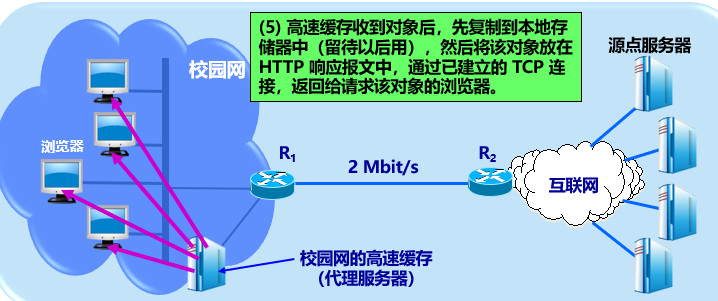

# 知识

## 概论

### 概述

三大类网络：电信网络、有线电视网络、计算机网络。

Internet：因特网（理论译名）、互联网（流行译名）

> （1） internet（互联网或互连网）：通用名词，它泛指由多个计算机网络互连而成的网络。；协议无特指（2）Internet（因特网）：专用名词，特指采用 TCP/IP 协议的互联网络。区别：后者实际上是前者的双向应用

互联网重要基本特点：连通性、资源共享 (提供的服务)

计算机网络由节点和链路组成。

网络：许多计算机（主机）连接在一起。互连网：许多网络通过路由器连在一起。

1969-1990 ARPANET (1983互联网诞生, TCP/IP)

1985-1993 三级结构(主干网、地区网、校园/企业网)

1993-现在 主干、地区和本地ISP(互联网服务提供者) (形成多层次ISP结构的Internet)

计算机网络的主要功能：资源共享、连通性、实现实时的集中处理、均衡负荷和分布式处理等。

通信技术+计算机技术。

> 简述因特网标准制定的几个阶段？
> 答：（1）因特网草案(Internet Draft) ——在这个阶段还不是 RFC 文档。（2）建议标准(Proposed Standard) ——从这个阶段开始就成为 RFC 文档。（3）草案标准(Draft Standard)（4） 因特网标准(Internet Standard) 


### 组成

互联网按工作部分划分为边缘部分、核心部分。

在边缘部分，主机=端系统，拥有者可以是个人、单位、ISP。

端系统通信方式：C/S，P2P(peer)

核心部分最重要功能：分组转发。路由器任务：转发收到的分组，实现分组交换。

分组交换技术：(按交换功能划分)

- 电路交换。线的数量是 $C_n^2$，用交换机可以减少。必须一直占线。建立-通话-释放。

- 分组交换。存储转发技术。数据段加首部(/包头)成分组(/包)。每个分组独立选择路径。可以不先建立连接。可靠协议。但排队延迟、不保证带宽、增加开销(包头、路由器暂存和维护转发表)。

  要点：报文分组，加首部；经路由器储存转发；在目的地合并
  
- 报文交换。存储转发原理，时延长。不需要预先分配带宽。

  区别：数据不分组，完全到某个中转站再转发，有序，延迟大带宽低

优缺点比较：（1）电路交换：端对端通信质量因约定了通信资源获得可靠保障，对连续传送大量数据效率高。（2）报文交换：无须预约传输带宽，动态逐段利用传输带宽对突发式数据通信效率高，通信迅速。（3）分组交换：具有报文交换之高效、迅速的要点，且各分组小，路由灵活，网络生存性能好。

> 为什么说因特网是自印刷术以来人类通信方面最大的变革？ 
> 融合其他通信网络，在信息化过程中起核心作用，提供最好的连通性和信息共享，第一次提供了各种媒体形式的实时交互能力。


### 类别

计算机网络：由一些通用的、可编程的硬件互连而成的，这些硬件并非专门用于实现某一特定目的，可编程的硬件可以传送多种不同类型的数据（有CPU,中央处理器）。

按照网络作用范围：广域网(远程网)WAN，城域网MAN，局域网LAN，个人区域网(个域网)PAN。多处理机系统不是网络。广域网是Internet核心网。

按使用者(范围)划分：公用网(公众网)、专用网。

接入网AN(access network，本地/居民接入网)，是用户端系统到本地ISP首个路由器(边缘路由器)之间的网络。[按业务角度划分为接入网和主干网]

> 主干网：提供远程覆盖\高速传输\和路由器最优化通信。本地接入网：主要支持用户的访问本地，实现散户接入，速率低。

逻辑功能上，分为通信子网(组成：通信硬件、通信软件)和资源子网。

计算机网络的拓扑结构是指：忽略了设备和线路的大小、重量等物理性质，把它们抽象成点和线，仅仅研究点、线、面的关系，从而简化了研究的过程。拓扑结构划分：星形、树形、总线、环形、网状

同通信能：资源共享计算机网络、分布式计算机网络和远程通信网络


### 性能

速率(数据率，比特率)，单位bit/s。$K=2^{10},M=2^{20},G=2^{30}$。1 Byte=8 bit。额定速率：绝对上限值。

带宽(bandwidth)，频带宽度(频域, 赫, Hz)或最高数据率(时域, bit/s)。

吞吐量(throughput)，实际单位时间通过的数据量。每秒字节/帧数。

时延(delay，延迟，迟延)。哪一个主导具体问题具体分析。

- 发送时延(传输时延)，主机/路由器发送数据帧第一个比特到最后一个完毕的时间 $=\dfrac{数据帧长度bit}{发送速率bit/s}$。
- 传播时延。$\dfrac{信道长度m}{信号传播速率m/s}$。电磁波速率 $3\times10^8m/s$，铜线 $2.3$，光纤 $2$。
- 处理时延。主机/路由器处理收到的分组用时。
- 排队时延：分组在路由器输入输出队列排队等待时长。丢失$=\infty$。

速率/时延同低/高哪个更好具体分析。

高速(带宽)链路比特率传送不一定会更快，因为只有**发送**速率提高。

时延带宽积 $=$ 传播时延 $\times$ 带宽，bit为单位的链路长度。

往返时间(RTT,Round-Trip Time)，发送完到收到确认的时间。是二倍传播时延 $+B$ 排队时延 $+B$ 发送时延。

信道利用率：信道被利用的时间(数据通过)占比。空闲为零。

网络利用率：全网信道利用率加权平均值。

设 $D_0$ 是网络空闲时延，$D$ 是当前时延，$U$ 是当前利用率，则 $D=\dfrac{D_0}{1-U}$。

> 数据传输效率为有效数据长度 $\div$ 传输总数据长度(即加上各种头部)。

> 分组通常计算时延$=数据大小\div 速率+链路数\times 传播时延+(链路数-1)\times(包大小\div 速率)$
>
> 例题：$A$ 发送 $100MB$ 数据，速率 $100Mbit/s$，$B$ 收到马上发送确认；$A$ 收到确认马上继续发送，已知 $RTT=2s$，求 $A$ 向 $B$ 发送数据的有效数据率。
>
> 解：发送时延 $=\dfrac{100\times2^{20}\times8}{100\times10^6}\approx8.39s$。有效数据率 $=\dfrac{100\times2^{20}\times8}{8.39+2}\approx80.7Mbit/s$。
>
> 
>
> 

> 非性能特征有:费用、质量、标准化、可靠性、可扩展性和可升级性、易于管理和维护。非性能特征：宏观整体评价网络的外在表现。性能指标：具体定量描述网络的技术性能。


### 体系结构

网络协议(协议,protocol)，是为了进行网络数据交换建立的规则、标准或约定。组成要素：语法、语义、同步(实现顺序)。(控制两个对等实体进行通信的规则的集合)。(水平的)

> 协议栈：指计算机网络体系结构采用分层模型后,每层的主要功能由对等层协议的运行来实现,因而每层可用一些主要协议来表征,几个层次画在一起很像一个栈的结构。对等层:在网络体系结构中,通信双方实现同样功能的层

网络的体系结构(architecture)是计算机网络各层及其协议的集合，即该计算机网络及其构建应该完成的功能的精确定义(不涉及实现)。

ISO(国际标准化组织)提出 OSI/RM(Open System Interconnection Reference Model)，形成七层协议体系结构。

| OSI        | TCP/IP            | 五层       |
| ---------- | ----------------- | ---------- |
| 应用层     | 应用层            | 应用层     |
| 表示层     |                   |            |
| 会话层     |                   |            |
| 运输层     | 运输层            | 运输层     |
| 网络层     | 网际层            | 网络层     |
| 数据链路层 | 链路层/网络接口层 | 数据链路层 |
| 物理层     |                   | 物理层     |

- 应用层：通过应用进程间交互完成特定网络应用。数据单元：报文(message)。 application layer

  > 任务：提供系统与用户的接口
  >
  > 功能：
  >
  > ​      a.文件传输
  >
  > ​      b. 访问和管理
  >
  > ​      c. 电子邮件服务
  >
  > 协议：FTP、SMTP、POP3、HTTP、DNS、TELnet

- 表示层

  > 负责处理在两个内部数据表示结构不同的通信系统之间交换信息的表示格式，为数据加密和解密以及为提高传输效率提供必需的数据压缩以及解压等功能。

- 会话层

  > 任务：不同主机上各进程间的对话
  >
  > 功能：管理主机间的会话进程，包括建立、管理以及终止进程间的会话。是一种端到端的服务

- 运输层：向两主机进程间通信提供通用数据传输服务。有复用和分用功能。TCP单位是报文段(segment)，UDP是用户数据报。 transport layer

  > 任务：负责主机中两个进程之间的通信
  >
  > 功能：
  >
  > ​      a. 为端到端连接提供可靠的服务
  >
  > ​      b. 为端到端连接提供流量控制、差错控制、服务质量等管理服务
  >
  > 传输单位：报文段（TCP）或用户数据报（UDP）
  >
  > 协议：TCP、UDP
  >
  > 由于一个主机可同时运行多个进程，因此运输层有**复用**和**分用**的功能。
  >
  >   a. 复用，就是多个应用层进程可同时使用下面运输层的服务。
  >
  >   b. 分用，就是把收到的信息分别交付给上面应用层中相应的进程。

- 网络层：为分组交换网上不同主机提供通信服务。任务：路由选择和转发。IP层，单位分组为(IP)数据报。无连接网际协议。不需虚电路。 network layer

  > 任务：a. 将传输层传下来的报文段封装成分组
  >
  > ​        b.选择合适的路由，使得传输层传下来的分组能够交付到目的主机
  >
  > 功能：a. 为传输层提供服务
  >
  > ​        b. 组包和拆包
  >
  > ​        c. 路由选择
  >
  > ​        d.拥塞控制
  >
  > 传输单位：数据段
  >
  > 所实现的硬件：路由器
  >
  > 协议：ICMP、ARP、RARP、IP、IGMP、OSPF

- 数据链路层：实现两相邻节点无差错通信。有差错就丢弃。 data link layer

  > 任务：将网络层传输下来的IP数据报组装成帧
  >
  > 功能：a. 链路连接的建立、拆除和分离
  >
  > ​        b. 帧定界和帧同步
  >
  > ​        c.差错检测
  >
  > 传输单位：帧(frame)
  >
  > 所实现的硬件：交换机、网桥
  >
  > 协议：PPP,HDLC(High-level Data Link Control)、SDLC(S:同步)、STP(Spanning Tree Protocol)、ARQ(Automatic Repeat-reQuest，ARQ)

- 物理层：实现比特(0/1)的传输。确定电缆插头引脚等。物理媒介在物理层协议之下。 physical layer

  > 任务：透明地传输比特流。
  >
  > 功能：为数据段设备提供传送数据通路
  >
  > 传输单位：比特
  >
  > 所实现的硬件：集线器，中继器

> 为什么分层：支持异构网络的互联互通

OSI参考模型把对等层次传送的数据单元称为该层的协议数据单元PDU。协议实际上是在各个对等层传输数据时的各项规定。

实体(entity)：任何可发送/接收信息的硬件/软件进程。在协议控制下，两对等实体间的通信使得本层能够向上一层提供服务。实现本层协议需要使用下层服务。

服务：上层使用服务原语得到下层提供的服务，垂直的。

相邻两层的服务访问点(SAP)是逻辑接口，层与层交换数据的单位是服务数据单元SDU。SDU可以与PDU不一样(合成/划分)。


> 分层的好处：①各层之间是独立的。某一层可以使用其下一层提供的服务而不需要知道服务是如何实现的。②灵活性好。当某一层发生变化时，只要其接口关系不变，则这层以上或以下的各层均不受影响。③结构上可分割开。各层可以采用最合适的技术来实现④易于实现和维护。⑤能促进标准化工作。类似：邮政系统，物流系统。
>
> 透明的例子：电视、OS、工农业产品

> TCP/IP协议可以为各式各样的应用提供服务 （所谓的everything over ip）   答：允许IP协议在各式各样的网络构成的互联网上运行（所谓的ip over everything）

> **TCP/IP**（Transmission Control Protocol/Internet Protocol，传输控制协议/网际协议）是指能够在多个不同网络间实现信息传输的协议簇。TCP/IP协议不仅仅指的是TCP和IP两个协议，而是指一个由FTP、SMTP、TCP、UDP、IP等协议构成的协议簇， 只是因为在TCP/IP协议中TCP协议和IP协议最具代表性，所以被称为TCP/IP协议。(即四层模型)
>
>   TCP/IP协议能够迅速发展起来并成为事实上的标准，是它恰好适应了世界范围内数据通信的需要。它有以下特点：
>
> （1）协议标准是完全开放的，可以供用户免费使用，并且独立于特定的计算机硬件与操作系统；
>
> （2）独立于网络硬件系统，可以运行在广域网，更适合于互联网；
>
> （3）网络地址统一分配，网络中每一设备和终端都具有一个唯一地址；
>
> （4）高层协议标准化，可以提供多种多样可靠网络服务。

> 封装：
>
> 
>
> 解封：
>
> 
>
> （1）从计算机 A 的应用层内网通软件向计算机 B 发出一个消息，生成数据；
>
> （2）请求从计算机 A 的应用层下到 计算机A 的传输层，传输层在上层数据前面加上 TCP报头，报头中包括目标端口以及源端口；
>
> （3）传输层数据下到网络层，计算机A 在网络层封装，源 IP地址为 计算机A地址，目标 IP地址为 计算机 B 地址；
>
> （4）计算机 A 将计算机B 的 IP 地址和子网掩码与自己做比对，可以发现 计算机 B 与自己处于相同的子网。所以数据传输不必经过网关设备；
>
> （5）数据包下到 计算机 A 的数据链路层进行封装，源 MAC 地址为 计算机A的 MAC地址，目标 MAC 地址查询自己的 ARP 表。
>
> （6）计算机 A 把帧转换成 bit 流，从物理接口网卡发出；
>
> （7）物理层接收到电信号，把它交给数据链路层进行查看帧的目标 MAC 地址，和自己是否相等，如果相等说明该帧是发送给自己的，于是将MAC帧头解开并接着上传到网络层；
>
> （8）网络层查看目标 IP 地址和自己是否匹配，如果匹配即解开 IP 头封装。然后再把数据上传到传输层；
>
> （9）传输层解开对应的包头之后，继续把数据传给应用层，计算机 B 即可接收到计算机 A 发的消息。  
>
> 1. 报文（message）
>
>      我们将位于**应用层**的信息分组称为报文。报文是网络中交换与传输的数据单元，也是网络传输的单元。报文包含了将要发送的完整的数据信息，其长短不需一致。报文在传输过程中会不断地封装成分组、包、帧来传输，封装的方式就是添加一些控制信息组成的首部，那些就是报文头。
>
> 2. 报文段（segment）
>
>      通常是指起始点和目的地都是**传输层**的信息单元。
>
> 3. 分组/包（packet）
>
>      分组是在网络中传输的二进制格式的单元，为了提供通信性能和可靠性，每个用户发送的数据会被分成多个更小的部分。在每个部分的前面加上一些必要的控制信息组成的首部，有时也会加上尾部，就构成了一个分组。它的起始和目的地是**网络层**。
>
> 4. 数据报（datagram）
>
>      面向无连接的数据传输，其工作过程类似于报文交换。采用数据报方式传输时，被传输的分组称为数据报。通常是指起始点和目的地都使用无连接网络服务的的**网络层**的信息单元。
>
> 5. 帧（frame）
>
>      帧是**数据链路层**的传输单元。它将上层传入的数据添加一个头部和尾部，组成了帧。它的起始点和目的点都是数据链路层。
>
> 6. 数据单元（data unit）
>
>      指许多信息单元。常用的数据单元有服务数据单元（SDU）、协议数据单元（PDU）。
>
>      SDU是在同一机器上的两层之间传送信息。PDU是发送机器上每层的信息发送到接收机器上的相应层（同等层间交流用的）。


## 物理层

### 概念

物理层协议：规程(procedure)。作用：屏蔽不同传输媒体、通信手段的差异。

> 解决的主要问题：（1）物理层要尽可能地屏蔽掉物理设备和传输媒体，通信手段的不同，使数据链路层感觉不到这些差异，只考虑完成本层的协议和服务。（2）给其服务用户（数据链路层）在一条物理的传输媒体上传送和接收比特流（一般为串行按顺序传输的比特流）的能力，为此，物理层应该解决物理连接的建立、维持和释放问题。（3）在两个相邻系统之间唯一地标识数据电路。
>
> 特点：（1）由于在OSI之前，许多物理规程或协议已经制定出来了，而且在数据通信领域中，这些物理规程已被许多商品化的设备所采用，加之，物理层协议涉及的范围广泛，所以至今没有按OSI的抽象模型制定一套新的物理层协议，而是沿用已存在的物理规程，将物理层确定为描述与传输媒体接口的机械，电气，功能和规程特性。（2）由于物理连接的方式很多，传输媒体的种类也很多，因此，具体的物理协议相当复杂。

物理层可以为通信的主机之间建立,管理和释放物理连接，数据传输单位为bit。

主要任务：确定与传输媒体的接口的一些特性。

- 机械特性：接口接线器形状、尺寸、引线数目、排列、固定和锁定装置等
- 电气特性：接口电缆各线电压范围
- 功能特性：某线某电平电压意义
- 过程特性：对于不同功能各种可能事件出现顺序

数据通信系统三部分：源系统(发送端/方)、传输系统(传输网络)、目的系统(接收端/方)。(信源、通信媒体(信道)、信宿~~信素~~)(信息传播三要素)

消息(message)：如话音、文字、图像、视频等。

数据：运送消息的实体。

信号(signal)：数据的电气/电磁表现。

模拟信号(analogous)：消息的参数取值连续。数字信号：离散。

模拟信道只能通模拟信号，数字信号要调制。

码元(code)：在使用时间域(时域)的波形表示数字信号时，不同离散值的基本波形。

信道：向某个方向传送信息的媒体。分单工通信(单向通信)、半双工通信(双向交替通信)、全双工通信(双向同时通信)。

> 单工：广播、电视；半双工：对讲机；双工：电话。
>
> 半双工实际上是一种切换方向的单工通信；全双工通信是两个单工通信方式的结合
>
> 单工、半双工和全双工是电信计算机网络中的三种通信信道。这些通信信道可以提供信息传达的途径。通信信道可以是物理传输介质或通过多路复用介质的逻辑连接。物理传输介质是指能够传播能量波的材料物质，例如数据通信中的导线。并且逻辑连接通常指电路交换连接或分组模式虚拟电路连接，例如无线电信通道。由于通信信道的帮助，信息可以无障碍地传输

基带信号(基本频率信号)：来自信源的信号。(像计算机输出的代表各种文字或图像文件的数据信号都属于基带信号)

在数据通信中，为了保证数据被正确接收，必须采用一些同一收发动作的措施，这就是所谓的同步技术。同步传输时钟同步从数据中提取，异步传输通过字符的起止位同步


### 编码

脉冲编码调制(PCM)的工作原理包括抽样、量化和编码。

不归零制(NRZ)：正电平1，负0

归零：正脉冲1，负0

曼彻斯特编码：周期中心往上0往下1或反过来定义

差分曼彻斯特编码：开始边界跳0，不跳1


两种曼彻斯特有自同步能力(从信号波形本身提取信号时钟频率)。

曼彻斯特缺点：占频带宽度比原始基带信号大一倍。


### 调频

调制(modulation)是将低频/直流修改。

- 基带调制：改基带信号波形，使与信道特性适应，变换后也是基带信号。叫编码(coding)。
- 带通调制：用载波(carrier)调制，把基带信号频率移到较高，转为模拟信号，在模拟信道传输(一个范围内能通过信道)。
- 带通信号：载波调制后的信号。

基本二元制调制方法有以下几种：(数字数据调制为模拟信号)

- 调幅AM：振幅随着基带数字信号变化(抗干扰差)
- 调频FM：频率(抗干扰强)
- 调相PM：初始相位


> 正交振幅调制QAM quadrature amplitude modulation：频率相同，改变幅度和相位


### 速率

限制码元传输速率因素：信道能够通过的频率范围、信噪比

奈氏准则：理想时避免码间串扰，传输速率上限。频带越宽，能通过越多高频分量，可以更高速率。结论：带宽为 $W\ Hz$ 低通信道，不考虑噪声，码元传输最高速率是 $2W(码元/s)$。

信噪比：信号平均功率与噪声平均功率之比，记为 S/N。单位分贝 dB。
$$
dB=10\lg(S/N)
$$
香农公式：信道带宽为 $W(Hz)$，则极限无差错的信息传输速率为：
$$
C=W\log_2(1+S/N)(bit/s)
$$
只要信息传输速率低于信道的极限信息传输速率，就一定可以找到某种办法来实现无差错的传输。 

> 例题：信道带宽为 $4KHz$，有 $8$ 种不同物理状态表示数据，最大限制的数据传输率为 $2\times4\times10^3\times\log_28=2.4\times10^4bit/s$。(注：一个码元在这里等于 $3bit$)。

> 码元传输速率受奈氏准则的限制，信息传输速率受香农公式的限制


### 传输媒体

传输媒体(介质/媒介)：数据传输系统中在发送器和接收器之间的物理通路。分为：

- 导引型传输媒体：电磁波被引导者沿着固定媒体传播
- 非导引型传输媒体：自由空间。电磁波的传输称为无线传输。

电磁波频谱 $[10^4,10^{16}]Hz$。


导引型传输媒体：双绞线最常用，模拟/数字都可以。分为屏蔽双绞线STP(shielded twisted pair)或无屏蔽双绞线 UTP(unshielded)。

标准：EIA/TIA-568 -> EIA/TIA-568-A。规定了五类 UTP 线，最常用是 5 类线(Category 5,CAT5)。用 RJ-45.


抗干扰 $U/FTP < F/UTP < F/FTP$。

在10Base-T总线网中，计算机与集线器之间双绞线的最大长度是100m。


同轴电缆：很好抗干扰。分为 $50\Omega$ (LAN/数字传输)， $70\Omega$ (有线电视/模拟传输)。如 CATV。

光纤：$10^8MHz$ 量级。按规格分为多模光纤：存在多条不同角度入射光纤。单模：直径只有一个光的波长。

常用波段中心：850nm 1300nm 1550nm 具有 $[25000,30000]GHz$ 带宽。

优点：容量大，损耗小，中继距离长，抗雷电/电磁干扰，无串音干扰，保密性好，体积小重量轻。


短波通信(高频通信)：靠电离层反射，质量差速率低。

微波：直线传播。地面接力/卫星通信。

可以自由使用的无线电频段：ISM(Industrial Scientific Medical)。


> 

> DWDM(Dense Wave Division Multiplexing)
> SONET(Synchronous Optical Network)同步光纤网
> SDH(Synchronous Digital Hierarchy)同步数字系列
> STM-1(Synchronous Transfer Module)第1级同步传递模块
> OC-48(Optical Carrier)第48级光载波


### 信道复用

复用：允许用户使用一个共享信道进行通信，降低成本，提高利用率。定义：将两个或以上彼此独立的信号合并为一个复合信号，在一条公用信道上传输的方法。(目的为了通过共享信道、最大限度提高信道利用率。)

频分复用(FDM,frequency division multiplexing)：带宽分多份，用户分配到一个频带后，自始至终占用。所有用户同一时间占用不同带宽资源。

时分复用(TDM)：时间分为等长时分复用帧。用户是每帧占用固定序号的时隙，周期出现。TDM信号：等时信号(isochronous)。所有用户不同时间占用同样频带宽度。由于计算机数据突发性，利用率不高。

统计时分复用(STDM,Statistic)按需动态分配时隙

波分复用(WDM,wavelength)光的频分复用。

码分复用CDM(code)，码分多址(CDMA,multiple access)，抗干扰，频谱类似白噪声，不易被发现。缺点：占用较大带宽。

每一个比特划分为 m 个短间隙，是码片(chip)。每个站指派唯一的 m bit码片序列。若发送比特 1 就发送自己的码片序列；否则发送码片序列反码。码片序列互不相同且相互正交(使用伪随机码序列)。正交内积为 0，即 $S\cdot T\equiv\dfrac 1m\sum_{i=1}^mS_iT_i=0$。且 $S\cdot S=1$。且与反码的内积是 $-1$。容易理解(根据内积定义)。

发送信息数据率为 $b\ bit/s$，那么实际数据率为 $mb\ bit/s$。是扩频(spread spectrum)通信的一种，有直接序列扩频 DSSS(direct sequence spread spectrum)和调频扩频FHSS(frequency hopping)。

> 

> 为什么在ASDL技术中，在不到1MHz的带宽中却可以传送速率高达每秒几个兆比？
> 答：靠先进的DMT编码，频分多载波并行传输、使得每秒传送一个码元就相当于每秒传送多个比特


### 数字传输系统

数字通信传输质量和经济比模拟更好。

宽带：下行速率 $25\ Mbit/s$，上行 $3\ Mbit/s$。

接入媒体划分为有线/无线宽带接入。

非对称数字用户线(asymmetric digital subscriber line)：用数字技术改造模拟电话用户线承载宽带业务。低频电话，高频上网。还有其他类型DSL。用户线线径越细，传输衰减越大。数据率越大，距离越短。特点：上行、下行带宽不一致。用户线(铜线)两段安装ASDL调制解调器。用DMT划分上下行频率。不保证固定数据率。

光纤同轴混合网(HFC,hybrid fiber coax)。

FTTx是光纤到(fiber to the)，有户Home，大楼Building，路边Curb。

> xDSL 技术就是用数字技术对现有的模拟电话用户线进行改造，使它能够承载宽带业务。成本低，易实现，但带宽和质量差异性大。HFC网的最大的优点具有很宽的频带，并且能够利用已经有相当大的覆盖面的有线电视网。要将现有的450 MHz 单向传输的有线电视网络改造为 750 MHz 双向传输的 HFC 网需要相当的资金和时间。FTTx（光纤到……）这里字母 x 可代表不同意思。可提供最好的带宽和质量、但现阶段线路和工程成本太大。


### 设备

中继器是物理层网间设备。

集线器(hub)接到端口数据，从除了输入端口外的所有端口转发出去。用集线器连接的工作站集合属于同一个冲突域，也属于同一个广播域。每个站共享带宽。若以太网交换机，则每个站独占带宽。

10BASE-T。其中10是速率$10Mbit/s$，BASE是基带，T是双绞线。如果T改成数字，就是最大网段长度是多少百米。


## 数据链路层

### 概念

信道类型：点对点、广播。

(物理)链路(link)：一条无源的点到点的物理线路段，中间没有任何其他的交换结点。

数据(/逻辑)链路：把实现控制数据传输的协议的硬件和软件加到链路上构成。典型实现：适配器(即网卡)。

> 数据链路与链路的区别在于数据链路出链路外，还必须有一些必要的规程来控制数据的传输，因此，数据链路比链路多了实现通信规程所需要的硬件和软件。 “电路接通了”表示链路两端的结点交换机已经开机，物理连接已经能够传送比特流了，但是，数据传输并不可靠，在物理连接基础上，再建立数据链路连接，才是“数据链路接通了”，此后，由于数据链路连接具有检测、确认和重传功能，才使不太可靠的物理链路变成可靠的数据链路，进行可靠的数据传输当数据链路断开连接时，物理电路连接不一定跟着断开连接。

数据链路层协议三个基本问题：封装成帧、透明传输、差错检测。

> 帧定界是分组交换的必然要求；透明传输避免消息符号与帧定界符号相混淆；差错检测防止合差错的无效数据帧浪费后续路由上的传输和处理资源。不帧定界的话无法区分分组与分组无法确定分组的控制域和数据域无法将差错更正的范围限定在确切的局部。

封装成帧：在一段数据的前后分别添加首部和尾部，构成一个帧。首部尾部：帧定界有 SOH(start of header),EOT(end of transmission)。数据部分用字节填充使得不出现 EOT,SOH。

> 链路控制包括的功能：链路管理、帧定界、流量控制 []

最大传送单元 MTU(maximum transfer unit)所能传送的帧数据部分长度上限。

透明：指某一个实际存在的事物看起来却好像不存在一样。

透明传输：无论发送什么样的比特组合的数据，这些数据都能够按照原样没有差错地通过这个数据链路层。

误码率 BER(bit error rate)，错误比特占比。

无差错接受：凡是接收端数据链路层接受的帧均无差错。

可靠传输：数据链路层的发送端发送什么，在接收端就收到什么。

传输差错：比特差错和传输差错(帧丢失、重复、失序)。

在IEEE802局域网体系结构中，数据链路层被细化成逻辑链路控制子层和媒体接入控制子层两层。(LLC,MAC)


### 检验

奇偶校验法：查看数据里1的个数是奇数还是偶数。若奇校验位，则结果填入使得总1个数是奇数。反之相反。

循环冗余检验 CRC(cyclic redundancy check)，发送端划分 $k$ 比特一组。CRC 运算在组后加 $n$ 冗余二进制位。原始数据进行模二除法的余数填到冗余位。接受数据对整个 $k+n$ 做模二除法，若不为 $0$ 则丢弃。除数是 $n+1$ 位的。除法过程做异或运算。

冗余码余数叫做帧检测序列 FCS。CRC 不是得到 FCS 的唯一方法。

CRC 能无差错接受，实现无比特差错。要做到可靠传输，还必须再加上帧编号、确认和重传等机制。 


多项式从右往左数，即如 $10011$ 是 $1+x+x^4$。


### PPP协议

点对点协议(point-to-point protocol)，使用在点对点链路最广泛的协议。

用户到ISP的链路使用PPP协议。

简单是首要要求。其他要求：封装成帧、透明性、多种网络层协议支持、多种类型链路、差错检测、检测连接状态、最大传送单元、网络层地址协商、数据压缩协商。

组成部分：将IP数据报封装到串行链路的方法，链路控制协议LCP，网络控制协议NCP。(LCP请求连接，NCP分配IP地址、释放网络层连接，LCP释放数据链路层连接)

PPP面向字节，长度是整数字节。帧格式如下图。


首部分别是标志、地址、控制、协议字段。协议字段有0x0021 IP数据报，0x8021网络控制数据，0xC021 PPP链路控制数据，0xC023鉴别数据。尾部两个字段。

透明传输：

- 异步传输字节填充法：将 7E 修改为 7D 5E，03 修改为 7D 23。
- 同步传输零比特填充法。出现五个连续的 1 后填入 0，接收则解除


### 广播信道

局域网主要特点：网络为一个单位拥有，地理范围和站点数目有限。优点：能广播，便于拓展和逐渐演变，提高可靠性、可用性、生存性。

拓扑结构：


共享信道会产生冲突。可以静态划分信道复用，可以动态媒体接入控制(多点接入)，如随机接入、受控接入(轮询 polling)。

以太网标准：DIX Ethernet V2, IEEE802.3(后者简称为以太网)

> 什么叫做传统以太网？以太网有哪两个主要标准？
> 答：DIX Ethernet V2 标准的局域网DIX Ethernet V2 标准与 IEEE 的 802.3 标准

局域网数据链路层子层：逻辑链路控制 LLC(logical link control)子层，与传输媒体无关；媒体接入控制 MAC(medium access)子层：有关。

计算机通过适配器(网卡)和局域网进行通信。CPU有IP地址，适配器有硬件地址。

适配器功能：进行串行/并行转换，缓存数据，在OS安装设备驱动程序，实现以太网协议。

最早以太网：计算机连到总线上。特点：易于实现广播通信、简单、可靠。同时发送会碰撞/冲突，导致发送失败。


一对一通信：接收站硬件地址写入帧首部目的地址，与适配器硬件地址一致时接收。

以太网措施：①提供灵活无连接工作方式(不先链接再通信，不编号，不发回确认)。提供不可靠交付服务，同一时间只允许一台计算机发送(随机接入 CSMA/CD协议)。②使用曼彻斯特(Manchester)编码。

> 以太网使用的CSMA/CD协议是以争用方式接入到共享信道。这与传统的时分复用TDM相比优缺点如何？
> 答：传统的时分复用TDM是静态时隙分配，均匀高负荷时信道利用率高，低负荷或符合不均匀时资源浪费较大，CSMA/CD课动态使用空闲新到资源，低负荷时信道利用率高，但控制复杂，高负荷时信道冲突大。


### CSMA/CD

carrier sense multiple access with collision detection。载波监听多点接入/碰撞检测。

总线型网络，边发送边监听。电压摆动超过阈值认为产生冲突。

每一个站在自己发送数据之后的一小段时间(传播时延+)内，存在着遭遇碰撞的可能性。

碰撞后：适配器停止发送，等待随机时间再次发送。


端到端往返时延 $2\tau=51.2\mu s$ 称为争用期或碰撞窗口。经过争用期没检测到碰撞，就不会发生碰撞。

截断二进制指数退避(truncated binary exponential back off)，基本退避时间是 $2\tau$。从 $[0,1,\cdots,(2^k-1)]$ 选一个数 $r$，重传时延是 $2r\tau$。参数 $k=\min(重传次数,10)$。重传 16 次仍不成功就丢弃。显然 $k$ 随着重传时间动态更改。

对 $10\ Mbit/s$ 网络，争用期内可发送 $10^7\times51.2\times10^{-6}=512bit=64Byte$ 内容。所以若前 $64$ 字节不冲突，后续就不冲突。以太网最短有效帧是 $64Byte$。

最大端到端单程时延小于争用期一半，故为 $2\times10^8\times25.6\times10^{-6}=5.12km$。

检测到冲突后停止发送数据帧，发送 $32/48 bit$ 人为干扰信号(jamming signal)。帧间最小间隔为 $9.6\mu s$(往返 $48$)。


### 利用率

传统以太网：粗同轴电缆 $\to$ 细同轴电缆 $\to$ 双绞线。双绞线：星形拓扑。星形中心是集线器。使用集线器的以太网逻辑上仍然是总线网。

成功发送一个帧需要占用信道 $T_0+\tau$ 时间。

参数 $\alpha=\dfrac\tau{T_0}$。远小于 $1$ 才能得到尽可能高极限信道利用率。越大信道利用率越小($30\%$ 就重载)。信道利用率最大值 $S_{max}=\dfrac{T_0}{T_0+\tau}=\dfrac1{1+\alpha}$。


### MAC层

硬件地址(物理地址/MAC地址)。IEEE规定48位全球地址(地址)，是接口的标识符。高 24 位是组织唯一标识符(organizationally unique identifier)。后面是拓展标识符(extended identifier)。

第一字节最低位为 I/G(individual/group)位，单站地址位0，组地址为1，多播。广播地址全1，目的地址。

第一字节次低位是 G/L(global/local)位，为0全球管理，1本地管理。

发往本站的帧包括单播(unicast)、多播(multicast)、广播(broadcast)。

MAC帧格式是以太网V2格式。


类型是上一层协议。数据字段：MAC客户数据字段，最小长度 $46$ 字节(根据以太网最短有效帧计算)，最大1500。整个帧是$[64,1518]$。

为了达到比特同步，在传输媒体上实际传送的要比 MAC 帧还多 8 个字节。

无效：长度字段与长度不一致/非整数，FCS出错，太小太大。

IEEE 802.3 与 V2 的 MAC 帧区别在于后者类型那里可以是长度。


### 设备

主机和集线器之间使用光纤(调制解调器)。

可以使用集线器扩展。优点：跨碰撞域通信，扩大以太网覆盖地理范围。缺点：没有增大吞吐量，不能将不同以太网技术(如数据率)互连起来。

碰撞域(冲突域)，是从网络一个站点发出的帧会与其他站点的帧产生碰撞/冲突的网络，越大碰撞率越高。

可以用数据链路层拓展，早期用网桥，现在用以太网交换机。网桥根据MAC帧目的地址对收到的帧转发/丢弃。交换机是多端口的网桥，一般全双工，并行(相互通信主机独占传输媒体，无碰撞，每个端口和主机构成碰撞域)。


接口有存储器。即插即用，内部帧交换表(地址表)通过自学习算法建立，是内存可寻址存储器(CAM content addressable memory)，硬件转发。独享带宽，不共享。

交换方式：存储转发/直通(cut-through)，后者可能转发无效帧。

自学习：记录的是源，若没发现目的在记录里就广播。每个项目有有效时间。


若拓扑结构有环，那么就会挂。

使用生成树协议STP(spanning tree protocol)，逻辑上切断一些链路使得无环。

> 适配器（即网卡）来实现数据链路层和物理层这两层的协议的硬件和软件网络适配器工作在TCP/IP协议中的网络接口层（OSI中的数据链里层和物理层）


### 虚拟局域网

以太网问题：广播风暴、安全问题、管理困难等。

广播域：任何一台设备发送光波通信都能被该网络所有其他设备接收。

环路能形成广播风暴。

安全问题：交换机使得划分不同碰撞域，但在同一广播域，可能信息被广播泄露。

虚拟局域网VLAN(virtual LAN)是由一些局域网网段构成的与物理位置无关的逻辑组。每个VLAN帧有明确标识符。是局域网的一种服务，不是新型局域网。标识符划分广播域。

虚拟局域网限制了接收广播信息的工作站数，使得网络不会因传播过多的广播信息 (即“广播风暴”) 而引起性能恶化。

优点：改善性能、简化管理、降低成本、提高安全。

划分VLAN方法：基于交换机端口/网卡MAC/协议/IP子网地址/高层应用或服务。

- 交换机：最简单常用。在第一层(物理层)划分。缺点：不允许用户移动。
- MAC：第二层。缺点：需要输入和管理，改变了需要重配。
- 协议：第二层。
- IP子网：第三层。根据类型和IP分组首部源IP地址字段。


同一个 VLAN 的两台主机不可以跨越多台路由器。


### 速率

100BASE-T 快速以太网(fast ethernet)。星形。全双工无冲突，不使用CSMA/CD。网段最大电缆长度100m。帧间间隔 $0.96\mu s$。

吉比特以太网。半双工CSMA/CD，全不是。向后兼容。半双工增加了载波延伸(争用时间512字节，不足填特殊字符)和分组突发。

10吉比特全双工，仅光纤。

以太网扩大到MAN/LAN，形成端到端以太网传输。可以宽带接入。

PPPoE(PPP over Ethernet)，在以太网运行PPP。将PPP帧封装到以太网。FTTx需要使用。ADSL宽带上网也使用。


## 网络层

### 概念

虚电路：逻辑上的连接，分组都沿着这条逻辑连接按照存储转发方式传送，并不是真正建立了一条物理连接。必须面向连接。

网络层：向上层提供简单灵活的、无连接的、尽最大努力交付的数据报服务。分组可能出错、丢失、重复、失序，不保证时限。(运输层负责可靠)


路由器之间传送的信息：数据、路由信息(为数据传送服务)。

网络层两个层面：数据层面(硬件，快，转发表，独立工作)、控制层面(路由选择协议计算路由创建路由表，多路由协同，软件，慢)。

软件定义网络 SDN，通过远程控制器计算最佳路由，在每个路由器生成正确转发表。

实现异构网络的互联互通，使用中间设备。使用转发器/网桥不称为网络互连，因为是扩大同一个网络。网络互连使用路由器。虚拟互连网络是互联网。

网际协议 IP。IPv4 的三个协议：地址解析协议 ARP(resolution)，网际控制报文协议(Internet control message)，网际组管理协议 IGMP(group management)。

IP网：当互联网上的主机进行通信时，就好像在一个网络上通信一样，看不见互连的各具体的网络异构细节。如果在这种覆盖全球的 IP 网的上层使用 TCP 协议，那么就是现在的互联网 (Internet)。


IP 协议是互联网的核心协议。


### IP地址

32位二进制，8位一组，称为点分十进制记法。

每台主机(/路由器)的每个接口分配全世界唯一的IP地址，由互联网名字和数字分配机构ICANN(Internet corporation for assigned names and numbers)分配。

分为二级结构：网络号(net-id)和主机号(host-id)。前半部分是网络号。

- A类地址首位0，网络号8位，范围 $[1,126]$。
- B类地址首位10，网络号16位，范围 $[128.1,191.255]$。
- C类地址首位110，网络号24位，范围 $[192.0.1,223.255.255]$。
- D类地址首位1110，多播地址，范围 $[224.0.0.0,239.255.255.255]$。
- E类地址首位1111，保留以后用。

最大可指派网络数是 $2^{网路号长-固定部分}-1$。特别地 $A$ 类里要 $-2$(因为全 $0$ 是本网络，全 $1$ 是环回)。$128.0,192.0.0$ 不指派，被保留，无分类编址(CIDR)可指派。

主机号要扣除全 $0$ 和全 $1$。每个网络主机数是 $2^{主机号长}-2$。


无分类编址CIDR(classless inter-domain routing)，无分类域间路由选择。分为网络前缀和主机号，记法是斜线记法(slash notation)，即 $a.b.c.d/n$。$n$ 代表网络前缀长度。

CIDR把网络前缀相同的所有 IP 地址组成一个 CIDR 块。点分表示有 0 出现的地址是地址块。

子网掩码(subnet mask)是让机器快速计算出网络地址用的，由一串1拼接一串0组成，1的个数是网络前缀长度。用子网掩码按位与IP地址得到网络地址。

有时称 CIDR 编址为构造超网。

前缀长度范围 $[0,32]$。若前缀长度为 $32$，只有一个 IP 地址(用于主机路由)，为 $31$ 只有两个，主机号为 $0$ 和 $1$，可以建立点对点链路。若为 $0$，且 IP 地址全 $0$，用于默认路由。

路由聚合(route aggregation)，将一堆地址块合并为一个地址块，减少路由表项目数目。也可以进行 CIDR 地址块划分。

IP 地址中，所有分配到网络前缀的网络都是平等的。若一台主机属于多个网络，该主机需要有多个IP互异地址，称为多归宿主机(multihomed host)。一个路由器至少链接两个网络，所以至少有两个不同 IP 地址。

一个网络(/子网)指具有相同网络前缀的主机的集合。具有不同网络号的局域网必须使用路由器互连。

IP 地址是虚拟，软件，逻辑地址，网络层和以上使用，在 IP 数据报首部。MAC 地址固化在网卡 ROM，是硬件，物理地址，数据链路层使用，MAC 帧首部。

> 例题：$128.8.8.8$ 头 5 位用于子网，求网络号和主机号: $128.8.8.0, 0.0.0.8$。
>
> 与 $192.168.75.18,255.255.255.240$ 同网段的 IP 地址范围是：除去该主机和全 $0/1$ 外，可以设置 $192.168.75.17,[19,30]$。


> 分类的理由：使得路由表能够做的非常小, 路由器能够快速地处理网络转发


### ARP

地址解析协议。实现IP 通信使用了 IP 和 MAC 地址。ARP 已知 IP 找出 MAC 地址。

ARP cache(高速缓存)是映射表，项目有生存时间(age)和类型。局域网内发送 IP 数据报时：


局域网内广播 ARP 请求(路由器不转发)，ARP 请求分组包括发送方MAC,IP地址和目标方MAC,IP地址(MAC填0表示未知)。单播 ARP 相应分组，格式同样。ARP 分组封装在以太网帧传输。

如果要找的主机不在同一局域网，那么会发给路由器，然后路由器作为发送方，递归执行上述过程。此时即先用 ARP 找到本网络路由器硬件地址，然后给路由器完成工作。

> 1. 工作原理
>
>      ARP首先会发起一个请求数据包，数据包的首部包含了目标主机的IP地址，然后这个数据包会在链路层进行再次包装，生成以太网数据包，最终由以太网广播给子网内的所有主机，每一台主机都会接收到这个数据包，并取出标头里的IP地址，然后和自己的IP地址进行比较，如果相同就返回自己的MAC地址，如果不同就丢弃该数据包。ARP接收返回消息，以此确定目标机的MAC地址；与此同时，ARP还会将返回的MAC地址与对应的IP地址存入本机ARP缓存中并保留一定时间，下次请求时直接查询ARP缓存以节约资源。
>
> 2. 工作过程
>
>      主机A的IP地址为192.168.1.1，MAC地址为0A-11-22-33-44-01；
>
>      主机B的IP地址为192.168.1.2，MAC地址为0A-11-22-33-44-02；
>
>      当主机A要与主机B通信时，地址解析协议可以将主机B的IP地址（192.168.1.2）解析成主机B的MAC地址，以下为工作流程：
>
>      第1步：根据主机A上的路由表内容，IP确定用于访问主机B的转发IP地址是192.168.1.2。然后A主机在自己的本地ARP缓存中检查主机B的匹配MAC地址。
>
>      第2步：如果主机A在ARP缓存中没有找到映射，它将询问192.168.1.2的硬件地址，从而将ARP请求帧广播到本地网络上的所有主机。源主机A的IP地址和MAC地址都包括在ARP请求中。本地网络上的每台主机都接收到ARP请求并且检查是否与自己的IP地址匹配。如果主机发现请求的IP地址与自己的IP地址不匹配，它将丢弃ARP请求。
>
>      第3步：主机B确定ARP请求中的IP地址与自己的IP地址匹配，则将主机A的IP地址和MAC地址映射添加到本地ARP缓存中。
>
>      第4步：主机B将包含其MAC地址的ARP回复消息直接发送回主机A。
>
>      第5步：当主机A收到从主机B发来的ARP回复消息时，会用主机B的IP和MAC地址映射更新ARP缓存。本机缓存是有生存期的，生存期结束后，将再次重复上面的过程。主机B的MAC地址一旦确定，主机A就能向主机B发送IP通信了。
>
> 
>
>   硬件类型：指明了发送方想知道的硬件接口类型，以太网的值为1；
>
>   协议类型：指明了发送方提供的高层协议类型，IP为0800（16进制）；
>
>   硬件地址长度和协议长度：指明了硬件地址和高层协议地址的长度，这样ARP报文就可以在任意硬件和任意协议的网络中使用；
>
>   操作类型：用来表示这个报文的类型，ARP请求为1，ARP响应为2，RARP请求为3，RARP响应为4；
>
>   发送方硬件地址（0-3字节）：源主机硬件地址的前3个字节；
>
>   发送方硬件地址（4-5字节）：源主机硬件地址的后3个字节；
>
>   发送方IP地址（0-1字节）：源主机硬件地址的前2个字节；
>
>   发送方IP地址（2-3字节）：源主机硬件地址的后2个字节；
>
>   目标硬件地址（0-1字节）：目的主机硬件地址的前2个字节；
>
>   目标硬件地址（2-5字节）：目的主机硬件地址的后4个字节；
>
>   目标IP地址（0-3字节）：目的主机的IP地址。
>
> RARP(reverse ARP) 从 MAC 求 IP


### IP数据报


首部固定部分 20 字节。版本是 4。IP 首部最大长度是 60 字节，因为首部长度是最大值 15 单位，一个单位四个字节。总长度是首部+数据，单位是字节，计算得最大是 65535。总长度不得超过最大传送单元 MTU(1500字节)。标识是计数器。标识最低位MF(more fragment)0标识是最后一个分片，标识中间位DF(don't)为0允许分片。片偏移以 8 个字节为偏移单位。报文长度(首部长度)字段以 4 字节为计数单位，总长度子段以 1 字节为计数单位。

> 区分服务：3位优先权(已弃用)，4位TOS字段，1位保留字段(必须设置为0)。4为TOS为：最小延时，最大吞吐量，最高可靠性，最小成本，这四个只能选择一个
>
> 唯一的标识主机发送的报文，IP报文在数据链路层被分片，那么每一个片中的标识都是相同的
>
> 生存时间数据报到达目的地的最大报文跳数，每经过一个路由，TTL-=1，一直到0都没有到达目的地，报文丢弃
>
> 标志：第一位保留，第二位置1表示进制分片(报文长度超过MTU，丢弃报文)，第三位更多分片，最后一个分片是1，其他是0
>
> 协议表示上层协议类型，把IP交给TCP还是UDP，其中ICMP是1，TCP是6，UDP是17

分片只在路由器或信源机，重组只发生在目的机(不是分片在一经过路由器时就进行，重组也一样)。


生存时间 TTL(time to live)，可通过路由器数最大值。为 0 时丢弃。


数据报每经过一个路由器，路由器都要重新计算一下首部检验和。

在整个传输过程中，经过多个网络和路由器，IP数据报报头源地址和目的地址都不会改变。

> 例题：
>
> 
>
> 


### 路由转发

逐跳转发。基于终点的转发：基于分组首部中的目的地址传送和转发。

转发表最主要的路由是目的网络地址(不是目的地址)和下一条地址的对。查找转发表就是寻找前缀匹配。

最长前缀匹配原则(longest-prefix matching)：转发表多个匹配结果，选前缀最长的，排在转发表第一行。

主机路由(特定主机路由,host route)，在转发表最前面，是对特定目的主机 IP 地址专门指明的路由，网络前缀是 $a.b.c.d/32$。

默认路由(default route)，特殊前缀 $0.0.0.0/0$。即都找不到时往哪里走。


二叉线索树(binary trie)，快速在转发表找到匹配叶子节点，最大深度 $32$。使用唯一前缀构造二叉线索。使用压缩技术。


### ICMP

允许主机/路由器报告差错情况，提供有关异常情况的报告。


两种报文：差错报告报文和询问报文。


对 ICMP 差错报告报文不再发送差错报告报文。对第一个分片的数据报文的所有后续报文都不发送差错报告。多播地址数据报不发送。特殊地址($127.0.0.0, 0.0.0.0$)不发送。

ICMP 询问报文：测试可达或回答当前日期/时间。

PING(Packet Internet Groper)测试两主机连通性，使用 ICMP 回送请求和回送回答报文。是应用层直接使用网络层 ICMP 的例子，没有通过运输层的 TCP 或 UDP。 

Traceroute(UNIX / tracert Windows)跟踪分组从源点到终点的路径，利用 TTL, ICMP 时间超过差错报告报文和 ICMP 终点不可达差错报告报文。

ICMP可以用来拥塞控制。


### IPv6

IPv6支持无连接传送，协议数据单元 PDU 称为分组(packet)。字节数是 8 的倍数。

两大部分：基本首部(base header)和有效载荷(净负荷，payload)，零到多个拓展首部(extension header)和数据部分。

基本首部 40 字节。


通信量类(traffic class)区分优先级。

流标号(flow label)指明服务质量。

有效载荷长度是除了基本首部之外的字节数，最大 $64KB$。

跳数限制为 $0$ 时丢弃该报文。每转发一次减一。

地址类型：单播、多播、任播(anycast)：只需要交付给一组里任意一个。

实现了 IPv6 的主机/路由器称为节点。地址分配给节点的接口。

冒号十六进制记法(colon hexadecimal notation, colon hex)，每组 16 二进制位合 4 个十六进制数，八组。使用零压缩和点分十进制的后缀。可以用CIDR斜线表示法，但取消了子网掩码。


单播地址划分：


IPv4 过渡策略：双协议栈、隧道技术。(向后兼容)

ICMPv6包含了ARP和IGMP协议功能。


>   IPv4和IPv6是是目前使用的两种Internet协议版本，IPv4和IPv6协议之间存在各种差异，包括它们的功能，但关键的一点是它生成的地址（地址空间）的数量的区别。
>
> 1. 协议地址的区别
>
>    （1）地址长度
>
>    （2）地址的表示方法
>
>      IPv4地址是以小数表示的二进制数。 IPv6地址是以十六进制表示的二进制数。
>
>    （3）地址配置
>
>      IPv4协议的地址可以通过手动或DHCP配置的。
>
>      IPv6协议需要使用Internet控制消息协议版本6（ICMPv6）或DHCPv6的无状态地址自动配置（SLAAC Stateless address autoconfiguration）。
>
> 2. 数据包的区别
>
>    （1）包的大小
>
>      IPv4协议的数据包需要576个字节，碎片可选 ；IPv6协议的数据包需要1280个字节，不会碎片。
>
>    （2）包头
>
>      IPv4协议的包头的长度为20个字节，不识别用于QoS处理的数据包流，包含checksum，包含最多40个字节的选项字段。
>
>      IPv6协议的包头的长度为40个字节，包含指定QoS处理的数据包流的Flow Label字段，不包含checksum；IPv6协议没有字段，但IPv6扩展标头可用。
>
>    （3）数据包碎片
>
>    IPv4协议的数据包碎片会由转发路由器和发送主机完成。IPv6协议的数据包碎片仅由发送主机完成。
>
> 3. DNS记录
>
>    IPv4协议的地址（A）记录，映射主机名；指针（PTR）记录，IN-ADDR.ARPA DNS域。
>
>    IPv6协议的地址（AAAA）记录，映射主机名；指针（PTR）记录，IP6.ARPA DNS域
>
> 4. IPSec支持
>
>    IPv4协议的IPSec支持只是可选的；IPv6协议有内置的IPSec支持。
>
> 5. 地址解析协议
>
>    IPv4协议：地址解析协议（ARP）可用于将IPv4地址映射到MAC地址。
>
>    IPv6协议：地址解析协议（ARP）被邻居发现协议（NDP）的功能所取代。
>
> 6. 身份验证和加密
>
>    Pv6提供身份验证和加密；但IPv4不提供。


### 路由选择协议

路由选择协议(Routing protocol)属于网络层控制层面的内容。不存在一种绝对的最佳路由算法。分为静态路由选择策略和动态路由选择策略(自适应)。

互联网：采用自适应、分布式路由选择协议，将其划分为较小的自治系统 AS(autonomous system)，采用分层次路由选择协议。AS 之间是域间路由选择(interdomain routing)，内部是域内路由选择(intradomain routing)。

内部网关协议 IGP(interior gateway protocol)在一个自治系统内部使用的，常用 RIP,OSPF。外部网关协议(external gateway protocol)最多用BGP-4。分别使用距离向量、链路状态、路径向量。

> 稳定性：在网络通信量和网络拓扑相对稳定的情况下，路由算法应当收敛于一个可以接受的解。 
>
> 原理： 路由协议通过在路由器之间共享路由信息来支持可路由协议。路由信息在相邻路由器之间传递，确保所有路由器知道到其它路由器的路径。总之，路由协议创建了路由表，描述了网络拓扑结构；路由协议与路由器，执行路由选择和数据包转发功能。
>
> 路由协议主要运行于路由器上，路由协议是用来确定到达路径的，起到一个地图导航，负责找路的作用。它工作在网络层。它包括RIP，IGRP（Cisco私有协议），EIGRP（Cisco私有协议），OSPF，IS-IS，BGP。


#### RIP

routing information protocol。分布式，基于距离向量。

路由器到直接连接的网络距离是 1，非直接是经过路由器数 +1。距离成为跳数(hop count)，每经过一个路由器，跳数加 1。一条路径最多包含 15 个路由，距离最大值为 16 表示不可达。

RIP 不能在两个网络间同时使用多条路由，只选择距离最短路由。

只和相邻路由器交换信息(自己的路由表)，固定时间间隔交换一次、

收敛(convergence,在自治系统中所有的结点都得到正确的路由选择信息的过程)过程较快。

> 每隔30秒广播一次路由表。分为RIPv1和RIPv2两个版本，后者支持VLSM技术以及一系列技术上的改进。RIP的收敛速度较慢

距离向量算法(bellman-ford / ford-fulkerson)。

路由表存储目的网络、距离和下一条路由器。


主要特点：好消息传播快、坏消息(故障)传播慢(慢收敛)。


缺点：网络规模有限，最大距离小；交换信息是完整路由表，开销大；坏消息传播慢，收敛时间长。

> 例题：
>
> 
>
> 


#### OSPF

open shortest path first。使用 Dijkstra 最短路。分布式链路状态协议。

特点：洪泛法(flooding)向本自治系统所有路由器发送信息，是本路由器相邻的所有路由器的链路状态(相邻路由器及链路度量metric)。状态发生变化或隔一段时间洪泛一次。

存储同步链路状态数据库，是全网拓扑结构图(全网范围一致，不同路由器的链路状态数据库的内容是一样的)。收敛速度快。

OSPF的自治系统分类：主干区域(backbone area)标识符 $0.0.0.0$，用来连通其他下层区域[AS]。

> OSPF协议是“开放式最短路径优先（Open Shortest Path First）”的缩写，属于链路状态路由协议。OSPF提出了“区域（area）”的概念，每个区域中所有路由器维护着一个相同的链路状态数据库（LSDB）。区域又分为骨干区域（骨干区域的编号必须为0）和非骨干区域（非0编号区域），如果一个运行OSPF的网络只存在单一区域，则该区域可以是骨干区域或者非骨干区域。如果该网络存在多个区域，那么必须存在骨干区域，并且所有非骨干区域必须和骨干区域直接相连。OSPF利用所维护的链路状态数据库，通过最短路径优先算法（SPF算法）计算得到路由表。OSPF的收敛速度较快。由于其特有的开放性以及良好的扩展性，OSPF协议在各种网络中广泛部署。

区域边界路由器：ABR(area border router)。其他是主干路由器BR(backbone router)。去其他自治系统是自治系统边界路由器ASBR(AS border router)。


划分区域减少通信量和需要维护状态数量，但交换信息种类增加且更为复杂。


相邻 10s 交换一次问候分组，40 s 没收到就认为不可达。每隔一段时间刷新一次数据库链路状态。


#### BGP

外部网关协议。力求可达较好的路由。路径向量路由选择协议。

BGP 发言者是边界路由器。对等发言者在 AS 间交换信息。

> 为了维护各个ISP的独立利益，标准化组织制定了ISP间的路由协议BGP。BGP是“边界网关协议（Border Gateway Protocol）”的缩写，处理各ISP之间的路由传递。但是BGP运行在相对核心的地位，需要用户对网络的结构有相当的了解，否则可能会造成较大损失。

AS 之间，发言者半永久性 TCP 链接(179端口号)建立 BGP 会话，称为 eBGP(external)。内部两个路由器有逻辑连接，称为iBGP(internal)。AS内部运行内部网关协议IGP(OSPF/RIP)。

eBGP,iBGP是同一个协议BGP，但通报前缀采用规则不一样。eBGP得到的前缀信息可以通报给iBGP链接的对等段。而iBGP得到前缀不能通报给另一个iBGP对等端。


在属性 AS-PATH 里，不允许出现相同 AS 号，如果 AS-PATH 有自己，立刻删掉这条路由。

优先级：


#### 其他

IGRP协议是“内部网关路由协议（Interior Gateway Routing Protocol）”的缩写，由Cisco于二十世纪八十年代独立开发，属于Cisco私有协议。IGRP和RIP一样，同属距离矢量路由协议，因此在诸多方面有着相似点，如IGRP也是周期性的广播路由表，也存在最大跳数（默认为100跳，达到或超过100跳则认为目标网络不可达）。IGRP最大的特点是使用了混合度量值，同时考虑了链路的带宽、延迟、负载、MTU、可靠性5个方面来计算路由的度量值，而不像其他IGP协议单纯的考虑某一个方面来计算度量值。IGRP已经被Cisco独立开发的EIGRP协议所取代，版本号为12.3及其以上的Cisco IOS（Internetwork Operating System）已经不支持该协议，已经罕有运行IGRP协议的网络。

由于IGRP协议的种种缺陷以及不足，Cisco开发了EIGRP协议（增强型内部网关路由协议）来取代IGRP协议。EIGRP属于高级距离矢量路由协议（又称混合型路由协议），继承了IGRP的混合度量值，最大特点在于引入了非等价负载均衡技术，并拥有极快的收敛速度。EIGRP协议在Cisco设备网络环境中广泛部署。

IS-IS协议是Intermediate system to intermediate system（中间系统到中间系统）的缩写，属于链路状态路由协议。标准IS-IS协议是由国际标准化组织制定的ISO/IEC 10589:2002所定义的，标准IS-IS不适合用于IP网络，因此IETF制定了适用于IP网络的集成化IS-IS协议（Integrated IS-IS）。和OSPF相同，IS-IS也使用了“区域”的概念，同样也维护着一份链路状态数据库，通过最短生成树算法（SPF）计算出最佳路径。IS-IS的收敛速度较快。集成化IS-IS协议是ISP骨干网上最常用的IGP协议。


### 设备

路由器是网络层设备，互联网关键设备。主要工作：转发分组。结构：


转发只涉及一个路由器，路由选择涉及多个。

三种交换方法：通过存储器、总线、纵横交换结构。


存储器带宽(读/写)每秒 m 分组，则交换速率一定小于 $\dfrac m2$。纵横(crossbar switch fabric/interconnection network)，特点：是一种无阻塞的交换结构，分组可以转发到任何一个输出端口，只要这个输出端口没有被别的分组占用。

路由表会出现下一跳、网络地址、度量值，不会出现 MAC 地址。


### IP多播

多播(组播 multicast)，一个源点到多个终点。不需要复制分组，减少资源消耗。

多播主干网(MBONE,Multicast backbone on the Internet)。多播只能是目的地址。协议字段是 $2$。PING 多播地址不能得到响应。尽最大努力交付。不产生ICMP差错报文。

局域网硬件多播。IANA拥有以太网地址块高24位为00-00-5E。TCP/IP协议以太网地址块范围是 00-00-5E-00-00-00 到 00-00-5E-FF-FF-FF，其中后面 00-00-00 到 7F-FF-FF ($2^{23}$ 个)作为以太网多播地址，即后 23 位多播。


网际组管理协议 IGMP，使得多播路由器直到多播组成员信息。使用多播路由器协同工作。

IGMP 协议是让连接在本地局域网上的多播路由器知道本局域网上是否有主机参加或退出了某个多播组。IGMP 不知道 IP 多播组包含的成员数，也不知道这些成员都分布在哪些网络上。

有加入多播组(向其他多播路由器转发)，周期性探寻本地主机是否在多播组，只要存在主机该组就活跃。默认 125s。


### 虚拟专用网

若机构内部计算机通信也采用 TCP/IP，仅在机构内部使用的计算机可以自行分配 IP 地址。

本地地址：机构内部使用的 IP 地址，本机构自行分配。

全球地址：全球唯一，向 ICANN 申请。

专用地址(private address)只能用作本地地址，路由器对目的地址为专用地址的一律不转发。

- $10.0.0.0/8$。1 个 A 类。
- $172.16.0.0/12$。$[16,31]$ 连续 16 个 B 类。
- $192.168.0.0/16$。$[0,255]$ 连续 256 个 C 类。
- $239.0.0.0/8$，组播地址。

使用专用地址的互连网络是专用/本地互联网。专用 IP 地址又名可重用地址(reusable address)。

利用公用互联网作为本机构各专用网之间通信载体，这样的专用网叫虚拟专用网(virtual private network)。虚拟：表示实际上没有使用通信专线，只是在效果上和真正的专用网一样。

VPN 类型：内联网(intranet)，同一个机构内部网络构成的 VPN。外联网(extranet)，一个机构和别的外部机构共同建立。远程接入 VPN(remote access VPN)，通过接入 VPN 建立 VPN 隧道访问公司内部网络。


### NAT

network address translation。专用网连接互联网的路由器安装，叫做 NAT 路由器，至少有一个有效外部全球地址。所有使用本地地址的主机在和外界通信时，都要在 NAT 路由器上将其本地地址转换成全球 IP 地址，才能和互联网连接。 


离开专用网替换源地址，进入专用网替换目的地址。

NAT 路由器有几个全球 IP 地址，就能有几个专用网内主机同时接入互联网。

通过 NAT 路由器的通信必须由专用网内的主机发起，因此，专用网内部的主机不能充当服务器用。

NAPT(network address and port translation)，使用运输层端口号。


### 其他技术

multiprotocol label switching。多协议标签交换。

IP 增强技术。支持面向连接的服务质量，支持流量工程，支持虚拟专用网 VPN。

SDN 软件定义网络，是体系结构，控制层面和数据层面分离，控制层面利用软件控制数据层面。Openflow 是两层面的通信接口，不是必须使用。直接访问和操纵物理/虚拟设备，逻辑上集中式，基于流。


## 运输层

### 概念

UDP 用户数据报协议 user datagram protocol。

TCP 传输控制协议 transmission control protocol。

两个对等运输实体在通信时传送的数据单位叫做运输协议数据单元 TPDU transport protocol data unit。TCP 叫 TCP 报文段(segment)，UDP 叫 UDP 报文或用户数据报。

UDP 不需要确认，不提供可靠交付。TCP 不提供广播或多播。


复用：应用进程都可以通过运输层再传送到 IP 层（网络层）。

分用：运输层从 IP 层收到发送给应用进程的数据后，必须分别交付给指明的各应用进程。

流量控制实际上是对接收方数据流量的控制。

> 传输层的服务基本原理
>
> ​    a. 多路复用和解复用（分路）技术
>
> ​      **复用：**发送方的不同的应用进程都可以使用同一个传输层协议传送数据；
>
> ​      **分路技术**：接收方的传输层剥去报文首部之后能把这些数据正确的传输到正确的应用进程上。
>
> ​    b. 可靠数据传输
>
> ​    c. 流量控制和拥塞控制
>
> **流量控制：**如果发送方把数据发送得过快，接收方可能会来不及接收，这就会造成数据的丢失。
>
> **拥塞控制：**拥塞控制就是防止过多的数据注入到网络中，这样可以使网络中的路由器或链路不致过载。
>
> 两者的区别：流量控制是为了预防拥塞。如：在马路上行车，交警跟红绿灯是流量控制，当发生拥塞时，如何进行疏散，是拥塞控制。流量控制指点对点通信量的控制。而拥塞控制是全局性的，涉及到所有的主机和降低网络性能的因素。


### 端口

进程是动态的，发送方不能识别其他机器进程，也不需要知道具体是哪个进程，只需要知道识别终点；更改进程有时不需要通知发送方。

所以在运输层使用协议端口号 protocol port number，简称端口，设置为通信的抽象终点。

软件端口：协议栈层间抽象协议端口，是应用层的各种协议进程与运输实体进行层间交互的地点。不同系统实现端口的方法可以不同。

硬件端口：不同硬件设备进行交互的接口。

端口是 16 位端口号标志的，只具有本地意义，只是为了标志本计算机应用层中的各进程。分类：

- 熟知端口(全球通用端口号，IANA分配)， $[0,1023]$。
- 登记端口(在IANA登记)，$[1024,49151]$。即高两位是 $1$。
- 短暂端口(通信结束被系统收回)，$[49152,65535]$。


TCP和UDP分别拥有自己的端口号，二者互不干扰，可以共存于同一台主机(两种端口有本质区别)。

>  sockets（套接字）编程有三种：流式套接字（SOCK_STREAM），数据报套接字（SOCK_DGRAM），原始套接字（SOCK_RAW）；基于TCP的socket编程是采用的流式套接字。
>
> 提高性能：
>
> 1. 最小化报文传输的延时。
>
>      在通过 TCP socket 进行通信时，数据都拆分成了数据块，这样它们就可以封装到给定连接的 TCP payload（指 TCP 数据包中的有效负荷）中了。TCP payload 的大小取决于几个因素（例如最大报文长度和路径），但是这些因素在连接发起时都是已知的。为了达到最好的性能，我们的目标是使用尽可能多的可用数据来填充每个报文。当没有足够的数据来填充 payload 时（也称为最大报文段长度（maximum segment size）或 MSS），TCP 就会采用 Nagle 算法自动将一些小的缓冲区连接到一个报文段中。这样可以通过最小化所发送的报文的数量来提高应用程序的效率，并减轻整体的网络拥塞问题。
>
> 2. 最小化系统调用的负载。
>
>      任何时候通过一个 socket 来读写数据时，都是在使用一个系统调用（system call）。这个调用（例如 read 或 write）跨越了用户空间应用程序与内核的边界。另外，在进入内核之前，该调用会通过 C 库来进入内核中的一个通用函数（system_call()）。从 system_call()中，这个调用会进入文件系统层，内核会在这儿确定正在处理的是哪种类型的设备。最后，调用会进入 socket 层，数据就是在这里进行读取或进行排队从而通过 socket 进行传输的（这涉及数据的副本）。
>
>      这个过程说明系统调用不仅仅是在应用程序和内核中进行操作的，而且还要经过应用程序和内核中的很多层次。这个过程耗费的资源很高，因此调用次数越多，通过这个调用链进行的工作所需要的时间就越长，应用程序的性能也就越低。由于我们无法避免这些系统调用，因此唯一的选择是最小化使用这些调用的次数。
>
> 3. 为 Bandwidth Delay Product 调节 TCP 窗口。
>
>      TCP 的性能取决于几个方面的因素。两个最重要的因素是链接带宽（link bandwidth）（报文在网络上传输的速率）和 往返时间（round-trip time） 或 RTT（发送报文与接收到另一端的响应之间的延时）。这两个值确定了称为 Bandwidth Delay Product（BDP）的内容。
>
>      给定链接带宽和 RTT 之后，就可以计算出 BDP 的值了，不过这代表什么意义呢？BDP 给出了一种简单的方法来计算理论上最优的 TCP socket 缓冲区大小（其中保存了排队等待传输和等待应用程序接收的数据）。如果缓冲区太小，那么 TCP 窗口就不能完全打开，这会对性能造成限制。如果缓冲区太大，那么宝贵的内存资源就会造成浪费。如果设置的缓冲区大小正好合适，那么就可以完全利用可用的带宽。
>
> 4. 动态优化 GNU/Linux TCP/IP 栈。
>
>      标准的 GNU/Linux 发行版试图对各种部署情况都进行优化。这意味着标准的发行版可能并没有对现有的环境进行特殊的优化。GNU/Linux 提供了很多可调节的内核参数，可以使用这些参数为自己的操作系统进行动态配置。


### UDP

在 IP 数据报服务上增加了复用和分用、差错检测。特点：面向报文(一次传送、交付)一个完整报文，无拥塞控制，尽最大努力交付，一对一一对多多对一多对多都可以，无连接，首部小。

通信特点：简单方便，但不可靠。

发送方 UDP 对应用层交下来的报文，既不合并，也不拆分，加上 UDP 首部按照样发送。接收方 UDP 对 IP 层交上来的 UDP 用户数据报，去除首部后就原封不动地交付上层的应用进程，一次交付一个完整的报文。


若接收方目的端口不正确，丢弃并 ICMP 发送端口不可达差错报文给发送方。

伪首部作用是计算校验和。校验和计算：$\sum\sim x\bmod2^{16}$，$x$ 是每两个字节。


分段时，除了最后一段，MF都是1。

> 如：
>
> 
>
> 

> TCP为了保证可靠传输并减少额外的开销（每次发包都要验证），采用了基于流的传输，基于流的传输不认为消息是一条一条的，是无保护消息边界的（保护消息边界：指传输协议把数据当做一条独立的消息在网上传输，接收端一次只能接受一条独立的消息）。UDP则是面向消息传输的，是有保护消息边界的，接收方一次只接受一条独立的信息，所以不存在粘包问题。
>
>   举个例子：有三个数据包，大小分别为2k、4k、6k，如果采用UDP发送的话，不管接受方的接收缓存有多大，我们必须要进行至少三次以上的发送才能把数据包发送完，但是使用TCP协议发送的话，我们只需要接受方的接收缓存有12k的大小，就可以一次把这3个数据包全部发送完毕。


> 1. 为什么需要可靠的UDP
>
>      在弱网（2G、3G、信号不好）环境下，使用 TCP 连接的延迟很高，影响体验。使用 UDP 是很好的解决方案，既然把 UDP 作为弱网里面的 TCP 来使用，就必须保证数据传输能像 TCP 一样可靠
>
> 2. 如何实现可靠的UDP
>
>      UDP它不属于连接型协议，因而具有资源消耗小，处理速度快的优点，所以通常音频、视频和普通数据在传送时使用UDP较多，因为它们即使偶尔丢失一两个数据包，也不会对接收结果产生太大影响。传输层无法保证数据的可靠传输，只能通过应用层来实现了。实现的方式可以参照tcp可靠性传输的方式，只是实现不在传输层，实现转移到了应用层。关键在于两点，从应用层角度考虑：
>
>    （1）提供超时重传，能避免数据报丢失。
>
>    （2）提供确认序列号，可以对数据报进行确认和排序。
>
>       本端：首先在UDP数据报定义一个首部，首部包含确认序列号和时间戳，时间戳是用来计算RTT(数据报传输的往返时间)，计算出合适的RTO(重传的超时时间)。然后以等-停的方式发送数据报，即收到对端的确认之后才发送下一个的数据报。当时间超时，本端重传数据报，同时RTO扩大为原来的两倍，重新开始计时。
>
>      对端：接受到一个数据报之后取下该数据报首部的时间戳和确认序列号，并添加本端的确认数据报首部之后发送给对端。根据此序列号对已收到的数据报进行排序并丢弃重复的数据报。
>
> 现成的可靠的：
>
>   （1）RUDP 可靠数据报传输协议；(R:reliable)
>
>   （2）RTP 实时传输协议 (Real-time Transport Protocol)
>
> 为数据提供了具有实时特征的端对端传送服务；
>
> Eg：组播或单播网络服务下的交互式视频、音频或模拟数据
>
>   （3）UDT (UDP-based Data Transfer Protocol)
>
> ​     基于UDP的数据传输协议，是一种互联网传输协议；
>
>   主要目的是支持高速广域网上的海量数据传输，引入了新的拥塞控制和数据可靠性控制机制（互联网上的标准数据传输协议TCP在高带宽长距离的网络上性能很差）；
>
>    UDT是面向连接的双向的应用层协议，同时支持可靠的数据流传输和部分可靠的数据报服务；
>
> ​    应用：高速数据传输，点到点技术(P2P)，防火墙穿透，多媒体数据传输；


### TCP

#### 概念

传输层提供的服务类型有：传输连接服务，数据传输服务。

面向连接，可靠交付。一对一(只能两个端点 endpoint)。提供全双工通信。

> TCP协议保证数据传输可靠性的方式主要有：校验和、序列号、确认应答、超时重传、连接管理(三握四挥)、流量控制、拥塞控制。

面向字节流。TCP的流(stream)指流入/流出进程的字节序列。面向字节流：虽然应用程序和 TCP 的交互是一次一个数据块，但 TCP 把应用程序交下来的数据看成仅仅是一连串无结构的字节流。即收到的与发送的流必须完全一样。

连接是最基本的抽象。端点是套接字(socket，IP地址+端口号)或插口。

传送数据单元是报文段。


序号值是所发送数据的第一个字节序号。


序号是该报文段数据字段首字节的序号

> 序列号的作用不仅仅是应答的作用，有了序列号能够将接收到的数据根据序列号排序，并且去掉重复序列号的数据。这也是TCP传输可靠性的保证之一。

确认号是期望收到下一个报文段的数据的第一个字节序号。确认号为 N 表示到 N-1 为止所有数据已正确收到。

数据偏移是数据起始处距离 TCP 报文起始处多远，单位是 4 字节。保留为 0。

URG 为 1，优先级高，紧急数据。

ACK 是确认号。

PSH 是推送，立即交付接收应用进程，而不再等到整个缓存都填满后再交付。

RST 复位， 必须释放连接，然后再重新建立运输连接。

> 发送RST包关闭连接时，不必等缓冲区的包都发出去（不像上面的FIN包），直接就丢弃缓存区的包发送RST包。而接收端收到RST包后，也不必发送ACK包来确认。
>
> TCP处理程序会在自己认为的异常时刻发送RST包。例如，A向B发起连接，但B之上并未监听相应的端口，这时B操作系统上的TCP处理程序会发RST包。
>
> 又比如，AB正常建立连接了，正在通讯时，A向B发送了FIN包要求关连接，B发送ACK后，网断了，A通过若干原因放弃了这个连接（例如进程重启）。网通了后，B又开始发数据包，A就发了个RST包强制把连接关了，B收到后会出现connect reset by peer错误。
>
> （1）客户端尝试与服务器未对外提供服务的端口建立TCP连接，服务器将会直接向客户端发送reset报文。
>
> （2）客户端和服务器的某一方在交互的过程中发生异常（如程序崩溃等），该方系统将向对端发送TCP reset报文，告之对方释放相关的TCP连接。
>
> （3）接收端收到TCP报文，但是发现该TCP的报文，并不在其已建立的TCP连接列表内，则其直接向对端发送reset报文。
>
> （4）在交互的双方中的某一方长期未收到来自对方的确认报文，则其在超出一定的重传次数或时间后，会主动向对端发送reset报文释放该TCP连接。
>
> （5）有些应用开发者在设计应用系统时，会利用reset报文快速释放已经完成数据交互的TCP连接，以提高业务交互的效率。

SYN 同步，为 1 时，若 ACK 为 0，请求连接，否则连接接受。FIN 为 1 表示发送完毕，请求释放运输连接。

窗口值告诉对方：从本报文段首部中的确认号算起，接收方目前允许对方发送的数据量（以字节为单位）。

检验和：加上 12 字节伪首部。

> 计算方式：在数据传输的过程中，将发送的数据段都当做一个16位的整数。将这些整数加起来。并且前面的进位不能丢弃，补在后面，最后取反，得到校验和。 发送方：在发送数据之前计算检验和，并进行校验和的填充。 接收方：收到数据后，对数据以同样的方式进行计算，求出校验和，与发送方的进行比对。
>
> 

紧急指针：在 URG = 1时，指出本报文段中的紧急数据的字节数（紧急数据结束后就是普通数据），指出了紧急数据的末尾在报文段中的位置。 

选项最长 40 字节。填充使得凑够 4 的整数倍。可以是：用于发送方与接收方协商 MSS(最大报文段长)，或在高速网络环境下用作窗口调节因子。

MSS maximum segment size，数据字段最长长度，是报文长度减去首部长度。与接受窗口值无关。


MSS 默认 536，使得 IP 数据报长度为 576。

窗口扩大选项 3 字节，其中一个字节是移位值。

> 如果应用程序读取数据相当慢，而发送方发送数据太多、太快，会很容易使接收方的接收缓存溢出，流量控制就是用来进行发送速度和接收速度的匹配。发送方维护一个“接收窗口”变量，这个变量表示接收方当前可用的缓存空间。

时间戳字段可以计算 RTT，防止序号绕回 PAWS(protect against wrapped sequence numbers)。序号重复时，为了使接收方能够把新报文段和迟到很久的旧报文段区分开，可以在报文段中加上时间戳。

> TCP RFC 并没有规定失序到达的分组应该如何处理，而是交给程序员。可以选择丢弃或保留。如果发生超时，TCP **只重传第一个已发送而未确认的分组**，超时时间间隔会设置为原来的 2 倍。

> 例题：
>
> 
>
> 


#### 停止等待协议

- 每发送完一个分组，就停止发送，等待对方确认，收到确认继续发。差错或丢失不会收到确认。
- 此时为每个分组设置超时计时器，如果到期前确认了就发下一组，否则重发本分组。
- 如果接收方发的确认被丢失了，那么接收方再次收到分组，会丢弃这个分组并再次发送确认。
- 如果接收方确认迟到了，那么仍然会重传，接收方会丢弃，且发送方收到多个确认，对重复的确认进行丢弃。


每个分组会暂存以备重发。会有编号。


#### 连续ARQ协议

流水线传输：在收到确认之前，发送方连续发出多个分组。

发送窗口：发送方维护发送窗口，其内分组都可以连续发送不需要等待确认。每收到一个确认，窗口向前滑动一次。窗口值以 n 比特编码，则发送窗口最大值是 $2^n-1$。

累积确认：若接收方对按序到达的最后一个分组确认后，则所有分组正确收到。一个确认代表的含义是该编号及其之前的分组都收到了。

这样的话确认丢失了也不必重传。缺点是不能向发送方反映出接收方已经正确收到的所有分组的信息。

使用回退 N(go-back-N)，表示需要退回重传已经发送的 N 的分组。


#### 滑动窗口

以字节为单位。分别维持发送窗口和接收窗口。发送：凡是已经发送过的数据，在未收到确认之前都必须暂时保留，以便在超时重传时使用。接收：只允许窗口内的数据。


按需收到(即这个编号和之前的都到了)，才能接收窗口向前。按需收到确认，才能发送窗口向前。

发送窗口根据接收窗口设置，但和接收窗口不总是一样大(时间滞后)。没有规定不按序到达如何处理。接收方必须能累积确认。RTT 变化比较大。

流量控制 (flow control) ：让发送方的发送速率不要太快，使接收方来得及接收。

死锁：由于丢失确认，使得发送方一直在重传在接收窗口左边的数据。

持续计时器(persistence timer)：收到零窗口通知开始计时，到期发送零窗口探测报文段，若收到的窗口值仍然是零，重置计时器，否则打破死锁。

糊涂窗口综合症：发送的数据太少了或读取太满了。解决接收方：让接收方等待一段时间。

> 1. 所谓流量控制就是让发送发送速率不要过快，让接收方来得及接收。
>
> 2. TCP控制流量的方法
>
>      利用滑动窗口机制就可以实施流量控制。
>
>      原理就是运用TCP报文段中的窗口大小字段来控制，发送方的发送窗口不可以大于接收方发回的窗口大小。考虑一种特殊的情况，就是接收方若没有缓存足够使用，就会发送零窗口大小的报文，此时发送放将发送窗口设置为0，停止发送数据。之后接收方有足够的缓存，发送了非零窗口大小的报文，但是这个报文在中途丢失的，那么发送方的发送窗口就一直为零导致死锁。
>
>       解决这个问题，TCP为每一个连接设置一个持续计时器（persistence timer）。只要TCP的一方收到对方的零窗口通知，就启动该计时器，周期性的发送一个零窗口探测报文段。对方就在确认这个报文的时候给出现在的窗口大小（注意：TCP规定，即使设置为零窗口，也必须接收以下几种报文段：零窗口探测报文段、确认报文段和携带紧急数据的报文段）。


#### 拥塞控制

拥塞：congestion。条件：总需求大于可用资源。增加资源不能解决拥塞。

拥塞控制是全局的，流量控制是端对端的。

开环控制：设计时考虑周全，运行时不更改。闭环控制：基于反馈环路，根据当前运行状态采取措施(检测-传送-调整)。

拥塞窗口 cwnd(congestion window)，动态变化。发送窗口是接收窗口和拥塞窗口的较小值。

因传输出差错而丢弃分组的概率很小（远小于1 %）。因此，发送方在超时重传计时器启动时，就判断网络出现了拥塞。

四种拥塞控制算法：慢开始(slow-start)、拥塞避免(congestion avoidance)、快重传(fast retransmit)、快恢复(fast recovery)。


##### 慢开始

目的：探测网络的负载能力或拥塞程度。慢开始门限 ssthresh。

每收到对新报文段的确认，就把拥塞窗口增加一个发送方最大报文段 SMSS(sender maximum segment size)，N 是原先未被确认现在刚收到的确认报文段所确认字节数，则增量$=\min(N,SMSS)$。


类似于使用倍增法迅速达到当前上限。


传输轮次(transmission round)经历时间是RTT。

若 $cwnd > ssthresh$ 改用拥塞避免算法。相等时任意。


##### 拥塞避免算法

目的：让拥塞窗口 cwnd 缓慢地增大，避免出现拥塞。

拥塞避免并非完全避免拥塞，而是让拥塞窗口增长得缓慢些，使网络不容易出现拥塞。

每经过一个 RTT，不管收到多少确认，发送方拥塞窗口加一。具有加法增大特点(additive increase, AI)。

无论在慢开始还是拥塞避免，只要发送方判断拥塞(重传计时器超时)，则：设置 $ssthresh=\max(2,\dfrac{cwnd}2),cwnd=1,$并执行慢开始。

目的：迅速减少主机发送到网络中的分组数，使得发生拥塞的路由器有足够时间把队列中积压的分组处理完毕。 


##### 快重传

FR fast retransmission。

目的：让发送方尽早知道发生了个别报文段的丢失。
发送方只要连续收到三个重复的确认，就立即进行重传（即“快重传”），这样就不会出现超时。


##### 快恢复

发送端收到三个重复确认，不执行慢开始，马上执行快恢复算法(fast recovery)：$ssthresh=\dfrac{cwnd}2,cwnd=ssthresh$。乘法减小(MD,multiplicative decrease)拥塞窗口，使拥塞窗口缓慢加法增大。二者结合为 AIMD 算法。


##### 总


> 例题：(C) (ssthresh=8KB，三次慢开始和一次拥塞避免)
>
> 


#### 连接建立

任务：知道对方存在，协商参数，分配运输资源。TCP 采用C/S模式，主动发起连接是客户。建立连接过程是握手。

三报文握手。

- 发送方发送请求报文段，$SYN=1,seq=x$。不携带数据但消耗一个序号。
- 接收方发回确认，$SYN=1,ACK=1,ack=x+1,seq=y$。不携带数据且消耗序号。
- 发送方给出确认，$ACK=1,ack=y+1$。可以携带数据(消耗序号)，不携带就不消耗。(确认收到服务器的确认)


> 第三次的原因：客户端首先向服务器发送一个连接请求，但是可能这个连接请求走了远路，等了很长时间，服务器都没有收到，那么客户端可能会再次发送，此时服务器端收到并且回复SYN、ACK；在这个时候最先发送的那个连接请求到达服务器，那么服务器会回复一个SYN，ACK；但是客户端表示自己已经收到确认了，并不搭理这个回复，那么服务器可能陷入等待，如果这种情况多了，那么会导致服务器瘫痪，所以要发送第三个确认。


#### 连接释放

四报文握手。

- A 发送连接释放报文段，$FIN=1,seq=u$，停止发送数据，主动关闭 TCP 连接。消耗一个序号。
- B 确认，$ACK=1,seq=v$，此时 $A\to B$ 释放，TCP 处于半关闭状态(half-close)，B 发送数据的话 A 仍然要接收。
- B 没数据发时，发送 $FIN=1,ACK=1,ack=u+1$。
- A 收到时，发送 $ACK=1,ack=w+1,seq=u+1$。
- 经过时间等待计时器(time-wait timer)的 $2MSL$ 后，A 释放连接。


$2MSL$ 功能：保证发送的最后一个 ACK 能到达 B，防止已失效的连接请求报文段出现在本连接中。

> 原因主要有两个：（GPT）
>
> 1. 确保最后一个ACK包能够到达：如果最后一个ACK包在网络中丢失，那么服务器将不会收到确认，会重新发送FIN包。客户端在TIME_WAIT状态下，如果收到新的FIN包，就知道服务器没有收到最后一个ACK，可以重新发送。
> 2. 防止“旧的重复段”对新连接产生干扰：在网络中，可能会有一些延迟的数据包在网络中滞留，这些包可能会在连接关闭后的一段时间内到达。如果立即关闭连接并快速启动一个新的连接，这些旧的数据包可能会被误认为是新连接的数据包，从而导致错误。通过等待2MSL，可以让这些旧的数据包在网络中“消失”，从而避免对新连接产生干扰。

保活计时器：通常 2h，服务器没收到信息就发送探测报文段，发送 10 个，每个 75s 无响应，就终止该连接，防止在 TCP 连接出现长时期空闲。

> 四次的原因：  TCP协议是一种面向连接的、可靠的、基于字节流的运输层通信协议。TCP是全双工模式，这就意味着，当客户端发出FIN报文段时，只是表示客户端已经没有数据要发送了，客户端告诉服务器，它的数据已经全部发送完毕了；但是，这个时候客户端还是可以接受来自服务端的数据；当服务端返回ACK报文段时，表示它已经知道客户端没有数据发送了，但是服务端还是可以发送数据到客户端的；当服务端也发送了FIN报文段时，这个时候就表示服务端也没有数据要发送了，就会告诉客户端，我也没有数据要发送了，之后彼此就会愉快的中断这次TCP连接。
>
>   简单地说，前 2 次挥手用于关闭一个方向的数据通道，后两次挥手用于关闭另外一个方向的数据通道。


> 1. 出现 TIME_WAIT的状态原因
>
>    TIME_WAIT状态之所以存在,是为了保证网络的可靠性。由于TCP连接是双向的，所以在关闭连接的时候，两个方向各自都需要关闭。先发FIN包的一方执行的是主动关闭，后发送FIN包的一方执行的是被动关闭。主动关闭的一方会进入TIME_WAIT状态，并且在此状态停留2MSL时长。如果Server端一直没有向client端发送FIN消息(调用close() API)，那么这个CLOSE_WAIT会一直存在下去。
>
> 2. MSL概念
>
>      其指的是报文段的最大生存时间。如果报文段在网络中活动了MSL时间，还没有被接收，那么就会被丢弃。关于MSL的大小，RFC 793协议中给出的建议是2分钟，不过Linux中，通常是半分钟。
>
> 3. TIME_WAIT持续两个MSL的作用
>
>    首先，可靠安全地关闭TCP连接。比如网络拥塞，如果主动关闭方最后一个ACK没有被被动关闭方接收到，这时被动关闭方会对FIN进行超时重传，在这时尚未关闭的TIME_WAIT就会把这些尾巴问题处理掉，不至于对新连接及其他服务产生影响。其次，防止由于没有持续TIME_WAIT时间导致的新的TCP连接建立起来，延迟的FIN重传包会干扰新的连接。
>
> 4. TIME_WAIT占用的资源
>
>    少量内存（大概4K）和一个文件描述符fd。
>
> 5. TIME_WAIT关闭的危害
>
>    首先，当网络情况不好时，如果主动方无TIME_WAIT等待，关闭前个连接后，主动方与被动方又建立起新的TCP连接，这时被动方重传或延时过来的FIN包到达后会直接影响新的TCP连接；其次，当网络情况不好时，同时没有TIME_WAIT等待时，关闭连接后无新连接，那么当接收到被动方重传或延迟的FIN包后，会给被动方回送一个RST包，可能会影响被动方其他的服务连接。


> 1. 大量time_wait 状态的影响
>
>      TCP 连接中，主动发起关闭连接的一端，会进入 time_wait 状态，time_wait 状态，默认会持续 2 MSL（报文的最大生存时间），一般是 2x2 mins，time_wait 状态下，TCP 连接占用的端口，无法被再次使用，TCP 端口数量，上限是 6.5w（65535，16 bit），大量 time_wait 状态存在，会导致新建 TCP 连接会出错，address already in use : connect异常。
>
> 2. 解决办法
>
>    （1）客户端：HTTP 请求的头部，connection 设置为 keep-alive，保持存活一段时间：现在的浏览器，一般都这么进行了 。
>
>    （2）服务器端
>
>      a. 允许 time_wait状态的 socket 被重用
>
>      b. 缩减 time_wait 时间，设置为 1 MSL（即，2 mins）


#### 杂项

自适应算法设置超时重传时间，记录发出和接收时间差，设置为报文段的 RTT。加权(平滑)：$RTT_s=(1-\alpha)(RTT_{S0})+\alpha RTT_{new}$。

RTO(retransmission time-out)，超时重传时间，略大于加权RTT。建议 $RTO=RTT_S+4RTT_D$，其中偏差加权平均为 $RTT_D=(1-\beta)(RTT_{D0})+\beta|RTT_S-RTT_{new}|$。推荐 $\alpha=\dfrac18,\beta=\dfrac14$。

Karn 算法：在计算平均往返时间 RTT 时，只要报文段重传了，就不采用其往返时间样本。修正：$\gamma=2,RTO=\gamma RTO_0$。

选择确认：SACK(selective ACK)。

对 TCP 拥塞控制影响最大的就是路由器的分组丢弃策略。

FIFO处理规则：尾部丢弃策略(tail-drop policy)，队满时，新到达的分组丢弃。分组丢弃使发送方出现超时重传，使多个 TCP 连接同时进入慢开始状态，发生全局同步 (global syncronization)。

主动队列管理 AQM active queue management。

在队列长度达到某个值得警惕的数值时主动丢弃到达的分组。

RED random early detection，小于最小门限入队，大于丢弃，介于则以一个概率丢弃。


> TCP,UDP 比较：
>
> 1. 连接：TCP面向连接的传输层协议，即传输数据之前必须先建立好连接；UDP无连接。
> 2. 服务对象：TCP点对点的两点间服务，即一条TCP连接只能有两个端点；UDP支持一对一，一对多，多对一，多对多的交互通信。
> 3. 可靠性：TCP可靠交付：无差错，不丢失，不重复，按序到达；UDP尽最大努力交付，不保证可靠交付。
> 4. 拥塞控制/流量控制：有拥塞控制和流量控制保证数据传输的安全性；UDP没有拥塞控制，网络拥塞不会影响源主机的发送效率。
> 5. 报文长度：TCP动态报文长度，即TCP报文长度是根据接收方的窗口大小和当前网络拥塞情况决定的；UDP面向报文，不合并，不拆分，保留上面传下来报文的边界。
> 6. 首部开销：TCP首部开销大，首部20个字节；UDP首部开销小，8字节（源端口，目的端口，数据长度，校验和）。
> 7. 适用场景（由特性决定）：数据完整性需让位于通信实时性，则应该选用TCP 协议（如文件传输、重要状态的更新等）；反之，则使用 UDP 协议（如视频传输、实时通信等）。


> 1. TCP优缺点
>
>      优点：可靠、稳定
>
>      TCP的可靠体现在TCP在传输数据之前，会有三次握手来建立连接，而且在数据传递时，有确认、窗口、重传、拥塞控制机制，在数据传完之后，还会断开连接用来节约系统资源。
>
>      缺点：慢，效率低，占用系统资源高，易被攻击
>
>      在传递数据之前要先建立连接，这会消耗时间，而且在数据传递时，确认机制、重传机制、拥塞机制等都会消耗大量时间，而且要在每台设备上维护所有的传输连接。然而，每个链接都会占用系统的CPU、内存等硬件资源。因为TCP有确认机制、三次握手机制，这些也导致TCP容易被利用，实现DOS、DDOS、CC(Challenge Collapsar，挑战黑洞)等攻击。
>
> 2. UDP优缺点
>
>      优点：快，比TCP稍安全
>
>      UDP没有TCP拥有的各种机制，是一个无状态的传输协议，所以传递数据非常快，没有TCP的这些机制，被攻击利用的机制就少一些，但是也无法避免被攻击。
>
>      缺点：不可靠，不稳定
>
>      因为没有TCP的那些机制，UDP在传输数据时，如果网络质量不好，就会很容易丢包，造成数据的缺失。
>
> 3. 适用场景（网络稳定性要求）
>
>      TCP：当对网络通讯质量有要求时，比如HTTP、HTTPS、FTP等传输文件的协议， POP、SMTP等邮件传输的协议
>
>      UDP：对网络通讯质量要求不高时，要求网络通讯速度要快的场景。
>
>      所以，TCP对网络稳定性要求高，而UDP相对弱一些。


> 1.  TCP的发送缓冲区是用来缓存应用程序的数据，发送缓冲区的每个字节都有序列号，被应答确认的序列号对应的数据会从发送缓冲区删除掉。
>
>      write()/send() 并不立即向网络中传输数据，而是先将数据写入缓冲区中，再由TCP协议将数据从缓冲区发送到目标机器。一旦将数据写入到缓冲区，函数就可以成功返回，不管它们有没有到达目标机器，也不管它们何时被发送到网络，这些都是TCP协议负责的事情。   TCP协议独立于 write()/send() 函数，数据有可能刚被写入缓冲区就发送到网络，也可能在缓冲区中不断积压，多次写入的数据被一次性发送到网络，比如nagle算法，这取决于当时的网络情况、当前线程是否空闲等诸多因素，不由程序员控制。   read()/recv() 函数也是如此，也从输入缓冲区中读取数据，而不是直接从网络中读取。
>
> 2. I/O缓冲区特性
>
>    （1）I/O缓冲区在每个TCP套接字中单独存在；
>
>    （2）I/O缓冲区在创建套接字时自动生成；
>
>    （3）即使关闭套接字也会继续传送输出缓冲区中遗留的数据；
>
>    （4）关闭套接字将丢失输入缓冲区中的数据。
>
>    输入输出缓冲区的默认大小一般都是 8K，可以通过 getsockopt() 函数获取


>   HTTP2.0中TCP阻塞了有如下两种方法可以解决：
>
>   （1）并发TCP连接（浏览器一个域名采用6-8个TCP连接，并发HTTP请求）   （2）域名分片（多个域名，可以建立更多的TCP连接，从而提高HTTP请求的并发）
>
>   1. TCP队头阻塞
>
> ​    TCP数据包是有序传输，中间一个数据包丢失，会等待该数据包重传，造成后面的数据包的阻塞。
>
>   2. HTTP队头阻塞
>
> ​    http队头阻塞和TCP队头阻塞完全不是一回事。
>
> ​    http1.x采用长连接(Connection:keep-alive)，可以在一个TCP请求上，发送多个http请求。
>
> ​    有非管道化和管道化，两种方式。
>
> ​    非管道化，完全串行执行，请求->响应->请求->响应...，后一个请求必须在前一个响应之后发送。
>
> ​    管道化，请求可以并行发出，但是响应必须串行返回。后一个响应必须在前一个响应之后。原因是，没有序号标明顺序，只能串行接收。
>
> ​    管道化请求的致命弱点:
>
>   （1）会造成队头阻塞，前一个响应未及时返回，后面的响应被阻塞   （2）请求必须是幂等请求，不能修改资源。因为，意外中断时候，客户端需要把未收到响应的请求重发，非幂等请求，会造成资源破坏。
>
> ​    由于这个原因，目前大部分浏览器和Web服务器，都关闭了管道化，采用非管道化模式。
>
> ​    无论是非管道化还是管道化，都会造成队头阻塞(请求阻塞)。
>
>   解决http队头阻塞的方法：
>
>   （1）并发TCP连接（浏览器一个域名采用6-8个TCP连接，并发HTTP请求）   （2）域名分片（多个域名，可以建立更多的TCP连接，从而提高HTTP请求的并发）
>
> 2. HTTP2方式
>
>   http2使用一个域名单一TCP连接发送请求，请求包被二进制分帧，不同请求可以互相穿插，避免了http层面的请求队头阻塞。   但是不能避免TCP层面的队头阻塞。


## 应用层

应用层：精确定义不同主机中的多个应用进程之间的通信规则。

> 客户端发送给服务器端的请求，可以根据统一资源定位系统（uniform resource locator，URL）来确定具体使用的协议。
>
> 一个完整的URL包括–协议部分、网址、文件地址部分。协议部分以//为分隔符，在interner中，我们可以使用多种协议：HTTP、FTP、Gopher(The Internet Gopher Protocol(网际Gopher协议))、File(本地文件传输协议)、HTTPS
>
> 应用层协议定义了运行在不同端系统上的应用程序进程如何相互传递消息。特别是定义了:
>
> 1. 交换的消息类型，如请求消息和响应消息。
> 2. 各种消息类型的语法，如消息中的各个字段及其详细描述。
> 3. 字段的语义，即包含在字段中的信息的含义。
> 4. 进程何时、如何发送消息及对消息进行响应的规则。
> 5. 有些应用层协议是由RFC文档定义的，因此它们位于公共领域，例如HTTP。
> 6. 有些应用层协议是公司或者个人私有的，位于私人领域，例如QQ。


### DNS

域名系统 domain name system。用来把人们使用的机器名字（域名）转换为 IP 地址。为互联网的各种网络应用提供了核心服务。

DNS：联机分布式数据库系统，C/S。UDP。

域名命名：树状结构。域是名字空间中一个可被管理的划分，可以划分为子域，分为顶级域、二级、……。域名结构是层次结构，标号(label)序列组成。


全球顶级域名 TLD(top level domain)：

- 国家顶级域名 nTLD / ccTLD (316个)

  在国家顶级域名下注册的二级域名均由该国家自行确定。我国把二级域名划分为“类别域名”和“行政区域名”两大类。

- 通用顶级域名 gTLD (20个) (com, net, org, edu, gov...)

- 基础结构域名(infrastructure domain,反向域名)(一个,arpa)，反向解析

- 新顶级域名 new gTLD (向 ICANN 申请)

域名树叶子节点是计算机名字，不再往下划分子域。

域名服务器管辖的范围是区zone。区中所有节点能连通。区设置权限域名服务器。一个域可以有一个或多个区。

DNS 域名服务器是树状结构的。类型：

- 根域名服务器 

  最高层，最重要，所有根都知道所有顶级域名服务器域名和IP地址。本地域名服务器无法解析首先求助的对象。共 13 组根域名服务器，域名为 `a.root-servers.net` 到 `m.root-server.net`。采用任播技术。不提供转换服务，只告诉顶级域名服务器。

- 顶级域名服务器 

  是TLD服务器，管理所有二级域名。回答答案或下一个该找的域名服务器IP。

- 权限域名服务器

  负责一个区。

- 本地域名服务器(默认域名服务器)

  主机发出请求时，先发送给本地。每一个 ISP 或一个大学都可以拥有一个。

DNS 域名服务器都把数据复制到几个域名服务器来保存，其中的一个是主域名服务器，其他的是辅助域名服务器。主域名服务器定期把数据复制到辅助域名服务器中，而更改数据只能在主域名服务器中进行，保证了数据的一致性。

主机向本地域名服务器，一般递归查询。本地域名服务器向根一般迭代查询。


高速缓存域名服务器：存放最近用过的名字以及从何处获得名字映射信息的记录。每项内容设置计时器。

> 


### FTP

file transfer protocol。最广泛文件传送协议。交互式访问。设权限。

文件共享协议：FTP,TFTP，复制整个文件，对副本访问，要改要拉到本地再上传。

联机访问(on-line access)协议：NFS等。允许同时对一个文件存取，远程共享文件访问，透明存取，操作系统负责，复制文件一部分，读写。

使用 TCP，C/S。服务器进程：主进程接受新请求，从属进程处理单个请求。端口 21 是控制进程，20 是数据传送进程。

> FTP 使用两个并行的 TCP 连接来传输文件：
>
> （1）**控制连接（持久）：**传输控制信息，如用户标识、口令、改变远程目录命令、文件获取上传的命令；
>
> （2）**数据连接（非持久）：**传输实际文件。
>
>   FTP 客户机发起向 FTP 服务器的控制连接，然后在该连接上发送用户标识和口令、改变远程目录的命令。FTP服务器收到命令后，发起一个到客户机的数据连接，在该连接上准确地传送一个文件并关闭连接。
>
>   **有状态的协议**：FTP 服务器在整个会话期间保留用户的状态信息。服务器必须把特定的用户账号和控制连接联系起来。

TFTP(trivial)，C/S，UDP，端口69，不支持交互，无法鉴别用户身份，无列目录功能。每次有 512 字节，最后一次可以不足(若文件长度恰好为 512 字节的整数倍，则在文件传送完毕后，还必须在最后发送一个只含首部而无数据的数据报文。若文件长度不是 512 字节的整数倍，则最后传送数据报文的数据字段一定不满 512 字节，作为文件结束的标志。)，数据报文按序编号，从 1 开始，ASCII/二进制支持，可读写。

下载文件在该FTP服务器上对数据进行封装的五个转换步骤是数据，数据段，数据包，数据帧，比特。

为传送数据，FTP客户机与服务器之间需要建立的与其它客户机/服务器模型不同的双重连接是控制连接和数据连接。控制连接是由客户端发起的，而数据连接是由FTP服务器端发起的。数据迟到早退，控制早出晚归。


### TELNEET

简单远程终端协议。允许用户 TCP 注册/登录到远程另一个主机上。又称终端仿真协议，C/S。选项协商，双方平等。


### WWW

world wide web，万维网，不是计算机网络，是一个大规模的、联机式的信息储藏所（搜索引擎）。这种访问方式称为“链接”。万维网用链接的方法能非常方便地从互联网上的一个站点访问另一个站点，从而主动地按需获取丰富的信息。

分布式超媒体(hypermedia)系统，是超文本(hypertext)系统的扩充。超文本：由多个信息源链接成。是万维网的基础。超媒体还包含多媒体信息。

B/S。服务器称为万维网服务器，发送的文档是万维网文档。在一个客户程序主窗口上显示出的万维网文档称为页面 (page)。

使用统一资源定位符 URL (Uniform Resource Locator) 。使每一个文档在整个互联网的范围内具有唯一的标识符 URL。URL 相当于一个文件名在网络范围的扩展。因此，URL 是与互联网相连的机器上的任何可访问对象的一个指针。URL 是对互联网上资源的位置和访问方法的一种简洁表示，实际上就是在互联网上的资源的地址。

资源：指在互联网上可以被访问的任何对象，包括文件目录、文件、文档、图像、声音等，以及与互联网相连的任何形式的数据。

URL 格式： `协议://主机:端口/路径`。协议如 `ftp,http,news`。不区分大小写(路径区分)。默认端口80，可省略。主机是域名或IP。路径省略时指到互联网上的某个主页 (home page)。更复杂一些的路径是指向层次结构的从属页面。分为静态/动态/活动(浏览器改变内容)万维网文档。

使用超文本标记语言 HTML (Hypertext Markup Language) 。 HTML 不是协议。是 ASCII 码。链接标签有起点(即文字信息)和终点(即远程/本地链接)。

XML(extensible markup language)，传输而不显示数据。XHTML(extensible HTML)，与 HTML4.01 几乎一样，是更严格的 HTML。

CSS(cascading style sheets)层叠样式表。

代理服务器(proxy server, Web cache 万维网高速缓存)，代表浏览器发出 HTTP 请求。



使用 Cookie 跟踪在 HTTP 服务器和客户之间传递的状态信息。

通用网关接口 CGI(common gateway interface)。定义动态文档应如何创建，输入数据应如何提供给应用程序，以及输出结果应如何使用的一种标准。正式名字：CGI 脚本(script)。

脚本：指的是一个程序，它被另一个程序（解释程序）而不是计算机的处理机来解释或执行。

脚本语言 (script language)：如 Perl, JavaScript，Tcl/Tk 等。也可用一些常用的编程语言写出，如 C，C++等。脚本运行起来要比一般的编译程序要慢。脚本不一定是一个独立的程序，可以是一个动态装入的库，甚至是服务器的一个子程序。

CGI 程序又称为 cgi-bin 脚本，因为在许多万维网服务器上，将 CGI 程序放在 /cgi-bin 的目录下。

活动文档技术(active document)。每当浏览器请求一个活动文档时，服务器就返回一段程序副本在浏览器端运行。把屏幕连续更新的工作转移给浏览器端。

在 Java 技术中使用小应用程序 (applet) 来描述活动文档程序。


使用各种的搜索工具（即搜索引擎）。在万维网中用来进行搜索的程序叫做搜索引擎 (search engine)。分为全文检索搜索引擎和分类目录搜索引擎。


网页排名：结果按重要性排序。

博客(万维网日志 weblog)，微型博客(microblog)。社交网站SNS(social networking site)。


### HTTP

使用超文本传送协议 HTTP (Hypertext Transfer Protocol)。面向事务(transaction-oriented)。TCP。本身无连接，无状态(stateless)。

> 五大特点：a. 支持客户/服务器模式；b. 简单快速；c. 灵活；d. 无连接；e. 无状态。
>
> **无连接含义：**限制每次连接只处理一个请求。服务器处理完客户的请求，并收到客户的应答后，即断开连接。采用这种方式可以节省传输时间。
>
> **无状态含义：**指协议对于事务处理没有记忆能力，服务器不知道客户端是什么状态。即我们给服务器发送 HTTP 请求之后，服务器根据请求，会给我们发送数据过来，但是，发送完，不会记录任何信息。

HTTP1.1：持续连接。非流水线方式(without pipelining)或流水线方式(with)。非的话客户收到前一个响应后发出下一个请求。否则连续请求。

HTTP2：服务器可以并行发回响应，复用TCP进行多个请求。压缩算法。

报文：请求/响应。是面向正文的(text-oriented)，每个子段值是ASCII，字段长度不确定。

三个组成部分：

- 开始行。区分请求/响应。
- 首部行。说明浏览器、服务器、报文主题信息，零到多行。
- 实体主体。请求一般不用。响应可能没有。
- 空行。


> CRLF Carriage-Return Line-Feed的缩写，意思是回车换行，就是回车(CR, ASCII 13, \r) 换行(LF, ASCII 10, \n)
>
> post方法中，会把数据以key value形式发送请求

请求报文的开始行：

- 方法：是一些命令。有：

  

  HEAD 常用于故障跟踪。

- URL。

- 版本是 HTTP 版本。

响应报文的开始行：

- 版本。

- 状态码。

  

  >   **200 OK** 表示从客户端发来的请求在服务器端被正确处理
  >
  >   **204 No Content：**表示客户端发送给客户端的请求得到了成功处理，但在返回的响应报文中不含实体的主体部分（没有资源可以返回）；
  >
  >   **206 Patial Content：**表示客户端进行了范围请求，并且服务器成功执行了这部分的GET请求，响应报文中包含由Content-Range指定范围的实体内容。
  >
  >   **301 Permanently Moved** 被请求的资源已永久移动到新位置，新的URL在Location头中给出，浏览器应该自动地访问新的URL。
  >
  >   **302 Found** 请求的资源现在临时从不同的URL响应请求。301是永久重定向，而302是临时重定向。搜索引擎会抓取新的内容而保存旧的网址。由于效劳器前往302代码，搜索引擎以为新的网址只是暂时的
  >
  >   在自己的网址A 做一个302 重定向到网址B，出于某种原因， Google 搜索结果所显示的仍然是网址A，但是所用的网页内容却是网址B 上的内容，这种情况就叫做网址URL 劫持 (偷取别人的内容给自己获取流量)
  >
  >   **303 See Other：**表示请求的资源被分配了新的URL，应使用GET方法定向获取请求的资源；
  >
  >   302与303的区别：后者明确表示客户端应当采用GET方式获取资源
  >
  >   **304 Not Modified：**表示客户端发送附带条件（是指采用GET方法的请求报文中包含if-Match、If-Modified-Since、If-None-Match、If-Range、If-Unmodified-Since中任一首部）的请求时，服务器端允许访问资源，但是请求为满足条件的情况下返回该状态码；304状态码是告诉浏览器可以从缓存中获取所请求的资源。
  >
  >   **307 Temporary Redirect：**临时重定向，与303有着相同的含义，307会遵照浏览器标准不会从POST变成GET；（不同浏览器可能会出现不同的情况
  >
  >   **400 bad request** 请求报文存在语法错误
  >
  >   **401**(未授权) 请求要求进行身份验证。登录后，服务器可能会返回对页面的此响应
  >
  >   **403 forbidden** 表示对请求资源的访问被服务器拒绝
  >
  >   如果在 Googlebot 尝试抓取您网站上的有效网页时显示此状态代码(您可在 Google 网站管理员工具中诊断下的网络抓取页面上看到此状态代码)，那么，这可能是您的服务器或主机拒绝 Googlebot 对其进行访问。
  >
  >   **404 not found** 表示在服务器上没有找到请求的资源
  >
  >   如果您的网站上没有 robots.txt 文件，而您在 Google 网站管理员工具”诊断”标签的 robots.txt 页上发现此状态，那么，这是正确的状态。然而，如果您有 robots.txt 文件而又发现了此状态，那么，这说明您的 robots.txt 文件可能是命名错误或位于错误的位置。(该文件应当位于顶级域名上，且应当名为 robots.txt)。
  >
  >   如果您在 Googlebot 尝试抓取的网址上发现此状态(位于”诊断”标签的 HTTP 错误页上)，那么，这表示 Googlebot 所追踪的可能是另一网页中的无效链接(旧链接或输入有误的链接)。
  >
  >   **405**(方法禁用) 禁用请求中所指定的方法。
  >
  >   **406**(不接受) 无法使用请求的内容特性来响应请求的网页。
  >
  >   **407**(需要代理授权) 此状态代码与 401(未授权)类似，但却指定了请求者应当使用代理进行授权。如果服务器返回此响应，那么，服务器还会指明请求者应当使用的代理。
  >
  >   **408**(请求超时) 服务器等候请求时超时。
  >
  >   **409**(冲突) 服务器在完成请求时发生冲突。服务器必须包含有关响应中所发生的冲突的信息。服务器在响应与前一个请求相冲突的 PUT 请求时可能会返回此代码，同时会提供两个请求的差异列表。
  >
  >   **410**(已删除) 如果请求的资源已被永久删除，那么，服务器会返回此响应。该代码与 404(未找到)代码类似，但在资源以前有但现在已经不复存在的情况下，有时会替代 404 代码出现。如果资源已被永久删除，那么，您应当使用 301 代码指定该资源的新位置。
  >
  >   **411**(需要有效长度) 服务器不会接受包含无效内容长度标头字段的请求。
  >
  >   **412**(未满足前提条件) 服务器未满足请求者在请求中设置的其中一个前提条件。
  >
  >   **413**(请求实体过大) 服务器无法处理请求，因为请求实体过大，已超出服务器的处理能力。
  >
  >   **414**(请求的 URI 过长) 请求的 URI(通常为网址)过长，服务器无法进行处理。
  >
  >   **415**(不支持的媒体类型) 请求的格式不受请求页面的支持。
  >
  >   **416**(请求范围不符合要求) 如果请求是针对网页的无效范围进行的，那么，服务器会返回此状态代码。
  >
  >   **417**(未满足期望值) 服务器未满足”期望”请求标头字段的要求。
  >
  >   **500 internal sever error** 表示服务器端在执行请求时发生了错误
  >
  >   **501**(尚未实施) 服务器不具备完成请求的功能。例如，当服务器无法识别请求方法时，服务器可能会返回此代码。
  >
  >   **502**(错误网关) 服务器作为网关或代理，从上游服务器收到了无效的响应。
  >
  >   **503 service unavailable** 表明服务器暂时处于超负载或正在停机维护，无法处理请求
  >
  >   **504**(网关超时) 服务器作为网关或代理，未及时从上游服务器接收请求。
  >
  >   **505**(HTTP 版本不受支持) 服务器不支持请求中所使用的 HTTP 协议版本。

- 短语。解释状态码。


> 常见文件格式：
>
>   text/html： HTML格式
>
>   text/plain：纯文本格式
>
>   image/jpeg：jpg图片格式
>
>   application/json： JSON数据格式
>
>   application/x-www-form-urlencoded： form表单数据被编码为key/value格式发送到服务器（表单默认的提交数据格式）
>
>   multipart/form-data： 在表单中进行文件上传时使用


>   https和https (http over SSL)主要存在以下的区别：
>
> 1. HTTPS 协议需要到 CA （Certificate Authority，证书颁发机构）申请证书，一般免费证书较少，因而需要一定费用。(以前的网易官网是http，而网易邮箱是 https 。)
> 2. HTTP 是超文本传输协议，信息是明文传输，HTTPS 则是具有安全性的 SSL Secure Sockets Layer 加密传输协议。
> 3. HTTP 和 HTTPS 使用的是完全不同的连接方式，用的端口也不一样，前者是80，后者是443。
> 4. HTTP 的连接很简单，是无状态的。HTTPS 协议是由 SSL+HTTP 协议构建的可进行加密传输、身份认证的网络协议，比 HTTP 协议安全。(无状态的意思是其数据包的发送、传输和接收都是相互独立的。无连接的意思是指通信双方都不长久的维持对方的任何信息。)
>
> 
>
> https混合加密：一方面，第一阶段的非对称加密，保证了对称密钥的安全性；另一方面，第二阶段的对称加密，可以提高加密/解密处理的速度，提高数据传输的效率。
>
> 传输的内容完全暴露了，可以篡改传输的信息且不被双方察觉，这就是中间人攻击。所以我们才需要对信息进行加密。最简单容易理解的就是对称加密。但密钥传输不安全。考虑非对称加密，如果服务器用它的的私钥加密数据传给浏览器，那么浏览器用公钥可以解密它，而这个公钥是一开始通过明文传输给浏览器的，这个公钥被谁劫持到的话，他也能用该公钥解密服务器传来的信息了。故最终混合加密：
>
> （1）某网站拥有用于非对称加密的公钥A、私钥A’。
>
> （2）浏览器像网站服务器请求，服务器把公钥A明文给传输浏览器。
>
> （3）浏览器随机生成一个用于对称加密的密钥X，用公钥A加密后传给服务器。
>
> （4）服务器拿到后用私钥A’解密得到密钥X。
>
> （5）这样双方就都拥有密钥X了，且别人无法知道它。之后双方所有数据都用密钥X加密解密。
>
> 最关键的一步就是在客户端采用 RSA 或 Diffie-Hellman 等加密算法生成 Pre-master，这个随机秘钥是用来计算最终的对称秘钥的，用公钥加密之后攻击人是不知道这个这个随机秘钥的，只有服务器才能解的开。
>
> 支持的算法：
>
> 常见的对称加密算法有：DES、3DES、Blowfish、IDEA、RC4、RC5、RC6和AES ；
>
> 常见的非对称加密算法有：RSA、ECC（移动设备用）、Diffie-Hellman、El Gamal、DSA（数字签名用）；
>
> 常见的Hash算法有：MD2、MD4、MD5、HAVAL、SHA；
>
> 
>
> 优点：
>
> （1）使用HTTPS协议可认证用户和服务器，确保数据发送到正确的客户机和服务器；
>
> （2）HTTPS协议是由SSL+HTTP协议构建的可进行加密传输、身份认证的网络协议，要比http协议安全，可防止数据在传输过程中不被窃取、改变，确保数据的完整性。
>
> （3）HTTPS是现行架构下最安全的解决方案，虽然不是绝对安全，但它大幅增加了中间人攻击的成本。
>
> （4）谷歌曾在2014年8月份调整搜索引擎算法，并称“比起同等HTTP网站，采用HTTPS加密的网站在搜索结果中的排名将会更高”。
>
> 缺点：
>
> （1）HTTPS协议握手阶段比较费时，会使页面的加载时间延长近50%，增加10%到20%的耗电；
>
> （2）HTTPS连接缓存不如HTTP高效，会增加数据开销和功耗，甚至已有的安全措施也会因此而受到影响；
>
> （3）SSL证书需要钱，功能越强大的证书费用越高，个人网站、小网站没有必要一般不会用。
>
> （4）SSL证书通常需要绑定IP，不能在同一IP上绑定多个域名，IPv4资源不可能支撑这个消耗。
>
> （5）HTTPS协议的加密范围也比较有限，在黑客攻击、拒绝服务攻击、服务器劫持等方面几乎起不到什么作用。最关键的，SSL证书的信用链体系并不安全，特别是在某些国家可以控制CA根证书的情况下，中间人攻击一样可行。


> 转发与重定向：
>
> （1）请求次数：重定向是浏览器向服务器发送一个请求并收到响应后再次向一个新地址发出请求，转发是服务器收到请求后为了完成响应跳转到一个新的地址；重定向至少请求两次，转发请求一次；
>
> （2）地址栏不同：重定向地址栏会发生变化，转发地址栏不会发生变化；
>
> （3）是否共享数据：重定向两次请求不共享数据，转发一次请求共享数据（在request级别使用信息共享，使用重定向必然出错）；
>
> （4）跳转限制：重定向可以跳转到任意URL，转发只能跳转本站点资源；
>
> （5）发生行为不同：重定向是客户端行为，转发是服务器端行为。


> HTTP/1.0为每一次HTTP的请求/响应建立一条新的TCP链接，因此一个包含HTML内容和图片的页面将需要建立多次的短期的TCP链接。一次TCP链接的建立将需要3次握手。   另 外，为了获得适当的传输速度，则需要TCP花费额外的回路链接时间（RTT）。每一次链接的建立需要这种经常性的开销，而其并不带有实际有用的数据，只是 保证链接的可靠性，因此HTTP/1.1提出了可持续链接的实现方法。HTTP/1.1将只建立一次TCP的链接而重复地使用它传输一系列的请求/响应消 息，因此减少了链接建立的次数和经常性的链接开销。
>
> 长连接优点**：**可以节省较多的TCP连接和释放的操作，节约时间，对于频繁请求资源的用户来说，适合长连接。
>
> 长连接缺点：由于有保活功能，当遇到大量的恶意连接时，服务器的压力会越来越大。这时服务器需要采取一些策略，关闭一些长时间没有进行读写事件的的连接。
>
> 短连接优点：短连接对服务器来说管理比较简单，只要存在的连接都是有效连接，不需要额外的控制手段，而且不会长时间占用资源 。
>
> 短连接缺点：如果客户端请求频繁的话，会在TCP的建立和释放上浪费大量的时间。
>
>   注意：从HTTP/1.1版本起，默认使用长连接用以保持连接特性。使用长连接的HTTP协议，会在响应消息报文段加入: Connection: keep-alive。TCP中也有keep alive，但是TCP中的keep alive只是探测TCP连接是否活着，而HTTP中的keep-alive是让一个TCP连接获得更久一点。


> 1. HTTP0.9
>
>      最简单的只有请求行 GET index.html
>
> 2. HTTP1.0
>
>    （1）增加请求头、响应头，让请求和相应都更清晰
>
>    （2）增加状态码，让响应更清晰
>
>    （3）增加缓存功能，已请求过的内容再次请求时就可直接使用缓存
>
> ```
> GET index.html HTTP/1.0  accept: application/html accept-charset: utf-8  accept-encoding: gzip  accept-language: zh-CN
> HTTP/1.0 200 OK  <!DOCTYPE html>  <html>  <head></head>  <body>hello world!</body>  </html>
> ```
>
> ​    a. accept 解决文件格式问题，是json还是html，浏览器根据不同文件格式来解析文件；
>
> ​    b. accept-charset 解决文件编码问题，告知浏览器如何将字符流解析成字节流；
>
> ​    c. accept-encoding 解决大文件压缩问题，浏览器采用指定的解压方式来解压；
>
> ​    d. accept-language 解决国际化问题，不同国家请求不同语言的文件。
>
> 1. HTTP1.1
>
>    （1）持久连接，多个http请求使用同一个tcp连接，减少了tcp建立连接时的开销
>
>    （2）客户端和服务器之间可以建立多个tcp连接以解决队头阻塞的问题
>
>    （3）响应体可以分块传输，无需一次传输全部内容
>
>    （4）响应头增加content-length字段满足动态内容无法一次计算出长度和无法一次传输完成的问题
>
>    （5）增加了安全机制和cookie机制


> 1. HTTP2.0使用了多路复用的技术，做到同一个连接并发处理多个请求，而且并发请求的数量比HTTP1.1大了好几个数量级。HTTP1.1也可以多建立几个TCP连接，来支持处理更多并发的请求，但是创建TCP连接本身也是有开销的。
>
> 2. 在HTTP1.1中，HTTP请求和响应都是由状态行、请求/响应头部、消息主体三部分组成。一般而言，消息主体都会经过gzip压缩，或者本身传输的就是压缩过后的二进制文件，但状态行和头部却没有经过任何压缩，直接以纯文本传输。随着Web功能越来越复杂，每个页面产生的请求数也越来越多，导致消耗在头部的流量越来越多，尤其是每次都要传输UserAgent、Cookie这类不会频繁变动的内容，完全是一种浪费。 HTTP1.1不支持header数据的压缩，HTTP2.0使用HPACK算法对header的数据进行压缩，这样数据体积小了，在网络上传输就会更快。
>
> 3. 服务端推送是一种在客户端请求之前发送数据的机制。网页使用了许多资源：HTML、样式表、脚本、图片等等。在HTTP1.1中这些资源每一个都必须明确地请求。这是一个很慢的过程。浏览器从获取HTML开始，然后在它解析和评估页面的时候，增量地获取更多的资源。因为服务器必须等待浏览器做每一个请求，网络经常是空闲的和未充分使用的。
>
>    为了改善延迟，HTTP2.0引入了server push，它允许服务端推送资源给浏览器，在浏览器明确地请求之前，免得客户端再次创建连接发送请求到服务器端获取。这样客户端可以直接从本地加载这些资源，不用再通过网络。
>
> HTTP2.0和HTTP3.0的区别在于前者使用tcp协议而后者使用udp协议。


> 浏览器每次发起请求时，先在本地缓存中查找结果以及缓存标识，根据缓存标识来判断是否使用本地缓存。如果缓存有效，则使用本地缓存；否则，则向服务器发起请求并携带缓存标识。根据是否需向服务器发起HTTP请求，将缓存过程划分为两个部分： 强制缓存和协商缓存，强缓优先于协商缓存。
>
> - 强缓存，服务器通知浏览器一个缓存时间，在缓存时间内，下次请求，直接用缓存，不在时间内，执行比较缓存策略。
> - 协商缓存，让客户端与服务器之间能实现缓存文件是否更新的验证、提升缓存的复用率，将缓存信息中的Etag和Last-Modified 通过请求发送给服务器，由服务器校验，返回304状态码时，浏览器直接使用缓存。
>
> HTTP缓存都是从第二次请求开始的：
>
> - 第一次请求资源时，服务器返回资源，并在response header中回传资源的缓存策略；
> - 第二次请求时，浏览器判断这些请求参数，击中强缓存就直接200，否则就把请求参数加到request header头中传给服务器，看是否击中协商缓存，击中则返回304，否则服务器会返回新的资源
>
> - 强缓存
>   - 强缓存命中则直接读取浏览器本地的资源，在network中显示的是from memory或者from disk
>   - 控制强制缓存的字段有：Cache-Control（http1.1）和Expires（http1.0）
>   - Cache-control是一个相对时间，用以表达自上次请求正确的资源之后的多少秒的时间段内缓存有效。
>   - Expires是一个绝对时间。用以表达在这个时间点之前发起请求可以直接从浏览器中读取数据，而无需发起请求
>   - Cache-Control的优先级比Expires的优先级高。前者的出现是为了解决Expires在浏览器时间被手动更改导致缓存判断错误的问题。 如果同时存在则使用Cache-control。
> - 强缓存-expires
>   - 该字段是服务器响应消息头字段，告诉浏览器在过期时间之前可以直接从浏览器缓存中存取数据。
>   - Expires 是 HTTP 1.0 的字段，表示缓存到期时间，是一个绝对的时间 (当前时间+缓存时间)。在响应消息头中，设置这个字段之后，就可以告诉浏览器，在未过期之前不需要再次请求。
>   - 由于是绝对时间，用户可能会将客户端本地的时间进行修改，而导致浏览器判断缓存失效，重新请求该资源。此外，即使不考虑修改，时差或者误差等因素也可能造成客户端与服务端的时间不一致，致使缓存失效。
>   - 优势特点
>     - HTTP 1.0 产物，可以在HTTP 1.0和1.1中使用，简单易用。
>     - 以时刻标识失效时间。
>   - 劣势问题
>     - 时间是由服务器发送的(UTC)，如果服务器时间和客户端时间存在不一致，可能会出现问题。
>     - 存在版本问题，到期之前的修改客户端是不可知的。
> - 强缓存-cache-control
>   - 已知Expires的缺点之后，在HTTP/1.1中，增加了一个字段Cache-control，该字段表示资源缓存的最大有效时间，在该时间内，客户端不需要向服务器发送请求。
>   - 这两者的区别就是前者是绝对时间，而后者是相对时间。下面列举一些 Cache-control 字段常用的值：(完整的列表可以查看MDN)
>     - max-age：即最大有效时间。
>     - must-revalidate：如果超过了 max-age 的时间，浏览器必须向服务器发送请求，验证资源是否还有效。
>     - no-cache：不使用强缓存，需要与服务器验证缓存是否新鲜。
>     - no-store: 真正意义上的“不要缓存”。所有内容都不走缓存，包括强制和对比。
>     - public：所有的内容都可以被缓存 (包括客户端和代理服务器， 如 CDN)
>     - private：所有的内容只有客户端才可以缓存，代理服务器不能缓存。默认值。
>   - Cache-control 的优先级高于 Expires，为了兼容 HTTP/1.0 和 HTTP/1.1，实际项目中两个字段都可以设置。
>   - 该字段可以在请求头或者响应头设置，可组合使用多种指令：
>     - 可缓存性
>       - public：浏览器和缓存服务器都可以缓存页面信息
>       - private：default，代理服务器不可缓存，只能被单个用户缓存
>       - no-cache：浏览器器和服务器都不应该缓存页面信息，但仍可缓存，只是在缓存前需要向服务器确认资源是否被更改。可配合private， 过期时间设置为过去时间。
>       - only-if-cache：客户端只接受已缓存的响应
>     - 到期
>       - max-age=：缓存存储的最大周期，超过这个周期被认为过期。
>       - s-maxage=：设置共享缓存，比如can。会覆盖max-age和expires。
>       - max-stale[=]：客户端愿意接收一个已经过期的资源
>       - min-fresh=：客户端希望在指定的时间内获取最新的响应
>       - stale-while-revalidate=：客户端愿意接收陈旧的响应，并且在后台一部检查新的响应。时间代表客户端愿意接收陈旧响应 的时间长度。
>       - stale-if-error=：如新的检测失败，客户端则愿意接收陈旧的响应，时间代表等待时间。
>     - 重新验证和重新加载
>       - must-revalidate：如页面过期，则去服务器进行获取。
>       - proxy-revalidate：用于共享缓存。
>       - immutable：响应正文不随时间改变。
>     - 其他
>       - no-store：绝对禁止缓存
>       - no-transform：不得对资源进行转换和转变。例如，不得对图像格式进行转换。
>   - 优势特点
>     - HTTP 1.1 产物，以时间间隔标识失效时间，解决了Expires服务器和客户端相对时间的问题。
>     - 比Expires多了很多选项设置。
>   - 劣势问题
>     - 存在版本问题，到期之前的修改客户端是不可知的。
> - 协商缓存
>   - 协商缓存的状态码由服务器决策返回200或者304
>   - 当浏览器的强缓存失效的时候或者请求头中设置了不走强缓存，并且在请求头中设置了If-Modified-Since 或者 If-None-Match 的时候，会将这两个属性值到服务端去验证是否命中协商缓存，如果命中了协商缓存，会返回 304 状态，加载浏览器缓存，并且响应头会设置 Last-Modified 或者 ETag 属性。
>   - 对比缓存在请求数上和没有缓存是一致的，但如果是 304 的话，返回的仅仅是一个状态码而已，并没有实际的文件内容，因此 在响应体体积上的节省是它的优化点。
>   - 协商缓存有 2 组字段(不是两个)，控制协商缓存的字段有：Last-Modified/If-Modified-since（http1.0）和Etag/If-None-match（http1.1）
>   - Last-Modified/If-Modified-since表示的是服务器的资源最后一次修改的时间；Etag/If-None-match表示的是服务器资源的唯一标 识，只要资源变化，Etag就会重新生成。
>   - Etag/If-None-match的优先级比Last-Modified/If-Modified-since高。
> - 协商缓存-协商缓存-Last-Modified/If-Modified-since
>   - 服务器通过 Last-Modified 字段告知客户端，资源最后一次被修改的时间，例如 Last-Modified: Mon, 10 Nov 2018 09:10:11 GMT
>   - 浏览器将这个值和内容一起记录在缓存数据库中。
>   - 下一次请求相同资源时时，浏览器从自己的缓存中找出“不确定是否过期的”缓存。因此在请求头中将上次的 Last-Modified 的值写入到请求头的 If-Modified-Since 字段
>   - 服务器会将 If-Modified-Since 的值与 Last-Modified 字段进行对比。如果相等，则表示未修改，响应 304；反之，则表示修改了，响应 200 状态码，并返回数据。
>   - 优势特点
>     - 不存在版本问题，每次请求都会去服务器进行校验。服务器对比最后修改时间如果相同则返回304，不同返回200以及资源内容。
>   - 劣势问题
>     - 只要资源修改，无论内容是否发生实质性的变化，都会将该资源返回客户端。例如周期性重写，这种情况下该资源包含的数据实际上一样的。
>     - 以时刻作为标识，无法识别一秒内进行多次修改的情况。 如果资源更新的速度是秒以下单位，那么该缓存是不能被使用的，因为它的时间单位最低是秒。
>     - 某些服务器不能精确的得到文件的最后修改时间。
>     - 如果文件是通过服务器动态生成的，那么该方法的更新时间永远是生成的时间，尽管文件可能没有变化，所以起不到缓存的作用。
> - 协商缓存-Etag/If-None-match
>   - 为了解决上述问题，出现了一组新的字段 Etag 和 If-None-Match
>   - Etag 存储的是文件的特殊标识(一般都是 hash 生成的)，服务器存储着文件的 Etag 字段。之后的流程和 Last-Modified 一致，只是 Last-Modified 字段和它所表示的更新时间改变成了 Etag 字段和它所表示的文件 hash，把 If-Modified-Since 变成了 If-None-Match。服务器同样进行比较，命中返回 304, 不命中返回新资源和 200。
>   - 浏览器在发起请求时，服务器返回在Response header中返回请求资源的唯一标识。在下一次请求时，会将上一次返回的Etag值赋值给If-No-Matched并添加在Request Header中。服务器将浏览器传来的if-no-matched跟自己的本地的资源的ETag做对比，如果匹配，则返回304通知浏览器读取本地缓存，否则返回200和更新后的资源。
>   - Etag 的优先级高于 Last-Modified。
>   - 优势特点
>     - 可以更加精确的判断资源是否被修改，可以识别一秒内多次修改的情况。
>     - 不存在版本问题，每次请求都回去服务器进行校验。
>   - 劣势问题
>     - 计算ETag值需要性能损耗。
>     - 分布式服务器存储的情况下，计算ETag的算法如果不一样，会导致浏览器从一台服务器上获得页面内容后到另外一台服务器上进行验证时现ETag不匹配的情况。


> 访问一个网站，用应用层到网络层，使用了ICMP,ARP,IP,TCP,DNS,HTTP协议。
>
> 
>
> 


### SMTP

为了接收邮件，接收方主机上等待连接的端口是25。

电子邮件 (e-mail)：指使用电子设备交换的邮件及其方法。由信封(envelope)和内容(content)组成。传输程序根据信封内容传送，用户读取内容。

主要构件：

- 用户代理 UA user agent 电子邮件客户端软件。撰写、显示、处理、通信。
- 邮件服务器(邮件传输代理)。C/S。发送和接收邮件，向发信人报告邮件传送的情况。发送和读取使用不同协议。同时充当C,S。
- 邮件发送和读取协议。邮件服务使用的基本协议：SMTP、POP3、IMAP。

电子邮箱格式：`收件人邮箱名@邮箱所在主机的域名` 。

简单邮件传送协议 SMTP。基于本文(ASCII)。命令-响应方式交互。端口 25。TCP。

SMTP 不使用中间的邮件服务器。 


邮件读取协议：POP3(邮局协议第三个版本 post office protocol)，IMAP(网际报文存取协议 Internet message access protocol)。总结：发SMTP收POP3。

POP3：C/S，TCP。支持用户鉴别，删除被用户读了的邮件。IMAP：C/S，TCP，联机协议。IMAP：只下载邮件首部，要查阅必须联网。

发信人的用户代理向源邮件服务器发送邮件，以及源邮件服务器向目的邮件服务器发送邮件，都是使用 SMTP 协议。

而 POP 协议或 IMAP 协议则是用户从目的邮件服务器上读取邮件所使用的协议。 

基于万维网的电子邮件：使用HTTP代替POP。


SMTP不能传二进制对象(如exe)，只能传7位ASCII编码，长度受限。

使用MIME(通用互联网邮件扩充协议)改造SMTP。


### DHCP

动态主机配置协议 DHCP dynamic host configuration protocol，提供即插即用联网(plug-and-play networking)机制。C/S，请求/应答方式工作。UDP 服务器在67，客户在68.

在协议软件中，给协议参数赋值的动作叫做协议配置。连接到互联网的计算机的协议软件需要正确配置的参数包括：IP地址、子网掩码、默认路由器IP地址、域名服务器IP地址。

DHCP 给运行服务器软件、且位置固定的计算机指派一个永久地址，给运行客户端软件的计算机分配一个临时地址。

需要 IP 地址的主机向 DHCP 服务器广播发送发现报文 (DHCPDISCOVER) 。

DHCP 服务器回答提供报文 (DHCPOFFER) （单播），提供 IP 地址等配置信息。

每一个网络至少有一个 DHCP 中继代理(relay agent)，它配置了 DHCP 服务器的 IP 地址信息。

DHCP 中继代理收到主机广播发送的发现报文后，就以单播方式向 DHCP 服务器转发此报文，并等待其回答。

DHCP 服务器分配给 DHCP 客户的 IP 地址的临时的，因此 DHCP 客户只能在一段有限的时间内使用这个分配到的 IP 地址。DHCP 协议称这段时间为租用期(lease period)。客户可以在报文里提出租用期要求。租用期到，可以发送请求报文更新租用期，此时可以继续用或重新申请IP。 租用期过了 87.5% 时，必须重新发送请求。

DHCP 客户可随时提前终止服务器所提供的租用期，这时只需向 DHCP 服务器发送释放报文 DHCPRELEASE 即可。


### SNMP

简单网络管理协议。网络管理简称网管。五大功能：故障管理、配置管理、计费管理、性能管理、网络安全管理。C/S。

SNMP 基本功能：监视网络性能，检测分析网络差错，配置网络设备等。

> 管理站也常称为网络运行中心 NOC (Network Operations Center)，是网络管理系统的核心。管理程序是管理站中的关键构件，在运行时就成为管理进程。管理站（硬件）或管理程序（软件）都可称为管理者(manager)。Manager 不是指人，而是指机器或软件。
>
> 网络的每一个被管设备（包括设备中的软件）中可能有多个被管对象(managed object)。被管设备有时可称为网络元素或网元。在每一个被管设备中都要运行一个程序，以便和管理站中的管理程序进行通信。这些运行着的程序叫做网络管理代理程序，或简称为代理。
>
> 网管协议本身不管理网络。
>
> 若网络元素使用的不是 SNMP 而是另一种网络管理协议，SNMP 协议就无法控制该网络元素。这时可使用委托代理 (proxy agent)。

SNMP 组成：SNMP,SMI(管理信息结构),MIB(管理信息库)。

> 所交换的分组包含各代理中的对象（变量）名及其状态（值）。
>
> SMI 定义了命名对象和定义对象类型（包括范围和长度）的通用规则，以及把对象和对象的值进行编码的规则，以确保网络管理数据的语法和语义的无二义性。
>
> MIB 在被管理的实体中创建了命名对象，并规定了其类型。
>
> SMI 的功能：被管对象应怎样命名；用来存储被管对象的数据类型有哪些种；在网络上传送的管理数据应如何编码。 
>
> 被管对象都在命名树上。SMI 标准指明：所有的 MIB 变量必须使用抽象语法记法 1 (ASN.1) 来定义。
>
> 用标记-长度-值(TLV)编码。V可以嵌套TLV。
>
> 只有在 MIB 中的对象才是 SNMP 所能够管理的。


### P2P

在 P2P 工作方式下，所有的音频/视频文件都是在普通的互联网用户之间传输。

Napster 最早使用 P2P 技术，提供免费下载 MP3 音乐。用户要及时向 Napster 的目录服务器报告自己存有的音乐文件。Napster 的文件传输是分散的，文件的定位则是集中的。

Gnutella 是第二代 P2P 文件共享程序，采用全分布方法定位内容的 P2P 文件共享应用程序。 不使用集中式的目录服务器，而是使用洪泛法在大量 Gnutella 用户之间进行查询。设计了一种有限范围的洪泛查询，减少了倾注到互联网的查询流量，但也影响到查询定位的准确性。因此查找的效率较低。

第三代 P2P 文件共享程序采用分散定位和分散传输技术。例如 KaZaA，电骡 eMule，比特洪流 BT (Bit Torrent) 等。

BitTorrent 所有对等方集合称为一个洪流 (torrent)。下载文件的数据单元为长度固定的文件块 (chunk)。基础设施结点，叫做追踪器 (tracker)。A 和对等方建立了 TCP 连接。所有与 A 建立了 TCP 连接的对等方为相邻对等方(neighboring peers)。

A 使用最稀有的优先 (rarest first) 的技术，首先向其相邻对等方请求对应的文件块。凡当前以最高数据率向 A 传送文件块的某相邻对等方，A 就优先把所请求的文件块传送给该相邻对等方。

C/S 下所有主机下载完文件的最短时间是 $\max(\dfrac{NF}{u_s},\dfrac F{d_\min})$，其中 $N$ 是主机数目，文件大小为 $F$，上传和下载速率是 $u_i,d_i$。

P2P 下，上传速率和为 $u_T$，则最短时间为 $\max(\dfrac F{u_s},\dfrac F{d_\min},\dfrac{NF}{u_T})$。

现在广泛使用的索引和查找技术叫做分布式散列表 DHT (Distributed Hash Table)。
DHT 也可译为分布式哈希表，由大量对等方共同维护。
广泛使用的 Chord 算法是美国麻省理工大学于 2001 年提出的。

分布式散列表 DHT 利用散列函数，把资源名 K 及其存放的结点 IP 地址 N 都分别映射为资源名标识符 KID 和结点标识符 NID。
Chord 把结点按标识符数值从小到大沿顺时针排列成一个环形覆盖网络。
每个资源由 Chord 环上与其标识符值最接近的下一个结点提供服务。

为了加速查找，在 Chord 环上可以增加一些指针表(finger table)，又称为路由表或查找器表。用倍增法指出下 $1,2,4,\cdots$ 的节点。


### 其他

> 大多数操作系统使用系统调用 (system call ) 的机制在应用程序和操作系统之间传递控制权。
>
> 系统调用接口实际上就是应用进程的控制权和操作系统的控制权进行转换的一个接口。使用系统调用之前要编写一些程序，特别是需要设置系统调用中的许多参数，因此这种系统调用接口又称为应用编程接口 API (Application Programming Interface) 。
>
> Berkeley UNIX 操作系统定义了一种 API，它又称为套接字接口 (socket interface)。
> 微软公司在其操作系统中采用了套接字接口  API，形成了一个稍有不同的 API，并称之为  Windows Socket。
> AT&T 为其 UNIX 系统 V 定义了一种 API，简写为 TLI (Transport Layer Interface)。 

应用进程通过套接字接入到网络。


## 网络安全

### 网络安全问题概述

#### 计算机网络面临的安全性威胁

计算机网络面临的安全性威胁分类：

- 被动攻击：称为截获，又称流量分析(traffic analysis)。攻击者从网络窃听他人的通信内容，攻击者观察和分析某一个协议数据单元PDU，以了解数据，但不干扰信息流。

- 主动攻击：

  - 篡改，又称更改报文流。

  - 恶意程序(rogue program)，包括计算机病毒、计算机蠕虫、特洛伊木马、逻辑炸弹、后门入侵、流氓软件等。

  - 拒绝访问(Denial of Service, DoS)，攻击者向服务器不断发送大量分组使服务器无法提供正常访问乃至瘫痪。

    分布式拒绝服务(Distributed Dos, DDoS)，又称网络带宽攻击、连通性攻击，从大量网站集中攻击一个网站。

计算机网络通信安全的目标：

1. 防止分析出报文内容和流量分析。
2. 防止恶意程序。
3. 检测更改报文流和拒绝服务。

被动攻击难以检测，主动攻击可以检测。使用加密技术对付被动攻击，使用加密和鉴别技术对付主动攻击。


#### 安全的计算机网络

网络安全性是不可判定的。

安全的计算机网络的四个目标：

1. 保密性 (最基本)
2. 端点鉴别 (真实身份鉴别，对付主动攻击)
3. 信息的完整性 (未被篡改，包括端点鉴别和报文完整性)
4. 运行的安全性 (访问控制access control)


#### 数据加密模型

密钥 K(key) 是字符串(比特串)，明文通过加密算法 E 和加密密钥 K 变成密文 Y： $Y=E_K(X)$。接收端用解密算法 D 和解密密钥 K 解出明文 X，解密算法是加密算法的逆运算。$D_K(Y)=D_K(E_K(X))=X$。

加密密钥和解密密钥不一定要一样，通常由秘钥中心提供，使用安全信道传送密钥。

密码学：(cryptology)

- 密码编码学(cryptography)：密码体制的设计学。
- 密码分析学(cryptanalysis)：在未知密钥的情况下从密文推演出明文或密钥的技术。

如果不论截取者获得了多少密文，但在密文中都没有足够的信息来唯一地确定出对应的明文，则这一密码体制称为无条件安全的，或称为理论上是不可破的。

如果密码体制中的密码不能被可使用的计算资源破译，则这一密码体制称为在计算上是安全的。 


### 两类密码体制

#### 对称密钥密码体制

在通信信道一对一双向保密通信。

> 对称加密算法在电子商务交易过程中存在几个问题：
>
> （1）要求提供一条安全的渠道使通讯双方在首次通讯时协商一个共同的密钥。直接的面对面协商可能是不现实而且难于实施的，所以双方可能需要借助于邮件和电话等其它相对不够安全的手段来进行协商；
>
> （2）密钥的数目难于管理。因为对于每一个合作者都需要使用不同的密钥，很难适应开放社会中大量的信息交流；
>
> （3）对称加密算法一般不能提供信息完整性的鉴别。它无法验证发送者和接受者的身份；
>
> （4）对称密钥的管理和分发工作是一件具有潜在危险的和烦琐的过程。对称加密是基于共同保守秘密来实现的，采用对称加密技术的贸易双方必须保证采用的是相同的密钥，保证彼此密钥的交换是安全可靠的，同时还要设定防止密钥泄密和更改密钥的程序。
>
> 假设两个用户需要使用对称加密方法加密然后交换数据，则用户最少需要2个密钥并交换使用，如果企业内用户有n个，则整个企业共需要n×(n-1) 个密钥
>
> 常见的对称加密算法有DES、3DES、Blowfish、IDEA、RC4、RC5、RC6和AES
>
> Hash算法特别的地方在于它是一种单向算法，用户可以通过hash算法对目标信息生成一段特定长度的唯一hash值，却不能通过这个hash值重新获得目标信息。因此Hash算法常用在不可还原的密码存储、信息完整性校验等。
>
> 常见的Hash算法有MD2、MD4、MD5、HAVAL、SHA

##### DES

指加密密钥和解密密钥使用相同密钥的密码体制。

DES 是对称密钥密码体制，是分组密码。将明文分为 64 二进制位长的组，分别加密。密钥为 64 位，实际长度为 56 位，8 位用于奇偶校验。

保密性取决于密钥的保密，算法公开。问题：DES 密钥长度较短。现在已经设计出搜索 DES 密钥的专用芯片。56 位 DES 已不再认为是安全的了。 


##### 3DES

改进：三重 DES。使用两个 56 位密钥，具体为：
$$
Y=DES_{K_1}(DES^{-1}_{K_2}(DES_{K_1}(X)))
$$


##### AES

高级加密标准(Advanced Encryption Standard)，分组密码，分组长度为 128 位，三种加密标准密钥为 128,192,156位。

加密步骤复杂，运算速度比 3DES 快得多，安全性也大大加强。


#### 公钥密码体制

公开密钥密码体制。使用不同加密密钥和解密密钥，又称非对称秘钥密码体制。产生原因：对称密钥密码体制的密钥分配问题和对数字签名的需求。

加密密钥 PK(public key，公钥)，公开。解密密钥 SK(secret key，私钥/密钥)，保密。加密算法解密算法 E,D 都公开。虽然私钥 SK 是由公钥 PK 决定的，但却不能根据 PK 计算出 SK。 

使用方法：发送方 A 用接收方 B 的公钥加密明文发送给 B，B 用自己的私钥解密恢复出明文。

加密和解密运算可以对调，即加密和解密是互逆的：
$$
E_{PK_B}(D_{SK_B}(X))=D_{SK_B}(E_{PK_B}(X))=X
$$
在通信信道多对一单向保密通信。例如：很多顾客都向同一个网站发送各自的信用卡信息。

典例：RSA 体制。

> 常见的非对称加密算法有：RSA、ECC（移动设备用）、Diffie-Hellman、El Gamal、DSA（数字签名用）


### 鉴别

鉴别(authentication)包括：

- 实体鉴别(端点鉴别)：防止冒充发信者，实体就是发信者或进程。
- 鉴别报文完整性：未被篡改。

报文鉴别：对每一个收到的报文都要鉴别报文的发送者。
实体鉴别：在系统接入的全部持续时间内，对和自己通信的对方实体只需验证一次。

#### 报文鉴别

数字签名三个功能：

1. 实体鉴别
2. 报文鉴别
3. 不可否认：防止抵赖

关键：除自己外别人不能持有私钥。


符合密码学要求的散列函数(杂凑函数，哈希函数)称为密码散列函数(cryptographic hash function)，特点：

1. 长度短，固定
2. 碰撞低
3. 单向函数，不可逆向
4. 仅改动输入的一个比特，输出也会相差极大；包括许多非线性运算等

常见单向密码散列函数：

- MD5(message digest 5) 报文摘要
- SHA-1(secure hash algorithm) 安全散列算法，更安全更慢

> MD5,SHA-1 被证明可以用系统方法找出具有相同 MD5 的报文；但目前，密码学家尚无法把一个任意已知的报文 X，篡改为具有同样 MD5 或 SHA-1 散列值的另一报文 Y。

- SHA-2, SHA-3 等各种变体 `SHA-XXX` 是 2 的变体， `SHA3-XXX` 是 3 的变体

 散列函数问题：可以防篡改，但不能防伪造，不能真正实现报文鉴别。

解决：使用报文鉴明码 MAC(message authentication code)。即 $H(X+K)$。称为数字签名/数字指纹。

MAC：K 作为计算 MAC 参数，可以用多种 MAC 算法。

HMAC(hashed MAC)：K 拼接在明文后，求散列值。

A 用自己的私钥进行签名，B 用 A 的公钥进行鉴别。


#### 实体鉴别

使用共享对称密钥实体鉴别不能抵抗重放攻击(replay attack)：入侵者 C 不需要破译报文，而是直接把由 A 加密的报文发送给 B，使 B 误认为 C 就是 A。B 就会向伪装成 A 的 C 发送许多本来应当发给 A 的报文。

不重数(nonce)是不重复使用的大随机数，一次一数，使得无法重放攻击。

在使用公钥密码体制时，可以对不重数进行签名鉴别。使用公钥核实签名。


假冒攻击：攻击者假装是发送方，发送给接收方，截获发送给发送方的回复，用自己的私钥冒充加密不重数，再次截获和发送自己的公钥给发送方。

中间人攻击与此类似，但是每次截获发送方的信息并用自己的公钥私钥转发。


### 密钥分配

#### 对称密钥的分配

安全性基于密钥的安全保护。密钥管理包括产生、分配、注入、验证和使用。分配是最大的问题，需要用最安全的通路。

网外分配方式：用可靠信使携带密钥分配给互通信的用户。

网内分配方式：密钥自动分配。

设计密钥分配中心 KDC(key distribution center)，给需要进行秘密通信的用户临时分配一个会话密钥（仅使用一次），用户 A 和 B 都是 KDC 的登记用户，并已经在 KDC 的服务器上安装了各自和 KDC 进行通信的主密钥（master key），简称密钥。

在网络上传送密钥时，都是经过加密的。解密用的密钥都不在网上传送。

为防止重放攻击，KDC 还可在报文中加入时间戳。

会话密钥 KAB 是一次性的，因此保密性较高。

KDC 分配给用户的密钥 KA 和 KB，应定期更换，以减少攻击者破译密钥的机会。


对称密钥分配协议：Kerberos V5。既是鉴别协议，同时也是 KDC，是互联网建议标准。使用两个服务器：鉴别服务器 AS (Authentication Server)，票据授予服务器 TGS (Ticket-Granting Server)。

Kerberos 要求所有使用 Kerberos 的主机必须在时钟上进行松散的同步。松散的同步：要求所有主机的时钟误差不能太大，例如，不能超过 5 分钟的数量级。这个要求是为了防止重放攻击。


#### 公钥的分配

不能随意公布公钥：无法防止假冒和欺骗。使用者也无法确定公钥的真正拥有者。

认证中心 CA(Certification Authority)。可信任的第三方机构。负责签发数字证书。一般由政府出资建立。

数字证书(digital certificate)，简称证书，是对公钥与其对应的实体 (人或机器) 进行绑定的一个证明，因此它常称为公钥证书。每个证书中写有公钥及其拥有者的标识信息（例如：人名、地址、电子邮件地址或 IP 地址等）。

证书有认证中心使用自己私钥的数字签名。认证中心数字签名和未签名的用户证书放在一起构成了已签名的用户数字证书。

任何用户都可从可信任的地方（如代表政府的报纸）获得认证中心 CA 的公钥，以验证证书的真伪。数字证书是公开的，不需要加密。

核实：A 拿到 B 的数字证书后，使用数字证书上给出的 CA 的公钥，对数字证书中 CA 的数字签名进行 E 运算，得出一个数值。再对 B 的数字证书 (CA 数字签名除外的部分)  进行散列运算，又得出一个数值。比较这两个数值。若一致，则数字证书是真的。

数字证书有标准格式，称为互联网公钥基础结构 PKI (Public Key Infrastructure)。

认证中心连接形成树状认证系统，叶子节点是用户，根节点是根认证中心(Root CA)，无条件信任，公钥公开。

可以有不止一个根 CA。从根 CA 向下的所有链接都称为信任链。与信任链对应的是证书链。最顶层的根证书的数字签名是自签名的（即自己的私钥给自己签名）。

证书不是永久有效，它可以过期，也可以被吊销。每一个 CA 应当有一个公布于众的、用本 CA 的私钥签名的证书撤销名单，并定期更新。有很多原因导致证书被吊销，例如：

- 用户私钥被盗或遗失。
- 用户不再被该 CA 认证。
- CA 签署用户证书的私钥被泄漏。


### 互联网使用的安全协议

#### 网络层安全协议

IP 不能保证数据机密性、完整性、来源认证。IPsec 提供了标准、健壮且包含广泛的机制保证 IP 层安全。

IPsec 不是一个单一协议，而是能够在 IP 层提供互联网通信安全的协议族。IPsec 是个框架：允许通信双方选择合适的算法和参数（例如，密钥长度）。支持 IPv4 和 IPv6。

组成成分：

- IP 安全数据报格式：两个协议

  - 鉴别首部 AH (Authentication Header) 协议

    提供源点鉴别和数据完整性

  - 封装安全有效载荷 ESP (Encapsulation Security Payload) 协议

    提供源点鉴别和数据完整性和保密。

  AH 功能是 ESP 的子集，使用 ESP 可以不用 AH。使用了AH/ESP的数据报叫 IP 安全数据报(IPsec 数据报)。

- 加密算法：三个协议

- 互联网密钥交换 IKE (Internet Key Exchange) 协议

工作方式：运输模式和隧道方式。首部都是不加密的。数据报的数据部分称为数据报的有效载荷 (payload)。

在发送 IP 安全数据报之前，在源实体和目的实体之间必须创建一条网络层的逻辑连接。此逻辑连接叫做安全关联 SA (Security Association) 。

安全关联是从源点到终点的单向连接，它能够提供安全服务。在安全关联 SA 上传送的就是 IP 安全数据报。如要进行双向安全通信，则两个方向都需要建立安全关联。若 $n$ 个员工进行双向安全通信，一共需要创建 $(2 + 2n )$ 条安全关联 SA。

其他构件：

- 安全关联数据库 SAD (Security Association Database)  

  存放 SA。

- 安全策略数据库 SPD (Security Policy Database) 

  指明什么样的数据报需要进行 IPsec 处理。

- 互联网密钥交换 IKE (Internet Key Exchange) 

  为 IP 安全数据报创建安全关联 SA。以下面为标准：

  - Oakley
  - SKEME 安全密钥交换机制 
  - ISAKMP 互联网安全关联和密钥管理协议


#### 运输层安全协议

两个协议：安全套接字层 SSL (Secure Socket Layer)，运输层安全 TLS (Transport Layer Security)  。

SSL 作用在端系统应用层的 HTTP 和运输层之间，在 TCP 之上建立起一个安全通道，为通过 TCP 传输的应用层数据提供安全保障。在 SSL 3.0 基础上设计了 TLS 1.0。最新版本是 TLS 1.3。

客户端可以用 TLS 鉴别服务器是安全可信的。需要服务器提供 CA 证书。

TLS 加密的是明文记录和 MAC。

需要使用不重数防止重放攻击，关闭前发送关闭 TLS 记录，防止截断攻击(truncation attack)，即入侵者发送 FIN 报文段关闭会话。

TLS 1.3 使用椭圆曲线密码 ECC（Elliptic Curve Cryptography），且如果客户之前连接过某服务器，TLS 1.3 通过储存先前会话的秘密信息，不需要经过 1-RTT 的握手过程，仅需 0-RTT 即可开始会话阶段。

PGP (Pretty Good Privacy)  是一个完整的电子邮件安全软件包，包括加密、鉴别、电子签名和压缩等技术。


### 系统安全

基于密码的安全机制不能解决：

用户入侵：利用系统漏洞进行未授权登录；授权用户非法获取更高级别权限等。
软件入侵：通过网络传播病毒、蠕虫和特洛伊木马。拒绝服务攻击等。

需要使用防火墙控制进出网络边界的分组，使用入侵检测发现入侵行为。

#### 防火墙

防火墙(firewall)是一种特殊编程的路由器，安装在一个网点和网络的其余部分之间，目的是实施访问控制策略。访问控制策略由使用防火墙的单位自行制定。

一般把防火墙里面的网络称为“可信的网络”(trusted network) ，把防火墙外面的网络称为“不可信的网络”(untrusted network)。

两类防火墙：分组过滤防火墙、应用网关/代理服务器(proxy server)

##### 分组过滤防火墙

无状态的：独立地处理每一个分组。

有状态的：跟踪每个连接或会话的通信状态，根据状态信息决定是否转发分组。

优点：简单高效，对用户透明。

缺点：不能对高层数据进行过滤。例如：不能禁止某个用户对某个特定应用进行某个特定的操作，不能支持应用层用户鉴别等。

##### 应用网关

对报文进行中继，实现基于应用层数据的过滤和高层用户鉴别。

所有进出网络的应用程序报文都必须通过应用网关。

应用网关在应用层打开报文，查看请求是否合法。如果合法，应用网关以客户进程的身份将请求报文转发给原始服务器。如果不合法，则丢弃报文。

缺点：

- 每种应用都需要一个不同的应用网关
- 在应用层转发和处理报文，处理负担较重。
- 对应用程序不透明，需要在应用程序客户端配置应用网关地址。

#### 入侵检测系统

入侵检测系统 IDS (Intrusion Detection System) 。

IDS 对进入网络的分组执行深度分组检查。当观察到可疑分组时，向网络管理员发出告警或执行阻断操作（由于 IDS 的“误报”率通常较高，多数情况不执行自动阻断）。IDS 能用于检测多种网络攻击，包括：网络映射、端口扫描、DoS 攻击、蠕虫和病毒、系统漏洞攻击等。 

两种方法：基于特征的、基于异常的。

- 基于特征：维护一个所有已知攻击标志性特征的数据库。只能检测已知攻击，不能对付未知攻击。大多数部署的都是基于特征的。
- 基于流量：通过观察正常运行的网络流量，学习正常流量的统计特性和规律。当检测到网络中流量某种统计规律不符合正常情况时，则认为可能发生了入侵行为。但区分正常流和统计异常流是一个非常困难的。


### 未来发展

椭圆曲线密码，移动安全，量子密码，商密九号算法SM9。


## 互联网上的音频和视频服务

### 概述

多媒体信息：内容上相互关联的文本、图形、图像、声音、动画和活动图像等所形成的复合数据信息。

特点：

- 信息量大
  - 标准语音：64 kbit/s ( PCM，8 kHz 速率采样，8 位编码）；
  - 高质量立体声音乐 CD：1.4 Mbit/s（PCM，44.1 kHz 速率采样，16 位编码）；
  - 数码照片 (1280 × 960)：3.52 MB（24 位编码）；
  - 彩色电视：250 Mbit/s。
- 对时延和时延抖动高要求

等时的实现：接收方设置缓存，以恒定速率还原播放缓存

时延敏感 (delay sensitive) ：传输时延和时延抖动限制高。丢失容忍(loss tolerant)表明少量丢失不影响播放。使用时间戳和序号减少丢失率和减少延迟。

改造方法：

- 使用光缆和告诉路由器
- 改变互联网协议栈为对端对端的带宽实现预留，把无连接改成面向连接
- 修改部分协议栈


服务类型：

- 流式(streaming) 一边下载一边播放，结束后不留播放内容痕迹
- 流式实况：一边录制一边发送，连续播放
- 交互式：实时交互


>  视频直播有多种协议，使用rtmp协议的就是rtmp直播。直播流就是视频流，即传递的视频数据。常见的协议有RTMP、RTSP、HTTP协议，这三个协议都属于互联网TCP/IP五层体系结构中应用层的协议。理论上这三种都可以用来做视频直播或点播。但通常来说，直播一般用RTMP、RTSP，而点播用HTTP。下面分别介绍下三者的特点。
>
> 1. RTMP协议
>
>    （1）是流媒体协议；
>
>    （2）RTMP协议是Adobe的私有协议，未完全公开；
>
>    （3）RTMP协议一般传输的是flv，f4v格式流；
>
>    （4）RTMP一般在TCP1个通道上传输命令和数据。
>
> 2. RTSP协议
>
>    （1）是流媒体协议；
>
>    （2）RTSP协议是共有协议，并有专门机构做维护；
>
>    （3）RTSP协议一般传输的是ts、mp4格式的流；
>
>    （4）RTSP传输一般需要2-3个通道，命令和数据通道分离。
>
> 3. HTTP协议
>
>    （1）不是是流媒体协议；
>
>    （2）HTTP协议是共有协议，并有专门机构做维护；
>
>    （3）HTTP协议没有特定的传输流；
>
>    （4）HTTP传输一般需要2-3个通道，命令和数据通道分离。
>
> 一个完整的视频直播过程，包括采集、处理、编码、封装、推流、传输、转码、分发、解码、播放等。
>
> 1. 采集
>
>      音频采集音频的采集过程主要通过设备将环境中的模拟信号采集成 PCM 编码的原始数据，然后编码压缩成 MP3 等格式的数据分发出去。常见的音频压缩格式有：MP3，AAC，HE-AAC，Opus，FLAC，Vorbis (Ogg)，Speex 和 AMR等。
>
>      图像采集 图像的采集过程主要由摄像头等设备拍摄成 YUV 编码的原始数据，然后经过编码压缩成 H.264 等格式的数据分发出去。常见的视频封装格式有：MP4、3GP、AVI、MKV、WMV、MPG、VOB、FLV、SWF、MOV、RMVB 和 WebM 等。
>
> 2. 处理
>
>      视频或者音频完成采集之后得到原始数据，为了增强一些现场效果或者加上一些额外的效果，我们一般会在将其编码压缩前进行处理。
>
>      视频：美颜、水印、路径、自定义。
>
>      音频：混音、降噪、特效、自定义。
>
> 3. 编码
>
>      对流媒体传输来说，编码非常重要，它的编码性能、编码速度和编码压缩比会直接影响整个流媒体传输的用户体验和传输成本。
>
>      常见的视频编码器：
>
>      （1）H.264/AVC
>
>      （2）HEVC/H.265
>
>      （3）VP8
>
>      （4）VP9
>
>      （5）FFmpeg
>
>      音频编码器：Mp3, AAC等。
>
> 4. 封装
>
>      把编码器生成的多媒体内容(视频，音频，字幕，章节信息等)混合封装在一起几种常见的封装格式：
>
>      （1）AVI 格式(后缀为 .avi)
>
>      （2）DV-AVI 格式(后缀为 .avi)
>
>      （3）QuickTime File Format 格式(后缀为 .mov)
>
>      （4）MPEG 格式(文件后缀可以是 .mpg .mpeg .mpe .dat .vob .asf .3gp .mp4等)
>
>      （5）WMV 格式(后缀为.wmv .asf)
>
>      （6）Real Video 格式(后缀为 .rm .rmvb)
>
>      （7）Flash Video 格式(后缀为 .flv)
>
>      （8）Matroska 格式(后缀为 .mkv)
>
>      （9）MPEG2-TS 格式 (后缀为 .ts)
>
>      目前，我们在流媒体传输，尤其是直播中主要采用的就是 FLV 和 MPEG2-TS 格式，分别用于 RTMP/HTTP-FLV 和 HLS 协议。
>
> 5. 推流
>
>      推流是指使用推流工具等内容抓取软件把直播内容传输到服务器的过程。推送协议主要有三种：
>
>      （1）RTSP(Real Time Streaming Protocol)：实时流传送协议，是用来控制声音或影像的多媒体串流协议, 由Real Networks和Netscape共同提出的;
>
>      （2）RTMP(Real Time Messaging Protocol)：实时消息传送协议，是Adobe公司为Flash播放器和服务器之间音频、视频和数据传输 开发的开放协议;
>
>      （3）HLS(HTTP Live Streaming)：是苹果公司(Apple Inc.)实现的基于HTTP的流媒体传输协议;RTMP是目前主流的流媒体传输协议，广泛用于直播领域，市面上绝大多数的直播产品都采用了这个协议。
>
>      RTMP协议基于 TCP，是一种设计用来进行实时数据通信的网络协议，主要用来在 flash/AIR 平台和支持 RTMP 协议的流媒体/交互服务器之间进行音视频和数据通信。支持该协议的软件包括 Adobe Media Server/Ultrant Media Server/red5 等。它有三种变种：
>
>      （1）RTMP工作在TCP之上的明文协议，使用端口1935；
>
>      （2）RTMPT封装在HTTP请求之中，可穿越防火墙;
>
>      （3）RTMPS类似RTMPT，但使用的是HTTPS连接;
>
>      RTMP协议就像一个用来装数据包的容器，这些数据可以是AMF格式的数据,也可以是FLV中的视/音频数据。一个单一的连接可以通过不同的通道传输多路网络流。这些通道中的包都是按照固定大小的包传输的。
>
> 6. 传输
>
>      推送出去的流媒体需要传输到观众，整个链路就是传输网络。
>
> 7. 转码
>
>      视频直播播流端的码率是根据推流端决定的，即播流端的码率是与推流端的码率一致的。但是遇到以下场景会造成直播效果较差：推流端码率与播流端带宽不相匹配。当推流端码率较高而客户端带宽资源有限就会导致播放出现卡顿，而当推流端码率较低但是客户端对于直播效率要求较高时会导致播放效果较差。播放器插件需要实现多码率切换。前端播放器插件常可以设置码率切换，这就需要同一路推流可以同时提供多种码率的播流地址。因此，视频直播提供了实时转码功能对同一路推流地址同时提供多路不同码率播流地址提供服务。
>
> 8. 分发
>
>      流媒体服务器的作用是负责直播流的发布和转播分发功能。
>
> 9. 解码
>
>      编码器(Encoder)：压缩信号的设备或程序；
>
>      解码器(Decoder)：解压缩信号的设备或程序；
>
>      编解码器(Codec)：编解码器对。
>
> 10. 播放器流播放主要是实现直播节目在终端上的展现。因为这里使用的传输协议是RTMP， 所以只要支持 RTMP 流协议的播放器都可以使用。


### 流式存储音频/视频

元文件就是一种非常小的文件，它描述或指明其他文件的一些重要信息。这里的元文件保存了有关这个音频/视频文件的信息。 

使用两个分开的服务器：万维网服务器，媒体服务器。后者是流式服务器 (streaming server)。

UDP 缺点：

- 难以恒定速率不放
- 防火墙阻挡 UDP
- 暂停和快进困难

因此流式存储音频/视频使用 TCP。实况转播则使用 UDP。


实时流式协议 RTSP (Real-Time Streaming Protocol) ，互联网录像机遥控协议，播放控制，不传输数据，实现暂停/继续，后退前进。有状态，可以TCP/UDP。


### 交互式音频/视频

#### IP电话

广义的 IP 电话是在互联网上传送多媒体信息，包括即时传信(IM, instant messaging)。与下面词汇同义：VoIP (Voice over IP) ，Internet Telephony ，VON (Voice On the Net)。

影响质量的因素：时延、时延抖动和丢失率。

经验证明：在电话交谈中，端到端的时延不应超过 250 ms，否则交谈者就能感到不自然。 

使用线速路由器。

Skype 采用了 P2P 和全球索引技术提供快速路由选择机制，管理成本大大降低。由于用户路由信息分布式存储于因特网的结点中，因此呼叫连接完成得很快。Skype 采用了端对端加密方式，保证信息的安全性。

IP 电话的协议：

- 信令协议：在互联网上找到被叫用户。
- 话音分组的传送协议：使电话通信的话音数据能够以时延敏感属性在互联网中传送。


#### 实时运输协议

实时运输协议 RTP (Real-time Transport Protocol) 为实时应用提供端到端的运输，但不提供任何服务质量的保证。是应用层或在 UDP 之上的第一个运输层子层。

RTP 传输数据，控制使用 RTCP。RTP 端口号是 $[1025,65535]$ 的偶数 UDP 端口，下一个奇数是 RTCP 的端口号。默认分别是 $5004,5005$。

RTCP 功能：服务质量的监视与反馈；媒体间的同步；播组中成员的标识。

H.323 是一组协议，基于分组的多媒体通信系统，包括：

- 系统和构件的描述，呼叫模型的描述，呼叫信令过程，
- 控制报文， 复用，话音编解码器，视像编解码器，
- 以及数据协议等。

网关、网闸和MCU在逻辑上是分开的构件，但它们可实现在一个物理设备中。在 H.323 标准中，将 H.323 终端、网关和 MCU 都称为 H.323 端点 (end point)。

H.323 协议过于复杂，不便于发展。


#### 会话发起协议

会话发起协议 SIP (Session Initiation Protocol) 是一套较为简单且实用的标准，目前已成为互联网的建议标准。

SIP 没有指定使用 RTP 协议，但实际上大家还是选用 RTP 和 RTCP 作为配合使用的协议。 

地址格式： `sip:用户名@号码或地址` 


### 改进“尽最大努力交付”的服务

互联网平等对待所有分组。但不同服务要求提供不同的服务质量 QoS。

服务质量可用若干基本性能指标来描述，包括：可用性、差错率、响应时间、吞吐量、分组丢失率、连接建立时间、故障检测和改正时间等。服务提供者可向其用户保证某一种等级的服务质量。 

通过优先级标记实现不同质量等级。

使用分类(classification)，管制(policing)，调度(scheduling)，呼叫接纳(call admission)。调度和管制机制是使互联网能够提供服务质量的重要措施。默认规则是 FIFO，可以添加按优先级排队、公平排队(FQ, fail queuing)、加权公平排队(WFQ)。

管制：平均速率、峰值速率、突发长度。使用漏桶管制器。

综合服务 IntServ (Integrated Services) 可对单个的应用会话提供服务质量的保证。定义了有保证的服务和受控负载的服务。


“流”是在多媒体通信中的一个常用的名词，一般定义为具有同样的源 IP 地址、源端口号、目的 IP 地址、目的端口号、协议标识符、以及服务质量需求的一连串分组。 

资源预留协议 RSVP (ReSource reserVation Protocol) 。

IntServ 和 RSVP 较复杂，所以提出了 区分服务 DiffServ (Differentiated Services) 有时也简写为 DS。力图不改变网络的基础结构，但在路由器中增加区分服务的功能。


## 无线网络和移动网络

### 无线局域网WLAN

#### 组成

##### 设备

无线局域网 WLAN (Wireless Local Area Network) ：采用无线通信技术的局域网。

特点：

- 提供了移动接入的功能
- 节省投资，建网速度较快
- 支持便携设备联网

当今上网的最常用的方式。

便携站：便于移动，但在工作时，其位置是固定不变的。

移动站：不仅能够移动，还可以在移动的过程中进行通信。

分为：

- 有固定基础设施的 WLAN

  预先建立起来的、能够覆盖一定地理范围 的一批固定基站。

- 无固定基础设施的 WLAN


##### IEEE 802.11

是一个有固定基础设施的无线局域网的国际标准。

1. 使用星形拓扑，中心叫做接入点 AP (Access Point)。

   AP 是无线局域网的基础设施，也是一个链路层的设备。

   AP 也叫做无线接入点 WAP (Wireless Access Point)。

   无线局域网中的站点对网内或网外的通信都必须通过 AP。

2. 在 MAC 层使用 CSMA/CA 协议

凡使用 802.11 系列协议的局域网又称为 Wi-Fi 。

基本服务集 BSS (Basic Service Set )是无线局域网的最小构件。一个 BSS 包括一个接入点 AP 和若干个移动站。一个 BSS 所覆盖的地理范围叫做一个基本服务区 BSA (Basic Service Area)。

 AP 分配一个不超过 32 字节的服务集标识符 SSID (Service Set Identifier) （即该 AP 的无线局域网的名字）和一个通信信道。每个 AP 有一个唯一的 48 位 MAC 地址，名称是基本服务集标识符 BSSID。在无线局域网中传送的各种帧的首部中，都必须有节点的 MAC 地址（即 BSSID，但不是 SSID）。用户通常都知道所连接的无线局域网 SSID，但可以不知道其 BSSID。

一个 BSS 可以通过 AP 连接到一个分配系统 DS (Distribution System)，然后再连接到另一个 BSS，构成了一个扩展服务集 ESS (Extended Service Set)。ESS 还可为无线用户提供到 802.x 局域网（非802.11无线局域网）的接入。通过门户 (Portal) 设备实现。门户相当于一个网桥。ESS 也有个标识符，是不超过 32 字符的字符串名字 (不是地址)，叫做扩展服务集标识符 ESSID。

DS 的作用：使 ESS 对上层的表现就像一个 BSS 一样。
DS 可以使用以太网（最常用）、点对点链路或其他无线网络。


##### 信道

无线局域网通常使用 2.4 GHz 和 5 GHz 频段。每一个频段划分为若干个信道(channel)，供各无线局域网使用。

802.11b 使用 2.4 GHz 频段，带宽约 85 MHz。定义了 11 个部分重叠的信道集。相邻信道的中心频率相差 5 MHz，每个信道的带宽约为 22 MHz。


##### 关联

一个移动站若要加入到一个 BSS，就必须先与某个 AP 建立关联(association)。

建立关联：表示这个移动站加入了选定的 AP 所属的子网，并和这个 AP 之间创建了一个虚拟线路。

只有关联的 AP 才能向这个移动站发送数据帧，而这个移动站也只有通过关联的 AP 才能向其他站点发送数据帧。

建立方法：

1. 被动扫描

   AP 周期性发出信标帧(beacon frame)，移动站扫描信道，选择加入 AP 所在 BSS，发出关联请求帧(association request frame),AP 同意，发送关联响应帧(association response frame)。

2. 主动扫描

   移动站广播探测请求帧(probe request frame)，AP 回答探测响应帧(probe response frame)，然后移动站向一个 AP 发送关联请求帧。

移动站使用重建关联 (reassociation) 服务，可把这种关联转移到另一个接入点。当使用分离 (dissociation) 服务时，可终止这种关联。

一般输入用户密码才能接入 AP。初期加密方案：有线等效的保密 WEP (Wired Equivalent Privacy)。现在加密方案：无线局域网受保护的接入 WPA (WiFi Protected Access) 或 WPA2 。


##### 移动自组网络

又称为自组网络 (ad hoc network) ，即没有 AP，移动站是平等的。

服务范围通常是受限的，一般不和外界的其他网络相连接。移动自组网络也就是移动分组无线网络。

优点：方便灵活，生存性非常好。

三个主要问题：路由选择协议，多播，安全。


无线传感器网络 WSN (Wireless Sensor Network) ：由大量传感器结点通过无线通信技术构成的自组网络。

应用：进行各种数据的采集、处理和传输。

特点：

- 不需要很高的带宽，但大部分时间必须保持低功耗。
- 对协议栈的大小有严格的限制。
- 对网络安全性、结点自动配置、网络动态重组等方面有一定的要求。 

应用：物联网(IoT)。


##### 接入

- 固定接入 (fixed access)：在作为网络用户期间，用户设置的地理位置保持不变。
- 移动接入 (mobility access)：用户设置能够以车辆速度移动时进行网络通信。当发生切换时，通信仍然是连续的。
- 便携接入 (portable access)：在受限的网络覆盖面积中，用户设备能够在以步行速度移动时进行网络通信，提供有限的切换能力。
- 游牧接入 (nomadic access)：用户设备的地理位置至少在进行网络通信时保持不变。如用户设备移动了位置，则再次进行通信时可能还要寻找最佳的基站。


##### 802.11 局域网的物理层

根据物理层的不同（如工作频段、数据率、调制方法等），对应的标准也不同。

实现方法：

- 扩频
- 多入多出 MIMO (Multiple Input Multiple Output)
- 正交频分复用 OFDM (Orthogonal Frequency Division Multiplexing)
- 跳频扩频 FHSS （少用）
- 红外线 IR （少用）

使用CSMA/CD的话，花费过大且可能发生碰撞，后者因为有隐蔽站问题，即两个AP向一个终端发送数据而碰撞。

使用碰撞避免(CA,Collision Avoidance)，使用停止等待协议，链路层确认，解决碰撞后重传。

MAC层通过协调功能确定BSS中移动站何时可以收发数据，包括两个子层DCF(distributed coordination function，分布协调功能，争用服务，必须实现)和PCF(point coordination function，无争用服务，选用)。

- DCF 子层：不采用任何中心控制。每个节点使用 CSMA/CA 机制的分布式接入算法，让各个站通过争用信道来获取发送权。因此 DCF 向上提供争用服务
- PCF 子层：可选。使用集中控制的接入算法，用类似于探询的方法把发送数据权轮流交给各个站，从而避免碰撞。自组网络没有 PCF 子层。对时间敏感的业务，如分组话音，应使用提供无争用服务的 PCF。

完成发送后发送下一阵的时间间隔是帧间间隔(interframe space)，两种常用的：分布协调功能帧间间隔 DIFS，短 (Short) 帧间间隔 SIFS

SIFS 用来分隔属于一次对话的各帧。802.11 标准规定：凡在空闲时间想发送数据的站点，必须等待时间 DIFS 后才能发送。保证了确认帧 ACK 得以优先发送。

避免碰撞的两种机制：虚拟载波监听和载波监听。


##### MAC帧

控制帧、数据帧和管理帧。


### 无线个人区域网WPAN

无线个人区域网 WPAN (Wireless Personal Area Network) ：在个人工作地方把属于个人使用的电子设备用无线技术连接起来自组网络，不需要使用接入点 AP。

整个网络的范围大约在 10 m 左右。WPAN 可以是一个人使用，也可以是若干人共同使用。与个人区域网 PAN (Personal Area Network) 并不完全等同，因为 PAN 不一定都是使用无线连接的。 

区别：

WPAN：是以个人为中心使用的无线个人区域网；实际上是一个低功率、小范围、低速率和低价格的电缆替代技术。

WLAN：是同时为许多用户服务的无线局域网；是一个大功率、中等范围、高速率的局域网。 

WPAN 都工作在 2.4 GHz 的 ISM 频段。

#### 蓝牙系统

蓝牙 1.0：数据率 = 720 kbit/s，通信范围 = 10 米左右。

蓝牙 4.0：

- 低耗能蓝牙 BLE (Bluetooth Low Energy)：适用于数据量很小的节点，电池可以连续工作 4 ~ 5 年；距离增大到 30 m，数据率可达 1 Mbit/s。
- 传统蓝牙 (classic Bluetooth)：数据率提高到 3 Mbit/s，传输距离可达 100 m。

蓝牙 5.0：数据率上限达 24 Mbit/s，传输距离最高可达 300 m。

蓝牙使用 TDM 方式和扩频跳频 FHSS 技术组成不用接入点 AP 的皮可网 (piconet)。每一个皮可网有一个主设备 (Master) 和最多 7 个工作的从设备 (Slave)。通过共享主设备或从设备，可以把多个皮可网链接起来，形成一个范围更大的扩散网 (scatternet)。

#### 低速WPAN

主要用于工业监控组网、办公自动化与控制等领域。速率是 2 ~ 250 kbit/s。

ZigBee 技术主要用于各种电子设备（固定的、便携的或移动的）之间的无线通信。特点：

- 通信距离短(10-80m)，传输数据速率低、成本低廉
- 功耗低。工作时间和总时间之比小于 1% 的情况，电池的寿命甚至可以超过 10 年
- 网络容量大，最多255节点，通过网络协调器可以超过64000节点

在网络层，ZigBee 可采用星形和网状拓扑，或两者的组合。

组网方式：

- 全功能设备 FFD (Full-Function Device)
- 精简功能设备 RFD (Reduced-Function Device) 数量多

#### 高速WPAN

用于在便携式多媒体装置之间传送数据，支持11 ~ 55 Mbit/s 的数据率

更高数据率的物理层标准的超高速 WPAN，使用超宽带 UWB 


### 蜂窝移动通信网

移动通信的种类很多，如蜂窝移动通信、卫星移动通信、集群移动通信、无绳电话通信等。

蜂窝移动网络的发展非常迅速，其信号的覆盖面已远远超过 Wi-Fi 无线局域网的覆盖面。随着技术的发展，使用蜂窝无线通信进行电话通信的手机已经发展成为接入到互联网最主要的用户设备。

- 1G

  第一代。使用模拟技术和传统的电路交换及频分多址 FDMA 提供电话服务。手机笨重(大哥大)。

- 2G

  基于数字技术。代表：欧洲提出的 GSM 系统等

  小区 (cell)：整个网络服务区划分成许多小区 (即蜂窝)。

  基站：每个小区设置一个，覆盖小区，负责与本小区各个移动站的联络和控制。移动站的发送或接收都必须经过基站完成，因此基站又称为收发基站。

  上行：从移动站到基站。下行：从基站到移动站。

  通用分组无线服务 GPRS (General Packet Radio Service)（俗称 2.5G）；增强型数据速率 GSM 演进 EDGE (Enhanced Data rate for GSM Evolution) 系统（俗称 2.75G）。

  网元：引入了分组控制单元 PCU (Packet Control Unit)。

  最大速率为 171.2 kbit/s（GPRS）和 384 kbit/s（EDGE）。

- 3G

  标准名字：IMT-2000。工作在 2000 MHz 频段，数据率可达 2000 kbit/s（固定站）和 384 kbit/s（移动站）。上下行数据率超过 384 kbit/s。

  3G 蜂窝移动通信是以传输多媒体数据业务为主的通信系统，而且必须兼容 2G 的功能（即能够通电话和发送短信）

- 4G

  IMT-Advanced。取消了电路交换，无论传送数据还是话音，全部使用分组交换技术，或称为全网 IP 化。

  目标峰值数据率：固定的和低速移动通信时应达到 1 Gbit/s，在高速移动通信时（如在火车。汽车上）应达到 100 Mbit/s。

  LTE 标准：3GPP R8 版本。俗称为 3.9G 或 3.95G。信道带宽为 20 MHz时，其下行和上行数据率应分别达到 100 Mbit/s 和 50 Mbit/s。向后兼容。


### 移动IP

在移动中浏览网页，若要在移动中的 TCP 连接不中断，就必须使移动站的 IP 地址在移动中保持不变。

移动 IP (Mobile IP) ：由 IETF 开发的一种技术，允许计算机移动到外地时，仍然保留其原来的 IP 地址。

移动站 A 必须有一个原始地址，即永久地址，或归属地址 (home address)。移动站原始连接到的网络叫做归属网络 (home network)。永久地址和归属网络的关联是不变的。归属代理 (home agent) 让地址的改变对互联网的其余部分透明，它通常就是连接在归属网络上的路由器，代理功能在应用层完成。归属代理既是路由器，也是主机。

当移动站 A 移动到另一个地点，接入的网络称为被访网络 (visited network)或外地网络 (foreign network)。被访网络中使用的代理叫做外地代理 (foreign agent)，它通常就是连接在被访网络上的路由器。为移动站 A 在被访网络中创建的临时地址叫做转交地址 (care-of address)。

使用直接路由选择。


## 实验

### 理论

> 不考，但可以看看，以后可能有用


PC机配置IP地址后，会主动发送ARP广播包，因此交换机可以获悉动态的MAC地址条目。实际上，在物理机配置静态MAC地址，不会影响其他已经存在的动态条目，即不会覆盖。


默认的情况下，所有的端口都属于VLAN1（Cisco）。主干功能支持多个VLAN的数据，只有快速以太网端口可以配置为主干端口。主干使用了特殊的封装格式支持不同的VLAN，交换机对帧进行VLAN标记有两种协议：ISL和802.1Q。

Trunk链路：两个交换机之间的连接，它在两个或两个以上的VLAN之间传输通信。一个交换机的任何端口都必须属于且只能属于一个VLAN，但当端口配置成trunk链路后，该端口就失去了它自身的VLAN标识，可以为该交换机内的所有VLAN传输数据。 


静态路由常用于将分组路由到末节网络（stub network，只能通过一条路由才能到达的网络）。

管理距离 Administrative Distances。管理距离主要用于不同路由协议之间的可信度。 可信度的范围是：0 到255 之间，它表示一条路由选择信息源的可信性值。该值越小，可信度越高。常用：直连 0，静态 1，EIGRP 90，IGRP 100，OSPF 110，RIP 120。在 show ip route的 [x/y]里x是管理距离，y是度量值。

根据如何处理IP子网信息，路由协议可分为：分类路由协议、无类路由协议。
分类路由协议：不支持变长子网掩码 
无类路由协议：支持变长子网掩码
最初的IP地址按类别设计，地址决定了网络位数和主机位数，如：A类地址前1字节为网络号，后3字节为主机号。因此路由协议能知道网络类型。
路由器在交换路由信息时只提供IP地址类别，不传递子网信息，这类路由协议称为分类路由协议。

属于分类路由协议的有：RIP-1、IGRP 
使用分类路由协议，难以根据实际需要对网络进行编址和子网化。
为使用变长子网掩码（根据编址需求使用长度不同的子网掩码），路由协议在路由信息中提供IP子网掩码，这种协议称为无类路由协议。
属于无类路由协议的有：RIP-2、EIGRP、OSPF、IS-IS。

路由协议可分为：距离矢量协议、链路状态协议和混合协议。
距离矢量协议：确定到目的网络的方向和距离，如：RIP、IGRP。
链路状态协议：根据整个互联网络的拓扑来计算路由，如：OSPF、IS-IS。
混合协议：具备了距离矢量协议和链路状态协议的特点，如：EIGRP。

RIP 最多支持相同hop数的6条路径，实现负载均衡。RIPv1： 负载均衡最大6条路径 (默认 = 4) ，使用跳数选择路径，每隔30秒进行路由表的更新，有类的，更新包中不含掩码，不支持VLSM ，广播更新，不支持认证。

RIPv2：是个无类的路由协议，组播（224.0.0.9）路由更新（不用广播），支持 VLSM（在更新过程中发送掩码），支持手动汇总，支持 (MD5) 或者 纯文本认证

若同时配置有静态路由，默认情况下RIP路由表项不会显示。

IGRP是Cisco公司开发的路由协议，它以RIP为基础，但做了重大的改进。EIGRP即增强型的IGRP，也是Cisco专用的路由协议。

OSPF目前已成为Internet和Intranet采用最多、应用最广泛的路由协议之一。现在使用的是OSPF协议的第二版。有骨干区域(area0)和常规区域(与骨干相连)。骨干区域里的路由器是主干路由器；区域边界路由器将非主干区域连接到区域0,

1.对网络发生的变化能够快速响应
2.当网络发生变化的时候发送触发式更新(triggered update)
3.发送周期性更新(链路状态刷新),间隔时间为30分钟
4.支持VLSM

默认情况下使用100Mbps/带宽来计算OSPF成本。

IP访问列表可分为标准IP访问列表和扩展IP访问列表。标准IP访问列表：只对数据包中的源地址进行检查。扩展IP访问列表：对数据包中的源地址、目的地址、协议（如TCP，UDP，ICMP，Telnet，FTP等）或者端口号进行检查。 

标准访问列表号码 1-99, 1300-1999；拓展：100-199, 2000-2699。其它访问列表编号范围表示不同协议的访问列表。

标准访问列表不能指定目标地址，应将其放在离目的地尽可能近的地方，当需要拒绝/允许访问某个目的地时。扩展访问列表应放在离禁止通过的数据流源尽可能近的地方。

重载(PAT)：把内部地址映射到外部网络的一个IP地址的不同端口上。

从外网到内网建立静态映射后，外网能PING通内部全局地址，如果使用真实地址，则访问失败，这是因为从外网没有到达内网的路由存在

ping -t IP 可以一直ping直到强退。


### 拓扑图

主机跟交换机，交换机跟路由器连直连线(copper straight-through)，

主机直接跟路由器连交叉线(copper cross-over)。

路由器跟路由器需要安装模块，如WIC-2T，拖拽到模块后，关机时操作。注意编号，实际上是 `sx/0/y`，x是方位，y是第几个。

路由器跟路由器连Serial DCE。

主机的网关设置为路由器连自己的那个端口的端口号。主机设置IP地址，子网掩码，默认网关用图形化窗口界面即可。

交换机可以配置管理性IP地址，即如 `interface vlan 1`。可以用于远程登录交换机，需要给 console 口设置交换机 IP 地址和密码。

每个端口、每个方向、每条协议只能对应于一条访问列表。在访问列表的最后有一条隐含声明：deny any，每一条正确的访问列表都至少应该有一条允许语句。访问列表不能过滤由路由器自己产生的数据。


### 指令

#### 基本语法

每个命令，如果当前可用命令里唯一，可以对每个单词输入前缀即可(不混淆时可简写)。不区分大小写。

暂时没发现可以打注释。输入 `?` 可以查看当前可以执行的全部可用命令。也可以命令打到一半输入 `?`。

下文都是路由器/交换机命令。比如 `line vty` 设置密码等。

模式：(区分当前可用命令)

- 用户模式 `>` 。输入 `enable` 进入特权模式。

  可以执行：`ping,traceroute`

- 特权模式 `#`。输入 `config terminal` 进入全局配置模式。输入 `exit` 退出到用户模式。

  可查看交换机/路由器的全部运行状态和统计信息，并可进行文件管理和系统管理。

- 全局配置模式 `(config)#`。输入 `interface 端口类型`，进入该端口的端口配置模式。类型如 `f0/1` 或 `fastethernet0/1`。输入 `end` 或 `exit` 退出到特权模式。

  该模式下的配置命令对整个交换机/路由器起作用。
  可配置交换机/路由器的全局参数，如主机名、密码、路由协议等。 

- 端口配置模式 `(config-if)#`。输入 `end` 退出到特权模式。输入 `exit` 退出到全局配置模式。

  可对选定的端口进行配置，如配置IP地址，设置端口速度等。 

- 虚拟局域网参数配置模式 `(config-vlan)#`。在全局配置模式输入 `vlan database号码`。

  在该模式下，可实现对VLAN的创建、修改或删除等配置操作。

- Line 配置模式 `(config-line)#`。在全局配置模式输入 `line console 号码` 或 `line vty 号码` 进。若输入两个号码，表示闭区间 vty 范围。对虚拟终端(vty)和控制台端口配置，主要是设置虚拟终端和控制台的用户级登录密码。

任意时候输入ctrl+z退到特权模式，跟 `end` 等效。(用户模式除外)


#### 基本配置

修改主机名(全局配置模式)：`hostname 新名字`。

设置进入特权模式的密码区分大小写。

- (明文保存)：`enable password 密码`
- (加密保存)：`enable secret 密码`

> 为了防止敲代码出错就搜索解析卡死，在全局配置模式下，输入 `no ip domain-lookup`。

给端口设置 IP 地址，在端口配置模式：`ip address IP地址 子网掩码`。启用路由器的接口：`no shutdown`。

> 给 console 口设置登录密码：(也就是用户模式密码)(显然取消是 `no password`)
>
> ```shell
> config terminal
> line console 0
> password 密码
> login //允许登录
> ```


#### MAC

显示 MAC 地址表：(交换机/路由器都能做) `show mac-address-table`。

添加静态 MAC 地址：(全局配置模式)

```shell
mac-address-table static 地址 vlan 号码 interface 接口
mac-address-table static 00d0.d3d8.0159 vlan 1 interface f0/1 //举例
```

配置端口安全性：(端口配置模式)(不能将端口安全性应用于中继端口)

```shell
switchport mode access //将端口配置为接入端口（连接用户设备的端口）
switchport port-security  //启用端口安全性
switchport port-security maximum 值 //规定最多有多少个地址可以连接到当前接口（取值为1~132）
switchport port-security mac-address MAC地址 //将MAC地址加入到安全端口地址列表中
switchport port-security violation {protect|restrict|shutdown} //地址违规时，对端口采取的措施（保护、限制、关闭）
```

> 关闭后重启要手工激活或禁止端口安全特性；限制会丢弃和警报违规；保护对丢弃不警报。

显示所有端口安全信息：`show port-security` (特权模式)

路由器端口之间(端口配置模式)至少要有一个启动了 `clock rate 64000`。即当两台路由器之间用串口相连时，需要在DCE端的接口配置时钟频率。查看是不是DCE：`show controller 接口`。


#### VLAN

进入 VLAN：(全局配置)(交换机)

```shell
vlan vlanID //ID是[0001到4096],1002-1005保留,客户2-1001,关vtp或透明能用1006-4096
```

设置名字(可选)：(config-vlan)

```shell
name 名字
```

在端口配置模式，定义为该设备层的接入端口：(交换机即2层，定义VLAN端口的成员关系，把它定义为层2接入端口)

```shell
switch mode access
```

将端口分分配到 VLAN(不存在VLAN则自动新建)：

```shell
switchport access vlan vlanID
```

配置中继端口，定义封装方式：

```shell
switchport trunk encapsulation {isl|dot1q|negotiate}
```

定义端口为层2的中继端口：

```shell
switchport mode {dynamic auto|dynamic desirable|trunk}
```

> desirable主动模式，若邻居是auto/trunk/desirable，将变成trunk，否则在access。若auto，则被主动时自己是trunk，否则auto。trunk时对方强制变trunk。
>
> VTP协议 VLAN trunking protocol。默认VTP是服务器模式。client不允许创建vlan。

全局配置模式下，定义 VTP 模式：

```shell
vtp mode {server|client|transparent}
```

定义域名(同一VLAN管理域交换机的VTP域名必须相同，长度为1到32字符)：

```shell
vtp domain 名字
```

设置密码，同一VTP域交换机密码必须一致，8到64字符（可选）：

```shell
vtp password 密码
```


#### 静态路由

指定静态路由：(全局配置)

```shell
ip route 目标子网地址 子网掩码 {下一条IP地址|本路由器端口}
ip route 172.16.1.0 255.255.255.0 192.16.2.1
```

删除：在配置的命令一致的情况下，添加 `no`：

```shell
no ip route 172.16.1.0 255.255.255.0 192.16.2.1
```

默认静态路由：

```shell
ip route 0.0.0.0 0.0.0.0 s0/0/0 //s0 s0/0 172.16.2.2
```

查看 IP 路由表：`show ip route`。


#### 路由协议

##### RIP

查看启动的协议信息：`show ip protocols`。(查看路由表`show ip route`也能看到协议信息，但比较简略，只告诉哪个用了什么协议)。

开启 RIP 协议：(全局配置)

```shell
router rip
```

选择要激活的接口所在的主类网络：(config-router)

```shell
network 网络号
```

如：

```shell
router rip
network 172.16.0.0
network 10.0.0.0
```

升级RIP版本：

```shell
version 2
```


##### EIGRP

开启 eigrp：

```shell
router eigrp {AS号}
```

设置直连网络号：

```shell
network {网络号} [掩码]
```

如：

```
router eigrp
network 172.16.0.0
network 172.16.3.0 0.0.0.255 //注意这个掩码反的
```

配置验证：

```
show ip eigrp neighbors
show ip eigrp topology
show ip route eigrp
show ip protocols
show ip eigrp traffic
```

关闭自动汇总：(config-router)，或设置手动

```
no auto-summary
ip summary-address eigrp AS号 IP 掩码 [距离]
ip summary-address eigrp 100 172.16.0.0 255.255.255.0
```


##### OSPF

开启 ospf：

```
router ospf 进程ID //不同路由器ID可以不一样
```

添加网段：(config-router)

```
network 地址 掩码 area 区域ID
```

如：

```
router ospf 100
network 10.1.1.2 0.0.0.0 area 0
```

查看特定区域接口，每个接口邻居信息：

```
show ip ospf interface
show ip ospf neighbor
show ip ospf database
```


#### 访问控制列表

设置访问列表：(config)

```
access-list 列表号 {permit|deny} {条件表达式}
```

应用到端口上：(缺省为出)(config-if)

```
{protocol} access-group 列表号 {in|out}
```

通配符掩码(wildcard mask)为 0 必须匹配，为 1 不必匹配。如：

```
access-list 10 permit 172.30.16.29 0.0.0.0 //可以简写为下面
access-list 10 permit host 172.30.16.29
access-list 10 deny 172.30.16.0 0.0.0.255
access-list 10 permit any //any=0.0.0.0 255.255.255.255
```

标准访问列表参数：(mask缺省 0.0.0.0)

```
access-list 列表号 {permit|deny} sourceIP [mask]
```

删除整个列表：

```
no access-list 列表号
```

在端口应用：

```
ip access-group 号码 {in|out}
no ip access-group 号码 //删除
```

扩展访问列表：

```
access-list 列表号 {permit|deny} 协议 源IP 掩码 [操作符] 目的IP 掩码 //操作符:lt,gt,eq,neq
```

> 例如：拒绝一个子网使用一个接口FTP到另一个子网
>
> ```
> access-list 101 deny tcp 172.16.4.0 0.0.0.255 172.16.3.0 0.0.0.255 eq 21
> access-list 101 deny tcp 172.16.4.0 0.0.0.255 172.16.3.0 0.0.0.255 eq 20
> access-list 101 permit ip any any
> int ethernet 0
> ip access-group 101 out
> ```
>
> 例如：拒绝一个子网在某个端口使用 Telnet
>
> ```
> access-list 101 deny tcp 172.16.4.0 0.0.0.255 any eq 23
> access-list 101 permit ip any any
> interface ethernet 0
> ip access-group 101 out
> ```

查看端口访问列表(接口信息包含)：

```
show ip int e0 //找关键字access list
```

查看访问列表：(特权模式)

```
show access-lists {列表号} //不必填列表号
show access-lists
```

也可以把访问列表扔到(config-line)里，如：

```
access-list 12 permit 192.89.55.0 0.0.0.255
line vty 0 4
access-class 12 in //只允许网络192.89.55.0 内的主机连接路由器的 vty 通道
```

不需要端口就IP协议，可以少些参数，如：

```
access-list 101 deny ip 192.168.4.0 0.0.0.255 192.168.1.2 0.0.0.0
access-list 101 permit ip any any
int f0/0
ip access-group 101 in
```


#### 网络地址转换

指定转换一个 NAT：(config)

```
ip nat inside source static 本地IP 全球IP
```

指定链接到端口(config-if)：

```
ip nat inside //指定连接内部网络端口
ip nat outside //与要转换的内部全局地址不必同一个，不必在同一网段
```

做的时候，对内端口要分inside，对外要分outside。


动态：

```
ip nat pool 地址池名字 起始全局IP 结束全局IP netmask 掩码
ip nat pool aa 202.128.62.34 202.128.62.50 netmask 255.255.255.0
```

配置标准访问列表，指定可以被转换的局部地址，如：

```
access-list 1 permit 192.168.1.0 255.255.255.0
```

建立转换：(config)

```
ip nat inside source list 列表号 pool 地址池名称
ip nat inside source list 1 pool aa
```

PAT：(含端口即NAPT)(config)

```
ip nat inside source list 列表号 pool 地址池名字 overload
ip nat inside source list 列表号 interface 接口 overload
```

如：

```
ip nat inside source list 1 pool aa overload
ip nat inside source list 1 interface s0 overload
```


查询：

```
show ip nat translations
show ip nat statistics
```


#### 其他命令

```shell
interface fastethernet0/3
speed 100 //通讯速度100M；也可以设置auto
duplex full //全双工；auto自动，half半双工
```

```shell
show interfaces; //查看所有端口信息
show int f0/0; //查看指定端口信息
show version //擦看系统硬件配置，软件版本号等
show run //查看当前配置信息(特权模式)
```

保存配置(特权模式)：

```shell
copy run start //再摁下回车
```


