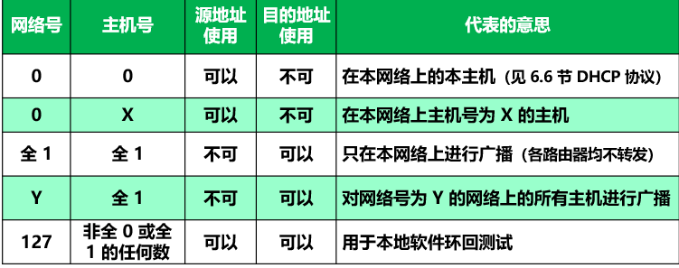
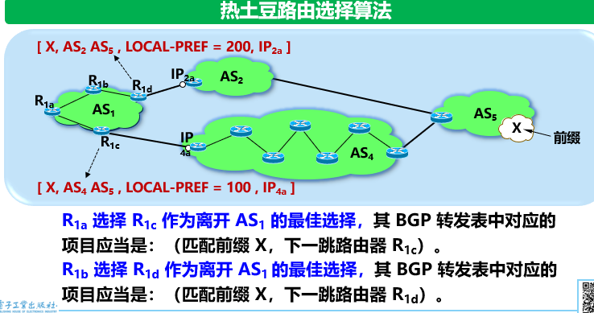
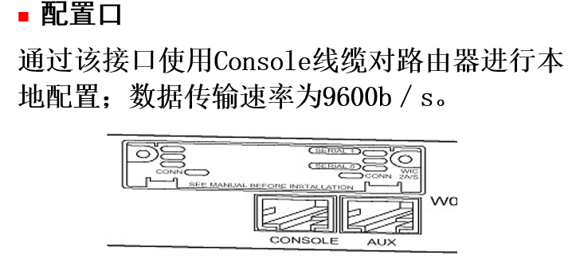

# 知识

## 概论

### 概述

三大类网络：电信网络、有线电视网络、计算机网络。

Internet：因特网（理论译名）、互联网（流行译名）

> （1） internet（互联网或互连网）：通用名词，它泛指由多个计算机网络互连而成的网络。；协议无特指（2）Internet（因特网）：专用名词，特指采用 TCP/IP 协议的互联网络。区别：后者实际上是前者的双向应用

互联网重要基本特点：连通性、资源共享 (提供的服务)

计算机网络由节点和链路组成。

网络：许多计算机（主机）连接在一起。互连网：许多网络通过路由器连在一起。

1969-1990 ARPANET (1983互联网诞生, TCP/IP)

1985-1993 三级结构(主干网、地区网、校园/企业网)

1993-现在 主干、地区和本地ISP(互联网服务提供者) (形成多层次ISP结构的Internet)

计算机网络的主要功能：资源共享、连通性、实现实时的集中处理、均衡负荷和分布式处理等。

通信技术+计算机技术。

> 简述因特网标准制定的几个阶段？
> 答：（1）因特网草案(Internet Draft) ——在这个阶段还不是 RFC 文档。（2）建议标准(Proposed Standard) ——从这个阶段开始就成为 RFC 文档。（3）草案标准(Draft Standard)（4） 因特网标准(Internet Standard) 


### 组成

互联网按工作部分划分为边缘部分、核心部分。

在边缘部分，主机=端系统，拥有者可以是个人、单位、ISP。

端系统通信方式：C/S，P2P(peer)

核心部分最重要功能：分组转发。路由器任务：转发收到的分组，实现分组交换。

分组交换技术：(按交换功能划分)

- 电路交换。线的数量是 $C_n^2$，用交换机可以减少。必须一直占线。建立-通话-释放。
- 分组交换。存储转发技术。数据段加首部(/包头)成分组(/包)。每个分组独立选择路径。可以不先建立连接。可靠协议。但排队延迟、不保证带宽、增加开销(包头、路由器暂存和维护转发表)。

  要点：报文分组，加首部；经路由器储存转发；在目的地合并
- 报文交换。存储转发原理，时延长。不需要预先分配带宽。

优缺点比较：（1）电路交换：端对端通信质量因约定了通信资源获得可靠保障，对连续传送大量数据效率高。（2）报文交换：无须预约传输带宽，动态逐段利用传输带宽对突发式数据通信效率高，通信迅速。（3）分组交换：具有报文交换之高效、迅速的要点，且各分组小，路由灵活，网络生存性能好。

> 为什么说因特网是自印刷术以来人类通信方面最大的变革？ 
> 融合其他通信网络，在信息化过程中起核心作用，提供最好的连通性和信息共享，第一次提供了各种媒体形式的实时交互能力。


### 类别

计算机网络：由一些通用的、可编程的硬件互连而成的，这些硬件并非专门用于实现某一特定目的，可编程的硬件可以传送多种不同类型的数据（有CPU,中央处理器）。

按照网络作用范围：广域网(远程网)WAN，城域网MAN，局域网LAN，个人区域网(个域网)PAN。多处理机系统不是网络。广域网是Internet核心网。

按使用者(范围)划分：公用网(公众网)、专用网。

接入网AN(access network，本地/居民接入网)，是用户端系统到本地ISP首个路由器(边缘路由器)之间的网络。[按业务角度划分为接入网和主干网]

> 主干网：提供远程覆盖\高速传输\和路由器最优化通信。本地接入网：主要支持用户的访问本地，实现散户接入，速率低。

逻辑功能上，分为通信子网(组成：通信硬件、通信软件)和资源子网。

计算机网络的拓扑结构是指：忽略了设备和线路的大小、重量等物理性质，把它们抽象成点和线，仅仅研究点、线、面的关系，从而简化了研究的过程。拓扑结构划分：星形、树形、总线、环形、网状

同通信能：资源共享计算机网络、分布式计算机网络和远程通信网络


### 性能

速率(数据率，比特率)，单位bit/s。$K=2^{10},M=2^{20},G=2^{30}$。1 Byte=8 bit。额定速率：绝对上限值。

带宽(bandwidth)，频带宽度(频域, 赫, Hz)或最高数据率(时域, bit/s)。

吞吐量(throughput)，实际单位时间通过的数据量。每秒字节/帧数。

时延(delay，延迟，迟延)。哪一个主导具体问题具体分析。

- 发送时延(传输时延)，主机/路由器发送数据帧第一个比特到最后一个完毕的时间 $=\dfrac{数据帧长度bit}{发送速率bit/s}$。
- 传播时延。$\dfrac{信道长度m}{信号传播速率m/s}$。电磁波速率 $3\times10^8m/s$，铜线 $2.3$，光纤 $2$。
- 处理时延。主机/路由器处理收到的分组用时。
- 排队时延：分组在路由器输入输出队列排队等待时长。丢失$=\infty$。

速率/时延同低/高哪个更好具体分析。

高速(带宽)链路比特率传送不一定会更快，因为只有**发送**速率提高。

时延带宽积 $=$ 传播时延 $\times$ 带宽，bit为单位的链路长度。

往返时间(RTT,Round-Trip Time)，发送完到收到确认的时间。是二倍传播时延 $+B$ 排队时延 $+B$ 发送时延。

信道利用率：信道被利用的时间(数据通过)占比。空闲为零。

网络利用率：全网信道利用率加权平均值。

设 $D_0$ 是网络空闲时延，$D$ 是当前时延，$U$ 是当前利用率，则 $D=\dfrac{D_0}{1-U}$。

> 数据传输效率为有效数据长度 $\div$ 传输总数据长度(即加上各种头部)。

> 分组通常计算时延$=数据大小\div 速率+链路数\times 传播时延+(链路数-1)\times(包大小\div 速率)$
>
> 例题：$A$ 发送 $100MB$ 数据，速率 $100Mbit/s$，$B$ 收到马上发送确认；$A$ 收到确认马上继续发送，已知 $RTT=2s$，求 $A$ 向 $B$ 发送数据的有效数据率。
>
> 解：发送时延 $=\dfrac{100\times2^{20}\times8}{100\times10^6}\approx8.39s$。有效数据率 $=\dfrac{100\times2^{20}\times8}{8.39+2}\approx80.7Mbit/s$。
>
> 
>
> 

> 非性能特征有:费用、质量、标准化、可靠性、可扩展性和可升级性、易于管理和维护。非性能特征：宏观整体评价网络的外在表现。性能指标：具体定量描述网络的技术性能。


### 体系结构

网络协议(协议,protocol)，是为了进行网络数据交换建立的规则、标准或约定。组成要素：语法、语义、同步(实现顺序)。(控制两个对等实体进行通信的规则的集合)。(水平的)

> 协议栈：指计算机网络体系结构采用分层模型后,每层的主要功能由对等层协议的运行来实现,因而每层可用一些主要协议来表征,几个层次画在一起很像一个栈的结构。对等层:在网络体系结构中,通信双方实现同样功能的层

网络的体系结构(architecture)是计算机网络各层及其协议的集合，即该计算机网络及其构建应该完成的功能的精确定义(不涉及实现)。

ISO(国际标准化组织)提出 OSI/RM(Open System Interconnection Reference Model)，形成七层协议体系结构。

| OSI        | TCP/IP            | 五层       |
| ---------- | ----------------- | ---------- |
| 应用层     | 应用层            | 应用层     |
| 表示层     |                   |            |
| 会话层     |                   |            |
| 运输层     | 运输层            | 运输层     |
| 网络层     | 网际层            | 网络层     |
| 数据链路层 | 链路层/网络接口层 | 数据链路层 |
| 物理层     |                   | 物理层     |

- 应用层：通过应用进程间交互完成特定网络应用。数据单元：报文(message)。
- 运输层：向两主机进程间通信提供通用数据传输服务。有复用和分用功能。TCP单位是报文段(segment)，UDP是用户数据报。
- 网络层：为分组交换网上不同主机提供通信服务。任务：路由选择和转发。IP层，单位分组为(IP)数据报。无连接网际协议。不需虚电路。
- 数据链路层：实现两相邻节点无差错通信。单位是帧(frame)。有差错就丢弃。
- 物理层：实现比特(0/1)的传输。确定电缆插头引脚等。物理媒介在物理层协议之下。

OSI参考模型把对等层次传送的数据单元称为该层的协议数据单元PDU。协议实际上是在各个对等层传输数据时的各项规定。

实体(entity)：任何可发送/接收信息的硬件/软件进程。在协议控制下，两对等实体间的通信使得本层能够向上一层提供服务。实现本层协议需要使用下层服务。

服务：上层使用服务原语得到下层提供的服务，垂直的。

相邻两层的服务访问点(SAP)是逻辑接口，层与层交换数据的单位是服务数据单元SDU。SDU可以与PDU不一样(合成/划分)。


> 分层的好处：①各层之间是独立的。某一层可以使用其下一层提供的服务而不需要知道服务是如何实现的。②灵活性好。当某一层发生变化时，只要其接口关系不变，则这层以上或以下的各层均不受影响。③结构上可分割开。各层可以采用最合适的技术来实现④易于实现和维护。⑤能促进标准化工作。类似：邮政系统，物流系统。
>
> 透明的例子：电视、OS、工农业产品

> TCP/IP协议可以为各式各样的应用提供服务 （所谓的everything over ip）   答：允许IP协议在各式各样的网络构成的互联网上运行（所谓的ip over everything）


## 物理层

### 概念

物理层协议：规程(procedure)。作用：屏蔽不同传输媒体、通信手段的差异。

> 解决的主要问题：（1）物理层要尽可能地屏蔽掉物理设备和传输媒体，通信手段的不同，使数据链路层感觉不到这些差异，只考虑完成本层的协议和服务。（2）给其服务用户（数据链路层）在一条物理的传输媒体上传送和接收比特流（一般为串行按顺序传输的比特流）的能力，为此，物理层应该解决物理连接的建立、维持和释放问题。（3）在两个相邻系统之间唯一地标识数据电路。
>
> 特点：（1）由于在OSI之前，许多物理规程或协议已经制定出来了，而且在数据通信领域中，这些物理规程已被许多商品化的设备所采用，加之，物理层协议涉及的范围广泛，所以至今没有按OSI的抽象模型制定一套新的物理层协议，而是沿用已存在的物理规程，将物理层确定为描述与传输媒体接口的机械，电气，功能和规程特性。（2）由于物理连接的方式很多，传输媒体的种类也很多，因此，具体的物理协议相当复杂。

物理层可以为通信的主机之间建立,管理和释放物理连接，数据传输单位为bit。

主要任务：确定与传输媒体的接口的一些特性。

- 机械特性：接口接线器形状、尺寸、引线数目、排列、固定和锁定装置等
- 电气特性：接口电缆各线电压范围
- 功能特性：某线某电平电压意义
- 过程特性：对于不同功能各种可能事件出现顺序

数据通信系统三部分：源系统(发送端/方)、传输系统(传输网络)、目的系统(接收端/方)。(信源、通信媒体(信道)、信宿~~信素~~)(信息传播三要素)

消息(message)：如话音、文字、图像、视频等。

数据：运送消息的实体。

信号(signal)：数据的电气/电磁表现。

模拟信号(analogous)：消息的参数取值连续。数字信号：离散。

模拟信道只能通模拟信号，数字信号要调制。

码元(code)：在使用时间域(时域)的波形表示数字信号时，不同离散值的基本波形。

信道：向某个方向传送信息的媒体。分单工通信(单向通信)、半双工通信(双向交替通信)、全双工通信(双向同时通信)。

基带信号(基本频率信号)：来自信源的信号。(像计算机输出的代表各种文字或图像文件的数据信号都属于基带信号)

在数据通信中，为了保证数据被正确接收，必须采用一些同一收发动作的措施，这就是所谓的同步技术。同步传输时钟同步从数据中提取，异步传输通过字符的起止位同步


### 编码

脉冲编码调制(PCM)的工作原理包括抽样、量化和编码。

不归零制(NRZ)：正电平1，负0

归零：正脉冲1，负0

曼彻斯特编码：周期中心往上0往下1或反过来定义

差分曼彻斯特编码：开始边界跳0，不跳1


两种曼彻斯特有自同步能力(从信号波形本身提取信号时钟频率)。

曼彻斯特缺点：占频带宽度比原始基带信号大一倍。


### 调频

调制(modulation)是将低频/直流修改。

- 基带调制：改基带信号波形，使与信道特性适应，变换后也是基带信号。叫编码(coding)。
- 带通调制：用载波(carrier)调制，把基带信号频率移到较高，转为模拟信号，在模拟信道传输(一个范围内能通过信道)。
- 带通信号：载波调制后的信号。

基本二元制调制方法有以下几种：(数字数据调制为模拟信号)

- 调幅AM：振幅随着基带数字信号变化(抗干扰差)
- 调频FM：频率(抗干扰强)
- 调相PM：初始相位


> 正交振幅调制QAM quadrature amplitude modulation：频率相同，改变幅度和相位


### 速率

限制码元传输速率因素：信道能够通过的频率范围、信噪比

奈氏准则：理想时避免码间串扰，传输速率上限。频带越宽，能通过越多高频分量，可以更高速率。结论：带宽为 $W\ Hz$ 低通信道，不考虑噪声，码元传输最高速率是 $2W(码元/s)$。

信噪比：信号平均功率与噪声平均功率之比，记为 S/N。单位分贝 dB。
$$
dB=10\lg(S/N)
$$
香农公式：信道带宽为 $W(Hz)$，则极限无差错的信息传输速率为：
$$
C=W\log_2(1+S/N)(bit/s)
$$
只要信息传输速率低于信道的极限信息传输速率，就一定可以找到某种办法来实现无差错的传输。 

> 例题：信道带宽为 $4KHz$，有 $8$ 种不同物理状态表示数据，最大限制的数据传输率为 $2\times4\times10^3\times\log_28=2.4\times10^4bit/s$。(注：一个码元在这里等于 $3bit$)。

> 码元传输速率受奈氏准则的限制，信息传输速率受香农公式的限制


### 传输媒体

传输媒体(介质/媒介)：数据传输系统中在发送器和接收器之间的物理通路。分为：

- 导引型传输媒体：电磁波被引导者沿着固定媒体传播
- 非导引型传输媒体：自由空间。电磁波的传输称为无线传输。

电磁波频谱 $[10^4,10^{16}]Hz$。


导引型传输媒体：双绞线最常用，模拟/数字都可以。分为屏蔽双绞线STP(shielded twisted pair)或无屏蔽双绞线 UTP(unshielded)。

标准：EIA/TIA-568 -> EIA/TIA-568-A。规定了五类 UTP 线，最常用是 5 类线(Category 5,CAT5)。用 RJ-45.


抗干扰 $U/FTP < F/UTP < F/FTP$。

在10Base-T总线网中，计算机与集线器之间双绞线的最大长度是100m。


同轴电缆：很好抗干扰。分为 $50\Omega$ (LAN/数字传输)， $70\Omega$ (有线电视/模拟传输)。如 CATV。

光纤：$10^8MHz$ 量级。按规格分为多模光纤：存在多条不同角度入射光纤。单模：直径只有一个光的波长。

常用波段中心：850nm 1300nm 1550nm 具有 $[25000,30000]GHz$ 带宽。

优点：容量大，损耗小，中继距离长，抗雷电/电磁干扰，无串音干扰，保密性好，体积小重量轻。


短波通信(高频通信)：靠电离层反射，质量差速率低。

微波：直线传播。地面接力/卫星通信。

可以自由使用的无线电频段：ISM(Industrial Scientific Medical)。


> 

> DWDM(Dense Wave Division Multiplexing)
> SONET(Synchronous Optical Network)同步光纤网
> SDH(Synchronous Digital Hierarchy)同步数字系列
> STM-1(Synchronous Transfer Module)第1级同步传递模块
> OC-48(Optical Carrier)第48级光载波


### 信道复用

复用：允许用户使用一个共享信道进行通信，降低成本，提高利用率。定义：将两个或以上彼此独立的信号合并为一个复合信号，在一条公用信道上传输的方法。(目的为了通过共享信道、最大限度提高信道利用率。)

频分复用(FDM,frequency division multiplexing)：带宽分多份，用户分配到一个频带后，自始至终占用。所有用户同一时间占用不同带宽资源。

时分复用(TDM)：时间分为等长时分复用帧。用户是每帧占用固定序号的时隙，周期出现。TDM信号：等时信号(isochronous)。所有用户不同时间占用同样频带宽度。由于计算机数据突发性，利用率不高。

统计时分复用(STDM,Statistic)按需动态分配时隙

波分复用(WDM,wavelength)光的频分复用。

码分复用CDM(code)，码分多址(CDMA,multiple access)，抗干扰，频谱类似白噪声，不易被发现。缺点：占用较大带宽。

每一个比特划分为 m 个短间隙，是码片(chip)。每个站指派唯一的 m bit码片序列。若发送比特 1 就发送自己的码片序列；否则发送码片序列反码。码片序列互不相同且相互正交(使用伪随机码序列)。正交内积为 0，即 $S\cdot T\equiv\dfrac 1m\sum_{i=1}^mS_iT_i=0$。且 $S\cdot S=1$。且与反码的内积是 $-1$。容易理解(根据内积定义)。

发送信息数据率为 $b\ bit/s$，那么实际数据率为 $mb\ bit/s$。是扩频(spread spectrum)通信的一种，有直接序列扩频 DSSS(direct sequence spread spectrum)和调频扩频FHSS(frequency hopping)。

> 

> 为什么在ASDL技术中，在不到1MHz的带宽中却可以传送速率高达每秒几个兆比？
> 答：靠先进的DMT编码，频分多载波并行传输、使得每秒传送一个码元就相当于每秒传送多个比特


### 数字传输系统

数字通信传输质量和经济比模拟更好。

宽带：下行速率 $25\ Mbit/s$，上行 $3\ Mbit/s$。

接入媒体划分为有线/无线宽带接入。

非对称数字用户线(asymmetric digital subscriber line)：用数字技术改造模拟电话用户线承载宽带业务。低频电话，高频上网。还有其他类型DSL。用户线线径越细，传输衰减越大。数据率越大，距离越短。特点：上行、下行带宽不一致。用户线(铜线)两段安装ASDL调制解调器。用DMT划分上下行频率。不保证固定数据率。

光纤同轴混合网(HFC,hybrid fiber coax)。

FTTx是光纤到(fiber to the)，有户Home，大楼Building，路边Curb。

> xDSL 技术就是用数字技术对现有的模拟电话用户线进行改造，使它能够承载宽带业务。成本低，易实现，但带宽和质量差异性大。HFC网的最大的优点具有很宽的频带，并且能够利用已经有相当大的覆盖面的有线电视网。要将现有的450 MHz 单向传输的有线电视网络改造为 750 MHz 双向传输的 HFC 网需要相当的资金和时间。FTTx（光纤到……）这里字母 x 可代表不同意思。可提供最好的带宽和质量、但现阶段线路和工程成本太大。


### 设备

中继器是物理层网间设备。

集线器(hub)接到端口数据，从除了输入端口外的所有端口转发出去。用集线器连接的工作站集合属于同一个冲突域，也属于同一个广播域。每个站共享带宽。若以太网交换机，则每个站独占带宽。

10BASE-T。其中10是速率$10Mbit/s$，BASE是基带，T是双绞线。如果T改成数字，就是最大网段长度是多少百米。


## 数据链路层

### 概念

信道类型：点对点、广播。

(物理)链路(link)：一条无源的点到点的物理线路段，中间没有任何其他的交换结点。

数据(/逻辑)链路：把实现控制数据传输的协议的硬件和软件加到链路上构成。典型实现：适配器(即网卡)。

> 数据链路与链路的区别在于数据链路出链路外，还必须有一些必要的规程来控制数据的传输，因此，数据链路比链路多了实现通信规程所需要的硬件和软件。 “电路接通了”表示链路两端的结点交换机已经开机，物理连接已经能够传送比特流了，但是，数据传输并不可靠，在物理连接基础上，再建立数据链路连接，才是“数据链路接通了”，此后，由于数据链路连接具有检测、确认和重传功能，才使不太可靠的物理链路变成可靠的数据链路，进行可靠的数据传输当数据链路断开连接时，物理电路连接不一定跟着断开连接。

数据链路层协议三个基本问题：封装成帧、透明传输、差错检测。

> 帧定界是分组交换的必然要求；透明传输避免消息符号与帧定界符号相混淆；差错检测防止合差错的无效数据帧浪费后续路由上的传输和处理资源。不帧定界的话无法区分分组与分组无法确定分组的控制域和数据域无法将差错更正的范围限定在确切的局部。

封装成帧：在一段数据的前后分别添加首部和尾部，构成一个帧。首部尾部：帧定界有 SOH(start of header),EOT(end of transmission)。数据部分用字节填充使得不出现 EOT,SOH。

> 链路控制包括的功能：链路管理、帧定界、流量控制 []

最大传送单元 MTU(maximum transfer unit)所能传送的帧数据部分长度上限。

透明：指某一个实际存在的事物看起来却好像不存在一样。

透明传输：无论发送什么样的比特组合的数据，这些数据都能够按照原样没有差错地通过这个数据链路层。

误码率 BER(bit error rate)，错误比特占比。

无差错接受：凡是接收端数据链路层接受的帧均无差错。

可靠传输：数据链路层的发送端发送什么，在接收端就收到什么。

传输差错：比特差错和传输差错(帧丢失、重复、失序)。

在IEEE802局域网体系结构中，数据链路层被细化成逻辑链路控制子层和媒体接入控制子层两层。(LLC,MAC)


### 检验

奇偶校验法：查看数据里1的个数是奇数还是偶数。若奇校验位，则结果填入使得总1个数是奇数。反之相反。

循环冗余检验 CRC(cyclic redundancy check)，发送端划分 $k$ 比特一组。CRC 运算在组后加 $n$ 冗余二进制位。原始数据进行模二除法的余数填到冗余位。接受数据对整个 $k+n$ 做模二除法，若不为 $0$ 则丢弃。除数是 $n+1$ 位的。除法过程做异或运算。

冗余码余数叫做帧检测序列 FCS。CRC 不是得到 FCS 的唯一方法。

CRC 能无差错接受，实现无比特差错。要做到可靠传输，还必须再加上帧编号、确认和重传等机制。 


多项式从右往左数，即如 $10011$ 是 $1+x+x^4$。


### PPP协议

点对点协议(point-to-point protocol)，使用在点对点链路最广泛的协议。

用户到ISP的链路使用PPP协议。

简单是首要要求。其他要求：封装成帧、透明性、多种网络层协议支持、多种类型链路、差错检测、检测连接状态、最大传送单元、网络层地址协商、数据压缩协商。

组成部分：将IP数据报封装到串行链路的方法，链路控制协议LCP，网络控制协议NCP。(LCP请求连接，NCP分配IP地址、释放网络层连接，LCP释放数据链路层连接)

PPP面向字节，长度是整数字节。帧格式如下图。


首部分别是标志、地址、控制、协议字段。协议字段有0x0021 IP数据报，0x8021网络控制数据，0xC021 PPP链路控制数据，0xC023鉴别数据。尾部两个字段。

透明传输：

- 异步传输字节填充法：将 7E 修改为 7D 5E，03 修改为 7D 23。
- 同步传输零比特填充法。出现五个连续的 1 后填入 0，接收则解除


### 广播信道

局域网主要特点：网络为一个单位拥有，地理范围和站点数目有限。优点：能广播，便于拓展和逐渐演变，提高可靠性、可用性、生存性。

拓扑结构：


共享信道会产生冲突。可以静态划分信道复用，可以动态媒体接入控制(多点接入)，如随机接入、受控接入(轮询 polling)。

以太网标准：DIX Ethernet V2, IEEE802.3(后者简称为以太网)

> 什么叫做传统以太网？以太网有哪两个主要标准？
> 答：DIX Ethernet V2 标准的局域网DIX Ethernet V2 标准与 IEEE 的 802.3 标准

局域网数据链路层子层：逻辑链路控制 LLC(logical link control)子层，与传输媒体无关；媒体接入控制 MAC(medium access)子层：有关。

计算机通过适配器(网卡)和局域网进行通信。CPU有IP地址，适配器有硬件地址。

适配器功能：进行串行/并行转换，缓存数据，在OS安装设备驱动程序，实现以太网协议。

最早以太网：计算机连到总线上。特点：易于实现广播通信、简单、可靠。同时发送会碰撞/冲突，导致发送失败。


一对一通信：接收站硬件地址写入帧首部目的地址，与适配器硬件地址一致时接收。

以太网措施：①提供灵活无连接工作方式(不先链接再通信，不编号，不发回确认)。提供不可靠交付服务，同一时间只允许一台计算机发送(随机接入 CSMA/CD协议)。②使用曼彻斯特(Manchester)编码。

> 以太网使用的CSMA/CD协议是以争用方式接入到共享信道。这与传统的时分复用TDM相比优缺点如何？
> 答：传统的时分复用TDM是静态时隙分配，均匀高负荷时信道利用率高，低负荷或符合不均匀时资源浪费较大，CSMA/CD课动态使用空闲新到资源，低负荷时信道利用率高，但控制复杂，高负荷时信道冲突大。


### CSMA/CD

carrier sense multiple access with collision detection。载波监听多点接入/碰撞检测。

总线型网络，边发送边监听。电压摆动超过阈值认为产生冲突。

每一个站在自己发送数据之后的一小段时间(传播时延+)内，存在着遭遇碰撞的可能性。

碰撞后：适配器停止发送，等待随机时间再次发送。


端到端往返时延 $2\tau=51.2\mu s$ 称为争用期或碰撞窗口。经过争用期没检测到碰撞，就不会发生碰撞。

截断二进制指数退避(truncated binary exponential back off)，基本退避时间是 $2\tau$。从 $[0,1,\cdots,(2^k-1)]$ 选一个数 $r$，重传时延是 $2r\tau$。参数 $k=\min(重传次数,10)$。重传 16 次仍不成功就丢弃。显然 $k$ 随着重传时间动态更改。

对 $10\ Mbit/s$ 网络，争用期内可发送 $10^7\times51.2\times10^{-6}=512bit=64Byte$ 内容。所以若前 $64$ 字节不冲突，后续就不冲突。以太网最短有效帧是 $64Byte$。

最大端到端单程时延小于争用期一半，故为 $2\times10^8\times25.6\times10^{-6}=5.12km$。

检测到冲突后停止发送数据帧，发送 $32/48 bit$ 人为干扰信号(jamming signal)。帧间最小间隔为 $9.6\mu s$(往返 $48$)。


### 利用率

传统以太网：粗同轴电缆 $\to$ 细同轴电缆 $\to$ 双绞线。双绞线：星形拓扑。星形中心是集线器。使用集线器的以太网逻辑上仍然是总线网。

成功发送一个帧需要占用信道 $T_0+\tau$ 时间。

参数 $\alpha=\dfrac\tau{T_0}$。远小于 $1$ 才能得到尽可能高极限信道利用率。越大信道利用率越小($30\%$ 就重载)。信道利用率最大值 $S_{max}=\dfrac{T_0}{T_0+\tau}=\dfrac1{1+\alpha}$。


### MAC层

硬件地址(物理地址/MAC地址)。IEEE规定48位全球地址(地址)，是接口的标识符。高 24 位是组织唯一标识符(organizationally unique identifier)。后面是拓展标识符(extended identifier)。

第一字节最低位为 I/G(individual/group)位，单站地址位0，组地址为1，多播。广播地址全1，目的地址。

第一字节次低位是 G/L(global/local)位，为0全球管理，1本地管理。

发往本站的帧包括单播(unicast)、多播(multicast)、广播(broadcast)。

MAC帧格式是以太网V2格式。


类型是上一层协议。数据字段：MAC客户数据字段，最小长度 $46$ 字节(根据以太网最短有效帧计算)，最大1500。整个帧是$[64,1518]$。

为了达到比特同步，在传输媒体上实际传送的要比 MAC 帧还多 8 个字节。

无效：长度字段与长度不一致/非整数，FCS出错，太小太大。

IEEE 802.3 与 V2 的 MAC 帧区别在于后者类型那里可以是长度。


### 设备

主机和集线器之间使用光纤(调制解调器)。

可以使用集线器扩展。优点：跨碰撞域通信，扩大以太网覆盖地理范围。缺点：没有增大吞吐量，不能将不同以太网技术(如数据率)互连起来。

碰撞域(冲突域)，是从网络一个站点发出的帧会与其他站点的帧产生碰撞/冲突的网络，越大碰撞率越高。

可以用数据链路层拓展，早期用网桥，现在用以太网交换机。网桥根据MAC帧目的地址对收到的帧转发/丢弃。交换机是多端口的网桥，一般全双工，并行(相互通信主机独占传输媒体，无碰撞，每个端口和主机构成碰撞域)。


接口有存储器。即插即用，内部帧交换表(地址表)通过自学习算法建立，是内存可寻址存储器(CAM content addressable memory)，硬件转发。独享带宽，不共享。

交换方式：存储转发/直通(cut-through)，后者可能转发无效帧。

自学习：记录的是源，若没发现目的在记录里就广播。每个项目有有效时间。


若拓扑结构有环，那么就会挂。

使用生成树协议STP(spanning tree protocol)，逻辑上切断一些链路使得无环。

> 适配器（即网卡）来实现数据链路层和物理层这两层的协议的硬件和软件网络适配器工作在TCP/IP协议中的网络接口层（OSI中的数据链里层和物理层）


### 虚拟局域网

以太网问题：广播风暴、安全问题、管理困难等。

广播域：任何一台设备发送光波通信都能被该网络所有其他设备接收。

环路能形成广播风暴。

安全问题：交换机使得划分不同碰撞域，但在同一广播域，可能信息被广播泄露。

虚拟局域网VLAN(virtual LAN)是由一些局域网网段构成的与物理位置无关的逻辑组。每个VLAN帧有明确标识符。是局域网的一种服务，不是新型局域网。标识符划分广播域。

虚拟局域网限制了接收广播信息的工作站数，使得网络不会因传播过多的广播信息 (即“广播风暴”) 而引起性能恶化。

优点：改善性能、简化管理、降低成本、提高安全。

划分VLAN方法：基于交换机端口/网卡MAC/协议/IP子网地址/高层应用或服务。

- 交换机：最简单常用。在第一层(物理层)划分。缺点：不允许用户移动。
- MAC：第二层。缺点：需要输入和管理，改变了需要重配。
- 协议：第二层。
- IP子网：第三层。根据类型和IP分组首部源IP地址字段。


同一个 VLAN 的两台主机不可以跨越多台路由器。


### 速率

100BASE-T 快速以太网(fast ethernet)。星形。全双工无冲突，不使用CSMA/CD。网段最大电缆长度100m。帧间间隔 $0.96\mu s$。

吉比特以太网。半双工CSMA/CD，全不是。向后兼容。半双工增加了载波延伸(争用时间512字节，不足填特殊字符)和分组突发。

10吉比特全双工，仅光纤。

以太网扩大到MAN/LAN，形成端到端以太网传输。可以宽带接入。

PPPoE(PPP over Ethernet)，在以太网运行PPP。将PPP帧封装到以太网。FTTx需要使用。ADSL宽带上网也使用。


## 网络层

### 概念

虚电路：逻辑上的连接，分组都沿着这条逻辑连接按照存储转发方式传送，并不是真正建立了一条物理连接。必须面向连接。

网络层：向上层提供简单灵活的、无连接的、尽最大努力交付的数据报服务。分组可能出错、丢失、重复、失序，不保证时限。(运输层负责可靠)


路由器之间传送的信息：数据、路由信息(为数据传送服务)。

网络层两个层面：数据层面(硬件，快，转发表，独立工作)、控制层面(路由选择协议计算路由创建路由表，多路由协同，软件，慢)。

软件定义网络 SDN，通过远程控制器计算最佳路由，在每个路由器生成正确转发表。

实现异构网络的互联互通，使用中间设备。使用转发器/网桥不称为网络互连，因为是扩大同一个网络。网络互连使用路由器。虚拟互连网络是互联网。

网际协议 IP。IPv4 的三个协议：地址解析协议 ARP(resolution)，网际控制报文协议(Internet control message)，网际组管理协议 IGMP(group management)。

IP网：当互联网上的主机进行通信时，就好像在一个网络上通信一样，看不见互连的各具体的网络异构细节。如果在这种覆盖全球的 IP 网的上层使用 TCP 协议，那么就是现在的互联网 (Internet)。


IP 协议是互联网的核心协议。


### IP地址

32位二进制，8位一组，称为点分十进制记法。

每台主机(/路由器)的每个接口分配全世界唯一的IP地址，由互联网名字和数字分配机构ICANN(Internet corporation for assigned names and numbers)分配。

分为二级结构：网络号(net-id)和主机号(host-id)。前半部分是网络号。

- A类地址首位0，网络号8位，范围 $[1,126]$。
- B类地址首位10，网络号16位，范围 $[128.1,191.255]$。
- C类地址首位110，网络号24位，范围 $[192.0.1,223.255.255]$。
- D类地址首位1110，多播地址，范围 $[224.0.0.0,239.255.255.255]$。
- E类地址首位1111，保留以后用。

最大可指派网络数是 $2^{网路号长-固定部分}-1$。特别地 $A$ 类里要 $-2$(因为全 $0$ 是本网络，全 $1$ 是环回)。$128.0,192.0.0$ 不指派，被保留，无分类编址(CIDR)可指派。

主机号要扣除全 $0$ 和全 $1$。每个网络主机数是 $2^{主机号长}-2$。



无分类编址CIDR(classless inter-domain routing)，无分类域间路由选择。分为网络前缀和主机号，记法是斜线记法(slash notation)，即 $a.b.c.d/n$。$n$ 代表网络前缀长度。

CIDR把网络前缀相同的所有 IP 地址组成一个 CIDR 块。点分表示有 0 出现的地址是地址块。

子网掩码(subnet mask)是让机器快速计算出网络地址用的，由一串1拼接一串0组成，1的个数是网络前缀长度。用子网掩码按位与IP地址得到网络地址。

有时称 CIDR 编址为构造超网。

前缀长度范围 $[0,32]$。若前缀长度为 $32$，只有一个 IP 地址(用于主机路由)，为 $31$ 只有两个，主机号为 $0$ 和 $1$，可以建立点对点链路。若为 $0$，且 IP 地址全 $0$，用于默认路由。

路由聚合(route aggregation)，将一堆地址块合并为一个地址块，减少路由表项目数目。也可以进行 CIDR 地址块划分。

IP 地址中，所有分配到网络前缀的网络都是平等的。若一台主机属于多个网络，该主机需要有多个IP互异地址，称为多归宿主机(multihomed host)。一个路由器至少链接两个网络，所以至少有两个不同 IP 地址。

一个网络(/子网)指具有相同网络前缀的主机的集合。具有不同网络号的局域网必须使用路由器互连。

IP 地址是虚拟，软件，逻辑地址，网络层和以上使用，在 IP 数据报首部。MAC 地址固化在网卡 ROM，是硬件，物理地址，数据链路层使用，MAC 帧首部。

> 例题：$128.8.8.8$ 头 5 位用于子网，求网络号和主机号: $128.8.8.0, 0.0.0.8$。
>
> 与 $192.168.75.18,255.255.255.240$ 同网段的 IP 地址范围是：除去该主机和全 $0/1$ 外，可以设置 $192.168.75.17,[19,30]$。


### ARP

地址解析协议。实现IP 通信使用了 IP 和 MAC 地址。ARP 已知 IP 找出 MAC 地址。

ARP cache(高速缓存)是映射表，项目有生存时间(age)和类型。局域网内发送 IP 数据报时：


局域网内广播 ARP 请求(路由器不转发)，ARP 请求分组包括发送方MAC,IP地址和目标方MAC,IP地址(MAC填0表示未知)。单播 ARP 相应分组，格式同样。ARP 分组封装在以太网帧传输。

如果要找的主机不在同一局域网，那么会发给路由器，然后路由器作为发送方，递归执行上述过程。此时即先用 ARP 找到本网络路由器硬件地址，然后给路由器完成工作。


### IP数据报


首部固定部分 20 字节。版本是 4。IP 首部最大长度是 60 字节，因为首部长度是最大值 15 单位，一个单位四个字节。总长度是首部+数据，单位是字节，计算得最大是 65535。总长度不得超过最大传送单元 MTU(1500字节)。标识是计数器。标识最低位MF(more fragment)0标识是最后一个分片，标识中间位DF(don't)为0允许分片。片偏移以 8 个字节为偏移单位。报文长度(首部长度)字段以 4 字节为计数单位，总长度子段以 1 字节为计数单位。

分片只在路由器或信源机，重组只发生在目的机(不是分片在一经过路由器时就进行，重组也一样)。


生存时间 TTL(time to live)，可通过路由器数最大值。为 0 时丢弃。


数据报每经过一个路由器，路由器都要重新计算一下首部检验和。

在整个传输过程中，经过多个网络和路由器，IP数据报报头源地址和目的地址都不会改变。

> 例题：
>
> 
>
> 


### 路由转发

逐跳转发。基于终点的转发：基于分组首部中的目的地址传送和转发。

转发表最主要的路由是目的网络地址(不是目的地址)和下一条地址的对。查找转发表就是寻找前缀匹配。

最长前缀匹配原则(longest-prefix matching)：转发表多个匹配结果，选前缀最长的，排在转发表第一行。

主机路由(特定主机路由,host route)，在转发表最前面，是对特定目的主机 IP 地址专门指明的路由，网络前缀是 $a.b.c.d/32$。

默认路由(default route)，特殊前缀 $0.0.0.0/0$。即都找不到时往哪里走。


二叉线索树(binary trie)，快速在转发表找到匹配叶子节点，最大深度 $32$。使用唯一前缀构造二叉线索。使用压缩技术。


### ICMP

允许主机/路由器报告差错情况，提供有关异常情况的报告。


两种报文：差错报告报文和询问报文。


对 ICMP 差错报告报文不再发送差错报告报文。对第一个分片的数据报文的所有后续报文都不发送差错报告。多播地址数据报不发送。特殊地址($127.0.0.0, 0.0.0.0$)不发送。

ICMP 询问报文：测试可达或回答当前日期/时间。

PING(Packet Internet Groper)测试两主机连通性，使用 ICMP 回送请求和回送回答报文。是应用层直接使用网络层 ICMP 的例子，没有通过运输层的 TCP 或 UDP。 

Traceroute(UNIX / tracert Windows)跟踪分组从源点到终点的路径，利用 TTL, ICMP 时间超过差错报告报文和 ICMP 终点不可达差错报告报文。

ICMP可以用来拥塞控制。


### IPv6

IPv6支持无连接传送，协议数据单元 PDU 称为分组(packet)。字节数是 8 的倍数。

两大部分：基本首部(base header)和有效载荷(净负荷，payload)，零到多个拓展首部(extension header)和数据部分。

基本首部 40 字节。


通信量类(traffic class)区分优先级。

流标号(flow label)指明服务质量。

有效载荷长度是除了基本首部之外的字节数，最大 $64KB$。

跳数限制为 $0$ 时丢弃该报文。每转发一次减一。

地址类型：单播、多播、任播(anycast)：只需要交付给一组里任意一个。

实现了 IPv6 的主机/路由器称为节点。地址分配给节点的接口。

冒号十六进制记法(colon hexadecimal notation, colon hex)，每组 16 二进制位合 4 个十六进制数，八组。使用零压缩和点分十进制的后缀。可以用CIDR斜线表示法，但取消了子网掩码。


单播地址划分：


IPv4 过渡策略：双协议栈、隧道技术。(向后兼容)

ICMPv6包含了ARP和IGMP协议功能。


### 路由选择协议

路由选择协议属于网络层控制层面的内容。不存在一种绝对的最佳路由算法。分为静态路由选择策略和动态路由选择策略(自适应)。

互联网：采用自适应、分布式路由选择协议，将其划分为较小的自治系统 AS(autonomous system)，采用分层次路由选择协议。AS 之间是域间路由选择(interdomain routing)，内部是域内路由选择(intradomain routing)。

内部网关协议 IGP(interior gateway protocol)在一个自治系统内部使用的，常用 RIP,OSPF。外部网关协议(external gateway protocol)最多用BGP-4。分别使用距离向量、链路状态、路径向量。

> 稳定性：在网络通信量和网络拓扑相对稳定的情况下，路由算法应当收敛于一个可以接受的解。 


#### RIP

routing information protocol。分布式，基于距离向量。

路由器到直接连接的网络距离是 1，非直接是经过路由器数 +1。距离成为跳数(hop count)，每经过一个路由器，跳数加 1。一条路径最多包含 15 个路由，距离最大值为 16 表示不可达。

RIP 不能在两个网络间同时使用多条路由，只选择距离最短路由。

只和相邻路由器交换信息(自己的路由表)，固定时间间隔交换一次、

收敛(convergence,在自治系统中所有的结点都得到正确的路由选择信息的过程)过程较快。

距离向量算法(bellman-ford / ford-fulkerson)。

路由表存储目的网络、距离和下一条路由器。


主要特点：好消息传播快、坏消息(故障)传播慢(慢收敛)。


缺点：网络规模有限，最大距离小；交换信息是完整路由表，开销大；坏消息传播慢，收敛时间长。

> 例题：
>
> 
>
> 


#### OSPF

open shortest path first。使用 Dijkstra 最短路。分布式链路状态协议。

特点：洪泛法(flooding)向本自治系统所有路由器发送信息，是本路由器相邻的所有路由器的链路状态(相邻路由器及链路度量metric)。状态发生变化或隔一段时间洪泛一次。

存储同步链路状态数据库，是全网拓扑结构图(全网范围一致，不同路由器的链路状态数据库的内容是一样的)。收敛速度快。

OSPF的自治系统分类：主干区域(backbone area)标识符 $0.0.0.0$，用来连通其他下层区域[AS]。

区域边界路由器：ABR(area border router)。其他是主干路由器BR(backbone router)。去其他自治系统是自治系统边界路由器ASBR(AS border router)。


划分区域减少通信量和需要维护状态数量，但交换信息种类增加且更为复杂。


相邻 10s 交换一次问候分组，40 s 没收到就认为不可达。每隔一段时间刷新一次数据库链路状态。


#### BGP

外部网关协议。力求可达较好的路由。路径向量路由选择协议。

BGP 发言者是边界路由器。对等发言者在 AS 间交换信息。

AS 之间，发言者半永久性 TCP 链接(179端口号)建立 BGP 会话，称为 eBGP(external)。内部两个路由器有逻辑连接，称为iBGP(internal)。AS内部运行内部网关协议IGP(OSPF/RIP)。

eBGP,iBGP是同一个协议BGP，但通报前缀采用规则不一样。eBGP得到的前缀信息可以通报给iBGP链接的对等段。而iBGP得到前缀不能通报给另一个iBGP对等端。


在属性 AS-PATH 里，不允许出现相同 AS 号，如果 AS-PATH 有自己，立刻删掉这条路由。

优先级：





### 设备

路由器是网络层设备，互联网关键设备。主要工作：转发分组。结构：


转发只涉及一个路由器，路由选择涉及多个。

三种交换方法：通过存储器、总线、纵横交换结构。


存储器带宽(读/写)每秒 m 分组，则交换速率一定小于 $\dfrac m2$。纵横(crossbar switch fabric/interconnection network)，特点：是一种无阻塞的交换结构，分组可以转发到任何一个输出端口，只要这个输出端口没有被别的分组占用。

路由表会出现下一跳、网络地址、度量值，不会出现 MAC 地址。


### IP多播

多播(组播 multicast)，一个源点到多个终点。不需要复制分组，减少资源消耗。

多播主干网(MBONE,Multicast backbone on the Internet)。多播只能是目的地址。协议字段是 $2$。PING 多播地址不能得到响应。尽最大努力交付。不产生ICMP差错报文。

局域网硬件多播。IANA拥有以太网地址块高24位为00-00-5E。TCP/IP协议以太网地址块范围是 00-00-5E-00-00-00 到 00-00-5E-FF-FF-FF，其中后面 00-00-00 到 7F-FF-FF ($2^{23}$ 个)作为以太网多播地址，即后 23 位多播。


网际组管理协议 IGMP，使得多播路由器直到多播组成员信息。使用多播路由器协同工作。

IGMP 协议是让连接在本地局域网上的多播路由器知道本局域网上是否有主机参加或退出了某个多播组。IGMP 不知道 IP 多播组包含的成员数，也不知道这些成员都分布在哪些网络上。

有加入多播组(向其他多播路由器转发)，周期性探寻本地主机是否在多播组，只要存在主机该组就活跃。默认 125s。


### 虚拟专用网

若机构内部计算机通信也采用 TCP/IP，仅在机构内部使用的计算机可以自行分配 IP 地址。

本地地址：机构内部使用的 IP 地址，本机构自行分配。

全球地址：全球唯一，向 ICANN 申请。

专用地址(private address)只能用作本地地址，路由器对目的地址为专用地址的一律不转发。

- $10.0.0.0/8$。1 个 A 类。
- $172.16.0.0/12$。$[16,31]$ 连续 16 个 B 类。
- $192.168.0.0/16$。$[0,255]$ 连续 256 个 C 类。
- $239.0.0.0/8$，组播地址。

使用专用地址的互连网络是专用/本地互联网。专用 IP 地址又名可重用地址(reusable address)。

利用公用互联网作为本机构各专用网之间通信载体，这样的专用网叫虚拟专用网(virtual private network)。虚拟：表示实际上没有使用通信专线，只是在效果上和真正的专用网一样。

VPN 类型：内联网(intranet)，同一个机构内部网络构成的 VPN。外联网(extranet)，一个机构和别的外部机构共同建立。远程接入 VPN(remote access VPN)，通过接入 VPN 建立 VPN 隧道访问公司内部网络。


### NAT

network address translation。专用网连接互联网的路由器安装，叫做 NAT 路由器，至少有一个有效外部全球地址。所有使用本地地址的主机在和外界通信时，都要在 NAT 路由器上将其本地地址转换成全球 IP 地址，才能和互联网连接。 


离开专用网替换源地址，进入专用网替换目的地址。

NAT 路由器有几个全球 IP 地址，就能有几个专用网内主机同时接入互联网。

通过 NAT 路由器的通信必须由专用网内的主机发起，因此，专用网内部的主机不能充当服务器用。

NAPT(network address and port translation)，使用运输层端口号。


### 其他技术

multiprotocol label switching。多协议标签交换。

IP 增强技术。支持面向连接的服务质量，支持流量工程，支持虚拟专用网 VPN。

SDN 软件定义网络，是体系结构，控制层面和数据层面分离，控制层面利用软件控制数据层面。Openflow 是两层面的通信接口，不是必须使用。直接访问和操纵物理/虚拟设备，逻辑上集中式，基于流。


## 运输层

### 概念

UDP 用户数据报协议 user datagram protocol。

TCP 传输控制协议 transmission control protocol。

两个对等运输实体在通信时传送的数据单位叫做运输协议数据单元 TPDU transport protocol data unit。TCP 叫 TCP 报文段(segment)，UDP 叫 UDP 报文或用户数据报。

UDP 不需要确认，不提供可靠交付。TCP 不提供广播或多播。


复用：应用进程都可以通过运输层再传送到 IP 层（网络层）。

分用：运输层从 IP 层收到发送给应用进程的数据后，必须分别交付给指明的各应用进程。

流量控制实际上是对接收方数据流量的控制。


### 端口

进程是动态的，发送方不能识别其他机器进程，也不需要知道具体是哪个进程，只需要知道识别终点；更改进程有时不需要通知发送方。

所以在运输层使用协议端口号 protocol port number，简称端口，设置为通信的抽象终点。

软件端口：协议栈层间抽象协议端口，是应用层的各种协议进程与运输实体进行层间交互的地点。不同系统实现端口的方法可以不同。

硬件端口：不同硬件设备进行交互的接口。

端口是 16 位端口号标志的，只具有本地意义，只是为了标志本计算机应用层中的各进程。分类：

- 熟知端口(全球通用端口号，IANA分配)， $[0,1023]$。
- 登记端口(在IANA登记)，$[1024,49151]$。即高两位是 $1$。
- 短暂端口(通信结束被系统收回)，$[49152,65535]$。


TCP和UDP分别拥有自己的端口号，二者互不干扰，可以共存于同一台主机(两种端口有本质区别)。


### UDP

在 IP 数据报服务上增加了复用和分用、差错检测。特点：面向报文(一次传送、交付)一个完整报文，无拥塞控制，尽最大努力交付，一对一一对多多对一多对多都可以，无连接，首部小。

通信特点：简单方便，但不可靠。

发送方 UDP 对应用层交下来的报文，既不合并，也不拆分，加上 UDP 首部按照样发送。接收方 UDP 对 IP 层交上来的 UDP 用户数据报，去除首部后就原封不动地交付上层的应用进程，一次交付一个完整的报文。


若接收方目的端口不正确，丢弃并 ICMP 发送端口不可达差错报文给发送方。

伪首部作用是计算校验和。校验和计算：$\sum\sim x\bmod2^{16}$，$x$ 是每两个字节。


分段时，除了最后一段，MF都是1。

> 如：
>
> 
>
> 


### TCP

#### 概念

传输层提供的服务类型有：传输连接服务，数据传输服务。

面向连接，可靠交付。一对一(只能两个端点 endpoint)。提供全双工通信。

面向字节流。TCP的流(stream)指流入/流出进程的字节序列。面向字节流：虽然应用程序和 TCP 的交互是一次一个数据块，但 TCP 把应用程序交下来的数据看成仅仅是一连串无结构的字节流。即收到的与发送的流必须完全一样。

连接是最基本的抽象。端点是套接字(socket，IP地址+端口号)或插口。

传送数据单元是报文段。


序号值是所发送数据的第一个字节序号。


确认号是期望收到下一个报文段的数据的第一个字节序号。确认号为 N 表示到 N-1 为止所有数据已正确收到。

数据偏移是数据起始处距离 TCP 报文起始处多远，单位是 4 字节。保留为 0。

URG 为 1，优先级高，紧急数据。ACK 是确认号。PSH 是推送，交付接收应用进程，而不再等到整个缓存都填满后再交付。RST 复位， 必须释放连接，然后再重新建立运输连接。SYN 同步，为 1 时，若 ACK 为 0，请求连接，否则连接接受。FIN 为 1 表示发送完毕，请求释放运输连接。

窗口值告诉对方：从本报文段首部中的确认号算起，接收方目前允许对方发送的数据量（以字节为单位）。

检验和：加上 12 字节伪首部。

紧急指针：在 URG = 1时，指出本报文段中的紧急数据的字节数（紧急数据结束后就是普通数据），指出了紧急数据的末尾在报文段中的位置。 

选项最长 40 字节。填充使得凑够 4 的整数倍。可以是：

MSS maximum segment size，数据字段最长长度，是报文长度减去首部长度。与接受窗口值无关。


MSS 默认 536，使得 IP 数据报长度为 576。

窗口扩大选项 3 字节，其中一个字节是移位值。

时间戳字段可以计算 RTT，防止序号绕回 PAWS(protect against wrapped sequence numbers)。序号重复时，为了使接收方能够把新报文段和迟到很久的旧报文段区分开，可以在报文段中加上时间戳。

> 例题：
>
> 
>
> 


#### 停止等待协议

- 每发送完一个分组，就停止发送，等待对方确认，收到确认继续发。差错或丢失不会收到确认。
- 此时为每个分组设置超时计时器，如果到期前确认了就发下一组，否则重发本分组。
- 如果接收方发的确认被丢失了，那么接收方再次收到分组，会丢弃这个分组并再次发送确认。
- 如果接收方确认迟到了，那么仍然会重传，接收方会丢弃，且发送方收到多个确认，对重复的确认进行丢弃。


每个分组会暂存以备重发。会有编号。


#### 连续ARQ协议

流水线传输：在收到确认之前，发送方连续发出多个分组。

发送窗口：发送方维护发送窗口，其内分组都可以连续发送不需要等待确认。每收到一个确认，窗口向前滑动一次。窗口值以 n 比特编码，则发送窗口最大值是 $2^n-1$。

累积确认：若接收方对按序到达的最后一个分组确认后，则所有分组正确收到。一个确认代表的含义是该编号及其之前的分组都收到了。

这样的话确认丢失了也不必重传。缺点是不能向发送方反映出接收方已经正确收到的所有分组的信息。

使用回退 N(go-back-N)，表示需要退回重传已经发送的 N 的分组。


#### 滑动窗口

以字节为单位。分别维持发送窗口和接收窗口。发送：凡是已经发送过的数据，在未收到确认之前都必须暂时保留，以便在超时重传时使用。接收：只允许窗口内的数据。


按需收到(即这个编号和之前的都到了)，才能接收窗口向前。按需收到确认，才能发送窗口向前。

发送窗口根据接收窗口设置，但和接收窗口不总是一样大(时间滞后)。没有规定不按序到达如何处理。接收方必须能累积确认。RTT 变化比较大。

流量控制 (flow control) ：让发送方的发送速率不要太快，使接收方来得及接收。

死锁：由于丢失确认，使得发送方一直在重传在接收窗口左边的数据。

持续计时器(persistence timer)：收到零窗口通知开始计时，到期发送零窗口探测报文段，若收到的窗口值仍然是零，重置计时器，否则打破死锁。

糊涂窗口综合症：发送的数据太少了或读取太满了。解决接收方：让接收方等待一段时间。


#### 拥塞控制

拥塞：congestion。条件：总需求大于可用资源。增加资源不能解决拥塞。

拥塞控制是全局的，流量控制是端对端的。

开环控制：设计时考虑周全，运行时不更改。闭环控制：基于反馈环路，根据当前运行状态采取措施(检测-传送-调整)。

拥塞窗口 cwnd(congestion window)，动态变化。发送窗口是接收窗口和拥塞窗口的较小值。

因传输出差错而丢弃分组的概率很小（远小于1 %）。因此，发送方在超时重传计时器启动时，就判断网络出现了拥塞。

四种拥塞控制算法：慢开始(slow-start)、拥塞避免(congestion avoidance)、快重传(fast retransmit)、快恢复(fast recovery)。


##### 慢开始

目的：探测网络的负载能力或拥塞程度。慢开始门限 ssthresh。

每收到对新报文段的确认，就把拥塞窗口增加一个发送方最大报文段 SMSS(sender maximum segment size)，N 是原先未被确认现在刚收到的确认报文段所确认字节数，则增量$=\min(N,SMSS)$。


类似于使用倍增法迅速达到当前上限。


传输轮次(transmission round)经历时间是RTT。

若 $cwnd > ssthresh$ 改用拥塞避免算法。相等时任意。


##### 拥塞避免算法

目的：让拥塞窗口 cwnd 缓慢地增大，避免出现拥塞。

拥塞避免并非完全避免拥塞，而是让拥塞窗口增长得缓慢些，使网络不容易出现拥塞。

每经过一个 RTT，不管收到多少确认，发送方拥塞窗口加一。具有加法增大特点(additive increase, AI)。

无论在慢开始还是拥塞避免，只要发送方判断拥塞(重传计时器超时)，则：设置 $ssthresh=\max(2,\dfrac{cwnd}2),cwnd=1,$并执行慢开始。

目的：迅速减少主机发送到网络中的分组数，使得发生拥塞的路由器有足够时间把队列中积压的分组处理完毕。 


##### 快重传

FR fast retransmission。

目的：让发送方尽早知道发生了个别报文段的丢失。
发送方只要连续收到三个重复的确认，就立即进行重传（即“快重传”），这样就不会出现超时。


##### 快恢复

发送端收到三个重复确认，不执行慢开始，马上执行快恢复算法(fast recovery)：$ssthresh=\dfrac{cwnd}2,cwnd=ssthresh$。乘法减小(MD,multiplicative decrease)拥塞窗口，使拥塞窗口缓慢加法增大。二者结合为 AIMD 算法。


##### 总


> 例题：(C) (ssthresh=8KB，三次慢开始和一次拥塞避免)
>
> 


#### 连接建立

任务：知道对方存在，协商参数，分配运输资源。TCP 采用C/S模式，主动发起连接是客户。建立连接过程是握手。

三报文握手。

- 发送方发送请求报文段，$SYN=1,seq=x$。不携带数据但消耗一个序号。
- 接收方发回确认，$SYN=1,ACK=1,ack=x+1,seq=y$。不携带数据且消耗序号。
- 发送方给出确认，$ACK=1,ack=y+1$。可以携带数据(消耗序号)，不携带就不消耗。


#### 连接释放

四报文握手。

- A 发送连接释放报文段，$FIN=1,seq=u$，停止发送数据，主动关闭 TCP 连接。消耗一个序号。
- B 确认，$ACK=1,seq=v$，此时 $A\to B$ 释放，TCP 处于半关闭状态(half-close)，B 发送数据的话 A 仍然要接收。
- B 没数据发时，发送 $FIN=1,ACK=1,ack=u+1$。
- A 收到时，发送 $ACK=1,ack=w+1,seq=u+1$。
- 经过时间等待计时器(time-wait timer)的 $2MSL$ 后，A 释放连接。


$2MSL$ 功能：保证发送的最后一个 ACK 能到达 B，防止已失效的连接请求报文段出现在本连接中。

保活计时器：通常 2h，服务器没收到信息就发送探测报文段，发送 10 个，每个 75s 无响应，就终止该连接，防止在 TCP 连接出现长时期空闲。


#### 杂项

自适应算法设置超时重传时间，记录发出和接收时间差，设置为报文段的 RTT。加权(平滑)：$RTT_s=(1-\alpha)(RTT_{S0})+\alpha RTT_{new}$。

RTO(retransmission time-out)，超时重传时间，略大于加权RTT。建议 $RTO=RTT_S+4RTT_D$，其中偏差加权平均为 $RTT_D=(1-\beta)(RTT_{D0})+\beta|RTT_S-RTT_{new}|$。推荐 $\alpha=\dfrac18,\beta=\dfrac14$。

Karn 算法：在计算平均往返时间 RTT 时，只要报文段重传了，就不采用其往返时间样本。修正：$\gamma=2,RTO=\gamma RTO_0$。

选择确认：SACK(selective ACK)。

对 TCP 拥塞控制影响最大的就是路由器的分组丢弃策略。

FIFO处理规则：尾部丢弃策略(tail-drop policy)，队满时，新到达的分组丢弃。分组丢弃使发送方出现超时重传，使多个 TCP 连接同时进入慢开始状态，发生全局同步 (global syncronization)。

主动队列管理 AQM active queue management。

在队列长度达到某个值得警惕的数值时主动丢弃到达的分组。

RED random early detection，小于最小门限入队，大于丢弃，介于则以一个概率丢弃。


## 应用层

应用层：精确定义不同主机中的多个应用进程之间的通信规则。


### DNS

域名系统 domain name system。用来把人们使用的机器名字（域名）转换为 IP 地址。为互联网的各种网络应用提供了核心服务。

DNS：联机分布式数据库系统，C/S。UDP。

域名命名：树状结构。域是名字空间中一个可被管理的划分，可以划分为子域，分为顶级域、二级、……。域名结构是层次结构，标号(label)序列组成。


全球顶级域名 TLD(top level domain)：

- 国家顶级域名 nTLD / ccTLD (316个)

  在国家顶级域名下注册的二级域名均由该国家自行确定。我国把二级域名划分为“类别域名”和“行政区域名”两大类。

- 通用顶级域名 gTLD (20个) (com, net, org, edu, gov...)

- 基础结构域名(infrastructure domain,反向域名)(一个,arpa)，反向解析

- 新顶级域名 new gTLD (向 ICANN 申请)

域名树叶子节点是计算机名字，不再往下划分子域。

域名服务器管辖的范围是区zone。区中所有节点能连通。区设置权限域名服务器。一个域可以有一个或多个区。

DNS 域名服务器是树状结构的。类型：

- 根域名服务器 

  最高层，最重要，所有根都知道所有顶级域名服务器域名和IP地址。本地域名服务器无法解析首先求助的对象。共 13 组根域名服务器，域名为 `a.root-servers.net` 到 `m.root-server.net`。采用任播技术。不提供转换服务，只告诉顶级域名服务器。

- 顶级域名服务器 

  是TLD服务器，管理所有二级域名。回答答案或下一个该找的域名服务器IP。

- 权限域名服务器

  负责一个区。

- 本地域名服务器(默认域名服务器)

  主机发出请求时，先发送给本地。每一个 ISP 或一个大学都可以拥有一个。

DNS 域名服务器都把数据复制到几个域名服务器来保存，其中的一个是主域名服务器，其他的是辅助域名服务器。主域名服务器定期把数据复制到辅助域名服务器中，而更改数据只能在主域名服务器中进行，保证了数据的一致性。

主机向本地域名服务器，一般递归查询。本地域名服务器向根一般迭代查询。


高速缓存域名服务器：存放最近用过的名字以及从何处获得名字映射信息的记录。每项内容设置计时器。

> 


### FTP

file transfer protocol。最广泛文件传送协议。交互式访问。设权限。

文件共享协议：FTP,TFTP，复制整个文件，对副本访问，要改要拉到本地再上传。

联机访问(on-line access)协议：NFS等。允许同时对一个文件存取，远程共享文件访问，透明存取，操作系统负责，复制文件一部分，读写。

使用 TCP，C/S。服务器进程：主进程接受新请求，从属进程处理单个请求。端口 21 是控制进程，20 是数据传送进程。

TFTP(trivial)，C/S，UDP，端口69，不支持交互，无法鉴别用户身份，无列目录功能。每次有 512 字节，最后一次可以不足(若文件长度恰好为 512 字节的整数倍，则在文件传送完毕后，还必须在最后发送一个只含首部而无数据的数据报文。若文件长度不是 512 字节的整数倍，则最后传送数据报文的数据字段一定不满 512 字节，作为文件结束的标志。)，数据报文按序编号，从 1 开始，ASCII/二进制支持，可读写。

下载文件在该FTP服务器上对数据进行封装的五个转换步骤是数据，数据段，数据包，数据帧，比特。

为传送数据，FTP客户机与服务器之间需要建立的与其它客户机/服务器模型不同的双重连接是控制连接和数据连接。控制连接是由客户端发起的，而数据连接是由FTP服务器端发起的。数据迟到早退，控制早出晚归。


### TELNEET

简单远程终端协议。允许用户 TCP 注册/登录到远程另一个主机上。又称终端仿真协议，C/S。选项协商，双方平等。


### WWW

world wide web，万维网，不是计算机网络，是一个大规模的、联机式的信息储藏所（搜索引擎）。这种访问方式称为“链接”。万维网用链接的方法能非常方便地从互联网上的一个站点访问另一个站点，从而主动地按需获取丰富的信息。

分布式超媒体(hypermedia)系统，是超文本(hypertext)系统的扩充。超文本：由多个信息源链接成。是万维网的基础。超媒体还包含多媒体信息。

B/S。服务器称为万维网服务器，发送的文档是万维网文档。在一个客户程序主窗口上显示出的万维网文档称为页面 (page)。

使用统一资源定位符 URL (Uniform Resource Locator) 。使每一个文档在整个互联网的范围内具有唯一的标识符 URL。URL 相当于一个文件名在网络范围的扩展。因此，URL 是与互联网相连的机器上的任何可访问对象的一个指针。URL 是对互联网上资源的位置和访问方法的一种简洁表示，实际上就是在互联网上的资源的地址。

资源：指在互联网上可以被访问的任何对象，包括文件目录、文件、文档、图像、声音等，以及与互联网相连的任何形式的数据。

URL 格式： `协议://主机:端口/路径`。协议如 `ftp,http,news`。不区分大小写(路径区分)。默认端口80，可省略。主机是域名或IP。路径省略时指到互联网上的某个主页 (home page)。更复杂一些的路径是指向层次结构的从属页面。分为静态/动态/活动(浏览器改变内容)万维网文档。

使用超文本标记语言 HTML (Hypertext Markup Language) 。 HTML 不是协议。是 ASCII 码。链接标签有起点(即文字信息)和终点(即远程/本地链接)。

XML(extensible markup language)，传输而不显示数据。XHTML(extensible HTML)，与 HTML4.01 几乎一样，是更严格的 HTML。

CSS(cascading style sheets)层叠样式表。

代理服务器(proxy server, Web cache 万维网高速缓存)，代表浏览器发出 HTTP 请求。


使用 Cookie 跟踪在 HTTP 服务器和客户之间传递的状态信息。

通用网关接口 CGI(common gateway interface)。定义动态文档应如何创建，输入数据应如何提供给应用程序，以及输出结果应如何使用的一种标准。正式名字：CGI 脚本(script)。

脚本：指的是一个程序，它被另一个程序（解释程序）而不是计算机的处理机来解释或执行。

脚本语言 (script language)：如 Perl, JavaScript，Tcl/Tk 等。也可用一些常用的编程语言写出，如 C，C++等。脚本运行起来要比一般的编译程序要慢。脚本不一定是一个独立的程序，可以是一个动态装入的库，甚至是服务器的一个子程序。

CGI 程序又称为 cgi-bin 脚本，因为在许多万维网服务器上，将 CGI 程序放在 /cgi-bin 的目录下。

活动文档技术(active document)。每当浏览器请求一个活动文档时，服务器就返回一段程序副本在浏览器端运行。把屏幕连续更新的工作转移给浏览器端。

在 Java 技术中使用小应用程序 (applet) 来描述活动文档程序。


使用各种的搜索工具（即搜索引擎）。在万维网中用来进行搜索的程序叫做搜索引擎 (search engine)。分为全文检索搜索引擎和分类目录搜索引擎。


网页排名：结果按重要性排序。

博客(万维网日志 weblog)，微型博客(microblog)。社交网站SNS(social networking site)。


### HTTP

使用超文本传送协议 HTTP (Hypertext Transfer Protocol)。面向事务(transaction-oriented)。TCP。本身无连接，无状态(stateless)。

HTTP1.1：持续连接。非流水线方式(without pipelining)或流水线方式(with)。非的话客户收到前一个响应后发出下一个请求。否则连续请求。

HTTP2：服务器可以并行发回响应，复用TCP进行多个请求。压缩算法。

报文：请求/响应。是面向正文的(text-oriented)，每个子段值是ASCII，字段长度不确定。

三个组成部分：

- 开始行。区分请求/响应。
- 首部行。说明浏览器、服务器、报文主题信息，零到多行。
- 实体主体。请求一般不用。响应可能没有。
- 空行。


请求报文的开始行：

- 方法：是一些命令。有：

  

- URL。

- 版本是 HTTP 版本。

响应报文的开始行：

- 版本。

- 状态码。

  

- 短语。解释状态码。

> 访问一个网站，用应用层到网络层，使用了ICMP,ARP,IP,TCP,DNS,HTTP协议。
>
> 
>
> 


### SMTP

为了接收邮件，接收方主机上等待连接的端口是25。

电子邮件 (e-mail)：指使用电子设备交换的邮件及其方法。由信封(envelope)和内容(content)组成。传输程序根据信封内容传送，用户读取内容。

主要构件：

- 用户代理 UA user agent 电子邮件客户端软件。撰写、显示、处理、通信。
- 邮件服务器(邮件传输代理)。C/S。发送和接收邮件，向发信人报告邮件传送的情况。发送和读取使用不同协议。同时充当C,S。
- 邮件发送和读取协议。邮件服务使用的基本协议：SMTP、POP3、IMAP。

电子邮箱格式：`收件人邮箱名@邮箱所在主机的域名` 。

简单邮件传送协议 SMTP。基于本文(ASCII)。命令-响应方式交互。端口 25。TCP。

SMTP 不使用中间的邮件服务器。 


邮件读取协议：POP3(邮局协议第三个版本 post office protocol)，IMAP(网际报文存取协议 Internet message access protocol)。总结：发SMTP收POP3。

POP3：C/S，TCP。支持用户鉴别，删除被用户读了的邮件。IMAP：C/S，TCP，联机协议。IMAP：只下载邮件首部，要查阅必须联网。

发信人的用户代理向源邮件服务器发送邮件，以及源邮件服务器向目的邮件服务器发送邮件，都是使用 SMTP 协议。

而 POP 协议或 IMAP 协议则是用户从目的邮件服务器上读取邮件所使用的协议。 

基于万维网的电子邮件：使用HTTP代替POP。


SMTP不能传二进制对象(如exe)，只能传7位ASCII编码，长度受限。

使用MIME(通用互联网邮件扩充协议)改造SMTP。


### DHCP

动态主机配置协议 DHCP dynamic host configuration protocol，提供即插即用联网(plug-and-play networking)机制。C/S，请求/应答方式工作。UDP 服务器在67，客户在68.

在协议软件中，给协议参数赋值的动作叫做协议配置。连接到互联网的计算机的协议软件需要正确配置的参数包括：IP地址、子网掩码、默认路由器IP地址、域名服务器IP地址。

DHCP 给运行服务器软件、且位置固定的计算机指派一个永久地址，给运行客户端软件的计算机分配一个临时地址。

需要 IP 地址的主机向 DHCP 服务器广播发送发现报文 (DHCPDISCOVER) 。

DHCP 服务器回答提供报文 (DHCPOFFER) （单播），提供 IP 地址等配置信息。

每一个网络至少有一个 DHCP 中继代理(relay agent)，它配置了 DHCP 服务器的 IP 地址信息。

DHCP 中继代理收到主机广播发送的发现报文后，就以单播方式向 DHCP 服务器转发此报文，并等待其回答。

DHCP 服务器分配给 DHCP 客户的 IP 地址的临时的，因此 DHCP 客户只能在一段有限的时间内使用这个分配到的 IP 地址。DHCP 协议称这段时间为租用期(lease period)。客户可以在报文里提出租用期要求。租用期到，可以发送请求报文更新租用期，此时可以继续用或重新申请IP。 租用期过了 87.5% 时，必须重新发送请求。

DHCP 客户可随时提前终止服务器所提供的租用期，这时只需向 DHCP 服务器发送释放报文 DHCPRELEASE 即可。


### SNMP

简单网络管理协议。网络管理简称网管。五大功能：故障管理、配置管理、计费管理、性能管理、网络安全管理。C/S。

SNMP 基本功能：监视网络性能，检测分析网络差错，配置网络设备等。

> 管理站也常称为网络运行中心 NOC (Network Operations Center)，是网络管理系统的核心。管理程序是管理站中的关键构件，在运行时就成为管理进程。管理站（硬件）或管理程序（软件）都可称为管理者(manager)。Manager 不是指人，而是指机器或软件。
>
> 网络的每一个被管设备（包括设备中的软件）中可能有多个被管对象(managed object)。被管设备有时可称为网络元素或网元。在每一个被管设备中都要运行一个程序，以便和管理站中的管理程序进行通信。这些运行着的程序叫做网络管理代理程序，或简称为代理。
>
> 网管协议本身不管理网络。
>
> 若网络元素使用的不是 SNMP 而是另一种网络管理协议，SNMP 协议就无法控制该网络元素。这时可使用委托代理 (proxy agent)。

SNMP 组成：SNMP,SMI(管理信息结构),MIB(管理信息库)。

> 所交换的分组包含各代理中的对象（变量）名及其状态（值）。
>
> SMI 定义了命名对象和定义对象类型（包括范围和长度）的通用规则，以及把对象和对象的值进行编码的规则，以确保网络管理数据的语法和语义的无二义性。
>
> MIB 在被管理的实体中创建了命名对象，并规定了其类型。
>
> SMI 的功能：被管对象应怎样命名；用来存储被管对象的数据类型有哪些种；在网络上传送的管理数据应如何编码。 
>
> 被管对象都在命名树上。SMI 标准指明：所有的 MIB 变量必须使用抽象语法记法 1 (ASN.1) 来定义。
>
> 用标记-长度-值(TLV)编码。V可以嵌套TLV。
>
> 只有在 MIB 中的对象才是 SNMP 所能够管理的。


### P2P

在 P2P 工作方式下，所有的音频/视频文件都是在普通的互联网用户之间传输。

Napster 最早使用 P2P 技术，提供免费下载 MP3 音乐。用户要及时向 Napster 的目录服务器报告自己存有的音乐文件。Napster 的文件传输是分散的，文件的定位则是集中的。

Gnutella 是第二代 P2P 文件共享程序，采用全分布方法定位内容的 P2P 文件共享应用程序。 不使用集中式的目录服务器，而是使用洪泛法在大量 Gnutella 用户之间进行查询。设计了一种有限范围的洪泛查询，减少了倾注到互联网的查询流量，但也影响到查询定位的准确性。因此查找的效率较低。

第三代 P2P 文件共享程序采用分散定位和分散传输技术。例如 KaZaA，电骡 eMule，比特洪流 BT (Bit Torrent) 等。

BitTorrent 所有对等方集合称为一个洪流 (torrent)。下载文件的数据单元为长度固定的文件块 (chunk)。基础设施结点，叫做追踪器 (tracker)。A 和对等方建立了 TCP 连接。所有与 A 建立了 TCP 连接的对等方为相邻对等方(neighboring peers)。

A 使用最稀有的优先 (rarest first) 的技术，首先向其相邻对等方请求对应的文件块。凡当前以最高数据率向 A 传送文件块的某相邻对等方，A 就优先把所请求的文件块传送给该相邻对等方。

C/S 下所有主机下载完文件的最短时间是 $\max(\dfrac{NF}{u_s},\dfrac F{d_\min})$，其中 $N$ 是主机数目，文件大小为 $F$，上传和下载速率是 $u_i,d_i$。

P2P 下，上传速率和为 $u_T$，则最短时间为 $\max(\dfrac F{u_s},\dfrac F{d_\min},\dfrac{NF}{u_T})$。

现在广泛使用的索引和查找技术叫做分布式散列表 DHT (Distributed Hash Table)。
DHT 也可译为分布式哈希表，由大量对等方共同维护。
广泛使用的 Chord 算法是美国麻省理工大学于 2001 年提出的。

分布式散列表 DHT 利用散列函数，把资源名 K 及其存放的结点 IP 地址 N 都分别映射为资源名标识符 KID 和结点标识符 NID。
Chord 把结点按标识符数值从小到大沿顺时针排列成一个环形覆盖网络。
每个资源由 Chord 环上与其标识符值最接近的下一个结点提供服务。

为了加速查找，在 Chord 环上可以增加一些指针表(finger table)，又称为路由表或查找器表。用倍增法指出下 $1,2,4,\cdots$ 的节点。


### 其他

> 大多数操作系统使用系统调用 (system call ) 的机制在应用程序和操作系统之间传递控制权。
>
> 系统调用接口实际上就是应用进程的控制权和操作系统的控制权进行转换的一个接口。使用系统调用之前要编写一些程序，特别是需要设置系统调用中的许多参数，因此这种系统调用接口又称为应用编程接口 API (Application Programming Interface) 。
>
> Berkeley UNIX 操作系统定义了一种 API，它又称为套接字接口 (socket interface)。
> 微软公司在其操作系统中采用了套接字接口  API，形成了一个稍有不同的 API，并称之为  Windows Socket。
> AT&T 为其 UNIX 系统 V 定义了一种 API，简写为 TLI (Transport Layer Interface)。 

应用进程通过套接字接入到网络。


## 实验

### 理论

> 不考，但可以看看，以后可能有用





PC机配置IP地址后，会主动发送ARP广播包，因此交换机可以获悉动态的MAC地址条目。实际上，在物理机配置静态MAC地址，不会影响其他已经存在的动态条目，即不会覆盖。


默认的情况下，所有的端口都属于VLAN1（Cisco）。主干功能支持多个VLAN的数据，只有快速以太网端口可以配置为主干端口。主干使用了特殊的封装格式支持不同的VLAN，交换机对帧进行VLAN标记有两种协议：ISL和802.1Q。

Trunk链路：两个交换机之间的连接，它在两个或两个以上的VLAN之间传输通信。一个交换机的任何端口都必须属于且只能属于一个VLAN，但当端口配置成trunk链路后，该端口就失去了它自身的VLAN标识，可以为该交换机内的所有VLAN传输数据。 


静态路由常用于将分组路由到末节网络（stub network，只能通过一条路由才能到达的网络）。

管理距离 Administrative Distances。管理距离主要用于不同路由协议之间的可信度。 可信度的范围是：0 到255 之间，它表示一条路由选择信息源的可信性值。该值越小，可信度越高。常用：直连 0，静态 1，EIGRP 90，IGRP 100，OSPF 110，RIP 120。在 show ip route的 [x/y]里x是管理距离，y是度量值。

根据如何处理IP子网信息，路由协议可分为：分类路由协议、无类路由协议。
分类路由协议：不支持变长子网掩码 
无类路由协议：支持变长子网掩码
最初的IP地址按类别设计，地址决定了网络位数和主机位数，如：A类地址前1字节为网络号，后3字节为主机号。因此路由协议能知道网络类型。
路由器在交换路由信息时只提供IP地址类别，不传递子网信息，这类路由协议称为分类路由协议。

属于分类路由协议的有：RIP-1、IGRP 
使用分类路由协议，难以根据实际需要对网络进行编址和子网化。
为使用变长子网掩码（根据编址需求使用长度不同的子网掩码），路由协议在路由信息中提供IP子网掩码，这种协议称为无类路由协议。
属于无类路由协议的有：RIP-2、EIGRP、OSPF、IS-IS。

路由协议可分为：距离矢量协议、链路状态协议和混合协议。
距离矢量协议：确定到目的网络的方向和距离，如：RIP、IGRP。
链路状态协议：根据整个互联网络的拓扑来计算路由，如：OSPF、IS-IS。
混合协议：具备了距离矢量协议和链路状态协议的特点，如：EIGRP。

RIP 最多支持相同hop数的6条路径，实现负载均衡。RIPv1： 负载均衡最大6条路径 (默认 = 4) ，使用跳数选择路径，每隔30秒进行路由表的更新，有类的，更新包中不含掩码，不支持VLSM ，广播更新，不支持认证。

RIPv2：是个无类的路由协议，组播（224.0.0.9）路由更新（不用广播），支持 VLSM（在更新过程中发送掩码），支持手动汇总，支持 (MD5) 或者 纯文本认证

若同时配置有静态路由，默认情况下RIP路由表项不会显示。

IGRP是Cisco公司开发的路由协议，它以RIP为基础，但做了重大的改进。EIGRP即增强型的IGRP，也是Cisco专用的路由协议。

OSPF目前已成为Internet和Intranet采用最多、应用最广泛的路由协议之一。现在使用的是OSPF协议的第二版。有骨干区域(area0)和常规区域(与骨干相连)。骨干区域里的路由器是主干路由器；区域边界路由器将非主干区域连接到区域0,

1.对网络发生的变化能够快速响应
2.当网络发生变化的时候发送触发式更新(triggered update)
3.发送周期性更新(链路状态刷新),间隔时间为30分钟
4.支持VLSM

默认情况下使用100Mbps/带宽来计算OSPF成本。

IP访问列表可分为标准IP访问列表和扩展IP访问列表。标准IP访问列表：只对数据包中的源地址进行检查。扩展IP访问列表：对数据包中的源地址、目的地址、协议（如TCP，UDP，ICMP，Telnet，FTP等）或者端口号进行检查。 

标准访问列表号码 1-99, 1300-1999；拓展：100-199, 2000-2699。其它访问列表编号范围表示不同协议的访问列表。

标准访问列表不能指定目标地址，应将其放在离目的地尽可能近的地方，当需要拒绝/允许访问某个目的地时。扩展访问列表应放在离禁止通过的数据流源尽可能近的地方。

重载(PAT)：把内部地址映射到外部网络的一个IP地址的不同端口上。

从外网到内网建立静态映射后，外网能PING通内部全局地址，如果使用真实地址，则访问失败，这是因为从外网没有到达内网的路由存在

ping -t IP 可以一直ping直到强退。


### 拓扑图

主机跟交换机，交换机跟路由器连直连线(copper straight-through)，

主机直接跟路由器连交叉线(copper cross-over)。

路由器跟路由器需要安装模块，如WIC-2T，拖拽到模块后，关机时操作。注意编号，实际上是 `sx/0/y`，x是方位，y是第几个。

路由器跟路由器连Serial DCE。

主机的网关设置为路由器连自己的那个端口的端口号。主机设置IP地址，子网掩码，默认网关用图形化窗口界面即可。

交换机可以配置管理性IP地址，即如 `interface vlan 1`。可以用于远程登录交换机，需要给 console 口设置交换机 IP 地址和密码。

每个端口、每个方向、每条协议只能对应于一条访问列表。在访问列表的最后有一条隐含声明：deny any，每一条正确的访问列表都至少应该有一条允许语句。访问列表不能过滤由路由器自己产生的数据。


### 指令

#### 基本语法

每个命令，如果当前可用命令里唯一，可以对每个单词输入前缀即可(不混淆时可简写)。不区分大小写。

暂时没发现可以打注释。输入 `?` 可以查看当前可以执行的全部可用命令。也可以命令打到一半输入 `?`。

下文都是路由器/交换机命令。比如 `line vty` 设置密码等。

模式：(区分当前可用命令)

- 用户模式 `>` 。输入 `enable` 进入特权模式。

  可以执行：`ping,traceroute`

- 特权模式 `#`。输入 `config terminal` 进入全局配置模式。输入 `exit` 退出到用户模式。

  可查看交换机/路由器的全部运行状态和统计信息，并可进行文件管理和系统管理。

- 全局配置模式 `(config)#`。输入 `interface 端口类型`，进入该端口的端口配置模式。类型如 `f0/1` 或 `fastethernet0/1`。输入 `end` 或 `exit` 退出到特权模式。

  该模式下的配置命令对整个交换机/路由器起作用。
  可配置交换机/路由器的全局参数，如主机名、密码、路由协议等。 

- 端口配置模式 `(config-if)#`。输入 `end` 退出到特权模式。输入 `exit` 退出到全局配置模式。

  可对选定的端口进行配置，如配置IP地址，设置端口速度等。 

- 虚拟局域网参数配置模式 `(config-vlan)#`。在全局配置模式输入 `vlan database号码`。

  在该模式下，可实现对VLAN的创建、修改或删除等配置操作。

- Line 配置模式 `(config-line)#`。在全局配置模式输入 `line console 号码` 或 `line vty 号码` 进。若输入两个号码，表示闭区间 vty 范围。对虚拟终端(vty)和控制台端口配置，主要是设置虚拟终端和控制台的用户级登录密码。

任意时候输入ctrl+z退到特权模式，跟 `end` 等效。(用户模式除外)


#### 基本配置

修改主机名(全局配置模式)：`hostname 新名字`。

设置进入特权模式的密码区分大小写。

- (明文保存)：`enable password 密码`
- (加密保存)：`enable secret 密码`

> 为了防止敲代码出错就搜索解析卡死，在全局配置模式下，输入 `no ip domain-lookup`。

给端口设置 IP 地址，在端口配置模式：`ip address IP地址 子网掩码`。启用路由器的接口：`no shutdown`。

> 给 console 口设置登录密码：(也就是用户模式密码)(显然取消是 `no password`)
>
> ```shell
> config terminal
> line console 0
> password 密码
> login //允许登录
> ```


#### MAC

显示 MAC 地址表：(交换机/路由器都能做) `show mac-address-table`。

添加静态 MAC 地址：(全局配置模式)

```shell
mac-address-table static 地址 vlan 号码 interface 接口
mac-address-table static 00d0.d3d8.0159 vlan 1 interface f0/1 //举例
```

配置端口安全性：(端口配置模式)(不能将端口安全性应用于中继端口)

```shell
switchport mode access //将端口配置为接入端口（连接用户设备的端口）
switchport port-security  //启用端口安全性
switchport port-security maximum 值 //规定最多有多少个地址可以连接到当前接口（取值为1~132）
switchport port-security mac-address MAC地址 //将MAC地址加入到安全端口地址列表中
switchport port-security violation {protect|restrict|shutdown} //地址违规时，对端口采取的措施（保护、限制、关闭）
```

> 关闭后重启要手工激活或禁止端口安全特性；限制会丢弃和警报违规；保护对丢弃不警报。

显示所有端口安全信息：`show port-security` (特权模式)

路由器端口之间(端口配置模式)至少要有一个启动了 `clock rate 64000`。即当两台路由器之间用串口相连时，需要在DCE端的接口配置时钟频率。查看是不是DCE：`show controller 接口`。


#### VLAN

进入 VLAN：(全局配置)(交换机)

```shell
vlan vlanID //ID是[0001到4096],1002-1005保留,客户2-1001,关vtp或透明能用1006-4096
```

设置名字(可选)：(config-vlan)

```shell
name 名字
```

在端口配置模式，定义为该设备层的接入端口：(交换机即2层，定义VLAN端口的成员关系，把它定义为层2接入端口)

```shell
switch mode access
```

将端口分分配到 VLAN(不存在VLAN则自动新建)：

```shell
switchport access vlan vlanID
```

配置中继端口，定义封装方式：

```shell
switchport trunk encapsulation {isl|dot1q|negotiate}
```

定义端口为层2的中继端口：

```shell
switchport mode {dynamic auto|dynamic desirable|trunk}
```

> desirable主动模式，若邻居是auto/trunk/desirable，将变成trunk，否则在access。若auto，则被主动时自己是trunk，否则auto。trunk时对方强制变trunk。
>
> VTP协议 VLAN trunking protocol。默认VTP是服务器模式。client不允许创建vlan。

全局配置模式下，定义 VTP 模式：

```shell
vtp mode {server|client|transparent}
```

定义域名(同一VLAN管理域交换机的VTP域名必须相同，长度为1到32字符)：

```shell
vtp domain 名字
```

设置密码，同一VTP域交换机密码必须一致，8到64字符（可选）：

```shell
vtp password 密码
```


#### 静态路由

指定静态路由：(全局配置)

```shell
ip route 目标子网地址 子网掩码 {下一条IP地址|本路由器端口}
ip route 172.16.1.0 255.255.255.0 192.16.2.1
```

删除：在配置的命令一致的情况下，添加 `no`：

```shell
no ip route 172.16.1.0 255.255.255.0 192.16.2.1
```

默认静态路由：

```shell
ip route 0.0.0.0 0.0.0.0 s0/0/0 //s0 s0/0 172.16.2.2
```

查看 IP 路由表：`show ip route`。


#### 路由协议

##### RIP

查看启动的协议信息：`show ip protocols`。(查看路由表`show ip route`也能看到协议信息，但比较简略，只告诉哪个用了什么协议)。

开启 RIP 协议：(全局配置)

```shell
router rip
```

选择要激活的接口所在的主类网络：(config-router)

```shell
network 网络号
```

如：

```shell
router rip
network 172.16.0.0
network 10.0.0.0
```

升级RIP版本：

```shell
version 2
```


##### EIGRP

开启 eigrp：

```shell
router eigrp {AS号}
```

设置直连网络号：

```shell
network {网络号} [掩码]
```

如：

```
router eigrp
network 172.16.0.0
network 172.16.3.0 0.0.0.255 //注意这个掩码反的
```

配置验证：

```
show ip eigrp neighbors
show ip eigrp topology
show ip route eigrp
show ip protocols
show ip eigrp traffic
```

关闭自动汇总：(config-router)，或设置手动

```
no auto-summary
ip summary-address eigrp AS号 IP 掩码 [距离]
ip summary-address eigrp 100 172.16.0.0 255.255.255.0
```


##### OSPF

开启 ospf：

```
router ospf 进程ID //不同路由器ID可以不一样
```

添加网段：(config-router)

```
network 地址 掩码 area 区域ID
```

如：

```
router ospf 100
network 10.1.1.2 0.0.0.0 area 0
```

查看特定区域接口，每个接口邻居信息：

```
show ip ospf interface
show ip ospf neighbor
show ip ospf database
```


#### 访问控制列表

设置访问列表：(config)

```
access-list 列表号 {permit|deny} {条件表达式}
```

应用到端口上：(缺省为出)(config-if)

```
{protocol} access-group 列表号 {in|out}
```

通配符掩码(wildcard mask)为 0 必须匹配，为 1 不必匹配。如：

```
access-list 10 permit 172.30.16.29 0.0.0.0 //可以简写为下面
access-list 10 permit host 172.30.16.29
access-list 10 deny 172.30.16.0 0.0.0.255
access-list 10 permit any //any=0.0.0.0 255.255.255.255
```

标准访问列表参数：(mask缺省 0.0.0.0)

```
access-list 列表号 {permit|deny} sourceIP [mask]
```

删除整个列表：

```
no access-list 列表号
```

在端口应用：

```
ip access-group 号码 {in|out}
no ip access-group 号码 //删除
```

扩展访问列表：

```
access-list 列表号 {permit|deny} 协议 源IP 掩码 [操作符] 目的IP 掩码 //操作符:lt,gt,eq,neq
```

> 例如：拒绝一个子网使用一个接口FTP到另一个子网
>
> ```
> access-list 101 deny tcp 172.16.4.0 0.0.0.255 172.16.3.0 0.0.0.255 eq 21
> access-list 101 deny tcp 172.16.4.0 0.0.0.255 172.16.3.0 0.0.0.255 eq 20
> access-list 101 permit ip any any
> int ethernet 0
> ip access-group 101 out
> ```
>
> 例如：拒绝一个子网在某个端口使用 Telnet
>
> ```
> access-list 101 deny tcp 172.16.4.0 0.0.0.255 any eq 23
> access-list 101 permit ip any any
> interface ethernet 0
> ip access-group 101 out
> ```

查看端口访问列表(接口信息包含)：

```
show ip int e0 //找关键字access list
```

查看访问列表：(特权模式)

```
show access-lists {列表号} //不必填列表号
show access-lists
```

也可以把访问列表扔到(config-line)里，如：

```
access-list 12 permit 192.89.55.0 0.0.0.255
line vty 0 4
access-class 12 in //只允许网络192.89.55.0 内的主机连接路由器的 vty 通道
```

不需要端口就IP协议，可以少些参数，如：

```
access-list 101 deny ip 192.168.4.0 0.0.0.255 192.168.1.2 0.0.0.0
access-list 101 permit ip any any
int f0/0
ip access-group 101 in
```


#### 网络地址转换

指定转换一个 NAT：(config)

```
ip nat inside source static 本地IP 全球IP
```

指定链接到端口(config-if)：

```
ip nat inside //指定连接内部网络端口
ip nat outside //与要转换的内部全局地址不必同一个，不必在同一网段
```

做的时候，对内端口要分inside，对外要分outside。


动态：

```
ip nat pool 地址池名字 起始全局IP 结束全局IP netmask 掩码
ip nat pool aa 202.128.62.34 202.128.62.50 netmask 255.255.255.0
```

配置标准访问列表，指定可以被转换的局部地址，如：

```
access-list 1 permit 192.168.1.0 255.255.255.0
```

建立转换：(config)

```
ip nat inside source list 列表号 pool 地址池名称
ip nat inside source list 1 pool aa
```

PAT：(含端口即NAPT)(config)

```
ip nat inside source list 列表号 pool 地址池名字 overload
ip nat inside source list 列表号 interface 接口 overload
```

如：

```
ip nat inside source list 1 pool aa overload
ip nat inside source list 1 interface s0 overload
```


查询：

```
show ip nat translations
show ip nat statistics
```


#### 其他命令

```shell
interface fastethernet0/3
speed 100 //通讯速度100M；也可以设置auto
duplex full //全双工；auto自动，half半双工
```

```shell
show interfaces; //查看所有端口信息
show int f0/0; //查看指定端口信息
show version //擦看系统硬件配置，软件版本号等
show run //查看当前配置信息(特权模式)
```

保存配置(特权模式)：

```shell
copy run start //再摁下回车
```


