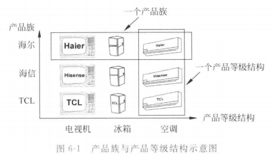
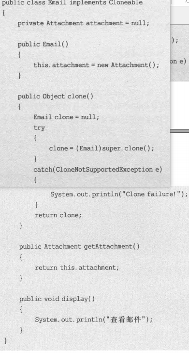
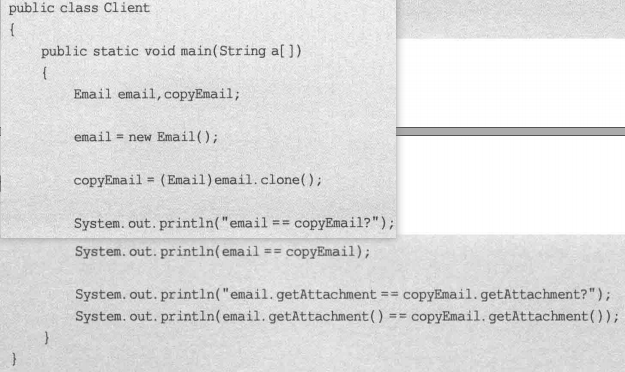
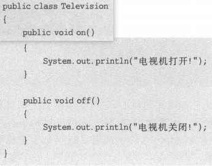
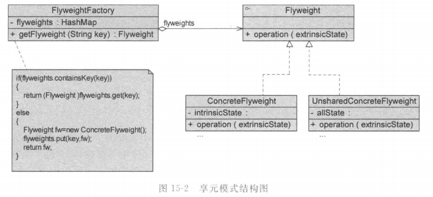
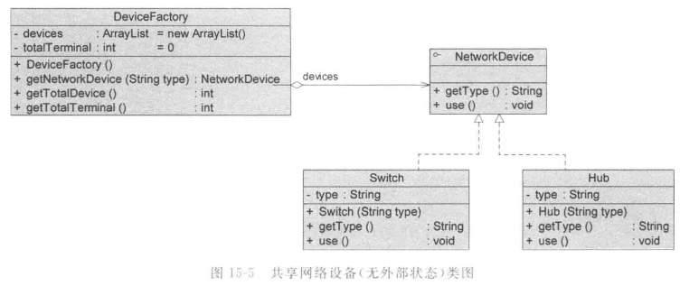

# 理论

## 基础

### 面向对象设计原则

#### 背景

可维护性 maintainability、可复用性 reuseability 是两个独立目标。

可维护同时提高可复用性面向对象设计原则的目的。

> 可维护低的软件特点：
>
> - 僵硬 rigidity。硬编码 hard coding 多，灵活性差，修改都要改源码。功能涉及模块多，系统改动大。
> - 脆弱 fragility。修改导致别的地方出错。
> - 复用率低 immobility。组成部分在同一或不同项目重复使用的能力差；甚至重用可能是简单的复制粘贴。
> - 黏度过高 viscosity。改动时不按照原始设计意图/框架比按照更容易。
>
> 好的系统设计：
>
> - 可扩展性 extensibility。新功能添加方便。
> - 灵活性 flexibility。修改时波及模块少。
> - 可插入性 pluggability。方便替换一个类为有相同接口的另一个类。
>
> 复用和可维护可能会冲突，如 A,B 依赖 C，A 需要 C 加功能，B 不允许 C 加，如果要可维护就要放弃复用 C。

重构 refactoring：不改变功能基础上，调整代码以改善质量，性能，使设计模式和架构更合理，提高扩展性维护性。

#### 概述

七大原则：

- 单一职责原则 SRP single responsibility principle
- 开闭原则 OCP open-closed principle
- 里氏代换原则 LSP Liskov substitution principle
- 依赖倒转原则 DIP dependency inversion principle
- 接口隔离原则 ISP interface segregation principle
- 合成复用原则 CRP composite reuse principle
- 迪米特法则 LoD law of demeter


> 关系：相互依赖、相互补充

#### 单一职责原则

定义：

- Every object should have a single responsibility, and that responsibility should be entirely encapsulated by the class.

  一个对象应该只包含单一的指责，并且该职责被完整地封装在一个类中。

- There should never be more than one reason for a class to change.

  就一个类而言，应该仅有一个引起它变化的原因。


最简单最难运用的原则。

类的职责越多，复用可能性越小，耦合高。职责包括：

- 数据职责。通过属性体现。
- 行为职责。通过方法体现。

将不同的变化原因(职责)封装在不同的类。如果多个职责总是同时变化，可以封装到同一个类。

例子：


#### 开闭原则

定义：

- Software entities should be open for extension, but closed for modification.

  一个软件实体应该对扩展开放，对修改关闭。

  即：模块可以在不被修改的前提下被扩展，不修改源码改变行为。

  其中，XML, properties 格式配置文件无需编译，不认为对配置文件修改时修改源代码。


最重要原则之一。

实现：抽象化设计。如接口，抽象类。具体类进行扩展，抽象类不改动。

> 可变性封装原则 EVP principle of encapsulation of variation: 找到系统可变因素并封装起来，尽量不将多种不同可变性混合在一起。
>
> 使得类个数急剧增长，增加系统复杂度。

百分百开闭很难做到，但尽可能实现。

里氏代换、依赖倒转等是开闭原则的实现方法。

例子：


#### 里氏代换原则

定义：

- If or each object o1 of type S there is an object o2 of type T such that for all programs P defined in terms of T, the behavior of P is unchanged when o1 is substituted for o2 then S is a subtype of T.

  如果对每一个类型为 S 的对象 o1，都有类型为 T 的对象 o2，使得以 T 定义的所有程序 P 在所有对象 o1 都代换 o2 时，程序 P 的行为没有变化，那么类型 S 是类型 T 的子类。

- Functions that use pointers or references to base classes must be able to use objects of derived classes without knowing it.

  所有引用基类的地方必须能透明地使用其子类的对象。

即，能用基类的地方一定能换成用子类，而不产生任何错误和异常，反过来不一定成立。

> 需要注意：
>
> 1. 子类所有方法必须父类声明，或子类必须实现父类声明的所有方法。如子类有父类没声明的方法，认为违背了里氏代换。
> 2. 父类尽量是抽象类/接口。
> 3. java 编译器会检查程序是否符合里氏代换，但只是纯语法的有限检查。

例子：


#### 依赖倒转原则

定义：

- High level modules should not depend upon low level modules, bot should depend upon abstractions. Abstractions should not depend upon details, details should depend upon abstractions.

  高层模块不应该依赖低层模块，它们都应该依赖抽象。抽象不应该依赖于细节，细节应该依赖于抽象。

- Program to an interface, not an implementation.

  要针对接口编程，不要针对实现编程。

实现面向对象设计的主要机制，抽象化的具体实现。

实现方法：抽象类使用，具体类放配置文件(细节放元数据)。

> 类的耦合关系(依赖关系)：
>
> - 零耦合关系。
> - 具体耦合关系。具体类(可实例化的类)，一个对另一个实例直接引用。
> - 抽象耦合关系。关系双方至少一个是抽象类。
>
> 依赖倒转要求客户端依赖于抽象耦合。

里氏代换原则是依赖倒转原则的基础。

依赖注入(DI dependence injection)是将一个类的对象传入另一个类，注入时尽量用父类对象，运行时子类覆盖父类。

注入方法：

1. 构造注入 constrctor injection

   

2. 设值注入 setter injection

   

3. 接口注入 interface injection

   

例子：


#### 接口隔离原则

定义：

- Clients should not be forced to depend upon interfaces that they do not use.

  客户端不应该依赖那些他不需要的接口。

- Once an interface has gotten too 'fat' it needs to be split into smaller and more specific interfaces so that any clients of the interface will only know about the methods that pertain to them.

  一旦一个接口太大，则需要将它分割成一些更细小的接口，使用该接口的客户端仅需直到与之相关的方法即可。

即使用多个专门的接口，而不是单一的总接口。每个接口承担相对独立的角色，功能不多不少。

> 接口的两种理解：
>
> - 一个类型所具有的方法特征的集合。逻辑抽象。理解为角色。
> - 语言定义的接口，有严格的定义和结构。


#### 合成复用原则

又名 CARP Composition/Aggregate Reuse Principle

定义：

- Favor composition of objects over inheritance as a reuse mechanism.

  尽量使用对象组合，而不是继承来达到复用的目的。

> 两种复用机制对比：
>
> - 继承。简单，可以覆盖父类，易于扩展。破坏封装性，基类细节对子类可见，白箱复用。基类继承的实现静态，灵活性差。有限制(如不能final类)。
> - 组合/聚合。黑箱复用。耦合度低，成员对象变化对新对象影响不大。可以动态引用，灵活。

例子：


#### 迪米特法则

定义：

- Don't talk to strangers. 不要与陌生人说话。

- Talk only to your immediate friends. 只与你的直接朋友通信。

- Each unit should have only limited knowledge about other units: only units 'closely' related to the current unit.

  每个软件单位对其他的单位都只有最少的知识，而且局限于那些与本单位密切相关的软件单位。

用于降低耦合度，类与类保持松散耦合。

> 对象的密切相关对象：
>
> - 当前对象本身
> - 参数形式传入到当前对象方法的对象
> - 当前对象的成员对象
> - 当前对象的成员对象是集合时，集合的元素
> - 当前对象所创建的对象

狭义法则：两个类若不必直接通信，不应该发生直接相互作用。如果需要调用，通过第三者转发。


根据法则，A 不允许调用 C，即不能 `a.method1().method2()`。

狭义法则缺点是增加大量的小方法散落在系统各个角落，不同模块通行效率降低，不容易协调模块。

广义法则：对对象之间的信息流量、流向、信息影响的控制，主要是对信息隐藏的控制。即：

> - 划分上，尽量创建松耦合类，使得修改对关联类影响波及不大。
> - 结构上，每个类尽量降低成员变量/函数的访问权限。
> - 设计上，只要可能就一个类设计成不变类。
> - 引用上，对其他对象的引用降到最低。

例子：


### 概述

#### 定义

> 模式是特定环境中解决问题的一种方案  A pattern is a solution to a problem in a context.
>
> GoF 四人组 Erich Gamma, Richard Helm, Ralph Johnson, John Vlissides

设计模式 design pattern 是一套被反复利用、多数人知晓的、经过分类编目的、代码设计经验的总结。

> 目的：可重用代码、更容易被理解、提高可靠性。

> 软件模式有四部分构成：问题描述、前提条件(环境/约束条件)、解法、效果。
>
> 

> - 模式名称 pattern name
> - 问题 problem。设计中存在的问题和原因，先决条件等。
> - 解决方案 solution。模式的组成部分，相互关系，职责，协作方式。类图+核心代码。
> - 效果 consequences。优缺点分析。
> - 别名、分类、实用性、角色、实例、应用、扩展。


> 模式不孤立存在，可以相互组合多个模式设计同一个系统
>
> 设计模式的优点：
>
> - 便于沟通交流，降低理解难度。
> - 重用成功的设计更容易，避开不可重用的方案。
> - 设计更灵活，易于修改。
> - 提高开发效率和软件质量，节约成本。
> - 助于理解面向对象思想，提高设计水平。

#### 分类

GoF 有 23 种设计模式。

根据目的，分为：

- 创建型 creational 主要用于创建对象
  - > 简单工厂模式 Simple Factory Pattern / 静态工厂方法 Static Factory Method
  - 工厂方法模式 factory method / 虚拟构造器模式 virtual constructor / 多态工厂模式 polymorphic factory
  - 抽象工厂模式 abstract factory / Kit 模式
  - 建造者模式 builder / 生成器模式
  - 原型模式 prototype
  - 单例模式 singleton / 单件模式 / 单态模式
- 结构型模式 structural 处理类或对象的组合
  - 适配器模式 adapter / 包装器 Wrapper
  - 桥接模式 bridge / 柄体模式 Handle and Body / 接口模式 Interface
  - 组合模式 composite / 部分-整体模式 Part-Whole
  - 装饰模式/油漆工模式 decorator / 包装器 Wrapper
  - 外观模式 facade / 门面模式
  - 享元模式 flyweight / 轻量级模式
  - 代理模式 proxy
- 行为型模式 behavioral 描述对类或对象怎样交互和怎样分配职责
  - 职责链模式 chain of responsibility
  - 命令模式 command
  - 解释器模式 interpreter
  - 迭代器模式 iterator
  - 中介者模式 mediator
  - 备忘录模式 memento
  - 观察者模式 observer
  - 状态模式 state
  - 策略模式 strategy
  - 模板方法模式 template method
  - 访问者模式 visitor

根据范围，分为：

- 类模式。处理类和子类的关系。编译时确定，静态的。
- 对象模式。对象间的关系，动态。根据合成复用原则，这种模式更多。


> 简单工厂模式也是类创建型模式


#### 创建型模式

关注创建过程，将对象的创建和使用分离，使用对象时无需知道对象的创建细节。相同的创建过程可以多次复用，修改二者中的一个对另一个造成很小影响。

创建型模式简化了创建复杂对象的过程，类比想要获得苹果，手动创建需要自己种，使用创建型模式就像是直接去买。


#### 结构型模式

描述如何将类或对象结合在一起形成更大的结构。

可以描述两种东西：类与对象，因此分为类结构型模式和对象结构型模式。

- 类结构型模式：类的组合，一般只存在继承、实现关系。
- 对象结构型模式：类与对象的组合，关联关系让一个类定义另一个类的实例对象。尽量用关联代替继承，以满足合成复用原则。

七种模式：ABCDFFP


#### 行为型模式

## 创建型模式

### 简单工厂模式

#### 概念

简单工厂模式/静态工厂模式。类创建型模式。

不属于 GoF。

创建一些来自于相同父类的类的实例，专门定义一个类来创建，传入不同参数获得不同对象。


- `Factory` 工厂角色 工厂类，核心
- `Product` 抽象产品角色
- `ConcreteProduct` 具体产品角色


扩展：工厂类可以由抽象产品角色扮演，抽象产品类写静态工厂方法。


有些情况下，工厂、抽象产品、具体产品可以合并，既是工厂，又通过静态工厂方法创建自己的实例。

#### 评价

优点：

1. 责任分割，客户端不用实现创建产品对象，只消费产品。
2. 无需知道具体产品类名，只需要知道参数，减少使用者记忆量。
3. 引入配置文件，在不修改客户端代码时可以更换和增加新的产品类，提高灵活性。

缺点：

1. 工厂类若不能正常工作，整个系统受到影响。(耦合度高)

2. 增加类的个数，增加复杂度和理解难度。

3. 扩展困难，新产品需要修改工厂逻辑。产品多逻辑复杂，不利于扩展维护。违反了开闭原则。

4. 静态工厂方法，工厂角色无法继承。

   即 `Super obj = Sub(); obj.f()` 调用的一定是父类的静态方法 `f`。

适用环境：

1. 产品类别少。
2. 客户端只需要知道工厂类参数，不需要关心如何创建对象甚至类名。

#### 例子

##### 静态

支付方法选择

抽象支付方法：


具体支付方法：


工厂：


##### XML


XML 代码参考：(工厂模式)

```java
package util;

import java.io.File;

import javax.xml.parsers.DocumentBuilder;
import javax.xml.parsers.DocumentBuilderFactory;

import org.w3c.dom.Document;
import org.w3c.dom.Node;
import org.w3c.dom.NodeList;

public class XMLUtil {
    /**
     * 
     * @param path URL of a XML file
     * @return the Class of the XML described
     * @exampleXML like below
     * <?xml version="1.0"?>
       <config>
           <className>lab1_2.FileLogFactory</className>
        </config>
     * it gets FileLogFactory
     */
    public static Object getBean(String path) {
        try {
            DocumentBuilderFactory dFactory = DocumentBuilderFactory.newInstance();
            DocumentBuilder builder = dFactory.newDocumentBuilder();
            Document doc = builder.parse(new File(path));
            NodeList nl = doc.getElementsByTagName("className");
            Node classNode = nl.item(0).getFirstChild();
            String cName = classNode.getNodeValue();
            
            @SuppressWarnings("rawtypes")
            Class c = Class.forName(cName);
            Object obj = c.newInstance();
            return obj;
        } catch (Exception e) {
            e.printStackTrace();
            return null;
        }
    }
}
```

下面文件放在 `src` 的 `lab1_2` 包内。

```xml
<?xml version="1.0"?>
<config>
    <className>lab1_2.DatabaseLogFactory</className>
</config>
```

调用：

```java
package lab1_2;

import util.XMLUtil;

//客户端测试类
class lab1_2 {
    public static void main(String args[]) {
        LogFactory factory;
        Log log;
        factory = (LogFactory) XMLUtil.getBean("src/lab1_2/lab1_2.xml");
        log = factory.createLog();
        log.writeLog();
    }
}
```

##### 基本2


##### JDK

`java.text.DateFormat`，格式化本地日期或时间，对多种语言和格式很有用。

其 `getDateInstance()` 是静态工厂方法：


密钥生成的 `javax.crypto.KeyGenerator` 和 `java.security.KeyPairGenerator` 类生成对称、非对称密钥，都有 `getInstance()` 静态工厂方法，根据参数返回密钥生成器：


加密解密的密码器的创建也是简单工厂模式：


该例子工厂、抽象产品、具体产品合并。

### 工厂方法模式

#### 概念

定义：

- Define an interface for creating an object, but let subclasses decide which class to instantiate. Factory Method lets a class defer instantiation to subclasses.

  工厂父类定义创建产品对象的公共接口，工厂子类负责生成具体产品对象，实例化延迟到子类。


结构：


- `Product` 抽象产品
- `ConcreteProduct` 具体产品
- `Factory` 抽象工厂
- `Concretefactory` 具体工厂

> 如：
>
> 


扩展：

1. 抽象工厂角色可以定义多个工厂方法
2. 产品对象可以重复使用。工厂对象将创建过的产品保存到集合里，根据客户对产品的请求查询，如果有直接返回，没有创建一个并加入集合。即享元模式的设计思想。
3. 如果只返回一个具体产品对象，就不是工厂方法模式了。如果只有一个具体工厂类，可以退化成简单工厂模式。

#### 评价

优点：

1. 隐藏哪个具体产品类被实例化的细节，用户只需要关心所需产品对应的工厂，无需关心细节和具体产品类名。
2. 多态性设计，所有具体工厂同一抽象父类。
3. 增加新产品不需要修改接口、客户端、其他工厂和产品，符合开闭原则。

缺点：

1. 每次加产品，要成对添加类的个数，复杂度多，编译运行的类多，额外开销。
2. 抽象层理解难度大，DOM，反射实现难度大。

适用环境：

1. 客户端不需要知道具体类名，只需要知道创建产品的工厂类。
2. 类通过子类指定创建哪个对象，利用多态和里氏代换原则，容易扩展。
3. 使用时不需要知道哪个工厂子类创建，需要再动态指定。类名存储在配置文件/数据库。


#### 例子

##### 基本

支付方法是产品。


##### 基本2


##### JDK

`java.util.Collection` 接口定义的工厂方法 `iterator()` 返回的 `Iterator`。


消息服务 JMS(Java Messaging Service) 让 java 能通过支持 JSM 标准的 MOM(message oriented middleware)创建和交换消息。JSM 实现时使用工厂方法模式，创建 Connection 连接对象，Session 会话对象，Sender 消息发送者对象等：


JDBC 使用工厂方法模式创建连接对象 Connection，语句对象 Statement 和结果集对象 ResultSet：


### 抽象工厂模式

#### 概念

定义：

- Provide an interface for creating families of related or dependent objects without specifying their concrete classes.

  提供一个创建一系列相关或相互依赖的对象的接口，而无需指定它们具体的类。

抽象工厂模式是工厂模式里最为抽象、最具一般性的形态。面对多个产品等级结构。

产品等级结构：产品的继承结构。

产品族：同一个工厂生产的，位于不同产品等级结构的一组产品。




- `AbstractFactory` 抽象工厂
- `ConcreteFactory` 具体工厂
- `AbstractProduct` 抽象产品
- `ConcreteProduct` 具体产品

> 若每个具体工厂类只创建一个产品对象，退化为工厂方法模式。如果抽象工厂、具体工厂合并，提供同一工厂，静态方法，退化为简单工厂模式。

#### 评价

优点：

1. 隔离了具体类生成，客户不需要知道什么被创建，更换具体工厂相对容易。改变具体工厂实例就能改变软件系统行为，高内聚低耦合。
2. 产品族一起工作，始终只使用同一个产品族的对象。
3. 增加新的具体工厂、产品族方便，无需修改已有系统，符合开闭原则。

缺点：

1. 添加产品对象时(产品族加种类)，难以扩建抽象工厂。

适用：

1. 系统不依赖产品类实例如何被创建、组合、表达的细节。创建和使用解耦。
2. 多于一个产品族，每次只使用一个产品族，配置文件改变产品族。方便增加新产品族。
3. 属于同一个产品组的产品一起使用。
4. 系统提供产品类的库，所有产品以同样接口出现，客户端不依赖具体实现。

> 开闭原则的倾斜性：
>
> - 增加产品族，支持开闭原则，已有代码无需修改。
> - 增加新的产品等级结构，需要修改抽象工厂类，所有工厂类的生产新产品方法，不能很好支持开闭原则。


#### 例子

##### 基本


> 
>
> 

> 
>
> 

> 


##### JDK

AWT(抽象窗口工具包)使用抽象工厂模式，使用 look and feel 机制支持不同操作系统。

> 软件系统更换界面主题，按钮、背景色等一起发生改变，可以使用抽象工厂模式。


### 建造者模式

#### 概念

定义：

- Separate the construction of a complex object from its representation so that the same construction process can create different representations.

  将一个复杂对象的构建与它的表示分离，使得同样的构建过程可以创建不同的表示。

需求：复杂对象拥有一系列成员属性，可能存在限制条件(如未赋值对象不能使用；必须按照某个顺序赋值)，成员的组合过程复杂，被外部化到一个建造者对象里，返回建造完毕的完整对象，无需关心包含的属性和组装方式。


- `Builder` 抽象建造者
- `ConcreteBuilder` 具体建造类
- `Product` 产品角色
- `Director` 指挥者/导演类。客户端与之交互。决定建造顺序，调用多个 `Builder` 方法。

扩展：

1. 若只有一个具体建造者，可以省略抽象建造者。
2. 省略抽象建造者时，可以让具体建造者同时当指挥者。

#### 评价

优点：

1. 客户端不必知道产品内部组成的细节，将产品本身与产品的创建过程解耦，使得相同的创建过程可以创建不同的产品角色。
2. 具体建造者相对独立，方便替换/增加。
3. 精细控制产品创建过程，将复杂产品创建步骤分解在不同方法中，使得创建过程更加清晰，方便使用程序控制创建过程。
4. 增加具体建造者不需要改类库，针对抽象编程，扩展方便，符合开闭原则。

缺点：

1. 建造者创建的产品需要有较多共同点，组成成分相似。差异大不适合用。
2. 产品内部若变化复杂，需要定义很多具体建造者类。

适用：

1. 产品有复杂内部结构，多个成员属性。
2. 产品属性相互依赖，指定生成顺序。
3. 创建过程独立于创建该对象的类，在指挥者类封装。
4. 隔离复杂对象的创建和使用，同一创建过程得到不同的产品。

> 如：地图组成部分，人物组成部分。

#### 例子

##### 基本

> 
>
> 
>
> 
>
> 


##### JDK

`JavaMail` 是一组 Java SE 扩展 API 类库，`Message` 和 `MimeMessage` 等都是退化建造者模式。


自行创建建造者：


### 原型模式

#### 概念

定义：

- Specify the kind off objects to create using a prototypical instance, and create new objects by copying this prototype.

  用原型实例指定创建对象的种类，并且通过复制这些原型创建新的对象。


- `Prototype` 抽象原型类
- `ConcretePrototype` 具体原型类
- `Client` 客户类

两种形式：

- 浅克隆：普通成员变量值相同，对其他对象的引用仍指向原来的对象

  

- 深克隆：引用其他对象的变量指向被复制过的新对象

扩展：原型管理器。对有限个原型具体类，用哈希表存起来。


扩展：对相似对象(属性值大部分相同，小部分不同)，可以先克隆，再修改不同值。

#### 评价

优点：

1. 创建新对象实例复杂时，简化创建过程，提高创建效率。
2. 动态增加减少产品类，针对抽象编程，具体原型类写配置文件。
3. 简化创建结构，无需专门工厂类。
4. 深克隆保存对象状态，可以需要时使用/恢复。

缺点：

1. 对已有的类必须修改源代码，违背开闭原则。
2. 深克隆代码复杂。

适用：

1. 创建新对象成本大(时间，CPU，网络)可以通过复制。
2. 保存对象状态，状态变化很小或内存不大，可以原型+备忘录。很大则状态模式。
3. 避免分层次工厂类创建分层次对象，类的实例对象只有很少组合状态。


#### 例子

##### 基本

`Object` 提供 `clone` 方法。实现克隆的类实现 `Cloneable` 接口。否则调用 `clone` 方法就报错 `CloneNotSupportedException`。


满足：

1. 对任何对象 `x`，有 `x.clone()!=x`
2. 对任何对象 `x`，有 `x.clone().getClass()==x.getClass()`
3. 若 `equals()` 定义恰当，则 `x.clone().equals(x)` 成立

具体实现浅克隆办法：

1. 覆盖基类 `public clone()`。
2. 派生类 `clone()` 调用 `super.clone()`
3. 实现 `Cloneable` 接口

实现深克隆，通过序列化等方法。

序列化 `Serialization` 将对象写到流。写到流的对象是原对象的拷贝。再读出来。必须实现 `Serialization` 接口。

这两个接口都是空接口，又称标识接口，不定义方法，作用是告诉 JRE 这些接口的实现类是否具有某个功能。

##### 浅克隆







> false, true

##### 深克隆


> false ,false


##### JDK

> ctrl+c ctrl+v 的实现

`Struts2` 是 Java EE 框架之一，为了线程安全性，`Action` 对象使用原型模式，保证定义的变量无需加锁实现同步。

主流 Java EE 框架 Spring 里，原型模式创建新的 bean 实例，修改时对原有实例对象不造成任何影响。


##### 原型管理器


> false


##### 相似对象

某些属性值异同，复制后修改


### 单例模式

#### 概念

定义：

- Ensure a class has only one instance and provide a global point of access to it.

  确保某一个类只有一个实例，而且自行实例化并向整个系统提供这个实例。

全局变量可以保证随时被访问，但不能防止实例化多个对象。更好地解决办法是类保存唯一实例。

单例类：


要点：

- private 构造方法，使得外部不可实例化。使用静态方法提供 `getInstance`

类型：

1. 饿汉式单例类：

   

   定义时实例化，加载时已创建。

   

   评价：资源利用率差，但速度和反应时间比懒汉好。

2. 懒汉式单例类

   

   第一次被引用时实例化，加载时不实例化。

   

   评价：多线程处理麻烦，初始化耗时大，需要同步化机制。

   


#### 评价

优点：

1. 提供对唯一实例的受控访问，提供了共享的概念。
2. 只存在一个对象，节约系统资源。对频繁创建和销毁的对象提高性能。
3. 允许可变数目的实例，扩展，获得指定个数的对象实例。

缺点：

1. 没有抽象层，扩展困难。
2. 职责重，一定程度违背单一职责原则，充当工厂角色提供工厂方法，充当产品角色提供业务方法，创建+功能融合在一起。
3. 滥用可能有问题。如数据库连接池对象若单例，共享过多会连接池溢出。且 GC 导致对象长时间不用被回收，下次利用重新实例化，丢失对象状态。

适用：

1. 只需要一个实例对象，或资源消耗太大而只允许一个。
2. 单个实例只允许使用一个公共访问点，不能其他途径访问该实例。

> 如自动编号的主键的表，只能有一个地方分配下一个主键编号，否则主键重复服，则单例。

如果一个类几个实例可以共存，要改成多例模式。

注意问题：

1. 不要用单例模式存取全局变量。全局变量放类的静态成员里。
2. 数据库连接不能单例。一个系统可能与数据库多个连接，而且有连接池时应尽可能释放连接。静态成员类存储单例实例会导致资源无法及时释放。

#### 例子

##### 朴素懒汉


> true


##### JDK

`java.lang.Runtime` 是唯一的：


Java EE 从 Spring 获取某个类的实例，则 bean 工厂这个 bean 实例只有一个：


##### 多线程懒汉

[参考](https://aisakaaoi.top/81a0eabe.html)

###### 同步锁

优点：解决了线程不安全的问题。
缺点：效率有点低，每次调用实例都要判断同步锁。

###### 双重检验锁

> 为了减少同步锁判断，所以先判空

优点：在并发量不多，安全性不高的情况下或许能很完美运行单例模式
缺点：不同平台编译过程中可能会存在严重安全隐患。（用volatile或用Atomic可解决）

```java
public class SingletonPattern {
    public static void main(String[] args) {

    }
}

class Singleton{
    private volatile static Singleton singleton;
    private Singleton() {}

    
    private static Singleton getlnstance() {
        if (singleton == null) {
            synchronized (Singleton.class) {
                if (singleton == null) {
                    singleton = new Singleton();
                }
            }
        }
        return singleton;
    }
}
```

###### 内部类

优点：延迟加载，线程安全（java中class加载时互斥的），也减少了内存消耗。

内部类是一种很好的实现方式，目前公司内的项目大多都使用这种方式。

```java
public class SingletonInner {

    private SingletonInner() {}

    /**
    * 内部类实现单例模式
    * 延迟加载，减少内存开销
    */
    private static class SingletonHolder {
        private static SingletonInner instance = new SingletonInner();
    }

    public static SingletonInner getInstance() {
        return SingletonHolder.instance;
    }
}
```

###### 枚举类

```java
public enum SingletonEnum {
    /**
    * 1.从Java1.5开始支持;
    * 2.无偿提供序列化机制;
    * 3.绝对防止多次实例化，即使在面对复杂的序列化或者反射攻击的时候;
    */

    instance;

    private String others;

    SingletonEnum() {}

    public void method() {
        System.out.println("SingletonEnum");
    }

    public String getOthers() {
        return others;
    }

    public void setOthers(String others) {
        this.others = others;
    }
}
```

## 结构型模式

### 适配器模式

#### 概念

定义：

- Convert the interface of a class into another interface clients expect. Adapter lets classes work together that couldn't otherwise because of incompatible interfaces.

  将一个接口转换成客户希望的另一个接口，适配器模式使接口不兼容的那些类可以一起工作。

类适配器模式：


对象适配器模式：


- `Target` 目标抽象类。要用的特定领域抽象类/接口/具体类。(java只能是接口)
- `Adapter` 适配器类。调用另一个接口，作为转换器。核心。实现 `Target` 接口并继承 `Adaptee`，对 `Adaptee` 和 `Target` 进行适配。
- `Adaptee` 适配者类，被适配的角色，一个已存在的接口，需要适配。一般是具体类，包含写好的希望使用的业务方法。
- `Client` 客户类。

扩展：

- 缺省适配器模式 Default Adapter Pattern / 单接口适配器模式：不需要全部实现接口提供的方法时，设计抽象类实现该接口，每个方法提供默认实现空方法。有选择地覆盖父类某些方法实现需求


- 双向适配器。适配器同时包含对目标类和适配者类的引用。适配者可以通过它调用目标类方法，目标类也可以通过它调用适配者类方法。


#### 评价

优点：

1. 目标类和适配者类解耦，用适配器类重用适配器类，无需修改原有代码
2. 增加类透明性和复用性，将具体的实现封装在适配者类中。
3. 灵活性和扩展性好，用配置文件方便更换适配器，符合开闭原则。

类适配器：

优点：

- 适配器类是适配者类子类，可以置换适配者方法，灵活性更强

缺点：

- 不能多重继承的类最多适配一个，且目标抽象类只能是接口，局限性大，不能将适配者类和它的子类都适配到目标接口

对象适配器：

优点：

- 多个不同适配者适配到同一个目标，可以将适配者类及其子类都适配到目标接口

缺点：

- 置换适配者类不容易，如果要换掉适配者的若干方法，先做一个适配者子类，再将其当成真正适配者进行适配，复杂


适用：

1. 使用现成的类，但接口不符合要求
2. 建立可重复使用的类，用于与一些彼此没有太大关联的类，包括将来引进的类一起工作

#### 例子

##### 基本

类适配器：


对象适配器：


##### 类适配器


符合依赖倒转原则和开闭原则。


##### 对象适配器


适配者：


适配器：


更换：


然后修改 xml。


##### JDK

JDBC 客户端通用接口，每一个具体数据库引擎的 JDBC 驱动软件都是一个介于 JDBC 接口和数据库引擎接口之间的适配器软件

Spring AOP 对 `BeforeAdvice`, `AfterAdvice`, `ThrowsAdvice` 三种通知类型借助适配器实现，允许用户向框架加入自己想要支持的任何通知类型，是 `Advice` 子类型，其中 `AdvisorAdapter` 是适配器接口，将 `Advisor` 适配成 `MethodInterceptor`


JDK 也有 `InputStreamAdapter`，包装 `ImageInputStream` 接口及其子类：


##### 缺省适配者


如 `java.awt.event` 的各种事件，如 `KeyAdapter`。直接实现接口需要实现全部办法，但继承抽象类只需要实现部分方法即可。


### 桥接模式

#### 概念

定义：

- Decouple an abstraction from its implementation so that the two can vary independently.

  将抽象部分与它的实现部分分离，使它们都可以独立地变化。

软件系统中，有些类由于本身固有特性，使得具有两个或多个变化维度/变化原因。


- `Abstaction` 抽象类
- `RefinedAbstraction` 扩充抽象类。通常是具体类。
- `Implementor` 实现类接口。比抽象类简单，只提供基本操作。
- `ConcreteImplementor`

> 关键概念：
>
> - 抽象化。忽略一些信息，把不同的实体当作同样的实体对待。将对象的共同性质抽取出来形成类的过程。
> - 实现化。针对抽象化给出的具体实现。与上面互逆概念。
> - 脱耦。将抽象化和实现化之间的耦合解脱开，强关联改成弱关联，继承改为关联关系(组合/聚合)，使得两者可以相对独立地变化。

扩展：与适配器模式联合使用。

#### 评价

优点：

1. 分离抽象接口及其实现部分，使用对象间的关联关系接口抽象和实现之间固有的绑定关系，使抽象和实现可以沿着各自的维度变化，不再在同一个集成层次中。子类化它们，让他们各自具有自己的子类，以便于任意组合子类。
2. 多继承违背了类的单一职责原则，复用性较差，类个数庞大。桥接模式比多继承方案更好。
3. 提高系统可扩展性，在两个变化维度中任意扩展一个，都不需修改原有系统。
4. 细节对客户透明，隐藏实现细节。抽象层通过聚合关联完成封装与对象组合。

缺点：

1. 增加系统理解，设计难度。要求针对抽象设计编程。
2. 要求正确识别出系统两个独立变化的维度。

适用：

1. 在构件抽象化角色和具体化角色之间增加更多灵活性，避免两个层次间静态继承。
2. 抽象化角色和实现化角色可以继承方式独立扩展互不影响。需要动态耦合二者。
3. 一个类存在两个独立变化的维度，且都需要扩展。
4. 抽象化角色和具体化角色需要独立变化，独立管理。
5. 不希望使用继承/因为多层次继承导致类的个数急剧增加。

#### 例子

##### 基本

一个维度的实现类接口：


另一个维度的抽象类：


细化抽象类：


模拟毛笔：


> 其他颜色同理，不再赘述。


> 其他尺寸同理，不再赘述。

> XML：
>
> 


无论哪个维度的扩展，对原有代码(类库，客户端)都无需修改，只需要新增代码和改配置文件。

同理，还有：


##### JDK

虚拟机实现了平台无关性，这里独立变化的维度一个是应用程序，一个是运行平台，JVM本身的设计使用了桥接模式。


Java 总是带有所在操作系统的视感(`LockAndFeel`)，即不同操作系统看到组件的外观不一样。通过 `Peer` 架构做到，使用了桥接模式。AWT 库每个 `Component` 子类都有一个 `ComponentPeer` 子类与之匹配(前者是抽象角色，后者实现角色)。这两个等级结构通过 `Toolkit` 对象通信。

JDBC 驱动程序里驱动程序的应用系统是抽象角色，使用的数据库是实现角色。

##### 搭配适配器

如报表处理，将报表显示与数据采集分开，使用桥接模式。其中数据采集本身使用适配者模式。


### 组合模式

#### 概念

定义：

- Compose objects into tree structures to represent part-whole hierarchies. Composite lets clients treat individual objects and compositions o objects uniformly.

  组合多个对象形成树形结构以表示“部分-整体”的结构层次。组合模式对单个对象(即叶子对象)和组合对象(即容器对象)的使用具有一致性。

组合模式描述了如何将容器对象和叶子对象进行递归组合，使得用户在使用时无需对它们进行区分，可以一致地对待容器对象和叶子对象。


- `Component` 抽象构件。接口/抽象类，共有行为声明和实现。
- `Leaf` 叶子构件
- `Composite` 容器构件
- `Client` 客户类

组合模式的叶子节点和容器节点可以进一步抽象：


根据抽象构建类的定义形式，划分为：

1. 透明组合模式。`Component` 声明了管理成员对象的办法，如 `add,remove,getChild`。

   好处：确保所有构件接口相同，客户端同等对待。

   缺点：不够安全，叶子节点调用不支持的方法时可能会出错。

   

2. 安全组合模式。`Component` 不声明管理成员对象的方法，`Composite` 才声明。

   缺点：不够透明，叶子和容器方法不同，不能完全针对抽象编程且一致使用。

   但实际使用频率更高。

   


#### 评价

优点：

1. 清楚定义分层次的复杂对象，表示对象的全部或部分层次，使得增加新构建容易，客户忽略层次差异。结构动态。
2. 客户调用简单，一致地使用，不必关心处理的是单个对象还是组合结构。
3. 定义了类层次结构，形成复杂树形结构。
4. 更容易在组合体加入对象构件，不必因此更改原有代码。

缺点：

1. 设计抽象，若对象业务规则复杂，实现难，不是所有方法都与叶子对象子类有关联。
2. 难对构件类型限制，不能依赖类型系统增加约束，只能运行时检查。

适用：

1. 需要表示一个对象的整体或部分层次，忽略整体与部分的差异，一致地对待。
2. 忽略不同对象层次的变化，针对抽象构件编程。
3. 结构动态，复杂程度不一样，需要一致地处理。

#### 例子

##### 透明

> 
>
> 
>
> 


##### 安全


> `Banana` 和 `Pear` 同理，不再赘述。


##### JDK

XML 文档解析工具。

操作系统。

JDK 的 AWT/Swing，安全组合模式，其中 `Component` 是抽象构件，`Checkbox`, `Button`, `TextComponent` 是叶子构件，`Container` 是容器构件。


其中 `TextComponent` 又有 `TextField`, `TextArea` 等子类，`Container` 又有 `Panel`, `Window` 等子类。


### 装饰模式

#### 概念

定义：

- Attach additional responsibilities to an object dynamically. Decorators provide a flexible alternative to subclassing for extending functionality.

  动态地给一个对象增加一些额外的职责。

在不改变一个对象本身的基础上给对象添加额外的新行为。


两种方式：

1. 继承机制。静态的，用户不能控制增加行为的方式和时机。
2. 关联机制。一个类的对象嵌入另一个新对象(装饰类Decorator)，装饰类决定是否调用嵌入对象的行为并扩展新的行为。装饰类和被装饰类实现相同的接口。可以递归装饰。客户端透明。


- `Component` 抽象构件。
- `ConcreteComponent` 被装饰类。
- `Decorator` 抽象装饰类。
- `ConcreteDecorator` 具体装饰类。

两种装饰者模式：

1. 透明装饰模式。统一用 `operation` 方法，客户端用抽象类型定义具体构件对象、具体装饰模式。还可以嵌套。

   

   而不是：

   

2. 半透明装饰模式。具体装饰类用新的接口方法提供给客户端使用，客户端不能用抽象构件，也不能多重装饰。但设计相对简单，使用方便。

具体构件类尽量轻，不要放太多逻辑和状态。

简化：如果只有一个具体构件类，可以抽象装饰类作具体构件类。


建议：

- 通常只需要一个外观类且设计成单例类。但是一个系统可以有多个外观类。
- 不要通过外观类为子系统添加新的行为。

可以使用抽象外观类，来满足开闭原则：


#### 评价

优点：

1. 比继承灵活性更高。
2. 动态扩展对象功能，配置文件选装饰器。
3. 不同的具体装饰类及其排列组合创造出不同行为。
4. 具体构件类、具体装饰类独立变化，丰富开闭原则。

缺点：

1. 产生很多小对象，连接方式不同，很多具体装饰类。增加系统复杂度，学习理解难度。
2. 易于出错，难排错。

适用：

1. 不影响其他对象下，动态透明地给单个对象添加职责。
2. 动态增加功能，可以动态被撤销。
3. 不能继承来扩充，或继承不利于扩展维护时。如：大量独立的扩展，产生大量子类；final类无法继承。

#### 例子

##### 透明

> 
>
> 


> 


> 

则 `ac.encrypt` 的 `super` 调用了 `cc.encrypt`，其中 `cc.encrypt` 先调用它 super 的 `sc` 然后调用它自己的，最后调用 `ac` 自己的。

##### 半透明


##### JDK

`jawax.swing` 的 `JList` 不支持滚动，如果要创建滚动的列表：


`JList` 是被装饰类，`JScrollPane` 是装饰类。

Java IO 的 `InputStream` 和 `OutputStream` 是父类，有一系列子类：


透明装饰模式。


且 `Reader`, `Writer` 等都用到了装饰模式。

### 外观模式

#### 概念

定义：

- Provide a unified interface to a set of interfaces in a subsystem. Facade defines a higher-level interface that makes the subsystem easier to use.

  为子系统中的一组接口提供一个统一的入口。定义了一个高层接口，而这个接口使得子系统更加容易使用。


- `Facade` 外观角色
- `Subsystem` 子系统角色

单一职责原则：一个系统划分为多个子系统有利于降低系统复杂性。也是迪米特法则的体现，降低客户类和子系统类的耦合度。但不符合开闭原则。

常见的应用是首页，导航，菜单，工具栏。

#### 评价

优点：

1. 对客户屏蔽子系统组件，减少客户处理对象数目，子系统使用更加容易。
2. 子系统与客户松耦合，组件变化不影响客户类。
3. 降低编译依赖性，简化平台移植过程，子系统修改不影响其他子系统，子系统内部变化不影响外观对象。
4. 只提供一个访问子系统统一入口，不影响用户直接使用子系统类。

缺点：

1. 不能很好限制客户使用子系统类，如果限制太多可变性和灵活性不够
2. 添加新的子系统要修改外观类/客户端源代码，违背开闭原则

适用：

1. 复杂子系统提供简单结构满足大多数需求，且用户也可以越过外观直接访问子系统
2. 客户程序与多个子系统存在很大依赖性，需要解耦，提高独立性，可移植性
3. 层次化系统，定义每一层入口，层间不直接联系

#### 例子

##### 基本

> 





> 


##### JDK

JDBC 里，`Connection` 对象，`Statement` 对象(或子类 `PreparedStatement`)和结果集 `ResultSet` 对象用外观简化：


Session 外观模式是 Java EE 的应用，`SessionBean` 是外观，提供粗粒度服务层，如图所示：


### 享元模式

#### 概念

定义：

- Use sharing to support large numbers of fine-grained objects efficiently.

  运用共享技术有效地支持大量细粒度对象的复用。

享元类设计：

- 有些对象不完全相同，只是相似。需要找到共同点，封装共同的内容，不同的内容通过外部应用程序设置。
- 内部状态 intrinsic state: 可以共享的相同内容
- 外部状态 extrinsic state: 需要外部环境设置的，不能共享的内容
- 享元池 flyweight pool: 具有相同内部状态的享元对象



- `Flyweight` 抽象享元类。有方法提供内部状态，设置外部状态。
- `ConcreteFlyweight` 具体享元类。可以结合单例模式以保证唯一对象。
- `UnsharedConcreteFlyweight` 非共享具体享元类。可以将具体享元对象作为子节点。
- `FlyweightFactory` 享元工厂类。可以使用简单工厂类，静态工厂方法，并使用单例模式。


扩展：

1. 单纯享元模式。所有享元对象都可以共享，不存在非共享具体享元类。

   

2. 复合享元模式：单纯享元模式+组合模式。

   

   使得复合享元类包含的每个单纯享元类具有相同外部状态，内部状态可以不同。

#### 评价

优点：

1. 极大减少内存中对象数量，使得相同/相似对象内存只保存一份。
2. 外部状态相对独立，不影响内部状态，可以在不同环境被共享。

缺点：

1. 系统更加复杂，需要分离内部外部状态，逻辑复杂化。
2. 状态外部化，读取外部状态使得运行时间变长。

适用：

1. 系统有大量相同/相似对象，造成内存大量浪费。
2. 大部分状态可以外部化并传入对象。
3. 多次重复使用享元对象。

> 如：相同图片在多个不同位置进行显示

#### 例子

##### 基础

> 
>
> 


##### 无外部状态





##### 外部状态


##### JDK

String 的享元模式：


> 输出 TTF

其中 str3 编译优化直接合并了。但 str4 没有。
