# 理论

## 基础

### 面向对象设计原则

#### 背景

可维护性 maintainability、可复用性 reuseability 是两个独立目标。

可维护同时提高可复用性面向对象设计原则的目的。

> 可维护低的软件特点：
>
> - 僵硬 rigidity。硬编码 hard coding 多，灵活性差，修改都要改源码。功能涉及模块多，系统改动大。
> - 脆弱 fragility。修改导致别的地方出错。
> - 复用率低 immobility。组成部分在同一或不同项目重复使用的能力差；甚至重用可能是简单的复制粘贴。
> - 黏度过高 viscosity。改动时不按照原始设计意图/框架比按照更容易。
>
> 好的系统设计：
>
> - 可扩展性 extensibility。新功能添加方便。
> - 灵活性 flexibility。修改时波及模块少。
> - 可插入性 pluggability。方便替换一个类为有相同接口的另一个类。
>
> 复用和可维护可能会冲突，如 A,B 依赖 C，A 需要 C 加功能，B 不允许 C 加，如果要可维护就要放弃复用 C。

重构 refactoring：不改变功能基础上，调整代码以改善质量，性能，使设计模式和架构更合理，提高扩展性维护性。

#### 概述

七大原则：

- 单一职责原则 SRP single responsibility principle
- 开闭原则 OCP open-closed principle
- 里氏代换原则 LSP Liskov substitution principle
- 依赖倒转原则 DIP dependency inversion principle
- 接口隔离原则 ISP interface segregation principle
- 合成复用原则 CRP composite reuse principle
- 迪米特法则 LoD law of demeter


> 关系：相互依赖、相互补充

#### 单一职责原则

定义：

- Every object should have a single responsibility, and that responsibility should be entirely encapsulated by the class.

  一个对象应该只包含单一的指责，并且该职责被完整地封装在一个类中。

- There should never be more than one reason for a class to change.

  就一个类而言，应该仅有一个引起它变化的原因。


最简单最难运用的原则。

类的职责越多，复用可能性越小，耦合高。职责包括：

- 数据职责。通过属性体现。
- 行为职责。通过方法体现。

将不同的变化原因(职责)封装在不同的类。如果多个职责总是同时变化，可以封装到同一个类。

例子：


#### 开闭原则

定义：

- Software entities should be open for extension, but closed for modification.

  一个软件实体应该对扩展开放，对修改关闭。

  即：模块可以在不被修改的前提下被扩展，不修改源码改变行为。

  其中，XML, properties 格式配置文件无需编译，不认为对配置文件修改时修改源代码。


最重要原则之一。

实现：抽象化设计。如接口，抽象类。具体类进行扩展，抽象类不改动。

> 可变性封装原则 EVP principle of encapsulation of variation: 找到系统可变因素并封装起来，尽量不将多种不同可变性混合在一起。
>
> 使得类个数急剧增长，增加系统复杂度。

百分百开闭很难做到，但尽可能实现。

里氏代换、依赖倒转等是开闭原则的实现方法。

例子：


#### 里氏代换原则

定义：

- If or each object o1 of type S there is an object o2 of type T such that for all programs P defined in terms of T, the behavior of P is unchanged when o1 is substituted for o2 then S is a subtype of T.

  如果对每一个类型为 S 的对象 o1，都有类型为 T 的对象 o2，使得以 T 定义的所有程序 P 在所有对象 o1 都代换 o2 时，程序 P 的行为没有变化，那么类型 S 是类型 T 的子类。

- Functions that use pointers or references to base classes must be able to use objects of derived classes without knowing it.

  所有引用基类的地方必须能透明地使用其子类的对象。

即，能用基类的地方一定能换成用子类，而不产生任何错误和异常，反过来不一定成立。

> 需要注意：
>
> 1. 子类所有方法必须父类声明，或子类必须实现父类声明的所有方法。如子类有父类没声明的方法，认为违背了里氏代换。
> 2. 父类尽量是抽象类/接口。
> 3. java 编译器会检查程序是否符合里氏代换，但只是纯语法的有限检查。

例子：


#### 依赖倒转原则

定义：

- High level modules should not depend upon low level modules, bot should depend upon abstractions. Abstractions should not depend upon details, details should depend upon abstractions.

  高层模块不应该依赖低层模块，它们都应该依赖抽象。抽象不应该依赖于细节，细节应该依赖于抽象。

- Program to an interface, not an implementation.

  要针对接口编程，不要针对实现编程。

实现面向对象设计的主要机制，抽象化的具体实现。

实现方法：抽象类使用，具体类放配置文件(细节放元数据)。

> 类的耦合关系(依赖关系)：
>
> - 零耦合关系。
> - 具体耦合关系。具体类(可实例化的类)，一个对另一个实例直接引用。
> - 抽象耦合关系。关系双方至少一个是抽象类。
>
> 依赖倒转要求客户端依赖于抽象耦合。

里氏代换原则是依赖倒转原则的基础。

依赖注入(DI dependence injection)是将一个类的对象传入另一个类，注入时尽量用父类对象，运行时子类覆盖父类。

注入方法：

1. 构造注入 constrctor injection

   

2. 设值注入 setter injection

   

3. 接口注入 interface injection

   

例子：


#### 接口隔离原则

定义：

- Clients should not be forced to depend upon interfaces that they do not use.

  客户端不应该依赖那些他不需要的接口。

- Once an interface has gotten too 'fat' it needs to be split into smaller and more specific interfaces so that any clients of the interface will only know about the methods that pertain to them.

  一旦一个接口太大，则需要将它分割成一些更细小的接口，使用该接口的客户端仅需知道与之相关的方法即可。

即使用多个专门的接口，而不是单一的总接口。每个接口承担相对独立的角色，功能不多不少。

> 接口的两种理解：
>
> - 一个类型所具有的方法特征的集合。逻辑抽象。理解为角色。
> - 语言定义的接口，有严格的定义和结构。


#### 合成复用原则

又名 CARP Composition/Aggregate Reuse Principle

定义：

- Favor composition of objects over inheritance as a reuse mechanism.

  尽量使用对象组合，而不是继承来达到复用的目的。

> 两种复用机制对比：
>
> - 继承。简单，可以覆盖父类，易于扩展。破坏封装性，基类细节对子类可见，白箱复用。基类继承的实现静态，灵活性差。有限制(如不能final类)。
> - 组合/聚合。黑箱复用。耦合度低，成员对象变化对新对象影响不大。可以动态引用，灵活。

例子：


> 可能排除在六大原则之外。

#### 迪米特法则

定义：

- Don't talk to strangers. 不要与陌生人说话。

- Talk only to your immediate friends. 只与你的直接朋友通信。

- Each unit should have only limited knowledge about other units: only units 'closely' related to the current unit.

  每个软件单位对其他的单位都只有最少的知识，而且局限于那些与本单位密切相关的软件单位。

用于降低耦合度，类与类保持松散耦合。

> 对象的密切相关对象：
>
> - 当前对象本身
> - 参数形式传入到当前对象方法的对象
> - 当前对象的成员对象
> - 当前对象的成员对象是集合时，集合的元素
> - 当前对象所创建的对象

狭义法则：两个类若不必直接通信，不应该发生直接相互作用。如果需要调用，通过第三者转发。


根据法则，A 不允许调用 C，即不能 `a.method1().method2()`。

狭义法则缺点是增加大量的小方法散落在系统各个角落，不同模块通行效率降低，不容易协调模块。

广义法则：对对象之间的信息流量、流向、信息影响的控制，主要是对信息隐藏的控制。即：

> - 划分上，尽量创建松耦合类，使得修改对关联类影响波及不大。
> - 结构上，每个类尽量降低成员变量/函数的访问权限。
> - 设计上，只要可能就一个类设计成不变类。
> - 引用上，对其他对象的引用降到最低。

典例：外观模式、中介者模式

例子：


### 概述

#### 定义

> 模式是特定环境中解决问题的一种方案  A pattern is a solution to a problem in a context.
>
> GoF 四人组 Erich Gamma, Richard Helm, Ralph Johnson, John Vlissides

设计模式 design pattern 是一套被反复利用、多数人知晓的、经过分类编目的、代码设计经验的总结。

> 目的：可重用代码、更容易被理解、提高可靠性。

> 软件模式有四部分构成：问题描述、前提条件(环境/约束条件)、解法、效果。
>
> 

> - 模式名称 pattern name
> - 问题 problem。设计中存在的问题和原因，先决条件等。
> - 解决方案 solution。模式的组成部分，相互关系，职责，协作方式。类图+核心代码。
> - 效果 consequences。优缺点分析。
> - 别名、分类、实用性、角色、实例、应用、扩展。


> 模式不孤立存在，可以相互组合多个模式设计同一个系统
>
> 设计模式的优点：
>
> - 便于沟通交流，降低理解难度。
> - 重用成功的设计更容易，避开不可重用的方案。
> - 设计更灵活，易于修改。
> - 提高开发效率和软件质量，节约成本。
> - 助于理解面向对象思想，提高设计水平。

#### 分类

GoF 有 23 种设计模式。

根据目的，分为：

- 创建型 creational 主要用于创建对象
  - > 简单工厂模式 Simple Factory Pattern / 静态工厂方法 Static Factory Method
  - 工厂方法模式 factory method / 虚拟构造器模式 virtual constructor / 多态工厂模式 polymorphic factory
  - 抽象工厂模式 abstract factory / Kit 模式
  - 建造者模式 builder / 生成器模式
  - 原型模式 prototype
  - 单例模式 singleton / 单件模式 / 单态模式
- 结构型模式 structural 处理类或对象的组合
  - 适配器模式 adapter / 包装器 Wrapper
  - 桥接模式 bridge / 柄体模式 Handle and Body / 接口模式 Interface
  - 组合模式 composite / 部分-整体模式 Part-Whole
  - 装饰模式/油漆工模式 decorator / 包装器 Wrapper
  - 外观模式 facade / 门面模式
  - 享元模式 flyweight / 轻量级模式
  - 代理模式 proxy/Surrogate
- 行为型模式 behavioral 描述对类或对象怎样交互和怎样分配职责
  - 职责链模式/责任链 chain of responsibility
  - 命令模式 command / 动作模式 Action / 事务模式 transaction
  - 解释器模式 interpreter
  - 迭代器模式 iterator / 游标 cursor
  - 中介者模式 mediator / 调停者模式
  - 备忘录模式 memento / Token
  - 观察者模式 observer / 发布-订阅模式 publish/subscribe 模型-视图模式 model/view 源-监听器模式 source/listener 从属者模式 dependents
  - 状态模式 state / 状态对象 objects for states
  - 策略模式 strategy / 政策模式 policy
  - 模板方法模式 template method
  - 访问者模式 visitor

根据范围，分为：

- 类模式。处理类和子类的关系。编译时确定，静态的。
- 对象模式。对象间的关系，动态。根据合成复用原则，这种模式更多。


> 简单工厂模式也是类创建型模式


#### 创建型模式

关注创建过程，将对象的创建和使用分离，使用对象时无需知道对象的创建细节。相同的创建过程可以多次复用，修改二者中的一个对另一个造成很小影响。

创建型模式简化了创建复杂对象的过程，类比想要获得苹果，手动创建需要自己种，使用创建型模式就像是直接去买。


#### 结构型模式

描述如何将类或对象结合在一起形成更大的结构。

可以描述两种东西：类与对象，因此分为类结构型模式和对象结构型模式。

- 类结构型模式：类的组合，一般只存在继承、实现关系。
- 对象结构型模式：类与对象的组合，关联关系让一个类定义另一个类的实例对象。尽量用关联代替继承，以满足合成复用原则。

七种模式：ABCDFFP


#### 行为型模式

是对不同的对象之间划分责任和算法的抽象化。关注对象之间的交互，定义对象之间的交互与通信，包括较为复杂的流程的控制。

- 类行为型模式：用继承关系在几个类间分配行为，通过多态等分配父子类职责
- 对象行为型模式：使用聚合关联关系分配行为。符合合成复用原则。


## 创建型模式

### 简单工厂模式

#### 概念

简单工厂模式/静态工厂模式。类创建型模式。

不属于 GoF。

创建一些来自于相同父类的类的实例，专门定义一个类来创建，传入不同参数获得不同对象。


- `Factory` 工厂角色 工厂类，核心
- `Product` 抽象产品角色
- `ConcreteProduct` 具体产品角色


扩展：工厂类可以由抽象产品角色扮演，抽象产品类写静态工厂方法。


有些情况下，工厂、抽象产品、具体产品可以合并，既是工厂，又通过静态工厂方法创建自己的实例。

#### 评价

优点：

1. 责任分割，客户端不用实现创建产品对象，只消费产品。
2. 无需知道具体产品类名，只需要知道参数，减少使用者记忆量。
3. 引入配置文件，在不修改客户端代码时可以更换和增加新的产品类，提高灵活性。

缺点：

1. 工厂类若不能正常工作，整个系统受到影响。(耦合度高)

2. 增加类的个数，增加复杂度和理解难度。

3. 扩展困难，新产品需要修改工厂逻辑。产品多逻辑复杂，不利于扩展维护。违反了开闭原则。

4. 静态工厂方法，工厂角色无法继承。

   即 `Super obj = Sub(); obj.f()` 调用的一定是父类的静态方法 `f`。

适用环境：

1. 产品类别少。
2. 客户端只需要知道工厂类参数，不需要关心如何创建对象甚至类名。

#### 例子

##### 静态

支付方法选择

抽象支付方法：


具体支付方法：


工厂：


##### XML


XML 代码参考：(工厂模式)

```java
package util;

import java.io.File;

import javax.xml.parsers.DocumentBuilder;
import javax.xml.parsers.DocumentBuilderFactory;

import org.w3c.dom.Document;
import org.w3c.dom.Node;
import org.w3c.dom.NodeList;

public class XMLUtil {
    /**
     * 
     * @param path URL of a XML file
     * @return the Class of the XML described
     * @exampleXML like below
     * <?xml version="1.0"?>
       <config>
           <className>lab1_2.FileLogFactory</className>
        </config>
     * it gets FileLogFactory
     */
    public static Object getBean(String path) {
        try {
            DocumentBuilderFactory dFactory = DocumentBuilderFactory.newInstance();
            DocumentBuilder builder = dFactory.newDocumentBuilder();
            Document doc = builder.parse(new File(path));
            NodeList nl = doc.getElementsByTagName("className");
            Node classNode = nl.item(0).getFirstChild();
            String cName = classNode.getNodeValue();
            
            @SuppressWarnings("rawtypes")
            Class c = Class.forName(cName);
            Object obj = c.newInstance();
            return obj;
        } catch (Exception e) {
            e.printStackTrace();
            return null;
        }
    }
}
```

下面文件放在 `src` 的 `lab1_2` 包内。

```xml
<?xml version="1.0"?>
<config>
    <className>lab1_2.DatabaseLogFactory</className>
</config>
```

调用：

```java
package lab1_2;

import util.XMLUtil;

//客户端测试类
class lab1_2 {
    public static void main(String args[]) {
        LogFactory factory;
        Log log;
        factory = (LogFactory) XMLUtil.getBean("src/lab1_2/lab1_2.xml");
        log = factory.createLog();
        log.writeLog();
    }
}
```

##### 基本2


##### 基本-代码

  （课本76页第1题）使用简单工厂模式设计一个可以创建不同几何形状的绘图工具，每个几何图形都要有绘制draw()和擦除erase()两个方法，要求在绘制不支持的几何图形时，提示一个UnSupportedShapeException，请根据类图编程实现该系统,并写出相应Java代码。  


```java
//抽象产品
interface Shape
{
	public void draw();
	public void erase();
}

//具体产品
class Circle implements Shape
{
	public void draw()
	{
		System.out.println("绘制圆形");
	}
	public void erase()
	{
		System.out.println("删除圆形");
	}
}

//具体产品
class Rectangle implements Shape
{
	public void draw()
	{
		System.out.println("绘制矩形");
	}
	public void erase()
	{
		System.out.println("删除矩形");
	}
}

//具体产品
class Triangle implements Shape
{
	public void draw()
	{
		System.out.println("绘制三角形");
	}
	public void erase()
	{
		System.out.println("删除三角形");
	}
}

//工厂
class ShapeFactory
{
	//静态工厂方法
	public static Shape createShape(String type) throws UnsupportedShapeException
	{
		if(type.equalsIgnoreCase("c"))
		{
			return new Circle();
		}
		else if(type.equalsIgnoreCase("r"))
		{
			return new Rectangle();
		}
		else if(type.equalsIgnoreCase("t"))
		{
			return new Triangle();
		}
		else
		{
			throw new UnsupportedShapeException("不支持该形状！");
		}
	} 
}

//自定义异常类
class UnsupportedShapeException extends Exception
{
	public UnsupportedShapeException(String message)
	{
		super(message);
	}
}

//客户端测试类
class Client
{
	public static void main(String args[])
	{
         try
         {
         	Shape shape;
         	shape=ShapeFactory.createShape("a");
         	shape.draw();
         	shape.erase();
         }
         catch(UnsupportedShapeException e)
         {
         	System.out.println(e.getMessage());
         }
	}
}
```


##### JDK

`java.text.DateFormat`，格式化本地日期或时间，对多种语言和格式很有用。

其 `getDateInstance()` 是静态工厂方法：


密钥生成的 `javax.crypto.KeyGenerator` 和 `java.security.KeyPairGenerator` 类生成对称、非对称密钥，都有 `getInstance()` 静态工厂方法，根据参数返回密钥生成器：


加密解密的密码器的创建也是简单工厂模式：


该例子工厂、抽象产品、具体产品合并。

### 工厂方法模式

#### 概念

定义：

- Define an interface for creating an object, but let subclasses decide which class to instantiate. Factory Method lets a class defer instantiation to subclasses.

  工厂父类定义创建产品对象的公共接口，工厂子类负责生成具体产品对象，实例化延迟到子类。


结构：


- `Product` 抽象产品
- `ConcreteProduct` 具体产品
- `Factory` 抽象工厂
- `Concretefactory` 具体工厂

> 如：
>
> 


扩展：

1. 抽象工厂角色可以定义多个工厂方法
2. 产品对象可以重复使用。工厂对象将创建过的产品保存到集合里，根据客户对产品的请求查询，如果有直接返回，没有创建一个并加入集合。即享元模式的设计思想。
3. 如果只返回一个具体产品对象，就不是工厂方法模式了。如果只有一个具体工厂类，可以退化成简单工厂模式。

#### 评价

优点：

1. 隐藏哪个具体产品类被实例化的细节，用户只需要关心所需产品对应的工厂，无需关心细节和具体产品类名。
2. 多态性设计，所有具体工厂同一抽象父类。
3. 增加新产品不需要修改接口、客户端、其他工厂和产品，符合开闭原则。

缺点：

1. 每次加产品，要成对添加类的个数，复杂度多，编译运行的类多，额外开销。
2. 抽象层理解难度大，DOM，反射实现难度大。

适用环境：

1. 客户端不需要知道具体类名，只需要知道创建产品的工厂类。
2. 类通过子类指定创建哪个对象，利用多态和里氏代换原则，容易扩展。
3. 使用时不需要知道哪个工厂子类创建，需要再动态指定。类名存储在配置文件/数据库。


#### 例子

##### 基本

支付方法是产品。


##### 基本2


##### 基本3-代码

  （课本87页5.3.2）某系统日志记录器要求支持多种日志记录方式，如文件记录、数据库记录等，且用户可以根据要求动态选择日志记录方式。现使用工厂方法模式设计该系统,并写出相应Java代码。尝试使用DOM和Java反射机制读取XML信息。  


```java
//日志记录器接口：抽象产品
interface Log
{
	public void writeLog();
}

//文件日志记录器：具体产品
class FileLog implements Log
{
	public void writeLog()
	{
		System.out.println("文件日志记录。");
	}
}

//数据库日志记录器：具体产品
class DatabaseLog implements Log
{
	public void writeLog()
	{
		System.out.println("数据库日志记录。");
	}
}

//日志记录器工厂接口：抽象工厂
interface LogFactory
{
	public Log createLog();
}

//文件日志记录器工厂类：具体工厂
class FileLogFactory implements LogFactory
{
	public Log createLog()
	{
		return new FileLog();
	}
}

//数据库日志记录器工厂类：具体工厂
class DatabaseLogFactory implements LogFactory
{
	public Log createLog()
	{
		return new DatabaseLog();
	}	
}

//客户端测试类
class Client
{
	public static void main(String args[])
	{
		LogFactory factory;
		Log log;
		factory = new FileLogFactory();
		log = factory.createLog();
		log.writeLog();
	}
}
```

> ```java
> import javax.xml.parsers.*;
> import org.w3c.dom.*;
> import org.xml.sax.SAXException;
> import java.io.*;
> public class XMLUtilTV
> {
>     //该方法用于从XML配置文件中提取品牌名称，并返回该品牌名称
> 	public static Object getBean()
> 	{
> 		try
> 		{
> 			//创建文档对象
> 			DocumentBuilderFactory dFactory = DocumentBuilderFactory.newInstance();
> 			DocumentBuilder builder = dFactory.newDocumentBuilder();
> 			Document doc;							
> 			doc = builder.parse(new File("configTV.xml")); 
> 		
> 			//获取包含品牌名称的文本节点
> 			NodeList nl = doc.getElementsByTagName("brandName");
>             Node classNode=nl.item(0).getFirstChild();
>             String className=classNode.getNodeValue().trim();
>             
>             Class c=Class.forName(className);
>             Object obj=c.newInstance();            
>             return obj;
>            }   
>            	catch(Exception e)
>            	{
>            		e.printStackTrace();
>            		return null;
>            	}
> 		}
> }
> ```
>
> ```xml
> <?xml version="1.0"?>
> <config>
> 	<brandName>TCLTVFactory</brandName>
> </config>
> ```

##### JDK

`java.util.Collection` 接口定义的工厂方法 `iterator()` 返回的 `Iterator`。


消息服务 JMS(Java Messaging Service) 让 java 能通过支持 JSM 标准的 MOM(message oriented middleware)创建和交换消息。JSM 实现时使用工厂方法模式，创建 Connection 连接对象，Session 会话对象，Sender 消息发送者对象等：


JDBC 使用工厂方法模式创建连接对象 Connection，语句对象 Statement 和结果集对象 ResultSet：


### 抽象工厂模式

#### 概念

定义：

- Provide an interface for creating families of related or dependent objects without specifying their concrete classes.

  提供一个创建一系列相关或相互依赖的对象的接口，而无需指定它们具体的类。

抽象工厂模式是工厂模式里最为抽象、最具一般性的形态。面对多个产品等级结构。

产品等级结构：产品的继承结构。

产品族：同一个工厂生产的，位于不同产品等级结构的一组产品。


- `AbstractFactory` 抽象工厂
- `ConcreteFactory` 具体工厂
- `AbstractProduct` 抽象产品
- `ConcreteProduct` 具体产品

> 若每个具体工厂类只创建一个产品对象，退化为工厂方法模式。如果抽象工厂、具体工厂合并，提供同一工厂，静态方法，退化为简单工厂模式。

#### 评价

优点：

1. 隔离了具体类生成，客户不需要知道什么被创建，更换具体工厂相对容易。改变具体工厂实例就能改变软件系统行为，高内聚低耦合。
2. 产品族一起工作，始终只使用同一个产品族的对象。
3. 增加新的具体工厂、产品族方便，无需修改已有系统，符合开闭原则。

缺点：

1. 添加产品对象时(产品族加种类)，难以扩建抽象工厂。

适用：

1. 系统不依赖产品类实例如何被创建、组合、表达的细节。创建和使用解耦。
2. 多于一个产品族，每次只使用一个产品族，配置文件改变产品族。方便增加新产品族。
3. 属于同一个产品组的产品一起使用。
4. 系统提供产品类的库，所有产品以同样接口出现，客户端不依赖具体实现。

> 开闭原则的倾斜性：
>
> - 增加产品族，支持开闭原则，已有代码无需修改。
> - 增加新的产品等级结构，需要修改抽象工厂类，所有工厂类的生产新产品方法，不能很好支持开闭原则。


#### 例子

##### 基本


> 
>
> 

> 
>
> 


##### 基本2-代码

（课本102页6.3.2）某系统为了改进数据库操作的性能，自定义数据库连接对象Connection和语句对象Statement，可针对不同类型的数据库提供不同的连接对象和语句对象，如提供Oracle或SQL Server专用连接类和语句类，而且用户可以通过配置文件等方式根据实际需要动态更换系统数据库。使用抽象工厂模式设计该系统,并写出相应Java代码。


```java
//数据库连接接口：抽象产品
interface Connection
{
	public void connect();
}

//Oracle数据库连接类：具体产品
class OracleConnection implements Connection
{
	public void connect()
	{
		System.out.println("连接Oracle数据库。");
	}
}

//MySQL数据库连接类：具体产品
class MySQLConnection implements Connection
{
	public void connect()
	{
		System.out.println("连接MySQL数据库。");
	}	
}

//数据库语句接口：抽象产品
interface Statement
{
	public void executeStatement();
}

//Oracle数据库语句类：具体产品
class OracleStatement implements Statement
{
	public void executeStatement()
	{
		System.out.println("执行Oracle数据库语句。");
	}
}

//MySQL数据库语句类：具体产品
class MySQLStatement implements Statement
{
	public void executeStatement()
	{
		System.out.println("执行MySQL数据库语句。");
	}
}

//数据库工厂接口：抽象工厂
interface DBFactory
{
	public Connection createConnection();
	public Statement createStatement();
}

//Oracle数据库工厂：具体工厂
class OracleFactory implements DBFactory
{
	public Connection createConnection()
	{
		return new OracleConnection();
	}
	
	public Statement createStatement()
	{
		return new OracleStatement();
	}
}

//MySQL数据库工厂：具体工厂
class MySQLFactory implements DBFactory
{
	public Connection createConnection()
	{
		return new MySQLConnection();
	}
	
	public Statement createStatement()
	{
		return new MySQLStatement();
	}
}

//客户端测试类
class Client
{
	public static void main(String args[])
	{
		DBFactory factory;
		Connection connection;
		Statement statement;
		factory = new OracleFactory();
		connection = factory.createConnection();
		statement = factory.createStatement();
		connection.connect();
		statement.executeStatement();
	}
}
```

##### JDK

AWT(抽象窗口工具包)使用抽象工厂模式，使用 look and feel 机制支持不同操作系统。

> 软件系统更换界面主题，按钮、背景色等一起发生改变，可以使用抽象工厂模式。


### 建造者模式

#### 概念

定义：

- Separate the construction of a complex object from its representation so that the same construction process can create different representations.

  将一个复杂对象的构建与它的表示分离，使得同样的构建过程可以创建不同的表示。

需求：复杂对象拥有一系列成员属性，可能存在限制条件(如未赋值对象不能使用；必须按照某个顺序赋值)，成员的组合过程复杂，被外部化到一个建造者对象里，返回建造完毕的完整对象，无需关心包含的属性和组装方式。


- `Builder` 抽象建造者
- `ConcreteBuilder` 具体建造类
- `Product` 产品角色
- `Director` 指挥者/导演类。客户端与之交互。决定建造顺序，调用多个 `Builder` 方法。

扩展：

1. 若只有一个具体建造者，可以省略抽象建造者。
2. 省略抽象建造者时，可以让具体建造者同时当指挥者。

#### 评价

优点：

1. 客户端不必知道产品内部组成的细节，将产品本身与产品的创建过程解耦，使得相同的创建过程可以创建不同的产品角色。
2. 具体建造者相对独立，方便替换/增加。
3. 精细控制产品创建过程，将复杂产品创建步骤分解在不同方法中，使得创建过程更加清晰，方便使用程序控制创建过程。
4. 增加具体建造者不需要改类库，针对抽象编程，扩展方便，符合开闭原则。

缺点：

1. 建造者创建的产品需要有较多共同点，组成成分相似。差异大不适合用。
2. 产品内部若变化复杂，需要定义很多具体建造者类。

适用：

1. 产品有复杂内部结构，多个成员属性。
2. 产品属性相互依赖，指定生成顺序。
3. 创建过程独立于创建该对象的类，在指挥者类封装。
4. 隔离复杂对象的创建和使用，同一创建过程得到不同的产品。

> 如：地图组成部分，人物组成部分。

#### 例子

##### 基本

> 
>
> 
>
> 
>
> 


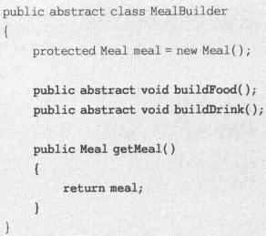


##### 基本2-代码

某游戏软件中人物角色包括多种类型，不同类型的人物角色，其性别、脸型、服装、发型等外部特征有所差异，使用建造者模式创建人物角色对象，请根据类图编程实现该系统,并写出相应Java代码。  


```java
package lab2_1;

//Actor角色类：复合产品
class Actor
{
	private String type;
	private String sex;
	private String face;
	private String costume;
	private String hairstyle;
	
	public void setType(String type) {
		this.type = type; 
	}
	public void setSex(String sex) {
		this.sex = sex; 
	}

	public void setFace(String face) {
		this.face = face; 
	}

	public void setCostume(String costume) {
		this.costume = costume; 
	}

	public void setHairstyle(String hairstyle) {
		this.hairstyle = hairstyle; 
	}
	
	public String getType() {
		return (this.type); 
	}
	
	public String getSex() {
		return (this.sex); 
	}

	public String getFace() {
		return (this.face); 
	}

	public String getCostume() {
		return (this.costume); 
	}

	public String getHairstyle() {
		return (this.hairstyle); 
	}
}

//角色建造器：抽象建造者
abstract class ActorBuilder
{
	protected Actor actor = new Actor();
	
	public abstract void buildType();
	public abstract void buildSex();
	public abstract void buildFace();
	public abstract void buildCostume();
	public abstract void buildHairstyle();
	public Actor createActor()
	{
		return actor;
	}
}

//英雄角色建造器：具体建造者
class HeroBuilder extends ActorBuilder
{
	public void buildType()
	{
		actor.setType("英雄");
	}
	public void buildSex()
	{
		actor.setSex("男");
	}
	public void buildFace()
	{
		actor.setFace("英俊");
	}
	public void buildCostume()
	{
		actor.setCostume("盔甲");
	}
	public void buildHairstyle()
	{
		actor.setHairstyle("飘逸");
	}	
}

//天使角色建造器：具体建造者
class AngelBuilder extends ActorBuilder
{
	public void buildType()
	{
		actor.setType("天使");
	}
	public void buildSex()
	{
		actor.setSex("女");
	}
	public void buildFace()
	{
		actor.setFace("漂亮");
	}
	public void buildCostume()
	{
		actor.setCostume("白裙");
	}
	public void buildHairstyle()
	{
		actor.setHairstyle("披肩长发");
	}	
}

//魔鬼角色建造器：具体建造者
class GhostBuilder extends ActorBuilder
{
	public void buildType()
	{
		actor.setType("魔鬼");
	}
	public void buildSex()
	{
		actor.setSex("妖");
	}
	public void buildFace()
	{
		actor.setFace("丑陋");
	}
	public void buildCostume()
	{
		actor.setCostume("黑衣");
	}
	public void buildHairstyle()
	{
		actor.setHairstyle("光头");
	}	
}
//Actor角色创建控制器：指挥者
class ActorController
{
	public Actor construct(ActorBuilder ab)
	{
		Actor actor;
		ab.buildType();
		ab.buildSex();
		ab.buildFace();
		ab.buildCostume();
		ab.buildHairstyle();
		actor=ab.createActor();
		return actor;
	}
}

//客户端测试类
class Client
{
	public static void main(String args[])
	{
		ActorController ac = new ActorController();
		ActorBuilder ab;
		ab = new AngelBuilder();
		Actor angel;
		angel = ac.construct(ab);
		String type = angel.getType();
		System.out.println(type + "的外观：");
		System.out.println("性别：" + angel.getSex());
		System.out.println("面容：" + angel.getFace());
		System.out.println("服装：" + angel.getCostume());
		System.out.println("发型：" + angel.getHairstyle());
	}
}
```


##### JDK

`JavaMail` 是一组 Java SE 扩展 API 类库，`Message` 和 `MimeMessage` 等都是退化建造者模式。


自行创建建造者：


### 原型模式

#### 概念

定义：

- Specify the kind off objects to create using a prototypical instance, and create new objects by copying this prototype.

  用原型实例指定创建对象的种类，并且通过复制这些原型创建新的对象。


- `Prototype` 抽象原型类
- `ConcretePrototype` 具体原型类
- `Client` 客户类

两种形式：

- 浅克隆：普通成员变量值相同，对其他对象的引用仍指向原来的对象

  

- 深克隆：引用其他对象的变量指向被复制过的新对象

扩展：原型管理器。对有限个原型具体类，用哈希表存起来。


扩展：对相似对象(属性值大部分相同，小部分不同)，可以先克隆，再修改不同值。

#### 评价

优点：

1. 创建新对象实例复杂时，简化创建过程，提高创建效率。
2. 动态增加减少产品类，针对抽象编程，具体原型类写配置文件。
3. 简化创建结构，无需专门工厂类。
4. 深克隆保存对象状态，可以需要时使用/恢复。

缺点：

1. 对已有的类必须修改源代码，违背开闭原则。
2. 深克隆代码复杂。

适用：

1. 创建新对象成本大(时间，CPU，网络)可以通过复制。
2. 保存对象状态，状态变化很小或内存不大，可以原型+备忘录。很大则状态模式。
3. 避免分层次工厂类创建分层次对象，类的实例对象只有很少组合状态。


#### 例子

##### 基本

`Object` 提供 `clone` 方法。实现克隆的类实现 `Cloneable` 接口。否则调用 `clone` 方法就报错 `CloneNotSupportedException`。


满足：

1. 对任何对象 `x`，有 `x.clone()!=x`
2. 对任何对象 `x`，有 `x.clone().getClass()==x.getClass()`
3. 若 `equals()` 定义恰当，则 `x.clone().equals(x)` 成立

具体实现浅克隆办法：

1. 覆盖基类 `public clone()`。
2. 派生类 `clone()` 调用 `super.clone()`
3. 实现 `Cloneable` 接口

实现深克隆，通过序列化等方法。

序列化 `Serialization` 将对象写到流。写到流的对象是原对象的拷贝。再读出来。必须实现 `Serialization` 接口。

这两个接口都是空接口，又称标识接口，不定义方法，作用是告诉 JRE 这些接口的实现类是否具有某个功能。

##### 浅克隆


> false, true

##### 浅克隆2-代码

在某OA系统中，用户可以创建工作周报，由于某些岗位每周工作存在重复性，因此可以通过复制原有工作周报并进行局部修改来快速创建工作周报，现使用原型模式来实现该功能，请根据类图编程实现该系统,并写出相应Java代码。


```java
package lab2_2;

//工作周报：具体原型类
class WeeklyLog implements Cloneable
{
	private String name;
	private String date;
	private String content;
	
	public void setName(String name) {
		this.name = name; 
	}
	public void setDate(String date) {
		this.date = date; 
	}
	public void setContent(String content) {
		this.content = content; 
	}
	public String getName() {
		return (this.name); 
	}
	public String getDate() {
		return (this.date); 
	}
	public String getContent() {
		return (this.content); 
	}
	public WeeklyLog clone()
	{
		Object obj = null;
		try
		{
			obj = super.clone();
			return (WeeklyLog)obj;	
		}
		catch(CloneNotSupportedException e)
		{
			System.out.println("不能复制！");
			return null;
		}
	}
}
```

```java
package lab2_2;

//客户端测试类
class Client
{
	public static void main(String args[])
	{
		WeeklyLog log_previous = new WeeklyLog();
		log_previous.setName("张三");
		log_previous.setDate("2016年第2周");
		log_previous.setContent("这周工作很忙，每天加班！");
		
		System.out.println("****周报****");
		System.out.println(log_previous.getDate());
		System.out.println(log_previous.getName());
		System.out.println(log_previous.getContent());
		System.out.println("--------------------------------");
		
		WeeklyLog log_now;
		log_now = (WeeklyLog)log_previous.clone();
		log_now.setDate("2016年第3周");
		System.out.println("****周报****");
		System.out.println(log_now.getDate());
		System.out.println(log_now.getName());
		System.out.println(log_now.getContent());
	}
}
```


##### 深克隆


> false ,false


##### JDK

> ctrl+c ctrl+v 的实现

`Struts2` 是 Java EE 框架之一，为了线程安全性，`Action` 对象使用原型模式，保证定义的变量无需加锁实现同步。

主流 Java EE 框架 Spring 里，原型模式创建新的 bean 实例，修改时对原有实例对象不造成任何影响。


##### 原型管理器


> false


##### 相似对象

某些属性值异同，复制后修改


### 单例模式

#### 概念

定义：

- Ensure a class has only one instance and provide a global point of access to it.

  确保某一个类只有一个实例，而且自行实例化并向整个系统提供这个实例。

全局变量可以保证随时被访问，但不能防止实例化多个对象。更好地解决办法是类保存唯一实例。

单例类：


要点：

- private 构造方法，使得外部不可实例化。使用静态方法提供 `getInstance`

类型：

1. 饿汉式单例类：

   

   定义时实例化，加载时已创建。

   

   评价：资源利用率差，但速度和反应时间比懒汉好。

2. 懒汉式单例类

   

   第一次被引用时实例化，加载时不实例化。

   

   评价：多线程处理麻烦，初始化耗时大，需要同步化机制。

   


#### 评价

优点：

1. 提供对唯一实例的受控访问，提供了共享的概念。
2. 只存在一个对象，节约系统资源。对频繁创建和销毁的对象提高性能。
3. 允许可变数目的实例，扩展，获得指定个数的对象实例。

缺点：

1. 没有抽象层，扩展困难。
2. 职责重，一定程度违背单一职责原则，充当工厂角色提供工厂方法，充当产品角色提供业务方法，创建+功能融合在一起。
3. 滥用可能有问题。如数据库连接池对象若单例，共享过多会连接池溢出。且 GC 导致对象长时间不用被回收，下次利用重新实例化，丢失对象状态。

适用：

1. 只需要一个实例对象，或资源消耗太大而只允许一个。
2. 单个实例只允许使用一个公共访问点，不能其他途径访问该实例。

> 如自动编号的主键的表，只能有一个地方分配下一个主键编号，否则主键重复服，则单例。

如果一个类几个实例可以共存，要改成多例模式。

注意问题：

1. 不要用单例模式存取全局变量。全局变量放类的静态成员里。
2. 数据库连接不能单例。一个系统可能与数据库多个连接，而且有连接池时应尽可能释放连接。静态成员类存储单例实例会导致资源无法及时释放。

#### 例子

##### 朴素懒汉


> true


##### 朴素懒汉2-代码

在操作系统中，打印池是一个用于管理打印任务的应用程序，通过打印池用户可以删除、中止或者改变任务的优先级，在一个系统中只允许运行一个打印池对象，如果重复创建打印池则抛出异常。现使用单例模式来模拟实现打印池的设计，请根据类图编程实现该系统,并写出相应Java代码。


```java
package lab2_3;
public class PrintSpoolerSingleton
{
	private static PrintSpoolerSingleton instance=null;
	
	private PrintSpoolerSingleton()
	{	
	}
	
	public static PrintSpoolerSingleton getInstance() throws PrintSpoolerException
	{
		if(instance==null)
		{
			synchronized(PrintSpoolerSingleton.class){
                System.out.println("创建打印池！");
                instance=new PrintSpoolerSingleton();	
			}
		}
		else
		{
			throw new PrintSpoolerException("打印池正在工作中！");
		}
		return instance;
	}
	
	public void manageJobs()
	{
	    System.out.println("管理打印任务！");
	}	
}
```

```java
package lab2_3;
public class PrintSpoolerException extends Exception 	
{
	public PrintSpoolerException(String message) 
	{	
		super(message);
	}
}
```

```java
package lab2_3;
public class Client
{
	public static void main(String a[])
	{
	   PrintSpoolerSingleton ps1,ps2;
	   try
	   {
	        ps1=PrintSpoolerSingleton.getInstance();
	        ps1.manageJobs();	
	   }
	   catch(PrintSpoolerException e)
	   {
	   	    System.out.println(e.getMessage());
	   }
    	    System.out.println("--------------------------");	   
	   try
	   {
	       ps2=PrintSpoolerSingleton.getInstance(); 
	       ps2.manageJobs();  	
	   }
	   catch(PrintSpoolerException e)
	   {
	       System.out.println(e.getMessage());
	   }
	}
}
```

##### JDK

`java.lang.Runtime` 是唯一的：


Java EE 从 Spring 获取某个类的实例，则 bean 工厂这个 bean 实例只有一个：


##### 多线程懒汉

[参考](https://aisakaaoi.top/81a0eabe.html)

###### 同步锁

优点：解决了线程不安全的问题。
缺点：效率有点低，每次调用实例都要判断同步锁。

###### 双重检验锁

> 为了减少同步锁判断，所以先判空

优点：在并发量不多，安全性不高的情况下或许能很完美运行单例模式
缺点：不同平台编译过程中可能会存在严重安全隐患。（用volatile或用Atomic可解决）

```java
public class SingletonPattern {
    public static void main(String[] args) {

    }
}

class Singleton{
    private volatile static Singleton singleton;
    private Singleton() {}

    
    private static Singleton getlnstance() {
        if (singleton == null) {
            synchronized (Singleton.class) {
                if (singleton == null) {
                    singleton = new Singleton();
                }
            }
        }
        return singleton;
    }
}
```

###### 内部类

优点：延迟加载，线程安全（java中class加载时互斥的），也减少了内存消耗。

内部类是一种很好的实现方式，目前公司内的项目大多都使用这种方式。

```java
public class SingletonInner {

    private SingletonInner() {}

    /**
    * 内部类实现单例模式
    * 延迟加载，减少内存开销
    */
    private static class SingletonHolder {
        private static SingletonInner instance = new SingletonInner();
    }

    public static SingletonInner getInstance() {
        return SingletonHolder.instance;
    }
}
```

###### 枚举类

```java
public enum SingletonEnum {
    /**
    * 1.从Java1.5开始支持;
    * 2.无偿提供序列化机制;
    * 3.绝对防止多次实例化，即使在面对复杂的序列化或者反射攻击的时候;
    */

    instance;

    private String others;

    SingletonEnum() {}

    public void method() {
        System.out.println("SingletonEnum");
    }

    public String getOthers() {
        return others;
    }

    public void setOthers(String others) {
        this.others = others;
    }
}
```

## 结构型模式

### 适配器模式

#### 概念

定义：

- Convert the interface of a class into another interface clients expect. Adapter lets classes work together that couldn't otherwise because of incompatible interfaces.

  将一个接口转换成客户希望的另一个接口，适配器模式使接口不兼容的那些类可以一起工作。

类适配器模式：


对象适配器模式：


- `Target` 目标抽象类。要用的特定领域抽象类/接口/具体类。(java只能是接口)
- `Adapter` 适配器类。调用另一个接口，作为转换器。核心。实现 `Target` 接口并继承 `Adaptee`，对 `Adaptee` 和 `Target` 进行适配。
- `Adaptee` 适配者类，被适配的角色，一个已存在的接口，需要适配。一般是具体类，包含写好的希望使用的业务方法。
- `Client` 客户类。

扩展：

- 缺省适配器模式 Default Adapter Pattern / 单接口适配器模式：不需要全部实现接口提供的方法时，设计抽象类实现该接口，每个方法提供默认实现空方法。有选择地覆盖父类某些方法实现需求


- 双向适配器。适配器同时包含对目标类和适配者类的引用。适配者可以通过它调用目标类方法，目标类也可以通过它调用适配者类方法。


#### 评价

优点：

1. 目标类和适配者类解耦，用适配器类重用适配器类，无需修改原有代码
2. 增加类透明性和复用性，将具体的实现封装在适配者类中。
3. 灵活性和扩展性好，用配置文件方便更换适配器，符合开闭原则。

类适配器：

优点：

- 适配器类是适配者类子类，可以置换适配者方法，灵活性更强

缺点：

- 不能多重继承的类最多适配一个，且目标抽象类只能是接口，局限性大，不能将适配者类和它的子类都适配到目标接口

对象适配器：

优点：

- 多个不同适配者适配到同一个目标，可以将适配者类及其子类都适配到目标接口

缺点：

- 置换适配者类不容易，如果要换掉适配者的若干方法，先做一个适配者子类，再将其当成真正适配者进行适配，复杂


适用：

1. 使用现成的类，但接口不符合要求
2. 建立可重复使用的类，用于与一些彼此没有太大关联的类，包括将来引进的类一起工作

#### 例子

##### 基本

类适配器：


对象适配器：


##### 类适配器


符合依赖倒转原则和开闭原则。


##### 对象适配器


适配者：


适配器：


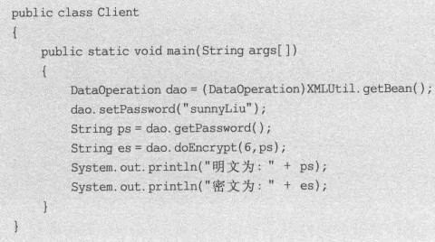

更换：


然后修改 xml。

##### 对象适配器2-代码

现有一个接口DataOperation定义排序方法sort(int[])和查找方法search(int[],int),已知类QuickSort的quickSort(int[])方法实现了快速排序算法，类BinarySearch的binarySearch(int[],int)方法实现了二分查找算法。现使用适配器模式设计一个系统，在不修改源代码的情况下将类QuickSort和类BinarySearch的方法适配到DataOperation接口中，请根据类图编程实现该系统,并写出相应Java代码。


```java
//抽象数据操作类：目标接口
interface DataOperation
{
	public int[] sort(int array[]);
	public int search(int array[],int key);
}

//快速排序类：适配者
class QuickSort
{
	public int[] quickSort(int array[])
	{
		sort(array,0,array.length-1);
		return array;
	}

	public void sort(int array[],int p, int r)
	{
		int q=0;
		if(p<r)
		{
			q=partition(array,p,r);
			sort(array,p,q-1);
            sort(array,q+1,r);
		}
	}
	
	public int partition(int[] a, int p, int r)
	{
		int x=a[r];
		int j=p-1;
		for(int i=p;i<=r-1;i++)
		{
			if(a[i]<=x)
			{
				j++;
				swap(a,j,i);
			}
		}
		swap(a,j+1,r);
		return j+1;	
	}
	
	public void swap(int[] a, int i, int j) 
	{   
        int t = a[i];   
        a[i] = a[j];   
        a[j] = t;   
	}
}

//二分查找类：适配者
class BinarySearch
{
	public int binarySearch(int array[],int key)
	{
		int low = 0;
		int high = array.length -1;
		while(low <= high)
		{
			int mid = (low + high) / 2;
			int midVal = array[mid];
			
			if(midVal < key)
			{
				low = mid +1;
			}
			else if(midVal > key)
			{
				high = mid -1;
			}
			else 
			{
				return 1; //找到元素返回1
			}
		}
		return -1;  //未找到元素返回-1
	}
}

//操作适配器：适配器
class OperationAdapter implements DataOperation
{
	private QuickSort sortObj;
	private BinarySearch searchObj;
	public OperationAdapter(QuickSort sortObj,BinarySearch searchObj)
	{
		this.sortObj = sortObj;
		this.searchObj = searchObj;
	}
	public int[] sort(int array[])
	{
		return sortObj.quickSort(array);
	}
	public int search(int array[],int key)
	{
		return searchObj.binarySearch(array,key);
	}
}

//客户端测试类
class Client
{
	public static void main(String args[])
	{
		DataOperation operation;  //针对抽象目标接口编程
		QuickSort sortObj = new QuickSort();
		BinarySearch searchObj = new BinarySearch();
		operation = new OperationAdapter(sortObj,searchObj);
		int array[] = {13,24,15,36,26,17,68,34};
		int result[];
		int value;
		
		System.out.println("排序结果：");
		result = operation.sort(array);
		for(int i:array)
		{
			System.out.print(i + ",");
		}
		System.out.println();
		
		System.out.println("查找关键字24：");
		value = operation.search(result,24);
		if(value!=-1)
		{
			System.out.println("找到关键字24。");
		}
		else
		{
			System.out.println("没有找到关键字24。");
		}
		
		System.out.println("查找关键字25：");
		value = operation.search(result,25);
		if(value!=-1)
		{
			System.out.println("找到关键字25。");
		}
		else
		{
			System.out.println("没有找到关键字25。");
		}
	}
}
```


##### JDK

JDBC 客户端通用接口，每一个具体数据库引擎的 JDBC 驱动软件都是一个介于 JDBC 接口和数据库引擎接口之间的适配器软件

Spring AOP 对 `BeforeAdvice`, `AfterAdvice`, `ThrowsAdvice` 三种通知类型借助适配器实现，允许用户向框架加入自己想要支持的任何通知类型，是 `Advice` 子类型，其中 `AdvisorAdapter` 是适配器接口，将 `Advisor` 适配成 `MethodInterceptor`


JDK 也有 `InputStreamAdapter`，包装 `ImageInputStream` 接口及其子类：


##### 缺省适配者


如 `java.awt.event` 的各种事件，如 `KeyAdapter`。直接实现接口需要实现全部办法，但继承抽象类只需要实现部分方法即可。


### 桥接模式

#### 概念

定义：

- Decouple an abstraction from its implementation so that the two can vary independently.

  将抽象部分与它的实现部分分离，使它们都可以独立地变化。

软件系统中，有些类由于本身固有特性，使得具有两个或多个变化维度/变化原因。


- `Abstaction` 抽象类
- `RefinedAbstraction` 扩充抽象类。通常是具体类。
- `Implementor` 实现类接口。比抽象类简单，只提供基本操作。
- `ConcreteImplementor`

> 关键概念：
>
> - 抽象化。忽略一些信息，把不同的实体当作同样的实体对待。将对象的共同性质抽取出来形成类的过程。
> - 实现化。针对抽象化给出的具体实现。与上面互逆概念。
> - 脱耦。将抽象化和实现化之间的耦合解脱开，强关联改成弱关联，继承改为关联关系(组合/聚合)，使得两者可以相对独立地变化。

扩展：与适配器模式联合使用。

#### 评价

优点：

1. 分离抽象接口及其实现部分，使用对象间的关联关系接口抽象和实现之间固有的绑定关系，使抽象和实现可以沿着各自的维度变化，不再在同一个集成层次中。子类化它们，让他们各自具有自己的子类，以便于任意组合子类。
2. 多继承违背了类的单一职责原则，复用性较差，类个数庞大。桥接模式比多继承方案更好。
3. 提高系统可扩展性，在两个变化维度中任意扩展一个，都不需修改原有系统。
4. 细节对客户透明，隐藏实现细节。抽象层通过聚合关联完成封装与对象组合。

缺点：

1. 增加系统理解，设计难度。要求针对抽象设计编程。
2. 要求正确识别出系统两个独立变化的维度。

适用：

1. 在构件抽象化角色和具体化角色之间增加更多灵活性，避免两个层次间静态继承。
2. 抽象化角色和实现化角色可以继承方式独立扩展互不影响。需要动态耦合二者。
3. 一个类存在两个独立变化的维度，且都需要扩展。
4. 抽象化角色和具体化角色需要独立变化，独立管理。
5. 不希望使用继承/因为多层次继承导致类的个数急剧增加。

#### 例子

##### 基本

一个维度的实现类接口：


另一个维度的抽象类：


细化抽象类：


模拟毛笔：


> 其他颜色同理，不再赘述。


> 其他尺寸同理，不再赘述。

> XML：
>
> 


无论哪个维度的扩展，对原有代码(类库，客户端)都无需修改，只需要新增代码和改配置文件。

同理，还有：


##### 基本2-代码

如果需要开发一个跨平台视频播放器，可以在不同操作系统平台（如Windows、Linux、Unix等）上播放多种格式的视频文件，常见的视频格式包括MPEG、RMVB、AVI、WMV等。现使用桥接模式设计该播放器，请根据类图编程实现该系统,并写出相应Java代码。


```java
//抽象播放器类：抽象类
abstract class OperationSystemVersion
{
	protected VideoFile vf;
	public void setVideoFile(VideoFile vf)
	{
		this.vf = vf;
	} 
	public abstract void play(String fileName);
}

//抽象视频文件类：抽象实现类
interface VideoFile
{
	public void decode(String osType, String fileName);
} 

//MPEG格式视频文件类：具体实现类
class MPEGFile implements VideoFile
{
	public void decode(String osType, String fileName)
	{
 		System.out.println("格式为MPEG的视频文件" + fileName + "在" + osType + "平台中解码播放。");
 	}	
}

//RMVB格式视频文件类：具体实现类
class RMVBFile implements VideoFile
{
	public void decode(String osType, String fileName)
	{
 		System.out.println("格式为RMVB的视频文件" + fileName + "在" + osType + "平台中解码播放。");
 	}	
}

//AVI格式视频文件类：具体实现类
class AVIFile implements VideoFile
{
	public void decode(String osType, String fileName)
	{
 		System.out.println("格式为AVI的视频文件" + fileName + "在" + osType + "平台中解码播放。");
 	}	
}

//WMV格式视频文件类：具体实现类
class WMVFile implements VideoFile
{
	public void decode(String osType, String fileName)
	{
 		System.out.println("格式为WMV的视频文件" + fileName + "在" + osType + "平台中解码播放。");
 	}
}

//Window播放器类：扩充抽象类
class WindowsVersion extends OperationSystemVersion
{
	public void play(String fileName)
	{
		vf.decode("Windows",fileName);
	}
}

//Linux播放器类：扩充抽象类
class LinuxVersion extends OperationSystemVersion
{
	public void play(String fileName)
	{
		vf.decode("Linux",fileName);
	}
}

//Unix播放器类：扩充抽象类
class UnixVersion extends OperationSystemVersion
{
	public void play(String fileName)
	{
		vf.decode("Unix",fileName);
	}
}

//客户端测试类
class Client
{
	public static void main(String args[])
	{
		VideoFile file;
		OperationSystemVersion version;
		file = new RMVBFile();
		version = new WindowsVersion();
		version.setVideoFile(file);
		version.play("《让子弹飞》");
	}
}
```


##### JDK

虚拟机实现了平台无关性，这里独立变化的维度一个是应用程序，一个是运行平台，JVM本身的设计使用了桥接模式。


Java 总是带有所在操作系统的视感(`LockAndFeel`)，即不同操作系统看到组件的外观不一样。通过 `Peer` 架构做到，使用了桥接模式。AWT 库每个 `Component` 子类都有一个 `ComponentPeer` 子类与之匹配(前者是抽象角色，后者实现角色)。这两个等级结构通过 `Toolkit` 对象通信。

JDBC 驱动程序里驱动程序的应用系统是抽象角色，使用的数据库是实现角色。

##### 搭配适配器

如报表处理，将报表显示与数据采集分开，使用桥接模式。其中数据采集本身使用适配者模式。


### 组合模式

#### 概念

定义：

- Compose objects into tree structures to represent part-whole hierarchies. Composite lets clients treat individual objects and compositions o objects uniformly.

  组合多个对象形成树形结构以表示“部分-整体”的结构层次。组合模式对单个对象(即叶子对象)和组合对象(即容器对象)的使用具有一致性。

组合模式描述了如何将容器对象和叶子对象进行递归组合，使得用户在使用时无需对它们进行区分，可以一致地对待容器对象和叶子对象。


- `Component` 抽象构件。接口/抽象类，共有行为声明和实现。
- `Leaf` 叶子构件
- `Composite` 容器构件
- `Client` 客户类

组合模式的叶子节点和容器节点可以进一步抽象：


根据抽象构建类的定义形式，划分为：

1. 透明组合模式。`Component` 声明了管理成员对象的办法，如 `add,remove,getChild`。

   好处：确保所有构件接口相同，客户端同等对待。

   缺点：不够安全，叶子节点调用不支持的方法时可能会出错。

   

2. 安全组合模式。`Component` 不声明管理成员对象的方法，`Composite` 才声明。

   缺点：不够透明，叶子和容器方法不同，不能完全针对抽象编程且一致使用。

   但实际使用频率更高。

   


#### 评价

优点：

1. 清楚定义分层次的复杂对象，表示对象的全部或部分层次，使得增加新构建容易，客户忽略层次差异。结构动态。
2. 客户调用简单，一致地使用，不必关心处理的是单个对象还是组合结构。
3. 定义了类层次结构，形成复杂树形结构。
4. 更容易在组合体加入对象构件，不必因此更改原有代码。

缺点：

1. 设计抽象，若对象业务规则复杂，实现难，不是所有方法都与叶子对象子类有关联。
2. 难对构件类型限制，不能依赖类型系统增加约束，只能运行时检查。

适用：

1. 需要表示一个对象的整体或部分层次，忽略整体与部分的差异，一致地对待。
2. 忽略不同对象层次的变化，针对抽象构件编程。
3. 结构动态，复杂程度不一样，需要一致地处理。

#### 例子

##### 透明

> 
>
> 
>
> 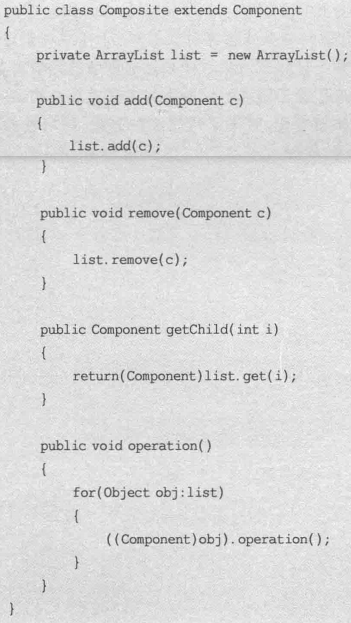


##### 透明2-代码

使用组合模式设计一个杀毒(AntiVirus)软件的框架，该软件既可以对某个文件夹(Folder)杀毒，也可以对某个指定的文件(File)进行杀毒。文件的种类包括图像文件(ImageFile)、视频文件（VideoFile）和文本文件(TextFile)，请根据类图编程实现该系统,并写出相应Java代码。


个人实现。

```java
package lab3_3;

//抽象文件类：抽象构件
abstract class AbstractFile {
    public abstract void add(AbstractFile file);

    public abstract void remove(AbstractFile file);

    public abstract AbstractFile getChild(int i);

    public abstract void killVirus();
}
```

```java
package lab3_3;

import java.util.*;

//文件夹类：容器构件
class Folder extends AbstractFile {

    /************************
     * //定义集合fileList，用于存储AbstractFile类型的成员
     * 
     * 
     **************************/
    private String fileName;
    private ArrayList<AbstractFile> fileList;

    public Folder(String name) {
        fileName = name;
        fileList = new ArrayList<>();
    }

    public void add(AbstractFile file) {
        fileList.add(file);
    }

    public void remove(AbstractFile file) {
        fileList.remove(file);
    }

    public AbstractFile getChild(int i) {
        return fileList.get(i);
    }

    public void killVirus() {
        System.out.println("****对文件夹\"" + fileName + "\"进行杀毒");
        for(AbstractFile file : fileList) {
            file.killVirus();
        }
    }
}
```

```java
package lab3_3;

//图像文件类：叶子构件
class ImageFile extends AbstractFile {
    private String fileName;

    public ImageFile(String name) {
        fileName = name;
    }

    @Override
    public void add(AbstractFile file) {
        System.out.println("Failed");
    }

    @Override
    public void remove(AbstractFile file) {
        System.out.println("Failed");
    }

    @Override
    public AbstractFile getChild(int i) {
        System.out.println("Failed");
        return null;
    }

    @Override
    public void killVirus() {
        System.out.println("----对图像文件\"" + fileName + "\"进行杀毒");
    }
}
```

```java
package lab3_3;

//文本文件类：叶子构件
class TextFile extends AbstractFile {
    private String fileName;

    public TextFile(String name) {
        fileName = name;
    }

    @Override
    public void add(AbstractFile file) {
        System.out.println("Failed");
    }

    @Override
    public void remove(AbstractFile file) {
        System.out.println("Failed");
    }

    @Override
    public AbstractFile getChild(int i) {
        System.out.println("Failed");
        return null;
    }

    @Override
    public void killVirus() {
        System.out.println("----对文本文件\"" + fileName + "\"进行杀毒");
    }
}
```

```java
package lab3_3;

//视频文件类：叶子构件
class VideoFile extends AbstractFile {
    private String fileName;

    public VideoFile(String name) {
        fileName = name;
    }

    @Override
    public void add(AbstractFile file) {
        System.out.println("Failed");
    }

    @Override
    public void remove(AbstractFile file) {
        System.out.println("Failed");
    }

    @Override
    public AbstractFile getChild(int i) {
        System.out.println("Failed");
        return null;
    }

    @Override
    public void killVirus() {
        System.out.println("----对视频文件\"" + fileName + "\"进行杀毒");
    }
}
```

```java
package lab3_3;

class Client {
    public static void main(String args[]) {
        // 针对抽象构件编程
        AbstractFile file1, file2, file3, file4, file5, folder1, folder2, folder3, folder4;

        folder1 = new Folder("Sunny的资料");
        folder2 = new Folder("图像文件");
        folder3 = new Folder("文本文件");
        folder4 = new Folder("视频文件");

        file1 = new ImageFile("小龙女.jpg");
        file2 = new ImageFile("张无忌.gif");
        file3 = new TextFile("九阴真经.txt");
        file4 = new TextFile("葵花宝典.doc");
        file5 = new VideoFile("笑傲江湖.rmvb");

        folder2.add(file1);
        folder2.add(file2);
        folder3.add(file3);
        folder3.add(file4);
        folder4.add(file5);
        folder1.add(folder2);
        folder1.add(folder3);
        folder1.add(folder4);

        // 从“Sunny的资料”节点开始进行杀毒操作
        folder1.killVirus();
    }
}
```


##### 安全


> `Banana` 和 `Pear` 同理，不再赘述。


##### JDK

XML 文档解析工具。

操作系统。

JDK 的 AWT/Swing，安全组合模式，其中 `Component` 是抽象构件，`Checkbox`, `Button`, `TextComponent` 是叶子构件，`Container` 是容器构件。


其中 `TextComponent` 又有 `TextField`, `TextArea` 等子类，`Container` 又有 `Panel`, `Window` 等子类。


### 装饰模式

#### 概念

定义：

- Attach additional responsibilities to an object dynamically. Decorators provide a flexible alternative to subclassing for extending functionality.

  动态地给一个对象增加一些额外的职责。

在不改变一个对象本身的基础上给对象添加额外的新行为。


两种方式：

1. 继承机制。静态的，用户不能控制增加行为的方式和时机。
2. 关联机制。一个类的对象嵌入另一个新对象(装饰类Decorator)，装饰类决定是否调用嵌入对象的行为并扩展新的行为。装饰类和被装饰类实现相同的接口。可以递归装饰。客户端透明。


- `Component` 抽象构件。
- `ConcreteComponent` 被装饰类。
- `Decorator` 抽象装饰类。
- `ConcreteDecorator` 具体装饰类。

两种装饰者模式：

1. 透明装饰模式。统一用 `operation` 方法，客户端用抽象类型定义具体构件对象、具体装饰模式。还可以嵌套。

   

   而不是：

   

2. 半透明装饰模式。具体装饰类用新的接口方法提供给客户端使用，客户端不能用抽象构件，也不能多重装饰。但设计相对简单，使用方便。

具体构件类尽量轻，不要放太多逻辑和状态。

简化：如果只有一个具体构件类，可以抽象装饰类作具体构件类。


建议：

- 通常只需要一个外观类且设计成单例类。但是一个系统可以有多个外观类。
- 不要通过外观类为子系统添加新的行为。

可以使用抽象外观类，来满足开闭原则：


#### 评价

优点：

1. 比继承灵活性更高。
2. 动态扩展对象功能，配置文件选装饰器。
3. 不同的具体装饰类及其排列组合创造出不同行为。
4. 具体构件类、具体装饰类独立变化，丰富开闭原则。

缺点：

1. 产生很多小对象，连接方式不同，很多具体装饰类。增加系统复杂度，学习理解难度。
2. 易于出错，难排错。

适用：

1. 不影响其他对象下，动态透明地给单个对象添加职责。
2. 动态增加功能，可以动态被撤销。
3. 不能继承来扩充，或继承不利于扩展维护时。如：大量独立的扩展，产生大量子类；final类无法继承。

#### 例子

##### 透明

> 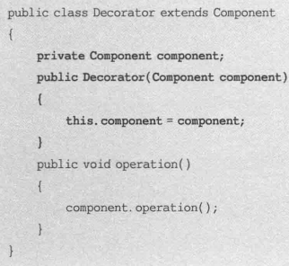
>
> 


##### 透明2-代码

某系统提供了一个数据加密功能，可以对字符串进行加密。最简单的加密算法通过对字母进行移位来实现，同时还提供了稍复杂的逆向输出加密，还提供了更为高级的求模加密。用户先使用最简单的加密算法对字符串进行加密，如果觉得还不够可以对加密之后的结果使用其他加密算法进行二次加密，当然也可以进行第三次加密。现使用装饰模式设计该多重加密系统。（课本203页例题）  


```java
public interface Cipher
{
	public String encrypt(String plainText);
}
```

```java
public class SimpleCipher implements Cipher
{
	public String encrypt(String plainText)
	{
		String str="";
		for(int i=0;i<plainText.length();i++)
		{
			char c=plainText.charAt(i);
			if(c>='a'&&c<='z')
			{
				c+=6;
			if(c>'z') c-=26;
			if(c<'a') c+=26;
			}
			if(c>='A'&&c<='Z')
			{
				c+=6;
			if(c>'Z') c-=26;
			if(c<'A') c+=26;
			}
			str+=c;
		}
		return str;
	}
}
```

```java
public class CipherDecorator implements Cipher
{
	private Cipher cipher;
	
	public CipherDecorator(Cipher cipher)
	{
		this.cipher=cipher;
	}
	
	public String encrypt(String plainText)
	{
		return cipher.encrypt(plainText);
	}
}
```

```java
public class ComplexCipher extends CipherDecorator
{
	public ComplexCipher(Cipher cipher)
	{
		super(cipher);
	}
	
	public String encrypt(String plainText)
	{
		String result=super.encrypt(plainText);
		result=reverse(result);
		return result;
	}
	
	public String reverse(String text)
	{
		String str="";
		for(int i=text.length();i>0;i--)
		{
			str+=text.substring(i-1,i);
		}
		return str;
	}
}
```

```java
public class AdvancedCipher extends CipherDecorator
{
	public AdvancedCipher(Cipher cipher)
	{
		super(cipher);
	}
	
	public String encrypt(String plainText)
	{
		String result=super.encrypt(plainText);
		result=mod(result);
		return result;
	}
	
	public String mod(String text)
	{
		String str="";
		for(int i=0;i<text.length();i++)
		{
			String c=String.valueOf(text.charAt(i)%6);
			str+=c;
		}
		return str;
	}
}
```

```java
public class Client
{
	public static void main(String args[])
	{
		String password="sunnyLiu";  //明文
		String cpassword;       //密文
		Cipher sc,cc;
		
		sc=new SimpleCipher();
		cpassword=sc.encrypt(password);
		System.out.println(cpassword);
		System.out.println("---------------------");
		
		cc=new ComplexCipher(sc);
		cpassword=cc.encrypt(password);
	    System.out.println(cpassword);
		System.out.println("---------------------");
		
		/*
		ac=new AdvancedCipher(cc);
		cpassword=ac.encrypt(password);
	    System.out.println(cpassword);
		System.out.println("---------------------");
		*/
	}
}
```

则 `ac.encrypt` 的 `super` 调用了 `cc.encrypt`，其中 `cc.encrypt` 先调用它 super 的 `sc` 然后调用它自己的，最后调用 `ac` 自己的。

##### 半透明


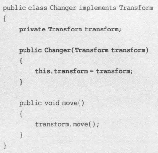


##### JDK

`jawax.swing` 的 `JList` 不支持滚动，如果要创建滚动的列表：


`JList` 是被装饰类，`JScrollPane` 是装饰类。

Java IO 的 `InputStream` 和 `OutputStream` 是父类，有一系列子类：


透明装饰模式。


且 `Reader`, `Writer` 等都用到了装饰模式。

### 外观模式

#### 概念

定义：

- Provide a unified interface to a set of interfaces in a subsystem. Facade defines a higher-level interface that makes the subsystem easier to use.

  为子系统中的一组接口提供一个统一的入口。定义了一个高层接口，而这个接口使得子系统更加容易使用。


- `Facade` 外观角色
- `Subsystem` 子系统角色

单一职责原则：一个系统划分为多个子系统有利于降低系统复杂性。也是迪米特法则的体现，降低客户类和子系统类的耦合度。但不符合开闭原则。

常见的应用是首页，导航，菜单，工具栏。

#### 评价

优点：

1. 对客户屏蔽子系统组件，减少客户处理对象数目，子系统使用更加容易。
2. 子系统与客户松耦合，组件变化不影响客户类。
3. 降低编译依赖性，简化平台移植过程，子系统修改不影响其他子系统，子系统内部变化不影响外观对象。
4. 只提供一个访问子系统统一入口，不影响用户直接使用子系统类。

缺点：

1. 不能很好限制客户使用子系统类，如果限制太多可变性和灵活性不够
2. 添加新的子系统要修改外观类/客户端源代码，违背开闭原则

适用：

1. 复杂子系统提供简单结构满足大多数需求，且用户也可以越过外观直接访问子系统
2. 客户程序与多个子系统存在很大依赖性，需要解耦，提高独立性，可移植性
3. 层次化系统，定义每一层入口，层间不直接联系

#### 例子

##### 基本

> 


> 

##### 基本2-代码

某系统需要提供一个文件加密模块，加密流程包括三个操作，分别是读取源文件、加密、保存加密之后的文件。读取文件和保存文件使用流来实现，这三个操作相对独立，其业务代码封装在三个不同的类中。现在需要提供一个统一的加密外观类，用户可以直接使用该加密外观类完成文件的读取、加密和保存三个操作，而不需要与每一个类进行交互，使用外观模式设计该加密模块。请根据类图编程实现该系统,并写出相应Java代码。  


个人实现

```java
package lab4_2;

//加密外观类：外观类
public class EncryptFacade {
    private FileReader reader;
    private CipherMachine cipher;
    private FileWriter writer;

    public EncryptFacade() {
        reader = new FileReader();
        cipher = new CipherMachine();
        writer = new FileWriter();
    }

    public void fileEncrypt(String fileNameSrc, String fileNameDes) {
        String plainStr = reader.read(fileNameSrc);
        String encryptStr = cipher.encrypt(plainStr);
        writer.write(encryptStr, fileNameDes);
    }
}
```

```java
package lab4_2;

import java.io.FileInputStream;
import java.io.FileNotFoundException;
import java.io.IOException;

public class FileReader {
    public String read(String fileNameSrc) {
        System.out.println("读取文件，获取明文。");
        StringBuffer sb = new StringBuffer();
        try {
            FileInputStream inFS = new FileInputStream(fileNameSrc);
            int data;
            while ((data = inFS.read()) != -1) {
                sb = sb.append((char) data);
            }
            inFS.close();
        } catch (FileNotFoundException e) {
            System.out.println("文件不存在！");
        } catch (IOException e) {
            System.out.println("文件操作错误！");
        }
        return sb.toString();
    }
}
```

```java
package lab4_2;

//数据加密类：子系统类
public class CipherMachine {
    public String encrypt(String plainText) {
        System.out.println("数据加密，将明文转换为密文。");
        String es = "";
        for (int i = 0; i < plainText.length(); i++) {
            String c = String.valueOf(plainText.charAt(i) % 7);
            es += c;
        }
        return es;
    }
}
```

```java
package lab4_2;

import java.io.FileOutputStream;
import java.io.FileNotFoundException;
import java.io.IOException;

//文件保存类：子系统类
class FileWriter {
    public void write(String encryptStr, String fileNameDes) {
        System.out.println("保存密文，写入文件。");
        try {
            FileOutputStream outFS = new FileOutputStream(fileNameDes);
            outFS.write(encryptStr.getBytes());
            outFS.close();
        } catch (FileNotFoundException e) {
            System.out.println("文件不存在！");
        } catch (IOException e) {
            System.out.println("文件操作错误！");
        }
    }
}
```

```java
package lab4_2;

public class Client {
    public static void main(String args[]) {
        EncryptFacade ef = new EncryptFacade();
        ef.fileEncrypt("facade/src.txt", "facade/des.txt");
    }
}
```

在项目根目录放置 `facade/`。


##### JDK

JDBC 里，`Connection` 对象，`Statement` 对象(或子类 `PreparedStatement`)和结果集 `ResultSet` 对象用外观简化：


Session 外观模式是 Java EE 的应用，`SessionBean` 是外观，提供粗粒度服务层，如图所示：


### 享元模式

#### 概念

定义：

- Use sharing to support large numbers of fine-grained objects efficiently.

  运用共享技术有效地支持大量细粒度对象的复用。

享元类设计：

- 有些对象不完全相同，只是相似。需要找到共同点，封装共同的内容，不同的内容通过外部应用程序设置。
- 内部状态 intrinsic state: 可以共享的相同内容
- 外部状态 extrinsic state: 需要外部环境设置的，不能共享的内容
- 享元池 flyweight pool: 具有相同内部状态的享元对象


- `Flyweight` 抽象享元类。有方法提供内部状态，设置外部状态。
- `ConcreteFlyweight` 具体享元类。可以结合单例模式以保证唯一对象。
- `UnsharedConcreteFlyweight` 非共享具体享元类。可以将具体享元对象作为子节点。
- `FlyweightFactory` 享元工厂类。可以使用简单工厂类，静态工厂方法，并使用单例模式。


扩展：

1. 单纯享元模式。所有享元对象都可以共享，不存在非共享具体享元类。

   

2. 复合享元模式：单纯享元模式+组合模式。

   

   使得复合享元类包含的每个单纯享元类具有相同外部状态，内部状态可以不同。

#### 评价

优点：

1. 极大减少内存中对象数量，使得相同/相似对象内存只保存一份。
2. 外部状态相对独立，不影响内部状态，可以在不同环境被共享。

缺点：

1. 系统更加复杂，需要分离内部外部状态，逻辑复杂化。
2. 状态外部化，读取外部状态使得运行时间变长。

适用：

1. 系统有大量相同/相似对象，造成内存大量浪费。
2. 大部分状态可以外部化并传入对象。
3. 多次重复使用享元对象。

> 如：相同图片在多个不同位置进行显示

#### 例子

##### 基础

> 
>
> 


##### 无外部状态


##### 外部状态


##### JDK

String 的享元模式：


> 输出 TTF

其中 str3 编译优化直接合并了。但 str4 没有。


### 代理模式

#### 概念

定义：

- Provide a surrogate or placeholder for another object to control access to it.

  给某一个对象提供一个代理，并由代理对象控制对原对象的引用。

基本：


- `Subject` 抽象主题角色
- `Proxy` 代理主题角色
- `RealSubject` 真实主题角色


常见的代理模式：

1. 远程代理。

   

2. 虚拟代理。

   时间换空间。消耗大的资源先不创建，但是需要耗费时间做存在性检测。

   占用大量内存的对象使用时才创建，可被重用。

   设计一个与真是对象有相同接口的虚拟对象。如果真实对象已经创建则代理对象转发给真实对象，否则先创建。

3. 动态代理。

   事先不知道真实主题角色而需要使用代理主题角色。

4. 

#### 评价

适用

1. 远程 Remote 代理：位于不同地址空间(同一或不同主机)的对象提供本地的代理对象。又称大使 Ambassador。
2. 虚拟 Virtual 代理：先创建消耗较小的对象表示消耗较大的对象，后者在需要时才被真正创建。如缩略图与原图。
3. Copy-on-Write 代理：一种虚拟代理。把复制(克隆)操作延迟到客户端真正需要时才执行。即对象被用到是才(深)克隆。
4. 保护 Protect or Access 代理：控制对一个对象的访问，可以给不同用户提供不同级别的使用权限。
5. 缓冲 Cache 代理：为某一个目标操作的结果提供临时的存储空间，以便多个客户端共享结果。
6. 防火墙 Firewall 代理：保护目标不让恶意用户接近。
7. 同步化 Synchronization 代理：使几个用户同时使用一个对象而不冲突。
8. 智能引用 Smart Reference 代理：被引用时，提供额外操作，如记录被调用的次数。

其中，虚拟、远程、保护最常见。


优点：

1. 协调调用者、被调用者，降低系统耦合度。
2. 远程代理使客户端可以访问远程机器对象，快速相应处理客户端请求。
3. 虚拟代理用小对象代表大对象，减少系统资源消耗，优化系统提高速度。
4. 保护代理控制真实对象使用权限。

缺点：

1. 增加代理对象可能造成处理速度变慢。
2. 实现代理模式需要额外的工作，可能丰富复杂。

#### 例子

##### 基础

> 


> 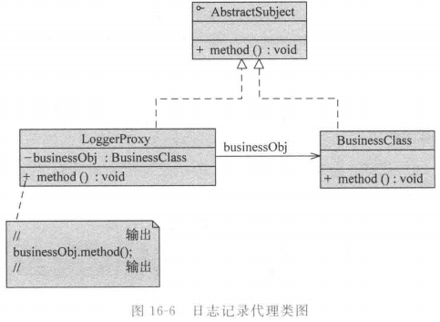

##### 基础2-代码

在某应用软件中需要记录业务方法的调用日志，在不修改现有业务类的基础上为每一个类提供一个日志记录代理类，在代理类中输出日志，如在业务方法method()调用之前输出“方法method()被调用，调用时间为2018-05-01 10：10：10”，调用之后如果没有抛异常则输出“方法method()调用成功”，否则输出“方法method()调用失败”。在代理类中调用真实业务的业务方法，使用代理模式设计该日志记录模块的结构。   (1)请根据类图编程实现该系统,并写出相应Java代码。  


  (2)为了保证将来修改或添加新的日志功能时不需要修改现有的代码，请你绘出新类图并，并做说明或编码实现。  


个人实现。


```java
package lab5_1;

public interface AbstractLog {
    public boolean method();
}
```

```java
package lab5_1;

import java.util.Random;

public class BusinessClass implements AbstractLog {
    static final private Random ran = new Random();

    @Override
    public boolean method() {
        if (0 == ran.nextInt(5)) {
            return false;
        }
        return true;
    }
}
```

```java
package lab5_1;

import java.util.Date;

public class LoggerProxy implements AbstractLog {
    private AbstractLog business = new BusinessClass();

    @Override
    public boolean method() {
        Date now = new Date();
        System.out.println(
                String.format("调用时间为%tY-%tm-%td %tH:%tM:%tS", now, now, now, now, now, now));
        boolean res = business.method();
        if (res) {
            System.out.println("方法method()调用成功");
        } else {
            System.out.println("方法method()调用失败");
        }
        return res;
    }
}
```

```java
package lab5_1;

import java.util.Date;

public class LoggerProxy2 implements AbstractLog {
    private AbstractLog business = new BusinessClass();

    @Override
    public boolean method() {
        Date now = new Date();
        System.out.println(
                String.format("新的日志类调用时间为%tY-%tm-%td %tH:%tM:%tS", now, now, now, now, now, now));
        boolean res = business.method();
        if (res) {
            System.out.println("方法method()调用成功");
        } else {
            System.out.println("方法method()调用失败");
        }
        return res;
    }
}
```

```java
package lab5_1;

import util.XMLUtil;

public class Client {
    public static void main(String[] args) {
        AbstractLog log = (AbstractLog) XMLUtil.getBean("src/lab5_1/logclass.xml");
        for (int i = 0; i < 10; ++i) {
            log.method();
            System.out.println("---");
        }
    }
}
```

> ```xml
> <config>
> 	<className>lab5_1.LoggerProxy</className>
> </config>
> ```
>
> 在 `src/lab5_1/logclass.xml`
>
> ```java
> package util;
> 
> import java.io.File;
> 
> import javax.xml.parsers.DocumentBuilder;
> import javax.xml.parsers.DocumentBuilderFactory;
> import org.w3c.dom.Document;
> import org.w3c.dom.Node;
> import org.w3c.dom.NodeList;
> 
> public class XMLUtil {
>     /**
>      * 
>      * @param path URL of a XML file
>      * @return the Class of the XML described
>      * @exampleXML like below
>      * <?xml version="1.0"?>
>        <config>
>            <className>lab1_2.FileLogFactory</className>
>         </config>
>      * it gets FileLogFactory
>      */
>     public static Object getBean(String path) {
>         try {
>             DocumentBuilderFactory dFactory = DocumentBuilderFactory.newInstance();
>             DocumentBuilder builder = dFactory.newDocumentBuilder();
>             Document doc = builder.parse(new File(path));
>             NodeList nl = doc.getElementsByTagName("className");
>             Node classNode = nl.item(0).getFirstChild();
>             String cName = classNode.getNodeValue();
> //            System.out.println(cName);
>             
>             @SuppressWarnings("rawtypes")
>             Class c = Class.forName(cName);
>             Object obj = c.newInstance();
>             return obj;
>         } catch (Exception e) {
>             e.printStackTrace();
>             return null;
>         }
>     }
> }
> ```


##### JDK

Java RMI(remote method invocation 远程方法调用)，定义了客户对象(client object，在客户端运行，向远程对象发送请求)和远程对象(remote object，在服务器端运行，通过客户对象使得远程对象像本地对象一样被访问)。桩(/存根,stub)是远程对象在客户端的代理。


EJB, Web Service 等分布式技术是代理模式的应用。EJB 的 RMI 机制里远程服务器 Bean 在本地有桩代理。

Spring AOP 技术是动态代理技术(dynamic proxy)。


##### 动态代理

使用 `java.lang.reflect`，使用 `InvocationHandler` 接口，是代理实例调用处理程序实现的接口，定义了：

```java
public Object invoke(Object proxy, Method method, Object[] args) throws Throwable;
```

 参数：代理类、代理方法、参数数组。

还有 `Proxy` 类，即动态代理类，最常用的方法为：

```java
public static Object newProxyInstance(ClassLoader loader, Class<?>[] interfaces, InvocationHandler h) throws IllegalArgumentException
```

根据传入的接口类型返回动态创建的代理类的实例。loader 是代理类的类加载器，interfaces 是接口列表(与真实主题类接口列表一致)，h 是指派的调用处理程序类。


对于多个真实主题类，只需要提供一个动态代理类，通过配置文件设置具体真实主题类名，无需维护与真实主题角色的引用，设计和编程实现时不需要关心真实主体角色，系统灵活性、可扩展性更好。


演示代码：

抽象主题接口：


真实主题类：


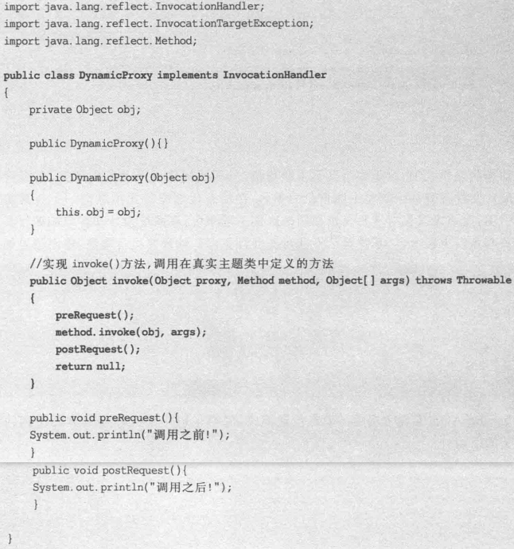


## 行为型模式

### 职责链模式

#### 概念

职责链可以是链、环、树。

定义：

- Avoid coupling the sender of a request to its receiver by giving more than one object a chance to handle the request. Chain the receiving objects and pass the request along the chain until an object handles it.

  避免请求发送者与接收者耦合在一起，让多个对象都有可能接收请求，讲这些对象连接成一条链，并且沿着这条链传递请求，直到有对象处理它为止。


- `Handler` 抽象处理者
- `ConcreteHandler` 具体处理者
- `Client` 客户类

分类：

1. 纯的职责链模式。具体处理者对象要么承担责任要么推给下家，不能都干。请求必须被某一处理者对象接收。
2. 不纯的职责链模式。任何处理者都可以处理且处理后继续传播或停止传播。请求可以不被任何接收端对象接受。

#### 评价

优点：

1. 降低耦合度。对象无需知道其他哪一个对象处理其请求。只需要知道请求会被处理，接收者和发送者都没有对方的明确信息，链中对象不需要知道链的结构。
2. 简化对象的相互连接，请求处理对象只需要维护一个指向后继者的引用，不需要维护所有候选处理者。
3. 增强给对象指派职责的灵活性。运行时动态增加或修改来改变处理一个请求的职责。
4. 增加新的处理请求类方便。无需修改原有代码，重新建链即可，符合开闭原则。

缺点：

1. 不能保证请求一定被接收，可能一直到末端处理不了/未正确配置链。
2. 比较长的职责链性能受到影响，调试不方便，建链不当可能循环调用死循环。

适用：

1. 多个对象可以处理同一个请求，运行时确定具体哪个对象处理
2. 不明确指定接收者时，向多个对象的一个提交请求
3. 动态指定一组对象处理请求，动态创建职责链/改变先后次序。

#### 例子

##### 基本

> 
>
> 


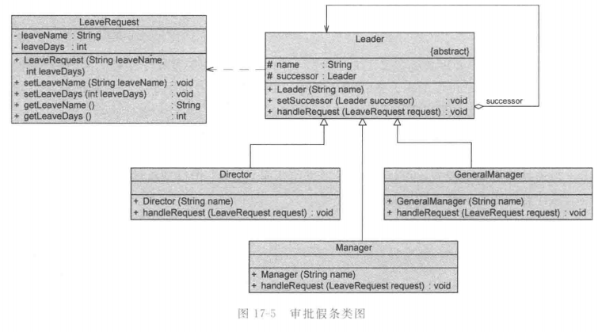


##### 基本2-代码

某公司欲开发一个软件的在线文档帮助系统，用户可以在任何一个查询环境中输入查询关键字，如果当前查询环境下没有相关的内容，则系统会将查询按照一定的顺序转发给其他查询环境。客户可以定制自己的查询顺序，例如先查询Java关键字，再查询SQL关键字，最后查询UML关键字。请根据类图编程实现该系统,并写出相应Java代码。  


个人实现。

```java
package lab5_2;

public abstract class SearchContext {
    protected SearchContext successor;

    public void setSuccessor(SearchContext successor) {
        this.successor = successor;
    }
    
    abstract void search(String keyword);
}
```

```java
package lab5_2;

public class JavaSearchContext extends SearchContext {
    @Override
    void search(String keyword) {
        if (keyword.contains("Java")) {
            System.out.println("查询关键字Java");
        } else if (successor != null) {
            successor.search(keyword);
        } else {
            System.out.println("查询不到关键字");
        }
    }
}
```

```java
package lab5_2;

public class SQLSearchContext extends SearchContext {
    @Override
    void search(String keyword) {
        if (keyword.contains("SQL")) {
            System.out.println("查询关键字SQL");
        } else if (successor != null) {
            successor.search(keyword);
        } else {
            System.out.println("查询不到关键字");
        }
    }
}
```

```java
package lab5_2;

public class UMLSearchContext extends SearchContext {
    @Override
    void search(String keyword) {
        if (keyword.contains("UML")) {
            System.out.println("查询关键字UML");
        } else if (successor != null) {
            successor.search(keyword);
        } else {
            System.out.println("查询不到关键字");
        }
    }
}
```

```java
package lab5_2;

public class Client {
    public static void main(String[] args) {
        SearchContext jContext = new JavaSearchContext();
        SearchContext sContext = new SQLSearchContext();
        SearchContext uContext = new UMLSearchContext();
        jContext.setSuccessor(sContext);
        sContext.setSuccessor(uContext);
        jContext.search("Java-SQL-UML");
        jContext.search("Jvav-SQL-UML");
        jContext.search("Jvav-WSL-UML");
        jContext.search("Jvav-WSL-ML");
    }
}
```


##### JDK

java 异常处理机制 try 接多个 catch 就是职责链模式。

JDK 1.0 或更早的 AWT 事件模型使用事件浮升 event bubbling 机制，因为窗口组件(按钮、文本框等)一般在容器组件中，故发生在某一组件上时，通过组件对象 `handleEvent()` 将其传递给处理方法，然后事件处理方法决定是否向上一级容器传播，以此类推，直到顶层，如果仍不处理就忽略。是不纯的职责链模式。

缺点：代码维护困难、重用性差、存在大量条件语句、处理速度慢、只适合 AWT 组件。故 JDK 1.1 后，用观察者模式代替了。

而 js 仍可以使用事件浮升机制处理事件。


### 命令模式

#### 概念

定义：

- Encapsulate a request as an object, thereby letting you parameterize clients with different requests, queue or log requests, and support undoable operations.

  将一个请求封装成一个对象，从而使我们可用不同的请求对客户进行参数化；对请求排队或者记录请求日志，以及支持可撤销的操作。


- `Command` 抽象命令类
- `ConcreteCommand` 具体命令类
- `Invoker` 调用者/请求者
- `Receiver` 接收者
- `Client` 客户类

扩展：

- 可以支持撤销、重做操作。
- 宏命令/组合命令。命令模式+组合模式。


#### 评价

优点：

1. 降低系统耦合度。请求者接收者不直接引用，解耦。同一请求者可以对不同接收者，同一接收者可以对不同请求者。
2. 新命令加入容易，不影响其他类，不修改源代码，满足开闭原则，灵活可扩展。
3. 比较容易设置命令队列、宏命令(组合命令)，批量执行，结合组合模式。
4. 方便实现 undo, redo(命令提供逆操作，命令对象存储在集合里)。

缺点：

1. 具体命令类过多。

适用：

1. 请求调用者接收者解耦不直接交互，调用者不需要知道接收者是谁/存在/何时调用。
2. 不同时间指定请求，如请求排队、执行请求。命令对象和请求初始调用者生命周期可以不同，即发出者不在了，命令对象还在活动。
3. 支持撤销、恢复。
4. 一组操作组合在一起，支持宏命令，与组合模式合用，实现命令批处理执行。

#### 例子

##### 基础


##### 基础2


请求的接收者类：


抽象命令类：


具体命令类：


调用者类：


如果需要不同的请求响应方法，只需要更换命令类对象可以让同一个 `Controller` 对象作用于不同的请求接收者，实现调用者与接收者解耦。


扩展：如果要改成控制空调，只需要添加三个具体命令类，然后与接收者(空调类)关联，然后修改三个客户端 command 即可(可以写配置，以符合开闭原则)


经典例子是热键，可以更改每个键绑定的功能：


##### 基础3-代码

为了用户使用方便，某系统提供了一系列功能键，用户可以自定义功能键的功能，如功能键FunctionButton可以用于退出系统(SystemExitClass)，也可以用于打开帮助界面(DisplayHelpClass)。用户可以通过修改配置文件来改变功能键的用途，现使用命令模式来设计该系统，使得功能键类与功能类之间解耦，相同的功能键可以对应不同的功能。请根据类图编程实现该系统,并写出相应Java代码。


```java
package lab5_3;

public interface Command {
    public void execute();
}
```

```java
package lab5_3;

public class ExitCommand implements Command {
    private SystemExitClass seObj = new SystemExitClass();

    @Override
    public void execute() {
        seObj.exit();
    }
}
```

```java
package lab5_3;

public class HelpCommand implements Command {
    DisPlayHelpClass hcObj = new DisPlayHelpClass();
    @Override
    public void execute() {
        hcObj.display();
    }
}
```

```jva
package lab5_3;

public class SystemExitClass {
    public void exit() {
        System.out.println("退出系统");
    }
}
```

```java
package lab5_3;

public class DisPlayHelpClass {
    public void display() {
        System.out.println("打开帮助文档!");
    }
}
```

```java
package lab5_3;

public class FunctionButton {
    private Command command;

    public void setCommand(Command command) {
        this.command = command;
    }
    
    public void click() {
        command.execute();
    }
}
```

```java
package lab5_3;

public class Client {
    public static void main(String[] args) {
        Command commandExit = new ExitCommand();
        Command commandHelp = new HelpCommand();
        FunctionButton fb1 = new FunctionButton();
        FunctionButton fb2 = new FunctionButton();
        fb1.setCommand(commandExit);
        fb2.setCommand(commandHelp);
        fb1.click();
        fb2.click();
        System.out.println("热键修改");
        fb1.setCommand(commandHelp);
        fb2.setCommand(commandExit);
        fb1.click();
        fb2.click();
    }
}
```


##### JDK

Java AWT/Swing GUI 委派事件模型(DEM, delegation event model)，其中 frame/button 等界面组件是请求发送者，AWT 提供的事件监听器接口/事件适配器类是抽象命令接口，用户自己实现接口子类处理事件(具体命令类)，然后结合观察者模式，将具体命令对象注册到组件类，事件触发时回调 callback 具体命令类定义的事件处理方法。

如 `JButton` 是请求调用者，事件监听接口 `ActionListener` 是抽象命令类，实现的子类是具体命令类。

UNIX 的 shell 编程，可以将多条命令封装在一个命令对象中，只需一条命令即可执行一个命令序列。


##### 撤销

下面例子只能撤销一次，因为没保存历史状态。还可以用类似方法实现恢复操作。


##### 宏命令


### 解释器模式

#### 概念

定义：

- Given a language, define a representation for its grammar along with an interpreter that uses the representation to interpret sentences in the languages.

  定义语言的文法，建立一个解释器解释该语言中的句子。

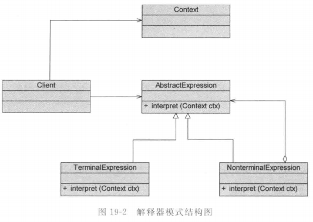

- `AbstractExpression` 抽象表达式

- `TerminalExpression` 终结符表达式

- `NonterminalExpression` 非终结符表达式

- `Context` 环境类。解释器外的全局信息，如要解释的语句。

  系统不提供全局公共信息可以省略。

- `Client` 客户端。

#### 评价

优点：

1. 易于改变、扩展文法。类表示文法规则，用继承扩展简单。
2. 易于实现文法。每个节点类实现方法相似，编写不复杂。
3. 增加新的解释表达式方法。方便添加新类型表达式，符合开闭原则。

缺点：

1. 复杂文法难以维护，一条规则一个类。
2. 执行效率低，递归循环多。
3. 应用场景有限，很少需要自定义文法。

适用：

1. 需要解释执行的语言的句子表示为抽象语法树
2. 重复出现的问题可以用简单的语言表达
3. 文法简单
4. 不追求效率


#### 例子

##### 基础


##### 计算器


每个 Node 根据左子、右子会形成树的结构，然后执行计算就 DFS 树。


##### JDK

面向对象语言实现的编译器，如 smalltalk 语言。

基于 Java 抽象语法树的源代码处理工具，如 Eclipse AST(Eclipse JDT 的组成部分)

可以用解释器模式开发简单编译器，增强语言功能，新增语法。


数学公式第三方库包：MEP math expression parser 数学表达式解析器，如 `Expression4J`, `Jep`, `JbcParser`, `Symia`, `Math Expression String Parser`(MESP)等。

- `Expression4J` 数学表达式存字符串，可以自定义文法，支持实数、复数、基本数学函数、自定义函数文法、函数目录、XML配置等。`http://www.expression4j.org`
- `Jep`(Java Mathematical Expression Parser)，输入任意数学公式，自定义变量，常量，自定义函数，通用数学函数常量，立即求解。`http://www.singularsys.com/jep/`


### 迭代器模式

#### 概念

定义：

- Provide a way to access the elements of an aggregate object sequentially without exposing its underlying representation.

  提供一种方法来访问聚合对象，而不用暴露这个对象的内部表示。


1. `Iterator` 抽象迭代器
2. `ConcreteIterator` 具体迭代器
3. `Aggregate` 抽象聚合类
4. `ConcreteAggregate` 具体聚合类

是单一职责原则的完美体现。

#### 评价

优点：

1. 支持不同方式遍历一个聚合对象
2. 简化聚合类，聚合对象不需要提供遍历等操作方法
3. 同一个聚合可以进行多个不同的遍历互不影响
4. 添加新的聚合类/迭代器类方便，无需修改，符合开闭原则

缺点：

1. 存储数据和遍历数据职责分离，增加新的聚合类需要新的迭代器类，类的个数成对增加，一定程度添加系统复杂性

使用：

1. 访问一个聚合对象，无需暴露内部表示，无需了解内部实现细节
2. 为聚合对象提供多种遍历方式
3. 不同聚合结构提供统一的接口，需要扩展聚合结构/新的遍历方式

#### 例子

##### 内部类


> 非内部类：
>
> 


##### 基础


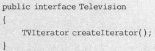

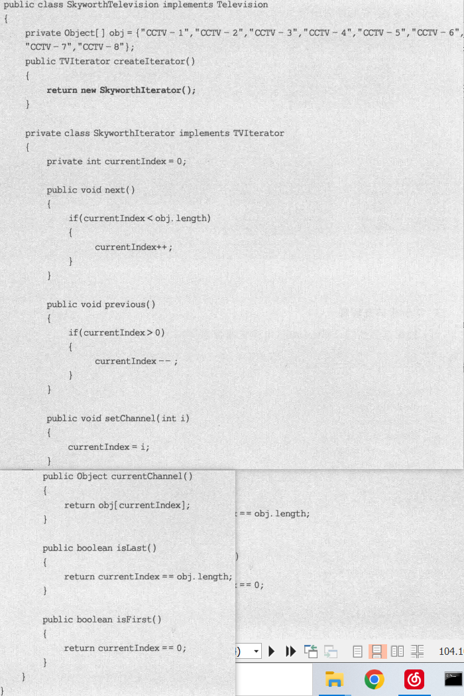


##### 基础2-代码

迭代器模式 (商品名称遍历) ：某商品管理系统的商品名称存储在一个字符串数组中，现需要自定义一个双向迭代器（MyIterator）实现对该商品名称数组的双向（前向和后向）遍历。请根据类图编程实现该系统,并写出相应Java代码。  


个人实现：

```java
package ab6_1;

public interface AbstractIterator {
    public void next();

    public boolean isLast();

    public void previous();

    public boolean isFirst();

    public String getNextItem();

    public String getPreviousItem();
}
```

```java
package ab6_1;

public abstract class AbstractProductList {
    private String[] productsName;

    public AbstractProductList(String[] productsName) {
        this.productsName = productsName;
    }
    
    public String[] getProductsName() {
        return productsName;
    }
    
    public abstract AbstractIterator getIterator();
}
```

```java
package ab6_1;

public class ProductList extends AbstractProductList {
    public ProductList(String[] productsName) {
        super(productsName);
    }

    private class MyIterator implements AbstractIterator {
        private int index = -1;
        private String[] obj = getProductsName();

        @Override
        public void next() {
            if (index < obj.length) {
                ++index;
            }
        }

        @Override
        public boolean isLast() {
            return index + 1 == obj.length;
        }

        @Override
        public void previous() {
            if (index >= 0) {
                --index;
            }
        }

        @Override
        public boolean isFirst() {
            return index < 0;
        }

        @Override
        public String getNextItem() {
            if (index + 1 <= obj.length) {
                return obj[index + 1];
            }
            return null;
        }

        @Override
        public String getPreviousItem() {
            if (index >= 0) {
                return obj[index];
            }
            return null;
        }
    }

    @Override
    public AbstractIterator getIterator() {
        return new MyIterator();
    }
}
```

```java
package ab6_1;

public class Client {
    public static void main(String[] args) {
        String[] pNames = { "星轨联名电脑", "小米手表", "华为手机", "原神手提包" };
        AbstractProductList list = new ProductList(pNames);
        AbstractIterator iterator = list.getIterator();
        while (!iterator.isLast()) {
            System.out.println(iterator.getNextItem());
            iterator.next();
        }
        System.out.println("---");
        while (!iterator.isFirst()) {
            System.out.println(iterator.getPreviousItem());
            iterator.previous();
        }
    }
}
```


##### JDK


JDK 1.2 引入聚合框架 `Collections`，方法如下：


哎呦子接口 `java.util.ListIterator` 是 `Iterator` 子类。


`Iterator` 三个方法：

- `Object next()`
- `boolean hasNext()`
- `void remove()` 删除上次调用 next 返回的元素


如果没 next 就 remove 会 `IllegalStateException`


### 中介者模式

#### 概念

定义：

- Define an object that encapsulates how a set of objects interact. Mediator promotes loose coupling by keeping objects from referring to each other explicitly, and it lets you vary their interaction independently.

  用一个中介对象来封装一系列的对象交互，使各对象不需要显式地相互引用，从而使其耦合松散，而且可以独立地改变它们之间的交互。


1. `Mediator` 抽象中介者
2. `ConcreteMediator` 具体中介者
3. `Colleague` 抽象同事类
4. `ConcreteColleague` 具体同事类


> 对象关联太强的缺点：
>
> - 系统结构复杂：存在大量相互关联和调用，一个对象发生变化需要跟踪大量关联的其他对象
> - 对象可重用性差：一个对象和其他对象强关联，独自很难被另一个系统/模块重用，职责混乱
> - 系统扩展性低：增加新对象要原相关对象添加引用，添加引用关系要调增原有对象，耦合度高，不灵活

符合迪米特法则，中介者起到的职责：

1. 中转作用(结构性)：同事对象不需要显式引用其他同事。
2. 协调作用(行为性)：同事一致性与中介者交互，不需要指明中介者怎么做。中介者自行处理。


#### 评价

优点：

1. 简化了对象间交互，变成一对多，容易理解、维护、扩展，网状变成星状结构
2. 各同事解耦，松耦合，独立改变复用各同事、中介者，添加方便，开闭原则
3. 减少子类生成，分布多个对象的行为集中在一起，改变行为只需要新中介者子类
4. 复杂对象交互，简化同事设计，分解中介者只对某类同事适用

缺点：

1. 中介者包含同事交互细节，可能导致非常复杂，难以维护。

适用：

1. 对象存在复杂引用，相互依赖结构混乱难以理解
2. 一个对象引用很多其他对象并通信导致难以复用
3. 用中间类封装多个类行为，又不想生成太多子类

#### 例子

##### 基础


##### 论坛


抽象中介者：


具体中介者类：


抽象同事类：


具体同事类：


##### JDK

事件驱动类软件，GUI 组件复杂交互关系。如 MVC 是 Java EE 的基本模式，`Controller` 是中介者，控制 `View` 和 `Model` 的交互。如 `Struts` 里 `Action` 是 JSP 页面与业务对象的中介者。

##### 复杂窗口

某软件公司欲开发一套CRM系统，其中包含一个客户信息管理模块，所设计的“客户信息管理窗口”界面效果图如图所示。组件之间的交互关系如下： 

(1) 当用户单击“增加”按钮、“删除”按钮、“修改”按钮或“查询”按钮时，界面左侧的“客户选择组合框”、“客户列表”以及界面中的文本框将产生响应。 

(2) 当用户通过“客户选择组合框”选中某个客户姓名时，“客户列表”和文本框将产生响应。  

(3) 当用户通过“客户列表”选中某个客户姓名时，“客户选择组合框”和文本框将产生响应。  请使用中介模式实现该系统,并补充程序中相应Java代码。  

```java
package lab6_2;

public class User {
    private String name;
    private String gender;
    private String birthday;
    private String tel;
    private String email;

    public User() {
    }

    public User(String name, String gender, String birthday, String tel, String email) {
        super();
        this.name = name;
        this.gender = gender;
        this.birthday = birthday;
        this.tel = tel;
        this.email = email;
    }

    @Override
    public int hashCode() {
        final int prime = 31;
        int result = 1;
        result = prime * result + ((name == null) ? 0 : name.hashCode());
        return result;
    }

    @Override
    public boolean equals(Object obj) {
        if (this == obj)
            return true;
        if (obj == null)
            return false;
        if (getClass() != obj.getClass())
            return false;
        User other = (User) obj;
        if (name == null) {
            if (other.name != null)
                return false;
        } else if (!name.equals(other.name))
            return false;
        return true;
    }

    public String getName() {
        return name;
    }

    public void setName(String name) {
        this.name = name;
    }

    public String getGender() {
        return gender;
    }

    public void setGender(String gender) {
        this.gender = gender;
    }

    public String getBirthday() {
        return birthday;
    }

    public void setBirthday(String birthday) {
        this.birthday = birthday;
    }

    public String getTel() {
        return tel;
    }

    public void setTel(String tel) {
        this.tel = tel;
    }

    public String getEmail() {
        return email;
    }

    public void setEmail(String email) {
        this.email = email;
    };

}
```

```java
package lab6_2;

import java.util.LinkedList;
import java.util.List;

public class MyMediator1 implements Mediator { // 设置为抽象类只是为了不能被初始化
    // 使用list集合管理用户
    protected List<Component> componentList = new LinkedList<>();
    protected List<User> ulist = new LinkedList<>();

    @Override
    public boolean addComponent(Component comp) {
        return componentList.add(comp);
    }

    @Override
    public void NotifyAllToUpdate(User u) {
        for (Component comp : componentList) {
            comp.update(u);
        }
    }

    @Override
    public String[] getUserNames() { // 获取所有用户名
        String[] names = new String[ulist.size()];
        for (int i = 0; i < ulist.size(); i++) {
            names[i] = ulist.get(i).getName();
        }
        return names;
    }

    @Override
    public boolean addUser(User u) {
        System.out.println("Here");
        for (int i = 0; i < ulist.size(); ++i) {
            if (ulist.get(i).getName().equals(u.getName())) {
                System.out.println("重名啦");
                return false;
            }
        }
        return ulist.add(u);
    }

    @Override
    public boolean removeUser(User u) {
        return ulist.remove(u);
    }

    @Override
    public User getUser(String uName) {
        User u = null;
        if (uName != null) {
            for (int i = 0; i < ulist.size(); i++) {
                if (uName.contentEquals(ulist.get(i).getName())) {
                    u = ulist.get(i);
                    break;
                }
            }
        }

        return u;
    }

}

```

```java
package lab6_2;

import java.util.ArrayList;
import java.util.Arrays;
import java.util.HashSet;
import java.util.LinkedList;
import java.util.List;
import java.util.Set;

public class MyMediator2 implements Mediator { // 设置为抽象类只是为了不能被初始化

    protected List<Component> componentList = new LinkedList<>();
    protected Set<User> uSet = new HashSet<>(); // 使用Set结合管理用户 加入不重复

    @Override
    public boolean addComponent(Component comp) {
        return componentList.add(comp);
    }

    @Override
    public void NotifyAllToUpdate(User u) {
        for (Component comp : componentList) {
            comp.update(u);
        }
    }

    @Override
    public String[] getUserNames() { // 获取所有用户名
        String[] uNames = new String[uSet.size()];
        ArrayList<String> uNameList = new ArrayList<>();
        for (User u : uSet) {
            uNameList.add(u.getName());
        }
        uNameList.toArray(uNames); // 列表转数组
        Arrays.sort(uNames); // 数组排序
        return uNames;
    }

    @Override
    public boolean addUser(User u) {
        return uSet.add(u);
    }

    @Override
    public boolean removeUser(User u) {
        return uSet.remove(u);
    }

    @Override
    public User getUser(String uName) {
        User user = null;
        if (uName != null) {
            for (User u : uSet) {
                if (uName.contentEquals(u.getName())) {
                    user = u;
                    break;
                }
            }
        }

        return user;
    }
}
```

```java
package lab6_2;

import javax.swing.AbstractListModel;
import javax.swing.JList;

@SuppressWarnings({ "serial", "rawtypes" })
public class MyJList extends JList implements Component {

    @Override
    public void change() {

    }

    @SuppressWarnings("unchecked")
    @Override
    public void update(User u) {

        String[] names = mediator.getUserNames();
        this.setModel(new AbstractListModel() {
            String[] values = names;

            public int getSize() {
                return values.length;
            }

            public Object getElementAt(int index) {
                return values[index];
            }
        });
        int index = 0;
        if (u != null) {
            for (int i = 0; i < names.length; i++) {
                if (u.getName().equals(names[i])) {
                    index = i;
                    break;
                }
            }
        }
        this.setSelectedIndex(index);
        this.repaint();
    }
}

```

```java
package lab6_2;

/**
 * 
 * @author chf 中介者工厂类
 */

public class MediatorFactory {

    private static Mediator mediator = init();

    public static Mediator getMediator() {
        if (mediator == null) {
            mediator = init();
        }
        return mediator;
    }

    private static Mediator init() { // 初始化中介者
        try {
            @SuppressWarnings("rawtypes")
            Class mediatorClass = Class.forName("lab6_2.MyMediator1"); // 这样写是为了将来可以配置化
            // 可以配置为人员一个Mediator类的子类
            return (Mediator) mediatorClass.newInstance();
        } catch (ClassNotFoundException e) {
            e.printStackTrace();
        } catch (InstantiationException e) {
            e.printStackTrace();
        } catch (IllegalAccessException e) {
            e.printStackTrace();
        }
        return null;
    }

}

```

```java
package lab6_2;

public interface Mediator { // 设置为抽象类只是为了不能被初始化

    public boolean addComponent(Component comp); // 添加同事对象

    public void NotifyAllToUpdate(User u); // 有变动通知同事更新信息

    /**
     * 以下定义对需用户对象集合的操作方法。将来如果有需要，可以独立出来。
     */

    public String[] getUserNames(); // 获取所有用户名

    public boolean addUser(User u); // 添加用户

    public boolean removeUser(User u); // 删除用户

    public User getUser(String uName); // 获取用户

}

```

```java
package lab6_2;

import javax.swing.ButtonGroup;
import javax.swing.JLabel;
import javax.swing.JPanel;
import javax.swing.JRadioButton;
import javax.swing.JTextField;

@SuppressWarnings("serial")
public class DetailPanel extends JPanel implements Component {

    User user;
    private JTextField nameField;
    private JTextField birthField;
    private JTextField telField;
    private JTextField emailField;
    private JRadioButton boyButton;
    private JRadioButton girlButton;
    private User currentUser;// 指向当前面板正在显示的用户 为更新记录信息用

    /**
     * Create the panel.
     */
    public DetailPanel(User u) {
        this.user = u;
        currentUser = u;
        setLayout(null);

        nameField = new JTextField();
        nameField.setColumns(10);
        nameField.setBounds(74, 10, 121, 21);
        // if(u!=null) nameField.setText(u.getName());

        JLabel lblNewLabel_1 = new JLabel("姓名：");
        lblNewLabel_1.setBounds(10, 13, 54, 15);
        add(lblNewLabel_1);

        JLabel lblNewLabel_2 = new JLabel("性别：");
        lblNewLabel_2.setBounds(10, 49, 54, 15);
        add(lblNewLabel_2);

        boyButton = new JRadioButton("男");
        boyButton.setBounds(70, 45, 54, 23);

        girlButton = new JRadioButton("女");
        girlButton.setSelected(true);
        girlButton.setBounds(147, 45, 48, 23);

        ButtonGroup btg = new ButtonGroup();
        btg.add(girlButton);
        btg.add(boyButton);

        JLabel lblNewLabel_3 = new JLabel("生日：");
        lblNewLabel_3.setBounds(10, 87, 54, 15);
        add(lblNewLabel_3);

        birthField = new JTextField();
        birthField.setColumns(10);
        birthField.setBounds(82, 84, 113, 21);

        JLabel tel = new JLabel("电话：");
        tel.setBounds(10, 129, 71, 15);
        add(tel);

        telField = new JTextField();
        telField.setColumns(10);
        telField.setBounds(82, 130, 157, 21);

        JLabel e_mail = new JLabel("邮箱：");
        e_mail.setBounds(10, 181, 71, 15);
        add(e_mail);

        emailField = new JTextField();
        emailField.setColumns(10);
        emailField.setBounds(82, 178, 169, 21);

        setUserInfo(u); // 设置文本框内容

        add(nameField);
        add(boyButton);
        add(girlButton);
        add(emailField);
        add(telField);
        add(birthField);

    }

    @Override
    public void change() {

    }

    private void setUserInfo(User u) { // 设置值
        if (u != null) {
            nameField.setText(u.getName());
            birthField.setText(u.getBirthday());
            telField.setText(u.getTel());
            emailField.setText(u.getEmail());
            if ("男".equals(u.getGender())) {
                boyButton.setSelected(true);
            } else {
                girlButton.setSelected(true);
            }
        }
    }

    @Override
    public void update(User u) { //
        if (u == null) {
            u = new User("", "", "", "", ""); /// 删除时，使用空字符更新用户和信息面板
        }
        this.user = u;
        currentUser = u;
        setUserInfo(u);

        this.repaint();
    }

    public User createUser() {
        if (nameField.getText().trim().length() > 0) { // 这里可以设置更多的条件检查
            User u = new User();
            u.setName(nameField.getText().trim());
            u.setBirthday(birthField.getText().trim());
            u.setEmail(emailField.getText().trim());
            u.setTel(telField.getText().trim());
            if (boyButton.isSelected()) {
                u.setGender("男");
            } else {
                u.setGender("女");
            }
            return u;
        } else {
            return null;
        }
    }

    public User getCurrentUser() {
        if (currentUser.getName().length() < 1) {
            return null;
        }
        return currentUser;
    }

}

```

```java
package lab6_2;

import java.awt.EventQueue;
import javax.swing.JFrame;
import javax.swing.JPanel;
import javax.swing.border.EmptyBorder;
import javax.swing.JLabel;
import java.awt.Font;
import java.awt.Color;
import javax.swing.JOptionPane;
import javax.swing.ButtonGroup;
import javax.swing.ListSelectionModel;
import javax.swing.JTextField;
import javax.swing.JButton;
import java.awt.event.ActionListener;
import java.awt.event.MouseAdapter;
import java.awt.event.MouseEvent;
import java.awt.event.ActionEvent;

/**
 * 
 * 
 * 说明：可以按以下层进行划分完成步骤： 1、完成中介者和同事类设计。难点：同事要继承swing中的可视化组件，又要有通过的方法。---使用一个接口
 * 2、使用完成动态添加用户，并使用List集合存储用户，使用中介者实现 动态更新 Jlist,JCombobox控件显示。
 * 3、完成添加和删除，注意代码的可重用（比如公用部分创建用户时代代码） 4、完成通过Jlist或JCombobox触发其它同事类的更新。
 * 关于点火方法change()的思考 --如何在开发过程中灵活应用?? 如何使update方法通用性更好，比如
 * detailpanel中三中不同功能按钮的update调用一致。 5、关于代码重构的思考：降低耦合。 根据单一职责原则，使用中介者工厂方便动态创建。
 * 使用抽象中介者拓展， 比如把管理用户设置为set集合而不需要修改原有的代码。
 * 引入中介者工厂，和使用awt事件监听，替代点火change()，把同事与中介者的关系由关联关系，变为依赖关系。同时减少了编码的复杂度
 */

@SuppressWarnings("serial")
public class ConcreteIMediator extends JFrame {
    private JPanel contentPane;
    private DetailPanel detailPanel;
    private JTextField findField;
    private ComboBox comboBox;
    private MyJList myJlist;
    private Mediator mediator;

    /**
     * Launch the application.
     */
    public static void main(String[] args) {
        EventQueue.invokeLater(new Runnable() {
            public void run() {
                try {
                    ConcreteIMediator frame = new ConcreteIMediator();
                    frame.setVisible(true);
                } catch (Exception e) {
                    e.printStackTrace();
                }
            }
        });
    }

    /**
     * Create the frame.
     */
    public ConcreteIMediator() {

        mediator = MediatorFactory.getMediator();
        if (mediator == null) {
            JOptionPane.showMessageDialog(null, "发生严重系统错误，无法启动");
            System.exit(0);
        }

        setResizable(false);
        setTitle("用户信息管理窗口");
        setDefaultCloseOperation(JFrame.EXIT_ON_CLOSE);
        setBounds(100, 100, 615, 466);
        contentPane = new JPanel();
        contentPane.setBorder(new EmptyBorder(5, 5, 5, 5));
        setContentPane(contentPane);
        contentPane.setLayout(null);

        JLabel lblNewLabel = new JLabel("用户信息管理系统");
        lblNewLabel.setForeground(Color.BLUE);
        lblNewLabel.setFont(new Font("宋体", Font.PLAIN, 28));
        lblNewLabel.setBounds(175, 24, 266, 27);
        contentPane.add(lblNewLabel);

        detailPanel = new DetailPanel(null);
        detailPanel.setBounds(231, 136, 333, 223);
        contentPane.add(detailPanel);
        detailPanel.setLayout(null);
        mediator.addComponent(detailPanel);

        comboBox = new ComboBox();
        comboBox.setBounds(35, 69, 135, 21);
        contentPane.add(comboBox);
        mediator.addComponent(comboBox); // 注册到中介者中
        // 注意，这里如果使用Itemlistener事件，会有问题，请思考原因？
        comboBox.addActionListener(new ActionListener() {
            @Override
            public void actionPerformed(ActionEvent e) {
                String uName = (String) comboBox.getSelectedItem();
                User u = mediator.getUser(uName);
                mediator.NotifyAllToUpdate(u);
            }
        });

        myJlist = new MyJList();
        myJlist.setSelectionMode(ListSelectionModel.SINGLE_SELECTION);
        myJlist.setBounds(35, 159, 135, 190);
        contentPane.add(myJlist);
        mediator.addComponent(myJlist);
        // 注意，这里如果使用ListSelectionListener,会有问题，请思考原因？
        myJlist.addMouseListener(new MouseAdapter() {
            @Override
            public void mouseClicked(MouseEvent e) {
                String uName = (String) myJlist.getSelectedValue();
                User u = mediator.getUser(uName);
                mediator.NotifyAllToUpdate(u);
            }
        });

        ButtonGroup btg = new ButtonGroup();
        btg.getSelection();

        JButton addButton = new JButton("添加"); // 添加按钮
        addButton.addActionListener(new ActionListener() {
            public void actionPerformed(ActionEvent e) {
                User u = detailPanel.createUser(); // 封装用户对象
                if (u != null) {
                    if (mediator.addUser(u)) { // 更新用户列表
                        // JOptionPane.showMessageDialog(null, "添加用户成功");
                        mediator.NotifyAllToUpdate(u); // 通知其他同僚更新
                    } else {
                        JOptionPane.showMessageDialog(null, "添加用户失败");
                    }
                } else {
                    JOptionPane.showMessageDialog(null, "添加用户失败");
                }
            }
        });
        addButton.setBounds(220, 375, 78, 23);
        contentPane.add(addButton);

        JButton deleteButton = new JButton("删除"); // 刪除按钮
        deleteButton.addActionListener(new ActionListener() {
            public void actionPerformed(ActionEvent e) {
                User u = detailPanel.createUser();
                if (u != null) {
                    if (mediator.removeUser(u)) {
                        JOptionPane.showMessageDialog(null, "删除用户成功");
                        mediator.NotifyAllToUpdate(null);
                    } else {
                        JOptionPane.showMessageDialog(null, "删除用户失败");
                    }
                } else {
                    JOptionPane.showMessageDialog(null, "删除用户失败");
                }

            }
        });
        deleteButton.setBounds(344, 375, 71, 23);
        contentPane.add(deleteButton);

        JButton editButton = new JButton("修改"); // 修改按钮
        editButton.addActionListener(new ActionListener() {
            public void actionPerformed(ActionEvent e) {
                try {
                    User CurrentUser = detailPanel.getCurrentUser(); // 获取需要更新的用户
                    User newUser = detailPanel.createUser();
                    if (CurrentUser != null && newUser != null) { // 更新用戶時，用戶名不能空
                        if (mediator.addUser(newUser)) {
                            mediator.removeUser(CurrentUser);
                            mediator.NotifyAllToUpdate(newUser);
                            JOptionPane.showInternalMessageDialog(null, "用户信息更新成功");
                        } else {
                            JOptionPane.showInternalMessageDialog(null, "用户信息修改失败-已存在同名用户");
                        }
                    } else {
                        JOptionPane.showInternalMessageDialog(null, "用户名不能为空");
                    }
                } catch(Exception ee) {
                }
            }
        });
        editButton.setBounds(456, 375, 93, 23);
        contentPane.add(editButton);

        JLabel lblNewLabel_4 = new JLabel("查询关键字：");
        lblNewLabel_4.setBounds(205, 72, 93, 15);
        contentPane.add(lblNewLabel_4);

        findField = new JTextField();
        findField.setBounds(316, 69, 157, 21);
        contentPane.add(findField);
        findField.setColumns(10);

        JButton findButton = new JButton("查找"); // 查找按钮 触发更新
        findButton.addActionListener(new ActionListener() {
            public void actionPerformed(ActionEvent e) {
                String uName = findField.getText().trim();
                User u = mediator.getUser(uName);
                if (u != null) {
                    mediator.NotifyAllToUpdate(u);
                } else {
                    JOptionPane.showMessageDialog(null, "用户不存在！");
                }
            }
        });
        findButton.setBounds(499, 68, 71, 23);
        contentPane.add(findButton);

    }
}

```

```java
package lab6_2;

public interface Component {
    public Mediator mediator = MediatorFactory.getMediator();

    public void change();

    public void update(User u);

    public default void setMediator(Mediator mediator) {
        mediator = MediatorFactory.getMediator();
    }
}

```

```java
package lab6_2;

import javax.swing.DefaultComboBoxModel;
import javax.swing.JComboBox;

@SuppressWarnings("serial")
public class ComboBox extends JComboBox<Object> implements Component {

    @Override
    public void change() {
    }

    @Override
    public void update(User u) {

        this.setModel(new DefaultComboBoxModel<Object>(mediator.getUserNames()));
        if (u != null) {
            this.setSelectedItem(u.getName());
        } else {
            this.setSelectedItem(0);
        }
        this.repaint();
    }
}

```


### 备忘录模式

#### 概念

定义：

- Without violating encapsulation, capture and externalize an object's internal state so that the object can be restored to this state later.

  在不破坏封装的前提下，捕获一个对象的内部状态，并在这个对象之外保存这个状态，这样可以在以后将对象恢复到原先保存的状态。


1. `Originator` 原发器。创建备忘录，存储当前内部状态/恢复内部状态。
2. `Memmento` 备忘录。存储内部状态。
3. `Caretaker` 负责人。保存备忘录。

扩展：

1. 封装性。除了原发器外的其他类不能访问备忘录类。C++ 可以用 friend，Java 可以放同一个包满足包内可见，或作为原发器类的内部类。
2. 多备份。负责人定义集合存储多个状态，备份做记号如检查点check point，map 的检查点事 key；堆栈/数组是下标。

#### 评价

优点：

1. 提供状态恢复实现机制，方便回到特定历史步骤，新状态无效/有问题时，可以复原。
2. 信息封装，备忘录对象不会被其它代码改变，简化原发器对象。负责人定义集合实现多次撤销，存多个备忘录。

缺点：

1. 资源消耗大。类成员变量太多时内存大。

适用：

1. 保存一个对象某一时刻的状态或部分状态，以后可以恢复。
2. 用一个接口让其他对象得到这些状态会破坏封装性，对象不希望外界直接访问其内部状态。

> 如撤销功能(一般是有限次)。DMBS 的事务管理提供备忘录模式，执行失败就回滚。


#### 例子

##### 基础


备忘录类设为包内访问，使得：

- 包内的原发器可以访问它，但是包外的其他类无法访问。


##### 撤销


原发器：(getter setter 代码略)


备忘录类(纯纯的 POJO 只有 getter setter)


负责人：


##### 撤销2-代码

中国象棋软件，由于考虑到有些用户是“菜鸟”，经常不小心走错棋；还有些用户因为不习惯使用手指在手机屏幕上拖动棋子，常常出现操作失误，因此该中国象棋软件要提供“悔棋”功能，在用户走错棋或操作失误后可恢复到前一个步骤。请根据类图编程实现该系统,并写出相应Java代码。（客户端程序 client.java）


个人实现。

```java
package lab2.chess;

public class Chessman {
    private String label;
    private int x, y;
    
    public ChessmanMemento save() {
        return new ChessmanMemento(label, x, y);
    }
    
    public void restore(ChessmanMemento memento) {
        this.label = memento.getLabel();
        this.x = memento.getX();
        this.y = memento.getY();
    }

    public Chessman(String label, int x, int y) {
        this.label = label;
        this.x = x;
        this.y = y;
    }

    public String getLabel() {
        return label;
    }

    public void setLabel(String label) {
        this.label = label;
    }

    public int getX() {
        return x;
    }

    public void setX(int x) {
        this.x = x;
    }

    public int getY() {
        return y;
    }

    public void setY(int y) {
        this.y = y;
    }
}
```

```java
package lab2.chess;

class ChessmanMemento {
    private String label;
    private int x, y;

    public ChessmanMemento(String label, int x, int y) {
        this.label = label;
        this.x = x;
        this.y = y;
    }

    public String getLabel() {
        return label;
    }

    public void setLabel(String label) {
        this.label = label;
    }

    public int getX() {
        return x;
    }

    public void setX(int x) {
        this.x = x;
    }

    public int getY() {
        return y;
    }

    public void setY(int y) {
        this.y = y;
    }
}
```

```java
package lab2.chess;

public class MementoCaretaker {
    private ChessmanMemento memento;
    public ChessmanMemento getMemento() {
        return memento;
    }

    public void setMemento(ChessmanMemento memento) {
        this.memento = memento;
    }
}
```

```java
package lab2;

import java.util.ArrayList;

import lab2.chess.Chessman;
import lab2.chess.MementoCaretaker;

public class Client {
    private int i = -1;
    private ArrayList<MementoCaretaker> stack = new ArrayList<>();
    private Chessman c = new Chessman("车", 0, 0);

    private void show() {
        System.out.println("棋子" + c.getLabel() + "当前位置为: 第" + c.getX() + "行第" + c.getY() + "列");
    }

    private void walk(int x, int y) {
        c.setX(x);
        c.setY(y);
        MementoCaretaker mem = new MementoCaretaker();
        mem.setMemento(c.save());
        ++i;
        if (i >= stack.size()) {
            stack.add(mem);
        } else {
            stack.set(i, mem);
        }
        show();
    }

    private void revoke() {
        assert i > 0;
        --i;
        MementoCaretaker mem = stack.get(i);
        c.restore(mem.getMemento());
        System.out.println("******悔棋******");
        show();
    }

    private void dropback() {
        assert i + 1 < stack.size();
        ++i;
        MementoCaretaker mem = stack.get(i);
        c.restore(mem.getMemento());
        System.out.println("******撤销悔棋******");
        show();
    }

    public static void main(String[] args) {
        Client cc = new Client();
        cc.walk(1, 1);
        cc.walk(4, 5);
        cc.walk(1, 4);
        cc.revoke();
        cc.revoke();
        cc.dropback();
        cc.dropback();
    }
}
```


### 观察者模式

#### 概念

定义：

- Define a one-to-many dependency between objects so that when one object changes state, all its dependents are notified and updated automatically.

  定义对象间的一种一对多依赖关系，使得每当一个对象状态发生改变时，其相关依赖对象都得到通知并被自动更新。

观察者：事件处理程序，观察目标发生某个动作就响应。

如 MVC(model/view/controller 模型/视图/控制器)架构。


设计开发中使用频率最高的设计模式之一。

满足开闭原则。建立对象依赖关系，被观察对象发生改变自动通知观察者对象。根据需要增删观察者。


1. `Subject` 目标/主题/被观察对象。定义观察者集合和增删观察者接口，通知方法。可以是接口/抽象类/实现类。
2. `ConcreteSubject` 通常包含经常发生改变的数据，实现抽象业务逻辑方法。
3. `Observer` 观察者接口，声明更新数据的方法。
4. `ConcreteObserver` 具体观察者，存储具体观察者状态，调用被观察者将自己从某个被观察者增/删。


#### 评价

优点：

1. 实现表示层、数据逻辑层分离，定义稳定的消息更新传递机制，抽象了更新接口，使得可以有各种各样不同的表示层作为具体观察者角色。
2. 观察目标和观察者间建立抽象耦合，观察目标只需要维持抽象观测者集合，不需要了解具体观察者，属于不同抽象化层次。
3. 观察者模式支持广播通信，观察目标向所有注册的观察者发出通知，简化一对多系统设计难度。
4. 符合开闭原则，增加新具体观察者无需修改系统代码，具体观察者与观察目标如果不存在关联，添加新的观察目标方便。

缺点：

1. 一个观察目标对象有很多直接间接观察者的话，通知耗费时间长。
2. 观察者、观察目标循环依赖的话可能会崩溃。
3. 没有相应机制让观察者知道观察目标对象如何变化，只知道变化了。

适用：

1. 一个抽象模型有两个方面，一个方面依赖另一个方面，讲这些方面封装在独立对象让它们各自独立改变和复用。
2. 一个对象的改变导致其他一到多个对象改变，不知道具体有多少个对象将改变，降低对象间耦合度。
3. 一个对象必须通知其他对象，但不知道这些对象是谁。
4. 触发链，A行为影响B，B行为影响C，创建链式触发机制。

#### 例子

##### 基础


如果具体观察者不需要用具体被观察者的状态属性，可以简化，使得具体观察者和具体被观察者间不需要维护对象引用。

如果具体层有关联，扩展受到影响，修改具体目标类需要修改原有观察者类，一定程度违背开闭原则。若原有观察者类无需关联性具体目标，扩展性不影响。

##### 基础2


开闭原则体现：


##### 基础3-代码

某在线股票软件需要提供如下功能：当股票购买者所购买的某支股票价格变化幅度达到5%时，系统将自动发送通知（包括新价格）给购买该股票的股民。现使用观察者模式设计该系统。请根据类图编程实现该系统,并写出相应Java代码。


```java
package lab1;

public interface Investor {
    public void response(Stock stock);
}

```

```java
package lab1;

public class ConcreteInvestor implements Investor {
    private String name;

    public ConcreteInvestor(String name) {
        this.name = name;
    }

    @Override
    public void response(Stock stock) {
        System.out.println("提示股民:" + name + "------股票" + stock.getStockName()
                + "价格波动幅度超过5%------新价格是:" + stock.getPrice());
    }
}
```

```java
package lab1;

import java.util.ArrayList;

public class Stock {
    private ArrayList<Investor> investors;
    private String stockName;
    private double price;

    public Stock(String stockName, double price) {
        this.stockName = stockName;
        this.price = price;
        investors = new ArrayList<>();
    }

    public void notifyInvestor() {
        for(Investor investor : investors) {
            investor.response(this);
        }
    }

    public void attach(Investor investor) {
        investors.add(investor);
    }

    public void detach(Investor investor) {
        investors.remove(investor);
    }

    public String getStockName() {
        return stockName;
    }

    public void setStockName(String stockName) {
        this.stockName = stockName;
    }

    public double getPrice() {
        return price;
    }

    public void setPrice(double price) {
        double oldPrice = this.price;
        this.price = price;
        if ((price - oldPrice) / oldPrice > 0.05) {
            notifyInvestor();
        }
    }
}
```


##### 登录控件


事件类 `LoginEvent`，包含事件数据。


抽象观察者：


具体目标类：


`LoginBean` 是具体目标类，不定义抽象目标类，简化了。且 java 事件处理是一对一观察者模式。点火方法内部实例化了 `LoginEvent`。

`LoginBean` 可以看成具体观察类，其中 `JButton` 是具体目标。后者的点火方法是 `ActionListener` 的 `actionPerform()`。鼠标点击/键盘按下自动点火。

具体观察者类 A：


具体观察者类 B：


结果：


##### JDK

JDK1.0 和更早的 AWT 是职责链；1.1 和之后是基于观察者模式的委派事件模型(DEM, delegation event model)。

目标角色 subject 发布事件，观察者角色 observer 向目标订阅它感兴趣的事件。目标产生事件时，通知所有订阅者。事件发布者是事件源 event source，订阅者是事件监听器 event listener，通过事件对象 event object 传递时间信息。事件监听者实现类中实现时间处理，监听对象是时间处理对象。

XML 技术 SAX2 和 Servlet 技术的事件处理机制也是 DEM。

涉及一对一、一对多的对象交互都可以使用观察者模式。


JDK 的 `java.util` 提供了 `Observable` 类和 `oberver` 接口。


抽象观察者是 `Observer`，当观察目标状态发生变化，该方法会被调用。调用观察目标类 `Observable` 的 `notifyObservers` 时，就会调用 `update`。

观察目标类 `Observable` 定义 `Vector` 存储观察者对象，除了望文生义的方法外，部分方法解释如下：

- `setChanged` 表示观察目标对象状态发生改变，即 `changed=true`
- `clearChanged` 设 `changed=false`，表示对象状态不再发生改变或已经通知了所有观察者对象，调用了它们的 `update` 方法
- `hasChanged` 测试对象状态是否发生改变


MVC 模型：


参考 `http://www.oracle.com/technetwork/articles/javase/index-142890.html`


### 状态模式

#### 概念

定义：

- Allow an object to alter its behavior when its internal state changes. The object will appear to change its class.

  允许一个对象在其内部状态改变时改变它的行为，对象看起来似乎修改了它的类。

一个对象取决于一个或多个动态变化的属性(状态)，这种对象交有状态的stateful对象。状态从定义好的一系列值取出，可以用UML状态图描述。


- `Context` 环境类/上下文类，是拥有状态的对象
- `State` 抽象状态类
- `ConcreteState` 具体状态类。接口/抽象类。

扩展：

- 共享状态-多个环境对象实例共用一个或多个静态成员状态对象。
- 简单状态模式-状态相互独立，状态间无需转换。符合开闭原则。
- 可切换状态的状态模式。环境类的 `setState` 进行状态转换。状态类引用环境类对象回调 `setState` 来切换。增加新的状态要修改原有状态。

#### 评价

优点：

1. 封装了转换规则，避免冗长的条件语句他，提高可维护性。
2. 枚举可能的状态，确定状态种类。
3. 将所有状态有关行为放到一个类，方便增加新的状态。
4. 允许状态转换逻辑和状态对象合成一体。
5. 可以让多个环境对象共享一个状态对象。

缺点：

1. 增加类和对象个数。
2. 结构和实现复杂，使用不当会导致结构和代码混乱。
3. 对开闭原则支持不太好。添加新状态需要修改状态转换源代码，修改状态也要修改对应类。

适用：

1. 对象行为依赖它的状态(属性)，可以根据状态改变而改变行为。
2. 包含大量与对象状态有关的条件语句，并因此使得可维护、灵活变差、不能方便增删状态、客户类与类库耦合增强。

> OA(Office Automation)办公系统的批文审核状态

#### 例子

##### 基础

对状态：


如果不使用状态模式，有：


代码冗长，状态切换复杂，可维护性很差。

如果用状态模式：


符合单一职责原则。

环境类是状态管理器 state manager，切换状态。

##### 基础2


具体状态类：


> 

##### 基础3-代码

某电商系统需要设计一个订单管理模块，订单的在不同的状态先，可执行的操作时不一样的。比如:新建一个订单，没提交之前，是不可以支付。订单在出库后，还没进入运输状态，它是可以被拦截，如果进入运输状态它就不能被拦截等。该订单系统的订单状态及可执行的操作如下图所示


个人实现。

```java
package lab3;

public class Client {
	
	/**
	 *  订单状态 ： 相关操作
	 *  新订单 ： 提交，修改，取消； 
	 *  已提交： 修改，支付，取消；
	 *  已支付： 修改，取消，确认；
	 *  已确认： 拦截，出库； 
	 *  已出库： 运输； 
	 *  已运输： 收货； 拒收 ；
	 *  已收货/拒收： 售后，完成 ；
	 *  已完成： 再次购买；
	 */

	public Client() {
		
	}

	public static void main(String[] args) {
		OrderState st = new NewOrderState();
		SalesOrder so = new SalesOrder(st);

		System.out.println("--新订单--");
	    so.modify();
	    so.cancel();
	    so.submit();
	    so.setOrderstate(new NewOrderState());
	    so.pay();
	    so.submit();
	    
	    System.out.println("--已提交--");
	    so.submit();
	    so.modify();
	    so.pay();
	    
	    System.out.println("--已支付--");
	    so.modify();
	    so.pay();
	    so.confirm();
	    
	    System.out.println("--已确认--");
	    so.cancel();
	    so.outGoing();
	    
	    System.out.println("--已出库--");
	    so.cancel();
	    so.shipping();
	    
	    System.out.println("--已运输--");
	    so.shipping();
	    so.refuse();
	    
	    System.out.println("--已拒收--");
	    so.cancel();
	    so.appraise();
	    
	    System.out.println("--已完成--");
	    so.service();
	    so.rebuy();
	    so.submit();
		
//		so.modify();
//		so.interrupt(); //拦截订单
//		so.config();
//		so.submit();
//		so.config();
//		so.cancle();
//		so.config();
//		so.submit();
//		st = new NewOrderState();
//		so.setOrderstate(st);
	}
}

```

```java
package lab3;

public class SalesOrder {
    private OrderState orderstate;

    public SalesOrder(OrderState orderState) {
        this.orderstate = orderState;
    }

    public OrderState submit() { // 提交
        if (orderstate != null) {
            this.orderstate = this.orderstate.submit();
        } else {
            System.out.println("订单不存在");
        }
        ;
        return null;
    };

    public OrderState modify() { // 修改
        if (orderstate != null) {
            this.orderstate = this.orderstate.modify();
        } else {
            System.out.println("订单不存在");
        }
        return null;
    };

    public OrderState cancel() { // 取消
        if (orderstate != null) {
            this.orderstate = this.orderstate.cancel();
//            System.out.println("订单已经取消！");
//            this.orderstate = null;
        } else {
            System.out.println("订单不存在");
        }
        return null;
    };

    public OrderState pay() { // 支付
        if (orderstate != null) {
            this.orderstate = this.orderstate.pay();
        } else {
            System.out.println("订单不存在");
        }
        return null;
    };

    public OrderState confirm() { // 确认
        if (orderstate != null) {
            this.orderstate = this.orderstate.confirm();
        } else {
            System.out.println("订单不存在");
        }
        return null;
    };

    public OrderState interrupt() { // 拦截
        if (orderstate != null) {
            this.orderstate = this.orderstate.interrupt();
        } else {
            System.out.println("订单不存在");
        }
        return null;
    };

    public OrderState outGoing() { // 出库
        if (orderstate != null) {
            this.orderstate = this.orderstate.outGoing();
        } else {
            System.out.println("订单不存在");
        }

        return null;
    };

    public OrderState shipping() { //运输
        if (orderstate != null) {
            this.orderstate = this.orderstate.shipping();
        } else {
            System.out.println("订单不存在");
        }
        return null;
    };

    public OrderState receive() { // 收货
        if (orderstate != null) {
            this.orderstate = this.orderstate.receive();
        } else {
            System.out.println("订单不存在");
        }

        return null;
    };

    public OrderState complete() { // 修改
        if (orderstate != null) {
            this.orderstate = this.orderstate.complete();
        } else {
            System.out.println("订单不存在");
        }

        return null;
    };

    public OrderState refuse() { // 退货
        if (orderstate != null) {
            this.orderstate = this.orderstate.refuse();
        } else {
            System.out.println("订单不存在");
        }

        return null;
    };

    public OrderState rebuy() { // 再次购买
        if (orderstate != null) {
            this.orderstate = this.orderstate.rebuy();
        } else {
            System.out.println("订单不存在");
        }
        return null;
    }
    
    public OrderState service() { // 售后
        if (orderstate != null) {
            this.orderstate = this.orderstate.service();
        } else {
            System.out.println("订单不存在");
        }
        return null;
    }
    
    public OrderState appraise() { // 评价
        if (orderstate != null) {
            this.orderstate = this.orderstate.appraise();
        } else {
            System.out.println("订单不存在");
        }
        return null;
    }

    public OrderState getOrderstate() {
        return orderstate;
    }

    public void setOrderstate(OrderState orderstate) {
        this.orderstate = orderstate;
    };

}
```

```java
package lab3;

/**
 * 订当状态 ： 相关操作 新订当 ： 提交，修改，取消； 已提交： 修改，支付，取消； 已支付： 修改，取消，确认； 已确认： 拦截，出库； 已出库：
 * 运输； 已运输： 收货； 拒收 ； 已收货/拒收： 售后，完成 ； 已完成： 再次购买；
 */

public abstract class OrderState {

    protected String name;

    public OrderState() {

    }

    public OrderState fail() {
        System.out.println("不能执行该操作");
        return this;
    }

    public OrderState submit() { // 提交
        return fail();
    };

    public OrderState modify() { // 修改
        return fail();
    };

    public OrderState cancel() { // 取消
        return fail();
    };

    public OrderState pay() { // 支付
        return fail();
    };

    public OrderState confirm() { // 确认
        return fail();
    };

    public OrderState interrupt() { // 拦截
        return fail();
    };

    public OrderState outGoing() { // 出库
        return fail();
    };

    public OrderState shipping() {// 运输
        return fail();
    };

    public OrderState receive() { // 收货
        return fail();
    };

    public OrderState complete() { // 完成
        return fail();
    };

    public OrderState refuse() { // 退货
        return fail();
    };
    
    public OrderState service() { // 售后
        return fail();
    };
    
    public OrderState appraise() { // 评价
        return fail();
    };

    public OrderState rebuy() { //// 再次购买
        return fail();
    };
}

```

```java
package lab3;

public class ConfirmState extends OrderState {
    public ConfirmState() {
    }

    public OrderState interrupt() { // 拦截
        System.out.println("订单拦截成功,恢复到已支付状态");
        return new PayedState();
    };

    public OrderState outGoing() { // 出库
        System.out.println("订单出库成功！可以联系物流");
        return new OutedState();
    };
}

```

```java
package lab3;

public class DoneState extends OrderState {
    public OrderState rebuy() { //// 再次购买
        System.out.println("重开");
        return new NewOrderState();
    };
}

```

```java
package lab3;

public class DoneState extends OrderState {
    public OrderState rebuy() { //// 再次购买
        System.out.println("重开");
        return new NewOrderState();
    };
}

```

```java
package lab3;

public class OutedState extends OrderState  {
    @Override
    public OrderState shipping() {
        System.out.println("开始运输……已到货");
        return new ShippedState();
    }
}

```

```java
package lab3;

public class PayedState extends OrderState {

    public PayedState() {

    }

    public OrderState modify() { // 修改
        System.out.println("支付前修改订单成功");
        return this;
    };

    public OrderState cancle() { // 取消
        System.out.println("订单已经取消");
        System.out.println("已经退款到你支付宝");
        return null;
    };

    public OrderState confirm() { // 确认
        System.out.println("订单确认成功！");
        return new ConfirmState();
    };
}

```

```java
package lab3;

public class ReceiveState extends OrderState {
    public OrderState service() { // 售后
        System.out.println("申请售后");
        return new DoneState();
    };
    
    public OrderState appraise() { // 评价
        System.out.println("5星好评，分期付款");
        return new DoneState();
    };
}

```

```java
package lab3;

public class ShippedState extends OrderState {

    public ShippedState() {
    }

    public OrderState receive() { // 收货
        System.out.println("已收货");
        return new ReceiveState();
    };

    public OrderState refuse() { // 退货
        System.out.println("已退货");
        return new ReceiveState();
    };
}

```

```java
package lab3;

/**
 * 订单状态 ： 相关操作 新订单 ： 提交，修改，取消； 已提交： 修改，支付，取消； 已支付： 修改，取消，确认； 已确认： 拦截，出库； 已出库：
 * 运输； 已运输： 收货； 拒收 ； 已收货/拒收： 售后，完成 ； 已完成： 再次购买；
 */

public class SubmitedState extends OrderState {

    public SubmitedState() {
    }

    public OrderState modify() { // 修改
        System.out.println("你已经修改了订单的相关信息");
        return this;
    };

    public OrderState pay() { // 支付
        System.out.println("订单可支付状态");
        return new PayedState();
    };
    
    public OrderState cancle() { // 取消
        System.out.println("订单已经取消了");
        return null;
    };
}

```


##### 共享

两个开关要么都开，要么都关。


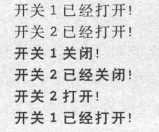

### 策略模式

#### 概念

定义：

- Define a family of algorithms, encapsulate each one, and make them interchangeable. Strategy lets the algorithm vary independently from clients that use it.

  定义一系列算法，将每个算法封装起来，并让它们可以相互替换。让算法独立于使用它的客户而变化。


- `Context` 环境类
- `Strategy` 抽象策略类
- `ConcreteStrategy` 具体策略类

扩展：区分策略模式、状态模式

1. 环境角色多种状态，可以转换就状态模式；环境角色只有一个状态(不更新)就策略模式。
2. 策略模式环境类自己选择具体策略；状态模式环境类与状态类双向关联。
3. 策略模式客户端需要知道具体策略，状态模式客户端不需关心具体状态

#### 评价

优点：

1. 完美支持开闭原则
2. 提供管理算法族方法，等级结构定义了行为族，公共代码可以移到父类
3. 提供可以替换继承的办法
4. 避免多重条件转移语句

缺点：

1. 客户端必须知道所有策略类并决定用哪个
2. 产生很多策略类和对象，可以用享元模式减少对象数目

适用：

1. 有许多类，区别仅在于行为，动态选择行为
2. 动态地在几种算法选一个，有统一接口，多态
3. 一个对象有很多行为，多重条件语句实现
4. 不希望客户端知道复杂的、与算法相关的数据结构，封装，保证保密性】安全性


#### 例子

##### 基础

对不使用策略模式时，代码如下：


违背开闭原则，违背单一职责原则(定义、使用融合)。抽象策略类符合依赖倒转原则。


策略模式相当于可插入式pluggable的算法


##### 排序


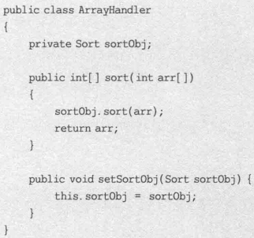


开闭原则体现：

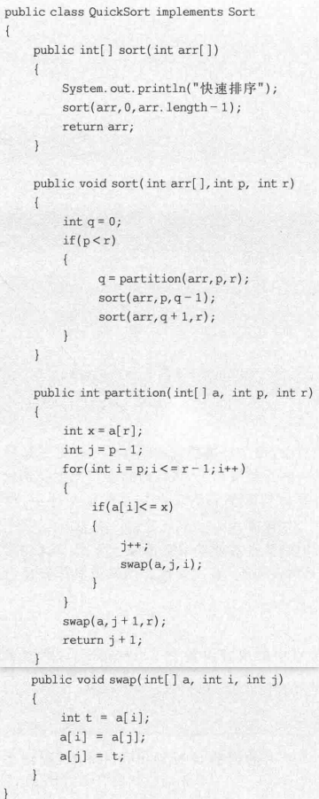


> 


##### JDK

Java SE 容器布局管理是策略模式，对容器 Container 对象的成员如按钮、文本框 GUI 布局，awt 类库运行期间动态决定布局 layout 如下：


其中 `Container` 是环境角色，`LayoutManager` 是抽象策略。


里氏代换原则满足，只需要 `setLayout` 带入具体策略即可。

> 策略模式还能处理同步、异步。


### 模板方法模式

#### 概念

定义：

- Define the skeleton of an algorithm in an operation, deferring some steps to subclasses. Template Method lets subclasses redefine certain steps of an algorithm without changing the algorithm's structure.

  定义一个操作中算法的骨架，将一些步骤延迟到子类中，使子类可以不改变一个算法的结构即可重定义该算法的某些特定步骤。


- `AbstractClass` 抽象类，定义一系列基本操作 Primitive Operations，具体或抽象的。
- `ConcreteClass` 具体子类。

模板方法的组成部分是基本方法，可以分为：

- 抽象方法 Abstract Method

- 具体方法 Concrete Method

- 钩子方法 Hook Method。抽象类/具体类声明或实现，子类可以加以扩展，父类通常给空实现作为默认实现。

  两种钩子方法：①具体步骤挂钩；②条件挂钩(`isXXX`)如果满足执行某一步骤

模板方法是体现继承优势的模式之一，而很多其他模式都是关联关系。

模板方法里子类不显式调用父类，而是父类控制子类的调用，该机制被称为好莱坞原则(Hollywood Principle)即 Don't call us, we'll call you.

#### 评价

优点：

1. 在一个类中形式化地定义算法，子类实现细节时不会改变算法的结构
2. 代码复用基本技术，提取公共行为放父类
3. 反向控制结构，父类调用子类，扩展增加新的行为，符合开闭原则

缺点：

1. 每个不同实现定义一个子类，类的个数增加，系统庞大，设计抽象；但更符合单一职责原则且内聚性提高

适用：

1. 一次性实现算法不变部分，可变部分给子类
2. 各子类公共行为提取出来集合到公共父类避免代码重复
3. 复杂算法分割，可改变的细节子类实现
4. 控制子类扩展，只在特定点调用钩子方法，进行扩展；不给扩展的定义为 final，进行控制和约束


#### 例子

##### 基本

两种钩子方法：


模式抽象类：


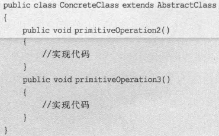


##### 基本2


> 


##### JDK

框架设计如 Spring, Struts 等，确保父类控制处理流程的逻辑顺序(如框架初始化)

JUnit 单元测试工具里，`TestCase` 类及其子类是模板方法模式的应用实例，通过 `setUp` 初始化测试环境，通过 `tearDown` 释放相关资源。


##### 钩子

数据报表：获取数据、转换数据、显示数据的例子：


不使用钩子方法(无需转换)的子类：


### 访问者模式

#### 概念

定义：

- Represent an operation to be performed on the elements of an object structure. Visitor lets you define a new operation without changing the classes of the elements on which it operates.

  表示一个作用于某对象结构中的各元素的操作，它使我们可以在不改变各元素的类的前提下定义作用于这些元素的新操作。


- `Visitor` 抽象访问者
- `ConcreteeVisitor` 具体访问者
- `Element` 抽象元素
- `ConcreteElement` 具体元素
- `ObjectStructure` 对象结构

调用具体元素类 `accept` 时调用访问者的 `visit` 方法，将当前具体元素类对象作为参数。双重分派机制使得增加新的访问者无需修改现有类库代码，只需要将其传入具体元素 `accept` 即可。

开闭原则体现：增加新的访问者方便。但增加新的具体原则不便，故存在支持开闭原则的倾斜性。

对象结构如果存在容器对象、叶子对象，可以结合组合模式设计。

#### 评价

优点：

1. 增加新的访问操作容易，加访问者类无需修改现有代码，符合开闭原则
2. 有关元素对象的访问行为集中到访问者对象，而不是分散到元素类。类的职责清晰，有利于元素对象复用，同一个对象结构可以提供多个不同访问者访问
3. 跨过类等级结构访问属于不同等级结构的元素类
4. 不修改现有类层次情况下，定义该层次新操作

缺点：

1. 增加新元素困难，违背开闭原则
2. 破坏封装，暴露元素对象内部操作、内部状态

适用：

1. 一个对象结构包含很多类型对象，希望对其实施依赖具体类型的操作
2. 对一个对象结构的对象进行很多不同不相关操作，避免让这些操作污染这些对象的类，不希望增加新操作时修改类。对象本身与访问操作分离
3. 对象结构很少改变，但常常在结构上定义新操作

#### 例子

##### 基础


##### 基础2


##### JDK

编译器设计可以用访问者模式，访问者如检查变量定义、检查变量赋值】算术运算是否合法。还有代码优化、空间分配、代码生成。

Java XML 处理技术 DOM4J，通过访问者模式读取解析 XML 文档，其中 `VisitorSupport` 是 DOM4J 提供的 `Visitor` 接口默认适配器(即有很多空方法)，具体访问者继承它，如：


如对 `Element` 和 `Attribute` 简单实现。
