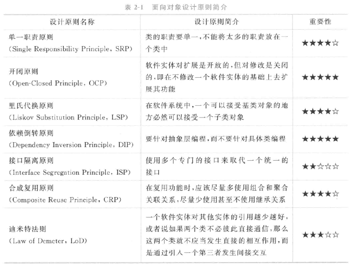
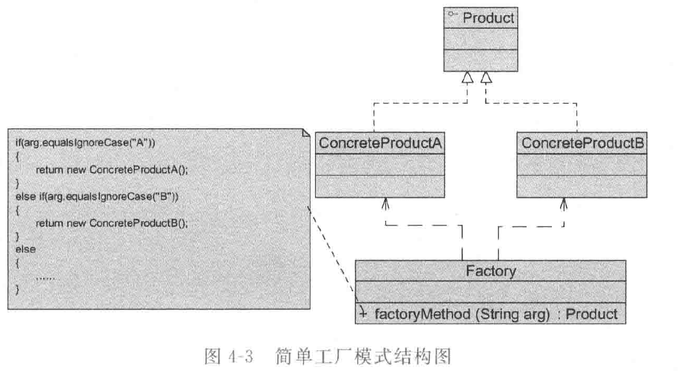

# 理论

## 基础

### 面向对象设计原则

#### 背景

可维护性 maintainability、可复用性 reuseability 是两个独立目标。

可维护同时提高可复用性面向对象设计原则的目的。

> 可维护低的软件特点：
>
> - 僵硬 rigidity。硬编码 hard coding 多，灵活性差，修改都要改源码。功能涉及模块多，系统改动大。
> - 脆弱 fragility。修改导致别的地方出错。
> - 复用率低 immobility。组成部分在同一或不同项目重复使用的能力差；甚至重用可能是简单的复制粘贴。
> - 黏度过高 viscosity。改动时不按照原始设计意图/框架比按照更容易。
>
> 好的系统设计：
>
> - 可扩展性 extensibility。新功能添加方便。
> - 灵活性 flexibility。修改时波及模块少。
> - 可插入性 pluggability。方便替换一个类为有相同接口的另一个类。
>
> 复用和可维护可能会冲突，如 A,B 依赖 C，A 需要 C 加功能，B 不允许 C 加，如果要可维护就要放弃复用 C。

重构 refactoring：不改变功能基础上，调整代码以改善质量，性能，使设计模式和架构更合理，提高扩展性维护性。

#### 概述

七大原则：

- 单一职责原则 SRP single responsibility principle
- 开闭原则 OCP open-closed principle
- 里氏代换原则 LSP Liskov substitution principle
- 依赖倒转原则 DIP dependency inversion principle
- 接口隔离原则 ISP interface segregation principle
- 合成复用原则 CRP composite reuse principle
- 迪米特法则 LoD law of demeter



> 关系：相互依赖、相互补充

#### 单一职责原则

定义：

- Every object should have a single responsibility, and that responsibility should be entirely encapsulated by the class.

  一个对象应该只包含单一的指责，并且该职责被完整地封装在一个类中。

- There should never be more than one reason for a class to change.

  就一个类而言，应该仅有一个引起它变化的原因。


最简单最难运用的原则。

类的职责越多，复用可能性越小，耦合高。职责包括：

- 数据职责。通过属性体现。
- 行为职责。通过方法体现。

将不同的变化原因(职责)封装在不同的类。如果多个职责总是同时变化，可以封装到同一个类。

例子：


#### 开闭原则

定义：

- Software entities should be open for extension, but closed for modification.

  一个软件实体应该对扩展开放，对修改关闭。

  即：模块可以在不被修改的前提下被扩展，不修改源码改变行为。

  其中，XML, properties 格式配置文件无需编译，不认为对配置文件修改时修改源代码。


最重要原则之一。

实现：抽象化设计。如接口，抽象类。具体类进行扩展，抽象类不改动。

> 可变性封装原则 EVP principle of encapsulation of variation: 找到系统可变因素并封装起来，尽量不将多种不同可变性混合在一起。
>
> 使得类个数急剧增长，增加系统复杂度。

百分百开闭很难做到，但尽可能实现。

里氏代换、依赖倒转等是开闭原则的实现方法。

例子：


#### 里氏代换原则

定义：

- If or each object o1 of type S there is an object o2 of type T such that for all programs P defined in terms of T, the behavior of P is unchanged when o1 is substituted for o2 then S is a subtype of T.

  如果对每一个类型为 S 的对象 o1，都有类型为 T 的对象 o2，使得以 T 定义的所有程序 P 在所有对象 o1 都代换 o2 时，程序 P 的行为没有变化，那么类型 S 是类型 T 的子类。

- Functions that use pointers or references to base classes must be able to use objects of derived classes without knowing it.

  所有引用基类的地方必须能透明地使用其子类的对象。

即，能用基类的地方一定能换成用子类，而不产生任何错误和异常，反过来不一定成立。

> 需要注意：
>
> 1. 子类所有方法必须父类声明，或子类必须实现父类声明的所有方法。如子类有父类没声明的方法，认为违背了里氏代换。
> 2. 父类尽量是抽象类/接口。
> 3. java 编译器会检查程序是否符合里氏代换，但只是纯语法的有限检查。

例子：


#### 依赖倒转原则

定义：

- High level modules should not depend upon low level modules, bot should depend upon abstractions. Abstractions should not depend upon details, details should depend upon abstractions.

  高层模块不应该依赖低层模块，它们都应该依赖抽象。抽象不应该依赖于细节，细节应该依赖于抽象。

- Program to an interface, not an implementation.

  要针对接口编程，不要针对实现编程。

实现面向对象设计的主要机制，抽象化的具体实现。

实现方法：抽象类使用，具体类放配置文件(细节放元数据)。

> 类的耦合关系(依赖关系)：
>
> - 零耦合关系。
> - 具体耦合关系。具体类(可实例化的类)，一个对另一个实例直接引用。
> - 抽象耦合关系。关系双方至少一个是抽象类。
>
> 依赖倒转要求客户端依赖于抽象耦合。

里氏代换原则是依赖倒转原则的基础。

依赖注入(DI dependence injection)是将一个类的对象传入另一个类，注入时尽量用父类对象，运行时子类覆盖父类。

注入方法：

1. 构造注入 constrctor injection

   

2. 设值注入 setter injection

   

3. 接口注入 interface injection

   

例子：


#### 接口隔离原则

定义：

- Clients should not be forced to depend upon interfaces that they do not use.

  客户端不应该依赖那些他不需要的接口。

- Once an interface has gotten too 'fat' it needs to be split into smaller and more specific interfaces so that any clients of the interface will only know about the methods that pertain to them.

  一旦一个接口太大，则需要将它分割成一些更细小的接口，使用该接口的客户端仅需直到与之相关的方法即可。

即使用多个专门的接口，而不是单一的总接口。每个接口承担相对独立的角色，功能不多不少。

> 接口的两种理解：
>
> - 一个类型所具有的方法特征的集合。逻辑抽象。理解为角色。
> - 语言定义的接口，有严格的定义和结构。


#### 合成复用原则

又名 CARP Composition/Aggregate Reuse Principle

定义：

- Favor composition of objects over inheritance as a reuse mechanism.

  尽量使用对象组合，而不是继承来达到复用的目的。

> 两种复用机制对比：
>
> - 继承。简单，可以覆盖父类，易于扩展。破坏封装性，基类细节对子类可见，白箱复用。基类继承的实现静态，灵活性差。有限制(如不能final类)。
> - 组合/聚合。黑箱复用。耦合度低，成员对象变化对新对象影响不大。可以动态引用，灵活。

例子：


#### 迪米特法则

定义：

- Don't talk to strangers. 不要与陌生人说话。

- Talk only to your immediate friends. 只与你的直接朋友通信。

- Each unit should have only limited knowledge about other units: only units 'closely' related to the current unit.

  每个软件单位对其他的单位都只有最少的知识，而且局限于那些与本单位密切相关的软件单位。

用于降低耦合度，类与类保持松散耦合。

> 对象的密切相关对象：
>
> - 当前对象本身
> - 参数形式传入到当前对象方法的对象
> - 当前对象的成员对象
> - 当前对象的成员对象是集合时，集合的元素
> - 当前对象所创建的对象

狭义法则：两个类若不必直接通信，不应该发生直接相互作用。如果需要调用，通过第三者转发。


根据法则，A 不允许调用 C，即不能 `a.method1().method2()`。

狭义法则缺点是增加大量的小方法散落在系统各个角落，不同模块通行效率降低，不容易协调模块。

广义法则：对对象之间的信息流量、流向、信息影响的控制，主要是对信息隐藏的控制。即：

> - 划分上，尽量创建松耦合类，使得修改对关联类影响波及不大。
> - 结构上，每个类尽量降低成员变量/函数的访问权限。
> - 设计上，只要可能就一个类设计成不变类。
> - 引用上，对其他对象的引用降到最低。

例子：


### 概述

#### 定义

> 模式是特定环境中解决问题的一种方案  A pattern is a solution to a problem in a context.
>
> GoF 四人组 Erich Gamma, Richard Helm, Ralph Johnson, John Vlissides

设计模式 design pattern 是一套被反复利用、多数人知晓的、经过分类编目的、代码设计经验的总结。

> 目的：可重用代码、更容易被理解、提高可靠性。

> 软件模式有四部分构成：问题描述、前提条件(环境/约束条件)、解法、效果。
>
> 

> - 模式名称 pattern name
> - 问题 problem。设计中存在的问题和原因，先决条件等。
> - 解决方案 solution。模式的组成部分，相互关系，职责，协作方式。类图+核心代码。
> - 效果 consequences。优缺点分析。
> - 别名、分类、实用性、角色、实例、应用、扩展。


> 模式不孤立存在，可以相互组合多个模式设计同一个系统
>
> 设计模式的优点：
>
> - 便于沟通交流，降低理解难度。
> - 重用成功的设计更容易，避开不可重用的方案。
> - 设计更灵活，易于修改。
> - 提高开发效率和软件质量，节约成本。
> - 助于理解面向对象思想，提高设计水平。

#### 分类

GoF 有 23 种设计模式。

根据目的，分为：

- 创建型 creational 主要用于创建对象
  - > 简单工厂模式 Simple Factory Pattern / 静态工厂方法 Static Factory Method
  - 工厂方法模式 factory method
  - 抽象工厂模式 abstract factory
  - 建造者模式 builder
  - 原型模式 prototype
  - 单例模式 singleton
- 结构型模式 structural 处理类或对象的组合
  - 适配器模式 adapter
  - 桥接模式 bridge
  - 组合模式 composite
  - 装饰模式 decorator
  - 外观模式 facade
  - 享元模式 flyweight
  - 代理模式 proxy
- 行为型模式 behavioral 描述对类或对象怎样交互和怎样分配职责
  - 职责链模式 chain of responsibility
  - 命令模式 command
  - 解释器模式 interpreter
  - 迭代器模式 iterator
  - 中介者模式 mediator
  - 备忘录模式 memento
  - 观察者模式 observer
  - 状态模式 state
  - 策略模式 strategy
  - 模板方法模式 template method
  - 访问者模式 visitor

根据范围，分为：

- 类模式。处理类和子类的关系。编译时确定，静态的。
- 对象模式。对象间的关系，动态。根据合成复用原则，这种模式更多。


> 简单工厂模式也是类创建型模式


#### 创建型模式

关注创建过程，将对象的创建和使用分离，使用对象时无需知道对象的创建细节。相同的创建过程可以多次复用，修改二者中的一个对另一个造成很小影响。

创建型模式简化了创建复杂对象的过程，类比想要获得苹果，手动创建需要自己种，使用创建型模式就像是直接去买。


## 创建型模式

### 简单工厂模式

#### 概念

简单工厂模式/静态工厂模式。类创建型模式。

不属于 GoF。

创建一些来自于相同父类的类的实例，专门定义一个类来创建，传入不同参数获得不同对象。




- `Factory` 工厂角色 工厂类，核心
- `Product` 抽象产品角色
- `ConcreteProduct` 具体产品角色


扩展：工厂类可以由抽象产品角色扮演，抽象产品类写静态工厂方法。


有些情况下，工厂、抽象产品、具体产品可以合并，既是工厂，又通过静态工厂方法创建自己的实例。

#### 评价

优点：

1. 责任分割，客户端不用实现创建产品对象，只消费产品。
2. 无需知道具体产品类名，只需要知道参数，减少使用者记忆量。
3. 引入配置文件，在不修改客户端代码时可以更换和增加新的产品类，提高灵活性。

缺点：

1. 工厂类若不能正常工作，整个系统受到影响。

2. 增加类的个数，增加复杂度和理解难度。

3. 扩展困难，新产品需要修改工厂逻辑。产品多逻辑复杂，不利于扩展维护。

4. 静态工厂方法，工厂角色无法继承。

   即 `Super obj = Sub(); obj.f()` 调用的一定是父类的静态方法 `f`。

适用环境：

1. 产品类别少。
2. 客户端只需要知道工厂类参数，不需要关心如何创建对象甚至类名。

#### 例子

##### 静态

支付方法选择

抽象支付方法：


具体支付方法：


工厂：


##### XML


XML 代码参考：(工厂模式)

```java
package util;

import java.io.File;

import javax.xml.parsers.DocumentBuilder;
import javax.xml.parsers.DocumentBuilderFactory;

import org.w3c.dom.Document;
import org.w3c.dom.Node;
import org.w3c.dom.NodeList;

public class XMLUtil {
    /**
     * 
     * @param path URL of a XML file
     * @return the Class of the XML described
     * @exampleXML like below
     * <?xml version="1.0"?>
       <config>
           <className>lab1_2.FileLogFactory</className>
        </config>
     * it gets FileLogFactory
     */
    public static Object getBean(String path) {
        try {
            DocumentBuilderFactory dFactory = DocumentBuilderFactory.newInstance();
            DocumentBuilder builder = dFactory.newDocumentBuilder();
            Document doc = builder.parse(new File(path));
            NodeList nl = doc.getElementsByTagName("className");
            Node classNode = nl.item(0).getFirstChild();
            String cName = classNode.getNodeValue();
            
            @SuppressWarnings("rawtypes")
            Class c = Class.forName(cName);
            Object obj = c.newInstance();
            return obj;
        } catch (Exception e) {
            e.printStackTrace();
            return null;
        }
    }
}
```

下面文件放在 `src` 的 `lab1_2` 包内。

```xml
<?xml version="1.0"?>
<config>
    <className>lab1_2.DatabaseLogFactory</className>
</config>
```

调用：

```java
package lab1_2;

import util.XMLUtil;

//客户端测试类
class lab1_2 {
    public static void main(String args[]) {
        LogFactory factory;
        Log log;
        factory = (LogFactory) XMLUtil.getBean("src/lab1_2/lab1_2.xml");
        log = factory.createLog();
        log.writeLog();
    }
}
```

##### 基本2


##### JDK

`java.text.DateFormat`，格式化本地日期或时间，对多种语言和格式很有用。

其 `getDateInstance()` 是静态工厂方法：


密钥生成的 `javax.crypto.KeyGenerator` 和 `java.security.KeyPairGenerator` 类生成对称、非对称密钥，都有 `getInstance()` 静态工厂方法，根据参数返回密钥生成器：


加密解密的密码器的创建也是简单工厂模式：


该例子工厂、抽象产品、具体产品合并。