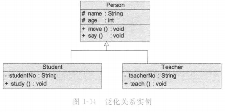

# UML

## 概念

统一建模语言 UML Unified Modeling Language 一种分析设计语言

> 特点：
>
> 1. 工程化：使得软件工程可以与其他领域一样，根据需求创建模型，再通过模型指导实施，指导开发的各个阶段。模型可以验证需求，让用户及早发现问题，减少开发风险，降低开发维护成本。
> 2. 规范化：一套标准符号，高效沟通交流。
> 3. 可视化：图形符号，促进理解交流，直观发现问题，避免和减少设计缺陷产生。
> 4. 系统化：视图和图从不同角度对同一个软件系统化建模，各有所长，相互补充，一起构造出系统完整蓝图。
> 5. 文档化。同时可以产生系统设计文档，清楚系统目标。需要修改时，可以找到 UML 文档，降低维护成本，提高修改效率，开发人员通过 UML 图形文档资料尽快熟悉项目并投入开发工作。
> 6. 智能化。大部分 UML 建模工具(Rose, Together, PowerDesigner 等)提供正向和逆向工程，将 UML 模转代码或转回去。

### 组成元素

#### 视图

UML 的五种视图 view：


1. 用户视图：以用户的观点表示系统的目标，所有视图的核心，描述系统的需求。
2. 结构视图：表示系统静态行为，描述系统静态元素，如包、类、对象，以及它们之间的关系
3. 行为视图：表示系统动态行为，描述系统组成元素(如对象)在系统运行时的交互关系。
4. 实现视图：系统的逻辑元素分布，描述系统物理文件及其之间的关系。
5. 环境视图：系统的物理元素分布，描述系统硬件设备及其之间的关系。

#### 图

UML 2.0 提供了 13 种图 diagram，与五种视图对应。

用例图、类图是使用频率最高的两种图。

1. 用例图 use case diagram / 用况图。对应用户视图

   使用用例来表示系统的功能需求，表示多个外部执行者与系统用例之间以及用例与用例之间的关系

   与用例说明文档 use case specification 是常用的需求建模工具，也称为用例建模

2. 类图 class diagram。对应结构视图

   使用类来描述系统的静态结构，包含类和它们之间的关系，描述系统内所声明的类，但没有描述运行时类的行为。

3. 对象图 object diagram。UML 2.0 新增，对应结构视图

   类图某一时刻的一个实例，表示类的对象实例之间的关系

4. 包图 package diagram。UML 2.0 新增，对应结构视图

   描述包与包之间的关系。包是一种把元素组织到一起的通用机制，如多个类组织成一个包

5. 组合结构图 composite structure diagram。UML 2.0 新增，对应结构视图

   将每一个类放到一个整体，从类的内部结构审视一个类。用于表示一个类的内部结构，描述一些包含复杂成员或内部类的类结构

6. 状态图 state diagram，对应行为视图

   描述一个特定对象的所有可能的状态及其引起状态转移的事件。包括一系列对象的状态及状态之间的转换

7. 活动图 activity diagram，对应行为视图

   表示系统中各活动的次序，应用非常广泛，既可以描述用例的工作流程，也可以描述类中某个方法的操作行为

8. 顺序图 sequence diagram / 时序图 / 序列图，对应行为视图

   用于表示对象之间的交互，重点表示对象之间发送消息的时间顺序

9. 通信图 communication diagram。UML 1.X 称协作图，对应行为视图

   展示了一组对象、这些对象间的连接以及它们之间收发的信息

   与顺序图是同构图，包含相同信息，但表达方式不同，可以相互转换

10. 定时图 timing diagram。UML 2.0 新增图，对应行为视图

    采用一种带数字刻度的时间轴精确地描述消息的顺序，而不是像顺序图那样只指定消息消息的相对顺序，还允许可视化地表示每条生命线的状态变化，当需要对实时事件进行定义时可以很好满足要求

11. 交互概览图 interaction overview diagram。UML 2.0 新增图，对应行为视图

    交互图和活动图混合物，可以理解为细化的活动图，其中的活动都通过一些小型的顺序图表示；可以理解为利用标明控制流的活动图分结果的顺序图

12. 组件图 component diagram / 构件图。对应实现视图

    描述每个功能所在的组件位置以及它们之间的关系

13. 部署图 deployment diagram / 实施图。对应环境视图

    描述软件中各个组件驻留的硬件位置以及这些硬件之间的交互关系

顺序图、通信图、定时图、交互概览图统称交互图 interactive diagram，是表示各对象如何依据某种行为进行写作的模型，通常可以使用一个交互图表示和说明一个用例的行为

#### 模型元素

model element。包括事物以及事物之间的联系。事物代表任何可以定义的东西。

每一个模型元素都有与之相对应的图形元素(如类、对象、消息、组件、节点等)，以及它们之间的关系(如关联、泛化、依赖等)。

同一个模型元素可以在不同的 UML 图使用，保持相同的含义和相同的符号。

#### 通用机制

general mechanism。

为模型元素提供额外的注释、修饰和语义。主要包括规格说明、修饰、公共分类、扩展机制四种。允许用户对 UML 进行扩展，以便一个特定的方法、过程、组织或用户来使用。

## 图

### 类图

#### 类

使用频率最高的 UML 图之一。

类 class 封装了数据和行为，是具有相同属性、操作、关系的对象集合的总称。运行时实例化成对象 Object。对象是类的实例 instance。

类使用具有类名称、属性、操作分隔的长方形表示。


- 类名。每一个单词首字母大写。

- 属性 attributes。类的性质。

  `可见性 名称:类型 [= 默认值]`

- 操作 operations。

  `可见性 名称([参数列表])[:返回类型]`

其中：

1. 名称：属性或方法的第一个单词首字母小写、之后各单词首字母大写
2. 可见性：
   - 公有 public \+
   - 私有 private \-
   - 保护 protected \#
   - 包内可见性 package \*
3. 类型：基本数据类型或自定义类型。

Java 内部类：


#### 关系

##### 关联

association。最常用关系。结构化关系。

实线表示。单向关联带箭头。`->` 形状。

表示一类对象与另一类对象有联系。

关联关系可以角色名，动词或名词(名词可为实例对象名)。可以不写。

1. 双向关联。默认。可以有两个角色名。

2. 单向关联。只有一个角色名。

   指向被关联的类(被指向的类不与指向它的类关联)

3. 自关联。

4. 多重性关联。

   重数性关联关系 multiplicity。一个类的对象与另一个类的对象的连接的个数。

   1. `1..1` `0..1` 一对一 (0表示可以不与之关联或最多关联一个)
   2. `0..*` `1..*` 一对多(0表示多可以是零个到多个；1则必须至少1个)
   3. `m..n` 多对多。与最少m个最多n个有关系，其中m<=n

5. 聚合关系 aggregation

   整体与部分的关系。带空心菱形的直线。整体指向部分。

   整体与部分不存在生命周期制约关系。弱关系。

   一般通过对象注入实现。

6. 组合关系 composition

   实心菱形直线。整体指向部分。

   整体与部分同一个生存期。整体消亡部分一起同生共死。强关系。

   一般通过构造函数实例化成员类。

###### 单向关联


###### 双向关联


###### 自关联


###### 多重性关联


###### 聚合关系


###### 组合关系


##### 依赖关系

dependency。

带箭头的虚线箭头，指向被依赖。

特定事物的改变可能会影响到使用该事物的其他事物。一个事务使用其他事物，一般是作为参数。

在分析阶段忽略这些依赖：调用另一个类的静态方法、定义另一个类的局部变量等。


##### 泛化关系

generalization。继承。is a kind of。

空心三角形箭头实现。子类/派生类指向父类/基类/超类。

在泛化中，子类不需要描述父类已有的属性和方法。




##### 接口与实现关系

realization。

空心三角形箭头+虚线。实现类指向接口。

注意接口的图形符号与类不同，左上角带一个接口符号 `o-`。

接口没有属性，所有操作都是抽象的，一般只有声明没有实现。


#### 其他

##### 注释

comment。类图或其他 UML 图形都可以用。对图中符号/元素进行附加说明，详细说明某一方法的功能或实现。


#### 例子

##### 基本

Java C/S 注册


### 顺序图

最常用系统动态建模工具，使用频率最高的交互图。

表示对象动态交互，图形化描述消息传递时间顺序。

- 需求分析阶段。描述用例对象交互，可以用自然语言。
- 系统设计阶段。一般用专业技术语言命名。

#### 要素

组成：

1. 执行者 actor。小人符号。有些交互过程不需要。

2. 生命线 lifeline。纵向虚线。

3. 对象 object。与类的不同在于名称有下划线。

4. 激活 activation。过程的执行，包括等待过程执行的时间。激活部分替代生命线，长条矩形表示。

5. 消息 message。对象间单路通信。有标记的箭头，发送者指向接收者。从上到下时间顺序排序。

   1. 有的消息对应于激活一个对象，为调用消息 call message。
   2. 否则，是发送消息 send message。
   3. 一个消息发给自身是自身消息 self call message。

   

6. 交互片段 interaction fragment。大方框，左上角标准操作类型。

   1. alt。多条路径，为真执行。
   2. opt。任选。条件为真执行。
   3. par。并行。每一片段并发执行。
   4. loop。循环，多次执行该片段。


#### 例子

##### 基本

登录。


### 状态图

statechart diagram

描述特定对象所有可能状态及其引起状态转移的事件。

只能描述一个类。多个不同类对象要活动图。

#### 要素

1. 状态 state / 中间状态。圆角矩形框。上格是状态名，下格是处于该状态时可以进行的活动 action。

2. 初始状态 inital state / 初态。黑色实心圆圈。只有一个

3. 结束状态 final state / 终止状态 / 终态。实心圆外加圆圈。可以有多个。

4. 转移 transition。一个状态到另一个的连线和箭头，指向转移后的新状态。

   文字说明引发状态变化的条件。若是特定条件转移，称为守护条件 guard condition。发生事件时的处理称为动作 action。

   可以带有标注，语法为 `事件名 [条件] / 动作名`。三部分都可以省略。

5. 子状态 / 复合状态。


#### 例子

##### 基本

信用卡。


# 理论

### RESTful API

> ds

#### 概念

##### 定义

REST（Representational State Transfer，表述性状态转移） 架构风格设计的应用程序接口（API），它是现代网络开发和系统交互中的核心概念

核心思想：将网络资源（如数据、服务）抽象为可寻址的URI（统一资源标识符），通过标准的HTTP方法（GET、POST、PUT、DELETE等）对资源进行操作。

关键原则：

- 无状态性：每次请求必须包含所有必要信息，服务器不保存客户端状态。
- 资源导向：用URI标识资源（如`/users/123`），通过HTTP方法定义操作。
- 统一接口：遵循HTTP标准（如状态码、缓存控制）。
- 可缓存性：支持客户端或中间节点缓存响应。
- 分层系统：客户端无需直接连接服务器，可通过代理、网关等中间层。

优点：简单、通用、易缓存。
缺点：

- 可能返回冗余数据（如获取用户时返回全部字段）。
- 需要多次请求关联数据（如用户+订单）。

> 2024年阿里云秋招研发岗第一批笔试 在 RESTful API 的特性方面，以下表述准确的是 解：ABCD
>
> -  A资源的状态通过请求和响应来转换
> - B支持不同的客户端类型访问相同的资源
> - C利用 URL 路径和查询参数来传递操作参数
> - D具有标准化的错误处理方式

##### 特征

[参考](https://zhuanlan.zhihu.com/p/334809573)

1. 以资源为基础 ：资源可以是一个图片、音乐、一个XML格式、HTML格式或者JSON格式等网络上的一个实体，除了一些二进制的资源外普通的文本资源更多以JSON为载体、面向用户的一组数据(通常从数据库中查询而得到)。
2. 统一接口: 对资源的操作包括获取、创建、修改和删除，这些操作正好对应HTTP协议提供的GET、POST、PUT和DELETE方法。换言而知，使用RESTful风格的接口但从接口上你可能只能定位其资源，但是无法知晓它具体进行了什么操作，需要具体了解其发生了什么操作动作要从其HTTP请求方法类型上进行判断。具体的HTTP方法和方法含义如下：
   - GET（SELECT）：从服务器取出资源（一项或多项）。
   - POST（CREATE）：在服务器新建一个资源。
   - PUT（UPDATE）：在服务器更新资源（客户端提供完整资源数据）。
   - PATCH（UPDATE）：在服务器更新资源（客户端提供需要修改的资源数据）。
   - DELETE（DELETE）：从服务器删除资源。
3. URI指向资源：URI = Universal Resource Identifier 统一资源标志符，用来标识抽象或物理资源的一个紧凑字符串。URI包括URL和URN，在这里更多时候可能代指URL(统一资源定位符)。RESTful是面向资源的，每种资源可能由一个或多个URI对应，但一个URI只指向一种资源。
4. 无状态：服务器不能保存客户端的信息， 每一次从客户端发送的请求中，要包含所有必须的状态信息，会话信息由客户端保存， 服务器端根据这些状态信息来处理请求。 当客户端可以切换到一个新状态的时候发送请求信息， 当一个或者多个请求被发送之后, 客户端就处于一个状态变迁过程中。 每一个应用的状态描述可以被客户端用来初始化下一次的状态变迁。

> Fielding在论文中提出REST架构的6个**限制条件**，也可称为RESTful 6大原则， 标准的REST约束应满足以下6个原则：
>
> **客户端-服务端（Client-Server）**: 这个更专注客户端和服务端的分离，服务端独立可更好服务于前端、安卓、IOS等客户端设备。
>
> **无状态（Stateless）**：服务端不保存客户端状态，客户端保存状态信息每次请求携带状态信息。
>
> **可缓存性（Cacheability）** ：服务端需回复是否可以缓存以让客户端甄别是否缓存提高效率。
>
> **统一接口（Uniform Interface）**：通过一定原则设计接口降低耦合，简化系统架构，这是RESTful设计的基本出发点。当然这个内容除了上述特点提到部分具体内容比较多详细了解可以参考这篇[REST论文内容](https://link.zhihu.com/?target=https%3A//www.ics.uci.edu/~fielding/pubs/dissertation/rest_arch_style.htm)。
>
> **分层系统（Layered System）**：客户端无法直接知道连接的到终端还是中间设备，分层允许你灵活的部署服务端项目。
>
> **按需代码（Code-On-Demand，可选）**：按需代码允许我们灵活的发送一些看似特殊的代码给客户端例如JavaScript代码。
>
> REST架构的一些风格和限制条件就先介绍到这里，后面就对RESTful风格API具体介绍。

##### 示例

- 获取用户信息：`GET /users/1`，如：

  > 响应：
  >
  > ```json
  > {
  >   "id": 1,
  >   "name": "Alice",
  >   "email": "alice@example.com"
  > }
  > ```

- 创建新用户：`POST /users`（附带JSON数据）

  ```json
  POST /users
  Body:
  {
    "name": "Bob",
    "email": "bob@example.com"
  }
  ```

- 删除用户：`DELETE /users/1`

- 修改用户

  ```sql
  PUT /users/1
  Body:
  {
    "name": "Alice Updated"
  }
  ```

#### 其他风格

| **维度**     | RESTful API      | GraphQL          | SOAP             | RPC (gRPC)            |
| :----------- | :--------------- | :--------------- | :--------------- | :-------------------- |
| **协议**     | HTTP             | HTTP             | HTTP/SMTP + XML  | 自定义（如 HTTP/2）   |
| **数据格式** | JSON/XML         | JSON             | XML              | 二进制（如 Protobuf） |
| **灵活性**   | 固定端点+方法    | 客户端自定义查询 | 严格契约（WSDL） | 函数调用风格          |
| **性能**     | 中等（文本传输） | 中等（解析开销） | 低（XML冗余）    | 高（二进制）          |
| **适用场景** | 通用 CRUD        | 复杂数据聚合     | 企业级高安全需求 | 微服务/内部通信       |

如何选择？

- 选 RESTful API：简单 CRUD、需要广泛兼容性（如公共 API）。
- 选 GraphQL：前端需求多变（如移动端+Web端差异大）。
- 选 SOAP：银行、政府等强安全/事务场景。
- 选 RPC：服务间高性能通信（如 Kubernetes 内部调用）。

#### 设计规范

[参考](https://zhuanlan.zhihu.com/p/334809573)

##### URI

通常一个RESTful API的path组成如下：

```text
/{version}/{resources}/{resource_id}
```

version：API版本号，有些版本号放置在头信息中也可以，通过控制版本号有利于应用迭代。
resources：资源，RESTful API推荐用小写英文单词的复数形式。
resource_id：资源的id，访问或操作该资源。

当然，有时候可能资源级别较大，其下还可细分很多子资源也可以灵活设计URL的path，例如：

```text
/{version}/{resources}/{resource_id}/{subresources}/{subresource_id}
```

此外，有时可能增删改查无法满足业务要求，可以在URL末尾加上action，例如

```text
/{version}/{resources}/{resource_id}/action
```

其中action就是对资源的操作。

从大体样式了解URL路径组成之后，对于RESTful API的URL具体设计的规范如下：

1. 不用大写字母，所有单词使用英文且小写。
2. 连字符用中杠`"-"`而不用下杠`"_"`
3. 正确使用 `"/"`表示层级关系,URL的层级不要过深，并且越靠前的层级应该相对越稳定
4. 结尾不要包含正斜杠分隔符`"/"`
5. URL中不出现动词，用请求方式表示动作
6. 资源表示用复数不要用单数
7. 不要使用文件扩展名

##### HTTP动词

```text
GET /collection：从服务器查询资源的列表（数组）
GET /collection/resource：从服务器查询单个资源
POST /collection：在服务器创建新的资源
PUT /collection/resource：更新服务器资源
DELETE /collection/resource：从服务器删除资源
```

安全性：不修改资源状态。

- GET：安全、其他：非安全
- POST：非幂等、其他：幂等

##### 返回值

状态码主要分为五大类：

> 1xx：相关信息
> 2xx：操作成功
> 3xx：重定向
> 4xx：客户端错误
> 5xx：服务器错误

每一大类有若干小类，状态码的种类比较多，而主要常用状态码罗列在下面：

200 `OK - [GET]`：服务器成功返回用户请求的数据，该操作是幂等的（Idempotent）。
201 `CREATED - [POST/PUT/PATCH]`：用户新建或修改数据成功。
202 `Accepted - [*]`：表示一个请求已经进入后台排队（异步任务）
204 `NO CONTENT - [DELETE]`：用户删除数据成功。
400 `INVALID REQUEST - [POST/PUT/PATCH]`：用户发出的请求有错误，服务器没有进行新建或修改数据的操作，该操作是幂等的。
401 `Unauthorized - [*]`：表示用户没有权限（令牌、用户名、密码错误）。
403 `Forbidden - [*]` 表示用户得到授权（与401错误相对），但是访问是被禁止的。
404 `NOT FOUND - [*]`：用户发出的请求针对的是不存在的记录，服务器没有进行操作，该操作是幂等的。
406 `Not Acceptable - [GET]`：用户请求的格式不可得（比如用户请求JSON格式，但是只有XML格式）。
410 `Gone -[GET]`：用户请求的资源被永久删除，且不会再得到的。
422 `Unprocesable entity - [POST/PUT/PATCH]` 当创建一个对象时，发生一个验证错误。
500 `INTERNAL SERVER ERROR - [*]`：服务器发生错误，用户将无法判断发出的请求是否成功。

返回结果：针对不同操作，服务器向用户返回数据，而各个团队或公司封装的返回实体类也不同，但都返回JSON格式数据给客户端。